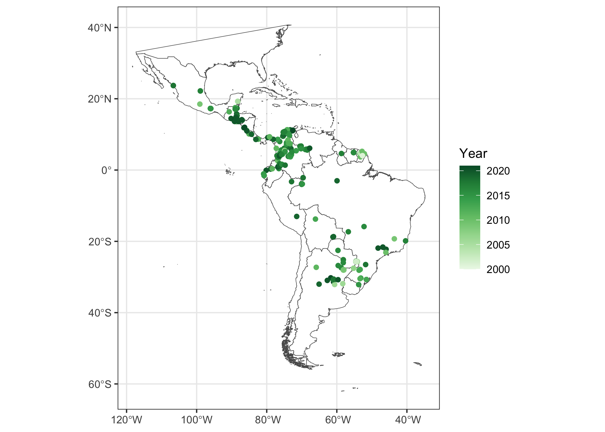

```r
# spatial libraries
library(rnaturalearth)
library(CoordinateCleaner)
library(rgbif)
library(taxize)
library(lubridate)
library(redlistr)
library(sf)
library(tidyverse)
```

# Get the data

## MDD
Neotropical Carnivores

```r
# From the AMS Database (American Mammalogical Society)
MDD <- read_csv('data/MDD_v1.4_6533species.csv')

# Function to get species taxon keys
speciesList_TAXON_KEY <- function(speciesList) {
  species_TAXON_KEY <- data.frame(sp=character(),
                                  TAXON_KEY = numeric(),
                                  stringsAsFactors=FALSE)
  for(sp in speciesList){
    TAXON_KEY <- get_gbifid_(sp) %>% bind_rows() 
    if(length(TAXON_KEY)!=0){
      KEY <- TAXON_KEY %>% 
        filter(matchtype == 'EXACT' & status == 'ACCEPTED') %>%
        pull(usagekey)
      species_TAXON_KEY_i <- data.frame(sp=sp,
                                        TAXON_KEY = ifelse(any(!is.na(KEY)), KEY, NA),
                                        stringsAsFactors=FALSE)
    } 
    else {
      species_TAXON_KEY_i <- data.frame(sp=sp,
                                        TAXON_KEY = NA,
                                        stringsAsFactors=FALSE)
    }
    species_TAXON_KEY <- rbind(species_TAXON_KEY, species_TAXON_KEY_i)
  }
  return(species_TAXON_KEY)
}

List_MDD <- MDD %>% filter(order=='CARNIVORA' & 
                             (grepl('Neotropic', biogeographicRealm) | 
                                grepl('Mexico', countryDistribution)) &
                             extinct==0 &
                             domestic==0 & 
                             family != 'OTARIIDAE' & 
                             family != 'PHOCIDAE') %>% 
  mutate(sp=str_replace(sciName, '_', ' ')) %>% pull(sp)

carnivora_sp_TAXON_KEY <- speciesList_TAXON_KEY(List_MDD)

# Save species list 
MDD %>% filter(order=='CARNIVORA' &
                 (grepl('Neotropic', biogeographicRealm) | 
                    grepl('Mexico', countryDistribution)) &
                 extinct==0 &
                 domestic==0 & 
                 family != 'OTARIIDAE' & 
                 family != 'PHOCIDAE') %>% 
  mutate(sp=str_replace(sciName, '_', ' ')) %>% 
  full_join(., carnivora_sp_TAXON_KEY, by='sp') %>% 
  select(sciName, TAXON_KEY, sp, order, family, genus, 
         specificEpithet, authoritySpeciesAuthor,
         biogeographicRealm, countryDistribution, iucnStatus) %>% 
  rename(TAXON_KEY_GBIF= TAXON_KEY) %>% 
  write_excel_csv('data/MDD_Carnivora_List.csv')
```

## GBIF


```r
# Credentials from gbif.org 
GBIF_USER <- '' # your gbif.org username 
GBIF_PWD <- '' # your gbif.org password
GBIF_EMAIL <- '' # your email 

# Use species list
speciesList_MDD <- read_csv('data/MDD_Carnivora_List.csv')

# Download and Cleaning Functions
species_GBIF_download <- function(gbif_taxon_keys){
  occ_download(pred_in('taxonKey', gbif_taxon_keys),
               pred('hasCoordinate',TRUE),
               pred('hasGeospatialIssue', FALSE),
               pred_not(pred('basisOfRecord', 'FOSSIL_SPECIMEN')),
               pred_or(
                 pred_not(pred('establishmentMeans','MANAGED')),
                 pred_not(pred_notnull('establishmentMeans'))
               ),
               pred_or(
                 pred_not(pred('establishmentMeans','INTRODUCED')),
                 pred_not(pred_notnull('establishmentMeans'))
               ),
               pred_or(
                 pred_not(pred('establishmentMeans','INVASIVE')),
                 pred_not(pred_notnull('establishmentMeans'))
               ),
               pred_or(
                 pred_not(pred('establishmentMeans','NATURALISED')),
                 pred_not(pred_notnull('establishmentMeans'))
               ),
               format='SIMPLE_CSV',
               user=GBIF_USER,pwd=GBIF_PWD,email=GBIF_EMAIL)
}
clean_GBIF_download <- function(download_toClean){
  df <- download_toClean %>% 
    filter(occurrenceStatus  == 'PRESENT') %>% 
    filter(!basisOfRecord %in% c("FOSSIL_SPECIMEN","LIVING_SPECIMEN")) %>%
    filter(!establishmentMeans %in% c("MANAGED", "INTRODUCED", "INVASIVE", "NATURALISED")) %>% 
    mutate(len_precision=nchar(word(as.character(decimalLatitude), 2, sep = fixed('.')))) %>% 
    filter(coordinatePrecision < 0.001 | len_precision>4) %>% 
    filter(coordinateUncertaintyInMeters < 25000 | (year>2000&is.na(coordinateUncertaintyInMeters))) %>% 
    filter(!coordinateUncertaintyInMeters %in% c(301,3036,999,9999)) %>% 
    filter(!decimalLatitude == 0 | !decimalLongitude == 0) %>% 
    as.data.frame() %>% 
    mutate(decimallatitude=decimalLatitude, decimallongitude=decimalLongitude) %>% 
    cc_cen(buffer = 2000, test='country', verbose=T) %>% # remove country centroids within 2km 
    cc_cap(buffer = 1000) %>% # remove capitals centroids within 2km
    cc_inst(buffer = 2000) %>% # remove zoo and herbaria within 2km 
    cc_sea() %>% 
    distinct(decimalLatitude,decimalLongitude,speciesKey,datasetKey,eventDate, .keep_all = TRUE)
  return(as_tibble(df))
}
```


```r
gbif_taxon_keys <- speciesList_MDD %>% filter(!is.na(TAXON_KEY_GBIF)) %>% 
  pull(TAXON_KEY_GBIF) 

#####################################################
### Run 07/10/2021
### Download data from GBIF
species_GBIF_download(gbif_taxon_keys)

# <<gbif download>>
# Username: ***
# E-mail: ***
# Format: SIMPLE_CSV
# Download key: 0046613-210914110416597
```


```r
# Read data
data_GBIF_toClean <- read_tsv('data/0046613-210914110416597.csv',
                              quote="",
                              guess_max = 500000)

data_GBIF_Carnivora <- clean_GBIF_download(data_GBIF_toClean)
```

```
## OGR data source with driver: ESRI Shapefile 
## Source: "/private/var/folders/_l/ypqbr8pj7wn9wkh9lpxqv0480000gn/T/RtmpAiOt92", layer: "ne_110m_land"
## with 127 features
## It has 3 fields
```

```r
write_excel_csv(data_GBIF_Carnivora, 'data/0046613-210914110416597_CLEAN.csv') 
```


```r
# Basemaps
world <- rnaturalearth::ne_countries(scale = 'large', returnclass = 'sf')
bbox_Latam_unprojected <- c(xmin=-118.40137, ymin=-55.89170, xmax=-34.80547, ymax= 32.71533)
Latam_unprojected <- world %>% st_crop(bbox_Latam_unprojected)

### Check data: yaguarundí records from 2000 onwards
data_GBIF_Carnivora %>% 
  mutate(species=ifelse(species=='Puma yagouaroundi', 'Herpailurus yagouaroundi', species)) %>% 
  filter(countryCode!='US') %>%
  filter(!is.na(year) & year>=2000) %>%
  filter(species=='Herpailurus yagouaroundi') %>% 
  as.data.frame() %>% 
  sf::st_as_sf(coords=c('decimalLongitude', 'decimalLatitude')) %>% 
  sf::st_set_crs(4326) %>% 
  ggplot() + 
  geom_sf(data = Latam_unprojected, fill='white', size=0.2) +
  geom_sf(aes(col=year)) + 
  scale_color_distiller(palette = 'Greens', direction = 1) + 
  labs(col='Year') +
  theme_bw() 
```

<!-- -->
