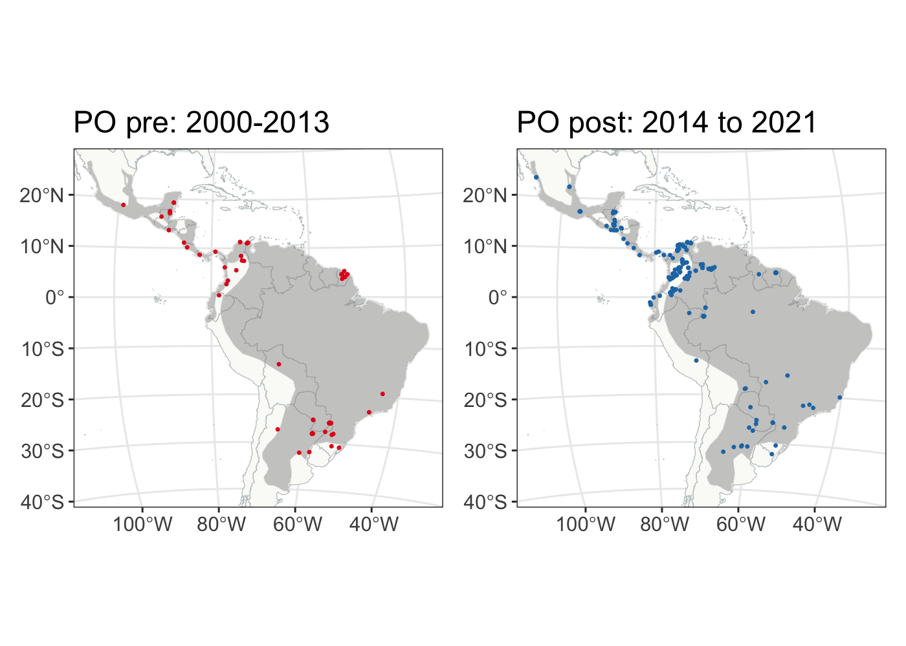

```r
library(patchwork)
library(rnaturalearth)
library(countrycode)
library(lubridate)
library(tmap)
library(leaflet)
library(terra)
library(sf)
sf::sf_use_s2(FALSE)
library(tidyverse)
```

# Basemaps


```r
# world and Latin America
world <- rnaturalearth::ne_countries(scale = 'large', returnclass = 'sf')
bbox_Latam_unprojected <- c(xmin=-118.40137, ymin=-55.89170, xmax=-34.80547, ymax= 32.71533)
Latam_unprojected <- world %>% st_crop(bbox_Latam_unprojected)

# equal area projection (Equatorial Lambert azimuthal equal-area) 
equalareaCRS <-  '+proj=laea +lon_0=-73.125 +lat_0=0 +datum=WGS84 +units=m +no_defs'
Latam_projected <-st_read('data/Latam_vector.shp')
```

```
## Reading layer `Latam_vector' from data source 
##   `/Users/flograttarola/Documents/GitHub/yaguarundi_IDM/data/Latam_vector.shp' 
##   using driver `ESRI Shapefile'
## Simple feature collection with 1 feature and 1 field
## Geometry type: MULTIPOLYGON
## Dimension:     XY
## Bounding box:  xmin: -4408686 ymin: -6083095 xmax: 4161425 ymax: 3827660
## CRS:           unknown
```

```r
Latam_countries <- sf::st_read('data/Latam_vector_countries.shp', quiet = T) %>% sf::st_transform(crs=equalareaCRS)
Latam <- st_union(st_make_valid(Latam_projected))

# raster of Latin America to use as template
# dimension of raster layers 100km^2 (100000m^2)
Latam.raster <- terra::rast('data/Latam_raster.tif')

# species list
# SOURCE: Mammal Diversty Database AMS
speciesList_MDD <- read_csv('data/MDD_Carnivora_List.csv') 

# example species selected
selectedSpecies <- c('Leopardus geoffroyi', 
                     'Herpailurus yagouaroundi', 
                     'Lontra longicaudis', 
                     'Tremarctos ornatus', 
                     'Cerdocyon thous', 
                     'Eira barbara')
```


```r
# IUCN range distribution
yaguarundi_IUCN <- sf::st_read('data/yaguarundi_IUCN.shp', quiet = T) %>% sf::st_transform(crs=equalareaCRS)

MAP.IUCN <- tm_graticules(alpha = 0.3) + 
    tm_shape(Latam_countries) +
    tm_fill(col='grey90') + 
    tm_borders(col='grey60', alpha = 0.4) + 
    tm_shape(yaguarundi_IUCN) + 
    tm_fill(col='grey20', alpha = 0.4) +
    tm_layout(legend.outside = T, frame.lwd = 0.3, scale=1.2, legend.outside.size = 0.1)

MAP.IUCN
```

<!-- -->

```r
# tmap_save(MAP.IUCN, filename='docs/figs/MAP.IUCN.svg', dpi=300, height = 7, width = 6, device = svglite::svglite)
```


# Data

## Presence/absence and abundance data

Terms standardised:  
- recordID  
- species  
- temporalSpan  
- yearEnd  
- decimalLatitude  
- decimalLongitude  
- area_ha (study area)  
- area_m2  
- countryCode  
- stateProvince  
- locality  
- presence  
- abundance  
- effort  
- effortUnit  
- dataset  


```r
pointsAndSurveys_NeotropCarnivores <- 
  read_csv('data/NEOTROPICAL_CARNIVORES_DATASET_2020-04.csv',
           guess_max = 90000) # Neotropical carnivores Data Paper

data_PA_Ab <- 
  pointsAndSurveys_NeotropCarnivores %>% 
  # filter the records to include only the Neotropical Mammals
  filter(SPECIES %in% speciesList_MDD$sp) %>% 
  # filter only the records taken with camera traps -> assumption: these will reflect presence-absece data 
  filter(METHOD=='Camera trap') %>% 
  # filter records with no coordinates
  filter(!is.na(LAT_Y)) %>%
  # filter occurrences that don't have month and year when they were recorded
  filter(!is.na(COL_END_YR)&!is.na(COL_START_MO)&!is.na(COL_END_MO)&!is.na(COL_START_YR)) %>%
  # one area has a range instead of a value, I took the mean of the range as area
  mutate(AREA_HA=ifelse(AREA_HA=='700-1000', mean(c(700, 1000)), AREA_HA)) %>% 
  # filter records with no area of study recorded / or with sampling level area and precision recorded
  filter(!is.na(AREA_HA) | (is.na(AREA_HA) & !is.na(PRECISION_m) & SAMPLING_LEVEL=='AREA')) %>% 
  mutate(area_ha=as.numeric(AREA_HA),
         area_m2=ifelse(!is.na(AREA_HA), 
                          area_ha*10000, # 1 hectare are 10000 meters / will be used for buffers
                          PRECISION_m)) %>% 
  # to have the same values as the presence-only I kept country codes
  mutate(countryCode=countrycode::countrycode(COUNTRY, 
                                              origin = 'country.name', 
                                              destination = 'iso2c')) %>% 
  # since the dataset has no day, dates were assumed to start and end the first day of the month
  mutate(date_start=lubridate::dmy(str_c('1', COL_START_MO, COL_START_YR))) %>% 
  mutate(date_end=lubridate::dmy(str_c('1', COL_END_MO, COL_END_YR))) %>% 
  # the temporal span was calculated -> there are errors in some dates, and the temporal span is negative
  mutate(temporalSpan=ifelse(date_end-date_start<0, date_start-date_end, date_end-date_start)) %>% 
  # decimal places for some records corrected
  mutate(EFFORT=ifelse(grepl('\\.', EFFORT) & (temporalSpan>=31 | temporalSpan>=30), 
                       str_remove(EFFORT, '\\.' ), EFFORT)) %>% 
  # the sampling effort was standardized to days
  mutate(samplingEffort=ifelse(grepl('hours', EFFORT_UNIT, ignore.case = T), as.numeric(EFFORT)/24, 
                               ifelse(grepl('days', EFFORT_UNIT, ignore.case = T), as.numeric(EFFORT), NA))) %>% 
  # filter those without sampling effort (no data was provided and it cannot be derived)
  filter(!is.na(samplingEffort)) %>% 
  mutate(effortUnit='days') %>% 
  # calculate the number of camera traps needed 
  mutate(numCameras=floor(samplingEffort/temporalSpan)) %>% 
  # filter unreliable values 
  mutate(temporalSpan=ifelse(numCameras==Inf & temporalSpan==0 & samplingEffort>31, NA, 
                             ifelse(numCameras==Inf & temporalSpan==0 & samplingEffort<=31, 
                                    floor(as.numeric(EFFORT)), temporalSpan))) %>% 
  filter(!is.na(temporalSpan)) %>% 
  mutate(independentLocation=str_c(LAT_Y,':',LONG_X)) %>% 
  mutate(independentYearSpan=str_c(COL_START_YR,':',COL_END_YR)) %>% 
  #mutate(yearEnd=lubridate::year(date_end)) %>% 
  dplyr::select(recordID=ID,
                date_start, date_end,
         species=SPECIES,
         temporalSpan,
         #yearEnd,
         independentLocation,
         independentYearSpan,
         decimalLatitude=LAT_Y,
         decimalLongitude=LONG_X, 
         area_ha,
         area_m2,
         countryCode,
         stateProvince=STATE,
         locality=SITE,
         presence=OCCUR,
         abundance=N_RECORDS, # not all of the records have abundance data
         effort=samplingEffort,
         effortUnit,
         dataset=DATASET)%>% 
  mutate(dataset='pointsAndSurveys_NeotropCarnivores') # in total 34,389 records

# Generate 0 (zeros) for locations where the species hasn't been recorded
# this can very probably be done in a more efficient way, but this one works!
data_PA_Ab_0 <- data_PA_Ab %>% 
  pivot_wider(names_from = species,
              values_from = c(presence, abundance, effort),
              values_fill = c(list(presence=0), 
                              list(abundance=0),
                              list(effort=0))) %>%
  pivot_longer(cols=starts_with(c('presence_', 'abundance_', 'effort_')),
               names_to=c('metric', 'species'),
               names_sep='_') %>% 
  pivot_wider(names_from = metric,
              values_from = value,
              values_fill = c(list(value=0))) %>% 
  distinct(species, independentYearSpan, independentLocation, presence, .keep_all = T) %>%
  group_by(species, independentYearSpan, independentLocation) %>% 
  mutate(presence=sum(presence, na.rm = T),
         abundance=sum(abundance, na.rm = T),
         effort=max(effort, na.rm = T)) %>% 
  distinct(species, independentYearSpan, independentLocation, .keep_all = T) %>% 
  ungroup() %>% group_by(independentLocation, independentYearSpan) %>% 
  mutate(effort=max(effort, na.rm = T)) %>% 
  ungroup()
```

## Presence-only data

Terms standardised:  
- recordID,  
- species,  
- year,  
- eventDate,  
- decimalLatitude,  
- decimalLongitude,  
- countryCode, 
- stateProvince,  
- locality,   
- dataset  


```r
# The data download and cleaning can be found in the GBIF_download.R script
occurrencePoints_GBIF <- read_csv('data/0046613-210914110416597_CLEAN.csv', 
                                  guess_max = 120000) # GBIF data (cleaned)

data_PO <- 
  occurrencePoints_GBIF %>% 
  # rename the species yaguarundi for GBIF data 
  mutate(species=ifelse(species=='Puma yagouaroundi', 'Herpailurus yagouaroundi', species)) %>% 
  # filter records from unrealistic or unwanted) locations: Japan, USA and Canada
  filter(countryCode!='JP' & countryCode!='US' & countryCode!='CA') %>%
  # filter occurrences that don't have the year when they were recorded
  filter(!is.na(year) & year<=2020) %>%
  # transform eventdate to class datetime
  mutate(eventDate=lubridate::ymd_hms(eventDate)) %>% 
  # remove duplicates according to species, date, latitude and longitude
  group_by(species, eventDate, decimalLatitude, decimalLongitude) %>% 
  slice_head(n=1) %>% ungroup() %>% 
  # select columns of interest
  dplyr::select(recordID=gbifID, 
         species, 
         year, eventDate,  
         decimalLatitude, 
         decimalLongitude,
         countryCode,
         stateProvince,
         locality) %>% 
  mutate(dataset='occurrencePoints_GBIF') 
```

## Check data for each years on example species

```r
# Presence-only
data_PO %>% filter(species == 'Herpailurus yagouaroundi') %>% filter(year>=2000) %>% 
  mutate(period=ifelse(year<=2014, 'pre2014', 'post2014')) %>%
  group_by(species, period) %>% count()
```

```
## # A tibble: 2 × 3
## # Groups:   species, period [2]
##   species                  period       n
##   <chr>                    <chr>    <int>
## 1 Herpailurus yagouaroundi post2014   234
## 2 Herpailurus yagouaroundi pre2014    193
```

```r
# Presence-absence
data_PA_Ab_0 %>% filter(species %in% selectedSpecies & presence ==1) %>% 
  mutate(period=ifelse(year(date_start)<=2014, 'pre2014', 'post2014')) %>%
  group_by(species, period) %>% count()
```

```
## # A tibble: 12 × 3
## # Groups:   species, period [12]
##    species                  period       n
##    <chr>                    <chr>    <int>
##  1 Cerdocyon thous          post2014   874
##  2 Cerdocyon thous          pre2014   1232
##  3 Eira barbara             post2014   595
##  4 Eira barbara             pre2014   1198
##  5 Herpailurus yagouaroundi post2014   215
##  6 Herpailurus yagouaroundi pre2014    399
##  7 Leopardus geoffroyi      post2014    70
##  8 Leopardus geoffroyi      pre2014     59
##  9 Lontra longicaudis       post2014    41
## 10 Lontra longicaudis       pre2014     30
## 11 Tremarctos ornatus       post2014    17
## 12 Tremarctos ornatus       pre2014      6
```

# Transform data for the model integration

## Presence-absence data
To assess the presences and absences we created a buffer area around the study location according to the area reported. Then we combined the overlapping buffers into **blobs**.

Notes from **Nagy-Reis et al. (2020)**: For data labeled as SAMPLING_LEVEL= AREA, the PRECISION_m field could be used to get a sense of the study area: Page 45: "The centroid data are identified by having "AREA" in the 'SAMPLING_LEVEL' attribute, which indicates that the exact location is unknown and its precision reflects the size of study area ('AREA_HA')." But if SAMPLING_LEVEL = UNIT, then PRECISION_m no longer informs on area size, it simply informs on the precision of the method used to collect the coordinate and I would personally not recommend using PRECISION_m in that case.


### Create **blobs**.

Blobs contain data on total effort, total temporal span, a list of the records IDs that are included for the blob and an area size of the combined areas.


```r
data_PA_Ab_0_GIS <- data_PA_Ab_0 %>% 
  filter(species == 'Herpailurus yagouaroundi') %>% 
  mutate(year=lubridate::year(date_end)) %>% 
  filter(year>=2000, year<=2021) %>% 
  as.data.frame() %>% 
  sf::st_as_sf(coords=c('decimalLongitude', 'decimalLatitude')) %>% 
  st_set_crs(4326) 

PA <- st_transform(data_PA_Ab_0_GIS, crs=equalareaCRS)

# create a blob for all sites
# blobs are definded as areas where some sampling was done over the entire period
periodStart <- ymd('2000-01-01')
periodEnd <- ymd('2014-01-01')
periodMax <- ymd('2020-12-31')

PA_allsites <- PA %>%
  mutate(start_date=as_date(ifelse(date_end-date_start<0, date_end, date_start)),
         end_date=as_date(ifelse(date_end-date_start<0, date_start, date_end))) %>%
  mutate(span=interval(date_start, date_end),
         target= interval(periodEnd, today()),
         period=ifelse(span %within% target, 'pos', 'pre')) %>% 
  distinct(independentLocation, period, .keep_all = T) 

PA_allsites_buff <- st_buffer(PA_allsites, sqrt(PA_allsites$area_m2/pi))

blobs_pre <- PA_allsites_buff %>% filter(period=='pre') %>% 
  st_union() %>% st_cast('POLYGON') %>% st_sf('ID'= 1:length(.)) 
blobs_pos <- PA_allsites_buff %>% filter(period=='pos') %>% 
  st_union() %>% st_cast('POLYGON') %>% st_sf('ID'= 1:length(.)) 


# to calculate the effort in days for each blob, we need to differenciate the two periods
PA_allsites_effort_and_time  <- PA %>%
  mutate(start_date=as_date(ifelse(date_end-date_start<0, date_end, date_start)),
         end_date=as_date(ifelse(date_end-date_start<0, date_start, date_end))) %>%
  mutate(span=interval(date_start, date_end),
         target= interval(periodEnd, today()),
         period=ifelse(span %within% target, 'pos', 'pre')) %>% 
  group_by(independentLocation, independentYearSpan, area_m2) %>%
  summarise(effort=max(effort),
            period=paste(unique(period)),
            recordIDs=paste(unique(recordID), collapse = ';'),
            maxEndDate=max(end_date),
            minStartDate=min(start_date)) %>% 
  mutate(maxTemporalSpan= maxEndDate-minStartDate)

# to calculate the effort in days for each blob, we need to differenciate the two periods
blobs_efforttime_pre <- st_join(blobs_pre, 
                            PA_allsites_effort_and_time %>% filter(period=='pre'),
                            left=TRUE)  %>% 
  group_by(ID) %>% 
  summarise(effort=sum(effort),
            temporalSpan=sum(maxTemporalSpan),
            recordIDs=paste(unique(recordIDs), collapse = ';')) %>% 
  mutate(blobArea=st_area(.)) 


blobs_efforttime_pos <- st_join(blobs_pos, 
                                PA_allsites_effort_and_time %>% filter(period=='pos'),
                                left=TRUE)  %>% 
  group_by(ID) %>% 
  summarise(effort=sum(effort),
            temporalSpan=sum(maxTemporalSpan),
            recordIDs=paste(unique(recordIDs), collapse = ';')) %>% 
  mutate(blobArea=st_area(.))
```

The data for the selected species


```r
# function  to create blobs for pre and pos 2010 for each species
calculate_PA_sp_blobs <- function(PA, blobs, sp, prepos){
  periodStart <- ymd('2000-01-01')
  periodEnd <- ymd('2014-01-01')
  df_period <- PA %>% filter(species==sp & presence==1) %>% 
    filter(date_start>=periodStart) %>% 
    mutate(span=interval(date_start, date_end),
           target= interval(periodEnd, today()),
           period=ifelse(span %within% target, 'pos', 'pre')) %>% 
    filter(period==prepos) %>% select(species, presence)
  
  df_period_blobs <- st_join(blobs, df_period,
                             left=TRUE, join = st_contains) %>%
    group_by(ID) %>% 
    summarise(presence=max(presence),
              temporalSpan=max(temporalSpan),
              effort=max(effort),
              blobArea=max(blobArea)) %>% 
    mutate(presence=ifelse(is.na(presence), 0, presence))
  return(df_period_blobs)
}

# Herpailurus yagouaroundi
PA_herpailurus_pre_blobs <- calculate_PA_sp_blobs(PA, blobs_efforttime_pre, 'Herpailurus yagouaroundi', 'pre')
PA_herpailurus_pos_blobs <- calculate_PA_sp_blobs(PA, blobs_efforttime_pos, 'Herpailurus yagouaroundi', 'pos')
```

### Quick check


```r
# quick look un how data is summarised
st_join(blobs_efforttime_pos, PA %>% filter(species=='Herpailurus yagouaroundi' & presence==1) %>% 
    mutate(span=interval(date_start, date_end),
           target= interval(ymd('2014-01-01'), today()),
           period=ifelse(span %within% target, 'pos', 'pre')) %>% 
    filter(period=='pos') %>% select(species, presence),
    left=TRUE, join = st_contains) %>%
    group_by(ID) %>% 
    summarise(presence=max(presence),
              temporalSpan=max(temporalSpan),
              effort=max(effort),
              blobArea=max(blobArea)) %>% 
    mutate(presence=ifelse(is.na(presence), 0, presence)) %>% head()
```

```
## Simple feature collection with 6 features and 5 fields
## Geometry type: POLYGON
## Dimension:     XY
## Bounding box:  xmin: 2146306 ymin: -3500274 xmax: 2316801 ymax: -3237134
## CRS:           +proj=laea +lon_0=-73.125 +lat_0=0 +datum=WGS84 +units=m +no_defs
## # A tibble: 6 × 6
##      ID presence temporalSpan effort   blobArea                                .
##   <int>    <dbl> <drtn>        <dbl>      [m^2]                    <POLYGON [m]>
## 1     1        0  224 days      2464   2398303. ((2147016 -3500112, 2147004 -35…
## 2     2        0  372 days      3752   2992037. ((2178918 -3462334, 2178899 -34…
## 3     3        0  960 days      6592  89167699. ((2179573 -3381373, 2179413 -33…
## 4     4        0 1782 days     18372   2636198. ((2159621 -3324197, 2159597 -33…
## 5     5        1  457 days      1191  15992690. ((2264845 -3282291, 2264773 -32…
## 6     6        1  670 days      1640 468832531. ((2304059 -3258568, 2303746 -32…
```

## Presence-only data


```r
# rasterisation of the presence-only data
data_PO_GIS <- data_PO %>% 
  filter(species == 'Herpailurus yagouaroundi') %>% 
  mutate(year=lubridate::year(eventDate)) %>% 
  filter(year>=2000, year<=2021) %>% 
  as.data.frame() %>% 
  sf::st_as_sf(coords=c('decimalLongitude', 'decimalLatitude')) %>% 
  st_set_crs(4326) 

PO <- st_transform(data_PO_GIS, crs=equalareaCRS)

# functions to create presence-only rasters for pre and pos 2014 fo each species
calculate_PO_sp_period_raster <- function(PO, sp, raster, prepos){
  periodStart <- 2000
  periodEnd <- 2014
  df_period <- PO %>% filter(species==sp & !is.na(year)) %>% 
    filter(year>=periodStart) %>% 
    mutate(period=ifelse(year>=periodEnd , 'pos', 'pre'),
           occurrence=1) %>% filter(period==prepos)
  df_period_raster <- terra::rasterize(x = vect(df_period),
                                       y = raster,
                                       field = 'occurrence',
                                       fun = 'length',
                                       sum = T, background=0) %>% mask(., raster)
  
  df_country_raster <- terra::rasterize(x = vect(df_period),
                                       y = raster,
                                       field = 'countryCode',
                                       fun = 'first') %>% mask(., raster)
  
  names(df_period_raster) <- 'count'
  names(df_country_raster) <- 'country'
  df_raster <- c(df_period_raster, df_country_raster)
  return(df_raster)
}

# Herpailurus yagouaroundi
PO_herpailurus_pre_raster <- calculate_PO_sp_period_raster(PO, 'Herpailurus yagouaroundi', Latam.raster, 'pre')
PO_herpailurus_pos_raster <- calculate_PO_sp_period_raster(PO, 'Herpailurus yagouaroundi', Latam.raster, 'pos')
```


## Data visualisation

### Manuscript plots


```r
# plot presence-absence data
data_PA_pre_pos <- rbind(PA_herpailurus_pre_blobs %>% mutate(period='pre'), 
                         PA_herpailurus_pos_blobs %>% mutate(period='pos'))

gg_PA_pre <- ggplot() + 
    geom_sf(data=Latam_countries, fill='#fafaf8', col='#bfc5c7', size=0.2) +
    geom_sf(data=yaguarundi_IUCN, fill='grey60', alpha=0.5, col='grey90', size=0.1) +
    geom_sf(data=data_PA_pre_pos %>% filter(period=='pre'), 
            aes(fill=factor(presence), col=factor(presence)), size=1, show.legend = F) +
    coord_sf(xlim = c(-3500000, 4100000), ylim = c(-4400000, 3000000)) + # st_bbox(yaguarundi_IUCN)
    scale_fill_manual(values = c("#474545","#E31A1C"))+
    scale_color_manual(values = c("#474545","#E31A1C")) +
    labs(title='PA', subtitle='pre: 2000-2013', col='') +
    theme_bw() +    
    theme(text=element_text(size = 14)) 

gg_PA_pos <- ggplot() + 
    geom_sf(data=Latam_countries, fill='#fafaf8', col='#bfc5c7', size=0.2) +
    geom_sf(data=yaguarundi_IUCN, fill='grey60', alpha=0.5, col='grey90', size=0.1) +
    geom_sf(data=data_PA_pre_pos %>% filter(period=='pos'), 
            aes(fill=factor(presence), col=factor(presence)), size=1, show.legend = F) +
    coord_sf(xlim = c(-3500000, 4100000), ylim = c(-4400000, 3000000)) + # st_bbox(yaguarundi_IUCN)
    scale_fill_manual(values = c("#434445","#1F78B4"))+
    scale_color_manual(values = c("#434445","#1F78B4")) +
    labs(title='', subtitle='pos: 2014 to 2021', col='') +
    theme_bw() +    
    theme(text=element_text(size = 14)) 

gg_PA_pre + gg_PA_pos
```


```r
# gg_PA <- gridExtra::grid.arrange(gg_PA_pre, gg_PA_pos, nrow=1)
# ggsave(plot = gg_PA, filename='docs/figs/presence-absence-plots.svg', device = 'svg', width=10, height=7, dpi=300)
```


```r
data_PO_pre_pos <- data_PO_GIS %>% 
  mutate(period=ifelse(year>=2014 , 'pos', 'pre'), occurrence=1) 

gg_PO_pre <- ggplot() + 
    geom_sf(data=Latam_countries, fill='#fafaf8', col='#bfc5c7', size=0.2) +
    geom_sf(data=yaguarundi_IUCN, fill='grey60', alpha=0.5, col='grey90', size=0.1) +
    geom_sf(data=data_PO_pre_pos %>% filter(period=='pre'), col="#E31A1C", size=0.5, show.legend = F) +
    coord_sf(xlim = c(-3500000, 4100000), ylim = c(-4400000, 3000000)) + # st_bbox(yaguarundi_IUCN)
    labs(title='PO pre: 2000-2013', col='') +
    theme_bw() +
    theme(text=element_text(size = 14))

gg_PO_pos <- ggplot() + 
    geom_sf(data=Latam_countries, fill='#fafaf8', col='#bfc5c7', size=0.2) +
    geom_sf(data=yaguarundi_IUCN, fill='grey60', alpha=0.5, col='grey90', size=0.1) +
    geom_sf(data=data_PO_pre_pos %>% filter(period=='pos'), col="#1F78B4", size=0.5, show.legend = F) +
    coord_sf(xlim = c(-3500000, 4100000), ylim = c(-4400000, 3000000)) + # st_bbox(yaguarundi_IUCN)
    labs(title='PO post: 2014 to 2021', col='') +
    theme_bw() +
    theme(text=element_text(size = 14))
    
gg_PO_pre + gg_PO_pos
```



```r
# gg_PO <- gridExtra::grid.arrange(gg_PO_pre, gg_PO_pos, nrow=1)
# ggsave(plot = gg_PO, filename='docs/figs/presence-only-plots.svg', device = 'svg', width=10, height=7, dpi=300)
```

### Interactive plot

Species *Herpailurus yagouaroundi*, POST period (2014-2020).
Blobs of presence/absence and presence-only records.  


```{=html}
<div id="htmlwidget-4bb39ae87c11865ba505" style="width:1400px;height:50%;" class="leaflet html-widget"></div>
<script type="application/json" data-for="htmlwidget-4bb39ae87c11865ba505">{"x":{"options":{"crs":{"crsClass":"L.CRS.EPSG3857","code":null,"proj4def":null,"projectedBounds":null,"options":{}}},"calls":[{"method":"addTiles","args":["https://{s}.tile.openstreetmap.org/{z}/{x}/{y}.png",null,"Open Street Map",{"minZoom":0,"maxZoom":18,"tileSize":256,"subdomains":"abc","errorTileUrl":"","tms":false,"noWrap":false,"zoomOffset":0,"zoomReverse":false,"opacity":1,"zIndex":1,"detectRetina":false,"attribution":"&copy; <a href=\"https://openstreetmap.org\">OpenStreetMap<\/a> contributors, <a href=\"https://creativecommons.org/licenses/by-sa/2.0/\">CC-BY-SA<\/a>"}]},{"method":"addProviderTiles","args":["OpenTopoMap",null,"Open Topo Map",{"errorTileUrl":"","noWrap":true,"detectRetina":false}]},{"method":"addProviderTiles","args":["Esri.WorldImagery",null,"Imagen",{"errorTileUrl":"","noWrap":true,"detectRetina":false}]},{"method":"addPolygons","args":[[[[{"lng":[-51.2110103208162,-51.2111112914426,-51.2112219891624,-51.2113421105918,-51.2114713265124,-51.211609282773,-51.2117556012605,-51.2119098809357,-51.2120716989325,-51.212240611717,-51.2124161563033,-51.2125978515225,-51.2127851993415,-51.2129776862286,-51.2131747845613,-51.2133759540724,-51.2135806433318,-51.2137882912578,-51.2139983286559,-51.2142101797792,-51.2144232639069,-51.214636996937,-51.2148507929873,-51.2150640660023,-51.2152762313602,-51.2154867074753,-51.2156949173935,-51.2159002903737,-51.216102263453,-51.2163002829901,-51.2164938061835,-51.2166823025597,-51.2168652554276,-51.2170421632951,-51.2172125412441,-51.2173759222595,-51.2175318585103,-51.2176799225763,-51.2178197086204,-51.2179508335007,-51.218072937821,-51.2181856869151,-51.2182887717646,-51.2183819098456,-51.2184648459025,-51.2185373526476,-51.2185992313833,-51.2186503125471,-51.218690456175,-51.2187195522852,-51.2187375211787,-51.2187443136574,-51.2187399111582,-51.2187243258035,-51.2186976003671,-51.2186598081565,-51.2186110528114,-51.2185514680189,-51.2184812171467,-51.2184004927945,-51.218309516266,-51.2182085369612,-51.2180978316932,-51.2179777039284,-51.2178484829546,-51.2177105229783,-51.2175642021534,-51.2174099215448,-51.2172481040287,-51.2170791931337,-51.2169036518251,-51.2167219612359,-51.2165346193483,-51.2163421396291,-51.2161450496224,-51.215943889504,-51.2157392106013,-51.2155315738822,-51.2153215484187,-51.2151097098269,-51.2148967539572,-51.2149147265023,-51.2149872308649,-51.2150491075522,-51.2151001870068,-51.2151403292698,-51.2151694243628,-51.2151873925898,-51.2151941847544,-51.2151897822945,-51.2151741973322,-51.2151474726403,-51.2151096815243,-51.2150609276207,-51.2150013446129,-51.2149310958635,-51.2148503739665,-51.2147594002187,-51.2146584240127,-51.2145477221529,-51.2144275980964,-51.2142983811209,-51.2141604254219,-51.2140141091416,-51.2138598333324,-51.2136980208574,-51.2135291152313,-51.213353579405,-51.2131718944965,-51.2129845584725,-51.2127920847837,-51.2125950009576,-51.2124157287254,-51.2123503477594,-51.2122593763725,-51.2121584025927,-51.2120477032178,-51.211927581698,-51.2118264479564,-51.2118272755594,-51.2118340675964,-51.2118296653299,-51.2118140808817,-51.2117873570229,-51.2117495670569,-51.2117008146171,-51.2116412333827,-51.2115709867114,-51.2114902671917,-51.2113992961137,-51.2112983228628,-51.2111876242353,-51.2110675036793,-51.210938290463,-51.2108003387715,-51.2106540267363,-51.2104997553978,-51.210337947607,-51.2101690468659,-51.2099935161118,-51.2098118364489,-51.2096245058296,-51.2094320376896,-51.2092349595414,-51.2090338115282,-51.2088291449443,-51.208621520724,-51.2084115079049,-51.2081996820685,-51.2079866237632,-51.2077729169138,-51.2075591472212,-51.207345900558,-51.2071337613629,-51.2069690160753,-51.2069944996791,-51.2070670015215,-51.2071288763172,-51.2071799545143,-51.2072200961568,-51.2072491912684,-51.2072671601529,-51.2072739536121,-51.2072695530802,-51.2072539706742,-51.2072272491597,-51.2071894618335,-51.2071407123218,-51.2070811342958,-51.2070108911045,-51.2069301753266,-51.2068392082423,-51.2067382392257,-51.2066275450616,-51.2065074291859,-51.2063782208541,-51.2062402742377,-51.2060939674543,-51.2059397015301,-51.2057778993011,-51.205609004254,-51.2054334793107,-51.2052518055593,-51.2051305347225,-51.2052422584749,-51.2054056135926,-51.2055615247922,-51.2057095647222,-51.2058493276116,-51.2059804303821,-51.2061025136978,-51.2062152429503,-51.2063183091756,-51.2064114299006,-51.2064943499174,-51.206566841982,-51.2066287074373,-51.206679776757,-51.2067199100095,-51.2067489972414,-51.206766958778,-51.2067737454413,-51.2067693386842,-51.2067537506406,-51.2067270240916,-51.2066892323477,-51.2066404790474,-51.2065808978721,-51.2065106521795,-51.2064299345551,-51.206338966284,-51.2062379967439,-51.2061273027207,-51.2060071876501,-51.2058779807852,-51.2057400362936,-51.2055937322871,-51.2054394697842,-51.2052776716115,-51.2051087812447,-51.2049332615928,-51.2047515937295,-51.2045642755748,-51.2043718205303,-51.2041747560727,-51.2039736223076,-51.2037689704904,-51.2035613615147,-51.2033513643765,-51.2031395546144,-51.2029265127328,-51.2027128226112,-51.202499069905,-51.2022858404402,-51.2020737186083,-51.2018632857659,-51.2016551186407,-51.2014497877525,-51.201247855849,-51.2010498763646,-51.2008563919035,-51.2006679327534,-51.2004850154321,-51.2003081412722,-51.2001377950476,-51.1999744436445,-51.1998185347828,-51.1996704957879,-51.1995307324208,-51.1993996277649,-51.1992775411769,-51.199164807301,-51.1990617351519,-51.1989686072675,-51.1988856789342,-51.1988131774871,-51.1987513016861,-51.1987002211709,-51.1986600759956,-51.1986309762445,-51.1986130017292,-51.19860620177,-51.1986105950597,-51.1986261696119,-51.1986528827934,-51.19869066144,-51.1987394020569,-51.1987989711015,-51.1988692053491,-51.1989499123395,-51.1990408709042,-51.1991418317719,-51.1992525182515,-51.1993726269901,-51.199501828804,-51.1996397695808,-51.1997860712497,-51.1999403328174,-51.2001021314678,-51.2002710237199,-51.2004465466441,-51.2006282191308,-51.2007494895853,-51.2006377607579,-51.200474396837,-51.2003184755854,-51.2001704243628,-51.2000306489635,-51.1998995325041,-51.1997774343735,-51.1996646892475,-51.1995616061718,-51.1994684677141,-51.19938552919,-51.1993130179622,-51.1992511328177,-51.1992000434218,-51.1991598898529,-51.1991307822183,-51.1991128003512,-51.1991059935922,-51.1991103806526,-51.1991259495633,-51.1991526577063,-51.1991904319313,-51.1992391687558,-51.1992987346475,-51.1993689663904,-51.1994496715311,-51.1995406289062,-51.1996415892477,-51.199752275866,-51.1998723854078,-51.2000015886872,-51.2001395315877,-51.2002858360327,-51.2004401010216,-51.2006019037285,-51.2007708006615,-51.2009463288781,-51.2011280072542,-51.2013153378031,-51.2015078070404,-51.2016763809829,-51.201635413689,-51.2015628981152,-51.201501008953,-51.2014499158789,-51.2014097589813,-51.2013806483767,-51.2013626639064,-51.2013558549182,-51.2013602401295,-51.2013758075763,-51.2014025146445,-51.201440288187,-51.2014890247229,-51.2015485907209,-51.2016188229647,-51.2016995289995,-51.2017904876594,-51.201891449673,-51.202002138346,-51.2021222503195,-51.202251456401,-51.2023894024664,-51.2025357104302,-51.2026899792823,-51.2028517861862,-51.2030206876385,-51.2031962206843,-51.2033779041863,-51.2035652401436,-51.2037577150571,-51.2039548013369,-51.2041559587491,-51.2043584059195,-51.2043599997643,-51.2045218080918,-51.2046907109078,-51.2047413215196,-51.2047887900973,-51.2048694990655,-51.204960460741,-51.2050614258439,-51.2051721176717,-51.2052922328567,-51.2054214421976,-51.2055593915614,-51.2057057028536,-51.2058599750549,-51.2060217853196,-51.2061906901351,-51.2063662265374,-51.2065479133799,-51.2067352526525,-51.206927730847,-51.2071248203647,-51.2073040986449,-51.2073694728514,-51.2074604368873,-51.2075614044163,-51.2076720987288,-51.2077922164505,-51.2079214283731,-51.2080593803566,-51.2082056942992,-51.2083599691744,-51.2085217821292,-51.2086906896436,-51.2088662287462,-51.2090479182829,-51.2092352602364,-51.209427741091,-51.2096248332407,-51.2098259964354,-51.2100306792621,-51.210238320657,-51.2104483514434,-51.2106601958924,-51.2108731580314,-51.2108551830155,-51.2107826668778,-51.2107207777854,-51.2106696854146,-51.2106295298521,-51.2106004212105,-51.2105824393259,-51.210575633539,-51.2105800225585,-51.2105955944098,-51.2106223064671,-51.2106600855693,-51.2107088282205,-51.2107684008725,-51.2108386402908,-51.210919354001,-51.2110103208162],"lat":[-31.4883890045054,-31.4885447423843,-31.4886947114231,-31.4888385005566,-31.4889757156571,-31.4891059806142,-31.489228938366,-31.4893442518783,-31.4894516050679,-31.4895507036698,-31.4896412760434,-31.4897230739176,-31.4897958730715,-31.489859473949,-31.4899137022059,-31.4899584091885,-31.4899934723404,-31.4900187955393,-31.4900343093606,-31.4900399712674,-31.4900357657276,-31.4900217042566,-31.4899978253858,-31.4899641945571,-31.4899209039436,-31.4898680721972,-31.4898058441231,-31.4897343902833,-31.4896539065289,-31.4895646134633,-31.4894667558373,-31.4893606018789,-31.4892464425572,-31.4891245907853,-31.4889953805621,-31.4888591660574,-31.4887163206401,-31.4885672358553,-31.4884123203509,-31.4882519987569,-31.4880867105218,-31.4879169087076,-31.4877430587481,-31.4875656371726,-31.4873851302997,-31.4872020329043,-31.4870168468611,-31.4868300797687,-31.4866422435585,-31.4864538530909,-31.4862654247443,-31.4860774749994,-31.4858905190235,-31.4857050692583,-31.4855216340154,-31.4853407160828,-31.4851628113468,-31.4849884074328,-31.4848179823687,-31.4846520032749,-31.4844909250835,-31.4843351892918,-31.4841852227523,-31.4840414365026,-31.4839042246389,-31.4837739632361,-31.4836510093171,-31.4835356998742,-31.483428350946,-31.4833292567509,-31.483238688881,-31.4831568955582,-31.4830841009535,-31.4830205045732,-31.4829662807121,-31.482921577976,-31.4828865188745,-31.4828611994856,-31.4828456891923,-31.4828400304927,-31.4828442366071,-31.4828051194149,-31.4826220251275,-31.4824368422136,-31.4822500782633,-31.4820622451992,-31.4818738578732,-31.481685432655,-31.4814974860168,-31.4813105331174,-31.48112508639,-31.480941654138,-31.4807607391411,-31.4805828372775,-31.4804084361649,-31.4802380138234,-31.480072037366,-31.4799109617174,-31.4797552283683,-31.4796052641641,-31.4794614801363,-31.4793242703748,-31.479194010949,-31.4790710588761,-31.4789557511436,-31.4788484037852,-31.478749311015,-31.4786587444215,-31.4785769522227,-31.4785041585867,-31.4784405630173,-31.4783863398068,-31.4783465002874,-31.4782120642311,-31.4780509896589,-31.4778952573094,-31.4777452940256,-31.4776015108363,-31.4774941198648,-31.4774854409949,-31.47729749724,-31.4771105471931,-31.4769251032796,-31.4767416737951,-31.4765607615118,-31.4763828623006,-31.4762084637717,-31.4760380439382,-31.4758720699062,-31.475710996594,-31.4755552654855,-31.4754053034203,-31.4752615214238,-31.4751243135805,-31.4749940559544,-31.4748711055579,-31.4747557993738,-31.4746484534317,-31.4745493619417,-31.4744587964888,-31.4743770052879,-31.4743042125045,-31.4742406176398,-31.4741863949844,-31.4741416931407,-31.4741066346162,-31.4740813154869,-31.4740658051354,-31.4740601460598,-31.4740643537582,-31.4740784166858,-31.474102296287,-31.474135927101,-31.4741792169415,-31.4742205736447,-31.4741651085424,-31.4739820207112,-31.4737968442656,-31.4736100867778,-31.4734222601528,-31.4732338792249,-31.4730454603463,-31.4728575199716,-31.4726705732426,-31.4724851325756,-31.4723017062573,-31.4721207970512,-31.4719429008198,-31.471768505165,-31.4715980880923,-31.4714321167,-31.4712710458991,-31.4711153171669,-31.4709653573363,-31.4708215774266,-31.4706843715167,-31.4705541156651,-31.4704311668796,-31.4703158621383,-31.470208517467,-31.4701094270724,-31.4700188625362,-31.4699370720712,-31.4698899476043,-31.4698052110927,-31.4696690049979,-31.469526168432,-31.4693770929158,-31.4692221870716,-31.469061875503,-31.4688965976311,-31.4687268064895,-31.4685529674826,-31.4683755571096,-31.4681950616587,-31.4680119758732,-31.4678268015961,-31.4676400463939,-31.4674522221651,-31.4672638437374,-31.4670754274563,-31.4668874897692,-31.4667005458106,-31.4665151079891,-31.4663316845837,-31.4661507783498,-31.4659728851417,-31.4657984925534,-31.4656280785816,-31.4654621103162,-31.4653010426597,-31.4651453170808,-31.4649953604037,-31.464851583639,-31.4647143808571,-31.4645841281078,-31.4644611823905,-31.464345880675,-31.4642385389786,-31.4641394514999,-31.4640488898127,-31.4639671021219,-31.4638943125831,-31.4638307206888,-31.4637765007213,-31.4637318012759,-31.4636967448531,-31.4636714275236,-31.4636559186647,-31.4636502607707,-31.4636544693363,-31.4636685328143,-31.4636924126477,-31.463726043375,-31.4637693328102,-31.463822162295,-31.4638843870249,-31.463955836445,-31.4640363147187,-31.4641256012636,-31.4642234513563,-31.4643295968034,-31.4644437466761,-31.4645655881077,-31.4646947871513,-31.4648309896945,-31.4649738224302,-31.4651228938796,-31.4652777954647,-31.4654381026288,-31.465603375999,-31.465773162591,-31.4659469970503,-31.4661244029273,-31.4663048939835,-31.4664879755233,-31.4666731457505,-31.4668598971429,-31.4670477178437,-31.4672360930638,-31.4674245064931,-31.4676124417151,-31.4677993836225,-31.4679848198292,-31.4681682420738,-31.4683491476136,-31.4685270406019,-31.4687014334474,-31.4688718481502,-31.4690378176126,-31.4691988869188,-31.4693546145823,-31.4695045737559,-31.4696483534016,-31.4697855594175,-31.4699158157183,-31.4700387652659,-31.4701540710483,-31.4702614170037,-31.4703605088869,-31.4704510750758,-31.4705328673162,-31.4705799929913,-31.4706647276246,-31.4708009307378,-31.4709437642051,-31.4710928365456,-31.4712477391791,-31.4714080475458,-31.4715733222696,-31.4717431103625,-31.4719169464659,-31.4720943541257,-31.4722748470983,-31.4724579306832,-31.4726431030783,-31.4728298567557,-31.4730176798522,-31.4732060575722,-31.4733944735986,-31.4735824115079,-31.4737693561856,-31.4739547952377,-31.4741382203952,-31.4743191289074,-31.4744970249194,-31.4746714208315,-31.4748418386356,-31.4750078112253,-31.4751688836765,-31.4753246144939,-31.4754745768216,-31.475618359613,-31.4757555687577,-31.4758858281616,-31.4760087807783,-31.4761240895872,-31.4762314385185,-31.4763305333184,-31.4764211023571,-31.4765028973726,-31.4765756941517,-31.4766392931448,-31.4766856764492,-31.4767748265849,-31.4769579126215,-31.4771430875179,-31.4773298437392,-31.4775176694153,-31.4777060497436,-31.4778944683998,-31.4780824089532,-31.4782693562819,-31.4784547979848,-31.4786382257857,-31.4788191369264,-31.478997035545,-31.4791714340347,-31.4793418543801,-31.4795078294681,-31.4796689043675,-31.4798246375764,-31.4799746022324,-31.4801183872825,-31.4802555986099,-31.4803858601149,-31.4805088147449,-31.4806241254742,-31.4807314762273,-31.4808305727459,-31.4809211433951,-31.4810029399085,-31.481075738069,-31.4811393383232,-31.4811935663286,-31.481238273432,-31.4812729550557,-31.4812741463888,-31.4813814971026,-31.4814805935245,-31.481506707102,-31.4816218871931,-31.4817878636991,-31.4819489399227,-31.4821046743584,-31.4822546401403,-31.4823984262125,-31.4825356384553,-31.4826659007663,-31.482788856091,-31.4829041674017,-31.4830115186212,-31.48311061549,-31.4832011863722,-31.4832829830009,-31.4833557811585,-31.4834193812916,-31.4834736090581,-31.4835134525945,-31.4836478905674,-31.4838089678677,-31.4839647033034,-31.4841146700061,-31.484258456917,-31.4843956699145,-31.484525932894,-31.4846488887991,-31.4847642006005,-31.4848715522198,-31.4849706493961,-31.485061220493,-31.4851430172428,-31.4852158154277,-31.4852794154941,-31.4853336431002,-31.485378349594,-31.4854134124205,-31.4854387354583,-31.4854542492831,-31.4854599113581,-31.4854557084257,-31.4854948253338,-31.4856779184828,-31.4858631004756,-31.4860498637579,-31.4862376964402,-31.4864260837006,-31.4866145091959,-31.4868024564767,-31.4869894104027,-31.4871748585545,-31.4873582926383,-31.4875392098788,-31.4877171143972,-31.4878915185706,-31.4880619443681,-31.4882279246615,-31.4883890045054]}]],[[{"lng":[-50.9473779863601,-50.947557169365,-50.9477451042762,-50.9479412759748,-50.9481451467578,-50.9483561578119,-50.9485737307454,-50.948797269174,-50.9490261603551,-50.9492597768689,-50.9494974783373,-50.9497386131807,-50.949982520404,-50.9502285314094,-50.9504759718292,-50.9507241633754,-50.9509724256994,-50.9512200782577,-50.9514664421778,-50.9517108421202,-50.9519526081296,-50.9521910774727,-50.9524255964549,-50.9526555222132,-50.9528802244785,-50.9530990873042,-50.9533115107548,-50.9535169125507,-50.953714729665,-50.9539044198668,-50.9540854632077,-50.9542573634475,-50.9544196494141,-50.9545718762953,-50.9547136268579,-50.9548445125911,-50.9549641747713,-50.9550722854449,-50.9551685483271,-50.9552526996134,-50.9553245087022,-50.9553837788261,-50.9554303475912,-50.9554640874209,-50.9554849059052,-50.955492746053,-50.9554875864479,-50.9554694413057,-50.9554383604349,-50.9553944290994,-50.9553377677837,-50.9552685318622,-50.9551869111721,-50.9550931294931,-50.9549874439327,-50.9548701442209,-50.9547415519159,-50.9546020195219,-50.9544519295222,-50.9542916933313,-50.9542551923523,-50.9542243589222,-50.9541676976689,-50.9540984620018,-50.9540168417578,-50.9539230607149,-50.9538173759791,-50.9537000772782,-50.9535714861674,-50.9534319551478,-50.9532818666989,-50.9531216322309,-50.9529516909558,-50.9527725086839,-50.9526325921137,-50.9525684011976,-50.9524867819426,-50.9523930020528,-50.9522873186307,-50.9521700214007,-50.9520414319139,-50.9519019026668,-50.9517518161344,-50.9515915837212,-50.9514216446339,-50.9512424646767,-50.9510545349749,-50.9508583706284,-50.9506545093,-50.9504435097418,-50.9502259502638,-50.9500024271493,-50.9497735530207,-50.9495399551607,-50.9493022737937,-50.9490611603312,-50.9488172755873,-50.9485712879681,-50.94832387164,-50.948075704683,-50.9478274672327,-50.9475798396169,-50.9473335004919,-50.9470891249828,-50.9470424823725,-50.9469425727558,-50.9467546464815,-50.9465584852568,-50.946354626736,-50.9461436296635,-50.9459260723426,-50.9457025510505,-50.9454736784047,-50.9452400816839,-50.9452368131133,-50.9451085089714,-50.9449046517072,-50.9446936558229,-50.9444760996184,-50.944252579368,-50.9440237076863,-50.9437901118492,-50.9435524320756,-50.9433171453152,-50.9431347044074,-50.9429385464463,-50.9427570828487,-50.942753057508,-50.9426473855658,-50.942530099632,-50.9424015212268,-50.9422620028164,-50.942111926846,-50.9419517046912,-50.9417817755306,-50.9416026051411,-50.9414146846219,-50.9412185290477,-50.9410146760573,-50.94080368438,-50.9405861323041,-50.9403626160927,-50.9401337483492,-50.9400987364648,-50.9400983815722,-50.9400167767043,-50.9399230112156,-50.9398173421693,-50.9397000592502,-50.9395714839704,-50.9394319687874,-50.9392818961375,-50.9391216773874,-50.9389517517061,-50.9387725848613,-50.9385846679422,-50.9385223999868,-50.938518082536,-50.9384741659614,-50.9384175201276,-50.9383483003663,-50.9382666964707,-50.9381729321742,-50.9380672645366,-50.937949983239,-50.9378214097889,-50.9376818966388,-50.9375318262196,-50.9373716098916,-50.9372016868175,-50.9370225227575,-50.9368346087935,-50.9366384599821,-50.9364346139437,-50.9362236293884,-50.9360060845852,-50.9357825757772,-50.9355537155475,-50.9353201311409,-50.9350824627447,-50.9348413617351,-50.9345974888921,-50.9343515125891,-50.9341041069616,-50.9338559500602,-50.9336077219931,-50.9333601030624,-50.9331137719004,-50.9328694036105,-50.9326276679176,-50.9323892273326,-50.9321547353382,-50.9319248345977,-50.9317001551947,-50.9314813129064,-50.9312689075166,-50.9310635211722,-50.9308657167878,-50.9306760365035,-50.9304950001993,-50.9303231040698,-50.930160819265,-50.9300085905985,-50.9298668353286,-50.9297359420141,-50.9296162694496,-50.9295081456813,-50.929411867108,-50.9293276976677,-50.9292558681143,-50.9291965753839,-50.929149982055,-50.9291162159017,-50.9290953695431,-50.9290875001888,-50.9290926294807,-50.9291107434336,-50.9291417924723,-50.9291856915668,-50.9292423204645,-50.9293115240192,-50.9293931126153,-50.9294868626869,-50.9295925173301,-50.9297097870063,-50.9298383503351,-50.9299778549751,-50.9301279185886,-50.9302881298897,-50.930458049771,-50.930637212507,-50.9308251270307,-50.9308873947242,-50.9308917096837,-50.9309356090755,-50.9309922384966,-50.9310614427994,-50.9311430323663,-50.9312367836288,-50.9313424396796,-50.9314597109762,-50.931588276134,-50.9316769962449,-50.9316363853616,-50.9315897860504,-50.9315560144519,-50.9315351632003,-50.9315272895184,-50.9315324150603,-50.9315505258508,-50.9315815723235,-50.9316254694555,-50.9316820969997,-50.9317512998133,-50.9318328882829,-50.9319266388432,-50.9320322945887,-50.9321495659778,-50.9322781316256,-50.9324176391841,-50.9325677063078,-50.9327279217012,-50.9328978462456,-50.9330770142028,-50.9332649344913,-50.9334610920324,-50.9336649491619,-50.9337714261656,-50.9338220240843,-50.933891228261,-50.93397281829,-50.9340665706014,-50.9341722282853,-50.9342895017945,-50.9344180697385,-50.9345575797628,-50.9347076495154,-50.9348678676933,-50.9350377951703,-50.9352169662003,-50.9354048896932,-50.9356010505615,-50.935804911132,-50.9360159126194,-50.9362334766581,-50.9364570068882,-50.9366858905898,-50.9369195003633,-50.9371571958494,-50.9373983254848,-50.9376422282887,-50.9378882356753,-50.938135673287,-50.9383838628435,-50.9386321240016,-50.9388797762209,-50.9391261406301,-50.9393705418882,-50.9396123100363,-50.9398507823353,-50.9400853050825,-50.9403152354045,-50.9405399430198,-50.940758811967,-50.940971242294,-50.9410550433572,-50.9411451157838,-50.9413561189524,-50.9415736841068,-50.9417972148839,-50.9420260985625,-50.9422597077428,-50.9424974020673,-50.9427385299757,-50.9429824304922,-50.9432284350371,-50.9434758692606,-50.9437240548916,-50.9439723115979,-50.9442199588512,-50.9444663177938,-50.9446921504921,-50.9448072675049,-50.9449951977575,-50.9450241101442,-50.9450613623426,-50.945142967283,-50.9452367340977,-50.9453424058368,-50.9454596929149,-50.9455882739039,-50.945727796414,-50.9458778780585,-50.9460381075021,-50.9460746073546,-50.9461054283897,-50.9461620727621,-50.9462312924708,-50.9463128978558,-50.9464066653056,-50.9465123378683,-50.9466296259564,-50.946758208139,-50.9468977320229,-50.9470478152179,-50.9472080463842,-50.9473779863601],"lat":[-31.1261824330298,-31.1263165125376,-31.1264413373117,-31.1265565651928,-31.1266618803249,-31.1267569940215,-31.1268416455576,-31.1269156028839,-31.1269786632637,-31.1270306538284,-31.1270714320519,-31.1271008861414,-31.1271189353442,-31.1271255301688,-31.1271206525214,-31.1271043157553,-31.1270765646347,-31.1270374752118,-31.1269871546189,-31.1269257407745,-31.1268534020056,-31.1267703365864,-31.1266767721945,-31.1265729652872,-31.1264592003985,-31.1263357893589,-31.1262030704407,-31.1260614074311,-31.1259111886341,-31.1257528258067,-31.1255867530301,-31.1254134255191,-31.1252333183749,-31.125046925282,-31.1248547571554,-31.1246573407393,-31.1244552171636,-31.1242489404602,-31.1240390760441,-31.1238261991634,-31.1236108933224,-31.1233937486821,-31.1231753604419,-31.1229563272086,-31.122737249355,-31.1225187273741,-31.1223013602335,-31.1220857437328,-31.1218724688711,-31.1216621202267,-31.1214552743545,-31.1212524982062,-31.1210543475761,-31.1208613655773,-31.1206740811537,-31.1204930076301,-31.120318641305,-31.1201514600908,-31.1199919222039,-31.1198404649087,-31.1198097591359,-31.1196621263756,-31.1194552818814,-31.1192525070905,-31.1190543577933,-31.1188613770994,-31.1186740939492,-31.1184930216639,-31.1183186565385,-31.1181514764824,-31.1179919397086,-31.1178404834786,-31.1176975229039,-31.1175634498084,-31.1174705219776,-31.1172825211366,-31.1170843732021,-31.1168913938287,-31.1167041119531,-31.116523040893,-31.1163486769402,-31.1161814980007,-31.1160219622845,-31.1158705070503,-31.1157275474067,-31.1155934751753,-31.1154686578163,-31.1153534374218,-31.1152481297788,-31.1151530235032,-31.1150683792496,-31.1149944289968,-31.1149313754125,-31.1148793912977,-31.1148386191138,-31.1148091705918,-31.114791126427,-31.1147845360574,-31.114789417529,-31.1148057574459,-31.1148335110076,-31.1148726021322,-31.1149229236643,-31.1149843376694,-31.1149982948786,-31.1149235351829,-31.1147987171308,-31.1146834958808,-31.1145781872219,-31.1144830797732,-31.1143984341921,-31.1143244824614,-31.1142614272526,-31.1142094413712,-31.1142088806489,-31.1141335167328,-31.1140282079207,-31.1139331002618,-31.1138484544147,-31.1137745023623,-31.1137114467773,-31.1136594604663,-31.1136186858965,-31.1135899463784,-31.1134687693039,-31.1133535477883,-31.1132598060544,-31.1132515218517,-31.1130642426995,-31.1128831740045,-31.1127088120521,-31.1125416347426,-31.1123821002817,-31.1122306459245,-31.1120876867775,-31.1119536146606,-31.1118287970338,-31.1117135759902,-31.1116082673182,-31.1115131596367,-31.1114285136042,-31.1113545612043,-31.1112915051105,-31.1112837130609,-31.111282673474,-31.1110845307207,-31.1108915560967,-31.1107042785258,-31.1105232113139,-31.1103488507422,-31.1101816747075,-31.1100221414118,-31.1098706881072,-31.109727729897,-31.1095936585989,-31.1094688416704,-31.1094322652239,-31.1094026274974,-31.1091922899152,-31.1089854546403,-31.108782688595,-31.108584547546,-31.1083915745803,-31.1082042986169,-31.1080232329574,-31.1078488738788,-31.1076816992738,-31.1075221673405,-31.1073707153272,-31.1072277583337,-31.1070936881743,-31.1069688723036,-31.1068536528097,-31.1067483454769,-31.1066532389204,-31.1065685937956,-31.1064946420837,-31.1064315864562,-31.1063795997199,-31.1063388243432,-31.1063093720661,-31.106291323594,-31.1062847283768,-31.1062896044736,-31.1063059385034,-31.1063336856819,-31.1063727699444,-31.1064230841545,-31.1064844903977,-31.1065568203598,-31.1066398757878,-31.1067334290337,-31.1068372236784,-31.1069509752343,-31.1070743719252,-31.1072070755407,-31.1073487223629,-31.1074989241635,-31.1076572692675,-31.1078233236814,-31.1079966322828,-31.1081767200671,-31.1083630934498,-31.1085552416186,-31.1087526379336,-31.1089547413705,-31.1091609980028,-31.1093708425205,-31.1095836997788,-31.1097989863742,-31.1100161122436,-31.1102344822815,-31.1104534979704,-31.1106725590214,-31.1108910650195,-31.1111084170687,-31.1113240194338,-31.1115372811728,-31.1117476177569,-31.1119544526722,-31.112157219,-31.1123553609708,-31.1125483354875,-31.1127356136138,-31.1129166820247,-31.1130910444128,-31.1132582228495,-31.1134177590944,-31.1135692158521,-31.1137121779708,-31.11384625358,-31.1139710751655,-31.1140076531789,-31.1140372909502,-31.1142476293489,-31.1144544660471,-31.1146572341211,-31.1148553777967,-31.115048353972,-31.1152356337064,-31.1154167036702,-31.115591067552,-31.1156973866093,-31.1158460867753,-31.1160644604376,-31.1162834798107,-31.1165025445959,-31.1167210543677,-31.1169384102198,-31.1171540164067,-31.1173672819758,-31.1175776223879,-31.1177844611184,-31.1179872312385,-31.118185376968,-31.1183783551994,-31.1185656369867,-31.1187467089944,-31.1189210749054,-31.1190882567814,-31.1192477963727,-31.1193992563747,-31.1195422216264,-31.1196763002491,-31.1198011247202,-31.1199163528809,-31.1200216688746,-31.1200696673415,-31.120254480037,-31.1204572519525,-31.1206553994207,-31.1208483793294,-31.1210356627277,-31.1212167362759,-31.1213911036527,-31.1215582869157,-31.1217178278113,-31.1218692890314,-31.1220122554119,-31.1221463350706,-31.1222711604822,-31.1223863894855,-31.1224917062215,-31.1225868219993,-31.1226714760881,-31.1227454364318,-31.1228085002852,-31.1228604947703,-31.1229012773503,-31.1229307362204,-31.1229487906146,-31.1229553910275,-31.1229505193497,-31.1229341889184,-31.1229064444801,-31.1228673620688,-31.1228170487977,-31.1227556425651,-31.1226833116772,-31.1226002543864,-31.1225066983483,-31.1224028999971,-31.1222891438434,-31.1221657416937,-31.122033031796,-31.1219752412071,-31.122021772249,-31.1221168858239,-31.1222015375349,-31.1222754953323,-31.1223385564779,-31.1223905481012,-31.1224313276732,-31.1224607833973,-31.1224788345163,-31.1224854315335,-31.1224805563491,-31.1224642223097,-31.1224364741719,-31.1223973879797,-31.1223470708567,-31.1222903250191,-31.1223764660084,-31.122501289114,-31.1225182719588,-31.1226274005222,-31.1228255507445,-31.1230185329925,-31.1232058183088,-31.1233868933485,-31.1235612617862,-31.1237284456766,-31.1238879867645,-31.124039447741,-31.1240701543877,-31.1242177874555,-31.1244246329715,-31.124627409406,-31.1248255609615,-31.1250185445148,-31.1252058311048,-31.1253869073832,-31.1255612770211,-31.1257284620699,-31.1258880042713,-31.1260394663134,-31.1261824330298]}]],[[{"lng":[-51.0741536799175,-51.0760253602616,-51.0778271517414,-51.0795541135128,-51.0812015104323,-51.0827648260539,-51.0842397750193,-51.0856223148086,-51.0869086568178,-51.0880952767341,-51.0891789241795,-51.0901566315968,-51.0910257223548,-51.0917838180493,-51.0924288449814,-51.0929590397954,-51.0933729542613,-51.0936694591892,-51.0938477474664,-51.0939073362083,-51.0938480680179,-51.0936701113532,-51.0933739599988,-51.0929604316469,-51.092430665591,-51.0917861195389,-51.0910285655558,-51.0901600851474,-51.0891830634995,-51.0881001828884,-51.0869144152813,-51.0856290141487,-51.0842475055097,-51.082773678237,-51.0812115736471,-51.0795654744051,-51.0778398927753,-51.0760395582486,-51.0741694045817,-51.0722345562834,-51.0702403145843,-51.068192142929,-51.0660956520305,-51.063956584526,-51.0617807992772,-51.0595742553575,-51.059159305163,-51.058205564013,-51.0575026123345,-51.0555678677845,-51.0535737207501,-51.0515256344184,-51.0494292192703,-51.0472902177372,-51.0451144885019,-51.042907990486,-51.0406767665669,-51.0384269270698,-51.036164633077,-51.0338960796022,-51.0316274786734,-51.0293650423706,-51.0271149658651,-51.0248834105039,-51.0226764869876,-51.0205002386849,-51.0183606251302,-51.0162635057479,-51.0142146238484,-51.0122195909375,-51.0113710051738,-51.0112648677785,-51.0092158650785,-51.0072207079581,-51.0052848611248,-51.0034136272225,-51.0016121323336,-50.9998853119601,-50.9982378975211,-50.9966744034022,-50.9951991145937,-50.9938160749511,-50.9925290761088,-50.9913416470788,-50.9902570445621,-50.9892782440005,-50.9884079313924,-50.9876484958957,-50.9870020232394,-50.9864702899611,-50.9860547584873,-50.9857565730703,-50.9855765565942,-50.9855152082579,-50.9855727021438,-50.9855814537762,-50.9848338465044,-50.9839630880297,-50.983203219886,-50.982556328992,-50.9820241930359,-50.9816082755527,-50.9813097218578,-50.9811293558502,-50.9810676776926,-50.9811248623774,-50.9813007591818,-50.9815948920152,-50.9820064606576,-50.9825343428881,-50.9831770974959,-50.9839329681684,-50.9847998882458,-50.9857754863289,-50.9868570927269,-50.9880417467269,-50.9893262046659,-50.9907069487845,-50.9921801968374,-50.9937419124349,-50.9953878160883,-50.9971133969273,-50.9989139250598,-51.0007844645376,-51.0027198868949,-51.0047148852207,-51.0067639887274,-51.0088615777743,-51.0110018993063,-51.0131790826625,-51.0153871557142,-51.0176200612838,-51.0198716738028,-51.0221358161599,-51.0244062766932,-51.0266768262801,-51.0289412354759,-51.0311932916546,-51.0334268161036,-51.0356356810245,-51.037813826394,-51.0399552766355,-51.0420541570579,-51.0441047100139,-51.0461013107331,-51.0480384827875,-51.0499109131439,-51.0517134667637,-51.0534412007092,-51.0550893777158,-51.0566534791956,-51.0581292176329,-51.0595125483415,-51.0596848084351,-51.0617550111207,-51.0639325209895,-51.0660733119229,-51.0681715110437,-51.0702213625785,-51.0722172436863,-51.0741536799175],"lat":[-30.3857830965846,-30.3844781790542,-30.3830947226882,-30.3816365209067,-30.3801075721485,-30.3785120688942,-30.3768543861555,-30.3751390694638,-30.3733708223892,-30.3715544936272,-30.3696950636856,-30.3677976312107,-30.3658673989898,-30.3639096596676,-30.3619297812181,-30.3599331922094,-30.3579253669044,-30.3559118102372,-30.3538980427062,-30.3518895852272,-30.3498919439863,-30.3479105953352,-30.3459509707706,-30.3440184420389,-30.342118306406,-30.3402557721347,-30.3384359442079,-30.3366638103368,-30.3349442272939,-30.3332819076064,-30.3316814066475,-30.3301471101608,-30.3286832222512,-30.3272937538763,-30.3259825118686,-30.3247530885182,-30.3236088517464,-30.3225529358938,-30.321588233151,-30.3207173856529,-30.3199427782593,-30.3192665320408,-30.3186904984877,-30.3182162544576,-30.3178450978756,-30.3175780441978,-30.3175478766342,-30.3172329587138,-30.3168703154295,-30.3159994387274,-30.3152247965119,-30.3145485099484,-30.3139724306374,-30.3134981355613,-30.3131269227843,-30.3128598079156,-30.3126975213461,-30.3126405062657,-30.3126889174662,-30.3128426209332,-30.3131011942281,-30.3134639276582,-30.3139298262331,-30.3144976123995,-30.3151657295496,-30.3159323462909,-30.3167953614681,-30.3177524099207,-30.3188008689627,-30.3199378655655,-30.3204737584175,-30.3205221901874,-30.3215706125209,-30.322707573113,-30.3239299565581,-30.3252344135021,-30.3266173698106,-30.3280750363511,-30.3296034193631,-30.3311983313871,-30.3328554027232,-30.3345700933881,-30.3363377055375,-30.3381533963206,-30.3400121911321,-30.3419089972238,-30.3438386176411,-30.3457957654448,-30.3477750781802,-30.3497711325536,-30.351778459277,-30.3537915580395,-30.3558049125656,-30.3578130057183,-30.3598103346066,-30.3599087360701,-30.3613568477085,-30.3632864990759,-30.3652436836393,-30.3672230388445,-30.369219141283,-30.3712265215359,-30.3732396791471,-30.3752530976805,-30.3772612598246,-30.3792586625002,-30.3812398319314,-30.3831993386378,-30.3851318123084,-30.3870319565148,-30.3888945632243,-30.3907145270737,-30.3924868593635,-30.3942067017345,-30.3958693394907,-30.3974702145292,-30.399004937844,-30.4004693015685,-30.4018592905228,-30.4031710932352,-30.4044011124071,-30.4055459747915,-30.4066025404594,-30.4075679114278,-30.4084394396242,-30.4092147341679,-30.4098916679461,-30.4104683834668,-30.4109432979728,-30.4113151078022,-30.4115827919833,-30.4117456150529,-30.411803129092,-30.4117551749713,-30.4116018828037,-30.4113436716018,-30.4109812481429,-30.4105156050414,-30.4099480180371,-30.409280042504,-30.4085135091916,-30.4076505192074,-30.4066934382577,-30.4056448901592,-30.404507749642,-30.4032851344618,-30.4019803968442,-30.4005971142844,-30.3991390797264,-30.3976102911519,-30.3960149406034,-30.3943574026755,-30.3926422225042,-30.3924055956415,-30.3917791837348,-30.3910124447153,-30.3901492519679,-30.3891919717554,-30.3881432284415,-30.3870058972917,-30.3857830965846]}]],[[{"lng":[-51.3677651061601,-51.368005077832,-51.368248379807,-51.3684943451514,-51.3687422996278,-51.3689915635436,-51.3692414536145,-51.3694912848385,-51.3697403723739,-51.3699880334174,-51.3702335890761,-51.3704763662295,-51.370715699375,-51.3709509324526,-51.371181420644,-51.371406532141,-51.3716256498769,-51.3718381732194,-51.3720435196171,-51.3722411261962,-51.3724304513043,-51.3726109759949,-51.3727822054504,-51.3729436703379,-51.3730949280963,-51.373235564149,-51.3733651930399,-51.3734231874503,-51.3735411432921,-51.3737304627788,-51.3739109818166,-51.3740822056033,-51.3742436648217,-51.3743949169263,-51.3745355473557,-51.3746651706695,-51.3747834316041,-51.3748900060462,-51.374984601921,-51.3750669599924,-51.3751368545725,-51.3751940941406,-51.3752385218665,-51.3752700160405,-51.375288490406,-51.3752938943952,-51.3752862132667,-51.3752654681457,-51.3752640814768,-51.3752659035806,-51.3755011165818,-51.3757315841924,-51.3759566746603,-51.3761757709767,-51.3763882725681,-51.3765935969425,-51.3767911812867,-51.3769804840091,-51.3771609862246,-51.3773321931772,-51.3774936355958,-51.3776448709809,-51.377785484817,-51.377915091709,-51.3780333364386,-51.3781398949367,-51.3782344751722,-51.3783168179519,-51.3783866976299,-51.3784439227261,-51.3784883364502,-51.3785198171308,-51.3785382785482,-51.37854367017,-51.3785359772889,-51.3785152210622,-51.3784814584528,-51.3784347820729,-51.3783753199286,-51.3783032350689,-51.3782230982687,-51.3781852999036,-51.3781132149307,-51.3780287049415,-51.3779320016327,-51.3778233701176,-51.3777031081991,-51.3775715455526,-51.3774290428219,-51.3772759906306,-51.3771128085107,-51.3769399437523,-51.3768921351607,-51.3767915288927,-51.3766490270118,-51.3764959757136,-51.3763327945276,-51.3761599307414,-51.375977858175,-51.3757870758811,-51.375588106778,-51.3753814962158,-51.375167810482,-51.3749476352495,-51.3747215739716,-51.3744902462282,-51.3742542860281,-51.3740143400718,-51.3737710659792,-51.3735251304881,-51.3732772076271,-51.3730279768689,-51.3727781212685,-51.3725283255922,-51.3722792744409,-51.3720316503747,-51.3717861320431,-51.3716863649624,-51.3715944286376,-51.3713511538244,-51.3711052173719,-51.3708572933114,-51.3706080611187,-51.3703582038531,-51.3701084062851,-51.369859353021,-51.3698371285228,-51.3696382830384,-51.3694316756575,-51.3692179926131,-51.3689978195709,-51.3687717599781,-51.3685404334099,-51.368304473872,-51.3680645280631,-51.3678212536027,-51.3675753172295,-51.3673273929746,-51.3670781603145,-51.3668283023095,-51.3665785037323,-51.3663294491919,-51.3660818212577,-51.3658362985898,-51.3655935540791,-51.3653542530041,-51.3651190512082,-51.3648885933024,-51.3648045315582,-51.364697498948,-51.3644482639042,-51.3641984032316,-51.3639486017102,-51.363699543957,-51.3634519125503,-51.3632063861597,-51.3629636376862,-51.3627243324194,-51.3624891262139,-51.3622586636929,-51.3620335764819,-51.3618144814777,-51.3616019791588,-51.3613966519394,-51.3611990625736,-51.3610097526136,-51.3608292409253,-51.3606580222667,-51.3604965659313,-51.3603453144628,-51.360204682441,-51.3600750553462,-51.3599567885022,-51.3598502061018,-51.3597556003184,-51.3596732305041,-51.3596033224791,-51.3595460679115,-51.3595016237918,-51.3594701120016,-51.3594697671879,-51.3593931984729,-51.3593232878734,-51.3592660308261,-51.3592215843283,-51.3591900702683,-51.3591715750905,-51.3591661495581,-51.3591738086128,-51.3591945313332,-51.3592282609916,-51.3592749052083,-51.3593343362043,-51.3594063911508,-51.3594908726145,-51.3595479992003,-51.3595031095145,-51.3594331933088,-51.3593759309144,-51.3593314793433,-51.3592999604976,-51.359281460835,-51.359276031131,-51.3592836863386,-51.359304405547,-51.3593381320382,-51.3593847734412,-51.3594442019847,-51.3595162548466,-51.3596007345993,-51.3596974097505,-51.3597293947027,-51.3597336256517,-51.3597543436123,-51.3597880690255,-51.3598347095232,-51.35983739561,-51.3598680523162,-51.3599146925273,-51.3599741201006,-51.3600461722168,-51.3601306514504,-51.3602273263104,-51.360335931874,-51.3604561705126,-51.3605877127061,-51.3607301979465,-51.360883235725,-51.3610464066025,-51.3612192633582,-51.3614013322161,-51.3615921141428,-51.3617910862153,-51.3619977030549,-51.3622113983213,-51.362431586266,-51.3626576633373,-51.3628890098353,-51.3631249916109,-51.3633649618043,-51.3636082626188,-51.3638542271241,-51.3641021810848,-51.3643514448098,-51.3646013350155,-51.3648511666993,-51.3651002550184,-51.3653479171672,-51.3654226757991,-51.3655233147756,-51.3656864901812,-51.3658593512361,-51.3660414241522,-51.3662322098852,-51.3664311855017,-51.3666378056131,-51.3668515038703,-51.3670716945165,-51.3672977739926,-51.367529122592,-51.3677651061601],"lat":[-29.8733213342267,-29.8733620220271,-29.8733911922114,-29.8734087648053,-29.873414691624,-29.873408956405,-29.8733915748523,-29.8733625945939,-29.8733220950514,-29.8732701872221,-29.8732070133753,-29.8731327466623,-29.8730475906414,-29.8729517787208,-29.872845573518,-29.8727292661405,-29.8726031753876,-29.8724676468765,-29.8723230520951,-29.8721697873832,-29.8720082728462,-29.8718389512036,-29.8716622865752,-29.8714787632085,-29.8712888841516,-29.8710931698738,-29.870892156839,-29.8707912579008,-29.8706997675068,-29.8705382520933,-29.870368929631,-29.8701922642421,-29.8700087401761,-29.869818860483,-29.869623145634,-29.8694221320944,-29.8692163708531,-29.8690064259125,-29.8687928727414,-29.8685762966985,-29.8683572914269,-29.868136457227,-29.8679143994109,-29.8676917266431,-29.8674690492718,-29.8672469776559,-29.8670261204919,-29.8668070831453,-29.8667981836573,-29.8667975352542,-29.8667017189355,-29.8665955094986,-29.8664791980626,-29.8663531034379,-29.8662175712523,-29.8660729730036,-29.8659197050413,-29.8657581874797,-29.8655888630466,-29.8654121958692,-29.8652286702023,-29.8650387891002,-29.8648430730377,-29.8646420584837,-29.8644362964298,-29.8642263508805,-29.8640127973065,-29.8637962210673,-29.8635772158067,-29.8633563818252,-29.8631343244341,-29.8629116522967,-29.8626889757596,-29.8624669051794,-29.8622460492497,-29.8620270133326,-29.8618103977994,-29.8615967963845,-29.8613867945588,-29.8611809679238,-29.8609902862848,-29.8608567948405,-29.8606509685387,-29.8604498815813,-29.8602540851298,-29.8600641158423,-29.8598804944026,-29.859703724093,-29.859534289415,-29.8593726547619,-29.8592192631453,-29.8590745349817,-29.8590389114924,-29.8589037343411,-29.8587343001015,-29.8585726658575,-29.8584192746195,-29.8582745468032,-29.8581388790764,-29.858012643273,-29.8578961853731,-29.8577898245558,-29.857693852324,-29.8576085317063,-29.8575340965355,-29.8574707508087,-29.8574186681281,-29.8573779912254,-29.857348831571,-29.8573312690685,-29.8573253518361,-29.857331096075,-29.8573484860248,-29.8573774740072,-29.8574179805569,-29.8574698946393,-29.8575330739548,-29.857563599851,-29.8575480138403,-29.8575188528222,-29.8575012888978,-29.8574953701892,-29.8575011129015,-29.8575185012785,-29.8575474876465,-29.8575879925443,-29.8575926516983,-29.8574762625849,-29.8573699001304,-29.8572739260543,-29.8571886033902,-29.8571141659766,-29.8570508178167,-29.8569987325194,-29.8569580528235,-29.856928890207,-29.8569113245818,-29.8569054040745,-29.8569111448953,-29.8569285312932,-29.8569575155997,-29.8569980183594,-29.8570499285481,-29.8571131038771,-29.8571873711832,-29.8572725269035,-29.8573683376334,-29.8574745407661,-29.8575179771561,-29.8575154204186,-29.8575211594101,-29.8575385439388,-29.8575675263415,-29.857608027168,-29.8576599353993,-29.8577231087521,-29.8577973740687,-29.8578825277915,-29.8579783365214,-29.8580845376571,-29.8582008401152,-29.8583269251274,-29.8584624471147,-29.8586070346344,-29.8587602913976,-29.8589217973559,-29.8590911098519,-29.8592677648326,-29.8594512781212,-29.8596411467438,-29.8598368503077,-29.8600378524276,-29.8602436021956,-29.8604535356907,-29.8606670775244,-29.8608836424174,-29.8611026368038,-29.8613234604573,-29.8615455081367,-29.861768171244,-29.8617723230708,-29.8619736294825,-29.8621926241149,-29.8624134480492,-29.8626354960433,-29.8628581594986,-29.8630808281276,-29.8633028916268,-29.8635237413492,-29.8637427719726,-29.8639593831581,-29.864172981196,-29.8643829806331,-29.8645888058767,-29.864789892773,-29.8649055903528,-29.8650236016473,-29.865242597441,-29.8654634226097,-29.8656854719081,-29.8659081367337,-29.8661308067955,-29.8663528717859,-29.8665737230541,-29.8667927552732,-29.8670093681004,-29.8672229678213,-29.867432968978,-29.8676387959732,-29.8678398846483,-29.8680356838293,-29.8680916319221,-29.8682137180823,-29.8684327512822,-29.868649365101,-29.8688629658218,-29.868872457732,-29.8690693638733,-29.8692829648416,-29.8694929672539,-29.8696987955095,-29.8698998854462,-29.8700956858866,-29.8702856601491,-29.8704692875185,-29.8706460646736,-29.8708155070671,-29.8709771502536,-29.8711305511626,-29.8712752893138,-29.871410967969,-29.8715372152203,-29.8716536850094,-29.8717600580768,-29.8718560428367,-29.8719413761767,-29.872015824179,-29.8720791827624,-29.8721312782411,-29.8721719678019,-29.8722011398953,-29.8722187145416,-29.8722246435506,-29.8722189106536,-29.8722015315483,-29.8721725538561,-29.8721320569913,-29.8720801519441,-29.8720609198868,-29.8721672147266,-29.8723206157314,-29.8724653538013,-29.8726010321984,-29.8727272790155,-29.8728437481956,-29.8729501204807,-29.8730461042873,-29.8731314365054,-29.8732058832206,-29.8732692403548,-29.8733213342267]}]],[[{"lng":[-50.3677543343179,-50.3683324172443,-50.3689654039274,-50.3696515603424,-50.3703890065819,-50.3711757219997,-50.3720095507424,-50.3728882076532,-50.3738092845314,-50.3747702567325,-50.3757684900877,-50.3768012481265,-50.3778656995817,-50.3789589261551,-50.3800779305248,-50.3812196445696,-50.3823809377897,-50.3835586259,-50.3847494795715,-50.3859502332976,-50.3871575943609,-50.3883682518752,-50.3895788858776,-50.3907861764462,-50.3919868128185,-50.3931775024834,-50.3943549802245,-50.3955160170875,-50.3966574292474,-50.3977760867518,-50.3988689221156,-50.3999329387434,-50.4009652191555,-50.4019629329973,-50.4029233448068,-50.4038438215214,-50.4047218397017,-50.4055549924536,-50.4063409960284,-50.4070776960843,-50.4077630735903,-50.4083952503584,-50.4089724941871,-50.4094932236031,-50.4099560121885,-50.4103595924806,-50.4107028594352,-50.4109848734428,-50.41120486289,-50.4113622262599,-50.4114565337642,-50.411487528505,-50.4114551271612,-50.4113594201987,-50.4112006716051,-50.410979318147,-50.4106959681555,-50.4103513998407,-50.4099465591418,-50.4094825571178,-50.4089606668864,-50.4083823201204,-50.4077491031105,-50.4070627524047,-50.4063251500393,-50.4055383183709,-50.4047044145265,-50.403825724486,-50.4029046568129,-50.4019437360508,-50.4009455958051,-50.399912971526,-50.3988486930153,-50.3977556766763,-50.3966369175277,-50.3954954810038,-50.3943344945639,-50.393157139132,-50.3919666403922,-50.3907662599624,-50.3895592864699,-50.3883490265548,-50.3871387958239,-50.3859319097805,-50.3847316747553,-50.3835413788619,-50.3823642830025,-50.3812036119476,-50.3800625455143,-50.3789442098671,-50.3778516689646,-50.3767879161763,-50.375755866091,-50.3747583465399,-50.3737980908563,-50.3728777303922,-50.3719997873134,-50.3711666676912,-50.3703806549112,-50.3696439034163,-50.3689584328007,-50.3683261222729,-50.3677487054997,-50.3672277658491,-50.3667647320427,-50.3663608742297,-50.3660173004949,-50.365734953809,-50.3655146094301,-50.3653568727641,-50.3652621776889,-50.3652307853489,-50.3652627834215,-50.3653580858588,-50.3655164331055,-50.3657373927921,-50.3660203609018,-50.3663645634086,-50.3667690583809,-50.3672327385479,-50.3677543343179],"lat":[-29.4395804222922,-29.4404697658451,-29.4413260590038,-29.4421469544244,-29.4429302017343,-29.4436736537045,-29.4443752721392,-29.4450331334673,-29.4456454340203,-29.4462104949813,-29.4467267669926,-29.4471928344088,-29.4476074191833,-29.4479693843774,-29.4482777372837,-29.4485316321526,-29.4487303725179,-29.4488734131106,-29.4489603613605,-29.448990978477,-29.4489651801089,-29.4488830365805,-29.4487447727032,-29.4485507671626,-29.4483015514841,-29.4479978085783,-29.4476403708711,-29.4472302180234,-29.4467684742465,-29.4462564052203,-29.4456954146238,-29.4450870402859,-29.4444329499684,-29.4437349367919,-29.4429949143176,-29.4422149112986,-29.4413970661149,-29.4405436209071,-29.4396569154255,-29.4387393806118,-29.4377935319296,-29.4368219624636,-29.4358273358062,-29.4348123787497,-29.4337798738064,-29.4327326515752,-29.4316735829771,-29.4306055713797,-29.429531544634,-29.4284544470433,-29.4273772312881,-29.4263028503285,-29.4252342493057,-29.4241743574663,-29.4231260801301,-29.4220922907243,-29.4210758229058,-29.4200794627932,-29.4191059413295,-29.4181579267971,-29.4172380175049,-29.416348734668,-29.4154925154995,-29.4146717065325,-29.4138885571926,-29.4131452136352,-29.4124437128684,-29.4117859771741,-29.4111738088445,-29.4106088852476,-29.4100927542362,-29.4096268299108,-29.4092123887504,-29.4088505661201,-29.4085423531655,-29.4082885941026,-29.4080899839101,-29.4079470664303,-29.4078602328849,-29.4078297208078,-29.4078556133991,-29.4079378393022,-29.4080761728035,-29.4082702344542,-29.4085194921144,-29.4088232624135,-29.4091807126254,-29.4095908629522,-29.4100525892104,-29.4105646259117,-29.4111255697315,-29.4117338833533,-29.4123878996806,-29.4130858264035,-29.4138257509079,-29.414605645514,-29.4154233730298,-29.4162766926037,-29.417163265862,-29.4180806633116,-29.419026370994,-29.4199977973691,-29.4209922804124,-29.4220070949051,-29.4230394598968,-29.4240865463219,-29.4251454847474,-29.4262133732317,-29.4272872852729,-29.4283642778244,-29.4294413993564,-29.4305156979412,-29.4315842293401,-29.4326440650693,-29.4336923004238,-29.4347260624363,-29.4357425177501,-29.4367388803836,-29.4377124193661,-29.4386604662234,-29.4395804222922]}]],[[{"lng":[-50.0090747042272,-50.0115872767064,-50.014339097982,-50.0173226435201,-50.0205297508721,-50.0239516418791,-50.0275789465953,-50.0314017288682,-50.0354095135052,-50.0395913149541,-50.0439356674177,-50.0484306563217,-50.0530639510484,-50.0578228388447,-50.0626942598126,-50.0676648428819,-50.072720942667,-50.0778486771028,-50.083033965755,-50.0882625686957,-50.0935201258368,-50.0987921966071,-50.1040642998634,-50.109321953921,-50.114550716591,-50.1197362251099,-50.1248642358496,-50.1299206636937,-50.1348916209696,-50.1397634558253,-50.1445227899427,-50.1491565554808,-50.1536520311441,-50.1579968772756,-50.1621791698739,-50.1661874334411,-50.1700106725685,-50.173638402172,-50.1770606762942,-50.1802681153923,-50.1832519320383,-50.1860039549592,-50.1885166513544,-50.1907831474275,-50.1927972470791,-50.1945534487105,-50.1960469600946,-50.197273711275,-50.198230365461,-50.1989143278914,-50.1993237526457,-50.1994575473882,-50.199315376034,-50.1988976593347,-50.198205573385,-50.197241046058,-50.196006751383,-50.1945061018853,-50.1927432389113,-50.1907230209705,-50.1884510101282,-50.1859334564906,-50.1831772808268,-50.1801900553784,-50.1769799829121,-50.1735558740738,-50.1699271231086,-50.1661036820149,-50.1620960332038,-50.1579151607399,-50.1535725202426,-50.1490800075297,-50.1444499260898,-50.1396949534705,-50.1348281066747,-50.1298627066567,-50.1248123420157,-50.1196908319811,-50.1145121887912,-50.1092905795643,-50.1040402877638,-50.0987756743597,-50.0935111387905,-50.0882610798271,-50.0830398564447,-50.0778617488044,-50.0727409194482,-50.0676913748116,-50.0627269271532,-50.0578611570042,-50.0531073762363,-50.0521414799603,-50.0527704034294,-50.0532880925448,-50.0535987834141,-50.0537016413821,-50.0535964018913,-50.0532833710169,-50.0527634244347,-50.0520380048278,-50.0511091177398,-50.04997932589,-50.0486517419668,-50.0471300199205,-50.0454183447838,-50.0435214210466,-50.0414444596209,-50.0391931634319,-50.0367737116766,-50.0341927427941,-50.0314573361954,-50.0285749928033,-50.0255536144565,-50.0224014822352,-50.0191272337665,-50.0157398395736,-50.0122485785312,-50.0086630124961,-50.0049929601804,-50.0012484703378,-49.997439794337,-49.9935773581943,-49.9896717341423,-49.9857336118091,-49.9817737690874,-49.9778030427702,-49.9738322990315,-49.9698724038322,-49.9659341933284,-49.9620284443637,-49.9581658451209,-49.9543569660151,-49.9506122309026,-49.9469418886856,-49.9433559853855,-49.9398643367629,-49.9364765015544,-49.9332017554003,-49.9300490655325,-49.9270270662903,-49.9241440355314,-49.921407872,-49.9188260737154,-49.9164057174389,-49.9141534392748,-49.9120754164594,-49.9101773503874,-49.9084644509237,-49.9069414220431,-49.9056124488386,-49.9044811859354,-49.9035507473427,-49.9028236977737,-49.9023020454576,-49.9019872364669,-49.9018801505759,-49.9019810986636,-49.9022898216725,-49.9028054911242,-49.903526711197,-49.9044515223579,-49.9055774065441,-49.9069012938807,-49.9084195709176,-49.9101280903666,-49.912022182312,-49.9140966668677,-49.9163458682456,-49.9187636302,-49.9213433328057,-49.9240779105255,-49.926959871518,-49.9299813181343,-49.9331339685464,-49.93640917945,-49.9397979697774,-49.9432910453574,-49.9468788244529,-49.9505514641053,-49.9542988872132,-49.9581108102707,-49.9619767716857,-49.9658861606023,-49.9698282461433,-49.9737922069942,-49.9777671612429,-49.9817421963932,-49.9857063994664,-49.9896488871082,-49.9935588356138,-49.997425510789,-50.0012382975622,-50.0037916780824,-50.0030748820401,-50.0015756355214,-50.0003426599543,-49.9993793603249,-49.9986884042029,-49.9982717141328,-49.9981304620503,-49.998265065744,-49.9986751873746,-49.9993597340603,-50.0003168605295,-50.0015439738376,-50.0030377401398,-50.0047940935031,-50.0068082467386,-50.0090747042272],"lat":[-29.2040878247926,-29.2079611250793,-29.2116906664811,-29.2152662209227,-29.2186779814115,-29.2219165889909,-29.2249731584759,-29.2278393028984,-29.2305071565962,-29.2329693968792,-29.235219264214,-29.237250580869,-29.2390577679682,-29.2406358609058,-29.2419805230776,-29.2430880578899,-29.2439554190127,-29.2445802188468,-29.2449607351804,-29.245095916016,-29.2449853825534,-29.2446294303187,-29.2440290284361,-29.2431858170431,-29.2421021028553,-29.2407808528928,-29.2392256863846,-29.2374408648724,-29.2354312805413,-29.2332024428088,-29.2307604632098,-29.2281120386172,-29.2252644328467,-29.2222254566958,-29.2190034464711,-29.2156072410656,-29.212046157648,-29.2083299660325,-29.2044688617998,-29.2004734382441,-29.1963546572251,-29.1921238190046,-29.1877925311532,-29.1833726766126,-29.1788763810027,-29.1743159792643,-29.1697039817314,-29.1650530397246,-29.1603759107645,-29.1556854234992,-29.1509944424438,-29.146315832631,-29.1416624242682,-29.1370469775005,-29.1324821473773,-29.127980449117,-29.1235542237684,-29.1192156043606,-29.1149764826365,-29.1108484764601,-29.1068428979867,-29.1029707226841,-29.0992425592888,-29.0956686207784,-29.0922586964413,-29.0890221251167,-29.0859677696804,-29.0831039928426,-29.080438634326,-29.0779789894827,-29.0757317894101,-29.0737031826166,-29.0718987182883,-29.0703233311996,-29.0689813283088,-29.0678763770738,-29.0670114955183,-29.0663890440746,-29.0660107192251,-29.0658775489567,-29.0659898900414,-29.0663474271483,-29.0669491737889,-29.0677934750925,-29.068878012402,-29.070199809679,-29.0717552416983,-29.0735400440091,-29.0755493246369,-29.0777775774916,-29.0802186974467,-29.0807711329392,-29.0777045558968,-29.0741677992921,-29.0706306219607,-29.0671027232855,-29.0635937766977,-29.0601134031221,-29.0566711445726,-29.0532764379707,-29.0499385892585,-29.0466667478779,-29.043469881686,-29.0403567523753,-29.0373358914666,-29.034415576939,-29.0316038105629,-29.0289082959963,-29.0263364177043,-29.0238952207602,-29.0215913915821,-29.0194312396573,-29.017420680305,-29.0155652185227,-29.0138699339609,-29.0123394670662,-29.0109780064298,-29.0097892773754,-29.0087765318184,-29.0079425394207,-29.0072895800674,-29.0068194376833,-29.0065333954069,-29.0064322321329,-29.0065162204339,-29.0067851258641,-29.0072382076489,-29.0078742207556,-29.0086914193409,-29.0096875615643,-29.0108599157545,-29.0122052679111,-29.0137199305213,-29.0153997526675,-29.0172401313975,-29.0192360243264,-29.0213819634366,-29.0236720700366,-29.0261000708403,-29.02865931512,-29.0313427928904,-29.0341431540698,-29.037052728571,-29.0400635472636,-29.0431673637537,-29.0463556769203,-29.0496197541485,-29.0529506551952,-29.0563392566244,-29.0597762767443,-29.0632523009791,-29.0667578076079,-29.0702831937983,-29.0738188018673,-29.077354945695,-29.0808819372216,-29.0843901129549,-29.0878698604158,-29.0913116444501,-29.0947060333353,-29.0980437246103,-29.1013155705581,-29.1045126032716,-29.1076260592338,-29.1106474033452,-29.1135683523327,-29.1163808974746,-29.1190773265806,-29.1216502451658,-29.1240925967592,-29.1263976822922,-29.1285591785125,-29.1305711553728,-29.1324280923448,-29.1341248936156,-29.1356569021211,-29.1370199123801,-29.1382101820906,-29.1392244424577,-29.1400599072226,-29.1407142803688,-29.1411857624816,-29.1414730557441,-29.1415753675553,-29.1414924127593,-29.1412244144784,-29.1407721035484,-29.1401367165562,-29.1393199924853,-29.1383241679773,-29.1371519712227,-29.1358066144969,-29.1347747442479,-29.1366294692162,-29.1412389871895,-29.1458875808129,-29.1505625182952,-29.1552509949985,-29.1599401684357,-29.1646171933786,-29.1692692569841,-29.1738836138403,-29.1784476208394,-29.1829487717812,-29.1873747316135,-29.1917133702163,-29.1959527956366,-29.2000813866831,-29.2040878247926]}]],[[{"lng":[-49.6241691251421,-49.6308560224956,-49.6375604131236,-49.6442638727201,-49.6509479787849,-49.6575943616562,-49.6641847554011,-49.6707010484171,-49.6771253336019,-49.6825551610664,-49.6889751301869,-49.6952891250862,-49.7014760840395,-49.7075190098042,-49.7134013032124,-49.7191068090618,-49.7246198607499,-49.7299253235236,-49.7350086362226,-49.7398558514003,-49.7444536737091,-49.7487894964428,-49.7528514361365,-49.756628365127,-49.7601099419858,-49.7632866397415,-49.7661497718162,-49.7686915156061,-49.770904933645,-49.7727839922952,-49.7743235779192,-49.7755195104901,-49.7763685546104,-49.7768684279114,-49.777017806817,-49.7768163296611,-49.7762645971555,-49.7753641702123,-49.7741175651338,-49.7725282461879,-49.7706006155953,-49.7683400009616,-49.7657526401945,-49.7628456639519,-49.7596270756752,-49.7561057292648,-49.7522913044661,-49.7481942800347,-49.7438259047589,-49.7391981664213,-49.7343237587864,-49.7292160467068,-49.7238890294452,-49.7183573023113,-49.7126360167206,-49.7108096661242,-49.7082276407459,-49.7071904482779,-49.7016724315087,-49.6961078953783,-49.6957201504201,-49.6948738594339,-49.6895475662675,-49.6840165394922,-49.6782959286383,-49.6724013980031,-49.6663490838859,-49.6601555505808,-49.6538377452441,-49.6474129517584,-49.6408987437161,-49.6343129366468,-49.6276735396155,-49.6239146355808,-49.6225563920289,-49.6199724304781,-49.6170688792357,-49.6138537323206,-49.6103358341868,-49.6065248551352,-49.6024312645042,-49.598066301718,-49.5934419452733,-49.5885708797517,-49.5834664609501,-49.578142679226,-49.5726141211579,-49.5668959296266,-49.5610037624252,-49.5549537495109,-49.5487624490134,-49.5424468021177,-49.5360240869432,-49.5295118715409,-49.5229279661348,-49.5162903747325,-49.5096172462352,-49.5029268251747,-49.496237402207,-49.4895672644942,-49.4829346461039,-49.4763576785566,-49.4698543416517,-49.4634424147003,-49.4571394282933,-49.4509626167323,-49.4449288712465,-49.4390546941212,-49.433356153858,-49.4278488414841,-49.4225478281294,-49.4174676239812,-49.4126221387285,-49.4080246436004,-49.4036877351018,-49.3996233005434,-49.3958424854614,-49.3923556630143,-49.3891724054426,-49.3863014576699,-49.3837507131202,-49.3815859256789,-49.378122029069,-49.374632432709,-49.3714464365121,-49.3685727929315,-49.3660194028121,-49.3637932934707,-49.3619005991245,-49.3603465437226,-49.3591354262342,-49.3582706084353,-49.3577545052343,-49.3577447458946,-49.3572486085232,-49.3570824088227,-49.3572669039709,-49.3578016367495,-49.3586851902322,-49.3599151911338,-49.3600453014235,-49.3604229312309,-49.3619960154858,-49.3639079643388,-49.3661535817956,-49.3687267549755,-49.3716204704013,-49.3748268327873,-49.3783370862801,-49.3821416380973,-49.3862300845036,-49.3905912390581,-49.3952131630554,-49.4000831980832,-49.4051880006059,-49.4105135784826,-49.4160453293193,-49.4217680805504,-49.4276661311396,-49.4337232947827,-49.4399229444954,-49.4462480584576,-49.4526812669892,-49.4592049005219,-49.4658010384338,-49.4724515586076,-49.4741645968283,-49.475108737655,-49.4817591667072,-49.4884456836558,-49.4951499145622,-49.5018534356492,-49.5085378243274,-49.5151847102283,-49.5185820724239,-49.5213958170851,-49.525203889997,-49.5292957157254,-49.5336600984825,-49.538285090621,-49.5431580252159,-49.5482655506731,-49.5535936672707,-49.5591277655334,-49.5614198025763,-49.5622157003653,-49.5677499785669,-49.57347505332,-49.5793752170803,-49.5854342776112,-49.591635602588,-49.5979621654595,-49.6043965924373,-49.6109212104813,-49.6175180961449,-49.6241691251421],"lat":[-28.2764898893592,-28.2763445552746,-28.2758859688211,-28.2751153761794,-28.2740348802933,-28.2726474352069,-28.2709568380498,-28.2689677186919,-28.2666855270962,-28.2644765012342,-28.2621953747003,-28.2596261121943,-28.2567770769618,-28.25365608158,-28.2502716858762,-28.2466331734057,-28.2427505259265,-28.2386343959416,-28.2342960773856,-28.2297474745373,-28.2250010692442,-28.2200698865518,-28.2149674588321,-28.2097077885124,-28.2043053095089,-28.1987748474714,-28.1931315789525,-28.1873909896124,-28.181568831579,-28.1756810800801,-28.1697438894697,-28.163773548771,-28.1577864368593,-28.1517989774098,-28.1458275937358,-28.139888663642,-28.1339984744192,-28.1281731781027,-28.1224287471213,-28.1167809304564,-28.1112452104338,-28.1058367602661,-28.1005704024631,-28.095460568223,-28.0905212579168,-28.0857660027732,-28.081207827868,-28.076859216519,-28.0727320761829,-28.0688377059466,-28.0651867657002,-28.061789247075,-28.0586544462241,-28.0557909385188,-28.0532065552285,-28.0524945716197,-28.0513282083549,-28.0509238630411,-28.0480672780428,-28.0455535418734,-28.0453253398525,-28.0447623361481,-28.0416275801299,-28.0387640814368,-28.0361796713134,-28.0338814157227,-28.0318755961717,-28.0301676926884,-28.028762368995,-28.0276634599158,-28.0268739610521,-28.0263960207503,-28.0262309343839,-28.0263144095138,-28.0230611757361,-28.0177965993703,-28.0126884202055,-28.0077506341545,-28.0029967683421,-27.9984398441046,-27.9940923413947,-27.9899661646865,-27.9860726104748,-27.9824223364543,-27.9790253324631,-27.9758908932682,-27.9730275932655,-27.9704432631615,-27.9681449686994,-27.9661389914853,-27.9644308119652,-27.963025094597,-27.9619256752566,-27.9611355509104,-27.9606568715799,-27.9604909346193,-27.96063818132,-27.9610981958481,-27.9618697065183,-27.9629505893979,-27.9643378742298,-27.9660277526579,-27.9680155887303,-27.9702959316522,-27.9728625307517,-27.9757083526179,-27.9788256003642,-27.9822057349637,-27.9858394985992,-27.9897169399643,-27.9938274414456,-27.9981597481157,-28.0027019984545,-28.0074417567199,-28.0123660468777,-28.0174613880015,-28.0227138310458,-28.0281089968947,-28.033632115583,-28.0392680665844,-28.0450014200595,-28.0506628892575,-28.0554712865026,-28.0608662900785,-28.0663892812382,-28.0720251398298,-28.077758436292,-28.083573473749,-28.0894543308398,-28.0953849051683,-28.1013489572558,-28.1073301548782,-28.1133121176675,-28.1136632882725,-28.1194106252499,-28.1253770362563,-28.1313114902072,-28.1371977305624,-28.1430196312693,-28.1487612408773,-28.1492281610669,-28.1509910745233,-28.1566366953114,-28.1621708203159,-28.1675782812939,-28.1728442552862,-28.1779543052616,-28.182894419724,-28.1876510511738,-28.1922111533166,-28.196562216918,-28.2006923042035,-28.2045900817092,-28.2082448514906,-28.2116465806042,-28.2147859287771,-28.2176542741888,-28.2202437372913,-28.2225472026004,-28.224558338397,-28.2262716142812,-28.2276823165294,-28.2287865612101,-28.22958130502,-28.230064353809,-28.2302343687686,-28.2301976164259,-28.2302667345534,-28.2304366121553,-28.2302929701424,-28.2298361899175,-28.2290675126289,-28.2279890358871,-28.2266037081177,-28.2257334610072,-28.2295429087644,-28.2341036146297,-28.238455137528,-28.2425855383893,-28.2464834828614,-28.2501382725223,-28.2535398743625,-28.2566789484557,-28.259546873739,-28.2605833789884,-28.261052266275,-28.2639201952927,-28.26650908797,-28.2688118304109,-28.2708220929108,-28.2725343475054,-28.2739438833205,-28.2750468196793,-28.2758401169291,-28.2763215849556,-28.2764898893592]}]],[[{"lng":[-52.9562618111459,-52.9563986330146,-52.9565477659134,-52.9567088011232,-52.956881297294,-52.9570647816543,-52.9572587513063,-52.9574626746044,-52.957675992612,-52.9578981206339,-52.9581284498184,-52.9583663488268,-52.9586111655637,-52.9588622289651,-52.9591188508376,-52.9593803277458,-52.9596459429404,-52.9599149683239,-52.9601866664467,-52.960460292529,-52.9607350965034,-52.9610103250715,-52.9612852237692,-52.961559039036,-52.961831020281,-52.9621004219414,-52.9623665055266,-52.9626285416435,-52.9628858119966,-52.9631376113571,-52.9633832494974,-52.9636220530829,-52.9638533675187,-52.9640765587441,-52.9642910149713,-52.9644961483623,-52.9646247982332,-52.9648452855405,-52.9651205081478,-52.9653954003829,-52.9656692087029,-52.9659411825361,-52.96621057634,-52.9664766516455,-52.9667386790822,-52.9669959403784,-52.9672477303302,-52.9674933587357,-52.9677321522871,-52.9679634564169,-52.9681866370929,-52.9684010825559,-52.9686062049975,-52.9688014421713,-52.968986258934,-52.9691601487126,-52.969322634893,-52.969473272126,-52.9696116475478,-52.9697373819118,-52.9698501306273,-52.9699495847038,-52.9700354715975,-52.9701075559574,-52.9701656402703,-52.9702095654007,-52.9702392110268,-52.9702544959696,-52.9702553784138,-52.9702418560224,-52.9702139659415,-52.9701717846982,-52.9701154279895,-52.9700450503644,-52.9699608447996,-52.9698630421695,-52.9697519106127,-52.9696277547963,-52.9694909150802,-52.9693417665833,-52.9691807181551,-52.9690082112545,-52.9688247187393,-52.9686307435697,-52.96842681743,-52.9682134992705,-52.967991373776,-52.9677610497629,-52.9675231585108,-52.9672783520323,-52.9670273012867,-52.9667706943405,-52.9665353563625,-52.966463615469,-52.9664973855352,-52.9665554665482,-52.966599388855,-52.9666290321416,-52.966644315235,-52.9666451963252,-52.9666316730789,-52.9666037826445,-52.96656160155,-52.9665052454919,-52.9664348690176,-52.9663506651005,-52.9662528646105,-52.9661417356803,-52.9661025298262,-52.9660828529645,-52.9659717241277,-52.9658475715422,-52.965710735559,-52.965561591287,-52.9654005475639,-52.9652280458357,-52.9650445589461,-52.9648505898399,-52.9646466701847,-52.9644333589131,-52.964211240691,-52.9639809243148,-52.9637430410433,-52.9634982428672,-52.963247200723,-52.9629906026538,-52.9627291519243,-52.9624635650936,-52.9621945700522,-52.9619229040269,-52.9616493115615,-52.9613745424767,-52.9610993498156,-52.9608244877805,-52.9605507096671,-52.9602787657997,-52.9600094014767,-52.9597433549276,-52.9594813552912,-52.9592241206173,-52.9589723558999,-52.9587267511455,-52.9584879794822,-52.9582566953156,-52.9580335325358,-52.9578191027801,-52.9576139937572,-52.9574187676366,-52.9573432432553,-52.9572895120566,-52.957023458834,-52.9567614522391,-52.9565042103411,-52.9562524381536,-52.9560068257036,-52.9557680461402,-52.9555367538908,-52.9553135828676,-52.9550991447304,-52.954894027211,-52.954698792502,-52.9545139757165,-52.9543400834213,-52.9541775922488,-52.9540269475899,-52.9538885623736,-52.9537628159349,-52.9536500529745,-52.9535505826137,-52.9534646775465,-52.953392573292,-52.9533344675475,-52.9532905196467,-52.9532608501216,-52.9532455403717,-52.9532446324397,-52.9532581288959,-52.9532859928296,-52.9532903475865,-52.953315982503,-52.9533581374075,-52.9534144680644,-52.9534848201546,-52.9535690009244,-52.9536667797131,-52.953777888584,-52.953902023059,-52.9540388429513,-52.9541879732981,-52.9543490053873,-52.9545214978774,-52.954704978007,-52.9548989428899,-52.9551028608935,-52.9553161730959,-52.9555382948176,-52.9557686172243,-52.9559962987357,-52.9559404096823,-52.9558544972875,-52.9557823861994,-52.955724274134,-52.9556803204423,-52.9556506456723,-52.9556353312377,-52.9556344191944,-52.9556479121236,-52.9556757731246,-52.9557179259146,-52.9557742550367,-52.9558446061762,-52.9559287865819,-52.956026565594,-52.9561376752756,-52.9562618111459],"lat":[-28.3933658178214,-28.3935701784569,-28.393766809363,-28.3939551715716,-28.3941347487761,-28.394305048747,-28.3944656046809,-28.3946159764807,-28.3947557519616,-28.3948845479817,-28.3950020114919,-28.3951078205045,-28.3952016849755,-28.3952833476004,-28.3953525845194,-28.3954092059313,-28.3954530566144,-28.3954840163518,-28.3955020002614,-28.3955069590288,-28.3954988790428,-28.3954777824328,-28.3954437270081,-28.3953968061001,-28.3953371483065,-28.3952649171384,-28.395180310573,-28.3950835605105,-28.3949749321383,-28.3948547232049,-28.3947232632029,-28.3945809124661,-28.394428061182,-28.3942651283216,-28.3940925604915,-28.3939108307091,-28.3937853797043,-28.3937788939967,-28.3937577940593,-28.3937237352754,-28.3936768109856,-28.3936171497967,-28.3935449152294,-28.39346030527,-28.3933635518281,-28.3932549201004,-28.3931347078445,-28.3930032445621,-28.3928608905961,-28.3927080361427,-28.3925451001818,-28.3923725293284,-28.392190796608,-28.3920004001605,-28.3918018618738,-28.3915957259535,-28.3913825574311,-28.3911629406146,-28.390937477487,-28.3907067860557,-28.3904714986586,-28.3902322602302,-28.389989726534,-28.3897445623643,-28.3894974397245,-28.3892490359838,-28.3890000320215,-28.3887511103598,-28.3885029532929,-28.3882562410169,-28.3880116497653,-28.3877698499551,-28.3875315043493,-28.3872972662401,-28.3870677776585,-28.3868436676143,-28.3866255503721,-28.3864140237679,-28.38620966757,-28.3860130418909,-28.3858246856514,-28.385645115104,-28.3854748224182,-28.3853142743315,-28.3851639108705,-28.3850241441449,-28.3848953572185,-28.3847779030593,-28.3846721035726,-28.3845782487186,-28.3844965957183,-28.3844273683488,-28.3843764123178,-28.3843294070598,-28.3842145482853,-28.3839674298144,-28.3837190302698,-28.3834700305192,-28.3832211130732,-28.3829729602145,-28.3827262521278,-28.3824816650349,-28.3822398693415,-28.3820015277993,-28.3817672936895,-28.3815378090319,-28.3813137028258,-28.3810955893251,-28.3810287930528,-28.3809837042778,-28.3807655909965,-28.3805540682418,-28.3803497157716,-28.3801530936879,-28.3799647409019,-28.3797851736566,-28.3796148841125,-28.3794543389983,-28.3793039783326,-28.3791642142174,-28.3790354297094,-28.37891797777,-28.3788121802982,-28.3787183272489,-28.3786366758382,-28.3785674498387,-28.3785108389666,-28.3784669983618,-28.3784360481633,-28.3784180731799,-28.3784131226579,-28.3784212101469,-28.3784423134622,-28.3784763747462,-28.3785233006272,-28.3785829624751,-28.3786551967545,-28.3787398054726,-28.3788365567222,-28.3789451853173,-28.37906539352,-28.3791968518561,-28.3793392000188,-28.3794920478553,-28.3796549764369,-28.3798275392064,-28.3800092632023,-28.3801996503545,-28.380280781869,-28.3802951898932,-28.3803797962484,-28.3804765451603,-28.3805851714495,-28.3807053773841,-28.3808368334964,-28.3809791794855,-28.3811320252047,-28.381294951731,-28.381467512513,-28.3816492345943,-28.3818396199105,-28.382038146653,-28.3822442706999,-28.3824574271067,-28.3826770316545,-28.3829024824509,-28.3831331615797,-28.383368436794,-28.3836076632491,-28.3838501852695,-28.3840953381454,-28.3843424499552,-28.3845908434062,-28.3848398376907,-28.3850887503526,-28.3853368991568,-28.3855836039596,-28.3858281885724,-28.3858531666034,-28.3860781874932,-28.3863199816854,-28.3865583225761,-28.386792556893,-28.3870220426168,-28.3872461507405,-28.3874642669941,-28.3876757935276,-28.3878801505504,-28.3880767779203,-28.3882651366788,-28.3884447105289,-28.3886150072502,-28.3887755600483,-28.3889259288346,-28.3890657014326,-28.3891944947083,-28.3893119556202,-28.3894132209965,-28.3895476254953,-28.3897901510573,-28.3900353075687,-28.3902824230978,-28.3905308203417,-28.3907798184826,-28.3910287350534,-28.3912768878086,-28.3915235965934,-28.3917681852087,-28.3920099832632,-28.3922483280119,-28.392482566172,-28.3927120557136,-28.3929361676194,-28.3931542876086,-28.3933658178214]}]],[[{"lng":[-49.3668516357812,-49.367013312097,-49.3671902744053,-49.3673820377365,-49.3675880765417,-49.3678078261323,-49.3680406842274,-49.368286012604,-49.3685431388465,-49.3688113581889,-49.3690899354472,-49.3693781070341,-49.3696750830529,-49.369980049462,-49.3702921703078,-49.3706105900157,-49.3709344357365,-49.3712628197397,-49.3715948418475,-49.3719295919036,-49.3722661522684,-49.3726036003361,-49.3729410110645,-49.3732774595117,-49.3736120233727,-49.3739437855089,-49.374271836463,-49.3745952769534,-49.3749132203398,-49.3752247950553,-49.3755291469961,-49.3758254418637,-49.3761128674524,-49.376390635877,-49.3766579857326,-49.3769141841823,-49.3771585289667,-49.3773903503287,-49.37760901285,-49.3778139171925,-49.3780045017412,-49.3781802441433,-49.3783406627399,-49.3784853178855,-49.3786138131525,-49.3787257964173,-49.3788209608244,-49.3788990456268,-49.3789598368993,-49.3790031681244,-49.3790289206468,-49.379037023998,-49.3790274560878,-49.3790002432637,-49.3789554602371,-49.3788932298777,-49.3788137228746,-49.378717157268,-49.3787021757611,-49.3787507029733,-49.3790180263702,-49.3792741982502,-49.3795185164268,-49.379750311216,-49.379968947272,-49.3801738253295,-49.3803643838455,-49.3805401005385,-49.3807004938202,-49.3808451241142,-49.3809735950612,-49.3810855546042,-49.3811806959527,-49.3812587584228,-49.3813195281506,-49.3813628386775,-49.3813885714051,-49.3813966559188,-49.3813870701802,-49.3813598405856,-49.3813150418923,-49.3812527970128,-49.3811732766762,-49.381076698959,-49.380963328686,-49.3808334767036,-49.3806874990261,-49.3805257958591,-49.3803488105015,-49.3801570281297,-49.3799509744667,-49.3797312143407,-49.3794983501363,-49.3792530201429,-49.3789958968051,-49.3787276848796,-49.3784491195029,-49.3781609641772,-49.3778640086775,-49.3775590668875,-49.3775178790316,-49.377522633294,-49.377548362245,-49.3775564435555,-49.3775468551956,-49.3775196235689,-49.3774748234384,-49.3774125777202,-49.3773330571459,-49.3772364797924,-49.3771231104837,-49.3769932600635,-49.3768472845416,-49.3766855841179,-49.3765086020837,-49.3763168236063,-49.3761107743979,-49.3759354509958,-49.3760540868437,-49.3762297748637,-49.3763901403656,-49.3765347438494,-49.376663189029,-49.3767751239181,-49.3768702417935,-49.3769482820359,-49.377009030842,-49.3770523218106,-49.3770780363967,-49.3770861042356,-49.3770765033344,-49.3770492601307,-49.3770044494194,-49.3769421941456,-49.3768626650668,-49.3767660802835,-49.3766527046398,-49.3765228489967,-49.3763768693785,-49.3762151659962,-49.3760381821491,-49.3758464030094,-49.3756403542913,-49.3754206008094,-49.37518774493,-49.3749424249197,-49.374685313196,-49.3744171144834,-49.3741385638824,-49.3738504248547,-49.3735534871306,-49.3732485645452,-49.3729364928081,-49.3726181272134,-49.3722943402962,-49.3719660194422,-49.3716340644563,-49.3712993850971,-49.3709628985849,-49.3706255270887,-49.3702881952,-49.3699518273997,-49.3696173455257,-49.3692856662472,-49.368957698554,-49.3686343412661,-49.3683164805712,-49.3680049875973,-49.3677007160259,-49.3674044997533,-49.3671171506059,-49.366839456116,-49.3665721773639,-49.3663160468929,-49.3660717667012,-49.365840006319,-49.3657702910449,-49.3656845578888,-49.365397201079,-49.3651194987884,-49.3648522121185,-49.3645960736342,-49.3643517853559,-49.3641200168358,-49.3639014033231,-49.3636965440229,-49.3635060004538,-49.3633302949086,-49.3631699090227,-49.3630252824531,-49.3628968116734,-49.3627848488857,-49.362689701055,-49.3626116290668,-49.3625508470109,-49.3625075215933,-49.3624817716787,-49.3624736679629,-49.3624832327782,-49.3624884900243,-49.3624167268133,-49.3623047557714,-49.3622095999415,-49.3621315202311,-49.3620707307511,-49.3620273982281,-49.3620016415462,-49.3619935314197,-49.3620030901984,-49.3620302918048,-49.3620750618041,-49.3621372776072,-49.3622167688051,-49.3623133176348,-49.3624266595746,-49.3625564840684,-49.3627024353756,-49.3628641135446,-49.3630410755087,-49.3631885756041,-49.3632049541155,-49.3632671684861,-49.3633466585507,-49.3634432065492,-49.3635565479625,-49.3636863722359,-49.3638323236291,-49.3639940021907,-49.3641709648526,-49.3643627266445,-49.3645687620214,-49.3647885063042,-49.3650213572265,-49.3652666765851,-49.3655237919888,-49.3657919987016,-49.366070561574,-49.3661171923732,-49.3662385009631,-49.3664713536101,-49.3667166747033,-49.3669737918469,-49.3672420003,-49.3675205649084,-49.3677814784248,-49.3677303886781,-49.3676870472687,-49.3676612826622,-49.3676531655948,-49.3676627184354,-49.3676899151227,-49.3677346812355,-49.3677968941955,-49.3678763836013,-49.367972931695,-49.3680004729763,-49.3677897609849,-49.3675710982995,-49.3673661906614,-49.3671755997219,-49.3669998479036,-49.3668394169688,-49.366694746698,-49.3665662336846,-49.3664542302467,-49.3663590434607,-49.3662809343189,-49.366220117013,-49.3661767583459,-49.3661509772734,-49.3661428445769,-49.3661523826681,-49.3661795655263,-49.3662243187682,-49.3662865198506,-49.366365998405,-49.3664625367031,-49.3665758702524,-49.3667056885196,-49.3668516357812],"lat":[-28.0164569465776,-28.0167057966068,-28.0169453941424,-28.0171750824423,-28.0173942319208,-28.0176022418747,-28.01779854213,-28.0179825946049,-28.0181538947854,-28.0183119731083,-28.0184563962488,-28.0185867683088,-28.018702731902,-28.0188039691348,-28.0188902024774,-28.0189611955253,-28.0190167536477,-28.0190567245215,-28.0190809985493,-28.0190895091601,-28.0190822329923,-28.0190591899579,-28.0190204431887,-28.0189660988632,-28.0188963059157,-28.0188112556289,-28.0187111811091,-28.0185963566479,-28.0184670969699,-28.0183237563709,-28.0181667277458,-28.0179964415123,-28.0178133644308,-28.0176179983247,-28.017410878705,-28.0171925733018,-28.0169636805085,-28.0167248277405,-28.0164766697157,-28.0162198866592,-28.0159551824387,-28.0156832826345,-28.0154049325503,-28.0151208951701,-28.0148319490659,-28.014538886264,-28.0142425100728,-28.013943632881,-28.0136430739302,-28.0133416570692,-28.0130402084952,-28.0127395544892,-28.0124405191507,-28.0121439221382,-28.0118505764233,-28.0115612860612,-28.0112768439871,-28.010998029843,-28.0109620267036,-28.0109278916516,-28.0107207692757,-28.0105024614164,-28.0102735664737,-28.010034711869,-28.009786552325,-28.0095297680713,-28.0092650629786,-28.0089931626296,-28.0087148123297,-28.0084307750631,-28.0081418294019,-28.0078487673709,-28.0075523922765,-28.0072535165042,-28.0069529592919,-28.0066515444836,-28.0063500982708,-28.0060494469281,-28.0057504145474,-28.0054538207796,-28.005160478587,-28.0048711920152,-28.0045867539893,-28.0043079441397,-28.0040355266661,-28.0037702482419,-28.0035128359686,-28.0032639953822,-28.0030244085197,-28.0027947320502,-28.002575595475,-28.0023675994024,-28.0021713139021,-28.0019872769426,-28.0018159929174,-28.001657931263,-28.0015135251723,-28.0013831704078,-28.0012672242177,-28.0011660043568,-28.0011546261362,-28.0011215363922,-28.0008200956366,-28.0005194497582,-28.0002204228341,-27.9999238345,-27.9996304977034,-27.9993412164753,-27.9990567837259,-27.9987779790713,-27.9985055666968,-27.9982402932622,-27.9979828858549,-27.9977340499977,-27.9974944677147,-27.9972647956625,-27.9970456633303,-27.9968797246926,-27.9967149057191,-27.9964430121713,-27.9961646690848,-27.9958806394243,-27.9955917017407,-27.9952986480372,-27.9950022815971,-27.9947034147825,-27.9944028668065,-27.9941014614877,-27.9938000249919,-27.9934993835668,-27.9932003612773,-27.9929037777464,-27.9926104459086,-27.992321169781,-27.99203674226,-27.9917579429475,-27.991485536014,-27.9912202681044,-27.9909628662909,-27.9907140360811,-27.9904744594837,-27.9902447931396,-27.9900256665222,-27.9898176802127,-27.989621404254,-27.9894373765885,-27.9892661015842,-27.9891080486529,-27.9889636509635,-27.9888333042556,-27.9887173657554,-27.9886161531966,-27.9885299439502,-27.988458974265,-27.9884034386202,-27.9883634891931,-27.9883392354422,-27.9883307438079,-27.9883380375306,-27.9883610965872,-27.9883998577469,-27.9884542147443,-27.988524018571,-27.9886090778846,-27.9887091595329,-27.9888239891931,-27.9889532521241,-27.9890965940288,-27.9892536220256,-27.9894239057246,-27.9896069784076,-27.9898023383071,-27.990009449981,-27.9902277457804,-27.9904566274049,-27.9906954675421,-27.9907746031568,-27.9908238860404,-27.9910069568114,-27.9912023148579,-27.9914094247431,-27.991627718823,-27.9918565988017,-27.9920954373716,-27.9923435799315,-27.9926003463814,-27.9928650329852,-27.9931369142997,-27.9934152451625,-27.9936992627337,-27.9939881885862,-27.9942812308394,-27.9945775863284,-27.9948764428056,-27.9951769811663,-27.9954783776932,-27.995779806314,-27.9960804408652,-27.9963794573561,-27.9964367647487,-27.9965981467834,-27.9968911896828,-27.9971875459309,-27.997486403278,-27.9977869426169,-27.9980883402276,-27.9983897700351,-27.9986904058724,-27.9989894237452,-27.9992860040903,-27.999579334021,-27.9998686095554,-28.00015303782,-28.0004318392225,-28.0007042495888,-28.0009695222572,-28.0012269301254,-28.0014757676431,-28.0017153527466,-28.0018920167561,-28.0019993328696,-28.0022886105326,-28.0025730409231,-28.0028518444431,-28.0031242569125,-28.003389531664,-28.0036469415895,-28.0038957811333,-28.0041353682257,-28.0043650461534,-28.0045841853591,-28.0047921851678,-28.0049884754332,-28.0051725181011,-28.0053438086843,-28.0055018776459,-28.0056462916869,-28.0056673877459,-28.0057822123061,-28.0059785031275,-28.0061625462755,-28.0063338372615,-28.0064919065477,-28.0066363208339,-28.0067543591017,-28.0070069096167,-28.0073083158103,-28.0076097542675,-28.007910398798,-28.0082094253836,-28.008506014437,-28.0087993530477,-28.0090886372102,-28.0093730740271,-28.0096518838828,-28.0097180794511,-28.0099351766635,-28.0101833246397,-28.0104400972056,-28.0107047906084,-28.0109766793864,-28.0112550183566,-28.011539044657,-28.0118279798366,-28.0121210319891,-28.0124173979227,-28.0127162653612,-28.0130168151696,-28.0133182235994,-28.0136196645458,-28.0139203118114,-28.0142193413705,-28.0145159336278,-28.014809275664,-28.0150985634642,-28.015383004121,-28.0156618180083,-28.0159342409176,-28.016199526153,-28.0164569465776]}]],[[{"lng":[-50.2875828845766,-50.2877592054114,-50.2879519748201,-50.2881606645168,-50.2883847025668,-50.2886234749529,-50.2888763272582,-50.2891425664589,-50.289421462824,-50.2897122519148,-50.2900141366808,-50.2903262896441,-50.290647855168,-50.2909779518025,-50.2913156747016,-50.2916600981034,-50.2920102778693,-50.2923652540722,-50.2927240536293,-50.2930856929701,-50.2934491807343,-50.2938135204896,-50.2941777134654,-50.294540761291,-50.2949016687342,-50.2952594464304,-50.2956131135962,-50.2959617007189,-50.2963042522159,-50.2966398290545,-50.2969675113276,-50.2972864007765,-50.2975956232536,-50.2978943311197,-50.2981817055682,-50.2984569588703,-50.2987193365343,-50.2989681193744,-50.2992026254822,-50.2994222120958,-50.2996262773615,-50.2998115353846,-50.3000593460926,-50.3003081203577,-50.300542617888,-50.3007621959451,-50.3009662526987,-50.3011542288763,-50.3013256092954,-50.3014799242754,-50.3016167509238,-50.3017357142951,-50.3017457970897,-50.3018962202866,-50.302084188495,-50.3022555610558,-50.3024098683097,-50.3025466873857,-50.3026656433588,-50.3027664102773,-50.3028487120545,-50.3029123232248,-50.30295706956,-50.3029828285458,-50.3029895297157,-50.3029771548432,-50.3029457379899,-50.3028953654104,-50.3028261753148,-50.3027383574879,-50.3026321527674,-50.3025078523831,-50.302365797156,-50.302206376564,-50.3020300276723,-50.3018372339345,-50.3016285238666,-50.3014044695976,-50.3011656853,-50.3009924540601,-50.3007885005007,-50.3005644473667,-50.3003256642651,-50.3000728057251,-50.2998531176701,-50.2998182063163,-50.2997120028532,-50.2995877041368,-50.2994456509838,-50.2992862328664,-50.2991098868428,-50.2989170963589,-50.2987083899219,-50.2984843396505,-50.2982455597065,-50.2979927046106,-50.2977264674478,-50.2974475779676,-50.2971568005838,-50.296854932279,-50.2965428004204,-50.2962212604926,-50.2958911937532,-50.2955535048181,-50.2952091191823,-50.2948589806849,-50.2945040489228,-50.2941452966214,-50.2937837069705,-50.2934202709299,-50.2930559845153,-50.2926918460698,-50.2923288535288,-50.2919680016862,-50.2916102794697,-50.2912566672316,-50.2909081340629,-50.2905656351392,-50.2902301091037,-50.2899024754958,-50.2895836322318,-50.2892744531453,-50.288975785593,-50.2886884481326,-50.2884132282807,-50.2881508803543,-50.2879021234038,-50.2876676392428,-50.287448070579,-50.2872440192528,-50.2870560445874,-50.2868846618553,-50.2867303408657,-50.2865935046759,-50.286474528431,-50.2863737383348,-50.2862914107543,-50.2862277714615,-50.2861829950127,-50.2861572042693,-50.2861504700591,-50.286162810981,-50.2861941933521,-50.286244531299,-50.2863136869909,-50.2864014710167,-50.2865076429017,-50.2866319117661,-50.28677393712,-50.2869333297961,-50.2871096530147,-50.2873024235799,-50.2875111132028,-50.2876378440344,-50.2876227960122,-50.2875969986044,-50.2875957924472,-50.2875344464516,-50.2873801051481,-50.28724324929,-50.2871242540765,-50.2870234457631,-50.2869411007672,-50.2868774449082,-50.2868326527881,-50.2868068473112,-50.2868000993458,-50.2868124275284,-50.2868437982113,-50.2868941255529,-50.2869632717518,-50.2870510474228,-50.2871572121143,-50.287281474966,-50.2874234955048,-50.2875828845766],"lat":[-28.0534706788328,-28.0537399501741,-28.0539991628167,-28.0542476062505,-28.0544845994784,-28.0547094928832,-28.0549216700086,-28.0551205492495,-28.0553055854462,-28.0554762713793,-28.0556321391607,-28.0557727615163,-28.0558977529578,-28.05600677084,-28.0560995163003,-28.0561757350786,-28.0562352182147,-28.0562778026216,-28.0563033715332,-28.0563118548245,-28.0563032292044,-28.0562775182804,-28.0562347924936,-28.0561751689262,-28.0560988109812,-28.0560059279344,-28.055896774361,-28.055771649438,-28.0556308961244,-28.0554749002207,-28.0553040893121,-28.0551189315956,-28.0549199345973,-28.0547076437803,-28.05448264105,-28.0542455431585,-28.0539970000136,-28.0537376928974,-28.0534683325981,-28.0531896574615,-28.0529024313666,-28.0526117202888,-28.0523769671018,-28.0521176587759,-28.0518482973605,-28.0515696212044,-28.0512823941895,-28.0509874036363,-28.0506854581457,-28.0503773853815,-28.0500640298021,-28.0497462503443,-28.0497141001142,-28.049502357905,-28.0492073669636,-28.0489054211851,-28.0485973482346,-28.0482839925704,-28.0479662131301,-28.0476448809747,-28.0473208769011,-28.0469950890272,-28.0466684103574,-28.0463417363339,-28.0460159623824,-28.0456919814573,-28.045370681594,-28.0450529434742,-28.0447396380119,-28.0444316239665,-28.0441297455883,-28.0438348303047,-28.0435476864526,-28.043269101062,-28.0429998377,-28.0427406343771,-28.0424922015254,-28.0422552200511,-28.0420303394688,-28.0418849888987,-28.0416422172795,-28.0414052364659,-28.0411803564992,-28.0409681937209,-28.0408041014696,-28.0406816531833,-28.0403797786347,-28.0400848670901,-28.039797726876,-28.0395191450128,-28.0392498850576,-28.0389906850118,-28.0387422552983,-28.0385052768149,-28.0382803990678,-28.0380682383924,-28.0378693762639,-28.037684357704,-28.0375136897879,-28.0373578402545,-28.0372172362255,-28.0370922630344,-28.0369832631718,-28.0368905353466,-28.0368143336682,-28.0367548669502,-28.0367122981391,-28.0366867438676,-28.0366782741359,-28.0366869121202,-28.0367126341094,-28.0367553695707,-28.036815001343,-28.0368913659586,-28.0369842540914,-28.0370934111306,-28.0372185378791,-28.0373592913734,-28.0375152858234,-28.0376860936703,-28.0378712467579,-28.0380702376159,-28.0382825208506,-28.0385075146392,-28.0387446023247,-28.038993134105,-28.0392524288144,-28.0395217757896,-28.039800436817,-28.0400876481562,-28.040382622632,-28.0406845517921,-28.040992608122,-28.0413059473128,-28.0416237105748,-28.0419450269908,-28.0422690159027,-28.0425947893246,-28.0429214543767,-28.0432481157315,-28.0435738780679,-28.0438978485248,-28.0442191391476,-28.0445368693224,-28.0448501681889,-28.0451581770273,-28.0454600516124,-28.0457549645265,-28.0460421074285,-28.0463206932683,-28.0465899584454,-28.0468491649011,-28.0470976021422,-28.047231658585,-28.0473414237316,-28.0476680887332,-28.0477263860387,-28.0478344483414,-28.048142507812,-28.0484558504186,-28.048773617362,-28.049094937715,-28.0494189308086,-28.0497447086457,-28.050071378334,-28.0503980445336,-28.0507238119101,-28.0510477875885,-28.0513690836,-28.0516868193158,-28.0520001238605,-28.0523081384987,-28.0526100189893,-28.0529049378984,-28.0531920868684,-28.0534706788328]}]],[[{"lng":[-49.9116002595536,-49.9116869507381,-49.9117817636296,-49.9118844383724,-49.9119946935593,-49.9121122270021,-49.9122367165601,-49.9123678210229,-49.9125051810452,-49.9126484201324,-49.912797145672,-49.9129509500098,-49.9131094115676,-49.9132720959987,-49.9134385573786,-49.9136083394273,-49.9137809767604,-49.9139559961647,-49.9141329178958,-49.9143112569932,-49.9144905246097,-49.9146702293521,-49.9148498786281,-49.9150289799967,-49.9152070425188,-49.9153835781028,-49.9155581028431,-49.9157301383466,-49.9158992130442,-49.9160648634842,-49.9162266356024,-49.916384085967,-49.9165367829948,-49.9166843081336,-49.9168262570105,-49.9168548992188,-49.9169181372378,-49.9170901705455,-49.9172592429591,-49.9174248910331,-49.9175866607098,-49.9177441085641,-49.9178968030196,-49.9180443255314,-49.9181862717335,-49.9183222525476,-49.9184518952494,-49.9185748444906,-49.9186907632728,-49.918799333871,-49.9189002587051,-49.9189932611547,-49.9190780863179,-49.9191545017094,-49.9192222978977,-49.9192812890791,-49.9193313135865,-49.9193722343324,-49.9194039391842,-49.9194263412717,-49.919429498296,-49.9195662848512,-49.9197022602175,-49.9198318974505,-49.9199548412169,-49.9200707545333,-49.9201793196898,-49.9202802391211,-49.9203732362216,-49.920458056104,-49.9205344662977,-49.9206022573852,-49.920661243577,-49.9207112632194,-49.9207521792385,-49.9207838795146,-49.9208062771899,-49.9208193109059,-49.9208229449713,-49.9208171694595,-49.9208020002354,-49.9207774789116,-49.920743672734,-49.9207006743967,-49.9206486017881,-49.9205875976672,-49.920517829272,-49.9204394878606,-49.9203527881868,-49.9202579679114,-49.9201552869501,-49.9200450267613,-49.9199274895741,-49.9198029975601,-49.91967189195,-49.9195345320982,-49.9193912944981,-49.9192425717499,-49.9190887714845,-49.9189303152465,-49.9188637443068,-49.9188536373442,-49.9188106395187,-49.9187585675176,-49.9186975640981,-49.9186937072164,-49.9187111691939,-49.9187611855445,-49.9188020984845,-49.918833795903,-49.9188561909499,-49.9188692222739,-49.9188728541902,-49.9188670767781,-49.9188519059078,-49.9188273831963,-49.9187935758933,-49.918750576696,-49.9186985034952,-49.9186374990515,-49.9185677306037,-49.9184893894101,-49.9184026902239,-49.9183078707045,-49.9182051907657,-49.9181560391381,-49.9180726821354,-49.9179778627867,-49.9178751830401,-49.9177649243508,-49.9176473889437,-49.9175228989856,-49.9173917957014,-49.9172544384394,-49.9171112036857,-49.9169624840327,-49.9168086871028,-49.9166502344316,-49.9164875603123,-49.9163211106053,-49.9161513415171,-49.9159787183491,-49.9158037142234,-49.9156268087857,-49.9154702134763,-49.915338731456,-49.9151637272924,-49.914986821781,-49.9148084997771,-49.9146292500169,-49.9144495637783,-49.9142699335349,-49.9140908516058,-49.9139128088074,-49.9137362931083,-49.9135617882916,-49.9133897726302,-49.9132207175754,-49.9130550864654,-49.9130442571548,-49.9130274692366,-49.9129029817474,-49.9127718807053,-49.9126345254523,-49.9124912924692,-49.9123425743433,-49.9121887786931,-49.9120303270506,-49.9118676537059,-49.9117012045178,-49.9115314356909,-49.9113588125262,-49.9111838081456,-49.9110069021956,-49.9108285795326,-49.9106493288948,-49.9104696415625,-49.910290010012,-49.9101109265663,-49.9099328820459,-49.909756364424,-49.9095818574891,-49.9094098395198,-49.9092407819737,-49.909075148196,-49.9089133921496,-49.908755957171,-49.9086032747555,-49.9084557633752,-49.9083138273315,-49.9081778556475,-49.9080482210019,-49.9079252787074,-49.9078093657374,-49.9077007998015,-49.9075998784757,-49.9075068783859,-49.9074220544503,-49.9073456391798,-49.9072778420413,-49.9072188488829,-49.9071688214243,-49.9071278968134,-49.9070961872503,-49.907073779679,-49.907060735549,-49.9070570906467,-49.9070628549965,-49.9070780128335,-49.9071025226458,-49.9071363172882,-49.907179304166,-49.907231365488,-49.9072923585892,-49.9073621163218,-49.9074404475124,-49.9075271374862,-49.907621948655,-49.9077246211679,-49.9078348736237,-49.9079524038417,-49.9080768896901,-49.9082079899685,-49.9083453453434,-49.9084885793327,-49.9086372993379,-49.90879109772,-49.9089495529171,-49.9090370269048,-49.9090424830735,-49.9090762780657,-49.9091192654007,-49.9091713272862,-49.9092323210557,-49.9093020795594,-49.909380411622,-49.9094671025662,-49.909561914801,-49.9096645884728,-49.9097748421772,-49.90989237373,-49.9100168609958,-49.9101479627703,-49.9102853197158,-49.910428555346,-49.9105772770579,-49.9107310772078,-49.910889534229,-49.9110522137872,-49.9112186699713,-49.9113884465155,-49.9115610780505,-49.9116063002875,-49.9116323042167,-49.9117020640783,-49.9117803975411,-49.9118670899242,-49.9119619036326,-49.9120645788087,-49.912103148723,-49.91201927469,-49.9119107008384,-49.9118097718679,-49.9117167644256,-49.9116319334496,-49.9115555114704,-49.9114877079732,-49.9114287088233,-49.9113786757571,-49.9113377459379,-49.9113060315799,-49.9112839133078,-49.9112560244889,-49.9112336121292,-49.91122056367,-49.9112169149097,-49.9112226758831,-49.9112378308347,-49.9112623382604,-49.9112961310218,-49.9113391165291,-49.9113911769949,-49.9114521697567,-49.9115219276675,-49.9116002595536],"lat":[-27.9511736654255,-27.9513064125304,-27.9514342084512,-27.9515567029017,-27.9516735601259,-27.9517844598177,-27.9518890979992,-27.9519871878543,-27.9520784605143,-27.9521626657956,-27.9522395728853,-27.9523089709738,-27.952370669833,-27.9524245003379,-27.95247031493,-27.9525079880221,-27.9525374163427,-27.9525585192191,-27.9525712387986,-27.9525755402072,-27.9525714116456,-27.9525588644211,-27.9525379329172,-27.9525086744991,-27.952471169357,-27.9524255202856,-27.9523718524032,-27.9523103128082,-27.9522410701763,-27.9521643142979,-27.9520802555582,-27.9519891243602,-27.9518911704931,-27.9517866624482,-27.9516758866821,-27.9516512978001,-27.9516318510079,-27.951570310599,-27.9515010671593,-27.9514243104814,-27.9513402509526,-27.951249118978,-27.9511511643493,-27.9510466555596,-27.9509358790675,-27.9508191385124,-27.9506967538813,-27.9505690606323,-27.9504364087749,-27.9502991619102,-27.9501576962344,-27.9500123995077,-27.949863669991,-27.9497119153545,-27.9495575515597,-27.9494010017196,-27.9492426949388,-27.9490830651369,-27.9489225498591,-27.9487615890771,-27.9487226130309,-27.948615858362,-27.9484991170853,-27.9483767317914,-27.9482490379402,-27.9481163855427,-27.9479791382016,-27.9478376721144,-27.9476923750425,-27.9475436452476,-27.9473918904006,-27.9472375264638,-27.9470809765505,-27.9469226697655,-27.9467630400283,-27.946602524884,-27.9464415643041,-27.9462805994798,-27.9461200716132,-27.9459604207077,-27.9458020843617,-27.9456454965695,-27.9454910865314,-27.9453392774774,-27.945190485507,-27.9450451184487,-27.9449035747424,-27.9447662423468,-27.9446334976768,-27.944505704571,-27.9443832132953,-27.9442663595822,-27.9441554637112,-27.9440508296307,-27.9439527441251,-27.943861476029,-27.9437772754902,-27.9437003732843,-27.9436309801825,-27.9435692863737,-27.9435472599738,-27.9435010961394,-27.9433492881734,-27.9432004972615,-27.9430551312296,-27.9430473064856,-27.943000959899,-27.9428426548318,-27.9426830268535,-27.9425225135042,-27.9423615547504,-27.9422005917784,-27.9420400657852,-27.941880416769,-27.9417220823231,-27.9415654964366,-27.9414110883046,-27.9412592811517,-27.9411104910724,-27.9409651258899,-27.9408235840389,-27.9406862534733,-27.9405535106026,-27.9404257192609,-27.9403032297088,-27.940251138974,-27.9401235132021,-27.9399957220476,-27.9398732326751,-27.9397563808122,-27.9396454867332,-27.9395408543816,-27.939442770537,-27.9393515040295,-27.9392673050026,-27.9391904042277,-27.9391210124721,-27.939059319921,-27.9390054956566,-27.9389596871947,-27.9389220200805,-27.9388925975448,-27.938871500221,-27.9388587859242,-27.9388550129701,-27.9388326025312,-27.9388115049977,-27.9387987904781,-27.9387944938115,-27.9387986267654,-27.9388111780028,-27.9388321131141,-27.9388613747111,-27.9388988825845,-27.9389445339237,-27.9389982035988,-27.9390597445035,-27.9391289879584,-27.9392057441732,-27.9392113718689,-27.9391955321671,-27.9390908995582,-27.9389928153327,-27.9389015483213,-27.9388173486692,-27.9387404471495,-27.9386710545314,-27.9386093610025,-27.9385555356477,-27.9385097259858,-27.9384720575654,-27.9384426336207,-27.938421534789,-27.9384088188896,-27.9384045207653,-27.9384086521876,-27.9384212018238,-27.9384421352685,-27.9384713951383,-27.9385089012284,-27.9385545507332,-27.9386082185278,-27.9386697575112,-27.938738999009,-27.9388157532364,-27.938899809818,-27.9389909383642,-27.9390888891034,-27.9391933935654,-27.9393041653185,-27.9394209007533,-27.9395432799155,-27.9396709673828,-27.9398036131836,-27.9399408537568,-27.9400823129476,-27.9402276030386,-27.9403763258126,-27.9405280736437,-27.9406824306142,-27.9408389736551,-27.940997273705,-27.9411568968861,-27.9413174056937,-27.9414783601946,-27.9416393192333,-27.941799841641,-27.9419594874446,-27.9421178190724,-27.9422744025539,-27.9424288087086,-27.9425806143228,-27.9427294033093,-27.942874767848,-27.9430163095034,-27.9431536403174,-27.9432863838717,-27.9434141763204,-27.943536667387,-27.9436535213246,-27.943764417836,-27.9438690529524,-27.9439671398657,-27.9440584097155,-27.9441426123259,-27.9442195168911,-27.9442889126087,-27.944350609257,-27.9443795535524,-27.944414410842,-27.944568818177,-27.9447206249456,-27.9448694150574,-27.9450147806892,-27.9451563234026,-27.9452936552363,-27.9454263997695,-27.9455541931536,-27.9456766851094,-27.9457935398876,-27.9459044371888,-27.9460090730418,-27.9461071606368,-27.9461984311113,-27.9462826342877,-27.9463595393588,-27.9464289355206,-27.9464906325504,-27.946544461328,-27.9465902742997,-27.9466279458829,-27.9466573728101,-27.9466628253238,-27.9467247992357,-27.9468663428727,-27.9470036755766,-27.9471364209243,-27.9472642150648,-27.947386707717,-27.9474275865344,-27.9475235634276,-27.9476608067292,-27.9478022687774,-27.9479475618469,-27.9480962877124,-27.9482480387393,-27.9484023990015,-27.9485589454206,-27.9487172489262,-27.948876875631,-27.9490373880205,-27.9491962370999,-27.9493373857457,-27.9494983439463,-27.9496593067293,-27.9498198329156,-27.9499794825216,-27.9501378179655,-27.9502944052661,-27.9504488152326,-27.9506006246406,-27.9507494173928,-27.9508947856585,-27.9510363309922,-27.9511736654255]}]],[[{"lng":[-49.3524310430963,-49.3533425072189,-49.3543400511102,-49.3554209428455,-49.3565822217066,-49.3578207062757,-49.3591330031384,-49.3605155161717,-49.3619644563916,-49.363475852335,-49.3650455609444,-49.3666692789291,-49.3683425545688,-49.3700607999293,-49.3718193034548,-49.3736132429039,-49.3754376985918,-49.3772876669044,-49.3791580740439,-49.381043789971,-49.3829396425029,-49.3848404315291,-49.3867409433054,-49.3886359647861,-49.3905202979549,-49.3923887741158,-49.3942362681018,-49.3960577123649,-49.3964154776129,-49.3965718829097,-49.3984402876283,-49.4002877060237,-49.4021090707555,-49.4036145955219,-49.4038594824132,-49.4047430151395,-49.4065192303159,-49.4083405076106,-49.410130731525,-49.4118849918217,-49.4135984770618,-49.4152664878267,-49.4168512168645,-49.4175507900675,-49.4191206175965,-49.4207444132162,-49.4224177249912,-49.4241359648861,-49.4258944213585,-49.4276882722946,-49.4295125982518,-49.431362395971,-49.4332325921222,-49.4351180572451,-49.4370136198454,-49.4389140806088,-49.4408142266928,-49.4427088460563,-49.4445927417881,-49.4464607463941,-49.4483077360032,-49.4501286444534,-49.4519184772184,-49.4536723251357,-49.4553853778996,-49.4570529372798,-49.4586704300306,-49.4602334204542,-49.4617376225832,-49.4631789119494,-49.4645533369056,-49.4658571294693,-49.4670867156595,-49.4682387252963,-49.4693100012383,-49.4702976080309,-49.4711988399433,-49.4720112283708,-49.4727325485835,-49.4733608258025,-49.4738943405872,-49.4743316335194,-49.4746715091716,-49.4749130393486,-49.4750555655949,-49.4750987009602,-49.4750423310196,-49.4748866141452,-49.4746319810301,-49.4742791334649,-49.4738290423724,-49.4732829451043,-49.47264234201,-49.4719089922851,-49.4710849091132,-49.4701723541138,-49.4691738311118,-49.4680920792468,-49.4669300654408,-49.4656909762445,-49.4643782090872,-49.462995362951,-49.4615462284985,-49.4600347776782,-49.4584651528386,-49.4568416553784,-49.4551687339664,-49.4534509723611,-49.4516930768647,-49.4498998634447,-49.4480762445591,-49.4462272157201,-49.4443578418336,-49.4424732433511,-49.4405785822718,-49.4386790480326,-49.436779843325,-49.4348861698761,-49.4330032142335,-49.4311361335914,-49.4292900416977,-49.4274699948789,-49.4256809782212,-49.4239278919455,-49.4222155380128,-49.420548606997,-49.4189648777824,-49.4182654181743,-49.4166958995211,-49.415072478799,-49.4133996044684,-49.4116818601607,-49.4099239521321,-49.4081306963857,-49.4063070054965,-49.4044578751746,-49.4025883706045,-49.4007036125957,-49.3988087635842,-49.3969090135217,-49.3960937641329,-49.39447032437,-49.3941323167665,-49.3934300098021,-49.3915808610796,-49.3897113299287,-49.3878265372321,-49.3859316455209,-49.3840318448638,-49.3821323386812,-49.3802383295252,-49.3783550048615,-49.3764875228938,-49.3746409984675,-49.3728204890917,-49.3710309811173,-49.3692773761085,-49.3675644774448,-49.3658969771891,-49.3642794432592,-49.3627163069351,-49.3612118507383,-49.3597701967152,-49.3583952951552,-49.3570909137772,-49.3558606274105,-49.354707808201,-49.3536356163686,-49.3526469915403,-49.3517446446841,-49.3509310506651,-49.3502084414447,-49.3495787999419,-49.3490438545725,-49.3486050744837,-49.3482636654953,-49.3480205667601,-49.3478764481529,-49.3478317083953,-49.3478864739227,-49.3480405984955,-49.3482936635579,-49.3484738947533,-49.3484852354045,-49.3486393214489,-49.3488923514834,-49.3492436358373,-49.3496922154667,-49.350236864541,-49.3508760937629,-49.351608154411,-49.3524310430963],"lat":[-27.9198275177894,-27.9212297357688,-27.9225798061019,-27.9238740276471,-27.9251088522108,-27.9262808942828,-27.927386940325,-27.9284239575918,-27.9293891024552,-27.930279728212,-27.9310933923531,-27.9318278632733,-27.9324811264028,-27.9330513897457,-27.9335370888066,-27.9339368908955,-27.9342496987957,-27.9344746537865,-27.9346111380117,-27.9346587761869,-27.9346174366415,-27.9344872316909,-27.9342685173405,-27.9339618923188,-27.9335681964448,-27.9330885083332,-27.9325241424426,-27.9318766454768,-27.9317310046035,-27.9316983220336,-27.9312185983056,-27.9306541965547,-27.9300066635832,-27.9293937221872,-27.929306655976,-27.9289469362275,-27.92840422668,-27.9277566559949,-27.9270277289238,-27.9262194435242,-27.9253340155192,-27.9243738722217,-27.9233628480234,-27.9237749841753,-27.9245885048125,-27.9253228181964,-27.9259759101911,-27.9265459892713,-27.9270314914492,-27.9274310845767,-27.9277436720122,-27.9279683956422,-27.9281046382472,-27.9281520252081,-27.9281104255455,-27.9279799522909,-27.9277609621877,-27.9274540547232,-27.9270600704933,-27.9265800889055,-27.9260154252254,-27.9253676269754,-27.9246384696948,-27.9238299520735,-27.9229442904726,-27.9219839128465,-27.9209514520831,-27.9198497387815,-27.9186817934855,-27.9174508183958,-27.9161601885824,-27.9148134427222,-27.9134142733871,-27.9119665169097,-27.9104741428532,-27.9089412431168,-27.9073720207042,-27.9057707781881,-27.9041419059012,-27.9024898698867,-27.9008191996421,-27.8991344756885,-27.8974403170016,-27.8957413683372,-27.8940422874876,-27.8923477325029,-27.8906623489127,-27.8889907569836,-27.8873375390473,-27.8857072269338,-27.884104289545,-27.882533120602,-27.8809980266005,-27.8795032150064,-27.8780527827251,-27.8766507048746,-27.8753008238952,-27.8740068390232,-27.8727722961595,-27.8716005781593,-27.8704948955703,-27.8694582778444,-27.8684935650467,-27.8676034000843,-27.8667902214771,-27.8660562566883,-27.8654035160344,-27.8648337871914,-27.8643486303099,-27.8639493737549,-27.8636371104802,-27.863412695048,-27.8632767413009,-27.8632296206934,-27.8632714612865,-27.8634021474092,-27.8636213199857,-27.8639283775295,-27.8643224778005,-27.8648025401198,-27.8653672483372,-27.8660150544424,-27.8667441828102,-27.8675526350672,-27.8684381955686,-27.8693984374677,-27.8704095260686,-27.8699975032353,-27.8691842258476,-27.8684501513177,-27.8677972902619,-27.8672274306847,-27.8667421330933,-27.8663427262367,-27.866030303479,-27.8658057198174,-27.8656695895537,-27.8656222846239,-27.8656639335924,-27.8657944213109,-27.8658884044438,-27.8657701639881,-27.8657616749291,-27.8656413430921,-27.8654167118421,-27.8652805312723,-27.8652331734562,-27.8652747671023,-27.8654051972134,-27.8656241054128,-27.8659308909358,-27.8663247122851,-27.8668044895437,-27.8673689073403,-27.8680164184582,-27.8687452480785,-27.8695533986448,-27.8704386553372,-27.8713985921405,-27.8724305784885,-27.873531786469,-27.8746991985666,-27.8759296159253,-27.8772196671053,-27.878565817313,-27.8799643780771,-27.8814115173444,-27.8829032699695,-27.8844355485678,-27.8860041547033,-27.8876047903806,-27.8892330698097,-27.8908845314112,-27.8925546500296,-27.8942388493212,-27.895932514283,-27.8976310038882,-27.8993296637937,-27.9010238390854,-27.9027088870258,-27.9043801897704,-27.9060331670157,-27.906869441484,-27.9072186913344,-27.9088900122172,-27.9105430080891,-27.9121731486846,-27.9137759662377,-27.9153470677238,-27.9168821468989,-27.918376996102,-27.9198275177894]}]],[[{"lng":[-49.7611957541141,-49.7616953386878,-49.7622405781902,-49.7628299787587,-49.7634619253971,-49.7641346863959,-49.7648464180751,-49.7655951698334,-49.7663788894931,-49.7671954289232,-49.7680425499281,-49.7689179303829,-49.7698191706013,-49.7707437999162,-49.7716892834564,-49.7726530291003,-49.7736323945875,-49.7746246947687,-49.7756272089742,-49.77663718848,-49.7776518640522,-49.778668453547,-49.7796841695481,-49.7806962270172,-49.7817018509394,-49.7826982839402,-49.7836827938552,-49.7846526812292,-49.7856052867263,-49.7865379984296,-49.7874482590092,-49.7883335727418,-49.7891915123588,-49.7900197257073,-49.7908159422037,-49.7915779790623,-49.7923037472836,-49.7929912573825,-49.7936386248441,-49.7942440752902,-49.7948059493421,-49.7953227071682,-49.7957929327013,-49.7962153375171,-49.7965887643604,-49.7967236577888,-49.7968157744273,-49.7973324856163,-49.7978026651222,-49.7982250246465,-49.7985984070582,-49.7989217895592,-49.7991942864813,-49.7994151517055,-49.7995837806995,-49.7996997121643,-49.7997626292897,-49.7997723606115,-49.7997288804713,-49.7997231376714,-49.7998532487884,-49.7999691493266,-49.8000320370691,-49.800041740632,-49.7999982344328,-49.7999016387485,-49.7997522193757,-49.7995503868897,-49.7992966955088,-49.7989918415636,-49.7986366615779,-49.7982321299653,-49.7977793563492,-49.7972795825118,-49.7967341789823,-49.7961446412728,-49.7955125857731,-49.7948397453139,-49.7948158272158,-49.794759482401,-49.7945057849471,-49.7942009274224,-49.7938457463602,-49.7934412161769,-49.7929884464916,-49.7924886790756,-49.7919432844402,-49.7913537580731,-49.7907217163327,-49.7900488920123,-49.7893371295858,-49.7885883801492,-49.7878046960702,-49.7869882253621,-49.786141205796,-49.7852659587687,-49.7843648829424,-49.7834404476735,-49.7824951862495,-49.7815316889506,-49.780552595957,-49.77956059012,-49.7785583896166,-49.7775487405091,-49.7765344092274,-49.7755181749973,-49.7745028222334,-49.7734911329183,-49.7724858789888,-49.7714898147494,-49.7705056693341,-49.7695361392373,-49.7685838809335,-49.7676515036062,-49.7667415620064,-49.7658565494591,-49.7649988910376,-49.7641709369242,-49.7633749559749,-49.7626131295062,-49.761887545321,-49.7612001919894,-49.7605529534,-49.7599476035983,-49.7593858019232,-49.7588690884579,-49.7583988798064,-49.7579764652069,-49.7576030029933,-49.7572795174147,-49.7571754327083,-49.7568455719409,-49.7563287980671,-49.7558585297997,-49.7554360565406,-49.7550625367844,-49.7547389949383,-49.7544663185069,-49.7542452556522,-49.7540764131342,-49.7539602546391,-49.753897099498,-49.7538871218016,-49.7539303499118,-49.7540266663735,-49.7541758082247,-49.7543773677059,-49.754630793367,-49.7549353915672,-49.7552903283655,-49.7556946317967,-49.7561471945248,-49.7566467768699,-49.7571920101971,-49.7577814006604,-49.7584133332912,-49.7589362217152,-49.7589358363232,-49.7589790321752,-49.759075319991,-49.7592244368879,-49.7594259751753,-49.7596793834617,-49.7599839681544,-49.76033889535,-49.7607431931099,-49.7611957541141],"lat":[-25.9895450738243,-25.990301754638,-25.9910300103743,-25.9917278447468,-25.9923933448162,-25.9930246862359,-25.9936201382554,-25.9941780684671,-25.9946969472844,-25.9951753521375,-25.9956119713768,-25.9960056078721,-25.996355182298,-25.9966597360966,-25.9969184341095,-25.9971305668707,-25.997295552556,-25.997412938582,-25.9974824028499,-25.9975037546333,-25.9974769351035,-25.9974020174951,-25.9972792069074,-25.9971088397455,-25.9968913828004,-25.9966274319713,-25.9963177106338,-25.9959630676585,-25.9955644750846,-25.9951230254558,-25.9946399288254,-25.994116509439,-25.9935542021033,-25.992954548252,-25.9923191917188,-25.991649874229,-25.9909484306231,-25.9902167838242,-25.9894569395641,-25.9886709808819,-25.9878610624106,-25.9870294044676,-25.9861782869642,-25.9853100431527,-25.9844270532264,-25.9840536410271,-25.9839208458647,-25.9830891852402,-25.9822380656565,-25.9813698203713,-25.980486829582,-25.979591513897,-25.9786863276968,-25.9777737524028,-25.9768562896713,-25.9759364545335,-25.9750167684977,-25.974099752635,-25.9731879206663,-25.9731341526437,-25.9724261197992,-25.9715062908827,-25.9705866115164,-25.969669602753,-25.9687577782939,-25.9678536375965,-25.9669596590209,-25.9660782930352,-25.9652119554972,-25.9643630210322,-25.963533816523,-25.9627266147325,-25.9619436280743,-25.9611870025496,-25.9604588118659,-25.9597610517555,-25.9590956345065,-25.9584643837248,-25.9584443779405,-25.9581983480996,-25.9573320317473,-25.9564831182584,-25.9556539344583,-25.9548467530534,-25.9540637864015,-25.9533071804488,-25.9525790088496,-25.9518812672837,-25.9512158679887,-25.9505846345212,-25.9499892967611,-25.9494314861736,-25.9489127313407,-25.948434453775,-25.9479979640279,-25.9476044581009,-25.9472550141721,-25.9469505896453,-25.94669201853,-25.9464800091598,-25.9463151422554,-25.9461978693367,-25.9461285114896,-25.9461072584898,-25.9461341682857,-25.9462091668437,-25.9463320483534,-25.946502475795,-25.9467199818649,-25.9469839702585,-25.9472937173066,-25.9476483739594,-25.9480469681144,-25.9484884072814,-25.948971481576,-25.9494948670356,-25.950057129247,-25.9506567272761,-25.9512920178895,-25.9519612600564,-25.9526626197175,-25.9533941748089,-25.9541539205271,-25.9549397748203,-25.9557495840908,-25.9565811290946,-25.9574321310191,-25.9583002577253,-25.9591831301356,-25.9600783287504,-25.9604238809826,-25.9608993029039,-25.9617308446045,-25.9625818440053,-25.9634499689744,-25.9643328404391,-25.9652280389022,-25.9661331110701,-25.9670455765719,-25.9679629347548,-25.9688826715337,-25.9698022662791,-25.9707191987218,-25.9716309558587,-25.9725350388375,-25.9734289698037,-25.9743102986902,-25.9751766099315,-25.9760255290834,-25.9768547293306,-25.9776619378644,-25.9784449421122,-25.979201595803,-25.9799298248516,-25.9806276330448,-25.981293107515,-25.9817837972026,-25.9818190792644,-25.9827308640149,-25.9836349748602,-25.9845289338693,-25.9854102908982,-25.9862766303042,-25.9871255775659,-25.9879548057907,-25.9887620420931,-25.9895450738243]}]],[[{"lng":[-49.0680651474996,-49.0681374080254,-49.0682163088228,-49.0683016336429,-49.0683931486272,-49.0684906029484,-49.0685937294976,-49.0687022456168,-49.0688158538731,-49.0689342428742,-49.069057088122,-49.0691840529016,-49.0693147892048,-49.0694489386837,-49.0695861336331,-49.0697259979986,-49.0698681484072,-49.0700121952184,-49.0701577435925,-49.0703043945727,-49.0704517461793,-49.070599394511,-49.0707469348529,-49.0708939627857,-49.0710400752943,-49.0711848718731,-49.0713279556234,-49.071468934342,-49.0716074215963,-49.0717430377835,-49.0718754111717,-49.0720041789183,-49.0721289880654,-49.0722494965071,-49.0723653739273,-49.072476302705,-49.0725819787856,-49.0726821125136,-49.0727764294272,-49.0728646710103,-49.0729465954009,-49.0730219780544,-49.073090612359,-49.0731523102015,-49.0732069024831,-49.073254239583,-49.0732941917678,-49.0733266495475,-49.0733515239749,-49.0733687468899,-49.0733782711052,-49.0733800705364,-49.0733741402723,-49.073360496589,-49.0733391769044,-49.073310239676,-49.0732737642399,-49.0732298505932,-49.07317861912,-49.0731202102609,-49.0730547841283,-49.0729825200666,-49.0729036161611,-49.0728182886948,-49.0727267715551,-49.0726293155931,-49.0725261879354,-49.0724176712524,-49.0723040629831,-49.0721856745198,-49.072062830355,-49.0719358671915,-49.0718051330198,-49.0716709861646,-49.0715337943021,-49.0713939334532,-49.0712517869521,-49.0711077443967,-49.0709622005799,-49.0708155544086,-49.07066820781,-49.0705205646302,-49.0703730295279,-49.070226006865,-49.0700798995987,-49.0699351081774,-49.0697920294431,-49.069651055544,-49.06951257286,-49.0693769609438,-49.0692445914807,-49.06911582727,-49.0689910212309,-49.0688705154355,-49.0687546401707,-49.0686437130338,-49.0685380380616,-49.0684379048974,-49.0683435879969,-49.0682553458759,-49.0681734204024,-49.0680980361328,-49.0680293996967,-49.0679676992306,-49.0679131038619,-49.0678657632455,-49.0678258071532,-49.0677933451177,-49.067768466133,-49.067751238409,-49.0677417091858,-49.0677399046027,-49.0677458296271,-49.0677594680406,-49.0677807824828,-49.0678097145538,-49.067846184974,-49.0678900938011,-49.067941320704,-49.0679997252919,-49.0680651474996],"lat":[-25.7055620512483,-25.705671866201,-25.705777564675,-25.7058788569545,-25.7059754653995,-25.7060671252078,-25.7061535851403,-25.7062346082097,-25.7063099723302,-25.7063794709266,-25.7064429135,-25.7065001261506,-25.7065509520541,-25.7065952518918,-25.7066329042325,-25.7066638058652,-25.7066878720826,-25.7067050369129,-25.706715253301,-25.7067184932372,-25.7067147478347,-25.7067040273531,-25.7066863611713,-25.7066617977065,-25.7066304042815,-25.7065922669404,-25.7065474902128,-25.7064961968274,-25.7064385273752,-25.7063746399246,-25.706304709588,-25.7062289280418,-25.7061475030009,-25.7060606576496,-25.7059686300296,-25.7058716723874,-25.7057700504833,-25.7056640428624,-25.7055539400913,-25.7054400439616,-25.7053226666626,-25.7052021299255,-25.7050787641415,-25.7049529074562,-25.7048249048424,-25.7046951071547,-25.7045638701679,-25.7044315536012,-25.7042985201328,-25.7041651344053,-25.7040317620263,-25.7038987685662,-25.7037665185562,-25.7036353744891,-25.7035056958254,-25.7033778380084,-25.7032521514897,-25.7031289807687,-25.7030086634482,-25.7028915293092,-25.7027778994069,-25.7026680851908,-25.702562387651,-25.7024610964933,-25.7023644893451,-25.7022728309946,-25.7021863726648,-25.7021053513256,-25.7020299890436,-25.7019604923742,-25.7018970517949,-25.7018398411837,-25.7017890173426,-25.7017447195677,-25.7017070692677,-25.701676169631,-25.7016521053433,-25.701634942355,-25.7016247277013,-25.7016214893726,-25.7016252362384,-25.7016359580228,-25.7016536253327,-25.7016781897387,-25.7017095839075,-25.7017477217869,-25.7017924988414,-25.7018437923388,-25.7019014616868,-25.701965348818,-25.7020352786238,-25.7021110594334,-25.70219248354,-25.7022793277696,-25.7023713540928,-25.7024683102771,-25.7025699305785,-25.7026759364693,-25.7027860374018,-25.7028999316046,-25.7030173069095,-25.7031378416072,-25.7032612053287,-25.7033870599512,-25.7035150605244,-25.703644856216,-25.7037760912732,-25.7039084059978,-25.7040414377318,-25.7041748218517,-25.7043081927675,-25.7044411849248,-25.7045734338066,-25.7047045769327,-25.7048342548526,-25.7049621121313,-25.705087798323,-25.7052109689321,-25.7053312863568,-25.7054484208152,-25.7055620512483]}]],[[{"lng":[-51.4625006967241,-51.4625973434357,-51.4627025493374,-51.4628160260872,-51.4629374626701,-51.4630665262501,-51.4632028630829,-51.4633460994849,-51.4634958428574,-51.4636516827629,-51.4638131920501,-51.4639799280244,-51.4641514336618,-51.4643272388615,-51.4645068617343,-51.4646898099245,-51.4648755819585,-51.4650636686208,-51.4652535543488,-51.4654447186473,-51.4656366375148,-51.4658287848806,-51.4660206340465,-51.4662116591314,-51.4664013365131,-51.4665891462633,-51.4667745735737,-51.4669571101672,-51.4671362556913,-51.4673115190903,-51.467482419951,-51.4676484898202,-51.4678092734889,-51.4679643302402,-51.4681132350575,-51.4682555797897,-51.4683909742699,-51.4685190473851,-51.4686394480933,-51.4687518463859,-51.4688559341921,-51.4689514262232,-51.4690380607545,-51.4691156003427,-51.4691838324762,-51.4692425701578,-51.4692916524165,-51.4693309447488,-51.4693603394872,-51.4693797560943,-51.469389141384,-51.4693884696665,-51.4693777428183,-51.4693569902767,-51.4693262689591,-51.469285663106,-51.46923528405,-51.4691752699105,-51.4691057852143,-51.4690270204445,-51.4689391915182,-51.4688425391941,-51.4687373284127,-51.4686238475694,-51.4685024077241,-51.4683733417484,-51.468237003413,-51.4680937664179,-51.4679440233683,-51.467788184698,-51.4676266775451,-51.4674599445805,-51.4672884427955,-51.4671126422486,-51.4669330247778,-51.46675008268,-51.4665643173617,-51.4663762379651,-51.4661863599729,-51.4659952037958,-51.4658032933462,-51.4656111546027,-51.4654193141688,-51.4652282978301,-51.465038629113,-51.4648508278507,-51.4646654087587,-51.464482880024,-51.4643037419128,-51.4641284853999,-51.4639575908229,-51.4637915265661,-51.4636307477771,-51.4634756951193,-51.4633267935644,-51.4631844512279,-51.4630490582503,-51.4629209857283,-51.4628005846972,-51.4626881851693,-51.4625840952288,-51.4624886001879,-51.4624019618042,-51.4623244175633,-51.4622561800277,-51.4621974362538,-51.4621483472794,-51.4621090476814,-51.4620796452072,-51.4620602204787,-51.4620508267711,-51.4620514898664,-51.4620622079826,-51.4620829517779,-51.4621136644309,-51.4621542617961,-51.4622046326337,-51.4622646389145,-51.4623341161977,-51.4624128740814,-51.4625006967241],"lat":[-25.3517204262909,-25.3518644179684,-25.3520029431563,-25.3521356221596,-25.3522620913064,-25.3523820039444,-25.352495031391,-25.3526008638349,-25.3526992111847,-25.3527898038648,-25.3528723935538,-25.3529467538658,-25.3530126809708,-25.3530699941535,-25.3531185363089,-25.353158174373,-25.3531887996877,-25.3532103282987,-25.3532227011857,-25.3532258844247,-25.3532198692806,-25.3532046722312,-25.3531803349229,-25.3531469240557,-25.353104531201,-25.3530532725506,-25.3529932885982,-25.3529247437544,-25.3528478258957,-25.3527627458504,-25.3526697368198,-25.3525690537396,-25.3524609725807,-25.352345789593,-25.3522238204931,-25.3520953995992,-25.3519608789141,-25.3518206271609,-25.3516750287716,-25.3515244828339,-25.3513694019968,-25.3512102113393,-25.3510473472057,-25.3508812560087,-25.3507123930065,-25.350541221054,-25.3503682093347,-25.350193832074,-25.3500185672397,-25.3498428952314,-25.349667297564,-25.3494922555476,-25.349318248968,-25.3491457547719,-25.3489752457594,-25.348807189288,-25.3486420459914,-25.3484802685173,-25.3483223002863,-25.3481685742769,-25.3480195118385,-25.3478755215365,-25.3477369980327,-25.3476043210034,-25.347477854099,-25.3473579439474,-25.3472449192037,-25.3471390896497,-25.3470407453451,-25.3469501558323,-25.3468675693978,-25.3467932123919,-25.3467272886084,-25.3466699787262,-25.3466214398142,-25.3465818049007,-25.3465511826095,-25.3465296568616,-25.3465172866458,-25.3465141058572,-25.346520123204,-25.3465353221839,-25.3465596611298,-25.3465930733235,-25.346635467179,-25.3466867264937,-25.3467467107666,-25.3468152555837,-25.3468921730684,-25.3469772523969,-25.3470702603756,-25.3471709420803,-25.3472790215552,-25.3473942025689,-25.3475161694263,-25.3476445878339,-25.347779105816,-25.3479193546794,-25.3480649500233,-25.3482154927938,-25.3483705703765,-25.3485297577278,-25.34869261854,-25.3488587064364,-25.3490275661953,-25.3491987349971,-25.349371743693,-25.3495461180906,-25.3497213802536,-25.3498970498115,-25.3500726452763,-25.3502476853621,-25.3504216903042,-25.3505941831738,-25.3507646911854,-25.3509327469925,-25.3510978899686,-25.3512596674696,-25.3514176360744,-25.3515713628006,-25.3517204262909]}]],[[{"lng":[-47.9684588685502,-47.9717038198491,-47.9750024823323,-47.9783458062075,-47.9817246184894,-47.9851296482436,-47.9885515521051,-47.991980940003,-47.9954084010175,-47.9988245292972,-48.0022199499661,-48.0055853449456,-48.0089114786209,-48.0121892232791,-48.0154095842489,-48.0185637246708,-48.0216429898285,-48.0246389309749,-48.0275433285843,-48.0303482149685,-48.0330458961907,-48.0356289732196,-48.0380903622627,-48.0404233142234,-48.0426214332276,-48.0446786941704,-48.0465894592316,-48.0483484933176,-48.0499509783862,-48.0513925266155,-48.0526691923807,-48.0537774830079,-48.0547143682745,-48.0554772886323,-48.0560641621305,-48.0564733900218,-48.0567038610365,-48.0567549543141,-48.0566265409865,-48.0563189844086,-48.0558331390378,-48.0551703479663,-48.054332439115,-48.0533217201001,-48.0521409717882,-48.0507934405592,-48.0492828292981,-48.0476132871435,-48.0457893980207,-48.0438161679919,-48.042195077981,-48.0415954894819,-48.0394783496179,-48.0372230928896,-48.0348359045486,-48.0342190228611,-48.0348814326975,-48.0359882985697,-48.0369238119131,-48.0376854169089,-48.0382710351783,-48.0386790713799,-48.0389084174737,-48.0389584556457,-48.0388290598818,-48.0385205961917,-48.0380339214815,-48.0373703810795,-48.0365318049246,-48.0355205024275,-48.0343392560215,-48.0329913134214,-48.0314803786117,-48.0298106015929,-48.0279865669122,-48.026013281012,-48.0238961584334,-48.0216410069104,-48.0192540113988,-48.0167417170831,-48.0141110114084,-48.0113691051872,-48.0085235128324,-48.005582031772,-48.0025527211,-47.9994438795235,-47.9962640226645,-47.994846560126,-47.9947298646529,-47.9938914076769,-47.9928802526944,-47.9916991817196,-47.9903514419729,-47.9888407368718,-47.9871712157778,-47.9853474625294,-47.9833744827928,-47.9812576902671,-47.9790028917812,-47.9766162713253,-47.97410437306,-47.9714740833512,-47.9687326118796,-47.9658874718774,-47.9629464595449,-47.9599176327058,-47.9582507340806,-47.9579540584248,-47.9551089925593,-47.952168050175,-47.9504134755544,-47.9497564406003,-47.9471263418141,-47.9443850550109,-47.9415400929215,-47.9385992512646,-47.9355705874021,-47.9324623982903,-47.9292831977873,-47.9260416933763,-47.9227467623702,-47.9194074276604,-47.9160328330764,-47.9126322184218,-47.909214894255,-47.905790216482,-47.9023675608294,-47.8989562972677,-47.8955657644515,-47.8922052442477,-47.8888839364182,-47.8856109335263,-47.882395196134,-47.8792455283563,-47.8761705538393,-47.8731786922259,-47.8702781361729,-47.8674768289811,-47.864782442899,-47.8622023581594,-47.8597436428042,-47.857413033353,-47.8552169163683,-47.8531613109668,-47.8512518523251,-47.8494937762243,-47.8478919046769,-47.8464506326747,-47.845173916095,-47.8440652607984,-47.8431277129492,-47.842363850585,-47.8417757764602,-47.8413651121831,-47.8411329936653,-47.841080067895,-47.8411390095477,-47.840700736564,-47.8402897427459,-47.8400573093684,-47.8400040842902,-47.8401302245129,-47.8404353956292,-47.840918772615,-47.8415790419657,-47.8424144051709,-47.8434225835212,-47.844600824233,-47.8459459078778,-47.8474541570962,-47.8491214465733,-47.8509432142505,-47.852914473743,-47.8550298279307,-47.8572834836853,-47.859669267695,-47.8621806433428,-47.8639680073545,-47.8640917181831,-47.8645748454396,-47.8652349033115,-47.8660700938872,-47.8670781389486,-47.8680552290132,-47.868420589786,-47.8692556888665,-47.8702636545291,-47.8714417345949,-47.8727867100958,-47.8742949039865,-47.8759621911197,-47.8777840094565,-47.8797553724842,-47.8818708828072,-47.8841247468747,-47.8865107908066,-47.8871255340653,-47.8874184838727,-47.8875799124984,-47.8884148956655,-47.8894227750886,-47.890600798838,-47.8919457481118,-47.8934539459471,-47.895121267195,-47.8969431497307,-47.8989146068718,-47.9010302409691,-47.9032842581356,-47.9056704840726,-47.9081823809513,-47.9108130653029,-47.9135553268694,-47.915111919429,-47.9159855037794,-47.9188318442618,-47.9217744404384,-47.9248052235535,-47.9279158820026,-47.9310978841625,-47.9318794742428,-47.9326887354444,-47.9345109220351,-47.9364826894929,-47.9381028526603,-47.9387020083529,-47.9408179748193,-47.9430723307334,-47.9454589008648,-47.9479711464364,-47.9506021830172,-47.9533447993762,-47.9561914772443,-47.959134411932,-47.962165533745,-47.9652765301384,-47.9684588685502],"lat":[-25.2617637353214,-25.2624846061824,-25.2630471605891,-25.2634498522275,-25.2636915731393,-25.2637716568047,-25.2636898800131,-25.2634464635155,-25.2630420714569,-25.2624778095889,-25.2617552222683,-25.2608762882486,-25.2598434152763,-25.2586594335058,-25.257327587752,-25.2558515286005,-25.2542353024005,-25.2524833401678,-25.2506004454277,-25.2485917810324,-25.2464628549877,-25.2442195053302,-25.2418678840945,-25.2394144404157,-25.2368659028149,-25.2342292607145,-25.2315117452365,-25.2287208093352,-25.225864107321,-25.2229494738303,-25.2199849023011,-25.2169785230123,-25.2139385807496,-25.2108734121571,-25.2077914228398,-25.2047010642784,-25.2016108106214,-25.1985291354173,-25.1954644883528,-25.1924252720594,-25.189419819054,-25.1864563688751,-25.1835430454799,-25.1806878349619,-25.1778985636527,-25.1751828766656,-25.1725482169426,-25.1700018048596,-25.1675506184477,-25.1652013742831,-25.163485561455,-25.1627717180939,-25.1605308723255,-25.1584045438174,-25.1563985575369,-25.1559369479401,-25.1543971201136,-25.1513911034545,-25.1483515440973,-25.1452867776324,-25.1422052085587,-25.1391152872021,-25.1360254865108,-25.1329442787905,-25.1298801124464,-25.126841388793,-25.1238364389983,-25.1208735012241,-25.1179606980264,-25.115106014077,-25.1123172742689,-25.1096021222642,-25.1069679995449,-25.1044221250217,-25.1019714752596,-25.0996227653716,-25.0973824306348,-25.0952566088772,-25.093251123685,-25.091371468475,-25.0896227914752,-25.0880098816555,-25.0865371556451,-25.0852086456735,-25.0840279885664,-25.0829984158269,-25.0821227448285,-25.0818082387485,-25.0812871738645,-25.0783748068806,-25.0755205478674,-25.0727322205602,-25.0700174674977,-25.0673837290751,-25.064838223157,-25.0623879253048,-25.0600395496736,-25.0577995306303,-25.0556740051438,-25.0536687959937,-25.051789395845,-25.0500409522312,-25.0484282534861,-25.0469557156636,-25.0456273704799,-25.0444468543109,-25.043894793535,-25.043720266799,-25.042247733494,-25.0409193873111,-25.040235506533,-25.0397438899759,-25.037995493021,-25.0363828285209,-25.0349103124358,-25.0335819764222,-25.0324014568305,-25.0313719847871,-25.0304963773886,-25.0297770300307,-25.0292159098923,-25.0288145505933,-25.0285740480384,-25.0284950574595,-25.0285777916627,-25.028822020486,-25.0292270714667,-25.0297918317185,-25.0305147510109,-25.0313938460431,-25.0324267059,-25.0336104986759,-25.0349419792463,-25.0364174981674,-25.0380330116791,-25.0397840927819,-25.0416659433613,-25.043673407322,-25.0458009847004,-25.0480428467133,-25.0503928517044,-25.0528445619439,-25.055391261236,-25.0580259732866,-25.0607414807803,-25.0635303451163,-25.0663849267487,-25.0692974060765,-25.0722598048257,-25.0752640078669,-25.0783017854071,-25.0813648154985,-25.084444706799,-25.0875330215269,-25.0906212985442,-25.0937010765068,-25.0951288676972,-25.0974228677634,-25.1005112372514,-25.103599573932,-25.1066794162988,-25.1097423257806,-25.1127799098378,-25.1157838449353,-25.1187458993327,-25.121657955626,-25.1245120329816,-25.1273003090013,-25.1300151411583,-25.1326490877448,-25.1351949282755,-25.1376456832896,-25.1399946334969,-25.1422353382168,-25.1443616530572,-25.1463677467866,-25.1482481173518,-25.1494370433147,-25.1506697938999,-25.1536740841774,-25.156636493134,-25.1595489023901,-25.1624033301405,-25.1647160554342,-25.1663561563023,-25.1692686449519,-25.1721231528104,-25.1749118562945,-25.1776271116998,-25.1802614761528,-25.1828077280167,-25.1852588866966,-25.1876082317898,-25.1898493215267,-25.1919760104534,-25.1939824663069,-25.1944427789373,-25.1947918975635,-25.1955167834768,-25.198429547575,-25.2012843284283,-25.2040733017015,-25.206788822947,-25.2094234485587,-25.2119699561799,-25.2144213645108,-25.2167709524602,-25.2190122775886,-25.2211391937931,-25.2231458681838,-25.2250267971059,-25.2267768212635,-25.2283911399026,-25.2291973407904,-25.2297116006591,-25.2311857878542,-25.2325157941697,-25.2336979695911,-25.2347290692296,-25.235606262267,-25.235779914375,-25.2370158057599,-25.2394674470182,-25.2418172511934,-25.2435335652959,-25.244247595382,-25.2464891389389,-25.2486162547253,-25.2506231093002,-25.2525041985117,-25.2542543626216,-25.2558688004901,-25.2573430827797,-25.2586731641428,-25.2598553943588,-25.2608865283889,-25.2617637353214]}]],[[{"lng":[-47.9790128451284,-47.9791017553671,-47.9791987741024,-47.9793036354315,-47.9794160519527,-47.9795357155532,-47.9796622982536,-47.9797954531066,-47.9799348151478,-47.9800800023965,-47.980230616902,-47.9803862458347,-47.9805464626179,-47.9807108280966,-47.9808788917419,-47.9810501928857,-47.9812242619834,-47.9814006219015,-47.9815787892255,-47.981758275585,-47.9819385889926,-47.982119235193,-47.9822997190178,-47.9824795457429,-47.9826582224452,-47.9828352593538,-47.9830101711927,-47.9831824785115,-47.9833517089994,-47.9835173987805,-47.9836790936857,-47.983836350497,-47.9839887381635,-47.9841358389827,-47.9842772497454,-47.9844125828414,-47.9845414673221,-47.9846635499168,-47.9847784960019,-47.9848859905172,-47.9849857388303,-47.9850774675436,-47.9851609252438,-47.9852358831911,-47.9853021359454,-47.9853595019299,-47.9854078239286,-47.9854469695163,-47.9854768314219,-47.9854973278224,-47.985508402566,-47.9855100253265,-47.9855021916859,-47.985484923146,-47.9854582670691,-47.9854222965484,-47.9853771102065,-47.9853228319254,-47.9852596105063,-47.9851876192616,-47.9851070555396,-47.9850181401829,-47.9849211169234,-47.9848162517138,-47.9847038319981,-47.9845841659242,-47.9844575814985,-47.9843244256873,-47.9841850634654,-47.9840398768156,-47.983889263682,-47.9837336368791,-47.9835734229604,-47.9834090610493,-47.9832410016358,-47.9830697053416,-47.982895641658,-47.9827192876594,-47.9825411266954,-47.9823616470667,-47.9821813406869,-47.9820007017343,-47.9818202252981,-47.9816404060212,-47.9814617367451,-47.9812847071595,-47.9811098024601,-47.9809375020191,-47.9807682780718,-47.9806025944225,-47.9804409051733,-47.98028365348,-47.9801312703376,-47.979984173399,-47.9798427658308,-47.9797074352081,-47.9795785524528,-47.9794564708162,-47.9793415249119,-47.9792340297976,-47.9791342801127,-47.9790425492696,-47.9789590887049,-47.9788841271901,-47.978817870204,-47.9787604993698,-47.978712171957,-47.9786730204498,-47.9786431521841,-47.9786226490529,-47.9786115672815,-47.9786099372731,-47.9786177635252,-47.978635024617,-47.9786616732675,-47.9786976364653,-47.9787428156677,-47.9787970870711,-47.9788603019496,-47.9789322870623,-47.9790128451284],"lat":[-24.1678699282188,-24.1680046106071,-24.1681342371133,-24.1682584524349,-24.1683769161001,-24.1684893034005,-24.1685953062819,-24.1686946341884,-24.1687870148587,-24.1688721950728,-24.1689499413462,-24.1690200405696,-24.1690823005935,-24.169136550755,-24.1691826423453,-24.1692204490181,-24.1692498671356,-24.1692708160526,-24.1692832383382,-24.1692870999327,-24.1692823902416,-24.1692691221644,-24.1692473320597,-24.1692170796451,-24.1691784478341,-24.1691315425088,-24.1690764922296,-24.1690134478828,-24.1689425822673,-24.168864089621,-24.1687781850882,-24.1686851041298,-24.1685851018783,-24.1684784524382,-24.1683654481344,-24.1682463987115,-24.1681216304841,-24.1679914854429,-24.1678563203164,-24.1677165055941,-24.1675724245098,-24.1674244719919,-24.1672730535805,-24.1671185843153,-24.1669614875987,-24.1668021940343,-24.1666411402472,-24.1664787676866,-24.1663155214159,-24.1661518488929,-24.1659881987426,-24.1658250195281,-24.1656627585209,-24.1655018604743,-24.165342766405,-24.165185912384,-24.165031728341,-24.1648806368864,-24.1647330521526,-24.164589378659,-24.1644500102033,-24.1643153287821,-24.1641857035438,-24.1640614897769,-24.1639430279364,-24.1638306427105,-24.1637246421307,-24.1636253167277,-24.1635329387355,-24.1634477613445,-24.1633700180085,-24.1632999218046,-24.1632376648491,-24.1631834177714,-24.1631373292463,-24.1630995255868,-24.1630701103976,-24.1630491642916,-24.1630367446692,-24.1630328855607,-24.1630375975335,-24.163050867663,-24.1630726595683,-24.1631029135119,-24.1631415465635,-24.1631884528276,-24.1632435037335,-24.1633065483878,-24.1633774139883,-24.1634559062975,-24.1635418101746,-24.1636348901659,-24.1637348911495,-24.1638415390349,-24.1639545415141,-24.1640735888625,-24.1641983547882,-24.164328497326,-24.1644636597744,-24.1646034716735,-24.1647475498204,-24.1648954993188,-24.1650469146619,-24.1652013808433,-24.1653584744946,-24.1655177650457,-24.1656788159046,-24.1658411856541,-24.1660044292616,-24.1661680992987,-24.1663317471673,-24.1664949243293,-24.1666571835361,-24.1668180800537,-24.1669771728822,-24.1671340259645,-24.1672882093809,-24.167439300528,-24.1675868852767,-24.1677305591074,-24.1678699282188]}]],[[{"lng":[-47.9897236157304,-47.9898125404254,-47.9899095714651,-47.9900144429129,-47.9901268673393,-47.9902465366098,-47.9903731227295,-47.9905062787417,-47.9906456396789,-47.9907908235633,-47.9909414324534,-47.9910970535352,-47.9912572602532,-47.9914216134803,-47.9915896627211,-47.9917609473469,-47.9919349978586,-47.9921113371735,-47.9922894819336,-47.9924689438304,-47.9926492309436,-47.9928298490901,-47.9930103031781,-47.9931900985654,-47.9933687424148,-47.9935457450452,-47.9937206212749,-47.9938928917508,-47.9940620842635,-47.9942277350411,-47.9943893900212,-47.9945466060955,-47.9946989523248,-47.99484601112,-47.9949873793872,-47.9951226696329,-47.9952515110256,-47.995373550413,-47.9954884532897,-47.9955959047142,-47.9956956101721,-47.9957872963832,-47.9958707120508,-47.99594562855,-47.9960118405547,-47.9960691665996,-47.9961174495781,-47.9961565571719,-47.9961863822142,-47.9962068429828,-47.9962178834236,-47.9962194733046,-47.9962116082976,-47.9961943099904,-47.996167625827,-47.9961316289773,-47.9960864181363,-47.9960321172529,-47.9959688751904,-47.9958968653177,-47.9958162850339,-47.9957273552273,-47.9956303196693,-47.995525444346,-47.9954130167295,-47.9952933449891,-47.9951667571469,-47.9950336001783,-47.9948942390614,-47.994749055776,-47.9945984482569,-47.9944428293033,-47.9942826254471,-47.9941182757842,-47.9939502307709,-47.9937789509897,-47.9936049058866,-47.9934285724849,-47.9932504340779,-47.9930709789045,-47.9928906988113,-47.9927100879046,-47.9925296411967,-47.9923498532491,-47.9921712168175,-47.9919942215015,-47.991819352403,-47.9916470887966,-47.9914779028167,-47.9913122581636,-47.9911506088325,-47.9909933978698,-47.9908410561588,-47.9906940012391,-47.990552636162,-47.9904173483862,-47.990288508716,-47.990166470285,-47.9900515675879,-47.9899441155644,-47.9898444087356,-47.9897527203964,-47.9896693018669,-47.9895943818035,-47.9895281655712,-47.9894708346817,-47.9894225462947,-47.9893834327877,-47.9893536013922,-47.9893331339003,-47.9893220864394,-47.9893204893187,-47.9893283469455,-47.9893456378131,-47.9893723145588,-47.989408304094,-47.9894535078039,-47.9895078018177,-47.9895710373474,-47.9896430410957,-47.9897236157304],"lat":[-24.1476000888092,-24.147734763826,-24.1478643825405,-24.1479885896719,-24.1481070447705,-24.1482194231516,-24.1483254167854,-24.1484247351414,-24.1485171059844,-24.1486022761215,-24.1486800120955,-24.1487501008257,-24.1488123501912,-24.1488665895582,-24.1489126702479,-24.1489504659435,-24.1489798730374,-24.1490008109148,-24.1490132221748,-24.1490170727881,-24.1490123521903,-24.1489990733107,-24.1489772725376,-24.1489470096178,-24.1489083674938,-24.1488614520757,-24.1488063919516,-24.1487433380349,-24.1486724631507,-24.1485939615623,-24.1485080484385,-24.1484149592637,-24.1483149491931,-24.1482082923523,-24.1480952810868,-24.1479762251601,-24.1478514509048,-24.1477213003277,-24.147586130173,-24.1474463109436,-24.1473022258859,-24.147154269939,-24.1470028486523,-24.1468483770736,-24.1466912786115,-24.1465319838745,-24.1463709294907,-24.146208556911,-24.1460453111991,-24.1458816398108,-24.1457179913683,-24.14555481443,-24.145392556261,-24.1452316616069,-24.1450725714752,-24.1449157219259,-24.1447615428766,-24.1446104569239,-24.1444628781852,-24.1443192111634,-24.1441798496385,-24.1440451755881,-24.1439155581404,-24.1437913525626,-24.1436728992872,-24.1435605229789,-24.1434545316448,-24.1433552157904,-24.1432628476232,-24.143177680307,-24.1430999472679,-24.1430298615547,-24.142967615255,-24.1429133789692,-24.1428673013423,-24.1428295086574,-24.1428001044892,-24.1427791694206,-24.1427667608214,-24.142762912692,-24.1427676355696,-24.1427809164997,-24.1428027190719,-24.1428329835192,-24.1428716268829,-24.1429185432389,-24.142973603989,-24.1430366582129,-24.143107533082,-24.1431860343335,-24.1432719468021,-24.1433650350105,-24.1434650438143,-24.1435716991015,-24.1436847085438,-24.1438037623977,-24.1439285343533,-24.1440586824288,-24.1441938499077,-24.1443336663162,-24.144477748439,-24.1446257013689,-24.1447771195898,-24.1449315880873,-24.1450886834867,-24.145247975213,-24.145409026671,-24.1455713964419,-24.145734639493,-24.1458983083974,-24.1460619545601,-24.1462251294478,-24.1463873858179,-24.1465482789443,-24.1467073678364,-24.1468642164478,-24.1470183948711,-24.1471694805166,-24.1473170592703,-24.1474607266291,-24.1476000888092]}]],[[{"lng":[-47.9571433835551,-47.9572322916435,-47.9573293067584,-47.9574341630067,-47.9575465730005,-47.9576662286451,-47.9577928019827,-47.9579259460918,-47.9580652960375,-47.9582104698721,-47.9583610696818,-47.9585166826774,-47.9586768823256,-47.9588412295187,-47.9590092737779,-47.959180554488,-47.9593546021608,-47.9595309397215,-47.9597090838167,-47.9598885461399,-47.9600688347696,-47.9602494555185,-47.9604299132878,-47.9606097134251,-47.9607883630801,-47.9609653725561,-47.9611402566523,-47.9613125359944,-47.9614817383484,-47.9616473999156,-47.9618090666039,-47.9619662952731,-47.9621186549492,-47.9622657280064,-47.9624071113117,-47.9625424173303,-47.9626712751875,-47.9627933316859,-47.9629082522731,-47.9630157219591,-47.9631154461793,-47.9632071516022,-47.9632905868784,-47.9633655233293,-47.9634317555739,-47.9634891020916,-47.9635374057195,-47.9635765340829,-47.9636063799579,-47.9636268615651,-47.9636379227935,-47.9636395333538,-47.9636316888614,-47.9636144108478,-47.9635877467013,-47.9635517695369,-47.9635065779957,-47.9634522959738,-47.9633890722826,-47.9633170802407,-47.9632365171984,-47.9631476039967,-47.9630505843615,-47.9629457242353,-47.9628333110485,-47.9627136529309,-47.9625870778671,-47.9624539327979,-47.9623145826684,-47.9621694094285,-47.9620188109854,-47.9618632001134,-47.9617030033225,-47.961538659689,-47.9613706196529,-47.9611993437829,-47.9610253015143,-47.9608489698627,-47.9606708321167,-47.9604913765134,-47.9603110949004,-47.9601304813884,-47.9599500309967,-47.959770238297,-47.9595915960579,-47.9594145938952,-47.9592397169292,-47.9590674444564,-47.9588982486354,-47.9587325931934,-47.9585709321552,-47.9584137085993,-47.9582613534435,-47.9581142842642,-47.9579729041519,-47.9578376006064,-47.9577087444753,-47.957586688937,-47.9574717685336,-47.9573642982529,-47.9572645726661,-47.9571728651195,-47.9570894269861,-47.9570144869755,-47.9569482505079,-47.9568908991501,-47.9568425901179,-47.9568034558455,-47.9567736036213,-47.9567531152942,-47.9567420470491,-47.9567404292519,-47.9567482663667,-47.9567655369428,-47.9567921936733,-47.9568281635244,-47.9568733479353,-47.956927623088,-47.9569908402462,-47.957062826163,-47.9571433835551],"lat":[-24.1378298080502,-24.1379644765262,-24.1380940894875,-24.138218291669,-24.1383367426345,-24.1384491177109,-24.1385551088772,-24.1386544256097,-24.1387467956779,-24.1388319658907,-24.1389097027909,-24.1389797932951,-24.1390420452777,-24.1390962880977,-24.1391423730666,-24.1391801738562,-24.1392095868447,-24.1392305314012,-24.1392429501065,-24.1392468089109,-24.1392420972274,-24.1392288279611,-24.1392070374736,-24.1391767854839,-24.1391381549041,-24.1390912516129,-24.1390362041651,-24.1389731634394,-24.1389023022248,-24.1388238147468,-24.1387379161358,-24.1386448418363,-24.1385448469627,-24.1384382055991,-24.1383252100484,-24.138206170031,-24.138081411836,-24.1379512774262,-24.1378161235014,-24.13767632052,-24.1375322516839,-24.1373843118877,-24.1372329066367,-24.1370784509346,-24.1369213681465,-24.136762088838,-24.1366010495949,-24.1364386918267,-24.1362754605562,-24.1361118031999,-24.1359481683416,-24.1357850045023,-24.1356227589113,-24.1354618762798,-24.1353027975822,-24.1351459588473,-24.134991789963,-24.1348407134981,-24.1346931435439,-24.1345494845794,-24.1344101303625,-24.1342754628507,-24.1341458511543,-24.1340216505247,-24.133903201381,-24.1337908283764,-24.1336848395091,-24.1335855252778,-24.1334931578855,-24.1334079904939,-24.1333302565293,-24.133260169043,-24.1331979201276,-24.1331436803905,-24.1330975984862,-24.1330598007096,-24.1330303906493,-24.1330094489042,-24.1329970328626,-24.1329931765452,-24.1329978905116,-24.1330111618317,-24.1330329541214,-24.1330632076421,-24.1331018394648,-24.1331487436971,-24.133203791774,-24.1332668328099,-24.1333376940125,-24.1334161811561,-24.1335020791144,-24.1335951524497,-24.1336951460584,-24.1338017858702,-24.1339147795991,-24.1340338175446,-24.1341585734406,-24.1342887053492,-24.1344238565982,-24.1345636567584,-24.1347077226589,-24.134855659437,-24.1350070616209,-24.1351615142401,-24.1353185939636,-24.1354778702592,-24.1356389065741,-24.1358012615309,-24.1359644901377,-24.136128145007,-24.1362917775824,-24.1364549393678,-24.1366171831566,-24.1367780642572,-24.1369371417119,-24.1370939795057,-24.1372481477609,-24.1373992239156,-24.1375467938818,-24.1376904531805,-24.1378298080502]}]],[[{"lng":[-47.9864642982372,-47.9865532304173,-47.9866502670508,-47.9867551421855,-47.9868675683817,-47.9869872375003,-47.9871138215466,-47.9872469735697,-47.987386328613,-47.9875315047148,-47.987682103955,-47.9878377135459,-47.9879979069638,-47.988162245118,-47.9883302775542,-47.98850154369,-47.9886755740769,-47.9888518916875,-47.9890300132232,-47.9892094504393,-47.9893897114833,-47.9895703022432,-47.9897507277027,-47.9899304932979,-47.9901091062733,-47.9902860770326,-47.9904609204813,-47.9906331573564,-47.9908023155404,-47.9909679313557,-47.9911295508358,-47.9912867309696,-47.9914390409164,-47.9915860631866,-47.9917273947866,-47.9918626483232,-47.9919914530657,-47.9921134559621,-47.9922283226072,-47.9923357381586,-47.9924354082002,-47.9925270595491,-47.992610441004,-47.9926853240339,-47.9927515034041,-47.992808797739,-47.9928570500187,-47.9928961280092,-47.9929259246248,-47.9929463582209,-47.9929573728183,-47.9929589382553,-47.9929510502709,-47.9929337305159,-47.992907026493,-47.9928710114265,-47.9928257840611,-47.9927714683913,-47.9927082133207,-47.9926361922537,-47.9925556026204,-47.9924666653344,-47.9923696241876,-47.9922647451816,-47.9921523157984,-47.9920326442121,-47.9919060584445,-47.9917729054652,-47.9916335502415,-47.9914883747369,-47.991337776865,-47.9911821693984,-47.9910219788377,-47.9908576442424,-47.9906896160275,-47.9905183547293,-47.9903443297433,-47.9901680180377,-47.9899899028464,-47.9898104723446,-47.9896302183114,-47.9894496347817,-47.9892692166927,-47.9890894585277,-47.9889108529606,-47.9887338895066,-47.9885590531801,-47.9883868231661,-47.988217671507,-47.9880520618089,-47.9878904479713,-47.9877332729433,-47.9875809675098,-47.9874339491109,-47.9872926206979,-47.987157369629,-47.9870285666078,-47.9869065646675,-47.986791698203,-47.9866842820544,-47.9865846106444,-47.9864929571711,-47.986409572859,-47.9863346862704,-47.9862685026788,-47.9862112035063,-47.9861629458257,-47.9861238619302,-47.9860940589702,-47.9860736186597,-47.9860625970517,-47.9860610243844,-47.9860689049982,-47.9860862173231,-47.9861129139378,-47.986148921699,-47.9861941419421,-47.9862484507508,-47.9863116992965,-47.9863837142462,-47.9864642982372],"lat":[-24.1227301301994,-24.1228647948816,-24.1229944031765,-24.1231185998315,-24.1232370444258,-24.1233494123036,-24.1234553954639,-24.1235547034046,-24.1236470639195,-24.1237322238436,-24.1238099497481,-24.1238800285796,-24.1239422682444,-24.1239964981355,-24.1240425695998,-24.124080356346,-24.1241097547909,-24.1241306843434,-24.1241430876256,-24.12414693063,-24.1241422028129,-24.1241289171237,-24.124107109969,-24.1240768411134,-24.1240381935154,-24.1239912731003,-24.1239362084698,-24.1238731505498,-24.1238022721763,-24.123723767622,-24.1236378520639,-24.1235447609932,-24.1234447495701,-24.1233380919241,-24.1232250804027,-24.1231060247703,-24.1229812513584,-24.1228511021718,-24.1227159339507,-24.1225761171926,-24.1224320351373,-24.1222840827156,-24.1221326654673,-24.121978198429,-24.1218211049969,-24.1216618157657,-24.1215007673484,-24.1213384011797,-24.1211751623053,-24.1210114981626,-24.120847857354,-24.1206846884167,-24.120522438594,-24.1203615526088,-24.1202024714445,-24.1200456311367,-24.1198914615777,-24.119740385338,-24.1195928165084,-24.1194491595648,-24.1193098082594,-24.1191751445418,-24.119045537512,-24.1189213424085,-24.1188028996353,-24.1186905338281,-24.1185845529655,-24.118485247524,-24.1183928896828,-24.1183077325773,-24.1182300096056,-24.118159933789,-24.118097697188,-24.1180434703762,-24.1179974019729,-24.1179596182358,-24.1179302227152,-24.1179092959701,-24.1178968953477,-24.1178930548264,-24.1178977849226,-24.1179110726621,-24.1179328816155,-24.1179631519988,-24.1180018008367,-24.1180487221902,-24.1181037874474,-24.1181668456756,-24.1182377240354,-24.1183162282541,-24.1184021431585,-24.1184952332645,-24.1185952434226,-24.1187018995171,-24.1188149092173,-24.1189339627791,-24.1190587338934,-24.1191888805807,-24.1193240461282,-24.1194638600676,-24.1196079391901,-24.119755888597,-24.1199073027814,-24.1200617667404,-24.1202188571116,-24.1203781433337,-24.1205391888267,-24.120701552188,-24.1208647884025,-24.1210284500621,-24.1211920885916,-24.1213552554787,-24.1215175035026,-24.1216783879602,-24.1218374678846,-24.1219943072539,-24.1221484761862,-24.1222995521177,-24.1224471209611,-24.1225907782403,-24.1227301301994]}]],[[{"lng":[-47.9775235096258,-47.9776790938547,-47.9778392581265,-47.9780035634305,-47.9781715594027,-47.9783427855604,-47.9785167725649,-47.9786930435077,-47.9788711152183,-47.9790504995886,-47.9792307049108,-47.9794112372261,-47.9795916016783,-47.9797713038707,-47.9799498512217,-47.9801267543152,-47.9803015282419,-47.9804736939297,-47.9806427794562,-47.980808321343,-47.9809698658263,-47.9811269701006,-47.9812792035332,-47.9814261488444,-47.9815674032513,-47.9817025795725,-47.9818313072888,-47.9819532335596,-47.9820680241895,-47.9821753645445,-47.9822749604146,-47.9823665388202,-47.9824498487599,-47.9825246618985,-47.9825907731931,-47.9826480014545,-47.9826961898438,-47.9827352063022,-47.9827649439123,-47.9827853211914,-47.9827962823144,-47.9827977972663,-47.9827898619243,-47.9827724980689,-47.9827457533235,-47.982709701024,-47.9826644400173,-47.9826100943897,-47.9825468131269,-47.9824747697052,-47.9823941616157,-47.9823052098226,-47.9822081581576,-47.982125475596,-47.9821198284193,-47.9821024635163,-47.9820757178182,-47.9820396646632,-47.982020497232,-47.9820846153436,-47.9821507215685,-47.9822079449017,-47.9822561285179,-47.9822951403712,-47.9823248735571,-47.9823452466049,-47.9823562037009,-47.9823577148414,-47.9823497759139,-47.9823324087087,-47.9823247149097,-47.982413416657,-47.9826582003172,-47.9829020843178,-47.9831444001338,-47.9833844835383,-47.9836216764243,-47.983855328609,-47.984084799616,-47.9843094604323,-47.9845286952318,-47.9847419030647,-47.9848406152878,-47.9850732564805,-47.9857202526109,-47.9860629254673,-47.9860600091685,-47.9859029211639,-47.9857507037188,-47.9856037740322,-47.9854625348122,-47.9853273731727,-47.9851986595721,-47.9850767467985,-47.9849619690025,-47.9848546407811,-47.984755056316,-47.984663488567,-47.9845801885235,-47.9845053845168,-47.9844392815942,-47.9843820609564,-47.9843338794609,-47.9842948691921,-47.9842651370986,-47.9842447646999,-47.9842338078628,-47.984232296648,-47.9842402352273,-47.9842576018716,-47.9842843490108,-47.984320403363,-47.9843656661358,-47.9844200132962,-47.9844832959104,-47.9845553405521,-47.9846359497768,-47.9847249026635,-47.9848219554193,-47.984926842048,-47.9850392750784,-47.9851589463524,-47.9852855278695,-47.9854186726857,-47.985459951543,-47.9854948924415,-47.9855919454086,-47.985696832276,-47.9858092655718,-47.9859289371374,-47.9860555189714,-47.9861886641288,-47.9863280076719,-47.9864731676706,-47.9866237462489,-47.9867314686967,-47.9867492631167,-47.986868935054,-47.9869955172653,-47.9871286628048,-47.9872680067337,-47.9874131671207,-47.9875637460889,-47.9877193309061,-47.9878794951165,-47.9880437997094,-47.9882117943228,-47.9883830184779,-47.9885570028413,-47.9887332705118,-47.9889113383279,-47.9890907181921,-47.989270918409,-47.9894514450338,-47.9896318032258,-47.9898114986057,-47.9899900386104,-47.9901669338439,-47.9903416994186,-47.9905138562852,-47.9906829325455,-47.9908484647465,-47.9910099991508,-47.9911670929809,-47.9913193156325,-47.9914662498554,-47.9916074928972,-47.9917426576076,-47.9918713734994,-47.9919932877642,-47.9921080662395,-47.9922153943248,-47.9923149778438,-47.9924065438504,-47.9924898413774,-47.9925646421237,-47.9926307410803,-47.9926879570918,-47.9927361333529,-47.9927675931298,-47.9928719139194,-47.9930516041258,-47.9932301386679,-47.9934070281645,-47.9935817877438,-47.9937539383729,-47.9939230081707,-47.994088533702,-47.9942500612477,-47.9944071480489,-47.9945593635208,-47.9947062904327,-47.9948475260525,-47.9949826832499,-47.9951113915585,-47.9952332981907,-47.9953480690049,-47.9954553894216,-47.9955549652854,-47.9956465236714,-47.9957298136331,-47.9958046068903,-47.9958706984543,-47.9959279071902,-47.9959760763124,-47.996015073815,-47.9960447928327,-47.9960651519336,-47.9960760953425,-47.9960775930928,-47.996069641109,-47.9960522612171,-47.9960255010845,-47.9959990355286,-47.9960793965216,-47.9962263166462,-47.9963675454067,-47.996502695692,-47.9966313970544,-47.9967532967253,-47.9968680605824,-47.9969753740651,-47.997074943037,-47.9971664945922,-47.9972497778029,-47.9973245644073,-47.9973906494351,-47.9974478517691,-47.9974960146415,-47.9975350060633,-47.9975647191859,-47.9975850725937,-47.9975960105269,-47.9975975030341,-47.997589546054,-47.9975721614263,-47.9975453968316,-47.99750932566,-47.99746404681,-47.9974096844169,-47.9973463875125,-47.9972743296157,-47.9971937082574,-47.9971047444382,-47.9970446623269,-47.9972382428838,-47.9976856664315,-47.9981068937326,-47.9985007702223,-47.9988662163456,-47.9992022305157,-47.9995078918584,-47.9997823627347,-48.0000248910355,-48.0002348122404,-48.0004115512368,-48.0005546238933,-48.0006636383834,-48.0007382962557,-48.0007783932486,-48.0007838198455,-48.0007545615711,-48.0006906990267,-48.0005924076646,-48.0004599573032,-48.0002937113823,-48.000094125963,-47.9998617484732,-47.9995972162032,-47.9993012545547,-47.9989746750488,-47.9986183730988,-47.9982333255523,-47.9978205880111,-47.9973812919358,-47.9969166415423,-47.9964674785177,-47.9964540439091,-47.9963901679763,-47.996291864681,-47.996159403874,-47.9959931490238,-47.9957935562157,-47.9955611728979,-47.9952966363763,-47.9950006720643,-47.9946740914903,-47.9943177900703,-47.9939327446504,-47.9935200108266,-47.9930807200492,-47.9926160765197,-47.9921273538886,-47.9916158917632,-47.9910830920359,-47.9905304150407,-47.9899593755515,-47.989371538631,-47.988768515342,-47.9881519583334,-47.9875235573127,-47.986885034417,-47.9862381394958,-47.9855846453178,-47.9849263427158,-47.9842650356816,-47.9836025364257,-47.9829406604142,-47.9822812213973,-47.9816260264421,-47.9809768709844,-47.9803355339115,-47.9797037726915,-47.9790833185598,-47.9784758717784,-47.9778830969796,-47.9773066186068,-47.9767480164656,-47.9762088213968,-47.975690511083,-47.9751945060008,-47.9747221655294,-47.974274784226,-47.9738535882787,-47.973459732146,-47.9730942953927,-47.9727582797305,-47.9724526062719,-47.9721781130036,-47.9719355524884,-47.9717255898002,-47.9715488006984,-47.9714056700472,-47.9712965904829,-47.9712218613346,-47.9711816877995,-47.971176180377,-47.9712053545609,-47.9712691307932,-47.9713673346772,-47.9714996974512,-47.9716658567211,-47.9718653574484,-47.9720976531941,-47.9723621076115,-47.9726579961869,-47.972972967577,-47.9727883533456,-47.9725547154313,-47.9723252578583,-47.9721006095046,-47.9718813860698,-47.9716681883873,-47.9714616007788,-47.9712621894523,-47.9710705009514,-47.9708870606568,-47.9707123713468,-47.9705469118199,-47.9703911355818,-47.970245469603,-47.9701103131481,-47.9699860366821,-47.9698729808539,-47.9697714555633,-47.9696817391108,-47.9696040774349,-47.9695386834372,-47.9694857363987,-47.9694453814882,-47.9694177293635,-47.9694028558678,-47.9694008018211,-47.9694115729079,-47.9694351396611,-47.9694714375417,-47.9695203671158,-47.9695817943258,-47.9696555508578,-47.969741434602,-47.9698392102062,-47.9699486097204,-47.9700693333309,-47.970201050181,-47.9703433992781,-47.9704959904825,-47.9706584055763,-47.9708301994097,-47.9710109011207,-47.9712000154259,-47.9713970239773,-47.9716013867838,-47.9718125436908,-47.972029915916,-47.9722529076356,-47.9724809076181,-47.9727132908995,-47.972949420497,-47.973188649155,-47.9734303211198,-47.9736737739376,-47.9739183402705,-47.9741633497263,-47.9744081306966,-47.9746520121982,-47.9748943257128,-47.97513440702,-47.9753715980185,-47.9756052485307,-47.9758347180849,-47.9760593776718,-47.9762786114689,-47.9764918185291,-47.9766984144282,-47.976897832867,-47.9769059717909,-47.9769574133752,-47.9772839243231,-47.977640165667,-47.9777632712773,-47.9777356705345,-47.97769531856,-47.9776676695439,-47.9776527993208,-47.9776507487017,-47.9776615233619,-47.9776850938243,-47.9777213955399,-47.9777703290642,-47.9778317603289,-47.9779055210088,-47.9779914089829,-47.9780202776155,-47.9779583984335,-47.9777862447767,-47.9776171710607,-47.9774516406779,-47.9772901073107,-47.9771330136875,-47.9769807903703,-47.976833854574,-47.9766926090235,-47.9765574408501,-47.9764287205302,-47.9763068008702,-47.9761920160394,-47.9760846806544,-47.9759850889163,-47.975893513805,-47.9758102063299,-47.9757353948429,-47.9756692844115,-47.9756120562571,-47.975563867258,-47.9755248495189,-47.9754951100089,-47.975474730268,-47.975463766183,-47.9754622478345,-47.9754701794137,-47.975487539211,-47.9755142796747,-47.9755503275415,-47.9755694927621,-47.97550536866,-47.9754392549008,-47.9753820234996,-47.9753338313433,-47.9752948105455,-47.9752650680836,-47.9752446855056,-47.9752337187062,-47.9752321977735,-47.9752401269057,-47.9752407881423,-47.9752150525424,-47.9751946689353,-47.9751837011522,-47.9751821792839,-47.9751901075312,-47.9752074641936,-47.975234201728,-47.9752702468792,-47.9753155008797,-47.9753698397208,-47.9754331144914,-47.9755051517867,-47.9755857541824,-47.9756747007762,-47.9757717477924,-47.9758766292506,-47.9759890576937,-47.9761087249763,-47.9761956938283,-47.9762251369797,-47.9763057394408,-47.9763946861403,-47.9764917333025,-47.9765966149463,-47.9767090436142,-47.9768287111603,-47.9769552895941,-47.9770884319802,-47.9772277733883,-47.9773729318941,-47.9775235096258],"lat":[-24.0694497863541,-24.0695198441031,-24.0695820631912,-24.0696362730677,-24.0696823251343,-24.0697200931531,-24.0697494735921,-24.0697703859097,-24.069782772775,-24.0697866002256,-24.0697818577606,-24.0697685583694,-24.0697467384962,-24.0697164579405,-24.0696777996927,-24.0696308697075,-24.0695757966128,-24.0695127313575,-24.0694418467979,-24.0693633372235,-24.0692774178252,-24.0691843241046,-24.0690843112292,-24.0689776533323,-24.0688646427624,-24.0687455892809,-24.0686208192137,-24.0684906745562,-24.0683555120363,-24.0682157021358,-24.0680716280756,-24.0679236847647,-24.0677722777179,-24.0676178219437,-24.0674607408075,-24.0673014648703,-24.0671404307087,-24.0669780797181,-24.0668148569028,-24.0666512096561,-24.066487586534,-24.0663244360254,-24.066162205323,-24.0660013390971,-24.0658422782773,-24.0656854588432,-24.06553131063,-24.0653802561496,-24.0652327094333,-24.0650890748962,-24.0649497462293,-24.0648151053201,-24.0646855212061,-24.064587634745,-24.0644722008743,-24.0643113353597,-24.0641522752614,-24.0639954565571,-24.0639301782095,-24.0637977942325,-24.0636407138393,-24.063481438719,-24.0633204054459,-24.0631580554131,-24.0629948336223,-24.0628311874638,-24.0626675654908,-24.0625044161889,-24.0623421867475,-24.0621813218336,-24.0621355696089,-24.0621290329857,-24.0620994132453,-24.0620583103758,-24.0620058370257,-24.0619421370115,-24.0618673849234,-24.0617817856469,-24.0616855738013,-24.0615790130967,-24.061462395611,-24.0613360409897,-24.0612711816004,-24.0613104615909,-24.061387203912,-24.0614110314623,-24.0614125827575,-24.0615056800381,-24.0616056961463,-24.06171235695,-24.0618253701059,-24.0619444258602,-24.0620691978977,-24.0621993442365,-24.0623345081647,-24.0624743192183,-24.0626183941966,-24.0627663382119,-24.0629177457725,-24.0630722018933,-24.0632292832334,-24.0633885592564,-24.0635495934101,-24.0637119443231,-24.0638751670142,-24.0640388141125,-24.0642024370827,-24.064365587455,-24.0645278180541,-24.0646886842244,-24.0648477450494,-24.0650045645593,-24.0651587129267,-24.0653097676443,-24.0654573146827,-24.0656009496259,-24.065740278779,-24.0658749202478,-24.0660045049855,-24.0661286778041,-24.0662470983482,-24.0663594420279,-24.0664654009085,-24.0665646845546,-24.0665920381432,-24.066644925666,-24.0667745107615,-24.0668986839221,-24.0670171047915,-24.0671294487788,-24.0672354079485,-24.0673346918643,-24.0674270283859,-24.0675121644142,-24.0675898665857,-24.0676383710005,-24.0676571130352,-24.0677694572704,-24.0678754166647,-24.0679747007813,-24.0680670374792,-24.0681521736588,-24.0682298759563,-24.0682999313831,-24.0683621479098,-24.0684163549925,-24.0684624040408,-24.068500168825,-24.068529545822,-24.0685504544995,-24.0685628375368,-24.068566660982,-24.0685619143449,-24.0685486106266,-24.068526786283,-24.068496501126,-24.0684578381586,-24.0684109033483,-24.0683558253364,-24.0682927550851,-24.0682218654646,-24.0681433507782,-24.0680574262307,-24.0679643273379,-24.0678643092815,-24.0677576462091,-24.0676446304831,-24.0675255718793,-24.0674007967376,-24.0672706470672,-24.0671354796097,-24.0669956648606,-24.0668515860541,-24.0667036381121,-24.0665522265619,-24.0663977664248,-24.0662406810778,-24.0660814010935,-24.0659203630597,-24.0657894130224,-24.0657767880179,-24.0657465006831,-24.0657078355392,-24.0656608985596,-24.0656058183914,-24.065542746003,-24.0654718542702,-24.0653933375023,-24.0653074109097,-24.0652143100138,-24.0651142900018,-24.0650076250266,-24.064894607456,-24.0647755470707,-24.0646507702154,-24.0645206189043,-24.0643854498832,-24.0642456336521,-24.064101553449,-24.0639536041998,-24.0638021914355,-24.0636477301804,-24.0634906438149,-24.0633313629142,-24.0631703240686,-24.0630079686863,-24.0628447417837,-24.0626810907652,-24.0625174641972,-24.062354310578,-24.0621920771087,-24.0620312084675,-24.0618721455903,-24.0617570719592,-24.0617042641822,-24.0615975981051,-24.0614845795062,-24.0613655181694,-24.0612407404417,-24.0611105883398,-24.0609754186118,-24.0608356017594,-24.0606915210225,-24.0605435713284,-24.0603921582092,-24.0602376966904,-24.0600806101529,-24.0599213291725,-24.0597602903396,-24.0595979350626,-24.0594347083573,-24.0592710576278,-24.0591074314396,-24.05894427829,-24.0587820453788,-24.0586211773826,-24.0584621152356,-24.0583052949212,-24.0581511462769,-24.0580000918159,-24.0578525455692,-24.057708911951,-24.0575695846494,-24.0574349455484,-24.0573547337323,-24.0571670438633,-24.056689299262,-24.0561931365102,-24.0556799157032,-24.0551510436992,-24.0546079702616,-24.0540521840835,-24.0534852087052,-24.0529085983371,-24.052323933597,-24.0517328171767,-24.0511368694466,-24.0505377240132,-24.0499370232393,-24.0493364137411,-24.0487375418735,-24.0481420492159,-24.0475515680716,-24.046967716993,-24.0463920963436,-24.0458262839116,-24.0452718305843,-24.0447302560969,-24.0442030448666,-24.0436916419243,-24.0431974489542,-24.0427218204514,-24.0422660600111,-24.0418314167553,-24.0414190819105,-24.0410301855438,-24.0406952949159,-24.0404220106951,-24.0398315427192,-24.0392477048781,-24.0386720974992,-24.0381062983343,-24.0375518582344,-24.0370102968983,-24.0364830987074,-24.0359717086568,-24.0354775283954,-24.0350019123836,-24.0345461641822,-24.0341115328799,-24.0336992096704,-24.0333103245888,-24.0329459434154,-24.0326070647557,-24.0322946173052,-24.032009457305,-24.0317523661972,-24.031524048484,-24.0313251297994,-24.0311561551958,-24.0310175876517,-24.030909806805,-24.030833107914,-24.03078770105,-24.030773710523,-24.030791174543,-24.0308400451163,-24.0309201881786,-24.0310313839639,-24.0311733276078,-24.0313456299838,-24.0315478187712,-24.0317793397495,-24.0320395583187,-24.0323277612383,-24.0326431585822,-24.0329848859043,-24.0333520066066,-24.0337435145064,-24.0341583365933,-24.0345953359691,-24.035053314963,-24.0355310184132,-24.0360271371055,-24.0365403113606,-24.0370691347592,-24.0376121579949,-24.0381678928453,-24.038734816249,-24.0393113744785,-24.0398959873968,-24.0404870527868,-24.041082950741,-24.0416820480998,-24.0422827029259,-24.0428832690036,-24.0434821003492,-24.0440775557209,-24.0446680031166,-24.0452518242456,-24.0458274189636,-24.0463932096574,-24.0469476455691,-24.0474892070455,-24.0480164097038,-24.0485278084997,-24.0490045343016,-24.0490627178477,-24.0491483139113,-24.0492445217237,-24.049351077586,-24.0494676894384,-24.0495940376609,-24.049729775949,-24.0498745322631,-24.0500279098479,-24.0501894883197,-24.0503588248189,-24.0505354552233,-24.0507188954199,-24.0509086426322,-24.0511041767975,-24.0513049619925,-24.0515104479015,-24.0517200713253,-24.0519332577238,-24.0521494227911,-24.0523679740564,-24.052588312508,-24.0528098342348,-24.0530319320813,-24.0532539973115,-24.0534754212772,-24.0536955970863,-24.0539139212657,-24.0541297954158,-24.0543426278497,-24.0545518352158,-24.054756844096,-24.0549570925775,-24.055152031793,-24.0553411274253,-24.0555238611714,-24.0556997321636,-24.0558682583422,-24.056028977777,-24.0561814499333,-24.05632525688,-24.056460004435,-24.0565853232456,-24.0567008698015,-24.0568063273764,-24.0569014068962,-24.0569858477318,-24.0570594184136,-24.0571219172661,-24.0571731729613,-24.0572130449881,-24.0572414240379,-24.0572582323045,-24.0572634236976,-24.057256983969,-24.0572389307524,-24.0572093135149,-24.0571682134217,-24.0571157431136,-24.0570520463989,-24.0569772978585,-24.0568917023684,-24.0567954945375,-24.0566889380648,-24.0565723250167,-24.0564459750264,-24.0563102344177,-24.0561654752557,-24.0561589630486,-24.0562478752024,-24.0567420811096,-24.0572177265903,-24.0573634665055,-24.0574783353973,-24.0576998628178,-24.0579219662795,-24.0581440370312,-24.0583654664097,-24.0585856475078,-24.0588039768382,-24.0590198559868,-24.0592326932533,-24.0594419052727,-24.0596469186142,-24.0598471713527,-24.0599047265635,-24.0599242271594,-24.0599872933705,-24.0600581784863,-24.0601366882156,-24.0602226073699,-24.0603157004537,-24.060415712309,-24.0605223688156,-24.0606353776418,-24.0607544290456,-24.060879196724,-24.0610093387067,-24.061144498294,-24.0612843050337,-24.0614283757369,-24.0615763155278,-24.0617277189261,-24.0618821709581,-24.0620392482941,-24.0621985204088,-24.0623595507607,-24.0625218979887,-24.0626851171218,-24.0628487607988,-24.0630123804939,-24.0631755277462,-24.0633377553889,-24.0634986187746,-24.0636576769943,-24.0638144940855,-24.063879771852,-24.0640121533271,-24.0641692308695,-24.0643285032383,-24.0644895338913,-24.0646518814668,-24.0648151009927,-24.0649787451066,-24.0651423652817,-24.0653055130556,-24.0654677412602,-24.0654738693751,-24.0656150951755,-24.0657787394665,-24.0659423598342,-24.0661055078156,-24.0662677362421,-24.0664286004641,-24.0665876595703,-24.0667444775958,-24.0668986247172,-24.0670496784305,-24.0671972247093,-24.0673408591394,-24.0674801880275,-24.0676148294801,-24.0677444144504,-24.0678685877498,-24.0679870090216,-24.0680993536738,-24.0681721563588,-24.0682308629326,-24.0683701922497,-24.0685048341196,-24.0686344194946,-24.0687585931848,-24.0688770148326,-24.0689893598448,-24.0690953202832,-24.0691946057082,-24.069286943975,-24.06937208198,-24.0694497863541]},{"lng":[-47.9895061274407,-47.9894705285929,-47.9896778879525,-47.9897824187963,-47.9897050534246,-47.98967429723,-47.9896567042479,-47.9895061274407],"lat":[-24.0612401007489,-24.0612240720517,-24.0611891203287,-24.0611664817543,-24.0612784208786,-24.0613281177333,-24.0613177997852,-24.0612401007489]}]],[[{"lng":[-48.3422820140123,-48.3423070173004,-48.3423343037487,-48.3423637985686,-48.3423954209181,-48.3424290841234,-48.3424646959169,-48.3425021586898,-48.3425413697594,-48.342582221651,-48.3426246023921,-48.3426683958197,-48.3427134818982,-48.342759737049,-48.3428070344886,-48.3428552445766,-48.342904235171,-48.3429538719901,-48.3430040189809,-48.3430545386918,-48.3431052926496,-48.3431561417389,-48.3432069465835,-48.3432575679284,-48.3433078670216,-48.3433577059942,-48.3434069482386,-48.3434554587831,-48.3435031046612,-48.3435497552768,-48.3435952827618,-48.3436395623266,-48.3436824726024,-48.3437238959735,-48.3437637189002,-48.3438018322295,-48.3438381314946,-48.3438725172013,-48.3439048951003,-48.3439351764461,-48.3439632782399,-48.343989123457,-48.3440126412581,-48.3440337671837,-48.3440524433303,-48.3440686185091,-48.3440822483868,-48.3440932956066,-48.3441017298909,-48.344107528124,-48.3441106744155,-48.344111160144,-48.3441089839806,-48.3441041518924,-48.3440966771263,-48.3440865801726,-48.3440738887086,-48.3440586375233,-48.3440408684213,-48.3440206301087,-48.3439979780592,-48.3439729743624,-48.3439456875534,-48.3439161924249,-48.3438845698223,-48.343850906422,-48.3438152944938,-48.343777831648,-48.3437386205682,-48.343697768729,-48.3436553881024,-48.3436115948503,-48.3435665090062,-48.3435202541462,-48.3434729570506,-48.343424747356,-48.3433757572001,-48.3433261208599,-48.3432759743831,-48.3432254552156,-48.3431747018246,-48.3431238533195,-48.3430730490699,-48.3430224283244,-48.3429721298285,-48.3429222914443,-48.3428730497731,-48.3428245397804,-48.3427768944264,-48.3427302443018,-48.3426847172691,-48.342640438113,-48.3425975281979,-48.3425561051354,-48.3425162824619,-48.3424781693276,-48.3424418701971,-48.3424074845633,-48.3423751066746,-48.3423448252763,-48.342316723368,-48.3422908779755,-48.3422673599399,-48.3422462337235,-48.342227557233,-48.3422113816607,-48.3421977513445,-48.3421867036457,-48.3421782688475,-48.342172470071,-48.3421693232127,-48.3421688369,-48.3421710124684,-48.3421758439572,-48.3421833181261,-48.3421934144914,-48.3422061053821,-48.3422213560156,-48.3422391245934,-48.3422593624151,-48.3422820140123],"lat":[-24.5796910778025,-24.579728975098,-24.5797654498893,-24.5798004022014,-24.5798337362316,-24.5798653606133,-24.5798951886655,-24.5799231386308,-24.5799491338995,-24.5799731032195,-24.5799949808916,-24.5800147069497,-24.580032227325,-24.5800474939944,-24.580060465112,-24.580071105124,-24.5800793848657,-24.5800852816421,-24.5800887792896,-24.5800898682204,-24.5800885454493,-24.5800848146009,-24.5800786859007,-24.5800701761464,-24.5800593086622,-24.5800461132347,-24.5800306260314,-24.5800128895015,-24.5799929522594,-24.5799708689517,-24.5799467001074,-24.5799205119719,-24.5798923763253,-24.5798623702859,-24.5798305760987,-24.5797970809099,-24.5797619765283,-24.5797253591732,-24.5796873292111,-24.5796479908804,-24.5796074520056,-24.5795658237018,-24.5795232200705,-24.5794797578862,-24.5794355562766,-24.5793907363964,-24.5793454210946,-24.5792997345784,-24.5792538020722,-24.5792077494747,-24.5791617030136,-24.5791157888998,-24.5790701329814,-24.5790248603986,-24.5789800952409,-24.578935960207,-24.5788925762681,-24.5788500623368,-24.578808534941,-24.5787681079042,-24.5787288920342,-24.5786909948186,-24.5786545201307,-24.5786195679447,-24.5785862340616,-24.5785546098467,-24.578524781979,-24.5784968322138,-24.5784708371588,-24.5784468680637,-24.5784249906252,-24.5784052648069,-24.5783877446748,-24.5783724782495,-24.5783595073741,-24.5783488676,-24.578340588089,-24.5783346915338,-24.5783311940954,-24.5783301053593,-24.5783314283088,-24.5783351593171,-24.5783412881571,-24.5783497980294,-24.5783606656087,-24.5783738611072,-24.5783893483568,-24.5784070849077,-24.5784270221452,-24.5784491054228,-24.5784732742118,-24.5784994622675,-24.5785275978106,-24.578557603724,-24.578589397764,-24.578622892786,-24.5786579969832,-24.5786946141381,-24.5787326438865,-24.5787719819923,-24.5788125206336,-24.5788541486975,-24.5788967520856,-24.5789402140259,-24.5789844153932,-24.5790292350356,-24.5790745501066,-24.5791202364017,-24.5791661686988,-24.5792122211015,-24.5792582673843,-24.5793041813382,-24.5793498371168,-24.5793951095816,-24.5794398746441,-24.579484009607,-24.5795273934996,-24.57956990741,-24.5796114348104,-24.5796518618772,-24.5796910778025]}]],[[{"lng":[-48.3456920559947,-48.3457170602237,-48.3457443474954,-48.3457738430186,-48.3458054659496,-48.3458391296131,-48.34587474174,-48.3459122047207,-48.345951415872,-48.3459922677189,-48.346034648289,-48.3460784414198,-48.3461235270765,-48.3461697816817,-48.3462170784533,-48.3462652877529,-48.3463142774404,-48.3463639132369,-48.3464140590919,-48.3464645775571,-48.3465153301627,-48.346566177797,-48.3466169810878,-48.3466676007842,-48.3467178981388,-48.3467677352877,-48.3468169756281,-48.3468654841934,-48.3469131280227,-48.3469597765255,-48.3470053018395,-48.3470495791809,-48.3470924871871,-48.3471339082488,-48.3471737288323,-48.3472118397912,-48.3472481366653,-48.3472825199667,-48.3473148954529,-48.3473451743849,-48.3473732737705,-48.3473991165917,-48.3474226320158,-48.3474437555897,-48.3474624294163,-48.3474786023133,-48.3474922299537,-48.3475032749867,-48.3475117071406,-48.3475175033057,-48.3475206475972,-48.3475211313993,-48.3475189533882,-48.3475141195362,-48.347506643095,-48.3474965445594,-48.3474838516113,-48.3474685990435,-48.3474508286644,-48.3474305891837,-48.3474079360782,-48.3473829314406,-48.3473556438084,-48.3473261479766,-48.3472945247925,-48.3472608609341,-48.3472252486725,-48.347187785619,-48.3471485744575,-48.3471077226631,-48.3470653422075,-48.3470215492522,-48.3469764638298,-48.3469302095154,-48.3468829130877,-48.3468347041816,-48.3467857149325,-48.3467360796149,-48.3466859342737,-48.3466354163518,-48.3465846643129,-48.3465338172627,-48.3464830145669,-48.3464323954697,-48.3463820987121,-48.3463322621516,-48.3462830223843,-48.3462345143707,-48.3461868710654,-48.3461402230535,-48.3460946981918,-48.3460504212589,-48.3460075136132,-48.3459660928601,-48.3459262725297,-48.3458881617657,-48.3458518650263,-48.3458174817977,-48.3457851063218,-48.3457548273373,-48.3457267278371,-48.3457008848405,-48.345677369182,-48.3456562453173,-48.3456375711468,-48.3456213978564,-48.3456077697776,-48.3455967242658,-48.345588291598,-48.3455824948896,-48.3455793500312,-48.3455788656451,-48.3455810430613,-48.345585876314,-48.3455933521581,-48.3456034501054,-48.3456161424804,-48.3456313944966,-48.3456491643516,-48.3456694033415,-48.3456920559947],"lat":[-24.5765310894023,-24.5765689864058,-24.5766054608743,-24.5766404128333,-24.5766737464815,-24.576705370453,-24.576735198068,-24.5767631475703,-24.5767891423515,-24.5768131111608,-24.5768349883005,-24.5768547138058,-24.5768722336096,-24.5768874996902,-24.5769004702035,-24.5769111095971,-24.5769193887083,-24.5769252848435,-24.5769287818411,-24.5769298701151,-24.5769285466818,-24.576924815168,-24.5769186858007,-24.5769101753797,-24.5768993072309,-24.5768861111427,-24.5768706232844,-24.576852886107,-24.5768329482267,-24.5768108642919,-24.5767866948333,-24.5767605060979,-24.5767323698675,-24.576702363262,-24.576670568528,-24.5766370728132,-24.5766019679277,-24.5765653500923,-24.5765273196748,-24.5764879809147,-24.576447441638,-24.5764058129607,-24.5763632089853,-24.5763197464872,-24.5762755445951,-24.5762307244644,-24.5761854089449,-24.5761397222442,-24.5760937895874,-24.5760477368734,-24.5760016903304,-24.5759557761695,-24.5759101202388,-24.5758648476787,-24.5758200825786,-24.5757759476368,-24.5757325638246,-24.5756900500542,-24.5756485228528,-24.5756080960436,-24.5755688804337,-24.5755309835099,-24.5754945091449,-24.5754595573119,-24.5754262238109,-24.5753946000062,-24.5753647725757,-24.5753368232735,-24.575310828706,-24.5752868601215,-24.5752649832154,-24.5752452579497,-24.5752277383891,-24.5752124725525,-24.5751995022815,-24.5751888631257,-24.5751805842452,-24.575174688331,-24.5751711915425,-24.5751701034633,-24.5751714270749,-24.5751751587486,-24.5751812882555,-24.5751897987946,-24.5752006670385,-24.5752138631977,-24.5752293511023,-24.5752470883006,-24.5752670261763,-24.5752891100809,-24.5753132794843,-24.5753394681399,-24.5753676042668,-24.5753976107462,-24.5754294053331,-24.5754629008812,-24.5754980055822,-24.5755346232175,-24.5755726534213,-24.5756119919565,-24.5756525309997,-24.5756941594373,-24.5757367631696,-24.5757802254236,-24.5758244270734,-24.5758692469663,-24.5759145622551,-24.5759602487347,-24.5760061811825,-24.5760522337018,-24.5760982800665,-24.5761441940675,-24.5761898498585,-24.5762351223006,-24.5762798873056,-24.5763240221763,-24.5763674059422,-24.5764099196918,-24.5764514468978,-24.5764918737371,-24.5765310894023]}]],[[{"lng":[-48.3628221784485,-48.362847186327,-48.3628744769025,-48.362903975375,-48.3629356008924,-48.3629692667723,-48.3630048807399,-48.3630423451802,-48.363081557406,-48.3631224099395,-48.3631647908065,-48.3632085838435,-48.363253669016,-48.3632999227479,-48.3633472182596,-48.3633954259161,-48.3634444135818,-48.3634940469833,-48.3635441900767,-48.3635947054214,-48.3636454545559,-48.3636962983782,-48.3637470975264,-48.3637977127612,-48.3638480053472,-48.3638978374335,-48.3639470724315,-48.3639955753891,-48.3640432133607,-48.3640898557719,-48.364135374777,-48.3641796456097,-48.3642225469251,-48.3642639611322,-48.3643037747162,-48.36434187855,-48.3643781681926,-48.3644125441761,-48.3644449122781,-48.3644751837798,-48.3645032757094,-48.3645291110693,-48.3645526190472,-48.3645737352105,-48.3645924016823,-48.3646085673007,-48.3646221877582,-48.3646332257242,-48.3646416509461,-48.3646474403332,-48.3646505780194,-48.3646510554068,-48.3646488711894,-48.3646440313564,-48.3646365491758,-48.3646264451584,-48.3646137470008,-48.3645984895103,-48.3645807145088,-48.3645604707185,-48.3645378136282,-48.3645128053413,-48.3644855144055,-48.3644560156248,-48.3644243898546,-48.3643907237799,-48.3643551096779,-48.364317645165,-48.364278432929,-48.3642375804481,-48.3641951996958,-48.3641514068344,-48.3641063218963,-48.3640600684552,-48.3640127732874,-48.3639645660242,-48.3639155787969,-48.3638659458742,-48.3638158032945,-48.363765288493,-48.363714539925,-48.3636636966866,-48.3636128981331,-48.3635622834974,-48.3635119915082,-48.3634621600099,-48.3634129255847,-48.3633644231785,-48.3633167857307,-48.3632701438101,-48.363224625257,-48.3631803548326,-48.3631374538774,-48.3630960399786,-48.3630562266474,-48.3630181230084,-48.3629818335002,-48.3629474575893,-48.3629150894974,-48.3628848179431,-48.3628567258988,-48.3628308903634,-48.362807382151,-48.362786265697,-48.3627675988812,-48.3627514328696,-48.3627378119736,-48.3627267735289,-48.3627183477933,-48.362712557863,-48.3627094196102,-48.3627089416389,-48.3627111252616,-48.3627159644956,-48.3627234460794,-48.3627335495088,-48.3627462470935,-48.3627615040327,-48.3627792785104,-48.3627995218101,-48.3628221784485],"lat":[-24.5711911394466,-24.5712290361903,-24.5712655102625,-24.5713004616899,-24.5713337946724,-24.5713654178462,-24.5713952445336,-24.5714231929809,-24.5714491865827,-24.5714731540913,-24.5714950298126,-24.5715147537858,-24.5715322719478,-24.5715475362817,-24.5715605049478,-24.5715711423991,-24.5715794194779,-24.5715853134965,-24.5715888082989,-24.5715898943052,-24.571588568538,-24.5715848346302,-24.5715787028158,-24.5715701899009,-24.5715593192183,-24.5715461205636,-24.571530630113,-24.5715128903245,-24.5714929498216,-24.5714708632598,-24.571446691177,-24.5714204998275,-24.5713923610002,-24.571362351822,-24.5713305545467,-24.5712970563289,-24.5712619489857,-24.5712253287444,-24.5711872959796,-24.5711479549372,-24.5711074134492,-24.5710657826381,-24.5710231766118,-24.5709797121517,-24.5709355083917,-24.5708906864923,-24.5708453693081,-24.5707996810514,-24.5707537469515,-24.5707076929113,-24.5706616451625,-24.5706157299196,-24.5705700730338,-24.5705247996479,-24.5704800338536,-24.5704358983513,-24.5703925141135,-24.5703500000538,-24.5703084727001,-24.5702680458762,-24.5702288303889,-24.5701909337251,-24.5701544597564,-24.5701195084551,-24.5700861756197,-24.5700545526126,-24.5700247261096,-24.5699967778624,-24.5699707844742,-24.5699468171903,-24.5699249417024,-24.5699052179688,-24.5698877000499,-24.56987243596,-24.5698594675359,-24.5698488303223,-24.569840553474,-24.5698346596763,-24.5698311650827,-24.569830079271,-24.5698314052164,-24.5698351392839,-24.5698412712379,-24.5698497842707,-24.5698606550482,-24.5698738537738,-24.5698893442705,-24.5699070840799,-24.5699270245781,-24.5699491111097,-24.5699732831371,-24.5699994744068,-24.5700276131307,-24.5700576221827,-24.5700894193109,-24.570122917362,-24.5701580245208,-24.570194644562,-24.5702326771132,-24.5702720179309,-24.5703125591854,-24.570354189757,-24.5703967955402,-24.5704402597564,-24.5704844632743,-24.5705292849361,-24.5705746018897,-24.5706202899255,-24.5706662238165,-24.5707122776622,-24.5707583252328,-24.570804240316,-24.5708498970622,-24.5708951703303,-24.5709399360296,-24.570984071461,-24.5710274556526,-24.5710699696916,-24.5711114970499,-24.571151923904,-24.5711911394466]}]],[[{"lng":[-48.3915382856478,-48.3915622519875,-48.3915884049107,-48.3916166727354,-48.3916469779825,-48.3916792375885,-48.3917133631327,-48.3917492610799,-48.3917868330365,-48.3918259760206,-48.3918665827437,-48.3919085419052,-48.3919517384972,-48.3919960541201,-48.3920413673066,-48.3920875538552,-48.3921344871704,-48.3921820386094,-48.3922300778353,-48.3922784731739,-48.3923270919751,-48.3923758009758,-48.3924244666659,-48.3924729556539,-48.3925211350325,-48.3925688727433,-48.3926160379381,-48.3926625013385,-48.3927081355892,-48.3927528156081,-48.3927964189285,-48.392838826035,-48.392879920691,-48.3929195902578,-48.3929577260025,-48.3929942233969,-48.3930289824033,-48.3930619077493,-48.3930929091884,-48.3931219017478,-48.3931488059612,-48.3931735480865,-48.3931960603077,-48.3932162809214,-48.3932341545054,-48.3932496320708,-48.393262671196,-48.3932732361433,-48.3932812979569,-48.3932868345418,-48.3932898307246,-48.3932902782952,-48.3932881760289,-48.3932835296902,-48.3932763520166,-48.3932666626839,-48.3932544882522,-48.3932398620927,-48.3932228242969,-48.3932034215662,-48.3931817070839,-48.3931577403697,-48.3931315871162,-48.3931033190089,-48.39307301353,-48.3930407537457,-48.3930066280784,-48.3929707300648,-48.3929331580991,-48.3928940151635,-48.3928534085458,-48.3928114495456,-48.3927682531689,-48.392723937813,-48.3926786249422,-48.3926324387546,-48.3925855058419,-48.3925379548422,-48.3924899160878,-48.3924415212475,-48.3923929029663,-48.3923441945013,-48.3922955293568,-48.3922470409185,-48.3921988620873,-48.392151124916,-48.3921039602466,-48.3920574973521,-48.3920118635818,-48.3919671840128,-48.3919235811069,-48.3918811743749,-48.3918400800491,-48.391800410765,-48.391762275252,-48.3917257780361,-48.3916910191527,-48.3916580938732,-48.3916270924431,-48.3915980998352,-48.3915711955163,-48.3915464532298,-48.3915239407933,-48.3915037199126,-48.3914858460128,-48.3914703680865,-48.3914573285588,-48.3914467631721,-48.3914387008871,-48.3914331638038,-48.3914301671011,-48.3914297189948,-48.3914318207155,-48.3914364665046,-48.3914436436306,-48.3914533324238,-48.3914655063301,-48.3914801319839,-48.3914971692992,-48.39151657158,-48.3915382856478],"lat":[-24.5637410694156,-24.5637773789099,-24.5638123250931,-24.5638458121797,-24.5638777483835,-24.563908046169,-24.5639366224915,-24.5639633990245,-24.5639883023747,-24.564011264283,-24.5640322218114,-24.5640511175161,-24.5640678996042,-24.5640825220763,-24.5640949448523,-24.5641051338813,-24.5641130612351,-24.5641187051843,-24.5641220502587,-24.5641230872886,-24.564121813431,-24.5641182321767,-24.5641123533411,-24.5641041930372,-24.5640937736314,-24.5640811236821,-24.5640662778617,-24.5640492768615,-24.5640301672798,-24.5640090014948,-24.5639858375205,-24.5639607388479,-24.5639337742711,-24.5639050176985,-24.5638745479504,-24.5638424485427,-24.5638088074584,-24.5637737169059,-24.5637372730669,-24.5636995758321,-24.5636607285279,-24.563620837633,-24.5635800124863,-24.5635383649878,-24.5634960092913,-24.5634530614915,-24.5634096393065,-24.5633658617543,-24.5633218488269,-24.5632777211614,-24.5632335997095,-24.5631896054057,-24.5631458588359,-24.5631024799069,-24.5630595875179,-24.5630172992342,-24.5629757309653,-24.5629349966472,-24.5628952079298,-24.5628564738713,-24.5628189006388,-24.5627825912179,-24.5627476451298,-24.5627141581589,-24.5626822220902,-24.5626519244577,-24.5626233483044,-24.562596571955,-24.5625716688007,-24.5625487070987,-24.5625277497844,-24.5625088542995,-24.5624920724343,-24.562477450186,-24.562465027632,-24.5624548388208,-24.5624469116785,-24.5624412679317,-24.5624379230489,-24.5624368861974,-24.5624381602182,-24.5624417416189,-24.5624476205824,-24.5624557809943,-24.562466200487,-24.5624788505012,-24.5624936963637,-24.562510697383,-24.5625298069602,-24.5625509727174,-24.5625741366408,-24.56259923524,-24.5626261997217,-24.5626549561786,-24.5626854257916,-24.5627175250463,-24.5627511659614,-24.5627862563303,-24.5628226999734,-24.562860397002,-24.562899244092,-24.5629391347672,-24.5629799596909,-24.5630216069657,-24.5630639624402,-24.563106910022,-24.5631503319957,-24.5631941093453,-24.5632381220813,-24.5632822495684,-24.563326370857,-24.5633703650144,-24.5634141114563,-24.5634574902773,-24.5635003825794,-24.5635426707982,-24.563584239025,-24.5636249733241,-24.563664762046,-24.5637034961323,-24.5637410694156]}]],[[{"lng":[-48.3271342956421,-48.3272256760442,-48.3273253734826,-48.3274331147133,-48.3275486044416,-48.327671526132,-48.3278015428752,-48.3279382983118,-48.3280814176085,-48.3282305084859,-48.3283851622934,-48.3285449551296,-48.3287094490039,-48.3288781930375,-48.3290507246989,-48.3292265710722,-48.3294052501536,-48.3295862721724,-48.329769140934,-48.3299533551799,-48.3301384099625,-48.3303237980287,-48.3305090112111,-48.3306935418211,-48.3308768840408,-48.3310585353095,-48.3312379977019,-48.3314147792931,-48.3315883955072,-48.3317583704457,-48.3319242381927,-48.3320855440917,-48.3322418459924,-48.3323927154624,-48.3325377389625,-48.3326765189796,-48.3328086751167,-48.3329338451357,-48.3330516859503,-48.3331618745664,-48.3332641089677,-48.3333581089427,-48.3334436168536,-48.3335203983417,-48.3335882429702,-48.3336469648001,-48.3336964029002,-48.3337364217879,-48.3337669118,-48.3337877893933,-48.3337989973731,-48.3338005050499,-48.3337923083226,-48.3337744296903,-48.3337469181893,-48.3337098492591,-48.3336633245349,-48.3336074715686,-48.3335424434793,-48.3334684185328,-48.3333855996528,-48.3332942138647,-48.3331945116726,-48.3330867663728,-48.3329712733045,-48.3328483490398,-48.3327183305162,-48.3325815741127,-48.332438454673,-48.3322893644782,-48.3321347121714,-48.3319749216376,-48.331810430842,-48.3316416906299,-48.3314691634909,-48.3312933222911,-48.3311146489778,-48.3309336332586,-48.330750771259,-48.3305665641633,-48.330381516841,-48.3301961364632,-48.3300109311132,-48.3298264083937,-48.3296430740363,-48.3294614305155,-48.3292819756716,-48.329105201347,-48.3289315920379,-48.328761623567,-48.3285957617795,-48.3284344612666,-48.3282781641196,-48.3281272987186,-48.3279822785584,-48.3278435011157,-48.327711346759,-48.327586177707,-48.3274683370353,-48.3273581477366,-48.3272559118347,-48.3271619095573,-48.3270763985676,-48.326999613258,-48.3269317641072,-48.3268730371038,-48.3268235932354,-48.3267835680482,-48.3267530712741,-48.3267321865306,-48.3267209710906,-48.3267194557254,-48.3267276446202,-48.326745515362,-48.3267730190007,-48.326810080183,-48.3268565973587,-48.3269124430584,-48.3269774642428,-48.3270514827217,-48.3271342956421],"lat":[-24.3361472451334,-24.3362855237902,-24.3364186070202,-24.3365461300459,-24.3366677433287,-24.3367831135271,-24.3368919244104,-24.3369938777254,-24.3370886940145,-24.337176113381,-24.3372558962024,-24.3373278237868,-24.3373916989727,-24.3374473466694,-24.3374946143371,-24.3375333724052,-24.3375635146277,-24.3375849583742,-24.3375976448569,-24.3376015392916,-24.3375966309932,-24.3375829334055,-24.3375604840637,-24.3375293444923,-24.3374896000363,-24.3374413596272,-24.3373847554848,-24.3373199427544,-24.3372470990822,-24.3371664241278,-24.3370781390171,-24.3369824857366,-24.3368797264694,-24.3367701428774,-24.3366540353281,-24.3365317220724,-24.3364035383714,-24.3362698355778,-24.3361309801725,-24.33598735276,-24.3358393470255,-24.3356873686549,-24.3355318342235,-24.3353731700536,-24.3352118110459,-24.3350481994875,-24.3348827838391,-24.3347160175062,-24.3345483575957,-24.3343802636632,-24.3342121964531,-24.3340446166356,-24.3338779835442,-24.3337127539161,-24.3335493806408,-24.3333883115182,-24.3332299880316,-24.3330748441371,-24.3329233050747,-24.332775786202,-24.3326326918565,-24.3324944142469,-24.3323613323782,-24.3322338110129,-24.3321121996714,-24.3319968316741,-24.3318880232275,-24.3317860725579,-24.3316912590943,-24.3316038427021,-24.3315240629714,-24.3314521385601,-24.3313882665951,-24.3313326221318,-24.3312853576744,-24.3312466027584,-24.3312164635954,-24.3311950227821,-24.3311823390743,-24.3311784472257,-24.3311833578931,-24.3311970576068,-24.3312195088082,-24.3312506499525,-24.3312903956774,-24.3313386370376,-24.3313952418029,-24.3314600548209,-24.3315328984426,-24.3316135730088,-24.3317018573978,-24.3317975096311,-24.331900267537,-24.3320098494686,-24.3321259550765,-24.3322482661311,-24.3323764473955,-24.3325101475436,-24.3326490001235,-24.3327926245616,-24.3329406272055,-24.3330926024029,-24.3332481336134,-24.33340679455,-24.3335681503474,-24.3337317587537,-24.3338971713426,-24.3340639347422,-24.3342315918779,-24.3343996832243,-24.3345677480654,-24.3347353257569,-24.3349019569887,-24.3350671850439,-24.3352305570503,-24.3353916252217,-24.3355499480855,-24.3357050916923,-24.3358566308053,-24.3360041500662,-24.3361472451334]}]],[[{"lng":[-48.3916486730287,-48.3917423590647,-48.3918445631022,-48.3919550050275,-48.3920733821445,-48.3921993700041,-48.3923326232934,-48.392472776782,-48.392619446323,-48.3927722299061,-48.3929307087592,-48.3930944484961,-48.3932630003076,-48.3934359021918,-48.3936126802201,-48.3937928498366,-48.3939759171866,-48.3941613804705,-48.394348731319,-48.3945374561874,-48.3947270377631,-48.3949169563841,-48.3951066914634,-48.3952957229166,-48.3954835325878,-48.3956696056696,-48.3958534321155,-48.3960345080374,-48.3962123370875,-48.3963864318189,-48.3965563150224,-48.3967215210341,-48.3968815970127,-48.3970361041806,-48.397184619027,-48.3973267344686,-48.3974620609658,-48.3975902275905,-48.3977108830426,-48.3978236966135,-48.3979283590919,-48.3980245836118,-48.3981121064384,-48.398190687691,-48.3982601120004,-48.3983201890989,-48.3983707543416,-48.3984116691576,-48.3984428214293,-48.3984641257998,-48.3984755239061,-48.3984769845388,-48.3984685037275,-48.3984501047515,-48.3984218380749,-48.3983837812086,-48.3983360384972,-48.3982787408327,-48.3982120452952,-48.3981361347223,-48.3980512172075,-48.3979575255294,-48.3978553165135,-48.3977448703282,-48.3976264897161,-48.3975004991647,-48.3973672440164,-48.3972270895219,-48.3970804198391,-48.39692763698,-48.3967691597087,-48.396605422394,-48.3964368738185,-48.3962639759489,-48.3960872026697,-48.3959070384846,-48.395723977189,-48.3955385205161,-48.3953511767627,-48.3951624593958,-48.394972885646,-48.3947829750893,-48.3945932482245,-48.3944042250458,-48.3942164236188,-48.3940303586602,-48.3938465401277,-48.3936654718227,-48.3934876500095,-48.3933135620556,-48.3931436850963,-48.3929784847267,-48.3928184137264,-48.3926639108185,-48.3925153994672,-48.3923732867174,-48.3922379620792,-48.3921097964605,-48.3919891411501,-48.3918763268552,-48.3917716627951,-48.391675435853,-48.3915879097903,-48.3915093245231,-48.3914398954647,-48.3913798129348,-48.3913292416377,-48.3912883202107,-48.3912571608438,-48.3912358489717,-48.3912244430397,-48.3912229743427,-48.3912314469394,-48.3912498376409,-48.3912780960734,-48.3913161448165,-48.3913638796144,-48.3914211696621,-48.3914878579627,-48.3915637617579,-48.3916486730287],"lat":[-24.320701328251,-24.3208430201778,-24.3209793864987,-24.3211100534372,-24.3212346628371,-24.3213528731445,-24.3214643603434,-24.3215688188448,-24.3216659623238,-24.3217555245047,-24.3218372598909,-24.3219109444382,-24.3219763761686,-24.3220333757245,-24.3220817868601,-24.32212147687,-24.3221523369531,-24.322174282511,-24.3221872533797,-24.322191213995,-24.3221861534902,-24.3221720857254,-24.3221490492503,-24.3221171071983,-24.3220763471135,-24.3220268807112,-24.3219688435712,-24.3219023947666,-24.3218277164278,-24.321745013243,-24.3216545118978,-24.3215564604531,-24.3214511276656,-24.3213388022511,-24.3212197920929,-24.321094423398,-24.3209630398026,-24.3208260014307,-24.3206836839062,-24.3205364773238,-24.3203847851793,-24.3202290232637,-24.3200696185231,-24.3199070078888,-24.3197416370791,-24.3195739593778,-24.3194044343912,-24.3192335267889,-24.3190617050292,-24.3188894400756,-24.3187172041054,-24.3185454692158,-24.3183747061291,-24.3182053829032,-24.318037963648,-24.3178729072534,-24.3177106661316,-24.3175516849771,-24.3173963995471,-24.3172452354681,-24.3170986070687,-24.3169569162439,-24.3168205513539,-24.3166898861596,-24.3165652787979,-24.3164470708007,-24.3163355861583,-24.3162311304319,-24.3161339899159,-24.3160444308537,-24.3159626987076,-24.3158890174864,-24.3158235891315,-24.3157665929636,-24.3157181851914,-24.3156784984835,-24.3156476416047,-24.3156256991184,-24.3156127311548,-24.3156087732464,-24.3156138362303,-24.3156279062191,-24.3156509446388,-24.3156828883347,-24.3157236497446,-24.3157731171387,-24.3158311549265,-24.3158976040277,-24.3159722823086,-24.3160549850816,-24.3161454856658,-24.3162435360085,-24.316348867365,-24.3164611910354,-24.3165801991553,-24.3167055655402,-24.316836946579,-24.3169739821759,-24.3171162967373,-24.317263500201,-24.3174151891054,-24.317570947695,-24.3177303490601,-24.3178929563064,-24.3180583237526,-24.318225998152,-24.3183955199343,-24.3185664244651,-24.3187382433196,-24.3189105055663,-24.3190827390574,-24.319254471723,-24.3194252328651,-24.3195945544471,-24.3197619723772,-24.3199270277799,-24.3200892682539,-24.3202482491119,-24.3204035345998,-24.3205546990905,-24.320701328251]}]],[[{"lng":[-48.4038491100528,-48.4039428070858,-48.4040450208923,-48.4041554713318,-48.4042738556848,-48.4043998494823,-48.4045331073953,-48.4046732641806,-48.4048199356823,-48.4049727198847,-48.4051311980139,-48.4052949356858,-48.4054634840969,-48.4056363812545,-48.405813153243,-48.4059933155231,-48.4061763742602,-48.4063618276782,-48.4065491674351,-48.4067378800164,-48.4069274481433,-48.4071173521905,-48.4073070716111,-48.4074960863637,-48.4076838783381,-48.4078699327755,-48.4080537396804,-48.4082347952183,-48.4084126030973,-48.4085866759287,-48.4087565365631,-48.4089217193987,-48.4090817716575,-48.4092362546272,-48.4093847448632,-48.4095268353495,-48.4096621366152,-48.4097902778012,-48.4099109076772,-48.4100236956047,-48.4101283324427,-48.4102245313954,-48.4103120287981,-48.4103905848399,-48.4104599842206,-48.4105200367408,-48.4105705778231,-48.4106114689626,-48.4106425981069,-48.4106638799621,-48.4106752562271,-48.4106766957523,-48.4106681946254,-48.4106497761809,-48.4106214909366,-48.4105834164542,-48.4105356571265,-48.41049286309,-48.4106201821309,-48.4107729664885,-48.4109314440969,-48.4110951805735,-48.411263727118,-48.4114366217428,-48.4116133905393,-48.4117935489769,-48.4119766032316,-48.4121620515396,-48.4123493855728,-48.4125380918324,-48.4127276530571,-48.4129175496404,-48.4131072610559,-48.4132962672842,-48.4134840502382,-48.4136700951843,-48.4138538921526,-48.4140349373361,-48.4142127344712,-48.4143867961986,-48.4145566453994,-48.4147218165031,-48.4148818567641,-48.4149883354389,-48.4150453315224,-48.4151557889622,-48.4152741794449,-48.4154001784848,-48.4155334407382,-48.4156736009503,-48.4158202749557,-48.4159730607317,-48.4161315395003,-48.4162952768756,-48.4164638240549,-48.4166367190487,-48.4168134879475,-48.4169936462204,-48.417176700044,-48.4173621476554,-48.4175494807285,-48.4177381857673,-48.4179277455136,-48.4181176403652,-48.4183073498003,-48.4184963538048,-48.418684134298,-48.4188701765527,-48.4190539706068,-48.4192350126609,-48.4194128064601,-48.4195868646544,-48.4197567101344,-48.4199218773399,-48.4200819135359,-48.4202363800539,-48.4203848534944,-48.4205269268878,-48.4206622108096,-48.4207903344485,-48.4209109466223,-48.421023716741,-48.4211283357123,-48.4212245167896,-48.421311996357,-48.4213905346526,-48.4214599164248,-48.4215199515224,-48.4215704754158,-48.4216113496473,-48.4216424622107,-48.4216637278577,-48.4216750883314,-48.4216765125258,-48.4216679965703,-48.4216495638402,-48.4216212648923,-48.421583177326,-48.4215354055699,-48.4214780805956,-48.4214113595581,-48.4213354253648,-48.4212504861739,-48.4211567748234,-48.4210545481927,-48.4209440864985,-48.4208256925258,-48.4206996907988,-48.4205664266905,-48.4204262654761,-48.4202795913318,-48.420126806282,-48.4199683290967,-48.4198045941445,-48.4196360502015,-48.4194631592216,-48.4192863950706,-48.4191062422272,-48.4189231944554,-48.4187377534517,-48.4185504274699,-48.4185334661236,-48.4184345530932,-48.4183240926107,-48.4182056998329,-48.4180796992808,-48.417946436324,-48.4178062762347,-48.4176596031861,-48.4175068191993,-48.4173483430418,-48.417184609079,-48.4170160660845,-48.4168431760096,-48.4166664127175,-48.4164862606846,-48.4163032136728,-48.4161177733764,-48.4159304480472,-48.4157417511018,-48.4155521997146,-48.4153623134007,-48.4151726125922,-48.414983617212,-48.4147958452495,-48.4146098113407,-48.4144260253583,-48.4142449910143,-48.4140672044802,-48.4138931530267,-48.413723313689,-48.4135581519593,-48.4133981205112,-48.4132436579594,-48.4132204022605,-48.4131618238457,-48.4129722704418,-48.4127823819174,-48.4125926787105,-48.4124036807508,-48.4122159060346,-48.4120298692055,-48.4118460801441,-48.4116650425711,-48.4114872526666,-48.4113131977106,-48.4111433547479,-48.4109781892807,-48.4108181539927,-48.4106636875092,-48.4105152131947,-48.4103731379925,-48.4102378513099,-48.4101097239506,-48.4099891070987,-48.4098763313559,-48.4097717058359,-48.4096755173163,-48.4095880294531,-48.4095094820578,-48.4094400904397,-48.4093800448161,-48.40932950979,-48.4092886238994,-48.4092574992367,-48.4092362211416,-48.4092248479666,-48.4092234109171,-48.4092319139648,-48.4092503338374,-48.4092786200811,-48.4093166951993,-48.4093644548638,-48.4094072489889,-48.409279930555,-48.4091271470777,-48.4089686705309,-48.4088049352813,-48.4086363901061,-48.4084634969623,-48.4082867297218,-48.4081065728716,-48.4079235201869,-48.4077380733775,-48.4075507407131,-48.4073620356304,-48.407172475326,-48.4069825793396,-48.4067928681296,-48.4066038616476,-48.4064160779133,-48.4062300315949,-48.4060462325992,-48.4058651846739,-48.4056873840276,-48.4055133179697,-48.4053434635755,-48.4051782863783,-48.4050182390942,-48.4048637603813,-48.4047152736375,-48.4045731858402,-48.4044378864313,-48.4043097462494,-48.4041891165136,-48.4040763278611,-48.4039716894407,-48.4038754880656,-48.403787987427,-48.4037094273713,-48.4036400232427,-48.4035799652926,-48.4035294181579,-48.4034885204097,-48.403457384173,-48.4034360948192,-48.4034247107317,-48.4034232631457,-48.403431756062,-48.4034501662358,-48.4034784432401,-48.4035165096035,-48.403564261022,-48.4036215666449,-48.4036882694326,-48.4037641865871,-48.4038491100528],"lat":[-24.3132314712779,-24.3133731609763,-24.3135095246828,-24.313640188628,-24.3137647946641,-24.3138830012462,-24.3139944843687,-24.3140989384536,-24.3141960771883,-24.3142856343099,-24.3143673643359,-24.3144410432366,-24.3145064690496,-24.3145634624335,-24.3146118671594,-24.3146515505395,-24.3146824037909,-24.3147043423338,-24.3147173060237,-24.3147212593159,-24.3147161913636,-24.3147021160477,-24.3146790719384,-24.3146471221901,-24.314606354368,-24.3145568802085,-24.3144988353128,-24.3144323787751,-24.3143576927471,-24.3142749819383,-24.3141844730547,-24.3140864141783,-24.313981074086,-24.3138687415137,-24.3137497243641,-24.3136243488636,-24.313492958667,-24.3133559139163,-24.313213590253,-24.3130663777885,-24.3129146800348,-24.3127589127982,-24.3125995030395,-24.3124368877036,-24.3122715125218,-24.3121038307897,-24.311934302125,-24.3117633912069,-24.3115915665032,-24.3114192989852,-24.3112470608374,-24.3110753241627,-24.3109045596886,-24.3107352354765,-24.3105678156392,-24.3104027590682,-24.3102405181761,-24.3101218122706,-24.3102061315016,-24.3102956860229,-24.3103774133068,-24.3104510893313,-24.3105165121416,-24.3105735024047,-24.3106219039002,-24.3106615839493,-24.3106924337781,-24.3107143688162,-24.3107273289287,-24.3107312785807,-24.3107262069355,-24.310712127884,-24.3106890800066,-24.3106571264682,-24.3106163548443,-24.3105668768817,-24.3105088281919,-24.3104423678799,-24.3103676781074,-24.3102849635942,-24.3101944510567,-24.3100963885865,-24.3099910449707,-24.3099136103403,-24.3099896425883,-24.3101203052428,-24.3102449096684,-24.3103631143247,-24.3104745952114,-24.3105790467568,-24.3106761826549,-24.3107657366509,-24.3108474632707,-24.310921138494,-24.3109865603685,-24.3110435495635,-24.3110919498618,-24.3111316285875,-24.3111624769706,-24.3111844104446,-24.3111973688789,-24.3112013167432,-24.3111962432057,-24.3111821621625,-24.3111591121995,-24.3111271564871,-24.311086382607,-24.3110369023122,-24.3109788512205,-24.3109123884434,-24.3108376961495,-24.3107549790655,-24.3106644639147,-24.3105663987962,-24.310461052504,-24.310348713791,-24.3102296905768,-24.3101043091043,-24.3099729130448,-24.3098358625563,-24.309693533296,-24.3095463153907,-24.3093946123673,-24.3092388400465,-24.309079425403,-24.3089168053952,-24.3087514257671,-24.3085837398266,-24.3084142072027,-24.3082432925858,-24.3080714644534,-24.3078991937865,-24.3077269527782,-24.3075552135391,-24.3073844468038,-24.30721512064,-24.3070476991657,-24.3068826412768,-24.3067203993897,-24.3065614182008,-24.3064061334677,-24.3062549708147,-24.3061083445665,-24.3059666566124,-24.3058302953046,-24.3056996343941,-24.3055750320062,-24.3054568296591,-24.3053453513277,-24.3052409025558,-24.3051437696188,-24.3050542187394,-24.3049724953572,-24.3048988234573,-24.3048334049555,-24.3047764191455,-24.3047280222075,-24.3046883467805,-24.3046575015984,-24.3046355711925,-24.3046226156601,-24.3046222610465,-24.3044903188961,-24.3043596586317,-24.3042350568234,-24.3041168549879,-24.3040053770987,-24.3039009286984,-24.3038037960613,-24.3037142454093,-24.3036325221816,-24.3035588503625,-24.3034934318678,-24.3034364459911,-24.3033880489129,-24.3033483732725,-24.3033175278043,-24.3032955970407,-24.3032826410796,-24.3032786954205,-24.3032837708671,-24.3032978534979,-24.303320904704,-24.3033528612959,-24.303393635676,-24.3034431160791,-24.3035011668788,-24.3035676289592,-24.3036423201512,-24.3037250357316,-24.3038155489845,-24.3039136118225,-24.3040189554667,-24.3041312911834,-24.3041499339308,-24.3041487086588,-24.3041537827803,-24.3041678640533,-24.3041909138729,-24.304222869053,-24.304263642,-24.3043131209527,-24.3043711702886,-24.3044376308959,-24.3045123206094,-24.3045950347101,-24.3046855464861,-24.3047836078541,-24.304888950039,-24.3050012843113,-24.3051203027776,-24.305245679225,-24.3053770700148,-24.3055141150245,-24.3056564386346,-24.3058036507582,-24.3059553479099,-24.3061111143117,-24.3062705230322,-24.3064331371572,-24.3065985109866,-24.3067661912558,-24.3069357183787,-24.3071066277062,-24.3072784508004,-24.307450716718,-24.3076229533012,-24.3077946884718,-24.3079654515246,-24.3081347744181,-24.3083021930565,-24.3084672485627,-24.3086294885349,-24.308748193854,-24.3086638750693,-24.308574321065,-24.3084925942777,-24.3084189187014,-24.3083534962623,-24.3082965062647,-24.3082481049004,-24.3082084248204,-24.3081775747714,-24.3081556392981,-24.3081426785116,-24.3081387279245,-24.308143798354,-24.3081578758922,-24.3081809219444,-24.3082128733351,-24.308253642481,-24.3083031176311,-24.3083611631736,-24.3084276200069,-24.3085023059763,-24.3085850163729,-24.308675524495,-24.3087735822692,-24.3088789209306,-24.3089912517591,-24.3091102668708,-24.3092356400619,-24.3093670277028,-24.3095040696795,-24.3096463903809,-24.309793599728,-24.309945294243,-24.3101010581552,-24.31026046454,-24.3104230764896,-24.3105884483098,-24.3107561267418,-24.3109256522041,-24.3110965600525,-24.3112683818529,-24.3114406466658,-24.3116128823364,-24.3117846167888,-24.3119553793199,-24.3121247018896,-24.3122921204031,-24.3124571759835,-24.3126194162288,-24.3127783964526,-24.3129336809023,-24.3130848439538,-24.3132314712779]}]],[[{"lng":[-48.4229895520805,-48.4230832633612,-48.4231854901649,-48.4232959523153,-48.4234143470609,-48.4235403499043,-48.4236736154914,-48.4238137785581,-48.4239604549314,-48.4241132425821,-48.4242717227268,-48.4244354609759,-48.4246040085245,-48.424776903382,-48.4249536716392,-48.425133828767,-48.425316880945,-48.4255023264151,-48.4256896568569,-48.4258783587816,-48.4260679149395,-48.4262578057383,-48.4264475106673,-48.4266365097248,-48.4268242848436,-48.4270103213113,-48.4271941091815,-48.427375144672,-48.4275529315458,-48.4277269824717,-48.4278968203604,-48.4280619796725,-48.4282220076947,-48.4283764657808,-48.4285249305545,-48.4286669950698,-48.4288022699268,-48.4289303843388,-48.4290509871491,-48.4291637477931,-48.4292683572048,-48.4293645286636,-48.4294519985801,-48.4295305272186,-48.4295998993542,-48.4296599248622,-48.429710439239,-48.4297513040532,-48.4297824073243,-48.4298036638296,-48.4298150153371,-48.4298164307654,-48.429807906268,-48.4297894652436,-48.4297611582718,-48.4297230629738,-48.4296752837995,-48.4296179517408,-48.4295512239722,-48.4294752834195,-48.4293903382582,-48.4292966213428,-48.429194389568,-48.4290839231643,-48.42896552493,-48.4288395194008,-48.42870625196,-48.428566087892,-48.428419411381,-48.4282666244576,-48.4281081458971,-48.4279444100718,-48.4277758657603,-48.4276029749174,-48.4274262114085,-48.4272460597105,-48.4270630135845,-48.4268775747223,-48.4266902513718,-48.4265015569441,-48.4263120086068,-48.4261221258666,-48.4259324291457,-48.425743438356,-48.4255556714741,-48.4253696431222,-48.4251858631578,-48.4250048352764,-48.4248270556317,-48.4246530114756,-48.4244831798232,-48.4243180261457,-48.4241580030947,-48.4240035492618,-48.4238550879768,-48.4237130261474,-48.4235777531441,-48.4234496397333,-48.4233290370608,-48.4232162756895,-48.4231116646936,-48.4230154908109,-48.4229280176575,-48.4228494850043,-48.4227801081204,-48.4227200771826,-48.4226695567537,-48.4226286853316,-48.4225975749692,-48.422576310967,-48.4225649516388,-48.422563528152,-48.4225720444413,-48.4225904771978,-48.4226187759327,-48.4226568631149,-48.4227046343834,-48.422761958833,-48.4228286793726,-48.4229046131556,-48.4229895520805],"lat":[-24.309351672664,-24.3094933622,-24.3096297251924,-24.309760387874,-24.3098849921002,-24.3100031963312,-24.3101146765678,-24.3102191272399,-24.3103162620442,-24.3104058147288,-24.3104875398231,-24.3105612133111,-24.3106266332451,-24.3106836202999,-24.310732018264,-24.3107716944681,-24.310802540149,-24.3108244707477,-24.3108374261412,-24.3108413708079,-24.3108362939246,-24.3108222093965,-24.3107991558192,-24.310767196373,-24.3107264186498,-24.3106769344131,-24.3106188792915,-24.3105524124077,-24.3104777159413,-24.3103949946306,-24.3103044752106,-24.3102064057918,-24.3101010551803,-24.3099887121407,-24.3098696846045,-24.3097442988263,-24.3096128984894,-24.3094758437633,-24.3093335103171,-24.3091862882889,-24.3090345812169,-24.3088788049329,-24.3087193864225,-24.3085567626547,-24.3083913793838,-24.3082236899276,-24.3080541539248,-24.307883236075,-24.3077114048647,-24.3075391312832,-24.3073668875316,-24.3071951457281,-24.3070243766142,-24.3068550482642,-24.3066876248021,-24.3065225651292,-24.3063603216668,-24.3062013391156,-24.3060460532369,-24.3058948896583,-24.3057482627068,-24.3056065742738,-24.3054702127127,-24.3053395517753,-24.305214949587,-24.3050967476652,-24.3049852699838,-24.304880822085,-24.3047836902416,-24.3046941406732,-24.3046124188161,-24.3045387486509,-24.3044733320889,-24.3044163484184,-24.3043679538137,-24.3043282809075,-24.3042974384267,-24.3042755108953,-24.3042625584026,-24.3042586164385,-24.3042636957966,-24.3042777825446,-24.3043008380624,-24.3043327991487,-24.3043735781936,-24.304423063419,-24.3044811191854,-24.3045475863633,-24.3046222827695,-24.3047050036667,-24.3047955223243,-24.3048935906401,-24.3049989398202,-24.3051112811157,-24.305230306614,-24.305355690083,-24.3054870878647,-24.3056241398175,-24.3057664703028,-24.3059136892148,-24.3060653930496,-24.3062211660108,-24.3063805811491,-24.3065432015327,-24.3067085814441,-24.3068762676025,-24.3070458004052,-24.3072167151877,-24.3073885434972,-24.3075608143761,-24.3077330556529,-24.3079047952365,-24.3080755624097,-24.3082448891196,-24.3084123112602,-24.3085773699444,-24.3087396127619,-24.3088985950192,-24.309053880958,-24.3092050449501,-24.309351672664]}]],[[{"lng":[-48.4360311211972,-48.4361248577839,-48.4362271055228,-48.4363375841804,-48.4364559909598,-48.4365820013304,-48.4367152699178,-48.4368554314496,-48.4370021017567,-48.4371548788268,-48.4373133439053,-48.4374770626442,-48.4376455862918,-48.4378184529233,-48.4379951887066,-48.4381753092019,-48.4383583206892,-48.4385437215219,-48.4387310035022,-48.4389196532739,-48.4391091537306,-48.4392989854326,-48.4394886280314,-48.4396775616961,-48.4398652685388,-48.4400512340344,-48.440234948431,-48.4404159081479,-48.440593617156,-48.4407675883374,-48.4409373448217,-48.4411024212925,-48.4412623652636,-48.4414167383192,-48.4415651173163,-48.4417070955439,-48.4418422838386,-48.4419703116511,-48.4420908280619,-48.4422035027435,-48.4423080268653,-48.4424041139404,-48.4424915006109,-48.4425699473692,-48.4426392392146,-48.4426991862425,-48.4427496241644,-48.4427904147585,-48.4428214462475,-48.4428426336054,-48.4428539187898,-48.4428552709008,-48.4428466862655,-48.4428281884474,-48.4427998281815,-48.4427616832352,-48.4427138581944,-48.4426564841765,-48.4425897184709,-48.4425137441074,-48.4424287693543,-48.4423350271468,-48.442232774449,-48.4421222915488,-48.4420038812896,-48.4418778682399,-48.4417445978038,-48.4416044352738,-48.4414577648297,-48.4413049884858,-48.4411465249882,-48.4409828086679,-48.4408142882501,-48.4406414256243,-48.4404646945783,-48.4402845795004,-48.4401015740511,-48.4399161798108,-48.4397289049053,-48.4395402626129,-48.4393507699584,-48.4391609462958,-48.4389713118857,-48.4387823864692,-48.4385946878438,-48.4384087304446,-48.4382250239347,-48.4380440718085,-48.437866370012,-48.4376924055839,-48.4375226553208,-48.4373575844708,-48.4371976454586,-48.4370432766456,-48.4368949011284,-48.4367529255798,-48.4366177391338,-48.4364897123196,-48.4363691960456,-48.436256520638,-48.4361519949352,-48.4360559054414,-48.4359685155411,-48.4358900647773,-48.4358207681945,-48.4357608157492,-48.4357103717892,-48.4356695746027,-48.4356385360391,-48.4356173412018,-48.4356060482152,-48.4356046880647,-48.4356132645113,-48.4356317540813,-48.4356601061299,-48.4356982429798,-48.4357460601339,-48.4358034265611,-48.4358701850551,-48.4359461526652,-48.4360311211972],"lat":[-24.2657919288804,-24.2659336009167,-24.2660699457551,-24.2662005896778,-24.2663251745919,-24.2664433590103,-24.2665548189884,-24.2666592490116,-24.2667563628331,-24.2668458942585,-24.2669275978757,-24.2670012497273,-24.2670666479252,-24.2671236132037,-24.2671719894109,-24.2672116439373,-24.2672424680791,-24.2672643773363,-24.2672773116445,-24.2672812355398,-24.2672761382561,-24.2672620337544,-24.2672389606851,-24.2672069822819,-24.2671661861887,-24.2671166842194,-24.2670586120512,-24.2669921288534,-24.2669174168506,-24.2668346808234,-24.2667441475472,-24.2666460651705,-24.2665407025349,-24.2664283484379,-24.2663093108414,-24.2661839160275,-24.2660525077043,-24.2659154460631,-24.2657731067919,-24.2656258800449,-24.265474169373,-24.265318390618,-24.2651589707723,-24.2649963468084,-24.2648309644811,-24.2646632771057,-24.2644937443152,-24.2643228308003,-24.2641510050356,-24.2639787379954,-24.263806501863,-24.2636347687356,-24.263464009331,-24.2632946916967,-24.2631272799274,-24.2629622328925,-24.2628000029785,-24.2626410348489,-24.2624857642257,-24.2623346166944,-24.2621880065384,-24.2620463356027,-24.2619099921929,-24.2617793500111,-24.2616547671312,-24.2615365850179,-24.2614251275906,-24.261320700336,-24.2612235894705,-24.2611340611561,-24.2610523607709,-24.2609787122368,-24.2609133174056,-24.2608563555062,-24.2608079826532,-24.2607683314197,-24.2607375104732,-24.2607156042788,-24.2607026728672,-24.2606987516707,-24.2607038514258,-24.2607179581444,-24.2607410331518,-24.260773013193,-24.2608138106063,-24.2608633135634,-24.260921386376,-24.260987869868,-24.2610625818115,-24.2611453174265,-24.2612358499421,-24.2613339312181,-24.2614392924251,-24.2615516447812,-24.2616706803435,-24.2617960728523,-24.2619274786247,-24.2620645374973,-24.2622068738125,-24.2623540974485,-24.2625058048884,-24.2626615803258,-24.2628209968048,-24.2629836173897,-24.2631489963627,-24.2633166804452,-24.2634862100405,-24.2636571204927,-24.2638289433607,-24.2640012077021,-24.2641734413632,-24.2643451722737,-24.2645159297402,-24.2646852457363,-24.2648526561855,-24.2650177022327,-24.2651799315022,-24.2653388993376,-24.2654941700202,-24.2656453179637,-24.2657919288804]}]],[[{"lng":[-48.3127128108888,-48.3133953922147,-48.3141265082383,-48.3149041555495,-48.3157262030789,-48.3165903979351,-48.3174943715763,-48.3184356463006,-48.3194116420369,-48.3204196834178,-48.3214570071153,-48.3225207694185,-48.3236080540335,-48.3247158800832,-48.3258412102854,-48.3269809592866,-48.3281320021288,-48.3292911828255,-48.3304553230235,-48.3316212307272,-48.3327857090599,-48.33394556504,-48.335097618346,-48.3362387100467,-48.3373657112739,-48.3384755318111,-48.3395651285769,-48.3406315139783,-48.3416717641113,-48.3426830267861,-48.3436625293556,-48.3446075863236,-48.3455156067142,-48.3463841011803,-48.3472106888326,-48.3472407854986,-48.3475923911777,-48.3486325568417,-48.3496437328778,-48.3506231468764,-48.3515681135845,-48.352476042274,-48.3533444438494,-48.3541709376761,-48.3549532581104,-48.3556892607118,-48.3562290195786,-48.3570113997446,-48.3579527081664,-48.358928718238,-48.359936754552,-48.360974053794,-48.3620377723198,-48.3631249939554,-48.3642327379964,-48.3653579673856,-48.366497597046,-48.3676485023474,-48.3688075276805,-48.369971495119,-48.3711372131413,-48.3723014853917,-48.3734611194544,-48.3746129356173,-48.3757537756004,-48.3768805112265,-48.3779900530086,-48.3790793586305,-48.3801454412986,-48.3811853779398,-48.3821963172252,-48.3831754873951,-48.3841202038658,-48.3850278765958,-48.3858960171921,-48.3867222457363,-48.3875042973125,-48.388240028218,-48.3889274218408,-48.3895645941875,-48.3901497990457,-48.3906814327678,-48.3911580386629,-48.3915783109834,-48.3919410984982,-48.39224540764,-48.3924904052199,-48.392675420701,-48.3927999480259,-48.3928636469917,-48.3928663441705,-48.3928080333721,-48.3926888756472,-48.3925091988335,-48.3922694966426,-48.3919704272941,-48.3916128116976,-48.3911976311901,-48.3907260248338,-48.3901992862816,-48.389618860221,-48.3889863384037,-48.3883034552733,-48.3875720832035,-48.3867942273589,-48.386437740755,-48.3863361081929,-48.3856532299771,-48.3849218634377,-48.3841440137242,-48.3833218132737,-48.3824575159614,-48.3815534909204,-48.3806122160454,-48.3796362712018,-48.3786283311549,-48.3775911582414,-48.3765275948015,-48.3754405553943,-48.3743330188148,-48.3732080199376,-48.372068641407,-48.3709180051977,-48.3697592640683,-48.3685955929314,-48.3674301801638,-48.3662662188798,-48.3651068981923,-48.3639553944853,-48.362814862721,-48.3616884278057,-48.3605791760378,-48.3594901466617,-48.3584243235497,-48.3573846270352,-48.3563739059196,-48.3553949296739,-48.3544503808572,-48.3535428477723,-48.3526748173778,-48.3518486684782,-48.3510666652073,-48.3503309508261,-48.3496435418497,-48.3491629782192,-48.3487337597532,-48.3476965667933,-48.3466329684884,-48.3455458794932,-48.3444382787385,-48.3436826341682,-48.3436410757841,-48.342958340509,-48.3422271028983,-48.3414493677492,-48.3406272671856,-48.3397630548099,-48.3388590995233,-48.3379178790302,-48.3369419730478,-48.3359340562354,-48.3348968908667,-48.333833319262,-48.332746256003,-48.3316386799507,-48.3305136260881,-48.3293741772105,-48.3282234554853,-48.3270646139057,-48.3259008276594,-48.3247352854385,-48.3235711807118,-48.3224117029851,-48.3212600290722,-48.3201193144012,-48.3189926843792,-48.3178832258386,-48.3167939785897,-48.3157279271012,-48.3146879923315,-48.3136770237341,-48.3126977914574,-48.3117529787614,-48.3108451746709,-48.3099768668866,-48.3091504349722,-48.3083681438363,-48.3076321375281,-48.306944433362,-48.3063069163887,-48.3057213342276,-48.3051892922738,-48.3047122492942,-48.3042915134237,-48.3039282385735,-48.3036234212605,-48.3033778978669,-48.303192342338,-48.3030672643246,-48.3030030077738,-48.3029997499746,-48.3030575010591,-48.3031761039612,-48.3033552348342,-48.3035944039244,-48.3038929569003,-48.3042500766327,-48.3046647854214,-48.3051359476624,-48.3056622729489,-48.3062423195965,-48.3068744985853,-48.3075570779052,-48.3082881872956,-48.3088659643455,-48.3088960426926,-48.3090146031213,-48.3091936956363,-48.3094328305898,-48.3097313537447,-48.3100884480541,-48.3105031358881,-48.3109742817008,-48.3115005951307,-48.3120806345267,-48.3127128108888],"lat":[-23.4413515029473,-23.4421556288412,-23.4429223568204,-23.4436495850303,-23.4443353198404,-23.4449776813124,-23.4455749083575,-23.4461253635679,-23.4466275377095,-23.4470800538643,-23.4474816712093,-23.4478312884236,-23.4481279467124,-23.4483708324406,-23.4485592793689,-23.4486927704852,-23.4487709394271,-23.4487935714915,-23.4487606042276,-23.4486721276131,-23.4485283838113,-23.4483297665115,-23.4480768198532,-23.4477702369373,-23.4474108579287,-23.4469996677551,-23.4465377934089,-23.4460265008582,-23.4454671915774,-23.4448613987046,-23.4442107828389,-23.4435171274862,-23.4427823341692,-23.4420084172119,-23.4411974982157,-23.4411649675959,-23.4409963626823,-23.4404370265104,-23.4398312072009,-23.4391805654252,-23.4384868847603,-23.4377520667982,-23.4369781259306,-23.436167183824,-23.4353214636013,-23.4344432837432,-23.4337304025881,-23.4342472175545,-23.4347976100765,-23.435299715367,-23.4357521566971,-23.4361536934496,-23.4365032245249,-23.4367997913652,-23.4370425805867,-23.4372309262154,-23.4373643115176,-23.4374423704218,-23.4374648885272,-23.4374318036963,-23.4373432062296,-23.4371993386227,-23.437000594905,-23.4367475195631,-23.4364408060512,-23.4360812948929,-23.4356699713788,-23.435207962867,-23.434696535694,-23.4341370917034,-23.433531164403,-23.4328804147604,-23.4321866266483,-23.4314517019534,-23.4306776553599,-23.429866608824,-23.4290207857546,-23.4281425049144,-23.4272341740594,-23.4262982833354,-23.4253373984465,-23.4243541536179,-23.42335124437,-23.4223314201243,-23.4212974766622,-23.4202522484558,-23.4191986008937,-23.4181394224216,-23.4170776166202,-23.4160160942418,-23.4149577652272,-23.4139055307265,-23.4128622751425,-23.4118308582219,-23.4108141072143,-23.4098148091201,-23.4088357030506,-23.4078794727184,-23.4069487390813,-23.4060460531586,-23.4051738890393,-23.404334637102,-23.4035305974653,-23.4027639736849,-23.4020368667174,-23.4017396103297,-23.4016047611967,-23.4008007292734,-23.4000341128453,-23.399307012849,-23.398621421867,-23.3979792186708,-23.3973821630751,-23.3968318911188,-23.3963299105861,-23.3958775968785,-23.3954761892504,-23.395126787418,-23.3948303485509,-23.3945876846536,-23.3943994603462,-23.3942661910477,-23.394188241569,-23.3941658251178,-23.3941990027195,-23.3942876830542,-23.3944316227112,-23.39463042686,-23.3948835503359,-23.3951902991371,-23.3955498323289,-23.3959611643506,-23.396423167718,-23.3969345761143,-23.3974939878609,-23.3980998697589,-23.39875056129,-23.3994442791663,-23.4001791222157,-23.4009530765904,-23.4017640212829,-23.4026097339359,-23.4034878969295,-23.404396103729,-23.405101817278,-23.4049091815413,-23.4045077118455,-23.4041582437748,-23.4038617346797,-23.4036189967567,-23.4034925262357,-23.4034373723482,-23.4026333434718,-23.4018667229321,-23.4011396116767,-23.4004540023192,-23.3998117736813,-23.3992146856472,-23.3986643743447,-23.3981623476654,-23.3977099811368,-23.3973085141578,-23.3969590466067,-23.3966625358325,-23.3964197940364,-23.3962314860511,-23.3960981275243,-23.3960200835108,-23.3959975674766,-23.3960306407192,-23.3961192122039,-23.3962630388177,-23.3964617260391,-23.3967147290232,-23.3970213540976,-23.397380760666,-23.3977919635143,-23.3982538355116,-23.3987651107007,-23.3993243877677,-23.3999301338823,-23.4005806888981,-23.4012742699011,-23.4020089760943,-23.4027827940048,-23.4035936029991,-23.404439181092,-23.4053172110326,-23.4062252866511,-23.4071609194491,-23.408121545415,-23.4091045320469,-23.4101071855617,-23.411126758274,-23.4121604561205,-23.4132054463137,-23.4142588651,-23.4153178256045,-23.4163794257376,-23.4174407561452,-23.4184989081783,-23.419550981861,-23.4205940938355,-23.4216253852619,-23.4226420296511,-23.4236412406099,-23.4246202794763,-23.4255764628252,-23.4265071698224,-23.4274098494088,-23.4282820272927,-23.429121312733,-23.4299254050941,-23.4306921001538,-23.4312324006386,-23.4317808237715,-23.4328239701982,-23.4338552964171,-23.4348719758438,-23.4358712219886,-23.4368502960933,-23.4378065146358,-23.4387372566856,-23.439639971087,-23.4405121834528,-23.4413515029473]}]],[[{"lng":[-47.383388866043,-47.388532561317,-47.393644036579,-47.3987092566858,-47.4037143136041,-47.4086454648024,-47.4134891711824,-47.4182321344436,-47.4228613337747,-47.4273640617704,-47.4317279594702,-47.4359410504235,-47.4399917736838,-47.4438690156396,-47.4475621405951,-47.4510610200132,-47.4543560603414,-47.4574382293424,-47.4602990808585,-47.4629307779396,-47.4653261142742,-47.4674785338629,-47.4693821488835,-47.4710317556977,-47.4724228489594,-47.4735516337855,-47.4744150359591,-47.4750107101391,-47.4753370460557,-47.475393172678,-47.4751789603442,-47.4746950208522,-47.4739427055128,-47.4729241011738,-47.4716420242289,-47.4701000126311,-47.4683023159345,-47.4662538833961,-47.4639603501713,-47.4614280216447,-47.4586638559412,-47.4556754446672,-47.4534302211008,-47.4529131312934,-47.450149007756,-47.4471606518147,-47.4439562674297,-47.440544648406,-47.4369351541731,-47.4331376840407,-47.4291626500007,-47.425020948153,-47.4207239288317,-47.4162833655144,-47.4117114226,-47.4070206221425,-47.4022238096307,-47.3973341189069,-47.3923649363197,-47.3873298642068,-47.3822426838066,-47.3771173176976,-47.3739785473157,-47.3714017200888,-47.3668299658385,-47.3621393031799,-47.3573425772415,-47.3524529216453,-47.3474837226595,-47.3424485826818,-47.3373612831502,-47.3322357469819,-47.3270860006409,-47.3219261359347,-47.3167702716439,-47.311632515085,-47.3065269237114,-47.3014674668526,-47.2964679876953,-47.2915421656063,-47.2867034788993,-47.2819651681425,-47.2773402001073,-47.2728412324521,-47.2684805792376,-47.2642701773639,-47.2602215540208,-47.2563457952377,-47.2526535156189,-47.2491548293438,-47.245859322513,-47.2427760269133,-47.2399133952742,-47.2372792780831,-47.2348809020226,-47.2327248500906,-47.2308170434569,-47.2291627251081,-47.2277664453272,-47.2266320490479,-47.2257626651221,-47.2251606975305,-47.2248278185632,-47.224764963992,-47.2249723302495,-47.2254493736265,-47.2261948114912,-47.2272066255321,-47.2284820670164,-47.2300176640542,-47.2318092308506,-47.2338518789236,-47.2361400302603,-47.2386674323765,-47.2414271752436,-47.2444117100358,-47.2476128696506,-47.251021890947,-47.2546294386429,-47.2584256308068,-47.2624000658755,-47.2665418511245,-47.2708396325134,-47.2752816258247,-47.2798556490101,-47.284549155656,-47.2893492694745,-47.2937762647688,-47.29670889486,-47.3010069298611,-47.3054491568953,-47.3100233932589,-47.3147170919384,-47.3195173761038,-47.3244110745319,-47.3248087998294,-47.3287061293599,-47.3332805105783,-47.3379743346545,-47.3427747244033,-47.3476685083011,-47.3526422567414,-47.3576823190216,-47.3627748609572,-47.3679059030172,-47.3730613588751,-47.3782270742663,-47.383388866043],"lat":[-24.1271514384014,-24.1262942566925,-24.1251979317002,-24.1238654640282,-24.1223005025535,-24.1205073344609,-24.1184908735174,-24.1162566466157,-24.1138107786262,-24.1111599755974,-24.1083115063517,-24.105273182527,-24.1020533371188,-24.0986608015832,-24.0951048815633,-24.0913953313065,-24.0875423268437,-24.0835564380053,-24.0794485993505,-24.0752300800923,-24.0709124531003,-24.0665075630691,-24.0620274939382,-24.0574845356573,-24.0528911503862,-24.0482599382257,-24.0436036025723,-24.0389349151952,-24.0342666811304,-24.029611703491,-24.0249827482893,-24.0203925093698,-24.0158535735487,-24.011378386057,-24.0069792163821,-24.0026681246023,-23.9984569283066,-23.9943571701907,-23.9903800864191,-23.9865365758377,-23.9828371701245,-23.9792920049564,-23.976922931976,-23.9761381289224,-23.972438860417,-23.9688938278318,-23.9655127427474,-23.9623048664572,-23.959278984649,-23.9564433833989,-23.9538058265434,-23.9513735344902,-23.9491531645252,-23.9471507926685,-23.9453718971277,-23.9438213433936,-23.9425033710165,-23.9414215820997,-23.940578931539,-23.9399777190355,-23.9396195829006,-23.9395054956696,-23.9395849030113,-23.9384228068107,-23.936643758293,-23.9350930191811,-23.9337748295247,-23.9326927920121,-23.9318498622095,-23.9312483405709,-23.9308898662416,-23.9307754126699,-23.9309052850386,-23.9312791195217,-23.9318958843674,-23.9327538828035,-23.9338507577576,-23.9351834983756,-23.9367484483233,-23.938541315845,-23.9405571855533,-23.9427905319158,-23.9452352344028,-23.9478845942535,-23.9507313528157,-23.9537677114082,-23.9569853526522,-23.9603754632139,-23.9639287578959,-23.9676355050124,-23.9714855529802,-23.9754683580521,-23.9795730131184,-23.9837882774994,-23.9881026076466,-23.9925041886714,-23.9969809666147,-24.0015206813716,-24.0061109001804,-24.0107390515875,-24.0153924597946,-24.0200583792961,-24.0247240297127,-24.029376630727,-24.0340034370264,-24.0385917731582,-24.0431290682026,-24.0476028901689,-24.052000980022,-24.0563112852456,-24.0605219928514,-24.0646215617434,-24.0685987543491,-24.0724426674311,-24.0761427619941,-24.0796888922057,-24.0830713332502,-24.0862808080402,-24.0893085127109,-24.0921461408271,-24.094785906235,-24.0972205644965,-24.0994434328449,-24.1014484086067,-24.1032299860385,-24.1047832715307,-24.1061039971348,-24.1070851331105,-24.1088089256514,-24.1110318055053,-24.1130367697364,-24.1148183126351,-24.1163715406896,-24.1176921861136,-24.1187766186589,-24.1188442100128,-24.1206031506176,-24.122384650091,-24.1239378172887,-24.1252583845944,-24.126342721979,-24.1271878470641,-24.1277914334104,-24.1281518170043,-24.1282680009243,-24.1281396581744,-24.127767132674,-24.1271514384014]}]],[[{"lng":[-47.4701718506096,-47.470315955512,-47.4704731735309,-47.4706430737909,-47.4708251906485,-47.4710190249686,-47.4712240454915,-47.4714396902891,-47.4716653683049,-47.4719004609739,-47.472144323918,-47.472396288712,-47.4726556647164,-47.4729217409702,-47.47319378814,-47.4734710605196,-47.4737527980743,-47.4740382285246,-47.4743265694636,-47.4746170305025,-47.4749088154372,-47.4752011244318,-47.4754931562116,-47.4757841102602,-47.4760731890145,-47.4763596000514,-47.4766425582611,-47.4769212879994,-47.4771950252148,-47.4774630195434,-47.4777245363666,-47.4779788588247,-47.4782252897833,-47.478463153744,-47.4786917986967,-47.4789105979072,-47.4791189516353,-47.4793162887789,-47.47950206844,-47.4796757814065,-47.4798369515489,-47.4799851371248,-47.4800947960712,-47.4801369468968,-47.4802851307253,-47.48041992386,-47.4805409568717,-47.4806478980542,-47.4807404543331,-47.4808183720683,-47.4808814377494,-47.4809167403712,-47.4809214814849,-47.4811952025711,-47.4814631802845,-47.481724680052,-47.4819789850608,-47.4822253982243,-47.4824632440928,-47.482691870706,-47.4829106513797,-47.4831189864248,-47.4833163047903,-47.4835020656295,-47.4836757597823,-47.4838369111704,-47.4839850781029,-47.4841198544861,-47.4842408709368,-47.484347795794,-47.484440336028,-47.4845182380429,-47.4845812883711,-47.4846293142578,-47.4846621841339,-47.4846798079756,-47.484682137551,-47.4846691665509,-47.4846409306054,-47.4845975071857,-47.4845390153904,-47.4844656156186,-47.4843775091293,-47.4842749374888,-47.484158181908,-47.4840275624708,-47.483883437256,-47.483726201355,-47.4835562857888,-47.4833741563256,-47.4831803122039,-47.4829752847637,-47.4827596359898,-47.4825339569714,-47.4822988662816,-47.4820550082823,-47.4818030513576,-47.4815436860823,-47.4812776233291,-47.4812222764519,-47.4811655463999,-47.4810774402428,-47.4809748691232,-47.4808581142506,-47.480727495707,-47.4805833715685,-47.4804261369239,-47.4802562227905,-47.4800740949327,-47.4798802525844,-47.479675227081,-47.4794595804019,-47.4792339036304,-47.4789988153338,-47.4787549598671,-47.4785030056076,-47.4782436431228,-47.4779775832779,-47.4777055552875,-47.4774283047177,-47.4771465914427,-47.4768611875625,-47.4765728752878,-47.4762824447958,-47.4759906920661,-47.4756984166989,-47.4754064197248,-47.4751155014096,-47.4748264590619,-47.4745400848485,-47.4742571636242,-47.4739784707811,-47.4737047701243,-47.4734368117792,-47.473175330136,-47.4729210418377,-47.4726746438165,-47.472436811384,-47.472208196381,-47.4719894253909,-47.4717810980232,-47.4715837852695,-47.4714783827442,-47.471243950874,-47.4709778892216,-47.4707058585852,-47.4704286045382,-47.4701468869643,-47.4698614779753,-47.4695731597958,-47.4692827226193,-47.4689909624436,-47.4686986788894,-47.4684066730097,-47.4681157450947,-47.4678266924792,-47.4675403073584,-47.4672573746167,-47.4669786696779,-47.4667049563802,-47.4664369848836,-47.4661754896143,-47.4659211872528,-47.4656747747698,-47.4654369275164,-47.4652082973741,-47.4649895109678,-47.464781167949,-47.4645838393526,-47.4643980660316,-47.464224357175,-47.4640631889123,-47.4639150030081,-47.4637802056511,-47.463659166341,-47.4635522168749,-47.4634596504377,-47.4633817207978,-47.4633186416113,-47.4632705858358,-47.4632376852551,-47.4632200301179,-47.4632176688893,-47.4632306081174,-47.4632588124141,-47.4633022045517,-47.4633606656736,-47.4634340356191,-47.4635221133616,-47.4636246575587,-47.4637413872131,-47.4638719824419,-47.4640160853527,-47.4641733010238,-47.4643431985862,-47.464525312404,-47.4647191433503,-47.4649241601747,-47.4651398009593,-47.4653654746585,-47.4656005627191,-47.4658444207757,-47.4660963804165,-47.4663557510162,-47.4666218216286,-47.4668938629358,-47.4671711292476,-47.4674528605461,-47.4677382845687,-47.4680266189265,-47.4683170732485,-47.4686088513492,-47.4689011534113,-47.4691931781793,-47.4694841251559,-47.4697731967974,-47.4698698009388,-47.4698521029646,-47.4697595327667,-47.4696815996887,-47.469618517396,-47.4695704588546,-47.4695375558561,-47.4695198986559,-47.4695175357245,-47.4695304736149,-47.4695586769427,-47.4696020684829,-47.4696605293805,-47.4697338994753,-47.4698219777405,-47.4699245228322,-47.4700412537507,-47.4701718506096],"lat":[-23.5788689505172,-23.5790869795707,-23.5792968217606,-23.5794979019112,-23.5796896688594,-23.5798715969663,-23.5800431875577,-23.5802039702915,-23.5803535044467,-23.5804913801321,-23.5806172194099,-23.5807306773319,-23.5808314428854,-23.5809192398462,-23.5809938275357,-23.581055001481,-23.5811025939761,-23.5811364745415,-23.5811565502824,-23.5811627661436,-23.5811551050607,-23.5811335880071,-23.5810982739371,-23.5810492596241,-23.580986679396,-23.5809107047668,-23.5808215439669,-23.5807194413727,-23.5806046768361,-23.5804775649184,-23.5803384540275,-23.5801877254631,-23.5800257923714,-23.579853098613,-23.5796701175455,-23.5794773507266,-23.5792753265384,-23.5790645987397,-23.5788457449472,-23.5786193650524,-23.5783860795772,-23.5781465279721,-23.5779470834837,-23.5778860714882,-23.5776465197095,-23.5774013584503,-23.5771512597136,-23.5768969090358,-23.5766390036074,-23.5763782503619,-23.5761153640377,-23.5759211453823,-23.5759194084629,-23.5758046391783,-23.5756775226158,-23.5755384071961,-23.5753876742314,-23.57522573688,-23.5750530390139,-23.5748700540023,-23.5746772834134,-23.5744752556399,-23.5742645244501,-23.5740456674703,-23.5738192846007,-23.5735859963711,-23.5733464422398,-23.5731012788404,-23.5728511781816,-23.5725968258052,-23.5723389189065,-23.5720781644228,-23.5718152770958,-23.5715509775119,-23.571285990127,-23.5710210412801,-23.5707568572026,-23.5704941620272,-23.5702336758031,-23.569976112522,-23.5697221781608,-23.5694725687467,-23.5692279684491,-23.5689890477043,-23.5687564613781,-23.5685308469704,-23.5683128228681,-23.5681029866505,-23.5679019134509,-23.5677101543808,-23.5675282350193,-23.5673566539731,-23.5671958815094,-23.5670463582679,-23.5669084940528,-23.5667826667103,-23.566669221093,-23.566568468115,-23.5664806839003,-23.5664655110535,-23.5662725920745,-23.566027994665,-23.5657890767365,-23.565556493147,-23.5653308813889,-23.5651128598419,-23.5649030260782,-23.5647019552245,-23.5645101983858,-23.5643282811352,-23.5641567020734,-23.5639959314624,-23.5638464099366,-23.5637085472956,-23.5635827213814,-23.5634692770425,-23.5633685251896,-23.5632807419436,-23.5632061678792,-23.5631450073654,-23.5630974280066,-23.5630635601828,-23.5630434966926,-23.5630372924998,-23.5630449645825,-23.5630664918871,-23.5631018153861,-23.5631508382403,-23.5632134260646,-23.5632894072959,-23.5633785736645,-23.563480680764,-23.563595448722,-23.563722562967,-23.5638616750907,-23.5640124038028,-23.5641743359762,-23.564347027779,-23.5645300058913,-23.5647227688019,-23.5649247881828,-23.5651355103372,-23.5652596889798,-23.5651686188695,-23.5650808319031,-23.5650062538717,-23.5649450891553,-23.5648975053697,-23.5648636329069,-23.5648435645786,-23.5648373553615,-23.5648450222477,-23.5648665441976,-23.5649018621985,-23.5649508794263,-23.5650134615112,-23.565089436906,-23.5651785973567,-23.5652806984734,-23.5653954603999,-23.5655225685814,-23.5656616746261,-23.5658123972604,-23.5659743233738,-23.5661470091511,-23.5663299812889,-23.5665227382922,-23.5667247518493,-23.5669354682796,-23.5671543100504,-23.5673806773602,-23.567613949782,-23.5678534879638,-23.5680986353804,-23.5683487201328,-23.5686030567893,-23.5688609482638,-23.5691216877263,-23.5693845605398,-23.5696488462188,-23.5699138204035,-23.5701787568454,-23.570442929397,-23.5707056140024,-23.5709660906812,-23.571223645502,-23.571477572539,-23.5717271758065,-23.5719717711666,-23.5722106882046,-23.5724432720658,-23.5726688852512,-23.5728869093643,-23.5730967468063,-23.5732978224143,-23.573489585038,-23.5736715090501,-23.5738430957878,-23.5740038749194,-23.5741534057339,-23.5742912783492,-23.5744171148359,-23.5745305702536,-23.5746313335963,-23.574719128646,-23.5747937147291,-23.5748548873774,-23.5749024788882,-23.5749363587849,-23.5749564341745,-23.5749626500026,-23.574954989205,-23.5749334727544,-23.5748981596032,-23.5748491465225,-23.5747865678367,-23.57476094223,-23.5748030290428,-23.5750609264588,-23.5753216719225,-23.5755845507807,-23.5758488425312,-23.5761138227976,-23.5763787653146,-23.5766429439183,-23.5769056345359,-23.5771661171708,-23.5774236778751,-23.5776776107068,-23.5779272196645,-23.5781718205946,-23.5784107430671,-23.5786433322125,-23.5788689505172]}]],[[{"lng":[-47.402462680501,-47.402508253435,-47.4025579699992,-47.4026116939287,-47.4026692779741,-47.402730564305,-47.4027953849425,-47.4028635622197,-47.4029349092683,-47.4030092305314,-47.4030863222992,-47.4031659732669,-47.4032479651148,-47.403332073106,-47.4034180667026,-47.4035057101978,-47.4035947633619,-47.4036849821008,-47.4037761191251,-47.4038679246278,-47.4039601469695,-47.4040525333678,-47.4041448305904,-47.4042367856495,-47.4043281464947,-47.4044186627045,-47.4045080861727,-47.4045961717882,-47.4046826781073,-47.4047673680152,-47.4048500093763,-47.4049303756705,-47.4050082466138,-47.4050765435597,-47.4051167967577,-47.4052081570941,-47.4052986727662,-47.405388095669,-47.4054761806931,-47.4055626863964,-47.4056473756658,-47.4057300163674,-47.4058103819829,-47.4058882522303,-47.4059634136679,-47.4060356602791,-47.4060690668855,-47.4061526925826,-47.4062373813439,-47.4063200215219,-47.4064003865996,-47.4064782562966,-47.4065534171725,-47.4065947446811,-47.4065982571715,-47.4066734179198,-47.4067456638301,-47.4068147968781,-47.4068413177593,-47.4068460289613,-47.4069280205703,-47.4070121281706,-47.4070981212254,-47.4071857640294,-47.4072748163548,-47.4073650341096,-47.4074561700073,-47.4075479742439,-47.4076401951835,-47.4077325800476,-47.4078248756081,-47.4079168288816,-47.4080081878227,-47.4080987020152,-47.4081881233583,-47.4082762067468,-47.408362710743,-47.4084473982387,-47.4085300371047,-47.4086104008278,-47.4086882691311,-47.4087634285782,-47.4088356731582,-47.4089048048502,-47.4089706341665,-47.4090329806715,-47.4090916734768,-47.4091465517091,-47.4091974649516,-47.409244273656,-47.4092868495249,-47.4093250758638,-47.4093588479007,-47.409388073073,-47.4094126712817,-47.4094325751102,-47.4094477300098,-47.4094580944486,-47.4094636400253,-47.4094643515472,-47.4094602270716,-47.4094512779112,-47.4094375286028,-47.40941901684,-47.40939579337,-47.4093679218542,-47.4093354786937,-47.4092985528199,-47.4092572454504,-47.4092116698119,-47.4091619508295,-47.4091082247841,-47.4090506389394,-47.4089893511375,-47.4089245293668,-47.408856351301,-47.4087850038126,-47.4087106824605,-47.4086335909536,-47.4085539405932,-47.4084719496932,-47.408387842982,-47.4083018509867,-47.4082142094009,-47.4081251584392,-47.4080349421785,-47.4079438078891,-47.4078520053571,-47.4077597862,-47.4076674031767,-47.407575109495,-47.4074831581179,-47.4073918010699,-47.4073012887465,-47.407211869228,-47.4071237875997,-47.4070372852799,-47.4069992929039,-47.4069745451917,-47.4069063674377,-47.4068350202169,-47.4067606990873,-47.4066836077575,-47.4066039575281,-47.4065219667126,-47.4064378600393,-47.4063518680351,-47.4062642263938,-47.4061751753299,-47.4060849589207,-47.405993824437,-47.4059020216653,-47.4058098022238,-47.4057174188722,-47.4056251248192,-47.4055331730288,-47.4054418155265,-47.4053513027093,-47.4052618826587,-47.4051738004615,-47.4050872975375,-47.4050026109784,-47.4049199728977,-47.4048396097946,-47.4047617419334,-47.4046865827397,-47.4046143382155,-47.4045452063746,-47.4044793766998,-47.4044170296239,-47.4043583360347,-47.404303456807,-47.4042525423616,-47.4042057322526,-47.4041921835336,-47.4041118347746,-47.4040213208951,-47.4039318997323,-47.4038438163761,-47.4037573122496,-47.4036726244476,-47.403589985087,-47.4035096206707,-47.4034317514665,-47.4033565909036,-47.4032843449878,-47.4032152117367,-47.4031493806372,-47.4030870321256,-47.4030283370939,-47.4029734564208,-47.402922540531,-47.4028757289827,-47.4028587596993,-47.4028152134388,-47.4027493817417,-47.4026870326297,-47.4026283369961,-47.4025734557215,-47.402522539232,-47.4024757270875,-47.4024331475992,-47.4023949174771,-47.4023611415112,-47.4023319122834,-47.4023073099139,-47.4022874018417,-47.4022722426397,-47.4022618738646,-47.4022563239437,-47.4022556080962,-47.4022597282917,-47.4022686732449,-47.4022824184459,-47.4023009262279,-47.4023241458701,-47.4023520137366,-47.4023844534506,-47.402421376104,-47.402462680501],"lat":[-23.4668054512107,-23.4668743718626,-23.4669407040464,-23.4670042659489,-23.4670648833498,-23.467122390099,-23.4671766285723,-23.4672274501035,-23.4672747153916,-23.467318294883,-23.4673580691261,-23.4673939290996,-23.4674257765104,-23.4674535240637,-23.4674770957022,-23.4674964268142,-23.4675114644112,-23.4675221672732,-23.4675285060611,-23.4675304633981,-23.4675280339163,-23.4675212242725,-23.4675100531289,-23.4674945511031,-23.4674747606831,-23.4674507361119,-23.467422543238,-23.4673902593354,-23.4673539728916,-23.4673137833651,-23.467269800913,-23.4672221460886,-23.4671709495117,-23.4671213384162,-23.4671145522792,-23.4670947616089,-23.4670707367847,-23.467042543656,-23.4670102594974,-23.4669739727971,-23.4669337830145,-23.4668898003072,-23.4668421452294,-23.4667909484012,-23.466736350151,-23.4666785001304,-23.46664905134,-23.4666139723437,-23.4665737823789,-23.4665297994911,-23.466482144235,-23.4664309472314,-23.4663763488089,-23.4663432562902,-23.4663409469256,-23.4662863484671,-23.4662284982428,-23.466167554818,-23.4661418240125,-23.4661439450281,-23.4661757918,-23.4662035386726,-23.4662271095902,-23.4662464399434,-23.4662614767455,-23.4662721787788,-23.4662785167066,-23.4662804731542,-23.4662780427563,-23.4662712321721,-23.4662600600665,-23.4662445570597,-23.4662247656424,-23.4662007400603,-23.4661725461646,-23.4661402612322,-23.4661039737534,-23.4660637831896,-23.4660197997007,-23.4659721438429,-23.4659209462385,-23.4658663472181,-23.4658084964353,-23.4657475524569,-23.4656836823284,-23.4656170611158,-23.4655478714258,-23.4654763029054,-23.465402551722,-23.4653268200255,-23.4652493153945,-23.4651702502671,-23.4650898413586,-23.4650083090676,-23.4649258768717,-23.4648427707149,-23.4647592183885,-23.4646754489065,-23.464591691878,-23.4645081768777,-23.4644251328166,-23.4643427873147,-23.4642613660771,-23.4641810922751,-23.4641021859346,-23.4640248633333,-23.4639493364074,-23.463875812171,-23.4638044921486,-23.4637355718229,-23.4636692400987,-23.4636056787854,-23.4635450620984,-23.4634875561821,-23.4634333186539,-23.4633824981727,-23.4633352340313,-23.4632916557746,-23.4632518828446,-23.4632160242528,-23.4631841782821,-23.4631564322167,-23.4631328621034,-23.4631135325428,-23.4630984965128,-23.4630877952227,-23.4630814580012,-23.4630795022151,-23.4630819332225,-23.4630887443576,-23.4630999169492,-23.4631154203722,-23.4631352121309,-23.4631592379762,-23.4631874320537,-23.4632197170848,-23.463256004578,-23.4632740351185,-23.463253328153,-23.4632025076425,-23.4631552434459,-23.4631116651081,-23.4630718920714,-23.4630360333477,-23.4630041872202,-23.4629764409734,-23.4629528706547,-23.4629335408653,-23.4629185045837,-23.4629078030199,-23.4629014655033,-23.4628995094016,-23.4629019400736,-23.4629087508545,-23.4629199230742,-23.4629354261084,-23.4629552174627,-23.4629792428889,-23.463007436534,-23.4630397211202,-23.4630760081576,-23.4631161981856,-23.4631601810466,-23.4632078361873,-23.463259032989,-23.4633136311264,-23.4633714809513,-23.4634324239031,-23.4634962929438,-23.4635629130151,-23.4636321015188,-23.4637036688167,-23.4637774187508,-23.463853149181,-23.463877811802,-23.4638952176883,-23.4639192426817,-23.4639474358944,-23.4639797200501,-23.4640160066598,-23.4640561962643,-23.464100178707,-23.4641478334358,-23.4641990298333,-23.464253627575,-23.4643114770139,-23.4643724195906,-23.464436288268,-23.4645029079888,-23.4645720961557,-23.4646436631315,-23.4647174127592,-23.4647931428993,-23.4648240307965,-23.4648624174275,-23.4649262859909,-23.464992905604,-23.4650620936698,-23.4651336605512,-23.4652074100917,-23.4652831401518,-23.465360643164,-23.4654397067013,-23.4655201140592,-23.4656016448502,-23.4656840756071,-23.4657671803964,-23.4658507314364,-23.4659344997226,-23.4660182556545,-23.4661017696657,-23.4661848128521,-23.4662671576001,-23.4663485782104,-23.466428851516,-23.4665077574944,-23.4665850798707,-23.4666606067099,-23.4667341309983,-23.4668054512107]}]],[[{"lng":[-45.3136186825156,-45.3136950535632,-45.3137785921039,-45.3138690691792,-45.3139662368109,-45.3140698286802,-45.3141795608576,-45.3142951325813,-45.3144162270813,-45.3145425124475,-45.3146736425395,-45.3148092579356,-45.3149489869177,-45.3150924464902,-45.3152392434301,-45.3153889753647,-45.3155412318747,-45.3156955956192,-45.31585164348,-45.3160089477212,-45.3161670771622,-45.3163255983593,-45.3164840767944,-45.3166420780661,-45.3167991690804,-45.3169549192385,-45.3171089016167,-45.3172606941373,-45.3174098807256,-45.3175560524505,-45.3176988086457,-45.3178377580078,-45.3179725196696,-45.3181027242437,-45.3182280148353,-45.3183480480208,-45.3184624947888,-45.3185710414422,-45.3186733904584,-45.3187692613041,-45.3188583912049,-45.3189405358654,-45.3190154701384,-45.3190829886424,-45.3191429063242,-45.3191950589662,-45.319239303636,-45.3192755190783,-45.3193036060473,-45.3193234875779,-45.319335109197,-45.3193384390722,-45.3193334680992,-45.3193202099261,-45.3192987009161,-45.3192690000472,-45.3192311887507,-45.3191853706874,-45.3191316714635,-45.3190702382857,-45.3190012395581,-45.3189248644197,-45.3188413222263,-45.3187508419762,-45.3186536716826,-45.3185500776934,-45.3184403439612,-45.3183247712649,-45.3182036763853,-45.3180773912365,-45.3179462619566,-45.3178106479583,-45.3176709209446,-45.3175274638892,-45.3173806699878,-45.3172309415797,-45.3170786890457,-45.3169243296828,-45.3167682865616,-45.3166109873658,-45.3164528632209,-45.3162943475124,-45.3161358746984,-45.3159778791186,-45.3158207938047,-45.3156650492931,-45.3155110724456,-45.3153592852792,-45.3152101038101,-45.3150639369132,-45.314921185202,-45.3147822399307,-45.3146474819216,-45.3145172805223,-45.3143919925926,-45.3142719615271,-45.3141575163139,-45.314048970633,-45.3139466219965,-45.3138507509333,-45.3137616202204,-45.3136794741621,-45.3136045379208,-45.3135370168996,-45.3134770961793,-45.3134249400108,-45.3133806913651,-45.313344471541,-45.3133163798325,-45.3132964932565,-45.3132848663414,-45.3132815309775,-45.3132864963295,-45.3132997488106,-45.3133212521202,-45.3133509473426,-45.3133887531084,-45.3134345658175,-45.3134882599222,-45.3135496882719,-45.3136186825156],"lat":[-23.8488320279143,-23.848949354125,-23.8490623240751,-23.8491706281182,-23.8492739693958,-23.8493720646513,-23.849464645006,-23.8495514566964,-23.8496322617698,-23.8497068387367,-23.8497749831776,-23.8498365083038,-23.8498912454694,-23.8499390446336,-23.8499797747719,-23.8500133242356,-23.8500396010578,-23.8500585332058,-23.8500700687781,-23.8500741761475,-23.8500708440472,-23.8500600816024,-23.8500419183047,-23.8500164039321,-23.8499836084119,-23.8499436216298,-23.8498965531829,-23.8498425320798,-23.8497817063868,-23.8497142428225,-23.8496403263,-23.8495601594211,-23.84947396192,-23.8493819700617,-23.8492844359941,-23.8491816270567,-23.8490738250481,-23.8489613254532,-23.8488444366336,-23.8487234789817,-23.8485987840434,-23.8484706936081,-23.8483395587728,-23.848205738979,-23.8480696010278,-23.8479315180739,-23.8477918686032,-23.8476510353953,-23.8475094044737,-23.8473673640481,-23.84722530345,-23.8470836120658,-23.8469426782689,-23.8468028883556,-23.8466646254861,-23.8465282686339,-23.8463941915474,-23.8462627617255,-23.8461343394098,-23.8460092765975,-23.8458879160768,-23.8457705904869,-23.8456576214065,-23.8455493184724,-23.8454459785309,-23.8453478848242,-23.8452553062138,-23.8451684964441,-23.8450876934469,-23.8450131186889,-23.8449449765654,-23.8448834538396,-23.8448287191312,-23.8447809224542,-23.8447401948056,-23.844706647807,-23.8446803733981,-23.8446614435854,-23.8446499102447,-23.8446458049787,-23.8446491390313,-23.8446599032558,-23.844678068141,-23.8447035838918,-23.8447363805655,-23.8447763682639,-23.8448234373799,-23.8448774588976,-23.8449382847459,-23.8450057482048,-23.8450796643621,-23.8451598306203,-23.8452460272517,-23.845338018001,-23.8454355507325,-23.8455383581211,-23.8456461583854,-23.8457586560595,-23.845875542803,-23.8459964982459,-23.846121190867,-23.8462492789018,-23.8463804112798,-23.8465142285865,-23.8466503640481,-23.8467884445369,-23.8469280915941,-23.8470689224668,-23.8472105511568,-23.847352589479,-23.8474946481248,-23.8476363377293,-23.8477772699386,-23.8479170584738,-23.8480553201898,-23.8481916761257,-23.848325752543,-23.8484571819505,-23.8485856041108,-23.8487106670285,-23.8488320279143]}]],[[{"lng":[-45.3459538167359,-45.3460377348338,-45.3461295257396,-45.3462289378791,-45.346335698786,-45.3464495158495,-45.3465700771153,-45.346697052141,-45.3468300929019,-45.3469688347442,-45.3471128973851,-45.3472618859549,-45.3474153920794,-45.3475729949991,-45.347734262723,-45.3478987532122,-45.3480660155924,-45.3482355913893,-45.3484070157856,-45.3485798188955,-45.3487535270527,-45.3489276641089,-45.3491017527393,-45.3492753157513,-45.3494478773924,-45.349618964655,-45.3497881085728,-45.3499548455066,-45.3501187184155,-45.3502792781099,-45.350436084483,-45.3505887077172,-45.3507367294624,-45.3508797439833,-45.3510173592714,-45.3511491981194,-45.3512748991559,-45.3513941178352,-45.3515065273824,-45.3516118196891,-45.3517097061573,-45.3517999184911,-45.3518822094316,-45.351956353435,-45.3520221472902,-45.3520794106758,-45.3521279866544,-45.3521677421024,-45.3521985680744,-45.3522203801023,-45.3522331184257,-45.3522367481561,-45.3522312593717,-45.352216667145,-45.3521930115003,-45.3521603573044,-45.3521187940881,-45.3520684358008,-45.3520094204975,-45.3519419099605,-45.3518660892553,-45.3517821662235,-45.3516903709125,-45.351590954945,-45.3514841908289,-45.3513703712104,-45.3512498080718,-45.3511228318758,-45.3509897906603,-45.3508510490837,-45.3507069874261,-45.3505580005463,-45.3504044968002,-45.350246896921,-45.3500856328665,-45.3499211466353,-45.3497538890552,-45.3495843185479,-45.3494128998727,-45.3492401028526,-45.3490664010873,-45.3488922706551,-45.3487181888081,-45.3485446326648,-45.3483720779022,-45.3482009974526,-45.3480318602078,-45.3478651297338,-45.3477012630006,-45.3475407091303,-45.3473839081658,-45.3472312898656,-45.3470832725255,-45.3469402618327,-45.3468026497538,-45.3466708134607,-45.3465451142971,-45.346425896788,-45.3463134876954,-45.3462081951231,-45.3461103076716,-45.3460200936477,-45.3459378003288,-45.3458636532849,-45.3457978557604,-45.3457405881167,-45.345692007338,-45.3456522466005,-45.3456214149074,-45.3455995967897,-45.3455868520743,-45.34558321572,-45.3455886977209,-45.345603283079,-45.3456269318452,-45.345659579228,-45.3457011357713,-45.3457514875989,-45.3458104967264,-45.3458780014394,-45.3459538167359],"lat":[-23.8504174594727,-23.850546356631,-23.8506704672136,-23.8507894510376,-23.8509029819711,-23.8510107488272,-23.8511124562166,-23.8512078253578,-23.8512965948412,-23.8513785213454,-23.8514533803047,-23.8515209665243,-23.8515810947433,-23.8516336001421,-23.8516783387949,-23.8517151880637,-23.8517440469351,-23.8517648362969,-23.8517774991554,-23.8517820007915,-23.8517783288561,-23.8517664934041,-23.8517465268668,-23.8517184839633,-23.8516824415503,-23.851638498412,-23.8515867749889,-23.8515274130479,-23.851460575294,-23.8513864449242,-23.851305225125,-23.8512171385161,-23.85112242654,-23.8510213487998,-23.8509141823482,-23.8508012209275,-23.8506827741648,-23.8505591667232,-23.8504307374115,-23.8502978382559,-23.8501608335346,-23.8500200987796,-23.8498760197469,-23.8497289913593,-23.8495794166238,-23.8494277055266,-23.8492742739094,-23.8491195423297,-23.8489639349076,-23.8488078781631,-23.8486517998474,-23.84849612777,-23.848341288626,-23.8481877068266,-23.8480358033357,-23.8478859945159,-23.8477386909872,-23.8475942965018,-23.8474532068368,-23.8473158087101,-23.8471824787197,-23.8470535823122,-23.8469294727805,-23.846810490296,-23.8466969609757,-23.8465891959892,-23.846487490705,-23.8463921238816,-23.8463033569033,-23.846221433064,-23.8461465769002,-23.8460789935761,-23.8460188683208,-23.8459663659215,-23.8459216302711,-23.8458847839748,-23.8458559280133,-23.845835141467,-23.8458224812987,-23.8458179821981,-23.8458216564864,-23.8458334940831,-23.8458534625332,-23.8458815070968,-23.8459175508989,-23.8459614951402,-23.846013219368,-23.8460725818066,-23.8461394197456,-23.8462135499861,-23.8462947693427,-23.8463828552007,-23.8464775661259,-23.8465786425267,-23.846685807365,-23.8467987669162,-23.8469172115737,-23.8470408166975,-23.8471692435041,-23.8473021399948,-23.8474391419206,-23.8475798737801,-23.8477239498491,-23.8478709752372,-23.8480205469703,-23.848172255095,-23.8483256838022,-23.8484804125665,-23.8486360172984,-23.8487920715074,-23.8489481474702,-23.8491038174029,-23.8492586546341,-23.8494122347734,-23.8495641368752,-23.849713944592,-23.849861247316,-23.8500056413038,-23.8501467307836,-23.8502841290398,-23.8504174594727]}]],[[{"lng":[-45.2322122896751,-45.2326112076997,-45.2330271453528,-45.2334589625696,-45.2339054757343,-45.2343654609248,-45.2348376572684,-45.2353207703982,-45.2358134760024,-45.2363144234557,-45.2368222395225,-45.2373355321231,-45.2378528941513,-45.2383729073335,-45.2388941461183,-45.2394151815868,-45.2399345853712,-45.240450933573,-45.2409628106685,-45.2414688133912,-45.2419675545808,-45.2424576669881,-45.242937807025,-45.2434066584495,-45.2438629359762,-45.2443053888008,-45.2447328040307,-45.2451440100111,-45.2455378795383,-45.2459133329498,-45.2462693410857,-45.2466049281091,-45.2469191741822,-45.2472112179873,-45.2474802590876,-45.2477255601206,-45.2479464488188,-45.248142319851,-45.2483126364808,-45.2484569320358,-45.2485748111852,-45.2486659510216,-45.2487301019438,-45.248767088339,-45.2487768090611,-45.2487592377061,-45.2487144226814,-45.2486424870704,-45.2485619516759,-45.2488593514261,-45.2491948913441,-45.2495090904138,-45.2498010874464,-45.2500700821332,-45.250315337239,-45.250536180622,-45.2507320070753,-45.2509022799845,-45.251046532797,-45.2511643702992,-45.2512554696976,-45.2513195815019,-45.2513565302062,-45.2513662147679,-45.2513486088817,-45.2513037610497,-45.2512317944452,-45.2511329065726,-45.2510073687235,-45.25085552523,-45.2506777925188,-45.2504746579665,-45.2502466785621,-45.2499944793775,-45.2497187518522,-45.2494202518961,-45.249099797816,-45.2487582680711,-45.2483965988638,-45.2480157815727,-45.2476168600346,-45.247200927683,-45.2467691245507,-45.2463226341451,-45.2458626802052,-45.2453905233472,-45.2449074576109,-45.244414806914,-45.2439139214242,-45.2434061738606,-45.2428929557333,-45.2423756735307,-45.2418557448675,-45.2413345946011,-45.2408136509284,-45.2402943414748,-45.2397780893826,-45.2392663094142,-45.2387604040761,-45.2382617597781,-45.2377717430353,-45.2372916967258,-45.236822936412,-45.2363667467369,-45.2359243779056,-45.2354970422602,-45.2350859109587,-45.2346921107666,-45.2343167209695,-45.2342181698606,-45.2338083400356,-45.2333156786518,-45.2328147800861,-45.2323070170936,-45.2317937812263,-45.2312764790215,-45.2307565281486,-45.2302353535258,-45.2297143834168,-45.2291950455192,-45.2286787630535,-45.2281669508651,-45.2276610115488,-45.2271623316074,-45.2266722776537,-45.2261921926677,-45.2260824664693,-45.225855662761,-45.225579972437,-45.2252815063361,-45.2249610826722,-45.2246195798213,-45.2242579339122,-45.2238771362598,-45.2234782306471,-45.2230623104641,-45.2226305157102,-45.2221840298701,-45.2217240766702,-45.2212519167249,-45.2207688440824,-45.2202761826794,-45.219775282713,-45.2192675169421,-45.2187542769265,-45.2182369692148,-45.2177170114916,-45.2171958286937,-45.2166748491076,-45.2161555004567,-45.2156392059909,-45.2151273805886,-45.2146214268808,-45.2141227314098,-45.213632660831,-45.2131525581698,-45.2127501147759,-45.2125325908237,-45.2120637689138,-45.2116075153606,-45.2111650805441,-45.2107376769872,-45.210326476034,-45.2099326046406,-45.2095571422878,-45.2092011180231,-45.2088655076408,-45.2085512310083,-45.2082591495446,-45.2079900638593,-45.2077447115578,-45.207523765219,-45.2073278305504,-45.2071574447276,-45.2070130749196,-45.206895117007,-45.2068038944952,-45.2067396576255,-45.2067025826866,-45.2066927715295,-45.2067102512854,-45.2067549742892,-45.2068268182067,-45.2069255863681,-45.2070510083034,-45.2072027404819,-45.2073803672503,-45.2075834019703,-45.2078112883493,-45.2080634019629,-45.2083390519647,-45.2086374829775,-45.2089578771621,-45.2092993564573,-45.2096609849857,-45.2100417716172,-45.2104406726855,-45.2108565948479,-45.2112883980819,-45.2117348988103,-45.2121948731452,-45.2126670602436,-45.2131501657642,-45.2136428654162,-45.2141438085905,-45.2146516220636,-45.2151649137628,-45.2156822765846,-45.2162022922532,-45.2167235352106,-45.2172445765265,-45.2177639878171,-45.2182803451635,-45.2187922330169,-45.2192982480813,-45.2197970031628,-45.2202871309739,-45.2207672878845,-45.221169775066,-45.2213873205484,-45.2214970627071,-45.2217238430331,-45.2219995109697,-45.2222979586598,-45.2226183682184,-45.2229598615424,-45.2233215027154,-45.2237023005731,-45.224101211418,-45.2245171418808,-45.2249489519162,-45.225395457928,-45.2258554360141,-45.226327625321,-45.2268107315014,-45.2273034302625,-45.2278043709977,-45.22831218049,-45.2288254666778,-45.2293428224726,-45.229397121437,-45.2295506756502,-45.2297537379864,-45.2299816510619,-45.2302337903793,-45.2305094650217,-45.2308079195442,-45.2311283360432,-45.2314698363964,-45.2318314846684,-45.2322122896751],"lat":[-23.4482410248098,-23.4485068356173,-23.4487521259606,-23.4489762234187,-23.4491785136536,-23.4493584420959,-23.4495155154657,-23.4496493031257,-23.4497594382631,-23.4498456188959,-23.4499076087021,-23.4499452376684,-23.4499584025574,-23.4499470671915,-23.4499112625535,-23.4498510867021,-23.4497667045045,-23.4496583471848,-23.4495263116913,-23.449370959883,-23.4491927175381,-23.4489920731875,-23.4487695767759,-23.4485258381546,-23.4482615254095,-23.4479773630304,-23.4476741299246,-23.4473526572812,-23.4470138262931,-23.4466585657404,-23.4462878494443,-23.4459026935969,-23.4455041539751,-23.4450933230457,-23.4446713269699,-23.4442393225157,-23.4437984938857,-23.4433500494707,-23.4428952185356,-23.4424352478496,-23.4419713982672,-23.4415049412714,-23.4410371554874,-23.4405693231768,-23.4401027267223,-23.4396386451114,-23.4391783504304,-23.4387231043763,-23.4383573667996,-23.4380476347849,-23.4376624744298,-23.4372639309012,-23.4368530966765,-23.4364310979261,-23.435999091425,-23.4355582613817,-23.4351098161906,-23.4346549851188,-23.4341950149358,-23.4337311664947,-23.4332647112754,-23.4327969278982,-23.4323290986181,-23.4318625058093,-23.4313984284495,-23.4309381386131,-23.4304828979841,-23.4300339543969,-23.4295925384159,-23.4291598599619,-23.4287371049953,-23.4283254322657,-23.4279259701355,-23.4275398134871,-23.4271680207223,-23.4268116108614,-23.4264715607508,-23.4261488023855,-23.425844220356,-23.4255586494237,-23.4252928722345,-23.4250476171736,-23.4248235563709,-23.4246213038592,-23.4244414138928,-23.4242843794289,-23.4241506307784,-23.4240405344269,-23.4239543920317,-23.4238924395963,-23.4238548468246,-23.4238417166568,-23.4238530849884,-23.4238889205728,-23.4239491251081,-23.424033533507,-23.4241419143504,-23.4242739705224,-23.4244293400249,-23.4246075969708,-23.4248082527509,-23.4250307573743,-23.425274500975,-23.4255388154843,-23.4258229764612,-23.4261262050779,-23.4264476702542,-23.4267864909349,-23.4271417385039,-23.4272443738345,-23.4271308945369,-23.4270207859783,-23.4269346306867,-23.4268726647008,-23.4268350577615,-23.426821912848,-23.426833265896,-23.4268690857008,-23.4269292740037,-23.4270136657619,-23.4271220296019,-23.4272540684542,-23.4274094203684,-23.4275876595052,-23.4277882973045,-23.4280107838245,-23.4280678297462,-23.427720508558,-23.4273487212891,-23.4269923150046,-23.426652266541,-23.426329507889,-23.4260249236398,-23.425739348561,-23.4254735653096,-23.4252283022876,-23.4250042316466,-23.4248019674463,-23.4246220639731,-23.4244650142212,-23.4243312485431,-23.4242211334712,-23.424134970714,-23.4240729963308,-23.4240353800854,-23.4240222249823,-23.4240335669854,-23.4240693749201,-23.4241295505601,-23.4242139288972,-23.4243222785949,-23.4244543026223,-23.4246096390694,-23.4247878621396,-23.4249884833167,-23.4252109527042,-23.4254201563774,-23.4255209510499,-23.4257646577771,-23.4260289349822,-23.4263130583264,-23.4266162490851,-23.4269376762818,-23.4272764589654,-23.427631668624,-23.4280023317292,-23.4283874324036,-23.4287859152045,-23.4291966880156,-23.4296186250393,-23.4300505698818,-23.4304913387206,-23.4309397235492,-23.431394495486,-23.431854408142,-23.4323182010355,-23.4327846030462,-23.4332523358975,-23.4337201176598,-23.4341866662627,-23.4346507030082,-23.4351109560747,-23.4355661640022,-23.4360150791492,-23.4364564711117,-23.4368891300954,-23.4373118702312,-23.4377235328256,-23.4381229895359,-23.4385091454638,-23.4388809421561,-23.4392373605059,-23.439577423547,-23.4399001991319,-23.440204802487,-23.4404903986391,-23.4407562047045,-23.4410014920357,-23.4412255882198,-23.4414278789225,-23.441607809573,-23.4417648868851,-23.441898680211,-23.4420088227221,-23.4420950124163,-23.4421570129466,-23.4421946542702,-23.4422078331159,-23.4421965132677,-23.4421607256659,-23.4421005683223,-23.4420162060533,-23.4419078700284,-23.4417758571374,-23.4416205291773,-23.4414423118608,-23.4412416936502,-23.4410192244185,-23.4408100185745,-23.4407092227608,-23.4406521802303,-23.4409995140239,-23.4413713169861,-23.4417277405782,-23.4420678078195,-23.4423905865508,-23.4426951919901,-23.4429807891584,-23.4432465951691,-23.4434918813751,-23.4437159753665,-23.4439182628148,-23.4440981891584,-23.4442552611229,-23.4443890480751,-23.4444991832039,-23.4445853645276,-23.444647355722,-23.4446849867701,-23.4446981544287,-23.4446969711816,-23.4450623795489,-23.4454740613174,-23.445873535753,-23.4462597079086,-23.4466315192865,-23.4469879507395,-23.4473280252656,-23.4476508106854,-23.4479554221987,-23.4482410248098]}]],[[{"lng":[-45.1942125180524,-45.1944646402233,-45.1947402953861,-45.1950387281495,-45.1953591206693,-45.1957005948889,-45.1960622149446,-45.1964429897297,-45.1968418756104,-45.1972577792856,-45.1976895607836,-45.1981360365868,-45.1985959828759,-45.1990681388848,-45.1995512103576,-45.2000438730971,-45.2005447765956,-45.2010525477383,-45.2015657945691,-45.2020831101077,-45.202603076208,-45.2031242674482,-45.20364525504,-45.2041646107472,-45.2046809108034,-45.2051927398171,-45.2056986946539,-45.206197388285,-45.2066874535919,-45.2071675471157,-45.2076363527422,-45.2080925853116,-45.2085349941428,-45.208962366464,-45.2093735307381,-45.2097673598756,-45.2101427743249,-45.2104987450324,-45.2108342962641,-45.2111485082799,-45.2114405198555,-45.2117095306419,-45.2119548033598,-45.2121756658188,-45.2123715127596,-45.2125418075113,-45.2126860834611,-45.2128039453318,-45.212895070263,-45.212959208694,-45.2129961850457,-45.2130058981993,-45.2129883217712,-45.2129435041823,-45.2128715685229,-45.2127727122124,-45.2126472064557,-45.2124953954968,-45.2123176956729,-45.2121145942706,-45.2118866481879,-45.2117791031572,-45.2117757242726,-45.2117227699028,-45.2116641890841,-45.211600142392,-45.2115486545857,-45.2113587882704,-45.2110603216021,-45.2107399006157,-45.2103984036798,-45.2100367669068,-45.2096559815868,-45.2092570914689,-45.2088411899007,-45.2084094168307,-45.2079629556842,-45.2075030301201,-45.2070309006771,-45.2065478613202,-45.2060552358948,-45.2055543744998,-45.2050466497885,-45.2045334532084,-45.2040161911895,-45.203496281291,-45.2029751483193,-45.2024542204243,-45.2019349251881,-45.2014186857144,-45.2009069167312,-45.200401020715,-45.1999023840502,-45.1994123732312,-45.19893233112,-45.1984635732674,-45.1980073843099,-45.1975650144505,-45.1971376760342,-45.1967265402267,-45.1963327338056,-45.1959573360736,-45.1956013759009,-45.1952658289065,-45.1949516147836,-45.1946595947801,-45.1943905693369,-45.1941452758941,-45.1939243868691,-45.1937285078124,-45.1935581757467,-45.1934138576934,-45.1932959493912,-45.1932047742093,-45.1931405822588,-45.1931035497052,-45.193093778283,-45.1931112950144,-45.1931560521323,-45.1932279272092,-45.1933267234892,-45.1934521704253,-45.1936039244179,-45.1937815697538,-45.1939846197435,-45.1942125180524],"lat":[-23.4166428359017,-23.417028961957,-23.4174007292796,-23.4177571188433,-23.4180971537608,-23.4184199019616,-23.4187244787474,-23.4190100492178,-23.4192758305596,-23.4195210941932,-23.4197451677705,-23.4199474370194,-23.4201273474277,-23.420284405765,-23.4204181814354,-23.4205283076587,-23.4206144824774,-23.4206764695855,-23.4207140989768,-23.4207272674128,-23.4207159387062,-23.4206801438213,-23.4206199807901,-23.4205356144444,-23.4204272759649,-23.420295262248,-23.420139935093,-23.4199617202103,-23.4197611060556,-23.4195386424905,-23.4192949392761,-23.4190306644014,-23.4187465422521,-23.4184433516251,-23.4181219235931,-23.4177831392265,-23.4174279271775,-23.4170572611344,-23.4166721571514,-23.4162736708632,-23.4158628945904,-23.4154409543444,-23.41500900674,-23.4145682358241,-23.4141198498292,-23.4136650778603,-23.4132051665248,-23.4127413765147,-23.4122749791497,-23.4118072528917,-23.4113394798391,-23.4108729422124,-23.4104089188379,-23.4099486816422,-23.4094934921652,-23.4090445981013,-23.4086032298791,-23.4081705972887,-23.407747886165,-23.4073362551374,-23.4069368324542,-23.4067721579959,-23.4067653099601,-23.4066725199388,-23.4065828202757,-23.4064964568297,-23.4064349788087,-23.4061789547446,-23.4058225769439,-23.4054825562462,-23.4051598245663,-23.4048552664215,-23.4045697165078,-23.4043039574133,-23.4040587174739,-23.403834668778,-23.4036324253252,-23.403452541345,-23.4032955097782,-23.4031617609275,-23.4030516612792,-23.4029655124996,-23.4029035506096,-23.4028659453388,-23.4028527996617,-23.4028641495161,-23.4028999637061,-23.4029601439881,-23.4030445253414,-23.4031528764208,-23.4032849001917,-23.403440234745,-23.4036184542889,-23.4038190703169,-23.4040415329467,-23.4042852324275,-23.4045495008112,-23.4048336137832,-23.4051367926472,-23.4054582064594,-23.4057969743051,-23.4061521677131,-23.4065228131995,-23.4069078949352,-23.4073063575292,-23.4077171089206,-23.4081390233706,-23.4085709445469,-23.4090116886922,-23.4094600478674,-23.4099147932613,-23.4103746785577,-23.4108384433497,-23.4113048165941,-23.4117725200933,-23.412240271998,-23.4127067903197,-23.4131707964434,-23.4136310186315,-23.4140861955087,-23.4145350795185,-23.4149764403424,-23.4154090682716,-23.4158317775221,-23.4162434094849,-23.4166428359017]}]],[[{"lng":[-45.1966471888915,-45.1967057651778,-45.1967698075833,-45.196839140581,-45.1969135741414,-45.1969929042536,-45.1970769134844,-45.197165371574,-45.1972580360672,-45.197354652978,-45.1974549574858,-45.197558674661,-45.1976655202188,-45.1977752012984,-45.1978874172655,-45.1980018605371,-45.1981182174237,-45.1982361689899,-45.1983553919283,-45.1984755594461,-45.1985963421605,-45.198717409002,-45.1988384281221,-45.1989590678023,-45.1990789973645,-45.1991978880765,-45.1993154140538,-45.199431253153,-45.1995450878544,-45.199656606133,-45.1997655023135,-45.1998714779085,-45.1999742424366,-45.2000735142187,-45.2001690211502,-45.200260501447,-45.200347704363,-45.2004303908772,-45.2005083343493,-45.2005813211408,-45.2006491512005,-45.2007116386126,-45.2007686121069,-45.2008199155275,-45.2008654082611,-45.2009049656225,-45.200938479196,-45.2009658571325,-45.2009870244013,-45.2010019229955,-45.201010512091,-45.2010127681581,-45.2010086850259,-45.2009982738993,-45.2009815633279,-45.2009585991276,-45.200929444255,-45.2008941786345,-45.2008528989395,-45.2008057183268,-45.2007527661265,-45.2006941874875,-45.2006301429795,-45.2005608081526,-45.2004863730564,-45.2004070417185,-45.2003230315856,-45.2002345729275,-45.2001419082054,-45.2000452914078,-45.1999449873543,-45.1998412709693,-45.1997344265292,-45.1996247468823,-45.1995125326472,-45.1993980913882,-45.1992817367724,-45.1991637877106,-45.1990445674826,-45.1989244028516,-45.1988036231687,-45.1986825594701,-45.1985615435702,-45.1984409071518,-45.1983209808575,-45.1982020933837,-45.1980845705793,-45.1979687345532,-45.1978549027911,-45.1977433872859,-45.1976344936826,-45.1975285204404,-45.1974257580148,-45.1973264880618,-45.1972309826661,-45.197139503595,-45.1970523015811,-45.1969696156355,-45.1968916723923,-45.1968186854875,-45.1967508549735,-45.1966883667711,-45.1966313921592,-45.196580087306,-45.1965345928402,-45.1964950334663,-45.196461517622,-45.1964341371811,-45.1964129672019,-45.1963980657209,-45.196389473594,-45.1963872143839,-45.196391294296,-45.1964017021607,-45.1964184094642,-45.1964413704263,-45.196470522126,-45.1965057846734,-45.1965470614292,-45.1965942392684,-45.1966471888915],"lat":[-23.4028373786786,-23.4029270762015,-23.4030134378154,-23.4030962268069,-23.4031752162547,-23.403250189651,-23.4033209414952,-23.4033872778574,-23.4034490169096,-23.4035059894245,-23.403558039239,-23.4036050236829,-23.4036468139691,-23.4036832955477,-23.4037143684192,-23.403739947409,-23.4037599624011,-23.4037743585301,-23.4037830963314,-23.40378615185,-23.4037835167061,-23.4037751981175,-23.4037612188807,-23.403741617308,-23.4037164471226,-23.4036857773114,-23.4036496919361,-23.4036082899025,-23.4035616846896,-23.4035100040388,-23.4034533896032,-23.4033919965599,-23.4033259931845,-23.4032555603896,-23.4031808912293,-23.4031021903696,-23.4030196735278,-23.402933566881,-23.402844106446,-23.4027515374327,-23.4026561135714,-23.402558096418,-23.4024577546363,-23.402355363262,-23.4022512029487,-23.4021455591985,-23.4020387215795,-23.4019309829319,-23.4018226385655,-23.40171398545,-23.4016053214011,-23.401496944264,-23.4013891510973,-23.4012822373584,-23.4011764960937,-23.4010722171354,-23.4009696863072,-23.4008691846405,-23.4007709876046,-23.400675364351,-23.4005825769763,-23.4004928798033,-23.4004065186844,-23.4003237303273,-23.4002447416465,-23.4001697691415,-23.4000990183029,-23.4000326830497,-23.3999709451978,-23.3999139739614,-23.3998619254893,-23.3998149424373,-23.3997731535771,-23.399736673443,-23.3997056020188,-23.3996800244629,-23.3996600108759,-23.3996456161079,-23.3996368796083,-23.3996338253178,-23.3996364616031,-23.3996447812336,-23.3996587614015,-23.3996783637843,-23.3997035346498,-23.3997342050038,-23.3997702907786,-23.399811693064,-23.3998582983783,-23.399909978979,-23.3999665932134,-23.4000279859067,-23.4000939887872,-23.4001644209477,-23.400239089341,-23.4003177893095,-23.4004003051456,-23.4004864106834,-23.4005758699181,-23.400668437653,-23.4007638601717,-23.4008618759333,-23.400962216289,-23.4010646062188,-23.4011687650849,-23.4012744074011,-23.401381243615,-23.4014889809017,-23.4015973239664,-23.4017059758536,-23.4018146387612,-23.4019230148564,-23.402030807092,-23.4021377200208,-23.4022434606054,-23.4023477390209,-23.4024502694496,-23.4025507708644,-23.402648967799,-23.4027445911027,-23.4028373786786]}]],[[{"lng":[-45.1605524747053,-45.1608045665823,-45.1610801916505,-45.1613785946009,-45.1616989576713,-45.1620404028857,-45.1624019944601,-45.1627827413659,-45.1631816000458,-45.1635974772734,-45.1640292331497,-45.1644756842274,-45.1649356067551,-45.1654077400322,-45.1658907898652,-45.1663834321164,-45.1668843163345,-45.1673920694579,-45.1679052995799,-45.1684225997662,-45.1689425519132,-45.1694637306374,-45.169984707185,-45.1705040533503,-45.1710203453933,-45.1715321679445,-45.1720381178875,-45.172536808207,-45.1730268717935,-45.173506965193,-45.1739757722919,-45.174432007926,-45.1748744214063,-45.175301799948,-45.1757129719969,-45.1761068104422,-45.1764822357066,-45.176838218707,-45.1771737836754,-45.1774880108341,-45.1777800389169,-45.1780490675296,-45.1782943593438,-45.1785152421165,-45.1787111105326,-45.178881427862,-45.1790257274301,-45.1791436138944,-45.179234764327,-45.1792989290971,-45.1793359325533,-45.1793456735022,-45.1793281254837,-45.1792833368409,-45.1792114305843,-45.1791126040528,-45.1789871283694,-45.1788353476955,-45.1786576782854,-45.178454607342,-45.1782266916799,-45.177974556196,-45.1776988921552,-45.1774004552936,-45.1770800637449,-45.176738595797,-45.1763769874831,-45.1759962300152,-45.1755973670663,-45.1751814919095,-45.1747497444213,-45.1743033079569,-45.1738434061076,-45.1733712993476,-45.1728882815797,-45.1723956765904,-45.1718948344228,-45.1713871276777,-45.1708739477536,-45.1703567010349,-45.1698368050394,-45.1693156845354,-45.1687947676388,-45.1682754819018,-45.1677592504023,-45.1672474878464,-45.1667415966934,-45.1662429633143,-45.1657529541947,-45.1652729121919,-45.1648041528566,-45.1643479608293,-45.1639055863216,-45.1634782416911,-45.1630670981205,-45.1626732824087,-45.1622978738837,-45.1619419014454,-45.161606340746,-45.1612921115165,-45.1610000750457,-45.1607310318197,-45.1604857193271,-45.1602648100372,-45.1600689095561,-45.1598985549647,-45.1597542133462,-45.1596362805036,-45.1595450798731,-45.1594808616354,-45.1594438020277,-45.1594340028586,-45.159451491226,-45.1594962194406,-45.1595680651536,-45.1596668316898,-45.1597922485833,-45.1599439723168,-45.1601215872601,-45.1603246068066,-45.1605524747053],"lat":[-23.3990320706896,-23.3994181650999,-23.3997899029622,-23.4001462653311,-23.4004862753941,-23.4008090011486,-23.4011135579582,-23.4013991109771,-23.40166487744,-23.401910128808,-23.4021341927669,-23.4023364550707,-23.4025163612264,-23.4026734180152,-23.4028071948453,-23.4029173249334,-23.4030035063114,-23.403065502655,-23.4031031439329,-23.4031163268738,-23.4031050152505,-23.4030692399804,-23.4030090990417,-23.4029247572056,-23.4028164455853,-23.4026844610037,-23.4025291651799,-23.4023509837386,-23.4021504050433,-23.4019279788588,-23.4016843148433,-23.4014200808783,-23.4011360012375,-23.4008328546009,-23.4005114719207,-23.4001727341429,-23.3998175697921,-23.3994469524255,-23.3990618979641,-23.3986634619068,-23.3982527364363,-23.3978308474251,-23.3973989513473,-23.3969582321088,-23.3965098978004,-23.3960551773853,-23.39559531733,-23.3951315781857,-23.3946652311329,-23.3941975544956,-23.3937298302365,-23.3932633404422,-23.3927993638081,-23.3923391721329,-23.3918840268317,-23.3914351754779,-23.3909938483833,-23.3905612552252,-23.3901385817307,-23.3897269864262,-23.389327597462,-23.3889415095203,-23.3885697808148,-23.3882134301903,-23.3878734343309,-23.3875507250833,-23.3872461869034,-23.3869606544326,-23.3866949102112,-23.3864496825343,-23.3862256434567,-23.3860234069518,-23.3858435272297,-23.3856864972199,-23.3855527472206,-23.3854426437212,-23.3853564883984,-23.3852945172912,-23.3852569001543,-23.3852437399946,-23.3852550727895,-23.3852908673898,-23.3853510256054,-23.3854353824761,-23.3855437067236,-23.3856757013869,-23.3858310046363,-23.3860091907659,-23.3862097713606,-23.3864321966351,-23.3866758569409,-23.3869400844372,-23.3872241549214,-23.3875272898136,-23.3878486582902,-23.388187379561,-23.3885425252822,-23.3889131221007,-23.3892981543206,-23.3896965666867,-23.3901072672758,-23.3905291304883,-23.3909610001324,-23.3914016925919,-23.3918500000696,-23.3923046938959,-23.392764527896,-23.3932282418039,-23.3936945647157,-23.3941622185719,-23.3946299216594,-23.3950963921235,-23.3955603514806,-23.3960205281213,-23.3964756607953,-23.3969245020674,-23.3973658217363,-23.3977984102062,-23.3982210818012,-23.3986326780158,-23.3990320706896]}]],[[{"lng":[-45.22905765408,-45.2291162447766,-45.229180300278,-45.2292496450211,-45.2293240889443,-45.2294034280083,-45.2294874447553,-45.2295759089049,-45.2296685779853,-45.229765197998,-45.2298655041137,-45.2299692213985,-45.2300760655673,-45.2301857437631,-45.2302979553596,-45.2304123927855,-45.2305287423675,-45.2306466851903,-45.2307658979704,-45.2308860539427,-45.2310068237563,-45.231127876377,-45.2312488799951,-45.2313695029349,-45.2314894145638,-45.231608286199,-45.2317257920084,-45.2318416099037,-45.2319554224234,-45.2320669176032,-45.2321757898313,-45.2322817406859,-45.2323844797533,-45.2324837254244,-45.232579205666,-45.2326706587673,-45.2327578340566,-45.2328404925888,-45.2329184078002,-45.2329913661299,-45.2330591676044,-45.2331216263866,-45.2331785712845,-45.2332298462208,-45.2332753106602,-45.2333148399951,-45.2333483258865,-45.2333756765613,-45.2333968170635,-45.2334116894594,-45.2334202529969,-45.2334224842162,-45.2334183770147,-45.2334079426631,-45.2333912097747,-45.2333682242266,-45.2333390490338,-45.2333037641765,-45.2332624663808,-45.233215268853,-45.2331623009696,-45.2331037079226,-45.233039650321,-45.232970303751,-45.2328958582941,-45.2328165180065,-45.2327325003594,-45.232644035643,-45.2325513663353,-45.2324547464374,-45.2323544407771,-45.2322507242836,-45.2321438812332,-45.2320342044708,-45.2319219946067,-45.2318075591934,-45.231691211882,-45.2315732715632,-45.2314540614929,-45.2313339084065,-45.2312131416233,-45.2310920921443,-45.2309710917448,-45.2308504720652,-45.2307305637024,-45.2306116953033,-45.2304941926648,-45.2303783778404,-45.2302645682577,-45.230153075849,-45.2300442061958,-45.2299382576916,-45.2298355207243,-45.2297362768802,-45.2296407981722,-45.2295493462945,-45.2294621719054,-45.22937951394,-45.2293015989559,-45.2292286405115,-45.2291608385814,-45.2290983790079,-45.2290414329916,-45.228990156622,-45.2289446904502,-45.2289051591027,-45.2288716709406,-45.2288443177618,-45.2288231745499,-45.2288082992681,-45.2287997327002,-45.2287974983392,-45.2288016023221,-45.2288120334135,-45.2288287630358,-45.2288517453477,-45.2288809173697,-45.2289161991561,-45.2289574940149,-45.2290046887715,-45.22905765408],"lat":[-23.3971876066776,-23.3972773050232,-23.3973636668325,-23.3974464553918,-23.3975254437806,-23.3976004154943,-23.3976711650368,-23.3977374984846,-23.3977992340175,-23.397856202418,-23.3979082475343,-23.397955226709,-23.3979970111695,-23.3980334863818,-23.3980645523639,-23.3980901239602,-23.3981101310748,-23.3981245188639,-23.3981332478859,-23.3981362942099,-23.398133649481,-23.3981253209436,-23.3981113314214,-23.3980917192548,-23.3980665381961,-23.3980358572621,-23.3979997605448,-23.3979583469812,-23.397911730082,-23.3978600376204,-23.3978034112821,-23.3977420062768,-23.3976759909128,-23.3976055461355,-23.397530865032,-23.397452152301,-23.3973696236923,-23.3972835054153,-23.3971940335187,-23.3971014532436,-23.3970060183515,-23.3969079904282,-23.3968076381672,-23.3967052366329,-23.3966010665067,-23.3964954133177,-23.3963885666597,-23.3962808193978,-23.3961724668653,-23.3960638060544,-23.3959551348017,-23.3958467509724,-23.3957389516433,-23.3956320322885,-23.3955262859701,-23.3954220025339,-23.3953194678161,-23.3952189628586,-23.3951207631397,-23.3950251378183,-23.3949323489967,-23.3948426510016,-23.3947562896876,-23.3946735017631,-23.3945945141413,-23.3945195433188,-23.3944487947816,-23.3943824624425,-23.3943207281092,-23.3942637609864,-23.3942117172116,-23.3941647394278,-23.394122956392,-23.3940864826229,-23.3940554180866,-23.3940298479228,-23.3940098422118,-23.3939954557819,-23.39398672806,-23.3939836829625,-23.3939863288311,-23.3939946584087,-23.3940086488604,-23.3940282618355,-23.3940534435729,-23.3940841250483,-23.3941202221638,-23.394161635978,-23.3942082529776,-23.3942599453881,-23.3943165715245,-23.3943779761792,-23.3944439910479,-23.3945144351904,-23.3945891155268,-23.3946678273667,-23.39475035497,-23.3948364721385,-23.3949259428354,-23.3950185218328,-23.3951139553834,-23.3952119819159,-23.3953123327521,-23.3954147328432,-23.3955189015236,-23.3956245532801,-23.3957313985346,-23.3958391444372,-23.3959474956697,-23.396056155254,-23.396164825367,-23.3962732081561,-23.3963810065558,-23.396487925102,-23.3965936707418,-23.3966979536365,-23.3968004879562,-23.396900992663,-23.3969991922816,-23.397094817654,-23.3971876066776]}]],[[{"lng":[-45.1883074458464,-45.1883660247383,-45.188430069038,-45.1884994032131,-45.188573837231,-45.1886531670795,-45.188737175326,-45.1888256317136,-45.1889182937916,-45.1890149075808,-45.189115208269,-45.1892189209371,-45.1893257613126,-45.1894354365491,-45.1895476460282,-45.1896620821847,-45.1897784313486,-45.1898963746057,-45.1900155886714,-45.1901357467771,-45.1902565195661,-45.1903775759959,-45.1904985842465,-45.1906192126294,-45.1907391304972,-45.19085800915,-45.1909755227364,-45.1910913491467,-45.1912051708963,-45.1913166759955,-45.1914255588052,-45.1915315208746,-45.1916342717595,-45.1917335298181,-45.1918290229835,-45.1919204895093,-45.192007678687,-45.1920903515335,-45.1921682814459,-45.1922412548227,-45.1923090716496,-45.1923715460472,-45.1924285067806,-45.1924797977292,-45.1925252783137,-45.1925648238824,-45.1925983260516,-45.1926256930037,-45.192646849738,-45.1926617382765,-45.1926703178225,-45.1926725648727,-45.1926684732808,-45.1926580542749,-45.1926413364261,-45.1926183655703,-45.1925892046823,-45.192553933703,-45.1925126493205,-45.1924654647044,-45.1924125091958,-45.1923539279527,-45.1922898815518,-45.1922205455485,-45.1921461099956,-45.1920667789218,-45.1919827697734,-45.1918943128171,-45.1918016505097,-45.1917050368331,-45.1916047365982,-45.1915010247191,-45.1913941854595,-45.1912845116541,-45.191172303905,-45.1910578697588,-45.1909415228634,-45.1908235821082,-45.1907043707503,-45.1905842155286,-45.1904634457683,-45.1903423924787,-45.1902213874454,-45.1901007623216,-45.1899808477189,-45.1898619723017,-45.1897444618857,-45.189628638546,-45.1895148197336,-45.1894033174059,-45.1892944371716,-45.1891884774533,-45.1890857286697,-45.1889864724392,-45.1888909808089,-45.1887995155084,-45.1887123272326,-45.1886296549548,-45.1885517252718,-45.1884787517823,-45.1884109345022,-45.1883484593157,-45.1882914974661,-45.1882402050867,-45.188194722772,-45.1881551751931,-45.1881216707553,-45.1880943013014,-45.1880731418593,-45.1880582504368,-45.188049667862,-45.1880474176717,-45.1880515060463,-45.1880619217931,-45.1880786363767,-45.188101603997,-45.1881307617146,-45.1881660296232,-45.1882073110686,-45.1882544929132,-45.1883074458464],"lat":[-23.3855973671321,-23.3856870592762,-23.3857734155576,-23.3858561992777,-23.3859351835294,-23.3860101518194,-23.386080898661,-23.3861472301379,-23.3862089644357,-23.38626593234,-23.3863179777004,-23.3863649578588,-23.38640674404,-23.3864432217052,-23.3864742908658,-23.3864998663573,-23.3865198780733,-23.3865342711572,-23.386543006153,-23.3865460591134,-23.3865434216653,-23.3865351010331,-23.3865211200189,-23.3865015169397,-23.386476345523,-23.386445674759,-23.3864095887119,-23.3863681862895,-23.3863215809718,-23.3862699005004,-23.3862132865281,-23.3861518942306,-23.3860858918815,-23.3860154603906,-23.3859407928082,-23.3858620937963,-23.385779579067,-23.3856934747916,-23.3856040169804,-23.3855114508361,-23.3854160300811,-23.3853180162628,-23.3852176780359,-23.3851152904263,-23.3850111340774,-23.3849054944803,-23.3847986611917,-23.3846909270401,-23.3845825873228,-23.3844739389968,-23.3843652798647,-23.3842569077583,-23.3841491197222,-23.3840422111999,-23.3839364752235,-23.3838322016107,-23.3837296761705,-23.3836291799196,-23.3835309883123,-23.3834353704855,-23.3833425885206,-23.3832528967258,-23.3831665409387,-23.3830837578525,-23.3830047743671,-23.3829298069677,-23.3828590611311,-23.3827927307626,-23.3827309976645,-23.3826740310381,-23.3826219870196,-23.3825750082526,-23.3825332234969,-23.3824967472758,-23.3824656795621,-23.3824401055043,-23.3824200951933,-23.3824057034701,-23.3823969697759,-23.3823939180438,-23.3823965566333,-23.3824048783075,-23.382418860253,-23.3824384641425,-23.3824636362398,-23.382494307547,-23.382530393994,-23.3825717966687,-23.3826184020883,-23.3826700825101,-23.3827266962818,-23.38278808823,-23.3828540900848,-23.382924520942,-23.3829991877579,-23.3830778858792,-23.3831603996035,-23.3832465027706,-23.3833359593821,-23.3834285242486,-23.3835239436616,-23.3836219560885,-23.3837222928898,-23.3838246790553,-23.3839288339574,-23.3840344721207,-23.3841413040043,-23.3842490367953,-23.3843573752109,-23.3844660223087,-23.3845746802994,-23.3846830513638,-23.3847908384685,-23.3848977461805,-23.3850034814765,-23.3851077545461,-23.3852102795863,-23.3853107755849,-23.3854089670903,-23.3855045849667,-23.3855973671321]}]],[[{"lng":[-45.231237990567,-45.2312965873362,-45.2313606479712,-45.2314299968948,-45.231504444034,-45.2315837853406,-45.2316678033507,-45.2317562677804,-45.2318489361572,-45.2319455544844,-45.2320458579375,-45.2321495715898,-45.2322564111662,-45.2323660838221,-45.2324782889466,-45.2325927189862,-45.2327090602877,-45.2328269939585,-45.2329461967402,-45.2330663418953,-45.2331871001023,-45.233308140359,-45.2334291308895,-45.2335497400539,-45.2336696372577,-45.2337884938574,-45.2339059840621,-45.2340217858263,-45.2341355817328,-45.2342470598629,-45.2343559146514,-45.2344618477243,-45.2345645687169,-45.2346637960692,-45.2347592577987,-45.2348506922451,-45.2349378487877,-45.235020488533,-45.2350983849688,-45.2351713245855,-45.2352391074611,-45.2353015478093,-45.2353584744888,-45.235409731472,-45.235455178273,-45.2354946903324,-45.2355281593587,-45.2355554936248,-45.2355766182198,-45.2355914752537,-45.2356000240162,-45.2356022410883,-45.2355981204061,-45.2355876732771,-45.2355709283496,-45.2355479315338,-45.2355187458756,-45.2354834513838,-45.2354421448108,-45.2353949393872,-45.235341964511,-45.2352833653933,-45.2352193026598,-45.2351499519107,-45.235075503239,-45.2349961607097,-45.2349121418001,-45.234823676804,-45.2347310082,-45.2346343899873,-45.2345340869892,-45.2344303741275,-45.2343235356685,-45.2342138644446,-45.234101661051,-45.2339872330223,-45.2338708939895,-45.2337529628205,-45.2336337627462,-45.2335136204746,-45.2333928652954,-45.2332718281778,-45.2331508408632,-45.2330302349562,-45.2329103410158,-45.2327914876497,-45.2326740006132,-45.2325582019173,-45.2324444089454,-45.2323329335842,-45.2322240813685,-45.2321181506441,-45.23201543175,-45.2319162062232,-45.2318207460262,-45.2317293128025,-45.2316421571593,-45.2315595179805,-45.2314816217719,-45.2314086820406,-45.23134089871,-45.2312784575712,-45.2312215297744,-45.2311702713592,-45.2311248228273,-45.231085308757,-45.231051837462,-45.2310245006941,-45.2310033733916,-45.2309885134743,-45.2309799616839,-45.2309777414727,-45.2309818589391,-45.2309923028106,-45.2310090444747,-45.231032038057,-45.231061220547,-45.2310965119705,-45.2311378156088,-45.2311850182636,-45.231237990567],"lat":[-23.3816476601256,-23.3817373543396,-23.3818237118821,-23.381906496051,-23.3819854799381,-23.3820604470508,-23.382131191906,-23.3821975205926,-23.3822592513039,-23.3823162148353,-23.3823682550485,-23.3824152292994,-23.3824570088291,-23.382493479117,-23.3825245401947,-23.3825501069198,-23.38257010921,-23.3825844922346,-23.3825932165652,-23.3825962582835,-23.3825936090475,-23.3825852761138,-23.3825712823182,-23.3825516660129,-23.3825264809614,-23.3824957961914,-23.3824596958057,-23.382418278751,-23.3823716585478,-23.3823199629784,-23.3822633337368,-23.3822019260408,-23.3821359082059,-23.3820654611847,-23.3819907780699,-23.3819120635661,-23.3818295334278,-23.3817434138686,-23.3816539409407,-23.3815613598881,-23.3814659244744,-23.3813678962868,-23.3812675440195,-23.381165142737,-23.3810609731199,-23.3809553206959,-23.3808484750569,-23.3807407290649,-23.38063237805,-23.3805237190001,-23.380415049747,-23.3803066681503,-23.3801988712808,-23.380091954606,-23.3799862111803,-23.3798819308419,-23.3797793994183,-23.3796788979425,-23.3795807018831,-23.3794850803891,-23.3793922955523,-23.3793026016885,-23.3792162446409,-23.3791334611063,-23.3790544779858,-23.3789795117636,-23.3789087679132,-23.3788424403345,-23.3787807108223,-23.3787237485678,-23.3786717096955,-23.3786247368347,-23.3785829587291,-23.3785464898837,-23.3785154302512,-23.378489864958,-23.3784698640707,-23.3784554824048,-23.3784467593738,-23.3784437188815,-23.3784463692568,-23.3784547032303,-23.3784686979551,-23.3784883150688,-23.3785135007988,-23.37854418611,-23.378580286894,-23.3786217041994,-23.378668324503,-23.3787200200216,-23.3787766490616,-23.3788380564074,-23.3789040737473,-23.3789745201343,-23.3790492024825,-23.3791279160957,-23.3792104452292,-23.3792965636805,-23.3793860354094,-23.379478615185,-23.3795740492579,-23.3796720760553,-23.3797724268985,-23.3798748267385,-23.3799789949105,-23.3800846459026,-23.3801914901387,-23.3802992347719,-23.3804075844873,-23.3805162423112,-23.380624910425,-23.3807332909817,-23.3808410869221,-23.3809480027887,-23.3810537455358,-23.3811580253329,-23.3812605563583,-23.3813610575834,-23.3814592535423,-23.3815548750871,-23.3816476601256]}]],[[{"lng":[-45.2105178301166,-45.2105764199731,-45.210640474154,-45.2107098170999,-45.2107842587542,-45.2108635950836,-45.210947608638,-45.2110360691457,-45.2111287341448,-45.2112253496481,-45.2113256508387,-45.2114293627961,-45.2115362012498,-45.2116458733585,-45.2117580785126,-45.2118725091586,-45.2119888516416,-45.2121067870658,-45.2122259921681,-45.2123461402044,-45.2124669018454,-45.2125879460796,-45.2127089411201,-45.2128295553147,-45.2129494580551,-45.2130683206825,-45.2131858173897,-45.2133016261132,-45.2134154294167,-45.2135269153614,-45.2136357783605,-45.2137417200177,-45.2138444499445,-45.2139436865567,-45.2140391578462,-45.2141306021264,-45.21421776875,-45.2143004187956,-45.2143783257229,-45.2144512759934,-45.2145190696559,-45.2145815208947,-45.2146384585385,-45.2146897265297,-45.2147351843522,-45.2147747074163,-45.2148081874005,-45.2148355325476,-45.2148566679168,-45.2148715355887,-45.2148800948238,-45.2148823221744,-45.2148782115482,-45.2148677742254,-45.2148510388274,-45.2148280512382,-45.2147988744783,-45.2147635885324,-45.2147222901294,-45.2146750924772,-45.2146221249529,-45.2145635327472,-45.214499476467,-45.2144301316948,-45.2143556885071,-45.214276350954,-45.2141923364991,-45.214103875424,-45.2140112101966,-45.2139145948068,-45.2138142940702,-45.2137105829023,-45.213603745565,-45.2134940748873,-45.2133818714632,-45.2132674428273,-45.2131511026122,-45.2130331696891,-45.2129139672937,-45.2127938221404,-45.2126730635267,-45.2125520224313,-45.2124310306065,-45.2123104196692,-45.2121905201923,-45.2120716607985,-45.2119541672598,-45.2118383616049,-45.2117245612364,-45.2116130780612,-45.2115042176355,-45.2113982783275,-45.2112955505,-45.2111963157142,-45.2111008459581,-45.2110094029015,-45.2109222371784,-45.2108395877002,-45.2107616810012,-45.2106887306172,-45.2106209365007,-45.2105584844724,-45.2105015457122,-45.21045027629,-45.2104048167375,-45.2103652916634,-45.2103318094112,-45.210304461763,-45.2102833236869,-45.2102684531321,-45.2102598908695,-45.2102576603803,-45.2102617677908,-45.2102722018562,-45.2102889339908,-45.2103119183464,-45.2103410919377,-45.210376374815,-45.210417670283,-45.2104648651657,-45.2105178301166],"lat":[-23.3784675315672,-23.3785572233786,-23.3786435788775,-23.3787263613674,-23.3788053439446,-23.3788803101203,-23.3789510544138,-23.3790173829156,-23.3790791138194,-23.3791360779203,-23.3791881190783,-23.3792350946466,-23.3792768758629,-23.3793133482018,-23.3793444116893,-23.3793699811766,-23.3793899865736,-23.3794043730412,-23.3794131011414,-23.3794161469458,-23.379413502101,-23.3794051738517,-23.3793911850207,-23.3793715739467,-23.3793463943789,-23.3793157153299,-23.3792796208867,-23.37923820998,-23.3791915961131,-23.3791399070511,-23.3790832844703,-23.37902188357,-23.3789558726472,-23.3788854326355,-23.3788107566085,-23.3787320492512,-23.3786495262986,-23.3785634139446,-23.3784739482217,-23.378381374354,-23.3782859460856,-23.378187924984,-23.378087579724,-23.3779851853508,-23.3778810225263,-23.3777753767594,-23.3776685376238,-23.3775607979637,-23.3774524530919,-23.3773437999792,-23.3772351364415,-23.3771267603226,-23.3770189686781,-23.3769120569614,-23.3768063182132,-23.3767020422591,-23.3765995149142,-23.3764990172007,-23.3764008245767,-23.3763052061819,-23.3762124240994,-23.3761227326377,-23.3760363776332,-23.3759535957772,-23.3758746139663,-23.375799648681,-23.3757289053923,-23.3756625779984,-23.3756008482937,-23.37554388547,-23.3754918456532,-23.3754448714754,-23.3754030916837,-23.3753666207879,-23.3753355587462,-23.3753099906915,-23.3752899866982,-23.3752756015902,-23.3752668747903,-23.3752638302129,-23.3752664761979,-23.3752748054881,-23.3752887952492,-23.3753084071325,-23.3753335873798,-23.375364266971,-23.3754003618133,-23.3754417729715,-23.3754883869396,-23.3755400759514,-23.3755966983313,-23.3756580988819,-23.3757241093102,-23.3757945486881,-23.3758692239487,-23.3759479304157,-23.3760304523636,-23.3761165636096,-23.3762060281334,-23.3762986007238,-23.3763940276511,-23.3764920473622,-23.3765923911976,-23.3766947841277,-23.3767989455064,-23.3769045898406,-23.3770114275725,-23.377119165873,-23.3772275094445,-23.3773361613302,-23.3774448237277,-23.3775531988058,-23.3776609895201,-23.3777679004276,-23.3778736384963,-23.3779779139082,-23.378080440854,-23.378180938316,-23.3782791308387,-23.3783747492837,-23.3784675315672]}]],[[{"lng":[-45.1788079591465,-45.1792879409847,-45.1797566338497,-45.180212752891,-45.180655047739,-45.1810823059344,-45.1814933562531,-45.181887071918,-45.1822623736886,-45.1826182328202,-45.1829536738845,-45.1832677774432,-45.1835596825691,-45.183828589205,-45.1840737603565,-45.1842945241115,-45.1844902754808,-45.1846604780551,-45.184804665474,-45.1849224427023,-45.1850134871112,-45.1850621570835,-45.1859307708752,-45.1885446557236,-45.1910084108435,-45.1933152823353,-45.1954589477105,-45.1974335332149,-45.1992336299074,-45.2008543084491,-45.2022911325632,-45.2035401711295,-45.2045980088812,-45.2054617556741,-45.2061290543068,-45.206598086868,-45.2067075185835,-45.2084428452876,-45.2105849154922,-45.2125579171804,-45.2143564457466,-45.2159755761415,-45.2174108763209,-45.2186584193279,-45.2197147939788,-45.2205771141219,-45.2212430264455,-45.2217107168165,-45.22197891513,-45.2220468986618,-45.2220467643071,-45.2220468940098,-45.2219144890142,-45.2215820718135,-45.2210505668556,-45.2203214442947,-45.2193967158153,-45.2182789289743,-45.2169711600768,-45.2154770056073,-45.213800572241,-45.2119464654649,-45.2099197768396,-45.2077260699393,-45.2053713650095,-45.2028621223843,-45.2002052247117,-45.1974079580341,-45.1944779917782,-45.1914233577086,-45.1882524279034,-45.1849738918121,-45.1815967324587,-45.1781302018553,-45.1745837956928,-45.1709672273773,-45.1672904014834,-45.1635633866959,-45.1597963883131,-45.1564959972421,-45.154862241662,-45.1514851477795,-45.1480186595616,-45.1444722725891,-45.1408557002219,-45.1371788470514,-45.1334517818429,-45.1296847100379,-45.1258879458935,-45.1220718843314,-45.1182469725748,-45.1144236816477,-45.1106124778139,-45.1068237940333,-45.1030680015106,-45.0993553814139,-45.0956960968388,-45.0921001650937,-45.0885774303796,-45.0851375369395,-45.0817899027478,-45.0785436938116,-45.0754077991528,-45.0723908065384,-45.0695009790243,-45.0667462323761,-45.0641341134284,-45.0616717794405,-45.0593659785057,-45.0572230310661,-45.0552488125854,-45.0534487374251,-45.0518277439701,-45.0503902810444,-45.0491402956538,-45.0480812220917,-45.0472159724359,-45.0465469284673,-45.0460759350291,-45.0458042948504,-45.0457327648465,-45.0458615539086,-45.045972678107,-45.0459119059029,-45.0442895730536,-45.0428507928836,-45.0415995160229,-45.0405391803205,-45.0396727013316,-45.0390024642262,-45.038530317139,-45.0382575659837,-45.0381849707444,-45.0383127432565,-45.0386405464855,-45.0391674953067,-45.039892158784,-45.0408125639454,-45.0419262010452,-45.0432300302994,-45.0447204900795,-45.0463935065413,-45.0482445046662,-45.0502684206834,-45.0524597158437,-45.0548123915044,-45.0573200054887,-45.0599756896726,-45.0627721687544,-45.0657017801541,-45.0687564949898,-45.0719279400729,-45.0752074208637,-45.0785859453214,-45.0820542485869,-45.0856028184261,-45.0892219213676,-45.0910888341806,-45.091280602776,-45.0944521496572,-45.0977317207496,-45.1011103237596,-45.1045786936067,-45.1081273178689,-45.1117464629194,-45.1154262006842,-45.1191564359447,-45.1229269341106,-45.126727349385,-45.1305472532439,-45.1343761631508,-45.1382035714248,-45.1420189741842,-45.1458119002816,-45.1495719401524,-45.1532887744939,-45.1569522026962,-45.1605521709441,-45.164078799913,-45.1675224119792,-45.1708735578712,-45.1741230426847,-45.1742034955771,-45.1742045234696,-45.1747244007359,-45.1752454995114,-45.1757663912618,-45.176285648014,-45.1768018462734,-45.177313570928,-45.1778194191298,-45.1783180041428,-45.1788079591465],"lat":[-23.3798399887225,-23.3796175394117,-23.3793738534753,-23.3791095988549,-23.3788254998805,-23.3785223352853,-23.3782009360707,-23.3778621832279,-23.3775070053226,-23.3771363759493,-23.3767513110617,-23.3763528661872,-23.3759421335327,-23.3755202389902,-23.375088339049,-23.3746476176254,-23.3741992828161,-23.3737445635857,-23.3732847063972,-23.3728209717941,-23.3723546309443,-23.3719993305324,-23.3711771918575,-23.3684543724802,-23.3656254838215,-23.3626982845997,-23.359680803315,-23.3565813161864,-23.3534083244071,-23.3501705307798,-23.3468768157999,-23.3435362132489,-23.340157885369,-23.3367510976852,-23.3333251935467,-23.3298895684559,-23.3284945082801,-23.3262908674574,-23.3232732384412,-23.3201736243477,-23.3170005267102,-23.313762648614,-23.3104688707778,-23.3071282271478,-23.3037498800708,-23.300343095117,-23.296917215621,-23.2934816370107,-23.2900457809978,-23.2866190696978,-23.2866156102576,-23.286609068239,-23.2832008983553,-23.2798206152014,-23.2764774872156,-23.2731806804654,-23.2699392334933,-23.2667620325188,-23.2636577870639,-23.2606350060701,-23.257701974571,-23.2548667309864,-23.2521370450982,-23.2495203967697,-23.2470239554658,-23.2446545606306,-23.2424187029746,-23.2403225067244,-23.2383717128812,-23.2365716635344,-23.2349272872732,-23.2334430857342,-23.2321231213229,-23.230971006141,-23.2299898921494,-23.2291824625935,-23.2285509247132,-23.228097003757,-23.2278219383163,-23.2277389566299,-23.2269993100043,-23.225679286608,-23.2245270955829,-23.2235458890944,-23.222738350638,-23.2221066877479,-23.2216526260109,-23.2213774043995,-23.2212817719367,-23.2213659857018,-23.2216298101805,-23.2220725179619,-23.2226928917794,-23.2234892278889,-23.2244593407754,-23.2256005691743,-23.2269097833904,-23.2283833938947,-23.2300173611751,-23.231807206813,-23.2337480257569,-23.2358344997586,-23.2380609119347,-23.2404211624145,-23.2429087850318,-23.2455169650139,-23.2482385576208,-23.2510661076842,-23.2539918699916,-23.2570078304619,-23.2601057280547,-23.2632770773524,-23.266513191756,-23.2698052072303,-23.2731441065349,-23.2765207438741,-23.2799258699005,-23.2833501570033,-23.286784224813,-23.2902186658537,-23.2936440712721,-23.297051056575,-23.2981931546909,-23.2983001361877,-23.3015362394263,-23.304828262794,-23.3081671890351,-23.3115438722864,-23.3149490630806,-23.3183734336352,-23.3218076033572,-23.3252421644961,-23.3286677078737,-23.3320748486226,-23.3354542518617,-23.3387966582399,-23.3420929092788,-23.3453339724437,-23.3485109658768,-23.3516151827226,-23.3546381149816,-23.3575714768245,-23.3604072273058,-23.3631375924114,-23.3657550863828,-23.3682525322566,-23.3706230815651,-23.3728602331413,-23.3749578509792,-23.3769101810966,-23.378711867357,-23.3803579662049,-23.3818439602727,-23.3831657708241,-23.3843197689964,-23.3853027858113,-23.3861121209262,-23.3864334954225,-23.3865465987475,-23.3881927074913,-23.3896786984248,-23.3910004928212,-23.3921544618636,-23.3931374366552,-23.3939467169712,-23.3945800787249,-23.3950357801287,-23.3953125665321,-23.3954096739221,-23.3953268310758,-23.3950642603597,-23.3946226771717,-23.3940032880273,-23.3932077872944,-23.3922383525859,-23.3910976388215,-23.389788770975,-23.3883153355272,-23.3866813706463,-23.3848913551241,-23.3829501960978,-23.38086321559,-23.38080613539,-23.3808061615258,-23.3807948191162,-23.3807590135982,-23.3806988430327,-23.3806144722723,-23.3805061325096,-23.3803741206445,-23.380218798471,-23.380040591686,-23.3798399887225]}]],[[{"lng":[-47.3758545713926,-47.3758928055069,-47.3759344855293,-47.375979497221,-47.3760277172109,-47.3760790133336,-47.376133244992,-47.376190263542,-47.3762499127006,-47.3763120289738,-47.3763764421048,-47.3764429755408,-47.3765114469169,-47.3765816685559,-47.3766534479826,-47.3767265884516,-47.3768008894868,-47.3768761474303,-47.3769521560011,-47.3770287068607,-47.3771055901836,-47.3771825952331,-47.3772595109386,-47.3773361264742,-47.3774122318368,-47.3774876184217,-47.3775620795942,-47.3776354112564,-47.3777074124063,-47.3777778856892,-47.3778466379383,-47.3779134807044,-47.3779782307724,-47.3780407106636,-47.3781007491222,-47.3781581815846,-47.3782128506306,-47.3782646064148,-47.3783133070775,-47.3783588191333,-47.3784010178372,-47.3784397875264,-47.3784750219373,-47.3785066244967,-47.3785345085867,-47.378558597782,-47.378578826059,-47.3785951379772,-47.378607488831,-47.378615844772,-47.3786201829019,-47.3786204913351,-47.3786167692313,-47.3786090267978,-47.3785972852614,-47.3785815768099,-47.3785619445046,-47.3785384421611,-47.3785111342026,-47.3784800954832,-47.3784454110821,-47.3784071760709,-47.3783654952528,-47.3783204828753,-47.378272262317,-47.3782209657495,-47.3781667337749,-47.3781097150406,-47.3780500658317,-47.3779879496428,-47.3779235367296,-47.3778570036427,-47.377788532743,-47.3777183117027,-47.3776465329903,-47.3775733933433,-47.3774990932291,-47.3774238362952,-47.3773478288116,-47.377271279105,-47.3771943969881,-47.3771173931845,-47.3770404787512,-47.3769638645,-47.3768877604201,-47.3768123751021,-47.3767379151667,-47.3766645846984,-47.376592584686,-47.3765221124718,-47.3764533612109,-47.3763865193417,-47.3763217700694,-47.3762592908639,-47.3761992529737,-47.3761418209561,-47.3760871522263,-47.3760353966264,-47.375986696014,-47.375941183874,-47.3758989849522,-47.375860214914,-47.3758249800266,-47.3757933768685,-47.3757654920642,-47.3757414020468,-47.375721172849,-47.3757048599211,-47.3756925079801,-47.3756841508862,-47.3756798115503,-47.3756795018712,-47.3756832227028,-47.3756909638518,-47.3757027041056,-47.3757184112901,-47.3757380423584,-47.375761543508,-47.3757888503289,-47.3758198879797,-47.3758545713926],"lat":[-22.8426031894483,-22.8426607447328,-22.8427161326216,-22.8427692012995,-22.8428198053079,-22.8428678059434,-22.8429130716382,-22.8429554783203,-22.8429949097544,-22.8430312578595,-22.843064423006,-22.8430943142884,-22.8431208497745,-22.8431439567302,-22.8431635718186,-22.8431796412739,-22.8431921210485,-22.843200976934,-22.843206184655,-22.8432077299354,-22.843205608538,-22.8431998262754,-22.8431903989951,-22.8431773525349,-22.8431607226534,-22.8431405549307,-22.8431169046444,-22.8430898366179,-22.8430594250423,-22.8430257532737,-22.8429889136042,-22.8429490070092,-22.8429061428705,-22.8428604386767,-22.8428120197008,-22.8427610186571,-22.8427075753376,-22.8426518362283,-22.8425939541079,-22.8425340876294,-22.8424724008846,-22.8424090629547,-22.8423442474469,-22.8422781320182,-22.8422108978888,-22.8421427293448,-22.8420738132339,-22.8420043384525,-22.8419344954283,-22.841864475598,-22.8417944708832,-22.8417246731636,-22.8416552737514,-22.8415864628671,-22.8415184291176,-22.8414513589797,-22.8413854362889,-22.841320841735,-22.8412577523677,-22.8411963411105,-22.8411367762872,-22.8410792211605,-22.8410238334843,-22.8409707650716,-22.840920161378,-22.8408721611035,-22.840826895812,-22.8407844895708,-22.8407450586108,-22.8407087110075,-22.840675546385,-22.8406456556432,-22.8406191207083,-22.8405960143084,-22.8405763997743,-22.8405603308658,-22.8405478516244,-22.8405389962526,-22.8405337890203,-22.8405322441982,-22.8405343660185,-22.8405401486639,-22.8405495762829,-22.8405626230336,-22.8405792531547,-22.8405994210631,-22.8406230714793,-22.8406501395786,-22.8406805511689,-22.840714222894,-22.8407510624623,-22.8407909688996,-22.8408338328256,-22.8408795367543,-22.8409279554153,-22.840978956098,-22.8410323990143,-22.8410881376826,-22.841146019329,-22.8412058853057,-22.8412675715265,-22.8413309089157,-22.8413957238723,-22.8414618387451,-22.8415290723203,-22.8415972403175,-22.8416661558952,-22.8417356301629,-22.8418054726985,-22.8418754920704,-22.8419454963623,-22.8420152936991,-22.8420846927727,-22.8421535033664,-22.8422215368764,-22.8422886068285,-22.8423545293894,-22.8424191238706,-22.8424822132232,-22.8425436245239,-22.8426031894483]}]],[[{"lng":[-47.3710745722362,-47.3711128056681,-47.3711544850075,-47.3711994960177,-47.3712477153293,-47.3712990107789,-47.3713532417712,-47.3714102596639,-47.3714699081758,-47.3715320238148,-47.3715964363256,-47.3716629691574,-47.3717314399467,-47.3718016610179,-47.3718734398976,-47.3719465798418,-47.3720208803756,-47.3720961378428,-47.3721721459636,-47.3722486964006,-47.3723255793296,-47.372402584015,-47.3724794993872,-47.3725561146211,-47.3726322197145,-47.3727076060634,-47.3727820670338,-47.3728553985283,-47.3729273995455,-47.3729978727309,-47.373066624918,-47.3731334676577,-47.3731982177352,-47.3732606976716,-47.3733207362111,-47.3733781687897,-47.3734328379869,-47.3734845939571,-47.3735332948399,-47.3735788071493,-47.3736210061397,-47.3736597761475,-47.3736950109081,-47.3737266138475,-47.3737544983467,-47.3737785879792,-47.3737988167203,-47.3738151291282,-47.373827480496,-47.3738358369738,-47.3738401756618,-47.373840484673,-47.3738367631655,-47.3738290213449,-47.3738172804362,-47.3738015726258,-47.373781940973,-47.3737584392916,-47.3737311320033,-47.3737000939598,-47.3736654102389,-47.3736271759103,-47.3735854957751,-47.3735404840792,-47.3734922641991,-47.3734409683046,-47.3733867369961,-47.3733297189189,-47.3732700703566,-47.3732079548018,-47.3731435425086,-47.3730770100258,-47.3730085397128,-47.3729383192401,-47.3728665410746,-47.3727934019523,-47.3727191023391,-47.3726438458814,-47.3725678388476,-47.3724912895634,-47.3724144078402,-47.3723374044006,-47.3722604903005,-47.3721838763509,-47.37210777254,-47.3720323874579,-47.3719579277245,-47.3718845974238,-47.371812597544,-47.3717421254273,-47.3716733742284,-47.3716065323855,-47.3715417831037,-47.3714793038531,-47.3714192658821,-47.3713618337483,-47.3713071648674,-47.3712554090816,-47.3712067082492,-47.3711611958557,-47.3711189966476,-47.3710802262909,-47.3710449910539,-47.371013387516,-47.3709855023027,-47.3709614118483,-47.3709411821865,-47.3709248687692,-47.3709125163143,-47.3709041586838,-47.3708998187899,-47.3708995085329,-47.3709032287684,-47.3709109693047,-47.3709227089308,-47.3709384154744,-47.3709580458903,-47.3709815463778,-47.3710088525287,-47.3710398895035,-47.3710745722362],"lat":[-22.8399331741222,-22.8399907287637,-22.8400461160533,-22.8400991841775,-22.840149787679,-22.840197787856,-22.8402430531417,-22.8402854594656,-22.8403248905931,-22.8403612384441,-22.8403944033898,-22.8404242945252,-22.8404508299184,-22.8404739368356,-22.8404935519401,-22.8405096214659,-22.8405221013653,-22.8405309574296,-22.8405361653829,-22.8405377109484,-22.8405355898881,-22.8405298080138,-22.8405203811717,-22.8405073351987,-22.8404907058518,-22.8404705387098,-22.8404468890488,-22.8404198216901,-22.8403894108234,-22.8403557398026,-22.8403189009178,-22.8402789951423,-22.8402361318556,-22.840190428544,-22.8401420104781,-22.8400910103697,-22.8400375680081,-22.8399818298768,-22.8399239487519,-22.8398640832835,-22.8398023975607,-22.839739060662,-22.8396742461916,-22.8396081318038,-22.8395408987158,-22.839472731211,-22.8394038161341,-22.8393343423788,-22.8392645003699,-22.8391944815415,-22.8391244778121,-22.839054681059,-22.8389852825917,-22.8389164726279,-22.8388484397723,-22.8387813704991,-22.8387154486413,-22.8386508548867,-22.8385877662825,-22.8385263557503,-22.838466791612,-22.8384092371282,-22.8383538500511,-22.8383007821921,-22.8382501790053,-22.8382021791893,-22.8381569143067,-22.8381145084238,-22.8380750777703,-22.8380387304211,-22.8380055659994,-22.8379756754047,-22.8379491405627,-22.8379260342013,-22.8379064196512,-22.8378903506722,-22.837877871306,-22.8378690157555,-22.837863808291,-22.8378622631838,-22.8378643846671,-22.8378701669243,-22.8378795941051,-22.8378926403688,-22.8379092699553,-22.8379294372831,-22.8379530870742,-22.8379801545056,-22.8380105653871,-22.8380442363645,-22.8380810751482,-22.838120980766,-22.8381638438401,-22.8382095468867,-22.8382579646378,-22.8383089643853,-22.8383624063436,-22.838418144034,-22.8384760246849,-22.8385358896515,-22.8385975748502,-22.8386609112083,-22.8387257251275,-22.8387918389594,-22.8388590714931,-22.8389272384511,-22.8389961529948,-22.8390656262363,-22.8391354677565,-22.8392054861265,-22.8392754894329,-22.8393452858032,-22.8394146839318,-22.8394834936048,-22.8395515262208,-22.8396185953082,-22.839684517036,-22.8397491107178,-22.8398121993072,-22.8398736098828,-22.8399331741222]}]],[[{"lng":[-47.3794246466096,-47.3794628823568,-47.3795045638015,-47.3795495767009,-47.3795977976806,-47.3796490945726,-47.3797033267775,-47.37976034565,-47.3798199949059,-47.3798821110511,-47.3799465238292,-47.3800130566883,-47.380081527265,-47.3801517478843,-47.3802235260739,-47.3802966650919,-47.3803709644659,-47.3804462205426,-47.3805222270463,-47.380598775644,-47.3806756565166,-47.3807526589339,-47.3808295718325,-47.3809061843945,-47.3809822866246,-47.3810576699269,-47.3811321276756,-47.3812054557822,-47.3812774532545,-47.3813479227478,-47.3814166711058,-47.3814835098898,-47.3815482558958,-47.3816107316562,-47.3816707659264,-47.3817281941543,-47.3817828589315,-47.3818346104241,-47.3818833067841,-47.3819288145382,-47.3819710089529,-47.3820097743773,-47.3820450045595,-47.3820766029378,-47.3821044829059,-47.3821285680495,-47.3821487923565,-47.382165100397,-47.3821774474762,-47.3821857997558,-47.3821901343478,-47.3821904393762,-47.38218671401,-47.3821789684655,-47.3821672239779,-47.3821515127433,-47.3821318778304,-47.3821083730621,-47.3820810628682,-47.3820500221089,-47.382015335869,-47.3819770992251,-47.381935416985,-47.3818904034,-47.3818421818521,-47.3817908845155,-47.3817366519944,-47.3816796329378,-47.3816199836316,-47.3815578675707,-47.3814934550104,-47.3814269225004,-47.3813584524001,-47.3812882323793,-47.3812164549038,-47.3811433167078,-47.3810690182545,-47.3809937631871,-47.3809177577704,-47.3808412103253,-47.3807643306586,-47.3806873294869,-47.3806104178601,-47.3805338065823,-47.3804577056345,-47.3803823235987,-47.3803078670868,-47.3802345401738,-47.3801625438387,-47.3800920754138,-47.3800233280438,-47.3799564901563,-47.3798917449458,-47.379829269871,-47.379769236169,-47.3797118083856,-47.3796571439247,-47.3796053926162,-47.3795566963064,-47.3795111884681,-47.3794689938355,-47.3794302280621,-47.3793949974036,-47.3793633984267,-47.3793355177444,-47.3793114317789,-47.3792912065512,-47.3792748975013,-47.3792625493352,-47.3792541959029,-47.3792498601051,-47.3792495538312,-47.3792532779255,-47.3792610221859,-47.3792727653911,-47.3792884753592,-47.3793081090353,-47.37933161261,-47.3793589216667,-47.3793899613576,-47.3794246466096],"lat":[-22.8383732093783,-22.8384307640857,-22.8384861513443,-22.8385392193408,-22.8385898226182,-22.8386378224754,-22.8386830873464,-22.8387254931618,-22.8387649236883,-22.8388012708478,-22.8388344350131,-22.8388643252813,-22.8388908597232,-22.8389139656073,-22.8389335795998,-22.8389496479378,-22.8389621265769,-22.8389709813118,-22.8389761878701,-22.8389777319791,-22.8389756094046,-22.8389698259626,-22.8389603975037,-22.8389473498691,-22.8389307188203,-22.8389105499409,-22.8388868985117,-22.838859829359,-22.8388294166772,-22.8387957438252,-22.8387589030983,-22.8387189954746,-22.8386761303389,-22.8386304251824,-22.8385820052808,-22.8385310033511,-22.8384775591874,-22.8384218192781,-22.8383639364042,-22.8383040692207,-22.8382423818215,-22.8381790432894,-22.8381142272333,-22.8380481113117,-22.837980876746,-22.8379127078239,-22.8378437913937,-22.837774316353,-22.8377044731299,-22.837634453162,-22.837564448371,-22.8374946506368,-22.8374252512719,-22.8373564404964,-22.8372884069171,-22.8372213370103,-22.8371554146107,-22.8370908204074,-22.8370277314492,-22.8369663206584,-22.8369067563576,-22.836849201808,-22.836793814762,-22.8367407470307,-22.836690144068,-22.8366421445718,-22.8365968801039,-22.8365544747295,-22.8365150446768,-22.836478698019,-22.8364455343777,-22.83641564465,-22.8363891107593,-22.8363660054308,-22.8363463919925,-22.8363303242011,-22.8363178460951,-22.8363089918738,-22.8363037858041,-22.8363022421533,-22.8363043651506,-22.8363101489753,-22.8363195777728,-22.8363326256979,-22.8363492569861,-22.8363694260512,-22.8363930776103,-22.8364201468357,-22.8364505595322,-22.8364842323407,-22.8365210729664,-22.8365609804323,-22.8366038453554,-22.8366495502468,-22.8366979698336,-22.8367489714025,-22.836802415163,-22.8368581546314,-22.8369160370313,-22.8369759037131,-22.8370375905884,-22.83710092858,-22.837165744085,-22.8372318594509,-22.8372990934623,-22.8373672618379,-22.837436177735,-22.8375056522621,-22.8375754949966,-22.8376455145063,-22.8377155188745,-22.8377853162259,-22.8378547152523,-22.8379235257372,-22.8379915590771,-22.8380586287983,-22.838124551068,-22.8381891451985,-22.8382522341421,-22.8383136449764,-22.8383732093783]}]],[[{"lng":[-46.789403803951,-46.7896133413642,-46.7898419198454,-46.7900889129779,-46.790353643858,-46.7906353869495,-46.7909333700712,-46.7912467765133,-46.791574747275,-46.7919163834189,-46.7922707485351,-46.7926368713074,-46.7930137481763,-46.7934003460899,-46.7937956053364,-46.7941984424491,-46.7946077531773,-46.7950224155142,-46.7954412927732,-46.7958632367051,-46.7962870906468,-46.7967116926931,-46.7971358788833,-46.797558486393,-46.7979783567231,-46.7983943388772,-46.7988052925178,-46.7992100910938,-46.79960762493,-46.7999968042705,-46.8003765622667,-46.8007458579036,-46.8011036788537,-46.8014490442539,-46.8017810073942,-46.8020986583144,-46.802401126298,-46.8026875822606,-46.8029572410216,-46.8032093634575,-46.8034432585274,-46.8036582851673,-46.8038538540466,-46.8040294291831,-46.8041845294116,-46.8043187297016,-46.8044316623216,-46.8045230178459,-46.8045925460011,-46.8046400563511,-46.8046654188175,-46.8046685640344,-46.8046494835371,-46.8046082297832,-46.8045449160076,-46.8044597159101,-46.8043528631773,-46.8042246508409,-46.8040754304721,-46.8039056112171,-46.8037156586735,-46.8035060936128,-46.8032774905518,-46.8030304761766,-46.8027657276236,-46.8024839706227,-46.8021859775073,-46.8018725650969,-46.8015445924576,-46.8012029585473,-46.8008485997515,-46.8004824873172,-46.8001056246906,-46.7997190447675,-46.7993238070627,-46.7989209948068,-46.7985117119782,-46.798097080278,-46.7976782360571,-46.7972563272028,-46.7968325099939,-46.7964079459331,-46.7959837985649,-46.7955612302884,-46.7951413991728,-46.794725455785,-46.7943145400377,-46.7939097780667,-46.7935122791462,-46.7931231326497,-46.7927434050658,-46.7923741370764,-46.792016340706,-46.7916709965486,-46.7913390510811,-46.7910214140704,-46.7907189560804,-46.7904325060862,-46.7901628492028,-46.7899107245333,-46.7896768231429,-46.789461786165,-46.7892662030434,-46.7890906099164,-46.7889354881462,-46.7888012629994,-46.7886883024798,-46.7885969163189,-46.7885273551256,-46.7884798096979,-46.7884544104987,-46.7884512272963,-46.7884702689717,-46.7885114834923,-46.7885747580533,-46.7886599193846,-46.7887667342242,-46.7888949099556,-46.7890440954086,-46.7892138818197,-46.789403803951],"lat":[-22.9289914911641,-22.9293081819515,-22.9296129826396,-22.9299050577649,-22.930183606737,-22.9304478660334,-22.9306971112927,-22.9309306593006,-22.9311478698629,-22.9313481475612,-22.9315309433849,-22.9316957562375,-22.9318421343101,-22.931969676321,-22.932078032616,-22.9321669061278,-22.932236053191,-22.9322852842105,-22.9323144641822,-22.9323235130636,-22.9323124059937,-22.9322811733621,-22.9322299007264,-22.9321587285775,-22.932067851956,-22.9319575199171,-22.9318280348491,-22.9316797516442,-22.9315130767263,-22.931328466937,-22.9311264282835,-22.9309075145518,-22.9306723257881,-22.9304215066548,-22.9301557446624,-22.9298757682851,-22.9295823449637,-22.9292762790017,-22.9289584093598,-22.9286296073561,-22.9282907742772,-22.927942838907,-22.9275867549804,-22.9272234985682,-22.9268540654015,-22.9264794681409,-22.9261007336009,-22.9257188999342,-22.9253350137857,-22.9249501274229,-22.924565295851,-22.9241815739207,-22.9238000134362,-22.9234216602718,-22.9230475515047,-22.9226787125722,-22.9223161544604,-22.9219608709333,-22.9216138358083,-22.9212760002873,-22.9209482903495,-22.920631604213,-22.9203268098735,-22.9200347427249,-22.9197562032703,-22.9194919549278,-22.9192427219388,-22.9190091873832,-22.9187919913078,-22.9185917289724,-22.9184089492191,-22.9182441529685,-22.9180977918474,-22.917970266952,-22.9178619277488,-22.9177730711178,-22.9177039405397,-22.9176547254288,-22.9176255606149,-22.9176165259746,-22.9176276462127,-22.9176588907952,-22.917710174034,-22.9177813553216,-22.9178722395175,-22.9179825774833,-22.918112066766,-22.9182603524272,-22.918427028016,-22.9186116366835,-22.9188136724347,-22.9190325815156,-22.9192677639307,-22.9195185750873,-22.9197843275623,-22.9200642929857,-22.9203577040367,-22.9206637565464,-22.9209816117014,-22.9213103983422,-22.9216492153507,-22.921997134119,-22.9223532010941,-22.9227164403908,-22.9230858564657,-22.9234604368454,-22.9238391549004,-22.9242209726584,-22.9246048436491,-22.9249897157709,-22.9253745341746,-22.9257582441539,-22.9261397940354,-22.9265181380611,-22.9268922392538,-22.9272610722593,-22.9276236261563,-22.9279789072272,-22.9283259416813,-22.9286637783241,-22.9289914911641]}]],[[{"lng":[-46.8300738292914,-46.8301402908604,-46.8302127817553,-46.8302911032935,-46.83037504081,-46.8304643642451,-46.8305588287752,-46.8306581754836,-46.8307621320704,-46.8308704135986,-46.8309827232752,-46.8310987532644,-46.831218185532,-46.8313406927165,-46.8314659390268,-46.8315935811627,-46.8317232692558,-46.8318546478284,-46.8319873567686,-46.8321210323166,-46.8322553080628,-46.8323898159516,-46.8325241872905,-46.8326580537611,-46.8327910484285,-46.8329228067476,-46.8330529675621,-46.8331811740945,-46.8333070749247,-46.8334303249529,-46.8335505863458,-46.8336675294629,-46.8337808337597,-46.8338901886671,-46.8339952944421,-46.8340958629898,-46.834191618653,-46.8342822989682,-46.8343676553843,-46.8344474539447,-46.8345214759279,-46.8345895184474,-46.8346513950077,-46.8347069360153,-46.8347559892434,-46.8347984202496,-46.8348341127436,-46.8348629689061,-46.8348849096571,-46.834899874872,-46.8349078235467,-46.8349087339094,-46.8349026034806,-46.8348894490794,-46.8348693067769,-46.8348422317982,-46.8348082983697,-46.8347675995161,-46.8347202468053,-46.834666370042,-46.8346061169123,-46.8345396525782,-46.8344671592252,-46.8343888355626,-46.834304896279,-46.8342155714533,-46.8341211059243,-46.8340217586196,-46.8339178018457,-46.8338095205417,-46.8336972114982,-46.8335811825438,-46.8334617517016,-46.8333392463173,-46.8332140021624,-46.8330863625136,-46.8329566772118,-46.8328253017043,-46.8326925960693,-46.8325589240304,-46.8324246519589,-46.8322901478701,-46.8321557804147,-46.8320219178686,-46.8318889271237,-46.8317571726823,-46.8316270156581,-46.831498812787,-46.8313729154491,-46.8312496687059,-46.8311294103546,-46.8310124700026,-46.8308991681638,-46.8307898153807,-46.8306847113729,-46.8305841442158,-46.8304883895515,-46.8303977098326,-46.8303123536035,-46.830232554819,-46.8301585322028,-46.8300904886484,-46.8300286106627,-46.8299730678549,-46.8299240124713,-46.8298815789781,-46.8298458836928,-46.8298170244652,-46.829795080409,-46.8297801116849,-46.8297721593356,-46.8297712451729,-46.8297773717182,-46.829790522195,-46.8298106605748,-46.8298377316759,-46.8298716613142,-46.8299123565064,-46.8299597057249,-46.8300135792033,-46.8300738292914],"lat":[-22.8485051591265,-22.8486055203248,-22.8487021113385,-22.8487946674158,-22.8488829348636,-22.848966671743,-22.8490456485325,-22.8491196487573,-22.8491884695823,-22.8492519223684,-22.8493098331898,-22.8493620433101,-22.8494084096183,-22.8494488050206,-22.8494831187889,-22.8495112568645,-22.8495331421161,-22.8495487145508,-22.8495579314791,-22.8495607676319,-22.8495572152296,-22.8495472840036,-22.8495310011699,-22.8495084113542,-22.8494795764698,-22.8494445755481,-22.8494035045216,-22.8493564759616,-22.8493036187689,-22.8492450778213,-22.8491810135758,-22.8491116016293,-22.849037032237,-22.848957509791,-22.8488732522601,-22.8487844905923,-22.8486914680817,-22.8485944397015,-22.8484936714053,-22.848389439398,-22.8482820293785,-22.8481717357569,-22.8480588608472,-22.8479437140386,-22.8478266109475,-22.8477078725525,-22.8475878243142,-22.8474667952831,-22.8473451171981,-22.8472231235766,-22.8471011488003,-22.8469795271992,-22.8468585921345,-22.8467386750852,-22.8466201047393,-22.846503206093,-22.8463882995599,-22.8462757000924,-22.846165716319,-22.8460586496977,-22.8459547936903,-22.8458544329576,-22.8457578425796,-22.8456652873012,-22.8455770208066,-22.8454932850243,-22.8454143094637,-22.8453403105863,-22.8452714912124,-22.845208039965,-22.8451501307534,-22.845097922296,-22.8450515576858,-22.845011163998,-22.8449768519418,-22.8449487155572,-22.8449268319571,-22.844911261116,-22.8449020457062,-22.8448992109801,-22.8449027647016,-22.8449126971249,-22.8449289810209,-22.8449515717522,-22.8449804073956,-22.8450154089112,-22.8450564803601,-22.8451035091664,-22.8451563664265,-22.845214907262,-22.8452789712171,-22.8453483826979,-22.8454229514545,-22.8455024731017,-22.8455867296794,-22.8456754902501,-22.8457685115317,-22.8458655385646,-22.8459663054097,-22.8460705358783,-22.846177944288,-22.8462882362466,-22.8464011094583,-22.8465162545525,-22.8466333559314,-22.8467520926354,-22.8468721392223,-22.8469931666597,-22.8471148432262,-22.8472368354211,-22.8473588088782,-22.847480429282,-22.8476013632844,-22.847721279418,-22.847839849005,-22.8479567470573,-22.848071653168,-22.8481842523892,-22.8482942360952,-22.8484013028286,-22.8485051591265]}]],[[{"lng":[-46.8393731464973,-46.8394508657645,-46.8395311591868,-46.8396138066834,-46.8396985817205,-46.8397852519321,-46.8398735797569,-46.8399633230896,-46.8400542359445,-46.8401460691297,-46.8402385709303,-46.8403314877984,-46.8404245650481,-46.8405175475537,-46.840610180449,-46.8407022098259,-46.8407933834305,-46.8408834513548,-46.8409721667213,-46.8410592863602,-46.8411445714758,-46.841227788301,-46.8413087087383,-46.8413871109849,-46.841462780141,-46.8415355087985,-46.8416050976096,-46.8416713558336,-46.8417341018593,-46.8417931637031,-46.8418483794801,-46.8418995978482,-46.8419466784227,-46.841989492161,-46.8420279217165,-46.8420618617598,-46.8420912192681,-46.8421159137793,-46.8421358776129,-46.8421510560555,-46.8421614075105,-46.8421669036122,-46.8421675293035,-46.8421632828768,-46.8421541759788,-46.8421402335788,-46.8421214938995,-46.8420980083128,-46.8420698411985,-46.8420370697678,-46.8419997838519,-46.8419580856552,-46.8419120894758,-46.8418619213912,-46.8418077189136,-46.8417496306125,-46.8416878157071,-46.8416654846941,-46.8416370648831,-46.8415997789311,-46.8415580807119,-46.8415120845235,-46.8414619164435,-46.841407713984,-46.8413496257145,-46.8412878108542,-46.8412224388362,-46.8411536888426,-46.8410817493134,-46.8410068174303,-46.840929098576,-46.8408488057712,-46.8407661590908,-46.8406813850609,-46.8405947160376,-46.8405063895704,-46.8404166477512,-46.8403257365506,-46.8402339051438,-46.8401414052278,-46.8400484903316,-46.8399554151212,-46.8398624347018,-46.8397698039187,-46.8396777766586,-46.8395866051542,-46.8394965392927,-46.8394078259307,-46.8393207082183,-46.8392354249322,-46.8391522098216,-46.8390712909672,-46.8389928901565,-46.838917222276,-46.8388444947218,-46.8387749068317,-46.8387086493384,-46.8386459038472,-46.8385868423379,-46.8385316266938,-46.8384804082573,-46.8384333274161,-46.8383905132174,-46.8383520830147,-46.8383181421462,-46.8382887836455,-46.8382640879873,-46.8382441228662,-46.838228943011,-46.8382185900353,-46.8382130923228,-46.8382124649494,-46.8382167096424,-46.8382258147749,-46.8382397553981,-46.8382584933094,-46.8382819771572,-46.8383101425813,-46.8383429123894,-46.8383801967686,-46.8384218935316,-46.8384678883964,-46.8385180552996,-46.8385722567421,-46.8386303441657,-46.8386921583604,-46.8387144891878,-46.8387429075043,-46.8387801918475,-46.8388218885879,-46.8388678834436,-46.8389180503514,-46.8389722518121,-46.8390303392673,-46.839092153507,-46.8391575251053,-46.8392262748852,-46.8392982144095,-46.8393731464973],"lat":[-22.8470692188643,-22.8471092924496,-22.8471454210034,-22.8471775054964,-22.847205457984,-22.8472292018471,-22.8472486720019,-22.8472638150788,-22.8472745895685,-22.8472809659356,-22.8472829267,-22.8472804664846,-22.8472735920301,-22.8472623221764,-22.8472466878115,-22.8472267317862,-22.8472025087971,-22.8471740852366,-22.8471415390108,-22.8471049593262,-22.8470644464451,-22.8470201114105,-22.8469720757425,-22.8469204711043,-22.8468654389419,-22.8468071300961,-22.8467457043895,-22.8466813301876,-22.8466141839382,-22.8465444496871,-22.8464723185739,-22.8463979883079,-22.8463216626265,-22.8462435507363,-22.8461638667399,-22.8460828290489,-22.8460006597855,-22.8459175841731,-22.8458338299196,-22.8457496265925,-22.8456652049904,-22.8455807965099,-22.8454966325112,-22.8454129436845,-22.845329959417,-22.8452479071647,-22.8451670118286,-22.8450874951383,-22.8450095750444,-22.844933465121,-22.8448593739801,-22.8447875047003,-22.8447180542696,-22.844651213046,-22.8445871642353,-22.8445260833893,-22.8444681379245,-22.8444494691272,-22.844383465836,-22.844309374834,-22.8442375056907,-22.8441680553939,-22.844101214301,-22.8440371656176,-22.8439760848952,-22.8439181395498,-22.8438634884034,-22.8438122812487,-22.8437646584383,-22.8437207505,-22.8436806777795,-22.8436445501102,-22.8436124665122,-22.8435845149211,-22.8435607719469,-22.843541302664,-22.8435261604332,-22.8435153867548,-22.8435090111558,-22.8435070511082,-22.8435095119816,-22.8435163870282,-22.8435276574017,-22.8435432922087,-22.8435632485935,-22.8435874718555,-22.8436158955993,-22.8436484419166,-22.8436850215996,-22.8437255343858,-22.8437698692328,-22.8438179046224,-22.8438695088938,-22.8439245406046,-22.8439828489183,-22.8440442740176,-22.8441086475429,-22.8441757930531,-22.8442455265098,-22.8443176567812,-22.8443919861664,-22.8444683109367,-22.8445464218946,-22.8446261049468,-22.8447071416908,-22.8447893100139,-22.8448723847019,-22.8449561380561,-22.8450403405173,-22.8451247612956,-22.8452091690023,-22.8452933322842,-22.845377020458,-22.8454600041425,-22.8455420558868,-22.8456229507942,-22.8457024671388,-22.8457803869725,-22.8458564967229,-22.8459305877787,-22.8460024570612,-22.8460719075811,-22.8461387489784,-22.8462027980443,-22.8462638792233,-22.846321825094,-22.8463404940506,-22.846406497438,-22.8464805886327,-22.8465524580518,-22.8466219087055,-22.8466887502336,-22.8467527994269,-22.8468138807293,-22.8468718267195,-22.8469264785692,-22.8469776864792,-22.8470253100896,-22.8470692188643]}]],[[{"lng":[-46.7900490426186,-46.7901907054561,-46.7903452216681,-46.7905121677825,-46.790691086251,-46.7908814867038,-46.7910828472923,-46.7912946161199,-46.7915162127541,-46.7917470298175,-46.7919864346525,-46.7922337710553,-46.7924883610747,-46.7927495068706,-46.7930164926271,-46.7932885865146,-46.7935650426964,-46.7938451033731,-46.7941280008608,-46.7944129596955,-46.7946991987594,-46.7949859334227,-46.7952723776946,-46.7955577463789,-46.7958412572266,-46.7961221330811,-46.7963996040089,-46.7966729094106,-46.7969413001069,-46.7972040403923,-46.7974604100527,-46.79770970634,-46.7979512458987,-46.7981843666397,-46.7984084295558,-46.798622820473,-46.7988269517348,-46.7990202638128,-46.7992022268411,-46.7993723420679,-46.7995301432235,-46.7996751977976,-46.7998071082251,-46.799925512975,-46.8000300875419,-46.8000449641998,-46.800107098439,-46.8002255011683,-46.8003300737469,-46.8004205295888,-46.8004966208071,-46.8005581388932,-46.8006049152874,-46.8006368218405,-46.8006537711642,-46.8006557168702,-46.8006426536962,-46.8006146175199,-46.8005716852598,-46.8005139746632,-46.8004416439833,-46.8003548915441,-46.8002539551963,-46.8001391116645,-46.8000106757882,-46.7998689996579,-46.7997144716495,-46.7995475153596,-46.7993685884433,-46.7991781813598,-46.7989768160277,-46.7987650443941,-46.7985434469214,-46.7983126309964,-46.7980732292654,-46.7978258979002,-46.7975713147995,-46.7973101777315,-46.7970432024211,-46.796771120589,-46.7964946779463,-46.7962146321509,-46.7959317507318,-46.7956468089859,-46.7953605878531,-46.7950738717771,-46.7947874465561,-46.7945020971893,-46.7942186057261,-46.793937749124,-46.7936602971189,-46.793387010117,-46.7931186371105,-46.7928559136261,-46.7925995597093,-46.7923502779517,-46.7921087515656,-46.7918756425121,-46.7916515896873,-46.7914372071714,-46.791233082546,-46.7910397752838,-46.7908578152154,-46.7906877010772,-46.7905298991443,-46.7903848419525,-46.7902529271127,-46.790134516221,-46.7900299338668,-46.7900150557729,-46.7899529173291,-46.7898345044165,-46.7897299200737,-46.7896394509993,-46.789563345209,-46.7895018113557,-46.7894550181563,-46.7894230939295,-46.7894061262427,-46.7894041616717,-46.789417205672,-46.7894452225635,-46.7894881356269,-46.7895458273137,-46.7896181395674,-46.7897048742557,-46.7898057937133,-46.789920621392,-46.7900490426186],"lat":[-22.8264179517228,-22.8266318821579,-22.8268377767402,-22.827035071115,-22.8272232244973,-22.8274017211539,-22.8275700718176,-22.8277278150278,-22.8278745183963,-22.8280097797923,-22.8281332284449,-22.8282445259599,-22.8283433672475,-22.828429481359,-22.8285026322294,-22.8285626193254,-22.8286092781949,-22.8286424809184,-22.8286621364596,-22.8286681909158,-22.8286606276654,-22.8286394674142,-22.8286047681385,-22.8285566249267,-22.828495169719,-22.8284205709455,-22.8283330330652,-22.8282327960055,-22.8281201345045,-22.8279953573583,-22.8278588065743,-22.8277108564343,-22.8275519124679,-22.8273824103413,-22.827202814663,-22.82701361771,-22.8268153380785,-22.8266085192621,-22.826393728162,-22.8261715535326,-22.8259426043679,-22.8257075082318,-22.8254669095374,-22.8252214677808,-22.8249718557327,-22.8249302314367,-22.8248168993615,-22.8245714574915,-22.8243218453583,-22.8240687471632,-22.8238128566626,-22.8235548752652,-22.8232955101099,-22.823035472127,-22.8227754740892,-22.8225162286575,-22.8222584464283,-22.8220028339843,-22.8217500919588,-22.8215009131143,-22.8212559804437,-22.8210159652984,-22.8207815255479,-22.8205533037765,-22.8203319255222,-22.820117997562,-22.8199121062489,-22.8197148159048,-22.819526667274,-22.8193481760411,-22.8191798314176,-22.8190220948015,-22.8188753985129,-22.8187401446089,-22.8186167037824,-22.8185054143461,-22.8184065813056,-22.8183204755237,-22.8182473329783,-22.8181873541161,-22.8181407033034,-22.818107508376,-22.8180878602891,-22.8180818128684,-22.8180893826629,-22.8181105488994,-22.8181452535406,-22.8181934014435,-22.8182548606209,-22.8183294626032,-22.8184170029006,-22.8185172415632,-22.8186299038392,-22.8187546809278,-22.8188912308256,-22.8190391792644,-22.8191981207364,-22.8193676196058,-22.819547211303,-22.8197364035973,-22.8199346779463,-22.8201414909167,-22.8203562756736,-22.820578443534,-22.8208073855799,-22.8210424743272,-22.8212830654451,-22.8215284995216,-22.821778103871,-22.8218197269123,-22.8219330552686,-22.8221784892315,-22.8224280934956,-22.8226811839449,-22.8229370669076,-22.8231950410572,-22.8234543993343,-22.8237144308841,-22.8239744230051,-22.8242336631014,-22.8244914406365,-22.8247470490799,-22.8249997878437,-22.8252489642028,-22.8254938951932,-22.8257339094841,-22.8259683492176,-22.8261965718119,-22.8264179517228]}]],[[{"lng":[-46.802060726981,-46.8022473921334,-46.8024474407115,-46.8026603244374,-46.802885459844,-46.8031222298743,-46.8033699855718,-46.80362804786,-46.8038957094028,-46.8041722365439,-46.8044568713176,-46.8047488335264,-46.8050473228805,-46.8053515211911,-46.8056605946137,-46.8059736959346,-46.8062899668935,-46.8066085405366,-46.806928543594,-46.8072490988739,-46.8075693276679,-46.8078883521608,-46.808205297837,-46.8085192958792,-46.8088294855501,-46.8091350165531,-46.8094350513636,-46.8097287675256,-46.8100153599069,-46.8102940429069,-46.8105640526103,-46.8108246488821,-46.8110751173964,-46.8113147715952,-46.8115429545706,-46.8117590408656,-46.8119624381888,-46.8121525890379,-46.8123289722277,-46.8124911043191,-46.8126385409432,-46.8127708780197,-46.8128877528638,-46.8129888451798,-46.8130738779389,-46.8131426181369,-46.8131948774333,-46.8132305126659,-46.8132494262428,-46.8132515664088,-46.8132369273864,-46.8132055493906,-46.8131575185177,-46.8130929665084,-46.8130120703856,-46.8129150519683,-46.8128308559427,-46.8128314983614,-46.8128168562144,-46.812785475289,-46.8127374416897,-46.8126728871645,-46.8125919887433,-46.8124949682514,-46.8123820917003,-46.8122536685584,-46.8121100509009,-46.8119516324449,-46.8117788474688,-46.8115921696213,-46.8113921106231,-46.811179218863,-46.8109540778952,-46.8107173048386,-46.8104695486856,-46.8102114885231,-46.8099438316708,-46.8096673117428,-46.809382686637,-46.8090907364579,-46.8087922613787,-46.8084880794487,-46.8081790243515,-46.8078659431208,-46.8075496938189,-46.8072311431864,-46.8069111642667,-46.8065906340141,-46.8062704308913,-46.8059514324625,-46.8056345129886,-46.8053205410326,-46.8050103770795,-46.8047048711787,-46.8044048606155,-46.8041111676165,-46.8038245970973,-46.8035459344569,-46.8032759434257,-46.8030153639732,-46.8027649102798,-46.8025252687806,-46.8022970962838,-46.802081018171,-46.8018776266833,-46.8016874792982,-46.8015110972017,-46.8013489638594,-46.8012015236917,-46.8010691808549,-46.8009522981335,-46.8008511959449,-46.8007661514611,-46.8006973978482,-46.8006451236264,-46.8006094721526,-46.8005905412268,-46.8005883828229,-46.8006030029455,-46.8006343616123,-46.8006823729628,-46.8007469054926,-46.800827782413,-46.8009247821342,-46.8010089647908,-46.801008314772,-46.8010229317677,-46.8010542875027,-46.8011022961246,-46.8011668261364,-46.8012477007563,-46.8013446984008,-46.8014575532917,-46.8015859561827,-46.8017295552072,-46.8018879568411,-46.802060726981],"lat":[-22.8192783815174,-22.8194989587208,-22.819709315374,-22.8199088748818,-22.8200970902399,-22.8202734455345,-22.8204374573565,-22.8205886761271,-22.8207266873303,-22.8208511126493,-22.8209616110044,-22.8210578794874,-22.8211396541932,-22.8212067109431,-22.8212588658996,-22.8212959760712,-22.8213179397043,-22.8213246965625,-22.8213162280926,-22.8212925574751,-22.8212537495617,-22.8211999106973,-22.8211311884291,-22.8210477711024,-22.8209498873443,-22.8208378054375,-22.820711832585,-22.820572314068,-22.8204196322997,-22.8202542057769,-22.820076487933,-22.8198869658951,-22.8196861591485,-22.8194746181129,-22.819252922633,-22.8190216803893,-22.8187815252323,-22.8185331154444,-22.8182771319354,-22.8180142763758,-22.8177452692733,-22.8174708479972,-22.8171917647572,-22.8169087845409,-22.816622683017,-22.8163342444083,-22.8160442593423,-22.8157535226832,-22.8154628313533,-22.8151729821482,-22.8148847695524,-22.8145989835612,-22.8143164075157,-22.8140378159549,-22.8137639724928,-22.8134956277251,-22.8133001129434,-22.8132129653097,-22.8129247539281,-22.812638969194,-22.812356394445,-22.8120778042164,-22.8118039621187,-22.8115356187438,-22.8112735096082,-22.8110183531362,-22.8107708486915,-22.8105316746599,-22.8103014865899,-22.8100809153961,-22.8098705656305,-22.8096710138247,-22.8094828069109,-22.8093064607225,-22.8091424585808,-22.8089912499704,-22.8088532493077,-22.8087288348055,-22.8086183474364,-22.8085220899991,-22.8084403262885,-22.8083732803733,-22.8083211359823,-22.8082840360011,-22.808262082081,-22.8082553343607,-22.8082638113019,-22.8082874896392,-22.8083263044439,-22.8083801493024,-22.8084488766085,-22.8085322979675,-22.8086301847135,-22.8087422685357,-22.8088682422144,-22.809007760463,-22.809160440874,-22.8093258649679,-22.8095035793395,-22.8096930969009,-22.8098938982162,-22.8101054329251,-22.8103271212513,-22.8105583555912,-22.8107985021787,-22.8110469028228,-22.8113028767103,-22.8115657222721,-22.8118347191057,-22.812109129949,-22.8123882027009,-22.8126711724824,-22.8129572637325,-22.8132456923334,-22.8135356677597,-22.8138263952442,-22.8141170779565,-22.8144069191863,-22.8146951245269,-22.8149809040522,-22.815263474482,-22.815542061328,-22.8158159010169,-22.8160842429831,-22.8162797563752,-22.8163669023417,-22.8166551088966,-22.8169408896791,-22.8172234614054,-22.8175020495838,-22.8177758906374,-22.8180442339967,-22.8183063441571,-22.8185615026945,-22.8188090102344,-22.8190481883692,-22.8192783815174]}]],[[{"lng":[-47.3677945975276,-47.3678328308577,-47.3678745100264,-47.3679195207971,-47.3679677398014,-47.3680190348767,-47.3680732654284,-47.3681302828158,-47.368189930759,-47.3682520457672,-47.3683164575872,-47.3683829896698,-47.3684514596537,-47.3685216798655,-47.3685934578341,-47.368666596818,-47.3687408963451,-47.3688161527617,-47.368892159791,-47.3689687090987,-47.3690455908636,-47.3691225943532,-47.3691995085012,-47.369276122486,-47.3693522263088,-47.369427611369,-47.3695020710362,-47.3695754012164,-47.369647400912,-47.3697178727721,-47.3697866236337,-47.3698534650516,-47.3699182138143,-47.3699806924468,-47.3700407296966,-47.3700981610034,-47.3701528289502,-47.3702045836947,-47.37025328338,-47.3702987945233,-47.3703409923822,-47.3703797612962,-47.3704149950037,-47.3704465969337,-47.3704744804698,-47.3704985691882,-47.3705187970667,-47.3705351086659,-47.3705474592811,-47.3705558150644,-47.370560153118,-47.3705604615565,-47.3705567395397,-47.3705489972746,-47.3705372559874,-47.3705215478655,-47.3705019159689,-47.3704784141125,-47.3704511067179,-47.3704200686377,-47.3703853849493,-47.3703471507225,-47.3703054707582,-47.3702604593017,-47.370212239729,-47.3701609442089,-47.3701067133408,-47.3700496957689,-47.3699900477753,-47.3699279328511,-47.3698635212487,-47.3697969895149,-47.3697285200071,-47.3696583003936,-47.369586523139,-47.3695133849767,-47.3694390863701,-47.3693638309627,-47.3692878250202,-47.3692112768651,-47.3691343963058,-47.3690573940617,-47.3689804811855,-47.3689038684847,-47.3688277659443,-47.3687523821506,-47.3686779237203,-47.3686045947336,-47.3685325961753,-47.3684621253838,-47.3683933755102,-47.368326534989,-47.3682617870219,-47.3681993090752,-47.3681392723939,-47.3680818415319,-47.3680271739014,-47.3679754193413,-47.3679267197066,-47.3678812084792,-47.3678390104027,-47.36780024114,-47.3677861880354,-47.3677987967203,-47.3678151090263,-47.3678274603473,-47.3678358168335,-47.3678401555852,-47.367840464715,-47.3678367433808,-47.3678290017878,-47.3678172611603,-47.367801553684,-47.367781922417,-47.3677584211724,-47.3677311143704,-47.3677000768618,-47.3676653937224,-47.3676271600206,-47.3675854805558,-47.3675404695719,-47.3674922504437,-47.3674409553388,-47.3673867248552,-47.3673297076364,-47.3672700599633,-47.3672079453262,-47.3671435339767,-47.3670770024609,-47.3670085331357,-47.3669383136687,-47.3668665365242,-47.3667933984354,-47.3667190998654,-47.3666438444576,-47.3665678384777,-47.3664912902483,-47.366414409578,-47.3663374071866,-47.3662604941271,-47.3661838812075,-47.3661077784134,-47.3660323943319,-47.3659579355804,-47.36588460624,-47.3658126072964,-47.3657421360891,-47.3656733857704,-47.3656065447761,-47.365541796309,-47.3654793178368,-47.3654192806059,-47.3653618491719,-47.3653071809485,-47.3652554257762,-47.3652067255115,-47.3651612136384,-47.3651190149019,-47.3650802449669,-47.3650450101004,-47.3650134068807,-47.3649855219326,-47.3649614316896,-47.3649412021848,-47.3649248888696,-47.3649125364619,-47.3649041788232,-47.364899838866,-47.3648995284906,-47.3649032485531,-47.3649109888621,-47.3649227282072,-47.3649384344171,-47.3649580644472,-47.3649815644982,-47.3650088701629,-47.365039906603,-47.3650745887543,-47.3651128215594,-47.3651545002285,-47.3651995105266,-47.3652477290863,-47.3652990237464,-47.3653532539135,-47.3654102709479,-47.3654699185704,-47.3655320332915,-47.3655964448585,-47.365662976723,-47.3657314465243,-47.3658016665895,-47.3658734444479,-47.3659465833583,-47.3660208828487,-47.3660961392657,-47.3661721463323,-47.3662486957142,-47.36632557759,-47.366402581227,-47.3664794955583,-47.3665561097619,-47.3666322138383,-47.3667075991863,-47.3667820591746,-47.3668553897087,-47.3669273897895,-47.3669978620653,-47.3670666133721,-47.3671334552632,-47.367198204526,-47.3672606836839,-47.3673207214833,-47.3673781533621,-47.367432821902,-47.3674845772588,-47.367533277574,-47.3675787893632,-47.3676209878821,-47.3676597574684,-47.367673810669,-47.3676612018389,-47.3676448892305,-47.3676325375286,-47.3676241805927,-47.3676198413335,-47.3676195316494,-47.3676232523945,-47.3676309933755,-47.3676427333804,-47.3676584402357,-47.3676780708955,-47.3677015715583,-47.3677288778156,-47.3677599148273,-47.3677945975276],"lat":[-22.8360731663732,-22.8361307202289,-22.8361861067562,-22.8362391741434,-22.8362897769356,-22.8363377764326,-22.8363830410698,-22.8364254467782,-22.8364648773248,-22.8365012246315,-22.8365343890707,-22.8365642797387,-22.8365908147052,-22.8366139212374,-22.8366335359996,-22.8366496052268,-22.8366620848721,-22.8366709407275,-22.8366761485177,-22.8366776939664,-22.8366755728357,-22.8366697909378,-22.8366603641189,-22.836647318216,-22.8366306889855,-22.8366105220063,-22.8365868725537,-22.8365598054489,-22.8365293948804,-22.8364957242015,-22.8364588857015,-22.8364189803523,-22.8363761175326,-22.8363304147272,-22.8362819972053,-22.8362309976774,-22.8361775559311,-22.8361218184481,-22.8360639380029,-22.8360040732436,-22.8359423882574,-22.8358790521208,-22.835814238436,-22.835748124855,-22.8356808925928,-22.8356127259306,-22.8355438117108,-22.8354743388247,-22.8354044976947,-22.8353344797525,-22.8352644769143,-22.8351946810548,-22.8351252834811,-22.8350564744086,-22.8349884424393,-22.834921374045,-22.8348554530565,-22.834790860159,-22.8347277723976,-22.8346663626914,-22.8346067993599,-22.8345492456618,-22.8344938593471,-22.8344407922249,-22.8343901897474,-22.8343421906112,-22.8342969263772,-22.8342545211098,-22.834215091037,-22.8341787442321,-22.8341455803169,-22.8341156901895,-22.8340891557742,-22.8340660497979,-22.83404643559,-22.8340303669096,-22.8340178877975,-22.8340090324559,-22.8340038251545,-22.8340022801642,-22.8340044017179,-22.8340101839987,-22.8340196111563,-22.8340326573501,-22.8340492868202,-22.8340694539853,-22.834093103568,-22.8341201707457,-22.834150581329,-22.8341842519646,-22.8342210903636,-22.8342609955551,-22.8343038581623,-22.8343495607027,-22.8343979779099,-22.8344489770769,-22.8345024184201,-22.8345581554621,-22.8346160354335,-22.834675899691,-22.8347375841531,-22.8348009197491,-22.8348267703894,-22.8347838157596,-22.8347143433956,-22.8346445027752,-22.8345744853286,-22.8345044829708,-22.8344346875751,-22.8343652904473,-22.8342964818015,-22.8342284502387,-22.8341613822297,-22.8340954616038,-22.8340308690457,-22.8339677815991,-22.8339063721826,-22.8338468091149,-22.8337892556537,-22.8337338695486,-22.833680802608,-22.8336302002837,-22.8335822012718,-22.8335369371328,-22.833494531931,-22.8334551018941,-22.8334187550954,-22.8333855911567,-22.8333557009759,-22.8333291664777,-22.8333060603892,-22.8332864460401,-22.8332703771898,-22.8332578978796,-22.8332490423123,-22.8332438347582,-22.8332422894889,-22.833244410738,-22.8332501926895,-22.833259619494,-22.8332726653118,-22.833289294384,-22.8333094611306,-22.8333331102751,-22.8333601769964,-22.833390587106,-22.8334242572521,-22.8334610951471,-22.8335009998215,-22.8335438619,-22.8335895639013,-22.8336379805607,-22.8336889791726,-22.833742419955,-22.833798156432,-22.8338560358357,-22.8339158995244,-22.8339775834182,-22.8340409184479,-22.8341057310187,-22.8341718434863,-22.8342390746431,-22.8343072402157,-22.834376153369,-22.8344456252191,-22.8345154653507,-22.8345854823388,-22.8346554842736,-22.8347252792864,-22.8347946760754,-22.8348634844303,-22.8349315157534,-22.8349985835765,-22.8350645040722,-22.8351290965574,-22.8351921839891,-22.8352535934489,-22.8353131566176,-22.8353707102363,-22.835426096554,-22.8354791637596,-22.8355297663986,-22.8355777657713,-22.8356230303134,-22.8356654359562,-22.835704866467,-22.8357412137675,-22.8357743782302,-22.8358042689516,-22.835830804001,-22.8358539106454,-22.8358735255489,-22.835889594946,-22.8359020747894,-22.8359109308706,-22.8359161389135,-22.8359176846413,-22.8359155638152,-22.8359097822467,-22.835900355781,-22.8358873102541,-22.8358706814215,-22.8358505148609,-22.8358268658465,-22.8357997991982,-22.8357693891034,-22.8357357189141,-22.835698880918,-22.835658976086,-22.8356161137951,-22.8355704115287,-22.8355219945547,-22.8354709955819,-22.8354175543964,-22.8353618174784,-22.8353039376009,-22.8352440734103,-22.8351823889925,-22.8351190534222,-22.8350932027877,-22.8351361574178,-22.8352056297901,-22.8352754704313,-22.8353454879151,-22.8354154903303,-22.8354852858068,-22.8355546830418,-22.8356234918235,-22.8356915235532,-22.8357585917615,-22.83582451262,-22.8358891054446,-22.8359521931912,-22.8360136029407,-22.8360731663732]}]],[[{"lng":[-47.5685780750309,-47.5686992847779,-47.5688313508195,-47.5689739112042,-47.5691265752113,-47.5692889244223,-47.5694605138673,-47.5696408732443,-47.5698295082079,-47.570025901725,-47.570229515491,-47.5704397914058,-47.5706561531036,-47.5708780075326,-47.5711047465811,-47.571335748744,-47.5715703808273,-47.5718079996834,-47.5720479539746,-47.572289585959,-47.5725322332934,-47.5727752308495,-47.5730179125376,-47.5732596131326,-47.5734996700981,-47.5737374254026,-47.5739722273243,-47.5742034322375,-47.5744304063773,-47.5746525275775,-47.574869186976,-47.5750797906848,-47.5752837614175,-47.5754805400724,-47.5755635418554,-47.5755881633235,-47.575814901077,-47.5760459015215,-47.5762805314676,-47.5765181477735,-47.5767580991087,-47.5769997277391,-47.577242371331,-47.5774853647662,-47.5777280419664,-47.5779697377186,-47.5782097894998,-47.5784475392928,-47.5786823353909,-47.5789135341842,-47.5791405019247,-47.5793626164637,-47.5795792689575,-47.5797898655368,-47.5799938289349,-47.5801906000702,-47.5803796395791,-47.5805604292945,-47.5807324736665,-47.5808953011207,-47.5810484653511,-47.5811915465433,-47.5813241525251,-47.5814459198417,-47.5815565147515,-47.5816556341409,-47.5817430063549,-47.5818183919412,-47.5818815843065,-47.5819324102822,-47.5819707305987,-47.5819964402667,-47.5820094688643,-47.58200978073,-47.5819973750591,-47.5819722859063,-47.5819345820911,-47.5818843670088,-47.5818842190196,-47.581970448603,-47.5821424824091,-47.5823052992736,-47.5824584529196,-47.5826015235614,-47.5827341190561,-47.5828558759773,-47.5829664606122,-47.5830655698752,-47.583152932139,-47.5832283079787,-47.5832914908277,-47.5833139031874,-47.5834199857209,-47.5836239304491,-47.5838206826365,-47.5840097029713,-47.584190473339,-47.584362498243,-47.584525306162,-47.5846784508436,-47.584821512527,-47.5849540990934,-47.5850758471414,-47.5851864229821,-47.5852855235541,-47.5853728772541,-47.5854482446804,-47.5855114192896,-47.5855622279616,-47.5856005314743,-47.5856262248844,-47.5856392378147,-47.5856395346464,-47.5856271146161,-47.5856020118179,-47.5855754232477,-47.5856340741087,-47.5857558151185,-47.5858663840089,-47.5859654777376,-47.5860528247198,-47.5861281855725,-47.58619135377,-47.5862421562101,-47.5862804536877,-47.5863061412758,-47.5863191486133,-47.5863194400968,-47.5863070149775,-47.5862819073633,-47.5862441861244,-47.5861939547037,-47.5861313508332,-47.5860565461558,-47.585969745754,-47.5858711875876,-47.5857611418409,-47.5856399101812,-47.5855078249324,-47.585365248163,-47.5852125706937,-47.5850502110255,-47.5848786141929,-47.5846982505437,-47.5845096144493,-47.5843132229502,-47.5841096143382,-47.5838993466815,-47.583682996295,-47.5834611561607,-47.5832344343028,-47.5830034521211,-47.5827688426886,-47.582531249016,-47.5822913222903,-47.5820497200901,-47.5818071045836,-47.5815641407143,-47.5813214943789,-47.5810798306028,-47.5808398117177,-47.5806020955469,-47.5803673336029,-47.5801361693017,-47.5799092362006,-47.5796871562615,-47.579470538147,-47.5792599755524,-47.5790560455789,-47.5788593071525,-47.5786702994918,-47.5784895406308,-47.5783175259992,-47.5781547270644,-47.5780015900395,-47.5778585346606,-47.5777259530361,-47.5776042085717,-47.5774936349749,-47.5773945353395,-47.5773071813149,-47.5772318123614,-47.5771686350933,-47.5771178227123,-47.5770795145325,-47.5770538155979,-47.5770407963941,-47.5770405224676,-47.5768793509999,-47.5766903333181,-47.5765095643433,-47.5763375395327,-47.5761747303816,-47.5760215831314,-47.5758785175459,-47.5757459257615,-47.575624171212,-47.5755135876322,-47.5754144781435,-47.5753271144223,-47.5752517359554,-47.5751885493832,-47.5751377279331,-47.5750994109438,-47.5750737034835,-47.5750731072961,-47.5749585057672,-47.5748259081072,-47.5747041477304,-47.5745935583877,-47.574494443216,-47.5744070739076,-47.5743316899644,-47.574268498042,-47.5742176713822,-47.5741793493383,-47.5741536369922,-47.5741406048664,-47.5741402887297,-47.574152689499,-47.5741777732361,-47.5742104229306,-47.5739840720555,-47.5737494490481,-47.5735118401388,-47.5732718965564,-47.5730302759255,-47.5727876404649,-47.5725446551727,-47.5723019860045,-47.5720602980479,-47.5718202537012,-47.5715825108573,-47.5713477211016,-47.5711165279265,-47.5708895649684,-47.570667454271,-47.570450804581,-47.5702402096804,-47.570036246759,-47.5698394748328,-47.5696504332125,-47.569469640025,-47.569297590794,-47.5691347570818,-47.5689815851969,-47.5688384949709,-47.5687058786075,-47.568584099608,-47.5684734917743,-47.568374358294,-47.5682869709095,-47.5682115691724,-47.5681483597869,-47.5680975160429,-47.5680591773403,-47.5680334488068,-47.5680204010092,-47.5680200697595,-47.5680324560158,-47.5680575258797,-47.5680952106885,-47.5681454072024,-47.5682079778877,-47.5682827512922,-47.5683695225156,-47.5684680537699,-47.5685780750309],"lat":[-22.5681421793591,-22.5683240625513,-22.5684990824335,-22.5686667592799,-22.568826633489,-22.568978266844,-22.5691212437137,-22.569255172192,-22.5693796851725,-22.5694944413543,-22.5695991261786,-22.5696934526901,-22.5697771623245,-22.5698500256171,-22.5699118428322,-22.5699624445107,-22.5700016919345,-22.5700294775077,-22.5700457250511,-22.5700503900115,-22.5700434595839,-22.5700249527472,-22.5699949202116,-22.5699534442806,-22.5699006386251,-22.5698366479719,-22.5697616477076,-22.5696758433973,-22.5695794702219,-22.5694727923329,-22.5693561021288,-22.5692297194534,-22.5690939907194,-22.5689492879583,-22.5688819898807,-22.5688900760931,-22.5689518913088,-22.5690024908549,-22.5690417360194,-22.5690695192125,-22.5690857642614,-22.5690904266198,-22.56908349349,-22.569064983858,-22.569034948442,-22.5689934695532,-22.5689406608705,-22.5688766671294,-22.5688016637245,-22.5687158562299,-22.568619479835,-22.5685127987002,-22.5683961052328,-22.5682697192858,-22.5681339872805,-22.5679892812577,-22.5678359978574,-22.5676745572313,-22.5675054018919,-22.5673289954983,-22.5671458215863,-22.5669563822419,-22.5667611967258,-22.566560800049,-22.5663557415068,-22.5661465831728,-22.5659338983581,-22.5657182700394,-22.565500289261,-22.5652805535148,-22.565059665102,-22.5648382294822,-22.5646168536136,-22.5643961442892,-22.5641767064734,-22.5639591416438,-22.563744046142,-22.5635320095398,-22.563531516791,-22.5634545107695,-22.5632853542251,-22.5631089467572,-22.5629257719045,-22.5627363317556,-22.5625411455733,-22.5623407483706,-22.5621356894442,-22.5619265308687,-22.5617138459558,-22.5614982176825,-22.561280237093,-22.5611833245514,-22.56111965338,-22.5609839176936,-22.5608392081804,-22.56068592149,-22.5605244777833,-22.5603553195809,-22.5601789105502,-22.5599957342338,-22.5598062927246,-22.559611105289,-22.5594107069433,-22.5592056469875,-22.558996487499,-22.558783801792,-22.5585681728456,-22.558350191706,-22.558130455866,-22.557909567627,-22.5576881324481,-22.5574667572863,-22.5572460489328,-22.5570266123491,-22.5568090490096,-22.5566574175173,-22.5565710697391,-22.5563706712251,-22.5561656111988,-22.5559564517379,-22.5557437661565,-22.5555281374334,-22.5553101566142,-22.5550904211906,-22.5548695334632,-22.5546480988894,-22.5544267244248,-22.5542060168584,-22.5539865811499,-22.5537690187709,-22.5535539260566,-22.5533418925708,-22.5531334994901,-22.5529293180107,-22.5527299077828,-22.5525358153764,-22.5523475727836,-22.5521656959601,-22.5519906834112,-22.5518230148256,-22.5516631497603,-22.5515115263817,-22.5513685602642,-22.5512346432516,-22.5511101423833,-22.5509953988882,-22.5508907272501,-22.5507964143452,-22.5507127186568,-22.5506398695667,-22.5505780667265,-22.5505274795111,-22.5504882465543,-22.5504604753695,-22.5504442420546,-22.5504395910842,-22.5504465351878,-22.550465055315,-22.5504951006877,-22.5505365889402,-22.5505894063441,-22.5506534081209,-22.5507284188388,-22.5508142328933,-22.5509106150712,-22.551017301195,-22.5511339988472,-22.5512603881718,-22.5513961227509,-22.5515408305541,-22.5516941149581,-22.5518555558338,-22.5520247106977,-22.5522011159243,-22.5523842880171,-22.5525737249334,-22.55276890746,-22.5529693006366,-22.5531743552212,-22.5533835091959,-22.5535961893067,-22.5538118126346,-22.5540297881933,-22.5542495185485,-22.5544704014554,-22.5546918315092,-22.5549132018039,-22.555112253373,-22.5552307929294,-22.5553840755645,-22.5555455147792,-22.5557146680946,-22.5558910718894,-22.5560742426712,-22.5562636784007,-22.5564588598681,-22.5566592521158,-22.5568643059046,-22.5570734592186,-22.5572861388056,-22.5575017617483,-22.5577197370611,-22.5579394673107,-22.5581603502525,-22.5583817804814,-22.5583919114259,-22.5585436506189,-22.5587388316251,-22.5589392234891,-22.5591442769725,-22.5593534300605,-22.5595661095015,-22.5597817323784,-22.559999707706,-22.5602194380508,-22.560440321168,-22.560661751652,-22.560883122596,-22.5611038272546,-22.5613232607074,-22.561540821516,-22.5617271093732,-22.5616775301219,-22.5616382879615,-22.5616105074595,-22.5615942647394,-22.5615896043017,-22.5615965389016,-22.5616150495147,-22.5616450853893,-22.5616865641854,-22.5617393722007,-22.5618033646825,-22.5618783662242,-22.5619641712467,-22.5620605445613,-22.5621672220149,-22.5622839112139,-22.5624102923254,-22.562546018954,-22.562690719091,-22.5628439961342,-22.5630054299747,-22.5631745781482,-22.5633509770477,-22.5635341431939,-22.5637235745605,-22.5639187519495,-22.5641191404147,-22.564324190727,-22.5645333408802,-22.5647460176308,-22.564961638069,-22.5651796112166,-22.5653993396457,-22.5656202211169,-22.5658416502293,-22.5660630200796,-22.5662837239257,-22.566503156849,-22.566720717413,-22.566935809311,-22.5671478430008,-22.5673562373203,-22.5675604210804,-22.5677598346305,-22.5679539313926,-22.5681421793591]}]],[[{"lng":[-47.4491307587705,-47.4516604622655,-47.4544225274121,-47.4574093990224,-47.4606129035752,-47.4640242714724,-47.4676341609543,-47.4714326836092,-47.4754094314101,-47.4795535052032,-47.4838535445723,-47.4882977589957,-47.4928739602114,-47.4975695957011,-47.502371783199,-47.5072673461322,-47.5122428498916,-47.5172846388338,-47.5223788739097,-47.5275115708157,-47.5326686385583,-47.5378359183263,-47.5429992225592,-47.5481443741037,-47.553257245346,-47.5583237972116,-47.5633301179205,-47.5682624613913,-47.5731072851825,-47.5778512878673,-47.5824814457347,-47.5869850487139,-47.5913497354221,-47.5955635272353,-47.5996148612889,-47.6034926223146,-47.6071861732243,-47.6106853843572,-47.6139806613083,-47.6170629712606,-47.6199238677502,-47.6225555137945,-47.6249507033221,-47.6271028808448,-47.6290061593196,-47.6306553361525,-47.6320459073024,-47.6331740794467,-47.6340367801793,-47.6346316662135,-47.6349571295703,-47.6350123017384,-47.6347970557963,-47.6343120064939,-47.633558508296,-47.6325386513969,-47.631255255719,-47.6297118629153,-47.6279127264001,-47.6258627994396,-47.6235677213356,-47.6210338017447,-47.6182680031765,-47.6152779217234,-47.6120717660744,-47.6086583348737,-47.6050469924874,-47.6012476432459,-47.5972707042326,-47.5931270766966,-47.5888281161652,-47.5843856013403,-47.5798117018629,-47.5751189450332,-47.5703201815778,-47.5654285505553,-47.5604574434957,-47.5554204678713,-47.5503314099952,-47.5452041974484,-47.5400528611363,-47.5348914970753,-47.5297342280114,-47.5245951649755,-47.5194883688738,-47.5144278122202,-47.5094273411096,-47.5045006375337,-47.4996611821421,-47.4949222175441,-47.4902967122524,-47.4857973253631,-47.481436372067,-47.477225790084,-47.4731771071114,-47.469301409372,-47.4656093113483,-47.4621109267832,-47.4588158410262,-47.4557330847997,-47.4528711094574,-47.4502377638021,-47.4478402725269,-47.4456852163385,-47.4437785138194,-47.4421254050779,-47.4407304372341,-47.4395974517815,-47.4387295738617,-47.4381292034836,-47.4377980087134,-47.4377369208568,-47.4379461316485,-47.4384250924608,-47.4391725155351,-47.4401863772373,-47.4414639233294,-47.4430016762475,-47.4447954443688,-47.4468403332443,-47.4491307587705],"lat":[-24.1944861033513,-24.1983320056579,-24.202033953856,-24.2055817969751,-24.2089658054528,-24.2121766978589,-24.2152056664026,-24.2180444011505,-24.2206851128887,-24.2231205545654,-24.2253440412541,-24.2273494685816,-24.2291313295698,-24.2306847298417,-24.2320054011523,-24.2330897132023,-24.2339346837039,-24.2345379866673,-24.2348979588864,-24.2350136046031,-24.2348845983363,-24.2345112858674,-24.2338946833787,-24.2330364747449,-24.2319390069859,-24.230605283891,-24.2290389578328,-24.2272443197917,-24.2252262876185,-24.222990392567,-24.2205427641328,-24.2178901132409,-24.2150397138271,-24.2119993828653,-24.2087774588946,-24.2053827791066,-24.2018246550554,-24.1981128470585,-24.1942575373593,-24.190269302125,-24.1861590823594,-24.1819381538094,-24.17761809595,-24.1732107601343,-24.168728236996,-24.1641828231955,-24.159586987602,-24.1549533370063,-24.1502945814575,-24.1456234993217,-24.1409529021591,-24.1362955995161,-24.1316643637309,-24.127071894849,-24.1225307857471,-24.1180534875592,-24.1136522755034,-24.1093392152011,-24.1051261295817,-24.1010245664654,-24.097045766911,-24.0932006344165,-24.0894997050567,-24.0859531186395,-24.0825705909589,-24.079361387221,-24.0763342967155,-24.0734976087994,-24.0708590902613,-24.0684259641238,-24.0662048899439,-24.0642019456625,-24.0624226110532,-24.0608717528132,-24.0595536113365,-24.0584717892048,-24.0576292414258,-24.0570282674454,-24.0566705049526,-24.0565569254954,-24.0566878319164,-24.0570628576156,-24.0576809676402,-24.0585404615985,-24.0596389783884,-24.0609735027274,-24.0625403734641,-24.0643352936507,-24.066353342345,-24.0685889881126,-24.071036104189,-24.0736879852628,-24.0765373658327,-24.0795764400875,-24.0827968832568,-24.0861898743733,-24.0897461203842,-24.0934558815483,-24.0973089980478,-24.1012949177445,-24.1054027250041,-24.1096211705118,-24.1139387019971,-24.1183434957862,-24.1228234890965,-24.1273664129848,-24.1319598258616,-24.13659114748,-24.1412476933075,-24.1459167091881,-24.1505854061998,-24.1552409956146,-24.1598707238649,-24.1644619074219,-24.1690019674913,-24.1734784644324,-24.1778791318058,-24.182191909958,-24.1864049790508,-24.1905067914452,-24.1944861033513]}]],[[{"lng":[-47.8354528805926,-47.8354691284086,-47.8354868313113,-47.8355059407789,-47.8355264044341,-47.835548166188,-47.8355711663933,-47.8355953420083,-47.8356206267694,-47.8356469513731,-47.8356742436651,-47.8357024288392,-47.8357314296414,-47.8357611665822,-47.8357915581543,-47.8358225210559,-47.8358539704194,-47.8358858200434,-47.8359179826296,-47.835950370022,-47.8359828934478,-47.836015463762,-47.8360479916905,-47.8360803880757,-47.8361125641204,-47.8361444316313,-47.8361759032609,-47.8362068927466,-47.8362373151478,-47.8362670870777,-47.8362961269329,-47.8363243551163,-47.836351694256,-47.8363780694165,-47.8364034083049,-47.8364276414687,-47.8364507024862,-47.8364725281484,-47.8364930586326,-47.8365122376662,-47.8365300126808,-47.8365463349566,-47.8365611597555,-47.8365744464441,-47.8365861586051,-47.8365962641367,-47.8366047353409,-47.8366115489996,-47.8366166864375,-47.8366201335743,-47.8366218809624,-47.8366219238131,-47.83662026201,-47.8366169001088,-47.8366118473253,-47.8366051175097,-47.836596729109,-47.8365867051159,-47.8365750730065,-47.8365618646644,-47.8365471162935,-47.8365308683188,-47.8365131652756,-47.8364940556871,-47.836473591932,-47.8364518301004,-47.8364288298403,-47.836404654194,-47.8363793694255,-47.8363530448385,-47.8363257525868,-47.8362975674765,-47.8362685667607,-47.8362388299279,-47.8362084384845,-47.8361774757305,-47.8361460265323,-47.8361141770892,-47.8360820146975,-47.8360496275113,-47.8360171043009,-47.8359845342091,-47.8359520065075,-47.8359196103513,-47.8358874345351,-47.8358555672496,-47.8358240958401,-47.8357931065664,-47.8357626843672,-47.8357329126269,-47.8357038729468,-47.835675644922,-47.8356483059229,-47.8356219308832,-47.8355965920946,-47.8355723590086,-47.8355492980459,-47.835527472415,-47.8355069419381,-47.8354877628879,-47.8354699878329,-47.8354536654934,-47.8354388406082,-47.8354255538114,-47.8354138415219,-47.8354037358426,-47.8353952644731,-47.8353884506336,-47.835383313001,-47.8353798656581,-47.8353781180546,-47.8353780749815,-47.8353797365577,-47.8353830982299,-47.8353881507849,-47.835394880375,-47.8354032685558,-47.8354132923367,-47.8354249242442,-47.8354381323967,-47.8354528805926],"lat":[-22.7787213668595,-22.7787457496698,-22.7787692121784,-22.7787916900761,-22.7788131217523,-22.7788334484641,-22.778852614497,-22.778870567318,-22.7788872577194,-22.7789026399536,-22.7789166718585,-22.7789293149733,-22.7789405346438,-22.7789503001172,-22.7789585846265,-22.7789653654642,-22.778970624044,-22.7789743459521,-22.7789765209868,-22.7789771431859,-22.7789762108438,-22.7789737265156,-22.7789696970105,-22.7789641333728,-22.7789570508518,-22.7789484688601,-22.7789384109201,-22.7789269046,-22.7789139814376,-22.7788996768544,-22.7788840300584,-22.7788670839365,-22.7788488849368,-22.7788294829417,-22.778808931131,-22.7787872858359,-22.778764606385,-22.7787409549414,-22.7787163963323,-22.7786909978716,-22.778664829175,-22.7786379619695,-22.7786104698966,-22.7785824283106,-22.7785539140719,-22.7785250053365,-22.7784957813416,-22.7784663221886,-22.7784367086232,-22.7784070218146,-22.7783773431326,-22.7783477539247,-22.7783183352931,-22.7782891678725,-22.778260331609,-22.7782319055409,-22.7782039675823,-22.7781765943092,-22.7781498607499,-22.7781238401794,-22.778098603918,-22.7780742211365,-22.7780507586665,-22.7780282808166,-22.778006849197,-22.7779865225499,-22.777967356589,-22.7779494038467,-22.7779327135298,-22.7779173313849,-22.777903299573,-22.7778906565541,-22.7778794369814,-22.7778696716064,-22.7778613871951,-22.777854606454,-22.7778493479683,-22.7778456261507,-22.7778434512021,-22.7778428290836,-22.7778437614999,-22.7778462458951,-22.7778502754593,-22.7778558391476,-22.7778629217101,-22.7778715037337,-22.7778815616957,-22.7778930680278,-22.7779059911917,-22.7779202957662,-22.7779359425432,-22.7779528886363,-22.7779710875974,-22.7779904895447,-22.7780110412989,-22.7780326865293,-22.7780553659081,-22.778079017273,-22.7781035757976,-22.7781289741691,-22.7781551427726,-22.7781820098822,-22.7782095018574,-22.7782375433449,-22.7782660574856,-22.7782949661244,-22.7783241900252,-22.7783536490877,-22.778383262567,-22.7784129492951,-22.7784426279029,-22.7784722170438,-22.7785016356162,-22.7785308029862,-22.7785596392082,-22.7785880652444,-22.778616003181,-22.7786433764422,-22.7786701099999,-22.7786961305792,-22.7787213668595]}]],[[{"lng":[-47.8468329143754,-47.8468491633966,-47.8468668674086,-47.8468859778865,-47.8469064424503,-47.8469282050086,-47.8469512059119,-47.8469753821166,-47.8470006673575,-47.8470269923296,-47.8470542848779,-47.8470824701953,-47.8471114710274,-47.8471412078847,-47.8471715992601,-47.8472025618523,-47.8472340107946,-47.8472658598867,-47.8472980218319,-47.8473304084757,-47.8473629310476,-47.8473955004048,-47.8474280272759,-47.8474604225061,-47.8474925973015,-47.8475244634721,-47.8475559336741,-47.847586921649,-47.8476173424599,-47.8476471127249,-47.8476761508447,-47.8477043772274,-47.8477317145055,-47.8477580877491,-47.8477834246704,-47.8478076558221,-47.8478307147882,-47.8478525383653,-47.8478730667365,-47.8478922436347,-47.8479100164977,-47.8479263366113,-47.8479411592435,-47.8479544437669,-47.8479661537699,-47.8479762571569,-47.8479847262356,-47.8479915377937,-47.8479966731618,-47.8480001182651,-47.8480018636617,-47.8480019045683,-47.8480002408739,-47.8479968771394,-47.8479918225855,-47.8479850910673,-47.8479767010363,-47.8479666754901,-47.8479550419087,-47.8479418321798,-47.8479270825113,-47.8479108333315,-47.847893129179,-47.8478740185803,-47.8478535539166,-47.8478317912807,-47.8478087903226,-47.8477846140867,-47.8477593288384,-47.847733003883,-47.8477057113751,-47.8476775261215,-47.8476485253758,-47.8476187886266,-47.8475883973799,-47.8475574349353,-47.8475259861583,-47.847494137247,-47.8474619754964,-47.8474295890588,-47.8473970667023,-47.8473644975675,-47.8473319709233,-47.847299575922,-47.8472674013551,-47.8472355354099,-47.8472040654279,-47.8471730776651,-47.847142657056,-47.8471128869806,-47.8470838490358,-47.8470556228118,-47.8470282856741,-47.8470019125513,-47.8469765757299,-47.8469523446558,-47.8469292857445,-47.8469074621986,-47.8468869338348,-47.8468677569199,-47.8468499840165,-47.8468336638391,-47.8468188411205,-47.846805556489,-47.8467938463573,-47.8467837428227,-47.8467752735787,-47.8467684618398,-47.846763326277,-47.8467598809676,-47.8467581353556,-47.8467580942265,-47.8467597576941,-47.8467631211997,-47.8467681755252,-47.8467749068179,-47.8467832966289,-47.846793321963,-47.8468049553425,-47.8468181648819,-47.8468329143754],"lat":[-22.778311385978,-22.7783357689415,-22.7783592315504,-22.7783817094953,-22.7784031411655,-22.7784234678181,-22.7784426337387,-22.7784605863947,-22.7784772765788,-22.7784926585439,-22.7785066901289,-22.7785193328737,-22.7785305521251,-22.7785403171314,-22.7785486011271,-22.7785553814059,-22.7785606393831,-22.7785643606467,-22.7785665349964,-22.7785671564722,-22.7785662233704,-22.7785637382482,-22.7785597079168,-22.778554143423,-22.7785470600184,-22.7785384771179,-22.7785284182465,-22.7785169109749,-22.7785039868435,-22.7784896812766,-22.7784740334847,-22.7784570863575,-22.7784388863458,-22.778419483335,-22.7783989305074,-22.7783772841972,-22.7783546037357,-22.7783309512886,-22.7783063916862,-22.7782809922448,-22.778254822583,-22.7782279544304,-22.778200461431,-22.7781724189417,-22.7781439038254,-22.7781149942405,-22.7780857694265,-22.778056309487,-22.7780266951701,-22.7779970076467,-22.7779673282888,-22.7779377384456,-22.7779083192212,-22.7778791512519,-22.7778503144852,-22.7778218879609,-22.7777939495942,-22.7777665759623,-22.7777398420946,-22.7777138212666,-22.7776885847997,-22.7776642018652,-22.7776407392948,-22.7776182613977,-22.7775968297841,-22.7775765031963,-22.7775573373477,-22.7775393847704,-22.7775226946707,-22.7775073127948,-22.7774932813029,-22.777480638654,-22.7774694195003,-22.7774596545924,-22.7774513706947,-22.7774445905125,-22.7774393326293,-22.7774356114563,-22.7774334371926,-22.7774328157972,-22.7774337489732,-22.7774362341624,-22.7774402645529,-22.7774458290972,-22.7774529125433,-22.7774614954757,-22.7774715543691,-22.7774830616525,-22.7774959857855,-22.7775102913436,-22.7775259391166,-22.7775428862149,-22.777561086188,-22.777580489151,-22.777601041922,-22.7776226881675,-22.777645368557,-22.7776690209254,-22.7776935804434,-22.7777189797955,-22.7777451493642,-22.777772017421,-22.7777995103226,-22.7778275527135,-22.7778560677318,-22.7778849772202,-22.7779142019401,-22.7779436617891,-22.7779732760201,-22.7780029634629,-22.7780326427467,-22.7780622325228,-22.7780916516881,-22.7781208196069,-22.7781496563322,-22.7781780828246,-22.7782060211693,-22.7782333947893,-22.7782601286555,-22.7782861494922,-22.778311385978]}]],[[{"lng":[-47.8195728947441,-47.8195891417584,-47.8196068438228,-47.8196259524178,-47.8196464151685,-47.8196681759884,-47.8196911752328,-47.8197153498628,-47.8197406336174,-47.8197669571956,-47.8197942484463,-47.819822432566,-47.8198514323035,-47.8198811681724,-47.8199115586681,-47.819942520492,-47.8199739687793,-47.8200058173316,-47.8200379788536,-47.820070365192,-47.8201028875772,-47.8201354568668,-47.8201679837897,-47.8202003791908,-47.8202325542758,-47.820264420854,-47.8202958915805,-47.8203268801951,-47.8203573017595,-47.8203870728895,-47.8204161119835,-47.8204443394468,-47.8204716779092,-47.8204980524374,-47.82052339074,-47.8205476233661,-47.8205706838955,-47.8205925091206,-47.8206130392199,-47.8206322179217,-47.8206499926587,-47.8206663147117,-47.8206811393434,-47.8206944259207,-47.8207061380267,-47.8207162435596,-47.8207247148217,-47.8207315285943,-47.8207366662022,-47.8207401135644,-47.8207418612327,-47.8207419044177,-47.8207402430021,-47.8207368815405,-47.8207318292475,-47.8207250999719,-47.8207167121592,-47.8207066888007,-47.8206950573705,-47.8206818497505,-47.8206671021426,-47.8206508549697,-47.8206331527647,-47.8206140440489,-47.8205935811983,-47.8205718203007,-47.8205488210013,-47.8205246463401,-47.820499362578,-47.8204730390163,-47.8204457478059,-47.8204175637499,-47.8203885640986,-47.8203588283378,-47.8203284379705,-47.8202974762942,-47.820266028172,-47.8202341798004,-47.8202020184728,-47.8201696323405,-47.8201371101706,-47.8201045411033,-47.8200720144072,-47.8200396192349,-47.8200074443782,-47.8199755780254,-47.8199441075189,-47.8199131191163,-47.8198826977538,-47.8198529268134,-47.8198238878943,-47.8197956605897,-47.8197683222677,-47.8197419478605,-47.8197166096577,-47.8196923771094,-47.8196693166349,-47.8196474914411,-47.8196269613492,-47.8196077826309,-47.8195900078535,-47.8195736857369,-47.819558861019,-47.8195455743337,-47.8195338620993,-47.8195237564187,-47.8195152849916,-47.8195084710382,-47.8195033332358,-47.8194998856676,-47.819498137784,-47.8194980943767,-47.8194997555655,-47.8195031167983,-47.819508168863,-47.8195148979132,-47.819523285506,-47.8195333086524,-47.8195449398807,-47.8195581473112,-47.8195728947441],"lat":[-22.7672913468393,-22.7673157285789,-22.7673391900747,-22.76736166702,-22.7673830978071,-22.7674034236953,-22.7674225889726,-22.7674405411079,-22.7674572308955,-22.7674726125893,-22.7674866440289,-22.7674992867547,-22.7675105061135,-22.7675202713534,-22.767528555708,-22.7675353364703,-22.7675405950542,-22.7675443170459,-22.7675464922432,-22.7675471146839,-22.7675461826615,-22.7675436987302,-22.7675396696981,-22.7675341066083,-22.7675270247086,-22.7675184434098,-22.7675083862325,-22.7674968807427,-22.767483958476,-22.7674696548515,-22.7674540090745,-22.767437064029,-22.7674188661603,-22.7673994653477,-22.7673789147677,-22.7673572707482,-22.7673345926142,-22.7673109425252,-22.7672863853048,-22.767260988263,-22.7672348210116,-22.7672079552736,-22.7671804646867,-22.7671524246009,-22.7671239118726,-22.7670950046536,-22.7670657821769,-22.7670363245398,-22.767006712484,-22.7669770271743,-22.7669473499765,-22.766917762234,-22.7668883450451,-22.7668591790405,-22.7668303441623,-22.7668019194451,-22.7667739827993,-22.7667466107973,-22.7667198784639,-22.7666938590707,-22.7666686239349,-22.7666442422241,-22.7666207807669,-22.7665983038694,-22.7665768731388,-22.7665565473152,-22.76653738211,-22.7665194300533,-22.7665027403502,-22.7664873587456,-22.7664733273991,-22.7664606847692,-22.7664494655081,-22.7664397003667,-22.7664314161101,-22.7664246354444,-22.7664193769547,-22.7664156550536,-22.7664134799422,-22.7664128575822,-22.7664137896789,-22.7664162736772,-22.7664203027685,-22.7664258659089,-22.7664329478502,-22.766441529181,-22.7664515863803,-22.7664630918821,-22.7664760141504,-22.7664903177662,-22.7665059635244,-22.7665229085411,-22.7665411063712,-22.766560507136,-22.7665810576595,-22.7666027016144,-22.7666253796763,-22.7666490296866,-22.7666735868226,-22.7666989837752,-22.7667251509335,-22.7667520165755,-22.7667795070648,-22.7668075470521,-22.7668360596824,-22.7668649668048,-22.7668941891873,-22.7669236467338,-22.7669532587036,-22.7669829439327,-22.7670126210563,-22.7670422087316,-22.7670716258614,-22.7671007918154,-22.767129626652,-22.7671580513372,-22.767185987961,-22.767213359951,-22.7672400922827,-22.7672661116847,-22.7672913468393]}]],[[{"lng":[-48.0582036795824,-48.0584748210171,-48.0587703174329,-48.0590893590576,-48.0594310715602,-48.0597945184458,-48.0601787036212,-48.060582574124,-48.0610050230086,-48.0614448923789,-48.0619009765628,-48.0623720254169,-48.062856747753,-48.0633538148789,-48.0638618642407,-48.0643795031591,-48.0649053126483,-48.0654378513071,-48.0659756592721,-48.0665172622212,-48.067061175417,-48.0676059077793,-48.0681499659747,-48.0686918585123,-48.0692300998351,-48.0697632143945,-48.0702897406977,-48.0708082353163,-48.0713172768456,-48.0718154698031,-48.0723014484562,-48.072773880568,-48.0732314710506,-48.0736729655177,-48.0740971537238,-48.0745028728835,-48.0748890108595,-48.075254509212,-48.0755983661004,-48.0759196390299,-48.0762174474348,-48.0764909750914,-48.0767394723554,-48.0769622582154,-48.0771587221583,-48.0772937328281,-48.0777217911904,-48.0781941818567,-48.078651730069,-48.0790931815568,-48.0795173261924,-48.0799230013098,-48.080062119003,-48.0803193857875,-48.080857155305,-48.0813987157053,-48.081942582368,-48.0824872643403,-48.0830312684271,-48.0835731032862,-48.0841112835186,-48.0846443337435,-48.0851707926444,-48.085689216978,-48.0861981855323,-48.0866963030251,-48.0871822039307,-48.0876545562254,-48.0881120650405,-48.0885534762134,-48.0889775797272,-48.0893832130287,-48.0897692642159,-48.0901346750872,-48.0904784440418,-48.0907996288259,-48.0910973491154,-48.0911651404292,-48.0914647549143,-48.0919222369706,-48.092363620914,-48.0927876968024,-48.0931933021581,-48.093579325156,-48.0939447076716,-48.0942884481818,-48.094609604511,-48.0949072964129,-48.0951807079834,-48.0954290898963,-48.0956517614562,-48.0958481124634,-48.0960176048847,-48.0961597743266,-48.0962742313062,-48.0963606623167,-48.0964188306846,-48.0964485772153,-48.0964498206273,-48.0964225577722,-48.0963668636403,-48.0962828911522,-48.0961708707368,-48.0960311096967,-48.0958639913633,-48.0956699740429,-48.0954495897581,-48.0952034427868,-48.0949322080038,-48.0946366290286,-48.094317516185,-48.0939757442786,-48.0936122501974,-48.0932280303425,-48.0928241378961,-48.0924016799343,-48.091961814392,-48.0915057468891,-48.0910347274263,-48.0905500469596,-48.0900530338622,-48.0895450502852,-48.0890274884253,-48.0885017667101,-48.0879693259128,-48.087431625205,-48.0868901381594,-48.0863463487134,-48.0858017471046,-48.0852578257887,-48.0847160753515,-48.0841779804266,-48.0836450156285,-48.0831186415144,-48.0826003005831,-48.0820914133245,-48.0815933743284,-48.0811075484651,-48.0806352671465,-48.0801778246789,-48.0797364747177,-48.0793124268328,-48.078906843195,-48.0786714741981,-48.0783423457225,-48.0777984019501,-48.0772566274773,-48.0767185070034,-48.076185515213,-48.0756591127372,-48.0751407421524,-48.0746318240297,-48.0741337530435,-48.0736478941517,-48.0731755788566,-48.0727181015577,-48.0722767160056,-48.071852631868,-48.0714470114147,-48.0710609663339,-48.0707229413003,-48.070375946286,-48.069849518021,-48.0693311205361,-48.0688221744758,-48.0683240745912,-48.0678381859192,-48.0673658400437,-48.066908331448,-48.0664669139685,-48.0660427973602,-48.065637143982,-48.0652510656122,-48.0648856204023,-48.064541809977,-48.0642205766897,-48.0639228010391,-48.0636492992561,-48.0634008210656,-48.0631780476311,-48.0629815896863,-48.0628465793133,-48.0624185286234,-48.0619461413219,-48.0614885904734,-48.0610471300304,-48.0606229698653,-48.0602172724565,-48.059831149703,-48.0594656598776,-48.0591218047276,-48.0588005267288,-48.0585027065025,-48.0582291604017,-48.0579806382729,-48.0577578213999,-48.0575613206357,-48.0573916747262,-48.0572493488326,-48.0571347332538,-48.057048142355,-48.0569898137036,-48.0569599074155,-48.0569585057136,-48.0569856126997,-48.0570411543404,-48.0571249786671,-48.0572368561896,-48.0573764805223,-48.0575434692209,-48.0577373648281,-48.0579576361246,-48.0582036795824],"lat":[-23.1749506494218,-23.1753582082383,-23.1757503962546,-23.1761261384652,-23.1764844049307,-23.1768242136014,-23.1771446330102,-23.177444784826,-23.1777238462622,-23.1779810523329,-23.1782156979511,-23.1784271398619,-23.1786147984069,-23.1787781591147,-23.1789167741115,-23.1790302633506,-23.179118315655,-23.1791806895715,-23.1792172140339,-23.1792277888327,-23.1792123848912,-23.1791710443459,-23.1791038804322,-23.1790110771747,-23.1788928888836,-23.1787496394581,-23.1785817214994,-23.1783895952348,-23.1781737872568,-23.1779348890793,-23.177673555517,-23.17739050289,-23.1770865070604,-23.176762401305,-23.1764190740314,-23.1760574663419,-23.1756785694533,-23.1752834219795,-23.1748731070835,-23.1744487495077,-23.1740115124899,-23.1735625945739,-23.173103226323,-23.1726346669464,-23.1721582008458,-23.1717736628128,-23.1715434467769,-23.1712603835066,-23.1709563773613,-23.1706322616461,-23.1702889247958,-23.169927307939,-23.1697907806184,-23.1698209033122,-23.1698574029222,-23.1698679523512,-23.169852522592,-23.169811155852,-23.1697439654384,-23.1696511354486,-23.1695329202659,-23.1693896438635,-23.1692216989165,-23.1690295457264,-23.1688137109591,-23.1685747862025,-23.1683134263437,-23.1680303477752,-23.1677263264299,-23.1674021956549,-23.1670588439262,-23.166697212413,-23.1663182923976,-23.1659231225571,-23.1655127861157,-23.165088407875,-23.1646511511292,-23.1645398510299,-23.1643602786431,-23.164056250291,-23.1637321127181,-23.163388754419,-23.1630271165811,-23.1626481905038,-23.1622530148809,-23.1618426729525,-23.161418289535,-23.160981027937,-23.1605320867696,-23.1600726966599,-23.1596041168765,-23.1591276318774,-23.1586445477872,-23.1581561888167,-23.1576638936315,-23.1571690116822,-23.1566728995038,-23.1561769169973,-23.1556824237007,-23.1551907750617,-23.154703318722,-23.1542213908226,-23.1537463123408,-23.1532793854692,-23.1528218900459,-23.1523750800466,-23.1519401801467,-23.1515183823656,-23.1511108427986,-23.1507186784489,-23.1503429641663,-23.1499847297015,-23.1496449568842,-23.1493245769328,-23.1490244679029,-23.1487454522813,-23.1484882947328,-23.1482537000054,-23.1480423109994,-23.147854707007,-23.1476914021252,-23.1475528438484,-23.1474394118426,-23.1473514169063,-23.1472891001198,-23.1472526321856,-23.1472421129614,-23.1472575711879,-23.1472989644107,-23.1473661790978,-23.1474590309514,-23.147577265414,-23.1477205583664,-23.1478885170173,-23.1480806809795,-23.1482965235325,-23.1485354530663,-23.1487968147027,-23.1490798920907,-23.1493839093691,-23.1497080332932,-23.1500513755179,-23.1504129950319,-23.1506440339209,-23.1506690416115,-23.1507362442617,-23.1508290838997,-23.1509473060012,-23.1510905864812,-23.1512585325822,-23.1514506839515,-23.1516665139032,-23.1519054308616,-23.1521667799832,-23.1524498449512,-23.1527538499384,-23.1530779617338,-23.1534212920255,-23.153782899835,-23.1541617940957,-23.1545273216528,-23.1546205906761,-23.154788526336,-23.1549806672811,-23.1551964868539,-23.1554353935073,-23.1556967324259,-23.155979787321,-23.1562837823929,-23.1566078844578,-23.1569512052305,-23.1573128037586,-23.157691689001,-23.1580868225431,-23.1584971214426,-23.1589214611964,-23.1593586788219,-23.1598075760434,-23.1602669225754,-23.1607354594935,-23.1612119026838,-23.1615964223464,-23.1618266237358,-23.1621096679864,-23.1624136527407,-23.1627377448429,-23.1630810560352,-23.1634426453915,-23.1638215218958,-23.1642166471576,-23.1646269382572,-23.165051270713,-23.1654884815623,-23.1659373725482,-23.1663967134022,-23.1668652452154,-23.1673416838881,-23.1678247236476,-23.1683130406264,-23.1688052964895,-23.1693001421016,-23.1697962212235,-23.1702921742289,-23.1707866418297,-23.1712782688008,-23.171765707694,-23.1722476225303,-23.1727226924613,-23.173189615389,-23.1736471115342,-23.1740939269443,-23.1745288369299,-23.1749506494218]}]],[[{"lng":[-48.2398336353343,-48.2398499199136,-48.2398676574101,-48.2398867992074,-48.2399072928394,-48.239929082135,-48.2399521073716,-48.2399763054388,-48.2400016100116,-48.2400279517318,-48.2400552583985,-48.240083455166,-48.2401124647486,-48.2401422076326,-48.2401726022944,-48.2402035654239,-48.2402350121526,-48.2402668562866,-48.2402990105426,-48.2403313867871,-48.2403638962783,-48.2403964499091,-48.2404289584512,-48.2404613328002,-48.2404934842192,-48.2405253245824,-48.2405567666168,-48.240587724141,-48.2406181123017,-48.2406478478062,-48.2406768491508,-48.2407050368442,-48.2407323336252,-48.2407586646745,-48.2407839578202,-48.2408081437351,-48.240831156127,-48.2408529319203,-48.2408734114289,-48.2408925385199,-48.2409102607673,-48.2409265295959,-48.2409413004142,-48.2409545327367,-48.2409661902952,-48.2409762411374,-48.2409846577154,-48.2409914169607,-48.2409965003473,-48.2409998939428,-48.2410015884465,-48.2410015792147,-48.2409998662737,-48.2409964543194,-48.2409913527047,-48.2409845754138,-48.2409761410236,-48.2409660726532,-48.2409543979,-48.2409411487646,-48.2409263615628,-48.2409100768259,-48.2408923391899,-48.2408731972731,-48.2408527035425,-48.2408309141705,-48.2408078888806,-48.2407836907836,-48.2407583862051,-48.2407320445031,-48.2407047378783,-48.240676541176,-48.2406475316814,-48.2406177889069,-48.2405873943751,-48.2405564313946,-48.2405249848323,-48.2404931408803,-48.2404609868199,-48.2404286107823,-48.2403961015072,-48.2403635480994,-48.2403310397846,-48.2402986656648,-48.2402665144743,-48.2402346743364,-48.2402032325218,-48.2401722752093,-48.24014188725,-48.2401121519343,-48.2400831507639,-48.2400549632282,-48.2400276665866,-48.2400013356569,-48.2399760426097,-48.2399518567711,-48.2399288444326,-48.2399070686691,-48.2398865891663,-48.2398674620572,-48.2398497397678,-48.2398334708739,-48.2398186999677,-48.2398054675356,-48.2397938098472,-48.2397837588559,-48.2397753421115,-48.2397685826843,-48.2397634991021,-48.2397601052996,-48.2397584105798,-48.2397584195886,-48.2397601323024,-48.2397635440275,-48.2397686454136,-48.2397754224792,-48.2397838566496,-48.2397939248083,-48.2398055993602,-48.2398188483067,-48.2398336353343],"lat":[-22.8512419964965,-22.8512663907981,-22.8512898630407,-22.8513123488884,-22.8513337867088,-22.8513541177422,-22.8513732862622,-22.8513912397291,-22.8514079289333,-22.8514233081305,-22.851437335167,-22.8514499715953,-22.8514611827795,-22.85147093799,-22.8514792104882,-22.8514859775993,-22.8514912207746,-22.8514949256427,-22.8514970820484,-22.8514976840808,-22.8514967300894,-22.8514942226888,-22.8514901687512,-22.8514845793881,-22.8514774699193,-22.8514688598311,-22.8514587727232,-22.8514472362434,-22.8514342820124,-22.8514199455369,-22.8514042661121,-22.8513872867145,-22.8513690538834,-22.8513496175939,-22.8513290311198,-22.8513073508873,-22.8512846363209,-22.8512609496797,-22.8512363558876,-22.8512109223547,-22.8511847187931,-22.8511578170252,-22.8511302907872,-22.8511022155272,-22.8510736681977,-22.8510447270456,-22.8510154713967,-22.8509859814393,-22.8509563380037,-22.8509266223407,-22.8508969158992,-22.8508673001029,-22.8508378561269,-22.8508086646752,-22.8507798057599,-22.8507513584813,-22.8507234008117,-22.8506960093811,-22.8506692592675,-22.8506432237913,-22.8506179743137,-22.8505935800418,-22.8505701078384,-22.8505476220391,-22.8505261842756,-22.8505058533072,-22.8504866848593,-22.8504687314711,-22.8504520423512,-22.850436663243,-22.8504226362991,-22.8504099999662,-22.8503987888791,-22.8503890337661,-22.8503807613651,-22.8503739943496,-22.8503687512672,-22.8503650464885,-22.8503628901676,-22.8503622882145,-22.8503632422787,-22.8503657497451,-22.8503698037404,-22.8503753931527,-22.8503825026618,-22.8503911127806,-22.8504011999093,-22.8504127363999,-22.8504256906314,-22.8504400270972,-22.8504557065021,-22.8504726858701,-22.850490918662,-22.8505103549031,-22.8505309413202,-22.8505526214877,-22.850575335982,-22.8505990225446,-22.8506236162524,-22.8506490496963,-22.8506752531652,-22.8507021548378,-22.8507296809787,-22.8507577561412,-22.8507863033735,-22.85081524443,-22.8508444999859,-22.8508739898539,-22.8509036332048,-22.8509333487885,-22.8509630551571,-22.8509926708877,-22.8510221148059,-22.8510513062083,-22.8510801650835,-22.8511086123314,-22.8511365699802,-22.8511639614002,-22.8511907115132,-22.8512167469991,-22.8512419964965]}]],[[{"lng":[-48.2404736458555,-48.240489930622,-48.2405076682765,-48.2405268102018,-48.2405473039318,-48.2405690932951,-48.2405921185687,-48.2406163166422,-48.2406416211905,-48.2406679628557,-48.2406952694369,-48.2407234660886,-48.2407524755254,-48.2407822182341,-48.2408126126916,-48.2408435755883,-48.2408750220564,-48.2409068659025,-48.2409390198443,-48.2409713957491,-48.2410039048761,-48.241036458119,-48.2410689662509,-48.2411013401682,-48.2411334911352,-48.2411653310276,-48.2411967725735,-48.2412277295929,-48.2412581172338,-48.241287852205,-48.2413168530043,-48.2413450401417,-48.2413723363577,-48.2413986668346,-48.241423959402,-48.2414481447342,-48.2414711565406,-48.2414929317473,-48.2415134106698,-48.2415325371768,-48.2415502588439,-48.2415665270974,-48.2415812973475,-48.2415945291103,-48.2416061861188,-48.2416162364227,-48.2416246524752,-48.2416314112093,-48.2416364941006,-48.2416398872178,-48.2416415812617,-48.2416415715898,-48.2416398582296,-48.2416364458782,-48.2416313438895,-48.2416245662487,-48.2416161315338,-48.2416060628646,-48.2415943878395,-48.2415811384598,-48.2415663510419,-48.2415500661177,-48.2415323283239,-48.2415131862789,-48.2414926924504,-48.2414709030108,-48.2414478776839,-48.2414236795806,-48.2413983750265,-48.2413720333795,-48.2413447268402,-48.2413165302538,-48.2412875209048,-48.2412577783056,-48.2412273839781,-48.2411964212304,-48.2411649749288,-48.2411331312646,-48.2411009775184,-48.2410686018205,-48.2410360929096,-48.2410035398896,-48.240971031985,-48.2409386582969,-48.2409065075583,-48.2408746678913,-48.2408432265651,-48.2408122697575,-48.2407818823179,-48.2407521475355,-48.2407231469104,-48.2406949599306,-48.240667663854,-48.2406413334967,-48.2406160410279,-48.240591855772,-48.2405688440189,-48.2405470688419,-48.2405265899252,-48.2405074634001,-48.2404897416911,-48.2404734733723,-48.2404587030343,-48.240445471162,-48.2404338140234,-48.2404237635706,-48.2404153473517,-48.2404085884356,-48.2404035053488,-48.2404001120246,-48.2403984177646,-48.2403984272136,-48.2404001403465,-48.2404035524688,-48.240408654229,-48.2404154316444,-48.2404238661396,-48.2404339345971,-48.2404456094209,-48.2404588586118,-48.2404736458555],"lat":[-22.8495219984685,-22.8495463926576,-22.8495698647826,-22.849592350508,-22.8496137882016,-22.849634119104,-22.8496532874894,-22.8496712408183,-22.8496879298815,-22.8497033089351,-22.8497173358258,-22.8497299721066,-22.8497411831417,-22.8497509382023,-22.8497592105499,-22.8497659775102,-22.8497712205351,-22.8497749252533,-22.8497770815102,-22.8497776833953,-22.8497767292585,-22.8497742217147,-22.8497701676367,-22.8497645781362,-22.8497574685334,-22.849748858315,-22.849738771081,-22.8497272344797,-22.849714280132,-22.8496999435449,-22.8496842640141,-22.8496672845161,-22.8496490515907,-22.8496296152132,-22.8496090286576,-22.8495873483504,-22.8495646337161,-22.8495409470142,-22.8495163531688,-22.84949091959,-22.8494647159901,-22.8494378141915,-22.8494102879306,-22.8493822126556,-22.8493536653189,-22.8493247241675,-22.8492954685273,-22.8492659785863,-22.8492363351749,-22.849206619544,-22.8491769131422,-22.8491472973932,-22.8491178534718,-22.8490886620821,-22.8490598032359,-22.8490313560333,-22.8490033984463,-22.8489760071049,-22.8489492570868,-22.8489232217119,-22.8488979723414,-22.848873578182,-22.8488501060962,-22.8488276204192,-22.8488061827825,-22.848785851945,-22.8487666836318,-22.8487487303816,-22.8487320414027,-22.848716662438,-22.84870263564,-22.8486899994546,-22.8486787885164,-22.8486690335535,-22.848660761303,-22.8486539944383,-22.8486487515064,-22.8486450468775,-22.8486428907054,-22.8486422888996,-22.8486432431092,-22.8486457507187,-22.8486498048545,-22.8486553944043,-22.8486625040473,-22.8486711142963,-22.8486812015511,-22.8486927381631,-22.8487056925113,-22.8487200290887,-22.8487357085997,-22.8487526880681,-22.8487709209543,-22.8487903572834,-22.8488109437821,-22.8488326240243,-22.8488553385864,-22.8488790252096,-22.8489036189708,-22.8489290524606,-22.8489552559679,-22.8489821576711,-22.8490096838349,-22.8490377590124,-22.8490663062519,-22.8490952473078,-22.849124502855,-22.8491539927066,-22.8491836360332,-22.8492133515849,-22.8492430579138,-22.8492726735971,-22.8493021174607,-22.8493313088011,-22.8493601676072,-22.8493886147792,-22.8494165723453,-22.849443963676,-22.8494707136937,-22.8494967490782,-22.8495219984685]}]],[[{"lng":[-48.226583619707,-48.2265999031969,-48.2266176396499,-48.2266367804523,-48.2266572731409,-48.2266790615471,-48.2267020859506,-48.2267262832436,-48.2267515871028,-48.2267779281723,-48.226805234253,-48.2268334305005,-48.2268624396307,-48.2268921821312,-48.2269225764795,-48.2269535393661,-48.2269849859235,-48.2270168299579,-48.2270489841865,-48.227081360476,-48.2271138700842,-48.2271464239037,-48.227178932706,-48.2272113073856,-48.2272434592049,-48.227275300037,-48.2273067426075,-48.2273377007337,-48.2273680895605,-48.2273978257934,-48.2274268279269,-48.2274550164672,-48.227482314151,-48.2275086461565,-48.2275339403092,-48.227558127279,-48.227581140771,-48.2276029177064,-48.2276233983961,-48.2276425267039,-48.2276602502005,-48.2276765203073,-48.2276912924292,-48.2277045260773,-48.2277161849795,-48.2277262371801,-48.2277346551273,-48.2277414157489,-48.227746500515,-48.2277498954897,-48.2277515913683,-48.2277515835034,-48.2277498719175,-48.2277464613028,-48.2277413610087,-48.2277345850155,-48.2277261518968,-48.2277160847679,-48.2277044112231,-48.2276911632596,-48.22767637719,-48.2276600935424,-48.2276423569499,-48.2276232160279,-48.2276027232407,-48.2275809347582,-48.2275579103012,-48.2275337129785,-48.2275084091134,-48.227482068062,-48.2274547620233,-48.2274265658409,-48.2273975567986,-48.2273678144075,-48.2273374201892,-48.2273064574515,-48.2272750110605,-48.227243167208,-48.2272110131749,-48.2271786370924,-48.2271461277003,-48.2271135741036,-48.2270810655287,-48.2270486910782,-48.2270165394874,-48.2269846988806,-48.2269532565298,-48.2269222986154,-48.22689190999,-48.2268621739458,-48.2268331719866,-48.2268049836039,-48.2267776860596,-48.2267513541737,-48.2267260601196,-48.2267018732261,-48.2266788597876,-48.2266570828819,-48.2266366021981,-48.2266174738722,-48.2265997503337,-48.2265834801617,-48.2265687079519,-48.2265554741943,-48.2265438151622,-48.2265337628127,-48.2265253446991,-48.2265185838957,-48.226513498934,-48.2265101037524,-48.2265084076577,-48.2265084152997,-48.2265101266583,-48.2265135370438,-48.2265186371095,-48.2265254128773,-48.2265338457763,-48.2265439126935,-48.2265555860369,-48.2265688338115,-48.226583619707],"lat":[-22.8470819768659,-22.8471063706695,-22.8471298424694,-22.8471523279307,-22.8471737654221,-22.8471940961849,-22.8472132644934,-22.8472312178084,-22.8472479069208,-22.8472632860866,-22.8472773131521,-22.8472899496697,-22.8473011610033,-22.847310916423,-22.8473191891894,-22.8473259566271,-22.8473312001865,-22.8473349054951,-22.8473370623966,-22.8473376649786,-22.8473367115891,-22.8473342048412,-22.8473301516052,-22.8473245629907,-22.8473174543154,-22.8473088450635,-22.8472987588323,-22.8472872232673,-22.8472742699867,-22.8472599344946,-22.8472442560835,-22.8472272777269,-22.8472090459616,-22.8471896107595,-22.8471690253916,-22.847147346281,-22.8471246328491,-22.8471009473519,-22.8470763547102,-22.8470509223309,-22.847024719923,-22.8469978193056,-22.846970294212,-22.8469422200869,-22.8469136738799,-22.8468847338345,-22.846855479274,-22.8468259903832,-22.8467963479897,-22.8467666333414,-22.8467369278846,-22.84670731304,-22.8466778699803,-22.8466486794069,-22.8466198213295,-22.8465913748462,-22.846563417927,-22.8465360271999,-22.846509277741,-22.8464832428687,-22.8464579939429,-22.8464336001689,-22.8464101284082,-22.8463876429953,-22.8463662055607,-22.8463458748629,-22.8463267066266,-22.8463087533902,-22.8462920643621,-22.8462766852853,-22.8462626583125,-22.8462500218902,-22.8462388106536,-22.8462290553316,-22.8462207826624,-22.8462140153203,-22.8462087718539,-22.8462050666347,-22.8462029098181,-22.8462023073154,-22.8462032607777,-22.8462057675914,-22.8462098208852,-22.846215409549,-22.8462225182646,-22.8462311275471,-22.8462412137992,-22.8462527493749,-22.846265702656,-22.8462800381385,-22.8462957165299,-22.8463126948568,-22.8463309265829,-22.8463503617366,-22.8463709470476,-22.8463926260933,-22.8464153394531,-22.8464390248716,-22.846463617429,-22.8464890497193,-22.8465152520346,-22.8465421525565,-22.8465696775531,-22.8465977515806,-22.8466262976905,-22.8466552376402,-22.8466844921077,-22.8467139809091,-22.8467436232178,-22.8467733377867,-22.8468030431706,-22.8468326579495,-22.8468621009514,-22.8468912914754,-22.8469201495126,-22.8469485959652,-22.8469765528636,-22.84700394358,-22.8470306930383,-22.8470567279202,-22.8470819768659]}]],[[{"lng":[-48.9236325942604,-48.9246960899491,-48.9257898650013,-48.9269109209406,-48.9280561843921,-48.9292225155133,-48.9304067166083,-48.9316055409025,-48.9328157014514,-48.9340338801623,-48.935256736901,-48.9364809186596,-48.937703068761,-48.9389198360731,-48.9401278842086,-48.9413239006836,-48.9425046060119,-48.9436667627076,-48.9448071841728,-48.9459227434446,-48.9470103817794,-48.9480671170473,-48.9490900519177,-48.9500763818099,-48.9510234025893,-48.9519285179861,-48.9527892467181,-48.9536032292959,-48.9543682344935,-48.9550821654656,-48.9557430654951,-48.9563491233549,-48.9568986782698,-48.9573902244641,-48.9578224152831,-48.9581940668774,-48.9585041614393,-48.9587518499832,-48.9589364546617,-48.9590574706124,-48.9591145673294,-48.9591075895556,-48.9590365576953,-48.9589016677439,-48.9587032907365,-48.9584419717166,-48.9581184282277,-48.9577335483327,-48.9572883881662,-48.9567841690259,-48.9562222740134,-48.9556042442308,-48.9549317745463,-48.9542067089386,-48.9534310354344,-48.9526068806519,-48.9517365039657,-48.9508222913096,-48.9498667486335,-48.9488724950334,-48.948206336441,-48.9479016893136,-48.9472836727707,-48.946611217887,-48.9458861686005,-48.9451105128931,-48.9442863773342,-48.9434160212459,-48.9425018305055,-48.9415463110032,-48.9405520817716,-48.9395218678071,-48.938458492602,-48.9373648704085,-48.9362439982547,-48.9350989477362,-48.9339328566036,-48.9332357493926,-48.933204315124,-48.9330694125166,-48.9328710290256,-48.9326097097109,-48.9322861721154,-48.9319013042847,-48.931456162319,-48.9309519674652,-48.9303901027574,-48.9297721092141,-48.9290996816034,-48.9283746637885,-48.9275990436649,-48.9267749477043,-48.9259046351205,-48.9249904916718,-48.924035023119,-48.9230408483557,-48.9220106922295,-48.9209473780748,-48.9198538199774,-48.9187330147905,-48.9175880339272,-48.9164220149482,-48.9152381529704,-48.914039691919,-48.9138616701012,-48.9131835232359,-48.912038544766,-48.9108725267802,-48.9096886643927,-48.9084902015299,-48.9072804220491,-48.9060626407491,-48.9048401942971,-48.9036164320959,-48.9023947071171,-48.9011783667247,-48.8999707435145,-48.898775146194,-48.8975948505276,-48.8964330903722,-48.8952930488271,-48.8951210562347,-48.8943978091358,-48.8931760368804,-48.8919596455673,-48.8907519679315,-48.8895563128293,-48.8883759561834,-48.8872141320175,-48.8860740236059,-48.8849587547617,-48.8838713812871,-48.8828148826092,-48.8817921536249,-48.8808059967753,-48.8798591143738,-48.8789541012059,-48.8780934374237,-48.8772794817525,-48.8765144650286,-48.875800484087,-48.8751394960141,-48.8745333127824,-48.8739835962811,-48.8734918537567,-48.8730594336766,-48.8726875220257,-48.8723771390477,-48.8721291364391,-48.8719441950045,-48.8718228227787,-48.8717653536225,-48.871771946294,-48.8718425840005,-48.8719770744298,-48.8721750502639,-48.8724359701705,-48.8727591202734,-48.8731436160941,-48.8735884049634,-48.8740922688923,-48.8746538278989,-48.8752715437784,-48.8759437243086,-48.8766685278781,-48.8774439685258,-48.8782679213765,-48.8791381284592,-48.8800522048911,-48.8810076454112,-48.8820018312457,-48.8830320372851,-48.884095439555,-48.8851891229592,-48.886310089274,-48.8874552653717,-48.8886215116507,-48.8898056306496,-48.8910043758202,-48.8922144604367,-48.8934325666161,-48.8946553544246,-48.895879471045,-48.8971015599801,-48.898318270267,-48.899526265676,-48.9007222338689,-48.9019028954929,-48.9028483174072,-48.9033936034368,-48.9040908044022,-48.9041220892676,-48.9042566602191,-48.9044547177213,-48.9047157202192,-48.9050389536106,-48.9054235331896,-48.9058684060577,-48.9063723539962,-48.906933996793,-48.9075517960139,-48.9082240592082,-48.9089489445378,-48.9097244658173,-48.9105484979502,-48.9114187827476,-48.912332935113,-48.9132884495769,-48.9142827071618,-48.9149488884896,-48.9152534113404,-48.9158712237655,-48.9165435017378,-48.9172684033789,-48.9180439424585,-48.9188679938313,-48.9197382992557,-48.9206524735787,-48.9216080112702,-48.9226022932888,-48.9236325942604],"lat":[-22.5647808521709,-22.5652560556419,-22.5656773836782,-22.5660436808952,-22.5663539427412,-22.5666073182572,-22.5668031124154,-22.5669407880298,-22.5670199672348,-22.5670404325264,-22.5670021273633,-22.5669051563271,-22.5667497848401,-22.5665364384417,-22.5662657016256,-22.5659383162409,-22.565555179461,-22.5651173413263,-22.5646260018676,-22.5640825078171,-22.5634883489173,-22.5628451538369,-22.5621546857057,-22.5614188372794,-22.5606396257498,-22.5598191872124,-22.558959770808,-22.5580637325536,-22.5571335288805,-22.5561717098963,-22.5551809123898,-22.5541638525981,-22.5531233187561,-22.5520621634481,-22.5509832957826,-22.549889673413,-22.5487842944247,-22.5476701891116,-22.5465504116644,-22.5454280317939,-22.544306126312,-22.5431877706929,-22.5420760306399,-22.5409739536776,-22.539884560796,-22.5388108381667,-22.5377557289557,-22.536722125255,-22.5357128601536,-22.5347306999724,-22.5337783366813,-22.5328583805219,-22.5319733528539,-22.5311256792467,-22.5303176828329,-22.5295515779445,-22.5288294640467,-22.5281533199879,-22.5275249985799,-22.5269462215251,-22.5266050422162,-22.5260886954764,-22.5251687640534,-22.5242837600713,-22.5234361090344,-22.5226281340139,-22.5218620492831,-22.5211399542522,-22.5204638277178,-22.5198355224441,-22.5192567600891,-22.5187291264911,-22.5182540673276,-22.5178328841588,-22.5174667308658,-22.517156610494,-22.5169033725099,-22.5167881660092,-22.5162963672134,-22.5151943888297,-22.5141050933312,-22.513031466623,-22.511976451609,-22.5109429401232,-22.5099337650027,-22.5089516923221,-22.5079994138122,-22.5070795394827,-22.5061945904697,-22.5053469921272,-22.5045390673824,-22.503773030371,-22.5030509803728,-22.5023748960613,-22.5017466300851,-22.5011679039948,-22.5006403035293,-22.5001652742758,-22.4997441177123,-22.4993779876471,-22.499067887062,-22.4988146653692,-22.4986190160894,-22.4984814749567,-22.4984698417242,-22.4982483096643,-22.4979382032625,-22.497684974887,-22.4974893180767,-22.4973517685862,-22.4972727029232,-22.4972523373219,-22.4972907271557,-22.4973877667904,-22.497543189878,-22.4977565700908,-22.4980273222939,-22.4983547041513,-22.4987378181637,-22.49917561413,-22.4996668920273,-22.499750701029,-22.4998080326779,-22.49996342696,-22.5001767777165,-22.5004474998929,-22.5007748512355,-22.5011579343285,-22.5015956990553,-22.5020869454784,-22.5026303271287,-22.5032243546963,-22.5038674001115,-22.5045577010065,-22.5052933655434,-22.5060723775976,-22.5068926022805,-22.5077517917878,-22.508647591556,-22.509577546712,-22.5105391087964,-22.5115296427438,-22.5125464340992,-22.513586696453,-22.5146475790719,-22.5157261747065,-22.516819527554,-22.5179246413537,-22.5190384875936,-22.5201580138055,-22.5212801519261,-22.5224018267008,-22.5235199641086,-22.5246314997822,-22.5257333874041,-22.5268226070522,-22.5278961734745,-22.5289511442687,-22.5299846279457,-22.5309937918533,-22.5319758699398,-22.5329281703359,-22.5338480827333,-22.5347330855406,-22.535580752797,-22.5363887608241,-22.537154894598,-22.537877053824,-22.5385532586978,-22.5391816553364,-22.5397605208644,-22.5402882681415,-22.5407634501186,-22.5411847638096,-22.5415510538692,-22.5418613157649,-22.5421146985376,-22.5423105071389,-22.542448204343,-22.5425274122247,-22.5425479132005,-22.5425096506311,-22.5424127289804,-22.5422574135347,-22.5420441296791,-22.5417734617351,-22.5414461513623,-22.5410630955275,-22.5407069705226,-22.5408254293871,-22.5409407043986,-22.5414324993076,-22.5425344790109,-22.5436237877496,-22.5446974400267,-22.5457524932042,-22.5467860555664,-22.5477952942448,-22.5487774429824,-22.5497298097155,-22.5506497839535,-22.5515348439351,-22.5523825635422,-22.5531906189525,-22.553956795012,-22.5546789913097,-22.5553552279396,-22.5559836509313,-22.5565625373371,-22.5569037914162,-22.5574201686436,-22.5583401676588,-22.5592252513653,-22.5600729935799,-22.5608810704182,-22.5616472666671,-22.5623694818603,-22.5630457360399,-22.5636741751872,-22.5642530763102,-22.5647808521709]}]],[[{"lng":[-50.4259417746243,-50.4271155916206,-50.4283034316923,-50.4295020380077,-50.4307081241534,-50.4319183831548,-50.4331294965527,-50.4343381435127,-50.4355410099408,-50.4367347975816,-50.4379162330723,-50.4390820769289,-50.440229132439,-50.4413542544371,-50.4424543579383,-50.4435264266058,-50.44456752103,-50.4455747867954,-50.4465454623138,-50.4474768864016,-50.4483665055808,-50.4492118810838,-50.4500106955416,-50.4507607593387,-50.4514600166157,-50.4520290436839,-50.4522583405149,-50.4532654898989,-50.4542360471144,-50.4551673513024,-50.4560568493141,-50.4569021027141,-50.4577007944685,-50.4584507352981,-50.4591498696807,-50.4597962814851,-50.4603881992209,-50.4609240008914,-50.4614022184349,-50.4618215417423,-50.4621808222413,-50.4624790760359,-50.4627154865939,-50.462889406974,-50.4630003615883,-50.4630480474927,-50.4630323352053,-50.462953269047,-50.4628110670072,-50.4626061201316,-50.4623389914367,-50.4620104143528,-50.4616212906996,-50.4611726882015,-50.4606658375484,-50.4601021290099,-50.4594831086138,-50.4588104738983,-50.4580860692496,-50.457311880839,-50.4564900311712,-50.4556227732621,-50.4547124844586,-50.4537616599199,-50.4527729057771,-50.4517489319901,-50.4506925449217,-50.4496066396479,-50.448494192028,-50.4473582505533,-50.4462019279984,-50.4450283928981,-50.4438408608719,-50.4426425858205,-50.4414368510188,-50.4402269601288,-50.4390162281571,-50.4378079723823,-50.4366055032763,-50.435412115444,-50.4342310786079,-50.4330656286588,-50.4322862082235,-50.431556432677,-50.4304204834465,-50.4292641470173,-50.4280905919623,-50.4269030339557,-50.4257047269695,-50.4244989543661,-50.4232890199111,-50.4220782387304,-50.4208699282374,-50.4196673990537,-50.4184739459489,-50.4172928388238,-50.4168123603118,-50.417048538258,-50.4177984297902,-50.4184975212087,-50.4191438964985,-50.419735784268,-50.420271562601,-50.420749763498,-50.4211690768937,-50.421528354241,-50.4218266116506,-50.422063032578,-50.4222369700518,-50.4223479484346,-50.4223956647155,-50.4223799893269,-50.4223009664869,-50.422158814064,-50.4219539229662,-50.4216868560553,-50.4213583465908,-50.4209692962056,-50.4205207724221,-50.4200140057134,-50.4194503861181,-50.4188314594198,-50.4181589228993,-50.4174346206735,-50.416660538633,-50.4158387989913,-50.4149716544631,-50.4140614820853,-50.4131107766988,-50.4121221441092,-50.4110982939447,-50.4100420322304,-50.4089562537006,-50.4078439338689,-50.406708120878,-50.4055519271525,-50.404378520876,-50.4031911173171,-50.4019929700264,-50.4007873619309,-50.3995775963472,-50.3983669879407,-50.3971588536532,-50.3959565036255,-50.3947632321381,-50.3935823085962,-50.3924169685818,-50.3912704049992,-50.390145759337,-50.3890461130695,-50.3879744792234,-50.3869337941301,-50.3859269093877,-50.3849565840548,-50.3840254770955,-50.3831361400989,-50.3822910102905,-50.3814924038566,-50.3807425095983,-50.3800433829335,-50.3793969402634,-50.3788049537179,-50.3782690462952,-50.3777906874093,-50.3773711888564,-50.3770117012123,-50.3767132106704,-50.3764765363292,-50.3763023279368,-50.3761910640986,-50.3761430509533,-50.3761584213208,-50.3762371343249,-50.3763789754918,-50.3765835573238,-50.3768503203471,-50.377178534632,-50.3775673017795,-50.3780155573704,-50.3785220738701,-50.3790854639812,-50.3797041844345,-50.3803765402087,-50.3811006891673,-50.381874647099,-50.3826962931499,-50.3835633756308,-50.3844735181847,-50.3854242262973,-50.3864128941331,-50.3874368116779,-50.3884931721682,-50.3895790797876,-50.3906915576082,-50.3918275557563,-50.3929839597786,-50.3941575991875,-50.3953452561602,-50.3965436743695,-50.3977495679204,-50.3989596303686,-50.4001705437963,-50.4013789879197,-50.4025816492034,-50.4037752299567,-50.4049564573862,-50.4054369832744,-50.405200761657,-50.4044507040179,-50.4037514189032,-50.4031048231492,-50.4025126893066,-50.4019766407786,-50.4014981473676,-50.40107852124,-50.4007189133232,-50.4004203101419,-50.4001835311057,-50.4000092262515,-50.3998978744514,-50.3998497820871,-50.3998650821979,-50.3999437341025,-50.4000855234964,-50.4002900630258,-50.4005567933351,-50.4008849845859,-50.4012277631374,-50.4012465142584,-50.4015747000417,-50.4019634492129,-50.4024116974037,-50.4029182171015,-50.4034816210013,-50.4041003657971,-50.4047727564021,-50.4054969505846,-50.40627096401,-50.4070926756725,-50.4079598337029,-50.4088700615367,-50.4098208644256,-50.4108096362735,-50.41183366678,-50.4128901488709,-50.413976186395,-50.4148015011311,-50.4148309987112,-50.4156527336879,-50.4165199148772,-50.417430165651,-50.4183809911979,-50.4193697853595,-50.4203938377739,-50.4214503413068,-50.4225363997477,-50.4236490357537,-50.4247851990152,-50.4259417746243],"lat":[-22.6221713677172,-22.6223630084743,-22.6224967776029,-22.62257230798,-22.6225893921381,-22.6225479828393,-22.6224481932089,-22.6222902964297,-22.6220747249967,-22.6218020695349,-22.621473077183,-22.6210886495478,-22.6206498402344,-22.620157851959,-22.6196140332533,-22.6190198747671,-22.6183770051824,-22.6176871867476,-22.6169523104448,-22.6161743908049,-22.615355560382,-22.6144980639053,-22.6136042521218,-22.6126765753489,-22.6117175767532,-22.6108482920366,-22.6107066796687,-22.6100168326881,-22.6092819288124,-22.6085039826478,-22.6076851268212,-22.6068276061313,-22.6059337713911,-22.6050060729809,-22.6040470541266,-22.6030593439236,-22.6020456501258,-22.6010087517176,-22.5999514912919,-22.5988767672524,-22.5977875258638,-22.5966867531706,-22.5955774668067,-22.5944627077192,-22.5933455318284,-22.5922290016461,-22.5911161778778,-22.5900101110292,-22.588913833041,-22.5878303489758,-22.5867626287787,-22.5857135991346,-22.5846861354452,-22.5836830539466,-22.5827071039897,-22.5817609605053,-22.5808472166723,-22.5799683768124,-22.5791268495272,-22.5783249410994,-22.5775648491745,-22.5768486567408,-22.576178326424,-22.5755556951124,-22.574982468927,-22.57446021855,-22.5739903749253,-22.5735742253419,-22.5732129099109,-22.5729074184469,-22.5726585877601,-22.5724670993688,-22.5723334776367,-22.5722580883413,-22.5722411376764,-22.5722826716916,-22.5723825761707,-22.5725405769491,-22.5727562406684,-22.573028975968,-22.5733580351081,-22.5737425160214,-22.574040813397,-22.57380377043,-22.5734982506366,-22.573249389341,-22.5730578681448,-22.5729242115016,-22.5728487852841,-22.5728317957869,-22.5728732891658,-22.5729731513158,-22.5731311081876,-22.5733467265432,-22.5736194151458,-22.5739484263833,-22.5741069062088,-22.5738426108576,-22.5729150412632,-22.5719561540448,-22.570968577937,-22.5699550203257,-22.5689182598223,-22.5678611386415,-22.5667865548055,-22.5656974541949,-22.5645968224684,-22.5634876768742,-22.5623730579739,-22.5612560213038,-22.560139628995,-22.5590269413755,-22.5579210085785,-22.5568248621781,-22.5557415068769,-22.5546739122678,-22.5536250046925,-22.5525976592187,-22.5515946917593,-22.5506188513538,-22.549672812633,-22.5487591684899,-22.5478804229733,-22.5470389844272,-22.5462371588917,-22.5454771437856,-22.5447610218872,-22.5440907556294,-22.5434681817253,-22.5428950061389,-22.5423727994139,-22.5419029923748,-22.5414868722102,-22.5411255789508,-22.5408201023502,-22.5405712791776,-22.5403797909306,-22.5402461619722,-22.5401707580991,-22.5401537855447,-22.5401952904179,-22.5402951585819,-22.5404531159709,-22.5406687293448,-22.5409414074801,-22.541270402793,-22.5416548133903,-22.5420935855436,-22.5425855165777,-22.543129258168,-22.5437233200354,-22.5443660740307,-22.5450557585954,-22.5457904835881,-22.5465682354627,-22.5473868827844,-22.548244182068,-22.5491377839231,-22.5500652394894,-22.5510240071437,-22.5520114594616,-22.5530248904132,-22.554061522775,-22.5551185157362,-22.5561929726794,-22.5572819491143,-22.5583824607425,-22.5594914916319,-22.5606060024775,-22.5617229389269,-22.562839239947,-22.56395184621,-22.565057708474,-22.5661537959378,-22.5672371045444,-22.5683046652125,-22.5693535519724,-22.5703808899843,-22.5713838634171,-22.572359723166,-22.573305794388,-22.5742194838343,-22.5750982869595,-22.5759397947885,-22.5767417005223,-22.5775018058631,-22.5782180270443,-22.5788884005451,-22.5795110884773,-22.5800843836278,-22.5806067141427,-22.5810766478415,-22.5814928961477,-22.5818543176267,-22.5821599211202,-22.5824088684685,-22.5826004768137,-22.582734220477,-22.5828097324047,-22.5828268051799,-22.5827853915954,-22.5826856047879,-22.5825277179319,-22.5823121634946,-22.5820395320539,-22.581710570682,-22.5815521091685,-22.5818163941844,-22.5827439275369,-22.5837027765777,-22.5846903136595,-22.5857038325207,-22.586740555697,-22.5877976421289,-22.588872194943,-22.5899612693862,-22.5910618808916,-22.5921710132532,-22.5932856268879,-22.5944026671612,-22.5955190727556,-22.5966317840559,-22.5977377515323,-22.5988339440948,-22.5999173573977,-22.6009850220725,-22.6020340118638,-22.602939942802,-22.603015002268,-22.6040639975084,-22.605091442782,-22.6060945219633,-22.607070485657,-22.6080166587344,-22.6089304476671,-22.6098093476362,-22.6106509494007,-22.6114529459033,-22.612213138597,-22.612929443475,-22.6135998967867,-22.6142226604246,-22.6147960269676,-22.6153184243658,-22.6157884202549,-22.6162047258876,-22.6164728595966,-22.6165034231803,-22.6172636275211,-22.6179799427047,-22.6186504049523,-22.6192731761319,-22.6198465488016,-22.6203689508947,-22.620838950034,-22.6212552574634,-22.6216167315861,-22.6219223810993,-22.6221713677172]}]],[[{"lng":[-49.7393595661243,-49.739376030306,-49.7393939306568,-49.7394132181139,-49.739433839812,-49.7394557392289,-49.73947885634,-49.7395031277832,-49.7395284870322,-49.7395548645792,-49.7395821881249,-49.7396103827772,-49.7396393712564,-49.7396690741065,-49.7396994099138,-49.7397302955293,-49.7397616462971,-49.7397933762863,-49.7398253985263,-49.7398576252458,-49.7398899681127,-49.7399223384765,-49.7399546476114,-49.7399868069595,-49.7400187283732,-49.7400503243574,-49.7400815083086,-49.7401121947531,-49.7401422995805,-49.7401717402749,-49.7402004361405,-49.7402283085234,-49.7402552810267,-49.74028127972,-49.7403062333423,-49.740330073497,-49.7403527348398,-49.7403741552572,-49.7403942760372,-49.7404130420303,-49.7404304018001,-49.740446307765,-49.7404607163281,-49.740473587997,-49.7404848874916,-49.7404945838414,-49.74050265047,-49.7405090652681,-49.7405138106538,-49.7405168736211,-49.7405182457755,-49.7405179233569,-49.7405159072499,-49.7405122029815,-49.7405068207056,-49.7404997751756,-49.7404910857038,-49.7404807761082,-49.7404688746476,-49.7404554139438,-49.7404404308924,-49.7404239665616,-49.7404060660796,-49.7403867785109,-49.7403661567219,-49.7403442572358,-49.7403211400779,-49.7402968686109,-49.7402715093613,-49.740245131837,-49.7402178083369,-49.7401896137526,-49.7401606253633,-49.7401309226237,-49.7401005869466,-49.7400697014793,-49.7400383508762,-49.7400066210665,-49.7399745990185,-49.7399423725018,-49.7399100298461,-49.7398776596995,-49.7398453507855,-49.7398131916596,-49.7397812704669,-49.7397496747002,-49.7397184909604,-49.7396878047192,-49.7396577000844,-49.7396282595702,-49.7395995638701,-49.7395716916363,-49.7395447192641,-49.7395187206824,-49.7394937671511,-49.7394699270655,-49.7394472657695,-49.739425845376,-49.7394057245965,-49.7393869585809,-49.7393695987654,-49.7393536927324,-49.7393392840795,-49.7393264123001,-49.7393151126753,-49.7393054161773,-49.7392973493839,-49.7392909344065,-49.7392861888287,-49.7392831256586,-49.739281753293,-49.7392820754944,-49.7392840913805,-49.7392877954268,-49.7392931774816,-49.7393002227941,-49.7393089120544,-49.7393192214468,-49.7393311227147,-49.7393445832384,-49.7393595661243],"lat":[-22.4820845971296,-22.4821089867714,-22.4821324472386,-22.4821549142275,-22.4821763261573,-22.4821966243392,-22.4822157531372,-22.4822336601202,-22.482250296206,-22.482265615796,-22.4822795768999,-22.4822921412509,-22.4823032744107,-22.4823129458636,-22.4823211291004,-22.4823278016912,-22.4823329453464,-22.4823365459672,-22.4823385936844,-22.4823390828848,-22.4823380122274,-22.4823353846464,-22.4823312073437,-22.4823254917686,-22.4823182535871,-22.4823095126383,-22.4822992928804,-22.4822876223251,-22.4822745329604,-22.4822600606635,-22.4822442451019,-22.4822271296251,-22.4822087611455,-22.4821891900101,-22.4821684698621,-22.4821466574942,-22.482123812693,-22.4820999980748,-22.4820752789139,-22.4820497229644,-22.4820234002736,-22.4819963829905,-22.4819687451681,-22.48194056256,-22.4819119124132,-22.4818828732562,-22.4818535246836,-22.4818239471382,-22.4817942216903,-22.4817644298157,-22.481734653172,-22.4817049733754,-22.4816754717762,-22.4816462292365,-22.4816173259084,-22.4815888410139,-22.4815608526283,-22.4815334374658,-22.4815066706696,-22.4814806256055,-22.4814553736613,-22.4814309840506,-22.4814075236236,-22.4813850566834,-22.4813636448103,-22.4813433466924,-22.4813242179652,-22.481306311059,-22.4812896750549,-22.4812743555508,-22.4812603945361,-22.4812478302764,-22.4812366972094,-22.4812270258494,-22.4812188427046,-22.4812121702042,-22.4812070266365,-22.4812034260995,-22.4812013784615,-22.4812008893347,-22.4812019600594,-22.4812045877006,-22.4812087650559,-22.4812144806751,-22.4812217188921,-22.4812304598671,-22.4812406796417,-22.4812523502042,-22.4812654395663,-22.4812799118509,-22.4812957273907,-22.4813128428363,-22.4813312112757,-22.4813507823625,-22.4813715024538,-22.4813933147575,-22.4814161594879,-22.4814399740295,-22.4814646931086,-22.4814902489722,-22.4815165715739,-22.4815435887656,-22.4815712264953,-22.4815994090105,-22.4816280590652,-22.4816570981319,-22.4816864466169,-22.4817160240785,-22.4817457494473,-22.4817755412483,-22.4818053178246,-22.4818349975611,-22.4818644991077,-22.4818937416032,-22.4819226448959,-22.4819511297642,-22.481979118133,-22.4820065332883,-22.4820333000872,-22.4820593451635,-22.4820845971296]}]],[[{"lng":[-49.752689600623,-49.7527060661663,-49.7527239677805,-49.7527432563991,-49.7527638791538,-49.7527857795194,-49.7528088974689,-49.7528331696377,-49.7528585294976,-49.7528849075391,-49.7529122314615,-49.7529404263718,-49.7529694149894,-49.7529991178582,-49.7530294535641,-49.7530603389587,-49.7530916893865,-49.7531234189176,-49.7531554405827,-49.7531876666119,-49.7532200086752,-49.7532523781241,-49.7532846862356,-49.7533168444543,-49.753348764636,-49.7533803592887,-49.7534115418127,-49.7534422267381,-49.7534723299588,-49.7535017689631,-49.7535304630601,-49.7535583336006,-49.7535853041927,-49.7536113009113,-49.7536362525009,-49.7536600905704,-49.7536827497811,-49.7537041680255,-49.7537242865976,-49.7537430503537,-49.7537604078637,-49.7537763115523,-49.7537907178287,-49.7538035872066,-49.7538148844126,-49.7538245784822,-49.7538326428452,-49.7538390553986,-49.7538437985667,-49.7538468593496,-49.7538482293587,-49.7538479048397,-49.7538458866832,-49.7538421804215,-49.7538367962142,-49.75382974882,-49.7538210575562,-49.7538107462458,-49.7537988431522,-49.7537853809017,-49.7537703963942,-49.7537539307019,-49.7537360289567,-49.7537167402265,-49.753696117381,-49.7536742169462,-49.75365109895,-49.7536268267574,-49.7536014668969,-49.7535750888782,-49.7535477650014,-49.7535195701592,-49.7534905816314,-49.7534608788733,-49.7534305432975,-49.7533996580512,-49.7533683077882,-49.7533365784365,-49.7533045569635,-49.753272331137,-49.7532399892849,-49.7532076200531,-49.7531753121626,-49.753143154166,-49.7531112342054,-49.7530796397701,-49.7530484574576,-49.7530177727354,-49.7529876697073,-49.7529582308831,-49.7529295369515,-49.7529016665601,-49.7528746960991,-49.752848699492,-49.7528237479933,-49.752799909993,-49.752777250829,-49.7527558326084,-49.7527357140369,-49.7527169502581,-49.7526995927023,-49.7526836889456,-49.7526692825794,-49.7526564130908,-49.7526451157547,-49.7526354215369,-49.7526273570091,-49.7526209442763,-49.752616200916,-49.7526131399304,-49.7526117697102,-49.7526120940119,-49.7526141119476,-49.7526178179871,-49.7526232019733,-49.7526302491501,-49.7526389402025,-49.7526492513097,-49.7526611542106,-49.752674616281,-49.752689600623],"lat":[-22.4823446180007,-22.4823690078333,-22.4823924684335,-22.4824149354973,-22.4824363474437,-22.482456645584,-22.482475774282,-22.4824936811071,-22.4825103169775,-22.4825256362951,-22.4825395970705,-22.4825521610377,-22.4825632937594,-22.4825729647211,-22.4825811474152,-22.482587819413,-22.4825929624266,-22.4825965623591,-22.482598609343,-22.4825990977672,-22.4825980262927,-22.4825953978562,-22.4825912196616,-22.4825855031611,-22.4825782640228,-22.4825695220886,-22.4825593013194,-22.4825476297297,-22.4825345393104,-22.4825200659413,-22.4825042492932,-22.4824871327183,-22.4824687631322,-22.4824491908848,-22.4824284696224,-22.4824066561409,-22.4823838102297,-22.4823599945082,-22.4823352742539,-22.4823097172237,-22.4822833934679,-22.4822563751386,-22.4822287362914,-22.4822005526829,-22.4821719015627,-22.4821428614621,-22.4821135119782,-22.4820839335563,-22.4820542072692,-22.4820244145948,-22.4819946371932,-22.4819649566823,-22.4819354544147,-22.4819062112542,-22.4818773073545,-22.4818488219393,-22.4818208330852,-22.4817934175079,-22.4817666503515,-22.481740604983,-22.4817153527908,-22.4816909629894,-22.4816675024293,-22.4816450354142,-22.4816236235245,-22.4816033254483,-22.481584196821,-22.4815662900727,-22.481549654284,-22.4815343350523,-22.481520374366,-22.4815078104902,-22.4814966778612,-22.4814870069922,-22.4814788243902,-22.4814721524828,-22.4814670095566,-22.4814634097079,-22.4814613628032,-22.4814608744526,-22.4814619459943,-22.481464574491,-22.481468752738,-22.4814744692827,-22.4814817084564,-22.4814904504168,-22.4815006712026,-22.4815123427995,-22.4815254332162,-22.4815399065729,-22.4815557231992,-22.4815728397429,-22.4815912092888,-22.4816107814875,-22.4816315026932,-22.4816533161106,-22.481676161951,-22.4816999775959,-22.4817246977684,-22.4817502547127,-22.4817765783794,-22.4818035966173,-22.4818312353719,-22.4818594188876,-22.4818880699156,-22.481917109926,-22.4819464593224,-22.4819760376605,-22.4820057638685,-22.4820355564693,-22.4820653338037,-22.4820950142544,-22.4821245164695,-22.4821537595858,-22.4821826634502,-22.4822111488392,-22.4822391376765,-22.4822665532467,-22.4822933204058,-22.4823193657866,-22.4823446180007]}]],[[{"lng":[-49.7446896136056,-49.7447060787457,-49.7447239799223,-49.7447432680701,-49.7447638903219,-49.7447857901541,-49.7448089075409,-49.7448331791195,-49.7448585383632,-49.7448849157641,-49.7449122390235,-49.74494043325,-49.744969421165,-49.7449991233142,-49.7450294582856,-49.7450603429326,-49.7450916926021,-49.7451234213659,-49.7451554422571,-49.7451876675079,-49.7452200087901,-49.7452523774579,-49.7452846847899,-49.7453168422332,-49.7453487616454,-49.7453803555369,-49.74541153731,-49.7454422214969,-49.7454723239934,-49.7455017622899,-49.7455304556973,-49.7455583255684,-49.7455852955132,-49.7456112916083,-49.7456362425998,-49.7456600800984,-49.7456827387669,-49.7457041564993,-49.7457242745909,-49.7457430378995,-49.7457603949963,-49.7457762983067,-49.7457907042413,-49.7458035733147,-49.7458148702542,-49.7458245640961,-49.745832628271,-49.7458390406761,-49.7458437837363,-49.7458468444518,-49.7458482144345,-49.74584788993,-49.7458458718288,-49.7458421656631,-49.7458367815924,-49.7458297343747,-49.7458210433271,-49.7458107322718,-49.7457988294716,-49.7457853675521,-49.7457703834122,-49.745753918123,-49.7457360168154,-49.7457167285561,-49.7456961062134,-49.745674206312,-49.7456510888784,-49.745626817276,-49.7456014580317,-49.7455750806535,-49.7455477574397,-49.7455195632813,-49.7454905754561,-49.7454608734175,-49.7454305385761,-49.7453996540773,-49.7453683045725,-49.745336575988,-49.7453045552888,-49.7452723302407,-49.7452399891695,-49.7452076207189,-49.7451753136077,-49.7451431563865,-49.7451112371952,-49.7450796435211,-49.7450484619594,-49.7450177779757,-49.7449876756718,-49.7449582375554,-49.7449295443133,-49.7449016745913,-49.7448747047776,-49.744848708794,-49.7448237578934,-49.744799920464,-49.7447772618422,-49.7447558441336,-49.7447357260425,-49.7447169627113,-49.744699605569,-49.7446837021905,-49.7446692961661,-49.7446564269821,-49.7446451299126,-49.7446354359224,-49.7446273715829,-49.7446209589985,-49.7446162157463,-49.744613154828,-49.7446117846343,-49.7446121089217,-49.7446141268021,-49.7446178327456,-49.7446232165954,-49.7446302635957,-49.7446389544319,-49.7446492652841,-49.7446611678916,-49.7446746296311,-49.7446896136056],"lat":[-22.475274608674,-22.4752989979164,-22.4753224579535,-22.4753449244829,-22.4753663359252,-22.4753866335929,-22.4754057618511,-22.4754236682705,-22.4754403037704,-22.4754556227538,-22.475469583232,-22.4754821469399,-22.475493279441,-22.4755029502214,-22.4755111327739,-22.4755178046702,-22.4755229476227,-22.4755265475347,-22.4755285945386,-22.4755290830236,-22.4755280116502,-22.4755253833549,-22.4755212053414,-22.475515489061,-22.4755082501816,-22.4754995085442,-22.4754892881091,-22.4754776168895,-22.4754645268754,-22.4754500539458,-22.47543423777,-22.475417121699,-22.475398752647,-22.4753791809624,-22.47535846029,-22.4753366474241,-22.4753138021524,-22.4752899870925,-22.4752652675201,-22.4752397111903,-22.4752133881514,-22.4751863705536,-22.4751587324504,-22.4751305495965,-22.4751018992394,-22.4750728599081,-22.4750435111979,-22.4750139335518,-22.4749842080405,-22.4749544161398,-22.4749246395076,-22.4748949597598,-22.4748654582469,-22.4748362158305,-22.4748073126624,-22.4747788279643,-22.4747508398107,-22.4747234249155,-22.4746966584209,-22.4746706136921,-22.4746453621157,-22.4746209729045,-22.4745975129075,-22.4745750464268,-22.4745536350412,-22.4745333374376,-22.4745142092501,-22.4744963029074,-22.4744796674892,-22.4744643485917,-22.4744503882026,-22.4744378245861,-22.4744266921776,-22.47441702149,-22.4744088390297,-22.4744021672237,-22.4743970243586,-22.4743934245305,-22.4743913776056,-22.4743908891943,-22.4743919606349,-22.4743945889904,-22.4743987670565,-22.474404483381,-22.4744117222958,-22.4744204639594,-22.4744306844114,-22.4744423556381,-22.4744554456495,-22.4744699185668,-22.4744857347208,-22.4745028507607,-22.4745212197725,-22.4745407914084,-22.4745615120241,-22.474583324826,-22.4746061700269,-22.4746299850102,-22.4746547045008,-22.4746802607448,-22.4747065836945,-22.474733601201,-22.4747612392115,-22.4747894219726,-22.4748180722376,-22.4748471114785,-22.4748764601013,-22.4749060376636,-22.4749357630958,-22.4749655549229,-22.4749953314878,-22.4750250111753,-22.4750545126358,-22.475083755008,-22.4751126581407,-22.4751411428126,-22.4751691309494,-22.4751965458375,-22.4752233123346,-22.4752493570758,-22.475274608674]}]],[[{"lng":[-49.7562796502942,-49.7562961167,-49.7563140190382,-49.7563333082403,-49.7563539314365,-49.7563758321003,-49.7563989502038,-49.7564232223821,-49.7564485821069,-49.756474959869,-49.7565022833687,-49.7565304777141,-49.7565594656259,-49.7565891676501,-49.7566195023751,-49.7566503866548,-49.7566817358371,-49.7567134639953,-49.756745484164,-49.7567777085774,-49.7568100489097,-49.7568424165176,-49.7568747226826,-49.756906878855,-49.7569387968961,-49.7569703893197,-49.7570015695324,-49.7570322520705,-49.7570623528345,-49.7570917893194,-49.7571204808412,-49.7571483487577,-49.7571753166843,-49.7572013107032,-49.7572262595662,-49.7572500948898,-49.7572727513427,-49.7572941668251,-49.7573142826384,-49.7573330436466,-49.7573503984272,-49.7573662994121,-49.7573807030181,-49.7573935697663,-49.7574048643903,-49.7574145559328,-49.7574226178307,-49.7574290279874,-49.7574337688339,-49.7574368273767,-49.7574381952334,-49.7574378686556,-49.7574358485393,-49.7574321404225,-49.7574267544698,-49.7574197054445,-49.7574110126684,-49.7574006999688,-49.7573887956129,-49.7573753322304,-49.7573603467243,-49.7573438801695,-49.7573259777003,-49.7573066883867,-49.7572860650997,-49.7572641643668,-49.7572410462166,-49.7572167740145,-49.7571914142891,-49.7571650365497,-49.7571377130956,-49.7571095188184,-49.7570805309964,-49.7570508290827,-49.7570204944879,-49.7569896103563,-49.7569582613387,-49.7569265333598,-49.7568945133832,-49.7568622891724,-49.7568299490511,-49.7567975816604,-49.7567652757161,-49.7567331197658,-49.7567012019456,-49.7566696097393,-49.756638429738,-49.756607747403,-49.7565776468316,-49.7565482105267,-49.7565195191703,-49.7564916514028,-49.7564646836072,-49.7564386896998,-49.7564137409276,-49.7563899056731,-49.7563672492669,-49.7563458338083,-49.7563257179955,-49.7563069569646,-49.7562896021384,-49.7562737010854,-49.7562592973895,-49.7562464305308,-49.7562351357767,-49.756225444086,-49.7562173820235,-49.7562109716874,-49.7562062306488,-49.7562031719034,-49.7562018038357,-49.7562021301964,-49.7562041500918,-49.7562078579866,-49.7562132437184,-49.7562202925264,-49.7562289850911,-49.7562392975876,-49.7562512017509,-49.7562646649534,-49.7562796502942],"lat":[-22.4741246274508,-22.4741490167644,-22.474172476821,-22.4741949433182,-22.4742163546767,-22.4742366522091,-22.4742557802811,-22.4742736864637,-22.474290321677,-22.4743056403246,-22.4743196004189,-22.4743321636959,-22.4743432957201,-22.4743529659789,-22.4743611479667,-22.4743678192566,-22.4743729615628,-22.4743765607902,-22.4743786070732,-22.4743790948029,-22.474378022642,-22.474375393529,-22.4743712146699,-22.4743654975185,-22.4743582577447,-22.4743495151923,-22.4743392938239,-22.4743276216554,-22.4743145306794,-22.4743000567774,-22.4742842396213,-22.4742671225651,-22.4742487525255,-22.4742291798536,-22.474208458197,-22.4741866443526,-22.4741637981108,-22.4741399820919,-22.4741152615743,-22.4740897043154,-22.4740633803664,-22.4740363618797,-22.4740087229116,-22.4739805392187,-22.4739518880512,-22.4739228479402,-22.473893498483,-22.4738639201247,-22.4738341939381,-22.4738044014008,-22.4737746241723,-22.4737449438703,-22.4737154418466,-22.4736861989646,-22.473657295377,-22.4736288103067,-22.4736008218294,-22.4735734066598,-22.4735466399408,-22.4735205950382,-22.4734953433391,-22.4734709540568,-22.4734474940403,-22.4734250275918,-22.47340361629,-22.4733833188216,-22.4733641908203,-22.4733462847144,-22.4733296495828,-22.4733143310211,-22.4733003710159,-22.4732878078302,-22.4732766758987,-22.4732670057326,-22.473258823837,-22.4732521526373,-22.4732470104186,-22.4732434112749,-22.4732413650709,-22.4732408774148,-22.473241949643,-22.4732445788161,-22.4732487577276,-22.4732544749233,-22.4732617147324,-22.4732704573109,-22.4732806786961,-22.4732923508717,-22.4733054418451,-22.4733199157348,-22.473335732869,-22.473352849894,-22.4733712198935,-22.4733907925167,-22.4734115141166,-22.473433327897,-22.473456174068,-22.4734799900103,-22.4735047104462,-22.4735302676192,-22.4735565914791,-22.4735836098744,-22.47361124875,-22.47363943235,-22.4736680834255,-22.4736971234462,-22.473726472816,-22.4737560510904,-22.473785777198,-22.4738155696618,-22.473845346823,-22.4738750270648,-22.473904529036,-22.473933771874,-22.4739626754262,-22.4739911604703,-22.4740191489308,-22.4740465640934,-22.474073330815,-22.4740993757299,-22.4741246274508]}]],[[{"lng":[-49.7395996118382,-49.739616076599,-49.7396339774022,-49.7396532651834,-49.7396738870766,-49.739695786559,-49.739718903606,-49.7397431748555,-49.7397685337818,-49.7397949108778,-49.7398222338457,-49.739850427795,-49.7398794154476,-49.7399091173501,-49.7399394520912,-49.739970336525,-49.7400016859986,-49.7400334145848,-49.740065435317,-49.7400976604277,-49.7401300015893,-49.7401623701561,-49.7401946774072,-49.7402268347898,-49.7402587541618,-49.7402903480335,-49.7403215298075,-49.7403522140157,-49.7403823165541,-49.7404117549129,-49.7404404484028,-49.7404683183764,-49.7404952884434,-49.7405212846801,-49.7405462358322,-49.7405700735099,-49.7405927323756,-49.7406141503227,-49.740634268646,-49.7406530322025,-49.7406703895628,-49.7406862931516,-49.7407006993788,-49.7407135687581,-49.740724866016,-49.7407345601879,-49.7407426247035,-49.7407490374591,-49.7407537808786,-49.7407568419613,-49.7407582123179,-49.7407578881932,-49.7407558704765,-49.7407521646991,-49.7407467810192,-49.740739734194,-49.7407310435393,-49.7407207328764,-49.7407088304669,-49.7406953689354,-49.7406803851796,-49.7406639202697,-49.7406460193355,-49.7406267314428,-49.7406061094587,-49.740584209907,-49.7405610928133,-49.74053682154,-49.7405114626131,-49.7404850855397,-49.7404577626173,-49.7404295687361,-49.7404005811733,-49.7403708793813,-49.7403405447702,-49.7403096604847,-49.7402783111756,-49.7402465827687,-49.7402145622286,-49.7401823373206,-49.74014999637,-49.7401176280202,-49.7400853209899,-49.7400531638294,-49.7400212446783,-49.739989651024,-49.7399584694614,-49.7399277854563,-49.7398976831106,-49.7398682449318,-49.7398395516073,-49.7398116817827,-49.7397847118468,-49.7397587157217,-49.7397337646605,-49.739709927052,-49.739687268233,-49.7396658503097,-49.7396457319871,-49.7396269684079,-49.7396096110021,-49.7395937073451,-49.7395793010282,-49.7395664315384,-49.7395551341505,-49.7395454398304,-49.7395373751502,-49.7395309622153,-49.7395262186038,-49.7395231573184,-49.7395217867508,-49.7395221106584,-49.7395241281543,-49.7395278337096,-49.7395332171686,-49.7395402637764,-49.7395489542197,-49.7395592646795,-49.7395711668964,-49.7395846282479,-49.7395996118382],"lat":[-22.4728346017891,-22.4728589907975,-22.4728824506201,-22.4729049169552,-22.4729263282237,-22.4729466257387,-22.4729657538659,-22.472983660176,-22.4730002955889,-22.4730156145076,-22.4730295749438,-22.4730421386324,-22.473053271137,-22.4730629419437,-22.473071124545,-22.4730777965128,-22.4730829395592,-22.4730865395871,-22.4730885867288,-22.4730890753728,-22.4730880041796,-22.4730853760848,-22.4730811982918,-22.4730754822512,-22.4730682436303,-22.4730595022694,-22.4730492821278,-22.4730376112183,-22.4730245215298,-22.4730100489404,-22.4729942331185,-22.4729771174142,-22.4729587487406,-22.4729391774452,-22.4729184571716,-22.472896644713,-22.472873799856,-22.4728499852172,-22.472825266071,-22.4727997101713,-22.4727733875654,-22.4727463704021,-22.4727187327339,-22.4726905503142,-22.4726619003893,-22.4726328614871,-22.4726035132016,-22.4725739359747,-22.472544210876,-22.4725144193802,-22.4724846431439,-22.4724549637821,-22.4724254626441,-22.4723962205907,-22.4723673177724,-22.4723388334101,-22.4723108455775,-22.4722834309874,-22.4722566647812,-22.4722306203234,-22.4722053689999,-22.4721809800227,-22.4721575202402,-22.4721350539538,-22.472113642742,-22.472093345291,-22.4720742172346,-22.4720563110011,-22.4720396756699,-22.4720243568371,-22.47201039649,-22.4719978328928,-22.4719867004809,-22.4719770297671,-22.4719688472578,-22.4719621753803,-22.4719570324215,-22.4719534324774,-22.4719513854148,-22.4719508968444,-22.4719519681049,-22.4719545962599,-22.4719587741054,-22.4719644901902,-22.4719717288465,-22.4719804702337,-22.471990690392,-22.4720023613087,-22.4720154509946,-22.4720299235717,-22.4720457393718,-22.4720628550449,-22.4720812236784,-22.4721007949252,-22.4721215151421,-22.4721433275366,-22.4721661723228,-22.4721899868851,-22.4722147059495,-22.4722402617633,-22.4722665842801,-22.472293601352,-22.4723212389276,-22.4723494212544,-22.4723780710872,-22.4724071098991,-22.4724364580971,-22.4724660352401,-22.4724957602597,-22.472525551682,-22.4725553278509,-22.4725850071525,-22.472614508238,-22.4726437502473,-22.4726726530301,-22.4727011373662,-22.472729125182,-22.472756539765,-22.4727833059737,-22.4728093504438,-22.4728346017891]}]],[[{"lng":[-49.6714190972689,-49.6723817413364,-49.673392467914,-49.6744485068425,-49.6755469635993,-49.6766848272323,-49.6778589786141,-49.6790661989952,-49.6803031788313,-49.6815665268619,-49.6828527794137,-49.6841584099046,-49.6854798385217,-49.6868134420455,-49.6881555637955,-49.6895025236675,-49.6908506282365,-49.6921961808967,-49.6935354920102,-49.6948648890378,-49.6961807266222,-49.6974793965969,-49.698757337893,-49.7000110463164,-49.7012370841683,-49.7024320896827,-49.7035927862551,-49.704715991436,-49.7057986256653,-49.706837720724,-49.7073119314378,-49.7074313995701,-49.7087175956642,-49.7100231564907,-49.7113445024276,-49.7126780104827,-49.7140200242374,-49.7153668638841,-49.716714836328,-49.7180602453262,-49.7193994016353,-49.7207286331415,-49.7220442949418,-49.7233427793527,-49.724620525815,-49.7258740306697,-49.7270998567769,-49.7282946429522,-49.7294551131932,-49.730578085672,-49.7316604814672,-49.7326993330144,-49.7336917922478,-49.7344929286922,-49.7345694623458,-49.7355618895024,-49.7365052033272,-49.7373968179306,-49.7382342892901,-49.7390153219515,-49.7397377753197,-49.740399669525,-49.7409991908456,-49.7415346966741,-49.7420047200122,-49.7424079734832,-49.7427433528508,-49.7430099400336,-49.743207005609,-49.7433002743478,-49.7436940216029,-49.7444748740378,-49.7451971484203,-49.745858865371,-49.7464582116538,-49.7469935451404,-49.7474633993044,-49.7478664872322,-49.7482017051403,-49.7484681353892,-49.7486650489855,-49.7487919075663,-49.7488483648597,-49.7488342676182,-49.7487496560225,-49.7485947635542,-49.7483700163389,-49.7480760319606,-49.7477136177523,-49.747283768566,-49.7467876640294,-49.746226665297,-49.7456023113042,-49.7449163145353,-49.7441705563168,-49.7433670816496,-49.7425080935929,-49.7415959472179,-49.7406331431451,-49.7396223206855,-49.7385662506021,-49.7374678275142,-49.736330061963,-49.7351560721621,-49.7339490754538,-49.732712379496,-49.7314493732034,-49.7301635174667,-49.7288583356774,-49.7275374040811,-49.7262043419887,-49.7248628018695,-49.7235164593553,-49.7221690031814,-49.7208241250922,-49.7194855097394,-49.7181568245996,-49.7179664929745,-49.7172884842913,-49.7161900993483,-49.7150523657128,-49.7141948645733,-49.7142067353171,-49.7141926922374,-49.7141081391102,-49.7139533092552,-49.7137286286246,-49.7134347146188,-49.7130723743763,-49.7126426025452,-49.7121465785403,-49.7115856632943,-49.7109613955132,-49.7102754874447,-49.7095298201718,-49.7087264384459,-49.7078675450718,-49.7069554948616,-49.7059927881726,-49.7049820640496,-49.7039260929871,-49.702827769334,-49.7016901033603,-49.700516213008,-49.6993093153482,-49.6980727177693,-49.6968098089178,-49.6955240494193,-49.6942189624034,-49.6933998917477,-49.6922591824434,-49.6909383425746,-49.6896053696345,-49.6882639158501,-49.6869176566186,-49.6855702804486,-49.6842254788673,-49.6828869363182,-49.6815583200801,-49.6802432702324,-49.6789453896945,-49.6776682343682,-49.676415303407,-49.675190029641,-49.673995770183,-49.6728357972404,-49.6717132891597,-49.6706313217262,-49.6695928597436,-49.6686007489167,-49.6676577080583,-49.6667663216426,-49.6659290327254,-49.6651481362492,-49.6644257727535,-49.6637639225057,-49.6631644000701,-49.6626288493291,-49.6621587389701,-49.6617553584519,-49.6614198144603,-49.6611530278629,-49.6609557311727,-49.6608284665262,-49.6607715841828,-49.6607852415487,-49.6608694027295,-49.6610238386112,-49.6612481274716,-49.6615416561185,-49.6619036215534,-49.6623330331555,-49.6628287153805,-49.6633893109667,-49.6640132846405,-49.6640720409121,-49.664070016327,-49.6640836072178,-49.6641677064027,-49.6643220849389,-49.6645463212623,-49.6648398023255,-49.6651302064213,-49.66490351834,-49.6639109703178,-49.6629674916236,-49.6620756679313,-49.6612379434948,-49.6604566144507,-49.6597338225244,-49.6590715491588,-49.6584716100787,-49.6579356503101,-49.6574651396634,-49.6570613686964,-49.6567254451674,-49.6564582909867,-49.6562606396777,-49.6561330343516,-49.6560758262046,-49.6560891735391,-49.6561730413135,-49.6563272012215,-49.6565512323003,-49.6568445220674,-49.6572062681823,-49.6576354806283,-49.6581309844098,-49.6586914227571,-49.6593152608299,-49.6600007899103,-49.6607461320733,-49.6615492453225,-49.6624079291765,-49.6633198306919,-49.6642824509052,-49.6652931516768,-49.6663491629184,-49.6665675170867,-49.6667905904649,-49.6674144395065,-49.6680999818137,-49.6688453394254,-49.6696484703028,-49.6705071739165,-49.6714190972689],"lat":[-22.4415458994798,-22.4423425226865,-22.4430882707783,-22.4437810991654,-22.4444191082711,-22.4450005487446,-22.4455238262626,-22.4459875059063,-22.4463903161012,-22.4467311521104,-22.4470090790688,-22.4472233345537,-22.4473733306811,-22.447458655724,-22.4474790752474,-22.4474345327573,-22.4473251498611,-22.4471512259395,-22.4469132373309,-22.4466118360297,-22.4462478479025,-22.4458222704278,-22.4453362699634,-22.4447911785512,-22.4441884902666,-22.4435298571232,-22.4428170845436,-22.4420521264094,-22.4412370797031,-22.4403741787575,-22.439940248426,-22.4399724744416,-22.4402503335441,-22.4404645177334,-22.4406144393216,-22.4406996867868,-22.4407200259073,-22.4406754004101,-22.4405659321308,-22.4403919206849,-22.4401538426512,-22.4398523502699,-22.4394882696579,-22.4390625985475,-22.4385765035539,-22.4380313169783,-22.4374285331575,-22.436769804367,-22.436056936292,-22.435291883076,-22.4344767419622,-22.4336137475422,-22.432705265627,-22.4318972237983,-22.4318336427034,-22.4309251537039,-22.4299736680584,-22.4289817942263,-22.4279522514106,-22.4268878620981,-22.4257915443172,-22.424666303633,-22.4235152249022,-22.4223414638109,-22.4211482382175,-22.4199388193257,-22.4187165227113,-22.4174846992271,-22.4162467258119,-22.4153355823,-22.4148514149323,-22.4137870112827,-22.4126906814979,-22.4115654311756,-22.4104143451987,-22.4092405792727,-22.4080473512689,-22.4068379323973,-22.4056156382332,-22.4043838196225,-22.4031458534904,-22.4019051335788,-22.4006650611384,-22.3994290356002,-22.3982004452527,-22.3969826579502,-22.3957790118776,-22.3945928063974,-22.3934272930033,-22.3922856664064,-22.3911710557771,-22.3900865161678,-22.3890350201397,-22.3880194496157,-22.3870425879834,-22.3861071124679,-22.3852155867974,-22.3843704541796,-22.3835740306098,-22.3828284985273,-22.3821359008396,-22.3814981353286,-22.3809169494551,-22.3803939355763,-22.3799305265875,-22.3795279920025,-22.3791874344805,-22.3789097868114,-22.378695809366,-22.3785460880192,-22.3784610325507,-22.3784408755284,-22.3784856716773,-22.378595297735,-22.3787694527949,-22.3790076591357,-22.3793092635348,-22.3793619697453,-22.3789172919857,-22.3782795169588,-22.3776983177866,-22.3773162793111,-22.3770557782443,-22.3758198760536,-22.3745914067459,-22.3733737378447,-22.372170207211,-22.3709841138917,-22.369818709074,-22.3686771871721,-22.3675626770703,-22.3664782335464,-22.3654268288989,-22.3644113448011,-22.3634345644043,-22.3624991647117,-22.3616077092444,-22.3607626410181,-22.3599662758521,-22.3592207960261,-22.3585282443047,-22.357890518344,-22.3573093654967,-22.3567863780294,-22.3563229887653,-22.3559204671637,-22.3555799158483,-22.3553022675915,-22.3550882827657,-22.3549954299442,-22.3548083939838,-22.3546586549265,-22.3545735747177,-22.3545533859927,-22.3545981435626,-22.3547077242701,-22.3548818273321,-22.3551199751689,-22.3554215147177,-22.3557856192254,-22.3562112905179,-22.3566973617381,-22.3572425005454,-22.3578452127679,-22.3585038464984,-22.3592165966204,-22.3599815097546,-22.3607964896105,-22.361659302729,-22.3625675846006,-22.3635188461417,-22.3645104805123,-22.3655397702555,-22.3666038947401,-22.3676999378849,-22.3688248961456,-22.3699756867397,-22.3711491560892,-22.3723420884575,-22.3735512147558,-22.3747732214963,-22.3760047598677,-22.3772424549063,-22.3784829147411,-22.3797227398834,-22.3809585325396,-22.3821869059186,-22.3834044935102,-22.3846079583083,-22.3857940019538,-22.3869593737729,-22.3881008796839,-22.3892153909518,-22.3902998527622,-22.3913512925956,-22.3914383190088,-22.3914823899409,-22.3927182134465,-22.3939466185516,-22.3951642386589,-22.3963677366733,-22.3975538141445,-22.3984889255152,-22.3986771829094,-22.3995854362197,-22.4005366750838,-22.4015282927248,-22.4025575717323,-22.4036216915054,-22.4047177359767,-22.4058427015989,-22.4069935055704,-22.4081669942772,-22.4093599519304,-22.4105691093727,-22.4117911530316,-22.4130227339952,-22.4142604771839,-22.4155009905949,-22.4167408745934,-22.4179767312247,-22.4192051735228,-22.4204228347886,-22.4216263778144,-22.4228125040267,-22.4239779625252,-22.4251195589909,-22.4262341644398,-22.4273187237997,-22.4283702642829,-22.4293859035361,-22.4303628575423,-22.4312984482538,-22.4321901109359,-22.4330354012002,-22.4338320017091,-22.4345777285324,-22.4352705371391,-22.4353973621353,-22.4358290596187,-22.4368806299418,-22.4378962980322,-22.4388732797938,-22.4398088971025,-22.4407005851505,-22.4415458994798]}]],[[{"lng":[-48.2248836419353,-48.2248999256201,-48.2249176622066,-48.2249368030806,-48.2249572957788,-48.2249790841326,-48.2250021084218,-48.2250263055388,-48.225051609161,-48.225077949933,-48.2251052556565,-48.2251334514882,-48.225162460145,-48.225192202116,-48.2252225958799,-48.225253558129,-48.2252850039973,-48.2253168472933,-48.2253490007359,-48.2253813761939,-48.2254138849277,-48.2254464378321,-48.225478945681,-48.2255113193717,-48.2255434701692,-48.2255753099496,-48.2256067514411,-48.2256377084641,-48.2256680961666,-48.2256978312571,-48.2257268322331,-48.2257550196041,-48.2257823161101,-48.2258086469324,-48.2258339398998,-48.2258581256854,-48.2258811379975,-48.2259029137607,-48.225923393289,-48.2259425204494,-48.2259602428158,-48.2259765118125,-48.2259912828477,-48.2260045154353,-48.2260161733062,-48.2260262245075,-48.2260346414902,-48.2260414011845,-48.2260464850634,-48.2260498791931,-48.2260515742715,-48.2260515656532,-48.2260498533629,-48.2260464420946,-48.2260413411995,-48.2260345646597,-48.2260261310501,-48.2260160634875,-48.2260043895673,-48.2259911412878,-48.2259763549623,-48.2259600711198,-48.2259423343939,-48.2259231934003,-48.2259027006035,-48.2258809121734,-48.2258578878308,-48.225833690684,-48.2258083870559,-48.225782046302,-48.2257547406204,-48.2257265448539,-48.2256975362848,-48.2256677944233,-48.2256374007893,-48.2256064386891,-48.225574992987,-48.2255431498729,-48.2255109966258,-48.2254786213746,-48.2254461128569,-48.2254135601754,-48.2253810525537,-48.225348679092,-48.2253165285229,-48.2252846889679,-48.225253247696,-48.2252222908847,-48.2251919033836,-48.2251621684818,-48.22513316768,-48.2251049804666,-48.2250776841001,-48.2250513533973,-48.2250260605285,-48.2250018748193,-48.2249788625605,-48.2249570868271,-48.2249366073047,-48.2249174801262,-48.224899757718,-48.2248834886561,-48.2248687175331,-48.224855484836,-48.2248438268352,-48.224833775485,-48.2248253583361,-48.2248185984599,-48.2248135143855,-48.2248101200489,-48.2248084247545,-48.22480843315,-48.2248101452131,-48.2248135562523,-48.2248186569189,-48.2248254332335,-48.2248338666234,-48.2248439339743,-48.2248556076932,-48.2248688557839,-48.2248836419353],"lat":[-22.8417819768916,-22.8418063702926,-22.8418298416907,-22.8418523267525,-22.8418737638476,-22.8418940942183,-22.8419132621402,-22.8419312150751,-22.8419479038148,-22.8419632826164,-22.8419773093272,-22.8419899455007,-22.8420011565015,-22.8420109116008,-22.84201918406,-22.8420259512045,-22.8420311944856,-22.8420348995316,-22.8420370561867,-22.8420376585394,-22.8420367049383,-22.8420341979969,-22.8420301445863,-22.8420245558164,-22.8420174470053,-22.8420088376377,-22.8419987513111,-22.8419872156714,-22.8419742623369,-22.8419599268117,-22.8419442483887,-22.8419272700413,-22.8419090383062,-22.8418896031554,-22.8418690178595,-22.8418473388416,-22.8418246255227,-22.8418009401587,-22.8417763476699,-22.8417509154629,-22.8417247132459,-22.8416978128378,-22.8416702879712,-22.8416422140902,-22.8416136681438,-22.8415847283747,-22.8415554741054,-22.8415259855201,-22.8414963434453,-22.8414666291282,-22.8414369240141,-22.8414073095229,-22.8413778668261,-22.8413486766244,-22.8413198189262,-22.8412913728288,-22.8412634163009,-22.8412360259696,-22.8412092769099,-22.8411832424391,-22.8411579939159,-22.8411336005446,-22.8411101291856,-22.8410876441722,-22.8410662071339,-22.8410458768281,-22.8410267089784,-22.8410087561222,-22.8409920674667,-22.8409766887541,-22.840962662136,-22.8409500260579,-22.840938815154,-22.8409290601524,-22.8409207877904,-22.8409140207415,-22.8409087775533,-22.8409050725968,-22.8409029160265,-22.8409023137531,-22.8409032674271,-22.8409057744342,-22.8409098279026,-22.8409154167219,-22.8409225255732,-22.8409311349715,-22.8409412213189,-22.8409527569694,-22.8409657103045,-22.84098004582,-22.8409957242233,-22.841012702541,-22.8410309342369,-22.8410503693394,-22.8410709545784,-22.8410926335313,-22.8411153467781,-22.8411390320634,-22.841163624468,-22.8411890565861,-22.8412152587104,-22.8412421590231,-22.8412696837927,-22.841297757576,-22.8413263034253,-22.8413552430988,-22.8413844972751,-22.841413985771,-22.841443627761,-22.8414733419987,-22.8415030470399,-22.8415326614654,-22.8415621041044,-22.8415912942568,-22.8416201519147,-22.8416485979815,-22.8416765544885,-22.8417039448091,-22.8417306938682,-22.8417567283486,-22.8417819768916]}]],[[{"lng":[-48.228623653891,-48.2286399379871,-48.2286576749511,-48.2286768161677,-48.2286973091725,-48.2287190977962,-48.228742122318,-48.2287663196294,-48.2287916234073,-48.2288179642961,-48.228845270097,-48.2288734659665,-48.2289024746214,-48.2289322165508,-48.2289626102336,-48.2289935723622,-48.2290250180711,-48.229056861169,-48.2290890143754,-48.22912138956,-48.2291538979836,-48.2291864505421,-48.2292189580103,-48.2292513312865,-48.2292834816368,-48.2293153209385,-48.2293467619214,-48.2293777184069,-48.2294081055446,-48.2294378400447,-48.2294668404061,-48.2294950271403,-48.2295223229887,-48.2295486531346,-48.2295739454085,-48.2295981304856,-48.2296211420761,-48.2296429171064,-48.2296633958926,-48.2296825223039,-48.229700243916,-48.2297165121555,-48.2297312824325,-48.229744514263,-48.2297561713801,-48.2297662218328,-48.2297746380742,-48.2297813970367,-48.2297864801951,-48.2297898736177,-48.2297915680042,-48.2297915587112,-48.2297898457652,-48.2297864338621,-48.2297813323547,-48.2297745552269,-48.2297661210551,-48.2297560529577,-48.2297443785316,-48.2297311297764,-48.2297163430068,-48.229700058753,-48.2296823216496,-48.2296631803135,-48.2296426872101,-48.22962089851,-48.2295978739349,-48.2295736765937,-48.2295483728099,-48.2295220319392,-48.2294947261803,-48.229466530376,-48.2294375218088,-48.2294077799889,-48.229377386436,-48.2293464244563,-48.2293149789137,-48.2292831359977,-48.2292509829866,-48.2292186080089,-48.2291860998014,-48.2291535474657,-48.2291210402247,-48.2290886671776,-48.2290565170557,-48.2290246779792,-48.2289932372161,-48.2289622809422,-48.2289318940058,-48.2289021596945,-48.2288731595072,-48.2288449729307,-48.2288176772217,-48.2287913471954,-48.22876605502,-48.2287418700192,-48.2287188584822,-48.2286970834816,-48.2286766047012,-48.2286574782719,-48.2286397566179,-48.2286234883132,-48.2286087179484,-48.2285954860084,-48.2285838287614,-48.2285737781598,-48.2285653617521,-48.2285586026077,-48.2285535192539,-48.2285501256244,-48.2285484310219,-48.2285484400921,-48.2285501528109,-48.2285535644849,-48.2285586657638,-48.2285654426664,-48.2285738766186,-48.2285839445043,-48.2285956187291,-48.2286088672955,-48.228623653891],"lat":[-22.8414719832238,-22.8414963766599,-22.8415198480757,-22.8415423331376,-22.8415637702154,-22.8415841005514,-22.8416032684211,-22.8416212212866,-22.84163790994,-22.8416532886383,-22.8416673152295,-22.8416799512671,-22.8416911621163,-22.8417009170484,-22.8417091893256,-22.8417159562737,-22.8417211993446,-22.8417249041669,-22.8417270605857,-22.84172766269,-22.8417267088291,-22.8417242016173,-22.8417201479263,-22.8417145588668,-22.8417074497579,-22.8416988400848,-22.8416887534461,-22.8416772174884,-22.8416642638309,-22.8416499279787,-22.8416342492255,-22.8416172705455,-22.8415990384765,-22.8415796029913,-22.8415590173614,-22.841537338011,-22.8415146243618,-22.8414909386707,-22.8414663458588,-22.8414409133336,-22.8414147108044,-22.8413878100908,-22.8413602849262,-22.8413322107555,-22.8413036645285,-22.8412747244889,-22.8412454699596,-22.8412159811256,-22.8411863388143,-22.8411566242733,-22.8411269189486,-22.8410973042607,-22.8410678613817,-22.8410386710127,-22.8410098131626,-22.8409813669289,-22.840953410281,-22.8409260198463,-22.8408992706998,-22.8408732361594,-22.8408479875837,-22.8408235941772,-22.8408001228006,-22.840777637787,-22.8407562007661,-22.8407358704951,-22.8407167026975,-22.8406987499107,-22.8406820613416,-22.8406666827322,-22.8406526562337,-22.8406400202914,-22.8406288095393,-22.8406190547047,-22.8406107825246,-22.8406040156721,-22.8405987726943,-22.8405950679614,-22.8405929116274,-22.8405923096024,-22.8405932635362,-22.8405957708137,-22.8405998245625,-22.8406054136713,-22.8406125228204,-22.8406211325242,-22.8406312191837,-22.8406427551522,-22.8406557088102,-22.8406700446528,-22.8406857233863,-22.8407027020366,-22.8407209340664,-22.8407403695033,-22.8407609550762,-22.8407826343618,-22.8408053479388,-22.8408290335513,-22.8408536262789,-22.8408790587151,-22.8409052611516,-22.8409321617699,-22.8409596868375,-22.8409877609106,-22.8410163070404,-22.8410452469845,-22.8410745014208,-22.8411039901653,-22.8411336323919,-22.8411633468535,-22.8411930521053,-22.8412226667275,-22.8412521095487,-22.8412812998685,-22.8413101576784,-22.8413386038813,-22.8413665605083,-22.8413939509324,-22.8414207000782,-22.8414467346284,-22.8414719832238]}]],[[{"lng":[-48.2350836790865,-48.235099963956,-48.2351177016221,-48.2351368434676,-48.2351573370267,-48.2351791261282,-48.2352021510501,-48.2352263486829,-48.2352516527026,-48.2352779937529,-48.2353052996345,-48.2353334955038,-48.2353625040775,-48.235392245845,-48.2354226392855,-48.2354536010923,-48.2354850464006,-48.2355168890203,-48.2355490416722,-48.2355814162273,-48.2356139239485,-48.2356464757333,-48.2356789823588,-48.2357113547255,-48.2357435041022,-48.2357753423686,-48.2358067822574,-48.2358377375932,-48.2358681235285,-48.235897856777,-48.235926855841,-48.2359550412354,-48.2359823357053,-48.2360086644379,-48.2360339552676,-48.2360581388734,-48.2360811489696,-48.2361029224868,-48.2361233997451,-48.2361425246179,-48.2361602446852,-48.2361765113778,-48.23619128011,-48.2362045104021,-48.2362161659914,-48.236226214931,-48.2362346296783,-48.2362413871697,-48.236246468884,-48.2362498608935,-48.2362515539018,-48.2362515432693,-48.236249829026,-48.2362464158717,-48.2362413131623,-48.236234534885,-48.2362260996195,-48.2362160304873,-48.2362043550879,-48.2361911054237,-48.2361763178117,-48.2361600327847,-48.2361422949792,-48.2361231530141,-48.2361026593566,-48.2360808701787,-48.2360578452035,-48.236033647541,-48.2360083435153,-48.2359820024832,-48.2359546966435,-48.2359265008395,-48.2358974923535,-48.2358677506955,-48.2358373573848,-48.2358063957269,-48.235774950585,-48.2357431081472,-48.2357109556907,-48.2356785813424,-48.2356460738373,-48.2356135222752,-48.2355810158769,-48.2355486437392,-48.235516494591,-48.2354846565498,-48.2354532168806,-48.2354222617565,-48.2353918760223,-48.2353621429626,-48.2353331440728,-48.235304958836,-48.2352776645054,-48.2352513358923,-48.2352260451612,-48.2352018616317,-48.2351788515888,-48.2351570781014,-48.2351366008489,-48.235117475958,-48.2350997558488,-48.235083489091,-48.235068720271,-48.2350554898694,-48.2350438341503,-48.2350337850617,-48.2350253701481,-48.2350186124749,-48.2350135305652,-48.2350101383488,-48.2350084451245,-48.2350084555342,-48.2350101695503,-48.2350135824756,-48.2350186849566,-48.2350254630086,-48.2350338980544,-48.2350439669751,-48.2350556421732,-48.2350688916487,-48.2350836790865],"lat":[-22.840041994637,-22.8400663880701,-22.8400898594516,-22.8401123444482,-22.8401337814296,-22.8401541116383,-22.8401732793505,-22.8401912320285,-22.8402079204649,-22.8402232989175,-22.8402373252347,-22.8402499609709,-22.840261171492,-22.8402709260705,-22.8402791979693,-22.8402859645153,-22.8402912071614,-22.8402949115376,-22.8402970674901,-22.8402976691091,-22.8402967147454,-22.8402942070145,-22.8402901527896,-22.840284563183,-22.840277453515,-22.8402688432726,-22.8402587560558,-22.8402472195129,-22.8402342652647,-22.8402199288178,-22.8402042494675,-22.8401872701899,-22.8401690375242,-22.8401496014449,-22.8401290152253,-22.8401073352908,-22.8400846210651,-22.8400609348065,-22.8400363414377,-22.8400109083678,-22.8399847053075,-22.8399578040778,-22.8399302784135,-22.8399022037611,-22.8398736570715,-22.8398447165897,-22.8398154616399,-22.8397859724083,-22.8397563297231,-22.8397266148333,-22.8396969091856,-22.8396672942015,-22.8396378510537,-22.8396086604443,-22.8395798023828,-22.8395513559673,-22.8395233991676,-22.8394960086115,-22.8394692593745,-22.8394432247745,-22.8394179761705,-22.839393582767,-22.8393701114246,-22.8393476264765,-22.839326189552,-22.8393058594081,-22.8392866917681,-22.8392687391687,-22.8392520508166,-22.8392366724529,-22.8392226462284,-22.8392100105875,-22.8391988001634,-22.8391890456825,-22.8391807738808,-22.8391740074304,-22.8391687648772,-22.8391650605904,-22.8391629047228,-22.839162303183,-22.8391632576196,-22.8391657654162,-22.8391698196989,-22.8391754093548,-22.839182519063,-22.839191129336,-22.8392012165736,-22.8392127531272,-22.839225707376,-22.8392400438132,-22.8392557231438,-22.8392727023917,-22.8392909350182,-22.8393103710492,-22.8393309572119,-22.8393526370814,-22.839375351235,-22.839399037415,-22.8394236306995,-22.8394490636805,-22.8394752666482,-22.8395021677825,-22.8395296933498,-22.8395577679046,-22.8395863144971,-22.8396152548833,-22.8396445097401,-22.8396739988824,-22.8397036414828,-22.8397333562933,-22.8397630618681,-22.8397926767866,-22.8398221198765,-22.8398513104367,-22.839880168458,-22.8399086148428,-22.8399365716217,-22.8399639621671,-22.8399907114035,-22.8400167460132,-22.840041994637]}]],[[{"lng":[-48.1227189012023,-48.1234004420932,-48.1241427288248,-48.1249437278396,-48.1258012445131,-48.1267129291592,-48.1276762834634,-48.1286886673238,-48.1297473060836,-48.1308492981339,-48.1319916228659,-48.133171148952,-48.1343846429315,-48.1356287780784,-48.1369001435266,-48.1381952536273,-48.1395105575132,-48.1408424488426,-48.1421872756976,-48.1435413506071,-48.1449009606703,-48.1462623777488,-48.1476218687025,-48.1489757056393,-48.1503201761507,-48.1516515935054,-48.1529663067717,-48.154260710843,-48.1555312563356,-48.1567744593342,-48.1579869109567,-48.1591652867128,-48.1600957381499,-48.1602849321604,-48.1614973400711,-48.1619555292759,-48.1622919379683,-48.1635623947116,-48.1648055058431,-48.1660178627332,-48.1671961411517,-48.1683371103927,-48.1694376421426,-48.1704947190653,-48.1715054430815,-48.1724670433204,-48.1733768837201,-48.1742324702572,-48.1750314577849,-48.1757716564614,-48.1764510377509,-48.17706773998,-48.1776200734357,-48.1781065249897,-48.178525762237,-48.1788766371385,-48.1791581891551,-48.1793464507851,-48.1793980139892,-48.1796094585682,-48.1797502321622,-48.179819950395,-48.1798184237131,-48.1797456578891,-48.1796018539883,-48.1793874077997,-48.1791029087336,-48.1787491381878,-48.1783270673887,-48.177837854712,-48.1772828424906,-48.1766635533208,-48.1759816858731,-48.1752391102233,-48.1744378627144,-48.173580140364,-48.1726682948335,-48.1717048259741,-48.1706923749696,-48.1696337170923,-48.1685317540944,-48.1673895062535,-48.1662101040958,-48.1649967798192,-48.1637528584385,-48.1624817486788,-48.1611869336411,-48.1598719612655,-48.1585404346177,-48.1571960020265,-48.1558423470982,-48.1544831786349,-48.1531222204856,-48.1517632013558,-48.1504098446048,-48.149065858058,-48.1477349238617,-48.1464206884088,-48.1451267523614,-48.1438566607989,-48.1426138935179,-48.1414018555099,-48.1402238676431,-48.139083157574,-48.1379828509127,-48.1369259626669,-48.136209695253,-48.1354644246481,-48.1345342109485,-48.1343450586953,-48.1331329100456,-48.1319548086422,-48.1308139824523,-48.1297135574038,-48.1286565488285,-48.1276458532065,-48.1266842402352,-48.1257743452434,-48.1249186619726,-48.124119535744,-48.123379157031,-48.1226995554535,-48.1220825942121,-48.1215299649757,-48.1210431832385,-48.1206235841574,-48.120272318882,-48.1199903513886,-48.1197784558245,-48.119637214372,-48.1195670156375,-48.1195680535705,-48.1196403269146,-48.1197836391941,-48.1199975992342,-48.1202816222158,-48.1206349312603,-48.1210565595413,-48.1215453529176,-48.1220999730796,-48.1227189012023],"lat":[-22.6802149467001,-22.6812353156102,-22.682217110901,-22.6831576412615,-22.6840543284189,-22.6849047142098,-22.6857064673219,-22.6864573896896,-22.6871554225235,-22.6877986519607,-22.6883853143161,-22.6889138009244,-22.6893826625562,-22.6897906133976,-22.6901365345828,-22.6904194772677,-22.6906386652389,-22.6907934970486,-22.6908835476703,-22.6909085696712,-22.6908684938965,-22.6907634296659,-22.6905936644792,-22.6903596632337,-22.6900620669543,-22.6897016910409,-22.6892795230361,-22.688796719921,-22.6882546049457,-22.6876546640034,-22.6869985415575,-22.6862880361333,-22.6856659194762,-22.6855746126259,-22.6849184749935,-22.6846421936813,-22.684516697541,-22.6839745480174,-22.6833745726853,-22.6827184161024,-22.6820078768879,-22.6812449027908,-22.6804315853493,-22.6795701541549,-22.6786629707372,-22.6777125220869,-22.6767214138339,-22.6756923630999,-22.6746281910447,-22.6735318151271,-22.6724062411011,-22.6712545547703,-22.6700799135225,-22.6688855376677,-22.6676747016038,-22.6664507248342,-22.6652169628616,-22.6641128481171,-22.6638868819551,-22.6626467185501,-22.6614035522722,-22.6601607911236,-22.6589218419504,-22.6576901010992,-22.6564689451022,-22.6552617214186,-22.654071739255,-22.6529022604921,-22.6517564907417,-22.6506375705586,-22.6495485668319,-22.6484924643785,-22.6474721577628,-22.6464904433647,-22.6455500117167,-22.6446534401326,-22.6438031856474,-22.6430015782865,-22.6422508146848,-22.6415529520715,-22.6409099026372,-22.6403234282997,-22.6397951358814,-22.6393264727125,-22.6389187226713,-22.638573002673,-22.6382902596157,-22.6380712677928,-22.6379166267782,-22.6378267597904,-22.637801912539,-22.6378421525584,-22.6379473690287,-22.6381172730852,-22.6383513986156,-22.6386491035418,-22.6390095715837,-22.6394318145003,-22.6399146748002,-22.6404568289161,-22.6410567908337,-22.6417129161646,-22.642423406653,-22.6431863151028,-22.6439995507126,-22.6448608848035,-22.645503795143,-22.6459532557222,-22.6465753298903,-22.6466666312793,-22.6473227199497,-22.6480331743126,-22.6487960472706,-22.64960924812,-22.6504705482768,-22.6513775873827,-22.6523278797692,-22.6533188212662,-22.6543476963339,-22.6554116854999,-22.6565078730806,-22.6576332551659,-22.6587847478451,-22.6599591956528,-22.6611533802099,-22.662364029037,-22.6635878245168,-22.6648214129798,-22.6660614138889,-22.6673044290988,-22.6685470521625,-22.6697858776626,-22.6710175105391,-22.6722385753901,-22.6734457257187,-22.6746356531017,-22.6758050962547,-22.6769508499684,-22.6780697738921,-22.6791588011407,-22.6802149467001]}]],[[{"lng":[-47.8263329428705,-47.8263491910027,-47.8263668940502,-47.8263860034905,-47.8264064669465,-47.8264282283298,-47.8264512279942,-47.8264754028995,-47.8265006867841,-47.8265270103466,-47.8265543014358,-47.8265824852488,-47.8266114845352,-47.8266412198098,-47.8266716095698,-47.8267025705184,-47.8267340177932,-47.8267658651987,-47.8267980254427,-47.8268304103755,-47.8268629312311,-47.8268954988715,-47.8269280240301,-47.8269604175566,-47.8269925906618,-47.8270244551605,-47.8270559237134,-47.8270869100665,-47.8271173292874,-47.8271470979984,-47.8271761346047,-47.8272043595183,-47.8272316953759,-47.8272580672514,-47.8272834028608,-47.8273076327605,-47.8273306905377,-47.8273525129924,-47.8273730403106,-47.8273922162285,-47.8274099881862,-47.8274263074721,-47.8274411293565,-47.827454413214,-47.8274661226349,-47.827476225525,-47.8274846941936,-47.8274915054294,-47.827496640564,-47.8275000855231,-47.8275018308651,-47.8275018718072,-47.827500208238,-47.8274968447181,-47.8274917904677,-47.827485059341,-47.8274766697886,-47.8274666448065,-47.8274550118733,-47.827441802875,-47.8274270540173,-47.8274108057264,-47.8273931025386,-47.8273739929775,-47.8273535294216,-47.8273317679606,-47.8273087682413,-47.8272845933047,-47.8272593094128,-47.8272329858668,-47.8272056948179,-47.8271775110686,-47.8271485118684,-47.8271187767017,-47.8270883870702,-47.8270574262692,-47.8270259791594,-47.8269941319345,-47.8269619718849,-47.8269295871581,-47.8268970665177,-47.8268644990995,-47.8268319741677,-47.8267995808699,-47.8267674079929,-47.8267355437195,-47.8267040753865,-47.8266730892454,-47.8266426702263,-47.8266129017047,-47.8265838652734,-47.8265556405184,-47.8265283048011,-47.8265019330464,-47.8264765975369,-47.826452367715,-47.8264293099926,-47.8264074875692,-47.8263869602583,-47.8263677843239,-47.826350012326,-47.8263336929764,-47.8263188710057,-47.8263055870403,-47.8262938774909,-47.8262837744533,-47.8262753056196,-47.8262684942031,-47.8262633588742,-47.8262599137091,-47.8262581681518,-47.8262581269875,-47.8262597903301,-47.8262631536212,-47.8262682076434,-47.8262749385447,-47.8262833278773,-47.8262933526475,-47.8263049853788,-47.8263181941877,-47.8263329428705],"lat":[-22.7615513612494,-22.761575742688,-22.7615992038441,-22.7616216804121,-22.7616431107851,-22.7616634362237,-22.761682601017,-22.7617005526354,-22.7617172418743,-22.7617326229895,-22.7617466538219,-22.7617592959137,-22.7617705146133,-22.7617802791707,-22.7617885628215,-22.7617953428604,-22.7618006007034,-22.7618043219387,-22.7618064963663,-22.7618071180258,-22.7618061852131,-22.7618037004846,-22.7617996706505,-22.761794106756,-22.7617870240512,-22.7617784419491,-22.7617683839726,-22.7617568776896,-22.7617439546383,-22.7617296502396,-22.761714003701,-22.7616970579087,-22.7616788593099,-22.7616594577861,-22.7616389065155,-22.7616172618281,-22.7615945830506,-22.7615709323443,-22.7615463745346,-22.7615209769329,-22.7614948091527,-22.7614679429185,-22.7614404518691,-22.761412411356,-22.7613838982367,-22.7613549906641,-22.7613257678721,-22.761296309959,-22.761266697667,-22.7612370121618,-22.7612073348097,-22.7611777469544,-22.7611483296946,-22.7611191636611,-22.7610903287963,-22.7610619041345,-22.7610339675861,-22.7610065957232,-22.7609798635702,-22.7609538443982,-22.7609286095238,-22.760904228114,-22.7608807669964,-22.7608582904762,-22.7608368601597,-22.7608165347857,-22.7607973700645,-22.7607794185247,-22.7607627293702,-22.7607473483443,-22.7607333176049,-22.7607206756091,-22.7607094570071,-22.7606996925481,-22.7606914089953,-22.760684629053,-22.7606793713041,-22.7606756501594,-22.7606734758178,-22.7606728542388,-22.7606737871257,-22.7606762719213,-22.7606803018146,-22.7606858657596,-22.760692948506,-22.76070153064,-22.7607115886386,-22.7607230949334,-22.7607360179865,-22.7607503223765,-22.7607659688962,-22.7607829146597,-22.7608011132199,-22.760820514696,-22.76084106591,-22.7608627105329,-22.7608853892383,-22.7609090398659,-22.7609335975913,-22.7609589951038,-22.7609851627909,-22.7610120289292,-22.7610395198809,-22.7610675602956,-22.7610960733169,-22.7611249807929,-22.7611542034908,-22.7611836613134,-22.7612132735193,-22.761242958944,-22.7612726362219,-22.7613022240101,-22.7613316412107,-22.7613608071936,-22.761389642017,-22.7614180666467,-22.7614460031731,-22.7614733750241,-22.7615001071754,-22.7615261263561,-22.7615513612494]}]],[[{"lng":[-47.8246629554241,-47.8246792036311,-47.8246969067187,-47.8247160161645,-47.8247364795912,-47.8247582409106,-47.8247812404766,-47.8248054152492,-47.8248306989672,-47.8248570223298,-47.8248843131864,-47.8249124967343,-47.8249414957244,-47.8249712306719,-47.8250016200749,-47.8250325806379,-47.8250640274993,-47.8250958744648,-47.8251280342434,-47.8251604186866,-47.82519293903,-47.8252255061366,-47.8252580307416,-47.8252904236961,-47.8253225962125,-47.8253544601072,-47.8253859280425,-47.8254169137661,-47.8254473323474,-47.8254771004104,-47.8255061363621,-47.8255343606163,-47.8255616958115,-47.8255880670234,-47.8256134019698,-47.8256376312089,-47.8256606883298,-47.8256825101343,-47.8257030368101,-47.8257222120952,-47.8257399834314,-47.8257563021088,-47.8257711233995,-47.8257844066796,-47.825796115541,-47.8258062178911,-47.8258146860406,-47.8258214967796,-47.8258266314411,-47.8258300759521,-47.8258318208723,-47.82583186142,-47.8258301974847,-47.8258268336284,-47.8258217790718,-47.8258150476703,-47.825806657875,-47.8257966326826,-47.8257849995725,-47.8257717904309,-47.825757041464,-47.8257407930984,-47.8257230898704,-47.8257039803038,-47.8256835167773,-47.8256617553802,-47.8256387557594,-47.8256145809555,-47.82558929723,-47.8255629738839,-47.8255356830677,-47.8255074995833,-47.8254785006795,-47.82544876584,-47.8254183765653,-47.8253874161499,-47.8253559694535,-47.8253241226686,-47.8252919630844,-47.8252595788471,-47.8252270587189,-47.8251944918344,-47.8251619674562,-47.8251295747303,-47.8250974024421,-47.8250655387727,-47.8250340710572,-47.8250030855456,-47.824972667166,-47.8249428992924,-47.8249138635157,-47.8248856394201,-47.8248583043653,-47.8248319332741,-47.8248065984276,-47.8247823692662,-47.8247593122001,-47.8247374904269,-47.8247169637585,-47.8246977884569,-47.8246800170804,-47.8246636983394,-47.8246488769624,-47.8246355935744,-47.8246238845846,-47.824613782087,-47.8246053137725,-47.8245985028529,-47.824593367997,-47.8245899232801,-47.8245881781446,-47.8245881373749,-47.8245898010834,-47.8245931647111,-47.8245982190393,-47.8246049502156,-47.8246133397911,-47.8246233647715,-47.8246349976799,-47.8246482066321,-47.8246629554241],"lat":[-22.7581813603494,-22.7582057415208,-22.7582292024128,-22.7582516787207,-22.7582731088381,-22.7582934340265,-22.7583125985757,-22.7583305499565,-22.7583472389653,-22.7583626198583,-22.7583766504772,-22.7583892923645,-22.7584005108694,-22.7584102752424,-22.7584185587196,-22.758425338596,-22.7584305962883,-22.7584343173849,-22.7584364916864,-22.7584371132326,-22.7584361803197,-22.7584336955044,-22.7584296655972,-22.7584241016434,-22.7584170188933,-22.7584084367601,-22.7583983787667,-22.7583868724811,-22.7583739494414,-22.7583596450686,-22.75834399857,-22.7583270528318,-22.7583088543011,-22.758289452859,-22.7582689016837,-22.7582472571048,-22.7582245784487,-22.7582009278765,-22.7581763702131,-22.7581509727695,-22.7581248051589,-22.7580979391052,-22.7580704482467,-22.7580424079345,-22.7580138950255,-22.7579849876719,-22.7579557651072,-22.7579263074289,-22.7578966953787,-22.7578670101216,-22.7578373330231,-22.7578077454263,-22.7577783284292,-22.7577491626619,-22.757720328066,-22.7576919036752,-22.7576639673989,-22.7576365958087,-22.7576098639282,-22.7575838450276,-22.7575586104229,-22.7575342292804,-22.7575107684269,-22.7574882921668,-22.7574668621059,-22.7574465369821,-22.757427372505,-22.7574094212027,-22.7573927322783,-22.7573773514745,-22.7573633209488,-22.7573506791573,-22.7573394607501,-22.7573296964755,-22.7573214130964,-22.7573146333165,-22.7573093757183,-22.7573056547122,-22.7573034804968,-22.7573028590311,-22.7573037920182,-22.7573062769006,-22.757310306867,-22.7573158708713,-22.7573229536629,-22.7573315358281,-22.7573415938436,-22.7573531001411,-22.7573660231825,-22.7573803275466,-22.7573959740263,-22.7574129197357,-22.7574311182279,-22.7574505196222,-22.757471070741,-22.7574927152554,-22.7575153938394,-22.7575390443329,-22.757563601912,-22.7575889992663,-22.7576151667839,-22.7576420327417,-22.7576695235025,-22.7576975637163,-22.7577260765273,-22.7577549837843,-22.7577842062549,-22.7578136638427,-22.7578432758069,-22.7578729609835,-22.7579026380078,-22.7579322255374,-22.7579616424754,-22.7579908081921,-22.7580196427465,-22.7580480671053,-22.7580760033595,-22.7581033749378,-22.7581301068167,-22.7581561257259,-22.7581813603494]}]],[[{"lng":[-47.8340944651699,-47.834110735837,-47.8341284571848,-47.8341475806409,-47.8341680537899,-47.8341898205165,-47.8342128211601,-47.8342369926776,-47.8342622688168,-47.8342885802976,-47.8343158550019,-47.8343440181715,-47.8343729926129,-47.8344026989088,-47.8344330556359,-47.8344639795879,-47.8344953860039,-47.8345271888004,-47.8345593008075,-47.8345916340075,-47.8346240997765,-47.8346566091273,-47.8346890729532,-47.834721402272,-47.8347535084705,-47.8347853035469,-47.8348167003522,-47.834847612829,-47.8348779562475,-47.8349076474377,-47.8349366050174,-47.8349647496151,-47.8349920040878,-47.8350182937323,-47.8350435464901,-47.8350676931446,-47.8350906675113,-47.8351124066188,-47.8351328508816,-47.8351519442633,-47.8351696344304,-47.8351858728956,-47.8352006151505,-47.835213820788,-47.8352254536129,-47.8352354817409,-47.8352438776861,-47.8352506184366,-47.8352556855172,-47.8352590650401,-47.835260747743,-47.8352607290148,-47.8352590089076,-47.8352555921371,-47.8352504880693,-47.835243710695,-47.8352352785914,-47.8352252148713,-47.8352135471195,-47.8352003073172,-47.8351855317546,-47.8351692609313,-47.835151539445,-47.8351324158697,-47.8351119426222,-47.8350901758188,-47.835067175121,-47.8350430035724,-47.8350177274256,-47.8349914159608,-47.8349641412958,-47.8349359781885,-47.8349070038318,-47.8348772976418,-47.834846941041,-47.8348160172339,-47.8347846109801,-47.8347528083613,-47.8347206965454,-47.834688363548,-47.8346558979907,-47.8346233888585,-47.8345909252558,-47.8345585961621,-47.8345264901882,-47.8344946953336,-47.8344632987448,-47.8344323864768,-47.834402043257,-47.8343723522534,-47.8343433948461,-47.8343152504047,-47.8342879960705,-47.8342617065451,-47.8342364538859,-47.8342123073081,-47.8341893329957,-47.8341675939193,-47.8341471496641,-47.8341280562664,-47.8341103660599,-47.8340941275324,-47.8340793851929,-47.8340661794494,-47.8340545464983,-47.8340445182253,-47.8340361221179,-47.8340293811897,-47.834024313918,-47.8340209341925,-47.8340192512778,-47.8340192697874,-47.8340209896715,-47.8340244062169,-47.83402951006,-47.8340362872125,-47.8340447190996,-47.834054782611,-47.8340664501641,-47.8340796897798,-47.8340944651699],"lat":[-22.4658315388287,-22.4658558993728,-22.4658793392049,-22.4659017940777,-22.4659232024438,-22.4659435056242,-22.465962647969,-22.4659805770101,-22.4659972436048,-22.4660126020709,-22.4660266103115,-22.4660392299306,-22.4660504263384,-22.4660601688458,-22.4660684307489,-22.4660751894021,-22.4660804262799,-22.466084127028,-22.4660862815025,-22.466086883798,-22.466085932263,-22.4660834295056,-22.4660793823852,-22.4660738019945,-22.4660667036288,-22.4660581067439,-22.4660480349034,-22.4660365157131,-22.4660235807465,-22.4660092654574,-22.4659936090829,-22.4659766545363,-22.4659584482888,-22.4659390402427,-22.4659184835943,-22.4658968346881,-22.4658741528626,-22.4658505002873,-22.4658259417926,-22.4658005446921,-22.4657743785977,-22.4657475152293,-22.4657200282179,-22.4656919929039,-22.4656634861305,-22.4656345860333,-22.4656053718257,-22.4655759235822,-22.4655463220189,-22.4655166482719,-22.4654869836752,-22.4654574095377,-22.4654280069203,-22.4653988564139,-22.4653700379181,-22.4653416304225,-22.4653137117904,-22.4652863585448,-22.4652596456591,-22.4652336463514,-22.4652084318842,-22.4651840713682,-22.4651606315741,-22.4651381767483,-22.4651167684379,-22.4650964653213,-22.4650773230477,-22.4650593940845,-22.4650427275732,-22.4650273691955,-22.465013361047,-22.4650007415229,-22.464989545212,-22.4649798028022,-22.4649715409963,-22.464964782439,-22.4649595456546,-22.4649558449964,-22.4649536906074,-22.4649530883921,-22.4649540400008,-22.464956542825,-22.4649605900044,-22.4649661704456,-22.4649732688528,-22.4649818657697,-22.4649919376325,-22.4650034568349,-22.4650163918035,-22.4650307070844,-22.4650463634405,-22.4650633179589,-22.4650815241685,-22.4651009321675,-22.4651214887602,-22.4651431376026,-22.465165819357,-22.4651894718545,-22.4652140302656,-22.4652394272778,-22.46526559328,-22.4652924565534,-22.4653199434679,-22.4653479786844,-22.4653764853605,-22.4654053853619,-22.4654345994761,-22.4654640476296,-22.4654936491074,-22.4655233227743,-22.4655529872972,-22.4655825613679,-22.4656119639264,-22.4656411143823,-22.4656699328366,-22.4656983403001,-22.46572625891,-22.4657536121435,-22.4657803250272,-22.465806324343,-22.4658315388287]}]],[[{"lng":[-47.8415145019132,-47.8415307735676,-47.8415484957994,-47.8415676200337,-47.8415880938528,-47.8416098611398,-47.8416328622323,-47.8416570340863,-47.8416823104484,-47.841708622038,-47.8417358967367,-47.8417640597864,-47.8417930339937,-47.8418227399422,-47.8418530962093,-47.8418840195901,-47.8419154253254,-47.8419472273333,-47.8419793384461,-47.8420116706487,-47.84204413532,-47.8420766434756,-47.8421091060121,-47.842141433951,-47.8421735386827,-47.8422053322094,-47.8422367273865,-47.8422676381611,-47.8422979798079,-47.8423276691618,-47.8423566248457,-47.8423847674932,-47.8424120199667,-47.8424383075685,-47.8424635582457,-47.8424877027873,-47.8425106750148,-47.8425324119624,-47.8425528540507,-47.8425719452493,-47.8425896332306,-47.8426058695132,-47.8426206095948,-47.8426338130743,-47.8426454437623,-47.8426554697803,-47.8426638636485,-47.8426706023603,-47.8426756674463,-47.8426790450241,-47.8426807258369,-47.8426807052785,-47.8426789834063,-47.8426755649406,-47.8426704592521,-47.8426636803362,-47.8426552467742,-47.8426451816829,-47.8426335126508,-47.8426202716627,-47.8426054950121,-47.8425892232014,-47.8425715008312,-47.8425523764778,-47.8425319025603,-47.8425101351965,-47.8424871340498,-47.8424629621647,-47.842437685795,-47.8424113742214,-47.8423840995621,-47.8423559365748,-47.8423269624521,-47.8422972566096,-47.8422669004687,-47.8422359772328,-47.8422045716598,-47.8421727698295,-47.8421406589078,-47.8421083269077,-47.8420758624482,-47.8420433545111,-47.8420108921977,-47.8419785644839,-47.8419464599768,-47.8419146666718,-47.8418832717111,-47.8418523611453,-47.8418220196972,-47.8417923305298,-47.8417633750183,-47.841735232527,-47.8417079801919,-47.8416816927092,-47.8416564421305,-47.8416322976655,-47.8416093254923,-47.8415875885757,-47.841567146495,-47.8415480552804,-47.8415303672598,-47.8415141309149,-47.8414993907486,-47.8414861871631,-47.841474556349,-47.841464530186,-47.8414561361556,-47.8414493972661,-47.841444331989,-47.8414409542087,-47.8414392731842,-47.8414392935239,-47.8414410151731,-47.8414444334138,-47.8414495388776,-47.8414563175718,-47.8414647509174,-47.8414748158,-47.8414864846334,-47.8414997254349,-47.8415145019132],"lat":[-22.4626015528329,-22.4626259132697,-22.4626493529564,-22.4626718076461,-22.4626932157919,-22.4627135187154,-22.4627326607674,-22.4627505894806,-22.4627672557133,-22.4627826137842,-22.4627966215975,-22.4628092407583,-22.4628204366781,-22.4628301786693,-22.4628384400292,-22.4628451981137,-22.4628504343989,-22.4628541345322,-22.4628562883715,-22.4628568900127,-22.4628559378066,-22.4628534343627,-22.4628493865426,-22.4628438054407,-22.4628367063545,-22.4628281087416,-22.4628180361675,-22.4628065162403,-22.4627935805353,-22.4627792645083,-22.4627636073986,-22.4627466521213,-22.4627284451498,-22.4627090363883,-22.462688479035,-22.4626668294365,-22.462644146933,-22.4626204936961,-22.4625959345578,-22.4625705368335,-22.4625443701368,-22.4625175061894,-22.4624900186237,-22.4624619827817,-22.4624334755081,-22.4624045749397,-22.4623753602913,-22.4623459116388,-22.4623163096991,-22.4622866356095,-22.4622569707049,-22.462227396295,-22.4621979934416,-22.462168842736,-22.4621400240786,-22.4621116164594,-22.4620836977418,-22.4620563444492,-22.4620296315553,-22.462003632278,-22.4619784178797,-22.4619540574711,-22.4619306178223,-22.4619081631797,-22.4618867550896,-22.4618664522299,-22.461847310249,-22.4618293816136,-22.4618127154644,-22.4617973574818,-22.4617833497607,-22.4617707306949,-22.4617595348718,-22.4617497929783,-22.4617415317156,-22.4617347737269,-22.461729537535,-22.4617258374916,-22.4617236837379,-22.4617230821767,-22.4617240344566,-22.4617265379672,-22.4617305858463,-22.4617361669986,-22.4617432661264,-22.4617518637713,-22.4617619363676,-22.4617734563069,-22.4617863920139,-22.4618007080327,-22.461816365124,-22.461833320373,-22.4618515273066,-22.4618709360211,-22.4618914933186,-22.4619131428533,-22.4619358252856,-22.4619594784449,-22.4619840374996,-22.4620094351357,-22.4620356017401,-22.4620624655926,-22.4620899530615,-22.4621179888059,-22.4621464959824,-22.4621753964549,-22.4622046110099,-22.4622340595725,-22.4622636614267,-22.4622933354363,-22.4623230002671,-22.4623525746102,-22.4623819774047,-22.4624111280598,-22.4624399466757,-22.462468354263,-22.4624962729583,-22.4625236262387,-22.4625503391307,-22.4625763384162,-22.4626015528329]}]],[[{"lng":[-47.8324444955843,-47.8324607665961,-47.8324784882044,-47.832497611836,-47.8325180850748,-47.8325398518056,-47.8325628523676,-47.832587023718,-47.832612299605,-47.8326386107491,-47.8326658850333,-47.8326940477006,-47.8327230215586,-47.8327527271918,-47.8327830831787,-47.8328140063151,-47.8328454118421,-47.8328772136788,-47.8329093246579,-47.8329416567645,-47.8329741213778,-47.8330066295137,-47.8330390920688,-47.8330714200644,-47.833103524891,-47.8331353185504,-47.8331667138976,-47.8331976248791,-47.8332279667694,-47.8332576564026,-47.8332866124006,-47.8333147553964,-47.8333420082513,-47.8333682962667,-47.8333935473884,-47.8334176924044,-47.8334406651346,-47.833462402612,-47.8334828452558,-47.833501937034,-47.8335196256173,-47.8335358625228,-47.8335506032466,-47.8335638073856,-47.8335754387487,-47.8335854654556,-47.8335938600244,-47.8336005994469,-47.8336056652515,-47.833609043554,-47.8336107250954,-47.8336107052678,-47.8336089841262,-47.8336055663893,-47.8336004614256,-47.8335936832285,-47.8335852503774,-47.833575185987,-47.8335635176441,-47.8335502773316,-47.833535501341,-47.8335192301729,-47.8335015084262,-47.8334823846755,-47.8334619113382,-47.8334401445306,-47.8334171439144,-47.8333929725329,-47.8333676966383,-47.8333413855101,-47.8333141112653,-47.8332859486603,-47.8332569748868,-47.8332272693596,-47.8331969134988,-47.8331659905074,-47.8331345851425,-47.8331027834834,-47.8330706726954,-47.8330383407913,-47.8330058763896,-47.8329733684723,-47.8329409061403,-47.8329085783697,-47.8328764737677,-47.83284468033,-47.8328132851992,-47.8327823744263,-47.8327520327348,-47.8327223432882,-47.8326933874625,-47.8326652446229,-47.8326379919064,-47.8326117040101,-47.832586452987,-47.8325623080477,-47.8325393353718,-47.8325175979254,-47.8324971552892,-47.8324780634951,-47.8324603748724,-47.8324441379046,-47.8324293970963,-47.8324161928513,-47.8324045613621,-47.8323945345103,-47.8323861397793,-47.8323794001792,-47.8323743341836,-47.8323709556786,-47.8323692739255,-47.8323692935346,-47.8323710144531,-47.832374431965,-47.8323795367041,-47.8323863146795,-47.8323947473142,-47.8324048114958,-47.8324164796401,-47.832429719766,-47.8324444955843],"lat":[-22.45890153999,-22.4589259000164,-22.458949339329,-22.458971793682,-22.4589932015294,-22.4590135041935,-22.459032646026,-22.45905057456,-22.4590672406545,-22.4590825986284,-22.4590966063862,-22.4591092255333,-22.4591204214811,-22.4591301635419,-22.4591384250129,-22.4591451832497,-22.4591504197279,-22.4591541200944,-22.4591562742064,-22.4591568761593,-22.4591559243027,-22.4591534212455,-22.4591493738479,-22.4591437932034,-22.459136694608,-22.4591280975182,-22.4591180254979,-22.4591065061538,-22.4590935710595,-22.4590792556692,-22.4590635992205,-22.4590466446265,-22.4590284383589,-22.4590090303199,-22.4589884737058,-22.458966824861,-22.4589441431237,-22.4589204906634,-22.4588959323102,-22.458870535377,-22.4588443694756,-22.4588175063251,-22.458790019556,-22.458761984508,-22.4587334780237,-22.4587045782377,-22.4586753643627,-22.4586459164724,-22.4586163152816,-22.4585866419257,-22.4585569777374,-22.4585274040246,-22.458498001847,-22.4584688517943,-22.4584400337649,-22.4584116267471,-22.4583837086028,-22.4583563558537,-22.4583296434719,-22.4583036446742,-22.4582784307215,-22.4582540707233,-22.4582306314486,-22.4582081771426,-22.4581867693509,-22.4581664667506,-22.4581473249893,-22.458129396533,-22.458112730522,-22.4580973726364,-22.4580833649708,-22.4580707459187,-22.4580595500677,-22.4580498081045,-22.4580415467307,-22.4580347885898,-22.4580295522049,-22.4580258519283,-22.4580236979018,-22.458023096029,-22.4580240479594,-22.4580265510835,-22.45803059854,-22.458036179235,-22.4580432778719,-22.4580518749937,-22.4580619470362,-22.4580734663925,-22.4580864014888,-22.4581007168709,-22.4581163733014,-22.4581333278671,-22.4581515340968,-22.4581709420888,-22.4581914986472,-22.4582131474282,-22.4582358290943,-22.4582594814768,-22.4582840397466,-22.4583094365914,-22.4583356024008,-22.4583624654562,-22.4583899521285,-22.4584179870789,-22.458446493466,-22.4584753931562,-22.4585046069377,-22.4585340547381,-22.4585636558434,-22.4585933291193,-22.4586229932337,-22.4586525668797,-22.4586819689983,-22.4587111190006,-22.4587399369885,-22.4587683439742,-22.4587962620963,-22.4588236148332,-22.458850327213,-22.4588763260189,-22.45890153999]}]],[[{"lng":[-47.8348645211667,-47.8348807926995,-47.8348985147571,-47.8349176387653,-47.8349381123069,-47.8349598792658,-47.8349828799807,-47.8350070514083,-47.8350323272965,-47.8350586383661,-47.8350859125,-47.8351140749416,-47.8351430484994,-47.8351727537585,-47.8352031092984,-47.8352340319162,-47.8352654368546,-47.8352972380341,-47.8353293482891,-47.835361679607,-47.8353941433689,-47.8354266505931,-47.8354591121787,-47.8354914391498,-47.8355235428995,-47.8355553354326,-47.8355867296073,-47.8356176393733,-47.8356479800083,-47.8356776683498,-47.8357066230235,-47.8357347646659,-47.835762016142,-47.8357883027569,-47.8358135524603,-47.8358376960442,-47.8358606673322,-47.8358824033615,-47.8359028445551,-47.835921934885,-47.8359396220259,-47.8359558574989,-47.8359705968039,-47.8359837995418,-47.8359954295252,-47.8360054548778,-47.8360138481213,-47.8360205862511,-47.8360256507992,-47.8360290278847,-47.8360307082522,-47.8360306872967,-47.8360289650766,-47.8360255463134,-47.8360204403784,-47.8360136612676,-47.8360052275631,-47.8359951623819,-47.8359834933128,-47.8359702523408,-47.8359554757591,-47.8359392040702,-47.8359214818742,-47.8359023577469,-47.8358818841068,-47.8358601170711,-47.8358371163021,-47.8358129448434,-47.8357876689475,-47.8357613578939,-47.8357340837994,-47.83570592142,-47.8356769479468,-47.8356472427936,-47.8356168873798,-47.8355859649069,-47.8355545601306,-47.8355227591287,-47.8354906490647,-47.8354583179493,-47.835425854399,-47.8353933473933,-47.8353608860307,-47.8353285592846,-47.8352964557595,-47.835264663448,-47.8352332694896,-47.8352023599323,-47.835172019496,-47.8351423313409,-47.8351133768395,-47.8350852353533,-47.8350579840156,-47.8350316975198,-47.8350064479149,-47.8349823044078,-47.834959333174,-47.8349375971757,-47.8349171559898,-47.8348980656439,-47.8348803784637,-47.8348641429284,-47.8348494035388,-47.834836200695,-47.8348245705855,-47.834814545088,-47.8348061516823,-47.834799413375,-47.8347943486359,-47.8347909713479,-47.8347892907688,-47.8347893115058,-47.8347910335029,-47.8347944520412,-47.8347995577516,-47.8348063366407,-47.8348147701289,-47.8348248351014,-47.8348365039719,-47.8348497447574,-47.8348645211667],"lat":[-22.4551515460649,-22.4551759058654,-22.4551993449361,-22.4552217990318,-22.4552432066072,-22.4552635089855,-22.455282650519,-22.4553005787417,-22.4553172445134,-22.4553326021539,-22.4553466095688,-22.4553592283641,-22.4553704239524,-22.4553801656469,-22.4553884267459,-22.4553951846058,-22.4554004207036,-22.4554041206869,-22.4554062744141,-22.4554068759816,-22.4554059237401,-22.4554034202995,-22.4553993725211,-22.4553937914995,-22.4553866925316,-22.4553780950751,-22.4553680226948,-22.4553565029982,-22.4553435675602,-22.4553292518358,-22.4553135950633,-22.4552966401572,-22.4552784335895,-22.4552590252636,-22.4552384683764,-22.4552168192731,-22.4551941372927,-22.4551704846053,-22.4551459260415,-22.4551205289149,-22.4550943628378,-22.4550674995298,-22.4550400126219,-22.4550119774541,-22.4549834708692,-22.4549545710023,-22.4549253570663,-22.4548959091349,-22.4548663079232,-22.4548366345664,-22.4548069703975,-22.4547773967242,-22.4547479946061,-22.4547188446327,-22.4546900267022,-22.4546616198028,-22.4546337017958,-22.4546063492028,-22.4545796369953,-22.4545536383896,-22.454528424646,-22.4545040648737,-22.4544806258409,-22.4544581717922,-22.4544367642725,-22.454416461958,-22.4543973204956,-22.4543793923506,-22.4543627266624,-22.4543473691102,-22.4543333617875,-22.4543207430872,-22.4543095475957,-22.4542998059987,-22.454291544997,-22.4542847872328,-22.4542795512285,-22.454275851335,-22.4542736976933,-22.454273096206,-22.4542740485212,-22.4542765520286,-22.4542805998659,-22.454286180938,-22.4542932799474,-22.454301877436,-22.4543119498386,-22.4543234695473,-22.4543364049873,-22.4543507207035,-22.4543663774576,-22.4543833323356,-22.4544015388653,-22.4544209471442,-22.4544415039758,-22.4544631530152,-22.4544858349245,-22.4545094875342,-22.4545340460145,-22.4545594430528,-22.4545856090378,-22.4546124722507,-22.4546399590619,-22.4546679941321,-22.4546965006198,-22.4547254003908,-22.4547546142335,-22.454784062075,-22.4548136632012,-22.4548433364779,-22.454873000573,-22.4549025741796,-22.4549319762387,-22.4549611261616,-22.4549899440505,-22.455018350918,-22.4550462689027,-22.4550736214835,-22.4551003336891,-22.455126332303,-22.4551515460649]}]],[[{"lng":[-47.8182344896706,-47.8182507597354,-47.8182684804155,-47.8182876031403,-47.8183080754962,-47.8183298413702,-47.818352841104,-47.8183770116572,-47.8184022867799,-47.818428597195,-47.8184558707873,-47.8184840328017,-47.8185130060477,-47.8185427111114,-47.8185730665728,-47.8186039892292,-47.8186353943231,-47.8186671957748,-47.8186993064178,-47.8187316382384,-47.8187641026165,-47.8187966105686,-47.8188290729917,-47.8188614009078,-47.8188935057072,-47.8189252993922,-47.8189566948173,-47.8189876059292,-47.8190179480017,-47.8190476378686,-47.8190765941511,-47.8191047374814,-47.81913199072,-47.819158279167,-47.8191835307673,-47.8192076763073,-47.8192306496057,-47.819252387694,-47.8192728309895,-47.8192919234584,-47.8193096127698,-47.8193258504385,-47.8193405919586,-47.8193537969249,-47.8193654291439,-47.8193754567331,-47.8193838522081,-47.8193905925582,-47.8193956593093,-47.8193990385745,-47.8194007210924,-47.8194007022521,-47.8193989821062,-47.8193955653704,-47.8193904614107,-47.8193836842176,-47.8193752523678,-47.8193651889733,-47.819353521618,-47.8193402822823,-47.8193255072548,-47.8193092370337,-47.8192915162152,-47.8192723933713,-47.8192519209169,-47.819230154966,-47.8192071551779,-47.8191829845936,-47.8191577094632,-47.819131399064,-47.819104125511,-47.8190759635589,-47.8190469903973,-47.8190172854395,-47.8189869301041,-47.8189560075926,-47.8189246026607,-47.8188928013866,-47.8188606909346,-47.8188283593164,-47.8187958951499,-47.8187633874163,-47.8187309252161,-47.818698597525,-47.8186664929502,-47.8186346994869,-47.8186033042781,-47.8185723933749,-47.818542051501,-47.8185123618207,-47.8184834057105,-47.8184552625365,-47.8184280094363,-47.8184017211084,-47.8183764696067,-47.8183523241434,-47.8183293508993,-47.8183076128422,-47.8182871695544,-47.8182680770696,-47.8182503877189,-47.818234149988,-47.8182194083834,-47.8182062033112,-47.8181945709661,-47.8181845432321,-47.818176147595,-47.8181694070674,-47.8181643401253,-47.8181609606577,-47.8181592779282,-47.81815929655,-47.818161016473,-47.8181644329837,-47.8181695367189,-47.8181763136904,-47.8181847453238,-47.8181948085096,-47.8182064756662,-47.8182197148155,-47.8182344896706],"lat":[-22.4523115203143,-22.4523358796412,-22.4523593183101,-22.452381772077,-22.4524031793975,-22.4524234815955,-22.4524426230237,-22.4524605512166,-22.4524772170338,-22.4524925747952,-22.4525065824059,-22.4525192014716,-22.4525303974039,-22.4525401395152,-22.4525484011026,-22.4525551595213,-22.4525603962465,-22.4525640969243,-22.4525662514112,-22.4525668538013,-22.4525659024433,-22.4525633999446,-22.4525593531639,-22.452553773193,-22.4525466753259,-22.4525380790174,-22.4525280078291,-22.4525164893654,-22.4525035551975,-22.4524892407771,-22.452473585339,-22.4524566317938,-22.4524384266101,-22.4524190196872,-22.4523984642183,-22.4523768165448,-22.4523541360016,-22.4523304847549,-22.4523059276314,-22.4522805319408,-22.4522543672913,-22.4522275053988,-22.4522000198902,-22.4521719861018,-22.4521434808727,-22.4521145823341,-22.4520853696953,-22.4520559230265,-22.4520263230394,-22.4519966508657,-22.4519669878352,-22.4519374152526,-22.4519080141744,-22.4518788651872,-22.4518500481866,-22.4518216421581,-22.4517937249609,-22.4517663731141,-22.4517396615872,-22.4517136635948,-22.4516884503954,-22.4516640910967,-22.4516406524657,-22.4516181987458,-22.4515967914809,-22.4515764893467,-22.4515573479896,-22.4515394198745,-22.4515227541408,-22.4515073964677,-22.4514933889492,-22.4514807699785,-22.451469574143,-22.4514598321293,-22.4514515706391,-22.4514448123163,-22.4514395756845,-22.4514358750966,-22.4514337206953,-22.4514331183853,-22.4514340698172,-22.4514365723828,-22.4514406192225,-22.4514461992439,-22.4514532971525,-22.4514618934931,-22.4514719647037,-22.4514834831797,-22.4514964173496,-22.4515107317618,-22.4515263871816,-22.4515433406986,-22.4515615458445,-22.4515809527204,-22.4516015081336,-22.4516231557433,-22.4516458362154,-22.4516694873844,-22.4516940444244,-22.4517194400267,-22.451745604584,-22.4517724663815,-22.4517999517932,-22.4518279854841,-22.4518564906159,-22.4518853890586,-22.451914601604,-22.4519440481828,-22.4519736480845,-22.452003320178,-22.4520329831346,-22.4520625556504,-22.4520919566696,-22.4521211056062,-22.4521499225653,-22.4521783285617,-22.4522062457366,-22.4522335975712,-22.452260309096,-22.4522863070966,-22.4523115203143]}]],[[{"lng":[-47.7919134261562,-47.7919213774584,-47.7919300376281,-47.7919393829284,-47.7919493877447,-47.7919600246546,-47.7919712645032,-47.7919830764827,-47.7919954282175,-47.7920082858523,-47.7920216141452,-47.7920353765643,-47.7920495353876,-47.7920640518067,-47.7920788860331,-47.7920939974069,-47.7921093445089,-47.7921248852736,-47.7921405771046,-47.7921563769914,-47.7921722416276,-47.7921881275291,-47.7922039911534,-47.7922197890193,-47.7922354778257,-47.7922510145705,-47.7922663566682,-47.7922814620672,-47.7922962893642,-47.7923107979185,-47.7923249479631,-47.7923387007134,-47.7923520184739,-47.7923648647416,-47.7923772043054,-47.7923890033435,-47.7924002295154,-47.7924108520509,-47.7924208418344,-47.7924301714845,-47.7924388154293,-47.7924467499765,-47.792453953378,-47.7924604058899,-47.7924660898264,-47.7924709896084,-47.792475091806,-47.7924783851755,-47.7924808606904,-47.7924825115654,-47.7924833332759,-47.7924833235698,-47.792482482474,-47.7924808122941,-47.792478317608,-47.7924750052539,-47.7924708843109,-47.7924659660743,-47.7924602640249,-47.7924537937919,-47.7924465731099,-47.7924386217704,-47.7924299615677,-47.7924206162389,-47.7924106113991,-47.7923999744708,-47.7923887346093,-47.7923769226223,-47.7923645708856,-47.7923517132546,-47.792338384971,-47.7923246225668,-47.7923104637636,-47.7922959473697,-47.7922811131734,-47.7922660018341,-47.7922506547707,-47.7922351140484,-47.792219422263,-47.7922036224243,-47.7921877578386,-47.7921718719893,-47.7921560084181,-47.7921402106059,-47.7921245218531,-47.7921089851612,-47.7920936431151,-47.7920785377659,-47.7920637105163,-47.7920492020065,-47.7920350520031,-47.7920212992901,-47.7920079815626,-47.7919951353234,-47.7919827957831,-47.7919709967633,-47.7919597706044,-47.7919491480763,-47.7919391582947,-47.7919298286409,-47.7919211846867,-47.7919132501247,-47.7919060467031,-47.791899594166,-47.7918939101994,-47.7918890103829,-47.7918849081467,-47.7918816147348,-47.7918791391744,-47.7918774882511,-47.7918766664901,-47.791876676144,-47.7918775171867,-47.791879187313,-47.7918816819454,-47.7918849942467,-47.7918891151381,-47.7918940333249,-47.7918997353269,-47.7919062055154,-47.7919134261562],"lat":[-22.4250122271893,-22.4250241310793,-22.4250355850596,-22.4250465577356,-22.4250570190317,-22.4250669402745,-22.4250762942702,-22.4250850553802,-22.4250931995908,-22.4251007045793,-22.4251075497749,-22.4251137164152,-22.425119187598,-22.4251239483268,-22.4251279855529,-22.4251312882104,-22.4251338472468,-22.4251356556478,-22.4251367084568,-22.4251370027879,-22.4251365378343,-22.4251353148704,-22.4251333372481,-22.4251306103879,-22.4251271417639,-22.4251229408834,-22.4251180192605,-22.4251123903851,-22.4251060696856,-22.4250990744865,-22.4250914239613,-22.4250831390794,-22.4250742425492,-22.4250647587556,-22.4250547136929,-22.425044134894,-22.4250330513548,-22.4250214934546,-22.4250094928727,-22.4249970825021,-22.4249842963588,-22.4249711694889,-22.4249577378722,-22.424944038324,-22.4249301083939,-22.4249159862629,-22.424901710639,-22.4248873206507,-22.42487285574,-22.4248583555544,-22.4248438598379,-22.4248294083224,-22.4248150406185,-22.4248007961072,-22.4247867138317,-22.4247728323906,-22.424759189832,-22.4247458235492,-22.4247327701783,-22.4247200654977,-22.42470774433,-22.4246958404467,-22.4246843864754,-22.4246734138107,-22.4246629525278,-22.4246530313003,-22.4246436773215,-22.4246349162301,-22.4246267720394,-22.424619267072,-22.4246124218984,-22.4246062552807,-22.4246007841211,-22.4245960234156,-22.4245919862127,-22.4245886835781,-22.4245861245641,-22.4245843161845,-22.424583263396,-22.4245829690841,-22.4245834340553,-22.4245846570352,-22.4245866346716,-22.4245893615439,-22.4245928301778,-22.4245970310661,-22.4246019526943,-22.4246075815726,-22.4246139022726,-22.4246208974697,-22.4246285479907,-22.4246368328658,-22.424645729387,-22.4246552131694,-22.4246652582188,-22.4246758370025,-22.4246869205247,-22.4246984784064,-22.4247104789683,-22.4247228893178,-22.4247356754391,-22.4247488022864,-22.4247622338799,-22.4247759334048,-22.4247898633117,-22.4248039854198,-22.4248182610214,-22.4248326509882,-22.4248471158785,-22.4248616160449,-22.4248761117437,-22.4248905632433,-22.4249049309331,-22.4249191754323,-22.4249332576979,-22.4249471391313,-22.4249607816845,-22.4249741479644,-22.4249872013347,-22.4249999060173,-22.4250122271893]}]],[[{"lng":[-47.1306502394828,-47.130838548008,-47.1310438274747,-47.1312655153053,-47.1315030039372,-47.1317556424873,-47.1320227385356,-47.1323035600221,-47.1325973372536,-47.1329032650127,-47.1332205047649,-47.1335481869571,-47.1338854134015,-47.134231259737,-47.1345847779644,-47.1349449990445,-47.1353109355557,-47.1356815844007,-47.1360559295573,-47.1364329448643,-47.1368115968352,-47.1371908474921,-47.1375696572124,-47.137946987579,-47.1383218042289,-47.1386930796887,-47.1390597961927,-47.1394209484741,-47.1397755465213,-47.1401226182928,-47.1404612123831,-47.1407904006313,-47.1411092806661,-47.1414169783804,-47.1417126503279,-47.1419954860355,-47.1422647102257,-47.1425195849421,-47.1427594115717,-47.1429835327611,-47.1431913342174,-47.1433822463922,-47.1435557460424,-47.1437113576642,-47.1438486547957,-47.1439672611851,-47.1440668518213,-47.1441471538241,-47.1442079471906,-47.1442490653977,-47.1442703958569,-47.144271880222,-47.1442535145475,-47.144215349298,-47.1441574892089,-47.1440800929974,-47.1439833729264,-47.1438675942215,-47.1437330743423,-47.143580182111,-47.1434093367007,-47.1432210064847,-47.1430157077521,-47.1427940032916,-47.142556500848,-47.1423038514556,-47.1420367476535,-47.1417559215863,-47.1414621429976,-47.1411562171196,-47.1408389824663,-47.1405113085346,-47.1401740934223,-47.1398282613658,-47.1394747602083,-47.1391145588017,-47.1387486443523,-47.1383780197155,-47.1380037006482,-47.137626713026,-47.137248090032,-47.1370634113097,-47.1372211793082,-47.1374120728355,-47.1375855543144,-47.1377411482908,-47.1378784283512,-47.1379970182905,-47.1380965931427,-47.1381768800708,-47.1382376591131,-47.1382787637857,-47.1383000815372,-47.1383015540561,-47.1382831774294,-47.1382450021516,-47.1381871329854,-47.1381097286731,-47.1380130014996,-47.1378972167098,-47.1377810595793,-47.1378154764843,-47.138084652602,-47.1383394794049,-47.1385792584116,-47.1388033323989,-47.1390110872033,-47.1392019534044,-47.1393754078851,-47.1395309752652,-47.1396682292039,-47.1397867935679,-47.1398863434612,-47.1399666061151,-47.1400273616344,-47.1400684435998,-47.1400897395219,-47.1400911911491,-47.1400727946255,-47.1400346005001,-47.1399767135874,-47.139899292678,-47.1398025501025,-47.1396867511478,-47.1395875006455,-47.1397492215087,-47.1399732713055,-47.1401810020874,-47.1403718444997,-47.1405452754906,-47.1407008197443,-47.1408380509833,-47.1409565931364,-47.1410561213686,-47.1411363629704,-47.1411970981045,-47.1412381604072,-47.141259437443,-47.1412608710121,-47.1412424573079,-47.1412042469267,-47.1411463447273,-47.1410689095422,-47.140972153741,-47.1408563426471,-47.1407217938086,-47.1405688761271,-47.1403980088452,-47.1402096603962,-47.140004347119,-47.1397826318421,-47.1395451223398,-47.1392924696658,-47.139025366368,-47.1387445445898,-47.138450774063,-47.1381448599976,-47.1378276408753,-47.1374999861506,-47.1371627938685,-47.1368169882031,-47.1364635169252,-47.1361033488051,-47.1357374709577,-47.1353668861385,-47.1349926099952,-47.134615668286,-47.1342370940682,-47.1338579248686,-47.1334791998409,-47.1331019569185,-47.1327272299713,-47.1323560459731,-47.1319894221884,-47.1316283633851,-47.1312738590822,-47.1309268808388,-47.1305883795923,-47.130259283053,-47.1299404931628,-47.1296328836236,-47.1293372975033,-47.1290545449263,-47.1287854008534,-47.1285306029577,-47.1282908496038,-47.1280667979333,-47.1278590620639,-47.1276682114062,-47.1274947691022,-47.1273392105918,-47.1272019623084,-47.1270834005102,-47.1269838502474,-47.1269035844708,-47.1268428232825,-47.126801733332,-47.1267804273572,-47.1267789638754,-47.1267973470207,-47.1268355265317,-47.1268933978878,-47.1269708025944,-47.1270675286157,-47.1271833109549,-47.1272825494091,-47.1271208127655,-47.1268967369034,-47.1266889770092,-47.1264981025592,-47.1263246367609,-47.1261690551184,-47.1260317841287,-47.1259132001121,-47.1258194114736,-47.125631163951,-47.1252939611301,-47.1249481417272,-47.1245946535507,-47.1242344654171,-47.1238685644962,-47.1234979536066,-47.1231236484676,-47.1227466749165,-47.122368066098,-47.1219888596337,-47.1216100947792,-47.1212328095771,-47.120858038013,-47.120486807183,-47.1201201344797,-47.1197590248052,-47.1194044678178,-47.1190574352209,-47.1187188781007,-47.1183897243207,-47.1180708759795,-47.1177632069392,-47.1174675604307,-47.117184746744,-47.1169155410071,-47.1166606810623,-47.1164208654441,-47.1161967514648,-47.115988953413,-47.1157980408695,-47.1156245371461,-47.1154689178509,-47.1153316095842,-47.1152129887683,-47.1151133806155,-47.1150330582352,-47.1149722418848,-47.1149310983648,-47.1149097405604,-47.1149082271307,-47.114926562347,-47.1149646960792,-47.1150225239325,-47.1150998875313,-47.1151965749529,-47.1153123213061,-47.1154468094566,-47.1155996708942,-47.1157704867426,-47.1159587889053,-47.1161640613484,-47.1163857415135,-47.1166232218591,-47.1168758515248,-47.1171429381148,-47.1174237495952,-47.1177175163003,-47.1180234330414,-47.1183406613144,-47.1186683315977,-47.119005545736,-47.1193513794023,-47.119704884632,-47.1200650924217,-47.1204310153861,-47.1208016504652,-47.1211759816748,-47.1215529828917,-47.1219316206683,-47.1223108570656,-47.1226896525002,-47.1230669685943,-47.1234417710239,-47.1238130323548,-47.1241797348601,-47.1245408733112,-47.1246187722842,-47.1246806291139,-47.1248689395225,-47.125074219799,-47.1252959073634,-47.125533394654,-47.1257860307913,-47.1260531233617,-47.1263339403151,-47.1266277119704,-47.1269336331257,-47.1272508652646,-47.1275785388549,-47.1279157557323,-47.1282615915621,-47.1286150983738,-47.1289753071598,-47.1293412305319,-47.129711865429,-47.1300861958673,-47.1304631957259,-47.1308418315607,-47.1310265168004,-47.1308687301904,-47.130677809755,-47.1305042987728,-47.1303486728718,-47.1302113586705,-47.1300927326075,-47.1299931199096,-47.1299127936986,-47.1298519742427,-47.1298108283508,-47.1297894689148,-47.1297879545983,-47.129806289675,-47.1298444240155,-47.1299022532231,-47.1299796189188,-47.1300763091741,-47.1301920590902,-47.1303265515228,-47.1304794179504,-47.1306502394828],"lat":[-22.6422498826391,-22.6425333019094,-22.6428060503402,-22.643067380326,-22.6433165755535,-22.6435529529649,-22.6437758646303,-22.6439846995246,-22.6441788852019,-22.6443578893658,-22.6445212213285,-22.6446684333561,-22.6447991218968,-22.6449129286876,-22.6450095417363,-22.645088696178,-22.6451501750011,-22.6451938096432,-22.6452194804532,-22.6452271170203,-22.645216698367,-22.6451882530077,-22.6451418588706,-22.6450776430847,-22.6449957816315,-22.6448964988632,-22.6447800668882,-22.6446468048248,-22.6444970779275,-22.6443312965853,-22.6441499151973,-22.643953430927,-22.6437423823393,-22.6435173479246,-22.6432789445126,-22.6430278255817,-22.642764679467,-22.6424902274736,-22.6422052218992,-22.6419104439714,-22.6416067017057,-22.6412948276908,-22.6409756768056,-22.6406501238755,-22.6403190612737,-22.6399833964753,-22.6396440495689,-22.6393019507339,-22.6389580376911,-22.638613253131,-22.6382685421304,-22.6379248495604,-22.6375831174971,-22.6372442826386,-22.6369092737369,-22.6365790090525,-22.6362543938369,-22.6359363178513,-22.6356256529274,-22.6353232505783,-22.6350299396639,-22.6347465241193,-22.6344737807515,-22.6342124571103,-22.6339632694397,-22.6337269007147,-22.6335039987698,-22.6332951745239,-22.633101000306,-22.632922008287,-22.6327586890218,-22.632611490105,-22.6324808149448,-22.6323670216577,-22.6322704220877,-22.6321912809523,-22.6321298151172,-22.6320861930025,-22.632060534122,-22.6320529087559,-22.6320633377589,-22.632077195131,-22.6318465702696,-22.6315347033884,-22.6312155599775,-22.6308900148416,-22.6305589603329,-22.6302233039041,-22.6298839656208,-22.6295418756389,-22.6291979716548,-22.6288531963344,-22.6285084947289,-22.6281648116839,-22.6278230892493,-22.6274842640966,-22.6271492649515,-22.6268190100477,-22.6264944046099,-22.6261763383724,-22.6259080994143,-22.6258775368927,-22.625614393241,-22.6253399444951,-22.6250549429439,-22.6247601698037,-22.6244564330771,-22.6241445653375,-22.6238254214466,-22.6234998762105,-22.6231688219815,-22.6228331662116,-22.6224938289645,-22.6221517403934,-22.6218078381907,-22.6214630650174,-22.6211183659189,-22.6207746857338,-22.6204329665042,-22.620094144893,-22.6197591496159,-22.6194288988961,-22.6191042979469,-22.6187862364902,-22.618557065266,-22.6183648231148,-22.6180700489797,-22.6177663115894,-22.617454443519,-22.6171352996313,-22.6168097547322,-22.6164787011731,-22.6161430464042,-22.6158037104866,-22.6154616235696,-22.6151177233411,-22.6147729524568,-22.6144282559556,-22.6140845786693,-22.6137428626318,-22.6134040444972,-22.6130690529719,-22.6127388062687,-22.6124142095898,-22.6120961526455,-22.6117855072156,-22.6114831247596,-22.6111898340828,-22.610906439065,-22.6106337164569,-22.6103724137517,-22.6101232471356,-22.6098868995262,-22.6096640187001,-22.6094552155184,-22.6092610622523,-22.6090820910155,-22.6089187923058,-22.6087716136615,-22.6086409584353,-22.6085271846891,-22.6084306042135,-22.6083514816734,-22.6082900338838,-22.6082464292153,-22.6082207871339,-22.6082131778739,-22.6082236222456,-22.6082520915792,-22.6082985078039,-22.6083627436617,-22.6084446230572,-22.6085439215403,-22.6086603669219,-22.6087936400198,-22.6089433755339,-22.6091091630476,-22.6092905481527,-22.6094870336949,-22.6096980811362,-22.6099231120309,-22.6101615096111,-22.6104126204766,-22.6106757563855,-22.6109501961405,-22.611235187565,-22.6115299495643,-22.6118336742661,-22.6121455292343,-22.6124646597498,-22.6127901911531,-22.6131212312406,-22.6134568727098,-22.6137961956454,-22.6141382700402,-22.6144821583434,-22.6148269180302,-22.6151716041842,-22.6155152720871,-22.6158569798077,-22.616195790783,-22.6165307763851,-22.6168610184661,-22.6171856118745,-22.6175036669357,-22.6177328342553,-22.6179250677329,-22.6182198287344,-22.6185235527695,-22.618835407404,-22.6191545379197,-22.6194800696572,-22.6198111104119,-22.6201467528795,-22.6204663687665,-22.620381803812,-22.6202511336801,-22.6201373445479,-22.6200407482482,-22.6199616094892,-22.6199001451303,-22.6198565235875,-22.6198308643731,-22.6198232377681,-22.6198336646305,-22.6198621163385,-22.6199085148693,-22.6199727330137,-22.6200545947246,-22.6201538756006,-22.6202703035005,-22.6204035592903,-22.6205532777171,-22.6207190484113,-22.6209004170108,-22.6210968864064,-22.6213079181044,-22.6215329337024,-22.6217713164743,-22.6220224130604,-22.6222855352582,-22.6225599619079,-22.6228449408688,-22.6231396910804,-22.6234434047027,-22.6237552493301,-22.6240743702719,-22.6243998928947,-22.6247309250191,-22.6250665593645,-22.6254058760351,-22.6257479450409,-22.626091828846,-22.6264365849378,-22.62678126841,-22.6271249345515,-22.627466641436,-22.6278054525028,-22.6281404391239,-22.6284706831486,-22.6287952794199,-22.6291133382555,-22.629423987886,-22.6297263768443,-22.6300196762995,-22.6303030823286,-22.6305758181199,-22.630837136103,-22.6310863199973,-22.6313226867761,-22.6315455885388,-22.6317544142872,-22.6319485916008,-22.632127588206,-22.6322909134355,-22.6324381195742,-22.6325688030863,-22.6326826057226,-22.6327792155023,-22.6328583675694,-22.6329198449189,-22.6329634789923,-22.6329891501402,-22.6329967879506,-22.6329863714429,-22.6329579291254,-22.632911538918,-22.6328473279389,-22.6327654721563,-22.632666195907,-22.6325497712814,-22.6324165173776,-22.6323836257774,-22.6324898333253,-22.6327732432272,-22.6330459824503,-22.6333073034146,-22.6335564898314,-22.633792858667,-22.6340157620153,-22.6342245888737,-22.6344187668185,-22.6345977635745,-22.6347610884741,-22.634908293803,-22.6350389760276,-22.6351527769022,-22.635249384451,-22.6353285338239,-22.6353900080235,-22.6354336384999,-22.6354593056134,-22.6354669389633,-22.6354565175812,-22.6354426637718,-22.6356732841012,-22.6359851450053,-22.63630428251,-22.6366298219365,-22.6369608710595,-22.6372965225516,-22.6376358564701,-22.6379779427776,-22.6383218438909,-22.6386666172499,-22.6390113179009,-22.6393550010858,-22.6396967248315,-22.6400355525311,-22.6403705555109,-22.6407008155754,-22.6410254275236,-22.6413435016301,-22.6416541660838,-22.6419565693769,-22.6422498826391]}]],[[{"lng":[-46.7761349123529,-46.7763571959718,-46.7765973041166,-46.7768545787485,-46.7771283147633,-46.7774177619228,-46.7777221269108,-46.778040575507,-46.7783722348735,-46.7787161959467,-46.7790715159295,-46.7794372208754,-46.7798123083586,-46.7801957502222,-46.7805864953968,-46.7809834727827,-46.7813855941864,-46.7817917573046,-46.7822008487468,-46.7826117470883,-46.7830233259457,-46.7834344570652,-46.7838440134174,-46.7842508722872,-46.7846539183536,-46.7850520467476,-46.7854441660827,-46.7858292014475,-46.7862060973538,-46.786573820631,-46.7869313632592,-46.7872777451334,-46.7876120167513,-46.7879332618166,-46.7882405997512,-46.7885331881102,-46.788810224891,-46.7890709507319,-46.7893146509943,-46.789540657721,-46.789748351467,-46.7899371629974,-46.7901065748468,-46.7902561227375,-46.7903853968509,-46.7904940429501,-46.7905817633498,-46.7906483177307,-46.7906935237978,-46.7907172577776,-46.7907194547567,-46.7907001088579,-46.7906592732546,-46.7905970600237,-46.7905136398366,-46.7904092414898,-46.790299089151,-46.7902993586477,-46.7902800082397,-46.7902554724283,-46.7905641267657,-46.7909216286182,-46.7912679689901,-46.7916021984928,-46.7919234009456,-46.7922306958872,-46.7925232409906,-46.7928002343716,-46.7930609167878,-46.7933045737194,-46.793530537328,-46.7937381882867,-46.793926957478,-46.7940963275526,-46.794245834347,-46.7943750681554,-46.7944836748512,-46.7945713568571,-46.7946378739591,-46.794683043964,-46.7947067431973,-46.7947089068408,-46.7946895291085,-46.7946893367387,-46.7947623134116,-46.7951731587876,-46.7955846808097,-46.7959957513803,-46.7964052436358,-46.7968120350373,-46.7972150104486,-46.7976130651947,-46.798005108091,-46.7983900644359,-46.7987668789578,-46.7991345187094,-46.7994919758997,-46.7998382706583,-46.8001724537216,-46.800493609036,-46.8008008562698,-46.8010933532265,-46.8013702981542,-46.8016309319431,-46.8018745402067,-46.8021004552401,-46.8023080578497,-46.8024967790502,-46.8026661016239,-46.8028155615376,-46.8029447492139,-46.8030533106526,-46.8031409484003,-46.8032074223645,-46.80325255047,-46.8032762091572,-46.8032783337188,-46.803258918476,-46.803218016792,-46.8031557409249,-46.8030722617173,-46.8029678081275,-46.8028426665997,-46.8026971802772,-46.8025317480608,-46.8023468235136,-46.8021429136169,-46.8019205773785,-46.8016804243005,-46.8014231127065,-46.8011493479371,-46.8008598804157,-46.8005555035908,-46.8002370517611,-46.7999053977882,-46.7995614507043,-46.7992061532209,-46.7988404791444,-46.7984654307082,-46.7980820358259,-46.7976913452745,-46.7972944298153,-46.7968923772602,-46.7964862894911,-46.7960772794408,-46.7956664680442,-46.7952549811673,-46.7948439465227,-46.7944344905803,-46.7940277354812,-46.7936247959639,-46.79322677631,-46.7928347673199,-46.7924498433235,-46.7920730592379,-46.7917054476772,-46.7913480161233,-46.7910017441658,-46.7906675808186,-46.7903464419192,-46.7900392076193,-46.7897467199739,-46.7894697806328,-46.7892091486447,-46.7889655383762,-46.7887396175543,-46.788532005436,-46.7883432711106,-46.7881739319399,-46.7880244521387,-46.7878952415024,-46.7877866542827,-46.7876989882155,-46.7876324837036,-46.7875873231568,-46.7875854829309,-46.7873663510669,-46.7870224034397,-46.7866671028019,-46.7863014229688,-46.7859263661895,-46.7855429604004,-46.7852626429036,-46.7852628030363,-46.7852864971202,-46.7852886562886,-46.7852692747676,-46.7852284058284,-46.7851661616389,-46.7850827129552,-46.784978288652,-46.784853175093,-46.784707715345,-46.7845423082361,-46.7843574072605,-46.7841535193348,-46.783931203407,-46.7836910689231,-46.7834337741561,-46.7831600244005,-46.7828705700385,-46.7825662044825,-46.7822477620005,-46.7819161154285,-46.7815721737785,-46.781216879747,-46.7808512071311,-46.7804761581602,-46.7800927607493,-46.7797020656825,-46.7793051437335,-46.7789030827319,-46.7784969845828,-46.7780879622475,-46.7776771366945,-46.7772656338287,-46.7768545814065,-46.7764451059465,-46.7760383296433,-46.7756353672935,-46.7752373232413,-46.7748452883537,-46.7744603370319,-46.7740835242677,-46.7737158827538,-46.7733584200541,-46.7730121158437,-46.7726779192246,-46.7723567461256,-46.7720494767922,-46.7717569533752,-46.7714799776225,-46.7712193086825,-46.770975661023,-46.7707497024736,-46.7705420523945,-46.7703532799793,-46.7701839026937,-46.7700343848573,-46.7699051363697,-46.7697965115862,-46.7697088083456,-46.7696422671528,-46.7695970705179,-46.7695733424551,-46.7695711481408,-46.7695904937339,-46.769631326357,-46.76969353424,-46.7697769470246,-46.7698813362295,-46.7700064158754,-46.7701518432671,-46.7703172199311,-46.7705020927066,-46.7707059549861,-46.7709282481026,-46.7711683628599,-46.7714256412012,-46.771699378012,-46.7719888230518,-46.7722931830104,-46.7726116236813,-46.7729432722481,-46.773287219677,-46.7736425232083,-46.7740082089407,-46.7743832745011,-46.7747666917927,-46.7750470193535,-46.7750468590727,-46.7750231234397,-46.7750209221555,-46.7750402613983,-46.775081088308,-46.7751432911303,-46.7752266995207,-46.7753310850101,-46.7754561616294,-46.7756015866918,-46.7757669617301,-46.7759518335881,-46.7761556956607,-46.7763779892816,-46.7766181052532,-46.7768753855154,-46.7768836808321,-46.7767668904241,-46.7764898660724,-46.7762291488378,-46.7759854533206,-46.7757594474815,-46.7755517508106,-46.7753629326289,-46.7751935105279,-46.7750439489499,-46.7749146579146,-46.774805991894,-46.7747182488402,-46.774651669367,-46.7746064360898,-46.7745826731232,-46.7745804457395,-46.7745997601884,-46.7746405636779,-46.774702744518,-46.7747861324244,-46.7748904989843,-46.7750006241387,-46.7750003496241,-46.7750196595596,-46.7750604588117,-46.7751226357016,-46.7752060199563,-46.7753103831727,-46.7754354394431,-46.7755808461363,-46.7757462048357,-46.7759310624298,-46.7761349123529],"lat":[-22.5900156177022,-22.5903113476967,-22.5905947128951,-22.590864936583,-22.5911212780595,-22.5913630346687,-22.5915895437257,-22.5918001843332,-22.5919943790845,-22.5921715956465,-22.5923313482192,-22.5924731988681,-22.5925967587255,-22.5927016890565,-22.5927877021888,-22.5928545623013,-22.5929020860718,-22.5929301431797,-22.592938656664,-22.592927603135,-22.5928970128387,-22.592846969575,-22.5927776104681,-22.5926891255909,-22.5925817574452,-22.5924558002964,-22.5923115993679,-22.5921495498946,-22.5919700960401,-22.591773729679,-22.5915609890485,-22.5913324572737,-22.5910887607683,-22.5908305675179,-22.5905585852486,-22.5902735594868,-22.5899762715151,-22.5896675362308,-22.5893481999114,-22.5890191378942,-22.5886812521772,-22.5883354689452,-22.5879827360312,-22.5876240203173,-22.587260305084,-22.5868925873142,-22.5865218749604,-22.5861491841805,-22.5857755365523,-22.5854019562729,-22.5850294673506,-22.5846590907979,-22.5842918418319,-22.583928727092,-22.5835707418797,-22.5832188674308,-22.5829152429738,-22.5828694426945,-22.5824990678195,-22.5822784316703,-22.5821135833014,-22.5819008345193,-22.5816722950166,-22.5814285912284,-22.58117039116,-22.5808984025564,-22.5806133709611,-22.5803160776729,-22.5800073376035,-22.5796879970435,-22.579358931342,-22.5790210425068,-22.5786752567314,-22.5783225218557,-22.577963804767,-22.5776000887498,-22.5772323707891,-22.5768616588377,-22.5764889690525,-22.5761153230086,-22.5757417448987,-22.5753692587251,-22.5749988854927,-22.5749971567253,-22.5749986711504,-22.5749875927458,-22.574956977603,-22.5749069095897,-22.574837525898,-22.5747490166684,-22.5746416244692,-22.574515643632,-22.5743714194451,-22.5742093472071,-22.5740298711441,-22.5738334831913,-22.5736207216454,-22.5733921696887,-22.5731484537901,-22.5728902419885,-22.5726182420608,-22.5723331995816,-22.5720358958795,-22.5717271458948,-22.5714077959451,-22.5710787214053,-22.5707408243074,-22.5703950308676,-22.5700422889466,-22.5696835654512,-22.5693198436832,-22.5689521206435,-22.5685814042987,-22.5682087108178,-22.5678350617859,-22.5674614814039,-22.5670889936804,-22.5667186196244,-22.5663513744463,-22.5659882647751,-22.5656302858982,-22.5652784190341,-22.5649336286417,-22.5645968597773,-22.5642690355038,-22.5639510543607,-22.5636437879014,-22.5633480783043,-22.5630647360648,-22.5627945377739,-22.5625382239902,-22.5622964972099,-22.5620700199427,-22.5618594128955,-22.5616652532721,-22.5614880731917,-22.5613283582312,-22.5611865460944,-22.5610630254136,-22.5609581346847,-22.5608721613402,-22.5608053409625,-22.560757856638,-22.5607298384569,-22.5607213631568,-22.560732453913,-22.5607630802758,-22.5608131582544,-22.5608825505476,-22.5609710669207,-22.561078464727,-22.5612044495735,-22.5613486761282,-22.5615107490662,-22.561690224154,-22.561886609467,-22.5620993667373,-22.5623279128297,-22.5625716213393,-22.5628298243083,-22.5631018140566,-22.563386845121,-22.563684136298,-22.5639928727846,-22.564312208411,-22.5646412679593,-22.5649791495617,-22.5653249271719,-22.5656776531024,-22.5660363606217,-22.5664000666032,-22.5667677742187,-22.5671384756707,-22.5675111549534,-22.5678847906373,-22.567913806524,-22.5677855136877,-22.5676083237556,-22.5674485982566,-22.5673067749236,-22.5671832424195,-22.5670783392726,-22.5670166468777,-22.5670153221177,-22.5666417566247,-22.5662692830356,-22.565898922321,-22.5655316896546,-22.5651685916312,-22.5648106235063,-22.564458766469,-22.5641139849513,-22.5637772239852,-22.5634494066119,-22.5631314313521,-22.5628241697431,-22.56252846395,-22.5622451244578,-22.56197492785,-22.5617186146805,-22.561476887444,-22.5612504086512,-22.5610397990133,-22.5608456357413,-22.5606684509643,-22.560508730272,-22.560366911384,-22.5602433829509,-22.56013848349,-22.5600525004578,-22.5599856694628,-22.5599381736209,-22.5599101430536,-22.5599016545325,-22.559912731269,-22.5599433428519,-22.5599934053309,-22.5600627814471,-22.5601512810101,-22.5602586614194,-22.5603846283296,-22.5605288364576,-22.5606908905293,-22.5608703463628,-22.561066712086,-22.561279449485,-22.5615079754789,-22.5617516637178,-22.5620098462995,-22.5622818155999,-22.5625668262116,-22.5628640969874,-22.5631728131802,-22.5634921286757,-22.5638211683112,-22.5641590302735,-22.5645047885702,-22.5648574955669,-22.5652161845838,-22.5655798725451,-22.5659475626721,-22.5663182472152,-22.566690910215,-22.5670645302866,-22.5674380834182,-22.5678105457774,-22.568180896517,-22.5685481205722,-22.5689112114429,-22.5692691739517,-22.5696210269712,-22.5699658061133,-22.5703025663722,-22.5706303847143,-22.5709483626082,-22.571255628488,-22.5715513401416,-22.5718346870199,-22.5721048924584,-22.5723612158066,-22.572602954458,-22.5728294457771,-22.5730400689153,-22.5732342465139,-22.5734114462865,-22.5735711824794,-22.5737130172031,-22.5738365616333,-22.5739414770777,-22.5740031784735,-22.5740045032156,-22.5743780645794,-22.5747505352226,-22.5751208942752,-22.5754881266497,-22.5758512258232,-22.5762091965953,-22.5765610578162,-22.5769058450752,-22.5772426133442,-22.5775704395677,-22.5778884251928,-22.5781956986321,-22.578491417653,-22.578774771686,-22.5790449840472,-22.5790527517929,-22.5791665249061,-22.5794638000396,-22.579772521404,-22.580091842871,-22.5804208892614,-22.5807587587437,-22.5811045253047,-22.5814572412874,-22.5818159399875,-22.5821796383026,-22.5825473394257,-22.582918035577,-22.5832907107655,-22.5836643435726,-22.5840379099517,-22.5844103860342,-22.5847807509351,-22.5851479895511,-22.5855110953418,-22.5858690730891,-22.5862209416238,-22.5865245622462,-22.5865703613666,-22.5869407279452,-22.587307968302,-22.5876710758918,-22.5880290554915,-22.5883809259269,-22.5887257227622,-22.5890625009428,-22.5893903373862,-22.5897083335114,-22.5900156177022]}]],[[{"lng":[-45.2731456666491,-45.2732879056577,-45.2734431975617,-45.2736111167647,-45.2737912030535,-45.2739829628593,-45.2741858706096,-45.2743993701694,-45.2746228763641,-45.2748557765844,-45.2750974324646,-45.2753471816326,-45.2756043395258,-45.2758682012671,-45.2761380435974,-45.2764131268587,-45.2766926970215,-45.2769759877519,-45.2772622225131,-45.2775506166942,-45.2778403797614,-45.2781307174257,-45.2784208338204,-45.2787099336835,-45.2789972245387,-45.2792819188673,-45.2795632362687,-45.2798404055991,-45.2801126670871,-45.280379274416,-45.2806394967707,-45.280892620841,-45.2811379527781,-45.2813748200961,-45.2816025735167,-45.2818205887484,-45.2820282681987,-45.2822250426118,-45.2824103726297,-45.2825837502703,-45.2827447003198,-45.2828927816354,-45.2830275883543,-45.2831487510056,-45.2832559375233,-45.2833488541556,-45.2834272462701,-45.2834908990506,-45.283539638086,-45.2835733298474,-45.2835918820533,-45.2835952439221,-45.2835834063104,-45.2835564017371,-45.283514304294,-45.2834572294412,-45.2833853336906,-45.2832988141753,-45.2831979081091,-45.2830828921353,-45.2829540815677,-45.2828118295257,-45.2826565259657,-45.2824885966119,-45.2823085017887,-45.2821167351585,-45.2819138223683,-45.2817003196087,-45.2814768120889,-45.2812439124331,-45.2810022590006,-45.2807525141367,-45.2804953623571,-45.2802315084716,-45.2799616756533,-45.2796866034561,-45.2794070457882,-45.2791237688466,-45.2788375490171,-45.2785491707468,-45.2782594243954,-45.2779691040688,-45.2776790054435,-45.2773899235869,-45.2771026507782,-45.2768179743381,-45.2765366744715,-45.2762595221298,-45.2759872768984,-45.2757206849159,-45.2754604768294,-45.2752073657925,-45.2749620455114,-45.2747251883441,-45.2744974434579,-45.2742794350507,-45.2740717606402,-45.273874989427,-45.2736896607341,-45.2735162825291,-45.2733553300318,-45.273207244412,-45.2730724315797,-45.2729512610726,-45.2728440650429,-45.2727511373464,-45.2726727327371,-45.2726090661678,-45.2725603122007,-45.2725266045284,-45.2725080356067,-45.2725046564003,-45.2725164762426,-45.2725434628093,-45.272585542206,-45.2726425991702,-45.2727144773861,-45.2728009799126,-45.2729018697222,-45.2730168703495,-45.2731456666491],"lat":[-22.4077179211358,-22.4079337372556,-22.4081414850453,-22.4083405950714,-22.4085305215728,-22.4087107439565,-22.408880768225,-22.4090401283305,-22.4091883874525,-22.4093251391952,-22.409450008702,-22.4095626536832,-22.4096627653544,-22.4097500692834,-22.4098243261426,-22.4098853323654,-22.4099329207045,-22.4099669606909,-22.4099873589915,-22.4099940596657,-22.4099870443184,-22.4099663321516,-22.4099319799115,-22.4098840817331,-22.4098227688829,-22.409748209399,-22.409660607631,-22.4095602036795,-22.4094472727385,-22.4093221243413,-22.4091851015118,-22.4090365798243,-22.4088769663743,-22.4087066986624,-22.4085262433949,-22.4083360952049,-22.4081367752956,-22.4079288300124,-22.4077128293444,-22.407489365362,-22.4072590505942,-22.4070225163489,-22.4067804109821,-22.4065333981211,-22.4062821548445,-22.4060273698263,-22.405769741448,-22.4055099758838,-22.4052487851648,-22.404986885227,-22.4047249939488,-22.4044638291827,-22.4042041067876,-22.4039465386665,-22.4036918308148,-22.4034406813851,-22.4031937787735,-22.4029517997325,-22.4027154075161,-22.4024852500616,-22.4022619582136,-22.4020461439954,-22.4018383989308,-22.4016392924235,-22.4014493701961,-22.4012691527947,-22.4010991341622,-22.4009397802846,-22.4007915279144,-22.4006547833732,-22.4005299214387,-22.4004172843178,-22.4003171807086,-22.4002298849552,-22.4001556362954,-22.400094638206,-22.4000470578453,-22.4000130255948,-22.3999926347028,-22.3999859410289,-22.3999929628913,-22.4000136810168,-22.4000480385939,-22.400095941429,-22.4001572582046,-22.4002318208396,-22.40031942495,-22.4004198304095,-22.4005327620073,-22.4006579102033,-22.4007949319756,-22.4009434517615,-22.4011030624864,-22.4012733266795,-22.401453777673,-22.4016439208808,-22.401843235154,-22.4020511742092,-22.4022671681256,-22.4024906249064,-22.4027209321018,-22.4029574584869,-22.4031995557916,-22.4034465604771,-22.4036977955544,-22.4039525724391,-22.404210192839,-22.4044699506674,-22.4047311339777,-22.4049930269152,-22.4052549116782,-22.4055160704856,-22.4057757875438,-22.4060333510083,-22.4062880549346,-22.4065392012131,-22.4067861014823,-22.4070280790154,-22.4072644705748,-22.4074946282306,-22.4077179211358]}]],[[{"lng":[-45.2905739805554,-45.2908799745796,-45.2912140373082,-45.2915752533198,-45.2919626327392,-45.2923751139485,-45.2928115664949,-45.2932707941881,-45.2937515383777,-45.2942524814023,-45.2947722502012,-45.2953094200779,-45.2958625186051,-45.2964300296621,-45.2970103975912,-45.2976020314637,-45.298203309442,-45.2988125832276,-45.2994281825813,-45.3000484199047,-45.3006715948679,-45.3012959990742,-45.3019199207458,-45.3025416494192,-45.3031594806374,-45.3037717206251,-45.3043766909355,-45.304972733054,-45.305558212948,-45.3061315255492,-45.3066910991562,-45.3072353997458,-45.3077629351806,-45.3082722593015,-45.308761975894,-45.3092307425169,-45.3096772741841,-45.3101003468881,-45.3104988009553,-45.310871544226,-45.3112175550478,-45.3115358850757,-45.3118256618712,-45.3120860912926,-45.3123164596704,-45.3125161357616,-45.3126845724782,-45.3128213083842,-45.3129259689579,-45.3129982676156,-45.3130380064938,-45.3130450769884,-45.3130194600489,-45.3129612262266,-45.3128705354784,-45.3127476367237,-45.312592867159,-45.3124066513296,-45.3121894999624,-45.3119420085627,-45.3116648557783,-45.3113588015364,-45.3110246849575,-45.310663422053,-45.3102760032119,-45.3098634904839,-45.3094270146672,-45.3089677722072,-45.3084870219159,-45.3079860815215,-45.307466324056,-45.3069291740919,-45.306376103838,-45.3058086291054,-45.3052283051537,-45.30463672243,-45.3040355022113,-45.3034262921635,-45.3028107618271,-45.3021905980448,-45.3015675003404,-45.3009431762642,-45.3003193367163,-45.2996976912601,-45.2990799434412,-45.2984677861208,-45.2978628968403,-45.2972669332264,-45.2966815284516,-45.2961082867612,-45.2955487790795,-45.2950045387076,-45.2944770571231,-45.2939677798951,-45.2934781027244,-45.2930093676201,-45.2925628592231,-45.292139801286,-45.2917413533205,-45.2913686074195,-45.2910225852643,-45.290704235324,-45.2904144302551,-45.2901539645093,-45.289923552154,-45.2897238249141,-45.2895553304379,-45.2894185307942,-45.289313801203,-45.2892414290043,-45.2892016128673,-45.2891944622425,-45.2892199970585,-45.2892781476634,-45.2893687550124,-45.2894915710997,-45.2896462596345,-45.2898323969594,-45.2900494732074,-45.2902968936964,-45.2905739805554],"lat":[-22.3945183000192,-22.3949824821543,-22.3954293086875,-22.3958575548465,-22.3962660467716,-22.3966536647335,-22.3970193462036,-22.3973620887676,-22.3976809528734,-22.3979750644084,-22.3982436170967,-22.39848587471,-22.3987011730878,-22.3988889219592,-22.3990486065621,-22.3991797890565,-22.3992821097259,-22.3993552879648,-22.39939912305,-22.3994134946918,-22.3993983633657,-22.3993537704219,-22.3992798379734,-22.3991767685628,-22.3990448446077,-22.3988844276281,-22.3986959572561,-22.3984799500313,-22.3982369979863,-22.3979677670231,-22.3976729950891,-22.3973534901539,-22.3970101279945,-22.3966438497946,-22.3962556595642,-22.3958466213869,-22.3954178565027,-22.3949705402334,-22.3945058987601,-22.3940252057609,-22.3935297789189,-22.3930209763083,-22.3925001926709,-22.3919688555915,-22.3914284215834,-22.3908803720942,-22.3903262094438,-22.389767452705,-22.3892056335378,-22.3886422919903,-22.3880789722751,-22.387517218536,-22.3869585706141,-22.3864045598256,-22.3858567047639,-22.3853165071361,-22.384785447646,-22.3842649819351,-22.3837565365923,-22.3832615052433,-22.3827812447308,-22.3823170713953,-22.3818702574675,-22.3814420275815,-22.3810335554188,-22.3806459604922,-22.3802803050778,-22.3799375913046,-22.3796187584091,-22.379324680162,-22.3790561624746,-22.3788139411916,-22.3785986800754,-22.3784109689889,-22.3782513222799,-22.3781201773735,-22.3780178935743,-22.3779447510837,-22.3779009502335,-22.377886610938,-22.3779017723676,-22.3779463928421,-22.3780203499469,-22.3781234408693,-22.378255382956,-22.3784158144883,-22.3786042956747,-22.3788203098571,-22.3790632649268,-22.3793324949484,-22.379627261985,-22.3799467581206,-22.3802901076746,-22.3806563696014,-22.3810445400695,-22.3814535552115,-22.3818822940399,-22.3823295815185,-22.3827941917815,-22.3832748514927,-22.3837702433339,-22.3842790096142,-22.38479975599,-22.3853310552845,-22.3858714513986,-22.3864194632999,-22.3869735890801,-22.3875323100706,-22.3880940950028,-22.388657404204,-22.3892206938157,-22.3897824200241,-22.3903410432897,-22.3908950325664,-22.3914428694965,-22.3919830525716,-22.3925141012473,-22.3930345600006,-22.3935430023188,-22.3940380346093,-22.3945183000192]}]],[[{"lng":[-45.2665311585349,-45.2669506856032,-45.2674086962825,-45.2679039356135,-45.2684350465421,-45.2690005736349,-45.2695989670652,-45.2702285868585,-45.270887707385,-45.2715745220887,-45.2722871484385,-45.2730236330878,-45.2737819572302,-45.2745600421338,-45.275355754842,-45.2761669140221,-45.2769912959485,-45.2778266406021,-45.278670657869,-45.279521033824,-45.2803754370779,-45.2812315251743,-45.2820869510168,-45.2829393693083,-45.2837864429873,-45.2846258496397,-45.2854552878721,-45.2862724836262,-45.2870751964194,-45.2878612254916,-45.2886284158445,-45.2893746641537,-45.2900979245397,-45.2907962141804,-45.2914676187506,-45.2921102976728,-45.2927224891655,-45.2933025150751,-45.293848785477,-45.2943598030349,-45.2948341671059,-45.2952705775785,-45.2956678384358,-45.2960248610319,-45.296340667073,-45.2966143912962,-45.2968452838372,-45.2970327122815,-45.2971761633927,-45.2972752445136,-45.2973296846374,-45.2973393351434,-45.2973041701986,-45.2972242868211,-45.2970999046076,-45.2969313651245,-45.2967191309642,-45.2964637844708,-45.2961660261368,-45.2958266726763,-45.2954466547804,-45.2950270145602,-45.2945689026845,-45.2940735752215,-45.2935423901909,-45.2929768038379,-45.2923783666385,-45.2917487190467,-45.291089586997,-45.2904027771714,-45.2896901720478,-45.2889537247401,-45.2881954536457,-45.2874174369152,-45.2866218067583,-45.2858107436033,-45.2849864701235,-45.2841512451503,-45.2833073574858,-45.2824571196357,-45.2816028614759,-45.2807469238731,-45.279891652275,-45.2790393902885,-45.2781924732628,-45.2773532218957,-45.2765239358792,-45.2757068876037,-45.2749043159364,-45.2741184200909,-45.2733513536059,-45.2726052184486,-45.271882059259,-45.2711838577502,-45.2705125272821,-45.2698699076201,-45.2692577598964,-45.2686777617853,-45.2681315029067,-45.2676204804705,-45.2671460951734,-45.2667096473591,-45.2663123334538,-45.2659552426847,-45.2656393540923,-45.2653655338441,-45.2651345328563,-45.2649469847317,-45.2648034040181,-45.2647041847923,-45.2646495995744,-45.2646397985747,-45.2646748092753,-45.2647545363477,-45.2648787619079,-45.2650471461058,-45.2652592280503,-45.2655144270649,-45.2658120442731,-45.2661512645069,-45.2665311585349],"lat":[-22.3778653436637,-22.3785017384532,-22.379114339664,-22.3797014681014,-22.3802615143618,-22.3807929432448,-22.381294297963,-22.3817642041366,-22.3822013735633,-22.3826046077509,-22.3829728012055,-22.3833049444639,-22.383600126864,-22.3838575390433,-22.3840764751611,-22.3842563348358,-22.3843966247941,-22.3844969602262,-22.3845570658432,-22.3845767766354,-22.3845560383268,-22.3844949075271,-22.3843935515788,-22.384252248101,-22.3840713842304,-22.3838514555623,-22.3835930647932,-22.3832969200709,-22.3829638330535,-22.3825947166861,-22.3821905826983,-22.3817525388309,-22.3812817857997,-22.3807796140035,-22.3802473999858,-22.379686602661,-22.3790987593133,-22.3784854813818,-22.3778484500409,-22.3771894115903,-22.3765101726657,-22.3758125952838,-22.3750985917365,-22.3743701193454,-22.3736291750945,-22.3728777901531,-22.3721180243051,-22.3713519603008,-22.3705816981441,-22.3698093493345,-22.3690370310761,-22.3682668604719,-22.3675009487187,-22.3667413953175,-22.3659902823177,-22.3652496686077,-22.3645215842706,-22.3638080250186,-22.3631109467218,-22.3624322600468,-22.3617738252194,-22.3611374469261,-22.3605248693677,-22.3599377714796,-22.3593777623309,-22.3588463767154,-22.3583450709463,-22.3578752188672,-22.3574381080877,-22.3570349364575,-22.3566668087851,-22.3563347338128,-22.3560396214549,-22.3557822803061,-22.3555634154292,-22.3553836264251,-22.3552434057928,-22.3551431375827,-22.355083096347,-22.3550634463902,-22.3550842413217,-22.3551454239114,-22.3552468262494,-22.3553881702085,-22.3555690682082,-22.3557890242795,-22.3560474354255,-22.3563435932753,-22.3566766860268,-22.3570458006722,-22.3574499255008,-22.357887952872,-22.3583586822508,-22.3588608234977,-22.3593930004036,-22.359953754461,-22.3605415488596,-22.3611547726966,-22.3617917453903,-22.3624507212835,-22.363129894426,-22.3638274035216,-22.3645413370269,-22.3652697383874,-22.3660106113974,-22.3667619256683,-22.3675216221902,-22.3682876189726,-22.3690578167479,-22.3698301047221,-22.3706023663576,-22.3713724851718,-22.3721383505353,-22.3728978634552,-22.3736489423259,-22.3743895286328,-22.3751175925929,-22.3758311387174,-22.3765282112801,-22.3772068996771,-22.3778653436637]}]],[[{"lng":[-45.3033257599194,-45.3037454134404,-45.3042035376139,-45.3046988771688,-45.3052300747758,-45.3057956747632,-45.3063941271042,-45.307023791662,-45.3076829426839,-45.3083697735301,-45.3090824016246,-45.3098188736162,-45.3105771707327,-45.3113552143165,-45.312150871524,-45.3129619611748,-45.3137862597342,-45.3146215074115,-45.3154654143592,-45.3163156669547,-45.3171699341473,-45.3180258738542,-45.318881139386,-45.3197333858859,-45.3205802767636,-45.3214194901069,-45.3222487250528,-45.323065708101,-45.3238681993525,-45.3246539986553,-45.3254209516415,-45.3261669556381,-45.3268899654358,-45.3275879989,-45.3282591424084,-45.3289015560996,-45.3295134789197,-45.3300932334517,-45.3306392305154,-45.3311499735241,-45.3316240625877,-45.3320601983487,-45.3324571855433,-45.3328139362756,-45.3331294729972,-45.3334029311832,-45.3336335616984,-45.3338207328462,-45.333963932095,-45.3340627674779,-45.3341169686609,-45.334126387678,-45.3340909993299,-45.3340109012467,-45.3338863136128,-45.333717578557,-45.3335051592071,-45.3332496384142,-45.3329517171477,-45.3326122125676,-45.3322320557784,-45.3318122892713,-45.3313540640607,-45.3308586365245,-45.3303273649562,-45.3297617058377,-45.3291632098437,-45.3285335175892,-45.3278743551304,-45.3271875292325,-45.326474922417,-45.3257384878023,-45.3249802437509,-45.3242022683391,-45.3234066936635,-45.3225957000003,-45.3217715098325,-45.3209363817634,-45.3200926043299,-45.3192424897357,-45.3183883675193,-45.3175325781754,-45.3166774667459,-45.3158253763992,-45.3149786420148,-45.3141395837902,-45.313310500889,-45.3124936651456,-45.3116913148452,-45.3109056485954,-45.3101388193064,-45.3093929282959,-45.3086700195354,-45.3079720740523,-45.3073010045053,-45.3066586499452,-45.3060467707782,-45.3054670439428,-45.304921058316,-45.304410310359,-45.3039362000163,-45.3035000268784,-45.3031029866187,-45.3027461677144,-45.3024305484609,-45.3021569942873,-45.3019262553804,-45.3017389646245,-45.3015956358615,-45.3014966624774,-45.3014423163181,-45.301432746938,-45.3014679811838,-45.3015479231139,-45.3016723542545,-45.3018409341916,-45.3020532014968,-45.3023085749849,-45.3026063553004,-45.3029457268275,-45.3033257599194],"lat":[-22.3643772593912,-22.3650136484311,-22.3656262386537,-22.3662133508947,-22.3667733757944,-22.3673047782113,-22.3678061014305,-22.3682759711588,-22.3687130992938,-22.3691162874567,-22.3694844302801,-22.3698165184398,-22.3701116414249,-22.3703689900363,-22.3705878586077,-22.3707676469432,-22.3709078619654,-22.3710081190701,-22.3710681431838,-22.3710877695204,-22.3710669440359,-22.3710057235794,-22.3709042757394,-22.3707628783874,-22.3705819189177,-22.3703618931879,-22.3701034041611,-22.3698071602544,-22.3694739733983,-22.3691047568115,-22.3687005224986,-22.3682623784756,-22.3677915257329,-22.3672892549425,-22.3667569429194,-22.3661960488464,-22.3656081102731,-22.3649947388992,-22.3643576161552,-22.3636984885911,-22.3630191630865,-22.3623215018954,-22.3616074175388,-22.3608788675597,-22.3601378491542,-22.3593863936946,-22.3586265611578,-22.3578604344762,-22.3570901138253,-22.3563177108644,-22.3555453429456,-22.3547751273077,-22.3540091752704,-22.3532495864449,-22.3524984429771,-22.3517578038387,-22.3510296991823,-22.3503161247753,-22.3496190365292,-22.3489403451375,-22.348281910839,-22.3476455383184,-22.3470329717607,-22.3464458900711,-22.3458859022742,-22.3453545431053,-22.3448532688054,-22.3443834531317,-22.3439463835943,-22.3435432579301,-22.3431751808218,-22.3428431608735,-22.3425481078488,-22.3422908301803,-22.3420720327569,-22.3418923149952,-22.3417521691994,-22.341651979215,-22.3415920193803,-22.341572453777,-22.3415933357839,-22.3416546079325,-22.3417561020679,-22.3418975398115,-22.3420785333264,-22.342298586382,-22.3425570957159,-22.3428533526883,-22.3431865452257,-22.3435557600471,-22.3439599851673,-22.344398112671,-22.3448689417488,-22.3453711819879,-22.3459034569081,-22.3464643077331,-22.3470521973872,-22.3476655147065,-22.3483025788528,-22.3489616439182,-22.3496409037077,-22.3503384966875,-22.3510525110837,-22.3517809901199,-22.3525219373773,-22.3532733222631,-22.3540330855736,-22.3547991451349,-22.3555694015068,-22.3563417437344,-22.3571140551308,-22.3578842190766,-22.3586501248185,-22.3594096732524,-22.360160782675,-22.3609013944875,-22.3616294788369,-22.3623430401782,-22.363040122743,-22.3637188159,-22.3643772593912]}]],[[{"lng":[-44.5544644533059,-44.5544669212931,-44.5544696169932,-44.5544725330178,-44.554475661374,-44.5544789934874,-44.5544825202249,-44.5544862319199,-44.5544901183989,-44.5544941690093,-44.5544983726488,-44.5545027177955,-44.5545071925394,-44.5545117846159,-44.5545164814381,-44.5545212701325,-44.5545261375736,-44.5545310704201,-44.5545360551513,-44.5545410781043,-44.5545461255118,-44.5545511835389,-44.554556238322,-44.5545612760063,-44.5545662827838,-44.5545712449313,-44.5545761488477,-44.5545809810919,-44.5545857284189,-44.5545903778166,-44.5545949165414,-44.5545993321529,-44.5546036125481,-44.5546077459948,-44.5546117211636,-44.5546155271587,-44.5546191535481,-44.5546225903922,-44.5546258282708,-44.5546288583091,-44.554631672202,-44.5546342622368,-44.5546366213144,-44.5546387429687,-44.5546406213845,-44.5546422514131,-44.5546436285868,-44.5546447491309,-44.554645609974,-44.5546462087565,-44.5546465438375,-44.5546466142983,-44.554646419946,-44.5546459613132,-44.5546452396571,-44.5546442569556,-44.5546430159024,-44.554641519899,-44.5546397730459,-44.5546377801313,-44.5546355466174,-44.5546330786263,-44.5546303829226,-44.5546274668949,-44.5546243385361,-44.5546210064205,-44.5546174796815,-44.5546137679855,-44.554609881506,-44.5546058308957,-44.5546016272568,-44.5545972821115,-44.5545928073692,-44.5545882152951,-44.5545835184757,-44.5545787297846,-44.5545738623472,-44.5545689295049,-44.5545639447782,-44.5545589218299,-44.5545538744275,-44.5545488164055,-44.5545437616278,-44.5545387239489,-44.5545337171769,-44.5545287550348,-44.5545238511237,-44.5545190188847,-44.5545142715626,-44.5545096221695,-44.5545050834491,-44.5545006678416,-44.55449638745,-44.5544922540063,-44.5544882788402,-44.5544844728473,-44.5544808464594,-44.5544774096163,-44.5544741717382,-44.5544711416998,-44.5544683278062,-44.5544657377702,-44.5544633786908,-44.5544612570341,-44.5544593786155,-44.5544577485836,-44.5544563714062,-44.554455250858,-44.5544543900105,-44.5544537912231,-44.5544534561372,-44.5544533856711,-44.5544535800181,-44.5544540386454,-44.5544547602961,-44.5544557429922,-44.5544569840401,-44.5544584800383,-44.5544602268864,-44.5544622197964,-44.5544644533059],"lat":[-22.2281972980941,-22.2282010505322,-22.2282046630057,-22.228208125613,-22.2282114288634,-22.2282145637029,-22.2282175215391,-22.2282202942648,-22.2282228742801,-22.2282252545134,-22.2282274284406,-22.2282293901032,-22.2282311341242,-22.2282326557235,-22.2282339507306,-22.2282350155957,-22.2282358474002,-22.2282364438643,-22.2282368033529,-22.2282369248807,-22.2282368081148,-22.228236453375,-22.2282358616337,-22.2282350345128,-22.2282339742794,-22.2282326838395,-22.2282311667301,-22.2282294271095,-22.2282274697459,-22.2282253000043,-22.2282229238317,-22.2282203477412,-22.2282175787935,-22.2282146245782,-22.2282114931927,-22.2282081932197,-22.2282047337043,-22.2282011241289,-22.2281973743869,-22.2281934947563,-22.2281894958708,-22.2281853886911,-22.2281811844746,-22.2281768947449,-22.2281725312599,-22.2281681059795,-22.2281636310331,-22.2281591186863,-22.2281545813071,-22.2281500313322,-22.2281454812327,-22.2281409434802,-22.2281364305123,-22.2281319546987,-22.2281275283074,-22.2281231634708,-22.2281188721526,-22.228114666115,-22.2281105568865,-22.2281065557302,-22.228102673613,-22.2280989211754,-22.2280953087027,-22.2280918460965,-22.2280885428473,-22.2280854080093,-22.2280824501748,-22.228079677451,-22.2280770974377,-22.2280747172066,-22.2280725432817,-22.2280705816216,-22.228068837603,-22.2280673160062,-22.2280660210017,-22.2280649561391,-22.228064124337,-22.2280635278753,-22.228063168389,-22.2280630468633,-22.2280631636313,-22.228063518373,-22.228064110116,-22.2280649372383,-22.228065997473,-22.2280672879139,-22.228068805024,-22.2280705446451,-22.228072502009,-22.2280746717506,-22.2280770479229,-22.2280796240129,-22.2280823929597,-22.228085347174,-22.2280884785583,-22.2280917785298,-22.2280952380434,-22.228098847617,-22.2281025973569,-22.2281064769853,-22.2281104758685,-22.2281145830458,-22.2281187872598,-22.228123076987,-22.2281274404695,-22.2281318657474,-22.2281363406913,-22.2281408530357,-22.2281453904126,-22.2281499403853,-22.2281544904828,-22.2281590282335,-22.2281635411997,-22.2281680170118,-22.2281724434019,-22.2281768082375,-22.2281810995549,-22.228185305592,-22.2281894148203,-22.2281934159766,-22.2281972980941]}]],[[{"lng":[-44.6944294197045,-44.69443319277,-44.6944373134056,-44.6944417703168,-44.6944465512877,-44.6944516432139,-44.6944570321388,-44.6944627032919,-44.6944686411289,-44.6944748293745,-44.6944812510672,-44.6944878886056,-44.6944947237967,-44.6945017379057,-44.6945089117073,-44.6945162255387,-44.694523659353,-44.6945311927747,-44.6945388051553,-44.6945464756295,-44.6945541831732,-44.6945619066604,-44.6945696249216,-44.6945773168014,-44.694584961217,-44.6945925372155,-44.6946000240315,-44.6946074011441,-44.6946146483332,-44.6946217457346,-44.6946286738948,-44.6946354138242,-44.694641947049,-44.6946482556622,-44.6946543223721,-44.6946601305504,-44.6946656642772,-44.694670908385,-44.6946758484999,-44.6946804710816,-44.6946847634597,-44.6946887138692,-44.6946923114824,-44.6946955464384,-44.6946984098704,-44.69470089393,-44.6947029918087,-44.6947046977563,-44.6947060070969,-44.6947069162418,-44.6947074226992,-44.6947075250809,-44.6947072231063,-44.6947065176033,-44.6947054105055,-44.6947039048475,-44.6947020047563,-44.69469971544,-44.6946970431734,-44.694693995281,-44.6946905801171,-44.6946868070423,-44.6946826863985,-44.69467822948,-44.694673448503,-44.6946683565719,-44.6946629676432,-44.6946572964878,-44.6946513586498,-44.6946451704045,-44.6946387487134,-44.6946321111778,-44.6946252759909,-44.6946182618874,-44.6946110880924,-44.6946037742687,-44.6945963404631,-44.6945888070509,-44.6945811946809,-44.6945735242178,-44.6945658166858,-44.6945580932108,-44.6945503749621,-44.6945426830948,-44.6945350386919,-44.6945274627061,-44.6945199759025,-44.6945125988018,-44.6945053516243,-44.6944982542337,-44.6944913260836,-44.6944845861635,-44.6944780529469,-44.694471744341,-44.6944656776372,-44.6944598694638,-44.6944543357407,-44.6944490916353,-44.6944441515214,-44.6944395289395,-44.6944352365598,-44.6944312861473,-44.69442768853,-44.6944244535686,-44.69442159013,-44.6944191060626,-44.6944170081753,-44.6944153022181,-44.694413992867,-44.6944130837109,-44.6944125772418,-44.694412474848,-44.6944127768101,-44.6944134823004,-44.6944145893855,-44.6944160950309,-44.6944179951097,-44.6944202844141,-44.6944229566692,-44.6944260045507,-44.6944294197045],"lat":[-22.2283623143966,-22.2283680470756,-22.2283735657945,-22.2283788554268,-22.228383901474,-22.2283886901053,-22.2283932081952,-22.2283974433601,-22.2284013839915,-22.2284050192886,-22.2284083392872,-22.2284113348873,-22.2284139978782,-22.2284163209609,-22.2284182977678,-22.2284199228807,-22.2284211918453,-22.2284221011833,-22.2284226484022,-22.2284228320023,-22.2284226514803,-22.2284221073308,-22.2284212010454,-22.2284199351082,-22.2284183129889,-22.2284163391336,-22.2284140189526,-22.2284113588053,-22.228408365983,-22.2284050486888,-22.2284014160151,-22.2283974779189,-22.2283932451942,-22.2283887294427,-22.2283839430416,-22.2283788991103,-22.2283736114738,-22.2283680946251,-22.2283623636855,-22.2283564343633,-22.2283503229103,-22.2283440460775,-22.2283376210693,-22.2283310654964,-22.228324397327,-22.2283176348382,-22.2283107965655,-22.2283039012522,-22.2282969677978,-22.2282900152065,-22.228283062535,-22.2282761288399,-22.2282692331262,-22.2282623942944,-22.2282556310894,-22.2282489620487,-22.2282424054516,-22.2282359792693,-22.2282297011155,-22.2282235881983,-22.2282176572727,-22.228211924595,-22.228206405878,-22.2282011162481,-22.2281960702038,-22.2281912815761,-22.2281867634901,-22.2281825283296,-22.2281785877029,-22.228174952411,-22.2281716324178,-22.2281686368233,-22.2281659738381,-22.2281636507613,-22.2281616739602,-22.2281600488531,-22.2281587798943,-22.2281578705618,-22.2281573233482,-22.2281571397531,-22.2281573202799,-22.2281578644337,-22.2281587707229,-22.2281600366636,-22.2281616587858,-22.2281636326434,-22.2281659528261,-22.2281686129746,-22.2281716057975,-22.2281749230916,-22.2281785557646,-22.2281824938596,-22.2281867265824,-22.2281912423315,-22.2281960287296,-22.2282010726574,-22.22820636029,-22.2282118771343,-22.228217608069,-22.2282235373861,-22.2282296488338,-22.228235925661,-22.2282423506634,-22.2282489062305,-22.2282555743941,-22.2282623368771,-22.228269175144,-22.2282760704518,-22.2282830039008,-22.228289956487,-22.2282969091539,-22.2283038428446,-22.2283107385545,-22.2283175773829,-22.228324340585,-22.2283310096234,-22.2283375662187,-22.2283439923999,-22.2283502705531,-22.2283563834703,-22.2283623143966]}]],[[{"lng":[-44.9741087252984,-44.9741757320995,-44.9742488903536,-44.9743279995496,-44.974412842864,-44.9745031877549,-44.9745987865996,-44.9746993773729,-44.9748046843655,-44.9749144189395,-44.9750282803197,-44.9751459564178,-44.9752671246879,-44.9753914530109,-44.9755186006044,-44.9756482189572,-44.9757799527844,-44.9759134410014,-44.976048317714,-44.976184213221,-44.9763207550278,-44.9764575688677,-44.9765942797279,-44.9767305128773,-44.976865894894,-44.9770000546889,-44.9771326245232,-44.9772632410163,-44.977391546142,-44.97751718821,-44.9776398228304,-44.9777591138572,-44.9778747343099,-44.9779863672705,-44.9780937067515,-44.978196458535,-44.9782943409792,-44.9783870857905,-44.9784744387589,-44.9785561604546,-44.9786320268846,-44.9787018301064,-44.978765378798,-44.9788224987824,-44.9788730335047,-44.9789168444612,-44.9789538115791,-44.9789838335454,-44.9790068280843,-44.979022732183,-44.9790315022637,-44.9790331143034,-44.9790275638993,-44.9790148662807,-44.9789950562673,-44.9789681881731,-44.9789343356581,-44.9788935915255,-44.9788460674676,-44.9787918937592,-44.9787312189007,-44.9786642092106,-44.9785910483698,-44.9785119369175,-44.978427091702,-44.9783367452861,-44.9782411453092,-44.9781405538088,-44.9780352465023,-44.9779255120309,-44.9778116511688,-44.9776939759986,-44.9775728090558,-44.9774484824453,-44.9773213369306,-44.9771917210002,-44.9770599899123,-44.9769265047215,-44.9767916312889,-44.9766557392799,-44.9765192011506,-44.9763823911274,-44.9762456841814,-44.9761094550008,-44.9759740769639,-44.9758399211163,-44.9757073551535,-44.9755767424138,-44.9754484408821,-44.9753228022094,-44.9752001707484,-44.9750808826106,-44.9749652647446,-44.9748536340402,-44.9747462964603,-44.9746435462018,-44.9745456648898,-44.9744529208056,-44.9743655681512,-44.9742838463528,-44.9742079794048,-44.9741381752551,-44.9740746252361,-44.9740175035392,-44.9739669667382,-44.9739231533594,-44.9738861835022,-44.9738561585096,-44.9738331606906,-44.973817253094,-44.9738084793357,-44.9738068634793,-44.9738124099692,-44.973825103619,-44.9738449096527,-44.9738717737995,-44.973905622443,-44.9739463628223,-44.9739938832862,-44.9740480535993,-44.9741087252984],"lat":[-22.2147943263491,-22.214895977261,-22.2149938293311,-22.2150876143512,-22.21517707526,-22.2152619668475,-22.2153420564273,-22.2154171244742,-22.2154869652263,-22.2155513872488,-22.2156102139588,-22.2156632841096,-22.2157104522324,-22.2157515890352,-22.2157865817574,-22.215815334479,-22.2158377683833,-22.2158538219731,-22.2158634512395,-22.2158666297828,-22.2158633488841,-22.2158536175303,-22.2158374623887,-22.2158149277347,-22.2157860753297,-22.2157509842525,-22.2157097506826,-22.2156624876358,-22.2156093246556,-22.2155504074573,-22.215485897529,-22.2154159716888,-22.2153408216003,-22.2152606532469,-22.2151756863679,-22.2150861538554,-22.2149923011162,-22.2148943853992,-22.2147926750905,-22.2146874489769,-22.2145789954825,-22.2144676118777,-22.2143536034643,-22.2142372827389,-22.2141189685361,-22.2139989851542,-22.2138776614669,-22.2137553300212,-22.2136323261263,-22.2135089869341,-22.2133856505152,-22.2132626549322,-22.2131403373128,-22.2130190329262,-22.2128990742635,-22.2127807901267,-22.2126645047274,-22.212550536798,-22.2124391987182,-22.2123307956584,-22.2122256247438,-22.2121239742398,-22.2120261227615,-22.2119323385108,-22.2118428785404,-22.2117579880502,-22.2116778997145,-22.2116028330449,-22.2115329937881,-22.2114685733626,-22.2114097483337,-22.2113566799298,-22.2113095136007,-22.2112683786184,-22.2112333877237,-22.2112046368168,-22.2111822046942,-22.2111661528338,-22.2111565252253,-22.2111533482505,-22.211156630611,-22.2111663633039,-22.2111825196472,-22.2112050553524,-22.2112339086465,-22.2112690004409,-22.2113102345486,-22.2113574979474,-22.2114106610903,-22.2114695782601,-22.211534087969,-22.2116040134014,-22.2116791628981,-22.211759330482,-22.2118442964225,-22.2119338278378,-22.212027679333,-22.2121255936726,-22.2122273024861,-22.2123325270027,-22.2124409788159,-22.2125523606738,-22.2126663672936,-22.2127826861984,-22.2129009985737,-22.213020980141,-22.2131423020466,-22.2132646317629,-22.2133876339998,-22.2135109716235,-22.2136343065806,-22.2137573008246,-22.2138796172422,-22.2140009205777,-22.2141208783512,-22.2142391617707,-22.2143554466323,-22.2144694142096,-22.2145807521268,-22.2146891552151,-22.2147943263491]}]],[[{"lng":[-45.005239775905,-45.0053447793065,-45.0054594178571,-45.0055833773666,-45.0057163180931,-45.0058578756747,-45.0060076621272,-45.0061652669076,-45.0063302580396,-45.0065021832971,-45.0066805714438,-45.0068649335251,-45.0070547642078,-45.007249543166,-45.0074487365067,-45.0076517982338,-45.007858171745,-45.008067291357,-45.0082785838572,-45.0084914700743,-45.0087053664667,-45.0089196867223,-45.0091338433657,-45.009347249369,-45.0095593197611,-45.0097694732317,-45.009977133725,-45.010181732019,-45.0103827072862,-45.0105795086311,-45.0107715966007,-45.0109584446636,-45.0111395406528,-45.011314388171,-45.0114825079506,-45.0116434391676,-45.0117967407056,-45.0119419923642,-45.0120787960116,-45.0122067766751,-45.0123255835699,-45.0124348910596,-45.0125343995495,-45.0126238363071,-45.0127029562097,-45.0127715424162,-45.0128294069609,-45.0128763912687,-45.0129123665895,-45.0129372343505,-45.0129509264261,-45.0129534053243,-45.0129446642891,-45.0129247273186,-45.0128936490985,-45.0128515148523,-45.0127984401066,-45.0127345703747,-45.0126600807569,-45.0125751754603,-45.0124800872386,-45.0123750767537,-45.0122604318613,-45.012136466821,-45.0120035214351,-45.0118619601168,-45.0117121708913,-45.0115545643316,-45.0113895724338,-45.0112176474323,-45.0110392605606,-45.0108549007594,-45.0106650733367,-45.010470298583,-45.010271110345,-45.0100680545629,-45.0098616877741,-45.009652575588,-45.0094412911359,-45.009228413501,-45.0090145261307,-45.0088002152384,-45.0085860681969,-45.008372671929,-45.0081606112989,-45.0079504675101,-45.0077428165123,-45.0075382274234,-45.0073372609702,-45.0071404679514,-45.0069483877289,-45.0067615467494,-45.0065804571019,-45.0064056151145,-45.0062374999943,-45.006076572514,-45.0059232737492,-45.0057780238697,-45.0056412209882,-45.0055132400687,-45.0053944318989,-45.0052851221291,-45.0051856103791,-45.0050961694171,-45.0050170444117,-45.0049484522602,-45.0048905809932,-45.0048435892595,-45.0048076058905,-45.0047827295474,-45.0047690284497,-45.0047665401881,-45.0047752716213,-45.0047951988566,-45.0048262673146,-45.0048683918791,-45.0049214571293,-45.0049853176561,-45.0050597984599,-45.0051446954304,-45.005239775905],"lat":[-22.2077825572801,-22.2079418146994,-22.2080951194444,-22.2082420513115,-22.208382207563,-22.2085152040307,-22.2086406761697,-22.2087582800569,-22.2088676933343,-22.2089686160928,-22.2090607716939,-22.2091439075287,-22.2092177957099,-22.2092822336971,-22.209337044852,-22.2093820789225,-22.2094172124552,-22.2094423491335,-22.2094574200421,-22.209462383856,-22.209457226954,-22.209441963456,-22.2094166351848,-22.2093813115512,-22.2093360893643,-22.2092810925661,-22.2092164718918,-22.2091424044566,-22.2090590932709,-22.208966766683,-22.2088656777541,-22.2087561035642,-22.2086383444525,-22.2085127231947,-22.2083795841175,-22.2082392921555,-22.2080922318501,-22.2079388062961,-22.2077794360361,-22.2076145579079,-22.2074446238471,-22.2072700996482,-22.2070914636874,-22.2069092056115,-22.2067238249956,-22.2065358299734,-22.2063457358447,-22.2061540636619,-22.2059613388028,-22.2057680895295,-22.2055748455405,-22.2053821365189,-22.2051904906803,-22.2050004333246,-22.2048124853965,-22.204627162057,-22.2044449712717,-22.2042664124185,-22.2040919749181,-22.2039221368933,-22.2037573638581,-22.2035981074415,-22.2034448041503,-22.2032978741722,-22.2031577202243,-22.2030247264492,-22.2028992573628,-22.2027816568544,-22.202672247245,-22.2025713284037,-22.2024791769259,-22.2023960453755,-22.2023221615928,-22.2022577280698,-22.2022029213962,-22.2021578917747,-22.2021227626103,-22.2020976301714,-22.2020825633271,-22.2020776033578,-22.2020827638425,-22.2020980306221,-22.202123361838,-22.2021586880468,-22.2022039124114,-22.202258910966,-22.2023235329561,-22.2023976012519,-22.2024809128339,-22.2025732393491,-22.2026743277374,-22.2027839009246,-22.2029016585824,-22.2030272779513,-22.2031604147249,-22.2033007039942,-22.2034477612471,-22.2036011834223,-22.2037605500143,-22.2039254242253,-22.2040953541627,-22.2042698740773,-22.2044485056397,-22.2046307592513,-22.204816135386,-22.205004125959,-22.2051942157196,-22.2053858836628,-22.2055786044576,-22.2057718498864,-22.2059650902927,-22.2061577960326,-22.2063494389267,-22.2065394937071,-22.2067274394575,-22.2069127610406,-22.2070949505101,-22.2072735085027,-22.2074479456068,-22.2076177837042,-22.2077825572801]}]],[[{"lng":[-45.3855117987196,-45.3859565876642,-45.3864419822634,-45.3869666525442,-45.387529160822,-45.3881279656375,-45.3887614259775,-45.3894278057699,-45.3901252786401,-45.3908519329157,-45.3916057768652,-45.3923847441583,-45.3931866995296,-45.3940094446337,-45.3948507240735,-45.3957082315848,-45.3965796163625,-45.3974624895083,-45.398354430584,-45.3992529942517,-45.4001557169831,-45.4010601238182,-45.4019637351567,-45.4028640735616,-45.4037586705574,-45.4046450734041,-45.4055208518274,-45.4063836046882,-45.4072309665707,-45.4080606142739,-45.4088702731863,-45.4096577235266,-45.4104208064346,-45.4111574298938,-45.411865574471,-45.412543298855,-45.4131887451822,-45.4138001441308,-45.4143758197736,-45.4149141941723,-45.415413791703,-45.4158732431011,-45.4162912892127,-45.4166667844444,-45.4169986999004,-45.4172861261993,-45.4175282759623,-45.4177244859672,-45.41787421896,-45.4179770651221,-45.4180028503753,-45.4180871582362,-45.4182066638131,-45.4183317427811,-45.4184620523091,-45.4185972352268,-45.4187369210043,-45.4188807267671,-45.4190282583457,-45.4191791113565,-45.4193328723097,-45.4194891197432,-45.4196474253778,-45.4198073552913,-45.4199684711079,-45.4201303312003,-45.4202924918999,-45.4204545087136,-45.4206159375421,-45.4207763358972,-45.4209352641155,-45.4210922865629,-45.4212469728298,-45.4213988989102,-45.4215476483647,-45.4216928134621,-45.4218339962966,-45.4219708098796,-45.4221028791998,-45.4222298422513,-45.4223513510267,-45.4224670724701,-45.4225766893907,-45.4226799013321,-45.422776425396,-45.4228659970172,-45.4229483706893,-45.4230233206374,-45.4230906414366,-45.4231501485751,-45.4232016789602,-45.4232450913647,-45.423280266814,-45.4233071089122,-45.4233255441059,-45.4233355218857,-45.4233370149244,-45.4233300191516,-45.4233145537648,-45.4232906611764,-45.4232584068971,-45.4232178793564,-45.4231691896596,-45.4231124712833,-45.4230478797094,-45.4229755919981,-45.4228958063032,-45.4228087413283,-45.422714635727,-45.4226137474493,-45.4225063530336,-45.4223927468492,-45.4222732402891,-45.4221481609165,-45.422017851567,-45.4218826694087,-45.4217429849634,-45.4215991810909,-45.4214516519399,-45.4213008018677,-45.4211470443316,-45.4209908007563,-45.4208324993789,-45.4206725740749,-45.4205114631694,-45.4203496082362,-45.4201874528871,-45.4200254415567,-45.4198640182844,-45.4197036254972,-45.4195447027977,-45.4193876857594,-45.4192330047328,-45.4190810836664,-45.4189323389446,-45.418787178247,-45.4186459994308,-45.4185091894409,-45.4183771232492,-45.418250162827,-45.4181286561534,-45.4180129362609,-45.4179033203234,-45.4178001087865,-45.417790255424,-45.4177826813083,-45.4176028328033,-45.4173768461149,-45.4171053413477,-45.4167890633467,-45.4164288796481,-45.4160257780947,-45.4155808641216,-45.4150953577201,-45.4145705900882,-45.414007999977,-45.4134091297424,-45.4127756211144,-45.4121092106942,-45.4114117251918,-45.4106850764182,-45.4099312560443,-45.4091523301425,-45.4083504335245,-45.4075277638919,-45.4066865758152,-45.4058291745572,-45.4049579097592,-45.4040751690049,-45.403183371282,-45.4022849603577,-45.4013823980869,-45.4011634287486,-45.400763409713,-45.4002597844965,-45.3997413059787,-45.3992093951723,-45.3986655098783,-45.3981111406917,-45.3975478069178,-45.3969770524093,-45.3964004413376,-45.3958195539076,-45.3952359820294,-45.3946513249575,-45.3940671849108,-45.393485162684,-45.392906853263,-45.3923338414565,-45.3917676975555,-45.3912099730322,-45.3906621962912,-45.3901258684825,-45.3896024593908,-45.3890934034089,-45.3886000956093,-45.3881238879224,-45.3876660854332,-45.387227942806,-45.3868106608466,-45.3864153832131,-45.3860431932812,-45.3856951111757,-45.3853720909749,-45.3850750180948,-45.3848047068625,-45.384561898283,-45.3843472580072,-45.3841613745056,-45.3840047574545,-45.383877836336,-45.3837809592592,-45.3837143920036,-45.3836783172875,-45.3836728342645,-45.383697958249,-45.3837536206706,-45.3838396692592,-45.383955868459,-45.3841019000709,-45.3841721489026,-45.3840115158652,-45.3838151734688,-45.3836652971233,-45.3835622982178,-45.3835064596924,-45.3834979352557,-45.3835367489561,-45.3836227951086,-45.3837558385767,-45.3839355154093,-45.38416133383,-45.3844326755778,-45.3847487975939,-45.385108834051,-45.3855117987196],"lat":[-22.1596828770196,-22.1603558896959,-22.1610036998182,-22.161624531676,-22.1622166834732,-22.1627785319936,-22.163308537052,-22.1638052457182,-22.1642672963015,-22.1646934220857,-22.1650824548043,-22.1654333278455,-22.1657450791792,-22.1660168539972,-22.1662479070593,-22.1664376047403,-22.1665854267696,-22.1666909676609,-22.1667539378275,-22.1667741643789,-22.1667515915978,-22.1666862810967,-22.1665784116507,-22.1664282787111,-22.1662362935973,-22.1660029823715,-22.1657289843988,-22.1654150505957,-22.1650620413733,-22.1646709242793,-22.1642427713465,-22.1637787561543,-22.1632801506114,-22.162748321469,-22.1621847265733,-22.1615909108681,-22.1609685021585,-22.1603192066466,-22.1596448042532,-22.1589471437359,-22.1582281376188,-22.1574897569478,-22.1567340258843,-22.1559630161539,-22.1551788413646,-22.1543836512095,-22.1535796255719,-22.1527689685459,-22.1519539023926,-22.1511366614449,-22.1507582263245,-22.1508287557195,-22.1509178221078,-22.1510006725691,-22.1510770800073,-22.1511468349859,-22.1512097463016,-22.1512656415089,-22.1513143673926,-22.1513557903881,-22.1513897969473,-22.1514162938504,-22.1514352084609,-22.1514464889255,-22.1514501043156,-22.1514460447129,-22.1514343212361,-22.1514149660109,-22.1513880320818,-22.1513535932669,-22.1513117439556,-22.15126259885,-22.1512062926504,-22.1511429796863,-22.1510728334932,-22.1509960463372,-22.150912828688,-22.1508234086418,-22.1507280312961,-22.1506269580781,-22.150520466028,-22.1504088470393,-22.1502924070592,-22.1501714652494,-22.1500463531117,-22.1499174135789,-22.1497850000749,-22.149649475546,-22.1495112114657,-22.1493705868167,-22.1492279870518,-22.1490838030374,-22.1489384299819,-22.1487922663528,-22.1486457127838,-22.1484991709769,-22.1483530426014,-22.1482077281925,-22.1480636260537,-22.1479211311649,-22.1477806340998,-22.1476425199549,-22.1475071672946,-22.1473749471129,-22.1472462218172,-22.1471213442341,-22.1470006566432,-22.1468844898382,-22.1467731622209,-22.1466669789281,-22.1465662309954,-22.1464711945593,-22.1463821301012,-22.1462992817325,-22.1462228765263,-22.1461531238947,-22.1460902150152,-22.1460343223067,-22.1459855989569,-22.1459441785028,-22.1459101744646,-22.1458836800344,-22.1458647678217,-22.1458534896535,-22.1458498764332,-22.1458539380555,-22.1458656633793,-22.1458850202588,-22.1459119556314,-22.1459463956632,-22.1459882459513,-22.1460373917831,-22.1460936984503,-22.1461570116183,-22.1462271577492,-22.1463039445777,-22.1463871616378,-22.1464765808396,-22.1465719570948,-22.1466730289882,-22.1467795194943,-22.1468911367362,-22.1470075747861,-22.1471285145033,-22.1471412859578,-22.147096108703,-22.1463126433611,-22.1455424669707,-22.1447876906246,-22.1440503831719,-22.1433325655473,-22.1426362052309,-22.1419632108564,-22.1413154269792,-22.1406946290222,-22.1401025184102,-22.1395407179081,-22.139010767175,-22.1385141185459,-22.1380521330538,-22.1376260767016,-22.1372371169952,-22.1368863197464,-22.1365746461549,-22.1363029501773,-22.1360719761897,-22.1358823569513,-22.135734611873,-22.135629145598,-22.1355662468957,-22.1355460878736,-22.1355687235088,-22.135584553095,-22.1353781468043,-22.1351513308182,-22.1349498101562,-22.134774137039,-22.1346247928391,-22.1345021867629,-22.1344066547303,-22.1343384584561,-22.1342977847333,-22.134284744923,-22.1342993746506,-22.1343416337091,-22.1344114061705,-22.134508500705,-22.1346326511059,-22.1347835170206,-22.1349606848837,-22.1351636690516,-22.1353919131336,-22.1356447915175,-22.1359216110845,-22.1362216131088,-22.1365439753369,-22.1368878142414,-22.1372521874418,-22.1376360962873,-22.1380384885927,-22.1384582615219,-22.1388942646095,-22.1393453029131,-22.1398101402873,-22.1402875027704,-22.1407760820752,-22.1412745391732,-22.1417815079637,-22.1422955990162,-22.1428154033776,-22.1433394964324,-22.1438664418062,-22.1443947953012,-22.1449231088532,-22.1454499344994,-22.1459738283461,-22.1464933545253,-22.1470070891291,-22.1475136241117,-22.1480115711484,-22.1482069442859,-22.1487399869009,-22.1495505693105,-22.1503655639995,-22.151182737418,-22.151999850028,-22.1528146624391,-22.1536249415433,-22.1544284666339,-22.1552230354891,-22.1560064704067,-22.1567766241714,-22.1575313859383,-22.1582686870178,-22.1589865065453,-22.1596828770196]}]],[[{"lng":[-45.4055431602392,-45.4056133604716,-45.4056899653482,-45.4057727649116,-45.405861532224,-45.4059560239888,-45.4060559812172,-45.4061611299385,-45.4062711819502,-45.406385835609,-45.4065047766564,-45.4066276790809,-45.4067542060114,-45.4068840106402,-45.4070167371742,-45.4071520218099,-45.4072894937306,-45.4074287761231,-45.4075694872105,-45.4077112412988,-45.4078536498344,-45.4079963224689,-45.4081388681295,-45.4082808960912,-45.4084220170474,-45.4085618441778,-45.4086999942084,-45.4088360884623,-45.4089697538979,-45.4091006241318,-45.4092283404426,-45.4093525527548,-45.4094729205983,-45.4095891140419,-45.4097008145974,-45.4098077160929,-45.4099095255124,-45.4100059637982,-45.4100967666166,-45.4101816850822,-45.4102604864398,-45.4103329547028,-45.410398891245,-45.410458115345,-45.4105104646812,-45.4105557957772,-45.4105939843943,-45.4106249258726,-45.4106485354171,-45.4106647483303,-45.4106735201893,-45.4106748269676,-45.4106686651003,-45.410655051494,-45.4106340234805,-45.4106056387136,-45.4105699750117,-45.4105271301435,-45.4104772215607,-45.410420386075,-45.4103567794837,-45.4102865761419,-45.4102099684849,-45.4101271665004,-45.4100383971528,-45.4099439037611,-45.4098439453318,-45.4097387958489,-45.4096287435229,-45.409514090001,-45.4093951495399,-45.4092722481448,-45.4091457226755,-45.4090159199237,-45.4088831956618,-45.4087479136686,-45.4086104447318,-45.4084711656318,-45.4083304581096,-45.4081887078199,-45.408046303275,-45.4079036347792,-45.4077610933602,-45.4076190696966,-45.4074779530476,-45.4073381301867,-45.4071999843408,-45.4070638941412,-45.4069302325848,-45.4067993660127,-45.4066716531062,-45.4065474439034,-45.4064270788403,-45.4063108878178,-45.4061991892975,-45.4060922894289,-45.4059904812103,-45.4058940436862,-45.4058032411819,-45.4057183225795,-45.4056395206356,-45.4055670513431,-45.4055011133397,-45.4054418873628,-45.4053895357544,-45.405344202016,-45.405306010415,-45.4052750656442,-45.4052514525346,-45.4052352358227,-45.405226459973,-45.405225149056,-45.4052313066817,-45.4052449159899,-45.4052659396961,-45.4052943201936,-45.4053299797108,-45.4053728205247,-45.4054227252283,-45.4054795570521,-45.4055431602392],"lat":[-22.1334449450187,-22.1335511300431,-22.1336533376512,-22.1337512876965,-22.1338447117012,-22.1339333535924,-22.134016970404,-22.1340953329424,-22.1341682264154,-22.1342354510203,-22.134296822492,-22.1343521726082,-22.1344013496503,-22.1344442188195,-22.1344806626063,-22.1345105811127,-22.1345338923262,-22.1345505323445,-22.1345604555508,-22.134563634739,-22.1345600611884,-22.1345497446872,-22.1345327135065,-22.1345090143222,-22.1344787120877,-22.1344418898553,-22.1343986485491,-22.1343491066882,-22.1342934000619,-22.1342316813575,-22.134164119742,-22.1340909003981,-22.1340122240167,-22.133928306247,-22.1338393771054,-22.1337456803445,-22.1336474727856,-22.1335450236143,-22.1334386136429,-22.1333285345403,-22.1332150880328,-22.1330985850768,-22.1329793450066,-22.1328576946589,-22.1327339674768,-22.1326085025962,-22.1324816439154,-22.1323537391533,-22.1322251388954,-22.1320961956334,-22.1319672627988,-22.131838693794,-22.1317108410235,-22.1315840549281,-22.1314586830243,-22.1313350689516,-22.1312135515308,-22.1310944638349,-22.1309781322765,-22.1308648757131,-22.1307550045727,-22.1306488200035,-22.1305466130482,-22.1304486638462,-22.130355240866,-22.1302666001693,-22.1301829847093,-22.1301046236644,-22.1300317318107,-22.1299645089332,-22.1299031392779,-22.1298477910474,-22.1297986159394,-22.1297557487318,-22.1297193069123,-22.1296893903576,-22.1296660810586,-22.1296494428968,-22.1296395214685,-22.1296363439605,-22.129639919075,-22.1296502370066,-22.1296672694687,-22.1296909697711,-22.1297212729485,-22.129758095938,-22.1298013378073,-22.1298508800311,-22.1299065868161,-22.1299683054733,-22.1300358668362,-22.130109085725,-22.1301877614536,-22.1302716783799,-22.1303606064971,-22.1304543020634,-22.1305525082709,-22.1306549559485,-22.1307613643006,-22.1308714416758,-22.1309848863669,-22.1311013874373,-22.1312206255733,-22.1313422739595,-22.1314659991742,-22.1315914621032,-22.1317183188695,-22.1318462217752,-22.131974820255,-22.1321037618367,-22.1322326931074,-22.1323612606818,-22.132489112171,-22.1326158971482,-22.1327412681092,-22.1328648814248,-22.1329863982825,-22.1331054856155,-22.1332218170152,-22.1333350736258,-22.1334449450187]}]],[[{"lng":[-45.4896253257864,-45.4899784967425,-45.4903637974695,-45.4907801721713,-45.4912264798428,-45.4917014973954,-45.4922039230062,-45.4927323796852,-45.4932854190475,-45.4938615252829,-45.4944591193099,-45.4950765631042,-45.495712164189,-45.4963641802752,-45.4970308240384,-45.4977102680201,-45.4984006496391,-45.4991000762999,-45.4998066305831,-45.5005183755053,-45.5012333598316,-45.5019496234284,-45.5026652026407,-45.5033781356785,-45.5040864679992,-45.5047882576696,-45.5054815806932,-45.5061645362888,-45.5068352521054,-45.507491889358,-45.5081326478728,-45.5087557710248,-45.509359550557,-45.5099423312656,-45.5105025155404,-45.5110385677459,-45.5115490184335,-45.5120324683701,-45.512487592375,-45.5129131429534,-45.5133079537151,-45.5136709425724,-45.5140011147045,-45.5142975652836,-45.5145594819529,-45.5147861470515,-45.5149769395786,-45.5151313368928,-45.515248916141,-45.515329355414,-45.5153724346247,-45.5153780361069,-45.5153461449335,-45.5152768489527,-45.5151703385423,-45.5150269060832,-45.5148469451533,-45.5146309494434,-45.5143795113998,-45.5140933205956,-45.5137731618367,-45.5134199130058,-45.5130345426531,-45.5126181073376,-45.5121717487283,-45.5116966904722,-45.511194234838,-45.5106657591446,-45.5101127119852,-45.5095366092555,-45.5089390299985,-45.5083216120768,-45.5076860476837,-45.5070340787064,-45.5063674919529,-45.5056881142573,-45.5049978074745,-45.5042984633801,-45.5035919984887,-45.5028803488046,-45.5021654645192,-45.5014493046697,-45.5007338317749,-45.5000210064596,-45.4993127820863,-45.4986110994056,-45.4979178812416,-45.4972350272267,-45.4965644085992,-45.4959078630789,-45.4952671898349,-45.4946441445576,-45.4940404346511,-45.4934577145562,-45.4928975812192,-45.4923615697171,-45.491851149053,-45.4913677181309,-45.490912601923,-45.4904870478389,-45.4900922223071,-45.4897292075772,-45.4893989987533,-45.4891025010655,-45.4888405273864,-45.4886137960017,-45.4884229286384,-45.4882684487579,-45.4881507801178,-45.4880702456067,-45.4880270663552,-45.4880213611256,-45.4880531459816,-45.4881223342399,-45.4882287367029,-45.4883720621723,-45.4885519182426,-45.4887678123717,-45.4890191532264,-45.4893052522981,-45.4896253257864],"lat":[-22.0128235302529,-22.0133569501054,-22.0138703712229,-22.0143623862862,-22.0148316466293,-22.0152768659364,-22.0156968237689,-22.0160903689122,-22.0164564225321,-22.016793981134,-22.0171021193148,-22.017379992302,-22.0176268382701,-22.0178419804321,-22.0180248288957,-22.0181748822831,-22.018291729107,-22.0183750489008,-22.0184246130993,-22.0184402856671,-22.0184220234734,-22.0183698764124,-22.0182839872681,-22.0181645913246,-22.0180120157227,-22.0178266785643,-22.0176090877678,-22.0173598396765,-22.0170796174249,-22.0167691890664,-22.0164294054688,-22.0160611979814,-22.0156655758825,-22.0152436236124,-22.0147964978001,-22.014325424092,-22.013831693792,-22.01331666032,-22.012781735501,-22.012228385694,-22.0116581277706,-22.0110725249554,-22.0104731825396,-22.0098617434787,-22.0092398838868,-22.0086093084406,-22.007971745705,-22.0073289433924,-22.0066826635706,-22.0060346778309,-22.0053867624304,-22.0047406934212,-22.0040982417809,-22.0034611685569,-22.0028312200376,-22.0022101229652,-22.0015995798016,-22.001001264061,-22.0004168157225,-21.9998478367347,-21.9992958866243,-21.9987624782221,-21.9982490735165,-21.9977570796465,-21.9972878450463,-21.9968426557494,-21.9964227318657,-21.9960292242378,-21.9956632112889,-21.9953256960681,-21.9950176035029,-21.9947397778664,-21.9944929804651,-21.994277887554,-21.9940950884856,-21.9939450840968,-21.9938282853379,-21.9937450121488,-21.9936954925842,-21.9936798621906,-21.9936981636365,-21.9937503465978,-21.9938362678971,-21.993955691898,-21.9941082911524,-21.9942936472992,-21.9945112522118,-21.9947605093925,-21.995040735607,-21.9953511627586,-21.9956909399928,-21.9960591360298,-21.9964547417168,-21.9968766727935,-21.9973237728631,-21.9977948165609,-21.9982885129121,-21.9988035088688,-21.9993383930167,-21.9998916994427,-22.0004619117504,-22.0010474672149,-22.0016467610639,-22.002258150874,-22.0028799610706,-22.0035104875182,-22.0041480021889,-22.0047907578967,-22.0054369930846,-22.0060849366501,-22.0067328127984,-22.0073788459074,-22.0080212653926,-22.0086583105592,-22.0092882354261,-22.0099093135101,-22.0105198425575,-22.0111181492088,-22.0117025935843,-22.012271573779,-22.0128235302529]}]],[[{"lng":[-45.5165313195926,-45.5169219404116,-45.5173480807496,-45.5178085729351,-45.5183021550955,-45.518827474612,-45.5193830918248,-45.5199674839765,-45.5205790493843,-45.5212161118289,-45.5218769251488,-45.5225596780265,-45.5232624989537,-45.5239834613627,-45.5247205889091,-45.5254718608909,-45.5262352177911,-45.5270085669253,-45.5277897881828,-45.5285767398412,-45.5293672644424,-45.530159194711,-45.5309503595001,-45.5317385897482,-45.5325217244299,-45.5332976164855,-45.5340641387117,-45.5348191895979,-45.5355606990921,-45.5362866342806,-45.5369950049652,-45.5376838691231,-45.538351338235,-45.5389955824651,-45.539614835681,-45.5402074002973,-45.5407716519316,-45.5413060438593,-45.5418091112543,-45.5422794752052,-45.5427158464952,-45.5431170291356,-45.543481923643,-45.5438095300516,-45.544098950652,-45.544349392449,-45.5445601693321,-45.5447307039524,-45.5448605293011,-45.5449492899848,-45.5449967431948,-45.5450027593673,-45.5449673225331,-45.5448905303556,-45.5447725938572,-45.5446138368354,-45.5444146949687,-45.5441757146171,-45.5438975513185,-45.5435809679865,-45.5432268328139,-45.542836116888,-45.5424098915244,-45.5419493253261,-45.5414556809767,-45.5409303117761,-45.5403746579286,-45.539790242593,-45.5391786677061,-45.538541609591,-45.5378808143617,-45.5371980931378,-45.5364953170805,-45.535774412266,-45.5350373544077,-45.5342861634439,-45.5335228980042,-45.5327496497708,-45.5319685377491,-45.5311817024644,-45.5303913001,-45.5295994965919,-45.5288084616982,-45.5280203630575,-45.5272373602529,-45.5264615988995,-45.5256952047685,-45.5249402779671,-45.5241988871877,-45.5234730640434,-45.5227647975048,-45.5220760284537,-45.5214086443674,-45.5207644741501,-45.5201452831233,-45.5195527681911,-45.5189885531914,-45.5184541844476,-45.5179511265317,-45.5174807582514,-45.5170443688707,-45.5166431545766,-45.5162782151992,-45.5159505511961,-45.5156610609077,-45.5154105380926,-45.515199669749,-45.5150290342278,-45.5148990996434,-45.514810222586,-45.5147626471393,-45.5147565042062,-45.514791811145,-45.5148684717152,-45.5149862763364,-45.5151449026561,-45.5153439164276,-45.5155827726945,-45.5158608172783,-45.5161772885661,-45.5165313195926],"lat":[-22.00123038916,-22.0018202329942,-22.0023879589634,-22.0029320108876,-22.0034508974519,-22.003943196295,-22.0044075579092,-22.0048427093411,-22.0052474576824,-22.0056206933419,-22.0059613930886,-22.0062686228592,-22.0065415403205,-22.0067793971808,-22.0069815412438,-22.0071474181986,-22.0072765731421,-22.0073686518284,-22.0074234016421,-22.007440672294,-22.0074204162347,-22.0073626887879,-22.0072676480002,-22.0071355542108,-22.0069667693389,-22.0067617558935,-22.0065210757071,-22.0062453883968,-22.0059354495569,-22.0055921086887,-22.0052163068719,-22.0048090741852,-22.0043715268831,-22.0039048643346,-22.0034103657362,-22.0028893866034,-22.0023433550546,-22.0017737678949,-22.0011821865115,-22.0005702325921,-21.9999395836776,-21.9992919685617,-21.9986291625502,-21.9979529825919,-21.9972652822962,-21.9965679468496,-21.9958628878458,-21.9951520380437,-21.9944373460666,-21.9937207710596,-21.9930042773162,-21.9922898288928,-21.9915793842228,-21.9908748907466,-21.9901782795725,-21.9894914601817,-21.9888163151936,-21.988154695204,-21.987508413713,-21.9868792421527,-21.9862689050326,-21.9856790752121,-21.9851113693161,-21.9845673433048,-21.984048488209,-21.9835562260454,-21.9830919059198,-21.982656800331,-21.982252101685,-21.9818789190286,-21.981538275012,-21.9812311030881,-21.9809582449561,-21.9807204482578,-21.9805183645303,-21.9803525474235,-21.9802234511847,-21.9801314294168,-21.9800767341113,-21.9800595149605,-21.9800798189494,-21.9801375902292,-21.9802326702729,-21.9803647983115,-21.9805336120504,-21.9807386486643,-21.9809793460669,-21.9812550444524,-21.9815649881053,-21.9819083274715,-21.9822841214877,-21.9826913401606,-21.9831288673896,-21.9835955040252,-21.9840899711551,-21.9846109136084,-21.9851569036686,-21.9857264449852,-21.9863179766732,-21.9869298775896,-21.9875604707739,-21.9882080280431,-21.9888707747253,-21.9895468945216,-21.9902345344818,-21.9909318100804,-21.9916368103795,-21.9923476032634,-21.9930622407321,-21.9937787642381,-21.9944952100518,-21.9952096146423,-21.9959200200562,-21.9966244792833,-21.9973210615904,-21.9980078578127,-21.9986829855847,-21.9993445944989,-21.999990871177,-22.0006200442393,-22.00123038916]}]],[[{"lng":[-45.5138288455803,-45.5138862526709,-45.5139488778517,-45.5140165494792,-45.5140890820766,-45.5141662768426,-45.5142479221963,-45.5143337943565,-45.5144236579558,-45.514517266685,-45.5146143639689,-45.5147146836688,-45.5148179508127,-45.5149238823485,-45.5150321879202,-45.5151425706635,-45.5152547280198,-45.5153683525656,-45.5154831328548,-45.515598754273,-45.5157148998997,-45.5158312513769,-45.5159474897821,-45.5160632965023,-45.5161783541078,-45.5162923472219,-45.5164049633859,-45.5165158939153,-45.5166248347463,-45.5167314872691,-45.5168355591467,-45.5169367651159,-45.5170348277699,-45.5171294783182,-45.5172204573237,-45.5173075154136,-45.5173904139636,-45.517468925751,-45.5175428355786,-45.5176119408637,-45.517676052194,-45.5177349938464,-45.5177886042687,-45.5178367365225,-45.5178792586856,-45.517916054214,-45.5179470222608,-45.5179720779529,-45.5179911526233,-45.5180041939994,-45.5180111663459,-45.518012050563,-45.5180068442382,-45.5179955616534,-45.517978233745,-45.5179549080191,-45.5179256484217,-45.5178905351625,-45.5178496644955,-45.5178031484551,-45.5177511145482,-45.5176937054055,-45.5176310783898,-45.517563405165,-45.5174908712253,-45.5174136753866,-45.5173320292418,-45.5172461565805,-45.5171562927758,-45.517062684139,-45.5169655872445,-45.5168652682265,-45.5167620020496,-45.5166560717554,-45.5165477676862,-45.5164373866898,-45.5163252313058,-45.516211608936,-45.5160968310026,-45.5159812120943,-45.5158650691041,-45.515748720361,-45.5156324847577,-45.5155166808764,-45.5154016261157,-45.5152876358211,-45.5151750224205,-45.5150640945681,-45.5149551562984,-45.514848506193,-45.5147444365626,-45.5146432326456,-45.5145451718264,-45.5144505228754,-45.5143595452123,-45.5142724881949,-45.5141895904362,-45.5141110791498,-45.5140371695276,-45.51396806415,-45.5139039524304,-45.5138450100961,-45.5137913987067,-45.5137432652114,-45.5137007415458,-45.5136639442705,-45.5136329742514,-45.5136079163834,-45.5135888393571,-45.5135757954711,-45.5135688204881,-45.5135679335369,-45.5135731370598,-45.5135844168057,-45.5136017418694,-45.5136250647756,-45.5136543216097,-45.5136894321919,-45.5137303002976,-45.5137768139206,-45.5138288455803],"lat":[-21.9744991901806,-21.9745858568159,-21.974669273107,-21.974749210414,-21.974825449632,-21.9748977817917,-21.9749660086325,-21.9750299431457,-21.9750894100872,-21.9751442464578,-21.9751943019502,-21.9752394393607,-21.9752795349658,-21.9753144788609,-21.9753441752618,-21.9753685427676,-21.9753875145831,-21.9754010387028,-21.975409078053,-21.9754116105935,-21.9754086293783,-21.9754001425743,-21.9753861734395,-21.9753667602588,-21.9753419562393,-21.9753118293645,-21.9752764622082,-21.9752359517075,-21.9751904088982,-21.9751399586093,-21.9750847391217,-21.975024901789,-21.9749606106223,-21.974892041841,-21.9748193833897,-21.9747428344229,-21.9746626047593,-21.9745789143065,-21.9744919924583,-21.9744020774658,-21.9743094157844,-21.9742142613984,-21.9741168751244,-21.9740175238967,-21.9739164800354,-21.9738140205001,-21.9737104261305,-21.9736059808769,-21.9735009710214,-21.9733956843936,-21.9732904095814,-21.9731854351401,-21.973081048801,-21.9729775366835,-21.97287518251,-21.9727742668288,-21.9726750662449,-21.9725778526617,-21.9724828925357,-21.9723904461467,-21.9723007668834,-21.97221410055,-21.9721306846916,-21.9720507479433,-21.9719745094041,-21.9719021780357,-21.97183395209,-21.971770018566,-21.971710552697,-21.9716557174703,-21.9716056631808,-21.9715605270189,-21.9715204326946,-21.9714854900983,-21.9714557949999,-21.9714314287864,-21.9714124582384,-21.9713989353477,-21.9713908971746,-21.9713883657464,-21.9713913479968,-21.9713998357476,-21.9714138057305,-21.9714332196512,-21.9714580242946,-21.9714881516702,-21.971523519199,-21.9715640299394,-21.9716095728535,-21.9716600231107,-21.9717152424306,-21.9717750794615,-21.9718393701955,-21.971907938418,-21.9719805961906,-21.9720571443661,-21.9721373731345,-21.9722210625981,-21.9723079833739,-21.9723978972225,-21.9724905577009,-21.9725857108383,-21.9726830958316,-21.9727824457605,-21.9728834883192,-21.9729859465624,-21.9730895396644,-21.973193983689,-21.9732989923673,-21.9734042778829,-21.9735095516598,-21.9736145251544,-21.9737189106454,-21.9738224220229,-21.9739247755725,-21.9740256907528,-21.9741248909643,-21.9742221043077,-21.974317064329,-21.9744095107498,-21.9744991901806]}]],[[{"lng":[-45.5251620121156,-45.5253185823637,-45.5254893823079,-45.5256739438536,-45.525871761179,-45.5260822921217,-45.5263049596639,-45.5265391535133,-45.5267842317762,-45.5270395227165,-45.5273043265965,-45.5275779175953,-45.5278595457981,-45.5281484392522,-45.5284438060826,-45.5287448366635,-45.5290507058376,-45.5293605751785,-45.5296735952894,-45.5299889081318,-45.5303056493787,-45.5306229507836,-45.5309399425619,-45.5312557557757,-45.531569524716,-45.5318803892771,-45.5321874973148,-45.5324900069828,-45.5327870890414,-45.5330779291312,-45.5333617300057,-45.5336377137178,-45.5339051237529,-45.5341632271024,-45.5344113162744,-45.5346487112326,-45.5348747612612,-45.5350888467488,-45.5352903808865,-45.5354788112771,-45.5356536214489,-45.5358143322712,-45.5359605032677,-45.5360917338235,-45.5362076642827,-45.5363079769338,-45.5363923968804,-45.5364606927934,-45.5365126775449,-45.5365482087204,-45.536567189008,-45.5365695664646,-45.5365553346574,-45.5365245326803,-45.536477245046,-45.5364136014535,-45.5363337764317,-45.5362379888597,-45.5361265013664,-45.5359996196094,-45.5358576914366,-45.5357011059318,-45.5355302923478,-45.5353457189286,-45.5351478916259,-45.5349373527117,-45.534714679291,-45.5344804817205,-45.5342354019346,-45.5339801116862,-45.5337153107054,-45.5334417247814,-45.5331601037731,-45.5328712195548,-45.5325758639001,-45.5322748463123,-45.5319689918064,-45.5316591386482,-45.531346136057,-45.5310308418794,-45.5307141202381,-45.5303968391646,-45.5300798682207,-45.5297640761163,-45.5294503283289,-45.5291394847324,-45.5288323972415,-45.5285299074772,-45.5282328444613,-45.5279420223445,-45.5276582381763,-45.5273822697208,-45.5271148733256,-45.5268567818496,-45.5266087026549,-45.5263713156682,-45.5261452715181,-45.5259311897517,-45.5257296571369,-45.5255412260544,-45.5253664129834,-45.5252056970864,-45.5250595188952,-45.5249282791037,-45.5248123374688,-45.5247120118245,-45.5246275772098,-45.5245592651142,-45.5245072628429,-45.5244717130026,-45.5244527131094,-45.5244503153213,-45.5244645262941,-45.5244953071619,-45.5245425736434,-45.5246061962712,-45.5246860007462,-45.5247817684145,-45.5248932368651,-45.5250201006492,-45.5251620121156],"lat":[-21.9739779378167,-21.9742142951599,-21.9744417878265,-21.9746597922618,-21.9748677109136,-21.9750649738706,-21.9752510404247,-21.9754254005528,-21.9755875763159,-21.9757371231687,-21.9758736311787,-21.9759967261502,-21.9761060706503,-21.9762013649341,-21.9762823477671,-21.9763487971411,-21.9764005308835,-21.9764374071571,-21.9764593248489,-21.9764662238482,-21.9764580852113,-21.9764349312141,-21.9763968252912,-21.9763438718623,-21.9762762160465,-21.9761940432648,-21.9760975787316,-21.9759870868382,-21.975862870428,-21.9757252699662,-21.9755746626072,-21.9754114611604,-21.9752361129589,-21.9750490986331,-21.9748509307934,-21.9746421526248,-21.9744233363979,-21.9741950819002,-21.9739580147916,-21.9737127848893,-21.9734600643864,-21.9732005460089,-21.9729349411168,-21.9726639777538,-21.9723883986513,-21.9721089591922,-21.9718264253401,-21.9715415715393,-21.9712551785919,-21.9709680315169,-21.9706809173985,-21.970394623228,-21.9701099337469,-21.969827629295,-21.9695484836719,-21.9692732620153,-21.9690027187038,-21.9687375952894,-21.9684786184641,-21.9682264980686,-21.9679819251464,-21.9677455700497,-21.9675180806022,-21.9673000803234,-21.9670921667199,-21.9668949096477,-21.9667088497506,-21.9665344969783,-21.9663723291897,-21.9662227908425,-21.966086291776,-21.965963206088,-21.9658538711097,-21.9657585864814,-21.9656776133322,-21.9656111735641,-21.9655594492442,-21.9655225821068,-21.9655006731646,-21.9654937824325,-21.9655019287636,-21.9655250897978,-21.9655632020233,-21.9656161609513,-21.9656838214025,-21.9657659979052,-21.9658624652042,-21.9659729588777,-21.9660971760631,-21.9662347762865,-21.9663853823963,-21.9665485815965,-21.9667239265789,-21.9669109367482,-21.9671090995395,-21.9673178718233,-21.9675366813933,-21.9677649285351,-21.9680019876692,-21.968247209066,-21.9684999206254,-21.9687594297194,-21.9690250250897,-21.9692959787971,-21.9695715482158,-21.9698509780691,-21.9701335024986,-21.9704183471632,-21.970704731361,-21.9709918701688,-21.971278976593,-21.9715652637266,-21.9718499469051,-21.9721322458579,-21.9724113868456,-21.9726866047812,-21.9729571453269,-21.9732222669611,-21.9734812430113,-21.9737333636452,-21.9739779378167]}]],[[{"lng":[-46.5306578110768,-46.5309969447847,-46.5313668146149,-46.5317664070415,-46.5321946270358,-46.5326503010658,-46.5331321803096,-46.5336389440778,-46.5341692034318,-46.5347215049896,-46.5352943349102,-46.535886123042,-46.5364952472283,-46.5371200377536,-46.5377587819229,-46.5384097287572,-46.5390710937957,-46.5397410639898,-46.5404178026757,-46.5410994546119,-46.5417841510685,-46.5424700149528,-46.5427159444112,-46.5430742435986,-46.5437601049465,-46.5444452531696,-46.5451278099144,-46.5458059039261,-46.5464776761818,-46.5471412849905,-46.5477949110459,-46.5484367624169,-46.5490650794637,-46.5496781396648,-46.5502742623422,-46.5508518132715,-46.5514092091645,-46.5519449220115,-46.5524574832723,-46.5529454879031,-46.5534075982095,-46.5538425475142,-46.5542491436292,-46.5546262721245,-46.5549728993814,-46.555288075426,-46.555570936531,-46.5558207075817,-46.5560367041988,-46.5562183346112,-46.5563651012757,-46.5564766022371,-46.5565525322266,-46.5565926834947,-46.5565969463767,-46.5565653095886,-46.5564978602541,-46.5563947836612,-46.5562563627497,-46.5560829773311,-46.5558751030434,-46.5556333100427,-46.5553582614362,-46.555050711461,-46.5547115034123,-46.5543415673293,-46.5539419174422,-46.553734691598,-46.5535718950766,-46.5531436272716,-46.5526879154031,-46.5522060086945,-46.5516992281263,-46.5511689628139,-46.5506166661998,-46.5500438520694,-46.549452090402,-46.5488430030683,-46.5482182593863,-46.5475795715474,-46.546928689925,-46.5462673982801,-46.5455975088745,-46.5449208575067,-46.5442392984837,-46.5435546995425,-46.5428689367345,-46.5421838892876,-46.5415014344602,-46.5408234423995,-46.5401517710209,-46.5394882609193,-46.5388347303294,-46.538192970146,-46.5375647390195,-46.5369517585397,-46.5367205304564,-46.5366448011246,-46.5360318150267,-46.5354357592349,-46.5348582672033,-46.5343009215359,-46.5337652496522,-46.5332527196027,-46.5327647360475,-46.5323026364075,-46.5318676872002,-46.5314610805688,-46.5310839310147,-46.5307372723427,-46.5304220548268,-46.5301391426042,-46.5298893113051,-46.5296732459251,-46.5294915389447,-46.5293446887028,-46.5292330980274,-46.5291570731283,-46.5291168227536,-46.5291124576136,-46.5291439900735,-46.5292113341143,-46.5293143055649,-46.529452622602,-46.5296259065179,-46.5298336827543,-46.5300753821986,-46.5303503427392,-46.5306578110768],"lat":[-22.5484625441571,-22.548974271452,-22.5494667746347,-22.5499387037219,-22.5503887651052,-22.5508157250973,-22.5512184133145,-22.5515957258864,-22.5519466284824,-22.5522701591488,-22.5525654309466,-22.5528316343848,-22.5530680396408,-22.5532739985628,-22.5534489464484,-22.5535924035943,-22.5537039766131,-22.5537833595137,-22.5538303345418,-22.5538447727789,-22.5538266344971,-22.5537759692697,-22.553746158059,-22.5537366652217,-22.5536859980276,-22.5536029425497,-22.5534877263219,-22.5533406650445,-22.5531621617193,-22.5529527055462,-22.552712870583,-22.5524433141726,-22.5521447751411,-22.5518180717735,-22.5514640995702,-22.5510838287924,-22.5506783018023,-22.5502486302048,-22.5497959918005,-22.5493216273555,-22.5488268371999,-22.5483129776623,-22.54778145735,-22.547233733287,-22.5466713069184,-22.5460957199931,-22.5455085503362,-22.5449114075222,-22.5443059284611,-22.5436937729102,-22.5430766189224,-22.5424561582448,-22.5418340916803,-22.5412121244237,-22.5405919613862,-22.5399753025209,-22.539363838162,-22.5387592443903,-22.538163178438,-22.5375772741458,-22.5370031374837,-22.5364423421484,-22.5358964252502,-22.5353668830992,-22.5348551671045,-22.5343626797961,-22.5338907709814,-22.5336730117844,-22.5334807810222,-22.5330307447769,-22.5326038138012,-22.5322011581674,-22.5318238813964,-22.5314730174351,-22.531149527823,-22.530854299059,-22.5305881401734,-22.5303517805117,-22.5301458677384,-22.5299709660626,-22.5298275546948,-22.5297160265342,-22.529636687095,-22.5295897536697,-22.5295753547365,-22.5295935296081,-22.5296442283263,-22.5297273118,-22.5298425521878,-22.5299896335245,-22.5301681525873,-22.5303776200024,-22.5306174615871,-22.530887019924,-22.5311855561631,-22.5315122520473,-22.5316495656529,-22.5316855516044,-22.5320122454189,-22.532366203475,-22.532746455646,-22.5331519597533,-22.5335816044218,-22.5340342121257,-22.5345085424144,-22.5350032953115,-22.5355171148767,-22.5360485929201,-22.5365962728613,-22.5371586537189,-22.5377341942235,-22.5383213170398,-22.5389184130885,-22.5395238459538,-22.5401359563678,-22.5407530667554,-22.5413734858314,-22.5419955132334,-22.5426174441813,-22.5432375741481,-22.5438542035303,-22.5444656423047,-22.5450702146598,-22.545666263588,-22.5462521554258,-22.5468262843317,-22.5473870766866,-22.5479329954068,-22.5484625441571]}]],[[{"lng":[-47.0559450288549,-47.0561738896801,-47.0564233525188,-47.056692733727,-47.0569812950503,-47.0572882456455,-47.0576127442482,-47.0579539014773,-47.0583107822725,-47.0586824084569,-47.0590677614181,-47.0594657849,-47.0598753878984,-47.060295447652,-47.0607248127206,-47.0611623061418,-47.0616067286581,-47.0620568620058,-47.0625114722549,-47.0629693131932,-47.0634291297439,-47.0638896614074,-47.0643496457179,-47.0648078217061,-47.0652629333571,-47.0657137330556,-47.0661589850069,-47.0665974686267,-47.0670279818882,-47.067449344619,-47.0678604017375,-47.0682600264206,-47.068647123194,-47.069020630936,-47.0693795257874,-47.069722823959,-47.0700495844286,-47.0703589115216,-47.070649957366,-47.070921924217,-47.0711740666433,-47.0714056935706,-47.0716161701751,-47.071804919623,-47.0719714246509,-47.0721152289829,-47.0722359385794,-47.0723332227166,-47.0724068148911,-47.0724565135489,-47.072482182636,-47.0724837519696,-47.0724612174287,-47.0724146409631,-47.0723441504218,-47.0722499392006,-47.0722026662128,-47.0722679274657,-47.0727180321988,-47.0731726106255,-47.0736304166207,-47.0740901952036,-47.0745506859786,-47.0750106265922,-47.075468756195,-47.0759238188994,-47.0763745672242,-47.0768197655158,-47.0772581933369,-47.077688648814,-47.0781099519332,-47.0785209477762,-47.0789205096881,-47.0793075423667,-47.0796809848661,-47.080039813506,-47.0803830446787,-47.0807097375458,-47.0810189966179,-47.0813099742097,-47.0815818727633,-47.0818339470348,-47.0820655061365,-47.0822759154306,-47.0824645982677,-47.0826310375672,-47.0827747772329,-47.0828954234027,-47.0829926455264,-47.0830661772706,-47.0831158172468,-47.0831414295617,-47.0831429441881,-47.0831203571548,-47.0830737305554,-47.0830031923761,-47.0829089361431,-47.0827912203899,-47.0826503679468,-47.0824867650537,-47.0823008603002,-47.0820931633938,-47.0818642437611,-47.0816147289855,-47.081345303086,-47.0810567046405,-47.0807497247607,-47.0804252049225,-47.0800840346592,-47.0797271491227,-47.0793555265198,-47.0789701854313,-47.0785721820199,-47.0781626071358,-47.0777425833275,-47.0773132617654,-47.0768758190876,-47.0764314541758,-47.075981384871,-47.0755268446363,-47.075069079178,-47.0746093430331,-47.0741488961322,-47.0736890003479,-47.0732309160387,-47.0727758985958,-47.0723251950046,-47.0718800404284,-47.0714416548257,-47.0710112396074,-47.0710098501337,-47.0708017702298,-47.0703516958845,-47.0698971497569,-47.0694393775697,-47.068979633878,-47.0685191786332,-47.0680592737308,-47.0676011795542,-47.0671461515217,-47.0666954366475,-47.0662502701262,-47.0658118719487,-47.0653814435605,-47.0649601645706,-47.0645491895198,-47.0641496447184,-47.0637626251599,-47.0633891915218,-47.0630303672594,-47.0626871358016,-47.0623604378562,-47.0620511688326,-47.0617601763877,-47.061488258103,-47.0612361592986,-47.0610045709899,-47.060794127994,-47.060605407188,-47.0604389259284,-47.0602951406311,-47.0601744455197,-47.0600771715436,-47.0600035854696,-47.0599538891487,-47.0599282189617,-47.0599266454431,-47.0599491730861,-47.0599957403279,-47.0600662197173,-47.060160418261,-47.0602317811927,-47.059930581576,-47.0595195595262,-47.0591199667107,-47.0587328982547,-47.0583594149696,-47.0580005404467,-47.0576572582526,-47.0573305092342,-47.0570211889408,-47.0567301451697,-47.0564581756433,-47.0562060258219,-47.0559743868611,-47.0557638937164,-47.0555751234028,-47.0554085934122,-47.0552647602944,-47.0551440184039,-47.0550466988186,-47.0549730684302,-47.0549233292115,-47.0548976176608,-47.054896004426,-47.0549184941092,-47.0549650252522,-47.0550354705024,-47.0551296369603,-47.0552472667062,-47.0553880375049,-47.0555515636869,-47.0557373972039,-47.0559450288549],"lat":[-22.5047557807676,-22.5051000058238,-22.5054312669162,-22.5057486560508,-22.5060513032479,-22.506338378927,-22.5066090961813,-22.5068627129349,-22.5070985339777,-22.5073159128712,-22.5075142537217,-22.5076930128138,-22.507851700102,-22.5079898805545,-22.5081071753465,-22.5082032628995,-22.5082778797635,-22.5083308213401,-22.5083619424443,-22.5083711577029,-22.5083584417895,-22.5083238294947,-22.5082674156314,-22.5081893547755,-22.5080898608427,-22.507969206503,-22.5078277224333,-22.5076657964114,-22.5074838722539,-22.507282448599,-22.5070620775404,-22.5068233631138,-22.5065669596412,-22.506293569937,-22.5060039433818,-22.5056988738671,-22.5053791976199,-22.505045790909,-22.5046995676434,-22.5043414768663,-22.503972500153,-22.5035936489198,-22.5032059616509,-22.5028105010511,-22.5024083511321,-22.5020006142406,-22.5015884080355,-22.5011728624242,-22.5007551164642,-22.5003363152404,-22.4999176067259,-22.4995001386344,-22.4990850552738,-22.4986734944095,-22.4982665841447,-22.4978654398281,-22.4977070458515,-22.4977180009091,-22.4977709239662,-22.4978020262697,-22.497811222498,-22.497798487377,-22.4977638557499,-22.4977074224827,-22.4976293422044,-22.4975298288842,-22.4974091552451,-22.4972676520168,-22.49710570703,-22.4969237641529,-22.4967223220752,-22.4965019329411,-22.4962632008359,-22.49600678013,-22.4957333736851,-22.4954437309274,-22.4951386457932,-22.4948189545518,-22.4944855335135,-22.4941392966264,-22.493781192971,-22.4934122041578,-22.4930333416363,-22.4926456439216,-22.492250173747,-22.4918480151505,-22.4914402705024,-22.4910280574831,-22.4906125060183,-22.4901947551816,-22.4897759500714,-22.4893572386712,-22.4889397687026,-22.4885246844788,-22.4881131237673,-22.4877062146708,-22.4873050725351,-22.4869107968909,-22.4865244684405,-22.4861471460949,-22.4857798640716,-22.4854236290595,-22.4850794174602,-22.4847481727115,-22.4844308027018,-22.4841281772821,-22.4838411258822,-22.4835704352377,-22.4833168472342,-22.4830810568746,-22.4828637103748,-22.4826654033929,-22.4824866793981,-22.4823280281811,-22.482189884513,-22.4820726269542,-22.4819765768182,-22.4819019972911,-22.4818490927116,-22.4818180080115,-22.4818088283196,-22.4818215787288,-22.4818562242284,-22.4819126698006,-22.4819907606812,-22.4820902827852,-22.4822109632933,-22.4823524714003,-22.4825144192223,-22.4826963628599,-22.4826970272811,-22.4826621024892,-22.4826091928898,-22.4825781028953,-22.4825689176489,-22.4825816622588,-22.4826163017301,-22.4826727410614,-22.4827508255059,-22.4828503409959,-22.4829710147303,-22.4831125159226,-22.4832744567077,-22.4834563932055,-22.4836578267376,-22.4838782051941,-22.4841169245468,-22.4843733305048,-22.4846467203075,-22.4849363446506,-22.4852414097394,-22.485561079464,-22.4858944776904,-22.4862406906616,-22.4865987695011,-22.4869677328129,-22.487346569371,-22.4877342408901,-22.4881296848704,-22.488531817509,-22.4889395366701,-22.4893517249042,-22.4897672525109,-22.4901849806337,-22.4906037643812,-22.4910224559643,-22.4914399078414,-22.4918549758627,-22.4922665224064,-22.4926734194956,-22.4930745518897,-22.4933136831046,-22.4934576771557,-22.4936780448237,-22.4939167538271,-22.4941731499034,-22.4944465303192,-22.4947361457958,-22.4950412025628,-22.4953608645332,-22.4956942555944,-22.4960404620088,-22.496398534918,-22.4967674929425,-22.4971463248706,-22.4975339924297,-22.4979294331309,-22.4983315631805,-22.4987392804496,-22.4991514674941,-22.4995669946168,-22.4999847229625,-22.5004035076394,-22.5008222008557,-22.5012396550653,-22.5016547261122,-22.5020662763663,-22.5024731778405,-22.5028743152822,-22.5032685892299,-22.5036549190262,-22.5040322457795,-22.5043995352668,-22.5047557807676]}]],[[{"lng":[-47.0555590560858,-47.0557879790892,-47.0560374928937,-47.0563069137152,-47.0565955031903,-47.0569024703986,-47.05722697403,-47.0575681246896,-47.0579249873349,-47.0582965838389,-47.0586818956706,-47.0590798666868,-47.0594894060272,-47.0599093911055,-47.0603386706862,-47.0607760680416,-47.0612203841781,-47.0616704011238,-47.0621248852683,-47.0625825907456,-47.0630422628507,-47.0635026414803,-47.0639624645888,-47.0644204716492,-47.0648754071102,-47.06532602384,-47.0657710865458,-47.0662093751627,-47.0666396881988,-47.0670608460311,-47.0674716941398,-47.0678711062754,-47.0682579875463,-47.0686312774218,-47.0689899526402,-47.0693330300143,-47.0696595691275,-47.0699686749119,-47.0702595001021,-47.070531247558,-47.0707831724498,-47.0710145842991,-47.0712248488714,-47.0714133899139,-47.0715796907341,-47.0717232956154,-47.0718438110646,-47.0719409068896,-47.0720143171027,-47.0720638406479,-47.0720893419509,-47.0720907512883,-47.0720680649769,-47.072021345382,-47.0719507207444,-47.0718563848267,-47.0717385963805,-47.0715976784348,-47.071434017409,-47.0712480620513,-47.0710403222077,-47.0708113674222,-47.0705618253744,-47.0702923801577,-47.0700037704029,-47.0696967872525,-47.0693722721913,-47.0690311147395,-47.0686742500138,-47.0683026561641,-47.0679173516925,-47.0675193926614,-47.0671098697996,-47.0666899055132,-47.0662606508098,-47.0658232821444,-47.0653789981964,-47.0649290165849,-47.0644745705334,-47.0640169054903,-47.0635572757178,-47.0630969408552,-47.0626371624688,-47.0621792005955,-47.0617243102914,-47.0612737381937,-47.0608287191062,-47.0603904726158,-47.059960199753,-47.0595390797006,-47.0591282665644,-47.0587288862109,-47.0583420331833,-47.0579687677029,-47.0576101127643,-47.0572670513322,-47.0569405236488,-47.0566314246567,-47.0563406015469,-47.0560688514365,-47.0558169191847,-47.0555854953504,-47.0553752142994,-47.0551866524651,-47.0550203267676,-47.0548766931962,-47.0547561455585,-47.0546590143992,-47.0545855660933,-47.0545360021138,-47.0545104584782,-47.0545090053738,-47.0545316469632,-47.054578321371,-47.0546489008517,-47.0547431921372,-47.0548609369651,-47.0550018127843,-47.0551654336369,-47.0553513512147,-47.0555590560858],"lat":[-22.4488862444122,-22.44923041279,-22.4495616160878,-22.44987894647,-22.4501815341181,-22.450468549615,-22.4507392062189,-22.4509927620204,-22.4512285219763,-22.4514458398161,-22.4516441198132,-22.4518228184194,-22.4519814457549,-22.4521195669525,-22.4522368033499,-22.4523328335287,-22.4524073941964,-22.4524602809087,-22.452491348631,-22.4525005121366,-22.4524877462408,-22.4524530858715,-22.4523966259733,-22.4523185212483,-22.4522189857325,-22.4520982922099,-22.4519567714646,-22.4517948113752,-22.4516128558514,-22.4514114036173,-22.451191006845,-22.4509522696406,-22.4506958463883,-22.4504224399568,-22.4501327997723,-22.4498277197636,-22.4495080361862,-22.4491746253291,-22.4488284011124,-22.4484703125817,-22.4481013413062,-22.447722498687,-22.4473348231845,-22.4469393774713,-22.4465372455182,-22.4461295296223,-22.4457173473851,-22.445301828648,-22.4448841123948,-22.444465343629,-22.4440466702346,-22.4436292398289,-22.4432141966167,-22.4428026782531,-22.4423958127248,-22.441994715258,-22.4416004852613,-22.4412142033118,-22.4408369281931,-22.4404696939932,-22.4401135072702,-22.4397693442933,-22.4394381483672,-22.4391208272465,-22.4388182506483,-22.4385312478687,-22.4382606055101,-22.438007065326,-22.4377713221882,-22.4375540221832,-22.4373557608421,-22.4371770815087,-22.4370184738515,-22.4368803725223,-22.4367631559658,-22.4366671453827,-22.4365926038511,-22.4365397356054,-22.436508685478,-22.436499538503,-22.4365123196836,-22.4365469939247,-22.4366034661298,-22.4366815814617,-22.4367811257683,-22.4369018261694,-22.4370433518053,-22.4372053147441,-22.4373872710447,-22.4375887219745,-22.4378091153757,-22.4380478471792,-22.4383042630599,-22.4385776602298,-22.4388672893645,-22.4391723566558,-22.4394920259879,-22.4398254212277,-22.4401716286262,-22.440529699322,-22.4408986519417,-22.4412774752881,-22.4416651311122,-22.4420605569569,-22.4424626690693,-22.4428703653694,-22.4432825284706,-22.443698028741,-22.4441157273992,-22.4445344796345,-22.4449531377441,-22.4453705542779,-22.4457855851833,-22.44619709294,-22.4466039496775,-22.4470050402658,-22.4473992653718,-22.447785544472,-22.448162818814,-22.4485300543181,-22.4488862444122]}]],[[{"lng":[-47.3157355553011,-47.3159735738365,-47.3162328805402,-47.3165127647933,-47.3168124595586,-47.3171311434818,-47.3174679431415,-47.3178219354424,-47.3181921501456,-47.3185775725266,-47.3189771461574,-47.3193897758017,-47.3198143304173,-47.3202496462571,-47.3206945300592,-47.3211477623188,-47.321608100632,-47.3220742831025,-47.3225450318017,-47.3230190562734,-47.3234950570727,-47.3239717293292,-47.324447766326,-47.3249218630834,-47.3253927199377,-47.3258590461057,-47.326319563225,-47.3267730088599,-47.3272181399635,-47.3276537362872,-47.3280786037272,-47.3282583475436,-47.3283426516193,-47.3287280784985,-47.3291276552406,-47.3295402866008,-47.3299648415322,-47.3304001562868,-47.3308450376055,-47.3312982659906,-47.3317585990486,-47.3322247748976,-47.3326955156272,-47.333169530803,-47.3336455210056,-47.3341221813936,-47.3345982052828,-47.3350722877293,-47.3355431291086,-47.3360094386801,-47.3364699381267,-47.3369233650613,-47.3373684764882,-47.337804052213,-47.3382288981881,-47.338641849788,-47.3390417750027,-47.3394275775422,-47.3397981998427,-47.3401526259662,-47.3404898843864,-47.3408090506521,-47.341109249922,-47.3413896593623,-47.3416495104024,-47.3418880908417,-47.3421047468008,-47.3422988845134,-47.3424699719529,-47.3426175402898,-47.3427411851754,-47.3428405678487,-47.3429154160635,-47.3429655248327,-47.3429907569884,-47.3429910435564,-47.3429663839422,-47.3429168459316,-47.3428425655021,-47.3427437464483,-47.3426206598212,-47.3424736431828,-47.3423030996791,-47.3421094969331,-47.341893365761,-47.3416552987155,-47.3413959484601,-47.3411160259785,-47.3408162986248,-47.3404975880185,-47.3401607677924,-47.3398067611964,-47.339436538567,-47.3390511146671,-47.3386515459046,-47.3382389274368,-47.3378143901693,-47.3373790976568,-47.3369342429144,-47.3364810451489,-47.3360207464181,-47.335554608228,-47.3350839080763,-47.3346099359528,-47.3341339908054,-47.3336573769816,-47.3331814006556,-47.3328949768503,-47.3329005595121,-47.3329008467973,-47.3328761884394,-47.3328266522205,-47.3327523741131,-47.3326535579056,-47.3325304746407,-47.3323834618716,-47.3322129227334,-47.3320193248371,-47.3318031989857,-47.3315651377172,-47.3313057936792,-47.3310258778384,-47.3307261575307,-47.3304074543563,-47.3300706419276,-47.3297166434733,-47.3293464293074,-47.3289610141697,-47.3285614544442,-47.3281488452634,-47.3277243175077,-47.3272890347055,-47.3268441898455,-47.3263910021074,-47.3259307135218,-47.3254645855668,-47.3249938957121,-47.3245199339194,-47.3240439991083,-47.3235673955982,-47.3230914295349,-47.3226174053133,-47.3221466220035,-47.3216803697929,-47.3212199264517,-47.3207665538329,-47.3203214944158,-47.3198859679023,-47.3194611678756,-47.3190482585309,-47.3186483714858,-47.3182626026799,-47.3178920093728,-47.317537607247,-47.3172003676249,-47.3168812148077,-47.3165810235418,-47.3163006166222,-47.3160407626367,-47.3158021738598,-47.3156890438477,-47.3155503914955,-47.3152312256041,-47.3149310212342,-47.3146506012166,-47.3143907341751,-47.3141521324199,-47.3139354499946,-47.3137412808831,-47.3135701573808,-47.3134225486342,-47.3132988593544,-47.3131994287059,-47.3131245293758,-47.3130743668246,-47.313049078721,-47.3130487345631,-47.3130733354854,-47.3131228142537,-47.3131970354476,-47.313295795829,-47.3134188248974,-47.313565785629,-47.3137362753984,-47.3139298270801,-47.314145910327,-47.3143839330225,-47.3146432429013,-47.3147069992012,-47.3146641174467,-47.3146388156665,-47.3146384585529,-47.3146630472759,-47.3147125146349,-47.3147867252408,-47.3148854758846,-47.3150084960926,-47.3151554488652,-47.3153259315989,-47.3155194771876,-47.3157355553011],"lat":[-22.267007159537,-22.2673639936634,-22.2677073595709,-22.2680363160848,-22.2683499615175,-22.2686474361401,-22.2689279245396,-22.2691906578542,-22.2694349158818,-22.2696600290545,-22.2698653802746,-22.270050406607,-22.2702146008232,-22.2703575127923,-22.2704787507156,-22.2705779822017,-22.2706549351785,-22.2707093986397,-22.2707412232242,-22.2707503216263,-22.2707366688359,-22.2707003022078,-22.2706413213601,-22.2705598879015,-22.2704562249896,-22.2703306167191,-22.2701834073439,-22.2700150003334,-22.2698258572677,-22.2696164965716,-22.2693874920942,-22.2692795431999,-22.2693351634226,-22.2695602735883,-22.2697656211309,-22.2699506431255,-22.2701148323553,-22.2702577387032,-22.270378970386,-22.2704781950294,-22.2705551405799,-22.2706095960519,-22.2706414121059,-22.2706505014599,-22.2706368391284,-22.2706004624925,-22.2705414711977,-22.2704600268815,-22.2703563527311,-22.2702307328722,-22.2700835115904,-22.2699150923878,-22.2697259368779,-22.2695165635196,-22.2692875461969,-22.2690395126454,-22.2687731427318,-22.26848916659,-22.2681883626197,-22.2678715553523,-22.2675396131902,-22.2671934460264,-22.2668340027492,-22.2664622686416,-22.2660792626787,-22.265686034735,-22.2652836627051,-22.2648732495488,-22.2644559202667,-22.264032818816,-22.2636051049739,-22.2631739511577,-22.2627405392106,-22.2623060571611,-22.2618716959663,-22.2614386462466,-22.2610080950214,-22.2605812224552,-22.260159198622,-22.2597431802977,-22.2593343077895,-22.2589337018094,-22.2585424604026,-22.2581616559376,-22.2577923321671,-22.2574355013667,-22.2570921415609,-22.2567631938425,-22.2564495597938,-22.2561520990151,-22.2558716267702,-22.2556089117516,-22.2553646739743,-22.2551395828037,-22.254934255121,-22.2547492536335,-22.2545850853333,-22.2544422001084,-22.2543209895103,-22.2542217856825,-22.2541448604502,-22.2540904245767,-22.2540586271865,-22.2540495553573,-22.2540632338825,-22.2540996252036,-22.2541586295142,-22.2542078471254,-22.2541117456444,-22.2536787099428,-22.2532481725611,-22.2528213136256,-22.2523993031731,-22.2519832979429,-22.2515744382062,-22.2511738446401,-22.250782615256,-22.2504018223892,-22.2500325097607,-22.2496756896156,-22.2493323399493,-22.2490034018268,-22.248689776804,-22.2483923244568,-22.2481118600255,-22.2478491521814,-22.24760492092,-22.2473798355885,-22.2471745130524,-22.2469895160048,-22.2468253514257,-22.2466824691926,-22.2465612608493,-22.2464620585327,-22.246385134064,-22.2463306982044,-22.2462989000783,-22.2462898267656,-22.2463035030634,-22.2463398914195,-22.2463988920356,-22.2464803431416,-22.2465840214397,-22.2467096427167,-22.2468568626236,-22.24702527762,-22.2472144260797,-22.247423789557,-22.247652794207,-22.247900812359,-22.2481671642363,-22.2484511198193,-22.2487519008462,-22.2490686829457,-22.2494005978957,-22.2497467360028,-22.250106148595,-22.2504778506208,-22.2508608233489,-22.2512540171592,-22.25146409065,-22.2516005472318,-22.2519466830254,-22.2523060934491,-22.2526777934576,-22.2530607643249,-22.2534539564362,-22.2538562921635,-22.2542666688183,-22.2546839616737,-22.2551070270457,-22.2555347054268,-22.2559658246639,-22.2563992031698,-22.2568336531607,-22.2572679839115,-22.2577010050184,-22.258131529661,-22.2585583778547,-22.2589803796843,-22.2593963785104,-22.2598052341388,-22.2602058259457,-22.2605970559491,-22.2609778518176,-22.2613471698105,-22.2617039976376,-22.2620473572348,-22.2621222899182,-22.2624935791424,-22.262927914972,-22.2633609413468,-22.2637914714319,-22.2642183252278,-22.2646403328041,-22.2650563375054,-22.2654651991215,-22.2658657970123,-22.2662570331788,-22.2666378352731,-22.267007159537]}]],[[{"lng":[-47.6179849307923,-47.6180011955688,-47.618018909766,-47.6180380248308,-47.6180584883709,-47.6180802442973,-47.6181032329791,-47.618127391406,-47.6181526533615,-47.6181789496045,-47.6182062080588,-47.6182343540105,-47.6182633103135,-47.6182929976001,-47.618323334499,-47.6183542378586,-47.6183856229742,-47.6184174038207,-47.6184494932884,-47.6184818034214,-47.6185142456592,-47.6185467310789,-47.6185791706393,-47.618611475425,-47.6186435568899,-47.6186753271001,-47.6187066989746,-47.6187375865244,-47.6187679050882,-47.6187975715639,-47.6188265046371,-47.6188546250036,-47.6188818555867,-47.6189081217487,-47.6189333514955,-47.6189574756735,-47.6189804281599,-47.6190021460432,-47.6190225697961,-47.6190416434385,-47.6190593146909,-47.6190755351177,-47.6190902602602,-47.6191034497581,-47.6191150674604,-47.6191250815242,-47.6191334645023,-47.6191401934181,-47.619145249829,-47.6191486198763,-47.6191502943239,-47.6191502685831,-47.6191485427253,-47.6191451214819,-47.6191400142312,-47.6191332349727,-47.6191248022888,-47.6191147392938,-47.6191030735705,-47.6190898370946,-47.6190750661473,-47.6190588012152,-47.6190410868801,-47.6190219716964,-47.6190015080579,-47.6189797520544,-47.6189567633179,-47.6189326048593,-47.6189073428952,-47.618881046667,-47.6188537882507,-47.6188256423598,-47.6187966861397,-47.6187669989572,-47.6187366621823,-47.6187057589656,-47.61867437401,-47.6186425933388,-47.6186105040599,-47.618578194127,-47.6185457520987,-47.6185132668953,-47.6184808275557,-47.6184485229929,-47.6184164417506,-47.6183846717603,-47.6183533001004,-47.6183224127577,-47.6182920943913,-47.618262428101,-47.6182334951991,-47.6182053749882,-47.618178144543,-47.6181518784999,-47.6181266488516,-47.6181025247505,-47.6180795723188,-47.6180578544673,-47.6180374307229,-47.6180183570658,-47.6180006857754,-47.6179844652878,-47.6179697400624,-47.6179565504604,-47.617944932634,-47.6179349184274,-47.6179265352894,-47.6179198061982,-47.6179147495985,-47.617911379351,-47.617909704694,-47.6179097302185,-47.6179114558555,-47.617914876876,-47.6179199839041,-47.6179267629427,-47.617935195412,-47.6179452581998,-47.6179569237258,-47.6179701600163,-47.6179849307923],"lat":[-22.2552813029155,-22.255305644964,-22.2553290669976,-22.2553515048181,-22.2553728969247,-22.2553931846829,-22.2554123124851,-22.2554302279031,-22.2554468818316,-22.2554622286231,-22.2554762262126,-22.2554888362334,-22.2555000241219,-22.2555097592124,-22.2555180148215,-22.2555247683205,-22.2555300011983,-22.2555336991115,-22.2555358519241,-22.2555364537349,-22.2555355028941,-22.2555330020076,-22.2555289579299,-22.2555233817452,-22.2555162887373,-22.2555076983475,-22.2554976341212,-22.2554861236438,-22.2554731984645,-22.2554588940105,-22.2554432494892,-22.2554263077813,-22.2554081153229,-22.2553887219784,-22.2553681809039,-22.2553465484012,-22.2553238837638,-22.2553002491141,-22.2552757092334,-22.2552503313842,-22.2552241851256,-22.2551973421233,-22.2551698759524,-22.2551418618961,-22.2551133767394,-22.2550844985586,-22.2550553065071,-22.2550258805988,-22.2549963014883,-22.2549666502502,-22.254937008157,-22.2549074564558,-22.254878076146,-22.2548489477574,-22.2548201511289,-22.2547917651903,-22.2547638677457,-22.2547365352601,-22.2547098426499,-22.2546838630779,-22.2546586677521,-22.2546343257311,-22.2546109037346,-22.2545884659605,-22.254567073909,-22.254546786214,-22.2545276584824,-22.2545097431417,-22.2544930892963,-22.2544777425928,-22.2544637450952,-22.2544511351693,-22.2544399473775,-22.2544302123845,-22.2544219568727,-22.2544152034696,-22.2544099706855,-22.2544062728625,-22.2544041201358,-22.2544035184055,-22.2544044693206,-22.2544069702745,-22.2544110144118,-22.2544165906476,-22.2544236836977,-22.2544322741203,-22.2544423383696,-22.25445384886,-22.254466774042,-22.2544810784886,-22.2544967229923,-22.2545136646727,-22.254531857094,-22.2545512503921,-22.2545717914115,-22.254593423851,-22.2546160884178,-22.2546397229902,-22.2546642627878,-22.2546896405491,-22.2547157867157,-22.2547426296232,-22.2547700956974,-22.2547981096561,-22.2548265947155,-22.2548554728003,-22.2548846647582,-22.2549140905763,-22.254943669601,-22.2549733207585,-22.2550029627774,-22.2550325144113,-22.2550618946614,-22.2550910229989,-22.2551198195852,-22.255148205491,-22.2551761029126,-22.2552034353853,-22.2552301279927,-22.2552561075722,-22.2552813029155]}]],[[{"lng":[-47.6279749722304,-47.6279912382091,-47.6280089534915,-47.6280280695218,-47.6280485339047,-47.6280702905493,-47.6280932798224,-47.6281174387123,-47.6281427010011,-47.6281689974468,-47.6281962559726,-47.6282244018646,-47.6282533579766,-47.6282830449416,-47.6283133813893,-47.628344284169,-47.6283756685778,-47.6284074485925,-47.6284395371057,-47.6284718461641,-47.6285042872101,-47.6285367713241,-47.6285692094686,-47.6286015127319,-47.6286335925722,-47.6286653610599,-47.6286967311189,-47.6287276167651,-47.6287579333423,-47.6287875977541,-47.6288165286915,-47.6288446468563,-47.6288718751778,-47.6288981390246,-47.6289233664087,-47.6289474881833,-47.6289704382319,-47.6289921536498,-47.6290125749165,-47.6290316460586,-47.6290493148036,-47.6290655327226,-47.629080255364,-47.6290934423741,-47.6291050576089,-47.6291150692322,-47.6291234498035,-47.6291301763528,-47.6291352304439,-47.6291385982246,-47.629140270465,-47.6291402425823,-47.6291385146539,-47.6291350914169,-47.6291299822549,-47.6291232011728,-47.629114766758,-47.6291047021294,-47.6290930348744,-47.629079796973,-47.6290650247099,-47.6290487585758,-47.6290310431555,-47.6290119270064,-47.6289914625251,-47.6289697058035,-47.6289467164757,-47.6289225575542,-47.6288972952568,-47.628870998826,-47.6288437403382,-47.628815594507,-47.6287866384779,-47.6287569516169,-47.6287266152934,-47.6286957126565,-47.6286643284077,-47.6286325485682,-47.6286004602438,-47.6285681513856,-47.6285357105489,-47.6285032266512,-47.6284707887275,-47.628438485687,-47.6284064060693,-47.6283746378014,-47.628343267957,-47.6283123825179,-47.6282820661379,-47.6282524019115,-47.6282234711453,-47.628195353136,-47.6281681249524,-47.6281418612244,-47.6281166339387,-47.6280925122411,-47.6280695622472,-47.628047846861,-47.6280274256028,-47.6280083544459,-47.6279906856629,-47.627974467683,-47.6279597449588,-47.6279465578446,-47.6279349424857,-47.6279249307196,-47.6279165499884,-47.6279098232637,-47.6279047689838,-47.6279014010029,-47.6278997285532,-47.6278997562196,-47.6279014839272,-47.6279049069414,-47.6279100158808,-47.6279167967431,-47.6279252309434,-47.6279352953648,-47.6279469624226,-47.6279602001387,-47.6279749722304],"lat":[-22.2524913209103,-22.2525156629311,-22.2525390848877,-22.2525615225821,-22.2525829145139,-22.2526032020492,-22.2526223295809,-22.2526402446815,-22.2526568982466,-22.2526722446296,-22.2526862417669,-22.2526988512927,-22.2527100386451,-22.2527197731596,-22.2527280281545,-22.2527347810027,-22.252740013195,-22.2527437103898,-22.2527458624531,-22.2527464634857,-22.25274551184,-22.252743010124,-22.2527389651946,-22.2527333881384,-22.2527262942414,-22.2527177029473,-22.2527076378042,-22.2526961263999,-22.2526832002862,-22.2526688948928,-22.2526532494296,-22.25263630678,-22.2526181133826,-22.2525987191045,-22.2525781771042,-22.2525565436862,-22.2525338781463,-22.2525102426096,-22.2524857018597,-22.2524603231615,-22.2524341760766,-22.2524073322726,-22.252379865327,-22.2523518505252,-22.2523233646542,-22.2522944857922,-22.2522652930945,-22.2522358665766,-22.2522062868951,-22.252176635126,-22.2521469925432,-22.2521174403952,-22.2520880596827,-22.2520589309364,-22.2520301339964,-22.2520017477932,-22.2519738501317,-22.2519465174775,-22.2519198247474,-22.2518938451046,-22.2518686497572,-22.251844307764,-22.2518208858445,-22.2517984481965,-22.2517770563197,-22.2517567688477,-22.2517376413866,-22.2517197263633,-22.2517030728813,-22.2516877265862,-22.2516737295408,-22.2516611201097,-22.2516499328541,-22.251640198437,-22.2516319435395,-22.2516251907871,-22.2516199586884,-22.2516162615838,-22.2516141096064,-22.2516135086543,-22.2516144603743,-22.2516169621575,-22.2516210071465,-22.2516265842539,-22.251633678193,-22.2516422695198,-22.2516523346859,-22.2516638461031,-22.2516767722196,-22.2516910776056,-22.2517067230512,-22.2517236656733,-22.2517418590335,-22.2517612532652,-22.2517817952104,-22.2518034285652,-22.2518260940345,-22.2518497294939,-22.2518742701607,-22.251899648771,-22.2519257957641,-22.2519526394732,-22.2519801063221,-22.2520081210264,-22.2520366068002,-22.2520654855663,-22.2520946781704,-22.252124104598,-22.2521536841937,-22.2521833358823,-22.2522129783908,-22.2522425304715,-22.2522719111245,-22.2523010398197,-22.2523298367175,-22.2523582228879,-22.2523861205265,-22.2524134531678,-22.2524401458951,-22.2524661255454,-22.2524913209103]}]],[[{"lng":[-47.6130649441131,-47.6130812088062,-47.6130989228836,-47.6131180377929,-47.6131385011417,-47.613160256842,-47.6131832452632,-47.6132074033958,-47.6132326650242,-47.6132589609081,-47.6132862189723,-47.6133143645041,-47.6133433203583,-47.6133730071685,-47.613403343565,-47.6134342463972,-47.613465630962,-47.6134974112359,-47.6135295001106,-47.613561809632,-47.613594251241,-47.6136267360166,-47.6136591749195,-47.613691479036,-47.6137235598218,-47.6137553293447,-47.6137867005258,-47.613817587378,-47.6138479052418,-47.6138775710172,-47.6139065033916,-47.6139346230626,-47.6139618529555,-47.6139881184347,-47.6140133475076,-47.6140374710227,-47.614060422859,-47.6140821401067,-47.6141025632403,-47.6141216362812,-47.6141393069519,-47.6141555268182,-47.6141702514229,-47.6141834404072,-47.6141950576216,-47.6142050712244,-47.6142134537698,-47.6142201822823,-47.6142252383204,-47.6142286080265,-47.6142302821653,-47.614230256149,-47.6142285300499,-47.6142251085999,-47.6142200011778,-47.6142132217838,-47.6142047890005,-47.6141947259425,-47.6141830601929,-47.6141698237273,-47.6141550528269,-47.6141387879782,-47.6141210737629,-47.6141019587348,-47.6140814952875,-47.6140597395102,-47.6140367510343,-47.6140125928699,-47.6139873312329,-47.6139610353638,-47.6139337773376,-47.6139056318665,-47.6138766760952,-47.6138469893889,-47.6138166531165,-47.6137857504271,-47.6137543660222,-47.6137225859236,-47.6136904972376,-47.6136581879164,-47.6136257465167,-47.6135932619573,-47.6135608232751,-47.6135285193816,-47.6134964388184,-47.6134646695153,-47.6134332985487,-47.6134024119036,-47.6133720942371,-47.6133424286471,-47.6133134964441,-47.6132853769285,-47.6132581471735,-47.6132318818132,-47.6132066528388,-47.6131825294006,-47.6131595776191,-47.6131378604032,-47.6131174372782,-47.6130983642224,-47.6130806935138,-47.6130644735868,-47.6130497488992,-47.6130365598109,-47.6130249424724,-47.6130149287268,-47.6130065460216,-47.6129998173338,-47.612994761107,-47.6129913912007,-47.6129897168526,-47.6129897426526,-47.612991468531,-47.6129948897581,-47.6129999969576,-47.6130067761319,-47.6130152087005,-47.6130252715514,-47.6130369371038,-47.613050173384,-47.6130649441131],"lat":[-22.2499412978988,-22.2499656394864,-22.2499890610742,-22.2500114984651,-22.2500328901595,-22.250053177524,-22.2500723049523,-22.2500902200169,-22.2501068736136,-22.2501222200958,-22.2501362173995,-22.2501488271585,-22.2501600148102,-22.2501697496895,-22.2501780051133,-22.2501847584537,-22.2501899912,-22.2501936890091,-22.2501958417451,-22.2501964435074,-22.250195492646,-22.2501929917671,-22.250188947725,-22.2501833716039,-22.2501762786874,-22.2501676884165,-22.2501576243364,-22.2501461140319,-22.250133189052,-22.2501188848231,-22.2501032405521,-22.2500862991189,-22.2500681069591,-22.250048713936,-22.250028173205,-22.2500065410669,-22.2499838768141,-22.2499602425682,-22.2499357031092,-22.2499103256984,-22.2498841798939,-22.24985733736,-22.2498298716705,-22.2498018581074,-22.2497733734542,-22.249744495786,-22.2497153042547,-22.2496858788726,-22.2496563002932,-22.2496266495895,-22.2495970080324,-22.2495674568676,-22.2495380770932,-22.2495089492373,-22.2494801531375,-22.2494517677221,-22.2494238707938,-22.249396538816,-22.249369846704,-22.249343867619,-22.2493186727677,-22.2492943312076,-22.2492709096569,-22.2492484723124,-22.2492270806731,-22.2492067933717,-22.2491876660141,-22.2491697510268,-22.2491530975131,-22.2491377511189,-22.2491237539071,-22.2491111442428,-22.2490999566879,-22.2490902219062,-22.2490819665796,-22.2490752133352,-22.2490699806826,-22.2490662829637,-22.2490641303135,-22.2490635286318,-22.2490644795675,-22.2490669805138,-22.2490710246155,-22.2490766007878,-22.2490836937465,-22.2490922840502,-22.2491023481533,-22.2491138584707,-22.2491267834535,-22.249141087675,-22.2491567319284,-22.2491736733341,-22.2491918654568,-22.2492112584335,-22.2492317991094,-22.2492534311844,-22.2492760953665,-22.2492997295352,-22.2493242689111,-22.2493496462339,-22.2493757919465,-22.2494026343856,-22.2494300999784,-22.249458113444,-22.2494865979998,-22.2495154755721,-22.2495446670098,-22.2495740923016,-22.2496036707952,-22.2496333214183,-22.2496629629011,-22.2496925139985,-22.2497218937133,-22.249751021518,-22.2497798175756,-22.2498082029582,-22.2498360998635,-22.2498634318283,-22.2498901239376,-22.24991610303,-22.2499412978988]}]],[[{"lng":[-47.6067849500324,-47.6068012144524,-47.6068189282412,-47.6068380428472,-47.6068585058789,-47.6068802612491,-47.6069032493281,-47.6069274071074,-47.6069526683723,-47.6069789638835,-47.6070062215668,-47.6070343667107,-47.6070633221708,-47.6070930085822,-47.6071233445758,-47.6071542470024,-47.6071856311599,-47.6072174110259,-47.6072494994934,-47.6072818086092,-47.6073142498154,-47.6073467341923,-47.6073791727013,-47.60741147643,-47.6074435568351,-47.6074753259856,-47.6075066968035,-47.6075375833027,-47.6075679008247,-47.6075975662703,-47.6076264983279,-47.6076546176961,-47.6076818473009,-47.6077081125074,-47.6077333413239,-47.6077574645996,-47.6077804162141,-47.6078021332582,-47.6078225562069,-47.6078416290823,-47.6078592996071,-47.6078755193477,-47.6078902438472,-47.6079034327471,-47.6079150498979,-47.6079250634585,-47.6079334459828,-47.6079401744957,-47.6079452305554,-47.6079486003045,-47.6079502745075,-47.6079502485764,-47.6079485225831,-47.6079451012594,-47.6079399939838,-47.6079332147559,-47.6079247821581,-47.6079147193043,-47.607903053777,-47.6078898175514,-47.6078750469078,-47.6078587823323,-47.6078410684056,-47.6078219536808,-47.6078014905506,-47.6077797351033,-47.6077567469696,-47.6077325891585,-47.607707327885,-47.6076810323885,-47.6076537747431,-47.60762562966,-47.6075966742826,-47.6075669879753,-47.6075366521057,-47.6075057498219,-47.6074743658242,-47.6074425861334,-47.6074104978546,-47.6073781889389,-47.6073457479419,-47.6073132637813,-47.6072808254929,-47.6072485219871,-47.6072164418045,-47.6071846728737,-47.6071533022704,-47.6071224159782,-47.6070920986536,-47.6070624333933,-47.607033501507,-47.6070053822943,-47.6069781528274,-47.6069518877398,-47.6069266590217,-47.606902535823,-47.6068795842633,-47.6068578672511,-47.6068374443109,-47.6068183714208,-47.606800700858,-47.6067844810567,-47.6067697564744,-47.6067565674706,-47.6067449501957,-47.6067349364924,-47.6067265538082,-47.6067198251201,-47.6067147688717,-47.6067113989225,-47.6067097245103,-47.6067097502252,-47.6067114759978,-47.6067148970987,-47.6067200041517,-47.6067267831598,-47.6067352155431,-47.6067452781898,-47.6067569435199,-47.6067701795601,-47.6067849500324],"lat":[-22.2453312902331,-22.2453556313884,-22.245379052566,-22.2454014895699,-22.2454228809018,-22.2454431679292,-22.2454622950466,-22.2454802098275,-22.2454968631684,-22.2455122094235,-22.2455262065293,-22.2455388161203,-22.2455500036341,-22.2455597384061,-22.2455679937537,-22.245574747049,-22.2455799797813,-22.2455836776078,-22.2455858303925,-22.2455864322346,-22.2455854814839,-22.2455829807462,-22.2455789368756,-22.2455733609557,-22.2455662682696,-22.2455576782576,-22.2455476144643,-22.2455361044737,-22.2455231798338,-22.2455088759702,-22.2454932320888,-22.2454762910684,-22.2454580993434,-22.2454387067761,-22.2454181665204,-22.2453965348759,-22.2453738711338,-22.245350237414,-22.2453256984953,-22.2453003216375,-22.2452741763971,-22.2452473344369,-22.245219869329,-22.245191856354,-22.2451633722938,-22.2451344952216,-22.2451053042879,-22.2450758795034,-22.2450463015197,-22.2450166514084,-22.2449870104388,-22.2449574598549,-22.2449280806531,-22.2448989533601,-22.2448701578119,-22.2448417729353,-22.2448138765314,-22.2447865450625,-22.2447598534421,-22.2447338748302,-22.2447086804324,-22.2446843393046,-22.2446609181642,-22.2446384812065,-22.2446170899297,-22.2445968029655,-22.2445776759187,-22.2445597612151,-22.2445431079572,-22.2445277617901,-22.2445137647762,-22.24450115528,-22.2444899678629,-22.2444802331884,-22.2444719779382,-22.2444652247389,-22.2444599921001,-22.2444562943639,-22.244454141665,-22.2444535399036,-22.2444544907286,-22.2444569915337,-22.2444610354639,-22.244466611435,-22.2444737041633,-22.2444822942081,-22.2444923580245,-22.2445038680281,-22.2445167926708,-22.244531096527,-22.2445467403909,-22.2445636813838,-22.2445818730717,-22.2446012655927,-22.2446218057933,-22.2446434373746,-22.2446661010461,-22.2446897346886,-22.2447142735243,-22.2447396502941,-22.2447657954426,-22.2447926373081,-22.2448201023192,-22.2448481151967,-22.2448765991596,-22.2449054761358,-22.2449346669758,-22.2449640916701,-22.2449936695679,-22.2450233195986,-22.2450529604939,-22.2450825110104,-22.2451118901526,-22.2451410173944,-22.2451698129003,-22.2451981977441,-22.245226094125,-22.245253425581,-22.2452801171985,-22.2453060958178,-22.2453312902331]}]],[[{"lng":[-47.4105416929144,-47.4109119093818,-47.4113150139677,-47.4117499020802,-47.4122153819713,-47.4127101780008,-47.4132329341301,-47.4137822176378,-47.4143565230447,-47.4149542762399,-47.4155738387953,-47.4162135124561,-47.416871543797,-47.4175461290291,-47.4182354189465,-47.4189375239964,-47.4196505194617,-47.4203724507394,-47.4211013387018,-47.4218351851251,-47.4225719781707,-47.4233096979041,-47.4240463218363,-47.4247798304719,-47.4255082128499,-47.4262294720603,-47.4269416307227,-47.4276427364115,-47.4283308670117,-47.4290041359925,-47.4296606975827,-47.4302987518335,-47.4309165495568,-47.4315123971223,-47.4320846611037,-47.4326317727577,-47.4331522323267,-47.433644613151,-47.4341075655805,-47.4345398206748,-47.4349401936815,-47.435307587283,-47.4356409946037,-47.435939501968,-47.4362022914032,-47.4364286428786,-47.4366179362767,-47.4367696530894,-47.4368833778357,-47.4369587991963,-47.436995710863,-47.436994012099,-47.4369537080109,-47.4368863311242,-47.4373415334233,-47.4379794809135,-47.4385971698809,-47.4391929069939,-47.4397650591288,-47.4403120578493,-47.4408324037073,-47.441324670355,-47.4417875084553,-47.4422196493811,-47.4426199086931,-47.4429871893852,-47.4433204848912,-47.443618881842,-47.4436986574801,-47.4437992473692,-47.4442342154229,-47.4446997634308,-47.4451946155653,-47.4457174156339,-47.4462667307941,-47.44684105548,-47.4474388155276,-47.4480583724896,-47.4486980281267,-47.4493560290628,-47.4500305715926,-47.4507198066271,-47.4514218447643,-47.4521347614705,-47.452856602359,-47.4535853885501,-47.4543191220994,-47.455055791478,-47.455793377091,-47.4565298568173,-47.4572632115576,-47.4579914307729,-47.4587125180013,-47.4594244963342,-47.460125413841,-47.460813348923,-47.4614864155861,-47.4621427686139,-47.4627806086301,-47.463398187034,-47.4639938107974,-47.4645658471075,-47.4651127278457,-47.4656329538875,-47.4661250992138,-47.4665878148202,-47.4670198324155,-47.4674199678985,-47.4677871246028,-47.4681202963021,-47.4684185699667,-47.4686811282641,-47.4689072517972,-47.4690963210729,-47.4692478181973,-47.469361328291,-47.4694365406229,-47.4694732494571,-47.4694713546125,-47.4694308617325,-47.4693518822646,-47.4692346331502,-47.4690794362243,-47.468886717329,-47.4686570051407,-47.4683909297164,-47.4680892207621,-47.4677527056279,-47.4673823070365,-47.4669790405497,-47.4665440117818,-47.4660784133654,-47.4655835216802,-47.4650606933522,-47.4645113615333,-47.4639370319721,-47.463339278886,-47.462719740646,-47.4620801152862,-47.4614221558511,-47.4607476655912,-47.4600584930229,-47.4593565268638,-47.4586436908589,-47.4579219385109,-47.4571932477293,-47.4564596154132,-47.4557230519823,-47.4549855758708,-47.454249208,-47.4535159662439,-47.4527878599033,-47.4520668842037,-47.4513550148315,-47.4506542025238,-47.4499663677265,-47.4492933953352,-47.4486371295331,-47.4479993687411,-47.4473818606917,-47.4467862976425,-47.4462143117409,-47.4456674705534,-47.445147272771,-47.4446551441033,-47.4441924333723,-47.4437604088154,-47.4433602546105,-47.4429930676288,-47.4426598544285,-47.442361528494,-47.4422817720708,-47.4421811786359,-47.4417462001212,-47.4412806459596,-47.4407857924098,-47.4402629959934,-47.439713689775,-47.4391393794335,-47.4385416391334,-47.437922107211,-47.4372824816833,-47.4366245155952,-47.4359500122158,-47.4352608200972,-47.4345588280108,-47.4338459597726,-47.4331241689736,-47.4323954336286,-47.431661750759,-47.4309251309228,-47.4301875927087,-47.429451157208,-47.4287178424799,-47.4279896580252,-47.4273412189639,-47.4273264347995,-47.4268036548614,-47.4262543633146,-47.4256800657977,-47.4250823364404,-47.4244628135488,-47.4238231951155,-47.423165234166,-47.4224907339552,-47.421801543027,-47.4210995501494,-47.4203866791407,-47.4196648835995,-47.4189361415539,-47.4182024500436,-47.4174658196502,-47.4167282689916,-47.4159918191932,-47.4152584883535,-47.4145302860172,-47.4138092076728,-47.4130972292878,-47.4123963018979,-47.411708346264,-47.4110352476127,-47.410378850473,-47.4097409536255,-47.4091233051752,-47.4085275977643,-47.4079554639355,-47.4074084716604,-47.4068881200438,-47.4063958352167,-47.4059329664287,-47.4055007823503,-47.4051004675962,-47.4047331194777,-47.4043997449942,-47.404101258072,-47.4038384770573,-47.4036121224708,-47.4034228150301,-47.4032710739448,-47.4031573154903,-47.4030818518623,-47.4030448903172,-47.4030465325993,-47.4030867746571,-47.4031655066495,-47.4032825132419,-47.4034374741915,-47.4036299652196,-47.4038594591696,-47.4041253274472,-47.4044268417385,-47.4047631760015,-47.4051334087263,-47.4055365254568,-47.4059714215677,-47.4064369052888,-47.4069317009695,-47.407454452572,-47.4080037273872,-47.4085780199599,-47.4091757562145,-47.4097952977693,-47.4102106331295,-47.4101791561493,-47.4098805964917,-47.409617744552,-47.4093913210456,-47.4092019468793,-47.409050141446,-47.4089363211978,-47.4088607985002,-47.4088237807717,-47.4088253699112,-47.408865562013,-47.4089442473736,-47.4090612107866,-47.4092161321278,-47.4094085872273,-47.4096380490276,-47.4099038890228,-47.4102053789767,-47.4105416929144],"lat":[-21.8716497440973,-21.8722028046984,-21.8727349460234,-21.8732447094335,-21.8737306976062,-21.874191578367,-21.8746260883416,-21.8750330364204,-21.8754113070248,-21.8757598631667,-21.8760777492927,-21.8763640939052,-21.8766181119535,-21.8768391069875,-21.8770264730688,-21.8771796964341,-21.8772983569054,-21.877382129044,-21.8774307830446,-21.8774441853674,-21.8774222991063,-21.8773651840912,-21.8772729967267,-21.8771459895643,-21.876984510612,-21.8767890023813,-21.8765600006755,-21.8762981331218,-21.8760041174516,-21.8756787595337,-21.8753229511653,-21.8749376676275,-21.8745239650122,-21.874082977326,-21.873615913382,-21.8731240534849,-21.8726087459205,-21.8720714032591,-21.8715134984818,-21.8709365609414,-21.8703421721688,-21.869731961536,-21.8691076017877,-21.868470804455,-21.8678233151612,-21.8671669088352,-21.8665033848443,-21.8658345620602,-21.8651622738711,-21.8644883631545,-21.8638146772242,-21.8631430627649,-21.8624753607689,-21.861909349118,-21.8616626058153,-21.8612772983012,-21.8608635727229,-21.8604225631503,-21.8599554784562,-21.859463599002,-21.8589482731273,-21.8584109134524,-21.8578529930048,-21.8572760411803,-21.8566816395488,-21.8560714175174,-21.8554470478621,-21.8548102421408,-21.8546136000446,-21.8547463545563,-21.8552560945527,-21.8557420555128,-21.8562029053367,-21.856637380735,-21.8570442906931,-21.8574225197368,-21.8577710309923,-21.8580888690293,-21.8583751624824,-21.8586291264413,-21.8588500646043,-21.8590373711892,-21.8591905325961,-21.8593091288171,-21.8593928345899,-21.8594414202914,-21.8594547525694,-21.8594327947097,-21.8593756067392,-21.8592833452625,-21.8591562630345,-21.8589947082692,-21.8587991236861,-21.858570045298,-21.8583081009425,-21.8580140085616,-21.8576885742344,-21.8573326899677,-21.8569473312508,-21.8565335543814,-21.8560924935699,-21.8556253578297,-21.8551334276622,-21.8546180515457,-21.8540806422384,-21.8535226729037,-21.8529456730714,-21.8523512244427,-21.8517409565536,-21.8511165423056,-21.8504796933787,-21.8498321555375,-21.8491757038435,-21.8485121377883,-21.8478432763584,-21.8471709530477,-21.8464970108298,-21.8458232971044,-21.8451516586321,-21.8444839364708,-21.8438219609277,-21.8431675465413,-21.8425224871067,-21.8418885507581,-21.8412674751211,-21.8406609625501,-21.8400706754618,-21.839498231778,-21.8389452004921,-21.8384130973682,-21.8379033807872,-21.8374174477508,-21.836956630053,-21.8365221906312,-21.8361153201059,-21.835737133519,-21.8353886672796,-21.8350708763244,-21.8347846315031,-21.8345307171932,-21.8343098291525,-21.8341225726138,-21.833969460629,-21.8338509126643,-21.8337672534534,-21.8337187121091,-21.8337054214979,-21.8337274178772,-21.8337846407983,-21.8338769332735,-21.8340040422083,-21.8341656190962,-21.8343612209752,-21.8345903116431,-21.8348522631278,-21.835146357409,-21.8354717883869,-21.8358276640914,-21.8362130091271,-21.836626767346,-21.8370678047421,-21.8375349125586,-21.8380268106,-21.83854215074,-21.8390795206146,-21.8396374474923,-21.8402144023086,-21.8408088038554,-21.8414190231127,-21.8420433877117,-21.8426801865164,-21.8428768261087,-21.8427440765306,-21.8422343576521,-21.8417484196421,-21.8412875943085,-21.8408531446095,-21.8404462611938,-21.8400680591386,-21.8397195748952,-21.8394017634496,-21.8391154957076,-21.8388615561094,-21.8386406404819,-21.8384533541334,-21.8383002101972,-21.8381816282272,-21.8380979330499,-21.8380493538767,-21.8380360236773,-21.8380579788177,-21.8381151589618,-21.8382074072391,-21.8383344706761,-21.8384960008907,-21.8386718603869,-21.83865809247,-21.8382236457211,-21.8378167638828,-21.837438562028,-21.8370900766072,-21.83677226261,-21.836485990949,-21.836232046075,-21.8360111238294,-21.8358238295387,-21.8356706763577,-21.8355520838657,-21.8354683769179,-21.8354197847579,-21.8354064403909,-21.8354283802216,-21.8354855439559,-21.8355777747682,-21.8357048197325,-21.8358663305176,-21.8360618643423,-21.8362908851907,-21.8365527652818,-21.8368467867908,-21.8371721438173,-21.8375279445936,-21.8379132139295,-21.8383268958845,-21.8387678566614,-21.8392348877135,-21.8397267090556,-21.8402419727716,-21.8407792667071,-21.8413371183386,-21.8419139988082,-21.8425083271115,-21.8431184744294,-21.8437427685905,-21.8443794986521,-21.8450269195873,-21.8456832570663,-21.8463467123171,-21.8470154670533,-21.8476876884564,-21.8483615341969,-21.8490351574819,-21.8497067121154,-21.850374357557,-21.8510362639645,-21.8516906172085,-21.8523356238436,-21.8529695160228,-21.8535905563424,-21.8541970426038,-21.8547873124781,-21.8553597480633,-21.8559127803181,-21.8564448933635,-21.8569546286381,-21.8574405888968,-21.8579014420416,-21.8583359247739,-21.8587428460591,-21.8591210903919,-21.8594696208564,-21.8597874819696,-21.8599733949224,-21.8600323282647,-21.8606690754092,-21.8613165145882,-21.8619728714217,-21.8626363470847,-21.8633051232351,-21.8639773669956,-21.8646512359753,-21.8653248833179,-21.8659964627613,-21.8666641336969,-21.8673260662129,-21.8679804461083,-21.8686254798644,-21.8692593995599,-21.8698804677157,-21.8704869820567,-21.8710772801771,-21.8716497440973]}]],[[{"lng":[-47.6162449775039,-47.6162612428844,-47.6162789575557,-47.6162980729637,-47.616318536715,-47.6163402927202,-47.616363281348,-47.6163874395883,-47.6164127012252,-47.6164389970184,-47.6164662548928,-47.6164944001364,-47.6165233556047,-47.6165530419326,-47.6165833777513,-47.6166142799121,-47.6166456637136,-47.6166774431344,-47.6167095310685,-47.6167418395645,-47.6167742800661,-47.6168067636554,-47.6168392012961,-47.6168715040781,-47.6169035834607,-47.6169353515157,-47.6169667211682,-47.6169976064352,-47.6170279226615,-47.6170575867516,-47.6170865173976,-47.6171146353019,-47.6171418633946,-47.6171681270448,-47.6171933542652,-47.6172174759094,-47.6172404258612,-47.6172621412163,-47.6172825624542,-47.6173016336017,-47.6173193023861,-47.6173355203788,-47.6173502431275,-47.6173634302786,-47.6173750456874,-47.6173850575175,-47.6173934383276,-47.6174001651473,-47.6174052195394,-47.6174085876511,-47.6174102602514,-47.6174102327566,-47.6174085052431,-47.6174050824467,-47.6173999737499,-47.6173931931563,-47.617384759252,-47.6173746951545,-47.6173630284497,-47.6173497911159,-47.6173350194368,-47.6173187539009,-47.6173010390917,-47.6172819235648,-47.6172614597151,-47.6172397036329,-47.6172167149505,-47.6171925566783,-47.6171672950329,-47.6171409992545,-47.617113741418,-47.6170855962352,-47.6170566408496,-47.6170269546258,-47.6169966189311,-47.6169657169131,-47.6169343332715,-47.6169025540259,-47.6168704662804,-47.6168381579845,-47.6168057176922,-47.6167732343191,-47.6167407968991,-47.6167084943399,-47.6166764151798,-47.6166446473445,-47.6166132779066,-47.6165823928466,-47.6165520768175,-47.6165224129127,-47.616493482438,-47.6164653646892,-47.6164381367344,-47.616411873203,-47.616386646081,-47.6163625245138,-47.6163395746167,-47.6163178592934,-47.616297438064,-47.6162783669018,-47.6162606980793,-47.616244480026,-47.6162297571944,-47.6162165699393,-47.6162049544064,-47.6161949424336,-47.6161865614636,-47.6161798344687,-47.6161747798879,-47.6161714115761,-47.6161697387666,-47.6161697660452,-47.6161714933381,-47.6161749159117,-47.6161800243859,-47.6161868047598,-47.6161952384496,-47.61620530234,-47.6162169688476,-47.6162302059961,-47.6162449775039],"lat":[-22.2450313059323,-22.245055647227,-22.2450790685007,-22.245101505557,-22.2451228968975,-22.2451431838896,-22.2451623109279,-22.2451802255863,-22.2451968787615,-22.2452122248081,-22.2452262216632,-22.245238830962,-22.245250018143,-22.2452597525425,-22.2452680074787,-22.245274760325,-22.245279992572,-22.2452836898781,-22.2452858421088,-22.2452864433646,-22.2452854919973,-22.2452829906142,-22.245278946071,-22.2452733694534,-22.2452662760463,-22.245257685292,-22.2452476207371,-22.2452361099676,-22.2452231845339,-22.2452088798635,-22.2451932351647,-22.2451762933185,-22.2451581007614,-22.2451387073582,-22.245118166265,-22.2450965337838,-22.2450738692079,-22.2450502346596,-22.2450256949199,-22.2450003172509,-22.2449741712114,-22.2449473284662,-22.2449198625899,-22.2448918488648,-22.244863364075,-22.2448344862958,-22.2448052946795,-22.2447758692388,-22.244746290627,-22.2447166399175,-22.2446869983811,-22.2446574472636,-22.2446280675626,-22.2445989398063,-22.244570143832,-22.2445417585676,-22.2445138618152,-22.2444865300381,-22.2444598381508,-22.244433859314,-22.2444086647336,-22.2443843234664,-22.2443609022299,-22.2443384652199,-22.2443170739345,-22.2442967870056,-22.2442776600378,-22.2442597454567,-22.2442430923646,-22.2442277464059,-22.2442137496427,-22.2442011404387,-22.2441899533544,-22.2441802190524,-22.2441719642135,-22.2441652114631,-22.2441599793097,-22.2441562820939,-22.244154129949,-22.2441535287737,-22.2441544802154,-22.2441569816658,-22.2441610262686,-22.2441666029374,-22.2441736963867,-22.2441822871738,-22.2441923517517,-22.2442038625341,-22.2442167879706,-22.2442310926335,-22.2442467373148,-22.2442636791336,-22.2442818716535,-22.2443012650104,-22.2443218060485,-22.2443434384666,-22.2443661029719,-22.2443897374429,-22.2444142770995,-22.2444396546806,-22.2444658006282,-22.2444926432786,-22.2445201090583,-22.2445481226859,-22.2445766073784,-22.2446054850616,-22.2446346765843,-22.2446641019348,-22.2446936804607,-22.2447233310897,-22.2447529725517,-22.244782523602,-22.2448119032433,-22.2448410309485,-22.2448698268806,-22.2448982121122,-22.2449261088415,-22.2449534406057,-22.2449801324902,-22.2450061113345,-22.2450313059323]}]],[[{"lng":[-47.726662410839,-47.7268930629128,-47.7271311897778,-47.7273761387272,-47.7276272383489,-47.7278838003661,-47.728145121524,-47.7284104855181,-47.7286791649577,-47.7289504233602,-47.7292235171704,-47.7294976977991,-47.7297722136754,-47.7300463123076,-47.7303192423463,-47.7305902556447,-47.7308586093094,-47.731123567738,-47.7313844046355,-47.7316404050061,-47.7318908671133,-47.732135104404,-47.7323724473912,-47.7326022454891,-47.7328238687971,-47.7330367098266,-47.7332401851667,-47.7334337370833,-47.7336168350482,-47.7337889771934,-47.7339496916868,-47.7340985380256,-47.7342351082432,-47.7343590280279,-47.7344699577483,-47.7345675933839,-47.7346516673583,-47.734721949272,-47.7347782465337,-47.7348204048873,-47.7348483088345,-47.7348618819506,-47.7348610870935,-47.7348459265044,-47.7348164418017,-47.7347727138655,-47.7347148626155,-47.7346430466819,-47.7345574629693,-47.7344583461169,-47.7343459678542,-47.734220636256,-47.7340826948972,-47.7339325219106,-47.7337705289499,-47.7335971600609,-47.7334128904644,-47.7332182252526,-47.7330136980053,-47.7327998693266,-47.7325773253086,-47.7323466759246,-47.7321085533574,-47.7318636102669,-47.7318314696143,-47.7317359323096,-47.7316106013273,-47.7314726606801,-47.7313224884988,-47.7311604964348,-47.7309871285317,-47.7308028600072,-47.730608195951,-47.7304036699395,-47.7301898425735,-47.7299672999414,-47.7297366520128,-47.7294985309664,-47.729253589458,-47.7290024988312,-47.7287459472776,-47.7284846379512,-47.7282192870414,-47.72795062181,-47.727679378599,-47.7274063008124,-47.7271321368792,-47.7268576382032,-47.7265835571034,-47.7263106447529,-47.7260396491208,-47.7257713129229,-47.7255063715862,-47.7252455512343,-47.7249895666975,-47.7247391195545,-47.7244948962096,-47.7242575660124,-47.7240277794235,-47.7238061662318,-47.7235933338292,-47.723389865546,-47.7231963190524,-47.7230132248298,-47.7228410847177,-47.7226803705377,-47.7225315228004,-47.7223949494982,-47.7222710249867,-47.7221600889584,-47.7220624455113,-47.7219783623155,-47.7219080698786,-47.7218517609135,-47.7218095898103,-47.7217816722116,-47.7217680846959,-47.7217688645662,-47.7217840097477,-47.7218134787926,-47.721857190993,-47.7219150266013,-47.721986827158,-47.722072395925,-47.7221714984243,-47.7222838630801,-47.7224091819625,-47.7225471116308,-47.7226972740746,-47.722859257749,-47.7230326187025,-47.7232168817933,-47.7234115419915,-47.7236160657628,-47.7238298925311,-47.7240524362144,-47.7242830868316,-47.7245212121745,-47.7247661595404,-47.7247983009187,-47.7248938275259,-47.7250191470235,-47.7251570774029,-47.7253072406516,-47.7254692252227,-47.7256425871621,-47.7258268513253,-47.7260215126795,-47.7262260376872,-47.7264398657689,-47.726662410839],"lat":[-22.0065481229921,-22.0066664314787,-22.0067729911777,-22.0068675099889,-22.0069497288145,-22.00701942227,-22.0070763993021,-22.0071205037128,-22.0071516145875,-22.0071696466274,-22.0071745503827,-22.0071663123891,-22.0071449552048,-22.0071105373485,-22.0070631531399,-22.0070029324409,-22.0069300402999,-22.0068446764996,-22.0067470750096,-22.0066375033449,-22.0065162618331,-22.0063836827908,-22.0062401296131,-22.0060859957773,-22.0059217037643,-22.0057477039006,-22.0055644731238,-22.0053725136752,-22.0051723517227,-22.004964535919,-22.0047496358968,-22.004528240708,-22.004300957208,-22.0040684083927,-22.0038312316906,-22.0035900772149,-22.0033456059815,-22.0030984880973,-22.0028494009222,-22.0025990272134,-22.0023480532528,-22.002097166966,-22.0018470560366,-22.0015984060209,-22.0013518984687,-22.001108209055,-22.0008680057278,-22.0006319468773,-22.0004006795312,-22.000174837581,-21.9999550400445,-21.9997418893695,-21.9995359697819,-21.9993378456851,-21.9991480601126,-21.9989671332401,-21.9987955609594,-21.9986338135199,-21.9984823342394,-21.9983415382897,-21.9982118115585,-21.998093509592,-21.9979869566209,-21.997892444672,-21.9978819212749,-21.9976950632323,-21.9974819143429,-21.9972759964725,-21.9970778740198,-21.9968880900138,-21.9967071646257,-21.9965355937435,-21.9963738476126,-21.9962223695474,-21.9960815747161,-21.9959518490034,-21.995833547953,-21.9957269957928,-21.9956324845475,-21.9955502732375,-21.9954805871699,-21.9954236173211,-21.9953795198134,-21.9953484154877,-21.9953303895726,-21.9953254914508,-21.9953337345242,-21.9953550961775,-21.9953895178401,-21.9954369051474,-21.995497128199,-21.9955700219154,-21.9956553864905,-21.9957529879392,-21.9958625587388,-21.9959837985626,-21.9961163751028,-21.9962599249813,-21.996414054746,-21.9965783419487,-21.996752336303,-21.9969355609185,-21.9971275136078,-21.9973276682623,-21.9975354762947,-21.9977503681417,-21.9979717548254,-21.998199029567,-21.9984315694498,-21.9986687371265,-21.9989098825654,-21.9991543448318,-21.9994014538998,-21.9996505324878,-21.9999008979151,-22.0001518639724,-22.0004027428028,-22.0006528467865,-22.0009014904256,-22.0011479922224,-22.0013916765476,-22.0016318754918,-22.001867930696,-22.0020991951559,-22.0023250349956,-22.0025448312045,-22.0027579813345,-22.0029639011507,-22.0031620262333,-22.0033518135243,-22.0035327428165,-22.0037043181792,-22.003866069318,-22.0040175528635,-22.0041583535874,-22.0042880855405,-22.0044063931108,-22.0045129519989,-22.0046074701065,-22.0046179943165,-22.0048048543943,-22.0050180063105,-22.0052239278446,-22.0054220545718,-22.0056118434298,-22.005792774207,-22.0059643509687,-22.0061261034164,-22.0062775881775,-22.0064183900202,-22.0065481229921]}]],[[{"lng":[-47.566212350918,-47.5664410292841,-47.5666732408547,-47.5669083491189,-47.5671457096228,-47.567384671736,-47.5676245804361,-47.5678647781037,-47.5681046063262,-47.5683434077024,-47.5685805276451,-47.5688153161759,-47.5690471297074,-47.5692753328073,-47.5694992999412,-47.5697184171869,-47.5699320839186,-47.5701397144525,-47.5703407396534,-47.5705346084948,-47.5707207895691,-47.5708987725453,-47.5710680695672,-47.5712282165912,-47.5713787746583,-47.5715193310973,-47.5716495006559,-47.5717689265566,-47.5718772814745,-47.5719742684345,-47.5720596216249,-47.5721331071257,-47.5721945235498,-47.572243702594,-47.5722805095007,-47.5723048434262,-47.572316637717,-47.5723158600919,-47.5723025127299,-47.5722766322639,-47.5722382896795,-47.5721875901203,-47.5721246725987,-47.5720497096146,-47.571962906682,-47.5718645017654,-47.5717547646268,-47.5716339960858,-47.571502527195,-47.5713607183321,-47.5712089582117,-47.5710476628195,-47.570877274272,-47.5706982596048,-47.5705111094917,-47.5703163369001,-47.5701144756852,-47.5699060791262,-47.5696917184104,-47.5694719810675,-47.5692474693595,-47.5690187986301,-47.5689432358954,-47.5689276731961,-47.5687572854683,-47.5685782715899,-47.5683911222327,-47.5681963503622,-47.5679944898314,-47.5677860939177,-47.5675717338066,-47.5673519970263,-47.567127485837,-47.5668988155812,-47.5666666129967,-47.5664315144996,-47.56619416444,-47.5659552133363,-47.5657153160928,-47.5654751302052,-47.5652353139586,-47.5649965246239,-47.5647594166571,-47.5645246399056,-47.5642928378275,-47.5640646457289,-47.5638406890228,-47.5636215815153,-47.563407923724,-47.5632003012321,-47.562999283084,-47.562805420226,-47.5626192439962,-47.5624412646691,-47.5622719700563,-47.5621118241705,-47.5619612659532,-47.5618207080719,-47.5616905357892,-47.5615711059064,-47.5614627457857,-47.5613657524529,-47.5612803917827,-47.56120689777,-47.5611454718881,-47.5610962825363,-47.5610594645777,-47.5610351189693,-47.5610233124848,-47.561024077531,-47.5610374120587,-47.5610632795675,-47.5611016092055,-47.5611522959629,-47.5612152009595,-47.5612901518242,-47.5613769431677,-47.5614753371447,-47.5615850641049,-47.5617058233324,-47.5618372838689,-47.5619790854208,-47.5621308393461,-47.5622921297199,-47.5624625144736,-47.5626415266065,-47.5628286754662,-47.5630234480925,-47.5632253106243,-47.563433709762,-47.5636480742849,-47.5638678166166,-47.5640923344359,-47.5643210123277,-47.5643965777132,-47.5644121400966,-47.5645825256701,-47.5647615385923,-47.5649486882084,-47.5651434615562,-47.5653453247726,-47.5655537245562,-47.5657680896844,-47.5659878325793,-47.566212350918],"lat":[-21.8213498799631,-21.8213997242027,-21.8214383038761,-21.8214655132182,-21.82148127763,-21.8214855538829,-21.821478330238,-21.8214596264781,-21.8214294938538,-21.821388014943,-21.821335303425,-21.8212715037689,-21.8211967908376,-21.8211113694088,-21.8210154736137,-21.820909366295,-21.8207933382873,-21.8206677076189,-21.8205328186407,-21.8203890410823,-21.8202367690381,-21.8200764198875,-21.8199084331502,-21.8197332692819,-21.8195514084118,-21.8193633490263,-21.8191696066028,-21.8189707121961,-21.8187672109833,-21.8185596607685,-21.8183486304542,-21.8181346984816,-21.8179184512449,-21.8177004814835,-21.8174813866578,-21.8172617673105,-21.8170422254212,-21.8168233627556,-21.8166057792162,-21.8163900711978,-21.8161768299526,-21.8159666399696,-21.8157600773724,-21.8155577083401,-21.815360087555,-21.8151677566829,-21.8149812428877,-21.8148010573871,-21.814627694051,-21.8144616280481,-21.8143033145435,-21.8141531874515,-21.8140116582458,-21.8138791148327,-21.8137559204871,-21.8136424128579,-21.8135389030418,-21.8134456747318,-21.8133629834389,-21.8132910557927,-21.81323008892,-21.8131802499052,-21.8131676971018,-21.8131532119614,-21.81301168323,-21.8128791402226,-21.8127559462133,-21.8126424388497,-21.8125389292282,-21.8124457010408,-21.8123630097985,-21.8122910821307,-21.8122301151642,-21.8121802759837,-21.8121417011732,-21.8121144964429,-21.8120987363387,-21.8120944640388,-21.8121016912351,-21.8121203981018,-21.8121505333494,-21.8121920143658,-21.8122447274431,-21.8123085280886,-21.8123832414218,-21.8124686626534,-21.8125645576466,-21.8126706635591,-21.8127866895636,-21.8129123176445,-21.81304720347,-21.8131909773356,-21.8133432451773,-21.8135035896517,-21.8136715712798,-21.8138467296512,-21.8140285846862,-21.8142166379513,-21.8144103740249,-21.8146092619107,-21.8148127564917,-21.8150203000252,-21.8152313236703,-21.8154452490479,-21.8156614898246,-21.8158794533206,-21.8160985421333,-21.8163181557747,-21.8165376923171,-21.8167565500429,-21.8169741290935,-21.8171898331131,-21.8174030708836,-21.8176132579447,-21.8178198181958,-21.8180221854748,-21.8182198051101,-21.8184121354409,-21.8185986493016,-21.8187788354668,-21.8189522000529,-21.8191182678714,-21.8192765837317,-21.819426713689,-21.8195682462334,-21.8197007934184,-21.8198239919242,-21.8199375040538,-21.8200410186587,-21.8201342519923,-21.8202169484871,-21.8202888814564,-21.820349853715,-21.8203996981205,-21.8204122526745,-21.8204267382031,-21.8205682712218,-21.8207008188127,-21.8208240176547,-21.82093753005,-21.8210410448495,-21.8211342783056,-21.821216974851,-21.8212889077985,-21.8213498799631]}]],[[{"lng":[-47.6493858862491,-47.6495692158338,-47.6497669379611,-47.6499785107393,-47.6502033543041,-47.6504408524081,-47.6506903541091,-47.6509511755539,-47.6512226018531,-47.6515038890399,-47.6517942661097,-47.6520929371335,-47.6523990834396,-47.6527118658582,-47.6530304270216,-47.6533538937152,-47.6536813792713,-47.654011986,-47.6543448076511,-47.6546789318982,-47.6550134428409,-47.6553474235157,-47.6556799584109,-47.6560101359764,-47.6563370511235,-47.6566598077069,-47.6569775209816,-47.6572893200293,-47.6575943501462,-47.657891775187,-47.6581807798571,-47.6584605719484,-47.6587303845112,-47.6589894779573,-47.6592371420874,-47.6594726980383,-47.659695500144,-47.6599049377057,-47.6601004366658,-47.6602814611813,-47.6604475150927,-47.6605981432833,-47.6607329329269,-47.6608515146186,-47.6609535633871,-47.6610387995843,-47.6611069896519,-47.6611579467602,-47.6611915313196,-47.6612076513623,-47.6612062627936,-47.6611873695116,-47.6611510233955,-47.6610973241624,-47.661026419093,-47.6609385026268,-47.6608338158284,-47.6607126457252,-47.6605753245202,-47.6604222286803,-47.6602537779039,-47.660070433969,-47.6598726994677,-47.6596611164272,-47.6594362648241,-47.6593772840676,-47.6593761398707,-47.6593572417092,-47.6593208910637,-47.659267187664,-47.659196278802,-47.6591083589277,-47.6590036691149,-47.6588824963994,-47.6587451729912,-47.6585920753634,-47.658423623219,-47.65824027834,-47.658042543321,-47.6578309601906,-47.6576061089256,-47.6573686058608,-47.6571191019989,-47.6568582812266,-47.6565868584392,-47.6563055775817,-47.6560152096093,-47.6557165503749,-47.6554104184476,-47.6550976528695,-47.6547791108567,-47.6544556654501,-47.6541282031231,-47.6537976213526,-47.6534648261601,-47.6531307296288,-47.652796247405,-47.6524622961893,-47.6521297912247,-47.6517996437892,-47.6514727586993,-47.6511500318305,-47.6508323476634,-47.6505205768598,-47.6502155738777,-47.6499181746299,-47.6496291941941,-47.649349424579,-47.6490796325548,-47.6488205575519,-47.6485729096347,-47.6483373675558,-47.6481145768962,-47.6479051482959,-47.6477096557801,-47.6475286351863,-47.6473625826953,-47.6472119534711,-47.6470771604131,-47.6469585730236,-47.6468565163952,-47.6467712703185,-47.6467030685153,-47.6466520979963,-47.6466184985486,-47.646602362351,-47.6466037337208,-47.6466226089913,-47.6466589365207,-47.6467126168327,-47.6467835028883,-47.6468714004872,-47.6469760688,-47.6470972210262,-47.6472345251803,-47.6473876050002,-47.647556040978,-47.6477393715087,-47.6479370941552,-47.6481486670242,-47.6483735102514,-47.6484324893732,-47.6484336107927,-47.6484524811788,-47.6484888041742,-47.648542480315,-47.6486133625736,-47.6487012567602,-47.6488059220547,-47.6489270716649,-47.6490643736126,-47.6492174516417,-47.6493858862491],"lat":[-21.7407702719877,-21.7410118215521,-21.741243197574,-21.7414637658482,-21.7416729217887,-21.7418700920865,-21.7420547362813,-21.7422263482429,-21.7423844575591,-21.7425286308255,-21.7426584728334,-21.7427736276541,-21.7428737796146,-21.742958654163,-21.7430280186222,-21.7430816828275,-21.7431194996486,-21.743141365393,-21.7431472200911,-21.7431370476608,-21.7431108759515,-21.7430687766689,-21.7430108651783,-21.7429373001887,-21.7428482833183,-21.7427440585416,-21.7426249115213,-21.7424911688254,-21.7423431970317,-21.7421814017237,-21.7420062263784,-21.7418181511509,-21.741617691558,-21.7414053970654,-21.7411818495811,-21.7409476618604,-21.7407034758257,-21.7404499608073,-21.740187811708,-21.7399177470981,-21.7396405072454,-21.7393568520861,-21.7390675591409,-21.7387734213838,-21.738475245068,-21.7381738475154,-21.7378700548764,-21.7375646998645,-21.7372586194736,-21.7369526526839,-21.7366476381613,-21.7363444119585,-21.7360438052236,-21.7357466419209,-21.7354537365728,-21.735165892027,-21.7348838972556,-21.7346085251923,-21.7343405306144,-21.7340806480735,-21.7338295898821,-21.7335880441618,-21.7333566729567,-21.7331361104194,-21.7329269610731,-21.7328779984145,-21.7326276159102,-21.7323243927731,-21.7320237891564,-21.731726629016,-21.7314337268655,-21.7311458855439,-21.7308638940143,-21.7305885252018,-21.7303205338747,-21.7300606545755,-21.729809599608,-21.7295680570849,-21.7293366890417,-21.7291161296222,-21.728906983341,-21.7287098234263,-21.7285251902496,-21.7283535898444,-21.7281954925196,-21.7280513315713,-21.727921502095,-21.7278063599034,-21.7277062205515,-21.7276213584722,-21.7275520062247,-21.7274983538571,-21.7274605483863,-21.7274386933955,-21.7274328487504,-21.727443030436,-21.7274692105126,-21.7275113171934,-21.7275692350407,-21.7276428052835,-21.7277318262525,-21.7278360539329,-21.7279552026336,-21.7280889457706,-21.7282369167618,-21.7283987100317,-21.7285738821237,-21.7287619529149,-21.7289624069319,-21.7291746947642,-21.7293982345689,-21.7296324136662,-21.7298765902177,-21.7301300949857,-21.7303922331668,-21.7306622862966,-21.7309395142175,-21.7312231571082,-21.7315124375648,-21.7318065627318,-21.7321047264747,-21.7324061115888,-21.7327098920389,-21.7330152352231,-21.7333213042541,-21.7336272602528,-21.7339322646475,-21.7342354814716,-21.7345360796547,-21.7348332353006,-21.7351261339445,-21.7354139727863,-21.7356959628897,-21.7359713313455,-21.7362393233892,-21.7364992044704,-21.7367502622657,-21.7369918086317,-21.7372231814906,-21.7374437466458,-21.73765289952,-21.7377018632387,-21.737952242384,-21.7382554622742,-21.7385560635762,-21.7388532223849,-21.7391461242272,-21.7394339662939,-21.7397159596402,-21.7399913313477,-21.7402593266432,-21.7405192109673,-21.7407702719877]}]],[[{"lng":[-47.5927997320253,-47.5930635796598,-47.5933507713107,-47.5936605199504,-47.5939919767047,-47.5943442331773,-47.5947163239391,-47.5951072291732,-47.5955158774695,-47.5959411487612,-47.5963818773946,-47.5968368553241,-47.5973048354241,-47.5977845349075,-47.5982746388433,-47.5987738037614,-47.5992806613366,-47.5997938221407,-47.6003118794526,-47.600833413116,-47.6013569934344,-47.6018811850917,-47.6024045510888,-47.6029256566849,-47.6034430733327,-47.6039553825962,-47.6041428382349,-47.604633635002,-47.6051572096157,-47.6056813949755,-47.6062047540999,-47.6067258522669,-47.6072432609494,-47.6077555617332,-47.6082613502075,-47.6087592398164,-47.6092478656621,-47.6097258882485,-47.6101919971544,-47.6106449146282,-47.6110833990913,-47.6115062485434,-47.6119123038587,-47.6123004519642,-47.6126696288918,-47.6130188226953,-47.6133470762249,-47.6136534897508,-47.6139372234298,-47.6141974996066,-47.6144336049454,-47.6146448923837,-47.6148307829059,-47.6149907671281,-47.6151244066935,-47.6152313354723,-47.6153112605631,-47.6153639630938,-47.6153892988195,-47.6153871985154,-47.6153576681645,-47.615300788938,-47.6152167169711,-47.6151056829321,-47.6149679913873,-47.6148040199645,-47.6146142183146,-47.6143991068775,-47.6141592754528,-47.6138953815813,-47.613608148741,-47.6132983643617,-47.6129668776658,-47.6126145973387,-47.6122424890377,-47.6118515727434,-47.6114429199643,-47.6110176507987,-47.6105769308652,-47.6101219681074,-47.6096540094838,-47.6091743375505,-47.6086842669468,-47.6081851407929,-47.6076783270103,-47.6071652145736,-47.6066472097055,-47.6061257320245,-47.6056022106556,-47.6050780803159,-47.6045547773845,-47.6040337359674,-47.60351638397,-47.6030041391855,-47.6028167075045,-47.6023259538031,-47.6018024267314,-47.6012782900968,-47.6007549802954,-47.6002339314523,-47.5997165714931,-47.5992043182328,-47.598698575492,-47.5982007292517,-47.5977121438571,-47.59723415828,-47.5967680824515,-47.5963151936733,-47.5958767331188,-47.5954539024331,-47.5950478604407,-47.5946597199708,-47.594290544808,-47.593941346778,-47.593613082974,-47.5933066531347,-47.5930228971774,-47.5927625928965,-47.5925264538306,-47.5923151273064,-47.5921291926632,-47.5919691596641,-47.5918354670971,-47.5917284815709,-47.5916484965083,-47.5915957313398,-47.5915703309,-47.5915723650284,-47.5916018283757,-47.5916586404157,-47.5917426456638,-47.5918536141003,-47.5919912417985,-47.5921551517552,-47.5923448949217,-47.5925599514319,-47.5927997320253],"lat":[-21.7308229057777,-21.7312162703246,-21.7315947352718,-21.7319572632345,-21.7323028605001,-21.7326305797528,-21.7329395226704,-21.7332288423873,-21.7334977458169,-21.7337454958257,-21.7339714132552,-21.734174878784,-21.7343553346267,-21.734512286064,-21.7346453027993,-21.7347540201396,-21.7348381399962,-21.7348974317029,-21.734931732649,-21.7349409487267,-21.7349250545893,-21.7348840937222,-21.7348181783242,-21.734727489001,-21.7346122742708,-21.7344728498836,-21.7344123465724,-21.7344210156713,-21.7344051172112,-21.7343641518498,-21.7342982317982,-21.734207537675,-21.7340923180113,-21.7339528885709,-21.7337896314847,-21.7336029942038,-21.7333934882735,-21.7331616879315,-21.7329082285333,-21.7326338048116,-21.7323391689712,-21.7320251286271,-21.7316925445906,-21.7313423285093,-21.7309754403676,-21.7305928858549,-21.730195713608,-21.7297850123362,-21.7293619078362,-21.7289275599052,-21.7284831591612,-21.7280299237783,-21.7275690961465,-21.7271019394656,-21.7266297342816,-21.7261537749757,-21.7256753662151,-21.7251958193765,-21.7247164489503,-21.7242385689369,-21.7237634892441,-21.7232925120961,-21.7228269284635,-21.7223680145241,-21.7219170281646,-21.7214752055324,-21.721043757647,-21.720623867081,-21.720216684718,-21.7198233265987,-21.719444870862,-21.71908235479,-21.7187367719655,-21.7184090695494,-21.7181001456848,-21.717810847036,-21.7175419664691,-21.7172942408793,-21.7170683491724,-21.7168649104045,-21.7166844820868,-21.7165275586583,-21.7163945701318,-21.7162858809163,-21.7162017888195,-21.7161425242324,-21.7161082494992,-21.7160990584731,-21.71611497626,-21.7161559591512,-21.7162218947433,-21.7163126022477,-21.7164278329864,-21.7165672710743,-21.7166277787441,-21.7166191254064,-21.7166350388743,-21.7166760172746,-21.7167419482166,-21.7168326509242,-21.7169478767326,-21.7170873097703,-21.7172505678255,-21.7174372033941,-21.7176467049064,-21.7178784981294,-21.7181319477412,-21.7184063590717,-21.718700980007,-21.7190150030502,-21.7193475675345,-21.7196977619814,-21.7200646265987,-21.7204471559104,-21.7208443015118,-21.721254974942,-21.7216780506668,-21.7221123691622,-21.7225567400918,-21.7230099455685,-21.7234707434908,-21.7239378709472,-21.7244100476757,-21.7248859795723,-21.7253643622369,-21.7258438845473,-21.7263232322522,-21.7268010915724,-21.7272761528006,-21.727747113891,-21.728212684027,-21.7286715871587,-21.7291225655001,-21.7295643829762,-21.7299958286104,-21.7304157198442,-21.7308229057777]}]],[[{"lng":[-46.734499533575,-46.7348961297134,-46.7353280968869,-46.7357942514403,-46.736293315968,-46.7368239228123,-46.7373846178095,-46.7379738642731,-46.7385900472048,-46.7392314777196,-46.7398963976752,-46.7405829844905,-46.7412893561426,-46.7420135763268,-46.7427536597655,-46.7435075776528,-46.7442732632182,-46.7450486173954,-46.7458315145795,-46.7466198084579,-46.747411337898,-46.7482039328757,-46.7489954204293,-46.7497836306205,-46.7505664024881,-46.7513415899768,-46.7521070678251,-46.7528607373966,-46.7536005324375,-46.7543244247459,-46.7550304297356,-46.7557166118813,-46.7563810900278,-46.7570220425503,-46.7576377123514,-46.7582264116797,-46.7587865267593,-46.7593165222145,-46.7598149452798,-46.7602804297831,-46.7607116998902,-46.7611075736018,-46.7614669659918,-46.7617888921805,-46.7620724700308,-46.7623169225646,-46.7625215800883,-46.7626858820255,-46.7628093784488,-46.7628917313088,-46.7629327153558,-46.7629322187516,-46.7628902433713,-46.762806904792,-46.7626824319702,-46.7625171666091,-46.7623115622151,-46.7620661828502,-46.7620267980338,-46.762171065819,-46.7623353206395,-46.7624587714861,-46.7625410804342,-46.7625820223541,-46.7625814855231,-46.7625394719261,-46.7624560972447,-46.7623439235701,-46.7624212639573,-46.7628170104215,-46.7631762771132,-46.7634980794968,-46.7637815357744,-46.7640258693006,-46.7642304107078,-46.7643945997374,-46.7645179867709,-46.7646002340585,-46.7646411166391,-46.7646405229524,-46.7645984551389,-46.7645150290285,-46.7643904738173,-46.7642251314334,-46.7640194555941,-46.7637740105567,-46.7634894695656,-46.7631666130023,-46.7628063262409,-46.7624095972163,-46.7619775137121,-46.761511260375,-46.7610121154636,-46.7604814473422,-46.7599207107271,-46.7593314426975,-46.7587152584808,-46.7580738470245,-46.7574089663667,-46.7567224388174,-46.756016145965,-46.7552920235203,-46.7545520560126,-46.7537982713536,-46.7534560772957,-46.7534475115563,-46.7529812678897,-46.7524821326267,-46.7519514741052,-46.7513907470151,-46.7508014884096,-46.7501853134903,-46.7495439111794,-46.7488790394899,-46.7481925207075,-46.7474862363966,-46.7467621222445,-46.7460221627582,-46.7452683858273,-46.7445028571691,-46.7437276746697,-46.742944962639,-46.7421568659914,-46.7413655443725,-46.7405731662445,-46.739781902948,-46.7389939227561,-46.7382113849372,-46.7374364338423,-46.7366711930333,-46.7359177594682,-46.7351781977592,-46.7344545345192,-46.7337487528119,-46.7330627867216,-46.7323985160564,-46.7317577611999,-46.7311422781254,-46.7305537535861,-46.7299938004943,-46.7294639535029,-46.7289656648004,-46.7285003001314,-46.728069135054,-46.7276733514426,-46.7273140342481,-46.7269921685225,-46.7267086367167,-46.7264642162594,-46.7262595774231,-46.7260952814831,-46.7259717791749,-46.7258894094547,-46.7258483985648,-46.725848859409,-46.7258907912372,-46.7259740796423,-46.7260984968675,-46.726263702425,-46.7264692440237,-46.7267145588025,-46.7269989748681,-46.7273217131308,-46.7276818894346,-46.7280785169761,-46.7285105090044,-46.7289766817958,-46.7294757578945,-46.730006369611,-46.7305670627679,-46.731156300684,-46.7317724683842,-46.7324138770256,-46.7328521005916,-46.7327287837985,-46.7325644285682,-46.732440869306,-46.7323584451244,-46.7323173824155,-46.7323177942257,-46.7323596799395,-46.7324429252766,-46.7325673025987,-46.7327324715278,-46.7329379798734,-46.7331832648662,-46.7332226371612,-46.7330782696892,-46.7329138672925,-46.7327902624009,-46.7327077942523,-46.7326666893596,-46.7326670608848,-46.7327089083234,-46.7327921174999,-46.7329164608756,-46.7330815981657,-46.7332870772666,-46.7335323354895,-46.7338167010963,-46.7341393951362,-46.734499533575],"lat":[-21.6239815446927,-21.6245748967163,-21.6251458439305,-21.6256928213237,-21.6262143295606,-21.6267089390932,-21.6271752940806,-21.6276121161067,-21.6280182076864,-21.6283924555496,-21.6287338336947,-21.6290414062036,-21.6293143298092,-21.629551856209,-21.6297533341193,-21.6299182110625,-21.6300460348843,-21.6301364549956,-21.6301892233359,-21.6302041950556,-21.6301813289157,-21.6301206874029,-21.6300224365602,-21.6298868455339,-21.6297142858374,-21.6295052303346,-21.6292602519448,-21.6289800220732,-21.6286653087717,-21.6283169746339,-21.6279359744308,-21.6275233524943,-21.6270802398534,-21.6266078511345,-21.6261074812305,-21.6255805017507,-21.6250283572599,-21.6244525613172,-21.6238546923256,-21.6232363892038,-21.6225993468915,-21.6219453117019,-21.6212760765321,-21.6205934759467,-21.6198993811467,-21.6191956948382,-21.6184843460143,-21.6177672846654,-21.6170464764318,-21.6163238972138,-21.6156015277532,-21.6148813482021,-21.6141653326936,-21.6134554439288,-21.6127536277953,-21.6120618080328,-21.6113818809583,-21.6107157102682,-21.6106256397745,-21.6101240773832,-21.6094070231223,-21.6086862226932,-21.6079636519747,-21.6072412916853,-21.606521121952,-21.605805116881,-21.6050952391447,-21.6044629513005,-21.6043486744011,-21.6036946394595,-21.6030254063803,-21.6023428097221,-21.6016487206751,-21.6009450419295,-21.6002337024574,-21.5995166522236,-21.5987958568379,-21.5980732921652,-21.5973509389073,-21.5966307771719,-21.5959147810432,-21.5952049131691,-21.5945031193801,-21.5938113233543,-21.593131421344,-21.5924652769767,-21.5918147161466,-21.5911815220095,-21.5905674300952,-21.5899741235506,-21.5894032285267,-21.5888563097219,-21.5883348660948,-21.5878403267562,-21.5873740470537,-21.5869373048584,-21.5865312970643,-21.5861571363097,-21.5858158479295,-21.5855083671474,-21.5852355365149,-21.5849981036047,-21.5847967189637,-21.5846319343331,-21.5845748377659,-21.5845635201775,-21.5840166121245,-21.5834951784207,-21.5830006481498,-21.5825343766347,-21.582097641724,-21.5816916402917,-21.5813174849587,-21.5809762010451,-21.5806687237624,-21.5803958956524,-21.5801584642809,-21.5799570801907,-21.5797922951212,-21.5796645604992,-21.5795742262038,-21.57952153961,-21.5795066449131,-21.579529582736,-21.5795902900199,-21.5796886001992,-21.5798242436601,-21.5799968484811,-21.5802059414539,-21.5804509493815,-21.5807312006506,-21.5810459270729,-21.5813942659909,-21.5817752626432,-21.5821878727803,-21.5826309655276,-21.5831033264833,-21.5836036610468,-21.5841305979656,-21.5846826930925,-21.5852584333421,-21.5858562408365,-21.586474477228,-21.5871114481871,-21.587765408045,-21.5884345645751,-21.5891170839034,-21.5898110955321,-21.5905146974639,-21.5912259614128,-21.5919429380867,-21.5926636625274,-21.5933861594947,-21.5941084488771,-21.5948285511176,-21.5955444926374,-21.5962543112431,-21.5969560615035,-21.5976478200807,-21.5983276909999,-21.5989938108461,-21.59964435387,-21.6002775369924,-21.6008916246914,-21.6014849337589,-21.602055837915,-21.6026027722661,-21.6031242375953,-21.6036188044722,-21.604085117173,-21.6045218973978,-21.6049279477759,-21.6053021551505,-21.6055271280529,-21.6059556230389,-21.606672622491,-21.6073933705759,-21.6081158919884,-21.6088382065501,-21.6095583346351,-21.6102743025935,-21.6109841481595,-21.6116859258281,-21.6123777121859,-21.6130576111823,-21.6137237593249,-21.6138138273324,-21.6143153542589,-21.61503236079,-21.6157531166716,-21.6164756465772,-21.6171979703051,-21.6179181082042,-21.6186340865979,-21.6193439431917,-21.6200457324503,-21.6207375309288,-21.6214174425431,-21.6220836037663,-21.6227341887358,-21.6233674142574,-21.6239815446927]}]],[[{"lng":[-47.6178262278015,-47.6181864237889,-47.6185480276015,-47.6189100480041,-47.6192714926163,-47.6196313706335,-47.619988695544,-47.6203424878342,-47.6206917776745,-47.6210356075785,-47.6213730350291,-47.6217031350627,-47.6220250028054,-47.6223377559546,-47.6226405371979,-47.6229325165639,-47.6232128936981,-47.6234809000568,-47.6237358010146,-47.6238662109721,-47.6241083211989,-47.6244703315789,-47.6248317653912,-47.6251916318608,-47.6255489445078,-47.6259027238521,-47.6262520000994,-47.6265958158011,-47.6269332284786,-47.627263313209,-47.6275851651604,-47.6278979020734,-47.6282006666802,-47.628492629055,-47.6287729888898,-47.6290409776884,-47.6292958608736,-47.6295369398006,-47.6297635536728,-47.6299750813528,-47.6301709430648,-47.6303506019842,-47.6305135657084,-47.6306593876061,-47.6307876680411,-47.6308980554673,-47.6309902473913,-47.6310639912009,-47.6311190848566,-47.6311553774443,-47.6311727695881,-47.6311712137215,-47.6311507142167,-47.6311113273713,-47.6310531612529,-47.6309763754017,-47.6308811803919,-47.6307678372533,-47.6307462792386,-47.6315878325275,-47.634940204893,-47.6381107903768,-47.6410908958737,-47.6438723523749,-47.6464475373661,-47.648809395705,-47.6509514589227,-47.6528678628945,-47.6545533638343,-47.6560033525685,-47.6572138670513,-47.6581816030895,-47.6589039232475,-47.6590281808886,-47.6610439129025,-47.6642118254507,-47.667189255818,-47.6699680423323,-47.6725405697958,-47.6748997903425,-47.6770392427198,-47.6789530699396,-47.6806360352538,-47.6820835364082,-47.6832916181405,-47.6842569828855,-47.6849769996633,-47.6854497111253,-47.6856738387415,-47.6856487861167,-47.6853746404289,-47.6848521719874,-47.6840828319146,-47.68306874796,-47.6818127184603,-47.6803182044633,-47.6785893200419,-47.676630820824,-47.6744480907736,-47.6720471272615,-47.6694345244671,-47.6689190215016,-47.6693329323316,-47.6700512388989,-47.6705223109924,-47.670744874513,-47.6707183372891,-47.6704427905034,-47.6699190082409,-47.6691484451614,-47.668133232304,-47.666876171039,-47.6653807251847,-47.6636510113136,-47.6616917872763,-47.6595084389778,-47.6571069654421,-47.6544939622109,-47.651676603121,-47.6486626205133,-47.6454602839289,-47.6420783773514,-47.6385261750592,-47.6348134161543,-47.6309502778386,-47.6269473475108,-47.6228155937603,-47.618566336338,-47.6142112151854,-47.6097621586065,-47.6052313506695,-47.6006311979247,-47.5959742955314,-47.5912733928829,-47.5879154107682,-47.5867369585716,-47.5820799899615,-47.5773790055027,-47.5726468742645,-47.5678965497103,-47.5631410343781,-47.5583933444349,-47.5536664742005,-47.5489733607358,-47.5443268485898,-47.5397396548002,-47.5352243342414,-47.5307932454122,-47.5264585167551,-47.5222320135973,-47.5181253058026,-47.5141496362193,-47.5115549920111,-47.5097376741719,-47.5053056100557,-47.5009698721203,-47.4967423284405,-47.4926345517141,-47.488657787702,-47.4848229245516,-47.4811404630832,-47.4776204881207,-47.4742726409445,-47.4711060929393,-47.4681295205096,-47.4653510813312,-47.4643040102998,-47.4636787191853,-47.4590883703603,-47.4545697609959,-47.4501352585357,-47.4457970007103,-47.441566862454,-47.43745642353,-47.4366934731928,-47.4338916680313,-47.4293590757598,-47.4247567891665,-47.4200974092233,-47.415393692068,-47.4121988405878,-47.4076026047623,-47.4028988114462,-47.3981635434032,-47.3934097626294,-47.3886504810629,-47.383898725113,-47.3791675001571,-47.3744697550993,-47.3698183470861,-47.3652260064736,-47.3607053021399,-47.3562686072359,-47.351928065465,-47.3476955579844,-47.3435826710133,-47.3396006642384,-47.3357604400992,-47.3320725140363,-47.3285469857828,-47.3251935117772,-47.3220212787699,-47.3190389786982,-47.3162547848944,-47.3136763296952,-47.3113106835114,-47.3091643354157,-47.3072431753032,-47.3055524776729,-47.3040968870761,-47.302880405272,-47.3019063801281,-47.3011774962952,-47.3006957676868,-47.300462531783,-47.3004784457775,-47.3007434845803,-47.3012569406835,-47.3020174258927,-47.3030228749218,-47.3042705508433,-47.3057570523824,-47.3074783230354,-47.3094296619917,-47.3116057368306,-47.3132656638068,-47.3134256404236,-47.3139383890552,-47.314698217707,-47.3157030629288,-47.3169501894834,-47.3184361976347,-47.3201570322631,-47.322107993782,-47.3242837508315,-47.3266783547135,-47.3292852555325,-47.3320973199993,-47.3351068508491,-47.3383056078248,-47.3416848301665,-47.3452352605496,-47.3489471704031,-47.3528103865432,-47.3568143190466,-47.3609479902888,-47.3652000650667,-47.3695588817242,-47.3740124841921,-47.378548654857,-47.3831549481651,-47.3878187248696,-47.3925271868243,-47.3972674122291,-47.4020263912262,-47.4067910617488,-47.4071217975059,-47.4108673356842,-47.4155309558364,-47.4173870816913,-47.4190242234854,-47.4222236681886,-47.4256035290993,-47.4291545471184,-47.4328669920385,-47.4359090472137,-47.4375860774593,-47.4401939115845,-47.443006886288,-47.4460173017966,-47.4492169154093,-47.4525969639945,-47.4561481879334,-47.4598608564466,-47.463724794233,-47.4677294093494,-47.4718637222553,-47.4761163959411,-47.4804757670586,-47.4849298779669,-47.4894665096058,-47.494073215104,-47.4987373540309,-47.5034461271941,-47.5081866118883,-47.5129457974943,-47.5177106213309,-47.5224680046579,-47.5272048887297,-47.5319082707989,-47.5365652399679,-47.5411630127889,-47.5456889685113,-47.550130683879,-47.5544759673785,-47.5587128928425,-47.5628298323149,-47.5668154880851,-47.5706589238015,-47.5743495945781,-47.5778773760099,-47.5812325920158,-47.5844060414329,-47.5845849985737,-47.5877531571059,-47.5912801134116,-47.594634496959,-47.5953744331984,-47.5994205260748,-47.6038598328125,-47.6082026280653,-47.6124369925332,-47.6161327317504,-47.6164191548658,-47.6167639249642,-47.6171140022182,-47.6174684270109,-47.6178262278015],"lat":[-21.6984219646723,-21.6984282935646,-21.6984172766944,-21.6983889442204,-21.6983433737656,-21.6982806902049,-21.6982010653235,-21.698104717346,-21.6979919103384,-21.6978629534851,-21.6977182002408,-21.6975580473624,-21.6973829338212,-21.6971933395997,-21.696989784376,-21.6967728260994,-21.6965430594605,-21.6963011142612,-21.6960476536883,-21.6959047034635,-21.695897323214,-21.6958689850335,-21.6958234087604,-21.6957607192855,-21.6956810884104,-21.6955847343758,-21.6954719212648,-21.695342958278,-21.6951981988873,-21.6950380398664,-21.6948629202032,-21.6946733198972,-21.6944697586432,-21.6942527944069,-21.6940230218953,-21.6937810709264,-21.6935276047027,-21.693263317993,-21.6929889352276,-21.6927052085124,-21.6924129155669,-21.6921128575922,-21.6918058570741,-21.6914927555286,-21.6911744111945,-21.6908516966808,-21.690525496574,-21.6901967050135,-21.6898662232398,-21.689534957124,-21.6892038146845,-21.6888737035975,-21.6885455287088,-21.6882201895534,-21.6878985778895,-21.687581575254,-21.687270050546,-21.6869648576449,-21.6869158806628,-21.6861560080112,-21.6828217471385,-21.6793451140093,-21.6757356445624,-21.6720032393427,-21.6681581362844,-21.6642108825658,-21.6601723056119,-21.6560534833269,-21.6518657136374,-21.647620483433,-21.6433294369879,-21.6390043439536,-21.6346570670092,-21.6335171438332,-21.6315104338326,-21.6280334279021,-21.6244236177973,-21.6206909049811,-21.6168455282147,-21.6128980354097,-21.6088592546291,-21.604740264318,-21.6005523628461,-21.5963070374466,-21.5920159326375,-21.5876908182133,-21.583343556896,-21.5789860717335,-21.5746303133379,-21.5702882270528,-21.5659717201411,-21.5616926290835,-21.5574626870791,-21.5532934918359,-21.5491964737424,-21.5451828645056,-21.5412636663441,-21.5374496218182,-21.5337511843825,-21.5301784897401,-21.5267413280775,-21.5261388755901,-21.5242811200083,-21.5199343407102,-21.515577362699,-21.5112221351937,-21.5068806020809,-21.5025646691073,-21.4982861711823,-21.494056839882,-21.4898882712455,-21.4857918939499,-21.4817789379538,-21.4778604036939,-21.4740470319214,-21.4703492742583,-21.4667772645569,-21.4633407911396,-21.460049269995,-21.4569117190038,-21.4539367332644,-21.451132461586,-21.4485065842123,-21.4460662918366,-21.4438182659655,-21.4417686606829,-21.4399230858656,-21.4382865918932,-21.436863655895,-21.43565816957,-21.4346734286126,-21.4339121237712,-21.4333763335644,-21.4330675186734,-21.4330100423628,-21.432814992031,-21.4322791091678,-21.4319701940224,-21.4318890857916,-21.4320359997194,-21.4324105265848,-21.4330116338947,-21.4338376687789,-21.4348863625787,-21.4361548371147,-21.4376396126178,-21.4393366172995,-21.4412411985358,-21.4433481356341,-21.445651654147,-21.4481454416944,-21.4508226652502,-21.4527537913994,-21.4534364881921,-21.45534068524,-21.4574472394589,-21.4597503774481,-21.4622437878686,-21.4649206387272,-21.4677735960779,-21.4707948440907,-21.4739761064306,-21.4773086688922,-21.4807834032257,-21.4843907920902,-21.4881209550677,-21.4896849642218,-21.4898553781016,-21.4913388764332,-21.4930346056541,-21.4949379166222,-21.4970435921158,-21.4993458611376,-21.5018384147277,-21.5023514757554,-21.5015914800436,-21.5006049328574,-21.4998417355026,-21.499303971625,-21.4989931072546,-21.4989370297271,-21.4984064771001,-21.4980955213069,-21.4980123028915,-21.4981570428215,-21.4985293377757,-21.499128161321,-21.4999518667921,-21.5009981918629,-21.5022642647983,-21.5037466123675,-21.505441169397,-21.5073432899371,-21.5094477600103,-21.5117488119077,-21.5142401399923,-21.5169149179679,-21.5197658175649,-21.5227850285934,-21.5259642803071,-21.5292948640225,-21.5327676569289,-21.5363731470277,-21.5401014591311,-21.54394238185,-21.5478853954995,-21.5519197008447,-21.5560342486098,-21.5602177696706,-21.5644588058484,-21.568745741222,-21.5730668338732,-21.5774102479797,-21.5817640861684,-21.586116422041,-21.5904553327851,-21.5947689317801,-21.5990454011112,-21.6032730239026,-21.6074402163811,-21.6115355595841,-21.6155478306247,-21.6194660334286,-21.6232794288596,-21.6269775641501,-21.6294538952338,-21.63206547286,-21.6363423223162,-21.6405703337447,-21.6447379223034,-21.6488336679394,-21.6528463466575,-21.6567649612598,-21.6605787714747,-21.6642773233901,-21.6678504781132,-21.6712884395756,-21.6745817814085,-21.6777214728151,-21.6806989033662,-21.6835059066537,-21.6861347827341,-21.6885783193012,-21.6908298115287,-21.6928830805277,-21.6947324903672,-21.6963729636108,-21.6977999953253,-21.6990096655219,-21.6999986499954,-21.7007642295303,-21.7013042974465,-21.7016173654653,-21.7017025678763,-21.7015596639936,-21.7011890388945,-21.7011475128987,-21.7017698975329,-21.7023097658139,-21.7024331048851,-21.7041408228143,-21.7071185405025,-21.709925776901,-21.7125548314225,-21.7149984912695,-21.7167712415641,-21.7192732395415,-21.7227119603073,-21.7260059967661,-21.7291463161977,-21.7321243064354,-21.7349317995233,-21.7375610941649,-21.7400049768996,-21.742256741948,-21.7443102096727,-21.7461597436004,-21.7478002659605,-21.7492272716941,-21.7504368408957,-21.7514256496522,-21.7521909792472,-21.7527307237066,-21.753043395661,-21.7531281305105,-21.7529846888779,-21.7526134573429,-21.7520154474544,-21.7511922930241,-21.7501462457056,-21.7488801688729,-21.7473975298132,-21.7457023902551,-21.7437993952583,-21.7416937604949,-21.7393912579559,-21.7368982001242,-21.7342214226559,-21.7313682656175,-21.7283465533321,-21.7251645728889,-21.721831051376,-21.7183551318994,-21.718138639728,-21.7155439690579,-21.7123617919039,-21.70902808136,-21.7082173886862,-21.7067004112145,-21.7047965486629,-21.7026900543773,-21.7003867027095,-21.698146535076,-21.6982242505163,-21.6982993146147,-21.6983573866507,-21.6983983074054,-21.6984219646723]}]],[[{"lng":[-47.78331223394,-47.7833214157112,-47.7833314158826,-47.7833422070446,-47.7833537596196,-47.7833660419428,-47.7833790203494,-47.7833926592665,-47.7834069213108,-47.7834217673912,-47.7834371568154,-47.7834530474021,-47.7834693955962,-47.7834861565884,-47.7835032844378,-47.7835207321979,-47.7835384520456,-47.7835563954117,-47.7835745131144,-47.7835927554942,-47.7836110725496,-47.7836294140748,-47.7836477297964,-47.7836659695121,-47.7836840832278,-47.7837020212948,-47.7837197345459,-47.7837371744298,-47.7837542931449,-47.7837710437696,-47.7837873803915,-47.7838032582328,-47.7838186337732,-47.7838334648692,-47.7838477108697,-47.7838613327272,-47.7838742931051,-47.7838865564798,-47.7838980892383,-47.7839088597699,-47.7839188385536,-47.783927998238,-47.7839363137174,-47.7839437621996,-47.783950323269,-47.7839559789424,-47.7839607137181,-47.7839645146186,-47.7839673712262,-47.7839692757113,-47.7839702228542,-47.7839702100591,-47.7839692373613,-47.7839673074272,-47.7839644255469,-47.7839605996198,-47.7839558401328,-47.7839501601315,-47.7839435751847,-47.7839361033416,-47.7839277650822,-47.7839185832613,-47.7839085830458,-47.7838977918459,-47.7838862392396,-47.7838739568919,-47.783860978468,-47.783847339541,-47.7838330774941,-47.7838182314188,-47.783802842007,-47.78378695144,-47.7837706032727,-47.7837538423141,-47.7837367145047,-47.7837192667905,-47.7837015469943,-47.7836836036846,-47.7836654860426,-47.7836472437271,-47.7836289267388,-47.7836105852831,-47.7835922696323,-47.7835740299881,-47.7835559163437,-47.7835379783471,-47.7835202651649,-47.7835028253472,-47.7834857066953,-47.7834689561298,-47.7834526195627,-47.7834367417712,-47.7834213662748,-47.7834065352167,-47.7833922892476,-47.7833786674146,-47.7833657070539,-47.7833534436892,-47.7833419109332,-47.7833311403965,-47.7833211616005,-47.7833120018963,-47.7833036863901,-47.7832962378743,-47.7832896767649,-47.7832840210456,-47.7832792862184,-47.7832754852616,-47.7832726285933,-47.7832707240439,-47.7832697768338,-47.7832697895595,-47.7832707621865,-47.7832726920491,-47.783275573858,-47.7832793997146,-47.7832841591329,-47.7832898390679,-47.7832964239515,-47.7833038957353,-47.78331223394],"lat":[-22.4038457777588,-22.4038595222616,-22.4038727472595,-22.4038854165035,-22.4038974952682,-22.4039089504464,-22.4039197506401,-22.4039298662467,-22.4039392695399,-22.4039479347459,-22.4039558381137,-22.4039629579807,-22.4039692748317,-22.4039747713525,-22.4039794324774,-22.4039832454305,-22.4039861997606,-22.40398828737,-22.4039895025365,-22.4039898419294,-22.4039893046183,-22.4039878920758,-22.4039856081735,-22.4039824591714,-22.4039784537006,-22.4039736027397,-22.403967919585,-22.4039614198133,-22.4039541212403,-22.4039460438707,-22.4039372098441,-22.4039276433739,-22.4039173706813,-22.4039064199229,-22.4038948211142,-22.4038826060466,-22.4038698082011,-22.4038564626556,-22.4038426059895,-22.4038282761831,-22.4038135125134,-22.4037983554467,-22.4037828465278,-22.4037670282655,-22.4037509440167,-22.4037346378675,-22.4037181545118,-22.4037015391296,-22.4036848372627,-22.4036680946897,-22.403651357301,-22.4036346709728,-22.4036180814411,-22.4036016341769,-22.4035853742609,-22.4035693462606,-22.4035535941075,-22.4035381609774,-22.4035230891713,-22.4035084200001,-22.4034941936709,-22.403480449177,-22.4034672241911,-22.403454554962,-22.403442476215,-22.4034310210571,-22.403420220886,-22.4034101053041,-22.4034007020374,-22.4033920368596,-22.4033841335211,-22.4033770136843,-22.4033706968641,-22.4033652003743,-22.4033605392804,-22.4033567263578,-22.4033537720575,-22.4033516844768,-22.4033504693375,-22.4033501299702,-22.4033506673048,-22.4033520798686,-22.4033543637897,-22.403357512808,-22.403361518292,-22.4033663692631,-22.4033720524251,-22.4033785522006,-22.4033858507744,-22.4033939281414,-22.4034027621622,-22.4034123286235,-22.4034226013041,-22.4034335520476,-22.4034451508386,-22.4034573658859,-22.4034701637088,-22.4034835092295,-22.4034973658691,-22.4035116956475,-22.4035264592878,-22.4035416163242,-22.4035571252124,-22.4035729434436,-22.4035890276614,-22.4036053337801,-22.403621817106,-22.4036384324595,-22.4036551342993,-22.4036718768467,-22.4036886142118,-22.4037053005188,-22.4037218900316,-22.4037383372797,-22.4037545971824,-22.4037706251725,-22.4037863773184,-22.4038018104446,-22.4038168822499,-22.4038315514237,-22.4038457777588]}]],[[{"lng":[-47.8314449036958,-47.8317038806161,-47.8319857895757,-47.8322898580221,-47.8326152526456,-47.8329610816622,-47.8333263972567,-47.8337101981797,-47.8341114324917,-47.8345290004456,-47.834961757501,-47.835408517462,-47.8358680557281,-47.836339112652,-47.836820396993,-47.8373105894574,-47.8378083463156,-47.8383123030875,-47.8388210782836,-47.8393332771938,-47.8398474957122,-47.8403623241881,-47.8408763512918,-47.8413881678858,-47.841896370889,-47.8423995671255,-47.8428963771455,-47.8433854390087,-47.8438654120194,-47.8443349804043,-47.8447928569204,-47.8449702029094,-47.8450083987179,-47.8455165911771,-47.8460197762659,-47.846516574565,-47.8470056241662,-47.8474855844076,-47.8479551395507,-47.848413002389,-47.8488579177779,-47.8492886660772,-47.8497040664956,-47.8501029803288,-47.8504843140818,-47.8508470224675,-47.8511901112721,-47.8515126400811,-47.8518137248575,-47.8520925403644,-47.8523483224271,-47.8525803700273,-47.8527880472235,-47.8529707848934,-47.8531280822928,-47.8532595084263,-47.8533647032274,-47.8534433785433,-47.8534953189231,-47.8535203822059,-47.8535184999085,-47.8534896774105,-47.8534339939374,-47.8533516023408,-47.853242728677,-47.8531076715849,-47.8529468014651,-47.8527605594621,-47.8525494562531,-47.8523140706456,-47.8520550479895,-47.8517730984059,-47.851468994839,-47.8511435709361,-47.8507977187613,-47.8504323863495,-47.8500485751064,-47.8496473370639,-47.8492297719958,-47.8487970244034,-47.8483502803785,-47.8478907643531,-47.8474197357439,-47.8469384855011,-47.8464483325715,-47.8459506202844,-47.8454467126714,-47.8449379907294,-47.8449182996473,-47.8448667394642,-47.8443580171514,-47.8438458746162,-47.8433317154018,-47.8428169485694,-47.8423029848388,-47.841791232724,-47.841283094675,-47.8407799632362,-47.8402832172321,-47.8397942179905,-47.8393143056137,-47.8388447953073,-47.8383869737779,-47.8379420957082,-47.8377427222259,-47.8377401504139,-47.8372433936006,-47.8367543830663,-47.8362744589442,-47.8358049364722,-47.8353471023901,-47.834902211415,-47.8344714828041,-47.8340560970144,-47.8336571924687,-47.8332758624367,-47.8329131520394,-47.8325700553854,-47.8322475128468,-47.8319464084819,-47.8316675676124,-47.8314117545606,-47.8311796705547,-47.8309719518054,-47.8307891677619,-47.8306318195491,-47.8305003385934,-47.830395085438,-47.8303163487535,-47.8302643445442,-47.830239215554,-47.8302410308731,-47.8302697857465,-47.830325401584,-47.8304077261736,-47.8305165340962,-47.8306515273406,-47.8308123361185,-47.8309985198751,-47.8312095684945,-47.8314449036958],"lat":[-21.9783123959169,-21.9786987380359,-21.9790704478495,-21.9794265064886,-21.9797659379739,-21.9800878118907,-21.9803912459403,-21.9806754083587,-21.9809395201973,-21.9811828574589,-21.9814047530829,-21.9816045987749,-21.9817818466746,-21.981936010859,-21.9820666686749,-21.982173461899,-21.9822560977203,-21.9823143495439,-21.9823480576137,-21.9823571294502,-21.982341540106,-21.9823013322346,-21.9822366159741,-21.9821475686465,-21.9820344342722,-21.9818975229017,-21.9817372097662,-21.9815539342495,-21.9813481986839,-21.9811205669738,-21.9808716630496,-21.9807642447801,-21.9807575988122,-21.9806444590836,-21.9805075422908,-21.98034722368,-21.98016394265,-21.9799582015483,-21.9797305642943,-21.9794816548337,-21.9792121554281,-21.9789228047851,-21.9786143960327,-21.9782877745455,-21.9779438356267,-21.9775835220538,-21.9772078214935,-21.9768177637941,-21.9764144181617,-21.9759988902285,-21.9755723190218,-21.9751358738405,-21.9746907510495,-21.974238170799,-21.9737793736795,-21.9733156173201,-21.9728481729403,-21.9723783218648,-21.9719073520104,-21.9714365543549,-21.9709672193978,-21.9705006336224,-21.9700380759684,-21.9695808143264,-21.9691301020617,-21.9686871745788,-21.9682532459342,-21.9678295055094,-21.96741711475,-21.9670172039827,-21.966630869317,-21.9662591696411,-21.9659031237198,-21.9655637074029,-21.9652418509503,-21.9649384364836,-21.9646542955684,-21.9643902069362,-21.9641468943506,-21.9639250246246,-21.9637252057937,-21.9635479854505,-21.9633938492448,-21.9632632195535,-21.9631564543242,-21.963073846095,-21.9630156211935,-21.9629819391181,-21.9629815912827,-21.9629756336133,-21.9629419510675,-21.9629329035475,-21.9629485157698,-21.9629887448665,-21.9630534805038,-21.9631425451848,-21.9632556947375,-21.9633926189836,-21.9635529425901,-21.9637362260975,-21.9639419671255,-21.9641696017495,-21.9644185060465,-21.9646879978051,-21.9648219307004,-21.9648226305625,-21.9649829493854,-21.9651662280905,-21.9653719643106,-21.9655995941342,-21.9658484936516,-21.9661179806646,-21.9664073165561,-21.9667157083147,-21.9670423107074,-21.9673862285963,-21.967746519391,-21.9681221956317,-21.968512227695,-21.9689155466152,-21.9693310470131,-21.969757590125,-21.9701940069228,-21.9706391013174,-21.9710916534356,-21.971550422963,-21.9720141525424,-21.9724815712189,-21.9729513979226,-21.9734223449789,-21.9738931216369,-21.9743624376066,-21.9748290065941,-21.9752915498272,-21.9757487995593,-21.9761995025436,-21.976642423468,-21.9770763483405,-21.9775000878162,-21.9779124804574,-21.9783123959169]}]],[[{"lng":[-47.895382669158,-47.8955192030408,-47.8956582608596,-47.8957994614547,-47.8959424177919,-47.8960867380236,-47.8962320265624,-47.8963778851661,-47.8965239140294,-47.8966697128795,-47.8968148820737,-47.8969590236952,-47.8971017426435,-47.897242647718,-47.8973813526901,-47.897517477362,-47.8976506486095,-47.8977805014041,-47.8979066798145,-47.8980288379817,-47.8981466410673,-47.8982597661717,-47.8983679032187,-47.8984707558059,-47.8985680420172,-47.8986594951952,-47.8987448646725,-47.8988239164585,-47.898896433881,-47.8989622181798,-47.8990210890515,-47.8990728851438,-47.8991174644972,-47.8991547049348,-47.8991845043962,-47.8992067812175,-47.899221474355,-47.8992285435522,-47.8992279694502,-47.8992197536402,-47.8992039186593,-47.8991805079284,-47.8991495856328,-47.8991112365464,-47.8990655657991,-47.8990126985879,-47.8989527798346,-47.8988859737873,-47.8988124635707,-47.898732450684,-47.8986461544482,-47.898553811405,-47.8984556746682,-47.8983520132301,-47.8982431112239,-47.898129267145,-47.8980107930328,-47.8978880136152,-47.897761265419,-47.8976308958471,-47.8974972622266,-47.8974893243555,-47.897432447282,-47.8973461513383,-47.8972538085957,-47.8971556721673,-47.8970520110443,-47.8969431093593,-47.8968292656066,-47.8967107918248,-47.896588012741,-47.8964612648809,-47.8963308956466,-47.8961972623643,-47.896060731305,-47.8959216766806,-47.8957804796183,-47.8956375271164,-47.8954932109835,-47.8953479267644,-47.8952020726567,-47.8950560484192,-47.8949102542765,-47.8947650898221,-47.8946209529234,-47.8944782386314,-47.8943373380981,-47.8941986375044,-47.8940625170022,-47.893929349672,-47.8937995005011,-47.8936733253832,-47.8935511701426,-47.8934333695873,-47.8933202465905,-47.8932121112066,-47.8931092598209,-47.8930119743374,-47.8929205214064,-47.8928351516932,-47.8927560991917,-47.8926835805824,-47.8926177946387,-47.8925589216823,-47.8925071230883,-47.8924625408433,-47.892425297156,-47.8923954941217,-47.8923732134429,-47.892358516205,-47.8923514427084,-47.8923520123582,-47.8923602236109,-47.8923760539779,-47.8923994600878,-47.8924303778041,-47.8924687224016,-47.892514388798,-47.8925672518418,-47.8926271666552,-47.892693969031,-47.8927674758825,-47.8928474857454,-47.8929337793293,-47.8930261201193,-47.8931242550237,-47.8932279150679,-47.8933368161312,-47.893450659726,-47.8935691338155,-47.8936919136693,-47.8938186627531,-47.8939490336515,-47.89408266902,-47.8940906070156,-47.8941474823424,-47.8942337762185,-47.8943261173091,-47.8944242525219,-47.8945279128813,-47.8946368142658,-47.894750658187,-47.8948691326071,-47.8949919127948,-47.8951186622149,-47.8952490334511,-47.895382669158],"lat":[-21.964943467766,-21.9649805206763,-21.9650108020079,-21.9650342287538,-21.9650507366953,-21.9650602805779,-21.9650628342354,-21.9650583906618,-21.9650469620305,-21.9650285796611,-21.9650032939336,-21.9649711741501,-21.9649323083453,-21.964886803045,-21.9648347829742,-21.9647763907153,-21.9647117863172,-21.9646411468566,-21.9645646659529,-21.9644825532373,-21.964395033778,-21.9643023474636,-21.9642047483453,-21.9641025039409,-21.963995894501,-21.9638852122409,-21.9637707605398,-21.9636528531093,-21.9635318131328,-21.9634079723804,-21.9632816702989,-21.9631532530815,-21.9630230727189,-21.9628914860343,-21.9627588537053,-21.9626255392753,-21.9624919081571,-21.9623583266306,-21.9622251608399,-21.9620927757884,-21.9619615343394,-21.9618317962206,-21.9617039170388,-21.9615782473045,-21.9614551314716,-21.9613349069931,-21.9612179033961,-21.9611044413788,-21.9609948319311,-21.9608893754827,-21.9607883610792,-21.9606920655904,-21.9606007529509,-21.9605146734371,-21.9604340629812,-21.9603591425244,-21.9602901174117,-21.9602271768289,-21.9601704932842,-21.9601202221354,-21.9600765011643,-21.9600743470391,-21.95999938343,-21.9598983693625,-21.9598020741868,-21.9597107618369,-21.9596246825883,-21.9595440723725,-21.9594691521301,-21.9594001272055,-21.9593371867839,-21.9592805033732,-21.9592302323307,-21.959186511438,-21.959149460523,-21.9591191811318,-21.95909575625,-21.9590792500761,-21.9590697078449,-21.9590671557039,-21.9590716006418,-21.9590830304692,-21.9591014138522,-21.9591267003984,-21.959158820795,-21.9591976869987,-21.9592431924773,-21.9592952125015,-21.9593536044871,-21.9594182083854,-21.9594888471224,-21.9595653270835,-21.9596474386448,-21.9597349567474,-21.9598276415139,-21.9599252389065,-21.9600274814226,-21.9601340888285,-21.9602447689271,-21.9603592183586,-21.9604771234324,-21.9605981609865,-21.9607219992731,-21.960848298868,-21.9609767136009,-21.9611068915038,-21.9612384757761,-21.961371105762,-21.9615044179396,-21.9616380469162,-21.961771626431,-21.9619047903576,-21.9620371737087,-21.9621684136355,-21.9622981504227,-21.9624260284743,-21.962551697288,-21.9626748124162,-21.96279503641,-21.9629120397439,-21.9630255017194,-21.9631351113436,-21.9632405681817,-21.9633415831811,-21.9634378794625,-21.9635291930803,-21.9636152737447,-21.963695885509,-21.9637708074154,-21.9638398341015,-21.9639027763627,-21.9639594616709,-21.964009734648,-21.9640534574913,-21.9640556117274,-21.9641305761299,-21.9642315914651,-21.9643278880598,-21.9644192019671,-21.9645052828969,-21.9645858949013,-21.9646608170222,-21.9647298438964,-21.9647927863188,-21.964849471761,-21.9648997448444,-21.964943467766]}]],[[{"lng":[-47.9206448791203,-47.9207100010914,-47.9207808790822,-47.9208573188296,-47.9209391108254,-47.9210260308896,-47.9211178407851,-47.9212142888711,-47.9213151107919,-47.9214200302022,-47.9215287595241,-47.9216410007357,-47.9217564461878,-47.9218747794469,-47.9219956761631,-47.9221188049591,-47.922243828338,-47.9223704036092,-47.9224981838274,-47.9226268187439,-47.9227559557663,-47.9228852409258,-47.9230143198467,-47.9231428387185,-47.9232704452657,-47.9233967897133,-47.9235215257459,-47.9236443114569,-47.9237648102861,-47.9238826919417,-47.9239976333067,-47.9241093193237,-47.9242174438591,-47.9243217105424,-47.9244218335782,-47.92451753853,-47.9246085630722,-47.9246946577094,-47.9247755864603,-47.9248511275043,-47.9249210737895,-47.9249852336007,-47.925043431084,-47.9250955067296,-47.9251413178086,-47.9251807387639,-47.9252136615545,-47.9252399959518,-47.9252596697861,-47.9252726291451,-47.9252788385209,-47.9252783747632,-47.9252799905614,-47.9252996639629,-47.925312622905,-47.9253188318809,-47.9253182738858,-47.9253109504629,-47.9252968816995,-47.9252761061711,-47.9252486808365,-47.9252146808807,-47.9251741995088,-47.9251273476908,-47.9250742538568,-47.9250150635453,-47.9249499390037,-47.9248790587438,-47.9248026170523,-47.924720823458,-47.924633902158,-47.9245420914021,-47.924445642841,-47.9243448208352,-47.9242399017315,-47.9241311731048,-47.9240189329702,-47.9239034889663,-47.9237851575117,-47.9236642629378,-47.9235411366005,-47.9234161159712,-47.9232895437125,-47.9231617667389,-47.9230331352662,-47.9229040018512,-47.9227747204265,-47.9226456453294,-47.9225171303317,-47.9223895276698,-47.9222631870794,-47.9221384548373,-47.9220156728121,-47.9218951775276,-47.9217772992402,-47.9216623610345,-47.921550677937,-47.9214425560533,-47.9213382917294,-47.9212381707388,-47.9211424675,-47.9210514443239,-47.9209653506954,-47.920884422589,-47.9208088818226,-47.9207389354492,-47.9206747751894,-47.9206165769059,-47.9205645001215,-47.9205186875818,-47.9204792648638,-47.9204463400316,-47.92042000334,-47.9204003269875,-47.9203873649177,-47.9203811526715,-47.9203816139508,-47.9203799979498,-47.9203603211643,-47.9203473586775,-47.9203411460314,-47.920341700268,-47.9203490198819,-47.9203630848248,-47.9203838565599,-47.9204112781676,-47.9204452745012,-47.920485752393,-47.9205326009091,-47.9205856916536,-47.9206448791203],"lat":[-21.9213050043119,-21.9214020664743,-21.92149545014,-21.9215848993485,-21.9216701689226,-21.9217510251409,-21.921827246378,-21.9218986237123,-21.9219649614984,-21.9220260779037,-21.9220818054068,-21.9221319912565,-21.9221764978908,-21.9222152033138,-21.9222480014305,-21.9222748023373,-21.9222955325684,-21.9223101352979,-21.9223185704947,-21.9223208150332,-21.922316862756,-21.9223067244913,-21.9222904280231,-21.9222680180149,-21.9222395558879,-21.922205119652,-21.9221648036924,-21.922118718511,-21.9220669904232,-21.9220097612119,-21.921947187739,-21.921879441515,-21.9218067082296,-21.9217291872419,-21.9216470910346,-21.9215606446313,-21.9214700849796,-21.9213756603018,-21.9212776294144,-21.9211762610185,-21.9210718329635,-21.9209646314854,-21.9208549504221,-21.920743090408,-21.9206293580499,-21.9205140650865,-21.920397527534,-21.9202800648198,-21.9201619989067,-21.9200436534108,-21.9199253527139,-21.9198272696203,-21.9198200623318,-21.9197019964757,-21.9195836510434,-21.9194653504167,-21.9193474188542,-21.9192301796023,-21.9191139540095,-21.9189990606455,-21.9188858144275,-21.9187745257577,-21.9186654996721,-21.9185590350044,-21.918455423567,-21.9183549493513,-21.9182578877487,-21.9181645047968,-21.9180750564493,-21.9179897878748,-21.917908932785,-21.9178327127942,-21.9177613368113,-21.9176950004681,-21.9176338855825,-21.9175781596604,-21.9175279754369,-21.9174834704573,-21.9174447667004,-21.9174119702443,-21.9173851709755,-21.9173644423429,-21.917349841156,-21.9173414074301,-21.9173391642757,-21.9173431178361,-21.9173532572701,-21.9173695547818,-21.9173919656971,-21.917420428586,-21.917454865431,-21.9174951818409,-21.9175412673099,-21.9175929955201,-21.9176502246878,-21.9177127979523,-21.917780543806,-21.9178532765638,-21.9179307968727,-21.9180128922581,-21.9180993377055,-21.9181898962783,-21.9182843197661,-21.9183823493658,-21.9184837163904,-21.9185881430055,-21.9186953429911,-21.9188050225254,-21.9189168809908,-21.9190306117971,-21.9191459032226,-21.9192624392674,-21.9193799005205,-21.9194979650345,-21.9196163092083,-21.9197346086739,-21.9198326908268,-21.9198398980323,-21.9199579626033,-21.9200763068408,-21.9201946063766,-21.9203125369646,-21.9204297753697,-21.9205460002533,-21.9206608930545,-21.9207741388626,-21.9208854272809,-21.9209944532771,-21.9211009180193,-21.9212045296952,-21.9213050043119]}]],[[{"lng":[-47.778107611402,-47.7785811190848,-47.7790681655817,-47.7795674158374,-47.7800775013228,-47.7805970237872,-47.7811245590923,-47.7816586611179,-47.7821978657272,-47.7827406947822,-47.7832856601977,-47.783831268022,-47.7843760225353,-47.7849184303512,-47.785457004513,-47.7859902685723,-47.7865167606384,-47.7870350373884,-47.7875436780252,-47.7880412881751,-47.7885265037118,-47.7889979944978,-47.7894544680323,-47.7898946729959,-47.7903174026818,-47.7907214983053,-47.7911058521807,-47.7914694107585,-47.7918111775141,-47.7921302156789,-47.7924256508088,-47.7926966731802,-47.7929425400094,-47.7931625774871,-47.7933561826251,-47.7935228249069,-47.793662047741,-47.7937734697098,-47.7938567856137,-47.7939117673053,-47.793938264312,-47.7939362042463,-47.7939055930017,-47.7938465147334,-47.7937591316251,-47.7936436834417,-47.7935004868696,-47.7933299346453,-47.7931324944767,-47.7929087077588,-47.7926591880865,-47.7923846195713,-47.7920857549637,-47.7917634135878,-47.7914184790944,-47.791051897037,-47.7906646722792,-47.7902578662393,-47.7898325939804,-47.7893900211537,-47.7889313608035,-47.7884578700423,-47.787970846606,-47.7874716252971,-47.7869615743278,-47.7864420915706,-47.7862360211943,-47.7861386172056,-47.785889102335,-47.785614538856,-47.785315679505,-47.7849933435919,-47.7846484147524,-47.7842818385247,-47.7838946197562,-47.7834878198489,-47.7830625538492,-47.7826199873911,-47.7821613335014,-47.7816878492751,-47.7812008324301,-47.7807016177511,-47.7801915734319,-47.779672097327,-47.7791446131212,-47.7786105664295,-47.778071420837,-47.7775286538887,-47.7769837530429,-47.7764382115961,-47.7758935245929,-47.7753511847305,-47.7748126782708,-47.7742794809685,-47.7737530540299,-47.7732348401098,-47.7727262593603,-47.7722287055409,-47.7717435422007,-47.7712720989433,-47.7708156677846,-47.7703754996133,-47.7699528007644,-47.7695487297137,-47.769164393904,-47.7688008467109,-47.7684590845555,-47.7681400441746,-47.7678446000526,-47.7675735620245,-47.7673276730563,-47.767107607207,-47.7669139677805,-47.7667472856706,-47.7666080179045,-47.7664965463878,-47.7664131768562,-47.7663581380354,-47.7663315810111,-47.7663335788134,-47.7663641262131,-47.7664231397339,-47.7665104578781,-47.7666258415669,-47.7667689747924,-47.7669394654813,-47.7671368465667,-47.7673605772661,-47.7676100445607,-47.7678845648734,-47.7681833859406,-47.7685056888719,-47.7688505903929,-47.769217145265,-47.7696043488744,-47.7700111399854,-47.7704364036479,-47.7708789742536,-47.77133763873,-47.7718111398664,-47.7722981797596,-47.7727974233722,-47.7733075021936,-47.7738270179911,-47.774033103164,-47.7741304866505,-47.7743799587425,-47.7746544840885,-47.7749533104112,-47.7752756188056,-47.7756205259826,-47.7759870866878,-47.7763742962915,-47.7767810935416,-47.7772063634712,-47.7776489404546,-47.778107611402],"lat":[-21.9131562523237,-21.9133680428396,-21.9135558830844,-21.9137192580899,-21.9138577199447,-21.9139708890225,-21.9140584550246,-21.9141201778311,-21.9141558881603,-21.9141654880341,-21.9141489510473,-21.9141063224412,-21.9140377189804,-21.9139433286339,-21.9138234100602,-21.9136782918991,-21.9135083718719,-21.9133141156909,-21.913096055784,-21.9128547898351,-21.9125909791457,-21.9123053468227,-21.9119986757961,-21.9116718066724,-21.9113256354304,-21.9109611109646,-21.9105792324838,-21.9101810467714,-21.9097676453155,-21.9093401613161,-21.9088997665782,-21.9084476682987,-21.9079851057563,-21.907513346914,-21.9070336849418,-21.9065474346717,-21.9060559289919,-21.905560515193,-21.9050625512733,-21.904563402216,-21.9040644362463,-21.9035670210807,-21.9030725201769,-21.902582288996,-21.9020976712863,-21.9016199953999,-21.9011505706507,-21.900690683726,-21.9002415951586,-21.8998045358724,-21.8993807038081,-21.8989712606398,-21.8985773285913,-21.8981999873604,-21.8978402711599,-21.897499165884,-21.8971776064059,-21.8968764740168,-21.896596594011,-21.8963387334249,-21.8961035989353,-21.8958918349243,-21.8957040217134,-21.8955406739745,-21.8954022393205,-21.8952890970795,-21.8952548986754,-21.8950646668939,-21.8946408427268,-21.894231407075,-21.8938374821418,-21.8934601476054,-21.8931004376605,-21.8927593381839,-21.892437784033,-21.8921366564845,-21.8918567808194,-21.8915989240622,-21.8913637928793,-21.8911520316435,-21.8909642206688,-21.8908008746211,-21.8906624411086,-21.8905492994562,-21.8904617596671,-21.8904000615742,-21.8903643741842,-21.890354795215,-21.8903713508294,-21.8904139955642,-21.8904826124557,-21.8905770133613,-21.8906969394757,-21.8908420620413,-21.8910119832494,-21.8912062373311,-21.8914242918346,-21.8916655490843,-21.8919293478191,-21.8922149650051,-21.8925216178169,-21.8928484657828,-21.8931946130885,-21.8935591110314,-21.8939409606203,-21.8943391153131,-21.8947524838841,-21.8951799334141,-21.8956202923946,-21.8960723539377,-21.8965348790831,-21.8970066001924,-21.8974862244231,-21.8979724372701,-21.8984639061681,-21.8989592841426,-21.8994572135006,-21.8999563295513,-21.9004552643446,-21.9009526504206,-21.9014471245561,-21.9019373315003,-21.9024219276891,-21.9028995849265,-21.903368994025,-21.9038288683936,-21.9042779475636,-21.9047150006435,-21.9051388296928,-21.9055482730054,-21.9059422082944,-21.9063195557677,-21.9066792810893,-21.9070203982136,-21.90734197209,-21.9076431212256,-21.907923020103,-21.9081809014434,-21.9084160583109,-21.9086278460513,-21.9088156840603,-21.9089790573758,-21.9091175180909,-21.9092306865826,-21.9092648952791,-21.9094551316935,-21.9098789686459,-21.9102884194807,-21.9106823618902,-21.911059716063,-21.9114194476444,-21.911760570572,-21.9120821497789,-21.9123833037579,-21.9126632069781,-21.9129210921488,-21.9131562523237]}]],[[{"lng":[-47.9060599246198,-47.9061677728692,-47.9062851384378,-47.9064116996586,-47.9065471096568,-47.9066909973001,-47.9068429682159,-47.9070026058719,-47.9071694727178,-47.9073431113847,-47.9075230459384,-47.907708783184,-47.9078998140181,-47.9080956148238,-47.9082956489065,-47.908499367965,-47.9087062135946,-47.9089156188176,-47.9091270096385,-47.9093398066166,-47.9095534264553,-47.9097672836008,-47.9099807918479,-47.9101933659468,-47.9104044232077,-47.9106133850986,-47.910819678831,-47.9110227389307,-47.9112220087882,-47.911416942184,-47.9116070047871,-47.9117916756193,-47.9119704484834,-47.9121428333517,-47.9123083577084,-47.9124665678457,-47.9126170301072,-47.9127593320769,-47.9128930837096,-47.9130179183999,-47.9131334939872,-47.9132394936936,-47.913335626992,-47.9134216304022,-47.9134972682132,-47.9135089989162,-47.9135093335241,-47.9136430820699,-47.9137679136777,-47.9138834861957,-47.9139894828541,-47.9140856131342,-47.9141716135642,-47.914247248441,-47.9143123104765,-47.9143666213651,-47.9144100322724,-47.9144424242427,-47.9144637085249,-47.9144738268152,-47.9144727514166,-47.9144604853144,-47.9144370621678,-47.9144025462167,-47.9143570321059,-47.9143006446247,-47.9142335383646,-47.9141558972953,-47.91406793426,-47.9139698903916,-47.9138620344512,-47.9137446620916,-47.9136180950462,-47.9134826802473,-47.9133387888743,-47.913186815337,-47.9130271761937,-47.9128603090096,-47.9126866711575,-47.912506738564,-47.9123210044052,-47.9121299777548,-47.911934182189,-47.9117341543516,-47.9115304424834,-47.9113236049194,-47.9111142085592,-47.9109028273128,-47.9106900405287,-47.9104764314057,-47.910262585395,-47.910049088596,-47.9098365261499,-47.9096254806369,-47.9094165304792,-47.9092102483564,-47.9090071996359,-47.9088079408241,-47.9086130180412,-47.9084229655247,-47.9082383041656,-47.9080595400806,-47.9078871632258,-47.9077216460534,-47.9075634422174,-47.9074129853301,-47.907270687774,-47.9071369395713,-47.9070121073151,-47.9068965331647,-47.9067905339073,-47.9066944000903,-47.9066083952243,-47.9065327550609,-47.906521023837,-47.906520689224,-47.9063869379344,-47.9062621025959,-47.9061465253759,-47.9060405230704,-47.9059443862349,-47.9058583783884,-47.9057827352905,-47.9057176642956,-47.9056633437835,-47.9056199226711,-47.9055875200033,-47.9055662246263,-47.9055560949443,-47.9055571587587,-47.9055694131913,-47.9055928246922,-47.9056273291308,-47.9056728319718,-47.9057292085334,-47.9057963043287,-47.905873935489,-47.905961889267,-47.9060599246198],"lat":[-21.7960311781011,-21.7961917853201,-21.7963463028862,-21.7964943072708,-21.7966353927961,-21.7967691727468,-21.7968952804302,-21.7970133701816,-21.7971231183115,-21.7972242239933,-21.7973164100879,-21.7973994239036,-21.7974730378884,-21.7975370502548,-21.7975912855319,-21.7976355950478,-21.797669857336,-21.7976939784698,-21.7977078923188,-21.7977115607312,-21.7977049736378,-21.7976881490805,-21.7976611331623,-21.7976239999216,-21.7975768511289,-21.7975198160085,-21.7974530508839,-21.7973767387497,-21.7972910887698,-21.7971963357044,-21.7970927392664,-21.7969805834096,-21.7968601755501,-21.7967318457241,-21.7965959456829,-21.7964528479287,-21.7963029446937,-21.7961466468646,-21.7959843828564,-21.7958165974383,-21.7956437505136,-21.7954663158601,-21.7952847798305,-21.7950996400193,-21.7949114038991,-21.7948770012413,-21.794876633714,-21.7947143692763,-21.7945465834658,-21.7943737361872,-21.794196301219,-21.7940147649147,-21.7938296248698,-21.7936413885574,-21.7934505719372,-21.7932576980411,-21.7930632955396,-21.7928678972922,-21.792672038887,-21.7924762571725,-21.7922810887857,-21.7920870686814,-21.7918947286658,-21.7917045959383,-21.791517191647,-21.7913330294598,-21.7911526141565,-21.7909764402451,-21.7908049906065,-21.790638735171,-21.79047812963,-21.7903236141874,-21.7901756123527,-21.7900345297805,-21.7899007531586,-21.7897746491483,-21.7896565633796,-21.7895468195038,-21.7894457183066,-21.7893535368839,-21.7892705278824,-21.7891969188074,-21.7891329113992,-21.7890786810807,-21.7890343764761,-21.7890001190046,-21.788976002547,-21.788962093189,-21.7889584290402,-21.7889650201295,-21.7889818483782,-21.7890088676494,-21.7890460038748,-21.7890931552574,-21.7891501925514,-21.7892169594156,-21.7892932728427,-21.7893789236606,-21.7894736771059,-21.7895772734674,-21.7896894287976,-21.7898098356915,-21.7899381641286,-21.7900740623779,-21.7902171579612,-21.7903670586747,-21.7905233536634,-21.790685614547,-21.7908533965945,-21.7910262399424,-21.7912036708551,-21.7913852030235,-21.7915703388977,-21.7917585710501,-21.7917929729949,-21.7917933405132,-21.7919556009672,-21.7921233826222,-21.7922962256158,-21.7924736562136,-21.7926551881072,-21.7928403237474,-21.7930285557074,-21.7932193680735,-21.7934122378592,-21.7936066364383,-21.7938020309935,-21.7939978859771,-21.7941936645784,-21.7943888301948,-21.7945828479027,-21.7947751859237,-21.7949653170814,-21.7951527202471,-21.7953368817674,-21.7955172968725,-21.7956934710593,-21.7958649214472,-21.7960311781011]}]],[[{"lng":[-48.4490687081947,-48.4509554753068,-48.4529891683297,-48.4551642182696,-48.4574746677698,-48.4599141873911,-48.4624760929239,-48.465153363683,-48.4679386617361,-48.4708243520135,-48.4738025232433,-48.4768650096554,-48.4800034133942,-48.4832091275777,-48.4864733599409,-48.4897871569967,-48.4931414286471,-48.4948418402872,-48.4972385287742,-48.5000239763931,-48.5029098017189,-48.5058880931031,-48.5089506844398,-48.5120891775792,-48.5152949653876,-48.5185592553916,-48.5218730939393,-48.5252273908127,-48.5286129442227,-48.5320204661172,-48.535440607733,-48.5388639853179,-48.5422812059551,-48.5456828934141,-48.5490597139595,-48.5524024020429,-48.5557017858086,-48.5589488123402,-48.5621345725788,-48.5652503258431,-48.5682875238826,-48.571237834398,-48.5740931639617,-48.5768456802766,-48.5794878337098,-48.5820123780421,-48.5844123903759,-48.5866812901466,-48.5888128571837,-48.5908012487741,-48.5926410156785,-48.5943271170581,-48.595854934271,-48.5972202834998,-48.5980460674296,-48.5989148742638,-48.6013139063548,-48.603581821891,-48.605712403403,-48.6076998108804,-48.6095385977814,-48.611223725952,-48.6127505794148,-48.6141149769895,-48.6153131837109,-48.6163419210142,-48.6171983756583,-48.6178802073668,-48.6183855551623,-48.6187130423811,-48.6188617803539,-48.6188313707431,-48.6186219065323,-48.6182339716658,-48.6176686393407,-48.6169274689572,-48.6160125017362,-48.6149262550184,-48.6136717152607,-48.6132117853839,-48.6147290811593,-48.6175809322168,-48.6203299218737,-48.6229685101948,-48.6254894607587,-48.6278858605385,-48.6301511388859,-48.632279085565,-48.6342638677881,-48.6361000462053,-48.6377825898037,-48.6393068896772,-48.6406687716274,-48.6418645075632,-48.6428908256663,-48.6437449192981,-48.644424454621,-48.6449275769167,-48.645252915584,-48.6453995878024,-48.645367200855,-48.6451558531022,-48.6447661336075,-48.6443313170614,-48.6443238101552,-48.6441123051646,-48.6437224381572,-48.643155287577,-48.6430699785246,-48.6431413460343,-48.6431085297479,-48.6428967764378,-48.6425066762663,-48.641939308309,-48.6411962374896,-48.6402795101829,-48.6391916485004,-48.6379356432743,-48.6365149457608,-48.6349334580861,-48.6331955224625,-48.6313059092058,-48.6292698035861,-48.6270927915506,-48.624780844357,-48.623039305887,-48.6229119901913,-48.6218240365825,-48.6205679602037,-48.6191472124979,-48.6175656957212,-48.6158277521596,-48.6139381521453,-48.6119020809085,-48.6097251242993,-48.6074132534222,-48.6049728082236,-48.602410480079,-48.5997332934275,-48.5969485865048,-48.5940639912267,-48.5910874122795,-48.5880270054729,-48.5848911554166,-48.5816884525794,-48.5784276697945,-48.5751177382742,-48.5717677232001,-48.5683867989531,-48.5658683501084,-48.5648908122921,-48.5615407647101,-48.5591214854112,-48.5589933738428,-48.5556834018593,-48.5523333308071,-48.5489523352223,-48.5455496738209,-48.5421346642124,-48.5387166574576,-48.5353050125388,-48.5319090708117,-48.5285381305075,-48.525201421354,-48.5219080793847,-48.5186671220029,-48.5154874233686,-48.5123776901741,-48.509769717485,-48.5065602257976,-48.503157139003,-48.4997416561705,-48.4963231296521,-48.4929109198483,-48.4895143696554,-48.488474661863,-48.4878827118946,-48.4867649888095,-48.4840221093327,-48.4806715755143,-48.4772900398177,-48.4756162435429,-48.4747960906592,-48.4714857097785,-48.4681351413539,-48.4647535612837,-48.461350229883,-48.4579344665934,-48.454515624535,-48.451103064972,-48.4477061317576,-48.4443341258296,-48.4409962798246,-48.4377017328788,-48.4344595056839,-48.431278475865,-48.4295772834515,-48.4278212036905,-48.4245263806713,-48.421283864653,-48.4181025340485,-48.4149911000032,-48.4119580826132,-48.4090117876616,-48.4061602839348,-48.4034113811809,-48.4007726087706,-48.3994447046961,-48.3985622898314,-48.3956155338301,-48.3927635587324,-48.3900141755736,-48.3873749150363,-48.3848530068661,-48.3824553601027,-48.3801885441793,-48.3780587709427,-48.3760718776413,-48.3742333109302,-48.3725481119341,-48.3710209024117,-48.3696558720582,-48.3684567669806,-48.36742687938,-48.3665690384672,-48.3658856026387,-48.365378452935,-48.3650489877995,-48.3648981191537,-48.3649262698009,-48.3651333721652,-48.365518868372,-48.36608171167,-48.3668203691917,-48.367732826047,-48.3688165907392,-48.3700687018895,-48.371485736254,-48.3730638180102,-48.374798629291,-48.3766854219362,-48.3787190304317,-48.3808938860013,-48.3832040318127,-48.3856431392574,-48.3858021592861,-48.3860857870736,-48.3879726126892,-48.3900062619164,-48.3921811658681,-48.3944913675796,-48.3969305382885,-48.3983508688045,-48.4000821345046,-48.4019689998488,-48.4040026987845,-48.406177662289,-48.4084879332346,-48.4109271826687,-48.4134887271243,-48.416165546913,-48.4189503053505,-48.4193227123864,-48.4192586164117,-48.4192187139709,-48.4188141240642,-48.4183058743981,-48.4179753711082,-48.4178235290065,-48.4178507736099,-48.4180570398712,-48.4184417722523,-48.4190039261391,-48.4197419705958,-48.420653892453,-48.421737201718,-48.4229889382955,-48.4244056799996,-48.4259835518384,-48.4277182365441,-48.4296049863237,-48.4316386357962,-48.4338136160843,-48.4361239700203,-48.4385633684269,-48.4409482439506,-48.4410928860804,-48.4420046696308,-48.4430878659666,-48.4443395153134,-48.4457561957351,-48.4473340324166,-48.4490687081947],"lat":[-21.7664168888675,-21.7688944216676,-21.7712673010257,-21.7735290209305,-21.7756733796654,-21.7776944968352,-21.7795868295148,-21.781345187477,-21.7829647474568,-21.7844410664126,-21.7857700937477,-21.7869481824577,-21.7879720991735,-21.7888390330709,-21.7895466036223,-21.79009286717,-21.7904763222993,-21.7905866158091,-21.7921606286676,-21.7937802070989,-21.7952565295004,-21.7965855452669,-21.7977636074273,-21.7987874826868,-21.7996543603373,-21.8003618600084,-21.8009080382394,-21.8012913938531,-21.8015108721159,-21.8015658676724,-21.8014562262461,-21.8011822451011,-21.8007446722631,-21.8001447045014,-21.7993839840765,-21.7984645942634,-21.7973890536613,-21.7961603093049,-21.7947817285972,-21.7932570900853,-21.7915905731039,-21.7897867463152,-21.7878505551772,-21.7857873083743,-21.7836026632472,-21.7813026102635,-21.7788934565704,-21.7763818086757,-21.773774554305,-21.7710788434845,-21.7683020689029,-21.7654518456046,-21.7625359900734,-21.7595624987611,-21.7574807717472,-21.756688840883,-21.7542795169879,-21.7517677097271,-21.7491603072593,-21.7464644600125,-21.743687561045,-21.7408372257377,-21.7379212708766,-21.734947693181,-21.7319246473382,-21.7288604236047,-21.7257634250364,-21.7226421444097,-21.7195051408991,-21.7163610165729,-21.7132183927753,-21.7100858864571,-21.706972086522,-21.7038855302531,-21.700834679885,-21.6978278993851,-21.6948734315094,-21.6919793751944,-21.6891536633484,-21.6882626859832,-21.6873335775251,-21.6853967575606,-21.6833329199104,-21.6811477235247,-21.6788471603706,-21.6764375389809,-21.6739254671315,-21.6713178336952,-21.6686217897215,-21.6658447287957,-21.6629942667304,-21.6600782206465,-21.657104587501,-21.6540815221206,-21.6510173148034,-21.6479203685487,-21.6447991759784,-21.6416622960149,-21.6385183303784,-21.6353758999692,-21.6322436212001,-21.6291300823444,-21.6260438199639,-21.6237044899365,-21.6229827176798,-21.6198692328017,-21.616783026717,-21.6137325606959,-21.6133873101586,-21.6118534247842,-21.6087212745334,-21.6056078706018,-21.6025217491812,-21.59947137131,-21.5964650996579,-21.5935111755849,-21.5906176965374,-21.5877925938435,-21.5850436109682,-21.5823782822888,-21.5798039124477,-21.5773275563405,-21.5749559997928,-21.5726957409791,-21.570552972635,-21.5691119500191,-21.56870179537,-21.5658085380876,-21.5629836548416,-21.560234888499,-21.557569772847,-21.5549956119477,-21.5525194601276,-21.5501481026556,-21.5478880371642,-21.5457454558625,-21.5437262285906,-21.5418358867621,-21.5400796082368,-21.5384622031666,-21.5369881008508,-21.5356613376389,-21.5344855459109,-21.5334639441674,-21.5325993282545,-21.5318940637469,-21.5313500795113,-21.5309688624654,-21.5307514535471,-21.5307122206123,-21.5305515496913,-21.530170283285,-21.5300146780473,-21.5299869662553,-21.5294428986319,-21.5290615904814,-21.5288440829887,-21.5287909685693,-21.5289023892868,-21.5291780365021,-21.5296171517543,-21.5302185288723,-21.5309805173091,-21.5319010266897,-21.5329775325612,-21.5342070833272,-21.5355863083489,-21.5371114271896,-21.5385455106894,-21.5383387676867,-21.5382853334804,-21.5383964224333,-21.5386717268083,-21.5391104890775,-21.5397115040306,-21.5399463709363,-21.5399370571696,-21.5399733768504,-21.5395222195479,-21.5391404569007,-21.5389224706166,-21.5388961036578,-21.5387186009699,-21.5381740514119,-21.5377922307833,-21.5375741816607,-21.5375204979308,-21.5376313232042,-21.5379063504602,-21.5383448229238,-21.5389455361728,-21.5397068414669,-21.5406266502917,-21.5417024401029,-21.5429312612564,-21.5443097451036,-21.5451432936888,-21.545627104821,-21.5467027657419,-21.5479314570918,-21.5493098105765,-21.5508340481384,-21.552499992313,-21.5543030776752,-21.5562383633437,-21.5583005465107,-21.5604839769581,-21.5616946016713,-21.5621791623849,-21.5639821026432,-21.5659172458502,-21.5679792895888,-21.5701625840235,-21.5724611473636,-21.5748686822318,-21.5773785928944,-21.5799840033049,-21.5826777759134,-21.5854525311899,-21.5883006678076,-21.5912143834335,-21.5941856960678,-21.5972064658745,-21.6002684174455,-21.6033631624348,-21.6064822225043,-21.6096170525163,-21.612759063912,-21.6158996482098,-21.6190302005616,-21.6221421433024,-21.6252269494281,-21.6282761659387,-21.6312814369828,-21.6342345267401,-21.6371273419793,-21.6399519542306,-21.6427006215107,-21.6453658095423,-21.647940212409,-21.6504167725893,-21.6527887003145,-21.6550494921976,-21.6571929490817,-21.6592131930585,-21.6593306235503,-21.6597515306828,-21.662228192733,-21.6646002184286,-21.6668611041122,-21.6690046503681,-21.6710249790417,-21.6720738568449,-21.6746431546672,-21.6771199448173,-21.6794920938016,-21.681753097623,-21.6838967565397,-21.6859171920863,-21.6878088632174,-21.6895665815299,-21.6911855255222,-21.6913760142697,-21.6919858415989,-21.6928126158484,-21.6946563173026,-21.6977918547814,-21.7009345879989,-21.7040759064923,-21.7072072033973,-21.7103198990028,-21.713405464235,-21.7164554440059,-21.7194614803641,-21.7224153353822,-21.7253089137217,-21.7281342848106,-21.7308837045747,-21.7335496366627,-21.736124773107,-21.7386020543634,-21.7409746886749,-21.7432361707059,-21.7453802993962,-21.7474011949847,-21.7491626686585,-21.7497519902781,-21.7527061207659,-21.7555999724393,-21.7584256139731,-21.7611753005477,-21.7638414950762,-21.7664168888675]}]],[[{"lng":[-49.615880054847,-49.6160599596149,-49.6162555431708,-49.6164662694979,-49.6166915610644,-49.6169308004064,-49.6171833318194,-49.6174484631555,-49.6177254677201,-49.6180135862633,-49.6183120290618,-49.6186199780826,-49.6189365892261,-49.6192609946398,-49.6195923050974,-49.619929612437,-49.6202719920508,-49.6206185054201,-49.6209682026888,-49.6213201252678,-49.6216733084632,-49.6220267841218,-49.622379583286,-49.6227307388502,-49.6230792882134,-49.6234242759186,-49.6237647562726,-49.6240997959394,-49.6244284764998,-49.6247263695691,-49.6247702191554,-49.6250868305154,-49.6254112354842,-49.6257425448367,-49.6260798504141,-49.6264222276133,-49.6267687379223,-49.6271184314934,-49.6274703497475,-49.6278235280028,-49.6281769981195,-49.6285297911551,-49.6288809400209,-49.6292294821344,-49.6295744620582,-49.6299149341207,-49.6302499650085,-49.6305786363264,-49.6309000471152,-49.6312133163227,-49.631517585219,-49.6318120197514,-49.6320958128315,-49.6323681865477,-49.6326283942979,-49.6328757228371,-49.6331094942317,-49.6333290677189,-49.6335338414624,-49.6337232542023,-49.6338967867934,-49.6340539636277,-49.634194353938,-49.6343175729777,-49.6344232830749,-49.6345111945576,-49.6345810665463,-49.6346327076139,-49.634665976309,-49.6346807815429,-49.6346770828381,-49.6346548904379,-49.6346142652776,-49.6345553188159,-49.6344782127284,-49.6343831584634,-49.6342704166608,-49.634140296437,-49.6339931545363,-49.633829394352,-49.6336494648203,-49.6335438214903,-49.6335510582866,-49.6336209207691,-49.6336725527301,-49.6337058127434,-49.6337206097438,-49.6337169032764,-49.6336947036058,-49.6336540716872,-49.6335951189978,-49.6335180072302,-49.6334229478482,-49.6333102015059,-49.6331800773319,-49.6330329320813,-49.6328691691569,-49.6326892375019,-49.6324936303692,-49.6322828839683,-49.6320575759949,-49.631818324047,-49.6315657839313,-49.6313006478659,-49.6310236425821,-49.6307355273327,-49.6304370918109,-49.6301291539859,-49.6298125578609,-49.6294881711607,-49.6291568829531,-49.6288196012131,-49.6284772503347,-49.628130768598,-49.6277811055985,-49.6274292196448,-49.6270760751337,-49.626722639907,-49.6263698826007,-49.6260187699909,-49.6256702643447,-49.6253253207846,-49.624984884671,-49.6246498890129,-49.6243212519112,-49.6239998740434,-49.6236866361965,-49.6233823968527,-49.6230879898384,-49.6228042220387,-49.6225318711869,-49.6222716837333,-49.6220243727996,-49.6217906162249,-49.6215710547079,-49.6213662900506,-49.6211768835095,-49.6210033542565,-49.6208461779562,-49.620705785461,-49.6205825616306,-49.6204768442759,-49.6203889232325,-49.6203777298789,-49.6201356100734,-49.6197951547763,-49.6194601391942,-49.6191314814826,-49.6188100823755,-49.6184968227179,-49.618192561052,-49.6178981312652,-49.6176143403051,-49.6173419659684,-49.6170817547697,-49.6168344198959,-49.6166006392515,-49.6163810536013,-49.6161762648134,-49.6159868342105,-49.6158132810305,-49.6156560810034,-49.6155156650468,-49.6153924180847,-49.6152866779913,-49.6151987346646,-49.6151288292312,-49.6150771533839,-49.615043848856,-49.6150290070311,-49.6150326686924,-49.6150548239088,-49.6150954120621,-49.6151543220108,-49.6152313923944,-49.6153264120741,-49.6154391207106,-49.6155692094763,-49.6157163219008,-49.615880054847],"lat":[-22.3031669830384,-22.3034333671703,-22.3036896009699,-22.3039349820987,-22.3041688379606,-22.3043905275453,-22.3045994431859,-22.3047950122246,-22.3049766985829,-22.3051440042312,-22.3052964705544,-22.3054336796094,-22.3055552552708,-22.3056608642631,-22.3057502170736,-22.3058230687476,-22.3058792195592,-22.3059185155601,-22.3059408490016,-22.3059461586302,-22.3059344298566,-22.3059056947953,-22.3058600321775,-22.3057975671353,-22.3057184708592,-22.305622960129,-22.3055112967199,-22.305383786685,-22.3052407795169,-22.3050942407533,-22.3051137778943,-22.3052353510414,-22.3053409572567,-22.3054303070354,-22.3055031554309,-22.3055593027264,-22.3055985949833,-22.3056209244629,-22.305626229923,-22.3056144967854,-22.3055857571766,-22.3055400898404,-22.3054776199218,-22.3053985186246,-22.3053030027425,-22.3051913340647,-22.305063818659,-22.3049208060323,-22.3047626881736,-22.3045898984784,-22.304402910562,-22.3042022369602,-22.3039884277248,-22.3037620689157,-22.3035237809943,-22.3032742171223,-22.3030140613715,-22.3027440268481,-22.3024648537378,-22.3021773072767,-22.3018821756533,-22.3015802678474,-22.3012724114128,-22.3009594502079,-22.3006422420828,-22.3003216565272,-22.2999985722867,-22.2996738749539,-22.2993484545404,-22.2990232030372,-22.2986990119691,-22.298376769951,-22.2980573602518,-22.297741658373,-22.2974305296491,-22.2971248268754,-22.2968253879704,-22.296533033679,-22.2962485653231,-22.2959727626048,-22.2957063814697,-22.2955679962227,-22.295541603003,-22.2952185213106,-22.2948938266655,-22.2945684090721,-22.2942431605135,-22.2939189725066,-22.2935967336577,-22.2932773272271,-22.2929616287074,-22.2926505034239,-22.2923448041624,-22.2920453688317,-22.2917530181672,-22.2914685534805,-22.2911927544639,-22.2909263770529,-22.2906701513543,-22.2904247796457,-22.2901909344502,-22.2899692566936,-22.2897603539482,-22.2895647987674,-22.289383127117,-22.2892158369065,-22.2890633866247,-22.2889261940838,-22.2888046352743,-22.2886990433352,-22.2886097076411,-22.2885368730099,-22.288480739032,-22.2884414595238,-22.2884191421067,-22.2884138479121,-22.288425591415,-22.2884543403942,-22.2885000160209,-22.2885624930757,-22.2886416002913,-22.2887371208228,-22.288848792842,-22.2889763102551,-22.2891193235421,-22.2892774407145,-22.2894502283898,-22.2896372129794,-22.2898378819867,-22.2900516854111,-22.2902780372561,-22.2905163171344,-22.2907658719685,-22.2910260177806,-22.2912960415665,-22.2915752032494,-22.2918627377087,-22.2921578568759,-22.2924597518946,-22.2927675953368,-22.2930805434705,-22.2933977385718,-22.2937183112752,-22.2937700583407,-22.2938370970186,-22.2939487624889,-22.2940762734362,-22.2942192803581,-22.2943773912836,-22.2945501728474,-22.2947371514776,-22.2949378146939,-22.2951516125117,-22.2953779589496,-22.2956162336354,-22.2958657835059,-22.2961259245966,-22.2963959439163,-22.2966751014008,-22.2969626319407,-22.2972577474783,-22.2975596391672,-22.2978674795885,-22.2981804250186,-22.2984976177409,-22.2988181883965,-22.2991412583665,-22.2994659421796,-22.299791349939,-22.3001165897609,-22.3004407702187,-22.3007630027859,-22.3010824042714,-22.3013980992398,-22.3017092224108,-22.3020149210304,-22.3023143572084,-22.302606710215,-22.3028911787297,-22.3031669830384]}]],[[{"lng":[-50.9373037700974,-50.9378582539414,-50.938460220776,-50.9391080212207,-50.9397998801802,-50.9405339017054,-50.9413080741851,-50.9421202758569,-50.9429682806207,-50.9438497641391,-50.9447623102086,-50.9457034173834,-50.9466705058341,-50.9476609244226,-50.948671957973,-50.9497008347191,-50.9507447339086,-50.9518007935417,-50.9528661182238,-50.9539377871103,-50.9550128619222,-50.9560883950098,-50.9571614374417,-50.958229047099,-50.9592882967499,-50.9603362820837,-50.9613701296824,-50.9623870049071,-50.9633841196775,-50.9643587401239,-50.9653081940896,-50.9662298784642,-50.967121266326,-50.9679799138754,-50.9688034671396,-50.9695896684294,-50.9703363625323,-50.9710415026222,-50.9717031558725,-50.972319508754,-50.9728888720059,-50.9734096852646,-50.9735297192053,-50.9739103138679,-50.9747337779952,-50.9755198893006,-50.9762664928183,-50.9769715419708,-50.9776331041806,-50.9782493661683,-50.9788186389222,-50.9793393623267,-50.9798101094359,-50.9802295903812,-50.9805966559024,-50.9809103004918,-50.9811696651441,-50.9813740397031,-50.9815228648004,-50.9816157333794,-50.9816523918019,-50.9816327405331,-50.981556834404,-50.9814248824508,-50.9812372473311,-50.9809944443188,-50.9806971398814,-50.9803461498427,-50.9799424371361,-50.9797818355807,-50.9798114484517,-50.9797917578263,-50.9797158150343,-50.9795838292118,-50.9793961631089,-50.9791533320839,-50.9788560026808,-50.9785049907912,-50.9781012594081,-50.9776459159767,-50.9771402093496,-50.9765855263549,-50.9759833879878,-50.9753354452336,-50.9746434745373,-50.9739093729285,-50.973135152818,-50.9723229364783,-50.9714749502252,-50.970593518314,-50.9696810565695,-50.9687400657654,-50.9677731247727,-50.9667828834942,-50.9657720556062,-50.9647434111256,-50.9636997688246,-50.9626439885117,-50.9615789632008,-50.9605076111913,-50.9594328680781,-50.9587215652639,-50.9585559206036,-50.9579538288692,-50.957305931534,-50.9566140049184,-50.9558799459316,-50.9551057668676,-50.9542935898869,-50.9534456411975,-50.9525642449523,-50.9516518168787,-50.9507108576585,-50.9497439460764,-50.9487537319552,-50.947742928897,-50.9467143068513,-50.9456706845293,-50.9446149216848,-50.9435499112847,-50.9424785715878,-50.9414038381556,-50.9403286558163,-50.9392559706033,-50.9381887216909,-50.9371298333491,-50.9360822069391,-50.9350487129714,-50.9340321832489,-50.9330354031148,-50.9320611038282,-50.9311119550874,-50.9301905577206,-50.9292994365655,-50.9284410335557,-50.9276177010343,-50.9268316953107,-50.9260851704814,-50.9253801725281,-50.9247186337126,-50.9241023672811,-50.9235330624945,-50.9230122799966,-50.9225414475343,-50.9221218560406,-50.9217546560921,-50.9214408547493,-50.9211813127902,-50.9209767423437,-50.9208277049293,-50.9207346099092,-50.9206977133571,-50.9207171173464,-50.9207927696596,-50.9209244639214,-50.9211118401534,-50.9213543857496,-50.9216514368714,-50.922002180256,-50.9224056554355,-50.9228607573596,-50.9233662394151,-50.9239207168344,-50.9245226704826,-50.9251704510148,-50.9258622833904,-50.9265962717326,-50.9273704045214,-50.9281825601033,-50.9290305125048,-50.9299119375323,-50.9308244191431,-50.9317654560688,-50.9327324686733,-50.933722806027,-50.9347337531777,-50.9357528310115,-50.9356929613876,-50.935379068322,-50.9351194395317,-50.9349147873845,-50.9347656736249,-50.9346725078258,-50.934635546256,-50.9346548911682,-50.9347304905083,-50.9348621380472,-50.9350494739357,-50.9352919856796,-50.9355890095342,-50.9359397323123,-50.9363431936034,-50.936798288396,-50.9373037700974],"lat":[-22.1086214139461,-22.1094353350895,-22.1102180531378,-22.1109674225292,-22.1116813890714,-22.1123579955743,-22.1129953872174,-22.1135918166367,-22.114145648718,-22.114655365082,-22.1151195682506,-22.1155369854806,-22.1159064722573,-22.1162270154357,-22.116497736022,-22.116717891587,-22.1168868783059,-22.1170042326174,-22.1170696324986,-22.1170828983515,-22.1170439934991,-22.1169530242893,-22.1168102398068,-22.1166160311927,-22.1163709305753,-22.1160756096135,-22.1157308776572,-22.1153376795302,-22.1148970929413,-22.1144103255304,-22.1138787115581,-22.1133037082484,-22.1126868917927,-22.1120299530283,-22.111334692802,-22.1106030170313,-22.1098369314779,-22.1090385362467,-22.1082100200261,-22.1073536540854,-22.1064717860449,-22.1055668334378,-22.1053308759934,-22.1050396491081,-22.1043443709079,-22.1036126780469,-22.1028465763336,-22.1020481659171,-22.1012196355274,-22.1003632564723,-22.0994813764081,-22.0985764129008,-22.0976508467949,-22.0967072154097,-22.0957481055799,-22.094776146561,-22.0937940028182,-22.092804366719,-22.0918099511493,-22.0908134820739,-22.0898176910609,-22.0888253077912,-22.0878390525737,-22.0868616288861,-22.0858957159622,-22.0849439614472,-22.0840089741381,-22.0830933168325,-22.0821994993036,-22.0818928023789,-22.0810874761801,-22.0800951099398,-22.0791088722929,-22.078131466669,-22.0771655722526,-22.076213836638,-22.0752788685705,-22.0743632307951,-22.0734694330315,-22.0725999250947,-22.0717570901807,-22.0709432383352,-22.0701606001224,-22.0694113205137,-22.0686974530099,-22.0680209540151,-22.0673836774777,-22.0667873698113,-22.0662336651121,-22.0657240806831,-22.0652600128794,-22.0648427332854,-22.0644733852333,-22.0641529806739,-22.0638823974075,-22.0636623766822,-22.0634935211666,-22.0633762933022,-22.0633110140401,-22.0632978619653,-22.063336872811,-22.0633971191451,-22.0631540654751,-22.0623714491186,-22.0616221890409,-22.0609083386896,-22.0602318544218,-22.0595945901457,-22.0589982922414,-22.0584445947783,-22.0579350150396,-22.0574709493677,-22.0570536693409,-22.0566843182927,-22.056363908182,-22.0560933168241,-22.0558732854892,-22.0557044168747,-22.0555871734581,-22.0555218762327,-22.0555087038327,-22.0555476920465,-22.0556387337226,-22.0557815790663,-22.0559758363269,-22.0562209728744,-22.0565163166611,-22.0568610580651,-22.0572542521109,-22.05769482106,-22.0581815573653,-22.0587131269804,-22.0592880730158,-22.0599048197307,-22.0605616768503,-22.0612568441972,-22.0619884166225,-22.0627543892256,-22.0635526628454,-22.0643810498114,-22.0652372799358,-22.0661190067317,-22.067023813841,-22.0679492216529,-22.0688926940958,-22.0698516455845,-22.0708234481019,-22.0718054383985,-22.0727949252877,-22.0737891970176,-22.0747855287003,-22.0757811897764,-22.0767734514961,-22.0777595943952,-22.0787369157463,-22.0797027369642,-22.0806544109458,-22.0815893293239,-22.0825049296156,-22.0833987022449,-22.0842681974213,-22.0851110318546,-22.0859248952882,-22.0867075568322,-22.0874568710802,-22.0881707839911,-22.0888473385222,-22.0894846799958,-22.0900810611857,-22.0906348471101,-22.0911445195167,-22.0916086810478,-22.0920260590746,-22.0923955091903,-22.0927160183503,-22.0929867076541,-22.0932047576517,-22.0933610745776,-22.0943329316733,-22.0953149779667,-22.0963045221177,-22.0972988522176,-22.0982952432183,-22.0992909643977,-22.1002832868413,-22.1012694909183,-22.1022468737334,-22.1032127565327,-22.1041644920441,-22.1050994717315,-22.1060151329436,-22.1069089659372,-22.107778520756,-22.1086214139461]}]],[[{"lng":[-47.8368604859605,-47.8369953205199,-47.8371420364205,-47.8373002315617,-47.8374694723736,-47.8376492950057,-47.8378392065974,-47.8380386866289,-47.8382471883481,-47.8384641402684,-47.8386889477359,-47.8389209945584,-47.8391596446956,-47.8394042440014,-47.839654122018,-47.8399085938137,-47.8401669618603,-47.8404285179457,-47.8406925451156,-47.8409583196386,-47.8412251129913,-47.8414921938549,-47.841758830121,-47.8420197646239,-47.8420386509609,-47.8422970184019,-47.8425585737268,-47.8428225999833,-47.8430883734425,-47.8433551655839,-47.843622245092,-47.8438888798622,-47.8441543390073,-47.8444178948621,-47.844678824978,-47.8449364141043,-47.8451899561492,-47.8454387561154,-47.8456821320064,-47.8459194166955,-47.8461499597556,-47.8463731292423,-47.8465883134261,-47.8467949224701,-47.8469923900466,-47.8471801748899,-47.8473577622801,-47.8475246654539,-47.847680426939,-47.8478246198079,-47.8479568488485,-47.8480767516465,-47.848183999579,-47.8482782987151,-47.848359390621,-47.848427053068,-47.8484811006412,-47.8485213852475,-47.8485477965205,-47.848560262123,-47.848558747944,-47.8485432581924,-47.8485138353841,-47.8484705602252,-47.8484135513902,-47.8483429651956,-47.8482589951714,-47.8481618715294,-47.8480518605321,-47.8479292637622,-47.8477944172951,-47.8476476907777,-47.8474894864143,-47.8473202378644,-47.8471404090528,-47.8469504928989,-47.8467510099642,-47.8465425070262,-47.8463255555794,-47.8461007502684,-47.8458687072588,-47.845630062548,-47.845385470222,-47.8451356006633,-47.8448811387135,-47.8446227817965,-47.8443612380074,-47.8440972241722,-47.8438314638835,-47.8435646855176,-47.843297620239,-47.8430309999965,-47.8427700815194,-47.8427511958466,-47.8424928383239,-47.8422312937742,-47.8419672790255,-47.841701517673,-47.8414347380959,-47.8411676714619,-47.8409010497237,-47.8406356036133,-47.8403720606398,-47.8401111430959,-47.8398535660792,-47.8396000355324,-47.839351246309,-47.8391078802698,-47.838870604414,-47.838640069052,-47.8384169060231,-47.8382017269644,-47.8379951216346,-47.8377976562979,-47.8376098721724,-47.8374322839464,-47.8372653783683,-47.8371096129123,-47.8369654145248,-47.8368331784538,-47.8367132671656,-47.836606009351,-47.8365116990244,-47.8364305947173,-47.8363629187697,-47.8363088567198,-47.8362685567952,-47.8362421295064,-47.8362296473427,-47.8362311445736,-47.8362466171535,-47.8362760227331,-47.8363192807737,-47.8363762727684,-47.8364468425655,-47.836530796796,-47.8366279054033,-47.8367379022727,-47.8368604859605],"lat":[-21.63669593657,-21.6368965651798,-21.6370895836048,-21.6372744627849,-21.6374506959664,-21.6376178000915,-21.6377753171222,-21.6379228152959,-21.6380598903093,-21.6381861664266,-21.6383012975097,-21.6384049679673,-21.6384968936197,-21.6385768224788,-21.6386445354383,-21.6386998468753,-21.6387426051584,-21.6387726930647,-21.6387900281005,-21.6387945627281,-21.6387862844965,-21.6387652160751,-21.6387314151926,-21.638685766324,-21.638689871365,-21.6387326288077,-21.6387627158087,-21.6387800498769,-21.6387845834772,-21.6387763041613,-21.6387552346018,-21.6387214325305,-21.63867499058,-21.6386160360306,-21.6385447304607,-21.6384612693052,-21.6383658813186,-21.6382588279494,-21.6381404026225,-21.6380109299354,-21.6378707647686,-21.6377202913123,-21.6375599220141,-21.6373900964476,-21.637211280108,-21.6370239631355,-21.6368286589723,-21.6366259029546,-21.6364162508453,-21.6362002773102,-21.635978574343,-21.6357517496419,-21.6355204249443,-21.6352852343216,-21.6350468224417,-21.6348058428012,-21.6345629559343,-21.6343188276016,-21.6340741269655,-21.6338295247555,-21.6335856914297,-21.6333432953366,-21.6331030008837,-21.6328654667152,-21.6326313439075,-21.632401274184,-21.6321758881562,-21.631955803595,-21.6317416237379,-21.631533935635,-21.6313333085402,-21.631140292351,-21.6309554161013,-21.6307791865114,-21.6306120865994,-21.6304545743573,-21.6303070814959,-21.6301700122618,-21.6300437423296,-21.6299286177723,-21.6298249541133,-21.6297330354614,-21.629653113733,-21.6295854079611,-21.629530103696,-21.6294873524966,-21.6294572715153,-21.6294399431772,-21.6294354149545,-21.6294436992369,-21.629464773297,-21.6294985793541,-21.6295442328095,-21.629540128182,-21.6294973761425,-21.6294672942564,-21.6294499649511,-21.6294454357016,-21.6294537189002,-21.6294747918228,-21.6295085966915,-21.6295550408331,-21.6296139969333,-21.629685303386,-21.6297687647361,-21.6298641522154,-21.6299712043699,-21.6300896277762,-21.6302190978458,-21.6303592597151,-21.6305097292176,-21.6306700939369,-21.630839914337,-21.631018724967,-21.6312060357366,-21.6314013332594,-21.6316040822594,-21.6318137270385,-21.6320296929989,-21.6322513882181,-21.6324782050707,-21.6327095218941,-21.6329447046915,-21.63318310887,-21.6334240810065,-21.6336669606388,-21.6339110820755,-21.6341557762201,-21.6344003724052,-21.63464420023,-21.6348865913979,-21.635126881548,-21.6353644120757,-21.6355985319379,-21.6358285994376,-21.6360539839819,-21.6362740678113,-21.636488247692,-21.63669593657]}]],[[{"lng":[-47.9926214218574,-47.9927235355426,-47.9928346299535,-47.9929544006093,-47.9930825192453,-47.9932186347123,-47.993362373939,-47.9935133429547,-47.9936711279685,-47.993835296504,-47.9940053985842,-47.9941809679653,-47.9943615234142,-47.9945465700283,-47.9947356005913,-47.9949280969645,-47.9951235315066,-47.9953213685202,-47.9955210657209,-47.9957220757232,-47.9959238475417,-47.9961258281015,-47.9963274637547,-47.9965282017976,-47.996727491987,-47.9969247880478,-47.9971195491713,-47.9973112414977,-47.9974993395798,-47.9976833278233,-47.9978627019006,-47.9980369701335,-47.9982056548409,-47.9983682936485,-47.9985244407564,-47.9986736681611,-47.9988155668287,-47.9989497478167,-47.9990758433393,-47.9991935077764,-47.9993024186201,-47.9994022773595,-47.9994928102981,-47.9995737693044,-47.9996449324914,-47.999706104825,-47.9997571186583,-47.9997978341907,-47.9998281398507,-47.999847952602,-47.9998572181701,-47.999855911191,-47.9998440352805,-47.9998216230238,-47.9997887358857,-47.9997587968123,-47.9997671970088,-47.9997658888885,-47.9997540118979,-47.9997315986252,-47.999698710538,-47.9996554378147,-47.9996018990965,-47.9995382411627,-47.999464638527,-47.9993812929597,-47.9992884329336,-47.9991863129981,-47.9990752130808,-47.9989554377201,-47.9988273152301,-47.9986911968007,-47.9985474555351,-47.9983964854264,-47.9982387002779,-47.998074532569,-47.9979044322696,-47.9977288656069,-47.9975483137874,-47.9973632716782,-47.9971742464509,-47.996981756191,-47.9967863284791,-47.996588498944,-47.9963888097957,-47.996187808339,-47.9959860454741,-47.9957840741866,-47.9955824480324,-47.9953817196205,-47.9951824390993,-47.9949851526484,-47.9947904009824,-47.9945987178689,-47.994410628666,-47.9942266488829,-47.9940472827666,-47.9938730219209,-47.9937043439587,-47.9935417111933,-47.9933855693715,-47.9932363464521,-47.9930944514329,-47.9929602732299,-47.9928341796115,-47.9927165161901,-47.9926076054756,-47.9925077459904,-47.9924172114519,-47.992336250022,-47.9922650836263,-47.9922039073463,-47.9921528888839,-47.9921121681021,-47.9920818566407,-47.9920620376105,-47.9920527653652,-47.9920540653515,-47.9920659340397,-47.9920883389328,-47.9921212186548,-47.9921511526501,-47.9921427442035,-47.9921440430481,-47.9921559106558,-47.9921783145325,-47.9922111933049,-47.9922544568891,-47.9923079867366,-47.9923716361589,-47.9924452307292,-47.9925285687604,-47.9926214218574],"lat":[-21.6225605258814,-21.6227123301892,-21.622858372246,-21.622998251755,-21.6231315853088,-21.623258007441,-21.6233771716272,-21.6234887512359,-21.6235924404229,-21.6236879549704,-21.623775033066,-21.6238534360204,-21.6239229489216,-21.6239833812247,-21.6240345672735,-21.6240763667556,-21.6241086650865,-21.6241313737241,-21.6241444304115,-21.6241477993479,-21.6241414712868,-21.6241254635612,-21.6240998200367,-21.6240646109912,-21.6240199329223,-21.6239659082828,-21.6239026851454,-21.6238304367968,-21.6237493612627,-21.623659680765,-21.6235616411129,-21.623455511029,-21.6233415814128,-21.6232201645433,-21.6230915932228,-21.6229562198652,-21.622814415529,-21.6226665689014,-21.6225130852315,-21.6223543852204,-21.6221909038676,-21.6220230892785,-21.6218514014359,-21.6216763109393,-21.6214982977149,-21.6213178496997,-21.6211354615042,-21.6209516330563,-21.620766868231,-21.6205816734693,-21.6203965563898,-21.620212024397,-21.6200285832909,-21.61984673588,-21.6196669806035,-21.619544399241,-21.6193765497989,-21.6191920181315,-21.6190085773679,-21.6188267303157,-21.6186469754132,-21.6184698053624,-21.6182957057795,-21.6181251538626,-21.617958617085,-21.6177965519126,-21.6176394025538,-21.6174875997412,-21.6173415595515,-21.6172016822649,-21.6170683512682,-21.6169419320036,-21.6168227709678,-21.6167111947618,-21.6166075091963,-21.6165119984532,-21.6164249243071,-21.6163465254079,-21.6162770166266,-21.616216588467,-21.6161654065431,-21.6161236111261,-21.6160913167591,-21.6160686119443,-21.6160555588998,-21.6160521933898,-21.6160585246264,-21.6160745352444,-21.6161001813494,-21.6161353926379,-21.6161800725903,-21.6162340987352,-21.6162973229858,-21.6163695720451,-21.6164506478814,-21.6165403282711,-21.6166383674077,-21.6167444965754,-21.6168584248858,-21.6169798400753,-21.6171084093602,-21.61724378035,-21.6173855820118,-21.6175334256882,-21.617686906162,-21.617845602767,-21.6180090805403,-21.6181768914152,-21.6183485754486,-21.6185236620814,-21.6187016714286,-21.6188821155941,-21.619064500008,-21.619248324782,-21.619433086079,-21.6196182774948,-21.6198033914449,-21.6199879205566,-21.6201713590589,-21.6203532041688,-21.6205329574696,-21.620655537687,-21.6208233848527,-21.6210079142897,-21.6211913531345,-21.6213731986032,-21.621552952278,-21.6217301214732,-21.6219042205854,-21.6220747724246,-21.6222413095222,-21.622403375412,-21.6225605258814]}]],[[{"lng":[-45.0274338609427,-45.0275147106256,-45.0276029754213,-45.0276984134177,-45.0278007630392,-45.0279097437641,-45.0280250568927,-45.0281463863666,-45.0282733996344,-45.0284057485635,-45.0285430703939,-45.0286849887331,-45.0288311145871,-45.0289810474273,-45.0291343762878,-45.0292906808925,-45.029449532807,-45.0296104966127,-45.0297731311011,-45.0299369904827,-45.0301016256094,-45.030266585206,-45.0304314171067,-45.0305956694956,-45.0307588921444,-45.0309206376477,-45.0310804626485,-45.0312379290547,-45.0313926052393,-45.0315440672242,-45.0316918998425,-45.0318356978763,-45.0319750671681,-45.0321096257008,-45.0322390046455,-45.032362849372,-45.0324808204216,-45.0325925944371,-45.0326978650494,-45.032796343717,-45.0328877605176,-45.0329718648871,-45.0330484263069,-45.0331172349353,-45.0331781021828,-45.0332308612292,-45.0332753674798,-45.0333114989626,-45.0333391566617,-45.0333582647888,-45.0333687709909,-45.033370646493,-45.0333638861773,-45.0333485085967,-45.0333245559238,-45.0332920938349,-45.0332512113299,-45.033202020488,-45.0331446561602,-45.0330792755997,-45.0330060580301,-45.0329252041547,-45.0328369356055,-45.0327414943358,-45.032639141957,-45.0325301590212,-45.0324148442521,-45.0322935137263,-45.0321665000064,-45.0320341512303,-45.031896830156,-45.031754913168,-45.0316087892454,-45.0314588588956,-45.0313055330572,-45.0311492319732,-45.0309903840395,-45.030829424631,-45.0306667949081,-45.030502940608,-45.0303383108231,-45.0301733567703,-45.0300085305544,-45.0298442839292,-45.0296810670597,-45.0295193272881,-45.0293595079086,-45.0292020469516,-45.0290473759845,-45.0288959189281,-45.0287480908955,-45.0286042970543,-45.028464931516,-45.0283303762566,-45.0282010000691,-45.0280771575535,-45.0279591881444,-45.0278474151809,-45.0277421450207,-45.0276436662,-45.0275522486433,-45.0274681429226,-45.0273915795715,-45.0273227684527,-45.027261898183,-45.027209135616,-45.0271646253845,-45.0271284895046,-45.02710082704,-45.0270817138313,-45.0270712022874,-45.0270693212416,-45.0270760758724,-45.0270914476893,-45.0271153945829,-45.0271478509401,-45.0271887278239,-45.0272379132166,-45.0272952723269,-45.0273606479588,-45.0274338609427],"lat":[-22.1925295086707,-22.1926521018533,-22.1927701119756,-22.1928832155764,-22.192991102642,-22.1930934774559,-22.1931900594093,-22.1932805837703,-22.1933648024098,-22.1934424844813,-22.1935134170541,-22.1935774056971,-22.1936342750114,-22.1936838691113,-22.1937260520521,-22.1937607082024,-22.1937877425612,-22.1938070810187,-22.1938186705591,-22.1938224794065,-22.1938184971117,-22.1938067345811,-22.1937872240472,-22.1937600189796,-22.1937251939395,-22.1936828443745,-22.1936330863576,-22.1935760562687,-22.1935119104215,-22.1934408246341,-22.193362993748,-22.1932786310935,-22.1931879679053,-22.1930912526884,-22.192988750537,-22.1928807424082,-22.1927675243511,-22.192649406696,-22.1925267132035,-22.1923997801768,-22.19226895554,-22.1921345978844,-22.1919970754854,-22.1918567652931,-22.1917140518987,-22.1915693264807,-22.1914229857322,-22.1912754307737,-22.1911270660533,-22.1909782982383,-22.1908295351003,-22.1906811843974,-22.1905336527566,-22.1903873445589,-22.1902426608314,-22.1900999981472,-22.1899597475392,-22.1898222934276,-22.1896880125669,-22.1895572730124,-22.189430433112,-22.1893078405237,-22.1891898312629,-22.1890767287811,-22.1889688430799,-22.1888664698608,-22.1887698897152,-22.188679367355,-22.1885951508877,-22.1885174711357,-22.1884465410043,-22.1883825548981,-22.1883256881881,-22.1882760967313,-22.1882339164435,-22.1881992629272,-22.1881722311544,-22.1881528952067,-22.1881413080722,-22.1881375015006,-22.1881414859161,-22.1881532503891,-22.1881727626658,-22.1881999692573,-22.1882347955861,-22.1882771461903,-22.1883269049855,-22.1883839355832,-22.1884480816643,-22.188519167408,-22.1885969979733,-22.1886813600334,-22.1887720223602,-22.188868736458,-22.188971237245,-22.189079243779,-22.1891924600283,-22.1893105756825,-22.1894332670029,-22.1895601977101,-22.1896910199054,-22.1898253750243,-22.1899628948191,-22.1901032023683,-22.1902459131096,-22.1903906358936,-22.190536974056,-22.1906845265048,-22.1908328888193,-22.1909816543585,-22.1911304153759,-22.1912787641364,-22.1914262940344,-22.191572600708,-22.1917172831469,-22.1918599447919,-22.1920001946216,-22.1921376482243,-22.1922719288512,-22.1924026684494,-22.1925295086707]}]],[[{"lng":[-44.46164908642,-44.4616525770946,-44.4616563896175,-44.4616605135387,-44.461664937555,-44.4616696495404,-44.4616746365796,-44.4616798850037,-44.4616853804271,-44.4616911077871,-44.4616970513855,-44.4617031949313,-44.4617095215854,-44.4617160140069,-44.4617226544006,-44.4617294245654,-44.461736305945,-44.4617432796777,-44.4617503266492,-44.4617574275441,-44.4617645628992,-44.4617717131571,-44.4617788587193,-44.4617859800004,-44.4617930574812,-44.461800071763,-44.4618070036199,-44.4618138340523,-44.4618205443383,-44.4618271160855,-44.4618335312811,-44.4618397723415,-44.4618458221603,-44.4618516641553,-44.4618572823142,-44.4618626612378,-44.4618677861828,-44.4618726431022,-44.4618772186834,-44.4618815003852,-44.4618854764716,-44.4618891360444,-44.4618924690731,-44.4618954664221,-44.4618981198759,-44.4619004221615,-44.4619023669686,-44.4619039489666,-44.4619051638195,-44.4619060081973,-44.4619064797858,-44.4619065772925,-44.4619063004501,-44.4619056500174,-44.4619046277773,-44.4619032365318,-44.4619014800942,-44.4618993632787,-44.4618968918876,-44.4618940726946,-44.4618909134272,-44.4618874227446,-44.4618836102146,-44.4618794862872,-44.4618750622657,-44.4618703502761,-44.4618653632336,-44.4618601148074,-44.4618546193831,-44.4618488920233,-44.4618429484262,-44.4618368048829,-44.4618304782323,-44.4618239858154,-44.4618173454273,-44.461810575269,-44.4618036938968,-44.4617967201723,-44.4617896732097,-44.4617825723243,-44.4617754369792,-44.4617682867317,-44.4617611411801,-44.4617540199098,-44.4617469424398,-44.4617399281688,-44.4617329963225,-44.4617261659003,-44.4617194556242,-44.4617128838863,-44.4617064686994,-44.4617002276469,-44.4616941778352,-44.4616883358464,-44.4616827176928,-44.4616773387734,-44.4616722138316,-44.4616673569142,-44.4616627813339,-44.461658499632,-44.4616545235443,-44.461650863969,-44.4616475309367,-44.4616445335832,-44.4616418801238,-44.4616395778317,-44.4616376330172,-44.461636051011,-44.4616348361493,-44.4616339917619,-44.4616335201634,-44.4616334226464,-44.4616336994781,-44.4616343499,-44.4616353721292,-44.461636763364,-44.461638519791,-44.4616406365962,-44.4616431079776,-44.4616459271612,-44.46164908642],"lat":[-22.1194368773583,-22.1194421819005,-22.1194472885585,-22.1194521833353,-22.1194568528147,-22.119461284198,-22.119465465339,-22.1194693847776,-22.1194730317707,-22.1194763963222,-22.1194794692101,-22.1194822420118,-22.1194847071272,-22.1194868577997,-22.1194886881342,-22.119490193114,-22.1194913686141,-22.1194922114124,-22.1194927191989,-22.1194928905817,-22.119492725091,-22.1194922231806,-22.119491386226,-22.1194902165212,-22.1194887172724,-22.1194868925888,-22.1194847474718,-22.119482287801,-22.1194795203181,-22.1194764526087,-22.1194730930812,-22.1194694509437,-22.1194655361791,-22.1194613595175,-22.1194569324069,-22.1194522669816,-22.1194473760294,-22.1194422729559,-22.1194369717483,-22.119431486937,-22.1194258335554,-22.119420027099,-22.1194140834831,-22.1194080189985,-22.1194018502678,-22.1193955941989,-22.1193892679393,-22.1193828888289,-22.1193764743525,-22.1193700420916,-22.1193636096766,-22.1193571947385,-22.11935081486,-22.1193444875281,-22.1193382300854,-22.1193320596833,-22.1193259932344,-22.1193200473664,-22.1193142383765,-22.1193085821867,-22.1193030943003,-22.1192977897592,-22.1192926831028,-22.1192877883281,-22.1192831188512,-22.1192786874709,-22.1192745063332,-22.1192705868984,-22.1192669399094,-22.1192635753623,-22.119260502479,-22.1192577296821,-22.1192552645716,-22.1192531139042,-22.1192512835746,-22.1192497785998,-22.1192486031047,-22.1192477603112,-22.1192472525293,-22.1192470811508,-22.1192472466455,-22.1192477485597,-22.1192485855177,-22.1192497552254,-22.1192512544768,-22.1192530791624,-22.1192552242809,-22.1192576839528,-22.1192604514361,-22.1192635191455,-22.1192668786725,-22.119270520809,-22.119274435572,-22.1192786122315,-22.1192830393396,-22.1192877047619,-22.1192925957107,-22.1192976987805,-22.1193029999839,-22.1193084847909,-22.1193141381679,-22.1193199446194,-22.1193258882305,-22.11933195271,-22.1193381214357,-22.1193443774996,-22.1193507037543,-22.1193570828598,-22.1193634973317,-22.1193699295882,-22.1193763619991,-22.1193827769335,-22.1193891568086,-22.1193954841376,-22.1194017415778,-22.1194079119778,-22.1194139784252,-22.1194199242922,-22.1194257332816,-22.1194313894714,-22.1194368773583]}]],[[{"lng":[-44.9697520078585,-44.9702757303176,-44.9708188726888,-44.9713799462126,-44.9719574129451,-44.972549689974,-44.9731551537586,-44.9737721445817,-44.9743989711006,-44.9750339149851,-44.9756752356303,-44.9763211749302,-44.9769699621,-44.9776198185329,-44.9782689626784,-44.9789156149298,-44.9795580025054,-44.9801943643115,-44.9808229557731,-44.9814420536199,-44.9820499606132,-44.9826450102017,-44.9832255710928,-44.9837900517273,-44.9843369046447,-44.9848646307276,-44.9853717833132,-44.9858569721609,-44.9863188672642,-44.9867562024984,-44.9871677790913,-44.9875524689104,-44.9879092175547,-44.9882370472453,-44.9885350595045,-44.9888024376175,-44.9890384488702,-44.9892424465552,-44.9894138717431,-44.9895522548114,-44.9896572167296,-44.989728470095,-44.9897658199171,-44.9897691641487,-44.9897384939624,-44.9896738937706,-44.9895755409906,-44.9894437055544,-44.9892787491647,-44.9890811243002,-44.9888513729711,-44.9885901252302,-44.9882980974421,-44.9879760903166,-44.987624986711,-44.9872457492072,-44.9868394174711,-44.9864071054003,-44.9859499980695,-44.9854693484807,-44.9849664741275,-44.9844427533836,-44.9838996217239,-44.9833385677905,-44.9827611293128,-44.9821688888935,-44.9815634696721,-44.9809465308776,-44.9803197632828,-44.9796848845723,-44.9790436346367,-44.9783977708074,-44.9777490630424,-44.9770992890787,-44.9764502295629,-44.9759644565033,-44.9759011512324,-44.9756714109648,-44.9754101741798,-44.9751181572119,-44.9747961607414,-44.9744450675963,-44.9740658403299,-44.9736595185799,-44.9732272162166,-44.9727701182883,-44.9722894777711,-44.9717866121339,-44.9712628997265,-44.9707197760011,-44.9701587295782,-44.9695812981667,-44.9689890643499,-44.9683836512495,-44.9677667180778,-44.9671399555921,-44.9665050814633,-44.9658638355697,-44.9652179752315,-44.9645692703973,-44.9639194987962,-44.9632704410685,-44.9626238758889,-44.9619815750953,-44.9613452988357,-44.9607167907484,-44.9600977731857,-44.9594899424975,-44.9588949643852,-44.9583144693396,-44.957750048175,-44.9572032476726,-44.9566755663427,-44.9561684503208,-44.9556832894058,-44.9552214132524,-44.9547840877281,-44.9543725114448,-44.9539878124744,-44.9536310452567,-44.9533031877097,-44.9530051385481,-44.9527377148199,-44.952501649665,-44.9522975903043,-44.9521260962637,-44.9519876378383,-44.9518825948005,-44.9518112553562,-44.9517738153517,-44.9517703777334,-44.9518009522623,-44.9518654554832,-44.95196371095,-44.9520954497051,-44.9522603110131,-44.9524578433453,-44.9526875056138,-44.9529486686509,-44.95324061693,-44.9535625505234,-44.953913587292,-44.9542927653002,-44.95469904545,-44.9551313143267,-44.9555883872492,-44.956069011515,-44.9565718698335,-44.9570955839351,-44.957638718349,-44.9581997843374,-44.9587772439774,-44.959369514376,-44.9599749720111,-44.9605919571823,-44.9612187785624,-44.9618537178356,-44.9624950344096,-44.9631409701899,-44.9637897544013,-44.9644396084451,-44.9650887507777,-44.9655745877422,-44.9656378702476,-44.965867543567,-44.9661287175524,-44.9664206766471,-44.966742620894,-44.9670936681247,-44.9674728563749,-44.9678791465184,-44.9683114251134,-44.9687685074517,-44.9692491408054,-44.9697520078585],"lat":[-21.2371655664203,-21.2374717232975,-21.2377511519595,-21.2380030863587,-21.2382268358014,-21.2384217868422,-21.2385874049674,-21.2387232360622,-21.2388289076567,-21.2389041299491,-21.2389486966013,-21.2389624853068,-21.2389454581272,-21.2388976615978,-21.2388192266018,-21.2387103680125,-21.2385713841061,-21.2384026557445,-21.2382046453332,-21.2379778955536,-21.237723027877,-21.2374407408611,-21.2371318082355,-21.2367970767811,-21.2364374640089,-21.2360539556448,-21.2356476029268,-21.2352195197238,-21.2347708794807,-21.2343029120015,-21.2338169000771,-21.2333141759679,-21.2327961177508,-21.2322641455403,-21.2317197175943,-21.2311643263155,-21.230599494159,-21.2300267694577,-21.2294477221763,-21.2288639396063,-21.2282770220141,-21.2276885782522,-21.2271002213486,-21.2265135640835,-21.2259302145675,-21.2253517718323,-21.2247798214472,-21.2242159311713,-21.2236616466562,-21.2231184872083,-21.2225879416242,-21.2220714641093,-21.2215704702921,-21.2210863333438,-21.2206203802149,-21.2201738879984,-21.21974808043,-21.2193441245348,-21.2189631274291,-21.2186061332875,-21.2182741204815,-21.2179679988998,-21.2176886074555,-21.2174367117881,-21.2172130021674,-21.2170180916022,-21.2168525141628,-21.2167167235183,-21.2166110916953,-21.2165359080601,-21.216491378527,-21.2164776249959,-21.2164946850199,-21.2165425117037,-21.2166209738339,-21.216702778614,-21.216528784779,-21.2159982573135,-21.2154817970521,-21.2149808195761,-21.214496698012,-21.2140307592682,-21.2135842803983,-21.2131584851015,-21.2127545403691,-21.2123735532871,-21.2120165680024,-21.2116845628625,-21.2113784477348,-21.211099061515,-21.2108471698282,-21.2106234629331,-21.2104285538313,-21.2102629765888,-21.2101271848743,-21.2100215507173,-21.2099463634903,-21.2099018291175,-21.2098880695121,-21.2099051222436,-21.2099529404368,-21.2100313929014,-21.2101402644931,-21.2102792567045,-21.2104479884844,-21.2106459972831,-21.210872740321,-21.2111275960768,-21.2114098659913,-21.2117187763829,-21.2120534805674,-21.2124130611789,-21.2127965326841,-21.2132028440825,-21.2136308817867,-21.2140794726735,-21.2145473872988,-21.2150333432654,-21.2155360087373,-21.2160540060883,-21.2165859156766,-21.217130279734,-21.2176856063601,-21.2182503736095,-21.2188230336616,-21.2194020170613,-21.2199857370188,-21.2205725937571,-21.2211609788952,-21.2217492798552,-21.2223358842799,-21.2229191844514,-21.2234975816961,-21.2240694907653,-21.2246333441793,-21.2251875965227,-21.2257307286798,-21.2262612519973,-21.2267777123648,-21.2272786942,-21.2277628243286,-21.2282287757483,-21.2286752712667,-21.2291010870021,-21.2295050557393,-21.2298860701293,-21.230243085726,-21.2305751238499,-21.230881274272,-21.2311606977103,-21.2314126281314,-21.2316363748526,-21.2318313244359,-21.2319969423716,-21.2321327745454,-21.2322384484843,-21.2323136743801,-21.2323582458848,-21.2323720406785,-21.2323550208061,-21.2323072327829,-21.2322288074685,-21.2321470289184,-21.23232102633,-21.2328515677817,-21.2333680454177,-21.2338690436081,-21.2343531891339,-21.2348191549506,-21.2352656638261,-21.2356914918422,-21.2360954717498,-21.2364764961696,-21.2368335206277,-21.2371655664203]}]],[[{"lng":[-45.3161729253162,-45.3163826704594,-45.3166115132479,-45.3168588265407,-45.3171239325574,-45.3174061047351,-45.3177045697188,-45.3180185094807,-45.3183470635617,-45.3186893314299,-45.319044374948,-45.3194112209457,-45.3197888638866,-45.320176268625,-45.3205723732436,-45.3209760919651,-45.3213863181289,-45.3218019272257,-45.3222217799807,-45.3226447254773,-45.3230696043138,-45.3234952517821,-45.323920501062,-45.3243441864211,-45.3247651464112,-45.3251822270539,-45.3255942850054,-45.3260001906915,-45.3263988314056,-45.3267891143604,-45.3271699696845,-45.3275403533561,-45.3278992500664,-45.3282456760032,-45.328578681549,-45.3288973538848,-45.3292008194923,-45.3294882465497,-45.3297588472114,-45.330011879768,-45.3302466506796,-45.3304625164764,-45.3306588855222,-45.3308352196359,-45.3309910355657,-45.3311259063132,-45.3312394623025,-45.3313313923927,-45.3314014447289,-45.3314494274317,-45.3314752091215,-45.331478719277,-45.3314599484272,-45.3314189481754,-45.3313558310564,-45.331270770226,-45.3311639989849,-45.3310358101375,-45.3308865551875,-45.3307166433734,-45.3305265405444,-45.330316767883,-45.3300879004744,-45.3298405657292,-45.329575441663,-45.3292932550364,-45.3289947793626,-45.3286808327867,-45.3283522758423,-45.328010009093,-45.3276549706633,-45.3272881336682,-45.3269105035453,-45.3265231152999,-45.3261270306686,-45.3257233352096,-45.3253131353287,-45.3248975552473,-45.3244777339223,-45.3240548219259,-45.3236299782927,-45.3232043673452,-45.3227791555034,-45.3223555080897,-45.3219345861364,-45.3215175432051,-45.3211055222266,-45.32069965237,-45.3203010459491,-45.3199107953757,-45.3195299701664,-45.3191596140131,-45.318800741923,-45.3184543374386,-45.3181213499422,-45.3178026920554,-45.3174992371379,-45.3172118168945,-45.3169412190962,-45.3166881854208,-45.3164534094207,-45.3162375346213,-45.3160411527575,-45.3158648021508,-45.3157089662338,-45.3155740722238,-45.3154604899515,-45.3153685308459,-45.3152984470798,-45.3152504308768,-45.3152246139837,-45.3152210673073,-45.3152398007189,-45.3152807630254,-45.3153438421076,-45.3154288652266,-45.3155355994947,-45.3156637525128,-45.3158129731694,-45.3159828526021,-45.3161729253162],"lat":[-21.9407459464832,-21.9410628162063,-21.9413678105582,-21.9416600935471,-21.9419388640151,-21.9422033578345,-21.9424528500028,-21.9426866566301,-21.9429041368144,-21.9431046943986,-21.9432877796053,-21.9434528905445,-21.9435995745898,-21.9437274296197,-21.943836105121,-21.9439253031496,-21.9439947791488,-21.9440443426195,-21.9440738576438,-21.9440832432581,-21.9440724736754,-21.9440415783571,-21.9439906419327,-21.9439198039683,-21.9438292585849,-21.9437192539262,-21.9435900914795,-21.9434421252492,-21.943275760787,-21.9430914540801,-21.9428897103019,-21.942671082427,-21.9424361697156,-21.9421856160705,-21.9419201082726,-21.9416403740973,-21.9413471803201,-21.9410413306137,-21.9407236633455,-21.9403950492782,-21.9400563891832,-21.9397086113704,-21.9393526691434,-21.9389895381857,-21.9386202138857,-21.9382457086074,-21.937867048915,-21.9374852727585,-21.9371014266277,-21.9367165626832,-21.9363317358717,-21.9359480010342,-21.9355664100136,-21.9351880087713,-21.9348138345199,-21.9344449128798,-21.9340822550674,-21.9337268551235,-21.933379687188,-21.9330417028304,-21.9327138284407,-21.9323969626911,-21.9320919740721,-21.9317996985129,-21.9315209370898,-21.9312564538315,-21.9310069736248,-21.9307731802285,-21.9305557143997,-21.9303551721381,-21.9301721030533,-21.9300070088587,-21.9298603419973,-21.9297325044021,-21.9296238463956,-21.9295346657298,-21.9294652067716,-21.9294156598332,-21.9293861606512,-21.929376790016,-21.9293875735502,-21.9294184816396,-21.9294694295149,-21.9295402774844,-21.9296308313176,-21.9297408427781,-21.9298700103041,-21.9300179798356,-21.9301843457848,-21.9303686521481,-21.9305703937558,-21.9307890176573,-21.9310239246358,-21.9312744708512,-21.9315399696042,-21.9318196932184,-21.932112875034,-21.9324187115093,-21.9327363644221,-21.9330649631667,-21.9334036071398,-21.9337513682081,-21.9341072932512,-21.9344704067741,-21.9348397135795,-21.9352142014949,-21.9355928441463,-21.9359746037705,-21.9363584340589,-21.9367432830244,-21.9371280958844,-21.9375118179507,-21.9378933975205,-21.9382717887577,-21.9386459545593,-21.9390148693976,-21.9393775221306,-21.9397329187733,-21.9400800852218,-21.9404180699231,-21.9407459464832]}]],[[{"lng":[-45.9228772225711,-45.922969720558,-45.9230705244583,-45.9231793579942,-45.9232959228769,-45.9234198996238,-45.9235509484341,-45.9236887101202,-45.9238328070919,-45.9239828443915,-45.9241384107761,-45.924299079845,-45.9244644112083,-45.9246339516943,-45.9248072365915,-45.9249837909225,-45.9251631307463,-45.9253447644846,-45.9255281942695,-45.9257129173086,-45.9258984272631,-45.9260842156362,-45.9262697731666,-45.9264545912254,-45.9266381632102,-45.9268199859336,-45.9269995610033,-45.9271763961883,-45.9273500067683,-45.9275199168625,-45.9276856607344,-45.9278467840687,-45.9280028452164,-45.9281534164063,-45.9282980849167,-45.9284364542077,-45.9285681450079,-45.9286927963537,-45.9288100665797,-45.9289196342541,-45.9290211990606,-45.9291144826214,-45.9291992292597,-45.9292752067008,-45.9293422067087,-45.9294000456564,-45.9294485650295,-45.92948763186,-45.9295171390907,-45.9295370058686,-45.9295471777659,-45.9295476269293,-45.9295383521557,-45.9295193788953,-45.9294907591815,-45.9294525714881,-45.9294049205139,-45.9293479368951,-45.9292817768472,-45.9292066217366,-45.9291226775828,-45.9290301744939,-45.9289293660354,-45.928820528535,-45.928703960325,-45.9285799809245,-45.9284489301632,-45.9283111672501,-45.928167069789,-45.9280170327428,-45.9278614673518,-45.9277008000057,-45.9275354710754,-45.9273659337062,-45.9271926525753,-45.9270161026188,-45.9268367677299,-45.9266551394328,-45.9264717155357,-45.9262869987665,-45.9261014953954,-45.9259157138471,-45.925730163308,-45.9255453523304,-45.9253617874393,-45.9251799717441,-45.9250004035602,-45.9248235750433,-45.9246499708406,-45.9244800667629,-45.9243143284809,-45.9241532102486,-45.923997153659,-45.9238465864336,-45.9237019212505,-45.9235635546132,-45.923431865764,-45.9233072156451,-45.9231899459086,-45.9230803779808,-45.9229788121806,-45.9228855268971,-45.9228007778258,-45.9227247972679,-45.9226577934937,-45.9225999501714,-45.9225514258634,-45.9225123535918,-45.9224828404733,-45.9224629674254,-45.9224527889447,-45.9224523329565,-45.9224616007389,-45.9224805669181,-45.9225091795383,-45.9225473602034,-45.9225950042917,-45.9226519812424,-45.9227181349131,-45.9227932840072,-45.9228772225711],"lat":[-21.4787678846153,-21.4789066566596,-21.4790402027667,-21.4791681568916,-21.4792901683152,-21.4794059026054,-21.4795150425347,-21.4796172889486,-21.4797123615867,-21.4797999998504,-21.4798799635175,-21.4799520334008,-21.4800160119487,-21.4800717237874,-21.4801190162011,-21.4801577595513,-21.4801878476318,-21.48020919796,-21.4802217520038,-21.4802254753411,-21.480220357755,-21.480206413262,-21.4801836800731,-21.4801522204896,-21.4801121207326,-21.4800634907063,-21.4800064636971,-21.4799411960082,-21.4798678665313,-21.4797866762565,-21.479697847721,-21.4796016243994,-21.4794982700363,-21.4793880679233,-21.4792713201226,-21.4791483466387,-21.4790194845416,-21.4788850870427,-21.4787455225264,-21.4786011735403,-21.4784524357468,-21.4782997168384,-21.4781434354197,-21.4779840198605,-21.4778219071213,-21.477657541555,-21.4774913736898,-21.4773238589931,-21.4771554566238,-21.4769866281732,-21.4768178363998,-21.4766495439608,-21.4764822121438,-21.4763162996023,-21.4761522610988,-21.4759905462577,-21.4758315983334,-21.4756758529948,-21.4755237371315,-21.4753756676836,-21.4752320504989,-21.4750932792201,-21.4749597342068,-21.4748317814918,-21.474709771779,-21.4745940394815,-21.4744849018052,-21.4743826578797,-21.4742875879383,-21.47419995255,-21.4741199919055,-21.4740479251589,-21.4739839498274,-21.4739282412495,-21.4738809521054,-21.4738422119977,-21.4738121270972,-21.4737907798514,-21.473778228759,-21.4737745082094,-21.473779628389,-21.4737935752532,-21.4738163105648,-21.4738477719991,-21.4738878733149,-21.473936504591,-21.4739935325272,-21.4740588008102,-21.4741321305416,-21.4742133207287,-21.4743021488352,-21.4743983713913,-21.4745017246606,-21.4746119253636,-21.4747286714537,-21.4748516429448,-21.4749805027889,-21.4751148977994,-21.475254459619,-21.4753988057297,-21.4755475405006,-21.4757002562724,-21.4758565344746,-21.4760159467729,-21.4761780562426,-21.4763424185663,-21.4765085832517,-21.4766760948659,-21.4768444942839,-21.4770133199468,-21.4771821091265,-21.4773503991944,-21.4775177288889,-21.4776836395794,-21.4778476765241,-21.4780093901154,-21.4781683371128,-21.4783240818573,-21.478476197466,-21.4786242670016,-21.4787678846153]}]],[[{"lng":[-46.2241247503551,-46.2243292132148,-46.2245519608638,-46.2247923828565,-46.2250498202914,-46.2253235676159,-46.2256128745599,-46.2259169481915,-46.2262349550897,-46.226566023629,-46.2269092463678,-46.2272636825361,-46.2276283606142,-46.2280022809958,-46.2283844187287,-46.2287737263245,-46.2291691366306,-46.2295695657562,-46.2299739160443,-46.2303810790815,-46.2307899387372,-46.2311993742243,-46.2316082631727,-46.2320154847069,-46.2324199225203,-46.2328204679358,-46.2332160229466,-46.2336055032271,-46.2339878411065,-46.2343619884967,-46.2347269197663,-46.2350816345534,-46.2354251605084,-46.2357565559604,-46.236074912499,-46.2363793574657,-46.2366690563456,-46.2369432150563,-46.2372010821238,-46.2374419507435,-46.2376651607169,-46.2378701002614,-46.2380562076868,-46.2382229729346,-46.2383699389753,-46.2384967030609,-46.2386029178271,-46.2386882922453,-46.2387525924188,-46.2387956422227,-46.2388173237854,-46.2388175778105,-46.2387964037374,-46.238753859742,-46.2386900625753,-46.2386051872418,-46.2384994665186,-46.2383731903155,-46.2382267048792,-46.2380604118426,-46.2378747671226,-46.2376702796691,-46.2374475100691,-46.2372070690087,-46.2369496155983,-46.2366758555655,-46.2363865393196,-46.2360824598945,-46.2357644507746,-46.2354333836099,-46.2350901658268,-46.2347357381409,-46.2343710719792,-46.2339971668173,-46.2336150474407,-46.2332257611367,-46.2328303748246,-46.2324299721322,-46.232025650427,-46.2316185178093,-46.2312096900763,-46.2308002876655,-46.2303914325845,-46.2299842453377,-46.2295798418561,-46.2291793304406,-46.2287838087257,-46.2283943606719,-46.2280120535972,-46.2276379352519,-46.2272730309494,-46.226918340756,-46.226574836752,-46.2262434603678,-46.2259251198047,-46.2256206875464,-46.2253309979682,-46.2250568450511,-46.2247989802052,-46.2245581102109,-46.2243348952819,-46.224129947255,-46.2239438279132,-46.2237770474457,-46.2236300630486,-46.2235032776714,-46.2233970389112,-46.2233116380597,-46.2232473093032,-46.2232042290799,-46.2231825155944,-46.2231822284931,-46.2232033686988,-46.2232458784068,-46.2233096412417,-46.2233944825751,-46.2235001700025,-46.2236264139788,-46.2237728686105,-46.2239391326022,-46.2241247503551],"lat":[-21.4269068739342,-21.4272130459074,-21.4275076707302,-21.4277899408344,-21.4280590825091,-21.4283143580213,-21.4285550676389,-21.4287805515486,-21.4289901916652,-21.429183413326,-21.4293596868667,-21.4295185290737,-21.4296595045095,-21.4297822267063,-21.4298863592265,-21.4299716165853,-21.4300377650341,-21.4300846232016,-21.430112062592,-21.4301200079375,-21.4301084374055,-21.4300773826588,-21.4300269287697,-21.429957213987,-21.4298684293578,-21.4297608182041,-21.4296346754561,-21.4294903468445,-21.4293282279525,-21.4291487631322,-21.4289524442862,-21.4287398095198,-21.4285114416656,-21.4282679666862,-21.4280100519577,-21.4277384044409,-21.4274537687424,-21.4271569250738,-21.4268486871125,-21.426529899771,-21.4262014368804,-21.4258641987946,-21.425519109922,-21.425167116191,-21.4248091824565,-21.4244462898548,-21.4240794331134,-21.423709617824,-21.4233378576854,-21.4229651717248,-21.4225925815032,-21.4222211083158,-21.4218517703915,-21.4214855801014,-21.4211235411841,-21.4207666459935,-21.4204158727789,-21.4200721830034,-21.419736518708,-21.4194097999299,-21.4190929221805,-21.4187867539906,-21.4184921345306,-21.4182098713098,-21.4179407379639,-21.4176854721343,-21.4174447734474,-21.4172193015965,-21.4170096745348,-21.4168164667819,-21.4166402078497,-21.4164813807917,-21.4163404208796,-21.4162177144111,-21.4161135976513,-21.4160283559125,-21.415962222772,-21.4159153794335,-21.4158879542304,-21.4158800222749,-21.415891605253,-21.4159226713654,-21.4159731354155,-21.4160428590429,-21.4161316511038,-21.4162392681948,-21.4163654153205,-21.4165097467023,-21.4166718667267,-21.4168513310292,-21.4170476477127,-21.4172602786958,-21.4174886411872,-21.4177321092832,-21.4179900156829,-21.4182616535171,-21.4185462782849,-21.4188431098947,-21.4191513348011,-21.4194701082348,-21.4197985565169,-21.4201357794536,-21.4204808528025,-21.4208328308052,-21.4211907487793,-21.421553625761,-21.4219204671941,-21.4222902676545,-21.4226620136058,-21.4230346861765,-21.4234072639519,-21.4237787257735,-21.424148053537,-21.4245142349823,-21.4248762664679,-21.4252331557212,-21.425583924558,-21.4259276115633,-21.4262632747263,-21.4265899940223,-21.4269068739342]}]],[[{"lng":[-45.9216046964716,-45.9217350671488,-45.9218771279627,-45.9220304895714,-45.9221947316536,-45.9223694040602,-45.9225540280479,-45.922748097591,-45.9229510807684,-45.9231624212213,-45.9233815396781,-45.9236078355425,-45.9238406885392,-45.9240794604146,-45.9243234966864,-45.9245721284377,-45.9248246741505,-45.9250804415747,-45.9253387296254,-45.9255988303053,-45.9258600306457,-45.9261216146611,-45.9263828653126,-45.9266430664737,-45.9269015048936,-45.927157472153,-45.9274102666065,-45.9276591953061,-45.9279035759015,-45.9281427385108,-45.928376027557,-45.9286028035657,-45.9288224449182,-45.9290343495559,-45.9292379366307,-45.9294326480976,-45.9296179502444,-45.9297933351549,-45.9299583221015,-45.9301124588623,-45.9302553229611,-45.9303865228256,-45.9305056988598,-45.9306125244303,-45.930706706761,-45.930787987735,-45.9308561446024,-45.9309109905899,-45.9309523754126,-45.9309801856853,-45.9309943452328,-45.9309948152982,-45.9309815946484,-45.930954719577,-45.9309142638041,-45.9308603382736,-45.9307930908487,-45.9307127059058,-45.9306194038284,-45.9305134404029,-45.9303951061164,-45.9302647253602,-45.9301226555404,-45.9299692860975,-45.9298050374385,-45.9296303597848,-45.929445731937,-45.9292516599632,-45.9290486758111,-45.9288373358502,-45.9286182193466,-45.9283919268754,-45.9281590786745,-45.927920312945,-45.9276762841019,-45.9274276609809,-45.9271751250052,-45.9269193683182,-45.9266610918873,-45.9264010035825,-45.9261398162369,-45.9258782456935,-45.9256170088437,-45.9253568216628,-45.9250983972484,-45.9248424438663,-45.92458966301,-45.9243407474784,-45.9240963794775,-45.9238572287514,-45.9236239507467,-45.923397184817,-45.9231775524703,-45.9229656556669,-45.9227620751688,-45.922567368949,-45.9223820706623,-45.9222066881824,-45.9220417022106,-45.9218875649579,-45.9217446989058,-45.9216134956482,-45.9214943148182,-45.9213874831017,-45.9212932933423,-45.921212003738,-45.9211438371336,-45.9210889804088,-45.9210475839662,-45.9210197613184,-45.9210055887762,-45.9210051052387,-45.9210183120868,-45.9210451731781,-45.9210856149455,-45.9211395265987,-45.9212067604264,-45.9212871322013,-45.9213804216841,-45.9214863732265,-45.9216046964716],"lat":[-21.384490962149,-21.3846863988789,-21.3848744725652,-21.3850546677024,-21.3852264903766,-21.3853894696199,-21.3855431587013,-21.3856871363516,-21.3858210079176,-21.385944406445,-21.3860569936834,-21.3861584610146,-21.3862485302981,-21.3863269546341,-21.3863935190404,-21.3864480410422,-21.3864903711719,-21.3865203933797,-21.3865380253518,-21.3865432187362,-21.3865359592754,-21.3865162668461,-21.3864841954044,-21.3864398328387,-21.3863833007287,-21.3863147540122,-21.3862343805608,-21.386142400665,-21.3860390664304,-21.3859246610869,-21.3857994982123,-21.3856639208727,-21.3855183006824,-21.3853630367852,-21.3851985547599,-21.3850253054543,-21.3848437637489,-21.3846544272551,-21.3844578149514,-21.3842544657603,-21.3840449370712,-21.3838298032122,-21.3836096538758,-21.3833850925022,-21.3831567346249,-21.3829252061836,-21.3826911418082,-21.3824551830785,-21.3822179767662,-21.3819801730613,-21.3817424237899,-21.3815053806273,-21.3812696933117,-21.3810360078629,-21.3808049648115,-21.3805771974432,-21.3803533300627,-21.3801339762825,-21.3799197373409,-21.3797112004541,-21.3795089372065,-21.3793135019841,-21.3791254304552,-21.3789452381017,-21.3787734188072,-21.3786104435023,-21.3784567588749,-21.3783127861455,-21.3781789199133,-21.3780555270744,-21.3779429458165,-21.3778414846926,-21.3777514217749,-21.3776730038937,-21.3776064459603,-21.3775519303788,-21.3775096065463,-21.3774795904435,-21.3774619643175,-21.3774567764563,-21.3774640410567,-21.3774837381858,-21.3775158138359,-21.3775601800726,-21.377616715276,-21.3776852644743,-21.3777656397688,-21.3778576208488,-21.3779609555956,-21.3780753607739,-21.3782005228075,-21.3783360986397,-21.3784817166725,-21.378636977786,-21.3788014564317,-21.3789747017989,-21.3791562390503,-21.3793455706231,-21.379542177593,-21.3797455210957,-21.3799550438042,-21.380170171456,-21.3803903144265,-21.3806148693454,-21.3808432207497,-21.3810747427708,-21.3813088008491,-21.3815447534737,-21.3817819539398,-21.3820197521216,-21.3822574962534,-21.3824945347162,-21.3827302178234,-21.3829638996012,-21.3831949395592,-21.3834227044457,-21.3836465699831,-21.3838659225791,-21.3840801610084,-21.3842886980605,-21.384490962149]}]],[[{"lng":[-44.8873850506697,-44.8878948837679,-44.8884506999409,-44.8890509763115,-44.8896940680677,-44.8903782129657,-44.8911015361552,-44.8918620553147,-44.8926576860818,-44.8934862477647,-44.8943454693183,-44.8952329955694,-44.8961463936727,-44.8970831597818,-44.898040725915,-44.899016466998,-44.9000077080638,-44.9010117315908,-44.9020257849577,-44.9030470879954,-44.9040728406152,-44.9051002304923,-44.9061264407829,-44.9071486578539,-44.9081640790049,-44.9091699201593,-44.9101634235049,-44.9111418650631,-44.9121025621636,-44.9130428808069,-44.913960242893,-44.9148521332954,-44.9157161067629,-44.9165497946289,-44.91735091131,-44.9181172605761,-44.9188467415749,-44.9195373545936,-44.9201872065432,-44.920794516149,-44.9213576188335,-44.9218749712791,-44.9223451556568,-44.9227668835102,-44.9231389992842,-44.9234604834876,-44.9237304554833,-44.9239481758955,-44.9241130486303,-44.9242246225018,-44.9242825924614,-44.9242868004251,-44.924237235698,-44.9241340349946,-44.9239774820545,-44.9237680068553,-44.9235061844241,-44.9231927332522,-44.9228285133164,-44.9224145237126,-44.9219518999086,-44.9214419106241,-44.920885954345,-44.9202855554836,-44.9196423601938,-44.9189581318538,-44.9182347462282,-44.9174741863225,-44.9170978814869,-44.9205427865768,-44.9246088143047,-44.9285157280016,-44.9322528090258,-44.9358098062021,-44.9391769640075,-44.9423450493759,-44.9453053770469,-44.9480498333902,-44.9505708986386,-44.9528616674692,-44.9549158678776,-44.9567278782931,-44.9582927428885,-44.959606185045,-44.9606646189351,-44.9614651591949,-44.9620056286593,-44.9622845641419,-44.962301220246,-44.9620555711974,-44.9615483106974,-44.9607808497983,-44.9597553128091,-44.9584745312465,-44.9569420358487,-44.9551620466776,-44.9531394613378,-44.9508798413485,-44.9483893967057,-44.9456749686814,-44.943562432175,-44.943292807893,-44.9428542382457,-44.942329536715,-44.941720143766,-44.9410277319016,-44.9402542010543,-44.9394016733562,-44.9384724873006,-44.9374691913137,-44.9363945367516,-44.9352514703439,-44.9340431261043,-44.9327728167299,-44.9314440245138,-44.9300603917951,-44.9286257109734,-44.9271439141146,-44.9256190621761,-44.9240553338829,-44.9224570142816,-44.9208284830075,-44.9191742022934,-44.9183591406552,-44.9180339060796,-44.9167636242213,-44.9154348572991,-44.9140512475835,-44.9126165874116,-44.9111348087935,-44.9096099726376,-44.9080462576261,-44.906807985664,-44.9058470079225,-44.9043652365429,-44.9028404064507,-44.9012766963119,-44.8996783911247,-44.8980498704861,-44.8963955966008,-44.8947201020671,-44.8930279774711,-44.891732537184,-44.8905908820946,-44.8889365971257,-44.8872610887667,-44.8855689476416,-44.8838648098074,-44.8821533440686,-44.8804392392031,-44.8787271911354,-44.8770218900907,-44.8753280077651,-44.8736501845474,-44.8719930168267,-44.8713456250636,-44.86948038255,-44.8644725668599,-44.8594706835922,-44.8544884222404,-44.849539418207,-44.8446372156552,-44.8397952306111,-44.8350267144155,-44.8303447176232,-44.8257620544475,-44.8212912678415,-44.8169445953149,-44.8127339355725,-44.808670816068,-44.8047663615576,-44.8010312637401,-44.7974757520623,-44.794109565772,-44.7909419272915,-44.7879815169851,-44.7852364493887,-44.7827142509668,-44.7804218394577,-44.7783655048634,-44.7765508921373,-44.7749829856181,-44.7736660952527,-44.7726038446476,-44.7717991609834,-44.7712542668211,-44.7709706738248,-44.7709491784198,-44.7711898594004,-44.7716920774962,-44.7724544769004,-44.7734749887585,-44.7747508366102,-44.7762785437716,-44.7780539426419,-44.7800721859085,-44.7823277596249,-44.7848144981269,-44.7875256007478,-44.7904536502895,-44.7935906332009,-44.7969279614096,-44.8004564957485,-44.8041665709147,-44.8080480218928,-44.8120902117719,-44.8162820608792,-44.8206120771518,-44.8250683876624,-44.8296387712138,-44.83431069191,-44.8390713336134,-44.8439076351904,-44.8488063264497,-44.8537539646716,-44.8587369716267,-44.8637416709817,-44.8687543259862,-44.8737611773357,-44.8787484811055,-44.8837025466468,-44.8852247528096,-44.8851145339475,-44.8850563674029,-44.8850519552091,-44.8851013102985,-44.8852042982534,-44.8853606376652,-44.8855699008959,-44.8858315152405,-44.8861447644877,-44.886508790873,-44.8869225974211,-44.8873850506697],"lat":[-21.0352108044385,-21.035976409377,-21.0367132479493,-21.0374193004036,-21.0380926313299,-21.0387313949666,-21.0393338402622,-21.0398983156769,-21.0404232737129,-21.0409072751594,-21.0413489930406,-21.0417472162574,-21.0421008529106,-21.0424089332986,-21.0426706125792,-21.0428851730903,-21.0430520263211,-21.0431707145302,-21.0432409120044,-21.0432624259556,-21.0432351970541,-21.0431592995944,-21.0430349412958,-21.0428624627363,-21.042642336422,-21.0423751654949,-21.0420616820821,-21.0417027452905,-21.0412993388539,-21.0408525684375,-21.0403636586076,-21.0398339494757,-21.039264893024,-21.0386580491256,-21.0380150812668,-21.0373377519864,-21.0366279180418,-21.0358875253176,-21.0351186034886,-21.0343232604536,-21.0335036765535,-21.0326620985919,-21.0318008336721,-21.0309222428693,-21.0300287347546,-21.0291227587887,-21.0282067986035,-21.0272833651902,-21.0263549900123,-21.0254242180626,-21.0244936008835,-21.0235656895698,-21.0226430277716,-21.0217281447203,-21.0208235482918,-21.019931718131,-21.0190550988521,-21.0181960933369,-21.0173570561468,-21.0165402870683,-21.0157480248093,-21.0149824408621,-21.0142456335531,-21.0135396222914,-21.0128663420357,-21.0122276379923,-21.0116252605601,-21.011060860535,-21.0108126187657,-21.0085427520798,-21.0055817515251,-21.0024444686319,-20.9991395074413,-20.9956759324589,-20.9920632437453,-20.9883113508042,-20.9844305453393,-20.9804314729579,-20.9763251038976,-20.9721227028581,-20.9678357980222,-20.9634761493518,-20.9590557162465,-20.9545866246558,-20.9500811337349,-20.9455516021373,-20.9410104540378,-20.9364701449803,-20.9319431276443,-20.9274418176259,-20.9229785593274,-20.9185655920499,-20.9142150163831,-20.9099387609847,-20.9057485498409,-20.9016558700985,-20.8976719405572,-20.8938076809083,-20.8900736818049,-20.8864801758444,-20.8839984513653,-20.8828553686684,-20.8813917257995,-20.8799575257436,-20.8785566997867,-20.8771930876193,-20.8758704268102,-20.8745923425627,-20.873362337779,-20.8721837834615,-20.8710599094777,-20.8699937957116,-20.8689883636289,-20.8680463682768,-20.8671703907405,-20.8663628310788,-20.8656259017555,-20.8649616215861,-20.864371810216,-20.8638580831453,-20.8634218473128,-20.8630642972522,-20.8627864118312,-20.8626903558337,-20.8624197373336,-20.8614777648548,-20.860601806369,-20.8597942618828,-20.8590573438183,-20.85839307096,-20.8578032629335,-20.8572895352291,-20.8569515629311,-20.8564579533189,-20.8557936828101,-20.855203875458,-20.8546901467511,-20.8542539036324,-20.8538963406554,-20.8536184367224,-20.8534209524146,-20.8533044279191,-20.8532776347234,-20.8530269614564,-20.8527490429046,-20.8525515423174,-20.8524349999264,-20.8523997341055,-20.8524458405094,-20.8525731918228,-20.8527814381199,-20.8530700078324,-20.8534381093249,-20.8538847330727,-20.8544086544344,-20.8546465857219,-20.8546967793305,-20.8550686542927,-20.8556768107945,-20.8565195752572,-20.8575946318571,-20.8588990289374,-20.8604291871537,-20.8621809093292,-20.864149391994,-20.8663292385742,-20.8687144741964,-20.8712985620651,-20.8740744213702,-20.8770344466728,-20.8801705287195,-20.883474076626,-20.8869360413708,-20.8905469405356,-20.8942968842234,-20.8981756020868,-20.9021724713906,-20.9062765460349,-20.9104765864578,-20.9147610903399,-20.9191183240246,-20.9235363545713,-20.9280030823533,-20.9325062741139,-20.9370335963894,-20.9415726492109,-20.9461109999905,-20.9506362175042,-20.9551359058749,-20.9595977384676,-20.9640094916013,-20.9683590779889,-20.9726345798114,-20.9768242813391,-20.9809167010086,-20.9849006228697,-20.9887651273153,-20.9924996210104,-20.9960938659389,-20.9995380074868,-21.0028226014872,-21.0059386401495,-21.008877576804,-21.0116313493912,-21.0141924026332,-21.0165537088228,-21.0187087871746,-21.0206517216833,-21.0223771774391,-21.0238804153543,-21.0251573052601,-21.0262043373359,-21.0270186318393,-21.0275979471077,-21.0279406858101,-21.0280458994292,-21.0279132909607,-21.0275432158228,-21.0269366809697,-21.026095342213,-21.0250214997559,-21.0246171980249,-21.0255350422765,-21.026465577216,-21.02739341297,-21.0283160067159,-21.0292308299682,-21.0301353755059,-21.0310271642419,-21.0319037520157,-21.0327627362908,-21.0336017627384,-21.0344185316898,-21.0352108044385]}]],[[{"lng":[-44.9565364298459,-44.9570465576204,-44.9576026364701,-44.9582031427959,-44.9588464311538,-44.9595307387593,-44.960254190315,-44.9610148031459,-44.9618104926321,-44.9626390779198,-44.9634982878987,-44.9643857674266,-44.9652990837863,-44.9662357333556,-44.9671931484723,-44.9681687044764,-44.9691597269092,-44.9701634988491,-44.9711772683655,-44.9721982560687,-44.9732236627359,-44.9742506769922,-44.9752764830249,-44.9762982683111,-44.9773132313358,-44.9783185892803,-44.9793115856591,-44.9802894978852,-44.9812496447414,-44.9821893937387,-44.9831061683404,-44.9839974550326,-44.9848608102206,-44.9856938669346,-44.9864943413227,-44.987260038917,-44.9879888606528,-44.9886788086257,-44.9893279915705,-44.989934630047,-44.990497061318,-44.9910137439066,-44.99148326182,-44.9919043284286,-44.9922757899892,-44.9925966288035,-44.9928659660026,-44.9930830639497,-44.9932473282558,-44.9933583094016,-44.9934157039613,-44.9934193554265,-44.9933692546258,-44.9932655397411,-44.9931084959195,-44.9928985544816,-44.9926362917305,-44.9923224273621,-44.9919578224836,-44.9915434772437,-44.991080528083,-44.9905702446106,-44.990014026117,-44.9894133977311,-44.9887700062344,-44.9880856155412,-44.9873621018594,-44.9866014485445,-44.9858057406601,-44.9849771592616,-44.9841179754166,-44.9832305439809,-44.9823172971448,-44.981380737769,-44.9804234325274,-44.979448004876,-44.9784571278675,-44.9774535168301,-44.9764399219315,-44.9754191206483,-44.9743939101609,-44.9733670996947,-44.9723415028296,-44.9713199297969,-44.970305179786,-44.969300033282,-44.9683072444536,-44.967329533614,-44.9663695797738,-44.9654300133074,-44.9645134087515,-44.9636222777572,-44.962759062213,-44.9619261275591,-44.9611257563098,-44.9603601418031,-44.9596313821934,-44.9589414747045,-44.9582923101578,-44.9576856677922,-44.9571232103873,-44.9566064797065,-44.9561368922694,-44.9557157354673,-44.9553441640317,-44.9550231968645,-44.9547537142412,-44.9545364553916,-44.9543720164676,-44.9542608489019,-44.9542032581625,-44.9541994029073,-44.9542492945403,-44.9543527971715,-44.9545096279793,-44.9547193579768,-44.9549814131775,-44.9552950761594,-44.9556594880219,-44.956073650731,-44.9565364298459],"lat":[-21.0013752524783,-21.002140831118,-21.0028776312621,-21.0035836332641,-21.0042569018524,-21.0048955914365,-21.0054979511681,-21.0060623297423,-21.0065871799275,-21.007071062809,-21.0075126517367,-21.0079107359659,-21.0082642239792,-21.0085721464834,-21.0088336590702,-21.0090480445354,-21.0092147148493,-21.0093332127729,-21.0094032131156,-21.0094245236311,-21.0093970855482,-21.0093209737361,-21.0091963965027,-21.0090236950271,-21.0088033424273,-21.0085359424666,-21.0082222279005,-21.0078630584704,-21.0074594185484,-21.00701241444,-21.0065232713526,-21.0059933300373,-21.0054240431129,-21.0048169710842,-21.0041737780628,-21.0034962272044,-21.0027861758735,-21.00204557055,-21.0012764414909,-21.0004808971623,-20.9996611184563,-20.9988193527094,-20.9979579075387,-20.9970791445126,-20.996185472673,-20.9952793419284,-20.9943632363338,-20.9934396672776,-20.992511166594,-20.9915802796187,-20.9906495582083,-20.9897215537418,-20.9887988101239,-20.9878838568089,-20.9869792018646,-20.9860873250951,-20.9852106712417,-20.9843516432802,-20.9835125958328,-20.9826958287137,-20.9819035806249,-20.9811380230197,-20.980401254152,-20.9796952933255,-20.9790220753607,-20.9783834452936,-20.9777811533203,-20.9772168500032,-20.9766920817496,-20.9762082865765,-20.9757667901729,-20.97536880227,-20.9750154133295,-20.9747075915595,-20.9744461802644,-20.9742318955387,-20.9740653243085,-20.9739469227271,-20.9738770149294,-20.973855792148,-20.9738833121927,-20.9739594992965,-20.9740841443264,-20.9742569053607,-20.9744773086286,-20.9747447498119,-20.9750584957033,-20.9754176862183,-20.9758213367539,-20.976268340888,-20.9767574734131,-20.9772873936939,-20.9778566493419,-20.9784636801951,-20.9791068225929,-20.9797843139343,-20.980494297507,-20.9812348275733,-20.9820038747008,-20.982799331321,-20.9836190175029,-20.9844606869236,-20.9853220330214,-20.9862006953134,-20.9870942658612,-20.9880002958663,-20.9889163023773,-20.9898397750914,-20.9907681832299,-20.9916989824711,-20.9926296219197,-20.9935575510945,-20.9944802269159,-20.9953951206723,-20.9962997249484,-20.9971915604953,-20.9980681830233,-20.9989271898999,-20.9997662267338,-21.0005829938272,-21.0013752524783]}]],[[{"lng":[-47.7192423804698,-47.7206296203987,-47.7221392741507,-47.7237672078416,-47.7255089628436,-47.7273597679683,-47.7293145525127,-47.7313679601333,-47.73351436351,-47.7357478797596,-47.738062386558,-47.7404515389248,-47.7429087866269,-47.7454273921507,-47.7480004491955,-47.7506209016356,-47.7532815629002,-47.7559751357155,-47.7586942321571,-47.7614313939545,-47.7641791129938,-47.7669298519596,-47.7696760650603,-47.7724102187793,-47.7751248125927,-47.7778123995987,-47.7804656069988,-47.7830771563758,-47.7856398837107,-47.7881467590841,-47.7905909060069,-47.7929656203268,-47.7952643886573,-47.79748090628,-47.7996090944678,-47.8016431171844,-47.8035773971108,-47.8054066309562,-47.8071258040115,-47.8087302039035,-47.8102154335139,-47.8115774230266,-47.8128124410704,-47.8139171049272,-47.8148883897775,-47.8157236369583,-47.8164205612112,-47.8169772569007,-47.8173922031877,-47.8176642681422,-47.8177927117868,-47.8177771880621,-47.8176177457093,-47.8173148280691,-47.8168692717968,-47.8162823044998,-47.8155555413027,-47.814690980352,-47.8136909972719,-47.8125583385883,-47.811296114139,-47.8099077884921,-47.8083971713965,-47.8067684072909,-47.8050259639013,-47.8031746199583,-47.8012194520683,-47.7991658207748,-47.7970193558486,-47.7947859408472,-47.7924716969855,-47.790082966363,-47.7876262945923,-47.7851084128768,-47.7825362195871,-47.7799167613853,-47.7772572139493,-47.7745648623494,-47.7718470811302,-47.7691113141523,-47.7663650542476,-47.763615822745,-47.7608711489199,-47.7581385494244,-47.7554255077537,-47.7527394538042,-47.7500877435778,-47.7474776390885,-47.7449162885246,-47.7424107067214,-47.7399677559954,-47.737594127393,-47.7352963224054,-47.7330806351966,-47.7309531353952,-47.7289196514957,-47.7269857549137,-47.7251567447398,-47.7234376332327,-47.7218331320913,-47.7203476395432,-47.7189852282853,-47.7177496343095,-47.716644246644,-47.7156720980385,-47.7148358566195,-47.7141378185385,-47.7135799016342,-47.7131636401258,-47.7128901803529,-47.7127602775748,-47.7127742938377,-47.7129321969161,-47.7132335603343,-47.713677564465,-47.7142629987066,-47.7149882647307,-47.7158513807944,-47.7168499871039,-47.7179813522174,-47.7192423804698],"lat":[-21.6440086330453,-21.6460741528753,-21.6480613769723,-21.6499648574272,-21.6517793755969,-21.6534999564223,-21.6551218820827,-21.6566407049464,-21.6580522597845,-21.6593526752116,-21.6605383843238,-21.6616061345032,-21.6625529963628,-21.6633763718057,-21.6640740011773,-21.6646439694901,-21.6650847117037,-21.6653950170453,-21.6655740323578,-21.6656212644679,-21.6655365815646,-21.6653202135868,-21.6649727516166,-21.6644951462808,-21.6638887051643,-21.6631550892428,-21.6622963083432,-21.6613147156458,-21.6602130012414,-21.6589941847624,-21.6576616071069,-21.6562189212793,-21.6546700823721,-21.6530193367164,-21.6512712102312,-21.6494304960037,-21.6475022411338,-21.6454917328804,-21.643404484147,-21.6412462183467,-21.6390228536878,-21.6367404869252,-21.6344053766195,-21.6320239259532,-21.6296026651491,-21.6271482335403,-21.6246673613415,-21.6221668511713,-21.6196535593769,-21.6171343772129,-21.6146162119255,-21.6121059677944,-21.6096105271853,-21.6071367316642,-21.6046913632264,-21.6022811256912,-21.5999126263136,-21.5975923576639,-21.5953266798247,-21.593121802954,-21.590983770263,-21.5889184414539,-21.5869314766643,-21.5850283209624,-21.5832141894332,-21.5814940528996,-21.5798726243148,-21.5783543458642,-21.5769433768122,-21.575643582126,-21.5744585219087,-21.5733914416685,-21.5724452634527,-21.571622577868,-21.5709256370107,-21.5703563483247,-21.5699162694043,-21.5696066037554,-21.569428197526,-21.5693815372165,-21.569466748373,-21.569683595269,-21.5700314815752,-21.5705094520158,-21.5711161950056,-21.5718500462616,-21.5727089933785,-21.5736906813549,-21.5747924190561,-21.5760111865945,-21.5773436436081,-21.5787861384144,-21.5803347180138,-21.5819851389162,-21.5837328787605,-21.5855731486959,-21.5875009064901,-21.5895108703303,-21.5915975332777,-21.5937551783372,-21.5959778941014,-21.598259590925,-21.6005940175873,-21.6029747783958,-21.6053953506861,-21.6078491026685,-21.6103293115745,-21.6128291820526,-21.6153418647641,-21.6178604751278,-21.6203781121622,-21.6228878773753,-21.6253828936485,-21.6278563240648,-21.6303013906291,-21.6327113928296,-21.6350797259896,-21.63739989936,-21.639665553902,-21.6418704797129,-21.6440086330453]}]],[[{"lng":[-47.7394455808433,-47.7394647166594,-47.73948553893,-47.7395079905835,-47.7395320100823,-47.739557531591,-47.7395844851573,-47.7396127969038,-47.73964238923,-47.7396731810255,-47.7397050878921,-47.739738022375,-47.7397718942028,-47.7398066105347,-47.7398420762152,-47.7398781940345,-47.7399148649954,-47.7399519885846,-47.7399894630479,-47.7400271856693,-47.7400650530528,-47.7401029614053,-47.7401408068215,-47.7401784855685,-47.7402158943703,-47.7402529306908,-47.7402894930147,-47.7403254811261,-47.740360796383,-47.7403953419877,-47.740429023252,-47.7404617478571,-47.740493426106,-47.7405239711704,-47.7405532993276,-47.7405813301906,-47.7406079869283,-47.7406331964763,-47.7406568897367,-47.7406790017679,-47.7406994719623,-47.7407182442129,-47.7407352670666,-47.7407504938653,-47.7407638828739,-47.7407753973949,-47.7407850058685,-47.7407926819594,-47.7407984046289,-47.7408021581926,-47.7408039323633,-47.7408037222794,-47.7408015285177,-47.7407973570925,-47.7407912194385,-47.7407831323798,-47.7407731180837,-47.7407612039999,-47.7407474227851,-47.7407318122138,-47.7407144150745,-47.7406952790524,-47.7406744565989,-47.7406520047877,-47.7406279851582,-47.7406024635471,-47.7405755099079,-47.7405471981188,-47.7405176057807,-47.7404868140042,-47.7404549071873,-47.7404219727841,-47.7403881010654,-47.7403533848705,-47.7403179193538,-47.7402818017229,-47.740245130973,-47.7402080076153,-47.7401705334013,-47.7401328110443,-47.7400949439375,-47.7400570358708,-47.7400191907465,-47.7399815122943,-47.7399441037869,-47.7399070677572,-47.7398705057173,-47.73983451788,-47.7397992028842,-47.739764657525,-47.7397309764877,-47.7396982520887,-47.7396665740226,-47.7396360291159,-47.7396067010895,-47.7395786703289,-47.739552013664,-47.7395268041586,-47.7395031109101,-47.73948099886,-47.7394605286158,-47.7394417562854,-47.7394247333227,-47.739409506387,-47.7393961172147,-47.7393846025053,-47.7393749938206,-47.7393673174982,-47.7393615945794,-47.7393578407512,-47.7393560663039,-47.739356276102,-47.7393584695717,-47.7393626407022,-47.7393687780618,-47.7393768648297,-47.7393868788418,-47.7393987926515,-47.7394125736051,-47.739428183931,-47.7394455808433],"lat":[-21.570445518018,-21.5704739913368,-21.5705013847185,-21.5705276230795,-21.5705526345019,-21.570576350431,-21.5705987058627,-21.5706196395218,-21.5706390940303,-21.5706570160643,-21.5706733565001,-21.5706880705495,-21.5707011178815,-21.5707124627338,-21.5707220740105,-21.5707299253672,-21.5707359952833,-21.5707402671211,-21.5707427291712,-21.570743374685,-21.5707422018926,-21.5707392140081,-21.5707344192209,-21.5707278306726,-21.5707194664219,-21.5707093493942,-21.5706975073195,-21.5706839726559,-21.570668782501,-21.5706519784899,-21.5706336066812,-21.5706137174309,-21.5705923652541,-21.570569608676,-21.570545510071,-21.570520135492,-21.5704935544892,-21.5704658399197,-21.5704370677478,-21.5704073168363,-21.570376668731,-21.5703452074366,-21.5703130191869,-21.5702801922082,-21.5702468164775,-21.5702129834759,-21.5701787859378,-21.5701443175968,-21.5701096729288,-21.5700749468928,-21.570040234671,-21.5700056314075,-21.5699712319479,-21.569937130579,-21.5699034207706,-21.5698701949191,-21.5698375440946,-21.5698055577907,-21.5697743236798,-21.5697439273724,-21.5697144521827,-21.5696859789,-21.5696585855674,-21.569632347268,-21.5696073359189,-21.5695836200741,-21.5695612647368,-21.5695403311809,-21.5695208767836,-21.5695029548675,-21.5694866145549,-21.5694719006328,-21.5694588534307,-21.5694475087094,-21.5694378975635,-21.569430046336,-21.5694239765459,-21.5694197048297,-21.5694172428954,-21.5694165974903,-21.5694177703832,-21.5694207583588,-21.5694255532268,-21.5694321418445,-21.5694405061528,-21.5694506232253,-21.5694624653318,-21.5694760000136,-21.5694911901731,-21.5695079941751,-21.5695263659611,-21.5695462551753,-21.5695676073029,-21.5695903638194,-21.5696144623512,-21.5696398368459,-21.5696664177544,-21.5696941322205,-21.5697229042812,-21.5697526550748,-21.569783303057,-21.5698147642241,-21.569846952344,-21.5698797791916,-21.5699131547915,-21.5699469876639,-21.569981185076,-21.5700156532953,-21.5700502978476,-21.5700850237748,-21.5701197358962,-21.5701543390685,-21.5701887384474,-21.5702228397468,-21.5702565494977,-21.5702897753043,-21.5703224260971,-21.5703544123827,-21.570385646489,-21.5704160428055,-21.570445518018]}]],[[{"lng":[-47.7986553697384,-47.7986992733544,-47.7987470437043,-47.7987985498568,-47.7988536506404,-47.7989121950306,-47.7989740225635,-47.7990389637756,-47.7991068406686,-47.7991774671968,-47.7992506497775,-47.7993261878212,-47.7994038742815,-47.7994834962231,-47.7995648354046,-47.7996476688776,-47.7997317695971,-47.7998169070443,-47.7999028478586,-47.7999893564765,-47.8000761957784,-47.8001631277377,-47.8002499140739,-47.8003363169053,-47.8004220994013,-47.8005070264319,-47.8005908652115,-47.8006733859378,-47.8007543624213,-47.8008335727055,-47.8009107996752,-47.8009858316517,-47.8010584629731,-47.8011284945581,-47.8011957344516,-47.8012599983509,-47.8013211101109,-47.801378902227,-47.801433216294,-47.8014839034407,-47.8015308247375,-47.8015738515775,-47.8016128660288,-47.8016477611578,-47.8016784413225,-47.8017048224342,-47.8017268321881,-47.8017444102617,-47.8017575084796,-47.8017660909459,-47.8017701341423,-47.8017696269929,-47.8017645708937,-47.8017549797095,-47.8017408797354,-47.8017223096249,-47.8016993202836,-47.8016719747299,-47.8016403479218,-47.8016045265519,-47.8015646088095,-47.8015207041111,-47.8014729328009,-47.8014214258208,-47.8013663243511,-47.801307779424,-47.8012459515093,-47.8011810100745,-47.8011131331206,-47.8010425066937,-47.8009693243756,-47.8008937867529,-47.8008161008672,-47.8007364796478,-47.8006551413278,-47.8005723088466,-47.800488209238,-47.8004030730087,-47.8003171335061,-47.8002306262792,-47.8001437884324,-47.8000568579763,-47.799970073175,-47.7998836718935,-47.7997978909451,-47.7997129654431,-47.7996291281563,-47.7995466088706,-47.7994656337597,-47.7993864247651,-47.799309198988,-47.7992341680938,-47.7991615377326,-47.7990915069753,-47.7990242677678,-47.7989600044054,-47.7988988930273,-47.7988411011338,-47.7987867871277,-47.7987360998797,-47.7986891783203,-47.7986461510594,-47.7986071360335,-47.7985722401823,-47.798541559156,-47.7985151770526,-47.7984931661878,-47.7984755868963,-47.7984624873667,-47.7984539035094,-47.7984498588579,-47.7984503645041,-47.7984554190684,-47.7984650087028,-47.7984791071291,-47.7984976757111,-47.7985206635596,-47.7985480076728,-47.7985796331082,-47.7986154531884,-47.7986553697384],"lat":[-21.5705686024636,-21.5706339097357,-21.5706967394392,-21.5707569193611,-21.5708142845512,-21.5708686777738,-21.5709199499391,-21.5709679605116,-21.5710125778954,-21.5710536797951,-21.5710911535505,-21.571124896446,-21.5711548159921,-21.5711808301785,-21.5712028676993,-21.5712208681483,-21.5712347821848,-21.5712445716687,-21.571250209765,-21.5712516810176,-21.5712489813917,-21.5712421182844,-21.5712311105051,-21.5712159882238,-21.5711967928879,-21.5711735771093,-21.5711464045199,-21.5711153495972,-21.5710804974603,-21.5710419436362,-21.5709997937985,-21.5709541634775,-21.5709051777436,-21.5708529708642,-21.5707976859362,-21.5707394744933,-21.5706784960907,-21.5706149178682,-21.5705489140914,-21.5704806656745,-21.5704103596842,-21.5703381888271,-21.570264350921,-21.5701890483535,-21.5701124875265,-21.5700348782906,-21.5699564333702,-21.56987736778,-21.5697978982361,-21.5697182425613,-21.5696386190888,-21.5695592460629,-21.5694803410418,-21.5694021203002,-21.5693247982373,-21.5692485867888,-21.5691736948458,-21.5691003276827,-21.5690286863941,-21.568958967344,-21.5688913616272,-21.5688260545458,-21.5687632251011,-21.5687030455033,-21.5686456806991,-21.5685912879199,-21.5685400162507,-21.5684920062214,-21.5684473894222,-21.5684062881419,-21.568368815034,-21.5683350728069,-21.568305153943,-21.568279140445,-21.5682571036112,-21.5682391038403,-21.5682251904656,-21.5682154016199,-21.5682097641313,-21.5682082934492,-21.5682109936022,-21.5682178571872,-21.5682288653898,-21.5682439880354,-21.5682631836724,-21.5682863996857,-21.5683135724408,-21.5683446274584,-21.5683794796186,-21.5684180333937,-21.5684601831109,-21.5685058132412,-21.5685547987163,-21.5686070052715,-21.5686622898136,-21.5687205008132,-21.5687814787197,-21.5688450563989,-21.5689110595912,-21.5689793073887,-21.5690496127314,-21.5691217829201,-21.569195620144,-21.5692709220232,-21.5693474821633,-21.5694250907211,-21.5695035349797,-21.5695825999315,-21.5696620688678,-21.5697417239721,-21.5698213469176,-21.5699007194657,-21.5699796240635,-21.5700578444409,-21.5701351662026,-21.5702113774165,-21.5702862691937,-21.5703596362618,-21.5704312775272,-21.5705009966263,-21.5705686024636]}]],[[{"lng":[-47.8083454415244,-47.8083893476341,-47.8084371202741,-47.8084886285068,-47.8085437311551,-47.8086022771892,-47.8086641061409,-47.8087290485428,-47.8087969263931,-47.8088675536438,-47.8089407367099,-47.8090162750007,-47.8090939614693,-47.8091735831801,-47.8092549218926,-47.8093377546594,-47.8094218544376,-47.8095069907111,-47.8095929301221,-47.8096794371114,-47.8097662745637,-47.8098532044574,-47.8099399885177,-47.8100263888691,-47.810112168688,-47.8101970928514,-47.8102809285818,-47.8103634460853,-47.8104444191811,-47.810523625922,-47.8106008492025,-47.8106758773541,-47.8107485047254,-47.8108185322458,-47.8108857679714,-47.8109500276109,-47.811011135031,-47.8110689227388,-47.8111232323414,-47.8111739149797,-47.8112208317364,-47.8112638540172,-47.8113028639026,-47.8113377544716,-47.8113684300946,-47.8113948066953,-47.8114168119815,-47.8114343856427,-47.8114474795157,-47.8114560577166,-47.8114600967387,-47.8114595855174,-47.8114545254601,-47.8114449304423,-47.8114308267697,-47.8114122531059,-47.8113892603662,-47.8113619115782,-47.8113302817091,-47.8112944574597,-47.8112545370271,-47.8112106298352,-47.8111628562353,-47.8111113471752,-47.8110562438411,-47.8109976972703,-47.810935867937,-47.8108709253128,-47.8108030474017,-47.8107324202527,-47.8106592374494,-47.8105836995796,-47.8105060136859,-47.8104263926973,-47.8103450548466,-47.8102622230716,-47.8101781244044,-47.8100929893489,-47.8100070512495,-47.8099205456512,-47.809833709654,-47.8097467812635,-47.809659998738,-47.8095735999363,-47.8094878216649,-47.8094028990299,-47.809319064792,-47.809236548729,-47.8091555770056,-47.809076371554,-47.8089991494658,-47.8089241223963,-47.808851495985,-47.808781469292,-47.8087142342522,-47.8086499751492,-47.8085888681107,-47.8085310806253,-47.8084767710834,-47.8084260883436,-47.8083791713241,-47.8083361486222,-47.808297138162,-47.8082622468707,-47.8082315703859,-47.8082051927934,-47.8081831863962,-47.808165611517,-47.8081525163323,-47.8081439367405,-47.8081398962634,-47.8081404059815,-47.808145464504,-47.8081550579721,-47.8081691600971,-47.8081877322326,-47.8082107234797,-47.8082380708272,-47.808269699324,-47.808305522284,-47.8083454415244],"lat":[-21.5704086443834,-21.5704739520779,-21.5705367820877,-21.570596962199,-21.570654327461,-21.5707087206379,-21.57075999264,-21.5708080029323,-21.5708526199197,-21.5708937213076,-21.5709311944375,-21.5709649365956,-21.570994855294,-21.5710208685251,-21.5710429049854,-21.5710609042717,-21.5710748170466,-21.5710846051732,-21.5710902418205,-21.5710917115362,-21.5710890102897,-21.5710821454826,-21.5710711359291,-21.5710560118037,-21.5710368145592,-21.5710135968126,-21.5709864222012,-21.570955365208,-21.5709205109577,-21.5708819549834,-21.5708398029644,-21.570794170437,-21.5707451824775,-21.5706929733597,-21.5706376861863,-21.5705794724974,-21.5705184918543,-21.5704549114029,-21.570388905415,-21.5703206548107,-21.5702503466629,-21.5701781736838,-21.5701043336974,-21.5700290290967,-21.5699524662893,-21.5698748551313,-21.5697964083522,-21.569717340972,-21.5696378697115,-21.5695582123983,-21.56947858737,-21.5693992128753,-21.5693203064763,-21.5692420844517,-21.569164761204,-21.5690885486721,-21.5690136557502,-21.5689402877154,-21.5688686456647,-21.568798925964,-21.5687313197101,-21.5686660122065,-21.5686031824556,-21.5685430026685,-21.5684856377924,-21.5684312450588,-21.5683799735527,-21.5683319638037,-21.5682873474008,-21.5682462466322,-21.5682087741496,-21.56817503266,-21.5681451146435,-21.5681191021006,-21.5680970663271,-21.5680790677186,-21.5680651556054,-21.5680553681168,-21.568049732077,-21.5680482629315,-21.5680509647048,-21.5680578299894,-21.568068839966,-21.5680839644554,-21.5681031620008,-21.5681263799819,-21.5681535547589,-21.5681846118468,-21.5682194661201,-21.5682580220453,-21.5683001739437,-21.5683458062804,-21.5683947939809,-21.5684470027746,-21.568502289562,-21.5685605028076,-21.5686214829546,-21.5686850628628,-21.5687510682662,-21.5688193182512,-21.5688896257516,-21.5689617980624,-21.5690356373668,-21.5691109412793,-21.5691875033999,-21.56926511388,-21.5693435599975,-21.5694226267397,-21.5695020973928,-21.5695817541357,-21.5696613786373,-21.5697407526543,-21.5698196586302,-21.5698978802909,-21.5699752032377,-21.5700514155351,-21.5701263082914,-21.5701996762314,-21.5702713182592,-21.5703410380089,-21.5704086443834]}]],[[{"lng":[-47.7984954976524,-47.798539403233,-47.7985871751914,-47.798638682592,-47.7986937842599,-47.798752329168,-47.7988141568512,-47.7988790978455,-47.7989469741532,-47.7990175997302,-47.7990907809964,-47.7991663173658,-47.7992440017969,-47.7993236213596,-47.7994049578192,-47.7994877882348,-47.7995718855697,-47.7996570193146,-47.7997429561186,-47.7998294604296,-47.7999162951396,-47.8000032222347,-47.8000900034477,-47.8001764009108,-47.8002621778085,-47.8003470990257,-47.800430931793,-47.8005134463245,-47.8005944164478,-47.8006736202236,-47.8007508405548,-47.8008258657807,-47.800898490258,-47.8009685149242,-47.8010357478431,-47.8011000047311,-47.8011611094624,-47.8012188945515,-47.8012732016127,-47.8013238817938,-47.8013707961844,-47.8014138161964,-47.8014528239168,-47.8014877124304,-47.8015183861132,-47.8015447608944,-47.8015667644865,-47.8015843365838,-47.8015974290274,-47.8016060059373,-47.8016100438103,-47.801609531585,-47.8016044706714,-47.8015948749476,-47.8015807707211,-47.8015621966569,-47.8015392036715,-47.8015118547933,-47.8014802249895,-47.8014444009608,-47.8014044809038,-47.8013605742414,-47.8013128013231,-47.8012612930953,-47.8012061907416,-47.8011476452968,-47.8010858172319,-47.8010208760149,-47.8009529996462,-47.8008823741704,-47.8008091931666,-47.8007336572178,-47.800655973361,-47.8005763545199,-47.8004950189213,-47.8004121894968,-47.8003280932722,-47.8002429607446,-47.8001570252515,-47.8000705223307,-47.799983689075,-47.7998967634822,-47.7998099838034,-47.7997235878892,-47.7996378125384,-47.799552892849,-47.7994690615737,-47.799386548482,-47.7993055797307,-47.7992263772438,-47.7991491581046,-47.7990741339605,-47.799001510443,-47.7989314866042,-47.798864254371,-47.7987999980197,-47.7987388936702,-47.7986811088037,-47.7986268018035,-47.7985761215212,-47.7985292068683,-47.7984861864357,-47.798447178141,-47.7984122889058,-47.7983816143619,-47.7983552385896,-47.7983332338872,-47.7983156605726,-47.7983025668181,-47.7982939885181,-47.7982899491908,-47.7982904599137,-47.7982955192931,-47.798305113468,-47.7983192161477,-47.7983377886841,-47.7983607801775,-47.7983881276158,-47.7984197560477,-47.7984555787873,-47.7984954976524],"lat":[-21.5607186169492,-21.5607839223801,-21.5608467502076,-21.5609069282241,-21.5609642914844,-21.5610186827582,-21.5610699529611,-21.5611179615629,-21.5611625769731,-21.5612036769017,-21.5612411486939,-21.5612748896397,-21.5613048072546,-21.5613308195338,-21.5613528551765,-21.5613708537818,-21.561384766014,-21.5613945537379,-21.5614001901234,-21.561401659719,-21.5613989584944,-21.5613920938513,-21.5613810846032,-21.5613659609239,-21.561346764265,-21.5613235472419,-21.5612963734898,-21.5612653174895,-21.5612304643629,-21.5611919096398,-21.5611497589965,-21.5611041279652,-21.5610551416183,-21.5610029342249,-21.5609476488834,-21.5608894371285,-21.5608284585164,-21.5607648801873,-21.5606988764072,-21.5606306280904,-21.5605603223031,-21.5604881517514,-21.5604143142524,-21.5603390121925,-21.5602624519722,-21.5601848434404,-21.5601063993197,-21.5600273346226,-21.5599478660625,-21.5598682114598,-21.5597885891445,-21.559709217358,-21.5596303136549,-21.5595520943064,-21.5594747737079,-21.5593985637909,-21.5593236734425,-21.5592503079326,-21.5591786683514,-21.5591089510581,-21.5590413471427,-21.5589760419024,-21.5589132143335,-21.558853036641,-21.5587956737664,-21.5587412829357,-21.5586900132287,-21.55864200517,-21.5585973903441,-21.5585562910348,-21.5585188198898,-21.5584850796123,-21.5584551626793,-21.5584291510884,-21.5584071161324,-21.5583891182051,-21.5583752066345,-21.5583654195488,-21.5583597837709,-21.5583583147456,-21.5583610164971,-21.558367881618,-21.5583788912894,-21.5583940153329,-21.5584132122929,-21.5584364295508,-21.5584636034687,-21.558494659564,-21.5585295127139,-21.5585680673881,-21.5586102179111,-21.5586558487519,-21.5587048348401,-21.5587570419095,-21.5588123268653,-21.558870538177,-21.5589315162933,-21.5589950940793,-21.559061097275,-21.5591293449727,-21.5591996501127,-21.5592718199961,-21.5593456568131,-21.5594209581848,-21.5594975177184,-21.5595751255721,-21.5596535690312,-21.5597326330902,-21.5598121010427,-21.559891755075,-21.5599713768634,-21.5600507481721,-21.560129651452,-21.5602078704363,-21.5602851907337,-21.5603614004159,-21.5604362905985,-21.5605096560134,-21.5605812955714,-21.5606510129135,-21.5607186169492]}]],[[{"lng":[-47.8087155669377,-47.808759475047,-47.8088072493373,-47.8088587588666,-47.8089138624541,-47.8089724090676,-47.8090342382371,-47.8090991804947,-47.8091670578391,-47.8092376842234,-47.8093108660653,-47.8093864027774,-47.8094640873169,-47.8095437067537,-47.8096250428534,-47.8097078726759,-47.8097919691863,-47.8098771018775,-47.8099630374015,-47.8100495402097,-47.8101363731982,-47.8102232983579,-47.8103100774268,-47.8103964725431,-47.8104822468975,-47.8105671653821,-47.810650995235,-47.8107335066782,-47.8108144735477,-47.8108936739132,-47.8109708906869,-47.811045912218,-47.8111185328732,-47.8111885536005,-47.8112557824744,-47.8113200352226,-47.8113811357304,-47.8114389165242,-47.8114932192297,-47.8115438950069,-47.8115908049574,-47.8116338205053,-47.8116728237497,-47.8117077077879,-47.811738377008,-47.8117647473514,-47.8117867465429,-47.8118043142888,-47.8118174024421,-47.8118259751345,-47.8118300088746,-47.8118294926121,-47.8118244277682,-47.8118148282316,-47.8118007203204,-47.8117821427097,-47.8117591463257,-47.811731794206,-47.8117001613268,-47.8116643343973,-47.8116244116219,-47.811580502431,-47.8115327271811,-47.8114812168248,-47.8114261125518,-47.8113675654019,-47.8113057358509,-47.811240793371,-47.8111729159658,-47.8111022896829,-47.8110291081036,-47.8109535718124,-47.8108758878473,-47.8107962691323,-47.8107149338938,-47.8106321050626,-47.8105480096625,-47.8104628781887,-47.8103769439757,-47.8102904425577,-47.8102036110234,-47.8101166873661,-47.8100299098313,-47.8099435162638,-47.8098577434562,-47.8097728264992,-47.8096889981381,-47.8096064881346,-47.8095255226369,-47.8094463235601,-47.8093691079781,-47.8092940875286,-47.8092214678329,-47.8091514479328,-47.8090842197443,-47.8090199675326,-47.8089588674062,-47.8089010868348,-47.80884678419,-47.8087961083113,-47.8087491980983,-47.8087061821296,-47.8086671783107,-47.8086322935507,-47.8086016234694,-47.8085752521347,-47.8085532518329,-47.8085356828696,-47.8085225934053,-47.8085140193227,-47.8085099841284,-47.8085104988885,-47.8085155621984,-47.8085251601861,-47.8085392665505,-47.8085578426336,-47.8085808375258,-47.8086081882058,-47.8086398197132,-47.8086756453539,-47.8087155669377],"lat":[-21.5610386603958,-21.5611039663634,-21.5611667946071,-21.561226972918,-21.5612843363502,-21.561338727673,-21.5613899978017,-21.5614380062064,-21.5614826212972,-21.5615237207847,-21.5615611920158,-21.5615949322815,-21.5616248490996,-21.5616508604671,-21.561672895086,-21.5616908925582,-21.5617048035509,-21.5617145899324,-21.5617202248763,-21.5617216929352,-21.5617189900827,-21.5617121237251,-21.5617011126807,-21.5616859871282,-21.5616667885241,-21.5616435694894,-21.5616163936648,-21.5615853355366,-21.5615504802327,-21.5615119232888,-21.5614697703873,-21.5614241370665,-21.5613751484053,-21.561322938679,-21.5612676509923,-21.5612094368865,-21.5611484559242,-21.561084875252,-21.5610188691423,-21.5609506185157,-21.5608803104451,-21.5608081376425,-21.5607342979313,-21.5606589937039,-21.5605824313668,-21.5605048207748,-21.5604263746558,-21.5603473080282,-21.5602678376104,-21.560188181228,-21.5601085572159,-21.5600291838201,-21.5599502785996,-21.5598720578298,-21.55979473591,-21.5597185247752,-21.5596436333161,-21.5595702668054,-21.5594986263361,-21.5594289082699,-21.5593613036988,-21.559295997922,-21.559233169937,-21.5591729919502,-21.5591156289037,-21.5590612380241,-21.5590099683912,-21.5589619605296,-21.5589173460231,-21.5588762471546,-21.5588387765708,-21.5588050369732,-21.5587751208369,-21.5587491101573,-21.558727076225,-21.5587090794306,-21.5586951690994,-21.5586853833557,-21.5586797490191,-21.5586782815305,-21.5586809849096,-21.5586878517447,-21.5586988632122,-21.5587139891286,-21.5587331880336,-21.5587564073028,-21.5587835832931,-21.5588146415161,-21.5588494968431,-21.5588880537379,-21.558930206519,-21.5589758396491,-21.5590248280516,-21.5590770374538,-21.5591323247548,-21.5591905384174,-21.5592515188839,-21.5593150990131,-21.5593811045384,-21.5594493545459,-21.5595196619693,-21.5595918341038,-21.5596656731331,-21.5597409766726,-21.5598175383231,-21.5598951482374,-21.5599735936948,-21.5600526596847,-21.5601321294951,-21.5602117853073,-21.5602914087927,-21.560370781711,-21.5604496865085,-21.5605279069143,-21.5606052285333,-21.5606814394335,-21.5607563307271,-21.5608296971429,-21.5609013375891,-21.5609710557043,-21.5610386603958]}]],[[{"lng":[-45.3237742592971,-45.3238028562611,-45.3238340767027,-45.3238678350509,-45.323904038778,-45.3239425886536,-45.3239833790162,-45.3240262980631,-45.3240712281568,-45.3241180461472,-45.3241666237093,-45.3242168276951,-45.3242685204981,-45.324321560431,-45.3243758021136,-45.3244310968718,-45.3244872931446,-45.3245442368998,-45.3246017720563,-45.3246597409117,-45.3247179845748,-45.324776343401,-45.3248346574299,-45.3248927668238,-45.324950512306,-45.3250077355971,-45.325064279849,-45.3251199900751,-45.3251747135745,-45.3252283003514,-45.3252806035255,-45.3253314797351,-45.3253807895299,-45.3254283977532,-45.3254741739125,-45.3255179925371,-45.3255597335221,-45.3255992824576,-45.325636530942,-45.3256713768797,-45.3257037247605,-45.3257334859215,-45.3257605787902,-45.3257849291078,-45.3258064701332,-45.3258251428256,-45.325840896006,-45.3258536864984,-45.3258634792471,-45.3258702474134,-45.3258739724489,-45.3258746441461,-45.3258722606671,-45.3258668285476,-45.3258583626797,-45.3258468862708,-45.3258324307798,-45.3258150358312,-45.3257947491062,-45.3257716262119,-45.3257457305292,-45.3257171330387,-45.3256859121262,-45.3256521533681,-45.3256159492964,-45.3255773991455,-45.3255366085796,-45.3254936894039,-45.3254487592572,-45.3254019412902,-45.3253533638276,-45.3253031600165,-45.3252514674612,-45.3251984278465,-45.325144186549,-45.3250888922386,-45.3250326964714,-45.3249757532741,-45.3249182187217,-45.3248602505099,-45.3248020075228,-45.3247436493978,-45.3246853360875,-45.3246272274217,-45.3245694826692,-45.3245122601013,-45.3244557165582,-45.3244000070188,-45.3243452841764,-45.3242916980197,-45.3242393954222,-45.3241885197391,-45.3241392104152,-45.3240916026018,-45.3240458267871,-45.3240020084378,-45.323960267656,-45.3239207188494,-45.3238834704179,-45.3238486244568,-45.3238162764764,-45.3237865151409,-45.3237594220245,-45.3237350713887,-45.3237135299782,-45.3236948568381,-45.3236791031519,-45.3236663121016,-45.3236565187489,-45.323649749939,-45.3236460242275,-45.323645351829,-45.3236477345895,-45.3236531659809,-45.3236616311192,-45.3236731068049,-45.323687561587,-45.3237049558489,-45.3237252419169,-45.3237483641909,-45.3237742592971],"lat":[-22.4258184487172,-22.4258618336255,-22.4259035963319,-22.4259436223673,-22.4259818020225,-22.426018030649,-22.4260522089459,-22.4260842432318,-22.426114045702,-22.4261415346689,-22.4261666347859,-22.4261892772541,-22.4262094000108,-22.4262269478994,-22.4262418728213,-22.4262541338667,-22.4262636974277,-22.4262705372899,-22.4262746347045,-22.4262759784394,-22.4262745648105,-22.4262703976913,-22.4262634885026,-22.4262538561811,-22.4262415271276,-22.4262265351346,-22.4262089212934,-22.4261887338821,-22.4261660282326,-22.4261408665795,-22.4261133178892,-22.4260834576709,-22.4260513677696,-22.426017136142,-22.4259808566153,-22.4259426286297,-22.4259025569664,-22.42586075146,-22.4258173266974,-22.4257724017041,-22.4257260996175,-22.4256785473496,-22.4256298752393,-22.4255802166948,-22.425529707828,-22.4254784870816,-22.4254266948494,-22.4253744730917,-22.4253219649459,-22.4252693143345,-22.4252166655703,-22.4251641629609,-22.4251119504135,-22.4250601710397,-22.4250089667641,-22.4249584779346,-22.4249088429382,-22.4248601978212,-22.424812675917,-22.4247664074797,-22.4247215193279,-22.4246781344968,-22.4246363719008,-22.4245963460078,-22.4245581665256,-22.4245219381006,-22.4244877600316,-22.4244557259974,-22.4244259238,-22.4243984351241,-22.424373335313,-22.4243506931623,-22.4243305707313,-22.4243130231727,-22.424298098582,-22.4242858378649,-22.4242762746259,-22.4242694350759,-22.4242653379603,-22.4242639945078,-22.4242654083995,-22.424269575759,-22.4242764851629,-22.424286117672,-22.4242984468836,-22.4243134390036,-22.4243310529389,-22.4243512404107,-22.4243739460862,-22.4243991077308,-22.424426656378,-22.4244565165192,-22.42448860631,-22.4245228377951,-22.4245591171489,-22.424597344933,-22.4246374163684,-22.4246792216231,-22.4247226461128,-22.4247675708152,-22.4248138725959,-22.4248614245462,-22.4249100963309,-22.4249597545453,-22.425010263081,-22.4250614834991,-22.4251132754093,-22.4251654968548,-22.4252180047016,-22.4252706550306,-22.425323303532,-22.425375805901,-22.4254280182333,-22.4254797974194,-22.4255310015369,-22.4255814902396,-22.4256311251418,-22.4256797701983,-22.4257272920764,-22.4257735605223,-22.4258184487172]}]],[[{"lng":[-44.5705030948067,-44.5728844201966,-44.5754861946681,-44.5783013007758,-44.5813220345999,-44.584540126729,-44.5879467648125,-44.5915326176241,-44.5952878605698,-44.599202202572,-44.603264914257,-44.6074648573671,-44.6117905153194,-44.6162300248242,-44.6207712084781,-44.6254016082404,-44.6301085197007,-44.6348790270415,-44.6397000385991,-44.644558322924,-44.6494405452382,-44.65433330419,-44.6592231688009,-44.6640967155021,-44.6689405651565,-44.6737414199622,-44.6784861001335,-44.6831615802566,-44.6877550252176,-44.6922538256018,-44.6966456324656,-44.7009183913812,-44.7050603756623,-44.7090602186733,-44.7129069451357,-44.7165900013412,-44.7200992841889,-44.7234251689654,-44.7265585357904,-44.7294907946551,-44.7322139089845,-44.7347204176573,-44.7370034554257,-44.7390567716772,-44.7408747474894,-44.7424524109297,-44.743785450562,-44.7448702271225,-44.7457037833344,-44.746283851838,-44.7466088612139,-44.7466779400879,-44.7464909193051,-44.7460483321729,-44.7453514127725,-44.7444020923468,-44.7432029937768,-44.7417574241651,-44.7400693655474,-44.7381434637621,-44.7359850155091,-44.7335999536366,-44.7309948306978,-44.7281768008248,-44.7251535999706,-44.7219335245763,-44.7185254087216,-44.714938599824,-44.7111829329527,-44.70726870383,-44.7032066405933,-44.6990078743957,-44.6946839089261,-44.6902465889309,-44.6857080678248,-44.6810807744773,-44.6763773792641,-44.671610759478,-44.6667939641896,-44.6619401786542,-44.6570626883598,-44.6521748428127,-44.6472900191592,-44.642421585738,-44.6375828656639,-44.6327871005376,-44.6280474143812,-44.6233767778929,-44.6187879731185,-44.6142935586336,-44.6099058353294,-44.6056368128929,-44.6014981770731,-44.5975012578192,-44.5936569983764,-44.5899759254241,-44.5864681203345,-44.5831431916305,-44.5800102487178,-44.5770778769607,-44.5743541141716,-44.5718464285765,-44.569561698318,-44.5675061925518,-44.5656855541895,-44.564104784335,-44.5627682284588,-44.5616795643497,-44.5608417918768,-44.5602572245943,-44.5599274832106,-44.5598534909448,-44.5600354707837,-44.5604729446493,-44.5611647344822,-44.56210896524,-44.5633030698048,-44.5647437957893,-44.5664272142255,-44.5683487301137,-44.5705030948067],"lat":[-22.4470616402007,-22.4506893325358,-22.4541818996663,-22.457529765615,-22.4607237500732,-22.4637550936077,-22.4666154817241,-22.4692970677198,-22.4717924942639,-22.474094913643,-22.476198006618,-22.4780959998373,-22.47978368176,-22.4812564170417,-22.4825101593451,-22.4835414625371,-22.4843474902408,-22.4849260237165,-22.485275468047,-22.4853948566102,-22.4852838538254,-22.4849427561651,-22.4843724914273,-22.4835746162708,-22.4825513120187,-22.4813053787404,-22.479840227629,-22.4781598716927,-22.4762689147869,-22.4741725390154,-22.4718764905359,-22.4693870638082,-22.4667110843288,-22.4638558898979,-22.4608293104732,-22.4576396466628,-22.4542956469191,-22.4508064834961,-22.4471817272364,-22.4434313212577,-22.4395655536127,-22.4355950289973,-22.4315306395866,-22.4273835350786,-22.4231650920296,-22.4188868825669,-22.4145606425641,-22.4101982393694,-22.4058116391748,-22.4014128741177,-22.3970140092062,-22.3926271091589,-22.3882642052525,-22.3839372622671,-22.379658145623,-22.3754385887974,-22.3712901611126,-22.3672242359842,-22.363251959716,-22.3593842209286,-22.3556316207049,-22.3520044435351,-22.3485126291396,-22.3451657452485,-22.3419729614109,-22.3389430239059,-22.3360842318231,-22.3334044143787,-22.3309109095271,-22.328610543927,-22.326509614316,-22.3246138703434,-22.3229284989069,-22.3214581100366,-22.3202067243618,-22.3191777621962,-22.3183740342675,-22.3177977341186,-22.3174504321979,-22.3173330716548,-22.3174459658504,-22.3177887975895,-22.3183606200751,-22.3191598595814,-22.3201843198373,-22.3214311881078,-22.3228970429561,-22.3245778636635,-22.3264690412827,-22.3285653912917,-22.3308611678152,-22.333350079373,-22.3360253061131,-22.3388795184823,-22.3419048972829,-22.3450931550611,-22.3484355587692,-22.3519229536398,-22.355545788207,-22.3592941404075,-22.3631577446903,-22.3671260200616,-22.3711880989895,-22.3753328570901,-22.3795489435147,-22.3838248119557,-22.388148752188,-22.3925089220603,-22.3968933798491,-22.4012901168896,-22.4056870903931,-22.4100722563636,-22.4144336025233,-22.4187591811589,-22.4230371417984,-22.4272557636299,-22.4314034875752,-22.4354689479291,-22.43944100348,-22.4433087680256,-22.4470616402007]}]],[[{"lng":[-43.2141359200885,-43.2143005377776,-43.2144807777386,-43.214676146018,-43.2148861071877,-43.2151100858123,-43.215347468025,-43.2155976032107,-43.2158598057881,-43.216133357089,-43.2164175073279,-43.216711477657,-43.2170144623013,-43.2173256307674,-43.21764413012,-43.2179690873204,-43.21829961162,-43.2186347970024,-43.2189737246676,-43.2193154655512,-43.2196590828719,-43.2200036347002,-43.220348176541,-43.220691763924,-43.2210334549929,-43.221372313089,-43.2217074093187,-43.2220378251017,-43.2223626546891,-43.2226810076477,-43.2229920113012,-43.2232948131236,-43.2235885830765,-43.2238725158853,-43.2241458332472,-43.2244077859649,-43.2245810265727,-43.2246764866528,-43.2248864554807,-43.2251104408088,-43.2253478287522,-43.2255979686798,-43.2258601749975,-43.2261337290267,-43.2264178809743,-43.2267118519881,-43.2270148362911,-43.2273260033907,-43.2276445003555,-43.2279694541532,-43.2282999740446,-43.2286351540254,-43.2289740753103,-43.2293158088525,-43.2296594178907,-43.2300039605182,-43.2303484922651,-43.2306920686886,-43.2310337479629,-43.2313725934611,-43.2317076763245,-43.2320380780093,-43.2323628928053,-43.2326812303198,-43.2329922179189,-43.2332950031206,-43.2335887559321,-43.2338726711258,-43.2341459704472,-43.2344079047484,-43.2346577560425,-43.2348948394717,-43.2351185051849,-43.2353281401192,-43.2355231696803,-43.2357030593174,-43.2358673159883,-43.2360154895106,-43.2361471737951,-43.2362620079584,-43.2363596773118,-43.2364399142224,-43.2365024988467,-43.2365472597317,-43.2365740742844,-43.2365828691061,-43.2365736201933,-43.2365463530018,-43.2365011423759,-43.2364381123423,-43.2363574357687,-43.236259333889,-43.2361440756956,-43.2360119772012,-43.2358634005713,-43.2356987531309,-43.2355184862466,-43.2353230940889,-43.235113112277,-43.2348891164097,-43.2346517204874,-43.2344015752285,-43.2341393662857,-43.2338658123662,-43.2335816632619,-43.2332876977941,-43.2329847216787,-43.2326735653188,-43.2323550815282,-43.2320301431946,-43.2316996408879,-43.2313644804199,-43.2310255803618,-43.2306838695281,-43.2303402844311,-43.2299957667155,-43.2296512605779,-43.2293077101806,-43.2289660570645,-43.2286272375697,-43.22829218027,-43.2279618034291,-43.2276370124851,-43.2273186975693,-43.2270077310681,-43.2267049652323,-43.2264112298424,-43.2261273299353,-43.225854043598,-43.225592119836,-43.225418898015,-43.2253234346573,-43.2251134604993,-43.2248894713313,-43.2246520811354,-43.2244019406144,-43.224139735408,-43.2238661842131,-43.2235820368142,-43.2232880720279,-43.2229850955683,-43.2226739378394,-43.2223554516587,-43.2220305099207,-43.2217000032045,-43.2213648373338,-43.221025930895,-43.2206842127198,-43.2203406193407,-43.219996092425,-43.2196515761947,-43.2193080148398,-43.218966349931,-43.2186275178408,-43.2182924471775,-43.2179620562415,-43.2176372505095,-43.2173189201533,-43.2170079376015,-43.2167051551491,-43.2164114026219,-43.2161274851039,-43.2158541807303,-43.215592238556,-43.215342376503,-43.2151052793931,-43.214881597071,-43.2146719426235,-43.2144768906994,-43.214296975934,-43.214132691484,-43.2139844876752,-43.213852770768,-43.2137379018433,-43.2136401958125,-43.2135599205531,-43.2134972961741,-43.213452494412,-43.2134256381583,-43.2134168011226,-43.2134260076288,-43.213453232548,-43.2134984013652,-43.2135613903834,-43.2136420270609,-43.2137400904833,-43.2138553119675,-43.2139873757976,-43.2141359200885],"lat":[-22.9731661063412,-22.9734199464608,-22.9736644131336,-22.9738988362786,-22.9741225733386,-22.9743350110414,-22.9745355670814,-22.9747236917154,-22.9748988692705,-22.975060619557,-22.9752084991859,-22.9753421027842,-22.9754610641065,-22.9755650570395,-22.9756537964962,-22.9757270391983,-22.9757845843429,-22.9758262741539,-22.9758519943149,-22.9758616742829,-22.9758552874824,-22.9758328513785,-22.9757944274295,-22.9757401209191,-22.9756700806677,-22.9755844986255,-22.975483609346,-22.9753676893437,-22.9752370563363,-22.9750920683741,-22.9749331228583,-22.9747606554521,-22.9745751388865,-22.9743770816642,-22.974167026666,-22.9739455496625,-22.9737844965133,-22.9738990351114,-22.9741227730376,-22.9743352110592,-22.9745357668696,-22.9747238907263,-22.9748990669584,-22.97506081538,-22.9752086926072,-22.9753422932734,-22.9754612511415,-22.9755652401074,-22.9756539750953,-22.9757272128388,-22.975784752549,-22.9758264364644,-22.9758521502849,-22.975861823485,-22.9758554295075,-22.9758329858374,-22.9757945539537,-22.9757402391618,-22.9756701903049,-22.9755845993568,-22.9754837008953,-22.9753677714603,-22.9752371287952,-22.9750921309768,-22.9749331754334,-22.9747606978556,-22.9745751710023,-22.9743771034045,-22.9741670379715,-22.9739455505022,-22.9737132481073,-22.9734707675444,-22.9732187734724,-22.9729579566295,-22.9726890319393,-22.972412736551,-22.9721298278181,-22.9718410812225,-22.9715472882479,-22.9712492542103,-22.9709477960498,-22.9706437400911,-22.970337919778,-22.9700311733885,-22.9697243417364,-22.9694182658667,-22.9691137847495,-22.9688117329801,-22.9685129384912,-22.968218220283,-22.9679283861787,-22.9676442306091,-22.9673665324361,-22.9670960528167,-22.9668335331175,-22.966579692882,-22.966335227859,-22.9661008080953,-22.9658770760995,-22.9656646450811,-22.96546409727,-22.965275982321,-22.9651008158074,-22.9649390778086,-22.9647912115945,-22.9646576224107,-22.9645386763688,-22.9644346994431,-22.9643459765777,-22.964272750906,-22.9642152230848,-22.9641735507452,-22.9641478480605,-22.9641381854343,-22.9641445893078,-22.9641670420877,-22.9642054821951,-22.9642598042346,-22.9643298592835,-22.9644154553002,-22.9645163576513,-22.9646322897545,-22.9647629338369,-22.9649079318063,-22.9650668862328,-22.9652393614378,-22.9654248846887,-22.9656229474938,-22.9658330069965,-22.9660544874625,-22.9662155423884,-22.9661010068769,-22.9658772757467,-22.9656648450468,-22.9654642970062,-22.9652761812804,-22.9651010134448,-22.9649392735824,-22.9647914049681,-22.9646578128544,-22.9645388633606,-22.9644348824706,-22.9643461551393,-22.9642729245124,-22.9642153912602,-22.9641737130286,-22.9641480040072,-22.9641383346169,-22.9641447313173,-22.9641671765349,-22.9642056087115,-22.9642599224733,-22.9643299689204,-22.9644155560348,-22.9645164492073,-22.9646323718808,-22.9647630063083,-22.9649079944241,-22.9650669388251,-22.9652394038605,-22.9654249168252,-22.9656229692559,-22.9658330183243,-22.9660544883249,-22.9662867722525,-22.966529233466,-22.9667812074324,-22.9670420035487,-22.9673109070336,-22.9675871808866,-22.9678700679074,-22.968158792771,-22.9684525641521,-22.9687505768935,-22.9690520142126,-22.9693560499395,-22.9696618507811,-22.9699685786042,-22.9702753927327,-22.970581452251,-22.9708859183087,-22.9711879564194,-22.9714867387473,-22.9717814463763,-22.9720712715542,-22.9723554199062,-22.9726331126125,-22.9729035885425,-22.9731661063412]}]],[[{"lng":[-43.278875660849,-43.2791917203269,-43.2795374060793,-43.2799117708585,-43.2803137887784,-43.2807423581246,-43.2811963043718,-43.2816743834011,-43.2821752849094,-43.2826976359993,-43.2832400049423,-43.2838009051025,-43.2843787990125,-43.2849721025875,-43.2855791894693,-43.2861983954852,-43.2868280232114,-43.2874663466287,-43.288111615855,-43.2887620619458,-43.2894159017456,-43.2900713427788,-43.2907265881672,-43.2913798415582,-43.2920293120535,-43.2926732191212,-43.2933097974804,-43.2939080206261,-43.2943794917962,-43.2949727923743,-43.2955798743683,-43.296199073619,-43.2968286927212,-43.297467005679,-43.2981122626393,-43.298762694691,-43.2994165187171,-43.3000719422854,-43.3007271685654,-43.301380401257,-43.3020298495186,-43.3026737328793,-43.3033102861232,-43.3039377641323,-43.3045544466735,-43.3051586431174,-43.3057486970764,-43.306322990948,-43.3068799503522,-43.3074180484493,-43.3079358101282,-43.3084318160518,-43.3089047065494,-43.3093531853448,-43.309776023111,-43.3101720608407,-43.3105402130226,-43.3108794706178,-43.3111889038243,-43.3114676646249,-43.3117149891104,-43.3119301995714,-43.312112706354,-43.3122620094735,-43.3123776999822,-43.3124594610868,-43.3125070690139,-43.3125203936191,-43.3124993987406,-43.312444142294,-43.3123547761094,-43.3122315455114,-43.3120747886424,-43.3118849355319,-43.3116625069131,-43.3114081127926,-43.3111864317571,-43.3111886212976,-43.3114673232427,-43.3117145898103,-43.3119297434495,-43.3121121946621,-43.3122614436156,-43.3123770815105,-43.3124587916977,-43.3125063505429,-43.3125196280363,-43.312498588145,-43.3124432889075,-43.3123538822714,-43.3122306136717,-43.3120738213549,-43.3118839354473,-43.3116614767721,-43.3114070554178,-43.3111213690625,-43.3108052010578,-43.3104594182786,-43.3100849687434,-43.3096828790139,-43.3092542513783,-43.3088002608281,-43.3083221518358,-43.3078212349426,-43.3072988831657,-43.3067565282343,-43.3061956566651,-43.3056178056889,-43.3050245590377,-43.304417542605,-43.3037984199909,-43.3031688879451,-43.3025306717178,-43.301885520334,-43.3012352018028,-43.3005814982747,-43.2999262011601,-43.2992711062235,-43.2986180086648,-43.2979686982033,-43.297324954176,-43.2966885406648,-43.2960612016656,-43.2954446563119,-43.2948405941666,-43.2942506705952,-43.2936765022318,-43.2931196625518,-43.2925816775614,-43.2920640216185,-43.2915681133936,-43.2910953119835,-43.2906469131877,-43.2902241459581,-43.2898281690313,-43.2894600677531,-43.2891208511035,-43.2888114489308,-43.2885327094021,-43.2882853966774,-43.2880701888129,-43.2878876759011,-43.2877383584505,-43.2876447557119,-43.2873261697132,-43.2866896813815,-43.2860622644343,-43.2854456382185,-43.2848414925185,-43.2842514829287,-43.2836772263187,-43.2831202964053,-43.2825822194423,-43.2820644700392,-43.2815684671227,-43.2810955700489,-43.2806470748795,-43.2802242108305,-43.2798281369037,-43.2794599387107,-43.2791206254972,-43.2788111273763,-43.2785322927781,-43.278284886123,-43.278069585725,-43.2778869819303,-43.2777375754966,-43.2776217762178,-43.2775399017981,-43.2774921769773,-43.2774787329116,-43.2774996068101,-43.277554741829,-43.2776439872233,-43.2777670987559,-43.2779237393627,-43.2781134800728,-43.2783358011796,-43.2785900936619,-43.278875660849],"lat":[-22.2960618202302,-22.2965457653161,-22.2970117704119,-22.2974585581779,-22.2978849039306,-22.2982896389994,-22.2986716539315,-22.2990299015336,-22.2993633997434,-22.2996712343232,-22.2999525613669,-22.3002066096148,-22.3004326825696,-22.3006301604073,-22.3007985016774,-22.3009372447899,-22.3010460092816,-22.3011244968613,-22.3011724922292,-22.301189863669,-22.3011765634105,-22.3011326277624,-22.3010581770144,-22.300953415109,-22.3008186290836,-22.3006541882853,-22.3004605433593,-22.300248599135,-22.300433034573,-22.3006305051598,-22.3007988382339,-22.3009375722276,-22.3010463267028,-22.3011248033959,-22.3011727870368,-22.3011901459416,-22.3011768323743,-22.3011328826803,-22.3010584171878,-22.3009536398797,-22.3008188378359,-22.3006543804473,-22.3004607184046,-22.3002383824637,-22.2999879819919,-22.2997102032974,-22.299405807749,-22.2990756296894,-22.2987205741474,-22.2983416143577,-22.2979397890923,-22.2975161998127,-22.29707200765,-22.2966084302209,-22.2961267382894,-22.2956282522819,-22.2951143386667,-22.2945864062072,-22.2940459020979,-22.293494307997,-22.2929331359626,-22.2923639243065,-22.2917882333761,-22.2912076412752,-22.2906237395372,-22.2900381287604,-22.2894524142192,-22.2888682014627,-22.2882870919121,-22.2877106784702,-22.2871405411535,-22.2865782427607,-22.2860253245883,-22.2854833022047,-22.2849536612959,-22.2844378535927,-22.2840494055068,-22.2840455801603,-22.2834939884272,-22.2829328196365,-22.282363612091,-22.2817879261267,-22.2812073398339,-22.28062344473,-22.2800378413949,-22.2794521350828,-22.2788679313202,-22.2782868315036,-22.277710428509,-22.2771403023243,-22.2765780157179,-22.2760251099537,-22.2754831005662,-22.2749534732058,-22.2744376795662,-22.2739371334052,-22.2734532066697,-22.2729872257355,-22.2725404677719,-22.2721141572421,-22.2717094625472,-22.2713274928253,-22.2709692949121,-22.2706358504728,-22.2703280733133,-22.2700468068766,-22.2697928219331,-22.2695668144693,-22.2693694037823,-22.2692011307841,-22.2690624565211,-22.2689537609122,-22.2688753417093,-22.2688274136835,-22.268810108038,-22.2688234720501,-22.268867468944,-22.2689419779923,-22.2690467948491,-22.2691816321112,-22.2693461201069,-22.2695398079104,-22.2697621645786,-22.2700125806069,-22.2702903696002,-22.270594770155,-22.2709249479455,-22.2712799980113,-22.2716589472365,-22.2720607570171,-22.2724843261066,-22.2729284936337,-22.2733920422827,-22.2738737016292,-22.2743721516209,-22.2748860261936,-22.2754139170143,-22.2759543773396,-22.2765059259791,-22.2770670513533,-22.2776362156348,-22.2782118589618,-22.2787924037111,-22.2792647003129,-22.2793460811623,-22.2795397402905,-22.2797620684678,-22.2800124562676,-22.2802902173724,-22.2805945904548,-22.2809247412646,-22.2812797649151,-22.281658688363,-22.2820604730748,-22.2824840178729,-22.2829281619525,-22.2833916880623,-22.2838733258397,-22.2843717552915,-22.28488561041,-22.2854134829155,-22.285953926115,-22.286505458865,-22.2870665696296,-22.2876357206218,-22.288211352016,-22.2887918862219,-22.2893757322064,-22.2899612898527,-22.2905469543442,-22.2911311205617,-22.2917121874811,-22.2922885625604,-22.2928586661032,-22.2934209355875,-22.2939738299475,-22.2945158337966,-22.2950454615803,-22.2955612616477,-22.2960618202302]}]],[[{"lng":[-43.1733169430415,-43.1733800440294,-43.1734490927782,-43.1735239000403,-43.1736042607832,-43.1736899547514,-43.17378074707,-43.1738763888881,-43.1739766180615,-43.1740811598704,-43.1741897277731,-43.1743020241909,-43.1744177413237,-43.1745365619944,-43.1746581605173,-43.1747822035917,-43.174908351215,-43.1750362576152,-43.1751655721983,-43.1752959405094,-43.1754270052048,-43.1755584070313,-43.1756897858109,-43.1758207814284,-43.1759510348189,-43.1760801889512,-43.1762078898078,-43.1763337873543,-43.1764575364998,-43.1765787980424,-43.1766972395994,-43.1768125365182,-43.1769243727666,-43.177032441799,-43.1771364473967,-43.1772361044798,-43.177331139889,-43.1774212931342,-43.1775063171083,-43.177585978765,-43.1776600597573,-43.1777283570359,-43.177790683406,-43.17784686804,-43.1778967569461,-43.1779402133899,-43.1779771182695,-43.1780073704414,-43.1780308869979,-43.1780476034943,-43.178057474125,-43.1780604718495,-43.1780565884659,-43.1780458346331,-43.1780282398421,-43.1780038523342,-43.1779727389693,-43.177934985042,-43.1778906940476,-43.1778399873989,-43.1777830040924,-43.1777199003279,-43.1776508490799,-43.1775760396232,-43.1774956770144,-43.1774099815295,-43.17731918806,-43.1772235454694,-43.1771233159104,-43.1770187741069,-43.1769102066007,-43.1767979109661,-43.1766821949945,-43.1765633758506,-43.176441779203,-43.176317738332,-43.176191593216,-43.1760636895997,-43.1759343780465,-43.175804012978,-43.1756729517026,-43.1755415534358,-43.1754101783168,-43.1752791864205,-43.1751489367712,-43.1750197863589,-43.1748920891607,-43.1747661951705,-43.1746424494405,-43.1745211911351,-43.1744027526016,-43.1742874584594,-43.1741756247102,-43.1740675578724,-43.1739635541406,-43.1738638985742,-43.1737688643158,-43.1736787118432,-43.1735936882547,-43.1735140265925,-43.1734399452038,-43.173371647142,-43.1733093196107,-43.17325313345,-43.1732032426686,-43.1731597840213,-43.1731228766344,-43.1730926216786,-43.1730691020922,-43.1730523823532,-43.1730425083025,-43.1730395070182,-43.1730433867414,-43.1730541368529,-43.1730717279028,-43.1730961116905,-43.1731272213971,-43.1731649717681,-43.173209259347,-43.1732599627585,-43.1733169430415],"lat":[-22.5490114638165,-22.5491083766932,-22.5492017034236,-22.5492911882037,-22.549376585759,-22.5494576620172,-22.5495341947499,-22.5496059741815,-22.5496728035641,-22.5497344997175,-22.5497908935304,-22.5498418304249,-22.5498871707797,-22.549926790313,-22.5499605804231,-22.5499884484867,-22.550010318112,-22.5500261293488,-22.5500358388528,-22.5500394200043,-22.5500368629811,-22.5500281747862,-22.5500133792276,-22.5499925168542,-22.5499656448438,-22.5499328368472,-22.5498941827855,-22.5498497886047,-22.5497997759844,-22.5497442820049,-22.5496834587712,-22.5496174729961,-22.5495465055435,-22.5494707509323,-22.5493904168034,-22.5493057233506,-22.549216902717,-22.5491241983583,-22.5490278643762,-22.548928164821,-22.5488253729686,-22.5487197705707,-22.5486116470831,-22.5485012988718,-22.5483890284005,-22.5482751434023,-22.5481599560349,-22.5480437820263,-22.547926939808,-22.5478097496432,-22.5476925327482,-22.5475756104124,-22.5474593031172,-22.5473439296576,-22.5472298062688,-22.5471172457586,-22.5470065566507,-22.5468980423386,-22.546792000254,-22.5466887210519,-22.5465884878135,-22.5464915752706,-22.5463982490522,-22.546308764957,-22.5462233682518,-22.5461422929996,-22.5460657614178,-22.5459939832696,-22.5459271552885,-22.5458654606396,-22.5458090684176,-22.5457581331829,-22.5457127945388,-22.5456731767483,-22.5456393883939,-22.5456115220798,-22.5455896541785,-22.5455738446213,-22.5455641367342,-22.5455605571193,-22.5455631155817,-22.5455718051029,-22.54558660186,-22.5456074652914,-22.5456343382073,-22.5456671469474,-22.545705801582,-22.5457501961593,-22.5458002089949,-22.5458557030065,-22.5459165260886,-22.54598251153,-22.5460534784705,-22.5461292323969,-22.5462095656757,-22.5462942581224,-22.5463830776051,-22.5464757806804,-22.546572113261,-22.5466718113117,-22.5467746015733,-22.5468802023112,-22.5469883240882,-22.5470986705568,-22.5472109392723,-22.5473248225211,-22.5474400081645,-22.5475561804934,-22.5476730210947,-22.547790209723,-22.5479074251788,-22.5480243461884,-22.548140652285,-22.5482560246867,-22.5483701471699,-22.5484827069367,-22.5485933954716,-22.5487019093873,-22.5488079512565,-22.5489112304265,-22.5490114638165]}]],[[{"lng":[-43.1449267911088,-43.1449898847886,-43.1450589266656,-43.1451337275112,-43.1452140823105,-43.1452997708241,-43.145390558192,-43.1454861955772,-43.1455864208474,-43.1456909592937,-43.1457995243834,-43.1459118185455,-43.1460275339864,-43.1461463535334,-43.146267951504,-43.1463919945989,-43.1465181428156,-43.1466460503804,-43.1467753666959,-43.1469057373029,-43.1470368048512,-43.1471682100796,-43.1472995928011,-43.1474305928896,-43.1475608512677,-43.1476900108909,-43.1478177177264,-43.1479436217236,-43.1480673777737,-43.1481886466561,-43.1483070959678,-43.1484224010351,-43.1485342458033,-43.1486423237036,-43.1487463384929,-43.1488460050661,-43.148941050238,-43.1490312134915,-43.1491162476923,-43.149195919766,-43.1492700113369,-43.1493383193269,-43.1494006565116,-43.149456852034,-43.1495067518724,-43.1495502192623,-43.1495871350719,-43.1496173981276,-43.149640925492,-43.1496576526906,-43.1496675338888,-43.1496705420168,-43.1496666688443,-43.1496559250022,-43.1496383399541,-43.1496139619147,-43.1495828577177,-43.1495451126327,-43.1495008301309,-43.1494501316016,-43.1493931560193,-43.1493300595624,-43.1492610151853,-43.1491862121443,-43.1491058554782,-43.1490201654467,-43.1489293769265,-43.1488337387674,-43.14873351311,-43.1486289746676,-43.1485204099726,-43.1484081165918,-43.1482924023103,-43.1481735842882,-43.1480519881911,-43.1479279472978,-43.1478018015867,-43.1476738968041,-43.1475445835168,-43.147414216151,-43.1472831520213,-43.1471517503513,-43.1470203712893,-43.146889374921,-43.1467591202833,-43.1466299643795,-43.1465022612019,-43.1463763607608,-43.1462526081261,-43.1461313424811,-43.1460128961932,-43.145897593903,-43.1457857516347,-43.1456776759298,-43.1455736630075,-43.1454739979521,-43.1453789539325,-43.1452887914529,-43.1452037576393,-43.1451240855618,-43.1450499935961,-43.1449816848248,-43.1449193464806,-43.1448631494334,-43.1448132477216,-43.14476977813,-43.1447328598149,-43.144702593977,-43.1446790635843,-43.1446623331445,-43.1446524485278,-43.1446494368413,-43.1446533063544,-43.1446640464762,-43.144681627784,-43.1447060021039,-43.144737102643,-43.1447748441719,-43.1448191232583,-43.1448698185502,-43.1449267911088],"lat":[-22.540671283531,-22.5407681911294,-22.5408615130903,-22.5409509936225,-22.5410363874633,-22.5411174605507,-22.5411939906647,-22.541265768037,-22.5413325959255,-22.5413942911539,-22.5414506846136,-22.5415016217275,-22.5415469628738,-22.5415865837684,-22.5416203758061,-22.541648246358,-22.5416701190258,-22.5416859338508,-22.5416956474789,-22.5416992332789,-22.5416966814162,-22.5416879988793,-22.541673209461,-22.5416523536931,-22.5416254887355,-22.5415926882195,-22.5415540420458,-22.5415096561387,-22.5414596521552,-22.5414041671517,-22.5413433532089,-22.541277377014,-22.5412064194045,-22.5411306748725,-22.5410503510313,-22.5409656680464,-22.5408768580321,-22.5407841644152,-22.5406878412678,-22.5405881526107,-22.5404853716897,-22.5403797802267,-22.5402716676475,-22.540161330288,-22.5400490705825,-22.5399351962343,-22.5398200193722,-22.5397038556951,-22.5395870236065,-22.5394698433416,-22.5393526360896,-22.5392357231136,-22.5391194248692,-22.5390040601268,-22.5388899450974,-22.5387773925662,-22.5386667110349,-22.5385582038762,-22.5384521685024,-22.5383488955499,-22.5382486680828,-22.5381517608171,-22.5380584393674,-22.5379689595193,-22.537883566528,-22.5378024944462,-22.5377259654828,-22.5376541893937,-22.5375873629067,-22.537525669183,-22.5374692773145,-22.5374183418609,-22.537373002426,-22.5373333832748,-22.5372995929937,-22.5372717241921,-22.5372498532495,-22.5372340401053,-22.5372243280955,-22.5372207438333,-22.5372232971367,-22.5372319810012,-22.5372467716196,-22.5372676284469,-22.5372944943116,-22.5373272955725,-22.5373659423206,-22.5374103286254,-22.5374603328257,-22.5375158178623,-22.5375766316546,-22.5376426075169,-22.5377135646151,-22.537789308463,-22.5378696314547,-22.537954313434,-22.5380431222977,-22.5381358146314,-22.5382321363772,-22.5383318235297,-22.5384346028595,-22.5385401926622,-22.5386483035301,-22.5387586391461,-22.538870897095,-22.5389847696928,-22.5390999448298,-22.539216106826,-22.5393329372964,-22.5394501160235,-22.5395673218347,-22.5396842334832,-22.5398005305275,-22.5399158942105,-22.5400300083328,-22.5401425601191,-22.540253241076,-22.540361747837,-22.5404677829941,-22.5405710559134,-22.540671283531]}]],[[{"lng":[-43.0729761200999,-43.0730391896854,-43.0731082093731,-43.0731829899952,-43.0732633265924,-43.0733489989751,-43.0734397723276,-43.0735353978512,-43.0736356134463,-43.0737401444304,-43.0738487042913,-43.0739609954725,-43.0740767101884,-43.0741955312682,-43.0743171330255,-43.0744411821505,-43.0745673386242,-43.0746952566502,-43.0748245856026,-43.0749549709874,-43.075086055414,-43.0752174795749,-43.0753488832312,-43.0754799061995,-43.0756101893396,-43.0757393755392,-43.0758671106926,-43.0759930446715,-43.0761168322852,-43.0762381342262,-43.0763566180011,-43.0764719588417,-43.0765838405953,-43.0766919565916,-43.0767960104831,-43.0768957170575,-43.0769908030199,-43.0770810077415,-43.0771660839743,-43.0772457985285,-43.0773199329122,-43.0773882839297,-43.0774506642389,-43.0775069028644,-43.0775568456664,-43.0776003557627,-43.0776373139042,-43.0776676188015,-43.0776911874024,-43.0777079551195,-43.0777178760069,-43.0777209228862,-43.0777170874207,-43.0777063801382,-43.0776888304019,-43.0776644863297,-43.0776334146624,-43.0775957005803,-43.0775514474696,-43.0775007766391,-43.0774438269874,-43.0773807546218,-43.0773117324308,-43.0772369496097,-43.0771566111421,-43.0770709372377,-43.076980162729,-43.0768845364274,-43.0767843204412,-43.076679789457,-43.0765712299869,-43.0764589395834,-43.0763432260234,-43.076224406465,-43.076102806578,-43.0759787596517,-43.0758526056811,-43.075724690435,-43.0755953645089,-43.0754649823638,-43.0753339013547,-43.0752024807515,-43.0750710807543,-43.0749400615064,-43.0748097821072,-43.074680599628,-43.0745528681338,-43.0744269377127,-43.0743031535166,-43.0741818548154,-43.074063374067,-43.0739480360065,-43.0738361567561,-43.0737280429588,-43.073623990938,-43.0735242858852,-43.073429201079,-43.0733389971353,-43.0732539212937,-43.0731742067396,-43.073100071965,-43.0730317201698,-43.0729693387048,-43.0729130985578,-43.0728631538855,-43.0728196415906,-43.072782680946,-43.0727523732688,-43.0727288016415,-43.0727120306847,-43.0727021063799,-43.0726990559428,-43.0727028877492,-43.0727135913113,-43.0727311373068,-43.0727554776585,-43.0727865456666,-43.0728242561909,-43.072868505884,-43.0729191734747,-43.0729761200999],"lat":[-22.532570784398,-22.5326676825294,-22.5327609964175,-22.5328504702932,-22.532935858912,-22.5330169282263,-22.5330934560264,-22.5331652325503,-22.5332320610583,-22.5332937583723,-22.5333501553781,-22.5334010974888,-22.5334464450689,-22.5334860738167,-22.5335198751054,-22.5335477562809,-22.5335696409155,-22.5335854690179,-22.5335951971974,-22.5335987987831,-22.5335962638971,-22.5335875994812,-22.5335728292786,-22.5335519937684,-22.533525150055,-22.5334923717114,-22.5334537485776,-22.5334093865146,-22.5333594071142,-22.5333039473653,-22.5332431592793,-22.5331772094727,-22.5331062787106,-22.5330305614114,-22.5329502651138,-22.5328656099078,-22.5327768278317,-22.5326841622356,-22.5325878671147,-22.5324882064131,-22.5323854532999,-22.532279889421,-22.5321718041263,-22.5320614936772,-22.5319492604341,-22.5318354120278,-22.531720260516,-22.5316041215281,-22.5314873134,-22.5313701563012,-22.5312529713576,-22.5311360797709,-22.5310198019382,-22.530904456574,-22.5307903598362,-22.5306778244598,-22.5305671588996,-22.5304586664845,-22.5303526445863,-22.5302493838046,-22.5301491671702,-22.5300522693693,-22.5299589559906,-22.5298694827976,-22.5297840950272,-22.529703026718,-22.5296265000683,-22.5295547248277,-22.5294878977219,-22.5294262019136,-22.5293698065004,-22.5293188660517,-22.5292735201851,-22.5292338931832,-22.5292000936538,-22.5291722142319,-22.5291503313257,-22.5291345049077,-22.5291247783501,-22.529121178306,-22.5291237146366,-22.529132380384,-22.5291471517906,-22.5291679883641,-22.5291948329884,-22.5292276120805,-22.5292662357922,-22.5293105982562,-22.5293605778764,-22.5294160376613,-22.5294768255992,-22.5295427750753,-22.529613705328,-22.5296894219445,-22.5297697173937,-22.5298543715947,-22.5299431525204,-22.5300358168331,-22.5301321105518,-22.5302317697478,-22.5303345212684,-22.5304400834852,-22.5305481670665,-22.5306584757696,-22.5307707072534,-22.5308845539062,-22.5309997036896,-22.5311158409931,-22.5312326474993,-22.5313498030564,-22.5314669865555,-22.5315838768107,-22.5317001534393,-22.5318154977403,-22.5319295935672,-22.532042128195,-22.5321527931773,-22.5322612851914,-22.5323673068698,-22.5324705676155,-22.532570784398]}]],[[{"lng":[-43.0446758905741,-43.0447389513824,-43.0448079629462,-43.0448827361197,-43.0449630659639,-43.0450487323081,-43.0451395003529,-43.0452351213143,-43.0453353331049,-43.045439861053,-43.0455484186546,-43.0456607083593,-43.0457764223857,-43.0458952435649,-43.04601684621,-43.0461408970091,-43.0462670559383,-43.0463949771947,-43.0465243101436,-43.0466547002797,-43.0467857901997,-43.046917220581,-43.0470486311676,-43.0471796617571,-43.0473099531884,-43.0474391483265,-43.0475668930412,-43.0476928371781,-43.0478166355184,-43.0479379487255,-43.0480564442749,-43.0481717973662,-43.0482836918131,-43.0483918209104,-43.0484958882748,-43.0485956086572,-43.0486907087246,-43.0487809278098,-43.0488660186251,-43.048945747941,-43.0490198972249,-43.0490882632405,-43.0491506586044,-43.0492069123,-43.0492568701461,-43.0493003952194,-43.0493373682297,-43.0493676878469,-43.0493912709783,-43.0494080529967,-43.0494179879171,-43.0494210485225,-43.0494172264387,-43.0494065321567,-43.0493889950042,-43.0493646630646,-43.0493336030453,-43.0492959000947,-43.0492516575687,-43.0492009967468,-43.0491440565004,-43.0490809929109,-43.0490119788428,-43.0489372034691,-43.048856871753,-43.0487712038857,-43.0486804346833,-43.0485848129425,-43.0484846007591,-43.0483800728093,-43.048271515597,-43.0481592266684,-43.0480435137963,-43.0479246941371,-43.0478030933609,-43.0476790447592,-43.0475528883317,-43.0474249698541,-43.0472956399307,-43.0471652530333,-43.04703416653,-43.0469027397058,-43.046771332778,-43.0466403059086,-43.0465100182181,-43.0463808268004,-43.0462530857451,-43.0461271451665,-43.0460033502443,-43.0458820402777,-43.0457635477557,-43.0456481974455,-43.045536305503,-43.0454281786058,-43.0453241131133,-43.045224394254,-43.0451292953441,-43.0450390770385,-43.0449539866159,-43.0448742573017,-43.0448001076285,-43.0447317408368,-43.0446693443186,-43.044613089103,-43.044563129388,-43.0445196021173,-43.0444826266052,-43.0444523042093,-43.0444287180525,-43.0444119327953,-43.0444019944583,-43.0443989302957,-43.0444027487208,-43.0444134392826,-43.0444309726943,-43.0444553009135,-43.0444863572733,-43.0445240566657,-43.0445682957736,-43.044618953355,-43.0446758905741],"lat":[-22.5278105930204,-22.5279074869417,-22.5280007971556,-22.5280902679033,-22.528175653949,-22.528256721252,-22.5283332476081,-22.5284050232594,-22.5284718514684,-22.528533549058,-22.5285899469131,-22.5286408904446,-22.528686240013,-22.5287258713112,-22.5287596757055,-22.528787560533,-22.5288094493562,-22.5288252821723,-22.5288350155777,-22.5288386228871,-22.5288360942068,-22.5288274364619,-22.528812673377,-22.5287918454119,-22.5287650096501,-22.5287322396429,-22.5286936252076,-22.5286492721812,-22.5285993021306,-22.5285438520193,-22.5284830738322,-22.5284171341586,-22.5283462137358,-22.5282705069541,-22.5281902213231,-22.5281055769037,-22.5280168057045,-22.527924151046,-22.5278278668933,-22.5277282171603,-22.5276254749864,-22.5275199219871,-22.5274118474828,-22.5273015477051,-22.5271893249853,-22.5270754869254,-22.5269603455546,-22.5268442164746,-22.526727417994,-22.5266102702562,-22.5264930943611,-22.5263762114857,-22.5262599420033,-22.5261446046055,-22.5260305154284,-22.5259179871862,-22.5258073283142,-22.5256988421229,-22.5255928259672,-22.5254895704309,-22.5253893585303,-22.5252924649388,-22.5251991552335,-22.5251096851678,-22.5250242999701,-22.5249432336719,-22.524866708466,-22.5247949340981,-22.5247281072914,-22.5246664112078,-22.5246100149457,-22.5245590730769,-22.5245137252227,-22.5244740956714,-22.5244402930375,-22.5244124099646,-22.524390522871,-22.5243746917406,-22.5243649599585,-22.5243613541922,-22.5243638843185,-22.5243725433966,-22.524387307687,-22.5244081367169,-22.524434973391,-22.5244677441482,-22.5245063591628,-22.5245507125916,-22.5246006828632,-22.5246561330116,-22.5247169110517,-22.5247828503956,-22.5248537703097,-22.5249294764094,-22.5250097611924,-22.5250944046071,-22.5251831746559,-22.5252758280312,-22.5253721107815,-22.5254717590085,-22.5255744995894,-22.5256800509259,-22.5257881237161,-22.5258984217469,-22.5260106427063,-22.5261244790116,-22.5262396186528,-22.5263557460471,-22.5264725429043,-22.5265896890991,-22.5267068635482,-22.5268237450905,-22.5269400133673,-22.5270553497004,-22.5271694379651,-22.5272819654573,-22.52739262375,-22.5275011095389,-22.5276071254737,-22.5277103809728,-22.5278105930204]}]],[[{"lng":[-43.1146466444879,-43.1147097306977,-43.1147787655269,-43.1148535597663,-43.114933908419,-43.1150195912625,-43.1151103734525,-43.115206006166,-43.1153062272836,-43.1154107621077,-43.1155193241157,-43.115631615745,-43.1157473292088,-43.1158661473399,-43.1159877444598,-43.1161117872715,-43.1162379357732,-43.1163658441905,-43.1164951619237,-43.1166255345096,-43.1167566045926,-43.1168880129047,-43.1170193992503,-43.1171504034935,-43.1172806665454,-43.1174098313489,-43.1175375438567,-43.1176634540028,-43.1177872166617,-43.1179084925944,-43.1180269493788,-43.1181422623206,-43.1182541153436,-43.1183622018563,-43.1184662255919,-43.118565901421,-43.1186609561329,-43.1187511291844,-43.1188361734142,-43.1189158557205,-43.1189899576997,-43.1190582762448,-43.1191206241028,-43.1191768303873,-43.1192267410471,-43.119270219288,-43.1193071459485,-43.1193374198252,-43.1193609579511,-43.1193776958223,-43.1193875875746,-43.1193906061096,-43.1193867431681,-43.1193760093535,-43.1193584341014,-43.1193340655999,-43.1193029706565,-43.1192652345154,-43.1192209606234,-43.1191702703461,-43.1191133026353,-43.119050213648,-43.1189811763181,-43.1189063798824,-43.1188260293618,-43.1187403449992,-43.1186495616555,-43.1185539281666,-43.1184537066601,-43.118349171838,-43.118240610223,-43.1181283193731,-43.1180126070667,-43.1178937904584,-43.11777219521,-43.1176481545979,-43.1175220085998,-43.1173941029628,-43.117264788256,-43.1171344189095,-43.1170033522434,-43.1168719474882,-43.1167405648007,-43.1166095642766,-43.1164793049641,-43.1163501438793,-43.1162224350287,-43.1160965284383,-43.1159727691947,-43.1158514964994,-43.115733042739,-43.1156177325748,-43.1155058820524,-43.115397797736,-43.1152937758683,-43.1151941015583,-43.115099048,-43.115008875724,-43.114923831883,-43.1148441495747,-43.1147700472027,-43.1147017278781,-43.1146393788626,-43.1145831710553,-43.1145332585241,-43.1144897780836,-43.1144528489195,-43.1144225722625,-43.1143990311102,-43.1143822899996,-43.1143723948304,-43.1143693727385,-43.1143732320218,-43.1143839621174,-43.1144015336301,-43.1144258984129,-43.1144569896991,-43.1144947222844,-43.1145389927612,-43.1145896798011,-43.1146466444879],"lat":[-22.5310710934929,-22.5311679952412,-22.531261311889,-22.5313507876596,-22.5314361773034,-22.5315172467698,-22.5315937738489,-22.5316655487806,-22.5317323748296,-22.5317940688244,-22.53185046166,-22.531901398761,-22.5319467405055,-22.5319863626079,-22.5320201564597,-22.5320480294269,-22.5320699051046,-22.5320857235259,-22.5320954413268,-22.5320990318647,-22.5320964852919,-22.5320878085825,-22.5320730255133,-22.5320521765987,-22.5320253189798,-22.5319925262677,-22.5319538883419,-22.5319095111038,-22.5318595161869,-22.5318040406227,-22.5317432364658,-22.5316772703768,-22.5316063231655,-22.5315305892954,-22.5314502763505,-22.5313656044666,-22.5312768057275,-22.5311841235291,-22.5310878119122,-22.5309881348659,-22.5308853656044,-22.5307797858175,-22.5306716848989,-22.5305613591527,-22.5304491109814,-22.5303352480565,-22.5302200824757,-22.5301039299068,-22.5299871087229,-22.5298699391295,-22.5297527422864,-22.5296358394281,-22.5295195509826,-22.5294041956934,-22.5292900897458,-22.5291775458998,-22.5290668726334,-22.5289583732967,-22.5288523452805,-22.5287490792012,-22.5286488581039,-22.5285519566872,-22.5284586405496,-22.5283691654623,-22.5282837766674,-22.528202708206,-22.5281261822772,-22.5280544086284,-22.527987583981,-22.527925891491,-22.5278695002468,-22.5278185648066,-22.527773224774,-22.5277336044158,-22.5276998123216,-22.5276719411058,-22.5276500671544,-22.5276342504152,-22.5276245342339,-22.5276209452353,-22.5276234932502,-22.5276321712887,-22.5276469555596,-22.5276678055352,-22.5276946640627,-22.5277274575212,-22.527766096023,-22.5278104736602,-22.5278604687952,-22.527915944394,-22.5279767484015,-22.5280427141589,-22.5281136608599,-22.5281893940468,-22.5282697061428,-22.5283543770216,-22.5284431746104,-22.5285358555258,-22.5286321657412,-22.5287318412827,-22.5288346089528,-22.5289401870789,-22.5290482862856,-22.5291586102875,-22.5292708567014,-22.5293847178748,-22.5294998817294,-22.5296160326161,-22.5297328521804,-22.5298500202346,-22.5299672156355,-22.5300841171646,-22.5302004044085,-22.5303157586367,-22.5304298636757,-22.5305424067753,-22.5306530794658,-22.5307615784033,-22.5308676062014,-22.5309708722462,-22.5310710934929]}]],[[{"lng":[-43.1056369462708,-43.1057000370835,-43.1057690756758,-43.105843872828,-43.1059242235352,-43.1060099075696,-43.1061006900832,-43.1061963222524,-43.1062965419591,-43.1064010745098,-43.1065096333879,-43.1066219210395,-43.1067376296887,-43.1068564421815,-43.1069780328549,-43.1071020684294,-43.1072282089234,-43.107356108584,-43.107485416836,-43.1076157792418,-43.107746838474,-43.1078782352942,-43.1080096095383,-43.1081406011036,-43.1082708509361,-43.1084000020147,-43.10852770033,-43.1086535958548,-43.1087773435036,-43.1088986040786,-43.1090170451999,-43.109132342216,-43.1092441790946,-43.1093522492881,-43.1094562565748,-43.1095559158701,-43.1096509540087,-43.109741110493,-43.1098261382069,-43.109905804094,-43.1099798897955,-43.1100481922493,-43.1101105242463,-43.1101667149436,-43.1102166103326,-43.1102600736613,-43.1102969858087,-43.1103272456114,-43.1103507701409,-43.1103674949304,-43.1103773741517,-43.1103803807407,-43.110376506471,-43.1103657619769,-43.1103481767233,-43.1103237989258,-43.1102926954172,-43.1102549514654,-43.1102106705383,-43.1101599740209,-43.1101030008822,-43.1100399072939,-43.1099708662027,-43.1098960668555,-43.1098157142813,-43.1097300287285,-43.1096392450615,-43.1095436121168,-43.1094433920208,-43.1093388594713,-43.1092303009849,-43.1091180141113,-43.1090023066176,-43.1088834956455,-43.1087619068412,-43.1086378734635,-43.1085117354704,-43.1083838385869,-43.1082545333581,-43.1081241741883,-43.1079931183697,-43.107861725103,-43.1077303545134,-43.1075993666638,-43.1074691205672,-43.107339973204,-43.1072122785428,-43.1070863865708,-43.1069626423345,-43.1068413849943,-43.1067229468948,-43.1066076526542,-43.1064958182746,-43.1063877502761,-43.1062837448563,-43.1061840870794,-43.1060890500942,-43.1059988943855,-43.1059138670609,-43.1058342011726,-43.1057601150794,-43.1056918118477,-43.105629478695,-43.1055732864771,-43.105523389219,-43.1054799236934,-43.1054430090452,-43.1054127464653,-43.1053892189127,-43.1053724908872,-43.1053626082523,-43.1053595981098,-43.1053634687249,-43.1053742095035,-43.105391791021,-43.1054161651032,-43.1054472649576,-43.1054850053567,-43.1055292828713,-43.1055799761539,-43.1056369462708],"lat":[-22.5124510877877,-22.5125479830317,-22.5126412932086,-22.5127307625595,-22.5128161458524,-22.5128972090541,-22.5129737299719,-22.5130454988625,-22.5131123190072,-22.5131740072509,-22.513230394504,-22.5132813262067,-22.5133266627518,-22.5133662798678,-22.5134000689601,-22.5134279374077,-22.5134498088179,-22.5134656232358,-22.5134753373081,-22.5134789244026,-22.513476374681,-22.5134676951259,-22.5134529095221,-22.5134320583908,-22.5134051988792,-22.5133724046037,-22.5133337654479,-22.5132893873168,-22.513239391846,-22.5131839160689,-22.5131231120404,-22.5130571464209,-22.5129862000189,-22.5129104672956,-22.5128301558319,-22.5127454857595,-22.5126566891573,-22.5125640094153,-22.5124677005675,-22.5123680265956,-22.5122652607051,-22.5121596845767,-22.5120515875941,-22.5119412660507,-22.5118290223372,-22.5117151641131,-22.5116000034632,-22.5114838560417,-22.5113670402076,-22.5112498761517,-22.5111326850188,-22.5110157880276,-22.5108995055901,-22.5107841564332,-22.5106700567255,-22.5105575192098,-22.510446852347,-22.5103383594694,-22.5102323379502,-22.5101290783878,-22.5100288638098,-22.5099319688966,-22.5098386592292,-22.5097491905608,-22.509663808116,-22.5095827459185,-22.5095062261503,-22.5094344585418,-22.5093676397979,-22.5093059530583,-22.509249567396,-22.5091986373535,-22.5091533025198,-22.5091136871474,-22.5090798998123,-22.5090520331158,-22.5090301634315,-22.5090143506956,-22.5090046382428,-22.5090010526876,-22.5090036038514,-22.5090122847357,-22.5090270715414,-22.509047923734,-22.5090747841546,-22.509107579177,-22.5091462189092,-22.5091905974401,-22.5092405931296,-22.5092960689419,-22.5093568728217,-22.5094228381104,-22.5094937840029,-22.5095695160438,-22.5096498266594,-22.5097344957275,-22.5098232911802,-22.50991596964,-22.510012277087,-22.5101119495549,-22.5102147138545,-22.5103202883227,-22.510428383594,-22.5105387033937,-22.5106509453501,-22.510764801823,-22.510879960747,-22.5109961064865,-22.5111129207011,-22.5112300832178,-22.5113472729084,-22.5114641685703,-22.511580449806,-22.5116957979016,-22.5118098967003,-22.5119224334691,-22.5120330997555,-22.5121415922334,-22.5122476135339,-22.512350873061,-22.5124510877877]}]],[[{"lng":[-43.0289561733953,-43.0290192374708,-43.0290882515174,-43.0291630263827,-43.0292433571229,-43.0293290235649,-43.0294197909091,-43.0295154103732,-43.0296156198742,-43.0297201447465,-43.0298286984946,-43.0299409835786,-43.0300566922298,-43.030175507294,-43.0302971031012,-43.0304211463581,-43.0305472970617,-43.0306752094315,-43.0308045328571,-43.0309349128595,-43.0310659920631,-43.0311974111747,-43.0313288099691,-43.0314598282764,-43.0315901069692,-43.0317192889473,-43.0318470201166,-43.0319729503599,-43.0320967344965,-43.0322180332286,-43.0323365140716,-43.0324518522653,-43.0325637316643,-43.0326718456046,-43.0327758977444,-43.0328756028765,-43.0329706877096,-43.033060891618,-43.0331459673561,-43.0332256817354,-43.0332998162643,-43.033368167747,-43.0334305488398,-43.0334867885653,-43.0335367327806,-43.0335802445997,-43.0336172047686,-43.0336475119925,-43.0336710832128,-43.0336878538347,-43.0336977779045,-43.033700828235,-43.0336969964801,-43.0336862931573,-43.0336687476189,-43.0336444079715,-43.0336133409435,-43.0335756317025,-43.0335313836216,-43.0334807179957,-43.0334237737091,-43.0333607068544,-43.033291690305,-43.0332169132408,-43.0331365806295,-43.0330509126648,-43.032960144163,-43.032864523919,-43.0327643140244,-43.0326597891493,-43.0325512357889,-43.032438951479,-43.0323232439798,-43.0322044304329,-43.0320828364917,-43.031958795429,-43.0318326472238,-43.0317047376292,-43.0315754172253,-43.0314450404577,-43.031313964667,-43.0311825491086,-43.031051153969,-43.030920139378,-43.0307898644222,-43.030660686161,-43.0305329586477,-43.0304070319595,-43.0302832512381,-43.0301619557438,-43.0300434779259,-43.0299281425114,-43.0298162656152,-43.0297081538738,-43.0296041036051,-43.0295043999957,-43.0294093163202,-43.0293191131916,-43.0292340378471,-43.0291543234708,-43.0290801885541,-43.0290118362974,-43.0289494540525,-43.0288932128097,-43.0288432667284,-43.0287997527151,-43.0287627900478,-43.0287324800486,-43.0287089058068,-43.0286921319499,-43.0286822044673,-43.0286791505835,-43.0286829786837,-43.0286936782903,-43.0287112200916,-43.0287355560221,-43.0287666193941,-43.02880432508,-43.0288485697457,-43.0288992321337,-43.0289561733953],"lat":[-22.5064605473375,-22.5065574332613,-22.5066507356249,-22.506740198691,-22.5068255772448,-22.506906637266,-22.5069831565707,-22.50705492542,-22.5071217470953,-22.5071834384372,-22.5072398303479,-22.5072907682545,-22.5073361125329,-22.5073757388906,-22.5074095387073,-22.5074374193328,-22.5074593043411,-22.5074751337398,-22.5074848641346,-22.5074884688486,-22.5074859379952,-22.5074772785052,-22.5074625141083,-22.5074416852678,-22.5074148490695,-22.5073820790661,-22.5073434650746,-22.5072991129309,-22.5072491441996,-22.5071936958405,-22.5071329198336,-22.5070669827623,-22.5069960653569,-22.5069203619991,-22.5068400801894,-22.5067554399781,-22.5066666733623,-22.5065740236498,-22.5064777447924,-22.5063781006893,-22.5062753644645,-22.5061698177172,-22.5060617497506,-22.5059514567785,-22.5058392411135,-22.5057254103381,-22.5056102764618,-22.5054941550656,-22.5053773644371,-22.5052602246981,-22.5051430569267,-22.5050261822775,-22.5049099211014,-22.5047945920671,-22.5046805112878,-22.5045679914548,-22.5044573409802,-22.5043488631516,-22.5042428553009,-22.5041396079892,-22.5040394042103,-22.5039425186152,-22.5038492167592,-22.5037597543742,-22.5036743766675,-22.50359331765,-22.5035167994947,-22.5034450319279,-22.5033782116542,-22.5033165218175,-22.5032601314993,-22.5032091952549,-22.5031638526902,-22.503124228079,-22.5030904300224,-22.5030625511514,-22.5030406678727,-22.5030248401598,-22.5030151113884,-22.5030115082178,-22.5030140405177,-22.5030227013412,-22.5030374669442,-22.5030582968502,-22.5030851339615,-22.5031179047157,-22.5031565192874,-22.5032008718343,-22.5032508407875,-22.5033062891848,-22.5033670650456,-22.5034330017882,-22.503503918686,-22.5035796213627,-22.5036599023254,-22.5037445415329,-22.5038333069993,-22.5039259554293,-22.5040222328852,-22.504121875483,-22.5042246101154,-22.5043301552005,-22.5044382214533,-22.5045485126789,-22.5046607265838,-22.5047745556047,-22.5048896877514,-22.5050058074618,-22.5051225964668,-22.5052397346625,-22.5053569009875,-22.5054737743031,-22.5055900342731,-22.505705362242,-22.5058194421082,-22.5059319611905,-22.5060426110849,-22.5061510885102,-22.506257096139,-22.5063603434126,-22.5064605473375]}]],[[{"lng":[-42.9951759764131,-42.9952390315841,-42.9953080372904,-42.9953828044025,-42.9954631279978,-42.9955487879228,-42.9956395493958,-42.9957351636506,-42.9958353686185,-42.9959398896462,-42.9960484402488,-42.9961607228952,-42.9962764298232,-42.9963952438835,-42.9965168394087,-42.9966408831063,-42.9967670349722,-42.9968949492226,-42.997024275242,-42.9971546585444,-42.997285741745,-42.9974171655398,-42.9975485696907,-42.997679594013,-42.997809879363,-42.9979390686222,-42.9980668076766,-42.9981927463873,-42.9983165395503,-42.9984378478433,-42.9985563387554,-42.9986716874987,-42.9987835778989,-42.998891703262,-42.9989957672148,-42.9990954845175,-42.9991905818458,-42.9992807985396,-42.9993658873181,-42.9994456149573,-42.9995197629291,-42.9995881280008,-42.9996505227916,-42.9997067762864,-42.9997567343046,-42.9998002599224,-42.999837233848,-42.9998675547488,-42.9998911395286,-42.9999079235557,-42.9999178608395,-42.9999209241566,-42.9999171051251,-42.9999064142279,-42.9998888807833,-42.9998645528644,-42.9998334971677,-42.9997957988297,-42.9997515611936,-42.9997009055256,-42.9996439706828,-42.999580912732,-42.999511904522,-42.9994371352099,-42.9993568097422,-42.9992711482931,-42.9991803856609,-42.9990847706245,-42.9989845652612,-42.9988800442286,-42.9987714940117,-42.9986592121373,-42.9985435063592,-42.9984246938142,-42.9983031001529,-42.9981790586474,-42.9980529092779,-42.9979249978009,-42.9977956748013,-42.9976652947321,-42.9975342149428,-42.9974027946999,-42.9972713942026,-42.9971403735955,-42.9970100919817,-42.9968809064388,-42.9967531710401,-42.9966272358843,-42.9965034461365,-42.9963821410816,-42.9962636531951,-42.9961483072317,-42.9960364193351,-42.9959282961721,-42.9958242340917,-42.995724518313,-42.995629422144,-42.9955392062317,-42.9954541178486,-42.9953743902144,-42.9953002418568,-42.9952318760131,-42.9951694800724,-42.9951132250624,-42.9950632651802,-42.9950197373703,-42.9949827609483,-42.9949524372742,-42.9949288494745,-42.9949120622142,-42.9949021215192,-42.9948990546502,-42.9949028700281,-42.99491355721,-42.9949310869184,-42.994955411121,-42.9949864631621,-42.9950241579452,-42.995068392166,-42.9951190445959,-42.9951759764131],"lat":[-22.4972703303178,-22.497367210141,-22.4974605070157,-22.4975499652195,-22.4976353395509,-22.4977163960014,-22.4977929123967,-22.4978646790059,-22.4979314991166,-22.4979931895736,-22.4980495812816,-22.4981005196682,-22.4981458651081,-22.4981854933055,-22.498219295635,-22.4982471794397,-22.4982690682847,-22.4982849021671,-22.4982946376805,-22.4982982481337,-22.4982957236244,-22.4982870710662,-22.4982723141697,-22.4982514933775,-22.4982246657536,-22.4981919048269,-22.4981533003897,-22.4981089582516,-22.4980589999499,-22.4980035624157,-22.4979427975994,-22.4978768720536,-22.4978059664771,-22.4977302752191,-22.4976500057471,-22.4975653780774,-22.4974766241728,-22.4973839873063,-22.4972877213943,-22.4971880903008,-22.4970853671139,-22.4969798333972,-22.4968717784181,-22.4967614983549,-22.4966492954848,-22.4965354773552,-22.4964203559409,-22.4963042467888,-22.4961874681531,-22.4960703401224,-22.4959531837429,-22.4958363201381,-22.4957200696284,-22.4956047508534,-22.4954906798982,-22.4953781694272,-22.4952675278267,-22.4951590583602,-22.4950530583366,-22.4949498182954,-22.4948496212106,-22.4947527417149,-22.4946594453468,-22.4945699878232,-22.4944846143382,-22.4944035588909,-22.4943270436447,-22.4942552783179,-22.4941884596088,-22.4941267706572,-22.4940703805421,-22.4940194438182,-22.4939741000929,-22.4939344736429,-22.4939006730745,-22.4938727910256,-22.4938509039115,-22.4938350717163,-22.493825337828,-22.4938217289198,-22.4938242548771,-22.4938329087706,-22.493847666875,-22.4938684887344,-22.4938953172732,-22.4939280789524,-22.4939666839714,-22.4940110265143,-22.4940609850395,-22.4941164226132,-22.4941771872848,-22.4942431125031,-22.4943140175729,-22.4943897081507,-22.4944699767764,-22.4945546034428,-22.4946433561983,-22.4947359917825,-22.4948322562929,-22.4949318858809,-22.495034607475,-22.4951401395289,-22.4952481927934,-22.4953584711092,-22.4954706722182,-22.4955844885921,-22.4956996082754,-22.4958157157403,-22.495932492751,-22.4960496192367,-22.4961667741681,-22.4962836364376,-22.4963998857394,-22.4965152034472,-22.4966292734875,-22.4967417832061,-22.4968524242247,-22.4969608932864,-22.4970668930866,-22.4971701330883,-22.4972703303178]}]],[[{"lng":[-42.8979361134729,-42.9004062812108,-42.9028967286205,-42.9054006247082,-42.9079111013505,-42.9104212721752,-42.9129242514957,-42.9154131732436,-42.9178812098497,-42.9203215910198,-42.9227276223522,-42.9250927037473,-42.9274103475564,-42.92967419642,-42.9318780407465,-42.9340158357817,-42.9360817182229,-42.9380700223309,-42.9399752954955,-42.9417923132115,-42.9435160934235,-42.9451419102004,-42.9466653067015,-42.9480821073987,-42.9493884295214,-42.9505806936922,-42.9511312326513,-42.9523934911561,-42.954116799708,-42.9557421429409,-42.957265065313,-42.9586813925962,-42.9599872433174,-42.9611790393908,-42.9622535159122,-42.9632077300888,-42.9640390692805,-42.9647452581297,-42.9653243647622,-42.9657748060408,-42.9660953518594,-42.9662851284649,-42.9663436207987,-42.9662706738529,-42.9660664930366,-42.9657316435532,-42.9652670487901,-42.9646739877269,-42.9639540913691,-42.9631093382171,-42.9621420487862,-42.9610548791894,-42.9598508138052,-42.9585331570476,-42.9571055242637,-42.9555718317838,-42.9539362861505,-42.952203372559,-42.9503778425383,-42.9484647009085,-42.9464691920508,-42.9443967855262,-42.9422531610838,-42.9400441930994,-42.9377759344868,-42.9354546001261,-42.9330865498534,-42.9306782710601,-42.9282363609463,-42.9257675084796,-42.9232784761064,-42.9207760812651,-42.9182671777534,-42.915758636998,-42.9132573292781,-42.9107701049545,-42.9083037757536,-42.9058650961583,-42.9034607449546,-42.901097306986,-42.8987812551622,-42.897226202591,-42.8947577971818,-42.8925866606472,-42.8929068499822,-42.8950138432735,-42.8967413376897,-42.8980846352384,-42.89904009424,-42.8996051388672,-42.8997782657318,-42.8995590475081,-42.8989481335862,-42.8979472477612,-42.8965591829687,-42.8947877930883,-42.8926379818423,-42.8901156888266,-42.8882996877767,-42.8879783830285,-42.8862062731939,-42.8840558007569,-42.8815329070738,-42.878644552419,-42.8753986964155,-42.8718042757525,-42.8678711792562,-42.8636102203862,-42.8590331072377,-42.8541524101357,-42.8489815269125,-42.8435346459678,-42.8378267072139,-42.8318733610149,-42.8256909252343,-42.8192963405087,-42.8127071238702,-42.805941320844,-42.7990174561516,-42.7940407081295,-42.7910658225569,-42.7843000575789,-42.7773762069111,-42.770313223893,-42.763130438885,-42.7558475065975,-42.7484843525763,-42.7410611189843,-42.7335981098245,-42.7261157357518,-42.7186344586162,-42.7111747358879,-42.7037569651085,-42.6964014285162,-42.6891282379906,-42.6819572804627,-42.6749081639326,-42.6680001642395,-42.6612521727216,-42.6546826449062,-42.6483095503646,-42.6421503238642,-42.6362218179476,-42.6305402570653,-42.6251211933823,-42.6199794643791,-42.6151291523586,-42.6105835459689,-42.6063551038467,-42.6024554204782,-42.5988951943733,-42.5956841986384,-42.5928312540315,-42.5903442045737,-42.5882298957867,-42.5864941556188,-42.5851417781151,-42.5841765098794,-42.5836010393717,-42.5834169890715,-42.5836249105381,-42.5842242823822,-42.5852135111639,-42.5865899352177,-42.5883498314012,-42.5904884247556,-42.5913077169948,-42.5914164648386,-42.5926779247214,-42.5932967571621,-42.5946720950731,-42.5964309815989,-42.598568644619,-42.601079272526,-42.603956029631,-42.607191074394,-42.6107755804379,-42.6146997602913,-42.6189528918016,-42.6206820450873,-42.6216509112347,-42.6262213648722,-42.6310966459086,-42.6362634122503,-42.6417075179874,-42.6474140519904,-42.6533673786597,-42.6595511807182,-42.6659485039299,-42.6725418036227,-42.6793129928872,-42.6862434923177,-42.6933142811575,-42.7005059497063,-42.7077987528425,-42.7151726645099,-42.7153430596589,-42.7169264892996,-42.7242191493835,-42.7315928894711,-42.7390274583353,-42.7465024351446,-42.7539972859122,-42.7614914202822,-42.7689642484902,-42.776395238338,-42.7837639720193,-42.7910502026352,-42.798233910237,-42.8052953572387,-42.8122151430397,-42.818974257703,-42.8255541345359,-42.8319367014236,-42.8381044307711,-42.8440403879105,-42.8466942810193,-42.8471867248396,-42.8483895149206,-42.8497060225464,-42.8511326430284,-42.852665469412,-42.8543003031491,-42.856032665574,-42.8578578101549,-42.8597707354836,-42.8617661989716,-42.8638387312124,-42.8659826509728,-42.8681920807709,-42.8704609629982,-42.8727830765422,-42.8751520538627,-42.8757285233406,-42.8757891438745,-42.8777021149954,-42.879697620515,-42.8817701909102,-42.8839141448414,-42.8861236047312,-42.8883925128867,-42.8907146481222,-42.893083642836,-42.8954930004942,-42.8979361134729],"lat":[-22.5328709276575,-22.533057466868,-22.5331270721476,-22.5330795503899,-22.5329150296715,-22.5326339589246,-22.5322371067283,-22.5317255592223,-22.5311007171472,-22.5303642920201,-22.529518301456,-22.5285650636473,-22.5275071910161,-22.5263475830577,-22.5250894183936,-22.5237361460569,-22.5222914760332,-22.5207593690835,-22.5191440258765,-22.5174498754613,-22.5156815631107,-22.5138439375703,-22.511942037747,-22.5099810788746,-22.5079664381947,-22.5059036401918,-22.504825411101,-22.5036481247881,-22.5018797158017,-22.5000419987024,-22.4981400126468,-22.4961789731039,-22.494164257535,-22.4921013906284,-22.489996029129,-22.4878539463055,-22.4856810160981,-22.4834831969885,-22.4812665156403,-22.4790370503516,-22.4768009143667,-22.4745642390944,-22.4723331572762,-22.4701137861533,-22.467912210678,-22.4657344668155,-22.463586524982,-22.4614742736655,-22.4594035032735,-22.4573798902523,-22.4554089815216,-22.4534961792673,-22.4516467261337,-22.4498656908561,-22.4481579543733,-22.4465281964572,-22.4449808828974,-22.4435202532744,-22.4421503093554,-22.4408748041449,-22.4396972316186,-22.4386208171698,-22.4376485087933,-22.4367829690312,-22.4360265677022,-22.4353813754343,-22.4348491580178,-22.4344313715943,-22.4341291586942,-22.4339433451335,-22.433874437778,-22.4339226231805,-22.4340877670952,-22.4343694148689,-22.4347667927098,-22.4352788098276,-22.4359040614414,-22.436640832645,-22.4374871031198,-22.4384405526821,-22.4394985676493,-22.4402957021707,-22.4402271981846,-22.4402688424311,-22.4394320934749,-22.4328755018405,-22.426262633022,-22.4196116349714,-22.4129407593184,-22.4062683111078,-22.3996125984016,-22.3929918818884,-22.3864243246373,-22.3799279421397,-22.3735205527752,-22.3672197288398,-22.3610427482728,-22.3550065472148,-22.3513095808446,-22.3498274540417,-22.3435270622378,-22.3373505210197,-22.3313147653318,-22.3254363418247,-22.3197313634693,-22.3142154653867,-22.3089037620133,-22.3038108057206,-22.2989505470005,-22.2943362963259,-22.2899806877894,-22.2858956446181,-22.2820923466589,-22.2785811999195,-22.2753718082488,-22.2724729472302,-22.2698925403586,-22.2676376375627,-22.2657143961298,-22.264596630867,-22.2634316097826,-22.2611766543675,-22.2592533357066,-22.257666902025,-22.2564216782189,-22.2555210542569,-22.2549674761396,-22.2547624394414,-22.2549064854486,-22.2553991999014,-22.2562392143426,-22.2574242100642,-22.258950924642,-22.2608151610353,-22.2630117992282,-22.2655348103757,-22.2683772734179,-22.2715313941127,-22.2749885264368,-22.2787391962935,-22.2827731274646,-22.2870792697328,-22.2916458291004,-22.2964603000206,-22.3015094995543,-22.306779603361,-22.3122561834249,-22.3179242474173,-22.3237682795859,-22.3297722830641,-22.3359198234855,-22.3421940737864,-22.3485778600763,-22.3550537084543,-22.3616038926438,-22.3682104823207,-22.3748553920029,-22.3815204303709,-22.3881873498881,-22.3948378965853,-22.4014538598775,-22.408017122278,-22.4145097088755,-22.4209138364412,-22.4272119620329,-22.4333868309645,-22.4353554129998,-22.4358616431647,-22.440377355762,-22.4444442237473,-22.4508488552267,-22.4571474985167,-22.4633228975052,-22.4693581315055,-22.4752366615706,-22.4809423757902,-22.4864596334427,-22.4917733078846,-22.4968688280572,-22.4987087965237,-22.4998695872076,-22.5047330393954,-22.50935101813,-22.5137108524776,-22.51780057708,-22.5216089651209,-22.5251255592869,-22.5283407006373,-22.5312455553016,-22.5338321389284,-22.5360933388166,-22.5380229336648,-22.5396156108832,-22.5408669814158,-22.5417735920315,-22.5423329350453,-22.5423377610296,-22.5426132473179,-22.5435196831618,-22.5440788346762,-22.5442891473825,-22.5441500240201,-22.5436618264121,-22.5428258746878,-22.5416444438614,-22.5401207577751,-22.5382589804197,-22.5360642046557,-22.5335424383649,-22.530700588068,-22.5275464400528,-22.5240886390645,-22.5203366646157,-22.5163008049808,-22.5119921289471,-22.5074224554001,-22.505174457204,-22.5060420019277,-22.5078915560577,-22.5096727698629,-22.5113807604054,-22.5130108451857,-22.5145585549882,-22.5160196461448,-22.5173901121834,-22.5186661948276,-22.5198443943198,-22.5209214790363,-22.5218944943698,-22.5227607708546,-22.5235179315101,-22.5241638983849,-22.5246968982806,-22.5247970474174,-22.5248425663715,-22.5261186818869,-22.5272969074213,-22.5283740112798,-22.5293470388029,-22.5302133204915,-22.5309704793514,-22.5316164374364,-22.5321494215732,-22.5325679682501,-22.5328709276575]}]],[[{"lng":[-43.121307528074,-43.1213706327292,-43.1214396835314,-43.1215144912273,-43.1215948507832,-43.1216805419468,-43.1217713298509,-43.1218669656568,-43.1219671872366,-43.1220717198916,-43.1221802771049,-43.1222925613273,-43.1224082647922,-43.1225270703597,-43.1226486523859,-43.1227726776152,-43.1228988060939,-43.1230266921025,-43.1231559851029,-43.1232863306996,-43.123417371611,-43.1235487486491,-43.1236801017041,-43.1238110707313,-43.1239412967384,-43.1240704227698,-43.1241980948846,-43.1243239631275,-43.1244476824879,-43.1245689138455,-43.1246873249003,-43.1248025910835,-43.1249143964471,-43.1250224345302,-43.1251264091987,-43.1252260354578,-43.1253210402326,-43.1254111631168,-43.1254961570866,-43.1255757891781,-43.125649841125,-43.1257181099579,-43.1257804085597,-43.1258365661791,-43.1258864288982,-43.1259298600544,-43.125966740615,-43.1259969695031,-43.1260204638749,-43.1260371593463,-43.1260470101695,-43.1260499893581,-43.126046088761,-43.1260353190843,-43.1260177098622,-43.1259933093758,-43.1259621845203,-43.1259244206218,-43.1258801212031,-43.1258294076998,-43.1257724191273,-43.1257093116998,-43.1256402584018,-43.1255654485137,-43.1254850870933,-43.1253993944133,-43.1253086053576,-43.1252129687774,-43.1251127468092,-43.1250082141559,-43.1248996573343,-43.1247873738896,-43.1246716715795,-43.1245528675314,-43.1244312873727,-43.1243072643384,-43.1241811383581,-43.124053255124,-43.1239239651438,-43.1237936227799,-43.1236625852785,-43.1235312117902,-43.123399862386,-43.1232688970705,-43.1231386747953,-43.1230095524753,-43.1228818840105,-43.1227560193164,-43.1226323033646,-43.1225110752381,-43.1223926672015,-43.1222774037906,-43.1221656009228,-43.122057565032,-43.121953592228,-43.1218539674853,-43.1217589638622,-43.1216688417522,-43.1215838481707,-43.1215042160776,-43.1214301637389,-43.1213618941284,-43.1212995943717,-43.1212434352329,-43.1211935706463,-43.1211501372952,-43.1211132542362,-43.1210830225736,-43.1210595251816,-43.1210428264773,-43.1210329722441,-43.1210299895057,-43.1210338864521,-43.1210446524171,-43.1210622579072,-43.1210866546823,-43.1211177758877,-43.1211555362374,-43.1211998322475,-43.1212505425197,-43.121307528074],"lat":[-22.4943112605481,-22.4944081518449,-22.4945014576118,-22.494590922102,-22.4946763000969,-22.4947573575778,-22.4948338723676,-22.49490563474,-22.4949724479939,-22.4950341289932,-22.4950905086683,-22.4951414324799,-22.4951867608426,-22.4952263695076,-22.4952601499029,-22.4952880094317,-22.4953098717258,-22.4953256768551,-22.4953353814918,-22.4953389590297,-22.4953363996566,-22.4953277103817,-22.4953129150161,-22.4952920541081,-22.4952651848316,-22.4952323808297,-22.4951937320127,-22.4951493443122,-22.4950993393899,-22.4950438543051,-22.4949830411383,-22.4949170665749,-22.4948461114478,-22.4947703702423,-22.4946900505625,-22.4946053725626,-22.4945165683432,-22.4944238813152,-22.4943275655326,-22.494227884996,-22.4941251129289,-22.4940195310291,-22.493911428696,-22.4938011022375,-22.4936888540581,-22.4935749918293,-22.4934598276468,-22.4933436771747,-22.4932268587803,-22.4931096926613,-22.4929924999682,-22.492875601924,-22.4927593189435,-22.4926439697553,-22.4925298705278,-22.4924173340027,-22.492306668638,-22.4921981777621,-22.4920921587425,-22.4919889021709,-22.4918886910666,-22.4917918001006,-22.491698494843,-22.4916090310348,-22.4915236538874,-22.4914425974102,-22.4913660837691,-22.491294322678,-22.4912275108238,-22.4911658313274,-22.4911094532419,-22.4910585310891,-22.4910132044363,-22.4909735975137,-22.490939818874,-22.4909119610948,-22.4908901005252,-22.4908742970764,-22.4908645940577,-22.4908610180577,-22.4908635788717,-22.4908722694747,-22.490887066041,-22.4909079280092,-22.4909347981938,-22.4909676029418,-22.4910062523345,-22.4910506404343,-22.4911006455749,-22.4911561306947,-22.4912169437127,-22.4912829179454,-22.4913538725632,-22.4914296130866,-22.4915099319189,-22.4915946089152,-22.4916834119859,-22.4917760977326,-22.4918724121155,-22.4919720911492,-22.4920748616267,-22.4921804418676,-22.4922885424908,-22.4923988672069,-22.4925111136308,-22.49262497411,-22.492740136568,-22.4928562853596,-22.4929731021359,-22.4930902667171,-22.4932074579693,-22.4933243546854,-22.4934406364651,-22.4935559845931,-22.4936700829126,-22.4937826186916,-22.4938932834805,-22.4940017739572,-22.4941077927585,-22.4942110492951,-22.4943112605481]}]],[[{"lng":[-43.0958573158709,-43.0959204125286,-43.0959894559367,-43.0960642568623,-43.0961446102903,-43.096230295985,-43.0963210790944,-43.0964167107928,-43.0965169289637,-43.0966214589176,-43.0967300141451,-43.0968422971024,-43.0969580000265,-43.0970768057789,-43.0971983887151,-43.097322415577,-43.0974485464067,-43.0975764354781,-43.0977057322446,-43.0978360823005,-43.097967128352,-43.098098511197,-43.0982298707097,-43.0983608468278,-43.0984910805395,-43.0986202148681,-43.09874789585,-43.0988737735056,-43.0989975027984,-43.0991187445809,-43.0992371665247,-43.0993524440309,-43.0994642611206,-43.0995723113007,-43.099676298404,-43.0997759374016,-43.0998709551835,-43.099961091308,-43.100046098715,-43.1001257444035,-43.1001998100703,-43.100268092708,-43.1003304051619,-43.1003865766426,-43.1004364531943,-43.1004798981165,-43.1005167923386,-43.1005470347464,-43.1005705424591,-43.1005872510558,-43.100597114753,-43.1006001065288,-43.1005962181975,-43.1005854604319,-43.1005678627334,-43.1005434733514,-43.1005123591509,-43.1004746054286,-43.1004303156794,-43.1003796113125,-43.1003226313183,-43.1002595318874,-43.1001904859824,-43.1001156828634,-43.1000353275698,-43.0999496403573,-43.099858856095,-43.099763223621,-43.0996630050603,-43.0995584751067,-43.0994499202695,-43.0993376380884,-43.0992219363179,-43.0991031320836,-43.0989815510136,-43.0988575263455,-43.0987313980131,-43.0986035117153,-43.0984742179681,-43.0983438711443,-43.0982128285022,-43.0980814492065,-43.0979500933443,-43.0978191209377,-43.0976888909579,-43.0975597603407,-43.0974320830091,-43.0973062089027,-43.0971824830191,-43.0970612444683,-43.0969428255436,-43.0968275508105,-43.0967157362178,-43.0966076882311,-43.0965037029935,-43.0964040655136,-43.0963090488845,-43.0962189135357,-43.0961339065185,-43.0960542608297,-43.0959801947726,-43.0959119113587,-43.0958495977513,-43.0957934247524,-43.0957435463345,-43.0957000992185,-43.0956632024991,-43.0956329573177,-43.0956094465857,-43.0955927347568,-43.0955828676503,-43.0955798723252,-43.095583757006,-43.0955945110602,-43.0956121050267,-43.0956364906972,-43.0956676012475,-43.0957053514206,-43.0957496377606,-43.0958003388957,-43.0958573158709],"lat":[-22.4903110879065,-22.4904079755085,-22.4905012780639,-22.4905907398348,-22.49067611561,-22.4907571713769,-22.4908336849632,-22.4909054466457,-22.4909722597254,-22.4910339410665,-22.4910903215985,-22.4911412467799,-22.4911865770214,-22.491226188069,-22.4912599713443,-22.4912878342426,-22.4913097003863,-22.4913255098349,-22.4913352192488,-22.4913388020085,-22.4913362482876,-22.4913275650797,-22.4913127761796,-22.4912919221174,-22.4912650600486,-22.4912322635963,-22.4911936226503,-22.4911492431204,-22.4910992466461,-22.4910437702635,-22.4909829660291,-22.490917000604,-22.490846054796,-22.4907703230647,-22.4906900129885,-22.490605344695,-22.4905165502584,-22.4904238730627,-22.4903275671349,-22.4902278964487,-22.4901251342006,-22.4900195620614,-22.4899114694037,-22.4898011525091,-22.4896889137556,-22.4895750607891,-22.4894599056799,-22.4893437640672,-22.4892269542939,-22.4891097965342,-22.4889926119158,-22.4888757216393,-22.4887594460984,-22.4886441040013,-22.4885300114969,-22.4884174813086,-22.4883068218769,-22.4881983365139,-22.4880923225722,-22.4879890706295,-22.4878888636924,-22.4877919764205,-22.4876986743736,-22.4876092132843,-22.4875238383562,-22.4874427835926,-22.4873662711549,-22.4872945107537,-22.4872276990739,-22.487166019236,-22.487109640294,-22.487058716772,-22.4870133882412,-22.4869737789368,-22.486939997418,-22.4869121362704,-22.4868902718522,-22.4868744640853,-22.4868647562908,-22.4868611750703,-22.4868637302334,-22.4868724147707,-22.4868872048729,-22.4869080599966,-22.4869349229749,-22.4869677201745,-22.4870063616975,-22.4870507416279,-22.4871007383215,-22.4871562147402,-22.4872170188267,-22.4872829839219,-22.4873539292213,-22.487429660271,-22.4875099695001,-22.4875946367903,-22.4876834300783,-22.4877761059927,-22.4878724105206,-22.4879720797036,-22.4880748403617,-22.4881804108415,-22.4882885017885,-22.48839881694,-22.4885110539369,-22.4886249051527,-22.4887400585363,-22.4888561984674,-22.4889730066214,-22.4890901628418,-22.4892073460181,-22.4893242349651,-22.4894405093039,-22.4895558503394,-22.4896699419344,-22.4897824713754,-22.4898931302301,-22.4900016151926,-22.4901076289149,-22.4902108808216,-22.4903110879065]}]],[[{"lng":[-43.0163664822147,-43.0164295505613,-43.0164985680208,-43.0165733454312,-43.016653677842,-43.0167393450753,-43.0168301123294,-43.0169257308223,-43.0170259384737,-43.0171304606228,-43.0172390107819,-43.0173512914208,-43.0174669947829,-43.0175858037287,-43.0177073926049,-43.0178314281372,-43.0179575703437,-43.0180854734673,-43.0182147869229,-43.018345156259,-43.018476224129,-43.018607631271,-43.0187390174925,-43.0188700226581,-43.0190002876765,-43.0191294554849,-43.0192571720281,-43.019383087229,-43.0195068559482,-43.01962813893,-43.0197466037332,-43.0198619256414,-43.0199737885539,-43.020081885852,-43.0201859212394,-43.0202856095548,-43.0203806775531,-43.0204708646547,-43.02055592366,-43.0206356214265,-43.020709739508,-43.0207780747538,-43.0208404398648,-43.0208966639073,-43.0209465927813,-43.0209900896429,-43.0210270352793,-43.0210573284352,-43.0210808860907,-43.0210976436882,-43.0211075553096,-43.0211105938018,-43.0211067508512,-43.0210960370059,-43.0210784816471,-43.0210541329082,-43.0210230575426,-43.0209853407408,-43.0209410858964,-43.020890414323,-43.0208334649211,-43.0207703937974,-43.0207013738369,-43.0206265942288,-43.0205462599479,-43.0204605911925,-43.0203698227809,-43.0202742035079,-43.0201739954623,-43.0200694733092,-43.0199609235364,-43.0198486436698,-43.0197329414576,-43.0196141340266,-43.0194925470136,-43.0193685136726,-43.0192423739612,-43.0191144736093,-43.0189851631717,-43.0188547970668,-43.0187237326057,-43.0185923290131,-43.0184609464425,-43.0183299449894,-43.0181996837044,-43.0180705196093,-43.0179428067186,-43.0178168950696,-43.0176931297626,-43.0175718500159,-43.0174533882354,-43.0173380691043,-43.0172262086928,-43.0171181135924,-43.0170140800751,-43.0169143932818,-43.016819326441,-43.0167291401194,-43.0166440815084,-43.0165643837459,-43.016490265278,-43.01642192926,-43.0163595629991,-43.0163033374418,-43.0162534067045,-43.0162099076517,-43.0161729595202,-43.0161426635925,-43.0161191029191,-43.0161023420904,-43.01609242706,-43.0160893850184,-43.0160932243182,-43.016103934451,-43.0161214860765,-43.0161458311021,-43.016176902815,-43.016214616065,-43.0162588674972,-43.0163095358355,-43.0163664822147],"lat":[-22.4856005230506,-22.4856974014317,-22.4857906963399,-22.4858801520583,-22.4859655233921,-22.486046576341,-22.4861230887403,-22.4861948508703,-22.4862616660305,-22.4863233510796,-22.4863797369369,-22.4864306690462,-22.4864760077993,-22.4865156289187,-22.4865494237986,-22.4865772998023,-22.4865991805164,-22.4866150059603,-22.4866247327507,-22.4866283342203,-22.4866258004915,-22.4866171385032,-22.4866023719917,-22.4865815414261,-22.4865547038971,-22.4865219329608,-22.4864833184369,-22.4864389661629,-22.4863889977034,-22.4863335500178,-22.486272775084,-22.4862068394826,-22.4861359239398,-22.4860602228322,-22.4859799436541,-22.4858953064487,-22.4858065432048,-22.4857138972209,-22.4856176224386,-22.485517982746,-22.4854152512548,-22.4853097095515,-22.4852016469253,-22.4850913595754,-22.484979149799,-22.4848653251624,-22.4847501976584,-22.4846340828504,-22.4845172990081,-22.4844001662345,-22.4842830055887,-22.4841661382058,-22.4840498844167,-22.48393456287,-22.4838204896582,-22.4837079774521,-22.4835973346426,-22.4834888644966,-22.4833828643247,-22.483279624667,-22.4831794284964,-22.483082550443,-22.4829892560416,-22.4828998010033,-22.4828144305157,-22.4827333785696,-22.4826568673188,-22.4825851064705,-22.482518292711,-22.4824566091665,-22.4824002249009,-22.4823492944532,-22.4823039574134,-22.48226433804,-22.4822305449199,-22.4822026706704,-22.4821807916857,-22.4821649679275,-22.4821552427607,-22.4821516428345,-22.4821541780099,-22.4821628413321,-22.4821776090501,-22.4821984406816,-22.4822252791242,-22.4822580508119,-22.4822966659167,-22.4823410185948,-22.4823909872769,-22.4824464350016,-22.4825072097901,-22.4825731450638,-22.4826440600999,-22.4827197605273,-22.4828000388593,-22.4828846750618,-22.4829734371572,-22.4830660818594,-22.483162355241,-22.4832619934291,-22.4833647233285,-22.4834702633702,-22.4835783242832,-22.483688609887,-22.4838008179036,-22.483914640786,-22.4840297665606,-22.4841458796829,-22.4842626619017,-22.4843797931319,-22.4844969523311,-22.4846138183801,-22.4847300709627,-22.4848453914435,-22.4849594637416,-22.4850719751964,-22.4851826174249,-22.485291087167,-22.4853970871161,-22.4855003267348,-22.4856005230506]}]],[[{"lng":[-43.0714670924607,-43.0715301810662,-43.0715992170564,-43.0716740112188,-43.0717543585568,-43.0718400388515,-43.0719308172656,-43.0720264449864,-43.0721266599081,-43.0722311873503,-43.0723397408104,-43.0724520227495,-43.0725677254073,-43.0726865316462,-43.0728081158202,-43.072932144668,-43.0730582782261,-43.0731861707609,-43.0733154717165,-43.0734458266755,-43.0735768783308,-43.073708267465,-43.0738396339348,-43.0739706176591,-43.0741008596052,-43.0742300027738,-43.074357693177,-43.0744835808094,-43.0746073206072,-43.0747285733942,-43.0748470068115,-43.0749622962292,-43.0750741256354,-43.0751821885033,-43.0752861886311,-43.0753858409539,-43.0754808723255,-43.0755710222667,-43.0756560436797,-43.0757357035249,-43.0758097834604,-43.0758780804398,-43.0759404072689,-43.0759965931191,-43.076046483995,-43.0760899431568,-43.0761268514951,-43.0761571078569,-43.076180629323,-43.0761973514351,-43.0762072283723,-43.0762102330767,-43.0762063573271,-43.0761956117617,-43.0761780258486,-43.0761536478048,-43.0761225444642,-43.0760848010938,-43.0760405211602,-43.0759898260456,-43.075932854715,-43.0758697633354,-43.0758007248471,-43.0757259284902,-43.0756455792853,-43.0755598974716,-43.0754691179033,-43.0753734894055,-43.0752732740927,-43.0751687466494,-43.0750601935783,-43.0749479124141,-43.0748322109086,-43.0747134061868,-43.0745918238778,-43.0744677972228,-43.0743416661612,-43.0742137763992,-43.0740844784623,-43.0739541267348,-43.0738230784884,-43.0736916929034,-43.0735603300838,-43.073429350071,-43.073299111857,-43.0731699724002,-43.0730422856477,-43.072916401565,-43.072792665177,-43.0726714156227,-43.0725529852252,-43.0724376985818,-43.0723258716736,-43.0722178110002,-43.0721138127393,-43.0720141619354,-43.0719191317181,-43.0718289825538,-43.0717439615321,-43.0716643016878,-43.0715902213633,-43.071521923609,-43.0714595956276,-43.0714034082605,-43.0713535155195,-43.0713100541648,-43.0712731433301,-43.0712428841955,-43.0712193597108,-43.0712026343671,-43.0711927540209,-43.0711897457674,-43.0711936178667,-43.0712043597206,-43.0712219419017,-43.0712463162337,-43.0712774159236,-43.0713151557443,-43.071359432268,-43.0714101241501,-43.0714670924607],"lat":[-22.4873909194487,-22.4874878037808,-22.4875811035371,-22.4876705629873,-22.4877559369266,-22.4878369913474,-22.487913504081,-22.4879852654067,-22.4880520786264,-22.4881137606039,-22.4881701422671,-22.4882210690711,-22.4882664014224,-22.4883060150612,-22.4883398014019,-22.4883676678313,-22.4883895379625,-22.4884053518436,-22.4884150661231,-22.4884186541681,-22.4884161061378,-22.4884074290101,-22.4883926465631,-22.4883717993094,-22.4883449443855,-22.4883121553952,-22.4882735222078,-22.4882291507117,-22.4881791625245,-22.4881236946594,-22.4880628991498,-22.4879969426327,-22.4879260058916,-22.4878502833612,-22.4877699825945,-22.487685323694,-22.4875965387077,-22.487503870994,-22.4874075745538,-22.4873079133348,-22.4872051605075,-22.487099597717,-22.4869915143102,-22.4868812065434,-22.4867689767696,-22.48665513261,-22.4865399861107,-22.4864238528874,-22.4863070512602,-22.4861899013807,-22.4860727243551,-22.4859558413632,-22.4858395727788,-22.4857242372909,-22.4856101510304,-22.4854976267035,-22.4853869727347,-22.4852784924213,-22.4851724831017,-22.4850692353412,-22.4849690321349,-22.484872148132,-22.4847788488837,-22.4846893901145,-22.484604017022,-22.4845229636043,-22.4844464520192,-22.4843746919748,-22.4843078801553,-22.4842461996813,-22.4841898196086,-22.4841388944646,-22.4840935638246,-22.4840539519299,-22.4840201673466,-22.4839923026688,-22.4839704342645,-22.4839546220662,-22.4839449094072,-22.4839413229026,-22.4839438723765,-22.4839525508349,-22.4839673344854,-22.483988182802,-22.4840150386366,-22.4840478283755,-22.4840864621411,-22.4841308340388,-22.4841808224464,-22.4842362903484,-22.484297085711,-22.4843630418989,-22.4844339781321,-22.4845096999814,-22.4845899999013,-22.4846746577987,-22.4847634416365,-22.4848561080689,-22.4849524031089,-22.4850520628244,-22.4851548140612,-22.4852603751917,-22.485368456887,-22.4854787629099,-22.4855909909263,-22.4857048333342,-22.4858199781067,-22.4859361096471,-22.4860529096538,-22.4861700579928,-22.486287233575,-22.486404115236,-22.486520382617,-22.4866357170421,-22.4867498023919,-22.4868623259702,-22.4869729793607,-22.4870814592727,-22.4871874683718,-22.4872907160953,-22.4873909194487]}]],[[{"lng":[-43.0435168625241,-43.0435799424295,-43.0436489703737,-43.0437237571662,-43.0438040978305,-43.0438897721661,-43.0439805453519,-43.0440761685897,-43.044176379786,-43.0442809042705,-43.0443894555489,-43.044501736088,-43.0446174381316,-43.0447362445436,-43.0448578296776,-43.0449818602698,-43.0451079963517,-43.045235892183,-43.0453651971986,-43.0454955569702,-43.0456266141772,-43.0457580095872,-43.0458893830397,-43.0460203744343,-43.0461506247175,-43.0462797768669,-43.0464074768703,-43.0465333746957,-43.0466571252515,-43.0467783893319,-43.0468968345473,-43.047012136235,-43.04712397835,-43.0472320543303,-43.0473360679382,-43.0474357340721,-43.0475307795476,-43.047620943847,-43.0477059798331,-43.0477856544264,-43.0478597492446,-43.0479280612003,-43.0479904030585,-43.0480466039492,-43.0480965098359,-43.0481399839376,-43.048176907104,-43.0482071781414,-43.0482307140903,-43.0482474504528,-43.048257341369,-43.0482603597425,-43.0482564973148,-43.0482457646874,-43.0482281912931,-43.0482038253146,-43.0481727335526,-43.0481350012424,-43.0480907318204,-43.0480400466398,-43.0479830846386,-43.047920001958,-43.0478509715146,-43.0477761825265,-43.0476958399939,-43.047610164138,-43.0475193897964,-43.0474237657801,-43.0473235541911,-43.047219029704,-43.0471104788132,-43.0469981990474,-43.0468824981546,-43.0467636932582,-43.0466421099879,-43.0465180815872,-43.0463919480005,-43.0462640549409,-43.046134752943,-43.0460043964022,-43.0458733426034,-43.045741950742,-43.0456105809394,-43.045479593256,-43.0453493467049,-43.0452201982673,-43.0450925019149,-43.0449666076396,-43.0448428604942,-43.0447215996471,-43.0446031574526,-43.0444878585399,-43.0443760189241,-43.0442679451395,-43.0441639333999,-43.0440642687864,-43.0439692244666,-43.0438790609456,-43.0437940253522,-43.0437143507615,-43.0436402555558,-43.0435719428267,-43.0435095998178,-43.0434533974115,-43.0434034896611,-43.0433600133678,-43.0433230877062,-43.0432928138972,-43.0432692749305,-43.0432525353373,-43.0432426410128,-43.0432396190908,-43.0432434778686,-43.0432542067847,-43.043271776447,-43.0432961387137,-43.0433272268247,-43.0433649555847,-43.0434092215964,-43.0434599035436,-43.0435168625241],"lat":[-22.4828507301951,-22.482947610414,-22.483040906587,-22.4831303629939,-22.483215734438,-22.4832967869187,-22.4833732982726,-22.4834450587828,-22.4835118717533,-22.4835735540487,-22.483629936596,-22.4836808648479,-22.4837261992069,-22.4837658154076,-22.4837996048576,-22.4838274749351,-22.483849349243,-22.4838651678181,-22.4838748872961,-22.4838784810298,-22.4838759391626,-22.4838672686558,-22.4838524932692,-22.483831653496,-22.4838048064523,-22.4837720257202,-22.4837334011464,-22.4836890385957,-22.4836390596611,-22.4835836013306,-22.4835228156114,-22.4834568691135,-22.483385942593,-22.4833102304568,-22.4832299402292,-22.4831452919838,-22.4830565177395,-22.4829638608252,-22.4828675752122,-22.4827679248184,-22.482665182785,-22.4825596307271,-22.4824515579625,-22.482341260718,-22.4822290413181,-22.4821152073553,-22.4820000708481,-22.4818839473845,-22.4817671552578,-22.4816500145939,-22.4815328464735,-22.4814159720521,-22.48129971168,-22.4811843840236,-22.4810703051924,-22.4809577878724,-22.4808471404687,-22.4807386662606,-22.48063266257,-22.4805294199465,-22.4804292213711,-22.4803323414807,-22.4802390458149,-22.4801495900885,-22.4800642194907,-22.4799831680128,-22.4799066578072,-22.4798348985785,-22.4797680870082,-22.4797064062167,-22.4796500252604,-22.4795990986691,-22.4795537660222,-22.4795141515664,-22.4794803638748,-22.4794524955502,-22.4794306229703,-22.4794148060793,-22.4794050882232,-22.4794014960315,-22.4794040393436,-22.4794127111827,-22.4794274877742,-22.4794483286118,-22.4794751765677,-22.4795079580498,-22.4795465832032,-22.4795909461567,-22.4796409253129,-22.4796963836815,-22.4797571692547,-22.4798231154242,-22.4798940414375,-22.4799697528932,-22.4800500422745,-22.4801346895171,-22.480223462613,-22.480316118246,-22.4804124024588,-22.4805120513486,-22.4806147917911,-22.4807203421883,-22.4808284132408,-22.4809387087404,-22.4810509263819,-22.4811647585918,-22.4812798933711,-22.4813960151505,-22.4815128056552,-22.4816299447772,-22.4817471114527,-22.4818639845418,-22.481980243709,-22.482095570301,-22.48220964822,-22.48232216479,-22.4824328116141,-22.4825412854194,-22.4826472888884,-22.4827505314739,-22.4828507301951]}]],[[{"lng":[-42.9898363438406,-42.9898994055369,-42.9899684167435,-42.9900431883156,-42.9901235153187,-42.9902091775896,-42.9902999403403,-42.9903955548012,-42.9904957589029,-42.9906002779945,-42.9907088255965,-42.9908211041859,-42.9909368060118,-42.9910556139386,-42.991177202316,-42.991301237871,-42.9914273806218,-42.9915552848096,-42.9916845998466,-42.9918149712769,-42.991946041748,-42.992077451991,-42.9922088418051,-42.9923398510447,-42.9924701206076,-42.9925992934184,-42.9927270154083,-42.9928529364852,-42.9929767114935,-42.9930980011606,-42.9932164730266,-42.9933318023559,-42.9934436730275,-42.9935517784014,-42.9936558221591,-42.9937555191164,-42.9938505960045,-42.9939407922195,-42.9940258605367,-42.9941055677881,-42.9941796955016,-42.9942480404999,-42.9943104154573,-42.9943666494131,-42.9944165882401,-42.9944600950672,-42.994497050654,-42.9945273537183,-42.9945509212127,-42.9945676885529,-42.9945776097938,-42.9945806577562,-42.9945768241003,-42.994566119349,-42.9945485728584,-42.9945242327375,-42.9944931657163,-42.9944554569622,-42.994411209847,-42.9943605456628,-42.99430360329,-42.9942405388162,-42.9941715251079,-42.9940967513374,-42.9940164224633,-42.9939307586692,-42.9938399947598,-42.9937443795174,-42.9936441750201,-42.9935396559229,-42.9934311087056,-42.9933188308868,-42.9932031302092,-42.9930843237954,-42.9929627372795,-42.992838703914,-42.9927125636567,-42.992584662239,-42.9924553502184,-42.9923249820179,-42.9921939149544,-42.9920625082595,-42.9919311220954,-42.9918001165672,-42.991669850737,-42.9915406816388,-42.991412963301,-42.9912870457757,-42.9911632741795,-42.9910419877477,-42.9909235189046,-42.9908081923528,-42.9906963241829,-42.9905882210074,-42.9904841791208,-42.9903844836867,-42.9902894079573,-42.9901992125237,-42.9901141446022,-42.9900344373563,-42.9899603092581,-42.9898919634892,-42.9898295873836,-42.9897733519147,-42.9897234112262,-42.9896799022097,-42.9896429441293,-42.9896126382949,-42.989589067784,-42.9895722972142,-42.9895623725656,-42.989559321055,-42.9895631510611,-42.9895738521009,-42.989591394859,-42.9896157312671,-42.9896467946362,-42.9896844998387,-42.9897287435418,-42.9897794044908,-42.9898363438406],"lat":[-22.4776403551208,-22.4777372284833,-22.477830518847,-22.4779199705074,-22.4780053382809,-22.4780863881769,-22.4781628980392,-22.4782346581548,-22.478301471829,-22.4783631559243,-22.4784195413628,-22.4784704735894,-22.4785158129955,-22.478555435302,-22.4785892318997,-22.4786171101472,-22.478638993625,-22.4786548223449,-22.4786645529145,-22.4786681586563,-22.4786656296809,-22.4786569729142,-22.4786422120782,-22.4786213876263,-22.4785945566326,-22.4785617926353,-22.4785231854349,-22.4784788408489,-22.478428880421,-22.4783734410883,-22.478312674806,-22.4782467481308,-22.4781758417646,-22.4781001500588,-22.478019880482,-22.4779352530509,-22.4778464997275,-22.4777538637833,-22.4776575991323,-22.4775579696348,-22.4774552483746,-22.4773497169101,-22.4772416645025,-22.477131387323,-22.4770191876408,-22.4769053729947,-22.47679025535,-22.4766741502432,-22.4765573759173,-22.4764402524492,-22.4763231008726,-22.4762062422978,-22.4760899970314,-22.4759746836987,-22.4758606183698,-22.4757481136937,-22.4756374780409,-22.4755290146584,-22.4754230208386,-22.4753197871039,-22.4752195964112,-22.4751227233755,-22.4750294335177,-22.4749399825367,-22.4748546156088,-22.4747735667152,-22.4746970580011,-22.4746252991671,-22.4745584868937,-22.474496804303,-22.4744404204566,-22.474389489892,-22.4743441521996,-22.4743045316399,-22.4742707368028,-22.4742428603104,-22.4742209785631,-22.47420515153,-22.4741954225851,-22.474191818388,-22.4741943488113,-22.4742030069132,-22.4742177689571,-22.4742385944763,-22.474265426385,-22.4742981911351,-22.4743367989176,-22.4743811439089,-22.4744311045607,-22.4744865439335,-22.4745473100717,-22.47461323642,-22.4746841422803,-22.4747598333067,-22.474840102038,-22.4749247284667,-22.4750134806418,-22.4751061153044,-22.4752023785547,-22.4753020065475,-22.4754047262157,-22.4755102560182,-22.475618306712,-22.4757285821448,-22.4758407800664,-22.4759545929573,-22.4760697088716,-22.4761858122916,-22.4763025849928,-22.4764197069162,-22.4765368570448,-22.4766537142845,-22.476769958343,-22.4768852706084,-22.4769993350222,-22.4771118389457,-22.4772224740163,-22.4773309369934,-22.4774369305894,-22.4775401642839,-22.4776403551208]}]],[[{"lng":[-43.1087978885798,-43.1088609984972,-43.1089300535589,-43.1090048645,-43.1090852262778,-43.109170918634,-43.1092617066979,-43.1093573416307,-43.1094575613066,-43.1095620910323,-43.1096706442989,-43.1097829235679,-43.1098986210864,-43.1100174197309,-43.1101389938762,-43.1102630102885,-43.1103891290384,-43.1105170044329,-43.1106462859631,-43.1107766192648,-43.1109076470903,-43.1110390102875,-43.1111703487843,-43.1113013025762,-43.1114315127125,-43.1115606222812,-43.1116882773866,-43.11181412812,-43.1119378295186,-43.1120590425116,-43.1121774348493,-43.1122926820141,-43.1124044681103,-43.1125124867296,-43.1126164417915,-43.1127160483548,-43.1128110333986,-43.1129011365708,-43.1129861109015,-43.1130657234806,-43.1131397560954,-43.1132080058294,-43.1132702856179,-43.113326424761,-43.1133762693917,-43.1134196828967,-43.1134565462918,-43.1134867585471,-43.1135102368644,-43.1135269169036,-43.1135367529592,-43.1135397180852,-43.113535804169,-43.1135250219532,-43.1135074010065,-43.113482989642,-43.1134518547846,-43.113414081788,-43.1133697741997,-43.1133190534779,-43.1132620586577,-43.1131989459703,-43.1131298884147,-43.113055075283,-43.1129747116419,-43.11288901777,-43.1127982285547,-43.1127025928475,-43.1126023727825,-43.1124978430574,-43.1123892901811,-43.1122770116878,-43.1121613153217,-43.1120425181941,-43.1119209459131,-43.1117969316924,-43.1116708154373,-43.1115429428135,-43.1114136642995,-43.1112833342264,-43.1111523098066,-43.111020950155,-43.1108896153046,-43.1107586652202,-43.1106284588115,-43.1104993529502,-43.110371701491,-43.1102458543027,-43.1101221563093,-43.1100009465444,-43.1098825572222,-43.1097673128272,-43.1096555292249,-43.1095475127963,-43.1094435595977,-43.10934395455,-43.1092489706576,-43.1091588682599,-43.1090738943182,-43.1089942817385,-43.1089202487335,-43.1088519982239,-43.1087897172829,-43.1087335766229,-43.1086837301279,-43.1086403144313,-43.1086034485414,-43.1085732335154,-43.1085497521819,-43.108533068914,-43.1085232294527,-43.1085202607812,-43.108524171051,-43.1085349495593,-43.1085525667783,-43.1085769744356,-43.1086081056467,-43.1086458750982,-43.1086901792812,-43.108740896775,-43.1087978885798],"lat":[-22.4711012442321,-22.4711981273013,-22.4712914249078,-22.4713808813274,-22.4714662513633,-22.4715473010188,-22.4716238081383,-22.4716955630163,-22.4717623689726,-22.4718240428907,-22.4718804157208,-22.4719313329421,-22.4719766549874,-22.4720162576251,-22.4720500322998,-22.4720778864304,-22.4720997436635,-22.4721155440828,-22.4721252443735,-22.4721288179412,-22.4721262549847,-22.4721175625229,-22.4721027643759,-22.4720819010992,-22.4720550298735,-22.4720222243472,-22.4719835744347,-22.4719391860706,-22.4718891809185,-22.4718336960382,-22.4717728835098,-22.4717069100168,-22.4716359563892,-22.4715602171083,-22.4714798997728,-22.4713952245304,-22.4713064234743,-22.4712137400067,-22.4711174281717,-22.4710177519592,-22.4709149845809,-22.4708094077216,-22.470701310767,-22.4705909900102,-22.4704787478399,-22.4703648919114,-22.470249734303,-22.4701335906609,-22.4700167793335,-22.4698996204993,-22.4697824352887,-22.4696655449042,-22.4695492697397,-22.4694339285023,-22.4693198373386,-22.4692073089683,-22.4690966518269,-22.4689881692204,-22.4688821584936,-22.4687789102155,-22.4686787073825,-22.4685818246432,-22.4684885275449,-22.4683990718064,-22.468313702617,-22.4682326539641,-22.4681561479924,-22.4680843943946,-22.4680175898373,-22.4679559174211,-22.4678995461799,-22.4678486306167,-22.4678033102807,-22.4677637093848,-22.4677299364652,-22.4677020840838,-22.467680228575,-22.467664429836,-22.4676547311633,-22.4676511591335,-22.467653723531,-22.4676624173211,-22.4676772166693,-22.4676980810066,-22.4677249531409,-22.467757759414,-22.4677964099029,-22.4678407986671,-22.4678908040383,-22.4679462889545,-22.4680071013351,-22.4680730744983,-22.4681440276176,-22.4682197662175,-22.4683000827065,-22.4683847569462,-22.4684735568546,-22.4685662390419,-22.468662549478,-22.4687622241885,-22.468864989978,-22.4689705651791,-22.4690786604245,-22.4691889794395,-22.4693012198546,-22.4694150740339,-22.469530229918,-22.4696463718798,-22.4697631815892,-22.4698803388856,-22.4699975226551,-22.4701144117113,-22.4702306856747,-22.4703460258514,-22.4704601161065,-22.4705726437301,-22.470683300295,-22.4707917825015,-22.4708977930092,-22.4710010412514,-22.4711012442321]}]],[[{"lng":[-43.0070468836983,-43.0071099586609,-43.0071789816176,-43.0072537633916,-43.0073340990202,-43.0074197683166,-43.0075105364737,-43.0076061547069,-43.0077063609364,-43.0078108805057,-43.0079194269339,-43.0080317027011,-43.0081474000641,-43.0082662018998,-43.0083877825744,-43.008511808836,-43.0086379407284,-43.0087658325225,-43.0088951336645,-43.0090254897365,-43.0091565434283,-43.0092879355169,-43.0094193058511,-43.009550294339,-43.0096805419351,-43.0098096916244,-43.0099373894014,-43.0100632852402,-43.0101870340547,-43.0103082966439,-43.0104267406222,-43.0105420413305,-43.0106538827261,-43.0107619582494,-43.0108659716637,-43.010965637868,-43.0110606836777,-43.0111508485742,-43.0112358854186,-43.0113155611291,-43.0113896573202,-43.011457970901,-43.0115203146318,-43.0115765176375,-43.0116264258757,-43.0116699025592,-43.0117068285304,-43.0117371025879,-43.0117606417641,-43.011777381552,-43.0117872760824,-43.011790298249,-43.0117864397828,-43.0117757112745,-43.0117581421456,-43.0117337805671,-43.0117026933276,-43.0116649656501,-43.011620700958,-43.0115700205919,-43.0115130634763,-43.0114499857392,-43.0113809602837,-43.0113061763139,-43.0112258388165,-43.0111401679989,-43.0110493986848,-43.0109537796715,-43.0108535730473,-43.0107490534731,-43.0106405074299,-43.0105282324332,-43.0104125362179,-43.0102937358944,-43.0101721570801,-43.0100481330064,-43.0099220036055,-43.0097941145794,-43.0096648164514,-43.0095344636064,-43.0094034133192,-43.0092720247756,-43.0091406580879,-43.009009673308,-43.008879429441,-43.0087502834608,-43.0086225893324,-43.0084966970416,-43.0083729516358,-43.0082516922785,-43.0081332513199,-43.0080179533861,-43.0079061144893,-43.0077980411619,-43.0076940296163,-43.0075943649333,-43.0074993202805,-43.0074091561641,-43.0073241197144,-43.0072444440088,-43.0071703474327,-43.0071020330815,-43.007039688203,-43.0069834836851,-43.0069335735865,-43.0068900947151,-43.0068531662524,-43.0068228894269,-43.0067993472368,-43.0067826042219,-43.0067727062869,-43.0067696805753,-43.006773535395,-43.0067842601951,-43.006801825595,-43.0068261834644,-43.0068572670553,-43.0068949911848,-43.0069392524682,-43.0069899296025,-43.0070468836983],"lat":[-22.4622605308022,-22.4623574012135,-22.4624506881524,-22.4625401359238,-22.462625499355,-22.4627065444671,-22.462783049117,-22.4628548036061,-22.4629216112551,-22.462983288943,-22.4630396676095,-22.4630905927181,-22.4631359246796,-22.4631755392353,-22.4632093277974,-22.4632371977464,-22.4632590726855,-22.4632748926501,-22.4632846142717,-22.4632882108974,-22.4632856726628,-22.463277006519,-22.4632622362138,-22.4632414022267,-22.4632145616577,-22.4631817880714,-22.4631431712946,-22.463098817171,-22.4630488472705,-22.462993398556,-22.4629326230086,-22.4628666872104,-22.4627957718882,-22.462720071418,-22.4626397932924,-22.4625551575515,-22.4624663961802,-22.4623737524719,-22.4622774803619,-22.4621778437311,-22.4620751156827,-22.4619695777937,-22.4618615193429,-22.4617512365182,-22.4616390316041,-22.4615252121539,-22.4614100901458,-22.4612939811285,-22.4611772033556,-22.4610600769136,-22.4609429228441,-22.4608260622643,-22.4607098154865,-22.4605945011398,-22.4604804352973,-22.4603679306094,-22.4602572954465,-22.4601488330544,-22.4600428407227,-22.4599396089698,-22.459839420747,-22.4597425506626,-22.4596492642295,-22.4595598171372,-22.4594744545512,-22.459393410441,-22.4593169069386,-22.4592451537302,-22.4591783474811,-22.4591166712967,-22.4590602942211,-22.4590093707734,-22.4589640405243,-22.4589244277139,-22.4588906409111,-22.4588627727157,-22.4588408995055,-22.4588250812263,-22.4588153612279,-22.4588117661456,-22.4588143058268,-22.4588229733046,-22.4588377448164,-22.4588585798698,-22.4588854213527,-22.4589181956909,-22.458956813049,-22.4590011675773,-22.4590511377013,-22.4591065864555,-22.4591673618586,-22.4592332973299,-22.4593042121463,-22.4593799119374,-22.4594601892179,-22.4595448239569,-22.4596335841807,-22.4597262266082,-22.4598224973184,-22.4599221324456,-22.4600248589031,-22.4601303951313,-22.4602384518696,-22.460348732949,-22.4604609361039,-22.4605747538005,-22.4606898740795,-22.4608059814115,-22.4609227575611,-22.4610398824598,-22.4611570350827,-22.4612738943286,-22.4613901398998,-22.4615054531802,-22.4616195181087,-22.4617320220448,-22.4618426566262,-22.4619511186137,-22.462057110722,-22.4621603424351,-22.4622605308022]}]],[[{"lng":[-43.033107162719,-43.0331702470528,-43.0332392785903,-43.0333140681311,-43.0333944106913,-43.0334800860651,-43.0335708594287,-43.0336664819832,-43.0337666916371,-43.0338712137243,-43.033979761757,-43.034092038211,-43.0342077353413,-43.0343265360253,-43.0344481146323,-43.0345721379163,-43.0346982659289,-43.034826152952,-43.0349554484445,-43.0350857980043,-43.035216844339,-43.0353482282457,-43.0354795895956,-43.0356105683215,-43.0357408054045,-43.0358699438585,-43.0359976297089,-43.0361235129625,-43.0362472485675,-43.0363684973592,-43.03648692699,-43.0366022128398,-43.036714038907,-43.0368220986737,-43.0369260959467,-43.0370257456689,-43.0371207747011,-43.0372109225707,-43.0372959421854,-43.0373756005107,-43.0374496792087,-43.0375179752364,-43.0375803014023,-43.0376364868794,-43.0376863776736,-43.0377298370451,-43.037766745884,-43.0377970030358,-43.0378205255792,-43.037837249053,-43.0378471276324,-43.0378501342551,-43.0378462606946,-43.0378355175829,-43.0378179343816,-43.0377935593003,-43.0377624591645,-43.0377247192326,-43.0376804429616,-43.0376297517238,-43.0375727844736,-43.0375096973667,-43.0374406633317,-43.0373658715965,-43.037285527169,-43.0371998502754,-43.0371090757564,-43.0370134524232,-43.0369132423761,-43.0368087202854,-43.036700172639,-43.0365878969567,-43.0364722009752,-43.0363534018046,-43.0362318250588,-43.0361078039636,-43.0359816784431,-43.0358537941886,-43.0357245017104,-43.0355941553778,-43.0354631124479,-43.0353317320862,-43.0352003743826,-43.0350693993644,-43.0349391660099,-43.0348100312643,-43.0346823490617,-43.0345564693553,-43.0344327371578,-43.0343114915968,-43.0341930649846,-43.0340777819079,-43.0339659583382,-43.0338579007659,-43.0337539053602,-43.0336542571578,-43.033559229281,-43.0334690821901,-43.0333840629686,-43.0333044046468,-43.0332303255626,-43.0331620287631,-43.0330997014484,-43.0330435144579,-43.0329936218026,-43.0329501602423,-43.0329132489112,-43.0328829889909,-43.0328594634331,-43.0328427367321,-43.0328328547479,-43.0328298445803,-43.0328337144945,-43.0328444538984,-43.0328620333712,-43.0328864047441,-43.0329175012321,-43.0329552376169,-43.0329995104803,-43.0330501984873,-43.033107162719],"lat":[-22.4635407168328,-22.463637590196,-22.4637308795689,-22.4638203292496,-22.4639056940601,-22.4639867400178,-22.4640632449772,-22.464134999239,-22.4642018061244,-22.4642634825146,-22.4643198593527,-22.4643707821072,-22.4644161111956,-22.464455722367,-22.4644895070426,-22.464517372614,-22.4645392426961,-22.4645550573377,-22.4645647731848,-22.4645683636005,-22.4645658187373,-22.4645571455645,-22.4645423678493,-22.4645215260913,-22.4644946774121,-22.4644618953982,-22.4644232698998,-22.4643789067842,-22.4643289276461,-22.4642734694739,-22.4642126842744,-22.4641467386563,-22.4640758133731,-22.4640001028283,-22.4639198145421,-22.4638351685824,-22.4637463969622,-22.4636537430029,-22.4635574606679,-22.463457813866,-22.4633550757286,-22.4632495278601,-22.4631414595668,-22.4630311670634,-22.4629189526611,-22.462805123939,-22.462689992901,-22.4625738751203,-22.4624570888745,-22.4623399542734,-22.4622227923811,-22.4621059243361,-22.461989670471,-22.4618743494346,-22.4617602773182,-22.4616477667893,-22.4615371262346,-22.4614286589143,-22.4613226621317,-22.4612194264174,-22.4611192347336,-22.4610223616979,-22.4609290728315,-22.4608396238304,-22.4607542598654,-22.4606732149097,-22.4605967110978,-22.4605249581165,-22.4604581526307,-22.4603964777437,-22.4603401024959,-22.4602891814014,-22.4602438540246,-22.4602042445977,-22.4601704616801,-22.4601425978613,-22.4601207295069,-22.4601049165493,-22.460095202324,-22.4600916134503,-22.4600941597586,-22.4601028342639,-22.4601176131843,-22.460138456007,-22.4601653055989,-22.4601980883633,-22.460236714442,-22.460281077961,-22.4603310573214,-22.4603865155324,-22.4604473005867,-22.4605132458773,-22.4605841706541,-22.4606598805192,-22.46074016796,-22.4608248129176,-22.4609135833903,-22.4610062360691,-22.4611025170046,-22.4612021623032,-22.4613048988503,-22.4614104450588,-22.4615185116405,-22.4616288023995,-22.4617410150437,-22.4618548420133,-22.4619699713235,-22.4620860874202,-22.4622028720441,-22.4623200051033,-22.4624371655505,-22.462554032263,-22.4626702849229,-22.4627856048945,-22.4628996760982,-22.4630121858766,-22.4631228258512,-22.463231292768,-22.4633372893283,-22.4634405250037,-22.4635407168328]}]],[[{"lng":[-43.0867177362807,-43.0867808399056,-43.0868498891094,-43.0869246946432,-43.0870050514793,-43.0870907393728,-43.0871815234653,-43.0872771549288,-43.0873773716473,-43.0874818989352,-43.0875904502905,-43.08770272818,-43.0878184248546,-43.0879372231929,-43.0880587975708,-43.0881828147537,-43.0883089348101,-43.0884368120435,-43.0885660959399,-43.0886964321287,-43.0888274633542,-43.088958830455,-43.0890901733484,-43.0892211320177,-43.089351347499,-43.0894804628655,-43.0896081242057,-43.0897339815937,-43.0898576900487,-43.0899789104803,-43.0900973106185,-43.0902125659244,-43.0903243604798,-43.0904323878534,-43.0905363519407,-43.0906359677756,-43.0907309623118,-43.0908210751712,-43.0909060593576,-43.0909856819335,-43.0910597246591,-43.0911279845899,-43.0911902746334,-43.0912464240617,-43.0912962789793,-43.0913397027451,-43.0913765763464,-43.0914067987255,-43.0914302870564,-43.0914469769717,-43.0914568227385,-43.0914597973845,-43.0914558927707,-43.0914451196146,-43.0914275074597,-43.0914031045952,-43.0913719779227,-43.0913342127733,-43.0912899126732,-43.0912391990599,-43.0911822109491,-43.0911191045537,-43.0910500528553,-43.09097524513,-43.0908948864296,-43.0908091970195,-43.0907184117744,-43.0906227795353,-43.0905225624266,-43.090418035138,-43.0903094841717,-43.0901972070565,-43.0900815115332,-43.0899627147104,-43.0898411421957,-43.0897171272032,-43.0895910096404,-43.0894631351766,-43.0893338542955,-43.0892035213344,-43.0890724935138,-43.0889411299578,-43.0888097907103,-43.088678835748,-43.0885486239941,-43.0884195123347,-43.0882918546407,-43.0881660007979,-43.0880422957484,-43.0879210785452,-43.0878026814229,-43.0876874288875,-43.0875756368267,-43.0874676116445,-43.0873636494216,-43.0872640351034,-43.0871690417196,-43.0870789296358,-43.0869939458397,-43.0869143232644,-43.0868402801499,-43.0867720194447,-43.0867097282499,-43.0866535773061,-43.0866037205254,-43.0865602945692,-43.0865234184743,-43.0864931933255,-43.0864697019794,-43.0864530088364,-43.0864431596646,-43.0864401814739,-43.0864440824417,-43.0864548518909,-43.0864724603183,-43.0864968594757,-43.0865279825021,-43.0865657441063,-43.0866100408009,-43.0866607511858,-43.0867177362807],"lat":[-22.4661810992206,-22.4662779786434,-22.4663712730111,-22.4664607266082,-22.4665460942458,-22.4666271419337,-22.4667036475216,-22.4667754013083,-22.4668422066165,-22.4669038803317,-22.4669602534044,-22.4670111713133,-22.4670564944892,-22.4670960986974,-22.4671298753784,-22.4671577319453,-22.4671795920382,-22.4671953957329,-22.4672050997056,-22.4672086773519,-22.4672061188593,-22.4671974312346,-22.4671826382844,-22.4671617805503,-22.4671349151974,-22.4671021158583,-22.4670634724303,-22.4670190908303,-22.4669690927033,-22.4669136150899,-22.4668528100502,-22.4667868442472,-22.4667158984899,-22.4666401672379,-22.4665598580679,-22.4664751911053,-22.4663863984206,-22.4662937233929,-22.4661974200434,-22.4660977523386,-22.465994993467,-22.4658894250898,-22.4657813365697,-22.4656710241767,-22.4655587902765,-22.4654449425017,-22.4653297929084,-22.4652136571206,-22.4650968534654,-22.4649797021001,-22.4648625241348,-22.464745640752,-22.4646293723266,-22.464514037547,-22.4643999525422,-22.4642874300151,-22.4641767783851,-22.4640683009431,-22.4639622950198,-22.463859051171,-22.4637588523811,-22.4636619732873,-22.4635686794272,-22.4634792265107,-22.4633938597192,-22.4633128130337,-22.4632363085933,-22.4631645560868,-22.4630977521776,-22.4630360799646,-22.4629797084811,-22.4629287922307,-22.4628834707647,-22.4628438682989,-22.4628100933738,-22.462782238557,-22.4627603801892,-22.4627445781759,-22.4627348758221,-22.4627312997149,-22.4627338596496,-22.4627425486039,-22.4627573427563,-22.4627782015522,-22.4628050678149,-22.4628378679018,-22.4628765119073,-22.4629208939084,-22.4629708922555,-22.4630263699057,-22.4630871747984,-22.4631531402723,-22.463224085522,-22.4632998160935,-22.4633801244174,-22.4634647903776,-22.4635535819148,-22.4636462556622,-22.4637425576128,-22.4638422238153,-22.4639449810979,-22.4640505478164,-22.4641586346267,-22.4642689452773,-22.4643811774216,-22.4644950234463,-22.4646101713145,-22.464726305421,-22.4648431074571,-22.4649602572834,-22.4650774338066,-22.4651943158598,-22.4653105830831,-22.4654259168008,-22.4655400008958,-22.4656525226751,-22.4657631737275,-22.4658716507685,-22.4659776564716,-22.4660809002837,-22.4661810992206]}]],[[{"lng":[-43.0700876083094,-43.0701507069379,-43.0702197515096,-43.0702945527885,-43.0703749057584,-43.0704605901852,-43.0705513712198,-43.0706470000427,-43.070747214545,-43.0708517400473,-43.0709602900526,-43.0710725670312,-43.0711882632365,-43.0713070615486,-43.0714286363433,-43.0715526543849,-43.0716787757396,-43.0718066547073,-43.0719359407692,-43.0720662795488,-43.0721973137834,-43.0723286843033,-43.0724600310163,-43.0725909938954,-43.0727212139651,-43.072850334286,-43.072978000933,-43.0731038639658,-43.0732275783879,-43.0733488050928,-43.0734672117931,-43.073582473932,-43.0736942755726,-43.0738023102641,-43.0739062818819,-43.0740059054394,-43.0741009078691,-43.0741910287712,-43.0742760211274,-43.0743556519779,-43.0744297030602,-43.0744979714069,-43.0745602699024,-43.0746164277956,-43.0746662911679,-43.0747097233548,-43.0747466053208,-43.0747768359851,-43.0748003324991,-43.0748170304728,-43.0748268841514,-43.0748298665407,-43.0748259694808,-43.0748152036681,-43.0747975986262,-43.0747732026248,-43.0747420825466,-43.0747043237047,-43.074660029608,-43.0746093216775,-43.0745523389134,-43.0744892375139,-43.0744201904469,-43.0743453869758,-43.0742650321409,-43.0741793461967,-43.0740885640087,-43.0739929344094,-43.0738927195159,-43.0737881940119,-43.0736796443947,-43.0735673681895,-43.0734516731345,-43.0733328763371,-43.0732113034046,-43.0730872875526,-43.0729611686909,-43.0728332924921,-43.0727040094447,-43.0725736738923,-43.0724426430621,-43.0723112760867,-43.0721799330192,-43.0720489738469,-43.0719187575045,-43.0717896408907,-43.0716619778899,-43.0715361184025,-43.0714124073861,-43.07129118391,-43.0711727802261,-43.0710575208581,-43.0709457217128,-43.0708376892135,-43.0707337194607,-43.0706340974207,-43.0705390961443,-43.0704489760187,-43.0703639840537,-43.0702843532047,-43.0702103017344,-43.0701420326143,-43.0700797329685,-43.0700235735607,-43.0699737083261,-43.0699302739496,-43.0698933894907,-43.0698631560574,-43.0698396565289,-43.0698229553281,-43.069813098245,-43.0698101123113,-43.0698140057257,-43.0698247678316,-43.0698423691461,-43.0698667614405,-43.0698978778725,-43.069935633169,-43.0699799238599,-43.0700306285617,-43.0700876083094],"lat":[-22.4630809880243,-22.4631778648811,-22.4632711569945,-22.4633606086554,-22.46344597468,-22.4635270210827,-22.4636035257167,-22.4636752788834,-22.4637420839072,-22.4638037576744,-22.4638601311352,-22.4639110497674,-22.4639563739998,-22.4639959795948,-22.464029757989,-22.464057616591,-22.4640794790351,-22.4640952853907,-22.4641049923269,-22.464108573231,-22.4641060182815,-22.4640973344756,-22.4640825456094,-22.4640616922133,-22.4640348314407,-22.4640020369112,-22.4639633985094,-22.463919022138,-22.4638690294279,-22.4638135574049,-22.4637527581136,-22.4636867982013,-22.463615858461,-22.4635401333355,-22.463459830385,-22.4633751697178,-22.4632863833869,-22.4631937147543,-22.4630974178235,-22.4629977565435,-22.462895004085,-22.4627894420919,-22.4626813599092,-22.4625710537896,-22.4624588260816,-22.4623449844009,-22.4622298407867,-22.4621137108469,-22.4619969128923,-22.4618797670647,-22.461762594459,-22.4616457162432,-22.4615294527777,-22.4614141227375,-22.4613000422387,-22.4611875239717,-22.4610768763443,-22.4609684026364,-22.4608624001685,-22.4607591594868,-22.4606589635672,-22.460562087039,-22.4604687954327,-22.4603793444521,-22.4602939792733,-22.4602129338727,-22.4601364303862,-22.4600646784997,-22.4599978748749,-22.4599362026102,-22.4598798307387,-22.4598289137654,-22.4597835912433,-22.4597439873913,-22.4597102107535,-22.4596823539023,-22.4596604931841,-22.4596446885105,-22.4596349831942,-22.45963140383,-22.4596339602225,-22.4596426453587,-22.459657435428,-22.4596782898869,-22.4597051515702,-22.4597379468483,-22.4597765858285,-22.4598209626017,-22.4598709555326,-22.4599264275931,-22.459987226738,-22.4600531863217,-22.4601241255549,-22.4601998500002,-22.4602801521049,-22.46036481177,-22.4604535969534,-22.4605462643057,-22.4606425598375,-22.4607422196151,-22.4608449704842,-22.4609505308184,-22.4610586112908,-22.4611689156675,-22.461281141619,-22.461394981549,-22.4615101234373,-22.4616262516951,-22.4617430480298,-22.4618601923175,-22.4619773634802,-22.4620942403656,-22.462210502628,-22.4623258316055,-22.4624399111936,-22.462552428712,-22.462663075761,-22.4627715490671,-22.4628775513142,-22.4629807919583,-22.4630809880243]}]],[[{"lng":[-42.985266819761,-42.9853298902702,-42.9853989089608,-42.9854736866677,-42.9855540184394,-42.9856396840999,-42.9857304488517,-42.9858260639196,-42.9859262672328,-42.9860307841424,-42.986139328175,-42.9862516018172,-42.9863672973317,-42.9864860976005,-42.986607676994,-42.9867317022639,-42.9868578334566,-42.986985724845,-42.9871150258764,-42.9872453821333,-42.987376436305,-42.9875078291671,-42.9876392005663,-42.9877701904078,-42.9879004396424,-42.9880295912505,-42.9881572912215,-42.9882831895236,-42.9884069410636,-42.9885282066333,-42.9886466538389,-42.9887619580123,-42.9888738031016,-42.9889818825367,-42.9890859000705,-42.9891855705904,-42.9892806209003,-42.9893707904691,-42.989455832145,-42.9895355128331,-42.9896096141342,-42.9896779329433,-42.9897402820065,-42.989796490434,-42.9898464041687,-42.9898898864081,-42.9899268179793,-42.9899570976658,-42.9899806424845,-42.9899973879129,-42.9900072880662,-42.9900103158228,-42.9900064628985,-42.9899957398687,-42.9899781761397,-42.9899538198679,-42.9899227378273,-42.9898850152267,-42.9898407554755,-42.9897900799007,-42.9897331274139,-42.9896700541302,-42.9896010329404,-42.9895262530373,-42.9894459193962,-42.9893602522138,-42.9892694863041,-42.989173870455,-42.989073666746,-42.9889691498301,-42.9888606061811,-42.9887483333079,-42.9886326389394,-42.9885138401813,-42.9883922626464,-42.9882682395628,-42.9881421108599,-42.9880142222377,-42.9878849242186,-42.9877545711871,-42.9876235204186,-42.9874921311001,-42.9873607633461,-42.9872297772114,-42.9870995317048,-42.9869703838048,-42.9868426874816,-42.9867167927269,-42.9865930445951,-42.986471782257,-42.986353338071,-42.9862380366721,-42.986126194082,-42.9860181168431,-42.9859141011787,-42.9858144321807,-42.9857193830287,-42.9856292142411,-42.985544172961,-42.9854644922791,-42.9853903905945,-42.9853220710164,-42.9852597208071,-42.985203510869,-42.9851535952757,-42.9851101108501,-42.985073176789,-42.9850428943362,-42.9850193465052,-42.9850025978515,-42.984992694295,-42.9849896629948,-42.984993512274,-42.9850042315969,-42.9850217915979,-42.9850461441615,-42.9850772225543,-42.9851149416076,-42.9851591979506,-42.9852098702938,-42.985266819761],"lat":[-22.4534604004104,-22.4535572660151,-22.4536505485181,-22.4537399922364,-22.4538253520082,-22.4539063938649,-22.4539828956722,-22.4540546477393,-22.4541214533936,-22.4541831295195,-22.454239507061,-22.4542904314847,-22.4543357632033,-22.4543753779587,-22.4544091671625,-22.4544370381936,-22.4544589146522,-22.4544747365694,-22.4544844605715,-22.454488059999,-22.4544855249797,-22.454476862456,-22.4544620961659,-22.4544412665776,-22.4544144307794,-22.4543816623225,-22.4543430510198,-22.4542987026999,-22.4542487389168,-22.4541932966168,-22.4541325277632,-22.4540665989198,-22.4539956907944,-22.4539199977432,-22.4538397272385,-22.4537550992995,-22.4536663458898,-22.4535737102808,-22.4534774463857,-22.4533778180629,-22.4532750983928,-22.4531695689295,-22.4530615189286,-22.4529512445548,-22.4528390480697,-22.4527252370032,-22.4526101233107,-22.452494022518,-22.4523772528563,-22.4522601343897,-22.4521429881381,-22.4520261351972,-22.4519098958584,-22.4517945887304,-22.4516805298665,-22.4515680318979,-22.4514574031768,-22.4513489469312,-22.4512429604338,-22.4511397341872,-22.4510395511274,-22.4509426858487,-22.4508494038509,-22.4507599608111,-22.4506746018839,-22.4505935610286,-22.4505170603685,-22.4504453095818,-22.4503785053273,-22.450316830705,-22.4502604547545,-22.4502095319919,-22.4501642019861,-22.4501245889765,-22.4500908015324,-22.4500629322556,-22.4500410575268,-22.4500252372957,-22.4500155149178,-22.4500119170347,-22.4500144535016,-22.4500231173602,-22.4500378848581,-22.4500587155137,-22.450085552227,-22.4501183214369,-22.4501569333221,-22.4502012820477,-22.4502512460552,-22.450306688396,-22.4503674571061,-22.4504333856235,-22.4505042932438,-22.4505799856165,-22.4506602552766,-22.4507448822142,-22.4508336344767,-22.4509262688052,-22.4510225313006,-22.4511221581198,-22.4512248761989,-22.4513304040012,-22.4514384522893,-22.4515487249172,-22.4516609196426,-22.4517747289548,-22.4518898409175,-22.452005940024,-22.4521227080616,-22.4522398249838,-22.4523569697878,-22.4524738213937,-22.4525900595248,-22.4527053655855,-22.4528194235343,-22.4529319207499,-22.4530425488885,-22.4531510047284,-22.4532569910013,-22.4533602172072,-22.4534604004104]}]],[[{"lng":[-43.0662680661368,-43.0663311732913,-43.0664002251106,-43.0664750323388,-43.0665553899435,-43.0666410776777,-43.0667318606835,-43.0668274901358,-43.0669277039241,-43.0670322273709,-43.0671407739847,-43.0672530462453,-43.0673687364189,-43.0674875274023,-43.0676090935912,-43.0677331017737,-43.0678592120429,-43.0679870787291,-43.0681163513472,-43.0682466755577,-43.0683776941376,-43.0685090479602,-43.0686403769793,-43.0687713212161,-43.0689015217465,-43.0690306216845,-43.069158267161,-43.0692841082935,-43.0694078001458,-43.0695290036732,-43.0696473866519,-43.06976262459,-43.069874401617,-43.0699824113496,-43.0700863577316,-43.0701859558456,-43.0702809326938,-43.0703710279465,-43.0704559946558,-43.0705355999322,-43.0706096255831,-43.0706778687111,-43.0707401422695,-43.0707962755756,-43.0708461147781,-43.0708895232789,-43.0709263821073,-43.0709565902461,-43.0709800649081,-43.0709967417633,-43.0710065751149,-43.0710095380242,-43.0710056223848,-43.070994838944,-43.0709772172738,-43.0709528056892,-43.0709216711158,-43.0708838989063,-43.0708395926063,-43.0707888736702,-43.0707318811284,-43.0706687712058,-43.0705997168937,-43.0705249074754,-43.0704445480074,-43.0703588587569,-43.0702680745985,-43.07017244437,-43.0700722301904,-43.0699677067414,-43.0698591605145,-43.0697468890259,-43.0696312000006,-43.0695124105295,-43.0693908462001,-43.0692668402041,-43.0691407324244,-43.0690128685034,-43.0688835988959,-43.0687532779085,-43.0686222627288,-43.0684909124462,-43.0683595870683,-43.0682286465337,-43.0680984497263,-43.0679693534911,-43.0678417116567,-43.0677158740655,-43.0675921856152,-43.0674709853131,-43.0673526053476,-43.0672373701777,-43.0671255956434,-43.0670175881009,-43.0669136435823,-43.0668140469846,-43.0667190712889,-43.0666289768124,-43.0665440104944,-43.0664644052203,-43.0663903791824,-43.0663221352825,-43.0662598605758,-43.0662037257574,-43.0661538846953,-43.066110474008,-43.0660736126901,-43.0660434017862,-43.0660199241135,-43.0660032440353,-43.0659934072835,-43.0659904408341,-43.0659943528324,-43.0660051325708,-43.0660227505181,-43.0660471584,-43.0660782893313,-43.0661160579994,-43.0661603608974,-43.0662110766082,-43.0662680661368],"lat":[-22.4400910345887,-22.4401879041324,-22.4402811888251,-22.4403706329779,-22.4404559914279,-22.44053703021,-22.4406135271984,-22.4406852727154,-22.4407520701064,-22.4408137362786,-22.4408701022031,-22.4409210133783,-22.4409663302535,-22.4410059286111,-22.4410396999077,-22.4410675515714,-22.4410894072553,-22.4411052070477,-22.4411149076353,-22.4411184824229,-22.441115921606,-22.4411072321976,-22.4410924380093,-22.4410715795861,-22.4410447140951,-22.4410119151689,-22.4409732727041,-22.4409288926146,-22.4408788965415,-22.4408234215196,-22.440762619602,-22.4406966574431,-22.4406257158419,-22.4405499892465,-22.4404696852211,-22.4403850238768,-22.4402962372687,-22.4402035687593,-22.4401072723519,-22.440007611994,-22.4399048608538,-22.4397993005716,-22.4396912204877,-22.4395809168489,-22.4394686919972,-22.4393548535401,-22.4392397135083,-22.4391235874996,-22.4390067938143,-22.4388896525823,-22.438772484886,-22.4386556118797,-22.4385393539099,-22.4384240296363,-22.4383099551592,-22.4381974431526,-22.438086802007,-22.4379783349847,-22.4378723393877,-22.4377691057436,-22.4376689170087,-22.4375720477929,-22.4374787636066,-22.4373893201331,-22.4373039625279,-22.4372229247471,-22.4371464289052,-22.4370746846674,-22.4370078886744,-22.4369462240036,-22.4368898596675,-22.4368389501502,-22.4367936349844,-22.4367540383688,-22.4367202688278,-22.4366924189142,-22.4366705649554,-22.4366547668445,-22.4366450678762,-22.436641494628,-22.4366440568877,-22.4366527476262,-22.4366675430174,-22.4366884025033,-22.4367152689051,-22.4367480685801,-22.4367867116236,-22.4368310921153,-22.4368810884098,-22.4369365634697,-22.4369973652416,-22.4370633270727,-22.4371342681675,-22.4372099940835,-22.437290297264,-22.4373749576071,-22.4374637430688,-22.4375564102989,-22.4376527053083,-22.4377523641648,-22.4378551137166,-22.4379606723408,-22.4380687507154,-22.4381790526121,-22.4382912757083,-22.4384051124153,-22.4385202507219,-22.4386363750492,-22.4387531671152,-22.4388703068078,-22.4389874730614,-22.4391043447375,-22.4392206015044,-22.4393359247152,-22.4394499982816,-22.4395625095394,-22.4396731501063,-22.4397816167264,-22.4398876121021,-22.4399908457082,-22.4400910345887]}]],[[{"lng":[-43.0381577854006,-43.0382208828565,-43.0382899257733,-43.0383647249194,-43.0384450752845,-43.0385307566416,-43.0386215341502,-43.0387171590001,-43.0388173690937,-43.0389218897635,-43.0390304345257,-43.039142705865,-43.0392583960504,-43.0393771879784,-43.0394987560424,-43.039622767025,-43.0397488810119,-43.0398767523232,-43.0400060304611,-43.0401363610709,-43.0402673869121,-43.0403987488382,-43.0405300867806,-43.0406610407362,-43.0407912517541,-43.0409203629198,-43.0410480203331,-43.0411738740791,-43.0412975791868,-43.0414187965753,-43.0415371939826,-43.0416524468776,-43.0417642393485,-43.0418722649697,-43.0419762276416,-43.042075842402,-43.0421708362075,-43.042260948682,-43.0423459328302,-43.042425555715,-43.0424995990954,-43.0425678600254,-43.0426301514096,-43.0426863025164,-43.0427361594457,-43.0427795855507,-43.0428164618126,-43.0428466871662,-43.0428701787774,-43.0428868722696,-43.0428967219003,-43.0428997006864,-43.0428958004778,-43.0428850319796,-43.0428674247227,-43.0428430269827,-43.0428119056473,-43.042774146033,-43.0427298516506,-43.0426791439221,-43.042622161847,-43.0425590616216,-43.0424900162106,-43.042415214873,-43.042334862643,-43.0422491797682,-43.0421584011055,-43.0420627754778,-43.0419625649913,-43.0418580443178,-43.0417494999411,-43.0416372293722,-43.0415215403339,-43.0414027499169,-43.0412811837114,-43.0411571749142,-43.0410310634159,-43.0409031948691,-43.0407739197413,-43.0406435923541,-43.0405125699128,-43.0403812115267,-43.0402498772254,-43.0401189269724,-43.0399887196778,-43.0398596122155,-43.0397319584448,-43.0396061082411,-43.0394824065363,-43.0393611923742,-43.0392427979812,-43.0391275478558,-43.039015757879,-43.0389077344493,-43.0388037736423,-43.0387041603997,-43.0386091677483,-43.0385190560516,-43.0384340722962,-43.0383544494152,-43.0382804056493,-43.0382121439488,-43.0381498514176,-43.0380936987998,-43.0380438400121,-43.0380004117215,-43.037963532971,-43.0379333048529,-43.0379098102317,-43.0378931135169,-43.0378832604862,-43.0378802781602,-43.0378841747276,-43.0378949395233,-43.0379125430569,-43.0379369370935,-43.0379680547862,-43.0380058108583,-43.0380501018377,-43.0381008063399,-43.0381577854006],"lat":[-22.4378008371502,-22.4378977032391,-22.4379909850278,-22.4380804268352,-22.4381657835049,-22.4382468210766,-22.4383233174278,-22.4383950628828,-22.4384618607869,-22.4385235280459,-22.4385798956281,-22.4386308090272,-22.4386761286865,-22.4387157303807,-22.4387495055573,-22.4387773616337,-22.438799222251,-22.4388150274837,-22.438824734004,-22.4388283152002,-22.4388257612501,-22.4388170791482,-22.4388022926858,-22.4387814423868,-22.4387545853961,-22.4387217953228,-22.4386831620395,-22.4386387914347,-22.4385888051236,-22.4385333401142,-22.4384725484322,-22.4384065967039,-22.4383356656997,-22.4382599498387,-22.4381796566557,-22.438095006232,-22.4380062305927,-22.4379135730704,-22.4378172876383,-22.4377176382136,-22.4376148979347,-22.4375093484121,-22.4374012789566,-22.4372909857859,-22.4371787712133,-22.4370649428182,-22.4369498126036,-22.4368336961404,-22.4367169117028,-22.4365997793954,-22.436482620276,-22.4363657554757,-22.4362495053181,-22.4361341884418,-22.4360201209267,-22.4359076154277,-22.4357969803177,-22.4356885188421,-22.4355825282879,-22.435479299169,-22.4353791144291,-22.4352822486672,-22.4351889673842,-22.4350995262556,-22.4350141704305,-22.4349331338598,-22.434856638655,-22.4347848944794,-22.4347180979736,-22.4346564322164,-22.4346000662232,-22.4345491544827,-22.4345038365337,-22.4344642365825,-22.4344304631627,-22.4344026088376,-22.4343807499467,-22.4343649463968,-22.4343552414974,-22.4343516618421,-22.4343542172364,-22.43436290067,-22.4343776883369,-22.4343985397001,-22.4344253976031,-22.4344581884266,-22.43449682229,-22.4345411932983,-22.4345911798319,-22.4346466448804,-22.4347074364176,-22.4347733878189,-22.4348443183174,-22.4349200334995,-22.4350003258381,-22.4350849752608,-22.4351737497536,-22.4352664059965,-22.4353626900304,-22.4354623379533,-22.4355650766432,-22.4356706245071,-22.4357786922524,-22.4358889836799,-22.4360011964958,-22.4361150231397,-22.4362301516278,-22.4363462664081,-22.436463049225,-22.4365801799915,-22.4366973376666,-22.4368142011353,-22.4369304500883,-22.4370457659004,-22.4371598325033,-22.437272337252,-22.437382971782,-22.4374914328541,-22.4375974231857,-22.4377006522656,-22.4378008371502]}]],[[{"lng":[-41.8904332662614,-41.890774082451,-41.891147396625,-41.8915521858651,-41.8919873409453,-41.8924516693697,-41.8929438986384,-41.8934626797329,-41.8940065908125,-41.89457414111,-41.8951637750175,-41.8957738763497,-41.8964027727747,-41.8970487403982,-41.8977100084904,-41.898384764341,-41.8990711582308,-41.8997673085036,-41.9004713067279,-41.9011812229306,-41.9018951108913,-41.9026110134813,-41.9033269680317,-41.9040410117185,-41.9047511869467,-41.9054555467214,-41.906152159989,-41.9068391169353,-41.9075145342248,-41.9081765601679,-41.9088233798004,-41.9094532198628,-41.9100643536649,-41.910655105822,-41.9112238568504,-41.9113550534564,-41.9116725017291,-41.9123823869401,-41.9130962407183,-41.9138121060284,-41.914528020304,-41.9152420208316,-41.9159521501346,-41.916656461344,-41.9173530235395,-41.9180399270471,-41.9187152886779,-41.9193772568948,-41.9200240168922,-41.9206537955742,-41.9212648664187,-41.9218555542139,-41.9224242396527,-41.9229693637743,-41.92348943224,-41.9239830194308,-41.9244487723569,-41.9248854143669,-41.9252917486479,-41.925666661506,-41.926009125418,-41.9263182018473,-41.9265930438144,-41.9268328982172,-41.927037107892,-41.9272051134122,-41.9273364546185,-41.9274307718765,-41.9274878070583,-41.9275074042456,-41.9274895101532,-41.9274341742697,-41.9273415487171,-41.9272118878292,-41.9270455474495,-41.9268429839505,-41.9266047529785,-41.9263315079252,-41.9260239981331,-41.9256830668363,-41.9253096488459,-41.9249047679838,-41.924469534273,-41.9240051408921,-41.9235128609024,-41.9229940437567,-41.9224501115982,-41.9218825553624,-41.9212929306889,-41.9206828536583,-41.9200539963625,-41.9194080823229,-41.9187468817674,-41.918072206781,-41.9173859063404,-41.9166898612499,-41.915985978989,-41.9152761884876,-41.9145624348434,-41.9138466739944,-41.9131308673627,-41.9124169764824,-41.9117069576287,-41.911673770687,-41.9117146912691,-41.9118460111023,-41.9119403082029,-41.9119973244979,-41.9120169041208,-41.911998993834,-41.9119436431702,-41.9118510042918,-41.9117213315688,-41.9115549808769,-41.9113524086165,-41.9111141704578,-41.9108409198121,-41.9105334060369,-41.9101924723771,-41.9101387997692,-41.9101699210827,-41.910570399218,-41.9109504805109,-41.9113091231246,-41.9116453440121,-41.9119582216107,-41.9122468983683,-41.9125105830933,-41.912748553123,-41.9129601563033,-41.9131448127751,-41.9133020165621,-41.9134313369562,-41.9135324196959,-41.9136049879353,-41.9136488430004,-41.9136638649311,-41.9136500128076,-41.9136073248597,-41.9135359183589,-41.9134359892941,-41.9133078118318,-41.9131517375614,-41.9130965587232,-41.9131891266027,-41.9135252935116,-41.9138381172715,-41.9141267404777,-41.9143903720856,-41.9146282895779,-41.9148398409445,-41.9150244464681,-41.9151816003122,-41.9153108719053,-41.9154119071198,-41.9154844292396,-41.9155282397172,-41.9155432187146,-41.9155293254296,-41.9154865982046,-41.9154151544186,-41.9153151901626,-41.9151869796995,-41.9150308747088,-41.9148473033205,-41.9146367689381,-41.9143998488567,-41.9141371926778,-41.9138495205264,-41.913537621075,-41.9132023493799,-41.9128446245358,-41.912465427155,-41.9120657966786,-41.9116468285264,-41.9112096710935,-41.9107555226028,-41.9102856278201,-41.9098012746432,-41.9093037905718,-41.9087945390702,-41.9082749158311,-41.9077463449517,-41.9074759917223,-41.9074449169745,-41.9073449470007,-41.9072167314856,-41.9070606221227,-41.9068770470538,-41.9066665096924,-41.9064295873419,-41.9061669296097,-41.9058792566252,-41.9055673570631,-41.90523208598,-41.9048743624689,-41.9044951671385,-41.9040955394243,-41.9036765747383,-41.9032394214665,-41.9027852778202,-41.902315388552,-41.9018310415447,-41.9013335642811,-41.9008243202069,-41.9003047049946,-41.8997761427193,-41.8992400819573,-41.8986979918175,-41.8981513579168,-41.8976016783108,-41.8970504593895,-41.8964992117518,-41.8959494460676,-41.8954026689398,-41.8948603787782,-41.8943240616947,-41.8937951874336,-41.8932752053456,-41.8927655404184,-41.892267589373,-41.8917827168387,-41.8913122516146,-41.89085748303,-41.8904196574122,-41.8899999746724,-41.8895995850183,-41.8892195858024,-41.8888610185157,-41.8885248659333,-41.8882120494212,-41.8879234264112,-41.8876597880499,-41.8874218570301,-41.8872102856092,-41.8870256538196,-41.8868684678785,-41.8867391587975,-41.8866380812004,-41.8865655123482,-41.8865216513774,-41.8865066187513,-41.8865204559273,-41.8865631252403,-41.8866345100034,-41.8867344148247,-41.8868625661395,-41.8870186129579,-41.8872021278234,-41.8874126079819,-41.8876494767569,-41.8879120851279,-41.8881997135063,-41.8885115737061,-41.8888468111021,-41.8892045069702,-41.8895836810047,-41.8899832940033,-41.8903455445859,-41.8902395466756,-41.8900015653118,-41.8897899443449,-41.8896052639437,-41.8894712716024,-41.889186422332,-41.8884822742441,-41.8877858748801,-41.8876066871188,-41.887146588131,-41.8864424317788,-41.8857460237188,-41.8850592723121,-41.8843840594632,-41.8837222354665,-41.8830756139392,-41.8824459668545,-41.8818350196892,-41.8812444466978,-41.8806758663269,-41.8801308367823,-41.8796108517602,-41.879561209778,-41.8795245784468,-41.8793524327106,-41.8791549818434,-41.8789327672513,-41.878686398203,-41.8784165501576,-41.8781239629112,-41.8778094385677,-41.8774738393382,-41.8771180851771,-41.8767431512588,-41.8763500653044,-41.8759399047641,-41.8755137938635,-41.8750729005225,-41.874618433154,-41.8741516373522,-41.8736737924796,-41.8731862081611,-41.8726902206958,-41.8721871893955,-41.8716784928611,-41.8711655252054,-41.8706496922344,-41.8701324075959,-41.8696150889073,-41.8690991538727,-41.8685860163991,-41.8683700196192,-41.8682812976925,-41.8685172953697,-41.8688538547197,-41.8691693776463,-41.8694629993188,-41.8697339149613,-41.8699813820578,-41.8702047223876,-41.8704033238826,-41.8705766423047,-41.8707242027359,-41.8708456008784,-41.8709405041614,-41.8710086526506,-41.8710498597584,-41.8710640127535,-41.8710510730672,-41.8710497198559,-41.8714349747642,-41.8718107368032,-41.8721673622899,-41.8725038736855,-41.8728193486068,-41.8731129223548,-41.8733837902849,-41.8736312100119,-41.8738545034448,-41.8740530586441,-41.8742263314985,-41.8743738472148,-41.8744952016178,-41.8745900622565,-41.8746581693133,-41.8746993363142,-41.8747134506377,-41.874700473821,-41.874660441663,-41.8745934641238,-41.8744997250207,-41.8743794815215,-41.8742330634375,-41.8740608723167,-41.8738633803405,-41.8736411290275,-41.873394727747,-41.8731248520461,-41.8728322417968,-41.8725176991656,-41.8721820864139,-41.871826323533,-41.8714513857211,-41.87105830071,-41.8706481459473,-41.870222045643,-41.8697811676877,-41.8693267204524,-41.8688599494763,-41.8683821340539,-41.8678945837296,-41.8673986347093,-41.8668956461999,-41.8663869966851,-41.8658740801491,-41.8653583022579,-41.8648410765087,-41.8643238203578,-41.863807951338,-41.8632948831758,-41.862786021919,-41.8622827620854,-41.8617864828431,-41.8612985442328,-41.8608202834427,-41.8603530111455,-41.8598980079082,-41.8594565206845,-41.8590297593989,-41.8586188936319,-41.858225049416,-41.8578493061508,-41.8574926936452,-41.857156189296,-41.8568407154091,-41.8565471366722,-41.8562762577847,-41.8560288212516,-41.8558055053482,-41.85560692226,-41.8554336164041,-41.8553834805399,-41.8553812886288,-41.8549034576813,-41.8544158882046,-41.8539199164572,-41.853416901708,-41.8529082225127,-41.8523952729368,-41.8518794587368,-41.8513621935092,-41.8508448948185,-41.8503289803141,-41.8498158638469,-41.8493069515971,-41.8488036382221,-41.8483073030367,-41.8478193062348,-41.847340985164,-41.846873650662,-41.8464185834664,-41.845977030706,-41.8455502024848,-41.8451392685666,-41.8447453551708,-41.8443695418864,-41.8440128587143,-41.8436762832447,-41.8433607379786,-41.8430670877992,-41.8427961376017,-41.8425486300865,-41.8423252437236,-41.8421265908916,-41.8419532161986,-41.8418055949882,-41.8416841320348,-41.8415891604329,-41.8415209406817,-41.8414796599697,-41.8414654316587,-41.8414782949712,-41.8415182148804,-41.8415850822033,-41.8416787138979,-41.8417988535621,-41.8419451721336,-41.8421172687899,-41.842314672044,-41.8425368410344,-41.8427831670053,-41.8430529749731,-41.8433455255745,-41.8436600170914,-41.8439955876464,-41.8443513175641,-41.8447262318908,-41.845119303066,-41.8455294537377,-41.845955559716,-41.8463964530534,-41.846850925247,-41.8473177305511,-41.8473729137383,-41.8475071119386,-41.8477045134303,-41.8479266810934,-41.848173006176,-41.8484428136969,-41.848735364294,-41.8490498562491,-41.8491502184651,-41.8491450270534,-41.8491578705129,-41.8491977717326,-41.849264621581,-41.8493582370641,-41.8494783618241,-41.84962466684,-41.8497967513264,-41.8499941438296,-41.8502163035178,-41.8504626216609,-41.8507324232966,-41.8510249690791,-41.8513394573034,-41.8516750261014,-41.8520307558024,-41.8524056714533,-41.8527987454899,-41.8532089005525,-41.8536350124389,-41.8540759131856,-41.8545303942692,-41.8549972099196,-41.855475080535,-41.8559626961907,-41.8564587202302,-41.856961792931,-41.8574705352325,-41.8579835525185,-41.8584994384411,-41.8590167787785,-41.8595341553127,-41.86005014972,-41.8605633474604,-41.8607793702841,-41.8608868401568,-41.8610842406003,-41.8613064079642,-41.8615527334973,-41.8618225422173,-41.8621150947589,-41.8624295893985,-41.8627651642502,-41.8631208996271,-41.8634958205603,-41.863888899471,-41.8642990589863,-41.8647251748916,-41.8651660792124,-41.8656205634155,-41.8660873817221,-41.8665652545232,-41.8670528718879,-41.8675488971552,-41.8680519705989,-41.8685607131564,-41.8690737302107,-41.8695896154147,-41.8701069545482,-41.8706243293968,-41.8711403216411,-41.8716535167471,-41.8721625078459,-41.8726658995924,-41.8731623119922,-41.873650384187,-41.8741287781867,-41.8745961825395,-41.8750513159286,-41.8754929306862,-41.8756721362791,-41.8757583322035,-41.8758879012528,-41.8760541490316,-41.8762566203114,-41.8764947605664,-41.8767679174881,-41.8770753427692,-41.8774161941499,-41.8777895377227,-41.8781943504884,-41.8786295231562,-41.8790938631821,-41.879586098034,-41.8801048786782,-41.8806487832752,-41.8812163210758,-41.8818059365063,-41.8824160134323,-41.883044879589,-41.8836908111654,-41.8843520375308,-41.8850267460897,-41.8851248239882,-41.8853263008532,-41.885564437391,-41.8858375914828,-41.886145014829,-41.8864858651753,-41.886859208617,-41.8872640221553,-41.8876991964975,-41.8881635390948,-41.8886557774081,-41.8891745623942,-41.8897184722018,-41.8902860160672,-41.8908756384,-41.8913374788391,-41.8911683405237,-41.8907933375318,-41.8904507725275,-41.8901415845902,-41.8898666213597,-41.8896266367111,-41.8894222886859,-41.8892541376853,-41.8891226449316,-41.8890281711995,-41.8889709758241,-41.8889512159852,-41.8889689462723,-41.8890241185303,-41.8891165819864,-41.8892460836586,-41.889412269044,-41.8896146830858,-41.8898527714154,-41.8901258818671,-41.8904332662614],"lat":[-22.3565373145867,-22.357063056505,-22.3575694409282,-22.3580550798338,-22.3585186420392,-22.3589588568522,-22.3593745175539,-22.3597644847082,-22.3601276892864,-22.3604631355988,-22.3607699040258,-22.3610471535407,-22.3612941240168,-22.3615101383131,-22.3616946041329,-22.3618470156494,-22.3619669548946,-22.3620540929071,-22.3621081906365,-22.3621290996008,-22.3621167622955,-22.3620712123534,-22.3619925744544,-22.3618810639858,-22.3617369864533,-22.3615607366455,-22.3613527975528,-22.3611137390447,-22.3608442163088,-22.3605449680554,-22.3602168144934,-22.3598606550818,-22.3594774660646,-22.3590682977944,-22.358634271853,-22.3585241313332,-22.3585485166416,-22.3585694038362,-22.3585570439275,-22.3585114706104,-22.3584328086289,-22.3583212734363,-22.3581771706063,-22.3580008949969,-22.3577929296692,-22.3575538445648,-22.3572842949441,-22.3569850195913,-22.3566568387894,-22.3563006520723,-22.3559174357588,-22.3555082402764,-22.3550741872814,-22.3546164665836,-22.3541363328844,-22.3536351023357,-22.3531141489316,-22.3525749007402,-22.3520188359877,-22.3514474790049,-22.3508623960462,-22.3502651909952,-22.3496575009659,-22.3490409918131,-22.3484173535638,-22.3477882957832,-22.3471555428857,-22.3465208294069,-22.3458858952464,-22.3452524808975,-22.3446223226737,-22.3439971479487,-22.3433786704193,-22.3427685854073,-22.3421685652113,-22.3415802545219,-22.3410052659129,-22.3404451754208,-22.3399015182247,-22.3393757844382,-22.3388694150252,-22.3383837978511,-22.337920263879,-22.3374800835225,-22.3370644631651,-22.3366745418544,-22.3363113881819,-22.3359759973555,-22.335669288474,-22.3353921020095,-22.335145197506,-22.3349292514999,-22.3347448556679,-22.3345925152075,-22.3344726474551,-22.3343855807439,-22.3343315535068,-22.3343107136249,-22.3343231180246,-22.3343687325236,-22.3344474319266,-22.3345590003702,-22.3347031319165,-22.3347114404459,-22.3345582096306,-22.3339254936492,-22.3332908172205,-22.3326559201429,-22.3320225428078,-22.3313924214277,-22.330767283275,-22.3301488419467,-22.3295387926653,-22.3289388076315,-22.3283505314397,-22.3277755765692,-22.3272155189642,-22.3266718937137,-22.3261461908438,-22.3260734130135,-22.3260472751393,-22.3256774567061,-22.3252913904803,-22.324890134735,-22.3244747893857,-22.3240464929746,-22.3236064195484,-22.3231557754392,-22.3226957959568,-22.3222277420014,-22.3217528966059,-22.3212725614182,-22.3207880531317,-22.3203006998751,-22.3198118375706,-22.3193228062711,-22.3188349464857,-22.3183495955046,-22.3178680837321,-22.3173917310396,-22.3169218431468,-22.3164597080417,-22.3160065924504,-22.3158734562316,-22.3157698722861,-22.31535452241,-22.3149262222039,-22.3144861457251,-22.3140354993138,-22.3135755182863,-22.3131074635468,-22.3126326181305,-22.3121522836852,-22.3116677769022,-22.3111804259061,-22.3106915666129,-22.3102025390672,-22.3097146837678,-22.3092293379925,-22.3087478321315,-22.3082714860398,-22.307801605419,-22.3073394782374,-22.306886371199,-22.3064435262716,-22.3060121572818,-22.305593446588,-22.3051885418395,-22.3047985528309,-22.3044245484606,-22.3040675538014,-22.3037285472912,-22.3034084580518,-22.3031081633434,-22.3028284861606,-22.3025701929777,-22.3023339916493,-22.3021205294707,-22.3019303914055,-22.3017640984835,-22.3016221063738,-22.3015048041371,-22.3014125131614,-22.3013787099041,-22.3011715474989,-22.3007016813248,-22.3002395683817,-22.2997864753348,-22.2993436441134,-22.2989122885066,-22.2984935908362,-22.2980886987157,-22.2976987219053,-22.2973247292698,-22.29696774585,-22.2966287500529,-22.2963086709712,-22.296008385837,-22.2957287176189,-22.2954704327665,-22.2952342391115,-22.2950207839284,-22.2948306521616,-22.2946643648235,-22.2945223775678,-22.2944050794423,-22.2943127918233,-22.2942457675369,-22.2942041901667,-22.2941881735526,-22.2941977614798,-22.29423292756,-22.2942935753052,-22.2943795383927,-22.2944905811227,-22.2946263990648,-22.2947866198932,-22.2949708044078,-22.2951784477389,-22.295408980731,-22.2956617715031,-22.2959361271809,-22.2962312957954,-22.2965464683444,-22.2968807810089,-22.2972333175208,-22.2976031116734,-22.2979891499687,-22.2983903743949,-22.2988056853252,-22.2992339445303,-22.2996739782975,-22.3001245806463,-22.3005845166326,-22.301052525732,-22.3015273252939,-22.3020076140553,-22.302492075706,-22.3029793824956,-22.3034681988711,-22.3039571851359,-22.3044450011212,-22.3049303098577,-22.3054117812392,-22.3058880956672,-22.3063579476671,-22.3068200494653,-22.3072731345189,-22.307715960986,-22.3081473151297,-22.3085660146443,-22.3089709118959,-22.3093608970682,-22.3097349012047,-22.3100918991387,-22.3104309123041,-22.3107510114181,-22.3110513190288,-22.3112931552504,-22.3114742898386,-22.3119342317193,-22.3124022474943,-22.3128770544946,-22.3132863578753,-22.313344181916,-22.313520470014,-22.313728439873,-22.3137908223251,-22.3138842180891,-22.3140605016456,-22.3142684668764,-22.314507543686,-22.314777076726,-22.3150763271922,-22.3154044748496,-22.3157606202809,-22.3161437873518,-22.3165529258858,-22.3169869145421,-22.3174445638886,-22.3179246196605,-22.3179750295515,-22.3178686360033,-22.3174531413429,-22.3170484108975,-22.3166555540103,-22.3162756474683,-22.3159097325501,-22.3155588121731,-22.3152238481439,-22.3149057585232,-22.3146054151096,-22.3143236410512,-22.3140612085897,-22.313818836945,-22.3135971903447,-22.3133968762045,-22.3132184434647,-22.3130623810862,-22.3129291167122,-22.3128190154969,-22.312732379106,-22.3126694448908,-22.3126303852394,-22.3126153071052,-22.3126242517145,-22.3126571944553,-22.3127140449453,-22.312794647281,-22.3128987804654,-22.3129528413992,-22.3127386966088,-22.3124990625472,-22.3121226429477,-22.311733004063,-22.3113312139624,-22.310918374027,-22.3104956159293,-22.3100640985304,-22.3096250047026,-22.3091795380859,-22.3087289197873,-22.3082743850333,-22.3078171797821,-22.3073585573082,-22.3068997747655,-22.3064420897405,-22.3059867568046,-22.3059714729998,-22.3056479672171,-22.3053010340824,-22.3049388576134,-22.3045624305918,-22.3041727848673,-22.303770988528,-22.3033581429719,-22.3029353798868,-22.3025038581477,-22.3020647606387,-22.3016192910097,-22.3011686703761,-22.3007141339706,-22.300256927756,-22.2997983050095,-22.2993395228855,-22.2988818389695,-22.2984265078298,-22.2979747775777,-22.297527886446,-22.2970870593937,-22.2966535047486,-22.2962284108942,-22.2958129430121,-22.2954082398883,-22.2950154107911,-22.2946355324312,-22.2942696460104,-22.2939187543676,-22.2935838192309,-22.2932657585819,-22.2929654441398,-22.2926836989733,-22.292421295245,-22.2921789520961,-22.2919573336762,-22.2917570473237,-22.2915786419029,-22.2914226062999,-22.2912893680845,-22.2911792923392,-22.2910926806599,-22.2910297703304,-22.2909907336732,-22.2909756775787,-22.2909846432129,-22.2910176059061,-22.2910744752215,-22.2911550952037,-22.2912592448075,-22.2913866385044,-22.2915369270656,-22.2917096985203,-22.2919044792849,-22.2921207354614,-22.2923578743015,-22.2926152458305,-22.2928921446294,-22.293187811768,-22.2935014368849,-22.2938321604076,-22.2941790759088,-22.2945412325896,-22.294917637885,-22.2953072601834,-22.2957090316535,-22.2961218511696,-22.2965445873292,-22.2969760815524,-22.2974151512566,-22.2978605930964,-22.2980136969401,-22.298012964152,-22.2978797082434,-22.2977696138726,-22.2976829826866,-22.2976200520226,-22.2975809942587,-22.2975659163431,-22.2975748595016,-22.2976077991261,-22.2976646448428,-22.2977452407611,-22.2978493659016,-22.2979767348028,-22.2981269983039,-22.2982997445027,-22.2984944998847,-22.2987107306216,-22.2989478440347,-22.299205190219,-22.299482063825,-22.2997777059916,-22.3000913064256,-22.3004220056224,-22.3007688972213,-22.301131030489,-22.3015074129245,-22.3018970129792,-22.3022987628825,-22.302711561568,-22.3031342776904,-22.3035657527246,-22.3040048041408,-22.3044502286437,-22.30490080547,-22.3053552997329,-22.3058124658056,-22.3062710507341,-22.3067297976709,-22.3071874493181,-22.3076427513729,-22.3080944559645,-22.3085413250736,-22.308982133925,-22.3094156743435,-22.3098407580656,-22.3102562199954,-22.3106609213978,-22.31105375302,-22.3114336381312,-22.3117995354742,-22.3121504421197,-22.3124853962154,-22.3128034796228,-22.3131038204348,-22.3133855953655,-22.3136480320081,-22.3138904109526,-22.314112067759,-22.3143123947792,-22.3144908428235,-22.3146469226678,-22.3146623142923,-22.3149862958755,-22.315391005704,-22.3157838455211,-22.3161637385737,-22.3165296435827,-22.3168805575978,-22.3172155187465,-22.3173106526341,-22.3174773870527,-22.3179327051415,-22.3183844258941,-22.3188313112469,-22.3192721363799,-22.3197056930735,-22.3201307930195,-22.3205462710774,-22.3209509884681,-22.3213438358948,-22.3217237365833,-22.3220896492338,-22.3224405708749,-22.3227755396132,-22.3230936372701,-22.3233939918994,-22.3236757801772,-22.3239382296601,-22.3241806209031,-22.3244022894323,-22.3246026275673,-22.3247810860883,-22.3249371757421,-22.3250704685846,-22.3251805991552,-22.3252672654794,-22.3253302298979,-22.3253693197192,-22.3253844276942,-22.3253755123114,-22.3253425979115,-22.3252857746222,-22.3252051981117,-22.325101089163,-22.3250470379583,-22.3253065072004,-22.3257112363473,-22.3261040948506,-22.3264840059057,-22.3268499281844,-22.327200858689,-22.3275358355016,-22.3278539404216,-22.3281543014826,-22.3284360953434,-22.3286985495452,-22.3289409446299,-22.3291626161132,-22.3293629563066,-22.3295414159846,-22.3296975058909,-22.3298307980808,-22.3299409270953,-22.3300275909644,-22.3300905520354,-22.330129637626,-22.3301447404989,-22.3301358191564,-22.3301028979557,-22.3300460670431,-22.3299654821078,-22.329861363956,-22.3297339979065,-22.3295837330095,-22.3294109810904,-22.3292162156211,-22.3289999704231,-22.3287628382041,-22.3285054689337,-22.3282285680619,-22.328104445312,-22.3286804708458,-22.3292904755011,-22.3298904213623,-22.3304786640968,-22.3310535914275,-22.3316136275515,-22.332157237459,-22.3326829311403,-22.3331892676698,-22.3336748591565,-22.3341383745481,-22.3345785432805,-22.3349941587615,-22.335384081679,-22.3357472431256,-22.33608264753,-22.3363893753875,-22.3366665857828,-22.3369135186963,-22.3371294970904,-22.3373139287666,-22.3374663079918,-22.3374834429573,-22.3380688297964,-22.3386437766665,-22.3392038318223,-22.3397474602015,-22.3402731717437,-22.3407795254747,-22.3412651334559,-22.3417286645898,-22.3421688482693,-22.342584477861,-22.3429744140142,-22.3433375877851,-22.3436730035686,-22.3439797418289,-22.3441896000979,-22.3444209884082,-22.3449922715822,-22.3455772797658,-22.346174409704,-22.3467820249217,-22.3473984602066,-22.348022026171,-22.3486510138801,-22.3492836995334,-22.3499183491876,-22.3505532235067,-22.351186582527,-22.351816690425,-22.3524418202727,-22.3530602587693,-22.353670310936,-22.3542703047604,-22.3548585957784,-22.3554335715806,-22.355993656231,-22.3565373145867]}]],[[{"lng":[-42.0183269779917,-42.0201049204163,-42.0218475241439,-42.0235500100725,-42.0252077092356,-42.0268160756274,-42.0283706986894,-42.0298673154227,-42.0313018220931,-42.0326702854971,-42.0339689537564,-42.0351942666135,-42.0363428651967,-42.0374116012314,-42.0383975456694,-42.039297996714,-42.0401104872188,-42.0408327914398,-42.0414629311223,-42.0419991809064,-42.0424400730362,-42.0427844013602,-42.0430312246117,-42.0431798689615,-42.0432299298352,-42.0431812729908,-42.043034034854,-42.0427886221109,-42.0424457105593,-42.0420062432216,-42.0414714277261,-42.0412529863574,-42.0410155609021,-42.0404807231344,-42.0398520080287,-42.0391311417341,-42.0383201028348,-42.0374211168971,-42.0364366503412,-42.035369403655,-42.0342223039691,-42.0329984970129,-42.0317013384752,-42.0303343847918,-42.0289013833865,-42.0274062623924,-42.0258531198806,-42.0242462126272,-42.0225899444496,-42.021400258191,-42.020203431361,-42.0185965307757,-42.0169402683912,-42.0152391829858,-42.0134979358865,-42.0117212982065,-42.0099141377841,-42.0080814058602,-42.0062281235299,-42.004359368005,-42.0024802587253,-42.0005959433557,-41.998711583708,-41.9968323416255,-41.9949633648677,-41.9931097730346,-41.9912766435693,-41.9894689978742,-41.9876917875824,-41.9859498810174,-41.984248049882,-41.9825909562084,-41.9809831396087,-41.979429004858,-41.9779328098443,-41.976498653919,-41.9751304666782,-41.9738319972069,-41.972606803814,-41.9714582442872,-41.9703894666934,-41.9694034007512,-41.9685027497976,-41.9676899833716,-41.9669673304358,-41.9663367732534,-41.9658000419383,-41.9653586096933,-41.9650136887499,-41.9647662270201,-41.9646169054711,-41.9645661362293,-41.9646140614195,-41.9647605527429,-41.9650052117948,-41.9653473711231,-41.9657860960228,-41.9663201870638,-41.9669481833446,-41.9676683664636,-41.9684787651973,-41.9693771608732,-41.9703610934226,-41.9704005588265,-41.97077733959,-41.9715877187817,-41.9724860977896,-41.9734700165912,-41.9745367804767,-41.9756834674114,-41.976906936024,-41.9782038341992,-41.9795706082512,-41.9810035126521,-41.9824986202915,-41.9840518332352,-41.9856588939573,-41.9873153970128,-41.989016801119,-41.9907584416132,-41.9925355432514,-41.9943432333141,-41.9949104307777,-41.9955934151472,-41.9974267343758,-41.9992806574067,-41.999543489951,-41.9997071154868,-42.0015610316091,-42.0034304665185,-42.0053102935251,-42.0071953573011,-42.0090804880419,-42.0109605156694,-42.0128302840364,-42.0146846650933,-42.0165185729782,-42.0183269779917],"lat":[-22.3417185154269,-22.3410078918971,-22.3402189502631,-22.339353852894,-22.3384149710553,-22.3374048784079,-22.3363263439515,-22.3351823244302,-22.3339759562223,-22.332710546736,-22.331389565335,-22.3300166338181,-22.3285955164808,-22.3271301097845,-22.3256244316622,-22.3240826104912,-22.3225088737619,-22.3209075364742,-22.3192829892942,-22.3176396865032,-22.3159821337721,-22.3143148757956,-22.3126424838191,-22.3109695430945,-22.3093006402969,-22.3076403509397,-22.3059932268204,-22.3043637835328,-22.3027564880798,-22.3011757466211,-22.2996258923883,-22.2990995966047,-22.2982456505428,-22.2966958099206,-22.2951811051708,-22.2937056882173,-22.2922736031412,-22.290888775096,-22.2895549995497,-22.2882759318844,-22.2870550773819,-22.2858957816217,-22.2848012213189,-22.2837743956259,-22.2828181179227,-22.2819350081171,-22.2811274854771,-22.2803977620135,-22.2797478364316,-22.2793503529163,-22.2787280900189,-22.2779983702039,-22.2773484466056,-22.2767800991558,-22.2762948841601,-22.2758941300482,-22.2755789337497,-22.275350157704,-22.2752084275123,-22.2751541302393,-22.2751874133675,-22.2753081844077,-22.2755161111662,-22.2758106226683,-22.2761909107349,-22.2766559322078,-22.2772044118183,-22.2778348456894,-22.2785455054644,-22.2793344430479,-22.280199495948,-22.2811382932045,-22.2821482618863,-22.2832266341413,-22.284370454778,-22.2855765893601,-22.2868417327896,-22.288162418357,-22.2895350272328,-22.2909557983748,-22.2924208388234,-22.2939261343586,-22.2954675604876,-22.297040893734,-22.2986418231984,-22.3002659623576,-22.3019088610712,-22.3035660177627,-22.3052328917415,-22.3069049156325,-22.3085775078797,-22.3102460852888,-22.3119060755761,-22.3135529298874,-22.3151821352548,-22.3167892269559,-22.3183698007421,-22.3199195249034,-22.321434152135,-22.3229095311747,-22.3243416181793,-22.3257264878067,-22.3270603439771,-22.3271076674069,-22.3278795876653,-22.3293117013348,-22.3306965973996,-22.3320304797071,-22.3333096917747,-22.3345307268165,-22.3356902373615,-22.3367850444357,-22.3378121462855,-22.3387687266154,-22.3396521623191,-22.3404600306823,-22.3411901160376,-22.3418404158518,-22.3424091462306,-22.3428947468243,-22.3432958851209,-22.3436114601151,-22.3436823540648,-22.3438015838404,-22.3440307260276,-22.3441728085854,-22.3441804899151,-22.3442009404042,-22.3443430159851,-22.3443976405194,-22.3443646629408,-22.3442441723751,-22.3440364979095,-22.3437422077036,-22.3433621074437,-22.3428972381447,-22.3423488733057,-22.3417185154269]}]],[[{"lng":[-41.6486589925432,-41.6521492274368,-41.6556789993484,-41.6592386243229,-41.6628183359084,-41.6664083120323,-41.669998702037,-41.6735796537983,-41.6771413408515,-41.6806739894498,-41.6841679054784,-41.6876135011511,-41.6910013214121,-41.694322069972,-41.6975666349037,-41.7007261137266,-41.7037918379111,-41.7067553967322,-41.7096086604081,-41.7123438024591,-41.7149533212229,-41.7174300604696,-41.7179954558913,-41.7191728905886,-41.7222378068254,-41.7252005414311,-41.728052966891,-41.7307872590297,-41.7333959185209,-41.7358717914951,-41.7382080891882,-41.7403984065769,-41.7424367399491,-41.7443175033621,-41.7460355439412,-41.7475861559797,-41.7489650938003,-41.7501685833424,-41.7511933324463,-41.7520365398048,-41.7526959025592,-41.7531696225202,-41.7534564109966,-41.7535554922207,-41.7534666053619,-41.7531900051236,-41.7527264609238,-41.752077254663,-41.7512441770861,-41.7502295227505,-41.7490360836147,-41.7476671412676,-41.7461264578192,-41.7444182654806,-41.7425472548626,-41.7405185620253,-41.7383377543157,-41.7360108150345,-41.7335441269711,-41.7309444548578,-41.7282189267869,-41.7253750146456,-41.722420513621,-41.7208095672376,-41.7191856841418,-41.7170049035762,-41.7146779991574,-41.7122113535803,-41.7096117314619,-41.70688626076,-41.7040424132078,-41.7010879838193,-41.6980310695214,-41.6948800469715,-41.6916435496208,-41.6916353521334,-41.691223619514,-41.6879105140875,-41.6845298758145,-41.6810909643201,-41.6776031980164,-41.674076128368,-41.6705194138026,-41.6669427933358,-41.6633560599839,-41.6597690340327,-41.6561915362385,-41.65263336103,-41.6503408842615,-41.648556478046,-41.6459570901115,-41.6432318114047,-41.6403881131429,-41.6374337899413,-41.6343769384464,-41.6312259351543,-41.627989413474,-41.6246762401002,-41.6212954907579,-41.6178564253863,-41.6143684628284,-41.6108411550953,-41.6072841612749,-41.6037072211557,-41.6001201286358,-41.596532704991,-41.5929547720718,-41.5921783735242,-41.5917104183607,-41.5898419181658,-41.5868876721096,-41.583830859672,-41.5806798572501,-41.5774432982586,-41.574130049502,-41.5707491869195,-41.5673099707676,-41.5638218203088,-41.5602942880753,-41.5567370337756,-41.5531597979165,-41.5495723752108,-41.5459845878421,-41.5424062586601,-41.538847184377,-41.5353171088378,-41.5318256964374,-41.5301770680755,-41.5303207111713,-41.530421132823,-41.5303335704982,-41.5300582752268,-41.5295960128104,-41.5289480616004,-41.5281162088701,-41.5271027457929,-41.5259104610402,-41.5245426330199,-41.5230030207762,-41.5212958535784,-41.5194258192266,-41.5173980511102,-41.5152181140522,-41.5152125579373,-41.5152081111749,-41.5128819861046,-41.5104160536094,-41.5078170763764,-41.505092180624,-41.5022488365411,-41.4992948377968,-41.4962382801749,-41.4930875393951,-41.4898512481781,-41.4865382726193,-41.4831576879357,-41.4797187536498,-41.4762308882805,-41.472703643608,-41.4691466785824,-41.4655697329476,-41.4619826006502,-41.4613728153914,-41.4582558140329,-41.4548167737028,-41.4513287803168,-41.4478013860079,-41.4442442501376,-41.4406671129192,-41.437079768825,-41.4334920398526,-41.4327086107008,-41.4296656208949,-41.4261774795135,-41.4226499133803,-41.4190925823286,-41.4155152271069,-41.4119276427852,-41.4083396520188,-41.4047610782415,-41.4012017188605,-41.4010283616643,-41.3987115241809,-41.3985721756546,-41.3963416562292,-41.393876230811,-41.3912776777748,-41.3885531221944,-41.385710033345,-41.3827562042147,-41.3796997301417,-41.3765489866353,-41.373312606442,-41.3699994559193,-41.3666186107807,-41.363179331279,-41.3596910368943,-41.3561632805966,-41.3526057227508,-41.3490281047366,-41.3454402223528,-41.3418518990796,-41.3382729592691,-41.3347132013375,-41.3311823710308,-41.3276901348356,-41.3242460536075,-41.3208595564864,-41.317539915171,-41.3142962186197,-41.3111373482473,-41.3080719536837,-41.3051084291605,-41.3022548905882,-41.2995191533868,-41.2969087111298,-41.294430715058,-41.2920919545212,-41.2898988383977,-41.2878573775456,-41.2859731683308,-41.2859121025087,-41.2850122921108,-41.2828187077642,-41.2807767789735,-41.2788921033873,-41.2771698488102,-41.2756147390164,-41.2742310407678,-41.2730225520718,-41.2719925917129,-41.2711439900865,-41.2704790813606,-41.2699996969884,-41.2697071605904,-41.2696022842202,-41.2696853660278,-41.2699561893239,-41.2704140230543,-41.2710576236791,-41.2718852384575,-41.2728946101271,-41.2740829829688,-41.2754471102394,-41.2769832629563,-41.2786872400075,-41.2805543795642,-41.2825795717627,-41.2847572726243,-41.2870815191745,-41.2895459457212,-41.2921438012487,-41.29486796788,-41.2977109803565,-41.3006650464833,-41.3037220684835,-41.3068736652036,-41.3101111951079,-41.3134257799997,-41.316808329404,-41.3186405793357,-41.3201333782436,-41.3234479563501,-41.3268304930088,-41.3302717104753,-41.3337621692195,-41.3372922938802,-41.3381898382619,-41.3403715568814,-41.3436090768027,-41.3469236301267,-41.3503061264593,-41.353747288163,-41.3565520371442,-41.3570357849345,-41.35828739039,-41.3613444779303,-41.3644961062363,-41.3677336336755,-41.3710481820479,-41.3744306609682,-41.3778717928422,-41.3813621383664,-41.3848921224823,-41.3884520607114,-41.3920321857996,-41.3956226745947,-41.3992136750848,-41.4027953335194,-41.4057914080126,-41.4073113077684,-41.4106936442217,-41.4141345980248,-41.4176247303599,-41.4211544667511,-41.4247141233978,-41.428293933817,-41.4318840757193,-41.4354746980442,-41.4390559480793,-41.4426179985871,-41.4461510748654,-41.4496454816634,-41.453091629881,-41.4531499570092,-41.4545271899636,-41.4581066294744,-41.4616963656458,-41.4652865485333,-41.4688673266334,-41.4724288740074,-41.4759614173376,-41.4794552628402,-41.4811050470204,-41.4809601301242,-41.4808571069032,-41.4809420016772,-41.4812145928159,-41.4816741444437,-41.4823194083332,-41.4831486272017,-41.4841595394032,-41.4853493850049,-41.4867149132316,-41.4882523912609,-41.4899576143445,-41.4918259172297,-41.4938521868521,-41.4960308762631,-41.4983560197582,-41.5008212491629,-41.5034198112337,-41.5061445861261,-41.5089881068813,-41.5119425798754,-41.5149999061789,-41.5181517037648,-41.5200106422722,-41.5218791255157,-41.5248336297327,-41.5278909844097,-41.5310428074394,-41.5342804566224,-41.5375950533911,-41.5409775071932,-41.5444185404689,-41.5479087141508,-41.5514384536178,-41.5549980750295,-41.5557816178745,-41.5558371824991,-41.5580161109292,-41.5603414792756,-41.5628069187418,-41.5654056755013,-41.5681306291679,-41.5709743122829,-41.5739289307665,-41.5769863852787,-41.5771628422428,-41.5780856892364,-41.5808106786676,-41.583654397451,-41.586609051407,-41.5896665410954,-41.5928184840259,-41.5960562376567,-41.5993709231192,-41.5997641947168,-41.599910982826,-41.6029684964099,-41.6061204578968,-41.6093582246913,-41.6126729178862,-41.6159865511905,-41.6171189775382,-41.6172324698139,-41.6179504961292,-41.620549423146,-41.6232745369504,-41.6261183696363,-41.6290731267044,-41.6321307084237,-41.6352827320426,-41.6385205547889,-41.6418352975948,-41.6452178694827,-41.6486589925432],"lat":[-22.3447399554957,-22.3451780190471,-22.3454505976811,-22.3455569391164,-22.3454967469537,-22.3452701815429,-22.3448778595937,-22.3443208525325,-22.3436006836088,-22.3427193237574,-22.3416791862295,-22.3404831200053,-22.3391344020063,-22.3376367281292,-22.3359942031246,-22.334211329349,-22.3322929944205,-22.3302444578125,-22.3280713364217,-22.3257795891502,-22.3233755005453,-22.32086566354,-22.3202345968519,-22.3195698993005,-22.3176512994422,-22.3156025026013,-22.3134291263872,-22.3111371303996,-22.3087327998656,-22.3062227283795,-22.3036137997914,-22.3009131692964,-22.2981282437749,-22.2952666614404,-22.2923362708494,-22.2893451093327,-22.2863013809068,-22.2832134337283,-22.2800897371512,-22.2769388584529,-22.2737694392926,-22.2705901719669,-22.2674097755284,-22.2642369718342,-22.2610804615893,-22.2579489004519,-22.254850875267,-22.2517948804921,-22.2487892948822,-22.2458423584976,-22.2429621500965,-22.2401565649766,-22.2374332933256,-22.2347997991399,-22.2322632997697,-22.2298307461462,-22.2275088037457,-22.2253038343413,-22.2232218785933,-22.2212686395253,-22.2194494669301,-22.217769342749,-22.216232867464,-22.215501104893,-22.2135540775794,-22.2112323075321,-22.2090275008983,-22.2069456978946,-22.2049926011276,-22.203173560002,-22.2014935561003,-22.1999571895754,-22.1985686665929,-22.1973317878554,-22.1962499382412,-22.1962476523759,-22.1961100241193,-22.1951861629292,-22.1944228172013,-22.1938220737127,-22.193385573619,-22.1931145080152,-22.1930096147296,-22.1930711763575,-22.1932990195403,-22.1936925154911,-22.1942505817655,-22.1949716852707,-22.1955447351844,-22.1940386532923,-22.1920856462146,-22.1902666591099,-22.1885866734116,-22.1870502892211,-22.1856617127494,-22.1844247448416,-22.1833427706157,-22.1824187502421,-22.1816552108894,-22.1810542398581,-22.1806174789191,-22.180346119874,-22.1802409013459,-22.180302106812,-22.1805295638799,-22.1809226448109,-22.1814802682878,-22.1816374950465,-22.1814810417549,-22.1803771317024,-22.1788407142572,-22.1774520760208,-22.1762150180042,-22.1751329255681,-22.174208759202,-22.1734450464691,-22.1728438751389,-22.1724068875246,-22.1721352760419,-22.1720297799982,-22.1720906836235,-22.1723178153444,-22.172710548306,-22.1732678021364,-22.1739880459514,-22.1748693025887,-22.17590915406,-22.176481623402,-22.1748971387605,-22.1717265455846,-22.1685721920925,-22.1654427280649,-22.1623467346328,-22.1592927007195,-22.15628899974,-22.1533438666224,-22.1504653752154,-22.1476614161421,-22.1449396751633,-22.1423076121078,-22.1397724404289,-22.1373411074421,-22.1350202752981,-22.1350150109279,-22.135010276787,-22.1328063043318,-22.1307252294046,-22.1287727526254,-22.1269542217048,-22.1252746168293,-22.1237385370572,-22.1223501877637,-22.1211133691679,-22.1200314659727,-22.119107438146,-22.1183438128669,-22.1177426776598,-22.1173056747321,-22.1170339965333,-22.1169283825449,-22.1169891173097,-22.1172160297067,-22.1172827414456,-22.1165785747569,-22.1159773199782,-22.1155401847687,-22.1152683619366,-22.1151625913557,-22.1152231579943,-22.1154498911876,-22.1158421651572,-22.1159640602951,-22.1154319493151,-22.1149946690569,-22.1147226888938,-22.1146167491269,-22.1146771351837,-22.1149036768903,-22.1152957489886,-22.1158522728974,-22.1165717197121,-22.116614952044,-22.1152461986663,-22.1151737279512,-22.1130600585802,-22.1109791819382,-22.1090268379522,-22.1072083739688,-22.1055287699891,-22.1039926250649,-22.102604144744,-22.1013671295968,-22.1002849648555,-22.0993606111936,-22.0985965966706,-22.0979950098634,-22.0975574942019,-22.0972852435245,-22.0971789988643,-22.0972390464747,-22.0974652170994,-22.097856886487,-22.0984129771494,-22.099131961359,-22.100011865374,-22.1010502748823,-22.1022443416468,-22.1035907913347,-22.1050859325085,-22.1067256667539,-22.1085054999178,-22.110420554423,-22.1124655826291,-22.114634981201,-22.1169228064453,-22.1193227905757,-22.1218283588592,-22.1244326475993,-22.1271285229071,-22.1299086002072,-22.132765264428,-22.1328690231234,-22.1338707342851,-22.1365665203196,-22.1393465138194,-22.1422030999445,-22.1451284541615,-22.1481145636337,-22.1511532491246,-22.1542361873572,-22.1573549337661,-22.1605009455829,-22.1636656051905,-22.1668402436851,-22.170016164579,-22.1731846675829,-22.1763370724012,-22.1794647424759,-22.1825591086157,-22.1856116924441,-22.1886141296048,-22.1915581926592,-22.1944358136148,-22.197239106023,-22.1999603865849,-22.2025921962072,-22.2051273204494,-22.2075588093077,-22.2098799962795,-22.2120845166573,-22.2141663250017,-22.216119711744,-22.2179393188742,-22.21962015467,-22.2211576074259,-22.2225474581448,-22.2237858921564,-22.2248695096298,-22.225795334951,-22.22656082494,-22.2268819144957,-22.2273815547018,-22.2283073595746,-22.229072823556,-22.2296758430032,-22.2301147595813,-22.2303883648687,-22.2304154788453,-22.2312727643452,-22.232356323389,-22.2332820715691,-22.23404746592,-22.2346504029928,-22.2350030253733,-22.235138131409,-22.2357895179991,-22.2371793502659,-22.2384177331585,-22.2395012669901,-22.2404269763811,-22.2411923184747,-22.2417951899675,-22.2422339329361,-22.2425073394409,-22.2426146548965,-22.2425555801972,-22.2423302725907,-22.2419393452988,-22.2413838658838,-22.2407795957632,-22.2412040258766,-22.2419691945022,-22.2425718736563,-22.243010405948,-22.2432835840211,-22.2433906539222,-22.2433313172247,-22.2431057319007,-22.2427145119395,-22.2421587257118,-22.2414398930848,-22.2405599812945,-22.2395213995868,-22.238326992642,-22.2383038072889,-22.2383451362211,-22.238285534909,-22.2380596734225,-22.2376681665134,-22.2371120833444,-22.2363929446017,-22.2355127183654,-22.2344738147481,-22.2339017670208,-22.2354861738277,-22.2386566775942,-22.2418110229337,-22.2449405679365,-22.2480367382388,-22.2510910504861,-22.2540951355518,-22.2570407614486,-22.2599198558699,-22.2627245282994,-22.2654470916283,-22.2680800832223,-22.2706162853786,-22.2730487451188,-22.2753707932623,-22.2775760627272,-22.2796585060099,-22.2816124117942,-22.2834324206435,-22.2851135397338,-22.2866511565863,-22.2880410517605,-22.289279410474,-22.2899014763996,-22.291006153878,-22.2925437987993,-22.2939337147828,-22.2951720869896,-22.2962555157716,-22.2971810260494,-22.2979460755263,-22.2985485617177,-22.2989868277748,-22.2992596670857,-22.2993663266419,-22.299353235985,-22.2994199408276,-22.3017423042667,-22.3039478574032,-22.3060305519521,-22.3079846759052,-22.3098048692259,-22.3114861385835,-22.313023871087,-22.3144138469799,-22.3144831780342,-22.3151771225799,-22.3169973706818,-22.3186786879473,-22.3202164613539,-22.3216064710327,-22.3228449018896,-22.3239283541185,-22.3248538525792,-22.3249427965167,-22.3250191937244,-22.3264092122853,-22.3276476444937,-22.3287310905405,-22.3296565753033,-22.3304059754837,-22.3310755153934,-22.3311345834937,-22.3317411688441,-22.333695507354,-22.3355158854704,-22.3371973093547,-22.3387351656921,-22.3401252343869,-22.3413637001844,-22.3424471631847,-22.3433726482205,-22.344137613072,-22.3447399554957]}]],[[{"lng":[-42.0155354506003,-42.0156612495209,-42.0157989408832,-42.0159481473256,-42.0161084599198,-42.0162794392912,-42.0164606168224,-42.0166514959381,-42.0168515534654,-42.0170602410679,-42.0172769867484,-42.0175011964169,-42.0177322555188,-42.0179695307197,-42.0182123716412,-42.0184601126441,-42.0187120746533,-42.0189675670188,-42.0192258894101,-42.0194863337353,-42.0197481860834,-42.0200107286807,-42.0202732418594,-42.0205350060308,-42.0207953036577,-42.0210534212224,-42.0213086511829,-42.0215602939125,-42.0218076596186,-42.0220500702337,-42.0222868612747,-42.0225173836645,-42.022741005512,-42.0229571138444,-42.0231651162874,-42.02336444269,-42.0235545466869,-42.0237349071968,-42.0239050298506,-42.0240644483465,-42.0242127257284,-42.0243494555836,-42.0244742631566,-42.024586806376,-42.0246867767921,-42.024773900422,-42.0248479385004,-42.0249086881335,-42.0249559828545,-42.0249896930801,-42.0250097264641,-42.025016028151,-42.0250085809249,-42.0249874052568,-42.0249525592472,-42.0249041384667,-42.0248422756931,-42.0247671405468,-42.0246789390255,-42.0245779129387,-42.0244643392444,-42.0243385292894,-42.0242008279553,-42.0240516127129,-42.0238912925869,-42.0237203070345,-42.0235391247407,-42.0233482423331,-42.0231481830205,-42.0229394951591,-42.0227227507487,-42.0224985438655,-42.0222674890336,-42.0220302195407,-42.0217873857024,-42.0215396530804,-42.0212877006582,-42.0210322189805,-42.0207739082608,-42.020513476463,-42.0202516373612,-42.0199891085836,-42.0197266096466,-42.0194648599832,-42.0192045769713,-42.0189464739686,-42.0186912583576,-42.0184396296078,-42.0181922773585,-42.0179498795298,-42.0177131004649,-42.0174825891094,-42.0172589772337,-42.0170428777014,-42.0168348827901,-42.0166355625686,-42.0164454633342,-42.0162651061163,-42.0160949852477,-42.0159355670108,-42.0157872883587,-42.0156505557182,-42.0155257438752,-42.015413194948,-42.0153132174486,-42.0152260854377,-42.0151520377724,-42.0150912774515,-42.0150439710588,-42.0150102483058,-42.0149902016756,-42.0149838861691,-42.0149913191533,-42.0150124803135,-42.0150473117081,-42.0150957179266,-42.0151575663507,-42.0152326875172,-42.0153208755817,-42.015421888882,-42.0155354506003],"lat":[-21.9524085666229,-21.9526016794033,-21.9527876613754,-21.9529660027679,-21.9531362147488,-21.9532978307654,-21.9534504078235,-21.9535935277015,-21.953726798097,-21.9538498537021,-21.9539623572056,-21.9540640002169,-21.9541545041123,-21.9542336207987,-21.9543011333937,-21.9543568568208,-21.9544006383168,-21.9544323578508,-21.9544519284535,-21.9544592964561,-21.9544544416372,-21.9544373772793,-21.9544081501318,-21.9543668402837,-21.9543135609443,-21.9542484581326,-21.9541717102778,-21.95408352773,-21.953984152184,-21.9538738560169,-21.9537529415414,-21.9536217401773,-21.9534806115432,-21.9533299424706,-21.9531701459435,-21.9530016599664,-21.9528249463638,-21.9526404895139,-21.9524487950209,-21.9522503883289,-21.9520458132813,-21.9518356306304,-21.9516204164995,-21.9514007608038,-21.9511772656333,-21.9509505436019,-21.9507212161681,-21.9504899119313,-21.9502572649086,-21.9500239127966,-21.9497904952231,-21.9495576519939,-21.9493260213389,-21.949096238162,-21.9488689323013,-21.9486447268022,-21.9484242362096,-21.9482080648831,-21.9479968053407,-21.9477910366348,-21.9475913227643,-21.9473982111294,-21.947212231031,-21.9470338922199,-21.9468636834999,-21.9467020713877,-21.9465494988349,-21.9464063840138,-21.9462731191713,-21.9461500695544,-21.946037572409,-21.9459359360556,-21.9458454390452,-21.9457663293956,-21.9456988239118,-21.9456431075925,-21.9455993331231,-21.9455676204575,-21.9455480564896,-21.9455406948158,-21.9455455555879,-21.9455626254583,-21.9455918576171,-21.9456331719204,-21.9456864551103,-21.9457515611254,-21.9458283115015,-21.9459164958608,-21.9460158724886,-21.9461261689962,-21.9462470830669,-21.9463782832854,-21.9465194100458,-21.9466700765371,-21.9468298698034,-21.946998351876,-21.9471750609732,-21.9473595127663,-21.9475512017063,-21.94774960241,-21.9479541710996,-21.9481643470926,-21.9483795543384,-21.9485992029974,-21.9488226910567,-21.9490494059803,-21.9492787263875,-21.9495100237559,-21.9497426641437,-21.949976009927,-21.9502094215473,-21.950442259264,-21.9506738849078,-21.9509036636293,-21.9511309656396,-21.9513551679353,-21.9515756560067,-21.9517918255217,-21.9520030839821,-21.9522088523476,-21.9524085666229]}]],[[{"lng":[-41.9113846355019,-41.9157674307101,-41.9201618397028,-41.924555801813,-41.9289372571117,-41.9332941796434,-41.9376146105722,-41.941886691145,-41.9460986953798,-41.9502390623873,-41.9542964282352,-41.9582596572655,-41.9621178727787,-41.9658604869962,-41.9694772302202,-41.9729581791075,-41.9762937839789,-41.9794748950892,-41.9824927877825,-41.9853391864654,-41.9880062873304,-41.9904867797672,-41.9927738664026,-41.9948612817147,-41.9967433091703,-41.9984147968383,-41.9998711714385,-42.0011084507863,-42.0021232546013,-42.0029128136512,-42.0034749772071,-42.0038082187914,-42.0039116402037,-42.0037849738163,-42.0034285831341,-42.0028434616195,-42.0020312297874,-42.0009941305804,-41.9997350230392,-41.998257374286,-41.9965652498476,-41.9946633023432,-41.9925567585734,-41.9902514050436,-41.9877535719669,-41.9850701157891,-41.9822084002862,-41.9791762762872,-41.975982060079,-41.9726345105524,-41.9691428051546,-41.9655165147119,-41.9617655771937,-41.9579002704898,-41.9539311842732,-41.9498691910286,-41.9457254163225,-41.9415112083965,-41.9372381071678,-41.9329178127173,-41.9285621533544,-41.9241830533408,-41.9197925003635,-41.91800393298,-41.9165671908474,-41.9146655777425,-41.9125593617442,-41.9102543284556,-41.9077568072113,-41.9050736536053,-41.9022122305903,-41.8997323577541,-41.8977533617167,-41.8950701977299,-41.8922087737239,-41.8891769397381,-41.8859830112778,-41.8826357464625,-41.87914432198,-41.8755183079114,-41.8717676414965,-41.8679025999125,-41.8639337721394,-41.8598720299891,-41.8557284983773,-41.8515145249185,-41.8472416489268,-41.8429215699066,-41.8385661156173,-41.834187209799,-41.829796839646,-41.8254070231153,-41.8210297761575,-41.8166770799593,-41.8123608482842,-41.808092895,-41.8038849018787,-41.799748386757,-41.795694672141,-41.7917348543406,-41.7878797732152,-41.7841399826122,-41.7805257215792,-41.7770468864243,-41.7737130037023,-41.7705332041991,-41.7675161979832,-41.7646702505933,-41.7620031604261,-41.7595222373854,-41.7572342828519,-41.7551455710263,-41.7532618317001,-41.7515882344983,-41.750129374641,-41.7488892602605,-41.7478713013122,-41.7470783001095,-41.7465124435102,-41.746175296777,-41.746067799131,-41.746190261012,-41.7465423630547,-41.7471231567849,-41.7479310670376,-41.7489638960904,-41.7502188295038,-41.7516924436543,-41.7533807149421,-41.7552790306488,-41.7573822014192,-41.7596844753322,-41.762179553527,-41.7648606073405,-41.7664164137643,-41.7665253275933,-41.7671053461813,-41.7679125301884,-41.7689446839145,-41.7701989948017,-41.7716720409619,-41.7733598003788,-41.7752576617618,-41.777360437023,-41.7796623753449,-41.7821571788027,-41.7848380194996,-41.7876975581689,-41.7907279641943,-41.7939209369935,-41.7972677287083,-41.8007591681387,-41.8043856858575,-41.8081373404344,-41.8120038457006,-41.8159745989762,-41.8200387101851,-41.8241850317755,-41.8284021893635,-41.8326786130154,-41.8370025690808,-41.841362192489,-41.845745519418,-41.8501405202446,-41.8545351326847,-41.85891729503,-41.8632749793887,-41.8659923368109,-41.8672917636207,-41.8707833895499,-41.8744100274641,-41.8781617355867,-41.8820282275856,-41.8859989008012,-41.8900628653614,-41.8942089741019,-41.8984258532084,-41.9027019334981,-41.9070254822506,-41.9113846355019],"lat":[-21.9545946903753,-21.9545144007894,-21.9542298204351,-21.9537417229642,-21.9530514404336,-21.9521608597178,-21.9510724173934,-21.9497890931092,-21.9483144014594,-21.9466523823822,-21.9448075901091,-21.9427850806956,-21.9405903981668,-21.938229559316,-21.9357090371988,-21.9330357433664,-21.9302170088885,-21.9272605642186,-21.9241745179549,-21.9209673345587,-21.9176478110895,-21.9142250530228,-21.910708449217,-21.9071076460988,-21.903432521139,-21.8996931556925,-21.8958998072773,-21.8920628813696,-21.8881929027943,-21.8843004867882,-21.8803963098188,-21.876491080237,-21.8725955088473,-21.8687202794753,-21.864876019615,-21.8610732712371,-21.8573224618383,-21.8536338758117,-21.8500176262184,-21.8464836270366,-21.8430415659653,-21.8397008778576,-21.8364707188561,-21.8333599413017,-21.8303770694838,-21.8275302763,-21.8248273608864,-21.8222757272815,-21.8198823641811,-21.8176538258391,-21.8155962141658,-21.8137151620724,-21.8120158181066,-21.8105028324199,-21.8091803441056,-21.8080519699398,-21.807120794556,-21.8063893620798,-21.8058596692444,-21.8055331600061,-21.8054107216727,-21.8054926825549,-21.805778811146,-21.8059782521753,-21.8030557579828,-21.7997158037406,-21.7964863377812,-21.7933762105604,-21.7903939445987,-21.7875477111449,-21.7848453078111,-21.782758595037,-21.7803956201833,-21.7775495113426,-21.7748472277008,-21.7722961715756,-21.7699033300889,-21.7676752560715,-21.7656180501659,-21.7637373441737,-21.7620382856943,-21.7605255240951,-21.7592031978513,-21.7580749232887,-21.7571437847599,-21.7564123262794,-21.7558825446399,-21.7555558840277,-21.7554332321504,-21.7555149178874,-21.7558007104685,-21.7562898201816,-21.7569809006067,-21.7578720523705,-21.7589608284086,-21.7602442407224,-21.7617187686096,-21.7633803683474,-21.7652244842992,-21.7672460614164,-21.7694395590989,-21.7717989663774,-21.7743178183759,-21.7769892140086,-21.7798058348637,-21.7827599652227,-21.7858435131601,-21.7890480326667,-21.7923647467366,-21.7957845713548,-21.7992981403205,-21.8028958308399,-21.8065677898171,-21.8103039607747,-21.8140941113284,-21.8179278611434,-21.8217947102965,-21.8256840679661,-21.829585281374,-21.8334876648992,-21.8373805292858,-21.8412532108659,-21.8450951007169,-21.8488956736762,-21.8526445171325,-21.8563313595161,-21.8599460984121,-21.8634788282166,-21.8669198672644,-21.8702597843508,-21.8734894245771,-21.8765999344478,-21.8795827861517,-21.8824298009589,-21.88390055858,-21.8850919995629,-21.8888930269979,-21.8926423322394,-21.8963296424479,-21.899944853921,-21.9034780597539,-21.9069195769706,-21.9102599730491,-21.9134900917709,-21.9166010783219,-21.9195844035766,-21.9224318874998,-21.9251357215991,-21.9276884903691,-21.9300831916655,-21.9323132559551,-21.9343725643859,-21.9362554656292,-21.9379567914455,-21.9394718709307,-21.9407965434034,-21.9419271698969,-21.9428606432222,-21.9435943965754,-21.9441264106632,-21.9444552193272,-21.9445799136495,-21.9445001445287,-21.9442161237168,-21.9437286233146,-21.943038973725,-21.9421490600706,-21.9414650572959,-21.9423308499146,-21.9443901368464,-21.9462729682871,-21.9479741761941,-21.9494890899941,-21.9508135494689,-21.951943916246,-21.9528770838604,-21.9536104863592,-21.954142105425,-21.9544704759974,-21.9545946903753]}]],[[{"lng":[-41.5652187944993,-41.5673200157561,-41.569620510075,-41.5721139835108,-41.5747936118394,-41.57765205915,-41.580681497855,-41.5838736300656,-41.5872197102738,-41.5907105692797,-41.5943366392997,-41.5980879801862,-41.6019543066869,-41.6059250166705,-41.6099892202384,-41.6141357696447,-41.618353289939,-41.6226302102504,-41.6269547956219,-41.6313151793104,-41.6356993954588,-41.6400954120522,-41.6444911640634,-41.6488745866972,-41.6532336486389,-41.6575563852144,-41.6618309313693,-41.6660455543746,-41.6701886861658,-41.6742489552277,-41.6782152179323,-41.6820765892444,-41.6858224727081,-41.6894425896301,-41.6929270073785,-41.6962661667187,-41.6994509081091,-41.702472496885,-41.7053226472593,-41.7079935450745,-41.710477869243,-41.7127688118169,-41.7148600966318,-41.7167459964738,-41.7184213487237,-41.7198815694355,-41.7211226658109,-41.7221412470383,-41.722934533466,-41.723500364087,-41.7238372023154,-41.7239441400409,-41.7238208999521,-41.723467836123,-41.7228859328649,-41.722076801846,-41.7210426774919,-41.7197864106789,-41.7183114607406,-41.7166218858112,-41.7147223315352,-41.7126180181735,-41.7103147261462,-41.7078187800505,-41.7051370312017,-41.7022768387438,-41.6992460493844,-41.6960529758105,-41.6927063738442,-41.6892154184019,-41.6855896783239,-41.6818390901432,-41.6779739308651,-41.6740047898329,-41.6699425397553,-41.6657983069756,-41.6615834410625,-41.6573094838052,-41.6529881376965,-41.6486312339897,-41.6442507004142,-41.6398585286379,-41.6354667415631,-41.6310873605441,-41.626732372615,-41.6224136978138,-41.6181431566931,-41.613932438102,-41.6097930673271,-41.6057363746773,-41.6017734645965,-41.5979151853878,-41.5941720996295,-41.5905544553626,-41.5870721581284,-41.5837347439285,-41.5805513531846,-41.5775307057636,-41.574681077139,-41.5720102757521,-41.5695256216341,-41.5672339263481,-41.5651414743053,-41.5632540055083,-41.5615766997659,-41.5601141624273,-41.558870411672,-41.5578488673937,-41.5570523417077,-41.556483031111,-41.5561425103168,-41.5560317277822,-41.556151002943,-41.5565000251655,-41.5570778544193,-41.5578829236713,-41.5589130429976,-41.5601654054016,-41.5616365943274,-41.5633225928467,-41.5652187944993],"lat":[-21.8502153351265,-21.8534440736875,-21.8565538065349,-21.8595360080086,-21.8623825011779,-21.8650854802858,-21.8676375321852,-21.8700316567066,-21.8722612859022,-21.8743203021121,-21.8762030548027,-21.8779043761308,-21.8794195951884,-21.880744550891,-21.88187560347,-21.8828096445387,-21.8835441057033,-21.8840769656928,-21.8844067559896,-21.8845325649418,-21.8844540403468,-21.884171390498,-21.8836853836892,-21.8829973461802,-21.8821091586249,-21.8810232509739,-21.8797425958638,-21.8782707005099,-21.8766115971258,-21.8747698318946,-21.8727504525225,-21.8705589944073,-21.868201465462,-21.8656843296327,-21.863014489158,-21.8601992656178,-21.8572463798244,-21.8541639306103,-21.8509603725735,-21.8476444928395,-21.8442253869068,-21.8407124336401,-21.837115269484,-21.8334437619651,-21.8297079825594,-21.8259181789973,-21.8220847470862,-21.8182182021258,-21.8143291499978,-21.810428258009,-21.8065262255687,-21.8026337547831,-21.7987615210454,-21.7949201437057,-21.791120156901,-21.7873719806248,-21.7836858921181,-21.7800719976593,-21.7765402048311,-21.7731001953417,-21.7697613984733,-21.7665329652325,-21.7634237432725,-21.7604422526561,-21.7575966625258,-21.7548947687447,-21.7523439725689,-21.74995126041,-21.7477231847415,-21.7456658462027,-21.7437848769462,-21.7420854252756,-21.7405721416144,-21.7392491658425,-21.7381201160359,-21.7371880786386,-21.7364556000916,-21.7359246799438,-21.7355967654596,-21.735472747739,-21.7355529593594,-21.7358371735441,-21.7363246048598,-21.7370139114398,-21.7379031987259,-21.7389900247185,-21.7402714067196,-21.74174382955,-21.7434032552169,-21.7452451340062,-21.7472644169677,-21.7494555697597,-21.7518125878148,-21.7543290127841,-21.7569979502175,-21.7598120884288,-21.7627637184972,-21.765844755348,-21.7690467598574,-21.7723609619206,-21.7757782844201,-21.7792893680308,-21.7828845967925,-21.7865541243831,-21.7902879010191,-21.7940757009127,-21.7979071502091,-21.8017717553306,-21.8056589316487,-21.8095580324084,-21.8134583778251,-21.8173492842764,-21.821220093508,-21.825060201777,-21.8288590888506,-21.8326063467842,-21.8362917083983,-21.8399050753787,-21.8434365459217,-21.8468764418503,-21.8502153351265]}]],[[{"lng":[-42.5754436792321,-42.5756156261037,-42.5758034827553,-42.5760067343562,-42.5762248238704,-42.5764571535837,-42.5767030867404,-42.5769619492886,-42.5772330317275,-42.5775155910515,-42.5778088527867,-42.5781120131139,-42.5784242410714,-42.5787446808333,-42.5790724540554,-42.5794066622833,-42.5797463894153,-42.580090704214,-42.5804386628599,-42.5807893115389,-42.5811416890575,-42.5814948294786,-42.5818477647697,-42.582199527458,-42.5825491532823,-42.5828956838381,-42.583238169205,-42.5835756705517,-42.5839072627106,-42.5842320367144,-42.5845491022887,-42.5848575902934,-42.5851566551054,-42.5854454769378,-42.5857232640872,-42.5859892551046,-42.5862427208832,-42.5864829666572,-42.5867093339061,-42.5869212021607,-42.5871179907031,-42.5872991601591,-42.587464213976,-42.5876126997834,-42.5877442106333,-42.5878583861144,-42.5879549133398,-42.588033527804,-42.5880940141068,-42.5881362065431,-42.5881599895562,-42.5881652980533,-42.5881521175831,-42.5881204843744,-42.5880704852355,-42.5880022573149,-42.5879159877249,-42.587811913027,-42.5876903185827,-42.5875515377699,-42.5873959510687,-42.5872239850168,-42.58703611104,-42.586832844159,-42.5866147415769,-42.5863824011513,-42.5861364597552,-42.5858775915306,-42.5856065060408,-42.5853239463246,-42.5850306868603,-42.5847275314422,-42.5844153109783,-42.5840948812122,-42.5837671203786,-42.5834329267964,-42.5830932164067,-42.5827489202634,-42.5824009819817,-42.5820503551526,-42.5816980007301,-42.5813448843984,-42.5809919739258,-42.5806402365136,-42.5802906361458,-42.579944130948,-42.5796016705628,-42.5792641935478,-42.5789326248041,-42.5786078730423,-42.5782908282932,-42.5779823594688,-42.5776833119819,-42.5773945054297,-42.5771167313482,-42.5768507510431,-42.5765972935039,-42.5763570534063,-42.5761306892083,-42.5759188213459,-42.5757220305325,-42.5755408561674,-42.5753757948571,-42.5752272990538,-42.5750957758154,-42.5749815856886,-42.5748850417209,-42.5748064086013,-42.5747459019343,-42.5747036876481,-42.5746798815389,-42.5746745489525,-42.574687704604,-42.5747193125366,-42.5747692862192,-42.5748374887817,-42.57492373339,-42.5750277837561,-42.5751493547853,-42.5752881133561,-42.5754436792321],"lat":[-21.0752201388873,-21.0754810530239,-21.0757322617907,-21.0759730766284,-21.0762028374614,-21.0764209145074,-21.0766267100042,-21.0768196598476,-21.0769992351389,-21.0771649436341,-21.0773163310944,-21.0774529825308,-21.077574523343,-21.0776806203458,-21.0777709826836,-21.0778453626278,-21.0779035562565,-21.0779454040139,-21.0779707911481,-21.0779796480267,-21.0779719503275,-21.0779477191061,-21.0779070207385,-21.0778499667397,-21.0777767134585,-21.0776874616489,-21.0775824559206,-21.077461984069,-21.0773263762857,-21.0771760042544,-21.077011280132,-21.0768326554188,-21.0766406197212,-21.0764356994093,-21.0762184561742,-21.0759894854883,-21.0757494149728,-21.075498902677,-21.0752386352745,-21.0749693261806,-21.0746917135964,-21.0744065584849,-21.0741146424848,-21.0738167657677,-21.0735137448442,-21.0732064103252,-21.0728956046449,-21.0725821797512,-21.0722669947699,-21.0719509136493,-21.0716348027919,-21.0713195286786,-21.071005955494,-21.0706949427569,-21.0703873429639,-21.0700839992525,-21.0697857430902,-21.0694933919945,-21.0692077472926,-21.0689295919247,-21.0686596882977,-21.0683987761958,-21.0681475707524,-21.0679067604906,-21.0676770054359,-21.0674589353071,-21.0672531477908,-21.0670602069036,-21.0668806414462,-21.0667149435548,-21.0665635673521,-21.0664269277036,-21.0663053990807,-21.0661993145348,-21.066108964785,-21.0660345974222,-21.0659764162304,-21.0659345806292,-21.065909205237,-21.0659003595579,-21.0659080677912,-21.0659323087659,-21.0659730159992,-21.066030077879,-21.0661033379701,-21.0661925954439,-21.0662976056286,-21.0664180806801,-21.0665536903716,-21.0667040629985,-21.0668687863974,-21.067047409076,-21.0672394414501,-21.0674443571861,-21.0676615946429,-21.0678905584116,-21.0681306209467,-21.0683811242862,-21.0686413818548,-21.0689106803449,-21.0691882816715,-21.0694734249951,-21.069765328806,-21.0700631930662,-21.0703662014016,-21.0706735233392,-21.0709843165826,-21.0712977293202,-21.0716129025594,-21.0719289724806,-21.0722450728039,-21.0725603371638,-21.0728739014827,-21.0731849063388,-21.0734924993219,-21.0737958373691,-21.0740940890751,-21.0743864369709,-21.0746720797646,-21.0749502345369,-21.0752201388873]}]],[[{"lng":[-42.2714273777734,-42.271540716604,-42.2716644965778,-42.271798378453,-42.2719419952954,-42.2720949534845,-42.2722568337913,-42.2724271925279,-42.2726055627631,-42.2727914556019,-42.2729843615262,-42.2731837517905,-42.2733890798718,-42.2735997829674,-42.2738152835375,-42.2740349908887,-42.2742583027934,-42.2744846071401,-42.2747132836121,-42.2749437053877,-42.2751752408591,-42.2754072553635,-42.2756391129234,-42.2758701779902,-42.2760998171865,-42.2763274010431,-42.2765523057242,-42.276773914738,-42.2769916206272,-42.2772048266342,-42.2774129483373,-42.2776154152528,-42.2778116723994,-42.2780011818195,-42.2781834240541,-42.2783578995668,-42.2785241301135,-42.2786816600531,-42.2788300575968,-42.2789689159916,-42.2790978546353,-42.2792165201197,-42.2793245871992,-42.2794217596822,-42.2795077712428,-42.2795823861505,-42.2796453999164,-42.279696639853,-42.2797359655475,-42.2797632692461,-42.2797784761493,-42.279781544616,-42.2797724662776,-42.2797512660604,-42.2797180021167,-42.2796727656649,-42.2796156807393,-42.2795469038492,-42.2794666235498,-42.2793750599246,-42.2792724639821,-42.2791591169671,-42.2790353295895,-42.2789014411722,-42.2787578187211,-42.2786048559182,-42.278442972043,-42.2782726108225,-42.2780942392153,-42.277908346131,-42.2777154410908,-42.2775160528302,-42.2773107278506,-42.2771000289205,-42.276884533534,-42.2766648323277,-42.2764415274622,-42.2762152309715,-42.2759865630864,-42.2757561505345,-42.2755246248225,-42.2752926205064,-42.275060773452,-42.2748297190927,-42.2746000906886,-42.2743725175909,-42.2741476235173,-42.2739260248434,-42.2737083289132,-42.2734951323753,-42.2732870195477,-42.2730845608166,-42.2728883110738,-42.2726988081957,-42.2725165715698,-42.2723421006709,-42.2721758736926,-42.2720183462369,-42.2718699500654,-42.271731091916,-42.2716021523882,-42.2714834849,-42.2713754147189,-42.2712782380705,-42.2711922213263,-42.2711176002735,-42.2710545794685,-42.2710033316759,-42.2709639973945,-42.2709366844722,-42.2709214678096,-42.2709183891546,-42.2709274569876,-42.2709486464972,-42.2709818996486,-42.2710271253415,-42.2710841996597,-42.2711529662099,-42.2712332365502,-42.2713247907063,-42.2714273777734],"lat":[-20.6319474828065,-20.6321188946929,-20.6322839233966,-20.6324421165798,-20.632593040638,-20.6327362818889,-20.6328714477061,-20.6329981675956,-20.6331160942111,-20.6332249043068,-20.633324299623,-20.6334140077043,-20.6334937826461,-20.6335634057694,-20.6336226862199,-20.6336714614917,-20.6337095978728,-20.633736990812,-20.6337535652054,-20.6337592756029,-20.6337541063326,-20.6337380715444,-20.633711215171,-20.633673610808,-20.6336253615121,-20.6335665995191,-20.633497485881,-20.6334182100256,-20.6333289892365,-20.633230068058,-20.6331217176249,-20.6330042349193,-20.6328779419564,-20.6327431849022,-20.6326003331242,-20.6324497781793,-20.6322919327402,-20.6321272294642,-20.6319561198073,-20.6317790727865,-20.631596573694,-20.631409122767,-20.6312172338163,-20.6310214328177,-20.6308222564703,-20.6306202507249,-20.6304159692875,-20.6302099721014,-20.6300028238124,-20.6297950922203,-20.629587346723,-20.6293801567553,-20.6291740902279,-20.6289697119709,-20.6287675821849,-20.628568254906,-20.6283722764866,-20.6281801840981,-20.6279925042583,-20.6278097513883,-20.6276324264022,-20.6274610153346,-20.6272959880077,-20.6271377967445,-20.6269868751283,-20.6268436368147,-20.626708474398,-20.6265817583348,-20.6264638359296,-20.626355030382,-20.6262556399018,-20.6261659368917,-20.6260861672003,-20.6260165494495,-20.6259572744345,-20.6259085046017,-20.6258703736035,-20.6258429859322,-20.6258264166339,-20.6258207111029,-20.6258258849576,-20.6258419239982,-20.6258687842453,-20.6259063920608,-20.6259546443501,-20.6260134088449,-20.6260825244653,-20.6261618017623,-20.6262510234362,-20.6263499449331,-20.6264582951146,-20.6265757770016,-20.6267020685876,-20.6268368237218,-20.6269796730578,-20.6271302250654,-20.627288067104,-20.6274527665537,-20.6276238720003,-20.627800914473,-20.6279834087295,-20.6281708545854,-20.6283627382856,-20.6285585339117,-20.6287577048236,-20.6289597051301,-20.6291639811846,-20.6293699731027,-20.6295771162967,-20.6297848430224,-20.6299925839351,-20.6301997696504,-20.6304058323041,-20.6306102071087,-20.6308123339012,-20.6310116586785,-20.6312076351154,-20.6313997260623,-20.6315874050173,-20.6317701575689,-20.6319474828065]}]],[[{"lng":[-41.6743769989357,-41.6769081228261,-41.6796737354938,-41.6826662720564,-41.6858775438821,-41.6892987608827,-41.6929205554763,-41.6967330081558,-41.7007256745929,-41.7048876142068,-41.7092074201167,-41.7136732504001,-41.7182728605673,-41.7229936371668,-41.727822632426,-41.7327465998332,-41.7377520305615,-41.7428251906344,-41.7479521587284,-41.7531188645085,-41.7583111273884,-41.7635146956083,-41.7687152855196,-41.773898620967,-41.7790504726576,-41.784156697406,-41.7892032771457,-41.7941763575962,-41.7990622864785,-41.8038476511704,-41.8085193156959,-41.8130644569459,-41.817470600027,-41.8217256526407,-41.8258179383954,-41.8297362289594,-41.8334697749639,-41.8370083355714,-41.8403422066252,-41.8434622473042,-41.8463599052082,-41.8490272398044,-41.8514569441713,-41.8536423649812,-41.8555775206658,-41.8572571177165,-41.8576392653924,-41.8581193052532,-41.8590016716016,-41.8633610544042,-41.8685088854287,-41.8736108747462,-41.8786530160012,-41.8836214671811,-41.8885025887965,-41.8932829815008,-41.8979495230421,-41.902489404445,-41.9068901653197,-41.9111397282006,-41.9152264318167,-41.9191390632023,-41.9228668885575,-41.9263996827725,-41.9297277575344,-41.9328419879377,-41.9357338375254,-41.9383953816919,-41.9408193293838,-41.9429990430376,-41.9449285567033,-41.9466025923018,-41.9480165739746,-41.9491666404878,-41.9500496556564,-41.9506632167635,-41.9510056609531,-41.9510760695808,-41.9508742705123,-41.9504008383667,-41.9496570927066,-41.948645094181,-41.9473676386356,-41.9458282492093,-41.9440311664402,-41.9419813364117,-41.9396843969727,-41.9371466620738,-41.9343751042627,-41.9313773353905,-41.9281615855825,-41.9247366805339,-41.9211120171942,-41.9172975379072,-41.9133037030796,-41.9091414624542,-41.9048222250654,-41.9003578279621,-41.8957605037813,-41.8910428472632,-41.8862177807976,-41.8812985190958,-41.8762985330845,-41.871231513118,-41.8661113316093,-41.8609520051808,-41.8557676564351,-41.8505724754505,-41.8453806811036,-41.8402064823217,-41.8350640393716,-41.8299674252843,-41.8249305875233,-41.8199673099948,-41.8150911755042,-41.8142099087786,-41.8098543427761,-41.8047110618204,-41.7996135630639,-41.7945757963779,-41.7896115481979,-41.7889396033532,-41.7879534230033,-41.7833557612182,-41.7786375883614,-41.7738118282558,-41.7688916975276,-41.7638906694944,-41.7588224373711,-41.7537008768931,-41.7485400084576,-41.7433539588843,-41.7381569228997,-41.7329631244463,-41.7277867779226,-41.7226420494557,-41.7175430183114,-41.7125036385449,-41.7075377009941,-41.7026587957168,-41.6978802749736,-41.6935292298237,-41.6935224556252,-41.6888571996658,-41.6843181691548,-41.6799177883304,-41.6756681029769,-41.6715807475758,-41.6676669135665,-41.6639373187997,-41.6604021782679,-41.6570711761904,-41.6539534395292,-41.6510575130075,-41.6483913356988,-41.6459622192511,-41.6437768278049,-41.6418411596624,-41.6401605307559,-41.6387395599656,-41.6375821563236,-41.6366915081454,-41.6360700741164,-41.635719576362,-41.6356409955219,-41.6358345678434,-41.6362997843061,-41.6370353917803,-41.6380393962205,-41.6393090678874,-41.6408409485861,-41.6426308609045,-41.6446739194276,-41.6469645439018,-41.6494964743134,-41.6522627878436,-41.6552559176561,-41.6584676734666,-41.6618892638404,-41.6631042013532,-41.6630650010701,-41.6632569501123,-41.6637206190238,-41.6644547589849,-41.6654573800395,-41.6667257563049,-41.6682564331992,-41.6700452366683,-41.6720872843915,-41.6743769989357],"lat":[-20.6010389670407,-20.6048747435771,-20.6085680778517,-20.6121088439361,-20.615487332939,-20.6186942796603,-20.6217208880411,-20.6245588553401,-20.6272003949672,-20.6296382579139,-20.6318657527184,-20.63387676391,-20.6356657688822,-20.6372278531463,-20.6385587239218,-20.6396547220264,-20.6405128320303,-20.6411306906464,-20.641506593332,-20.6416394990817,-20.6415290333986,-20.6411754894325,-20.6405798272822,-20.639743671462,-20.638669306538,-20.6373596709465,-20.6358183490086,-20.6340495611636,-20.6320581524474,-20.6298495792452,-20.6274298943576,-20.6248057304171,-20.6219842817036,-20.6189732844068,-20.6157809953907,-20.6124161695186,-20.6088880356008,-20.6052062710327,-20.601380975192,-20.5974226416698,-20.5933421294129,-20.5891506328563,-20.5848596511302,-20.580480956426,-20.5760265616103,-20.5715086871759,-20.5702786954396,-20.570082745693,-20.5696749377,-20.5689696157974,-20.5678933792741,-20.5665818613121,-20.5650386514204,-20.5632679752379,-20.5612746829969,-20.5590642362617,-20.5566426929797,-20.5540166908843,-20.5511934292962,-20.5481806493717,-20.5449866128536,-20.5416200793834,-20.5380902824356,-20.5344069039432,-20.5305800476828,-20.5266202114941,-20.5225382584105,-20.518345386781,-20.5140530994666,-20.509673172197,-20.5052176211748,-20.5006986700182,-20.4961287161336,-20.4915202966124,-20.486886053745,-20.4822387002503,-20.4775909843152,-20.4729556545429,-20.4683454249053,-20.4637729397988,-20.4592507392988,-20.4547912247098,-20.4504066245062,-20.4461089607577,-20.4419100161321,-20.4378213015671,-20.433854024698,-20.4300190591311,-20.4263269146445,-20.4227877083987,-20.4194111372367,-20.4162064511481,-20.4131824279689,-20.4103473493883,-20.4077089783243,-20.4052745377317,-20.403050690899,-20.401043523286,-20.399258525953,-20.3977005806239,-20.3963739464239,-20.3952822483264,-20.39442846734,-20.3938149324606,-20.3934433144095,-20.3933146211736,-20.3934291953584,-20.3937867133595,-20.3943861863546,-20.3952259631107,-20.3963037345992,-20.3976165404046,-20.3991607769077,-20.4009322072219,-20.4029259728528,-20.403333922319,-20.4040403383661,-20.4051176436166,-20.4064299723863,-20.407973722354,-20.4097446579577,-20.4100192880048,-20.4095758117817,-20.407790220855,-20.4062315952873,-20.4049041960377,-20.403811650143,-20.4029569408998,-20.4023423998104,-20.4019697003147,-20.4018398533233,-20.4019532045629,-20.4023094337396,-20.4029075555225,-20.4037459223416,-20.4048222289934,-20.4061335190395,-20.4076761929793,-20.4094460181756,-20.4114381405023,-20.413647097685,-20.4159039639042,-20.4159070950316,-20.4183267502651,-20.4209505531582,-20.4237713135836,-20.426781302732,-20.4299722742673,-20.4333354868875,-20.4368617282309,-20.4405413400615,-20.4443642446655,-20.4483199723886,-20.4523976902377,-20.4565862314707,-20.4608741260945,-20.4652496321887,-20.4697007679694,-20.4742153445083,-20.4787809990173,-20.4833852286092,-20.4880154244441,-20.4926589061676,-20.4973029565495,-20.5019348562279,-20.5065419184662,-20.5111115238272,-20.5156311546721,-20.5200884293895,-20.5244711362617,-20.5287672668777,-20.5329650489992,-20.5370529787932,-20.5410198523407,-20.5448547963366,-20.5485472978972,-20.5520872333918,-20.5554648962214,-20.558671023466,-20.5596859547947,-20.5619468594486,-20.5665546515359,-20.5711250067915,-20.5756454055151,-20.5801034639831,-20.5844869683211,-20.5887839079219,-20.5929825083187,-20.5970712634232,-20.6010389670407]}]],[[{"lng":[-43.1307141019345,-43.1426541603969,-43.1556862434352,-43.1697749646889,-43.1848820023632,-43.2009662009126,-43.2179836809654,-43.2358879572236,-43.2546300640412,-43.2741586883617,-43.2944203096659,-43.3153593465545,-43.3369183095677,-43.3590379598177,-43.3816574729874,-43.4047146082292,-43.4281458814738,-43.4518867426452,-43.4758717562574,-43.5000347848567,-43.5243091747581,-43.5486279435159,-43.5729239685587,-43.5971301764136,-43.6211797319396,-43.6450062269895,-43.6685438679198,-43.6917276613721,-43.7144935977533,-43.7367788318515,-43.7585218600337,-43.7796626934839,-43.7830965071633,-43.7928576026832,-43.8149681644182,-43.8375750353806,-43.8606160083456,-43.8840276429659,-43.907745442874,-43.9317040361338,-43.9558373585051,-43.980078838971,-44.0043615869691,-44.0286185807555,-44.0527828563299,-44.0767876963411,-44.1005668183947,-44.1240545621827,-44.1471860748604,-44.1698974940993,-44.1921261282556,-44.2138106331005,-44.2348911845731,-44.2553096470323,-44.2750097364968,-44.2939371783844,-44.312039859281,-44.3292679722902,-44.3455741555403,-44.3609136234487,-44.3752442903702,-44.3885268862838,-44.4007250641992,-44.411805498996,-44.4217379774344,-44.430495479111,-44.4380542481589,-44.4443938555271,-44.4494972517001,-44.4533508097538,-44.4559443586709,-44.4572712068713,-44.4572979767045,-44.4573161311612,-44.4611549499539,-44.4637342250737,-44.4650473022035,-44.4650800425887,-44.4659713809713,-44.4747481685896,-44.4889900806466,-44.5021842588733,-44.5142945969623,-44.5252880078984,-44.5351345133482,-44.5438073240132,-44.5512829107484,-44.557541066282,-44.5625649573971,-44.5663411674727,-44.5688597293084,-44.5701141481874,-44.5701014151628,-44.5688220105816,-44.566279897889,-44.5624825077828,-44.5574407128151,-44.5511687925667,-44.5436843895407,-44.5350084559513,-44.5251651916014,-44.5141819730717,-44.5020892744584,-44.488920579922,-44.4747122883257,-44.4595036102616,-44.4433364577782,-44.4262553271395,-44.4083071749607,-44.3895412880772,-44.3700091475177,-44.3497642869631,-44.3288621460811,-44.3073599191387,-44.2915672607924,-44.2896973920495,-44.281016048817,-44.2711682097035,-44.2601812610026,-44.2480856847145,-44.2349149710973,-44.2207055233072,-44.2054965544251,-44.1893299771835,-44.1722502867244,-44.1543044367314,-44.1355417092949,-44.1160135788806,-44.0957735707824,-44.0748771144513,-44.0533813921019,-44.0313451830038,-44.0088287038744,-43.9858934457947,-43.9769319486742,-43.956530810084,-43.9340137865084,-43.9110777218546,-43.8877852182109,-43.8641998178274,-43.8499922148801,-43.8389526367222,-43.8187145776226,-43.7978191743616,-43.7763236085339,-43.7542866612787,-43.7317685536426,-43.7088307834587,-43.6855359591677,-43.6619476310142,-43.6381301200482,-43.6141483453721,-43.5900676500668,-43.5659536262362,-43.541871939607,-43.5178881541188,-43.4940675569394,-43.4704749843347,-43.4471746488225,-43.4242299680312,-43.4017033956841,-43.3796562551196,-43.3631985021778,-43.3548290595819,-43.3307242611561,-43.306715770855,-43.2828689412895,-43.259248678225,-43.2359192675697,-43.2129442040603,-43.1903860220614,-43.1683061288943,-43.1467646410995,-43.1258202240348,-43.1055299352012,-43.0859490716803,-43.0671310220619,-43.0491271232261,-43.0319865223406,-43.0157560444167,-43.0004800657645,-42.9862003936691,-42.9729561526023,-42.9607836772706,-42.9497164127856,-42.93978482223,-42.93665565229,-42.9202397581912,-42.8971878412297,-42.8745498233357,-42.8523873227896,-42.8307606749648,-42.809728771407,-42.7893489026177,-42.769676604927,-42.7507655118327,-42.7346944024725,-42.7346157072466,-42.7346213463293,-42.7348763179155,-42.7349018100575,-42.7346977673292,-42.734264763886,-42.733604001728,-42.7327173072397,-42.7316071260164,-42.7302765159952,-42.7288801581451,-42.7291239521759,-42.7307174140584,-42.7320948650283,-42.7332525383051,-42.7341872707633,-42.7348965114928,-42.7353783286682,-42.73563141471,-42.7356550897259,-42.7354493032226,-42.7350146340865,-42.7343522888349,-42.733464098143,-42.73235251166,-42.7310205911288,-42.7297745103612,-42.7306958244934,-42.7315826446243,-42.7321845019537,-42.7324997672692,-42.7325275980617,-42.7322679405971,-42.7317215298171,-42.7308898870701,-42.7297753156823,-42.728380894384,-42.7267247473014,-42.7266909079709,-42.7258587204052,-42.7247436347596,-42.7233487311508,-42.7216778563146,-42.7197356128068,-42.7195715976919,-42.7190341276583,-42.7170917641888,-42.714883388061,-42.7124150731466,-42.7096936044792,-42.7067264594443,-42.7035217870876,-42.7028386493186,-42.7037141697521,-42.704312563958,-42.7046244814752,-42.7046490888468,-42.704386341048,-42.7038369813644,-42.7030025391014,-42.7018853251351,-42.7004884253188,-42.6988156917669,-42.6968717320421,-42.6958386623423,-42.69581202027,-42.6941390533586,-42.6921948783958,-42.6899848460946,-42.6875150347868,-42.6847922335362,-42.6818239233179,-42.6786182563186,-42.6751840334151,-42.6715306798958,-42.667668219493,-42.6636072467986,-42.65935889814,-42.657217610422,-42.6570285360692,-42.653166084391,-42.6491051261384,-42.6448567976036,-42.6404327462168,-42.6358450985888,-42.6311064272665,-42.6298110484731,-42.6298274997803,-42.6307074877755,-42.6313027198154,-42.631611584583,-42.6316332568429,-42.6313676994688,-42.6308156633015,-42.6299786848396,-42.6288590817715,-42.6274599463654,-42.625785136737,-42.623839266021,-42.6216276894812,-42.6191564895944,-42.6164324591535,-42.6134630824381,-42.6102565145052,-42.6068215586613,-42.6031676421776,-42.5993047903168,-42.5952435987449,-42.5909952044042,-42.5865712549284,-42.581983876684,-42.577817638587,-42.5775119138127,-42.5729245476968,-42.5681863227824,-42.563310221952,-42.5583096036064,-42.5531981651219,-42.5479899054055,-42.5426990866464,-42.537340195369,-42.5319279028925,-42.5264770253034,-42.5210024830479,-42.5155192602548,-42.5100423638953,-42.5045867828919,-42.4991674472832,-42.4937991875568,-42.4884966942555,-42.4832744779685,-42.4781468298112,-42.4731277825015,-42.4682310721348,-42.463470100762,-42.4588578998685,-42.4544070948526,-42.4501298705999,-42.4460379382437,-42.4421425032028,-42.4384542345817,-42.4349832360161,-42.4317390180425,-42.4287304720675,-42.4259658460065,-42.4234527216597,-42.4211979938871,-42.4192078516394,-42.4174877608986,-42.4160424495755,-42.4148758944066,-42.4139913098881,-42.4133911392797,-42.4130770477034,-42.4130499173603,-42.4133098448792,-42.4138561408078,-42.4146873312506,-42.4158011616508,-42.4171946027104,-42.4188638584331,-42.4208043762724,-42.4230108593592,-42.4254772807783,-42.4281968998573,-42.4311622804261,-42.4343653109988,-42.4377972268253,-42.4414486337545,-42.4453095338447,-42.449369352653,-42.4536169681302,-42.4580407410433,-42.4626285468416,-42.4639194078894,-42.4622909546098,-42.4595209492876,-42.457002485002,-42.4547424713313,-42.452747111811,-42.4510218868331,-42.4495715385033,-42.4491484077094,-42.4476429446813,-42.4425061600598,-42.4374776748783,-42.432571250878,-42.4278003165287,-42.423177930438,-42.4187167457573,-42.4144289756816,-42.4103263601345,-42.4064201337277,-42.4027209950824,-42.3992390775947,-42.3959839217239,-42.3929644488797,-42.3901889369787,-42.3876649977377,-42.385399555765,-42.3833988295099,-42.3816683141199,-42.3802127662573,-42.3790361909149,-42.3781418302708,-42.3775321546135,-42.3772088553645,-42.3771728402199,-42.3774242304266,-42.3779623602032,-42.3787857783097,-42.3798922517648,-42.3812787717033,-42.3829077876866,-42.3830795480123,-42.3836168222879,-42.3844394275026,-42.3855451329372,-42.3869309318649,-42.3885930495293,-42.3905269532307,-42.3927273644968,-42.3951882733052,-42.397902954324,-42.4008639851257,-42.40406326633,-42.4074920436201,-42.4111409315749,-42.414999939255,-42.419058497471,-42.4233054876639,-42.427729272317,-42.432317726818,-42.4370582726838,-42.4419379120572,-42.4469432633807,-42.4520605981492,-42.4572758786402,-42.4619987824348,-42.4639252431972,-42.4677843885682,-42.4718430726276,-42.4760901764546,-42.4766160634781,-42.4767857991315,-42.478279198196,-42.4783325600374,-42.4787603141894,-42.4794158634871,-42.4802974264557,-42.4814026020957,-42.4827283762964,-42.4842711299308,-42.4860266486137,-42.487990134097,-42.4901562172723,-42.4925189727481,-42.4950719349616,-42.4978081157841,-42.5007200235712,-42.5037996836084,-42.5070386598961,-42.5104280782151,-42.5139586504105,-42.5176206998275,-42.52140418783,-42.5252987413288,-42.5292936812441,-42.5333780518249,-42.5375406507417,-42.5417700598734,-42.5460546766986,-42.550382746208,-42.5547423932471,-42.5591216551994,-42.5635085149196,-42.5678909338254,-42.572256885053,-42.5765943865876,-42.5808915342722,-42.5851365346059,-42.5893177372368,-42.5907233248141,-42.5930182679203,-42.5962575376811,-42.5996471704607,-42.6031778774959,-42.606839981742,-42.6106234443923,-42.6145178924075,-42.618512646978,-42.6225967528426,-42.6267590083807,-42.6309879963964,-42.6352721155087,-42.6395996120598,-42.6439586124549,-42.6483371558409,-42.6527232270354,-42.6571047896122,-42.6614629931842,-42.6560128562733,-42.6437432722227,-42.6325793755699,-42.622551895614,-42.6136884936475,-42.606013685327,-42.5995487711653,-42.5943117753577,-42.5903173931404,-42.5875769468551,-42.586098350881,-42.5858860855715,-42.5869411803147,-42.5892612058132,-42.5928402756594,-42.5976690572572,-42.6037347921174,-42.6110213255322,-42.6195091456052,-42.6291754315908,-42.6399941114691,-42.6519359286551,-42.6649685177156,-42.6790564889375,-42.6941615215641,-42.7102424654896,-42.7272554511714,-42.745154007494,-42.7638891872908,-42.783409700201,-42.8036620525155,-42.8245906936366,-42.8461381687551,-42.8682452773192,-42.8908512368541,-42.9138938516624,-42.9373096859215,-42.9610342406719,-42.9850021341759,-43.0091472851118,-43.0146494855406,-43.0234795631387,-43.0354273185699,-43.0484658472271,-43.0496466306831,-43.050021785822,-43.0641156430922,-43.0792265420957,-43.0898592592945,-43.09447412621,-43.1017540098305,-43.110236376476,-43.1198984257706,-43.1307141019345],"lat":[-20.7645603318319,-20.7825811573501,-20.7999301062599,-20.8165595605864,-20.8324238502362,-20.847479379173,-20.8616847461707,-20.8750008597993,-20.8873910473113,-20.8988211571101,-20.909259654497,-20.9186777104099,-20.9270492828838,-20.934351190982,-20.9405631809654,-20.9456679844895,-20.9496513686367,-20.9525021776183,-20.9542123659994,-20.9547770233262,-20.9541943900587,-20.9524658647382,-20.949596002342,-20.9455925038072,-20.940466196729,-20.9342310072671,-20.9269039233203,-20.9185049490558,-20.9090570509063,-20.8985860951758,-20.8871207774188,-20.8746925437855,-20.8724534026551,-20.8762389259416,-20.8835264925829,-20.8897226021143,-20.8948100327994,-20.898774602623,-20.9016052108167,-20.9032938708953,-20.9038357350822,-20.9032291100303,-20.9014754637662,-20.8985794238136,-20.8945487664769,-20.889394397293,-20.8831303226853,-20.8757736128809,-20.8673443561798,-20.8578656046885,-20.8473633116616,-20.8358662606165,-20.8234059864148,-20.8100166885278,-20.7957351367292,-20.7806005694807,-20.7646545852993,-20.747941027418,-20.7305058620713,-20.7123970507571,-20.6936644168461,-20.6743595069255,-20.6545354472816,-20.6342467959384,-20.6135493906854,-20.5925001935367,-20.5711571320754,-20.5495789381448,-20.5278249843574,-20.5059551188943,-20.4840294990759,-20.4621084241841,-20.4520052344115,-20.4519275864444,-20.430059062239,-20.4081350165389,-20.3862157439952,-20.3700198754922,-20.3681515217937,-20.3577229010576,-20.3389810721805,-20.3196681662219,-20.2998373286689,-20.2795431333625,-20.2588414305125,-20.2377891911534,-20.2164443484948,-20.1948656366274,-20.1731124270545,-20.1512445635225,-20.1293221956297,-20.107405611694,-20.085555071361,-20.0638306384337,-20.0422920144025,-20.0209983731513,-20.0000081973074,-19.9793791167015,-19.9591677493903,-19.9394295456884,-19.9202186356448,-19.901587680387,-19.883587727742,-19.8662680725308,-19.849676121916,-19.8338572661665,-19.8188547551869,-19.8047095811382,-19.7914603674618,-19.7791432645937,-19.7677918526413,-19.7574370512692,-19.7481070370216,-19.7398271682872,-19.7346636797583,-19.7296235054313,-19.7099033478273,-19.6907100911167,-19.6720963499584,-19.6541131268751,-19.6368096726511,-19.6202333517803,-19.6044295133296,-19.5894413675625,-19.5753098686523,-19.562073603795,-19.5497686890096,-19.5384286718976,-19.528084441608,-19.5187641462361,-19.510493117861,-19.5032938054031,-19.497185715465,-19.4921853612893,-19.4906928934559,-19.4840273791235,-19.477918530314,-19.4729171661709,-19.4690367661521,-19.4662877397114,-19.4653270887134,-19.4589168665545,-19.4485741110541,-19.4392543484791,-19.4309829087534,-19.4237822410411,-19.4176718545951,-19.4126682677207,-19.4087849649672,-19.4060323626409,-19.4044177827062,-19.4039454351215,-19.4046164086332,-19.4064286700265,-19.4093770718134,-19.4134533683115,-19.41864624005,-19.4249413264153,-19.4323212664284,-19.4407657475265,-19.4502515622017,-19.4607526723298,-19.4695433998933,-19.4701671306485,-19.4731019598738,-19.4771642772015,-19.4823427998653,-19.488623205064,-19.4959881706521,-19.50441742383,-19.5138877976877,-19.5243732954346,-19.5358451621307,-19.5482719637155,-19.5616196731159,-19.5758517631947,-19.5909293062883,-19.6068110800649,-19.6234536794222,-19.6408116341266,-19.658837531887,-19.6774821465409,-19.6966945710192,-19.7164223547479,-19.7366116451312,-19.7572073327535,-19.764683672719,-19.7698280780486,-19.7782268415896,-19.787666827977,-19.7981221226157,-19.8095640526048,-19.821961265551,-19.8352798154561,-19.8494832554445,-19.8645327370774,-19.8786115833465,-19.8770999506302,-19.8770539395311,-19.8731076526408,-19.8691725390047,-19.8652593906169,-19.8613789387217,-19.8575418243391,-19.8537585690446,-19.850039546083,-19.8463949518971,-19.8431822329538,-19.8426793364477,-19.838892386756,-19.8350522783794,-19.8311695446102,-19.8272548354928,-19.8233188885482,-19.8193724992601,-19.8154264914055,-19.8114916873112,-19.8075788781183,-19.8036987941382,-19.7998620753804,-19.796079242335,-19.79236066709,-19.7887165448627,-19.7858522171818,-19.7819875607596,-19.7770559033564,-19.772111194657,-19.7671669987449,-19.7622368776635,-19.7573343541304,-19.7524728743686,-19.7476657711558,-19.7429262271954,-19.7382672389102,-19.733740606298,-19.733439905785,-19.7286330175245,-19.7238936960198,-19.7192349370861,-19.7146695145555,-19.7102099452167,-19.7098874817282,-19.7084191009989,-19.7039596178436,-19.6996182141706,-19.6954067902265,-19.6913368887118,-19.6874196631492,-19.6836658473321,-19.6829535114581,-19.678065850382,-19.673122041641,-19.6681787979442,-19.6632496787214,-19.6583482039438,-19.6534878169625,-19.6486818475657,-19.6439434753576,-19.6392856935608,-19.634721273341,-19.6302627287532,-19.6282336010086,-19.6281447893793,-19.6235805203247,-19.6191221289485,-19.6147818374418,-19.6105715430214,-19.6065027853121,-19.6025867147233,-19.5988340619054,-19.5952551083714,-19.5918596583625,-19.5886570120338,-19.5856559400356,-19.5828646595551,-19.5816188943218,-19.5814431770114,-19.5782406821275,-19.5752397515576,-19.5724486021037,-19.5698748747038,-19.5675256135911,-19.5654072470968,-19.5649074251758,-19.564838026108,-19.5599087429775,-19.554966509845,-19.5500248840101,-19.5450974204798,-19.5401976347026,-19.5353389654189,-19.5305347377306,-19.5257981264932,-19.5211421201303,-19.5165794849713,-19.5121227302108,-19.5077840735851,-19.5035754078628,-19.4995082682377,-19.4955938007177,-19.4918427315935,-19.4882653380707,-19.4848714201474,-19.4816702738114,-19.4786706656318,-19.4758808088125,-19.4733083407734,-19.4709603023189,-19.4690987030483,-19.4689209315317,-19.4665729318386,-19.464455779553,-19.462575266293,-19.4609365346494,-19.4595440642188,-19.4584016594562,-19.4575124393807,-19.4568788291603,-19.4565025535964,-19.4563846325263,-19.4565253781536,-19.4569243943129,-19.4575805776693,-19.4584921208483,-19.4596565174865,-19.4610705691877,-19.4627303943653,-19.4646314389447,-19.4667684888966,-19.4691356845663,-19.4717265367584,-19.4745339445335,-19.4775502146677,-19.4807670827212,-19.484175735659,-19.4877668359616,-19.4915305471605,-19.4954565607283,-19.4995341242524,-19.5037520708126,-19.5080988494872,-19.5125625569014,-19.5171309697351,-19.5217915781018,-19.5265316197074,-19.531338114698,-19.5361979011023,-19.5410976707724,-19.5460240057268,-19.5509634147963,-19.5559023704756,-19.5608273458791,-19.5657248517017,-19.5705814730859,-19.5753839062922,-19.580118995077,-19.5847737666767,-19.589335467301,-19.5937915970392,-19.598129944084,-19.6023386181796,-19.6064060832023,-19.610321188785,-19.6140732008982,-19.6176518313045,-19.6210472658042,-19.6242501911951,-19.6272518208713,-19.6300439189908,-19.6326188231435,-19.6349694654578,-19.6355468813478,-19.6378956160109,-19.6423597959962,-19.6469287713328,-19.6515900306242,-19.6563308098215,-19.6611381270762,-19.665998818187,-19.6677690562688,-19.6683154366769,-19.6704501023989,-19.6728150182664,-19.6754037013534,-19.6782090566936,-19.681223396723,-19.6844384623332,-19.6878454454764,-19.6914350132623,-19.6951973334802,-19.6991221014772,-19.7031985683197,-19.707415570162,-19.7117615587418,-19.7162246329219,-19.7207925711903,-19.7254528650335,-19.7301927530907,-19.7349992559985,-19.7398592118311,-19.74475931204,-19.7496861377977,-19.7546261966451,-19.7595659593461,-19.7644918968475,-19.7693905172455,-19.774248402659,-19.7790522459087,-19.7837888869034,-19.7884453486347,-19.7929161774997,-19.7962756550246,-19.8011338182862,-19.8059379520148,-19.8106748953213,-19.8153316703665,-19.819895517868,-19.8243539320214,-19.8286946947405,-19.8329059091227,-19.8369760320482,-19.8408939058238,-19.844648788785,-19.8482303847712,-19.851628871394,-19.8548349270202,-19.8578397563943,-19.8606351148303,-19.8632133309054,-19.8655673275913,-19.8676906417663,-19.8695774420504,-19.8712225449163,-19.872621429028,-19.8737702477683,-19.8745684864599,-19.8763628970779,-19.8795693262032,-19.8825744894462,-19.8853701412015,-19.8856766539853,-19.8859311987149,-19.8879075943599,-19.8889575960131,-19.892836079368,-19.8966714318482,-19.9004531453968,-19.9041708582667,-19.9078143833807,-19.9113737362218,-19.9148391621763,-19.9182011632559,-19.9214505241252,-19.924578337364,-19.9275760278941,-19.9304353765051,-19.9331485424121,-19.935708084786,-19.9381069831944,-19.9403386568983,-19.9423969829499,-19.9442763130425,-19.9459714890642,-19.9474778573132,-19.9487912813339,-19.949908153338,-19.9508254041795,-19.951540511853,-19.9520515084932,-19.9523569858545,-19.952456099255,-19.9523485699724,-19.9520346860858,-19.951515301759,-19.9507918349668,-19.9498662636701,-19.9487411204492,-19.9474194856099,-19.9459049787797,-19.94532192296,-19.9472291767893,-19.9496281869904,-19.9518599141846,-19.9539182352815,-19.9557975019935,-19.9574925563907,-19.9589987451146,-19.9603119322136,-19.961428510563,-19.9623454118369,-19.9630601150052,-19.9635706533298,-19.9638756198408,-19.9639741712768,-19.963866030477,-19.9635514872182,-19.9630313974931,-19.962308313782,-19.9701462437388,-19.9898521706044,-20.01002076244,-20.0305969697534,-20.0515246315811,-20.0727466268135,-20.0942050281092,-20.1158412580047,-20.1375962468232,-20.1594105919784,-20.1812247182667,-20.2029790387365,-20.2246141157232,-20.2460708216325,-20.2672904990575,-20.2882151198142,-20.3087874424771,-20.3289511680045,-20.3486510930391,-20.3678332604778,-20.3864451069059,-20.4044356064984,-20.4217554109948,-20.4383569853654,-20.4541947387899,-20.4692251505845,-20.4834068907193,-20.4967009345839,-20.5090706716668,-20.5204820078341,-20.5309034609035,-20.5403062492262,-20.54866437301,-20.5559546881307,-20.5621569722003,-20.5672539826822,-20.5712315068614,-20.5740784035031,-20.5757866360536,-20.5763512972633,-20.5762196816864,-20.5914185414673,-20.6094278637952,-20.6267654281307,-20.6281576412026,-20.6286565236583,-20.6452748718748,-20.6611282347749,-20.6710721494573,-20.6867713210802,-20.706969205052,-20.7267024701395,-20.7459170643216,-20.7645603318319]}]],[[{"lng":[-41.3251239595461,-41.3272223246842,-41.3295202301214,-41.3320113890699,-41.3346889837122,-41.3375456837745,-41.3405736665211,-41.3437646381158,-41.3471098562921,-41.3506001542708,-41.3542259658611,-41.3579773516751,-41.3618440263853,-41.3658153869485,-41.3698805417209,-41.3740283403815,-41.3782474045826,-41.3825261592415,-41.3868528643876,-41.3912156474749,-41.3956025360707,-41.400001490829,-41.4044004386574,-41.4087873059821,-41.4131500520217,-41.4174767019735,-41.4217553800204,-41.425974342066,-41.4301220081068,-41.4341869941485,-41.4381581435799,-41.4420245579143,-41.4457756268133,-41.4494010573089,-41.4528909021424,-41.4562355871406,-41.4594259375537,-41.4624532032812,-41.4653090829154,-41.4679857465373,-41.4704758572008,-41.4727725910462,-41.4748696559881,-41.4767613089271,-41.4784423714377,-41.4799082438901,-41.4811549179691,-41.4821789875548,-41.4829776579388,-41.4835487533498,-41.4838907227709,-41.4840026440337,-41.4838842261799,-41.4835358100852,-41.4829583673467,-41.4821534974379,-41.4811234231417,-41.479870984275,-41.4783996297258,-41.4767134078246,-41.4748169550794,-41.4727154833075,-41.4704147652001,-41.467921118361,-41.4652413878659,-41.4623829273895,-41.4593535789549,-41.4561616513612,-41.4528158973494,-41.4493254895694,-41.4456999954151,-41.4419493507966,-41.4380838329211,-41.4341140321571,-41.430050823059,-41.4259053346306,-41.4216889199084,-41.4174131249466,-41.4130896572888,-41.4087303540104,-41.4043471494184,-41.3999520424959,-41.3955570641777,-41.3911742445464,-41.386815580036,-41.3824930007311,-41.3782183378498,-41.3740032914971,-41.3698593987756,-41.3657980023381,-41.3618302194673,-41.3579669117653,-41.3542186555335,-41.3505957129238,-41.3471080039371,-41.343765079346,-41.340576094613,-41.3375497848761,-41.3346944410691,-41.3320178872404,-41.3295274591334,-41.3272299840859,-41.3251317623042,-41.3232385495622,-41.3215555413752,-41.3200873586901,-41.3188380351337,-41.3178110058539,-41.3170090979862,-41.3164345227723,-41.3160888693545,-41.3159731002637,-41.3160875486157,-41.3164319170254,-41.3170052782427,-41.3178060775121,-41.3188321366494,-41.3200806598283,-41.321548241062,-41.3232308733611,-41.3251239595461],"lat":[-21.850155925176,-21.8533837693176,-21.8564927734956,-21.8594744140708,-21.8623205156672,-21.8650232736123,-21.8675752753698,-21.8699695209057,-21.8721994419321,-21.8742589199743,-21.8761423032119,-21.877844422046,-21.8793606033502,-21.8806866833641,-21.8818190191942,-21.8827544988888,-21.8834905500594,-21.884025147022,-21.8843568164401,-21.8844846414513,-21.8844082642658,-21.8841278872287,-21.8836442723419,-21.8829587392471,-21.8820731616732,-21.8809899623585,-21.8797121064598,-21.8782430934669,-21.8765869476439,-21.8747482070225,-21.8727319109781,-21.8705435864226,-21.8681892326506,-21.8656753048816,-21.863008696544,-21.8601967203477,-21.8572470881996,-21.8541678900163,-21.8509675714936,-21.8476549108927,-21.8442389949098,-21.8407291936936,-21.837135135082,-21.8334666781279,-21.829733885989,-21.8259469982559,-21.8221164027953,-21.8182526071875,-21.8143662098361,-21.8104678708313,-21.8065682826464,-21.80267814075,-21.7988081142143,-21.7949688164015,-21.7911707758091,-21.7874244071549,-21.7837399827813,-21.7801276044583,-21.7765971756622,-21.7731583744072,-21.769820626704,-21.7665930807185,-21.7634845817012,-21.7605036477569,-21.7576584465194,-21.7549567727969,-21.7524060272468,-21.7500131961398,-21.747784832267,-21.7457270370425,-21.7438454438496,-21.742145202675,-21.740630966073,-21.7393068764975,-21.7381765550343,-21.737243091565,-21.7365090363881,-21.735976393319,-21.7356466142869,-21.7355205954426,-21.7355986747871,-21.7358806313262,-21.7363656857525,-21.7370525026525,-21.7379391942315,-21.7390233255461,-21.7403019212282,-21.7417714736828,-21.7434279527355,-21.7452668167036,-21.7472830248604,-21.7494710512569,-21.7518248998653,-21.7543381210008,-21.757003828977,-21.7598147209487,-21.762763096888,-21.7658408806415,-21.7690396420104,-21.7723506197938,-21.7757647457329,-21.7792726692911,-21.7828647832025,-21.7865312497206,-21.7902620274953,-21.7940468990059,-21.7978754984758,-21.801737340193,-21.8056218471611,-21.8095183800014,-21.8134162660292,-21.8173048284252,-21.8211734154223,-21.8250114294302,-21.8288083560171,-21.8325537926705,-21.8362374772592,-21.8398493161185,-21.8433794116826,-21.8468180895881,-21.850155925176]}]],[[{"lng":[-41.8074402433575,-41.8075958060406,-41.8078203942903,-41.8080901513998,-41.808404338599,-41.8087620953161,-41.8091624415304,-41.8096042804517,-41.8100864015209,-41.8106074837231,-41.8111660992027,-41.8117607171735,-41.8123897081103,-41.8130513482123,-41.8137438241256,-41.8144652379118,-41.815213612249,-41.8159868958513,-41.8167829690917,-41.8175996498131,-41.8184346993113,-41.8192858284738,-41.8201507040575,-41.8210269550875,-41.8219121793607,-41.8228039500351,-41.8236998222867,-41.824597340017,-41.8254940425911,-41.8263874715886,-41.8272751775493,-41.8281547266931,-41.8290237075987,-41.8298797378195,-41.8307204704209,-41.8315436004199,-41.8323468711093,-41.8331280802493,-41.8338850861095,-41.8346158133449,-41.8353182586887,-41.835990496448,-41.8366306837849,-41.8372370657715,-41.837807980202,-41.8383418621503,-41.8388372482605,-41.8392927807582,-41.8397072111714,-41.8400794037512,-41.8404083385829,-41.8406931143793,-41.840932950947,-41.8411271913217,-41.8412753035638,-41.8413768822117,-41.8414316493877,-41.8414394555532,-41.8414002799128,-41.8413142304646,-41.8411815436972,-41.8410025839348,-41.8407778423312,-41.8405079355174,-41.8401936039035,-41.8399019388451,-41.8401273133313,-41.8406980782587,-41.8412318104418,-41.8417270469351,-41.842182430374,-41.8425967126951,-41.842968758555,-41.8432975484411,-41.8435821814629,-41.8438218778181,-41.8440159809262,-41.8441639592234,-41.8442654076147,-41.8443200485788,-41.8443277329226,-41.844288440184,-41.8442022786814,-41.84406948521,-41.8438904243857,-41.8438533780254,-41.8439617440152,-41.8442013752196,-41.8443954145565,-41.8445433306368,-41.8446447185358,-41.8446993008975,-41.8447069286894,-41.8446675816039,-41.84461314384,-41.8450062023248,-41.8453780984469,-41.8457067404103,-41.8459912277296,-41.8462307810016,-41.8464247440373,-41.8465725856565,-41.8466739011383,-41.8467284133251,-41.8467359733761,-41.8466965611694,-41.8466102853501,-41.8464773830262,-41.8462982191113,-41.8460732853178,-41.8458031988021,-41.8456802638237,-41.845639946126,-41.8455070256928,-41.845327844648,-41.8451028947506,-41.844832793201,-41.8445182809421,-41.8441602206218,-41.8437595942219,-41.8433175003607,-41.8428351512755,-41.8423138694953,-41.8417550842102,-41.8411603273503,-41.8405312293829,-41.8403137884854,-41.8402478902163,-41.8398898188139,-41.8394891824318,-41.8390470797155,-41.8385647229268,-41.8380434346154,-41.8374846439894,-41.8368898829935,-41.8362607821065,-41.8355990658687,-41.8349065481533,-41.8341851271929,-41.8334367803749,-41.8326635588224,-41.831867581772,-41.8310510307665,-41.8302161436774,-41.8293652085737,-41.8285005574535,-41.8276245598563,-41.8267396163728,-41.8258481520698,-41.8249526098486,-41.8240554437559,-41.8231591122625,-41.8222660715326,-41.8213787686974,-41.8204996351551,-41.8196310799136,-41.8187754829943,-41.8179351889155,-41.8171125002732,-41.8163096714363,-41.8155289023734,-41.8147723326289,-41.814042035464,-41.8133400121788,-41.8126681866313,-41.8120283999679,-41.8114224055798,-41.8108518643001,-41.8103183398526,-41.8098232945672,-41.8093680853716,-41.8089539600722,-41.808582053932,-41.8082533865578,-41.8079688591021,-41.8077292517907,-41.8075352217796,-41.8075066449406,-41.8070926944229,-41.8063905607995,-41.8057186234059,-41.805078723695,-41.8044726153678,-41.8039019595694,-41.8033683203375,-41.8028731603166,-41.802417836749,-41.8020035977545,-41.801631578908,-41.8013028001251,-41.8010181628642,-41.800778447652,-41.8007720045466,-41.8004320132154,-41.7998983064032,-41.7994030788375,-41.7989476879456,-41.7985333820321,-41.7981612968552,-41.7978324525125,-41.7975477506422,-41.7973079719482,-41.7971137740568,-41.7969656897094,-41.7969515781638,-41.796835630552,-41.7967340603953,-41.7966792892737,-41.7966714678846,-41.7967106182658,-41.7967601045423,-41.7966429496168,-41.7960721032687,-41.7955382730853,-41.7950429222345,-41.7945874084817,-41.7941729804681,-41.793800774287,-41.7934718103679,-41.7931869906767,-41.7929470962408,-41.792752785004,-41.7926045900186,-41.7925029179798,-41.7924480481049,-41.7924401313624,-41.7924791900517,-41.7925651177358,-41.7926976795258,-41.7928765127178,-41.7931011277804,-41.7933709096893,-41.7936851196059,-41.794042896896,-41.7944432614821,-41.7948851165235,-41.7953672514169,-41.7958883451091,-41.7964469697131,-41.7970415944175,-41.7976705896788,-41.7983322316843,-41.7990247070751,-41.7997461179143,-41.8004944868882,-41.8012677627259,-41.8020638258221,-41.8028804940475,-41.8037155287327,-41.8045666408062,-41.8048653422138,-41.8050850016752,-41.8055671365362,-41.8060882305133,-41.8066468557187,-41.8072414813394,-41.8074402433575],"lat":[-19.7510411182623,-19.7517124936378,-19.7524711507391,-19.7532147049188,-19.7539411182415,-19.7546483997196,-19.7553346107698,-19.7559978705264,-19.7566363609967,-19.7572483320445,-19.7578321061878,-19.7583860831981,-19.7589087444879,-19.7593986572754,-19.759854478513,-19.7602749585722,-19.7606589446704,-19.7610053840343,-19.7613133267888,-19.7615819285633,-19.7618104528102,-19.7619982728269,-19.7621448734776,-19.7622498526084,-19.7623129221538,-19.7623339089295,-19.7623127551104,-19.7622495183927,-19.7621443718389,-19.761997603406,-19.7618096151593,-19.7615809221723,-19.7613121511174,-19.7610040385499,-19.7606574288903,-19.760273272111,-19.7598526211333,-19.7593966289413,-19.7589065454222,-19.7583837139391,-19.7578295676487,-19.757245625572,-19.7566334884284,-19.7559948342472,-19.7553314137654,-19.7546450456269,-19.7539376113948,-19.753211050391,-19.7524673543776,-19.7517085620943,-19.7509367536666,-19.7501540449009,-19.7493625814815,-19.748564533086,-19.7477620874344,-19.7469574442891,-19.7461528094227,-19.7453503885679,-19.7445523813694,-19.7437609753517,-19.7429783399202,-19.7422066204134,-19.7414479322197,-19.7407043549785,-19.7399779268778,-19.7394015239661,-19.7391640889353,-19.7385006531768,-19.737814271847,-19.737106826545,-19.736380256623,-19.7356365538672,-19.7348777570358,-19.7341059462665,-19.733323237372,-19.7325317760369,-19.7317337319328,-19.7309312927678,-19.7301266582865,-19.7293220342375,-19.728519626324,-19.7277216341549,-19.7269302452135,-19.7261476288585,-19.7253759303757,-19.7252509242133,-19.7249528589458,-19.72416140113,-19.7233633615725,-19.7225609279688,-19.7217563000484,-19.7209516835416,-19.7201492841311,-19.7193513014024,-19.7188515965055,-19.7181457308133,-19.7173869307388,-19.7166151189911,-19.7158324113855,-19.7150409536028,-19.7142429153047,-19.7134404841834,-19.7126358599612,-19.7118312483586,-19.7110288550444,-19.7102308795876,-19.7094395094254,-19.7086569138652,-19.7078852381357,-19.7071265975057,-19.7063830714838,-19.7060991368701,-19.705729410292,-19.704946821596,-19.7041751529833,-19.7034165197033,-19.7026730012445,-19.701946635634,-19.7012394138501,-19.7005532743646,-19.6998900978292,-19.6992517019211,-19.6986398363611,-19.6980561781186,-19.6975023268165,-19.6969798003483,-19.6968188608179,-19.6966666783715,-19.6959594709574,-19.6952733456851,-19.6946101831675,-19.6939718010433,-19.6933599489956,-19.6927763039569,-19.692222465514,-19.6916999515251,-19.6912101939615,-19.6907545349851,-19.6903342232715,-19.689950410591,-19.6896041486541,-19.6892963862324,-19.6890279665614,-19.6887996250326,-19.6886119871814,-19.6884655669767,-19.688360765415,-19.6882978694256,-19.6882770510873,-19.6882983671606,-19.6883617589348,-19.6884670523927,-19.6886139586899,-19.6888020749496,-19.689030885369,-19.6892997626353,-19.6896079696466,-19.6899546615341,-19.6903388879782,-19.6907595958148,-19.6912156319214,-19.6917057463782,-19.6922285958933,-19.6927827474838,-19.6933666824023,-19.6939788002981,-19.6946174236017,-19.695280802121,-19.6959671178351,-19.6966744898756,-19.6974009796785,-19.698144596294,-19.6989033018409,-19.6996750170885,-19.7004576271519,-19.7012489872852,-19.7020469287565,-19.7022019352444,-19.70249823809,-19.7030523619924,-19.7036362702781,-19.7042483626694,-19.7048869616669,-19.705550317145,-19.7062366111462,-19.7069439628618,-19.7076704337834,-19.7084140330133,-19.709172722718,-19.7099444237104,-19.7107270211447,-19.7115183703099,-19.7115448530598,-19.7119400187589,-19.7126263014923,-19.7133336427883,-19.7140601041672,-19.7148036947576,-19.7155623767497,-19.7163340709775,-19.7171166626141,-19.7179080069642,-19.7187059353393,-19.7195082609985,-19.7196200459118,-19.7202482259475,-19.7210527504595,-19.7218572687039,-19.7226595758372,-19.7234574730565,-19.7239127176193,-19.7240361071335,-19.7246994331729,-19.7253857001571,-19.7260930273515,-19.7268194763151,-19.7275630562107,-19.728321729258,-19.7290934163156,-19.7298760025763,-19.7306673433599,-19.7314652699877,-19.7322675957236,-19.7330721217637,-19.7338766432599,-19.7346789553599,-19.7354768592475,-19.7362681681661,-19.7370507134102,-19.7378223502673,-19.7385809638939,-19.7393244751108,-19.7400508461005,-19.7407580859916,-19.7414442563149,-19.7421074763166,-19.7427459281129,-19.7433578616738,-19.7439415996203,-19.7444955418231,-19.7450181697904,-19.7455080508316,-19.7459638419865,-19.7463842937087,-19.7467682532937,-19.7471146680409,-19.7474225881425,-19.7476911692901,-19.7479196749927,-19.7481074785984,-19.748158106231,-19.74848782407,-19.7491262959656,-19.7497382486169,-19.7503220045926,-19.750875963714,-19.7510411182623]}]],[[{"lng":[-42.0538613262232,-42.0538820708536,-42.0539047284647,-42.0539292369544,-42.0539555291478,-42.0539835329803,-42.0540131716963,-42.0540443640584,-42.0540770245709,-42.0541110637139,-42.0541463881883,-42.0541829011723,-42.054220502586,-42.054259089366,-42.0542985557482,-42.0543387935572,-42.0543796925032,-42.0544211404839,-42.0544630238924,-42.0545052279279,-42.0545476369108,-42.0545901345997,-42.05463260451,-42.0546749302332,-42.0547169957559,-42.054758685778,-42.0547998860286,-42.0548404835791,-42.0548803671531,-42.0549194274312,-42.0549575573504,-42.0549946523981,-42.0550306108983,-42.0550653342902,-42.0550987273984,-42.055130698694,-42.0551611605453,-42.0551900294579,-42.0552172263038,-42.0552426765382,-42.0552663104037,-42.0552880631216,-42.0553078750696,-42.0553256919448,-42.055341464913,-42.0553551507423,-42.0553667119217,-42.0553761167637,-42.0553833394914,-42.0553883603089,-42.0553911654559,-42.0553917472449,-42.0553901040827,-42.0553862404745,-42.0553801670117,-42.0553719003427,-42.0553614631274,-42.0553488839749,-42.0553341973652,-42.0553174435546,-42.0552986684655,-42.0552779235604,-42.0552552657006,-42.0552307569908,-42.0552044646087,-42.0551764606205,-42.055146821784,-42.0551156293375,-42.0550829687778,-42.0550489296253,-42.0550136051791,-42.054977092261,-42.0549394909499,-42.0549009043081,-42.0548614380983,-42.0548212004938,-42.0547803017825,-42.0547388540638,-42.054696970942,-42.0546547672145,-42.0546123585577,-42.0545698612094,-42.0545273916504,-42.0544850662854,-42.0544430011239,-42.0544013114619,-42.0543601115666,-42.0543195143625,-42.0542796311223,-42.0542405711618,-42.0542024415404,-42.0541653467674,-42.054129388516,-42.0540946653441,-42.0540612724247,-42.0540293012846,-42.053998839554,-42.0539699707258,-42.053942773927,-42.0539173237021,-42.0538936898083,-42.0538719370246,-42.0538521249741,-42.0538343079606,-42.0538185348201,-42.0538048487861,-42.0537932873721,-42.0537838822681,-42.0537766592538,-42.0537716381282,-42.0537688326552,-42.0537682505256,-42.0537698933365,-42.0537737565864,-42.053779829688,-42.0537880959968,-42.0537985328569,-42.053811111663,-42.0538257979389,-42.0538425514319,-42.0538613262232],"lat":[-20.5576746784066,-20.5577060547027,-20.5577362631802,-20.5577652210395,-20.5577928489089,-20.5578190710619,-20.557843815625,-20.5578670147747,-20.5578886049232,-20.5579085268927,-20.557926726078,-20.5579431525956,-20.557957761421,-20.5579705125115,-20.5579813709167,-20.5579903068736,-20.5579972958887,-20.5580023188048,-20.5580053618537,-20.5580064166939,-20.5580054804334,-20.558002555638,-20.5579976503236,-20.5579907779349,-20.557981957308,-20.5579712126194,-20.5579585733191,-20.5579440740502,-20.5579277545541,-20.5579096595612,-20.5578898386687,-20.5578683462041,-20.557845241077,-20.5578205866172,-20.557794450401,-20.5577669040663,-20.5577380231161,-20.5577078867116,-20.5576765774551,-20.5576441811636,-20.5576107866338,-20.5575764853984,-20.5575413714755,-20.5575055411105,-20.5574690925127,-20.557432125586,-20.5573947416549,-20.557357043187,-20.5573191335117,-20.5572811165377,-20.5572430964674,-20.5572051775119,-20.5571674636049,-20.5571300581183,-20.5570930635783,-20.5570565813848,-20.5570207115334,-20.556985552341,-20.5569512001768,-20.5569177491978,-20.5568852910908,-20.5568539148213,-20.5568237063893,-20.5567947485938,-20.5567671208058,-20.556740898751,-20.5567161543016,-20.5566929552801,-20.5566713652729,-20.556651443456,-20.5566332444331,-20.5566168180859,-20.5566022094371,-20.5565894585273,-20.5565786003051,-20.5565696645314,-20.5565626756977,-20.5565576529592,-20.5565546100823,-20.5565535554064,-20.5565544918217,-20.5565574167609,-20.5565623222063,-20.556569194712,-20.5565780154404,-20.5565887602141,-20.5566013995821,-20.5566158989004,-20.5566322184272,-20.5566503134317,-20.5566701343167,-20.5566916267546,-20.5567147318362,-20.5567393862323,-20.556765522367,-20.5567930686036,-20.55682194944,-20.5568520857163,-20.5568833948316,-20.5569157909704,-20.5569491853378,-20.5569834864028,-20.5570186001492,-20.5570544303334,-20.5570908787482,-20.5571278454917,-20.5571652292414,-20.5572029275317,-20.5572408370351,-20.5572788538448,-20.5573168737603,-20.557354792572,-20.5573925063479,-20.5574299117175,-20.5574669061559,-20.5575033882644,-20.5575392580482,-20.5575744171912,-20.5576087693247,-20.557642220292,-20.5576746784066]}]],[[{"lng":[-42.0632346854568,-42.063301822504,-42.0633751217039,-42.063454382159,-42.0635393866314,-42.0636299021376,-42.0637256805876,-42.0638264594643,-42.0639319625435,-42.0640419006506,-42.0641559724533,-42.0642738652876,-42.0643952560147,-42.0645198119066,-42.0646471915586,-42.0647770458246,-42.0649090187745,-42.0650427486697,-42.0651778689548,-42.0653140092624,-42.0654507964284,-42.065587855515,-42.0657248108382,-42.0658612869983,-42.0659969099084,-42.0661313078205,-42.0662641123437,-42.0663949594553,-42.0665234904977,-42.0666493531622,-42.0667722024544,-42.0668917016406,-42.06700752317,-42.0671193495733,-42.067226874333,-42.067329802723,-42.0674278526172,-42.0675207552626,-42.0676082560158,-42.0676901150414,-42.067766107969,-42.0678360265085,-42.0678996790208,-42.067956891043,-42.0680075057668,-42.068051384468,-42.0680884068868,-42.0681184715572,-42.068141496085,-42.0681574173737,-42.0681661917973,-42.0681677953192,-42.0681622235588,-42.0681494918028,-42.068129634963,-42.068102707481,-42.0680687831784,-42.0680279550542,-42.0679803350303,-42.0679260536438,-42.0678652596898,-42.0677981198128,-42.0677248180501,-42.0676455553273,-42.0675605489075,-42.0674700317951,-42.067374252098,-42.0672734723468,-42.0671679687753,-42.0670580305636,-42.066943959045,-42.0668260668805,-42.0667046772015,-42.0665801227245,-42.0664527448388,-42.066322892671,-42.0661909221283,-42.066057194923,-42.0659220775809,-42.0657859404371,-42.0656491566212,-42.0655121010344,-42.065375149322,-42.0652386768443,-42.0651030576479,-42.0649686634403,-42.0648358625714,-42.0647050190241,-42.064576491417,-42.0644506320211,-42.0643277857948,-42.0642082894386,-42.0640924704719,-42.0639806463361,-42.063873123524,-42.0637701967401,-42.063672148093,-42.0635792463221,-42.0634917460612,-42.0634098871402,-42.0633338939285,-42.0632639747192,-42.0632003211589,-42.0631431077218,-42.0630924912317,-42.0630486104322,-42.0630115856062,-42.062981518246,-42.0629584907752,-42.0629425663226,-42.0629337885489,-42.0629321815273,-42.0629377496769,-42.0629504777504,-42.0629703308764,-42.0629972546541,-42.0630311753023,-42.0630719998622,-42.0631196164508,-42.0631738945688,-42.0632346854568],"lat":[-20.2926258473636,-20.2927271074509,-20.2928245930116,-20.2929180368427,-20.2930071828184,-20.2930917865924,-20.2931716162674,-20.293246453031,-20.2933160917554,-20.2933803415598,-20.2934390263333,-20.2934919852181,-20.2935390730505,-20.2935801607584,-20.2936151357155,-20.2936439020503,-20.2936663809082,-20.2936825106687,-20.2936922471136,-20.2936955635486,-20.2936924508766,-20.2936829176227,-20.2936669899107,-20.2936447113916,-20.2936161431246,-20.2935813634087,-20.2935404675691,-20.2934935676956,-20.2934407923354,-20.2933822861408,-20.2933182094725,-20.2932487379606,-20.2931740620229,-20.2930943863427,-20.2930099293083,-20.292920922414,-20.2928276096256,-20.2927302467118,-20.2926291005431,-20.2925244483601,-20.2924165770136,-20.2923057821784,-20.2921923675427,-20.2920766439756,-20.291958928675,-20.2918395442983,-20.2917188180775,-20.2915970809225,-20.2914746665139,-20.2913519103885,-20.2912291490192,-20.2911067188931,-20.2909849555888,-20.2908641928566,-20.2907447617037,-20.2906269894871,-20.2905111990157,-20.2903977076662,-20.2902868265126,-20.2901788594736,-20.2900741024801,-20.2899728426633,-20.2898753575683,-20.2897819143929,-20.2896927692558,-20.2896081664942,-20.2895283379941,-20.2894535025551,-20.2893838652906,-20.2893196170653,-20.2892609339728,-20.2892079768524,-20.2891608908487,-20.2891198050136,-20.2890848319528,-20.2890560675173,-20.2890335905406,-20.2890174626228,-20.2890077279618,-20.2890044132324,-20.2890075275129,-20.2890170622608,-20.2890329913358,-20.2890552710718,-20.2890838403967,-20.2891186209995,-20.2891595175454,-20.2892064179369,-20.2892591936211,-20.2893176999423,-20.2893817765382,-20.2894512477795,-20.2895259232516,-20.289605598276,-20.2896900544718,-20.2897790603538,-20.2898723719673,-20.2899697335564,-20.2900708782652,-20.2901755288692,-20.2902833985347,-20.2903941916054,-20.2905076044125,-20.2906233261068,-20.290741039511,-20.2908604219885,-20.290981146328,-20.2911028816404,-20.2912252942651,-20.2913480486849,-20.2914708084456,-20.2915932370777,-20.2917149990191,-20.2918357605343,-20.2919551906294,-20.2920729619591,-20.2921887517241,-20.2923022425556,-20.2924131233852,-20.2925210902976,-20.2926258473636]}]],[[{"lng":[-44.771039871684,-44.7715498713851,-44.7721058130176,-44.7727061733577,-44.7733493073617,-44.7740334526688,-44.7747567344274,-44.7755171704299,-44.7763126765429,-44.7771410724182,-44.7780000874678,-44.7788873670875,-44.7798004791121,-44.7807369204837,-44.7816941241157,-44.7826694659327,-44.7836602720682,-44.7846638261989,-44.7856773769966,-44.7866981456765,-44.7877233336216,-44.7887501300618,-44.7897757197867,-44.7907972908712,-44.7918120423922,-44.7928171921151,-44.7938099841292,-44.7947876964112,-44.7957476482953,-44.7966872078295,-44.7976037989988,-44.7984949087934,-44.7993580941051,-44.8001909884298,-44.8009913083611,-44.8017568598536,-44.802485544242,-44.8031753639966,-44.8038244282016,-44.8044309577393,-44.8049932901681,-44.8055098842781,-44.8059793243152,-44.8064003238587,-44.8067717293445,-44.8070925232231,-44.8073618267433,-44.8075789023556,-44.8077431557266,-44.8078541373615,-44.8079115438279,-44.8079152185792,-44.8078651523752,-44.8077614832978,-44.8076044963639,-44.8073946227338,-44.8071324385207,-44.8068186632015,-44.8064541576362,-44.8060399216985,-44.8055770915272,-44.8050669364037,-44.8045108552654,-44.8039103728644,-44.8032671355818,-44.8025829069099,-44.8018595626137,-44.801099085586,-44.8003035604096,-44.7994751676417,-44.7986161778361,-44.7977289453205,-44.796815901744,-44.7958795494146,-44.7949224544433,-44.793947239715,-44.7929565777038,-44.7919531831539,-44.7909398056452,-44.7899192220638,-44.7888942289987,-44.7878676350851,-44.7868422533142,-44.7858208933327,-44.784806353751,-44.7838014144816,-44.7828088291294,-44.7818313174534,-44.7808715579217,-44.7799321803786,-44.7790157588454,-44.7781248044731,-44.7772617586673,-44.7764289864034,-44.7756287697508,-44.774863301623,-44.7741346797722,-44.7734449010428,-44.7727958559011,-44.772189323256,-44.7716269655832,-44.771110324369,-44.7706408158839,-44.7702197272982,-44.7698482131517,-44.7695272921844,-44.7692578445399,-44.7690406093468,-44.7688761826868,-44.7687650159534,-44.768707414607,-44.7687035373292,-44.7687533955793,-44.7688568535535,-44.7690136285482,-44.7692232917248,-44.7694852692761,-44.7697988439892,-44.7701631572022,-44.7705772111487,-44.771039871684],"lat":[-20.8785082607788,-20.8792734270249,-20.8800098350813,-20.8807154663782,-20.8813883866617,-20.8820267512977,-20.88262881033,-20.8831929132791,-20.8837175136698,-20.8842011732726,-20.8846425660503,-20.8850404817958,-20.8853938294536,-20.8857016401148,-20.8859630696772,-20.8861774011634,-20.8863440466907,-20.8864625490866,-20.8865325831471,-20.8865539565317,-20.886526610295,-20.8864506190525,-20.8863261907796,-20.8861536662446,-20.8859335180787,-20.885666349482,-20.8853528925737,-20.8849940063864,-20.8845906745135,-20.8841440024138,-20.8836552143824,-20.8831256501949,-20.8825567614344,-20.8819501075123,-20.8813073513926,-20.8806302550317,-20.8799206745469,-20.8791805551265,-20.8784119256947,-20.8776168933473,-20.8767976375727,-20.8759564042737,-20.8750954996083,-20.8742172836634,-20.8733241639821,-20.8724185889601,-20.8715030411302,-20.8705800303535,-20.8696520869352,-20.8687217546853,-20.8677915839416,-20.866864124576,-20.8659419190011,-20.8650274951987,-20.8641233597876,-20.8632319911502,-20.8623558326376,-20.8614972858701,-20.8606587041536,-20.8598423860282,-20.8590505689673,-20.8582854232452,-20.8575490459888,-20.8568434554306,-20.8561705853778,-20.8555322799145,-20.8549302883485,-20.85436626042,-20.8538417417824,-20.8533581697693,-20.8529168694585,-20.8525190500439,-20.8521658015256,-20.8518580917263,-20.851596763643,-20.8513825331415,-20.851215986998,-20.8510975812961,-20.8510276401804,-20.8510063549731,-20.8510337836535,-20.8511098507028,-20.8512343473152,-20.8514069319734,-20.8516271313878,-20.8518943417964,-20.8522078306222,-20.8525667384829,-20.8529700815475,-20.8534167542347,-20.8539055322429,-20.8544350759064,-20.8550039338668,-20.8556105470503,-20.8562532529392,-20.8569302901275,-20.857639803146,-20.8583798475457,-20.8591483952245,-20.8599433399821,-20.8607625032898,-20.8616036402579,-20.8624644457838,-20.8633425608669,-20.864235579069,-20.8651410531063,-20.8660565015524,-20.8669794156352,-20.8679072661087,-20.8688375101813,-20.8697675984812,-20.87069498204,-20.8716171192755,-20.8725314829546,-20.8734355671174,-20.8743268939427,-20.8752030205379,-20.876061545632,-20.8769001161567,-20.8777164336947,-20.8785082607788]}]],[[{"lng":[-39.8565018670593,-39.8586456542539,-39.8609865713761,-39.8635182128811,-39.8662336493149,-39.8691254462011,-39.8721856843268,-39.875405981371,-39.878777514818,-39.8822910460946,-39.8859369458633,-39.8897052204049,-39.8935855390162,-39.8975672623491,-39.9016394716125,-39.9057909985569,-39.9100104561583,-39.9142862699169,-39.9186067096844,-39.9229599219299,-39.9273339623568,-39.9317168287779,-39.9360964941587,-39.9404609397356,-39.9447981881169,-39.9490963362744,-39.9533435883334,-39.957528288068,-39.9616389510133,-39.9656642961028,-39.9695932767427,-39.973415111237,-39.9771193124783,-39.9806957168203,-39.984134512053,-39.9874262644013,-39.9905619444727,-39.9935329520821,-39.9963311398838,-39.9989488357462,-40.0013788638076,-40.0036145641542,-40.0056498110669,-40.0074790297867,-40.0090972117536,-40.0104999282772,-40.0116833426013,-40.012644220333,-40.0133799382052,-40.0138884911525,-40.0139553254859,-40.0140311118593,-40.0153129709947,-40.0165681973391,-40.017793349103,-40.0189787598045,-40.0204835948709,-40.0213843659627,-40.0257931538738,-40.0303018310929,-40.0328007022541,-40.0358953394421,-40.0404039839818,-40.0450001458916,-40.0496712176586,-40.0512577191279,-40.055133148478,-40.0586128396609,-40.058804541486,-40.0632131637952,-40.0646871063187,-40.0651844466432,-40.0687519079178,-40.0724865069761,-40.0763780106412,-40.0804157537686,-40.0845886684649,-40.0888853144317,-40.0932939103514,-40.0978023662287,-40.1023983165982,-40.1070691545061,-40.1118020661728,-40.1165840662397,-40.1214020335013,-40.1262427470253,-40.1310929225574,-40.1359392491111,-40.1407684256393,-40.1455671976856,-40.1503223939119,-40.1550209624009,-40.1596500066315,-40.1641968210259,-40.1686489259689,-40.1729941022021,-40.1772204244951,-40.1813162945008,-40.1852704727025,-40.1890721093629,-40.1927107743894,-40.1958544445905,-40.1959662247174,-40.200593602486,-40.2051386858859,-40.2095890000774,-40.2110027829981,-40.2119893800819,-40.2167423068309,-40.2214384965502,-40.2260650592837,-40.2306092963002,-40.2350587350935,-40.2394011637566,-40.2405523800621,-40.2438868701728,-40.2486388520501,-40.2533340515832,-40.2579595815473,-40.2625027460593,-40.2669510755704,-40.2712923612312,-40.2755146885343,-40.2796064701395,-40.2835564777896,-40.2873538732286,-40.2909882380348,-40.2944496022863,-40.2977284719794,-40.3008158551231,-40.3037032864374,-40.3063828505882,-40.3088472038936,-40.3110895944423,-40.3131038805696,-40.3148845476403,-40.3164267230928,-40.3177261897047,-40.3187793970443,-40.3195834710767,-40.320136221902,-40.3204361496031,-40.3204824481908,-40.3202750076369,-40.3198144139903,-40.3191019475798,-40.318139579309,-40.3169299650566,-40.3154764381992,-40.313783000279,-40.3118543098449,-40.3096956694983,-40.3073130111833,-40.3047128797607,-40.3019024149152,-40.2988893314456,-40.2956818979938,-40.2922889142725,-40.2887196868548,-40.284984003594,-40.2810921067427,-40.2770546648477,-40.2728827434953,-40.2685877749907,-40.2641815270516,-40.2596760706023,-40.2550837467578,-40.2504171330841,-40.2456890092304,-40.2409123220224,-40.2361001501144,-40.2354894271312,-40.2346003468945,-40.2333902201569,-40.231936207068,-40.2302423104648,-40.22831319012,-40.226154149785,-40.2237711224769,-40.2211706540499,-40.2183598851003,-40.2153465312538,-40.2121388618925,-40.2087456773811,-40.2051762848538,-40.201440472633,-40.1975484833469,-40.1935109858225,-40.1893390458312,-40.1850440957657,-40.1806379033339,-40.1761325393529,-40.1715403447318,-40.166873896733,-40.1621459746043,-40.1573695246729,-40.1525576249976,-40.1477234496742,-40.1428802328889,-40.1380412328182,-40.1332196954722,-40.1284288185768,-40.1236817155935,-40.1189913799731,-40.1143706497375,-40.1098321724872,-40.1062965615896,-40.106256772192,-40.1014127193698,-40.0965728216632,-40.0917503275285,-40.0869584372988,-40.0822102671971,-40.0775188135816,-40.0728969175213,-40.0683572297938,-40.0639121764025,-40.0605362248632,-40.058700851966,-40.0579875778766,-40.0532095253494,-40.0483958587837,-40.0435597570963,-40.0387144597277,-40.0338732305283,-40.0290493215852,-40.0242559370893,-40.0195061973373,-40.014813102967,-40.0101894995203,-40.0056480424299,-40.0012011625233,-39.9990474235543,-39.9970182516179,-39.9923245081038,-39.9877002242167,-39.9856179252324,-39.9818152529745,-39.9770206650315,-39.972269654035,-39.9675752240845,-39.9629502243598,-39.9584073140973,-39.9539589280842,-39.9496172427611,-39.9453941430259,-39.9413011898254,-39.9373495886246,-39.9335501588358,-39.9299133042915,-39.9264489848393,-39.9231666891372,-39.9200754087205,-39.9171836134123,-39.914499228144,-39.9136538897591,-39.9117925345389,-39.9085091091968,-39.9054166922797,-39.9025237567225,-39.901747530024,-39.9013142061766,-39.9003901974583,-39.8974231984889,-39.8939565010185,-39.890671806231,-39.8875781122251,-39.8846838954316,-39.8819970874152,-39.8795250531498,-39.8772745708258,-39.8752518132448,-39.8734623308534,-39.871911036463,-39.8706021916971,-39.8695393952063,-39.8687255726826,-39.8681629687023,-39.8678531404213,-39.8677969531425,-39.8679945777674,-39.8684454901431,-39.8691484723067,-39.8701016156265,-39.8713023258341,-39.8727473299343,-39.8744326849781,-39.8745007598347,-39.8736696490379,-39.8705353175837,-39.8675652987711,-39.8647677291123,-39.8621502739664,-39.859720106558,-39.8574838883277,-39.8554477506689,-39.8536172780996,-39.8519974929174,-39.850592841378,-39.8494071814379,-39.8484437720935,-39.8477052643487,-39.8471936938352,-39.8469104751087,-39.8468563976356,-39.8470316234854,-39.8474356867344,-39.8480674945856,-39.8489253302028,-39.8500068572523,-39.8513091261429,-39.8528285819478,-39.8545610739889,-39.8565018670593],"lat":[-19.1688928650444,-19.1721099717861,-19.1752075368407,-19.1781770683947,-19.1810104247273,-19.1836998365534,-19.1862379283543,-19.1886177386378,-19.1908327390714,-19.1928768524358,-19.1947444693491,-19.1964304637139,-19.1979302068461,-19.1992395802438,-19.2003549869617,-19.2012733615591,-19.2019921785912,-19.2025094596224,-19.2028237787392,-19.2029342665468,-19.2028406126392,-19.2025430665324,-19.2020424370595,-19.2013400902275,-19.2004379455408,-19.199338470801,-19.1980446753967,-19.1965601021007,-19.1948888173968,-19.1930354003627,-19.1910049301381,-19.1888029720136,-19.1864355621769,-19.1839091911597,-19.1812307860288,-19.1784076913731,-19.1754476491357,-19.1723587773496,-19.1691495478344,-19.1658287629157,-19.1624055312322,-19.1588892426968,-19.1552895426824,-19.1516163055021,-19.1478796072601,-19.1440896981447,-19.1402569742452,-19.1363919489665,-19.132505224123,-19.1286074607927,-19.1276772042566,-19.1276502741035,-19.1271283110011,-19.1265495249481,-19.1259155022639,-19.125231619517,-19.124917845853,-19.1252657661962,-19.1267144540771,-19.1279482228748,-19.1285003100473,-19.1295171829758,-19.1307509393112,-19.1317663774275,-19.1325607040177,-19.132752108175,-19.1334111181522,-19.1338309071086,-19.1339049522963,-19.1353535808453,-19.1357569050384,-19.1361691807155,-19.1388043354719,-19.141256802478,-19.1435198522893,-19.1455872739695,-19.1474533922025,-19.1491130829437,-19.1505617875653,-19.1517955254556,-19.1528109050381,-19.153605133177,-19.1541760229438,-19.1545219997209,-19.1546421056266,-19.1545360022449,-19.154203971655,-19.1536469157534,-19.1528663538721,-19.1518644186959,-19.1506438504917,-19.1492079896624,-19.1475607676472,-19.1457066961902,-19.1436508550093,-19.1413988778961,-19.1389569372856,-19.1363317273394,-19.1335304455853,-19.1305607731675,-19.1274308537597,-19.1244542147642,-19.1244200246163,-19.122772052112,-19.1209172268078,-19.1188606304947,-19.1181273702173,-19.1179210503048,-19.1166993520608,-19.1152623463286,-19.1136139677016,-19.1117587311083,-19.1097017194721,-19.1074485698021,-19.1067826596275,-19.1060848895546,-19.1048626965011,-19.103425186884,-19.1017762966857,-19.099920542244,-19.0978630079076,-19.0956093321232,-19.093165691993,-19.0905387863435,-19.0877358173536,-19.0847644707917,-19.0816328949154,-19.0783496780941,-19.0749238252136,-19.071364732931,-19.0676821638457,-19.0638862196601,-19.0599873134028,-19.0559961407934,-19.0519236508261,-19.047781015656,-19.0435795998698,-19.0393309292286,-19.0350466589668,-19.0307385417377,-19.0264183952938,-19.0220980699914,-19.0177894162096,-19.0135042517749,-19.0092543294811,-19.005051304794,-19.0009067038321,-18.9968318917091,-18.9928380413282,-18.9889361027134,-18.9851367729616,-18.9814504668991,-18.9778872885236,-18.9744570033086,-18.9711690114475,-18.96803232211,-18.9650555287812,-18.9622467857508,-18.9596137858159,-18.957163739259,-18.9549033541566,-18.9528388180728,-18.9509757811872,-18.949319340901,-18.9478740279647,-18.9466437941622,-18.9456320015856,-18.9448414135277,-18.9442741870168,-18.9439318670128,-18.9438153822795,-18.943829237839,-18.9400035549187,-18.9359299534123,-18.9319372915515,-18.9280365161255,-18.9242383210657,-18.9205531181108,-18.9169910082562,-18.913561754067,-18.9102747529298,-18.9071390113164,-18.9041631201302,-18.9013552312024,-18.8987230350011,-18.8962737396159,-18.8940140510721,-18.89195015503,-18.890087699918,-18.8884317815432,-18.8869869292239,-18.8857570934773,-18.8847456352979,-18.883955317053,-18.8833882950205,-18.8830461135868,-18.8829297011207,-18.883039367533,-18.8833748035273,-18.8839350815432,-18.8847186583875,-18.8857233795469,-18.8869464851674,-18.8883846176845,-18.8900338310828,-18.8918896017574,-18.8935264104795,-18.8935273087241,-18.8938622279029,-18.8944219686981,-18.8952049893757,-18.896209136934,-18.897431653079,-18.8988691818506,-18.9005177788777,-18.9023729222356,-18.904429524876,-18.9061823362831,-18.9065667044382,-18.9064810310766,-18.9061377620301,-18.9060202025865,-18.9061286657654,-18.9064628455332,-18.9070218177382,-18.9078040427329,-18.9088073696771,-18.9100290425074,-18.9114657075582,-18.9131134228096,-18.9149676687395,-18.9170233607466,-18.9181406637854,-18.9186623472818,-18.9200986365208,-18.9217459678641,-18.9225958616245,-18.9232117966607,-18.9242144178235,-18.9254353654397,-18.9268712878184,-18.9285182449639,-18.9303717194214,-18.9324266286952,-18.9346773392043,-18.9371176817378,-18.9397409683662,-18.9425400107634,-18.9455071398888,-18.9486342269759,-18.9519127057701,-18.955333595955,-18.958887527704,-18.9625647672907,-18.9663552436877,-18.9676879592895,-18.9694487015979,-18.9728693084565,-18.9764229685654,-18.9800999489478,-18.9811955190957,-18.98160529417,-18.9825676499558,-18.9851165657981,-18.9883944028997,-18.9918146739963,-18.9953680109684,-18.999044681731,-19.0028346168282,-19.0067274369448,-19.0107124812613,-19.0147788365738,-19.0189153671027,-19.0231107449066,-19.0273534808224,-19.0316319558455,-19.0359344528662,-19.0402491886768,-19.044564346163,-19.0488681065913,-19.0531486819066,-19.0573943469513,-19.0615934715201,-19.0657345521609,-19.0698062436392,-19.0737973899766,-19.0776970549826,-19.0778316172011,-19.0785444998814,-19.0815033870609,-19.0845909391814,-19.0877986988818,-19.0911178799402,-19.0945393912901,-19.0980538618669,-19.1016516662156,-19.1053229507923,-19.1090576608862,-19.1128455680912,-19.1166762982514,-19.1205393598059,-19.1244241724548,-19.1283200960708,-19.1322164597764,-19.1361025911082,-19.1399678451911,-19.1438016338402,-19.1475934545143,-19.151332919041,-19.155009782035,-19.158613968934,-19.1621356035738,-19.165565035229,-19.1688928650444]}]],[[{"lng":[-42.9310638185144,-42.9314612553229,-42.9318702564659,-42.9322897008516,-42.9327184387476,-42.9330448514089,-42.9330056681465,-42.9329799480717,-42.9329782924067,-42.9330007058473,-42.9330471271221,-42.9331174291591,-42.9332114194322,-42.9333288404869,-42.933469370644,-42.93363262488,-42.9338181558802,-42.9340254552633,-42.9342539549733,-42.9345030288345,-42.9347719942672,-42.9350601141569,-42.9353665988734,-42.9356906084345,-42.9360312548075,-42.9363876043427,-42.9367586803316,-42.9371434656843,-42.937540905717,-42.9379499110431,-42.9383693605592,-42.9387981045187,-42.9392349676838,-42.9396787525478,-42.9401282426183,-42.9405822057525,-42.9410393975362,-42.9414985646957,-42.9419584485349,-42.9424177883864,-42.9428753250692,-42.9433298043415,-42.9437799803405,-42.9442246189985,-42.9446625014282,-42.9450924272644,-42.9455132179565,-42.9459237200002,-42.9463228081009,-42.9467093882596,-42.9470824007727,-42.9474408231378,-42.947783672858,-42.9481100101347,-42.9484189404454,-42.9487096169955,-42.9489812430398,-42.9492330740667,-42.9494644198389,-42.949674646285,-42.9498631772371,-42.9500294960097,-42.9501731468149,-42.950293736011,-42.9503909331805,-42.9504644720343,-42.9505141511404,-42.9505398344744,-42.9505414517911,-42.9505189988151,-42.9504725372508,-42.9504021946115,-42.9503081638683,-42.9501907029192,-42.9500501338802,-42.949886842201,-42.9497012756066,-42.949493942868,-42.949265412407,-42.9490163107359,-42.9487473207393,-42.9484591798008,-42.9481526777812,-42.9478286548521,-42.9474879991928,-42.9471316445549,-42.9467605677026,-42.9463757857353,-42.9459783532997,-42.9455693596993,-42.9451499259089,-42.9447212015028,-42.9443948009596,-42.9444339443861,-42.944459612804,-42.944461215812,-42.9444387491741,-42.9443922746319,-42.9443219197344,-42.9442278774861,-42.9441104058164,-42.9439698268709,-42.9438065261261,-42.9436209513319,-42.9434136112819,-42.9431850744177,-42.9429359672692,-42.9426669727358,-42.9423788282138,-42.9420723235736,-42.9417482989942,-42.9414076426593,-42.9410512883223,-42.9406802127467,-42.9402954330283,-42.9398980038078,-42.9394890143798,-42.9390695857078,-42.9386408673522,-42.9382040343198,-42.9377602838447,-42.9373108321071,-42.9368569109016,-42.936399764262,-42.9359406450528,-42.9354808115372,-42.9350215239293,-42.9345640409425,-42.9341096163404,-42.9336594955025,-42.9332149120127,-42.9327770842797,-42.9323472121992,-42.931926473867,-42.9317245050273,-42.9317158349674,-42.93131840478,-42.9309094132861,-42.9304899814549,-42.9300612588554,-42.9296244205062,-42.9291806636558,-42.928731204502,-42.9282772748597,-42.9278201187857,-42.9275902935099,-42.9273928061114,-42.9270687878164,-42.9267281364257,-42.9263717856794,-42.926000712331,-42.9256159334703,-42.9252185037356,-42.9248095124232,-42.9243900805015,-42.92396135754,-42.9235245185582,-42.9230807608063,-42.9226313004848,-42.9221773694116,-42.9217202116476,-42.9212610800879,-42.9208012330295,-42.9203419307237,-42.9198844319241,-42.9194299904376,-42.9189798516901,-42.9185352493146,-42.9180974017714,-42.9176675090106,-42.9172467491846,-42.9168362754208,-42.9164372126621,-42.9160506545855,-42.9156776606056,-42.9153192529722,-42.9149764139689,-42.9146500832227,-42.9143411551283,-42.914050476398,-42.913778843741,-42.9135270016796,-42.9132956405095,-42.9130853944063,-42.9128968396883,-42.9127304932351,-42.9125868110711,-42.912466187114,-42.9123689520947,-42.9122953726488,-42.9122456505854,-42.9122199223318,-42.912218258558,-42.9122406639818,-42.9122870773538,-42.9123573716238,-42.9124513542866,-42.9125687679086,-42.912709290831,-42.9128725380501,-42.9130580622703,-42.913265355129,-42.9134938485878,-42.9137429164885,-42.9140118762675,-42.9142999908258,-42.9146064705479,-42.9149304754655,-42.9152711175584,-42.9156274631886,-42.9159985356587,-42.9163833178883,-42.9167807552023,-42.9171897582215,-42.9176092058489,-42.9180379483433,-42.9184748104711,-42.9189185947282,-42.9193680846242,-42.9198220480168,-42.9202792404911,-42.9205090852579,-42.9207065628035,-42.9210305695006,-42.9213712131157,-42.9217275600064,-42.9220986334718,-42.9224834164287,-42.9228808542002,-42.9232898574056,-42.9237093049476,-42.9241380470851,-42.9245749085852,-42.925018691946,-42.925468180679,-42.9259221426455,-42.9263793334344,-42.9268384997748,-42.9272983829728,-42.9277577223629,-42.9282152587656,-42.9286697379397,-42.9291199140226,-42.9295645529469,-42.9300024358241,-42.9304323622881,-42.9308531537865,-42.9310551483739,-42.9310638185144],"lat":[-19.6751716209255,-19.6753493242678,-19.6755071578825,-19.6756446890761,-19.6757615408004,-19.6758331599623,-19.6761601454128,-19.6765749552618,-19.6769885733143,-19.6773998659388,-19.6778077058718,-19.6782109753067,-19.6786085689572,-19.6789993970861,-19.6793823884917,-19.6797564934441,-19.6801206865614,-19.6804739696206,-19.6808153742935,-19.6811439648006,-19.6814588404767,-19.681759138239,-19.6820440349539,-19.6823127496931,-19.6825645458746,-19.6827987332823,-19.6830146699586,-19.6832117639644,-19.6833894750028,-19.6835473159002,-19.6836848539431,-19.6838017120648,-19.6838975698797,-19.6839721645626,-19.68402529157,-19.6840568052015,-19.6840666190004,-19.684054705991,-19.6840210987541,-19.6839658893378,-19.6838892290063,-19.683791327826,-19.6836724540902,-19.6835329335842,-19.6833731486928,-19.6831935373526,-19.682994591852,-19.6827768574818,-19.6825409310408,-19.6822874591998,-19.6820171367293,-19.6817307045946,-19.6814289479247,-19.6811126938599,-19.6807828092842,-19.6804401984484,-19.6800858004914,-19.6797205868648,-19.67934555867,-19.6789617439128,-19.6785701946856,-19.678171984282,-19.6777682042545,-19.6773599614217,-19.6769483748335,-19.676534572703,-19.6761196893132,-19.6757048619071,-19.6752912275699,-19.6748799201115,-19.6744720669578,-19.6740687860604,-19.6736711828312,-19.6732803471124,-19.6728973501885,-19.6725232418503,-19.6721590475165,-19.6718057654235,-19.6714643638891,-19.6711357786581,-19.6708209103381,-19.6705206219312,-19.6702357364686,-19.6699670347554,-19.6697152532306,-19.66948108195,-19.6692651626943,-19.6690680872117,-19.6688903955965,-19.6687325748092,-19.668595057343,-19.6684782200392,-19.6684066120376,-19.6680796199257,-19.6676648028655,-19.6672511790359,-19.6668398822179,-19.6664320398085,-19.6660287697296,-19.6656311773635,-19.6652403525227,-19.664857366462,-19.6644832689423,-19.6641190853528,-19.6637658139004,-19.6634244228736,-19.6630958479886,-19.6627809898247,-19.662480711356,-19.6621958355866,-19.661927143295,-19.6616753708945,-19.6614412084157,-19.6612252976154,-19.6610282302187,-19.6608505462974,-19.6606927327911,-19.6605552221731,-19.660438391266,-19.6603425602096,-19.6602679915847,-19.6602148896941,-19.6601834000034,-19.6601736087437,-19.6601855426754,-19.6602191690165,-19.6602743955325,-19.6603510707904,-19.6604489845744,-19.6605678684625,-19.6607073965629,-19.6608671864074,-19.6610468000006,-19.6612457450201,-19.6613528830921,-19.6613484426136,-19.661170755825,-19.6610129388774,-19.6608754242533,-19.6607585887863,-19.6606627526288,-19.6605881783754,-19.6605350703443,-19.6605035740182,-19.6604937756459,-19.6604997456445,-19.6603161921717,-19.6600475027823,-19.6597957322992,-19.6595615707475,-19.6593456598814,-19.6591485914263,-19.6589709054569,-19.6588130889184,-19.6586755742923,-19.6585587384121,-19.6584629014315,-19.6583883259472,-19.6583352162809,-19.6583037179195,-19.6582939171176,-19.6583058406621,-19.6583394557991,-19.658394670325,-19.6584713328395,-19.6585692331618,-19.6586881029066,-19.6588276162208,-19.658987390677,-19.6591669883216,-19.6593659168761,-19.659583631086,-19.6598195342158,-19.6600729796841,-19.6603432728361,-19.6606296728474,-19.6609313947536,-19.6612476116023,-19.6615774567185,-19.6619200260798,-19.6622743807937,-19.6626395496699,-19.6630145318823,-19.6633982997102,-19.6637898013555,-19.6641879638239,-19.6645916958652,-19.6649998909637,-19.6654114303696,-19.665825186165,-19.6662400243542,-19.6666548079713,-19.6670684001953,-19.6674796674656,-19.6678874825884,-19.668290727825,-19.6686882979555,-19.6690791033071,-19.6694620727409,-19.669836156587,-19.6702003295215,-19.6705535933768,-19.6708949798773,-19.6712235532935,-19.6715384130068,-19.6718386959784,-19.6721235791153,-19.6723922815262,-19.6726440666632,-19.6728782443403,-19.6730941726266,-19.6732912596061,-19.673468965001,-19.6736268016533,-19.6737643368611,-19.6738811935653,-19.6739770513843,-19.6740516474929,-19.6741047773435,-19.674136295228,-19.6741461146779,-19.6741401549839,-19.674323717843,-19.6745924230681,-19.6748442106311,-19.6750783903395,-19.6752943202568,-19.6754914084625,-19.6756691146754,-19.6758269517354,-19.6759644869393,-19.6760813432282,-19.6761772002216,-19.6762517950965,-19.6763049233088,-19.6763364391549,-19.6763462561717,-19.6763343473751,-19.6763007453339,-19.6762455420821,-19.676168888867,-19.6760709957355,-19.6759521309586,-19.6758126202972,-19.6756528461089,-19.6754732463012,-19.6752743131307,-19.675167180078,-19.6751716209255]}]],[[{"lng":[-42.9146999056554,-42.9182130019244,-42.9220210088113,-42.9261135099579,-42.9304793070223,-42.9351064501634,-42.9399822706119,-42.9450934152393,-42.9504258830351,-42.9559650633898,-42.9616957760826,-42.9676023128636,-42.9736684805172,-42.9798776452884,-42.98621277855,-42.9926565035845,-42.9991911433512,-43.0057987691063,-43.0124612497408,-43.0191603016985,-43.0258775393349,-43.0325945255765,-43.0392928227387,-43.0459540433588,-43.0525599009031,-43.0590922602046,-43.0655331874898,-43.0718649998539,-43.0780703140449,-43.0841320944208,-43.0900336999429,-43.0957589300743,-43.1012920694552,-43.106617931228,-43.1117218988921,-43.1165899665705,-43.1212087775756,-43.1255656611672,-43.1296486673995,-43.133446599961,-43.1369490469161,-43.1401464092637,-43.1430299272346,-43.145591704255,-43.1478247285122,-43.1497228920631,-43.1512810074356,-43.1524948216775,-43.153361027818,-43.1538772737114,-43.1540421682409,-43.1538552848699,-43.1533171625322,-43.152429303862,-43.1511941707733,-43.1496151774016,-43.147696680433,-43.145443966849,-43.1434373170447,-43.1439390704614,-43.1464957748947,-43.1468906831619,-43.1490266935503,-43.1547428019975,-43.1602665925023,-43.1655829040002,-43.170677146309,-43.1755353403218,-43.1801441564982,-43.184490951547,-43.1885638031973,-43.1923515429624,-43.1958437868051,-43.1990309636206,-43.2019043414576,-43.2044560514072,-43.2066791090941,-43.2085674337115,-43.21011586455,-43.2113201749758,-43.2121770838223,-43.2126842641654,-43.2128403494622,-43.2126449370364,-43.2120985889076,-43.2112028299605,-43.2099601434667,-43.2083739639711,-43.2064936183183,-43.2064432096995,-43.2051998913037,-43.2036131079145,-43.2016872372533,-43.1994275862064,-43.1968403759716,-43.1939327247058,-43.1907126277232,-43.187188935302,-43.1833713281639,-43.1792702906951,-43.1748970819866,-43.1744528895719,-43.173959835557,-43.173061106219,-43.1718155632752,-43.1702266489582,-43.1682987467231,-43.1660371689236,-43.1634481419452,-43.1605387888392,-43.1587240848252,-43.158996617448,-43.1594974609424,-43.1596473655217,-43.1594459451801,-43.1588937781322,-43.1579924049419,-43.1567443240036,-43.1551529843905,-43.1532227760935,-43.1509590176811,-43.148367941416,-43.1454566758749,-43.1422332261197,-43.1388261635329,-43.1386999838289,-43.1381456011304,-43.1372420893725,-43.1359919527102,-43.1343986457534,-43.1324665637918,-43.1302010304404,-43.1276082827444,-43.1246954537858,-43.1214705528436,-43.1183258791405,-43.1184269022855,-43.1182206181669,-43.1176637389113,-43.1167578177822,-43.1155053654271,-43.1139098426947,-43.1119756508435,-43.1097081191733,-43.1071134901144,-43.104198901821,-43.1009723683184,-43.0974427572619,-43.093619765371,-43.0895138916094,-43.0851364081874,-43.0804993294666,-43.0756153788569,-43.0704979537961,-43.0651610889115,-43.0596194174634,-43.0538881311802,-43.047982938593,-43.0419200219854,-43.0357159930767,-43.0293878475589,-43.0229529186116,-43.0164288295214,-43.009833445534,-43.0031848250689,-42.9965011704302,-42.9898007781435,-42.9831019890554,-42.9764231383281,-42.9697825054638,-42.9631982644925,-42.9566884344571,-42.9502708303284,-42.9439630144802,-42.937782248856,-42.9317454479529,-42.9258691327503,-42.9201693857058,-42.914661806938,-42.9093614717143,-42.9042828893571,-42.8994399636791,-42.8948459550521,-42.8905134442145,-42.8864542979111,-42.8826796364617,-42.8791998033431,-42.8760243368698,-42.8731619440486,-42.8706204766799,-42.8684069097712,-42.8665273223226,-42.8649868805376,-42.8637898235071,-42.862939451408,-42.8624381162483,-42.8622872151903,-42.8624871864684,-42.8630375079187,-42.8639366981258,-42.8651823201872,-42.8667709880877,-42.8686983756712,-42.8709592281868,-42.8735473763818,-42.8764557531076,-42.879676412394,-42.8828175558386,-42.8827104200391,-42.8829077865282,-42.8834555838,-42.884352337471,-42.8855956174286,-42.8861031820221,-42.8857047945747,-42.8848493525272,-42.884343056692,-42.8841873180179,-42.8843825881924,-42.8849283581328,-42.8858231590941,-42.8870645663971,-42.8886492057673,-42.890572762272,-42.8928299918339,-42.895414735293,-42.898319934983,-42.9015376537777,-42.9050590965615,-42.9088746340657,-42.91297382901,-42.9173454644795,-42.9185506837088,-42.9184062460365,-42.9185984372818,-42.9191412219974,-42.9200331397618,-42.9212717739369,-42.9228537579835,-42.9247747843754,-42.926576575899,-42.9265422037576,-42.925598811079,-42.9221039636734,-42.9189134666017,-42.9160360683093,-42.9134796620144,-42.911251264004,-42.9093569943036,-42.9078020597707,-42.9065907396635,-42.9057263737241,-42.9052113528105,-42.9050471121071,-42.9052341269338,-42.9053644104808,-42.9046601561859,-42.9027633108908,-42.9012058376635,-42.8999920227865,-42.8991252129104,-42.898607805667,-42.8984412428596,-42.8986260062535,-42.8991616159789,-42.900046631555,-42.9012786555362,-42.9028543397711,-42.9047693942644,-42.9070185986171,-42.909022543846,-42.9085195580552,-42.905955426535,-42.9037193676134,-42.9018175224821,-42.9002551189492,-42.8990364569489,-42.8981648965648,-42.8976428486046,-42.8974717677532,-42.8976521483255,-42.8981835226333,-42.8990644619745,-42.9002925802443,-42.9018645401625,-42.9037760621025,-42.9060219355023,-42.908596032829,-42.9114913260623,-42.9146999056554],"lat":[-15.3558685264259,-15.3608963277906,-15.3657311688601,-15.3703597943958,-15.3747695126107,-15.3789482300119,-15.382884484623,-15.3865674774929,-15.3899871024054,-15.3931339737048,-15.3959994521618,-15.3985756688061,-15.400855546659,-15.4028328203045,-15.4045020532437,-15.405858652982,-15.4068988838074,-15.4076198772205,-15.4080196399872,-15.4080970597899,-15.4078519084578,-15.4072848427685,-15.4063974028132,-15.4051920079318,-15.4036719502241,-15.4018413856555,-15.3997053227794,-15.3972696091056,-15.3945409151523,-15.3915267162222,-15.3882352719554,-15.3846756037113,-15.3808574698435,-15.3767913389351,-15.3724883610665,-15.3679603371975,-15.3632196867461,-15.3582794134543,-15.3531530696364,-15.3478547189072,-15.3423988974962,-15.3368005742523,-15.3310751094531,-15.3252382125318,-15.3193058988398,-15.3132944455662,-15.3072203469356,-15.3011002688106,-15.2949510028242,-15.2887894201707,-15.2826324251835,-15.2764969088285,-15.2703997022433,-15.264357530451,-15.2583869663762,-15.2525043852925,-15.2467259198262,-15.2410674156416,-15.2367729405959,-15.2357748306275,-15.2299379496221,-15.2288865495914,-15.227692493923,-15.2241303437921,-15.2203098255703,-15.2162414143281,-15.2119362663409,-15.2074061884541,-15.2026636056466,-15.1977215268822,-15.192593509344,-15.1872936211512,-15.1818364026603,-15.1762368264608,-15.1705102561747,-15.1646724041752,-15.1587392883422,-15.1527271879759,-15.14665259899,-15.1405321885102,-15.134382749004,-15.1282211520705,-15.1220643020174,-15.1159290893558,-15.1098323443405,-15.1037907906873,-15.097820999593,-15.0919393441879,-15.0862968347352,-15.0859571533614,-15.0799875848185,-15.074106161269,-15.0683290121549,-15.0626719795308,-15.057150574563,-15.0517799349532,-15.046574783405,-15.0415493872464,-15.0367175193202,-15.0320924202494,-15.02768676218,-15.027286589958,-15.0218165692574,-15.0157762518266,-15.0098077365374,-15.0039273930466,-14.9981513478583,-14.992495440026,-14.9869751776596,-14.9816056953571,-14.9786743685201,-14.9767039398646,-14.9705439867149,-14.9643888817427,-14.9582555106828,-14.9521606987568,-14.9461211644031,-14.9401534733114,-14.9342739928899,-14.9284988472907,-14.9228438731177,-14.9173245759405,-14.9119560877324,-14.9067531253525,-14.901900452003,-14.8981027483395,-14.8920086779473,-14.8859699178752,-14.8800030317015,-14.8741243846416,-14.8683500985787,-14.8626960077785,-14.8571776154084,-14.8518100509831,-14.8466080288521,-14.8421316132439,-14.8378400533284,-14.8317081338903,-14.8256148481845,-14.8195769104822,-14.8136108821185,-14.8077331259708,-14.8019597614964,-14.7963066204531,-14.7907892034258,-14.7854226372779,-14.7802216336468,-14.7752004485956,-14.7703728435333,-14.7657520475099,-14.7613507209904,-14.7571809212052,-14.7532540691733,-14.7495809184857,-14.7461715259358,-14.7430352240744,-14.7401805957641,-14.7376154508017,-14.7353468046698,-14.733380859476,-14.731722987128,-14.7303777147909,-14.7293487126631,-14.7286387841032,-14.728249858132,-14.7281829843294,-14.7284383301369,-14.7290151805727,-14.7299119403557,-14.7311261384342,-14.7326544349023,-14.7344926302846,-14.7366356771629,-14.7390776941103,-14.7418119818947,-14.7448310419061,-14.7481265967554,-14.7516896129895,-14.7555103258582,-14.7595782660668,-14.7638822884397,-14.7684106024171,-14.7731508043028,-14.7780899111734,-14.7832143963593,-14.7885102263994,-14.7939628993703,-14.7995574844871,-14.8052786628672,-14.8111107693488,-14.8170378352505,-14.8230436319568,-14.8291117152121,-14.8352254700037,-14.8413681559139,-14.8475229528172,-14.8536730068006,-14.8598014761835,-14.8658915775118,-14.8719266314029,-14.8778901081175,-14.8837656727345,-14.8895372298075,-14.8951889673811,-14.9007054002474,-14.9060714123255,-14.911272298049,-14.9157480661566,-14.9200375591673,-14.926166774603,-14.9322576625097,-14.9382935413412,-14.9442578790867,-14.9461379156753,-14.9481639274679,-14.9543074565242,-14.9604631811017,-14.9666142447541,-14.9727438030375,-14.9788350695122,-14.9848713615963,-14.9908361461459,-14.9967130846397,-15.0024860778455,-15.0081393098467,-15.0136572913106,-15.0190249018792,-15.0242274315684,-15.0292506210619,-15.0340807007898,-15.0387044286848,-15.0431091265131,-15.0441950322215,-15.049786610408,-15.0559172288572,-15.0620096012122,-15.0680470418453,-15.074013014447,-15.0798911772187,-15.0856654275488,-15.0901838017608,-15.0903577338882,-15.091675965126,-15.0971286497896,-15.1027235052631,-15.1084452120387,-15.1142781036151,-15.1202062092599,-15.1262132975997,-15.1322829209202,-15.1383984600589,-15.1445431697661,-15.1507002244162,-15.156852763942,-15.1629839398708,-15.164459760826,-15.1663309391106,-15.1723380077262,-15.1784076533183,-15.184523256681,-15.1906680724051,-15.1968252745887,-15.2029780027731,-15.2091094079794,-15.2152026987225,-15.2212411868779,-15.2272083332776,-15.233087792911,-15.2388634596092,-15.2445195100913,-15.2488123440378,-15.2498097408968,-15.2556425356816,-15.2615706696299,-15.2675779113468,-15.2736478127502,-15.2797637539629,-15.2859089886766,-15.2920666898643,-15.2982199957186,-15.3043520556924,-15.3104460765167,-15.3164853680723,-15.3224533889912,-15.3283337918629,-15.3341104679263,-15.3397675911221,-15.3452896613897,-15.3506615470879,-15.3558685264259]}]],[[{"lng":[-41.6068332690073,-41.6070218248521,-41.6072270956895,-41.6074485189601,-41.6076854878234,-41.6079373528211,-41.6082034236559,-41.6084829710839,-41.6087752289121,-41.6090793960987,-41.6093946389485,-41.6097200933978,-41.6100548673828,-41.6103980432849,-41.6107486804462,-41.6111058177479,-41.6114684762457,-41.6118356618529,-41.6122063680665,-41.6125795787263,-41.6129542708015,-41.6133294171949,-41.6137039895601,-41.6140769611203,-41.6144473094844,-41.6148140194498,-41.6151760857868,-41.6155325159944,-41.6158823330222,-41.6162245779491,-41.6165583126135,-41.6168826221847,-41.617196617672,-41.6174994383623,-41.6177902541797,-41.6180682679614,-41.6183327176439,-41.6185828783513,-41.6188180643834,-41.6190376310952,-41.6192409766636,-41.6194275437376,-41.6195968209656,-41.619748344397,-41.6198816987531,-41.6199965185655,-41.6200924891772,-41.6201693476041,-41.6202268832555,-41.6202649385103,-41.6202834091482,-41.6202822446344,-41.6202614482571,-41.6202210771177,-41.6201612419727,-41.6200821069292,-41.6199838889943,-41.6198668574786,-41.6197313332575,-41.6195776878901,-41.6194063425999,-41.6192177671195,-41.6190124784018,-41.6187910392023,-41.6185540565358,-41.618302180012,-41.6180361000544,-41.6177565460069,-41.617464284135,-41.6171601155248,-41.6168448738871,-41.6165194232723,-41.6161846557023,-41.6158414887253,-41.6154908629014,-41.6151337392252,-41.6147710964919,-41.6144039286152,-41.614033241904,-41.6136600523047,-41.6132853826176,-41.6129102596944,-41.6125357116244,-41.6121627649183,-41.6117924416948,-41.611425756881,-41.6112221900262,-41.6113909737215,-41.6115775243908,-41.6117467852675,-41.6118982924457,-41.6120316306913,-41.6121464345801,-41.6122423894985,-41.6123192325055,-41.6123767530525,-41.6124147935599,-41.6124332498477,-41.6124320714204,-41.6124112616043,-41.6123708775375,-41.6123110300119,-41.6122318831687,-41.612133654047,-41.6120166119882,-41.6118810778965,-41.6117274233579,-41.6115560696213,-41.6113674864422,-41.6111621907946,-41.610940745453,-41.6107037574492,-41.6104518764072,-41.6101857927631,-41.6099062358708,-41.6096139720038,-41.6093098022534,-41.6089945603337,-41.608947994437,-41.6089074476016,-41.6087021508951,-41.6084807046039,-41.6082437157622,-41.6079918339967,-41.607725749745,-41.607446192363,-41.6071539281254,-41.6068497581246,-41.6065345160753,-41.6062090660292,-41.6058743000065,-41.6055311355513,-41.6051805132168,-41.6048233939881,-41.6044607566483,-41.6040935950963,-41.6037229156237,-41.6033497341572,-41.6029750734749,-41.6025999604037,-41.6022254230062,-41.6018524877636,-41.6014821767636,-41.6011155048996,-41.6007534770906,-41.6003970855274,-41.6000473069546,-41.5997050999943,-41.5993714025196,-41.5990471290852,-41.5987331684214,-41.5984303809991,-41.5981395966722,-41.5978616124036,-41.5975971900815,-41.5973470544316,-41.5971118910311,-41.5968923444298,-41.5966890163839,-41.5965024642063,-41.5963331992392,-41.5961816854525,-41.5960483381714,-41.595933522938,-41.595837554509,-41.5957606959916,-41.5957031581225,-41.5956650986891,-41.5956466220961,-41.5956477790783,-41.595668566561,-41.5957089276668,-41.5957687518708,-41.5958478753023,-41.5959460811926,-41.5960631004685,-41.5961986124883,-41.5963522459196,-41.5965235797562,-41.5967121444711,-41.596917423302,-41.5971388536674,-41.5973758287076,-41.5976276989472,-41.5978937740746,-41.598173324834,-41.5984655850234,-41.5987697535945,-41.5990849968484,-41.5991315632972,-41.5991721056164,-41.5993773833878,-41.5995988128033,-41.5998357870056,-41.6000876565218,-41.6003537310422,-41.6006332813126,-41.6009255411325,-41.6012297094545,-41.6015449525804,-41.6018704064456,-41.6022051789881,-41.6025483525933,-41.6028989866094,-41.6032561199266,-41.6036187736113,-41.6039859535901,-41.6043566533755,-41.6047298568251,-41.6051045409276,-41.605479678608,-41.6058542415437,-41.6062272029839,-41.606597540565,-41.6069642391144,-41.6071678133971,-41.6069990148824,-41.6068124439738,-41.6066431603308,-41.6064916279744,-41.6063582622809,-41.6062434288429,-41.6061474424668,-41.6060705663094,-41.6060130111555,-41.6059749348402,-41.6059564418143,-41.6059575828579,-41.6059783549399,-41.6060187012252,-41.6060785112297,-41.6061576211215,-41.6062558141692,-41.6063728213348,-41.6065083220099,-41.6066619448931,-41.6068332690073],"lat":[-18.0083742690727,-18.0086522931786,-18.0089198411148,-18.0091761795391,-18.0094206058279,-18.0096524500023,-18.0098710765649,-18.0100758862416,-18.010266317625,-18.0104418487129,-18.0106019983405,-18.010746327499,-18.0108744405395,-18.0109859862584,-18.0110806588605,-18.0111581987975,-18.0112183934803,-18.0112610778623,-18.0112861348922,-18.0112934958359,-18.0112831404648,-18.0112550971127,-18.0112094425977,-18.011146302013,-18.0110658483841,-18.010968302195,-18.0108539307842,-18.0107230476125,-18.0105760114036,-18.0104132251617,-18.0102351350666,-18.0100422292508,-18.0098350364617,-18.0096141246124,-18.0093800992246,-18.0091336017691,-18.0088753079069,-18.0086059256374,-18.0083261933571,-18.0080368778355,-18.0077387721129,-18.0074326933262,-18.0071194804684,-18.006799992089,-18.0064751039397,-18.0061457065734,-18.0058127029031,-18.0054770057256,-18.00513953522,-18.0048012164241,-18.0044629766987,-18.0041257431853,-18.0037904402639,-18.0034579870192,-18.0031292947211,-18.002805264326,-18.0024867840075,-18.0021747267214,-18.0018699478127,-18.0015732826714,-18.0012855444419,-18.0010075217947,-18.0007399767646,-18.000483642662,-18.0002392220631,-18.0000073848844,-17.9997887665468,-17.9995839662341,-17.9993935452514,-17.9992180254865,-17.9990578879805,-17.9989135716094,-17.9987854718818,-17.9986739398555,-17.9985792811757,-17.9985017552382,-17.9984415744787,-17.9983989037913,-17.998373860077,-17.9983665119245,-17.9983768794217,-17.9984049341024,-17.9984505990242,-17.9985137489798,-17.9985942108411,-17.998691764034,-17.9987560755025,-17.998508623594,-17.9982025524996,-17.9978893477202,-17.9975698677828,-17.997244988416,-17.9969156001488,-17.9965826058691,-17.9962469183481,-17.9959094577384,-17.9955711490506,-17.9952329196179,-17.9948956965534,-17.9945604042087,-17.9942279616395,-17.9938992800864,-17.9935752604763,-17.9932567909533,-17.9929447444436,-17.9926399762628,-17.9923433217714,-17.9920555940846,-17.9917775818441,-17.9915100470561,-17.991253723003,-17.9910093122335,-17.9907774846371,-17.9905588756085,-17.990354084306,-17.9901636720099,-17.9899881605844,-17.9898280310476,-17.9898073831156,-17.9897476093211,-17.9894800770163,-17.9892237553644,-17.9889793469073,-17.9887475215283,-17.988528914616,-17.988324125323,-17.988133714924,-17.987958205278,-17.9877980773982,-17.9876537701344,-17.98752567897,-17.9874141549396,-17.9873195036663,-17.9872419845257,-17.9871818099348,-17.9871391447708,-17.9871141059197,-17.9871067619566,-17.9871171329582,-17.9871451904484,-17.9871908574771,-17.9872540088315,-17.9873344713794,-17.9874320245449,-17.9875464009126,-17.9876772869616,-17.9878243239243,-17.9879871087707,-17.9881651953127,-17.9883580954276,-17.9885652803954,-17.9887861823485,-17.9890201958276,-17.9892666794415,-17.9895249576244,-17.9897943224875,-17.9900740357588,-17.9903633308065,-17.9906614147395,-17.9909674705801,-17.9912806595031,-17.9916001231341,-17.9919249859018,-17.992254357437,-17.9925873350129,-17.9929230060183,-17.9932604504584,-17.9935987434763,-17.9939369578869,-17.9942741667178,-17.9946094457496,-17.9949418760487,-17.9952705464851,-17.9955945562299,-17.9959130172237,-17.9962250566104,-17.9965298191297,-17.9968264694607,-17.9971141945114,-17.9973922056476,-17.9976597408541,-17.9979160668235,-17.9981604809665,-17.9983923133375,-17.9986109284713,-17.9988157271253,-17.9990061479223,-17.9991816688891,-17.9993418088887,-17.9993624584213,-17.9994222331288,-17.9996897708193,-17.9999460991907,-18.0001905156469,-18.0004223502359,-18.0006409674867,-18.0008457681507,-18.0010361908451,-18.0012117135918,-18.0013718552486,-18.0015161768285,-18.0016442827037,-18.0017558216901,-18.0018504880108,-18.0019280221349,-18.0019882114892,-18.0020308910416,-18.0020559437542,-18.0020633009046,-18.0020529422747,-18.002024896207,-18.0019792395272,-18.0019160973345,-18.0018356426587,-18.0017380959866,-18.0016737878677,-18.0019212357261,-18.0022273017256,-18.0025405012705,-18.0028599759572,-18.0031848501842,-18.003514233551,-18.0038472232981,-18.0041829067809,-18.0045203639708,-18.0048586699757,-18.0051968975748,-18.0055341197597,-18.0058694122744,-18.0062018561481,-18.0065305402138,-18.0068545636051,-18.0071730382253,-18.0074850911809,-18.0077898671744,-18.0080865308478,-18.0083742690727]}]],[[{"lng":[-41.3344396475815,-41.3353269083853,-41.3362904080483,-41.3373275071466,-41.3384353643747,-41.3396109443197,-41.3408510257682,-41.3421522105248,-41.3435109327179,-41.344923468567,-41.3463859465847,-41.347894358187,-41.3494445686804,-41.3510323285976,-41.3526532853497,-41.3543029951639,-41.3559769352725,-41.3576705163208,-41.3593790949596,-41.3610979865871,-41.3628224782055,-41.3645478413572,-41.3662693451041,-41.3679822690152,-41.3696819161257,-41.3713636258327,-41.3730227866914,-41.3746548490765,-41.3762553376745,-41.377819863771,-41.379344137301,-41.3808239786272,-41.3822553300153,-41.3836342667726,-41.3849570080221,-41.3862199270794,-41.3871659805808,-41.3887674610926,-41.3903677540933,-41.3919320779775,-41.3934561432356,-41.3949357708022,-41.39636690353,-41.3972290476551,-41.3981975377059,-41.3998292784484,-41.4014294332743,-41.4029936143864,-41.4045175326674,-41.4059970094555,-41.4074279880174,-41.4088065446842,-41.410128899622,-41.4113914272069,-41.4125906659744,-41.413723328118,-41.4147863085093,-41.4157766932151,-41.4166917674886,-41.4175290232118,-41.4182861657701,-41.4189611203386,-41.4195520375643,-41.4200572986276,-41.4204755196705,-41.420805555578,-41.4210465031038,-41.4211977033311,-41.4212587434621,-41.4212294579315,-41.4211099288414,-41.4209004857161,-41.420601704578,-41.4202144063475,-41.4197396545711,-41.4191787524844,-41.4185332394189,-41.4178048865611,-41.4169956920774,-41.4161078756177,-41.4151438722128,-41.4141063255826,-41.4129980808742,-41.4118221768493,-41.4105818375426,-41.4092804634143,-41.4079216220216,-41.4065090382336,-41.4050465840176,-41.4035382678245,-41.4019882236021,-41.4004006994674,-41.398780046067,-41.3971307046598,-41.3954571949529,-41.3937641027247,-41.3920560672681,-41.3903377686903,-41.3886139151005,-41.3868892297234,-41.3851684379722,-41.3846946198226,-41.3843385929377,-41.3826147091746,-41.3808899914484,-41.3791691652606,-41.3774569453753,-41.3757580229164,-41.3740770525313,-41.3724186396545,-41.370787327906,-41.369187586659,-41.3676237988114,-41.3661002487928,-41.364621110841,-41.3631904375793,-41.3624483598281,-41.3609988947661,-41.3594349965273,-41.3579113328297,-41.3564320782221,-41.355001285647,-41.3536228753495,-41.3523006241478,-41.3510381550958,-41.3498389275651,-41.3487062277735,-41.3476431597868,-41.3472986862903,-41.3469332522732,-41.3454537986199,-41.3440228022719,-41.3426441840319,-41.3413217212872,-41.3400590376708,-41.3388595931418,-41.3377266745124,-41.3366633864477,-41.3356726429624,-41.3347571594381,-41.3339194451824,-41.3331617965508,-41.3324862906501,-41.3318947796404,-41.331388885651,-41.3309699963259,-41.3306392610083,-41.3303975875777,-41.3302456399469,-41.3301838362251,-41.3302123475545,-41.3303310976223,-41.3305397628493,-41.330837773256,-41.3312243140039,-41.3316983276063,-41.3322585168059,-41.3329033481078,-41.3336310559619,-41.3344396475815],"lat":[-16.0321579580102,-16.0334396401129,-16.0346725453028,-16.0358532940632,-16.0369786497124,-16.0380455272788,-16.0390510019616,-16.0399923171534,-16.0408668920035,-16.0416723285001,-16.0424064180528,-16.0430671475564,-16.0436527049198,-16.0441614840447,-16.0445920892401,-16.0449433390609,-16.0452142695586,-16.0454041369368,-16.0455124196033,-16.0455388196122,-16.0454832634935,-16.0453459024664,-16.0451271120366,-16.0448274909777,-16.0444478597003,-16.0439892580122,-16.0434529422766,-16.042840381975,-16.0421532556857,-16.0413934464871,-16.0405630367993,-16.0396643026784,-16.0386997075782,-16.0376718955974,-16.0365836842293,-16.0354380566364,-16.0344917939212,-16.0338905584007,-16.0332033461074,-16.032443450664,-16.0316129547273,-16.03071413459,-16.0297494539417,-16.0291066875115,-16.0287934822694,-16.0281807737913,-16.0274934982634,-16.0267335391737,-16.0259029793535,-16.0250040952706,-16.0240393507901,-16.0230113904198,-16.0219230320599,-16.0207772592753,-16.0195772131133,-16.0183261834877,-16.0170276001539,-16.0156850233001,-16.0143021337797,-16.0128827230113,-16.0114306825763,-16.0099499935402,-16.0084447155286,-16.0069189755872,-16.0053769568571,-16.003822887096,-16.0022610270767,-16.0006956588967,-15.9991310742277,-15.9975715625411,-15.9960213993388,-15.9944848344238,-15.9929660802419,-15.9914693003262,-15.9899985978777,-15.9885580045111,-15.9871514691996,-15.9857828474457,-15.9844558907112,-15.9831742361322,-15.98194139655,-15.9807607508835,-15.9796355348699,-15.9785688321996,-15.9775635660689,-15.9766224911736,-15.9757481861663,-15.9749430465966,-15.9742092783545,-15.9735488916348,-15.9729636954377,-15.9724552926231,-15.9720250755288,-15.9716742221673,-15.9714036930096,-15.971214228366,-15.9711063463697,-15.9710803415697,-15.9711362841361,-15.9712740196795,-15.9714931696862,-15.971576180285,-15.9715707883905,-15.9716267127248,-15.971764428861,-15.9719835583381,-15.9722834996224,-15.9726634297656,-15.9731223066698,-15.9736588719521,-15.9742716544005,-15.974958974012,-15.975718946602,-15.9765494889722,-15.9774483246217,-15.978412989988,-15.9789663936832,-15.9795890621667,-15.9803489864418,-15.9811794803837,-15.9820782676244,-15.9830428847337,-15.9840706879708,-15.9851588605279,-15.9863044202476,-15.9875042277917,-15.98875499524,-15.9900532950947,-15.9905201019144,-15.9907192417599,-15.9916179552641,-15.9925824994867,-15.9936102308866,-15.994698332853,-15.9958438234224,-15.9970435634462,-15.9982942651896,-15.9995925013353,-16.0009347143693,-16.002317226322,-16.0037362488396,-16.0051878935558,-16.0066681827385,-16.0081730601797,-16.0096984023006,-16.0112400294413,-16.0127937173033,-16.0143552085158,-16.0159202242908,-16.0174844761394,-16.0190436776132,-16.0205935560421,-16.0221298642344,-16.0236483921078,-16.02514497822,-16.0266155211666,-16.0280559908162,-16.0294624393505,-16.0308310120808,-16.0321579580102]}]],[[{"lng":[-41.1961714464404,-41.1966824202994,-41.1972371617908,-41.1978341508859,-41.1984717517098,-41.1991482170201,-41.199861692992,-41.200610224296,-41.2013917594545,-41.2022041564624,-41.203045188657,-41.2039125508205,-41.2048038654985,-41.205716689517,-41.2066485206807,-41.2075968046338,-41.2085589418641,-41.2095322948316,-41.2105141952024,-41.211501951167,-41.2124928548239,-41.2131318594434,-41.2138225889056,-41.2148044800179,-41.2157922259432,-41.2167831188076,-41.2177744420748,-41.218763477999,-41.2197475150798,-41.2199279156497,-41.2205834224104,-41.2215747333149,-41.2225637560781,-41.2235477792356,-41.2245241050101,-41.2254900567121,-41.2257532657227,-41.226295143986,-41.2272841487034,-41.228268152739,-41.2292444583678,-41.2302103889556,-41.2311632963031,-41.2321005679108,-41.2330053066608,-41.2338035227497,-41.2347407784656,-41.2356598282334,-41.2365581523849,-41.2374332880847,-41.2382828360868,-41.2391044673174,-41.2398959292637,-41.2406550521541,-41.2413797549092,-41.2420680508505,-41.2427180531492,-41.2433279800006,-41.2438961595098,-41.2444210342761,-41.244901165662,-41.2453352377365,-41.2457220608812,-41.2460605750491,-41.246349852668,-41.2465891011801,-41.2467776652104,-41.2469150283589,-41.2470008146112,-41.2470347893638,-41.2470168600614,-41.2469470764439,-41.2468256304042,-41.2466528554549,-41.2464292258076,-41.2461553550657,-41.2458319945355,-41.2454600311601,-41.245040485081,-41.2445745068357,-41.2440633741972,-41.2435084886659,-41.2429113716226,-41.2422736601528,-41.2415971025553,-41.2408835535459,-41.2401349691706,-41.2393534014407,-41.2385409927072,-41.2376999697864,-41.2368326378564,-41.2359413741386,-41.2350286213827,-41.2340968811729,-41.2331487070735,-41.2321866976326,-41.2312134892634,-41.2302317490223,-41.2292441673035,-41.2282534504697,-41.2272623134407,-41.2262734722576,-41.2256841029587,-41.2253119367118,-41.2246742232653,-41.2239976621447,-41.2232841080757,-41.222535517118,-41.2217539413014,-41.2209415229991,-41.2201004890538,-41.2192331446743,-41.2183418671161,-41.217429099167,-41.2164973424533,-41.2155491505846,-41.214587122158,-41.2136138936391,-41.2126321321395,-41.211644528112,-41.2106537879807,-41.2096626267294,-41.2086737604657,-41.2076898989832,-41.2067137383407,-41.2057479534798,-41.2047951908996,-41.2038580614106,-41.2029391329851,-41.202040923726,-41.2011658949713,-41.2003164445543,-41.1994949002377,-41.1987035133384,-41.1979444525629,-41.197219798067,-41.1965315357591,-41.1958815518595,-41.1952716277344,-41.1947034350143,-41.1941785310146,-41.193698354467,-41.1932642215765,-41.1928773224127,-41.1925387176464,-41.19224933564,-41.1920099699005,-41.1918212769002,-41.1916837742736,-41.1915978393935,-41.1915637083317,-41.1915814752056,-41.1916510919146,-41.1917723682647,-41.1919449724838,-41.1921684321236,-41.1924421353473,-41.1927653326,-41.1931371386557,-41.1935565350365,-41.1937132951436,-41.1937309125876,-41.1938004810631,-41.1939217108543,-41.1940942703168,-41.1943176871254,-41.194591349561,-41.1949145081807,-41.1952862778645,-41.1957056402348,-41.1961714464404],"lat":[-15.7786880778942,-15.7794243373576,-15.7801325487163,-15.7808107707453,-15.7814571443781,-15.7820698978031,-15.7826473513219,-15.7831879219548,-15.7836901277825,-15.7841525920105,-15.7845740467459,-15.7849533364762,-15.7852894212397,-15.7855813794803,-15.7858284105775,-15.7860298370447,-15.7861851063906,-15.7862937926379,-15.7863555974955,-15.7863703511796,-15.7863380128841,-15.786286870059,-15.7863639952756,-15.7864257947719,-15.7864405425539,-15.7864081978318,-15.78632884891,-15.7862027129497,-15.7860301353766,-15.7859897543242,-15.7859683522655,-15.7858889960115,-15.7857628523158,-15.7855902666255,-15.7853717117102,-15.7851077863687,-15.7850225558482,-15.7849791710537,-15.7848530169097,-15.7846804203202,-15.7844618540847,-15.7841979170333,-15.7838893323881,-15.7835369457834,-15.7831478841903,-15.7828893830469,-15.7825369885621,-15.7821417577313,-15.7817047737574,-15.7812272343264,-15.7807104483254,-15.7801558322546,-15.7795649063453,-15.7789392903914,-15.7782806993094,-15.7775909384356,-15.7768718985763,-15.7761255508223,-15.7753539411442,-15.7745591847807,-15.7737434604378,-15.7729090043137,-15.7720581039653,-15.7711930920342,-15.7703163398489,-15.7694302509209,-15.7685372543526,-15.7676397981749,-15.7667403426328,-15.7658413534385,-15.7649452950085,-15.7640546237049,-15.7631717810997,-15.7622991872789,-15.7614392342059,-15.7605942791632,-15.7597666382887,-15.7589585802253,-15.7581723199013,-15.7574100124586,-15.7566737473444,-15.7559655425847,-15.7552873392528,-15.75464099615,-15.7540282847115,-15.7534508841532,-15.7529103768708,-15.7524082441047,-15.7519458618833,-15.7515244972542,-15.7511453048146,-15.7508093235506,-15.7505174739931,-15.7502705556987,-15.7500692450623,-15.7499140934679,-15.749805525781,-15.7497438391887,-15.7497292023893,-15.7497616551342,-15.749841108123,-15.7499673432518,-15.7500707825941,-15.749648094994,-15.7490017766138,-15.7483890877607,-15.7478117075884,-15.7472712184368,-15.7467691014968,-15.7463067327532,-15.7458853792167,-15.7455061954541,-15.7451702204276,-15.7448783746509,-15.7446314576701,-15.7444301458765,-15.7442749906569,-15.7441664168867,-15.7441047217695,-15.7440900740268,-15.7441225134398,-15.7442019507444,-15.7443281678795,-15.7445008185884,-15.7447194293715,-15.7449834007864,-15.7452920090947,-15.7456444082469,-15.746039632204,-15.7464765975869,-15.7469541066463,-15.7474708505471,-15.7480254129553,-15.7486162739203,-15.7492418140399,-15.7499003188981,-15.7505899837624,-15.7513089185285,-15.7520551528985,-15.7528266417787,-15.7536212708819,-15.754436862519,-15.7552711815646,-15.7561219415789,-15.7569868110709,-15.757863419885,-15.7587493656924,-15.7596422205721,-15.7605395376606,-15.7614388578551,-15.7623377165492,-15.7632336503837,-15.7641242039957,-15.765006936744,-15.7658794293958,-15.7667392907548,-15.7675841642122,-15.768411734204,-15.7692197325556,-15.7700059446976,-15.7702624575192,-15.7711533657236,-15.7720439330724,-15.7729266803006,-15.7737991881358,-15.77465906534,-15.7755039552609,-15.7763315422893,-15.7771395582041,-15.7779257883874,-15.7786880778942]}]],[[{"lng":[-39.5849399134529,-39.5854037847002,-39.5859076642886,-39.586450171524,-39.5870298197975,-39.5876450206561,-39.5882940881529,-39.5889752434649,-39.5896866197666,-39.5904262673448,-39.5911921589411,-39.5919821953077,-39.5927942109619,-39.5936259801211,-39.5944752228054,-39.5953396110882,-39.5962167754794,-39.5971043114229,-39.5979997858904,-39.5989007440545,-39.5998047160211,-39.6007092236045,-39.6016117871242,-39.6025099322076,-39.6034011965773,-39.6038121612395,-39.6044759126536,-39.6053402849919,-39.6062174315913,-39.6071049479444,-39.6080004010767,-39.6089013362192,-39.6098052835411,-39.6107097649239,-39.6116123007592,-39.6125104167502,-39.6134016506993,-39.6142835592625,-39.6151537246523,-39.6160097612706,-39.6168493222533,-39.6176701059087,-39.6184698620317,-39.6192463980774,-39.6199975851752,-39.6207213639691,-39.6214157502667,-39.6220788404814,-39.6227088168541,-39.6233039524377,-39.6238626158339,-39.6243832756662,-39.6248645047785,-39.6253049841478,-39.6257035064993,-39.6260589796156,-39.6263704293281,-39.6266370021866,-39.6268579677954,-39.6270327208127,-39.6271607826064,-39.6272418025619,-39.6272755590393,-39.6272619599755,-39.6272010431322,-39.6270929759864,-39.6269380552663,-39.6267367061318,-39.6264894810038,-39.6263508040189,-39.6263701687178,-39.6266366644769,-39.6268575539141,-39.6270322318964,-39.6271602199968,-39.6272411678027,-39.6272748538714,-39.6272611863327,-39.6272002031354,-39.6270920719383,-39.6269370896446,-39.6267356815829,-39.6264884003352,-39.6261959242166,-39.62585905541,-39.6254787177622,-39.6250559542454,-39.6245919240935,-39.6240878996194,-39.623545262723,-39.622965501099,-39.6223502041554,-39.6217010586533,-39.6210198440808,-39.6203084277728,-39.6195687597914,-39.618802867579,-39.6180128504008,-39.6172008735909,-39.6163691626175,-39.6155199969847,-39.6146557039854,-39.6137786523256,-39.6128912456341,-39.6119959158781,-39.6110951167012,-39.610191316702,-39.6092869926732,-39.6083846228173,-39.6074866799597,-39.6065956247765,-39.6057138990553,-39.6048439190087,-39.6039880686569,-39.6031486933,-39.6023280930946,-39.6015285167554,-39.6007521553966,-39.6000011365319,-39.5992775182473,-39.5985832835651,-39.597920335012,-39.5972904894085,-39.5966954728914,-39.596136916186,-39.5956163501374,-39.5951352015166,-39.5946947891101,-39.5942963201054,-39.5939408867817,-39.5936779091362,-39.5931499397143,-39.5923292405653,-39.5915295621346,-39.5907530958161,-39.5900019694107,-39.5892782412992,-39.5885838948044,-39.5879208327595,-39.5872908722957,-39.5866957398648,-39.5861370665094,-39.5856163833946,-39.585135117612,-39.5846945882693,-39.5842960028746,-39.5839404540263,-39.5836289164168,-39.5833622441601,-39.5831411684476,-39.5829662955413,-39.582838105109,-39.5827569489054,-39.5827230498038,-39.5827365011803,-39.5827972666532,-39.5829051801769,-39.583059946492,-39.5832611419281,-39.5835082155601,-39.5838004907116,-39.5841371668042,-39.5845173215457,-39.5849399134529],"lat":[-15.468576121426,-15.4692434840202,-15.4698855138781,-15.4705004511924,-15.4710866103798,-15.4716423847017,-15.4721662506697,-15.4726567722227,-15.4731126046653,-15.4735324983555,-15.4739153021329,-15.4742599664764,-15.4745655463845,-15.4748312039681,-15.475056210751,-15.47523994967,-15.4753819167703,-15.4754817225898,-15.4755390932311,-15.4755538711152,-15.4755260154178,-15.4754556021838,-15.4753428241231,-15.4751879900849,-15.4749915242145,-15.4748808271788,-15.475056685815,-15.4752404168042,-15.4753823746939,-15.4754821700475,-15.4755395289962,-15.4755542939933,-15.4755264242497,-15.4754559958493,-15.4753432015433,-15.4751883502257,-15.4749918660892,-15.4747542874653,-15.474476265351,-15.4741585616266,-15.4738020469696,-15.4734076984689,-15.472976596948,-15.4725099240036,-15.4720089587664,-15.4714750743954,-15.4709097343137,-15.4703144881962,-15.469690967721,-15.4690408820951,-15.4683660133681,-15.4676682115448,-15.4669493895125,-15.4662115177946,-15.4654566191468,-15.464686763009,-15.4639040598305,-15.4631106552809,-15.462308724366,-15.4615004654624,-15.4606880942878,-15.4598738378248,-15.4590599282126,-15.458248596626,-15.4574420671562,-15.4566425507117,-15.4558522389553,-15.4550732982946,-15.454307863941,-15.4539522676281,-15.4539035895804,-15.4531101866868,-15.452308258712,-15.4515000040243,-15.45068763833,-15.4498733885965,-15.4490594869447,-15.4482481645273,-15.4474416454106,-15.4466421404745,-15.4458518413504,-15.4450729144111,-15.4443074948306,-15.4435576807295,-15.442825527423,-15.4421130417852,-15.4414221767481,-15.4407548259479,-15.4401128185342,-15.4394979141568,-15.4389117981432,-15.4383560768798,-15.4378322734106,-15.4373418232639,-15.4368860705201,-15.4364662641292,-15.4360835544909,-15.4357389903038,-15.4354335156942,-15.4351679676315,-15.434943073638,-15.4347594497977,-15.4346175990719,-15.4345179099241,-15.434460655259,-15.434445991678,-15.434473959054,-15.4345444804251,-15.4346573622093,-15.4348122947379,-15.4350088531076,-15.4352464983475,-15.4355245788987,-15.4358423324027,-15.4361988877923,-15.4365932676807,-15.4370243910415,-15.4374910761721,-15.4379920439333,-15.4385259212551,-15.4390912448995,-15.4396864654702,-15.4403099516584,-15.4409599947123,-15.4416348131188,-15.4423325574838,-15.4430513155992,-15.4437891176812,-15.4445439417658,-15.4453137192481,-15.4459745956684,-15.4461988189373,-15.4465931592669,-15.4470242433643,-15.4474908896346,-15.4479918190451,-15.4485256586308,-15.4490909452573,-15.4496861296298,-15.4503095805389,-15.4509595893294,-15.4516343745821,-15.4523320869943,-15.4530508144453,-15.4537885872355,-15.4545433834814,-15.4553131346545,-15.4560957312474,-15.4568890285524,-15.4576908525359,-15.4584990057942,-15.459311273572,-15.46012542983,-15.4609392433417,-15.4617504838066,-15.4625569279591,-15.4633563656596,-15.4641466059493,-15.4649254830528,-15.4656908623118,-15.4664406460344,-15.4671727792422,-15.4678852553024,-15.468576121426]}]],[[{"lng":[-41.434407782053,-41.4363628641305,-41.4383524606339,-41.4403711167395,-41.4424132977232,-41.4444734041496,-41.4465457872409,-41.4486247643844,-41.4507046347332,-41.45277969486,-41.4548442544186,-41.456892651771,-41.4589192695367,-41.4609185500209,-41.4628850104792,-41.464813258177,-41.4665307923108,-41.4674468226971,-41.4694950871069,-41.4715215652567,-41.4735206998354,-41.4754870084997,-41.4771152356495,-41.478566820944,-41.478637759304,-41.4800670700475,-41.4820934339738,-41.4840924492092,-41.4860586337384,-41.4879865955851,-41.4898710476216,-41.4917068220905,-41.4934888847978,-41.495212348938,-41.4968724885136,-41.4984647513121,-41.4999847714037,-41.501428381126,-41.5027916225227,-41.504070758204,-41.5052622816,-41.5063629265778,-41.5073696763961,-41.5082797719737,-41.509090719448,-41.5098002970029,-41.5104065609489,-41.510907851037,-41.511302794993,-41.5115903122598,-41.5117696169381,-41.5118402199161,-41.511801930185,-41.5116548553343,-41.5113994012287,-41.5110362708652,-41.5105664624156,-41.5099912664592,-41.509312262414,-41.5085313141767,-41.5076505649833,-41.5066724315048,-41.505599597195,-41.5044350049086,-41.5031818488097,-41.5018435655943,-41.5004238250499,-41.4989265199785,-41.497355755512,-41.4957158378479,-41.4940112624371,-41.4922467016561,-41.4904269919978,-41.4885571208155,-41.4866422126562,-41.4846875152224,-41.4826983849979,-41.4806802725795,-41.4786387077537,-41.4765792843581,-41.4745076449709,-41.4724294654681,-41.4703504394925,-41.4682762628748,-41.4662126180503,-41.4641651585142,-41.4640942458357,-41.4626654071173,-41.460639727331,-41.4586413906224,-41.4566758714475,-41.455048300859,-41.4538600788679,-41.4520339942951,-41.449974420912,-41.4479026174635,-41.4458242602748,-41.4437450434747,-41.4416706634157,-41.4396068030899,-41.4375591165817,-41.4355332136017,-41.4335346441415,-41.4315688832933,-41.4296413162742,-41.427757223696,-41.4259217671216,-41.4241399749455,-41.4224167286387,-41.420756749394,-41.4191645852085,-41.4176445984386,-41.4162009538617,-41.4148376072755,-41.4135582946683,-41.4123665219884,-41.4112655555405,-41.4102584130359,-41.409347855321,-41.4085363788062,-41.4078262086165,-41.4072192924829,-41.4067172953902,-41.4063215949975,-41.4060332778435,-41.4058531363469,-41.4057816666109,-41.4058190670374,-41.405965237756,-41.4062197808689,-41.406582001511,-41.407050909724,-41.4076252231381,-41.4083033704554,-41.4090834957256,-41.409963463402,-41.4109408641648,-41.4120130214968,-41.413176998992,-41.4144296083788,-41.4157674182357,-41.4171867633758,-41.4174599198924,-41.4178691476594,-41.4192069438755,-41.4206262766808,-41.4221232571845,-41.4236937833984,-41.4253335514675,-41.4270380674576,-41.4288026596661,-41.4306224914249,-41.4324925743568,-41.434407782053],"lat":[-15.8877520672745,-15.8882706461759,-15.8886934556599,-15.8890193351016,-15.8892473895581,-15.8893769922403,-15.8894077862498,-15.889339685575,-15.8891728753449,-15.8889078113382,-15.88854521875,-15.8880860902184,-15.8875316831168,-15.8868835161197,-15.8861433650498,-15.8853132580187,-15.8844768962071,-15.884315974258,-15.8838567742422,-15.8833022937874,-15.8826540517695,-15.8819138242174,-15.8812127542329,-15.8808872707843,-15.8808678582842,-15.8805473617128,-15.8799928207898,-15.8793445168644,-15.8786042261355,-15.8777739770986,-15.8768560449919,-15.8758529455649,-15.8747674281857,-15.873602468305,-15.8723612593001,-15.871047203718,-15.8696639039445,-15.8682151523229,-15.8667049207504,-15.8651373497811,-15.8635167372644,-15.8618475265514,-15.8601342943012,-15.8583817379203,-15.8565946626701,-15.8547779684786,-15.8529366364916,-15.8510757154004,-15.8492003075857,-15.8473155551126,-15.8454266256186,-15.8435386981306,-15.8416569488528,-15.8397865369617,-15.8379325904499,-15.836100192056,-15.8342943653201,-15.8325200608031,-15.8307821425074,-15.8290853745368,-15.8274344080319,-15.8258337684173,-15.8242878429948,-15.8228008689176,-15.8213769215782,-15.8200199034408,-15.8187335333502,-15.8175213363463,-15.8163866340104,-15.8153325353721,-15.8143619283993,-15.8134774720965,-15.8126815892314,-15.8119764597101,-15.8113640146194,-15.8108459309515,-15.8104236270257,-15.8100982586196,-15.8098707158205,-15.809741620604,-15.8097113251483,-15.809779910887,-15.8099471883033,-15.8102126974665,-15.8105757093078,-15.811035227634,-15.8110546486116,-15.8113753186061,-15.8119300748465,-15.8125785552802,-15.8133189817067,-15.8140201864357,-15.8142868142231,-15.8140832232712,-15.8139540340934,-15.8139236380604,-15.8139921168798,-15.8141592813263,-15.8144246717773,-15.8147875594882,-15.8152469486043,-15.8158015789038,-15.8164499292638,-15.8171902218391,-15.8180204269444,-15.8189382686232,-15.8199412308914,-15.8210265646356,-15.8221912951493,-15.823432230285,-15.8247459692004,-15.8261289116747,-15.8275772679696,-15.8290870692077,-15.8306541782404,-15.8322743009756,-15.8339429981336,-15.8356556973998,-15.8374077059417,-15.8391942232536,-15.8410103542974,-15.8428511229009,-15.844711485378,-15.8465863443345,-15.8484705626207,-15.8503589773928,-15.8522464142461,-15.8541277013798,-15.8559976837557,-15.857851237212,-15.8596832824939,-15.8614887991617,-15.8632628393404,-15.865000541271,-15.8666971426277,-15.8683479935651,-15.8699485694578,-15.8714944833001,-15.8729814977293,-15.8744055366417,-15.8757626963677,-15.8770492563774,-15.8772704886599,-15.8777357368129,-15.8790929173062,-15.8803794974763,-15.8815919500819,-15.8827269509047,-15.8837813878709,-15.884752369594,-15.8856372333132,-15.8864335522073,-15.8871391420621,-15.8877520672745]}]],[[{"lng":[-56.8499264353135,-56.8506000485953,-56.8513268501453,-56.8521048485849,-56.8529319120165,-56.8538057738607,-56.8547240390648,-56.8556841906662,-56.8566835966918,-56.8577195173748,-56.8587891126696,-56.859889450043,-56.8610175125217,-56.8621702069725,-56.8633443725938,-56.8645367895937,-56.8657441880315,-56.8669632567982,-56.8681906527104,-56.8694230096941,-56.8706569480309,-56.8718890836426,-56.8731160373882,-56.8743344443473,-56.8755409630636,-56.876732284725,-56.8779051422527,-56.8790563192749,-56.8801826589611,-56.8812810726914,-56.8823485485376,-56.8833821595326,-56.8843790717046,-56.8845207615842,-56.8853488943535,-56.8863824589897,-56.8873793239842,-56.8883367562679,-56.8892521310463,-56.890122939,-56.8909467931656,-56.8917214354807,-56.8922008596615,-56.8931204229468,-56.8943386093827,-56.8955448961606,-56.8967359751056,-56.8979085798057,-56.8990594945836,-56.8995199010344,-56.9003535672309,-56.9015458583019,-56.9027531059407,-56.9039719994523,-56.905199196135,-56.9064313304621,-56.9076650233268,-56.9088968913256,-56.9101235560527,-56.9113416533816,-56.912547842707,-56.9137388161217,-56.9149113075034,-56.9160621014863,-56.917188042292,-56.9182860423961,-56.9193530910064,-56.9203862623288,-56.9213827235987,-56.9223397428554,-56.9232546964382,-56.9241250761836,-56.9249484963034,-56.9257226999259,-56.926445565281,-56.9271151115126,-56.927729504103,-56.9282870598941,-56.9287862516909,-56.929225712437,-56.9294638826179,-56.9297222370787,-56.9304449894943,-56.9311144243728,-56.9317287075018,-56.9322861560228,-56.9327852430349,-56.9332246017684,-56.9336030293179,-56.9339194899248,-56.9341731177998,-56.9343632194785,-56.9344892757032,-56.9345509428263,-56.9345480537323,-56.9344806182744,-56.9343488232266,-56.9341530317504,-56.9338937823785,-56.9338697817605,-56.9339176319188,-56.9341711847102,-56.9343612166086,-56.9344872085469,-56.9345488170527,-56.9345458751702,-56.9344783928963,-56.9343465571324,-56.9341507311506,-56.9338914535771,-56.9335694368954,-56.9331855654732,-56.9327408931199,-56.9322366401792,-56.9316741901686,-56.9310550859713,-56.9303810255939,-56.9296538575004,-56.9288755755357,-56.9280483134526,-56.9271743390576,-56.9262560479913,-56.9252959571604,-56.9242966978402,-56.9232610084651,-56.9221917271276,-56.9210917838072,-56.9199641923483,-56.9188120422106,-56.9176384900146,-56.9164467509037,-56.9152400897484,-56.9140218122146,-56.9127952557223,-56.9115637803168,-56.9103307594803,-56.9090995709054,-56.9078735872588,-56.9066561669583,-56.9054506449881,-56.9042603237787,-56.9030884641753,-56.9019382765188,-56.9008129118645,-56.9004637685376,-56.9001659775511,-56.8990660743179,-56.8979385111898,-56.8967863775496,-56.8956128299726,-56.8944210835901,-56.8932144032926,-56.8919960947986,-56.8907694956127,-56.8895379658975,-56.8883048792835,-56.8877424052599,-56.8872672718351,-56.8861980964097,-56.8850982415465,-56.8839707208486,-56.8828186235826,-56.8816451062248,-56.8804533838239,-56.8792467212051,-56.8780284240388,-56.8768018297989,-56.8755702986344,-56.8743372041802,-56.8731059243306,-56.8718798320024,-56.8706622859105,-56.8694566213834,-56.8682661412419,-56.8670941067658,-56.8659437287743,-56.8648181588437,-56.8637204806852,-56.8626537017087,-56.8616207447927,-56.8606244402855,-56.8596675182568,-56.8587526010234,-56.8578821959671,-56.8570586886659,-56.8562843363574,-56.8555612617504,-56.8548914472045,-56.8542767292916,-56.853718793754,-56.8532191708757,-56.8527792312763,-56.852400182141,-56.8520830638978,-56.851828747349,-56.8516829406525,-56.8512482599344,-56.8508082466848,-56.8504291265928,-56.8501119402809,-56.8498575587387,-56.8496666809172,-56.8495398317948,-56.8494773609185,-56.8494787977449,-56.8493609105733,-56.8491064798287,-56.8489155557589,-56.8487886634695,-56.8487261526263,-56.8487281964767,-56.8487713874042,-56.8486358850102,-56.8482566222567,-56.8480025693075,-56.8478355474819,-56.8473953428724,-56.8470160393649,-56.8466986780861,-56.8464441305063,-56.8462530960332,-56.8461315599955,-56.8460780417469,-56.8458234622209,-56.8456323976312,-56.8455053734701,-56.8454427397662,-56.8454446701052,-56.8455111611326,-56.845642032542,-56.8458369275482,-56.8460953138435,-56.8464164850364,-56.8464717701926,-56.8465101059361,-56.8466409660686,-56.8468358527217,-56.8470942336112,-56.8474154023611,-56.8477984804192,-56.8482424194466,-56.8487460041725,-56.8493078557088,-56.8499264353135],"lat":[-33.2424884205665,-33.243353878444,-33.2441827377975,-33.2449727263251,-33.2457216782303,-33.2464275401631,-33.2470883768544,-33.247702376426,-33.2482678553636,-33.248783263137,-33.249247186457,-33.2496583531553,-33.2500156356782,-33.250318054183,-33.2505647792301,-33.2507551340623,-33.250888596465,-33.2509648002029,-33.2509835360282,-33.2509447522585,-33.2508485549222,-33.2506952074704,-33.2504851300578,-33.2502188983925,-33.2498972421589,-33.2495210430188,-33.2490913321936,-33.2486092876379,-33.2480762308083,-33.2474936230395,-33.246863061536,-33.246186274991,-33.2454651188434,-33.2453521283569,-33.2448629180448,-33.2441861220246,-33.2434649568221,-33.2427013995573,-33.2418975435809,-33.241055592731,-33.2401778552871,-33.239266737637,-33.2386423618075,-33.2384848292941,-33.238218519983,-33.2378967871457,-33.237520512654,-33.2370907279364,-33.2366086111502,-33.2363906370719,-33.2365657387843,-33.2367559648385,-33.236889296186,-33.2369653669516,-33.2369839682532,-33.2369450487779,-33.236848714927,-33.2366952305268,-33.2364850161081,-33.2362186477552,-33.2358968555281,-33.2355205214619,-33.2350906771486,-33.2346085009089,-33.234075314561,-33.233492579795,-33.2328618941636,-33.2321849867004,-33.2314637131758,-33.2307000510068,-33.2298960938315,-33.2290540457652,-33.2281762153536,-33.2272650092388,-33.2263229255572,-33.225352547085,-33.2243565341536,-33.2233376173503,-33.2222985900283,-33.2212423006437,-33.2205686444656,-33.2202645234776,-33.2193224379059,-33.2183520588812,-33.2173560467358,-33.216337132055,-33.2152981081858,-33.2142418235746,-33.2131711739537,-33.2120890943983,-33.2109985512765,-33.2099025341133,-33.2088040473921,-33.2077061023157,-33.2066117085485,-33.2055238659653,-33.2044455564254,-33.2033797355987,-33.2023293248626,-33.2022523932878,-33.2020887378435,-33.2009982183172,-33.1999022256606,-33.1988037642899,-33.197705845338,-33.1966114783981,-33.1955236632711,-33.1944453817412,-33.1933795894014,-33.1923292075511,-33.1912971151891,-33.1902861411221,-33.1892990562127,-33.1883385657858,-33.1874073022161,-33.1865078177157,-33.185642577342,-33.1848139522454,-33.1840242131744,-33.1832755242571,-33.1825699370742,-33.1819093850421,-33.1812956781192,-33.1807304978511,-33.1802153927682,-33.1797517741479,-33.1793409121521,-33.1789839323532,-33.1786818126542,-33.1784353806153,-33.1782453111907,-33.1781121248845,-33.178036186329,-33.1780177032897,-33.1780567261001,-33.1781531475275,-33.1783067030696,-33.1785169716819,-33.1787833769339,-33.1791051885895,-33.1794815246095,-33.1799113535688,-33.1803934974822,-33.180926635032,-33.1811120058203,-33.1809828693518,-33.1805719550644,-33.1802149201182,-33.1799127425671,-33.1796662501293,-33.1794761179242,-33.1793428666276,-33.1792668610493,-33.1792483091381,-33.1792872614158,-33.1793836108425,-33.1794537261194,-33.1792173565299,-33.1787536647294,-33.1783427243771,-33.1779856612594,-33.1776834535075,-33.1774369289219,-33.1772467627102,-33.1771134756408,-33.1770374326216,-33.1770188417035,-33.1770577535151,-33.177154061127,-33.177307500348,-33.1775176504519,-33.1777839353318,-33.1781056250812,-33.1784818379942,-33.1789115429822,-33.1793935623995,-33.179926575269,-33.180509120901,-33.1811396028938,-33.1818162935062,-33.1825373383887,-33.1833007616619,-33.1841044713273,-33.1849462649958,-33.1858238359185,-33.1867347793037,-33.1876765989015,-33.18864671384,-33.1896424656926,-33.1906611257578,-33.1916999025326,-33.1927559493568,-33.1938263722102,-33.1949082376384,-33.1959985807881,-33.1968359350305,-33.1977395555483,-33.1987956099794,-33.1998660413703,-33.2009479162433,-33.2020382697194,-33.2031341136394,-33.2042324447498,-33.2053302529302,-33.2060856488794,-33.2064876779259,-33.2075780429668,-33.208673899074,-33.2097722429604,-33.2108700644709,-33.2119643548287,-33.2126698262702,-33.2129949327166,-33.2140653897645,-33.2149315804138,-33.2152786554692,-33.2163347375475,-33.2174051989783,-33.2184871062019,-33.219577494251,-33.2206733748718,-33.2217245240832,-33.2219069506148,-33.2229973454962,-33.2240932333577,-33.2251916108255,-33.2262894676525,-33.2273837949652,-33.2284715935082,-33.2295498818622,-33.230615704614,-33.2316661404563,-33.2326983101944,-33.2328442269666,-33.2334715544683,-33.234549857838,-33.2356156956722,-33.2366661466224,-33.2376983314522,-33.2387094209296,-33.2396966435828,-33.2406572932978,-33.2415887367384,-33.2424884205665]}]],[[{"lng":[-57.571125313125,-57.5719502305349,-57.5727595997418,-57.5735512015729,-57.5743228656211,-57.5750724762013,-57.5757979781566,-57.5764973824965,-57.5770204202329,-57.5776531642615,-57.5784027400248,-57.579128206441,-57.5798275746172,-57.5804989272853,-57.581140424061,-57.5817503064909,-57.5823269028737,-57.5828686328434,-57.5833740117001,-57.5838416544778,-57.5842702797383,-57.5846587130791,-57.5850058903484,-57.5852284309866,-57.585238589838,-57.5855857548035,-57.585890713079,-57.5861526294681,-57.5863707868167,-57.5865445879704,-57.5866735574028,-57.5867573425092,-57.5867957145636,-57.5867885693353,-57.5867359273642,-57.5866379338944,-57.5864948584653,-57.5863070941623,-57.5860751565298,-57.5857996821477,-57.5854814268777,-57.5851212637824,-57.5847201807243,-57.5845415650134,-57.5845071660242,-57.5843640918272,-57.5841763308567,-57.5839443986476,-57.5836689317648,-57.5833506860492,-57.582990534537,-57.5825894650589,-57.5821485775247,-57.5816690809023,-57.5811522898977,-57.5805996213472,-57.58001259033,-57.5793928060126,-57.5787419672366,-57.5780618578615,-57.577354341876,-57.5767241640012,-57.5767101167041,-57.5763090826523,-57.5758682315899,-57.5753887723844,-57.5748720196396,-57.5743193900869,-57.5737323986986,-57.5731126545326,-57.5724618563205,-57.5720532324463,-57.5719477793234,-57.5716295945582,-57.571269506983,-57.5708685042527,-57.5704276860943,-57.569948261285,-57.5694315443343,-57.5688789518754,-57.568291998779,-57.567672293998,-57.5670215361563,-57.5663415088917,-57.5656340759683,-57.5649011761689,-57.5641448179842,-57.5633670741109,-57.5625700757757,-57.5617560068989,-57.5609270981155,-57.5600856206679,-57.5592338801894,-57.5583742103929,-57.5575089666834,-57.5570670323561,-57.5570123036678,-57.5563323167616,-57.5556249219812,-57.554892058005,-57.5541357332258,-57.5533580202489,-57.5525610502165,-57.5517470069715,-57.5509181210788,-57.5507967856037,-57.5502827045642,-57.5495753357998,-57.5488424967047,-57.5480861956033,-57.5473085050363,-57.5465115560846,-57.5456975325336,-57.5448686648941,-57.5440272242964,-57.5431755162728,-57.5423158744477,-57.5414506541497,-57.5405822259665,-57.5397129692567,-57.5388452656387,-57.5379814924732,-57.5371240163577,-57.5362751866498,-57.5354373290384,-57.5346127391782,-57.5338036764077,-57.5330123575647,-57.5322409509183,-57.5314915702338,-57.530766268985,-57.5300670347322,-57.5293957836786,-57.5287543554224,-57.5281445079172,-57.5275679126555,-57.5270261500875,-57.5265207052891,-57.5260529638898,-57.5256242082719,-57.5252356140522,-57.5248882468549,-57.5245830593853,-57.5243208888117,-57.5241024544639,-57.5239283558531,-57.5237990710198,-57.523714955215,-57.5236762399158,-57.5236830321814,-57.5237353143493,-57.523832944073,-57.523975654702,-57.5241630560019,-57.5243946352144,-57.5246697584524,-57.5249876724284,-57.5253475065102,-57.525748275099,-57.5261888803237,-57.526668115043,-57.5271846661486,-57.5277371181593,-57.5283239570972,-57.5289435746341,-57.5295942724987,-57.5300617786335,-57.5297461677777,-57.5294409063583,-57.5291786677312,-57.5289601714132,-57.5287860170861,-57.528656682944,-57.5285725243736,-57.5285337729703,-57.528540535893,-57.5285927955605,-57.5286904096887,-57.5288331116706,-57.5290205112966,-57.5291064013828,-57.5291928953569,-57.5293802945433,-57.529611879215,-57.5298870154707,-57.5302049499879,-57.5305648120788,-57.5309656160685,-57.5314062639892,-57.5318855485832,-57.5324021566058,-57.5329546724199,-57.533541581873,-57.5341612764437,-57.5348120576496,-57.5354921417013,-57.5361996643929,-57.5369326862128,-57.5376891976623,-57.5384671247675,-57.5392643347685,-57.5400786419706,-57.5409078137419,-57.5417495766403,-57.5426016226525,-57.5432376064898,-57.5437090553416,-57.5445382326124,-57.5447503916566,-57.5447664822313,-57.54524583867,-57.5457625177459,-57.5463151036273,-57.5469020819692,-57.5475218440614,-57.5481726912359,-57.5488528395226,-57.5495604245391,-57.5502935066025,-57.551050076049,-57.5518280587452,-57.5526253217785,-57.5534396793085,-57.5542688985652,-57.5551107059758,-57.5559627934047,-57.5566870508006,-57.5573301213058,-57.558159346525,-57.5590011586701,-57.5598532495925,-57.5607132829194,-57.5611811351522,-57.561689770628,-57.5625315859734,-57.5633836789246,-57.5642437131033,-57.5651093303235,-57.5659781570649,-57.5668478109884,-57.5677159074768,-57.5685800661809,-57.5694379175546,-57.57028710936,-57.571125313125],"lat":[-33.0329382560696,-33.0326326662605,-33.0322900911969,-33.0319114699604,-33.0314978404606,-33.0310503365882,-33.0305701851059,-33.0300587022834,-33.0296369225127,-33.0292977355787,-33.0288502242248,-33.0283700655694,-33.027858575902,-33.0273171574083,-33.0267472943243,-33.0261505488656,-33.0255285569428,-33.0248830236741,-33.0242157187089,-33.0235284713742,-33.0228231656572,-33.0221017350386,-33.0213661571892,-33.0208205462383,-33.0208016776058,-33.0200661005521,-33.0193183928608,-33.018560604204,-33.0177948118698,-33.0170231150652,-33.0162476291608,-33.0154704798896,-33.0146937975193,-33.0139197110111,-33.0131503421833,-33.0123877998943,-33.0116341742617,-33.0108915309328,-33.0101619054228,-33.0094472975358,-33.0087496658839,-33.0080709225199,-33.0074129276973,-33.0071555016417,-33.0068878318632,-33.0061342183698,-33.0053915870588,-33.0046619734125,-33.0039473772024,-33.0032497570088,-33.0025710248531,-33.001913040958,-33.0012776086508,-33.0006664694221,-33.0000812981543,-32.9995236985336,-32.9989951986564,-32.9984972468441,-32.9980312076757,-32.9975983582509,-32.9971998846926,-32.9968877929445,-32.9968613176498,-32.9962033442095,-32.9955679215261,-32.9949567910639,-32.9943716276813,-32.9938140350429,-32.9932855412262,-32.9927875945359,-32.992321559537,-32.9920614811704,-32.9917878751132,-32.9910902804828,-32.9904115724553,-32.9897536111876,-32.9891181999452,-32.9885070801608,-32.9879219266639,-32.987364343092,-32.9868358574979,-32.9863379181636,-32.9858718896342,-32.9854390489804,-32.9850405823012,-32.9846775814759,-32.984351041175,-32.9840618561364,-32.9838108187166,-32.983598616722,-32.9834258315261,-32.9832929364793,-32.983200295614,-32.9831481626493,-32.9831366802975,-32.9831515395922,-32.9831123435194,-32.9826794962397,-32.9822810217095,-32.9819180118299,-32.9815914612959,-32.9813022648736,-32.9810512149507,-32.9808389993677,-32.9806661995352,-32.9806470343354,-32.9803197795235,-32.9799213014975,-32.9795582873557,-32.9792317318049,-32.9789425296249,-32.9786914732192,-32.9784792504459,-32.9783064427356,-32.9781735235001,-32.9780808568381,-32.9780286965392,-32.9780171853906,-32.9780463547877,-32.9781161246498,-32.9782263036413,-32.9783765896966,-32.9785665708492,-32.9787957263617,-32.9790634281525,-32.9793689425178,-32.9797114321414,-32.9800899583899,-32.9805034838831,-32.9809508753369,-32.981430906667,-32.9819422623483,-32.9824835410175,-32.9830532593125,-32.983649855935,-32.9842716959272,-32.9849170751499,-32.985584224951,-32.9862713170094,-32.9869764683434,-32.9876977464686,-32.9884331746919,-32.9891807375259,-32.9899383862104,-32.9907040443253,-32.9914756134791,-32.992250979058,-32.9930280160196,-32.9938045947158,-32.9945785867279,-32.9953478706993,-32.9961103381489,-32.9968638992491,-32.9976064885541,-32.9983360706604,-32.999050645786,-32.9997482552524,-33.000426986854,-33.0010849801002,-33.0017204313169,-33.0023315985913,-33.002916806549,-33.0034744509482,-33.0040030030789,-33.0045010139563,-33.0049671182948,-33.0052647572741,-33.0059328283349,-33.0066804246253,-33.0074381076253,-33.0082038008206,-33.0089754057238,-33.0097508076231,-33.0105278813766,-33.0113044972353,-33.0120785266788,-33.0128478482477,-33.0136103533579,-33.0143639520786,-33.0151065788607,-33.0153771801098,-33.0158339543523,-33.0165765842633,-33.0173062067146,-33.0180208218138,-33.0187184707725,-33.0193972412766,-33.020055272729,-33.0206907613505,-33.0213019651258,-33.02188720858,-33.022444887374,-33.0229734727033,-33.023471515492,-33.0239376503667,-33.0243705994025,-33.0247691756284,-33.0251322862841,-33.0254589358181,-33.0257482286199,-33.0259993714778,-33.0262116757562,-33.0263845592859,-33.0265175479627,-33.0266102770498,-33.0266488914632,-33.0267718020732,-33.0269446796689,-33.0269781967123,-33.0270013984801,-33.0276126089762,-33.0281978573856,-33.0287555393553,-33.0292841260723,-33.0297821684565,-33.0302483011359,-33.0306812461913,-33.0310798166628,-33.0314429198057,-33.0317695600891,-33.032058841928,-33.0323099721408,-33.0325222621264,-33.0326951297549,-33.032828100966,-33.0329208110706,-33.0329647658574,-33.033132397722,-33.0333052590031,-33.0334382235122,-33.0335309265788,-33.0335831139067,-33.0335893450281,-33.0336953713649,-33.0338283295769,-33.0339210260555,-33.0339732065226,-33.0339847277747,-33.033955558077,-33.0338857772524,-33.033775576464,-33.0336252576925,-33.0334352329087,-33.0332060229454,-33.0329382560696]}]],[[{"lng":[-55.5163617674874,-55.5160900065812,-55.5158500630945,-55.5156425950632,-55.5154681715499,-55.5153272710803,-55.5152202803264,-55.5151474930415,-55.5151091092498,-55.5151052346922,-55.5151358805306,-55.5152009633118,-55.5153003051897,-55.5154336344073,-55.5156005860352,-55.5158007029669,-55.5160334371656,-55.516068508625,-55.516070062664,-55.5162033913753,-55.516285906837,-55.5163153570488,-55.5163804337314,-55.5164797709625,-55.5166130969978,-55.516780046917,-55.5169801636182,-55.5172128990654,-55.5174776157857,-55.5177735886111,-55.5181000066626,-55.5184559755681,-55.5188405199107,-55.5192525858993,-55.5196910442542,-55.520154693301,-55.520642262263,-55.5211524147436,-55.5216837523893,-55.5222348187233,-55.5228041031389,-55.5233900450417,-55.5239910381296,-55.5246054347986,-55.5252315506624,-55.5258676691731,-55.5265120463307,-55.5271629154681,-55.5278184920985,-55.5284769788122,-55.5291365702088,-55.5297954578517,-55.5304518352304,-55.5311039027186,-55.5317498725123,-55.532387973536,-55.533016456303,-55.5336335977158,-55.533966214675,-55.5344629326057,-55.5351137907776,-55.5357693540429,-55.5364278250283,-55.5369901278013,-55.5372332042164,-55.5378840610977,-55.5385396223312,-55.5391980905495,-55.5398576604029,-55.5405165235137,-55.541172873439,-55.5418249106276,-55.5424708473587,-55.5431089126476,-55.5437373571056,-55.5443544577403,-55.5449585226834,-55.5455478958328,-55.5461209613963,-55.5466761483242,-55.5472119346192,-55.5477268515107,-55.548219487483,-55.5486884921463,-55.549132579939,-55.5495505336517,-55.5499412077638,-55.5503035315824,-55.5506365121758,-55.5509392370931,-55.5512108768626,-55.5514506872625,-55.5515325437586,-55.551610423988,-55.5517294184129,-55.5521051568934,-55.5527091452857,-55.5532984401794,-55.553871425997,-55.5544265319076,-55.554962236136,-55.5554770701368,-55.5559696226218,-55.55643854343,-55.5568825472297,-55.5573004170419,-55.5576910075761,-55.5580532483683,-55.5583861467145,-55.5586887903892,-55.5589603501433,-55.5592000819744,-55.5594073291618,-55.5595815240634,-55.5597221896662,-55.5598289408894,-55.5599014856348,-55.5599396255815,-55.5599407570523,-55.5600113394173,-55.5600494742663,-55.560053100726,-55.5600222093986,-55.5599568854994,-55.5598573086176,-55.5597237522181,-55.559556582886,-55.5593562593162,-55.5591233310509,-55.5588584369679,-55.5585623035249,-55.5582357427639,-55.5578796500815,-55.5574950017712,-55.5570828523445,-55.5566443316382,-55.5561806417159,-55.5556930535716,-55.5551829036463,-55.5546515901639,-55.5541005693004,-55.5535313511932,-55.5529454958041,-55.5523446086462,-55.5517303363858,-55.5517115956241,-55.5517122208884,-55.5516813437638,-55.5516160364391,-55.5515164784578,-55.5513829432327,-55.5512157972907,-55.5510154992625,-55.55078259862,-55.5505177341651,-55.5502216322743,-55.5498951049029,-55.549539047356,-55.5491544358307,-55.5487423247376,-55.5483038438085,-55.5478401949979,-55.5473526491874,-55.5468425427018,-55.5463112736462,-55.5457602980749,-55.5451911260012,-55.5446053172611,-55.5440044772399,-55.543390252475,-55.5427643261467,-55.5421284134684,-55.54148425699,-55.5408336218264,-55.5401782908248,-55.5395200596832,-55.5388607320345,-55.5382021145086,-55.5375460117863,-55.5368942216592,-55.5362485301074,-55.5356107064106,-55.5349824983039,-55.534365627193,-55.5337617834412,-55.5331726217407,-55.5325997565817,-55.5320447578314,-55.5315091464342,-55.5309943902463,-55.5305019000143,-55.5300330255105,-55.5295890518344,-55.5291711958911,-55.5287806030555,-55.5284183440324,-55.5280854119205,-55.5277827194887,-55.5275721844834,-55.5274922866153,-55.5269030622018,-55.5263301331212,-55.5257750694155,-55.5252393922073,-55.5247245695328,-55.5242320123208,-55.523763070527,-55.5233190294354,-55.5229011061357,-55.5225104461874,-55.5221481204792,-55.5220312815683,-55.5218330661404,-55.5213890015165,-55.5209710547601,-55.5205803714951,-55.5202180226742,-55.5198850016422,-55.5195822214115,-55.5193105121574,-55.519070618939,-55.5188631996543,-55.5186888232323,-55.5185479680693,-55.5184410207131,-55.5183788139738,-55.5181688215413,-55.5177508184005,-55.5173600793968,-55.5169976756356,-55.5166646006123,-55.5163617674874],"lat":[-32.6026079457863,-32.6031624870261,-32.6037263410663,-32.6042979625784,-32.6048757849359,-32.6054582245068,-32.6060436849926,-32.6066305618018,-32.6072172464476,-32.6078021309546,-32.608383612266,-32.608960096636,-32.6095300039982,-32.6100917722955,-32.6106438617616,-32.6111847591415,-32.6117129818392,-32.6117810940478,-32.6117900095079,-32.6123517815762,-32.6126246519899,-32.613183592557,-32.6137600847016,-32.6143299998714,-32.6148917759877,-32.615443873263,-32.6159847784208,-32.6165130088438,-32.6170271166378,-32.6175256926014,-32.6180073700884,-32.6184708287556,-32.618914798182,-32.6193380613526,-32.6197394579953,-32.6201178877632,-32.6204723132512,-32.620801762842,-32.6211053333709,-32.6213821926026,-32.6216315815146,-32.6218528163795,-32.6220452906409,-32.6222084765775,-32.6223419267515,-32.6224452752369,-32.6225182386238,-32.6225606167969,-32.6225722934853,-32.6225532365826,-32.6225034982359,-32.6224232147038,-32.6223126059838,-32.6221719752098,-32.6220017078216,-32.6218022705089,-32.6215742099319,-32.6213181512227,-32.6211621386753,-32.6212183728892,-32.6212607373922,-32.62127240008,-32.6212533288846,-32.6212109133784,-32.6212384308308,-32.6212807910294,-32.6212924492657,-32.6212733734841,-32.6212236158833,-32.6211433127749,-32.62103268421,-32.620892033377,-32.6207217457709,-32.6205222881368,-32.6202942071904,-32.6200381281201,-32.6197547528719,-32.619444858226,-32.6191092936658,-32.6187489790497,-32.6183649020881,-32.6179581156348,-32.6175297348004,-32.6170809338939,-32.6166129432025,-32.6161270456178,-32.6156245731178,-32.6151069031141,-32.6145754546744,-32.6140316846317,-32.6134770835888,-32.6129131718312,-32.6126874614553,-32.6125969132794,-32.6124438547346,-32.6122879050381,-32.6120045142756,-32.6116946047701,-32.611359026046,-32.6109986980003,-32.61061460838,-32.610207810074,-32.609779418225,-32.6093306071724,-32.608862607231,-32.6083767013178,-32.6078742214335,-32.6073565450098,-32.6068250911321,-32.6062813166482,-32.6057267121729,-32.6051627980011,-32.6045911199384,-32.6040132450629,-32.6034307574278,-32.602845253719,-32.6022583388762,-32.6016716216934,-32.6014893936548,-32.6009183132838,-32.6003315978234,-32.5997466883256,-32.5991651880573,-32.5985886909243,-32.5980187771017,-32.5974570087029,-32.5969049254974,-32.5963640406903,-32.5958358367754,-32.5953217614715,-32.5948232237552,-32.5943415899999,-32.5938781802312,-32.5934342645103,-32.5930110594535,-32.5926097248998,-32.5922313607324,-32.5918770038663,-32.5915476254075,-32.5912441279934,-32.59096734332,-32.5907180298648,-32.590496870809,-32.5903044721675,-32.5901413611293,-32.5901373680413,-32.5900368290779,-32.5894553485682,-32.5888788707533,-32.5883089757555,-32.5877472256367,-32.5871951601163,-32.5866542923511,-32.586126104788,-32.5856120451012,-32.5851135222246,-32.5846319024909,-32.5841685058874,-32.5837246024392,-32.5833014087291,-32.582900084565,-32.5825217298018,-32.5821673813286,-32.5818380102287,-32.581534519119,-32.5812577396786,-32.5810084303705,-32.5807872743646,-32.5805948776676,-32.580431767463,-32.5802983906684,-32.5801951127123,-32.5801222165338,-32.5800799018088,-32.5800682844039,-32.5800873960605,-32.5801371843084,-32.5802175126107,-32.5803281607393,-32.5804688253784,-32.5806391209566,-32.5808385807041,-32.5810666579318,-32.5813227275298,-32.5816060876802,-32.5819159617804,-32.5822515005708,-32.5826117844615,-32.5829958260524,-32.5834025728376,-32.5838309100891,-32.584279663911,-32.5847476044552,-32.5852334492905,-32.5857358669164,-32.5862534804101,-32.5867848711993,-32.5873285829483,-32.5877584099913,-32.5877958972846,-32.5881057593641,-32.588441286688,-32.588801559698,-32.5891855910234,-32.5895923281868,-32.5900206564864,-32.5904694020511,-32.5909373350552,-32.5914231730885,-32.5919255846689,-32.5924431928903,-32.5926296409963,-32.5928193085822,-32.5932872395003,-32.5937730757093,-32.5942754857322,-32.5947930926672,-32.5953244779602,-32.5958681852904,-32.5964227245609,-32.5969865759807,-32.5975581942284,-32.5981360126865,-32.5987184477337,-32.5993039030835,-32.5998057515378,-32.60002700004,-32.6005128349187,-32.6010152442711,-32.6015328511973,-32.6020642371432,-32.6026079457863]}]],[[{"lng":[-57.2168189927905,-57.2174726541098,-57.2181773299961,-57.2189310896367,-57.2197318675086,-57.2205774690347,-57.2214655765955,-57.2223937558804,-57.223359462561,-57.224360049267,-57.2253927728479,-57.2264548018983,-57.2275432245267,-57.2286550563479,-57.2297872486745,-57.2309366968866,-57.2321002489566,-57.2332747141046,-57.2344568715613,-57.2356434794139,-57.2368312835108,-57.2380170263997,-57.2391974562758,-57.240369335914,-57.2415294515612,-57.2426746217633,-57.2438017061043,-57.2449076138306,-57.2459893123394,-57.2470438355058,-57.2480682918266,-57.2490598723584,-57.2500158584269,-57.2509336290882,-57.2518106683193,-57.2526445719196,-57.2534330541044,-57.2541739537705,-57.2548652404195,-57.2555050197199,-57.2560915386952,-57.2566231905211,-57.2570985189217,-57.2575162221504,-57.2578751565461,-57.258174339654,-57.258412952904,-57.2585903438376,-57.2587060278798,-57.2587531902857,-57.2588642064455,-57.2595038388876,-57.2600902142521,-57.2606217261083,-57.2610969185635,-57.2615144902431,-57.261873297846,-57.2621723592642,-57.2624108562602,-57.2625881366936,-57.2627037162912,-57.2627572799563,-57.2627486826143,-57.2626779495907,-57.2625452765226,-57.2623510288033,-57.2620957405614,-57.2617801131782,-57.2614050133474,-57.2609714706818,-57.2604806748752,-57.2599339724262,-57.259332862934,-57.2586789949755,-57.2579741615764,-57.257220295287,-57.256419462879,-57.2555738596745,-57.2546858035262,-57.2537577284629,-57.2527921780187,-57.2517917982644,-57.2507593305593,-57.2496976040441,-57.2486095278951,-57.2474980833607,-57.2463663156017,-57.2452173253585,-57.2440542604669,-57.2429412119832,-57.2429882818587,-57.2432267937122,-57.2434041001398,-57.2435197167949,-57.2435733284774,-57.243564789979,-57.2434941264619,-57.2433615333709,-57.2431673758782,-57.2429121878634,-57.2425966704315,-57.2422216899733,-57.2417882757731,-57.2412976171714,-57.2407510602899,-57.2401501043281,-57.2394963974414,-57.2387917322136,-57.2380380407341,-57.237536470631,-57.2376168761892,-57.2376704573803,-57.2376618962601,-57.2375912180515,-57.2374586182383,-57.2372644620098,-57.2370092832408,-57.2366937830099,-57.2363188276595,-57.2358854464042,-57.2353948284931,-57.2348483199357,-57.2342474197982,-57.2335937760824,-57.2334801356295,-57.2332727112868,-57.2328977742561,-57.2324644142039,-57.2319738203211,-57.2314273385509,-57.2308264678858,-57.2301728562467,-57.2294682959557,-57.2287147188142,-57.2279141908008,-57.2270689064038,-57.2261811826027,-57.2252534525163,-57.2242882587346,-57.2232882463526,-57.2222561557247,-57.2211948149606,-57.2201071321822,-57.2189960875626,-57.2178647251697,-57.2167161446365,-57.2155534926793,-57.2143799544892,-57.213198745019,-57.2120131001885,-57.2108262680341,-57.2096414998247,-57.2084620411701,-57.2072911231433,-57.2061319534442,-57.2049877076258,-57.2038615204084,-57.2034317558574,-57.2033024443686,-57.2021581743003,-57.2010319615537,-57.1999268915115,-57.1988459917116,-57.1977922235645,-57.1967684742498,-57.1957775488149,-57.1948221624974,-57.194658532457,-57.193989567338,-57.1930074956428,-57.1922200801869,-57.1910351856554,-57.1898555905783,-57.1886845264018,-57.1875252012255,-57.1863807910275,-57.1852544309777,-57.1841492068616,-57.1830681466387,-57.1820142121582,-57.1809902910549,-57.1799991888462,-57.1790436212534,-57.1781262067671,-57.1772494594775,-57.1764157821879,-57.1756274598332,-57.1748866532175,-57.1741953930911,-57.1735555745816,-57.1729689519948,-57.1724371339995,-57.1719615792099,-57.1715435921776,-57.1711843198032,-57.1708847481804,-57.1706456998775,-57.1704678316674,-57.1703516327096,-57.1702974231927,-57.1703053534369,-57.170375403464,-57.1705073830325,-57.1707009321394,-57.1709555219887,-57.1712704564212,-57.1716448738049,-57.1720777493792,-57.1725678980475,-57.1731139776102,-57.1737144924295,-57.1743677975169,-57.1750721030305,-57.1758254791728,-57.1766258614721,-57.177471056436,-57.1783587475606,-57.1792865016784,-57.1793569430772,-57.1793312183776,-57.1790921064514,-57.1789141844621,-57.1787979417186,-57.1787436985309,-57.1787516053135,-57.1788216421542,-57.1789536188492,-57.1791471754054,-57.1794017830077,-57.1797167454499,-57.1800912010247,-57.1805241248681,-57.1810143317525,-57.1815604793198,-57.1821610717466,-57.1828144638325,-57.1835188654979,-57.184272346682,-57.1850728426253,-57.1859181595242,-57.1868059805404,-57.18773387215,-57.1886992908143,-57.1896995899542,-57.1907320272093,-57.1917937719609,-57.1928819130991,-57.1935280938563,-57.1937731426035,-57.1942634450196,-57.1948096905586,-57.1954103831291,-57.1960638772561,-57.1967683825805,-57.1975219687571,-57.1983225707386,-57.1991679944304,-57.2000559227011,-57.2009839217324,-57.2019494476906,-57.202949853702,-57.2039823971125,-57.2050442470116,-57.2061324920004,-57.207244148182,-57.2083761673519,-57.2095254453665,-57.2106888306663,-57.21186313293,-57.2130451318364,-57.2134031066793,-57.2134072612518,-57.2134774801275,-57.2136096502806,-57.2138034111899,-57.2140582334821,-57.2143734203643,-57.2147481095157,-57.2151812754334,-57.2156717322275,-57.2162181368555,-57.2168189927905],"lat":[-32.67533154538,-32.6761676972418,-32.6769683635595,-32.6777313493427,-32.6784545628472,-32.6791360213133,-32.6797738564059,-32.6803663193405,-32.6809117856828,-32.6814087598066,-32.6818558789995,-32.6822519172037,-32.6825957883822,-32.6828865495018,-32.6831234031233,-32.6833056995922,-32.6834329388246,-32.6835047716826,-32.6835210009354,-32.6834815818034,-32.6833866220847,-32.6832363818617,-32.6830312727912,-32.6827718569766,-32.6824588454291,-32.6820930961187,-32.6816756116223,-32.6812075363747,-32.6806901535307,-32.6801248814455,-32.6795132697844,-32.6788569952723,-32.6781578570942,-32.6774177719592,-32.6766387688426,-32.6758229834196,-32.6749726522065,-32.6740901064244,-32.6731777656045,-32.6722381309499,-32.6712737784744,-32.6702873519359,-32.6692815555837,-32.6682591467414,-32.6672229282431,-32.666175740746,-32.6651204549392,-32.6640599636711,-32.6629971740158,-32.6620636534135,-32.6619171049107,-32.6609774762372,-32.6600131315376,-32.6590267145483,-32.6580209294922,-32.6569985336616,-32.6559623298547,-32.6549151586883,-32.6538598908065,-32.6527994190083,-32.6517366503143,-32.6506744979949,-32.6496158735821,-32.6485636788866,-32.6475207980417,-32.6464900895969,-32.6454743786819,-32.6444764492623,-32.64349903651,-32.6425448193064,-32.6416164129021,-32.64071636175,-32.6398471325345,-32.6390111074133,-32.6382105774919,-32.6374477365481,-32.6367246750233,-32.6360433742981,-32.6354057012665,-32.6348134032245,-32.6342681030863,-32.6337712949423,-32.6333243399694,-32.6329284627065,-32.6325847477033,-32.6322941365537,-32.6320574253208,-32.6318752623596,-32.6317481465452,-32.6316801468569,-32.6315153441191,-32.6304601644228,-32.6293997800554,-32.6283370977979,-32.6272750306841,-32.6262164900126,-32.625164377365,-32.62412157665,-32.6230909461979,-32.622075310925,-32.6210774545902,-32.6201001121652,-32.6191459623395,-32.6182176201793,-32.617317629962,-32.6164484582055,-32.6156124869105,-32.6148120070356,-32.6140492122217,-32.6135962754601,-32.6128570141336,-32.6117949938055,-32.6107365000183,-32.6096844342249,-32.6086416802058,-32.6076110961634,-32.6065955068869,-32.6055976960093,-32.6046203983781,-32.6036662925599,-32.6027379935007,-32.6018380453602,-32.600968914541,-32.6001329829319,-32.6000038842177,-32.5993478580022,-32.5983705787174,-32.5974164907508,-32.5964882089996,-32.595588277576,-32.594719162837,-32.5938832466276,-32.5930828197556,-32.5923200757172,-32.5915971046893,-32.5909158878051,-32.5902782917296,-32.5896860635487,-32.5891408259858,-32.5886440729605,-32.5881971654992,-32.5878013280109,-32.5874576449368,-32.5871670577837,-32.586930362549,-32.586748207544,-32.5866210916222,-32.5865493628161,-32.5865332173881,-32.5865726992957,-32.5866677000746,-32.5868179591386,-32.5870230644961,-32.5872824538804,-32.5875954162927,-32.5879610939505,-32.5883784846385,-32.5885604808182,-32.5885953913394,-32.5889610592992,-32.5893784403836,-32.5898463907173,-32.590363627872,-32.5909287343793,-32.5915401616132,-32.5921962340318,-32.5928951537662,-32.593027141453,-32.5932408851876,-32.5936047935232,-32.5936677731563,-32.5938179672494,-32.5940230076112,-32.5942823321529,-32.5945952300529,-32.5949608437053,-32.59537817107,-32.5958460684188,-32.5963632534682,-32.5969283088927,-32.5975396862061,-32.5981957100035,-32.598894582549,-32.5996343886993,-32.6004131011488,-32.6012285859807,-32.6020786085109,-32.602960839408,-32.6038728610715,-32.6048121742529,-32.6057762048999,-32.6067623112058,-32.6077677908445,-32.6087898883719,-32.6098258027728,-32.6108726951328,-32.6119276964148,-32.6129879153181,-32.6140504461991,-32.6151123770314,-32.6161707973848,-32.6172228063993,-32.6182655207342,-32.6192960824696,-32.6203116669388,-32.6213094904702,-32.6222868180171,-32.6232409706555,-32.6241693329285,-32.6250693600165,-32.6259385847158,-32.6267746242038,-32.6275751865737,-32.6283380771213,-32.6290612043644,-32.6297425857806,-32.6303803532469,-32.630972758165,-32.6310125604855,-32.6311024406269,-32.6321575030308,-32.6332177835895,-32.6342803764905,-32.6353423695374,-32.6364008521294,-32.6374529232358,-32.6384956993456,-32.6395263223695,-32.6405419674725,-32.6415398508164,-32.6425172371905,-32.6434714475094,-32.6443998661574,-32.6452999481604,-32.6461692261636,-32.6470053171979,-32.647805929215,-32.6485688673741,-32.6492920400622,-32.649973464632,-32.6506112728417,-32.6512037159811,-32.6517491696704,-32.6522461383185,-32.6526932592281,-32.6530893063367,-32.6534331935832,-32.6536022358839,-32.6541422509626,-32.6550706986016,-32.6559708073133,-32.6568401096695,-32.6576762226341,-32.6584768540984,-32.6592398091681,-32.6599629961835,-32.660644432458,-32.6612822497173,-32.6618746992265,-32.662420156588,-32.6629171262006,-32.6633642453642,-32.6637602880213,-32.6641041681228,-32.664394942611,-32.6646318140099,-32.6648141326162,-32.6649413982852,-32.6650132618063,-32.6650295258644,-32.6650176445002,-32.6655622491162,-32.6666144344204,-32.6676573205901,-32.6686880492336,-32.6697037952255,-32.6707017744506,-32.6716792514345,-32.6726335468425,-32.6735620448251,-32.6744622001898,-32.67533154538]}]],[[{"lng":[-55.6877414483925,-55.6887089743711,-55.6897262703925,-55.6907905480947,-55.6918988900951,-55.6930482579898,-55.6942355006877,-55.695457363055,-55.6967104948489,-55.6979914599129,-55.6992967456106,-55.7006227724716,-55.7019659040217,-55.703322456771,-55.7046887103336,-55.7060609176479,-55.707435315272,-55.7088081337247,-55.7101756078429,-55.7115339871278,-55.7128795460504,-55.7142085942881,-55.7155174868645,-55.7168026341631,-55.7180605117891,-55.7192876702497,-55.7204807444284,-55.7216364628253,-55.7227516565394,-55.7238232679668,-55.7248483591915,-55.725824120046,-55.7267478758185,-55.7276170945868,-55.7284077983275,-55.7284590072465,-55.7296519020626,-55.7308074379328,-55.7319224464575,-55.7329938705409,-55.7340187727815,-55.7349943435303,-55.7359179085971,-55.7367869365829,-55.7375990458176,-55.7383520108852,-55.7390437687174,-55.7396724242406,-55.7402362555587,-55.7407337186599,-55.7411634516332,-55.7415242783834,-55.7418152118356,-55.7420354566193,-55.7421844112263,-55.742261669635,-55.7422670223992,-55.7422004571964,-55.7420621588362,-55.7419970217165,-55.7423016743197,-55.7429301246322,-55.7434937570607,-55.7439910281377,-55.7444205764771,-55.7447812264887,-55.7450719915805,-55.7452920768421,-55.7454408812006,-55.7455179990448,-55.7455232213118,-55.745456536035,-55.7453181283513,-55.7451083799674,-55.7450061914103,-55.7452613896334,-55.7457584951394,-55.7461878848648,-55.7465483836528,-55.7468390053246,-55.7470589553614,-55.7472076330595,-55.7472846331531,-55.7472897469005,-55.7472229626309,-55.7470844657506,-55.7468746382092,-55.7465940574269,-55.7462434946867,-55.7458239129962,-55.7453364644243,-55.7447824869215,-55.7445399156953,-55.7447845297048,-55.7451448799462,-55.7454353626869,-55.7456551837872,-55.7458037428948,-55.7458806350669,-55.7458856518557,-55.745818781854,-55.7456802107009,-55.7454703205476,-55.7453171889007,-55.7453534402498,-55.7455019411338,-55.745578780024,-55.7455837486176,-55.7455168356386,-55.7453782268429,-55.745168304484,-55.7448876462389,-55.7445370236001,-55.7441173997365,-55.74362992683,-55.7430759428955,-55.7424569680924,-55.7417747005396,-55.7410310116438,-55.7402279409554,-55.7393676905656,-55.7384526190602,-55.7374852350478,-55.7364681902785,-55.7354042723732,-55.7342963971835,-55.7331476008023,-55.7319610312481,-55.7307399398445,-55.7294876723192,-55.728207659647,-55.7269034086609,-55.7255784924575,-55.7242365406231,-55.7228812293056,-55.7215162711615,-55.7201454052029,-55.7187723865738,-55.7174009762829,-55.7160349309204,-55.7146779923869,-55.7133338776632,-55.7128755584567,-55.7124256945612,-55.7110687291733,-55.7097245855762,-55.7083969457463,-55.7070894465154,-55.7058056696248,-55.704549131931,-55.7033232757863,-55.7021314596226,-55.7018496476081,-55.7008516272312,-55.6996970956788,-55.6985830323073,-55.697512489753,-55.6964884015954,-55.6955135743238,-55.6945906796503,-55.6937222471892,-55.6929106575232,-55.6921581356757,-55.6914667450064,-55.6908383815473,-55.6902747687959,-55.6897774529773,-55.6893477987915,-55.6889869856548,-55.6886960044482,-55.6884756547805,-55.688326542774,-55.688297999752,-55.6881362429344,-55.6877065034703,-55.6873456085989,-55.687054549426,-55.6868341257747,-55.6866849439708,-55.6866074151573,-55.6866017541429,-55.6866679787877,-55.6868059099291,-55.6870151718464,-55.6871396834512,-55.6860612058423,-55.6847329444942,-55.6834248072835,-55.6821403776957,-55.6808831743716,-55.6796566414839,-55.6784641393155,-55.6773089350665,-55.6761941939142,-55.6751229703498,-55.6740981998169,-55.6731226906733,-55.6721991164985,-55.6713300087682,-55.6705177499155,-55.669764566798,-55.669072524588,-55.6684435211047,-55.667879281601,-55.6673813540219,-55.6669511047463,-55.6665897148244,-55.6662981767214,-55.6660772915759,-55.6659276669816,-55.6658497152985,-55.6658436524977,-55.6659094975444,-55.66604707232,-55.6662560020847,-55.6665357164784,-55.6668854510597,-55.6673042493757,-55.6677255695068,-55.6676252044974,-55.667547191755,-55.6675410748096,-55.6676068727759,-55.6677444076658,-55.6679533048499,-55.6682329940591,-55.6685827109219,-55.6690014990353,-55.6694882125627,-55.670041519352,-55.6706599045664,-55.6713416748173,-55.6720849627884,-55.6728877323391,-55.6737477840729,-55.6737820234668,-55.6744446218508,-55.6752474130987,-55.6761074874078,-55.6770224880811,-55.6779899076332,-55.6790070946575,-55.6800712610909,-55.6811794898565,-55.6818549533898,-55.6819990529965,-55.6820792993934,-55.6825661055027,-55.6831195106635,-55.68373799977,-55.6844198791495,-55.685163281187,-55.6859661694296,-55.6868263441555,-55.6877414483925],"lat":[-32.5790938713779,-32.5798825957085,-32.5806212382748,-32.5813077738074,-32.5819403198386,-32.5825171418697,-32.583036658133,-32.583497443936,-32.5838982355741,-32.5842379338022,-32.5845156068554,-32.5847304930107,-32.5848820026812,-32.5849697200392,-32.5849934041616,-32.5849529896963,-32.5848485870453,-32.5846804820668,-32.5844491352948,-32.5841551806791,-32.5837994238498,-32.5833828399096,-32.5829065707615,-32.5823719219776,-32.5817803592195,-32.5811335042181,-32.5804331303256,-32.5796811576505,-32.5788796477902,-32.5780307981748,-32.5771369360382,-32.5762005120325,-32.5752240935043,-32.5742103574501,-32.5731899530033,-32.5731629542956,-32.5724625456685,-32.5717105398652,-32.5709089985738,-32.5700601193105,-32.5691662293903,-32.5682297795413,-32.5672533371807,-32.56623957937,-32.5651912854701,-32.564111329515,-32.563002672326,-32.5618683533892,-32.5607114825152,-32.5595352313083,-32.5583428244654,-32.5571375309298,-32.5559226549244,-32.5547015268886,-32.5534774943437,-32.5522539127121,-32.5510341361158,-32.5498215081786,-32.5486193528585,-32.5482501251823,-32.5477617228405,-32.5466274227664,-32.5454705733053,-32.5442943460024,-32.5431019654886,-32.5418967006348,-32.5406818555849,-32.5394607606932,-32.5382367633896,-32.537013219,-32.5357934815438,-32.5345808945375,-32.5333787818267,-32.5321904384733,-32.5317637345799,-32.531239789159,-32.5300635877041,-32.5288712351151,-32.5276660001863,-32.526451186979,-32.5252301257601,-32.5240061638672,-32.5227826565284,-32.5215629576618,-32.5203504106779,-32.5191483393125,-32.5179600385141,-32.5167887654111,-32.5156377303832,-32.514510088262,-32.5134089296848,-32.5123372726248,-32.5119300194254,-32.5112505321069,-32.5100453431097,-32.5088305776322,-32.5076095658097,-32.5063856548445,-32.5051621998249,-32.5039425545254,-32.5027300622097,-32.5015280464637,-32.5003398020835,-32.4997007057351,-32.499499286426,-32.4982753982097,-32.4970519666407,-32.4958323454293,-32.4946198777729,-32.4934178871899,-32.4922296684075,-32.4910584783294,-32.4899075271077,-32.4887799693447,-32.4876788954466,-32.4866073231551,-32.4855681892779,-32.4845643416428,-32.4835985312958,-32.4826734049656,-32.4817914978142,-32.4809552264943,-32.4801668825321,-32.4794286260529,-32.4787424798681,-32.4781103239382,-32.4775338902282,-32.4770147579677,-32.4765543493312,-32.4761539255473,-32.4758145834502,-32.4755372524805,-32.4753226921457,-32.4751714899444,-32.4750840597637,-32.4750606407498,-32.4751012966585,-32.475205915685,-32.4753742107743,-32.4756057204115,-32.4758998098891,-32.4762556730488,-32.4763995146053,-32.4764757481362,-32.4767698231594,-32.4771256718275,-32.477542318781,-32.4780186220934,-32.4785532764003,-32.4791448164756,-32.4797916212453,-32.4804919182272,-32.4806754486315,-32.4812618584237,-32.4820137238681,-32.4828151023312,-32.4836637978347,-32.4845574847562,-32.4854937141972,-32.4864699206886,-32.4874834292147,-32.4885314625378,-32.489611148803,-32.4907195294007,-32.4918535670689,-32.4930101542096,-32.4941861213987,-32.4953782460656,-32.4965832613185,-32.4977978648917,-32.4990187281905,-32.5002425054085,-32.5006932866582,-32.5010757122704,-32.5022678483361,-32.5034728760787,-32.5046874931985,-32.5059083710637,-32.5071321638283,-32.5083555175968,-32.5095750796127,-32.5107875074439,-32.5119894781407,-32.5131776973415,-32.5136984753116,-32.513983763424,-32.5144002917136,-32.5148764819045,-32.5154110289422,-32.5160024678948,-32.5166491779654,-32.5173493869317,-32.5181011759998,-32.518902485058,-32.5197511183191,-32.5206447503319,-32.5215809323493,-32.5225570990331,-32.5235705754777,-32.5246185845345,-32.525698254416,-32.5268066265591,-32.5279406637259,-32.5290972583212,-32.5302732409016,-32.5314653888556,-32.5326704352288,-32.5338850776714,-32.5351059874833,-32.5363298187318,-32.5375532174168,-32.5387728306597,-32.5399853158885,-32.541187349997,-32.5423756384503,-32.543546924313,-32.5446979971756,-32.545825701954,-32.5467789823372,-32.5475995439641,-32.5488229775777,-32.5500426264089,-32.5512551477885,-32.5524572185109,-32.553645543941,-32.5548168670419,-32.5559679773021,-32.5570957195346,-32.5581970025266,-32.559268807513,-32.560308196454,-32.5613123200907,-32.562278425759,-32.5632038649389,-32.5640861005198,-32.5641174075584,-32.5649786174848,-32.5659040637098,-32.5667863057905,-32.5676229249676,-32.5684116274883,-32.5691502509007,-32.5698367699884,-32.5704693023288,-32.5708083186579,-32.5710504950166,-32.5712665535534,-32.5723678863201,-32.5734397386593,-32.574479172401,-32.5754833381629,-32.5764494831651,-32.5773749587794,-32.5782572277949,-32.5790938713779]}]],[[{"lng":[-57.5850708838969,-57.583370208481,-57.5818787228907,-57.5806005310524,-57.5795391538675,-57.5786975193715,-57.5780779545024,-57.5776821785032,-57.5775112979795,-57.5775658036276,-57.577845568645,-57.5783498488302,-57.5790772843747,-57.5800259033445,-57.5811931268439,-57.5825757758515,-57.5841700797107,-57.5859716862548,-57.5879756735408,-57.5901765631625,-57.5925683351074,-57.5951444441198,-57.597897837525,-57.6008209744693,-57.6039058465216,-57.6071439995835,-57.6105265570453,-57.6140442441277,-57.6176874133404,-57.6214460709879,-57.6253099046493,-57.6292683115557,-57.6333104277867,-57.6374251582032,-57.6416012070342,-57.6458271090315,-57.6500912611033,-57.6543819543402,-57.6586874063411,-57.6629957937492,-57.6672952849056,-57.6715740725287,-57.6758204063263,-57.6800226254493,-57.684169190695,-57.6882487163679,-57.6922500017101,-57.696162061811,-57.6999741579103,-57.7036758270084,-57.7072569107019,-57.7107075831623,-57.7140183781813,-57.7171802152052,-57.7201844242891,-57.7230227698979,-57.7256874734924,-57.7281712348361,-57.7304672519641,-57.7325692397625,-57.7344714471051,-57.7361686725032,-57.7376562782261,-57.7389302028564,-57.7399869722448,-57.7408237088399,-57.7414381393658,-57.7418286008321,-57.7419940448604,-57.7419340403174,-57.7416487742524,-57.7411390511374,-57.7404062904144,-57.7394525223612,-57.7391282446733,-57.7423039362295,-57.7465005708827,-57.750641420684,-57.7547151157308,-57.7587104713694,-57.7626165190602,-57.7664225366338,-57.7701180778551,-57.7736930012115,-57.7771374978443,-57.7804421185467,-57.7835977997507,-57.7865958884338,-57.7894281658736,-57.7920868701871,-57.7945647175914,-57.7968549223279,-57.7989512151969,-57.8008478606511,-57.8025396724028,-57.8040220275036,-57.8052908788594,-57.806342766147,-57.8071748251067,-57.8077847951846,-57.8081710255087,-57.8083324791832,-57.808268735892,-57.8079799928073,-57.8074670638032,-57.8067313769793,-57.8057749705037,-57.8046004867891,-57.8032111650212,-57.801610832062,-57.7998038917554,-57.7990276292805,-57.7985993240774,-57.7965903270599,-57.7943851696465,-57.7919899082424,-57.7894111182794,-57.7866558760828,-57.7837317393884,-57.7806467265646,-57.777409294597,-57.7740283158962,-57.7705130539922,-57.766873138183,-57.7631185372043,-57.7592595319948,-57.755306687627,-57.7512708244834,-57.7471629887519,-57.7429944223221,-57.7387765321619,-57.734520859257,-57.730239047195,-57.7259428104801,-57.7232154213433,-57.7201496221012,-57.7159810187392,-57.7117630462159,-57.7075072457457,-57.7032252612683,-57.6989288077613,-57.6988948441904,-57.6987078490363,-57.694411576211,-57.690112580921,-57.6869155923574,-57.6845484290005,-57.6805965657105,-57.6765615744021,-57.6724544988983,-57.6682865790278,-57.6640692200064,-57.6598139613814,-57.6555324456195,-57.651236386424,-57.6469375368642,-57.6426476574024,-57.6383784839034,-57.6341416957116,-57.629948883881,-57.6258115196408,-57.6217409231833,-57.6177482328543,-57.6138443748303,-57.6100400333617,-57.606345621663,-57.602771253526,-57.5993267157343,-57.5960214413514,-57.5928644839554,-57.5898644928897,-57.5870296895961,-57.5843678450961,-57.5818862586806,-57.5795917378675,-57.5774905796815,-57.5755885533092,-57.5738908841768,-57.572402239496,-57.5711267153194,-57.5700678251408,-57.5692284900763,-57.5686110306519,-57.5682171602258,-57.5680479800624,-57.5681039760769,-57.56838501726,-57.5688903557908,-57.5696186288399,-57.5705678620602,-57.5717354747592,-57.5731182867409,-57.5747125268004,-57.5765138428521,-57.5785173136641,-57.5807174621701,-57.583108270324,-57.5856831954577,-57.5884351880992,-57.5913567112042,-57.5944397607477,-57.5976758876216,-57.5979310702614,-57.5965292269046,-57.5938636820472,-57.5913785151084,-57.5890805434529,-57.586976073609,-57.5850708838969],"lat":[-31.884418302128,-31.8880896241249,-31.8918211896553,-31.8956027769674,-31.8994240268376,-31.9032744708992,-31.9071435602766,-31.9110206944441,-31.9148952502336,-31.9187566109095,-31.9225941952339,-31.9263974864415,-31.9301560610451,-31.9338596173937,-31.9374980039047,-31.9410612468924,-31.9445395779176,-31.9479234605816,-31.9512036166928,-31.9543710517327,-31.9574170795508,-31.9603333462215,-31.9631118529965,-31.9657449782882,-31.9682254986253,-31.97054660852,-31.972701939194,-31.9746855761091,-31.976492075255,-31.9781164781477,-31.9795543254976,-31.9808016695081,-31.9818550847707,-31.9827116777257,-31.9833690946617,-31.9838255282312,-31.9840797224643,-31.9841309762648,-31.9839791453806,-31.9836246428399,-31.9830684378535,-31.9823120531855,-31.9813575609986,-31.9802075771853,-31.9788652542014,-31.9773342724204,-31.975618830033,-31.9737236315187,-31.9716538747233,-31.9694152365761,-31.9670138574864,-31.9644563244646,-31.9617496530122,-31.9589012678325,-31.9559189824148,-31.9528109775495,-31.9495857788328,-31.9462522332246,-31.9428194847231,-31.9392969492259,-31.9356942886444,-31.9320213843466,-31.9282883099986,-31.9245053038826,-31.9206827407672,-31.916831103407,-31.9129609537519,-31.9090829039439,-31.9052075871832,-31.9013456285425,-31.8975076158113,-31.8937040704487,-31.8899454187264,-31.8862419631403,-31.8852354635749,-31.884520072903,-31.8833693158335,-31.8820262974254,-31.8804946999643,-31.8787787233304,-31.8768830734661,-31.874812949449,-31.8725740292057,-31.8701724539062,-31.8676148110826,-31.864908116518,-31.8620597949564,-31.8590776596876,-31.8559698910627,-31.8527450140003,-31.8494118745465,-31.8459796155531,-31.8424576515411,-31.8388556428201,-31.8351834689354,-31.8314512015152,-31.8276690765946,-31.823847466492,-31.8199968513163,-31.8161277901834,-31.8122508922216,-31.8083767874459,-31.8045160975816,-31.8006794069177,-31.7968772332698,-31.7931199991334,-31.7894180031059,-31.785781391656,-31.7822201313181,-31.7787439813879,-31.7753624671932,-31.7740957639555,-31.7732942184911,-31.7700158875552,-31.7668504621059,-31.7638066139353,-31.760892681068,-31.7581166449623,-31.7554861086919,-31.7530082761712,-31.7506899324772,-31.748537425323,-31.7465566477321,-31.7447530219611,-31.7431314847131,-31.7416964736814,-31.740451915461,-31.7394012148586,-31.7385472456307,-31.7378923426734,-31.7374382956859,-31.7371863443233,-31.7371371748515,-31.7372909183139,-31.7375169312186,-31.7368793983232,-31.7362242409342,-31.7357699343335,-31.7355177188809,-31.7354682815591,-31.7356217541383,-31.7356245664253,-31.7356224045552,-31.7357758215046,-31.7361317134485,-31.7365470997994,-31.7356663631448,-31.7344213768112,-31.7333701948765,-31.732515692403,-31.7318602057334,-31.7314055261508,-31.7311528950268,-31.7311030004729,-31.7312559755009,-31.7316113977,-31.7321682904282,-31.7329251255163,-31.733879827476,-31.7350297792001,-31.7363718291398,-31.7379022999389,-31.7396169985013,-31.7415112274641,-31.7435797980459,-31.7458170442344,-31.7482168382753,-31.7507726074207,-31.7534773518904,-31.7563236639995,-31.7593037483985,-31.7624094433722,-31.76563224314,-31.7689633210956,-31.7723935539256,-31.7759135465399,-31.7795136577468,-31.7831840266038,-31.7869145993719,-31.7906951570016,-31.7945153430738,-31.7983646921226,-31.8022326582609,-31.8061086440315,-31.809982029406,-31.813842200852,-31.8176785803889,-31.821480654554,-31.8252380031992,-31.8289403280399,-31.8325774808774,-31.8361394914188,-31.8396165946166,-31.8429992574535,-31.8462782050995,-31.8494444463685,-31.8524892984037,-31.8554044105257,-31.858181787175,-31.8608138098873,-31.8632932582391,-31.8656133297077,-31.8657759627031,-31.8673100028443,-31.8705335212119,-31.8738653691102,-31.8772964211413,-31.8808172799946,-31.884418302128]}]],[[{"lng":[-53.4210379336924,-53.4212246837019,-53.4214155325397,-53.4216099570731,-53.4218074243651,-53.4220073931357,-53.4222093152456,-53.4224126371995,-53.4226168016632,-53.4228212489921,-53.4230254187652,-53.4232287513219,-53.4234306892966,-53.4236306791466,-53.42382817267,-53.4240226285089,-53.4242135136333,-53.4244003048028,-53.4245824900013,-53.4247595698403,-53.4249200396435,-53.4249713174604,-53.4251754849289,-53.4253788149996,-53.4255807503138,-53.425780737336,-53.4259782278722,-53.4261726805726,-53.4263635624157,-53.4265503501703,-53.4267325318294,-53.4269096080145,-53.4270810933443,-53.4272465177655,-53.4274054278417,-53.4275573879961,-53.4277019817057,-53.4278388126432,-53.4279675057632,-53.4280877083302,-53.4281990908854,-53.4283013481499,-53.4283941998607,-53.4284773915394,-53.428550695189,-53.4286139099186,-53.4286668624939,-53.4287094078115,-53.4287414292964,-53.4287628392207,-53.4287735789442,-53.4287736190741,-53.4287629595453,-53.4287416296205,-53.4287096878086,-53.4286672217046,-53.4286143477487,-53.4285512109067,-53.4284779842724,-53.4283948685923,-53.4283020917153,-53.4281999079678,-53.4280885974561,-53.4279684652983,-53.427839840788,-53.4277030764914,-53.4275585472806,-53.4274066493062,-53.4272477989114,-53.4271452064011,-53.4271348468068,-53.4270420709189,-53.4269398882173,-53.4268285788056,-53.426708447799,-53.4265798244879,-53.426443061435,-53.4262985335092,-53.4261466368575,-53.4259877878194,-53.4258224217857,-53.4256509920049,-53.4254739683416,-53.4252918359879,-53.4251050941344,-53.4249142546021,-53.4247198404394,-53.4245223844891,-53.4243224279285,-53.4241488857191,-53.4240724498035,-53.4239010210407,-53.4237239983156,-53.4235418668181,-53.4233551257363,-53.423164286889,-53.4229698733228,-53.4227724178789,-53.4225724617332,-53.4223705529127,-53.4221672447948,-53.4219630945899,-53.4217586618157,-53.421554506763,-53.4213511889613,-53.4211492656454,-53.4209492902282,-53.420751810785,-53.4205573685513,-53.4203664964396,-53.4201797175797,-53.4199975438848,-53.419820474649,-53.4196489951791,-53.4194835754645,-53.4193246688894,-53.4191727109904,-53.4190281182629,-53.4190029170459,-53.4188665336177,-53.4187518468367,-53.4185873692275,-53.4183832155642,-53.4181787789999,-53.417974619836,-53.4177712976132,-53.4175693695783,-53.4173693891573,-53.4171719044392,-53.4169774566737,-53.4167865787888,-53.4165997939299,-53.4165790302182,-53.4165397952353,-53.4163576152182,-53.4161805394647,-53.4160090532993,-53.4158436267298,-53.4156847131594,-53.4155327481436,-53.4153881481975,-53.4152513096531,-53.4151226075743,-53.4150023947277,-53.4148910006167,-53.4147887305775,-53.4146958649423,-53.414612658271,-53.4145393386528,-53.4144761070812,-53.4144231369022,-53.4143805733395,-53.4143485330953,-53.4143271040307,-53.4143163449241,-53.4143162853094,-53.4143269253952,-53.4143482360631,-53.4143801589472,-53.4144226065939,-53.4144754627007,-53.4145385824347,-53.4146117928291,-53.4146948932567,-53.4147876559798,-53.4148898267735,-53.4150011256226,-53.4151212474884,-53.415249863145,-53.4153866200811,-53.4155311434662,-53.4156830371779,-53.4158418848873,-53.4160072512005,-53.4161786828519,-53.4163557099464,-53.4165378472477,-53.4167245955088,-53.41691544284,-53.4171098661125,-53.4173073323931,-53.4175073004042,-53.4177092220088,-53.4179125437131,-53.4181167081834,-53.4183211557751,-53.4185253260665,-53.4187286593957,-53.4189305983948,-53.4191305895184,-53.4193280845612,-53.4194613873752,-53.4195011826511,-53.4196213083174,-53.4197499276078,-53.419886688001,-53.4200312146572,-53.4201831114447,-53.4203419620265,-53.4205073310007,-53.4206787650943,-53.4208557944056,-53.4210379336924],"lat":[-28.384424300784,-28.384484869677,-28.3845361882062,-28.3845781156962,-28.3846105372122,-28.3846333638755,-28.3846465331069,-28.3846500087988,-28.3846437814139,-28.3846278680117,-28.3846023122019,-28.3845671840247,-28.3845225797589,-28.3844686216586,-28.3844054576172,-28.3843332607631,-28.3842522289842,-28.3841625843863,-28.3840645726838,-28.3839584625262,-28.3838518647273,-28.3838478730921,-28.3838223160196,-28.3837871865692,-28.3837425810234,-28.3836886216394,-28.3836254563146,-28.3835532581805,-28.3834722251288,-28.3833825792686,-28.3832845663179,-28.3831784549295,-28.3830645359554,-28.3829431216485,-28.3828145448075,-28.3826791578644,-28.3825373319179,-28.3823894557166,-28.3822359345934,-28.3820771893538,-28.381913655123,-28.3817457801524,-28.3815740245915,-28.3813988592259,-28.3812207641872,-28.3810402276364,-28.3808577444261,-28.3806738147438,-28.3804889427407,-28.3803036351498,-28.3801183998969,-28.3799337447084,-28.3797501757192,-28.3795681960855,-28.379388304606,-28.3792109943539,-28.379036751326,-28.3788660531106,-28.3786993675779,-28.3785371515982,-28.3783798497895,-28.3782278932988,-28.3780816986204,-28.3779416664547,-28.3778081806096,-28.3776816069489,-28.3775622923896,-28.3774505639509,-28.3773467278585,-28.3772873817599,-28.377267162907,-28.3771098617232,-28.3769579058246,-28.3768117117041,-28.3766716800603,-28.3765381946999,-28.3764116214853,-28.3762923073322,-28.3761805792588,-28.3760767434897,-28.3759810846165,-28.3758938648184,-28.3758153231429,-28.3757456748517,-28.3756851108302,-28.3756337970648,-28.375591874188,-28.3755594570932,-28.3755366346195,-28.3755253189553,-28.3754811028817,-28.3753938828599,-28.3753153409114,-28.3752456922985,-28.3751851279075,-28.3751338137259,-28.3750918903871,-28.3750594727859,-28.3750366497628,-28.3750234838616,-28.3750200111571,-28.3750262411574,-28.375042156777,-28.3750677143845,-28.3751028439218,-28.3751474490961,-28.3752014076447,-28.3752645716689,-28.3753367680407,-28.3754177988763,-28.3755074420789,-28.3756054519476,-28.3757115598505,-28.3758254749609,-28.3759468850547,-28.3760754573656,-28.3762108394975,-28.3763526603901,-28.3763798949102,-28.3764377920377,-28.376492833658,-28.3764900225796,-28.3764962504797,-28.3765121639735,-28.3765377194355,-28.3765728468133,-28.3766174498204,-28.3766714061996,-28.3767345680585,-28.3768067622748,-28.3768877909706,-28.3769774320552,-28.3769886023763,-28.3770074318399,-28.3771054395825,-28.3772115453932,-28.3773254584511,-28.3774468665375,-28.3775754368918,-28.3777108171232,-28.3778526361766,-28.3780005053493,-28.3781540193566,-28.3783127574423,-28.3784762845315,-28.3786441524236,-28.3788159010201,-28.3789910595856,-28.3791691480381,-28.3793496782645,-28.3795321554584,-28.3797160794762,-28.3799009462078,-28.380086248958,-28.3802714798354,-28.3804561311444,-28.3806396967765,-28.3808216735977,-28.381001562827,-28.3811788714038,-28.3813531133396,-28.3815238110492,-28.3816904966607,-28.3818527132971,-28.3820100163291,-28.3821619745939,-28.3823081715764,-28.3824482065518,-28.3825816956835,-28.3827082730754,-28.3828275917751,-28.3829393247246,-28.3830431656574,-28.3831388299378,-28.3832260553413,-28.3833046027734,-28.3833742569254,-28.3834348268645,-28.3834861465571,-28.3835280753247,-28.383560498229,-28.3835833263874,-28.3835964972167,-28.3835999746048,-28.3835937490099,-28.3835778374866,-28.3835522836393,-28.3835171575028,-28.3834725553505,-28.3834185994305,-28.3833554376304,-28.3833059474943,-28.3833582189775,-28.383498254182,-28.3836317434121,-28.3837583207717,-28.3838776393083,-28.3839893719644,-28.3840932124743,-28.3841888762034,-28.3842761009288,-28.3843546475578,-28.384424300784]}]],[[{"lng":[-53.6023799796252,-53.6027650107961,-53.6031505216158,-53.6035354552677,-53.6039187565159,-53.604299374599,-53.6046762661123,-53.6050483978693,-53.6054147497353,-53.605774317425,-53.6061261152566,-53.6064691788554,-53.6068025677981,-53.6071253681916,-53.6074366951789,-53.6077356953658,-53.6080215491603,-53.6082934730197,-53.6085507215989,-53.6087925897931,-53.6090184146711,-53.6092275772917,-53.6094195044001,-53.6095936699985,-53.6097495967873,-53.6098868574725,-53.6100050759357,-53.6101039282643,-53.6101831436374,-53.6102425050674,-53.6102818499929,-53.6103010707225,-53.6103001147288,-53.6102789847904,-53.6102377389825,-53.6101764905162,-53.610095407426,-53.6099947121082,-53.6098746807091,-53.6097356423665,-53.6095779783066,-53.6094021207967,-53.60920855196,-53.6089978024523,-53.6087704500068,-53.6085271178493,-53.6082684729896,-53.6079952243926,-53.6077081210344,-53.6074079498497,-53.6070955335741,-53.60677172849,-53.6064374220791,-53.6060935305912,-53.6057409965327,-53.6053807860845,-53.6053583015654,-53.6053285030805,-53.6050552590356,-53.6047681601344,-53.6044679932994,-53.6042990455653,-53.6042955463424,-53.6041378905081,-53.6039620414641,-53.6037684813105,-53.6035577406791,-53.6033303972788,-53.6030870743108,-53.6028284387595,-53.6025551995644,-53.6022681056759,-53.6019679440026,-53.6016555372542,-53.6013317416869,-53.6009974447564,-53.6006535626864,-53.6003010379577,-53.5999408367257,-53.5995739461732,-53.5992013718061,-53.5988241346983,-53.5984432686945,-53.5980598175779,-53.597674832211,-53.5972893676568,-53.5969044802887,-53.5965212248967,-53.5961406517983,-53.5957638039608,-53.5954936917853,-53.5952112905183,-53.5948510899777,-53.5944841994225,-53.5941116243587,-53.593734385862,-53.5933535177809,-53.5929700639044,-53.5925850751025,-53.5921996064476,-53.5918147143244,-53.591431453536,-53.5910508744143,-53.5906740199436,-53.5903019229026,-53.5899356030362,-53.5895760642613,-53.5892242919172,-53.5888812500661,-53.588547878852,-53.5882250919249,-53.5879137739381,-53.5876147781236,-53.587328923955,-53.5870569949012,-53.5867997362801,-53.5865578532152,-53.5863320087039,-53.586122821799,-53.5859308659127,-53.5857566672437,-53.5857162392991,-53.5854179864428,-53.5850951818343,-53.5847838459193,-53.584484831979,-53.5841989595367,-53.5839270121114,-53.5836697350711,-53.5834278335902,-53.5832019707161,-53.5829927655523,-53.5828007915608,-53.5826265749901,-53.5824705934316,-53.5823332745103,-53.5822149947115,-53.5821160783474,-53.5820367966677,-53.5819773671138,-53.5819379527221,-53.5819186616752,-53.5819195470036,-53.5819406064391,-53.5819817824186,-53.5820429622409,-53.5821239783733,-53.5822246089094,-53.5823445781753,-53.582483557484,-53.5826411660344,-53.582816971954,-53.583010493481,-53.5832212002834,-53.5834485149122,-53.5836918143826,-53.5839504318809,-53.584223658592,-53.5845107456414,-53.5848109061476,-53.5851233173791,-53.5854471230095,-53.5857814354647,-53.5861253383565,-53.5864778889949,-53.5868381209726,-53.5872050468152,-53.5875776606887,-53.5879549411577,-53.5883358539865,-53.5887193549755,-53.5891043928246,-53.5894899120167,-53.5898748557119,-53.590258168647,-53.5906388000284,-53.5910157064152,-53.5913252132388,-53.5915745267423,-53.5919600427125,-53.5923449828277,-53.5927282918342,-53.5931089189495,-53.5934858207441,-53.5938579640033,-53.5942243285608,-53.5945839100964,-53.5949357228907,-53.5950389680383,-53.595049717282,-53.5954347469997,-53.5956440521954,-53.5959212663,-53.5962214375361,-53.5965338580411,-53.596857671463,-53.5971919902063,-53.5975358978657,-53.5978884517379,-53.598248685407,-53.5986156113937,-53.5986182469944,-53.5987839139566,-53.5991077300742,-53.5994420513527,-53.5997859613797,-53.6001385174454,-53.6004987531278,-53.6008656809424,-53.6012382950495,-53.6016155740133,-53.6019964836021,-53.6023799796252],"lat":[-28.0828809669292,-28.08286886913,-28.0828384645084,-28.0827898363735,-28.0827231179888,-28.0826384922077,-28.0825361909717,-28.0824164946756,-28.0822797313984,-28.0821262760044,-28.0819565491156,-28.0817710159586,-28.0815701850893,-28.0813546069987,-28.081124872604,-28.0808816116282,-28.0806254908737,-28.0803572123946,-28.0800775115715,-28.0797871550955,-28.0794869388662,-28.0791776858097,-28.0788602436223,-28.0785354824462,-28.0782042924847,-28.0778675815604,-28.0775262726276,-28.0771813012409,-28.0768336129911,-28.0764841609123,-28.0761339028698,-28.0757837989337,-28.0754348087472,-28.0750878888961,-28.0747439902862,-28.0744040555369,-28.0740690163975,-28.0737397911929,-28.0734172823066,-28.0731023737073,-28.0727959285264,-28.0724987866917,-28.0722117626259,-28.0719356430145,-28.0716711846496,-28.0714191123563,-28.0711801170061,-28.0709548536238,-28.0707439395928,-28.0705479529633,-28.0703674308682,-28.070202868052,-28.0700547155147,-28.0699233792766,-28.0698092192662,-28.0697125483339,-28.069707712115,-28.0696801770207,-28.0694549141443,-28.0692440004534,-28.0690480139972,-28.0689503903991,-28.0689424646517,-28.0686360236274,-28.0683388856887,-28.0680518652476,-28.0677757489796,-28.0675112936677,-28.0672592241287,-28.0670202312264,-28.0667949699792,-28.0665840577644,-28.0663880726272,-28.0662075516966,-28.0660429897137,-28.0658948376764,-28.0657635016037,-28.0656493414234,-28.0655526699864,-28.0654737522097,-28.0654128043507,-28.0653699934151,-28.0653454366998,-28.0653392014717,-28.0653513047839,-28.0653817134294,-28.0654303440323,-28.0654970632768,-28.0655816882728,-28.0656839870573,-28.0657708755933,-28.0656794210276,-28.0655827462443,-28.0655038249122,-28.0654428732986,-28.0654000584194,-28.0653754975824,-28.0653692580658,-28.0653813569343,-28.0654117609932,-28.065460386879,-28.0655271012891,-28.0656117213463,-28.0657140151014,-28.0658337021684,-28.065970454493,-28.0661238972523,-28.0662936098817,-28.0664791272275,-28.0666799408222,-28.066895500277,-28.067125214791,-28.0673684547696,-28.0676245535501,-28.0678928092281,-28.0681724865815,-28.0684628190846,-28.068763011009,-28.0690722396036,-28.0693896573495,-28.0697143942821,-28.0698002372674,-28.0699798839522,-28.070195440032,-28.0704251513361,-28.0706683882786,-28.070924484205,-28.071192737219,-28.0714724121057,-28.0717627423462,-28.0720629322181,-28.0723721589762,-28.0726895751066,-28.0730143106491,-28.0733454755814,-28.0736821622576,-28.074023447896,-28.0743683971069,-28.0747160644568,-28.0750654970585,-28.075415737183,-28.0757658248837,-28.0761148006273,-28.0764617079235,-28.0768055959461,-28.0771455221394,-28.0774805548011,-28.0778097756358,-28.0781322822724,-28.0784471907369,-28.0787536378758,-28.0790507837219,-28.0793378137966,-28.0796139413428,-28.0798784094817,-28.0801304932876,-28.080369501775,-28.0805947797937,-28.0808057098242,-28.0810017136713,-28.0811822540495,-28.0813468360558,-28.0814950085273,-28.0816263652781,-28.0817405462131,-28.0818372383162,-28.0819161765081,-28.0819771443739,-28.082019974757,-28.0820445502171,-28.0820508033532,-28.0820387169888,-28.082008324219,-28.0819597083203,-28.0818930025228,-28.0818083896452,-28.0817061015938,-28.0816065642345,-28.0815987366201,-28.0815683414052,-28.0815197230144,-28.0814530146845,-28.0813683992411,-28.0812661085977,-28.0811464231198,-28.0810096708568,-28.0808562266428,-28.0806865110691,-28.0806306809387,-28.0806308560362,-28.0806187633834,-28.0806022587865,-28.0808059227453,-28.0810019223389,-28.0811824578914,-28.0813470345132,-28.081495201056,-28.0816265513501,-28.0817407253184,-28.0818374099637,-28.0819163402272,-28.081916771413,-28.0820125028079,-28.0821770790463,-28.0823252450836,-28.0824565947516,-28.0825707679748,-28.0826674517579,-28.0827463810447,-28.0828073394448,-28.0828501598272,-28.0828747247794,-28.0828809669292]}]],[[{"lng":[-52.2305100458013,-52.2305129983102,-52.2305162166941,-52.2305196921319,-52.2305234150975,-52.2305273753865,-52.2305315621442,-52.2305359638949,-52.2305405685736,-52.2305453635594,-52.2305503357095,-52.2305554713955,-52.2305607565408,-52.2305661766594,-52.2305717168948,-52.2305773620618,-52.2305830966873,-52.230588905053,-52.2305947712387,-52.2306006791654,-52.2306066126399,-52.2306125553989,-52.2306184911537,-52.2306244036348,-52.2306302766364,-52.2306360940611,-52.2306418399635,-52.2306474985946,-52.2306530544445,-52.2306584922848,-52.2306637972108,-52.2306689546821,-52.2306739505623,-52.2306787711581,-52.2306834032566,-52.2306878341614,-52.2306920517278,-52.2306960443957,-52.2306998012215,-52.2307033119079,-52.2307065668325,-52.2307095570736,-52.2307122744354,-52.2307147114697,-52.2307168614968,-52.2307187186236,-52.2307202777599,-52.2307215346322,-52.2307224857956,-52.2307231286431,-52.2307234614127,-52.2307234831923,-52.2307231939222,-52.2307225943954,-52.2307216862551,-52.2307204719906,-52.2307189549301,-52.2307171392318,-52.2307150298724,-52.2307126326336,-52.230709954086,-52.2307070015714,-52.2307037831825,-52.2307003077407,-52.2306965847718,-52.2306926244804,-52.2306884377214,-52.2306840359702,-52.2306794312919,-52.2306746363076,-52.2306696641599,-52.2306645284772,-52.230659243336,-52.2306538232224,-52.2306482829927,-52.2306426378321,-52.2306369032137,-52.2306310948556,-52.2306252286781,-52.2306193207598,-52.2306133872941,-52.2306074445441,-52.2306015087984,-52.2305955963263,-52.2305897233337,-52.2305839059178,-52.2305781600239,-52.2305725014008,-52.2305669455586,-52.2305615077254,-52.2305562028057,-52.2305510453402,-52.2305460494649,-52.2305412288732,-52.230536596778,-52.2305321658755,-52.2305279483105,-52.2305239556431,-52.2305201988168,-52.230516688129,-52.230513433202,-52.2305104429576,-52.2305077255917,-52.2305052885524,-52.2305031385196,-52.2305012813864,-52.230499722243,-52.230498465363,-52.2304975141915,-52.2304968713355,-52.2304965385572,-52.2304965167686,-52.2304968060296,-52.2304974055474,-52.2304983136786,-52.2304995279344,-52.2305010449864,-52.2305028606766,-52.2305049700284,-52.2305073672602,-52.2305100458013],"lat":[-27.5668465400665,-27.5668509617529,-27.5668552163122,-27.5668592920832,-27.5668631778942,-27.5668668630946,-27.5668703375835,-27.5668735918375,-27.566876616937,-27.5668794045903,-27.5668819471567,-27.5668842376672,-27.5668862698436,-27.5668880381158,-27.5668895376371,-27.5668907642975,-27.5668917147347,-27.5668923863436,-27.5668927772834,-27.5668928864826,-27.5668927136417,-27.5668922592347,-27.5668915245068,-27.5668905114721,-27.566889222907,-27.5668876623436,-27.5668858340591,-27.5668837430649,-27.5668813950921,-27.5668787965764,-27.5668759546401,-27.5668728770729,-27.56686957231,-27.5668660494097,-27.5668623180279,-27.5668583883922,-27.5668542712734,-27.5668499779563,-27.5668455202085,-27.5668409102484,-27.5668361607117,-27.5668312846164,-27.5668262953278,-27.5668212065209,-27.566816032144,-27.5668107863797,-27.5668054836062,-27.5668001383581,-27.5667947652863,-27.5667893791181,-27.5667839946166,-27.5667786265404,-27.5667732896029,-27.5667679984324,-27.5667627675317,-27.5667576112381,-27.5667525436848,-27.5667475787617,-27.5667427300771,-27.5667380109211,-27.5667334342284,-27.5667290125435,-27.5667247579859,-27.566720682217,-27.5667167964083,-27.5667131112104,-27.5667096367243,-27.5667063824731,-27.5667033573767,-27.5667005697265,-27.5666980271633,-27.5666957366561,-27.566693704483,-27.566691936214,-27.5666904366958,-27.5666892100385,-27.5666882596042,-27.566687587998,-27.5666871970607,-27.5666870878638,-27.5666872607067,-27.5666877151156,-27.5666884498449,-27.5666894628808,-27.5666907514467,-27.5666923120106,-27.5666941402952,-27.5666962312893,-27.5666985792616,-27.5667011777764,-27.5667040197115,-27.5667070972773,-27.5667104020384,-27.5667139249366,-27.5667176563161,-27.5667215859493,-27.5667257030653,-27.5667299963796,-27.5667344541243,-27.5667390640812,-27.5667438136148,-27.5667486897067,-27.5667536789922,-27.5667587677958,-27.5667639421696,-27.5667691879308,-27.5667744907015,-27.5667798359468,-27.5667852090161,-27.566790595182,-27.5667959796814,-27.5668013477559,-27.5668066846919,-27.5668119758612,-27.5668172067611,-27.5668223630542,-27.5668274306073,-27.5668323955306,-27.5668372442157,-27.5668419633726,-27.5668465400665]}]],[[{"lng":[-52.1512800310105,-52.1512829816193,-52.1512861981489,-52.1512896717832,-52.151293393001,-52.1512973516029,-52.1513015367387,-52.151305936937,-52.1513105401373,-52.1513153337226,-52.1513203045539,-52.1513254390066,-52.1513307230074,-52.1513361420733,-52.1513416813509,-52.1513473256575,-52.1513530595224,-52.1513588672293,-52.1513647328599,-52.1513706403367,-52.1513765734677,-52.1513825159906,-52.1513884516173,-52.1513943640787,-52.1514002371691,-52.1514060547906,-52.1514118009975,-52.15141746004,-52.1514230164068,-52.1514284548683,-52.1514337605182,-52.1514389188138,-52.1514439156168,-52.1514487372311,-52.151453370441,-52.1514578025472,-52.1514620214017,-52.1514660154408,-52.1514697737171,-52.1514732859295,-52.1514765424512,-52.1514795343563,-52.1514822534443,-52.1514846922624,-52.1514868441259,-52.1514887031367,-52.1514902641995,-52.1514915230355,-52.1514924761944,-52.1514931210636,-52.1514934558757,-52.1514934797129,-52.1514931925101,-52.1514925950544,-52.1514916889834,-52.1514904767808,-52.1514889617689,-52.1514871481006,-52.1514850407468,-52.1514826454838,-52.1514799688768,-52.1514770182623,-52.1514738017277,-52.1514703280894,-52.1514666068682,-52.151462648264,-52.1514584631269,-52.1514540629281,-52.1514494597282,-52.1514446661443,-52.1514396953154,-52.1514345608659,-52.1514292768692,-52.1514238578083,-52.1514183185364,-52.1514126742362,-52.1514069403784,-52.1514011326791,-52.1513952670566,-52.1513893595883,-52.1513834264661,-52.1513774839521,-52.1513715483344,-52.1513656358822,-52.1513597628008,-52.1513539451881,-52.1513481989896,-52.1513425399552,-52.151336983596,-52.1513315451415,-52.1513262394981,-52.1513210812082,-52.1513160844102,-52.1513112628,-52.1513066295933,-52.1513021974894,-52.1512979786364,-52.1512939845978,-52.151290226321,-52.1512867141072,-52.1512834575832,-52.1512804656747,-52.1512777465826,-52.1512753077596,-52.1512731558904,-52.1512712968732,-52.1512697358033,-52.1512684769597,-52.1512675237927,-52.151266878915,-52.1512665440942,-52.1512665202479,-52.1512668074417,-52.1512674048883,-52.1512683109503,-52.1512695231442,-52.1512710381476,-52.1512728518079,-52.151274959154,-52.1512773544099,-52.1512800310105],"lat":[-27.5385665167812,-27.5385709380399,-27.5385751922365,-27.5385792677106,-27.5385831532916,-27.5385868383294,-27.5385903127235,-27.5385935669509,-27.5385965920919,-27.5385993798548,-27.5386019225986,-27.5386042133537,-27.5386062458414,-27.5386080144906,-27.5386095144537,-27.5386107416194,-27.5386116926239,-27.5386123648608,-27.5386127564875,-27.5386128664304,-27.5386126943883,-27.5386122408327,-27.5386115070068,-27.5386104949218,-27.538609207352,-27.5386076478263,-27.5386058206194,-27.5386037307395,-27.5386013839147,-27.5385987865777,-27.5385959458476,-27.5385928695104,-27.5385895659984,-27.5385860443662,-27.5385823142664,-27.5385783859229,-27.538574270103,-27.538569978088,-27.5385655216419,-27.5385609129796,-27.5385561647331,-27.5385512899171,-27.538546301893,-27.5385412143328,-27.5385360411811,-27.5385307966171,-27.5385254950159,-27.5385201509088,-27.5385147789436,-27.5385093938445,-27.5385040103717,-27.5384986432809,-27.5384933072831,-27.5384880170037,-27.538482786943,-27.5384776314364,-27.5384725646147,-27.5384676003656,-27.538462752296,-27.5384580336939,-27.5384534574927,-27.5384490362355,-27.5384447820407,-27.5384407065686,-27.5384368209899,-27.5384331359547,-27.5384296615633,-27.5384264073388,-27.5384233822008,-27.538420594441,-27.5384180517005,-27.5384157609486,-27.5384137284642,-27.5384119598182,-27.5384104598583,-27.5384092326957,-27.538408281694,-27.5384076094598,-27.5384072178357,-27.5384071078951,-27.5384072799392,-27.5384077334966,-27.538408467324,-27.5384094794101,-27.5384107669809,-27.538412326507,-27.5384141537141,-27.5384162435939,-27.5384185904181,-27.5384211877542,-27.5384240284832,-27.5384271048189,-27.5384304083291,-27.5384339299593,-27.5384376600568,-27.5384415883978,-27.5384457042149,-27.5384499962271,-27.5384544526701,-27.5384590613292,-27.5384638095725,-27.5384686843853,-27.5384736724061,-27.5384787599631,-27.5384839331117,-27.5384891776726,-27.5384944792709,-27.5384998233753,-27.538505195338,-27.5385105804348,-27.5385159639055,-27.5385213309945,-27.5385266669909,-27.5385319572691,-27.5385371873289,-27.538542342835,-27.5385474096566,-27.5385523739058,-27.5385572219759,-27.5385619405789,-27.5385665167812]}]],[[{"lng":[-52.1488900561935,-52.1488930068793,-52.1488962234168,-52.1488996969896,-52.1489034180769,-52.1489073764796,-52.1489115613478,-52.1489159612112,-52.1489205640101,-52.1489253571285,-52.1489303274289,-52.1489354612878,-52.1489407446338,-52.1489461629856,-52.1489517014919,-52.1489573449718,-52.1489630779572,-52.1489688847341,-52.1489747493866,-52.14898065584,-52.1489865879052,-52.1489925293227,-52.1489984638075,-52.1490043750935,-52.1490102469783,-52.1490160633673,-52.1490218083183,-52.1490274660848,-52.149033021159,-52.149038458315,-52.1490437626497,-52.1490489196245,-52.1490539151043,-52.1490587353969,-52.1490633672901,-52.1490677980883,-52.149072015647,-52.149076008406,-52.1490797654215,-52.1490832763959,-52.1490865317057,-52.1490895224284,-52.1490922403666,-52.1490946780708,-52.1490968288593,-52.1490986868369,-52.1491002469112,-52.1491015048061,-52.1491024570739,-52.1491031011044,-52.1491034351324,-52.1491034582425,-52.1491031703714,-52.149102572308,-52.1491016656918,-52.1491004530077,-52.1490989375796,-52.1490971235612,-52.1490950159247,-52.149092620447,-52.149089943694,-52.1490869930024,-52.14908377646,-52.1490803028831,-52.1490765817925,-52.1490726233875,-52.1490684385179,-52.149064038654,-52.1490594358555,-52.1490546427385,-52.1490496724406,-52.1490445385849,-52.149039255243,-52.1490338368961,-52.1490282983956,-52.149022654922,-52.1490169219437,-52.1490111151744,-52.14900525053,-52.148999344085,-52.1489934120286,-52.1489874706201,-52.1489815361443,-52.1489756248674,-52.1489697529916,-52.1489639366113,-52.1489581916687,-52.1489525339104,-52.1489469788438,-52.1489415416949,-52.1489362373665,-52.1489310803974,-52.1489260849226,-52.1489212646341,-52.1489166327441,-52.1489122019483,-52.148907984391,-52.1489039916325,-52.1489002346165,-52.1488967236407,-52.1488934683286,-52.1488904776026,-52.1488877596602,-52.1488853219512,-52.148883171157,-52.1488813131729,-52.1488797530915,-52.148878495189,-52.1488775429132,-52.1488768988742,-52.1488765648374,-52.1488765417184,-52.1488768295805,-52.1488774276348,-52.148878334242,-52.1488795469174,-52.148881062337,-52.1488828763473,-52.1488849839762,-52.1488873794468,-52.1488900561935],"lat":[-27.5125665172527,-27.5125709381576,-27.5125751920002,-27.5125792671209,-27.5125831523501,-27.5125868370386,-27.5125903110869,-27.512593564973,-27.5125965897781,-27.5125993772115,-27.5126019196328,-27.5126042100737,-27.512606242256,-27.5126080106098,-27.512609510288,-27.5126107371801,-27.5126116879233,-27.5126123599117,-27.5126127513034,-27.5126128610256,-27.5126126887775,-27.5126122350312,-27.5126115010305,-27.5126104887872,-27.5126092010757,-27.5126076414255,-27.5126058141117,-27.5126037241427,-27.5126013772469,-27.5125987798571,-27.5125959390925,-27.5125928627394,-27.51258955923,-27.512586037619,-27.5125823075587,-27.5125783792732,-27.5125742635295,-27.5125699716086,-27.5125655152744,-27.5125609067414,-27.5125561586413,-27.5125512839883,-27.5125462961435,-27.5125412087783,-27.5125360358368,-27.5125307914977,-27.5125254901353,-27.5125201462803,-27.51251477458,-27.5125093897577,-27.5125040065728,-27.5124986397804,-27.5124933040905,-27.5124880141277,-27.5124827843916,-27.5124776292164,-27.5124725627322,-27.5124675988258,-27.512462751103,-27.512458032851,-27.5124534570022,-27.5124490360987,-27.5124447822579,-27.5124407071392,-27.5124368219124,-27.5124331372264,-27.5124296631807,-27.5124264092976,-27.5124233844955,-27.5124205970653,-27.5124180546471,-27.5124157642095,-27.5124137320305,-27.5124119636799,-27.5124104640049,-27.5124092371158,-27.5124082863755,-27.5124076143898,-27.5124072230006,-27.5124071132808,-27.5124072855309,-27.512407739279,-27.5124084732812,-27.5124094855257,-27.512410773238,-27.5124123328886,-27.5124141602026,-27.5124162501715,-27.5124185970668,-27.5124211944558,-27.5124240352192,-27.5124271115708,-27.5124304150784,-27.5124339366874,-27.5124376667453,-27.5124415950284,-27.5124457107694,-27.5124500026874,-27.5124544590185,-27.5124590675484,-27.5124638156452,-27.512468690295,-27.5124736781365,-27.5124787654985,-27.5124839384368,-27.5124891827729,-27.5124944841324,-27.5124998279846,-27.5125051996825,-27.5125105845025,-27.5125159676853,-27.5125213344759,-27.5125266701644,-27.512531960126,-27.5125371898613,-27.5125423450359,-27.51254741152,-27.5125523754265,-27.5125572231498,-27.5125619414027,-27.5125665172527]}]],[[{"lng":[-52.09685005451,-52.0968530039972,-52.096856219344,-52.0968596917373,-52.0968634116595,-52.0968673689146,-52.096871552656,-52.0968759514164,-52.0968805531392,-52.0968853452112,-52.0968903144979,-52.0968954473786,-52.0969007297845,-52.0969061472369,-52.0969116848868,-52.0969173275561,-52.0969230597784,-52.0969288658421,-52.0969347298332,-52.0969406356789,-52.0969465671915,-52.0969525081132,-52.0969584421604,-52.0969643530681,-52.0969702246349,-52.0969760407673,-52.0969817855236,-52.0969874431577,-52.0969929981625,-52.0969984353121,-52.0970037397035,-52.0970088967979,-52.0970138924598,-52.0970187129966,-52.0970233451954,-52.0970277763597,-52.0970319943441,-52.0970359875872,-52.0970397451439,-52.0970432567149,-52.0970465126754,-52.097049504101,-52.0970522227923,-52.0970546612977,-52.0970568129334,-52.0970586718019,-52.0970602328083,-52.0970614916739,-52.0970624449484,-52.0970630900189,-52.0970634251173,-52.0970634493252,-52.0970631625763,-52.0970625656565,-52.0970616602021,-52.0970604486949,-52.0970589344555,-52.0970571216344,-52.0970550152005,-52.0970526209273,-52.0970499453775,-52.0970469958845,-52.0970437805328,-52.0970403081354,-52.09703658821,-52.0970326309525,-52.0970284472097,-52.0970240484488,-52.0970194467265,-52.0970146546558,-52.0970096853715,-52.0970045524941,-52.0969992700923,-52.0969938526448,-52.0969883150005,-52.0969826723377,-52.0969769401224,-52.0969711340663,-52.0969652700833,-52.0969593642461,-52.0969534327422,-52.0969474918294,-52.0969415577913,-52.0969356468926,-52.0969297753347,-52.0969239592111,-52.0969182144633,-52.0969125568372,-52.09690700184,-52.0969015646975,-52.0968962603125,-52.0968911032239,-52.0968861075669,-52.0968812870342,-52.0968766548387,-52.0968722236767,-52.0968680056938,-52.0968640124511,-52.096860254894,-52.0968567433215,-52.0968534873587,-52.0968504959299,-52.0968477772344,-52.0968453387241,-52.0968431870827,-52.0968413282078,-52.0968397671944,-52.0968385083211,-52.0968375550386,-52.0968369099597,-52.0968365748525,-52.0968365506357,-52.0968368373755,-52.0968374342862,-52.0968383397317,-52.0968395512302,-52.0968410654611,-52.0968428782742,-52.0968449847005,-52.0968473789666,-52.09685005451],"lat":[-27.4861165023439,-27.4861209228597,-27.4861251763549,-27.4861292511712,-27.4861331361396,-27.4861368206118,-27.4861402944888,-27.4861435482489,-27.486146572974,-27.4861493603733,-27.4861519028067,-27.4861541933057,-27.4861562255922,-27.4861579940957,-27.4861594939689,-27.4861607211007,-27.4861616721277,-27.4861623444431,-27.4861627362041,-27.486162846337,-27.4861626745399,-27.4861622212836,-27.4861614878106,-27.486160476131,-27.486159189018,-27.4861576299995,-27.4861558033484,-27.4861537140717,-27.4861513678958,-27.4861487712514,-27.4861459312558,-27.4861428556933,-27.4861395529936,-27.4861360322094,-27.4861323029908,-27.4861283755594,-27.48612426068,-27.4861199696311,-27.4861155141744,-27.4861109065218,-27.4861061593028,-27.486101285529,-27.4860962985591,-27.4860912120622,-27.4860860399799,-27.4860807964887,-27.4860754959605,-27.4860701529237,-27.4860647820233,-27.4860593979805,-27.4860540155526,-27.4860486494925,-27.4860433145082,-27.4860380252225,-27.486032796133,-27.4860276415722,-27.4860225756686,-27.4860176123072,-27.4860127650925,-27.4860080473102,-27.4860034718914,-27.4859990513772,-27.4859947978837,-27.4859907230695,-27.4859868381034,-27.4859831536337,-27.4859796797594,-27.4859764260022,-27.4859734012802,-27.485970613884,-27.4859680714538,-27.485965780958,-27.4859637486748,-27.4859619801745,-27.4859604803045,-27.4859592531757,-27.4859583021516,-27.485957629839,-27.4859572380805,-27.4859571279499,-27.485957299749,-27.4859577530071,-27.4859584864817,-27.4859594981624,-27.4859607852762,-27.4859623442953,-27.4859641709465,-27.4859662602231,-27.4859686063985,-27.485971203042,-27.4859740430364,-27.4859771185975,-27.4859804212954,-27.4859839420776,-27.4859876712939,-27.4859915987228,-27.4859957135995,-27.4860000046454,-27.4860044600991,-27.4860090677485,-27.4860138149644,-27.4860186887349,-27.4860236757015,-27.4860287621952,-27.4860339342743,-27.4860391777626,-27.4860444782879,-27.4860498213219,-27.4860551922198,-27.4860605762603,-27.4860659586861,-27.4860713247444,-27.4860766597273,-27.4860819490118,-27.4860871781004,-27.4860923326606,-27.4860973985641,-27.4861023619256,-27.4861072091409,-27.486111926924,-27.4861165023439]}]],[[{"lng":[-52.0955800681686,-52.0955830176998,-52.0955862330529,-52.095589705415,-52.0955934252686,-52.0955973824177,-52.0956015660161,-52.0956059645969,-52.095610566104,-52.0956153579247,-52.0956203269252,-52.0956254594858,-52.0956307415383,-52.0956361586051,-52.0956416958383,-52.0956473380608,-52.0956530698076,-52.0956588753683,-52.0956647388302,-52.095670644122,-52.0956765750577,-52.0956825153809,-52.0956884488096,-52.0956943590807,-52.0957002299944,-52.0957060454589,-52.0957117895345,-52.095717446477,-52.095723000781,-52.0957284372226,-52.0957337409009,-52.0957388972787,-52.0957438922229,-52.0957487120425,-52.0957533435268,-52.0957577739812,-52.0957619912621,-52.0957659838102,-52.0957697406823,-52.0957732515809,-52.0957765068831,-52.0957794976662,-52.0957822157327,-52.0957846536326,-52.0957868046838,-52.0957886629905,-52.0957902234592,-52.0957914818128,-52.0957924346022,-52.095793079216,-52.0957934138873,-52.0957934376989,-52.0957931505856,-52.0957925533343,-52.0957916475821,-52.0957904358117,-52.0957889213444,-52.0957871083313,-52.0957850017419,-52.0957826073501,-52.095779931719,-52.0957769821821,-52.095773766824,-52.0957702944578,-52.095766574601,-52.0957626174495,-52.0957584338497,-52.0957540352683,-52.0957494337618,-52.0957446419424,-52.0957396729442,-52.095734540387,-52.0957292583385,-52.0957238412766,-52.0957183040491,-52.095712661833,-52.0957069300933,-52.0957011245402,-52.0956952610863,-52.0956893558029,-52.095683424876,-52.0956774845617,-52.095671551142,-52.09566564088,-52.0956597699753,-52.0956539545195,-52.0956482104523,-52.0956425535179,-52.0956369992215,-52.0956315627869,-52.0956262591151,-52.095621102743,-52.0956161078038,-52.0956112879883,-52.0956066565072,-52.0956022260552,-52.0955980087757,-52.0955940162281,-52.0955902593555,-52.0955867484555,-52.095583493151,-52.0955805023646,-52.095577784294,-52.0955753463892,-52.0955731953323,-52.0955713370192,-52.0955697765435,-52.0955685181823,-52.0955675653848,-52.0955669207626,-52.0955665860825,-52.095566562262,-52.0955668493663,-52.0955674466085,-52.0955683523518,-52.0955695641135,-52.0955710785723,-52.0955728915773,-52.0955749981591,-52.0955773925438,-52.0955800681686],"lat":[-27.4720165026167,-27.4720209229407,-27.472025176244,-27.4720292508685,-27.4720331356461,-27.4720368199287,-27.472040293618,-27.4720435471929,-27.4720465717355,-27.4720493589558,-27.4720519012141,-27.4720541915423,-27.4720562236627,-27.4720579920055,-27.4720594917237,-27.4720607187067,-27.4720616695913,-27.4720623417714,-27.4720627334043,-27.4720628434168,-27.4720626715073,-27.4720622181469,-27.4720614845783,-27.472060472812,-27.4720591856214,-27.4720576265345,-27.4720557998247,-27.4720537104987,-27.4720513642834,-27.4720487676096,-27.4720459275944,-27.4720428520223,-27.4720395493232,-27.4720360285495,-27.4720322993515,-27.4720283719506,-27.4720242571116,-27.472019966113,-27.4720155107161,-27.4720109031328,-27.4720061559923,-27.4720012823061,-27.4719962954327,-27.4719912090407,-27.4719860370717,-27.4719807937017,-27.4719754933023,-27.4719701504016,-27.4719647796442,-27.4719593957509,-27.4719540134787,-27.4719486475798,-27.471943312762,-27.4719380236476,-27.4719327947337,-27.4719276403524,-27.4719225746314,-27.4719176114557,-27.4719127644288,-27.4719080468362,-27.4719034716084,-27.4718990512859,-27.4718947979844,-27.4718907233618,-27.4718868385866,-27.4718831543065,-27.4718796806199,-27.4718764270479,-27.4718734025083,-27.4718706152912,-27.4718680730361,-27.4718657827111,-27.471863750594,-27.4718619822544,-27.4718604825394,-27.4718592555594,-27.4718583046777,-27.4718576325004,-27.4718572408699,-27.4718571308598,-27.4718573027714,-27.4718577561335,-27.4718584897036,-27.471859501471,-27.4718607886625,-27.4718623477499,-27.4718641744599,-27.4718662637857,-27.4718686100005,-27.4718712066736,-27.4718740466875,-27.4718771222581,-27.4718804249555,-27.4718839457271,-27.4718876749229,-27.4718916023212,-27.4718957171575,-27.4719000081533,-27.4719044635472,-27.4719090711273,-27.4719138182646,-27.4719186919475,-27.4719236788177,-27.4719287652064,-27.4719339371723,-27.4719391805393,-27.4719444809357,-27.4719498238337,-27.4719551945885,-27.4719605784795,-27.4719659607498,-27.4719713266468,-27.4719766614631,-27.4719819505763,-27.4719871794894,-27.4719923338702,-27.471997399591,-27.4720023627669,-27.4720072097943,-27.4720119273877,-27.4720165026167]}]],[[{"lng":[-52.0761700702735,-52.076173019374,-52.0761762342919,-52.0761797062154,-52.0761834256281,-52.0761873823354,-52.0761915654922,-52.0761959636329,-52.0762005647024,-52.0762053560895,-52.0762103246614,-52.0762154567995,-52.0762207384369,-52.0762261550972,-52.0762316919334,-52.0762373337697,-52.0762430651419,-52.0762488703409,-52.0762547334549,-52.0762606384136,-52.0762665690317,-52.0762725090539,-52.0762784421989,-52.0762843522044,-52.0762902228714,-52.0762960381087,-52.0763017819773,-52.0763074387334,-52.0763129928723,-52.0763184291705,-52.0763237327274,-52.0763288890062,-52.0763338838741,-52.0763387036403,-52.0763433350942,-52.0763477655414,-52.0763519828381,-52.0763559754252,-52.0763597323592,-52.0763632433427,-52.0763664987522,-52.0763694896649,-52.076372207883,-52.0763746459559,-52.0763767972013,-52.0763786557226,-52.0763802164258,-52.0763814750332,-52.0763824280951,-52.0763830729991,-52.0763834079777,-52.0763834321128,-52.0763831453382,-52.0763825484401,-52.0763816430545,-52.076380431663,-52.0763789175861,-52.0763771049738,-52.0763749987942,-52.0763726048204,-52.0763699296141,-52.0763669805078,-52.076363765585,-52.0763602936574,-52.0763565742415,-52.0763526175318,-52.0763484343735,-52.0763440362324,-52.0763394351633,-52.0763346437776,-52.0763296752081,-52.0763245430732,-52.0763192614399,-52.0763138447846,-52.076308307954,-52.0763026661241,-52.0762969347589,-52.0762911295675,-52.0762852664616,-52.0762793615113,-52.0762734309019,-52.0762674908887,-52.0762615577527,-52.0762556477563,-52.0762497770982,-52.0762439618696,-52.0762382180095,-52.0762325612615,-52.0762270071301,-52.076221570839,-52.0762162672885,-52.0762111110154,-52.0762061161525,-52.0762012963903,-52.0761966649397,-52.0761922344949,-52.0761880171995,-52.0761840246129,-52.0761802676785,-52.0761767566936,-52.0761735012818,-52.0761705103659,-52.0761677921437,-52.0761653540658,-52.0761632028148,-52.0761613442871,-52.0761597835768,-52.0761585249618,-52.076157571892,-52.0761569269795,-52.0761565919921,-52.0761565678481,-52.0761568546136,-52.0761574515027,-52.0761583568794,-52.0761595682621,-52.0761610823306,-52.0761628949349,-52.0761650011068,-52.0761673950736,-52.0761700702735],"lat":[-27.4594664971886,-27.4594709173308,-27.4594751704676,-27.4594792449415,-27.4594831295846,-27.4594868137494,-27.4594902873379,-27.4594935408291,-27.4594965653054,-27.459499352477,-27.4595018947044,-27.4595041850195,-27.4595062171448,-27.4595079855102,-27.4595094852688,-27.4595107123099,-27.4595116632702,-27.4595123355432,-27.4595127272862,-27.4595128374254,-27.459512665659,-27.4595122124578,-27.459511479064,-27.4595104674876,-27.4595091805015,-27.4595076216331,-27.4595057951551,-27.4595037060738,-27.4595013601153,-27.4594987637097,-27.4594959239734,-27.4594928486901,-27.4594895462889,-27.4594860258215,-27.4594822969371,-27.4594783698565,-27.4594742553435,-27.4594699646758,-27.4594655096136,-27.4594609023681,-27.4594561555675,-27.4594512822223,-27.4594462956901,-27.4594412096387,-27.4594360380086,-27.4594307949748,-27.4594254949082,-27.4594201523359,-27.4594147819016,-27.4594093983251,-27.4594040163627,-27.4593986507657,-27.459393316241,-27.4593880274102,-27.4593827987695,-27.4593776446504,-27.4593725791798,-27.459367616242,-27.4593627694399,-27.4593580520583,-27.4593534770272,-27.4593490568865,-27.4593448037514,-27.4593407292796,-27.4593368446387,-27.4593331604765,-27.4593296868907,-27.4593264334024,-27.4593234089291,-27.4593206217607,-27.4593180795365,-27.4593157892246,-27.4593137571026,-27.4593119887404,-27.4593104889849,-27.4593092619469,-27.4593083109895,-27.4593076387193,-27.4593072469788,-27.4593071368419,-27.4593073086103,-27.4593077618133,-27.4593084952086,-27.4593095067862,-27.4593107937732,-27.4593123526421,-27.4593141791203,-27.4593162682014,-27.4593186141594,-27.4593212105642,-27.4593240502993,-27.4593271255811,-27.4593304279805,-27.459333948446,-27.459337677328,-27.4593416044061,-27.4593457189163,-27.4593500095812,-27.4593544646404,-27.4593590718827,-27.4593638186801,-27.459368692022,-27.459373678551,-27.4593787645991,-27.4593839362261,-27.4593891792569,-27.4593944793205,-27.4593998218901,-27.4594051923219,-27.4594105758961,-27.4594159578565,-27.4594213234516,-27.4594266579748,-27.4594319468045,-27.4594371754443,-27.4594423295629,-27.4594473950333,-27.4594523579713,-27.4594572047739,-27.4594619221564,-27.4594664971886]}]],[[{"lng":[-52.0734600863251,-52.0734630354504,-52.0734662503491,-52.0734697222093,-52.0734734415149,-52.0734773980716,-52.0734815810347,-52.073485978939,-52.0734905797301,-52.0734953707977,-52.0735003390098,-52.0735054707487,-52.0735107519488,-52.0735161681346,-52.0735217044607,-52.0735273457524,-52.0735330765473,-52.0735388811377,-52.0735447436136,-52.0735506479061,-52.0735565778322,-52.0735625171382,-52.0735684495449,-52.0735743587919,-52.0735802286824,-52.0735860431273,-52.0735917861896,-52.073597442128,-52.0736029954398,-52.0736084309039,-52.0736137336219,-52.0736188890595,-52.0736238830859,-52.0736287020129,-52.073633332632,-52.073637762251,-52.0736419787287,-52.073645970508,-52.0736497266477,-52.0736532368525,-52.0736564915011,-52.0736594816728,-52.0736621991718,-52.0736646365496,-52.0736667871255,-52.073668645005,-52.0736702050958,-52.0736714631218,-52.0736724156349,-52.0736730600243,-52.073673394524,-52.0736734182169,-52.0736731310383,-52.0736725337753,-52.073671628065,-52.07367041639,-52.0736689020714,-52.0736670892598,-52.0736649829241,-52.0736625888377,-52.0736599135626,-52.0736569644315,-52.0736537495279,-52.0736502776636,-52.0736465583548,-52.0736426017957,-52.0736384188312,-52.0736340209264,-52.0736294201357,-52.0736246290695,-52.0736196608598,-52.0736145291241,-52.0736092479281,-52.0736038317472,-52.0735982954268,-52.0735926541414,-52.0735869233535,-52.0735811187707,-52.073575256303,-52.0735693520188,-52.0735634221014,-52.0735574828044,-52.0735515504067,-52.0735456411687,-52.0735397712872,-52.0735339568511,-52.0735282137972,-52.0735225578669,-52.0735170045626,-52.0735115691055,-52.0735062663939,-52.073501110962,-52.0734961169406,-52.0734912980178,-52.0734866674019,-52.0734822377852,-52.0734780213089,-52.0734740295301,-52.07347027339,-52.0734667631838,-52.0734635085328,-52.0734605183579,-52.0734578008548,-52.0734553634721,-52.0734532128905,-52.0734513550046,-52.0734497949068,-52.0734485368732,-52.0734475843521,-52.0734469399542,-52.0734466054459,-52.073446581744,-52.0734468689136,-52.0734474661676,-52.0734483718689,-52.0734495835352,-52.0734510978454,-52.0734529106489,-52.073455016977,-52.0734574110563,-52.0734600863251],"lat":[-27.442226497168,-27.4422309170751,-27.4422351699775,-27.4422392442184,-27.4422431286304,-27.4422468125667,-27.4422502859299,-27.4422535391997,-27.4422565634591,-27.4422593504187,-27.4422618924398,-27.4422641825548,-27.4422662144867,-27.442267982666,-27.4422694822463,-27.4422707091173,-27.4422716599163,-27.4422723320371,-27.4422727236375,-27.4422728336442,-27.4422726617556,-27.4422722084428,-27.4422714749484,-27.4422704632828,-27.4422691762188,-27.4422676172843,-27.4422657907522,-27.4422637016288,-27.4422613556403,-27.442258759217,-27.4422559194753,-27.4422528441989,-27.4422495418169,-27.4422460213809,-27.4422422925402,-27.4422383655152,-27.4422342510697,-27.4422299604811,-27.4422255055097,-27.4422208983661,-27.4422161516783,-27.4422112784567,-27.4422062920583,-27.4422012061507,-27.4421960346738,-27.4421907918025,-27.442185491907,-27.442180149514,-27.4421747792667,-27.4421693958845,-27.4421640141229,-27.442158648733,-27.4421533144209,-27.4421480258076,-27.4421427973888,-27.4421376434954,-27.4421325782537,-27.4421276155471,-27.4421227689783,-27.4421180518312,-27.4421134770352,-27.4421090571296,-27.4421048042289,-27.4421007299901,-27.4420968455804,-27.4420931616466,-27.4420896882861,-27.4420864350192,-27.4420834107629,-27.4420806238064,-27.4420780817885,-27.4420757916767,-27.4420737597481,-27.442071991572,-27.4420704919949,-27.4420692651269,-27.4420683143309,-27.4420676422128,-27.4420672506149,-27.4420671406105,-27.4420673125012,-27.4420677658157,-27.4420684993116,-27.4420695109785,-27.4420707980432,-27.4420723569783,-27.4420741835106,-27.4420762726338,-27.4420786186218,-27.4420812150443,-27.4420840547848,-27.4420871300597,-27.44209043244,-27.4420939528739,-27.4420976817124,-27.4421016087348,-27.4421057231776,-27.4421100137633,-27.4421144687317,-27.4421190758721,-27.4421238225567,-27.4421286957751,-27.4421336821702,-27.4421387680746,-27.4421439395483,-27.4421491824166,-27.4421544823092,-27.4421598246995,-27.4421651949443,-27.4421705783242,-27.4421759600837,-27.4421813254718,-27.4421866597825,-27.4421919483946,-27.4421971768124,-27.4422023307054,-27.4422073959469,-27.4422123586536,-27.4422172052229,-27.4422219223709,-27.442226497168]}]],[[{"lng":[-53.9666119306983,-53.9704782557352,-53.9743695591951,-53.9782751602273,-53.9821843383284,-53.9860863628964,-53.9899705228173,-53.9938261559983,-53.997642678767,-54.001409615052,-54.0051166252652,-54.008753534803,-54.0123103620871,-54.0157773460674,-54.0191449731077,-54.0224040031813,-54.0255454953028,-54.0285608321238,-54.0314417436266,-54.0314714758674,-54.0314717471013,-54.0331416317898,-54.0337017426741,-54.0365823807627,-54.0393206918735,-54.0419091685457,-54.0443407156679,-54.0466086699268,-54.048706818056,-54.0506294138315,-54.05237119377,-54.0539273914873,-54.0552937506771,-54.0564665366769,-54.0574425465891,-54.0582191179323,-54.0587941357995,-54.0591660385047,-54.0593338217063,-54.0592970409944,-54.0590558129395,-54.0586108146006,-54.0579632814956,-54.0571150040418,-54.0560683224783,-54.0548261202857,-54.0533918161236,-54.0517693543085,-54.0499631938611,-54.0479782961545,-54.045820111197,-54.0434945625907,-54.0410080312062,-54.0383673376205,-54.0355797233662,-54.0326528310443,-54.0295946833555,-54.026413661108,-54.023118480261,-54.0197181680686,-54.0162220383867,-54.012639666212,-54.0089808615214,-54.0052556424826,-54.002430338854,-54.0010673067903,-53.9972858836251,-53.9934585925632,-53.9915126808351,-53.9913776208232,-53.9897561281021,-53.9879509452435,-53.9859670309373,-53.9838098324962,-53.9814852708212,-53.9789997240841,-53.9763600101723,-53.9735733679452,-53.970647437355,-53.9675902384843,-53.9644101495609,-53.9611158840087,-53.9577164665976,-53.9542212087577,-53.950639683124,-53.9469816973824,-53.943257267486,-53.9394765903145,-53.9356500158519,-53.9317880189546,-53.9279011707882,-53.9240001100091,-53.9200955137668,-53.9161980686073,-53.9123184413524,-53.9084672500355,-53.9046550349701,-53.9008922300295,-53.8971891342129,-53.8935558835767,-53.8900024236033,-53.8865384820839,-53.8831735425859,-53.8799168185788,-53.8767772282849,-53.8737633703264,-53.8708835002309,-53.8681455078619,-53.8655568958335,-53.8631247589692,-53.8608557648602,-53.8587561355767,-53.8568316305824,-53.8550875308993,-53.853528624567,-53.8521591934361,-53.8509830013346,-53.8500032836391,-53.8492227382806,-53.8486435182131,-53.8482672253639,-53.8480949060865,-53.8481270481288,-53.8483635791272,-53.8488038666325,-53.8494467196696,-53.8502903918281,-53.8513325858775,-53.8525704598974,-53.854000634905,-53.8556192039636,-53.8574217427477,-53.8594033215363,-53.8615585186053,-53.863881434981,-53.8663657105182,-53.8690045412572,-53.8717906980145,-53.8747165461574,-53.8777740665065,-53.880954877312,-53.884250257241,-53.8876511693142,-53.891148285726,-53.8947320134783,-53.8983925207584,-53.9021197639869,-53.9053588585996,-53.9057410741186,-53.907172011482,-53.9087913668589,-53.910594713779,-53.9125771203141,-53.9147331624752,-53.9170569389734,-53.9195420873033,-53.922181801107,-53.9249688487718,-53.9278955932106,-53.9309540127721,-53.9330021022179,-53.9346443318967,-53.9378260985972,-53.941122431354,-53.9445242905513,-53.9480223457605,-53.9516070013813,-53.955268423027,-53.9589965645797,-53.9627811958407,-53.9666119306983],"lat":[-27.3089888063762,-27.3092317451832,-27.3092877894269,-27.3091567817604,-27.3088390779898,-27.3083355461349,-27.3076475640804,-27.3067770158239,-27.3057262863311,-27.3044982550107,-27.3030962878286,-27.3015242280812,-27.2997863858552,-27.2978875261997,-27.295832856047,-27.2936280099151,-27.291279034433,-27.2887923717306,-27.28617484174,-27.28614508187,-27.2861448354252,-27.2844733656017,-27.2840113959137,-27.281393819213,-27.2786525570371,-27.2757951278378,-27.2728293687343,-27.269763413977,-27.2666056725931,-27.2633648052785,-27.2600497005986,-27.2566694505642,-27.2532333256503,-27.2497507493268,-27.2462312721716,-27.2426845456376,-27.2391202955464,-27.2355482953812,-27.2319783394538,-27.2284202160182,-27.2248836804069,-27.2213784282617,-27.2179140689347,-27.2145000991309,-27.2111458768666,-27.2078605958137,-27.2046532601006,-27.2015326596395,-27.1985073460468,-27.1955856092226,-27.1927754546537,-27.1900845815021,-27.1875203615372,-27.1850898189716,-27.1827996112533,-27.1806560108674,-27.1786648881959,-27.1768316954829,-27.1751614519484,-27.1736587300897,-27.1723276432092,-27.1711718342005,-27.1701944656239,-27.1693982110969,-27.1689402372556,-27.1686488807097,-27.1680358924851,-27.1676078692309,-27.1674860155539,-27.1671838374718,-27.1640636221948,-27.1610386637818,-27.1581172511711,-27.155307388972,-27.1526167755553,-27.150052781988,-27.1476224318705,-27.1453323821308,-27.1431889048269,-27.1411978700083,-27.139364729682,-27.1376945029264,-27.1361917621938,-27.1348606208378,-27.1337047218994,-27.1327272281821,-27.131930813642,-27.1313176561164,-27.1308894314101,-27.1306473087547,-27.1305919476525,-27.1307234961149,-27.1310415902969,-27.1315453555304,-27.1322334087523,-27.1331038623202,-27.1341543292056,-27.1353819295495,-27.1367832985626,-27.1383545957484,-27.1400915154239,-27.1419892985087,-27.1440427455516,-27.1462462309569,-27.1485937183742,-27.1510787772084,-27.1536946002049,-27.1564340220628,-27.1592895390261,-27.1622533293979,-27.1653172749239,-27.1684729829861,-27.171711809547,-27.1750248827813,-27.1784031273324,-27.181837289126,-27.1853179606753,-27.1888356068078,-27.1923805907447,-27.1959432004609,-27.1995136752558,-27.2030822324601,-27.2066390942088,-27.2101745142045,-27.2136788044009,-27.217142361531,-27.22055569341,-27.2239094449396,-27.2271944237424,-27.2304016253574,-27.2335222579267,-27.2365477663053,-27.2394698555294,-27.2422805135765,-27.2449720333565,-27.2475370338721,-27.2499684804904,-27.2522597042702,-27.2544044202904,-27.2563967449297,-27.2582312120497,-27.2599027880352,-27.2614068856516,-27.2627393766789,-27.2638966032888,-27.2648753881316,-27.2656730431052,-27.266198947268,-27.2672127819291,-27.2704204078118,-27.2735414405615,-27.2765673239251,-27.2794897618997,-27.2823007414963,-27.2849925547332,-27.2875578197995,-27.2899895013285,-27.2922809297274,-27.2944258195073,-27.2964182865653,-27.297599220127,-27.2986690623518,-27.3005036434332,-27.3021752991947,-27.3036794421806,-27.3050119440458,-27.3061691469323,-27.3071478735572,-27.3079454359809,-27.3085596430334,-27.3089888063762]}]],[[{"lng":[-55.7705327756081,-55.7718006626613,-55.7730435381573,-55.7742579939991,-55.7754407001076,-55.7765884135643,-55.7776979875132,-55.778766379797,-55.7797906613057,-55.7807680240129,-55.7816957886784,-55.7825714121955,-55.7833924945632,-55.7841567854648,-55.784216237816,-55.7845707756083,-55.7859021517589,-55.7872410902239,-55.7885839193269,-55.7899269566805,-55.7912665192988,-55.7925989337124,-55.7939205460568,-55.7952277321074,-55.7965169072329,-55.797784536239,-55.7990271430766,-55.8002413203868,-55.8014237388555,-55.8025711563544,-55.8036804268399,-55.8047485089881,-55.8057724745403,-55.8067495163375,-55.8076769560201,-55.808552251373,-55.8093730032958,-55.810136962378,-55.810842035062,-55.8114862893774,-55.8120679602295,-55.8125854542293,-55.8130373540504,-55.8134224223019,-55.8137396049066,-55.8139880339748,-55.8141670301671,-55.8142761045392,-55.8143149598631,-55.8142834914235,-55.8141817872846,-55.8140101280293,-55.8137689859701,-55.8134590238348,-55.8130810929303,-55.8126362307909,-55.8121256583158,-55.8115507764062,-55.8109131621092,-55.8102145642805,-55.8094568987785,-55.8086422432005,-55.8077728311796,-55.8068510462536,-55.8058794153268,-55.8048606017395,-55.8037973979665,-55.8026927179631,-55.8015495891807,-55.8003711442731,-55.7991606125166,-55.7979213109666,-55.7966566353767,-55.7953700509027,-55.7940650826179,-55.7927453058668,-55.7914143364813,-55.7900758208869,-55.788733426127,-55.7873908298302,-55.78605171015,-55.784719735703,-55.7833985555334,-55.7820917891305,-55.7808030165283,-55.7795357685106,-55.7782935169524,-55.7770796653202,-55.7758975393597,-55.7747503779946,-55.7736413244622,-55.7725734177094,-55.7715495840732,-55.7705726292674,-55.7696452306984,-55.7687699301309,-55.7679491267224,-55.7671850704477,-55.7671256354284,-55.7667711695634,-55.7654400656793,-55.7641013998903,-55.7627588396502,-55.761507158209,-55.7610274357875,-55.7597223653224,-55.7584024664401,-55.7570713553061,-55.7557326787338,-55.7543901042066,-55.7530473098447,-55.751707974343,-55.7503757669083,-55.7490543372216,-55.7477473054547,-55.7464582523668,-55.7451907095091,-55.7439481495625,-55.7427339768371,-55.7415515179569,-55.7404040127562,-55.7392946054129,-55.7382263358421,-55.7372021313734,-55.7362247987358,-55.7352970163698,-55.7344213270907,-55.7336001311205,-55.7328356795088,-55.7321300679607,-55.7314852310885,-55.7309029371022,-55.7303847829552,-55.7299321899569,-55.7295463998648,-55.7292284714682,-55.7289792776702,-55.72879950308,-55.728689642118,-55.7286499976433,-55.7286806801037,-55.728781607214,-55.7289525041615,-55.7291929043392,-55.7295021506048,-55.7298793970629,-55.7303236113639,-55.7308335775159,-55.7314078992004,-55.7320450035831,-55.7327431456107,-55.7335004127804,-55.7343147303705,-55.735183867117,-55.7361054413216,-55.737076927374,-55.7380956626697,-55.739158854907,-55.74026358974,-55.7414068387695,-55.7425854678473,-55.7437962456738,-55.7450358526625,-55.7463008900493,-55.7475878892199,-55.7488933212309,-55.7502136064972,-55.7515451246197,-55.7528842243261,-55.754227233497,-55.7554793432186,-55.755959191477,-55.7572646233845,-55.7585849049769,-55.7599164158652,-55.7612555047967,-55.7625984996816,-55.7639417176769,-55.7652814753002,-55.7666140985461,-55.7679359329762,-55.7692433537557,-55.7705327756081],"lat":[-26.5586879004244,-26.5581953201783,-26.5576438439652,-26.5570349835061,-26.5563704078709,-26.5556519389013,-26.5548815462138,-26.5540613417977,-26.5531935742218,-26.5522806224663,-26.5513249893967,-26.550329294898,-26.5492962686878,-26.5482287428274,-26.5481361105234,-26.5481743629737,-26.5482521267335,-26.548265002061,-26.5482129532697,-26.5480961226787,-26.5479148302269,-26.5476695725987,-26.5473610218655,-26.546990023645,-26.546557594785,-26.5460649205761,-26.545513351503,-26.5449043995412,-26.5442397340119,-26.5435211770032,-26.5427506983729,-26.5419304103461,-26.5410625617203,-26.5401495316979,-26.5391938233586,-26.5381980567935,-26.5371649619171,-26.5360973709786,-26.5349982107919,-26.5338704947069,-26.5327173143434,-26.5315418311095,-26.5303472675306,-26.5291368984093,-26.5279140418435,-26.526682050125,-26.5254443005459,-26.5242041861359,-26.5229651063579,-26.5217304577854,-26.5205036247893,-26.5192879702584,-26.5180868263797,-26.516903485503,-26.5157411911159,-26.5146031289534,-26.5134924182661,-26.5124121032719,-26.5113651448138,-26.5103544122467,-26.5093826755759,-26.5084525978685,-26.5075667279586,-26.5067274934657,-26.5059371941463,-26.505197995596,-26.5045119233203,-26.5038808571887,-26.5033065262892,-26.5027905041953,-26.5023342046605,-26.5019388777495,-26.5016056064189,-26.5013353035556,-26.501128709481,-26.500986389928,-26.500908734496,-26.5008959555885,-26.5009480878357,-26.5010649880041,-26.5012463353926,-26.5014916327149,-26.5018002074646,-26.5021712137608,-26.5026036346674,-26.5030962849809,-26.5036478144784,-26.5042567116179,-26.504921307679,-26.5056397813346,-26.5064101636401,-26.507230343426,-26.5080980730803,-26.5090109747045,-26.5099665466253,-26.5109621702465,-26.5119951172196,-26.5130625569159,-26.5131551815574,-26.5131169361811,-26.5130391887879,-26.5130263166719,-26.5130783547181,-26.5131872359213,-26.5130864163075,-26.5128797140244,-26.5127372835096,-26.5126595146656,-26.5126466202058,-26.5126986350764,-26.5128154163644,-26.5129966436937,-26.5132418201062,-26.5135502734263,-26.5139211581051,-26.514353457539,-26.514845986857,-26.5153973961673,-26.5160061742568,-26.5166706527311,-26.5173890105853,-26.5181592791919,-26.5189793476929,-26.5198469687816,-26.5207597648571,-26.5217152345356,-26.5227107595016,-26.5237436116774,-26.5248109606946,-26.5259098816455,-26.5270373630929,-26.5281903153174,-26.5293655787795,-26.5305599327724,-26.5317701042435,-26.5329927767589,-26.5342245995875,-26.535462196879,-26.5367021769121,-26.5379411413854,-26.5391756947279,-26.5404024534021,-26.5416180551752,-26.5428191683317,-26.5440025008041,-26.5451648091948,-26.5463029076657,-26.5474136766708,-26.5484940715078,-26.5495411306648,-26.5505519839405,-26.5515238603141,-26.5524540955441,-26.5533401394756,-26.5541795630345,-26.5549700648911,-26.5557094777733,-26.5563957744137,-26.5570270731121,-26.5576016429001,-26.5581179082921,-26.5585744536109,-26.5589700268746,-26.5593035432351,-26.5595740879584,-26.559780918938,-26.5599234687354,-26.560001346141,-26.5600143372522,-26.559962406064,-26.5598536125024,-26.5599544756431,-26.560161287086,-26.560303816337,-26.5603816722431,-26.5603946409607,-26.5603426865463,-26.5602259510597,-26.5600447541784,-26.5597995923242,-26.5594911373054,-26.5591202344769,-26.5586879004244]}]],[[{"lng":[-58.5207162624737,-58.5217870007846,-58.5229407342923,-58.5241743020247,-58.5254843239164,-58.5268672100616,-58.5283191705449,-58.5298362258244,-58.531414217637,-58.533048820397,-58.5347355530575,-58.5364697913996,-58.5382467807188,-58.5400616488708,-58.5419094196428,-58.5437850264126,-58.545683326058,-58.5475991130776,-58.5495271338858,-58.5514621012396,-58.5533987087607,-58.5553316455097,-58.5572556105745,-58.5591653276311,-58.5610555594371,-58.5629211222178,-58.5647568999053,-58.5665578581905,-58.5683190583501,-58.57003567081,-58.5717029884075,-58.5733164393153,-58.5748715995931,-58.5763642053303,-58.5777901643478,-58.5778293183111,-58.5785238630267,-58.5801372028601,-58.5816922499801,-58.5831847407872,-58.5846105834177,-58.5859658689715,-58.5872468822336,-58.5884501118629,-58.5895722600183,-58.5906102513962,-58.5915612416552,-58.5924226252041,-58.5931920423323,-58.5938673856643,-58.5944468059178,-58.5949287169536,-58.5953118001009,-58.595595007747,-58.5957775661828,-58.5958589776955,-58.5958390219036,-58.5957177563308,-58.5954955162169,-58.595172913568,-58.594750835448,-58.5942304415154,-58.5936131608152,-58.5929006878322,-58.5920949778188,-58.5911982414094,-58.5902129385363,-58.5891417716658,-58.58798767837,-58.5867538232589,-58.5854435892913,-58.5840605684912,-58.5826085520943,-58.5810915201506,-58.5795136306144,-58.5778792079483,-58.5761927312753,-58.5744588221094,-58.5726822316996,-58.5708678280204,-58.5690205824467,-58.5671455561464,-58.5652478862304,-58.5633327716958,-58.5614054592024,-58.5594712287193,-58.5575353790821,-58.5556032134994,-58.5536800250474,-58.551771082194,-58.5498816143887,-58.5480167977605,-58.5461817409606,-58.5443814711892,-58.5426209204446,-58.5409049120312,-58.5392381473635,-58.5376251931029,-58.5360704686598,-58.5347357672547,-58.533968820027,-58.5323557829344,-58.5308009740357,-58.5293086536264,-58.527882910997,-58.5277525024407,-58.5263329977639,-58.5249777105206,-58.5236966221744,-58.5224932439171,-58.5213708742425,-58.5203325899036,-58.5193812374755,-58.5185194255453,-58.5177495175508,-58.5170736252896,-58.5164936031132,-58.5160110428253,-58.515627269297,-58.515343336811,-58.5151600261461,-58.5150778424089,-58.5150970136208,-58.5152174900622,-58.5154389443781,-58.5157607724437,-58.5161820949893,-58.5167017599787,-58.5173183457366,-58.5180301648159,-58.5188352685942,-58.5197314525888,-58.5207162624737],"lat":[-20.3242761008342,-20.3257705121028,-20.3272056982641,-20.3285777248986,-20.3298828306202,-20.3311174373945,-20.3322781603546,-20.3333618170892,-20.3343654363752,-20.3352862663329,-20.33612178198,-20.3368696921639,-20.3375279458532,-20.3380947377712,-20.3385685133555,-20.3389479730301,-20.3392320757787,-20.3394200420078,-20.339511355694,-20.3395057658068,-20.3394032870049,-20.3392041996038,-20.3389090488129,-20.3385186432473,-20.3380340527146,-20.3374566052862,-20.3367878836584,-20.3360297208152,-20.3351841950033,-20.3342536240339,-20.3332405589263,-20.3321477769119,-20.3309782738165,-20.3297352558421,-20.328422130772,-20.3283822773445,-20.3279602291628,-20.3268674203327,-20.3256978914033,-20.3244548486474,-20.323141699916,-20.3217620452893,-20.3203196671997,-20.3188185200552,-20.3172627193896,-20.3156565305715,-20.314004357102,-20.3123107285333,-20.3105802880422,-20.3088177796916,-20.3070280354161,-20.3052159617666,-20.3033865264512,-20.3015447447089,-20.299695665553,-20.2978443579239,-20.2959958967865,-20.2941553492139,-20.2923277604919,-20.2905181402852,-20.2887314489026,-20.286972583698,-20.2852463656452,-20.2835575261239,-20.2819106939517,-20.2803103826989,-20.2787609783202,-20.2772667271371,-20.275831724205,-20.2744599020947,-20.2731550201211,-20.2719206540473,-20.2707601862931,-20.2696767966734,-20.268673453693,-20.2677529064208,-20.2669176769666,-20.2661700535787,-20.2655120843843,-20.2649455717867,-20.2644720675371,-20.2640928684917,-20.2638090130686,-20.2636212784114,-20.2635301782691,-20.2635359615966,-20.2636386118806,-20.2638378471922,-20.2641331209658,-20.2645236235025,-20.2650082841934,-20.265585774457,-20.2662545113829,-20.2670126620706,-20.2678581486527,-20.2687886539888,-20.2698016280129,-20.2708942947195,-20.2720636597667,-20.2731753130504,-20.2736413891695,-20.2747340351922,-20.2759033802634,-20.2771462199606,-20.2784591485,-20.2785918833966,-20.2798990354036,-20.2812784499597,-20.2827205758612,-20.2842214612886,-20.2857769934113,-20.28738290965,-20.2890348093489,-20.2907281658257,-20.2924583387676,-20.2942205869386,-20.2960100811631,-20.2978219175512,-20.2996511309293,-20.3014927084385,-20.303341603265,-20.3051927484643,-20.3070410708404,-20.3088815048445,-20.3107090064525,-20.3125185669855,-20.3143052268336,-20.3160640890471,-20.3177903327572,-20.3194792263883,-20.3211261406287,-20.3227265611199,-20.3242761008342]}]],[[{"lng":[-56.2399136194701,-56.24535373742,-56.250971283779,-56.256750851496,-56.2626765862741,-56.2687322301686,-56.2749011663237,-56.2811664647252,-56.2875109288403,-56.2939171430148,-56.3003675204942,-56.3068443519346,-56.3133298542665,-56.3198062197741,-56.3262556652519,-56.3326604810998,-56.3390030802185,-56.3452660465668,-56.3514321832444,-56.357484559964,-56.3634065597788,-56.3691819249346,-56.3747948017162,-56.3802297841632,-56.3854719565315,-56.3905069343824,-56.3953209041838,-56.3999006613132,-56.4042336463575,-56.4082197592311,-56.4140157241112,-56.4204638170244,-56.4269380994469,-56.4334207953904,-56.4398941049356,-56.4463402533662,-56.4527415402395,-56.4590803882553,-56.4653393917852,-56.4715013649253,-56.4775493889363,-56.4834668589386,-56.489237529729,-56.494845560592,-56.5002755589778,-56.505512622926,-56.5105423821156,-56.5153510374262,-56.5199253989002,-56.5242529220013,-56.5283217420677,-56.5321207068652,-56.5356394071511,-56.5388682051647,-56.5417982609668,-56.5444215565578,-56.546730917708,-56.5487200334436,-56.5503834731358,-56.5517167011492,-56.5527160890116,-56.5533789250751,-56.5537034216446,-56.5536887195586,-56.5533348902117,-56.5526429350187,-56.5516147823237,-56.5502532817678,-56.5485621961346,-56.5465461906977,-56.5442108201063,-56.541562512845,-56.5386085533166,-56.5353570615981,-56.5318169709298,-56.5279980030011,-56.5239106411034,-56.5235730049265,-56.523660540739,-56.5236446630924,-56.523544219717,-56.5236545503949,-56.5236384161048,-56.523538122324,-56.5236485635481,-56.5236321726539,-56.5232768093844,-56.5225834791761,-56.5215541139627,-56.5201915665348,-56.5184996023785,-56.5164828890178,-56.5141469828954,-56.5134393867441,-56.5132532122324,-56.5125592740177,-56.5115293669741,-56.5101663453074,-56.5084739757364,-56.5064569268326,-56.5041207558987,-56.5014718934238,-56.4985176251624,-56.495266071889,-56.4917261668865,-56.4879076312333,-56.4840630974261,-56.4814571954779,-56.4785031014116,-56.4752517616334,-56.471712108821,-56.4678938633471,-56.4638075064372,-56.4594642512721,-56.4562985756645,-56.4538046980862,-56.4494616132723,-56.444873551504,-56.4400530948871,-56.4350134592767,-56.4297684580183,-56.4243324640876,-56.4187203707303,-56.4129475507125,-56.4070298142894,-56.4009833660089,-56.3948247604657,-56.3885708571254,-56.3822387743405,-56.3758458426823,-56.369409557713,-56.3629475323254,-56.3564774487765,-56.3500170105453,-56.3435838941401,-56.3371957009872,-56.3308699095264,-56.3246238276435,-56.3184745455634,-56.3124388893329,-56.3073398334624,-56.3048836888716,-56.2986293636511,-56.2922966989267,-56.285903026865,-56.2794658450511,-56.2730027688224,-56.2665314832965,-56.2600696952203,-56.2536350847697,-56.2472452574275,-56.2409176960695,-56.2346697133837,-56.2285184047524,-56.2224806017205,-56.2165728261749,-56.210811245357,-56.2052116278291,-56.1997893005108,-56.1945591069021,-56.1895353666036,-56.1847318362439,-56.1801616719181,-56.1758373932397,-56.1717708491025,-56.167973185246,-56.1644548137121,-56.1612253842772,-56.158293757938,-56.1556679825243,-56.1533552705067,-56.1513619790617,-56.1496935924502,-56.1483547067599,-56.1477859301032,-56.1445773926,-56.1395490578382,-56.1347408938497,-56.1301660693674,-56.1258371167311,-56.1217658976146,-56.1179635705571,-56.1144405603844,-56.1112065296059,-56.108270351866,-56.105640087521,-56.1033229614126,-56.1013253428977,-56.0996527281935,-56.0983097250851,-56.0973000400436,-56.0966264677902,-56.0965954574436,-56.0958338795469,-56.0917589501374,-56.0879529303364,-56.0844262551015,-56.0811885970122,-56.078248839693,-56.0756150533634,-56.073294472583,-56.0712934762549,-56.0696175699425,-56.0682713705518,-56.0672585934229,-56.0665820418684,-56.0662435991913,-56.0662442232069,-56.0665839432879,-56.0672618599427,-56.0682761469337,-56.0696240559331,-56.0713019237063,-56.0733051818081,-56.0756283687689,-56.0782651447407,-56.0812083085664,-56.0844498172297,-56.0879808076352,-56.0917916206607,-56.0958718274213,-56.1002102576728,-56.1047950302801,-56.1096135856688,-56.1146527201715,-56.1198986221769,-56.1253369099816,-56.1309526712416,-56.1320551362989,-56.1358682913345,-56.140207390849,-56.1447928411938,-56.149612080916,-56.1546519044467,-56.1598984982547,-56.1653374787044,-56.1709539315132,-56.1767324527003,-56.1783219736591,-56.1799022688675,-56.1853415327443,-56.1909582580219,-56.1967370399544,-56.2026620264564,-56.2087169616936,-56.2148852308134,-56.2205021660248,-56.2248043186018,-56.2296248081355,-56.2346658473988,-56.2399136194701],"lat":[-20.1003994141444,-20.1034854164655,-20.1062877899051,-20.1087988409113,-20.1110116743235,-20.1129202124103,-20.1145192116663,-20.1158042773202,-20.1167718755135,-20.1174193431143,-20.1177448951378,-20.1177476297528,-20.1174275308582,-20.1167854682214,-20.1158231951777,-20.1145433438961,-20.1129494182224,-20.1110457841209,-20.1088376577382,-20.1063310911223,-20.103532955637,-20.1004509231153,-20.0970934448047,-20.0934697281622,-20.0895897115634,-20.0854640369946,-20.0811040208049,-20.076521622598,-20.0717294123519,-20.066848563193,-20.0674331044128,-20.067757037422,-20.0677581199487,-20.0674363404926,-20.0667925734975,-20.0658285770373,-20.0645469880675,-20.0629513152552,-20.0610459294065,-20.0588360515166,-20.056327738475,-20.0535278664664,-20.0504441121102,-20.0470849313925,-20.0434595364483,-20.0395778702567,-20.0354505793215,-20.0310889844101,-20.026505049434,-20.0217113485558,-20.0167210316154,-20.0115477879694,-20.0062058088459,-20.0007097483186,-19.9950746830084,-19.9893160706244,-19.9834497074603,-19.9774916849625,-19.9714583454922,-19.9653662374032,-19.9592320695597,-19.953072665421,-19.9469049168198,-19.9407457375611,-19.9346120169721,-19.9285205735287,-19.9224881086889,-19.9165311610586,-19.9106660610179,-19.9049088859301,-19.8992754160595,-19.8937810913164,-19.8884409689494,-19.8832696823003,-19.8782814007344,-19.8734897908553,-19.8689079791109,-19.8685691842765,-19.8668986409422,-19.8607403968366,-19.8590043845499,-19.8568971095617,-19.850738952956,-19.849006721056,-19.8468955782492,-19.8407375090997,-19.8346049207328,-19.8285146285351,-19.8224833308278,-19.8165275630415,-19.8106636523502,-19.8049076728894,-19.7992754016821,-19.7978078980106,-19.7946016395431,-19.7885117934706,-19.7824809494939,-19.7765256418084,-19.7706621963371,-19.7649066859524,-19.7592748864049,-19.7537822330805,-19.7484437787049,-19.7432741521097,-19.7382875181745,-19.7334975390537,-19.7291887306126,-19.7237852698225,-19.7184471970977,-19.7132779427805,-19.7082916707471,-19.7035020421764,-19.69892217817,-19.6945646238637,-19.6917197317763,-19.6889246235352,-19.684567173559,-19.6804439612077,-19.6765662782099,-19.6729447425879,-19.6695892696682,-19.6665090450241,-19.6637124994242,-19.6612072858536,-19.6590002586695,-19.6570974549473,-19.6555040780662,-19.6542244835784,-19.6532621673986,-19.6526197563465,-19.6522990010638,-19.6523007713272,-19.6526250537667,-19.6532709519954,-19.6542366891492,-19.6555196128283,-19.6571162024267,-19.6590220788283,-19.6612320164431,-19.6637399575496,-19.666156798626,-19.6655210467263,-19.6642406248899,-19.6632774372445,-19.6626341129499,-19.6623124051014,-19.6623131860364,-19.6626364450462,-19.663281288499,-19.6642459423728,-19.6655277571896,-19.6671232153372,-19.6690279407577,-19.671236710976,-19.6737434714338,-19.6765413520913,-19.6796226862491,-19.6829790315405,-19.6866011930357,-19.6904792483953,-19.6946025750051,-19.6989598790176,-19.703539226222,-19.7083280746595,-19.7133133088936,-19.7184812758451,-19.7238178220932,-19.7293083325418,-19.7349377703474,-19.7406907179998,-19.7465514194442,-19.7525038231319,-19.758531625882,-19.7646183174353,-19.7680847357318,-19.7704612153587,-19.7745838237866,-19.7789404605943,-19.7835191934361,-19.7883074820769,-19.793292212658,-19.7984597335267,-19.8037958925331,-19.809286075693,-19.8149152471114,-19.8206679900602,-19.8265285490981,-19.8324808731186,-19.8385086592097,-19.8445953972075,-19.8507244148212,-19.8568789232092,-19.8574485791411,-19.8582901595166,-19.8632746253427,-19.8684419295132,-19.8737779205123,-19.8792679848567,-19.8848970870183,-19.8906498104999,-19.8965103999542,-19.9024628042309,-19.9084907202364,-19.9145776374871,-19.9207068832354,-19.9268616680462,-19.9330251317008,-19.9391803893031,-19.9453105774632,-19.9513989004324,-19.9574286760655,-19.9633833814836,-19.9692466983137,-19.9750025573816,-19.9806351827365,-19.9861291348861,-19.9914693531236,-19.9966411968315,-20.0016304856485,-20.0064235383879,-20.0110072106014,-20.015368930685,-20.0194967344251,-20.0233792978919,-20.0270059685863,-20.0303667947561,-20.033452552797,-20.036254772665,-20.036733895788,-20.0410171849426,-20.0453792126652,-20.049507295688,-20.0533901093013,-20.0570170003089,-20.0603780163446,-20.0634639332768,-20.0662662806209,-20.0687773648921,-20.0693710643168,-20.0703833663985,-20.0734693050059,-20.0762716591995,-20.0787827354766,-20.0809956386003,-20.0829042906379,-20.0845034477579,-20.0856558258265,-20.0895280847325,-20.0934111595457,-20.0970382536603,-20.1003994141444]}]],[[{"lng":[-51.9361527304052,-51.9378236979357,-51.9396444329757,-51.9416099513679,-51.9437148710688,-51.945953426842,-51.9483194860142,-51.95080656525,-51.9534078483021,-51.9561162046863,-51.9589242092317,-51.9618241624512,-51.9648081116783,-51.9678678729086,-51.9709950532898,-51.9741810741937,-51.9774171948098,-51.9806945361927,-51.984004105697,-51.9873368217321,-51.9906835387673,-51.9940350725176,-51.9973822252403,-52.0007158110705,-52.004026681326,-52.0073057497106,-52.0105440173442,-52.0137325975511,-52.0168627403368,-52.0199258564836,-52.0229135412009,-52.0258175972596,-52.0286300575508,-52.0313432070029,-52.0339496037969,-52.0364420998215,-52.0388138603112,-52.0410583826121,-52.0431695140255,-52.045141468678,-52.0469688433734,-52.0486466323825,-52.0501702411302,-52.0515354987436,-52.0527386694259,-52.0537764626269,-52.0546460419826,-52.055345032999,-52.055871529463,-52.0562240985599,-52.0564017846885,-52.0564041119623,-52.0562310853913,-52.0558831907439,-52.0553613930892,-52.0546671340261,-52.0538023276069,-52.0527693549695,-52.0515710576936,-52.0502107298994,-52.0486921091133,-52.047019365926,-52.045197092472,-52.0432302897638,-52.0411243539161,-52.0388850612986,-52.0365185526577,-52.0340313162533,-52.0314301700547,-52.0287222430467,-52.0259149556962,-52.0230159996322,-52.0200333165966,-52.0169750767208,-52.0138496561891,-52.0106656143484,-52.0074316703259,-52.0041566792201,-52.000849607926,-51.9975195106633,-51.9941755042709,-51.9908267433352,-51.9874823952195,-51.9841516150607,-51.9808435208013,-51.9775671683232,-51.9743315267504,-51.9711454539868,-51.9680176725549,-51.9649567458007,-51.9619710545278,-51.9590687741243,-51.9562578522447,-51.9535459871057,-51.950940606455,-51.9484488472709,-51.9460775362461,-51.9438331711099,-51.9417219028393,-51.9397495188072,-51.9379214269142,-51.9362426407472,-51.9347177658066,-51.9333509868379,-51.9321460563062,-51.9311062840429,-51.9302345280952,-51.929533186804,-51.9290041921328,-51.9286490042669,-51.9284686074992,-51.9284635074147,-51.9286337293826,-51.9289788183623,-51.9294978400242,-51.9301893831836,-51.9310515635444,-51.9320820287399,-51.9332779646628,-51.9346361030642,-51.9361527304052],"lat":[-26.8321765226847,-26.8346761110329,-26.8370811260199,-26.8393849734158,-26.8415813359226,-26.8436641905175,-26.8456278249941,-26.8474668536553,-26.8491762321131,-26.8507512711563,-26.8521876496462,-26.8534814264057,-26.8546290510672,-26.8556273738502,-26.8564736542412,-26.8571655685515,-26.8577012163306,-26.8580791256193,-26.8582982570256,-26.8583580066128,-26.8582582075914,-26.8579991308092,-26.8575814840385,-26.857006410062,-26.8562754835617,-26.8553907068199,-26.8543545042434,-26.8531697157262,-26.8518395888682,-26.8503677700715,-26.8487582945395,-26.8470155752043,-26.8451443906156,-26.8431498718218,-26.8410374882813,-26.8388130328425,-26.8364826058331,-26.8340525983042,-26.8315296744737,-26.8289207534199,-26.826232990073,-26.8234737555599,-26.8206506169545,-26.8177713164914,-26.8148437502981,-26.8118759467074,-26.8088760442074,-26.8058522690911,-26.802812912868,-26.7997663094984,-26.7967208125151,-26.7936847720937,-26.7906665121364,-26.7876743074314,-26.7847163609513,-26.7818007813521,-26.778935560736,-26.7761285527381,-26.7733874509972,-26.77071976807,-26.7681328148469,-26.7656336805245,-26.7632292131905,-26.7609260010747,-26.758730354515,-26.75664828869,-26.7546855071641,-26.7528473862894,-26.7511389605081,-26.7495649085936,-26.7481295408692,-26.7468367874381,-26.7456901874561,-26.7446928794769,-26.7438475928955,-26.7431566405126,-26.7426219122392,-26.7422448699604,-26.7420265435689,-26.7419675281816,-26.7420679825439,-26.7423276286279,-26.742745752424,-26.743321205923,-26.7440524102848,-26.7449373601829,-26.7459736293132,-26.7471583770527,-26.7484883562483,-26.7499599221155,-26.7515690422223,-26.7533113075306,-26.7551819444652,-26.757175827978,-26.7592874955707,-26.7615111622392,-26.7638407362975,-26.7662698360399,-26.7687918071941,-26.7713997411197,-26.7740864937017,-26.7768447048873,-26.7796668188142,-26.7825451044747,-26.7854716768594,-26.7884385185239,-26.7914375015194,-26.7944604096268,-26.797498960836,-26.8005448300063,-26.8035896716493,-26.8066251427692,-26.8096429257011,-26.8126347508834,-26.8155924195015,-26.8185078259438,-26.8213729800052,-26.8241800287798,-26.8269212781821,-26.8295892140375,-26.8321765226847]}]],[[{"lng":[-52.2457175418301,-52.2511102774827,-52.2565340354317,-52.2619739255786,-52.2674150127461,-52.2728423578873,-52.278241059313,-52.2835962938193,-52.2888933576008,-52.2941177068332,-52.2992549978115,-52.3042911265304,-52.309212267596,-52.3140049123585,-52.31865590616,-52.3231524845915,-52.3274823086583,-52.3316334987553,-52.3355946673577,-52.3393549503354,-52.3429040368045,-52.3462321974341,-52.3493303111283,-52.3521898900128,-52.3548031026558,-52.3571627954604,-52.3592625121719,-52.3610965114458,-52.362659782432,-52.3639480583315,-52.3649578278932,-52.3656863448197,-52.3661316350591,-52.3662925019657,-52.3661685293182,-52.3657600821894,-52.3650683056695,-52.3640951214469,-52.3628432222623,-52.3627596576692,-52.362357960662,-52.3616658145588,-52.3606922949426,-52.359440095447,-52.3579126730051,-52.3561142381044,-52.3540497429856,-52.3517248678191,-52.3491460049027,-52.3463202409224,-52.3432553373317,-52.3399597089008,-52.3364424005004,-52.3327130621824,-52.3287819226287,-52.326043381998,-52.3252604513009,-52.3215312712586,-52.3176002947561,-52.3134783005533,-52.3091765883297,-52.3047069476966,-52.3000816258947,-52.2953132942668,-52.2904150135963,-52.2854001984053,-52.2802825803103,-52.2750761705336,-52.2697952216718,-52.2644541888245,-52.2590676901876,-52.2536504672167,-52.2482173444674,-52.2427831892198,-52.2373628709958,-52.2319712210763,-52.2266229921262,-52.2213328180366,-52.2161151740889,-52.2109843375487,-52.2059543487941,-52.2010389730816,-52.1962516630526,-52.19160552208,-52.1871132685533,-52.1827872011977,-52.1786391655203,-52.1746805214742,-52.1709221124265,-52.1673742355155,-52.1640466134761,-52.1609483680113,-52.1600198402266,-52.1588331190219,-52.1552842721801,-52.1519556798371,-52.1488564663527,-52.1459951300406,-52.1433795198371,-52.1410168137217,-52.138913498948,-52.1370753541412,-52.1355074333121,-52.1342140518328,-52.1331987744146,-52.1324644051235,-52.1320129794622,-52.1318457585438,-52.1319632253745,-52.1323650832599,-52.1330502563411,-52.1340168922628,-52.1352623669687,-52.136783291614,-52.1385755215805,-52.1406341675711,-52.1429536087559,-52.1455275079395,-52.1483488287065,-52.1514098545046,-52.1547022096123,-52.1582168819378,-52.1619442475867,-52.1658740971348,-52.1699956635323,-52.174297651567,-52.1787682688034,-52.1833952579157,-52.1881659303237,-52.1930672010405,-52.1938227144415,-52.1966589017373,-52.2009612320672,-52.2054321819628,-52.2100594931705,-52.2148304762104,-52.2197320452262,-52.2247507539506,-52.2298728326863,-52.2350842261985,-52.240370632416,-52.2457175418301],"lat":[-22.6576275134314,-22.6579512320278,-22.6580104361953,-22.6578049560116,-22.6573353477949,-22.656602892655,-22.6556095930475,-22.6543581673421,-22.6528520424174,-22.6510953443024,-22.6490928868911,-22.6468501587587,-22.6443733081182,-22.641669125956,-22.6387450273945,-22.635609031333,-22.6322697384217,-22.6287363074319,-22.6250184300858,-22.6211263044167,-22.6170706067331,-22.6128624622651,-22.6085134145729,-22.604035393805,-22.5994406838914,-22.5947418887647,-22.5899518977027,-22.5850838498878,-22.5801510982825,-22.5751671729209,-22.5701457437178,-22.5651005828988,-22.5600455271554,-22.5549944396298,-22.5499611718341,-22.5449595256108,-22.5400032152371,-22.5351058297802,-22.5302807958053,-22.5300214523036,-22.5251075175575,-22.5201514104707,-22.5152542331899,-22.5104294117119,-22.5056901726849,-22.5010495071324,-22.4965201348338,-22.4921144694608,-22.4878445845634,-22.4837221805003,-22.4797585524033,-22.4759645592622,-22.4723505942172,-22.4689265561358,-22.465701822555,-22.4636977603053,-22.4628933009498,-22.4594693560694,-22.4562447080489,-22.4532281872417,-22.4504280529556,-22.44785197091,-22.4455069923258,-22.443399534703,-22.4415353643394,-22.4399195806348,-22.4385566022253,-22.4374501549819,-22.4366032619065,-22.4360182349523,-22.4356966687879,-22.4356394365235,-22.4358466874079,-22.4363178465029,-22.4370516163343,-22.4380459805146,-22.4392982093267,-22.4408048672525,-22.442561822425,-22.4445642579787,-22.4468066852652,-22.4492829588992,-22.4519862935928,-22.454909282732,-22.4580439186452,-22.4613816145082,-22.4649132278258,-22.4686290854268,-22.4725190099047,-22.476572347431,-22.4807779968679,-22.4851244400996,-22.4865772601141,-22.4878051077958,-22.4918583009723,-22.4960638170958,-22.5004101384227,-22.5048853616699,-22.5094772305347,-22.5141731691796,-22.5189603165902,-22.5238255617143,-22.5287555792867,-22.5337368662425,-22.5387557786204,-22.5437985688567,-22.5488514233678,-22.5539005003203,-22.5589319674855,-22.563932040076,-22.568887018461,-22.5737833256582,-22.5786075445002,-22.5833464543732,-22.587987067429,-22.5925166641705,-22.5969228283132,-22.6011934808281,-22.6053169130712,-22.6092818189103,-22.6130773257585,-22.6166930244315,-22.6201189977431,-22.6233458477634,-22.6263647216603,-22.6291673360563,-22.6317459998297,-22.6340936352989,-22.6362037977289,-22.6380706931065,-22.6383143568609,-22.6403916264294,-22.6431943101889,-22.6457730241173,-22.6481206903945,-22.6502308642015,-22.6520977514954,-22.6537162250032,-22.6550818383879,-22.656190838549,-22.6570401760192,-22.6576275134314]}]],[[{"lng":[-52.5005193008763,-52.5014967196206,-52.5024910362519,-52.5034995247666,-52.5045194202518,-52.5055479264708,-52.5065822235364,-52.5076194756491,-52.5086568388788,-52.50969146897,-52.5107205291477,-52.511741197903,-52.5127506767367,-52.5137461978398,-52.5147250316898,-52.515684494542,-52.5166219557937,-52.5175348452039,-52.5184206599458,-52.519276971474,-52.5201014321874,-52.5208917818697,-52.5216458538889,-52.5223615811396,-52.5230370017118,-52.5236702642695,-52.5242596331261,-52.5244027793029,-52.5246417009748,-52.5254319891462,-52.5257698993629,-52.5258292013797,-52.526740066975,-52.5276756892397,-52.5286335032839,-52.5296108833068,-52.5306051498,-52.5316135768975,-52.5326333998549,-52.5336618226346,-52.5346960255786,-52.5357331731457,-52.5367704216928,-52.5378049272794,-52.5388338534724,-52.5398543791308,-52.5408637061482,-52.5418590671325,-52.542837733001,-52.5437970204698,-52.5447342994181,-52.5456470001051,-52.5465326202221,-52.5473887317578,-52.5482129876602,-52.5490031282747,-52.5497569875432,-52.5504724989441,-52.5511477011593,-52.5517807434519,-52.5523698907393,-52.5529135283488,-52.5534101664412,-52.5538584440924,-52.5542571330196,-52.5546051409436,-52.5549015145769,-52.5551454422307,-52.5553362560319,-52.5554734337467,-52.5555566002027,-52.5555855283087,-52.5555601396675,-52.555480504781,-52.5553468428472,-52.5551595211489,-52.5549190540371,-52.5546261015111,-52.5542814673997,-52.5538860971486,-52.5534410752198,-52.5529476221104,-52.5524070910001,-52.5518209640342,-52.5511908482553,-52.5505184711927,-52.5498056761228,-52.5490544170128,-52.548266753163,-52.5474448435601,-52.5465909409592,-52.5457073857097,-52.5447965993421,-52.5438610779331,-52.5429033852678,-52.541926145817,-52.540932037549,-52.5399237845963,-52.5389041497953,-52.5378759271221,-52.5368419340424,-52.535805003798,-52.5347679776508,-52.5337336971049,-52.5334634420293,-52.5333814561371,-52.5329861445549,-52.5325411811582,-52.532047786284,-52.531507312952,-52.5309212431494,-52.5302911837622,-52.5296188621653,-52.5289061214831,-52.5281549155343,-52.5273673034736,-52.5265454441462,-52.5256915901697,-52.5248080817609,-52.5238973403222,-52.5229618618077,-52.5220042098854,-52.521027008915,-52.52003293676,-52.5190247174543,-52.5180051137428,-52.5169769195168,-52.5159429521645,-52.5149060448579,-52.5138690387965,-52.5128347754296,-52.511806088678,-52.5107857971767,-52.5097766965591,-52.5087815518047,-52.5078030896697,-52.5068439912234,-52.505906884508,-52.5049943373442,-52.5041088503006,-52.5032528498476,-52.5024286817125,-52.5016386044558,-52.5008847832854,-52.5001692841257,-52.4994940679575,-52.4988609854448,-52.4982717718635,-52.4977280423436,-52.4972312874416,-52.4967828690525,-52.4963840166726,-52.496035824026,-52.4957392460605,-52.4955731022437,-52.4952782785317,-52.4942690243634,-52.493273719675,-52.4922950916604,-52.4913358218427,-52.4903985387329,-52.4894858106345,-52.4886001386113,-52.4877439496399,-52.4869195899638,-52.4861293186679,-52.4853753014914,-52.4846596048957,-52.4839841904022,-52.4833509092185,-52.4827614971647,-52.4822175699148,-52.4817206185675,-52.481272005556,-52.4808729609105,-52.4805245788824,-52.4802278149389,-52.4799834831386,-52.4797922538928,-52.4796546521201,-52.4795710557991,-52.4795416949236,-52.4795666508626,-52.4796458561276,-52.4797790945476,-52.479966001851,-52.4802060666548,-52.4804986318553,-52.48084289642,-52.4812379175732,-52.4816826133711,-52.4821757656592,-52.4827160234024,-52.4833019063815,-52.4839318092438,-52.4846040058972,-52.4853166542372,-52.4860678011918,-52.4868553880723,-52.4876772562141,-52.4885311528932,-52.4894147375007,-52.49032558796,-52.4912612073683,-52.4922190308435,-52.4928227696779,-52.4929040956482,-52.4936167657668,-52.4943679341969,-52.4951555421907,-52.4959774310257,-52.496831347921,-52.497714952212,-52.498625821768,-52.4995614596337,-52.5005193008763],"lat":[-22.4368665289758,-22.4371265531188,-22.4373375503452,-22.4374989419751,-22.4376102853082,-22.4376712748403,-22.4376817431049,-22.4376416611348,-22.4375511385448,-22.437410423234,-22.4372199007087,-22.4369800930277,-22.436691657373,-22.43635538425,-22.4359721953211,-22.4355431408804,-22.4350693969749,-22.4345522621803,-22.4339931540409,-22.4333936051833,-22.4327552591136,-22.4320798657106,-22.4313692764275,-22.4306254392141,-22.4298503931747,-22.429046262976,-22.4282152530198,-22.4279900540109,-22.4278050484969,-22.4271296429324,-22.4268111878813,-22.4268412307039,-22.4272434823665,-22.4275992382801,-22.4279075229739,-22.4281674910942,-22.4283784297261,-22.4285397603506,-22.4286510404351,-22.4287119646493,-22.4287223657059,-22.4286822148226,-22.4285916218034,-22.428450834741,-22.4282602393387,-22.4280203578554,-22.4277318476759,-22.4273954995099,-22.427012235226,-22.4265831053251,-22.4261092860611,-22.4255920762166,-22.4250328935416,-22.4244332708671,-22.4237948519015,-22.4231193867237,-22.4224087269831,-22.4216648208229,-22.4208897075361,-22.4200855119734,-22.4192544387156,-22.4183987660271,-22.4175208396075,-22.4166230661584,-22.4157079067826,-22.4147778702345,-22.4138355060399,-22.4128833975036,-22.4119241546252,-22.4109604069415,-22.4099947963157,-22.4090299696928,-22.4080685718418,-22.4071132381035,-22.4061665871654,-22.4052312138815,-22.4043096821585,-22.4034045179273,-22.4025182022185,-22.4016531643618,-22.4008117753274,-22.3999963412276,-22.3992090969968,-22.398452200267,-22.3977277254558,-22.3970376580818,-22.3963838893256,-22.3957682108485,-22.3951923098848,-22.3946577646204,-22.3941660398705,-22.3937184830687,-22.3933163205772,-22.3929606543293,-22.3926524588137,-22.3923925784068,-22.3921817250628,-22.3920204763659,-22.3919092739513,-22.3918484222983,-22.3918380878992,-22.391878298806,-22.391968944557,-22.3921097764818,-22.3921598586356,-22.3919489840479,-22.3910839809396,-22.3902426244163,-22.3894272205017,-22.3886400040475,-22.38788313261,-22.3871586805374,-22.3864686332864,-22.3858148819825,-22.3851992182394,-22.3846233292509,-22.3840887931704,-22.3835970747879,-22.3831495215195,-22.3827473597176,-22.3823916913139,-22.3820834908026,-22.3818236025737,-22.3816127386029,-22.3814514765033,-22.3813402579466,-22.3812793874562,-22.3812690315756,-22.3813092184158,-22.3813998375804,-22.381540640472,-22.3817312409748,-22.3819711165157,-22.3822596094983,-22.3825959291061,-22.3829791534712,-22.3834082322016,-22.38388198926,-22.3843991261872,-22.3849582256599,-22.3855577553743,-22.3861960722447,-22.3868714269049,-22.3875819685004,-22.3883257497594,-22.3891007323267,-22.3899047923475,-22.3907357262856,-22.3915912569588,-22.3924690397772,-22.3933666691656,-22.3942816851525,-22.3952115801093,-22.3961538056192,-22.3968016266159,-22.3968709154946,-22.3971593561388,-22.3974956240993,-22.3978787976498,-22.3983078265374,-22.3987815348615,-22.3992986242963,-22.3998576776488,-22.4004571627416,-22.4010954366115,-22.40177075001,-22.4024812521963,-22.4032249960064,-22.4039999431881,-22.4048039699839,-22.4056348729488,-22.4064903749858,-22.4073681315838,-22.4082657372398,-22.4091807320477,-22.4101106084372,-22.4110528180427,-22.4120047786842,-22.4129638814411,-22.4139274977992,-22.414892986852,-22.4158577025357,-22.4168190008792,-22.4177742472481,-22.4187208235634,-22.4196561354762,-22.4205776194762,-22.4214827499172,-22.422369045939,-22.4232340782664,-22.424075475868,-22.4248909324555,-22.4256782128056,-22.4264351588881,-22.4271596957824,-22.4278498373668,-22.4285036917647,-22.4291194665328,-22.429695473577,-22.4302301337827,-22.4307219813464,-22.4311696677974,-22.4315719656972,-22.4319277720085,-22.4322361111216,-22.432396728975,-22.4324802243465,-22.4331340866397,-22.4337498682199,-22.4343258809742,-22.4348605457722,-22.435352396798,-22.4358000855713,-22.4362023846473,-22.4365581909853,-22.4368665289758]}]],[[{"lng":[-54.9070126237354,-54.9071307023779,-54.9072582355175,-54.9073948736139,-54.9075402421673,-54.9076939427449,-54.9078555540727,-54.9080246331903,-54.9082007166647,-54.9083833218608,-54.908571948264,-54.9087660788523,-54.9089651815137,-54.9091687105044,-54.9093761079455,-54.9095868053514,-54.9098002251892,-54.9100157824613,-54.9102328863095,-54.9104509416347,-54.9106693507282,-54.9108875149107,-54.9111048361736,-54.9113207188182,-54.911534571089,-54.9117458067962,-54.9119538469227,-54.9121581212113,-54.9123580697286,-54.9125531443996,-54.9127428105105,-54.9129265481746,-54.9131038537576,-54.9132742412581,-54.91343724364,-54.9135924141129,-54.9137393273566,-54.9138775806872,-54.9140067951608,-54.9141266166122,-54.9142367166254,-54.9143367934341,-54.9144265727483,-54.9145058085064,-54.9145742835488,-54.9146318102138,-54.9146782308507,-54.9147134182525,-54.9147372760036,-54.9147497387443,-54.914750772349,-54.9147403740199,-54.9147185722939,-54.9146854269643,-54.9146410289162,-54.9145854998771,-54.9145189920831,-54.9144416878609,-54.9143537991279,-54.914255566811,-54.9141472601858,-54.9140291761383,-54.9139016383508,-54.9137649964146,-54.9136196248715,-54.9134659221872,-54.9133043096586,-54.9131352302594,-54.9129591474256,-54.9127765437854,-54.9125879198362,-54.9123937925732,-54.912194694072,-54.9119911700306,-54.9117837782741,-54.9115730872253,-54.9113596743479,-54.9111441245629,-54.9109270286467,-54.9107089816115,-54.910490581075,-54.9102724256228,-54.9100551131679,-54.9098392393126,-54.9096253957159,-54.9094141684726,-54.9092061365072,-54.9090018699874,-54.9088019287615,-54.9086068608245,-54.9084172008166,-54.9082334685576,-54.9080561676224,-54.9078857839618,-54.9077227845695,-54.9075676162034,-54.9074207041604,-54.9072824511114,-54.9071532359971,-54.90703341299,-54.9069233105227,-54.9068232303887,-54.9067334469144,-54.9066542062069,-54.90658572548,-54.9065281924578,-54.9064817648606,-54.9064465699716,-54.9064227042885,-54.9064102332579,-54.9064091910962,-54.9064195806949,-54.9064413736128,-54.9064745101532,-54.9065188995273,-54.9065744201024,-54.9066409197354,-54.9067182161888,-54.9068060976304,-54.9069043232132,-54.9070126237354],"lat":[-19.8547717553707,-19.854939524085,-19.8551007159487,-19.8552548891384,-19.8554016210673,-19.8555405095432,-19.8556711738714,-19.855793255898,-19.8559064209917,-19.8560103589614,-19.8561047849063,-19.856189439997,-19.8562640921854,-19.8563285368403,-19.8563825973089,-19.8564261254011,-19.8564590017955,-19.8564811363672,-19.8564924684344,-19.856492966925,-19.8564826304622,-19.856461487368,-19.856429595586,-19.8563870425224,-19.8563339448065,-19.8562704479715,-19.8561967260551,-19.8561129811229,-19.8560194427143,-19.8559163672135,-19.8558040371468,-19.855682760408,-19.8555528694145,-19.8554147201962,-19.8552686914193,-19.8551151833488,-19.8549546167507,-19.8547874317389,-19.8546140865689,-19.854435056381,-19.8542508318988,-19.8540619180831,-19.8538688327479,-19.8536721051416,-19.8534722744951,-19.8532698885447,-19.8530655020299,-19.8528596751731,-19.8526529721439,-19.8524459595124,-19.8522392046964,-19.852033274406,-19.8518287330901,-19.8516261413891,-19.8514260545983,-19.8512290211458,-19.8510355810893,-19.8508462646356,-19.8506615906876,-19.8504820654217,-19.8503081809008,-19.8501404137253,-19.8499792237271,-19.8498250527092,-19.8496783232346,-19.8495394374685,-19.8494087760761,-19.8492866971791,-19.8491735353745,-19.8490696008172,-19.8489751783708,-19.8488905268262,-19.8488158781929,-19.8487514370629,-19.8486973800505,-19.848653855308,-19.8486209821199,-19.8485988505762,-19.8485875213254,-19.8485870254087,-19.8485973641748,-19.8486185092764,-19.8486504027479,-19.8486929571647,-19.8487460558825,-19.8488095533573,-19.8488832755442,-19.8489670203749,-19.8490605583108,-19.8491636329731,-19.8492759618446,-19.8493972370446,-19.8495271261726,-19.8496652732191,-19.8498112995417,-19.8499648049023,-19.8501253685646,-19.8502925504468,-19.8504658923279,-19.8506449191033,-19.850829140087,-19.8510180503566,-19.8512111321367,-19.8514078562181,-19.8516076834083,-19.8518100660091,-19.8520144493175,-19.8522202731463,-19.8524269733592,-19.8526339834168,-19.8528407359295,-19.8530466642125,-19.8532512038389,-19.8534537941867,-19.8536538799756,-19.8538509127883,-19.8540443525742,-19.8542336691295,-19.8544183435502,-19.8545978696546,-19.8547717553707]}]],[[{"lng":[-54.9567637804165,-54.9568818933921,-54.9570094576004,-54.9571461234158,-54.9572915162626,-54.9574452376412,-54.9576068662207,-54.9577759589934,-54.9579520524887,-54.958134664044,-54.9583232931274,-54.9585174227095,-54.9587165206809,-54.9589200413108,-54.9591274267431,-54.9593381085253,-54.9595515091671,-54.9597670437238,-54.9599841213992,-54.960202147166,-54.9604205233968,-54.9606386515022,-54.9608559335726,-54.9610717740167,-54.9612855811948,-54.9614967690407,-54.9617047586684,-54.9619089799595,-54.9621088731256,-54.9623038902435,-54.9624934967574,-54.9626771729439,-54.9628544153372,-54.9630247381091,-54.9631876744012,-54.963342777604,-54.963489622582,-54.9636278068382,-54.9637569516182,-54.9638767029478,-54.9639867326033,-54.9640867390111,-54.9641764480744,-54.964255613924,-54.964324019592,-54.9643814776067,-54.9644278305058,-54.9644629512677,-54.9644867436596,-54.9644991425008,-54.9645001138409,-54.9644896550527,-54.9644677948389,-54.9644345931528,-54.964390141034,-54.9643345603584,-54.9642680035033,-54.96419065293,-54.9641027206828,-54.9640044478079,-54.9638961036918,-54.9637779853235,-54.9636504164791,-54.9635137468351,-54.9633683510093,-54.9632146275336,-54.9630529977621,-54.9628839047156,-54.9627078118675,-54.9625252018734,-54.9623365752483,-54.9621424489944,-54.9619433551847,-54.9617398395044,-54.9615324597555,-54.961321784328,-54.9611083906428,-54.9608928635683,-54.9606757938186,-54.9604577763343,-54.9602394086522,-54.9600212892676,-54.959804015995,-54.9595881843291,-54.9593743858135,-54.9591632064194,-54.9589552249402,-54.9587510114052,-54.9585511255176,-54.9583561151209,-54.9581665146974,-54.9579828439037,-54.9578056061464,-54.957635287203,-54.9574723538901,-54.9573172527843,-54.9571704089984,-54.957032225016,-54.9569030795887,-54.9567833266978,-54.9566732945842,-54.9565732848481,-54.9564835716231,-54.9564044008239,-54.9563359894725,-54.9562785251031,-54.9562321652474,-54.9561970370034,-54.9561732366857,-54.956160829562,-54.9561598496733,-54.9561702997405,-54.9561921511566,-54.9562253440645,-54.9562697875208,-54.9563253597446,-54.9563919084512,-54.9564692512685,-54.9565571762371,-54.9566554423908,-54.9567637804165],"lat":[-19.8406322176004,-19.8407999829168,-19.8409611701247,-19.8411153374134,-19.8412620622124,-19.841400942349,-19.8415315971512,-19.8416536684914,-19.8417668217675,-19.841870746821,-19.8419651587863,-19.8420497988725,-19.8421244350725,-19.8421888627991,-19.8422429054459,-19.8422864148716,-19.8423192718061,-19.8423413861777,-19.8423526973601,-19.8423531743386,-19.8423428157953,-19.8423216501127,-19.8422897352964,-19.8422471588157,-19.8421940373643,-19.8421305165402,-19.8420567704471,-19.8419730012168,-19.8418794384553,-19.8417763386136,-19.8416639842848,-19.841542683429,-19.8414127685299,-19.8412745956829,-19.841128543619,-19.8409750126669,-19.8408144236553,-19.8406472167597,-19.8404738502953,-19.840294799461,-19.8401105550369,-19.8399216220382,-19.8397285183319,-19.8395317732164,-19.8393319259707,-19.8391295243764,-19.838925123216,-19.838719282752,-19.8385125671911,-19.838305543138,-19.8380987780416,-19.8378928386401,-19.8376882894074,-19.8374856910056,-19.8372855987483,-19.8370885610786,-19.8368951180657,-19.8367057999245,-19.8365211255624,-19.8363416011571,-19.836167718769,-19.8359999549927,-19.8358387696508,-19.8356846045335,-19.8355378821876,-19.8353990047588,-19.8352683528894,-19.8351462846751,-19.8350331346835,-19.8349292130374,-19.8348348045648,-19.8347501680184,-19.8346755353666,-19.8346111111577,-19.8345570719595,-19.8345135658756,-19.8344807121393,-19.8344586007875,-19.8344472924132,-19.8344468180006,-19.8344571788393,-19.8344783465216,-19.8345102630201,-19.8345528408471,-19.8346059632941,-19.8346694847521,-19.8347432311106,-19.8348270002348,-19.8349205625199,-19.8350236615201,-19.8351360146516,-19.8352573139673,-19.8353872270004,-19.835525397676,-19.8356714472869,-19.8358249755312,-19.8359855616099,-19.8361527653797,-19.8363261285595,-19.8365051759864,-19.8366894169179,-19.8368783463767,-19.8370714465348,-19.8372681881327,-19.8374680319298,-19.8376704301823,-19.8378748281444,-19.8380806655887,-19.8382873783414,-19.8384943998287,-19.8387011626297,-19.8389071000314,-19.8391116475819,-19.8393142446375,-19.8395143358992,-19.8397113729349,-19.8399048156824,-19.8400941339297,-19.8402788087682,-19.840458334015,-19.8406322176004]}]],[[{"lng":[-54.884125011321,-54.8842430972854,-54.8843706311809,-54.8845072634649,-54.8846526196536,-54.884806301348,-54.8849678873259,-54.8851369346963,-54.8853129801134,-54.8854955410464,-54.885684117102,-54.8858781913964,-54.8860772319721,-54.8862806932555,-54.8864880175533,-54.8866986365808,-54.88691197302,-54.8871274421022,-54.8873444532108,-54.8875624115013,-54.8877807195313,-54.8879987788986,-54.888215991882,-54.8884317630799,-54.8886455010425,-54.8888566198934,-54.8890645409361,-54.8892686942399,-54.8894685202032,-54.8896634710871,-54.8898530125171,-54.8900366249485,-54.8902138050903,-54.8903840672849,-54.8905469448398,-54.8907019913067,-54.8908487817055,-54.8909869136887,-54.8911160086452,-54.8912357127372,-54.8913456978704,-54.8914456625931,-54.8915353329227,-54.8916144630959,-54.8916828362425,-54.8917402649798,-54.8917865919255,-54.8918216901291,-54.8918454634193,-54.8918578466677,-54.8918588059664,-54.8918483387211,-54.8918264736573,-54.8917932707416,-54.8917488210169,-54.8916932463522,-54.8916266991083,-54.8915493617199,-54.8914614461953,-54.8913631935345,-54.8912548730687,-54.8911367817219,-54.8910092431962,-54.8908726070849,-54.8907272479138,-54.8905735641145,-54.8904119769324,-54.8902429292715,-54.8900668844809,-54.8898843250847,-54.889695751459,-54.8895016804612,-54.8893026440128,-54.8890991876418,-54.888891868988,-54.8886812562742,-54.8884679267491,-54.8882524651059,-54.8880354618794,-54.887817511828,-54.8875992123037,-54.8873811616155,-54.8871639573894,-54.8869481949313,-54.8867344655952,-54.8865233551627,-54.8863154422385,-54.886111296664,-54.8859114779563,-54.8857165337748,-54.8855269984205,-54.8853433913715,-54.88516621586,-54.8849959574927,-54.8848330829202,-54.8846780385581,-54.8845312493636,-54.8843931176708,-54.8842640220877,-54.8841443164591,-54.884034328896,-54.8839343608765,-54.8838446864198,-54.8837655513341,-54.8836971725435,-54.8836397374925,-54.8835934036326,-54.8835582979902,-54.8835345168178,-54.8835221253303,-54.883521157526,-54.8835316160922,-54.8835534723986,-54.8835866665745,-54.8836311076727,-54.8836866739189,-54.8837532130444,-54.8838305427034,-54.8839184509725,-54.8840166969309,-54.884125011321],"lat":[-19.7536217391381,-19.7537894661484,-19.7539506164668,-19.7541047483838,-19.7542514394258,-19.7543902875128,-19.7545209120607,-19.7546429550248,-19.7547560818809,-19.7548599825427,-19.7549543722117,-19.7550389921582,-19.7551136104302,-19.7551780224896,-19.755232051773,-19.7552755501758,-19.755308398458,-19.7553305065717,-19.7553418139076,-19.7553422894617,-19.7553319319197,-19.7553107696616,-19.7552788606834,-19.7552362924385,-19.7551831815977,-19.7551196737303,-19.755045942904,-19.7549621912089,-19.7548686482029,-19.7547655702829,-19.7546532399815,-19.7545319651932,-19.7544020783301,-19.7542639354106,-19.7541179150837,-19.753964417591,-19.7538038636697,-19.7536366933987,-19.7534633649931,-19.7532843535473,-19.7531001497333,-19.7529112584552,-19.7527181974655,-19.7525214959455,-19.7523216930548,-19.7521193364533,-19.7519149808003,-19.7517091862334,-19.7515025168338,-19.7512955390794,-19.7510888202925,-19.7508829270843,-19.750678423802,-19.750475870982,-19.7502758238129,-19.7500788306143,-19.7498854313335,-19.7496961560656,-19.7495115236007,-19.7493320400016,-19.7491581972168,-19.7489904717327,-19.7488293232668,-19.7486751935081,-19.748528504907,-19.7483896595164,-19.748259037891,-19.7481369980436,-19.748023874464,-19.7479199772028,-19.747825591021,-19.7477409746104,-19.7476663598841,-19.7476019513413,-19.747547925507,-19.747504430448,-19.7474715853675,-19.7474494802785,-19.7474381757571,-19.7474377027765,-19.7474480626227,-19.7474692268905,-19.7475011375619,-19.7475437071651,-19.7475968190141,-19.7476603275288,-19.7477340586343,-19.7478178102375,-19.7479113527814,-19.7480144298744,-19.7481267589927,-19.7482480322549,-19.7483779172656,-19.7485160580267,-19.7486620759127,-19.7488155707089,-19.7489761217077,-19.7491432888621,-19.7493166139912,-19.7494956220364,-19.7496798223631,-19.7498687101053,-19.7500617675493,-19.7502584655527,-19.7504582649944,-19.7506606182521,-19.7508649707034,-19.7510707622455,-19.7512774288307,-19.7514844040116,-19.7516911204943,-19.7518970116928,-19.7521015132818,-19.7523040647437,-19.7525041109045,-19.7527011034558,-19.7528945024574,-19.7530837778171,-19.7532684107441,-19.7534478951703,-19.7536217391381]}]],[[{"lng":[-56.1715648593324,-56.1738428493146,-56.1761497389003,-56.1784792016197,-56.1808248488859,-56.1831802475459,-56.1855389375563,-56.1878944497343,-56.1902403235356,-56.1925701248085,-56.1948774634769,-56.1971560111012,-56.1993995182706,-56.2016018317766,-56.2037569115218,-56.2058588471158,-56.2079018741133,-56.209880389849,-56.2117889688255,-56.2122005348502,-56.212219023669,-56.2140524229778,-56.2158056249766,-56.2174738229275,-56.2190524435146,-56.2205371593887,-56.2218925574936,-56.2235162134646,-56.2251842035277,-56.2267626152103,-56.2282471217364,-56.229633654164,-56.2309184125377,-56.232097876299,-56.2331688139262,-56.2341282917776,-56.2349736821131,-56.2357026702736,-56.2363132609976,-56.2368037838586,-56.2371728978094,-56.2374195948198,-56.237543202599,-56.2375433863958,-56.2374201498716,-56.2371738350449,-56.2368051213074,-56.2363150235152,-56.2357048891607,-56.2349763946338,-56.2341315405824,-56.2331726463867,-56.2321023437612,-56.2309235695036,-56.2296395574109,-56.2282538293844,-56.2267701857492,-56.2251926948141,-56.2250227278695,-56.2248206455892,-56.2243305107859,-56.2237203517597,-56.2229918449635,-56.222146991075,-56.22118810947,-56.2201178318252,-56.2189390948673,-56.2176551322885,-56.2162694658529,-56.2147858957154,-56.2132084899828,-56.2115415735444,-56.2097897162032,-56.2079577201408,-56.2060506067498,-56.2040736028702,-56.2020321264683,-56.1999317717951,-56.1977782940678,-56.1955775937133,-56.1933357002188,-56.1910587556325,-56.1887529977595,-56.1864247430989,-56.1840803695676,-56.1817262990598,-56.1804645339718,-56.1794448970805,-56.1771166294467,-56.1747722377751,-56.1724181440097,-56.1700607965252,-56.1677066524973,-56.1653621602486,-56.1630337416209,-56.1607277744193,-56.1584505749779,-56.156208380892,-56.154007333966,-56.1538601773898,-56.1538574826079,-56.1515032775216,-56.1491458046544,-56.1467915215243,-56.1444468768336,-56.1421182928404,-56.1398121478012,-56.1375347585356,-56.135292363157,-56.1330911040196,-56.1309370109244,-56.1288359846329,-56.1267937807312,-56.124815993889,-56.1229080425568,-56.1210751541418,-56.1193223507035,-56.117654435208,-56.1160759783785,-56.1145913061768,-56.1132044879522,-56.1119193252876,-56.1107393415756,-56.1096677723519,-56.1087075564127,-56.1078613277417,-56.1071314082672,-56.106519801471,-56.1060281868664,-56.1056579153601,-56.1054100055123,-56.1052851407044,-56.1052836672238,-56.1054055932703,-56.1056505888881,-56.1060179868238,-56.1065067843084,-56.1071156457593,-56.1078429063954,-56.1086865767553,-56.1096443481075,-56.1107135987375,-56.1118914010957,-56.1131745297866,-56.1145594703774,-56.1160424290034,-56.1176193427426,-56.1192858907323,-56.1210375059978,-56.1228693879597,-56.1247765155868,-56.126753661158,-56.1273695746699,-56.1281015181758,-56.1292794110112,-56.1305626356782,-56.1319476774815,-56.1334307422792,-56.1350077668579,-56.1366744300506,-56.1384261645657,-56.1402581694954,-56.1421654234696,-56.1441426984186,-56.1461845739074,-56.1482854520023,-56.1503391875907,-56.1516878797139,-56.1533546447886,-56.155106480626,-56.1569385860391,-56.1588459393806,-56.1608233123066,-56.1628652841116,-56.1649662565954,-56.1671204694223,-56.1693220159278,-56.1715648593324],"lat":[-20.2230065612797,-20.2234742929194,-20.2238266669747,-20.2240627161476,-20.2241817920697,-20.2241835670943,-20.2240680352087,-20.2238355120629,-20.2234866341157,-20.2230223568999,-20.2224439524107,-20.2217530056257,-20.2209514101646,-20.2200413631014,-20.2190253589427,-20.217906182789,-20.2166869026975,-20.2153708612677,-20.2139616664723,-20.2136252883323,-20.2136116368815,-20.2121131499988,-20.2105294816095,-20.2088649736459,-20.2071241897287,-20.2053119026442,-20.203475547609,-20.2020086895161,-20.2003441464465,-20.1986033296973,-20.1967910121441,-20.1949121627239,-20.1929719327992,-20.1909756420215,-20.1889287637322,-20.1868369099432,-20.1847058159361,-20.1825413245242,-20.18034937002,-20.178135961952,-20.1759071685767,-20.1736691002293,-20.1714278925614,-20.1691896897095,-20.166960627442,-20.1647468163305,-20.1625543249914,-20.160389163445,-20.158257266636,-20.1561644781624,-20.1541165342558,-20.1521190480587,-20.1501774942406,-20.1482971939957,-20.1464833004629,-20.1447407846085,-20.1430744216096,-20.1414887777761,-20.1413357804148,-20.1401343641385,-20.1379693107456,-20.1358375216774,-20.1337448402376,-20.1316970023658,-20.1296996209155,-20.1277581702704,-20.1258779713434,-20.1240641769974,-20.1223217579284,-20.1206554890496,-20.1190699364146,-20.1175694447132,-20.1161581253765,-20.114839845322,-20.1136182163698,-20.1124965853593,-20.1114780249931,-20.1105653254322,-20.1097609866661,-20.1090672116792,-20.1084859004302,-20.1080186446623,-20.1076667235576,-20.1074311002482,-20.1073124191918,-20.1073110044204,-20.1073730171447,-20.1072173801312,-20.1069817266224,-20.106863013651,-20.1068615653359,-20.1069773845003,-20.1072101526768,-20.1075592309913,-20.1080236619235,-20.1086021719397,-20.1092931749893,-20.1100947768563,-20.1110047803544,-20.1110741901882,-20.111074053632,-20.1110725139774,-20.1111882391988,-20.1114209110846,-20.111769891023,-20.112234221762,-20.1128126300411,-20.1135035300871,-20.1143050279654,-20.1152149267735,-20.1162307326628,-20.1173496616735,-20.1185686473615,-20.1198843491985,-20.1212931617213,-20.1227912244056,-20.1243744322376,-20.126038446953,-20.1277787089159,-20.1295904496011,-20.1314687046496,-20.1334083274589,-20.135404003272,-20.137450263728,-20.1395415018315,-20.1416719873035,-20.1438358822689,-20.1460272572401,-20.148240107352,-20.1504683688032,-20.1527059354613,-20.1549466755835,-20.1571844486096,-20.1594131219803,-20.1616265879346,-20.1638187802412,-20.1659836908176,-20.1681153861917,-20.1702080237606,-20.172255867802,-20.1742533051951,-20.1761948608072,-20.1780752125036,-20.1798892057402,-20.181631867699,-20.1832984209268,-20.1848842964399,-20.1863851462596,-20.1877968553427,-20.1891155528748,-20.190337622896,-20.1914597142282,-20.191767117566,-20.1930961409799,-20.1949765740949,-20.1967906450136,-20.1985333807038,-20.2002000035086,-20.2017859442526,-20.2032868547771,-20.2046986198711,-20.2060173685662,-20.2072394847613,-20.2083616171509,-20.2093806884284,-20.2102939037382,-20.2110612511125,-20.2124175131091,-20.2139184576339,-20.2153302523246,-20.2166490261309,-20.2178711628824,-20.2189933112173,-20.220012393785,-20.2209256156987,-20.2217304722148,-20.2224247556157,-20.2230065612797]}]],[[{"lng":[-55.1930503605577,-55.1932677188524,-55.1934836306261,-55.1936975040435,-55.1939087528566,-55.194116798012,-55.1943210692389,-55.1945210066121,-55.194716062087,-55.1949057010025,-55.1950894035465,-55.1952666661809,-55.1954370030222,-55.1955999471732,-55.1957550520032,-55.1959018923722,-55.1960400657963,-55.1961691935507,-55.1962889217081,-55.1963989221087,-55.1964988932593,-55.19658856116,-55.1966676800547,-55.1967360331046,-55.1967934329825,-55.1968397223857,-55.196874774467,-55.1968984931823,-55.1969108135531,-55.1969117018445,-55.196901155657,-55.1968792039332,-55.1968459068776,-55.1968013557915,-55.196745672822,-55.1966790106273,-55.1966015519574,-55.1965135091531,-55.1964151235637,-55.1963066648848,-55.1961884304192,-55.1960607442615,-55.1959239564096,-55.195778441805,-55.1956245993055,-55.195462850591,-55.1952936390083,-55.1951174283555,-55.1949347016108,-55.1947459596088,-55.194551719668,-55.1943525141726,-55.1941488891135,-55.1939414025923,-55.1937306232914,-55.1935171289158,-55.1933015046099,-55.1930843413538,-55.192866234344,-55.1926477813625,-55.1924295811381,-55.1922122317065,-55.191996328771,-55.1917824640701,-55.1915712237563,-55.1915214387851,-55.1914560200478,-55.1912617806568,-55.1910625755439,-55.1908589506993,-55.1906514642236,-55.1904406847994,-55.190227190132,-55.1900115653664,-55.1897944014841,-55.1895762936834,-55.1893578397482,-55.1891396384102,-55.1889222877079,-55.1887063833483,-55.1884925170737,-55.188281275041,-55.188073236215,-55.1878689707821,-55.1876690385875,-55.1874739876016,-55.1872843524179,-55.1871006527881,-55.1869233921981,-55.1867530564877,-55.1865901125196,-55.1864350068999,-55.1862881647537,-55.1861499885604,-55.1860208570504,-55.1859011241671,-55.1857911180966,-55.1856911403682,-55.1856014650281,-55.1855223378873,-55.1854539758485,-55.185396566311,-55.1853502666567,-55.1853152038188,-55.185291473933,-55.1852791420742,-55.1852782420775,-55.1852887764451,-55.1853107163392,-55.1853440016605,-55.1853885412126,-55.1854442129513,-55.1855108643193,-55.1855883126635,-55.1856763457353,-55.1857747222721,-55.1858831726586,-55.1860013996646,-55.1861290792605,-55.1862658615043,-55.186411371501,-55.18656521043,-55.186726956638,-55.1868961667947,-55.1870723771076,-55.1872551045937,-55.187443848403,-55.1876380911914,-55.187837300539,-55.1880409304096,-55.188248422647,-55.1884592085057,-55.1886727102101,-55.1888883425379,-55.1891055144246,-55.1893236305846,-55.189542093142,-55.1897603032709,-55.1899776628363,-55.1901935760343,-55.1904074510256,-55.1906187015579,-55.1906684889759,-55.1907339088541,-55.1909281521928,-55.1911273619235,-55.1913309920088,-55.1915384842922,-55.191749270028,-55.1919627714407,-55.192178403309,-55.1923955745697,-55.1926136899387,-55.1928321515425,-55.1930503605577],"lat":[-19.996113717854,-19.996081751509,-19.9960391179729,-19.9959859340959,-19.9959223456473,-19.9958485269163,-19.9957646802339,-19.9956710354186,-19.9955678491465,-19.9954554042476,-19.9953340089305,-19.9952039959379,-19.9950657216341,-19.9949195650284,-19.9947659267361,-19.9946052278802,-19.9944379089373,-19.9942644285299,-19.9940852621691,-19.9939009009517,-19.9937118502131,-19.993518628143,-19.993321764364,-19.9931217984806,-19.9929192785993,-19.9927147598269,-19.992508802748,-19.9923019718891,-19.9920948341705,-19.9918879573528,-19.9916819084802,-19.9914772523265,-19.9912745498466,-19.9910743566394,-19.9908772214245,-19.9906836845383,-19.9904942764528,-19.9903095163218,-19.990129910558,-19.9899559514446,-19.9897881157865,-19.989626863603,-19.9894726368673,-19.9893258582953,-19.9891869301866,-19.9890562333224,-19.9889341259214,-19.9888209426588,-19.9887169937485,-19.9886225640931,-19.9885379125034,-19.9884632709892,-19.9883988441229,-19.9883448084798,-19.9883013121537,-19.9882684743514,-19.9882463850658,-19.9882351048301,-19.988234664551,-19.9882450654248,-19.9882662789344,-19.9882982469267,-19.988340881773,-19.9883940666088,-19.9884576556541,-19.9884753211601,-19.9884425911621,-19.9883579390039,-19.9882832968484,-19.98821886927,-19.9881648328459,-19.988121335672,-19.9880884969575,-19.9880664066978,-19.9880551254285,-19.9880546840595,-19.98806508379,-19.9880862961057,-19.9881182628572,-19.9881608964191,-19.9882140799302,-19.9882776676144,-19.9883514851798,-19.9884353302965,-19.9885289731517,-19.9886321570788,-19.9887445992613,-19.9888659915083,-19.9889960010984,-19.9891342716921,-19.9892804243083,-19.9894340583632,-19.9895947527676,-19.9897620670814,-19.9899355427206,-19.9901147042141,-19.9902990605067,-19.9904881063049,-19.990681323462,-19.9908781823976,-19.9910781435496,-19.9912806588523,-19.9914851732391,-19.9916911261634,-19.9918979531347,-19.9921050872662,-19.9923119608281,-19.9925180068035,-19.9927226604429,-19.9929253608117,-19.9931255523276,-19.9933226862835,-19.9935162223513,-19.9937056300633,-19.9938903902653,-19.9940699965404,-19.9942439565968,-19.9944117936168,-19.9945730475645,-19.9947272764463,-19.9948740575224,-19.9950129884659,-19.9951436884657,-19.9952657992699,-19.9953789861684,-19.9954829389103,-19.9955773725544,-19.9956620282501,-19.9957366739477,-19.9958011050338,-19.995855144893,-19.9958986453916,-19.9959314872841,-19.9959535805401,-19.9959648645913,-19.9959653084974,-19.9959549110312,-19.9959337006823,-19.9959017355785,-19.9958591033274,-19.9958059207755,-19.9957423336885,-19.9957246685897,-19.9957573996284,-19.9958420547553,-19.9959166998113,-19.995981130185,-19.9960351692627,-19.9960786689131,-19.996111509893,-19.9961336021744,-19.9961448851916,-19.9961453280072,-19.9961349293972,-19.996113717854]}]],[[{"lng":[-55.1691429531647,-55.1692611697753,-55.1693888396057,-55.1695256127407,-55.1696711143105,-55.1698249455174,-55.1699866847294,-55.1701558886351,-55.1703320934595,-55.1705148162346,-55.1707035561231,-55.170897795792,-55.1710970028297,-55.1713006312062,-55.1715081227698,-55.1717189087767,-55.1719324114508,-55.1721480455672,-55.1723652200566,-55.172583339626,-55.1728018063906,-55.1730200215125,-55.1732373868434,-55.1734533065634,-55.1736671888153,-55.1738784473269,-55.1740865030184,-55.17429078559,-55.1744907350853,-55.1746858034266,-55.1748754559176,-55.1750591727087,-55.175236450223,-55.175406802536,-55.1755697627083,-55.1757248840651,-55.1758717414211,-55.1760099322459,-55.1761390777669,-55.1762588240082,-55.1763688427604,-55.1764688324799,-55.176558519116,-55.1766376568611,-55.1767060288248,-55.176763447628,-55.1768097559163,-55.1768448267906,-55.1768685641552,-55.1768809029806,-55.1768818094811,-55.1768712812076,-55.1768493470535,-55.1768160671751,-55.1767715328266,-55.1767158661093,-55.1766492196367,-55.1765717761159,-55.1764837478461,-55.1763853761367,-55.1762769306455,-55.1761587086389,-55.1760310341775,-55.1758942572272,-55.1757487526996,-55.1755949194248,-55.1754331790575,-55.1752639749215,-55.1750877707947,-55.1749050496374,-55.1747163122689,-55.1745220759949,-55.1743228731896,-55.1741192498366,-55.1739117640328,-55.1737009844587,-55.17348748882,-55.1732718622645,-55.1730546957786,-55.1728365845676,-55.172618126425,-55.1723999200938,-55.1721825636264,-55.1719666527453,-55.1717527792109,-55.1715415292,-55.1713334816992,-55.1711292069186,-55.1709292647293,-55.1707342031287,-55.1705445567396,-55.1703608453444,-55.1701835724611,-55.1700132239634,-55.169850266749,-55.1696951474601,-55.1695482912594,-55.1694101006648,-55.1692809544461,-55.1691612065871,-55.1690511853149,-55.1689511922005,-55.1688615013321,-55.1687823585634,-55.1687139808399,-55.1686565556039,-55.1686102402803,-55.1685751618451,-55.168551416477,-55.1685390692931,-55.1685381541707,-55.1685486736534,-55.1685705989441,-55.1686038699836,-55.1686483956146,-55.1687040538311,-55.168770692113,-55.1688481278428,-55.1689361488067,-55.1690345137753,-55.1691429531647],"lat":[-19.9927338124374,-19.992901648153,-19.993062901195,-19.9932171295724,-19.9933639105467,-19.9935028417915,-19.9936335424945,-19.9937556544022,-19.9938688428014,-19.993972797437,-19.9940672333626,-19.9941518917215,-19.9942265404565,-19.994290974946,-19.9943450185652,-19.9943885231701,-19.994421369504,-19.9944434675242,-19.9944547566494,-19.9944552059254,-19.9944448141103,-19.9944236096781,-19.9943916507404,-19.9943490248879,-19.9942958489495,-19.994232268673,-19.9941584583249,-19.9940746202133,-19.9939809841333,-19.9938778067369,-19.9937653708298,-19.9936439845961,-19.9935139807535,-19.9933757156411,-19.9932295682431,-19.9930759391496,-19.9929152494584,-19.9927479396209,-19.9925744682346,-19.992395310786,-19.9922109583474,-19.9920219162303,-19.9918287026005,-19.9916318470577,-19.9914318891837,-19.9912293770632,-19.9910248657816,-19.990818915903,-19.9906120919343,-19.9904049607767,-19.990198090173,-19.9899920471504,-19.9897873964665,-19.9895846990615,-19.9893845105202,-19.9891873795494,-19.988993846474,-19.9888044417555,-19.9886196845385,-19.9884400812276,-19.9882661240995,-19.9880982899535,-19.9879370388048,-19.987782812624,-19.9876360341251,-19.9874971056077,-19.987366407854,-19.9872442990854,-19.9871311139805,-19.9870271627585,-19.9869327303283,-19.9868480755082,-19.9867734303169,-19.9867089993369,-19.9866549591548,-19.9866114578767,-19.986578614723,-19.9865565197014,-19.9865452333606,-19.9865447866241,-19.9865551807061,-19.9865763871077,-19.9866083476955,-19.9866509748612,-19.9867041517611,-19.9867677326371,-19.9868415432161,-19.9869253811873,-19.9870190167573,-19.9871221932796,-19.9872346279581,-19.9873560126223,-19.9874860145716,-19.9876242774875,-19.98777042241,-19.9879240487762,-19.9880847355181,-19.9882520422165,-19.9884255103085,-19.9886046643434,-19.9887890132867,-19.9889780518649,-19.9891712619511,-19.9893681139843,-19.9895680684213,-19.989770577215,-19.9899750853164,-19.9901810321962,-19.9903878533807,-19.9905949819987,-19.9908018503355,-19.9910078913888,-19.9912125404224,-19.9914152365143,-19.9916154240941,-19.9918125544654,-19.99200608731,-19.9921954921689,-19.9923802498959,-19.9925598540808,-19.9927338124374]}]],[[{"lng":[-55.2859511941102,-55.2861646808928,-55.2863802928969,-55.2865974391139,-55.2868155243283,-55.2870339507493,-55.2872521196499,-55.2874694330081,-55.2876852951469,-55.2878991143667,-55.2881103045682,-55.2883182868589,-55.2885224911401,-55.2887223576702,-55.288917338599,-55.2891068994697,-55.2892905206842,-55.2894676989273,-55.2896379485469,-55.289800802885,-55.2899558155572,-55.2901025616761,-55.2902406390161,-55.2903696691159,-55.2904892983161,-55.2905991987279,-55.2906990691324,-55.2907886358059,-55.2908676532696,-55.290935904963,-55.2909932038366,-55.2910393928646,-55.291074345475,-55.2910979658963,-55.2911101894193,-55.2911109825746,-55.2911003432237,-55.2910783005642,-55.2910449150501,-55.2910002782248,-55.2909445124707,-55.2908777706727,-55.2908002357989,-55.2907121203989,-55.290613666021,-55.2905051425492,-55.290386847464,-55.2902591050259,-55.290122265387,-55.2899767036309,-55.2898228187443,-55.2896610325233,-55.2894917884174,-55.2893155503138,-55.2891328012659,-55.2889440421695,-55.2887497903896,-55.288550578343,-55.2883469520385,-55.2881394695811,-55.287928699642,-55.2877152199005,-55.2874996154608,-55.2872824772487,-55.287064400392,-55.2869820252818,-55.2869406046425,-55.2867369785488,-55.2865294962294,-55.2863187263553,-55.2861052466056,-55.2858896420845,-55.285672503718,-55.2854544266345,-55.2852360085336,-55.2850178480488,-55.2848005431068,-55.2845846892889,-55.2843708781992,-55.2841596958433,-55.2839517210224,-55.2837475237476,-55.2835476636773,-55.2833526885843,-55.2831631328541,-55.2829795160208,-55.2828023413433,-55.2826320944261,-55.2824692418886,-55.2823142300862,-55.2821674838871,-55.2820294055077,-55.2819003734104,-55.2817807412662,-55.2816708369851,-55.2815709618176,-55.2814813895284,-55.2814023656466,-55.2813341067917,-55.2812768000802,-55.2812306026123,-55.2811956410409,-55.2811720112243,-55.2811597779631,-55.2811589748222,-55.2811696040382,-55.2811916365134,-55.2812250118947,-55.2812696387386,-55.281325394762,-55.2813921271762,-55.281469653106,-55.2815577600902,-55.2816562066635,-55.2817647230184,-55.281883011744,-55.2820107486414,-55.2821475836114,-55.2822931416146,-55.2824470236986,-55.2826088080918,-55.282778051359,-55.2829542896171,-55.2831370398063,-55.2833258010144,-55.2835200558496,-55.2837192718588,-55.2839229029875,-55.2841303910761,-55.2843411673906,-55.2845546541811,-55.2847702662664,-55.2849874126377,-55.2852054980789,-55.2852878765728,-55.285329298164,-55.2855329295037,-55.2857404177306,-55.2859511941102],"lat":[-19.9939393102856,-19.9939721226569,-19.99399418465,-19.9940054357824,-19.9940058452041,-19.9939954117825,-19.9939741641057,-19.993942160404,-19.9938994883907,-19.9938462650215,-19.9937826361741,-19.9937087762482,-19.993624887688,-19.9935312004267,-19.9934279712568,-19.993315483126,-19.9931940443613,-19.9930639878246,-19.9929256699995,-19.9927794700147,-19.9926257886043,-19.9924650470095,-19.9922976858241,-19.9921241637862,-19.9919449565212,-19.9917605552378,-19.9915714653815,-19.9913782052487,-19.9911813045667,-19.9909813030408,-19.9907787488755,-19.9905741972712,-19.9903682089026,-19.9901613483818,-19.9899541827104,-19.9897472797255,-19.9895412065431,-19.9893365280034,-19.9891338051228,-19.9889335935559,-19.9887364420726,-19.9885428910539,-19.9883534710104,-19.9881687011288,-19.9879890878482,-19.9878151234727,-19.9876472848213,-19.9874860319217,-19.987331806749,-19.9871850320148,-19.9870461100081,-19.9869154214933,-19.9867933246666,-19.9866801541738,-19.986576220194,-19.986481807589,-19.9863971751229,-19.9863225547529,-19.9862581509936,-19.9862041403571,-19.9861606708686,-19.9861278616614,-19.9861058026502,-19.9860945542851,-19.9860941473855,-19.9860980831534,-19.9860825678312,-19.9860181637792,-19.9859641528148,-19.9859206829643,-19.9858878733619,-19.9858658139236,-19.9858545651003,-19.9858541577131,-19.985864592868,-19.985885841954,-19.9859178467207,-19.9859605194385,-19.9860137431391,-19.9860773719363,-19.9861512314254,-19.9862351191619,-19.986328805216,-19.9864320328028,-19.9865445189862,-19.9866659554547,-19.9867960093656,-19.9869343242582,-19.9870805210298,-19.9872341989756,-19.987394936886,-19.9875622942019,-19.9877358122212,-19.9879150153567,-19.988099412439,-19.9882884980629,-19.9884817539722,-19.9886786504806,-19.9888786479227,-19.9890811981334,-19.9892857459504,-19.9894917307353,-19.9896985879103,-19.9899057505057,-19.9901126507137,-19.9903187214443,-19.99052339788,-19.9907261190236,-19.990926329236,-19.9911234797586,-19.9913170302182,-19.9915064501071,-19.9916912202381,-19.9918708341668,-19.9920447995804,-19.9922126396467,-19.9923738943213,-19.9925281216084,-19.9926748987729,-19.9928138234985,-19.9929445149909,-19.9930666150218,-19.9931797889107,-19.9932837264422,-19.9933781427168,-19.9934627789317,-19.9935374030904,-19.9936018106389,-19.9936558250261,-19.9936992981882,-19.9937321109549,-19.9937541733754,-19.9937654249662,-19.9937658348758,-19.9937619001703,-19.993777416171,-19.9938418234265,-19.9938958374856,-19.9939393102856]}]],[[{"lng":[-62.3269631181919,-62.3279688865872,-62.3290502996057,-62.3302043941666,-62.3314280077194,-62.332717786904,-62.3340701967362,-62.3354815302952,-62.3369479188842,-62.3384653426378,-62.340029641547,-62.3416365268705,-62.3432815929024,-62.3449603290621,-62.3466681322753,-62.3484003196098,-62.3501521411329,-62.3519187929535,-62.353695430415,-62.3554771813994,-62.3572591597094,-62.3590364784886,-62.3608042636448,-62.3625576672371,-62.364291880793,-62.3660021485148,-62.3676837803421,-62.3693321648325,-62.3709427818255,-62.3725112148543,-62.3740331632718,-62.3755044540565,-62.376921053267,-62.3782790771119,-62.379574802606,-62.3808046777826,-62.3819653314346,-62.3830535823567,-62.3840664480644,-62.3850011529647,-62.3858551359573,-62.3866260574449,-62.3873118057338,-62.3879105028067,-62.3884205094534,-62.388840429744,-62.3891691148332,-62.3894056660866,-62.3895494375181,-62.3896000375351,-62.389557329984,-62.389421434496,-62.3892851878086,-62.3893190349017,-62.3892763052189,-62.3891403904079,-62.3889116655808,-62.3885907602142,-62.3881785563956,-62.3876761863789,-62.3870850294538,-62.3864067081399,-62.3856430837155,-62.3847962510936,-62.3838685330596,-62.3828624738861,-62.3817808323434,-62.3806265741245,-62.3794028637056,-62.3781130556644,-62.3767606854803,-62.3753494598418,-62.3738832464874,-62.3723660636079,-62.3708020688398,-62.3691955478785,-62.3675509027437,-62.3658726397285,-62.3641653570653,-62.3624337323415,-62.3606825096997,-62.358916486858,-62.3571405019844,-62.3553594204615,-62.3535781215779,-62.3518014851821,-62.3500343783354,-62.3482816419996,-62.3465480777962,-62.3448384348731,-62.3431573969136,-62.3415095693251,-62.3398994666391,-62.3383315001604,-62.3368099658961,-62.3353390327989,-62.3339227313569,-62.3325649425593,-62.3312693872699,-62.3300396160371,-62.3288789993666,-62.3277907184861,-62.326777756625,-62.3258428908337,-62.3249886843662,-62.3242174796443,-62.3235313918258,-62.3229323029921,-62.3224218569725,-62.3220014548194,-62.3216722509465,-62.3214351499416,-62.3212908040626,-62.3212396114232,-62.3212817148749,-62.3214170015879,-62.3215528878072,-62.3215186086808,-62.3215606898004,-62.321695956991,-62.3219240420765,-62.3222443224534,-62.3226559227693,-62.3231577172948,-62.3237483329817,-62.3244261532014,-62.3251893221515,-62.3260357499197,-62.3269631181919],"lat":[-21.8548050698112,-21.856179216777,-21.8574983608311,-21.8587588856297,-21.8599573354449,-21.8610904246452,-21.8621550467086,-21.8631482827473,-21.8640674095162,-21.8649099068874,-21.8656734647668,-21.8663559894352,-21.866955609297,-21.8674706800192,-21.8678997890471,-21.8682417594849,-21.8684956533296,-21.8686607740492,-21.8687366684991,-21.8687231281702,-21.8686201897656,-21.8684281351046,-21.8681474903539,-21.8677790245878,-21.8673237476824,-21.8667829075476,-21.8661579867071,-21.8654506982329,-21.864662981048,-21.8637969946086,-21.862855112981,-21.8618399183295,-21.8607541938327,-21.8596009160488,-21.8583832467497,-21.8571045242466,-21.8557682542318,-21.854378100161,-21.8529378732031,-21.8514515217839,-21.8499231207555,-21.8483568602167,-21.8467570340196,-21.8451280279911,-21.8434743079026,-21.8418004072211,-21.8401109146753,-21.8384104616709,-21.8367037095892,-21.8349953370045,-21.8332900268554,-21.8315924536043,-21.8305885483688,-21.8294452079988,-21.8277399132115,-21.8260423556319,-21.8243571883876,-21.8226890305573,-21.8210424545082,-21.8194219733628,-21.8178320286293,-21.8162769780288,-21.8147610835536,-21.8132884997882,-21.8118632625267,-21.8104892777151,-21.809170310752,-21.8079099761738,-21.8067117277552,-21.8055788490502,-21.8045144444004,-21.8035214304354,-21.8026025280869,-21.8017602551407,-21.8009969193447,-21.8003146120931,-21.7997152027035,-21.7992003333021,-21.7987714143319,-21.798429620695,-21.7981758885409,-21.7980109127071,-21.7979351448224,-21.7979487920745,-21.7980518166476,-21.7982439358307,-21.7985246227959,-21.7988931080449,-21.7993483815205,-21.799889195375,-21.8005140673906,-21.8012212850411,-21.802008910183,-21.802874784365,-21.80381653474,-21.8048315805641,-21.8059171402643,-21.8070702390561,-21.80828771709,-21.8095662381047,-21.8109022985632,-21.812292237247,-21.813732245282,-21.8152183765693,-21.8167465585916,-21.8183126035662,-21.8199122199141,-21.8215410240137,-21.8231945522069,-21.8248682730251,-21.826557599602,-21.8282579022377,-21.8299645210818,-21.8316727788999,-21.8333779938874,-21.8350754924983,-21.836079364704,-21.8372226493302,-21.8389278796796,-21.8406253939673,-21.8423105396687,-21.8439786980722,-21.8456252969371,-21.8472458230253,-21.8488358344716,-21.8503909729602,-21.8519069756725,-21.8533796869745,-21.8548050698112]}]],[[{"lng":[-62.4092154986902,-62.4102216241529,-62.4113033044006,-62.4124575756104,-62.4136812747393,-62.4149710481858,-62.4163233609769,-62.4177345064546,-62.4192006164364,-62.4207176718215,-62.4222815136128,-62.4238878543267,-62.4255322897558,-62.4272103110561,-62.4289173171221,-62.4306486272176,-62.4323994938267,-62.4341651156895,-62.4359406509871,-62.4377212306383,-62.439501971673,-62.4412779906431,-62.4430444170366,-62.4447964066548,-62.4465291549185,-62.448237910064,-62.4499179861939,-62.4515647761467,-62.4531737641482,-62.4547405382118,-62.4562608022513,-62.4577303878749,-62.4591452658262,-62.4605015570415,-62.4617955432929,-62.4630236773874,-62.4641825928949,-62.4652691133774,-62.4662802610942,-62.4672132651607,-62.4680655691358,-62.4688348380199,-62.4695189646427,-62.470116075424,-62.4706245354919,-62.4710429531444,-62.4713701836426,-62.4716053323252,-62.4717477570357,-62.4717970698568,-62.4717531381467,-62.4716160848748,-62.4713862882568,-62.47106438069,-62.4706512469921,-62.4701480219488,-62.4695560871767,-62.4688770673115,-62.468112825531,-62.4672654584257,-62.4663372902326,-62.4653308664457,-62.4642489468238,-62.4630944978126,-62.4618706844029,-62.4605808614484,-62.4592285644646,-62.4578174999362,-62.4563515351588,-62.4548346876425,-62.4532711141066,-62.4516650990961,-62.4500210432495,-62.4483434512522,-62.4466369195062,-62.4449061235509,-62.4431558052692,-62.4413907599133,-62.439615822986,-62.4378358570123,-62.4360557382391,-62.4342803432965,-62.4325145358597,-62.4307631533459,-62.4290309936829,-62.4273228021855,-62.4256432585756,-62.4239969641802,-62.4223884293442,-62.4208220610893,-62.4193021510554,-62.4178328637558,-62.4164182251785,-62.4150621117644,-62.4137682397936,-62.4125401552068,-62.4113812238917,-62.4102946224598,-62.4092833295383,-62.4083501176029,-62.4074975453722,-62.4067279507848,-62.4060434445794,-62.4054459044951,-62.4049369701073,-62.4045180383147,-62.4041902594893,-62.4039545342999,-62.4038115112195,-62.403761584721,-62.4038048941699,-62.4039413234146,-62.4041705010761,-62.4044918015386,-62.4049043466359,-62.4054070080313,-62.4059984102835,-62.4066769345913,-62.4074407232063,-62.4082876845028,-62.4092154986902],"lat":[-21.7436995831954,-21.7450733556633,-21.7463921138297,-21.7476522424115,-21.7488502867709,-21.7499829623916,-21.75104716389,-21.7520399735359,-21.7529586692583,-21.7538007321163,-21.7545638532123,-21.7552459400304,-21.7558451221809,-21.7563597565364,-21.7567884317442,-21.7571299721032,-21.7573834407946,-21.7575481424572,-21.7576236250999,-21.7576096813468,-21.7575063490109,-21.757313910995,-21.7570328945197,-21.756664069681,-21.756208447341,-21.7556672763582,-21.7550420401638,-21.7543344526945,-21.7535464536924,-21.7526802033854,-21.7517380765613,-21.7507226560542,-21.7496367256593,-21.7484832624958,-21.7472654288398,-21.745986563449,-21.7446501724027,-21.7432599194833,-21.7418196161252,-21.7403332109584,-21.7388047789763,-21.7372385103569,-21.7356386989685,-21.7340097305915,-21.7323560708882,-21.7306822531544,-21.7289928658861,-21.727292540195,-21.7255859371086,-21.7238777347883,-21.7221726157017,-21.7204752537841,-21.7187903016237,-21.7171223777069,-21.7154760537576,-21.7138558422058,-21.7122661838198,-21.7107114355354,-21.7091958585164,-21.7077236064781,-21.7062987143066,-21.7049250870043,-21.703606488992,-21.7023465337982,-21.7011486741612,-21.7000161925732,-21.698952192292,-21.6979595888433,-21.6970411020388,-21.6961992485307,-21.6954363349228,-21.6947544514576,-21.694155466297,-21.69364102041,-21.6932125230845,-21.6928711480727,-21.6926178303816,-21.6924532637182,-21.6923778985946,-21.692391941099,-21.6924953523364,-21.6926878485396,-21.6929689018506,-21.6933377417697,-21.6937933572695,-21.6943344995667,-21.6949596855442,-21.6956672018156,-21.6964551094186,-21.697321249127,-21.6982632473646,-21.6992785227061,-21.7003642929469,-21.7015175827223,-21.7027352316559,-21.704013903014,-21.7053500928431,-21.7067401395653,-21.7081802340055,-21.7096664298224,-21.7111946543165,-21.7127607195831,-21.7143603339816,-21.7159891138902,-21.7176425957113,-21.7193162480981,-21.7210054843661,-21.722705675058,-21.7244121606254,-21.7261202641945,-21.7278253043795,-21.7295226081098,-21.7312075234345,-21.7328754322708,-21.7345217630602,-21.7361420032975,-21.7377317119004,-21.7392865313827,-21.7408021998007,-21.7422745624375,-21.7436995831954]}]],[[{"lng":[-62.4102638736913,-62.4116158637377,-62.4130266521043,-62.4144923715899,-62.4160090041672,-62.4175723920025,-62.4191782488618,-62.4208221718703,-62.4224996535956,-62.4242060944193,-62.4259368151631,-62.4276870699356,-62.4294520591639,-62.431226942773,-62.4330068534788,-62.4347869101549,-62.43656223124,-62.4383279481453,-62.4400792186274,-62.4418112400882,-62.4435192627657,-62.4451986027797,-62.4468446549945,-62.4484529056662,-62.450018944836,-62.4515384784383,-62.4530073400886,-62.4544215025192,-62.4557770886307,-62.4570703821299,-62.4582978377238,-62.4594560908419,-62.4605419668603,-62.4615524898028,-62.4624848904936,-62.463336614141,-62.4641053273308,-62.4647889244093,-62.4653855332407,-62.4658935203207,-62.4663114952353,-62.4666383144497,-62.46687308442,-62.4670151640178,-62.4670641662612,-62.467019959349,-62.4668826669942,-62.4666526680574,-62.46633059548,-62.4659173345218,-62.4654140203077,-62.4648220346894,-62.4641430024336,-62.4633787867439,-62.4625314841327,-62.4616034186536,-62.4605971355141,-62.4595153940832,-62.4583611603148,-62.4571375986079,-62.4558480631251,-62.4544960885941,-62.453085380617,-62.4516198055145,-62.4501033797318,-62.448540258837,-62.4469347261394,-62.4452911809622,-62.4436141265982,-62.4419081579836,-62.4401779491232,-62.4384282402998,-62.436663825105,-62.4348895373243,-62.4331102377142,-62.4313308007055,-62.4295561010703,-62.4277910005887,-62.4260403347504,-62.424308899529,-62.4226014382634,-62.4209226286831,-62.4192770701119,-62.4176692708855,-62.4161036360165,-62.4145844551408,-62.4131158907785,-62.4117019669401,-62.4103465581109,-62.4090533786418,-62.4078259725764,-62.4072949635844,-62.406917321115,-62.4061535209568,-62.4053066208626,-62.4043789437852,-62.4033730338696,-62.4022916494646,-62.4011377555484,-62.3999145155912,-62.3986252828768,-62.3972735913062,-62.3958631457091,-62.39439781169,-62.3928816050368,-62.3913186807196,-62.3897133215124,-62.3880699262655,-62.3863929978633,-62.3846871308996,-62.3829569991026,-62.3812073425461,-62.3794429546802,-62.377668669217,-62.3758893469079,-62.3741098622467,-62.372335090137,-62.3705698925575,-62.3688191052642,-62.367087524563,-62.365379894191,-62.36370089234,-62.3620551188596,-62.3604470826729,-62.3588811894399,-62.3573617295027,-62.3558928661437,-62.3544786241905,-62.3531228789974,-62.3518293458344,-62.3506015697116,-62.3494429156681,-62.3483565595509,-62.3473454793094,-62.34641244683,-62.3455600203318,-62.3447905373455,-62.3441061082949,-62.3435086106976,-62.3429996840022,-62.3425807250752,-62.3422528843517,-62.3420170626587,-62.3418739087217,-62.3418238173609,-62.3418669283822,-62.3420031261663,-62.3422320399581,-62.3425530448545,-62.3429652634899,-62.3434675684132,-62.3440585851521,-62.3447366959549,-62.3455000442003,-62.3463465394645,-62.3472738632302,-62.3482794752231,-62.3493606203587,-62.3505143362803,-62.3517374614678,-62.3530266438947,-62.3543783502112,-62.355788875426,-62.3572543530621,-62.3587707657584,-62.360333956287,-62.3619396389576,-62.3635834113758,-62.3652607665247,-62.3669671051352,-62.3686977483116,-62.3704479503772,-62.3722129119053,-62.3739877928984,-62.3757677260807,-62.3775478302653,-62.3793232237611,-62.3810890377812,-62.3828404298159,-62.3845725969335,-62.3862807889722,-62.3879603215862,-62.3896065891109,-62.3912150772104,-62.3927813752733,-62.3943011885222,-62.3957703498036,-62.397184831026,-62.3985407542135,-62.399834402146,-62.4010622285559,-62.4015934129706,-62.401971019578,-62.4027347838223,-62.4035816821327,-62.404509394885,-62.4055153807364,-62.4065968835749,-62.4077509400608,-62.4089743877373,-62.4102638736913],"lat":[-21.6777612287975,-21.6788252375431,-21.6798178597217,-21.6807363737792,-21.681578261275,-21.6823412137949,-21.6830231392874,-21.6836221678074,-21.6841366566504,-21.6845651948645,-21.6849066071259,-21.685159956968,-21.6853245493567,-21.685399932601,-21.6853858995982,-21.6852824884061,-21.6850899821435,-21.6848089082179,-21.684440036882,-21.6839843791245,-21.6834431838997,-21.6828179347038,-21.6821103455075,-21.6813223560558,-21.680456126548,-21.6795140317128,-21.6784986542942,-21.6774127779665,-21.6762593796981,-21.6750416215845,-21.6737628421734,-21.6724265473057,-21.6710364004975,-21.6695962128894,-21.6681099327915,-21.6665816348519,-21.6650155088787,-21.663415848347,-21.6617870386217,-21.6601335449283,-21.658459900106,-21.6567706921755,-21.6550705517559,-21.6533641393659,-21.6516561326438,-21.6499512135209,-21.6482540553843,-21.6465693102641,-21.6449015960798,-21.6432554839814,-21.6416354858195,-21.6400460417787,-21.6384915082092,-21.6369761456882,-21.6355041073453,-21.634079427483,-21.6327060105242,-21.6313876203161,-21.63012786982,-21.6289302112159,-21.6277979264481,-21.6267341182374,-21.6257417015861,-21.6248233957966,-21.6239817170275,-21.6232189714062,-21.6225372487174,-21.6219384166843,-21.6214241158585,-21.620995755132,-21.6206545078842,-21.6204013087735,-21.6202368511827,-21.6201615853258,-21.6201757170196,-21.6202792071248,-21.620471771658,-21.6207528825735,-21.6211217692132,-21.6215774204207,-21.6221185873135,-21.6227437867058,-21.6234513051725,-21.6242392037437,-21.6251053232157,-21.6260472900653,-21.6270625229509,-21.6281482397817,-21.6293014653366,-21.6305190394126,-21.6317976254782,-21.632410162184,-21.6315450824556,-21.6300297392253,-21.6285577103395,-21.6271330300764,-21.6257596028613,-21.6244411925702,-21.6231814122207,-21.6219837140751,-21.6208513801863,-21.61978751341,-21.6187950289087,-21.6178766461706,-21.6170348815644,-21.616272041452,-21.615590215876,-21.6149912728402,-21.614476853199,-21.6140483661683,-21.6137069854719,-21.6134536461318,-21.6132890419133,-21.6132136234299,-21.6132275969144,-21.6133309236589,-21.6135233201254,-21.6138042587263,-21.6141729692735,-21.6146284410911,-21.615169425786,-21.6157944406696,-21.6165017728208,-21.6172894837782,-21.6181554148508,-21.6190971930304,-21.6201122374912,-21.6211977666576,-21.6223508058224,-21.6235681952926,-21.6248465990425,-21.6261825138492,-21.6275722788859,-21.6290120857472,-21.6304979888782,-21.6320259163798,-21.6335916811599,-21.6351909924009,-21.6368194673111,-21.6384726431288,-21.6401459893461,-21.6418349201185,-21.643534806827,-21.6452409907577,-21.6469487958655,-21.6486535415847,-21.6503505556541,-21.6520351869196,-21.65370281808,-21.655348878341,-21.6569688559424,-21.6585583105252,-21.6601128853033,-21.6616283190073,-21.6631004575676,-21.6645252655044,-21.6658988369937,-21.6672174065785,-21.6684773594962,-21.6696752415937,-21.6708077688027,-21.6718718361494,-21.6728645262739,-21.6737831174351,-21.6746250909808,-21.6753881382598,-21.67607016696,-21.6766693068518,-21.6771839149243,-21.6776125798969,-21.6779541260963,-21.6782076166872,-21.6783723562472,-21.6784478926799,-21.6784340184603,-21.6783307712087,-21.6781384335922,-21.6778575325536,-21.6774888378693,-21.6770333600417,-21.6764923475295,-21.6758672833262,-21.6751598808933,-21.674372079462,-21.6735060387148,-21.6725641328614,-21.6715489441265,-21.6704632556663,-21.6693100439333,-21.6680924705112,-21.6668138734411,-21.6662013275774,-21.6670664640083,-21.6685819174098,-21.6700540657885,-21.6714788736362,-21.672852435128,-21.674170984833,-21.6754309080425,-21.6766287506842,-21.6777612287975]}]],[[{"lng":[-59.874509519265,-59.878155690205,-59.8820704074617,-59.8862429521537,-59.8906618965534,-59.8953151353096,-59.9001899185531,-59.9052728867934,-59.9105501075143,-59.9160071133656,-59.9216289418478,-59.9274001763807,-59.9333049886419,-59.9393271820584,-59.9454502363321,-59.951657352874,-59.9579315010216,-59.9642554649112,-59.9706118908744,-59.9769833352257,-59.9833523123086,-59.989701342666,-59.9960130011992,-60.0022699651815,-60.008455061992,-60.0145513164354,-60.0149924570752,-60.0174890200222,-60.0235850789627,-60.0295755542458,-60.0354440057428,-60.0411743289376,-60.0467507992831,-60.0521581154997,-60.0573814416972,-60.0624064482006,-60.0672193509677,-60.0718069494878,-60.0761566630575,-60.080256565332,-60.0840954170576,-60.0876626968937,-60.0909486302419,-60.0939442160013,-60.0966412511782,-60.0990323532832,-60.1011109804552,-60.1028714492591,-60.1043089501085,-60.1054195602746,-60.106200254446,-60.1066489128144,-60.1067643266638,-60.1065462014534,-60.1059951573855,-60.105112727461,-60.1039013530308,-60.1023643768563,-60.1005060337021,-60.0983314384899,-60.0958465720463,-60.0930582644884,-60.0899741762942,-60.0866027771114,-60.082953322366,-60.0790358277355,-60.0748610415589,-60.0704404152607,-60.0657860718708,-60.0609107727276,-60.0558278824568,-60.0505513323217,-60.0450955820458,-60.0394755802122,-60.0337067233486,-60.0278048138081,-60.0217860165617,-60.0156668150192,-60.0094639659976,-60.0031944539606,-59.9968754446504,-59.9905242382394,-59.9841582221256,-59.9777948235014,-59.9714514618207,-59.9651455012945,-59.9588942035408,-59.9527146805167,-59.9466238478599,-59.9461831010729,-59.9436886110176,-59.9375975846127,-59.9316119115066,-59.925747977531,-59.9200218359438,-59.9144491636395,-59.9090452183775,-59.9038247971425,-59.8988021957502,-59.8939911698067,-59.889404897126,-59.8850559417098,-59.8809562193845,-59.8771169651905,-59.8735487026117,-59.8702612147298,-59.8672635173821,-59.8645638343967,-59.8621695749732,-59.8600873132723,-59.8583227702711,-59.8568807979347,-59.8557653657493,-59.8549795496565,-59.8545255234188,-59.854404552445,-59.8546169900924,-59.8551622764598,-59.8560389396768,-59.8572445996888,-59.858775974529,-59.8606288890653,-59.8627982861977,-59.8652782404816,-59.8680619741393,-59.871141875421,-59.874509519265],"lat":[-14.9034485136427,-14.9084349276977,-14.913220573528,-14.91779232862,-14.9221376559455,-14.9262446383927,-14.930102011506,-14.9336991944444,-14.9370263190718,-14.9400742570989,-14.942834645202,-14.9452999080469,-14.9474632791555,-14.9493188195563,-14.9508614341651,-14.9520868858524,-14.9529918071555,-14.9535737096029,-14.9538309906255,-14.9537629380323,-14.9533697320401,-14.952652444848,-14.95161303776,-14.9502543558603,-14.9485801202574,-14.9465949179159,-14.946426237772,-14.9457503773589,-14.9437650813648,-14.9414742584946,-14.9388841876829,-14.9360019690588,-14.9328355044737,-14.9293934758211,-14.9256853212081,-14.9217212090441,-14.917512010118,-14.913069267742,-14.9084051660432,-14.9035324964916,-14.898464622757,-14.8932154439912,-14.8877993566388,-14.8822312148806,-14.8765262898195,-14.8707002275234,-14.8647690060387,-14.8587488914949,-14.852656393422,-14.8465082194027,-14.8403212291864,-14.8341123883907,-14.8278987219184,-14.8216972672189,-14.8155250275228,-14.8093989251782,-14.8033357552175,-14.797352139283,-14.7914644800366,-14.7856889161806,-14.7800412782121,-14.7745370450319,-14.7691913015287,-14.7640186972521,-14.7590334062898,-14.7542490884577,-14.7496788519082,-14.7453352172597,-14.7412300833448,-14.7373746946695,-14.733779610673,-14.730454676871,-14.7274089979602,-14.7246509129573,-14.7221879724398,-14.7200269179496,-14.7181736636144,-14.7166332800373,-14.7154099804966,-14.7145071094931,-14.7139271336755,-14.7136716351668,-14.7137413073106,-14.7141359528464,-14.7148544845193,-14.7158949281208,-14.717254427953,-14.7189292546983,-14.7209148156758,-14.7210835092164,-14.7217595185556,-14.7237449866488,-14.7260357450323,-14.7286255147082,-14.7315071980752,-14.7346728983752,-14.73811394132,-14.7418208988381,-14.745783614879,-14.7499912332016,-14.7544322270738,-14.7590944308012,-14.7639650729986,-14.7690308115158,-14.7742777699207,-14.7796915754421,-14.7852573982685,-14.7909599920964,-14.7967837358184,-14.8027126762371,-14.8087305716897,-14.8148209364645,-14.8209670858887,-14.8271521819648,-14.833359279432,-14.8395713721273,-14.8457714395194,-14.8519424932903,-14.8580676238358,-14.8641300465598,-14.8701131478357,-14.8760005305082,-14.8817760588133,-14.8874239025918,-14.8929285806767,-14.898275003334,-14.9034485136427]}]],[[{"lng":[-60.3234745146716,-60.3251615333319,-60.3269715060833,-60.3288994741029,-60.3309401547292,-60.3330879559215,-60.3353369915735,-60.3376810976361,-60.340113849009,-60.3426285771512,-60.3452183883657,-60.3478761827053,-60.3505946734489,-60.3533664070946,-60.3561837838151,-60.3590390783174,-60.3619244610515,-60.3648320197074,-60.367753780943,-60.3706817322818,-60.3736078441197,-60.3765240917811,-60.3794224775624,-60.3822950527023,-60.3851339392184,-60.3879313515488,-60.3906796179404,-60.3933712015226,-60.3959987210105,-60.3985549709785,-60.4010329416487,-60.403425838141,-60.4053944616015,-60.4101781137629,-60.4164781965443,-60.4228089750873,-60.4291530777918,-60.4354930957854,-60.4418116308626,-60.4480913434011,-60.4543150001201,-60.4604655215479,-60.4665260290664,-60.4724798913999,-60.4783107704191,-60.4840026661326,-60.4895399607388,-60.494907461617,-60.5000904431369,-60.5050746871702,-60.5098465221915,-60.5143928608603,-60.5187012359798,-60.5227598347325,-60.526557531099,-60.5300839163701,-60.5333293276681,-60.536284874401,-60.5389424625746,-60.5412948168998,-60.5433355006326,-60.5450589330957,-60.5464604048331,-60.5475360903601,-60.5482830584732,-60.5486992800949,-60.5487836336344,-60.5485359078496,-60.5479568022082,-60.5470479247457,-60.545811787432,-60.5442517990585,-60.5423722556709,-60.5401783285735,-60.5376760499424,-60.5348722960875,-60.5317747684137,-60.5283919721324,-60.5247331927866,-60.520808470654,-60.5166285730997,-60.5122049649567,-60.5075497770155,-60.5026757727105,-60.4975963130954,-60.4923253202031,-60.4868772388921,-60.4812669972826,-60.4755099658907,-60.4696219155734,-60.4636189743968,-60.457517583546,-60.4524100416219,-60.4501728237983,-60.4440714653242,-60.4378883559089,-60.4340592037584,-60.4331798971469,-60.4269319655753,-60.4206363189198,-60.4143101950263,-60.4079709143245,-60.4016358325596,-60.3953222934364,-60.3890475813017,-60.3828288739922,-60.3766831959769,-60.370627371917,-60.364677980771,-60.3588513105661,-60.3531633139596,-60.3476295647082,-60.342265215163,-60.3370849549059,-60.3321029706365,-60.3273329074201,-60.3227878314001,-60.3184801940769,-60.3144217982484,-60.3106237657072,-60.3070965067798,-60.3038496917932,-60.3008922245453,-60.2982322178533,-60.2958769712472,-60.2938329508696,-60.2921057716388,-60.2907001817249,-60.2896200493824,-60.2888683521784,-60.2884471686454,-60.2883576723864,-60.2886001286485,-60.2891738933772,-60.290077414757,-60.2913082372363,-60.2928630080269,-60.2947374860649,-60.2969265534094,-60.2994242290509,-60.3022236850939,-60.3053172652715,-60.3086965057439,-60.3123521581256,-60.3143491390236,-60.3143271157598,-60.3141322162294,-60.3140904503748,-60.3142019369487,-60.314466374766,-60.3148830434806,-60.3154508055114,-60.316168109111,-60.3170329925702,-60.3180430895467,-60.3191956355043,-60.3204874752459,-60.321915071519,-60.3234745146716],"lat":[-13.8083844730643,-13.8106813787082,-13.8128854874728,-13.8149907569946,-13.8169914156657,-13.8188819784661,-13.8206572620131,-13.8223123987847,-13.8238428504787,-13.8252444204705,-13.8265132653352,-13.8276459054019,-13.8286392343124,-13.829490527555,-13.8301974499539,-13.8307580620892,-13.8311708256326,-13.8314346075833,-13.831548683391,-13.8315127389591,-13.831326871521,-13.830991589388,-13.8305078105684,-13.8298768602617,-13.8291004672356,-13.8281807590938,-13.8271202564495,-13.8259218660192,-13.8245888726555,-13.8231249303424,-13.8215340521757,-13.819820599358,-13.8182539829898,-13.8189380615145,-13.8195092695112,-13.8197560374992,-13.8196776824512,-13.8192744131169,-13.818547329517,-13.8174984199857,-13.816130555771,-13.8144474832051,-13.8124538134668,-13.8101550099645,-13.8075573733719,-13.8046680243601,-13.8014948840706,-13.7980466523857,-13.7943327840539,-13.7903634627366,-13.7861495730484,-13.7817026706681,-13.777034950601,-13.7721592136841,-13.7670888314221,-13.7618377092554,-13.7564202483595,-13.7508513060822,-13.7451461551277,-13.7393204416012,-13.7333901420286,-13.7273715194719,-13.7212810788606,-13.7151355216623,-13.7089517000186,-13.7027465704721,-13.6965371474127,-13.6903404563715,-13.6841734872912,-13.6780531479012,-13.6719962173266,-13.6660193000581,-13.6601387804101,-13.6543707775908,-13.6487311015094,-13.6432352094402,-13.6378981636633,-13.6327345901978,-13.627758638739,-13.6229839439119,-13.618423587944,-13.6140900648611,-13.6099952463025,-13.6061503490496,-13.6025659043556,-13.5992517291591,-13.5962168992616,-13.5934697245383,-13.5910177262531,-13.5888676165351,-13.5870252800755,-13.5854957580905,-13.5844941614935,-13.5838075254411,-13.5822779599951,-13.581065387045,-13.5805185503744,-13.5803461045979,-13.5794538175332,-13.5788842746418,-13.5786390298317,-13.5787187486734,-13.5791232066472,-13.5798512898254,-13.5809009979833,-13.5822694501328,-13.583952892461,-13.5859467086523,-13.5882454325655,-13.5908427632303,-13.593731582122,-13.5969039726681,-13.6003512419315,-13.6040639444127,-13.6080319079044,-13.6122442613301,-13.6166894644884,-13.6213553396243,-13.6262291047395,-13.6312974085532,-13.6365463670164,-13.6419616012819,-13.6475282770267,-13.6532311450186,-13.659054582819,-13.664982637507,-13.6709990693091,-13.6770873960166,-13.6832309380691,-13.6894128641826,-13.6956162373966,-13.7018240614171,-13.7080193271275,-13.714185059141,-13.7203043622694,-13.7263604677792,-13.7323367793105,-13.7382169183326,-13.7439847690125,-13.7496245223728,-13.7551207196199,-13.7604582945214,-13.7656226147182,-13.7705995218577,-13.7730312253252,-13.7732120405266,-13.7760750571998,-13.7789401274717,-13.7817993996785,-13.7846450379007,-13.7874692434278,-13.7902642761232,-13.7930224756305,-13.7957362823627,-13.7983982582179,-13.8010011069633,-13.8035376942335,-13.8060010670863,-13.8083844730643]}]],[[{"lng":[-63.8501792861194,-63.8510338514175,-63.8519478885721,-63.8529188926193,-63.8539442023867,-63.8550210077838,-63.8561463575026,-63.8573171671047,-63.8585302274752,-63.8597822136186,-63.8610696937733,-63.8623891388195,-63.8637369319548,-63.8651093786107,-63.8665027165834,-63.86791312635,-63.8693367415432,-63.8707696595544,-63.8722079522369,-63.8736476766795,-63.8750848860206,-63.8765156402744,-63.8779360171369,-63.8793421227452,-63.8807301023575,-63.8820961509269,-63.883436523538,-63.8847475456789,-63.8860256233201,-63.8872672527717,-63.8884690302934,-63.8896276614296,-63.8907399700439,-63.8918029070299,-63.8928135586717,-63.8937691546336,-63.8946670755556,-63.8955048602344,-63.8962802123698,-63.896991006859,-63.8976352956202,-63.8982113129305,-63.8987174802627,-63.8991524106095,-63.8995149122803,-63.8998039921634,-63.9000188584428,-63.9001589227623,-63.9002238018321,-63.9002133184726,-63.9001275020929,-63.8999665886026,-63.8997310197579,-63.8994214419428,-63.8990387043898,-63.8985838568448,-63.8980581466818,-63.8974630154769,-63.8968000950502,-63.8960712029861,-63.8952783376455,-63.8944236726828,-63.8935095510829,-63.8925384787347,-63.891513117559,-63.8904362782095,-63.8893109123663,-63.8881401046444,-63.8869270641381,-63.8856751156253,-63.8843876904552,-63.8830683171453,-63.881720611712,-63.8803482677629,-63.8789550463766,-63.8775447657985,-63.8761212909806,-63.8746885229935,-63.8732503883402,-63.8718108282006,-63.8703737876359,-63.8689432047831,-63.8675230000679,-63.8661170654675,-63.8647292538498,-63.8633633684212,-63.8620231523098,-63.8607122783128,-63.8594343388366,-63.8581928360573,-63.8569911723274,-63.8558326408558,-63.8547204166868,-63.8536575480018,-63.8526469477683,-63.8516913857587,-63.850793480961,-63.8499556944021,-63.8491803224025,-63.8484694902826,-63.8478251465367,-63.8472490574902,-63.8467428024559,-63.8463077694024,-63.8459451511452,-63.8456559420736,-63.8454409354189,-63.8453007210754,-63.8452356839763,-63.8452460030329,-63.8453316506362,-63.8454923927256,-63.845727789423,-63.8460371962303,-63.8464197657887,-63.8468744501928,-63.8474000038562,-63.8479949869172,-63.8486577691789,-63.8493865345707,-63.8501792861194],"lat":[-8.98655094690304,-8.98769146561257,-8.98878522256134,-8.98982921966814,-8.99082059521334,-8.99175663168476,-8.99263476322869,-8.9934525826853,-8.99420784818945,-8.99489848931852,-8.99552261277052,-8.99607850755682,-8.99656464969527,-8.99697970639075,-8.99732253969174,-8.99759220961275,-8.99778797671409,-8.99790930413184,-8.99795585905246,-8.99792751362784,-8.99782434532846,-8.99764663673344,-8.99739487475821,-8.99706974932177,-8.99667215145721,-8.99620317087076,-8.99566409295574,-8.99505639527007,-8.99438174348643,-8.99364198682669,-8.99283915299269,-8.99197544260766,-8.99105322318314,-8.99007502262826,-8.9890435223191,-8.98796154974697,-8.98683207076612,-8.98565818146178,-8.98444309966124,-8.98319015611085,-8.98190278534356,-8.98058451626173,-8.97923896246134,-8.97786981232392,-8.97648081890355,-8.97507578963661,-8.9736585759026,-8.97223306246454,-8.97080315681809,-8.96937277847853,-8.96794584823492,-8.96652627740117,-8.96511795709318,-8.96372474756171,-8.96235046761018,-8.96099888412635,-8.95967370175663,-8.95837855275142,-8.95711698700911,-8.95589246234626,-8.95470833502047,-8.95356785053202,-8.95247413472933,-8.9514301852428,-8.95043886327033,-8.94950288573713,-8.9486248178512,-8.94780706607489,-8.94705187153183,-8.94636130386719,-8.94573725557805,-8.94518143682954,-8.94469537077073,-8.9442803893632,-8.94393762973359,-8.94366803106024,-8.94347233200223,-8.94335106867798,-8.94330457319881,-8.94333297276158,-8.94343618930266,-8.94361393971439,-8.94386573662318,-8.94419088972728,-8.94458850769047,-8.94505750058635,-8.94559658288668,-8.94620427698555,-8.94687891724954,-8.94761865458301,-8.94842146149584,-8.94928513765978,-8.95020731593822,-8.95118546887281,-8.95221691560925,-8.95329882924314,-8.954428244566,-8.95560206619004,-8.95681707702949,-8.95806994711546,-8.95935724271992,-8.96067543576396,-8.96202091348472,-8.9633899883342,-8.9647789080832,-8.9661838661025,-8.96760101179319,-8.96902646113777,-8.97045630734276,-8.97188663154419,-8.97331351354609,-8.97473304256314,-8.97614132793758,-8.97753450980138,-8.97890876965425,-8.98026034082866,-8.98158551881304,-8.98288067140505,-8.984142248667,-8.98536679265611,-8.98655094690304]}]],[[{"lng":[-55.0532614967433,-55.0533796420032,-55.0535072446695,-55.0536439550114,-55.0537893983309,-55.0539431759904,-55.0541048665044,-55.0542740266955,-55.0544501929083,-55.0546328822807,-55.0548215940672,-55.0550158110117,-55.0552150007652,-55.0554186173451,-55.0556261026319,-55.0558368878993,-55.0560503953731,-55.0562660398153,-55.0564832301285,-55.0567013709763,-55.0569198644155,-55.0571381115352,-55.0573555140993,-55.057571476186,-55.057785405822,-55.057996716605,-55.058204829312,-55.0584091734868,-55.0586091890043,-55.0588043276056,-55.0589940544018,-55.0591778493398,-55.0593552086281,-55.0595256461182,-55.059688694637,-55.0598439072676,-55.0599908585745,-55.0601291457695,-55.0602583898159,-55.0603782364677,-55.0604883572401,-55.0605884503099,-55.0606782413429,-55.0607574842454,-55.0608259618387,-55.0608834864541,-55.060929900447,-55.0609650766287,-55.0609889186148,-55.0610013610889,-55.0610023699813,-55.0609919425622,-55.0609701074484,-55.0609369245249,-55.0608924847802,-55.0608369100562,-55.0607703527144,-55.0606929952175,-55.0606050496291,-55.0605067570319,-55.0603983868669,-55.0602802361943,-55.0601526288791,-55.0600159147031,-55.0598704684062,-55.0597166886588,-55.059554996969,-55.0593858365273,-55.0592096709919,-55.0590269832173,-55.0588382739315,-55.0586440603633,-55.0584448748248,-55.0582412632522,-55.0580337837102,-55.0578230048623,-55.0576095044121,-55.0573938675209,-55.0571766852032,-55.056958552708,-55.0567400678868,-55.0565218295561,-55.0563044358557,-55.0560884826105,-55.0558745616967,-55.0556632594211,-55.0554551549135,-55.0552508185402,-55.055050810341,-55.0548556784944,-55.0546659578154,-55.0544821682902,-55.0543048136508,-55.0541343799948,-55.0539713344534,-55.0538161239107,-55.0536691737795,-55.0535308868351,-55.0534016421113,-55.0532817938617,-55.0531716705886,-55.0530715741425,-55.0529817788946,-55.0529025309848,-55.0528340476467,-55.0527765166119,-55.0527300955953,-55.0526949118626,-55.0526710618809,-55.0526586110543,-55.0526575935439,-55.052668012174,-55.052689838424,-55.052723012506,-55.0527674435286,-55.0528230097451,-55.0528895588875,-55.0529669085829,-55.0530548468531,-55.0531531326955,-55.0532614967433],"lat":[-19.9799228173255,-19.9800906429551,-19.9802518886669,-19.9804061124899,-19.9805528916982,-19.9806918239702,-19.9808225284909,-19.9809446469962,-19.9810578447548,-19.9811618114861,-19.9812562622103,-19.9813409380303,-19.9814156068409,-19.9814800639654,-19.981534132717,-19.9815776648827,-19.9816105411302,-19.9816326713348,-19.9816439948269,-19.9816444805579,-19.9816341271861,-19.9816129630799,-19.9815810462405,-19.9815384641429,-19.9814853334963,-19.9814217999239,-19.9813480375644,-19.9812642485944,-19.9811706626739,-19.9810675363177,-19.9809551521913,-19.980833818337,-19.9807038673287,-19.980565655361,-19.9804195612722,-19.9802659855062,-19.9801053490147,-19.9799380921033,-19.9797646732245,-19.9795855677209,-19.9794012665223,-19.9792122747999,-19.9790191105813,-19.978822303331,-19.9786223924983,-19.9784199260392,-19.9782154589138,-19.9780095515654,-19.9778027683842,-19.97759567616,-19.9773888425286,-19.9771828344161,-19.9769782164846,-19.9767755495843,-19.9765753892167,-19.9763782840114,-19.9761847742227,-19.9759953902483,-19.9758106511761,-19.975631063361,-19.9754571190372,-19.975289294969,-19.975128051144,-19.9749738295126,-19.9748270527767,-19.9746881232308,-19.97455742166,-19.9744353062962,-19.9743221118361,-19.9742181485243,-19.974123701303,-19.9740390290311,-19.9739643637748,-19.9738999101719,-19.9738458448706,-19.9738023160461,-19.9737694429941,-19.9737473158042,-19.9737359951133,-19.9737355119388,-19.9737458675948,-19.9737670336877,-19.9737989521946,-19.9738415356221,-19.9738946672467,-19.9739582014341,-19.9740319640392,-19.9741157528826,-19.9742093383056,-19.974312463799,-19.9744248467066,-19.9745461789995,-19.974676128121,-19.9748143378971,-19.9749604295135,-19.9751140025534,-19.9752746360949,-19.9754418898649,-19.9756153054452,-19.9757944075293,-19.975978705225,-19.9761676933993,-19.9763608540636,-19.9765576577923,-19.9767575651747,-19.9769600282926,-19.9771644922225,-19.9773703965561,-19.9775771769363,-19.9777842666039,-19.9779910979511,-19.9781971040769,-19.9784017203409,-19.9786043859112,-19.9788045453009,-19.9790016498911,-19.9791951594343,-19.9793845435353,-19.979569283105,-19.9797488717829,-19.9799228173255]}]],[[{"lng":[-55.113525541379,-55.1136437481535,-55.1137714010782,-55.1139081502843,-55.1140536209674,-55.1142074144144,-55.1143691090969,-55.1145382618256,-55.1147144089658,-55.1148970677076,-55.1150857373896,-55.115279900871,-55.1154790259495,-55.1156825668199,-55.1158899655703,-55.1161006537118,-55.1163140537366,-55.1165295807015,-55.1167466438311,-55.116964648138,-55.1171829960533,-55.1174010890654,-55.1176183293608,-55.1178341214627,-55.1180478738639,-55.1182590006484,-55.1184669230975,-55.1186710712769,-55.1188708855988,-55.1190658183562,-55.1192553352244,-55.1194389167259,-55.1196160596545,-55.1197862784547,-55.1199491065532,-55.1201040976371,-55.1202508268784,-55.1203888920974,-55.1205179148661,-55.1206375415448,-55.1207474442516,-55.120847321761,-55.1209369003296,-55.1210159344459,-55.1210842075033,-55.1211415323936,-55.1211877520194,-55.1212227397246,-55.1212463996412,-55.1212586669515,-55.1212595080658,-55.1212489207138,-55.1212269339506,-55.1211936080764,-55.1211490344714,-55.121093335344,-55.1210266633966,-55.1209492014057,-55.1208611617211,-55.1207627856832,-55.1206543429614,-55.1205361308147,-55.1204084732763,-55.1202717202657,-55.1201262466291,-55.1199724511115,-55.1198107552644,-55.1196416022896,-55.1194654558247,-55.1192827986721,-55.1190941314759,-55.1188999713494,-55.1187008504584,-55.1184973145621,-55.1182899215179,-55.1180792397523,-55.117865846703,-55.1176503272371,-55.1174332720476,-55.1172152760351,-55.1169969366774,-55.1167788523924,-55.1165616208981,-55.1163458375747,-55.1161320938335,-55.1159209754954,-55.1157130611865,-55.1155089207521,-55.115309113695,-55.1151141876427,-55.1149246768464,-55.1147411007171,-55.1145639624022,-55.1143937474064,-55.1142309222616,-55.1140759332481,-55.1139292051716,-55.1137911401985,-55.1136621167546,-55.1135424884867,-55.1134325832942,-55.1133327024298,-55.1132431196737,-55.1131640805833,-55.1130958018197,-55.1130384705535,-55.1129922439521,-55.112957248748,-55.1129335808913,-55.1129213052867,-55.1129204556148,-55.1129310342396,-55.1129530122017,-55.1129863292973,-55.1130308942424,-55.1130865849234,-55.1131532487305,-55.1132307029765,-55.1133187353963,-55.1134171047291,-55.113525541379],"lat":[-19.8653935461177,-19.8655613283614,-19.865722528808,-19.8658767056107,-19.8660234361726,-19.8661623183054,-19.8662929713316,-19.8664150371282,-19.8665281811087,-19.8666320931398,-19.8667264883918,-19.8668111081196,-19.8668857203719,-19.8669501206272,-19.8670041323544,-19.8670476074972,-19.8670804268794,-19.8671025005324,-19.8671137679416,-19.8671141982122,-19.8671037901545,-19.867082572287,-19.8670506027582,-19.8670079691875,-19.8669547884252,-19.8668912062321,-19.86681739688,-19.8667335626742,-19.8666399333989,-19.8665367656876,-19.8664243423193,-19.8663029714435,-19.8661729857359,-19.8660347414858,-19.8658886176202,-19.8657350146645,-19.8655743536448,-19.8654070749339,-19.865233637044,-19.8650545153697,-19.864870200885,-19.8646811987975,-19.8644880271632,-19.8642912154666,-19.8640913031694,-19.8638888382313,-19.8636843756084,-19.8634784757314,-19.8632717029699,-19.8630646240853,-19.8628578066766,-19.8626518176255,-19.8624472215417,-19.8622445792156,-19.8620444460812,-19.8618473706935,-19.861653893225,-19.861464543985,-19.861279841966,-19.8611002934215,-19.8609263904779,-19.8607586097862,-19.8605974112153,-19.8604432365914,-19.8602965084876,-19.8601576290654,-19.8600269789723,-19.8599049162993,-19.8597917755987,-19.859687866968,-19.8595934751994,-19.859508859,-19.8594342502823,-19.8593698535293,-19.8593158452334,-19.8592723734136,-19.8592395572096,-19.8592174865551,-19.859206221932,-19.8592057942044,-19.8592162045342,-19.8592374243781,-19.8592693955659,-19.8593120304599,-19.8593652121955,-19.8594287950011,-19.8595026045982,-19.8595864386789,-19.8596800674603,-19.8597832343143,-19.8598956564714,-19.8600170257952,-19.8601470096271,-19.8602852516984,-19.8604313731058,-19.8605849733511,-19.8607456314376,-19.8609129070248,-19.8610863416348,-19.8612654599088,-19.8614497709101,-19.8616387694692,-19.8618319375689,-19.8620287457632,-19.8622286546291,-19.8624311162442,-19.862635575689,-19.8628414725674,-19.8630482425428,-19.8632553188845,-19.863462134021,-19.8636681210957,-19.8638727155206,-19.8640753565233,-19.8642754886844,-19.8644725634596,-19.864666040683,-19.8648553900482,-19.8650400925611,-19.8652196419629,-19.8653935461177]}]],[[{"lng":[-55.2350727862334,-55.235283448674,-55.2354968153365,-55.2357123013692,-55.235929316109,-55.2361472647011,-55.2363655497294,-55.2365835728547,-55.2368007364551,-55.2370164452641,-55.2372301080029,-55.2374411390012,-55.2376489598032,-55.2378530007532,-55.2380527025573,-55.238247517817,-55.2384369125299,-55.2386203675534,-55.238797380028,-55.2389674647559,-55.2391301555314,-55.2392850064181,-55.2394315929723,-55.2395695134056,-55.2396983896868,-55.2398178685778,-55.2399276226019,-55.2400273509412,-55.2401167802611,-55.2401956654593,-55.2402637903374,-55.2403209681933,-55.2403670423327,-55.2404018864981,-55.240425405215,-55.2404375340528,-55.2404382398012,-55.2404275205608,-55.2404054057482,-55.2403719560146,-55.2403272630794,-55.2402714494783,-55.2402359629216,-55.2402274986635,-55.2402053831621,-55.2401719328016,-55.2401272393032,-55.2400714252039,-55.2400046435211,-55.239927077332,-55.2398389392718,-55.2397404709505,-55.2396319422905,-55.239513650786,-55.2393859206878,-55.239249102114,-55.2391035700904,-55.2389497235222,-55.2387879841005,-55.2386187951465,-55.2384426203963,-55.2382599427299,-55.2380712628473,-55.2378770978968,-55.2376779800572,-55.2374744550795,-55.2372670807909,-55.2370564255666,-55.2368430667717,-55.2366275891792,-55.2364105833675,-55.2361926441017,-55.2359743687043,-55.2357563554178,-55.2355392017658,-55.2353235029153,-55.2351098500458,-55.2350991621207,-55.2350506125709,-55.234832672737,-55.234614396693,-55.2343963826832,-55.2341792282331,-55.233963528512,-55.2337498747018,-55.2335388523772,-55.2333310399011,-55.2331270068398,-55.2329273124021,-55.2327325039067,-55.2325431152828,-55.2323596656066,-55.2321826576788,-55.2320125766472,-55.2318498886765,-55.231695039671,-55.2315484540527,-55.2314105335979,-55.231281656336,-55.2311621755134,-55.2310524186254,-55.2309526865183,-55.2308632525646,-55.2307843619137,-55.23071623082,-55.2306590460495,-55.2306129643678,-55.2305781121102,-55.2305545848352,-55.2305424470619,-55.2305417320932,-55.2305524419238,-55.2305745472346,-55.2306079874726,-55.2306526710164,-55.2307084754271,-55.2307752477831,-55.2308528050994,-55.2309409348286,-55.231039395443,-55.2311479170963,-55.2312662023629,-55.2313939270533,-55.2315307411017,-55.2316762695259,-55.2318301134546,-55.2319918512208,-55.2321610395171,-55.2323372146112,-55.2325198936165,-55.2327085758159,-55.2329027440345,-55.2331018660568,-55.2332284444158,-55.2332362723184,-55.2333901170362,-55.2335518555815,-55.2337210446451,-55.2338972204925,-55.2340799002349,-55.2342685831534,-55.2344627520709,-55.2346618747701,-55.2348654054522,-55.2350727862334],"lat":[-19.8473549139184,-19.8473983494269,-19.8474311271412,-19.8474531572068,-19.8474643792287,-19.8474647624366,-19.8474543057698,-19.8474330378801,-19.8474010170533,-19.8473583310495,-19.8473050968626,-19.8472414604,-19.8471675960823,-19.8470837063655,-19.8469900211861,-19.8468867973308,-19.8467743177324,-19.8466528906947,-19.8465228490473,-19.8463845492329,-19.8462383703307,-19.846084713017,-19.845923998467,-19.8457566672,-19.8455831778723,-19.8454040060194,-19.8452196427529,-19.845030593414,-19.8448373761882,-19.8446405206849,-19.8444405664857,-19.8442380616652,-19.8440335612886,-19.8438276258902,-19.8436208199368,-19.8434137102806,-19.843206864605,-19.8430008498691,-19.8427962307528,-19.8425935681096,-19.8423934174293,-19.8421963273147,-19.8420935099504,-19.8419308460078,-19.8417262272827,-19.8415235650404,-19.8413234147692,-19.8411263250711,-19.8409328361578,-19.8407434783697,-19.8405587707229,-19.8403792194862,-19.8402053167934,-19.8400375392947,-19.8398763468503,-19.8397221812696,-19.8395754651009,-19.8394366004729,-19.8393059679927,-19.839183925703,-19.8390708081002,-19.8389669252186,-19.8388725617798,-19.8387879764134,-19.8387134009474,-19.8386490397736,-19.8385950692871,-19.8385516374034,-19.8385188631525,-19.8384968363535,-19.8384856173681,-19.8384852369353,-19.8384956960875,-19.8385169661476,-19.8385489888079,-19.8385916762897,-19.8386449115842,-19.8386481347199,-19.838645624645,-19.8386452436953,-19.838655702312,-19.8386769718197,-19.8387089939119,-19.8387516808116,-19.8388049155117,-19.8388685520956,-19.8389424161373,-19.8390263051797,-19.8391199892893,-19.8392232116866,-19.8393356894498,-19.8394571142899,-19.8395871533965,-19.8397254503491,-19.8398716260942,-19.8400252799845,-19.8401859908764,-19.8403533182845,-19.8405268035889,-19.8407059712917,-19.8408903303209,-19.8410793753752,-19.8412725883098,-19.841469439556,-19.8416693895724,-19.841871890324,-19.8420763867839,-19.8422823184544,-19.8424891209036,-19.8426962273115,-19.8429030700242,-19.8431090821097,-19.843313698911,-19.8435163595945,-19.8437165086867,-19.8439135975968,-19.8441070861203,-19.8442964439195,-19.8444811519773,-19.8446607040198,-19.8448346079035,-19.8450023869652,-19.8451635813277,-19.8453177491606,-19.8454644678918,-19.8456033353653,-19.8457339709439,-19.8458560165525,-19.8459691376598,-19.8460730241952,-19.8461673913991,-19.8462519806032,-19.84632655994,-19.8463665895214,-19.8463744814237,-19.8465133491839,-19.8466439850113,-19.8467660308302,-19.8468791521086,-19.8469830387756,-19.847077406071,-19.8471619953264,-19.8472365746742,-19.8473009396829,-19.8473549139184]}]],[[{"lng":[-67.1813133531693,-67.1858010239767,-67.1906101616003,-67.1957275990533,-67.2011393191612,-67.2068304928757,-67.2127855198711,-67.2189880713139,-67.2254211346883,-67.232067060553,-67.2389076111014,-67.2459240103883,-67.2530969960845,-67.2604068726132,-67.2678335655191,-67.2753566769168,-67.2829555418618,-67.2906092854853,-67.2982968807285,-67.305997206515,-67.3136891061942,-67.3213514460895,-67.3289631739849,-67.336503377384,-67.3439513413733,-67.3512866059286,-67.3584890224979,-67.3655388097029,-67.3724166079994,-67.379103533143,-67.3855812283079,-67.3918319147139,-67.397838440617,-67.4035843285285,-67.4090538205296,-67.4142319215573,-67.4191044405396,-67.4236580292693,-67.4278802189087,-67.4317594540271,-67.435285124079,-67.4384475922382,-67.4412382215137,-67.4436493980769,-67.4456745517416,-67.4473081735443,-67.4485458303821,-67.4493841766721,-67.4498209630073,-67.4498550417891,-67.449486369829,-67.4487160079167,-67.447546117362,-67.4459799535272,-67.4440218563719,-67.4416772380435,-67.4389525675518,-67.4358553525756,-67.4323941184559,-67.4285783844381,-67.4244186372323,-67.4199263019675,-67.4151137106233,-67.4099940680277,-67.4045814155166,-67.3988905923554,-67.3929371950308,-67.3867375345223,-67.3803085916737,-67.3736679707818,-67.3668338515318,-67.3598249394067,-67.3526604147051,-67.3453598803033,-67.3379433083019,-67.330430985699,-67.3228434592337,-67.315201479547,-67.3075259448081,-67.2998378439545,-67.2921581996965,-67.2845080114362,-67.2769081982521,-67.2693795420997,-67.2619426313769,-67.2546178050054,-67.2474250971735,-67.2403841828886,-67.2335143244811,-67.226834319205,-67.2203624480709,-67.2141164260508,-67.208113353786,-67.2023696709277,-67.196901111237,-67.191722659564,-67.1868485108239,-67.1822920310813,-67.1780657208496,-67.1741811807068,-67.1706490793222,-67.1674791239855,-67.1646800337192,-67.1622595150521,-67.1602242405241,-67.1585798299843,-67.1573308347383,-67.1564807245938,-67.1560318778438,-67.1559855742218,-67.1563419908526,-67.1571002012171,-67.1582581771389,-67.1598127937937,-67.1617598377341,-67.164094017913,-67.1668089796829,-67.1698973217353,-67.1733506159429,-67.177159430052,-67.1813133531693],"lat":[-23.1249222666715,-23.1308364242194,-23.136510172613,-23.1419279464597,-23.1470748813145,-23.1519368545835,-23.156500524402,-23.1607533663745,-23.1646837080774,-23.1682807612262,-23.1715346514165,-23.1744364453576,-23.1769781755195,-23.1791528621261,-23.180954532431,-23.1823782372228,-23.1834200645119,-23.1840771503604,-23.1843476868252,-23.1842309269892,-23.1837271870684,-23.182837845587,-23.1815653396227,-23.1799131581321,-23.1778858323749,-23.1754889234627,-23.1727290070674,-23.1696136553311,-23.1661514160289,-23.162351789041,-23.1582252002019,-23.1537829725975,-23.1490372953914,-23.1440011902677,-23.1386884755826,-23.1331137283263,-23.1272922440003,-23.1212399945223,-23.1149735842762,-23.1085102044291,-23.1018675856427,-23.0950639493105,-23.0881179574563,-23.0810486614334,-23.0738754495653,-23.0666179938755,-23.0592961960512,-23.0519301327911,-23.0445400006899,-23.0371460608084,-23.0297685830842,-23.0224277907353,-23.0151438048088,-23.007936589028,-23.0008258950874,-22.9938312085471,-22.9869716954736,-22.9802661499723,-22.9737329427556,-22.9673899708868,-22.9612546088346,-22.9553436609742,-22.9496733156608,-22.944259101002,-22.9391158424481,-22.9342576223145,-22.9296977413459,-22.9254486824261,-22.9215220765306,-22.9179286710134,-22.9146783003142,-22.9117798591631,-22.9092412783557,-22.9070695031629,-22.9052704744324,-22.9038491124336,-22.9028093034876,-22.9021538894186,-22.9018846598532,-22.9020023473896,-22.9025066256477,-22.9033961102051,-22.9046683624169,-22.9063198961067,-22.9083461871126,-22.9107416856602,-22.9134998315304,-22.9166130719797,-22.9200728823653,-22.9238697894188,-22.9279933971066,-22.9324324150051,-22.9371746891173,-22.9422072350443,-22.9475162734254,-22.9530872675488,-22.958904963033,-22.9649534294715,-22.971216103928,-22.9776758361652,-22.9843149354851,-22.9911152190537,-22.9980580615804,-23.0051244462161,-23.0122950165347,-23.0195501294535,-23.0268699089532,-23.0342343004475,-23.041623125658,-23.0490161378423,-23.0563930772267,-23.0637337264915,-23.0710179661572,-23.078225829721,-23.0853375583913,-23.0923336552715,-23.0991949388437,-23.105902595605,-23.1124382317118,-23.1187839234901,-23.1249222666715]}]],[[{"lng":[-65.611568277488,-65.6124839004967,-65.6134642090356,-65.6145065166187,-65.6156079666909,-65.616765540454,-65.6179760651393,-65.6192362227023,-65.620542558919,-65.6218914928557,-65.6232793266878,-65.6247022558411,-65.6261563794262,-65.6276377109391,-65.629142189197,-65.6306656894803,-65.6322040348497,-65.6337530076072,-65.6353083608701,-65.6368658302246,-65.638421145429,-65.6399700421325,-65.6415082735782,-65.6430316222582,-65.6445359114873,-65.646017016866,-65.6474708775982,-65.6488935076352,-65.650281006613,-65.6516295705545,-65.6529355023061,-65.6541952216805,-65.6554052752778,-65.6565623459572,-65.6576632619346,-65.6587050054794,-65.6596847211885,-65.6605997238129,-65.6614475056171,-65.6622257432502,-65.6629323041099,-65.6635652521824,-65.6641228533421,-65.6646035800964,-65.6650061157636,-65.6653293580705,-65.6655724221628,-65.6657346430178,-65.665815577254,-65.6658150043324,-65.6657329271474,-65.6655695720036,-65.6653253879815,-65.6650010456917,-65.6645974354223,-65.6641156646847,-65.6635570551644,-65.6629231390854,-65.662215654998,-65.6614365430031,-65.6605879394232,-65.6596721709387,-65.6586917482025,-65.6576493589518,-65.6565478606365,-65.6553902725832,-65.6541797677175,-65.6529196638663,-65.6516134146655,-65.6502646000953,-65.6488769166724,-65.6474541673233,-65.6460002509672,-65.6445191518378,-65.6430149285719,-65.6414917030952,-65.6399536493362,-65.638404981798,-65.6368499440193,-65.6352927969574,-65.6337378073227,-65.6321892358992,-65.6306513258797,-65.6291282912509,-65.6276243052567,-65.6261434889747,-65.6246899000334,-65.6232675215038,-65.6218802509942,-65.6205318899786,-65.6192261333874,-65.6179665594887,-65.6167566200887,-65.6155996310767,-65.6144987633424,-65.6134570340876,-65.612477298559,-65.6115622422226,-65.6107143734024,-65.6099360164028,-65.6092293051338,-65.6085961772571,-65.6080383688684,-65.6075574097306,-65.6071546190715,-65.606831101958,-65.6065877462553,-65.6064252201811,-65.6063439704608,-65.60634422109,-65.6064259727054,-65.6065890025693,-65.6068328651651,-65.6071568934039,-65.6075602004384,-65.6080416820793,-65.6086000198088,-65.6092336843805,-65.6099409399995,-65.6107198490685,-65.611568277488],"lat":[-15.0459440044028,-15.0471680965709,-15.0483422296232,-15.0494631849768,-15.0505278897765,-15.0515334253223,-15.0524770350734,-15.0533561322085,-15.0541683067216,-15.054911332032,-15.055583171093,-15.05618198198,-15.0567061229441,-15.0571541569176,-15.0575248554567,-15.0578172021139,-15.0580303952281,-15.0581638501256,-15.0582172007263,-15.0581903005507,-15.0580832231235,-15.0578962617746,-15.0576299288372,-15.0572849542443,-15.0568622835288,-15.0563630752324,-15.0557886977294,-15.0551407254755,-15.0544209346906,-15.0536312984886,-15.052773981467,-15.0518513337704,-15.0508658846465,-15.0498203355092,-15.0487175525307,-15.0475605587807,-15.0463525259363,-15.0450967655834,-15.0437967201351,-15.0424559533914,-15.0410781407656,-15.0396670592055,-15.0382265768358,-15.036760642351,-15.0352732741876,-15.0337685495053,-15.0322505930075,-15.0307235656321,-15.0291916531429,-15.0276590546536,-15.0261299711156,-15.0246085938014,-15.0230990928149,-15.0216056056597,-15.0201322258984,-15.018682991932,-15.0172618759311,-15.0158727729497,-15.0145194902502,-15.0132057368698,-15.0119351134571,-15.0107111024053,-15.0095370583109,-15.0084161987821,-15.0073515956241,-15.0063461664235,-15.0054026665559,-15.0045236816386,-15.0037116204483,-15.0029687083239,-15.0022969810721,-15.0016982793926,-15.0011742438376,-15.0007263103201,-15.0003557061832,-15.00006344684,-14.9998503329952,-14.9997169484538,-14.9996636585252,-14.9996906090241,-14.9997977258745,-14.9999847153144,-15.0002510647031,-15.0005960439272,-15.001018707403,-15.0015178966683,-15.0020922435571,-15.0027401739493,-15.0034599120835,-15.0042494854228,-15.0051067300584,-15.0060292966386,-15.0070146568046,-15.0080601101171,-15.0091627914538,-15.0103196788586,-15.0115276018196,-15.0127832499547,-15.0140831820802,-15.0154238356379,-15.0168015364545,-15.0182125088072,-15.0196528857678,-15.0211187197966,-15.0226059935579,-15.0241106309262,-15.0256285081547,-15.0271554651739,-15.0286873169911,-15.0302198651571,-15.0317489092719,-15.033270258495,-15.0347797430303,-15.0362732255543,-15.0377466125552,-15.0391958655527,-15.0406170121677,-15.0420061570108,-15.043359492361,-15.0446733086041,-15.0459440044028]}]],[[{"lng":[-67.5384841300932,-67.5405696329297,-67.5428002678136,-67.5451699227646,-67.5476721040865,-67.5502999541509,-67.5530462701859,-67.555903524018,-67.5588638827142,-67.5619192300669,-67.5650611888619,-67.56828114387,-67.5715702654975,-67.5749195340302,-67.5783197644052,-67.5800855273125,-67.5817645571799,-67.5843927413296,-67.5871393839148,-67.5899969558593,-67.5929576233501,-67.5960132693238,-67.5991555157384,-67.6023757465665,-67.6056651314481,-67.6090146499371,-67.6124151162749,-67.6158572046227,-67.6193314746822,-67.6228283976345,-67.626338382325,-67.6298518016218,-67.6333590188746,-67.6368504144013,-67.6403164119276,-67.6437475049081,-67.6471342826542,-67.6504674561973,-67.6537378838166,-67.6569365961578,-67.660054820877,-67.6630840067383,-67.6660158471006,-67.6688423027279,-67.6715556238596,-67.6741483714813,-67.6766134377358,-67.6771970113329,-67.6785255743857,-67.6819562382066,-67.6853425628835,-67.6886752607027,-67.6919451912601,-67.6943885382146,-67.6970091502958,-67.7005158674732,-67.7040067167191,-67.7074721232736,-67.7109025822286,-67.7142886846513,-67.7176211434433,-67.7176266068533,-67.7199104659487,-67.7234012071297,-67.7268664933042,-67.7302968198972,-67.7336827783423,-67.7370150819393,-67.7402845913744,-67.7422611405514,-67.7440627400899,-67.7472831529671,-67.7505726172239,-67.7539221121919,-67.7573224521754,-67.7607643116836,-67.7642382510503,-67.7677347423713,-67.7712441956863,-67.7747569853341,-67.7782634764075,-67.7817540512344,-67.7852191358123,-67.7886492261224,-67.7920349142507,-67.7953669142434,-67.7986360876252,-67.8018334685102,-67.8045886918031,-67.8078002084662,-67.8112650987971,-67.8146949785154,-67.81808044029,-67.8214121987937,-67.8246811162195,-67.8278782273891,-67.8309947643847,-67.834022180634,-67.8369521743837,-67.8397767114963,-67.8424880475059,-67.8450787488736,-67.8475417133841,-67.8498701896256,-67.8520577955016,-67.8540985357221,-67.8559868182276,-67.8577174694998,-67.8592857487182,-67.8603850288689,-67.8612821872871,-67.8625754471591,-67.8638922700945,-67.8652290460065,-67.8665821100526,-67.8679477526885,-67.8693222298454,-67.8707017732027,-67.8720826005274,-67.8734609260518,-67.8748329708613,-67.8761949732633,-67.8775431991089,-67.8788739520387,-67.8801835836251,-67.8814685033825,-67.8827251886179,-67.8839501940958,-67.8851401614893,-67.8862918285923,-67.8874020382676,-67.8884677471058,-67.8894860337714,-67.8904541070135,-67.8905605015929,-67.890940467437,-67.8920920935481,-67.8932022615091,-67.894267928025,-67.8952861718767,-67.8962542019308,-67.897169364792,-67.8980291520769,-67.8988312072894,-67.899573332278,-67.9002534932583,-67.9008698263842,-67.9014206428513,-67.9019044335207,-67.9023198730481,-67.9026658235094,-67.9029413375107,-67.9031456607764,-67.9032782342068,-67.9033386953999,-67.9033268796344,-67.9032428203104,-67.9030867488461,-67.902859094033,-67.9025604808494,-67.9021917287361,-67.9017538493405,-67.9012480437331,-67.9006756991063,-67.900038384963,-67.8993378488065,-67.8985760113438,-67.8977549612145,-67.8968769492602,-67.8959443823515,-67.8949598167867,-67.893925951284,-67.8928456195827,-67.891721782677,-67.8905575207008,-67.889356024488,-67.8881205868304,-67.8868545934569,-67.885561513759,-67.8851216400294,-67.8851149151676,-67.8850309052528,-67.8848748884368,-67.8846472933597,-67.8843487448342,-67.8839800621227,-67.8835422566808,-67.8830365293752,-67.8824642671824,-67.8818270393786,-67.88112659323,-67.8803648491961,-67.87954389566,-67.8786659831989,-67.8777335184102,-67.8767490573131,-67.8757152983396,-67.874635074938,-67.8735113478063,-67.8723471967785,-67.8711458123858,-67.8699104871148,-67.8686446063878,-67.8673516392892,-67.8660351290638,-67.8646986834123,-67.8633459646112,-67.8619806794843,-67.8606065692514,-67.8592273992846,-67.8578469487983,-67.8564690005013,-67.8553185129949,-67.8550793393346,-67.8546416531372,-67.8541360467117,-67.8535639067031,-67.852926802052,-67.8522264796869,-67.8519701061412,-67.8542478927892,-67.8567295188001,-67.8590755930342,-67.861279685158,-67.8633357546971,-67.8652381675841,-67.8669817115843,-67.8685616105583,-67.869973537522,-67.8712136264686,-67.8722784829213,-67.8731651931872,-67.8738713322884,-67.8743949705492,-67.8747346788206,-67.8748895323315,-67.8748591131527,-67.8746435112718,-67.8742433242737,-67.8736596556304,-67.8728941116039,-67.8720013043736,-67.871995110308,-67.871779477745,-67.8713792711013,-67.870795593894,-67.8700300524005,-67.8690847511849,-67.8679622872615,-67.866665742911,-67.8651986771701,-67.8635651160186,-67.8617695412923,-67.8598168783504,-67.8577124825349,-67.8554621244564,-67.8550096358914,-67.8547013422747,-67.8541177670072,-67.8533523488023,-67.8524071918704,-67.8512848928155,-67.8499885334526,-67.8485216722995,-67.8468883347649,-67.8450930020627,-67.843140598882,-67.8410364798477,-67.8387864148087,-67.8363965729953,-67.8338735060882,-67.8312241302477,-67.82845570715,-67.8255758240847,-67.8225923731673,-67.8195135297232,-67.816347729903,-67.8131036475896,-67.8097901706604,-67.8064163766688,-67.8029915080125,-67.8026310250089,-67.8023260615748,-67.7991603811075,-67.7959164108599,-67.7926030384066,-67.7892293410188,-67.7858045608338,-67.7823380795756,-67.7788393928994,-67.775318084427,-67.7717837995443,-67.7682462190322,-67.7647150326031,-67.7611999124128,-67.7577104866217,-67.754256313076,-67.7508468531802,-67.7474914460324,-67.7441992828916,-67.7409793820473,-67.7378405641585,-67.7347914281307,-67.7318403275943,-67.7289953480499,-67.7262642847429,-67.7236546213256,-67.7234883558944,-67.7207533686197,-67.7178020278233,-67.7149568033042,-67.7122254909747,-67.7112824053309,-67.7088850869559,-67.7058354775695,-67.7028838924758,-67.7000384184946,-67.6973068522178,-67.6966266872,-67.6962383022533,-67.6930176804235,-67.6900706437759,-67.6899859606687,-67.686447745151,-67.6829158647612,-67.6793999935339,-67.6759097616639,-67.6724547291814,-67.6690443598195,-67.6656879951425,-67.6623948290077,-67.6591738824275,-67.6560339789016,-67.6529837202861,-67.6500314632646,-67.6471852964849,-67.6444530184254,-67.6418421160489,-67.6393597443039,-67.637012706528,-67.634807435809,-67.6328614494337,-67.6295809598625,-67.6261253674435,-67.6227144089442,-67.6193574275266,-67.6160636187209,-67.612842005284,-67.6097014125271,-67.6066504441795,-67.603697458855,-67.6008505471839,-67.5981175096734,-67.5955058353562,-67.5930226812866,-67.5928191438404,-67.5926515842516,-67.589277393655,-67.5858519614713,-67.5823846711897,-67.578885020655,-67.5753625960975,-67.5718270459241,-67.568288054341,-67.5647553148813,-67.5612385039072,-67.5577472541599,-67.5542911284291,-67.5508795934124,-67.5475219938365,-67.5442275269104,-67.5410052171786,-67.537863891844,-67.5348121566277,-67.5318583722288,-67.5290106314517,-67.5262767370605,-67.5236641804217,-67.5211801209938,-67.5188313667185,-67.5166243553694,-67.5145651369058,-67.5126593568837,-67.5109122409669,-67.5093285805814,-67.5079127197535,-67.506668543167,-67.5055994654732,-67.5047084218833,-67.5039978600692,-67.5039677798214,-67.5024656449285,-67.5010495240704,-67.4998050961264,-67.4987357764436,-67.4978445009037,-67.4971337178224,-67.49660538118,-67.4962609452025,-67.4961013603092,-67.4961270704381,-67.496338011758,-67.4967336127703,-67.4973127958027,-67.4980739798896,-67.4990150850339,-67.5001335378382,-67.5014262784911,-67.5028897690901,-67.5045200032793,-67.5063125171753,-67.5082624015533,-67.5101626075064,-67.5112331404546,-67.5126967436088,-67.513242655094,-67.5132758572051,-67.5138504537993,-67.5146056051015,-67.5155392475641,-67.5166488281613,-67.5179313113206,-67.5193831871799,-67.5210004811492,-67.5227787647504,-67.5236540503498,-67.5241547529868,-67.5249099682387,-67.5258436901811,-67.5264340745124,-67.5264437573529,-67.5266530171988,-67.5270454979025,-67.5276201302779,-67.5283753457659,-67.5293090806636,-67.530418781711,-67.5317014130228,-67.5331534643467,-67.5347709606256,-67.536549472839,-67.5384841300932],"lat":[-14.7182149063533,-14.7209790500764,-14.7236298432723,-14.7261600184187,-14.728562638486,-14.7308311159726,-14.7329592309841,-14.7349411483056,-14.7367714334193,-14.738445067425,-14.7399574608212,-14.7413044661082,-14.7424823891802,-14.743487999473,-14.7443185388406,-14.7446536432102,-14.7462656442108,-14.7485341159347,-14.7506622169081,-14.7526441119529,-14.7544743666119,-14.756147962068,-14.757660308926,-14.7590072598146,-14.7601851207789,-14.7611906614272,-14.7620211238069,-14.7626742299846,-14.7631481883079,-14.7634416983335,-14.7635539544064,-14.7634846478809,-14.7632339679772,-14.7628026012708,-14.7621917298167,-14.7614030279121,-14.760438657508,-14.7593012622816,-14.7579939603854,-14.7565203358935,-14.7548844289687,-14.7530907247764,-14.7511441411775,-14.7490500152329,-14.7468140885568,-14.7444424915604,-14.7419417266273,-14.7412849318265,-14.7410506801796,-14.7402618064044,-14.7392972675332,-14.7381597077085,-14.736852245537,-14.7357263146531,-14.735674384852,-14.7354234014183,-14.7349917327943,-14.7343805618716,-14.7335915637771,-14.7326269012814,-14.7314892188693,-14.7314870340079,-14.7313235131089,-14.7308917613951,-14.7302805073186,-14.7294914262367,-14.7285266811502,-14.7273889167723,-14.7260812522755,-14.7251701795831,-14.7260369078906,-14.7273833317961,-14.7285606490214,-14.7295656306854,-14.730395520389,-14.7310480417906,-14.7315214048635,-14.731814310819,-14.7319259556809,-14.7318560325019,-14.731604732215,-14.7311727431182,-14.7305612489933,-14.7297719258641,-14.728806937403,-14.7276689289981,-14.7263610204979,-14.7248867976525,-14.7234401613115,-14.72304258252,-14.7224309749866,-14.7216415392263,-14.7206764392235,-14.7195383206748,-14.7182303037331,-14.716755974448,-14.7151193749269,-14.7133249922442,-14.7113777461281,-14.7092829754603,-14.7070464236242,-14.7046742227437,-14.7021728768541,-14.6995492440532,-14.6968105176808,-14.6939642065787,-14.6910181144852,-14.6879803186218,-14.6848591475299,-14.6823525506917,-14.6827275168062,-14.683190213691,-14.6835851523756,-14.6839112500832,-14.6841676127474,-14.6843535374653,-14.6844685144269,-14.6845122283148,-14.6844845591698,-14.6843855827222,-14.6842155701843,-14.683974987509,-14.6836644941122,-14.6832849410656,-14.6828373687642,-14.6823230040732,-14.6817432569644,-14.6810997166503,-14.680394147226,-14.679628482832,-14.6788048223503,-14.6779254236489,-14.67699269739,-14.6760092004194,-14.6758892786318,-14.6756639740074,-14.6748983020027,-14.6740746344077,-14.6731952291098,-14.672262496789,-14.6712789943079,-14.6702474176991,-14.6691705947731,-14.6680514773629,-14.6668931332302,-14.6656987376529,-14.6644715647182,-14.663214978345,-14.6619324230599,-14.6606274145528,-14.6593035300375,-14.6579643984433,-14.6566136904661,-14.6552551085047,-14.6538923765102,-14.6525292297775,-14.6511694047052,-14.6498166285535,-14.6484746092272,-14.6471470251118,-14.6458375149919,-14.6445496680773,-14.6432870141665,-14.6420530139724,-14.6408510496383,-14.6396844154698,-14.6385563089071,-14.6374698217638,-14.6364279317549,-14.6354334943381,-14.6344892348907,-14.6335977412423,-14.6327614565858,-14.6319826727839,-14.6312635240914,-14.6306059813085,-14.6300118463832,-14.6294827474757,-14.6290201344988,-14.6288882151782,-14.6281095444282,-14.6267497627315,-14.6253970289695,-14.6240550509315,-14.6227275068904,-14.6214180355216,-14.6201302259292,-14.6188676078102,-14.6176336417799,-14.6164317098889,-14.6152651063544,-14.6141370285334,-14.6130505681613,-14.6120087028805,-14.6110142880815,-14.6100700490801,-14.6091785736505,-14.6083423049362,-14.6075635347566,-14.6068443973294,-14.6061868634246,-14.6055927349659,-14.6050636400958,-14.6046010287165,-14.604206168519,-14.6038801415117,-14.6036238410578,-14.6034379694295,-14.6033230358852,-14.6032793552767,-14.603307047187,-14.6034060356053,-14.6035486345103,-14.6026988977007,-14.601411117201,-14.6001485257328,-14.5989145838392,-14.5977126735054,-14.5965460888902,-14.5961663656994,-14.5940796718516,-14.5915581209278,-14.5889133093062,-14.5861524883945,-14.583283227613,-14.5803133936232,-14.5772511287412,-14.5741048285963,-14.5708831190949,-14.5675948327548,-14.5642489844735,-14.5608547467978,-14.5574214247627,-14.5539584303692,-14.5504752567698,-14.5469814522346,-14.5434865939676,-14.5400002618464,-14.5365320121566,-14.5330913513938,-14.529687710204,-14.5265168989764,-14.5258063860049,-14.5223201220794,-14.5188519409445,-14.515411348909,-14.5120077764316,-14.5086505522729,-14.5053488779281,-14.502111802411,-14.4989481974588,-14.4958667332244,-14.492875854524,-14.4899837577044,-14.4871983681934,-14.4845273187937,-14.4840446860484,-14.4813726100431,-14.477932171306,-14.4745287498327,-14.4711716739745,-14.4678701448252,-14.4646332110058,-14.4614697438708,-14.458388413201,-14.4553976634527,-14.4525056906253,-14.4497204198127,-14.4470494834985,-14.444500200655,-14.4420795567032,-14.4397941843875,-14.4376503456186,-14.4356539143332,-14.4338103604177,-14.4321247347395,-14.4306016553264,-14.4292452947329,-14.4280593686255,-14.4270471256213,-14.4262113384038,-14.426143014065,-14.4259760402268,-14.4244529293524,-14.4230965338303,-14.4219105694219,-14.4208982848476,-14.4200624529033,-14.41940536288,-14.4189288143072,-14.4186341120368,-14.4185220626811,-14.4185929724147,-14.4188466461453,-14.4192823880568,-14.4198990035218,-14.4206948023795,-14.4216676035689,-14.4228147411053,-14.4241330713833,-14.4256189817867,-14.4272684005813,-14.4290768080641,-14.4310392489379,-14.4331503458785,-14.4354043142557,-14.4377949779702,-14.4379639054009,-14.4395858223814,-14.4415482148857,-14.4436592662648,-14.4459131920143,-14.4467770435284,-14.4480365386139,-14.4498448401781,-14.4518071804726,-14.4539181824497,-14.4561720617414,-14.456795010023,-14.4569504790001,-14.4584361972419,-14.4599842976074,-14.4599816040869,-14.4600521373807,-14.4603054368884,-14.4607408078072,-14.4613570565153,-14.4621524938468,-14.4631249397225,-14.4642717291234,-14.4655897193919,-14.4670752988381,-14.4687243966313,-14.4705324939459,-14.4724946363341,-14.4746054472902,-14.4768591429703,-14.4792495480261,-14.481770112511,-14.4844139298112,-14.4871737555539,-14.4898866277858,-14.4904655547608,-14.4912607827914,-14.4922330239833,-14.4933796138746,-14.4946974103511,-14.4961828022517,-14.4978317192582,-14.4996396430396,-14.5016016196242,-14.5037122729618,-14.5059658196425,-14.5083560847294,-14.5108765186632,-14.5111057079989,-14.5110456951906,-14.5100325377752,-14.5091958213773,-14.5085378376775,-14.5080603886201,-14.5077647814906,-14.5076518253477,-14.5077218288182,-14.5079745992623,-14.5084094433094,-14.5090251687652,-14.5098200878823,-14.5107920219879,-14.5119383074533,-14.5132558029914,-14.5147408982595,-14.516389523747,-14.5181971619179,-14.52015885958,-14.522269241446,-14.5245225248494,-14.5269125355754,-14.5294327247637,-14.5320761868368,-14.5348356784051,-14.5377036380965,-14.5406722072582,-14.5437332514721,-14.5468783828261,-14.5500989828811,-14.55338622627,-14.5567311048643,-14.560124452443,-14.5635569697966,-14.5637541739269,-14.5667369176669,-14.569957551347,-14.5732448322963,-14.5765897522863,-14.5799831449854,-14.5834157110627,-14.586878043658,-14.590360654148,-14.5938539981381,-14.5973485016105,-14.600834587154,-14.6043027002067,-14.6077433352381,-14.6111470617991,-14.6145045503694,-14.61780659793,-14.6210441531926,-14.6242083414146,-14.6272904887333,-14.6302821459518,-14.6331751117113,-14.6356940679655,-14.6383749622295,-14.6415392154224,-14.6425712720226,-14.6428623131543,-14.6462753427609,-14.6496517595999,-14.6529823090028,-14.6562578617903,-14.6594694392985,-14.662608237996,-14.665665653622,-14.6686333047814,-14.6699318236179,-14.6729057795878,-14.6762823044798,-14.6796129604683,-14.681355721667,-14.6826737718569,-14.6861320769808,-14.6895725533186,-14.6929857710777,-14.6963623749486,-14.6996931097453,-14.7029688457752,-14.7061806038668,-14.7093195799874,-14.7123771693835,-14.7153449901771,-14.7182149063533]}]],[[{"lng":[-66.9708590866618,-66.9730411581016,-66.9752565976148,-66.9774993306479,-66.9797632076783,-66.9820420210953,-66.984329522242,-66.9866194385708,-66.9889054908658,-66.9911814104829,-66.9934409565622,-66.9956779331636,-66.9978862062789,-67.0000597206734,-67.0021925165105,-67.0042787457133,-67.0063126880184,-67.0082887666771,-67.0102015637614,-67.012045835032,-67.0138165243276,-67.0155087774362,-67.0171179554092,-67.0186396472836,-67.0200696821748,-67.0214041407098,-67.0226393657664,-67.0237719724915,-67.0247988575693,-67.0247991772616,-67.0260089189537,-67.0276179244164,-67.0291394438994,-67.0305693069913,-67.0319035947899,-67.0331386506411,-67.0337994574379,-67.0342540004389,-67.0364618637005,-67.0386349527675,-67.040767308977,-67.0428530854646,-67.0448865632151,-67.0468621667602,-67.0487744794805,-67.0506182584701,-67.0523884489223,-67.0540801979967,-67.0556888681304,-67.057210049755,-67.0586395733869,-67.0599735210558,-67.0612082370402,-67.0623403378819,-67.0633667216509,-67.0642845764351,-67.0650913880335,-67.0657849468295,-67.0663633538278,-67.0668250258376,-67.0671686997875,-67.0673934361623,-67.0674986215505,-67.0674839702979,-67.0673495252613,-67.0670956576613,-67.0667230660353,-67.066232774293,-67.0656261288812,-67.0649047950646,-67.0640707523344,-67.0631262889569,-67.062073995677,-67.0609167585955,-67.0596577512379,-67.058300425839,-67.0568485038648,-67.0553059658004,-67.0536770402304,-67.0519968038228,-67.0515159437865,-67.0502570045967,-67.048899749386,-67.047447899428,-67.0459054350108,-67.0442765845174,-67.0425658128297,-67.0407778090876,-67.0389174738355,-67.0369899055932,-67.0350003868876,-67.0339610883377,-67.033928309395,-67.0334381833681,-67.0328317161858,-67.0321105726182,-67.0312767316293,-67.0303324809277,-67.0292804106715,-67.028123406347,-67.0268646408394,-67.0255075657192,-67.0240559017661,-67.0225136287586,-67.0208849745559,-67.0191744035037,-67.0173866041943,-67.0155264766145,-67.0135991187187,-67.011609812461,-67.0095640093267,-67.0074673154018,-67.0053254760215,-67.0031443600398,-67.0009299437625,-66.9986882945886,-66.9964255544032,-66.9941765452858,-66.9927610235411,-66.9907718057643,-66.9887260856362,-66.9866294690173,-66.9844877010329,-66.9823066503432,-66.9800922930773,-66.9778506964742,-66.9755880022769,-66.9733104099234,-66.9717307058448,-66.9714678970149,-66.9696803392818,-66.9678204429991,-66.9658933054915,-66.9639042081137,-66.9618586017831,-66.9597620920511,-66.9576204237529,-66.9554394652785,-66.9532251925066,-66.9509836724477,-66.9487210466374,-66.9464435143289,-66.9441573155276,-66.9418687139157,-66.9395839797125,-66.9373093725174,-66.9350511241822,-66.9328154217594,-66.9306083905732,-66.9284360774577,-66.9263044342112,-66.9242193013077,-66.9235174080494,-66.9215310743988,-66.919480489221,-66.9173788585186,-66.9152319411578,-66.913045619909,-66.9108258853422,-66.908578819429,-66.9063105788959,-66.9040273783744,-66.9017354733942,-66.8994411432648,-66.8971506738939,-66.8948703405868,-66.8926063908762,-66.8903650274277,-66.8881523910677,-66.8859745439799,-66.8838374531172,-66.8831570818529,-66.8826216026513,-66.8816759452128,-66.8806221845199,-66.8794632107054,-66.8782022020665,-66.8768426163355,-66.8753881811872,-66.8738428840091,-66.8722109609626,-66.8704968853659,-66.8687053554287,-66.8668412813747,-66.8649097719856,-66.862916120604,-66.860865790633,-66.8587644005737,-66.856617708639,-66.8544315969878,-66.8522120556221,-66.8499651659902,-66.8476970843412,-66.8454140248773,-66.8431222427467,-66.8408280169277,-66.8385376330466,-66.8362573661787,-66.8339934636783,-66.8317521280846,-66.8295395001504,-66.8273616420382,-66.8252245207323,-66.8231339917092,-66.8210957829127,-66.8191154790763,-66.8171985064363,-66.8153501178766,-66.8135753785464,-66.8118791519898,-66.8106766884874,-66.8098664293106,-66.8077757505075,-66.8077106776872,-66.8074019781428,-66.8051378902148,-66.8028963570571,-66.8006835199597,-66.7985054416549,-66.7963680897266,-66.7942773202795,-66.7922388619126,-66.7902583000398,-66.7883410616011,-66.7864924002056,-66.7847173817473,-66.7830208705325,-66.781407515957,-66.7798817397693,-66.7784477239546,-66.7771093992733,-66.7758704344847,-66.7747342262853,-66.773703889991,-66.7727822509862,-66.771971836966,-66.7712748709905,-66.7706932653729,-66.7702286164159,-66.769882200013,-66.7696549681258,-66.769547546148,-66.7695602311632,-66.7696929911015,-66.7699454647977,-66.7703169629517,-66.770806469988,-66.7714126468096,-66.7721338344404,-66.772968058544,-66.7739130348096,-66.7749661751879,-66.7761245949627,-66.7773851206364,-66.7787442986107,-66.7801984046369,-66.7817434540107,-66.7833752124844,-66.7850892078657,-66.7868807422713,-66.7884239454302,-66.7883128623523,-66.7879663854659,-66.7877391090268,-66.7876316585602,-66.7876443312367,-66.7877770950295,-66.7878981720618,-66.7874340839943,-66.7867368790327,-66.786155056276,-66.785690212634,-66.7853436245466,-66.7851162444589,-66.7850086981843,-66.7850212831604,-66.7851539676048,-66.7854063905727,-66.7857778629159,-66.786267369142,-66.7868735701684,-66.7875948069636,-66.7884291050669,-66.7893741799739,-66.7904274433734,-66.7915860102191,-66.7928467066163,-66.7942060785033,-66.7956604011031,-66.7972056891198,-66.7985817417104,-66.7988874894574,-66.7998326310335,-66.8008859653794,-66.8020446072556,-66.8033053825627,-66.8046648370234,-66.8061192456348,-66.807664622865,-66.8092967335679,-66.8110111045839,-66.8128030369971,-66.8146676190137,-66.8165997394277,-66.8185941016356,-66.8188470802169,-66.819864448103,-66.8213189618562,-66.822864445039,-66.8244966622139,-66.8262111399285,-66.8280031789729,-66.8298678672597,-66.8318000932894,-66.8337945601671,-66.8358458001294,-66.8379481895425,-66.8400959643312,-66.842283235795,-66.8445040067682,-66.84675218808,-66.8490216152684,-66.8513060655026,-66.8535992746665,-66.8558949545569,-66.8581868101487,-66.8604685568786,-66.8627339379012,-66.8649767412687,-66.8671908169867,-66.8693700939002,-66.8715085963619,-66.873600460637,-66.8756399510005,-66.8776214754807,-66.8795396012074,-66.8813890693206,-66.8820962233238,-66.8832700640493,-66.8853618215004,-66.8874012013207,-66.8890852838183,-66.8898580960141,-66.8921007193605,-66.8943146041602,-66.8964936797848,-66.8986319711422,-66.9007236150798,-66.9027628764799,-66.9047441640019,-66.9066620454281,-66.9085112625713,-66.9102867457023,-66.9119836274584,-66.9135972561943,-66.9136676047394,-66.9145726668231,-66.9164217867544,-66.9180280268288,-66.9186251412381,-66.9195686990312,-66.9206201589094,-66.9217766407554,-66.9230349763751,-66.9243917181637,-66.9258431485396,-66.9273852901215,-66.9290139166198,-66.9307245644143,-66.9325125447849,-66.934372956762,-66.9363007005628,-66.938290491575,-66.9403368748501,-66.9424342400673,-66.9445768369248,-66.9467587909187,-66.9489741194644,-66.951216748316,-66.9522981684638,-66.9536662500846,-66.9552950358888,-66.9570058399582,-66.9587939731417,-66.9606545340488,-66.9625824224856,-66.9645723534405,-66.9666188715784,-66.9687163662054,-66.9708590866618],"lat":[-14.2685097288082,-14.2691665230302,-14.2697091618278,-14.270136157124,-14.2704463378757,-14.2706388532915,-14.2707131751696,-14.2706690993522,-14.2705067462892,-14.2702265607126,-14.2698293104201,-14.2693160841728,-14.2686882887111,-14.2679476448995,-14.267096183008,-14.2661362371446,-14.265070438855,-14.2639017099045,-14.2626332542646,-14.2612685493252,-14.2598113363554,-14.2582656102421,-14.256635608531,-14.2549257998036,-14.2531408714188,-14.251285716656,-14.2493654212929,-14.247385249655,-14.245350630177,-14.2453499048883,-14.2442447847796,-14.2426147693521,-14.2409049492151,-14.2391200117579,-14.2372648502837,-14.2353445505874,-14.2341890741756,-14.2340847453996,-14.2334568325235,-14.2327160753213,-14.2318645043745,-14.2309044540908,-14.2298385563018,-14.2286697330454,-14.2274011885509,-14.2260364004507,-14.2245791102406,-14.2230333130174,-14.2214032465199,-14.2196933795047,-14.2179083994882,-14.2160531998885,-14.2141328666031,-14.2121526640585,-14.2101180207707,-14.208034514456,-14.2059078567329,-14.2037438774574,-14.2015485087347,-14.1993277686512,-14.1970877447711,-14.1948345774437,-14.1925744429668,-14.1903135366515,-14.1880580558373,-14.1858141829016,-14.1835880683111,-14.1813858137624,-14.1792134554567,-14.1770769475553,-14.1749821458614,-14.1729347917716,-14.1709404965429,-14.1690047259171,-14.1671327851445,-14.165329804449,-14.1636007249734,-14.1619502852437,-14.1603830081898,-14.1589296667078,-14.158125269854,-14.1562533512104,-14.1544503910953,-14.1527213305962,-14.1510709081878,-14.1495036467531,-14.1480238411951,-14.1466355466739,-14.1453425675019,-14.1441484467258,-14.1430564564258,-14.142555166144,-14.1423592534179,-14.1401571152562,-14.1379848697578,-14.1358484707782,-14.1337537738249,-14.1317065200108,-14.1297123203214,-14.1277766402397,-14.1259047847712,-14.1241018839091,-14.1223728785805,-14.1207225071112,-14.1191552922464,-14.1176755287633,-14.1162872717086,-14.1149943252934,-14.113800232476,-14.1127082652609,-14.1117214157408,-14.1108423879051,-14.1100735902383,-14.1094171291279,-14.1088748031004,-14.1084480979,-14.108138182424,-14.107948321862,-14.1070712805218,-14.1059792930535,-14.1049924204758,-14.1041133668409,-14.1033445407033,-14.102688048528,-14.1021456889256,-14.1017189477314,-14.1014089939402,-14.1012166765104,-14.1011654394275,-14.1009380549244,-14.0995497745282,-14.0982567979421,-14.0970626682073,-14.095970657429,-14.0949837578187,-14.0941046735019,-14.0933358131166,-14.0926792832207,-14.0921368825272,-14.0917100969826,-14.0914000957022,-14.0912077277729,-14.0911335199325,-14.0911776751316,-14.0913400719827,-14.0916202650963,-14.092017486305,-14.0925306467709,-14.0931583399708,-14.0938988455516,-14.0947501340441,-14.0957098724236,-14.0960777744103,-14.0949871505013,-14.0939977284409,-14.0931163848913,-14.0923455346768,-14.0916872898031,-14.0911434536774,-14.0907155161749,-14.0904046495621,-14.0902117052922,-14.0901372116773,-14.0901813724463,-14.0903440661919,-14.0906248467065,-14.0910229442093,-14.0915372674573,-14.0921664067378,-14.0929086377321,-14.0937619262406,-14.0940750244589,-14.0927283840011,-14.0906761404826,-14.0886770618611,-14.0867366269976,-14.0848601539343,-14.083052785324,-14.0813194743412,-14.0796649711139,-14.0780938097115,-14.0766102957267,-14.0752184944828,-14.0739222199011,-14.0727250240569,-14.0716301874537,-14.0706407100414,-14.0697593030041,-14.0689883813384,-14.0683300572438,-14.0677861343428,-14.0673581027454,-14.0670471349733,-14.0668540827536,-14.066779474691,-14.0668235148243,-14.0669860820731,-14.0672667305726,-14.0676646908996,-14.0681788721833,-14.0688078650959,-14.0695499457159,-14.0704030802519,-14.071364930615,-14.0724328608242,-14.0736039442271,-14.0748749715169,-14.0762424595224,-14.0777026607489,-14.0792515736418,-14.0804691832324,-14.0807925973783,-14.0817544057794,-14.0817884973742,-14.0818264762499,-14.0822243510815,-14.0827384477856,-14.0833673572648,-14.0841093558251,-14.0849624098991,-14.0859241816175,-14.0869920352144,-14.0881630442469,-14.0894339996119,-14.0908014183356,-14.0922615531133,-14.0938104025731,-14.095443722235,-14.0971570361361,-14.0989456490893,-14.100804659543,-14.102728973006,-14.1047133160008,-14.1067522505077,-14.1088401888599,-14.1109714090492,-14.1131400703992,-14.1153402295656,-14.1175658568172,-14.119810852555,-14.1220690640226,-14.1243343021645,-14.1266003585829,-14.1288610225503,-14.1311100980277,-14.1333414206448,-14.1355488745939,-14.1377264093919,-14.1398680564641,-14.1419679455047,-14.1440203205696,-14.1460195558556,-14.1479601711246,-14.1498368467304,-14.1516444382047,-14.1533779903652,-14.1550327509049,-14.1566041834261,-14.1580879798836,-14.1594800724019,-14.1605534095452,-14.1610854220266,-14.1633305345069,-14.1655888636162,-14.1678542199758,-14.1701203948633,-14.172381177225,-14.1734597164208,-14.1746798543123,-14.1768486601388,-14.1790489676828,-14.1812747468078,-14.1835198974992,-14.1857782665764,-14.1880436645517,-14.1903098825889,-14.1925707095164,-14.1948199488473,-14.1970514357606,-14.1992590539961,-14.2014367526179,-14.2035785625995,-14.2056786131858,-14.2077311479862,-14.2097305407562,-14.2116713108226,-14.2135481381106,-14.2153558777324,-14.2170895740955,-14.2187444744935,-14.2200695579461,-14.2208391261107,-14.2228916987699,-14.2248911278897,-14.226831932696,-14.2287087930179,-14.2305165638756,-14.23225028959,-14.2339052173733,-14.2354768103644,-14.2369607600733,-14.2383529981997,-14.2396497077941,-14.2408473337295,-14.2419425924565,-14.2420646815088,-14.2434174661511,-14.2451512121553,-14.2468061576916,-14.2483777658493,-14.2498617280962,-14.2512539760969,-14.2525506928742,-14.253748323281,-14.2548435837552,-14.2558334713301,-14.2567152718754,-14.2574865675468,-14.2581452434225,-14.2586894933103,-14.2591178247061,-14.2594290628938,-14.2596223541723,-14.2596971682026,-14.2596532994668,-14.2594908678372,-14.259210318251,-14.2588124194942,-14.2582982620964,-14.2576692553426,-14.25692712341,-14.2560739006412,-14.2551119259656,-14.2540438364854,-14.2528725602429,-14.2516013081897,-14.2502335653794,-14.2496519586005,-14.2491835757607,-14.248221568871,-14.2471534481641,-14.2461579076152,-14.246022130018,-14.2455078930646,-14.2448788077822,-14.2441365985644,-14.2432832999666,-14.2423212511269,-14.2412530893513,-14.2400817428807,-14.2388104228593,-14.2374426145271,-14.2359820676598,-14.234432786283,-14.2327990176893,-14.2327200107854,-14.2321200247355,-14.2307521988092,-14.2294307872077,-14.2309323496472,-14.2329798574833,-14.2349743363713,-14.2369103191027,-14.2387824987219,-14.2405857430783,-14.2423151089002,-14.2439658553515,-14.2455334570347,-14.2470136164034,-14.2484022755513,-14.2496956273442,-14.2508901258653,-14.2519824961445,-14.2529697431453,-14.2538491599838,-14.2546183353584,-14.2552751601688,-14.2558178333058,-14.2562448665972,-14.2563930621326,-14.2578573449346,-14.2594249522816,-14.2609051131991,-14.262293769776,-14.2635871148846,-14.2647816026262,-14.2658739580602,-14.2668611861908,-14.2677405801863,-14.2685097288082]}]],[[{"lng":[-67.7880596338968,-67.7883625363057,-67.7886865656169,-67.7890308337338,-67.7893943970707,-67.789776259139,-67.7901753732784,-67.7905906455255,-67.7910209376127,-67.7914650700885,-67.7919218255508,-67.7923899519844,-67.7928681661936,-67.7933551573203,-67.7938495904383,-67.7943501102135,-67.79485534462,-67.7953639087024,-67.7958744083733,-67.796385444236,-67.7968956154221,-67.7974035234327,-67.7979077759732,-67.7984069907711,-67.7988997993667,-67.7993848508655,-67.799860815642,-67.8003263889862,-67.8007802946805,-67.8012212884996,-67.8016481616213,-67.8020597439411,-67.8024549072802,-67.8028325684784,-67.8031916923634,-67.8035312945884,-67.8038504443305,-67.8041482668418,-67.8044239458468,-67.8046767257795,-67.8049059138536,-67.8051108819608,-67.8052910683916,-67.8054459793735,-67.8055751904239,-67.8056783475115,-67.8057551680259,-67.8058054415504,-67.8058290304372,-67.8058258701833,-67.8057959696052,-67.8057394108136,-67.805656348986,-67.8055470119402,-67.8054116995081,-67.8052507827119,-67.8050647027462,-67.8048539697668,-67.8046191614914,-67.8043609216145,-67.8040799580423,-67.8037770409513,-67.8034530006764,-67.8031087254344,-67.802745158889,-67.802363297564,-67.8019641881115,-67.8015489244436,-67.8011186447338,-67.8006745282981,-67.8002177923629,-67.7997496887293,-67.7992715003434,-67.7987845377802,-67.798290135653,-67.7977896489563,-67.7972844493538,-67.7967759214194,-67.7962654588445,-67.7960165979262,-67.7962377685221,-67.7965134370018,-67.7965703921114,-67.7968357202592,-67.7973301203292,-67.797830605603,-67.7983358041495,-67.7988443311117,-67.7993547925043,-67.7998657890357,-67.8003759199455,-67.8008837868454,-67.8013879975535,-67.8018871699126,-67.8023799355792,-67.8028649437767,-67.8033408649985,-67.8038063946542,-67.8042602566461,-67.8047012068687,-67.8051280366195,-67.8055395759131,-67.8059346966885,-67.8063123159023,-67.8066713984974,-67.8070109602402,-67.8073300704186,-67.8076278543932,-67.8079034959941,-67.8081562397577,-67.8083853929967,-67.8085903276983,-67.8087704822443,-67.8089253629497,-67.8090545454144,-67.8091576756854,-67.8092344712257,-67.8092847216867,-67.8093082894837,-67.8093051101713,-67.8092751926181,-67.8092186189809,-67.8091355444779,-67.8090261969613,-67.8088908762914,-67.808729953513,-67.8085438698368,-67.8083331354287,-67.8080983280101,-67.807840091273,-67.8075591331148,-67.8072562236972,-67.8069321933339,-67.8065879302144,-67.8062243779693,-67.8058425330831,-67.8054434421628,-67.8050281990699,-67.8045979419214,-67.8041538499715,-67.8036971403797,-67.803229064875,-67.8027509063264,-67.8022639752274,-67.8017696061051,-67.801269153864,-67.8007639900732,-67.8002554992088,-67.7997450748608,-67.7992341159148,-67.7987240227194,-67.7982161932498,-67.7977120192777,-67.797212882558,-67.7967201510434,-67.7962351751367,-67.7957592839903,-67.7952937818655,-67.7948399445581,-67.7943990159032,-67.7942309690028,-67.7942341472435,-67.7942844190733,-67.7943080090679,-67.7943048527209,-67.7942762316355,-67.7944290534554,-67.7948241559164,-67.7952017582996,-67.7955608255941,-67.7959003736081,-67.7962194716672,-67.7965172451651,-67.7967928779604,-67.7970456146137,-67.797274762457,-67.7974555434967,-67.7974693540146,-67.7979562754297,-67.798450635769,-67.7989510798982,-67.7994562359993,-67.7999647193318,-67.8004751360301,-67.8009860869256,-67.8014961713832,-67.8020039911419,-67.802268849405,-67.8024425609817,-67.8028866446639,-67.8033433470132,-67.8038114161602,-67.8042895690665,-67.8047764950423,-67.8052708593405,-67.8057713068157,-67.8062764656407,-67.8067849510677,-67.8072953692252,-67.8078063209406,-67.8083164055765,-67.8087361824248,-67.809105037123,-67.8096154548503,-67.8101264059009,-67.810636489639,-67.8111443078058,-67.8116484683535,-67.8121475892622,-67.8126403023301,-67.8131252569248,-67.8136011236869,-67.8140665981754,-67.8145204044441,-67.8149612985403,-67.8153880719155,-67.815799554739,-67.8161946191048,-67.8165721821242,-67.8169312088939,-67.8172707153336,-67.8175897708829,-67.8178875010519,-67.8181630898183,-67.8184157818631,-67.8186448846409,-67.818849770277,-67.8190298772875,-67.8191847121175,-67.8193138504926,-67.8194169385804,-67.8194936939593,-67.8195439063907,-67.8195674383938,-67.819564225621,-67.8195342770325,-67.8194776748699,-67.8193945744292,-67.8192852036337,-67.8191498624071,-67.8189889218504,-67.8188028232227,-67.8185920767307,-67.8183572601288,-67.8182394555455,-67.8183595049053,-67.8185396015947,-67.8186944268598,-67.8188235564524,-67.8189266365641,-67.819003384795,-67.8190535909259,-67.8190771174934,-67.8190739001647,-67.8190439479122,-67.8189873429876,-67.8189042406944,-67.8187948689607,-67.8186595277128,-67.8184985880517,-67.818312491234,-67.8181017474614,-67.8178669344805,-67.8176086959986,-67.8173277399176,-67.8170248363932,-67.8167008157229,-67.8163565660695,-67.8159930310267,-67.8156112070316,-67.8152121406341,-67.8147969256284,-67.8143667000548,-67.8139226430808,-67.8134659717702,-67.8129979377474,-67.8125198237678,-67.8120329402029,-67.8115386214498,-67.8110382222752,-67.810533114103,-67.8100246812573,-67.8095143171693,-67.8090034205597,-67.8084933916066,-67.8079856281096,-67.8074815216598,-67.8069824538273,-67.8064897923764,-67.806004887518,-67.8055290682104,-67.805063638518,-67.8046098740383,-67.8041690184073,-67.803742279891,-67.8033308280755,-67.8029357906614,-67.802558250374,-67.8021992419958,-67.8018597495305,-67.8015407035063,-67.8012429784255,-67.8009673903667,-67.8007146947483,-67.800485584257,-67.8002806869485,-67.8001005645253,-67.7999457107961,-67.7998167833275,-67.7993359888697,-67.798831862539,-67.7983327738913,-67.7978400907476,-67.7973551633783,-67.7968793208032,-67.7964138671504,-67.7959600780831,-67.7955191973044,-67.7950924331495,-67.7946809552744,-67.7942858914512,-67.7939083244775,-67.7935492892089,-67.7932097697228,-67.7928906966215,-67.7925929444813,-67.7923173294552,-67.7920646070353,-67.7918354699818,-67.7916546956431,-67.7916408857873,-67.7911539879783,-67.7906596521103,-67.7901592329966,-67.7896541021159,-67.7891456438542,-67.7886352517123,-67.7881243244878,-67.7876142624425,-67.7871064634664,-67.7866023192477,-67.7861032114601,-67.7856105079771,-67.7851255591247,-67.7846496939814,-67.7841842167372,-67.78373040312,-67.7832894968999,-67.7828627064818,-67.7824512015937,-67.7820561100816,-67.781678514819,-67.7813194507389,-67.7809799019977,-67.7806607992778,-67.7803630172367,-67.7800873721091,-67.7798346194699,-67.779605452162,-67.7794004983969,-67.779220320032,-67.7790654110292,-67.7789361961003,-67.7788330295413,-67.7787561942601,-67.7787059009992,-67.7786822877572,-67.7786854194081,-67.7787140158305,-67.7785611910779,-67.7781660777544,-67.777788460768,-67.7774293751112,-67.7770898049997,-67.7767706811743,-67.7764728783503,-67.7761972128197,-67.775944440213,-67.775715253428,-67.7755102807297,-67.7753300840272,-67.7751751573331,-67.7750459254074,-67.774942742593,-67.7748658918422,-67.7748155839402,-67.7747919569257,-67.7747950757106,-67.774824931901,-67.7748814438179,-67.7749644567197,-67.7750737432248,-67.7752090039329,-67.7753698682439,-67.7755558953728,-67.7757665755556,-67.7759769206604,-67.7758549976586,-67.7756500129512,-67.775469804973,-67.7753148677673,-67.7751856261233,-67.7750824344104,-67.7750055756055,-67.7749552605159,-67.7749316272001,-67.7749347405874,-67.7749645922988,-67.7750211006676,-67.7751041109621,-67.7752133958079,-67.7753486558093,-67.7755095203683,-67.7756955486992,-67.775906231035,-67.7761409900231,-67.7763991823071,-67.7766801002885,-67.7769829740658,-67.7773069735433,-67.7776512107061,-67.7780147420533,-67.7783965711842,-67.7787956515287,-67.77893265201,-67.77897939777,-67.7791654324968,-67.7793761215473,-67.7796108875509,-67.7798690871317,-67.7801500126715,-67.7804528942477,-67.7807769017435,-67.7811211471219,-67.7814846868596,-67.7818665245327,-67.7822656135478,-67.7826808600105,-67.783111125724,-67.783555231309,-67.7840119594374,-67.7844800581688,-67.7849582443837,-67.785445207301,-67.7859396120718,-67.7864401034399,-67.7869453094574,-67.7874538452469,-67.7879643167986,-67.7882131825109,-67.7879919964839,-67.7877163051015,-67.7874635091287,-67.7872343015275,-67.7870293106203,-67.7868490983663,-67.7866941588208,-67.7865649167797,-67.7864617266135,-67.7863848712952,-67.7863345616227,-67.7863109356399,-67.7863140582563,-67.7863439210676,-67.7864004423771,-67.7864834674178,-67.786592768775,-67.7867280470078,-67.7868889314687,-67.7870749813174,-67.787285686728,-67.7875204702849,-67.7877786885643,-67.7880596338968],"lat":[-16.2861300427303,-16.2865307290682,-16.2869149954487,-16.2872817885803,-16.2876301030618,-16.287958984139,-16.2882675303218,-16.2885548958561,-16.288820293042,-16.289062994394,-16.2892823346347,-16.2894777125199,-16.289648592486,-16.2897945061193,-16.2899150534399,-16.2900099039985,-16.2900787977829,-16.2901215459305,-16.2901380312467,-16.2901282085264,-16.2900921046777,-16.2900298186489,-16.2899415211568,-16.2898274542194,-16.2896879304921,-16.2895233324109,-16.2893341111439,-16.2891207853548,-16.2888839397805,-16.2886242236287,-16.2883423487978,-16.2880390879252,-16.2877152722693,-16.2873717894306,-16.2870095809184,-16.2866296395694,-16.2862330068264,-16.2858207698827,-16.2853940587017,-16.2849540429198,-16.284501928639,-16.2840389551213,-16.2835663913911,-16.2830855327562,-16.2825976972577,-16.2821042220558,-16.2816064597655,-16.2811057747478,-16.2806035393704,-16.2801011302457,-16.2795999244573,-16.2791012957853,-16.278606610941,-16.2781172258205,-16.2776344817885,-16.2771597020017,-16.2766941877823,-16.2762392150511,-16.2757960308309,-16.2753658498286,-16.274949851106,-16.2745491748485,-16.2741649192406,-16.2737981374559,-16.2734498347711,-16.2731209658115,-16.272812431934,-16.2725250787582,-16.2722596938485,-16.2720170045559,-16.2717976760256,-16.2716023093736,-16.2714314400404,-16.2712855363232,-16.2711649980933,-16.2710701557002,-16.271001269067,-16.2709585269776,-16.2709420465604,-16.2709468321532,-16.2706406892329,-16.2702139878817,-16.2701148445709,-16.2701943430951,-16.2703148818081,-16.2704097242302,-16.2704786103713,-16.2705213513898,-16.2705378301109,-16.2705280013472,-16.2704918920238,-16.2704296011037,-16.2703412993172,-16.2702272286941,-16.2700877018999,-16.2699231013789,-16.269733878306,-16.2695205513497,-16.2692837052501,-16.2690239892163,-16.2687421151462,-16.2684388556753,-16.268115042058,-16.2677715618891,-16.2674093566706,-16.2670294192301,-16.2666327909995,-16.2662205591598,-16.2657938536604,-16.2653538441219,-16.2649017366292,-16.2644387704257,-16.2639662145156,-16.2634853641853,-16.262997537453,-16.2625040714549,-16.2620063187807,-16.261505643765,-16.2610034187481,-16.260501020314,-16.2599998255169,-16.2595012081068,-16.2590065347641,-16.2585171613535,-16.2580344292076,-16.2575596614504,-16.2570941593713,-16.2566391988578,-16.2561960268993,-16.2557658581689,-16.2553498716951,-16.2549492076297,-16.2545649641237,-16.2541981943178,-16.2538499034558,-16.2535210461306,-16.2532125236675,-16.2529251816547,-16.2526598076259,-16.2524171289028,-16.2521978106012,-16.2520024538095,-16.251831593941,-16.2516856992671,-16.2515651696344,-16.2514703353688,-16.2514014563711,-16.2513587214045,-16.2513422475777,-16.2513520800242,-16.2513881917788,-16.2514504838518,-16.2515387855001,-16.2516528546957,-16.2517923787885,-16.2519569753639,-16.2521461932903,-16.2523595139555,-16.2525963526883,-16.2528560603603,-16.2529670380431,-16.2529464439836,-16.2524457779829,-16.2519435616127,-16.2514411714335,-16.2509613235354,-16.2508487088214,-16.2505249058036,-16.2501814366075,-16.2498192427049,-16.2494393168923,-16.2490427005698,-16.2486304808855,-16.2482037877557,-16.2477637907668,-16.2473116959694,-16.2469032991968,-16.246908234229,-16.247054129739,-16.247174659969,-16.2472694945167,-16.2473383734137,-16.2473811078384,-16.2473975806338,-16.2473877466291,-16.2473516327635,-16.2472893380125,-16.2472429477487,-16.2473500912259,-16.247592768385,-16.2478120850529,-16.2480074400499,-16.2481782978753,-16.2483241901761,-16.2484447170312,-16.2485395480474,-16.2486084232661,-16.2486511538757,-16.2486676227298,-16.2486577846684,-16.2486216666417,-16.2485701686654,-16.2486011643476,-16.2486176317521,-16.2486077922162,-16.2485716726945,-16.2485093721781,-16.2484210614235,-16.2483069824852,-16.2481674480514,-16.2480028405873,-16.247813611287,-16.2476002788358,-16.2473634279891,-16.2471037079687,-16.2468218306837,-16.2465185687781,-16.246194753513,-16.2458512724877,-16.2454890672064,-16.2451091304969,-16.244712503789,-16.2443002742594,-16.2438735718511,-16.2434335661761,-16.2429814633088,-16.2425185024797,-16.2420459526782,-16.2415651091739,-16.2410772899663,-16.2405838321708,-16.2400860883546,-16.239585422828,-16.2390832079052,-16.2385808201425,-16.2380796365647,-16.2375810308913,-16.2370863697703,-16.2365970090329,-16.236114289977,-16.2356395356908,-16.2351740474265,-16.2347191010341,-16.2342759434641,-16.2340797170296,-16.2338084402969,-16.2333358948017,-16.2328550557623,-16.2323672411656,-16.2318737881147,-16.2313760491635,-16.2308753886091,-16.2303731787521,-16.2298707961348,-16.2293696177681,-16.2288710173569,-16.228376361535,-16.2278870061191,-16.2274042923924,-16.2269295434285,-16.2264640604653,-16.226009119338,-16.2255659669828,-16.2251358180194,-16.2247198514217,-16.2243192072875,-16.2239349837132,-16.2235682337848,-16.2232199626919,-16.2228911249731,-16.2225826219001,-16.2222952990082,-16.2220299437788,-16.221787283482,-16.2215679831834,-16.2213726439219,-16.2212018010631,-16.2210559228317,-16.2209354090293,-16.2208405899388,-16.2207717254191,-16.2207290041939,-16.2207125433343,-16.2207223879384,-16.2207585110076,-16.2208208135213,-16.2209091247077,-16.2210232025126,-16.2211627342625,-16.2213273375217,-16.2215165611401,-16.2217298864901,-16.2219667288875,-16.2222264391938,-16.2225083055955,-16.2228115555541,-16.223135357924,-16.2234788252294,-16.2238410160967,-16.2242209378341,-16.2246175491523,-16.2250297630174,-16.2254564496306,-16.2258964395237,-16.2263485267644,-16.2268114722609,-16.2272840071579,-16.2277648363135,-16.2282517618471,-16.2283107468025,-16.228399051564,-16.2285131231442,-16.2286526488866,-16.2288172463718,-16.2290064644658,-16.229219784556,-16.2294566219725,-16.2297163275907,-16.2299981896097,-16.2303014355033,-16.2306252341368,-16.2309686980447,-16.2313308858629,-16.2317108049079,-16.2321074138976,-16.2325196258049,-16.2329463108361,-16.2333862995275,-16.2338383859501,-16.2342467753594,-16.2342418403833,-16.234095946159,-16.2339754162998,-16.2338805811324,-16.2338117005598,-16.2337689633497,-16.2337524866167,-16.2337623155025,-16.2337984230515,-16.2338607102854,-16.2339490064745,-16.2340630696055,-16.2342025870451,-16.2343671763967,-16.2345563865484,-16.2347696989095,-16.2350065288312,-16.2352662272094,-16.2355480822632,-16.2358513214853,-16.2361751137595,-16.2365185716376,-16.2368807537719,-16.2372606674947,-16.2376572715386,-16.2380694788898,-16.2384961597674,-16.2389361447188,-16.2393882278256,-16.2398511700073,-16.2403237024176,-16.2408045299217,-16.2412923346456,-16.2417857795877,-16.2422835122833,-16.242784168511,-16.2432863760319,-16.2437887583503,-16.2442685997058,-16.2443812103071,-16.2447050019905,-16.245048459584,-16.2454106417407,-16.2457905557929,-16.2461871604722,-16.2465993687631,-16.2470260508822,-16.2474660373737,-16.2479181223146,-16.2483810666198,-16.248853601437,-16.249334431625,-16.2498222393022,-16.2503156874591,-16.2508134236223,-16.2513140835608,-16.2518162950255,-16.2523186815099,-16.2528198660229,-16.2533184748625,-16.2538131413814,-16.2543025097326,-16.2547852385856,-16.2552600048034,-16.2557255070684,-16.2561804694503,-16.2565775619151,-16.2568180509574,-16.2572809993285,-16.2577535383963,-16.2582343730078,-16.2587221852695,-16.2592156381592,-16.2597133791904,-16.2602140441191,-16.2607162606823,-16.2612186523596,-16.2617198421456,-16.2622184563239,-16.2627131282326,-16.2632025020099,-16.2636852363104,-16.2641600079821,-16.2646255156925,-16.2650804834963,-16.2655236643327,-16.2659538434435,-16.2663698417034,-16.2667705188519,-16.2671547766196,-16.2675215617383,-16.2678698688291,-16.2681987431579,-16.2685072832534,-16.2686020928065,-16.268740052643,-16.269205563024,-16.2696605333687,-16.2701037166092,-16.2705338979808,-16.270949898352,-16.2713505774565,-16.2717348370194,-16.2721016237678,-16.2724499323181,-16.2727788079323,-16.2730873491355,-16.2733747101871,-16.2736401033997,-16.2738828012985,-16.2741021386159,-16.2742975141154,-16.2744683922403,-16.2746143045816,-16.2747348511632,-16.2748297015378,-16.2748985956936,-16.2749413447671,-16.274957831561,-16.274953048831,-16.275259189707,-16.2756858886117,-16.2761258923343,-16.2765779949046,-16.2770409571891,-16.2775135102865,-16.2779943590052,-16.2784821854131,-16.2789756524494,-16.2794734075886,-16.2799740865481,-16.2804763170265,-16.2809787224651,-16.2814799258207,-16.2819785533399,-16.2824732383239,-16.2829626248752,-16.2834453716133,-16.283920155352,-16.2843856747257,-16.2848406537571,-16.2852838453545,-16.2857140347301,-16.2861300427303]}]],[[{"lng":[-67.6246493465522,-67.6267556228485,-67.6290087189204,-67.6314024613332,-67.633930290425,-67.6365852782698,-67.6393601476591,-67.6422472920484,-67.6452387964155,-67.6483264589716,-67.6515018136669,-67.6547561534282,-67.6580805540644,-67.6614658987738,-67.6649029031863,-67.6683821408702,-67.6718940692338,-67.6754290557496,-67.6789774044288,-67.6825293824728,-67.6860752470275,-67.6896052719662,-67.693109774627,-67.696579142431,-67.700003859306,-67.7033745318445,-67.7066819151216,-67.7099169381022,-67.7130707285673,-67.7161346374895,-67.719100262791,-67.7219594724184,-67.72470442667,-67.7273275997145,-67.7298218002417,-67.7321801911879,-67.7343963084831,-67.736464078766,-67.7383778360218,-67.7401323370936,-67.7417227760283,-67.7431447972156,-67.7443945072858,-67.7454684857339,-67.7463637942415,-67.7470779846707,-67.7476091057105,-67.7479557081564,-67.7481168488106,-67.7480920929923,-67.7478815156525,-67.7474857010909,-67.7469057412763,-67.7461432327765,-67.7452002723061,-67.7440794509061,-67.7427838467722,-67.7413170167502,-67.739682986526,-67.7378862395341,-67.7359317046188,-67.7338247424794,-67.7315711309401,-67.7291770490831,-67.7266490602895,-67.7239940942351,-67.7212194278896,-67.7183326655729,-67.7153417181213,-67.7122547812218,-67.709080312974,-67.7058270107387,-67.70250378734,-67.6991197466813,-67.6956841588453,-67.6922064347434,-67.6886961003841,-67.6851627708308,-67.681616123918,-67.6780658737994,-67.6745217443976,-67.6709934428286,-67.6674906328725,-67.6640229085628,-67.6605997679649,-67.6572305872165,-67.653924594898,-67.6506908468048,-67.6475382011882,-67.6444752945322,-67.6415105179336,-67.6386519941473,-67.6359075553608,-67.633284721758,-67.63079068093,-67.6284322681909,-67.6262159478496,-67.6241477954918,-67.6222334813187,-67.6204782545887,-67.6188869292057,-67.6174638704918,-67.6162129831843,-67.6151377006861,-67.6142409756032,-67.6135252715936,-67.6129925565514,-67.6126442971454,-67.6124814547273,-67.6125044826228,-67.6127133248122,-67.6131074160066,-67.6136856831186,-67.614446548126,-67.6153879323207,-67.6165072619316,-67.6178014751074,-67.6192670302418,-67.6208999156169,-67.6226956603414,-67.6246493465522],"lat":[-15.5320306629741,-15.5348203400976,-15.537495676795,-15.5400493381191,-15.5424743225103,-15.5447639810113,-15.5469120355159,-15.5489125960024,-15.550760176704,-15.5524497111704,-15.5539765661812,-15.5553365544707,-15.5565259462299,-15.5575414793536,-15.5583803684045,-15.559040312269,-15.5595195004843,-15.5598166182181,-15.5599308498884,-15.5598618814117,-15.5596099010752,-15.5591755990284,-15.5585601653975,-15.5577652870258,-15.5567931428507,-15.5556463979282,-15.5543281961234,-15.5528421514849,-15.5511923383286,-15.5493832800573,-15.5474199367469,-15.5453076915338,-15.5430523358411,-15.5406600534831,-15.5381374036935,-15.5354913031236,-15.5327290068592,-15.5298580885095,-15.5268864194228,-15.5238221470856,-15.520673672765,-15.5174496284566,-15.5141588531995,-15.5108103688262,-15.5074133552117,-15.5039771250915,-15.5005110985165,-15.4970247770167,-15.4935277175424,-15.4900295062571,-15.4865397322517,-15.4830679612537,-15.4796237094031,-15.4762164171662,-15.4728554234605,-15.4695499400598,-15.4663090263509,-15.4631415645102,-15.4600562351687,-15.4570614936319,-15.4541655467194,-15.4513763302875,-15.4487014874968,-15.446148347883,-15.4437239072898,-15.4414348087165,-15.4392873241347,-15.4372873373217,-15.4354403277592,-15.43375135564,-15.4322250480231,-15.4308655861769,-15.4296766941426,-15.4286616285504,-15.4278231697151,-15.4271636140367,-15.4266847677251,-15.4263879418664,-15.426273948845,-15.4263431001294,-15.4265952054299,-15.4270295732275,-15.4276450126759,-15.4284398368679,-15.4294118674599,-15.4305584406401,-15.4318764144252,-15.4333621772649,-15.4350116579306,-15.4368203366626,-15.438783257543,-15.4408950420638,-15.4431499038494,-15.4455416644969,-15.4480637704884,-15.4507093111306,-15.4534710374726,-15.456341382149,-15.4593124800971,-15.4623761900879,-15.4655241170153,-15.4687476348812,-15.4720379104142,-15.4753859272568,-15.4787825106564,-15.4822183525912,-15.4856840372631,-15.4891700668882,-15.492666887714,-15.4961649161916,-15.499654565233,-15.5031262704798,-15.5065705165126,-15.5099778629286,-15.5133389702169,-15.516644625359,-15.5198857670868,-15.5230535107256,-15.5261391725568,-15.5291342936323,-15.5320306629741]}]],[[{"lng":[-55.3203594662871,-55.3204778092313,-55.3206055871954,-55.3207424499675,-55.3208880224318,-55.3210419055961,-55.3212036776859,-55.3213728952998,-55.3215490946247,-55.3217317927078,-55.3219204887797,-55.3221146656273,-55.3223137910114,-55.3225173191259,-55.322724692094,-55.3229353414972,-55.3231486899341,-55.3233641526026,-55.3235811389038,-55.3237990540609,-55.3240173007494,-55.3242352807352,-55.3244523965147,-55.3246680529525,-55.3248816589133,-55.3250926288826,-55.3253003845719,-55.325504356504,-55.3257039855743,-55.3258987245837,-55.3260880397388,-55.3262714121151,-55.3264483390798,-55.3266183356696,-55.3267809359203,-55.3269356941438,-55.3270821861503,-55.3272200104108,-55.3273487891577,-55.3274681694203,-55.3275778239922,-55.3276774523282,-55.3277667813678,-55.3278455662837,-55.3279135911522,-55.3279706695456,-55.328016645042,-55.3280513916544,-55.3280748141757,-55.3280868484388,-55.3280874614928,-55.3280792335547,-55.3280848022421,-55.3280968358832,-55.3280974483494,-55.3280866379973,-55.3280644344929,-55.3280308987305,-55.3279861226654,-55.3279302290609,-55.3278633711521,-55.3277857322252,-55.3276975251148,-55.32759899162,-55.3274904018416,-55.3273720534415,-55.3272442708263,-55.327107404258,-55.3269618288937,-55.3268079437576,-55.3266461706462,-55.3264769529732,-55.3263007545532,-55.326118058331,-55.3259293650576,-55.3257351919178,-55.3255360711129,-55.3253325484018,-55.3251251816057,-55.3249145390791,-55.3247011981524,-55.3244857435494,-55.3242687657857,-55.3240508595495,-55.3238326220727,-55.323614651494,-55.3233975452198,-55.3231818982874,-55.3229683017341,-55.3227573409777,-55.3225495942124,-55.3223456308244,-55.3221460098316,-55.3219512783516,-55.3217619701023,-55.3215786039399,-55.3214016824363,-55.3212316905023,-55.3210690940585,-55.3209143387585,-55.3207678487674,-55.3206300255995,-55.3205012470177,-55.320381865998,-55.320272209762,-55.3201725788803,-55.3200832464479,-55.3200044573362,-55.319936427521,-55.3198793434909,-55.3198333617354,-55.3197986083159,-55.3197751785199,-55.3197631365995,-55.3197625155946,-55.3197707373583,-55.3197651665865,-55.3197531240436,-55.3197525024508,-55.3197633035468,-55.3197854977623,-55.3198190243006,-55.3198637913037,-55.3199196761038,-55.319986525559,-55.3200641564731,-55.3201523560967,-55.3202508827104,-55.3203594662871],"lat":[-19.8384653945718,-19.8386331748114,-19.8387943681919,-19.8389485328856,-19.839095246329,-19.8392341063806,-19.8393647324234,-19.8394867664086,-19.8395998738367,-19.8397037446747,-19.839798094206,-19.8398826638108,-19.8399572216752,-19.8400215634271,-19.8400755126957,-19.840118921596,-19.8401516711336,-19.8401736715314,-19.8401848624756,-19.8401852132814,-19.8401747229769,-19.840153420306,-19.84012136365,-19.8400786408671,-19.8400253690524,-19.8399616942161,-19.8398877908843,-19.8398038616199,-19.8397101364678,-19.8396068723242,-19.8394943522325,-19.8393728846076,-19.8392428023901,-19.8391044621341,-19.8389582430296,-19.8388045458631,-19.838643791919,-19.8384764218246,-19.8383028943426,-19.8381236851131,-19.8379392853501,-19.8377502004947,-19.8375569488297,-19.8373600600591,-19.8371600738554,-19.8369575383809,-19.8367530087849,-19.8365470456816,-19.8363402136138,-19.8361330795051,-19.835926211106,-19.8357693856419,-19.8357202099438,-19.8355130760037,-19.8353062077827,-19.8351001723016,-19.8348955342972,-19.8346928546747,-19.8344926889703,-19.8342955858281,-19.8341020854966,-19.8339127183475,-19.8337280034226,-19.8335484470104,-19.833374541259,-19.8332067628269,-19.8330455715769,-19.8328914093151,-19.8327446985806,-19.8326058414874,-19.8324752186218,-19.8323531880002,-19.8322400840871,-19.8321362168791,-19.8320418710551,-19.8319573051963,-19.8318827510773,-19.8318184130315,-19.8317644673907,-19.8317210620021,-19.8316883158234,-19.8316663185966,-19.8316551306024,-19.8316547824951,-19.8316652752185,-19.8316865800035,-19.8317186384472,-19.831761362673,-19.8318146355714,-19.8318783111211,-19.8319522147897,-19.8320361440112,-19.8321298687422,-19.8322331320917,-19.8323456510257,-19.8324671171427,-19.8325971975188,-19.8327355356205,-19.8328817522817,-19.8330354467427,-19.8331961977488,-19.8333635647047,-19.833537088882,-19.8337162946763,-19.833900690911,-19.834089772183,-19.8342830202482,-19.8344799054413,-19.834679888128,-19.8348824201838,-19.8350869464957,-19.8352929064845,-19.8354997356401,-19.8357068670696,-19.8359137330505,-19.8360705568797,-19.8361197319691,-19.8363268635672,-19.8365337297262,-19.8367397634496,-19.8369444000213,-19.8371470785533,-19.8373472435233,-19.8375443462968,-19.8377378466312,-19.8379272141565,-19.8381119298289,-19.8382914873534,-19.8384653945718]}]],[[{"lng":[-55.2481984736921,-55.2483167718872,-55.2484445079448,-55.2485813317683,-55.2487268683483,-55.2488807187915,-55.2490424614127,-55.2492116528915,-55.2493878294866,-55.2495705083074,-55.2497591886373,-55.2499533533065,-55.2501524701091,-55.2503559932629,-55.2505633649043,-55.2507740166187,-55.2509873709983,-55.2512028432249,-55.2514198426733,-55.2516377745306,-55.2518560414267,-55.252074045072,-55.2522911878981,-55.2525068746954,-55.2527205142455,-55.2529315209417,-55.2531393163949,-55.2533433310187,-55.2535430055916,-55.2537377927897,-55.2539271586875,-55.2541105842214,-55.2542875666129,-55.2544576207465,-55.2546202805005,-55.2547751000235,-55.2549216549576,-55.2550595436014,-55.2551883880107,-55.2553078350347,-55.2554175572841,-55.2555172540282,-55.2556066520188,-55.2556855062395,-55.2557536005769,-55.2558107484126,-55.2558567931344,-55.2558916085657,-55.2559150993105,-55.2559272010148,-55.2559278805428,-55.255917136067,-55.255894997073,-55.2558615242783,-55.2558168094654,-55.2557609752301,-55.2556941746445,-55.2556165908379,-55.2555284364936,-55.2554299532664,-55.2553214111192,-55.2552031075834,-55.2550753669427,-55.2549385393441,-55.2547929998381,-55.2546391473503,-55.2544774035881,-55.2543082118846,-55.2541320359834,-55.2539493587676,-55.2537606809361,-55.2535665196314,-55.2533674070225,-55.2531638888458,-55.2529565229102,-55.2527458775678,-55.2525325301567,-55.2523170654186,-55.2521000738968,-55.2518821503173,-55.2516638919595,-55.2514458970194,-55.2512287629701,-55.251013084925,-55.2507994540067,-55.2505884557271,-55.2503806683834,-55.250176661473,-55.2499769941328,-55.2497822136075,-55.2495928537495,-55.2494094335563,-55.2492324557479,-55.2490624053894,-55.2488997485614,-55.2487449310831,-55.2485983772899,-55.2484604888708,-55.2483316437677,-55.2482121951387,-55.2481024703908,-55.2480027702823,-55.2479133680979,-55.2478345089001,-55.2477664088569,-55.2477092546492,-55.2476632029589,-55.2476283800391,-55.2476048813677,-55.2475927713856,-55.2475920833193,-55.2476028190899,-55.2476249493071,-55.2476584133496,-55.2477031195307,-55.2477589453494,-55.2478257378255,-55.2479033139188,-55.2479914610304,-55.2480899375848,-55.2481984736921],"lat":[-19.8339547749517,-19.8341225503876,-19.8342837406762,-19.8344379039984,-19.8345846177944,-19.8347234799217,-19.8348541097578,-19.8349761492433,-19.8350892638637,-19.8351931435663,-19.8352875036101,-19.8353720853465,-19.8354466569285,-19.835511013946,-19.8355649799867,-19.8356084071193,-19.8356411762996,-19.8356631976965,-19.8356744109387,-19.8356747852801,-19.8356643196844,-19.8356430428276,-19.8356110130203,-19.8355683180471,-19.8355150749266,-19.8354514295906,-19.835377556484,-19.8352936580871,-19.83519996436,-19.8350967321128,-19.8349842443015,-19.8348628092524,-19.8347327598168,-19.834594452459,-19.8344482662787,-19.8342946019723,-19.834133880734,-19.8339665431015,-19.8337930477486,-19.8336138702272,-19.8334295016645,-19.8332404474162,-19.8330472256812,-19.8328503660812,-19.8326504082092,-19.8324479001497,-19.8322433969767,-19.8320374592324,-19.8318306513898,-19.8316235403064,-19.8314166936694,-19.8312106784405,-19.8310060593011,-19.8308033971047,-19.8306032473397,-19.8304061586067,-19.8302126711145,-19.8300233151999,-19.8298386098737,-19.8296590613984,-19.8294851619001,-19.8293173880205,-19.8291561996096,-19.8290020384659,-19.8288553271255,-19.8287164677039,-19.828585840794,-19.8284638044231,-19.8283506930715,-19.8282468167562,-19.8281524601811,-19.8280678819567,-19.8279933138916,-19.8279289603573,-19.827874997728,-19.8278315738976,-19.8277988078741,-19.8277767894541,-19.8277655789761,-19.8277652071561,-19.8277756750028,-19.8277969538154,-19.8278289852619,-19.8278716815398,-19.8279249256161,-19.8279885715486,-19.8280624448858,-19.8281463431451,-19.8282400363676,-19.8283432677489,-19.8284557543425,-19.8285771878354,-19.8287072353933,-19.8288455405725,-19.8289917242972,-19.829145385898,-19.8293061042101,-19.829473438728,-19.8296469308121,-19.8298261049462,-19.8300104700402,-19.8301995207765,-19.8303927389947,-19.8305895951114,-19.830789549572,-19.8309920543293,-19.8311965543454,-19.8314024891129,-19.8316092941912,-19.8318164027532,-19.8320232471392,-19.8322292604123,-19.8324338779126,-19.8326365388043,-19.8328366876134,-19.83303377575,-19.8332272630115,-19.8334166190638,-19.8336013248945,-19.8337808742358,-19.8339547749517]}]],[[{"lng":[-55.2329582536314,-55.2330765423094,-55.2332042694791,-55.2333410850681,-55.2334866140898,-55.2336404576715,-55.233802194147,-55.2339713802124,-55.2341475521416,-55.2343302270566,-55.2345189042517,-55.2347130665655,-55.2349121817987,-55.2351157041732,-55.2353230758279,-55.2355337283479,-55.2357470843233,-55.2359625589314,-55.2361795615406,-55.2363974973293,-55.2366157689167,-55.2368337780003,-55.2370509269966,-55.2372666206794,-55.2374802678112,-55.2376912827647,-55.2378990871279,-55.2381031112902,-55.2383027960039,-55.2384975939173,-55.2386869710755,-55.238870408384,-55.2390474030319,-55.2392174698704,-55.2393801427427,-55.2395349757615,-55.2396815445321,-55.2398194473149,-55.2399483061269,-55.2400677677781,-55.2401775048389,-55.2402772165379,-55.2403666295862,-55.2404454989259,-55.2405136084022,-55.2405707713552,-55.2406168311312,-55.2406516615125,-55.2406751670619,-55.240687283385,-55.2406879773059,-55.2406772469576,-55.240655121787,-55.2406216624736,-55.2405769607632,-55.2405211392154,-55.2404543508679,-55.240376778816,-55.2402886357112,-55.2401901631772,-55.2400816311479,-55.2399633371267,-55.2398356053714,-55.2396987860046,-55.2395532540542,-55.2393994084252,-55.2392376708061,-55.2390684845132,-55.2388923132754,-55.2387096399629,-55.238520965264,-55.2383268063126,-55.2381276952712,-55.2379241778719,-55.2377168119216,-55.2375061657723,-55.2372928167644,-55.2370773496441,-55.2368603549609,-55.2366424274498,-55.2364241644008,-55.2362061640228,-55.2359890238038,-55.2357733388742,-55.2355597003752,-55.2353486938399,-55.2351408975877,-55.2349368811406,-55.2347372036616,-55.2345424124232,-55.2343530413073,-55.234169609342,-55.2339926192797,-55.233822556219,-55.2336598862754,-55.2335050553039,-55.2333584876769,-55.2332205851216,-55.2330917256181,-55.2329722623644,-55.2328625228075,-55.2327628077461,-55.232673390506,-55.232594516191,-55.2325264010104,-55.2324692316867,-55.2324231649432,-55.2323883270742,-55.2323648135987,-55.2323526889979,-55.2323519865387,-55.2323627081815,-55.2323848245747,-55.2324182751349,-55.2324629682124,-55.2325187813421,-55.2325855615786,-55.2326631259153,-55.2327512617854,-55.2328497276443,-55.2329582536314],"lat":[-19.833384643307,-19.8335524178721,-19.8337136076532,-19.8338677708327,-19.8340144848509,-19.8341533475649,-19.8342839783506,-19.834406019146,-19.834519135433,-19.8346230171542,-19.8347173795632,-19.8348019640049,-19.8348765386248,-19.8349408990045,-19.8349948687226,-19.8350382998376,-19.8350710732943,-19.83509309925,-19.8351043173209,-19.8351046967476,-19.8350942364797,-19.8350729651789,-19.8350409411404,-19.8349982521329,-19.8349450151588,-19.834881376133,-19.8348075094831,-19.8347236176716,-19.8346299306406,-19.8345267051818,-19.8344142242327,-19.8342927961007,-19.8341627536182,-19.8340244532303,-19.8338782740178,-19.8337246166578,-19.8335639023256,-19.83339657154,-19.8332230829558,-19.8330439121066,-19.8328595501013,-19.8326705022774,-19.8324772868164,-19.8322804333228,-19.8320804813728,-19.8318779790347,-19.8316734813669,-19.8314675488964,-19.8312607460818,-19.8310536397668,-19.8308467976257,-19.8306407866077,-19.8304361713827,-19.8302335127936,-19.8300333663187,-19.8298362805497,-19.8296427956874,-19.8294534420613,-19.829268738676,-19.8290891917885,-19.8289152935208,-19.828747520511,-19.8285863326068,-19.8284321716055,-19.8282854600426,-19.8281466000342,-19.8280159721749,-19.8278939344946,-19.8277808214771,-19.8276769431441,-19.827582584205,-19.8274980032766,-19.8274234321751,-19.8273590752803,-19.8273051089755,-19.8272616811647,-19.8272289108669,-19.8272068878902,-19.8271956725859,-19.8271952956829,-19.827205758204,-19.8272270314629,-19.8272590571429,-19.8273017474572,-19.8273549853892,-19.8274186250136,-19.827492491896,-19.8275763835716,-19.8276700700995,-19.8277732946937,-19.8278857744263,-19.828007201003,-19.8281372416086,-19.8282755398184,-19.8284217165755,-19.8285753712298,-19.8287360826357,-19.8289034103063,-19.8290768956209,-19.8292560630819,-19.8294404216174,-19.8296294659279,-19.8298226778705,-19.8300195278792,-19.8302194764159,-19.8304219754498,-19.8306264699587,-19.8308323994502,-19.8310391994982,-19.8312463032895,-19.8314531431773,-19.8316591522373,-19.8318637658209,-19.8320664231032,-19.8322665686201,-19.8324636537905,-19.8326571384203,-19.8328464921824,-19.8330311960707,-19.8332107438228,-19.833384643307]}]],[[{"lng":[-55.112506482254,-55.1126246955817,-55.1127523524622,-55.1128891030158,-55.1130345724343,-55.1131883620082,-55.1133500502196,-55.1135191938971,-55.1136953294306,-55.1138779740421,-55.114066627109,-55.1142607715361,-55.1144598751733,-55.1146633922742,-55.1148707649921,-55.1150814249096,-55.1152947945963,-55.115510289192,-55.1157273180104,-55.115945286158,-55.1161635961653,-55.1163816496245,-55.1165988488306,-55.1168145984195,-55.1170283070007,-55.1172393887782,-55.1174472651569,-55.1176513663288,-55.117851132835,-55.1180460170996,-55.1182354849308,-55.1184190169856,-55.1185961101934,-55.118766279135,-55.1189290573738,-55.1190839987336,-55.1192306785224,-55.1193686946966,-55.1194976689622,-55.1196172478125,-55.1197271034967,-55.1198269349183,-55.1199164684599,-55.1199954587336,-55.1200636892529,-55.120120973026,-55.1201671530682,-55.1202021028319,-55.120225726553,-55.1202379595129,-55.120238768216,-55.1202281504807,-55.1202061354454,-55.1201727834878,-55.1201281860592,-55.1200724654336,-55.120005774372,-55.1199282957033,-55.1198402418229,-55.1197418541102,-55.1196334022664,-55.1195151835756,-55.1193875220888,-55.1192507677364,-55.119105295368,-55.1189515037254,-55.1187898143493,-55.1186206704238,-55.1184445355617,-55.1182618925337,-55.1180732419451,-55.1178791008638,-55.1176800014033,-55.1174764892643,-55.1172691222389,-55.1170584686825,-55.1168451059557,-55.1166296188422,-55.1164125979465,-55.1161946380754,-55.1159763366076,-55.1157582918572,-55.1155411014341,-55.1153253606059,-55.1151116606673,-55.1149005873195,-55.1146927190652,-55.1144886256236,-55.1142888663687,-55.1140939887971,-55.1139045270271,-55.1137210003354,-55.1135439117339,-55.1133737465911,-55.1132109713023,-55.1130560320111,-55.1129093533869,-55.1127713374608,-55.1126423625238,-55.11252278209,-55.1124129239275,-55.1123130891601,-55.1122235514418,-55.1121445562062,-55.1120763199943,-55.1120190298602,-55.1119728428581,-55.1119378856122,-55.1119142539684,-55.1119020127321,-55.1119011954895,-55.1119118045158,-55.1119338107682,-55.1119671539651,-55.1120117427511,-55.112067454947,-55.1121341378841,-55.1122116088226,-55.1122996554517,-55.1123980364715,-55.112506482254],"lat":[-19.8300035991958,-19.8301713672218,-19.8303325533442,-19.8304867157553,-19.8306334318978,-19.8307722996229,-19.8309029382925,-19.8310249898233,-19.8311381196676,-19.8312420177309,-19.8313363992219,-19.8314210054332,-19.8314956044505,-19.8315599917888,-19.8316139909522,-19.831657453919,-19.8316902615463,-19.8317123238977,-19.8317235804896,-19.831724000457,-19.8317135826383,-19.8316923555788,-19.8316603774521,-19.8316177359014,-19.8315645477987,-19.8315009589248,-19.83142714357,-19.831343304056,-19.8312496701816,-19.8311464985928,-19.8310340720791,-19.8309126987989,-19.8307827114341,-19.830644466279,-19.8304983422626,-19.830344739911,-19.8301840802485,-19.8300168036442,-19.8298433686044,-19.8296642505159,-19.8294799403431,-19.8292909432814,-19.8290977773732,-19.8289009720874,-19.8287010668679,-19.828498609655,-19.8282941553837,-19.8280882644618,-19.8278815012344,-19.8276744324365,-19.8274676256398,-19.8272616476966,-19.8270570631864,-19.8268544328677,-19.8266543121417,-19.8264572495294,-19.8262637851682,-19.8260744493316,-19.8258897609752,-19.8257102263152,-19.82553633744,-19.8253685709619,-19.8252073867109,-19.8250532264742,-19.8249065127851,-19.8247676477658,-19.8246370120245,-19.8245149636126,-19.8244018370436,-19.824297942376,-19.8242035643639,-19.8241189616767,-19.82404436619,-19.8239799823503,-19.8239259866148,-19.8238825269681,-19.8238497225163,-19.8238276631613,-19.8238164093537,-19.8238159919282,-19.8238264120183,-19.823847641054,-19.8238796208399,-19.8239222637148,-19.823975452792,-19.8240390422801,-19.8241128578822,-19.8241966972737,-19.8242903306572,-19.8243935013922,-19.8245059266984,-19.8246272984307,-19.824757283924,-19.8248955269048,-19.8250416484677,-19.8251952481136,-19.8253559048477,-19.8255231783332,-19.8256966100978,-19.8258757247905,-19.8260600314844,-19.826249025022,-19.8264421873995,-19.8266389891868,-19.8268388909783,-19.8270413448712,-19.827245795967,-19.8274516838925,-19.8276584443355,-19.8278655105916,-19.8280723151169,-19.8282782910838,-19.8284828739349,-19.8286855029294,-19.8288856226808,-19.8290826846789,-19.8292761487928,-19.829465484752,-19.8296501735992,-19.8298297091131,-19.8300035991958]}]],[[{"lng":[-55.1845876802783,-55.1847059397007,-55.1848336392661,-55.1849704289779,-55.1851159339204,-55.1852697552869,-55.185431471472,-55.1856006392278,-55.185776794878,-55.1859594555896,-55.1861481206957,-55.186342273068,-55.1865413805347,-55.1867448973389,-55.1869522656347,-55.1871629170166,-55.1873762740777,-55.1875917519925,-55.1878087601203,-55.1880267036243,-55.1882449851025,-55.1884630062256,-55.188680169377,-55.1888958792915,-55.1891095446873,-55.1893205798869,-55.189528406423,-55.189732454624,-55.1899321651764,-55.1901269906577,-55.1903163970372,-55.1904998651406,-55.1906768920724,-55.1908469925953,-55.19100970046,-55.1911645696835,-55.1913111757717,-55.1914491168826,-55.1915780149284,-55.1916975166112,-55.1918072943918,-55.1919070473872,-55.1919965021951,-55.1920754136433,-55.1921435654615,-55.1922007708736,-55.1922468731097,-55.1922817458354,-55.1923052934978,-55.1923174515868,-55.1923181868121,-55.1923074971933,-55.1922854120659,-55.1922519919996,-55.1922073286326,-55.1921515444193,-55.1920847922951,-55.1920072552563,-55.1919191458581,-55.191820705632,-55.1917122044233,-55.191593939651,-55.1914662354928,-55.1913294419956,-55.1911839341164,-55.1910301106944,-55.1908683933571,-55.1906992253655,-55.190523070398,-55.1903404112805,-55.1901517486624,-55.1899575996444,-55.1897584963619,-55.1895549845259,-55.1893476219278,-55.1891369769106,-55.1889236268116,-55.18870815638,-55.1884911561744,-55.1882732209449,-55.1880549480029,-55.1878369355841,-55.1876197812097,-55.1874040800488,-55.1871904232873,-55.186979396508,-55.1867715780861,-55.1865675376042,-55.1863678342912,-55.1861730154904,-55.1859836151591,-55.1858001524056,-55.1856231300667,-55.1854530333292,-55.1852903284011,-55.1851354612332,-55.1849888562971,-55.1848509154221,-55.1847220166935,-55.1846025134166,-55.1844927331481,-55.1843929767983,-55.1843035178062,-55.1842246013898,-55.184156443874,-55.1840992320972,-55.184053122899,-55.1840182426901,-55.1839946871055,-55.1839825207419,-55.1839817769805,-55.1839924578949,-55.1840145342453,-55.184047945558,-55.1840926002908,-55.1841483760837,-55.1842151200937,-55.1842926494135,-55.1843807515723,-55.1844791851179,-55.1845876802783],"lat":[-19.8269242332203,-19.8270920031426,-19.827253189418,-19.8274073502383,-19.8275540630504,-19.8276929257148,-19.8278235576073,-19.8279456006631,-19.8280587203577,-19.8281626066245,-19.8282569747045,-19.8283415659272,-19.8284161484194,-19.8284805177412,-19.8285344974465,-19.8285779395665,-19.8286107250159,-19.8286327639189,-19.8286439958564,-19.8286443900308,-19.8286339453513,-19.828612690437,-19.8285806835378,-19.8285380123757,-19.8284847939041,-19.8284211739871,-19.8283473269999,-19.8282634553511,-19.8281697889275,-19.8280665844644,-19.8279541248415,-19.8278327183079,-19.8277026976368,-19.8275644192135,-19.8274182620585,-19.8272646267884,-19.8271039345181,-19.8269366257058,-19.8267631589463,-19.8265840097131,-19.826399669056,-19.826210642254,-19.826017447431,-19.8258206141349,-19.8256206818866,-19.8254181987004,-19.8252137195823,-19.8250078050083,-19.8248010193883,-19.8245939295186,-19.8243871030285,-19.8241811068244,-19.8239765055356,-19.8237738599668,-19.8235737255609,-19.8233766508761,-19.8231831760832,-19.8229938314839,-19.8228091360582,-19.8226295960413,-19.8224557035365,-19.8222879351659,-19.8221267507646,-19.8219725921203,-19.821825881762,-19.8216870218027,-19.8215563928366,-19.8214343528968,-19.8213212364733,-19.8212173535971,-19.8211229889898,-19.8210384012842,-19.8209638223147,-19.8208994564828,-19.8208454801962,-19.8208020413862,-19.8207692591021,-19.8207472231847,-19.8207359940207,-19.8207356023771,-19.8207460493169,-19.8207673061966,-19.8207993147444,-19.8208419872203,-19.8208952066567,-19.8209588271788,-19.8210326744047,-19.8211165459234,-19.8212102118492,-19.8213134154526,-19.821425873863,-19.8215472788449,-19.8216772976419,-19.8218155738893,-19.8219617285904,-19.8221153611554,-19.8222760504992,-19.8224433561956,-19.8226168196841,-19.8227959655266,-19.8229803027109,-19.8231693259959,-19.8233625172962,-19.8235593471024,-19.823759275932,-19.8239617558081,-19.824166231761,-19.8243721433493,-19.8245789261959,-19.8247860135349,-19.8249928377645,-19.8251988320033,-19.8254034316435,-19.8256060758984,-19.8258062093396,-19.8260032834192,-19.8261967579734,-19.8263861027029,-19.8265707986263,-19.826750339503,-19.8269242332203]}]],[[{"lng":[-55.0922508218761,-55.0924199478398,-55.0925960635922,-55.0927786864095,-55.0929673157289,-55.0931614345203,-55.093360510704,-55.0935639986088,-55.0937713404683,-55.0939819679496,-55.0941953037112,-55.0944107629862,-55.094627755185,-55.0948456855146,-55.0950639566092,-55.095281970168,-55.0954991285952,-55.0957148366387,-55.0959285030217,-55.0961395420643,-55.0963473752884,-55.0965514330044,-55.0967511558725,-55.0969459964364,-55.0971354206245,-55.0973189092131,-55.0974959592508,-55.097666085437,-55.097828821452,-55.0979837212355,-55.0981303602096,-55.0982683364421,-55.0983972717488,-55.0985168127297,-55.0986266317379,-55.098726427777,-55.0988159273269,-55.0988948850925,-55.0989630846765,-55.0990203391719,-55.0990664916741,-55.0991014157107,-55.0991250155882,-55.0991372266534,-55.0991380154704,-55.0991273799122,-55.0991053491658,-55.0990719836519,-55.099027374859,-55.0989716450921,-55.0989049471371,-55.0988274638419,-55.0987394076143,-55.0987358397098,-55.0987294072283,-55.0986310194543,-55.0985225698362,-55.0984043556519,-55.0982767009401,-55.0981399556125,-55.0979944944941,-55.0978407162957,-55.0976790425212,-55.0975099163121,-55.0973338012325,-55.0971511799989,-55.0969625531569,-55.0967684377095,-55.0965693657,-55.0963658827537,-55.096158546583,-55.0959479254586,-55.0957345966523,-55.0955191448551,-55.0953021605747,-55.0950842385175,-55.0948659759588,-55.0946479711062,-55.0944308214601,-55.0942151221765,-55.0940014644364,-55.0937904338254,-55.0935826087291,-55.0933785587483,-55.0931788431383,-55.0929840092758,-55.0927945911596,-55.0926111079467,-55.0924340625296,-55.0922639401589,-55.0921012071124,-55.0919463094181,-55.0917996716311,-55.0916616956708,-55.0915327597185,-55.0914132171815,-55.0913033957239,-55.091203596369,-55.0911140926735,-55.0910351299778,-55.0909669247336,-55.09090966391,-55.0908635044809,-55.0908285729946,-55.0908049652267,-55.0907927459167,-55.0907919485909,-55.0908025754696,-55.090824597461,-55.0908579542405,-55.0909025544151,-55.0909582757745,-55.0910249656247,-55.0911024412069,-55.0911904901976,-55.0911940578596,-55.0912004898114,-55.0912988709042,-55.0914073144718,-55.0915255233027,-55.0916531734169,-55.0917899149531,-55.0919353731279,-55.0920891492626,-55.0922508218761],"lat":[-19.7879827272591,-19.7881047634772,-19.7882178786294,-19.7883217626614,-19.7884161308204,-19.7885007244356,-19.7885753116273,-19.7886396879427,-19.7886936769165,-19.7887371305544,-19.7887699297395,-19.7887919845584,-19.7888032345482,-19.7888036488619,-19.7887932263535,-19.788771995581,-19.7887400147283,-19.788697371446,-19.7886441826107,-19.7885805940056,-19.7885067799198,-19.7884229426717,-19.7883293120538,-19.7882261447032,-19.7881137233978,-19.7879923562816,-19.7878623760198,-19.7877241388868,-19.78757802379,-19.7874244312307,-19.7872637822066,-19.7870965170575,-19.7869230942583,-19.7867439891622,-19.7865596926979,-19.7863707100235,-19.7861775591416,-19.7859807694801,-19.78578088044,-19.7855784399173,-19.7853740028012,-19.7851681294525,-19.7849613841681,-19.7847543336339,-19.7845475453714,-19.7843415861824,-19.7841370205946,-19.783934409315,-19.7837343076924,-19.7835372641956,-19.7833438189096,-19.7831545020555,-19.7829698325372,-19.7829633226213,-19.7829498325718,-19.7827703165622,-19.7825964460901,-19.7824286977173,-19.7822675312242,-19.7821133883492,-19.7819666915784,-19.7818278429872,-19.7816972231391,-19.7815751900419,-19.7814620781671,-19.781358197533,-19.7812638328553,-19.7811792427667,-19.7811046591083,-19.7810402862944,-19.7809863007518,-19.7809428504372,-19.7809100544312,-19.7808880026124,-19.7808767554109,-19.7808763436432,-19.7808867684273,-19.7809080011804,-19.7809399836968,-19.7809826283079,-19.7810358181222,-19.7810994073461,-19.7811732216835,-19.7812570588134,-19.7813506889445,-19.781453855445,-19.7815662755464,-19.7816876411177,-19.7818176195109,-19.7819558544717,-19.7821019671166,-19.7822555569712,-19.7824162030673,-19.7825834650973,-19.7827568846203,-19.7829359863188,-19.7831202793015,-19.7833092584484,-19.7835024057953,-19.7836991919532,-19.7838990775593,-19.7841015147551,-19.784305948688,-19.7845118190318,-19.7847185615225,-19.7849256095047,-19.7851323954849,-19.7853383526863,-19.7855429166027,-19.7857455265455,-19.7859456271803,-19.7861426700492,-19.786336115074,-19.7865254320363,-19.786710102031,-19.7867166119746,-19.7867301020657,-19.786909618932,-19.7870834906142,-19.7872512405373,-19.7874124089041,-19.7875665539555,-19.7877132531819,-19.7878521044807,-19.7879827272591]}]],[[{"lng":[-55.137146685609,-55.1373004799968,-55.1374621672156,-55.1376313040969,-55.1378074270492,-55.137990053329,-55.1381786823639,-55.1383727971246,-55.1385718655424,-55.1387753419675,-55.1389826686649,-55.1391932773432,-55.1394065907126,-55.1396220240675,-55.1398389868895,-55.140056884466,-55.1402751195212,-55.1404930938529,-55.140710209973,-55.1409258727453,-55.1411394910174,-55.141350479241,-55.1415582590775,-55.1417622609837,-55.1419619257728,-55.1421567061479,-55.1423460682021,-55.1425294928824,-55.1427064774125,-55.1428765366712,-55.1430392045225,-55.143194035093,-55.1433406039944,-55.1434785094868,-55.1436073735798,-55.1437268430685,-55.1438365905021,-55.1439363150804,-55.1440257434791,-55.1441046305983,-55.1441727602341,-55.1442299456713,-55.1442760301946,-55.1443108875179,-55.1443344221305,-55.1443465695579,-55.1443472965389,-55.1443366011157,-55.1443145126395,-55.144281091689,-55.1442364299048,-55.1441806497368,-55.1441139041094,-55.1440363760007,-55.1439482779416,-55.1438498514324,-55.1437413662808,-55.1436231198617,-55.1434954363023,-55.1433586655932,-55.1432131826289,-55.1430593861803,-55.1428976978012,-55.1427285606729,-55.1426304904623,-55.1426063917205,-55.1425506114835,-55.1424838658917,-55.1424063379234,-55.142318240109,-55.1422198139481,-55.1421113292475,-55.1419930833809,-55.1418654004739,-55.1417286305155,-55.1415831483979,-55.1414293528898,-55.1412676655424,-55.1410985295341,-55.1409224084561,-55.1407397850412,-55.1405511598411,-55.1403570498541,-55.1401579871086,-55.1399545172047,-55.1397471978188,-55.1395365971758,-55.1393232924913,-55.1391078683902,-55.1388909153043,-55.1386730278547,-55.1384548032216,-55.1382368395089,-55.1380197341043,-55.1378040820426,-55.1375904743753,-55.1373794965509,-55.1371717268104,-55.1369677346029,-55.1367680790253,-55.1365733072901,-55.1363839532255,-55.1362005358132,-55.1360235577656,-55.1358535041483,-55.135690841051,-55.1355360143097,-55.1353894482854,-55.1352515447006,-55.1351226815384,-55.1350032120065,-55.1348934635691,-55.1347937370491,-55.1347043058037,-55.1346254149747,-55.1345572808168,-55.1345000901043,-55.1344539996188,-55.1344191357198,-55.1343955939973,-55.1343834390099,-55.1343827041076,-55.1343933913396,-55.1344154714484,-55.1344488839502,-55.1344935372993,-55.1345493091393,-55.1346160466382,-55.1346935669061,-55.1347816574972,-55.1348800769909,-55.1349885556536,-55.1351067961777,-55.135234474496,-55.13537124067,-55.1355167198487,-55.1356705132959,-55.1358321994828,-55.1360013352436,-55.1360994051338,-55.136123499111,-55.136179270881,-55.1362460084147,-55.1363235288223,-55.1364116196574,-55.1365100394989,-55.1366185186122,-55.1367367596885,-55.136864438659,-55.1370012055836,-55.137146685609],"lat":[-19.7689436513158,-19.7690824926143,-19.7692131043285,-19.7693351284485,-19.769448230502,-19.7695521004707,-19.7696464536403,-19.7697310313811,-19.769805601857,-19.769869960661,-19.7699239313757,-19.7699673660571,-19.7700001456403,-19.7700221802655,-19.7700334095252,-19.7700338026292,-19.7700233584899,-19.7700021057244,-19.769970102577,-19.7699274367594,-19.7698742252101,-19.7698106137744,-19.7697367768041,-19.7696529166804,-19.7695592632584,-19.7694560732378,-19.7693436294586,-19.7692222401264,-19.7690922379673,-19.7689539793157,-19.768807843138,-19.7686542299934,-19.7684935609358,-19.7683262763599,-19.768152834794,-19.7679737116427,-19.767789397884,-19.7676003987235,-19.767407232209,-19.767210427811,-19.7670105249711,-19.7668080716231,-19.7666036226911,-19.7663977385685,-19.7661909835816,-19.7659839244428,-19.7657771286972,-19.765571163167,-19.7653665923975,-19.7651639771096,-19.7649638726633,-19.7647668275349,-19.7645733818139,-19.7643840657226,-19.7641993981629,-19.7640198852935,-19.7638460191434,-19.7636782762626,-19.7635171164163,-19.7633629813248,-19.7632162934529,-19.7630774548517,-19.762946846057,-19.7628248250466,-19.7627618482271,-19.7626538763538,-19.7624568323426,-19.7622633877257,-19.7620740727223,-19.7618894062313,-19.7617098944085,-19.7615360292799,-19.7613682873929,-19.7612071285099,-19.7610529943486,-19.7609063073711,-19.7607674696262,-19.7606368616474,-19.7605148414101,-19.7604017433506,-19.7602978774492,-19.7602035283815,-19.7601189547372,-19.7600443883126,-19.7599800334745,-19.7599260666006,-19.7598826355966,-19.75984985949,-19.759827828105,-19.7598166018156,-19.7598162113811,-19.7598266578612,-19.7598479126134,-19.7598799173719,-19.759922584407,-19.7599757967659,-19.7600394085933,-19.760113245531,-19.7601971051961,-19.7602907577356,-19.7603939464564,-19.7605063885288,-19.7606277757619,-19.760757775448,-19.7608960312747,-19.7610421643013,-19.7611957739974,-19.7613564393405,-19.7615237199701,-19.7616971573943,-19.7618762762467,-19.7620605855889,-19.7622495802559,-19.7624427422411,-19.7626395421152,-19.7628394404779,-19.7630418894356,-19.7632463341035,-19.7634522141259,-19.7636589652123,-19.7638660206837,-19.764072813026,-19.7642787754449,-19.7644833434199,-19.7646859562513,-19.7648860585967,-19.7650831019936,-19.7652765463622,-19.7654658614859,-19.7656505284648,-19.7658300411373,-19.7660039074684,-19.7661716508975,-19.7663328116451,-19.7664869479733,-19.7666336373962,-19.7667724778382,-19.7669030887362,-19.7670251120828,-19.7670880903092,-19.7671960622851,-19.7673931067995,-19.7675865522725,-19.7677758684845,-19.7679605365324,-19.7681400502519,-19.7683139176049,-19.7684816620281,-19.7686428237394,-19.7687969609981,-19.7689436513158]}]],[[{"lng":[-55.2228299540563,-55.2229482500883,-55.22307597993,-55.2232127935015,-55.2233583158217,-55.2235121480363,-55.2236738685101,-55.2238430339832,-55.2240191807859,-55.2242018261093,-55.2243904693285,-55.2245845933755,-55.2247836661561,-55.2249871420085,-55.225194463199,-55.2254050614516,-55.2256183595048,-55.2258337726952,-55.2260507105594,-55.2262685784535,-55.2264867791828,-55.2267047146393,-55.2269217874416,-55.2271374025722,-55.2273509690092,-55.2275619013465,-55.2277696213988,-55.2279735597867,-55.2281731574976,-55.2283678674185,-55.2285571558356,-55.228740503898,-55.2289174090392,-55.229087386356,-55.2292499699368,-55.2294047141394,-55.2295511948121,-55.229689010457,-55.22981778333,-55.2299371604765,-55.2300468146985,-55.2301464454516,-55.2302357796686,-55.2303145725078,-55.2303826080237,-55.2304396997591,-55.2304856912556,-55.2305204564822,-55.2305439001804,-55.2305559581251,-55.2305565973002,-55.2305458159886,-55.2305236437768,-55.2304901414733,-55.2304454009412,-55.2303895448467,-55.2303227263218,-55.2302451285446,-55.2301569642369,-55.2300584750805,-55.2299499310546,-55.2298316296955,-55.2297038952811,-55.2295670779411,-55.229421552698,-55.2292677184382,-55.2291059968192,-55.2289368311134,-55.2287606849931,-55.22857804126,-55.2283894005211,-55.2281952798174,-55.2279962112067,-55.2277927403049,-55.2275854247914,-55.2273748328802,-55.2271615417631,-55.2269461360278,-55.2267292060557,-55.2265113464045,-55.2262931541784,-55.2260752273922,-55.2258581633325,-55.225642556921,-55.2254289990839,-55.2252180751332,-55.2250103631623,-55.2248064324621,-55.2246068419609,-55.2244121386927,-55.2242228562984,-55.224039513563,-55.2238626129945,-55.2236926394462,-55.2235300587883,-55.223375316631,-55.2232288371035,-55.2230910216913,-55.2229622481357,-55.2228428693991,-55.2227332126968,-55.2226335786003,-55.2225442402134,-55.2224654424237,-55.2223974012307,-55.222340303154,-55.2222943047213,-55.2222595320397,-55.2222360804494,-55.2222240142618,-55.2222233665836,-55.2222341392247,-55.2222563026939,-55.2222897962784,-55.2223345282105,-55.2223903759184,-55.2224571863619,-55.2225347764514,-55.2226229335495,-55.2227214160532,-55.2228299540563],"lat":[-19.7643746740854,-19.7645424206888,-19.7647035825003,-19.7648577177791,-19.765004404042,-19.7651432392223,-19.7652738427712,-19.7653958567015,-19.7655089465688,-19.7656128023881,-19.765707139484,-19.765791699271,-19.765866249962,-19.7659305872043,-19.7659845346399,-19.7660279443884,-19.7660606974533,-19.7660827040477,-19.7660939038409,-19.7660942661236,-19.7660837898924,-19.7660625038528,-19.7660304663403,-19.7659877651606,-19.7659345173494,-19.7658708688514,-19.76579699412,-19.7657130956398,-19.7656194033714,-19.7655161741207,-19.7654036908354,-19.7652822618294,-19.7651522199375,-19.7650139216032,-19.7648677459015,-19.7647140934999,-19.76455338556,-19.7643860625831,-19.7642125832026,-19.7640334229268,-19.7638490728355,-19.7636600382337,-19.7634668372665,-19.7632699994987,-19.7630700644633,-19.7628675801822,-19.7626631016644,-19.7624571893843,-19.7622504077452,-19.7620433235328,-19.7618365043607,-19.7616305171151,-19.7614259264009,-19.7612232929937,-19.761023172303,-19.7608261128496,-19.7606326547623,-19.7604433282972,-19.7602586523844,-19.7600791332059,-19.7599052628075,-19.7597375177511,-19.7595763578077,-19.7594222246981,-19.7592755408813,-19.7591367083975,-19.7590061077658,-19.7588840969415,-19.758771010335,-19.7586671578954,-19.7585728242612,-19.7584882679802,-19.7584137208006,-19.7583493870369,-19.7582954430091,-19.75825203656,-19.7582192866502,-19.7581972830319,-19.7581860860032,-19.7581857262431,-19.7581962047274,-19.7582174927259,-19.7582495318817,-19.7582922343709,-19.7583454831436,-19.7584091322447,-19.7584830072139,-19.7585669055642,-19.7586605973363,-19.7587638257299,-19.7588763078065,-19.7589977352656,-19.7591277752892,-19.7592660714544,-19.75941224471,-19.7595658944151,-19.7597265994378,-19.7598939193087,-19.7600673954285,-19.7602465523245,-19.760430898954,-19.76061993005,-19.7608131275057,-19.7610099617949,-19.7612098934226,-19.7614123744041,-19.7616168497669,-19.7618227590709,-19.7620295379455,-19.7622366196353,-19.7624434365544,-19.762649421841,-19.762854010912,-19.7630566430096,-19.7632567627388,-19.7634538215891,-19.7636472794386,-19.7638366060336,-19.7640212824426,-19.7642008024784,-19.7643746740854]}]],[[{"lng":[-55.3480121747834,-55.3481305516903,-55.3482583560988,-55.3483952377247,-55.3485408214001,-55.3486947081025,-55.3488564760473,-55.3490256818444,-55.3492018617134,-55.3493845327546,-55.3495731942728,-55.3497673291497,-55.3499664052612,-55.3501698769365,-55.3503771864533,-55.3505877655674,-55.3508010370699,-55.3510164163701,-55.3512333130976,-55.3514511327212,-55.3516692781784,-55.351887151513,-55.3521041555137,-55.3523196953517,-55.3525331802115,-55.3527440249108,-55.3529516515044,-55.3531554908693,-55.3533549842643,-55.3535495848625,-55.3537387592499,-55.3539219888879,-55.3540987715352,-55.3542686226241,-55.3544310765891,-55.3545856881435,-55.3547320334992,-55.3548697115293,-55.354998344867,-55.3551175809402,-55.3552270929376,-55.3553265807048,-55.3554157715665,-55.3554944210739,-55.3555623136746,-55.3556192633031,-55.3556651138903,-55.3556997397917,-55.3557230461305,-55.3557349690581,-55.3557354759285,-55.3557245653872,-55.355702267375,-55.3556686430448,-55.3556237845944,-55.355567815013,-55.3555008877437,-55.3554231862625,-55.3553349235753,-55.3552363416336,-55.3551277106707,-55.3550093284612,-55.3548815195043,-55.3547446341342,-55.3545990475595,-55.3544451588348,-55.3542833897667,-55.3541141837576,-55.3539380045902,-55.3537553351565,-55.3535666761342,-55.3533725446142,-55.3531734726838,-55.3529700059681,-55.3527627021348,-55.3525521293661,-55.3523388648012,-55.352123492955,-55.351906604116,-55.3516887927291,-55.3514706557665,-55.3512527910914,-55.3510357958202,-55.350820264686,-55.350606788409,-55.3503959520774,-55.3501883335448,-55.3499845018459,-55.3497850156378,-55.3495904216687,-55.3494012532801,-55.3492180289446,-55.3490412508457,-55.3488714035011,-55.3487089524353,-55.3485543429033,-55.3484079986709,-55.3482703208528,-55.3481416868135,-55.3480224491327,-55.3479129346394,-55.3478134435153,-55.3477242484725,-55.3476455940056,-55.3475776957213,-55.3475207397475,-55.3474748822226,-55.3474402488673,-55.34741693464,-55.3474050034757,-55.3474044881106,-55.3474153899924,-55.3474376792752,-55.3474712949016,-55.3475161447691,-55.3475721059828,-55.3476390251911,-55.3477167190064,-55.3478049745066,-55.3479035498193,-55.3480121747834],"lat":[-19.7534057780041,-19.7535735255321,-19.7537346852392,-19.7538888153904,-19.7540354935166,-19.7541743175731,-19.754304907042,-19.7544269039745,-19.7545399739728,-19.7546438071066,-19.7547381187625,-19.7548226504247,-19.7548971703834,-19.7549614743703,-19.7550153861184,-19.7550587578453,-19.7550914706588,-19.7551134348823,-19.7551245903014,-19.7551249063284,-19.755114382087,-19.7550930464141,-19.7550609577814,-19.7550182041349,-19.7549649026541,-19.7549011994308,-19.7548272690686,-19.7547433142047,-19.754649564954,-19.7545462782789,-19.7544337372844,-19.7543122504427,-19.7541821507471,-19.7540437947995,-19.7538975618329,-19.7537438526717,-19.7535830886332,-19.7534157103723,-19.753242176674,-19.7530629631954,-19.752878561162,-19.7526894760213,-19.7524962260567,-19.7522993409673,-19.7520993604158,-19.7518968325488,-19.7516923124947,-19.7514863608414,-19.7512795421005,-19.7510724231589,-19.7508655717255,-19.7506595547749,-19.7504549369932,-19.7502522792303,-19.7500521369622,-19.7498550587688,-19.7496615848303,-19.7494722454461,-19.7492875595817,-19.7491080334463,-19.7489341591048,-19.7487664131297,-19.7486052552948,-19.7484511273148,-19.7483044516348,-19.7481656302727,-19.748035043717,-19.7479130498845,-19.747799983139,-19.7476961533754,-19.7476018451699,-19.7475173170006,-19.7474428005389,-19.747378500015,-19.7473245916579,-19.7472812232128,-19.747248513536,-19.7472265522697,-19.7472153995959,-19.7472150860721,-19.7472256125474,-19.7472469501602,-19.7472790404178,-19.7473217953562,-19.7473750977818,-19.7474388015924,-19.7475127321781,-19.7475966868992,-19.7476904356422,-19.7477937214505,-19.7479062612285,-19.7480277465173,-19.7481578443406,-19.7482961981171,-19.7484424286375,-19.7485961351042,-19.7487568962296,-19.7489242713905,-19.7490978018359,-19.7492770119444,-19.7494614105274,-19.7496504921753,-19.7498437386427,-19.7500406202691,-19.7502405974296,-19.7504431220148,-19.7506476389323,-19.7508535876283,-19.751060403624,-19.7512675200624,-19.7514743692619,-19.7516803842725,-19.7518850004294,-19.7520876569004,-19.7522877982237,-19.7524848758297,-19.7526783495448,-19.7528676890718,-19.7530523754438,-19.7532319024461,-19.7534057780041]}]],[[{"lng":[-55.2611509399096,-55.2612692629569,-55.2613970170375,-55.2615338520053,-55.2616793928204,-55.2618332405777,-55.2619949735995,-55.2621641485915,-55.2623403018578,-55.2625229505716,-55.262711594099,-55.262905715371,-55.263104782301,-55.2633082492432,-55.2635155584885,-55.2637261417934,-55.2639394219376,-55.2641548143066,-55.2643717284943,-55.2645895699216,-55.2648077414665,-55.2650256451009,-55.2652426835306,-55.2654582618325,-55.2656717890857,-55.2658826799914,-55.266090356478,-55.2662942492856,-55.2664937995265,-55.2666884602178,-55.2668776977809,-55.2670609935041,-55.2672378449646,-55.2674077674062,-55.2675702950678,-55.2677249824605,-55.2678714055885,-55.2680091631114,-55.2681378774446,-55.2682571957939,-55.2683667911225,-55.2684663630475,-55.2685556386628,-55.2686343732874,-55.2687023511354,-55.2687593859077,-55.2688053213018,-55.2688400314406,-55.2688634212166,-55.2688754265524,-55.2688760145761,-55.2688651837108,-55.2688429636788,-55.2688094154194,-55.268764630922,-55.2687087329728,-55.2686418748189,-55.2685642397468,-55.2684760405805,-55.2683775190972,-55.2682689453647,-55.2681506170009,-55.2680228583574,-55.2678860196304,-55.2677404759008,-55.2675866261059,-55.2674248919456,-55.2672557167267,-55.2670795641476,-55.2668969170274,-55.2667082759828,-55.2665141580554,-55.2663150952952,-55.2661116333025,-55.2659043297319,-55.2656937527648,-55.2654804795522,-55.2652650946325,-55.2650481883302,-55.2648303551382,-55.2646121920881,-55.2643942971148,-55.2641772674179,-55.2639616978246,-55.2637481791606,-55.2635372966303,-55.2633296282137,-55.2631257430824,-55.2629262000399,-55.2627315459901,-55.262542314439,-55.2623590240324,-55.2621821771348,-55.2620122584524,-55.2618497337052,-55.2616950483501,-55.2615486263607,-55.2614108690647,-55.2612821540443,-55.2611628341013,-55.26105323629,-55.2609536610204,-55.2608643812352,-55.2607856416612,-55.2607176581385,-55.2606606170284,-55.2606146747027,-55.2605799571145,-55.2605565594531,-55.260544545882,-55.2605439493636,-55.2605547715677,-55.260576982867,-55.2606105224177,-55.2606552983261,-55.2607111878997,-55.2607780379836,-55.2608556653794,-55.2609438573474,-55.2610423721892,-55.2611509399096],"lat":[-19.7496350320334,-19.7498027744069,-19.7499639310189,-19.7501180601426,-19.7502647393118,-19.7504035664792,-19.750534161118,-19.7506561652655,-19.750769244504,-19.7508730888778,-19.7509674137427,-19.7510519605468,-19.7511264975387,-19.7511908204034,-19.7512447528219,-19.7512881469554,-19.75132088385,-19.7513428737633,-19.7513540564101,-19.7513544011284,-19.7513439069629,-19.7513226026681,-19.7512905466298,-19.7512478267044,-19.751194559979,-19.75113089245,-19.7510569986233,-19.7509730810358,-19.7508793697002,-19.7507761214749,-19.7506636193597,-19.7505421717199,-19.7504121114414,-19.7502737950182,-19.7501276015749,-19.7499739318274,-19.7498132069851,-19.7496458675956,-19.7494723723371,-19.7492931967615,-19.7491088319905,-19.7489197833693,-19.7487265690814,-19.7485297187281,-19.7483297718769,-19.7481272765822,-19.7479227878829,-19.7477168662813,-19.7475100762064,-19.7473029844668,-19.7470961586969,-19.7468901658009,-19.7466855703991,-19.74648293328,-19.7462828098631,-19.7460857486769,-19.7458922898547,-19.7457029636547,-19.7455182890063,-19.7453387720878,-19.7451649049392,-19.7449971641131,-19.7448360093693,-19.7446818824139,-19.7445352056893,-19.7443963812163,-19.7442657894919,-19.744143788447,-19.7440307124653,-19.7439268714669,-19.7438325500587,-19.7437480067551,-19.7436734732689,-19.7436091538769,-19.7435552248599,-19.7435118340195,-19.7434791002734,-19.7434571133297,-19.7434459334409,-19.7434455912389,-19.7434560876513,-19.743477393899,-19.7435094515751,-19.7435521728048,-19.743605440487,-19.7436691086147,-19.7437430026755,-19.74382692013,-19.7439206309668,-19.744023878333,-19.7441363792384,-19.7442578253307,-19.7443878837411,-19.744526197996,-19.7446723889946,-19.7448260560477,-19.7449867779756,-19.7451541142626,-19.7453276062643,-19.7455067784645,-19.7456911397787,-19.7458801848994,-19.7460733956816,-19.7462702425622,-19.7464701860119,-19.7466726780136,-19.7468771635643,-19.7470830821964,-19.7472898695132,-19.7474969587365,-19.7477037822595,-19.7479097732025,-19.7481143669667,-19.7483170027815,-19.7485171252415,-19.748714185829,-19.7489076444171,-19.7490969707502,-19.7492816458974,-19.7494611636748,-19.7496350320334]}]],[[{"lng":[-55.2478508232142,-55.2479691385612,-55.2480968852826,-55.248233713252,-55.2483792474491,-55.2485330889866,-55.248694816204,-55.248863985823,-55.2490401341623,-55.2492227784087,-55.2494114179405,-55.2496055356998,-55.2498045996094,-55.2500080640319,-55.2502153712652,-55.2504259530713,-55.250639232234,-55.2508546241414,-55.2510715383888,-55.2512893803969,-55.251507553042,-55.2517254582932,-55.2519424988518,-55.2521580797888,-55.252371610176,-55.2525825047063,-55.252790185298,-55.2529940826798,-55.2531936379517,-55.253388304117,-55.2535775475819,-55.2537608496186,-55.253937707787,-55.2541076373126,-55.2542701724148,-55.2544248675842,-55.2545712988038,-55.2547090647111,-55.2548377876983,-55.2549571149475,-55.2550667193977,-55.2551663006407,-55.2552555857451,-55.2553343300037,-55.2554023176043,-55.2554593622209,-55.2555053075243,-55.25554002761,-55.2555634273432,-55.2555754426194,-55.2555760405393,-55.2555652194988,-55.2555430091934,-55.2555094705358,-55.2554646954889,-55.2554088068132,-55.2553419577301,-55.2552643315015,-55.255176140927,-55.2550776277603,-55.2549690620466,-55.2548507413815,-55.2547229900956,-55.2545861583651,-55.2544406212516,-55.2542867776743,-55.254125049316,-55.2539558794677,-55.2537797318131,-55.2535970891578,-55.2534084521061,-55.2532143376889,-55.2530152779466,-55.252811818471,-55.25260451691,-55.2523939414395,-55.2521806692063,-55.2519652847462,-55.2517483783825,-55.251530544608,-55.2513123804563,-55.2510944838652,-55.2508774520385,-55.2506618798095,-55.250448358011,-55.2502374718561,-55.2500297993346,-55.2498259096295,-55.2496263615567,-55.2494317020339,-55.2492424645822,-55.2490591678635,-55.2488823142596,-55.2487123884952,-55.2485498563094,-55.2483951631798,-55.248248733101,-55.2481109674231,-55.2479822437512,-55.2478629149108,-55.2477533079805,-55.2476537233954,-55.2475644341237,-55.2474856849182,-55.2474176916453,-55.247360640693,-55.2473146884602,-55.2472799609272,-55.2472565533103,-55.2472445298005,-55.2472439233872,-55.2472547357676,-55.2472769373411,-55.2473104672907,-55.2473552337489,-55.2474111140492,-55.247477955062,-55.247555573614,-55.2476437569894,-55.2477422635136,-55.2478508232142],"lat":[-19.7463549223322,-19.7465226628317,-19.7466838178756,-19.7468379457413,-19.7469846239662,-19.7471234505055,-19.7472540448342,-19.7473760489903,-19.7474891285562,-19.7475929735752,-19.7476872994016,-19.7477718474806,-19.7478463860574,-19.7479107108125,-19.7479646454219,-19.7480080420407,-19.7480407817083,-19.7480627746745,-19.7480739606459,-19.7480743089512,-19.7480638186254,-19.7480425184126,-19.748010466687,-19.7479677512935,-19.7479144893067,-19.7478508267101,-19.7477769379958,-19.7476930256869,-19.7475993197815,-19.7474960771232,-19.7473835806965,-19.7472621388511,-19.7471320844571,-19.7469937739922,-19.7468475865647,-19.7466939228742,-19.7465332041133,-19.746365870813,-19.7461923816348,-19.7460132121139,-19.7458288533555,-19.7456398106882,-19.7454466022793,-19.745249757714,-19.7450498165438,-19.7448473268075,-19.744642843529,-19.7444369271957,-19.744230142222,-19.7440230554027,-19.7438162343586,-19.743610245981,-19.7434056548778,-19.7432030218258,-19.7430029022333,-19.7428058446183,-19.7426123891044,-19.7424230659406,-19.7422383940482,-19.7420588795979,-19.7418850146227,-19.7417172756695,-19.7415561224928,-19.7414019967946,-19.7412553210138,-19.7411164971685,-19.7409859057541,-19.7408639047006,-19.7407508283917,-19.7406469867484,-19.7405526643795,-19.7404681198018,-19.7403935847318,-19.7403292634506,-19.7402753322439,-19.7402319389197,-19.7401992024023,-19.7401772124074,-19.7401660291958,-19.7401656834086,-19.7401761759832,-19.7401974781511,-19.7402295315163,-19.740272248216,-19.7403255111616,-19.7403891743588,-19.740463063309,-19.7405469754866,-19.7406406808947,-19.7407439226954,-19.7408564179136,-19.7409778582127,-19.7411079107395,-19.7412462190369,-19.7413924040202,-19.7415460650168,-19.7417067808634,-19.7418741110611,-19.7420475969823,-19.7422267631274,-19.7424111184284,-19.7426001575944,-19.7427933624965,-19.742990203588,-19.7431901413554,-19.7433926277971,-19.7435971079254,-19.7438030212875,-19.7440098035012,-19.7442168878024,-19.7444237065977,-19.7446296930203,-19.7448342824839,-19.7450369142296,-19.7452370328634,-19.7454340898778,-19.7456275451558,-19.7458168684509,-19.7460015408405,-19.7461810561484,-19.7463549223322]}]],[[{"lng":[-55.0289284935512,-55.0290466797916,-55.0291743041438,-55.029311016817,-55.029456443107,-55.0296101844225,-55.0297718193778,-55.0299409049476,-55.0301169776811,-55.0302995549727,-55.0304881363843,-55.0306822050173,-55.0308812289295,-55.0310846625932,-55.0312919483907,-55.0315025181429,-55.0317157946669,-55.031931193358,-55.0321481237932,-55.0323659913487,-55.032584198831,-55.0328021481137,-55.0330192417774,-55.0332348847477,-55.0334484859264,-55.0336594598123,-55.0338672281061,-55.0340712212962,-55.0342708802198,-55.0344656575961,-55.0346550195264,-55.0348384469581,-55.0350154371074,-55.0351855048376,-55.0353481839894,-55.0355030286585,-55.0356496144178,-55.0357875394811,-55.0359164258042,-55.0360359201215,-55.0361456949137,-55.0362454493056,-55.0363349098912,-55.036413831482,-55.0364819977796,-55.0365392219682,-55.0365853472262,-55.0366202471557,-55.0366438261289,-55.0366560195499,-55.036656794031,-55.0366461474843,-55.0366241091268,-55.0365907393999,-55.0365461298034,-55.0364904026445,-55.0364237107018,-55.0363462368065,-55.0362581933407,-55.0361598216551,-55.0360513914071,-55.0359331998211,-55.035805570874,-55.0357300850534,-55.0357240721785,-55.0356907017392,-55.0356460915335,-55.0355903638703,-55.0355236715296,-55.0354461973436,-55.0353581536952,-55.0352597819357,-55.0351513517226,-55.0350331602802,-55.0349055315852,-55.0347688154777,-55.0346233867026,-55.0344696438823,-55.0343080084236,-55.034138923363,-55.0339628521519,-55.0337802773866,-55.0335916994856,-55.0333976353177,-55.0331986167857,-55.0329951893686,-55.0327879106267,-55.0325773486735,-55.0323640806187,-55.0321486909869,-55.0319317701156,-55.0317139125377,-55.0314957153518,-55.0312777765864,-55.0310606935611,-55.0308450612495,-55.0306314706489,-55.0304205071613,-55.0302127489882,-55.0300087655474,-55.0298091159117,-55.0296143472771,-55.0294249934636,-55.0292415734521,-55.0290645899621,-55.0288945280741,-55.0287318539005,-55.0285770133076,-55.0284304306942,-55.0282925078283,-55.0281636227457,-55.0280441287141,-55.0279343532647,-55.0278345972944,-55.027745134241,-55.0276662093334,-55.0275980389194,-55.0275408098727,-55.0274946790798,-55.0274597730105,-55.0274361873703,-55.0274239868381,-55.0274232048885,-55.0274338436996,-55.0274558741466,-55.0274892358815,-55.0275338374978,-55.0275895567809,-55.0276562410425,-55.0277337075388,-55.0278217439713,-55.0279201090678,-55.0280285332438,-55.028146719341,-55.0282743434414,-55.028349826953,-55.0283558371959,-55.0283891982175,-55.0284337992237,-55.0284895180017,-55.0285562018645,-55.0286336680694,-55.0287217043187,-55.0288200693408,-55.0289284935512],"lat":[-19.707533087655,-19.7077008029637,-19.7078619379156,-19.7080160508433,-19.7081627193252,-19.7083015413431,-19.7084321363844,-19.7085541464854,-19.7086672372119,-19.7087710985769,-19.7088654458895,-19.7089500205361,-19.7090245906891,-19.7090889519423,-19.7091429278716,-19.7091863705188,-19.7092191607969,-19.709241208817,-19.7092524541346,-19.7092528659156,-19.709242443021,-19.7092212140098,-19.709189237061,-19.7091465998144,-19.7090934191302,-19.7090298407689,-19.7089560389919,-19.7088722160834,-19.7087786017969,-19.7086754527243,-19.7085630515937,-19.7084417064936,-19.7083117500287,-19.7081735384084,-19.7080274504698,-19.70787388664,-19.7077132678377,-19.7075460343199,-19.7073726444748,-19.7071935735653,-19.7070093124262,-19.7068203661188,-19.7066272525462,-19.7064305010338,-19.7062306508781,-19.7060282498686,-19.705823852786,-19.7056180198816,-19.7054113153413,-19.7052043057395,-19.7049975584855,-19.7047916402685,-19.7045871155042,-19.7043845447877,-19.7041844833567,-19.7039874795697,-19.703794073403,-19.7036047949705,-19.7034201630709,-19.7032406837654,-19.7030668489909,-19.7028991352115,-19.7027380021128,-19.7026529123053,-19.7025971128614,-19.7023945430082,-19.7021944824455,-19.7019974795293,-19.7018040742335,-19.7016147966696,-19.7014301656339,-19.7012506871854,-19.7010768532584,-19.7009091403148,-19.7007480080379,-19.7005938980724,-19.7004472328142,-19.7003084142526,-19.7001778228685,-19.7000558165919,-19.6999427298207,-19.6998388725045,-19.6997445292952,-19.6996599587666,-19.6995853927062,-19.69952103548,-19.6994670634722,-19.6994236246024,-19.6993908379199,-19.6993687932775,-19.6993575510858,-19.6993571421474,-19.6993675675727,-19.6993887987769,-19.6994207775587,-19.6994634162596,-19.6995165980043,-19.6995801770213,-19.6996539790423,-19.6997378017801,-19.6998314154828,-19.6999345635636,-19.7000469633043,-19.7001683066299,-19.700298260953,-19.7004364700854,-19.7005825552144,-19.7007361159409,-19.7008967313766,-19.7010639612976,-19.7012373473512,-19.7014164143117,-19.7016006713828,-19.701789613543,-19.7019827229294,-19.702179470257,-19.7023793162696,-19.7025817132171,-19.7027861063572,-19.7029919354755,-19.7031986364212,-19.7034056426527,-19.7036123867908,-19.7038183021736,-19.7040228244095,-19.7042253929242,-19.7044254524968,-19.7046224547822,-19.7048158598133,-19.7050051374815,-19.7051897689893,-19.7053692482729,-19.7055430833884,-19.705710797861,-19.7058719319908,-19.7059570225286,-19.706012821764,-19.7062153911422,-19.7064154515833,-19.7066124547397,-19.7068058606419,-19.7069951391789,-19.707179771551,-19.7073592516917,-19.707533087655]}]],[[{"lng":[-55.321313452256,-55.3214318247572,-55.3215596212694,-55.32169649153,-55.3218420604024,-55.3219959289044,-55.3221576753014,-55.3223268562625,-55.3225030080752,-55.3226856479169,-55.3228742751779,-55.3230683728339,-55.3232674088629,-55.3234708377039,-55.3236781017524,-55.3238886328887,-55.3241018540357,-55.3243171807406,-55.3245340227775,-55.3247517857651,-55.3249698727964,-55.3251876860753,-55.3254046285554,-55.3256201055765,-55.3258335264956,-55.3260443063055,-55.3262518672393,-55.3264556403537,-55.3266550670895,-55.3268496008024,-55.3270387082618,-55.3272218711128,-55.3273985872971,-55.327568372429,-55.3277307611242,-55.3278853082744,-55.3280315902686,-55.3281692061531,-55.3282977787317,-55.3284169555985,-55.3285264101047,-55.3286258422533,-55.3287149795213,-55.3287935776068,-55.3288614210982,-55.3289183240644,-55.3289641305644,-55.328998715074,-55.32902198283,-55.3290338700895,-55.3290343443039,-55.3290234042082,-55.3290010798239,-55.3289674323763,-55.3289225541264,-55.3288665681175,-55.3287996278376,-55.3287219167982,-55.3286336480315,-55.3285350635053,-55.3284264334602,-55.3283080556681,-55.3281802546161,-55.3280433806165,-55.3278978088469,-55.3277439383213,-55.3275821907964,-55.3274130096155,-55.3272368584933,-55.3270542202451,-55.3268655954631,-55.3266715011444,-55.3264724692744,-55.3262690453685,-55.3260617869773,-55.3258512621583,-55.3256380479196,-55.3254227286381,-55.3252058944585,-55.324988139676,-55.3247700611077,-55.3245522564569,-55.3243353226757,-55.3241198543286,-55.323906441964,-55.323695670495,-55.3234881175974,-55.3232843521263,-55.3230849325572,-55.3228904054559,-55.3227013039805,-55.3225181464203,-55.3223414347759,-55.3221716533829,-55.322009267585,-55.3218547224583,-55.3217084415921,-55.3215708259274,-55.3214422526583,-55.3213230741979,-55.3212136172127,-55.3211141817269,-55.3210250402999,-55.3209464372792,-55.3208785881306,-55.320821678847,-55.3207758654388,-55.3207412735058,-55.3207179978924,-55.3207061024279,-55.3207056197505,-55.3207165512181,-55.3207388669035,-55.320772505677,-55.3208173753725,-55.3208733530404,-55.3209402852842,-55.3210179886802,-55.3211062502803,-55.3212048281949,-55.321313452256],"lat":[-19.6903256543325,-19.6904933756931,-19.6906545096437,-19.6908086145195,-19.6909552679211,-19.6910940678715,-19.6912246339187,-19.6913466081784,-19.6914596563148,-19.6915634684576,-19.691657760051,-19.6917422726342,-19.6918167745497,-19.6918810615787,-19.6919349575006,-19.6919783145766,-19.6920110139544,-19.6920329659944,-19.6920441105155,-19.69204441696,-19.6920338844777,-19.6920125419283,-19.6919804478021,-19.6919376900602,-19.6918843858934,-19.6918206814007,-19.6917467511893,-19.6916627978958,-19.691569051631,-19.6914657693488,-19.6913532341424,-19.6912317544678,-19.6911016632988,-19.690963317214,-19.6908170954191,-19.690663398708,-19.6905026483637,-19.6903352850037,-19.690161767372,-19.6899825710817,-19.6897981873112,-19.6896091214578,-19.6894158917521,-19.6892190278376,-19.689019069319,-19.6888165642825,-19.6886120677938,-19.6884061403764,-19.6881993464752,-19.6879922529093,-19.6877854273179,-19.6875794366049,-19.6873748453843,-19.6871722144333,-19.6869720991545,-19.6867750480539,-19.6865816012373,-19.6863922889298,-19.6862076300229,-19.6860281306517,-19.6858542828079,-19.6856865629916,-19.6855254309046,-19.6853713281911,-19.6852246772272,-19.6850858799629,-19.6849553168209,-19.6848333456536,-19.6847203007629,-19.6846164919836,-19.6845222038347,-19.6844376947391,-19.6843631963162,-19.6842989127465,-19.6842450202128,-19.6842016664167,-19.6841689701745,-19.6841470210914,-19.6841358793164,-19.6841355753768,-19.6841461100955,-19.6841674545883,-19.6841995503436,-19.6842423093823,-19.6842956144997,-19.6843593195861,-19.6844332500279,-19.684517203186,-19.6846109489511,-19.6847142303747,-19.6848267643731,-19.6849482425034,-19.6850783318088,-19.6852166757313,-19.6853628950885,-19.6855165891135,-19.6856773365526,-19.6858446968202,-19.6860182112062,-19.686197404133,-19.686381784459,-19.6865708468248,-19.6867640730379,-19.686960933493,-19.6871608886235,-19.6873633903802,-19.6875678837333,-19.6877738081937,-19.6879805993488,-19.6881876904099,-19.6883945137648,-19.6886005025345,-19.688805092126,-19.6890077217801,-19.6892078361083,-19.6894048866152,-19.6895983332014,-19.6897876456443,-19.6899723050509,-19.6901518052807,-19.6903256543325]}]],[[{"lng":[-55.17639136562,-55.17650964856,-55.1766373614748,-55.1767741543312,-55.1769196522048,-55.1770734563081,-55.1772351450832,-55.177404275357,-55.1775803835564,-55.1777629869782,-55.1779515851127,-55.1781456610154,-55.1783446827241,-55.1785481047172,-55.1787553694089,-55.1789659086779,-55.1791791454247,-55.1793944951541,-55.1796113675768,-55.1798291682283,-55.1800473000985,-55.1802651652683,-55.1804821665491,-55.1806977091195,-55.1809112021567,-55.1811220604559,-55.181329706035,-55.1815335697186,-55.1817330926992,-55.1819277280686,-55.1821169423175,-55.1823002167982,-55.1824770491462,-55.1826469546576,-55.1828094676178,-55.182964142578,-55.1831105555765,-55.1832483053007,-55.1833770141871,-55.1834963294565,-55.1836059240805,-55.1837054976778,-55.1837947773378,-55.1838735183682,-55.1839415049655,-55.1839985508064,-55.184044499558,-55.1840792253064,-55.1841026329012,-55.184114658216,-55.184115268324,-55.1841044615877,-55.1840822676631,-55.1840487474179,-55.1840039927644,-55.1839481264073,-55.1838813015065,-55.1838037012577,-55.1837155383892,-55.1836170545787,-55.1835085197908,-55.1833902315364,-55.1832625140573,-55.183125717437,-55.1829802166408,-55.1828264104884,-55.1826647205602,-55.1824955900417,-55.182319482509,-55.1821368806578,-55.1819482849807,-55.1817542123951,-55.181555194827,-55.1813517777526,-55.1811445187038,-55.1809339857401,-55.1807207558918,-55.1805054135788,-55.1802885490089,-55.1800707565606,-55.1798526331541,-55.1796347766159,-55.17941778404,-55.1792022501523,-55.1789887656805,-55.1787779157356,-55.1785702782083,-55.1783664221856,-55.1781669063911,-55.1779722776543,-55.1777830694118,-55.1775998002456,-55.1774229724618,-55.1772530707144,-55.1770905606768,-55.1769358877657,-55.1767894759203,-55.1766517264407,-55.1765230168876,-55.1764037000476,-55.1762941029663,-55.1761945260518,-55.1761052422512,-55.1760264963021,-55.1759585040619,-55.1759014519158,-55.1758554962656,-55.1758207631009,-55.1757973476533,-55.1757853141353,-55.1757846955635,-55.1757954936682,-55.175817678888,-55.1758511904506,-55.1758959365386,-55.1759517945413,-55.1760186113903,-55.1760962039782,-55.1761843596607,-55.1762828368386,-55.17639136562],"lat":[-19.6851444089841,-19.6853121220111,-19.6854732510651,-19.6856273544948,-19.6857740099046,-19.6859128153121,-19.6860433902505,-19.6861653768109,-19.686278440624,-19.6863822717762,-19.6864765856598,-19.6865611237528,-19.6866356543277,-19.6866999730871,-19.6867539037234,-19.6867972984024,-19.6868300381689,-19.6868520332724,-19.6868632234137,-19.68686357791,-19.6868530957792,-19.6868318057429,-19.6867997661475,-19.6867570648046,-19.6867038187501,-19.6866401739238,-19.6865663047692,-19.6864824137556,-19.6863887308228,-19.6862855127512,-19.686173042458,-19.6860516282212,-19.6859216028352,-19.6857833226981,-19.6856371668351,-19.6854835358592,-19.6853228508733,-19.6851555523156,-19.6849820987527,-19.6848029656221,-19.6846186439291,-19.6844296389007,-19.6842364686011,-19.684039662511,-19.6838397600765,-19.6836373092303,-19.6834328648895,-19.683226987435,-19.6830202411747,-19.682813192797,-19.6826064098177,-19.6824004590237,-19.68219590492,-19.6819933081818,-19.6817932241181,-19.6815962011496,-19.6814027793048,-19.6812134887408,-19.6810288482892,-19.6808493640347,-19.6806755279278,-19.6805078164361,-19.6803466892389,-19.6801925879671,-19.6800459349926,-19.6799071322711,-19.6797765602401,-19.6796545767766,-19.679541516216,-19.6794376884361,-19.6793433780078,-19.6792588434152,-19.6791843163475,-19.6791200010636,-19.6790660738331,-19.6790226824528,-19.6789899458418,-19.678967953716,-19.6789567663421,-19.6789564143725,-19.6789668987615,-19.6789881907628,-19.6790202320086,-19.6790629346692,-19.6791161816942,-19.6791798271331,-19.6792536965358,-19.6793375874303,-19.679431269878,-19.6795344871038,-19.6796469562,-19.6797683689014,-19.6798983924307,-19.6800366704099,-19.6801828238376,-19.6803364521275,-19.680497134206,-19.6806644296668,-19.6808378799772,-19.6810170097355,-19.6812013279733,-19.6813903295012,-19.6815834962936,-19.6817802989082,-19.6819801979369,-19.6821826454844,-19.6823870866697,-19.6825929611465,-19.6827997046394,-19.6830067504904,-19.6832135312115,-19.6834194800404,-19.6836240324938,-19.6838266279143,-19.6840267110075,-19.6842237333634,-19.68441715496,-19.6846064456432,-19.6847910865799,-19.6849705716801,-19.6851444089841]}]],[[{"lng":[-55.3128338180492,-55.3129521889112,-55.3130799827858,-55.3132168494175,-55.3133624136797,-55.3135162766028,-55.3136780164675,-55.3138471899608,-55.3140233333907,-55.3142059639576,-55.3143945810773,-55.3145886677532,-55.3147876919934,-55.3149911082694,-55.315198359011,-55.3154088761352,-55.3156220826031,-55.3158373940024,-55.316054220149,-55.3162719667053,-55.3164900368094,-55.3167078327116,-55.316924757413,-55.3171402163024,-55.3173536187864,-55.3175643799085,-55.3177719219529,-55.3179756760282,-55.3181750836274,-55.3183695981586,-55.3185586864439,-55.318741830181,-55.3189185273637,-55.3190882936588,-55.3192506637334,-55.3194051925304,-55.3195514564889,-55.3196890547048,-55.3198176100301,-55.3199367701065,-55.320046208331,-55.3201456247511,-55.3202347468872,-55.3203133304786,-55.3203811601534,-55.3204380500185,-55.3204838441686,-55.3205184171135,-55.3205416741215,-55.3205535514791,-55.3205540166649,-55.3205430684387,-55.3205207368441,-55.3204870831262,-55.3204421995631,-55.3203862092125,-55.3203192655745,-55.3202415521698,-55.3201532820368,-55.3200546971472,-55.3199460677425,-55.319827691593,-55.319699893181,-55.3195630228118,-55.3194174556529,-55.3192635907057,-55.3191018497116,-55.3189326759961,-55.3187565332534,-55.3185739042758,-55.31838528963,-55.3181912062855,-55.3179921861977,-55.3177887748496,-55.3175815297575,-55.3173710189424,-55.317157819374,-55.3169425153892,-55.3167256970907,-55.3165079587302,-55.3162898970799,-55.3160721097967,-55.3158551937851,-55.3156397435611,-55.3154263496232,-55.3152155968343,-55.3150080628189,-55.3148043163803,-55.3146049159419,-55.3144104080172,-55.3142213257117,-55.3140381872622,-55.3138614946169,-55.3136917320593,-55.3135293648814,-55.3133748381085,-55.3132285752794,-55.3130909772858,-55.3129624212731,-55.3128432596075,-55.3127338189091,-55.3126343991575,-55.3125452728691,-55.3124666843498,-55.3123988490255,-55.3123419528513,-55.3122961518017,-55.3122615714423,-55.3122383065862,-55.3122264210328,-55.3122259473932,-55.3122368870005,-55.3122592099053,-55.3122928549577,-55.3123377299747,-55.3123937119921,-55.3124606476012,-55.3125383533692,-55.3126266163413,-55.3127251946243,-55.3128338180492],"lat":[-19.6717656128199,-19.6719333264574,-19.6720944528197,-19.672248550263,-19.6723951964082,-19.6725339892983,-19.6726645485007,-19.6727865161496,-19.6728995579277,-19.6730033639818,-19.6730976497729,-19.6731821568563,-19.6732566535894,-19.6733209357676,-19.6733748271837,-19.6734181801111,-19.673450875709,-19.6734728243481,-19.6734839658567,-19.6734842696853,-19.6734737349909,-19.6734523906392,-19.6734202951255,-19.6733775364147,-19.6733242317001,-19.6732605270824,-19.673186597169,-19.6731026445958,-19.6730088994714,-19.6729056187468,-19.6727930855107,-19.672671608214,-19.6725415198237,-19.6724031769108,-19.6722569586724,-19.6721032658926,-19.6719425198436,-19.6717751611311,-19.6716016484864,-19.6714224575089,-19.6712380793624,-19.6710490194288,-19.6708557959225,-19.6706589384701,-19.6704589866583,-19.6702564885551,-19.6700519992071,-19.6698460791184,-19.6696392927138,-19.6694322067916,-19.6692253889703,-19.6690194061323,-19.6688148228703,-19.6686121999395,-19.6684120927205,-19.6682150496973,-19.6680216109535,-19.6678323066922,-19.6676476557827,-19.6674681643383,-19.667294324329,-19.6671266122332,-19.6669654877319,-19.6668113924484,-19.6666647487383,-19.6665259585319,-19.6663954022323,-19.6662734376736,-19.6661603991392,-19.6660565964467,-19.6659623140983,-19.6658778105011,-19.6658033172594,-19.6657390385395,-19.6656851505108,-19.6656418008628,-19.6656091084002,-19.6655871627181,-19.6655760239559,-19.6655757226327,-19.6655862595644,-19.6656076058606,-19.6656397030048,-19.665682463014,-19.6657357686809,-19.6657994738942,-19.6658734040402,-19.6659573564803,-19.6660511011073,-19.6661543809759,-19.6662669130064,-19.6663883887615,-19.6665184752908,-19.6666568160438,-19.6668030318471,-19.6669567219432,-19.6671174650894,-19.6672848207117,-19.6674583301128,-19.6676375177287,-19.6678218924324,-19.6680109488799,-19.6682041688948,-19.6684010228889,-19.6686009713133,-19.6688034661372,-19.6690079523497,-19.6692138694814,-19.6694206531397,-19.6696277365564,-19.6698345521404,-19.6700405330339,-19.6702451146655,-19.6704477362979,-19.6706478425646,-19.6708448849921,-19.6710383235034,-19.6712276278978,-19.6714122793046,-19.6715917716051,-19.6717656128199]}]],[[{"lng":[-53.308618448649,-53.3089939656716,-53.3094075725153,-53.3098581358504,-53.3103444210173,-53.3108650954071,-53.311418732111,-53.3120038138297,-53.3126187370295,-53.313261816336,-53.3139312891534,-53.3146253204942,-53.3153420080097,-53.3160793872042,-53.3168354368212,-53.3176080843849,-53.3183952118829,-53.3191946615742,-53.3200042419065,-53.3208217335265,-53.3216448953667,-53.3224714707926,-53.3232991937919,-53.3241257951906,-53.3249490088771,-53.325766578019,-53.3265762612533,-53.3273758388353,-53.3281631187279,-53.3289359426143,-53.3296921918191,-53.3304297931198,-53.3311467244336,-53.3318410203641,-53.3325107775917,-53.333154160094,-53.333769404181,-53.3343548233319,-53.3349088128194,-53.3354298541097,-53.3359165190258,-53.3363674736623,-53.3367814820417,-53.3371574095009,-53.3374942258006,-53.3377910079476,-53.3380469427217,-53.3382613289029,-53.3384335791899,-53.3385632218065,-53.3386499017907,-53.3386933819637,-53.3386935435755,-53.3386503866256,-53.3385640298582,-53.3384347104319,-53.3382627832645,-53.3380487200549,-53.3377931079856,-53.3374966481083,-53.3371601534172,-53.3367845466164,-53.3363708575864,-53.3359202205574,-53.3354338709964,-53.3349131422178,-53.3343594617263,-53.3337743473009,-53.3331594028339,-53.3325163139322,-53.3318468432973,-53.3311528258923,-53.3304361639136,-53.3296988215769,-53.3289428197349,-53.32817023034,-53.3273831707672,-53.3265837980135,-53.3257743027881,-53.3249569035119,-53.3241338402406,-53.3233073685289,-53.3224797532526,-53.3216532624056,-53.3208301608881,-53.3200127043039,-53.3192031327825,-53.3184036648447,-53.3176164913264,-53.3168437693788,-53.3160876165605,-53.315350105038,-53.3146332559105,-53.3139390336739,-53.3132693408405,-53.312626012727,-53.3120108124275,-53.3114254259833,-53.3108714577631,-53.3103504260679,-53.3098637589694,-53.3094127903969,-53.3089987564808,-53.3086227921639,-53.3082859280891,-53.3079890877734,-53.3077330850739,-53.3075186219552,-53.3073462865612,-53.3072165516009,-53.3071297730478,-53.3070861891606,-53.3070859198258,-53.3071289662241,-53.3072152108223,-53.307344417691,-53.3075162331456,-53.307730186711,-53.307985692406,-53.3082820503445,-53.308618448649],"lat":[-17.3896783771169,-17.3903604631767,-17.3910210608996,-17.3916583595829,-17.3922706123645,-17.3928561410115,-17.3934133405206,-17.3939406835193,-17.3944367244531,-17.3949001035498,-17.3953295505476,-17.3957238881792,-17.3960820354006,-17.3964030103558,-17.3966859330709,-17.3969300278677,-17.3971346254922,-17.3972991649515,-17.3974231950533,-17.397506375645,-17.3975484785483,-17.3975493881864,-17.3975091019029,-17.3974277299706,-17.3973054952913,-17.3971427327861,-17.3969398884784,-17.396697518273,-17.3964162864326,-17.3960969637584,-17.3957404254773,-17.3953476488432,-17.3949197104586,-17.394457783323,-17.3939631336175,-17.3934371172334,-17.3928811760549,-17.3922968340057,-17.3916856928706,-17.3910494279037,-17.3903897832347,-17.3897085670865,-17.3890076468172,-17.3882889437997,-17.3875544281527,-17.386806113339,-17.3860460506444,-17.3852763235527,-17.3844990420333,-17.3837163367551,-17.3829303532448,-17.3821432460041,-17.3813571726021,-17.3805742877603,-17.3797967374444,-17.3790266529815,-17.3782661452167,-17.3775172987262,-17.3767821661034,-17.3760627623315,-17.3753610592606,-17.3746789802029,-17.3740183946608,-17.3733811132033,-17.372768882504,-17.3721833805539,-17.3716262120636,-17.3710989040658,-17.3706029017315,-17.3701395644103,-17.3697101619059,-17.3693158709983,-17.3689577722196,-17.3686368468949,-17.3683539744546,-17.3681099300259,-17.3679053823109,-17.3677408917559,-17.3676169090172,-17.3675337737285,-17.3674917135718,-17.3674908436556,-17.3675311662011,-17.367612570538,-17.3677348334097,-17.3678976195862,-17.3681004827846,-17.3683428668934,-17.3686241074972,-17.3689434336991,-17.3692999702334,-17.3696927398654,-17.3701206660692,-17.370582575979,-17.3710772036022,-17.3716031932894,-17.3721591034491,-17.3727434104973,-17.3733545130328,-17.3739907362244,-17.3746503364,-17.3753315058242,-17.3760323776508,-17.3767510310377,-17.37748549641,-17.3782337608556,-17.3789937736407,-17.3797634518281,-17.3805406859844,-17.3813233459596,-17.3821092867232,-17.3828963542421,-17.3836823913821,-17.3844652438193,-17.3852427659427,-17.3860128267344,-17.3867733156085,-17.3875221481956,-17.3882572720549,-17.3889766722992,-17.3896783771169]}]],[[{"lng":[-56.3972094593684,-56.3988959434607,-56.4006124905436,-56.4023543943628,-56.4041168790062,-56.4058951120102,-56.4076842176234,-56.4094792901892,-56.4112754076126,-56.4128561238468,-56.4134381227313,-56.4152163412329,-56.4170054289728,-56.4188004803434,-56.4205965733078,-56.4223887829116,-56.4241721948039,-56.4259419187295,-56.4266686937387,-56.4268897284314,-56.428606263501,-56.4303481449619,-56.4321105969626,-56.4338887871288,-56.4356778398261,-56.4374728495428,-56.4392688943563,-56.4410610494441,-56.4428444006049,-56.4446140577504,-56.4463651683305,-56.4480929306568,-56.4497926070859,-56.451459537026,-56.4530891497326,-56.454676976856,-56.4562186647077,-56.4577099862104,-56.4591468524997,-56.4605253241454,-56.4618416219606,-56.4630921373703,-56.4642734423097,-56.4653822986254,-56.4664156669544,-56.467370715055,-56.4682448255683,-56.4690356031883,-56.4697408812207,-56.4703587275132,-56.4708874497412,-56.4713256000329,-56.4716719789241,-56.4719256386291,-56.4719725284094,-56.4720125017803,-56.4735999637212,-56.4751412782348,-56.4766322192699,-56.4780686990077,-56.4794467790794,-56.4807626813733,-56.4820127984,-56.4831937031876,-56.4843021586802,-56.4853351266137,-56.4862897758437,-56.487163490104,-56.4879538751737,-56.4886587654332,-56.4892762297915,-56.4898045769684,-56.490242360118,-56.4905883807795,-56.4908416921463,-56.4910016016429,-56.491067672805,-56.4910397264549,-56.4909948577413,-56.4911313090324,-56.4914772423505,-56.4917304695006,-56.491890298137,-56.4919562920156,-56.4919282721694,-56.4918063173777,-56.4915907639293,-56.4912822046777,-56.4909249398115,-56.4908971329432,-56.4907751306438,-56.4905595329391,-56.4902509328031,-56.4898501781183,-56.4893583693297,-56.4887768564066,-56.488107235121,-56.4873513426531,-56.4865112525362,-56.4855892689548,-56.4845879204118,-56.4835099527831,-56.4823583217773,-56.4811361848228,-56.4798468924039,-56.4784939788695,-56.4770811527407,-56.4757530978502,-56.4751073192602,-56.4740293762898,-56.4728777715094,-56.4716556622757,-56.4703663989972,-56.4690135159433,-56.467600721552,-56.4661318882623,-56.4646110418993,-56.4630423506411,-56.4614301135986,-56.4597787490374,-56.4580927822765,-56.4563768332951,-56.4546356040816,-56.4528738657607,-56.4510964455316,-56.4493082134548,-56.4475140691221,-56.4457189282477,-56.4447013844644,-56.4437050636207,-56.4419276298582,-56.4401393810034,-56.4383452166941,-56.4365500526992,-56.4347588074654,-56.4329763886575,-56.4312076797293,-56.4294575265603,-56.4277307241957,-56.4260320037254,-56.4243660193381,-56.4227373355846,-56.4211504148867,-56.4196096053244,-56.4181191287353,-56.416683069158,-56.4153053616522,-56.414741059244,-56.4142796534317,-56.4125107991549,-56.4107604920851,-56.4090335276879,-56.4073346374958,-56.4056684761607,-56.404039608717,-56.4024524980884,-56.400911492874,-56.399420815446,-56.3979845503924,-56.396747441903,-56.3954128834098,-56.3936438872912,-56.3918934299136,-56.3901663071529,-56.3884672509741,-56.3868009164826,-56.3851718691858,-56.3835845724988,-56.3820433755292,-56.3805525011734,-56.3791160345576,-56.3777379118547,-56.3764219095069,-56.3751716338851,-56.3739905114116,-56.3728817791739,-56.3718484760554,-56.3708934344067,-56.3700192722812,-56.3692283862551,-56.3685229448526,-56.3679048825937,-56.3673758946818,-56.3669374323445,-56.3665906988415,-56.3663366461511,-56.3661759723425,-56.3661091196444,-56.3661362732122,-56.3662573605996,-56.3664222514712,-56.3662655131218,-56.3661047673995,-56.366037846087,-56.3660649345291,-56.3661859604594,-56.3664005941765,-56.3665650316,-56.3664636312851,-56.3663966472076,-56.366423676169,-56.3664520535462,-56.3663645164551,-56.3660175493044,-56.3657632715821,-56.3656023819778,-56.3655353233149,-56.3655622813172,-56.3656831840781,-56.3658977022365,-56.3662052498569,-56.3666049860137,-56.3670958170729,-56.3676763996682,-56.3683451443609,-56.3691002199763,-56.3699395586024,-56.3708608612395,-56.3718616040842,-56.3729390454316,-56.3740902331759,-56.3753120128902,-56.3766010364627,-56.3779537712655,-56.3793665098326,-56.3808353800178,-56.3821189780224,-56.3829586023229,-56.3841098185633,-56.3853316279228,-56.3866206822079,-56.3879734487064,-56.3893862198647,-56.3908551234467,-56.3923761331468,-56.3939450796271,-56.395557661949,-56.3972094593684],"lat":[-16.5666732746279,-16.5672001176392,-16.5676400711686,-16.5679919284802,-16.568254724328,-16.5684277376107,-16.5685104933567,-16.5685027640347,-16.5684045701847,-16.5682384145608,-16.5683251878605,-16.5684981814694,-16.5685809163245,-16.5685731649521,-16.568474947953,-16.5682865339533,-16.5680084388742,-16.5676414245238,-16.5674526216301,-16.567521665326,-16.567961571965,-16.5683133782677,-16.5685761191289,-16.5687490735991,-16.568831766869,-16.5688239715798,-16.5687257084533,-16.5685372462428,-16.5682591010025,-16.5678920346787,-16.5674370530259,-16.5668954028543,-16.5662685686148,-16.5655582683322,-16.5647664488974,-16.5638952807307,-16.562947151832,-16.5619246612331,-16.560830611871,-16.5596680029013,-16.5584400214729,-16.5571500339863,-16.5558015768603,-16.5543983468318,-16.5529441908152,-16.5514430953503,-16.5498991756663,-16.5483166643938,-16.5466998999533,-16.545053314655,-16.5433814225403,-16.5416888069998,-16.5399801082011,-16.5382600103616,-16.5377547535336,-16.5377353240633,-16.5368640681075,-16.5359158547568,-16.5348932832742,-16.5337991568177,-16.5326364747535,-16.5314084244301,-16.5301183724358,-16.5287698553653,-16.5273665701185,-16.52591236376,-16.5244112229663,-16.5228672630897,-16.5212847168694,-16.5196679228205,-16.5180213133328,-16.5163494025128,-16.514656773801,-16.5129480673999,-16.5112279675464,-16.509501189664,-16.5077724674301,-16.5060465397937,-16.5054139398983,-16.5048862572617,-16.5031775637634,-16.5014574781903,-16.4997307159268,-16.4980020106073,-16.4962761011341,-16.4945577186816,-16.4928515737221,-16.4911623431091,-16.489675493919,-16.4879658148574,-16.4862474524882,-16.4845413283388,-16.4828521192059,-16.4811844554418,-16.4795429082595,-16.4779319772003,-16.4763560777992,-16.474819529481,-16.4733265437213,-16.4718812125041,-16.4704874971083,-16.4691492172527,-16.4678700406305,-16.4666534728614,-16.4655028478883,-16.4644213188456,-16.4634118494239,-16.4625668044287,-16.4616679838906,-16.4603297326792,-16.459050583291,-16.4578340412714,-16.4566834404929,-16.4556019340242,-16.4545924854941,-16.4536578609769,-16.4528006214185,-16.452023115626,-16.4513274738386,-16.4507156018983,-16.4501891760353,-16.4497496382832,-16.449398192536,-16.4491358012575,-16.448963182852,-16.4488808097045,-16.4488889068935,-16.4489874515821,-16.4490946599445,-16.4489462596169,-16.4487736223127,-16.4486912290625,-16.4486993049996,-16.448797827345,-16.4489865254768,-16.4492648816783,-16.4496321325626,-16.45008727117,-16.4506290497313,-16.4512559830913,-16.4519663527812,-16.4527582117298,-16.4536293896005,-16.4545774987388,-16.4555999407146,-16.4566939134419,-16.4578564188546,-16.4583830943953,-16.4584551272203,-16.4588223090527,-16.4592773781177,-16.459819086836,-16.4604459502435,-16.4611562500627,-16.4619480394135,-16.4628191481498,-16.4637671888064,-16.464789563141,-16.4658834692528,-16.4669271211863,-16.4671354019508,-16.4675025151282,-16.4679575149665,-16.4684991540761,-16.4691259476827,-16.4698361776998,-16.4706278974384,-16.4714989369428,-16.4724469089374,-16.473469215368,-16.4745630545199,-16.4757254286936,-16.4769531524159,-16.4782428611663,-16.4795910205916,-16.4809939361872,-16.4824477634148,-16.4839485182325,-16.4854920880056,-16.4870742427703,-16.4886906468178,-16.4903368705694,-16.4920084027077,-16.4937006625321,-16.4954090125055,-16.4971287709556,-16.4988552248986,-16.5005836429492,-16.5023092882808,-16.5040274316016,-16.5053376438781,-16.5063983366466,-16.5081248072354,-16.5098532430795,-16.5115789073036,-16.5132970705644,-16.5150030240069,-16.5159058013972,-16.5169944264496,-16.5187228803137,-16.5204485635551,-16.5208516048769,-16.5211892731782,-16.5228976643802,-16.5246174677621,-16.5263439702174,-16.528072440228,-16.5297981408251,-16.5315163425658,-16.5332223364897,-16.5349114470204,-16.5365790447758,-16.5382205592534,-16.5398314913546,-16.5414074257146,-16.5429440428031,-16.5444371307647,-16.5458825969637,-16.5472764792041,-16.5486149565922,-16.5498943600142,-16.551111182197,-16.5522620873274,-16.553343920202,-16.5543537148821,-16.5552887028312,-16.5560124728052,-16.557055511681,-16.5583349414382,-16.5595517883594,-16.5607027165634,-16.5617845707831,-16.5627943850213,-16.5637293906875,-16.5645870241956,-16.5653649339987,-16.5660609870438,-16.5666732746279]}]],[[{"lng":[-57.7310191840723,-57.7314251376156,-57.7318697809087,-57.7323518955059,-57.732870160221,-57.7334231547467,-57.7340093635447,-57.7346271799974,-57.7352749108109,-57.735950780654,-57.7366529370246,-57.7373794553267,-57.7381283441459,-57.7388975507089,-57.739684966511,-57.7404884330975,-57.7413057479819,-57.7421346706853,-57.7429729288805,-57.7438182246239,-57.7446682406573,-57.7455206467636,-57.7463731061579,-57.7472232818966,-57.7480688432878,-57.7489074722837,-57.749736869839,-57.7505547622171,-57.751358907227,-57.7521471003728,-57.7529171809011,-57.753667037727,-57.7543946152246,-57.7550979188647,-57.7557750206846,-57.7564240645757,-57.7570432713733,-57.757630943735,-57.7581854707944,-57.7587053325779,-57.7591891041709,-57.7596354596239,-57.7600431755863,-57.7604111346583,-57.760738328453,-57.761023860358,-57.7612669479908,-57.7614669253407,-57.7616232445913,-57.7617354776185,-57.7618033171603,-57.7618265776554,-57.7618051957469,-57.7617392304522,-57.7616288629967,-57.761474396312,-57.7612762542014,-57.7610349801737,-57.7607512359486,-57.7604257996389,-57.7600595636132,-57.7596535320461,-57.759208818162,-57.7587266411802,-57.7582083229703,-57.7576552844257,-57.7570690415671,-57.756451201385,-57.7558034574336,-57.7551275851878,-57.7544254371762,-57.7536989379032,-57.7529500785746,-57.7521809116407,-57.7513935451718,-57.7505901370824,-57.749772889218,-57.7489440413231,-57.7481058649054,-57.7472606570124,-57.74641073394,-57.7455584248866,-57.7447060655739,-57.7438559918488,-57.7430105332857,-57.7421720068059,-57.7413427103312,-57.7405249164909,-57.7397208663965,-57.7389327635037,-57.7381627675774,-57.7374129887753,-57.7366854818687,-57.7359822406132,-57.7353051922882,-57.7346561924159,-57.734037019679,-57.7334493710466,-57.7328948571251,-57.7323749977442,-57.7318912177922,-57.7314448433102,-57.7310370978572,-57.7306690991561,-57.7303418560281,-57.730056265626,-57.7298131109733,-57.7296130588148,-57.7294566577868,-57.7293443369092,-57.7292764044064,-57.7292530468584,-57.7292743286854,-57.7293401919663,-57.7294504565938,-57.7296048207625,-57.7298028617924,-57.7300440372823,-57.730327686592,-57.7306530326486,-57.7310191840723],"lat":[-15.1939842918185,-15.1946968733769,-15.1953865509094,-15.1960514339991,-15.196689700171,-15.1972995998887,-15.1978794613502,-15.1984276950719,-15.1989427982461,-15.1994233588623,-15.1998680595784,-15.2002756813334,-15.2006451066907,-15.2009753229028,-15.201265424689,-15.2015146167187,-15.2017222157937,-15.2018876527221,-15.202010473881,-15.2020903424615,-15.2021270393934,-15.202120463948,-15.2020706340151,-15.2019776860558,-15.2018418747297,-15.2016635721981,-15.2014432671048,-15.2011815632375,-15.2008791778737,-15.2005369398145,-15.200155787114,-15.1997367645072,-15.1992810205468,-15.1987898044542,-15.1982644626954,-15.1977064352891,-15.1971172518587,-15.196498527439,-15.1958519580474,-15.1951793160345,-15.1944824452239,-15.1937632558572,-15.1930237193559,-15.1922658629163,-15.191491763951,-15.190703544393,-15.1899033648773,-15.1890934188172,-15.1882759263901,-15.1874531284504,-15.1866272803856,-15.1858006459328,-15.1849754909723,-15.1841540773156,-15.1833386565045,-15.1825314636388,-15.1817347112492,-15.1809505832316,-15.1801812288612,-15.1794287569008,-15.1786952298208,-15.177982658146,-15.1772929949451,-15.1766281304782,-15.1759898870161,-15.1753800138466,-15.1748001824808,-15.1742519820725,-15.1737369150642,-15.1732563930705,-15.1728117330103,-15.172404153499,-15.1720347715104,-15.171704599317,-15.171414541717,-15.171165393557,-15.1709578375547,-15.1707924424298,-15.1706696613473,-15.1705898306772,-15.170553169074,-15.1705597768797,-15.1706096358497,-15.1707026092048,-15.1708384420073,-15.1710167618604,-15.1712370799307,-15.1714987922881,-15.1718011815624,-15.1721434189093,-15.1725245662828,-15.1729435790062,-15.173399308635,-15.1738905061048,-15.1744158251536,-15.1749738260118,-15.1755629793465,-15.1761816704529,-15.1768282036784,-15.1775008070688,-15.1781976372236,-15.1789167843466,-15.1796562774792,-15.1804140899001,-15.1811881446791,-15.1819763203674,-15.1827764568105,-15.1835863610671,-15.1844038134177,-15.1852265734471,-15.1860523861831,-15.1868789882757,-15.1877041141991,-15.18852550246,-15.1893409017948,-15.1901480773389,-15.1909448167515,-15.1917289362789,-15.1924982867389,-15.1932507594115,-15.1939842918185]}]],[[{"lng":[-56.640721155667,-56.6409967072887,-56.6412987461502,-56.6416264445234,-56.6419789043339,-56.6423551596211,-56.6427541791847,-56.64317486941,-56.643616077265,-56.6440765934596,-56.6445551557607,-56.645050452451,-56.645561125925,-56.6460857764102,-56.6466229658042,-56.6471712216176,-56.6477290410108,-56.6482948949143,-56.6488672322211,-56.64944448404,-56.6500250679973,-56.650607392576,-56.6511898614794,-56.6517708780093,-56.652348849444,-56.6529221914062,-56.6534893322075,-56.654048717159,-56.6545988128344,-56.6551381112751,-56.6556651341254,-56.6561784366868,-56.6566766118793,-56.6571582941,-56.6576221629674,-56.6580669469423,-56.6584914268136,-56.6588944390413,-56.6592748789468,-56.6596317037405,-56.6599639353812,-56.6602706632563,-56.660551046678,-56.660804317187,-56.6610297806583,-56.6612268192028,-56.6613948928604,-56.6615335410781,-56.6616423839714,-56.661721123364,-56.6617695436032,-56.6617875121493,-56.6617749799368,-56.6617319815072,-56.6616586349116,-56.6615551413858,-56.6614217847958,-56.6612589308582,-56.661067026135,-56.6608465968083,-56.6605982472353,-56.6603226582904,-56.6600205854969,-56.6596928569546,-56.6593403710685,-56.6589640940848,-56.6585650574416,-56.6581443549407,-56.6577031397487,-56.6572426212359,-56.6567640616609,-56.6562687727111,-56.6557581119072,-56.655233478883,-56.6546963115493,-56.6541480821541,-56.6535902932475,-56.6530244735649,-56.6524521738384,-56.6518749625473,-56.6512944216215,-56.6507121421067,-56.6501297198054,-56.6495487509055,-56.6489708276068,-56.6483975337593,-56.647830440524,-56.647271102069,-56.6467210513109,-56.6461817957164,-56.6456548131715,-56.6451415479333,-56.6446434066728,-56.6441617546212,-56.6436979118294,-56.643253149551,-56.6428286867593,-56.6424256868071,-56.6420452542387,-56.6416884317632,-56.6413561973964,-56.6410494617808,-56.6407690656889,-56.640515777719,-56.6402902921874,-56.6400932272246,-56.6399251230805,-56.6397864406419,-56.6396775601683,-56.6395987802478,-56.6395503169771,-56.6395323033673,-56.6395447889776,-56.6395877397773,-56.6396610382368,-56.639764483648,-56.6398977926718,-56.6400606001131,-56.6402524599189,-56.6404728463995,-56.640721155667],"lat":[-15.1377365505333,-15.138222461273,-15.1386927975351,-15.1391462701353,-15.1395816361031,-15.1399977020883,-15.1403933276332,-15.1407674282983,-15.1411189786359,-15.1414470150011,-15.141750638194,-15.1420290159252,-15.1422813850978,-15.1425070539,-15.1427054037023,-15.1428758907537,-15.1430180476738,-15.1431314847338,-15.1432158909268,-15.1432710348201,-15.1432967651911,-15.1432930114426,-15.1432597837967,-15.143197173268,-15.1431053514142,-15.1429845698672,-15.1428351596432,-15.1426575302363,-15.1424521684962,-15.142219637294,-15.1419605739795,-15.1416756886346,-15.1413657621264,-15.1410316439672,-15.1406742499856,-15.1402945598157,-15.1398936142119,-15.1394725121955,-15.1390324080417,-15.1385745081152,-15.1381000675628,-15.1376103868724,-15.1371068083077,-15.1365907122277,-15.1360635133031,-15.1355266566371,-15.134981613804,-15.1344298788144,-15.1338729640196,-15.1333123959654,-15.1327497112066,-15.1321864520952,-15.1316241625518,-15.1310643838331,-15.1305086503067,-15.1299584852452,-15.1294153966503,-15.1288808731191,-15.1283563797636,-15.1278433541947,-15.1273432025819,-15.1268572957989,-15.1263869656661,-15.1259335013005,-15.1254981455826,-15.1250820917501,-15.1246864801278,-15.1243123950024,-15.1239608616515,-15.1236328435338,-15.1233292396493,-15.123050882076,-15.1227985336897,-15.1225728860746,-15.1223745576281,-15.1222040918671,-15.122061955939,-15.1219485393421,-15.1218641528597,-15.1218090277082,-15.1217833149048,-15.1217870848545,-15.1218203271574,-15.1218829506387,-15.1219747835984,-15.1220955742831,-15.1222449915764,-15.1224226259068,-15.1226279903707,-15.1228605220672,-15.1231195836409,-15.1234044650292,-15.1237143854081,-15.1240484953326,-15.1244058790644,-15.1247855570815,-15.1251864887628,-15.1256075752395,-15.1260476624066,-15.1265055440856,-15.1269799653296,-15.1274696258621,-15.1279731836405,-15.1284892585333,-15.1290164361021,-15.1295532714777,-15.130098293319,-15.1306500078453,-15.1312069029296,-15.1317674522421,-15.1323301194332,-15.1328933623434,-15.1334556372297,-15.134015402996,-15.1345711254164,-15.1351212813402,-15.1356643628658,-15.1361988814734,-15.1367233721052,-15.1372363971798,-15.1377365505333]}]],[[{"lng":[-55.3988421992815,-55.3995895889597,-55.4003943533653,-55.4012542873088,-55.4021670342854,-55.4031300929282,-55.4041408238596,-55.4051964569226,-55.4062940987714,-55.4074307408012,-55.4086032673949,-55.4098084644646,-55.4110430282644,-55.4123035744496,-55.4135866473587,-55.4148887294913,-55.4162062511571,-55.4175356002685,-55.4188731322506,-55.4202151800407,-55.4215580641503,-55.4228981027615,-55.4242316218307,-55.4255549651702,-55.4268645044824,-55.4281566493163,-55.4294278569209,-55.4306746419674,-55.4318935861138,-55.4330813473846,-55.434234669342,-55.4353503900204,-55.436425450602,-55.4374569038088,-55.4384419219869,-55.4393778048634,-55.4402619869514,-55.4410920445853,-55.4418657025659,-55.4425808403974,-55.4432354980986,-55.4438278815739,-55.4443563675273,-55.4448195079074,-55.4452160338715,-55.4455448592564,-55.4458050835482,-55.4459959943421,-55.4461170692854,-55.4461679774995,-55.4461485804759,-55.4460589324446,-55.4458992802138,-55.4456700624815,-55.445371908621,-55.4450056369438,-55.4445722524445,-55.4440729440347,-55.4435090812729,-55.4428822105999,-55.4421940510896,-55.4414464897282,-55.4406415762329,-55.4397815174266,-55.4388686711821,-55.437905539954,-55.4368947639152,-55.4358391137168,-55.4347414828923,-55.433604879926,-55.4324324200067,-55.4312273164918,-55.4299928721024,-55.4287324698748,-55.4274495638933,-55.4261476698294,-55.4248303553128,-55.4235012301617,-55.4221639364971,-55.4208221387707,-55.4194795137313,-55.4181397403582,-55.4168064897892,-55.41548341527,-55.4141741421533,-55.4128822579733,-55.4116113026254,-55.4103647586745,-55.4091460418212,-55.4079584915507,-55.406805361989,-55.4056898129938,-55.4046149015019,-55.4035835731579,-55.4025986542475,-55.4016628439562,-55.4007787069756,-55.399948666477,-55.399174997472,-55.3984598205772,-55.3978050962015,-55.3972126191713,-55.3966840138075,-55.3962207294698,-55.3958240365781,-55.3954950231245,-55.3952345916834,-55.3950434569294,-55.3949221436686,-55.3948709853908,-55.3948901233444,-55.3949795061376,-55.3951388898683,-55.3953678387802,-55.3956657264453,-55.3960317374687,-55.3964648697113,-55.3969639370255,-55.3975275724942,-55.398154232167,-55.3988421992815],"lat":[-15.8550845290305,-15.8561261545276,-15.8571264066217,-15.858082543463,-15.8589919440741,-15.8598521155367,-15.8606606998276,-15.8614154802866,-15.8621143876955,-15.862755505955,-15.8633370773411,-15.8638575073281,-15.8643153689643,-15.8647094067883,-15.8650385402763,-15.8653018668082,-15.8654986641478,-15.8656283924269,-15.8656906956309,-15.8656854025785,-15.8656125273964,-15.8654722694837,-15.8652650129703,-15.8649913256663,-15.8646519575094,-15.8642478385113,-15.8637800762108,-15.8632499526392,-15.8626589208072,-15.8620086007226,-15.8613007749498,-15.8605373837225,-15.8597205196246,-15.8588524218524,-15.8579354700749,-15.8569721779077,-15.8559651860205,-15.854917254895,-15.8538312572544,-15.8527101701852,-15.8515570669718,-15.8503751086683,-15.8491675354286,-15.8479376576205,-15.8466888467463,-15.8454245261967,-15.844148161862,-15.8428632526274,-15.8415733207773,-15.8402819023368,-15.8389925373747,-15.8377087602963,-15.8364340901524,-15.8351720209902,-15.8339260122735,-15.8326994793983,-15.8314957843292,-15.8303182263835,-15.8291700331873,-15.8280543518279,-15.8269742402291,-15.8259326587698,-15.8249324621716,-15.8239763916761,-15.8230670675339,-15.8222069818257,-15.8213984916348,-15.8206438125907,-15.8199450128003,-15.8193040071839,-15.8187225522313,-15.8182022411926,-15.8177444997163,-15.8173505819471,-15.8170215670938,-15.8167583564764,-15.8165616710613,-15.8164320494902,-15.8163698466089,-15.8163752324993,-15.8164481920177,-15.8165885248409,-15.8167958460183,-15.8170695870313,-15.8174089973538,-15.8178131465121,-15.818280926637,-15.8188110555019,-15.819402080038,-15.8200523803175,-15.820760173993,-15.8215235211825,-15.8223403297846,-15.8232083612109,-15.8241252365195,-15.8250884429324,-15.8260953407195,-15.8271431704302,-15.8282290604522,-15.8293500348783,-15.8305030216581,-15.8316848610134,-15.8328923140932,-15.8341220718465,-15.8353707640861,-15.8366349687212,-15.8379112211315,-15.839196023658,-15.8404858551854,-15.8417771807879,-15.8430664614138,-15.8443501635817,-15.8456247690615,-15.8468867845147,-15.8481327510658,-15.8493592537808,-15.8505629310255,-15.8517404836779,-15.8528886841701,-15.8540043853345,-15.8550845290305]}]],[[{"lng":[-55.7755918812314,-55.7773386865443,-55.7792187360344,-55.7812268798541,-55.7833576165306,-55.7856051080156,-55.7879631956632,-55.7904254170928,-55.7929850238911,-55.7956350001054,-55.7983680814757,-55.8011767753555,-55.8040533812647,-55.8069900120181,-55.8099786153726,-55.8130109961324,-55.8160788386514,-55.8191737296711,-55.8222871814304,-55.8254106549835,-55.8285355836622,-55.8316533966158,-55.8347555423659,-55.8378335123084,-55.8408788640995,-55.8438832448598,-55.8468384141324,-55.8497362665317,-55.8525688540198,-55.8553284077488,-55.8580073594089,-55.8605983620225,-55.8609560356057,-55.8637524109192,-55.8668542076546,-55.8699318048308,-55.8729767611323,-55.8759807247704,-55.8789354564386,-55.8818328519578,-55.8846649645493,-55.8874240266739,-55.8901024713761,-55.8926929530744,-55.8951883677404,-55.8975818724112,-55.8998669039806,-55.9020371972166,-55.9040868019579,-55.9060100994388,-55.9078018177005,-55.909457046044,-55.9109712484874,-55.912340276188,-55.913560378798,-55.9146282147208,-55.9155408602413,-55.9162958175049,-55.9168910213235,-55.9173248447912,-55.9175961036941,-55.9177040597024,-55.9176484223377,-55.9174293497094,-55.9170474480204,-55.9165037698421,-55.9157998111662,-55.9149375072409,-55.9147355310421,-55.9160282270605,-55.918761117537,-55.9215694748948,-55.9244455995821,-55.927381605743,-55.9303694428606,-55.9334009178571,-55.9364677175905,-55.9395614316852,-55.9426735756336,-55.9457956141052,-55.9489189843978,-55.9520351199674,-55.9551354739694,-55.9582115427487,-55.9586457269358,-55.9615965218858,-55.9647085726226,-55.9678305041745,-55.970953754133,-55.9740697562846,-55.9771699641521,-55.9802458744821,-55.9832890506167,-55.9862911456808,-55.9892439255238,-55.9921392913505,-55.9949693019787,-55.997726195663,-56.0004024114221,-56.0029906098129,-56.0054836930926,-56.007874824713,-56.0101574480941,-56.0123253046238,-56.0143724508357,-56.0162932747153,-56.0180825110932,-56.0197352560789,-56.0212469804992,-56.0226135423023,-56.0238311978942,-56.024896612377,-56.0258068686607,-56.026559475424,-56.0271523739031,-56.0275839434897,-56.0278371111031,-56.0279132672054,-56.028182280948,-56.0282873901474,-56.0291543813431,-56.0305203404927,-56.0317374023222,-56.0328022335539,-56.0337119186883,-56.0344639679605,-56.0350563241247,-56.0354873680482,-56.0357559231001,-56.0358612583235,-56.0358030903825,-56.0355815842797,-56.0355619103456,-56.035844594154,-56.0361129551289,-56.0362181044249,-56.036216457612,-56.0362932749587,-56.036561541695,-56.0366666006337,-56.036608169188,-56.0363864130748,-56.0360019457993,-56.0354558269112,-56.034749559038,-56.0338850837031,-56.0328647759422,-56.0316914377325,-56.0303682902543,-56.0288989650056,-56.0272874937956,-56.0255382976451,-56.0236561746238,-56.0216462866602,-56.0195141453581,-56.0172655968611,-56.0149068058063,-56.0124442384107,-56.0098846447379,-56.0072350401926,-56.0045026862956,-56.0016950707891,-55.9988198871298,-55.9958850134233,-55.9928984908594,-55.9898685017049,-55.9868033469162,-55.9837114234307,-55.9806012011997,-55.9774812000254,-55.9743599662641,-55.9712460494595,-55.9681479789699,-55.9650742406511,-55.9620332536603,-55.9598051290191,-55.9594943502188,-55.9567620704798,-55.9539545034014,-55.9510793423126,-55.9481444652625,-55.9451579134544,-55.9421278692395,-55.9390626337288,-55.9359706040838,-55.9328602505495,-55.9297400932897,-55.9266186790898,-55.9235045579887,-55.9204062599045,-55.9190935766904,-55.9190593526815,-55.9170499702315,-55.914918296776,-55.912670177189,-55.9103117749451,-55.9078495552098,-55.9052902671081,-55.9026409252222,-55.8999087903677,-55.8971013497014,-55.8942262962157,-55.891291507674,-55.8883050250464,-55.8855361763922,-55.8850796792442,-55.8830704334744,-55.8809388953344,-55.8786909093306,-55.8763326385758,-55.8738705478796,-55.8713113860189,-55.8686621672359,-55.8659301520155,-55.8631228271937,-55.8602478854526,-55.8573132042572,-55.8543268242915,-55.8512969274529,-55.8482318144656,-55.8451398821721,-55.8420296005666,-55.8389094896311,-55.8357880960383,-55.8326739697843,-55.829575640813,-55.826501595699,-55.823460254448,-55.8204599474814,-55.8175088928651,-55.8146151738451,-55.8117867167508,-55.8090312693257,-55.8063563795449,-55.8037693749757,-55.8012773427386,-55.7988871101223,-55.7966052259057,-55.7951553401093,-55.7922653610428,-55.7893711825059,-55.7865422493805,-55.7837863107076,-55.7811109158017,-55.7785233936082,-55.7760308326601,-55.7736400616897,-55.7713576309466,-55.7691897942733,-55.7671424919878,-55.7652213346187,-55.7634315875384,-55.7617781565357,-55.7602655743666,-55.7588979883226,-55.7576791488473,-55.7566123992356,-55.7557006664425,-55.7549464530267,-55.7543518302529,-55.7539184323705,-55.753647452086,-55.7535396372414,-55.7535952887086,-55.753751490862,-55.7536978985389,-55.753283044326,-55.7526881054131,-55.7522544015626,-55.7519831263271,-55.7519001203208,-55.7513150850606,-55.7505602710219,-55.7499650644849,-55.7499225963115,-55.7478925065754,-55.7459699897037,-55.7441788865231,-55.7425241065438,-55.7410101862267,-55.7396412765408,-55.7384211315703,-55.7373530982035,-55.736440106931,-55.7356846637803,-55.7350888434079,-55.7346542833683,-55.7343821795777,-55.7342732829828,-55.7343278974463,-55.7345458788559,-55.7349266354572,-55.7354691294133,-55.7361718795862,-55.7370329655323,-55.7380500327035,-55.7392202988387,-55.7405405615299,-55.7420072069426,-55.7436162196669,-55.7453631936729,-55.7472433443419,-55.7492515215394,-55.7498728915118,-55.7500914091707,-55.7522221142313,-55.7544695065992,-55.7560956834785,-55.756420792484,-55.7585515203673,-55.7607989372105,-55.7624884880324,-55.7633900789727,-55.7655208319224,-55.766968346963,-55.767380657008,-55.7696281080545,-55.7707352627989,-55.7720499068683,-55.7718415263803,-55.7717321960088,-55.7717864071224,-55.772001917369,-55.7716312866173,-55.7704099763838,-55.7693408081012,-55.7684267153998,-55.7676702073571,-55.7670733615813,-55.7666378184724,-55.7663647766765,-55.766254989748,-55.7663087640269,-55.7665259577405,-55.7669059813299,-55.767447799003,-55.7681499315098,-55.7690104601324,-55.7700270318811,-55.7711968658813,-55.7725167609354,-55.7739831042394,-55.7755918812314],"lat":[-15.4702475733873,-15.4726749605766,-15.4750057382966,-15.4772335168333,-15.4793521885494,-15.4813559446409,-15.4832392910772,-15.4849970636801,-15.4866244423018,-15.4881169640603,-15.4894705355978,-15.4906814443278,-15.4917463686386,-15.4926623870263,-15.4934269861315,-15.4940380676563,-15.4944939541451,-15.494793393609,-15.494935562985,-15.494920070417,-15.4947469563541,-15.4944166934613,-15.4939301853445,-15.4932887640915,-15.4924941866356,-15.4915486299531,-15.4904546851062,-15.4892153501476,-15.4878340219075,-15.4863144866839,-15.4846609098624,-15.4828778244949,-15.4826044507761,-15.4823080403419,-15.4818213444859,-15.4811797323441,-15.4803849613764,-15.4794392090929,-15.4783450670943,-15.4771055339764,-15.4757240071143,-15.474204273352,-15.4725504986207,-15.4707672165151,-15.4688593158593,-15.4668320272963,-15.4646909089372,-15.4624418311113,-15.4600909602574,-15.4576447420009,-15.4551098834649,-15.452493334862,-15.4498022704181,-15.4470440686824,-15.4442262922746,-15.4413566671289,-15.4384430612887,-15.4354934633125,-15.4325159603501,-15.4295187159485,-15.42650994765,-15.4234979044432,-15.4204908441299,-15.4174970106687,-15.4145246115596,-15.4115817953298,-15.4086766291846,-15.4058170768828,-15.4052604817896,-15.4059882842983,-15.4073412447815,-15.4085515130427,-15.4096157692428,-15.4105310937274,-15.4112949750571,-15.4119053169203,-15.4123604439072,-15.4126591061292,-15.4128004826718,-15.4127841838695,-15.4126102523977,-15.412279163178,-15.4117918220958,-15.411149563535,-15.4110360856107,-15.4113208799919,-15.4114621701457,-15.4114457803296,-15.4112717534716,-15.4109405647572,-15.4104531203472,-15.4098107549115,-15.409015227986,-15.4080687191622,-15.4069738221226,-15.405733537539,-15.4043512648512,-15.4028307929506,-15.401176289793,-15.3993922909691,-15.3974836872657,-15.3954557112486,-15.393313922908,-15.3910641944023,-15.3887126939448,-15.3862658688767,-15.3837304279727,-15.3811133230289,-15.3784217297824,-15.3756630282168,-15.3728447823065,-15.3699747192563,-15.3670607082935,-15.3641107390702,-15.3611328997369,-15.3581353547459,-15.3553040959607,-15.3547750558501,-15.3517660319516,-15.3487727763357,-15.3472284721541,-15.3444697664637,-15.34165152536,-15.338781476031,-15.3358674876631,-15.3329175498435,-15.3299397506337,-15.3269422543733,-15.3239332792764,-15.3209210748805,-15.3179138994122,-15.3149199971302,-15.3147677935255,-15.3128010668843,-15.309792131434,-15.3067799698174,-15.3066950668158,-15.3061604904144,-15.3031515723689,-15.3001394296831,-15.2971323204139,-15.2941384886382,-15.2911661418368,-15.2882234283812,-15.285318415184,-15.2824590655764,-15.2796532174708,-15.2769085618714,-15.2742326217893,-15.2716327316217,-15.2691160170504,-15.266689375516,-15.2643594573198,-15.2621326474063,-15.2600150478756,-15.2580124612739,-15.2561303747065,-15.2543739448188,-15.2527479836838,-15.2512569456367,-15.2499049150908,-15.2486955953689,-15.2476322985803,-15.2467179365696,-15.2459550129646,-15.2453456163414,-15.244891414528,-15.2445936500598,-15.2444531368,-15.2444702577344,-15.2446449639447,-15.2449767747645,-15.2454647791168,-15.2461076380284,-15.2469035883157,-15.2476068530941,-15.2474319539286,-15.2460798678564,-15.2448704790772,-15.2438070998862,-15.2428926423501,-15.2421296103541,-15.2415200927667,-15.2410657577425,-15.2407678481765,-15.2406271783244,-15.2406441315953,-15.2408186595247,-15.2411502819289,-15.2416380882417,-15.2419125221071,-15.2418701468708,-15.2396434992405,-15.2375260323604,-15.235523548416,-15.233641534233,-15.2318851462585,-15.2302591964498,-15.2287681391087,-15.2274160586978,-15.2262066586717,-15.2251432513536,-15.224228748884,-15.2234656552673,-15.2229085989428,-15.2223433650587,-15.2201168324206,-15.2179994714303,-15.2159970839854,-15.2141151566491,-15.212358845632,-15.2107329626812,-15.209241961916,-15.207889927644,-15.206680563193,-15.2056171807878,-15.2047026924995,-15.2039396022918,-15.2033299991862,-15.2028755515639,-15.2025775026204,-15.202436666984,-15.2024534285085,-15.2026277392445,-15.2029591195931,-15.20344665964,-15.2040890216679,-15.2048844438381,-15.2058307450325,-15.2069253308423,-15.2081652006862,-15.2095469560391,-15.2110668097493,-15.2127205964167,-15.2145037838062,-15.216411485262,-15.2184384730924,-15.220579192885,-15.2220834775586,-15.2231550802726,-15.2243947785927,-15.2257763635407,-15.227296048431,-15.2289496683261,-15.2307326914477,-15.2326402315911,-15.2346670615074,-15.2368076272182,-15.2390560632236,-15.2414062085606,-15.2438516236702,-15.2463856080257,-15.2490012184742,-15.251691288242,-15.2544484465515,-15.2572651387969,-15.260133647222,-15.2630461120456,-15.2659945529765,-15.2689708910583,-15.2719669707855,-15.2749745824309,-15.2779854845219,-15.280991426406,-15.2831262440526,-15.2846215850782,-15.2862426665403,-15.289219045959,-15.2922151720976,-15.2952228351026,-15.2975349825243,-15.2994025848171,-15.3023510839193,-15.3053274897084,-15.30562071151,-15.3079494319291,-15.3103947447233,-15.3129286456025,-15.3155441916507,-15.3182342162786,-15.3209913488407,-15.3238080348093,-15.326676556453,-15.329589053962,-15.3325375469621,-15.3355139563606,-15.3385101264626,-15.3415178472983,-15.3445288771004,-15.3475349648702,-15.3505278729709,-15.3534993996856,-15.3564414016801,-15.3593458163073,-15.3622046836935,-15.3650101685455,-15.3677545816193,-15.3704304007915,-15.3730302916754,-15.3755471277256,-15.3779740097763,-15.3803042849586,-15.3825315649465,-15.3831492822925,-15.3833916418806,-15.3855098249934,-15.3875130989856,-15.3888116507621,-15.3891722330674,-15.3912904470809,-15.3932937502619,-15.3946429127955,-15.3956428825851,-15.3977611311521,-15.3990514228837,-15.3994613140355,-15.4014646584666,-15.4023487628018,-15.4036556971525,-15.4059553593819,-15.4089667462213,-15.4119731969343,-15.4149375932816,-15.4156834980164,-15.4185004885281,-15.4213693354833,-15.4242821781852,-15.4272310353172,-15.4302078267911,-15.4332043958661,-15.4362125314793,-15.4392239907258,-15.4422305214282,-15.4452238847325,-15.4481958776703,-15.4511383556245,-15.4540432546375,-15.4569026135013,-15.4597085955678,-15.462453510222,-15.4651298339567,-15.4677302309927,-15.4702475733873]}]],[[{"lng":[-69.2106174646684,-69.210716484129,-69.2108223108584,-69.2109346547968,-69.2110532080197,-69.2111776455815,-69.2113076264071,-69.2114427942256,-69.2115827785477,-69.2117271956809,-69.2118756497813,-69.2120277339386,-69.2121830312914,-69.2123411161701,-69.2125015552637,-69.2126639088076,-69.2128277317888,-69.2129925751663,-69.2131579871018,-69.213323514198,-69.2134887027421,-69.213653099949,-69.2138162552031,-69.2139777212929,-69.2141370556373,-69.2142938214989,-69.214447589181,-69.2145979372058,-69.2147444534692,-69.2148867363711,-69.215024395916,-69.215157054782,-69.2152843493549,-69.2154059307254,-69.2155214656451,-69.2156306374399,-69.2157331468783,-69.2158287129914,-69.2159170738428,-69.2159979872467,-69.2160712314318,-69.2161366056488,-69.2161939307207,-69.2162430495339,-69.2162838274684,-69.2163038992336,-69.2164035534593,-69.2165687402424,-69.2167331355856,-69.2168962888782,-69.2170577529142,-69.2172170851182,-69.2173738487587,-69.2175276141449,-69.2176779598053,-69.2178244736426,-69.217966754063,-69.218104411078,-69.2182370673724,-69.2183643593394,-69.2184859380766,-69.2186014703428,-69.2187106394714,-69.2188131462381,-69.2189087096811,-69.2189970678716,-69.2190779786311,-69.2191512201953,-69.2192165918223,-69.2192739143422,-69.2193230306482,-69.2193638061274,-69.2193961290293,-69.2194199107721,-69.2194350861854,-69.2194416136886,-69.2194394754047,-69.2194286772093,-69.219409248714,-69.2193812431857,-69.2193447373996,-69.2192998314293,-69.219246648372,-69.2191853340111,-69.2191160564164,-69.2190390054834,-69.2189543924126,-69.2188624491305,-69.218763427654,-69.2186575993994,-69.2185452544384,-69.218426700703,-69.2183022631417,-69.2181722828283,-69.2180371160277,-69.2178971332189,-69.2177527180797,-69.2176042664355,-69.217452185174,-69.2172968911301,-69.2172035262798,-69.2172186659292,-69.2173070229235,-69.2173879326101,-69.2174611732277,-69.2175265440368,-69.2175838658697,-69.2176329816217,-69.2176737566813,-69.2177060792991,-69.2177298608941,-69.2177450362963,-69.2177515639251,-69.2177494259033,-69.2177386281056,-69.2177192001427,-69.2176911952798,-69.2176546902904,-69.2176097852458,-69.2175566032409,-69.2174952900559,-69.2174260137577,-69.217348964238,-69.2172643526934,-69.2172475598519,-69.2172443525028,-69.2171524108703,-69.2170533911481,-69.2169475647479,-69.2168352217362,-69.2167166700397,-69.2165922346012,-69.2164622564889,-69.2163270919614,-69.2161871114917,-69.2160426987512,-69.2158942495585,-69.2157421707948,-69.215586879288,-69.215428800671,-69.2152683682151,-69.2151060216422,-69.2149422059198,-69.2147773700418,-69.2146119657978,-69.2144464465348,-69.2142812659149,-69.2141168766722,-69.2139537293717,-69.2137922711745,-69.2136329446126,-69.2134761863761,-69.213322426116,-69.2131720852671,-69.2130255758929,-69.212883299556,-69.212745646218,-69.2126129931704,-69.2124857040008,-69.212364127596,-69.2122485971862,-69.2121394294315,-69.2120369235536,-69.2119413605165,-69.2118530022554,-69.2117720909595,-69.2116988484076,-69.2116334753604,-69.21157615101,-69.2115270324889,-69.2114862544389,-69.211453928642,-69.2114301437141,-69.2114149648616,-69.2114084337029,-69.2114105681539,-69.2114213623789,-69.2114407868062,-69.2114687882095,-69.2115052898529,-69.2115501917017,-69.2116033706961,-69.2116646810885,-69.2117339548429,-69.211811002095,-69.2118956116731,-69.2119124042045,-69.2119156114824,-69.2120075514997,-69.2121065699481,-69.2122123954299,-69.2123247378889,-69.2124432894045,-69.212567725036,-69.2126977037133,-69.2128328691716,-69.212972850928,-69.2131172652971,-69.2132657164425,-69.2134177974619,-69.2135730915028,-69.21366645647,-69.2136513164529,-69.2135629569921,-69.2134820446206,-69.21340880112,-69.2133434272536,-69.213286102216,-69.2132369831413,-69.2131962046729,-69.2131761324374,-69.2130764793604,-69.2129112943833,-69.2127469007053,-69.2125837489036,-69.2124222861517,-69.212262954994,-69.2121061921332,-69.211952427233,-69.2118020817408,-69.2116555677329,-69.2115132867847,-69.2113756288702,-69.2112429712938,-69.211115677655,-69.2109940968533,-69.2108785621308,-69.2107693901593,-69.2106668801723,-69.2105713131448,-69.2104829510231,-69.210402036007,-69.2103287898853,-69.2102634134288,-69.2102060858387,-69.2101569642565,-69.2101161833323,-69.2100838548562,-69.2100600674512,-69.2100448863306,-69.2100383531191,-69.2100404857381,-69.210051278357,-69.2100707014086,-69.2100987016701,-69.210135202409,-69.210180103593,-69.2102332821642,-69.2102945923761,-69.2103638661931,-69.210440913751,-69.2105255238769,-69.2106174646684],"lat":[-14.7418255357153,-14.7419557589705,-14.742080621612,-14.7421997813956,-14.7423129117082,-14.7424197024628,-14.7425198609486,-14.7426131126336,-14.7426992019164,-14.7427778928278,-14.7428489696769,-14.7429122376425,-14.7429675233074,-14.7430146751335,-14.7430535638773,-14.7430840829442,-14.7431061486807,-14.7431197006036,-14.7431247015659,-14.743121137859,-14.7431090192494,-14.7430883789528,-14.7430592735428,-14.7430217827956,-14.7429760094716,-14.7429220790337,-14.7428601393032,-14.7427903600551,-14.7427129325519,-14.7426280690202,-14.7425360020685,-14.7424369840497,-14.7423312863693,-14.7422191987417,-14.7421010283957,-14.7419770992326,-14.7418477509384,-14.7417133380525,-14.7415742289961,-14.741430805062,-14.7412834593698,-14.7411325957883,-14.7409786278282,-14.7408219775089,-14.7406630742017,-14.7405632778125,-14.7405611318728,-14.740549012592,-14.7405283716425,-14.7404992655996,-14.7404617742413,-14.7404160003296,-14.7403620693291,-14.7403001290627,-14.7402303493067,-14.7401529213251,-14.7400680573458,-14.7399759899785,-14.7398769715772,-14.7397712735486,-14.7396591856079,-14.7395410149848,-14.7394170855814,-14.7392877370844,-14.7391533240336,-14.7390142148507,-14.7388707908289,-14.7387234450881,-14.7385725814971,-14.7384186135666,-14.7382619633161,-14.7381030601165,-14.7379423395138,-14.7377802420347,-14.7376172119799,-14.7374536962052,-14.7372901428978,-14.7371270003468,-14.7369647157155,-14.7368037338146,-14.7366444958842,-14.7364874383834,-14.7363329917945,-14.7361815794431,-14.7360336163376,-14.735889508032,-14.7357496495141,-14.7356144241227,-14.7354842024976,-14.7353593415631,-14.7352401835501,-14.735127055058,-14.7350202661593,-14.7349201095505,-14.734826859749,-14.7347407723413,-14.7346620832824,-14.7345910082489,-14.7345277420482,-14.7344724580843,-14.7344446105526,-14.7344233159693,-14.7342842075842,-14.7341407843802,-14.7339934394747,-14.7338425767345,-14.7336886096679,-14.7335319602918,-14.733373057975,-14.7332123382609,-14.7330502416739,-14.7328872125121,-14.732723697629,-14.7325601452092,-14.7323970035395,-14.7322347197807,-14.7320737387413,-14.7319145016587,-14.7317574449899,-14.731602999215,-14.7314515876572,-14.7313036253229,-14.7311595177637,-14.7310196599655,-14.7309949616217,-14.7309896600641,-14.7308544353677,-14.7307242144067,-14.7305993541037,-14.7304801966879,-14.7303670687569,-14.7302602803819,-14.7301601242577,-14.7300668749005,-14.7299807878957,-14.7299020991969,-14.7298310244801,-14.7297677585515,-14.7297124748145,-14.7296653247942,-14.7296264377218,-14.7295959201809,-14.7295738558149,-14.7295603050984,-14.7295553051707,-14.7295588697349,-14.7295709890196,-14.729591629806,-14.729620735519,-14.7296582263824,-14.7297039996371,-14.7297579298231,-14.7298198691234,-14.7298896477689,-14.7299670745039,-14.7300519371102,-14.7301440029888,-14.7302430197972,-14.7303487161412,-14.7304608023189,-14.7305789711143,-14.7307028986396,-14.7308322452228,-14.7309666563385,-14.73110576358,-14.7312491856687,-14.7313965294992,-14.7315473912167,-14.7317013573239,-14.7318580058142,-14.7320169073287,-14.7321776263327,-14.7323397223093,-14.7325027509673,-14.7326662654586,-14.7328298176028,-14.732992959116,-14.7331552428392,-14.7333162239642,-14.7334754612526,-14.7336325182451,-14.733786964458,-14.7339383765633,-14.7340863395486,-14.734230447855,-14.7343703064885,-14.7343950049967,-14.734400306587,-14.7345355322052,-14.7346657541561,-14.7347906155065,-14.7349097740158,-14.7350229030743,-14.7351296925985,-14.735229849881,-14.7353231003929,-14.7354091885363,-14.7354878783449,-14.7355589541309,-14.7356222210761,-14.735677505766,-14.7357053537149,-14.7357266482385,-14.7358657562839,-14.7360091791965,-14.7361565238687,-14.7363073864432,-14.7364613534205,-14.7366180027917,-14.7367769051954,-14.7368767010514,-14.736878846732,-14.7368909654922,-14.7369116058185,-14.7369407111372,-14.7369782016731,-14.7370239746679,-14.7370779046625,-14.7371398438403,-14.7372096224326,-14.7372870491838,-14.7373719118757,-14.7374639779089,-14.7375629949407,-14.7376686915763,-14.7377807781129,-14.7378989473335,-14.7380228753491,-14.7381522224864,-14.7382866342187,-14.7384257421373,-14.7385691649619,-14.7387165095851,-14.7388673721498,-14.7390213391564,-14.739177988596,-14.739336891107,-14.7394976111519,-14.7396597082112,-14.7398227379904,-14.7399862536385,-14.7401498069719,-14.7403129497035,-14.7404752346709,-14.7406362170625,-14.7407954556364,-14.7409525139299,-14.7411069614556,-14.7412583748819,-14.7414063391929,-14.7415504488259,-14.7416903087833,-14.7418255357153]}]],[[{"lng":[-69.0589241675082,-69.0591017203749,-69.0592880946158,-69.0594827793907,-69.0596852410772,-69.0598949247337,-69.0601112556203,-69.0603336407743,-69.0605614706358,-69.0607941207186,-69.0610309533218,-69.0612713192783,-69.0615145597345,-69.0617600079558,-69.0620069911553,-69.0622548323375,-69.0625028521545,-69.0627503707684,-69.0629967097152,-69.0632411937643,-69.0634831527703,-69.0637219235095,-69.0639568514986,-69.0641872927887,-69.0644126157304,-69.0646322027059,-69.0648454518216,-69.0650517785586,-69.0652506173744,-69.0654414232537,-69.065623673202,-69.0657968676797,-69.0659605319707,-69.0661142174841,-69.0662575029834,-69.0663899957414,-69.0665113326162,-69.0666211810466,-69.0667192399632,-69.066805240614,-69.0668789473003,-69.0669401580224,-69.0669887050335,-69.0670244552987,-69.0670473108597,-69.0670572091025,-69.0670541229292,-69.0670380608316,-69.0670090668676,-69.0669672205401,-69.0669126365786,-69.0668454646249,-69.0667658888218,-69.0666741273089,-69.0665704316237,-69.0664550860123,-69.0663284066497,-69.0661907407735,-69.0660424657312,-69.0658839879465,-69.0657157418047,-69.0655381884622,-69.0653518145821,-69.065157131001,-69.064954671328,-69.0647449904828,-69.0645286631744,-69.0643062823263,-69.0640784574513,-69.0638458129809,-69.0636089865545,-69.0633686272715,-69.0631253939125,-69.0628799531342,-69.0626329776421,-69.0623851443471,-69.0621371325109,-69.0618896218837,-69.0616432908422,-69.0613988145302,-69.0611568630086,-69.0609180994188,-69.060683178166,-69.0604527431252,-69.0602274258773,-69.0600078439778,-69.0597945992646,-69.0595882762084,-69.0594088746454,-69.0593826342848,-69.0593154682437,-69.0592358983432,-69.0591441427067,-69.0590404528555,-69.0589251130197,-69.0587984393587,-69.0586607790942,-69.0585125095586,-69.0583540371603,-69.0581857962699,-69.0580082480294,-69.057821879088,-69.0576272002686,-69.0574247451674,-69.0572150686916,-69.0569987455382,-69.0567763686192,-69.0565485474367,-69.0563159064123,-69.0560790831756,-69.0558387268175,-69.0555954961107,-69.0553500577043,-69.0551030842975,-69.0548552527957,-69.0546072424552,-69.0543597330225,-69.0543148644638,-69.0542871716055,-69.054232597495,-69.0541654354992,-69.0540858697336,-69.0539941183102,-69.053890432739,-69.0537750972382,-69.0536484279554,-69.0535107721001,-69.0533625069928,-69.0532040390297,-69.0530358025692,-69.0528582587412,-69.052671894183,-69.0524772197052,-69.0522747688923,-69.0520650966396,-69.0518487776326,-69.051626404772,-69.0513985875487,-69.0511659503735,-69.0509291308656,-69.0506887781054,-69.0506618083063,-69.0505391361671,-69.0502987835322,-69.050055556393,-69.049810121389,-69.0495631512102,-69.0493153227527,-69.049067315265,-69.0488198084856,-69.0485734807804,-69.0483290072842,-69.0480870580501,-69.0478482962134,-69.0476133761744,-69.0473829418048,-69.0471576246837,-69.0469380423661,-69.0467247966911,-69.0465184721323,-69.0463196341957,-69.0461288278703,-69.0459465761343,-69.0457733785215,-69.0456097097527,-69.045456018434,-69.0453127258276,-69.0451802246967,-69.0450588782292,-69.0449490190421,-69.0448509482694,-69.0447649347367,-69.0446912142242,-69.04462998882,-69.044581426366,-69.0445456599978,-69.044522787779,-69.0445128724324,-69.0445159411676,-69.0445319856063,-69.0445609618045,-69.0446027903729,-69.0446573566941,-69.0447245112365,-69.0448040699633,-69.0448958148374,-69.044999494418,-69.0451148245502,-69.0452414891427,-69.045379141035,-69.0455274029478,-69.0456858685177,-69.0458541034101,-69.0460316465103,-69.0462180111872,-69.0464126866264,-69.0466151392313,-69.0467673407382,-69.0466889316812,-69.0465908589254,-69.0465048436543,-69.0464311216531,-69.0463698950138,-69.0463213315819,-69.0462855644954,-69.0462626918201,-69.04625277628,-69.0462558450854,-69.0462718898575,-69.0463008666516,-69.0463426960769,-69.0463972635135,-69.0464644194267,-69.0465439797761,-69.0466357265201,-69.0467394082128,-69.0468547406934,-69.0469814078645,-69.0471190625582,-69.0472673274877,-69.0472868762794,-69.0473073271556,-69.0474657959907,-69.0476340343474,-69.0478115811014,-69.0479979496114,-69.0481926290527,-69.0483950858176,-69.0486047649781,-69.0488210918065,-69.0490434733513,-69.0492713000626,-69.0495039474626,-69.0497407778579,-69.0499811420876,-69.0502243813026,-69.0504698287719,-69.0507168117104,-69.0509646531236,-69.0512126736628,-69.0514601934882,-69.0517065341324,-69.0519510203603,-69.0521929820203,-69.0524317558817,-69.0526666874524,-69.0528971327737,-69.0531224601853,-69.053342052057,-69.0535553064819,-69.0537616389263,-69.0539604838323,-69.0541512961678,-69.0543335529207,-69.0545067545325,-69.0546704262677,-69.0548241195149,-69.0549674130166,-69.0550146464214,-69.0552202595849,-69.0554665976406,-69.0557110811059,-69.0559530398369,-69.0561918106108,-69.056426738944,-69.0566571808867,-69.0568825047879,-69.0571020930269,-69.057315343707,-69.0575216723046,-69.0577010784635,-69.0577273180736,-69.0577944828779,-69.0578740519447,-69.0579658072083,-69.0580694971997,-69.0581848377352,-69.0583115126952,-69.0584491748906,-69.0585974470141,-69.0587559226739,-69.0589241675082],"lat":[-14.6965855710315,-14.6967551098373,-14.6969151510008,-14.6970652558497,-14.6972050129464,-14.6973340392156,-14.697451980995,-14.6975585150039,-14.6976533492302,-14.6977362237303,-14.6978069113423,-14.697865218308,-14.6979109848047,-14.697944085383,-14.6979644293108,-14.6979719608222,-14.6979666592701,-14.6979485391832,-14.6979176502258,-14.6978740770619,-14.6978179391234,-14.6977493902822,-14.697668618429,-14.6975758449576,-14.6974713241587,-14.6973553425226,-14.6972282179537,-14.6970902988992,-14.6969419633942,-14.6967836180248,-14.6966156968145,-14.6964386600335,-14.6962529929378,-14.6960592044385,-14.695857825707,-14.6956494087192,-14.695434524742,-14.6952137627678,-14.6949877278997,-14.6947570396929,-14.6945223304566,-14.6942842435208,-14.6940434314727,-14.6938005543678,-14.6935562779211,-14.6933112716821,-14.6930662071996,-14.6928217561807,-14.6925785886504,-14.6923373711142,-14.692098764732,-14.6918634235054,-14.6916319924854,-14.6914051060044,-14.6911833859375,-14.6909674399981,-14.690757860072,-14.6905552205957,-14.6903600769814,-14.6901729640953,-14.6899943947911,-14.6898248585048,-14.6896648199134,-14.6895147176609,-14.6893749631565,-14.6892459394468,-14.6891280001666,-14.6890214685687,-14.6889266366391,-14.6888437642961,-14.6887730786781,-14.6887147735212,-14.6886690086285,-14.6886359094318,-14.688615566648,-14.6886080360305,-14.6886133382166,-14.6886314586707,-14.6886623477244,-14.6887059207126,-14.6887620582055,-14.6888306063359,-14.6889113772211,-14.6890041494777,-14.6891086688284,-14.6892246487987,-14.6893517715026,-14.6894896885131,-14.6896235236456,-14.6895088054237,-14.6892734648711,-14.6890420344118,-14.6888151483766,-14.6885934286394,-14.6883774829126,-14.6881679030816,-14.6879652635825,-14.6877701198277,-14.6875830066836,-14.6874044370048,-14.6872349002284,-14.6870748610324,-14.6869247580627,-14.6867850027304,-14.6866559780845,-14.6865380377621,-14.6864315050191,-14.6863366718446,-14.6862537981601,-14.6861831111079,-14.6861248044281,-14.6860790379277,-14.6860459370431,-14.6860255924956,-14.6860180600437,-14.6860233603296,-14.6860414788229,-14.6860471048428,-14.685887437365,-14.6856488328593,-14.6854134933226,-14.6851820638011,-14.6849551786232,-14.6847334596604,-14.684517514623,-14.6843079353945,-14.6841052964094,-14.6839101530786,-14.6837230402674,-14.6835444708295,-14.6833749342012,-14.6832148950604,-14.6830647920526,-14.6829250365891,-14.6827960117193,-14.6826780710808,-14.6825715379305,-14.6824767042584,-14.6823938299877,-14.682323142262,-14.6822648348233,-14.6822597600003,-14.6822231437958,-14.6821648362737,-14.6821190688438,-14.6820859669449,-14.6820656213014,-14.6820580876744,-14.6820633867096,-14.6820815038798,-14.6821123895259,-14.6821559589919,-14.6822120928576,-14.6822806372659,-14.6823614043442,-14.6824541727195,-14.6825586881251,-14.6826746640975,-14.6828017827615,-14.6829396957012,-14.6830880249153,-14.6832463638527,-14.683414278527,-14.6835913087057,-14.6837769691718,-14.6839707510534,-14.6841721232185,-14.6843805337305,-14.6845954113615,-14.6848161671568,-14.6850421960502,-14.6852728785215,-14.6855075822951,-14.6857456640725,-14.6859864712953,-14.6862293439345,-14.6864736162986,-14.6867186188589,-14.6869636800839,-14.6872081282805,-14.6874512934348,-14.6876925090484,-14.6879311139652,-14.6881664541841,-14.688397884651,-14.688624771027,-14.6888464914273,-14.6890624381259,-14.6892720192211,-14.6894746602579,-14.6896698058029,-14.6898569209668,-14.6900354928703,-14.6902050320503,-14.6903650738012,-14.6905151794493,-14.6906549375546,-14.6907485977123,-14.6909061541134,-14.6911321845631,-14.6913628686222,-14.6915975740108,-14.6918356574258,-14.6920764663046,-14.6923193406134,-14.6925636146563,-14.6928086188999,-14.6930536818082,-14.6932981316834,-14.6935412985069,-14.6937825157759,-14.6940211223297,-14.6942564641627,-14.6944878962163,-14.6947147841474,-14.6949365060668,-14.6951524542445,-14.6953620367744,-14.6955646791979,-14.6957598260778,-14.6957829088671,-14.6958098263739,-14.6959969428245,-14.6961755159548,-14.6963450562983,-14.6965050991462,-14.6966552058217,-14.6967949648822,-14.6969239932471,-14.6970419372482,-14.6971484735988,-14.6972433102803,-14.6973261873425,-14.6973968776164,-14.6974551873364,-14.6975009566724,-14.6975340601671,-14.6975544070805,-14.6975619416384,-14.6975566431854,-14.6975385262416,-14.6975076404628,-14.6974640705043,-14.6974079357891,-14.6973393901803,-14.6972586215597,-14.6971658513123,-14.69706133372,-14.6969453552641,-14.6968182338405,-14.6966803178876,-14.6965319854321,-14.6963736430518,-14.6962057247618,-14.6960286908245,-14.6958430264879,-14.6956492406558,-14.6954478644921,-14.6953735697951,-14.6953585190311,-14.6953276320912,-14.6952840609946,-14.6952279251673,-14.6951593784756,-14.6950786088042,-14.6949858375411,-14.6948813189707,-14.6947653395773,-14.6946382172592,-14.6945003004573,-14.6943664653716,-14.6944811842014,-14.6947165261387,-14.6949479581268,-14.6951748458225,-14.6953965673376,-14.6956125149428,-14.695822096734,-14.6960247382542,-14.6962198840688,-14.6964069992877,-14.6965855710315]}]],[[{"lng":[-69.0317290430272,-69.0318772955368,-69.0320357519977,-69.0322039781004,-69.0323815127543,-69.0325678693512,-69.0327625370992,-69.0329649824226,-69.0331746504248,-69.0333909664086,-69.0336133374524,-69.033841154035,-69.0340737917064,-69.0343106128,-69.0345509681803,-69.0347941990224,-69.0350396386185,-69.0352866142051,-69.0355344488076,-69.0357824630962,-69.0360299772483,-69.0362763128119,-69.036520794566,-69.0367627523712,-69.0370015230073,-69.0372364519912,-69.0374668953713,-69.0376922214925,-69.0379118127283,-69.0381250671734,-69.0383314002941,-69.0385302465307,-69.0387210608473,-69.0389033202265,-69.0390765251025,-69.0392402007309,-69.0393938984897,-69.0395371971087,-69.0396697038248,-69.0397910554578,-69.0399009194059,-69.0399989945573,-69.0400850121155,-69.0401587363351,-69.0402199651687,-69.0402685308195,-69.0403043002018,-69.0403271753047,-69.0403370934606,-69.040334027517,-69.0403179859103,-69.0402890126421,-69.0402471871585,-69.0401926241322,-69.0401254731472,-69.0400459182892,-69.03995417764,-69.0398505026802,-69.0397351775989,-69.0396085185151,-69.0394708726105,-69.0393226171781,-69.0391641585878,-69.0389959311723,-69.0388183960366,-69.0386320397942,-69.0384373732331,-69.0382349299159,-69.0380252647175,-69.0378089523041,-69.0375865855582,-69.0373587739541,-69.037126141887,-69.0368893269624,-69.036648978248,-69.0364057544956,-69.0361603223356,-69.0359133544498,-69.0356655277286,-69.0354175214152,-69.035170015245,-69.0349236875826,-69.0346792135623,-69.0344372632388,-69.0341984997504,-69.0339635775018,-69.0337331403709,-69.0335078199442,-69.033288233786,-69.0330749837458,-69.032868654309,-69.0326698109952,-69.032478998808,-69.0322967407416,-69.0321235363474,-69.0319598603645,-69.0318061614188,-69.0316628607935,-69.0315303512737,-69.0314089960704,-69.0312991278243,-69.0312010476944,-69.0311150245319,-69.0310412941433,-69.0309800586439,-69.0309314859032,-69.0308957090849,-69.0308728262812,-69.0308629002441,-69.0308659582124,-69.0308819918372,-69.0309109572043,-69.030952774954,-69.0310073304986,-69.0310744743359,-69.0311540224586,-69.0312457568586,-69.0313494261239,-69.0314647461276,-69.0315914008066,-69.0317290430272],"lat":[-14.6865745852615,-14.6867697315018,-14.6869568475646,-14.6871354205685,-14.687304961047,-14.6874650042912,-14.6876151116231,-14.6877548715983,-14.6878839011338,-14.6880018465581,-14.6881083845806,-14.6882032231781,-14.6882861023952,-14.6883567950569,-14.6884151073912,-14.6884608795607,-14.6884939861004,-14.6885143362619,-14.6885218742621,-14.6885165794361,-14.6884984662942,-14.6884675844816,-14.6884240186428,-14.6883678881894,-14.688299346973,-14.6882185828631,-14.6881258172326,-14.6880213043505,-14.6879053306853,-14.6877782141196,-14.6876403030787,-14.6874919755756,-14.6873336381748,-14.6871657248775,-14.6869886959324,-14.686803036574,-14.6866092556923,-14.6864078844377,-14.6861994747656,-14.6859845979229,-14.6857638428824,-14.6855378147282,-14.6853071329972,-14.6850724299808,-14.6848343489919,-14.6845935426015,-14.6843506708496,-14.6841063994366,-14.6838613978981,-14.68361633777,-14.6833718907477,-14.6831287268451,-14.6828875125578,-14.6826489090368,-14.682413570276,-14.6821821413195,-14.6819552564943,-14.6817335376707,-14.6815175925588,-14.6813080130423,-14.6811053735563,-14.6809102295134,-14.6807231157807,-14.6805445452143,-14.6803750072539,-14.6802149665808,-14.6800648618447,-14.6799251044618,-14.6797960774866,-14.6796781345626,-14.6795715989529,-14.6794767626542,-14.6793938855969,-14.6793231949323,-14.6792648844104,-14.6792191138489,-14.6791860086951,-14.6791656596822,-14.6791581225808,-14.6791634180458,-14.6791815315601,-14.6792124134742,-14.6792559791427,-14.6793121091556,-14.6793806496664,-14.6794614128132,-14.6795541772337,-14.6796586886722,-14.6797746606758,-14.6799017753803,-14.6800396843807,-14.6801880096865,-14.6803463447572,-14.680514255617,-14.6806912820439,-14.6808769388313,-14.6810707171171,-14.6812720857794,-14.6814804928912,-14.6816953672337,-14.6819161198614,-14.6821421457167,-14.6823728252879,-14.6826075263072,-14.6828456054836,-14.6830864102661,-14.6833292806321,-14.6835735508965,-14.6838185515363,-14.6840636110253,-14.6843080576753,-14.6845512214764,-14.684792435934,-14.6850310398954,-14.6852663793619,-14.6854978092814,-14.6857246953167,-14.6859464155839,-14.6861623623574,-14.6863719437351,-14.6865745852615]}]],[[{"lng":[-69.1449502277724,-69.1469833466846,-69.1490407509632,-69.1511167993183,-69.1532057992565,-69.1553020227076,-69.15739972175,-69.159493144391,-69.1615765503578,-69.1636442268574,-69.1656905042608,-69.1677097716671,-69.1696964923078,-69.1716452187448,-69.1735506078238,-69.1754074353394,-69.1772106103722,-69.1789551892596,-69.1806363891597,-69.1822496011723,-69.1837904029814,-69.1852545709826,-69.1866380918639,-69.1879371736077,-69.1891482558823,-69.1902680197971,-69.1912933969926,-69.1922215780413,-69.1930500201365,-69.1937764540476,-69.1943988903243,-69.1949156247308,-69.1953252428973,-69.195626624175,-69.1958189446849,-69.1959016795518,-69.1958746043183,-69.1957377955348,-69.1954916305239,-69.1951367863203,-69.1946742377905,-69.1944962642877,-69.1955590544345,-69.1975073405525,-69.1994122835548,-69.2012686604654,-69.2030713816066,-69.2048155045657,-69.2064962477551,-69.2081090035309,-69.2096493508309,-69.2111130672989,-69.2124961408623,-69.2137947807301,-69.2150054277816,-69.2161247643179,-69.217149723149,-69.2180774959909,-69.2189055411521,-69.2196315904854,-69.2202536555892,-69.2207700332391,-69.2211793100362,-69.2214803662603,-69.2216723789154,-69.2217548239622,-69.2217274777291,-69.2215904175007,-69.2213440212799,-69.2209889667266,-69.2205262292747,-69.2199570794344,-69.2192830792857,-69.218506078174,-69.2176282076199,-69.2166518754571,-69.2155797592149,-69.2144147987626,-69.2131601882384,-69.2118193672825,-69.2103960116003,-69.2088940228808,-69.2073175180986,-69.2056708182281,-69.2039584364014,-69.2021850655417,-69.2003555655076,-69.198474949781,-69.1965483717372,-69.1945811105337,-69.1925785566565,-69.1905461971627,-69.188489600661,-69.1864144020695,-69.1843262871934,-69.1822309771646,-69.1801342127844,-69.1780417388143,-69.1759592882545,-69.1738925666562,-69.1718472365078,-69.1698289017393,-69.167843092386,-69.1670920953721,-69.1669516925365,-69.1657870345608,-69.164532720334,-69.1631921886863,-69.1617691145327,-69.1602673987934,-69.1586911576979,-69.1570447115013,-69.1553325726439,-69.153559433387,-69.151730152958,-69.149849744241,-69.147923360048,-69.1459562790093,-69.143953891121,-69.1419216829894,-69.1398652228119,-69.1377901451367,-69.1357021354411,-69.1338877799672,-69.1331018666417,-69.1319374387373,-69.1306833534248,-69.1293430489082,-69.1279201994812,-69.12641870545,-69.1248426824387,-69.1231964501069,-69.1214845203118,-69.1197115847446,-69.1178825020778,-69.1160022846572,-69.1140760847741,-69.1121091805575,-69.1101069615227,-69.1080749138173,-69.1060186052031,-69.1039436698166,-69.1018557927491,-69.0997606944874,-69.0976641152591,-69.095571799324,-69.0934894792547,-69.0914228602493,-69.0893776045191,-69.0873593157934,-69.0853735239837,-69.0834256700494,-69.0815210911058,-69.0796650058154,-69.0778625001022,-69.0761185132274,-69.0744378242652,-69.072825039016,-69.0712845773909,-69.0698206613045,-69.0684373031067,-69.067138294587,-69.0659271965804,-69.0648073292037,-69.0637817627489,-69.0628533092593,-69.0620245148099,-69.0612976525159,-69.0606747162864,-69.0601574153408,-69.0597471695051,-69.0595645605158,-69.0584099080532,-69.0570263433929,-69.0557271309973,-69.0545158322601,-69.053395767849,-69.0523700085971,-69.0514413670774,-69.0506123898823,-69.04988535063,-69.0492622437171,-69.0487447788339,-69.0483343762588,-69.0480321629442,-69.0478389694052,-69.047755327419,-69.0477814685432,-69.0479173234557,-69.0481625221192,-69.04851639477,-69.0489779737282,-69.0495459960257,-69.0497626956263,-69.0492589591378,-69.0486478913091,-69.0480218655435,-69.0473825975804,-69.0467318394359,-69.0460713746024,-69.0454030131623,-69.0447285868291,-69.0440499439289,-69.0433689443371,-69.0426874543831,-69.0420073417372,-69.0413304702946,-69.0406586950689,-69.0399938571107,-69.0393377784636,-69.0386922571729,-69.0380590623597,-69.037439929374,-69.0368365550403,-69.0362505930089,-69.0360225587565,-69.0355906105357,-69.0350236648415,-69.0344772911915,-69.0339529870675,-69.0334521894847,-69.0329762710538,-69.032526536219,-69.0321042176831,-69.032016269507,-69.0320370637943,-69.0320286144228,-69.0319845091696,-69.0319048691705,-69.0317899129572,-69.0316399558554,-69.0314554091181,-69.0312367787955,-69.0309846643462,-69.0306997569912,-69.0303828378175,-69.0300347756351,-69.0296565245944,-69.0292491215688,-69.0288136833119,-69.0283514033955,-69.0278635489371,-69.027351457127,-69.0268165315623,-69.0262602384002,-69.0256841023397,-69.0250897024435,-69.0244786678102,-69.0238526731107,-69.0232134339996,-69.022562702414,-69.0219022617737,-69.0212339220952,-69.0205595150323,-69.0198808888586,-69.0191999034038,-69.0185184249585,-69.0178383211619,-69.0171614558849,-69.0164896841243,-69.0158248469213,-69.0151687663176,-69.0145232403638,-69.0138900381937,-69.0132708951775,-69.0126675081672,-69.0120815308479,-69.0115145692065,-69.0109681771314,-69.0104438521549,-69.0099430313491,-69.0094670873884,-69.0090173247867,-69.0085949763226,-69.0082011996603,-69.0078370741757,-69.0075035979975,-69.0072016852708,-69.0069321636496,-69.0066957720273,-69.0064931585096,-69.0063248786363,-69.0061913938563,-69.0060930702609,-69.0060301775776,-69.0060028884286,-69.0060112778547,-69.0060553231075,-69.0061349037085,-69.0062498017767,-69.0063997026236,-69.0065841956125,-69.006802775282,-69.0070548427285,-69.007339707246,-69.0076565882169,-69.0080046172496,-69.008382840557,-69.0087902215695,-69.0092256437747,-69.0096879137767,-69.0101757645666,-69.0106878589943,-69.011222793434,-69.0117791016313,-69.0123552587224,-69.0129496854143,-69.0135607523147,-69.0141867843992,-69.0148260656037,-69.0154768435298,-69.01613733425,-69.0168057271992,-69.0174801901399,-69.0181588741863,-69.0188399188746,-69.0195214572652,-69.0202016210623,-69.0208785457374,-69.021550375643,-69.0222152691009,-69.0228714034531,-69.02351698006,-69.0241502292329,-69.0247694150866,-69.0253728402997,-69.0259588507686,-69.0265258401434,-69.0270722542316,-69.0275965952598,-69.0280974259799,-69.0285733736092,-69.0290231335933,-69.0294454731823,-69.029533425467,-69.0295126225285,-69.0295210607248,-69.0295651553453,-69.0296447857763,-69.0297597340006,-69.0299096851921,-69.0299995574184,-69.0299924938089,-69.0299296448209,-69.0299024008295,-69.029910836752,-69.0299549297128,-69.0300345591027,-69.0301495069074,-69.0302994583021,-69.0304840025119,-69.0307026339348,-69.0309547535258,-69.0312396704359,-69.0315566039038,-69.0319046853941,-69.032282960976,-69.0326903939365,-69.0331258676208,-69.0335881884917,-69.0340760894006,-69.0345882330601,-69.0351232157093,-69.0356795709612,-69.036255773823,-69.0368502448759,-69.0374613546058,-69.0380874278707,-69.0387267484931,-69.0393775639666,-69.0400380902602,-69.0407065167113,-69.0413810109901,-69.0420597241245,-69.042740795571,-69.0434223583162,-69.0441025439974,-69.044779488026,-69.0454513347009,-69.0461162422981,-69.0467723881206,-69.0474179734972,-69.048051228715,-69.0486704178723,-69.0492738436386,-69.0498598519088,-69.0504268363388,-69.0509732427499,-69.0514975733899,-69.0519983910391,-69.0524743229509,-69.052924064614,-69.0529305205979,-69.0531105548165,-69.0537139667844,-69.0542999609193,-69.0548669309158,-69.0554133226348,-69.0559376383645,-69.0564384409261,-69.0569143576142,-69.0573640839596,-69.0577863873048,-69.0581801101824,-69.0585441734878,-69.0588775794354,-69.0591794142934,-69.0594488508864,-69.0596851508613,-69.0598876667099,-69.0600178965157,-69.0606008605215,-69.0621769543604,-69.0638233273729,-69.065535466619,-69.0673086786575,-69.0691381024175,-69.0710187225309,-69.0729453830906,-69.0749128017962,-69.0769155844488,-69.0781862042549,-69.0781603267404,-69.0781866068145,-69.078322614035,-69.0785679779538,-69.0789220283605,-69.0793837970941,-69.0799520206717,-69.0806251437275,-69.0814013232529,-69.0822784336264,-69.0832540724199,-69.0843255669647,-69.0854899816608,-69.0867441260095,-69.0880845633455,-69.0895076202479,-69.0910093966013,-69.0925857762818,-69.0942324384373,-69.0959448693317,-69.0977183747207,-69.0995480927244,-69.1014290071632,-69.1033559613175,-69.1053236720761,-69.1073267444331,-69.1088241478239,-69.1097182697888,-69.1112201796381,-69.1127966906938,-69.1144434817421,-69.116156038692,-69.1179296669518,-69.1197595043028,-69.1216405342361,-69.1235675997133,-69.1255354173158,-69.1275385917424,-69.1282083178193,-69.1286309240673,-69.130207546175,-69.1318544459501,-69.1335671090023,-69.1353408404474,-69.1371707777824,-69.1390519042223,-69.1409790624624,-69.1429469688279,-69.1449502277724],"lat":[-14.7000556606319,-14.7005486443943,-14.7009355522016,-14.7012153230988,-14.7013871898516,-14.7014506810538,-14.7014056224226,-14.7012521372796,-14.7009906462145,-14.7006218659335,-14.7001468072951,-14.6995667725387,-14.6988833517137,-14.6980984183191,-14.6972141241651,-14.6962328934707,-14.6951574162151,-14.6939906407585,-14.6927357657554,-14.6913962313799,-14.68997570989,-14.6884780955542,-14.6869074939699,-14.6852682108018,-14.6835647399725,-14.6818017513364,-14.6799840778715,-14.6781167024244,-14.676204744045,-14.6742534439474,-14.6722681511368,-14.6702543077418,-14.6682174340912,-14.6661631135776,-14.6640969773486,-14.6620246888679,-14.6599519283888,-14.6578843773819,-14.6558277029609,-14.6537875423483,-14.6517694874241,-14.651146900827,-14.6507811957192,-14.6499962114265,-14.6491118724511,-14.6481306031341,-14.6470550935592,-14.6458882921737,-14.6446333977012,-14.6432938503674,-14.6418733224635,-14.6403757082731,-14.6388051133906,-14.6371658434598,-14.6354623923639,-14.6336994299005,-14.6318817889728,-14.6300144523354,-14.6281025389288,-14.6261512898409,-14.6241660539344,-14.6221522731792,-14.6201154677299,-14.6180612207898,-14.6159951633027,-14.6139229585145,-14.6118502864474,-14.6097828283282,-14.6077262510149,-14.605686191463,-14.603668241275,-14.6016779313745,-14.5997207168483,-14.5978019619965,-14.5959269256327,-14.5941007466737,-14.592328430059,-14.5906148330377,-14.5889646518614,-14.5873824089187,-14.5858724403462,-14.5844388841515,-14.5830856688785,-14.5818165028479,-14.5806348640009,-14.5795439903748,-14.5785468712356,-14.5776462388932,-14.5768445612202,-14.5761440348948,-14.5755465793874,-14.5750538317064,-14.5746671419172,-14.5743875694479,-14.5742158801899,-14.5741525444036,-14.5741977354327,-14.574351329232,-14.5746129047092,-14.5749817448804,-14.5754568388354,-14.5760368845083,-14.5767202922443,-14.5770229128416,-14.5767907455965,-14.5750771440179,-14.5734269519715,-14.5718446918769,-14.5703346999194,-14.5689011141714,-14.5675478632586,-14.5662786556,-14.5650969692509,-14.5640060423786,-14.5630088643948,-14.5621081677701,-14.5613064205519,-14.5606058196081,-14.5600082846121,-14.5595154527882,-14.5591286744308,-14.5588490092083,-14.5586772232641,-14.5586222910423,-14.557322458807,-14.5556088726378,-14.553958691276,-14.5523764371137,-14.5508664463209,-14.5494328569683,-14.5480795976925,-14.5468103769358,-14.5456286727903,-14.5445377234723,-14.5435405184552,-14.5426397902835,-14.541838007091,-14.5411373658433,-14.5405397863237,-14.5400469058778,-14.5396600749318,-14.5393803532971,-14.5392085072704,-14.5391450075375,-14.5391900278872,-14.5393434447375,-14.5396048374763,-14.539973489616,-14.5404483907568,-14.5410282393564,-14.5417114462954,-14.5424961392314,-14.5433801677273,-14.5443611091421,-14.5454362752664,-14.5466027196857,-14.5478572458497,-14.5491964158283,-14.550616559727,-14.5521137857388,-14.5536839908036,-14.5553228718464,-14.5570259375634,-14.5587885207244,-14.5606057909568,-14.5624727679774,-14.5643843352348,-14.566335253926,-14.568320177348,-14.5703336655461,-14.572370200218,-14.5736119252878,-14.5747926817307,-14.5763628908541,-14.578001778966,-14.5797048547444,-14.581467450933,-14.5832847371248,-14.5851517329941,-14.5870633219393,-14.5890142650993,-14.5909992157053,-14.5930127337294,-14.5950493007885,-14.5971033352644,-14.5991692075971,-14.6012412557105,-14.6033138005284,-14.6053811615373,-14.6074376723541,-14.6094776962564,-14.6114956416314,-14.6134859773031,-14.6141162844369,-14.6138416128067,-14.6135488376553,-14.6132882164368,-14.6130604634249,-14.6128662028082,-14.6127059669799,-14.6125801950791,-14.6124892317884,-14.6124333263889,-14.612412632078,-14.6124272055495,-14.6124770068388,-14.6125618994324,-14.6126816506424,-14.6128359322443,-14.6130243213764,-14.6132463016989,-14.6135012648089,-14.6137885119074,-14.6141072557145,-14.614456622627,-14.6146090759964,-14.6148666143151,-14.6152456463969,-14.615653305236,-14.6160884735358,-14.616549958602,-14.6170364956114,-14.6175467510777,-14.6180793265054,-14.6182029440551,-14.6176887412805,-14.6170152390679,-14.6163434225773,-14.6156751332226,-14.6150122027417,-14.6143564481759,-14.6137096668892,-14.6130736316425,-14.6124500857346,-14.6118407382243,-14.6112472592461,-14.6106712754335,-14.6101143654608,-14.6095780557164,-14.6090638161205,-14.608573056096,-14.6081071207069,-14.607667286972,-14.6072547603656,-14.6068706715145,-14.6065160730993,-14.6061919369707,-14.6058991514861,-14.6056385190755,-14.6054107540432,-14.6052164806108,-14.6050562312062,-14.604930445006,-14.6048394667316,-14.6047835457051,-14.6047628351667,-14.6047773918545,-14.6048271758497,-14.6049120506861,-14.6050317837244,-14.6051860467896,-14.6053744170708,-14.6055963782798,-14.6058513220656,-14.6061385496824,-14.6064572739035,-14.6068066211792,-14.60718563403,-14.607593273671,-14.6080284228579,-14.608489888949,-14.6089764071729,-14.6094866440947,-14.6100192012699,-14.6105726190763,-14.6111453807144,-14.6117359163635,-14.6123426074836,-14.6129637912514,-14.6135977651163,-14.614242791467,-14.614897102393,-14.6155589045298,-14.6162263839735,-14.6168977112526,-14.6175710463413,-14.618244543703,-14.6189163573483,-14.6195846458946,-14.6202475776126,-14.6209033354477,-14.6215501219999,-14.6221861644507,-14.6228097194223,-14.6234190777567,-14.6240125692007,-14.6245885669842,-14.6251454922801,-14.6256818185318,-14.6261960756384,-14.6266868539851,-14.6271528083072,-14.6275926613784,-14.6280052075126,-14.6283893158691,-14.6287439335534,-14.6290680885038,-14.6293608921568,-14.6296215418832,-14.629849323189,-14.6300436116745,-14.6302038747465,-14.6303296730789,-14.6304206618174,-14.6304765915251,-14.6304973088668,-14.6304827570299,-14.63043297588,-14.6303481018521,-14.6302283675766,-14.6300741012421,-14.6298857256954,-14.6296637572824,-14.6294088044328,-14.6291215659919,-14.628802829305,-14.6284534680584,-14.6280744398844,-14.6276667837361,-14.6272316170384,-14.6267701326252,-14.6262835954683,-14.6257733392102,-14.6252407625072,-14.6251171445997,-14.6256313508177,-14.6263048585498,-14.6269766817029,-14.627644978868,-14.6283079182923,-14.6289636828998,-14.6292786694909,-14.6293266430294,-14.6299979858268,-14.6306713356822,-14.6313448470183,-14.6320166738072,-14.63268497463,-14.6333479177238,-14.6340036860027,-14.6346504820377,-14.6352865329843,-14.6359100954412,-14.6365194602299,-14.6371129570791,-14.637688959204,-14.6382458877653,-14.6387822161973,-14.6392964743932,-14.639787252735,-14.6402532059579,-14.6406930568387,-14.641105599697,-14.6414897037012,-14.6418443159687,-14.6421684644527,-14.6424612606074,-14.642721901824,-14.642949673632,-14.6431439516578,-14.643304203337,-14.6434299893748,-14.6435209649506,-14.6435768806637,-14.6435975832175,-14.6435830158399,-14.6435332184393,-14.6434483274954,-14.6433285756853,-14.6431742912455,-14.6429858970727,-14.6427639095641,-14.6425089372018,-14.6422216788847,-14.6419029220128,-14.6415535403278,-14.6411744915183,-14.6407668145939,-14.6403316270367,-14.6398701217377,-14.6393835637262,-14.6388732867018,-14.6388651449074,-14.6387816194268,-14.6384628596432,-14.6381134752177,-14.6377344238465,-14.6373267445462,-14.6368915548054,-14.636430047521,-14.6359434877278,-14.6354332091303,-14.6349006104462,-14.6343471515716,-14.6337743495791,-14.6331837745583,-14.6325770453114,-14.6319558249157,-14.6313218161643,-14.6306767568976,-14.6301700597241,-14.6307267498125,-14.6320802494482,-14.633349711981,-14.6345316571417,-14.6356228445415,-14.6366202825615,-14.6375212365614,-14.6383232363821,-14.6390240831251,-14.639621855186,-14.6399300682332,-14.6405721075181,-14.6426447555809,-14.6447122172353,-14.6467688258205,-14.6488089443438,-14.650826980931,-14.6528174041538,-14.6547747581924,-14.6566936777916,-14.6585689029701,-14.6603952934414,-14.6621678427076,-14.6638816917869,-14.6655321425386,-14.6671146705461,-14.6686249375252,-14.6700588032233,-14.6714123367744,-14.6726818274821,-14.6738637949986,-14.6749549988723,-14.6759524474381,-14.6768534060256,-14.6776554044627,-14.6783562438543,-14.6789540026159,-14.6793171607923,-14.6802659868051,-14.6816998504166,-14.6830533789999,-14.6843228618718,-14.6855048187055,-14.6865960090785,-14.6875934413626,-14.6884943809323,-14.6892963576676,-14.6899971727332,-14.6905949046118,-14.6907573130292,-14.691160740199,-14.6925142633635,-14.6937837383829,-14.6949656849516,-14.696056862675,-14.6970542799598,-14.6979552022213,-14.6987571593874,-14.6994579526766,-14.7000556606319]}]],[[{"lng":[-68.2728484044525,-68.2743643183753,-68.2758985903104,-68.2774470137726,-68.2790053434291,-68.2805693067483,-68.282134615725,-68.2836969786473,-68.2852521118745,-68.2867957515924,-68.2883236655146,-68.289831664497,-68.2913156140334,-68.2927714456009,-68.2941951678238,-68.2955828774253,-68.2969307699361,-68.298235150132,-68.2994924421703,-68.3006991993974,-68.3018521138021,-68.3029480250859,-68.3039839293285,-68.3049569872219,-68.3058645318524,-68.3067040760091,-68.3074733189968,-68.3081701529383,-68.3087926685449,-68.3093391603424,-68.3098081313371,-68.3101982971086,-68.3105085893196,-68.3107381586326,-68.3108863770247,-68.3109528394957,-68.310937365165,-68.3108399977527,-68.3106610054455,-68.3104008801475,-68.3100603361178,-68.3096403079983,-68.3091419482391,-68.3085666239262,-68.3079159130225,-68.3077676766907,-68.307886577693,-68.3089222962545,-68.3098951729762,-68.3108025414407,-68.3116419149187,-68.312410993182,-68.3131076688031,-68.3137300329255,-68.3142763804882,-68.3147452148904,-68.3151352520836,-68.3154454240801,-68.3156748818688,-68.3158229977294,-68.3158893669396,-68.3158738088711,-68.31577636747,-68.3155973111227,-68.3153371319055,-68.3149965442218,-68.3145764828303,-68.3140781002692,-68.3135027636842,-68.3128520510692,-68.3121277469299,-68.3113318373821,-68.3104665046988,-68.3095341213203,-68.3085372433451,-68.3074786035183,-68.306361103737,-68.3051878070944,-68.3039619294821,-68.3026868307768,-68.3013660056325,-68.3000030739054,-68.2986017707366,-68.2971659363209,-68.2956995053882,-68.2942064964276,-68.2926910006826,-68.2911571709482,-68.2896092102001,-68.2880513600872,-68.2864878893184,-68.2849230819765,-68.2833612257897,-68.2818066003932,-68.2802634656133,-68.2787360498059,-68.2772285382806,-68.2757450618427,-68.2742896854833,-68.2728663972502,-68.2714790973283,-68.2701315873593,-68.2688275600314,-68.2675705889663,-68.2663641189303,-68.2652114563985,-68.2641157604961,-68.2633738254271,-68.263257026579,-68.26299710049,-68.2626567659888,-68.2622369571397,-68.2617388257882,-68.2611637383915,-68.2605132722607,-68.2597892112262,-68.2589935407382,-68.2581284424153,-68.2571962880565,-68.256199633134,-68.255141209783,-68.254023919309,-68.2528508242332,-68.251625139897,-68.2503502256492,-68.2490295756406,-68.2476668092495,-68.2462656611663,-68.2448299711631,-68.2433636735763,-68.2418707865318,-68.2403554009412,-68.2388216692997,-68.2372737943164,-68.2357160174068,-68.2341526070813,-68.2325878472586,-68.2310260255379,-68.2294714214612,-68.2279282947976,-68.2264008738815,-68.2248933440371,-68.22340983612,-68.2219544152079,-68.2205310694706,-68.2191436992499,-68.2177961063798,-68.2164919837749,-68.2152349053167,-68.2140283160647,-68.2128755228192,-68.2117796850619,-68.2107438062986,-68.2097707258279,-68.2088631109589,-68.2080234496982,-68.2072540439275,-68.2065570030895,-68.2059342383999,-68.2053874576021,-68.2049181602769,-68.2045276337232,-68.2042169494186,-68.2039869600707,-68.2038382972677,-68.2037713697337,-68.2037863621951,-68.2038832348599,-68.2040617235127,-68.2043213402248,-68.2046613746768,-68.2050554186906,-68.2043676744506,-68.2032146793485,-68.2021186420144,-68.2010825665006,-68.200109292645,-68.1992014882871,-68.1983616419535,-68.1975920560341,-68.1968948404666,-68.1962719069474,-68.1957249636841,-68.1952555107051,-68.1948648357384,-68.1945540106707,-68.1943238885983,-68.194175101476,-68.1941080583716,-68.1941229443315,-68.1942197198587,-68.1943981210073,-68.1946576600913,-68.1949976270074,-68.195417091167,-68.1959149040336,-68.1964897022575,-68.1971399114007,-68.1978637502406,-68.1986592356419,-68.1995241879825,-68.20045623712,-68.2014528288804,-68.2025112320541,-68.2036285458773,-68.2048017079799,-68.2060275027785,-68.2073025702902,-68.2086234153438,-68.2099864171629,-68.2113878392955,-68.2128238398607,-68.2142904820874,-68.2157837451124,-68.2172995350121,-68.2188336960339,-68.2203820219993,-68.2219402678444,-68.2235041612699,-68.2250694144637,-68.2266317358686,-68.228186841959,-68.2297304689964,-68.23125838473,-68.2327664000115,-68.2342503802904,-68.2357062569596,-68.2371300385199,-68.2385178215311,-68.2398658013222,-68.2411702824289,-68.2424276887305,-68.2436014106122,-68.2439514760505,-68.2446755290255,-68.2454712237112,-68.246336379911,-68.2472686269222,-68.2482654100275,-68.2493239974911,-68.2504414880425,-68.2516148188257,-68.2528407737932,-68.2541159925213,-68.2554369794222,-68.2568001133292,-68.2576236838335,-68.258515380192,-68.2595740218801,-68.2606915665987,-68.261864951343,-68.2630909599171,-68.2643662317498,-68.2656872711074,-68.2670504566785,-68.2684520515047,-68.2698882132293,-68.2713550046367,-68.2728484044525],"lat":[-14.7219813172405,-14.7223504072467,-14.7226404172279,-14.7228505520016,-14.7229802353537,-14.7230291116199,-14.7229970466636,-14.7228841282449,-14.7226906657815,-14.7224171895019,-14.7220644489923,-14.7216334111415,-14.7211252574911,-14.7205413809949,-14.7198833822001,-14.7191530648579,-14.7183524309774,-14.7174836753349,-14.7165491794554,-14.7155515050812,-14.7144933871465,-14.7133777262769,-14.7122075808348,-14.7109861585317,-14.709716807632,-14.7084030077705,-14.7070483604102,-14.7056565789666,-14.7042314786245,-14.7027769658766,-14.7012970278116,-14.6997957211821,-14.6982771612811,-14.6967455106594,-14.6952049677126,-14.6936597551716,-14.6921141085255,-14.6905722644108,-14.6890384489977,-14.6875168664058,-14.6860116871801,-14.6845270368601,-14.6830669846727,-14.6816355323795,-14.6802366033102,-14.6799577428392,-14.6798366794854,-14.6786665542829,-14.6774451550337,-14.6761758299376,-14.6748620585578,-14.6735074422784,-14.6721156944286,-14.6706906301003,-14.6692361556866,-14.6677562581704,-14.6662549941924,-14.6647364789281,-14.6632048748053,-14.6616643800919,-14.660119217386,-14.6585736220399,-14.6570318305493,-14.6554980689403,-14.6539765411849,-14.652471417678,-14.6509868238066,-14.6495268286432,-14.6480954337936,-14.6466965624306,-14.6453340485425,-14.6440116264268,-14.6427329204581,-14.6415014351567,-14.6403205455864,-14.6391934881081,-14.6381233515127,-14.6371130685594,-14.6361654079419,-14.635282966704,-14.6344681631261,-14.6337232301015,-14.6330502090207,-14.6324509441811,-14.6319270777356,-14.6314800451968,-14.6311110715055,-14.6308211676775,-14.6306111280358,-14.6304815280365,-14.6304327226942,-14.6304648456112,-14.6305778086132,-14.6307713019925,-14.6310447953574,-14.6313975390872,-14.6318285663858,-14.6323366959319,-14.6329205351155,-14.6335784838534,-14.6343087389734,-14.6351092991536,-14.6359779704059,-14.6369123720856,-14.6379099434135,-14.638967950491,-14.6400834937894,-14.6409216321943,-14.6399197744892,-14.6383982870293,-14.6368931990344,-14.6354086357957,-14.6339486663034,-14.6325172920945,-14.6311184362866,-14.6297559328266,-14.6284335159852,-14.6271548101232,-14.6259233197619,-14.6247424199799,-14.6236153471666,-14.6225451901556,-14.6215348817626,-14.6205871907512,-14.6197047142486,-14.6188898706317,-14.6181448929033,-14.617471822576,-14.6168725040815,-14.6163485797191,-14.6159014851592,-14.6155324455115,-14.6152424719715,-14.6150323590519,-14.6149026824083,-14.6148537972637,-14.6148858374378,-14.6149987149814,-14.6151921204194,-14.6154655235996,-14.6158181751466,-14.6162491085156,-14.6167571426409,-14.6173408851726,-14.617998736291,-14.61872889309,-14.619529354516,-14.6203979268503,-14.6213322297183,-14.6223297026109,-14.6233876118985,-14.6245030583198,-14.6256729849239,-14.6268941854452,-14.6281633130864,-14.6294768896875,-14.6308313152544,-14.6322228778213,-14.6336477636209,-14.6351020675326,-14.636581803782,-14.638082916862,-14.6396012926442,-14.6411327696524,-14.6426731504654,-14.6442182132196,-14.645763723178,-14.6473054443354,-14.6488391510282,-14.6503606395147,-14.6518657394976,-14.6532601672064,-14.653828621049,-14.6548865350731,-14.6560019891786,-14.6571719263946,-14.6583931404274,-14.6596622844436,-14.6609758802393,-14.6623303277687,-14.6637219150069,-14.6651468281199,-14.6666011619129,-14.6680809305308,-14.6695820783784,-14.6711004912327,-14.6726320075166,-14.6741724297019,-14.675717535812,-14.6772630909914,-14.6788048591115,-14.6803386143799,-14.6818601529222,-14.6833653043037,-14.6848499429607,-14.6863099995089,-14.6877414718978,-14.6891404363822,-14.6905030582783,-14.6918256024772,-14.6931044436848,-14.6943360763624,-14.695517124338,-14.6966443500645,-14.6977146634974,-14.6987251305692,-14.6996729812353,-14.700555617072,-14.7013706184026,-14.7021157509349,-14.7027889718895,-14.7033884356039,-14.7039124985957,-14.7043597240717,-14.7047288858699,-14.7050189718246,-14.7052291865438,-14.7053589535924,-14.7054079170754,-14.7053759426153,-14.7052631177223,-14.7050697515562,-14.7047963740797,-14.7044437346061,-14.7040127997459,-14.7035047507562,-14.7029209803026,-14.7022630886399,-14.7015328792241,-14.7007323537671,-14.6998637067467,-14.6989293193891,-14.6979591642888,-14.6987121014042,-14.7000747255838,-14.701397267486,-14.7026761018223,-14.7039077230718,-14.7050887550933,-14.7062159603828,-14.7072862489515,-14.7082966867997,-14.709244503963,-14.7101271021094,-14.7109420616658,-14.7116871484548,-14.7120827155169,-14.7131391838879,-14.7142663939902,-14.7153366861803,-14.7163471264483,-14.7172949448231,-14.7181775429691,-14.7189925013132,-14.7197375856812,-14.7204107534262,-14.7210101590323,-14.721534159177,-14.7219813172405]}]],[[{"lng":[-68.180103339639,-68.1804242151648,-68.1807673093579,-68.1811316818659,-68.1815163339982,-68.1819202114629,-68.1823422072569,-68.1827811646995,-68.1832358806038,-68.183705108574,-68.1841875624232,-68.1846819196986,-68.1851868253078,-68.1857008952336,-68.186222720329,-68.1867508701806,-68.1872838970306,-68.1878203397468,-68.1883587278289,-68.1888975854404,-68.189435435456,-68.1899708035113,-68.1905022220461,-68.1910282343285,-68.1915473984493,-68.1920582912756,-68.1925595123534,-68.1930496877473,-68.1935274738079,-68.1939915608556,-68.1944406767719,-68.1948735904868,-68.195289115354,-68.1956861124041,-68.1960634934669,-68.1964202241543,-68.1967553266955,-68.1970678826173,-68.1973570352611,-68.1976219921306,-68.1978620270635,-68.1980764822208,-68.1982647698895,-68.1984263740923,-68.1985608520003,-68.1986678351462,-68.1987470304321,-68.198798220932,-68.1988212664843,-68.1988161040747,-68.1987827480072,-68.198721289863,-68.198688894861,-68.1987284891001,-68.1992296824815,-68.1997198297136,-68.2001975872242,-68.2006616454122,-68.2011107322382,-68.201543616712,-68.2019591122676,-68.202356080016,-68.2027334318673,-68.2030901335134,-68.2034252072633,-68.2037377347226,-68.2040268593108,-68.2042917886084,-68.2045317965286,-68.2047462253064,-68.2049344873011,-68.2050960666056,-68.2052305204594,-68.2053374804606,-68.205416653575,-68.205467822937,-68.205490848443,-68.2054856671334,-68.2054522933639,-68.2053908187642,-68.2053014119851,-68.2051843182348,-68.2050398586049,-68.2048684291891,-68.2046704999956,-68.2044466136573,-68.2041973839439,-68.2039234940775,-68.2036256948591,-68.2033048026101,-68.2029616969336,-68.2025973183029,-68.2022126654834,-68.2018087927945,-68.2013868072199,-68.2009478653733,-68.2004931703283,-68.2000239683216,-68.1995415453376,-68.1990472235839,-68.1985423578688,-68.1980283318882,-68.1975065544349,-68.1969784555375,-68.1964454825432,-68.1959090961516,-68.1957003600824,-68.1955757256216,-68.1952548466362,-68.1949117541019,-68.194547388456,-68.1944044468847,-68.1943896885086,-68.1942182765645,-68.1940203652597,-68.1937964971785,-68.19354728604,-68.1932734150156,-68.1929756348547,-68.1926547618264,-68.192311675481,-68.1919473162391,-68.1915626828128,-68.1911588294684,-68.1907368631367,-68.1902979403786,-68.1898432642156,-68.1893740808328,-68.1888916761633,-68.188397372365,-68.1878925241968,-68.1873785153068,-68.1868567544408,-68.1863286715823,-68.1857957140346,-68.1852593424549,-68.1847210268527,-68.1841822425621,-68.1836444661995,-68.1831091716183,-68.1825778258706,-68.1820518851879,-68.1815327909912,-68.1810219659421,-68.1805208100443,-68.1800306968084,-68.1795529694881,-68.1790889374,-68.1786398723355,-68.1782070050762,-68.1777915220215,-68.1773945619367,-68.1770172128329,-68.1766605089846,-68.1763254280954,-68.176012888618,-68.1757237472366,-68.1754587965182,-68.17521876274,-68.175137447175,-68.1748479582639,-68.1743431077856,-68.1738290949863,-68.1733073286228,-68.1727792386934,-68.1722462725207,-68.1717098907857,-68.1711715635255,-68.1706327661062,-68.1700949751801,-68.1695596646404,-68.169028301583,-68.1685023422866,-68.1679832282232,-68.1674723821087,-68.1669712040047,-68.1664810674823,-68.166003315859,-68.165539258518,-68.1650901673198,-68.1646572731176,-68.1642417623844,-68.1641347652663,-68.1638692933606,-68.1634201978854,-68.1629872993224,-68.1625717841564,-68.1621747912408,-68.1617974086765,-68.1614406708298,-68.1611055554975,-68.1607929812265,-68.1605038047962,-68.1602388188699,-68.1599987498211,-68.1597842557424,-68.1595959246402,-68.1594342728228,-68.1592997434833,-68.1591927054842,-68.1591134523443,-68.1590622014336,-68.1590390933749,-68.1590441916577,-68.159077482462,-68.1591388746943,-68.1592282002364,-68.1593452144035,-68.1594895966141,-68.1596609512664,-68.1598588088216,-68.160082627089,-68.1603317927112,-68.1606056228437,-68.1609033670255,-68.161224209235,-68.1615672701262,-68.1619316094378,-68.1623162285702,-68.1627200733223,-68.1631420367804,-68.1635809623528,-68.16403564694,-68.1645048442322,-68.1649872681267,-68.1654815962529,-68.1659864735986,-68.1665005162242,-68.1670223150576,-68.1675504397575,-68.1680834426354,-68.168619862625,-68.1691582292883,-68.1696970668477,-68.170234898233,-68.1707702491311,-68.171301652029,-68.1718276502376,-68.1723468018865,-68.172857683877,-68.173358895785,-68.1738490637002,-68.1743268439936,-68.1747909270018,-68.1752400406171,-68.1756729537759,-68.1760884798333,-68.1761954803036,-68.1764609618517,-68.176910071187,-68.1773429799822,-68.1777585016043,-68.1781554970929,-68.178532878282,-68.1788404451131,-68.1788782861632,-68.1789953333985,-68.1791397483524,-68.1793111353334,-68.1795090247141,-68.1797328742166,-68.1797781705487,-68.1797032131157,-68.1794382402098,-68.1791981857671,-68.1789837078402,-68.1787953943916,-68.1786337616813,-68.1784992528502,-68.1783922367046,-68.1783130067038,-68.1782617801544,-68.1782386976128,-68.1782438224985,-68.1782771409187,-68.1783385617046,-68.1784279166597,-68.1785449610188,-68.1786893741175,-68.1788607602697,-68.1790586498503,-68.1792825005808,-68.179531699015,-68.1798055622182,-68.180103339639],"lat":[-14.6363204764709,-14.6367445408552,-14.6371511881054,-14.6375393035851,-14.6379078234501,-14.6382557375641,-14.6385820922688,-14.6388859929976,-14.6391666067286,-14.6394231642682,-14.6396549623601,-14.6398613656133,-14.6400418082442,-14.640195795628,-14.6403229056548,-14.6404227898869,-14.6404951745147,-14.6405398611073,-14.6405567271563,-14.6405457264128,-14.6405068890134,-14.6404403213985,-14.6403462060204,-14.640224800843,-14.6400764386352,-14.6399015260586,-14.6397005425524,-14.6394740390196,-14.6392226363166,-14.638947023551,-14.6386479561928,-14.638326254003,-14.6379827987866,-14.6376185319749,-14.6372344520447,-14.6368316117813,-14.6364111153919,-14.6359741154787,-14.6355218098792,-14.6350554383824,-14.6345762793302,-14.6340856461126,-14.6335848835678,-14.6330753642951,-14.6325584848926,-14.6320356621285,-14.6315083290576,-14.6309779310928,-14.6304459220435,-14.6299137601298,-14.629382903986,-14.6288548086621,-14.6286649550066,-14.6286513981892,-14.6284504106995,-14.6282239035451,-14.6279724975922,-14.6276968819574,-14.6273978121184,-14.6270761078432,-14.6267326509423,-14.6263683828517,-14.6259843020517,-14.6255814613297,-14.6251609648944,-14.6247239653478,-14.6242716605267,-14.6238052902177,-14.6233261327593,-14.6228355015373,-14.6223347413843,-14.6218252248929,-14.6213083486537,-14.6207855294262,-14.6202582002552,-14.6197278065433,-14.6191958020878,-14.6186636450963,-14.6181327941897,-14.6176047044036,-14.6170808232003,-14.6165625865015,-14.6160514147521,-14.6155487090274,-14.6150558471928,-14.6145741801271,-14.6141050280205,-14.613649676756,-14.6132093743853,-14.6127853277085,-14.6123786989665,-14.6119906026562,-14.6116221024756,-14.6112742084097,-14.6109478739618,-14.6106439935412,-14.6103634000121,-14.6101068624111,-14.60987508384,-14.6096686995395,-14.6094882751481,-14.6093343051526,-14.6092072115328,-14.6091073426059,-14.6090349720718,-14.6089902982634,-14.6089837629463,-14.6087994804335,-14.6083754346439,-14.6079688064963,-14.6075807104859,-14.6074437669493,-14.6073915386827,-14.6068888380036,-14.606395980861,-14.6059143181212,-14.6054451699623,-14.6049898222565,-14.6045495230461,-14.6041254791222,-14.6037188527185,-14.6033307583253,-14.6029622596356,-14.6026143666302,-14.6022880328095,-14.6019841525813,-14.601703558809,-14.60144702053,-14.601215240848,-14.6010088550068,-14.600828428649,-14.6006744562667,-14.6005473598465,-14.6004474877131,-14.6003751135751,-14.6003304357753,-14.6003135767473,-14.6003245826799,-14.6003634233911,-14.600429992411,-14.6005241072734,-14.6006455100162,-14.6007938678887,-14.6009687742631,-14.6011697497491,-14.6013962435079,-14.6016476347616,-14.6019232344944,-14.602222287341,-14.6025439736564,-14.6028874117621,-14.6032516603626,-14.6036357211243,-14.6040385414121,-14.6044590171736,-14.6048959959646,-14.6053482801077,-14.6058146299743,-14.6062937673816,-14.6064797910681,-14.6063589164007,-14.6061784813867,-14.6060245002039,-14.6058973948627,-14.6057975137124,-14.6057251304863,-14.605680443552,-14.6056635753679,-14.605674572148,-14.6057134037355,-14.6057799636851,-14.6058740695557,-14.6059954634098,-14.6061438125208,-14.606318710285,-14.6065196773358,-14.6067461628574,-14.6069975460944,-14.6072731380531,-14.6075721833893,-14.6078938624787,-14.6082372936627,-14.6083354650224,-14.6084931200552,-14.6087921645433,-14.6091138428361,-14.6094572732772,-14.6098215145921,-14.6102055684672,-14.6106083822863,-14.6110288520146,-14.6114658252248,-14.6119181042546,-14.6123844494894,-14.6128635827593,-14.6133541908418,-14.6138549290609,-14.614364424972,-14.6148812821235,-14.6154040838837,-14.6159313973232,-14.6164617771426,-14.616993769633,-14.6175259166604,-14.6180567596626,-14.6185848436461,-14.6191087211746,-14.619626956336,-14.6201381286783,-14.6206408371026,-14.6211337037042,-14.621615377549,-14.6220845383766,-14.6225399002198,-14.6229802149289,-14.6234042755937,-14.6238109198521,-14.6241990330759,-14.624567551427,-14.6249154647735,-14.625241819459,-14.6255457209172,-14.6258263361242,-14.6260828958822,-14.6263146969291,-14.6265211038655,-14.6267015508978,-14.6268555433891,-14.6269826592155,-14.6270825499235,-14.6271549416856,-14.6271996360511,-14.6272165104905,-14.6272055187317,-14.6271666908867,-14.6271001333696,-14.6270060286048,-14.6268846345273,-14.6267362838754,-14.6265613832787,-14.6263604121438,-14.6261339213396,-14.6258825316875,-14.6256069322592,-14.6253078784882,-14.6249861900981,-14.6246427488561,-14.6245445746415,-14.6243869142463,-14.6240878596274,-14.6237661704413,-14.6234227284572,-14.62305847507,-14.6226744087199,-14.6223271006978,-14.6225489503455,-14.6230671888017,-14.6235783638013,-14.6240810742382,-14.6245739422021,-14.625055616755,-14.625140896073,-14.6252581394675,-14.6257244988111,-14.6262036460554,-14.6266942679395,-14.6271950197497,-14.627704529004,-14.6282213992142,-14.6287442137129,-14.6292715395357,-14.6298019313492,-14.6303339354114,-14.6308660935568,-14.6313969471924,-14.6319250412957,-14.6324489284025,-14.6329671725743,-14.6334783533343,-14.6339810695606,-14.6344739433269,-14.6349556236794,-14.63542479034,-14.635880157325,-14.6363204764709]}]],[[{"lng":[-68.2014630436952,-68.2026814480362,-68.2039110889998,-68.2051485954742,-68.2063905747598,-68.207633621877,-68.2088743289077,-68.210109294345,-68.2113351324259,-68.2125484824197,-68.2137460178486,-68.2149244556137,-68.216080565002,-68.217211176549,-68.218313190733,-68.2193835864776,-68.2204194294377,-68.2214178800477,-68.2223762013085,-68.2232917662934,-68.2241620653504,-68.2249847129827,-68.2257574543884,-68.2264781716397,-68.2271448894876,-68.2277557807736,-68.2283091714347,-68.2288035450882,-68.2292375471835,-68.229609988709,-68.2299198494454,-68.230166280755,-68.2303486079006,-68.2304663318869,-68.2305191308202,-68.2305068607817,-68.2304295562138,-68.2302874298165,-68.2300808719554,-68.229810449583,-68.2294769046763,-68.2290811521942,-68.228624277562,-68.2281075336887,-68.2275323375255,-68.2269002661757,-68.2262130525666,-68.2254725806939,-68.2246808804539,-68.2238401220764,-68.2229526101734,-68.2220207774207,-68.2210471778898,-68.2207703449101,-68.2211955673716,-68.2215679693926,-68.221877796166,-68.2221241991458,-68.2223065036707,-68.2224242108057,-68.2224769987015,-68.222464723468,-68.2223874195601,-68.2222452996743,-68.2220387541566,-68.2217683499242,-68.2214348289028,-68.2210391059846,-68.2205822665124,-68.2200655632977,-68.2194904131793,-68.2188583931336,-68.2181712359462,-68.2174308254578,-68.2166391913961,-68.2157985038093,-68.2149110671154,-68.2139793137842,-68.2130057976698,-68.2119931870105,-68.2109442571164,-68.2098618827647,-68.208749030323,-68.2076087496227,-68.2064441656037,-68.205258469755,-68.2040549113728,-68.2028367886613,-68.2016074396999,-68.2003702333013,-68.1991285597863,-68.1978858216991,-68.1966454244905,-68.1954107671923,-68.1941852331097,-68.1929721805567,-68.1917749336599,-68.1905967732555,-68.1894409279049,-68.1883105650533,-68.1872087823544,-68.186138599187,-68.1851029483848,-68.1841046682025,-68.1836093387664,-68.1830111627668,-68.1818709017481,-68.1807063315141,-68.1795206435162,-68.1783170870293,-68.1770989602524,-68.1758696012761,-68.1746323789406,-68.17339068361,-68.1721479178885,-68.1709074873021,-68.1696727909741,-68.168447212316,-68.1672341097639,-68.1660368075808,-68.164858586754,-68.16370267601,-68.1625722429726,-68.1614703854875,-68.1604001231378,-68.1593643889735,-68.1583660214773,-68.1574077567887,-68.156492221208,-68.1556219240004,-68.1547992505199,-68.1540264556722,-68.1533056577336,-68.1526388325442,-68.1520278080905,-68.1514742594914,-68.1511183787667,-68.1503118621358,-68.1494891404028,-68.1487162975987,-68.1479954521315,-68.1473285799716,-68.1467175092341,-68.1461639151651,-68.1456693155462,-68.14523506653,-68.1448623589172,-68.144552214887,-68.1443054851887,-68.1441228468022,-68.1440048010751,-68.1439516723401,-68.1439636070174,-68.1440405732051,-68.1441823607573,-68.1443885818513,-68.1446586720418,-68.1449918917995,-68.1453873285292,-68.1458438990635,-68.1463603526238,-68.1469352742415,-68.1475670886301,-68.1482540644964,-68.1489943192815,-68.1497858243159,-68.1506264103766,-68.1515137736304,-68.1524454819464,-68.1534189815618,-68.1544316040819,-68.1554805737945,-68.1565630152807,-68.1576759612985,-68.1588163609199,-68.1599810878978,-68.1611669492404,-68.1623706939686,-68.163589022034,-68.1648185933712,-68.1660560370603,-68.1672979605752,-68.16854095909,-68.1697816248208,-68.1701775941188,-68.1708370862512,-68.1717245155019,-68.1726562877879,-68.1736298491707,-68.1746425310854,-68.1756915576567,-68.1767740533092,-68.1778870506519,-68.1780250244943,-68.1785899828308,-68.1796026822595,-68.1806517259323,-68.1817342382267,-68.1828472517059,-68.183987715256,-68.185152502454,-68.1863384201421,-68.187542217186,-68.1887605933931,-68.1899902085651,-68.1904343588148,-68.1906050493765,-68.1915368862053,-68.1925105104974,-68.1935232535151,-68.1945723392151,-68.1956548918592,-68.1967679438995,-68.1979084441161,-68.1990732659849,-68.2002592162526,-68.2014630436952],"lat":[-14.493412026859,-14.4936424373396,-14.4938093865134,-14.4939124166269,-14.4939512451479,-14.4939257655416,-14.4938360475638,-14.4936823370705,-14.4934650553448,-14.4931847979423,-14.4928423330588,-14.4924385994242,-14.4919747037294,-14.4914519175912,-14.4908716740666,-14.4902355637224,-14.4895453302746,-14.4888028658066,-14.4880102055811,-14.4871695224589,-14.4862831209411,-14.4853534308495,-14.484383000664,-14.4833744905344,-14.4823306649865,-14.4812543853412,-14.4801486018694,-14.4790163457024,-14.4778607205208,-14.4766848940453,-14.4754920893514,-14.4742855760326,-14.473068661237,-14.4718446806001,-14.4706169891008,-14.469388951864,-14.4681639349359,-14.4669452960568,-14.4657363754578,-14.4645404867043,-14.4633609076146,-14.4622008712752,-14.4610635571804,-14.4599520825183,-14.4588694936278,-14.4578187576504,-14.4568027543993,-14.455824268468,-14.4548859816,-14.4539904653409,-14.4531401739924,-14.4523374378879,-14.4515844570081,-14.4513927863067,-14.4502604561714,-14.4490846658629,-14.4478918979566,-14.4466854219452,-14.4454685448744,-14.4442446022763,-14.4430169490256,-14.4417889501424,-14.440563971568,-14.4393453709379,-14.4381364883783,-14.4369406373508,-14.4357610955706,-14.4346010960225,-14.4334638181002,-14.4323523788931,-14.4312698246434,-14.4302191223982,-14.4292031518788,-14.4282246975894,-14.4272864411874,-14.4263909541353,-14.4255406906554,-14.4247379810051,-14.4239850250932,-14.4232838864525,-14.422636486587,-14.4220445997081,-14.4215098478743,-14.4210336965485,-14.4206174505837,-14.4202622506492,-14.4199690701069,-14.4197387123455,-14.4195718085808,-14.4194688161274,-14.4194300171469,-14.4194555178762,-14.4195452483374,-14.4196989625304,-14.4199162391079,-14.4201964825305,-14.4205389246991,-14.42094262706,-14.4214064831764,-14.4219292217607,-14.4225094101574,-14.4231454582685,-14.4238356229104,-14.4245780125897,-14.424987738917,-14.4247002786976,-14.4242240970053,-14.4238078195792,-14.4234525871744,-14.4231593732414,-14.4229289812599,-14.422762042539,-14.4226590144885,-14.4226201793673,-14.4226456435107,-14.4227353370406,-14.4228890140577,-14.4231062533161,-14.4233864593782,-14.4237288642469,-14.4241325294703,-14.4245963487131,-14.4251190507883,-14.4256992031404,-14.4263352157698,-14.42702534559,-14.4277677012029,-14.4285602480807,-14.4294008141402,-14.4302870956938,-14.431216663761,-14.4321869707233,-14.4331953573041,-14.4342390598548,-14.4353152179268,-14.4364208821086,-14.4372355686747,-14.4380568500986,-14.4389864164719,-14.4399567224173,-14.4409651086612,-14.442008811556,-14.4430849706523,-14.4441906365361,-14.4453227789101,-14.4464782948968,-14.4476540175404,-14.4488467244849,-14.4500531468036,-14.4512699779571,-14.4524938828544,-14.453721506992,-14.4549494856472,-14.4561744530992,-14.4573930518537,-14.4586019418445,-14.4597978095881,-14.4609773772662,-14.4621374117098,-14.4632747332619,-14.4643862244935,-14.4654688387496,-14.4665196085013,-14.4675356534813,-14.4685141885804,-14.4694525314837,-14.4703481100249,-14.4711984692388,-14.4720012780935,-14.4727543358817,-14.4734555782559,-14.4741030828899,-14.47469507475,-14.4752299309638,-14.4757061852712,-14.4761225320458,-14.4764778298765,-14.4767711046987,-14.4770015524661,-14.4771685413573,-14.4772716135092,-14.4773104862737,-14.477285052994,-14.4771953832982,-14.4771461137465,-14.4778486919328,-14.4786990470332,-14.4795018501868,-14.4802549007019,-14.4809561342512,-14.4816036285322,-14.48219560854,-14.4827304514347,-14.4827880680248,-14.4832250550779,-14.4839262876969,-14.4845737806261,-14.4851657588641,-14.4857005995759,-14.486176836544,-14.4865931641897,-14.4869484411546,-14.4872416934315,-14.4874721170363,-14.4876390802143,-14.4876760646963,-14.4878396116405,-14.4886424119312,-14.4893954580402,-14.4900966856519,-14.4907441724802,-14.4913361435406,-14.4918709760177,-14.4923472037166,-14.4927635210842,-14.4931187867904,-14.493412026859]}]],[[{"lng":[-68.5245519363172,-68.5259480282195,-68.5273885402348,-68.5288695233988,-68.5303869176866,-68.531936563149,-68.5335142113245,-68.5351155368949,-68.5367361495525,-68.5383716060471,-68.5400174223778,-68.5416690860986,-68.5433220687017,-68.5449718380449,-68.5466138707902,-68.5482436648173,-68.5498567515796,-68.5514487083669,-68.5530151704434,-68.5545518430246,-68.5560545130627,-68.557519060807,-68.5589414711065,-68.5603178444262,-68.5616444075436,-68.5629175238985,-68.5641337035666,-68.5652896128295,-68.5663820833148,-68.5674081206815,-68.5683649128271,-68.5690306259889,-68.5698612770018,-68.5709808363441,-68.5721625154624,-68.5734030755641,-68.5746991163177,-68.5760470851736,-68.5774432871028,-68.5788838947292,-68.5803649588246,-68.5818824191411,-68.5834321155473,-68.585009799441,-68.5866111454055,-68.5882317630765,-68.5898672091895,-68.5915129997723,-68.5931646224494,-68.5948175488256,-68.5964672469136,-68.5981091935712,-68.5997388869152,-68.6013518586758,-68.6029436864596,-68.6045100058857,-68.6060465225622,-68.6075490238704,-68.6090133905239,-68.6104356078702,-68.6118117769049,-68.6131381249676,-68.6144110160898,-68.6156269609666,-68.616782626525,-68.6178748450629,-68.6189006229317,-68.6198571487421,-68.6207418010669,-68.6215521556231,-68.6222859919107,-68.6229412992924,-68.623516282496,-68.6240093665258,-68.6244192009683,-68.6247446636818,-68.6249848638589,-68.6251391444543,-68.6252070839714,-68.6251884976021,-68.6250834377182,-68.6248921937123,-68.6246152911885,-68.6242534905066,-68.6238077846827,-68.6232793966529,-68.6226697759066,-68.6219805945012,-68.6212137424659,-68.6203713226107,-68.6194556447522,-68.6184692193741,-68.6174147507386,-68.6162951294685,-68.6151134246198,-68.6138728752668,-68.6125768816234,-68.611228995723,-68.6098329116856,-68.6083924555959,-68.6069115750216,-68.6053943282,-68.6038448729235,-68.6022674551522,-68.6006663973874,-68.5990460868356,-68.5974109633964,-68.595765507507,-68.5941142278757,-68.5924616491392,-68.5908122994761,-68.5891706982111,-68.5881678200487,-68.5881741977513,-68.5881557613158,-68.5880508588423,-68.5878597792887,-68.5875830478055,-68.5872214242809,-68.5867759012429,-68.5862477011245,-68.5856382728982,-68.5849492880922,-68.5841826361958,-68.5833404194695,-68.5824249471728,-68.5814387292259,-68.580384469323,-68.5792650575153,-68.5780835622859,-68.5768432221361,-68.5755474367079,-68.5741997574664,-68.5728457931634,-68.572711163463,-68.5723496062024,-68.5719041543936,-68.5713760302725,-68.5707666826019,-68.5700777826878,-68.5693112197858,-68.5684690959115,-68.5675537200693,-68.5669547653311,-68.5664660583696,-68.565777183982,-68.5650106482392,-68.5641685530824,-68.5632532074368,-68.562267120875,-68.5612129967305,-68.5600937246829,-68.5589123728324,-68.5576721792881,-68.5563765432913,-68.5550290158989,-68.5536332902523,-68.5521931914586,-68.5507126661113,-68.5491957714797,-68.5476466643968,-68.5460695898748,-68.5444688694806,-68.5428488895027,-68.5412140889417,-68.5395689473564,-68.5379179726006,-68.5362656884821,-68.5346166223784,-68.5329752928432,-68.5313461972367,-68.5297337994142,-68.5282636519585,-68.5274791116053,-68.5258268123793,-68.5241777280891,-68.5225363773381,-68.5209072575442,-68.5192948326289,-68.5177035207965,-68.5161376824388,-68.5146016081978,-68.5130995072187,-68.5116354956249,-68.5102135852476,-68.5088376726395,-68.5075115284037,-68.5062387868659,-68.5050229361192,-68.5038673084677,-68.5027750712959,-68.5017492183882,-68.5007925617229,-68.4999077237628,-68.4990971302634,-68.4983630036189,-68.4977073567645,-68.4971319876504,-68.4966384743047,-68.496228170497,-68.4959022020166,-68.4956614635732,-68.4955750914086,-68.494250402419,-68.4926050962903,-68.4909539401491,-68.489301458297,-68.4876521786504,-68.4860106203446,-68.4843812813631,-68.4827686262248,-68.4811770737612,-68.4796109850204,-68.4780746513273,-68.4765722825348,-68.4751079954971,-68.4736858027974,-68.4723096017594,-68.470983163774,-68.4697101239699,-68.4684939712555,-68.4673380387609,-68.4662454947046,-68.4652193337111,-68.4642623686024,-68.4633772226864,-68.4625663225624,-68.4618318914657,-68.4611759431666,-68.4606002764424,-68.4601064701385,-68.4596958788293,-68.4593696290939,-68.4591286164155,-68.4589735027128,-68.4589047145119,-68.4589224417615,-68.4590266372975,-68.4592170169561,-68.4594930603376,-68.4598540122168,-68.4602988845979,-68.4608264594077,-68.4614352918202,-68.4621237142032,-68.4628898406767,-68.4637315722709,-68.4646466026684,-68.4656324245175,-68.4666863362967,-68.4678054497133,-68.4689866976159,-68.4702268423979,-68.4715224848709,-68.4728700735811,-68.4742659145467,-68.4757061813857,-68.4771869258094,-68.4787040884509,-68.4802535100001,-68.4818309426132,-68.4834320615669,-68.4850524771243,-68.4866877465793,-68.4883333864479,-68.4899848847719,-68.4916377135004,-68.4932873409168,-68.4949292440754,-68.4965589212143,-68.4981719041101,-68.4997637703399,-68.5003653041915,-68.5005582834095,-68.5010860601966,-68.5016950957143,-68.5023837217742,-68.5031500519385,-68.5039919866789,-68.504907219121,-68.5058932413588,-68.5069473513206,-68.5080666601695,-68.5092481002171,-68.5104884333285,-68.5117842597971,-68.5131320276632,-68.5132890040799,-68.5138029079676,-68.5145693033806,-68.5154113054377,-68.5163266070804,-68.517312700213,-68.5183668825695,-68.5194862651147,-68.5206677799575,-68.5219081887579,-68.5232040916011,-68.5245519363172],"lat":[-14.4434389865113,-14.4442997932553,-14.4450867315638,-14.4457976440339,-14.4464305816586,-14.4469838091734,-14.4474558098173,-14.4478452894945,-14.4481511803257,-14.4483726435787,-14.4485090719708,-14.4485600913363,-14.4485255616542,-14.4484055774344,-14.4482004674598,-14.4479107938864,-14.4475373507023,-14.4470811615518,-14.446543476929,-14.4459257707484,-14.4452297363041,-14.4444572816257,-14.4436105242461,-14.4426917853943,-14.4417035836292,-14.440648627933,-14.4395298102811,-14.4383501977115,-14.4371130239129,-14.4358216803567,-14.4344797069963,-14.433434845374,-14.4344178923986,-14.4356087837753,-14.4367394890386,-14.4378069085514,-14.4388081161269,-14.4397403670545,-14.4406011056274,-14.4413879721535,-14.442098809428,-14.4427316686509,-14.443284814774,-14.4437567312607,-14.4441461242476,-14.4444519260946,-14.444673298315,-14.4448096338774,-14.4448605588722,-14.444825933539,-14.4447058526515,-14.4445006452595,-14.4442108737874,-14.4438373324935,-14.4433810452926,-14.4428432629488,-14.4422254596459,-14.4415293289453,-14.4407567791417,-14.4399099280294,-14.4389910970951,-14.4380028051508,-14.4369477614261,-14.435828858138,-14.4346491625592,-14.4334119086056,-14.4321204879683,-14.430778440811,-14.4293894460624,-14.427957311327,-14.4264859624435,-14.4249794327196,-14.4234418518719,-14.4218774347021,-14.4202904695403,-14.4186853064866,-14.4170663454845,-14.4154380242572,-14.4138048061416,-14.412171167852,-14.4105415872079,-14.4089205308592,-14.4073124420424,-14.4057217284018,-14.4041527499088,-14.4026098069116,-14.4010971283504,-14.3996188601671,-14.3981790539443,-14.3967816558028,-14.3954304955887,-14.3941292763795,-14.3928815643384,-14.3916907789437,-14.3905601836209,-14.3894928768027,-14.3884917834411,-14.3875596469955,-14.3866990219183,-14.385912266658,-14.3852015372007,-14.3845687811648,-14.384015732468,-14.3835439065796,-14.3831545963703,-14.3828488685734,-14.3826275608642,-14.3824912795672,-14.3824403979976,-14.38247505544,-14.3825951567688,-14.3828003727104,-14.3829787272271,-14.3828257350084,-14.381192168513,-14.3795626569117,-14.3779416666665,-14.3763336408342,-14.374742986888,-14.3731740646371,-14.3716311742773,-14.370118544606,-14.3686403214327,-14.3672005562183,-14.3658031949727,-14.3644520674422,-14.3631508766163,-14.3619031885816,-14.360712422752,-14.3595818425003,-14.358514546219,-14.3575134588319,-14.3565813237828,-14.355746538364,-14.354964082039,-14.3533734676382,-14.3518045836115,-14.3502617300507,-14.3487491356531,-14.3472709461323,-14.3458312128579,-14.344433881753,-14.3430827824823,-14.34229247369,-14.3410793101812,-14.3396011329839,-14.3381614115204,-14.3367640916818,-14.3354130031023,-14.3341118486654,-14.3328641943594,-14.3316734595064,-14.3305429073957,-14.3294756363432,-14.3284745712047,-14.3275424553638,-14.3266818432174,-14.3258950931799,-14.3251843612234,-14.3245515949738,-14.3239985283769,-14.3235266769508,-14.323137333636,-14.3228315652557,-14.3226102095954,-14.3224738731099,-14.3224229292641,-14.3224575175117,-14.3225775429149,-14.3227826764059,-14.3230723556904,-14.3234457867886,-14.3238672217822,-14.3238430039575,-14.3238775726105,-14.3239975782674,-14.3242026919141,-14.3244923513103,-14.3248657625304,-14.3253219021396,-14.3258595199988,-14.3264771426894,-14.3271730775504,-14.327945417316,-14.3287920453401,-14.3297106413951,-14.330698688028,-14.3317534774566,-14.3328721189873,-14.3340515469334,-14.3352885290137,-14.3365796752069,-14.3379214470381,-14.3393101672728,-14.3407420299908,-14.3422131110122,-14.3437193786494,-14.3452567047519,-14.3468208760169,-14.3484076055336,-14.3500125445287,-14.3516312942825,-14.3525394503608,-14.3523600166571,-14.3522235772856,-14.3521725313571,-14.3522070186032,-14.3523269443613,-14.3525319798355,-14.3528215629985,-14.3531949001328,-14.3536509680061,-14.3541885166751,-14.3548060729103,-14.3555019442329,-14.3562742235507,-14.3571207943836,-14.358039336661,-14.3590273330775,-14.3600820759892,-14.3612006748305,-14.3623800640327,-14.3636170114217,-14.3649081270723,-14.3662498725947,-14.3676385708277,-14.3690704159126,-14.3705414837197,-14.3720477425988,-14.3735850644251,-14.3751492359092,-14.376735970141,-14.3783409183361,-14.3799596817511,-14.3815878237374,-14.3832208818985,-14.3848543803187,-14.3864838418291,-14.388104800278,-14.389712812771,-14.3913034718485,-14.3928724175658,-14.3944153494449,-14.395928038262,-14.397406337642,-14.3988461954251,-14.4002436647763,-14.4015949150067,-14.4028962420764,-14.4041440787511,-14.4053350043837,-14.4064657542951,-14.4075332287266,-14.4085345013414,-14.4094668272506,-14.4103276505419,-14.4111146112902,-14.4118255520314,-14.4124585236808,-14.4130117908802,-14.4134838367591,-14.4138733670971,-14.414179313875,-14.4144008382061,-14.4145373326389,-14.4145884228251,-14.4145539685481,-14.4144340641093,-14.4142290380711,-14.4139394523572,-14.4135661007133,-14.4131100065305,-14.4129035595393,-14.4135838557657,-14.415126822878,-14.4166395428863,-14.4181178693284,-14.4195577499691,-14.4209552379093,-14.422306502408,-14.4236078393849,-14.4248556815776,-14.4260466083231,-14.4271773549383,-14.4282448216729,-14.4292460822107,-14.4301783916957,-14.4302751858144,-14.4313783365307,-14.4328182364512,-14.434215742337,-14.435567023397,-14.4368683755053,-14.4381162313573,-14.4393071702521,-14.4404379274728,-14.4415054032397,-14.4425066712115,-14.4434389865113]}]],[[{"lng":[-68.9567300460136,-68.9570034108395,-68.9572955974427,-68.9576058049898,-68.9579331832422,-68.9582768348858,-68.9586358179906,-68.9590091485928,-68.9593958033917,-68.9597947225545,-68.9602048126224,-68.9606249495075,-68.9610539815748,-68.9614907327999,-68.9619340059923,-68.9623825860786,-68.9628352434339,-68.9632907372524,-68.9637478189504,-68.9642052355894,-68.9646617333115,-68.9651160607773,-68.9655669725969,-68.9660132327451,-68.9664536179497,-68.9668869210462,-68.9673119542872,-68.9677275525993,-68.968132576777,-68.9685259166067,-68.9689064939099,-68.9692732654991,-68.9696252260383,-68.9699614107982,-68.9702808983014,-68.9705828128479,-68.9708663269155,-68.9711306634283,-68.9713750978859,-68.9715989603491,-68.9718016372758,-68.9719825732022,-68.9721412722644,-68.9722772995569,-68.972390282324,-68.9724566718386,-68.9726622963875,-68.972756635018,-68.9730104467641,-68.9732838284224,-68.9735760307135,-68.9738862527612,-68.9742136442867,-68.9745573079398,-68.9749163017575,-68.9752896417466,-68.9756763045804,-68.9760752304043,-68.9764853257411,-68.9769054664884,-68.9773345010008,-68.9777712532468,-68.9782145260335,-68.9786631042885,-68.9791157583917,-68.9795712475465,-68.9800283231819,-68.980485732376,-68.9809422212914,-68.9813965386127,-68.9818474389781,-68.9822936863937,-68.9827340576222,-68.9831673455376,-68.983592362434,-68.9840079432829,-68.9844129489268,-68.9848062692029,-68.9851868259863,-68.985553576146,-68.9859055144045,-68.9862416760938,-68.9864010941994,-68.9866366182039,-68.9870099662545,-68.9873966362603,-68.9877955683471,-68.9882056690205,-68.9886258141634,-68.9890548521183,-68.9894916068444,-68.9899348811418,-68.990383459934,-68.9908361135995,-68.9912916013428,-68.9917486745969,-68.9922060804464,-68.9926625650628,-68.9931168771429,-68.9935677713391,-68.9940140116743,-68.9944543749309,-68.9948876540045,-68.9953126612138,-68.9957282315565,-68.9961332259043,-68.9965265341251,-68.9969070781271,-68.9972738148145,-68.9976257389468,-68.9979618858946,-68.9982813342843,-68.9985832085231,-68.9988666811996,-68.9991309753511,-68.9993753665936,-68.9995991851063,-68.9998018174677,-68.9999827083361,-69.0001413619712,-69.0002773435922,-69.0003902805683,-69.0004798634395,-69.0005458467637,-69.0005880497884,-69.0006063569448,-69.0006007181636,-69.0005711490108,-69.0005177306443,-69.0004406095897,-69.0003399973376,-69.0002161697632,-69.0000694663684,-68.9999002893505,-68.9997091024987,-68.999496429922,-68.9992628546115,-68.9990090168423,-68.9987356124172,-68.9984433907593,-68.9981331528577,-68.9978057490711,-68.9974620767974,-68.9971030780137,-68.9967297366944,-68.9963430761144,-68.9959441560448,-68.9955340698483,-68.9951139414834,-68.9946849224237,-68.994248188503,-68.9938049366934,-68.9933563818248,-68.9929037532567,-68.9924482915097,-68.9919912448659,-68.9915338659491,-68.9910774082927,-68.9906231229047,-68.9901722548401,-68.9897260397898,-68.9892857006943,-68.9888524443933,-68.9887550677615,-68.9886303014267,-68.9884391307374,-68.9882264742452,-68.987992914897,-68.9877390929242,-68.9874657040863,-68.9871734977637,-68.9868632749035,-68.9865358858232,-68.9861922278805,-68.9858332430131,-68.9854599151574,-68.9850732675514,-68.9846743599307,-68.984264285624,-68.9838441685571,-68.9834151601729,-68.9829784362759,-68.9825351938106,-68.9820866475816,-68.9816340269248,-68.9811785723388,-68.9807215320864,-68.980264158774,-68.9798077059195,-68.9793534245177,-68.978902559613,-68.9784563468874,-68.9780160092751,-68.9775827536119,-68.9771577673277,-68.9767422151939,-68.9763372361306,-68.9759439400869,-68.9755634049986,-68.9751966738344,-68.9748447517385,-68.9745086032749,-68.9743807262497,-68.9742864645468,-68.9738461207306,-68.9734128585579,-68.9729878654766,-68.9725723062763,-68.9721673198969,-68.9717740163072,-68.9713934734638,-68.9710267343568,-68.9706748041518,-68.9703386474353,-68.9700191855709,-68.9697172941744,-68.9694338007139,-68.9691694822413,-68.9689250632628,-68.9687012137523,-68.9684985473151,-68.9683176195052,-68.9681589263018,-68.9680229027496,-68.967909921765,-68.9678435323434,-68.9675349257078,-68.9671148055911,-68.9666857924115,-68.9662490619868,-68.9658058112793,-68.9653572551161,-68.9649046228602,-68.9644491550421,-68.9639920999608,-68.9635347102632,-68.9630782395121,-68.9626239387512,-68.9621730530779,-68.961726818231,-68.9612864572054,-68.9608531769007,-68.9604281648147,-68.9600125857889,-68.9596075788175,-68.9592142539256,-68.9588336891282,-68.9584669274755,-68.9581149741948,-68.9577787939359,-68.9574593081268,-68.957157392449,-68.956873874437,-68.95660953121,-68.956365087342,-68.9561412128753,-68.9559385214833,-68.9557575687886,-68.9555988508386,-68.9554628027457,-68.9553497974938,-68.9552601449147,-68.955194090838,-68.9551518164165,-68.9551334376282,-68.9551390049575,-68.9551685032553,-68.9552218517796,-68.9552989044156,-68.9553994500748,-68.9555232132725,-68.9556698548817,-68.9558389730616,-68.9560301043581,-68.9562427249728,-68.9564762521981,-68.9567300460136],"lat":[-14.5894539731853,-14.5898139620341,-14.5901591391291,-14.5904885583314,-14.5908013166921,-14.5910965569273,-14.5913734697683,-14.5916312961801,-14.5918693294423,-14.5920869170866,-14.5922834626856,-14.5924584274877,-14.5926113318946,-14.5927417567755,-14.5928493446171,-14.5929338005032,-14.5929948929234,-14.5930324544083,-14.5930463819881,-14.5930366374757,-14.5930032475709,-14.5929463037877,-14.5928659622035,-14.592762443031,-14.5926360300151,-14.5924870696546,-14.5923159702527,-14.5921232007977,-14.591909289677,-14.5916748232292,-14.5914204441363,-14.5911468496619,-14.5908547897399,-14.5905450649186,-14.590218524166,-14.5898760625426,-14.5895186187477,-14.5891471725459,-14.5887627420816,-14.5883663810875,-14.5879591759966,-14.5875422429631,-14.5871167248038,-14.5866837878644,-14.5862446188228,-14.5859155942484,-14.5860141414692,-14.5861703088802,-14.586544118764,-14.5869041032293,-14.5872492755533,-14.5875786896103,-14.5878914424655,-14.58818667685,-14.5884635835113,-14.5887214034312,-14.5889594299072,-14.5891770104897,-14.5893735487705,-14.5895485060183,-14.5897014026553,-14.5898318195723,-14.5899393992777,-14.5900238468776,-14.5900849308845,-14.590122483852,-14.5901364028337,-14.5901266496662,-14.5900932510729,-14.5900362985919,-14.5899559483242,-14.5898524205066,-14.5897259989075,-14.5895770300494,-14.5894059222588,-14.589213144547,-14.5889992253241,-14.5887647509509,-14.588510364131,-14.5882367621494,-14.5879446949604,-14.5876349631324,-14.5874720102134,-14.5876536723912,-14.5879114881291,-14.5881495101907,-14.5883670861385,-14.5885636195771,-14.5887385717883,-14.5888914632083,-14.5890218747422,-14.5891294489131,-14.5892138908424,-14.5892749690581,-14.5893125161297,-14.5893264291271,-14.5893166699031,-14.589283265198,-14.5892263065665,-14.5891459501266,-14.589042416132,-14.588915988368,-14.5887670133742,-14.5885958994937,-14.5884031157546,-14.5881891905837,-14.5879547103579,-14.587700317797,-14.5874267102016,-14.5871346375416,-14.5868249004002,-14.5864983477792,-14.5861558747715,-14.5857984201077,-14.5854269635822,-14.5850425233674,-14.5846461532231,-14.5842389396069,-14.5838219986967,-14.5833964733305,-14.5829635298739,-14.5825243550226,-14.5820801525497,-14.5816321400058,-14.5811815453814,-14.5807296037412,-14.5802775538384,-14.5798266347194,-14.5793780823275,-14.5789331261152,-14.5784929856743,-14.5780588673931,-14.5776319611502,-14.5772134370525,-14.5768044422288,-14.5764060976857,-14.5760194952348,-14.5756456945009,-14.5752857200175,-14.5749405584192,-14.5746111557378,-14.5742984148093,-14.5740031927998,-14.5737262988568,-14.5734684918912,-14.573230478498,-14.5730129110198,-14.5728163857592,-14.5726414413447,-14.5724885572547,-14.5723581525039,-14.5722505844947,-14.5721661480384,-14.5721050745468,-14.5720675313989,-14.5720536214816,-14.5720633829084,-14.572096788915,-14.5721537479323,-14.5722341038381,-14.5723376363846,-14.5724640618023,-14.5726130335774,-14.5726522398389,-14.5723435542427,-14.5719345608419,-14.5715362173966,-14.5711496157156,-14.5707758154216,-14.5704158410469,-14.5700706792259,-14.5697412759908,-14.5694285341793,-14.56913331096,-14.5688564154835,-14.5685986066651,-14.5683605911049,-14.5681430211513,-14.5679464931137,-14.5677715456282,-14.5676186581817,-14.5674882497981,-14.5673806778896,-14.5672962372782,-14.5672351593873,-14.5671976116075,-14.5671836968388,-14.5671934532077,-14.5672268539638,-14.5672838075524,-14.5673641578661,-14.5674676846725,-14.5675941042176,-14.5677430700038,-14.5679141737395,-14.5681069464578,-14.568320859802,-14.5685553274733,-14.5688097068379,-14.5690833006877,-14.5693753591514,-14.5696850817494,-14.5698157947464,-14.5698376638193,-14.5699640811548,-14.5701130447946,-14.5702841464528,-14.5704769171682,-14.5706908285897,-14.5709252944237,-14.5711796720414,-14.5714532642397,-14.5717453211517,-14.5720550423019,-14.5723815788001,-14.5727240356673,-14.5730814742887,-14.5734529149859,-14.573837339702,-14.5742336947909,-14.5746408939059,-14.575057820976,-14.5754833332652,-14.5759162645041,-14.5763554280861,-14.5766844488111,-14.576536542523,-14.5763615855316,-14.57620868847,-14.5760782703883,-14.5759706887253,-14.5758862383297,-14.5758251506516,-14.5757875931085,-14.5757736686269,-14.5757834153602,-14.575816806584,-14.5758737507699,-14.5759540918363,-14.5760576095759,-14.5761840202597,-14.5763329774143,-14.5765040727717,-14.576696837388,-14.5769107429286,-14.5771452031161,-14.5773995753373,-14.5776731624037,-14.5779652144626,-14.5782749310518,-14.5786014632936,-14.5789439162206,-14.579301351229,-14.5796727886502,-14.5800572104362,-14.5804535629492,-14.5808607598495,-14.5812776850721,-14.5817031958862,-14.5821361260264,-14.5825752888893,-14.5830194807852,-14.5834674842378,-14.5839180713202,-14.5843700070206,-14.5848220526277,-14.5852729691248,-14.5857215205868,-14.5861664775668,-14.5866066204666,-14.5870407428794,-14.587467654896,-14.5878861863674,-14.5882951901111,-14.5886935450565,-14.5890801593174,-14.5894539731853]}]],[[{"lng":[-68.8493776852249,-68.8520356864832,-68.8545472876395,-68.8569056048288,-68.8591041750767,-68.8611369740034,-68.8629984323159,-68.8631742998745,-68.864975331931,-68.8674866141442,-68.869844614354,-68.8720428704556,-68.8740753589292,-68.8759365113311,-68.877621229528,-68.8791248996365,-68.8804434046264,-68.8815731355565,-68.8825110014114,-68.8832544375133,-68.8838014124854,-68.8839013333545,-68.8853224181018,-68.8870067796033,-68.8885101053611,-68.8898282792791,-68.8909576933125,-68.8918952573021,-68.8926384073835,-68.8931851129498,-68.8935338821471,-68.8936837658912,-68.8936343603934,-68.8933858081904,-68.8929387976752,-68.8922945611326,-68.8914548712842,-68.8913459336538,-68.8918513875296,-68.8923979232658,-68.892746542385,-68.8928962961956,-68.8928467812464,-68.892598140355,-68.8921510621387,-68.8915067790493,-68.8906670639184,-68.8896342250223,-68.8884110996825,-68.8870010464198,-68.8854079356824,-68.8836361391772,-68.8826673724501,-68.8826030949607,-68.8815703371621,-68.880347303497,-68.8789373522266,-68.8773443535129,-68.8755726787495,-68.8736271885251,-68.8715132192515,-68.8692365684936,-68.8668034790436,-68.8642206217803,-68.8614950773649,-68.8586343168195,-68.8556461810449,-68.852538859332,-68.8493208669266,-68.8460010217086,-68.8425884200492,-68.8390924119122,-68.8355225752676,-68.8318886898859,-68.8282007105866,-68.824468740011,-68.821235213196,-68.8210659328606,-68.8184835542011,-68.8157584801696,-68.8128981805083,-68.8099104948657,-68.8068036113108,-68.8035860439018,-68.8002666093674,-68.7968544029682,-68.7933587736,-68.7897892982103,-68.7861557555958,-68.7824680996526,-68.7787364321521,-68.7749709751162,-68.7733523026254,-68.7716727407361,-68.7680392776052,-68.7643516914903,-68.7606200839751,-68.7568546769204,-68.7530657845147,-68.7492637850746,-68.7454590926724,-68.7416621286674,-68.7378832932183,-68.7341329368536,-68.7304213321782,-68.7267586457912,-68.7231549104929,-68.7196199978543,-68.7161635912262,-68.7127951592585,-68.7095239300032,-68.7063588656714,-68.7033086381124,-68.7003816050813,-68.6975857873615,-68.694928846802,-68.6924180653315,-68.6900603250057,-68.6878620891427,-68.6858293845973,-68.6839677852252,-68.6822823965793,-68.6819674762123,-68.6803783253144,-68.6778671724102,-68.6755090629587,-68.6733104612894,-68.671277395261,-68.6694154397221,-68.6677297012055,-68.6662248038991,-68.6649048769309,-68.6637735430049,-68.6628339084183,-68.6620885544889,-68.6615395304163,-68.6611883475969,-68.6610359754098,-68.6610799667378,-68.6608290705077,-68.6598892448456,-68.6591437125561,-68.6586865504874,-68.6578974794827,-68.6565771219107,-68.6554453784646,-68.654505356583,-68.6537596386658,-68.6532102749318,-68.6528587777313,-68.6527061173288,-68.6527527191685,-68.6529984626321,-68.6530512341719,-68.6519411176923,-68.6506204040228,-68.6494883227481,-68.6485479822489,-68.6478252174164,-68.6467802359565,-68.6450933386348,-68.6438327387428,-68.6421488124364,-68.6396359186925,-68.6372760984963,-68.6350758208738,-68.6330411182925,-68.6311775701093,-68.6298343433496,-68.6277451373507,-68.6253850082393,-68.6231844245735,-68.6211494196605,-68.619285573688,-68.6175979984031,-68.6160913230688,-68.6147696817346,-68.6136367018583,-68.6126954943101,-68.6119486447859,-68.6113982066564,-68.6110456952698,-68.6108920837256,-68.6109378001327,-68.611182726358,-68.6116261982718,-68.6122670074893,-68.6131034046042,-68.614052427422,-68.6136310625934,-68.6132784118838,-68.613124680957,-68.6131702982679,-68.6134151459735,-68.6138585601782,-68.6144993326733,-68.6153357141708,-68.6163654190206,-68.6175856314001,-68.6189930129607,-68.6205837119096,-68.6223533735044,-68.6242971519303,-68.6264097235309,-68.6286853013542,-68.6311176509756,-68.6337001075552,-68.6364255940829,-68.6392866407609,-68.6422754054712,-68.6453836952721,-68.6486029888648,-68.651924459968,-68.6553390015362,-68.6588372507566,-68.6624096147526,-68.6660462969264,-68.6697373238656,-68.6734725727405,-68.6772417991158,-68.6810346651004,-68.6848407677566,-68.6886496676907,-68.692450917745,-68.6962340917129,-68.6999888129958,-68.7037047831241,-68.707371810062,-68.7076129384466,-68.7078598393144,-68.7114966256567,-68.7151877284299,-68.718923024592,-68.7226922695747,-68.7264851254333,-68.7302911892562,-68.7341000217554,-68.7379011759586,-68.7416842259231,-68.7454387953925,-68.7491545863165,-68.7528214071548,-68.7564292008863,-68.7599680726464,-68.7634283169161,-68.766800444187,-68.7700752070283,-68.7724101197182,-68.7758510628928,-68.7793111020685,-68.7826830166478,-68.7856110684586,-68.7882555926822,-68.7917940809131,-68.7952539252434,-68.7986256372721,-68.8018999707176,-68.8050679468122,-68.8081208789566,-68.8110503965668,-68.8138484680461,-68.8165074228211,-68.8190199723797,-68.8213792302535,-68.8235787308897,-68.8256124473613,-68.8274748078669,-68.8291607109749,-68.8306655395712,-68.8319851734713,-68.833116000665,-68.8340549271606,-68.8346287931771,-68.8359792415907,-68.8378412458115,-68.8389904309706,-68.8406000289778,-68.8436520080195,-68.8465805697562,-68.8493776852249],"lat":[-13.6627746880407,-13.6600504910674,-13.6571935165721,-13.6542115976584,-13.6511129099235,-13.6479059490231,-13.6445995073593,-13.6442449773989,-13.6423988520689,-13.6395418662066,-13.636559940468,-13.6334612504652,-13.6302542918565,-13.6269478570339,-13.6235510109985,-13.6200730664886,-13.6165235584299,-13.6129122177779,-13.609248944824,-13.6055437820394,-13.6018068865312,-13.6007309267523,-13.5982058230893,-13.5948090286776,-13.5913311412083,-13.5877816954461,-13.5841704221709,-13.5805072214852,-13.5768021356581,-13.5730653215821,-13.5693070229171,-13.5655375419992,-13.5617672115908,-13.5580063665502,-13.5542653154972,-13.5505543125537,-13.5468835292366,-13.5465016599441,-13.5439810617637,-13.5402443607535,-13.5364861777361,-13.5327168147297,-13.5289466041733,-13.5251858805965,-13.5214449522869,-13.5177340730316,-13.5140634140102,-13.510443035918,-13.5068828613937,-13.5033926478288,-13.4999819606319,-13.4966601470219,-13.4950549338755,-13.4947739386395,-13.4911536344919,-13.4875935322534,-13.4841033891202,-13.4806927703113,-13.4773710228616,-13.4741472500162,-13.4710302862948,-13.4680286732944,-13.4651506362971,-13.4624040617462,-13.4597964756522,-13.4573350229884,-13.4550264481312,-13.452877076399,-13.4508927967405,-13.4490790456187,-13.4474407921351,-13.4459825244339,-13.4447082374247,-13.4436214218552,-13.4427250547648,-13.442021591345,-13.4415848442303,-13.4413845669093,-13.4386379950301,-13.4360304009039,-13.4335689295296,-13.4312603253379,-13.4291109137297,-13.4271265837641,-13.4253127720423,-13.4236744478307,-13.422216099466,-13.420941722076,-13.4198548066526,-13.4189583305046,-13.4182547491171,-13.4177459894397,-13.4176124686447,-13.4170127900099,-13.4159258229703,-13.4150292924418,-13.4143256540561,-13.4138168349163,-13.4135042283313,-13.4133886900118,-13.4134705357364,-13.4137495404964,-13.4142249391198,-13.4148954283732,-13.4157591705369,-13.4168137984405,-13.4180564219491,-13.4194836358788,-13.4210915293221,-13.4228756963568,-13.4248312481095,-13.4269528261402,-13.4292346171127,-13.4316703687091,-13.4342534067461,-13.4369766534467,-13.4398326468165,-13.4428135610717,-13.4459112280646,-13.4491171596459,-13.4524225709051,-13.4558184042236,-13.4565461776248,-13.4581747410492,-13.4610307226516,-13.4640116303932,-13.467109296148,-13.4703152317748,-13.4736206523564,-13.4770165002531,-13.4804934699041,-13.4840420333091,-13.4876524661199,-13.4913148742727,-13.4950192210857,-13.4987553547501,-13.5025130361385,-13.5062819668542,-13.5098207702245,-13.5106213168369,-13.5142837913734,-13.5179882075689,-13.5210983530772,-13.5229209437679,-13.5264696104344,-13.5300801531917,-13.5337426776801,-13.5374471469039,-13.5411834087233,-13.5449412236632,-13.5487102929641,-13.5524802867971,-13.5562408725672,-13.5566852715181,-13.5592488462713,-13.5627976046553,-13.5664082446667,-13.5700708716839,-13.573659987625,-13.575513982032,-13.5789100367752,-13.5818206124541,-13.5835452026358,-13.5864012836061,-13.589382316549,-13.5924801330184,-13.5956862444827,-13.5989918655656,-13.601695448149,-13.6040696720293,-13.6070507002577,-13.6101485164296,-13.6133546320179,-13.6166602616387,-13.6200563471056,-13.6235335822323,-13.6270824383154,-13.6306931902282,-13.6343559430541,-13.6380606591873,-13.6417971858251,-13.6455552827794,-13.6493246505287,-13.6530949584358,-13.6568558730521,-13.6605970864339,-13.6643083443898,-13.6679794745844,-13.6713167160553,-13.6741763037992,-13.6779345179565,-13.6817040050574,-13.6854744341377,-13.6892354714166,-13.6929768086129,-13.6966881911944,-13.7003594464821,-13.7039805115326,-13.7075414607238,-13.7110325329651,-13.714444158461,-13.7177669849515,-13.72099190336,-13.7241100727762,-13.7271129447062,-13.7299922865234,-13.732740204055,-13.7353491632423,-13.7378120108158,-13.7401219939267,-13.7422727786824,-13.7442584675331,-13.7460736154635,-13.7477132449436,-13.7491728595971,-13.7504484565511,-13.7515365374315,-13.7524341179748,-13.7531387362285,-13.7536484593186,-13.7539618887646,-13.754078164328,-13.7539969663825,-13.7537185168004,-13.753243578352,-13.7525734526195,-13.7517099764316,-13.750655516828,-13.7505724765257,-13.7506606242146,-13.7517485501786,-13.7526459702484,-13.7533504229186,-13.7538599757768,-13.7541732308169,-13.7542893282866,-13.7542079490559,-13.7539293155024,-13.7534541909087,-13.7527838773753,-13.7519202122533,-13.7508655631079,-13.7496228212251,-13.7481953936804,-13.7465871939916,-13.7448026313803,-13.7428465986727,-13.7412827277633,-13.7398946602351,-13.7382863983205,-13.7365017756956,-13.7347526683091,-13.7338415424326,-13.7324139860243,-13.7308056613901,-13.7290209780959,-13.7270648292996,-13.724942578323,-13.7226600439333,-13.7202234843737,-13.7176395801883,-13.7149154158879,-13.7120584605074,-13.7090765471085,-13.7059778512841,-13.7027708687233,-13.699464391899,-13.6960674859431,-13.6925894637736,-13.6890398605445,-13.6854284074873,-13.681765005216,-13.6789087791076,-13.6767788756327,-13.6734724348737,-13.6711565181151,-13.6700778645551,-13.6677952574482,-13.665358638377,-13.6627746880407]}]],[[{"lng":[-68.9001225564029,-68.9033696215858,-68.9065544614949,-68.9096683422747,-68.9127027249497,-68.9156492888739,-68.9184999545764,-68.9212469059411,-68.9238826116593,-68.9263998458951,-68.9287917081079,-68.9310516419767,-68.9331734533745,-68.9351513273436,-68.9369798440252,-68.9386539934996,-68.9401691894962,-68.9415212819378,-68.9427065682819,-68.9437218036313,-68.9445642095854,-68.9452314818078,-68.9453867057947,-68.9457067679189,-68.9470586760134,-68.9482437852216,-68.9492588511262,-68.9501010957846,-68.9507682152959,-68.9512583860645,-68.9515702697445,-68.9517030168509,-68.9516562690291,-68.9514301599769,-68.9510253150172,-68.950442849323,-68.9496843648002,-68.948751945638,-68.9476481525392,-68.946376015647,-68.9459592594163,-68.9464903210632,-68.9476750866791,-68.9486898329782,-68.9495317828743,-68.9501986332533,-68.9506885612352,-68.9510002291165,-68.9511327879801,-68.9511032553115,-68.9523764376263,-68.9540495884058,-68.9555638256191,-68.9569150017893,-68.9580994168538,-68.959113828268,-68.9599554598508,-68.9606220093466,-68.9611116546852,-68.9614230589219,-68.9615553738459,-68.9615082422465,-68.9612817988322,-68.9608766698014,-68.960293971065,-68.9595353051284,-68.95912238325,-68.9591417372964,-68.9590945703675,-68.9588681016779,-68.9584629574866,-68.9578802537379,-68.9572980353253,-68.9579845202783,-68.9588258528117,-68.9594921296966,-68.9599815295872,-68.9602927161877,-68.9604248418593,-68.9603775498852,-68.9601509753886,-68.9597457449023,-68.9591629745911,-68.9584042671328,-68.9574717072672,-68.956367856025,-68.9550957436547,-68.953658861266,-68.9520611512135,-68.9509066404201,-68.9508914589328,-68.9506648946756,-68.9502596910502,-68.9496769641337,-68.9489183164713,-68.947985832626,-68.9468820734083,-68.9456100688036,-68.9441733096162,-68.9425757378545,-68.940821735883,-68.9389161143725,-68.9368640990809,-68.9346713165017,-68.9323437784203,-68.9319327915116,-68.9311008897077,-68.9295034613971,-68.9277496090252,-68.9258441428503,-68.9237922882031,-68.9215996711364,-68.9192723029823,-68.9168165638593,-68.9142391851744,-68.9115472311686,-68.9087480795568,-68.9058494013139,-68.902859139664,-68.8997854883285,-68.896636869094,-68.8934219087598,-68.8901494155299,-68.8868283549103,-68.8834678251818,-68.8800770325107,-68.876665265768,-68.8732418711243,-68.8698162264897,-68.8663977158681,-68.8649436921464,-68.8646670246984,-68.8613946093906,-68.8580736124626,-68.8547131320239,-68.8513223741085,-68.8479106274947,-68.8444872382999,-68.8410615844209,-68.837643049888,-68.8342409992036,-68.830864751734,-68.8275235562249,-68.8242265655088,-68.8209828114745,-68.8178011803643,-68.814690388469,-68.8116589582842,-68.808715195194,-68.805867164746,-68.8031226705774,-68.800489233055,-68.7979740686857,-68.7955840703534,-68.7933257884374,-68.7912054128639,-68.789228756138,-68.7874012374051,-68.7857278675837,-68.7842132356115,-68.7828614958416,-68.7816763566254,-68.780661070112,-68.7798184232929,-68.7791507303186,-68.7786598261056,-68.778347061255,-68.7782132982952,-68.7782589092599,-68.7784837746097,-68.7788872834993,-68.7794683353919,-68.7802253430155,-68.7809159008976,-68.7795924839659,-68.7777644022563,-68.7760904879518,-68.7745753314943,-68.773223088689,-68.7720374692823,-68.7710217267579,-68.7701786493779,-68.7696939366517,-68.7684663970861,-68.7656170502956,-68.7628712396588,-68.7602364891307,-68.7577200188009,-68.7553287251218,-68.7530691620169,-68.7509475229226,-68.7489696238108,-68.7471408872407,-68.7454663274822,-68.7439505367522,-68.7425976726025,-68.7414114464931,-68.7403951135824,-68.7397927294095,-68.7387543779029,-68.7372383920819,-68.7358853386476,-68.7346989295832,-68.7336824205539,-68.7328386019421,-68.7321697911537,-68.7316778262161,-68.7313640606876,-68.7312293598912,-68.7312740984848,-68.731498159375,-68.7319009339765,-68.7324813238203,-68.7332377435034,-68.7341681249751,-68.7352699231479,-68.7365401228175,-68.7379752468757,-68.7395713657917,-68.7413241083379,-68.7432286735314,-68.7452798437579,-68.7474719990434,-68.7497991324341,-68.7522548664436,-68.7537207431705,-68.753360160486,-68.7525161408629,-68.7518471631268,-68.7513550657929,-68.751041202813,-68.7509064398085,-68.7509511516392,-68.7511752213162,-68.7515780402609,-68.7521585099126,-68.752915044678,-68.7538455762183,-68.7549475590598,-68.7562179775155,-68.7576533538983,-68.7592497580041,-68.7610028178393,-68.7629077315639,-68.7649592806179,-68.7671518439953,-68.7694794136269,-68.7695605549609,-68.7711613708265,-68.7730664033651,-68.7751180749428,-68.777310764218,-68.7796384627761,-68.7820947915803,-68.7846730184447,-68.7873660764816,-68.7901665834727,-68.7922162076179,-68.7922575210407,-68.794450393229,-68.7967782758011,-68.7992347892138,-68.8018132007722,-68.8045064430787,-68.8073071334057,-68.8102075939391,-68.8131998728369,-68.816275766045,-68.8194268398109,-68.8226444538324,-68.8259197849771,-68.8292438515095,-68.8326075377559,-68.8360016191409,-68.8394167875261,-68.8428436767803,-68.8462728885106,-68.8496950178839,-68.8531006794666,-68.8552204934336,-68.8568303149796,-68.8602571809954,-68.8636863598711,-68.8652420015017,-68.8662410960963,-68.8696048193772,-68.8729989178185,-68.8764140832331,-68.8798409494966,-68.8832701182787,-68.8866921848638,-68.8900977639911,-68.8934775156405,-68.8968221706943,-68.9001225564029],"lat":[-13.1584365873612,-13.1573150290461,-13.156026983556,-13.1545759821385,-13.1529660028629,-13.1512014597061,-13.1492871904416,-13.1472284433651,-13.1450308628938,-13.1427004740782,-13.1402436660701,-13.1376671745912,-13.1349780634513,-13.1321837051671,-13.1292917607338,-13.1263101586071,-13.1232470729511,-13.1201109012142,-13.116910241093,-13.1136538669485,-13.1103507057389,-13.1070098125357,-13.1059431199938,-13.1052960079922,-13.1021598676726,-13.0989592417906,-13.0957029046108,-13.092399782988,-13.0890589318832,-13.0856895095301,-13.0823007523198,-13.0789019494738,-13.0755024175731,-13.0721114750146,-13.0687384164647,-13.06539248738,-13.0620828586643,-13.0588186015328,-13.0556086626517,-13.0524618396203,-13.0515700056566,-13.0503377622795,-13.0471372711912,-13.0438810741534,-13.0405780976325,-13.0372373961884,-13.0338681276414,-13.0304795279592,-13.02708088593,-13.0249405993022,-13.0229259375021,-13.0199445312727,-13.0168816568812,-13.0137457111836,-13.0105452912442,-13.0072891707541,-13.0039862759656,-13.0006456612106,-12.9972764840686,-12.9938879802534,-12.990489438288,-12.9870901740356,-12.9836995051582,-12.980326725572,-12.97698107997,-12.9736717384816,-12.972226492913,-12.971729196111,-12.9683299930543,-12.9649393858445,-12.9615666682292,-12.9582210847326,-12.9556814478453,-12.9534773089802,-12.9501745647633,-12.9468341052068,-12.9434650874618,-12.9400767468033,-12.9366783713055,-12.9332792763749,-12.9298887792096,-12.9265161732559,-12.9231707027328,-12.9198615372923,-12.9165977468868,-12.9133882769121,-12.9102419236931,-12.9071673103805,-12.9041728633241,-12.9022602108499,-12.9011693125649,-12.8977789250629,-12.8944064283337,-12.8910610662991,-12.8877520083165,-12.8844883240469,-12.8812789585985,-12.8781327080134,-12.8750581951651,-12.8720638461324,-12.8691578671144,-12.8663482219502,-12.863642610304,-12.8610484465762,-12.858572839597,-12.8581795338056,-12.8563992110314,-12.8534049143617,-12.8504989847813,-12.8476893859968,-12.8449838175484,-12.8423896937211,-12.8399141232387,-12.8375638897967,-12.8353454334869,-12.8332648331644,-12.8313277898053,-12.8295396109003,-12.8279051959267,-12.8264290229393,-12.8251151363149,-12.8239671356862,-12.8229881660924,-12.8221809093766,-12.8215475768501,-12.8210899032461,-12.8208091419776,-12.8207060617134,-12.8207809442806,-12.8210335838999,-12.8212172414646,-12.8211184392033,-12.8201393928028,-12.8193320559415,-12.8186986401469,-12.8182408803768,-12.8179600302764,-12.8178568587538,-12.8179316478822,-12.8181841921342,-12.8186137989514,-12.8192192906463,-12.819999007632,-12.8209508129713,-12.8220720982312,-12.8233597906284,-12.8248103614452,-12.8264198356937,-12.8281838030005,-12.8300974296839,-12.8321554719891,-12.8343522904464,-12.8366818653124,-12.8391378130527,-12.8417134038201,-12.8444015798823,-12.8471949749472,-12.850085934333,-12.8530665359299,-12.8561286118941,-12.8592637710154,-12.8624634216987,-12.8657187954941,-12.8690209711136,-12.8723608988676,-12.8757294254545,-12.8791173190359,-12.8825152945288,-12.8859140390453,-12.8893042374104,-12.892676597688,-12.8960218766455,-12.8993309050869,-12.9017519984555,-12.9036217379975,-12.9065127851232,-12.9094934831125,-12.9125556638649,-12.9156909358904,-12.9188907072912,-12.9221462092928,-12.9254485202616,-12.927871794739,-12.9286070000867,-12.930520569528,-12.9325785732901,-12.9347753720204,-12.9371049460423,-12.9395609118372,-12.9421365395228,-12.9448247712802,-12.9476182406796,-12.9505092928511,-12.9534900054457,-12.9565522103306,-12.9596875159574,-12.9628873303438,-12.966142884605,-12.9685008602543,-12.9703489059858,-12.9734111327137,-12.9765464631437,-12.9797463052278,-12.9830018900078,-12.9863042956327,-12.9896444717967,-12.9930132645304,-12.9964014412775,-12.999799716189,-13.003198775565,-13.0065893033742,-13.0099620067827,-13.0133076416208,-13.0166170377182,-13.0198811240393,-13.023090953548,-13.0262377277357,-13.0293128207431,-13.0323078030122,-13.0352144644008,-13.0380248366983,-13.0407312154798,-13.0433261812383,-13.045802619738,-13.0481537415318,-13.049415887911,-13.0505705311566,-13.0538731608911,-13.0572135643656,-13.0605825869888,-13.0639709955746,-13.0673695036377,-13.0707687968371,-13.0741595584978,-13.0775324951411,-13.0808783619531,-13.0841879881223,-13.0874523019758,-13.0906623558469,-13.093809350604,-13.096884659775,-13.0998798532004,-13.10278672015,-13.1055972918402,-13.1083038632899,-13.1108990144542,-13.1133756305793,-13.1134533066766,-13.1161075853575,-13.1189181903755,-13.1216247926827,-13.1242199721478,-13.1266966139372,-13.1290479280351,-13.1312674678724,-13.1333491480167,-13.1352872608717,-13.136551710881,-13.1366062077844,-13.1392014114611,-13.1416780734964,-13.1440294038164,-13.1462489558057,-13.1483306439968,-13.1502687607701,-13.1520579920182,-13.1536934317328,-13.1551705954716,-13.1564854326702,-13.1576343377636,-13.1586141600878,-13.1594222125329,-13.1600562789248,-13.1605146201147,-13.1607959787591,-13.160899582778,-13.1608251474811,-13.1605728763558,-13.1601434605153,-13.1597637710534,-13.1598963675622,-13.1599999115755,-13.1599254153728,-13.1598107093767,-13.1600535418612,-13.1606874928689,-13.16114571533,-13.1614269522316,-13.1615304318329,-13.1614558697898,-13.1612034699425,-13.1607739237626,-13.1601684084612,-13.159388583764,-13.1584365873612]}]],[[{"lng":[-64.2279202482587,-64.2348686891829,-64.2433658472241,-64.2533885827526,-64.2649095778452,-64.2778974092792,-64.2923166327463,-64.3081278780821,-64.3252879552777,-64.3437499710074,-64.3634634553812,-64.3843744985985,-64.4064258971536,-64.4295573092127,-64.4537054187586,-64.4540359764604,-64.4711397431964,-64.4962382039803,-64.5222185260871,-64.5490095370447,-64.576537825328,-64.6047279413597,-64.6335026043238,-64.6627829142223,-64.6924885685893,-64.7225380832619,-64.7528490165897,-64.783338196457,-64.8139219494761,-64.8445163317074,-64.8750373602515,-64.9054012450564,-64.9355246202814,-64.9653247745591,-64.9947198794983,-65.0236292157789,-65.0519733961931,-65.0796745849977,-65.1066567129558,-65.1328456874554,-65.1581695971105,-65.1582033525092,-65.1582096216441,-65.182598932,-65.2059866857394,-65.2188319280309,-65.2189521049722,-65.2459255524222,-65.2721056051962,-65.2974203793099,-65.3218003708494,-65.3451786477169,-65.3674910341857,-65.3886762877489,-65.4086762677695,-65.4177597854181,-65.4197209559152,-65.4384796599538,-65.4559467413257,-65.4720742911179,-65.4868180859127,-65.5001377089715,-65.5119966608324,-65.5223624590245,-65.5312067266375,-65.5385052695118,-65.5442381418516,-65.5483897000909,-65.550948644879,-65.5519080510833,-65.5512653857386,-65.5490225139091,-65.5451856924562,-65.5397655517438,-65.5327770653407,-65.5242395078152,-65.5208093531158,-65.5184197014087,-65.5083558794196,-65.4967942350676,-65.4837665771704,-65.4693087305932,-65.4612337606292,-65.4624253062301,-65.4663413229558,-65.4670225275014,-65.476727079802,-65.4843416200545,-65.4858191589878,-65.4871966282509,-65.4926989736823,-65.4960755826881,-65.4973173267766,-65.4964209416147,-65.4933890344,-65.4930155002487,-65.4926225027842,-65.4895864241886,-65.4844233751064,-65.4822146097607,-65.4814435952909,-65.4741667314165,-65.4647973502564,-65.4533613067949,-65.4398901238501,-65.4244209041518,-65.4069962271593,-65.3876640309055,-65.3664774791953,-65.3434948145224,-65.3187791971117,-65.2923985305255,-65.2644252743156,-65.2349362442325,-65.2040124005427,-65.1717386250341,-65.1382034873261,-65.1034990011264,-65.0677203711096,-65.0309657311177,-64.9933358744081,-64.9549339766984,-64.9158653127768,-64.8762369674678,-64.836157541757,-64.7957368548935,-64.7550856432997,-64.714315257126,-64.6735373552938,-64.632863599874,-64.5924053506473,-64.5522733606898,-64.5125774738244,-64.4734263247663,-64.4349270427862,-64.3971849596946,-64.360303322942,-64.3243830146073,-64.2975351351577,-64.2747586042066,-64.2378700248542,-64.2019425056176,-64.1670743045215,-64.1333607737547,-64.1171051609385,-64.1075804657145,-64.0751117374328,-64.0439785783361,-64.0142661104113,-63.986055569557,-63.9594240855117,-63.9344444729842,-63.9111850345205,-63.8897093756087,-63.8700762324918,-63.852339313123,-63.8365471516636,-63.8227429768921,-63.8109645948534,-63.8012442860476,-63.7936087174165,-63.7933071772789,-63.7890325345877,-63.7835003766435,-63.7828257986597,-63.7827277463715,-63.779315769602,-63.7792616854379,-63.7786623580516,-63.7773800304432,-63.7782318008914,-63.7812154929924,-63.78632310941,-63.7935408516959,-63.8028491557033,-63.81177367032,-63.8124864732666,-63.8238576463675,-63.837263257299,-63.8526668198712,-63.8700263774997,-63.8892946148069,-63.9104189838545,-63.9333418447139,-63.9580006200402,-63.9843279632766,-64.0122519400794,-64.0416962225122,-64.0417172792545,-64.0418760979136,-64.0727601648075,-64.1049995388145,-64.1385059965583,-64.173187815234,-64.2089500225994,-64.2271310937831,-64.2279202482587],"lat":[-3.22291898940915,-3.25268539006147,-3.2820411118968,-3.31090575914208,-3.33920027242867,-3.36684714480517,-3.39377063362376,-3.41989696772666,-3.44515454937002,-3.46947415033523,-3.49278910169138,-3.51503547668801,-3.53615226627418,-3.55608154675799,-3.57476863914041,-3.57499771416043,-3.58823400435362,-3.60562798539891,-3.62168072952619,-3.6363481570404,-3.64958997853758,-3.66136980640491,-3.67165525568618,-3.68041803402113,-3.68763402039652,-3.69328333247749,-3.69735038231896,-3.69982392028927,-3.70069706707085,-3.69996733363634,-3.69763662913226,-3.69371125663696,-3.68820189679335,-3.68112357935239,-3.67249564269698,-3.66234168145106,-3.6506894823124,-3.63757094828176,-3.62302201149409,-3.60708253489036,-3.58979620300072,-3.5897704811454,-3.58976620155822,-3.5711803996727,-3.55134608686974,-3.53924551168863,-3.53918856387638,-3.52463610477252,-3.50869311308031,-3.49140328276791,-3.4728140093455,-3.45297625978533,-3.43194443255098,-3.40977620812484,-3.38653239045035,-3.37478816604907,-3.37250863233964,-3.34825269619059,-3.32305147992436,-3.2969741230039,-3.27009217242098,-3.24247938580417,-3.21421152842778,-3.1853661646872,-3.15602244462084,-3.12626088607252,-3.09616315309946,-3.06581183124156,-3.03529020027527,-3.00468200508251,-2.97407122526915,-2.94354184417134,-2.91317761788853,-2.88306184498205,-2.85327713747565,-2.82390519379043,-2.81406108258224,-2.80584116725728,-2.77696284042388,-2.74865704790418,-2.72100141297401,-2.69407176879111,-2.68075794852382,-2.67679302410589,-2.66077087113509,-2.65850381772943,-2.61878792034008,-2.57862395238637,-2.56775309003543,-2.56048481339323,-2.51998302052538,-2.47925459042652,-2.43841131036768,-2.39756527892944,-2.3568285973803,-2.35389435808921,-2.33608705891588,-2.29535098562016,-2.25483612272492,-2.24263594331403,-2.23658850561365,-2.19640629129404,-2.1566667459131,-2.11747890682375,-2.07895028858205,-2.0411865873066,-2.00429139011407,-1.96836589043277,-1.9335086099804,-1.89981512817358,-1.8673778197161,-1.83628560109058,-1.80662368665324,-1.77847335500502,-1.75191172628358,-1.72701155099023,-1.70384101093346,-1.68246353283663,-1.6629376151216,-1.64531666834281,-1.62964886970742,-1.61597703207699,-1.60433848780496,-1.59476498772149,-1.58728261553415,-1.58191171786854,-1.57866685012823,-1.57755673830825,-1.5785842568506,-1.58174642258478,-1.58703440475054,-1.59443355105469,-1.6039234296688,-1.61547788702988,-1.62906512126254,-1.64464777099795,-1.66218301932297,-1.68162271255191,-1.69801995763395,-1.70741986477047,-1.72495165472196,-1.74438778512773,-1.76567490816993,-1.78875462038632,-1.80117654379039,-1.80769605507182,-1.83250413674175,-1.8589734837617,-1.88703154674164,-1.91660144185969,-1.94760216157246,-1.97994879637816,-2.01355276702285,-2.0483220665157,-2.08416151129576,-2.12097300087115,-2.15865578523222,-2.19710673932226,-2.23622064383326,-2.27589047158003,-2.31600767869328,-2.31821436827232,-2.34066394340659,-2.38111869492723,-2.38916717968138,-2.38988385975788,-2.43056559479969,-2.43228966819251,-2.43943073486328,-2.48022817727803,-2.52102967752869,-2.56172359018882,-2.60219855754893,-2.6423438125835,-2.68204948041476,-2.7127742327453,-2.71581612088479,-2.75497428770584,-2.79347702587843,-2.83121891604441,-2.86809660582439,-2.9040090919421,-2.93885799616556,-2.97254783432036,-3.00498627764534,-3.03608440577797,-3.0657569506754,-3.09392253079811,-3.09394065329776,-3.09409258064836,-3.1206739313443,-3.14559809767175,-3.16879665570323,-3.19020589475001,-3.20976699362564,-3.21850456446773,-3.22291898940915]}]],[[{"lng":[-47.8182852451173,-47.8183291496003,-47.8183769211564,-47.8184284288511,-47.8184835315086,-47.8185420780994,-47.8186039081534,-47.8186688522003,-47.8187367322339,-47.8188073622001,-47.8188805485065,-47.8189560905535,-47.819033781284,-47.8191134077505,-47.8191947516996,-47.8192775901695,-47.8193616961018,-47.8194468389633,-47.8195327853784,-47.8196192997685,-47.8197061449979,-47.819793083024,-47.8198798755495,-47.8199662846757,-47.820052073555,-47.8201370070395,-47.8202208523262,-47.820303379595,-47.8203843626382,-47.8204635794815,-47.8205408129916,-47.820615851472,-47.820688489243,-47.8207585272055,-47.820825773387,-47.8208900434674,-47.8209511612849,-47.8210089593181,-47.8210632791457,-47.8211139718807,-47.8211608985781,-47.8212039306162,-47.821242950049,-47.8212778499293,-47.8213085346018,-47.8213349199656,-47.8213569337043,-47.8213745154844,-47.8213876171204,-47.821396202707,-47.8214002487175,-47.821399744068,-47.8213946901479,-47.821385100816,-47.8213710023623,-47.8213524334361,-47.8213294449398,-47.8213020998893,-47.8212704732416,-47.8212346516887,-47.8211947334202,-47.8211508278543,-47.8211030553375,-47.821051546815,-47.8209964434713,-47.8209378963438,-47.8208760659083,-47.8208111216392,-47.8207432415452,-47.8206726116812,-47.8205994256383,-47.8205238840132,-47.8204461938586,-47.8203665681155,-47.8202852250294,-47.8202023875526,-47.8201182827327,-47.8200331410908,-47.819947195989,-47.8198606829915,-47.8197738392187,-47.8196869026975,-47.8196001117085,-47.8195137041335,-47.8194279168034,-47.8193429848488,-47.819259141056,-47.819176615229,-47.8190956335594,-47.8190164180066,-47.8189391856896,-47.8188641482921,-47.8187915114817,-47.8187214743472,-47.8186542288518,-47.8185899593081,-47.8185288418722,-47.8184710440612,-47.8184167242939,-47.8183660314568,-47.8183191044959,-47.8182760720358,-47.8182370520271,-47.8182021514235,-47.818171465888,-47.818145079531,-47.8181230646798,-47.8181054816802,-47.818092378731,-47.8180837917517,-47.8180797442845,-47.8180802474292,-47.8180852998128,-47.8180948875934,-47.8181089844981,-47.8181275518944,-47.8181505388967,-47.8181778825054,-47.8182095077795,-47.818245328042,-47.8182852451173],"lat":[-21.5908486557009,-21.5909139676644,-21.5909768019005,-21.5910369861838,-21.591094355552,-21.5911487527582,-21.5912000287016,-21.5912480428362,-21.5912926635565,-21.5913337685578,-21.5913712451716,-21.5914049906745,-21.5914349125695,-21.5914609288401,-21.5914829681746,-21.591500970162,-21.5915148854572,-21.5915246759167,-21.591530314703,-21.5915317863578,-21.5915290868454,-21.5915222235626,-21.5915112153192,-21.5914960922864,-21.5914768959139,-21.5914536788163,-21.5914265046291,-21.5913954478342,-21.5913605935557,-21.5913220373268,-21.5912798848275,-21.5912342515953,-21.5911852627087,-21.5911330524438,-21.5910777639067,-21.5910195486409,-21.5909585662124,-21.5908949837716,-21.590828975596,-21.5907607226117,-21.590690411898,-21.5906182361742,-21.5905443932719,-21.5904690855921,-21.5903925195506,-21.5903149050126,-21.5902364547168,-21.5901573836929,-21.5900779086715,-21.5899982474907,-21.5899186184986,-21.5898392399549,-21.5897603294326,-21.5896821032218,-21.5896047757364,-21.5895285589271,-21.5894536616997,-21.5893802893431,-21.5893086429661,-21.5892389189466,-21.589171308393,-21.5891059966208,-21.589043162644,-21.5889829786853,-21.5889256097034,-21.588871212941,-21.5888199374941,-21.588771923903,-21.5887273037675,-21.5886861993859,-21.5886487234198,-21.5886149785856,-21.5885850573728,-21.5885590417906,-21.5885370031431,-21.5885190018337,-21.5885050872002,-21.5884952973787,-21.5884896591999,-21.5884881881152,-21.5884908881544,-21.5884977519146,-21.5885087605809,-21.5885238839775,-21.5885430806507,-21.5885662979825,-21.588593472335,-21.5886245292243,-21.5886593835254,-21.5886979397049,-21.5887400920832,-21.5887857251241,-21.5888347137514,-21.5888869236917,-21.5889422118425,-21.5890004266645,-21.5890614085966,-21.5891249904938,-21.5891909980846,-21.5892592504492,-21.5893295605152,-21.5894017355703,-21.5894755777904,-21.5895508847819,-21.5896274501364,-21.5897050639964,-21.5897835136304,-21.5898625840163,-21.5899420584303,-21.5900217190408,-21.5901013475062,-21.5901807255725,-21.5902596356719,-21.5903378615189,-21.5904151887036,-21.5904914052787,-21.5905663023408,-21.590639674603,-21.5907113209574,-21.5907810450264,-21.5908486557009]}]],[[{"lng":[-47.8286853211219,-47.8287292282694,-47.8287770022744,-47.8288285121955,-47.8288836168511,-47.828942165206,-47.8290039967853,-47.8290689421147,-47.8291368231843,-47.8292074539372,-47.8292806407789,-47.8293561831083,-47.8294338738674,-47.8295135001089,-47.8295948435797,-47.8296776813196,-47.8297617862719,-47.8298469279064,-47.8299328728506,-47.83001938553,-47.8301062288138,-47.8301931646644,-47.8302799547907,-47.8303663613005,-47.8304521473533,-47.8305370778091,-47.8306209198731,-47.830703443734,-47.8307844231936,-47.8308636362873,-47.8309408658921,-47.8310159003222,-47.831088533909,-47.8311585675648,-47.831225809329,-47.8312900748938,-47.8313511881094,-47.8314089814672,-47.8314632965587,-47.8315139845098,-47.8315609063888,-47.8316039335872,-47.831642948172,-47.8316778432095,-47.8317085230577,-47.8317349036289,-47.8317569126197,-47.8317744897097,-47.8317875867263,-47.8317961677768,-47.831800209347,-47.8317997003651,-47.8317946422324,-47.8317850488192,-47.8317709464268,-47.8317523737152,-47.8317293815973,-47.8317020330988,-47.8316704031861,-47.8316345785602,-47.8315946574193,-47.8315507491892,-47.8315029742239,-47.8314514634752,-47.8313963581338,-47.8313378092424,-47.8312759772818,-47.8312110317305,-47.8311431506008,-47.8310725199503,-47.8309993333723,-47.8309237914651,-47.830846101282,-47.8307664757641,-47.8306851331564,-47.8306022964098,-47.83051819257,-47.8304330521551,-47.8303471085242,-47.8302605972374,-47.8301737554103,-47.8300868210644,-47.8300000324746,-47.8299136275159,-47.829827843012,-47.829742914086,-47.8296590735157,-47.8295765510963,-47.8294955730101,-47.8294163612066,-47.8293391327948,-47.8292640994472,-47.8291914668208,-47.8291214339925,-47.8290541929142,-47.8289899278859,-47.8289288150516,-47.8288710219157,-47.8288167068842,-47.8287660188307,-47.828719096688,-47.8286760690675,-47.8286370539066,-47.8286021581455,-47.8285714774342,-47.8285450958698,-47.8285230857665,-47.8285055074569,-47.828492409127,-47.8284838266839,-47.828479783657,-47.8284802911342,-47.8284853477305,-47.8284949395925,-47.8285090404359,-47.8285276116178,-47.828550602242,-47.828577949299,-47.8286095778383,-47.8286454011739,-47.8286853211219],"lat":[-21.5907587005744,-21.5908240130048,-21.5908868475835,-21.5909470320842,-21.591004401544,-21.5910587987157,-21.5911100744987,-21.5911580883473,-21.5912027086569,-21.5912438131239,-21.5912812890811,-21.5913150338071,-21.591344954807,-21.5913709700667,-21.5913930082773,-21.5914110090309,-21.5914249229858,-21.5914347120021,-21.5914403492462,-21.5914418192643,-21.5914391180248,-21.5914322529295,-21.5914212427932,-21.5914061177922,-21.5913869193815,-21.5913637001814,-21.5913365238331,-21.5913054648246,-21.5912706082859,-21.5912320497564,-21.5911898949224,-21.591144259328,-21.5910952680579,-21.5910430553949,-21.5909877644515,-21.590929546778,-21.5908685619468,-21.5908049771152,-21.590738966567,-21.5906707112348,-21.5906003982044,-21.5905282202015,-21.5904543750639,-21.5903790651986,-21.5903024970276,-21.5902248804218,-21.5901464281257,-21.5900673551742,-21.5899878783035,-21.5899082153567,-21.5898285846866,-21.5897492045576,-21.589670292547,-21.5895920649489,-21.5895147361813,-21.5894385181981,-21.5893636199085,-21.5892902466041,-21.5892185993966,-21.5891488746659,-21.5890812635225,-21.5890159512834,-21.5889531169642,-21.5888929327881,-21.5888355637146,-21.5887811669867,-21.5887298917002,-21.5886818783951,-21.5886372586702,-21.5885961548228,-21.5885586795131,-21.5885249354557,-21.5884950151379,-21.5884690005663,-21.5884469630425,-21.5884289629667,-21.5884150496733,-21.5884052612948,-21.5883996246579,-21.5883981552098,-21.5884008569757,-21.5884077225481,-21.5884187331071,-21.5884338584717,-21.5884530571828,-21.5884762766169,-21.5885034531302,-21.588534512233,-21.5885693687941,-21.588607927274,-21.5886500819869,-21.58869571739,-21.5887447084007,-21.588796920739,-21.5888522112961,-21.5889104285257,-21.5889714128605,-21.5890349971486,-21.589101007112,-21.5891692618246,-21.5892395742075,-21.5893117515418,-21.5893855959974,-21.5894609051745,-21.5895374726587,-21.5896150885867,-21.5896935402214,-21.589772612535,-21.5898520887985,-21.5899317511754,-21.5900113813191,-21.5900907609709,-21.5901696725588,-21.5902478997934,-21.5903252282606,-21.5904014460098,-21.5904763441344,-21.5905497173445,-21.5906213645296,-21.5906910893099,-21.5907587005744]}]],[[{"lng":[-47.8285054494456,-47.8285493585538,-47.8285971341624,-47.8286486453257,-47.8287037508585,-47.8287622997232,-47.8288241314438,-47.8288890765451,-47.8289569570183,-47.8290275868079,-47.829100772322,-47.8291763129633,-47.8292540016783,-47.8293336255254,-47.829414966258,-47.8294978009234,-47.8295819024734,-47.829667040387,-47.8297529813021,-47.8298394896551,-47.829926328327,-47.8300132592931,-47.8301000442754,-47.830186445396,-47.8302722258291,-47.8303571504501,-47.8304409864802,-47.8305235041247,-47.8306044772024,-47.8306836837661,-47.8307609067108,-47.830835934369,-47.8309085610905,-47.8309785878067,-47.8310458225758,-47.8311100811091,-47.8311711872763,-47.8312289735881,-47.8312832816552,-47.8313339626227,-47.8313808775782,-47.831423897932,-47.8314629057701,-47.831497794177,-47.8315284675291,-47.8315548417564,-47.831576844573,-47.8315944156752,-47.831607506907,-47.8316160823916,-47.8316201186298,-47.8316196045646,-47.8316145416113,-47.8316049436532,-47.8315908370042,-47.8315722603359,-47.8315492645719,-47.8315219127482,-47.8314902798401,-47.831454452557,-47.8314145291041,-47.8313706189137,-47.8313228423452,-47.8312713303547,-47.8312162241364,-47.8311576747353,-47.8310958426337,-47.8310308973104,-47.8309630167771,-47.8308923870898,-47.8308192018391,-47.8307436616197,-47.8306659734803,-47.8305863503563,-47.8305050104863,-47.8304221768135,-47.8303380763753,-47.8302529396806,-47.8301670000781,-47.8300804931169,-47.8299936559008,-47.8299067264387,-47.8298199429919,-47.8297335434216,-47.8296477645367,-47.8295628414446,-47.8294790069075,-47.8293964907038,-47.8293155189988,-47.8292363137247,-47.8291590919723,-47.8290840653962,-47.8290114396345,-47.8289414137456,-47.828874179662,-47.828809921665,-47.828748815879,-47.8286910297891,-47.8286367217822,-47.8285860407124,-47.8285391254934,-47.8284961047178,-47.828457096304,-47.828422207174,-47.8283915329593,-47.8283651577394,-47.828343153811,-47.8283255814898,-47.8283124889455,-47.8283039120691,-47.828299874375,-47.8283003869363,-47.8283054483541,-47.8283150447619,-47.8283291498628,-47.8283477250022,-47.8283707192731,-47.8283980696561,-47.8284297011914,-47.828465527185,-47.8285054494456],"lat":[-21.5808687149881,-21.5809340255688,-21.5809968582633,-21.5810570408506,-21.581114408373,-21.5811688035885,-21.5812200774019,-21.581268089273,-21.5813127076026,-21.5813538100924,-21.5813912840808,-21.5814250268516,-21.5814549459154,-21.5814809592634,-21.581502995592,-21.5815209944983,-21.5815349066457,-21.5815446938993,-21.5815503294303,-21.5815517977897,-21.5815490949504,-21.5815422283185,-21.581531216713,-21.5815160903143,-21.5814968905813,-21.5814736701378,-21.5814464926285,-21.5814154325445,-21.5813805750188,-21.5813420155934,-21.5812998599573,-21.5812542236565,-21.5812052317779,-21.5811530186057,-21.5810977272541,-21.5810395092743,-21.5809785242396,-21.5809149393078,-21.580848928763,-21.580780673538,-21.580710360718,-21.5806381830283,-21.5805643383056,-21.5804890289562,-21.5804124614003,-21.5803348455073,-21.5802563940196,-21.5801773219701,-21.5800978460923,-21.5800181842267,-21.5799385547231,-21.5798591758427,-21.5797802651595,-21.5797020389639,-21.5796247116699,-21.5795484952275,-21.5794735985416,-21.5794002268996,-21.5793285814083,-21.5792588584432,-21.57919124911,-21.5791259387204,-21.5790631062851,-21.5790029240224,-21.5789455568861,-21.5788911621142,-21.578839888797,-21.5787918774692,-21.5787472597242,-21.5787061578538,-21.5786686845128,-21.5786349424102,-21.5786050240283,-21.5785790113683,-21.5785569757263,-21.5785389774977,-21.5785250660116,-21.5785152793957,-21.5785096444717,-21.5785081766822,-21.5785108800479,-21.5785177471569,-21.578528759185,-21.5785438859473,-21.5785630859807,-21.5785863066582,-21.5786134843326,-21.578644544511,-21.5786794020592,-21.5787179614351,-21.5787601169502,-21.5788057530598,-21.5788547446792,-21.5789069575269,-21.5789622484923,-21.5790204660285,-21.579081450567,-21.5791450349554,-21.5792110449156,-21.5792792995214,-21.579349611694,-21.5794217887154,-21.5794956327562,-21.5795709414176,-21.5796475082869,-21.5797251235023,-21.5798035743287,-21.5798826457405,-21.5799621210112,-21.5800417823069,-21.5801214112841,-21.5802007896874,-21.580279699948,-21.5803579257801,-21.5804352527737,-21.580511468982,-21.5805863655028,-21.5806597370505,-21.5807313825192,-21.5808011055338,-21.5808687149881]}]],[[{"lng":[-49.2877509742094,-49.288182836936,-49.2886443788303,-49.289134335022,-49.2896513627165,-49.2901940448742,-49.2907608940934,-49.2913503566866,-49.2919608169389,-49.2925906015369,-49.2932379841563,-49.2939011901948,-49.2945784016385,-49.2952677620464,-49.2959673816424,-49.2966753424979,-49.2973897037921,-49.2981085071354,-49.2988297819418,-49.2995515508338,-49.3002718350675,-49.3009886599604,-49.3017000603086,-49.3024040857783,-49.3030988062564,-49.303782317145,-49.3044527445868,-49.3051082506056,-49.3057470381479,-49.3063673560128,-49.3069675036551,-49.3075458358503,-49.3081007672059,-49.3086307765106,-49.3091344109045,-49.3096102898637,-49.3100571089853,-49.3104736435625,-49.3108587519425,-49.3112113786542,-49.3115305573013,-49.3118154132089,-49.3120651658195,-49.3122791308298,-49.3123218063238,-49.3126603556308,-49.313381569017,-49.3141032715899,-49.3148234847877,-49.3155402341228,-49.3162515545987,-49.316955496101,-49.3176501287468,-49.3183335481795,-49.3190038807926,-49.3196592888701,-49.3202979756274,-49.32091819014,-49.3215182321463,-49.3220964567114,-49.3226512787384,-49.3231811773154,-49.3236846998865,-49.3241604662344,-49.3246071722648,-49.3250235935812,-49.3254085888409,-49.3257611028834,-49.3260801696208,-49.3263649146851,-49.3266145578224,-49.3268284150294,-49.3270059004255,-49.3271465278554,-49.3272499122182,-49.3273126943924,-49.3275571075348,-49.3279734767432,-49.3283584202173,-49.3287108829382,-49.3290298989589,-49.3293145940501,-49.329564188095,-49.3297779972247,-49.3299554356902,-49.3300960174647,-49.3301993575723,-49.3302651731392,-49.3302932841651,-49.3302836140121,-49.3302361896104,-49.3301511413797,-49.3300287028671,-49.329869210102,-49.3296731006706,-49.3294409125114,-49.3291732824367,-49.3288709443824,-49.3285347273923,-49.3281655533418,-49.3277644344076,-49.32733247029,-49.3268708451959,-49.3263808245907,-49.3258637517275,-49.3253210439639,-49.3247541888761,-49.324164740181,-49.3235543134773,-49.322924581818,-49.3222772711252,-49.3216141554615,-49.3209370521686,-49.3202478168888,-49.3195483384815,-49.3188405338491,-49.3181263426863,-49.3174077221677,-49.3166866415867,-49.315965076963,-49.3152450056303,-49.3145284008217,-49.3138172262654,-49.3131134308076,-49.3124189430753,-49.3117356661947,-49.3110654725795,-49.3104101988033,-49.3097716405696,-49.3091515477938,-49.308590415843,-49.3081349458308,-49.3075922572566,-49.3070254180322,-49.3064359818313,-49.3058255642185,-49.305195838222,-49.3045485297484,-49.3038854128544,-49.3032083048851,-49.3025190614957,-49.3018195715679,-49.3011117520357,-49.3003975426348,-49.2996789005895,-49.2989577952526,-49.2982362027114,-49.2975161003762,-49.2967994615649,-49.2960882500989,-49.2953844149257,-49.2946898847808,-49.2940065629066,-49.2933363218403,-49.2926809982851,-49.2920423880809,-49.2914222412855,-49.2908222573815,-49.2902440806215,-49.2896892955238,-49.2891594225323,-49.2886559138509,-49.2881801494645,-49.2877334333577,-49.2873169899414,-49.287233583938,-49.2871174123444,-49.2863972617668,-49.2856805715299,-49.284969305596,-49.2842654130613,-49.2835708228188,-49.2828874382752,-49.2822171321392,-49.2815617412923,-49.2809230617585,-49.2803028437857,-49.2797027870511,-49.2791245360068,-49.2785696753748,-49.2780397258058,-49.2775361397133,-49.2770602972944,-49.2766135027475,-49.2761969806984,-49.2758118728438,-49.2754592348212,-49.2751400333151,-49.2748551434055,-49.2746053461678,-49.2743913265295,-49.2742136713902,-49.2740728680095,-49.2739693026686,-49.2739032596069,-49.2738749202395,-49.2738843626552,-49.2739315613982,-49.2740163875331,-49.2741386089935,-49.2742978912135,-49.2744937980397,-49.2747257929222,-49.2749932403804,-49.2752954077408,-49.2756314671407,-49.2760004977935,-49.2764014885089,-49.2768333404612,-49.2772948701986,-49.2777848128838,-49.2783018257593,-49.2788444918264,-49.2794113237274,-49.2800007678223,-49.2806112084472,-49.2812409723426,-49.281888333241,-49.2825515166002,-49.2832287044681,-49.283918040469,-49.2846176348939,-49.2852324917662,-49.2852338266879,-49.2852810199295,-49.2853658420484,-49.2854880609893,-49.2856473421934,-49.2858432495104,-49.2860752463891,-49.2863426973437,-49.2866448696913,-49.2869809355555,-49.2873499741322,-49.2877509742094],"lat":[-21.5465591641176,-21.5470608149962,-21.5475388656018,-21.5479920055194,-21.5484189925975,-21.5488186563536,-21.5491899011841,-21.5495317093691,-21.5498431438636,-21.5501233508676,-21.5503715621685,-21.5505870972486,-21.5507693651526,-21.5509178661094,-21.5510321929035,-21.551112031994,-21.5511571643753,-21.5511674661797,-21.5511429090183,-21.5510835600607,-21.5509895818525,-21.5508612318711,-21.5506988618211,-21.5505029166713,-21.550273933436,-21.5500125397037,-21.5497194519175,-21.5493954734111,-21.5490414922076,-21.5486584785845,-21.5482474824145,-21.5478096302868,-21.5473461224186,-21.546858229364,-21.5463472885307,-21.5458147005126,-21.5452619252492,-21.5446904780229,-21.5441019253033,-21.543497880452,-21.5428799992985,-21.5422499755996,-21.5416095363952,-21.540960437272,-21.5408028054699,-21.5408076425319,-21.5407830524994,-21.5407236702782,-21.5406296585052,-21.5405012747498,-21.5403388708093,-21.5401428917456,-21.539913874666,-21.5396524472518,-21.5393593260384,-21.5390353144513,-21.5386813006041,-21.538298254864,-21.5378872271916,-21.5374493442626,-21.5369858063783,-21.5364978841753,-21.535986915141,-21.5354542999465,-21.5349014986059,-21.5343300264727,-21.5337414500849,-21.5331373828688,-21.532519480715,-21.5318894374379,-21.5312489801308,-21.5305998644299,-21.5299438697004,-21.5292827941572,-21.5286184499342,-21.5279837568017,-21.5276812550611,-21.5271097784883,-21.5265211983407,-21.525917128055,-21.5252992235301,-21.5246691785868,-21.524028720323,-21.5233796043775,-21.5227236101159,-21.522062535752,-21.5213981934164,-21.520732404188,-21.5200669931009,-21.51940378414,-21.5187445952406,-21.5180912333037,-21.5174454892427,-21.5168091330732,-21.5161839090607,-21.5155715309394,-21.5149736772142,-21.51439198656,-21.5138280533301,-21.5132834231866,-21.5127595888642,-21.5122579860791,-21.5117799895951,-21.5113269094562,-21.5108999873971,-21.5105003934412,-21.5101292226952,-21.5097874923488,-21.5094761388891,-21.509196015535,-21.5089478899007,-21.5087324418942,-21.5085502618552,-21.5084018489392,-21.5082876097517,-21.5082078572354,-21.5081628098147,-21.5081525907986,-21.5081772280446,-21.5082366538841,-21.5083307053094,-21.5084591244218,-21.5086215591396,-21.5088175641645,-21.5090466022026,-21.5093080454377,-21.5096011772529,-21.5099251941948,-21.5102792081756,-21.5106622489071,-21.5110466870734,-21.5106706091429,-21.5102710111774,-21.5098998347295,-21.5095580970049,-21.5092467345104,-21.5089666004899,-21.5087184625867,-21.5085030007424,-21.5083208053343,-21.5081723755603,-21.5080581180718,-21.5079783458616,-21.5079332774079,-21.5079230360771,-21.507947649788,-21.5080070509364,-21.508101076582,-21.5082294688966,-21.508391875872,-21.5085878522858,-21.5088168609222,-21.5090782740457,-21.5093713751218,-21.5096953607813,-21.5100493430219,-21.5104323516426,-21.5108433369019,-21.5112811723948,-21.5117446581391,-21.5122325238637,-21.512743432489,-21.5132759837902,-21.5138287182339,-21.5144001209769,-21.5145276050847,-21.5145371637823,-21.5146311654214,-21.5147595334853,-21.5149219160323,-21.5151178679066,-21.51534685196,-21.5156082405242,-21.5159013171319,-21.5162252784808,-21.5165792366355,-21.5169622214608,-21.5173731832805,-21.5178109957538,-21.5182744589617,-21.5187623026948,-21.5192731899338,-21.5198057205127,-21.5203584349549,-21.5209298184719,-21.5215183051138,-21.522122282059,-21.5227400940332,-21.5233700478443,-21.5240104170214,-21.5246594465446,-21.5253153576534,-21.5259763527205,-21.5266406201765,-21.5273063394736,-21.5279716860739,-21.5286348364487,-21.5292939730747,-21.529947289415,-21.5305929948688,-21.5312293196788,-21.5318545197808,-21.5324668815838,-21.5330647266658,-21.5336464163747,-21.5342103563194,-21.53475500074,-21.5352788567453,-21.5357804884053,-21.5362585206878,-21.5367116432283,-21.5371386139229,-21.5375382623339,-21.5379094929001,-21.5382512879405,-21.5385627104463,-21.5388429066502,-21.5390911083695,-21.5393066351126,-21.5394888959472,-21.5396373911213,-21.5397517134355,-21.539821052703,-21.5399148898451,-21.5405740516298,-21.5412273929139,-21.5418731230283,-21.5425094721479,-21.5431346961419,-21.5437470813535,-21.5443449492968,-21.5449266612568,-21.5454906227811,-21.5460352880509,-21.5465591641176]}]],[[{"lng":[-50.8401878491636,-50.8414721483036,-50.8427748123067,-50.8440922695664,-50.845420907833,-50.8467570841284,-50.8480971347445,-50.8494373853,-50.8507741608273,-50.8521037958609,-50.8534226444998,-50.8547270904173,-50.8560135567887,-50.8572785161109,-50.8585184998863,-50.8597301081442,-50.8609100187738,-50.8620549966428,-50.8631619024764,-50.8642277014726,-50.8652494716296,-50.8662244117626,-50.8671498491883,-50.868023247055,-50.8688422112995,-50.8696044972102,-50.8703080155798,-50.8709508384299,-50.8715312042914,-50.8720475230284,-50.8724983801891,-50.8728825408751,-50.8731989531163,-50.8734467507436,-50.8736252557513,-50.8737339801416,-50.873772627249,-50.8737410925385,-50.8736394638766,-50.8734680212752,-50.8732272361079,-50.8730008567351,-50.8735916909721,-50.8743537370769,-50.8750570177427,-50.8756996056418,-50.8762797399488,-50.8767958311614,-50.8772464654507,-50.8776304085279,-50.8779466090182,-50.8781942013316,-50.8783725080235,-50.8784810416382,-50.8785195060316,-50.8784877971675,-50.8783860033884,-50.8782144051568,-50.877973474271,-50.8776638725562,-50.877286450034,-50.8768422425775,-50.8763324690563,-50.8757585279821,-50.8751219936604,-50.874424611864,-50.8736682950351,-50.8728551170334,-50.8719873074423,-50.8710672454502,-50.8700974533227,-50.8690805894844,-50.8680194412293,-50.8669169170796,-50.8657760388135,-50.8645999331846,-50.8633918233553,-50.8621550200673,-50.8608929125736,-50.859608959357,-50.8583066786599,-50.8569896388521,-50.8556614486621,-50.8543257472983,-50.8529861944887,-50.851646460464,-50.8503102159134,-50.8489811219384,-50.8476628200349,-50.846358922127,-50.8450730006835,-50.8438085789414,-50.8425691212643,-50.8413580236609,-50.840178604491,-50.8390340953829,-50.8379276323872,-50.8368622473922,-50.8358408598227,-50.8348662686461,-50.833941144707,-50.8330680234115,-50.8322492977809,-50.8314872118946,-50.8307838547387,-50.8301411544787,-50.8295608731712,-50.8290446019289,-50.8285937565534,-50.8284265988816,-50.827360347693,-50.8262156174519,-50.8251089291392,-50.8240433152598,-50.8230216958652,-50.8220468705572,-50.8211215108218,-50.8202481527108,-50.8194291898944,-50.8186668671019,-50.8179632739688,-50.8173203393073,-50.8167398258169,-50.8162233252472,-50.8157722540287,-50.8153878493825,-50.8150711659197,-50.8148230727398,-50.8146442510367,-50.8145351922187,-50.8144961965477,-50.8145273723012,-50.8146286354608,-50.8147997099262,-50.8150401282566,-50.8153492329353,-50.8157261781565,-50.8161699321277,-50.8166792798825,-50.8172528265962,-50.8178890013949,-50.8185860616487,-50.8193420977356,-50.8201550382654,-50.8210226557479,-50.8219425726901,-50.8229122681065,-50.8239290844239,-50.8249902347626,-50.8260928105733,-50.8272337896094,-50.8281000060151,-50.8282248672669,-50.8290925048496,-50.8300124423105,-50.8309821586079,-50.8319989961111,-50.8330601678822,-50.8341627653127,-50.8353037660966,-50.8364800425155,-50.8376883700152,-50.8389254360489,-50.8401878491636],"lat":[-21.0300958432426,-21.0303691756241,-21.030578452644,-21.0307231001035,-21.0308027209744,-21.0308170964936,-21.0307661867686,-21.0306501308919,-21.0304692465646,-21.0302240292305,-21.0299151507215,-21.0295434574195,-21.0291099679389,-21.0286158703369,-21.0280625188577,-21.0274514302218,-21.0267842794679,-21.026062895361,-21.0252892553783,-21.0244654802867,-21.0235938283266,-21.0226766890191,-21.021716576612,-21.0207161231836,-21.0196780714234,-21.0186052671086,-21.0175006512981,-21.0163672522651,-21.0152081771901,-21.0140266036378,-21.0128257708405,-21.0116089708129,-21.0103795393226,-21.0091408467396,-21.0078962887928,-21.0066492772558,-21.0054032305899,-21.0041615645692,-21.0029276829131,-21.0017049679524,-21.0004967713552,-20.9996259979301,-20.9988768735229,-20.9978040606461,-20.9966994395811,-20.9955660386152,-20.9944069649337,-20.9932253960967,-20.9920245713234,-20.9908077826061,-20.9895783656808,-20.9883396908774,-20.9870951538755,-20.9858481663911,-20.9846021468194,-20.9833605108598,-20.9821266621491,-20.9809039829277,-20.9796958247658,-20.978505499373,-20.9773362695196,-20.9761913400906,-20.9750738493013,-20.9739868600943,-20.9729333517448,-20.9719162116957,-20.9709382276447,-20.9700020799059,-20.9691103340661,-20.9682654339565,-20.9674696949583,-20.9667252976613,-20.9660342818921,-20.9653985411288,-20.9648198173172,-20.9642996961022,-20.9638396024886,-20.9634407969417,-20.9631043719393,-20.9628312489841,-20.9626221760846,-20.9624777257115,-20.9623982932349,-20.9623840958468,-20.9624351719718,-20.9625513811665,-20.96273240451,-20.9629777454821,-20.9632867313281,-20.963658514906,-20.964092077011,-20.9645862291709,-20.9651396169048,-20.9657507234364,-20.9664178738509,-20.9671392396848,-20.9679128439362,-20.9687365664814,-20.9696081498827,-20.9705252055724,-20.9714852203957,-20.9724855634944,-20.9735234935122,-20.9745961661036,-20.9757006417237,-20.9768338936787,-20.9779928164161,-20.9791742340292,-20.980374908956,-20.9809042740513,-20.9815072479213,-20.9822285592583,-20.9830021108727,-20.9838257827852,-20.984697317697,-20.9856143271738,-20.9865742981876,-20.9875746000007,-20.9886124913703,-20.9896851280572,-20.9907895706153,-20.991922792442,-20.9930816880678,-20.9942630816608,-20.9954637357253,-20.9966803599683,-20.9979096203114,-20.9991481480224,-21.0003925489429,-21.0016394127846,-21.0028853224715,-21.0041268634999,-21.005360633293,-21.0065832505222,-21.0077913643716,-21.0089816637189,-21.0101508862085,-21.0112958271916,-21.0124133485085,-21.0135003870898,-21.0145539633521,-21.0155711893659,-21.0165492767728,-21.0174855444306,-21.018377425765,-21.019222475808,-21.0200183779038,-21.0207629500633,-21.0214541509496,-21.0220900854795,-21.022669010023,-21.0230521889964,-21.0231959916054,-21.024087889217,-21.0249329542657,-21.0257288700543,-21.026473454556,-21.0271646664,-21.027800610473,-21.0283795431191,-21.0288998769253,-21.0293601850798,-21.0297592052885,-21.0300958432426]}]],[[{"lng":[-49.4853035403656,-49.486465580507,-49.4876380243639,-49.4888176573449,-49.4900012450965,-49.4911855423803,-49.49236730198,-49.4935432836142,-49.4947102628306,-49.4952567332321,-49.4962148852915,-49.49737690691,-49.4985493286074,-49.4997289358528,-49.5009124943636,-49.5020967589815,-49.5032784825797,-49.5044544249757,-49.5056213618249,-49.5067760934712,-49.5079154537299,-49.5090363185782,-49.5101356147307,-49.5112103280744,-49.5122575119415,-49.5132742951965,-49.5142578901152,-49.5152056000346,-49.5161148267518,-49.5169830776519,-49.5178079725455,-49.5185872501968,-49.5193187745243,-49.5200005404569,-49.5206306794301,-49.521207464506,-49.5217293151046,-49.5221948013321,-49.5226026478949,-49.522951737589,-49.5232411143547,-49.5234699858887,-49.523637725806,-49.5237438753472,-49.523788144624,-49.5237704134032,-49.523690731423,-49.5235493182453,-49.5233465626403,-49.5230830215088,-49.5227594183425,-49.522376641229,-49.5219357404047,-49.5214379253654,-49.5208845615391,-49.5202771665337,-49.5196174059673,-49.5189070888946,-49.5181481628407,-49.5173427084561,-49.5164929338092,-49.5156011683296,-49.5146698564205,-49.5137015507575,-49.5126989052914,-49.5116646679755,-49.5106016732359,-49.5095128342064,-49.5084011347488,-49.5072696212805,-49.5061213944322,-49.5049596005574,-49.5037874231179,-49.5026080739682,-49.5014247845635,-49.5002407971136,-49.4990593557085,-49.497883697439,-49.4967170435367,-49.4965636561836,-49.4957615145807,-49.4947932348615,-49.4937906107216,-49.4927563900561,-49.4916934072461,-49.4906045753927,-49.4894928783387,-49.4883613624951,-49.4872131284995,-49.4860513227252,-49.4848791286667,-49.4836997582246,-49.4825164429123,-49.481332425011,-49.4801509486942,-49.4789752511483,-49.4778085537128,-49.476654053063,-49.4755149124611,-49.4743942530986,-49.4732951455531,-49.4722206013843,-49.4711735648902,-49.4701569050477,-49.4691734076585,-49.4682257677221,-49.4673165820566,-49.4664483421874,-49.4656234275239,-49.4648440988414,-49.4641124920875,-49.4634306125292,-49.4628003292567,-49.4622233700591,-49.4617013166866,-49.4612356005107,-49.4608274985963,-49.4604781301951,-49.4601884536703,-49.4599592638613,-49.4597911898961,-49.4596846934564,-49.4596400675012,-49.4596574354522,-49.4597367508435,-49.4598777974365,-49.4600801897999,-49.460343374353,-49.4606666308707,-49.4610490744451,-49.4614896578981,-49.4619871746405,-49.462540261968,-49.4631474047851,-49.4638069397491,-49.4645170598199,-49.4652758192057,-49.4660811386892,-49.4669308113219,-49.4678225084684,-49.4687537861866,-49.4697220919247,-49.4707247715175,-49.4717590764622,-49.4728221714546,-49.4739111421641,-49.475023003227,-49.47557765879,-49.4758227945088,-49.476754087553,-49.4777224077933,-49.4787251010242,-49.4797594187057,-49.4808225254983,-49.4819115070389,-49.4830233779337,-49.4841550899475,-49.4853035403656],"lat":[-21.4276045663969,-21.4277350793985,-21.4278085646118,-21.4278248201834,-21.4277838011515,-21.4276856195732,-21.427530544222,-21.4273189998548,-21.4270515660503,-21.426898908591,-21.4270550602035,-21.4271855518001,-21.4272590143133,-21.4272752459522,-21.4272342018206,-21.4271359940448,-21.4269808914704,-21.4267693189288,-21.4265018560763,-21.4261792358079,-21.4258023422506,-21.4253722083419,-21.4248900129996,-21.4243570778911,-21.4237748638107,-21.4231449666749,-21.4224691131471,-21.4217491559032,-21.4209870685512,-21.4201849402187,-21.4193449698239,-21.4184694600442,-21.4175608110011,-21.4166215136768,-21.415654143082,-21.4146613511929,-21.4136458596769,-21.4126104524273,-21.4115579679274,-21.4104912914651,-21.4094133472187,-21.4083270902368,-21.4072354983331,-21.4061415639201,-21.4050482858015,-21.4039586609489,-21.402875676283,-21.4018023004829,-21.4007414758461,-21.399696110221,-21.3986690690349,-21.3976631674377,-21.3966811625852,-21.3957257460812,-21.3947995366001,-21.3939050727099,-21.3930448059153,-21.3922210939399,-21.3914361942666,-21.3906922579521,-21.389991323735,-21.3893353124507,-21.3887260217713,-21.3881651212825,-21.3876541479123,-21.387194501723,-21.3867874420796,-21.3864340842031,-21.386135396119,-21.3858921960099,-21.3857051499783,-21.3855747702261,-21.3855014136559,-21.3854852808981,-21.3855264157655,-21.3856247051376,-21.3857798792749,-21.3859915125618,-21.3862590246766,-21.3863018951512,-21.3857770916863,-21.3852161854001,-21.3847052033186,-21.3842455455279,-21.3838384714247,-21.3834850962692,-21.3831863881344,-21.3829431652574,-21.3827560938028,-21.382625686042,-21.3825522989541,-21.3825361332527,-21.3825772328407,-21.3826754846938,-21.3828306191751,-21.3830422107775,-21.3833096792929,-21.383632291406,-21.3840091627057,-21.3844392601114,-21.3849214047058,-21.3854542749661,-21.386036410387,-21.3866662154829,-21.3873419641598,-21.3880618044446,-21.3888237635593,-21.3896257533252,-21.3904655758832,-21.3913409297145,-21.3922494159444,-21.3931885449132,-21.3941557429957,-21.3951483596495,-21.3961636746754,-21.3971989056675,-21.3982512156342,-21.3993177207687,-21.4003954983477,-21.401481594737,-21.4025730334819,-21.4036668234608,-21.4047599670783,-21.4058494684772,-21.406932341746,-21.4080056190991,-21.4090663590082,-21.4101116542621,-21.4111386399328,-21.4121445012266,-21.4131264811978,-21.4140818883053,-21.4150081037891,-21.4159025888496,-21.4167628916069,-21.4175866538232,-21.4183716173688,-21.4191156304143,-21.4198166533317,-21.4204727642889,-21.4210821645213,-21.4216431832665,-21.4221542823488,-21.4226140603999,-21.4230212567057,-21.423374754667,-21.4236735848655,-21.4237928490379,-21.4239732183214,-21.4245826232486,-21.42514364543,-21.4256547466804,-21.4261145256258,-21.4265217215495,-21.4268752178533,-21.4271740451237,-21.4274173837941,-21.4276045663969]}]],[[{"lng":[-50.2262633784192,-50.2273852406543,-50.2285166299899,-50.2296544444696,-50.2307955644759,-50.2319368612913,-50.233075205685,-50.234207476501,-50.2353305692239,-50.2364414045001,-50.2375369365891,-50.2386141617231,-50.2396701263505,-50.2407019352424,-50.2417067594378,-50.2426818440069,-50.2436245156107,-50.2445321898359,-50.2454023782858,-50.2462326954062,-50.2470208650288,-50.2477647266135,-50.248462241173,-50.2491114968625,-50.24971071422,-50.2502582510428,-50.250752606886,-50.2511924271717,-50.2515765068976,-50.2519037939337,-50.2521733918996,-50.2523845626142,-50.2525367281098,-50.2526294722079,-50.2526625416499,-50.2526358467803,-50.2525494617824,-50.2524036244634,-50.2521987355916,-50.2519353577863,-50.2516142139643,-50.2512361853478,-50.2508023090374,-50.2503137751602,-50.2497719235966,-50.2491782402995,-50.2485343532127,-50.2478420278008,-50.2471031622039,-50.2463197820292,-50.2454940347939,-50.2446281840356,-50.243724603106,-50.2427857686641,-50.2418142538877,-50.240812721422,-50.2397839160835,-50.2387306573402,-50.2376558315881,-50.2365623842456,-50.2354533116864,-50.234331653035,-50.2332004818445,-50.2320628976813,-50.2309220176395,-50.2297809678075,-50.2292323506038,-50.2290307224316,-50.228205007899,-50.2273391871727,-50.2264356335225,-50.2254968235327,-50.2245253303147,-50.2235238164549,-50.2224950267191,-50.2214417805331,-50.2203669642586,-50.2192735232884,-50.2181644539794,-50.2170427954472,-50.215911621245,-50.2147740309478,-50.2136331416667,-50.2124920795158,-50.2113539710536,-50.2102219347255,-50.2090990723268,-50.2079884605127,-50.2068931423764,-50.2058161191196,-50.2047603418372,-50.2037287034388,-50.2027240307293,-50.2017490766704,-50.200806512843,-50.1998989221326,-50.1990287916565,-50.1981985059521,-50.1974103404465,-50.1966664552228,-50.1959688891021,-50.1953195540564,-50.1947202299683,-50.1941725597513,-50.1936780448444,-50.1932380410933,-50.1928537550298,-50.192526240559,-50.1922563960639,-50.1920449619358,-50.1918925185363,-50.1917994845976,-50.1917661160646,-50.1917925053836,-50.1918785812377,-50.1920241087312,-50.1922286900222,-50.1924917654019,-50.1928126148168,-50.1931903598316,-50.1936239660262,-50.19411224582,-50.1946538617174,-50.1952473299646,-50.1958910246076,-50.1965831819414,-50.1973219053375,-50.1981051704361,-50.1989308306906,-50.1997966232475,-50.2007001751456,-50.2016390098197,-50.202610553888,-50.203612144207,-50.2046410351732,-50.2056944062518,-50.2067693697125,-50.2078629785501,-50.2089722345685,-50.2100940966064,-50.2112254888809,-50.2123633094279,-50.2135044386135,-50.2146457476953,-50.2151944944542,-50.2153961114573,-50.2162218044884,-50.2170876271562,-50.2179912064168,-50.2189300656295,-50.2199016313451,-50.2209032403602,-50.2219321470197,-50.2229855307456,-50.2240605037724,-50.2251541190683,-50.2262633784192],"lat":[-20.5199302927369,-20.5200536219541,-20.5201215995913,-20.5201340389359,-20.5200909055285,-20.5199923172607,-20.5198385440564,-20.5196300071345,-20.5193672778577,-20.5190510761688,-20.5186822686193,-20.5182618659957,-20.5177910205499,-20.5172710228417,-20.5167032982011,-20.5160894028213,-20.5154310194918,-20.5147299529847,-20.5139881251057,-20.5132075694241,-20.5123904256962,-20.5115389339964,-20.5106554285741,-20.5097423314514,-20.5088021457804,-20.5078374489774,-20.5068508856536,-20.505845160362,-20.5048230301789,-20.5037872971423,-20.5027408005666,-20.5016864092559,-20.5006270136352,-20.4995655178242,-20.4985048316728,-20.4974478627814,-20.4963975085277,-20.495356648122,-20.4943281347125,-20.4933147875627,-20.492319384322,-20.4913446534109,-20.4903932665416,-20.4894678313944,-20.4885708844705,-20.4877048841403,-20.4868722039058,-20.4860751258972,-20.4853158346191,-20.4845964109662,-20.483918826522,-20.4832849381587,-20.482696482951,-20.4821550734191,-20.4816621931133,-20.4812191925519,-20.4808272855248,-20.4804875457707,-20.4802009040399,-20.4799681455474,-20.4797899078257,-20.4796666789827,-20.4795987963681,-20.4795864456531,-20.4796296603264,-20.4797283216058,-20.4798024791501,-20.479617306746,-20.4789397307087,-20.4783058482763,-20.4777173965075,-20.4771759879131,-20.4766831060406,-20.4762401014127,-20.4758481878301,-20.4755084390497,-20.4752217858461,-20.4749890134656,-20.4748107594787,-20.4746875120376,-20.4746196085426,-20.4746072347221,-20.4746504241277,-20.4747490580462,-20.4749028658288,-20.4751114256358,-20.4753741655963,-20.4756903653777,-20.4760591581622,-20.4764795330241,-20.4769503377017,-20.4774702817562,-20.4780379401086,-20.4786517569449,-20.4793100499797,-20.4800110150658,-20.4807527311368,-20.4815331654703,-20.4823501792564,-20.4832015334568,-20.4840848949383,-20.4849978428632,-20.4859378753207,-20.4869024161798,-20.4878888221458,-20.4888943899999,-20.4899163640045,-20.4909519434505,-20.4919982903296,-20.4930525371082,-20.494111794582,-20.4951731597909,-20.4962337239713,-20.497290580525,-20.4983408329825,-20.499381602938,-20.500410037937,-20.5014233192912,-20.5024186698034,-20.503393361377,-20.5043447224936,-20.5052701455343,-20.5061670939269,-20.5070331090999,-20.5078658172214,-20.5086629357076,-20.5094222794815,-20.5101417669642,-20.5108194257833,-20.5114533981829,-20.5120419461187,-20.5125834560262,-20.513076443248,-20.5135195561071,-20.513911579617,-20.5142514388164,-20.514538201721,-20.5147710818825,-20.5149494405495,-20.5150727884231,-20.5151407870025,-20.5151532495174,-20.5151101414447,-20.5150115806064,-20.5149374687856,-20.5151226635376,-20.5158003307743,-20.5164343091084,-20.5170228604794,-20.5175643713135,-20.5180573569506,-20.5185004657183,-20.5188924826412,-20.5192323327764,-20.5195190841645,-20.519751950389,-20.5199302927369]}]],[[{"lng":[-50.7408784304405,-50.741467158243,-50.7420871166837,-50.7427366066166,-50.743413847896,-50.7441169842557,-50.7448440883966,-50.7455931672697,-50.7463621675402,-50.7471489812173,-50.7479514514346,-50.7487673783644,-50.7495945252512,-50.7504306245459,-50.7512733841259,-50.7521204935819,-50.7529696305558,-50.7538184671118,-50.7546646761221,-50.755505937652,-50.7563399453236,-50.7571644126442,-50.7579770792784,-50.7587757172502,-50.7595581370549,-50.7603221936657,-50.7610657924183,-50.7617868947573,-50.7624835238277,-50.7631537698977,-50.7637957955964,-50.764407840953,-50.764988228223,-50.7655353664892,-50.7660477560228,-50.7665239923952,-50.7669627703276,-50.7673628872675,-50.7677232466844,-50.7680428610728,-50.7683208546571,-50.7685564657889,-50.7687490490309,-50.7688980769228,-50.769003141422,-50.7690639550176,-50.7690803515132,-50.7690522864775,-50.7689798373597,-50.7688632032722,-50.7687027044388,-50.7684987813109,-50.7683157312129,-50.7683727025561,-50.7684334876366,-50.7684498568987,-50.7684217659853,-50.7683492924167,-50.7682326353719,-50.7680721151374,-50.767868172223,-50.7676213661489,-50.7673323739059,-50.7670019880946,-50.7666311147471,-50.7662207708391,-50.7657720814972,-50.7652862769107,-50.7647646889558,-50.7642087475415,-50.7638173133515,-50.7639279106206,-50.7640768524756,-50.7641818342962,-50.7642425687977,-50.7642588899998,-50.7642307536768,-50.764158237473,-50.7640415406838,-50.7638809837043,-50.7636770071446,-50.7634301706167,-50.7631411511945,-50.7628107415528,-50.7624398477887,-50.7620294869337,-50.7615807841604,-50.7610949696947,-50.7607236396851,-50.7607382213396,-50.7607100546708,-50.7606375100368,-50.7605207868107,-50.7603602054598,-50.7601562066606,-50.7599093500859,-50.7596203128642,-50.7592898877189,-50.7589189807895,-50.7585086091432,-50.7580598979821,-50.7575740775551,-50.7570524797816,-50.7564965345972,-50.7559077660319,-50.7552877880298,-50.7546383000238,-50.7539610822765,-50.7532579909995,-50.7525309532659,-50.751781961729,-50.7510130691613,-50.7502263828304,-50.7494240587248,-50.7486082956477,-50.7477813291939,-50.7469454256255,-50.7461028756649,-50.745255988221,-50.7444070840651,-50.743558489476,-50.7427125298684,-50.7418715234258,-50.7410377747517,-50.7402135685591,-50.7394011634137,-50.7386027855496,-50.7378206227726,-50.7370568184689,-50.7363134657358,-50.735592601649,-50.7348962016836,-50.7342261743037,-50.7335843557346,-50.7329725049332,-50.7323922987689,-50.7318453274295,-50.7313330900639,-50.7308569906736,-50.7304183342647,-50.73001832327,-50.7296580542526,-50.7293385148983,-50.729060581306,-50.7288250155834,-50.728632463755,-50.7284834539876,-50.7283783951377,-50.7283175756267,-50.7283011626452,-50.7283292016892,-50.7284016164297,-50.7285182089168,-50.7286786601157,-50.7288825307758,-50.7291292626282,-50.7294181799108,-50.7297484912145,-50.7301192916469,-50.7305295653077,-50.7309781880683,-50.7314639306483,-50.7318352157927,-50.7318204939535,-50.7318485025786,-50.7318485108596,-50.7316127997328,-50.7311365802283,-50.7306978048239,-50.7302976762789,-50.729937291479,-50.7296176384274,-50.7293395935352,-50.7291039192157,-50.7289112617914,-50.7287621497191,-50.7286569921362,-50.7285960777355,-50.7285795739681,-50.7286075265795,-50.7286798594784,-50.7287963749396,-50.7289567541402,-50.7291605580274,-50.7294072285161,-50.7296960900129,-50.730026351262,-50.7303971075089,-50.7308073429748,-50.7312559336359,-50.7317416503006,-50.7322631619735,-50.732819039501,-50.7334077594849,-50.7340277084561,-50.7346771872942,-50.7353544158845,-50.7360575379954,-50.7367846263671,-50.736893774613,-50.7370161601142,-50.7372199548998,-50.7374666179422,-50.7377554736684,-50.7380857308388,-50.7384564847102,-50.7388667195103,-50.7393153112176,-50.7398010306374,-50.740322546767,-50.7408784304405],"lat":[-19.1332654749461,-19.1338026172485,-19.1343083153912,-19.1347811831111,-19.135219924115,-19.1356233356347,-19.1359903117265,-19.1363198463044,-19.1366110359005,-19.1368630821437,-19.1370752939511,-19.1372470894243,-19.1373779974474,-19.1374676589805,-19.1375158280469,-19.1375223724089,-19.1374872739335,-19.1374106286435,-19.1372926464565,-19.1371336506116,-19.1369340767844,-19.1366944718948,-19.1364154926084,-19.1360979035381,-19.1357425751481,-19.1353504813692,-19.1349226969284,-19.1344603944036,-19.1339648410087,-19.1334373951196,-19.1328795025498,-19.1322926925861,-19.1316785737957,-19.1310388296153,-19.1303752137348,-19.1296895452884,-19.1289837038667,-19.1282596243616,-19.1275192916611,-19.126764735206,-19.1259980234248,-19.1252212580613,-19.1244365684116,-19.1236461054854,-19.1228520361071,-19.1220565369748,-19.1212617886918,-19.1204699697872,-19.1196832507431,-19.1189037880438,-19.1181337182629,-19.1173751522063,-19.116822575125,-19.1163918679497,-19.1155963760592,-19.1148016354586,-19.1140098246559,-19.1132231141112,-19.1124436602852,-19.1116735997274,-19.1109150432185,-19.1101700699836,-19.1094407219928,-19.1087289983634,-19.1080368498805,-19.1073661736497,-19.1067188078977,-19.1060965269345,-19.1055010362907,-19.1049339680442,-19.1045768918164,-19.1041260599782,-19.103335621385,-19.1025415776653,-19.1017461054468,-19.1009513852589,-19.1001595955538,-19.0993729067336,-19.0985934751997,-19.0978234374403,-19.0970649041738,-19.0963199545618,-19.0955906305095,-19.0948789310688,-19.0941868069586,-19.0935161552176,-19.0928688140057,-19.0922465575656,-19.0918226370406,-19.091111222398,-19.0903194483908,-19.0895327756711,-19.0887533605963,-19.0879833396097,-19.0872248233834,-19.0864798910326,-19.0857505844151,-19.0850389025353,-19.0843467960637,-19.083676161991,-19.0830288384287,-19.082406599571,-19.0818111508336,-19.0812441241795,-19.0807070736477,-19.080201471095,-19.0797287021636,-19.0792900624853,-19.0788867541321,-19.0785198823236,-19.0781904524007,-19.0778993670718,-19.0776474239415,-19.0774353133272,-19.0772636163693,-19.0771328034409,-19.0770432328618,-19.0769951499178,-19.076988686192,-19.0770238592053,-19.0771005723715,-19.0772186152633,-19.0773776641911,-19.077577283092,-19.0778169247258,-19.0780959321765,-19.0784135406536,-19.0787688795886,-19.079160975022,-19.0795887522721,-19.0800510388811,-19.0805465678278,-19.0810739809996,-19.0816318329141,-19.0822185946796,-19.0828326581842,-19.0834723405017,-19.0841358885026,-19.0848214836567,-19.085527247016,-19.0862512443618,-19.0869914915038,-19.0877459597164,-19.0885125812961,-19.0892892552267,-19.0900738529356,-19.0908642241247,-19.0916582026624,-19.0924536125182,-19.0932482737246,-19.0940400083503,-19.0948266464678,-19.0956060320988,-19.0963760291228,-19.0971345271299,-19.0978794472048,-19.0986087476239,-19.099320429451,-19.100012542016,-19.1006831882615,-19.1013305299428,-19.1019527926668,-19.1023767214235,-19.1030881106526,-19.1038798609811,-19.1038799509727,-19.1041852164905,-19.1048708144436,-19.1055765824364,-19.1063005862375,-19.1070408416393,-19.1077953198935,-19.1085619532694,-19.1093386407185,-19.1101232536311,-19.1109136416677,-19.1117076386507,-19.1125030684989,-19.1132977511902,-19.1140895087345,-19.1148761711413,-19.1156555823659,-19.1164256062175,-19.1171841322127,-19.1179290813596,-19.1186584118546,-19.1193701246792,-19.1200622690782,-19.1207329479067,-19.1213803228307,-19.1220026193658,-19.1225981317424,-19.1231652275816,-19.1237023523711,-19.1242080337275,-19.1246808854337,-19.1251196112405,-19.1255230084216,-19.1258899710723,-19.1259379868344,-19.1265256498786,-19.1272841977479,-19.1280291685895,-19.1287585205405,-19.1294702545233,-19.1301624197246,-19.1308331189425,-19.1314805137869,-19.1321028297189,-19.1326983609155,-19.1332654749461]}]],[[{"lng":[-50.1597102858088,-50.1597269160266,-50.1597449525759,-50.1597643460204,-50.1597850432044,-50.1598069873986,-50.1598301184559,-50.1598543729756,-50.1598796844781,-50.1599059835862,-50.1599331982159,-50.1599612537735,-50.1599900733605,-50.160019577984,-50.1600496867736,-50.1600803172027,-50.1601113853149,-50.160142805954,-50.1601744929976,-50.1602063595929,-50.1602383183953,-50.1602702818069,-50.1603021622176,-50.1603338722445,-50.1603653249719,-50.1603964341891,-50.1604271146273,-50.1604572821926,-50.1604868541972,-50.1605157495855,-50.1605438891566,-50.1605711957813,-50.1605975946135,-50.1606230132953,-50.1606473821555,-50.1606706344004,-50.160692706297,-50.1607135373475,-50.1607330704554,-50.1607512520817,-50.1607680323921,-50.160783365393,-50.1607972090579,-50.1608095254426,-50.1608202807893,-50.1608294456186,-50.1608369948111,-50.1608429076754,-50.1608471680055,-50.1608497641248,-50.1608506889183,-50.1608499398519,-50.1608475189796,-50.1608434329375,-50.1608376929262,-50.1608303146794,-50.160821318421,-50.1608107288101,-50.1607985748728,-50.1607848899228,-50.1607697114703,-50.160753081119,-50.1607350444521,-50.1607156509074,-50.1606949536415,-50.1606730093846,-50.1606498782846,-50.1606256237425,-50.1606003122384,-50.1605740131493,-50.1605467985591,-50.160518743061,-50.1604899235529,-50.1604604190267,-50.1604303103519,-50.1603996800538,-50.1603686120874,-50.1603371916073,-50.160305504734,-50.1602736383185,-50.1602416797037,-50.160209716485,-50.1601778362707,-50.1601461264415,-50.1601146739108,-50.1600835648872,-50.1600528846376,-50.1600227172535,-50.1599931454209,-50.1599642501935,-50.1599361107703,-50.1599088042791,-50.1598824055645,-50.1598569869829,-50.1598326182046,-50.1598093660224,-50.1597872941686,-50.1597664631404,-50.1597469300342,-50.1597287483888,-50.159711968039,-50.1596966349786,-50.1596827912348,-50.1596704747527,-50.1596597192912,-50.1596505543308,-50.1596430049926,-50.1596370919694,-50.159632831469,-50.1596302351698,-50.1596293101888,-50.1596300590623,-50.1596324797382,-50.1596365655826,-50.1596423053971,-50.1596496834503,-50.1596586795201,-50.1596692689498,-50.1596814227152,-50.1596951075043,-50.1597102858088],"lat":[-20.4143162026435,-20.4143404600473,-20.4143637842379,-20.4143861112852,-20.414407379992,-20.4144275320621,-20.4144465122598,-20.4144642685615,-20.4144807522981,-20.4144959182885,-20.4145097249635,-20.4145221344795,-20.4145331128227,-20.4145426299017,-20.4145506596306,-20.4145571800001,-20.4145621731379,-20.414565625358,-20.4145675271975,-20.4145678734436,-20.4145666631467,-20.4145638996241,-20.4145595904501,-20.4145537474355,-20.4145463865956,-20.4145375281058,-20.4145271962464,-20.4145154193364,-20.4145022296552,-20.414487663355,-20.414471760361,-20.4144545642623,-20.4144361221923,-20.4144164846996,-20.4143957056094,-20.4143738418759,-20.4143509534263,-20.4143271029965,-20.4143023559593,-20.4142767801448,-20.4142504456548,-20.4142234246708,-20.4141957912558,-20.4141676211512,-20.4141389915699,-20.4141099809838,-20.4140806689093,-20.414051135689,-20.4140214622719,-20.413991729991,-20.4139620203406,-20.4139324147532,-20.4139029943759,-20.413873839848,-20.4138450310802,-20.4138166470356,-20.413788765513,-20.4137614629336,-20.4137348141321,-20.413708892151,-20.4136837680404,-20.4136595106639,-20.4136361865091,-20.4136138595057,-20.4135925908503,-20.4135724388386,-20.4135534587056,-20.4135357024744,-20.4135192188131,-20.413504052902,-20.4134902463096,-20.4134778368784,-20.4134668586215,-20.4134573416291,-20.4134493119863,-20.4134427917014,-20.4134377986457,-20.4134343465045,-20.4134324447396,-20.4134320985633,-20.4134333089241,-20.4134360725042,-20.4134403817287,-20.413446224786,-20.4134535856606,-20.4134624441766,-20.4134727760534,-20.4134845529719,-20.4134977426524,-20.4135123089429,-20.4135282119183,-20.4135454079897,-20.4135638500239,-20.4135834874728,-20.4136042665116,-20.4136261301867,-20.4136490185715,-20.4136728689308,-20.4136976158928,-20.4137231916279,-20.4137495260353,-20.4137765469344,-20.4138041802633,-20.4138323502812,-20.4138609797765,-20.413889990278,-20.4139193022704,-20.4139488354117,-20.4139785087541,-20.4140082409654,-20.4140379505517,-20.4140675560816,-20.4140969764086,-20.4141261308937,-20.4141549396268,-20.4141833236452,-20.4142112051505,-20.4142385077214,-20.4142651565235,-20.4142910785143,-20.4143162026435]}]],[[{"lng":[-50.1516203369569,-50.1516369674407,-50.1516550041152,-50.1516743975435,-50.1516950945701,-50.1517170384661,-50.1517401690851,-50.151764423028,-50.1517897338163,-50.151816032075,-50.1518432457223,-50.1518713001674,-50.1519001185147,-50.1519296217748,-50.1519597290809,-50.1519903579106,-50.1520214243117,-50.1520528431328,-50.1520845282566,-50.1521163928355,-50.1521483495302,-50.1521803107489,-50.1522121888873,-50.1522438965689,-50.1522753468842,-50.1523064536294,-50.1523371315422,-50.1523672965358,-50.1523968659293,-50.1524257586744,-50.1524538955775,-50.1524811995165,-50.1525075956527,-50.1525330116358,-50.1525573778018,-50.1525806273644,-50.152602696598,-50.1526235250121,-50.1526430555174,-50.1526612345822,-50.1526780123789,-50.152693342921,-50.1527071841887,-50.1527194982445,-50.1527302513366,-50.1527394139923,-50.1527469610977,-50.1527528719674,-50.1527571304007,-50.1527597247263,-50.1527606478341,-50.1527598971946,-50.1527574748661,-50.1527533874888,-50.1527476462668,-50.1527402669372,-50.1527312697269,-50.1527206792975,-50.1527085246774,-50.1526948391822,-50.1526796603236,-50.1526630297063,-50.1526449929144,-50.1526255993859,-50.1526049022774,-50.1525829583187,-50.1525598276569,-50.1525355736918,-50.1525102629017,-50.152483964662,-50.152456751054,-50.1524286966683,-50.1523998783998,-50.1523703752369,-50.1523402680455,-50.1523096393467,-50.1522785730912,-50.1522471544288,-50.1522154694753,-50.1521836050761,-50.1521516485687,-50.1521196875428,-50.1520878096006,-50.1520561021165,-50.1520246519977,-50.1519935454461,-50.1519628677216,-50.1519327029091,-50.1519031336875,-50.1518742411031,-50.151846104348,-50.1518188005424,-50.1517924045236,-50.1517669886408,-50.1517426225567,-50.1517193730567,-50.1516973038659,-50.1516764754741,-50.1516569449705,-50.1516387658868,-50.1516219880507,-50.1516066574492,-50.1515928161028,-50.1515805019498,-50.1515697487429,-50.1515605859564,-50.1515530387054,-50.1515471276769,-50.1515428690734,-50.1515402745681,-50.151539351273,-50.1515401017197,-50.151542523852,-50.1515466110318,-50.1515523520572,-50.1515597311933,-50.1515687282152,-50.1515793184635,-50.1515914729118,-50.1516051582462,-50.1516203369569],"lat":[-20.398316198429,-20.398340454681,-20.3983637777343,-20.3983861036622,-20.3984073712704,-20.3984275222659,-20.3984465014159,-20.3984642566996,-20.3984807394507,-20.3984959044908,-20.3985097102533,-20.3985221188971,-20.3985330964108,-20.3985426127054,-20.398550641697,-20.3985571613783,-20.398562153879,-20.3985656055147,-20.3985675068244,-20.3985678525964,-20.3985666418826,-20.3985638780013,-20.3985595685278,-20.398553725274,-20.3985463642555,-20.3985375056484,-20.3985271737332,-20.3985153968291,-20.3985022072156,-20.3984876410446,-20.3984717382409,-20.3984545423931,-20.398436100634,-20.3984164635112,-20.398395684849,-20.3983738216004,-20.3983509336914,-20.3983270838562,-20.3983023374661,-20.3982767623493,-20.3982504286059,-20.3982234084152,-20.3981957758379,-20.3981676066135,-20.3981389779521,-20.3981099683232,-20.3980806572406,-20.3980511250444,-20.3980214526803,-20.3979917214788,-20.3979620129312,-20.3979324084669,-20.3979029892298,-20.3978738358562,-20.3978450282538,-20.3978166453823,-20.3977887650372,-20.3977614636368,-20.3977348160122,-20.3977088952029,-20.3976837722558,-20.3976595160312,-20.3976361930135,-20.3976138671295,-20.3975925995726,-20.3975724486355,-20.3975534695502,-20.3975357143369,-20.3975192316611,-20.3975040667004,-20.3974902610204,-20.3974778524613,-20.3974668750338,-20.3974573588258,-20.3974493299203,-20.3974428103236,-20.397437817905,-20.3974343663482,-20.3974324651132,-20.397432119411,-20.3974333301888,-20.3974360941276,-20.3974404036515,-20.3974462469481,-20.3974536080012,-20.3974624666346,-20.3974727985672,-20.3974845754798,-20.3974977650927,-20.3975123312541,-20.3975282340393,-20.3975454298597,-20.3975638715831,-20.3975835086621,-20.3976042872729,-20.3976261504631,-20.3976490383075,-20.3976728880722,-20.3976976343871,-20.3977232094245,-20.3977495430854,-20.3977765631913,-20.3978041956824,-20.3978323648202,-20.3978609933956,-20.3978900029399,-20.3979193139403,-20.3979488460577,-20.397978518347,-20.3980082494788,-20.3980379579625,-20.3980675623693,-20.3980969815559,-20.3981261348867,-20.3981549424544,-20.3981833252997,-20.3982112056274,-20.3982385070193,-20.3982651546444,-20.3982910754634,-20.398316198429]}]],[[{"lng":[-50.1607904095361,-50.1608070415283,-50.1608250795082,-50.1608444740352,-50.1608651719508,-50.1608871165237,-50.1609102476058,-50.1609345017964,-50.1609598126166,-50.1609861106911,-50.1610133239389,-50.16104137777,-50.1610701952905,-50.1610996975135,-50.1611298035748,-50.1611604309555,-50.1611914957075,-50.1612229126838,-50.1612545957721,-50.1612864581304,-50.1613184124256,-50.1613503710724,-50.1613822464736,-50.1614139512601,-50.1614453985304,-50.1614765020891,-50.1615071766825,-50.161537338233,-50.1615669040692,-50.1615957931524,-50.161623926299,-50.1616512263974,-50.1616776186194,-50.1617030306252,-50.1617273927619,-50.1617506382543,-50.1617727033877,-50.1617935276831,-50.1618130540624,-50.1618312290052,-50.1618480026951,-50.161863329157,-50.1618771663823,-50.1618894764444,-50.1619002256027,-50.1619093843949,-50.1619169277181,-50.1619228348971,-50.1619270897413,-50.1619296805893,-50.1619306003404,-50.1619298464744,-50.1619274210584,-50.1619233307411,-50.1619175867347,-50.1619102047837,-50.1619012051226,-50.1618906124193,-50.1618784557086,-50.1618647683119,-50.1618495877461,-50.1618329556205,-50.1618149175233,-50.1617955228962,-50.1617748248987,-50.1617528802632,-50.1617297491385,-50.1617054949255,-50.1616801841037,-50.161653886048,-50.1616266728397,-50.1615986190679,-50.1615698016261,-50.1615402995003,-50.1615101935536,-50.1614795663037,-50.1614485016972,-50.1614170848796,-50.1613854019614,-50.1613535397826,-50.1613215856745,-50.1612896272204,-50.1612577520153,-50.1612260474262,-50.1611946003523,-50.1611634969871,-50.1611328225819,-50.1611026612123,-50.1610730955479,-50.1610442066254,-50.1610160736266,-50.1609887736615,-50.1609623815569,-50.1609369696512,-50.1609126075963,-50.1608893621665,-50.1608672970757,-50.1608464728027,-50.1608269464251,-50.1608087714634,-50.1607919977341,-50.1607766712128,-50.1607628339088,-50.1607505237495,-50.1607397744766,-50.1607306155536,-50.1607230720849,-50.1607171647472,-50.160712909733,-50.1607103187054,-50.1607093987672,-50.1607101524405,-50.1607125776604,-50.1607166677803,-50.1607224115903,-50.1607297933478,-50.1607387928208,-50.1607493853431,-50.160761541882,-50.160775229118,-50.1607904095361],"lat":[-20.3871062171157,-20.3871304727763,-20.3871537951888,-20.3871761204279,-20.3871973873015,-20.3872175375183,-20.3872365158478,-20.3872542702715,-20.3872707521254,-20.3872859162335,-20.3872997210319,-20.3873121286821,-20.3873231051753,-20.3873326204253,-20.3873406483512,-20.3873471669486,-20.3873521583502,-20.3873556088744,-20.3873575090634,-20.3873578537086,-20.387356641865,-20.3873538768539,-20.3873495662539,-20.3873437218796,-20.3873363597501,-20.3873275000442,-20.3873171670457,-20.3873053890765,-20.3872921984192,-20.3872776312285,-20.3872617274321,-20.3872445306212,-20.3872260879312,-20.3872064499124,-20.3871856703914,-20.3871638063237,-20.3871409176373,-20.387117067069,-20.3870923199915,-20.3870667442355,-20.3870404099024,-20.3870133891732,-20.3869857561103,-20.3869575864542,-20.3869289574164,-20.3868999474675,-20.386870636122,-20.3868411037207,-20.3868114312102,-20.3867816999209,-20.3867519913447,-20.3867223869108,-20.3866929677634,-20.3866638145383,-20.3866350071428,-20.386606624536,-20.3865787445128,-20.3865514434905,-20.3865247962993,-20.3864988759773,-20.3864737535703,-20.386449497937,-20.3864261755603,-20.386403850365,-20.3863825835427,-20.3863624333842,-20.3863434551194,-20.3863257007661,-20.3863092189875,-20.3862940549586,-20.3862802502427,-20.3862678426773,-20.3862568662702,-20.3862473511067,-20.3862393232668,-20.3862328047539,-20.3862278134345,-20.3862243629891,-20.3862224628747,-20.3862221182992,-20.3862233302068,-20.3862260952753,-20.3862304059258,-20.3862362503428,-20.386243612507,-20.3862524722391,-20.386262805255,-20.3862745832327,-20.3862877738894,-20.3863023410705,-20.3863182448484,-20.386335441632,-20.3863538842862,-20.3863735222613,-20.3863943017309,-20.3864161657403,-20.3864390543619,-20.38646290486,-20.3864876518622,-20.3865132275389,-20.3865395617896,-20.3865665824339,-20.3865942154108,-20.3866223849803,-20.386651013932,-20.3866800237964,-20.3867093350598,-20.3867388673823,-20.3867685398182,-20.3867982710378,-20.3868279795501,-20.3868575839264,-20.3868870030235,-20.3869161562058,-20.3869449635667,-20.3869733461473,-20.387001226153,-20.3870285271668,-20.3870551743586,-20.3870810946902,-20.3871062171157]}]],[[{"lng":[-50.5902722370582,-50.5904614906207,-50.5906663638579,-50.5908862952829,-50.5911206821269,-50.5913688819916,-50.5916302146087,-50.5919039637045,-50.5921893789631,-50.5924856780824,-50.5927920489189,-50.5931076517132,-50.5934316213923,-50.5937630699409,-50.594101088836,-50.5944447515372,-50.5947931160271,-50.595145227394,-50.5955001204501,-50.5958568223776,-50.596214355396,-50.5965717394434,-50.5969279948633,-50.5972821450913,-50.5976332193323,-50.5979802552226,-50.598322301469,-50.5986584204567,-50.5989876908205,-50.5993092099714,-50.5996220965709,-50.5999254929479,-50.6002185674502,-50.6005005167246,-50.6007705679196,-50.6010279808042,-50.6012720497974,-50.6015021059019,-50.601717518539,-50.6019176972761,-50.6021020934457,-50.6022702016488,-50.6024215611402,-50.6025557570911,-50.6026724217252,-50.6027712353272,-50.6028519271175,-50.6029142759943,-50.6029581111388,-50.6029833124825,-50.6029898110355,-50.6029775890745,-50.6029466801906,-50.602897169196,-50.6028291918907,-50.6027429346894,-50.602638634109,-50.60251657612,-50.6023770953609,-50.602220574221,-50.6020474417903,-50.6018581726837,-50.6016532857383,-50.6015062214794,-50.6017458604346,-50.6021007344239,-50.6024574156014,-50.6028149262438,-50.6031722863504,-50.6035285163306,-50.6038826396896,-50.604233685706,-50.6045806920937,-50.6049227076402,-50.6052587948151,-50.6055880323404,-50.6059095177171,-50.6062223696994,-50.6065257307111,-50.6068187691969,-50.6071006819025,-50.6073706960766,-50.6076280715898,-50.6078721029633,-50.6081021213032,-50.6083174961341,-50.6085176371272,-50.6087019957183,-50.6088700666116,-50.609021389164,-50.6091555486478,-50.6092721773869,-50.6093709557641,-50.6094516130964,-50.6095139283765,-50.6095577308776,-50.6095829006205,-50.609589368702,-50.6095834434341,-50.6097833905062,-50.610098984079,-50.6104229408839,-50.610754372941,-50.6110923717724,-50.6114360108929,-50.6117843483497,-50.6121364293054,-50.6124912886555,-50.6128479536746,-50.6132054466836,-50.6135627877303,-50.6139189972763,-50.6142730988828,-50.6146241218883,-50.6149711040695,-50.6153130942805,-50.6156491550602,-50.6159783652032,-50.6162998222855,-50.6166126451389,-50.616915976267,-50.6172089841967,-50.6174908657572,-50.6177608482827,-50.6180181917306,-50.61826219071,-50.6184921764158,-50.6187075184621,-50.61890762661,-50.6190919523852,-50.6192599905818,-50.6194112806466,-50.6195454079408,-50.6196620048765,-50.6197607519236,-50.619841378485,-50.6199036636378,-50.6199474367376,-50.6199725778859,-50.6199790182577,-50.6199667402891,-50.6199357777245,-50.6198862155233,-50.6198181896257,-50.6197318865794,-50.619627543027,-50.6195054450564,-50.6193659274159,-50.6192093725956,-50.6190362097779,-50.6188469136607,-50.6186420031552,-50.618422039963,-50.618187627036,-50.6179394069232,-50.6176780600088,-50.6174043026476,-50.6171188852005,-50.6168225899783,-50.6165162290972,-50.6162006422529,-50.6158766944195,-50.6155452734786,-50.6152072877862,-50.6148636636838,-50.6145153429595,-50.6141632802673,-50.6138084405118,-50.6134517962035,-50.6130943247947,-50.612737006001,-50.6123808191169,-50.6120267403329,-50.6116757400606,-50.6113287802741,-50.6109868118739,-50.6106507720822,-50.6103215818744,-50.6100001434562,-50.6096873377913,-50.6093840221876,-50.6090910279483,-50.6088091580942,-50.6085391851627,-50.6082818490914,-50.6080378551904,-50.607807872209,-50.6075925305034,-50.6073924203089,-50.6072080901219,-50.6070400451967,-50.6068887461604,-50.6067546077501,-50.6066379976753,-50.6065392356101,-50.6064585923162,-50.6063962888999,-50.6063524962056,-50.6063273343464,-50.6063208723744,-50.6063267999656,-50.6061268548803,-50.6058112649107,-50.6054873122457,-50.6051558847799,-50.6048178908875,-50.6044742569323,-50.6041259247292,-50.603773848964,-50.6034189945768,-50.6030623341184,-50.6027048450851,-50.602347507241,-50.6019912999326,-50.6016371994065,-50.6012861761338,-50.6009391921514,-50.6005971984264,-50.6002611322501,-50.5999319146704,-50.5996104479678,-50.5992976131835,-50.5989942677053,-50.5987012429183,-50.5984193419267,-50.5981493373534,-50.5978919692227,-50.5976479429325,-50.597417927321,-50.5972025528337,-50.5970024097956,-50.5968180467933,-50.5966499691711,-50.5964986376457,-50.596364467043,-50.596247825161,-50.596149031761,-50.5960683576905,-50.5960060241402,-50.5959622020371,-50.5959370115751,-50.5959305218845,-50.5959427508419,-50.5959736650201,-50.5960231797784,-50.5960911594944,-50.5961774179336,-50.5962817187598,-50.5964037761814,-50.5965432557336,-50.5966997751947,-50.5968729056325,-50.5970621725791,-50.5972670573309,-50.5974141201687,-50.5971744818379,-50.5968196083969,-50.5964629272024,-50.5961054158077,-50.5957480540377,-50.5953918213049,-50.5950376939251,-50.5946866424432,-50.5943396289734,-50.5939976045633,-50.5936615065885,-50.5933322561838,-50.5930107557197,-50.59269788633,-50.5923945054972,-50.5921014447031,-50.5918195071508,-50.5915494655633,-50.5912920600664,-50.5910479961602,-50.5908179427861,-50.590602530493,-50.5904023497098,-50.5902179491263,-50.59004983419,-50.5898984657196,-50.5897642586426,-50.5896475808569,-50.5895487522221,-50.5894680436825,-50.5894056765233,-50.5893618217637,-50.5893365996869,-50.5893300795103,-50.5893422791938,-50.5893731653907,-50.589422653537,-50.5894906080832,-50.5895768428641,-50.5896811216081,-50.5898031585844,-50.5899426193842,-50.5900991218373,-50.5902722370582],"lat":[-18.7798447172253,-18.780117413332,-18.7803795368623,-18.7806303693366,-18.7808692232196,-18.7810954438048,-18.7813084110088,-18.781507541072,-18.7816922881583,-18.7818621458521,-18.7820166485463,-18.7821553727193,-18.782277938096,-18.7823840086908,-18.7824732937287,-18.7825455484433,-18.7826005747473,-18.7826382217767,-18.7826583863045,-18.7826610130237,-18.7826460947,-18.7826136721912,-18.7825638343363,-18.782496717712,-18.7824125062585,-18.7823114307757,-18.7821937682909,-18.7820598412994,-18.7819100168809,-18.7817447056934,-18.7815643608472,-18.7813694766637,-18.7811605873194,-18.7809382653826,-18.7807031202433,-18.7804557964428,-18.7801969719065,-18.7799273560861,-18.7796476880142,-18.7793587342781,-18.779061286919,-18.7787561612598,-18.7784441936705,-18.7781262392751,-18.7778031696071,-18.7774758702206,-18.7771452382623,-18.7768121800123,-18.7764776083993,-18.776142440498,-18.7758075950152,-18.7754739897711,-18.7751425391834,-18.7748141517607,-18.7744897276118,-18.7741701559784,-18.773856312798,-18.773549058302,-18.7732492346587,-18.7729576636643,-18.7726751444905,-18.7724024514943,-18.7721403320956,-18.7719726171891,-18.7719982331833,-18.7720183874526,-18.7720210039103,-18.7720060753502,-18.7719736426582,-18.7719237947014,-18.7718566680839,-18.7717724467734,-18.771671361597,-18.7715536896083,-18.7714197533289,-18.7712699198638,-18.7711045998958,-18.7709242465594,-18.7707293541991,-18.7705204570139,-18.7702981275936,-18.7700629753486,-18.7698156448397,-18.7695568140108,-18.7692871923307,-18.7690075188479,-18.7687185601649,-18.7684211083361,-18.7681159786969,-18.7678040076279,-18.7674860502627,-18.7671629781431,-18.7668356768297,-18.7665050434746,-18.7661719843616,-18.7658374124218,-18.7655022447308,-18.7651673999948,-18.7650060513322,-18.765106875907,-18.7652455834,-18.7653681315193,-18.7654741843264,-18.7655634510953,-18.7656356871095,-18.7656906943332,-18.7657283219547,-18.7657484668002,-18.7657510736167,-18.7657361352243,-18.7657036925362,-18.7656538344466,-18.7655866975876,-18.7655024659549,-18.7654013704038,-18.7652836880165,-18.7651497413431,-18.7649998975171,-18.7648345672496,-18.7646542037035,-18.7644593012511,-18.7642503941192,-18.7640280549248,-18.7637928931052,-18.7635455532472,-18.7632867133205,-18.7630170828188,-18.7627374008148,-18.7624484339342,-18.762150974254,-18.761845837131,-18.7615338589664,-18.7612158949131,-18.7608928165313,-18.7605655093987,-18.7602348706834,-18.7599018066838,-18.7595672303444,-18.7592320587528,-18.7588972106259,-18.7585636037911,-18.7582321526705,-18.7579037657739,-18.7575793432088,-18.7572597742126,-18.7569459347153,-18.7566386849386,-18.7563388670375,-18.7560473027925,-18.755764791357,-18.7554921070667,-18.7552299973175,-18.7549791805171,-18.754740344116,-18.7545141427233,-18.7543011963131,-18.7541020885254,-18.7539173650664,-18.7537475322136,-18.7535930554283,-18.75345435808,-18.753331820287,-18.7532257778744,-18.7531365214543,-18.7530642956301,-18.7530092983256,-18.7529716802441,-18.7529515444549,-18.7529489461115,-18.7529638923012,-18.7529963420252,-18.7530462063125,-18.7531133484628,-18.7531975844226,-18.753298683289,-18.7534163679437,-18.7535503158116,-18.7537001597462,-18.7538654890352,-18.7540458505264,-18.7542407498701,-18.7544496528734,-18.7546719869646,-18.7549071427624,-18.7551544757458,-18.7554133080206,-18.7556829301768,-18.7559626032332,-18.7562515606622,-18.7565490104902,-18.7568541374685,-18.7571661053069,-18.7574840589657,-18.7578071269986,-18.7581344239413,-18.7584650527373,-18.7587981071968,-18.7591326744801,-18.7594678375985,-18.7598026779281,-18.7599640245362,-18.7598632019552,-18.7597244973912,-18.7596019520008,-18.7594959016298,-18.7594066369122,-18.7593344024739,-18.7592793962626,-18.7592417690057,-18.7592216237977,-18.7592190158181,-18.7592339521803,-18.7592663919127,-18.7593162460714,-18.7593833779841,-18.7594676036251,-18.75956869212,-18.7596863663786,-18.7598203038547,-18.7599701374299,-18.7601354564205,-18.7603158077025,-18.7605106969541,-18.7607195900101,-18.7609419143261,-18.7611770605475,-18.7614243841798,-18.7616832073541,-18.7619528206857,-18.7622324852173,-18.7625214344448,-18.7628188764171,-18.7631239959071,-18.7634359566451,-18.7637539036108,-18.7640769653764,-18.7644042564947,-18.7647348799252,-18.765067929493,-18.7654024923715,-18.7657376515844,-18.7660724885184,-18.7664060854408,-18.7667375280146,-18.7670659078042,-18.7673903247651,-18.7677098897109,-18.7680237267499,-18.7683309756859,-18.7686307943758,-18.7689223610379,-18.7692048765044,-18.7694775664113,-18.769739683322,-18.7699073969045,-18.7698817804174,-18.7698616249552,-18.7698590067181,-18.7698739328476,-18.7699063624001,-18.7699562064595,-18.7700233283814,-18.7701075441673,-18.7702086229698,-18.7703262877254,-18.7704602159138,-18.7706100404422,-18.7707753506516,-18.770955693442,-18.771150574515,-18.7713594597277,-18.7715817765574,-18.77181691567,-18.7720642325903,-18.772323049468,-18.7725926569355,-18.7728723160518,-18.7731612603275,-18.7734586978252,-18.77376381333,-18.7740757705832,-18.7743937145741,-18.774716773883,-18.7750440630694,-18.7753746850984,-18.7757077337986,-18.776042296346,-18.7763774557652,-18.7767122934423,-18.7770458916427,-18.7773773360257,-18.7777057181509,-18.7780301379675,-18.778349706281,-18.7786635471907,-18.7789708004898,-18.7792706240231,-18.7795621959958,-18.7798447172253]}]],[[{"lng":[-47.2726133462805,-47.2729694659875,-47.273357082394,-47.2737751333337,-47.2742224731857,-47.274697876012,-47.2752000389157,-47.2757275856104,-47.2762790701916,-47.2768529810986,-47.2774477452579,-47.2780617323949,-47.278693259503,-47.279340595458,-47.2800019657646,-47.2806755574222,-47.2813595238971,-47.282051990186,-47.282751057959,-47.2834548107663,-47.2841613192948,-47.2848686466606,-47.2855748537218,-47.2862780043984,-47.2869761709831,-47.2876674394301,-47.2883499146055,-47.2890217254867,-47.2896810302948,-47.2903260215474,-47.2909549310166,-47.2915660345799,-47.2921576569489,-47.2927281762646,-47.293276028546,-47.2937997119789,-47.2942977910345,-47.2947689004059,-47.2952117487513,-47.295625122234,-47.2960078878501,-47.2963589965334,-47.29667748603,-47.2969624835349,-47.2972132080824,-47.2974289726845,-47.2976091862114,-47.297753355009,-47.2978610842486,-47.2979320790052,-47.2979661450625,-47.297963189441,-47.2979291396982,-47.2980468823322,-47.2986756982907,-47.2992867062426,-47.299878231162,-47.3004486514572,-47.3009964034187,-47.3015199855075,-47.3020179624727,-47.3024889692873,-47.3029317148906,-47.3033449857277,-47.3037276490759,-47.3040786561493,-47.3043970449725,-47.3046819430163,-47.3049325695875,-47.3051482379664,-47.305328357287,-47.305472434153,-47.3054786851472,-47.3058989744524,-47.3064466594518,-47.3069701738789,-47.3074680826684,-47.3079390209801,-47.3083816979412,-47.3087949001849,-47.3091774951766,-47.3095284343177,-47.309846755819,-47.3101315873356,-47.3103821483567,-47.3105977523422,-47.3107778086023,-47.3109218239136,-47.3110294038676,-47.3111002539482,-47.3111341803351,-47.3111310904312,-47.3110909931114,-47.3110139986945,-47.3109003186362,-47.3107502649445,-47.3105642493204,-47.3103427820245,-47.3100864704743,-47.309796017575,-47.3094722197885,-47.3091159649471,-47.3087282298156,-47.3083100774118,-47.3078626540891,-47.3073871863926,-47.3068849776947,-47.3063574046214,-47.3058059132774,-47.3052320152824,-47.304637283627,-47.3040233483619,-47.3033918921306,-47.3027446455588,-47.3020833825121,-47.3014099152368,-47.3007260893943,-47.300033779006,-47.2993348813192,-47.2986313116113,-47.2979249979433,-47.2972178758796,-47.296511883187,-47.2958089545277,-47.2951110161614,-47.2944199806696,-47.2939215792615,-47.2935278130074,-47.2930256196786,-47.2924980602138,-47.2919465806808,-47.2913726926667,-47.2907779691351,-47.2901640401144,-47.2895325882312,-47.2888853440992,-47.2882240815776,-47.2875506129112,-47.2868667837653,-47.2861947541425,-47.2861807563578,-47.285733360993,-47.2852579193148,-47.2847557346245,-47.2842281834821,-47.2836767119327,-47.2831028315417,-47.2825081152517,-47.2818941930714,-47.2812627476087,-47.2806155094598,-47.2799542524677,-47.279280788862,-47.2785969642943,-47.2779046527826,-47.2772057515777,-47.2765021759665,-47.2757958540265,-47.2750887213448,-47.2743827157175,-47.2736797718424,-47.2729818160208,-47.2722907608823,-47.271608500147,-47.2709369034393,-47.2702778111681,-47.2696330294863,-47.2690043253447,-47.2683934216525,-47.2678019925587,-47.2672316588663,-47.2666839835932,-47.2661604676899,-47.2656625459281,-47.2651915829695,-47.2647552738506,-47.2646126443444,-47.2639215440657,-47.2632392360432,-47.2625675900307,-47.2619084465721,-47.2612636119605,-47.2606348532916,-47.2600238936239,-47.2594324072598,-47.258862015159,-47.2583142804994,-47.2577907043943,-47.2572927217802,-47.2568216974855,-47.2563789224907,-47.2559656103908,-47.2555828940686,-47.2552318225901,-47.2549133583278,-47.2546283743215,-47.2543776518846,-47.2541618784595,-47.2539816457313,-47.2538374480034,-47.2537296808387,-47.2536586399723,-47.2536245204971,-47.2536274163247,-47.2536673199237,-47.2537441223362,-47.2538576134713,-47.2540074826772,-47.2541933195873,-47.2544146152408,-47.2546707634734,-47.2549610625741,-47.2552847172048,-47.2556408405762,-47.2560284568748,-47.2564465039345,-47.2568938361451,-47.2573692275894,-47.2578713754017,-47.2583989033371,-47.2589503655424,-47.2595242505187,-47.2601189852635,-47.2607329395832,-47.2613644305613,-47.2620117271732,-47.2626730550316,-47.2633466012528,-47.2640305194278,-47.2647229346864,-47.2654219488388,-47.2661256455828,-47.2668320957595,-47.2675393626452,-47.2682455072645,-47.2689485937087,-47.2696466944474,-47.2703378956154,-47.2710203022638,-47.2716920435581,-47.2723512779107,-47.2729961980324,-47.2736250358907,-47.2742360675595,-47.2748276179477,-47.2753980653938,-47.275494428831,-47.2755916766646,-47.2761655704344,-47.2767603103548,-47.2773742662177,-47.2780057551025,-47.27865304599,-47.2786749904411,-47.2786775042118,-47.2787115337245,-47.27859378954,-47.2779649593184,-47.2773539278035,-47.2767623694943,-47.2761919055478,-47.2756440993386,-47.2751204521759,-47.2746223991912,-47.2741513054057,-47.2737084619906,-47.2732950827285,-47.2729123006865,-47.272561165111,-47.2722426385503,-47.2719575942156,-47.2717068135857,-47.271490984263,-47.2713106980865,-47.271166449506,-47.2710586342247,-47.27098754811,-47.2709533863791,-47.27095624306,-47.2709961107291,-47.2710728805274,-47.2711863424539,-47.2713361859373,-47.2715220006819,-47.2717432777882,-47.2719994111428,-47.272289699076,-47.2726133462805],"lat":[-21.4580124748232,-21.4585431516527,-21.4590537303939,-21.4595428115173,-21.4600090543989,-21.4604511809956,-21.4608679793494,-21.4612583069105,-21.4616210936707,-21.4619553450975,-21.4622601448621,-21.4625346573526,-21.4627781299663,-21.4629898951748,-21.4631693723556,-21.4633160693851,-21.4634295839905,-21.4635096048537,-21.4635559124668,-21.4635683797359,-21.4635469723308,-21.4634917487816,-21.463402860319,-21.463280550462,-21.4631251543512,-21.4629370978316,-21.4627168962862,-21.4624651532243,-21.4621825586273,-21.4618698870588,-21.4615279955405,-21.4611578212039,-21.4607603787212,-21.4603367575233,-21.4598881188131,-21.459415692382,-21.4589207732378,-21.4584047180539,-21.4578689414492,-21.4573149121093,-21.4567441487589,-21.4561582159976,-21.4555587200091,-21.4549473041572,-21.454325644479,-21.4536954450891,-21.4530584335069,-21.4524163559189,-21.4517709723914,-21.4511240520436,-21.4504773681972,-21.4498326935139,-21.4492867043414,-21.4492296136996,-21.4488876988525,-21.4485175020015,-21.4481200378802,-21.4476963959789,-21.4472477375574,-21.4467752924608,-21.4462803557482,-21.445764284141,-21.445228492303,-21.4446744489614,-21.4441036728794,-21.4435177286912,-21.4429182226119,-21.4423067980326,-21.4416851310145,-21.4410549256921,-21.4404179096009,-21.4397758289398,-21.4397383499034,-21.4394261607198,-21.4389774886507,-21.4385050305894,-21.4380100816304,-21.4374939985286,-21.4369581959794,-21.4364041427393,-21.4358333575984,-21.4352474052158,-21.434647891829,-21.4340364608491,-21.4334147883546,-21.432784578495,-21.4321475588182,-21.431505475533,-21.4308600887208,-21.4302131675098,-21.429566485224,-21.4289218145205,-21.4282809225298,-21.4276455660103,-21.427017486532,-21.4263984057019,-21.4257900204443,-21.4251939983489,-21.4246119730992,-21.424045539995,-21.4234962515792,-21.4229656133826,-21.4224550797979,-21.4219660500936,-21.4214998645796,-21.4210578009344,-21.4206410707042,-21.4202508159834,-21.4198881062859,-21.4195539356149,-21.4192492197404,-21.4189747936908,-21.4187314094663,-21.4185197339796,-21.4183403472299,-21.4181937407154,-21.418080316088,-21.4180003840547,-21.4179541635276,-21.4179417810262,-21.4179632703323,-21.4180185723989,-21.4181075355141,-21.4182299157179,-21.4183853774727,-21.4185734945837,-21.418734400736,-21.4183682891525,-21.417951562051,-21.4175613091129,-21.4171985998472,-21.4168644282559,-21.4165597101115,-21.4162852804487,-21.4160418912775,-21.4158302095241,-21.4156508152049,-21.4155041998387,-21.4153907651016,-21.4153131642074,-21.4152967931314,-21.4148306206745,-21.4143885680151,-21.4139718466694,-21.4135815987075,-21.4132188936246,-21.4128847254114,-21.4125800098311,-21.4123055819114,-21.4120621936574,-21.4118505119928,-21.4116711169338,-21.4115245000011,-21.4114110628752,-21.4113311162971,-21.4112848792189,-21.4112724782052,-21.4112939470883,-21.4113492268773,-21.411438165921,-21.4115605203254,-21.4117159546234,-21.4119040426952,-21.4121242689376,-21.4123760296774,-21.4126586348273,-21.4129713097768,-21.4133131975164,-21.4136833609858,-21.4140807856421,-21.4145043822405,-21.4149529898185,-21.4154253788773,-21.4159202547509,-21.416436261153,-21.4169642342568,-21.4169959916998,-21.4171840603043,-21.4174042670305,-21.4176560082587,-21.4179385939549,-21.4182512495621,-21.4185931181236,-21.4189632626317,-21.4193606685956,-21.4197842468215,-21.4202328363975,-21.4207052078741,-21.4212000666335,-21.4217160564363,-21.4222517631377,-21.4228057185616,-21.4233764045237,-21.4239622569899,-21.4245616703623,-21.4251730018771,-21.4257945761061,-21.4264246895463,-21.4270616152872,-21.4277036077419,-21.4283489074301,-21.4289957457983,-21.4296423500657,-21.4302869480814,-21.4309277731803,-21.4315630690237,-21.4321910944124,-21.4328101280575,-21.433418473298,-21.43401446275,-21.4345964628768,-21.4351628784656,-21.4357121570001,-21.4362427929155,-21.4367533317261,-21.437242374012,-21.4377085792557,-21.4381506695175,-21.4385674329389,-21.4389577270663,-21.4393204819829,-21.4396547032438,-21.4399594746028,-21.4402339605261,-21.4404774084838,-21.4406891510151,-21.4408686075596,-21.4410152860506,-21.4411287842658,-21.4412087909321,-21.4412550865806,-21.4412675441499,-21.4412461293366,-21.4411909006909,-21.4411020094574,-21.4409796991627,-21.4408243049483,-21.4406362526541,-21.4404160576514,-21.4401643234311,-21.4398817399508,-21.4395690817429,-21.4392272057928,-21.4388570491891,-21.438459626555,-21.4380360272671,-21.4379571090651,-21.4380210765724,-21.4383552892388,-21.4386600503964,-21.4389345245391,-21.4391779591697,-21.4393896868639,-21.4393956412123,-21.439947397668,-21.4404933587016,-21.4405504442551,-21.4408923283511,-21.4412624905584,-21.4416599163379,-21.4420835164417,-21.4425321298978,-21.4430045271916,-21.4434994136345,-21.4440154329114,-21.4445511707969,-21.4451051590295,-21.4456758793349,-21.4462617675851,-21.4468612180841,-21.4474725879665,-21.4480942016989,-21.4487243556699,-21.4493613228581,-21.4500033575629,-21.4506487001882,-21.4512955820627,-21.4519422302864,-21.4525868725879,-21.4532277421804,-21.4538630826034,-21.4544911525353,-21.455110230565,-21.4557186199097,-21.4563146530646,-21.4568966963729,-21.4574631545035,-21.4580124748232]}]],[[{"lng":[-47.1193451494266,-47.119353109924,-47.1193617745402,-47.1193711195262,-47.1193811192682,-47.1193917463576,-47.1194029716666,-47.1194147644272,-47.1194270923164,-47.1194399215443,-47.1194532169469,-47.1194669420824,-47.1194810593311,-47.1194955299984,-47.1195103144213,-47.1195253720766,-47.119540661692,-47.1195561413597,-47.1195717686509,-47.119587500732,-47.1196032944823,-47.1196191066121,-47.1196348937812,-47.1196506127178,-47.1196662203373,-47.1196816738599,-47.1196969309286,-47.1197119497245,-47.1197266890819,-47.1197411086012,-47.1197551687591,-47.1197688310178,-47.1197820579296,-47.1197948132405,-47.1198070619888,-47.1198187706016,-47.1198299069863,-47.1198404406187,-47.1198503426269,-47.1198595858701,-47.1198681450133,-47.1198759965964,-47.119883119099,-47.1198894929987,-47.1198951008253,-47.1198999272082,-47.1199039589188,-47.1199071849065,-47.1199095963294,-47.119911186578,-47.1199119512938,-47.119911888381,-47.1199109980121,-47.1199092826279,-47.1199067469303,-47.1199033978696,-47.1198992446257,-47.1198942985825,-47.1198885732968,-47.1198820844617,-47.1198748498625,-47.1198668893292,-47.1198582246809,-47.1198488796672,-47.1198388799021,-47.1198282527944,-47.1198170274724,-47.1198052347038,-47.119792906812,-47.1197800775868,-47.1197667821922,-47.1197530570699,-47.1197389398396,-47.1197244691954,-47.1197096848003,-47.1196946271771,-47.1196793375977,-47.1196638579696,-47.1196482307212,-47.1196324986855,-47.1196167049827,-47.1196008929022,-47.1195851057834,-47.1195693868977,-47.1195537793291,-47.1195383258567,-47.1195230688372,-47.1195080500889,-47.1194933107768,-47.1194788913003,-47.1194648311819,-47.1194511689592,-47.1194379420794,-47.1194251867962,-47.119412938071,-47.1194012294764,-47.1193900931049,-47.1193795594804,-47.1193696574748,-47.1193604142289,-47.1193518550777,-47.1193440034813,-47.1193368809605,-47.1193305070376,-47.1193248991832,-47.1193200727682,-47.1193160410216,-47.1193128149942,-47.1193104035286,-47.1193088132346,-47.1193080484712,-47.1193081113348,-47.1193090016534,-47.1193107169867,-47.1193132526335,-47.1193166016438,-47.1193207548386,-47.1193257008342,-47.1193314260745,-47.119337914867,-47.1193451494266],"lat":[-21.3471820004728,-21.3471938615935,-21.3472052735429,-21.3472162050415,-21.347226626127,-21.3472365082356,-21.3472458242813,-21.3472545487292,-21.3472626576663,-21.3472701288664,-21.3472769418514,-21.3472830779473,-21.3472885203353,-21.3472932540983,-21.347297266261,-21.3473005458265,-21.3473030838056,-21.3473048732417,-21.34730590923,-21.347306188931,-21.3473057115777,-21.3473044784787,-21.3473024930136,-21.3472997606244,-21.3472962888003,-21.3472920870574,-21.3472871669123,-21.3472815418507,-21.3472752272905,-21.3472682405395,-21.347260600748,-21.3472523288559,-21.3472434475361,-21.3472339811317,-21.3472239555894,-21.3472133983887,-21.3472023384661,-21.3471908061362,-21.3471788330084,-21.3471664519002,-21.3471536967476,-21.3471406025115,-21.3471272050825,-21.3471135411821,-21.3470996482622,-21.3470855644023,-21.3470713282056,-21.3470569786924,-21.3470425551939,-21.347028097244,-21.3470136444711,-21.3469992364891,-21.3469849127895,-21.3469707126326,-21.3469566749401,-21.3469428381884,-21.346929240303,-21.3469159185549,-21.3469029094581,-21.3468902486695,-21.3468779708916,-21.3468661097769,-21.3468546978358,-21.3468437663476,-21.3468333452747,-21.3468234631805,-21.3468141471512,-21.3468054227211,-21.3467973138033,-21.3467898426238,-21.3467830296603,-21.3467768935867,-21.3467714512214,-21.3467667174815,-21.3467627053417,-21.346759425799,-21.3467568878422,-21.3467550984276,-21.3467540624598,-21.3467537827782,-21.3467542601494,-21.3467554932647,-21.3467574787443,-21.3467602111461,-21.3467636829806,-21.3467678847318,-21.3467728048829,-21.3467784299481,-21.3467847445095,-21.3467917312593,-21.3467993710473,-21.3468076429334,-21.3468165242449,-21.3468259906389,-21.3468360161686,-21.3468465733548,-21.3468576332611,-21.3468691655731,-21.3468811386816,-21.3468935197692,-21.3469062749004,-21.3469193691142,-21.3469327665204,-21.3469464303978,-21.3469603232947,-21.3469744071318,-21.3469886433063,-21.347002992798,-21.3470174162759,-21.3470318742064,-21.3470463269615,-21.3470607349271,-21.3470750586122,-21.3470892587566,-21.3471032964386,-21.3471171331821,-21.3471307310614,-21.3471440528059,-21.3471570619016,-21.3471697226913,-21.3471820004728]}]],[[{"lng":[-47.331004462386,-47.3340030352828,-47.3370567369662,-47.3401571920478,-47.3432958963275,-47.3464642401695,-47.3496535321742,-47.3528550230797,-47.3560599298269,-47.357797973269,-47.3580679396349,-47.3612571535508,-47.364458556434,-47.3676633654671,-47.3708627882237,-47.374048046859,-47.3772104022621,-47.380341178103,-47.3808427125759,-47.3812861428154,-47.3842213162247,-47.3872197957664,-47.3902733581314,-47.3933736283098,-47.3965121026058,-47.3996801720124,-47.4028691458812,-47.4060702758222,-47.4092747797665,-47.412473866125,-47.4156587579766,-47.4188207172179,-47.4219510686078,-47.425041223639,-47.4280827041717,-47.4310671657618,-47.4339864206197,-47.436832460136,-47.4395974769106,-47.4422738862248,-47.4446634219354,-47.4469605878013,-47.4500501855842,-47.4530910843288,-47.4560749411935,-47.4589935700542,-47.461838964025,-47.4646033174825,-47.4672790475333,-47.4698588148634,-47.4723355439132,-47.4747024423213,-47.4769530195837,-47.4790811048762,-47.481080863992,-47.4829468153461,-47.4846738450041,-47.4862572206929,-47.4876926047566,-47.48897606602,-47.4901040905294,-47.4907130648775,-47.4917050754545,-47.4939546992496,-47.4960818266181,-47.4980806259817,-47.4999456183872,-47.5016716925288,-47.5032541187511,-47.504688561998,-47.5059710936688,-47.5070982023524,-47.5080668034087,-47.5088742473711,-47.5095183271498,-47.5099972840143,-47.510309812341,-47.5104550631132,-47.5104326461647,-47.5102426311624,-47.5098855473249,-47.50936238188,-47.5086745772659,-47.5082475553321,-47.5086113359282,-47.5090897320766,-47.5094017204412,-47.5095464534739,-47.5095235424156,-47.5093330582754,-47.5089755315455,-47.5084519506556,-47.5077637591707,-47.5069128517418,-47.5059015688217,-47.5047326901603,-47.5034094270991,-47.5019354136876,-47.5003146966448,-47.4985517241961,-47.4966513338164,-47.4946187389129,-47.4924595144861,-47.4901795818076,-47.4877851921575,-47.4852829096676,-47.482679593315,-47.4799823781183,-47.4771986555865,-47.4743360534744,-47.4714024148997,-47.4684057768795,-47.4653543483439,-47.4639520622755,-47.4628817513832,-47.4604874813408,-47.4579853121269,-47.4553821024123,-47.4526849869279,-47.4499013569144,-47.4470388398779,-47.4441052787086,-47.441108710217,-47.4396349694072,-47.4396119065303,-47.4394212583673,-47.4390635998277,-47.4385399196773,-47.4378516617293,-47.4370007207949,-47.4359894373984,-47.4348205912728,-47.4334973936548,-47.4320234784009,-47.4304028919503,-47.4286400821626,-47.4267398860615,-47.4247075165195,-47.4225485479199,-47.4202689008364,-47.4178748257728,-47.4153728860077,-47.4127699395906,-47.4100731205405,-47.4072898192973,-47.40442766248,-47.4014944920068,-47.3984983436346,-47.3954474249755,-47.392350093051,-47.389214831444,-47.3860502271114,-47.3828649469199,-47.3796677139675,-47.377695593759,-47.3751189787857,-47.3719543051113,-47.3687689444086,-47.3655716199964,-47.3623710876282,-47.3591761115789,-47.3559954407118,-47.3528377845895,-47.3497117896943,-47.34662601582,-47.3435889127021,-47.3406087969462,-47.3376938293193,-47.3348519924638,-47.3320910690953,-47.3294186207424,-47.3268419670864,-47.3243681659573,-47.3220039940386,-47.3197559283358,-47.3176301284559,-47.3156324197492,-47.3137682773568,-47.3120428112086,-47.3104607520132,-47.3090264382768,-47.3077438043879,-47.3066163698009,-47.3056472293471,-47.3048390447024,-47.3041940370332,-47.3038708744427,-47.3036318852521,-47.3017668356794,-47.3000404661541,-47.2984575098629,-47.2970223077743,-47.2957387967164,-47.2946104985539,-47.2936405104923,-47.2928314965392,-47.2927054641445,-47.2916314964251,-47.2897656255377,-47.288038437882,-47.2864546688885,-47.2858003574345,-47.2855185791532,-47.2826741027168,-47.2799104788502,-47.2772352764542,-47.2746558227321,-47.2721791831648,-47.2698121421958,-47.2675611846777,-47.2654324781314,-47.2634318558654,-47.2615648010022,-47.2598364314542,-47.2582514858918,-47.2568143107403,-47.2555288482432,-47.2543986256237,-47.2534267453745,-47.252615876704,-47.2519682481618,-47.2514856414644,-47.2511693865396,-47.2510203578034,-47.2510389716798,-47.2512251853729,-47.2515784968937,-47.2520979463442,-47.2527821184547,-47.2536291463701,-47.254636716674,-47.2558020756396,-47.2571220366897,-47.2585929890478,-47.2602109075564,-47.2619713636363,-47.2638695373594,-47.2653189602902,-47.26559006372,-47.2662740108524,-47.2671208360644,-47.2681282265052,-47.2692934289501,-47.2706132572594,-47.2720841010279,-47.2737019354021,-47.2754623320392,-47.2773604711784,-47.2793911547923,-47.2815488207834,-47.2838275581869,-47.2862211233384,-47.2887229569628,-47.2909387760624,-47.2925585525892,-47.2945892900561,-47.296747015071,-47.2990258165064,-47.3014194505209,-47.3039213576489,-47.3043703891445,-47.3057567076384,-47.3077874907585,-47.3099452664116,-47.3122241233306,-47.3146178175207,-47.3171197893499,-47.3197231815131,-47.3224208578235,-47.3252054227767,-47.3280692418367,-47.331004462386],"lat":[-21.2476490470313,-21.2484616280798,-21.2491254756122,-21.2496387662514,-21.2500000893724,-21.2502084510097,-21.2502632766211,-21.2501644127001,-21.2499121272327,-21.2496921173405,-21.2497098655407,-21.2497646219795,-21.2496656851993,-21.2494133233873,-21.2490082255305,-21.2484514995573,-21.2477446693269,-21.2468896704757,-21.2467272626763,-21.2468980178154,-21.2478569202445,-21.2486692986287,-21.2493329224398,-21.2498459689204,-21.250207028121,-21.2504151068063,-21.2504696312168,-21.2503704486788,-21.2501178280587,-21.2497124590586,-21.2491554503556,-21.2484483265893,-21.2475930242059,-21.2465918861693,-21.245447655554,-21.2441634680371,-21.2427428433101,-21.241189675433,-21.2395082221591,-21.237703093257,-21.2359215846038,-21.2352936425429,-21.2342922583362,-21.2331477805685,-21.2318633455967,-21.230442473792,-21.2288890598932,-21.2272073623288,-21.2254019915374,-21.22347789732,-21.2214403552575,-21.2192949522305,-21.2170475710834,-21.2147043744727,-21.2122717879454,-21.2097564822942,-21.2071653552377,-21.2045055124764,-21.2017842481768,-21.1990090249382,-21.1961874532965,-21.1943909104003,-21.1934912836814,-21.1912437311253,-21.1889003736648,-21.1864676372844,-21.183952193184,-21.1813609394577,-21.1787009821489,-21.1759796157342,-21.1732043030884,-21.170382654988,-21.1675224092083,-21.1646314092733,-21.161717582915,-21.1587889203042,-21.1558534521104,-21.1529192274536,-21.1499942918066,-21.1470866649111,-21.1442043187666,-21.1413551557532,-21.1385469869498,-21.137161567559,-21.135514343579,-21.1325857781365,-21.1296504157016,-21.126716305103,-21.1237914914999,-21.1208839942989,-21.1180017851433,-21.115152766038,-21.1123447476674,-21.1095854279686,-21.1068823710171,-21.1042429862833,-21.1016745083178,-21.0991839769201,-21.096778217845,-21.094463824101,-21.0922471378901,-21.0901342332394,-21.0881308993722,-21.0862426248628,-21.0844745826192,-21.0828316157344,-21.0813182242442,-21.0799385528285,-21.078696379488,-21.0775951052281,-21.0766377447777,-21.0758269183674,-21.0751648445889,-21.0749333041915,-21.0740468455916,-21.0722788709934,-21.0706359600306,-21.0691226125862,-21.0677429732192,-21.0665008198421,-21.065399553405,-21.0644421886143,-21.0636313457108,-21.0633115663275,-21.0603930096347,-21.0574861909859,-21.0546046543111,-21.0517562997805,-21.048948936266,-21.0461902599194,-21.0434878330622,-21.0408490634478,-21.0382811839507,-21.0357912327395,-21.0333860339886,-21.0310721791797,-21.0288560090465,-21.0267435962102,-21.0247407285536,-21.0228528933803,-21.0210852624006,-21.0194426775857,-21.0179296379289,-21.0165502871495,-21.0153084023719,-21.0142073838126,-21.0132502455004,-21.0124396070565,-21.0117776865564,-21.0112662944919,-21.0109068288501,-21.0107002713221,-21.0106471846514,-21.0107477111289,-21.0109041443605,-21.0106086781816,-21.0104020482157,-21.0103488842384,-21.0104493287508,-21.0107031034589,-21.0111095100693,-21.0116674322332,-21.0123753386324,-21.0132312871996,-21.0142329304608,-21.0153775219843,-21.01666192392,-21.0180826156066,-21.0196357032235,-21.0213169304621,-21.0231216901851,-21.0250450370438,-21.0270817010181,-21.0292261018425,-21.0314723642779,-21.0338143341895,-21.036245595385,-21.0387594871681,-21.0413491225599,-21.0440074071385,-21.0467270584444,-21.0495006259012,-21.0523205111949,-21.0551789890585,-21.0580682284044,-21.0609803137468,-21.0629507177396,-21.0632414210697,-21.0657552145387,-21.0683447633108,-21.071002973205,-21.0737225619709,-21.0764960792071,-21.0793159267415,-21.0821743794145,-21.0850636062113,-21.0856319325323,-21.086937712362,-21.0894514072132,-21.0920408677864,-21.094699000146,-21.0959381635027,-21.0960753039935,-21.0976277047052,-21.0993082668199,-21.1011123850264,-21.1030351157389,-21.1050711906319,-21.1072150310614,-21.1094607633326,-21.111802234773,-21.1142330305665,-21.1167464913036,-21.1193357311986,-21.1219936569257,-21.1247129870221,-21.1274862718045,-21.1303059137472,-21.1331641882634,-21.1360532648361,-21.1389652284385,-21.1418921011881,-21.1448258641736,-21.1477584793963,-21.1506819117663,-21.1535881510929,-21.15646923401,-21.159317265776,-21.16212444189,-21.1648830694639,-21.1675855882923,-21.1702245915643,-21.1727928461574,-21.1752833124615,-21.1776891636757,-21.1800038045267,-21.1822208893573,-21.1837293795949,-21.1852166237297,-21.1880240037043,-21.1907828363575,-21.1934855609196,-21.1961247700132,-21.1986932299494,-21.2011839005523,-21.2035899544582,-21.2059047958356,-21.2081220784744,-21.2102357231965,-21.2122399345368,-21.2141292166523,-21.2158983884118,-21.2175425976277,-21.2188319047714,-21.2207240640607,-21.2228378078793,-21.2248421125889,-21.2267314820891,-21.2285007350078,-21.2301450189341,-21.2304062984605,-21.2320257754437,-21.2341396078601,-21.2361439962226,-21.2380334442,-21.2398027702041,-21.2414471216226,-21.2429619881522,-21.2443432141973,-21.2455870102979,-21.246689963556,-21.2476490470313]}]],[[{"lng":[-47.8167133021653,-47.8169304586268,-47.8171666914341,-47.8174213531849,-47.8176937459515,-47.8179831231926,-47.8182886917987,-47.8186096142657,-47.8189450109895,-47.8192939626773,-47.8196555128668,-47.8200286705482,-47.8204124128803,-47.8208056879952,-47.8212074178814,-47.8216165013397,-47.8220318170023,-47.8224522264075,-47.8228765771213,-47.8233037058976,-47.8237324418679,-47.8241616097522,-47.8245900330816,-47.8250165374252,-47.82543995361,-47.8258591209279,-47.8262728903186,-47.8266801275205,-47.8270797161815,-47.8274705609204,-47.8278515903308,-47.828221759919,-47.8285800549682,-47.8289254933211,-47.829257128073,-47.8295740501677,-47.8297131105336,-47.8297618164895,-47.8301201043094,-47.830465535298,-47.8307971625705,-47.8311140770915,-47.8314154101669,-47.8317003358256,-47.8319680730841,-47.8322178880871,-47.832449096119,-47.8326610634806,-47.832853209226,-47.8330250067541,-47.8331759852515,-47.8333057309822,-47.8334138884207,-47.8335001612252,-47.833564313049,-47.8336061681866,-47.8336256120543,-47.8336225915022,-47.8335971149588,-47.833549252406,-47.8334791351856,-47.8333869556378,-47.8332729665723,-47.8331374805734,-47.8329808691419,-47.8328035616752,-47.8326060442889,-47.832388858483,-47.8321525996561,-47.8318979154727,-47.8316255040867,-47.831336112227,-47.8310305331499,-47.8307096044646,-47.8303742058363,-47.8300252565755,-47.8296637131179,-47.8292905664031,-47.8289068391585,-47.8285135830968,-47.828111876034,-47.8277028189356,-47.8272875329004,-47.8268671560883,-47.8264428406019,-47.8260157493304,-47.8255870527631,-47.8251579257831,-47.8247295444483,-47.8243030827698,-47.8238797094955,-47.8234605849083,-47.8230468576479,-47.8226396615635,-47.8222401126082,-47.8218493057815,-47.8214683121297,-47.8210981758112,-47.8207399112365,-47.8203945002883,-47.8200628896316,-47.8197459881201,-47.819606935982,-47.8195582323752,-47.8191999605735,-47.8188545422631,-47.818522924129,-47.8182060150453,-47.8179046835842,-47.8176197556364,-47.8173520121471,-47.8171021869765,-47.8168709648879,-47.8166589796709,-47.816466812404,-47.8162949898611,-47.8161439830676,-47.8160142060079,-47.8159060144905,-47.815819705171,-47.8157555147381,-47.8157136192636,-47.8156941337183,-47.8156971116552,-47.8157225450613,-47.8157703643779,-47.8158404386896,-47.8159325760813,-47.8160465241628,-47.8161819707588,-47.8163385447627,-47.8165158171525,-47.8167133021653],"lat":[-21.4008760137391,-21.401198597994,-21.4015089346769,-21.4018061731509,-21.4020894986737,-21.4023581346314,-21.4026113446673,-21.4028484347009,-21.4030687548308,-21.4032717011164,-21.4034567172344,-21.4036232960039,-21.4037709807773,-21.4038993666929,-21.404008101785,-21.4040968879498,-21.4041654817629,-21.4042136951473,-21.4042413958897,-21.4042485080035,-21.404235011938,-21.4042009446323,-21.4041463994147,-21.4040715257476,-21.4039765288179,-21.4038616689755,-21.4037272610198,-21.4035736733369,-21.4034013268904,-21.4032106940675,-21.4030022973843,-21.4027767080536,-21.402534544419,-21.4022764702598,-21.4020031929716,-21.401715461627,-21.4015763756867,-21.4015466922939,-21.4013045265274,-21.4010464502854,-21.4007731709694,-21.4004854376571,-21.40018403905,-21.3998698013099,-21.3995435857949,-21.3992062866972,-21.3988588285921,-21.3985021639025,-21.3981372702883,-21.3977651479655,-21.3973868169643,-21.3970033143321,-21.3966156912908,-21.396225010354,-21.395832342415,-21.3954387638098,-21.395045353367,-21.39465318945,-21.3942633470005,-21.393876894592,-21.3934948914999,-21.3931183847985,-21.3927484064899,-21.3923859706755,-21.3920320707764,-21.39168767681,-21.3913537327315,-21.3910311538465,-21.3907208243023,-21.3904235946651,-21.3901402795882,-21.3898716555804,-21.3896184588772,-21.3893813834237,-21.3891610789733,-21.3889581493068,-21.3887731505787,-21.388606589793,-21.3884589234146,-21.3883305561189,-21.388221839683,-21.3881330720225,-21.3880644963758,-21.3880163006378,-21.3879886168462,-21.3879815208194,-21.3879950319504,-21.3880291131532,-21.3880836709659,-21.3881585558071,-21.3882535623861,-21.3883684302663,-21.3885028445793,-21.3886564368882,-21.3888287861973,-21.3890194201069,-21.3892278161074,-21.3894534030116,-21.3896955625204,-21.3899536309171,-21.3902269008865,-21.3905146234527,-21.3906537048148,-21.3906833872592,-21.390925544636,-21.3911836109497,-21.3914568788906,-21.3917445994888,-21.3920459841661,-21.3923602068975,-21.3926864064745,-21.3930236888649,-21.3933711296629,-21.3937277766219,-21.3940926522642,-21.3944647565589,-21.3948430696629,-21.3952265547147,-21.3956141606761,-21.3960048252123,-21.3963974776026,-21.396791041675,-21.3971844387545,-21.39757659062,-21.3979664224581,-21.3983528658093,-21.3987348614956,-21.3991113625238,-21.399481336954,-21.399843770729,-21.4001976704524,-21.4005420661122,-21.4008760137391]}]],[[{"lng":[-47.9280011155346,-47.9280524850324,-47.9281083154737,-47.9281684538362,-47.9282327352893,-47.9283009836456,-47.928373011844,-47.9284486224622,-47.9285276082581,-47.9286097527374,-47.9286948307473,-47.9287826090936,-47.9288728471796,-47.9289652976661,-47.9290597071489,-47.9291558168536,-47.9292533633451,-47.9293520792492,-47.9294516939862,-47.929551934512,-47.929652526067,-47.9297531929291,-47.9298536591693,-47.9299536494087,-47.9300528895727,-47.9301511076427,-47.9302480344018,-47.9303434041725,-47.9304369555452,-47.930528432095,-47.930617583084,-47.9307041641493,-47.9307879379724,-47.9308686749301,-47.9309461537234,-47.9310201619848,-47.93109049686,-47.9311569655637,-47.9312193859088,-47.9312775868051,-47.9313314087284,-47.9313807041579,-47.9314253379805,-47.9314651878611,-47.9315001445776,-47.9315301123206,-47.9315550089559,-47.9315747662494,-47.9315893300541,-47.9315986604587,-47.9316027318963,-47.9316015332153,-47.931595067709,-47.931583353107,-47.9315664215266,-47.9315443193841,-47.9315171072681,-47.931484859773,-47.9314476652946,-47.9314056257876,-47.9313588564863,-47.9313074855884,-47.9312516539037,-47.9311915144681,-47.931127232124,-47.9310589830685,-47.9309869543703,-47.9309113434573,-47.9308323575747,-47.930750213218,-47.9306651355384,-47.9305773577267,-47.9304871203735,-47.9303946708101,-47.9303002624306,-47.9302041539972,-47.9301066089313,-47.9300078945913,-47.9299082815398,-47.9298080428024,-47.9297074531191,-47.9296067881917,-47.9295063239277,-47.9294063356845,-47.9293070975149,-47.9292088814155,-47.9291119565817,-47.9290165886699,-47.9289230390692,-47.9288315641854,-47.9287424147378,-47.9286558350726,-47.9285720624929,-47.9284913266084,-47.9284138487061,-47.9283398411439,-47.9282695067686,-47.9282030383596,-47.9281406181011,-47.9280824170823,-47.9280285948287,-47.9279792988647,-47.9279346643092,-47.9278948135055,-47.9278598556858,-47.9278298866713,-47.9278049886105,-47.9277852297529,-47.9277706642627,-47.9277613320698,-47.9277572587604,-47.9277584555068,-47.9277649190368,-47.9277766316425,-47.9277935612286,-47.9278156614005,-47.9278428715912,-47.9278751172274,-47.9279123099337,-47.9279543477748,-47.9280011155346],"lat":[-20.6603786399474,-20.6604544874773,-20.6605274447231,-20.6605973117129,-20.6606638969443,-20.6607270179097,-20.6607865015967,-20.6608421849619,-20.6608939153782,-20.6609415510529,-20.6609849614166,-20.6610240274811,-20.6610586421653,-20.6610887105892,-20.6611141503335,-20.661134891666,-20.6611508777324,-20.6611620647124,-20.6611684219399,-20.6611699319867,-20.661166590711,-20.6611584072679,-20.6611454040851,-20.6611276168012,-20.6611050941677,-20.6610778979161,-20.6610461025881,-20.6610097953314,-20.6609690756613,-20.6609240551873,-20.6608748573077,-20.660821616871,-20.6607644798066,-20.6607036027245,-20.6606391524864,-20.6605713057478,-20.6605002484745,-20.6604261754321,-20.6603492896525,-20.6602698018775,-20.6601879299808,-20.6601038983713,-20.6600179373772,-20.6599302826154,-20.6598411743451,-20.6597508568098,-20.6596595775672,-20.6595675868108,-20.6594751366846,-20.659382480591,-20.6592898724972,-20.6591975662385,-20.6591058148223,-20.6590148697354,-20.6589249802538,-20.6588363927601,-20.6587493500678,-20.6586640907556,-20.6585808485142,-20.6584998515047,-20.6584213217342,-20.6583454744467,-20.6582725175332,-20.6582026509624,-20.6581360662319,-20.6580729458437,-20.658013462804,-20.6579577801492,-20.6579060504985,-20.6578584156362,-20.6578150061228,-20.6577759409373,-20.657741327151,-20.6577112596342,-20.6576858207961,-20.6576650803592,-20.6576490951678,-20.6576379090326,-20.6576315526106,-20.6576300433211,-20.6576333852976,-20.6576415693773,-20.6576545731256,-20.6576723608976,-20.6576948839365,-20.6577220805063,-20.657753876062,-20.6577901834532,-20.6578309031633,-20.6578759235821,-20.6579251213122,-20.6579783615066,-20.6580354982386,-20.6580963749017,-20.658160824639,-20.6582286708002,-20.6582997274262,-20.6583737997583,-20.6584506847723,-20.6585301717349,-20.6586120427812,-20.6586960735119,-20.658782033608,-20.6588696874628,-20.6589587948268,-20.6590491114665,-20.6591403898342,-20.6592323797456,-20.6593248290664,-20.6594174844027,-20.6595100917956,-20.6596023974178,-20.6596941482685,-20.6597850928674,-20.6598749819435,-20.6599635691189,-20.6600506115836,-20.6601358707612,-20.6602191129628,-20.6603001100273,-20.6603786399474]}]],[[{"lng":[-47.8184955094018,-47.8185394180106,-47.8185871929567,-47.8186387032963,-47.8186938078465,-47.8187523555725,-47.818814186001,-47.8188791296609,-47.818947008547,-47.8190176366082,-47.8190908202574,-47.8191663589023,-47.8192440454951,-47.8193236670997,-47.819405005476,-47.8194878376775,-47.8195719366629,-47.8196570719182,-47.8197430100884,-47.8198295156178,-47.8199163513948,-47.8200032794028,-47.8200900613719,-47.8201764594324,-47.820262236767,-47.8203471582595,-47.8204309911398,-47.8205135056216,-47.8205944755326,-47.8206736789342,-47.8207508987302,-47.8208259232614,-47.8208985468865,-47.8209685705452,-47.8210358023041,-47.8211000578829,-47.8211611611592,-47.8212189446516,-47.8212732499788,-47.8213239282933,-47.8213708406898,-47.8214138585858,-47.8214528640739,-47.8214877502452,-47.8215184214821,-47.8215447937203,-47.8215667946796,-47.8215843640613,-47.821597453714,-47.8216060277652,-47.8216100627199,-47.8216095475244,-47.821604483597,-47.8215948848239,-47.8215807775211,-47.821562200362,-47.8215392042717,-47.8215118522868,-47.8214802193833,-47.8214443922704,-47.8214044691529,-47.8213605594623,-47.8213127835565,-47.8212612723897,-47.821206167154,-47.8211476188917,-47.8210857880818,-47.8210208441998,-47.8209529652532,-47.8208823372939,-47.8208091539077,-47.8207336156841,-47.8206559296664,-47.8205763087842,-47.8204949712698,-47.8204121400602,-47.8203280421859,-47.8202429081488,-47.8201569712902,-47.8200704671519,-47.8199836328299,-47.8198967063251,-47.8198099258908,-47.8197235293798,-47.8196377535926,-47.8195528336284,-47.8194690022405,-47.8193864891989,-47.8193055206601,-47.8192263185477,-47.8191490999438,-47.8190740764943,-47.819001453829,-47.8189314309974,-47.818864199924,-47.8187999448816,-47.8187388419866,-47.8186810587163,-47.8186267534496,-47.8185760750332,-47.8185291623737,-47.8184861440564,-47.8184471379932,-47.8184122510995,-47.8183815790007,-47.8183552057705,-47.8183332037002,-47.8183156331004,-47.818302542136,-47.8182939666937,-47.818289930284,-47.8182904439764,-47.818295506369,-47.8183051035925,-47.8183192093479,-47.8183377849787,-47.8183607795766,-47.8183881301213,-47.8184197616526,-47.8184555874763,-47.8184955094018],"lat":[-21.5707986874255,-21.5708639956657,-21.5709268261017,-21.5709870065186,-21.5710443719647,-21.5710987652038,-21.5711500371459,-21.5711980472561,-21.5712426639399,-21.5712837649037,-21.5713212374899,-21.5713549789862,-21.5713848969068,-21.5714109092458,-21.5714329447025,-21.5714509428764,-21.571464854433,-21.5714746412389,-21.5714802764666,-21.5714817446677,-21.5714790418158,-21.5714721753169,-21.5714611639898,-21.5714460380139,-21.5714268388471,-21.5714036191116,-21.5713764424502,-21.5713453833516,-21.5713105269461,-21.5712719687727,-21.5712298145169,-21.571184179721,-21.5711351894677,-21.5710829780368,-21.5710276885376,-21.5709694725163,-21.570908489541,-21.5708449067635,-21.5707788984623,-21.5707106455639,-21.5706403351472,-21.5705681599308,-21.5704943177449,-21.5704190109884,-21.5703424460748,-21.570264832866,-21.5701863840972,-21.5701073147937,-21.5700278416817,-21.5699481825938,-21.5698685558725,-21.5697891797712,-21.5697102718564,-21.5696320484107,-21.5695547238407,-21.569478510089,-21.5694036160531,-21.569330247013,-21.5692586040686,-21.5691888835882,-21.5691212766707,-21.5690559686214,-21.5689931384444,-21.5689329583518,-21.5688755932916,-21.568821200496,-21.5687699290499,-21.5687219194829,-21.5686773033835,-21.568636203039,-21.5685987311,-21.5685649902719,-21.5685350730332,-21.5685090613821,-21.568487026612,-21.5684690291158,-21.5684551182206,-21.5684453320525,-21.5684396974321,-21.5684382298009,-21.5684409331794,-21.5684478001555,-21.5684588119055,-21.5684739382451,-21.5684931377126,-21.5685163576824,-21.5685435345091,-21.5685745937024,-21.5686094501306,-21.5686480082548,-21.5686901623898,-21.5687357969948,-21.5687847869892,-21.5688369980958,-21.5688922872091,-21.5689505027869,-21.5690114852663,-21.5690750675005,-21.5691410752173,-21.5692093274965,-21.5692796372659,-21.5693518118141,-21.5694256533182,-21.5695009593867,-21.5695775236137,-21.5696551361448,-21.5697335842522,-21.5698126529179,-21.5698921254227,-21.5699717839406,-21.5700514101353,-21.5701307857593,-21.5702096932513,-21.5702879163333,-21.5703652406026,-21.57044145412,-21.5705163479906,-21.5705897169361,-21.5706613598577,-21.5707310803873,-21.5707986874255]}]],[[{"lng":[-48.0771756075673,-48.0775680053486,-48.0779946725659,-48.0784544400592,-48.0789460479005,-48.0794681488447,-48.0800193120195,-48.0805980268457,-48.0812027071762,-48.0818316956428,-48.0824832681986,-48.0831556388439,-48.0838469645224,-48.0845553501747,-48.0852788539341,-48.0860154924517,-48.0867632463359,-48.0875200656907,-48.0882838757383,-48.0890525825102,-48.0898240785909,-48.0905962488995,-48.0913669764918,-48.0921341483681,-48.0928956612698,-48.0936494274504,-48.0943933804024,-48.0951254805274,-48.0958437207316,-48.096546131932,-48.0972307884583,-48.0978958133356,-48.0985393834332,-48.0991597344656,-48.0997551658311,-48.1003240452765,-48.1008648133732,-48.101375987793,-48.101856167373,-48.1023040359561,-48.1027183659993,-48.1030980219378,-48.1034419632963,-48.1037492475397,-48.1040190326543,-48.1042505794532,-48.1044432535994,-48.1045965273412,-48.1047099809543,-48.1047833038884,-48.1048162956137,-48.1048088661658,-48.104761036387,-48.104672937864,-48.1045448125619,-48.1043770121557,-48.1042063493336,-48.1046672334075,-48.105351764231,-48.1060166607349,-48.1066601001408,-48.1072803185214,-48.1078756156391,-48.108444359609,-48.1089849913737,-48.1094960289791,-48.1099760716371,-48.1104238035661,-48.1108379975977,-48.1112175185396,-48.1115613262865,-48.1118684786694,-48.1121381340357,-48.112369553554,-48.1125621032358,-48.1127152556702,-48.1128285914649,-48.1129018003923,-48.1129346822347,-48.1129271473283,-48.1128792168039,-48.112791022524,-48.1126628067158,-48.1124949213016,-48.1122878269294,-48.1120420917047,-48.111758389628,-48.1114374987426,-48.1110802989973,-48.11068776983,-48.1102609874789,-48.109801122029,-48.1093094342014,-48.1087872718952,-48.1082360664904,-48.107657328923,-48.107052645542,-48.1064236737605,-48.1057721375133,-48.1050998225312,-48.1044085714481,-48.1037002787514,-48.1029768855919,-48.1022403744651,-48.1014927637809,-48.1007361023346,-48.0999724636948,-48.0992039405247,-48.0984326388504,-48.0976606722934,-48.0968901562825,-48.0961232022607,-48.0953619119031,-48.0946083713618,-48.0938646455536,-48.093132772505,-48.0924147577717,-48.0917125689462,-48.0910281302701,-48.0903633173637,-48.0897199520895,-48.0890997975624,-48.0885045533206,-48.0879358506697,-48.0873952482143,-48.0868842275875,-48.0864041893912,-48.0859564493583,-48.0855422347459,-48.0851626809718,-48.084818828501,-48.0845116199925,-48.0842418977139,-48.0840104012296,-48.0838177653714,-48.0836645184945,-48.0835510810256,-48.0834777643066,-48.083444769736,-48.0834521882128,-48.0834999998817,-48.0835880741824,-48.0837161702024,-48.0838839373316,-48.0840545705306,-48.0835936704848,-48.082909106198,-48.082244165002,-48.0816006691107,-48.0809803819967,-48.0803850035612,-48.0798161654775,-48.0792754267212,-48.0787642692989,-48.0782840941874,-48.0778362174947,-48.0774218668527,-48.0770421780519,-48.0766981919277,-48.0763908515056,-48.0761209994148,-48.0758893755761,-48.0756966151703,-48.0755432468945,-48.0754296915086,-48.0753562606779,-48.0753231561143,-48.0753304690187,-48.0753781798254,-48.0754661582514,-48.0755941636473,-48.0757618456519,-48.0759687451469,-48.0762142955104,-48.0764978241643,-48.076818554413,-48.0771756075673],"lat":[-21.1844362437544,-21.1850174631775,-21.1855765720773,-21.1861120378922,-21.1866223928435,-21.1871062379601,-21.187562246914,-21.1879891696572,-21.1883858358501,-21.1887511580709,-21.1890841347983,-21.1893838531588,-21.1896494914311,-21.1898803213007,-21.1900757098586,-21.1902351213382,-21.1903581185868,-21.1904443642657,-21.1904936217772,-21.1905057559155,-21.1904807332393,-21.1904186221654,-21.1903195927835,-21.1901839163907,-21.1900119647505,-21.1898042090742,-21.189561218731,-21.1892836596878,-21.1889722926846,-21.1886279711497,-21.1882516388606,-21.1878443273568,-21.1874071531123,-21.1869413144746,-21.186448088379,-21.1859288268478,-21.1853849532831,-21.1848179585634,-21.184229396956,-21.1836208818546,-21.1829940813552,-21.1823507136817,-21.1816925424742,-21.1810213719525,-21.1803390419686,-21.1796474229614,-21.1789484108274,-21.1782439217217,-21.1775358868043,-21.1768262469437,-21.1761169473958,-21.1754099324696,-21.1747071401966,-21.1740104970166,-21.1733219124963,-21.172643274094,-21.1720935386164,-21.1718675542462,-21.171491193542,-21.1710838548453,-21.1706466547045,-21.1701807915379,-21.1696875423481,-21.1691682592207,-21.1686243656166,-21.1680573524693,-21.1674687740965,-21.1668602439377,-21.1662334301299,-21.1655900509336,-21.1649318700201,-21.1642606916358,-21.163578355654,-21.1628867325299,-21.1621877181712,-21.161483228739,-21.1607751953939,-21.1600655590001,-21.1593562648039,-21.1586492570994,-21.1579464738983,-21.1572498416155,-21.1565612697877,-21.1558826458383,-21.1552158299033,-21.1545626497313,-21.1539248956739,-21.1533043157777,-21.152702610993,-21.1521214305121,-21.151562367249,-21.1510269534744,-21.1505166566162,-21.1500328752391,-21.1495769352125,-21.1491500860773,-21.1487534976238,-21.1483882566863,-21.1480553641668,-21.1477557322934,-21.1474901821228,-21.1472594412912,-21.1470641420234,-21.1469048194015,-21.146781909901,-21.1466957501968,-21.1466465762429,-21.1466345226273,-21.146659622206,-21.1467218060144,-21.1468209034585,-21.1469566427839,-21.147128651822,-21.1473364590122,-21.1475794946942,-21.1478570926715,-21.1481684920371,-21.1485128392595,-21.1488891905229,-21.1492965143131,-21.1497336942452,-21.1501995321221,-21.1506927512184,-21.1512119997783,-21.1517558547194,-21.152322825532,-21.1529113583621,-21.1535198402693,-21.1541466036451,-21.1547899307818,-21.1554480585782,-21.15611918337,-21.1568014658709,-21.1574930362119,-21.1581919990635,-21.1588964388289,-21.1596044248917,-21.1603140169056,-21.1610232701108,-21.161730240662,-21.1624329909548,-21.1631295949348,-21.1638181433753,-21.164496749109,-21.1650464605013,-21.1652724225588,-21.1656487453979,-21.1660560419824,-21.1664931960019,-21.1669590093304,-21.1674522053099,-21.1679714322481,-21.168515267122,-21.1690822194769,-21.1696707355095,-21.1702792023257,-21.1709059523584,-21.1715492679366,-21.172207385991,-21.1728785028841,-21.1735607793515,-21.1742523455408,-21.174951306134,-21.1756557455406,-21.1763637331454,-21.177073328598,-21.1777825871293,-21.1784895648794,-21.1791923242243,-21.1798889390849,-21.1805775002048,-21.181256120382,-21.1819229396408,-21.1825761303289,-21.183213902126,-21.1838345069514,-21.1844362437544]}]],[[{"lng":[-48.2230706301869,-48.2233611711764,-48.2236766525785,-48.2240162098368,-48.2243789123832,-48.2247637661871,-48.2251697164789,-48.2255956506397,-48.2260404012508,-48.2265027492925,-48.2269814274856,-48.2274751237651,-48.2279824848766,-48.2285021200866,-48.2290326049953,-48.2295724854419,-48.230120281492,-48.2306744914957,-48.2312335962055,-48.2317960629428,-48.2323603498007,-48.2329249098731,-48.2334881954974,-48.2340486624986,-48.234604774425,-48.2351550067621,-48.2356978511141,-48.2362318193405,-48.2367554476383,-48.2372673005563,-48.2377659749322,-48.2382501037407,-48.2387183598427,-48.2391694596248,-48.2396021665194,-48.240015294395,-48.2404077108093,-48.2407783401136,-48.2411261664017,-48.2414502362954,-48.2417496615569,-48.2420236215242,-48.2422713653591,-48.2424922141051,-48.2426855625471,-48.2428508808691,-48.2429877161046,-48.2430956933767,-48.2431745169236,-48.2432239709069,-48.2432439200012,-48.2432343097622,-48.2431951667738,-48.243126598572,-48.2430287933481,-48.2429020194294,-48.2427466245417,-48.2425630348531,-48.2423517538033,-48.2421133607212,-48.2418485092346,-48.2415579254763,-48.2412863609503,-48.2415501003242,-48.2418494747048,-48.2421233843049,-48.2423710784243,-48.2425918782428,-48.2427851786793,-48.242950450049,-48.2430872395144,-48.2431951723236,-48.2432472492966,-48.2433083195717,-48.2436560644415,-48.2439800531989,-48.2442793978286,-48.2445532778894,-48.244800942762,-48.2450217137064,-48.2452149857204,-48.2453802291974,-48.2455169913759,-48.2456248975791,-48.2457036522397,-48.245753039708,-48.2457729248406,-48.2457632533684,-48.2457240520427,-48.2456554285594,-48.2455575712608,-48.2454307486169,-48.2452753084868,-48.2450916771623,-48.2448803581971,-48.2446419310237,-48.2443770493632,-48.244086439431,-48.243770897944,-48.2434312899354,-48.2430685463814,-48.2426836616486,-48.2422776907669,-48.2418517465367,-48.2414069964786,-48.2409446596323,-48.2404660032156,-48.2399723391511,-48.2394650204706,-48.2389454376077,-48.2384150145871,-48.2378752051232,-48.237327488637,-48.2367733662028,-48.2362143564355,-48.235651991331,-48.2350878120689,-48.2345233647907,-48.2339601963649,-48.2333998501493,-48.2328438617639,-48.2322937548843,-48.2317510370682,-48.2312171956261,-48.2306936935475,-48.2304167932999,-48.2302252178947,-48.2297465642041,-48.2292529013281,-48.2287455822954,-48.2282259975403,-48.2276955710929,-48.2271557566771,-48.2266080337273,-48.2260539033355,-48.2254948841387,-48.2249325081584,-48.2243683166041,-48.2238038556511,-48.2232406722052,-48.2226803096654,-48.2221243036964,-48.221574178022,-48.2210314402515,-48.22049757775,-48.2199740535645,-48.2194623024163,-48.2189637267709,-48.2184796929963,-48.2180115276196,-48.2175605136938,-48.217127887282,-48.2167148340714,-48.2163224861242,-48.2159519187761,-48.2156041476893,-48.2152801260693,-48.2151068107941,-48.2149598697089,-48.2144916808282,-48.2140406429779,-48.2136079922867,-48.2131949145083,-48.2128025417722,-48.212431949482,-48.2122626562361,-48.2118845763343,-48.2113727792735,-48.2108741564077,-48.2103900742341,-48.2099218594127,-48.2094707951315,-48.2090381175918,-48.2086250126208,-48.2082326124226,-48.207861992476,-48.2075141685873,-48.2071900941067,-48.2068906573149,-48.2066166789885,-48.20636891015,-48.2061480300082,-48.2059546440959,-48.2057892826086,-48.2056523989499,-48.2055443684871,-48.2054654875203,-48.205415972468,-48.2053959592717,-48.2054055030211,-48.2054445777999,-48.2055130767548,-48.2056108123853,-48.2057375170552,-48.2058928437229,-48.2060763668904,-48.2062875837669,-48.2065259156439,-48.2067907094794,-48.2070812396855,-48.2073967101148,-48.207736256241,-48.2080989475265,-48.2084837899717,-48.2088897288381,-48.2093156515382,-48.2097603906847,-48.2102227272894,-48.2107013941047,-48.2111950790968,-48.2117024290423,-48.2122220532385,-48.2127525273159,-48.2132923971435,-48.2138401828161,-48.2143943827124,-48.2149534776129,-48.2155159348657,-48.2160802125903,-48.2166447639057,-48.2172080411733,-48.2177685002413,-48.2183246046798,-48.218874829995,-48.2193679200434,-48.2196601378502,-48.2200860679378,-48.2205308133309,-48.220993155024,-48.2214718257554,-48.2216773345301,-48.2216853398362,-48.2217244224543,-48.2217929296753,-48.2218906739763,-48.2220173876971,-48.2221727237716,-48.2223562566762,-48.2225674835932,-48.2228058257868,-48.2230706301869],"lat":[-20.0387651037088,-20.0391915580623,-20.0396017005569,-20.0399944069788,-20.0403686008939,-20.0407232565994,-20.0410574019354,-20.0413701209508,-20.0416605564144,-20.0419279121657,-20.042171455298,-20.0423905181686,-20.0425845002297,-20.0427528696759,-20.042895164903,-20.0430109957745,-20.0431000446921,-20.0431620674678,-20.0431968939938,-20.0432044287107,-20.0431846508699,-20.0431376145919,-20.0430634487187,-20.0429623564617,-20.0428346148457,-20.0426805739497,-20.0425006559484,-20.0422953539554,-20.0420652306718,-20.0418109168443,-20.041533109536,-20.0412325702162,-20.040910122673,-20.0405666507544,-20.0402030959463,-20.0398204547905,-20.039419776153,-20.039002158348,-20.0385687461271,-20.0381207275401,-20.0376593306779,-20.0371858203051,-20.0367014943924,-20.0362076805574,-20.0357057324247,-20.0351970259144,-20.0346829554694,-20.0341649302323,-20.0336443701817,-20.0331227022389,-20.0326013563557,-20.0320817615942,-20.0315653422085,-20.0310535137403,-20.0305476791381,-20.0300492249111,-20.0295595173282,-20.0290798986733,-20.028611683565,-20.0281561553537,-20.0277145626039,-20.0272881156719,-20.0269351186901,-20.0265704476021,-20.0261090515858,-20.0256355428239,-20.0251512192825,-20.0246574085727,-20.0241554643106,-20.0236467624055,-20.0231326972878,-20.0226146780854,-20.0222705737149,-20.0222017446277,-20.0217683280131,-20.0213203061785,-20.0208589072238,-20.0203853959192,-20.0199010702379,-20.0194072577967,-20.0189053122164,-20.0183966094101,-20.0178825438104,-20.0173645245466,-20.0168439715808,-20.016322311815,-20.0158009751785,-20.015281390708,-20.0147649826294,-20.0142531664534,-20.0137473450946,-20.0132489050261,-20.012759212478,-20.0122796096929,-20.011811411246,-20.011355900442,-20.0109143257977,-20.0104878976199,-20.0100777846882,-20.0096851110516,-20.0093109529484,-20.0089563358567,-20.0086222316843,-20.0083095561056,-20.0080191660527,-20.0077518573675,-20.0075083626216,-20.0072893491094,-20.0070954170203,-20.0069270977947,-20.0067848526689,-20.0066690714117,-20.0065800712579,-20.0065180960396,-20.0064833155191,-20.006475824925,-20.0064956446923,-20.0065427204071,-20.0066169229571,-20.0067180488863,-20.0068458209531,-20.0069998888915,-20.0071798303712,-20.0073851521559,-20.0076152914553,-20.0077529095859,-20.0076421445086,-20.0073986461727,-20.0071796282937,-20.0069856910728,-20.0068173659646,-20.0066751142213,-20.0065593256299,-20.0064703174453,-20.0064083335216,-20.0063735436448,-20.0063660430692,-20.006385852257,-20.0064329168234,-20.0065071076865,-20.0066082214222,-20.0067359808226,-20.0068900356561,-20.0070699636284,-20.0072752715401,-20.0075053966389,-20.0077597081626,-20.0080375090674,-20.0083380379391,-20.0086604710792,-20.0090039247627,-20.0093674576597,-20.0097500734153,-20.0101507233791,-20.0105683094793,-20.0110016872315,-20.0114496688744,-20.0117167523358,-20.011807979112,-20.0121304057533,-20.0124738531168,-20.0128373798901,-20.0132199897348,-20.0136206340169,-20.0140382146802,-20.0142491636387,-20.0144153304673,-20.0146696267283,-20.0149474125931,-20.0152479266887,-20.0155703453571,-20.015913784913,-20.0162773040654,-20.0166599064967,-20.0170605435933,-20.0174781173188,-20.0179114832225,-20.0183594535757,-20.0188208006258,-20.0192942599606,-20.0197785339724,-20.020272295414,-20.0207741910347,-20.0212828452888,-20.0217968641041,-20.0223148387022,-20.0228353494582,-20.0233569697908,-20.0238782700715,-20.0243978215417,-20.0249142002282,-20.0254259908451,-20.0259317906722,-20.0264302133993,-20.0269198929252,-20.0273994871016,-20.0278676814117,-20.028323192573,-20.0287647720543,-20.0291912094984,-20.0296013360396,-20.0299940275074,-20.0303682075091,-20.0307228503798,-20.0310569839951,-20.0313696924358,-20.0316601184999,-20.0319274660525,-20.0321710022095,-20.0323900593473,-20.0325840369338,-20.0327524031758,-20.032894696478,-20.033010526709,-20.0330995762723,-20.0331616009781,-20.0331964307133,-20.0332039699096,-20.033184197806,-20.0331371685073,-20.0330630108363,-20.032961927982,-20.0328341969431,-20.0326801677697,-20.0325167498708,-20.0327572743058,-20.0330699835362,-20.0333604095916,-20.0336277563374,-20.0338712908916,-20.0339624774301,-20.034397966419,-20.0349143682587,-20.0354261815685,-20.0359320035659,-20.0364304478798,-20.0369201483498,-20.0373997627701,-20.0378679765685,-20.0383235064089,-20.0387651037088]}]],[[{"lng":[-48.2457842473937,-48.2518934962013,-48.2581686544884,-48.2645925097557,-48.2711474384926,-48.27781545466,-48.2845782592039,-48.2914172904596,-48.2983137753077,-48.3052487809372,-48.3122032670708,-48.3191581385055,-48.326094297821,-48.3329926981064,-48.3398343955573,-48.346600601794,-48.3532727357538,-48.3568871728897,-48.3588104624475,-48.3656513338669,-48.3724166676641,-48.372529544902,-48.3767646000543,-48.3828738973837,-48.3891488837329,-48.3955723470163,-48.4021266647471,-48.4087938525184,-48.4155556135118,-48.4223933888967,-48.4292884089786,-48.4362217449527,-48.4431743611186,-48.4501271674086,-48.4570610720814,-48.4639570344333,-48.4707961173778,-48.4775595397453,-48.4842287281551,-48.4907853683128,-48.4972114555886,-48.5034893447341,-48.5096017985956,-48.5155320356887,-48.5212637764982,-48.526781288375,-48.5320694289016,-48.5371136876074,-48.5419002259144,-48.5464159152045,-48.5506483729007,-48.5518448817998,-48.5524993260574,-48.5584264373961,-48.5641549863935,-48.5696692492159,-48.5749540924109,-48.5799950145972,-48.5847781863854,-48.5892904884189,-48.5935195474298,-48.5974537702091,-48.5984918910697,-48.6027317769947,-48.6086551927954,-48.614379968421,-48.6196599281935,-48.6242364408558,-48.6305060028154,-48.6366098938097,-48.6425313560457,-48.6482541342657,-48.6537625205744,-48.6590413977357,-48.6640762808162,-48.6688533570601,-48.6733595238835,-48.6775824248836,-48.6815104837624,-48.6851329360712,-48.6884398586893,-48.6914221969565,-48.6940717893851,-48.6963813898859,-48.6983446874479,-48.699956323221,-48.7012119049562,-48.7021080187671,-48.7026422381832,-48.7028131304743,-48.702620260231,-48.7020641901964,-48.7011464793509,-48.6998696782574,-48.6982373216868,-48.6962539185455,-48.6947489138352,-48.6951826187198,-48.6953515611788,-48.6951568277855,-48.6945989862812,-48.6936796003933,-48.692401225169,-48.6907673995894,-48.6887826364869,-48.6864524097984,-48.6837831391936,-48.6807821721231,-48.6774577633413,-48.6738190519629,-48.6698760361182,-48.6656395452822,-48.6611212103541,-48.6563334315731,-48.6512893443592,-48.6460027831766,-48.6404882435173,-48.6347608421132,-48.6288362754835,-48.6227307769333,-48.61646107212,-48.6100443333087,-48.6034981324409,-48.5968403931446,-48.5912652115423,-48.5897970285108,-48.5855610691599,-48.581043260466,-48.5762560012523,-48.5712124255504,-48.5659263664664,-48.5604123181684,-48.5546853961009,-48.5487612955359,-48.5426562485735,-48.5363869797112,-48.5299706601014,-48.5234248606226,-48.5167675038909,-48.5162460577543,-48.5160241890757,-48.5096078844831,-48.5030620801793,-48.4964046988078,-48.4896539658845,-48.4828283600818,-48.4759465628462,-48.4690274074887,-48.4620898278804,-48.4551528068939,-48.4482353247257,-48.4413563072391,-48.4345345744647,-48.4277887893949,-48.4211374072097,-48.414598625069,-48.4081903326035,-48.4019300632372,-48.3958349464713,-48.3899216612553,-48.38420639057,-48.3787047773451,-48.373431881827,-48.3684021405119,-48.3636293267553,-48.3591265131625,-48.354906035862,-48.3509794607591,-48.3473575518606,-48.3440502417576,-48.3410666043472,-48.3384148298682,-48.3361022023206,-48.3341350793318,-48.3325188745268,-48.3312580424521,-48.3303560660984,-48.3298154470584,-48.3296376983495,-48.3298233399256,-48.3303718968936,-48.3312819004425,-48.3325508914882,-48.3341754270272,-48.3361510891862,-48.3384724969472,-48.3406808096771,-48.3374452949814,-48.3308968545458,-48.3251331689962,-48.3246471450134,-48.3177205033451,-48.310774799439,-48.3038290380459,-48.296902222914,-48.2900133050711,-48.283181131261,-48.2764243926693,-48.2697615740766,-48.263210903574,-48.2567903029743,-48.2505173390501,-48.2444091757311,-48.2384825273838,-48.2327536133027,-48.2272381135306,-48.2219511261277,-48.216907126005,-48.2121199254293,-48.2107961995957,-48.2088993640948,-48.2041114809943,-48.1995935048633,-48.195357813299,-48.1914160138626,-48.1877789122912,-48.1844564828655,-48.1814578410173,-48.1787912182501,-48.1764639394439,-48.1744824026077,-48.1728520611361,-48.1715774086219,-48.1706619662683,-48.1701082729381,-48.1699178778706,-48.1700913360902,-48.1706282065214,-48.1715270528216,-48.1727854469316,-48.1743999753394,-48.1763662480441,-48.1786789102,-48.1813316564124,-48.1843172476513,-48.18762753074,-48.1912534603693,-48.193966043099,-48.1972192407843,-48.2008450841024,-48.204776684226,-48.2090032876173,-48.2135133291344,-48.218294463512,-48.2233335990161,-48.2286169331825,-48.2341299905426,-48.239857662235,-48.2457842473937],"lat":[-18.7447249654045,-18.7474219661832,-18.7498080036562,-18.7518765209514,-18.7536218312862,-18.7550391337433,-18.7561245266192,-18.7568750183047,-18.7572885356688,-18.7573639299173,-18.7571009799106,-18.7565003929294,-18.7555638028832,-18.7542937659664,-18.7526937537712,-18.7507681438761,-18.7485222079333,-18.7471116073584,-18.7467573432939,-18.7451568877958,-18.7432308261343,-18.7431928187621,-18.7453365342374,-18.7480329406158,-18.7504182708381,-18.7524859700252,-18.7542303536977,-18.7556466235447,-18.7567308807638,-18.7574801369339,-18.7578923223885,-18.7579662920646,-18.7577018288093,-18.7570996441334,-18.7561613764077,-18.7548895865058,-18.7532877509034,-18.7513602522523,-18.7491123674534,-18.7465502532609,-18.7436809294553,-18.7405122596325,-18.7370529296604,-18.7333124238615,-18.7293009989879,-18.7250296560602,-18.7205101101475,-18.7157547581722,-18.7107766448297,-18.7055894267164,-18.7002073347663,-18.6985172420704,-18.6981465570067,-18.6944050994156,-18.6903927432347,-18.6861204920288,-18.6816000633437,-18.6768438565054,-18.6718649185325,-18.6666769082584,-18.6612940587619,-18.655731138211,-18.654092543604,-18.6516888754766,-18.6479463006617,-18.6439328518554,-18.6398382665695,-18.6377901588499,-18.6346186507053,-18.6311565208958,-18.6274132614197,-18.6233991365668,-18.6191251547367,-18.6146030381986,-18.6098451908772,-18.6048646642535,-18.5996751214745,-18.5942907997729,-18.5887264712997,-18.5829974024799,-18.5771193120037,-18.5711083275702,-18.5649809415047,-18.5587539653719,-18.5524444837132,-18.5460698070349,-18.5396474241802,-18.5331949542152,-18.5267300979655,-18.5202705893352,-18.5138341465456,-18.5074384234278,-18.5011009609051,-18.4948391387985,-18.4886701280896,-18.482610843772,-18.478776886768,-18.4735085173194,-18.4670495361644,-18.4606136509096,-18.4542185138574,-18.4478816643267,-18.4416204804635,-18.4354521315075,-18.4293935306492,-18.4234612886049,-18.4176716680396,-18.412040538962,-18.4065833352153,-18.4013150121815,-18.3962500058169,-18.3914021931295,-18.3867848542067,-18.3824106358963,-18.37829151724,-18.3744387767525,-18.3708629616354,-18.3675738590078,-18.3645804692324,-18.361890981407,-18.3595127510887,-18.3574522803076,-18.3557151999255,-18.3543062543843,-18.3534168728945,-18.351531007497,-18.346684037338,-18.3420674814236,-18.3376939844825,-18.333575523602,-18.329723375512,-18.3261480858035,-18.3228594401639,-18.3198664377062,-18.317177266465,-18.3147992811224,-18.3127389830252,-18.3110020025449,-18.3095930838278,-18.3095098930929,-18.3094257349724,-18.3073653923843,-18.3056283499291,-18.3042193519151,-18.3031422436511,-18.302399961089,-18.3019945229534,-18.3019270253819,-18.3021976390854,-18.3028056090369,-18.303749256686,-18.3050259846931,-18.3066322841678,-18.3085637443906,-18.3108150649905,-18.3133800705432,-18.3162517275505,-18.3194221637524,-18.3228826897192,-18.3266238226644,-18.3306353124127,-18.3349061694525,-18.339424694996,-18.344178512966,-18.3491546038215,-18.3543393401308,-18.3597185237969,-18.3652774248321,-18.3710008215799,-18.3768730422732,-18.3828780078182,-18.388999275688,-18.3952200848075,-18.4015234013086,-18.4078919650331,-18.4143083366565,-18.4207549453066,-18.427214136548,-18.4336682206035,-18.4400995206812,-18.4464904212766,-18.4528234163211,-18.4590811570427,-18.4652464994125,-18.4713025510466,-18.4772327174356,-18.4820363905743,-18.4831285586519,-18.4856907240766,-18.4882670369305,-18.4882381432318,-18.4881665506589,-18.4884330422321,-18.4890368740985,-18.4899763789364,-18.4912489706594,-18.492851151625,-18.4947785223272,-18.4970257935431,-18.4995868009023,-18.5024545218356,-18.5056210948579,-18.5090778411311,-18.5128152882473,-18.5168231961689,-18.5210905852524,-18.5256057662812,-18.5303563724253,-18.5353293930405,-18.5368479070813,-18.5386340514841,-18.5436069131602,-18.5487885771316,-18.5541648538452,-18.5597210214145,-18.5654418658179,-18.5713117224343,-18.5773145188058,-18.5834338185116,-18.5896528660339,-18.595954632497,-18.6023218621538,-18.608737119496,-18.6151828368608,-18.6216413624049,-18.6280950083165,-18.6345260991359,-18.6409170200533,-18.6472502650524,-18.653508484771,-18.6596745339479,-18.6657315183268,-18.6716628408907,-18.6774522472999,-18.6830838704107,-18.6885422737517,-18.6938124938407,-18.6973087764032,-18.7026734668929,-18.7079439259211,-18.7130117483073,-18.7178630376246,-18.7224844892897,-18.7268634271131,-18.730987838144,-18.7348464057134,-18.7384285405848,-18.7417244101234,-18.7447249654045]}]],[[{"lng":[-48.0867589467975,-48.0894097255739,-48.0921231460611,-48.0948917681446,-48.0977079998305,-48.1005641180921,-48.1034522900814,-48.106364594647,-48.1092930440988,-48.11222960616,-48.1151662260445,-48.118094848599,-48.1210074404483,-48.1238960120832,-48.1267526398277,-48.1295694876271,-48.1323388285941,-48.1350530662553,-48.1377047554366,-48.1382847928262,-48.1403965697652,-48.1432131859426,-48.1459822851607,-48.1486962716112,-48.1511131835511,-48.1512142616892,-48.1540704512517,-48.1568868394717,-48.1596557007274,-48.1623694398659,-48.1650206130855,-48.1676019484006,-48.1701063656314,-48.1725269958649,-48.1748572003303,-48.1770905886399,-48.1792210363419,-48.1812427017389,-48.1831500419245,-48.1849378279941,-48.1866011593876,-48.1881354773257,-48.1895365773016,-48.1908006205944,-48.1919241447732,-48.1929040731626,-48.1937377232448,-48.1944228139746,-48.1949574719882,-48.1953402366896,-48.1955700642004,-48.1956463301633,-48.1955688313925,-48.1953377863662,-48.1949538345613,-48.194818826762,-48.1948968708806,-48.1951264347709,-48.1952024470775,-48.1951247053044,-48.1948934285905,-48.1945092570424,-48.1939732499122,-48.1932868826257,-48.1924520426699,-48.1914710243514,-48.1903465224419,-48.1890816247276,-48.187679803485,-48.1861449059055,-48.1844811434977,-48.1826930804948,-48.1807856213012,-48.1787639970123,-48.1771419249651,-48.1770815614323,-48.176246576026,-48.1752654271846,-48.1741408100316,-48.1728758126635,-48.1714739076253,-48.169938942334,-48.1682751284806,-48.1664870304369,-48.1645795527018,-48.162557926421,-48.160427695017,-48.1581946989709,-48.1558650597948,-48.1534451632431,-48.1509416418051,-48.1483613565289,-48.145711378226,-48.1429989681081,-48.1402315579083,-48.1374167295418,-48.1345621943614,-48.1316757720637,-48.1287653693034,-48.1258389580746,-48.1229045539174,-48.1199701940077,-48.1170439151924,-48.1155575986102,-48.1149376794621,-48.1121227853078,-48.1092681677492,-48.1063816467094,-48.1034711291148,-48.1005445872748,-48.0976100370874,-48.094675516129,-48.091749061687,-48.0888386887968,-48.0859523683396,-48.0830980052638,-48.0802834169859,-48.0775163120314,-48.0748042689727,-48.0721547157207,-48.069574909227,-48.0670719156509,-48.0646525910451,-48.0623235626135,-48.060886412043,-48.0593880431982,-48.0568079179374,-48.0543045973172,-48.0518849382838,-48.0495555689544,-48.0473228704944,-48.0451929596645,-48.0431716720881,-48.0412645462806,-48.0394768084885,-48.0378133583755,-48.0362787555982,-48.0348772073051,-48.0336125565961,-48.0324882719716,-48.0315074378018,-48.0306727458429,-48.0299864878219,-48.0294505491134,-48.0290664035233,-48.0288351091968,-48.0287573056607,-48.0288332120095,-48.0290626262413,-48.0294449257448,-48.0299790689378,-48.0306635980536,-48.0314966430675,-48.0324759267541,-48.0335987708623,-48.0348621033908,-48.036262466947,-48.0377960281645,-48.0394585881562,-48.0412455939733,-48.0431521510406,-48.0451730365339,-48.0473027136629,-48.0495353468221,-48.0518648175668,-48.0530568880144,-48.0531650196363,-48.0535470129834,-48.0540808717599,-48.0547651389905,-48.0555979453796,-48.0565770143663,-48.0576996682974,-48.0589628357017,-48.0603630596467,-48.061896507155,-48.0634720168476,-48.0636519821391,-48.0651854181204,-48.066847882095,-48.0686348213815,-48.0705413415901,-48.0725622199987,-48.0746919198363,-48.0769246054334,-48.0792541581981,-48.0816741933755,-48.0841780775436,-48.0867589467975],"lat":[-18.4641866756925,-18.4651936837696,-18.4660665702414,-18.4668029395395,-18.467400770272,-18.4678584207981,-18.4681746337605,-18.4683485395647,-18.4683796587938,-18.4682679035528,-18.4680135777382,-18.4676173762314,-18.4670803830184,-18.46640406824,-18.4655902841812,-18.4646412602103,-18.4635595966805,-18.4623482578121,-18.4610105635737,-18.460682481571,-18.4600807585022,-18.4591316259493,-18.4580498528507,-18.4568384037281,-18.4556189288994,-18.4555952517463,-18.4547812539007,-18.453832013514,-18.452750131535,-18.4515385727846,-18.4502006578355,-18.4487400539132,-18.4471607648431,-18.445467120072,-18.4436637627928,-18.4417556372069,-18.4397479749579,-18.437646280774,-18.4354563173596,-18.4331840895771,-18.4308358279622,-18.4284179716192,-18.425937150542,-18.423400167411,-18.4208139789157,-18.4181856766536,-18.41552246766,-18.4128316546202,-18.4101206158206,-18.4073967848933,-18.404667630409,-18.4019406353772,-18.3992232767069,-18.3965230046867,-18.3938472225404,-18.3931809971789,-18.3926252002755,-18.3898960944491,-18.3871691522739,-18.3844518505138,-18.3817516393011,-18.3790759216929,-18.3764320333581,-18.3738272224518,-18.3712686297338,-18.3687632689828,-18.3663180077634,-18.3639395485964,-18.3616344105854,-18.359408911549,-18.3572691507091,-18.3552209919808,-18.3532700479109,-18.3514216643091,-18.3500961659779,-18.3498671560367,-18.3473087401447,-18.3448035559086,-18.3423584704114,-18.3399801856946,-18.337675220386,-18.3354498918335,-18.3333102987939,-18.331262304725,-18.3293115217245,-18.327463295163,-18.3257226890493,-18.3240944721707,-18.3225831050455,-18.3211927277213,-18.3199271484557,-18.3187898333067,-18.3177838966632,-18.3169120927408,-18.316176808065,-18.3155800549631,-18.3151234660816,-18.3148082899446,-18.3146353875632,-18.3146052301078,-18.3147178976458,-18.314973078951,-18.3153700723831,-18.3156447026576,-18.3154799808531,-18.3148831496549,-18.3144264742052,-18.3141112032627,-18.3139381980958,-18.3139079301538,-18.3140204798041,-18.314275536141,-18.3146723978638,-18.3152099752233,-18.3158867930306,-18.3167009947195,-18.3176503474508,-18.3187322482457,-18.3199437311296,-18.3212814752683,-18.3227418140724,-18.3243207452468,-18.3260139417564,-18.3278167636787,-18.3290447937162,-18.3298011520112,-18.3312613769287,-18.332840195395,-18.3345332806839,-18.3363359931781,-18.3382433930744,-18.3402502539097,-18.3423510768691,-18.3445401058371,-18.3468113431522,-18.3491585660207,-18.3515753435456,-18.3540550543235,-18.3565909045632,-18.3591759466744,-18.361803098278,-18.3644651615852,-18.3671548430922,-18.3698647735383,-18.3725875280717,-18.3753156465694,-18.3780416540537,-18.3807580811528,-18.3834574845467,-18.3861324673443,-18.3887756993364,-18.3913799370679,-18.3939380436754,-18.3964430084363,-18.3988879659746,-18.4012662150728,-18.4035712370365,-18.4057967135625,-18.407936544061,-18.4099848623854,-18.4119360529214,-18.4137847659938,-18.4155259325472,-18.4171547780605,-18.4186668356561,-18.4193521115186,-18.4206264455806,-18.4233016959239,-18.4259451975993,-18.4285497064095,-18.4311080847452,-18.4336133211356,-18.4360585494568,-18.4384370677455,-18.4407423565657,-18.4429680968791,-18.4449962402008,-18.4452925390661,-18.447518312302,-18.4496584351233,-18.451707040578,-18.4536585122605,-18.4555074997213,-18.4572489331492,-18.4588780372876,-18.4603903445472,-18.461781707276,-18.4630483091558,-18.4641866756925]}]],[[{"lng":[-49.1483605770793,-49.1485031534008,-49.1486497777469,-49.1488000482279,-49.1489535529586,-49.1491098711875,-49.1492685744501,-49.1494292277432,-49.1495913907179,-49.1497546188858,-49.1499184648382,-49.1500824794719,-49.150246213221,-49.1504092172885,-49.1505710448773,-49.1507312524145,-49.1508894007675,-49.151045056448,-49.1511977927999,-49.1513471911694,-49.1514928420523,-49.1516343462165,-49.1517713157968,-49.1519033753579,-49.1520301629236,-49.1521513309688,-49.1522665473728,-49.152375496329,-49.152477879211,-49.1525734153911,-49.1526618430092,-49.1527429196911,-49.1528164232125,-49.152882152108,-49.1529399262235,-49.15298958721,-49.1530309989571,-49.1530640479667,-49.1530886436633,-49.1531047186426,-49.153112228856,-49.1531111537311,-49.1531014962282,-49.1530832828319,-49.153056563478,-49.1530214114174,-49.1529779230141,-49.1529262174815,-49.1528664365556,-49.1527987441058,-49.1527233256862,-49.1526403880263,-49.1525501584648,-49.1524528843258,-49.1523488322412,-49.1522382874194,-49.1521215528639,-49.1519989485423,-49.1518708105094,-49.1517374899861,-49.1515993523966,-49.1514567763668,-49.1513101526864,-49.1511598832381,-49.1510063798957,-49.1508500633954,-49.150691362183,-49.1505307112389,-49.1503685508865,-49.1502053255854,-49.150041482713,-49.1498774713385,-49.149822823398,-49.1497733286913,-49.1496903910094,-49.1496001614176,-49.1495028872402,-49.1493988351091,-49.1492882902331,-49.1491715556155,-49.1490489512244,-49.1489208131145,-49.1487874925071,-49.1486493548266,-49.1485067786991,-49.1483601549146,-49.1482098853561,-49.1480563818976,-49.1479000652759,-49.1477413639367,-49.1475807128611,-49.1474185523728,-49.1472553269316,-49.1470914839155,-49.146927472394,-49.1467637418979,-49.1466007411873,-49.1464389170213,-49.1462787129339,-49.1461205680187,-49.1459649157251,-49.1458121826707,-49.145662787472,-49.1455171395971,-49.1453756382437,-49.1452386712451,-49.1451066140069,-49.1449798284789,-49.1448586621621,-49.1447434471575,-49.144634499255,-49.1445321170683,-49.1444365812163,-49.1443481535545,-49.1442670764564,-49.1441935721499,-49.144127842108,-49.1440700664964,-49.1440204036798,-49.1439789897874,-49.1439459383405,-49.1439213399402,-49.14390526202,-49.14389774866,-49.1438988204665,-49.1439006750518,-49.1438989844186,-49.1438659321221,-49.1438413328893,-49.1438252541558,-49.1438177400042,-49.1438188110427,-49.1438284643492,-49.1438466734786,-49.1438733885353,-49.14390853631,-49.1439520204798,-49.1440037218724,-49.1440186369368,-49.1440420173537,-49.1440937185994,-49.1441534953815,-49.1442211838702,-49.1442965985498,-49.1443795327269,-49.1444697590968,-49.1445670303666,-49.1446710799326,-49.1447816226113,-49.1448983554206,-49.1450209584103,-49.145149095539,-49.1452824155952,-49.1454205531597,-49.1455631296076,-49.1457097541454,-49.1458600248827,-49.1460135299337,-49.146169848546,-49.1463285522541,-49.1464892060536,-49.146651369594,-49.1468145983856,-49.1469784450178,-49.1471424603857,-49.1473061949213,-49.1474691998255,-49.1476310282988,-49.147791236766,-49.1479493860919,-49.1479773744417,-49.1480891195146,-49.1482224395756,-49.1483605770793],"lat":[-13.2630702356948,-13.2631407334108,-13.26320388342,-13.2632595126247,-13.2633074685408,-13.2633476197162,-13.2633798560907,-13.2634040892982,-13.2634202529087,-13.2634283026107,-13.2634282163326,-13.2634199943031,-13.2634036590512,-13.263379255344,-13.2633468500644,-13.2633065320274,-13.2632584117375,-13.2632026210851,-13.2631393129853,-13.263068660959,-13.2629908586571,-13.2629061193299,-13.2628146752424,-13.2627167770376,-13.26261269305,-13.2625027085695,-13.2623871250598,-13.2622662593318,-13.2621404426754,-13.2620100199513,-13.2618753486456,-13.2617367978903,-13.2615947474508,-13.2614495866855,-13.2613017134781,-13.2611515331472,-13.2609994573352,-13.2608459028797,-13.2606912906713,-13.2605360444996,-13.2603805898914,-13.2602253529446,-13.2600707591601,-13.2599172322754,-13.259765193103,-13.2596150583771,-13.2594672396113,-13.2593221419703,-13.2591801631599,-13.2590416923364,-13.25890710904,-13.2587767821547,-13.258651068897,-13.258530313837,-13.2584148479536,-13.258304987728,-13.2582010342755,-13.2581032725206,-13.2580119704163,-13.2579273782093,-13.2578497277544,-13.257779231879,-13.2577160837997,-13.2576604565932,-13.2576125027216,-13.2575723536146,-13.2575401193098,-13.2575158881506,-13.2574997265445,-13.2574916787812,-13.2574917669109,-13.2574999906846,-13.2575054434132,-13.2574171212903,-13.2572867952486,-13.2571610827987,-13.2570403285083,-13.2569248633544,-13.2568150038159,-13.2567110510065,-13.256613289849,-13.2565219882945,-13.2564373965883,-13.2563597465838,-13.2562892511072,-13.2562261033741,-13.2561704764601,-13.2561225228266,-13.2560823739026,-13.2560501397252,-13.2560259086374,-13.2560097470466,-13.2560016992423,-13.2560017872751,-13.256010010896,-13.2560263475575,-13.2560507524754,-13.2560831587513,-13.2561234775565,-13.2561715983753,-13.2562273893079,-13.2562906974323,-13.256361349223,-13.2564391510269,-13.2565238895942,-13.2566153326629,-13.2567132295949,-13.256817312064,-13.2569272947901,-13.2570428763222,-13.2571637398639,-13.2572895541419,-13.2574199743141,-13.2575546429143,-13.2576931908325,-13.2578352383259,-13.2579803960602,-13.2581282661763,-13.258278443381,-13.2584305160574,-13.2585840673934,-13.2587386765239,-13.2588939196843,-13.2590493713718,-13.2592046055116,-13.2592343029814,-13.2592405108805,-13.2593940622576,-13.2595486714432,-13.2597039146725,-13.2598593664427,-13.2600146006789,-13.2601691919019,-13.2603227163946,-13.2604747533631,-13.2606248860901,-13.2607727030768,-13.2609177991711,-13.2609532242555,-13.2610327023474,-13.2611777985207,-13.2613197761081,-13.2614582459613,-13.2615928285452,-13.261723154979,-13.2618488680466,-13.2619696231758,-13.2620850893831,-13.2621949501807,-13.2622989044439,-13.2623966672367,-13.2624879705928,-13.26257256425,-13.2626502163364,-13.262720714006,-13.262783864022,-13.2628394932866,-13.2628874493157,-13.2629276006567,-13.2629598372491,-13.2629840707261,-13.2630002346571,-13.2630082847296,-13.263008198871,-13.2629999773089,-13.2629836425709,-13.2629592394229,-13.262926834746,-13.2628865173538,-13.2628383977488,-13.2628283662693,-13.2629079896993,-13.2629925835088,-13.2630702356948]}]],[[{"lng":[-50.8767444651547,-50.8770221474897,-50.8773019620246,-50.8775831417588,-50.8778649159467,-50.8781465122112,-50.8784271586614,-50.8787060860085,-50.8789825296754,-50.8792557318929,-50.879524943777,-50.8796145414774,-50.8798486279458,-50.8801197693856,-50.8803945571422,-50.8806722379999,-50.8809520508095,-50.881233228575,-50.8815150005562,-50.8817965943821,-50.8820772381684,-50.8823561626337,-50.8826326032088,-50.8829058021329,-50.8831750105311,-50.8834394904678,-50.8836985169697,-50.8839513800137,-50.8841973864734,-50.8844358620195,-50.8846661529686,-50.8848876280752,-50.8850996802623,-50.8853017282857,-50.8854932183276,-50.8856736255144,-50.8858424553557,-50.8859992450998,-50.886143565002,-50.8862750195024,-50.8863932483099,-50.8864979273898,-50.8865887698518,-50.8866655267353,-50.8867279876924,-50.8867759815635,-50.886809376846,-50.8868280820544,-50.8868320459702,-50.8868212577824,-50.8867957471159,-50.8867555839497,-50.8867008784249,-50.8866317805421,-50.8865484797493,-50.8864512044223,-50.886340221238,-50.8862158344433,-50.8860783850199,-50.8859282497498,-50.885765840182,-50.8855916015037,-50.8854060113202,-50.8852095783451,-50.8850028410059,-50.8847863659678,-50.8845607465807,-50.8843266012526,-50.8840845717545,-50.8838353214615,-50.8835795335347,-50.8833179090488,-50.8830511650708,-50.8827800326949,-50.8825052550388,-50.8822275852076,-50.8819477842295,-50.8816666189712,-50.8813848600356,-50.8811032796509,-50.880822649554,-50.8805437388765,-50.8802673120363,-50.879994126644,-50.879724931426,-50.8796353393607,-50.8794012592261,-50.8791301258804,-50.8788553469991,-50.8785776756905,-50.8782978729872,-50.8780167057603,-50.8777349446183,-50.8774533617954,-50.8771727290352,-50.8769819109659,-50.8768065272634,-50.8765809099238,-50.8763467661954,-50.8761047378449,-50.8758554882443,-50.8755997005527,-50.8753380758442,-50.8750713311865,-50.8748001976756,-50.8745254184323,-50.874247746566,-50.8739679431106,-50.8736867749395,-50.8734050126637,-50.8731234285205,-50.8728427942571,-50.8725638790164,-50.8722874472291,-50.872014256519,-50.8717450556274,-50.871480582361,-50.8712215615705,-50.8709687031646,-50.870722700164,-50.8704842268033,-50.8702539366828,-50.8700324609777,-50.8698204067084,-50.869618355077,-50.8694268598746,-50.8692464459637,-50.8690776078393,-50.8689208082741,-50.8687764770498,-50.8686450097792,-50.8685267668216,-50.8684220722947,-50.8683312131867,-50.8682544385685,-50.8681919589113,-50.8681439455089,-50.868110530008,-50.8680918040467,-50.8680878190031,-50.8680985858533,-50.8681240751415,-50.8681642170594,-50.8682189016376,-50.8682879790458,-50.8683712600033,-50.8684685162968,-50.8685794814058,-50.8687038512322,-50.8688412849332,-50.8689914058554,-50.8691538025663,-50.8693280299818,-50.8695136105858,-50.8697100357388,-50.8699167670712,-50.8701332379597,-50.8703588550794,-50.8705930000303,-50.8708350310323,-50.8710842846846,-50.8713400777834,-50.8716017091954,-50.8718684617796,-50.8721396043531,-50.8724143936958,-50.8726920765877,-50.8729718918739,-50.8732530725515,-50.8735348478727,-50.873816445457,-50.8740970934099,-50.8742879221229,-50.8744633056114,-50.8746889239272,-50.8749230698855,-50.8751651017036,-50.8754143559782,-50.8756701495039,-50.8759317811462,-50.8761985337636,-50.876469676173,-50.8767444651547],"lat":[-18.224052902348,-18.2240822695684,-18.2240978161189,-18.2240994993646,-18.2240873146706,-18.2240612954147,-18.224021512896,-18.2239680761403,-18.2239011316004,-18.2238208627558,-18.2237274896093,-18.2236915055501,-18.2237531044283,-18.2238098325198,-18.2238529385352,-18.2238823042989,-18.2238978492975,-18.2238995309004,-18.2238873444772,-18.2238613234104,-18.2238215390041,-18.2237681002891,-18.2237011537238,-18.2236208827933,-18.223527507506,-18.2234212837914,-18.2233025027983,-18.2231714900967,-18.2230286047858,-18.2228742385092,-18.222708814382,-18.2225327858305,-18.2223466353494,-18.2221508731793,-18.2219460359078,-18.2217326849989,-18.2215114052534,-18.2212828032062,-18.2210475054631,-18.2208061569838,-18.2205594193129,-18.2203079687673,-18.2200524945814,-18.2197936970182,-18.2195322854494,-18.2192689764109,-18.2190044916383,-18.2187395560889,-18.2184748959538,-18.2182112366677,-18.2179493009202,-18.2176898066743,-18.2174334651993,-18.2171809791202,-18.2169330404922,-18.2166903289036,-18.2164535096131,-18.2162232317262,-18.2160001264164,-18.2157848051946,-18.2155778582336,-18.2153798527505,-18.2151913314517,-18.215012811046,-18.2148447808283,-18.2146877013386,-18.2145420030999,-18.2144080854386,-18.2142863153901,-18.2141770266929,-18.2140805188743,-18.2139970564296,-18.2139268680976,-18.2138701462335,-18.2138270462826,-18.2137976863539,-18.2137821468969,-18.2137804704814,-18.2137926616812,-18.2138186870613,-18.2138584752702,-18.2139119172357,-18.2139788664636,-18.2140591394398,-18.2141525161333,-18.214188501231,-18.2141269068901,-18.2140701837723,-18.2140270824648,-18.2139977210803,-18.2139821800724,-18.213980502015,-18.2139926914865,-18.2140187150566,-18.2140585013787,-18.2140950622602,-18.2139677981179,-18.2138220995508,-18.2136881812968,-18.2135664103928,-18.2134571205799,-18.2133606113883,-18.2132771473171,-18.2132069571094,-18.2131502331258,-18.2131071308173,-18.2130777682992,-18.2130622260282,-18.213060546582,-18.2130727345423,-18.2130987564833,-18.2131385410628,-18.2131919792185,-18.2132589244667,-18.2133391933043,-18.2134325657114,-18.2135387857551,-18.2136575622905,-18.2137885697589,-18.2139314490803,-18.2140858086377,-18.2142512253497,-18.214427245831,-18.2146133876343,-18.214809140573,-18.2150139681191,-18.2152273088735,-18.2154485781051,-18.2156771693525,-18.2159124560869,-18.2161537934282,-18.216400519913,-18.2166519593071,-18.2169074224586,-18.2171662091869,-18.217427610201,-18.2176909090439,-18.2179553840558,-18.2182203103517,-18.2184849618084,-18.2187486130544,-18.2190105414576,-18.2192700291061,-18.2195263647757,-18.219778845879,-18.2200267803913,-18.2202694887472,-18.2205063057031,-18.2207365821603,-18.220959686945,-18.2211750085372,-18.2213819567477,-18.2215799643357,-18.2217684885633,-18.2219470126838,-18.2221150473577,-18.2222721319945,-18.2224178360153,-18.2225517600331,-18.2226735369478,-18.2227828329526,-18.2228793484492,-18.2229628188697,-18.2230330154011,-18.2230897456139,-18.2231328539887,-18.2231622223436,-18.223177770158,-18.2231794547937,-18.2231672716118,-18.223141253986,-18.2231014732111,-18.2230649158571,-18.2231921843484,-18.2233378884949,-18.2234718124945,-18.2235935892472,-18.2237028849466,-18.2237993999953,-18.2238828698265,-18.2239530656291,-18.2240097949752,-18.224052902348]}]],[[{"lng":[-52.2624681197647,-52.2653702787877,-52.268252034184,-52.2711054819223,-52.2739227955796,-52.2766962478507,-52.2794182317865,-52.2820812816999,-52.2846780936827,-52.2872015456766,-52.2896447170419,-52.2920009075711,-52.2942636558932,-52.2964267572195,-52.2984842803799,-52.3004305841051,-52.3022603325076,-52.3039685097198,-52.304130610344,-52.305190876489,-52.3070204613934,-52.3087284747804,-52.3103102350069,-52.3117614070384,-52.313078014326,-52.3142564496944,-52.3152934852117,-52.3161862810142,-52.3169323930614,-52.3175297798015,-52.317976807729,-52.3182722558191,-52.3184153188275,-52.3184056094482,-52.3182431593214,-52.3179284188925,-52.3174622561202,-52.3168459540398,-52.3160812071887,-52.3151701169034,-52.3141161146873,-52.3141410343839,-52.3141310587376,-52.3139683548179,-52.3139214412471,-52.3141107365374,-52.3144056978074,-52.3144709064692,-52.3149897971016,-52.315735116244,-52.3163317301198,-52.3167780073272,-52.3170727288835,-52.31721509152,-52.3172047098336,-52.3170416172909,-52.3167262660811,-52.3162595258203,-52.3156426811105,-52.3148774279605,-52.3139658690792,-52.3129105080562,-52.3117142424433,-52.31038035576,-52.3089125084425,-52.3073147277638,-52.305591396751,-52.3037472421326,-52.301787321348,-52.2997170086557,-52.297541980378,-52.2952681993241,-52.292901898433,-52.2904495636826,-52.2879179163107,-52.2866344814213,-52.2859965037822,-52.2840366203196,-52.2819663468219,-52.2797913595056,-52.2775176210696,-52.2751513643385,-52.2726990751718,-52.2701674746855,-52.2675635008347,-52.2648942894078,-52.2621671544851,-52.2593895684127,-52.25656914135,-52.2537136004431,-52.2508307686831,-52.2479285435056,-52.2450148751905,-52.2420977451199,-52.239185143954,-52.2362850497835,-52.2334054063187,-52.2305541011733,-52.2277389443029,-52.2266607556589,-52.2260422986875,-52.2233730657885,-52.2206458853438,-52.2178682298275,-52.2150477095914,-52.2121920520393,-52.2093090804833,-52.2064066927434,-52.2034928395455,-52.2005755027788,-52.2002729159376,-52.1987741431834,-52.1965005962941,-52.1941344954862,-52.1916823262009,-52.1891508092348,-52.186546882323,-52.1838776811342,-52.1811505197289,-52.1783728705341,-52.1755523438897,-52.1726966672218,-52.1698136638999,-52.1669112318355,-52.1639973218804,-52.1617542549593,-52.1593653958261,-52.156509680913,-52.1536266310902,-52.1507241443972,-52.1478101718362,-52.1448926956275,-52.1419797073833,-52.1390791862577,-52.1361990771321,-52.1333472688967,-52.1305315728848,-52.1277597015203,-52.1250392472356,-52.1223776617162,-52.11978223553,-52.1172600781953,-52.1148180987416,-52.1124629868169,-52.1102011943916,-52.1080389181096,-52.1059820823342,-52.104036322935,-52.1022069718602,-52.1004990425353,-52.0989172161303,-52.0974658287301,-52.0961488594456,-52.0949699194969,-52.0939322422991,-52.0930386745777,-52.0922916685385,-52.0916932751133,-52.0912451383016,-52.0909484906218,-52.0908041496872,-52.0908125159159,-52.0909735713801,-52.0912868798012,-52.0917515876882,-52.0923664266201,-52.0931297166637,-52.0940393709202,-52.0950929011879,-52.0962874247259,-52.0976196721019,-52.0990859961016,-52.1006823816776,-52.1024044569095,-52.1042475049471,-52.1052015725546,-52.1055462203095,-52.1061608685712,-52.1069239832268,-52.1078334778658,-52.1088868647309,-52.110081261481,-52.1114133990367,-52.1128796304898,-52.1144759410504,-52.1161979590071,-52.1180409676688,-52.1199999182572,-52.1220694437145,-52.124243873389,-52.1265172485581,-52.1273709360531,-52.1284541078684,-52.1301761347393,-52.1320191573655,-52.1337344644834,-52.1343017938149,-52.1354961224103,-52.1368282059928,-52.1382943978067,-52.1398906831742,-52.1416126904554,-52.1434557029899,-52.1454146719891,-52.147484230344,-52.149658707311,-52.151932144035,-52.1542983098689,-52.1567507194438,-52.1592826504432,-52.1614058243917,-52.1628841949477,-52.164953793512,-52.1671283119304,-52.1694017912322,-52.1717680006515,-52.174220454697,-52.1767524309274,-52.1793569883817,-52.1820269866147,-52.1847551052852,-52.1875338642435,-52.1903556440618,-52.1932127069526,-52.196097218015,-52.1990012667529,-52.201916888804,-52.2048360878194,-52.2077508574346,-52.2106532032695,-52.2117493349763,-52.2118580826987,-52.2142243781277,-52.2166769007337,-52.2192089278827,-52.2218135184689,-52.2244835319515,-52.2272116479428,-52.2299903862957,-52.2328121276346,-52.2328498185936,-52.2340749666908,-52.2367449909185,-52.2394731136623,-52.2422518547549,-52.2450735948117,-52.2479305961482,-52.2508150240271,-52.2537189681753,-52.2566344645128,-52.2595535170313,-52.2624681197647],"lat":[-15.9076163735202,-15.9071823636942,-15.9066053044152,-15.9058867760158,-15.905028746823,-15.9040335677747,-15.9029039659857,-15.9016430372793,-15.9002542377054,-15.8987413740682,-15.8971085934901,-15.8953603720393,-15.8935015024528,-15.8915370809897,-15.8894724934483,-15.8873134003887,-15.8850657215988,-15.8827356198484,-15.8824890665096,-15.8813127552897,-15.8790650455686,-15.876734914745,-15.8743287517349,-15.8718531539817,-15.8693149093467,-15.8667209774784,-15.8640784707086,-15.8613946345302,-15.8586768277102,-15.8559325020915,-15.8531691821402,-15.8503944442952,-15.8476158961752,-15.8448411557027,-15.8420778302002,-15.8393334955183,-15.8366156752512,-15.8339318200979,-15.8312892874263,-15.8286953210945,-15.8261592672912,-15.8256742939336,-15.8228996409779,-15.820136407126,-15.8197276591099,-15.8185562108079,-15.8157815829544,-15.8145111017866,-15.8129498731571,-15.8102321625869,-15.8074879459726,-15.8047247474792,-15.8019501432105,-15.7991717404177,-15.7963971566238,-15.7936339987213,-15.7908898421011,-15.7881722098696,-15.7854885522116,-15.7828462259545,-15.7802524743926,-15.7777144074237,-15.775238982055,-15.7728329833309,-15.7705030057347,-15.7682554351155,-15.7660964311906,-15.7640319106694,-15.7620675310471,-15.760208675111,-15.7584604362024,-15.7568276042741,-15.7553146527818,-15.7539257264445,-15.752664629908,-15.7521077832441,-15.7513935870768,-15.7494292853151,-15.7475705024469,-15.7458223316141,-15.7441895625839,-15.7426766686404,-15.7412877943453,-15.7400267442021,-15.7388969722533,-15.7379015726394,-15.7370432711449,-15.7363244177554,-15.7357469802439,-15.7353125388054,-15.735022281753,-15.7348770022882,-15.7348770963522,-15.7350225615658,-15.7353129972588,-15.73574760559,-15.7363251937533,-15.7370441772644,-15.7379025843188,-15.7382898838165,-15.7380215426062,-15.7370260698626,-15.7361676829386,-15.7354487320505,-15.7348711852347,-15.734436622982,-15.7341462339326,-15.7340008116454,-15.7340007524488,-15.7341460543789,-15.7341762078264,-15.7329714740206,-15.7313387479291,-15.7298258718241,-15.7284369902166,-15.7271759076275,-15.7260460781846,-15.7250505961816,-15.7241921876239,-15.7234732027845,-15.7228956097905,-15.7224609892558,-15.7221705299772,-15.7220250257024,-15.7220248729807,-15.7221365099333,-15.7216472875222,-15.7212126245546,-15.720922118366,-15.7207765628312,-15.7207763546383,-15.7209214922263,-15.7212115758129,-15.7216458085116,-15.7222229985354,-15.7229415624815,-15.7237995296854,-15.7247945476354,-15.7259238884302,-15.7271844562629,-15.7285727959103,-15.7300851022048,-15.7317172304621,-15.7334647078366,-15.7353227455741,-15.7372862521263,-15.7393498470939,-15.7415078759578,-15.74375442556,-15.7460833402908,-15.748488238939,-15.7509625321581,-15.753499440502,-15.756092012981,-15.7587331460857,-15.76141560323,-15.7641320345575,-15.7668749970587,-15.7696369749437,-15.7724104002157,-15.7751876733877,-15.7779611842871,-15.7807233328912,-15.7834665501365,-15.7861833186454,-15.7888661933131,-15.791507821699,-15.794100964167,-15.7966385137186,-15.7991135154665,-15.8015191856927,-15.8038489304418,-15.8060963635961,-15.8082553243848,-15.8103198942777,-15.8112766622344,-15.8132925603885,-15.8159755920637,-15.8186173791205,-15.8212106814856,-15.8237483917201,-15.8262235544937,-15.8286293856447,-15.8309592907738,-15.8332068833212,-15.8353660020765,-15.8374307280738,-15.8393954008262,-15.841254633854,-15.8430033294645,-15.844636692743,-15.8451827833121,-15.8467079402534,-15.8488671463929,-15.850931956629,-15.8526523278555,-15.8540193029729,-15.8564946698868,-15.85890070212,-15.8612308047185,-15.8634785905778,-15.8656378979542,-15.8677028073615,-15.8696676578071,-15.8715270623212,-15.8732759227385,-15.8749094436899,-15.8764231457672,-15.8778128778229,-15.8790748283724,-15.8799965709008,-15.8814794070955,-15.8833388805635,-15.8850878049346,-15.8867213846637,-15.8882351401808,-15.8896249201913,-15.8908869130793,-15.8920176573797,-15.8930140512931,-15.8938733612151,-15.894593229257,-15.8951716797367,-15.8956071246229,-15.8958983679149,-15.8960446089483,-15.8960454446159,-15.8959008704971,-15.8956112808938,-15.8951774677709,-15.8949580701921,-15.8950362074927,-15.8965499802172,-15.8979397641296,-15.8992017476043,-15.9003324692039,-15.9013288271934,-15.9021880880693,-15.9029078940803,-15.9034862697177,-15.903492013193,-15.9040238795619,-15.9050202341094,-15.9058794876771,-15.9065992825345,-15.9071776432044,-15.9076129819059,-15.9079041029343,-15.9080502059655,-15.9080508882761,-15.9079061458713,-15.9076163735202]}]],[[{"lng":[-50.4549719844971,-50.4553324073084,-50.4557210012239,-50.4561367012958,-50.4565783682604,-50.4570447916582,-50.4575346931511,-50.4580467300251,-50.4585794988695,-50.4591315394232,-50.4597013385769,-50.4602873345206,-50.4608879210246,-50.4615014518427,-50.4621262452255,-50.4627605885308,-50.4634027429194,-50.4640509481228,-50.4647034272697,-50.4653583917585,-50.4660140461616,-50.4666685931494,-50.4673202384187,-50.4679671956134,-50.4686076912238,-50.4692399694499,-50.4698622970169,-50.4704729679286,-50.4710703081459,-50.471652680178,-50.472218487573,-50.4727661792958,-50.4732942539819,-50.473801264054,-50.4742858196922,-50.4747465926441,-50.4751823198672,-50.4755918069921,-50.4759739315965,-50.4763276462822,-50.4766519815466,-50.4769460484396,-50.4772090409999,-50.4774402384637,-50.477639007239,-50.4778048026414,-50.4779371703855,-50.4780357478284,-50.478100264962,-50.4781305451508,-50.4781265056143,-50.4780881576509,-50.4780156066048,-50.4779328786107,-50.4779155768738,-50.4778090201573,-50.4776687518478,-50.4774951566567,-50.4772887106403,-50.4770499798921,-50.4767796189888,-50.4764783691934,-50.4761470564212,-50.4757865889734,-50.4753979550458,-50.4749822200181,-50.4745405235317,-50.4740740763649,-50.4735841571127,-50.4730721086813,-50.4725393346066,-50.4719872952063,-50.4714175035778,-50.4708315214499,-50.4702309549036,-50.4696174499698,-50.4689926881189,-50.4683583816529,-50.4677162690139,-50.4670681100203,-50.4664156810452,-50.4657607701498,-50.4651051721843,-50.464450683871,-50.4637990988819,-50.4631522029248,-50.4625117688518,-50.4618795518026,-50.4612572843961,-50.4606466719847,-50.4600493879822,-50.4594670692799,-50.4589013117622,-50.4583536659348,-50.4578256326772,-50.4573186591307,-50.4568341347335,-50.4563733874142,-50.4559376799532,-50.4555282065224,-50.4551460894132,-50.4547923759607,-50.4544680356731,-50.4541739575746,-50.4539109477682,-50.4536797272254,-50.4534809298098,-50.4533151005378,-50.4531826940839,-50.4530840735328,-50.4530195093822,-50.4529891787993,-50.4529931651333,-50.4530314576844,-50.4531039517306,-50.4531866350196,-50.453203921992,-50.4533104173845,-50.4534506242426,-50.4536241585148,-50.4538305448,-50.4540692176474,-50.4543395231038,-50.4546407205039,-50.4549719844971],"lat":[-14.0825784581658,-14.0830824291192,-14.0835665228124,-14.0840294123384,-14.0844698288968,-14.0848865652713,-14.0852784791396,-14.0856444962055,-14.0859836131441,-14.0862949003531,-14.0865775045018,-14.0868306508713,-14.0870536454796,-14.0872458769844,-14.0874068183611,-14.0875360283481,-14.0876331526577,-14.0876979249492,-14.0877301675598,-14.0877297919932,-14.0876967991633,-14.0876312793934,-14.0875334121691,-14.0874034656481,-14.0872417959259,-14.0870488460605,-14.0868251448591,-14.0865713054288,-14.0862880234972,-14.085976075505,-14.0856363164788,-14.085269677687,-14.0848771640872,-14.0844598515717,-14.0840188840176,-14.0835554701514,-14.0830708802351,-14.0825664425837,-14.0820435399231,-14.0815036055995,-14.0809481196494,-14.0803786047415,-14.0797966220022,-14.0792037667348,-14.0786016640461,-14.0779919643899,-14.0773763390425,-14.0767564755198,-14.076134072951,-14.0755108374199,-14.0748884772868,-14.0742686985056,-14.0736531999462,-14.0731799666634,-14.0730331897215,-14.0724236590965,-14.0718217666095,-14.0712291620733,-14.0706474698309,-14.0700782843024,-14.0695231656148,-14.0689836353249,-14.0684611722492,-14.0679572084103,-14.0674731251117,-14.0670102491526,-14.0665698491914,-14.0661531322686,-14.0657612404999,-14.0653952479458,-14.065056157669,-14.0647448989863,-14.0644623249221,-14.0642092098719,-14.0639862474812,-14.0637940487451,-14.0636331403356,-14.063503963159,-14.0634068711493,-14.0633421302991,-14.0633099179323,-14.0633103222192,-14.0633433419362,-14.0634088864708,-14.0635067760706,-14.0636367423372,-14.0637984289632,-14.0639913927092,-14.0642151046199,-14.0644689514742,-14.0647522374665,-14.0650641861143,-14.0654039423865,-14.0657705750472,-14.0661630792077,-14.0665803790811,-14.0670213309298,-14.0674847262004,-14.0679692948354,-14.0684737087532,-14.068996585488,-14.069536491977,-14.0700919484882,-14.0706614326742,-14.0712433837441,-14.0718362067396,-14.0724382769056,-14.0730479441423,-14.0736635375259,-14.0742833698877,-14.0749057424368,-14.0755289494147,-14.07615128277,-14.0767710368383,-14.0773865130162,-14.0778597308178,-14.0780065027832,-14.0786160147675,-14.0792178914508,-14.0798104831985,-14.0803921658129,-14.0809613449847,-14.0815164606623,-14.0820559913276,-14.0825784581658]}]],[[{"lng":[-50.4102265146976,-50.4102662632089,-50.4103091192253,-50.4103549652834,-50.4104036757241,-50.4104551170368,-50.4105091482257,-50.410565621196,-50.4106243811597,-50.4106852670601,-50.4107481120131,-50.4108127437647,-50.4108789851632,-50.4109466546444,-50.4110155667297,-50.4110855325345,-50.4111563602854,-50.4112278558465,-50.4112998232511,-50.4113720652393,-50.411444383798,-50.4115165807044,-50.4115884580689,-50.4116598188777,-50.4117304675328,-50.4118002103882,-50.4118688562806,-50.4119362170535,-50.4120021080727,-50.412066348733,-50.4121287629525,-50.4121891796559,-50.4122474332429,-50.4123033640426,-50.4123568187508,-50.4124076508504,-50.4124557210129,-50.4125008974807,-50.4125430564274,-50.4125820822982,-50.4126178681258,-50.4126503158242,-50.4126793364572,-50.4127048504821,-50.4127267879681,-50.4127450887876,-50.4127597027812,-50.4127705898948,-50.4127777202901,-50.4127810744254,-50.41278064311,-50.4127764275288,-50.4127684392393,-50.4127567001397,-50.4127412424092,-50.4127221084193,-50.4127012805988,-50.4127720846197,-50.41284440252,-50.4129165987167,-50.4129884753221,-50.4130598353245,-50.4131304831282,-50.4132002250894,-50.4132688700473,-50.4133362298479,-50.4134021198599,-50.4134663594806,-50.4135287726311,-50.4135891882388,-50.4136474407067,-50.4137033703669,-50.4137568239182,-50.4138076548467,-50.4138557238273,-50.4139008991053,-50.4139430568579,-50.4139820815334,-50.4140178661678,-50.4140503126783,-50.414079332132,-50.4141048449896,-50.4141267813233,-50.4141450810087,-50.4141596938895,-50.4141705799148,-50.4141777092489,-50.4141810623535,-50.4141806300404,-50.4141764134973,-50.4141684242844,-50.4141566843025,-50.414141225733,-50.4141220909498,-50.4140993324029,-50.4140730124749,-50.4140432033098,-50.4140099866149,-50.413997630564,-50.4139912239451,-50.4139720890813,-50.4139493304591,-50.413923010461,-50.4138932012313,-50.4138599844776,-50.4138234512474,-50.413783701678,-50.4137408447225,-50.4136949978507,-50.4136462867275,-50.4135948448682,-50.4135408132723,-50.4134843400378,-50.4134255799543,-50.4133646940794,-50.4133018492971,-50.4132372178601,-50.413170976918,-50.4131033080318,-50.4130343966757,-50.4129644317296,-50.4128936049607,-50.4128221104982,-50.4127501443011,-50.4126779036215,-50.4126055864633,-50.4125333910401,-50.4124615152317,-50.4123901560417,-50.4123195090578,-50.4122497679154,-50.4121811237671,-50.412113764759,-50.4120478755144,-50.4119836366286,-50.4119212241733,-50.4118608092144,-50.4118025573427,-50.4117466282208,-50.4116931751447,-50.4116423446241,-50.4115942759808,-50.4115491009667,-50.4115069434029,-50.4114679188399,-50.4114321342416,-50.4113996876912,-50.4113706681234,-50.4113451550795,-50.4113232184905,-50.4113049184844,-50.4112903052222,-50.4112794187598,-50.4112722889385,-50.4112689353031,-50.4112693670483,-50.4112735829935,-50.4112815715858,-50.4112933109322,-50.4113087688588,-50.4113279029995,-50.4113506609119,-50.4113769802212,-50.4114067887907,-50.4114400049199,-50.4114523607935,-50.4114587670708,-50.411477901131,-50.4114987289851,-50.4114279249952,-50.4113556071071,-50.4112834108973,-50.411211534248,-50.4111401741649,-50.4110695262382,-50.4109997841059,-50.4109311389235,-50.4108637788395,-50.4107978884806,-50.4107336484449,-50.4106712348073,-50.4106108186369,-50.410552565528,-50.4104966351463,-50.4104431807915,-50.4103923489767,-50.4103442790273,-50.4102991026987,-50.4102569438156,-50.4102179179323,-50.410182132016,-50.4101496841539,-50.4101206632839,-50.4100951489512,-50.4100732110901,-50.4100549098323,-50.410040295342,-50.4100294076786,-50.4100222766867,-50.4100189219142,-50.4100193525591,-50.4100235674436,-50.410031555018,-50.4100432933918,-50.4100587503938,-50.4100778836606,-50.4101006407522,-50.4101269592958,-50.410156767157,-50.4101899826372,-50.4102265146976],"lat":[-14.0749341703813,-14.0749897517024,-14.0750431409396,-14.0750941917562,-14.0751427642248,-14.0751887252108,-14.0752319487374,-14.075272316331,-14.0753097173455,-14.0753440492662,-14.07537521799,-14.0754031380844,-14.0754277330207,-14.0754489353844,-14.0754666870596,-14.0754809393887,-14.0754916533053,-14.0754987994418,-14.0755023582096,-14.0755023198528,-14.0754986844753,-14.0754914620399,-14.0754806723417,-14.0754663449534,-14.0754485191444,-14.0754272437732,-14.0754025771535,-14.0753745868941,-14.0753433497141,-14.0753089512323,-14.0752714857325,-14.0752310559051,-14.0751877725658,-14.0751417543518,-14.0750931273964,-14.0750420249834,-14.0749885871821,-14.0749329604627,-14.0748752972954,-14.0748157557322,-14.0747544989739,-14.0746916949223,-14.0746275157206,-14.0745621372811,-14.0744957388031,-14.0744285022818,-14.0743606120096,-14.0742922540704,-14.0742236158303,-14.0741548854232,-14.074086251236,-14.0740179013914,-14.0739500232328,-14.0738828028107,-14.0738164243724,-14.0737510698576,-14.0736923587776,-14.0736923208421,-14.0736886851131,-14.0736814623245,-14.0736706722723,-14.0736563445302,-14.0736385183686,-14.0736172426469,-14.0735925756797,-14.0735645850769,-14.0735333475585,-14.0734989487442,-14.0734614829187,-14.0734210527734,-14.0733777691248,-14.0733317506109,-14.0732831233658,-14.0732320206742,-14.0731785826061,-14.0731229556324,-14.0730652922241,-14.0730057504339,-14.0729444934629,-14.0728816892139,-14.0728175098304,-14.0727521312252,-14.0726857325981,-14.0726184959448,-14.0725506055579,-14.0724822475217,-14.0724136092025,-14.0723448787345,-14.0722762445047,-14.072207894636,-14.0721400164719,-14.0720727960627,-14.0720064176559,-14.071941063191,-14.0718769118006,-14.0718141393198,-14.0717529178039,-14.071693415057,-14.0716739268349,-14.0716464172819,-14.0715810628662,-14.0715169115258,-14.0714541390958,-14.0713929176313,-14.0713334149364,-14.0712757941037,-14.0712202130678,-14.0711668241722,-14.0711157737517,-14.0710672017312,-14.0710212412425,-14.0709780182591,-14.0709376512513,-14.0709002508609,-14.0708659195986,-14.0708347515625,-14.0708068321807,-14.0707822379766,-14.0707610363597,-14.0707432854406,-14.0707290338717,-14.0707183207139,-14.0707111753297,-14.0707076173025,-14.0707076563831,-14.0707112924631,-14.0707185155749,-14.0707293059192,-14.0707436339193,-14.0707614603022,-14.0707827362062,-14.070807403315,-14.070835394017,-14.0708666315915,-14.0709010304181,-14.0709384962121,-14.0709789262825,-14.0710222098137,-14.0710682281688,-14.0711168552155,-14.0711679576712,-14.0712213954685,-14.0712770221392,-14.0713346852158,-14.0713942266488,-14.071455483241,-14.0715182870935,-14.0715824660671,-14.0716478442531,-14.0717142424561,-14.0717814786848,-14.071849368651,-14.0719177262747,-14.0719863641938,-14.0720550942781,-14.0721237281446,-14.072192077674,-14.0722599555261,-14.0723271756536,-14.0723935538118,-14.0724589080636,-14.0725230592781,-14.0725858316219,-14.0726470530406,-14.072706555731,-14.0727260439457,-14.0727535534374,-14.0728189077383,-14.0728776186402,-14.0728776565695,-14.0728812922676,-14.0728885149981,-14.0728993049626,-14.0729136325856,-14.072931458595,-14.0729527341302,-14.0729774008758,-14.0730053912214,-14.0730366284471,-14.0730710269335,-14.0731084923969,-14.0731489221472,-14.0731922053694,-14.0732382234279,-14.0732868501909,-14.0733379523767,-14.0733913899186,-14.0734470163491,-14.0735046792013,-14.0735642204266,-14.0736254768279,-14.0736882805073,-14.0737524593256,-14.0738178373749,-14.07388423546,-14.0739514715901,-14.0740193614771,-14.0740877190412,-14.0741563569205,-14.074225086985,-14.0742937208517,-14.0743620704012,-14.0744299482935,-14.0744971684809,-14.0745635467187,-14.0746289010694,-14.0746930524021,-14.0747558248829,-14.0748170464572,-14.0748765493211,-14.0749341703813]}]],[[{"lng":[-50.3700790902536,-50.3703341270144,-50.3706091069039,-50.3709032763024,-50.3712158289829,-50.3715459083202,-50.3718926096378,-50.3722549826879,-50.3726320342548,-50.3730227308772,-50.3734260016807,-50.3738407413133,-50.3742658129749,-50.3747000515335,-50.3751422667195,-50.3755912463883,-50.3760457598439,-50.3765045612124,-50.3769663928582,-50.377429988832,-50.3778940783417,-50.3783573892366,-50.3788186514961,-50.3792766007114,-50.3797299815526,-50.3801775512112,-50.3806180828075,-50.381050368755,-50.3814732240712,-50.3818854896274,-50.3822860353268,-50.3826737632028,-50.3830476104303,-50.383406552239,-50.3837496047235,-50.3840758275412,-50.3843843264897,-50.3846742559587,-50.3849448212482,-50.3851952807467,-50.3854249479642,-50.3856331934138,-50.3858194463369,-50.3859831962671,-50.3860656291434,-50.3861294355737,-50.3862931826746,-50.3864339780449,-50.3865514358376,-50.3866452341832,-50.3867151160709,-50.3867608900522,-50.3867824307646,-50.3867796792744,-50.3867526432365,-50.3867013968726,-50.3866260807663,-50.3865369442209,-50.3865759231122,-50.386884392701,-50.3871742926296,-50.387444828279,-50.3876952581189,-50.3879248957406,-50.3881331117383,-50.388319335434,-50.3884830564416,-50.3886238260651,-50.3887412585281,-50.3888350320304,-50.3889048896293,-50.3889506399429,-50.3889721576735,-50.3889693839501,-50.3889423264887,-50.3888910595695,-50.3888157238325,-50.3887165258903,-50.3885937377606,-50.3884476961194,-50.3882788013766,-50.3880875165774,-50.3878743661317,-50.3876399343757,-50.3873848639688,-50.3871098541313,-50.3868156587271,-50.3865030841959,-50.3861729873425,-50.3858262729877,-50.3854638914876,-50.3850868361281,-50.3846961404028,-50.3842928751794,-50.383878145765,-50.3834530888765,-50.3830188695255,-50.382576677825,-50.3821277257285,-50.3816732437086,-50.381214477385,-50.3807526841116,-50.3802891295309,-50.3798250841063,-50.3793618196407,-50.3789006057921,-50.3784427065951,-50.3779893769966,-50.3775418594187,-50.3771013803537,-50.3766691470041,-50.3762463439751,-50.3758341300287,-50.375433634909,-50.3750459562471,-50.3746721565528,-50.3743132603044,-50.3739702511407,-50.3736440691661,-50.3733356083745,-50.3730457141992,-50.3727751811964,-50.3725247508673,-50.372295109626,-50.3720868869179,-50.3719006534945,-50.3717369198486,-50.3715961348146,-50.3714786843377,-50.3713848904154,-50.3713150102143,-50.3712692353639,-50.3712476914307,-50.3712504375727,-50.3712774663763,-50.371328703875,-50.3714040097513,-50.3714931361897,-50.371454155409,-50.3711456681293,-50.3708557473014,-50.3705851875546,-50.3703347304632,-50.3701050625149,-50.3698968132283,-50.3697105534277,-50.3695467936782,-50.3694643537551,-50.3694005426714,-50.3692367800916,-50.3690959665061,-50.3689784879385,-50.3688846664634,-50.3688147593228,-50.3687689582202,-50.368747388794,-50.3687501102723,-50.3687771153091,-50.3688283300032,-50.3689036140997,-50.3690027613728,-50.36912550019,-50.369271494255,-50.3694403435285,-50.3696315853229,-50.3698446955695,-50.3700790902536],"lat":[-14.071454734161,-14.0718113778083,-14.0721539572633,-14.0724815335198,-14.0727932086877,-14.0730881284545,-14.0733654844273,-14.0736245163485,-14.0738645141809,-14.0740848200538,-14.0742848300669,-14.0744639959461,-14.0746218265472,-14.0747578892027,-14.0748718109081,-14.0749632793454,-14.0750320437398,-14.0750779155475,-14.0751007689736,-14.0751005413173,-14.0750772331446,-14.0750309082872,-14.0749616936684,-14.0748697789556,-14.0747554160406,-14.0746189183505,-14.074460659988,-14.074281074707,-14.0740806547237,-14.0738599493674,-14.0736195635755,-14.0733601562349,-14.0730824383759,-14.0727871712238,-14.0724751641116,-14.0721472722617,-14.0718043944412,-14.0714474704984,-14.0710774787857,-14.0706954334782,-14.0703023817926,-14.0698994011166,-14.0694875960554,-14.0690680954028,-14.0688186592525,-14.0686775806547,-14.0682580798194,-14.0678320333236,-14.0674006089976,-14.0669649894118,-14.0665263686344,-14.0660859489579,-14.0656449376031,-14.0652045434094,-14.0647659735212,-14.0643304300778,-14.0638991069187,-14.0635163142248,-14.0634771317726,-14.0631342498043,-14.0627773221102,-14.062407327053,-14.0620252788169,-14.0616322246267,-14.061229241877,-14.0608174351784,-14.0603979333294,-14.0599718862213,-14.0595404616863,-14.059104842295,-14.0586662221153,-14.058225803438,-14.0577847934811,-14.0573444010803,-14.0569058333749,-14.0564702924983,-14.0560389722829,-14.0556130549872,-14.055193708055,-14.0547820809147,-14.0543793018292,-14.0539864748025,-14.053604676554,-14.0532349535671,-14.0528783192206,-14.0525357510115,-14.0522081878757,-14.0518965276148,-14.0516016244355,-14.0513242866083,-14.0510652742533,-14.0508252972565,-14.0506050133248,-14.0504050261841,-14.0502258839249,-14.0500680775007,-14.0499320393831,-14.0498181423772,-14.0497266986001,-14.0496579586268,-14.0496121108036,-14.0495892807326,-14.0495895309285,-14.0496128606473,-14.0496592058898,-14.0497284395768,-14.0498203718984,-14.0499347508348,-14.0500712628472,-14.0502295337378,-14.0504091296758,-14.0506095583865,-14.0508302705009,-14.0510706610615,-14.0513300711806,-14.051607789846,-14.0519030558699,-14.0522150599748,-14.0525429470117,-14.0528858183035,-14.0532427341074,-14.053612716191,-14.0539947505124,-14.0543877899991,-14.0547907574178,-14.0552025483256,-14.0556220340971,-14.0560480650172,-14.0564794734312,-14.0569150769447,-14.0573536816642,-14.0577940854681,-14.0582350813013,-14.058675460483,-14.0591140160186,-14.0595495459081,-14.0599808564394,-14.0603636386904,-14.0604028195014,-14.0607456871021,-14.0611025995745,-14.0614725786953,-14.0618546104306,-14.0622476477153,-14.0626506133218,-14.0630624028125,-14.0634818875658,-14.063731314331,-14.0638723874083,-14.0642918719784,-14.0647179021413,-14.0651493102447,-14.065584913895,-14.0660235191983,-14.0664639240314,-14.0669049213365,-14.0673453024286,-14.0677838603081,-14.0682193929684,-14.0686507066898,-14.0690766193113,-14.06949596347,-14.0699075898006,-14.0703103700852,-14.0707032003458,-14.0710850038698,-14.071454734161]}]],[[{"lng":[-50.4794740774149,-50.4798345496102,-50.4802231870367,-50.4806389246274,-50.4810806230153,-50.4815470716547,-50.4820369921383,-50.4825490416997,-50.4830818168934,-50.4836338574409,-50.4842036502328,-50.4847896334767,-50.4853902009775,-50.4860037065415,-50.4866284684883,-50.4872627742621,-50.4879048851268,-50.4885530409333,-50.489205464946,-50.4898603687146,-50.4905159569782,-50.4911704325886,-50.4918220014388,-50.4924688773823,-50.4931092871325,-50.493741475125,-50.4943637083326,-50.4949742810181,-50.4955715194119,-50.4961537863027,-50.4967194855269,-50.4972670663462,-50.4977950277004,-50.4983019223231,-50.4987863607109,-50.499247014933,-50.4996826222726,-50.500091988689,-50.5004739920905,-50.5008275854116,-50.5011517994823,-50.5014457456845,-50.5017086183878,-50.5019396971568,-50.5021383487247,-50.5023040287284,-50.5024362831984,-50.5025347498022,-50.5025991588353,-50.5026293339583,-50.5026251926783,-50.5025867465723,-50.5025141012533,-50.5024074560783,-50.5022671035986,-50.5020934287563,-50.5018869078254,-50.5016481071047,-50.5013776813623,-50.5010763720386,-50.5007450052117,-50.5003844893309,-50.4999958127245,-50.4995800408887,-50.4991383135658,-50.4986718416184,-50.4981819037093,-50.4976698427956,-50.4971370624474,-50.4965850229997,-50.4960152375496,-50.4954292678093,-50.4948287198257,-50.494215239579,-50.4935905084719,-50.4929562387226,-50.4923141686723,-50.4916660580229,-50.4910136830154,-50.4903588315632,-50.4897032983539,-50.4890488799325,-50.4883973697796,-50.4877505533983,-50.4871102034229,-50.4864780747629,-50.4858558997952,-50.4852453836191,-50.4846481993849,-50.4840659837108,-50.4835003321991,-50.4829527950652,-50.482424872891,-50.4819180125133,-50.4814336030606,-50.4809729721465,-50.4805373822324,-50.4801280271683,-50.4797460289212,-50.4793924345004,-50.4790682130879,-50.4787742533822,-50.4785113611615,-50.4782802570753,-50.4780815746676,-50.4779158586396,-50.4777835633552,-50.4776850515942,-50.4776205935559,-50.4775903661165,-50.4775944523423,-50.4776328412592,-50.4777054278809,-50.4778120134937,-50.4779523061985,-50.4781259217085,-50.4783323843994,-50.4785711286107,-50.4788415001935,-50.4791427583005,-50.4794740774149],"lat":[-14.0673392362727,-14.067843201079,-14.0683272865077,-14.0687901656748,-14.069230569808,-14.0696472917252,-14.070039189144,-14.0704051878133,-14.0707442844586,-14.0710555495334,-14.0713381297677,-14.0715912505086,-14.0718142178441,-14.0720064205071,-14.0721673315521,-14.0722965098007,-14.0723936010525,-14.0724583390576,-14.0724905462472,-14.0724901342222,-14.0724571039969,-14.0723915459968,-14.0722936398128,-14.0721636537093,-14.0720019438905,-14.0718089535244,-14.0715852115291,-14.071331331124,-14.0710480081486,-14.0707360191565,-14.0703962192865,-14.0700295399189,-14.0696369861228,-14.0692196339003,-14.0687786272376,-14.0683151749682,-14.0678305474592,-14.0673260731286,-14.0668031348028,-14.0662631659256,-14.0657076466281,-14.0651380996703,-14.0645560862661,-14.063963201803,-14.0633610714674,-14.0627513457889,-14.0621356961148,-14.0615158100277,-14.0608933867184,-14.0602701323273,-14.0596477552664,-14.0590279615358,-14.0584124500461,-14.057802907961,-14.0572010060717,-14.0566083942168,-14.0560266967591,-14.0554575081331,-14.0549023884741,-14.0543628593415,-14.0538403995487,-14.0533364411091,-14.0528523653117,-14.052389498935,-14.0519491106111,-14.0515324073489,-14.0511405312264,-14.0507745562616,-14.0504354854689,-14.0501242481119,-14.0498416971566,-14.0495886069355,-14.0493656710259,-14.0491735003506,-14.0490126215049,-14.0488834753142,-14.0487864156276,-14.0487217083495,-14.0486895307117,-14.0486899707895,-14.0487230272617,-14.0487886094147,-14.0488865373933,-14.0490165426942,-14.049178268903,-14.049371272672,-14.0495950249361,-14.0498489123638,-14.0501322390383,-14.0504442283656,-14.0507840252033,-14.0511506982041,-14.0515432423689,-14.051960581801,-14.0524015726545,-14.0528650062689,-14.0533496124814,-14.0538540631077,-14.0543769755808,-14.0549169167403,-14.0554724067587,-14.0560419231968,-14.0566239051751,-14.0572167576504,-14.0578188557868,-14.0584285494074,-14.0590441675162,-14.0596640228764,-14.0602864166339,-14.0609096429721,-14.0615319937862,-14.0621517633638,-14.0627672530589,-14.0633767759466,-14.063978661446,-14.064571259898,-14.0651529470868,-14.0657221286903,-14.0662772446502,-14.0668167734475,-14.0673392362727]}]],[[{"lng":[-50.4366037892654,-50.4367395537248,-50.4368859269405,-50.4370425077366,-50.4372088669561,-50.4373845486367,-50.4375690712609,-50.4377619290751,-50.4379625934762,-50.4381705144599,-50.4383851221288,-50.4386058282539,-50.4388320278872,-50.43906310102,-50.4392984142821,-50.4395373226782,-50.4397791713562,-50.4400232974019,-50.4402690316564,-50.4405157005507,-50.440762627952,-50.4410091370176,-50.4412545520497,-50.4414982003488,-50.441739414057,-50.4419775319895,-50.442211901447,-50.4424418800052,-50.442666837276,-50.4428861566355,-50.4430992369148,-50.4433054940477,-50.4435043626724,-50.4436952976809,-50.4438777757137,-50.4440512965942,-50.4442153847002,-50.4443695902675,-50.4445134906226,-50.4446466913416,-50.4447688273312,-50.4448795638295,-50.4449785973231,-50.4450656563795,-50.4451405023907,-50.4452029302267,-50.4452527687983,-50.4452898815251,-50.44531416671,-50.4453255578175,-50.4453240236558,-50.445309568462,-50.4452822318902,-50.445242088902,-50.4451892495613,-50.4451861504088,-50.4452888168747,-50.4453995476685,-50.445498575502,-50.4455856289583,-50.4456604694444,-50.4457228918458,-50.4457727250881,-50.4458098326053,-50.4458341127148,-50.4458454988949,-50.4458439599674,-50.4458295001824,-50.4458021592064,-50.4457620120133,-50.4457091686785,-50.4456437740767,-50.4455660074845,-50.4454760820886,-50.4453742444012,-50.4452607735839,-50.445240006755,-50.4452454660239,-50.4452439244991,-50.4452294622141,-50.4452021188421,-50.4451619693637,-50.4451091238604,-50.4450437272129,-50.4449659587035,-50.4448760315241,-50.4447741921917,-50.4446607198725,-50.444535925616,-50.4444001515024,-50.4442537697046,-50.4440971814677,-50.4439308160092,-50.4437551293421,-50.443570603025,-50.4433777428418,-50.4431770774157,-50.4429691567595,-50.4427545507688,-50.4425338476594,-50.4423076523555,-50.4420765848313,-50.4418412784121,-50.4416023780386,-50.4413605384991,-50.4411164226353,-50.4408706995255,-50.4406240426513,-50.4403771280515,-50.4401306324699,-50.4398852315004,-50.4396415977358,-50.4394003989248,-50.4391622961417,-50.4389279419752,-50.4386979787397,-50.4384730367157,-50.438253732422,-50.4380406669266,-50.4378344241994,-50.4376355695119,-50.4374446478882,-50.4372621826111,-50.4370886737885,-50.4369245969823,-50.4367704019054,-50.4366265111892,-50.436493319225,-50.4363711910834,-50.4362604615133,-50.4361614340246,-50.4360743800561,-50.4359995382313,-50.4359371137043,-50.4358872775975,-50.4358501665318,-50.4358258822523,-50.4358144913491,-50.4358160250743,-50.435830479256,-50.4358578143097,-50.4358979553461,-50.435950792376,-50.4360161806116,-50.4360939408629,-50.4361838600284,-50.4362856916787,-50.4363991567321,-50.4364199226711,-50.4364144584784,-50.436415989605,-50.4364304412854,-50.4364577739418,-50.4364979126915,-50.4365507475517,-50.4365538464927,-50.4364511742824,-50.4363404358793,-50.4362413996278,-50.4361543369906,-50.436079486615,-50.4360170536787,-50.435967209327,-50.4359300902034,-50.4359057980752,-50.435894399554,-50.4358959259127,-50.4359103729998,-50.4359377012501,-50.435977835793,-50.4360306666571,-50.4360960490716,-50.4361738038623,-50.4362637179428,-50.4363655448976,-50.4364790056579,-50.4366037892654],"lat":[-14.0486816992896,-14.0488714991224,-14.0490538122386,-14.0492281389252,-14.0493940013574,-14.0495509449085,-14.0496985393964,-14.0498363802623,-14.0499640896804,-14.0500813175928,-14.0501877426697,-14.0502830731905,-14.050367047843,-14.0504394364401,-14.0505000405511,-14.0505486940455,-14.0505852635488,-14.050609648808,-14.050621782967,-14.0506216327495,-14.050609198551,-14.0505845144374,-14.050547648052,-14.0504987004303,-14.0504378057231,-14.0503651308289,-14.0502808749368,-14.0501852689803,-14.0500785750045,-14.049961085448,-14.0498331223413,-14.0496950364242,-14.0495472061843,-14.0493900368195,-14.0492239591276,-14.0490494283252,-14.0488669228,-14.0486769427993,-14.048480009059,-14.0482766613757,-14.0480674571276,-14.047852969746,-14.0476337871437,-14.0474105101033,-14.0471837506303,-14.0469541302754,-14.0467222784309,-14.0464888306049,-14.0462544266795,-14.046019709157,-14.0457853213981,-14.0455519058587,-14.0453201023286,-14.0450905461781,-14.0448638666156,-14.044853289061,-14.0446774252143,-14.0444629376351,-14.0442437549232,-14.0440204778615,-14.0437937184556,-14.043564098256,-14.0433322466545,-14.0430987991586,-14.0428643956495,-14.0426296786283,-14.0423952914544,-14.0421618765821,-14.0419300737993,-14.0417005184742,-14.0414738398131,-14.0412506591361,-14.0410315881738,-14.0408172273904,-14.0406081643382,-14.0404049720464,-14.0403722283676,-14.0402596628667,-14.0400252764944,-14.0397918624646,-14.039560060563,-14.0393305061554,-14.0391038284456,-14.038880648751,-14.0386615787996,-14.0384472190528,-14.0382381570599,-14.0380349658475,-14.0378382023489,-14.0376484058773,-14.037466096648,-14.0372917743523,-14.0371259167882,-14.0369689785505,-14.036821389785,-14.03668355501,-14.0365558520072,-14.0364386307866,-14.0363322126273,-14.0362368891969,-14.0361529217525,-14.0360805404249,-14.0360199435874,-14.0359712973131,-14.0359347349194,-14.0359103566026,-14.0358982291643,-14.0358983858275,-14.0359108261467,-14.0359355160082,-14.0359723877249,-14.0360213402212,-14.0360822393104,-14.0361549180629,-14.0362391772634,-14.0363347859571,-14.0364414820833,-14.036558973193,-14.0366869372511,-14.0368250235186,-14.0369728535145,-14.0371300220526,-14.0372960983522,-14.037470627219,-14.0376531302923,-14.0378431073563,-14.0380400377108,-14.0382433815985,-14.0384525816842,-14.0386670645819,-14.0388862424268,-14.039109514486,-14.0393362688049,-14.0395658838844,-14.0397977303844,-14.0400311728481,-14.0402655714438,-14.0405002837187,-14.0407346663589,-14.0409680769534,-14.0411998757541,-14.0414294274292,-14.0416561028048,-14.0418792805891,-14.0420983490751,-14.0423127078174,-14.0425217692776,-14.0427249604351,-14.0427577039873,-14.0428702679505,-14.0431046513924,-14.0433380628295,-14.0435698625115,-14.0437994151043,-14.0440260914314,-14.0440366688449,-14.0442125289495,-14.0444270119979,-14.0446461901375,-14.0448694626348,-14.0450962175339,-14.0453258333342,-14.0455576806936,-14.0457911241528,-14.0460255238776,-14.0462602374119,-14.0464946214386,-14.0467280335426,-14.0469598339718,-14.0471893873901,-14.0474160646186,-14.0476392443605,-14.0478583149034,-14.0480726757962,-14.0482817394948,-14.0484849329723,-14.0486816992896]}]],[[{"lng":[-50.4907792695461,-50.4913248145733,-50.4919129700099,-50.4925421241314,-50.4932105527922,-50.4939164241479,-50.4946578036737,-50.4954326594638,-50.4962388677994,-50.4970742189682,-50.4979364233205,-50.4988231175455,-50.4997318711492,-50.5006601931179,-50.5016055387476,-50.5025653166222,-50.5035368957186,-50.5045176126225,-50.5055047788327,-50.5064956881349,-50.5074876240237,-50.5084778671545,-50.5094637028024,-50.5104424283087,-50.5114113604953,-50.5123678430248,-50.5133092536877,-50.5142330115956,-50.5151365842616,-50.5160174945471,-50.5168733274574,-50.5177017367659,-50.5185004514503,-50.5192672819214,-50.5194304235368,-50.5196684900387,-50.5206098602241,-50.521533575993,-50.5224371049741,-50.5233179701488,-50.5241737566462,-50.5250021183672,-50.5258007844199,-50.5265675653486,-50.5273003591391,-50.5279971569831,-50.5286560487878,-50.5292752284135,-50.5298529986257,-50.5303877757485,-50.5308780940059,-50.531322609539,-50.5317201040887,-50.5320694883337,-50.5323698048743,-50.5326202308532,-50.5328200802089,-50.5329688055512,-50.5330659996583,-50.5331113965879,-50.5331048724012,-50.533046445497,-50.5329362765559,-50.5327746680939,-50.5325620636272,-50.5322990464505,-50.5319863380318,-50.5316247960293,-50.5312154119341,-50.5307593083474,-50.5302577358974,-50.5300222994684,-50.5298742007314,-50.5296615728657,-50.5293985336337,-50.5290858045639,-50.5287242433707,-50.5283148415977,-50.5278587218943,-50.5273571349328,-50.5268114559752,-50.5262231810989,-50.5255939230917,-50.5249254070267,-50.5242194655311,-50.5234780337601,-50.5227031440897,-50.5218969205451,-50.5210615729776,-50.5201993910064,-50.5193127377439,-50.5184040433186,-50.5174757982162,-50.5165305464551,-50.5155708786157,-50.5145994247439,-50.5136188471448,-50.5126318330908,-50.5116410874598,-50.5106493253267,-50.5096592645269,-50.5086736182125,-50.5076950874216,-50.5067263536809,-50.5057700716622,-50.5048288619119,-50.5039053036744,-50.5030019278289,-50.5021212099579,-50.5012655635675,-50.5004373334771,-50.4996387893979,-50.4988721197159,-50.4981394254977,-50.4974427147353,-50.4967838968451,-50.496164777437,-50.495587053367,-50.4950523080874,-50.4945620073075,-50.4941174949755,-50.4937199895947,-50.493370580882,-50.4930702267791,-50.4928197508242,-50.4926198398919,-50.4924710423063,-50.4923737663346,-50.4923314459336,-50.4917648855998,-50.4911870751825,-50.490652243491,-50.4901618564713,-50.4897172583084,-50.4893196677409,-50.4889701747195,-50.4886697374171,-50.4884191796005,-50.4882191883687,-50.4880703122666,-50.4879729597767,-50.4879273981951,-50.487933752894,-50.4879920069722,-50.4881020012963,-50.4882634349307,-50.4884758659564,-50.4887387126761,-50.4890512552027,-50.4894126374262,-50.4898218693539,-50.4902778298187,-50.4907792695461],"lat":[-14.043453991534,-14.0442165631244,-14.0449490513765,-14.0456494485002,-14.0463158346357,-14.0469463831162,-14.0475393654767,-14.0480931561938,-14.0486062371426,-14.0490772017608,-14.0495047589066,-14.0498877364003,-14.0502250842401,-14.0505158774838,-14.0507593187864,-14.0509547405895,-14.0511016069543,-14.0511995150335,-14.0512481961791,-14.0512475166816,-14.05119747814,-14.0510982174598,-14.0509500064807,-14.0507532512339,-14.0505084908316,-14.0502163959912,-14.0498777671985,-14.0494935325153,-14.0490647450361,-14.0485925800032,-14.0480783315852,-14.0475234093298,-14.0469293343004,-14.0462977349059,-14.046149164447,-14.0460764550162,-14.0457378083913,-14.0453535557639,-14.0449247502781,-14.0444525672252,-14.0439383008233,-14.0433833606695,-14.0427892678762,-14.0421576509011,-14.0414902410827,-14.0407888678936,-14.0400554539242,-14.0392920096113,-14.0385006277255,-14.0376834776323,-14.0368427993436,-14.035980897375,-14.0351001344266,-14.0342029249033,-14.0332917282943,-14.0323690424284,-14.0314373966243,-14.0304993447546,-14.0295574582426,-14.028614319011,-14.0276725124021,-14.0267346200885,-14.0258032129945,-14.0248808442467,-14.0239700421737,-14.0230733033745,-14.0221930858735,-14.0213318023821,-14.0204918136842,-14.0196754221652,-14.0188848655008,-14.0185558484893,-14.0177107270652,-14.0167999379762,-14.015903212446,-14.0150230084628,-14.014161738701,-14.0133217639071,-14.0125053864283,-14.0117148439018,-14.0109523031215,-14.010219854099,-14.0095195043359,-14.0088531733224,-14.0082226872774,-14.0076297741444,-14.0070760588574,-14.0065630588894,-14.0060921800952,-14.0056647128609,-14.00528182857,-14.0049445763953,-14.0046538804269,-14.0044105371421,-14.0042152132259,-14.0040684437466,-14.003970630693,-14.0039220418755,-14.003922810195,-14.0039729332824,-14.0040722735071,-14.0042205583576,-14.0044173811905,-14.0046622023477,-14.0049543506372,-14.0052930251746,-14.0056772975799,-14.0061061145226,-14.0065783006104,-14.0070925616102,-14.0076474879966,-14.0082415588141,-14.0088731458462,-14.0095405180762,-14.0102418464313,-14.0109752087943,-14.0117385952694,-14.0125299136899,-14.0133469953494,-14.014187600944,-14.0150494267072,-14.015930110721,-14.0168272393868,-14.0177383540378,-14.0186609576746,-14.019592521806,-14.0205304933761,-14.0214723017589,-14.0223497121589,-14.023048183138,-14.0238394899562,-14.0246565611745,-14.0254971575178,-14.0263589752449,-14.02723965246,-14.0281367755834,-14.0290478859635,-14.0299704866128,-14.0309020490484,-14.0318400202192,-14.0327818295002,-14.0337248957357,-14.0346666343105,-14.0356044642315,-14.0365358151993,-14.0374581346507,-14.038368894753,-14.0392655993301,-14.0401457907035,-14.0410070564264,-14.0418470358955,-14.0426634268206,-14.043453991534]}]],[[{"lng":[-50.4643743600899,-50.4645067633345,-50.464649508884,-50.4648022055046,-50.4649644346844,-50.4651357517805,-50.4653156872377,-50.465503747875,-50.4656994182376,-50.4659021620095,-50.4661114234835,-50.4663266290846,-50.4665471889416,-50.4667724985045,-50.4670019402016,-50.467234885132,-50.46747069479,-50.4677087228152,-50.4679483167642,-50.4681888198997,-50.4684295729903,-50.4686699161181,-50.4689091904877,-50.4691467402322,-50.4693819142112,-50.4696140677963,-50.4698425646377,-50.4700667784093,-50.4702860945253,-50.4704999118257,-50.4707076442236,-50.4709087223127,-50.4711025949277,-50.4712887306555,-50.4714666192921,-50.471635773241,-50.4717093998091,-50.4717287361877,-50.4719066238217,-50.4720757767558,-50.4722357313404,-50.4723002240127,-50.4724345803986,-50.4726058992443,-50.4727858360469,-50.4729738976217,-50.4731695685114,-50.4733723123986,-50.4735815735756,-50.4737967784682,-50.4740173372073,-50.474242645246,-50.4744720850166,-50.4747050276235,-50.4749408345674,-50.4751788594953,-50.4754184499725,-50.475658949271,-50.47589969817,-50.4761400367631,-50.4763793062672,-50.4766168508289,-50.4768520193221,-50.4770841671331,-50.4773126579283,-50.4775368653978,-50.4777561749735,-50.4779699855129,-50.4781777109481,-50.4783787818915,-50.4785726471976,-50.4787587754732,-50.4789366565348,-50.4791058028068,-50.479265750658,-50.4794160616728,-50.4795563238529,-50.4796861527466,-50.4798051925024,-50.4799131168447,-50.4800096299678,-50.4800944673468,-50.4801673964623,-50.4802282174376,-50.4802767635866,-50.4803129018702,-50.4803365332609,-50.4803475930137,-50.4803460508437,-50.4803319110081,-50.4803052122949,-50.4802660279158,-50.4802144653056,-50.4801506658267,-50.4800748043819,-50.4799870889343,-50.4798877599372,-50.4797770896744,-50.4796553815136,-50.479522969075,-50.479380215316,-50.4792275115364,-50.4790652763056,-50.478893954315,-50.4787140151594,-50.478525952049,-50.4783302804581,-50.4781275367118,-50.477918276516,-50.4777030734344,-50.4774825173161,-50.4772572126795,-50.4770277770549,-50.4767948392923,-50.4765590378381,-50.4763210189852,-50.4760814351018,-50.4758409428434,-50.4756002013538,-50.4753598704583,-50.4751206088555,-50.4748830723124,-50.4746479118672,-50.4744157720453,-50.4741872890931,-50.4739630892341,-50.4737437869533,-50.4735299833132,-50.4733222643062,-50.4731211992494,-50.4729273392238,-50.4727412155647,-50.4725633384052,-50.472394195278,-50.4722342497799,-50.4721697607785,-50.4720354027188,-50.4718640822659,-50.4716841442973,-50.4714960820198,-50.4713004109057,-50.4710976672786,-50.4708884068441,-50.4706732031666,-50.4704526460968,-50.4702273401558,-50.4699979028773,-50.4697649631161,-50.4695291593239,-50.4692911378,-50.4690515509198,-50.4688110553474,-50.4685703102354,-50.468329975419,-50.4680907096077,-50.4678531685799,-50.4676180033862,-50.4673858585649,-50.4671573703761,-50.4669331650578,-50.4667138571099,-50.4665000476103,-50.4662923225676,-50.4660912513153,-50.4658973849516,-50.465711254829,-50.4655333710982,-50.4653642213101,-50.4652905963978,-50.4652712603614,-50.4650933756283,-50.4649242248255,-50.4647642715707,-50.4646139542749,-50.4644736849411,-50.464343848035,-50.4642247994309,-50.4641168654368,-50.4640203418999,-50.4639354933951,-50.4638625525002,-50.4638017191582,-50.463753160129,-50.463717008532,-50.4636933634811,-50.463682289813,-50.4636838179086,-50.4636979436101,-50.4637246282314,-50.4637637986644,-50.4638153475785,-50.4638791337148,-50.4639549822729,-50.4640426853892,-50.464142002707,-50.4642526620343,-50.4643743600899],"lat":[-14.0334287247544,-14.0336137968354,-14.0337915677588,-14.0339615502614,-14.0341232784261,-14.0342763089585,-14.034420222402,-14.0345546242883,-14.0346791462179,-14.0347934468706,-14.034897212941,-14.0349901599971,-14.0350720332606,-14.0351426083054,-14.0352016916722,-14.0352491213999,-14.0352847674691,-14.0353085321589,-14.035320350315,-14.0353201895281,-14.0353080502235,-14.0352839656596,-14.0352480018371,-14.0352002573183,-14.0351408629568,-14.0350699815395,-14.0349878073399,-14.034894565586,-14.0347905118433,-14.0346759313135,-14.0345511380539,-14.0344164741157,-14.0342723086069,-14.0341190366805,-14.0339570784513,-14.0337868778442,-14.0337049564561,-14.0336890339407,-14.0335270754301,-14.0333568745499,-14.0331788978193,-14.0330994115071,-14.033233351423,-14.0333863820351,-14.0335302953581,-14.0336646969239,-14.0337892183338,-14.0339035182691,-14.0340072834263,-14.0341002293761,-14.0341821013431,-14.0342526749047,-14.0343117566057,-14.0343591844897,-14.0343948285422,-14.0344185910479,-14.0344304068585,-14.0344302435712,-14.034418101618,-14.0343940142646,-14.0343580475195,-14.0343102999528,-14.0342509024266,-14.0341800177365,-14.0340978401649,-14.0340045949492,-14.033900537664,-14.0337859535212,-14.0336611565877,-14.0335264889249,-14.0333823196509,-14.0332290439292,-14.0330670818847,-14.0328968774531,-14.0327188971631,-14.0325336288581,-14.0323415803589,-14.0321432780712,-14.0319392655432,-14.0317301019752,-14.0315163606871,-14.0312986275462,-14.0310774993616,-14.0308535822481,-14.0306274899647,-14.0303998422322,-14.0301712630342,-14.0299423789068,-14.0297138172209,-14.0294862044628,-14.0292601645167,-14.0290363169544,-14.0288152753372,-14.0285976455339,-14.02838402406,-14.0281749964429,-14.0279711356167,-14.0277730003517,-14.0275811337233,-14.0273960616227,-14.0272182913163,-14.0270483100549,-14.026886583738,-14.0267335556377,-14.026589645183,-14.0264552468107,-14.0263307288842,-14.0262164326842,-14.0261126714733,-14.0260197296376,-14.0259378619074,-14.0258672926588,-14.0258082152997,-14.0257607917392,-14.0257251519442,-14.0257013935833,-14.0256895817596,-14.0256897488322,-14.0257018943274,-14.0257259849409,-14.0257619546284,-14.0258097047876,-14.0258691045279,-14.0259399910297,-14.0260221699904,-14.0261154161577,-14.0262194739463,-14.026334058139,-14.0264588546682,-14.0265935214771,-14.0267376894567,-14.0268909634579,-14.0270529233745,-14.0272231252943,-14.027401102716,-14.0274805892065,-14.0273466514219,-14.0271936235669,-14.0270497131714,-14.026915314672,-14.0267907964324,-14.0266764997342,-14.0265727378414,-14.0264797951419,-14.0263979263684,-14.0263273558999,-14.0262682771475,-14.0262208520242,-14.0261852105011,-14.0261614502518,-14.0261496363843,-14.0261498012633,-14.0261619444213,-14.0261860325602,-14.0262219996426,-14.0262697470733,-14.0263291439692,-14.0264000275183,-14.0264822034265,-14.0265754464494,-14.0266795010106,-14.0267940819017,-14.0269188750641,-14.0270535384502,-14.0271977029605,-14.0273509734554,-14.0275129298382,-14.0276831282064,-14.02776504842,-14.0277809707158,-14.0279429268172,-14.0281131249122,-14.0282910985102,-14.0284763598095,-14.028668401035,-14.0288666958293,-14.0290707006956,-14.0292798564868,-14.0294935899384,-14.0297113152393,-14.0299324356373,-14.0301563450745,-14.0303824298486,-14.0306100702944,-14.0308386424823,-14.0310675199281,-14.0312960753104,-14.0315236821891,-14.0317497167231,-14.0319735593796,-14.032194596632,-14.0324122226417,-14.0326258409184,-14.0328348659549,-14.0330387248321,-14.033236858789,-14.0334287247544]}]],[[{"lng":[-43.616747620954,-43.6170371048182,-43.6173585289525,-43.6177110126232,-43.6180935899444,-43.6185052125231,-43.6189447523301,-43.61941100479,-43.6199026920805,-43.6204184666336,-43.6209569148278,-43.6215165608619,-43.6220958707995,-43.6226932567733,-43.6233070813376,-43.6239356619568,-43.6245772756181,-43.6252301635559,-43.6258925360732,-43.6265625774497,-43.6272384509205,-43.6279183037132,-43.6286002721286,-43.6292824866523,-43.6299630770821,-43.630640177657,-43.6313119321747,-43.6319764990831,-43.6326320565308,-43.6332768073646,-43.6339089840586,-43.6345268535626,-43.635128722055,-43.6357129395889,-43.6362779046176,-43.6368220683866,-43.6373439391812,-43.6378420864176,-43.6383151445659,-43.6387618168941,-43.6391808790239,-43.6395711822877,-43.639931656877,-43.6402613147753,-43.6405592524657,-43.640824653407,-43.6410567902706,-43.6412550269331,-43.6414188202179,-43.6415477213822,-43.641641377345,-43.641699531652,-43.6417220251759,-43.6417087965498,-43.6416598823318,-43.6415754169023,-43.6414556320912,-43.6413008565402,-43.6411115147974,-43.6408881261511,-43.6406313032022,-43.6403417501824,-43.6400202610203,-43.6396677171621,-43.6392850851532,-43.6388734139857,-43.6384338322211,-43.6379675448946,-43.6374758302105,-43.6369600360368,-43.6364215762101,-43.635861926659,-43.6352826213585,-43.634685248125,-43.6340714442646,-43.6334428920862,-43.6328013142908,-43.6321484692513,-43.6314861461945,-43.6308161602988,-43.6301403477213,-43.6294605605674,-43.6287786618168,-43.6280965202208,-43.6274160051827,-43.6267389816375,-43.6260673049432,-43.6254028157997,-43.6247473352061,-43.6241026594738,-43.6234705553055,-43.6228527549572,-43.6222509514926,-43.6216667941461,-43.6211018838052,-43.620557768625,-43.620035939788,-43.6195378274181,-43.6190647966635,-43.6186181439559,-43.6181990934585,-43.6178087937117,-43.6174483144854,-43.6171186438468,-43.6168206854524,-43.6165552560704,-43.6163230833407,-43.61612480378,-43.6159609610348,-43.6158320043896,-43.6157382875335,-43.6156800675878,-43.6156575043991,-43.6156706600974,-43.6157194989237,-43.6158038873237,-43.6159235943112,-43.6160782920974,-43.616267556986,-43.616490870531,-43.616747620954],"lat":[-16.7660752367427,-16.7666208471617,-16.7671497919803,-16.7676606213947,-16.7681519352357,-16.7686223868062,-16.7690706865732,-16.7694956057029,-16.7698959794295,-16.7702707102489,-16.770618770928,-16.7709392073218,-16.7712311409896,-16.7714937716051,-16.7717263791511,-16.7719283258952,-16.7720990581396,-16.7722381077405,-16.7723450933935,-16.7724197216803,-16.7724617878753,-16.7724711765083,-16.7724478616834,-16.7723919071508,-16.7723034661349,-16.7721827809148,-16.7720301821628,-16.7718460880381,-16.7716310030429,-16.7713855166398,-16.7711103016373,-16.7708061123461,-16.7704737825119,-16.7701142230305,-16.7697284194509,-16.7693174292739,-16.768882379053,-16.768424461306,-16.7679449312457,-16.7674451033381,-16.7669263476988,-16.7663900863358,-16.7658377892508,-16.7652709704083,-16.764691183584,-16.7641000181046,-16.7634990944892,-16.7628900600061,-16.7622745841556,-16.7616543540921,-16.7610310699976,-16.7604064404199,-16.7597821775879,-16.7591599927161,-16.7585415913134,-16.7579286685062,-16.7573229043911,-16.7567259594285,-16.7561394698902,-16.7555650433735,-16.7550042543944,-16.7544586400711,-16.7539296959104,-16.7534188717089,-16.7529275675787,-16.7524571301105,-16.7520088486827,-16.7515839519284,-16.751183604368,-16.750808903219,-16.7504608753895,-16.7501404746646,-16.7498485790941,-16.749585988587,-16.749353422721,-16.7491515187717,-16.7489808299683,-16.7488418239786,-16.7487348816291,-16.7486602958636,-16.748618270942,-16.7486089218821,-16.7486322741464,-16.7486882635744,-16.7487767365596,-16.7488974504722,-16.749050074326,-16.7492341896865,-16.749449291819,-16.7496947910729,-16.7499700144991,-16.7502742076947,-16.750606536871,-16.7509660911395,-16.7513518850084,-16.7517628610831,-16.7521978929647,-16.7526557883363,-16.7531352922304,-16.7536350904675,-16.7541538132573,-16.7546900389514,-16.7552422979391,-16.7558090766732,-16.7563888218176,-16.7569799445021,-16.7575808246765,-16.7581898155484,-16.7588052480954,-16.7594254356376,-16.7600486784588,-16.7606732684633,-16.7612974938559,-16.7619196438323,-16.7625380132658,-16.7631509073804,-16.7637566463937,-16.7643535701205,-16.7649400425216,-16.7655144561874,-16.7660752367427]}]],[[{"lng":[-46.1665373129237,-46.1666105857707,-46.1666904079158,-46.1667765605836,-46.1668688076457,-46.1669668962677,-46.1670705576023,-46.1671795075258,-46.1672934474171,-46.1674120649761,-46.1675350350797,-46.1676620206727,-46.1677926736921,-46.1679266360207,-46.1680635404691,-46.1682030117821,-46.1683446676675,-46.1684881198435,-46.1686329751041,-46.1687788363958,-46.1689253039071,-46.169071976164,-46.1692184511305,-46.1693643273113,-46.1695092048518,-46.1696526866346,-46.1697943793684,-46.1699338946657,-46.1700708501077,-46.170204870293,-46.1703355878663,-46.1704626445256,-46.1705856920044,-46.1707043930266,-46.170818422231,-46.1709274670629,-46.1710312286315,-46.1711294225284,-46.1712217796081,-46.171308046725,-46.1713879874275,-46.1714613826065,-46.1715280310951,-46.1715877502209,-46.1716403763058,-46.171685765115,-46.1717237922521,-46.1717543534999,-46.1717773651061,-46.1717927640125,-46.1718005080277,-46.1718005759426,-46.1717929675886,-46.1717777038373,-46.1717548265437,-46.1717243984309,-46.1716865029181,-46.1716412438917,-46.1715887454207,-46.1715291514157,-46.1714626252352,-46.1713893492369,-46.1713095242782,-46.1712233691654,-46.1711311200536,-46.1710330297997,-46.1709293672689,-46.1708204165979,-46.1707064764161,-46.1705878590267,-46.170464889551,-46.1703379050374,-46.1702072535369,-46.1700732931502,-46.1699363910453,-46.1697969224518,-46.1696552696321,-46.1695118208343,-46.1693669692277,-46.1692211118254,-46.1690746483965,-46.1689279803702,-46.1687815097361,-46.1686356379422,-46.168490764795,-46.1683472873635,-46.1682055988917,-46.1680660877202,-46.1679291362225,-46.167795119757,-46.1676644056382,-46.1675373521302,-46.167414307465,-46.1672956088877,-46.1671815817331,-46.167072538533,-46.1669687781607,-46.1668705850112,-46.166778228222,-46.1666919609355,-46.1666120196051,-46.1665386233468,-46.1664719733392,-46.1664122522715,-46.1663596238431,-46.1663142323145,-46.1662762021117,-46.1662456374856,-46.1662226222255,-46.1662072194297,-46.1661994713321,-46.1661993991865,-46.1662070032081,-46.1662222625725,-46.1662451354729,-46.1662755592343,-46.1663134504852,-46.1663587053858,-46.1664111999124,-46.1664707901976,-46.1665373129237],"lat":[-21.3503997407194,-21.350509423289,-21.3506149686666,-21.3507160875568,-21.3508125027962,-21.350903950113,-21.3509901788514,-21.3510709526585,-21.3511460501327,-21.3512152654301,-21.3512784088291,-21.3513353072503,-21.3513858047311,-21.3514297628533,-21.3514670611224,-21.3514975972982,-21.3515212876748,-21.3515380673104,-21.3515478902056,-21.3515507294288,-21.351546577191,-21.3515354448665,-21.3515173629622,-21.3514923810341,-21.3514605675511,-21.3514220097079,-21.3513768131857,-21.3513251018627,-21.3512670174746,-21.351202719226,-21.3511323833542,-21.351056202646,-21.3509743859095,-21.3508871574015,-21.3507947562128,-21.350697435613,-21.3505954623563,-21.35048911595,-21.3503786878886,-21.3502644808546,-21.3501468078887,-21.3500259915323,-21.3499023629424,-21.3497762609846,-21.349648031304,-21.3495180253774,-21.3493865995504,-21.34925411406,-21.3491209320476,-21.3489874185633,-21.3488539395654,-21.3487208609171,-21.3485885473837,-21.3484573616328,-21.3483276632402,-21.348199807704,-21.3480741454705,-21.3479510209734,-21.34783077169,-21.3477137272158,-21.3476002083614,-21.3474905262728,-21.347384981579,-21.3472838635681,-21.3471874493936,-21.347096003316,-21.3470097759773,-21.3469290037151,-21.346853907914,-21.3467846943997,-21.3467215528741,-21.3466646563962,-21.3466141609073,-21.3465702048038,-21.346532908558,-21.3465023743881,-21.3464786859778,-21.3464619082473,-21.3464520871755,-21.3464492496737,-21.3464534035122,-21.3464645372991,-21.3464826205114,-21.346507603579,-21.3465394180202,-21.3465779766301,-21.3466231737189,-21.3466748854023,-21.3467329699406,-21.3467972681276,-21.3468676037266,-21.3469437839538,-21.3470256000065,-21.3471128276353,-21.3472052277589,-21.3473025471195,-21.3474045189766,-21.347510863838,-21.3476212902263,-21.3477354954773,-21.3478531665696,-21.3479739809828,-21.3480976075807,-21.3482237075198,-21.3483519351771,-21.3484819390979,-21.3486133629587,-21.3487458465438,-21.3488790267329,-21.3490125384958,-21.349146015893,-21.3492790930789,-21.3494114053042,-21.3495425899157,-21.34967228735,-21.3498001421196,-21.3499258037865,-21.3500489279232,-21.3501691770563,-21.3502862215922,-21.3503997407194]}]],[[{"lng":[-45.9408321495458,-45.9409264470272,-45.9410291690327,-45.9411400340277,-45.9412587381555,-45.9413849560702,-45.9415183418286,-45.9416585298376,-45.9418051358569,-45.9419577580518,-45.9421159780943,-45.9422793623102,-45.9424474628676,-45.9426198190045,-45.9427959582916,-45.9429753979278,-45.9431576460632,-45.9433422031478,-45.9435285633006,-45.943716215697,-45.9439046459686,-45.9440933376136,-45.9442817734127,-45.9444694368474,-45.9446558135157,-45.9448403925424,-45.9450226679798,-45.9452021401949,-45.9453783172388,-45.9455507161959,-45.9457188645075,-45.9458823012673,-45.9460405784852,-45.9461932623153,-45.9463399342451,-45.9464801922431,-45.9466136518608,-45.9467399472865,-45.9468587323479,-45.9469696814615,-45.9470724905243,-45.9471668777481,-45.9472525844311,-45.9473293756674,-45.9473970409905,-45.9474553949502,-45.9475042776206,-45.9475435550383,-45.9475731195693,-45.9475928902038,-45.9476028127781,-45.9476028601226,-45.947593032136,-45.9475733557854,-45.9475438850318,-45.9475047006823,-45.9474559101676,-45.9473976472481,-45.9473300716462,-45.9472533686087,-45.9471677483983,-45.9470734457175,-45.9469707190648,-45.9468598500258,-45.9467411425016,-45.946614921875,-45.9464815341193,-45.9463413448491,-45.9461947383187,-45.9460421163685,-45.9458838973238,-45.9457205148476,-45.945552416753,-45.945380063775,-45.9452039283081,-45.9450244931118,-45.9448422499872,-45.9446576984295,-45.944471344259,-45.9442836982348,-45.9440952746556,-45.9439065899498,-45.9437181612606,-45.9435305050287,-45.9433441355773,-45.9431595637023,-45.9429772952731,-45.942797829846,-45.9426216592954,-45.9424492664659,-45.942281123849,-45.9421176922885,-45.9419594197178,-45.9418067399317,-45.9416600713985,-45.9415198161122,-45.9413863584919,-45.9412600643274,-45.941141279777,-45.9410303304187,-45.9409275203582,-45.9408331313947,-45.9407474222488,-45.9406706278537,-45.9406029587103,-45.9405446003107,-45.9404957126295,-45.940456429685,-45.9404268591717,-45.9404070821649,-45.9403971528983,-45.9403970986146,-45.9404069194912,-45.940426588639,-45.9404560521758,-45.9404952293736,-45.9405440128801,-45.9406022690116,-45.9406698381201,-45.9407465350301,-45.9408321495458],"lat":[-21.155800317221,-21.155941391429,-21.1560771444975,-21.1562072043323,-21.1563312144424,-21.1564488349177,-21.1565597433601,-21.156663635768,-21.156760227369,-21.1568492534009,-21.1569304698375,-21.1570036540573,-21.1570686054544,-21.1571251459878,-21.1571731206703,-21.1572123979927,-21.157242870285,-21.1572644540112,-21.157277089999,-21.1572807436014,-21.1572754047924,-21.1572610881943,-21.1572378330379,-21.157205703055,-21.1571647863038,-21.1571151949276,-21.1570570648476,-21.1569905553905,-21.1569158488513,-21.1568331499944,-21.156742685492,-21.1566447033028,-21.1565394719922,-21.1564272799965,-21.1563084348321,-21.1561832622525,-21.1560521053555,-21.1559153236423,-21.1557732920326,-21.1556263998366,-21.1554750496876,-21.1553196564386,-21.1551606460248,-21.1549984542964,-21.1548335258233,-21.1546663126769,-21.1544972731902,-21.1543268707024,-21.1541555722878,-21.1539838474758,-21.1538121669641,-21.1536410013279,-21.1534708197304,-21.1533020886365,-21.1531352705343,-21.1529708226671,-21.1528091957806,-21.1526508328867,-21.1524961680496,-21.1523456251961,-21.1521996169534,-21.152058543518,-21.1519227915594,-21.1517927331597,-21.1516687247939,-21.1515511063533,-21.1514402002134,-21.1513363103509,-21.1512397215101,-21.151150698423,-21.1510694850836,-21.1509963040794,-21.1509313559811,-21.1508748187934,-21.1508268474672,-21.1507875734746,-21.1507571044493,-21.1507355238913,-21.1507228909385,-21.1507192402044,-21.1507245816837,-21.1507389007247,-21.1507621580699,-21.1507942899637,-21.1508352083267,-21.1508848009981,-21.1509429320424,-21.1510094421225,-21.1510841489364,-21.1511668477168,-21.1512573117922,-21.1513552932089,-21.1514605234096,-21.1515727139702,-21.1516915573902,-21.1518167279352,-21.1519478825296,-21.1520846616975,-21.1522266905469,-21.1523735797982,-21.15252492685,-21.1526803168834,-21.1528393239984,-21.153001512381,-21.1531664374978,-21.1533336473145,-21.1535026835342,-21.1536730828537,-21.1538443782334,-21.1540161001771,-21.1541877780186,-21.1543589412118,-21.1545291206205,-21.1546978498035,-21.1548646662939,-21.1550291128658,-21.155190738788,-21.155349101059,-21.1555037656213,-21.1556543085513,-21.155800317221]}]],[[{"lng":[-46.1197491491881,-46.120055227067,-46.1203885642325,-46.1207482472294,-46.1211332903647,-46.1215426384071,-46.1219751694779,-46.1224296981246,-46.1229049785693,-46.1233997081225,-46.1239125307539,-46.1244420408088,-46.1249867868615,-46.1255452756949,-46.1261159763935,-46.126697324542,-46.1272877265143,-46.1278855638442,-46.1284891976634,-46.1290969731965,-46.1297072242993,-46.1303182780283,-46.1309284592297,-46.1315360951342,-46.1321395199446,-46.132737079406,-46.1333271353426,-46.1339080701515,-46.1344782912399,-46.1350362353929,-46.1355803730621,-46.13610921256,-46.1366213041518,-46.1371152440312,-46.1375896781707,-46.1380433060341,-46.1384748841434,-46.1388832294883,-46.1392672227691,-46.1396258114659,-46.1399580127234,-46.1402629160448,-46.1405396857865,-46.1407875634484,-46.1410058697515,-46.1411940064978,-46.1413514582088,-46.1414777935358,-46.14157266644,-46.1416358171385,-46.1416670728133,-46.1416663480821,-46.1416336452292,-46.1415690541959,-46.1414727523306,-46.1413450038996,-46.1411861593589,-46.1409966543907,-46.1407770087058,-46.1405278246157,-46.1402497853791,-46.1399436533258,-46.1396102677649,-46.1392505426817,-46.1388654642302,-46.1384560880288,-46.1380235362647,-46.1375689946171,-46.1370937090063,-46.1365989821783,-46.1360861701338,-46.1355566784113,-46.1350119582357,-46.1344535025407,-46.1338828418785,-46.133301540226,-46.1327111906996,-46.1321134111912,-46.1315098399354,-46.1309021310221,-46.1302919498659,-46.1296809686436,-46.1290708617147,-46.1284633010349,-46.127859951577,-46.1272624667705,-46.1266724839733,-46.1260916199868,-46.125521466628,-46.1249635863695,-46.1244195080599,-46.1238907227364,-46.12337867954,-46.1228847817469,-46.1224103829236,-46.1219567832192,-46.1215252258031,-46.1211168934592,-46.1207329053446,-46.1203743139224,-46.120042102078,-46.1197371804243,-46.1194603848055,-46.1192124740052,-46.1189941276657,-46.1188059444234,-46.1186484402664,-46.118522047118,-46.1184271116504,-46.118363894332,-46.1183325687107,-46.1183332209352,-46.1183658495156,-46.1184303653242,-46.1185265918369,-46.1186542656131,-46.1188130370144,-46.1190024711602,-46.1192220491156,-46.1194711693111,-46.1197491491881],"lat":[-21.0758420118996,-21.0762992344563,-21.0767391924454,-21.0771606799248,-21.0775625415645,-21.0779436758147,-21.0783030379252,-21.0786396428106,-21.0789525677509,-21.0792409549219,-21.079504013748,-21.0797410230704,-21.0799513331249,-21.0801343673248,-21.0802896238427,-21.0804166769873,-21.0805151783722,-21.0805848578719,-21.0806255243642,-21.080637066255,-21.0806194517861,-21.0805727291235,-21.0804970262263,-21.0803925504973,-21.0802595882159,-21.0800985037537,-21.0799097385769,-21.0796938100368,-21.0794513099525,-21.0791829029884,-21.0788893248332,-21.0785713801829,-21.0782299405354,-21.0778659418009,-21.0774803817367,-21.0770743172112,-21.0766488613067,-21.0762051802673,-21.0757444903011,-21.075268054246,-21.0747771781065,-21.0742732074728,-21.0737575238314,-21.0732315407766,-21.0726967001348,-21.0721544680109,-21.0716063307679,-21.0710537909519,-21.0704983631716,-21.0699415699457,-21.0693849375285,-21.0688299917248,-21.0682782537067,-21.0677312358432,-21.0671904375538,-21.0666573411976,-21.0661334080097,-21.0656200740955,-21.0651187464936,-21.0646307993197,-21.0641575699992,-21.0637003556021,-21.0632604092877,-21.0628389368704,-21.0624370935149,-21.0620559805708,-21.0616966425548,-21.0613600642884,-21.0610471682,-21.0607588117976,-21.0604957853196,-21.0602588095707,-21.0600485339469,-21.0598655346578,-21.0597103131485,-21.0595832947264,-21.0594848273978,-21.0594151809148,-21.0593745460382,-21.0593630340153,-21.0593806762772,-21.0594274243536,-21.0595031500068,-21.0596076455846,-21.0597406245904,-21.0599017224691,-21.0600904976076,-21.0603064325454,-21.0605489353934,-21.0608173414569,-21.061110915057,-21.0614288515477,-21.0617702795205,-21.0621342631929,-21.0625198049729,-21.0629258481923,-21.0633512800022,-21.0637949344227,-21.0642555955369,-21.0647320008235,-21.0652228446148,-21.0657267816751,-21.0662424308858,-21.0667683790298,-21.067303184663,-21.0678453820643,-21.068393485251,-21.0689459920503,-21.0695013882151,-21.070058151573,-21.0706147561971,-21.0711696765871,-21.0717213918492,-21.0722683898638,-21.0728091714289,-21.0733422543686,-21.0738661775948,-21.0743795051113,-21.0748808299494,-21.075368778024,-21.0758420118996]}]],[[{"lng":[-47.2334952712493,-47.2336556337965,-47.2338291375826,-47.2340153070853,-47.2342136320617,-47.2344235689463,-47.2346445423409,-47.2348759465912,-47.2351171474466,-47.2353674837985,-47.2356262694928,-47.2358927952097,-47.2361663304087,-47.2364461253308,-47.2367314130538,-47.2370214115945,-47.2373153260526,-47.2376123507897,-47.2379116716379,-47.2382124681322,-47.2385139157592,-47.2388151882183,-47.2391154596866,-47.2394139070832,-47.2397097123262,-47.2400020645748,-47.2402901624535,-47.2405732162483,-47.2408504500723,-47.241121103993,-47.2413844361158,-47.2416397246179,-47.2418862697274,-47.2421233956417,-47.2423504523806,-47.2425668175676,-47.2427718981368,-47.2429651319582,-47.2431459893789,-47.2433139746751,-47.2434686274106,-47.243609523699,-47.2437362773654,-47.243848541005,-47.2439460069347,-47.2440284080365,-47.2440955184892,-47.2441471543869,-47.2441831742431,-47.2442034793772,-47.2442080141852,-47.2441967662913,-47.2441697665811,-47.2441270891164,-47.2440688509319,-47.2439952117132,-47.2439063733588,-47.2438025794261,-47.243684114463,-47.2435513032278,-47.2434045097977,-47.2432441365711,-47.2430706231637,-47.2428844452032,-47.2426861130252,-47.2424761702739,-47.2422551924119,-47.2420237851426,-47.2417825827495,-47.241532246358,-47.2412734621229,-47.2410069393477,-47.2407334085408,-47.2404536194131,-47.2401683388233,-47.2398783486765,-47.2395844437809,-47.2392874296703,-47.2389881203959,-47.2386873362963,-47.2383859017487,-47.2380846429108,-47.2377843854559,-47.2374859523115,-47.2371901614035,-47.2368978234153,-47.2366097395664,-47.2363266994172,-47.2360494787049,-47.2357788372183,-47.2355155167159,-47.2352602388931,-47.2350137034049,-47.2347765859484,-47.2345495364112,-47.2343331770909,-47.234128100989,-47.2339348701867,-47.2337540143037,-47.233586029047,-47.2334313748524,-47.2332904756223,-47.2331637175637,-47.2330514481297,-47.2329539750669,-47.2328715655712,-47.232804445556,-47.2327527990318,-47.2327167676017,-47.232696450073,-47.2326919021855,-47.2327031364583,-47.2327301221551,-47.2327727853675,-47.2328310092171,-47.2329046341754,-47.2329934584999,-47.2330972387871,-47.2332156906385,-47.2333484894396,-47.2334952712493],"lat":[-15.9562509808451,-15.9564798645736,-15.9566998683023,-15.9569103890075,-15.9571108496549,-15.957300700781,-15.9574794219994,-15.9576465234273,-15.9578015470286,-15.9579440678696,-15.9580736952838,-15.9581900739429,-15.9582928848315,-15.9583818461213,-15.9584567139444,-15.9585172830617,-15.9585633874258,-15.9585949006367,-15.9586117362885,-15.9586138482065,-15.9586012305741,-15.9585739179491,-15.9585319851691,-15.9584755471472,-15.9584047585564,-15.9583198134065,-15.9582209445123,-15.9581084228559,-15.9579825568434,-15.9578436914604,-15.9576922073262,-15.9575285196503,-15.9573530770948,-15.9571663605441,-15.9569688817871,-15.9567611821143,-15.9565438308335,-15.9563174237099,-15.9560825813323,-15.9558399474122,-15.9555901870192,-15.9553339847575,-15.9550720428895,-15.9548050794102,-15.9545338260792,-15.9542590264148,-15.9539814336552,-15.9537018086941,-15.9534209179945,-15.9531395314875,-15.952858420462,-15.95257835545,-15.9523001041145,-15.9520244291451,-15.9517520861672,-15.9514838216708,-15.9512203709641,-15.9509624561582,-15.9507107841872,-15.9504660448711,-15.9502289090243,-15.9500000266177,-15.9497800249966,-15.9495695071615,-15.9493690501154,-15.9491792032822,-15.9490004870014,-15.9488333911015,-15.9486783735581,-15.9485358592387,-15.9484062387383,-15.9482898673093,-15.948187063888,-15.9480981102208,-15.9480232500922,-15.947962688657,-15.9479165918783,-15.947885086073,-15.947868257566,-15.9478661524537,-15.9478787764781,-15.9479060950113,-15.9479480331509,-15.9480044759254,-15.9480752686095,-15.9481602171485,-15.9482590886905,-15.9483716122246,-15.9484974793239,-15.9486363449909,-15.9487878286034,-15.9489515149573,-15.9491269554053,-15.9493136690858,-15.9495111442415,-15.9497188396215,-15.9499361859647,-15.9501625875603,-15.9503974238799,-15.9506400512784,-15.9508898047576,-15.9511459997892,-15.95140793419,-15.9516748900467,-15.9519461356831,-15.9522209276655,-15.9524985128396,-15.9527781303951,-15.9530590139499,-15.9533403936513,-15.9536214982848,-15.9539015573886,-15.9541798033644,-15.9544554735813,-15.954727812466,-15.9549960735732,-15.955259521632,-15.9555174345603,-15.9557691054444,-15.9560138444766,-15.9562509808451]}]],[[{"lng":[-44.6919026270828,-44.709397156038,-44.7266945397321,-44.7437471601107,-44.7605080727238,-44.7769311376677,-44.792971148261,-44.8085839570774,-44.8237265989654,-44.838357410696,-44.8524361468895,-44.8659240918845,-44.8787841672263,-44.8909810344651,-44.9024811929694,-44.9132530724789,-44.9232671201331,-44.9324958817359,-44.9409140770289,-44.9484986687695,-44.9485296358538,-44.9527202857413,-44.9642036499754,-44.9749586604418,-44.984955810568,-44.9941676923933,-45.0014945983318,-45.008562246911,-45.0090837803366,-45.0168541849648,-45.032422554913,-45.0475196122535,-45.0621038212633,-45.0761350665971,-45.0895747647754,-45.1023859712875,-45.1052805605833,-45.1092819124121,-45.1227153948829,-45.1355203064267,-45.1476614613544,-45.1591055129139,-45.1698210454075,-45.1797786607893,-45.1889510595011,-45.1973131153225,-45.2048419440326,-45.211516965697,-45.2173199604157,-45.2222351173884,-45.226249077172,-45.2293509670282,-45.2315324292788,-45.2327876426078,-45.233113336269,-45.2325087971821,-45.2309758699156,-45.2285189495803,-45.2251449676751,-45.2208633709453,-45.2156860933361,-45.2096275211393,-45.2027044514537,-45.1949360440931,-45.186343767096,-45.176951336008,-45.1667846471209,-45.1558717048706,-45.1442425436092,-45.1319291439817,-45.1189653441475,-45.1053867461034,-45.0912306173736,-45.076535788343,-45.0613425455206,-45.0456925210284,-45.0296285786199,-45.0131946965386,-44.9964358475335,-44.9793978763561,-44.9621273750654,-44.9446715564729,-44.9270781260639,-44.9093951527304,-44.8916709386565,-44.8739538886946,-44.8562923795734,-44.8387346292753,-44.8213285669222,-44.8041217035037,-44.7871610037811,-44.7704927596948,-44.7541624656011,-44.7382146956561,-44.7226929836624,-44.7076397056841,-44.6930959657334,-44.6791014848195,-44.667213596154,-44.6557171409745,-44.6393721326839,-44.6234091492557,-44.6078717652009,-44.5928023985963,-44.5782421966655,-44.5642309247195,-44.5508068587423,-44.5380066818985,-44.5258653852306,-44.5144161728038,-44.5036903715459,-44.4937173460199,-44.4869018167585,-44.4804107728672,-44.4696845204051,-44.4541561681391,-44.4390588395531,-44.4244700088319,-44.4104295183445,-44.3969757229117,-44.3841453861104,-44.3719735807629,-44.3604935938665,-44.3497368362146,-44.3397327569439,-44.3305087632365,-44.3220901453894,-44.3145000074546,-44.3077592036392,-44.3018862806413,-44.2968974260842,-44.2928064231973,-44.2896246118778,-44.2873608562507,-44.2860215188312,-44.2856104413758,-44.2861256084855,-44.2846602144534,-44.2833133623618,-44.2828949819473,-44.2834064025726,-44.284846414253,-44.2872112688686,-44.2904946882483,-44.2946878791291,-44.2997795549723,-44.3057559646046,-44.3126009276307,-44.3202958765452,-44.3288199054563,-44.3381498253093,-44.3482602254854,-44.3591235416277,-44.3707101295309,-44.3829883449102,-44.3959246288491,-44.409483598707,-44.4236281442497,-44.4383195287489,-44.4535174947827,-44.46918037445,-44.485265203699,-44.5017278404555,-44.5185230862226,-44.5356048108125,-44.5529260798574,-44.5568350878389,-44.5680003076939,-44.5855131508025,-44.6031697407792,-44.6209215191679,-44.6387196539167,-44.6565151751942,-44.6742591117013,-44.6919026270828],"lat":[-15.9808347636589,-15.9767649591216,-15.9718672450278,-15.9661549894859,-15.9596438043905,-15.9523515031082,-15.9442980519999,-15.9355055159085,-15.9259979977594,-15.9158015724398,-15.904944215138,-15.8934557243429,-15.8813676397181,-15.8687131550815,-15.8555270267356,-15.8418454774071,-15.8277060960695,-15.8131477339322,-15.7982103968925,-15.7829351347572,-15.7828635031641,-15.7785079487266,-15.7653181094111,-15.7516330410425,-15.7374903418637,-15.7229288717795,-15.7098996723221,-15.7025435313759,-15.701943675529,-15.6980240302911,-15.6892163074942,-15.6796938620948,-15.6694828096522,-15.6586111650618,-15.6471087654501,-15.6350071879488,-15.6319889925034,-15.6288864916719,-15.6173821566089,-15.6052786910107,-15.5926093299791,-15.5794088695845,-15.5657135707087,-15.5515610587746,-15.5369902196497,-15.5220410920177,-15.5067547565261,-15.4911732220254,-15.4753393092236,-15.4592965320898,-15.4430889773434,-15.4267611823738,-15.4103580119371,-15.3939245339832,-15.3775058949635,-15.3611471949751,-15.3448933630956,-15.3287890332592,-15.3128784210269,-15.2972052015964,-15.2818123893939,-15.2667422195868,-15.2520360318464,-15.2377341566844,-15.2238758046794,-15.2104989588978,-15.1976402708059,-15.1853349599581,-15.1736167177345,-15.1625176153888,-15.1520680166546,-15.1422964951437,-15.1332297567576,-15.1248925673156,-15.1173076855908,-15.1104958019267,-15.1044754825934,-15.0992631200233,-15.0948728890526,-15.091316709275,-15.0886042135981,-15.0867427230765,-15.085737228077,-15.0855903758136,-15.086302464275,-15.0878714425472,-15.0902929175189,-15.0935601669381,-15.0976641587753,-15.1025935768272,-15.1083348524834,-15.1148722025589,-15.1221876730826,-15.1302611889156,-15.1390706090563,-15.148591787481,-15.1587986393468,-15.1696632123782,-15.179853723431,-15.1843543427433,-15.1916634681648,-15.1997306171195,-15.2085336659219,-15.2180484859342,-15.2282490097232,-15.2391073023993,-15.2505936379407,-15.2626765802991,-15.2753230690643,-15.2884985094613,-15.3021668664374,-15.3162907625901,-15.3270716034431,-15.3331902794339,-15.3443474313583,-15.3531201222274,-15.362625176859,-15.3728160719419,-15.3836648991642,-15.3951419587229,-15.4072158403543,-15.4198535089247,-15.4330203943531,-15.4466804856251,-15.4607964286486,-15.475329627692,-15.4902403501362,-15.5054878342661,-15.5210303998168,-15.5368255609845,-15.5528301416076,-15.5690003922141,-15.5852921086304,-15.6016607518406,-15.6180615687827,-15.6344497137638,-15.6506754872583,-15.6612340514453,-15.6776356637644,-15.6940247313909,-15.7103564352629,-15.7265861067422,-15.7426693489816,-15.7585621576331,-15.7742210405782,-15.789603136362,-15.8046663310163,-15.8193693729579,-15.8336719856541,-15.8475349777513,-15.8609203503676,-15.8737914012577,-15.886112825563,-15.8978508128713,-15.9089731403143,-15.9194492614451,-15.9292503906442,-15.9383495828156,-15.9467218081455,-15.954344021708,-15.9611952277154,-15.9672565382256,-15.9725112261311,-15.9769447722717,-15.9805449065262,-15.9833016427571,-15.9837270142764,-15.9855038886437,-15.9874093297253,-15.9884583277383,-15.9886478958885,-15.9879774078034,-15.9864486004248,-15.9840655703559,-15.9808347636589]}]],[[{"lng":[-47.2719661379797,-47.2721265223402,-47.2723000455044,-47.272486231897,-47.2726845712286,-47.2728945198945,-47.273115502464,-47.2733469132577,-47.2735881180069,-47.2738384555926,-47.2740972398569,-47.2743637614841,-47.2746372899449,-47.2749170754987,-47.2752023512489,-47.2754923352451,-47.2757862326269,-47.2760832378027,-47.2763825366583,-47.2766833087888,-47.2769847297478,-47.2772859733075,-47.2775862137244,-47.2778846280029,-47.2781803981516,-47.2784727134262,-47.2787607725523,-47.2790437859222,-47.27932097776,-47.2795915882483,-47.2798548756115,-47.2801101181496,-47.2803566162166,-47.280593694139,-47.2808207020681,-47.2810370177614,-47.2812420482884,-47.2814352316566,-47.2816160383514,-47.2817839727879,-47.2819385746694,-47.282079420249,-47.2822061234908,-47.2823183371282,-47.2824157536151,-47.2824981059691,-47.2825651685027,-47.2826167574413,-47.282652731427,-47.2826729919052,-47.282677483394,-47.2826661936365,-47.2826391536329,-47.2825964375557,-47.2825381625451,-47.2824644883876,-47.2823756170776,-47.2822717922628,-47.2821532985757,-47.2820204608532,-47.2818736432451,-47.281713248216,-47.2815397154414,-47.281353520602,-47.2811551740795,-47.2809452195575,-47.2807242325309,-47.280492818728,-47.2802516124503,-47.2800012748337,-47.2797424920363,-47.2794759733578,-47.2792024492952,-47.278922669541,-47.2786374009281,-47.2783474253287,-47.2780535375113,-47.2777565429627,-47.2774572556806,-47.2771564959432,-47.2768550880611,-47.2765538581187,-47.2762536317103,-47.2759552316783,-47.2756594758577,-47.275367174836,-47.2750791297314,-47.2747961299979,-47.274518951262,-47.2742483531977,-47.2739850774444,-47.273729845575,-47.2734833571183,-47.2732462876428,-47.2730192869046,-47.2728029770674,-47.2725979509973,-47.2724047706384,-47.2722239654721,-47.2720560310665,-47.271901427718,-47.2717605791898,-47.2716338715497,-47.2715216521129,-47.2714242284887,-47.2713418677378,-47.2712747956398,-47.271223196074,-47.2711872105147,-47.2711669376436,-47.2711624330779,-47.2711737092181,-47.271200735213,-47.2712434370439,-47.2713016977264,-47.2713753576309,-47.2714642149194,-47.2715680260978,-47.2716865066829,-47.2718193319815,-47.2719661379797],"lat":[-15.9548514851273,-15.955080377096,-15.9553003876597,-15.9555109137761,-15.9557113783959,-15.9559012320447,-15.9560799543293,-15.9562470553639,-15.9564020771137,-15.9565445946498,-15.9566742173148,-15.9567905897936,-15.9568933930877,-15.9569823453898,-15.9570572028564,-15.957117760277,-15.9571638516362,-15.9571953505697,-15.9572121707109,-15.9572142659275,-15.9572016304488,-15.9571742988815,-15.9571323461154,-15.957075887118,-15.9570050766202,-15.9569201086918,-15.95682121621,-15.9567086702215,-15.9565827791994,-15.9564438881977,-15.9562923779059,-15.9561286636053,-15.955953194031,-15.9557664501415,-15.9555689438005,-15.9553612163742,-15.9551438372465,-15.9549174022589,-15.9546825320765,-15.9544398704871,-15.954190082636,-15.9539338532027,-15.953671884524,-15.9534048946685,-15.9531336154679,-15.9528587905115,-15.9525811731067,-15.9523015242146,-15.9520206103639,-15.9517392015492,-15.9514580691203,-15.9511779836679,-15.950899712911,-15.9506240195923,-15.9503516593876,-15.950083378834,-15.9498199132838,-15.9495619848884,-15.9493103006195,-15.9490655503305,-15.9488284048661,-15.9485995142233,-15.9483795057701,-15.9481689825257,-15.9479685215078,-15.9477786721514,-15.9475999548027,-15.9474328592934,-15.9472778435978,-15.9471353325785,-15.9470057168213,-15.9468893515657,-15.9467865557312,-15.9466976110434,-15.9466227612621,-15.9465622115139,-15.9465161277299,-15.9464846361914,-15.9464678231843,-15.9464657347624,-15.9464783766221,-15.9465057140867,-15.9465476722019,-15.9466041359415,-15.9466749505228,-15.9467599218311,-15.9468588169521,-15.9469713648104,-15.9470972569124,-15.9472361481921,-15.947387657957,-15.9475513709316,-15.9477268383955,-15.9479135794131,-15.948111082152,-15.948318805286,-15.9485361794777,-15.9487626089401,-15.9489974730683,-15.949240128141,-15.9494899090842,-15.9497461312942,-15.9500080925133,-15.9502750747547,-15.9505463462698,-15.950821163554,-15.9510987733836,-15.9513784148805,-15.9516593215972,-15.9519407236173,-15.9522218496652,-15.9525019292202,-15.952780194628,-15.9530558832044,-15.9533282393257,-15.9535965164994,-15.9538599794103,-15.9541179059359,-15.954369589125,-15.954614339136,-15.9548514851273]}]],[[{"lng":[-47.310566913696,-47.3107273178117,-47.3109008585512,-47.3110870602908,-47.3112854126992,-47.3114953721358,-47.3117163631403,-47.3119477800101,-47.3121889884599,-47.3124393273604,-47.3126981105501,-47.3129646287162,-47.3132381513389,-47.3135179286935,-47.313803193906,-47.3140931650547,-47.3143870473145,-47.3146840351352,-47.3149833144501,-47.3152840649078,-47.3155854621214,-47.3158866799283,-47.3161868926555,-47.3164852773832,-47.3167810162011,-47.3170732984507,-47.3173613229484,-47.3176443001812,-47.3179214544724,-47.3181920261074,-47.3184552734173,-47.3187104748117,-47.3189569307577,-47.3191939656972,-47.3194209298992,-47.3196372012412,-47.3198421869144,-47.320035325049,-47.3202160862548,-47.3203839750713,-47.3205385313271,-47.3206793314003,-47.3208059893797,-47.3209181581228,-47.3210155302068,-47.3210978387708,-47.3211648582474,-47.3212164049801,-47.3212523377266,-47.3212725580453,-47.3212770105646,-47.3212656831341,-47.3212386068576,-47.3211958560067,-47.321137547817,-47.321063842166,-47.3209749411344,-47.3208710884512,-47.3207525688254,-47.3206197071648,-47.320472867685,-47.3203124529104,-47.3201389025705,-47.3199526923941,-47.3197543328051,-47.3195443675228,-47.3193233720714,-47.3190919522023,-47.3188507422337,-47.3186004033115,-47.3183416215974,-47.318075106388,-47.3178015881708,-47.3175218166222,-47.3172365585527,-47.3169465958055,-47.3166527231139,-47.3163557459231,-47.3160564781834,-47.3157557401193,-47.315454355982,-47.3151531517908,-47.3148529530696,-47.3145545825847,-47.3142588580903,-47.3139665900879,-47.3136785796053,-47.3133956160016,-47.3131184748044,-47.3128479155848,-47.3125846798757,-47.3123294891402,-47.3120830427946,-47.3118460162919,-47.3116190592705,-47.3114027937742,-47.3111978125479,-47.3110046774125,-47.3108239177256,-47.3106560289308,-47.3105014711994,-47.3103606681695,-47.3102340057845,-47.3101218312354,-47.3100244520085,-47.3099421350429,-47.3098751059982,-47.3098235486356,-47.3097876043139,-47.3097673716016,-47.309762906006,-47.3097742198207,-47.3098012820913,-47.3098440186994,-47.3099023125656,-47.3099760039693,-47.3100648909859,-47.3101687300399,-47.3102872365717,-47.3104200858169,-47.310566913696],"lat":[-15.9559119746402,-15.9561408762788,-15.9563608951438,-15.9565714281701,-15.9567718982895,-15.9569617560126,-15.9571404809349,-15.9573075831635,-15.9574626046601,-15.9576051204967,-15.9577347400207,-15.9578511079254,-15.9579539052249,-15.9580428501284,-15.9581176988127,-15.9581782460914,-15.958224325977,-15.9582558121367,-15.9582726182388,-15.9582746981897,-15.9582620462604,-15.958234697103,-15.9581927256553,-15.9581362469362,-15.9580654157306,-15.9579804261651,-15.9578815111764,-15.9577689418728,-15.9576430267912,-15.9575041110519,-15.957352575412,-15.9571888352224,-15.9570133392891,-15.9568265686429,-15.9566290352209,-15.9564212804635,-15.9562038738294,-15.9559774112356,-15.9557425134229,-15.9554998242547,-15.955250008952,-15.9549937522694,-15.9547317566185,-15.9544647401416,-15.9541934347435,-15.9539185840852,-15.9536409415446,-15.9533612681516,-15.9530803305019,-15.9527988986554,-15.952517744025,-15.9522376372622,-15.9519593461443,-15.9516836334699,-15.9514112549677,-15.9511429572249,-15.9508794756408,-15.950621532411,-15.9503698345475,-15.9501250719411,-15.9498879154702,-15.9496590151621,-15.949438998411,-15.949228468259,-15.9490280017427,-15.9488381483121,-15.9486594283247,-15.9484923316193,-15.9483373161735,-15.9481948068493,-15.9480651942278,-15.9479488335401,-15.947846043693,-15.9477571063957,-15.947682265388,-15.9476217257723,-15.9475756534521,-15.9475441746772,-15.9475273756985,-15.9475253025316,-15.947537960831,-15.947565315875,-15.9476072926612,-15.9476637761122,-15.9477346113913,-15.9478196043273,-15.9479185219465,-15.9480310931118,-15.9481570092658,-15.9482959252767,-15.9484474603842,-15.9486111992434,-15.9487866930628,-15.9489734608347,-15.9491709906535,-15.9493787411185,-15.9495961428177,-15.9498225998884,-15.9500574916502,-15.950300174306,-15.9505499827062,-15.9508062321718,-15.9510682203703,-15.951335229241,-15.9516065269624,-15.9518813699578,-15.9521590049331,-15.9524386709412,-15.9527196014675,-15.9530010265301,-15.9532821747903,-15.9535622756665,-15.9538405614459,-15.9541162693884,-15.9543886438172,-15.9546569381895,-15.9549204171431,-15.9551783585112,-15.9554300553022,-15.955674817637,-15.9559119746402]}]],[[{"lng":[-47.2904965160639,-47.2906569100346,-47.2908304417465,-47.2910166356009,-47.291214981288,-47.2914249351855,-47.2916459218486,-47.2918773355863,-47.2921185421221,-47.2923688803319,-47.2926276640561,-47.2928941839806,-47.2931677095807,-47.2934474911235,-47.2937327617234,-47.2940227394443,-47.2943166294429,-47.2946136261477,-47.2949129154679,-47.2952136770246,-47.2955150864003,-47.2958163173993,-47.2961165443122,-47.2964149441805,-47.2967106990524,-47.2970029982253,-47.2972910404692,-47.2975740362225,-47.2978512097577,-47.2981218013074,-47.2983850691481,-47.2986402916333,-47.298886769172,-47.2991238261469,-47.2993508127668,-47.2995671068476,-47.2997721155182,-47.2999652768458,-47.3001460613763,-47.3003139735856,-47.300468553238,-47.3006093766475,-47.300736057839,-47.3008482496062,-47.3009456444632,-47.3010279754867,-47.3010950170478,-47.3011465854294,-47.3011825393298,-47.3012027802495,-47.3012072527604,-47.3011959446574,-47.3011688869911,-47.3011261539823,-47.3010678628176,-47.300994173328,-47.3009052875497,-47.30080144917,-47.3006829428587,-47.3005500934872,-47.3004032652373,-47.3002428606027,-47.3000693192852,-47.2998831169888,-47.2996847641158,-47.2994748043672,-47.299253813252,-47.2990223965098,-47.2987811884502,-47.2985308502138,-47.2982720679606,-47.2980055509886,-47.2977320297903,-47.29745225405,-47.29716699059,-47.2968770212681,-47.2965831408356,-47.2962861547591,-47.2959868770131,-47.2956861278497,-47.2953847315504,-47.2950835141679,-47.2947833012621,-47.2944849156383,-47.2941891750923,-47.2938968901694,-47.2936088619438,-47.2933258798233,-47.2930487193862,-47.2927781402562,-47.2925148840209,-47.2922596721997,-47.2920132042665,-47.2917761557335,-47.2915491762995,-47.2913328880698,-47.2911278838514,-47.2909347255283,-47.2907539425216,-47.2905860303388,-47.2904314492154,-47.2902906228534,-47.2901639372603,-47.2900517396905,-47.2899543376936,-47.289871998271,-47.2898049471439,-47.2897533681339,-47.2897174026593,-47.2896971493464,-47.2896926637591,-47.2897039582457,-47.2897310019047,-47.289773720669,-47.2898319975079,-47.2899056727475,-47.2899945445075,-47.2900983692544,-47.2902168624676,-47.2903496994194,-47.2904965160639],"lat":[-15.9552117211379,-15.9554406176657,-15.9556606321289,-15.9558711614745,-15.9560716286445,-15.9562614841574,-15.9564402076148,-15.9566073091279,-15.9567623306603,-15.956904847284,-15.9570344683439,-15.9571508385295,-15.9572536388485,-15.9573425875016,-15.9574174406556,-15.9574779931116,-15.957524078868,-15.9575555715759,-15.9575723848856,-15.9575744726837,-15.9575618292198,-15.9575344891225,-15.957492527305,-15.9574360587597,-15.9573652382435,-15.9572802598539,-15.9571813564967,-15.9570687992484,-15.956942896613,-15.9568039936764,-15.9566524711608,-15.956488744381,-15.9563132621062,-15.9561265053299,-15.9559289859511,-15.9557212453716,-15.9555038530115,-15.9552774047484,-15.955042521284,-15.9547998464423,-15.9545500454051,-15.9542938028879,-15.9540318212634,-15.9537648186356,-15.9534935268713,-15.9532186895941,-15.9529410601453,-15.9526613995189,-15.9523804742757,-15.9520990544416,-15.9518179113965,-15.9515378157603,-15.9512595352797,-15.9509838327243,-15.9507114637949,-15.9504431750527,-15.9501797018722,-15.949921766426,-15.9496700757049,-15.9494253195801,-15.9491881689121,-15.9489592737124,-15.9487392613613,-15.9485287348887,-15.9483282713212,-15.9481384201008,-15.9479597015787,-15.9477926055899,-15.94763759011,-15.9474950800009,-15.9473654658462,-15.9472491028809,-15.9471463100181,-15.9470573689752,-15.9469825235024,-15.9469219787142,-15.9468759005282,-15.9468444152105,-15.9468276090297,-15.9468255280211,-15.9468381778608,-15.9468655238503,-15.9469074910118,-15.9469639642944,-15.9470347888892,-15.9471197706542,-15.9472186766465,-15.9473312357607,-15.9474571394724,-15.9475960426839,-15.9477475646701,-15.9479112901218,-15.9480867702845,-15.9482735241878,-15.9484710399641,-15.9486787762512,-15.9488961636759,-15.9491226064148,-15.9493574838266,-15.9496001521537,-15.9498499462857,-15.9501061815826,-15.950368155751,-15.9506351507685,-15.9509064348516,-15.951181264461,-15.9514588863394,-15.9517385395756,-15.9520194576899,-15.9523008707345,-15.9525820074038,-15.9528620971479,-15.9531403722844,-15.9534160701026,-15.9536884349533,-15.9539567203202,-15.9542201908655,-15.9544781244458,-15.9547298140906,-15.9549745699405,-15.9552117211379]}]],[[{"lng":[-47.2888069307963,-47.2889673342291,-47.2891408742401,-47.2893270752077,-47.2895254268027,-47.2897353853867,-47.2899563755018,-47.2901877914477,-47.2904289989419,-47.2906793368575,-47.290938119036,-47.2912046361673,-47.2914781577343,-47.2917579340155,-47.2920431981397,-47.2923331681883,-47.2926270493393,-47.2929240360454,-47.2932233142433,-47.2935240635845,-47.2938254596852,-47.294126676386,-47.2944268880168,-47.2947252716611,-47.2950210094114,-47.2953132906123,-47.2956013140828,-47.2958842903132,-47.2961614436292,-47.2964320143191,-47.2966952607164,-47.2969504612335,-47.2971969163396,-47.2974339504791,-47.297660913923,-47.2978771845511,-47.2980821695564,-47.298275307071,-47.2984560677062,-47.2986239560032,-47.2987785117919,-47.2989193114517,-47.2990459690725,-47.2991581375127,-47.2992555093503,-47.2993378177251,-47.29940483707,-47.2994563837289,-47.2994923164598,-47.2995125368209,-47.2995169894405,-47.299505662168,-47.2994785861065,-47.2994358355271,-47.2993775276647,-47.2993038223958,-47.2992149218,-47.2991110696051,-47.2989925505187,-47.2988596894472,-47.2987128506044,-47.2985524365132,-47.298378886901,-47.2981926774948,-47.2979943187162,-47.2977843542824,-47.2975633597153,-47.2973319407639,-47.2970907317438,-47.2968403937985,-47.2965816130869,-47.296315098903,-47.2960415817315,-47.295761811246,-47.295476554254,-47.2951865925959,-47.294892721002,-47.2945957449146,-47.294296478281,-47.2939957413227,-47.293694358288,-47.2933931551932,-47.293092957559,-47.292794588149,-47.2924988647145,-47.292206597754,-47.2919185882925,-47.2916356256863,-47.2913584854605,-47.2910879271832,-47.290824692385,-47.2905695025265,-47.2903230570215,-47.2900860313206,-47.2898590750602,-47.289642810282,-47.2894378297287,-47.2892446952195,-47.2890639361103,-47.2888960478429,-47.2887414905873,-47.2886006879802,-47.2884740259638,-47.288361851728,-47.2882644727582,-47.2881821559929,-47.288115127091,-47.2880635698132,-47.2880276255181,-47.2880073927741,-47.2880029270885,-47.2880142407551,-47.2880413028198,-47.288084039165,-47.2881423327117,-47.2882160237401,-47.2883049103269,-47.2884087488976,-47.2885272548938,-47.2886601035527,-47.2888069307963],"lat":[-15.943311776561,-15.9435406658127,-15.9437606728677,-15.9439711946935,-15.9441716542526,-15.9443615020844,-15.9445402178116,-15.9447073115666,-15.9448623253343,-15.9450048342078,-15.9451344475536,-15.945250810082,-15.9453536028218,-15.9454425439947,-15.9455173897878,-15.9455779350224,-15.9456240137168,-15.9456554995413,-15.9456723061652,-15.9456743874933,-15.9456617377931,-15.9456343917103,-15.9455924241743,-15.9455359501934,-15.9454651245393,-15.9453801413235,-15.9452812334651,-15.9451686720531,-15.9450427656025,-15.94490385921,-15.9447523336071,-15.9445886041172,-15.9444131195168,-15.9442263608057,-15.9440288398883,-15.9438210981707,-15.9436037050759,-15.9433772564836,-15.9431423730964,-15.9428996987381,-15.942649898589,-15.9423936573625,-15.9421316774274,-15.9418646768832,-15.941593387591,-15.9413185531676,-15.9410409269464,-15.9407612699128,-15.9404803486174,-15.9401989330754,-15.9399177946551,-15.9396377039636,-15.939359428734,-15.9390837317215,-15.9388113686119,-15.9385430859501,-15.9382796190944,-15.9380216901997,-15.937770006239,-15.9375252570648,-15.9372881135189,-15.937059225593,-15.9368392206476,-15.9366287016923,-15.9364282457331,-15.936238402191,-15.9360596913965,-15.9358926031631,-15.9357375954453,-15.9355950930838,-15.9354654866409,-15.9353491313304,-15.9352463460445,-15.9351574124799,-15.9350825743662,-15.9350220367979,-15.9349759656726,-15.9349444872372,-15.9349276877414,-15.9349256132022,-15.9349382692779,-15.934965621253,-15.9350075941332,-15.935064072852,-15.9351349025856,-15.9352198891779,-15.9353187996727,-15.9354313629523,-15.935557270481,-15.9356961771504,-15.935847702226,-15.9360114303903,-15.936186912881,-15.9363736687216,-15.9365711860392,-15.9367789234671,-15.9369963116292,-15.9372227546999,-15.9374576320372,-15.9377002998834,-15.9379500931297,-15.9382063271383,-15.9384682996195,-15.9387352925554,-15.9390065741681,-15.9392814009253,-15.9395590195774,-15.939838669222,-15.9401195833892,-15.9404009921422,-15.940682124187,-15.9409622089864,-15.9412404788716,-15.9415161711463,-15.9417885301764,-15.9420568094616,-15.9423202736809,-15.9425782007081,-15.9428298835907,-15.9430746324879,-15.943311776561]}]],[[{"lng":[-47.227989548916,-47.2281500102876,-47.2283236008991,-47.2285098449901,-47.2287082321131,-47.2289182185323,-47.2291392287136,-47.2293706569017,-47.2296118687806,-47.2298622032115,-47.2301209740455,-47.230387472004,-47.2306609666227,-47.2309407082539,-47.2312259301218,-47.2315158504241,-47.2318096744751,-47.2321065968848,-47.2324058037661,-47.2327064749666,-47.2330077863169,-47.2333089118902,-47.2336090262667,-47.2339073067967,-47.2342029358557,-47.2344951030866,-47.2347830076211,-47.2350658602756,-47.235342885715,-47.2356133245783,-47.2358764355605,-47.2361314974452,-47.236377811082,-47.2366147013029,-47.2368415187738,-47.2370576417741,-47.2372624779019,-47.2374554656971,-47.2376360761813,-47.2378038143073,-47.2379582203162,-47.2380988709978,-47.2382253808502,-47.2383374031367,-47.2384346308353,-47.2385167974808,-47.2385836778942,-47.2386350888,-47.2386708893276,-47.2386909813975,-47.2386953099892,-47.2386838632917,-47.238656672735,-47.2386138129037,-47.2385554013319,-47.2384815981799,-47.2383926057952,-47.2382886681571,-47.2381700702071,-47.2380371370674,-47.2378902331493,-47.2377297611537,-47.2375561609667,-47.2373699084538,-47.2371715141547,-47.2369615218838,-47.2367405072394,-47.2365090760256,-47.2362678625917,-47.2360175280932,-47.2357587586801,-47.2354922636153,-47.2352187733315,-47.2349390374287,-47.23465382262,-47.2343639106305,-47.2340700960546,-47.2337731841787,-47.2334739887744,-47.2331733298684,-47.2328720314953,-47.2325709194397,-47.2322708189734,-47.2319725525938,-47.2316769377702,-47.2313847847037,-47.2310968941075,-47.2308140550124,-47.2305370426051,-47.2302666161038,-47.2300035166779,-47.2297484654172,-47.2295021613559,-47.2292652795569,-47.2290384692621,-47.2288223521134,-47.2286175204488,-47.2284245356793,-47.2282439267502,-47.2280761886917,-47.2279217812619,-47.2277811276866,-47.2276546134993,-47.2275425854845,-47.2274453507266,-47.2273631757683,-47.2272962858797,-47.2272448644402,-47.2272090524355,-47.2271889480712,-47.2271846065023,-47.2271960396821,-47.2272232163285,-47.2272660620094,-47.227324459346,-47.2273982483335,-47.2274872267799,-47.2275911508585,-47.2277097357764,-47.2278426565542,-47.227989548916],"lat":[-15.8400816671216,-15.8403104824034,-15.8405304159916,-15.840740865055,-15.8409412527555,-15.8411310298298,-15.8413096760945,-15.8414767018725,-15.8416316493352,-15.8417740937574,-15.8419036446823,-15.8420199469915,-15.8421226818788,-15.8422115677245,-15.8422863608674,-15.8423468562732,-15.8423928880966,-15.8424243301366,-15.8424410961824,-15.84244314025,-15.8424304567089,-15.8424030802976,-15.8423610860286,-15.8423045889833,-15.8422337439967,-15.8421487452331,-15.8420498256543,-15.841937256381,-15.84181134595,-15.8416724394685,-15.8415209176684,-15.8413571958624,-15.841181722806,-15.8409949794671,-15.840797477708,-15.840589758882,-15.8403723923494,-15.8401459739171,-15.8399111242047,-15.8396684869439,-15.8394187272131,-15.8391625296146,-15.8389005963981,-15.8386336455346,-15.8383624087493,-15.8380876295147,-15.8378100610132,-15.8375304640719,-15.8372496050768,-15.8369682538722,-15.8366871816502,-15.8364071588364,-15.8361289529781,-15.8358533266403,-15.835581035315,-15.8353128253508,-15.8350494319064,-15.8347915769359,-15.8345399672096,-15.8342952923768,-15.8340582230754,-15.8338294090939,-15.8336094775901,-15.8333990313725,-15.8331986472477,-15.8330088744402,-15.8328302330863,-15.8326632128096,-15.8325082713783,-15.8323658334515,-15.8322362894148,-15.8321199943112,-15.832017266868,-15.8319283886232,-15.8318536031549,-15.8317931154132,-15.8317470911593,-15.8317156565116,-15.8316988975997,-15.8316968603294,-15.8317095502568,-15.8317369325734,-15.831778932202,-15.8318354340025,-15.8319062830879,-15.8319912852488,-15.8320902074863,-15.8322027786506,-15.832328690184,-15.8324675969674,-15.8326191182655,-15.8327828387712,-15.8329583097432,-15.8331450502364,-15.8333425484197,-15.833550262979,-15.8337676246006,-15.8339940375317,-15.8342288812127,-15.8344715119782,-15.8347212648207,-15.8349774552135,-15.835239380986,-15.8355063242485,-15.8357775533593,-15.8360523249298,-15.8363298858617,-15.8366094754108,-15.8368903272721,-15.8371716716793,-15.8374527375151,-15.8377327544236,-15.8380109549222,-15.8382865765048,-15.8385588637314,-15.8388270702983,-15.8390904610839,-15.8393483141635,-15.8395999227873,-15.8398445973182,-15.8400816671216]}]],[[{"lng":[-47.2708307851474,-47.2709912768948,-47.2711648944107,-47.2713511618607,-47.2715495687334,-47.2717595712386,-47.2719805937981,-47.2722120306228,-47.2724532473727,-47.272703582896,-47.2729623510405,-47.2732288425349,-47.2735023269327,-47.2737820546142,-47.2740672588419,-47.2743571578617,-47.2746509570465,-47.2749478510741,-47.2752470261355,-47.2755476621653,-47.2758489350908,-47.2761500190904,-47.2764500888584,-47.2767483218672,-47.2770439006228,-47.2773360149061,-47.2776238639938,-47.2779066588544,-47.2781836243113,-47.2784540011679,-47.2787170482893,-47.2789720446343,-47.279218291232,-47.2794551130983,-47.2796818610864,-47.2798979136665,-47.2801026786295,-47.2802955947105,-47.2804761331277,-47.2806437990314,-47.2807981328608,-47.2809387116035,-47.2810651499549,-47.2811771013741,-47.2812742590335,-47.2813563566599,-47.2814231692633,-47.2814745137542,-47.281510249444,-47.2815302784308,-47.281534545867,-47.2815230401092,-47.2814957927494,-47.2814528785276,-47.281394415127,-47.2813205628499,-47.2812315241785,-47.2811275432188,-47.281008905031,-47.2808759348475,-47.2807289971811,-47.2805684948251,-47.2803948677488,-47.2802085918913,-47.2800101778563,-47.2798001695121,-47.2795791425012,-47.2793477026614,-47.2791064843656,-47.2788561487827,-47.2785973820654,-47.2783308934695,-47.2780574134098,-47.2777776914582,-47.2774924942897,-47.2772026035809,-47.2769088138679,-47.2766119303691,-47.2763127667782,-47.2760121430347,-47.2757108830771,-47.2754098125845,-47.275109756715,-47.2748115378436,-47.2745159733095,-47.2742238731762,-47.2739360380117,-47.273653256695,-47.2733763042544,-47.2731059397438,-47.2728429041629,-47.2725879184266,-47.2723416813893,-47.2721048679304,-47.2718781271047,-47.2716620803635,-47.271457319852,-47.2712644067861,-47.2710838699148,-47.2709162040707,-47.270761868814,-47.2706212871728,-47.2704948444834,-47.2703828873342,-47.2702857226156,-47.2702036166783,-47.270136794603,-47.2700854395834,-47.2700496924232,-47.2700296511499,-47.2700253707459,-47.2700368629966,-47.2700640964581,-47.2701069965424,-47.2701654457215,-47.2702392838486,-47.2703283085968,-47.2704322760126,-47.2705509011841,-47.2706838590215,-47.2708307851474],"lat":[-15.8312222740266,-15.8314510943365,-15.8316710312751,-15.8318814820019,-15.8320818696745,-15.8322716450294,-15.8324502878881,-15.8326173085829,-15.8327722492988,-15.8329146853296,-15.8330442262412,-15.8331605169428,-15.83326323866,-15.8333521098093,-15.8334268867698,-15.8334873645515,-15.8335333773577,-15.8335647990394,-15.8335815434416,-15.8335835646398,-15.8335708570662,-15.8335434555252,-15.8335014350983,-15.8334449109386,-15.8333740379554,-15.8332890103898,-15.8331900612827,-15.8330774618357,-15.8329515206683,-15.8328125829721,-15.8326610295644,-15.8324972758446,-15.8323217706557,-15.8321349950538,-15.8319374609896,-15.8317297099047,-15.8315123112482,-15.8312858609146,-15.8310509796113,-15.8308083111563,-15.8305585207137,-15.8303022929698,-15.8300403302568,-15.8297733506268,-15.8295020858835,-15.8292272795762,-15.8289496849613,-15.8286700629375,-15.8283891799595,-15.8281078059373,-15.8278267121254,-15.8275466690086,-15.8272684441897,-15.8269928002858,-15.8267204928369,-15.8264522682357,-15.8261888616811,-15.825930995163,-15.8256793754833,-15.8254346923186,-15.8251976163297,-15.8249687973232,-15.8247488624709,-15.8245384145903,-15.8243380304927,-15.8241482594023,-15.823969621451,-15.8238026062528,-15.8236476715622,-15.8235052420197,-15.8233757079881,-15.823259424483,-15.8231567101997,-15.8230678466406,-15.8229930773431,-15.8229326072134,-15.8228866019644,-15.8228551876623,-15.8228384503811,-15.8228364359675,-15.8228491499147,-15.8228765573487,-15.8229185831234,-15.822975112027,-15.8230459890982,-15.8231310200513,-15.8232299718082,-15.8233425731383,-15.8234685154013,-15.8236074533937,-15.8237590062951,-15.8239227587114,-15.824098261814,-15.8242850345697,-15.824482565059,-15.8246903118793,-15.8249077056285,-15.8251341504655,-15.8253690257434,-15.8256116877101,-15.8258614712727,-15.8261176918201,-15.8263796470991,-15.8266466191391,-15.8269178762193,-15.8271926748746,-15.8274702619322,-15.8277498765766,-15.8280307524335,-15.8283121196712,-15.8285932071094,-15.8288732443333,-15.8291514638043,-15.8294271029644,-15.8296994063252,-15.8299676275389,-15.8302310314438,-15.8304888960788,-15.8307405146629,-15.8309851975313,-15.8312222740266]}]],[[{"lng":[-47.2571705394908,-47.257331025001,-47.25750463697,-47.2576908995786,-47.2578893023286,-47.2580993014412,-47.2583203213476,-47.2585517562657,-47.2587929718611,-47.2590433069848,-47.259302075486,-47.2595685680924,-47.2598420543543,-47.2601217846471,-47.260406992226,-47.2606968953279,-47.2609906993142,-47.2612875988499,-47.2615867801107,-47.2618874230144,-47.2621887034692,-47.2624897956331,-47.2627898741779,-47.263088116552,-47.2633837052357,-47.2636758299825,-47.2639636900408,-47.2642464963488,-47.2645234736985,-47.2647938628607,-47.2650569226668,-47.2653119320408,-47.2655581919761,-47.265795027452,-47.2660217892844,-47.2662378559056,-47.2664426350678,-47.2666355654674,-47.2668161182832,-47.2669837986261,-47.2671381468957,-47.26727874004,-47.2674051927148,-47.26751715834,-47.2676143300492,-47.2676964415304,-47.2677632677559,-47.2678146255986,-47.2678503743335,-47.2678704160229,-47.2678746957843,-47.2678632019406,-47.2678359660509,-47.2677930628242,-47.2677346099131,-47.2676607675916,-47.2675717383143,-47.2674677661616,-47.2673491361695,-47.267216173548,-47.267069242789,-47.2669087466672,-47.2667351251346,-47.2665488541152,-47.2663504441994,-47.2661404392443,-47.265919414883,-47.2656879769462,-47.2654467598015,-47.2651964246147,-47.2649376575375,-47.2646711678265,-47.2643976858996,-47.2641179613341,-47.2638327608119,-47.2635428660189,-47.2632490715024,-47.262952182494,-47.2626530127025,-47.2623523820844,-47.2620511145969,-47.26175003594,-47.2614499712939,-47.2611517430579,-47.2608561685968,-47.2605640580012,-47.2602762118678,-47.2599934191057,-47.2597164547747,-47.2594460779611,-47.2591830296983,-47.2589280309359,-47.2586817805643,-47.2584449534991,-47.2582181988326,-47.2580021380538,-47.2577973633466,-47.2576044359656,-47.2574238846992,-47.2572562044193,-47.2571018547258,-47.2569612586861,-47.2568348016762,-47.2567228303237,-47.2566256515578,-47.2565435317678,-47.2564766960724,-47.2564253277024,-47.2563895674982,-47.2563695135233,-47.2563652207945,-47.2563767011313,-47.2564039231222,-47.2564468122109,-47.2565052508994,-47.2565790790697,-47.256668094422,-47.2567720530288,-47.2568906700023,-47.2570236202752,-47.2571705394908],"lat":[-15.8301121062424,-15.8303409226819,-15.8305608562207,-15.8307713040277,-15.8309716892684,-15.8311614626861,-15.8313401041075,-15.8315071238687,-15.8316620641576,-15.8318045002689,-15.8319340417684,-15.8320503335637,-15.8321530568773,-15.8322419301213,-15.8323167096692,-15.8323771905237,-15.8324232068798,-15.8324546325787,-15.8324713814544,-15.8324734075702,-15.8324607053446,-15.8324333095675,-15.8323912953045,-15.8323347776919,-15.8322639116209,-15.8321788913138,-15.8320799497913,-15.8319673582345,-15.8318414252412,-15.8317024959805,-15.8315509512466,-15.8313872064151,-15.8312117103047,-15.8310249439466,-15.830827419266,-15.830619677679,-15.8304022886085,-15.8301758479229,-15.829940976303,-15.8296983175403,-15.8294485367723,-15.829192318659,-15.828930365506,-15.8286633953392,-15.8283921399365,-15.8281173428215,-15.8278397572255,-15.8275601440224,-15.8272792696428,-15.8269979039732,-15.8267168182452,-15.8264367829213,-15.8261585655832,-15.8258829288273,-15.8256106281742,-15.8253424099978,-15.8250790094796,-15.8248211485928,-15.824569534124,-15.8243248557354,-15.8240877840749,-15.8238589689371,-15.8236390374832,-15.8234285925214,-15.8232282108551,-15.8230384417018,-15.822859805188,-15.8226927909239,-15.8225378566614,-15.8223954270397,-15.822265892422,-15.8221496078252,-15.822046891948,-15.8219580262968,-15.8218832544149,-15.8218227812156,-15.82177677242,-15.8217453541042,-15.8217286123532,-15.8217265930257,-15.8217393016287,-15.8217667033026,-15.8218087229171,-15.8218652452773,-15.8219361154399,-15.8220211391379,-15.8221200833133,-15.822232676756,-15.8223586108477,-15.822497540407,-15.8226490846366,-15.8228128281663,-15.8229883221918,-15.8231750857047,-15.8233726068109,-15.8235803441335,-15.8237977282964,-15.8240241634849,-15.8242590290784,-15.8245016813515,-15.8247514552377,-15.8250076661525,-15.8252696118691,-15.8255365744432,-15.8258078221799,-15.8260826116397,-15.8263601896751,-15.8266397954951,-15.82692066275,-15.8272020216313,-15.8274831009819,-15.827763130409,-15.8280413423956,-15.828316974404,-15.8285892709655,-15.828857485751,-15.8291208836163,-15.8293787426171,-15.8296303559876,-15.8298750340775,-15.8301121062424]}]],[[{"lng":[-47.2906512251595,-47.2908117279044,-47.2909853551817,-47.2911716311303,-47.2913700452155,-47.2915800536273,-47.2918010807713,-47.2920325208458,-47.2922737395019,-47.2925240755824,-47.2927828429338,-47.2930493322868,-47.2933228132008,-47.2936025360657,-47.293887734157,-47.2941776257376,-47.2944714162006,-47.294768300248,-47.2950674640978,-47.2953680877156,-47.2956693470626,-47.2959704163544,-47.2962704703257,-47.2965686864922,-47.2968642474061,-47.297156342897,-47.2974441722934,-47.2977269466177,-47.2980038907496,-47.2982742455509,-47.2985372699472,-47.2987922429597,-47.2990384656814,-47.2992752631936,-47.2995019864165,-47.299718013888,-47.2999227534679,-47.3001156439609,-47.3002961566553,-47.300463796772,-47.3006181048209,-47.3007586578603,-47.300885070656,-47.3009969967371,-47.3010941293456,-47.3011762022769,-47.3012429906088,-47.3012943113181,-47.3013300237815,-47.3013500301609,-47.3013542756706,-47.3013427487271,-47.3013154809806,-47.3012725472271,-47.301214065203,-47.301140195262,-47.3010511399345,-47.3009471433721,-47.3008284906778,-47.3006955071238,-47.3005485572595,-47.3003880439115,-47.3002144070794,-47.3000281227288,-47.2998297014868,-47.2996196872415,-47.2993986556513,-47.2991672125667,-47.2989259923695,-47.2986756562338,-47.2984168903138,-47.2981504038629,-47.2978769272901,-47.2975972101579,-47.2973120191278,-47.2970221358599,-47.2967283548696,-47.2964314813516,-47.2961323289721,-47.29583171764,-47.2955304712595,-47.2952294154729,-47.2949293753977,-47.2946311733657,-47.29433562667,-47.2940435453252,-47.2937557298478,-47.2934729690629,-47.2931960379424,-47.292925695482,-47.2926626826209,-47.2924077202115,-47.2921615070447,-47.2919247179343,-47.2916980018683,-47.2914819802303,-47.2912772450966,-47.2910843576137,-47.2909038464604,-47.2907362063989,-47.2905818969187,-47.2904413409771,-47.2903149238403,-47.2902029920265,-47.2901058523566,-47.2900237711128,-47.2899569733081,-47.2899056420695,-47.2898699181357,-47.2898498994706,-47.2898456409945,-47.2898571544326,-47.2898844082831,-47.2899273279021,-47.289985795708,-47.2900596515029,-47.2901486929114,-47.2902526759344,-47.2903713156173,-47.2905042868304,-47.2906512251595],"lat":[-15.8306125318258,-15.8308413564659,-15.8310612970159,-15.8312717506257,-15.8314721404447,-15.8316619172037,-15.8318405607203,-15.8320075813249,-15.832162521203,-15.8323049556504,-15.8324344942376,-15.83255078188,-15.8326534998117,-15.8327423664596,-15.8328171382151,-15.8328776101025,-15.8329236163413,-15.8329550308005,-15.8329717673449,-15.8329737800717,-15.8329610634362,-15.8329336522676,-15.832891621674,-15.8328350868362,-15.832764202693,-15.832679163516,-15.8325802023778,-15.8324675905132,-15.8323416365758,-15.832202685792,-15.832051119015,-15.8318873516811,-15.8317118326704,-15.831525043077,-15.8313274948898,-15.8311197295894,-15.8309023166635,-15.830675852046,-15.8304409564833,-15.8301982738326,-15.8299484692966,-15.8296922276007,-15.8294302511149,-15.8291632579292,-15.8288919798845,-15.8286171605664,-15.8283395532671,-15.8280599189198,-15.8277790240132,-15.8274976384899,-15.8272165336358,-15.8269364799661,-15.8266582451125,-15.8263825917194,-15.8261102753529,-15.8258420424302,-15.8255786281728,-15.8253207545919,-15.8250691285086,-15.8248244396172,-15.8245873585939,-15.8243585352594,-15.8241385967971,-15.8239281460345,-15.8237277597908,-15.8235379872961,-15.8233593486861,-15.8231923335766,-15.823037399722,-15.8228949717604,-15.8227654400502,-15.8226491596008,-15.8225464490991,-15.822457590037,-15.8223828259399,-15.8223223616995,-15.8222763630127,-15.8222449559276,-15.8222282264987,-15.8222262205508,-15.8222389435544,-15.8222663606103,-15.8223083965462,-15.8223649361226,-15.8224358243489,-15.8225208669086,-15.8226198306921,-15.8227324444357,-15.8228583994653,-15.8229973505422,-15.8231489168101,-15.8233126828385,-15.8234881997614,-15.8236749865077,-15.8238725311196,-15.8240802921557,-15.824297700175,-15.8245241592973,-15.8247590488365,-15.8250017250015,-15.8252515226604,-15.8255077571634,-15.8257697262191,-15.8260367118191,-15.8263079822055,-15.8265827938765,-15.8268603936238,-15.827140020597,-15.8274209083881,-15.8277022871325,-15.8279833856185,-15.8282634334008,-15.8285416629121,-15.8288173115666,-15.82908962385,-15.82935785339,-15.829621265002,-15.829879136704,-15.8301307616952,-15.8303754502936,-15.8306125318258]}]],[[{"lng":[-46.7730025098998,-46.7732681938986,-46.773552493503,-46.7738546295287,-46.7741737739009,-46.7745090519234,-46.7748595446756,-46.7752242915304,-46.7756022927866,-46.7759925124089,-46.7763938808669,-46.7768052980662,-46.7772256363634,-46.7776537436568,-46.7780884465438,-46.7785285535374,-46.7789728583314,-46.7794201431072,-46.7798691818719,-46.7803187438188,-46.7807675967009,-46.7812145102092,-46.7816582593448,-46.7820976277775,-46.7825314111796,-46.7829584205278,-46.7833774853629,-46.7837874569981,-46.7841872116684,-46.7845756536118,-46.7849517180725,-46.7853143742209,-46.7856626279792,-46.785995524747,-46.7863121520184,-46.7866116418837,-46.786893173409,-46.7871559748869,-46.7873993259521,-46.7876225595566,-46.7878250637982,-46.7880062835982,-46.7881657222232,-46.7883029426467,-46.7884175687472,-46.7885092863394,-46.7885778440351,-46.7886230539323,-46.7886447921304,-46.7886429990692,-46.7886176796921,-46.7885689034322,-46.7884968040218,-46.7884015791251,-46.788283489796,-46.7881428597622,-46.7879800745373,-46.7877955803633,-46.7875898829869,-46.7873635462729,-46.7871171906575,-46.7868514914476,-46.7865671769686,-46.7862650265678,-46.7859458684774,-46.785610577544,-46.7852600728296,-46.7848953150924,-46.7845173041528,-46.7841270761522,-46.7837257007128,-46.7833142780055,-46.782893935734,-46.7824658260436,-46.7820311223631,-46.7815910161883,-46.7811467138163,-46.7806994330392,-46.7802503998061,-46.7798008448632,-46.7793520003806,-46.7789050965754,-46.7784613583401,-46.7780220018855,-46.7775882314081,-46.7771612357895,-46.7767421853386,-46.7763322285846,-46.7759324891293,-46.7755440625682,-46.7751680134884,-46.7748053725511,-46.7744571336674,-46.7741242512747,-46.7738076377215,-46.7735081607671,-46.7732266412039,-46.7729638506085,-46.7727205092266,-46.7724972840004,-46.7722947867403,-46.7721135724483,-46.7719541377976,-46.7718169197711,-46.7717022944641,-46.7716105760531,-46.7715420159355,-46.7714968020395,-46.7714750583097,-46.771476844367,-46.7715021553446,-46.7715509219014,-46.7716230104115,-46.7717182233302,-46.7718362997346,-46.7719769160387,-46.7721396868794,-46.7723241661723,-46.7725298483336,-46.7727561696654,-46.7730025098998],"lat":[-3.76389755217486,-3.76423960767602,-3.76456768608171,-3.76488088815439,-3.76517835542501,-3.76545927254602,-3.76572286952629,-3.76596842384183,-3.76619526241637,-3.76640276346658,-3.76659035820671,-3.76675753240798,-3.76690382780861,-3.76702884337036,-3.76713223637836,-3.76721372338104,-3.76727308096776,-3.76731014638176,-3.76732481796696,-3.7673170554473,-3.7672868800378,-3.76723437438706,-3.76715968235144,-3.76706300860133,-3.76694461806082,-3.76680483518211,-3.76664404305674,-3.76646268236602,-3.7662612501736,-3.76604029856344,-3.76580043312681,-3.76554231130275,-3.76526664057615,-3.76497417653874,-3.76466572081808,-3.76434211888029,-3.7640042577126,-3.76365306339199,-3.7632894985466,-3.76291455971696,-3.76252927462411,-3.7621346993523,-3.76173191545383,-3.76132202698404,-3.76090615747461,-3.76048544685343,-3.76006104831949,-3.75963412518138,-3.75920584766805,-3.75877738972064,-3.75834992577409,-3.75792462753743,-3.75750266078156,-3.75708518214326,-3.75667333595443,-3.75626825110487,-3.75587103794762,-3.75548278525508,-3.75510455723428,-3.75473739060967,-3.75438229178118,-3.75404023406551,-3.75371215502818,-3.75339895391365,-3.75310148918048,-3.75282057614841,-3.75255698476376,-3.75231143748924,-3.75208460732396,-3.75187711595911,-3.75168953207435,-3.7515223697795,-3.7513760872059,-3.75125108525126,-3.75114770648137,-3.75106623419178,-3.75100689163196,-3.75096984139403,-3.75095518496777,-3.75096296246318,-3.75099315250116,-3.75104567227282,-3.75112037776712,-3.75121706416619,-3.75133546640736,-3.75147525991023,-3.75163606146687,-3.75181743029263,-3.75201886923473,-3.75223982613528,-3.75247969534502,-3.75273781938359,-3.75301349074182,-3.75330595382108,-3.7536144070043,-3.75393800485315,-3.75427586042521,-3.75462704770481,-3.75499060414094,-3.75536553328521,-3.7557508075227,-3.75614537088809,-3.75654814195952,-3.75695801682221,-3.75737387209353,-3.7577945680016,-3.75821895150864,-3.7586458594707,-3.75907412182509,-3.75950256479675,-3.75993001411482,-3.76035529823055,-3.76077725152775,-3.76119471751709,-3.76160655200527,-3.76201162623066,-3.76240882995664,-3.76279707451414,-3.76317529578525,-3.76354245711948,-3.76389755217486]}]],[[{"lng":[-46.7607927581234,-46.7610584704654,-46.7613427976539,-46.761644960429,-46.7619641306425,-46.7622994335276,-46.7626499500954,-46.7630147196535,-46.7633927424388,-46.7637829823569,-46.7641843698217,-46.7645958046869,-46.7650161592608,-46.765444281397,-46.7658789976526,-46.7663191165038,-46.766763431612,-46.7672107251306,-46.7676597710427,-46.768109338522,-46.7685581953065,-46.7690051110767,-46.7694488608275,-46.7698882282271,-46.7703220089508,-46.7707490139826,-46.7711680728751,-46.771578036958,-46.7719777824872,-46.7723662137254,-46.7727422659464,-46.7731049083542,-46.7734531469085,-46.7737860270508,-46.7741026363205,-46.7744021068574,-46.7746836177806,-46.7749463974389,-46.775189725527,-46.7754129350597,-46.7756154142007,-46.7757966079401,-46.7759560196158,-46.776093212275,-46.7762078098725,-46.7762994983007,-46.7763680262514,-46.7764132059041,-46.7764349134409,-46.7764330893856,-46.7764077387664,-46.7763589311021,-46.7762868002108,-46.7761915438429,-46.7760734231386,-46.7759327619117,-46.7757699457609,-46.775585421013,-46.7753796934986,-46.7751533271649,-46.7749069425294,-46.7746412149784,-46.7743568729151,-46.7740546957623,-46.7737355118256,-46.7734001960223,-46.7730496674829,-46.7726848870307,-46.7723068545485,-46.7719166062367,-46.7715152117734,-46.7711037713817,-46.7706834128137,-46.7702552882595,-46.7698205711887,-46.7693804531341,-46.7689361404252,-46.7684888508827,-46.7680398104797,-46.7675902499821,-46.7671414015755,-46.7666944954878,-46.7662507566177,-46.765811401178,-46.7653776333623,-46.7649506420452,-46.7645315975237,-46.7641216483107,-46.7637219179877,-46.7633335021249,-46.7629574652804,-46.7625948380816,-46.7622466144021,-46.7619137486376,-46.761597153091,-46.7612976954723,-46.7610161965208,-46.7607534277564,-46.7605101093653,-46.7602869082263,-46.7600844360838,-46.759903247871,-46.7597438401894,-46.759606649948,-46.7594920531658,-46.7594003639411,-46.759331833591,-46.7592866499622,-46.7592649369164,-46.7592667539899,-46.7592920962311,-46.759340894213,-46.7594130142236,-46.7595082586316,-46.7596263664279,-46.7597670139402,-46.75992981572,-46.7601143255978,-46.7603200379062,-46.7605463888644,-46.7607927581234],"lat":[-3.75056758039892,-3.75090962001462,-3.75123768250129,-3.75155086866506,-3.7518483200805,-3.75212922144354,-3.75239280280629,-3.75263834168755,-3.7528651650534,-3.7530726511622,-3.75326023126914,-3.75342739118558,-3.75357367268888,-3.75369867477889,-3.75380205477764,-3.75388352926924,-3.7539428748773,-3.75397992887788,-3.75399458964617,-3.75398681693572,-3.75395663198945,-3.75390411748209,-3.75382941729422,-3.75373273611856,-3.7536143388995,-3.75347455010752,-3.75331375285032,-3.75313238782325,-3.75293095210181,-3.75270999777957,-3.75247013045523,-3.75221200757294,-3.75193633662048,-3.75164387319016,-3.75133541890785,-3.7510118192357,-3.75067396115471,-3.75032277073338,-3.74995921058915,-3.74958427724964,-3.74919899842086,-3.74880443016987,-3.74840165402973,-3.74799177403451,-3.74757591369268,-3.74715521290702,-3.74673082484957,-3.74630391280021,-3.74587564695753,-3.74544720123072,-3.74501975002124,-3.74459446500325,-3.74417251191143,-3.74375504734517,-3.7433432155978,-3.74293814551961,-3.74254094742317,-3.74215271003964,-3.74177449753414,-3.74140734658861,-3.74105226356005,-3.74071022172189,-3.74038215859617,-3.74006897338376,-3.73977152449965,-3.73949062722018,-3.73922705144852,-3.73898151960458,-3.73875470464521,-3.73854722821994,-3.73835965896747,-3.73819251095752,-3.73804624228229,-3.73792125380138,-3.73781788804364,-3.73773642826896,-3.73767709769247,-3.73764005887343,-3.73762541327031,-3.73763320096341,-3.73766340054565,-3.73771592918196,-3.73779064283695,-3.73788733667036,-3.73800574559911,-3.73814554502443,-3.73830635172211,-3.73848772489339,-3.73868916737352,-3.73891012699489,-3.73914999810074,-3.73940812320548,-3.739683794797,-3.73997625727596,-3.74028470902695,-3.74060830461552,-3.74094615710543,-3.74129734048943,-3.74166089222718,-3.74203581588316,-3.74242108385747,-3.74281564020197,-3.74321840351405,-3.74362826990017,-3.74404411600097,-3.74446480206972,-3.7448891750956,-3.74531607196343,-3.74574432264093,-3.7461727533851,-3.7466001899586,-3.74702546084764,-3.74744740047234,-3.74786485238085,-3.74827667241853,-3.74868173186338,-3.74907892051933,-3.74946714975866,-3.74984535550547,-3.75021250115187,-3.75056758039892]}]],[[{"lng":[-39.3815565185675,-39.3818164372847,-39.3820987869244,-39.3824027937131,-39.3827276245045,-39.3830723890617,-39.3834361424958,-39.3838178878555,-39.3842165788584,-39.384631122758,-39.3850603833393,-39.3855031840318,-39.385958311135,-39.3864245171453,-39.3869005241752,-39.3873850274567,-39.3878766989183,-39.3883741908263,-39.3888761394792,-39.3893811689476,-39.3898878948461,-39.3903949281298,-39.3909008789029,-39.3914043602302,-39.3919039919402,-39.3923984044095,-39.3928862423195,-39.3933661683724,-39.3938368669587,-39.3942970477651,-39.3944065391654,-39.3946315375646,-39.3950607945883,-39.3955035905961,-39.3959587119003,-39.396424911013,-39.3969009100657,-39.3973854043123,-39.3978770657061,-39.3983745465408,-39.3988764831454,-39.3993814996235,-39.3998882116252,-39.4003952301439,-39.4009011653241,-39.4014046302734,-39.4019042448651,-39.402398639523,-39.4028864589771,-39.4033663659803,-39.4038370449753,-39.4042972057025,-39.4047455867381,-39.4051809589534,-39.4056021288853,-39.4060079420089,-39.4063972859039,-39.406769093304,-39.4071223450243,-39.4074560727549,-39.4077693617165,-39.4080613531679,-39.4083312467601,-39.4085783027306,-39.4088018439309,-39.409001257682,-39.409175997454,-39.4093255843632,-39.4094496084838,-39.4095477299711,-39.4096196799912,-39.4096652614575,-39.4096843495688,-39.4096768921504,-39.4096429097951,-39.4095824958057,-39.4094958159367,-39.4093831079389,-39.4092446809055,-39.4090809144233,-39.4088922575302,-39.4086792274827,-39.4084424083366,-39.408182449344,-39.4079000631725,-39.4075960239502,-39.4072711651425,-39.4069263772661,-39.4065626054475,-39.4061808468313,-39.4057821478463,-39.4053676013367,-39.4049383435663,-39.4044955511038,-39.404040437598,-39.4035742504515,-39.4030982674016,-39.4026137930192,-39.4021221551332,-39.4016247011924,-39.4011227945731,-39.4006178108434,-39.4001111339941,-39.3996041526469,-39.3990982562498,-39.3985948312705,-39.3980952573977,-39.3976009037615,-39.3971131251824,-39.3966332584598,-39.3961626187095,-39.3957024957612,-39.3955930184693,-39.3953680159677,-39.3949387546346,-39.3944959574827,-39.3940408381738,-39.3935746441261,-39.393098653096,-39.3926141696763,-39.3921225217206,-39.3916250567055,-39.3911231380374,-39.3906181413176,-39.3901114505724,-39.3896044544617,-39.3890985424738,-39.3885951011193,-39.3880955101317,-39.3876011386879,-39.3871133416574,-39.3866334558899,-39.3861627965536,-39.3857026535318,-39.3852542878893,-39.3848189284178,-39.3843977682691,-39.3839919616867,-39.383602620843,-39.3832308127927,-39.3828775565488,-39.3825438202907,-39.3822305187113,-39.3819385105102,-39.3816685960409,-39.381421515117,-39.3811979449846,-39.3809984984659,-39.380823722279,-39.3806740955388,-39.3805500284435,-39.3804518611488,-39.3803798628349,-39.3803342309672,-39.3803150907541,-39.3803224948019,-39.3803564229693,-39.380416782421,-39.38050340788,-39.3806160620794,-39.3807544364104,-39.3809181517664,-39.3811067595807,-39.3813197430536,-39.3815565185675],"lat":[-15.4148013893442,-15.4151751702204,-15.4155347672399,-15.4158791947577,-15.4162075086961,-15.4165188091328,-15.4168122427682,-15.4170870052642,-15.4173423434501,-15.4175775573873,-15.4177920022886,-15.4179850902865,-15.4181562920456,-15.4183051382144,-15.4184312207127,-15.4185341938515,-15.4186137752815,-15.4186697467684,-15.4187019547918,-15.4187103109677,-15.4186947922915,-15.4186554412022,-15.4185923654674,-15.4185057378886,-15.4183957958286,-15.418262840562,-15.4181072364497,-15.4179294099413,-15.4177298484065,-15.4175090987999,-15.417450169978,-15.4175778358572,-15.4177922800843,-15.4179853666465,-15.4181565662121,-15.4183054094357,-15.4184314882452,-15.4185344569619,-15.4186140332485,-15.4186699988848,-15.4187022003665,-15.4187105493276,-15.4186950227833,-15.4186556631942,-15.4185925783512,-15.4185059410807,-15.4183959887724,-15.4182630227287,-15.4181074073403,-15.4179295690875,-15.4177299953724,-15.417509233183,-15.4172678875942,-15.41700662011,-15.41672614685,-15.4164272365866,-15.4161107086379,-15.4157774306215,-15.4154283160763,-15.4150643219577,-15.4146864460141,-15.4142957240516,-15.413893227094,-15.4134800584464,-15.4130573506699,-15.4126262624765,-15.412187975552,-15.4117436913161,-15.4112946276278,-15.4108420154468,-15.4103870954577,-15.4099311146688,-15.4094753229924,-15.4090209698183,-15.4085693005881,-15.4081215533803,-15.407678955516,-15.4072427201944,-15.4068140431663,-15.406394099456,-15.4059840401404,-15.4055849891933,-15.4051980404044,-15.4048242543811,-15.4044646556413,-15.4041202298055,-15.4037919208952,-15.4034806287457,-15.4031872065403,-15.4029124584723,-15.4026571375412,-15.4024219434896,-15.4022075208859,-15.4020144573588,-15.4018432819875,-15.4016944638524,-15.4015684107506,-15.4014654680794,-15.4013859178905,-15.4013299781184,-15.4012978019837,-15.4012894775749,-15.4013050276079,-15.4013444093646,-15.4014075148113,-15.4014941708956,-15.4016041400221,-15.4017371207038,-15.4018927483899,-15.4020705964651,-15.4022701774198,-15.4024909441867,-15.4025498767745,-15.4024222218667,-15.4022077985927,-15.4020147336345,-15.4018435560749,-15.4016947350005,-15.4015686782165,-15.40146573113,-15.4013861758049,-15.4013302301897,-15.4012980475212,-15.4012897159056,-15.4013052580785,-15.4013446313433,-15.4014077276895,-15.4014943740899,-15.4016043329753,-15.401737302887,-15.4018929193034,-15.4020707556402,-15.4022703244201,-15.4024910786089,-15.4027324131161,-15.4029936664527,-15.4032741225452,-15.4035730126974,-15.403889517698,-15.4042227700653,-15.4045718564246,-15.4049358200109,-15.4053136632915,-15.4057043506983,-15.4061068114666,-15.406519942568,-15.4069426117337,-15.4073736605562,-15.4078119076637,-15.408256151957,-15.4087051759005,-15.4091577488579,-15.4096126304646,-15.4100685740258,-15.4105243299329,-15.4109786490872,-15.4114302863225,-15.4118780038173,-15.4123205744864,-15.4127567853435,-15.4131854408251,-15.413605366067,-15.4140154101236,-15.4144144491225,-15.4148013893442]}]],[[{"lng":[-39.4849583266497,-39.4854228824656,-39.4859273942245,-39.486470479497,-39.4870506500881,-39.4876663161116,-39.4883157903451,-39.4889972928508,-39.4897089558522,-39.4904488288513,-39.4912148839738,-39.4920050215264,-39.4928170757518,-39.4936488207655,-39.4944979766577,-39.4953622157444,-39.4962391689494,-39.4971264323007,-39.4980215735227,-39.4989221387074,-39.4998256590438,-39.50072965759,-39.5016316560672,-39.5025291816576,-39.5034197737877,-39.5043009908785,-39.5051704170434,-39.5060256687158,-39.5068644011879,-39.5076843150434,-39.5084831624655,-39.5092587534034,-39.51000896158,-39.5107317303249,-39.511425078216,-39.5120871045143,-39.512715994377,-39.5133100238354,-39.5138675645221,-39.5143870881366,-39.5148671706351,-39.5153064961347,-39.5157038605206,-39.5160581747451,-39.5163684678123,-39.5166338894374,-39.5168537123753,-39.5170273344108,-39.5171542800061,-39.5172342016003,-39.5172668805579,-39.5172522277631,-39.5171902838597,-39.5170812191336,-39.5169253330414,-39.5167230533833,-39.516474935125,-39.5163413531084,-39.5163682154615,-39.5166335600349,-39.5168533068263,-39.5170268538289,-39.5171537257103,-39.5172335751113,-39.517266183594,-39.5172514622356,-39.5171894518673,-39.517080322957,-39.5169243751368,-39.5167220363758,-39.5164738618014,-39.5161805321721,-39.5158428520053,-39.515461747367,-39.5150382633277,-39.5145735610926,-39.5140689148138,-39.5135257080931,-39.5129454301852,-39.5123296719119,-39.5116801212983,-39.5109985589429,-39.5102868531347,-39.5095469547303,-39.5087808918059,-39.5079907640971,-39.5071787372441,-39.506347036856,-39.5054979424117,-39.5046337810139,-39.5037569210127,-39.5028697655171,-39.5019747458113,-39.5010743146949,-39.5001709397637,-39.4992670966514,-39.4983652622485,-39.497467907919,-39.4965774927315,-39.4956964567256,-39.4948272142287,-39.493972147245,-39.4931335989321,-39.4923138671844,-39.4915151983401,-39.4907397810298,-39.4899897401825,-39.4892671312061,-39.4885739343581,-39.4879120493219,-39.4872832900034,-39.4866893795622,-39.486131945691,-39.485612516156,-39.4851325146112,-39.4846932566964,-39.4842959464316,-39.4839416729164,-39.4836314073436,-39.4833660003355,-39.4831461796104,-39.4829725479851,-39.4828455817191,-39.4827656292057,-39.4827329100126,-39.4827475142754,-39.4828094024461,-39.4829184053953,-39.4830742248711,-39.4832764343106,-39.4835244800033,-39.4836580293253,-39.4836311553144,-39.4833656711981,-39.4831457742647,-39.4829720675402,-39.48284502749,-39.4827650027101,-39.4827322129665,-39.4827467485886,-39.4828085702166,-39.4829175089041,-39.4830732665755,-39.4832754168376,-39.4835234061424,-39.4838165552983,-39.4841540613265,-39.4845349996554,-39.4849583266497],"lat":[-15.2685777055963,-15.2692445740332,-15.2698861067466,-15.2705005452933,-15.2710862054586,-15.2716414818733,-15.2721648524149,-15.2726548823818,-15.2731102284273,-15.2735296422439,-15.2739119739877,-15.2742561754325,-15.2745613028462,-15.2748265195811,-15.27505109837,-15.2752344233233,-15.2753759916211,-15.2754754148949,-15.2755324202957,-15.2755468512456,-15.2755186678709,-15.2754479471144,-15.2753348825283,-15.2751797837464,-15.2749830756389,-15.27474529715,-15.2744670998235,-15.2741492460188,-15.2737926068231,-15.2733981596655,-15.2729669856384,-15.2725002665356,-15.2719992816129,-15.2714654040817,-15.2709000973448,-15.2703049109843,-15.2696814765129,-15.2690315029006,-15.2683567718886,-15.267659133103,-15.2669404989831,-15.2662028395364,-15.2654481769355,-15.264678579973,-15.2638961583868,-15.2631030570746,-15.2623014502105,-15.2614935352828,-15.2606815270665,-15.2598676515493,-15.2590541398269,-15.2582432219839,-15.257437120978,-15.2566380465442,-15.2558481891347,-15.2550697139126,-15.254304754815,-15.2539634399541,-15.2538956873038,-15.2531025875342,-15.2523009834995,-15.2514930726799,-15.2506810698393,-15.2498672009506,-15.2490536970911,-15.248242788324,-15.2474366975821,-15.2466376345721,-15.2458477897151,-15.2450693281397,-15.2443043837455,-15.2435550533521,-15.2428233909499,-15.2421114020692,-15.2414210382819,-15.2407541918515,-15.2401126905469,-15.2394982926323,-15.2389126820484,-15.2383574637978,-15.2378341595471,-15.237344203458,-15.2368889382577,-15.2364696115613,-15.2360873724548,-15.235743268348,-15.2354382421071,-15.2351731294734,-15.2349486567762,-15.2347654389452,-15.2346239778293,-15.2345246608242,-15.2344677598144,-15.234453430432,-15.2344817116334,-15.2345525255961,-15.2346656779354,-15.2348208582404,-15.2350176409276,-15.2352554864101,-15.2355337425794,-15.235851646594,-15.2362083269731,-15.2366028059857,-15.2370340023322,-15.2375007341087,-15.2380017220465,-15.2385355930187,-15.2391008838032,-15.2396960450923,-15.2403194457383,-15.2409693772224,-15.2416440583358,-15.2423416400598,-15.2430602106309,-15.2437978007782,-15.2445523891178,-15.2453219076901,-15.2461042476247,-15.2468972649165,-15.2476987862991,-15.2485066151979,-15.2493185377466,-15.2501323288519,-15.2509457582887,-15.2517565968093,-15.2525626222504,-15.2533616256208,-15.254151417153,-15.2549298323024,-15.255694737678,-15.2560360307711,-15.2561037763331,-15.2568967951519,-15.2576983193495,-15.2585061523435,-15.2593180802565,-15.2601318779805,-15.2609453152723,-15.2617561628628,-15.2625621985638,-15.263361213356,-15.2641510174405,-15.2649294462384,-15.2656943663214,-15.2664436812571,-15.2671753373535,-15.2678873292867,-15.2685777055963]}]],[[{"lng":[-39.0393480778753,-39.0396764156074,-39.0400330500796,-39.0404170039841,-39.0408272251129,-39.0412625892408,-39.0417219032038,-39.0422039081691,-39.0427072830834,-39.0432306482934,-39.0437725693261,-39.0443315608207,-39.0449060905996,-39.0454945838682,-39.0460954275318,-39.046706974618,-39.0473275487917,-39.0479554489516,-39.0485889538943,-39.0492263270337,-39.0498658211633,-39.0505056832473,-39.0511441592281,-39.0517794988365,-39.0524099603922,-39.0530338155802,-39.0536493541906,-39.0542548888099,-39.0548487594481,-39.055429338092,-39.0559950331702,-39.056544293918,-39.0570756146307,-39.057587538793,-39.0580786630732,-39.058547641172,-39.0589931875141,-39.0594140807735,-39.0598091672223,-39.060177363894,-39.0605176615525,-39.0608291274588,-39.0611109079273,-39.0613622306659,-39.0615824068921,-39.0617708332199,-39.0619269933128,-39.0620504592976,-39.0621408929353,-39.0621980465466,-39.0622217636882,-39.0622119795799,-39.0621687212792,-39.0620921076048,-39.0619823488079,-39.0618397459934,-39.0616646902913,-39.0614576617821,-39.0612192281781,-39.0609500432639,-39.0608711360532,-39.0611108462591,-39.0613621130882,-39.0615822337285,-39.0617706049463,-39.0619267105561,-39.0620501228338,-39.0621405036875,-39.0621976055823,-39.0622212722168,-39.0622114389488,-39.0621681329706,-39.0620914732313,-39.0619816701082,-39.0618390248275,-39.0616639286356,-39.0614568617238,-39.0612183919094,-39.0609491730762,-39.0606499433798,-39.0603215232215,-39.059964812997,-39.0595807906263,-39.059170508871,-39.0587350924465,-39.0582757349378,-39.0577936955264,-39.0572902955375,-39.0567669148176,-39.0562249879516,-39.0556660003305,-39.0550914840796,-39.05450301386,-39.0539022025521,-39.0532906968365,-39.0526701726812,-39.0520423307495,-39.05140889174,-39.0507715916726,-39.0501321771317,-39.0494924004818,-39.0488540150664,-39.0482187704054,-39.0475884074019,-39.0469646535737,-39.0463492183212,-39.0457437882447,-39.0451500225249,-39.0445695483773,-39.0440039565958,-39.0434547971945,-39.0429235751621,-39.0424117463391,-39.0419207134296,-39.0414518221587,-39.0410063575858,-39.0405855405836,-39.0401905244934,-39.0398223919645,-39.0394821519876,-39.0391707371297,-39.0388890009778,-39.0386377157994,-39.0384175704247,-39.0382291683586,-39.0380730261245,-39.0379495718477,-39.0378591440804,-39.0378019908714,-39.0377782690843,-39.0377880439656,-39.0378312889627,-39.0379078857946,-39.0380176247732,-39.0381602053751,-39.0383352370627,-39.0385422403511,-39.0387806481204,-39.0390498071663,-39.0391287079386,-39.0388889395176,-39.0386375984076,-39.038417397422,-39.0382289402177,-39.0380727434696,-39.0379492354527,-39.0378587548663,-39.0378015499043,-39.0377777775724,-39.0377875032554,-39.0378307005362,-39.0379072512644,-39.0380169458787,-39.0381594839772,-39.038334475139,-39.0385414399906,-39.0387798115174,-39.0390489366148,-39.0393480778753],"lat":[-15.1960527775126,-15.1965238831843,-15.1969771088503,-15.1974112122282,-15.1978250034309,-15.1982173482283,-15.1985871711568,-15.1989334584676,-15.199255260907,-15.1995516963184,-15.1998219520627,-15.2000652872459,-15.2002810347523,-15.2004686030744,-15.2006274779356,-15.2007572237021,-15.2008574845785,-15.2009279855849,-15.2009685333126,-15.200979016456,-15.2009594061196,-15.2009097558989,-15.200830201735,-15.2007209615441,-15.2005823346212,-15.2004147008215,-15.2002185195202,-15.1999943283546,-15.1997427417512,-15.1994644492425,-15.1991602135777,-15.1988308686318,-15.1984773171211,-15.1981005281278,-15.1977015344445,-15.1972814297423,-15.1968413655729,-15.1963825482113,-15.1959062353485,-15.195413732643,-15.1949063901411,-15.1943855985747,-15.1938527855483,-15.1933094116239,-15.1927569663164,-15.1921969640086,-15.1916309397993,-15.1910604452931,-15.190487044346,-15.1899123087771,-15.1893378140587,-15.1887651349958,-15.1881958414084,-15.1876314938269,-15.1870736392136,-15.1865238067206,-15.185983503498,-15.1854542105614,-15.1849373787319,-15.1844344246583,-15.1843058043736,-15.1838524489065,-15.1833090740924,-15.1827566288202,-15.1821966274728,-15.181630605146,-15.1810601134394,-15.1804867162014,-15.1799119852408,-15.1793374960171,-15.1787648233204,-15.1781955369533,-15.1776311974263,-15.1770733516794,-15.1765235288408,-15.175983236034,-15.175453954246,-15.1749371342673,-15.1744341927144,-15.1739465081466,-15.1734754172871,-15.1730222113588,-15.1725881325455,-15.1721743705871,-15.1717820595193,-15.1714122745657,-15.1710660291916,-15.1707442723273,-15.1704478857678,-15.1701776817577,-15.1699344007661,-15.1697187094585,-15.1695311988713,-15.1693723827933,-15.1692426963598,-15.169142494861,-15.1690720527706,-15.1690315629954,-15.1690211363478,-15.1690408012449,-15.1690905036312,-15.1691701071297,-15.1692793934162,-15.1694180628198,-15.1695857351458,-15.1697819507185,-15.1700061716423,-15.1702577832776,-15.1705360959252,-15.1708403467179,-15.1711697017119,-15.1715232581721,-15.171900047047,-15.1722990356245,-15.1727191303616,-15.1731591798815,-15.1736179781287,-15.1740942676733,-15.174586743157,-15.175094054869,-15.1756148124447,-15.1761475886746,-15.1766909234146,-15.1772433275867,-15.1778032872582,-15.1783692677898,-15.17893971804,-15.1795130746147,-15.1800877661503,-15.1806622176194,-15.1812348546455,-15.181804107817,-15.182368416987,-15.1829262355479,-15.1834760346696,-15.1840163074884,-15.1845455732363,-15.1850623812984,-15.1855653151889,-15.1856939309526,-15.1861472519411,-15.1866905857827,-15.1872429899817,-15.1878029506057,-15.1883689330127,-15.1889393860561,-15.189512746334,-15.190087442473,-15.1906618994328,-15.1912345428221,-15.1918038032118,-15.192368120435,-15.1929259478623,-15.1934757566393,-15.1940160398757,-15.1945453167749,-15.1950621366917,-15.1955650831075,-15.1960527775126]}]],[[{"lng":[-39.4049641313304,-39.4054289582447,-39.4059337244223,-39.4064770467359,-39.4070574363398,-39.4076733027477,-39.4083229581875,-39.4090046222252,-39.4097164266421,-39.4104564205535,-39.4112225757547,-39.4120127922794,-39.4128249041555,-39.4136566853422,-39.4145058558327,-39.415370087905,-39.4162470125046,-39.4171342257402,-39.4180292954765,-39.4189297680036,-39.4198331747676,-39.4207370391403,-39.4216388832135,-39.4225362345951,-39.4234266331918,-39.4243076379575,-39.42517683359,-39.4260318371566,-39.4268703046317,-39.427689937327,-39.4284884881981,-39.4292637680082,-39.4300136513342,-39.430736082397,-39.4314290807006,-39.4320907464643,-39.4327192658337,-39.4333129158552,-39.4338700692009,-39.4343891986311,-39.4348688811815,-39.435307802064,-39.435704758271,-39.4360586618721,-39.4363685429947,-39.4366335524811,-39.4368529642134,-39.4370261771009,-39.4371527167249,-39.4372322366344,-39.4372645192923,-39.4372494766664,-39.4371871504661,-39.4370777120227,-39.4369214618145,-39.4367188286372,-39.4364703684231,-39.4361767627117,-39.4358388167756,-39.4354574574075,-39.4350337303748,-39.4345687975477,-39.4340639337093,-39.433520523057,-39.4329400554042,-39.4323241220925,-39.4316744116269,-39.4309927050442,-39.4302808710294,-39.4295408607914,-39.4287747027139,-39.4279844967945,-39.4271724088892,-39.4263406647762,-39.4254915440561,-39.4246273739056,-39.4237505227007,-39.4228633935287,-39.4219684176039,-39.4210680476082,-39.4201647509723,-39.4192610031177,-39.4183592806761,-39.417462054707,-39.4165717839295,-39.4156909079894,-39.4148218407774,-39.4139669638194,-39.4131286197536,-39.4123091059162,-39.4115106680496,-39.4107354941523,-39.409985708487,-39.409263365763,-39.4085704455083,-39.4079088466484,-39.4072803823048,-39.4066867748282,-39.4061296510803,-39.4056105379767,-39.4051308583027,-39.4046919268149,-39.4042949466371,-39.4039410059623,-39.4036310750692,-39.4033660036611,-39.4031465185341,-39.4029732215829,-39.4028465881475,-39.4027669657066,-39.4027345729207,-39.4027494990285,-39.4028117035972,-39.4029210166281,-39.4030771390171,-39.4032796433688,-39.4035279751623,-39.4038214542652,-39.4041592767921,-39.4045405173021,-39.4049641313304],"lat":[-15.1785768862743,-15.1792434944815,-15.1798847699272,-15.1804989548743,-15.1810843658039,-15.1816393980305,-15.1821625301017,-15.1826523279702,-15.1831074489257,-15.1835266452785,-15.1839087677807,-15.1842527687803,-15.1845577050947,-15.1848227406001,-15.1850471485259,-15.185230313451,-15.1853717329939,-15.1854710191936,-15.1855278995765,-15.185542217907,-15.1855139346196,-15.1854431269304,-15.1853299886293,-15.1851748295515,-15.1849780747316,-15.1847402632413,-15.1844620467139,-15.1841441875606,-15.1837875568825,-15.1833931320844,-15.1829619941967,-15.1824953249132,-15.1819944033524,-15.1814606025513,-15.1808953857015,-15.180300302138,-15.1796769830912,-15.1790271372141,-15.1783525458972,-15.1776550583834,-15.1769365866969,-15.1761991003995,-15.1754446211893,-15.1746752173559,-15.173892998108,-15.1731001077885,-15.1722987199937,-15.1714910316113,-15.1706792567959,-15.1698656208958,-15.1690523543502,-15.1682416865725,-15.1674358398356,-15.166637023178,-15.1658474263462,-15.16506921379,-15.1643045187271,-15.1635554372944,-15.162824022801,-15.1621122800983,-15.1614221600842,-15.1607555543551,-15.1601142900207,-15.1595001246965,-15.1589147416862,-15.1583597453696,-15.1578366568054,-15.1573469095645,-15.1568918458023,-15.1564727125822,-15.15609065846,-15.1557467303388,-15.1554418706025,-15.1551769145362,-15.1549525880399,-15.1547695056426,-15.1546281688217,-15.1545289646317,-15.1544721646479,-15.1544579242248,-15.1544862820746,-15.154557160164,-15.154670363932,-15.154825582826,-15.1550223911561,-15.1552602492643,-15.1555385050066,-15.1558563955421,-15.1562130494258,-15.1566074889988,-15.1570386330687,-15.1575052998741,-15.1580062103236,-15.1585399915019,-15.1591051804323,-15.1597002280859,-15.1603235036256,-15.1609732988751,-15.1616478329986,-15.1623452573799,-15.1630636606864,-15.1638010741054,-15.1645554767374,-15.1653248011317,-15.1661069389501,-15.1668997467418,-15.1677010518147,-15.1685086581873,-15.1693203526037,-15.1701339105963,-15.1709471025795,-15.171757699957,-15.1725634812271,-15.1733622380685,-15.17415178139,-15.1749299473284,-15.1756946031764,-15.1764436532269,-15.1771750445147,-15.1778867724425,-15.1785768862743]}]],[[{"lng":[-39.4549688951522,-39.4554338196834,-39.4559386701549,-39.4564820632075,-39.4570625098013,-39.4576784192931,-39.4583281037924,-39.4590097827851,-39.4597215880109,-39.4604615685827,-39.4612276963321,-39.4620178713677,-39.4628299278309,-39.4636616398328,-39.4645107275562,-39.4653748635059,-39.4662516788909,-39.4671387701195,-39.4680337053908,-39.468934031364,-39.469837279887,-39.4707409747658,-39.471642638557,-39.4725397993634,-39.4734299976143,-39.4743107928135,-39.4751797702335,-39.4760345475405,-39.4768727813295,-39.4776921735535,-39.4784904778277,-39.4792655055918,-39.4800151321142,-39.4807373023203,-39.4814300364294,-39.4820914353857,-39.4827196860665,-39.4833130662551,-39.4838699493637,-39.4843888088935,-39.4848682226202,-39.485306876493,-39.4857035682363,-39.4860572106445,-39.4863132735286,-39.4868740216331,-39.487693315635,-39.4884915185593,-39.4892664421239,-39.4900159618832,-39.4907380230551,-39.4914306461584,-39.4920919324416,-39.4927200690909,-39.4933133342024,-39.4938701015036,-39.4943888448134,-39.4948681422259,-39.4953066800092,-39.4957032562057,-39.4960567839266,-39.4963662943295,-39.4966309392725,-39.4968499936368,-39.4970228573108,-39.4971490568324,-39.4972282466824,-39.4972602102277,-39.49724486031,-39.4971822394804,-39.4970725198769,-39.4969160027474,-39.4967131176185,-39.4964644211122,-39.4961705954145,-39.4958324464002,-39.4954509014177,-39.4950270067422,-39.4945619247025,-39.4940569304897,-39.493513408658,-39.4929328493244,-39.4923168440815,-39.4916670816304,-39.4909853431502,-39.4902734974126,-39.4895334956583,-39.4887673662473,-39.4879772090987,-39.4871651899346,-39.4863335343447,-39.4854845216871,-39.4846204788423,-39.4837437738381,-39.482856809361,-39.4819620161745,-39.4810618464601,-39.4801587671003,-39.4792552529217,-39.4783537799162,-39.4774568184604,-39.4765668265494,-39.4756862430653,-39.4748174810984,-39.4739629213385,-39.4731249055557,-39.4723057301872,-39.4715076400485,-39.470732822186,-39.4699833998874,-39.4692614268667,-39.4685688816396,-39.4679076621042,-39.467279580343,-39.4666863576587,-39.4661296198587,-39.4656108928011,-39.4651315982135,-39.4646930497972,-39.464296449626,-39.4639428848515,-39.4636868757482,-39.4631261455509,-39.4623068720368,-39.4615086806202,-39.4607337586247,-39.4599842296231,-39.4592621476217,-39.4585694914346,-39.457908159264,-39.4572799635008,-39.4566866257601,-39.4561297721647,-39.4556109288898,-39.4551315179818,-39.4546928534606,-39.4542961377185,-39.4539424582238,-39.4536327845396,-39.4533679656638,-39.4531487277006,-39.4529756718669,-39.4528492728417,-39.4527698774609,-39.4527377037624,-39.4527528403839,-39.4528152463153,-39.4529247510055,-39.4530810548246,-39.4532837298793,-39.4535322211802,-39.4538258481573,-39.4541638065192,-39.4545451704521,-39.4549688951522],"lat":[-15.1685794063745,-15.169246049229,-15.1698873523152,-15.1705015578199,-15.171086982168,-15.1716420206373,-15.1721651517582,-15.1726549414861,-15.1731100471334,-15.1735292210524,-15.1739113140571,-15.1742552785765,-15.1745601715286,-15.1748251569086,-15.1750495080841,-15.1752326097898,-15.1753739598181,-15.1754731703989,-15.1755299692665,-15.1755442004094,-15.1755158245015,-15.1754449190134,-15.1753316780035,-15.1751764115891,-15.1749795450995,-15.174741617913,-15.1744632819804,-15.1741453000406,-15.1737885435317,-15.1733939902036,-15.1729627214393,-15.1724959192916,-15.1719948632432,-15.1714609266999,-15.1708955732255,-15.1703003525294,-15.1696768962177,-15.1690269133197,-15.1683521856011,-15.1676545626786,-15.1669359569471,-15.1661983383356,-15.1654437289044,-15.1646741972997,-15.164027190116,-15.1637884788329,-15.1633938859789,-15.162962577976,-15.1624957369847,-15.1619946425941,-15.1614606683151,-15.1608952778148,-15.1603000209041,-15.1596765292884,-15.1590265120934,-15.158351751179,-15.1576540962525,-15.1569354597966,-15.1561978118244,-15.1554431744764,-15.1546736164753,-15.1538912474516,-15.1530982121581,-15.1522966845878,-15.151488862011,-15.1506769589491,-15.1498632011015,-15.1490498192409,-15.1482390430959,-15.1474330952359,-15.1466341849759,-15.1458445023185,-15.1450662119478,-15.1443014472946,-15.1435523046859,-15.1428208375981,-15.1421090510264,-15.1414188959887,-15.1407522641771,-15.1401109827727,-15.1394968094375,-15.1389114274975,-15.1383564413293,-15.1378333719642,-15.1373436529205,-15.1368886262767,-15.1364695389946,-15.1360875395047,-15.1357436745608,-15.1354388863742,-15.1351740100343,-15.1349497712233,-15.1347667842304,-15.1346255502721,-15.1345264561219,-15.134469773054,-15.1344556561032,-15.1344841436439,-15.1345551572882,-15.1346685021041,-15.134823867153,-15.135020826345,-15.1352588396093,-15.135537254377,-15.1358553073719,-15.1362121267042,-15.1366067342618,-15.1370380483921,-15.1375048868678,-15.1380059701271,-15.1385399247813,-15.1391052873782,-15.1397005084125,-15.1403239565721,-15.1409739232073,-15.1416486270121,-15.142346218905,-15.1430647870938,-15.1438023623134,-15.1445569232203,-15.1453264019296,-15.1459733625204,-15.14621206217,-15.1466066302072,-15.1470379051006,-15.1475047047304,-15.1480057496413,-15.1485396665498,-15.1491049921071,-15.1497001769096,-15.1503235897445,-15.1509735220589,-15.1516481926412,-15.1523457525009,-15.1530642899337,-15.1538018357592,-15.1545563687143,-15.1553258209909,-15.1561080838997,-15.1569010136465,-15.1577024372046,-15.1585101582671,-15.1593219632632,-15.1601356274217,-15.1609489208653,-15.1617596147192,-15.1625654872168,-15.1633643297859,-15.1641539531003,-15.1649321930766,-15.1656969168044,-15.16644602839,-15.1671774746992,-15.1678892509837,-15.1685794063745]}]],[[{"lng":[-39.3149730185922,-39.3154382306558,-39.315943356534,-39.3164870121121,-39.3170677076305,-39.3176838517634,-39.3183337559776,-39.3190156391575,-39.3197276324842,-39.3204677845563,-39.3212340667368,-39.3220243787133,-39.3228365542538,-39.3236683671455,-39.3245175372973,-39.3253817369909,-39.3262585972635,-39.3271457144036,-39.3280406565424,-39.3289409703235,-39.3298441876315,-39.3307478323614,-39.3316494272102,-39.3325465004728,-39.3334365928216,-39.3343172640533,-39.335186099783,-39.3360407180675,-39.3368787759401,-39.3376979758376,-39.3384960719042,-39.3392708761515,-39.3400202644617,-39.3407421824135,-39.3414346509183,-39.3420957716481,-39.3427237322425,-39.3433168112792,-39.3438733829949,-39.3443919217428,-39.3448710061764,-39.3453093231454,-39.3457056712955,-39.3460589643605,-39.3463682341387,-39.3466326331452,-39.3468514369323,-39.3470240460725,-39.3471499877983,-39.3472289172943,-39.3472606186378,-39.3472450053865,-39.3471821208103,-39.3470721377673,-39.3469153582249,-39.3467122124266,-39.3464632577064,-39.3461691769562,-39.3458307767478,-39.3454489851166,-39.3450248490127,-39.3445595314253,-39.3440543081907,-39.3435105644901,-39.3429297910489,-39.3423135800464,-39.3416636207483,-39.3409816948741,-39.3402696717101,-39.3395295029849,-39.3387632175176,-39.3379729156571,-39.3371607635241,-39.3363289870751,-39.3358786295715,-39.3360588935022,-39.3363680433529,-39.3366323229585,-39.336851008198,-39.3370234999683,-39.3371493258232,-39.3372281412641,-39.3372597306805,-39.3372440079362,-39.3371810166005,-39.3370709298238,-39.336914049857,-39.3367108072183,-39.3364617595066,-39.3361675898681,-39.3358291051179,-39.3354472335226,-39.3350230222509,-39.3345576344979,-39.3340523462918,-39.3335085429918,-39.3329277154862,-39.3323114561024,-39.3316614542389,-39.3309794917316,-39.3302674379675,-39.3295272447589,-39.3287609409925,-39.3279706270674,-39.3271584691378,-39.3263266931765,-39.3254775788744,-39.3246134533938,-39.3237366849921,-39.3228496765332,-39.3219548589045,-39.321054684358,-39.3201516197932,-39.3192481399993,-39.3183467208779,-39.317449832661,-39.3165599331461,-39.3156794609653,-39.3148108289066,-39.3139564173063,-39.3131185675307,-39.312299575564,-39.3115016857209,-39.3107270845001,-39.3099778945964,-39.3092561690878,-39.3085638858116,-39.3079029419481,-39.3072751488235,-39.3066822269487,-39.3061258013055,-39.3056073968948,-39.3051284345581,-39.3046902270837,-39.3042939756087,-39.3039407663261,-39.3036315675071,-39.3033672268447,-39.3031484691289,-39.3029758942568,-39.3028499755852,-39.3027710586295,-39.3027393601126,-39.3027549673658,-39.3028178380852,-39.3029278004421,-39.3030845535486,-39.3032876682764,-39.303536588428,-39.3038306322548,-39.3041689943202,-39.3045507477017,-39.3049748465257,-39.3054401288292,-39.3059453197393,-39.3064890349629,-39.3070697845765,-39.3076859771062,-39.3083359238859,-39.3090178436833,-39.3097298675794,-39.3104700440888,-39.3112363445081,-39.3120266684748,-39.3128388497247,-39.3136706620294,-39.3141210421613,-39.3139406964902,-39.3136313776332,-39.3133669174497,-39.3131480410576,-39.3129753486799,-39.3128493139961,-39.3127702828401,-39.3127384722482,-39.3127539698599,-39.3128167336721,-39.3129265921499,-39.3130832446906,-39.3132862624424,-39.3135350894738,-39.3138290442921,-39.3141673217053,-39.3145489950232,-39.3149730185922],"lat":[-15.0585765585786,-15.0592428372578,-15.0598837849796,-15.0604976449063,-15.0610827344108,-15.0616374496895,-15.0621602701597,-15.0626497626287,-15.0631045852244,-15.0635234910752,-15.0639053317303,-15.0642490603104,-15.0645537343803,-15.0648185185349,-15.0650426866931,-15.0652256240907,-15.0653668289701,-15.0654659139583,-15.0655226071331,-15.0655367527716,-15.0655083117811,-15.0654373618096,-15.0653240970361,-15.065168827642,-15.0649719789634,-15.0647340903282,-15.0644558135805,-15.0641379112955,-15.0637812546915,-15.0633868212435,-15.0629556920044,-15.0624890486433,-15.0619881702067,-15.0614544296123,-15.0608892898859,-15.06029430015,-15.0596710913771,-15.059021371917,-15.0583469228131,-15.0576495929177,-15.0569312938224,-15.0561939946157,-15.0554397164824,-15.0546705271606,-15.0538885352709,-15.053095884533,-15.0522947478865,-15.051487321531,-15.050675818903,-15.0498624646051,-15.0490494883054,-15.048239118622,-15.0474335770113,-15.0466350716766,-15.0458457915115,-15.0450679000988,-15.044303529777,-15.0435547757938,-15.0428236905616,-15.0421122780306,-15.0414224881946,-15.040756211746,-15.0401152748931,-15.0395014343547,-15.0389163725453,-15.0383616929652,-15.0378389158058,-15.0373494737854,-15.0368947082233,-15.0364758653664,-15.0360940929751,-15.0357504371809,-15.0354458396216,-15.035181134864,-15.0350622835246,-15.0346696891971,-15.0338877225882,-15.0330950993576,-15.0322939923691,-15.0314865977413,-15.0306751288236,-15.0298618101264,-15.0290488712199,-15.0282385406199,-15.0274330396759,-15.0266345764796,-15.0258453398093,-15.0250674931286,-15.0243031686535,-15.0235544615062,-15.0228234239709,-15.022112059867,-15.0214223190559,-15.0207560920957,-15.0201152050593,-15.0195014145289,-15.0189164027823,-15.0183617731825,-15.0178390457843,-15.0173496531696,-15.0168949365224,-15.0164761419557,-15.0160944170977,-15.0157508079497,-15.0154462560217,-15.0151815957553,-15.0149575522403,-15.0147747392299,-15.0146336574632,-15.0145346932956,-15.0144781176442,-15.0144640852483,-15.0144926342492,-15.0145636860895,-15.0146770457309,-15.0148324021929,-15.0150293294077,-15.0152672873905,-15.0155456237224,-15.0158635753407,-15.0162202706318,-15.0166147318221,-15.017045877659,-15.0175125263747,-15.0180133989265,-15.0185471225019,-15.0191122342808,-15.0197071854447,-15.02033034542,-15.0209800063463,-15.021654387755,-15.0223516414476,-15.0230698565589,-15.0238070647913,-15.0245612458073,-15.0253303327632,-15.0261122179714,-15.0269047586733,-15.0277057829091,-15.0285130954669,-15.0293244838966,-15.0301377245695,-15.0309505887703,-15.0317608488016,-15.0325662840873,-15.0333646872549,-15.0341538701837,-15.0349316699991,-15.0356959549985,-15.0364446304922,-15.0371756445428,-15.0378869935881,-15.0385767279318,-15.0392429570866,-15.0398838549557,-15.040497664838,-15.0410827042439,-15.0416373695071,-15.0421601401823,-15.0426495832133,-15.0431043568638,-15.0435232143962,-15.0439050074925,-15.0442486894039,-15.0445533178229,-15.0448180574699,-15.0449369290494,-15.0453294943365,-15.0461114048128,-15.0469039730127,-15.0477050269011,-15.0485123711851,-15.0493237933272,-15.0501370696067,-15.0509499712104,-15.0517602703385,-15.0525657463075,-15.0533641916336,-15.0541534180803,-15.0549312626536,-15.0556955935282,-15.0564443158884,-15.0571753776683,-15.0578867751748,-15.0585765585786]}]],[[{"lng":[-39.2649846680332,-39.2654503139025,-39.2659558404364,-39.2664998624208,-39.2670808890902,-39.2676973282107,-39.2683474904398,-39.2690295939548,-39.269741769333,-39.2704820646749,-39.2712484509517,-39.2720388275672,-39.272851028114,-39.2736828263128,-39.2745319421151,-39.2753960479545,-39.2762727751282,-39.2771597202926,-39.2780544520537,-39.2789545176353,-39.2798574496058,-39.2807607726458,-39.2816620103379,-39.2825586919595,-39.2834483592601,-39.2843285732049,-39.2851969206659,-39.2860510210414,-39.2868885327871,-39.2877071598399,-39.2885046579161,-39.2892788406691,-39.2900275856861,-39.2907488403107,-39.2914406272737,-39.292101050116,-39.2927282983904,-39.2933206526273,-39.2938764890494,-39.294394284025,-39.2948726182449,-39.2953101806137,-39.2957057718437,-39.2960583077411,-39.2963668221774,-39.2966304697352,-39.2968485280234,-39.297020399655,-39.2971456138805,-39.297223827875,-39.2972548276734,-39.2972385287527,-39.2971749762583,-39.2970643448756,-39.2969069383454,-39.296703188626,-39.2964536547036,-39.2961590210542,-39.2958200957621,-39.2954378082993,-39.2950132069721,-39.294547456043,-39.2940418325338,-39.2934977227216,-39.2929166183338,-39.292300112456,-39.2916498951619,-39.2909677488778,-39.2902555434946,-39.289515231241,-39.2887488413306,-39.2879584743998,-39.2871462967497,-39.2863145344088,-39.2854654670327,-39.2846014216573,-39.2837247663228,-39.2828379035859,-39.2819432639373,-39.2810432991442,-39.2801404755339,-39.2792372672385,-39.2783361494182,-39.2774395914824,-39.2765500503263,-39.2756699636028,-39.274801743046,-39.2739477678671,-39.2731103782389,-39.2722918688864,-39.2714944828038,-39.2707204051108,-39.2699717570689,-39.2692505902721,-39.2685588810275,-39.2678985249426,-39.2672713317331,-39.2666790202654,-39.2661232138481,-39.2656054357844,-39.265127105198,-39.2646895331445,-39.2642939190178,-39.2639413472625,-39.2636327844,-39.2633690763783,-39.2631509462508,-39.2629789921918,-39.2628536858537,-39.2627753710707,-39.2627442629122,-39.2627604470883,-39.2628238797108,-39.2629343874078,-39.2630916677934,-39.2632952902915,-39.2635446973098,-39.2638392057625,-39.2641780089372,-39.2645601786997,-39.2649846680332],"lat":[-14.9385780251925,-14.9392440176369,-14.9398846758881,-14.9404982439026,-14.9410830398544,-14.9416374607453,-14.9421599868005,-14.9426491856351,-14.9431037161825,-14.9435223323724,-14.9439038865487,-14.9442473326181,-14.9445517289202,-14.9448162408119,-14.9450401429587,-14.9452228213262,-14.9453637748667,-14.9454626168966,-14.9455190761597,-14.9455329975743,-14.9455043426623,-14.9454331896577,-14.945319733296,-14.9451642842833,-14.9449672684477,-14.9447292255747,-14.9444508079307,-14.9441327784763,-14.943776008778,-14.9433814766197,-14.9429502633243,-14.9424835507905,-14.9419826182533,-14.9414488387781,-14.9408836754963,-14.9402886775941,-14.9396654760655,-14.9390157792396,-14.9383413680969,-14.9376440913849,-14.9369258605489,-14.9361886444893,-14.9354344641626,-14.9346653870381,-14.9338835214286,-14.9330910107071,-14.9322900274292,-14.9314827673739,-14.9306714435217,-14.9298582799853,-14.9290455059097,-14.928235349359,-14.9274300312058,-14.9266317590409,-14.9258427211195,-14.9250650803608,-14.9243009684166,-14.9235524798274,-14.9228216662787,-14.9221105309766,-14.921421023156,-14.9207550327372,-14.9201143851451,-14.9195008363067,-14.9189160678378,-14.9183616824355,-14.9178391994859,-14.9173500509015,-14.9168955771984,-14.916477023824,-14.9160955377463,-14.9157521643124,-14.9154478443871,-14.9151834117764,-14.9149595909464,-14.9147769950405,-14.9146361242028,-14.9145373642111,-14.9144809854226,-14.9144671420372,-14.9144958716783,-14.9145670952929,-14.9146806173721,-14.9148361264898,-14.9150331961593,-14.9152712860052,-14.9155497432466,-14.9158678044889,-14.9162245978175,-14.9166191451896,-14.9170503651154,-14.9175170756238,-14.9180179975017,-14.9185517578008,-14.9191168935997,-14.9197118560132,-14.9203350144363,-14.920984661012,-14.9216590153105,-14.9223562292069,-14.9230743919443,-14.9238115353684,-14.9245656393184,-14.9253346371618,-14.9261164214546,-14.9269088497145,-14.9277097502895,-14.9285169283066,-14.9293281716843,-14.9301412571915,-14.930953956538,-14.9317640424786,-14.9325692949143,-14.9333675069743,-14.9341564910618,-14.9349340848476,-14.9356981571944,-14.9364466139956,-14.9371774039141,-14.9378885240024,-14.9385780251925]}]],[[{"lng":[-39.1149868156213,-39.1154527090612,-39.1159584765669,-39.1165027322632,-39.1170839847441,-39.1177006411568,-39.1183510115639,-39.1190333135726,-39.1197456772175,-39.1204861500842,-39.1212527026594,-39.1220432338923,-39.1228555769544,-39.1236875051778,-39.1245367381603,-39.1254009480167,-39.1262777657621,-39.1271647878074,-39.1280595825509,-39.1289596970466,-39.1298626637317,-39.1307660071948,-39.1316672509652,-39.1325639243064,-39.1334535689933,-39.1343337460556,-39.1352020424684,-39.1360560777722,-39.1368935106028,-39.137712045115,-39.1385094372801,-39.1392835010427,-39.140032114317,-39.1407532248082,-39.141444855642,-39.1421051107872,-39.1427321802559,-39.1433243450675,-39.1438799819631,-39.1443975678563,-39.1448756840094,-39.1453130199229,-39.1457083769276,-39.1460606714694,-39.1463689380788,-39.1466323320151,-39.1468501315796,-39.1470217400915,-39.1471466875196,-39.1472246317674,-39.1472553596061,-39.1472387872553,-39.1471749606069,-39.1470640550951,-39.1469063752094,-39.1467023536549,-39.1464525501606,-39.1463273010944,-39.1463687048412,-39.1466320215318,-39.1468497447039,-39.1470212778857,-39.1471461512523,-39.1472240229099,-39.1472546798284,-39.1472380384213,-39.1471741447698,-39.1470631744912,-39.1469054322522,-39.1467013509285,-39.1464514904127,-39.1461565360737,-39.1458172968725,-39.1454347031397,-39.1450098040197,-39.1445437645897,-39.1440378626617,-39.143493485275,-39.1429121248903,-39.142295375295,-39.1416449272311,-39.1409625637583,-39.1402501553639,-39.1395096548343,-39.138743091901,-39.1379525676766,-39.1371402488955,-39.1363083619755,-39.1354591869164,-39.134595051052,-39.1337183226737,-39.1328314045413,-39.1319367273008,-39.1310367428254,-39.1301339174997,-39.1292307254638,-39.1283296418363,-39.1274331359361,-39.1265436645187,-39.1256636650485,-39.1247955490231,-39.1239416953696,-39.1231044439295,-39.1222860890514,-39.1214888733071,-39.120714981351,-39.1199665339364,-39.1192455821078,-39.1185541015835,-39.117893987344,-39.1172670484416,-39.116675003045,-39.1161194737324,-39.115601983046,-39.1151239493203,-39.1146866827951,-39.1142913820247,-39.1139391305923,-39.1136308941387,-39.1133675177144,-39.1131497234608,-39.1129781086285,-39.1128531439371,-39.112775172281,-39.1127444077857,-39.1127609352165,-39.1128247097409,-39.1129355570469,-39.113093173815,-39.113297128544,-39.1135468627286,-39.1136720826837,-39.1136306612192,-39.113367207493,-39.1131493367856,-39.1129776465575,-39.112852607735,-39.1127745634161,-39.1127437279257,-39.112760186224,-39.1128238936684,-39.112934676131,-39.1130922304702,-39.1132961253566,-39.1135458024489,-39.1138405779192,-39.114179644321,-39.1145620727975,-39.1149868156213],"lat":[-14.8385744861149,-14.8392401206533,-14.8398804316884,-14.8404936641296,-14.8410781370714,-14.8416322484021,-14.8421544791957,-14.8426433978775,-14.8430976641491,-14.8435160326649,-14.8438973564479,-14.8442405900361,-14.8445447923515,-14.8448091292824,-14.8450328759734,-14.8452154188155,-14.8453562571321,-14.8454550045542,-14.8455113900841,-14.8455252588413,-14.8454965724905,-14.8454254093511,-14.8453119641847,-14.8451565476655,-14.844959585531,-14.8447216174184,-14.8444432953874,-14.8441253821354,-14.8437687489087,-14.843374373116,-14.8429433356502,-14.8424768179269,-14.8419760986459,-14.841442550287,-14.8408776353471,-14.8402829023311,-14.8396599815059,-14.8390105804309,-14.8383364792754,-14.8376395259371,-14.8369216309745,-14.8361847623677,-14.8354309401206,-14.8346622307218,-14.8338807414763,-14.8330886147262,-14.8322880219753,-14.8314811579332,-14.8306702344957,-14.8298574746791,-14.8290451065232,-14.8282353569804,-14.8274304458093,-14.8266325794865,-14.8258439451561,-14.8250667046326,-14.8243029884723,-14.8239852572814,-14.8238802666627,-14.8230881411677,-14.8222875509697,-14.8214806907709,-14.8206697724568,-14.8198570190297,-14.8190446585115,-14.818234917834,-14.8174300167312,-14.8166321616521,-14.8158435397103,-14.8150663126859,-14.8143026110985,-14.8135545283649,-14.8128241150599,-14.812113373294,-14.8114242512245,-14.8107586377159,-14.8101183571612,-14.8095051644824,-14.8089207403204,-14.8083666864291,-14.807844521287,-14.8073556759361,-14.8069014900619,-14.8064832083233,-14.8061019769439,-14.805758840573,-14.8054547394252,-14.8051905067069,-14.8049668663359,-14.8047844309604,-14.804643700284,-14.8045450596992,-14.8044887792354,-14.8044750128218,-14.8045037978698,-14.8045750551732,-14.8046885891296,-14.8048440882788,-14.8050411261602,-14.8052791624841,-14.8055575446149,-14.8058755093622,-14.8062321850748,-14.8066265940305,-14.8070576551179,-14.8075241867997,-14.8080249103519,-14.8085584533686,-14.8091233535229,-14.8097180625746,-14.8103409506124,-14.8109903105197,-14.8116643626519,-14.8123612597119,-14.8130790918111,-14.8138158917012,-14.8145696401634,-14.8153382715394,-14.8161196793902,-14.8169117222658,-14.8177122295712,-14.8185190075122,-14.8193298451045,-14.8201425202304,-14.8209548057257,-14.8217644754806,-14.8225693105382,-14.8233671051731,-14.8241556729339,-14.8249328526342,-14.8256965142728,-14.8260142247884,-14.8261192043669,-14.8269112484822,-14.8277117583263,-14.828518540098,-14.8293293828025,-14.8301420643083,-14.8309543574337,-14.8317640360479,-14.8325688811699,-14.8333666870466,-14.8341552671959,-14.8349324603973,-14.8356961366127,-14.836444202823,-14.8371746087627,-14.8378853525385,-14.8385744861149]}]],[[{"lng":[-39.2761987912253,-39.276629466664,-39.2770967905767,-39.277599482395,-39.2781361645782,-39.2787053663864,-39.279305527908,-39.2799350043332,-39.2805920704603,-39.2812749254224,-39.2819816976223,-39.2827104498621,-39.2834591846525,-39.2842258496882,-39.2850083434736,-39.2858045210849,-39.2866122000502,-39.2874291663343,-39.2882531804096,-39.2890819833976,-39.2899133032638,-39.290744861049,-39.2915743771197,-39.2923995774208,-39.2932181997133,-39.2939817774459,-39.2942264669875,-39.295008947097,-39.2958051093779,-39.2966127714002,-39.2974297191751,-39.2982537132257,-39.2990824947285,-39.2999137917079,-39.3007453252673,-39.3015748158398,-39.3023999894401,-39.3032185839024,-39.3040283550848,-39.3048270830257,-39.3056125780331,-39.3063826866908,-39.3071352977661,-39.3078683480008,-39.3085798277706,-39.3092677865981,-39.3099303385026,-39.3105656671729,-39.3111720309495,-39.3117477676007,-39.3122912988818,-39.3128011348623,-39.3132758780123,-39.3137142270331,-39.3141149804256,-39.314477039783,-39.3147994128014,-39.3150812159989,-39.3153216771355,-39.3155201373283,-39.3156760528552,-39.3157889966422,-39.3158586594313,-39.3158848506245,-39.3158674988025,-39.3158066519164,-39.3157024771522,-39.3155552604677,-39.3153654058043,-39.3151334339752,-39.314859981233,-39.3145457975208,-39.3141917444126,-39.3137987927464,-39.3133680199596,-39.312900607131,-39.3123978357398,-39.3118610841496,-39.3112918238271,-39.3106916153057,-39.310062103906,-39.3094050152239,-39.3087221503991,-39.3080153811774,-39.3072866447795,-39.3065379385909,-39.3057713146882,-39.3049888742144,-39.3041927616219,-39.3033851587961,-39.3025682790772,-39.3017443611965,-39.300915663143,-39.3000844559781,-39.2992530176142,-39.2984236265754,-39.2975985557563,-39.2967800661968,-39.2960166157112,-39.2957719314735,-39.294989477316,-39.2941933493868,-39.2933857296134,-39.2925688313824,-39.2917448934759,-39.2909161739379,-39.2900849438885,-39.2892534813029,-39.2884240647715,-39.2875989672589,-39.2867804498781,-39.2859707556975,-39.2851721035981,-39.2843866821958,-39.2836166438476,-39.2828640987567,-39.2821311091934,-39.2814196838469,-39.2807317723234,-39.2800692598072,-39.2794339618963,-39.2788276196298,-39.2782518947186,-39.2777083649934,-39.2771985200821,-39.2767237573283,-39.2762853779625,-39.2758845835363,-39.2755224726291,-39.2752000378368,-39.27491816305,-39.2746776210305,-39.2744790712911,-39.2743230582857,-39.2742100099144,-39.2741402363478,-39.274113929173,-39.274131160865,-39.2741918845841,-39.2742959342996,-39.274443025241,-39.2746327546731,-39.2748646029961,-39.275137935164,-39.2754520024215,-39.2758059443507,-39.2761987912253],"lat":[-14.5779191865036,-14.5785325733657,-14.579122575584,-14.579687575968,-14.5802260258259,-14.5807364492099,-14.5812174469634,-14.5816677005565,-14.5820859757023,-14.5824711257414,-14.5828220947872,-14.5831379206226,-14.5834177373395,-14.5836607777151,-14.5838663753181,-14.5840339663378,-14.5841630911327,-14.5842533954937,-14.5843046316181,-14.5843166587916,-14.5842894437773,-14.5842230609097,-14.5841176918941,-14.5839736253107,-14.5837912558264,-14.5835836503603,-14.5836612192531,-14.5838668113574,-14.5840343956828,-14.5841635126064,-14.5842538079407,-14.5843050339077,-14.5843170498211,-14.584289822475,-14.5842234262378,-14.5841180428514,-14.5839739609355,-14.5837915751992,-14.5835713853615,-14.5833139947832,-14.5830201088157,-14.5826905328684,-14.5823261702028,-14.5819280194577,-14.5814971719122,-14.5810348084952,-14.5805421965483,-14.5800206863518,-14.579471707423,-14.5788967645967,-14.5782974338998,-14.577675358229,-14.5770322428468,-14.5763698507045,-14.5756899976083,-14.5749945472395,-14.5742854060435,-14.5735645180015,-14.5728338592991,-14.5720954329068,-14.5713512630867,-14.5706033898412,-14.5698538633181,-14.5691047381884,-14.5683580680118,-14.5676158996047,-14.5668802674278,-14.566153188007,-14.5654366544042,-14.5647326307523,-14.5640430468695,-14.5633697929689,-14.5627147144759,-14.5620796069694,-14.5614662112592,-14.5608762086149,-14.5603112161573,-14.5597727824263,-14.5592623831375,-14.5587814171384,-14.5583312025751,-14.5579129732816,-14.5575278753993,-14.5571769642381,-14.5568612013858,-14.5565814520755,-14.5563384828166,-14.5561329592963,-14.555965444559,-14.555836397465,-14.5557461714368,-14.5556950134931,-14.5556830635749,-14.555710354165,-14.5557768102022,-14.5558822492892,-14.5560263821963,-14.5562088136554,-14.5564164730413,-14.5563389241633,-14.5561333951616,-14.5559658737485,-14.5558368188027,-14.5557465837681,-14.5556954156879,-14.5556834545309,-14.5557107328105,-14.5557771754992,-14.5558826002364,-14.5560267178314,-14.5562091330581,-14.5564293457413,-14.5566867521289,-14.5569806465491,-14.5573102233461,-14.5576745790891,-14.5580727150499,-14.5585035399409,-14.5589658729064,-14.5594584467591,-14.5599799114533,-14.5605288377842,-14.5611037213045,-14.5617029864465,-14.5623249908392,-14.5629680298078,-14.5636303410439,-14.5643101094339,-14.5650054720311,-14.5657145231593,-14.5664353196332,-14.5671658860817,-14.567904220359,-14.5686482990291,-14.569396082909,-14.5701455226547,-14.5708945643753,-14.5716411552595,-14.5723832491995,-14.5731188123963,-14.5738458289321,-14.5745623062932,-14.5752662808291,-14.5759558231335,-14.5766290433305,-14.577284096254,-14.5779191865036]}]],[[{"lng":[-39.0038502296824,-39.0049359769779,-39.0061141367416,-39.0073814818457,-39.0087345405157,-39.0101696058253,-39.0116827458379,-39.0132698143676,-39.0149264623302,-39.0166481496528,-39.0184301577109,-39.0202676022569,-39.0221554468065,-39.0240885164451,-39.0260615120173,-39.0280690246594,-39.0301055506359,-39.0321655064393,-39.0342432441107,-39.0363330667397,-39.0384292441014,-39.0405260283857,-39.042617669978,-39.0446984332452,-39.0467626122851,-39.0488045465957,-39.0508186366195,-39.0527993591225,-39.0547412823627,-39.0566390810084,-39.0584875507631,-39.0602816226588,-39.062016376976,-39.0636870567538,-39.0652890808512,-39.0668180565252,-39.0682697914892,-39.0696403054202,-39.070680798357,-39.0717110721733,-39.0734930013867,-39.0753303318722,-39.0772180274571,-39.0791509136348,-39.0811236917523,-39.083130953542,-39.0851671959566,-39.0872268362667,-39.0893042273792,-39.0913936733353,-39.0934894449443,-39.0955857955106,-39.0976769766106,-39.0997572538762,-39.1018209227403,-39.1038623241022,-39.1058758598686,-39.1078560083281,-39.1097973393155,-39.1116945291259,-39.1135423751352,-39.1153358100885,-39.1170699160155,-39.1187399377359,-39.1203412959155,-39.1218695996394,-39.1233206584658,-39.1246904939273,-39.1259753504495,-39.1271717056544,-39.1282762800231,-39.1292860458883,-39.1301982357346,-39.1310103497814,-39.13172016283,-39.1323257303539,-39.1328253938177,-39.133217785209,-39.1335018307709,-39.1336767539259,-39.1337420773828,-39.1336976244214,-39.1335435193512,-39.1332801871434,-39.1329083522384,-39.1324290365306,-39.1318435565378,-39.1311535197626,-39.1303608202565,-39.1294676333985,-39.1284764099039,-39.1273898690793,-39.1262109913421,-39.124943010027,-39.1235894025001,-39.1221538806069,-39.12064038048,-39.1190530517343,-39.1173962460796,-39.1156745053829,-39.1146572922906,-39.1160918728793,-39.1180322459617,-39.119928437085,-39.1217752463712,-39.1235676094148,-39.1253006111904,-39.1269694995499,-39.1285696982707,-39.1300968196197,-39.1315466763986,-39.1329152934365,-39.1341989184988,-39.1353940325823,-39.136497359568,-39.1375058752047,-39.1384168153994,-39.1392276837918,-39.139936258591,-39.1405405986575,-39.1410390488123,-39.1414302443598,-39.1417131148114,-39.1418868868005,-39.1419510861808,-39.1419055393022,-39.1417503734616,-39.1414860165265,-39.1411131957351,-39.1406329356729,-39.1400465554354,-39.1393556649824,-39.1385621606953,-39.1376682201499,-39.1366762961187,-39.1355891098206,-39.1344096434353,-39.133141131905,-39.1317870540442,-39.1303511229838,-39.128837275975,-39.1272496635818,-39.1255926382913,-39.1238707425731,-39.1220886964219,-39.1202513844153,-39.118363842325,-39.1164312433152,-39.1144588837691,-39.1124521687792,-39.1104165973442,-39.1083577473094,-39.1062812600956,-39.1041928252551,-39.1020981648985,-39.1000030180337,-39.0979131248619,-39.09583421107,-39.0937719721652,-39.0917320578933,-39.0897200567824,-39.0877414808549,-39.0862508863221,-39.0849845396809,-39.0831471449125,-39.0812595042696,-39.0793267911877,-39.0773543023636,-39.0753474432451,-39.0733117132262,-39.0712526905878,-39.0691760172239,-39.0670873831972,-39.0649925111643,-39.0628971407133,-39.0608070126577,-39.0587278533278,-39.0566653589033,-39.0546251798294,-39.0545411880602,-39.0537987088087,-39.0517085059684,-39.0496292677608,-39.0475666905813,-39.0455264251016,-39.0453920212138,-39.0448502599575,-39.0427599832824,-39.0406806671909,-39.0386180082915,-39.0365776574792,-39.0345652044766,-39.0325861625429,-39.0320455278097,-39.0306842111851,-39.0285890748545,-39.0264934221187,-39.0244029945635,-39.0223235193383,-39.0202606934868,-39.0182201683608,-39.0180911869248,-39.0173949944598,-39.0153044919533,-39.0132249376727,-39.011162028878,-39.0091214171475,-39.0071086929176,-39.0051293701892,-39.0031888714442,-39.0012925128124,-38.9994454895298,-38.997652861726,-38.9959195405819,-38.9942502748932,-38.9926496380778,-38.9911220156615,-38.9896715932759,-38.9883023452026,-38.987018023493,-38.9858221476952,-38.9847179952146,-38.9837085923349,-38.9827967059255,-38.9819848358551,-38.9812752081356,-38.980669768812,-38.9801701786184,-38.9797778084112,-38.9794937353961,-38.9793187401558,-38.9792533044894,-38.9792976100681,-38.9794515379119,-38.9797146686889,-38.9800862838364,-38.9805653675011,-38.981150609294,-38.9815579929926,-38.9815660981432,-38.9817198755719,-38.9819828604908,-38.9823543347388,-38.9828332828505,-38.98341839481,-38.98353707844,-38.9837816059182,-38.9841529814731,-38.9845997670743,-38.9846337249164,-38.9847872689982,-38.9850500277156,-38.9854212835298,-38.9859000215769,-38.9864849324192,-38.9871744156043,-38.9879665840218,-38.9882902289735,-38.9882135913192,-38.9881474823208,-38.9881911305135,-38.9883444187264,-38.9886069293882,-38.9889779456431,-38.9894564532865,-38.990041143515,-38.9907304164837,-38.9915223856606,-38.9924148829682,-38.9934054646964,-38.9944914181727,-38.9956697691707,-38.9969372900364,-38.9982905085126,-38.9985985781671,-38.9985949881781,-38.998638317868,-38.9987912952889,-38.999053503725,-38.9994242271529,-38.9999024521742,-39.0004868707638,-39.0011758838247,-39.0019676055405,-39.0028598685147,-39.0038502296824],"lat":[-14.4866808003716,-14.4882257359816,-14.4897117971497,-14.4911349104676,-14.4924911748731,-14.4937768723473,-14.4949884781122,-14.4961226702999,-14.4971763390682,-14.4981465951363,-14.4990307777182,-14.4998264618306,-14.5005314649562,-14.5011438530433,-14.5016619458256,-14.5020843214468,-14.5024098203776,-14.5026375486139,-14.5027668801474,-14.5027974587014,-14.5027291987268,-14.5025622856559,-14.5022971754119,-14.501934593177,-14.5014755314207,-14.5009212471936,-14.5002732586962,-14.499533341128,-14.4987035218325,-14.4977860747476,-14.4967835141791,-14.4956985879128,-14.4945342696851,-14.4932937510313,-14.491980432536,-14.4905979145072,-14.4891499871022,-14.4876406199301,-14.4863725864409,-14.4869531811829,-14.4878372935197,-14.4886328895075,-14.489337786873,-14.4899500518567,-14.4904680045325,-14.490890223431,-14.4912155494554,-14.4914430890788,-14.491572216813,-14.4916025769433,-14.4915340845224,-14.4913669256231,-14.4911015568455,-14.4907387040837,-14.4902793605514,-14.4897247840746,-14.4890764936572,-14.4883362653289,-14.4875061272869,-14.4865883543446,-14.4855854617027,-14.4845001980583,-14.4833355380736,-14.4820946742211,-14.4807810080319,-14.479398140767,-14.4779498635403,-14.4764401469191,-14.4748731300304,-14.4732531092039,-14.4715845261824,-14.4698719559325,-14.4681200940878,-14.4663337440617,-14.464517803863,-14.4626772526512,-14.4608171370699,-14.4589425573942,-14.457058653531,-14.4551705909114,-14.4532835463125,-14.4514026936502,-14.4495331897789,-14.4476801603401,-14.4458486856976,-14.4440437869976,-14.4422704123931,-14.44053342347,-14.4388375819117,-14.4371875364403,-14.4355878100686,-14.4340427876992,-14.4325567041036,-14.4311336323157,-14.4297774724702,-14.4284919411169,-14.4272805610403,-14.4261466516125,-14.4250933197052,-14.4241234511859,-14.4236189709139,-14.4230821978984,-14.4222517379422,-14.4213336551485,-14.4203304655661,-14.4192449187046,-14.4180799900008,-14.4168388726619,-14.4155249689116,-14.4141418806597,-14.4126933996235,-14.411183496926,-14.4096163122016,-14.4079961422371,-14.4063274291814,-14.4046147483542,-14.4028627956896,-14.4010763748469,-14.3992603840261,-14.397419802523,-14.3955596770615,-14.3936851079413,-14.3918012350382,-14.3899132236963,-14.3880262505507,-14.3861454893196,-14.3842760966056,-14.3824231977447,-14.380591872742,-14.3787871423331,-14.3770139542098,-14.3752771694469,-14.3735815491689,-14.3719317414922,-14.370332268779,-14.3687875152379,-14.3673017149053,-14.3658789400407,-14.3645230899669,-14.363237880387,-14.3620268332061,-14.3608932668864,-14.3598402873621,-14.3588707795375,-14.3579873993938,-14.357192566724,-14.3564884585169,-14.3558770030072,-14.355359874409,-14.3549384883458,-14.3546139979901,-14.3543872909223,-14.3542589867181,-14.3542294352699,-14.3542987158475,-14.3544666368996,-14.3547327365969,-14.3550962841156,-14.355556281656,-14.3561114671922,-14.356760317945,-14.3575010545664,-14.3581393285145,-14.3575116095888,-14.3567167639669,-14.3560126313166,-14.3554011399386,-14.3548839641435,-14.3544625196827,-14.3541379598869,-14.353911172525,-14.3537827773908,-14.3537531246239,-14.3538222937699,-14.3539900935807,-14.3542560625575,-14.3546194702325,-14.3550793191874,-14.3556343478019,-14.3556614241609,-14.3557208656881,-14.3559867928148,-14.3563501566356,-14.3568099598519,-14.3573649409682,-14.35740826341,-14.3574516241249,-14.3577175099296,-14.3580808304603,-14.3585405885365,-14.3590955227861,-14.3597441111158,-14.3604845748947,-14.360715941002,-14.3606965239311,-14.3607655428575,-14.3609331835372,-14.3611989849053,-14.3615622169516,-14.3620218827369,-14.3625767211414,-14.3626182807301,-14.3626739561817,-14.3629397156024,-14.3633029036959,-14.3637625236431,-14.3643173144492,-14.3649657544127,-14.3657060653081,-14.3665362172698,-14.3674539343636,-14.3684567008312,-14.3695417679894,-14.370706161766,-14.3719466908513,-14.3732599554434,-14.3746423565615,-14.3760901059052,-14.3775992362286,-14.3791656122048,-14.3807849417481,-14.3824527877649,-14.3841645803004,-14.385915629048,-14.387701136188,-14.3895162095191,-14.3913558758488,-14.3932150946047,-14.3950887716304,-14.396971773128,-14.3988589397098,-14.40074510052,-14.4026250873883,-14.404493748978,-14.4063459648874,-14.4081766596685,-14.409980816724,-14.4117534920439,-14.4127789364837,-14.4131241622324,-14.4149928587762,-14.4168451120826,-14.4186758466014,-14.4204800456261,-14.4222527650314,-14.4225515685918,-14.4242745234173,-14.4261052869071,-14.4277886890236,-14.4292427145762,-14.4311114628219,-14.4329637716615,-14.4347945653921,-14.4365988271449,-14.4383716126224,-14.4401080636391,-14.4418034214273,-14.4424014897684,-14.4432247291538,-14.4451110123634,-14.44699113285,-14.4488599389104,-14.4507123097469,-14.4525431694867,-14.4543475010798,-14.456120360037,-14.4578568879711,-14.4595523259032,-14.4612020272988,-14.462801470798,-14.4643462726041,-14.4658321984972,-14.4672551754407,-14.4686113027471,-14.4688872488116,-14.468989162405,-14.4708693829218,-14.472738293816,-14.474590774002,-14.4764217473069,-14.4782261963689,-14.4799991763763,-14.4817358286092,-14.4834313937474,-14.485081224907,-14.4866808003716]}]],[[{"lng":[-41.3594423669891,-41.3603340896554,-41.3613016198457,-41.3623423070498,-41.3634533000957,-41.3646315549508,-41.3658738430527,-41.3671767601482,-41.3685367356157,-41.3699500422453,-41.371412806451,-41.3729210188854,-41.3744705454294,-41.3760571385258,-41.3776764488264,-41.3793240371193,-41.3809953865058,-41.3826859147912,-41.3843909870571,-41.3861059283795,-41.3878260366583,-41.3895465955224,-41.3912628872757,-41.3929702058472,-41.3946638697099,-41.3963392347336,-41.3979917069351,-41.3996167550906,-41.4012099231775,-41.4027668426073,-41.4042832442209,-41.4057549700083,-41.4071779845242,-41.4085483859656,-41.4098624168818,-41.4111164744875,-41.4123071205499,-41.4134310908228,-41.4144853040027,-41.4154668701799,-41.4163730987643,-41.4172015058622,-41.4179498210837,-41.4186159937637,-41.4191981985779,-41.4196948405394,-41.4201045593613,-41.4204262331747,-41.4206589815912,-41.4208021681014,-41.4208554018043,-41.420818538461,-41.4206916808722,-41.4204751785769,-41.4201696268742,-41.4197758651715,-41.4192949746621,-41.4187282753415,-41.4180773223677,-41.417343901779,-41.4165300255777,-41.4156379261972,-41.4146700503642,-41.413629052376,-41.4125177868095,-41.4113393006831,-41.4100968250931,-41.4087937663467,-41.4074336966177,-41.4060203441486,-41.4045575830277,-41.4030494225686,-41.4014999963209,-41.3999135507429,-41.3982944335667,-41.3966470818882,-41.3949760100137,-41.3932857970974,-41.3915810746024,-41.3898665136207,-41.3881468120853,-41.3864266819108,-41.3847108360965,-41.3830039758276,-41.38131077761,-41.3796358804719,-41.3779838732706,-41.3763592821349,-41.3747665580805,-41.3732100648307,-41.3716940668756,-41.3702227178024,-41.368800048929,-41.3674299582717,-41.366116199876,-41.3648623735414,-41.3636719149671,-41.3625480863448,-41.3614939674264,-41.3605124470885,-41.3596062154191,-41.3587777563459,-41.358029340828,-41.3573630206295,-41.3567806226908,-41.356283744115,-41.3558737477811,-41.3555517585987,-41.3553186604113,-41.3551750935604,-41.3551214531143,-41.3551578877682,-41.3552842994181,-41.3555003434109,-41.3558054294687,-41.3561987232859,-41.3566791487953,-41.3572453910961,-41.3578959000375,-41.3586288944462,-41.3594423669891],"lat":[-15.4045429280257,-15.4058223870062,-15.4070529792173,-15.4082313314959,-15.4093542137437,-15.4104185477849,-15.4114214158072,-15.4123600683658,-15.4132319319264,-15.4140346159275,-15.4147659193419,-15.4154238367199,-15.4160065636966,-15.41651250195,-15.416940263593,-15.417288674991,-15.4175567799909,-15.4177438425554,-15.4178493487927,-15.4178730083786,-15.417814755364,-15.4176747483682,-15.4174533701557,-15.4171512265972,-15.4167691450197,-15.4163081719475,-15.4157695702421,-15.415154815647,-15.4144655927496,-15.4137037903675,-15.412871496375,-15.411970991982,-15.4110047454823,-15.409975405487,-15.4088857936627,-15.4077388969942,-15.4065378595924,-15.4052859740706,-15.4039866725126,-15.4026435170572,-15.4012601901254,-15.3998404843168,-15.398388292004,-15.3969075946518,-15.3954024518922,-15.3938769903847,-15.392335392493,-15.3907818848081,-15.3892207265507,-15.3876561978844,-15.3860925881713,-15.3845341842037,-15.3829852584421,-15.3814500572946,-15.3799327894675,-15.3784376144206,-15.3769686309582,-15.375529865988,-15.3741252634774,-15.3727586736393,-15.3714338423755,-15.3701544010074,-15.3689238563225,-15.3677455809633,-15.3666228041851,-15.3655586030084,-15.3645558937897,-15.3636174242339,-15.3627457658703,-15.3619433070123,-15.3612122462202,-15.3605545862857,-15.3599721287528,-15.3594664689918,-15.3590389918383,-15.3586908678101,-15.3584230499117,-15.358236271035,-15.3581310419635,-15.3581076499848,-15.3581661581161,-15.3583064049428,-15.3585280050731,-15.3588303502045,-15.3592126108018,-15.3596737383791,-15.3602124683825,-15.3608273236624,-15.3615166185286,-15.3622784633748,-15.3631107698617,-15.3640112566421,-15.3649774556155,-15.3660067186915,-15.367096225046,-15.36824298885,-15.3694438674482,-15.3706955699672,-15.3719946663281,-15.3733375966405,-15.37472068095,-15.3761401293151,-15.377592052184,-15.379072471044,-15.3805773293142,-15.3821025034519,-15.3836438142421,-15.3851970382393,-15.3867579193309,-15.3883221803901,-15.3898855349865,-15.3914436991232,-15.3929924029672,-15.3945274025417,-15.396044491349,-15.3975395118907,-15.3990083670551,-15.4004470313405,-15.4018515618822,-15.4032181092561,-15.4045429280257]}]],[[{"lng":[-42.3041811957396,-42.305535725162,-42.3069682266315,-42.3084747750077,-42.3100512419844,-42.3116933073934,-42.3133964710369,-42.3151560650156,-42.3169672665195,-42.3188251110452,-42.3207245060051,-42.3226602446894,-42.3246270205442,-42.3266194417257,-42.3286320458899,-42.3306593151786,-42.3326956913595,-42.3347355910787,-42.3367734211838,-42.3388035940759,-42.3408205430471,-42.3428187375617,-42.3447926984404,-42.3467370129018,-42.348646349425,-42.3505154723872,-42.3523392564392,-42.3541127005782,-42.355830941878,-42.3574892688411,-42.3590831343328,-42.3606081680648,-42.3620601885906,-42.3634352147832,-42.3647294767598,-42.3659394262267,-42.3670617462132,-42.3680933601699,-42.3690314404051,-42.369873415836,-42.3706169790348,-42.371260092549,-42.3718009944791,-42.3722382032989,-42.3725705219045,-42.3727970408819,-42.3729131201579,-42.3741137148013,-42.3757070509712,-42.3772315446955,-42.3786830160099,-42.3800574852937,-42.3813511841916,-42.3825605659536,-42.3836823151648,-42.3847133568397,-42.3856508648539,-42.3864922696916,-42.3872352654867,-42.3878778163395,-42.3884181618898,-42.3888548221332,-42.3891866014656,-42.3894125919474,-42.3895321757756,-42.3895450269593,-42.3894511121943,-42.3892506909327,-42.3890174943376,-42.3893753332093,-42.3908262312931,-42.3922001185904,-42.3934932283419,-42.3947020154124,-42.3958231660166,-42.3968536068088,-42.3977905133101,-42.3986313176512,-42.3993737156096,-42.4000156729211,-42.400555430849,-42.4009915109954,-42.4013227193425,-42.4015481495109,-42.4016671852287,-42.4016795020024,-42.4015850679873,-42.4015458385751,-42.4018748452601,-42.4030831760558,-42.4042038672484,-42.4052338467504,-42.406170291346,-42.4070106344305,-42.4077525730435,-42.4083940741775,-42.4089333803434,-42.4093690143787,-42.4096997834849,-42.4099247824831,-42.4100433962793,-42.4100553015328,-42.4099604675228,-42.4097591562118,-42.4094519215053,-42.4090396077104,-42.4085233471975,-42.4079045572718,-42.4071849362643,-42.4063664588511,-42.4054513706171,-42.4044421818768,-42.4033416607705,-42.402152825655,-42.4008789368093,-42.3995234874798,-42.3980901942876,-42.3965829870258,-42.3950059978749,-42.3933635500658,-42.3916601460206,-42.3899004550059,-42.3880893003306,-42.3862316461243,-42.3843325837322,-42.382397317764,-42.380431151835,-42.3784394740376,-42.3764277421851,-42.3744014688646,-42.3723662063441,-42.3703275313708,-42.3682910299053,-42.3662622818317,-42.3642468456855,-42.3622502434412,-42.3602779454014,-42.3583353552268,-42.3564277951508,-42.354560491416,-42.3527385599741,-42.3509669924876,-42.3492506426712,-42.3475942130103,-42.3460022418928,-42.344479091189,-42.3430289343141,-42.3416557448042,-42.3403632854394,-42.3391550979416,-42.3380344932756,-42.3370045425808,-42.3360680687575,-42.3352276387305,-42.3344855564128,-42.3338438563863,-42.3333042983193,-42.3328683621341,-42.3325372439398,-42.3323118527398,-42.3321928079252,-42.3321804375591,-42.332274777458,-42.3323139852175,-42.3319849078747,-42.3307762640098,-42.3296551997365,-42.3294368766402,-42.3290505167774,-42.3270532922659,-42.3250803361673,-42.3231370539389,-42.321228769704,-42.3193607116832,-42.3175379978894,-42.3157656221233,-42.3140484403096,-42.312391157209,-42.3107983135444,-42.3092742735738,-42.3078232131466,-42.3064491082733,-42.3051557242413,-42.3039466053058,-42.3028250649846,-42.3017941769823,-42.3008567667697,-42.3000154038403,-42.2992723946669,-42.2986297763756,-42.2980893111556,-42.2976524814205,-42.2973204857339,-42.2970942355102,-42.2969743525014,-42.2969611670745,-42.2970547172871,-42.297254748762,-42.2973864098127,-42.2968515046851,-42.2955575982845,-42.2943479517924,-42.2932258801728,-42.2921944585876,-42.2912565139713,-42.2904146172844,-42.2896710764647,-42.2890279300984,-42.2884869418251,-42.2880495954957,-42.2877170910934,-42.2874903414311,-42.287369969634,-42.2873563074132,-42.2874493941381,-42.2876489767062,-42.2879545102155,-42.2883651594341,-42.288879801065,-42.2894970268007,-42.2902151471578,-42.2910321960827,-42.2919459363153,-42.2929538654974,-42.2940532230074,-42.2952409975051,-42.2960199678655,-42.2960334804985,-42.2965479810194,-42.2971650706456,-42.2978830602684,-42.2986999841941,-42.2996136055067,-42.3006214221751,-42.3017206738874,-42.3029083495939,-42.3041811957396],"lat":[-12.3772161157325,-12.3785529024169,-12.3798187042673,-12.3810100511379,-12.3821236768131,-12.3831565279698,-12.3841057725561,-12.3849688075659,-12.3857432661867,-12.3864270243011,-12.3870182063235,-12.3875151903577,-12.3879166126585,-12.3882213713865,-12.3884286296455,-12.3885378177938,-12.3885486350225,-12.3884610501968,-12.3882753019576,-12.3879918980831,-12.3876116141116,-12.3871354912298,-12.386564833431,-12.3859012039528,-12.3851464210017,-12.3843025527778,-12.3833719118131,-12.3823570486373,-12.3812607447907,-12.3800860052011,-12.3788360499476,-12.3775143054317,-12.3761243949825,-12.3746701289193,-12.3731554941004,-12.3715846429865,-12.3699618822486,-12.3682916609522,-12.3665785583492,-12.3648272713125,-12.3630426014473,-12.3612294419142,-12.3593927640008,-12.3575376034792,-12.3556690467859,-12.3537922170628,-12.3519752061809,-12.3511243318518,-12.3498742174856,-12.348552318895,-12.3471622598301,-12.3457078510165,-12.3441930797026,-12.3426220987217,-12.3409992150995,-12.3393288782366,-12.3376156677001,-12.3358642806573,-12.3340795189858,-12.3322662760962,-12.330429523503,-12.3285742971813,-12.3267056837463,-12.3248288064944,-12.322948811343,-12.3210708527097,-12.3192000793678,-12.3173416203188,-12.3159403028204,-12.3156298671047,-12.3142396728504,-12.3127851359491,-12.3112702439991,-12.3096991501629,-12.308076161774,-12.3064057285186,-12.3046924302263,-12.3029409643034,-12.3011561328421,-12.2993428294426,-12.2975060257838,-12.2956507579793,-12.2937821127566,-12.2919052134978,-12.2900252061795,-12.2881472452514,-12.2862764794923,-12.2859136099976,-12.2855280133431,-12.2839568369951,-12.2823337724393,-12.2806632695695,-12.278949908405,-12.2771983865231,-12.2754135061681,-12.2736001610732,-12.2717633230303,-12.2699080282462,-12.2680393635212,-12.26616245229,-12.2642824405609,-12.2624044827952,-12.2605337277621,-12.2586753044115,-12.2568343078007,-12.255015785116,-12.253224721826,-12.2514660280056,-12.249744524868,-12.248064931542,-12.2464318521302,-12.2448497630851,-12.2433230009356,-12.2418557503997,-12.2404520329151,-12.2391156956182,-12.2378504008038,-12.2366596158923,-12.2355466039332,-12.2345144146701,-12.2335658761916,-12.232703587192,-12.2319299098608,-12.2312469634225,-12.2306566183429,-12.2301604912178,-12.229759940359,-12.2294560620872,-12.2292496877452,-12.2291413814355,-12.2291314384915,-12.229219884685,-12.2294064761713,-12.2296907001734,-12.230071776402,-12.2305486592083,-12.2311200404621,-12.2317843531492,-12.2325397756755,-12.2333842368692,-12.2343154216634,-12.2353307774477,-12.2364275210669,-12.2376026464519,-12.2388529328582,-12.2401749536919,-12.2415650858981,-12.2430195198853,-12.2445342699606,-12.2461051852451,-12.2477279610404,-12.2493981506167,-12.2511111773871,-12.2528623474381,-12.2546468623799,-12.2564598324831,-12.2582962900642,-12.2601512030848,-12.2620194889271,-12.2638960283079,-12.2657756792926,-12.2676532913725,-12.2695237195658,-12.2698865253163,-12.2702720389093,-12.271842871397,-12.273465570733,-12.2738194397403,-12.2738924107858,-12.2743689820609,-12.27494005087,-12.2756040510538,-12.2763591618744,-12.2772033130133,-12.2781341902537,-12.2791492418279,-12.2802456854151,-12.281420515769,-12.2826705129549,-12.2839922511728,-12.2853821081438,-12.2868362750327,-12.2883507668806,-12.2899214335185,-12.291543970932,-12.2932139330471,-12.2949267439031,-12.2966777101809,-12.2984620340522,-12.3002748263141,-12.3021111197734,-12.3039658828444,-12.3058340333233,-12.3077104523003,-12.3095899981736,-12.3114675207251,-12.3133378752205,-12.3151959364951,-12.3159879839304,-12.3165537951466,-12.3180681845843,-12.319638755883,-12.3212612052913,-12.3229310869774,-12.3246438252025,-12.3263947268482,-12.3281789942647,-12.3299917384051,-12.3318279922094,-12.3336827242021,-12.3355508522656,-12.3374272575527,-12.3393067985002,-12.3411843249045,-12.3430546920214,-12.3449127746523,-12.346753481177,-12.3485717674955,-12.3503626508413,-12.3521212234272,-12.3538426658875,-12.355522260479,-12.3571554040057,-12.3587376204303,-12.3602645731399,-12.3617320768306,-12.3625912679356,-12.3626511246307,-12.3644420756633,-12.366200717515,-12.3679222306296,-12.3696018970698,-12.3712351134421,-12.3728174035088,-12.3743444304547,-12.3758120087719,-12.3772161157325]}]],[[{"lng":[-42.6117013300407,-42.6196150606979,-42.6276688180675,-42.6358405193814,-42.6441077553642,-42.652447851781,-42.6608379317469,-42.6692549786236,-42.6776758993301,-42.6860775878901,-42.6944369890409,-42.7027311617236,-42.7109373422803,-42.7190330071784,-42.7269959350896,-42.7348042681462,-42.7424365722061,-42.7498718959548,-42.7570898286802,-42.7640705565572,-42.7707949172842,-42.7772444529185,-42.7834014607613,-42.7892490421518,-42.7947711490311,-42.7999526281474,-42.8047792627788,-42.8058754089744,-42.8078749105414,-42.8137203037215,-42.8171489704125,-42.8214273247631,-42.8278728458984,-42.8340257629735,-42.8398691885945,-42.845387086134,-42.8505643139041,-42.8553866668471,-42.8598409156269,-42.8639148430128,-42.8675972774538,-42.8708781237523,-42.8737483907503,-42.8762002159543,-42.8782268870302,-42.8798228601108,-42.880983774867,-42.8817064663016,-42.8819889732363,-42.881830543471,-42.8812316356018,-42.880193917498,-42.8789453195739,-42.8794994546044,-42.8831755873536,-42.8864501114004,-42.8893140527661,-42.8917595661255,-42.8937799562564,-42.8953696963027,-42.8965244428005,-42.897241047429,-42.8975175654535,-42.8973532608427,-42.8967486080453,-42.8957052904257,-42.8942261953655,-42.8923154060474,-42.8899781899466,-42.8889631073844,-42.8888859915383,-42.8878409227968,-42.8863601157869,-42.8860537365686,-42.8861970698622,-42.8860289391797,-42.8854205269425,-42.8843735266454,-42.8828908355923,-42.8811827403841,-42.8817405285752,-42.8828875687094,-42.8835965416524,-42.883865523262,-42.883693797832,-42.8830818598163,-42.8820314122142,-42.880545361621,-42.8786278099634,-42.8762840429425,-42.8735205152229,-42.8703448324086,-42.8679820690604,-42.8678953843385,-42.8672802643825,-42.8662266937812,-42.8647375875431,-42.8628170558272,-42.8604703923662,-42.8577040596343,-42.8545256708033,-42.8509439685415,-42.8496502533063,-42.8496070679502,-42.8489886533272,-42.8479318470099,-42.8464395727229,-42.8445159491608,-42.8421662783892,-42.8393970309912,-42.836215828003,-42.8326314196927,-42.8286536612421,-42.8242934854043,-42.819562872213,-42.8144748158317,-42.8090432886365,-42.8032832026339,-42.7972103683225,-42.7908414511146,-42.7841939254387,-42.7772860266524,-42.7752765659823,-42.7749360839836,-42.7688625861871,-42.7624930262556,-42.7558448803997,-42.7489363857024,-42.7417864899694,-42.7344147996634,-42.7268415260649,-42.7190874298086,-42.7111737639485,-42.7031222157068,-42.6949548470686,-42.6866940343821,-42.6783624071318,-42.6699827860494,-42.6615781207315,-42.6531714269333,-42.6447857237086,-42.6364439705646,-42.6281690048027,-42.6199834792133,-42.6119098002926,-42.6039700671474,-42.5961860112519,-42.5885789372178,-42.5811696647377,-42.5739784718553,-42.5670250397156,-42.5603283989432,-42.5539068777908,-42.5477780521973,-42.5419586978901,-42.5364647446574,-42.5351439811212,-42.534782397476,-42.5275882794929,-42.5206318395558,-42.5139321164612,-42.5075074468464,-42.5013754152255,-42.4955528060686,-42.4900555580508,-42.4890999927604,-42.4842891766105,-42.4778623410566,-42.4717281018426,-42.4659032494592,-42.4604037287078,-42.4552445952265,-42.4504399744261,-42.4460030229468,-42.4419458927372,-42.4382796978543,-42.4350144840737,-42.4324574275424,-42.4320199196453,-42.4245999684776,-42.4173977361517,-42.4104329337672,-42.4074318567834,-42.4026343368919,-42.3947165771467,-42.386660025444,-42.3784867572298,-42.3702191647233,-42.3618798956487,-42.3534917913005,-42.3450778241092,-42.3366610348766,-42.3282644698521,-42.3199111178183,-42.3116238473571,-42.3034253444641,-42.2953380506802,-42.287384101906,-42.2795852680634,-42.2719628937664,-42.2645378401597,-42.2573304280809,-42.2503603826987,-42.2436467797745,-42.2372079936923,-42.2310616473938,-42.2252245643555,-42.2197127227333,-42.2145412117999,-42.2097241907897,-42.205274850264,-42.2012053760977,-42.1975269161867,-42.1942495499653,-42.1913822608158,-42.1889329114459,-42.1869082223011,-42.1853137530718,-42.184153887346,-42.1834318204516,-42.1831495505224,-42.1833078728141,-42.1839063772889,-42.1849434494773,-42.1858155119619,-42.1854909950978,-42.183892823714,-42.1827292851012,-42.1820035847939,-42.1817177310293,-42.1818725290345,-42.1824675785816,-42.1835012748209,-42.1849708123929,-42.1868721928099,-42.189200235091,-42.1919485896254,-42.1951097552294,-42.1986750993536,-42.2026348813896,-42.206978279017,-42.21169341752,-42.2127127458078,-42.2147140645963,-42.2182780633994,-42.2222365474983,-42.22657869817,-42.2312926441497,-42.2363654938327,-42.2417833702876,-42.247531448988,-42.253593998162,-42.2599544216534,-42.2665953041786,-42.2734984588594,-42.2806449769017,-42.288015279288,-42.2955891703416,-42.3033458930183,-42.3112641857737,-42.3193223408512,-42.3274982638299,-42.33576953427,-42.3432464952281,-42.3434538947849,-42.3485247334392,-42.3539406028455,-42.359686683945,-42.3657472503924,-42.3721057114033,-42.3787446569968,-42.3856459055143,-42.3927905532855,-42.4001590263074,-42.4077311337963,-42.4154861234672,-42.4234027383898,-42.428085685759,-42.4348553293514,-42.4419992258674,-42.4493669517857,-42.456938318322,-42.4646925751712,-42.4684716249784,-42.4690335474324,-42.4750922420835,-42.4814488467031,-42.4880859563239,-42.4949853942329,-42.5021282616247,-42.5094949892683,-42.517065391047,-42.5248187192266,-42.5327337212999,-42.5407886982526,-42.5468319023943,-42.5501851370144,-42.5559277643822,-42.5619849047408,-42.5683399765858,-42.5749755790918,-42.5818735396064,-42.5890149632936,-42.5963802847907,-42.6039493217387,-42.6117013300407],"lat":[-9.03428980663402,-9.03668545952184,-9.03868775771095,-9.04029118802599,-9.04149133003224,-9.04228486843314,-9.04266960244106,-9.0426444520927,-9.04220946148847,-9.04136579894402,-9.04011575405055,-9.03846273164891,-9.03641124273147,-9.03396689229406,-9.03113636416886,-9.02792740287786,-9.02434879255465,-9.02041033299074,-9.01612281287079,-9.01149798026914,-9.00654851048771,-9.00128797132322,-8.99573078585868,-8.98989219288164,-8.98378820503799,-8.97743556483729,-8.97085169863092,-8.96918071491784,-8.96737506480594,-8.96153572800983,-8.95774388042236,-8.95459191887927,-8.94932986015408,-8.94377117795282,-8.93793111513395,-8.93182568833521,-8.92547164396841,-8.91888641218736,-8.91208805895699,-8.90509523635653,-8.89792713125505,-8.89060341250211,-8.88314417678092,-8.87556989327469,-8.86790134730079,-8.86015958306999,-8.85236584573049,-8.84454152285876,-8.83670808556038,-8.82888702934543,-8.82109981494338,-8.81336780922255,-8.80688125804954,-8.80592845879929,-8.79875962409947,-8.79143527843093,-8.78397552013101,-8.7764008197543,-8.76873196370363,-8.76098999698697,-8.7531961652599,-8.74537185631553,-8.73753854118525,-8.72971771501468,-8.7219308378799,-8.71419927570897,-8.70654424147349,-8.69898673681405,-8.69154749426195,-8.68885962749272,-8.68786978411608,-8.68013860238435,-8.67248397768025,-8.67127321691201,-8.66715362238878,-8.65933336542038,-8.6515471238608,-8.64381626190401,-8.63616199061502,-8.62941918733059,-8.62668931957157,-8.61889602247163,-8.61107238491578,-8.60323987607659,-8.59541998888012,-8.58763418082824,-8.5799038149273,-8.57225010088755,-8.56469403675731,-8.55725635115433,-8.54995744625484,-8.54281734169892,-8.53822144638036,-8.5343497666732,-8.52656461350483,-8.5188349558174,-8.51118200139607,-8.50362674622688,-8.49618991673353,-8.4888919127722,-8.48175275154296,-8.47479201257312,-8.47259085967779,-8.47069894532199,-8.46291450577484,-8.45518561651019,-8.44753348322532,-8.43997909967776,-8.43254318992782,-8.4252461513397,-8.41810799849933,-8.41114830820459,-8.40438616568034,-8.39784011216699,-8.39152809402735,-8.38546741351206,-8.37967468131916,-8.37416577107775,-8.36895577588063,-8.36405896698449,-8.35948875479026,-8.35525765220931,-8.35416696805822,-8.35384141505235,-8.34863198925962,-8.34373573296586,-8.33916605506627,-8.33493546701417,-8.33105554867634,-8.32753691676534,-8.32438919593351,-8.32162099260592,-8.31923987162155,-8.31725233574431,-8.31566380809747,-8.31447861756679,-8.31369998720952,-8.31333002569803,-8.31336972181849,-8.31381894203683,-8.31467643113533,-8.31593981591541,-8.3176056119535,-8.31966923338862,-8.32212500571245,-8.32496618152408,-8.32818495920442,-8.33177250445661,-8.33571897465205,-8.34001354591355,-8.3446444428603,-8.34959897093216,-8.35486355120416,-8.3604237575954,-8.36626435637054,-8.37236934782602,-8.37399750647799,-8.37418995501805,-8.37848323040179,-8.38311283178784,-8.3880660681746,-8.39332936419024,-8.39888829729179,-8.40472763725674,-8.41083138785931,-8.41200837126615,-8.41556330729894,-8.42082574555342,-8.42638383047808,-8.43222233419161,-8.43832526277976,-8.44467590003626,-8.45125685315601,-8.45805010025673,-8.46503703960048,-8.47219854038192,-8.4795149949463,-8.48618816341476,-8.48639393450613,-8.4903356479918,-8.49462546967811,-8.49925163722204,-8.50146608914932,-8.49975198538141,-8.49736709855479,-8.49537544854492,-8.49378246943847,-8.49259250200448,-8.49180878207425,-8.49143343195343,-8.49146745488687,-8.4919107325882,-8.49276202583804,-8.49401897814609,-8.49567812246412,-8.49773489092878,-8.50018362760486,-8.50301760419146,-8.50622903864602,-8.50980911667282,-8.51374801601551,-8.51803493348551,-8.52265811465096,-8.52760488610389,-8.53286169021668,-8.53841412229228,-8.54424697000627,-8.55034425503325,-8.55668927674405,-8.56326465785509,-8.57005239190604,-8.57703389243744,-8.58419004373526,-8.59150125300555,-8.59894750383862,-8.60650841081874,-8.61416327513264,-8.62189114102708,-8.6296708529641,-8.63748111332014,-8.64530054047433,-8.65310772712975,-8.660881298711,-8.66859997168117,-8.67312493277702,-8.67434946297707,-8.6820773498542,-8.68985714824618,-8.6976675603112,-8.70548720402759,-8.71329467151598,-8.72106858743837,-8.72878766731714,-8.73643077561705,-8.74397698343406,-8.75140562563537,-8.75869635729673,-8.76582920928457,-8.77278464283253,-8.77954360296474,-8.78608757062072,-8.79239861334017,-8.79361615779106,-8.79813444172175,-8.80509056222914,-8.81185022049935,-8.81839489553437,-8.8247066529112,-8.8307681938942,-8.83656290283525,-8.84207489273197,-8.84728904881886,-8.85219107007146,-8.85676750850879,-8.86100580618529,-8.86489432976927,-8.86842240261133,-8.87158033421296,-8.87435944701196,-8.87675210040905,-8.8787517119669,-8.88035277572078,-8.88155087754744,-8.88226043340183,-8.88253835446207,-8.88860198291617,-8.8943987133542,-8.89991265318392,-8.90512868225508,-8.91003249437876,-8.91461063664432,-8.91885054642508,-8.92274058596969,-8.92627007448275,-8.92942931760459,-8.9322096342071,-8.93460338042985,-8.93576623808728,-8.939926359806,-8.94381697741002,-8.94734699866623,-8.95050672776572,-8.95328748226353,-8.95443043354939,-8.95497002760234,-8.96018784979205,-8.96509337422142,-8.96967314326677,-8.97391458983253,-8.97780607195493,-8.98133690489419,-8.98449739062499,-8.98727884464221,-8.98967362000583,-8.99167512855663,-8.99286022117507,-8.99645379540655,-9.00197113871829,-9.00719043687463,-9.01209737467173,-9.01667849059411,-9.02092121384431,-9.02481389895694,-9.02834585790043,-9.03150738957647,-9.03428980663402]}]],[[{"lng":[-37.1881942107649,-37.1889666818656,-37.1897449189469,-37.1905267887072,-37.191310147863,-37.1920928490259,-37.1928727465908,-37.1936477026202,-37.1944155927075,-37.1951743118029,-37.1959217799869,-37.1966559481745,-37.1973748037354,-37.1980763760141,-37.1987587417345,-37.1994200302755,-37.2000584288009,-37.2006721872321,-37.2012596230474,-37.2018191258967,-37.2023491620179,-37.202848278443,-37.2033151069822,-37.2037483679764,-37.204146873805,-37.2045095321427,-37.2048353489534,-37.2051234312156,-37.2053729893694,-37.2055833394801,-37.205753905112,-37.2058842189072,-37.2059739238645,-37.2060227743164,-37.2060306365998,-37.2059974894202,-37.2059234239068,-37.2058086433603,-37.2056534626918,-37.2054583075569,-37.2052237131851,-37.2049503229096,-37.2046388864001,-37.2042902576045,-37.203905392405,-37.2034853459943,-37.2030312699803,-37.2025444092265,-37.202462382326,-37.2025634952681,-37.2028129695122,-37.2030232357696,-37.2031937178341,-37.2033239485766,-37.2034135712233,-37.2034623403319,-37.2034701224622,-37.203436896539,-37.2033627539071,-37.2032478980781,-37.2030926441693,-37.2028974180368,-37.2026627551044,-37.2023892988929,-37.2020777992525,-37.201729110304,-37.2013441880942,-37.2009240879719,-37.2004699616922,-37.199983054256,-37.1994647004949,-37.1989163214099,-37.1983394202736,-37.1977355785077,-37.1971064513469,-37.1964537633,-37.1957793034219,-37.1950849204093,-37.1943725175329,-37.1936440474202,-37.1929015067042,-37.192146930551,-37.1913823870825,-37.1906099717095,-37.1898318013894,-37.189050008826,-37.1882667366263,-37.1874841314302,-37.1867043380293,-37.1859294934917,-37.1851617213069,-37.1844031255694,-37.1836557852147,-37.1829217483249,-37.1822030265181,-37.1815015894389,-37.1808193593626,-37.1801582059305,-37.1795199410282,-37.1789063138226,-37.1783190059706,-37.1777596270129,-37.177229709964,-37.1767307071138,-37.1762639860475,-37.1758308258999,-37.1754324138503,-37.1750698418689,-37.1747441037252,-37.1744560922637,-37.1742065969567,-37.1739963017399,-37.1738257831365,-37.1736955086761,-37.1736058356115,-37.1735570099372,-37.1735560726642,-37.173526950243,-37.1729395662899,-37.1723801096926,-37.1718501136787,-37.1713510307541,-37.1708842287239,-37.1704509869446,-37.1700524928191,-37.169689838543,-37.1693640181112,-37.1690759245939,-37.1688263476884,-37.1686159715542,-37.1684453729366,-37.1683150195846,-37.1682252689674,-37.1681763672923,-37.168168448828,-37.1682015355337,-37.1682755369963,-37.168390250675,-37.1685453624536,-37.1687404474977,-37.168974971416,-37.1692482917213,-37.1695596595881,-37.1699082219012,-37.1702930235909,-37.1707130102469,-37.1711670310055,-37.1716538417002,-37.1721721082697,-37.172720410411,-37.1732972454701,-37.1739010325585,-37.1745301168843,-37.1751827742862,-37.1758572159582,-37.1765515933515,-37.1772640032408,-37.1779924929408,-37.1787350656586,-37.1794896859671,-37.1802542853852,-37.180619431213,-37.1806604692529,-37.1812372923152,-37.1818410672792,-37.1824701393862,-37.1831227845085,-37.1837972138735,-37.1844915789662,-37.185203976595,-37.1859324541081,-37.1866750147459,-37.1874296231143,-37.1881942107649],"lat":[-11.1323112813434,-11.1323908520887,-11.1324336916407,-11.1324396823228,-11.1324088074644,-11.1323411514488,-11.1322368994847,-11.1320963371016,-11.1319198493687,-11.1317079198424,-11.1314611292426,-11.1311801538628,-11.130865763718,-11.1305188204355,-11.1301402748944,-11.1297311646195,-11.1292926109388,-11.1288258159095,-11.1283320590233,-11.1278126936993,-11.1272691435731,-11.1267028985941,-11.1261155109404,-11.1255085907625,-11.1248838017686,-11.1242428566623,-11.123587512446,-11.1229195656027,-11.1222408471696,-11.1215532177166,-11.1208585622438,-11.1201587850122,-11.1194558043211,-11.118751547248,-11.118047944363,-11.1173469244351,-11.1166504091426,-11.1159603078037,-11.1152785121403,-11.1146068910913,-11.1139472856874,-11.1133015040036,-11.1126713162016,-11.1120584496766,-11.1114645843217,-11.1108913479227,-11.1103403116959,-11.1098129859812,-11.1097335133119,-11.1094990040371,-11.1088202888165,-11.1081326641059,-11.1074380148926,-11.1067382454202,-11.106035273967,-11.1053310275848,-11.1046274368147,-11.1039264303924,-11.1032299299591,-11.1025398447924,-11.1018580665698,-11.1011864641823,-11.1005268786098,-11.0998811178727,-11.0992509520755,-11.098638108553,-11.0980442671355,-11.097471055543,-11.096920044924,-11.0963927455483,-11.0958906026681,-11.0954149925567,-11.0949672187371,-11.0945485084102,-11.0941600090922,-11.0938027854711,-11.0934778164902,-11.0931859926666,-11.0929281136529,-11.0927048860475,-11.0925169214607,-11.0923647348406,-11.0922487430646,-11.0921692637995,-11.0921265146337,-11.0921206124837,-11.0921515732761,-11.0922193119071,-11.0923236424783,-11.0924642788085,-11.092640835221,-11.0928528276025,-11.0930996747321,-11.0933806998765,-11.0936951326462,-11.0940421111081,-11.0944206841497,-11.0948298140864,-11.0952683795061,-11.0957351783433,-11.0962289311735,-11.0967482847199,-11.0972918155618,-11.0978580340351,-11.0984453883137,-11.0990522686624,-11.0996770118461,-11.1003179056875,-11.1009731937576,-11.1016410801874,-11.102319734588,-11.1030072970647,-11.1037018833123,-11.1044015897769,-11.1051044988706,-11.1058086842247,-11.1058927672974,-11.1059149173475,-11.1064086462057,-11.1069279765605,-11.1074714850548,-11.1080376820856,-11.1086250158859,-11.1092318767765,-11.1098566015758,-11.1104974781571,-11.1111527501385,-11.1118206216954,-11.1124992624797,-11.113186812634,-11.113881387887,-11.1145810847151,-11.1152839855568,-11.1159881640661,-11.1166916903895,-11.117392636453,-11.1180890812438,-11.1187791160736,-11.1194608498073,-11.1201324140447,-11.1207919682394,-11.1214377047418,-11.1220678537521,-11.1226806881701,-11.123274528328,-11.1238477465933,-11.1243987718298,-11.1249260937036,-11.1254282668232,-11.1259039147014,-11.1263517335289,-11.1267704957492,-11.1271590534243,-11.1275163413826,-11.1278413801404,-11.1281332785887,-11.1283912364374,-11.1286145464118,-11.1288025961932,-11.1289548701002,-11.1290709505049,-11.1291085618503,-11.1291441637962,-11.1295919940016,-11.1300107668853,-11.13039933448,-11.1307566315871,-11.1310816786978,-11.13137358468,-11.1316315492232,-11.1318548650343,-11.1320429197787,-11.1321951977614,-11.1323112813434]}]],[[{"lng":[-37.311357497943,-37.3119122565808,-37.3125119054712,-37.3131548014925,-37.3138391829503,-37.3145631744012,-37.3153247917896,-37.316121947881,-37.3169524579804,-37.3178140459171,-37.3187043502817,-37.3196209308968,-37.3205612755044,-37.3215228066516,-37.3225028887556,-37.3234988353285,-37.3245079163429,-37.3255273657165,-37.3265543888967,-37.3275861705239,-37.328619882152,-37.3296526900055,-37.3306817627517,-37.3317042792658,-37.3327174363698,-37.3337184565212,-37.3347045954321,-37.3356731495973,-37.3366214637107,-37.3375469379494,-37.3384470351059,-37.3393192875483,-37.3401613039896,-37.340970776048,-37.3417454845787,-37.3424833057613,-37.3431822169259,-37.3438403021002,-37.3444557572649,-37.3450268953011,-37.3455521506167,-37.3460300834389,-37.3464593837619,-37.3468388749374,-37.3471675168996,-37.3474444090146,-37.3476687925478,-37.3478400527408,-37.3479577204936,-37.3480214736474,-37.3480311378631,-37.347986687095,-37.3478882436573,-37.3477360778835,-37.3475306073803,-37.3472723958764,-37.346962151672,-37.3466007256913,-37.3461891091433,-37.3457284307995,-37.3452199538935,-37.3446650726527,-37.3440653084711,-37.3434223057336,-37.3427378273039,-37.3420137496877,-37.3412520578847,-37.3404548399447,-37.3396242812404,-37.3387626584749,-37.3378723334392,-37.3369557465372,-37.3360154100959,-37.3350539014787,-37.3340738560215,-37.3330779598105,-37.3320689423216,-37.3310495689411,-37.3300226333888,-37.3289909500644,-37.3279573463368,-37.3269246547995,-37.3258957055109,-37.3248733182429,-37.3238602947575,-37.3228594111334,-37.3218734101626,-37.320904993839,-37.3199568159585,-37.3190314748513,-37.3181315062665,-37.3172593764271,-37.3164174752769,-37.3156081099347,-37.314833498376,-37.3140957633586,-37.3133969266086,-37.3127389032829,-37.3121234967231,-37.3115523935157,-37.3110271588712,-37.3105492323358,-37.3101199238465,-37.309740410141,-37.3094117315321,-37.3091347890551,-37.3089103419964,-37.3087390058105,-37.3086212504297,-37.3085573989731,-37.3085476268568,-37.3085919613087,-37.308690281289,-37.3088423178167,-37.3090476547013,-37.3093057296779,-37.3096158359421,-37.3099771240813,-37.3103886043964,-37.3108491496086,-37.311357497943],"lat":[-11.0841927190632,-11.0849496543201,-11.0856772666378,-11.0863735616605,-11.0870366308238,-11.0876646565873,-11.0882559174168,-11.0888087925055,-11.0893217662181,-11.089793432248,-11.0902224974749,-11.0906077855127,-11.0909482399376,-11.0912429271878,-11.0914910391271,-11.0916918952637,-11.091844944621,-11.0919497672524,-11.0920060753968,-11.092013714273,-11.0919726625082,-11.0918830322018,-11.0917450686225,-11.0915591495403,-11.0913257841957,-11.0910456119072,-11.0907194003229,-11.0903480433193,-11.089932558554,-11.0894740846786,-11.0889738782196,-11.0884333101357,-11.0878538620606,-11.0872371222426,-11.0865847811908,-11.0858986270408,-11.0851805406527,-11.0844324904532,-11.0836565270391,-11.0828547775533,-11.0820294398516,-11.0811827764753,-11.0803171084455,-11.0794348088977,-11.0785382965723,-11.077630029181,-11.0767124966649,-11.0757882143658,-11.0748597161261,-11.0739295473392,-11.0730002579678,-11.0720743955499,-11.0711544982115,-11.0702430877055,-11.0693426624956,-11.068455690904,-11.0675846043431,-11.0667317906473,-11.0658995875259,-11.0650902761531,-11.064306074914,-11.0635491333224,-11.0628215261285,-11.0621252476322,-11.0614622062166,-11.0608342191184,-11.0602430074479,-11.0596901914734,-11.0591772861825,-11.0587056971322,-11.0582767165994,-11.0578915200423,-11.0575511628824,-11.0572565776156,-11.0570085712612,-11.0568078231539,-11.0566548830867,-11.056550169809,-11.0564939698835,-11.056486436906,-11.0565275910888,-11.0566173192107,-11.0567553749311,-11.0569413794705,-11.0571748226521,-11.0574550643047,-11.0577813360201,-11.0581527432631,-11.0585682678257,-11.0590267706201,-11.0595269948031,-11.0600675692218,-11.060647012173,-11.0612637354646,-11.0619160487687,-11.0626021642534,-11.0633202014825,-11.0640681925678,-11.0648440875601,-11.0656457600663,-11.0664710130739,-11.0673175849696,-11.0681831557344,-11.0690653532987,-11.0699617600393,-11.0708699194014,-11.0717873426273,-11.0727115155728,-11.0736399055935,-11.0745699684818,-11.0754991554351,-11.0764249200376,-11.0773447252349,-11.0782560502837,-11.0791563976566,-11.0800432998841,-11.0809143263139,-11.0817670897703,-11.0825992530944,-11.0834085355481,-11.0841927190632]}]],[[{"lng":[-37.1925622842085,-37.1932023376247,-37.1938589411338,-37.1945302950168,-37.1952145590963,-37.1959098577812,-37.1966142852076,-37.1973259104643,-37.1980427828865,-37.1987629374041,-37.1994843999295,-37.2002051927708,-37.2009233400548,-37.2016368731454,-37.2023438360417,-37.2030422907428,-37.2037303225618,-37.2044060453775,-37.2050676068067,-37.2057131932847,-37.206341035039,-37.206949410943,-37.2075366532365,-37.2081011520992,-37.2086413600659,-37.2091557962705,-37.2096430505067,-37.2101017870953,-37.2105307485469,-37.2109287590099,-37.2112947274945,-37.2116276508639,-37.2119266165839,-37.212190805225,-37.2124194927075,-37.212612052286,-37.2127679562664,-37.2128867774513,-37.2129681903096,-37.2130119718668,-37.2130180023147,-37.2130117754992,-37.2131776893829,-37.2134766137038,-37.2137407609547,-37.2139694071693,-37.2141619257153,-37.2143177890109,-37.2144365699703,-37.2145179431724,-37.2145616857513,-37.2145676780055,-37.2145359037236,-37.2144664502264,-37.2143595081253,-37.2142153707969,-37.2140344335761,-37.2138171926698,-37.2135642437938,-37.2133999891647,-37.2134018499123,-37.2135576661921,-37.213676400473,-37.2137577274618,-37.2138014244193,-37.2138073717686,-37.2137755534213,-37.213706056819,-37.213599072691,-37.2134548945288,-37.2132739177794,-37.2130566387577,-37.2128036532839,-37.2125156550469,-37.2121934337004,-37.2118378726949,-37.2114499468542,-37.2110307196999,-37.2105813405342,-37.2101030412868,-37.2095971331364,-37.2090650029145,-37.2085081093021,-37.2079279788304,-37.2073262016948,-37.2067044273956,-37.206064360216,-37.2054077545501,-37.2047364100942,-37.2040521669142,-37.2033569004024,-37.2026525161381,-37.2019409446655,-37.2012241362037,-37.2005040553028,-37.1997826754609,-37.1990619737175,-37.1985914569831,-37.1982242545186,-37.1975041673316,-37.1967827808966,-37.1960620722711,-37.1955410260146,-37.1952842573859,-37.1945628659394,-37.1938421520695,-37.1931240909731,-37.1924106505621,-37.1923683995913,-37.1919973920459,-37.191292987982,-37.1905813954166,-37.1898645646264,-37.189144460223,-37.1884230557688,-37.1877023283707,-37.186984253263,-37.1862707983959,-37.1855639190438,-37.1848655524497,-37.1841776125173,-37.1835019845688,-37.1828405201799,-37.182195032108,-37.1815672893263,-37.1809590121784,-37.1803718676655,-37.1798074648799,-37.1792673505974,-37.1787530050398,-37.1782658378197,-37.1778071840792,-37.1773783008316,-37.1769803635175,-37.1766144627843,-37.1762816014971,-37.175982691991,-37.1757185535701,-37.1754899102619,-37.1752973888325,-37.1751415170676,-37.175022722325,-37.1749413303617,-37.1748975644398,-37.1748915447121,-37.1749232878911,-37.1749927072005,-37.1750996126111,-37.1752437113582,-37.175424608742,-37.1756418092059,-37.1758947176923,-37.1761826412703,-37.1765047910324,-37.1767327005887,-37.1768435408392,-37.1770244205753,-37.1772416039077,-37.1774944958256,-37.1777824034439,-37.1781045378984,-37.1784600165061,-37.1784654387041,-37.1784992842636,-37.1786433441234,-37.178824203627,-37.1790413673219,-37.1792942402512,-37.1795821295819,-37.1799042465,-37.1802597083706,-37.1806475411534,-37.1810666820701,-37.1815159825148,-37.1819942111993,-37.1825000575261,-37.1830321351784,-37.1835889859176,-37.1841690835792,-37.184230011258,-37.1843700107654,-37.184902084472,-37.1854589314047,-37.1860390254096,-37.1866407765876,-37.1872625356516,-37.1874162066267,-37.1874295582128,-37.1878173716857,-37.1882364937581,-37.1886857758758,-37.1891639868009,-37.1896698159844,-37.1902018771565,-37.190758712124,-37.1913387947653,-37.1919405352128,-37.1925622842085],"lat":[-10.923295716648,-10.9235643088628,-10.9238016161902,-10.9240069879927,-10.9241798611562,-10.924319761636,-10.9244263057581,-10.9244992012734,-10.9245382481611,-10.9245433391794,-10.9245144601615,-10.9244516900574,-10.9243552007191,-10.924225256432,-10.9240622131927,-10.9238665177347,-10.9236387063062,-10.9233794032012,-10.9230893190502,-10.9227692488733,-10.9224200699018,-10.9220427391748,-10.9216382909161,-10.9212078336998,-10.9207525474117,-10.9202736800146,-10.9197725441276,-10.9192505134272,-10.918709018881,-10.9181495448246,-10.9175736248911,-10.9169828378062,-10.9163788030591,-10.9157631764617,-10.9151376456078,-10.9145039252452,-10.9138637525737,-10.9132188824812,-10.9125710827307,-10.9119221291134,-10.9112738005783,-10.9111470635735,-10.9108526014395,-10.9102485611961,-10.9096329297652,-10.9090073947539,-10.9083736709215,-10.9077334954773,-10.9070886233166,-10.9064408222082,-10.9057918679469,-10.9051435394834,-10.9044976140467,-10.9038558622696,-10.9032200433342,-10.9025919001478,-10.9019731545636,-10.9013655026599,-10.9007706100895,-10.9004394899085,-10.9004333632211,-10.8997931896474,-10.8991483201952,-10.8985005226259,-10.8978515727246,-10.8972032494302,-10.8965573299572,-10.8959155849223,-10.895279773489,-10.8946516385441,-10.8940329019183,-10.8934252596652,-10.8928303774112,-10.8922498857886,-10.8916853759651,-10.8911383952818,-10.890610443011,-10.8901029662468,-10.8896173559384,-10.8891549430777,-10.8887169950514,-10.8883047121681,-10.887919224369,-10.8875615881315,-10.8872327835755,-10.8869337117778,-10.8866651923045,-10.8864279609659,-10.8862226678023,-10.8860498753041,-10.8859100568722,-10.8858035955229,-10.8857307828405,-10.8856918181805,-10.8856868081252,-10.8857157661945,-10.8857786128108,-10.8858418877406,-10.8858219261186,-10.8858169135062,-10.8858458687296,-10.8859087122189,-10.8859787791464,-10.8859769909795,-10.8860059439683,-10.8860687850168,-10.8861653416855,-10.8862953491342,-10.8863050981588,-10.8862304878559,-10.8861240206078,-10.8860512008616,-10.886012227992,-10.8860072086039,-10.8860361562427,-10.8860989913592,-10.8861955415304,-10.8863255419336,-10.8864886360748,-10.8866843767678,-10.886912227361,-10.8871715632104,-10.8874616733929,-10.887781762656,-10.8881309535983,-10.8885082890751,-10.8889127348225,-10.889343182292,-10.8897984516892,-10.890277295207,-10.8907784004451,-10.8913003940065,-10.891841845261,-10.8924012702646,-10.892977135826,-10.8935678637068,-10.8941718349458,-10.8947873942945,-10.8954128547516,-10.8960465021848,-10.8966866000272,-10.897331394034,-10.8979791170891,-10.8986279940457,-10.8992762465898,-10.899922098112,-10.9005637785747,-10.9011995293616,-10.9018276080959,-10.9024462934143,-10.9030538896832,-10.9036487316447,-10.9042291889799,-10.9047936707763,-10.9051443301504,-10.9056275127066,-10.9062462042314,-10.9068538069512,-10.9074486555904,-10.9080291198118,-10.9085936086841,-10.9091405750412,-10.909147955782,-10.909349311331,-10.9099774027647,-10.9105961013455,-10.9112037114033,-10.9117985676425,-10.912379039705,-10.9129435366379,-10.9134905112532,-10.9140184643679,-10.9145259489128,-10.9150115738985,-10.9154740082285,-10.9159119843475,-10.9163243017167,-10.9167098301051,-10.9170675126883,-10.9171008093328,-10.9172220270805,-10.9176343479254,-10.9180198796626,-10.9183775654587,-10.9187064247852,-10.9190055561076,-10.9190700394577,-10.9190905863278,-10.9196185554898,-10.9201260558319,-10.9206116963215,-10.9210741458194,-10.9215121367289,-10.9219244684706,-10.9223100107739,-10.9226677067763,-10.9229965759214,-10.923295716648]}]],[[{"lng":[-36.2698707841406,-36.2700662676542,-36.270277357244,-36.2705034743848,-36.270743999358,-36.27099827295,-36.2712655982581,-36.2715452426002,-36.2718364395231,-36.2721383909021,-36.2724502691293,-36.272771219381,-36.273100361961,-36.2734367947116,-36.2737795954862,-36.2741278246775,-36.2744805277921,-36.2748367380678,-36.2751954791234,-36.2755557676351,-36.2759166160326,-36.2762770352058,-36.2766360372171,-36.2769926380095,-36.2773458601043,-36.2776947352813,-36.2780383072335,-36.2783756341882,-36.2787057914899,-36.2790278741347,-36.2793409992523,-36.279644308526,-36.2799369705463,-36.2802181830903,-36.280487175321,-36.280743209901,-36.2809855850139,-36.2812136362881,-36.2814267386188,-36.2816243078812,-36.2818058025321,-36.2819707250944,-36.2821186235206,-36.2822490924323,-36.2823617742309,-36.282456360078,-36.2825325907415,-36.282590257306,-36.282629201745,-36.282649317354,-36.2826505490421,-36.2826328934829,-36.2825963991229,-36.2825411660479,-36.2824673457086,-36.2823751405043,-36.2822648032277,-36.2821366363712,-36.2819909912971,-36.2818282672738,-36.281648910381,-36.2814534122859,-36.2812423088949,-36.2810161788844,-36.2807756421141,-36.2805213579268,-36.2802540233413,-36.2799743711413,-36.2796831678663,-36.2793812117102,-36.2790693303336,-36.2787483785946,-36.2784192362056,-36.2780828053223,-36.2777400080707,-36.2773917840198,-36.2770390876064,-36.2766828855194,-36.2763241540503,-36.2759638764177,-36.275603040073,-36.2752426339939,-36.2748836459749,-36.2745270599195,-36.2741738531449,-36.2738249937034,-36.2734814377299,-36.2731441268217,-36.2728139854588,-36.2724919184701,-36.2721788085547,-36.2718755138625,-36.2715828656435,-36.2713016659691,-36.2710326855355,-36.2707766615508,-36.2705342957153,-36.2703062522989,-36.2700931563204,-36.269895591835,-36.2697141003336,-36.2695491792587,-36.2694012806415,-36.2692708098625,-36.2691581245407,-36.2690635335533,-36.2689872961886,-36.2689296214354,-36.2688906674099,-36.2688705409218,-36.2688692971809,-36.2688869396459,-36.2689234200137,-36.2689786383517,-36.2690524433708,-36.2691446328395,-36.2692549541375,-36.2693831049475,-36.2695287340829,-36.2696914424499,-36.2698707841406],"lat":[-10.0582277812322,-10.0584906165257,-10.0587432269397,-10.0589849200856,-10.0592150334923,-10.0594329364221,-10.0596380316,-10.0598297568506,-10.0600075866394,-10.0601710335137,-10.0603196494388,-10.0604530270267,-10.0605708006528,-10.0606726474591,-10.0607582882392,-10.0608274882043,-10.0608800576275,-10.0609158523641,-10.0609347742476,-10.060936771359,-10.0609218381704,-10.0608900155599,-10.0608413907006,-10.0607760968225,-10.060694312847,-10.0605962628978,-10.0604822156866,-10.0603524837772,-10.0602074227288,-10.0600474301222,-10.0598729444699,-10.0596844440145,-10.0594824454181,-10.0592675023459,-10.059040203949,-10.0588011732492,-10.0585510654313,-10.0582905660473,-10.0580203891366,-10.0577412752692,-10.0574539895148,-10.0571593193459,-10.0568580724786,-10.0565510746585,-10.0562391673967,-10.0559232056624,-10.0556040555397,-10.0552825918522,-10.0549596957652,-10.0546362523698,-10.0543131482559,-10.0539912690821,-10.0536714971471,-10.0533547089713,-10.0530417728933,-10.0527335466897,-10.0524308752236,-10.0521345881281,-10.0518454975324,-10.0515643958353,-10.051292053533,-10.0510292171073,-10.0507766069793,-10.0505349155346,-10.0503048052256,-10.0500869067559,-10.0498818173519,-10.0496900991257,-10.0495122775346,-10.0493488399417,-10.0492002342799,-10.0490668678249,-10.0489491060792,-10.0488472717707,-10.0487616439688,-10.0486924573201,-10.0486399014057,-10.0486041202223,-10.0485852117879,-10.0485832278739,-10.048598173864,-10.0486300087396,-10.0486786451932,-10.048743949868,-10.048825743724,-10.0489238025295,-10.0490378574756,-10.0491675959139,-10.0493126622135,-10.0494726587362,-10.0496471469266,-10.0498356485142,-10.0500376468246,-10.0502525881956,-10.0504798834949,-10.0507189097345,-10.0509690117785,-10.0512295041383,-10.0514996728511,-10.0517787774372,-10.0520660529282,-10.0523607119643,-10.0526619469511,-10.0529689322734,-10.053280826557,-10.0535967749748,-10.0539159115887,-10.0542373617231,-10.054560244361,-10.054883674559,-10.0552067658714,-10.0555286327802,-10.0558483931208,-10.0561651705,-10.0564780966974,-10.0567863140447,-10.0570889777759,-10.0573852583425,-10.057674343687,-10.057955441468,-10.0582277812322]}]],[[{"lng":[-36.3273563414454,-36.3275276948714,-36.3277126769985,-36.3279107808466,-36.3281214634671,-36.3283441474304,-36.3285782224084,-36.3288230468471,-36.3290779497244,-36.3293422323893,-36.3296151704765,-36.3298960158918,-36.3301839988624,-36.3304783300468,-36.3307782026982,-36.3310827948758,-36.331391271698,-36.3317027876307,-36.3320164888053,-36.332331515359,-36.3326470037925,-36.3329620893366,-36.3332759083232,-36.333587600553,-36.3338963116535,-36.3342011954216,-36.3345014161431,-36.3347961508844,-36.3350845917481,-36.3353659480882,-36.3356394486779,-36.3359043438237,-36.336159907421,-36.3364054389447,-36.3366402653696,-36.3368637430161,-36.3370752593143,-36.3372742344835,-36.3374601231221,-36.3376324157021,-36.3377906399663,-36.3379343622231,-36.3380631885346,-36.3381767657972,-36.3382747827091,-36.3383569706232,-36.338423104284,-36.3384730024441,-36.3385065283614,-36.3385235901732,-36.3385241411477,-36.3385081798121,-36.3384757499557,-36.3384269405099,-36.3383618853036,-36.3382807626961,-36.3381837950876,-36.3380712483093,-36.3379434308939,-36.3378006932296,-36.3376434265992,-36.3374720621068,-36.3372870694961,-36.337088955862,-36.3368782642604,-36.3366555722193,-36.3364214901551,-36.3361766596997,-36.335921751941,-36.3356574655835,-36.335384525033,-36.3351036784105,-36.3348156955022,-36.3345213656489,-36.3342214955829,-36.3339169072165,-36.3336084353896,-36.3332969255815,-36.3329832315939,-36.3326682132107,-36.3323527338418,-36.3320376581569,-36.3317238497162,-36.3314121686036,-36.3311034690695,-36.3307985971904,-36.3304983885503,-36.3302036659504,-36.3299152371551,-36.3296338926781,-36.3293604036163,-36.3290955195368,-36.3288399664231,-36.3285944446855,-36.3283596272416,-36.328136157673,-36.3279246484609,-36.3277256793084,-36.3275397955512,-36.3273675066639,-36.327209284863,-36.3270655638134,-36.3269367374395,-36.3268231588457,-36.3267251393486,-36.3266429476232,-36.3265768089672,-36.3265269046823,-36.3264933715781,-36.3264763015958,-36.3264757415567,-36.3264916930331,-36.3265241123436,-36.3265729106723,-36.3266379543122,-36.3267190650307,-36.3268160205577,-36.3269285551946,-36.3270563605416,-36.3271990863428,-36.3273563414454],"lat":[-9.86855615089383,-9.86878600693019,-9.86900690868875,-9.86921825069234,-9.869419453662,-9.86960996610477,-9.86978926582542,-9.86995686135787,-9.87011229331252,-9.87025513563558,-9.87038499677717,-9.87050152076484,-9.87060438817962,-9.87069331703192,-9.87076806353482,-9.87082842277272,-9.87087422926345,-9.87090535741231,-9.87092172185673,-9.87092327770078,-9.87091002063863,-9.87088198696682,-9.87083925348525,-9.87078193728705,-9.87071019543806,-9.87062422454667,-9.8705242602253,-9.87041057644492,-9.87028348478431,-9.87014333357635,-9.8699905069534,-9.86982542379454,-9.86964853657762,-9.86946033013897,-9.86926132034461,-9.86905205267614,-9.86883310073559,-9.86860506467298,-9.86836856954122,-9.86812426358264,-9.86787281645187,-9.8676149173801,-9.86735127328557,-9.86708260683557,-9.86680965446527,-9.86653316435875,-9.86625389439788,-9.86597261008448,-9.86569008244177,-9.8654070859005,-9.86512439617588,-9.86484278814091,-9.8645630337021,-9.86428589968329,-9.86401214572343,-9.86374252219412,-9.86347776814251,-9.86321860926539,-9.86296575591975,-9.86271990117558,-9.86248171891601,-9.86225186199013,-9.86203096042343,-9.86181961969098,-9.8616184190578,-9.86142790999127,-9.86124861464963,-9.86108102445095,-9.86092559872643,-9.86078276346159,-9.86065291012898,-9.86053639461548,-9.86043353624723,-9.8603446169147,-9.86026988030051,-9.8602095312119,-9.86016373501987,-9.86013261720627,-9.86011626302044,-9.86011471724591,-9.8601279840782,-9.8601560271137,-9.86019876944994,-9.86025609389677,-9.86032784329798,-9.86041382096244,-9.86051379120349,-9.86062747998535,-9.86075457567442,-9.86089472989368,-9.8610475584778,-9.86121264252617,-9.86138952955124,-9.86157773471875,-9.86177674217662,-9.86198600646885,-9.86220495403041,-9.86243298475923,-9.86266947366086,-9.86291377256122,-9.86316521188302,-9.86342310248061,-9.86368673752862,-9.86395539445885,-9.86422833694044,-9.86450481689765,-9.86478407655984,-9.86506535053797,-9.86534786792209,-9.86563085439384,-9.86591353434833,-9.86619513301961,-9.86647487860375,-9.86675200437393,-9.86702575078156,-9.86729536753782,-9.86756011566972,-9.86781926954538,-9.86807211886256,-9.86831797059543,-9.86855615089383]}]],[[{"lng":[-36.4770309759079,-36.4770796718515,-36.4771322334032,-36.4771885164987,-36.4772483668734,-36.4773116204843,-36.4773781039606,-36.4774476350778,-36.4775200232581,-36.477595070092,-36.4776725698827,-36.4777523102094,-36.4778340725098,-36.4779176326791,-36.4780027616843,-36.4780892261919,-36.4781767892073,-36.4782652107249,-36.4783542483853,-36.4784436581401,-36.4785331949208,-36.4786226133103,-36.4787116682157,-36.4788001155403,-36.4788877128524,-36.4789742200501,-36.4790594000192,-36.4791430192834,-36.4792248486442,-36.4793046638088,-36.4793822460057,-36.4794573825836,-36.4795298675946,-36.4795995023591,-36.4796660960097,-36.4797294660148,-36.4797894386791,-36.4798458496193,-36.4798985442149,-36.4799473780322,-36.4799922172197,-36.4800329388756,-36.4800694313842,-36.4801015947222,-36.4801293407325,-36.480152593366,-36.4801712888902,-36.4801853760635,-36.4801948162761,-36.4801995836552,-36.4801996651366,-36.4801950604999,-36.4801857823693,-36.4801718561791,-36.4801533201035,-36.4801302249525,-36.4801026340322,-36.4800706229713,-36.4800342795141,-36.4799937032793,-36.4799490054874,-36.4799003086559,-36.479847746263,-36.4797914623821,-36.4797316112864,-36.4796683570268,-36.4796018729814,-36.4795323413806,-36.4794599528078,-36.4793849056767,-36.4793074056873,-36.4792276652626,-36.4791459029661,-36.4790623429023,-36.4789772141032,-36.4788907499002,-36.4788031872842,-36.4787147662568,-36.4786257291718,-36.4785363200712,-36.4784467840166,-36.478357366417,-36.4782683123567,-36.4781798659231,-36.4780922695382,-36.4780057632936,-36.4779205842932,-36.4778369660026,-36.4777551376098,-36.4776753233967,-36.4775977421246,-36.4775226064346,-36.4774501222648,-36.4773804882858,-36.4773138953562,-36.4772505259997,-36.4771905539046,-36.4771341434479,-36.4770814492448,-36.4770326157248,-36.476987776736,-36.476947055178,-36.4769105626656,-36.476878399222,-36.4768506530056,-36.4768274000676,-36.4768087041439,-36.4767946164804,-36.4767851756925,-36.476780407659,-36.4767803254516,-36.4767849292983,-36.4767942065838,-36.4768081318831,-36.4768266670316,-36.4768497612294,-36.4768773511811,-36.4769093612683,-36.4769457037576,-36.4769862790409,-36.4770309759079],"lat":[-9.79909131602404,-9.79915659888519,-9.79921933652555,-9.79927935698556,-9.79933649575287,-9.79939059621334,-9.79944151008024,-9.79948909780077,-9.79953322893853,-9.79957378253108,-9.79961064742152,-9.79964372256317,-9.79967291729658,-9.79969815159802,-9.79971935629889,-9.79973647327532,-9.79974945560752,-9.79975826770843,-9.79976288542127,-9.79976329608585,-9.79975949857324,-9.79975150328893,-9.79973933214436,-9.79972301849686,-9.79970260705831,-9.79967815377252,-9.79964972566205,-9.7996174006444,-9.79958126731856,-9.79954142472213,-9.79949798205991,-9.79945105840456,-9.79940078237029,-9.79934729176025,-9.79929073318892,-9.79923126168019,-9.79916904024242,-9.79910423942172,-9.79903703683437,-9.79896761668006,-9.79889616923693,-9.79882289034003,-9.79874798084452,-9.79867164607509,-9.79859409526319,-9.79851554097346,-9.7984361985211,-9.79835628538163,-9.79827602059484,-9.79819562416431,-9.79811531645438,-9.79803531758613,-9.79795584683396,-9.79787712202463,-9.79779935894007,-9.79772277072598,-9.79764756730757,-9.79757395481413,-9.79750213501403,-9.79743230476169,-9.79736465545796,-9.79729937252553,-9.79723663490067,-9.79717661454278,-9.79711947596308,-9.79706537577368,-9.79701446225831,-9.79696687496594,-9.79692274432827,-9.79688219130226,-9.7968453270386,-9.79681225257711,-9.7967830585698,-9.79675782503242,-9.7967366211252,-9.79671950496333,-9.79670652345767,-9.79669771218623,-9.79669309529668,-9.79669268544022,-9.79669648373691,-9.79670447977267,-9.79671665162783,-9.79673296593726,-9.79675337798185,-9.79677783181113,-9.79680626039661,-9.79683858581557,-9.79687471946463,-9.79691456230263,-9.79695800512215,-9.79700492884878,-9.79705520486755,-9.79710869537547,-9.79716525375918,-9.79722472499686,-9.79728694608308,-9.79735174647563,-9.79741894856289,-9.79748836815066,-9.797559814967,-9.79763309318374,-9.79770800195317,-9.79778433595853,-9.79786188597678,-9.79794043945195,-9.79801978107777,-9.79809969338777,-9.79817995735126,-9.79826035297368,-9.79834065989953,-9.79842065801634,-9.79850012805791,-9.7985788522053,-9.79865661468383,-9.79873320235441,-9.79880840529782,-9.79888201738996,-9.79895383686684,-9.79902366687761,-9.79909131602404]}]],[[{"lng":[-36.7102697805753,-36.7110307684689,-36.7118511489844,-36.7127286743182,-36.7136609399868,-36.7146453914102,-36.715679330905,-36.7167599250727,-36.717884212559,-36.7190491121658,-36.7202514312921,-36.7214878746812,-36.7227550534505,-36.7240494943791,-36.7253676494267,-36.7267059054601,-36.7280605941576,-36.7294280020669,-36.7308043807871,-36.7321859572474,-36.7335689440545,-36.7349495498801,-36.73632398986,-36.7376884959759,-36.7390393273916,-36.7403727807159,-36.7416852001621,-36.7429729875784,-36.7442326123201,-36.7454606209362,-36.7466536466459,-36.7478084185759,-36.7489217707353,-36.7499906507027,-36.7510121280015,-36.7519834021401,-36.7529018102957,-36.7537648346195,-36.7545701091444,-36.7553154262747,-36.7559987428417,-36.756618185707,-36.757172056899,-36.7576588382683,-36.758077195649,-36.758425982515,-36.7587042431204,-36.7589112151169,-36.759046331639,-36.7591092228532,-36.7590997169663,-36.7590178406894,-36.7588638191579,-36.7586380753064,-36.7583412287011,-36.7579740938322,-36.757537677873,-36.7570331779086,-36.7564619776457,-36.7558256436098,-36.7551259208415,-36.7543647281037,-36.7535441526129,-36.7526664443091,-36.7517340096802,-36.7507494051577,-36.7497153301021,-36.7486346193972,-36.7475102356742,-36.7463452611855,-36.7451428893525,-36.7439064160096,-36.7426392303672,-36.7413448057218,-36.7400266899352,-36.7386884957104,-36.737333890692,-36.7359665874154,-36.7345903331353,-36.7332088995589,-36.7318260725142,-36.730445641579,-36.7290713897013,-36.7277070828388,-36.7263564596443,-36.7250232212278,-36.7237110210215,-36.7224234547751,-36.7211640507102,-36.7199362598598,-36.7187434466191,-36.7175888795334,-36.7164757223492,-36.7154070253518,-36.7143857170132,-36.7134145959738,-36.712496323379,-36.7116334155923,-36.7108282373041,-36.7100829950556,-36.7093997311952,-36.7087803182838,-36.7082264539648,-36.7077396563123,-36.7073212596706,-36.706972410996,-36.7066940667114,-36.7064869900821,-36.70635174912,-36.7062887150219,-36.7062980611465,-36.7063797625331,-36.7065335959623,-36.7067591405606,-36.7070557789447,-36.7074226989058,-36.7078588956252,-36.7083631744197,-36.7089341540058,-36.7095702702759,-36.7102697805753],"lat":[-8.92150060997885,-8.92250999349472,-8.92347978342256,-8.92440732163052,-8.92529006571169,-8.92612559595361,-8.92691162197243,-8.9276459889935,-8.92832668376104,-8.9289518400609,-8.92951974384085,-8.93002883791472,-8.93047772623706,-8.93086517773685,-8.93119012969938,-8.93145169068722,-8.93164914299195,-8.93178194461004,-8.93184973073717,-8.93185231477695,-8.93178968886119,-8.93166202388,-8.93146966902181,-8.93121315082425,-8.93089317173855,-8.93051060821131,-8.93006650828865,-8.92956208874947,-8.92899873177548,-8.92837798116703,-8.92770153811524,-8.92697125654175,-8.92618913801906,-8.92535732628518,-8.92447810136774,-8.9235538733336,-8.92258717568111,-8.92158065839324,-8.92053708067042,-8.91945930336342,-8.91835028112662,-8.91721305431367,-8.91605074063744,-8.91486652661745,-8.9136636588382,-8.91244543504246,-8.91121519508394,-8.90997631176444,-8.90873218158043,-8.90748621540473,-8.90624182912878,-8.90500243429135,-8.90377142871938,-8.90255218720677,-8.90134805225676,-8.9001623249132,-8.89899825570621,-8.89785903573679,-8.89674778792514,-8.89566755844661,-8.89462130837881,-8.89361190558282,-8.8926421168408,-8.89171460027161,-8.89083189804509,-8.88999642941512,-8.88921048409051,-8.88847621596184,-8.88779563720136,-8.88717061275226,-8.88660285522216,-8.8860939201949,-8.88564520197338,-8.88525792976496,-8.88493316432,-8.88467179503239,-8.88447453751025,-8.88434193162304,-8.8842743400306,-8.88427194719795,-8.88433475889839,-8.8844626022063,-8.88465512597948,-8.88491180182964,-8.88523192557824,-8.88561461919376,-8.88605883320477,-8.88656334958242,-8.88712678508401,-8.88774759504881,-8.88842407763542,-8.88915437848901,-8.88993649582586,-8.89076828592095,-8.89164746898374,-8.89257163540592,-8.89353825236417,-8.89454467075965,-8.89558813247539,-8.89666577793164,-8.89777465391858,-8.89891172168492,-8.90007386526035,-8.90125789998898,-8.90246058125067,-8.9036786133462,-8.90490865852215,-8.9061473461108,-8.90739128176014,-8.90863705672871,-8.90988125722,-8.91112047373071,-8.9123513103877,-8.91357039424772,-8.91477438453484,-8.91595998179012,-8.91712393690876,-8.9182630600397,-8.91937422932373,-8.92045439944588,-8.92150060997885]}]],[[{"lng":[-35.8588085518627,-35.8590581651095,-35.8593267778051,-35.8596136537816,-35.8599180068082,-35.8602390027462,-35.8605757618339,-35.8609273610976,-35.8612928368805,-35.8616711874837,-35.8620613759109,-35.8624623327111,-35.8628729589086,-35.8632921290156,-35.8637186941171,-35.8641514850195,-35.8645893154556,-35.8650309853365,-35.8654752840409,-35.8659209937337,-35.866366892705,-35.8668117587184,-35.8672543723626,-35.8676935203938,-35.8681279990623,-35.8685566174123,-35.8689782005476,-35.8693915928524,-35.8697956611598,-35.870189297859,-35.8705714239317,-35.8709409919108,-35.8712969887524,-35.8713713334056,-35.8713757150601,-35.8717693469606,-35.8721514681001,-35.872521031025,-35.8728770227053,-35.873218467312,-35.8735444288925,-35.8738540139373,-35.8741463738296,-35.8744207071716,-35.8746762619824,-35.8749123377593,-35.8751282873986,-35.8753235189692,-35.8754974973358,-35.8756497456257,-35.8757798465359,-35.8758874434772,-35.8759722415512,-35.8760340083583,-35.876072574635,-35.8760878347168,-35.8760797468277,-35.876048333194,-35.875993679983,-35.8759159370656,-35.8758153176054,-35.875692097473,-35.8755466144894,-35.875379267499,-35.8751905152754,-35.8749808752631,-35.8747509221582,-35.8745012863321,-35.874232652103,-35.8739457558593,-35.8736413840401,-35.8733203709789,-35.8729835966161,-35.8726319840862,-35.8722664971871,-35.8718881377378,-35.8714979428318,-35.8710969819941,-35.87068635425,-35.8702671851115,-35.8698406234932,-35.8694078385627,-35.868970016536,-35.8685283574269,-35.8680840717574,-35.8676383772406,-35.8671924954435,-35.8667476484392,-35.8663050554577,-35.8658659295454,-35.8654314742402,-35.8654007886648,-35.8653850770861,-35.8649459495542,-35.8645114925746,-35.8640828968841,-35.8636613371503,-35.8632479687537,-35.862843924621,-35.8624503121214,-35.862068210032,-35.861698665582,-35.8613426915832,-35.861001263655,-35.8606753175511,-35.8603657465955,-35.8600733992348,-35.8597990767132,-35.8596647871772,-35.8594134160112,-35.8591390899431,-35.8588835405243,-35.8586474681533,-35.8584315198513,-35.8582362874897,-35.8580623061673,-35.8579100527449,-35.8577799445374,-35.8576723381706,-35.8575875286032,-35.8575257483187,-35.8574871666872,-35.8574718895013,-35.8574799586857,-35.8575113521812,-35.857565984005,-35.8576437044856,-35.8577443006721,-35.8578674969172,-35.8580129556317,-35.8581802782091,-35.8583690061171,-35.8585786221535,-35.8588085518627],"lat":[-7.35340025030273,-7.35372398376636,-7.35403490692298,-7.35433216755604,-7.35461495088815,-7.35488248181444,-7.3551340270272,-7.35536889702614,-7.35558644800855,-7.35578608363442,-7.35596725666146,-7.35612947044566,-7.35627228030324,-7.35639529473022,-7.35649817647629,-7.35658064347006,-7.35664246959302,-7.35668348530026,-7.35670357808609,-7.3567026927933,-7.35668083176532,-7.35663805484067,-7.35657447918985,-7.35649027899503,-7.35638568497345,-7.3562609837458,-7.35611651705133,-7.35595268081177,-7.35576992404673,-7.35556874764343,-7.35534970298423,-7.35511339043561,-7.35486045770284,-7.35480191841984,-7.35479993657955,-7.35459875775515,-7.35437971064718,-7.35414339562884,-7.35389046041216,-7.3536215982728,-7.35333754614986,-7.35303908262588,-7.35272702579266,-7.35240223100865,-7.35206558855411,-7.35171802119049,-7.35136048163066,-7.35099394992703,-7.35061943078456,-7.35023795080623,-7.34985055567844,-7.34945830730395,-7.34906228089045,-7.34866356200258,-7.34826324358559,-7.34786242296864,-7.34746219885627,-7.34706366831595,-7.34666792377026,-7.34627605000174,-7.34588912117877,-7.34550819791061,-7.34513432433961,-7.34476852527868,-7.34441180340175,-7.34406513649509,-7.34372947477677,-7.34340573829197,-7.34309481439091,-7.34279755529662,-7.34251477576897,-7.34224725087161,-7.3419957138477,-7.3417608541104,-7.34154331535362,-7.34134369378811,-7.34116253650785,-7.34100033999106,-7.34085754874009,-7.34073455406378,-7.34063169300574,-7.34054924742134,-7.340487443206,-7.34044644967703,-7.34042637911035,-7.34042728643375,-7.34044916907722,-7.34049196698094,-7.34055556276073,-7.3406397820307,-7.34074439388205,-7.3407533231778,-7.34075558071924,-7.34083979921051,-7.34094441023604,-7.34106912700001,-7.34121360760424,-7.34137745598599,-7.34156022300404,-7.34176140767031,-7.34198045852337,-7.34221677514032,-7.34246970978269,-7.34273856917198,-7.34302261638991,-7.34332107289818,-7.34363312067225,-7.34395790444318,-7.34413480387154,-7.34440310974061,-7.34472789225298,-7.34506452062619,-7.34541207223315,-7.34576959451393,-7.34613610758614,-7.34651060692999,-7.34689206614086,-7.34727943974188,-7.34767166604861,-7.34806767007822,-7.348466366495,-7.34886666258429,-7.3492674612466,-7.34966766400381,-7.35006617400901,-7.35046189905208,-7.3508537545525,-7.35124066653123,-7.35162157455371,-7.35199543463574,-7.35236122210427,-7.35271793440543,-7.353064593852,-7.35340025030273]}]],[[{"lng":[-35.1668797008718,-35.1671383326982,-35.1674165938841,-35.1677137218212,-35.1680289021845,-35.1683612711636,-35.1687099178296,-35.1690738866305,-35.1694521800104,-35.1698437611425,-35.1702475567707,-35.1706624601509,-35.171087334084,-35.1715210140329,-35.1719623113138,-35.1724100163549,-35.1728629020113,-35.1733197269289,-35.1737792389472,-35.1742401785319,-35.1747012822272,-35.1751612861198,-35.175618929304,-35.1760729573379,-35.1765221256832,-35.1769652031168,-35.1774009751068,-35.177828247142,-35.1782458480071,-35.1786526329942,-35.1790474870411,-35.1794293277887,-35.1797971085485,-35.1801498211729,-35.1804864988191,-35.1808062186,-35.1811081041148,-35.1813913278519,-35.1816551134575,-35.1818987378647,-35.1821215332754,-35.1823228889911,-35.1825022530878,-35.1826591339282,-35.1827931015098,-35.1829037886436,-35.1829908919604,-35.1830541727419,-35.183093457575,-35.1831086388266,-35.1830996749383,-35.1830665905395,-35.1830094763793,-35.1829284890772,-35.1828238506929,-35.1826958481165,-35.1825448322818,-35.182371217203,-35.1821754788393,-35.1819581537887,-35.181719837817,-35.1814611842233,-35.1811829020484,-35.1808857541307,-35.1805705550139,-35.180238168714,-35.1798895063497,-35.1795255236448,-35.1791472183078,-35.1787556272964,-35.1783518239748,-35.1779369151716,-35.1775120381451,-35.1770783574666,-35.1766370618276,-35.1761893607821,-35.1757364814311,-35.1752796650596,-35.1748201637345,-35.1743592368731,-35.1738981477917,-35.1734381602433,-35.1729805349548,-35.1725265261719,-35.172077378222,-35.1716343221047,-35.1711985721185,-35.1707713225334,-35.1703537443187,-35.1699469819341,-35.1695521501944,-35.1691703312142,-35.1688025714433,-35.1684498787996,-35.1681132199069,-35.1677935174468,-35.1674916476303,-35.1672084377972,-35.1669446641486,-35.1667010496208,-35.1664782619035,-35.1662769116107,-35.1660975506074,-35.1659406704967,-35.1658067012732,-35.1656960101438,-35.1656089005216,-35.165545611194,-35.1655063156676,-35.1654911216927,-35.1655000709672,-35.1655331390217,-35.1655902352862,-35.1656712033373,-35.1657758213263,-35.1659038025863,-35.1660547964173,-35.166228389046,-35.1664241047594,-35.1666414072073,-35.1668797008718],"lat":[-7.07302531633986,-7.07335876572805,-7.07367901077917,-7.07398517372696,-7.07427641539368,-7.07455193749023,-7.07481098480442,-7.07505284727121,-7.07527686191935,-7.07548241468899,-7.07566894211536,-7.07583593287379,-7.07598292918199,-7.07610952805556,-7.07621538241339,-7.07630020202992,-7.07636375433155,-7.07640586503507,-7.07642641862636,-7.07642535867806,-7.07640268800515,-7.07635846865827,-7.07629282175464,-7.07620592714693,-7.07609802293127,-7.07596940479543,-7.07582042520915,-7.07565149245871,-7.07546306952849,-7.07525567283252,-7.07502987079939,-7.07478628231465,-7.07452557502466,-7.07424846350681,-7.07395570731093,-7.07364810887734,-7.07332651133724,-7.07299179620146,-7.07264488094397,-7.07228671648664,-7.07191828459224,-7.07154059517291,-7.07115468352131,-7.07076160747216,-7.07036244450193,-7.06995828877469,-7.06955024814209,-7.06913944110587,-7.06872699375113,-7.06831403665878,-7.06790170180573,-7.06749111946123,-7.06708341508787,-7.0666797062559,-7.06628109957912,-7.06588868768089,-7.0655035461986,-7.06512673083468,-7.0647592744624,-7.0644021842943,-7.06405643912105,-7.0637229866283,-7.06340274079891,-7.06309657940765,-7.06280534161522,-7.06252982566828,-7.06227078671163,-7.06202893471875,-7.06180493254613,-7.06159939411692,-7.06141288273882,-7.06124590956063,-7.06109893217204,-7.06097235335017,-7.06086651995642,-7.06078172198668,-7.06071819177739,-7.0606761033697,-7.06065557203343,-7.06065665395216,-7.06067934607016,-7.06072358610183,-7.06078925270336,-7.06087616580622,-7.06098408711167,-7.0611127207447,-7.06126171406578,-7.06143065863814,-7.06161909134787,-7.06182649567382,-7.06205230310377,-7.06229589469308,-7.06255660276134,-7.06283371272265,-7.06312646504423,-7.06343405732822,-7.06375564651079,-7.06409035117266,-7.06443725395463,-7.06479540407152,-7.06516381991766,-7.06554149175675,-7.06592738448873,-7.06632044048619,-7.06671958249233,-7.06712371657277,-7.06753173511304,-7.06794251985344,-7.06835494495315,-7.06876788007508,-7.06918019348304,-7.06959075514274,-7.06999843981821,-7.07040213015502,-7.07080071974201,-7.07119311614305,-7.07157824389055,-7.07195504743255,-7.07232249402531,-7.07267957656344,-7.07302531633986]}]],[[{"lng":[-35.1403592211118,-35.1406178743626,-35.1408961582284,-35.1411933100386,-35.1415085154029,-35.1418409104426,-35.142189584157,-35.1425535809204,-35.1429319031001,-35.1433235137904,-35.1437273396543,-35.1441422738648,-35.1445671791384,-35.1450008908521,-35.1454422202351,-35.1458899576277,-35.1463428757963,-35.1467997332978,-35.1472592778825,-35.1477202499267,-35.1481813858857,-35.148641421758,-35.14909909655,-35.1495531557334,-35.1500023546844,-35.1504454620962,-35.1508812633545,-35.151308563868,-35.1517261923435,-35.1521330039972,-35.1525278836939,-35.152909749004,-35.153277553172,-35.1536302879859,-35.153966986542,-35.154286725896,-35.1545886295933,-35.1548718700725,-35.1551356709339,-35.1553793090687,-35.155602116641,-35.1558034829191,-35.1559828559498,-35.1561397440715,-35.1562737172616,-35.1563844083156,-35.1564715138536,-35.1565347951511,-35.1565740787936,-35.1565892571513,-35.1565802886735,-35.1565471980023,-35.1564900759039,-35.1564090790195,-35.1563044294351,-35.1561764140714,-35.1560253838974,-35.1558517529666,-35.1556559972813,-35.1554386534874,-35.1552003174019,-35.1549416423791,-35.1546633375185,-35.1543661657207,-35.1540509415949,-35.1537185292256,-35.1533698398032,-35.1530058291256,-35.1526274949779,-35.1522358743969,-35.151832040828,-35.1514171011826,-35.1509921928037,-35.1505584803484,-35.1501766788808,-35.1503724272631,-35.1505737559274,-35.1507530905966,-35.150909939714,-35.151043873364,-35.1511545244505,-35.1512415897029,-35.1513048305071,-35.1513440735596,-35.1513592113416,-35.1513502024137,-35.1513170715286,-35.1512599095629,-35.1511788732669,-35.1510741848344,-35.1510677762629,-35.1512826169131,-35.1517239449796,-35.1521716763275,-35.1526245837399,-35.1530814258034,-35.1535409503106,-35.1540018976931,-35.154463004474,-35.1549230067318,-35.1553806435652,-35.1558346605501,-35.1562838131786,-35.1567268702709,-35.1571626173508,-35.1575898599757,-35.1580074270111,-35.1584141738418,-35.1588089855102,-35.1591907797736,-35.1595585100709,-35.159911168393,-35.1602477880457,-35.160567446301,-35.1608692669267,-35.161152422589,-35.1614161371207,-35.1616596876496,-35.1618824065799,-35.1620836834229,-35.1622629664703,-35.162419764307,-35.1625536471579,-35.162664248066,-35.1627512638983,-35.162814456176,-35.1628536517286,-35.1628687431675,-35.1628596891801,-35.1628265146428,-35.1627693105514,-35.1626882337718,-35.1625835066087,-35.1624554161955,-35.1623043137065,-35.1621306133935,-35.1619347914487,-35.1617173846996,-35.1614789891356,-35.1612202582739,-35.1609419013671,-35.1606446814583,-35.1603294132885,-35.159996961063,-35.1596482360812,-35.1592841942387,-35.1589058334059,-35.1585141906928,-35.1581103396056,-35.1576953871036,-35.1572704705652,-35.15683675467,-35.1563954282064,-35.1559477008128,-35.1554947996628,-35.1550379661012,-35.1545784522422,-35.1541175175377,-35.1536564253255,-35.1531964393677,-35.1527388203868,-35.1522848226114,-35.1518356903389,-35.1513926545261,-35.150956929416,-35.1505297092107,-35.1501121647988,-35.1497054405478,-35.1493106511678,-35.1489288786575,-35.1485611693394,-35.148208530993,-35.1478719300934,-35.1475522891633,-35.1472504842451,-35.1469673425003,-35.1467036399438,-35.1464600993167,-35.1462373881061,-35.1460361167162,-35.1458568367956,-35.145700039725,-35.1455661552713,-35.1454555504088,-35.1453685283142,-35.1453053275345,-35.1452661213336,-35.1452510172168,-35.1452600566354,-35.1452932148729,-35.1453504011118,-35.1454314586819,-35.145536165489,-35.1455425749041,-35.1453277298571,-35.144886392882,-35.1444386523332,-35.1439857354202,-35.143528883531,-35.14306934883,-35.142608390826,-35.1421472729208,-35.1416872589467,-35.1412296097029,-35.140775579501,-35.1403264127272,-35.1398833404327,-35.1394475769604,-35.1390203166175,-35.1386027304028,-35.1381959627979,-35.1378011286319,-35.1374193100261,-35.1370515534294,-35.1366988667509,-35.136362216598,-35.1360425256284,-35.1357406700216,-35.1354574770782,-35.1351937229532,-35.1349501305292,-35.1347273674351,-35.1345260442177,-35.1343467126672,-35.1341898643062,-35.134055929042,-35.1339452739885,-35.1338582024597,-35.1337949531384,-35.1337556994215,-35.1337405489445,-35.1337495432861,-35.1337826578531,-35.133839801948,-35.1339208190162,-35.1340254870746,-35.1341535193189,-35.1343045649092,-35.1344782099304,-35.1346739785258,-35.1348913342002,-35.1351296812898,-35.1353883665935,-35.1356666811621,-35.1359638622411,-35.1362790953599,-35.1366115165636,-35.1369602147799,-35.1373242343159,-35.1377025774765,-35.1380942072986,-35.1384980503927,-35.1389129998847,-35.1393379184492,-35.1397716414268,-35.140153452332,-35.1399576782367,-35.1397563173935,-35.139576947468,-35.1394200600879,-35.1392860852676,-35.1391753902295,-35.1390882783971,-35.1390249885638,-35.1389856942378,-35.1389705031659,-35.1389794570379,-35.139012531372,-35.1390696355808,-35.1391506132192,-35.139255242412,-35.1393832364619,-35.1395342446335,-35.1397078531145,-35.1399035861482,-35.1401209073371,-35.1403592211118],"lat":[-7.06742892905729,-7.06776235166347,-7.06808257106808,-7.06838870957519,-7.06867992807406,-7.0689554283391,-7.06921445521796,-7.06945629870162,-7.06968029587085,-7.06988583271369,-7.07007234580899,-7.07023932387134,-7.07038630915322,-7.0705128987004,-7.0706187454573,-7.07070355921912,-7.07076710742826,-7.07080921581268,-7.07082976886455,-7.07082871015791,-7.07080604250428,-7.07076182794597,-7.07069618758698,-7.070609301262,-7.07050140704439,-7.07037280059445,-7.07022383434982,-7.07005491656016,-7.0698665101688,-7.06965913154438,-7.06943334906593,-7.06918978156534,-7.06892909663144,-7.06865200878032,-7.06835927749692,-7.06805170515326,-7.06773013480903,-7.06739544790052,-7.06704856182435,-7.0666904274224,-7.0663220263751,-7.06594436851008,-7.06555848903352,-7.06516544569202,-7.06476631587243,-7.06436219364801,-7.06395418677865,-7.06354341367358,-7.06313100032498,-7.06271807722061,-7.0623057762443,-7.06189522757249,-7.06148755657556,-7.06108388073234,-7.06068530656627,-7.06029292661167,-7.05990781641842,-7.05953103160327,-7.05916360495578,-7.05880654360709,-7.05846082626891,-7.05812740055063,-7.05780718036176,-7.05750104340682,-7.05720982877954,-7.05693433466309,-7.05667531614246,-7.05643348313509,-7.05620949844544,-7.05600397594874,-7.05581747890895,-7.05565051843556,-7.05550355208342,-7.05537698259934,-7.05528543058388,-7.05496171789907,-7.0545840619567,-7.05419818524294,-7.05380514549678,-7.05340602009523,-7.05300190309942,-7.05259390225491,-7.05218313595445,-7.05177073017153,-7.0513578153732,-7.05094552342053,-7.05053498446523,-7.05012732385108,-7.04972365902843,-7.04932509649056,-7.04930545993644,-7.04936815200355,-7.04947396966389,-7.04955875371494,-7.04962227168057,-7.04966434937166,-7.04968487136455,-7.04968378131844,-7.04966108213078,-7.04961683593034,-7.04955116390785,-7.04946424598482,-7.04935632032121,-7.04922768266353,-7.04907868553497,-7.04890973726982,-7.04872130089495,-7.04851389286115,-7.04828808162806,-7.04804448610637,-7.04778377396168,-7.04750665978464,-7.0472139031323,-7.04690630644621,-7.04658471285271,-7.04625000385182,-7.04590309690064,-7.04554494289823,-7.04517652357871,-7.04479884881974,-7.04441295387379,-7.04401989652977,-7.04362075421291,-7.04321662103067,-7.04280860477293,-7.04239782387463,-7.04198540434926,-7.0415724767015,-7.04116017282759,-7.0407496229119,-7.0403419523282,-7.03993827855417,-7.03953970810756,-7.03914733351249,-7.03876223030416,-7.03838545408017,-7.03801803760654,-7.03766098798654,-7.03731528389973,-7.03698187291922,-7.03666166891415,-7.03635554954468,-7.0360643538564,-7.0357888799806,-7.0355298829468,-7.03528807261362,-7.0350641117234,-7.03485861408616,-7.03467214289778,-7.03450520919695,-7.03435827046516,-7.03423172937356,-7.03412593268014,-7.03404117028018,-7.03397767441261,-7.03393561902442,-7.03391511929492,-7.03391623132099,-7.03393895196437,-7.03398321886122,-7.03404891059402,-7.03413584702536,-7.03424378979245,-7.03437244296143,-7.03452145383916,-7.03469041394069,-7.03487886010948,-7.03508627578743,-7.03531209243116,-7.0355556910707,-7.03581640400628,-7.03609351663859,-7.0363862694275,-7.0366938599738,-7.0370154452184,-7.03735014375278,-7.03769703823449,-7.03805517790109,-7.03842358117552,-7.03880123835594,-7.03918711438247,-7.03958015167345,-7.03997927302339,-7.04038338455454,-7.04079137871423,-7.04120213730962,-7.0416145345716,-7.04202744023939,-7.04243972265759,-7.04285025187688,-7.04325790275026,-7.04366155801599,-7.04406011135911,-7.04407974746216,-7.04401705914966,-7.04391124897771,-7.04382647223221,-7.04376296119137,-7.04372088984375,-7.04370037341235,-7.04370146803979,-7.04372417063547,-7.04376841888499,-7.04383409142191,-7.04392100816139,-7.04402893079461,-7.04415756344285,-7.04430655346921,-7.04447549244588,-7.0446639172742,-7.04487131145456,-7.04509710650251,-7.04534068350724,-7.04560137482832,-7.04587846592567,-7.04617119731819,-7.04647876666536,-7.04680033096618,-7.04713500886957,-7.04748188308967,-7.04784000291958,-7.04820838683666,-7.04858602519214,-7.04897188297777,-7.04936490266196,-7.04976400708748,-7.050168102423,-7.05057608116032,-7.05098682514887,-7.05139920865963,-7.05181210146955,-7.05222437195849,-7.05263489020988,-7.0530425311068,-7.0534461774149,-7.05384472284378,-7.05423707507842,-7.05462215877236,-7.05499891849447,-7.05536632162119,-7.05572336116632,-7.05606905854071,-7.0564024662341,-7.05672267041197,-7.05702879342017,-7.05731999619045,-7.05759548054035,-7.05785449136116,-7.05809631868789,-7.05832029964561,-7.05852582026681,-7.05871231717482,-7.0588792791286,-7.0590262484248,-7.05915282215299,-7.05924437879535,-7.05956807826953,-7.05994571854558,-7.0603315790924,-7.06072460237082,-7.06112371121376,-7.06152781177781,-7.06193579654041,-7.06234654733451,-7.06275893841239,-7.06317183953028,-7.06358411904525,-7.06399464701599,-7.06440229829892,-7.06480595563122,-7.06520451269224,-7.06559687713507,-7.06598197357977,-7.06635874656026,-7.06672616341659,-7.06708321712494,-7.06742892905729]}]],[[{"lng":[-34.9403277906896,-34.9408434213186,-34.9413981819481,-34.9419905523611,-34.9426189092385,-34.9432815306049,-34.943976600545,-34.944702214178,-34.9454563828755,-34.9462370397101,-34.9470420451184,-34.9478691927634,-34.9487162155811,-34.9495807919926,-34.9504605522674,-34.9513530850185,-34.9522559438117,-34.9531666538722,-34.9540827188688,-34.9550016277577,-34.955920861667,-34.9568379008027,-34.9577502313587,-34.9586553524088,-34.9595507827658,-34.960434067785,-34.9613027860961,-34.9621545562438,-34.9629870432192,-34.9637979648639,-34.964585098129,-34.9653462851728,-34.9660794392791,-34.9667825505806,-34.9674536915714,-34.9680910223942,-34.9686927958862,-34.969257362371,-34.9697831741835,-34.9702687899138,-34.9707128783608,-34.9711142221823,-34.971471721233,-34.9717843955811,-34.972035432082,-34.9722556246717,-34.9731242594563,-34.9739759420413,-34.9748083376581,-34.975619164399,-34.9764061994756,-34.9771672853155,-34.97790033548,-34.978603340387,-34.9792743728223,-34.9799115932264,-34.980513254739,-34.981077707991,-34.9816034056273,-34.9820889065513,-34.9825328798763,-34.9829341085755,-34.9832914928192,-34.9836040529901,-34.9838709323691,-34.9840913994836,-34.9842648501121,-34.9843908089399,-34.9844689308603,-34.9844990019193,-34.9844809399002,-34.9844147945466,-34.9843007474233,-34.9841391114162,-34.9839303298709,-34.9836749753746,-34.9833737481828,-34.9830274742963,-34.982637103193,-34.9822037052219,-34.9817284686649,-34.981212696476,-34.9806578027058,-34.9800653086221,-34.9794368385362,-34.9787741153474,-34.9780789558172,-34.9773532655865,-34.9765990339496,-34.9758183283996,-34.9750132889586,-34.9741861223109,-34.9733390957531,-34.9724745309783,-34.9715947977125,-34.9707023072187,-34.9697995056881,-34.9688888675363,-34.9679728886218,-34.9670540794069,-34.9661349580781,-34.9652180436468,-34.9643058490467,-34.9634008742496,-34.9625055994161,-34.9616224781008,-34.9607539305312,-34.9599023369778,-34.9590700312338,-34.9582592942223,-34.9574723477486,-34.9567113484143,-34.9559783817103,-34.9552754563044,-34.9546044985396,-34.9539673471575,-34.9534241385138,-34.9530152277916,-34.9525399700423,-34.9520241725431,-34.9514692494144,-34.9508767220044,-34.9502482147159,-34.9495854505505,-34.9488902463819,-34.9481645079737,-34.9474102247526,-34.9466294643528,-34.9458243669472,-34.9449971393791,-34.9441500491122,-34.9432854180145,-34.9424056159936,-34.9415130545013,-34.9406101799235,-34.9396994668761,-34.938783411423,-34.9378645242362,-34.9369453237161,-34.936028329091,-34.9351160535147,-34.9342109971808,-34.9333156404732,-34.9324324371711,-34.9315638077267,-34.9307121326347,-34.9298797459117,-34.9290689287027,-34.9282819030327,-34.9275208257202,-34.9267877824697,-34.9260847821588,-34.9254137513355,-34.9247765289415,-34.9241748612752,-34.9236103972082,-34.9230846836687,-34.9225991614039,-34.9221551610335,-34.921753899404,-34.9213964762549,-34.9210838712056,-34.9208169410705,-34.9205964175112,-34.9204229050305,-34.9202968793147,-34.9202186859289,-34.9201885393683,-34.9202065224684,-34.9202725861755,-34.9203865496789,-34.9205481009032,-34.9207567973608,-34.9210120673611,-34.9213132115741,-34.9216594049429,-34.9220496989417,-34.9224830241715,-34.9229581932869,-34.9234739042469,-34.9240287438794,-34.9246211917508,-34.9252496243298,-34.9259123194334,-34.9266074609445,-34.927333143786,-34.9280873791401,-34.9288680998968,-34.9296731663177,-34.930500371899,-34.9313474494179,-34.932212077146,-34.9330918852125,-34.9339844620997,-34.9348873612527,-34.9357981077866,-34.9367142052704,-34.9376331425718,-34.9376996125781,-34.9377568106163,-34.9379182789951,-34.9381268921219,-34.9383820785347,-34.9386831391329,-34.939029249089,-34.9394194601062,-34.9398527030129,-34.9403277906896],"lat":[-7.02997786044144,-7.03064176688901,-7.03127938632084,-7.03188897107982,-7.03246885031165,-7.03301743454472,-7.03353322004754,-7.03401479295137,-7.03446083312709,-7.03487011780546,-7.03524152493083,-7.03557403623927,-7.03586674005238,-7.03611883377933,-7.03632962612008,-7.0364985389638,-7.03662510897723,-7.03670898887848,-7.0367499483929,-7.03674787488826,-7.03670277368747,-7.03661476805792,-7.0364840988775,-7.03631112397805,-7.03609631716813,-7.03584026693768,-7.03554367484806,-7.03520735361192,-7.03483222486807,-7.03441931665747,-7.03396976060721,-7.03348478883014,-7.03296573054873,-7.03241400845233,-7.03183113479781,-7.03121870726429,-7.03057840457334,-7.02991198188659,-7.02922126599348,-7.02850815030228,-7.02777458964815,-7.02702259493249,-7.02625422760834,-7.02547159402692,-7.02472433667218,-7.02466048911259,-7.02436385134793,-7.02402748395467,-7.0236523086982,-7.02323935374699,-7.02278975085625,-7.02230473226721,-7.02178562733065,-7.02123385886374,-7.02065093925041,-7.02003846629568,-7.01939811884552,-7.01873165218416,-7.01804089322146,-7.01732773548363,-7.01659413392093,-7.01584209954676,-7.01507369392271,-7.01429102350483,-7.01349623386656,-7.0126915038143,-7.01187903941169,-7.01106106792903,-7.01023983173455,-7.00941758214424,-7.00859657324715,-7.00777905572312,-7.00696727067003,-7.00616344345733,-7.00536977762296,-7.00458844883028,-7.00382159890167,-7.00307132994508,-7.00233969858996,-7.00162871034791,-7.00094031411408,-7.00027639682391,-6.99963877828023,-6.99902920616475,-6.99844935124763,-6.99790080280827,-6.99738506427989,-6.99690354912986,-6.9964575769869,-6.996048370026,-6.99567704962073,-6.9953446332722,-6.99505203182301,-6.99480004696389,-6.99458936903965,-6.99442057516064,-6.99429412762465,-6.99421037265369,-6.99416953944898,-6.99417173956671,-6.99421696661627,-6.99430509628175,-6.99443588666649,-6.99460897895982,-6.99482389842414,-6.99508005569939,-6.99537674842156,-6.99571316315064,-6.99608837760262,-6.99650136317959,-6.99695098779081,-6.99743601895706,-6.99795512718978,-6.99850688963566,-6.99908979397677,-6.9997022425754,-7.00028040933951,-6.99960967249116,-6.99892133037726,-6.99825746442395,-6.99761989429347,-6.99701036753492,-6.99643055479418,-6.99588204523507,-6.99536634218425,-6.99488485901179,-6.99443891525869,-6.99402973302205,-6.99365843360751,-6.9933260344585,-6.99303344637031,-6.99278147099682,-6.99257079865664,-6.99240200644455,-6.99227555665351,-6.99219179551145,-6.99215095223619,-6.99215313841125,-6.99219834768395,-6.99228645578679,-6.99241722088191,-6.9925902842277,-6.99280517116559,-6.99306129242442,-6.99335794573865,-6.99369431777604,-6.99406948636938,-6.99448242304627,-6.99493199584983,-6.9954169724427,-6.9959360234858,-6.99648772628248,-6.99707056867824,-6.99768295320516,-6.99832320145972,-6.99898955870216,-6.99968019866457,-7.0003932285547,-7.00112669424175,-7.0018785856099,-7.00264684206508,-7.0034293581797,-7.00422398946014,-7.00502855822098,-7.00584085955022,-7.00665866734881,-7.00747974042829,-7.00830182864974,-7.00912267908722,-7.00994004219897,-7.01075167798931,-7.01155536214467,-7.01234889212669,-7.01313009320589,-7.01389682441937,-7.01464698443627,-7.01537851731485,-7.0160894181356,-7.01677773849477,-7.01744159184347,-7.01807915865755,-7.01868869142426,-7.01926851943187,-7.01981705334932,-7.02033278958306,-7.02081431439947,-7.02126030780127,-7.02166954714743,-7.02204091050657,-7.02237337973469,-7.02266604326871,-7.02291809862812,-7.02312885461801,-7.02329773322707,-7.02342427121578,-7.0235081213899,-7.02354905355614,-7.02354695515709,-7.02354369238102,-7.02395137539877,-7.02475511123054,-7.02554869357665,-7.02632994756392,-7.02709673208426,-7.02784694566052,-7.02857853220401,-7.02928948664793,-7.02997786044144]}]],[[{"lng":[-38.1286302981222,-38.1286915444542,-38.1287573913037,-38.1288276581937,-38.1289021525319,-38.1289806701384,-38.1290629958058,-38.1291489038885,-38.1292381589215,-38.1293305162653,-38.1294257227771,-38.1295235175039,-38.1296236323984,-38.129725793053,-38.1298297194527,-38.1299351267419,-38.1300417260055,-38.1301492250609,-38.1302573292586,-38.1303657422901,-38.1304741669998,-38.1305823062,-38.1306898634848,-38.1307965440432,-38.1309020554668,-38.1310061085517,-38.1311084180909,-38.1312087036561,-38.1313066903665,-38.1314021096424,-38.1314946999413,-38.1315842074746,-38.1316703869037,-38.131753002012,-38.1318318263531,-38.1319066438708,-38.1319772494917,-38.1320434496873,-38.1321050630046,-38.1321619205632,-38.1322138665183,-38.1322607584882,-38.1323024679441,-38.1323388805627,-38.1323698965396,-38.1323954308626,-38.1324154135449,-38.1324297898168,-38.1324385202759,-38.1324415809952,-38.1324389635884,-38.1324306752328,-38.1324167386501,-38.1323971920433,-38.1323720889927,-38.1323414983087,-38.1323055038428,-38.1322642042582,-38.1322177127594,-38.1321661567811,-38.1321096776397,-38.1320484301457,-38.1319825821787,-38.1319123142282,-38.1318378188981,-38.1317593003789,-38.1316769738883,-38.1315910650807,-38.1315018094292,-38.1314094515799,-38.1313142446814,-38.1312164496906,-38.1311163346581,-38.1310141739926,-38.1309102477094,-38.130804840663,-38.1306982417655,-38.1305907431958,-38.1304826395979,-38.1303742272737,-38.1302658033711,-38.1301576650691,-38.1300501087636,-38.1299434292549,-38.1298379189398,-38.1297338670102,-38.1296315586605,-38.1295312743059,-38.1294332888137,-38.1293378707506,-38.1292452816457,-38.1291557752744,-38.1290695969627,-38.1289869829149,-38.1289081595658,-38.1288333429608,-38.1287627381631,-38.1286965386924,-38.1286349259936,-38.1285780689405,-38.1285261233721,-38.1284792316661,-38.1284375223484,-38.1284011097406,-38.1283700936471,-38.1283445590814,-38.128324576033,-38.1283101992754,-38.1283014682165,-38.1282984067898,-38.1283010233895,-38.1283093108469,-38.1283232464504,-38.1283427920075,-38.1283678939495,-38.1283984834782,-38.1284344767547,-38.1284757751287,-38.1285222654093,-38.1285738201748,-38.1286302981222],"lat":[-7.01890681810162,-7.01898645772078,-7.01906292759316,-7.01913601812027,-7.01920552896563,-7.01927126960393,-7.01933305984329,-7.01939073031909,-7.01944412295827,-7.01949309141261,-7.01953750145987,-7.01957723137172,-7.01961217224747,-7.01964222831253,-7.01966731718104,-7.01968737008166,-7.01970233204617,-7.01971216206017,-7.01971683317553,-7.01971633258434,-7.01971066165403,-7.01969983592369,-7.01968388506154,-7.01966285278363,-7.01963679673411,-7.0196057883272,-7.01956991255158,-7.0195292677374,-7.01948396528682,-7.01943412936871,-7.01937989657832,-7.0193214155629,-7.01925884661425,-7.01919236122943,-7.01912214164069,-7.01904838031592,-7.01897127943119,-7.0188910503165,-7.01880791287658,-7.0187220949881,-7.01863383187501,-7.01854336546386,-7.01845094372055,-7.01835681997074,-7.01826125220536,-7.0181645023735,-7.01806683566433,-7.01796851978022,-7.01786982420292,-7.01777101945485,-7.01767237635761,-7.01757416528961,-7.01747665544492,-7.01738011409539,-7.01728480585802,-7.01719099196965,-7.01709892957085,-7.01700887100111,-7.01692106310715,-7.01683574656632,-7.01675315522685,-7.01667351546695,-7.01659704557422,-7.01652395514742,-7.0164544445219,-7.01638870422058,-7.01632691443165,-7.01626924451478,-7.01621585253691,-7.01616688483903,-7.01612247563507,-7.01608274664413,-7.01604780675683,-7.01601775173689,-7.01599266395876,-7.0159726121818,-7.01595765136194,-7.01594782250103,-7.01594315253456,-7.01594365425788,-7.01594932629113,-7.01596015308315,-7.01597610495408,-7.01599713817681,-7.01602319509686,-7.01605420429044,-7.01609008076029,-7.01613072616864,-7.0161760291068,-7.01622586540058,-7.0162800984506,-7.01633857960679,-7.01640114857577,-7.01646763386029,-7.01653785322918,-7.01661161421697,-7.01668871465128,-7.01676894320703,-7.01685207998563,-7.01693789711767,-7.01702615938745,-7.01711662487769,-7.01720904563255,-7.01730316833724,-7.01739873501225,-7.01749548372045,-7.01759314928496,-7.01769146401598,-7.01779015844438,-7.01788896206033,-7.01798760405462,-7.01808581406095,-7.01818332289687,-7.01827986330157,-7.01837517066842,-7.01846898377011,-7.01856104547468,-7.01865110345026,-7.01873891085663,-7.01882422702179,-7.01890681810162]}]],[[{"lng":[-35.0768068172294,-35.0770992561276,-35.0774137885961,-35.0777495526321,-35.0781056280337,-35.0784810389207,-35.0788747564084,-35.079285701427,-35.0797127476778,-35.0801547247199,-35.0806104211776,-35.0810785880599,-35.0815579421837,-35.0820471696904,-35.0825449296469,-35.0830498577212,-35.0835605699215,-35.0840756663904,-35.084593735242,-35.0851133564319,-35.0856331056504,-35.086151558227,-35.0866672930361,-35.0871788963933,-35.0876849659311,-35.0881841144435,-35.0886749736899,-35.0891561981462,-35.089626468694,-35.0900844962378,-35.0905290252392,-35.0909588371598,-35.0913727538022,-35.0917047196213,-35.0920189978503,-35.0924983403433,-35.0929875551278,-35.0934853013057,-35.0939902145826,-35.0945009110073,-35.0950159907659,-35.0955340420178,-35.0960536447673,-35.0965733747551,-35.0970918073634,-35.0976075215214,-35.0981191036014,-35.098625151294,-35.0991242774534,-35.0996151139001,-35.1000963151725,-35.1005665622159,-35.1010245659991,-35.101469071049,-35.1018988588928,-35.1023127513993,-35.1027096140089,-35.103088358845,-35.1034479476968,-35.1037873948657,-35.1041057698685,-35.1044021999885,-35.104675872668,-35.1049260377369,-35.1051520094687,-35.105353168461,-35.1055289633333,-35.1056789122386,-35.1058026041839,-35.1058997001572,-35.1059699340558,-35.106013113416,-35.1060291199396,-35.1060179098179,-35.1059795138511,-35.1059140373628,-35.1058216599106,-35.1057026347928,-35.1055572883535,-35.1053860190861,-35.1051892965409,-35.104967660036,-35.1047217171784,-35.1046892013551,-35.1046997060362,-35.1047699147581,-35.1048130689945,-35.1048290505162,-35.1048178155829,-35.1047793950627,-35.1047138943466,-35.1046214930584,-35.1045024445619,-35.1043570752649,-35.1041857837238,-35.1039890395496,-35.1037673821197,-35.1035214190985,-35.1032518247699,-35.1029593381886,-35.1026447611524,-35.1023089560041,-35.1019528432659,-35.1015773991157,-35.1011836527103,-35.1007726833633,-35.1003456175864,-35.0999036260002,-35.0994479201256,-35.0989797490621,-35.0985003960638,-35.0980111750218,-35.0975134268626,-35.0970085158727,-35.0964978259593,-35.0959827568575,-35.0954647202934,-35.0949451361161,-35.0944254284055,-35.0939070215706,-35.0933913364457,-35.0928797863968,-35.0923737734489,-35.0918746844441,-35.0913838872415,-35.0909027269692,-35.0904325223386,-35.0899745620315,-35.0895301011684,-35.0891003578705,-35.0886865099216,-35.0882896915413,-35.0879109902773,-35.0875514440257,-35.0872120381874,-35.0868937029677,-35.0865973108284,-35.0863236740963,-35.086073542738,-35.0858476023049,-35.085646472054,-35.0854707032516,-35.085320777662,-35.0851971062274,-35.0851496627453,-35.0846861690427,-35.0841677366723,-35.0836520240516,-35.0831404446221,-35.0826344004892,-35.0821352785802,-35.0816444468446,-35.081163250505,-35.0806930083716,-35.0802350092288,-35.0797905083037,-35.0793607238271,-35.0789468336956,-35.0785499722445,-35.0781712271394,-35.0778116363966,-35.0774721855389,-35.077153804895,-35.0768573670512,-35.0765836844595,-35.0763335072125,-35.0761075209869,-35.0759063451657,-35.0757305311398,-35.0755805607978,-35.0754568452044,-35.0753597234743,-35.0752894618421,-35.0752462529323,-35.0752302152312,-35.075241392761,-35.0752797549589,-35.0753451967597,-35.0754375388831,-35.0755565283242,-35.0757018390455,-35.0758730728698,-35.0760697605702,-35.0762913631548,-35.0765372733432,-35.0768068172294],"lat":[-6.8088001079787,-6.8091757057619,-6.80953640570811,-6.80988121916847,-6.81020920102567,-6.81051945228453,-6.81081112253632,-6.81108341229,-6.81133557516402,-6.81156691993276,-6.81177681242179,-6.8119646772469,-6.81212999939218,-6.81227232562254,-6.81239126572717,-6.81248649359018,-6.81255774808566,-6.81260483379466,-6.81262762154207,-6.81262604875196,-6.8126001196204,-6.81254990510515,-6.81247554273246,-6.81237723622131,-6.81225525492608,-6.81210993309943,-6.81194166897707,-6.81175092368709,-6.81153821998688,-6.81130414083095,-6.81104932777364,-6.81077447921112,-6.81048034846747,-6.81021887666325,-6.81034499245258,-6.81051031389649,-6.81065263856328,-6.81077157624645,-6.81086680083678,-6.81093805121736,-6.81098513198056,-6.81100791396486,-6.81100633461017,-6.81098039813057,-6.81093017550403,-6.81085580427905,-6.81075748819889,-6.81063549664423,-6.81049016389585,-6.81032188821943,-6.81013113077476,-6.80991841435257,-6.80968432194226,-6.80942949513451,-6.8091546323632,-6.80886048699136,-6.8085478652464,-6.80821762401041,-6.80787066847136,-6.80750794964186,-6.80713046175215,-6.80673923952451,-6.80633535533657,-6.80591991628125,-6.80549406113154,-6.80505895721826,-6.80461579722946,-6.80416579594031,-6.80371018688232,-6.80325021896111,-6.80278715303204,-6.80232225844301,-6.80185680955397,-6.80139208224276,-6.80092935040673,-6.80046988246987,-6.80001493790494,-6.79956576378022,-6.79912359134034,-6.79868963263051,-6.79826507717354,-6.79785108870861,-6.79744880200088,-6.79740182296337,-6.79735204640059,-6.79688898223951,-6.79642408988652,-6.79595864369545,-6.79549391953674,-6.79503119129912,-6.79457172739669,-6.79411678729118,-6.79366761803864,-6.79322545087036,-6.7927914978171,-6.79236694838618,-6.79195296630027,-6.79155068630706,-6.79116121106842,-6.79078560813764,-6.79042490703303,-6.7900800964159,-6.78975212138063,-6.78944188086436,-6.78915022518323,-6.78887795370213,-6.78862581264409,-6.78839449304561,-6.7881846288632,-6.78799679523666,-6.78783150691347,-6.787689216839,-6.78757031491603,-6.78747512693722,-6.78740391369334,-6.78735687025969,-6.78733412546267,-6.78733574152795,-6.7873617139112,-6.78741197131178,-6.78748637586943,-6.7875847235433,-6.78770674467234,-6.7878521047155,-6.78802040516964,-6.78821118466274,-6.78842392021921,-6.78865802869407,-6.78891286837185,-6.78918774072595,-6.78948189233353,-6.78979451694082,-6.79012475767302,-6.79047170938289,-6.79083442113144,-6.79121189879406,-6.79160310778489,-6.79200697589194,-6.79242239621523,-6.79284823019994,-6.79328331075614,-6.79372644545679,-6.79417641980493,-6.79463200056144,-6.79485678010648,-6.79487992791367,-6.79493016878275,-6.79500455626735,-6.79510288637337,-6.79522488948791,-6.79537023111926,-6.79553851281472,-6.79572927325366,-6.79594198951272,-6.7961760784998,-6.79643089855284,-6.79670575119902,-6.79699988306952,-6.79731248796469,-6.79764270906376,-6.79798964127331,-6.79835233370782,-6.79872979229565,-6.79912098250326,-6.79952483217014,-6.79994023444689,-6.8003660508282,-6.80080111427243,-6.80124423239946,-6.80169419075781,-6.80214975615222,-6.80260968002256,-6.80307270186482,-6.80353755268478,-6.80400295847496,-6.80446764370534,-6.80493033481819,-6.80538976371762,-6.80584467124414,-6.80629381062479,-6.8067359508894,-6.80716988024361,-6.80759440938942,-6.80800837478419,-6.80841064182916,-6.8088001079787]}]],[[{"lng":[-35.1257799924314,-35.127210135324,-35.1286696915022,-35.1301546604759,-35.1316609719916,-35.1331844971894,-35.1347210599217,-35.1362664482026,-35.1378164257571,-35.1393667436372,-35.1409131518745,-35.1424514111363,-35.1439773043531,-35.1454866482866,-35.1469753050047,-35.1484391932341,-35.1498742995568,-35.1512766894217,-35.1526425179408,-35.153968040438,-35.1552496227256,-35.1564837510754,-35.1576670418612,-35.1587962508438,-35.1598682820727,-35.1605842992734,-35.1608740305332,-35.1620488707487,-35.1632750526817,-35.1645492161035,-35.1658678691839,-35.1672273980552,-35.1686240767128,-35.1700540772237,-35.1715134802156,-35.1729982856182,-35.1745044236263,-35.1760277658556,-35.17756413666,-35.1791093245799,-35.1806590938897,-35.1822091962124,-35.1837553821711,-35.1852934130425,-35.1868190723839,-35.1883281775985,-35.1898165914093,-35.1912802332094,-35.1927150902569,-35.1941172286851,-35.1954828042955,-35.1968080731065,-35.1968583026517,-35.1981403032135,-35.1996493264784,-35.2011376551926,-35.2026012089828,-35.2040359753488,-35.2054380206727,-35.2068035010117,-35.2081286726457,-35.2094099023495,-35.2106436773626,-35.2118266150285,-35.2129554720767,-35.2140271535225,-35.2150387211593,-35.2159874016214,-35.216870593993,-35.2176858769443,-35.2184310153746,-35.2191039665435,-35.2197028856737,-35.2198348912032,-35.2210061501533,-35.2223311136377,-35.2236121285134,-35.2248456826096,-35.2260283938759,-35.2271570196631,-35.2282284656204,-35.2292397941874,-35.2301882326536,-35.2310711807663,-35.2318862178656,-35.232631109524,-35.2333038136773,-35.2339024862248,-35.2340459617031,-35.2347887754016,-35.2356716118344,-35.236486536079,-35.2372313140173,-35.2379039038965,-35.2385024619289,-35.2390253473487,-35.2394711269109,-35.2398385788205,-35.2401266960803,-35.2403346892495,-35.2404619886046,-35.2405082456967,-35.2404733343016,-35.2403573507592,-35.2401606137031,-35.2398836631784,-35.2395272591531,-35.2390923794258,-35.2385802169349,-35.2379921764791,-35.2373298708556,-35.2365951164282,-35.2357899281381,-35.2349165139692,-35.2339772688855,-35.2329747682555,-35.2319117607829,-35.2307911609625,-35.2296160410822,-35.2283896227936,-35.2271152682734,-35.225796471001,-35.2244368461767,-35.2230401208078,-35.2216101234892,-35.2201507739062,-35.2186660720892,-35.2171600874495,-35.2156369476257,-35.2141008271721,-35.212555936119,-35.2110065084378,-35.2094567904408,-35.2079110291486,-35.2063734606562,-35.2057534028497,-35.2053560383229,-35.2045507083872,-35.2036771504193,-35.2027377597774,-35.2017351122291,-35.200671956881,-35.1995512086337,-35.1983759401823,-35.1971493735861,-35.1958748714291,-35.194555927596,-35.1931961576896,-35.1917992891159,-35.190369150863,-35.1889096630035,-35.1874248259478,-35.185918709479,-35.1843954415981,-35.183489159456,-35.1832820156993,-35.1821611830628,-35.1809858302847,-35.1797591796557,-35.1784845939904,-35.1771655674027,-35.1758057157228,-35.1744087665814,-35.1729785491878,-35.1715189838322,-35.1700340711379,-35.1685278810959,-35.1670045419095,-35.1654682286808,-35.1639231519703,-35.1623735462597,-35.1608236583509,-35.1592777357317,-35.1577400149406,-35.1562147099632,-35.1547060006902,-35.1532180214706,-35.1517548497891,-35.1503204951012,-35.148918887854,-35.1475538687244,-35.1462291781036,-35.1449484458559,-35.1437151813808,-35.142532764005,-35.1414044337305,-35.140333282364,-35.1393222450518,-35.1383740922442,-35.1374914221094,-35.1366766534193,-35.1359320189265,-35.135259559249,-35.1346611172817,-35.1341383331479,-35.1336926397055,-35.1333252586207,-35.1330371970185,-35.1328292447209,-35.1327019720788,-35.1326557284049,-35.1326906410113,-35.132806614854,-35.1330033327866,-35.1330508107352,-35.1321024554512,-35.1305934454183,-35.1291051450211,-35.1276416326223,-35.1262069186089,-35.1248049344104,-35.1246041798058,-35.1242856448462,-35.1235838082243,-35.1228719027183,-35.1221518795759,-35.1214257122709,-35.1206953910949,-35.1199629177028,-35.1192302996276,-35.1184995447796,-35.1177726559436,-35.1170516252923,-35.1163384289268,-35.1156350214632,-35.1149433306768,-35.1142652522209,-35.1136026444332,-35.112957323245,-35.1123310572059,-35.1117255626394,-35.1111424989408,-35.1105834640311,-35.1100499899803,-35.1095435388095,-35.1090654984865,-35.1086171791229,-35.1081998093853,-35.1078145331288,-35.1074624062639,-35.1071443938625,-35.1068613675145,-35.1066141029391,-35.1064032778587,-35.1062294701423,-35.1060931562204,-35.1059947097798,-35.1059344007379,-35.1059123945024,-35.1059287515165,-35.1059834270922,-35.1060762715309,-35.106207030532,-35.106375345888,-35.1065807564642,-35.1068226994604,-35.1071005119509,-35.1074134326994,-35.1077606042428,-35.1081410752391,-35.1085538030721,-35.1088857896476,-35.108706359879,-35.1086244483619,-35.1077639383147,-35.1069484775697,-35.1062031459809,-35.1055299860784,-35.104930842678,-35.1044073578274,-35.1039609663075,-35.1035928917005,-35.1033041430351,-35.1030955120195,-35.1029675708683,-35.1029206707301,-35.1029549407198,-35.1030702875585,-35.1032663958219,-35.1035427287974,-35.1038985299456,-35.1043328249648,-35.1048444244513,-35.1054319271486,-35.1060937237776,-35.1068280014359,-35.1076327485555,-35.1085057604052,-35.1094446451222,-35.110446830257,-35.1115095698138,-35.1126299517669,-35.1138049060327,-35.1138059405783,-35.1139053370235,-35.114844172184,-35.115846309063,-35.1169090017971,-35.1180293384888,-35.1192042491786,-35.1204305142504,-35.1217047732486,-35.1230235340815,-35.1243831825864,-35.1257799924314],"lat":[-6.76568636206784,-6.76617942688673,-6.76660387037844,-6.76695852824411,-6.76724242741962,-6.76745478875332,-6.76759502915268,-6.7676627631937,-6.76765780418868,-6.76758016470927,-6.76743005656317,-6.76720789022451,-6.76691427371931,-6.76655001096894,-6.76611609959609,-6.76561372819903,-6.76504427310169,-6.76440929458824,-6.76371053263252,-6.76294990213389,-6.76212948767254,-6.76125153779861,-6.76031845887063,-6.75933280846037,-6.75829728834191,-6.75753129199649,-6.75777068137302,-6.75864084473811,-6.75945316436681,-6.76020541326614,-6.76089552899971,-6.76152161934701,-6.76208196749708,-6.76257503676233,-6.76299947479941,-6.76335411732546,-6.76363799131951,-6.76385031770012,-6.76399051347177,-6.76405819333404,-6.764053170749,-6.76397545846385,-6.7638252684871,-6.76360301151841,-6.76330929583341,-6.76294492562648,-6.76251089881591,-6.76200840431739,-6.76143881879319,-6.7608037028858,-6.76010479694637,-6.75934401626951,-6.75931184927804,-6.75906499471848,-6.75870058182025,-6.75826651052258,-6.75776396986333,-6.75719433663151,-6.75655917160056,-6.75586021525642,-6.75509938303199,-6.75427876006094,-6.75340059546533,-6.75246729619248,-6.75148142041815,-6.75044567053405,-6.7493628857388,-6.74823603425279,-6.74706820517836,-6.74586260002748,-6.74462252394031,-6.74335137661884,-6.74205264300047,-6.7417189392,-6.7411192264406,-6.74035829557653,-6.73953757421179,-6.73865931173799,-6.7377259153706,-6.73673994355132,-6.73570409893483,-6.7346212209791,-6.73349427815953,-6.73232635982838,-6.73112066774184,-6.72988050727788,-6.72860927836928,-6.72731046617651,-6.72694757581712,-6.72606482524546,-6.72489687244114,-6.72369114721864,-6.72245095504659,-6.72117969594445,-6.71988085515524,-6.71855799358384,-6.71721473802724,-6.71585477122363,-6.71448182174764,-6.71309965377964,-6.71171205677722,-6.71032283507723,-6.70893579745712,-6.70755474668419,-6.70618346908159,-6.70482572413982,-6.70348523420216,-6.70216567425263,-6.70087066183442,-6.69960374712657,-6.69836840320614,-6.69716801652273,-6.69600587761144,-6.69488517206982,-6.69380897182356,-6.6927802267049,-6.69180175636692,-6.69087624255573,-6.69000622176193,-6.68919407827126,-6.68844203763364,-6.68775216056829,-6.68712633732175,-6.68656628249397,-6.68607353034687,-6.68564943060783,-6.68529514477975,-6.68501164296757,-6.68479970122986,-6.68465989946268,-6.68459261982129,-6.68459804568396,-6.68467616116068,-6.68482675114785,-6.68504940192873,-6.68516896977311,-6.68451998248913,-6.68335797223175,-6.68223739235058,-6.68116131442737,-6.68013268795953,-6.67915433227526,-6.67822892880667,-6.67735901374206,-6.67654697107748,-6.67579502608645,-6.67510523922593,-6.67447950049499,-6.67391952426167,-6.67342684457206,-6.67300281095449,-6.67264858473009,-6.67236513583983,-6.67215324019654,-6.67207078949672,-6.6718801968273,-6.67095485572331,-6.67008500048744,-6.66927301495177,-6.66852112423325,-6.66783138864001,-6.66720569803051,-6.66664576664071,-6.66615312839359,-6.66572913270365,-6.66537494078775,-6.66509152249249,-6.66487965364649,-6.66473991394488,-6.66467268537158,-6.66467815116366,-6.66475629532032,-6.664906902658,-6.66512955941103,-6.66542365437633,-6.66578838059866,-6.6662227375919,-6.66672553409005,-6.66729539132035,-6.66793074678943,-6.66862985857211,-6.66939081009092,-6.67021151537328,-6.67108972477184,-6.67202303113228,-6.67300887639163,-6.67404455858903,-6.67512723926979,-6.67625395126229,-6.67742160680666,-6.67862700601289,-6.67986684562518,-6.68113772806876,-6.68243617075426,-6.68375861561442,-6.68510143884684,-6.68646096083649,-6.68783345623061,-6.68921516413861,-6.69060229842927,-6.69199105809683,-6.69337763766803,-6.69475823762139,-6.69612907479055,-6.69636177805477,-6.69654448196797,-6.69690902119548,-6.6973431894273,-6.69784579591441,-6.69841546240458,-6.69905062692708,-6.69915338911594,-6.69906083380048,-6.69889337142963,-6.6987593507064,-6.69865913874829,-6.69859301000052,-6.69856114548635,-6.69856363231342,-6.69860046343749,-6.69867153768431,-6.69877666002931,-6.69891554213455,-6.69908780314124,-6.6992929707158,-6.69953048234641,-6.69979968688662,-6.70009984634163,-6.70043013789249,-6.70078965615247,-6.70117741564959,-6.70159235352833,-6.70203333246322,-6.70249914377627,-6.70298851074975,-6.70350009212511,-6.70403248577861,-6.70458423256355,-6.70515382030846,-6.70573968796049,-6.7063402298625,-6.70695380015227,-6.70757871727171,-6.70821326857372,-6.70885571501419,-6.70950429591622,-6.71015723379355,-6.71081273922002,-6.71146901573172,-6.71212426474847,-6.71277669050107,-6.71342450495093,-6.71406593268865,-6.71469921579802,-6.7153226186722,-6.715934432769,-6.71653298129208,-6.71711662378535,-6.717683760628,-6.71823283741781,-6.7187623492308,-6.71914268523316,-6.72033204006321,-6.72122145339341,-6.72235869936777,-6.72356388946852,-6.72480352851019,-6.72607421946904,-6.72737248028189,-6.72869475338133,-6.73003741543711,-6.73139678727732,-6.73276914396208,-6.73415072498232,-6.73553774455582,-6.73692640199246,-6.73831289210028,-6.73969341560404,-6.74106418954785,-6.74242145765338,-6.74376150060554,-6.74508064623737,-6.74637527958647,-6.74764185279539,-6.74887689482904,-6.75007702098248,-6.75123894215309,-6.75235947385188,-6.75343554492909,-6.75446420599042,-6.7554426374806,-6.75636815741239,-6.75723822871958,-6.75723891394073,-6.75736650358344,-6.75844260521214,-6.75947129665847,-6.76044975828377,-6.7613753080181,-6.76224540871352,-6.76305767510126,-6.76380988033388,-6.76449996209412,-6.76512602825392,-6.76568636206784]}]],[[{"lng":[-38.9413319140718,-38.9416713559276,-38.9420359553894,-38.9424247132499,-38.9428365640791,-38.9432703791431,-38.9437249694964,-38.9441990892396,-38.9446914389332,-38.9452006691584,-38.9457253842146,-38.9462641459445,-38.9468154776755,-38.9473778682666,-38.9479497762498,-38.9485296340559,-38.9491158523104,-38.9497068241905,-38.9503009298299,-38.9508965407589,-38.9514920243689,-38.9520857483882,-38.9526760853567,-38.9532614170883,-38.9538401391068,-38.9544106650457,-38.954971430997,-38.9555208998001,-38.9560575652557,-38.9565799562566,-38.9570866408208,-38.9575762300185,-38.9580473817803,-38.9584988045776,-38.9589292609637,-38.9593375709672,-38.9597226153275,-38.9600833385636,-38.9604187518688,-38.960727935821,-38.9610100429046,-38.9612642998335,-38.9614900096715,-38.9616865537428,-38.961853393328,-38.9619900711408,-38.9620962125813,-38.9621715267623,-38.9622158073065,-38.9622289329114,-38.9622108676808,-38.9621616612227,-38.9620814485123,-38.9619704495204,-38.9618289686101,-38.9616573937002,-38.9614561952014,-38.961225924725,-38.9609672135694,-38.9606807709887,-38.9603673822462,-38.9600279064614,-38.959663274253,-38.959274485187,-38.9588626050353,-38.9584287628532,-38.9579741478832,-38.9575000062944,-38.9570076377657,-38.9564983919222,-38.9559736646357,-38.9554348941973,-38.9548835573752,-38.9543211653663,-38.9537492596538,-38.9531694077823,-38.9525831990611,-38.9519922402086,-38.9513981509484,-38.9508025595708,-38.9502070984701,-38.9496133996714,-38.9490230903584,-38.9484377884144,-38.9478590979891,-38.9472886051029,-38.9467278733016,-38.9461784393718,-38.9456418091305,-38.9451194532992,-38.9446128034747,-38.944123248206,-38.9436521291908,-38.943200737599,-38.9427703105353,-38.94236202765,-38.9419770079064,-38.9416163065158,-38.9412809120458,-38.9409717437119,-38.9406896488586,-38.9404354006381,-38.9402096958912,-38.9400131532378,-38.9398463113819,-38.9397096276345,-38.9396034766607,-38.9395281494521,-38.9394838525286,-38.9394707073724,-38.9394887500937,-38.9395379313312,-38.9396181163861,-38.9397290855903,-38.9398705349075,-38.9400420767647,-38.9402432411135,-38.9404734767167,-38.9407321526578,-38.941018560069,-38.9413319140718],"lat":[-6.36955865292088,-6.36999767005325,-6.37041912548411,-6.3708218640369,-6.37120478182209,-6.37156682926303,-6.37190701397298,-6.37222440347569,-6.37251812776177,-6.37278738167409,-6.37303142711554,-6.37324959507308,-6.37344128745258,-6.37360597871934,-6.37374321733992,-6.37385262702107,-6.3739339077426,-6.37398683658123,-6.37401126832307,-6.3740071358632,-6.37397445039115,-6.37391330136166,-6.37382385625106,-6.37370636009955,-6.37356113484095,-6.37338857842156,-6.37318916371056,-6.37296343720499,-6.37271201753272,-6.37243559375768,-6.37213492349182,-6.37181083081903,-6.37146420403681,-6.3710959932216,-6.37070720762482,-6.37029891290642,-6.36987222821367,-6.36942832311328,-6.36896841438506,-6.36849376268609,-6.3680056690945,-6.36750547154231,-6.36699454114708,-6.36647427845265,-6.36594610958897,-6.36541148236182,-6.36487186228306,-6.36432872855223,-6.36378357000067,-6.36323788100921,-6.36269315741068,-6.36215089238839,-6.36161257238195,-6.36107967301167,-6.36055365503264,-6.3600359603296,-6.35952800796373,-6.35903119028199,-6.35854686909993,-6.3580763719682,-6.35762098853319,-6.35718196700169,-6.35676051071928,-6.35635777487186,-6.35597486331931,-6.35561282556999,-6.35527265390446,-6.35495528065606,-6.35466157565609,-6.35439234385038,-6.35414832309383,-6.35393018212902,-6.35373851875437,-6.35357385818676,-6.35343665162331,-6.35332727500604,-6.35324602799287,-6.35319313313778,-6.35316873528233,-6.35317290116017,-6.35320561921564,-6.35326679963699,-6.35335627460398,-6.35347379874928,-6.35361904983238,-6.35379162962402,-6.35399106499896,-6.35421680923376,-6.35446824350631,-6.35474467859271,-6.35504535675709,-6.355369453829,-6.35571608146278,-6.35608428957262,-6.35647306893676,-6.35688135396354,-6.35730802561186,-6.35775191445794,-6.35821180390006,-6.35868643349242,-6.35917450239911,-6.35967467295857,-6.36018557434896,-6.36070580634423,-6.36123394315079,-6.36176853731406,-6.36230812368445,-6.36285122343174,-6.36339634809691,-6.3639420036704,-6.36448669468551,-6.36502892831594,-6.365567218466,-6.36610008984248,-6.36662608199702,-6.36714375332781,-6.36765168502974,-6.36814848498224,-6.36863279156402,-6.36910327738439,-6.36955865292088]}]],[[{"lng":[-35.2023964400499,-35.2027873754613,-35.2032075082513,-35.2036556870536,-35.2041306836221,-35.2046311961949,-35.2051558530607,-35.2057032163169,-35.2062717858093,-35.2068600032423,-35.2074662564486,-35.2080888838075,-35.2087261787983,-35.2093763946767,-35.2100377492628,-35.210708429825,-35.2113865980492,-35.2120703950777,-35.2127579466042,-35.2134473680126,-35.214136769543,-35.2148242614728,-35.2155079592974,-35.2161859888972,-35.2168564916763,-35.2175176296578,-35.2181675905245,-35.2188045925875,-35.2194268896723,-35.220032775907,-35.2206205903999,-35.2211887217944,-35.2217356126876,-35.2222597639012,-35.2227597385927,-35.2232341661957,-35.2236817461785,-35.2241012516102,-35.2244915325253,-35.2248515190775,-35.2251802244728,-35.2254767476755,-35.2257402758789,-35.2259700867333,-35.2261655503268,-35.2263261309118,-35.2264513883734,-35.2265409794354,-35.2265946586008,-35.2266122788239,-35.2265937919125,-35.2265392486588,-35.2264487986988,-35.2263226901006,-35.2261612686832,-35.2261167803726,-35.2261546066174,-35.2261722027092,-35.2261536918752,-35.226099124973,-35.2260086517035,-35.2258825201986,-35.2257210763399,-35.2255247628085,-35.2252941178702,-35.2250297738977,-35.2247324556352,-35.2244029782102,-35.2240422448967,-35.2236512446374,-35.2232310493311,-35.222782810892,-35.222307758091,-35.2218071931852,-35.221282488347,-35.2207350819012,-35.220166474381,-35.2195782244138,-35.2189719444479,-35.2183492963317,-35.2177119867581,-35.2170617625854,-35.2164004060498,-35.2157297298792,-35.2150515723253,-35.2143677921253,-35.2136802634076,-35.2129908705556,-35.212301503044,-35.2116140502605,-35.2109303963289,-35.210252414946,-35.2095819642481,-35.2089208817188,-35.2082709791558,-35.2076340377056,-35.2070118029847,-35.2064059802961,-35.2058182299585,-35.2052501627566,-35.204703335529,-35.2041792469024,-35.203679333187,-35.2032049644407,-35.2027574407163,-35.2023379884997,-35.20194775735,-35.2015878167496,-35.2012591531746,-35.2009626673915,-35.2006991719898,-35.2004693891545,-35.2002739486877,-35.2001133862824,-35.199988142054,-35.1998985593339,-35.1998448837277,-35.1998272624417,-35.199845743878,-35.199900277501,-35.1999907139746,-35.2001168055699,-35.2002782068427,-35.2003226904948,-35.2002848317591,-35.2002671863256,-35.2002856438231,-35.2003401537816,-35.2004305669298,-35.2005566356029,-35.2007180144195,-35.2009142612266,-35.2011448383095,-35.2014091138637,-35.2017063637244,-35.2020357733496,-35.2023964400499],"lat":[-6.20297424119471,-6.20347253906945,-6.20395098751433,-6.20440827514542,-6.20484314855772,-6.20525441576082,-6.20564094944641,-6.20600169007876,-6.2063356487996,-6.20664191013955,-6.20691963452862,-6.20716806059878,-6.20738650727244,-6.20757437563093,-6.20773115055805,-6.20785640215388,-6.20794978691527,-6.20801104867945,-6.20804001932845,-6.20803661925204,-6.20800085756822,-6.20793283210046,-6.20783272911164,-6.2077008227957,-6.20753747452801,-6.20734313187678,-6.207118327378,-6.2068636770774,-6.20657987884328,-6.20626771045495,-6.20592802747187,-6.20556176088941,-6.20516991458763,-6.20475356258009,-6.20431384607009,-6.20385197032266,-6.2033692013606,-6.20286686249384,-6.20234633069152,-6.20180903280681,-6.20125644166474,-6.20069007202393,-6.2001114764231,-6.19952224092398,-6.19892398076212,-6.19831833591765,-6.19770696661813,-6.19709154878581,-6.19647376944184,-6.19585532208004,-6.19523790202292,-6.19462320177272,-6.19401290637019,-6.19340868877398,-6.19281220527316,-6.19267913849366,-6.19224360578014,-6.19162516013509,-6.19100774223849,-6.19039304458668,-6.18978275221327,-6.18917853806863,-6.18858205843235,-6.1879949483717,-6.18741881725827,-6.18685524435519,-6.18630577448713,-6.18577191380481,-6.18525512565573,-6.18475682657245,-6.1842783823894,-6.18382110449889,-6.18338624625654,-6.18297499954607,-6.18258849151277,-6.18222778147465,-6.18189385801976,-6.18158763629751,-6.18130995551157,-6.18106157662108,-6.18084318025645,-6.18065536485562,-6.18049864502557,-6.18037345013387,-6.18028012313389,-6.18021891962694,-6.18019000716389,-6.18019346478815,-6.18022928282128,-6.18029736289168,-6.18039751820641,-6.18052947406524,-6.1806928686156,-6.18088725384622,-6.18111209681687,-6.18136678112068,-6.18165060857505,-6.18196280113657,-6.18230250303456,-6.18266878311748,-6.18306063740574,-6.18347699184388,-6.18391670524457,-6.18437857241643,-6.18486132746702,-6.18536364727194,-6.18588415510068,-6.18642142438907,-6.18697398264819,-6.18754031549895,-6.1881188708213,-6.18870806300677,-6.1893062773026,-6.18991187423568,-6.19052319410416,-6.1911385615244,-6.19175629002086,-6.1923746866464,-6.1929920566203,-6.1936067079713,-6.19421695617302,-6.19482112875908,-6.19541756990521,-6.1955506276425,-6.19598612628861,-6.19660452463054,-6.197221896765,-6.1978365507148,-6.19844680194646,-6.19905097798528,-6.1996474229975,-6.20023450232697,-6.20081060697387,-6.20137415800329,-6.20192361087161,-6.20245745965872,-6.20297424119471]}]],[[{"lng":[-36.5135844871862,-36.5140739667746,-36.5145998613979,-36.515160729905,-36.5157550352716,-36.5163811488093,-36.5170373546277,-36.5177218543342,-36.5184327719614,-36.5191681591063,-36.5199260002692,-36.5207042183764,-36.5215006804718,-36.5223132035625,-36.5231395606017,-36.5239774865923,-36.5248246847955,-36.5256788330263,-36.5265375900194,-36.5273986018476,-36.528259508375,-36.5291179497278,-36.5299715727651,-36.5308180375302,-36.5316550236677,-36.5324802367855,-36.5332914147469,-36.5340863338743,-36.5348628150468,-36.5356187296768,-36.5363520055477,-36.5370606324965,-36.5377426679277,-36.5383962421403,-36.5390195634562,-36.5396109231339,-36.5401687000549,-36.5406913651699,-36.5411774856918,-36.5416257290256,-36.5420348664224,-36.5424037763492,-36.5427314475641,-36.5430169818888,-36.5432595966713,-36.5434586269311,-36.5436135271822,-36.5437238729271,-36.54378936182,-36.5438098144943,-36.5437851750527,-36.5437155112185,-36.5436010141481,-36.5434419979047,-36.543238898595,-36.5429922731706,-36.5427027978993,-36.5423712665075,-36.541998588002,-36.541585784175,-36.5411339868,-36.5406444345267,-36.540118469482,-36.5395575335884,-36.5389631646089,-36.5383369919286,-36.5376807320859,-36.5369961840653,-36.5362852243637,-36.5355498018448,-36.534791932396,-36.534013693401,-36.5332172180447,-36.5324046894651,-36.5315783347694,-36.5307404189289,-36.5298932385713,-36.5290391156858,-36.5281803912603,-36.5273194188651,-36.5272003842089,-36.5274606389568,-36.52806389871,-36.5286550595909,-36.5292325011014,-36.5297946403451,-36.5303399363675,-36.5308668943818,-36.5313740698678,-36.5318600725329,-36.5323235701244,-36.5327632920834,-36.5331780330282,-36.53356665606,-36.5339280958803,-36.5342613617121,-36.5345655400165,-36.5348397969977,-36.5350833808887,-36.5352956240128,-36.5354759446138,-36.5356238484504,-36.5357389301515,-36.5358208743264,-36.5358694564291,-36.5358845433732,-36.5358660938956,-36.535814158669,-36.5357288801615,-36.5356104922452,-36.5354593195532,-36.5352757765889,-36.535060366588,-36.5348136801371,-36.5345363935538,-36.5342292670304,-36.5338931425491,-36.5335289415721,-36.5331376625136,-36.5327203780022,-36.5322782319387,-36.5318124363592,-36.5313242681112,-36.5308150653528,-36.5302862238831,-36.5297391933155,-36.5291754731033,-36.5285966084288,-36.5280041859676,-36.5273998295388,-36.5267851956543,-36.5261619689779,-36.5255318577077,-36.524896588895,-36.5242579037102,-36.5236175526715,-36.5229772908475,-36.5223388730474,-36.521704049013,-36.5210745586233,-36.5204521271275,-36.5198384604176,-36.5192352403544,-36.5186441201591,-36.518066719884,-36.5175046219738,-36.5169593669301,-36.5164324490907,-36.5159253125356,-36.515439347131,-36.5149758847212,-36.5145361954798,-36.51412148443,-36.513732888143,-36.5133714716243,-36.5130382253956,-36.512734062781,-36.5124598174045,-36.5122162409058,-36.5120040008808,-36.5118236790516,-36.511675769673,-36.5115606781768,-36.5114787200611,-36.5114301200246,-36.5114150113501,-36.5114334355389,-36.5114853421953,-36.5115705891641,-36.5116889429191,-36.5118400792011,-36.5120235839058,-36.5122389542167,-36.512485599982,-36.5127628453299,-36.5130699305198,-36.5134060140224,-36.5137701748246,-36.5141614149521,-36.514578662203,-36.5150207730847,-36.5154865359467,-36.5159746742997,-36.5164838503133,-36.5170126684814,-36.517559679446,-36.5181233839684,-36.5187022370382,-36.519294652107,-36.5198990054367,-36.5205136405494,-36.5211368727678,-36.521766993833,-36.5224022765865,-36.5230409797052,-36.5232581433186,-36.523063279723,-36.522238135898,-36.5214270298063,-36.5206321843384,-36.519855777808,-36.5190999379849,-36.5183667362662,-36.5176581820024,-36.5169762169927,-36.5163227101664,-36.5156994524635,-36.5151081519284,-36.5145504290316,-36.5140278122308,-36.5135417337833,-36.5130935258235,-36.5126844167125,-36.5123155276735,-36.5119878697196,-36.5117023408837,-36.5114597237578,-36.5112606833478,-36.5111057652512,-36.5109953941609,-36.5109298727004,-36.5109093805931,-36.5109339741684,-36.5110035862055,-36.5111180261154,-36.5112769804612,-36.5114800138145,-36.5117265699461,-36.5120159733477,-36.51234743108,-36.5127200349434,-36.5131327639635,-36.5135844871862],"lat":[-6.18945031004867,-6.19007703817684,-6.19067875256844,-6.19125380397922,-6.19180061621395,-6.19231769044686,-6.19280360933043,-6.19325704088109,-6.19367674213139,-6.19406156253845,-6.19441044713935,-6.19472243944494,-6.19499668406386,-6.19523242904983,-6.19542902796548,-6.19558594165727,-6.19570273973643,-6.19577910176188,-6.19581481812195,-6.19580979061222,-6.19576403270814,-6.19567766953138,-6.19555093751016,-6.19538418373435,-6.19517786500717,-6.19493254659586,-6.19464890068501,-6.19432770453644,-6.19396983836095,-6.19357628290749,-6.19314811677651,-6.19268651346478,-6.19219273814972,-6.19166814422219,-6.19111416957702,-6.19053233267166,-6.18992422836363,-6.18929152353819,-6.1886359525383,-6.18795931240934,-6.18726345797163,-6.18655029673439,-6.18582178366494,-6.18507991582761,-6.1843267269071,-6.18356428163126,-6.18279467010862,-6.18202000209629,-6.18124240121393,-6.18046399911965,-6.17968692966394,-6.17891332303757,-6.17814529992965,-6.17738496571182,-6.17663440466458,-6.17589567426158,-6.17517079952768,-6.17446176748605,-6.17377052170985,-6.17309895699317,-6.17244891415604,-6.17182217499772,-6.17122045741201,-6.17064541067815,-6.17009861094014,-6.16958155688682,-6.16909566564465,-6.16864226889432,-6.16822260922201,-6.16783783671509,-6.16748900581163,-6.16717707241249,-6.16690289126363,-6.16666721361595,-6.16647068516903,-6.16631384430435,-6.16619712061277,-6.16612083372036,-6.16608519241562,-6.16609029408064,-6.16609663127466,-6.16601923612761,-6.16580822667806,-6.16556929061542,-6.16530308275517,-6.16501033267849,-6.16469184273331,-6.16434848583583,-6.16398120307837,-6.16359100115017,-6.16317894957817,-6.16274617779546,-6.16229387204525,-6.16182327212891,-6.16133566800713,-6.16083239626333,-6.16031483643916,-6.15978440725208,-6.15924256270539,-6.15869078810148,-6.15813059596912,-6.15756352191605,-6.15699112041823,-6.15641496055734,-6.15583662171815,-6.1552576892577,-6.15467975015806,-6.15410438867468,-6.15353318199228,-6.1529676959001,-6.15240948049859,-6.15186006594907,-6.15132095827827,-6.15079363524909,-6.15027954230897,-6.14978008862704,-6.14929664323087,-6.14883053125334,-6.14838303030015,-6.14795536694765,-6.14754871338086,-6.14716418418067,-6.14680283326915,-6.14646565102137,-6.14615356155148,-6.1458674201807,-6.14560801109391,-6.14537604519152,-6.1451721581422,-6.14499690864207,-6.14485077688494,-6.14473416324775,-6.14464738719496,-6.14459068640475,-6.14456421611934,-6.14456804872144,-6.14460217353764,-6.14466649686959,-6.14476084225254,-6.14488495094084,-6.14503848261875,-6.14522101633479,-6.14543205165702,-6.14567101004595,-6.14593723644149,-6.14623000105939,-6.14654850139239,-6.14689186441048,-6.14725914895428,-6.14764934831501,-6.14806139299382,-6.14849415363314,-6.14894644411189,-6.14941702479599,-6.14990460593547,-6.15040785119869,-6.15092538133415,-6.15145577794966,-6.15199758739878,-6.15254932476365,-6.15310947792351,-6.1536765116976,-6.15424887205127,-6.15482499035363,-6.15540328767522,-6.15598217911389,-6.156560078137,-6.15713540092819,-6.15770657072667,-6.15827202214729,-6.1588302054695,-6.15937959088341,-6.15991867268153,-6.16044597338442,-6.16096004778925,-6.16145948692995,-6.16194292193831,-6.16240902779522,-6.16285652696207,-6.16328419288205,-6.16369085334203,-6.1640753936856,-6.16443675986858,-6.1647739613486,-6.1650860738008,-6.16537224165215,-6.16563168042765,-6.16586367890161,-6.16606760104851,-6.16624288778767,-6.16638905851731,-6.16650571243348,-6.16659252963041,-6.16664927197916,-6.16667578378217,-6.16667449801002,-6.16672254936265,-6.16696792042146,-6.16725161307851,-6.16757284955978,-6.16793074921259,-6.16832433092122,-6.16875251579755,-6.16921413013944,-6.16970790864861,-6.17023249789922,-6.17078646004767,-6.17136827677342,-6.17197635344006,-6.17260902346517,-6.17326455288706,-6.1739411451159,-6.17463694585615,-6.17535004818694,-6.17607849778633,-6.17682029828538,-6.17757341673716,-6.17833578918589,-6.17910532632096,-6.17987991920025,-6.18065744502728,-6.18143577296627,-6.18221276997918,-6.18298630666894,-6.18375426311269,-6.18451453466915,-6.18526503774439,-6.18600371549988,-6.1867285434876,-6.18743753519652,-6.18812874749539,-6.1888002859569,-6.18945031004867]}]],[[{"lng":[-35.2220553500063,-35.2222305837953,-35.2224188900756,-35.2226197527507,-35.222832621306,-35.2230569123179,-35.2232920110522,-35.2235372731488,-35.2237920263874,-35.2240555725301,-35.2243271892344,-35.2246061320335,-35.2248916363762,-35.2251829197224,-35.2254791836882,-35.225779616234,-35.22608339389,-35.2263896840139,-35.2266976470726,-35.2270064389438,-35.2273152132299,-35.227623123578,-35.227929326,-35.228232981186,-35.2285332568057,-35.2288293297894,-35.229120388585,-35.2294056353822,-35.2296842883003,-35.2299555835312,-35.2302187774335,-35.2304731485715,-35.2307179996927,-35.2309526596394,-35.2311764851889,-35.2313888628167,-35.2315892103786,-35.2317769787068,-35.2319516531151,-35.2321127548103,-35.2322598422045,-35.2323925121259,-35.2325104009237,-35.2326131854655,-35.2327005840225,-35.2327723570421,-35.2328283078043,-35.232868282961,-35.2328921729562,-35.2328999123258,-35.2328914798776,-35.2328668987482,-35.2328262363401,-35.2327696041363,-35.2326971573945,-35.2326090947209,-35.2325056575262,-35.2323871293625,-35.2322881734396,-35.2323890087726,-35.2325893416273,-35.2327770948886,-35.2329517539118,-35.2331128399458,-35.2332599114457,-35.2333925652831,-35.2335104378515,-35.2336132060627,-35.2337005882328,-35.2337723448541,-35.2338282792516,-35.2338682381219,-35.2338921119536,-35.2338998353272,-35.2338913870938,-35.2338667904337,-35.2338261127917,-35.2337694656927,-35.233697004435,-35.2336089276648,-35.2335054768312,-35.2333869355239,-35.2332536286956,-35.2331059217707,-35.2329442196436,-35.2327689655682,-35.2325806399425,-35.2323797589917,-35.2321668733527,-35.2319425665645,-35.2317074534682,-35.2314621785216,-35.2312074140324,-35.2309438583154,-35.2306722337777,-35.2303932849388,-35.2301077763899,-35.2298164906975,-35.229520226259,-35.2292197951139,-35.2289160207182,-35.2286097356874,-35.2283017795145,-35.2279929962691,-35.2276842322839,-35.2273763338358,-35.2270701448255,-35.2267665044659,-35.2264662449813,-35.2261701893272,-35.2258791489348,-35.2255939214875,-35.2253152887346,-35.2250440143495,-35.2247808418363,-35.2245264924932,-35.2242816634351,-35.2240470256836,-35.2238232223284,-35.2236108667647,-35.2234105410125,-35.2232227941214,-35.2230481406667,-35.2228870593383,-35.2227399916296,-35.2226073406274,-35.2224894699072,-35.2223867025369,-35.2222993201911,-35.2222275623797,-35.2221716257905,-35.222131663751,-35.2221077858073,-35.222100057424,-35.2221084998048,-35.2221330898336,-35.2221737601381,-35.2222303992741,-35.2223028520303,-35.2223909198536,-35.2224943613931,-35.2226128931609,-35.2227118513612,-35.2226110127538,-35.2224106722941,-35.2222229103356,-35.2220482414946,-35.2218871445034,-35.2217400608983,-35.2216073938096,-35.2214895068571,-35.2213867231529,-35.2212993244168,-35.2212275502032,-35.2211715972452,-35.2211316189149,-35.2211077248033,-35.2210999804192,-35.2211084070102,-35.2211329815036,-35.2211736365697,-35.2212302608059,-35.2213026990419,-35.2213907527644,-35.2214941806611,-35.2216126992816,-35.2217459838136,-35.2218936689735,-35.2220553500063],"lat":[-6.14102216700237,-6.14124535733867,-6.14145965273592,-6.14166446582738,-6.14185923523237,-6.14204342709498,-6.14221653654743,-6.142378089094,-6.14252764191173,-6.14266478506438,-6.14278914262628,-6.142900373713,-6.14299817341602,-6.14308227363879,-6.14315244383194,-6.14320849162565,-6.14325026335726,-6.14327764449296,-6.1432905599421,-6.1432889742635,-6.14327289176301,-6.14324235648217,-6.14319745207791,-6.14313830159369,-6.14306506712264,-6.14297794936363,-6.14287718707153,-6.14276305640313,-6.14263587016047,-6.14249597693373,-6.14234376014595,-6.14217963700229,-6.14200405734658,-6.14181750242841,-6.1416204835841,-6.14141354083508,-6.14119724140775,-6.14097217817854,-6.14073896804878,-6.14049825025358,-6.14025068460949,-6.13999694970574,-6.13973774104389,-6.13947376913122,-6.13920575753287,-6.13893444088821,-6.13866056289685,-6.1383848742797,-6.13810813072096,-6.13783109079631,-6.1375545138933,-6.13727915812946,-6.13700577827395,-6.13673512367834,-6.13646793622229,-6.13620494827979,-6.13594688071133,-6.13569444088785,-6.13551172432984,-6.13541346078516,-6.13519715753714,-6.13497209071716,-6.1347388772364,-6.13449815633913,-6.13425058785042,-6.13399685036726,-6.1337376393983,-6.13347366545714,-6.13320565211446,-6.13293433401442,-6.1326604548606,-6.13238476537713,-6.13210802125053,-6.13183098105806,-6.131554404188,-6.1312790487578,-6.13100566953569,-6.13073501587149,-6.13046782964235,-6.13020484321884,-6.12994677745733,-6.1296943397238,-6.12944822195471,-6.12920909876024,-6.12897762557502,-6.12875443686146,-6.12854014437061,-6.12833533546534,-6.12814057151041,-6.12795638633378,-6.12778328476355,-6.12762174124437,-6.12747219853715,-6.12733506650571,-6.12721072099362,-6.1270995027943,-6.12700171671728,-6.12691763075306,-6.12684747533895,-6.12679144272785,-6.12674968646174,-6.12672232095124,-6.12670942116246,-6.12671102241201,-6.1267271202706,-6.12675767057562,-6.12680258955268,-6.12686175404559,-6.12693500185432,-6.12702213218,-6.12712290617561,-6.12723704760096,-6.12736424358012,-6.12750414545929,-6.12765636976255,-6.12782049924316,-6.12799608402732,-6.12818264284728,-6.12837966436051,-6.12858660855122,-6.12880290821044,-6.12902797049057,-6.12926117853019,-6.12950189314463,-6.12974945457765,-6.13000318430958,-6.13026238691668,-6.13052635197698,-6.13079435601708,-6.13106566449476,-6.13133953381185,-6.13161521335202,-6.13189194753764,-6.13216897790041,-6.13244554515974,-6.13272089130346,-6.13299426166511,-6.13326490699191,-6.1335320854981,-6.13379506489768,-6.13405312441127,-6.13430555674133,-6.13448826816102,-6.13458652848484,-6.13480282432223,-6.13502788301042,-6.13526108769785,-6.13550179920903,-6.13574935779625,-6.13600308494762,-6.1362622852465,-6.13652624827723,-6.136794250572,-6.13706555759335,-6.13733942574714,-6.13761510442021,-6.13789183803732,-6.13816886813172,-6.13844543542355,-6.13872078190059,-6.13899415289542,-6.13926479915356,-6.13953197888669,-6.13979495980544,-6.14005302112627,-6.14030545554668,-6.14055157118369,-6.14079069346992,-6.14102216700237]}]],[[{"lng":[-36.5106377012658,-36.5110019557532,-36.5113932846816,-36.5118106156054,-36.5122528048027,-36.5127186404083,-36.5132068457335,-36.5137160827644,-36.5142449558277,-36.514792015415,-36.5153557621545,-36.5159346509204,-36.5165270950665,-36.5171314707751,-36.5177461215075,-36.5183693625438,-36.518999485601,-36.5196347635158,-36.5202734549783,-36.5209138093063,-36.521554071244,-36.5221924857743,-36.5228273029302,-36.5234567825927,-36.5240791992616,-36.5246928467868,-36.5252960430462,-36.5258871345579,-36.5264645010143,-36.5270265597248,-36.527571769956,-36.5280986371564,-36.5286057170547,-36.5290916196206,-36.5295550128758,-36.5299946265472,-36.5304092555502,-36.5307977632926,-36.5311590847919,-36.5314922295954,-36.5317962844957,-36.532070416035,-36.53231387279,-36.5325259874323,-36.5327061785574,-36.5328539522789,-36.5329689035818,-36.5330507174326,-36.5330991696422,-36.5331141274798,-36.5330955500359,-36.5330434883335,-36.5329580851873,-36.5328395748103,-36.5326882821712,-36.5325046221019,-36.5322890981585,-36.5320423012399,-36.531764907966,-36.5314576788214,-36.5311214560695,-36.5307571614414,-36.5303657936082,-36.5299484254415,-36.5295062010714,-36.5290403327484,-36.5285520975197,-36.5280428337268,-36.5275139373362,-36.526966858112,-36.5264030956409,-36.5258241952213,-36.525231743627,-36.5246273647572,-36.5240127151854,-36.5233894796187,-36.52275936628,-36.5221241022265,-36.521485428616,-36.5208450959351,-36.5202048592025,-36.5195664731591,-36.5189316874598,-36.518302241879,-36.5176798615434,-36.5170662522051,-36.5164630955679,-36.5158720446794,-36.5152947194023,-36.5147327019759,-36.5141875326814,-36.5136607056216,-36.5131536646281,-36.5126677993052,-36.5122044412228,-36.5117648602687,-36.5113502611692,-36.5109617801888,-36.5106004820167,-36.5102673568502,-36.5099633176814,-36.5096891977959,-36.5094457484891,-36.509233637008,-36.5090534447223,-36.5089056655313,-36.5087907045097,-36.5087088767977,-36.5086604067362,-36.5086454272515,-36.5086639794903,-36.5087160127057,-36.5088013843953,-36.5089198606906,-36.5090711169963,-36.5092547388787,-36.5094702232,-36.5097169794954,-36.5099943315901,-36.5103015194505,-36.5106377012658],"lat":[-6.13672353103127,-6.13718960229034,-6.13763706528468,-6.13806469355672,-6.13847131499659,-6.13885581505492,-6.13921713979803,-6.13955429879722,-6.13986636784413,-6.14015249148479,-6.14041188536544,-6.14064383838354,-6.14084771463819,-6.14102295517457,-6.14116907951761,-6.14128568699052,-6.14137245781488,-6.14142915398889,-6.14145561994155,-6.141451782961,-6.14141765339561,-6.14135332462754,-6.14125897281854,-6.14113485642886,-6.14098131551047,-6.1407987707766,-6.14058772245,-6.1403487488932,-6.14008250502439,-6.13978972052337,-6.13947119783238,-6.1391278099573,-6.13876049807527,-6.13837026895528,-6.13795819219873,-6.13752539730766,-6.13707307058852,-6.13660245190009,-6.13611483125443,-6.13561154528017,-6.1350939735579,-6.13456353483761,-6.13402168314868,-6.133469903813,-6.13290970937227,-6.13234263544051,-6.13177023649331,-6.13119408160532,-6.13061575014767,-6.13003682745715,-6.12945890048904,-6.12888355346555,-6.12831236353176,-6.12774689643104,-6.1271887022118,-6.12663931097735,-6.12610022869055,-6.12557293304478,-6.12505886941248,-6.12455944688252,-6.12407603439712,-6.12360995699906,-6.12316249219932,-6.12273486647524,-6.12232825190878,-6.12194376297401,-6.12158245348273,-6.12124531369654,-6.12093326761331,-6.12064717043539,-6.12038780622663,-6.12015588576448,-6.11995204459314,-6.11977684128304,-6.11963075590142,-6.11951418869817,-6.11942745901052,-6.11937080438958,-6.11934437995106,-6.11934825795202,-6.11938242759462,-6.11944679505762,-6.11954118375534,-6.11966533482335,-6.11981890782973,-6.1200014817097,-6.12021255592119,-6.12045155181805,-6.12071781423734,-6.121010613296,-6.12132914639231,-6.12167254040639,-6.12203985409382,-6.12243008066585,-6.12284215054899,-6.1232749343165,-6.1237272457838,-6.12419784525923,-6.12468544294122,-6.12518870245273,-6.12570624450311,-6.12623665066745,-6.12677846727308,-6.12733020938247,-6.12789036486179,-6.12845739852389,-6.12902975633437,-6.12960586966929,-6.1301841596128,-6.13076304128293,-6.13134092817382,-6.13191623650238,-6.13248738954745,-6.13305282196985,-6.13361098410109,-6.13416034618943,-6.13469940259134,-6.13522667589706,-6.13574072097888,-6.1362401289512,-6.13672353103127]}]],[[{"lng":[-35.1755798979722,-35.176129399293,-35.1767196583757,-35.1773490577269,-35.1780158725584,-35.1787182755102,-35.1794543416561,-35.1802220537761,-35.1810193078825,-35.1818439189835,-35.1826936270703,-35.1835661033089,-35.1844589564221,-35.1853697392421,-35.1862959554171,-35.1872350662538,-35.1881844976748,-35.1891416472754,-35.1901038914569,-35.1910685926189,-35.1920331063911,-35.1929947888827,-35.1939510039324,-35.1948991303358,-35.195836569034,-35.1967607502402,-35.1976691404873,-35.1985592495756,-35.1994286374023,-35.2002749206541,-35.2010957793433,-35.2018889631715,-35.2026522977011,-35.20338369032,-35.204081135981,-35.2047427227012,-35.2053666368068,-35.2059511679067,-35.2064947135849,-35.2069957837943,-35.2074530049441,-35.2078651236663,-35.208231010253,-35.2085496617542,-35.2088202047278,-35.2090418976337,-35.2092141328666,-35.2093364384209,-35.2094084791835,-35.2094300578513,-35.2094011154699,-35.2093217315934,-35.2091921240635,-35.2090126484102,-35.2087837968737,-35.208506197052,-35.2081806101769,-35.2078079290241,-35.2073891754617,-35.2069254976455,-35.2064181668677,-35.2058685740682,-35.2052782260181,-35.2046487411855,-35.2039818452951,-35.2032793665951,-35.2025432308415,-35.2017754560169,-35.2009781467963,-35.2001534887749,-35.199303742476,-35.1984312371519,-35.1975383643987,-35.1966275715993,-35.1957013552149,-35.194762253941,-35.1938128417503,-35.1928557208367,-35.1918935144848,-35.1909288598802,-35.1899644008835,-35.1890027807851,-35.1880466350629,-35.1870985841615,-35.1861612263127,-35.1852371304176,-35.1843288290085,-35.1834388113118,-35.1825695164288,-35.1817233266548,-35.1809025609533,-35.1801094686038,-35.1793462230416,-35.1786149159041,-35.177917551302,-35.1772560403299,-35.1766321958321,-35.1760477274366,-35.1755042368728,-35.1750032135836,-35.1745460306461,-35.1741339410093,-35.1737680740626,-35.1734494325407,-35.1731788897766,-35.1729571873079,-35.1727849328447,-35.1726625986034,-35.1725905200112,-35.1725688947859,-35.1725977823918,-35.1726771038752,-35.1728066420776,-35.1729860422289,-35.1732148129159,-35.1734923274267,-35.1738178254638,-35.174190415225,-35.1746090758436,-35.175072660182,-35.1755798979722],"lat":[-5.82245685284509,-5.82315366390985,-5.82382264816014,-5.82446197197874,-5.82506988300382,-5.82564471493227,-5.82618489208758,-5.82668893373981,-5.82715545816568,-5.82758318643781,-5.82797094593248,-5.82831767354652,-5.82862241861424,-5.82888434551654,-5.82910273597497,-5.82927699102436,-5.8294066326586,-5.82949130514507,-5.829530776004,-5.82952493665002,-5.82947380269417,-5.82937751390543,-5.82923633383183,-5.82905064908221,-5.8288209682704,-5.82854792062485,-5.82823225426734,-5.82787483416554,-5.82747663976495,-5.82703876230669,-5.82656240183847,-5.82604886392695,-5.82549955608034,-5.82491598389131,-5.82429974691043,-5.82365253426169,-5.82297612001212,-5.822272358308,-5.82154317829128,-5.82079057880992,-5.82001662293682,-5.81922343231239,-5.81841318132611,-5.81758809115339,-5.81675042366377,-5.81590247521742,-5.8150465703669,-5.81418505548152,-5.81332029231179,-5.81245465151167,-5.81159050613641,-5.81073022513384,-5.80987616684707,-5.80903067254631,-5.80819606000774,-5.80737461715698,-5.80656859579463,-5.80578020542116,-5.80501160717805,-5.80426490792187,-5.80354215444751,-5.80284532787655,-5.80217633822591,-5.80153701917198,-5.80092912302439,-5.80035431592324,-5.79981417327304,-5.79931017542568,-5.7988437036245,-5.79841603622032,-5.79802834516997,-5.79768169282674,-5.79737702903163,-5.79711518851329,-5.79689688860375,-5.7967227272761,-5.79659318150962,-5.79650860598656,-5.79646923212437,-5.79647516744568,-5.79652639528802,-5.79662277485377,-5.79676404160033,-5.79694980796924,-5.79717956445246,-5.79745268099244,-5.79776840871259,-5.79812588197294,-5.79852412074557,-5.79896203330321,-5.79943841921359,-5.79995197263132,-5.80050128587827,-5.80108485330263,-5.80170107540602,-5.80234826322745,-5.80302464297191,-5.80372836087116,-5.80445748826319,-5.8052100268766,-5.80598391430537,-5.806777029659,-5.80758719937267,-5.80841220316142,-5.80924978010215,-5.81009763482677,-5.81095344380954,-5.81181486173151,-5.81267952790451,-5.8135450727373,-5.81440912422608,-5.81526931445163,-5.81612328606545,-5.81696869874692,-5.81780323561408,-5.81862460957041,-5.81943056957012,-5.82021890678503,-5.8209874606561,-5.82173412481291,-5.82245685284509]}]],[[{"lng":[-35.4575476578697,-35.4579891004652,-35.4584366306577,-35.4588890217904,-35.4593450338741,-35.459803416986,-35.4602629146961,-35.4607222675112,-35.4611802163275,-35.4616355058828,-35.4620868881969,-35.4625331259935,-35.4629729960918,-35.4634052927607,-35.4638288310234,-35.4642424499073,-35.4646450156264,-35.46503542469,-35.4654126069284,-35.4657755284269,-35.4661231943608,-35.4664546517228,-35.4667689919362,-35.4670653533461,-35.4673429235817,-35.4676009417837,-35.4678387006907,-35.468055548578,-35.4682508910443,-35.4684241926418,-35.4685749783438,-35.4687028348467,-35.4688074117036,-35.4688884222842,-35.4689456445607,-35.4689789217163,-35.4689881625742,-35.4689733418479,-35.4689345002092,-35.4688717441771,-35.4687852458243,-35.4686752423056,-35.4685420352069,-35.4683859897173,-35.4682075336282,-35.4680071561591,-35.4677854066159,-35.4675428928847,-35.4672802797643,-35.4669982871435,-35.4666976880265,-35.4663793064137,-35.466044015042,-35.465692732992,-35.4653264231683,-35.4649460896591,-35.4645527749837,-35.4641475572344,-35.4637315471211,-35.4633058849265,-35.4628717373802,-35.4624302944609,-35.4619888933417,-35.4618299449579,-35.4615463590731,-35.4612440623363,-35.4609238834017,-35.4605866999336,-35.4602334361993,-35.4598650605359,-35.4594825826945,-35.4590870510725,-35.4586795498393,-35.458261195964,-35.4578331361537,-35.45739654371,-35.456952615313,-35.4565025677408,-35.456047634535,-35.455589062619,-35.4551281088812,-35.4546660367297,-35.4542041126297,-35.4537436026333,-35.4532857689092,-35.4528318662842,-35.4523831388043,-35.4519408163257,-35.4515061111449,-35.4510802146762,-35.4506642941875,-35.4502594896017,-35.449866910373,-35.4494876324473,-35.4491226953135,-35.448773099156,-35.4484398021135,-35.4481237176539,-35.4478257120718,-35.4475466021139,-35.4472871527422,-35.4470480750372,-35.4468300242493,-35.4466335980041,-35.4466253364773,-35.44647873325,-35.4463054412479,-35.4461546634156,-35.4460268130143,-35.4459222404715,-35.4458412324212,-35.4457840109171,-35.4457507328247,-35.4457414893907,-35.4457563059925,-35.4457951420683,-35.4458578912277,-35.4459443815425,-35.4460543760176,-35.4461875732395,-35.4463436082021,-35.4465220533057,-35.4467224195285,-35.4469441577661,-35.4471866603353,-35.4474492626392,-35.4477312449876,-35.4480318345686,-35.4483502075662,-35.4486854914173,-35.4490367672026,-35.4494030721644,-35.4497834023448,-35.4501767153369,-35.4505819331412,-35.4509979451201,-35.4514236110415,-35.4518577642039,-35.4522992146339,-35.452746752348,-35.4531991506687,-35.4533016423283,-35.4534212388685,-35.4537218187319,-35.4540401820555,-35.4543754563029,-35.4547267225809,-35.4550930181579,-35.4554733391018,-35.455866643031,-35.4562718519707,-35.4566878553077,-35.4571135128335,-35.4575476578697],"lat":[-5.58630223879609,-5.58640606323163,-5.58648882093411,-5.58655028498372,-5.58659028682309,-5.58660871672021,-5.58660552407022,-5.58658071753509,-5.58653436502087,-5.58646659349247,-5.58637758862661,-5.5862675943038,-5.58613691194066,-5.58598589966453,-5.58581497133261,-5.58562459539819,-5.58541529362723,-5.58518763966863,-5.58494225748231,-5.58467981962923,-5.58440104542807,-5.58410669898374,-5.58379758709292,-5.58347455703258,-5.58313849423738,-5.58279031987242,-5.58243098830794,-5.58206148450294,-5.58168282130482,-5.5812960366726,-5.58090219083114,-5.58050236336437,-5.58009765025526,-5.57968916088098,-5.57927801497118,-5.57886533953793,-5.57845226578567,-5.57803992600967,-5.57762945049153,-5.5772219644002,-5.57681858470702,-5.57642041712336,-5.57602855306906,-5.57564406668016,-5.5752680118641,-5.57490141941039,-5.57454529416474,-5.5742006122744,-5.57386831851226,-5.57354932368702,-5.57324450214657,-5.5729546893814,-5.57268067973466,-5.57242322422501,-5.57218302848842,-5.5719607508444,-5.57175700049204,-5.57157233584078,-5.57140726298045,-5.57126223429477,-5.57113764722225,-5.57103384316757,-5.57095223933005,-5.57075112899562,-5.57043035105854,-5.57012382582776,-5.56983239346344,-5.56955685274777,-5.56929795889572,-5.5690564214853,-5.56883290251301,-5.56862801457979,-5.56844231921248,-5.56827632532528,-5.56813048782565,-5.56800520636811,-5.5679008242597,-5.56781762751988,-5.56775584409748,-5.56771564324689,-5.5676971350651,-5.56770037019094,-5.5677253396673,-5.56777197496663,-5.56784014817973,-5.56792967236733,-5.5680403020733,-5.56817173399828,-5.56832360783184,-5.56849550724069,-5.5686869610105,-5.56889744433803,-5.56912638026997,-5.56937314128478,-5.56963705101288,-5.56991738609071,-5.5702133781435,-5.57052421589126,-5.57084904737232,-5.57118698227822,-5.57153709439363,-5.57189842413462,-5.57226998117827,-5.57265074717644,-5.57266918583934,-5.57295336903266,-5.57334012930236,-5.57373394938246,-5.57413374991935,-5.57453843517128,-5.57494689601082,-5.57535801296391,-5.57577065927733,-5.57618370400604,-5.57659601511203,-5.57700646256622,-5.5774139214448,-5.57781727501169,-5.57821541777848,-5.57860725853376,-5.57899172333321,-5.57936775844255,-5.57973433322511,-5.58009044296619,-5.58043511162646,-5.58076739451688,-5.58108638088774,-5.5813911964248,-5.5816810056457,-5.58195501418996,-5.58221247099645,-5.58245267036223,-5.5826749538772,-5.58287871222916,-5.58306338687446,-5.58322847156953,-5.58337351375917,-5.58349811581769,-5.58360193613965,-5.583684690077,-5.58374615072028,-5.58375514057068,-5.58389043945502,-5.58419526200996,-5.58448507806884,-5.58475909325242,-5.58501655648138,-5.58525676203519,-5.58547905148675,-5.58568281550762,-5.5858674955386,-5.58603258532138,-5.5861776322868,-5.58630223879609]}]],[[{"lng":[-35.4159314969491,-35.4166861804547,-35.4174965397809,-35.4183603544681,-35.4192752575141,-35.4202387418542,-35.4212481672265,-35.422300767402,-35.4233936577608,-35.4245238431935,-35.4256882263059,-35.4268836159045,-35.4281067357401,-35.4293542334857,-35.4306226899225,-35.4319086283114,-35.4332085239223,-35.4345188136956,-35.4358359060098,-35.4371561905286,-35.4384760480991,-35.4397918606757,-35.4411000212416,-35.4423969437001,-35.4436790727097,-35.4449428934354,-35.4461849411892,-35.4474018109335,-35.4485901666216,-35.4497467503492,-35.4508683912915,-35.4519520144025,-35.4529946488507,-35.4539934361698,-35.454945638101,-35.4558486441053,-35.4566999785261,-35.4574973073804,-35.4582384447627,-35.4589213588411,-35.4595441774312,-35.460105193132,-35.4606028680084,-35.4610358378095,-35.4614029157096,-35.4617030955619,-35.4619355546568,-35.4620996559757,-35.462194949936,-35.4622211756206,-35.4621782614905,-35.462066325577,-35.4618856751535,-35.4616368058882,-35.4613204004802,-35.4609373267818,-35.4604886354132,-35.4599755568756,-35.4593994981717,-35.458762038941,-35.4580649271228,-35.4573100741576,-35.4564995497398,-35.4556355761378,-35.454720522095,-35.4537568963302,-35.4527473406551,-35.4516946227262,-35.4506016284534,-35.4494713540847,-35.4483068979887,-35.4471114521587,-35.4458882934596,-35.4446407746446,-35.443372315163,-35.4422882163908,-35.4421200606031,-35.4417147663309,-35.4412986873417,-35.4408729641072,-35.4404387635247,-35.4399972757184,-35.4395497107772,-35.4390972954383,-35.4386412697244,-35.4381828835452,-35.4377233932722,-35.4375567000186,-35.4376054523846,-35.4376061061946,-35.438008562254,-35.4383988519402,-35.4387759054107,-35.4391386891041,-35.4394862085733,-35.4398175112126,-35.4401316888695,-35.4404278803345,-35.4407052737024,-35.440963108599,-35.4412006782647,-35.4414173314934,-35.4416124744174,-35.4417855721353,-35.4419361501788,-35.4420637958135,-35.4421681591699,-35.4422489542026,-35.4423059594741,-35.442339018762,-35.4423480414864,-35.442333002958,-35.4422939444455,-35.4422309730616,-35.4421442614691,-35.4420340474069,-35.4419006330373,-35.4417443841176,-35.4415657289961,-35.4413651574377,-35.4411432192801,-35.4409005229261,-35.440637733675,-35.4403555718979,-35.4400548110628,-35.4397362756133,-35.4394008387078,-35.439049419826,-35.4386829822475,-35.4383025304108,-35.4379091071598,-35.4375037908844,-35.437087692565,-35.4366619527262,-35.4362277383107,-35.4357862394809,-35.4353386663559,-35.4348862456955,-35.4344302175369,-35.433971831797,-35.4335123448457,-35.4330530160635,-35.4325951043898,-35.4321398648724,-35.4316885452287,-35.4312423824261,-35.4308025992924,-35.4303704011651,-35.429946972588,-35.4295334740661,-35.4291310388849,-35.4287407700054,-35.4283637370422,-35.4280009733321,-35.4276534731031,-35.4273221887501,-35.4270080282255,-35.4267118525508,-35.4264344734582,-35.4261766511658,-35.4259390922948,-35.4257224479331,-35.4255273118514,-35.425354218876,-35.4252036434232,-35.4251244058994,-35.4251237520922,-35.4247212983045,-35.4243310101073,-35.4239539571678,-35.4235911728776,-35.4232436515212,-35.4229123455515,-35.4225981629798,-35.4223019648883,-35.4220245630706,-35.421766717807,-35.4215291357818,-35.4213124681462,-35.4211173087349,-35.420944192438,-35.4207935937357,-35.4206659253981,-35.4205615373534,-35.4204807157293,-35.4204236820684,-35.420390592721,-35.4203815384161,-35.4203965440122,-35.4204355684291,-35.4204985047599,-35.4205851805631,-35.4206953583348,-35.4208287361589,-35.4209849485337,-35.4211635673731,-35.4213641031788,-35.4215860063815,-35.4218286688456,-35.4220914255357,-35.4223735563383,-35.4226742880346,-35.4229927964191,-35.4233282085575,-35.423679605179,-35.4238174899446,-35.4231284912239,-35.4220450375726,-35.4210025682159,-35.4200039398117,-35.4190518888773,-35.4181490242976,-35.4172978201796,-35.4165006090787,-35.4157595756104,-35.415076750468,-35.4144540048613,-35.4138930453921,-35.413395409379,-35.4129624606474,-35.412595385792,-35.4122951909262,-35.4120626989244,-35.4118985471654,-35.4118031857846,-35.4117768764376,-35.4118196915802,-35.4119315142656,-35.412112038461,-35.412360769881,-35.4126770273368,-35.4130599445973,-35.4135084727561,-35.4140213831,-35.4145972704695,-35.415234557102,-35.4159314969491],"lat":[-5.56135433906584,-5.56230892360112,-5.56322530937301,-5.56410098467534,-5.56493354930875,-5.56572072115982,-5.56646034245742,-5.56715038568908,-5.56778895916112,-5.56837431218732,-5.56890483989185,-5.56937908761317,-5.5697957548969,-5.57015369906658,-5.57045193836248,-5.57068965463975,-5.57086619561848,-5.57098107667942,-5.57103398220033,-5.57102476642916,-5.57095345389172,-5.57082023933248,-5.57062548718864,-5.57036973059887,-5.57005366994928,-5.56967817096054,-5.56924426232132,-5.56875313287457,-5.56820612836407,-5.56760474775034,-5.56695063910579,-5.56624559510046,-5.56549154809054,-5.56469056482324,-5.56384484077246,-5.56295669412074,-5.56202855940408,-5.56106298083696,-5.56006260533597,-5.55903017526114,-5.55796852089492,-5.55688055267953,-5.55576925323389,-5.55463766917221,-5.55348890274662,-5.55232610333695,-5.55115245881086,-5.54997118677835,-5.54878552576447,-5.54759872632463,-5.54641404212698,-5.54523472102629,-5.54406399615391,-5.54290507704846,-5.54176114085138,-5.54063532359179,-5.53953071158455,-5.53845033296502,-5.5373971493841,-5.53637404788598,-5.5353838329913,-5.53442921900716,-5.53351282258521,-5.5326371555483,-5.53180461800523,-5.53101749177262,-5.5302779341218,-5.52958797186791,-5.52894949581742,-5.52836425558916,-5.52783385482315,-5.52735974679015,-5.5269432304141,-5.52658544671806,-5.52628737570359,-5.52608711557916,-5.52600005193289,-5.52581545282966,-5.52565044519772,-5.52550548124207,-5.52538095822377,-5.52527721737197,-5.52519454294943,-5.52513316147432,-5.52509324110031,-5.52507489115663,-5.52507816184939,-5.52508719168496,-5.52493452141326,-5.52493422033421,-5.52472487346429,-5.52449717829972,-5.52425175891324,-5.52398928796767,-5.52371048487229,-5.52341611381109,-5.52310698164814,-5.52278393571588,-5.52244786149239,-5.522099680174,-5.52174034614995,-5.52137084438591,-5.52099218772364,-5.5206054141042,-5.52021158372225,-5.51981177611929,-5.51940708722386,-5.51899862634676,-5.51858751313955,-5.51817487452468,-5.51776184160571,-5.51734954656604,-5.51693911956471,-5.51653168563773,-5.51612836161358,-5.51573025305108,-5.51533845120841,-5.51495403005119,-5.51457804330816,-5.51421152158235,-5.51385546952571,-5.513510863085,-5.51317864682642,-5.51285973134634,-5.51255499077528,-5.51226526038191,-5.51199133428368,-5.51173396327036,-5.5114938527464,-5.51127166079784,-5.51106799638895,-5.51088341769366,-5.51071843056625,-5.51057348715552,-5.51044898466625,-5.51034526427131,-5.51026261017741,-5.51020124884701,-5.51016134837855,-5.51014301804672,-5.51014630800385,-5.5101712091435,-5.51021765312637,-5.51028551256855,-5.51037460139163,-5.51048467533356,-5.51061543261902,-5.51076651478735,-5.51093750767571,-5.51112794255496,-5.51133729741491,-5.51156499839561,-5.51181042136057,-5.5120728936078,-5.51235169571373,-5.51264606350522,-5.51295519015402,-5.51327822838811,-5.51361429281376,-5.51396246234196,-5.51432178271267,-5.51469126910981,-5.51506990885998,-5.51545666420739,-5.5158504751576,-5.5160986492022,-5.51609895028163,-5.51630829583148,-5.51653598750622,-5.5167814011949,-5.51704386422093,-5.51732265718604,-5.51761701594214,-5.51792613368576,-5.5182491631693,-5.51858521902301,-5.51893338018141,-5.5192926924074,-5.51966217090723,-5.52004080302916,-5.52042755103835,-5.52082135496047,-5.52122113548618,-5.52162579692859,-5.52203423022552,-5.52244531597844,-5.52285792751966,-5.52327093399949,-5.5236832034848,-5.52409360606065,-5.5245010169263,-5.52490431947732,-5.52530240836524,-5.52569419252639,-5.52607859817166,-5.52645457172901,-5.52682108273055,-5.52717712663652,-5.52752172758814,-5.52785394108203,-5.52817285655879,-5.52847759989861,-5.52876733581708,-5.52904127015474,-5.52929865205394,-5.52938901168339,-5.52979090567842,-5.5304959791326,-5.53125003679257,-5.53205101179444,-5.53289670875486,-5.5337848097881,-5.53471288085797,-5.53567837844732,-5.53667865652676,-5.53771097380365,-5.53877250123134,-5.53986032975842,-5.54097147829639,-5.54210290188444,-5.54325150002859,-5.54441412519278,-5.54558759141839,-5.54676868304893,-5.54795416353587,-5.54914078430168,-5.5503252936358,-5.55150444559933,-5.55267500891398,-5.55383377581122,-5.55497757081723,-5.55610325944979,-5.55720775680333,-5.55828803599864,-5.55934113647416,-5.56036417209618,-5.56135433906584]}]],[[{"lng":[-36.0542173180345,-36.0558246196458,-36.0575503312721,-36.0593897259143,-36.0613377648597,-36.0633891114603,-36.0655381457292,-36.0677789797165,-36.0701054736206,-36.072511252594,-36.0749897241946,-36.0775340964375,-36.0801373963971,-36.0827924893077,-36.0854920981121,-36.0882288234036,-36.0909951637068,-36.093783536042,-36.0965862967171,-36.0993957622885,-36.1022042306352,-36.1050040020873,-36.1077874005504,-36.1105467945688,-36.1132746182684,-36.115963392123,-36.1186057434848,-36.1211944268248,-36.123722343625,-36.1261825618697,-36.12856833508,-36.1308731208407,-36.1330905987671,-36.1352146878634,-36.1372395632232,-36.1391596720272,-36.1409697487936,-36.1426648298386,-36.1442402669076,-36.1456917399394,-36.1470152689275,-36.1482072248468,-36.1492643396151,-36.1501837150612,-36.1509628308765,-36.1515995515265,-36.1520921321047,-36.1524392231115,-36.1526398741466,-36.152693536503,-36.1526000646576,-36.1523597166525,-36.1519731533677,-36.1514414366868,-36.1507660265607,-36.1499487769782,-36.1489919308544,-36.1478981138514,-36.1466703271488,-36.1453119391836,-36.1438266763833,-36.1422186129172,-36.1404921594948,-36.1386520512424,-36.1367033346911,-36.1346513539132,-36.1325017358433,-36.130260374828,-36.1279334164429,-36.1255272406245,-36.1230484441629,-36.1205038226021,-36.1179003515995,-36.1152451677947,-36.1125455492406,-36.109808895451,-36.1070427071178,-36.1042545655555,-36.1014521119282,-36.0986430263151,-36.0958350066743,-36.0930357477598,-36.0902529200503,-36.0874941487484,-36.0847669929054,-36.0820789247304,-36.0794373091395,-36.0768493836007,-36.074322238329,-36.0718627968873,-36.0694777972437,-36.0671737733379,-36.0649570372076,-36.0628336617214,-36.0608094639672,-36.0588899893403,-36.0570804963743,-36.0553859423568,-36.0538109697682,-36.0523598935808,-36.0510366894532,-36.0498449828511,-36.0487880391253,-36.0478687545729,-36.0470896485069,-36.0464528563547,-36.0459601238065,-36.0456128020266,-36.045411843944,-36.0453578016295,-36.0454508247692,-36.0456906602373,-36.046076652769,-36.0466077467341,-36.0472824890042,-36.0480990329077,-36.0490551432612,-36.0501482024636,-36.0513752176381,-36.0527328288007,-36.0542173180345],"lat":[-5.57962008484467,-5.58165862445175,-5.58361554345797,-5.58548547826707,-5.58726330335304,-5.58894414531066,-5.5905233962188,-5.59199672627981,-5.59336009570016,-5.59460976577973,-5.59574230917913,-5.59675461933663,-5.59764391900876,-5.59840776791079,-5.59904406943584,-5.59955107643394,-5.59992739603477,-5.60017199350055,-5.60028419509802,-5.60026368998141,-5.60011053108072,-5.59982513499251,-5.59940828087308,-5.59886110833679,-5.59818511436475,-5.59738214923216,-5.596454411465,-5.59540444183968,-5.59423511644178,-5.5929496388026,-5.59155153113501,-5.59004462469225,-5.58843304927612,-5.5867212219232,-5.58491383479987,-5.58301584233957,-5.58103244765742,-5.57896908827939,-5.57683142122557,-5.57462530748817,-5.57235679594731,-5.57003210676868,-5.56765761432897,-5.56523982971603,-5.56278538285214,-5.56030100428962,-5.55779350672915,-5.55526976631169,-5.55273670373577,-5.55020126525221,-5.54767040358885,-5.54515105885784,-5.5426501394984,-5.54017450330741,-5.53773093861042,-5.535326145625,-5.53296671806764,-5.53065912505527,-5.52840969335093,-5.52622459000279,-5.52410980542411,-5.52207113696086,-5.52011417299206,-5.5182442776066,-5.51646657589856,-5.51478593992143,-5.51320697533956,-5.51173400881356,-5.51037107615399,-5.50912191127573,-5.50798993598309,-5.50697825061349,-5.50608962556509,-5.50532649373132,-5.5046909438627,-5.50418471487388,-5.50380919111115,-5.50356539859292,-5.50345400223327,-5.5034753040556,-5.50362924240104,-5.50391539213327,-5.5043329658389,-5.50488081601964,-5.50555743826995,-5.50636097543109,-5.50728922270981,-5.50833963374738,-5.50950932762203,-5.51079509676535,-5.51219341577069,-5.51370045106936,-5.51531207144777,-5.51702385937677,-5.51883112312189,-5.52072890960145,-5.52271201795712,-5.52477501379997,-5.5269122440929,-5.52911785262892,-5.53138579606303,-5.53370986045382,-5.5360836782699,-5.53850074581475,-5.54095444102244,-5.54343804157593,-5.54594474329857,-5.54846767876877,-5.55099993610717,-5.55353457788527,-5.55606466010413,-5.55858325119132,-5.56108345096473,-5.5635584095114,-5.56600134593017,-5.56840556688705,-5.57076448493279,-5.57307163653279,-5.57532069976021,-5.57750551160399,-5.57962008484467]}]],[[{"lng":[-35.3813592502727,-35.3816229605786,-35.3819061230152,-35.3822079615365,-35.382527648904,-35.3828643089526,-35.3832170189916,-35.3835848123326,-35.3839666809387,-35.384361578187,-35.3847684217361,-35.3851860964928,-35.3856134576679,-35.3860493339136,-35.3864925305342,-35.38694183276,-35.3873960090774,-35.3878538146043,-35.3883139945022,-35.3887752874162,-35.3892364289326,-35.389696155045,-35.3901532056193,-35.3906063278482,-35.3910542796862,-35.3914958332543,-35.3919297782063,-35.3923549250475,-35.3927701083955,-35.3931741901758,-35.3935660627417,-35.3939446519116,-35.3943089199138,-35.3946578682322,-35.3949905403442,-35.3953060243427,-35.3956034554373,-35.3958820183245,-35.3961409494238,-35.3963795389709,-35.3965971329638,-35.3967931349559,-35.3969670076911,-35.3971182745768,-35.3972465209905,-35.3973513954159,-35.3974326104071,-35.3974899433758,-35.3975232372017,-35.3975324006624,-35.3975174086834,-35.3974783024062,-35.3974151890751,-35.3973282417426,-35.3972176987944,-35.3970838632951,-35.3969271021569,-35.3967478451329,-35.3965465836385,-35.3963238694033,-35.3960803129581,-35.3958165819604,-35.3955333993633,-35.3952315414336,-35.3949118356225,-35.394575158297,-35.3942224323375,-35.3938546246064,-35.3934727432984,-35.3930778351757,-35.3926709826987,-35.3922533010584,-35.3918259351195,-35.391390056282,-35.3909468592699,-35.3904975588573,-35.3900433865378,-35.3895855871499,-35.3891254154647,-35.388664132747,-35.388203003299,-35.3877432909949,-35.3872862558174,-35.386833150405,-35.3863852166192,-35.3859436821411,-35.3855097571076,-35.3850846307955,-35.3846694683619,-35.3842654076525,-35.3838735560829,-35.3834949876048,-35.3831307397632,-35.3827818108531,-35.3824491571848,-35.382133690463,-35.3818362752891,-35.381557726792,-35.3812988083945,-35.3810602297219,-35.3808426446569,-35.3806466495483,-35.3804727815769,-35.380321517283,-35.3801932712608,-35.3800883950223,-35.3800071760331,-35.3799498369254,-35.3799165348868,-35.3799073612297,-35.3799223411404,-35.3799614336093,-35.3800245315436,-35.3801114620595,-35.3802219869556,-35.380355803365,-35.3805125445846,-35.3806917810796,-35.3808930216595,-35.3811157148238,-35.3813592502727],"lat":[-5.54391560909228,-5.54424904766939,-5.54456914134858,-5.5448750127807,-5.54516582358928,-5.54544077666853,-5.5456991183683,-5.54594014055999,-5.5461631825779,-5.54636763303046,-5.54655293147658,-5.54671856996238,-5.54686409441415,-5.54698910588374,-5.54709326164285,-5.54717627612329,-5.54723792170067,-5.54727802931924,-5.54729648895625,-5.54729324992449,-5.54726832101222,-5.54722177046007,-5.54715372577496,-5.54706437338154,-5.5469539581121,-5.54682278253634,-5.54667120613282,-5.54649964430437,-5.54630856724012,-5.54609849862729,-5.54587001421629,-5.54562374024293,-5.54536035171225,-5.54508057054857,-5.54478516361673,-5.54447494062019,-5.54415075188149,-5.54381348601137,-5.54346406747276,-5.54310345404647,-5.54273263420543,-5.54235262440473,-5.54196446629493,-5.54156922386615,-5.54116798053093,-5.54076183615381,-5.54035190403573,-5.53993930786163,-5.53952517861945,-5.53911065149927,-5.53869686278077,-5.53828494671784,-5.53787603242867,-5.53747124079997,-5.53707168141389,-5.53667844950578,-5.53629262296156,-5.53591525936254,-5.53554739308603,-5.53519003246967,-5.53484415704716,-5.53451071486308,-5.53419061987412,-5.53388474944377,-5.53359394193751,-5.53331899442497,-5.5330606604953,-5.53281964819197,-5.53259661807234,-5.53239218139762,-5.53220689845795,-5.53204127703732,-5.53189577102246,-5.53177077915953,-5.53166664396202,-5.53158365077283,-5.53152202698308,-5.53148194140982,-5.53146350383426,-5.53146676470191,-5.53149171498526,-5.53153828620954,-5.53160635064133,-5.53169572163965,-5.53180615416835,-5.53193734546866,-5.53208893588971,-5.53226050987512,-5.53245159710254,-5.5326616737734,-5.53289016404904,-5.53313644162936,-5.5333998314698,-5.53367961163172,-5.53397501526123,-5.53428523269107,-5.53460941365967,-5.53494666964143,-5.53529607628176,-5.53565667593021,-5.5360274802648,-5.53640747300033,-5.53679561267322,-5.53719083549534,-5.53759205826896,-5.53799818135483,-5.53840809168527,-5.53882066581407,-5.53923477299479,-5.53964927827909,-5.54006304562651,-5.54047494101731,-5.5408838355598,-5.5412886085836,-5.54168815071042,-5.54208136689398,-5.54246717942066,-5.54284453086273,-5.54321238697608,-5.5435697395344,-5.54391560909228]}]],[[{"lng":[-35.4604500276523,-35.4607127862521,-35.4609949152351,-35.4612956413876,-35.4616141405189,-35.4619495397203,-35.4623009197561,-35.462667317583,-35.4630477289887,-35.4634411113435,-35.4638463864582,-35.4642624435382,-35.464688142228,-35.4651223157366,-35.4655637740351,-35.4660113071186,-35.4664636883229,-35.4669196776861,-35.4673780253483,-35.4678374749769,-35.4682967672109,-35.4687546431133,-35.4692098476219,-35.4696611329901,-35.4701072622077,-35.470547012392,-35.4709791781408,-35.4714025748368,-35.4718160418954,-35.4722184459472,-35.472608683945,-35.472985686188,-35.4731040099816,-35.4731587000448,-35.4735357005041,-35.4738984317484,-35.4742458994744,-35.4745771512184,-35.4748912789673,-35.4751874216486,-35.4754647674909,-35.4757225562499,-35.4759600812931,-35.4761766915364,-35.4763717932298,-35.4765448515853,-35.4766953922424,-35.4768230025691,-35.4769273327926,-35.4770080969586,-35.4770650737141,-35.4770981069148,-35.4771071060523,-35.477092046502,-35.4770529695902,-35.47698998248,-35.4769032578772,-35.4767930335563,-35.476659611708,-35.4765033581097,-35.4763247011227,-35.4761241305168,-35.4759021961272,-35.4756595063462,-35.475396726455,-35.4752090216395,-35.4752130140432,-35.4752703944008,-35.4753036521442,-35.4753126961503,-35.4752975016718,-35.4752581104057,-35.4751946303774,-35.4751072356448,-35.4749961658201,-35.4748617254125,-35.4747042829923,-35.4745242701805,-35.4743221804645,-35.4740985678442,-35.4738540453133,-35.4735892831777,-35.4733050072174,-35.4730019966962,-35.4726810822251,-35.4723431434843,-35.471989106812,-35.4716199426638,-35.4712366629523,-35.4708403182733,-35.4704319950248,-35.4700128124294,-35.4695839194662,-35.4691464917206,-35.4687017281625,-35.4682508478597,-35.4677950866365,-35.4673356936863,-35.466873928148,-35.4664110556552,-35.4659483448673,-35.4654870639927,-35.4650284773133,-35.4645738417199,-35.4641244032678,-35.4636813937621,-35.4632460273823,-35.4628194973554,-35.4624029726856,-35.461997594952,-35.4616044751797,-35.461224690796,-35.4608592826781,-35.4605092523009,-35.4601755589932,-35.4598591173089,-35.4595607945214,-35.4592814082467,-35.4590217242037,-35.4587824541157,-35.4585642537605,-35.458367721173,-35.4581933950068,-35.4580417530579,-35.4579132109557,-35.4578081210232,-35.457726771312,-35.4576693848124,-35.457636118842,-35.4576270646143,-35.4576422469883,-35.4576816243999,-35.4577450889752,-35.4578324668257,-35.4579435185243,-35.4580779397604,-35.4582353621735,-35.4584153543619,-35.4586174230644,-35.4588410145111,-35.4590855159402,-35.4592543849343,-35.4591824472989,-35.4591016773681,-35.459044692766,-35.4590116497083,-35.4590026387972,-35.4590176847722,-35.4590567464424,-35.4591197167987,-35.4592064233062,-35.4593166283769,-35.4594500300197,-35.4596062626677,-35.459784898179,-35.4599854470097,-35.4602073595545,-35.4604500276523],"lat":[-5.52172352373577,-5.5220557643928,-5.52237470477519,-5.52267947069485,-5.52296922680548,-5.52324317889229,-5.52350057604899,-5.52374071273624,-5.52396293071584,-5.52416662085533,-5.52435122479812,-5.52451623649457,-5.52466120358964,-5.52478572866358,-5.52488947032208,-5.52497214413278,-5.52503352340592,-5.52507343981653,-5.52509178386684,-5.52508850518735,-5.52506361267586,-5.5250171744741,-5.52494931778187,-5.52486022850934,-5.52475015076835,-5.52461938620415,-5.52446829316939,-5.52429728574256,-5.52410683259372,-5.5238974557004,-5.52366972891734,-5.52342427640401,-5.5233386470883,-5.52330673188291,-5.52306127847804,-5.52279877209086,-5.52251993222781,-5.52222552317368,-5.52191635189666,-5.5215932658364,-5.52125715058093,-5.52090892743904,-5.52054955091456,-5.52018000608959,-5.51980130592389,-5.51941448847768,-5.51902061406568,-5.51862076235001,-5.51821602938005,-5.5178075245873,-5.51739636774362,-5.51698368589097,-5.51657061025133,-5.51615827312512,-5.51574780478663,-5.5153403303851,-5.51493696685984,-5.51453881987789,-5.51414698080263,-5.51376252370168,-5.51338650240222,-5.51301994760195,-5.51266386404341,-5.51231922775967,-5.51198698339869,-5.51177480183376,-5.51175460262451,-5.51134037385962,-5.51092460910481,-5.51050844803343,-5.51009303140417,-5.50967949793335,-5.50926898117279,-5.5088626064019,-5.50846148754248,-5.50806672410467,-5.50767939817254,-5.50730057143741,-5.50693128228721,-5.50657254295981,-5.50622533676803,-5.50589061540414,-5.50556929633103,-5.50526226026739,-5.50497034877361,-5.50469436194519,-5.5044350562199,-5.50419314230466,-5.5039692832279,-5.50376409252271,-5.5035781325457,-5.50341191293626,-5.50326588922036,-5.50314046156277,-5.50303597367106,-5.50295271185441,-5.50289090423981,-5.50285072014769,-5.50283226962885,-5.50283560316381,-5.50286071152544,-5.50290752580522,-5.50297591760313,-5.50306569938045,-5.50317662497474,-5.5033083902754,-5.50346063405794,-5.50363293897485,-5.50382483270009,-5.50403578922432,-5.50426523029706,-5.50451252701203,-5.5047770015312,-5.50505792894286,-5.5053545392486,-5.50566601947379,-5.50599151589574,-5.50633013638345,-5.50668095284247,-5.50704300375841,-5.50741529683172,-5.50779681169699,-5.50818650271893,-5.50858330185766,-5.50898612159528,-5.50939385791577,-5.50980539333014,-5.5102195999384,-5.51063534252005,-5.51105148164467,-5.51146687679403,-5.51188038948715,-5.51229088639985,-5.51269724247018,-5.51309834398123,-5.51349309161292,-5.51388040345437,-5.51425921796864,-5.51462849690168,-5.51498722812758,-5.51533442842226,-5.51554793263829,-5.5158269780862,-5.51623546058129,-5.51664659490124,-5.51705925424514,-5.51747230763216,-5.51788462300052,-5.51829507030941,-5.51870252463538,-5.51910586925479,-5.51950399870378,-5.5198958218074,-5.52028026466975,-5.52065627361669,-5.52102281808329,-5.52137889343799,-5.52172352373577]}]],[[{"lng":[-35.8406960952306,-35.8411515228317,-35.8416404393584,-35.8421615049687,-35.8427132916932,-35.8432942873464,-35.8439028996693,-35.8445374606911,-35.8451962312988,-35.8458774060024,-35.8465791178819,-35.8472994437026,-35.8480364091856,-35.8487879944182,-35.8495521393899,-35.8503267496381,-35.8511097019888,-35.8518988503766,-35.8526920317273,-35.8534870718873,-35.8542817915842,-35.8550740124014,-35.8558615627504,-35.8566422838248,-35.8574140355195,-35.858174702299,-35.858922198998,-35.8596544765396,-35.8603695275539,-35.861065391883,-35.8617401619565,-35.8623919880226,-35.8630190832213,-35.8636197284841,-35.8641922772493,-35.8647351599773,-35.8652468884549,-35.8657260598771,-35.8661713606938,-35.8665815702122,-35.8669555639444,-35.8672923166911,-35.8675909053523,-35.867850511459,-35.8680704234165,-35.8682500384559,-35.868388864286,-35.868486520442,-35.8685427393287,-35.8685573669522,-35.8685303633417,-35.8685279883311,-35.8686416985184,-35.8690518508847,-35.8694257866973,-35.8697624809154,-35.8700610105995,-35.870320557442,-35.8705404100107,-35.8707199656992,-35.8708587323789,-35.870956329747,-35.8710124903691,-35.871027060411,-35.8710000000595,-35.8709545907758,-35.8710206240183,-35.8712404384468,-35.871419955918,-35.8715586844076,-35.8716562437178,-35.8717123665181,-35.8717268990781,-35.8716998016869,-35.8716311487614,-35.8715211286401,-35.8713700430657,-35.8711783063554,-35.8709464442634,-35.8706750925374,-35.8703649951737,-35.8700170023749,-35.8696320682175,-35.8692112480334,-35.868755695515,-35.8682666595501,-35.8677454807958,-35.8671935880017,-35.8667903144606,-35.8667268645297,-35.8663419094149,-35.8659210687078,-35.8654654961572,-35.8649764407056,-35.8644552430636,-35.8639033320325,-35.8633222205854,-35.8627135017175,-35.862078844078,-35.8614199873941,-35.8607603117427,-35.8607865452939,-35.8608425668274,-35.8608569975711,-35.8608297980933,-35.8607610430899,-35.860757740064,-35.860921071605,-35.8611004536999,-35.8612390454502,-35.8613364670324,-35.8613924514932,-35.8614068454807,-35.8613796096636,-35.8613108188375,-35.8612006617186,-35.8610494404245,-35.8608575696441,-35.8606255754986,-35.8603540940974,-35.8600438697917,-35.8596957531319,-35.8593106985335,-35.8588897616584,-35.8584340965187,-35.8579449523106,-35.8574236699879,-35.856871678584,-35.8562904912921,-35.8556817013155,-35.8550469774984,-35.8547696255151,-35.8548566186438,-35.8549125232526,-35.8549268371915,-35.8548995213481,-35.8548306507372,-35.8547204142935,-35.8545691143517,-35.8543771658159,-35.8541450950204,-35.8538735382843,-35.8535632401651,-35.8532150514154,-35.8528299266481,-35.8524089217174,-35.8519531908217,-35.8514639833373,-35.8509426403916,-35.8503905911839,-35.8498093490659,-35.8492005073913,-35.8485657351458,-35.8479067723711,-35.8472254253929,-35.8465235618687,-35.8458031056672,-35.8450660315936,-35.8443143599762,-35.8435501511278,-35.8427754996987,-35.8419925289348,-35.8412033848584,-35.8404102303865,-35.8396152394035,-35.8388205908032,-35.8380284625186,-35.8372410255532,-35.836460438033,-35.8356888392926,-35.8350349088511,-35.8343811282993,-35.8336005321483,-35.832828924519,-35.8320684201178,-35.8313211032051,-35.830589021885,-35.8298741824944,-35.8291785441065,-35.8285040131636,-35.8278524382547,-35.8272256050513,-35.8266252314157,-35.8260529626956,-35.825510367216,-35.8249989319837,-35.8245200586138,-35.8240750594896,-35.8236651541678,-35.8232914660373,-35.8229550192418,-35.8226567358733,-35.8223974334463,-35.8221778226573,-35.8219985054375,-35.8218599733027,-35.8217626060061,-35.8217285852954,-35.8216467951674,-35.8213874640543,-35.8211678244947,-35.8209884784987,-35.820849917661,-35.8207525218135,-35.8206965579837,-35.8206821796619,-35.8207094263794,-35.820778223599,-35.8208883829175,-35.8210396025805,-35.8212314683072,-35.8214634544242,-35.8217349253031,-35.8220451371012,-35.8223932397969,-35.8227782795174,-35.8229789749764,-35.8228085894932,-35.822669960585,-35.8225724965487,-35.8225164645988,-35.8225020184125,-35.8225291977076,-35.8225979281316,-35.8227080214648,-35.8228591761337,-35.8230509780362,-35.8232829016735,-35.8235543115892,-35.8238644641075,-35.8242125093696,-35.8245974936601,-35.8250183620183,-35.8254739611272,-35.8259630424715,-35.8264842657574,-35.8270362025832,-35.827617340352,-35.8282260864152,-35.8288607724356,-35.8295196589579,-35.8302009401746,-35.8309027488742,-35.8316231615568,-35.832360203706,-35.8331118551997,-35.833876055846,-35.8346507110305,-35.8347519933467,-35.8345630778294,-35.8342264309465,-35.8339279436166,-35.8336684339136,-35.8334486131027,-35.8332690836913,-35.8331303377774,-35.8330327557009,-35.8329766050002,-35.8329620396785,-35.8329890997803,-35.8330577112804,-35.8331676862853,-35.8333187235464,-35.8335104092835,-35.833742218317,-35.8340135155044,-35.8343235574796,-35.8346714946869,-35.8350563737073,-35.8354771398689,-35.8359326401349,-35.8364216262611,-35.8369427582148,-35.8374946078446,-35.8380756627926,-35.838088479497,-35.8382325394256,-35.838721513798,-35.8387878564817,-35.8386689664551,-35.8384893463368,-35.838350508995,-35.8382528350206,-35.8381965922041,-35.8381819348015,-35.83820890311,-35.8382774233563,-35.8383873078975,-35.838538255733,-35.8387298533281,-35.8389615757449,-35.8392327880789,-35.8395427471965,-35.8398906037694,-35.8402754045999,-35.8406960952306],"lat":[-5.43439690044244,-5.43497295243922,-5.43552592016251,-5.43605428798194,-5.43655660766584,-5.43703150235087,-5.43747767031638,-5.43789388855306,-5.43827901611613,-5.43863199725394,-5.43895186430326,-5.43923774034343,-5.43948884160194,-5.43970447960502,-5.43988406306712,-5.44002709951415,-5.44013319663607,-5.44020206336498,-5.44023351067583,-5.4402274521074,-5.44018390400225,-5.44010298546477,-5.43998491803758,-5.43983002509701,-5.43963873096936,-5.43941155977034,-5.43914913397074,-5.43885217269238,-5.4385214897389,-5.43815799136679,-5.43776267380272,-5.43733662051405,-5.43688099923985,-5.43639705879073,-5.43588612562607,-5.43534960021815,-5.43478895321317,-5.43420572139947,-5.43360150349438,-5.43297795576086,-5.43233678746626,-5.4316797561955,-5.43100866303161,-5.43032534761684,-5.42963168310784,-5.42892957103895,-5.42822093610746,-5.42750772089534,-5.4267918805419,-5.42607537738195,-5.42536017556428,-5.42533551246112,-5.42518119803192,-5.42455763702882,-5.42391645633839,-5.4232594135795,-5.4225883098666,-5.42190498487081,-5.421211311775,-5.420509192137,-5.4198005506748,-5.41908732998824,-5.41837148523159,-5.4176549787517,-5.41693977470644,-5.41646861792356,-5.41629474028304,-5.41560106350847,-5.41489894087209,-5.41419029710008,-5.4134770747986,-5.41276122912633,-5.41204472243261,-5.4113295188759,-5.4106175790372,-5.4099108545435,-5.40921128271568,-5.40852078125594,-5.40784124298897,-5.40717453067162,-5.40652247188511,-5.40588685402393,-5.40526941939508,-5.4046718604412,-5.40409581510064,-5.4035428623172,-5.40301451771188,-5.40251222942853,-5.40218268411121,-5.40206680073714,-5.40144937658652,-5.40085182822835,-5.40027579357197,-5.39972285153191,-5.39919451769975,-5.39869224018982,-5.39821739567011,-5.39777128558937,-5.3973551326107,-5.39697007726127,-5.3966283506063,-5.39643637124273,-5.39572055053055,-5.39500407065629,-5.39428889570494,-5.3935769861792,-5.39355578903348,-5.39304005243522,-5.39233794613694,-5.39162932142865,-5.39091612086427,-5.39020029954293,-5.38948381974728,-5.38876864556208,-5.38805673748793,-5.3873500470648,-5.38665051152029,-5.38596004845724,-5.38528055059521,-5.3846138805804,-5.38396186587821,-5.3833262937624,-5.38270890641472,-5.38211139614834,-5.38153540076827,-5.38098249908152,-5.38045420656915,-5.37995197123232,-5.37947716962351,-5.37903110307398,-5.37861499412755,-5.3784529348319,-5.37781556933284,-5.37709976318607,-5.37638330003463,-5.37566814391772,-5.37495625528644,-5.37424958562752,-5.37355007211172,-5.37285963228153,-5.37218015879291,-5.37151351422533,-5.37086152597449,-5.37022598124173,-5.36960862213382,-5.3690111408866,-5.36843517522562,-5.36788230387649,-5.3673540422372,-5.36685183822435,-5.36637706830463,-5.3659310337225,-5.36551495693422,-5.36512997825828,-5.36477715275114,-5.36445744731694,-5.36417173805915,-5.36392080788124,-5.36370534434304,-5.36352593777867,-5.36338307968103,-5.36327716135734,-5.36320847285948,-5.3631772021918,-5.36318343479875,-5.36322715333358,-5.3633082377088,-5.36342646542814,-5.36358151219917,-5.36377295282469,-5.36396841061615,-5.36406656665118,-5.36422160946354,-5.36441304586367,-5.36464035092914,-5.36490290144252,-5.36519997760163,-5.36553076499432,-5.36589435683237,-5.36628975643823,-5.36671587997797,-5.36717155943271,-5.36765554580064,-5.36816651252054,-5.36870305910772,-5.36926371499223,-5.36984694354879,-5.37045114630763,-5.37107466733442,-5.37171579776751,-5.37237278050004,-5.37304381499388,-5.37372706221266,-5.37442064965991,-5.37512267650885,-5.37583121880976,-5.37654433476053,-5.3769796616558,-5.37716364108605,-5.37784688403204,-5.3785404676949,-5.37924249125828,-5.37995103078146,-5.38066414446998,-5.38137987799502,-5.3820962698472,-5.38281135671003,-5.38352317883829,-5.38422978542674,-5.38492923995445,-5.38561962548998,-5.38629904994313,-5.38696565124874,-5.38761760246841,-5.38825311679612,-5.38887045245416,-5.38915532305663,-5.38982202068912,-5.39053056262246,-5.39124368000466,-5.3919594184968,-5.39267581657588,-5.39339091090834,-5.39410274172848,-5.39480935820723,-5.39550882379651,-5.39619922153455,-5.39687865929768,-5.39754527498423,-5.39819724161632,-5.39883277234568,-5.39945012534958,-5.40004760860376,-5.40062358451908,-5.40117647442923,-5.40170476291729,-5.40220700196922,-5.40268181494285,-5.40312790034166,-5.40354403538279,-5.40392907934963,-5.40428197671978,-5.40460176005972,-5.4048875526783,-5.40513857103175,-5.4053541268736,-5.4055336291435,-5.40567658558992,-5.40569029947456,-5.40601424483086,-5.40667122586918,-5.40734226293098,-5.40802551697291,-5.40871911547984,-5.40942115759474,-5.41012971932607,-5.41084285881846,-5.41155862167235,-5.41227504629794,-5.41299016928881,-5.41370203080066,-5.41440867992022,-5.41510818000986,-5.41579861401314,-5.4164780897069,-5.41714474488539,-5.41779675246239,-5.41843232547728,-5.41904972199132,-5.41964724986089,-5.42022327137443,-5.42077620774055,-5.42130454341489,-5.42180683025396,-5.42228169148454,-5.42229108568538,-5.42247327011358,-5.42302621330313,-5.42309347516228,-5.42346845564733,-5.42417050514905,-5.42487907605603,-5.42559222648776,-5.4263080020147,-5.42702444101226,-5.42773958003465,-5.42845145919357,-5.42915812752735,-5.42985764834564,-5.43054810453514,-5.43122760381181,-5.43189428390522,-5.43254631766079,-5.43318191804606,-5.4337993430472,-5.43439690044244]}]],[[{"lng":[-48.2077826852054,-48.2078320114425,-48.2078854435882,-48.2079428351927,-48.2080040289532,-48.2080688571446,-48.2081371420797,-48.208208696596,-48.2082833245684,-48.2083608214475,-48.2084409748193,-48.2085235649882,-48.2086083655787,-48.2086951441561,-48.2087836628638,-48.2088736790747,-48.2089649460569,-48.2090572136495,-48.2091502289488,-48.2092437370011,-48.2093374815019,-48.2094312054982,-48.2095246520932,-48.20961756515,-48.2097096899943,-48.2098007741121,-48.209890567842,-48.2099788250596,-48.2100653038522,-48.2101497671819,-48.2102319835353,-48.2103117275583,-48.2103887806734,-48.2104629316796,-48.2105339773307,-48.2106017228925,-48.2106659826769,-48.2107265805506,-48.2107833504179,-48.2108361366762,-48.2108847946423,-48.2109291909489,-48.2109692039104,-48.2110047238561,-48.2110356534311,-48.211061907863,-48.2110834151938,-48.211100116478,-48.2111119659431,-48.2111189311157,-48.2111209929104,-48.2111181456816,-48.2111103972393,-48.2110977688276,-48.2110802950663,-48.2110580238559,-48.2110310162464,-48.2109993462699,-48.2109631007373,-48.2109223790006,-48.2108772926807,-48.2108279653608,-48.2107745322481,-48.2107171398031,-48.2106559453379,-48.2105911165851,-48.2105228312383,-48.2104512764644,-48.2103766483912,-48.2102991515694,-48.2102189984123,-48.2101364086132,-48.2100516085434,-48.2099648306319,-48.2098763127283,-48.2097862974505,-48.2096950315205,-48.2096027650874,-48.2095097510424,-48.2094162443254,-48.2093225012262,-48.2092287786825,-48.2091353335752,-48.2090424220249,-48.2089502986893,-48.208859216066,-48.2087694238,-48.2086811679996,-48.208594690562,-48.2085102285102,-48.2084280133438,-48.2083482704037,-48.2082712182555,-48.2081970680898,-48.2081260231435,-48.208058278143,-48.2079940187703,-48.2079334211543,-48.2078766513877,-48.2078238650721,-48.2077752068913,-48.207730810215,-48.2076907967328,-48.207655276121,-48.207624345742,-48.207598090377,-48.207576581994,-48.2075598795503,-48.207548028831,-48.207541062323,-48.2075389991267,-48.207541844903,-48.2075495918575,-48.2075622187628,-48.2075796910153,-48.2076019607312,-48.2076289668768,-48.2076606354362,-48.2076968796138,-48.2077376000724,-48.2077826852054],"lat":[-17.7320418397326,-17.732113020913,-17.7321814528715,-17.7322469480399,-17.7323093268991,-17.7323684184714,-17.7324240607892,-17.7324761013386,-17.7325243974777,-17.7325688168277,-17.7326092376355,-17.7326455491077,-17.7326776517142,-17.7327054574609,-17.7327288901311,-17.7327478854945,-17.732762391483,-17.7327723683338,-17.732777788698,-17.7327786377162,-17.7327749130585,-17.7327666249315,-17.7327537960501,-17.7327364615755,-17.7327146690184,-17.7326884781093,-17.7326579606344,-17.7326232002391,-17.7325842921986,-17.7325413431569,-17.7324944708344,-17.7324438037053,-17.7323894806453,-17.7323316505512,-17.7322704719324,-17.7322061124771,-17.7321387485916,-17.732068564918,-17.7319957538271,-17.7319205148915,-17.7318430543387,-17.7317635844853,-17.7316823231558,-17.7315994930847,-17.7315153213067,-17.7314300385337,-17.7313438785229,-17.731257077436,-17.7311698731915,-17.7310825048131,-17.7309952117741,-17.7309082333409,-17.7308218079177,-17.7307361723927,-17.7306515614885,-17.7305682071192,-17.7304863377547,-17.730406177794,-17.7303279469505,-17.73025185965,-17.7301781244422,-17.7301069434299,-17.7300385117147,-17.7299730168621,-17.7299106383876,-17.7298515472648,-17.7297959054564,-17.7297438654706,-17.7296955699433,-17.7296511512464,-17.729610731126,-17.7295744203678,-17.7295423184943,-17.7295145134914,-17.7294910815678,-17.7294720869454,-17.7294575816844,-17.7294476055395,-17.7294421858519,-17.7294413374736,-17.7294450627275,-17.7294533514005,-17.7294661807715,-17.7294835156742,-17.7295053085931,-17.7295314997938,-17.7295620174868,-17.7295967780244,-17.7296356861297,-17.7296786351582,-17.7297255073894,-17.7297761743504,-17.7298304971671,-17.7298883269455,-17.7299495051795,-17.7300138641854,-17.7300812275615,-17.7301514106714,-17.7302242211506,-17.7302994594331,-17.7303769192986,-17.7304563884378,-17.7305376490344,-17.7306204783616,-17.7307046493931,-17.7307899314251,-17.7308760907084,-17.7309628910894,-17.7310500946572,-17.7311374623957,-17.7312247548386,-17.7313117327259,-17.7313981576593,-17.7314837927563,-17.7315684032987,-17.7316517573764,-17.7317336265228,-17.7318137863413,-17.7318920171198,-17.7319681044336,-17.7320418397326]}]],[[{"lng":[-48.0849688370358,-48.0853732016705,-48.0857898653433,-48.08621768597,-48.0866554908701,-48.0871020799814,-48.0875562291508,-48.0880166934899,-48.0884822107884,-48.0889515049749,-48.089423289616,-48.0898962714436,-48.0903691539013,-48.0908406406995,-48.0909486546134,-48.0913468211701,-48.0918123361776,-48.0922816277293,-48.0927534093992,-48.0932263879272,-48.093699266766,-48.0941707496359,-48.09463954408,-48.095104365008,-48.0955639382208,-48.0960170039038,-48.0964623200829,-48.0968986660291,-48.0973248456071,-48.0977396905547,-48.0981420636865,-48.0985308620126,-48.0989050197627,-48.0992635113082,-48.099605353975,-48.0999296107371,-48.1002353927861,-48.1005218619673,-48.1007882330778,-48.1010337760186,-48.1012578177956,-48.1014597443641,-48.1016390023114,-48.1017951003731,-48.101927610779,-48.1020361704242,-48.102120481864,-48.1021803141272,-48.1022155033484,-48.1022259532156,-48.1022116352325,-48.1021725887951,-48.1021089210822,-48.1020208067596,-48.1019084875,-48.1017722713186,-48.1016125317273,-48.101429706709,-48.101224297516,-48.1009968672941,-48.1007480395377,-48.1004784963796,-48.1001889767199,-48.0998802742,-48.0995532350258,-48.0992087556477,-48.0988477803033,-48.0984712984279,-48.0980803419432,-48.0976759824282,-48.0973285676202,-48.0972387554614,-48.0968777807317,-48.0965012994698,-48.0961103435957,-48.0957059846865,-48.0955870039705,-48.0953589419872,-48.0950502406422,-48.0947232027345,-48.0943787247112,-48.0940177508059,-48.0936412704503,-48.0932503155617,-48.0928459577149,-48.0924293052044,-48.0920015000078,-48.0915637146554,-48.0911171490174,-48.0906630270157,-48.0902025932702,-48.0897371096884,-48.0892678520077,-48.0887961063003,-48.0883231654494,-48.087850325607,-48.0873788826428,-48.0869101285943,-48.0864453481265,-48.0859858150132,-48.0855327886468,-48.0850875105882,-48.0846512011657,-48.0842250561316,-48.0838102433862,-48.0834078997786,-48.0830191279911,-48.082644993519,-48.0822865217509,-48.0819446951591,-48.08173730853,-48.0817250198958,-48.0813665433503,-48.0810247119217,-48.0807004624872,-48.0803946837486,-48.0801082137968,-48.079841837815,-48.0795962859267,-48.0793722311945,-48.079170287775,-48.0789910092349,-48.0788348870332,-48.0787023491735,-48.0785937590299,-48.0785094143497,-48.0784495464366,-48.0784143195149,-48.0784038302782,-48.078418107623,-48.0784571125673,-48.0785207383566,-48.0786088107541,-48.078721088517,-48.0788572640556,-48.0790169642753,-48.0791997515969,-48.0794051251545,-48.0796325221673,-48.07988131948,-48.0801508352697,-48.0804403309137,-48.0807490130126,-48.0810760355643,-48.0814205022816,-48.0817814690486,-48.0819773912325,-48.0820524543631,-48.0823012511542,-48.0825707666099,-48.0828602621083,-48.0831689442504,-48.083495967034,-48.0838404341713,-48.0842014015452,-48.0845778797967,-48.0849688370358],"lat":[-17.6835775400236,-17.6837814496535,-17.6839646340587,-17.6841265910687,-17.6842668766938,-17.6843851063429,-17.6844809558785,-17.6845541625059,-17.6846045254947,-17.6846319067292,-17.6846362310884,-17.6846174866523,-17.6845757247355,-17.6845110597469,-17.6844909244434,-17.6845542253538,-17.6846045863179,-17.684631965361,-17.6846362873681,-17.6846175404257,-17.6845757758551,-17.6845111080727,-17.6844237142771,-17.6843138339633,-17.6841817682675,-17.6840278791419,-17.6838525883628,-17.6836563763749,-17.6834397809744,-17.6832033958355,-17.6829478688828,-17.6826739005152,-17.6823822416862,-17.6820736918453,-17.6817490967462,-17.6814093461285,-17.681055371278,-17.6806881424743,-17.6803086663298,-17.6799179830306,-17.6795171634844,-17.6791073063844,-17.6786895351972,-17.6782649950824,-17.6778348497533,-17.6774002782859,-17.6769624718867,-17.6765226306266,-17.6760819601509,-17.6756416683739,-17.6752029621674,-17.6747670440519,-17.6743351089002,-17.6739083406617,-17.6734879091163,-17.6730749666687,-17.6726706451884,-17.6722760529078,-17.6718922713837,-17.6715203525338,-17.6711613157522,-17.6708161451167,-17.6704857866906,-17.6701711459307,-17.6698730852053,-17.6695924214314,-17.6693299238357,-17.6690863118469,-17.6688622531248,-17.6686583617304,-17.6685056347767,-17.6684324607376,-17.6681699642525,-17.6679263532637,-17.667702295428,-17.6674984048042,-17.667446099824,-17.6671858704594,-17.666871233641,-17.6665731766168,-17.6662925162936,-17.6660300218887,-17.6657864128222,-17.6655623567457,-17.665358467713,-17.665175304498,-17.6650133690636,-17.6648731051868,-17.6647548972433,-17.6646590691546,-17.6645858835012,-17.6645355408037,-17.6645081789738,-17.6645038729374,-17.6645226344298,-17.6645644119645,-17.6646290909748,-17.6647164941283,-17.6648263818141,-17.6649584527995,-17.6651123450562,-17.6652876367531,-17.6654838474126,-17.6657004392279,-17.6659368185368,-17.6661923374493,-17.6664662956233,-17.6667579421835,-17.6670664777797,-17.6673910567775,-17.6676083499538,-17.6676179290369,-17.6679264633236,-17.6682510410514,-17.6685907726222,-17.6689447269084,-17.6693119338048,-17.6696913868867,-17.6700820461679,-17.6704828409505,-17.6708926727584,-17.6713104183479,-17.6717349327854,-17.6721650525845,-17.6725995988945,-17.6730373807304,-17.6734771982368,-17.6739178459754,-17.6743581162288,-17.6747968023094,-17.6752327018666,-17.6756646201815,-17.6760913734413,-17.676511791983,-17.6769247234997,-17.6773290361977,-17.6777236218994,-17.6781073990798,-17.6784793158313,-17.6788383527467,-17.6791835257134,-17.679513888611,-17.6798285359051,-17.6801266051292,-17.6804072792493,-17.680669788904,-17.6807965737988,-17.6809193440032,-17.6812783839545,-17.6816235598716,-17.6819539256259,-17.6822685756752,-17.6825666475454,-17.6828473241953,-17.6831098362566,-17.683353464143,-17.6835775400236]}]],[[{"lng":[-47.3258965078524,-47.32605690344,-47.3262304367879,-47.3264166322926,-47.32661497964,-47.3268249352032,-47.3270459235327,-47.327277338933,-47.3275185471229,-47.3277688869739,-47.3280276723217,-47.3282941938478,-47.3285677210228,-47.3288475041097,-47.3291327762186,-47.329422755409,-47.3297166468335,-47.3300136449169,-47.3303129355642,-47.330613698393,-47.3309151089822,-47.3312163411326,-47.3315165691318,-47.3318149700182,-47.3321107258369,-47.332403025883,-47.3326910689239,-47.3329740653958,-47.3332512395691,-47.3335218316748,-47.3337850999878,-47.3340403228601,-47.3342868007,-47.3345238578891,-47.3347508446358,-47.3349671387555,-47.3351721473771,-47.335365308568,-47.3355460928745,-47.3357140047732,-47.3358685840293,-47.3360094069578,-47.336136087585,-47.3362482787064,-47.3363456728379,-47.3364280030582,-47.3364950437405,-47.3365466111704,-47.3365825640489,-47.3366028038793,-47.3366072752365,-47.3365959659187,-47.3365689069799,-47.3365261726444,-47.3364678801026,-47.3363941891891,-47.3363053019443,-47.3362014620594,-47.3360829542085,-47.335950103267,-47.3358032734212,-47.3356428671692,-47.3354693242172,-47.3352831202737,-47.3350847657454,-47.3348748043379,-47.3346538115647,-47.3344223931699,-47.3341811834675,-47.3339308436028,-47.33367205974,-47.3334055411815,-47.3331320184241,-47.3328522411564,-47.3325669762046,-47.3322770054308,-47.33198312359,-47.3316861361526,-47.3313868570969,-47.3310861066783,-47.3307847091818,-47.3304834906634,-47.3301832766859,-47.3298848900576,-47.3295891485768,-47.3292968627915,-47.3290088337782,-47.3287258509467,-47.3284486898774,-47.3281781101956,-47.3279148534904,-47.3276596412824,-47.3274131730468,-47.3271761242963,-47.3269491447306,-47.3267328564552,-47.3265278522774,-47.3263346940809,-47.3261539112868,-47.3259859994018,-47.3258314186607,-47.3256905927647,-47.3255639077198,-47.3254517107792,-47.3253543094907,-47.3252719708539,-47.3252049205878,-47.3251533425119,-47.3251173780418,-47.3250971258013,-47.3250926413512,-47.3251039370371,-47.3251309819541,-47.3251737020316,-47.3252319802355,-47.3253056568881,-47.3253945301054,-47.3254983563498,-47.3256168510968,-47.3257496896144,-47.3258965078524],"lat":[-15.9751920470121,-15.9754209633838,-15.9756409967431,-15.975851543985,-15.9760520280026,-15.9762418992681,-15.97642063734,-15.9765877522894,-15.976742786043,-15.9768853136393,-15.9770149443933,-15.9771313229677,-15.9772341303473,-15.9773230847135,-15.9773979422174,-15.9774584976482,-15.9775045849963,-15.9775360779082,-15.9775528900339,-15.9775549752631,-15.9775423278527,-15.9775149824419,-15.9774730139587,-15.9774165374137,-15.9773457075859,-15.9772607185981,-15.9771618033855,-15.977049233057,-15.9769233161523,-15.9767843977968,-15.9766328587547,-15.9764691143863,-15.976293613509,-15.9761068371672,-15.9759092973138,-15.9757015354066,-15.9754841209241,-15.9752576498047,-15.9750227428127,-15.9747800438366,-15.9745302181242,-15.9742739504589,-15.9740119432821,-15.973744914768,-15.9734735968542,-15.973198733236,-15.9729210773269,-15.9726413901934,-15.9723604384689,-15.9720789922518,-15.9717978229944,-15.9715177013883,-15.9712393952515,-15.9709636674236,-15.970691273675,-15.9704229606345,-15.9701594637435,-15.9699015052394,-15.9696497921762,-15.9694050144861,-15.969167843089,-15.968938928053,-15.9687188968127,-15.9685083524499,-15.9683078720401,-15.9681180050713,-15.9679392719382,-15.9677721625156,-15.9676171348159,-15.9674746137346,-15.9673449898853,-15.9672286185295,-15.9671258186035,-15.967036871844,-15.9669620220167,-15.9669014742483,-15.9668553944645,-15.9668239089357,-15.9668071039313,-15.9668050254833,-15.9668176792608,-15.9668450305545,-15.9668870043723,-15.9669434856449,-15.9670143195416,-15.967099311895,-15.967198229733,-15.9673108019181,-15.9674367198899,-15.9675756385118,-15.9677271770162,-15.967890920049,-15.9680664188073,-15.9682531922699,-15.9684507285156,-15.968658486126,-15.9688758956697,-15.9691023612624,-15.9693372622004,-15.9695799546615,-15.9698297734692,-15.9700860339159,-15.9703480336392,-15.9706150545466,-15.9708863647837,-15.9711612207395,-15.9714388690845,-15.9717185488348,-15.971999493438,-15.9722809328739,-15.9725620957642,-15.9728422114873,-15.9731205122896,-15.9733962353898,-15.9736686250696,-15.9739369347444,-15.97420042901,-15.9744583856576,-15.9747100976536,-15.9749548750774,-15.9751920470121]}]],[[{"lng":[-47.3274171542675,-47.3275775647667,-47.3277511112132,-47.3279373179675,-47.3281356746846,-47.3283456377119,-47.3285666315794,-47.3287980505766,-47.3290392604123,-47.3292895999535,-47.3295483830368,-47.3298149003498,-47.3300884213749,-47.3303681963918,-47.3306534585328,-47.3309434258848,-47.331237303633,-47.3315342862394,-47.3318335596518,-47.332134303535,-47.3324356935198,-47.3327369034637,-47.3330371077151,-47.3333354833775,-47.3336312125654,-47.3339234846468,-47.3342114984657,-47.3344944645387,-47.3347716072195,-47.3350421668254,-47.3353054017204,-47.3355605903482,-47.3358070332109,-47.3360440547863,-47.33627100538,-47.3364872629068,-47.3366922345959,-47.3368853586158,-47.3370661056148,-47.3372339801717,-47.3373885221539,-47.3375293079788,-47.3376559517743,-47.3377681064368,-47.3378654645819,-47.3379477593872,-47.3380147653228,-47.3380662987695,-47.3381022185213,-47.3381224261723,-47.3381268663857,-47.3381155270447,-47.3380884392858,-47.3380456774121,-47.3379873586894,-47.3379136430242,-47.3378247325244,-47.3377208709451,-47.3376023430196,-47.3374694736786,-47.3373226271585,-47.3371622060032,-47.3369886499596,-47.3368024347722,-47.3366040708784,-47.3363941020095,-47.3361731036994,-47.3359416817074,-47.3357004703574,-47.3354501307991,-47.335191349196,-47.3349248348443,-47.3346513182292,-47.3343715490226,-47.3340862940287,-47.333796335082,-47.3335024669056,-47.3332054949323,-47.3329062330979,-47.3326055016109,-47.3323041247044,-47.3320029283779,-47.3317027381336,-47.3314043767147,-47.3311086618505,-47.3308164040161,-47.3305284042115,-47.3302454517664,-47.329968322178,-47.3296977749853,-47.3294345516885,-47.3291793737167,-47.3289329404511,-47.3286959273089,-47.3284689838919,-47.3282527322067,-47.3280477649602,-47.3278546439351,-47.3276738984503,-47.3275060239106,-47.3273514804481,-47.3272106916619,-47.3270840434564,-47.3269718829837,-47.3268745176915,-47.3267922144808,-47.3267251989735,-47.3266736548937,-47.3266377235638,-47.3266175035167,-47.326613050225,-47.3266243759485,-47.3266514497003,-47.3266941973306,-47.3267525017295,-47.3268262031478,-47.3269150996333,-47.3270189475846,-47.3271374624178,-47.3272703193456,-47.3274171542675],"lat":[-15.9589621714634,-15.9591910788103,-15.9594111028284,-15.9596216404383,-15.9598221145595,-15.9600119756913,-15.96019070342,-15.960357807845,-15.9605128309221,-15.9606553477188,-15.9607849675799,-15.9609013351979,-15.9610041315876,-15.9610930749607,-15.9611679214983,-15.9612284660197,-15.9612745425452,-15.9613060247511,-15.9613228263165,-15.9613249011604,-15.9613122435678,-15.9612848882061,-15.9612429100305,-15.9611864240781,-15.9611155851537,-15.9610305874052,-15.9609316637916,-15.9608190854448,-15.9606931609268,-15.9605542353834,-15.9604026895988,-15.9602389389517,-15.9600634322767,-15.9598766506341,-15.9596791059913,-15.9594713398191,-15.9592539216079,-15.9590274473061,-15.9587925376867,-15.9585498366456,-15.9583000094361,-15.9580437408457,-15.9577817333183,-15.957514705029,-15.957243387915,-15.9569685256691,-15.9566908717012,-15.9564111870724,-15.9561302384093,-15.9558487958018,-15.9555676306924,-15.9552875137612,-15.9550092128135,-15.9547334906747,-15.9544611030994,-15.9541927966997,-15.9539293068987,-15.9536713559144,-15.9534196507801,-15.9531748814065,-15.9529377186905,-15.9527088126764,-15.9524887907743,-15.9522782560402,-15.9520777855233,-15.9518879286846,-15.9517092058909,-15.9515421069887,-15.9513870899617,-15.951244579676,-15.9511149667157,-15.9509986063125,-15.9508958173726,-15.9508068816028,-15.9507320427385,-15.9506715058764,-15.9506254369123,-15.9505939620871,-15.9505771676407,-15.9505750995763,-15.9505877635345,-15.9506151247781,-15.9506571082876,-15.9507135989674,-15.9507844419608,-15.9508694430756,-15.9509683693156,-15.9510809495203,-15.9512068751073,-15.9513458009191,-15.9514973461685,-15.9516610954828,-15.9518366000418,-15.9520233788085,-15.9522209198472,-15.9524286817262,-15.9526460950024,-15.9528725637815,-15.9531074673507,-15.9533501618808,-15.9535999821895,-15.9538562435651,-15.9541182436427,-15.9543852643287,-15.9546565737695,-15.954931428356,-15.9552090747626,-15.9554887520106,-15.9557696935547,-15.9560511293827,-15.9563322881266,-15.9566123991758,-15.9568906947896,-15.957166412201,-15.9574387957072,-15.9577070987407,-15.9579705859153,-15.9582285350417,-15.958480239107,-15.9587250082122,-15.9589621714634]}]],[[{"lng":[-47.3281479552249,-47.328308384161,-47.3284819467977,-47.3286681674514,-47.3288665357389,-47.3290765079759,-47.3292975086671,-47.3295289320832,-47.3297701439211,-47.3300204830421,-47.3302792632842,-47.3305457753426,-47.3308192887143,-47.3310990536999,-47.3313843034593,-47.3316742561134,-47.3319681168877,-47.3322650802909,-47.3325643323234,-47.3328650527086,-47.333166417142,-47.3334675995509,-47.3337677743596,-47.3340661187521,-47.3343618149288,-47.3346540523483,-47.3349420299496,-47.3352249583486,-47.3355020620024,-47.3357725813354,-47.3360357748219,-47.3362909210193,-47.3365373205459,-47.3367742979983,-47.3370012038032,-47.3372174159981,-47.3374223419364,-47.3376154199121,-47.3377961206998,-47.3379639490047,-47.3381184448212,-47.3382591846931,-47.3383857828741,-47.3384978923858,-47.3385952059674,-47.3386774569186,-47.3387444198296,-47.3387959111991,-47.3388317899365,-47.3388519577481,-47.3388563594061,-47.3388449828996,-47.3388178594666,-47.3387750635081,-47.3387167123833,-47.3386429660871,-47.3385540268117,-47.3384501383908,-47.3383315856312,-47.3381986935315,-47.3380518263907,-47.337891386809,-47.3377178145837,-47.3375315855038,-47.3373332100447,-47.3371232319692,-47.3369022268367,-47.336670800425,-47.3364295870701,-47.3361792479274,-47.335920469159,-47.3356539600537,-47.335380451082,-47.3351006918952,-47.3348154492698,-47.3345255050067,-47.3342316537886,-47.3339347010021,-47.3336354605303,-47.3333347525233,-47.3330334011499,-47.3327322323397,-47.3324320715196,-47.3321337413521,-47.331838059481,-47.331545836291,-47.3312578726873,-47.3309749579004,-47.3306978673243,-47.3304273603912,-47.330164178491,-47.3299090429393,-47.3296626530012,-47.3294256839751,-47.3291987853418,-47.3289825789854,-47.3287776574885,-47.3285845825082,-47.3284038832376,-47.3282360549544,-47.3280815576641,-47.3279408148393,-47.3278142122582,-47.3277020969478,-47.3276047762321,-47.3275225168899,-47.3274555444227,-47.3274040424365,-47.3273681521384,-47.3273479719487,-47.3273435572306,-47.3273549201384,-47.3273820295828,-47.3274248113163,-47.3274831481356,-47.3275568802021,-47.3276458054801,-47.3277496802888,-47.3278682199707,-47.3280010996704,-47.3281479552249],"lat":[-15.9381923151446,-15.9384212106643,-15.9386412224937,-15.9388517475869,-15.9390522088976,-15.9392420569603,-15.9394207713972,-15.9395878623441,-15.9397428717937,-15.939885374851,-15.9400149808983,-15.9401313346661,-15.9402341172073,-15.9403230467713,-15.9403978795772,-15.9404584104821,-15.9405044735434,-15.9405359424745,-15.9405527309908,-15.9405547930471,-15.9405421229634,-15.9405147554415,-15.9404727654697,-15.9404162681177,-15.9403454182213,-15.9402604099586,-15.9401614763174,-15.9400488884571,-15.9399229549657,-15.9397840210137,-15.9396324674082,-15.9394687095494,-15.9392931962917,-15.9391064087134,-15.9389088587979,-15.9387010880308,-15.9384836659149,-15.9382571884094,-15.9380222762959,-15.9377795734771,-15.9375297452114,-15.9372734762889,-15.9370114691545,-15.9367444419822,-15.9364731267062,-15.9361982670141,-15.9359206163089,-15.9356409356427,-15.9353599916312,-15.9350785543516,-15.9347973952318,-15.9345172849354,-15.9342389912495,-15.9339632769797,-15.9336908978589,-15.9334226004762,-15.9331591202299,-15.9329011793117,-15.9326494847275,-15.932404726359,-15.9321675750729,-15.9319386808824,-15.9317186711649,-15.9315081489433,-15.9313076912323,-15.931117847458,-15.9309391379513,-15.9307720525223,-15.9306170491179,-15.9304745525668,-15.9303449534154,-15.9302286068577,-15.9301258317619,-15.9300369097968,-15.9299620846602,-15.929901561411,-15.9298555059079,-15.9298240443546,-15.9298072629549,-15.9298052076762,-15.9298178841239,-15.9298452575268,-15.929887252832,-15.9299437549114,-15.9300146088774,-15.9300996205074,-15.9301985567766,-15.9303111464968,-15.9304370810597,-15.930576015283,-15.9307275683566,-15.9308913248862,-15.931066836032,-15.9312536207388,-15.9314511670545,-15.9316589335332,-15.9318763507189,-15.9321028227066,-15.9323377287749,-15.9325804250875,-15.9328302464573,-15.9330865081697,-15.9333485078587,-15.933615527432,-15.9338868350387,-15.9341616870751,-15.9344393302222,-15.9347190035105,-15.9349999404054,-15.9352813709075,-15.9355625236633,-15.9358426280787,-15.9361209164311,-15.9363966259736,-15.9366690010247,-15.9369372950401,-15.9372007726585,-15.9374587117167,-15.9377104052295,-15.9379551633267,-15.9381923151446]}]],[[{"lng":[-47.3451417263747,-47.3453022430142,-47.3454758827753,-47.3456621697626,-47.345860593411,-47.3460706098844,-47.3462916435661,-47.3465230886364,-47.3467643107328,-47.3470146486886,-47.3472734163449,-47.3475399044317,-47.3478133825117,-47.3480931009825,-47.3483782931317,-47.3486681772382,-47.3489619587156,-47.3492588322905,-47.3495579842095,-47.3498585944709,-47.3501598390723,-47.3504608922699,-47.3507609288422,-47.3510591263528,-47.3513546674047,-47.3516467418822,-47.3519345491713,-47.3522173003549,-47.3524942203761,-47.3527645501629,-47.3530275487095,-47.3532824951078,-47.3535286905238,-47.3537654601139,-47.3539921548746,-47.354208153422,-47.3544128636952,-47.3546057245793,-47.3547862074438,-47.3549538175914,-47.3551080956142,-47.3552486186529,-47.3553750015557,-47.3554868979335,-47.35558400111,-47.3556660449612,-47.3557328046447,-47.3557840972159,-47.3558197821288,-47.3558397616207,-47.3558439809798,-47.3558324286943,-47.3558051364838,-47.3557621792114,-47.3557036746783,-47.3556297832995,-47.3555407076645,-47.3554366919804,-47.3553180214027,-47.3551850212526,-47.3550380561249,-47.3548775288881,-47.3547038795799,-47.3545175841999,-47.3543191534056,-47.354109131111,-47.3538880929967,-47.353656644931,-47.3534154213092,-47.3531650833148,-47.3529063171069,-47.3526398319399,-47.352366358219,-47.3520866454987,-47.3518014604287,-47.3515115846522,-47.3512178126645,-47.3509209496351,-47.3506218092017,-47.3503212112403,-47.3500199796185,-47.3497189399379,-47.3494189172718,-47.3491207339044,-47.3488252070776,-47.3485331467513,-47.3482453533846,-47.3479626157418,-47.3476857087316,-47.3474153912835,-47.347152404268,-47.3468974684669,-47.346651282598,-47.3464145214005,-47.3461878337858,-47.3459718410596,-47.345767135219,-47.3455742773303,-47.3453937959912,-47.3452261858823,-47.3450719064109,-47.3449313804524,-47.3448049931907,-47.3446930910622,-47.3445959808067,-47.3445139286255,-47.3444471594522,-47.3443958563355,-47.3443601599369,-47.344340168145,-47.3443359358064,-47.344347474575,-47.3443747528792,-47.3444176960084,-47.3444761863164,-47.3445500635439,-47.3446391252567,-47.3447431273999,-47.3448617849666,-47.3449947727781,-47.3451417263747],"lat":[-15.8477331181931,-15.8479619655296,-15.8481819271063,-15.8483924000151,-15.8485928073528,-15.8487825998019,-15.8489612571372,-15.849128289651,-15.8492832394963,-15.8494256819416,-15.8495552265353,-15.8496715181766,-15.8497742380886,-15.8498631046927,-15.8499378743805,-15.8499983421821,-15.850044342328,-15.8500757487042,-15.8500924751976,-15.850094475933,-15.8500817453986,-15.8500543184619,-15.8500122702741,-15.8499557160644,-15.8498848108246,-15.8497997488844,-15.8497007633788,-15.8495881256093,-15.8494621443006,-15.8493231647543,-15.8491715679025,-15.8490077692637,-15.8488322178042,-15.8486453947068,-15.8484478120523,-15.8482400114159,-15.8480225623822,-15.8477960609839,-15.8475611280684,-15.8473184075951,-15.8470685648705,-15.8468122847246,-15.8465502696328,-15.8462832377908,-15.8460119211454,-15.8457370633882,-15.8454594179164,-15.8451797457681,-15.8448988135353,-15.844617391263,-15.8443362503377,-15.8440561613735,-15.8437778920986,-15.8435022052518,-15.8432298564909,-15.8429615923217,-15.8426981480514,-15.8424402457732,-15.8421885923872,-15.841943877662,-15.841706772345,-15.8414779263231,-15.8412579668421,-15.8410474967869,-15.8408470930297,-15.8406573048485,-15.8404786524219,-15.8403116254038,-15.840156681581,-15.840014245619,-15.8398847078982,-15.8397684234444,-15.8396657109556,-15.8395768519291,-15.8395020898902,-15.8394416297251,-15.8393956371195,-15.8393642381049,-15.8393475187137,-15.8393455247434,-15.8393582616316,-15.8393856944411,-15.8394277479564,-15.83948430689,-15.8395552161982,-15.839640281507,-15.8397392696443,-15.8398519092797,-15.8399778916682,-15.8401168714963,-15.8402684678288,-15.8404322651529,-15.8406078145168,-15.8407946347606,-15.8409922138346,-15.841200010203,-15.8414174543281,-15.8416439502306,-15.8418788771237,-15.8421215911138,-15.8423714269653,-15.8426276999238,-15.8428897075924,-15.8431567318568,-15.8434280408533,-15.8437028909741,-15.8439805289054,-15.8442601936921,-15.8445411188227,-15.84482253433,-15.8451036689015,-15.8453837519929,-15.8456620159403,-15.8459376980632,-15.8462100427556,-15.8464783035563,-15.8467417451949,-15.8469996456071,-15.8472512979134,-15.8474960123568,-15.8477331181931]}]],[[{"lng":[-47.5611606966013,-47.5627009723572,-47.5643665798838,-47.5661529574146,-47.568055211733,-47.5700681315494,-47.572186201756,-47.5744036185194,-47.5767143051704,-47.5791119288473,-47.5815899178474,-47.5841414796395,-47.5867596194876,-47.589437159635,-47.5921667589953,-47.5949409332981,-47.5977520756308,-47.6005924773237,-47.6034543491167,-47.6063298425529,-47.6092110715375,-47.6120901340028,-47.6149591336209,-47.6178102015017,-47.6206355178179,-47.6234273332962,-47.6261779905158,-47.628879944954,-47.6315257857224,-47.6341082559346,-47.6366202726494,-47.6390549463352,-47.6414055998001,-47.6436657865371,-47.6458293084314,-47.6478902327835,-47.6498429085987,-47.6516819820999,-47.653402411419,-47.6549994804285,-47.656468811674,-47.657806378372,-47.659008515441,-47.660071929535,-47.6604952486555,-47.6621023039356,-47.6641625743806,-47.6661145899641,-47.6679529987204,-47.6696727606047,-47.671269161319,-47.6727378252399,-47.6740747274116,-47.6752762045715,-47.6763389651792,-47.6772600984199,-47.6780370821595,-47.6786677898286,-47.6791504962169,-47.6794838821639,-47.679667038131,-47.6796994666486,-47.679581083629,-47.679312218545,-47.6788936134717,-47.6783264209966,-47.6776122010031,-47.6767529163377,-47.675750927373,-47.6746089854819,-47.6733302254418,-47.6719181567899,-47.6703766541548,-47.6687099465891,-47.6669226059365,-47.6650195342612,-47.6630059503791,-47.6608873755239,-47.6586696181913,-47.6563587581998,-47.6539611300149,-47.6514833053805,-47.6489320753063,-47.6463144314598,-47.6436375470146,-47.6409087570066,-47.6381355382523,-47.6353254888839,-47.6324863075569,-47.6296257723864,-47.6286953384879,-47.6284583261002,-47.6271795622098,-47.6257674914179,-47.6242259883573,-47.6225592820816,-47.6207719444312,-47.6188688774638,-47.6168552999846,-47.6147367332132,-47.612518985627,-47.6102081370231,-47.6078105218413,-47.6053327117965,-47.6027814978654,-47.6001638716788,-47.5974870063701,-47.5947582369312,-47.5919850401309,-47.5891750140503,-47.5863358572901,-47.5834753479072,-47.580601322138,-47.5777216529662,-47.5748442285919,-47.5719769308639,-47.5701484156321,-47.569223564655,-47.5663460710255,-47.5634786989944,-47.5606293027118,-47.5578056869687,-47.5550155858611,-47.552266641649,-47.5495663838659,-47.5469222087374,-47.5443413589631,-47.5418309039176,-47.5393977203233,-47.5370484734487,-47.5347895988825,-47.5326272849325,-47.5305674556981,-47.5286157548623,-47.5267775302461,-47.5250578191694,-47.5234613346558,-47.5219924525218,-47.5206551993834,-47.5194532416138,-47.518389875283,-47.5174680171063,-47.5166901964268,-47.5160585482546,-47.5155748073813,-47.5152403035871,-47.5150559579537,-47.5150222802931,-47.5151393677008,-47.5154069042373,-47.5158241617392,-47.5163900017587,-47.517102878627,-47.5179608436327,-47.518961550306,-47.5201022607933,-47.5213798533063,-47.522790830626,-47.5243313296377,-47.5259971318725,-47.5277836750267,-47.5296860654275,-47.5316990914122,-47.5338172375832,-47.5360346999022,-47.5383454015795,-47.5407430097186,-47.543220952667,-47.545772438029,-47.5483904712886,-47.5510678749927,-47.553504029713,-47.55342993445,-47.5533957762752,-47.553512401029,-47.5537794940556,-47.5541963284225,-47.5547617668567,-47.5554742648038,-47.5563318746044,-47.5573322507741,-47.5584726563762,-47.5597499704678,-47.5611606966013],"lat":[-15.6234314964514,-15.6256225250901,-15.6277283565372,-15.6297432180743,-15.6316615860428,-15.6334782009949,-15.6351880821245,-15.6367865409369,-15.6382691941191,-15.6396319755771,-15.6408711476058,-15.6419833111594,-15.6429654151971,-15.6438147650747,-15.6445290299608,-15.6451062492566,-15.6455448380011,-15.6458435912465,-15.6460016873917,-15.6460186904641,-15.6458945513442,-15.645629607927,-15.6452245842223,-15.6446805883939,-15.6439991097439,-15.6431820146497,-15.6422315414653,-15.6411502943991,-15.6399412363867,-15.6386076809777,-15.6371532832569,-15.6355820298276,-15.6338982278819,-15.6321064933897,-15.6302117384379,-15.6282191577548,-15.6261342144571,-15.6239626250584,-15.6217103437805,-15.6193835462108,-15.6169886123508,-15.6145321091026,-15.6120207722416,-15.6094614879246,-15.608267383243,-15.6068594219415,-15.604866689008,-15.6027816002503,-15.6006098725787,-15.5983574605912,-15.5960305402311,-15.5936354918336,-15.591178882612,-15.588667448629,-15.5861080763048,-15.5835077835115,-15.5808737003067,-15.57821304936,-15.5755331261248,-15.5728412788113,-15.5701448882163,-15.5674513474638,-15.5647680417136,-15.5621023278937,-15.5594615145116,-15.5568528416004,-15.5542834608559,-15.5517604160175,-15.5492906235482,-15.5468808536667,-15.5445377117829,-15.5422676203889,-15.5400768014543,-15.5379712593738,-15.5359567645157,-15.5340388374137,-15.532222733647,-15.5305134294499,-15.5289156080893,-15.5274336470483,-15.5260716060496,-15.5248332159529,-15.5237218685547,-15.5227406073196,-15.5218921190674,-15.5211787266388,-15.5206023825592,-15.520164663718,-15.5198667670772,-15.5197095064218,-15.5197042642944,-15.5192041774329,-15.5168613097108,-15.514591482638,-15.5124009174636,-15.5102956178909,-15.5082813536266,-15.5063636445755,-15.504547745722,-15.5028386327409,-15.5012409883768,-15.499759189629,-15.4983972957761,-15.4971590372749,-15.496047805561,-15.4950666437812,-15.4942182384816,-15.4935049122738,-15.4929286174995,-15.4924909309104,-15.4921930493774,-15.4920357866403,-15.4920195711077,-15.4921444447116,-15.4924100628196,-15.4928156952058,-15.4931651452278,-15.493205234902,-15.4934708100577,-15.4938763974402,-15.4944208833779,-15.4951027737108,-15.4959201979053,-15.496870914198,-15.4979523157539,-15.4991614378229,-15.5004949658729,-15.5019492446802,-15.5035202883492,-15.5052037912355,-15.5069951397421,-15.5088894249573,-15.5108814560973,-15.5129657747204,-15.5151366696702,-15.5173881927099,-15.5197141748041,-15.5221082430027,-15.5245638378828,-15.5270742314994,-15.5296325457973,-15.5322317714328,-15.534864786955,-15.5375243782942,-15.5402032585036,-15.5428940877016,-15.54558949316,-15.5482820894828,-15.5509644988214,-15.5536293710705,-15.5562694039906,-15.5588773632006,-15.5614461019875,-15.563968580878,-15.56643788692,-15.5688472526188,-15.5711900744792,-15.5734599311004,-15.5756506007756,-15.577756078547,-15.5797705926707,-15.5816886204448,-15.5835049033585,-15.5852144615201,-15.5868126073236,-15.5882949583177,-15.5896574492397,-15.5908963431833,-15.5920082418673,-15.5929900949783,-15.593839208561,-15.5944765281688,-15.5955570485856,-15.5982499955597,-15.6009327613256,-15.603597994798,-15.6062383927433,-15.6088467197758,-15.61141582817,-15.613938677435,-15.6164083535985,-15.6188180881465,-15.6211612765677,-15.6234314964514]}]],[[{"lng":[-47.2375059411644,-47.2376663193575,-47.2378398369099,-47.2380260182618,-47.2382243531375,-47.2384342979447,-47.2386552772633,-47.2388866854227,-47.2391278881616,-47.2393782243663,-47.239637007883,-47.2399035293981,-47.2401770583825,-47.2404568450942,-47.2407421226336,-47.2410321090455,-47.2413260094629,-47.2416230182858,-47.2419223213902,-47.2422230983594,-47.242524524734,-47.2428257742714,-47.2431260212117,-47.2434244425414,-47.2437202202498,-47.244012543572,-47.2443006112116,-47.2445836335375,-47.2448608347493,-47.2451314550039,-47.2453947524989,-47.2456500055065,-47.2458965143521,-47.2461336033327,-47.246360622569,-47.2465769497877,-47.2467819920267,-47.2469751872613,-47.2471560059442,-47.2473239524578,-47.2474785664722,-47.2476194242072,-47.2477461395934,-47.247858365331,-47.2479557938407,-47.2480381581071,-47.2481052324098,-47.2481568329421,-47.2481928183142,-47.2482130899401,-47.2482175923075,-47.2482063131296,-47.2481792833775,-47.2481365771956,-47.2480783116968,-47.2480046466418,-47.2479157839998,-47.2478119673948,-47.2476934814367,-47.2475606509413,-47.2474138400385,-47.2472534511747,-47.2470799240083,-47.2468937342047,-47.246695392132,-47.2464854414614,-47.2462644576774,-47.2460330464993,-47.2457918422216,-47.2455415059746,-47.245282723913,-47.2450162053342,-47.2447426807352,-47.2444628998098,-47.2441776293943,-47.243887651366,-47.2435937604999,-47.2432967622913,-47.2429974707481,-47.2426967061601,-47.2423952928512,-47.2420940569209,-47.2417938239798,-47.2414954168882,-47.2411996535007,-47.2409073444254,-47.2406192908026,-47.2403362821098,-47.240059093998,-47.2397884861668,-47.2395252002825,-47.2392699579456,-47.2390234587139,-47.2387863781851,-47.2385593661457,-47.2383430447904,-47.2381380070168,-47.237944814801,-47.2377639976569,-47.2375960511854,-47.237441435716,-47.2373005750448,-47.2371738552732,-47.2370616237493,-47.2369641881156,-47.2368818154657,-47.2368147316117,-47.236763120465,-47.2367271235318,-47.2367068395247,-47.2367023240915,-47.2367135896624,-47.2367406054152,-47.2367832973591,-47.2368415485369,-47.236915199345,-47.2370040479702,-47.2371078509422,-47.2372263238002,-47.2373591418723,-47.2375059411644],"lat":[-15.9408111329532,-15.9410400086913,-15.9412600040344,-15.941470515982,-15.9416709675237,-15.9418608092209,-15.9420395207131,-15.9422066121442,-15.9423616255057,-15.9425041358917,-15.9426337526644,-15.9427501205248,-15.9428529204871,-15.9429418707531,-15.9430167274848,-15.9430772854737,-15.943123378703,-15.9431548808031,-15.9431717053986,-15.9431738063451,-15.9431611778561,-15.9431338545191,-15.9430919112013,-15.9430354628445,-15.94296466415,-15.9428797091553,-15.9427808307024,-15.9426682997993,-15.9425424248776,-15.9424035509474,-15.9422520586512,-15.9420883632211,-15.9419129133402,-15.9417261899131,-15.9415287047476,-15.9413209991516,-15.9411036424493,-15.9408772304205,-15.9406423836677,-15.9403997459142,-15.9401499822401,-15.9398937772587,-15.9396318332396,-15.9393648681839,-15.9390936138556,-15.9388188137754,-15.9385412211828,-15.938261596971,-15.9379807076009,-15.937699323,-15.937418214452,-15.937138152482,-15.9368599047448,-15.93658423392,-15.9363118956216,-15.9360436363269,-15.9357801913299,-15.9355222827258,-15.9352706174319,-15.9350258852498,-15.9347887569745,-15.934559882556,-15.9343398893177,-15.9341293802373,-15.9339289322936,-15.9337390948858,-15.9335603883274,-15.9333933024204,-15.933238295113,-15.9330957912446,-15.9329661813815,-15.9328498207471,-15.9327470282481,-15.9326580856009,-15.9325832365599,-15.9325226862495,-15.9324766006023,-15.9324451059048,-15.9324282884514,-15.9324261943081,-15.9324388291869,-15.9324661584303,-15.9325081071065,-15.932564560215,-15.9326353630023,-15.932720321386,-15.9328192024871,-15.9329317352687,-15.9330576112783,-15.9331964854942,-15.9333479772706,-15.9335116713812,-15.9336871191572,-15.9338738397171,-15.9340713212846,-15.9342790225912,-15.9344963743597,-15.9347227808643,-15.9349576215631,-15.935200252799,-15.9354500095634,-15.9357062073188,-15.9359681438746,-15.9362351013115,-15.9365063479492,-15.9367811403509,-15.9370587253614,-15.9373383421706,-15.9376192243987,-15.9379006021963,-15.9381817043545,-15.938461760418,-15.9387400027968,-15.9390156688701,-15.9392880030756,-15.9395562589812,-15.93981970133,-15.9400776080557,-15.9403292722616,-15.9405740041581,-15.9408111329532]}]],[[{"lng":[-47.2544563665444,-47.2546167553391,-47.2547902822984,-47.2549764718364,-47.2551748136551,-47.2553847641431,-47.2556057478647,-47.2558371591372,-47.2560783636907,-47.2563287004068,-47.2565874831299,-47.2568540025487,-47.2571275281399,-47.2574073101709,-47.2576925817547,-47.2579825609524,-47.2582764529169,-47.2585734520714,-47.2588727443183,-47.2591735092708,-47.2594749225023,-47.2597761578062,-47.2600763894618,-47.2603747944974,-47.260670554947,-47.260962860093,-47.2612509086888,-47.2615339111557,-47.2618110917475,-47.2620816906778,-47.2623449662026,-47.2626001966544,-47.2628466824204,-47.2630837478609,-47.2633107431612,-47.2635270461134,-47.2637320638223,-47.2639252343301,-47.2641060281575,-47.264273949755,-47.264428538861,-47.2645693717635,-47.2646960624614,-47.2648082637223,-47.2649056680342,-47.2649880084479,-47.2650550593085,-47.2651066368734,-47.2651425998159,-47.2651628496114,-47.2651673308076,-47.2651560311753,-47.2651289817421,-47.2650862567061,-47.2650279732319,-47.2649542911295,-47.2648654124147,-47.2647615807556,-47.2646430808035,-47.2645102374122,-47.2643634147472,-47.264203015287,-47.2640294787191,-47.2638432807346,-47.2636449317239,-47.2634349753774,-47.2632139871949,-47.262982572908,-47.2627413668195,-47.2624910300648,-47.2622322487998,-47.2619657323199,-47.2616922111161,-47.2614124348731,-47.2611271704144,-47.2608371996007,-47.2605433171874,-47.2602463286467,-47.2599470479598,-47.2596462953868,-47.2593448952189,-47.2590436735193,-47.2587434558598,-47.2584450650587,-47.2581493189261,-47.2578570280227,-47.257568993439,-47.2572860046004,-47.2570088371035,-47.2567382505914,-47.256474986672,-47.2562197668856,-47.2559732907282,-47.2557362337343,-47.255509245626,-47.2552929485322,-47.2550879352843,-47.254894767791,-47.2547139754985,-47.2545460539396,-47.2543914633755,-47.2542506275341,-47.2541239324487,-47.2540117253998,-47.2539143139629,-47.2538319651652,-47.2537649047533,-47.2537133165746,-47.2536773420722,-47.2536570798971,-47.2536525856374,-47.2536638716653,-47.2536909071024,-47.253733617904,-47.2537918870611,-47.253865554921,-47.2539544196236,-47.2540582376545,-47.2541767245117,-47.2543095554848,-47.2544563665444],"lat":[-15.9390413625619,-15.9392702412685,-15.9394902389425,-15.9397007525769,-15.9399012051568,-15.9400910472407,-15.940269758467,-15.9404368489804,-15.9405918607748,-15.9407343689488,-15.9408639828705,-15.9409803472489,-15.9410831431075,-15.9411720886595,-15.94124694008,-15.9413074921748,-15.9413535789434,-15.941385074034,-15.9414018910903,-15.9414039839886,-15.9413913469646,-15.9413640146291,-15.9413220618741,-15.941265603667,-15.9411947947364,-15.941109829148,-15.9410109397724,-15.9408983976479,-15.9407725112368,-15.9406336255806,-15.9404821213541,-15.9403184138219,-15.9401429517005,-15.939956215928,-15.939758718346,-15.9395510002964,-15.9393336311376,-15.9391072066836,-15.9388723475707,-15.9386296975563,-15.9383799217541,-15.9381237048104,-15.9378617490279,-15.9375947724396,-15.9373235068413,-15.9370486957846,-15.936771092539,-15.9364914580268,-15.9362105587372,-15.9359291646249,-15.9356480469996,-15.9353679764113,-15.9350897205382,-15.9348140420825,-15.934541696679,-15.9342734308243,-15.9340099798305,-15.9337520658091,-15.9335003956924,-15.9332556592951,-15.9330185274238,-15.9327896500384,-15.9325696544703,-15.9323591437036,-15.9321586947217,-15.9319688569268,-15.9317901506333,-15.9316230656426,-15.9314680599002,-15.9313255582414,-15.9311959512265,-15.9310795940709,-15.9309768056719,-15.9308878677347,-15.9308130240008,-15.9307524795799,-15.9307064003888,-15.930674912696,-15.9306581027769,-15.9306560166768,-15.9306686600858,-15.9306959983229,-15.9307379564316,-15.9307944193858,-15.9308652324048,-15.9309502013784,-15.9310490933985,-15.9311616373981,-15.9312875248943,-15.9314264108336,-15.9315779145383,-15.9317416207493,-15.9319170807648,-15.9321038136695,-15.9323013076535,-15.9325090214142,-15.9327263856402,-15.9329528045715,-15.9331876576323,-15.9334303011316,-15.933680070027,-15.9339362797479,-15.9341982280707,-15.9344651970442,-15.934736454956,-15.9350112583387,-15.9352888540069,-15.9355684811213,-15.9358493732738,-15.9361307605877,-15.9364118718281,-15.9366919365148,-15.9369701870341,-15.9372458607428,-15.9375182020578,-15.9377864645274,-15.9380499128767,-15.938307825023,-15.9385594940546,-15.9388042301687,-15.9390413625619]}]],[[{"lng":[-47.2682466825947,-47.2684070793252,-47.2685806133323,-47.2687668090109,-47.2689651560461,-47.2691751108121,-47.2693960978616,-47.2696275115028,-47.2698687174592,-47.2701190546084,-47.2703778367939,-47.2706443547057,-47.2709178778246,-47.2711976564248,-47.2714829236287,-47.2717728975095,-47.2720667832344,-47.272363775244,-47.27266305946,-47.2729638155179,-47.2732652190152,-47.2735664437723,-47.2738666640971,-47.2741650570492,-47.2744608046956,-47.2747530963539,-47.2750411308144,-47.2753241185371,-47.2756012838164,-47.2758718669077,-47.2761351261106,-47.2763903398022,-47.2766368084158,-47.2768738563586,-47.277100833864,-47.2773171187728,-47.2775221182393,-47.2777152703556,-47.2778960456931,-47.2780639487528,-47.2782185193239,-47.2783593337453,-47.2784860060664,-47.2785981891055,-47.2786955754002,-47.278777898051,-47.2788449314514,-47.278896491907,-47.2789324381376,-47.2789526716647,-47.2789571370804,-47.278945822199,-47.2789187580896,-47.2788760189907,-47.2788177221054,-47.2787440272803,-47.2786551365664,-47.2785512936644,-47.2784327832563,-47.2782999302249,-47.2781530987619,-47.2779926913699,-47.2778191477581,-47.277632943637,-47.2774345894138,-47.277224628793,-47.2770036372863,-47.2767722206342,-47.2765310131462,-47.2762806759613,-47.2760218952367,-47.2757553802663,-47.2754818615369,-47.2752020887265,-47.274916828649,-47.2746268631533,-47.2743329869801,-47.2740360055845,-47.2737367329281,-47.2734359892491,-47.2731345988142,-47.27283338766,-47.2725331813294,-47.2722348026096,-47.2719390692776,-47.2716467918591,-47.2713587714076,-47.2710757973098,-47.2707986451218,-47.270528074445,-47.2702648268436,-47.2700096238135,-47.2697631648046,-47.2695261253044,-47.269299154987,-47.2690828759329,-47.2688778809237,-47.2686847318183,-47.2685039580124,-47.2683360549883,-47.2681814829564,-47.2680406655936,-47.2679139888829,-47.2678018000541,-47.2677044066329,-47.2676220755972,-47.2675550326449,-47.2675034615755,-47.2674675037851,-47.2674472578791,-47.267442779401,-47.2674540806796,-47.2674811307947,-47.2675238556614,-47.2675821382322,-47.2676558188175,-47.2677446955224,-47.2678485247996,-47.2679670221163,-47.2680998627333,-47.2682466825947],"lat":[-15.9383915441469,-15.9386204257225,-15.9388404257599,-15.9390509412454,-15.9392513951591,-15.9394412380559,-15.939619949572,-15.9397870398512,-15.9399420508882,-15.9400845577835,-15.9402141699088,-15.940330531978,-15.9404333250211,-15.9405222672588,-15.9405971148753,-15.9406576626871,-15.9407037447052,-15.9407352345909,-15.9407520460023,-15.9407541328311,-15.9407414893296,-15.9407141501264,-15.9406721901324,-15.9406157243348,-15.9405449074831,-15.9404599336645,-15.9403610357724,-15.9402484848684,-15.9401225894389,-15.9399836945501,-15.939832180902,-15.9396684637853,-15.9394929919425,-15.9393062463386,-15.9391087388419,-15.9389010108216,-15.9386836316633,-15.9384571972086,-15.9382223281212,-15.9379796681858,-15.9377298825432,-15.9374736558667,-15.9372116904857,-15.9369447044595,-15.9366734296097,-15.9363986095132,-15.9361209974644,-15.9358413544097,-15.9355604468617,-15.9352790447976,-15.9349979195489,-15.9347178416866,-15.9344395789088,-15.9341638939364,-15.9338915424223,-15.9336232708798,-15.9333598146365,-15.9331018958183,-15.9328502213706,-15.93260548112,-15.9323683458837,-15.9321394656306,-15.9319194677003,-15.931708955083,-15.9315085047676,-15.9313186661595,-15.9311399595757,-15.9309728748181,-15.9308178698318,-15.9306753694499,-15.9305457642292,-15.9304294093803,-15.9303266237941,-15.9302376891682,-15.9301628492348,-15.9301023090935,-15.9300562346491,-15.9300247521574,-15.9300079478793,-15.9300058678449,-15.9300185177274,-15.9300458628283,-15.9300878281723,-15.9301442987133,-15.93021511965,-15.9303000968503,-15.9303989973838,-15.9305115501601,-15.9306374466722,-15.9307763418421,-15.9309278549665,-15.9310915707607,-15.9312670404965,-15.9314537832321,-15.9316512871306,-15.9318590108621,-15.9320763850881,-15.9323028140211,-15.9325376770579,-15.93278033048,-15.933030109218,-15.9332863286741,-15.9335482865983,-15.9338152650127,-15.9340865321793,-15.9343613446053,-15.9346389490803,-15.934918584741,-15.9351994851558,-15.9354808804256,-15.9357619992932,-15.9360420712578,-15.9363203286857,-15.9365960089146,-15.9368683563438,-15.9371366245045,-15.9374000781064,-15.9376579950522,-15.9379096684173,-15.9381544083869,-15.9383915441469]}]],[[{"lng":[-47.3101877401882,-47.3103481632922,-47.3105217207021,-47.3107079367483,-47.3109063010604,-47.3111162699649,-47.3113372679759,-47.3115686893712,-47.3118098998534,-47.3120602382875,-47.3123190185134,-47.3125855312264,-47.3128590459217,-47.3131388128963,-47.3134240653046,-47.3137140212604,-47.31400788598,-47.3143048539615,-47.3146041111925,-47.3149048373825,-47.3152062082109,-47.3155073975876,-47.3158075799176,-47.3161059323645,-47.3164016371065,-47.3166938835788,-47.3169818706957,-47.3172648090468,-47.3175419230621,-47.3178124531374,-47.3180756577177,-47.3183308153299,-47.3185772265611,-47.3188142159758,-47.3190411339678,-47.3192573585412,-47.3194622970155,-47.3196553876504,-47.3198361011856,-47.3200039422915,-47.3201584509272,-47.3202992036015,-47.320425814533,-47.3205379367082,-47.3206352628318,-47.3207175261688,-47.3207845012757,-47.3208360046176,-47.3208718950711,-47.3208920743103,-47.3208964870762,-47.3208851213274,-47.3208580082724,-47.3208152222837,-47.3207568806931,-47.3206831434696,-47.3205942127803,-47.3204903324354,-47.3203717872197,-47.3202389021111,-47.3200920413893,-47.319931607637,-47.3197580406356,-47.3195718161596,-47.3193734446721,-47.3191634699248,-47.3189424674679,-47.3187110430722,-47.318469831068,-47.318219492607,-47.3179607138496,-47.3176942040843,-47.3174206937839,-47.3171409326029,-47.3168556873235,-47.3165657397539,-47.3162718845858,-47.3159749272167,-47.3156756815423,-47.315374967727,-47.3150736099554,-47.3147724341748,-47.3144722658311,-47.3141739276075,-47.3138782371699,-47.3135860049265,-47.3132980318072,-47.3130151070687,-47.3127380061322,-47.3124674884584,-47.3122042954664,-47.3119491485025,-47.3117027468629,-47.3114657658779,-47.3112388550615,-47.3110226363308,-47.3108177023023,-47.3106246146678,-47.3104439026546,-47.3102760615756,-47.3101215514714,-47.3099807958494,-47.3098541805231,-47.3097420525543,-47.3096447193018,-47.3095624475786,-47.3094954629201,-47.3094439489659,-47.3094080469557,-47.3093878553419,-47.3093834295191,-47.3093947816719,-47.3094218807406,-47.309464652506,-47.3095229797921,-47.3095967027867,-47.3096856194785,-47.3097894862107,-47.3099080183477,-47.3100408910548,-47.3101877401882],"lat":[-15.9338521125882,-15.9340810013913,-15.9343010070778,-15.9345115266188,-15.934711982983,-15.9349018267187,-15.9350805374598,-15.9352476253524,-15.9354026323973,-15.9355451337064,-15.9356747386666,-15.9357910920114,-15.9358938747947,-15.9359828052656,-15.9360576396405,-15.936118172772,-15.9361642387117,-15.9361957111648,-15.9362125038373,-15.9362145706724,-15.9362019059771,-15.9361745444384,-15.9361325610281,-15.9360760707979,-15.9360052285642,-15.9359202284838,-15.9358213035224,-15.9357087248154,-15.9355828009256,-15.9354438769973,-15.9352923338102,-15.9351285867358,-15.9349530845989,-15.9347663084473,-15.9345687702333,-15.9343610114102,-15.934143601448,-15.9339171362727,-15.9336822366322,-15.933439546395,-15.9331897307848,-15.9329334745571,-15.9326714801223,-15.9324044656192,-15.9321331629474,-15.9318583157602,-15.931580677426,-15.9313010089633,-15.9310200769542,-15.9307386514431,-15.9304575038255,-15.9301774047338,-15.9298991219241,-15.9296234181724,-15.9293510491827,-15.9290827615164,-15.9288192905451,-15.9285613584352,-15.9283096721684,-15.9280649216037,-15.9278277775864,-15.9275988901097,-15.9273788865327,-15.9271683698614,-15.9269679170955,-15.9267780776473,-15.926599371836,-15.9264322894615,-15.9262772884623,-15.9261347936606,-15.9260051955979,-15.9258888494653,-15.9257860741299,-15.9256971512609,-15.9256223245587,-15.9255617990866,-15.9255157407091,-15.925484275638,-15.9254674900867,-15.9254654300338,-15.9254781010979,-15.9255054685225,-15.9255474572711,-15.9256039522336,-15.9256747985416,-15.9257598019938,-15.9258587295877,-15.9259713101588,-15.9260972351239,-15.9262361593271,-15.9263877019855,-15.9265514477335,-15.9267269477609,-15.9269137210428,-15.9271112556585,-15.9273190101941,-15.9275364152264,-15.9277628748837,-15.9279977684784,-15.9282404522084,-15.928490260921,-15.9287465099364,-15.9290084969234,-15.9292755038246,-15.9295467988236,-15.9298216383515,-15.9300992691235,-15.9303789302041,-15.9306598550921,-15.930941273821,-15.9312224150697,-15.9315025082756,-15.931780785747,-15.9320564847665,-15.9323288496818,-15.9325971339762,-15.9328606023151,-15.9331185325609,-15.9333702177523,-15.9336149680422,-15.9338521125882]}]],[[{"lng":[-47.2356366718592,-47.2357970668485,-47.2359705991477,-47.2361567931565,-47.2363551385646,-47.2365650917506,-47.2367860772717,-47.2370174894401,-47.2372586939835,-47.2375090297836,-47.2377678106874,-47.2380343273884,-47.238307849371,-47.2385876269124,-47.2388728931381,-47.239162866124,-47.2394567510399,-47.2397537423284,-47.2400530259136,-47.2403537814325,-47.2406551844843,-47.2409564088907,-47.2412566289605,-47.2415550217541,-47.2418507693391,-47.2421430610331,-47.2424310956264,-47.2427140835789,-47.2429912491841,-47.2432618326966,-47.243525092415,-47.2437803067149,-47.2440267760279,-47.2442638247593,-47.2444908031403,-47.2447070890095,-47.2449120895181,-47.2451052427558,-47.2452860192905,-47.2454539236201,-47.2456084955302,-47.245749311356,-47.245875985143,-47.2459881697053,-47.2460855575765,-47.2461678818525,-47.2462349169224,-47.2462864790871,-47.2463224270617,-47.2463426623628,-47.2463471295776,-47.2463358165154,-47.2463087542403,-47.2462660169856,-47.2462077219494,-47.2461340289733,-47.2460451401029,-47.2459412990341,-47.2458227904437,-47.2456899392095,-47.2455431095183,-47.2453827038677,-47.2452091619624,-47.245022959508,-47.2448246069071,-47.2446146478601,-47.244393657874,-47.2441622426856,-47.2439210366,-47.2436707007527,-47.2434119212971,-47.2431454075237,-47.2428718899162,-47.2425921181495,-47.2423068590347,-47.2420168944181,-47.2417230190381,-47.2414260383476,-47.2411267663066,-47.2408260231514,-47.2405246331474,-47.24022342233,-47.2399232162414,-47.2396248376682,-47.2393291043869,-47.2390368269231,-47.2387488063306,-47.2384658319963,-47.2381886794774,-47.2379181083757,-47.237654860257,-47.2373996566184,-47.2371531969115,-47.2369161566258,-47.2366891854375,-47.2364729054293,-47.2362679093857,-47.2360747591681,-47.2358939841755,-47.2357260798932,-47.2355715065349,-47.2354306877814,-47.2353040096192,-47.2351918192823,-47.2350944243001,-47.235012091655,-47.2349450470491,-47.2348934742864,-47.2348575147676,-47.2348372671029,-47.2348327868402,-47.2348440863135,-47.2348711346073,-47.2349138576417,-47.2349721383742,-47.2350458171201,-47.2351346919896,-47.2352385194403,-47.2353570149444,-47.2354898537677,-47.2356366718592],"lat":[-15.9204712413067,-15.9207001048388,-15.9209200877123,-15.9211305869609,-15.921331025609,-15.9215208542534,-15.9216995525695,-15.9218666307372,-15.9220216307843,-15.9221641278415,-15.9222937313077,-15.9224100859202,-15.9225128727295,-15.9226018099735,-15.9226766538501,-15.9227371991859,-15.9227832799986,-15.922814769953,-15.9228315827068,-15.9228336721481,-15.922821032522,-15.9227936984464,-15.9227517448181,-15.9226952866069,-15.9226244785414,-15.9225395146847,-15.9224406279029,-15.922328089227,-15.9222022071099,-15.9220633265813,-15.9219118283018,-15.9217481275199,-15.9215726729335,-15.92138594546,-15.9211884569181,-15.920980748625,-15.9207633899124,-15.9205369765656,-15.9203021291905,-15.9200594915123,-15.9198097286108,-15.919553525097,-15.9192915832367,-15.919024621025,-15.918753370218,-15.9184785743268,-15.9182009865795,-15.9179213678558,-15.9176404846017,-15.9173591067279,-15.9170780054997,-15.916797951422,-15.916519712128,-15.9162440502743,-15.9159717214502,-15.9157034721071,-15.9154400375116,-15.9151821397306,-15.9149304856515,-15.9146857650454,-15.9144486486754,-15.914219786459,-15.9139998056863,-15.9137893093005,-15.9135888742459,-15.9133990498863,-15.9132203564994,-15.9130532838512,-15.9128982898536,-15.9127557993094,-15.9126262027486,-15.912509855358,-15.9124070760081,-15.9123181463792,-15.9122433101901,-15.9121827725299,-15.9121366992966,-15.9121052167427,-15.9120884111293,-15.91208632849,-15.9120989745052,-15.912126314487,-15.912168273474,-15.9122247364375,-15.912295548597,-15.9123805158444,-15.9124794052765,-15.9125919458333,-15.9127178290413,-15.9128567098589,-15.9130082076221,-15.9131719070883,-15.913347359574,-15.9135340841847,-15.9137315691331,-15.9139392731413,-15.9141566269247,-15.914383034752,-15.9146178760777,-15.9148605072428,-15.915110263239,-15.9153664595308,-15.9156283939317,-15.9158953485283,-15.9161665916479,-15.9164413798635,-15.9167189600314,-15.9169985713545,-15.9172794474683,-15.91756081854,-15.9178419133792,-15.9181219615506,-15.918400195486,-15.9186758525874,-15.9189481773175,-15.9192164232699,-15.919479855215,-15.9197377511152,-15.9199894041033,-15.9202341244205,-15.9204712413067]}]],[[{"lng":[-47.2692373664668,-47.2693977790185,-47.2695713269285,-47.2697575345535,-47.2699558915461,-47.2701658542529,-47.2703868472049,-47.2706182646941,-47.2708594724336,-47.271109809296,-47.2713685891256,-47.2716351026189,-47.2719086192689,-47.2721883893674,-47.2724736460602,-47.2727636074495,-47.2730574787367,-47.273354454402,-47.273653720412,-47.273954456452,-47.2742558381747,-47.27455703946,-47.2748572346805,-47.2751556009643,-47.2754513204518,-47.2757435825377,-47.2760315860936,-47.2763145416641,-47.2765916736319,-47.2768622223437,-47.2771254461934,-47.277380623655,-47.2776270552612,-47.2778640655206,-47.2780910047699,-47.2783072509549,-47.2785122113358,-47.2787053241123,-47.2788860599631,-47.2790539234977,-47.2792084546135,-47.2793492297577,-47.2794758630873,-47.2795880075272,-47.279685355721,-47.2797676408734,-47.2798346374809,-47.2798861619496,-47.279922073098,-47.2799422725438,-47.2799467049723,-47.2799353582882,-47.2799082636478,-47.279865495373,-47.279807170747,-47.2797334496924,-47.2796445343318,-47.2795406684336,-47.2794221367428,-47.2792892642003,-47.2791424150514,-47.278981991847,-47.2788084343397,-47.278622218278,-47.2784238541018,-47.278213885543,-47.2779928881349,-47.2777614676342,-47.2775202583609,-47.2772699214591,-47.277011143085,-47.2767446325262,-47.2764711202575,-47.276191355939,-47.2759061063616,-47.2756161533454,-47.2753222915969,-47.2750253265316,-47.2747260720667,-47.2744253483904,-47.2741239797147,-47.2738227920165,-47.2735226107746,-47.2732242587075,-47.2729285535191,-47.2726363056581,-47.2723483160971,-47.272065374138,-47.2717882552492,-47.2715177189405,-47.2712545066822,-47.2709993398733,-47.2707529178643,-47.2705159160416,-47.270288983976,-47.2700727436429,-47.2698677877181,-47.2696746779532,-47.2694939436362,-47.269326080141,-47.2691715475696,-47.269030769491,-47.2689041317801,-47.2687919815602,-47.2686946262509,-47.2686123327255,-47.2685453265793,-47.2684937915106,-47.268457868817,-47.2684376570075,-47.2684332115321,-47.268444544629,-47.2684716252909,-47.2685143793491,-47.2685726896759,-47.2686463965055,-47.2687352978713,-47.268839150158,-47.2689576687699,-47.2690905289093,-47.2692373664668],"lat":[-15.920871670676,-15.9211005423572,-15.9213205321804,-15.9215310371601,-15.921731480305,-15.9219213121996,-15.9221000125103,-15.9222670914116,-15.9224220909293,-15.9225645861957,-15.9226941866143,-15.922810536931,-15.9229133182081,-15.9230022486986,-15.923077084619,-15.9231376208177,-15.9231836913376,-15.9232151698715,-15.9232319701087,-15.9232340459715,-15.9232213917422,-15.9231940420791,-15.9231520719213,-15.9230955962842,-15.9230247699441,-15.9229397870144,-15.9228408804134,-15.9227283212264,-15.9226024179626,-15.9224635157097,-15.922311995188,-15.9221482717067,-15.921972794026,-15.9217860431267,-15.9215885308918,-15.9213807987034,-15.9211634159585,-15.9209369785084,-15.9207021070251,-15.9204594452999,-15.9202096584783,-15.9199534312371,-15.919691465907,-15.9194244805473,-15.9191532069775,-15.9188783887713,-15.9186007792178,-15.9183211392564,-15.9180402353913,-15.9177588375897,-15.9174777171713,-15.9171976446938,-15.9169193878407,-15.9166437093166,-15.9163713647567,-15.9161031006552,-15.9158396523193,-15.9155817418534,-15.9153300761798,-15.9150853451012,-15.9148482194096,-15.9146193490478,-15.9143993613282,-15.9141888592133,-15.9139884196628,-15.913798592053,-15.9136198966705,-15.9134528232867,-15.9132978298155,-15.9131553410583,-15.9130257475403,-15.9129094044399,-15.9128066306158,-15.9127177077333,-15.9126428794927,-15.9125823509613,-15.9125362880123,-15.9125048168698,-15.9124880237637,-15.9124859546935,-15.9124986153025,-15.9125259708624,-15.9125679463696,-15.91262442675,-15.9126952571754,-15.9127802434877,-15.9128791527314,-15.9129917137923,-15.9131176181407,-15.913256520677,-15.9134080406779,-15.9135717628397,-15.9137472384168,-15.9139339864513,-15.9141314950918,-15.9143392229954,-15.9145566008122,-15.9147830327447,-15.9150178981815,-15.9152605533976,-15.9155103333186,-15.9157665533435,-15.9160285112206,-15.9162954889722,-15.9165667548622,-15.9168415654011,-15.9171191673838,-15.9173987999537,-15.9176796966877,-15.9179610876967,-15.9182422017355,-15.9185222683161,-15.9188005198198,-15.9190761936006,-15.9193485340752,-15.9196167947941,-15.9198802404873,-15.9201381490793,-15.9203898136682,-15.9206345444634,-15.920871670676]}]],[[{"lng":[-47.2537770668178,-47.2539374717464,-47.2541110128753,-47.25429721458,-47.254495566529,-47.254705525083,-47.2549265147844,-47.255157929934,-47.2553991362514,-47.2556494726131,-47.2559082528648,-47.2561747677018,-47.2564482866135,-47.2567280598855,-47.2570133206549,-47.2573032870127,-47.2575971641468,-47.2578941465212,-47.2581934200844,-47.2584941645007,-47.2587955554,-47.2590967666371,-47.259396972557,-47.2596953502589,-47.2599910818517,-47.260283356697,-47.2605713736312,-47.2608543431624,-47.261131489635,-47.2614020533559,-47.2616652926779,-47.2619204860325,-47.2621669339089,-47.262403960771,-47.2626309169101,-47.2628471802256,-47.2630521579308,-47.2632452881777,-47.2634260415973,-47.2635939227509,-47.2637484714877,-47.2638892642063,-47.2640159150157,-47.2641280767929,-47.2642254421339,-47.2643077441964,-47.2643747574305,-47.2644262981968,-47.2644622252692,-47.2644824402215,-47.2644868876967,-47.2644755555582,-47.2644484749224,-47.2644057200728,-47.264347408256,-47.2642736993593,-47.264184795472,-47.2640809403311,-47.2639624186522,-47.2638295553486,-47.2636827146404,-47.2635222990554,-47.2633487483253,-47.2631625381801,-47.2629641790433,-47.2627542146332,-47.2625332204717,-47.2623018023066,-47.2620605944515,-47.2618102580467,-47.261551479247,-47.2612849673411,-47.2610114528076,-47.2607316853129,-47.2604464316565,-47.2601564736696,-47.2598626060725,-47.2595656342968,-47.2592663722779,-47.2589656402248,-47.2586642623724,-47.2583630647228,-47.2580628727821,-47.2577645092982,-47.2574687920062,-47.2571765313878,-47.2568885284509,-47.2566055725338,-47.2563284391431,-47.2560578878286,-47.2557946601016,-47.2555394774033,-47.255293039128,-47.2550560207066,-47.2548290717552,-47.2546128142957,-47.2544078410507,-47.2542147138193,-47.2540339619373,-47.2538660808268,-47.2537115306381,-47.2535707349884,-47.2534440798008,-47.2533319122464,-47.2532345397923,-47.2531522293589,-47.2530852065878,-47.2530336552228,-47.2529977166062,-47.2529774892906,-47.2529730287685,-47.2529843473195,-47.253011413976,-47.2530541546076,-47.2531124521237,-47.2531861467935,-47.2532750366835,-47.2533788782103,-47.2534973868073,-47.2536302377045,-47.2537770668178],"lat":[-15.9201614765784,-15.9203903442083,-15.9206103305234,-15.9208208325479,-15.9210212732986,-15.9212111033665,-15.921389802423,-15.9215568806462,-15.9217118800636,-15.9218543758078,-15.921983977281,-15.9221003292262,-15.9222031127013,-15.9222920459531,-15.9223668851907,-15.9224274252532,-15.922473500173,-15.9225049836309,-15.9225217893025,-15.9225238710954,-15.9225112232755,-15.9224838804834,-15.9224419176396,-15.9223854497394,-15.9223146315378,-15.9222296571257,-15.9221307593983,-15.9220182094165,-15.9218923156643,-15.9217534232031,-15.9216019127265,-15.9214381995163,-15.9212627323043,-15.9210759920428,-15.9208784905854,-15.9206707692848,-15.9204533975083,-15.9202269710769,-15.9199921106325,-15.9197494599361,-15.9194996841031,-15.91924346778,-15.9189815132677,-15.9187145385959,-15.9184432755549,-15.9181684676893,-15.9178908682599,-15.9176112381785,-15.9173303439223,-15.917048955432,-15.916767844002,-15.9164877801652,-15.9162095315814,-15.9159338609328,-15.9156615238327,-15.9153932667551,-15.915129824988,-15.9148719206176,-15.9146202605497,-15.9143755345716,-15.9141384134612,-15.9139095471489,-15.913689562936,-15.9134790637753,-15.9132786266185,-15.9130888008353,-15.9129101067073,-15.9127430340024,-15.9125880406327,-15.9124455513994,-15.9123159568288,-15.9121996121024,-15.9120968360831,-15.9120079104425,-15.9119330788882,-15.9118725464967,-15.9118264791517,-15.9117950030893,-15.911778204553,-15.911776129557,-15.9117887837608,-15.911816132454,-15.9118581006514,-15.9119145732992,-15.9119853955901,-15.9120703733885,-15.9121692737622,-15.9122818256212,-15.912407720461,-15.9125466132082,-15.9126981231661,-15.9128618350587,-15.9130373001685,-15.9132240375663,-15.9134215354297,-15.9136292524456,-15.9138466192937,-15.9140730402067,-15.9143078946034,-15.914550538789,-15.9148003077194,-15.9150565168236,-15.9153184638801,-15.9155854309407,-15.9158566862985,-15.9161314864931,-15.9164090783477,-15.9166887010335,-15.9169695881544,-15.9172509698478,-15.9175320748939,-15.9178121328296,-15.9180903760597,-15.9183660419609,-15.9186383749716,-15.9189066286629,-15.9191700677838,-15.9194279702769,-15.9196796292572,-15.9199243549494,-15.9201614765784]}]],[[{"lng":[-47.3291385959167,-47.3292990396367,-47.3294726152604,-47.3296588470684,-47.3298572246469,-47.3300672042861,-47.3302882104705,-47.3305196374558,-47.3307608509288,-47.3310111897466,-47.331269967748,-47.3315364756343,-47.331809982914,-47.3320897399044,-47.3323749797874,-47.332664920711,-47.3329587679329,-47.333255715999,-47.3335549509517,-47.3338556525614,-47.334156996575,-47.3344581569761,-47.3347583082489,-47.3350566276424,-47.3353522974255,-47.335644507129,-47.3359324557681,-47.3362153540381,-47.3364924264788,-47.3367629136,-47.3370260739645,-47.3372811862205,-47.3375275510794,-47.3377644932327,-47.337991363204,-47.338207539129,-47.3384124284607,-47.3386054695932,-47.338786133402,-47.338953924694,-47.3391083835647,-47.3392490866593,-47.3393756483324,-47.3394877217053,-47.3395849996166,-47.3396672154634,-47.3397341439323,-47.3397856016163,-47.3398214475169,-47.3398415834306,-47.3398459542168,-47.3398345479493,-47.3398073959475,-47.3397645726907,-47.3397061956128,-47.3396324247799,-47.3395434624511,-47.3394395525236,-47.3393209798629,-47.3391880695223,-47.3390411858504,-47.3388807314929,-47.3387071462877,-47.338520906059,-47.338322521313,-47.3381125358379,-47.3378915252132,-47.3376600952319,-47.3374188802398,-47.3371685413967,-47.3369097648641,-47.3366432599244,-47.3363697570369,-47.3360900058362,-47.335804773077,-47.3355148405331,-47.3352210028552,-47.3349240653928,-47.3346248419872,-47.3343241527415,-47.3340228217733,-47.3337216749563,-47.3334215376572,-47.3331232324741,-47.3328275769824,-47.3325353814946,-47.3322474468397,-47.3319645621693,-47.3316875027948,-47.3314170280628,-47.3311538792751,-47.3308987776565,-47.3306524223792,-47.3304154886466,-47.3301886258428,-47.3299724557537,-47.3297675708624,-47.3295745327259,-47.3293938704361,-47.3292260791694,-47.3290716188299,-47.3289309127888,-47.3288043467234,-47.3286922675608,-47.3285949825258,-47.3285127582992,-47.3284458202863,-47.3283943519987,-47.328358494551,-47.3283383462733,-47.3283339624416,-47.3283453551251,-47.328372493153,-47.3284153021995,-47.3284736649861,-47.3285474216033,-47.3286363699478,-47.3287402662756,-47.3288588258703,-47.3289917238216,-47.3291385959167],"lat":[-15.9217924339359,-15.9220213202187,-15.9222413225108,-15.9224518377926,-15.9226522890446,-15.9228421268289,-15.9230208307958,-15.92318791111,-15.9233429097932,-15.92348540198,-15.9236149970825,-15.9237313398613,-15.9238341113992,-15.923923029976,-15.9239978518409,-15.9240583718808,-15.9241044241831,-15.9241358824907,-15.9241526605481,-15.9241547123386,-15.9241420322106,-15.9241146548933,-15.9240726554019,-15.9240161488321,-15.9239452900452,-15.9238602732434,-15.923761331438,-15.9236487358108,-15.9235227949711,-15.9233838541094,-15.923232294052,-15.9230685302165,-15.9228930114738,-15.9227062189171,-15.9225086645436,-15.9223008898511,-15.922083464353,-15.9218569840177,-15.9216220696348,-15.9213793651131,-15.9211295357156,-15.9208732662355,-15.9206112591192,-15.9203442325407,-15.9200729184325,-15.919798060479,-15.9195204120784,-15.9192407342766,-15.9189597936812,-15.9186783603602,-15.9183972057306,-15.9181171004438,-15.917838812273,-15.9175631040087,-15.9172907313675,-15.9170224409205,-15.9167589680471,-15.9165010349189,-15.9162493485203,-15.9160045987106,-15.9157674563333,-15.9155385713767,-15.9153185711934,-15.9151080587798,-15.914907611124,-15.9147177776244,-15.9145390785838,-15.9143720037837,-15.9142170111417,-15.9140745254572,-15.9139449372467,-15.9138286016744,-15.9137258375782,-15.9136369265969,-15.9135621123981,-15.9135016000109,-15.913455555264,-15.9134241043319,-15.9134073333891,-15.9134052883744,-15.9134179748652,-15.9134453580626,-15.9134873628869,-15.913543874184,-15.9136147370409,-15.9136997572107,-15.9137987016452,-15.9139112991337,-15.9140372410469,-15.9141761821821,-15.9143277417102,-15.9144915042194,-15.9146670208533,-15.9148538105418,-15.9150513613191,-15.9152591317269,-15.9154765522987,-15.91570302712,-15.9159379354616,-15.916180633481,-15.9164304559865,-15.9166867182602,-15.9169487179348,-15.9172157369177,-15.9174870433599,-15.9177618936606,-15.9180395345058,-15.9183192049322,-15.9186001384129,-15.9188815649581,-15.9191627132249,-15.9194428126317,-15.9197210954696,-15.9199967990065,-15.9202691675778,-15.9205374546568,-15.9208009249011,-15.9210588561678,-15.9213105414931,-15.9215552910292,-15.9217924339359]}]],[[{"lng":[-47.2926378725952,-47.2927982979089,-47.2929718571589,-47.2931580746708,-47.2933564400699,-47.2935664096799,-47.2937874080129,-47.294018829346,-47.2942600393818,-47.2945103769865,-47.2947691560025,-47.2950356671284,-47.2953091798636,-47.2955889445108,-47.2958741942307,-47.2961641471444,-47.2964580084767,-47.296754972735,-47.2970542259173,-47.2973549477439,-47.2976563139065,-47.2979574983278,-47.2982576754263,-47.29855602238,-47.2988517213824,-47.2991439618843,-47.2994319428162,-47.2997148747852,-47.2999919822382,-47.3002625055895,-47.3005257033024,-47.3007808539226,-47.3010272580564,-47.3012642402876,-47.3014911510299,-47.3017073683072,-47.301912299459,-47.302105382765,-47.302286088985,-47.3024539228094,-47.3026084242173,-47.3027491697372,-47.3028757736073,-47.3029878888334,-47.3030852081392,-47.3031674648085,-47.3032344334158,-47.303285930444,-47.3033218147871,-47.3033419881358,-47.3033463952472,-47.3033350240954,-47.3033079059037,-47.3032651150585,-47.303206768905,-47.3031330274246,-47.303044092796,-47.3029402088403,-47.3028216603521,-47.3026887723181,-47.3025419090263,-47.3023814730662,-47.3022079042254,-47.3020216782833,-47.301823305707,-47.3016133302513,-47.3013923274684,-47.3011609031299,-47.300919691566,-47.3006693539272,-47.3004105763716,-47.3001440681847,-47.2998705598347,-47.2995908009709,-47.2993055583693,-47.2990156138308,-47.2987217620387,-47.2984248083813,-47.2981255667444,-47.297824857281,-47.2975235041641,-47.2972223333282,-47.2969221702058,-47.2966238374657,-47.2963281527588,-47.2960359264777,-47.2957479595359,-47.2954650411734,-47.2951879467937,-47.2949174358397,-47.2946542497121,-47.2943991097383,-47.2941527151954,-47.2939157413944,-47.2936888378293,-47.2934726263976,-47.2932676996957,-47.2930746193951,-47.2928939147033,-47.2927260809129,-47.2925715780445,-47.2924308295858,-47.2923042213304,-47.2921921003209,-47.2920947738968,-47.2920125088524,-47.2919455307048,-47.2918940230757,-47.2918581271873,-47.2918379414753,-47.2918335213181,-47.2918448788846,-47.2918719831003,-47.2919147597319,-47.2919730915899,-47.2920468188495,-47.2921357394879,-47.2922396098373,-47.2923581452521,-47.2924910208887,-47.2926378725952],"lat":[-15.9205519733798,-15.9207808503798,-15.9210008446772,-15.9212113532743,-15.9214117991699,-15.921601632941,-15.9217803342489,-15.9219474132653,-15.9221024120156,-15.9222449056343,-15.9223745035295,-15.922490850454,-15.9225936274794,-15.9226825528703,-15.9227573828572,-15.9228179123049,-15.9228639752747,-15.9228954454803,-15.9229122366337,-15.9229143026821,-15.9229016379348,-15.9228742770789,-15.9228322950844,-15.9227758069989,-15.9227049676331,-15.9226199711359,-15.9225210504629,-15.922408476738,-15.9222825585103,-15.9221436409085,-15.9219921046948,-15.9218283652218,-15.9216528712934,-15.9214661039348,-15.9212685750742,-15.9210608261392,-15.9208434265729,-15.9206169722726,-15.9203820839565,-15.9201394054618,-15.9198896019803,-15.9196333582343,-15.9193713765996,-15.9191043751803,-15.9188330858401,-15.9185582521955,-15.918280627578,-15.9180009729685,-15.9177200549111,-15.917438643412,-15.9171575098283,-15.9168774247539,-15.9165991559067,-15.9163234660241,-15.9160511107724,-15.9157828366753,-15.9155193790671,-15.9152614600778,-15.915009786653,-15.9147650486166,-15.9145279167795,-15.9142990411016,-15.9140790489097,-15.9138685431785,-15.9136681008779,-15.9134782713913,-15.9132995750108,-15.9131325015104,-15.9129775088043,-15.9128350216919,-15.9127054306938,-15.9125890909816,-15.9124863214047,-15.9123974036168,-15.9123225813042,-15.9122620595181,-15.912216004113,-15.9121845412925,-15.9121677572637,-15.9121656980013,-15.9121783691216,-15.9122057358677,-15.9122477232052,-15.9123042160277,-15.9123750594729,-15.9124600593471,-15.9125589826575,-15.9126715582515,-15.9127974775595,-15.912936395441,-15.9130879311306,-15.9132516692815,-15.9134271611045,-15.9136139255971,-15.9138114508628,-15.9140191955131,-15.9142365901521,-15.9144630389364,-15.9146979212083,-15.9149405931966,-15.915190389781,-15.9154466263148,-15.915708600501,-15.9159755943172,-15.9162468759832,-15.9165217019662,-15.916799319019,-15.9170789662434,-15.9173598771762,-15.9176412818893,-15.9179224091,-15.9182024882841,-15.9184807517884,-15.9187564369339,-15.9190287881062,-15.9192970588265,-15.9195605137972,-15.9198184309174,-15.9200701032619,-15.9203148410187,-15.9205519733798]}]],[[{"lng":[-47.3125082715184,-47.312668706967,-47.3128422752309,-47.313028500611,-47.3132268727109,-47.3134368478362,-47.3136578504835,-47.3138892749182,-47.3141304868344,-47.3143808250933,-47.3146396035351,-47.3149061128602,-47.3151796225729,-47.3154593829842,-47.3157446272662,-47.3160345735552,-47.316328427094,-47.3166253824112,-47.3169246255295,-47.3172253361968,-47.3175266901352,-47.317827861301,-47.3181280241491,-47.3184263558966,-47.3187220387785,-47.3190142622898,-47.3193022254079,-47.3195851387883,-47.3198622269293,-47.3201327302979,-47.3203959074121,-47.3206510368743,-47.3208974193486,-47.3211343794784,-47.3213612677379,-47.3215774622127,-47.3217823703047,-47.3219754303569,-47.3221561131928,-47.3223239235671,-47.322478401523,-47.3226191236533,-47.3227457042605,-47.3228577964141,-47.3229550929009,-47.3230373270673,-47.3231042735497,-47.3231557488916,-47.3231916120462,-47.3232117647626,-47.3232161518542,-47.3232047613501,-47.3231776245266,-47.3231348158211,-47.3230764526279,-47.323002694975,-47.3229137450854,-47.3228098468221,-47.3226912850188,-47.3225583846988,-47.3224115101836,-47.3222510640935,-47.3220774862439,-47.3218912524389,-47.321692873167,-47.3214828922014,-47.3212618851094,-47.3210304576744,-47.320789244235,-47.3205389059468,-47.3202801289699,-47.3200136225879,-47.3197401172641,-47.3194603626396,-47.3191751254787,-47.3188851875674,-47.3185913435708,-47.3182943988558,-47.3179951672837,-47.31769446898,-47.317393128087,-47.3170919705057,-47.3167918216323,-47.3164935040966,-47.3161978355078,-47.3159056262143,-47.3156176770831,-47.3153347773053,-47.3150577022336,-47.3147872112579,-47.3145240457243,-47.3142689269036,-47.314022554015,-47.3137856023102,-47.3135587212226,-47.3133425325881,-47.3131376289408,-47.3129445718889,-47.3127638905762,-47.3125960802312,-47.3124416008104,-47.312300875737,-47.3121742907408,-47.3120621928005,-47.3119648891925,-47.3118826466485,-47.3118156906239,-47.3117642046797,-47.311728329979,-47.3117081648991,-47.3117037647619,-47.3117151416816,-47.3117422645304,-47.3117850590241,-47.3118434079242,-47.3119171513592,-47.3120060872619,-47.3121099719227,-47.3122285206567,-47.3123614085838,-47.3125082715184],"lat":[-15.9210922250207,-15.9213211069989,-15.921541105571,-15.9217516177275,-15.9219520664575,-15.9221419023302,-15.9223206050009,-15.922487684638,-15.922642683265,-15.9227851760167,-15.9229147723036,-15.9230311168829,-15.9231338908327,-15.9232228124261,-15.923297637904,-15.9233581621434,-15.9234042192201,-15.9234356828639,-15.9234524668047,-15.9234545250097,-15.9234418518097,-15.9234144819148,-15.9233724903198,-15.923315992099,-15.9232451420904,-15.9231601344725,-15.9230612022312,-15.9229486165222,-15.9228226859274,-15.9226837556094,-15.9225322063654,-15.9223684535836,-15.9221929461044,-15.9220061649902,-15.9218086222069,-15.9216008592203,-15.9213834455119,-15.9211569770178,-15.9209220744951,-15.92067938182,-15.9204295642232,-15.9201733064654,-15.9199113109611,-15.9196442958524,-15.9193729930401,-15.9190981461781,-15.918820508634,-15.9185408414238,-15.9182599111264,-15.9179784877815,-15.9176973427786,-15.9174172467428,-15.9171389674221,-15.9168632675827,-15.916590902918,-15.9163226199775,-15.9160591541198,-15.9158012274974,-15.9155495470769,-15.9153048027012,-15.9150676651988,-15.914838784545,-15.9146187880802,-15.9144082787908,-15.9142078336564,-15.9140180020683,-15.9138393043243,-15.9136722302021,-15.9135172376177,-15.9133747513701,-15.9132451619775,-15.9131288246072,-15.9130260581022,-15.9129371441077,-15.9128623262997,-15.912801809717,-15.9127557601999,-15.912724303936,-15.9127075271143,-15.9127054756897,-15.9127181552572,-15.9127455310368,-15.9127875279692,-15.9128440309219,-15.9129148850046,-15.9129998959946,-15.9130988308689,-15.9132114184428,-15.9133373501142,-15.9134762807085,-15.9136278294256,-15.9137915808831,-15.913967086255,-15.9141538645021,-15.9143514036898,-15.9145591623917,-15.9147765711734,-15.9150030341526,-15.9152379306327,-15.9154806168037,-15.9157304275062,-15.9159866780549,-15.9162486661144,-15.9165156736243,-15.9167869687667,-15.917061807972,-15.9173394379565,-15.9176190977868,-15.9179000209651,-15.9181814375296,-15.9184625761651,-15.9187426663161,-15.9190209402993,-15.919296635407,-15.9195689959974,-15.9198372755659,-15.9201007387906,-15.9203586635481,-15.920610342892,-15.9208550869914,-15.9210922250207]}]],[[{"lng":[-47.2303772335788,-47.2305376413338,-47.2307111848237,-47.2308973884172,-47.2310957417778,-47.2313057012625,-47.231526691411,-47.2317581065229,-47.2319993123179,-47.2322496476741,-47.2325084264398,-47.2327749393147,-47.2330484557933,-47.2333282261681,-47.2336134835843,-47.2339034461419,-47.2341973190395,-47.2344942967526,-47.2347935652425,-47.2350943041878,-47.2353956892331,-47.2356968942494,-47.235997093599,-47.2362954643989,-47.2365911887771,-47.2368834561149,-47.2371714652695,-47.2374544267704,-47.2377315649838,-47.2380021202395,-47.2382653509133,-47.2385205354606,-47.2387669743947,-47.239003992204,-47.2392309392046,-47.239447193321,-47.2396521617916,-47.2398452827938,-47.2400260269839,-47.2401938989483,-47.2403484385615,-47.240489222247,-47.2406158641386,-47.2407280171375,-47.240825373864,-47.2409076674991,-47.2409746725161,-47.241026205298,-47.2410621246405,-47.2410823321385,-47.2410867724554,-47.2410754334743,-47.24104834633,-47.2410055853241,-47.2409472677198,-47.2408735534202,-47.2407846445296,-47.2406807847985,-47.240562258955,-47.240429391924,-47.2402825479356,-47.2401221295266,-47.2399485764365,-47.2397623644017,-47.239564003851,-47.2393540385064,-47.2391330438924,-47.2389016257583,-47.2386604184174,-47.2384100830087,-47.2381513056843,-47.2378847957289,-47.2376112836159,-47.237331519005,-47.2370462686878,-47.2367563144866,-47.2364624511112,-47.2361654839818,-47.235866227021,-47.2355655004242,-47.2352641284112,-47.2349629369683,-47.2346627515846,-47.23436439499,-47.2340686849008,-47.2337764317792,-47.2334884366123,-47.2332054887174,-47.232928363579,-47.2326578207243,-47.2323946016414,-47.2321394277481,-47.2318929984143,-47.2316559890463,-47.2314290492358,-47.2312128009792,-47.2310078369742,-47.2308147189942,-47.23063397635,-47.2304661044381,-47.2303115633835,-47.2301707767785,-47.2300441305214,-47.2299319717585,-47.229834607933,-47.2297523059415,-47.2296852914023,-47.2296337480368,-47.2295978171651,-47.2295775973187,-47.2295731439694,-47.2295844693772,-47.2296115425556,-47.2296542893562,-47.2297125926715,-47.2297862927548,-47.2298751876577,-47.2299790337829,-47.2300975465513,-47.2302304011814,-47.2303772335788],"lat":[-15.9026912894952,-15.9029201415057,-15.9031401127572,-15.9033506003151,-15.9035510272359,-15.9037408441486,-15.9039195307607,-15.9040865972843,-15.904241585779,-15.9043840714074,-15.9045136635994,-15.9046300071236,-15.9047327830607,-15.9048217096783,-15.9048965432037,-15.9049570784916,-15.9050031495875,-15.9050346301827,-15.9050514339606,-15.9050535148339,-15.9050408670711,-15.9050135253126,-15.904971564476,-15.9049150995511,-15.9048442852847,-15.9047593157569,-15.9046604238496,-15.9045478806075,-15.9044219944962,-15.9042831105562,-15.9041316094576,-15.9039679064565,-15.9037924502568,-15.9036057217805,-15.9034082328489,-15.9032005247804,-15.9029831669058,-15.9027567550082,-15.9025219096897,-15.9022792746696,-15.9020295150205,-15.9017733153445,-15.9015113778969,-15.9012444206605,-15.9009731753779,-15.9006983855451,-15.9004208043735,-15.9001411927248,-15.8998603170256,-15.8995789471659,-15.8992978543889,-15.8990178091766,-15.8987395791378,-15.8984639269036,-15.8981916080371,-15.8979233689623,-15.8976599449177,-15.8974020579413,-15.897150414891,-15.8969057055075,-15.8966686005234,-15.8964397498248,-15.8962197806701,-15.8960092959711,-15.8958088726398,-15.8956190600079,-15.8954403783211,-15.8952733173132,-15.8951183348642,-15.8949758557454,-15.8948462704555,-15.8947299341502,-15.8946271656698,-15.8945382466649,-15.894463420825,-15.8944028932109,-15.8943568296933,-15.8943253564977,-15.8943085598597,-15.8943064857884,-15.8943191399407,-15.8943464876062,-15.8943884538026,-15.8944449234815,-15.8945157418438,-15.8946007147645,-15.8946996093249,-15.8948121544509,-15.8949380416563,-15.8950769258887,-15.8952284264747,-15.8953921281639,-15.8955675822667,-15.8957543078843,-15.8959517932263,-15.896159497014,-15.8963768499634,-15.8966032563452,-15.896838095618,-15.8970807241285,-15.8973304768755,-15.8975866693326,-15.8978485993235,-15.8981155489472,-15.8983867865443,-15.8986615687033,-15.8989391422966,-15.8992187465457,-15.899499615105,-15.8997809781627,-15.9000620645502,-15.9003421038555,-15.9006203285345,-15.9008959760148,-15.9011682907854,-15.9014365264671,-15.9016999478587,-15.9019578329512,-15.9022094749073,-15.9024541839985,-15.9026912894952]}]],[[{"lng":[-47.2700980380404,-47.2702584661392,-47.2704320277125,-47.2706182470795,-47.2708166138605,-47.2710265843754,-47.2712475831338,-47.2714790044116,-47.2717202139117,-47.2719705505018,-47.272229328027,-47.2724958371901,-47.272769347496,-47.2730491092539,-47.2733343556327,-47.2736243047626,-47.2739181618789,-47.2742151215004,-47.2745143696381,-47.2748150860262,-47.2751164463712,-47.2754176246119,-47.2757177951838,-47.2760161352829,-47.2763118271213,-47.2766040601697,-47.2768920333791,-47.2771749573776,-47.2774520566343,-47.2777225715856,-47.2779857607181,-47.278240902601,-47.2784872978645,-47.2787242711168,-47.2789511727961,-47.2791673809513,-47.2793723029467,-47.2795653770872,-47.2797460741575,-47.2799138988734,-47.2800683912386,-47.2802091278065,-47.2803357228398,-47.2804478293684,-47.2805451401398,-47.2806273884611,-47.2806943489297,-47.2807458380508,-47.2807817147398,-47.2808018807086,-47.2808062807343,-47.2807949028104,-47.2807677781786,-47.280724981243,-47.2806666293655,-47.280592882543,-47.280503942969,-47.2804000544779,-47.2802815018768,-47.2801486101637,-47.2800017436365,-47.2798413048937,-47.2796677337304,-47.2794815059326,-47.2792831319722,-47.2790731556079,-47.2788521523945,-47.2786207281047,-47.2783795170686,-47.2781291804353,-47.2778704043603,-47.2776038981249,-47.277330392192,-47.2770506362045,-47.2767653969304,-47.2764754561616,-47.2761816085712,-47.2758846595359,-47.275585422929,-47.2752847188897,-47.2749833715763,-47.2746822069073,-47.2743820502984,-47.2740837244007,-47.2737880468463,-47.2734958280083,-47.2732078687798,-47.2729249583797,-47.2726478721897,-47.2723773696303,-47.2721141920793,-47.2718590608404,-47.2716126751669,-47.2713757103455,-47.2711488158455,-47.2709326135397,-47.2707276959993,-47.2705346248709,-47.2703539293365,-47.2701861046638,-47.2700316108484,-47.2698908713529,-47.2697642719465,-47.2696521596475,-47.2695548417714,-47.2694725850891,-47.2694056150945,-47.2693541153871,-47.2693182271674,-47.2692980488498,-47.2692936357924,-47.2693050001447,-47.2693321108135,-47.2693748935477,-47.2694332311412,-47.2695069637533,-47.2695958893464,-47.2696997642392,-47.2698183037736,-47.2699511830947,-47.2700980380404],"lat":[-15.9035917940028,-15.9038206559029,-15.9040406356335,-15.9042511302371,-15.9044515627506,-15.9046413837879,-15.904820073045,-15.9049871407269,-15.90514212889,-15.9052846126978,-15.9054142015852,-15.9055305403298,-15.9056333100255,-15.9057222289572,-15.905797053373,-15.9058575781528,-15.905903637371,-15.9059351047513,-15.9059518940135,-15.90595395911,-15.9059412943528,-15.9059139344287,-15.9058719543054,-15.9058154690253,-15.9057446333912,-15.9056596415419,-15.9055607264203,-15.905448159135,-15.9053222482173,-15.905183338776,-15.9050318115509,-15.9048680818697,-15.9046925985097,-15.9045058424671,-15.9043083256389,-15.9041005894199,-15.9038832032182,-15.9036567628944,-15.9034218891285,-15.9031792257178,-15.9029294378127,-15.9026732100928,-15.9024112448901,-15.9021442602636,-15.9018729880308,-15.9015981717615,-15.9013205647397,-15.9010409278978,-15.9007600277313,-15.9004786341975,-15.9001975186042,-15.8999174514961,-15.8996392005417,-15.8993635284295,-15.8990911907772,-15.8988229340601,-15.898559493565,-15.898301591375,-15.8980499343896,-15.8978052123878,-15.8975680961366,-15.897339235553,-15.8971192579227,-15.8969087661804,-15.8967083372575,-15.8965185205011,-15.8963398361681,-15.8961727739996,-15.8960177918789,-15.8958753145762,-15.8957457325853,-15.8956294010531,-15.8955266388066,-15.8954377274794,-15.8953629107401,-15.8953023936245,-15.8952563419744,-15.8952248819831,-15.8952080998499,-15.8952060415442,-15.8952187126798,-15.8952460784998,-15.8952880639721,-15.8953445539954,-15.8954153937152,-15.8955003889479,-15.8955993067134,-15.8957118758743,-15.8958377878786,-15.8959766976058,-15.8961282243127,-15.8962919526774,-15.8964674339371,-15.8966541871185,-15.896851700356,-15.8970594322941,-15.8972768135717,-15.897503248382,-15.8977381161056,-15.8979807730112,-15.8982305540197,-15.8984867745273,-15.8987487322807,-15.8990157093028,-15.8992869738592,-15.8995617824642,-15.899839381918,-15.9001190113709,-15.9003999044083,-15.9006812911512,-15.9009624003662,-15.9012424615784,-15.9015207071839,-15.9017963745528,-15.9020687081194,-15.9023369614531,-15.9026003993042,-15.9028582996187,-15.9031099555174,-15.9033546772335,-15.9035917940028]}]],[[{"lng":[-47.2540877387036,-47.2542481591741,-47.2544217139603,-47.2546079274001,-47.2548062891299,-47.2550162554837,-47.2552372509821,-47.2554686699104,-47.2557098779777,-47.2559602140557,-47.256218991991,-47.2564855024851,-47.2567590150394,-47.2570387799571,-47.2573240303981,-47.2576139844818,-47.2579078474297,-47.2582048137448,-47.2585040694197,-47.2588047941678,-47.2591061636729,-47.2594073518486,-47.2597075331032,-47.2600058846033,-47.26030158853,-47.2605938343206,-47.2608818208913,-47.2611647588335,-47.2614418725781,-47.2617124025219,-47.2619756071102,-47.2622307648699,-47.2624771763877,-47.2627141662272,-47.2629410847811,-47.2631573100521,-47.2633622493574,-47.2635553409547,-47.2637360555807,-47.2639038979029,-47.264058407877,-47.264199162008,-47.2643257745105,-47.2644378983664,-47.2645352262757,-47.2646174914986,-47.2646844685862,-47.2647359739981,-47.2647718666049,-47.264792048075,-47.264796463143,-47.2647850997611,-47.2647579891313,-47.2647152056192,-47.2646568665499,-47.2645831318853,-47.2644942037853,-47.2643903260533,-47.2642717834666,-47.2641389009959,-47.2639920429138,-47.2638316117955,-47.2636580474154,-47.2634718255407,-47.2632734566274,-47.2630634844202,-47.2628424844625,-47.262611062518,-47.2623698529107,-47.2621195167856,-47.2618607402967,-47.2615942327267,-47.2613207245421,-47.2610409653919,-47.2607557220528,-47.2604657763279,-47.2601719229039,-47.2598749671735,-47.2595757230282,-47.2592750106281,-47.2589736541543,-47.2586724795505,-47.2583723122595,-47.2580739749617,-47.2577782853205,-47.2574860537421,-47.2571980811545,-47.2569151568132,-47.2566380561382,-47.2563675385896,-47.2561043455862,-47.2558491984742,-47.2556027965503,-47.2553658151457,-47.2551389037753,-47.2549226843578,-47.2547177495117,-47.2545246609306,-47.2543439478447,-47.2541761055695,-47.2540215941489,-47.2538808370939,-47.2537542202218,-47.2536420905984,-47.2535447555871,-47.2534624820055,-47.253395495394,-47.2533439793974,-47.253308075261,-47.2532878814428,-47.2532834533435,-47.2532948031536,-47.2533218998198,-47.2533646691296,-47.2534229939134,-47.2534967143658,-47.2535856284826,-47.2536894926137,-47.2538080221308,-47.2539408922063,-47.2540877387036],"lat":[-15.9025715949822,-15.9028004525194,-15.9030204284449,-15.9032309198113,-15.9034313496647,-15.903621168626,-15.903799856397,-15.9039669231868,-15.9041219110542,-15.9042643951635,-15.9043939849488,-15.9045103251852,-15.9046130969627,-15.9047020185601,-15.9047768462185,-15.9048373748088,-15.9048834383948,-15.9049149106884,-15.9049317053959,-15.9049337764547,-15.9049211181604,-15.9048937651822,-15.9048517924685,-15.9047953150416,-15.9047244876827,-15.904639504508,-15.9045405984364,-15.9044280405517,-15.9043021393596,-15.904163239942,-15.9040117230115,-15.9038480038674,-15.903672531258,-15.9034857861502,-15.9032882804111,-15.9030805554049,-15.902863180509,-15.9026367515531,-15.9024018891859,-15.9021592371738,-15.9019094606356,-15.9016532442198,-15.9013912902276,-15.9011243166871,-15.9008530553855,-15.9005782498629,-15.9003006533734,-15.9000210268208,-15.8997401366726,-15.8994587528583,-15.8991776466592,-15.8988975885943,-15.8986193463074,-15.8983436824632,-15.8980713526567,-15.8978031033417,-15.8975396697849,-15.8972817740502,-15.8970301230197,-15.8967854064556,-15.8965482951105,-15.8963194388878,-15.8960994650611,-15.8958889765548,-15.8956885502914,-15.8954987356109,-15.8953200527643,-15.8951529914887,-15.8949980096649,-15.8948555320623,-15.8947259491756,-15.894609616154,-15.8945068518287,-15.8944179378389,-15.8943431178605,-15.8942825969382,-15.8942365409243,-15.8942050760239,-15.8941882884498,-15.8941862241862,-15.8941988888634,-15.8942262477419,-15.8942682258089,-15.8943247079834,-15.8943955394321,-15.8944805259941,-15.8945794347134,-15.8946919944771,-15.8948178967589,-15.894956796465,-15.8951083128797,-15.8952720307093,-15.8954475012199,-15.8956342434676,-15.8958317456167,-15.8960394663422,-15.8962568363136,-15.8964832597553,-15.8967181160788,-15.8969607615843,-15.8972105312239,-15.8974667404248,-15.8977286869649,-15.8979956528977,-15.8982669065193,-15.898541704374,-15.8988192932914,-15.8990989124507,-15.8993797954657,-15.8996611724847,-15.8999422723009,-15.9002223244655,-15.9005005613991,-15.9007762204957,-15.9010485462124,-15.90131679214,-15.9015802230492,-15.9018381169049,-15.9020897668457,-15.9023344831212,-15.9025715949822]}]],[[{"lng":[-47.2906585394627,-47.2908189800687,-47.2909925527408,-47.2911787817675,-47.2913771567429,-47.2915871339642,-47.2918081379227,-47.29203956288,-47.2922807745288,-47.292531111731,-47.29278988833,-47.2930563950311,-47.2933299013458,-47.2936096575945,-47.293894896961,-47.2941848375948,-47.2944786847544,-47.2947756329861,-47.2950748683318,-47.295375570561,-47.2956769154189,-47.2959780768867,-47.2962782294461,-47.2965765503424,-47.2968722218403,-47.2971644334663,-47.2974523842301,-47.2977352848213,-47.2980123597734,-47.2982828495893,-47.2985460128244,-47.2988011281191,-47.2990474961763,-47.299284441679,-47.2995113151415,-47.2997274946898,-47.2999323877669,-47.3001254327569,-47.3003061005244,-47.3004738958655,-47.3006283588646,-47.3007690661553,-47.3008956320809,-47.3010077097509,-47.3011049919919,-47.3011872121893,-47.3012541450176,-47.3013056070576,-47.3013414572991,-47.3013615975264,-47.3013659725871,-47.3013545705432,-47.3013274227026,-47.3012846035328,-47.3012262304567,-47.3011524635293,-47.3010635049991,-47.3009595987527,-47.3008410296455,-47.3007081227209,-47.3005612423185,-47.3004007910747,-47.300227208819,-47.3000409713675,-47.2998425892187,-47.2996326061539,-47.299411597746,-47.2991801697818,-47.2989389566018,-47.2986886193608,-47.2984298442158,-47.2981633404457,-47.2978898385067,-47.2976100880306,-47.2973248557703,-47.297276817202,-47.2973668787595,-47.2976625332774,-47.2979547270698,-47.2982426591956,-47.2985255403953,-47.2988025952555,-47.2990730643344,-47.2993362062443,-47.2995912996839,-47.2998376454161,-47.3000745681852,-47.3003014185676,-47.3005175747528,-47.3007224442478,-47.3009154655011,-47.3010961094428,-47.3012638809339,-47.3014183201243,-47.301559003713,-47.301685546108,-47.3017976004834,-47.3018948597297,-47.3019770572951,-47.3020439679162,-47.3020954082348,-47.3021312372999,-47.302151356954,-47.3021557121011,-47.3021442908575,-47.3021171245839,-47.3020742877983,-47.3020158979717,-47.3019421152051,-47.3018531417903,-47.3017492216546,-47.3016306396916,-47.3014977209799,-47.3013508298913,-47.3011903690914,-47.3010167784359,-47.3008305337641,-47.3006321455941,-47.3004221577236,-47.3002011457388,-47.2999697154364,-47.2997285011631,-47.2994781640768,-47.2992193903342,-47.2989528892102,-47.2986793911537,-47.2983996457861,-47.2981144198462,-47.2978244950894,-47.2975306661449,-47.2972337383384,-47.296934525485,-47.296633847659,-47.2963325289466,-47.2960313951882,-47.2957312717146,-47.2954329810863,-47.2951373408389,-47.294845161243,-47.2945572430844,-47.2942743754693,-47.2939973336625,-47.2937268769627,-47.2934637466219,-47.2932086638148,-47.2929623276618,-47.2927254133139,-47.2924985701022,-47.2922824197588,-47.2920775547127,-47.2918845364664,-47.2917038940572,-47.2915361226071,-47.2913816819658,-47.2912409954503,-47.2911144486845,-47.2910023885422,-47.2909051221963,-47.2908229162761,-47.2907559961367,-47.2907045452405,-47.2906687046545,-47.2906485726624,-47.2906442044953,-47.2906556121795,-47.2906827645031,-47.2907255871007,-47.2907839626569,-47.2908577312269,-47.2909466906745,-47.2910505972256,-47.2911691661352,-47.2913020724678,-47.2914489519873,-47.2916094021547,-47.2917829832309,-47.2919692194817,-47.2921676004809,-47.2923775825096,-47.2925985900456,-47.2928300173409,-47.2930712300817,-47.293321567127,-47.2935803423205,-47.2938468463714,-47.2941203487986,-47.2944000999331,-47.2946853329727,-47.2947333716884,-47.2946433094944,-47.2943476522761,-47.2940554548556,-47.2937675180673,-47.2934846310688,-47.2932075691776,-47.2929370917476,-47.2926739400877,-47.2924188354308,-47.2921724769573,-47.2919355398793,-47.2917086735903,-47.2914924998854,-47.2912876112578,-47.2910945692747,-47.2909139030384,-47.2907461077361,-47.290591643283,-47.2904509330612,-47.2903243627599,-47.2902122793173,-47.2901149899701,-47.2900327614108,-47.2899658190564,-47.2899143464305,-47.2898784846594,-47.289858332085,-47.2898539439949,-47.2898653324701,-47.2898924663513,-47.2899352713237,-47.2899936301203,-47.2900673828422,-47.2901563273968,-47.2902602200506,-47.2903787760969,-47.2905116706356,-47.2906585394627],"lat":[-15.9018020696041,-15.9020309353103,-15.9022509180812,-15.9024614149506,-15.9026618489495,-15.9028516706874,-15.9030303598585,-15.9031974266681,-15.9033524131749,-15.903494894547,-15.903624480226,-15.9037408149984,-15.9038435799689,-15.9039324934353,-15.9040073116608,-15.9040678295423,-15.9041138811731,-15.9041453402977,-15.9041621206585,-15.9041641762325,-15.9041515013576,-15.9041241307485,-15.9040821394022,-15.9040256423918,-15.9039547945524,-15.9038697900563,-15.9037708618809,-15.9036582811707,-15.9035323564938,-15.9033934329967,-15.9032418914578,-15.9030781472442,-15.9029026491726,-15.9027158782799,-15.9025183465037,-15.9023105952797,-15.9020931940573,-15.9018667387381,-15.9016318500432,-15.901389171811,-15.9011393692323,-15.900883127027,-15.9006211475667,-15.9003541489496,-15.9000828630314,-15.8998080334195,-15.8995304134343,-15.8992507640439,-15.8989698517782,-15.8986884466273,-15.8984073199312,-15.8981272422646,-15.8978489813253,-15.8975732998291,-15.8973009534192,-15.8970326885949,-15.8967692406655,-15.896511331734,-15.8962596687188,-15.8960149414151,-15.8957778206046,-15.8955489562167,-15.8953289755475,-15.8951184815401,-15.894918051132,-15.8947282336745,-15.8945495494264,-15.8943824881286,-15.8942275076618,-15.894085032792,-15.893955454006,-15.8938391264422,-15.8937363689166,-15.89364746305,-15.8935726524958,-15.8935626266237,-15.8935455677125,-15.893474714095,-15.8933897040413,-15.8932907705443,-15.8931781847628,-15.8930522552792,-15.8929133272528,-15.8927617814745,-15.8925980333231,-15.8924225316261,-15.8922357574301,-15.8920382226821,-15.8918304688257,-15.8916130653174,-15.8913866080653,-15.8911517177958,-15.8909090383514,-15.8906592349263,-15.8904029922427,-15.8901410126736,-15.8898740143174,-15.889602729029,-15.8893279004143,-15.8890502817908,-15.8887706341228,-15.8884897239355,-15.8882083212134,-15.8879271972897,-15.8876471227318,-15.8873688652286,-15.8870931874866,-15.8868208451388,-15.8865525846734,-15.8862891413875,-15.8860312373717,-15.8857795795307,-15.8855348576455,-15.8852977424831,-15.8850688839575,-15.8848489093485,-15.8846384215827,-15.8844379975806,-15.8842481866758,-15.8840695091093,-15.8839024546035,-15.8837474810206,-15.8836050131077,-15.8834754413328,-15.8833591208147,-15.8832563703504,-15.8831674715411,-15.8830926680211,-15.8830321647901,-15.8829861276519,-15.88295468276,-15.8829379162724,-15.8829358741155,-15.882948561859,-15.8829759447004,-15.883017947561,-15.883074455292,-15.8831453129903,-15.8832303264229,-15.8833292625601,-15.8834418502139,-15.8835677807818,-15.8837067090923,-15.8838582543515,-15.8840220011863,-15.8841975007837,-15.8843842721198,-15.8845818032793,-15.8847895528577,-15.8850069514454,-15.8852334031882,-15.8854682874202,-15.8857109603649,-15.8859607568993,-15.8862169923768,-15.8864789645033,-15.886745955262,-15.8870172328811,-15.8872920538389,-15.8875696649017,-15.887849305188,-15.8881302082536,-15.8884116041918,-15.8886927217439,-15.8889727904124,-15.8892510425727,-15.889526715577,-15.8897990538441,-15.8900673109306,-15.8903307515764,-15.8905886537197,-15.8908403104765,-15.8910850320775,-15.891322147759,-15.8915510076013,-15.89177098431,-15.8919814749356,-15.8921819025262,-15.892371717709,-15.8925504001962,-15.8927174602112,-15.8928724398316,-15.8930149142442,-15.8931444929098,-15.8932608206339,-15.8933635785409,-15.8934524849477,-15.893527296137,-15.8935373221251,-15.893554380621,-15.8936252325409,-15.8937102404156,-15.8938091712304,-15.8939217538122,-15.8940476795721,-15.8941866033519,-15.8943381443701,-15.8945018872653,-15.8946773832351,-15.894864151266,-15.8950616794513,-15.8952694263949,-15.8954868226943,-15.8957132725017,-15.8959481551565,-15.8961908268865,-15.8964406225721,-15.8966968575689,-15.8969588295843,-15.8972258206016,-15.8974970988485,-15.8977719208015,-15.8980495332242,-15.8983291752313,-15.898610080374,-15.8988914787399,-15.8991725990636,-15.8994526708401,-15.8997309264361,-15.9000066031945,-15.9002789455239,-15.9005472069697,-15.9008106522597,-15.9010685593197,-15.9013202212518,-15.9015649482728,-15.9018020696041]}]],[[{"lng":[-47.3087589140132,-47.3089193640926,-47.3090929451855,-47.3092791815576,-47.3094775627827,-47.309687545141,-47.3099085531095,-47.3101399809388,-47.3103811943139,-47.3106315320919,-47.3108903081144,-47.3111568130885,-47.3114303165304,-47.3117100687682,-47.3119953029967,-47.3122852373796,-47.3125790771924,-47.3128760170017,-47.3131752428723,-47.3134759345998,-47.3137772679581,-47.31407841696,-47.3143785561213,-47.314676862724,-47.3149725190721,-47.3152647147335,-47.3155526487618,-47.3158355318925,-47.3161125887067,-47.3163830597574,-47.3166462036512,-47.3169012990817,-47.3171476468062,-47.3173845715634,-47.3176114239244,-47.3178275820733,-47.3180324535116,-47.3182254766827,-47.3184061225112,-47.3185738958532,-47.3187283368535,-47.318869022206,-47.3189955663141,-47.3191076223471,-47.319204883191,-47.3192870822898,-47.3193539943758,-47.3194054360869,-47.3194412664682,-47.3194613873588,-47.3194657436592,-47.3194543234827,-47.3194271581869,-47.3193843222874,-47.3193259332527,-47.3192521511817,-47.3191631783642,-47.319059258726,-47.3189406771594,-47.3188077587417,-47.318660867844,-47.3185004071316,-47.3183268164597,-47.3181405716676,-47.3179421832741,-47.3177321950772,-47.317511182664,-47.3172797518324,-47.3170385369306,-47.316788199118,-47.3165294245535,-47.316262922514,-47.3159894234512,-47.3157096769889,-47.315424449869,-47.31513452385,-47.3148406935648,-47.3145437643424,-47.3142445500019,-47.3139438706216,-47.3136425502921,-47.3133414148579,-47.3130412896546,-47.3127429972472,-47.3124473551762,-47.3121551737174,-47.3118672536614,-47.3115843841198,-47.3113073403625,-47.3110368816935,-47.3107737493704,-47.3105186645731,-47.3102723264276,-47.3100354100902,-47.3098085648977,-47.3095924125874,-47.3093875455938,-47.3091945254249,-47.3090138811231,-47.3088461078157,-47.3086916653574,-47.3085509770703,-47.3084244285832,-47.3083123667747,-47.3082150988222,-47.3081328913595,-47.3080659697458,-47.3080145174479,-47.3079786755364,-47.3079585422987,-47.3079541729695,-47.3079655795783,-47.3079927309161,-47.3080355526203,-47.3080939273778,-47.3081676952463,-47.3082566540914,-47.3083605601405,-47.3084791286503,-47.3086120346863,-47.3087589140132],"lat":[-15.9019923006469,-15.9022211707183,-15.9024411572089,-15.9026516571423,-15.9028520935413,-15.9030419170086,-15.9032206072339,-15.9033876744194,-15.903542660623,-15.9036851410133,-15.9038147250349,-15.9039310574787,-15.9040338194558,-15.9041227292724,-15.9041975432015,-15.9042580561519,-15.9043041022303,-15.9043355551966,-15.90435232881,-15.9043543770661,-15.9043416943229,-15.9043143153167,-15.9042723150672,-15.9042158086724,-15.9041449509929,-15.9040599362279,-15.9039609973831,-15.9038484056323,-15.9037224695738,-15.9035835343854,-15.9034319808774,-15.9032682244498,-15.9030927139529,-15.9029059304574,-15.9027083859357,-15.9025006218583,-15.9022832077098,-15.9020567394274,-15.9018218377676,-15.9015791466043,-15.9013293311638,-15.9010730762013,-15.9008110841232,-15.9005440730623,-15.9002727749086,-15.8999979333028,-15.8997203015982,-15.899440640795,-15.8991597174544,-15.8988783015968,-15.8985971645916,-15.8983170770417,-15.8980388066719,-15.8977631162238,-15.8974907613653,-15.8972224886187,-15.896959033315,-15.8967011175775,-15.8964494483431,-15.8962047154241,-15.8959675896176,-15.8957387208666,-15.8955187364793,-15.8953082394088,-15.8951078066012,-15.8949179874142,-15.8947393021113,-15.8945722404365,-15.8944172602714,-15.8942747863812,-15.8941452092501,-15.8940288840118,-15.8939261294762,-15.8938372272556,-15.8937624209937,-15.8937019156977,-15.8936558771772,-15.8936244315892,-15.8936076650939,-15.8936056236176,-15.8936183127282,-15.8936456976195,-15.8936877032072,-15.893744214335,-15.8938150760904,-15.8939000942295,-15.8939990357096,-15.8941116293282,-15.8942375664663,-15.8943765019345,-15.8945280549192,-15.8946918100264,-15.8948673184201,-15.8950540990526,-15.895251639983,-15.89545939978,-15.895676809006,-15.8959032717778,-15.8961381673991,-15.8963808520623,-15.8966306606122,-15.8968869083693,-15.8971488930059,-15.8974158964708,-15.8976871869573,-15.8979620209087,-15.8982396450555,-15.8985192984803,-15.8988002147028,-15.8990816237805,-15.8993627544184,-15.8996428360832,-15.8999211011148,-15.9001967868299,-15.9004691376125,-15.900737406985,-15.9010008596534,-15.9012587735231,-15.9015104416778,-15.9017551743171,-15.9019923006469]}]],[[{"lng":[-47.3257493144995,-47.3259097746049,-47.3260833645987,-47.3262696087224,-47.3264679965282,-47.3266779842784,-47.3268989964352,-47.3271304272379,-47.3273716423629,-47.3276219806628,-47.3278807559778,-47.3281472590166,-47.328420759301,-47.3287005071676,-47.3289857358233,-47.329275663447,-47.3295694953327,-47.3298664260686,-47.3301656417446,-47.3304663221841,-47.330767643192,-47.331068778815,-47.3313689036055,-47.3316671948849,-47.3319628349993,-47.3322550135611,-47.3325429296707,-47.3328257941127,-47.3331028315195,-47.3333732824974,-47.3336364057079,-47.3338914799014,-47.3341378058934,-47.3343747084821,-47.3346015382996,-47.3348176735917,-47.3350225219225,-47.3352155217988,-47.3353961442091,-47.3355638940736,-47.3357183116016,-47.3358589735513,-47.3359854943902,-47.3360975273514,-47.3361947653843,-47.3362769419952,-47.3363438319783,-47.3363952520318,-47.3364310612604,-47.336451161561,-47.3364554978907,-47.3364440584174,-47.3364168745516,-47.3363740208598,-47.3363156148593,-47.3362418166954,-47.3361528287021,-47.3360488948467,-47.3359303000605,-47.335797369457,-47.3356504674407,-47.3354899967072,-47.3353163971394,-47.3351301446009,-47.3349317496314,-47.3347217560473,-47.3345007394503,-47.3342693056498,-47.334028089002,-47.3337777506712,-47.3335189768176,-47.3332524767162,-47.3329789808133,-47.3326992387241,-47.3324140171786,-47.3321240979198,-47.3318302755622,-47.3315333554131,-47.3312341512666,-47.3309334831731,-47.3306321751923,-47.3303310531349,-47.3300309422999,-47.3297326652127,-47.3294370393721,-47.3291448750092,-47.3288569728678,-47.3285741220105,-47.3282970976559,-47.3280266590549,-47.3277635474102,-47.3275084838449,-47.3272621674269,-47.327025273253,-47.3267984505991,-47.3265823211409,-47.3263774772503,-47.3261844803719,-47.3260038594843,-47.3258361096507,-47.3256816906614,-47.3255410257742,-47.3254145005539,-47.3253024618152,-47.3252052166722,-47.3251230316963,-47.3250561321852,-47.3250047015449,-47.3249688807867,-47.3249487681402,-47.3249444187834,-47.324955844691,-47.3249830146014,-47.3250258541008,-47.3250842458276,-47.3251580297927,-47.3252470038177,-47.3253509240885,-47.3254695058225,-47.3256024240491,-47.3257493144995],"lat":[-15.9008725258347,-15.9011013992495,-15.901321388457,-15.9015318904734,-15.9017323283154,-15.9019221525823,-15.9021008429612,-15.9022679096541,-15.9024228947201,-15.902565373331,-15.9026949549364,-15.9028112843335,-15.9029140426422,-15.9030029481784,-15.9030777572271,-15.9031382647104,-15.9031843047499,-15.9032157511223,-15.9032325176048,-15.9032345582124,-15.9032218673242,-15.9031944796989,-15.9031524703798,-15.9030959544898,-15.9030250869155,-15.9029400618832,-15.9028411124269,-15.9027285097494,-15.9026025624791,-15.9024636158242,-15.9023120506268,-15.9021482823188,-15.901972759783,-15.9017859641233,-15.9015884073453,-15.9013806309532,-15.9011632044652,-15.9009367238524,-15.9007018099051,-15.9004591065309,-15.9002092789895,-15.8999530120692,-15.8996910082093,-15.8994239855749,-15.8991526760874,-15.898877823419,-15.898600180953,-15.8983205097192,-15.8980395763072,-15.8977581507652,-15.897477004489,-15.8971969081069,-15.896918629368,-15.8966429310367,-15.8963705688025,-15.896102289208,-15.8958388276027,-15.8955809061275,-15.8953292317348,-15.8950844942511,-15.8948473644858,-15.8946184923932,-15.8943985052901,-15.8941880061374,-15.8939875718868,-15.8937977519,-15.8936190664427,-15.8934520052592,-15.8932970262298,-15.8931545541167,-15.8930249793992,-15.8929086572044,-15.8928059063337,-15.8927170083896,-15.892642207004,-15.8925817071708,-15.8925356746845,-15.8925042356858,-15.8924874763166,-15.892485442484,-15.8924981397347,-15.8925255332402,-15.8925675478928,-15.8926240685113,-15.8926949401572,-15.8927799685595,-15.8928789206474,-15.8929915251893,-15.8931174735363,-15.8932564204683,-15.8934079851403,-15.8935717521262,-15.8937472725575,-15.8939340653535,-15.89413161854,-15.8943393906521,-15.8945568122185,-15.8947832873219,-15.8950181952326,-15.895260892109,-15.8955107127625,-15.8957669724805,-15.8960289689024,-15.8962959839447,-15.896567285769,-15.8968421307874,-15.8971197657002,-15.8973994295604,-15.897680355859,-15.897961774626,-15.8982429145398,-15.8985230050416,-15.898801278447,-15.8990769720498,-15.8993493302125,-15.8996176064369,-15.8998810654106,-15.9001389850214,-15.9003906583375,-15.9006353955441,-15.9008725258347]}]],[[{"lng":[-47.2533684001089,-47.2535288358519,-47.2537024040554,-47.2538886290203,-47.2540870003517,-47.254296974357,-47.2545179755361,-47.2547493981585,-47.2549906079232,-47.2552409436974,-47.2554997193283,-47.255766225524,-47.2560397317976,-47.2563194884695,-47.2566047287224,-47.2568946707035,-47.2571885196676,-47.2574854701562,-47.257784708205,-47.2580854135762,-47.2583867620065,-47.2586879274673,-47.2589880844294,-47.2592864101261,-47.259582086809,-47.2598743039903,-47.2601622606647,-47.2604451675056,-47.2607222490292,-47.2609927457206,-47.2612559161163,-47.261511038837,-47.2617574145655,-47.2619943679634,-47.2622212495236,-47.2624374373498,-47.2626423388622,-47.2628353924218,-47.2630160688698,-47.2631838729782,-47.2633383448076,-47.2634790609671,-47.2636056357758,-47.2637177223187,-47.2638150133981,-47.263897242375,-47.2639641838998,-47.2640156545295,-47.2640515132302,-47.2640716617628,-47.2640760449525,-47.2640646508386,-47.2640375107072,-47.263994699005,-47.2639363331339,-47.2638625731295,-47.2637736212211,-47.263669721277,-47.2635511581356,-47.2634182568239,-47.2632713816658,-47.2631109352837,-47.2629373574934,-47.2627511240991,-47.2625527455882,-47.2623427657318,-47.2621217600941,-47.2618903344546,-47.2616491231472,-47.2613987873216,-47.2611400131313,-47.2608735098522,-47.2606000079395,-47.2603202570249,-47.2600350238626,-47.2597450902278,-47.2594512507741,-47.259154310856,-47.2588550843218,-47.2585543912833,-47.2582530558685,-47.2579519039636,-47.2576517609492,-47.2573534494391,-47.2570577870264,-47.2567655840424,-47.256477641337,-47.2561947480838,-47.2559176796175,-47.2556471953102,-47.2553840364894,-47.2551289244078,-47.2548825582662,-47.2546456132976,-47.254418738917,-47.2542025569419,-47.253997659888,-47.2538046093456,-47.2536239344403,-47.2534561303833,-47.2533016571134,-47.253160938037,-47.2530343588675,-47.2529222665673,-47.2528249683974,-47.2527427310742,-47.252675780039,-47.2526242988388,-47.2525884286235,-47.2525682677581,-47.2525638715529,-47.252575252111,-47.2526023782947,-47.2526451758103,-47.2527035274112,-47.2527772732182,-47.2528662111576,-47.2529700975141,-47.2530886475981,-47.2532215365259,-47.2533684001089],"lat":[-15.8846717022172,-15.8849005492445,-15.8851205143948,-15.8853309947505,-15.8855314133877,-15.8857212209581,-15.8858998971948,-15.8860669523385,-15.88622192848,-15.8863644008156,-15.8864939788119,-15.8866103072762,-15.8867130673306,-15.8868019772865,-15.8868767934165,-15.8869373106233,-15.8869833630019,-15.887014824295,-15.8870316082388,-15.8870336688005,-15.8870210003043,-15.8869936374475,-15.8869516552055,-15.8868951686267,-15.8868243325175,-15.8867393410179,-15.8866404270697,-15.8865278617783,-15.8864019536697,-15.8862630478447,-15.8861115250334,-15.8859478005514,-15.8857723231615,-15.8855855738437,-15.8853880644765,-15.8851803364342,-15.8849629591024,-15.8847365283176,-15.8845016647334,-15.8842590121194,-15.8840092355962,-15.8837530198123,-15.8834910670669,-15.883224095385,-15.8829528365484,-15.8826780340905,-15.882400441257,-15.8821208189419,-15.8818399336006,-15.8815585551498,-15.8812774548561,-15.8809974032221,-15.880719167874,-15.8804435114577,-15.8801711895476,-15.8799029485759,-15.8796395237866,-15.8793816372194,-15.8791299957313,-15.8788852890585,-15.8786481879263,-15.8784193422102,-15.8781993791551,-15.8779889016558,-15.8777884866047,-15.877598683311,-15.8774200119946,-15.877252962361,-15.8770979922589,-15.876955526426,-15.8768259553244,-15.8767096340712,-15.8766068814653,-15.8765179791137,-15.8764431706605,-15.876382661119,-15.8763366163099,-15.876305162408,-15.8762883855958,-15.876286331828,-15.8762990067061,-15.8763263754628,-15.876368363058,-15.8764248543848,-15.8764956945847,-15.8765806894729,-15.8766796060704,-15.8767921732427,-15.8769180824435,-15.8770569885597,-15.8772085108582,-15.877372234029,-15.8775477093237,-15.8777344557852,-15.8779319615662,-15.8781396853319,-15.8783570577433,-15.878583483018,-15.8788183405628,-15.8790609866741,-15.8793107563026,-15.8795669648754,-15.8798289101723,-15.88009587425,-15.8803671254097,-15.8806419202024,-15.8809195054662,-15.8811991203903,-15.8814799985999,-15.8817613702568,-15.8820424641686,-15.8823225099027,-15.8826007398975,-15.8828763915659,-15.8831487093854,-15.8834169469685,-15.8836803691085,-15.8839382537947,-15.8841898941907,-15.8844346005722,-15.8846717022172]}]],[[{"lng":[-47.2724588295428,-47.2726192760433,-47.2727928537979,-47.2729790870814,-47.273177465476,-47.2733874452697,-47.2736084509465,-47.2738398767636,-47.2740810884113,-47.2743314247514,-47.2745901996298,-47.2748567037564,-47.2751302066501,-47.2754099586405,-47.2756951929232,-47.2759851276616,-47.2762789681305,-47.2765759088946,-47.2768751360163,-47.2771758292877,-47.2774771644787,-47.277778315597,-47.2780784571526,-47.2783767664212,-47.2786724256994,-47.2789646245472,-47.2792525620093,-47.2795354488121,-47.2798125095264,-47.2800829846947,-47.2803461329123,-47.2806012328609,-47.2808475852854,-47.2810845149116,-47.2813113722974,-47.2815275356129,-47.2817324123456,-47.2819254409242,-47.2821060922585,-47.2822738711894,-47.2824283178463,-47.2825690089078,-47.2826955587613,-47.2828076205604,-47.2829048871752,-47.2829870920339,-47.2830540098529,-47.2831054572542,-47.2831412932676,-47.2831614197162,-47.2831657814856,-47.2831543666738,-47.2831272066238,-47.2830843758368,-47.283025991767,-47.2829522144998,-47.2828632463119,-47.2827593311162,-47.2826407537928,-47.2825078394075,-47.2823609523203,-47.282200495186,-47.28202690785,-47.2818406661425,-47.2816422805738,-47.2814322949342,-47.2812112848039,-47.2809798559745,-47.2807386427887,-47.2804883064014,-47.2802295329675,-47.279963031761,-47.2796895332312,-47.2794097870006,-47.2791245598106,-47.2788346334199,-47.2785408024623,-47.2782438722691,-47.2779446566617,-47.2776439757222,-47.2773426535454,-47.2770415159811,-47.2767413883707,-47.2764430932859,-47.2761474482745,-47.2758552636204,-47.275567340123,-47.2752844669034,-47.2750074192416,-47.2747369564523,-47.2744738198044,-47.2742187304898,-47.2739723876466,-47.2737354664443,-47.2735086162327,-47.273292458763,-47.2730875864839,-47.2728945609176,-47.2727139111214,-47.2725461322377,-47.2723916841362,-47.2722509901546,-47.2721244359373,-47.2720123683783,-47.2719150946709,-47.2718328814645,-47.2717659541341,-47.271714496162,-47.2716786486342,-47.2716585098538,-47.2716541350702,-47.2716655363279,-47.2716926824326,-47.271735499036,-47.2717938688389,-47.2718676319125,-47.2719565861356,-47.2720604877482,-47.2721790520191,-47.2723119540253,-47.2724588295428],"lat":[-15.8839619518854,-15.8841908030059,-15.8844107715539,-15.884621254602,-15.8848216752193,-15.885011484052,-15.8851901608297,-15.8853572157915,-15.8855121910288,-15.8856546617405,-15.8857842373975,-15.8859005628135,-15.8860033191192,-15.886092224636,-15.8861670356489,-15.8862275470746,-15.8862735930239,-15.8863050472572,-15.88632182353,-15.8863238758306,-15.8863111985059,-15.8862838262774,-15.8862418341462,-15.8861853371878,-15.886114490237,-15.8860294874637,-15.8859305618405,-15.885817984505,-15.885692064016,-15.8855531455083,-15.8854016097469,-15.8852378720828,-15.8850623813149,-15.8848756184599,-15.8846780954335,-15.8844703536474,-15.8842529625249,-15.8840265179402,-15.8837916405847,-15.8835489742659,-15.8832991841418,-15.8830429548983,-15.8827809888713,-15.8825140041223,-15.882242732469,-15.8819679174797,-15.8816903124346,-15.881410678261,-15.881129781447,-15.8808483919405,-15.8805672810384,-15.8802872192725,-15.8800089742967,-15.8797333087831,-15.8794609783312,-15.8791927293967,-15.8789292972451,-15.8786714039364,-15.8784197563461,-15.8781750442271,-15.8779379383196,-15.8777090885122,-15.877489122061,-15.8772786418701,-15.8770782248393,-15.876888420283,-15.8767097484249,-15.8765426989717,-15.876387729772,-15.8762452655606,-15.8761156967954,-15.875999378587,-15.875896629726,-15.8758077318093,-15.8757329284687,-15.8756724247034,-15.8756263863186,-15.8755949394713,-15.8755781703246,-15.8755761248125,-15.8755888085137,-15.8756161866368,-15.875658184116,-15.8757146858173,-15.8757855368538,-15.8758705430111,-15.8759694712793,-15.876082050492,-15.8762079720697,-15.8763468908656,-15.8764984261118,-15.8766621624627,-15.8768376511339,-15.8770244111316,-15.8772219305715,-15.8774296680812,-15.8776470542842,-15.8778734933602,-15.8781083646781,-15.8783510244967,-15.878600807729,-15.8788570297649,-15.8791189883471,-15.879385965496,-15.8796572294771,-15.879932036806,-15.8802096342865,-15.8804892610742,-15.880770150762,-15.88105153348,-15.8813326380056,-15.881612693877,-15.8818909335048,-15.8821665942755,-15.8824389206416,-15.8827071661922,-15.8829705956988,-15.8832284871303,-15.8834801336319,-15.8837248454626,-15.8839619518854]}]],[[{"lng":[-47.2385481879869,-47.2387086181927,-47.2388821814554,-47.2390684020895,-47.2392667697118,-47.2394767406401,-47.2396977393826,-47.2399291602155,-47.2401703688428,-47.2404207041347,-47.2406794799399,-47.2409459869661,-47.2412194947239,-47.2414992535297,-47.2417844965604,-47.2420744419557,-47.242368294961,-47.2426652501066,-47.2429644934157,-47.2432652046359,-47.2435665594879,-47.2438677319256,-47.2441678964006,-47.2444662301255,-47.2447619153302,-47.2450541415033,-47.245342107615,-47.2456250243127,-47.2459021160856,-47.2461726233908,-47.2464358047356,-47.2466909387108,-47.2469373259681,-47.2471742911378,-47.2474011846803,-47.2476173846665,-47.2478222984833,-47.2480153644579,-47.2481960533975,-47.2483638700398,-47.248518354411,-47.2486590830861,-47.2487856703494,-47.2488977692521,-47.2489950725624,-47.2490773136079,-47.2491442670059,-47.2491957492808,-47.2492316193667,-47.2492517789936,-47.2492561729558,-47.2492447892634,-47.2492176591738,-47.2491748571062,-47.2491165004361,-47.2490427491739,-47.248953805525,-47.2488499133349,-47.2487313574209,-47.24859846279,-47.2484515937481,-47.2482911529005,-47.2481175800482,-47.2479313509816,-47.2477329761763,-47.2475229993933,-47.2473019961884,-47.2470705723345,-47.2468293621605,-47.2465790268131,-47.2463202524444,-47.246053748331,-47.2457802449302,-47.2455004918779,-47.2452152559342,-47.2449253188818,-47.2446314753839,-47.2443345308059,-47.2440352990089,-47.2437346001192,-47.2434332582809,-47.2431320993977,-47.2428319488694,-47.2425336293305,-47.2422379583958,-47.2419457464203,-47.2416577942783,-47.2413748911693,-47.2410978124552,-47.240827317536,-47.2405641477684,-47.2403090244349,-47.2400626467673,-47.2398256900301,-47.2395988036706,-47.2393826095391,-47.2391777001847,-47.2389846372311,-47.2388039498383,-47.2386361332513,-47.2384816474436,-47.2383409158558,-47.2382143242355,-47.2381022195793,-47.2380049091819,-47.2379226597936,-47.2378556968882,-47.2378042040457,-47.2377683224476,-47.2377481504903,-47.2377437435143,-47.2377551136523,-47.2377822297952,-47.2378250176768,-47.2378833600768,-47.2379570971414,-47.2380460268207,-47.238149905422,-47.2382684482772,-47.2384013305222,-47.2385481879869],"lat":[-15.8820115292295,-15.8822403712202,-15.882460331822,-15.8826708081297,-15.8828712232307,-15.8830610277862,-15.8832397015376,-15.8834067547324,-15.8835617294668,-15.883704200941,-15.8838337786237,-15.8839501073234,-15.8840528681614,-15.8841417794468,-15.8842165974488,-15.8842771170647,-15.8843231723832,-15.8843546371385,-15.8843714250577,-15.8843734900969,-15.884360826568,-15.8843334691547,-15.8842914928175,-15.8842350125886,-15.8841641832569,-15.8840791989438,-15.8839802925714,-15.8838677352245,-15.8837418354071,-15.8836029381974,-15.8834514243018,-15.8832877090114,-15.8831122410638,-15.8829255014132,-15.8827280019116,-15.8825202839062,-15.8823029167552,-15.882076496267,-15.8818416430671,-15.8815990008967,-15.8813492348476,-15.8810930295398,-15.8808310872436,-15.8805641259554,-15.8802928774288,-15.8800180851685,-15.8797405023927,-15.8794608899675,-15.8791800143215,-15.8788986453446,-15.8786175542776,-15.8783375115977,-15.8780592849067,-15.8777836368266,-15.8775113229092,-15.8772430895648,-15.8769796720163,-15.8767217922837,-15.8764701572053,-15.8762254564997,-15.8759883608758,-15.8757595201942,-15.8755395616858,-15.8753290882331,-15.8751286767174,-15.874938876438,-15.8747602076068,-15.8745931599223,-15.8744381912281,-15.8742957262578,-15.8741661554713,-15.8740498339846,-15.8739470805974,-15.8738581769189,-15.8737833665967,-15.8737228546492,-15.8736768069038,-15.8736453495432,-15.8736285687595,-15.8736265105182,-15.873639180433,-15.8736665437502,-15.8737085254447,-15.8737650104256,-15.8738358438519,-15.8739208315573,-15.8740197405824,-15.8741322998137,-15.8742582007263,-15.8743970982301,-15.8745486116155,-15.8747123255968,-15.8748877914508,-15.8750745282465,-15.8752720241629,-15.8754797378921,-15.8756971001229,-15.8759235151007,-15.8761583622604,-15.876400997927,-15.8766507570799,-15.8769069551747,-15.8771688900201,-15.8774358437013,-15.8777070845482,-15.87798186914,-15.8782594443428,-15.8785390493732,-15.8788199178839,-15.8791012800628,-15.879382364744,-15.8796624015199,-15.8799406228536,-15.8802162661817,-15.8804885760046,-15.8807568059567,-15.8810202208524,-15.8812780987006,-15.8815297326838,-15.8817744330953,-15.8820115292295]}]],[[{"lng":[-47.327509999934,-47.3276704759254,-47.3278440798826,-47.3280303360085,-47.3282287338226,-47.3284387295598,-47.3286597476602,-47.3288911823469,-47.3291323992857,-47.3293827373242,-47.3296415103032,-47.3299080089381,-47.3301815027625,-47.330461242131,-47.3307464602737,-47.3310363753982,-47.3313301928332,-47.3316271072062,-47.3319263046523,-47.3322269650446,-47.3325282642434,-47.3328293763548,-47.333129475996,-47.3334277405574,-47.3337233524582,-47.3340155013883,-47.3343033865294,-47.3345862187511,-47.3348632227742,-47.3351336392962,-47.3353967270736,-47.3356517649535,-47.3358980538512,-47.3361349186667,-47.3363617101355,-47.3365778066084,-47.3367826157562,-47.336975576193,-47.3371561590153,-47.3373238692519,-47.3374782472207,-47.3376188697883,-47.3377453515301,-47.3378573457864,-47.3379545456124,-47.3380366846194,-47.3381035377044,-47.3381549216668,-47.3381906957102,-47.3382107618277,-47.3382150650702,-47.3382035936962,-47.3381763792036,-47.3381334962426,-47.3380750624108,-47.3380012379298,-47.3379122252056,-47.3378082682732,-47.337689652127,-47.3375567019392,-47.3374097821678,-47.3372492955571,-47.3370756820334,-47.3368894174986,-47.3366910125253,-47.3364810109572,-47.3362599884179,-47.336028550733,-47.3357873322694,-47.3355369941965,-47.3352782226737,-47.3350117269697,-47.3347382375187,-47.3344585039183,-47.3341732928751,-47.3338833861037,-47.3335895781841,-47.3332926743843,-47.3329934884535,-47.3326928403923,-47.3323915542055,-47.3320904556442,-47.3317903699429,-47.3314921195585,-47.3311965219164,-47.3309043871704,-47.3306165159835,-47.3303336973333,-47.3300567063502,-47.3297863021937,-47.3295232259721,-47.3292681987115,-47.3290219193802,-47.3287850629736,-47.328558278664,-47.3283421880221,-47.3281373833132,-47.3279444258746,-47.327763844577,-47.3275961343748,-47.3274417549498,-47.3273011294514,-47.3271746433362,-47.3270626433118,-47.3269654363863,-47.3268832890261,-47.3268164264258,-47.3267650318901,-47.3267292463315,-47.3267091678828,-47.3267048516284,-47.3267163094523,-47.326743510005,-47.3267863787889,-47.326844798362,-47.3269186086589,-47.3270076074289,-47.3271115507899,-47.3272301538962,-47.3273630917184,-47.327509999934],"lat":[-15.8836926596333,-15.8839215235517,-15.884141502922,-15.8843519947873,-15.8845524221924,-15.8847422357649,-15.8849209152215,-15.8850879707939,-15.8852429445719,-15.8853854117583,-15.8855149818338,-15.8856312996275,-15.8857340462908,-15.8858229401718,-15.8858977375872,-15.8859582334913,-15.8860042620373,-15.8860356970334,-15.886052452288,-15.886054481847,-15.8860417801196,-15.8860143818944,-15.8859723622436,-15.8859158363185,-15.8858449590332,-15.8857599246407,-15.8856609662005,-15.8855483549401,-15.8854223995114,-15.885283445145,-15.885131872704,-15.8849680976403,-15.8847925688552,-15.8846057674695,-15.8844082055048,-15.8842004244792,-15.8839829939238,-15.8837565098207,-15.8835215929698,-15.8832788872867,-15.8830290580373,-15.8827727900146,-15.882510785661,-15.8822437631428,-15.8819724543812,-15.8816976030462,-15.8814199625176,-15.8811402938199,-15.8808593635356,-15.8805779417045,-15.880296799712,-15.8800167081748,-15.8797384348286,-15.8794627424232,-15.8791903866317,-15.878922113979,-15.8786586597959,-15.8784007462025,-15.8781490801299,-15.8779043513817,-15.8776672307435,-15.8774383681444,-15.8772183908753,-15.8770079018702,-15.8768074780529,-15.8766176687565,-15.8764389942175,-15.8762719441503,-15.8761169764048,-15.875974515712,-15.8758449525203,-15.8757286419249,-15.8756259026956,-15.875537016403,-15.8754622266471,-15.8754017383898,-15.875355717394,-15.8753242897689,-15.8753075416253,-15.8753055188393,-15.8753182269276,-15.875345631032,-15.8753876560156,-15.8754441866689,-15.8755150680259,-15.875600105789,-15.8756990668618,-15.8758116799881,-15.8759376364953,-15.8760765911411,-15.8762281630592,-15.8763919368038,-15.8765674634877,-15.8767542620131,-15.8769518203901,-15.8771595971395,-15.8773770227773,-15.8776035013752,-15.8778384121936,-15.8780811113831,-15.8783309337488,-15.8785871945731,-15.8788491914927,-15.8791162064225,-15.8793875075246,-15.8796623512128,-15.8799399841911,-15.8802196455179,-15.8805005686912,-15.8807819837493,-15.8810631193809,-15.8813432050389,-15.8816214730523,-15.8818971607295,-15.8821695124493,-15.8824377817313,-15.8827012332819,-15.8829591450094,-15.8832108100035,-15.8834555384723,-15.8836926596333]}]],[[{"lng":[-47.311309691846,-47.3114701599911,-47.3116437569678,-47.3118300069981,-47.3120283996183,-47.3122383910775,-47.3124594058275,-47.3126908381007,-47.3129320535695,-47.3131823910854,-47.3134411644909,-47.3137076645001,-47.3139811606429,-47.3142609032674,-47.314546125595,-47.3148360458218,-47.3151298692624,-47.315426790528,-47.3157259957346,-47.3160266647343,-47.3163279733636,-47.316629095703,-47.3169292063413,-47.317227482639,-47.3175231069832,-47.3178152690295,-47.3181031679237,-47.3183860144978,-47.318663033433,-47.3189334653862,-47.3191965690713,-47.3194516232921,-47.3196979289189,-47.3199348108058,-47.3201616196416,-47.3203777337295,-47.3205825606918,-47.320775539094,-47.3209561399833,-47.3211238683388,-47.3212782644288,-47.3214189050703,-47.3215454047891,-47.3216574168761,-47.3217546343379,-47.3218367907371,-47.3219036609232,-47.3219550616487,-47.3219908520713,-47.3220109341391,-47.3220152528593,-47.3220037964481,-47.3219765963622,-47.3219337272125,-47.3218753065587,-47.3218014945861,-47.3217124936666,-47.3216085478028,-47.3214899419588,-47.3213570012786,-47.3212100901942,-47.321049611426,-47.3208760048788,-47.3206897464354,-47.3204913466518,-47.3202813493575,-47.3200603301643,-47.3198288948887,-47.3195876778911,-47.3193373403368,-47.3190785683838,-47.3188120713019,-47.3185385795293,-47.3182588426698,-47.3179736274391,-47.3176837155632,-47.3173899016361,-47.3170929909422,-47.3167937972498,-47.3164931405806,-47.3161918449631,-47.3158907361742,-47.3155906394765,-47.3152923773569,-47.3149967672729,-47.3147046194128,-47.3144167344751,-47.3141339014753,-47.313856895583,-47.3135864759988,-47.3133233838729,-47.3130683402753,-47.312822044219,-47.312585170745,-47.3123583690726,-47.31214226082,-47.3119374383008,-47.311744462901,-47.3115638635405,-47.3113961352233,-47.3112417376809,-47.3111010941121,-47.3109745900232,-47.3108625721711,-47.3107653476124,-47.3106831828623,-47.3106163031628,-47.3105648918655,-47.3105290899287,-47.3105089955303,-47.3105046637984,-47.3105161066592,-47.3105432928044,-47.310586147776,-47.3106445541696,-47.3107183519561,-47.310807338919,-47.3109112712086,-47.3110298640096,-47.3111627923209,-47.311309691846],"lat":[-15.8828124576794,-15.8830413172833,-15.8832612929045,-15.8834717815966,-15.8836722064129,-15.8838620179883,-15.8840406960449,-15.8842077508182,-15.8843627244001,-15.8845051919941,-15.8846347630796,-15.8847510824831,-15.8848538313516,-15.8849427280269,-15.8850175288184,-15.8850780286706,-15.8851240617264,-15.8851555017813,-15.8851722626299,-15.8851742983028,-15.8851616031924,-15.885134212069,-15.8850921999856,-15.8850356820725,-15.8849648132219,-15.8848797876637,-15.8847808384332,-15.8846682367325,-15.8845422911873,-15.8844033470013,-15.8842517850095,-15.8840880206351,-15.8839125027503,-15.8837257124459,-15.8835281617131,-15.8833203920392,-15.8831029729243,-15.882876500319,-15.8826415949918,-15.8823989008267,-15.882149083058,-15.8818928264472,-15.8816308334056,-15.8813638220682,-15.881092524326,-15.8808176838184,-15.8805400538958,-15.8802603955534,-15.8799794753457,-15.8796980632846,-15.8794169307288,-15.8791368482692,-15.8788585836167,-15.8785828994971,-15.8783105515609,-15.8780422863117,-15.8777788390596,-15.8775209319061,-15.8772692717644,-15.877024548422,-15.8767874326497,-15.8765585743631,-15.8763386008416,-15.8761281150086,-15.8759276937795,-15.8757378864801,-15.8755592133415,-15.8753921640742,-15.875237196526,-15.8750947354274,-15.8749651712277,-15.8748488590251,-15.8747461175936,-15.8746572285099,-15.8745824353816,-15.87452194318,-15.8744759176785,-15.8744444849989,-15.8744277312656,-15.8744257023702,-15.8744384038461,-15.874465800853,-15.8745078182737,-15.8745643409193,-15.8746352138458,-15.8747202427786,-15.8748191946455,-15.8749317982155,-15.8750577448423,-15.8751966893105,-15.8753482507818,-15.8755120138389,-15.875687529624,-15.8758743170693,-15.8760718642149,-15.8762796296128,-15.8764970438098,-15.876723510909,-15.8769584102024,-15.8772010978723,-15.8774509087551,-15.877707158165,-15.8779691437696,-15.8782361475153,-15.8785074375945,-15.8787822704514,-15.8790598928197,-15.8793395437868,-15.8796204568792,-15.8799018621628,-15.8801829883532,-15.8804630649291,-15.8807413242444,-15.8810170036315,-15.8812893474917,-15.8815576093664,-15.8818210539821,-15.8820789592664,-15.8823306183264,-15.8825753413867,-15.8828124576794]}]],[[{"lng":[-47.2524789706247,-47.2526394195458,-47.2528129993269,-47.2529992342375,-47.2531976138553,-47.2534075944648,-47.253628600548,-47.2538600263608,-47.2541012375936,-47.2543515731095,-47.2546103467565,-47.2548768492482,-47.2551503501077,-47.2554300996702,-47.2557153311382,-47.2560052626829,-47.2562990995878,-47.2565960364274,-47.256895259275,-47.2571959479343,-47.2574972781881,-47.2577984240575,-47.2580985600671,-47.2583968635077,-47.2586925166921,-47.2589847091968,-47.2592726400842,-47.2595555200984,-47.2598325738293,-47.2601030418381,-47.2603661827401,-47.2606212752367,-47.2608676200936,-47.2611045420573,-47.2613313917065,-47.2615475472326,-47.2617524161444,-47.2619454368921,-47.2621260804068,-47.262293851551,-47.2624482904753,-47.2625889738793,-47.2627155161717,-47.2628275705265,-47.2629248298343,-47.2630070275432,-47.2630739383891,-47.2631253790133,-47.2631612084637,-47.2631813285818,-47.2631856842702,-47.2631742636437,-47.2631470980611,-47.2631042620385,-47.2630458730448,-47.2629720911787,-47.2628831187293,-47.2627791996214,-47.2626606187457,-47.2625277011777,-47.2623808112861,-47.2622203517332,-47.2620467623714,-47.2618605190362,-47.2616621322423,-47.2614521457836,-47.2612311352423,-47.2609997064114,-47.2607584936335,-47.2605081580625,-47.2602493858509,-47.2599828862695,-47.2597093897632,-47.2594296459489,-47.2591444215616,-47.2588544983523,-47.2585606709461,-47.2582637446645,-47.2579645333185,-47.2576638569784,-47.2573625397265,-47.2570614073991,-47.2567612853233,-47.2564629960557,-47.2561673571281,-47.255875178808,-47.2555872618773,-47.2553043954392,-47.255027354755,-47.2547568991206,-47.254493769785,-47.2542386879202,-47.2539923526439,-47.2537554391048,-47.2535285966318,-47.2533124469548,-47.2531075825011,-47.2529145647716,-47.2527339228019,-47.2525661517129,-47.2524117113531,-47.2522710250389,-47.2521444783934,-47.2520324182902,-47.2519351519017,-47.2518529458575,-47.2517860255128,-47.2517345743307,-47.2516987333786,-47.2516786009413,-47.2516742322511,-47.2516856393356,-47.2517127909844,-47.251755612834,-47.2518139875708,-47.2518877552524,-47.251976713745,-47.2520806192769,-47.2521991871059,-47.2523320922995,-47.2524789706247],"lat":[-15.8690717923506,-15.8693006301601,-15.8695205858709,-15.869731056591,-15.8699314654231,-15.8701212630458,-15.8702999292195,-15.8704669742124,-15.8706219401432,-15.8707644022362,-15.870893969986,-15.8710102882281,-15.8711130381126,-15.8712019379788,-15.871276744127,-15.8713372514872,-15.8713832941815,-15.8714147459789,-15.871431520642,-15.8714335721632,-15.8714208948915,-15.8713935235484,-15.8713515331323,-15.8712950387143,-15.8712241951221,-15.8711391965162,-15.871040275858,-15.8709277042713,-15.8708017902991,-15.8706628790586,-15.8705113512944,-15.8703476223359,-15.8701721409581,-15.8699853881518,-15.8697878758052,-15.8695801453007,-15.8693627660307,-15.8691363338369,-15.8689014693767,-15.8686588164223,-15.868409040095,-15.8681528250428,-15.867890873563,-15.8676239036769,-15.8673526471617,-15.8670778475441,-15.8668002580622,-15.8665206396006,-15.8662397586044,-15.8659583849782,-15.8656772899755,-15.8653972440842,-15.8651190149149,-15.8648433650965,-15.8645710501854,-15.8643028165947,-15.8640393995479,-15.8637815210637,-15.8635298879768,-15.8632851900006,-15.8630480978364,-15.8628192613351,-15.8625993077165,-15.8623888398495,-15.8621884346001,-15.8619986412505,-15.8618199799936,-15.8616529405072,-15.8614979806123,-15.8613555250185,-15.86122596416,-15.8611096531257,-15.8610069106865,-15.8609180184218,-15.8608432199478,-15.8607827202505,-15.8607366851237,-15.8607052407156,-15.8606884731827,-15.8606864284544,-15.8606991121072,-15.86072648935,-15.8607684851193,-15.8608249842856,-15.8608958319693,-15.8609808339649,-15.8610797572739,-15.8611923307435,-15.8613182458099,-15.8614571573441,-15.8616086845982,-15.8617724122484,-15.8619478915341,-15.8621346414874,-15.8623321502512,-15.8625398764825,-15.8627572508358,-15.8629836775231,-15.8632185359473,-15.8634611824027,-15.8637109518387,-15.863967159683,-15.8642291037174,-15.864496066002,-15.8647673148431,-15.8650421067979,-15.8653196887122,-15.8655992997845,-15.8658801736505,-15.8661615404838,-15.8664426291054,-15.8667226690971,-15.8670008929131,-15.8672765379831,-15.8675488488028,-15.8678170790038,-15.8680804933998,-15.8683383700012,-15.8685900019938,-15.8688346996763,-15.8690717923506]}]],[[{"lng":[-47.2361187193512,-47.2362791617772,-47.2364527357696,-47.2366389656137,-47.2368373409009,-47.2370473179279,-47.2372683211864,-47.23749974494,-47.2377409548849,-47.2379912898877,-47.2382500637978,-47.2385165673279,-47.2387900699986,-47.2390698221402,-47.2393550569478,-47.2396449925836,-47.23993883432,-47.2402357767181,-47.2405350058361,-47.2408357014606,-47.2411370393551,-47.2414381935199,-47.2417383384569,-47.2420366514324,-47.2423323147329,-47.2426245179075,-47.2429124599891,-47.2431953516912,-47.2434724175715,-47.2437428981582,-47.2440060520319,-47.2442611578585,-47.2445075163671,-47.2447444522668,-47.2449713160981,-47.2451874860135,-47.2453923694823,-47.2455854049148,-47.245766063202,-47.2459338491656,-47.2460883029158,-47.2462290011115,-47.2463555581206,-47.2464676270772,-47.2465649008315,-47.246647112792,-47.2467140376558,-47.2467654920254,-47.2468013349113,-47.246821468118,-47.2468258365123,-47.2468144281742,-47.2467872744286,-47.2467444497595,-47.2466860716044,-47.2466123000324,-47.2465233373044,-47.2464194273185,-47.2463008549404,-47.2461679452224,-47.2460210625115,-47.2458606094507,-47.2456870258743,-47.245500787602,-47.2453024051347,-47.2450924222545,-47.2448714145338,-47.2446399877577,-47.2443987762634,-47.2441484412011,-47.2438896687221,-47.243623168098,-47.2433496697764,-47.2430699233793,-47.2427846956487,-47.2424947683449,-47.2422009361041,-47.2419040042612,-47.2416047866424,-47.2413041033352,-47.241002778441,-47.2407016378169,-47.2404015068131,-47.2401032080104,-47.2398075589669,-47.2395153699775,-47.2392274418538,-47.2389445637293,-47.2386675108976,-47.2383970426877,-47.2381339003832,-47.2378788051914,-47.2376324562668,-47.2373955287953,-47.2371686721441,-47.2369525080819,-47.2367476290754,-47.2365545966652,-47.2363739399275,-47.2362061540234,-47.2360516988421,-47.2359109977404,-47.2357844363821,-47.2356723616811,-47.2355750808498,-47.2354928605573,-47.235425926198,-47.2353744612731,-47.2353386068879,-47.235318461364,-47.2353140799694,-47.2353254747667,-47.2353526145791,-47.2353954250755,-47.2354537889736,-47.2355275463604,-47.2356164951305,-47.2357203915388,-47.2358389508683,-47.2359718482096,-47.2361187193512],"lat":[-15.866591598528,-15.8668204310384,-15.867040381996,-15.8672508485219,-15.8674512537303,-15.8676410483096,-15.8678197120288,-15.8679867551625,-15.8681417198347,-15.8682841812731,-15.8684137489742,-15.8685300677735,-15.8686328188196,-15.8687217204485,-15.8687965289558,-15.868857039265,-15.86890308549,-15.8689345413903,-15.868951320717,-15.8689533774498,-15.8689407059236,-15.8689133408437,-15.8688713571918,-15.86881487002,-15.8687440341364,-15.8686590436803,-15.8685601315907,-15.8684475689679,-15.8683216643304,-15.8681827627697,-15.8680312450039,-15.867867526335,-15.8676920555097,-15.86750531349,-15.8673078121344,-15.8671000927953,-15.8668827248344,-15.8666563040624,-15.8664214511055,-15.8661788097042,-15.8659290449483,-15.865672841454,-15.865410901487,-15.865143943037,-15.8648726978498,-15.8645979094212,-15.8643203309586,-15.8640407233165,-15.8637598529102,-15.8634784896153,-15.863197404657,-15.8629173684959,-15.8626391487158,-15.8623635079198,-15.8620912016397,-15.8618229762649,-15.8615595669964,-15.8613016958316,-15.8610500695853,-15.8608053779519,-15.8605682916155,-15.8603394604111,-15.8601195115438,-15.8599090478695,-15.8597086462429,-15.8595188559362,-15.8593401971339,-15.859173159507,-15.8590182008717,-15.8588757459338,-15.8587461851258,-15.8586298735366,-15.8585271299385,-15.858438235914,-15.8583634350842,-15.8583029324415,-15.8582568937879,-15.858225445281,-15.8582086730888,-15.8582066231532,-15.8582193010651,-15.858246672049,-15.8582886610587,-15.8583451529832,-15.8584159929625,-15.8585009868124,-15.8585999015567,-15.858712466066,-15.8588383718011,-15.8589772736585,-15.8591287909168,-15.8592925082798,-15.8594679770148,-15.8596547161829,-15.8598522139566,-15.8600599290231,-15.8602772920673,-15.8605037073323,-15.8607385542524,-15.8609811891532,-15.861230947016,-15.8614871433002,-15.8617490758192,-15.8620160266648,-15.8622872641744,-15.8625620449366,-15.8628396158277,-15.8631192160765,-15.8634000793483,-15.8636814358459,-15.8639625144186,-15.8642425446757,-15.864520759098,-15.8647963951413,-15.8650686973256,-15.8653369193067,-15.8656003259205,-15.8658581951988,-15.8661098203475,-15.8663545116841,-15.866591598528]}]],[[{"lng":[-47.3088702131369,-47.3090306932163,-47.3092043006654,-47.3093905596774,-47.3095889597639,-47.3097989571535,-47.310019976282,-47.3102514113695,-47.3104926280809,-47.3107429652642,-47.3110017367628,-47.3112682332961,-47.3115417244036,-47.3118214604472,-47.3121066746663,-47.3123965852794,-47.3126903976273,-47.3129873063519,-47.3132864976035,-47.3135871512724,-47.3138884432373,-47.3141895476244,-47.3144896390719,-47.3147878949927,-47.3150834978299,-47.3153756372982,-47.3156635126053,-47.3159463346477,-47.3162233281741,-47.3164937339111,-47.3167568106444,-47.3170118372517,-47.3172581146791,-47.3174949678579,-47.3177217475557,-47.3179378321555,-47.3181426293606,-47.3183355778178,-47.3185161486565,-47.3186838469382,-47.3188382130136,-47.3189788237819,-47.3191052938507,-47.3192172765923,-47.3193144650935,-47.3193965929965,-47.3194634352287,-47.3195148086191,-47.3195505724003,-47.3195706285936,-47.3195749222768,-47.3195634417346,-47.3195362184901,-47.3194933272175,-47.3194348855369,-47.3193610536915,-47.3192720341074,-47.3191680708384,-47.3190494488962,-47.3189164934689,-47.3187695690288,-47.318609078333,-47.318435461319,-47.3182491938982,-47.3180507866512,-47.3178407834278,-47.3176197598562,-47.317388321765,-47.3171471035221,-47.3168967662964,-47.3166379962448,-47.3163715026322,-47.3160980158871,-47.3158182855997,-47.3155330784676,-47.3152431761946,-47.3149493733486,-47.3146524751835,-47.3143532954335,-47.314052654082,-47.3137513751155,-47.3134502842655,-47.3131502067454,-47.3128519649896,-47.3125563763998,-47.3122642511055,-47.3119763897434,-47.3116935812642,-47.3114166007708,-47.3111462073937,-47.3108831422118,-47.3106281262209,-47.3103818583585,-47.3101450135884,-47.3099182410512,-47.3097021622851,-47.3094973695231,-47.3093044240697,-47.3091238547625,-47.3089561565231,-47.3088017890007,-47.3086611753117,-47.3085347008806,-47.3084227123827,-47.3083255167945,-47.3082433805514,-47.3081765288174,-47.3081251448674,-47.3080893695847,-47.308069301074,-47.3080649943923,-47.3080764613974,-47.3081036707145,-47.3081465478221,-47.3082049752552,-47.3082787929268,-47.3083677985659,-47.3084717482717,-47.3085903571809,-47.3087233002482,-47.3088702131369],"lat":[-15.8676325248402,-15.8678613751151,-15.8680813412489,-15.8682918203211,-15.8684922354113,-15.8686820371811,-15.8688607053795,-15.8690277502691,-15.8691827139689,-15.8693251717094,-15.8694547329972,-15.8695710426854,-15.8696737819478,-15.8697626691526,-15.869837460635,-15.8698979513653,-15.8699439755111,-15.8699754068924,-15.8699921593278,-15.8699941868707,-15.8699814839359,-15.8699540853151,-15.8699120660819,-15.8698555413863,-15.8697846661389,-15.8696996345871,-15.8696006797828,-15.8694880729432,-15.8693621227083,-15.8692231742944,-15.8690716085483,-15.8689078409033,-15.8687323202406,-15.8685455276587,-15.8683479751548,-15.8681402042213,-15.8679227843616,-15.8676963115284,-15.8674614064907,-15.8672187131317,-15.8669688966836,-15.8667126419043,-15.8664506511998,-15.866183642699,-15.8659123482849,-15.8656375115879,-15.8653598859478,-15.8650802323482,-15.8647993173305,-15.8645179108923,-15.8642367843771,-15.8639567083592,-15.8636784505317,-15.8634027736018,-15.8631304332003,-15.86286217581,-15.8625987367197,-15.8623408380084,-15.8620891865662,-15.8618444721567,-15.8616073655263,-15.8613785165656,-15.8611585525284,-15.8609480763121,-15.8607476648056,-15.8605578673084,-15.8603792040246,-15.8602121646376,-15.8600572069682,-15.8599147557199,-15.8597852013149,-15.8596688988246,-15.8595661669965,-15.8594772873809,-15.8594025035594,-15.8593420204778,-15.8592960038847,-15.8592645798773,-15.8592478345564,-15.8592458137904,-15.8592585230904,-15.8592859275949,-15.8593279521658,-15.8593844815948,-15.8594553609193,-15.8595403958471,-15.8596393532896,-15.8597519620005,-15.8598779133194,-15.8600168620181,-15.8601684272466,-15.8603321935773,-15.8605077121435,-15.8606945018696,-15.8608920507897,-15.8610998174505,-15.8613172323958,-15.8615436997263,-15.8617785987336,-15.8620212856004,-15.8622710951657,-15.8625273427471,-15.8627893260173,-15.8630563269289,-15.8633276136822,-15.8636024427304,-15.8638800608178,-15.8641597070435,-15.8644406149468,-15.864722014608,-15.865003134758,-15.8652832048922,-15.865561457382,-15.8658371295785,-15.866109465903,-15.8663777199172,-15.8666411563693,-15.8668990532093,-15.8671507035675,-15.8673954176922,-15.8676325248402]}]],[[{"lng":[-47.2717695055602,-47.2719299676779,-47.2721035591534,-47.272289804224,-47.2724881924394,-47.2726981800608,-47.2729191915507,-47.2731506211504,-47.2733918345397,-47.2736421705759,-47.2739009431054,-47.2741674428449,-47.2744409393252,-47.2747206828935,-47.2750059067685,-47.2752958291422,-47.2755896553235,-47.275886579916,-47.2761857890268,-47.2764864624973,-47.2767877761517,-47.2770889040568,-47.2773890207865,-47.2776873036842,-47.2779829351192,-47.2782751047277,-47.2785630116349,-47.2788458666505,-47.2791228944329,-47.2793933356147,-47.2796564488846,-47.2799115130198,-47.2801578288638,-47.2803947212425,-47.2806215408158,-47.2808376658577,-47.2810425039604,-47.2812354936586,-47.2814161059686,-47.2815838458383,-47.2817382535043,-47.2818789057517,-47.2820054170745,-47.2821174407318,-47.2822146696983,-47.2822968375051,-47.2823637189704,-47.2824151308156,-47.2824509321679,-47.2824710249455,-47.282475354126,-47.2824639078969,-47.282436717687,-47.2823938580802,-47.2823354466097,-47.2822616434359,-47.2821726509064,-47.2820687130007,-47.2819501146613,-47.2818171810115,-47.2816702764638,-47.2815098037211,-47.2813362026714,-47.2811499491826,-47.280951553797,-47.2807415603322,-47.2805205443894,-47.2802891117764,-47.2800478968463,-47.2797975607586,-47.2795387896675,-47.2792722928407,-47.2789988007153,-47.2787190628964,-47.2784338461025,-47.2781439320637,-47.27785011538,-47.2775532013437,-47.277254003732,-47.2769533425777,-47.2766520419214,-47.276350927554,-47.2760508247534,-47.2757525560233,-47.2754569388394,-47.2751647834094,-47.2748768904527,-47.2745940490066,-47.2743170342642,-47.2740466054499,-47.2737835037397,-47.2735284502296,-47.2732821439598,-47.2730452599993,-47.2728184475961,-47.2726023283977,-47.2723974947478,-47.2722045080629,-47.2720238972938,-47.2718561574755,-47.2717017483711,-47.2715610932111,-47.2714345775334,-47.2713225481266,-47.2712253120792,-47.2711431359373,-47.2710762449744,-47.271024822573,-47.2709890097216,-47.2709689046279,-47.2709645624493,-47.2709759951407,-47.2710031714215,-47.2710460168606,-47.27110441408,-47.2711782030753,-47.2712671816545,-47.2713711059905,-47.27148969129,-47.2716226125722,-47.2717695055602],"lat":[-15.86567206195,-15.8659009023515,-15.866120859908,-15.8663313317226,-15.8665317408949,-15.8667215381025,-15.866900203107,-15.8670672461798,-15.8672222094448,-15.8673646681338,-15.8674942317506,-15.8676105451421,-15.8677132894717,-15.8678021830939,-15.8678769823262,-15.8679374821175,-15.8679835166107,-15.8680149595974,-15.8680317248642,-15.8680337664294,-15.8680210786693,-15.8679936963341,-15.8679516944525,-15.8678951881269,-15.8678243322176,-15.8677393209191,-15.8676403872274,-15.8675278023022,-15.867401874723,-15.8672629496443,-15.8671114078488,-15.866947664704,-15.8667721690241,-15.8665854018391,-15.8663878750765,-15.8661801301582,-15.8659627365161,-15.8657362900314,-15.8655014114007,-15.8652587444347,-15.8650089542935,-15.8647527256628,-15.864490760877,-15.8642237779939,-15.8639525088263,-15.8636776969356,-15.8634000955935,-15.8631204657172,-15.8628395737829,-15.8625581897252,-15.862277084826,-15.8619970296007,-15.8617187916852,-15.8614431337324,-15.861170811321,-15.8609025708845,-15.8606391476653,-15.8603812636989,-15.8601296258352,-15.8598849238004,-15.8596478283071,-15.8594189892153,-15.8591990337519,-15.8589885647907,-15.8587881592009,-15.8585983662656,-15.8584197061764,-15.8582526686081,-15.8580977113764,-15.8579552591836,-15.8578257024545,-15.8577093962668,-15.8576066593781,-15.8575177733526,-15.8574429817895,-15.8573824896557,-15.8573364627245,-15.8573050271215,-15.8572882689792,-15.8572862342011,-15.8572989283367,-15.857326316566,-15.8573683237955,-15.8574248348644,-15.8574956948603,-15.8575807095441,-15.8576796458824,-15.8577922326869,-15.8579181613571,-15.8580570867269,-15.8582086280103,-15.8583723698452,-15.8585478634321,-15.8587346277638,-15.8589321509439,-15.8591398915898,-15.8593572803165,-15.8595837212968,-15.8598185938942,-15.860061254364,-15.8603110376175,-15.8605672590444,-15.8608292163893,-15.8610961916757,-15.8613674531742,-15.8616422574073,-15.8619198511874,-15.86219947368,-15.8624803584899,-15.8627617357604,-15.863042834284,-15.8633228836153,-15.8636011161828,-15.8638767693924,-15.8641490877172,-15.8644173247685,-15.864680745341,-15.8649386274281,-15.8651902642008,-15.8654349659445,-15.86567206195]}]],[[{"lng":[-47.2915799142398,-47.2917403866579,-47.2919139872856,-47.2921002403351,-47.2922986353342,-47.2925086285255,-47.2927296443562,-47.2929610770556,-47.2932022922951,-47.2934526289269,-47.2937114007957,-47.2939778986201,-47.2942513919359,-47.2945311310991,-47.2948163493405,-47.2951062648676,-47.2954000830078,-47.295696998387,-47.2959961971374,-47.2962968591287,-47.2965981602168,-47.2968992745029,-47.297199376598,-47.297497643886,-47.2977932587787,-47.2980854109577,-47.2983732995959,-47.2986561355534,-47.2989331435406,-47.2992035642445,-47.2994666564097,-47.2997216988717,-47.299967992533,-47.3002048622805,-47.3004316588363,-47.3006477605372,-47.3008525750396,-47.3010455409429,-47.3012261293286,-47.3013938452103,-47.3015482288901,-47.3016888572191,-47.3018153447568,-47.3019273448276,-47.3020245504707,-47.3021066952814,-47.3021735541405,-47.3022249438318,-47.302260723543,-47.3022807952516,-47.3022851039931,-47.3022736380109,-47.3022464287881,-47.3022035509604,-47.3021451221113,-47.3020713024485,-47.301982294365,-47.3018783418829,-47.3017597299845,-47.3016267838303,-47.3014798678672,-47.3013193848291,-47.3011457746324,-47.30095951317,-47.3007611110061,-47.3005511119766,-47.3003300916983,-47.3000986559907,-47.2998574392152,-47.2996071025366,-47.2993483321106,-47.2990818372028,-47.2988083482455,-47.2985286148349,-47.2982434036772,-47.2979534964872,-47.2976596878463,-47.2973627830245,-47.2970635957738,-47.2967629460986,-47.2964616580081,-47.2961605572586,-47.2958604690909,-47.2955622159685,-47.2952666153243,-47.2949744773206,-47.2946866026292,-47.2944037802373,-47.2941267852858,-47.2938563769449,-47.2935932963345,-47.2933382644926,-47.2930919804002,-47.2928551190656,-47.2926283296746,-47.2924122338119,-47.292207423757,-47.292014460862,-47.2918338740122,-47.2916661581774,-47.2915117730548,-47.2913711418092,-47.291244649913,-47.2911326440896,-47.2910354313628,-47.290953278215,-47.2908864098566,-47.290835009608,-47.290799218397,-47.2907791343723,-47.2907748126332,-47.2907862650787,-47.2908134603742,-47.2908563240363,-47.290914738637,-47.2909885441244,-47.291077538261,-47.2911814771775,-47.2913000760403,-47.2914330098315,-47.2915799142398],"lat":[-15.8659023144646,-15.8661311596701,-15.8663511213251,-15.8665615965215,-15.8667620083496,-15.8669518074797,-15.8671304736682,-15.8672975171831,-15.8674524801474,-15.8675949377933,-15.8677244996279,-15.8678408105027,-15.8679435515882,-15.8680324412476,-15.8681072358095,-15.8681677302355,-15.8682137586832,-15.8682451949609,-15.8682619528735,-15.8682639864595,-15.8682512901172,-15.8682238986202,-15.8681818870225,-15.8681253704529,-15.8680545038001,-15.8679694812879,-15.8678705359431,-15.8677579389572,-15.867631998943,-15.867493061089,-15.8673415062129,-15.8671777497183,-15.8670022404556,-15.8668154594922,-15.8666179187936,-15.8664101598196,-15.8661927520408,-15.865966291377,-15.8657313985638,-15.8654887174507,-15.8652389132366,-15.8649826706456,-15.8647206920506,-15.8644536955471,-15.8641824129852,-15.8639075879631,-15.8636299737884,-15.8633503314134,-15.8630694273486,-15.8627880315618,-15.8625069153672,-15.8622268493108,-15.8619486010584,-15.8616729332912,-15.8614006016146,-15.8611323524877,-15.8608689211766,-15.8606110297391,-15.8603593850452,-15.8601146768402,-15.8598775758533,-15.8596487319599,-15.8594287723996,-15.8592183000578,-15.8590178918128,-15.8588280969549,-15.8586494356811,-15.8584823976695,-15.8583274407368,-15.8581849895847,-15.858055434635,-15.8579391309607,-15.8578363973125,-15.8577475152455,-15.8576727283483,-15.8576122415749,-15.8575662206841,-15.8575347917848,-15.8575180409912,-15.8575160141868,-15.8575287168991,-15.8575561142846,-15.8575981312248,-15.8576546525324,-15.8577255232667,-15.8578105491594,-15.8579094971464,-15.8580220960073,-15.8581480371089,-15.8582869752507,-15.8584385296119,-15.8586022847946,-15.8587777919625,-15.8589645700713,-15.8591621071869,-15.8593698618886,-15.8595872647527,-15.8598137199132,-15.8600486066948,-15.8602912813141,-15.8605410786433,-15.8607973140338,-15.8610592851916,-15.8613262741025,-15.8615975489998,-15.8618723663693,-15.862149972987,-15.8624296079837,-15.8627105049294,-15.8629918939346,-15.8632730037593,-15.8635530639272,-15.8638313068371,-15.8641069698664,-15.8643792974614,-15.8646475432078,-15.8649109718767,-15.8651688614392,-15.8654205050456,-15.8656652129628,-15.8659023144646]}]],[[{"lng":[-47.2529897563399,-47.2531502235032,-47.2533238193226,-47.2535100680232,-47.2537084591449,-47.253918448941,-47.2541394618679,-47.2543708921631,-47.2546121055044,-47.2548624407493,-47.2551212117466,-47.255387709217,-47.2556612026976,-47.2559409425439,-47.2562261619848,-47.2565160792247,-47.2568098995864,-47.2571068176897,-47.2574060196594,-47.2577066853565,-47.2580079906267,-47.2583091095599,-47.2586092167544,-47.25890748958,-47.2592031104336,-47.2594952689803,-47.2597831643759,-47.2600660074616,-47.2603430229286,-47.2606134514432,-47.2608765517288,-47.2611316025983,-47.2613779049315,-47.2616147835915,-47.2618415892757,-47.2620577002961,-47.2622625242834,-47.2624554998109,-47.2626360979339,-47.262803823639,-47.2629582172015,-47.2630988554453,-47.2632253529026,-47.2633373628707,-47.2634345783615,-47.2635167329431,-47.2635836014699,-47.2636350006987,-47.2636707897911,-47.263690870699,-47.2636951884324,-47.2636837312102,-47.2636565304912,-47.263613660888,-47.2635552399613,-47.2634814278972,-47.2633924270677,-47.2632884814751,-47.2631698760828,-47.2630369360333,-47.2628900257569,-47.262729547972,-47.2625559425804,-47.262369685462,-47.262171287169,-47.2619612915268,-47.2617402741429,-47.2615088408288,-47.2612676259397,-47.261017290635,-47.2607585210667,-47.2604920264983,-47.260218537361,-47.2599388032517,-47.2596535908785,-47.2593636819598,-47.2590698710815,-47.2587729635199,-47.2584737730347,-47.2581731196391,-47.2578718273526,-47.2575707219432,-47.2572706286642,-47.2569723699934,-47.2566767633788,-47.2563846189994,-47.2560967375442,-47.255813908019,-47.2555369055844,-47.2552664894311,-47.2550034007003,-47.2547483604524,-47.2545020676913,-47.2542651974492,-47.2540383989363,-47.253822293762,-47.2536174742317,-47.2534245017231,-47.2532439051479,-47.2530761795026,-47.2529217845111,-47.2527811433653,-47.2526546415646,-47.2525426258596,-47.252445403301,-47.2523632403982,-47.2522963623881,-47.2522449526176,-47.2522091520406,-47.2521890588312,-47.2521847281141,-47.2521961718126,-47.2522233586161,-47.2522662140645,-47.2523246207522,-47.252398418649,-47.2524874055381,-47.2525913375701,-47.2527099299301,-47.2528428576183,-47.2529897563399],"lat":[-15.8485419325995,-15.8487707586809,-15.8489907023112,-15.8492011606317,-15.849401556779,-15.8495913414665,-15.84976999449,-15.8499370261538,-15.8500919786131,-15.8502344271293,-15.8503639812341,-15.8504802858005,-15.8505830220162,-15.8506719082577,-15.8507467008628,-15.8508071947986,-15.8508532242241,-15.8508846629448,-15.8509014247588,-15.850903463694,-15.8508907741338,-15.8508633908334,-15.8508213888241,-15.8507648832086,-15.8506940288453,-15.8506090199244,-15.8505100894353,-15.8503975085289,-15.8502715857739,-15.8501326663112,-15.8499811309083,-15.8498173949152,-15.8496419071263,-15.84945514855,-15.8492576310903,-15.8490498961435,-15.8488325131142,-15.8486060778544,-15.84837121103,-15.8481285564193,-15.8478787791486,-15.8476225638681,-15.8473606128758,-15.8470936441918,-15.8468223895897,-15.8465475925912,-15.8462700064271,-15.8459903919729,-15.8457095156628,-15.8454281473884,-15.8451470583885,-15.8448670191347,-15.8445887972193,-15.8443131552514,-15.8440408487657,-15.8437726241524,-15.8435092166104,-15.8432513481322,-15.8429997255252,-15.842755038474,-15.84251795765,-15.8422891328732,-15.842069191331,-15.8418587358594,-15.8416583432904,-15.8414685628714,-15.8412899147599,-15.8411228885978,-15.8409679421695,-15.8408255001478,-15.8406959529295,-15.8405796555663,-15.8404769267917,-15.8403880481475,-15.8403132632127,-15.8402527769361,-15.840206755075,-15.840175323741,-15.8401585690548,-15.8401565369106,-15.8401692328505,-15.8401966220496,-15.8402386294117,-15.8402951397757,-15.840365998231,-15.8404510105428,-15.8405499436841,-15.8406625264754,-15.8407884503272,-15.8409273700865,-15.8410789049826,-15.8412426396711,-15.8414181253719,-15.8416048810993,-15.8418023949808,-15.842010125659,-15.8422275037763,-15.8424539335344,-15.8426887943278,-15.8429314424441,-15.8431812128283,-15.8434374209055,-15.8436993644568,-15.8439663255435,-15.8442375724753,-15.8445123618145,-15.8447899404142,-15.8450695474818,-15.8453504166641,-15.8456317781475,-15.8459128607677,-15.8461928941229,-15.8464711106853,-15.8467467479048,-15.8470190502984,-15.8472872715209,-15.8475506764106,-15.8478085430039,-15.8480601645142,-15.8483048512687,-15.8485419325995]}]],[[{"lng":[-47.289610532021,-47.289771018658,-47.2899446317719,-47.2901308955406,-47.2903292994625,-47.2905392997556,-47.2907603208479,-47.290991756954,-47.2912329737361,-47.2914833100421,-47.2917420797178,-47.2920085734876,-47.2922820608986,-47.292561792323,-47.2928470010129,-47.2931369052018,-47.2934307102485,-47.2937276108146,-47.2940267930732,-47.2943274369392,-47.2946287183181,-47.2949298113653,-47.29522989075,-47.2955281339185,-47.2958237233487,-47.2961158487921,-47.296403709495,-47.296686516394,-47.2969634942793,-47.2972338839202,-47.297496944147,-47.2977519538822,-47.2979982141184,-47.2982350498342,-47.2984618118446,-47.2986778785815,-47.298882657797,-47.2990755881871,-47.2992561409309,-47.2994238211393,-47.2995781692126,-47.2997187620991,-47.2998452144557,-47.299957179703,-47.3000543509756,-47.300136461963,-47.3002032876389,-47.3002546448776,-47.3002903929559,-47.300310433938,-47.3003147129434,-47.3003032182971,-47.3002759815605,-47.3002330774449,-47.3001746236055,-47.3001007803188,-47.3000117500422,-47.2999077768586,-47.2997891458072,-47.2996561821007,-47.2995092502342,-47.2993487529851,-47.2991751303088,-47.2989888581323,-47.2987904470491,-47.2985804409197,-47.2983594153802,-47.2981279762645,-47.2978867579435,-47.2976364215862,-47.2973776533473,-47.2971111624866,-47.2968376794252,-47.2965579537433,-47.2962727521259,-47.2959828562618,-47.2956890607012,-47.2953921706784,-47.2950929999049,-47.2947923683401,-47.2944910999434,-47.2941900204174,-47.2938899549447,-47.2935917259266,-47.2932961507301,-47.2930040394477,-47.2927161926782,-47.2924333993321,-47.2921564344708,-47.2918860571822,-47.291623008501,-47.2913680093778,-47.2911217587039,-47.2908849313961,-47.2906581765469,-47.2904421156462,-47.2902373408781,-47.2900444134975,-47.2898638622926,-47.2896961821354,-47.2895418326254,-47.2894012368297,-47.2892747801235,-47.2891628091337,-47.2890656307887,-47.2889835114765,-47.2889166763146,-47.2888653085325,-47.288829548969,-47.2888094956859,-47.2888052036982,-47.2888166848233,-47.2888439076479,-47.2888867976131,-47.2889452372188,-47.2890190663444,-47.2891080826877,-47.2892120423183,-47.2893306603458,-47.2894636116999,-47.289610532021],"lat":[-15.8484224027661,-15.8486512374267,-15.8488711883237,-15.8490816525784,-15.8492820533111,-15.8494718412226,-15.8496504961001,-15.8498175282426,-15.849972479804,-15.8501149260483,-15.8502444765133,-15.8503607760821,-15.8504635059561,-15.8505523845292,-15.8506271681603,-15.8506876518411,-15.8507336697587,-15.8507650957502,-15.8507818436487,-15.8507838675201,-15.8507711617895,-15.850743761256,-15.8507017409985,-15.8506452161696,-15.8505743416806,-15.8504893117766,-15.8503903595048,-15.8502777560758,-15.8501518101199,-15.8500128668419,-15.8498613070743,-15.8496975462341,-15.8495220331837,-15.8493352490009,-15.8491377056597,-15.8489299446276,-15.8487125353804,-15.8484860738422,-15.8482511807507,-15.8480084999565,-15.8477586966572,-15.8475024555748,-15.8472404790777,-15.8469734852559,-15.846702205952,-15.8464273847552,-15.8461497749628,-15.8458701375148,-15.8455892389085,-15.8453078490965,-15.8450267393767,-15.8447466802774,-15.8444684394453,-15.8441927795411,-15.843920456149,-15.8436522157052,-15.8433887934519,-15.8431309114221,-15.8428792764603,-15.8426345782848,-15.8423974875976,-15.8421686542456,-15.8419487054397,-15.8417382440359,-15.8415378468823,-15.8413480632391,-15.8411694132724,-15.8410023866293,-15.8408474410955,-15.8407050013413,-15.8405754577575,-15.8404591653857,-15.8403564429457,-15.8402675719621,-15.8401927959928,-15.8401323199623,-15.8400863095995,-15.8400548909847,-15.8400381502039,-15.8400361331132,-15.8400488452133,-15.8400762516351,-15.8401182772354,-15.840174806803,-15.8402456853747,-15.8403307186606,-15.8404296735765,-15.8405422788828,-15.8406682259287,-15.8408071694975,-15.8409587287533,-15.8411224882848,-15.841297999244,-15.8414847805761,-15.841682320338,-15.8418900771019,-15.8421074814383,-15.8423339374772,-15.8425688245409,-15.8428114988452,-15.8430612952632,-15.8433175291486,-15.8435794982117,-15.843846484444,-15.8441177560861,-15.8443925696326,-15.8446701718702,-15.8449498019415,-15.8452306934301,-15.8455120764614,-15.8457931798118,-15.8460732330227,-15.846351468512,-15.8466271236774,-15.8468994429869,-15.8471676800488,-15.847431099658,-15.8476889798104,-15.8479406136823,-15.848185311567,-15.8484224027661]}]],[[{"lng":[-47.3091409445828,-47.3093014415911,-47.3094750639173,-47.3096613357139,-47.3098597464574,-47.3100697523471,-47.3102907777955,-47.3105222170053,-47.3107634356303,-47.3110137725131,-47.3112725414981,-47.3115390333114,-47.3118125175056,-47.3120922444617,-47.3123774474438,-47.3126673447013,-47.3129611416119,-47.3132580328596,-47.3135572046428,-47.3138578369053,-47.3141591055843,-47.3144601848701,-47.3147602494697,-47.3150584768696,-47.3153540495913,-47.315646157432,-47.3159339996861,-47.3162167873409,-47.3164937452394,-47.3167641142058,-47.3170271531267,-47.3172821409835,-47.3175283788285,-47.3177651917016,-47.3179919304808,-47.3182079736614,-47.3184127290601,-47.3186056354384,-47.3187861640409,-47.3189538200452,-47.3191081439174,-47.3192487126725,-47.3193751410335,-47.3194870824867,-47.319584230232,-47.3196663180234,-47.3197331208981,-47.319784455793,-47.3198201820461,-47.3198402017814,-47.3198444601768,-47.3198329456135,-47.3198056897078,-47.3197627672233,-47.3197042958657,-47.3196304359593,-47.3195413900072,-47.3194374021352,-47.3193187574227,-47.31918578112,-47.3190388377565,-47.3188783301412,-47.3187046982579,-47.3185184180587,-47.3183200001593,-47.3181099884386,-47.3178889585481,-47.3176575163337,-47.3174162961747,-47.317165959245,-47.316907191701,-47.3166407028007,-47.3163672229595,-47.3160875017489,-47.3158023058417,-47.3155124169109,-47.3152186294878,-47.3149217487844,-47.3146225884867,-47.3143219685251,-47.3140207128275,-47.3137196470616,-47.3134195963722,-47.3131213831203,-47.3128258246295,-47.3125337309466,-47.3122459026221,-47.3119631285161,-47.3116861836372,-47.3114158270185,-47.3111527996381,-47.3108978223882,-47.3106515941003,-47.3104147896298,-47.3101880580066,-47.309972020657,-47.3097672697004,-47.3095743663267,-47.3093938392582,-47.3092261833008,-47.3090718579876,-47.3089312863195,-47.3088048536055,-47.3086929064069,-47.3085957515866,-47.3085136554684,-47.3084468431063,-47.3083954976671,-47.3083597599285,-47.3083397278922,-47.3083354565154,-47.3083469575588,-47.3083741995543,-47.3084171078908,-47.3084755650176,-47.3085494107662,-47.3086384427887,-47.3087424171118,-47.3088610488048,-47.3089940127598,-47.3091409445828],"lat":[-15.8483826531827,-15.8486114924238,-15.8488314472022,-15.8490419146285,-15.8492423178143,-15.8494321074539,-15.8496107633294,-15.8497777957373,-15.8499327468308,-15.8500751918749,-15.8502047404112,-15.8503210373277,-15.8504237638331,-15.8505126383307,-15.8505874171905,-15.8506478954175,-15.8506939072135,-15.8507253264324,-15.850742066926,-15.8507440827806,-15.8507313684431,-15.8507039587364,-15.8506619287644,-15.8506053937065,-15.8505345085019,-15.8504494674253,-15.8503505035544,-15.8502378881315,-15.85011192982,-15.8499729738584,-15.8498214011142,-15.8496576270398,-15.849482100534,-15.8492953027114,-15.8490977455834,-15.8488899706552,-15.848672547441,-15.8484460719028,-15.848211164817,-15.8479684700722,-15.8477186529046,-15.8474623980739,-15.8472004079864,-15.8469334007691,-15.8466621083015,-15.8463872742088,-15.8461096518235,-15.8458300021204,-15.84554909163,-15.8452676903377,-15.8449865695728,-15.8447064998938,-15.8444282489764,-15.844152579509,-15.8438802471018,-15.8436119982157,-15.8433485681163,-15.8430906788579,-15.8428390373047,-15.8425943331933,-15.8423572372417,-15.8421283993114,-15.8419084466258,-15.8416979820513,-15.8414975824451,-15.8413077970738,-15.8411291461084,-15.8409621191986,-15.840807174131,-15.8406647355746,-15.8405351939167,-15.8404189041939,-15.8403161851187,-15.8402273182064,-15.8401525470039,-15.8400920764224,-15.8400460721762,-15.8400146603287,-15.8399979269474,-15.839995917868,-15.8400086385694,-15.840036054159,-15.8400780894684,-15.8401346292598,-15.8402055185421,-15.840290562996,-15.8403895295066,-15.8405021468027,-15.8406281062006,-15.8407670624497,-15.8409186346795,-15.8410824074431,-15.8412579318561,-15.8414447268269,-15.8416422803752,-15.8418500510351,-15.8420674693393,-15.8422939393793,-15.8425288404393,-15.8427715286964,-15.8430213389856,-15.8432775866226,-15.8435395692799,-15.8438065689118,-15.8440778537221,-15.8443526801694,-15.8446302950049,-15.8449099373366,-15.8451908407147,-15.8454722352317,-15.8457533496327,-15.8460334134289,-15.8463116590088,-15.8465873237428,-15.8468596520723,-15.8471278975811,-15.8473913250408,-15.8476492124259,-15.8479008528927,-15.8481455567166,-15.8483826531827]}]],[[{"lng":[-47.2727802440545,-47.2729407233269,-47.2731143298855,-47.2733005879261,-47.2734989869629,-47.2737089832273,-47.2739300011583,-47.2741614349793,-47.2744026503587,-47.2746529861482,-47.2749117561951,-47.2751782512228,-47.2754517407751,-47.2757314752181,-47.2760166877957,-47.2763065967309,-47.2766004073694,-47.2768973143575,-47.2771965038507,-47.2774971557441,-47.2777984459212,-47.2780995485132,-47.2783996381633,-47.2786978922895,-47.2789934933399,-47.2792856310339,-47.2795735045843,-47.2798563248924,-47.2801333167118,-47.2804037207737,-47.2806667958684,-47.2809218208781,-47.2811680967533,-47.2814049484296,-47.2816317266786,-47.2818478098873,-47.2820526057629,-47.2822455529556,-47.2824261225984,-47.282593819756,-47.282748184782,-47.2828887945785,-47.2830152637558,-47.2831272456884,-47.2832244334654,-47.2833065607308,-47.2833734024136,-47.2834247753445,-47.2834605387571,-47.2834805946735,-47.2834848881725,-47.2834734075391,-47.2834461842966,-47.2834032931189,-47.2833448516262,-47.2832710200607,-47.283182000848,-47.2830780380407,-47.2829594166493,-47.2828264618602,-47.2826795381442,-47.2825190482561,-47.2823454321314,-47.2821591656789,-47.2819607594767,-47.2817507573717,-47.2815297349891,-47.2812982981542,-47.2810570812316,-47.2808067453864,-47.2805479767721,-47.2802814846495,-47.2800079994431,-47.2797282707391,-47.2794430652306,-47.2791531646173,-47.2788593634623,-47.2785624670153,-47.2782632890054,-47.2779626494118,-47.277661372216,-47.2773602831447,-47.2770602074066,-47.2767619674312,-47.2764663806154,-47.2761742570839,-47.2758863974686,-47.2756035907155,-47.2753266119227,-47.2750562202162,-47.2747931566702,-47.2745381422761,-47.274291875967,-47.2740550327026,-47.2738282616191,-47.2736121842508,-47.2734073928269,-47.2732144486481,-47.2730338805486,-47.2728661834466,-47.2727118169879,-47.2725712042863,-47.2724447307632,-47.2723327430916,-47.2722355482455,-47.2721534126583,-47.2720865614919,-47.2720351780199,-47.271999403124,-47.2719793349078,-47.2719750284275,-47.2719864955402,-47.2720137048707,-47.2720565818975,-47.2721150091557,-47.2721888265587,-47.2722778318363,-47.2723817810886,-47.2725003894534,-47.2726333318871,-47.2727802440545],"lat":[-15.8466621985456,-15.8468910282192,-15.8471109747027,-15.8473214351296,-15.8475218326306,-15.8477116179156,-15.8478902707786,-15.8480573015245,-15.848212252311,-15.8483546984039,-15.8484842493417,-15.8486005500061,-15.8487032815955,-15.8487921624991,-15.8488669490693,-15.8489274362899,-15.8489734583382,-15.8490048890399,-15.8490216422152,-15.8490236719157,-15.8490109725501,-15.8489835789005,-15.8489415660266,-15.8488850490609,-15.8488141828929,-15.8487291617452,-15.8486302186409,-15.8485176247652,-15.8483916887225,-15.8482527556902,-15.8481012064728,-15.8479374564584,-15.8477619544798,-15.8475751815842,-15.8473776497149,-15.8471699003077,-15.8469525028069,-15.846726053104,-15.8464911719045,-15.8462485030263,-15.8459987116346,-15.8457424824184,-15.8454805177138,-15.8452135355785,-15.844942267823,-15.8446674580049,-15.8443898593902,-15.8441102328886,-15.8438293449671,-15.8435479655492,-15.8432668659042,-15.842986816533,-15.8427085850555,-15.8424329341068,-15.8421606192465,-15.8418923868876,-15.8416289722501,-15.8413710973461,-15.8411194690006,-15.8408747769138,-15.8406376917709,-15.8404088634038,-15.8401889190097,-15.8399784614324,-15.8397780675097,-15.8395882864928,-15.8394096385406,-15.8392426132948,-15.8390876685371,-15.8389452289358,-15.8388156848812,-15.8386993914163,-15.8385966672638,-15.8385077939529,-15.8384330150481,-15.8383725354816,-15.8383265209923,-15.8382950976716,-15.8382783516184,-15.8382763287032,-15.8382890344428,-15.8383164339855,-15.8383584522068,-15.8384149739158,-15.8384858441707,-15.8385708687045,-15.8386698144569,-15.8387824102136,-15.8389083473497,-15.8390472806757,-15.8391988293838,-15.8393625780917,-15.8395380779809,-15.839724848027,-15.839922376318,-15.8401301214571,-15.8403475140471,-15.84057395825,-15.8408088334206,-15.8410514958072,-15.8413012803157,-15.8415575023324,-15.8418194596001,-15.8420864341428,-15.8423576942328,-15.8426324963968,-15.8429100874525,-15.8431897065731,-15.8434705873725,-15.8437519600051,-15.844033053276,-15.8443130967542,-15.8445913228843,-15.8448669690898,-15.845139279863,-15.8454075088359,-15.8456709208253,-15.8459287938483,-15.8461804211005,-15.8464251128936,-15.8466621985456]}]],[[{"lng":[-47.328201379129,-47.3283618870048,-47.3285355189778,-47.328721799174,-47.3289202170468,-47.3291302287762,-47.3293512587584,-47.3295827011838,-47.3298239216973,-47.3300742591364,-47.3303330273438,-47.3305995170479,-47.3308729978069,-47.3311527200113,-47.3314379169382,-47.3317278068536,-47.3320215951553,-47.3323184765508,-47.3326176372657,-47.332918257274,-47.3332195125465,-47.3335205773103,-47.3338206263121,-47.3341188370815,-47.3344143921851,-47.3347064814687,-47.3349943042776,-47.3352770716524,-47.3355540084916,-47.3358243556771,-47.3360873721555,-47.3363423369694,-47.3365885512344,-47.3368253400553,-47.3370520543756,-47.337268072758,-47.3374728030871,-47.3376656841931,-47.33784618739,-47.3380138179249,-47.3381681163338,-47.3383086597015,-47.3384350628206,-47.3385469792466,-47.338644102248,-47.3387261656466,-47.3387929445466,-47.3388442559505,-47.3388799592607,-47.338899956664,-47.3389041933996,-47.3388926579082,-47.3388653818632,-47.3388224400835,-47.3387639503277,-47.3386900729705,-47.3386010105628,-47.3384970072755,-47.3383783482302,-47.3382453587165,-47.3380984033,-47.3379378848227,-47.3377642432981,-47.3375779547048,-47.3373795296813,-47.3371695121263,-47.336948477707,-47.3367170322819,-47.3364758102388,-47.3362254727571,-47.3359667059945,-47.3357002192068,-47.3354267428037,-47.3351470263472,-47.334861836497,-47.3345719549097,-47.3342781760964,-47.3339813052453,-47.3336821560155,-47.3333815483072,-47.3330803060146,-47.3327792547687,-47.3324792196745,-47.3321810230501,-47.3318854821738,-47.3315934070441,-47.3313055981604,-47.3310228443299,-47.3307459205054,-47.3304755856624,-47.3302125807193,-47.3299576265069,-47.3297114217934,-47.3294746413697,-47.3292479341999,-47.3290319216433,-47.3288271957512,-47.3286343176449,-47.3284538159776,-47.3282861854854,-47.3281318856317,-47.3279913393476,-47.3278649318726,-47.3277530096988,-47.3276558796205,-47.3275738078938,-47.3275070195056,-47.3274556975572,-47.3274199827619,-47.3273999730586,-47.327395723343,-47.3274072453166,-47.327434507454,-47.3274774350887,-47.3275359106172,-47.3276097738205,-47.3276988223029,-47.3278028120459,-47.3279214580766,-47.3280544352478,-47.328201379129],"lat":[-15.8474929029707,-15.8477217461859,-15.8479417042427,-15.8481521742426,-15.8483525792904,-15.8485423700749,-15.8487210263754,-15.8488880584871,-15.849043008564,-15.8491854518741,-15.8493149979634,-15.8494312917269,-15.8495340143818,-15.8496228843422,-15.8496976579903,-15.8497581303454,-15.8498041356256,-15.8498355477026,-15.8498522804478,-15.8498542879688,-15.8498415647352,-15.8498141455944,-15.8497721056763,-15.8497155601875,-15.8496446640957,-15.8495596117055,-15.8494606361258,-15.8493480086309,-15.8492220379173,-15.8490830692575,-15.8489314835537,-15.8487676962941,-15.8485921564135,-15.848405345063,-15.8482077742914,-15.8479999856411,-15.847782548664,-15.8475560593597,-15.8473211385424,-15.8470784301385,-15.8468285994213,-15.8465723311878,-15.846310327881,-15.8460433076642,-15.8457720024524,-15.8454971559057,-15.8452195213909,-15.8449398599157,-15.8446589380432,-15.8443775257898,-15.8440963945147,-15.8438163148054,-15.843538054365,-15.8432623759079,-15.8429900350691,-15.8427217783325,-15.8424583409851,-15.8422004451011,-15.841948797563,-15.8417040881235,-15.8414669875155,-15.841238145613,-15.8410181896504,-15.8408077225031,-15.8406073210353,-15.8404175345188,-15.8402388831275,-15.8400718565125,-15.8399169124595,-15.8397744756347,-15.8396449364208,-15.8395286498476,-15.839425934619,-15.8393370722398,-15.8392623062445,-15.83920184153,-15.8391558437945,-15.8391244390837,-15.8391077134453,-15.8391057126942,-15.8391184422862,-15.8391458673045,-15.8391879125548,-15.8392444627721,-15.8393153629367,-15.8394004186995,-15.8394993969147,-15.8396120262791,-15.8397379980756,-15.83987696702,-15.8400285522068,-15.8401923381537,-15.8403678759402,-15.840554684438,-15.8407522516296,-15.8409600360119,-15.8411774680798,-15.8414039518874,-15.8416388666807,-15.8418815685995,-15.8421313924412,-15.8423876534844,-15.8426496493649,-15.8429166620006,-15.8431879595596,-15.8434627984657,-15.8437404254358,-15.8440200795448,-15.8443009943104,-15.8445823997941,-15.8448635247106,-15.8451435985424,-15.8454218536506,-15.8456975273792,-15.8459698641452,-15.8462381175092,-15.8465015522211,-15.8467594462356,-15.8470110926908,-15.8472558018457,-15.8474929029707]}]],[[{"lng":[-49.1372496668411,-49.1374083736405,-49.137569031021,-49.1377311986222,-49.1378944319432,-49.138058283561,-49.1382223043571,-49.1383860447486,-49.1385490559202,-49.1387108910554,-49.1388711065607,-49.1390292632815,-49.1391849277066,-49.139337673156,-49.1394870809509,-49.1396327415612,-49.1397742557282,-49.1399112355593,-49.1400433055911,-49.1401701038186,-49.1402912826876,-49.1404065100476,-49.1405154700621,-49.1406178640743,-49.1407134114259,-49.1408018502264,-49.1408829380709,-49.1409564527043,-49.1410221926309,-49.1410799776664,-49.1411296494317,-49.1411710717871,-49.1412041312053,-49.1412287370822,-49.1412448219857,-49.1412523418399,-49.1412512760461,-49.141241627539,-49.1412234227784,-49.1411967116768,-49.141161567462,-49.1411180864769,-49.1410663879144,-49.1410066134914,-49.1409389270595,-49.1408635141564,-49.1407805814964,-49.1406903564044,-49.1405930861924,-49.1404890374815,-49.1403784954709,-49.1402617631564,-49.1401391604993,-49.1400110235501,-49.1398777035265,-49.1397395658515,-49.1395969891511,-49.1394922607197,-49.139443506113,-49.1393605731684,-49.1392703478147,-49.1391730773644,-49.1390690284395,-49.1389584862396,-49.138841753761,-49.1387681166381,-49.1388711986659,-49.1390293504414,-49.1391850096823,-49.1393377497228,-49.139487151899,-49.1396328066961,-49.1397743148716,-49.1399112885491,-49.140043352282,-49.1401701440827,-49.1402913164147,-49.1404065371454,-49.1405154904562,-49.140542331637,-49.1405543245841,-49.1406912971961,-49.1408233598398,-49.1409501505306,-49.1410713217349,-49.1411865413234,-49.1412954934806,-49.1413978795715,-49.1414934189593,-49.1415818497755,-49.1416629296369,-49.1417364363105,-49.1418021683223,-49.1418599455097,-49.141909609515,-49.14195102422,-49.141984076118,-49.1420086746259,-49.1420247523316,-49.142032265179,-49.1420311925885,-49.1420215375134,-49.1420033264316,-49.1419766092729,-49.1419414592817,-49.1418979728166,-49.1418462690857,-49.1417864898199,-49.1417187988842,-49.1416433818284,-49.1415604453785,-49.1414702168697,-49.1413729436232,-49.1412688922686,-49.1411583480122,-49.1410416138559,-49.1409190097664,-49.1407908717977,-49.1406575511705,-49.1405194133095,-49.1403768368411,-49.1402302125564,-49.1400799423396,-49.1399264380667,-49.1397701204766,-49.1396114180177,-49.1394507656742,-49.1392886037732,-49.1391253767784,-49.1389615320721,-49.1387975187284,-49.1386337862832,-49.1384707835018,-49.1383089571489,-49.1381895509955,-49.1380802327628,-49.1379299623377,-49.1377764578018,-49.1376201398944,-49.1374614370652,-49.137300784299,-49.1371386219243,-49.1369753944062,-49.1368115491282,-49.136647535166,-49.1364838020573,-49.1363207985691,-49.1361589714682,-49.1359987642967,-49.1358406161567,-49.1356849605063,-49.1355322239724,-49.135382825181,-49.13523717361,-49.1350956684674,-49.1349586975967,-49.1348266364142,-49.1346998468804,-49.1345786765075,-49.1344634574073,-49.1343545053812,-49.134252119054,-49.1341565790562,-49.1340681472544,-49.1339870660335,-49.1339135576329,-49.1338478235365,-49.1337900439214,-49.133740377163,-49.1336989594016,-49.1336659041688,-49.1336413020764,-49.1336252205677,-49.1336177037328,-49.1336187721875,-49.1336284230166,-49.1336466297818,-49.1336733425941,-49.1337084882502,-49.1337519704331,-49.1338036699759,-49.1338634451884,-49.133931132245,-49.134006545634,-49.1340894786653,-49.1341797040377,-49.1342769744608,-49.1343810233334,-49.1344915654737,-49.1346082979011,-49.1347309006666,-49.1348590377293,-49.1349923578779,-49.1351304956931,-49.135273072549,-49.1354196976513,-49.1355699691079,-49.1357145873528,-49.1357510218215,-49.1358615638917,-49.1359782962534,-49.1360519333239,-49.1359488507811,-49.1357906979973,-49.1356350374787,-49.1354822958656,-49.1353328917979,-49.135187234768,-49.1350457239988,-49.1349087473492,-49.1347766802514,-49.1346498846821,-49.13452870817,-49.1344134828438,-49.1343045245219,-49.1342021318463,-49.1341065854651,-49.1340181472621,-49.1339370596401,-49.1338635448557,-49.1337978044107,-49.1337400184991,-49.133690345514,-49.1336489216126,-49.1336158603433,-49.1335912523345,-49.1335751650457,-49.1335676425829,-49.1335687055772,-49.1335783511286,-49.1335965528131,-49.1336232607556,-49.1336584017663,-49.1337018795409,-49.1337535749245,-49.1338133462383,-49.1338810296676,-49.1339564397103,-49.1340393696859,-49.1340686190948,-49.1340735683738,-49.1341333394057,-49.1342010225717,-49.1342764323706,-49.1343593621225,-49.1344495845348,-49.1345468523256,-49.1346508989005,-49.1347614390844,-49.1348781699018,-49.1350007714082,-49.1351289075662,-49.1352622271669,-49.1354003647925,-49.1355429418177,-49.1356895674476,-49.1358398397888,-49.1358486642484,-49.1358614380971,-49.1359781688656,-49.1361007703259,-49.1362289064408,-49.1363622260015,-49.1365003635903,-49.136642940582,-49.1367895661818,-49.1369398384964,-49.1370933456355,-49.1372496668411],"lat":[-13.2674475491284,-13.2674797882578,-13.2675040244062,-13.2675201911355,-13.2675282441256,-13.2675281612957,-13.2675199428655,-13.2675036113537,-13.2674792115173,-13.2674468102286,-13.2674064962918,-13.2673583801998,-13.2673025938317,-13.267239290091,-13.2671686424864,-13.2670908446569,-13.2670061098404,-13.2669146702894,-13.2668167766348,-13.2667126971984,-13.2666027172577,-13.2664871382639,-13.2663662770155,-13.2662404647903,-13.2661100464366,-13.2659753794289,-13.265836832887,-13.2656947865649,-13.2655496298098,-13.2654017604944,-13.2652515839267,-13.2650995117385,-13.2649459607578,-13.2647913518656,-13.2646361088422,-13.264480657206,-13.2643254230468,-13.2641708318577,-13.2640173073691,-13.263865270387,-13.2637151376396,-13.263567320635,-13.2634222245333,-13.2632802470358,-13.2631417772953,-13.2630071948492,-13.2628768685789,-13.2627511556994,-13.2626304007797,-13.2625149347985,-13.2624050742369,-13.2623011202113,-13.2622033576479,-13.2621120545017,-13.2620274610224,-13.2619498090683,-13.2618793114707,-13.2618342058904,-13.2617471987814,-13.2616168730668,-13.2614911607307,-13.2613704063405,-13.2612549408736,-13.2611450808097,-13.2610411272639,-13.2609824098372,-13.2609564701661,-13.260908352477,-13.2608525645877,-13.260789259406,-13.2607186104446,-13.2606408113461,-13.2605560753519,-13.2604646347178,-13.2603667400776,-13.2602626597558,-13.2601526790324,-13.2600370993606,-13.259916237541,-13.2598832553263,-13.2598760737833,-13.2597846327819,-13.2596867377797,-13.2595826571022,-13.2594726760304,-13.2593570960185,-13.2592362338678,-13.2591104208585,-13.2589800018413,-13.2588453342922,-13.2587067873326,-13.2585647407179,-13.2584195837957,-13.2582717144393,-13.2581215379568,-13.2579694659799,-13.2578159153359,-13.2576613069048,-13.2575060644659,-13.2573506135357,-13.2571953802022,-13.2570407899563,-13.2568872665257,-13.2567352307136,-13.2565850992448,-13.2564372836242,-13.2562921890078,-13.256150213093,-13.2560117450283,-13.2558771643463,-13.2557468399238,-13.2556211289707,-13.2555003760505,-13.2553849121366,-13.2552750537045,-13.2551711018647,-13.2550733415374,-13.2549820406715,-13.2548974495104,-13.2548197999059,-13.2547493046832,-13.2546861570571,-13.2546305301031,-13.2545825762825,-13.2545424270249,-13.2545101923684,-13.2544859606571,-13.2544697983003,-13.2544617495896,-13.2544618365779,-13.2544700590192,-13.2544863943692,-13.2545107978472,-13.254543202559,-13.2545732520074,-13.2545261712302,-13.2544705441841,-13.2544225902327,-13.2543824408063,-13.254350205943,-13.2543259739879,-13.2543098113506,-13.2543017623237,-13.2543018489609,-13.2543100710171,-13.2543264059492,-13.2543508089775,-13.2543832132091,-13.2544235298206,-13.2544716483025,-13.2545274367615,-13.254590742282,-13.2546613913459,-13.2547391903075,-13.2548239259249,-13.2549153659439,-13.2550132597352,-13.2551173389808,-13.2552273184097,-13.2553428965798,-13.2554637567038,-13.2555895675181,-13.2557199841898,-13.2558546492624,-13.2559931936356,-13.2561352375763,-13.2562803917599,-13.2564282583371,-13.2565784320243,-13.2567305012144,-13.2568840491047,-13.2570386548396,-13.2571938946639,-13.2573493430837,-13.2575045740336,-13.2576591620433,-13.2578126834046,-13.2579647173322,-13.2581148471169,-13.2582626612682,-13.2584077546417,-13.2585497295497,-13.2586881968509,-13.2588227770177,-13.2589531011755,-13.2590788121146,-13.2591995652686,-13.2593150296596,-13.2594248888045,-13.2595288415833,-13.259626603064,-13.259717905284,-13.2598024979841,-13.2598801492951,-13.2599506463731,-13.2600137959828,-13.2600694250277,-13.2601146044701,-13.2601550364464,-13.2602648959562,-13.2603688490802,-13.2604275663195,-13.2604535056138,-13.2605016225888,-13.2605574096113,-13.2606207137699,-13.2606913615499,-13.2607691593093,-13.2608538938093,-13.2609453327991,-13.2610432256519,-13.2611473040524,-13.261257282732,-13.2613728602505,-13.2614937198226,-13.2616195301859,-13.261749946509,-13.2618846113363,-13.262023155568,-13.2621651994717,-13.2623103537227,-13.2624582204716,-13.2626083944342,-13.2627604640027,-13.2629140123735,-13.2630686186896,-13.263223859194,-13.2633793083914,-13.2635345402138,-13.2636891291888,-13.2638426516054,-13.2639946866754,-13.2641448176866,-13.2642926331451,-13.2644377279029,-13.2645797042684,-13.2647181730965,-13.2648527548553,-13.2649830806658,-13.2650238356323,-13.2650377270127,-13.2651797035866,-13.265318172625,-13.2654527545952,-13.265583080618,-13.2657087934784,-13.2658295486049,-13.2659450150139,-13.266054876217,-13.2661588310885,-13.2662565946907,-13.2663478990551,-13.2664324939167,-13.2665101474003,-13.266580646656,-13.2666437984427,-13.2666994296578,-13.2667021865635,-13.2667148819926,-13.2668188371367,-13.266916600995,-13.2670079055982,-13.2670925006806,-13.2671701543665,-13.2672406538055,-13.2673038057558,-13.2673594371144,-13.2674073953915,-13.2674475491284]}]],[[{"lng":[-49.0819408131254,-49.0820310744865,-49.0821283771411,-49.0822324543994,-49.082343021002,-49.0824597739012,-49.0825823930917,-49.0827105424878,-49.0828438708444,-49.0829820127197,-49.0831245894768,-49.0832712103216,-49.0834214733738,-49.0835749667688,-49.0837312697861,-49.0838899540031,-49.0840505844691,-49.0842127208975,-49.084375918873,-49.0845397310696,-49.0847037084769,-49.084867401631,-49.0850303618464,-49.0851921424463,-49.0853522999865,-49.0855103954718,-49.0856659955586,-49.0858186737436,-49.0859680115322,-49.0861135995864,-49.0862550388465,-49.0863919416251,-49.0865239326701,-49.086650650193,-49.0867717468609,-49.0868868907485,-49.0869957662482,-49.0870980749348,-49.0871935363839,-49.0872818889402,-49.0873628904353,-49.0874363188507,-49.0875019729269,-49.087559672715,-49.0876092600693,-49.0876505990813,-49.0876835764522,-49.0877081018026,-49.0877241079211,-49.0877315509476,-49.0877304104938,-49.087720689699,-49.0877024152209,-49.0876756371631,-49.0876404289369,-49.0875968870603,-49.0875451308933,-49.0874853023103,-49.0874175653115,-49.0873421055729,-49.0872591299374,-49.0871688658476,-49.0870715607221,-49.0869674812779,-49.0868569127983,-49.0867401583516,-49.08661753796,-49.0864893877224,-49.0863560588931,-49.0862179169191,-49.0860753404384,-49.0859287202421,-49.0857784582032,-49.0856249661755,-49.0854686648642,-49.0853099826734,-49.0851493545317,-49.0849872207,-49.0848240255653,-49.0846602164224,-49.0844962422482,-49.0843325524713,-49.0841695957401,-49.0840078186934,-49.0838476647362,-49.0836895728247,-49.0835339762632,-49.0833813015164,-49.0832319670412,-49.0830863821394,-49.0829449458361,-49.0828080457862,-49.0826760572121,-49.0825493418752,-49.0824282470843,-49.0823131047441,-49.0822042304455,-49.0821019226004,-49.082006461624,-49.0819181091664,-49.0818371073949,-49.0817636783311,-49.0816980232414,-49.0816403220862,-49.0815907330258,-49.0815493919875,-49.0815164122924,-49.0814918843453,-49.0814758753861,-49.0814684293059,-49.0814695665265,-49.0814792839441,-49.0814975549379,-49.0815243294426,-49.0815595340857,-49.0816030723886,-49.0816548250303,-49.0817146501751,-49.0817823838605,-49.0818578404467,-49.0819408131254],"lat":[-13.1553831299923,-13.1555088046701,-13.1556295215836,-13.1557449498538,-13.1558547730971,-13.1559586902916,-13.1560564166031,-13.1561476841652,-13.1562322428139,-13.1563098607733,-13.1563803252908,-13.1564434432206,-13.1564990415529,-13.1565469678883,-13.1565870908557,-13.1566193004723,-13.1566435084453,-13.1566596484139,-13.1566676761313,-13.1566675695862,-13.1566593290629,-13.1566429771411,-13.1566185586334,-13.1565861404632,-13.1565458114811,-13.1564976822214,-13.1564418845989,-13.1563785715481,-13.1563079166033,-13.1562301134234,-13.1561453752609,-13.1560539343777,-13.155956041408,-13.1558519646719,-13.1557419894395,-13.1556264171489,-13.1555055645803,-13.1553797629876,-13.1552493571901,-13.1551147046276,-13.1549761743805,-13.1548341461582,-13.1546890092579,-13.1545411614982,-13.1543910081278,-13.1542389607151,-13.15408543602,-13.1539308548516,-13.1537756409141,-13.1536202196464,-13.1534650170548,-13.153310458546,-13.1531569677608,-13.153004965413,-13.1528548681357,-13.1527070873399,-13.1525620280864,-13.1524200879757,-13.152281656058,-13.152147111767,-13.1520168238798,-13.151891149506,-13.1517704331092,-13.1516550055624,-13.1515451832416,-13.1514412671583,-13.1513435421348,-13.1512522760232,-13.1511677189717,-13.1510901027386,-13.1510196400577,-13.1509565240546,-13.1509009277181,-13.1508530034256,-13.1508128825258,-13.150780674979,-13.1507564690552,-13.1507403310929,-13.1507323053166,-13.1507324137167,-13.1507406559884,-13.1507570095329,-13.1507814295197,-13.1508138490093,-13.1508541791366,-13.1509023093549,-13.1509581077386,-13.1510214213451,-13.1510920766339,-13.1511698799425,-13.1512546180168,-13.1513460585959,-13.1514439510489,-13.1515480270615,-13.1516580013716,-13.1517735725509,-13.1518944238315,-13.1520202239737,-13.152150628174,-13.1522852790102,-13.1524238074207,-13.1525658337163,-13.1527109686208,-13.1528588143376,-13.1530089656404,-13.1531610109833,-13.1533145336291,-13.1534691127914,-13.1536243247876,-13.1537797442004,-13.1539349450436,-13.1540895019298,-13.1542429912358,-13.1543949922642,-13.1545450883963,-13.1546928682336,-13.1548379267258,-13.1549798662808,-13.1551182978545,-13.1552528420169,-13.1553831299923]}]],[[{"lng":[-48.9671160414414,-48.9674997164334,-48.9679023053132,-48.9683227046665,-48.9687597622478,-48.9692122801382,-48.9696790180286,-48.9701586966192,-48.9706500011258,-48.9711515848842,-48.9716620730412,-48.9721800663235,-48.9727041448742,-48.9732328721446,-48.9737647988334,-48.9742984668594,-48.9748324133598,-48.9753651747008,-48.9758952904907,-48.9764213075842,-48.9769417840668,-48.9774552932084,-48.9779604273757,-48.9784558018918,-48.9789400588328,-48.9794118707518,-48.9798699443183,-48.980282360723,-48.9803931867409,-48.9809251043163,-48.9814587623915,-48.9819926981309,-48.9825254479304,-48.9830555514299,-48.9835815555177,-48.9841020183151,-48.9846155131295,-48.985120632367,-48.9856159913915,-48.9861002323217,-48.9865720277545,-48.9870300844048,-48.9874731466512,-48.9878999999796,-48.9883094743129,-48.9887004472194,-48.9890718469898,-48.9894226555765,-48.9897519113838,-48.9900587119047,-48.9903422161948,-48.9906016471776,-48.9908362937748,-48.9910455128548,-48.9912287309956,-48.9913854460559,-48.9915152285512,-48.9916177228304,-48.9916926480492,-48.9917397989396,-48.9917590463711,-48.9917503377037,-48.9917136969307,-48.9916492246117,-48.9915570975954,-48.9914375685336,-48.9912909651873,-48.9911176895262,-48.9909874112027,-48.9909370327995,-48.9908174992877,-48.9906708916809,-48.9904976119607,-48.9902981352141,-48.9900730083292,-48.9898228484957,-48.9895483415107,-48.9892502398986,-48.9889293608464,-48.988586583963,-48.9882228488672,-48.987839152611,-48.9874365469461,-48.9870161354403,-48.986579070452,-48.9861265499716,-48.9856598143373,-48.9851801428352,-48.9846888501932,-48.9841872829776,-48.9836768159023,-48.9831588480616,-48.9831454662424,-48.9830973006042,-48.9825868330102,-48.9820688646039,-48.9815448150275,-48.9810161205789,-48.9804842302762,-48.9799506018871,-48.9794166979342,-48.9788839816879,-48.9783539131566,-48.9778279450867,-48.9773075189823,-48.976794061155,-48.9762889788169,-48.9757936562243,-48.9753094508855,-48.9748376898413,-48.9743796660293,-48.9739366347411,-48.9737571632373,-48.9735208892103,-48.972986974986,-48.9724542477089,-48.9719241674177,-48.971398186891,-48.9708777476669,-48.9703642760931,-48.9698591794191,-48.9693638419407,-48.9688796212069,-48.9684078443007,-48.967949804203,-48.9675067562502,-48.9670799146944,-48.9666704493768,-48.9662794825222,-48.9659080856638,-48.9655572767076,-48.9652280171428,-48.964921209407,-48.9646376944133,-48.9643782492453,-48.964143585028,-48.9639343449779,-48.9637511026402,-48.9635943603163,-48.9634645476863,-48.963362020631,-48.9632870602555,-48.9632398721176,-48.9632205856635,-48.9632292538718,-48.963265853107,-48.963330283183,-48.9634223676362,-48.9635418542075,-48.9636884155328,-48.963861650038,-48.9640610830388,-48.9642861680399,-48.9645362882315,-48.9646406105223,-48.9646683489386,-48.9648415795735,-48.9650410088972,-48.9652660904246,-48.9655162073553,-48.9657906742631,-48.9660887389731,-48.9664095846222,-48.9667523318967,-48.9671160414414],"lat":[-11.4219439115984,-11.4222822906885,-11.4226003812647,-11.4228973114112,-11.4231722672043,-11.4234244949439,-11.4236533032201,-11.4238580648091,-11.424038218393,-11.4241932700997,-11.4243227948568,-11.4244264375582,-11.4245039140384,-11.4245550118519,-11.4245795908566,-11.4245775835993,-11.424548995501,-11.4244939048431,-11.4244124625536,-11.4243048917946,-11.4241714873506,-11.4240126148219,-11.4238287096227,-11.4236202757881,-11.4233878845934,-11.4231321729879,-11.4228538418499,-11.4225744284947,-11.422585138155,-11.4226097117583,-11.4226076987682,-11.4225791046215,-11.4225240076162,-11.4224425586979,-11.4223349810465,-11.4222015694658,-11.4220426895755,-11.42185877681,-11.4216503352252,-11.4214179361176,-11.4211622164583,-11.4208838771475,-11.4205836810938,-11.4202624511225,-11.4199210677208,-11.4195604666237,-11.4191816362495,-11.4187856149897,-11.4183734883625,-11.4179463860373,-11.4175054787372,-11.4170519750295,-11.4165871180127,-11.4161121819079,-11.4156284685657,-11.4151373038969,-11.4146400342375,-11.4141380226572,-11.4136326452224,-11.413125287224,-11.4126173393789,-11.4121101940174,-11.4116052412663,-11.4111038652375,-11.4106074402334,-11.4101173269799,-11.4096348688952,-11.4091613884079,-11.4088588629254,-11.4085874150754,-11.4080973035596,-11.4076148472768,-11.4071413686506,-11.4066781654892,-11.4062265074277,-11.4057876324481,-11.4053627434859,-11.4049530051324,-11.4045595404432,-11.4041834278596,-11.4038256982532,-11.4034873321004,-11.4031692567955,-11.4028723441094,-11.4025974078002,-11.4023452013842,-11.4021164160704,-11.4019116788673,-11.401731550865,-11.401576525698,-11.4014470281935,-11.4013434132074,-11.4013414355255,-11.4013265484395,-11.4011970509169,-11.4010934358504,-11.4010159871536,-11.4009649170203,-11.4009403653439,-11.4009423993348,-11.4009710133373,-11.4010261288458,-11.4011075947211,-11.401215187605,-11.4013486125336,-11.4015075037463,-11.401691425689,-11.4018998742081,-11.4021322779331,-11.4023879998429,-11.4026663390119,-11.4029665325314,-11.4031016017108,-11.4031024997989,-11.4031311079958,-11.4031862174392,-11.4032676770064,-11.4033752633565,-11.4035086815435,-11.4036675658254,-11.4038514806667,-11.4040599219337,-11.4042923182755,-11.4045480326913,-11.4048263642759,-11.4051265501416,-11.4054477675084,-11.40578913596,-11.406149719856,-11.4065285308965,-11.4069245308306,-11.4073366343015,-11.4077637118211,-11.4082045928648,-11.4086580690795,-11.4091228975947,-11.4095978044281,-11.4100814879769,-11.4105726225844,-11.4110698621725,-11.4115718439303,-11.4120771920486,-11.4125845214895,-11.4130924417825,-11.413599560834,-11.4141044887428,-11.414605841608,-11.4151022453221,-11.4155923393364,-11.4160747803894,-11.4165482461883,-11.4170114390322,-11.4174630893696,-11.4179019592768,-11.418063452716,-11.4181547634496,-11.41862823141,-11.4190914264561,-11.41954307903,-11.4199819512022,-11.4204068400641,-11.4208165810252,-11.421210051005,-11.4215861715118,-11.4219439115984]}]],[[{"lng":[-48.155889890371,-48.1560883788376,-48.1563033725669,-48.1565342823402,-48.1567804753055,-48.1570412767117,-48.1573159717577,-48.1576038075509,-48.1579039951706,-48.1582157118303,-48.1585381031327,-48.1588702854117,-48.1592113481546,-48.1595603564978,-48.15991635379,-48.1602783642145,-48.1606453954642,-48.1610164414627,-48.1613904851221,-48.1617665011322,-48.1621434587709,-48.1625203247311,-48.1628960659534,-48.1632696524589,-48.1636400601736,-48.1640062737359,-48.1643672892812,-48.164722117194,-48.1650697848222,-48.1654093391432,-48.1657398493777,-48.1660604095417,-48.1663701409303,-48.1666681945272,-48.1669537533327,-48.1672260346031,-48.1674842919971,-48.1677278176219,-48.1679559439733,-48.1681680457661,-48.1683635416477,-48.1685418957913,-48.168702619365,-48.1688452718708,-48.168969462352,-48.169074850464,-48.1691611474068,-48.1692281167159,-48.1692755749095,-48.1693033919908,-48.1693114918032,-48.1692998522382,-48.1692685052949,-48.1692175369913,-48.1691470871274,-48.1690573489012,-48.1689485683775,-48.1688210438131,-48.1686751248373,-48.1685112114937,-48.1683297531417,-48.1681312472247,-48.1679162379052,-48.1676853145727,-48.1674391102278,-48.1671782997462,-48.1669035980285,-48.1666157580404,-48.1663155687485,-48.1660038529577,-48.1656814650556,-48.1653492886713,-48.1650082342528,-48.1646592365723,-48.1643032521646,-48.1639412567052,-48.163574242337,-48.1632032149517,-48.162829191433,-48.1624531968707,-48.1620762617518,-48.1616994191367,-48.1613237018289,-48.1609501395454,-48.1605797560948,-48.1602135665729,-48.1598525745809,-48.1594977694761,-48.159150123661,-48.1588105899189,-48.1584800988038,-48.1581595560902,-48.1578498402918,-48.157551800254,-48.1572662528282,-48.1569939806332,-48.1567357299109,-48.156492208481,-48.1562640838018,-48.1560519811401,-48.1558564818582,-48.1556781218199,-48.1555173899219,-48.1553747267532,-48.1552505233875,-48.1551451203105,-48.1550588064862,-48.1549918185639,-48.1549443402295,-48.1549165017004,-48.1549083793683,-48.1549199955883,-48.154951318617,-48.1550022626986,-48.1550726882983,-48.1551624024842,-48.1552711594546,-48.155398661211,-48.1555445583737,-48.1557084511384,-48.155889890371],"lat":[-17.6205785151776,-17.6208647576598,-17.621139941546,-17.6214033125605,-17.6216541488008,-17.6218917627166,-17.6221155029952,-17.6223247563462,-17.6225189491835,-17.6226975491973,-17.6228600668143,-17.6230060565394,-17.6231351181774,-17.6232468979309,-17.6233410893698,-17.6234174342725,-17.6234757233336,-17.6235157967385,-17.623537544602,-17.6235409072697,-17.6235258754821,-17.6234924904007,-17.6234408434953,-17.6233710762939,-17.623283379995,-17.6231779949439,-17.6230552099743,-17.6229153616166,-17.6227588331758,-17.622586053681,-17.6223974967097,-17.6221936790891,-17.6219751594804,-17.6217425368466,-17.6214964488109,-17.621237569909,-17.6209666097397,-17.6206843110196,-17.6203914475474,-17.6200888220818,-17.6197772641415,-17.6194576277309,-17.6191307889983,-17.6187976438346,-17.618459105417,-17.6181161017053,-17.6177695728979,-17.6174204688547,-17.6170697464923,-17.6167183671613,-17.6163672940106,-17.616017489347,-17.6156699119971,-17.6153255146787,-17.6149852413897,-17.6146500248194,-17.6143207837928,-17.6139984207512,-17.6136838192788,-17.613377841681,-17.6130813266203,-17.6127950868179,-17.6125199068264,-17.6122565408789,-17.6120057108223,-17.611768104139,-17.6115443720628,-17.611335127794,-17.6111409448192,-17.6109623553402,-17.6107998488149,-17.6106538706168,-17.6105248208149,-17.6104130530769,-17.6103188737011,-17.6102425407772,-17.6101842634791,-17.6101442014927,-17.610122464578,-17.6101191122696,-17.6101341537133,-17.6101675476419,-17.6102192024886,-17.6102889766385,-17.6103766788169,-17.6104820686141,-17.6106048571445,-17.6107447078385,-17.6109012373656,-17.6110740166848,-17.6112625722206,-17.6114663871613,-17.6116849028752,-17.6119175204421,-17.6121636022942,-17.6124224739634,-17.6126934259304,-17.6129757155683,-17.613268569178,-17.6135711841088,-17.6138827309574,-17.614202355841,-17.6145291827375,-17.6148623158857,-17.6152008422401,-17.6155438339731,-17.6158903510174,-17.6162394436422,-17.6165901550558,-17.6169415240275,-17.6172925875221,-17.6176423833385,-17.6179899527471,-17.6183343431169,-17.6186746105265,-17.6190098223506,-17.6193390598165,-17.6196614205218,-17.6199760209079,-17.6202819986813,-17.6205785151776]}]],[[{"lng":[-48.5716679988638,-48.5719661405208,-48.5722870702131,-48.5726299083972,-48.5729937154696,-48.5733774943409,-48.573780193168,-48.5742007082366,-48.5746378869854,-48.575090531165,-48.5755574001218,-48.5760372141986,-48.5765286582418,-48.5770303852065,-48.5775410198489,-48.5780591624964,-48.5785833928845,-48.5791122740504,-48.5796443562728,-48.580178181046,-48.5807122850794,-48.581245204309,-48.5817754779119,-48.5823016523114,-48.5828222851632,-48.5833359493097,-48.5838412366936,-48.5843367622185,-48.5848211675473,-48.5852931248264,-48.585751340327,-48.5861945579924,-48.586621562882,-48.5870311845027,-48.5874223000181,-48.5877938373273,-48.5881447780044,-48.5884741600905,-48.5887810807308,-48.5890646986503,-48.5893242364593,-48.5895589827848,-48.58976829422,-48.5899515970878,-48.5901083890128,-48.5902382402979,-48.5903407951012,-48.5904157724109,-48.5904629668142,-48.5904822490595,-48.5904735664097,-48.5904369427851,-48.5903724786969,-48.5902803509699,-48.5901608122567,-48.5900141903436,-48.5898408872505,-48.5896413781279,-48.5894162099522,-48.589166000026,-48.5888914342839,-48.5885932654114,-48.5882723107802,-48.5879294502071,-48.587565623541,-48.5871818280859,-48.5867791158664,-48.5863585907439,-48.5859214053896,-48.5854687581253,-48.5850018896385,-48.5845220795811,-48.5840306430628,-48.5835289270461,-48.5830183066546,-48.5825001814049,-48.581975971371,-48.5814471132926,-48.5809150566381,-48.5803812596328,-48.5798471852635,-48.5793142972689,-48.5787840561298,-48.5782579150671,-48.57773731606,-48.5772236858952,-48.5767184322578,-48.5762229398743,-48.5757385667188,-48.5752666402924,-48.5748084539858,-48.5743652635359,-48.5739382835852,-48.5735286843535,-48.5731375884319,-48.5727660677065,-48.5724151404217,-48.5720857683896,-48.5717788543547,-48.5714952395199,-48.5712357012409,-48.571000950896,-48.5707916319359,-48.5706083181202,-48.5704515119442,-48.5703216432613,-48.5702190681037,-48.5701440677066,-48.5700968477355,-48.5700775377221,-48.5700861907079,-48.5701227830975,-48.570187214722,-48.5702793091122,-48.5703988139807,-48.5705454019121,-48.5707186712587,-48.5709181472399,-48.5711432832422,-48.5713934623157,-48.5716679988638],"lat":[-11.2491714543116,-11.2495808544677,-11.2499739993493,-11.2503498113561,-11.2507072603873,-11.251045366665,-11.2513632034199,-11.2516598994323,-11.2519346414202,-11.2521866762695,-11.2524153130991,-11.2526199251545,-11.2527999515274,-11.2529548986936,-11.2530843418668,-11.2531879261637,-11.2532653675776,-11.2533164537583,-11.2533410445944,-11.2533390725992,-11.2533105430955,-11.253255534203,-11.2531741966242,-11.2530667532326,-11.2529334984625,-11.2527747975024,-11.2525910852949,-11.252382865345,-11.2521507083401,-11.2518952505867,-11.2516171922662,-11.2513172955157,-11.2509963823393,-11.2506553323551,-11.2502950803837,-11.2499166138856,-11.2495209702547,-11.2491092339741,-11.2486825336429,-11.2482420388823,-11.2477889571294,-11.2473245303262,-11.2468500315152,-11.246366761349,-11.2458760445244,-11.2453792261507,-11.2448776680616,-11.2443727450818,-11.2438658412575,-11.2433583460621,-11.2428516505865,-11.2423471437257,-11.2418462083708,-11.2413502176179,-11.2408605310039,-11.2403784907792,-11.2399054182283,-11.2394426100476,-11.238991334791,-11.2385528293925,-11.2381282957756,-11.2377188975587,-11.237325756866,-11.2369499512516,-11.2365925107463,-11.2362544150347,-11.2359365907703,-11.235639909036,-11.2353651829572,-11.2351131654737,-11.2348845472766,-11.234679954916,-11.2344999490845,-11.2343450230812,-11.2342156014606,-11.23411203887,-11.234034619078,-11.2339835541981,-11.2339589841081,-11.2339609760677,-11.2339895245352,-11.2340445511832,-11.2341259051146,-11.2342333632767,-11.2343666310735,-11.2345253431737,-11.2347090645126,-11.2349172914853,-11.2351494533273,-11.2354049136792,-11.2356829723311,-11.2359828671423,-11.2363037761298,-11.2366448197216,-11.2370050631671,-11.2373835190991,-11.2377791502395,-11.2381908722421,-11.2386175566643,-11.2390580340589,-11.2395110971794,-11.2399755042878,-11.2404499825575,-11.2409332315607,-11.2414239268326,-11.2419207235001,-11.2424222599673,-11.2429271616463,-11.2434340447244,-11.2439415199555,-11.2444481964673,-11.2449526855726,-11.2454536045749,-11.2459495805572,-11.2464392541445,-11.2469212832292,-11.2473943466486,-11.2478571478066,-11.248308418226,-11.248746921026,-11.2491714543116]}]],[[{"lng":[-48.8711261387024,-48.8716567163421,-48.872227348779,-48.8728364722571,-48.8734824174893,-48.8741634142295,-48.8748775961221,-48.8756230058155,-48.8763976003249,-48.8771992566305,-48.878025777496,-48.8788748974899,-48.8797442891954,-48.8806315695898,-48.8815343065773,-48.8824500256561,-48.8833762167033,-48.8843103408566,-48.8852498374759,-48.886192131165,-48.8871346388338,-48.8874925064583,-48.8876852155104,-48.8885545998224,-48.889441871972,-48.8903445998859,-48.8912603090874,-48.8921864894803,-48.8931206022316,-48.8940600867324,-48.8950023676197,-48.8959448618383,-48.8968849857246,-48.897820162092,-48.8987478272989,-48.8996654382798,-48.9005704795199,-48.9014604699545,-48.9023329697738,-48.9031855871151,-48.9040159846227,-48.9048218858587,-48.9056010815472,-48.9063514356331,-48.9070708911408,-48.9077574758156,-48.9084093075325,-48.9090245994576,-48.909601664948,-48.9101389221767,-48.9106348984697,-48.9110882343433,-48.9114976872311,-48.9118621348895,-48.9121805784737,-48.9124521452743,-48.9126760911078,-48.9128518023552,-48.912978797641,-48.9130567291504,-48.9130853835795,-48.9130646827169,-48.9129946836541,-48.9128755786254,-48.9127076944771,-48.9124914917669,-48.9122275634976,-48.9119166334872,-48.9115595543802,-48.9111573053066,-48.9107109891933,-48.9102218297371,-48.9100578944025,-48.9097664089166,-48.9094093164024,-48.9090301833535,-48.9090092698296,-48.9086070055239,-48.9081606749988,-48.9076715019906,-48.9071408276447,-48.9065701068361,-48.9059609041776,-48.9053148897284,-48.9046338344133,-48.903919605166,-48.90317415981,-48.90239954169,-48.9015978740702,-48.9007713543134,-48.8999222478579,-48.8990528820076,-48.8981656395539,-48.8972629522451,-48.8963472941229,-48.8954211747426,-48.8944871322969,-48.8935477266617,-48.8926055323823,-48.89166313162,-48.8907231070786,-48.8897880349286,-48.8888604777509,-48.8879429775163,-48.8870380486233,-48.8861481710104,-48.885713416102,-48.8855135151382,-48.8845734741733,-48.8836383845938,-48.882710809028,-48.8817932894974,-48.880888340453,-48.8799984418885,-48.8791260325468,-48.8782735032402,-48.8774431903016,-48.8766373691854,-48.8758582482343,-48.8751079626307,-48.8743885685476,-48.8737020375165,-48.8730502510265,-48.8724349953697,-48.8718579567477,-48.8713207166517,-48.870824747529,-48.8703714087484,-48.8699619428745,-48.8695974722622,-48.8692789959798,-48.8690073870699,-48.8687833901554,-48.868607619396,-48.8684805568036,-48.8684025509176,-48.8683738158476,-48.868381748984,-48.8683704749625,-48.8682924568528,-48.8682637098166,-48.8682843129757,-48.8683542102102,-48.8684732103087,-48.868640987488,-48.8688570822822,-48.8691209027971,-48.8694317263287,-48.8697887013393,-48.8701908497869,-48.8706370698018,-48.8711261387024],"lat":[-10.363252348439,-10.363975927541,-10.3646706582761,-10.3653346363881,-10.365966041884,-10.3665631440231,-10.3671243060621,-10.3676479897424,-10.3681327595087,-10.3685772864448,-10.3689803519188,-10.3693408509257,-10.3696577951183,-10.3699303155188,-10.3701576649041,-10.3703392198561,-10.3704744824736,-10.37056308174,-10.3706047745433,-10.3705994463454,-10.3705471114986,-10.3705093513958,-10.3705911682481,-10.3709081131517,-10.3711806333909,-10.371407981743,-10.3715895347929,-10.3717247946446,-10.3718133902893,-10.371855078625,-10.3718497451258,-10.3717974041587,-10.3716981989471,-10.3715524011806,-10.3713604102729,-10.3711227522694,-10.3708400784074,-10.3705131633327,-10.3701429029783,-10.3697303121095,-10.3692765215441,-10.3687827750532,-10.3682504259526,-10.3676809333936,-10.3670758583634,-10.3664368594059,-10.3657656880749,-10.3650641841324,-10.3643342705041,-10.3635779480073,-10.3627972898652,-10.3619944360214,-10.3611715872732,-10.3603309992358,-10.3594749761578,-10.3586058646025,-10.3577260470131,-10.3568379351795,-10.3559439636254,-10.3550465829318,-10.3541482530176,-10.353251436394,-10.3523585914126,-10.3514721655241,-10.3505945885679,-10.3497282661098,-10.348875572846,-10.3480388460932,-10.3472203793799,-10.346422416159,-10.3456471436576,-10.3448966868812,-10.34467315233,-10.3438887945465,-10.3430703356794,-10.3423182601496,-10.3422703268374,-10.3414723731016,-10.3406971102032,-10.3399466631215,-10.3392230887892,-10.338528370454,-10.3378644122432,-10.3372330339454,-10.3366359660226,-10.3360748448691,-10.335551208327,-10.3350664914733,-10.3346220226879,-10.3342190200149,-10.3338585878264,-10.3335417137981,-10.3332692662046,-10.3330419915424,-10.332860512487,-10.3327253261884,-10.3326368029122,-10.3325951850271,-10.3326005863441,-10.3326529918068,-10.3327522575358,-10.3328981112255,-10.3330901528931,-10.3333278559773,-10.3336105687831,-10.3339375162705,-10.3341220488987,-10.33413316305,-10.3342324199953,-10.3343782644557,-10.3345702964737,-10.3348079895142,-10.3350906919099,-10.3354176286492,-10.335787903502,-10.336200501478,-10.3366542916089,-10.3371480300496,-10.3376803634881,-10.3382498328541,-10.3388548773189,-10.3394938385725,-10.3401649653684,-10.3408664183221,-10.3415962749518,-10.3423525349458,-10.3431331256436,-10.3439359077145,-10.3447586810191,-10.3455991906372,-10.3464551330457,-10.3473241624299,-10.3482038971096,-10.349091926065,-10.3499858155416,-10.3508831157181,-10.3517813674184,-10.3521264337013,-10.352205737629,-10.3531030387369,-10.3540012915797,-10.3548980343609,-10.3557908094109,-10.3566771699205,-10.3575546866455,-10.3584209545623,-10.3592735994578,-10.3601102844358,-10.3609287163198,-10.3617266519378,-10.3625019042692,-10.363252348439]}]],[[{"lng":[-48.5254057444338,-48.5258521097335,-48.5263413374445,-48.5268720869856,-48.5274429039449,-48.5280522240623,-48.5286983775138,-48.5293795934854,-48.5300940050237,-48.5308396541509,-48.5316144972301,-48.5324164105642,-48.5332431962169,-48.5340925880357,-48.5349622578637,-48.5358498219207,-48.5367528473386,-48.5376688588302,-48.5385953454761,-48.5395297676087,-48.5404695637762,-48.5414121577658,-48.5423549656687,-48.5432954029655,-48.5442308916144,-48.5451588671212,-48.5460767855727,-48.5469821306138,-48.5478724203491,-48.5487452141501,-48.5495981193489,-48.5504287978013,-48.5512349722993,-48.5520144328172,-48.5527650425728,-48.553484743888,-48.5541715638321,-48.5548236196326,-48.555439123838,-48.5560163892202,-48.5565538334004,-48.5570499831876,-48.5575034786182,-48.5579130766837,-48.5582776547375,-48.5585962135724,-48.5588678801577,-48.5590919100316,-48.5592676893394,-48.5593947365139,-48.5594727035934,-48.5595013771718,-48.5594806789807,-48.5594106661003,-48.5592915307991,-48.5591236000028,-48.5589073343942,-48.558643327146,-48.5583323022908,-48.5579751127315,-48.5575727379,-48.5571262810675,-48.5566369663167,-48.5561061351822,-48.5555352429701,-48.5549258547649,-48.5542796411365,-48.5535983735584,-48.5528839195493,-48.5521382375522,-48.5513633715644,-48.5505614455337,-48.5497346575357,-48.5488852737486,-48.5480156222413,-48.547128086593,-48.546225099361,-48.5453091354138,-48.54438270515,-48.5434483476194,-48.5425086235662,-48.5415661084128,-48.5406233852046,-48.5396830375327,-48.5387476424573,-48.5378197634471,-48.5369019433583,-48.5359966974681,-48.5351065065857,-48.5342338102567,-48.5333810000808,-48.5325504131612,-48.531744325703,-48.5309649467785,-48.5302144122757,-48.5294947790483,-48.528808019281,-48.5281560150871,-48.5275405533525,-48.5269633208401,-48.5264258995686,-48.5259297624779,-48.5254762693925,-48.5250666632954,-48.524702066921,-48.5243834796773,-48.5241117749061,-48.5238876974878,-48.523711861798,-48.5235847500213,-48.5235067108277,-48.523477958413,-48.5234985719095,-48.5235684951649,-48.5236875368927,-48.5238553711924,-48.5240715384383,-48.5243354465355,-48.5246463725378,-48.5250034646252,-48.5254057444338],"lat":[-10.2216697616602,-10.2224444501163,-10.2231943508654,-10.2239174084938,-10.2246116411338,-10.2252751458967,-10.2259061040887,-10.2265027861963,-10.2270635566286,-10.227586878201,-10.2280713163508,-10.2285155430708,-10.2289183405512,-10.2292786045206,-10.2295953472747,-10.2298677003864,-10.2300949170887,-10.2302763743249,-10.2304115744592,-10.2305001466431,-10.2305418478359,-10.230536563473,-10.2304843077831,-10.230385223752,-10.2302395827335,-10.2300477837077,-10.2298103521903,-10.2295279387938,-10.2292013174467,-10.2288313832729,-10.2284191501406,-10.2279657478835,-10.2274724192056,-10.2269405162746,-10.2263714970165,-10.2257669211192,-10.2251284457567,-10.2244578210463,-10.2237568852507,-10.2230275597377,-10.2222718437126,-10.2214918087362,-10.2206895930451,-10.219867395688,-10.2190274704963,-10.2181721199036,-10.2173036886319,-10.2164245572623,-10.2155371357066,-10.2146438565994,-10.2137471686271,-10.2128495298133,-10.2119534007785,-10.2110612379935,-10.2101754870428,-10.2092985759199,-10.2084329083693,-10.2075808572961,-10.2067447582604,-10.2059269030739,-10.2051295335167,-10.204354835192,-10.2036049315345,-10.20288187799,-10.2021876563812,-10.2015241694762,-10.2008932357731,-10.200296584517,-10.1997358509608,-10.1992125718851,-10.198728181387,-10.1982840069518,-10.197881265816,-10.1975210616341,-10.1972043814552,-10.1969320930209,-10.1967049423894,-10.1965235518935,-10.1963884184381,-10.1962999121408,-10.1962582753207,-10.196263621837,-10.19631593678,-10.1964150765147,-10.1965607690771,-10.1967526149223,-10.1969900880217,-10.1972725373071,-10.1975991884569,-10.1979691460206,-10.1983813958739,-10.1988348079997,-10.199328139586,-10.1998600384331,-10.2004290466598,-10.2010336046992,-10.2016720555729,-10.2023426494318,-10.2030435483513,-10.2037728313675,-10.2045284997409,-10.2053084824326,-10.2061106417791,-10.2069327793487,-10.2077726419652,-10.2086279278806,-10.2094962930815,-10.2103753577107,-10.2112627125875,-10.212155925808,-10.2130525494077,-10.2139501260682,-10.2148461958498,-10.2157383029313,-10.216624002338,-10.2175008666415,-10.2183664926102,-10.2192185077944,-10.2200545770274,-10.220872408824,-10.2216697616602]}]],[[{"lng":[-47.3274419728525,-47.3276024944318,-47.3277761384429,-47.3279624289789,-47.3281608554648,-47.3283708740568,-47.3285919091324,-47.3288233548682,-47.3290645768998,-47.3293149140606,-47.3295736801941,-47.3298401660344,-47.3301136411504,-47.3303933559479,-47.3306785437246,-47.3309684227715,-47.3312621985161,-47.3315590657006,-47.3318582105894,-47.3321588132001,-47.3324600495512,-47.3327610939217,-47.3330611211142,-47.3333593087182,-47.3336548393639,-47.3339469029641,-47.3342346989346,-47.3345174383895,-47.334794346304,-47.3350646636394,-47.335327649424,-47.3355825827847,-47.3358287649232,-47.3360655210324,-47.3362922021457,-47.3365081869165,-47.3367128833218,-47.3369057302847,-47.3370861992127,-47.3372537954468,-47.3374080596173,-47.3375485689025,-47.3376749381884,-47.3377868211234,-47.3378839110678,-47.3379659419337,-47.3380326889144,-47.3380839691002,-47.3381196419787,-47.3381396098202,-47.3381438179448,-47.3381322548716,-47.3381049523495,-47.33806198527,-47.3380034714608,-47.3379295713627,-47.3378404875887,-47.3377364643684,-47.3376177868779,-47.3374847804571,-47.3373378097182,-47.337177277545,-47.3370036239886,-47.3368173250605,-47.3366188914275,-47.3364088670119,-47.3361878274998,-47.3359563787633,-47.3357151551998,-47.3354648179924,-47.3352060532983,-47.3349395703677,-47.3346660995996,-47.3343863905408,-47.3341012098305,-47.3338113391005,-47.333517572832,-47.333220716179,-47.3329215827618,-47.3326209924372,-47.3323197690518,-47.3320187381848,-47.3317187248855,-47.3314205514124,-47.3311250349802,-47.3308329855205,-47.3305452034626,-47.3302624775399,-47.329985582629,-47.3297152776261,-47.3294523033679,-47.3291973806011,-47.3289512080078,-47.3287144602907,-47.3284877863245,-47.3282718073773,-47.3280671154085,-47.3278742714463,-47.3276938040503,-47.3275262078627,-47.3273719422529,-47.327231430058,-47.3271050564241,-47.3269931677504,-47.3268960707396,-47.3268140315569,-47.3267472751,-47.3266959843827,-47.3266603000326,-47.3266403199051,-47.3266360988147,-47.3266476483845,-47.3266749370133,-47.326717889962,-47.3267763895577,-47.3268502755153,-47.3269393453767,-47.3270433550647,-47.3271620195517,-47.3272950136399,-47.3274419728525],"lat":[-15.8313029981831,-15.8315318318942,-15.8317517802119,-15.8319622402645,-15.8321626351839,-15.8323524156869,-15.8325310615808,-15.8326980831895,-15.8328530226957,-15.8329954553964,-15.8331249908667,-15.8332412740308,-15.8333439861349,-15.833432845622,-15.833507608903,-15.8335680710258,-15.8336140662364,-15.8336454684341,-15.8336621915175,-15.8336641896205,-15.8336514572387,-15.8336240292446,-15.8335819807923,-15.8335254271116,-15.8334545231929,-15.8333694633623,-15.8332704807488,-15.8331578466462,-15.8330318697691,-15.8328928954067,-15.8327413044771,-15.8325775124826,-15.8324019683709,-15.832215153305,-15.8320175793436,-15.831809788038,-15.8315923489471,-15.8313658580766,-15.8311309362447,-15.8308882273807,-15.8306383967593,-15.8303821291769,-15.830120127075,-15.8298531086133,-15.8295818057022,-15.8293069619954,-15.8290293308519,-15.8287496732702,-15.8284687558026,-15.8281873484536,-15.8279062225688,-15.827626148721,-15.8273478945973,-15.8270722228946,-15.8267998892294,-15.8265316400662,-15.8262682106709,-15.8260103230963,-15.8257586842017,-15.8255139837165,-15.8252768923488,-15.8250480599474,-15.8248281137207,-15.8246176565174,-15.8244172651744,-15.8242274889357,-15.8240488479473,-15.8238818318316,-15.8237268983456,-15.8235844721265,-15.823454943528,-15.8233386675509,-15.8232359628698,-15.8231471109609,-15.8230723553298,-15.8230119008452,-15.8229659131771,-15.8229345183437,-15.8229178023657,-15.8229158110313,-15.8229285497708,-15.8229559836421,-15.8229980374266,-15.8230545958361,-15.8231255038284,-15.8232105670328,-15.8233095522833,-15.8234221882572,-15.8235481662195,-15.8236871408689,-15.8238387312843,-15.8240025219692,-15.8241780639898,-15.8243648762065,-15.8245624465915,-15.8247702336328,-15.8249876678182,-15.8252141531957,-15.8254490690073,-15.8256917713897,-15.8259415951393,-15.8261978555348,-15.8264598502136,-15.8267268610972,-15.8269981563583,-15.827272992427,-15.827550616028,-15.8278302662454,-15.8281111766076,-15.828392577188,-15.828673696715,-15.8289537646856,-15.8292320134772,-15.8295076804511,-15.8297800100426,-15.8300482558321,-15.8303116825903,-15.8305695682937,-15.8308212061031,-15.8310659063013,-15.8313029981831]}]],[[{"lng":[-47.30799159477,-47.3081521067867,-47.3083257422976,-47.3085120254189,-47.3087104455961,-47.3089204590026,-47.3091414900304,-47.3093729328669,-47.3096141531557,-47.3098644897353,-47.3101232564505,-47.3103897440339,-47.3106632220497,-47.3109429408957,-47.3112281338586,-47.3115180192151,-47.3118118023755,-47.3121086780617,-47.3124078325147,-47.3127084457259,-47.3130096936848,-47.3133107506386,-47.3136107913554,-47.3139089933875,-47.3142045393257,-47.3144966190409,-47.3147844319046,-47.3150671889846,-47.3153441152079,-47.3156144514855,-47.3158774567937,-47.3161324102059,-47.316378612869,-47.3166153899194,-47.3168420923332,-47.3170580987054,-47.3172628169536,-47.3174556859412,-47.3176361770153,-47.3178037954562,-47.3179580818331,-47.3180986132637,-47.3182250045731,-47.3183369093493,-47.3184340208928,-47.3185160730565,-47.3185828409754,-47.3186341416821,-47.3186698346082,-47.3186898219691,-47.3186940490312,-47.3186825042617,-47.3186552193594,-47.3186122691676,-47.3185537714677,-47.3184798866561,-47.3183908173043,-47.3182868076021,-47.3181681426885,-47.3180351478693,-47.3178881877246,-47.3177276651093,-47.3175540200483,-47.3173677285298,-47.3171693012005,-47.3169592819651,-47.3167382464958,-47.3165068006536,-47.3162655788279,-47.3160152421972,-47.315756476917,-47.315489992239,-47.3152165185674,-47.3149368054566,-47.3146516195572,-47.3143617425149,-47.3140679688286,-47.3137711036724,-47.3134719606899,-47.3131713597642,-47.312870124771,-47.3125690813213,-47.3122690544988,-47.3119708665991,-47.3116753348764,-47.3113832693044,-47.3110954703562,-47.3108127268119,-47.310535813596,-47.3102654896551,-47.3100024958777,-47.309747553064,-47.309501359951,-47.3092645912978,-47.3090378960362,-47.3088218954928,-47.3086171816861,-47.3084243157042,-47.3082438261669,-47.3080762077773,-47.3079219199654,-47.3077813856293,-47.3076549899758,-47.3075430794643,-47.3074459608574,-47.3073639003794,-47.3072971229865,-47.3072458117498,-47.3072101073531,-47.3071901077068,-47.3071858676789,-47.3071973989444,-47.3072246699523,-47.3072676060118,-47.3073260894961,-47.3073999601646,-47.3074890156009,-47.3075930117674,-47.3077116636735,-47.3078446461561,-47.30799159477],"lat":[-15.8304827546365,-15.8307115832925,-15.8309315272367,-15.8311419836093,-15.8313423755524,-15.831532153791,-15.8317107981384,-15.831877818923,-15.8320327583296,-15.8321751916554,-15.832304728474,-15.8324210137057,-15.8325237285911,-15.8326125915655,-15.8326873590304,-15.8327478260219,-15.8327938267729,-15.8328252351675,-15.8328419650871,-15.832843970647,-15.8328312463224,-15.8328038269634,-15.8327617877006,-15.8327052437387,-15.8326343500413,-15.8325493009064,-15.8324503294338,-15.8323377068867,-15.832211741948,-15.8320727798742,-15.8319212015496,-15.8317574224421,-15.831581891464,-15.8313950897421,-15.8311975292989,-15.8309897516483,-15.830772326312,-15.8305458492578,-15.8303109412663,-15.8300682462286,-15.8298184293816,-15.8295621754842,-15.8293001869399,-15.8290331818718,-15.8287618921532,-15.8284870614019,-15.8282094429412,-15.8279297977351,-15.8276488923018,-15.8273674966129,-15.8270863819822,-15.8268063189514,-15.8265280751781,-15.826252413331,-15.8259800889995,-15.8257118486224,-15.8254484274418,-15.8251905474877,-15.8249389155988,-15.8246942214851,-15.8244571358374,-15.8242283084888,-15.8240083666339,-15.8237979131093,-15.8235975247419,-15.8234077507676,-15.8232291113261,-15.8230620960356,-15.8229071626508,-15.8227647358087,-15.8226352058646,-15.8225189278229,-15.8224162203642,-15.8223273649719,-15.8222526051613,-15.8221921458125,-15.822146152609,-15.8221147515839,-15.8220980287749,-15.822096029989,-15.8221087606768,-15.8221361859183,-15.8221782305187,-15.8222347792146,-15.8223056769906,-15.8223907295041,-15.8224897036181,-15.8226023280406,-15.8227282940682,-15.8228672564323,-15.8230188342455,-15.8231826120457,-15.8233581409346,-15.8235449398083,-15.8237424966759,-15.8239502700623,-15.8241676904926,-15.8243941620527,-15.8246290640224,-15.8248717525764,-15.8251215625489,-15.8253778092563,-15.8256397903739,-15.82590678786,-15.8261780699242,-15.8264528930328,-15.826730503946,-15.8270101417827,-15.8272910401053,-15.8275724290202,-15.8278535372877,-15.8281335944359,-15.8284118328717,-15.8286874899848,-15.8289598102377,-15.8292280472363,-15.8294914657754,-15.8297493438541,-15.8300009746541,-15.8302456684775,-15.8304827546365]}]],[[{"lng":[-47.235050567791,-47.2352110531259,-47.2353846648418,-47.2355709271204,-47.2357693294644,-47.2359793280961,-47.2362003474479,-47.2364317817394,-47.2366729966379,-47.2369233309964,-47.2371820986661,-47.237448590377,-47.2377220756821,-47.2380018049594,-47.2382870114667,-47.2385769134441,-47.2388707162562,-47.239167614571,-47.2394667945678,-47.2397674361678,-47.2400687152829,-47.2403698060748,-47.240669883219,-47.2409681241679,-47.2412637114058,-47.2415558346901,-47.2418436932731,-47.2421264980973,-47.2424034739587,-47.2426738616322,-47.2429369199534,-47.2431919278501,-47.2434381863199,-47.2436750203463,-47.2439017807489,-47.244117845964,-47.2443226237476,-47.2445155528,-47.2446961043035,-47.2448637833726,-47.2450181304104,-47.2451587223683,-47.2452851739052,-47.2453971384442,-47.2454943091216,-47.2455764196285,-47.2456432449396,-47.2456946019303,-47.2457303498778,-47.2457503908467,-47.2457546699564,-47.2457431755314,-47.2457159391326,-47.2456730354701,-47.2456145821978,-47.2455407395905,-47.2454517101038,-47.2453477378184,-47.2452291077708,-47.245096145171,-47.2449492145112,-47.2447887185652,-47.2446150972851,-47.2444288265939,-47.2442304170811,-47.2440204126028,-47.2437993887909,-47.2435679514744,-47.2433267350193,-47.2430764005897,-47.242817634335,-47.2425511455099,-47.2422776645296,-47.241997940969,-47.2417127415072,-47.2414228478273,-47.2411290544737,-47.2408321666747,-47.2405329981358,-47.2402323688103,-47.2399311026518,-47.2396300253567,-47.2393299621016,-47.2390317352818,-47.2387361622584,-47.2384440531181,-47.2381562084537,-47.2378734171703,-47.2375964543234,-47.2373260789955,-47.237063032216,-47.2368080349302,-47.2365617860246,-47.2363249604109,-47.2360982071771,-47.2358821478086,-47.2356773744851,-47.2354844484576,-47.2353038985107,-47.2351362195127,-47.2349818710599,-47.2348412762162,-47.2347148203545,-47.2346028500989,-47.2345056723759,-47.2344235535716,-47.234356718802,-47.2343053512955,-47.23426959189,-47.2342495386466,-47.2342452465803,-47.2342567275085,-47.2342839500183,-47.2343268395516,-47.2343852786095,-47.2344591070727,-47.2345481226408,-47.2346520813854,-47.2347706984186,-47.2349036486726,-47.235050567791],"lat":[-15.8170119082075,-15.8172407118534,-15.8174606331766,-15.8176710693795,-15.8178714436595,-15.81806120679,-15.8182398386257,-15.8184068495292,-15.8185617817125,-15.8187042104927,-15.8188337454555,-15.8189500315265,-15.819052749944,-15.8191416191334,-15.8192163954793,-15.8192768739932,-15.8193228888765,-15.8193543139744,-15.8193710631225,-15.8193730903834,-15.8193603901725,-15.8193329972739,-15.8192909867456,-15.8192344737134,-15.8191636130561,-15.819078598981,-15.8189796644918,-15.8188670807502,-15.8187411563326,-15.8186022363846,-15.8184507016748,-15.8182869675514,-15.8181114828036,-15.8179247284314,-15.8177272163273,-15.8175194878729,-15.817302112455,-15.8170756859045,-15.8168408288637,-15.8165981850839,-15.8163484196616,-15.8160922172148,-15.8158302800061,-15.8155633260177,-15.8152920869832,-15.8150173063814,-15.8147397373983,-15.8144601408622,-15.8141792831582,-15.8138979341269,-15.8136168649544,-15.813336846058,-15.8130586449743,-15.812783024255,-15.812510739377,-15.8122425366709,-15.8119791512758,-15.8117213051235,-15.8114697049603,-15.8112250404091,-15.8109879820799,-15.8107591797309,-15.8105392604882,-15.8103288271266,-15.8101284564175,-15.8099386975486,-15.8097600706182,-15.8095930652102,-15.8094381390522,-15.8092957167613,-15.8091661886804,-15.8090499098088,-15.8089471988293,-15.8088583372348,-15.8087835685577,-15.8087230977022,-15.8086770903833,-15.8086456726727,-15.808628930654,-15.8086269101865,-15.8086396167803,-15.8086670155813,-15.808709031467,-15.8087655492528,-15.8088364140079,-15.80892143148,-15.8090203686282,-15.8091329542617,-15.8092588797833,-15.8093978000355,-15.8095493342462,-15.8097130670727,-15.80988854974,-15.8100753012708,-15.810272809804,-15.8104805339969,-15.8106979045095,-15.8109243255644,-15.8111591765799,-15.8114018138705,-15.8116515724107,-15.8119077676582,-15.812169697429,-15.8124366438224,-15.8127078751882,-15.8129826481315,-15.8132602095503,-15.813539798699,-15.8138206492737,-15.8141019915116,-15.8143830543012,-15.8146630672951,-15.8149412630214,-15.8152168789871,-15.8154891597674,-15.8157573590764,-15.8160207418126,-15.816278586073,-15.8165301851321,-15.8167748493791,-15.8170119082075]}]],[[{"lng":[-46.7855345354479,-46.7856530101092,-46.7855254508936,-46.7851351865585,-46.7847337799616,-46.7843223313596,-46.7839019685271,-46.7834738436661,-46.7830391302472,-46.782599019793,-46.7821547186128,-46.7817074444954,-46.781258423372,-46.780808885956,-46.7803600643696,-46.7799131887675,-46.7794694839651,-46.7790301660818,-46.7785964392087,-46.7781694921081,-46.7777504949561,-46.777340596136,-46.776940919091,-46.7765525592457,-46.7761765810046,-46.7758140148348,-46.7754658544424,-46.77513305405,-46.7748165257811,-46.7745171371614,-46.7742357087413,-46.7739730118472,-46.7737297664682,-46.7735066392831,-46.7733042418333,-46.7731231288475,-46.7729637967208,-46.7728266821549,-46.7727121609612,-46.772620547031,-46.7725520914746,-46.7725069819336,-46.7724853420664,-46.7724872312087,-46.7725126442111,-46.7725615114525,-46.7726336990308,-46.7727290091294,-46.772847180559,-46.7729878894727,-46.7731507502535,-46.7733353165701,-46.7735410826001,-46.7737674844155,-46.7740139015277,-46.7742796585878,-46.7745640272364,-46.7748662281,-46.7750241690791,-46.7749544455057,-46.7746062595653,-46.7742734325135,-46.7739568765471,-46.7736574592677,-46.773376001304,-46.7731132740637,-46.7728699976189,-46.7726468387337,-46.7724444090365,-46.7722632633441,-46.7721038981416,-46.7719667502214,-46.7718521954863,-46.7717605479196,-46.7716920587239,-46.7716469156332,-46.7716252423977,-46.7716270984448,-46.7716524787159,-46.7717013136796,-46.7717734695225,-46.771868748515,-46.7719868895531,-46.7721275688733,-46.7722904009398,-46.7724749395001,-46.7726806788078,-46.7729070550084,-46.7731534476835,-46.773419181551,-46.7737035283154,-46.774005708663,-46.7743248943976,-46.7746602107097,-46.7750107385736,-46.775375517266,-46.7757535469985,-46.776143791658,-46.7765451816453,-46.7769566168072,-46.7773769694513,-46.7778050874365,-46.7782397973312,-46.7786799076293,-46.7791242120156,-46.779571492673,-46.78002052362,-46.7804700740713,-46.7809189118118,-46.7813658065741,-46.7818095334109,-46.7822488760533,-46.7826826302444,-46.7831096070413,-46.783528636074,-46.7839385687539,-46.7843382814232,-46.7847266784348,-46.7851026951564,-46.7854653008891,-46.7858135016936,-46.7861463431145,-46.7864629127977,-46.7867623429913,-46.7870438129251,-46.7873065510602,-46.7875498372052,-46.7877730044897,-46.7879754411933,-46.7881565924224,-46.7883159616313,-46.7884531119836,-46.7885676675499,-46.7886593143379,-46.7887278011534,-46.7887729402885,-46.7887946080363,-46.7887927450296,-46.7887673564033,-46.7887185117802,-46.7886463450796,-46.7885510541501,-46.7884329002265,-46.7882922072133,-46.7881293607966,-46.7879448073859,-46.7877390528903,-46.7875126613308,-46.7872662532941,-46.7870005042305,-46.7867161426021,-46.7864139478853,-46.7862560097146,-46.7863257313925,-46.7866739066436,-46.787006721402,-46.7873232633867,-46.7876226649217,-46.7879041053153,-46.7881668131097,-46.7884100681965,-46.7886332037905,-46.788835608258,-46.7890167267938,-46.7891760629417,-46.7893131799559,-46.7894277019984,-46.7895193151685,-46.7895877683642,-46.7896328739697,-46.7896545083699,-46.7896526122888,-46.789627190952,-46.7895783140718,-46.7895061156559,-46.7894107936397,-46.7892926093431,-46.7891518867539,-46.788989011639,-46.7888044304866,-46.7885986492818,-46.7883722321188,-46.7881257996543,-46.7880073271511,-46.7881348850934,-46.7885251452381,-46.7889265469992,-46.7893379901914,-46.7897583471003,-46.7901864655733,-46.7906211721775,-46.7910612754159,-46.7915055689931,-46.7919528351214,-46.7924018478594,-46.792851376472,-46.7933001888041,-46.793747054658,-46.7941907491659,-46.7946300561475,-46.7950637714441,-46.7954907062194,-46.7959096902187,-46.7963195749771,-46.7967192369682,-46.7971075806839,-46.7974835416382,-46.7978460892851,-46.7981942298445,-46.7985270090263,-46.7988435146469,-46.7991428791303,-46.799424281886,-46.7996869515597,-46.7999301681472,-46.800153264969,-46.8003556304977,-46.8005367100346,-46.8006960072304,-46.8008330854463,-46.8009475689501,-46.801039143947,-46.8011075594396,-46.8011526279152,-46.8011742258604,-46.8011722940992,-46.8011468379548,-46.8010979272348,-46.8010256960396,-46.8009303423944,-46.8008121277056,-46.8006713760443,-46.800508473257,-46.8003238659077,-46.8001180600531,-46.799891619855,-46.7996451660332,-46.7993793741634,-46.799094972825,-46.7987927416031,-46.7984735089515,-46.7981381499211,-46.7977875837605,-46.7974227713965,-46.7970447127991,-46.7966544442405,-46.7962530354544,-46.7958415867031,-46.7954212257619,-46.7949931048275,-46.7945583973598,-46.7941182948653,-46.7936740036314,-46.7932267414199,-46.7927777341293,-46.7923282124351,-46.7918794084166,-46.7914325521804,-46.7909888684889,-46.7905495734039,-46.7901158709537,-46.789688949834,-46.7892699801499,-46.7888601102092,-46.7884604633762,-46.7880721349928,-46.7876961893772,-46.7873336569071,-46.7869855311964,-46.7866527663726,-46.7863362744619,-46.7860369228902,-46.7857555321063,-46.7854928733336,-46.7852496664567,-46.7850265780488,-46.7848242195452,-46.7846431455675,-46.7844838524039,-46.7843467766495,-46.7842322940091,-46.7841407182682,-46.7840723004325,-46.7840272280401,-46.7840056246474,-46.7840075494902,-46.7840329973211,-46.7840818984234,-46.7841541188021,-46.7842494605507,-46.784367662393,-46.7845084003988,-46.7846712888709,-46.7848558814025,-46.785061672099,-46.7852880969647,-46.7855345354479],"lat":[-3.71334836878079,-3.71350083507892,-3.71342431076076,-3.71321685199309,-3.71302930142955,-3.71286217308868,-3.71271592500884,-3.71259095799323,-3.71248761451193,-3.71240617776382,-3.71234687090097,-3.71230985641769,-3.71229523570579,-3.71230304877739,-3.71233327415589,-3.71238582893553,-3.71246056900929,-3.71255728946452,-3.71267572514518,-3.71281555137918,-3.71297638486884,-3.71315778474194,-3.71335925376055,-3.71358023968427,-3.71382013678425,-3.71407828750361,-3.71435398426,-3.71464647138506,-3.71495494719578,-3.71527856619171,-3.71561644137241,-3.71596764666838,-3.71633121947916,-3.71670616331141,-3.71709145050987,-3.71748602507364,-3.71788880555012,-3.71829868799866,-3.71871454901583,-3.71913524881394,-3.7195596343445,-3.719986542458,-3.7204148030913,-3.72084324247407,-3.72127068634525,-3.72169596317102,-3.72211790735521,-3.72253536243346,-3.72294718424241,-3.72335224405522,-3.72374943167479,-3.72413765847627,-3.72451586039045,-3.72488300081995,-3.72523807348018,-3.7255801051572,-3.72590815837513,-3.72622133396556,-3.72636850548462,-3.72641814424315,-3.7266938325259,-3.7269863115931,-3.72729477978382,-3.72761839161855,-3.72795626011647,-3.72830745922644,-3.72867102636497,-3.72904596505431,-3.72943124765329,-3.72982581817366,-3.7302285951739,-3.73063847472294,-3.73105433342529,-3.73147503149962,-3.73189941590219,-3.73232632348658,-3.73275458419111,-3.73318302424526,-3.73361046938615,-3.73403574807647,-3.73445769471492,-3.73487515283043,-3.73528697825131,-3.7356920422408,-3.73608923459035,-3.73647746666212,-3.73685567437244,-3.73722282110804,-3.73757790056702,-3.73791993951678,-3.73824800046149,-3.73856118421153,-3.73885863234811,-3.73913952957618,-3.73940310595918,-3.73964863902963,-3.73987545576954,-3.74008293445548,-3.74027050636303,-3.74043765732606,-3.7405839291465,-3.74070892085078,-3.74081228978947,-3.74089375257699,-3.7409530858691,-3.74099012697564,-3.74100477430718,-3.74099698765414,-3.74096678829769,-3.74091425895207,-3.74083954353857,-3.74074284679165,-3.74062443369842,-3.74048462877286,-3.74032381516692,-3.74014243362076,-3.73994098125516,-3.73972001020931,-3.73948012612774,-3.73922198650053,-3.73894629886132,-3.73865381884816,-3.73834534813234,-3.73802173222103,-3.73768385813971,-3.7373326520007,-3.7369690764645,-3.73659412810087,-3.73620883465697,-3.73581425223987,-3.73541146242143,-3.73500156927316,-3.73458569633956,-3.73416498355786,-3.73374058413294,-3.73331366137582,-3.7328853855144,-3.73245693048528,-3.7320294707154,-3.73160417790235,-3.73118221780214,-3.73076474703337,-3.73035290990634,-3.72994783528606,-3.72955063349757,-3.7291623932821,-3.72878417881256,-3.72841702677628,-3.72806194353323,-3.72771990235746,-3.7273918407692,-3.72707865796512,-3.72693148336077,-3.72688184326298,-3.72660614715565,-3.72631365909029,-3.72600518076027,-3.7256815576936,-3.72534367693535,-3.7249924646161,-3.72462888341329,-3.72425392991218,-3.72386863187397,-3.72347404541834,-3.72307125212816,-3.72266135608446,-3.72224548083965,-3.72182476633729,-3.72140036578696,-3.72097344250275,-3.72054516671399,-3.72011671235709,-3.71968925385713,-3.71926396290823,-3.71884200526129,-3.71842453752818,-3.7180127040109,-3.71760763356456,-3.71721043650278,-3.71682220155386,-3.71644399287627,-3.71607684714148,-3.71572177069223,-3.71556930309577,-3.71564582829867,-3.71585329001758,-3.71604084398364,-3.71620797607994,-3.7163542281602,-3.71647919930502,-3.71658254692133,-3.7166639876821,-3.71672329830348,-3.71676031615749,-3.71677493971851,-3.71676712884212,-3.71673690487592,-3.71668435060165,-3.71660961000893,-3.71651288790126,-3.71639444933527,-3.71625461889478,-3.71609377980165,-3.71591237286589,-3.71571089527788,-3.71548989924591,-3.71524999048297,-3.71499182654676,-3.71471611503753,-3.71442361165869,-3.71411511814555,-3.71379148006771,-3.71345358451136,-3.71310235764764,-3.71273876219377,-3.71236379477408,-3.71197848318788,-3.71158388359192,-3.71118107760508,-3.71077116934315,-3.71035528239198,-3.70993455672718,-3.70951014558889,-3.70908321232019,-3.70865492717775,-3.70822646412357,-3.70779899760656,-3.70737369934276,-3.70695173510312,-3.70653426151754,-3.70612242290406,-3.70571734813175,-3.70532014752605,-3.70493190982498,-3.70455369919456,-3.70418655231161,-3.70383147552202,-3.70348944208217,-3.70316138949111,-3.7028482169209,-3.70255078275196,-3.70226990222036,-3.70200634518343,-3.70176083400985,-3.70153404159986,-3.7013265895413,-3.70113904640618,-3.70097192619273,-3.70082568691705,-3.70070072935825,-3.70059739596054,-3.70051596989518,-3.70045667428501,-3.70041967159353,-3.70040506318027,-3.70041288902366,-3.70044312761212,-3.70049569600372,-3.70057045005416,-3.70066718481248,-3.70078563508347,-3.70092547615505,-3.7010863246889,-3.70126773977156,-3.7014692241234,-3.70169022546202,-3.70193013801629,-3.70218830418698,-3.70246401634935,-3.70275651879282,-3.70306500979236,-3.70338864380588,-3.70372653379174,-3.70407775363982,-3.70444134070976,-3.70481629846911,-3.70520159922438,-3.70559618693748,-3.70599898011975,-3.70640887479566,-3.70682474752823,-3.70724545849762,-3.70766985462469,-3.70809677273085,-3.70852504272554,-3.70895349081272,-3.70938094270747,-3.70980622685395,-3.71022817763588,-3.71064563857079,-3.71105746547928,-3.7114625296205,-3.71185972078548,-3.71224795033964,-3.71262615420623,-3.71299329578253,-3.71334836878079]}]],[[{"lng":[-46.7472038701049,-46.7474696587449,-46.7477540589718,-46.7480562913253,-46.7483755274668,-46.7487108924485,-46.7490614671115,-46.7494262906043,-46.7498043630159,-46.7501946481161,-46.7505960761952,-46.7510075469956,-46.7514279327273,-46.7518560811588,-46.7522908187753,-46.7527309539946,-46.7531752804336,-46.7536225802149,-46.7540716273047,-46.7545211908736,-46.7549700386709,-46.7554169404016,-46.7558606710996,-46.7563000144854,-46.7567337663005,-46.7571607376083,-46.7575797580541,-46.7579896790731,-46.7583893770392,-46.758777756346,-46.7591537524095,-46.7595163345877,-46.7598645090057,-46.7601973212805,-46.7605138591379,-46.760813254913,-46.76109468793,-46.7613573867513,-46.7616006312928,-46.7618237547982,-46.762026145667,-46.762207249131,-46.7623665687754,-46.7625036678994,-46.7626181707138,-46.7627097633709,-46.7627781948245,-46.7628232775184,-46.7628448879001,-46.7628429667596,-46.7628175193908,-46.7627686155775,-46.762696389401,-46.7626010388728,-46.7624828253908,-46.7623420730228,-46.7621791676174,-46.7619945557456,-46.7617887434767,-46.7615622949901,-46.7613158310284,-46.7610500271951,-46.7607656121025,-46.7604633653735,-46.7604210002528,-46.7605867633212,-46.7609349120725,-46.7612676975767,-46.7615655906341,-46.7617670335451,-46.7620862835655,-46.7624216603532,-46.7627722447167,-46.7631370757781,-46.7635151536054,-46.7639054419538,-46.7643068711046,-46.7647183407973,-46.765138723245,-46.7655668662253,-46.7660015962382,-46.7664417217226,-46.7668860363222,-46.7673333221918,-46.7677823533361,-46.7682318989695,-46.7686807268904,-46.7691276068584,-46.7695713139672,-46.770010632002,-46.7704443567738,-46.7708712994203,-46.7712902896655,-46.7717001790274,-46.7720998439668,-46.7724881889678,-46.7728641495406,-46.7732266951405,-46.7735748319928,-46.7739076058177,-46.7742241044462,-46.7745234603213,-46.7748048528762,-46.7750675107844,-46.7753107140739,-46.7755337961016,-46.7757361453806,-46.7759172072565,-46.7760764854285,-46.7762135433097,-46.7763280052236,-46.7764195574346,-46.7764879490073,-46.7765329924948,-46.7765545644521,-46.7765526057741,-46.7765271218578,-46.7764781825868,-46.7764059221399,-46.776310538622,-46.7761922935217,-46.7760515109932,-46.7758885769675,-46.7757039380944,-46.7754981005168,-46.7752716284835,-46.7750251428015,-46.7747593191339,-46.7744748861472,-46.7741726235134,-46.7738533597723,-46.7735179700601,-46.7731673737095,-46.7728025317302,-46.7724244441734,-46.7720341473908,-46.7716327111934,-46.7712212359189,-46.7708008494152,-46.7703727039494,-46.7699379730486,-46.7694978482837,-46.769053536003,-46.7686062540264,-46.7681572283065,-46.7677076895694,-46.7672588699414,-46.7668119995717,-46.7663683032617,-46.7659289971077,-46.7654952851687,-46.7650683561662,-46.7646493802269,-46.764239505676,-46.7638398558904,-46.7634515262201,-46.7630755809867,-46.762713050567,-46.7623649285693,-46.7620321691108,-46.7617342997756,-46.7615328441447,-46.7612135752924,-46.7608781798779,-46.7606993830137,-46.7607253333716,-46.7610580926743,-46.7613745754469,-46.7616739141757,-46.761955288341,-46.7622179266665,-46.762461109234,-46.7626841694569,-46.7628864959082,-46.763067533996,-46.7632267874847,-46.7633638198547,-46.7634782554996,-46.7635697807555,-46.7636381447611,-46.7636831601447,-46.7637047035383,-46.763702715915,-46.7636772027511,-46.7636282340104,-46.7635559439521,-46.7634605307625,-46.7633422560112,-46.7632014439337,-46.7630384805421,-46.7628538125663,-46.7626479462293,-46.7624214458584,-46.7621749323384,-46.7619090814086,-46.7616246218103,-46.7613223332884,-46.7610030444537,-46.7606676305111,-46.76031701086,-46.7599521465737,-46.7595740377648,-46.7591837208431,-46.7587822656751,-46.7583707726504,-46.7579503696658,-46.7575222090334,-46.7570874643221,-46.7566473271407,-46.7562030038717,-46.7557557123651,-46.7553066785998,-46.754857133324,-46.754408308682,-46.7539614348369,-46.7535177365995,-46.7530784300717,-46.7526447193134,-46.7522177930431,-46.75179882138,-46.7513889526376,-46.7509893101769,-46.7506009893279,-46.750225054388,-46.749862535706,-46.7495144268577,-46.7491816819245,-46.7488652128779,-46.7485658870812,-46.7482845249125,-46.7480218975165,-46.7477787246918,-46.7475556729182,-46.7473533535302,-46.7471723210422,-46.7470130716286,-46.7468760417642,-46.7467616070279,-46.7466700810738,-46.7466017147709,-46.7465566955159,-46.7465351467193,-46.7465371274671,-46.7465626323584,-46.7466115915202,-46.746683870798,-46.7467792721237,-46.7468975340577,-46.7470383325049,-46.7472012816026,-46.7473859347774,-46.7475917859687,-46.7478182710148,-46.748064769199,-46.74833060495,-46.7486150496928,-46.7489173238452,-46.7492365989539,-46.7495719999644,-46.7497507995239,-46.7497248483459,-46.7493920772138,-46.7490755808842,-46.7487762267949,-46.7484948354016,-46.7482321779292,-46.7479889742587,-46.7477658909544,-46.7475635394375,-46.7473824743102,-46.7472231918367,-46.7470861285823,-46.7469716602177,-46.746880100489,-46.7468117003579,-46.746766647314,-46.7467450648604,-46.7467470121756,-46.7467724839503,-46.7468214104023,-46.7468936574669,-46.7469890271645,-46.7471072581421,-46.7472480263896,-46.7474109461271,-46.7475955708619,-46.7478013946111,-46.7480278532885,-46.7482743262498,-46.7485401379926,-46.748824560008,-46.749126812776,-46.7491691786631,-46.7490034111348,-46.7486552515826,-46.7483224536832,-46.7480059295534,-46.7477065467075,-46.7474251256799,-46.7471624377767,-46.7469192029624,-46.7466960878867,-46.7464937040577,-46.7463126061666,-46.7461532905671,-46.7460161939157,-46.7459016919743,-46.7458100985814,-46.745741664791,-46.7456965781849,-46.7456749623586,-46.7456768765817,-46.745702315636,-46.7457512098289,-46.7458234251845,-46.7459187638098,-46.7460369644373,-46.7461777031402,-46.7463405942194,-46.746525191261,-46.7467309883581,-46.7469574214975,-46.7472038701049],"lat":[-3.71219792245358,-3.71253992949855,-3.71286795856647,-3.71318111055517,-3.71347852713297,-3.71375939309134,-3.71402293857951,-3.71426844121469,-3.71449522806235,-3.71470267748099,-3.71489022082645,-3.71505734401086,-3.71520358891231,-3.71532855463099,-3.71543189858866,-3.71551333746822,-3.71557264799088,-3.71560966752886,-3.71562429455182,-3.71561648890577,-3.71558627192388,-3.71553372636863,-3.71545899620568,-3.71536228620985,-3.71524386140448,-3.71510404633558,-3.71494322418282,-3.7147618357097,-3.71456037805593,-3.71433940337512,-3.71409951732168,-3.71384137739102,-3.71356569111757,-3.71327321413556,-3.71296474810792,-3.71264113852893,-3.71230327240667,-3.71195207583161,-3.71158851143801,-3.71121357576507,-3.71082829652514,-3.71043372978638,-3.71003095707766,-3.70962108242363,-3.7092052293181,-3.70878453764398,-3.70836016054835,-3.70793326128105,-3.70750501000566,-3.70707658059144,-3.70664914739518,-3.7062238820417,-3.70580195021182,-3.70538450844672,-3.70497270097727,-3.70456765658729,-3.70417048551901,-3.70378227642956,-3.7034040934066,-3.70303697305133,-3.70268192163698,-3.70233991235041,-3.70201188262452,-3.7016987315687,-3.70165926405085,-3.70154123703584,-3.70126554216337,-3.70097305699074,-3.70068272754899,-3.70089143692292,-3.70118885143181,-3.70146971443216,-3.70173325608131,-3.70197875400702,-3.70220553528771,-3.70241297829718,-3.70260051440886,-3.70276762955477,-3.70291386563505,-3.70303882177413,-3.70314215542006,-3.70322358328404,-3.70328288211753,-3.70331988932482,-3.70333450340941,-3.7033266842528,-3.70329645322523,-3.70324389312773,-3.70316914796583,-3.70307242255548,-3.7029539819623,-3.7028141507756,-3.70265331221923,-3.70247190710168,-3.70227043260826,-3.70204944093874,-3.70180953779411,-3.7015513807166,-3.70127567728764,-3.70098318318846,-3.70067470012888,-3.70035107364984,-3.70001319080573,-3.6996619777328,-3.69929839711051,-3.69892344552251,-3.69853815072472,-3.69814356882791,-3.69774078140245,-3.69733089251329,-3.69691502569321,-3.69649432086268,-3.69606993120479,-3.69564302000378,-3.69521475745589,-3.69478631746124,-3.6943588744056,-3.69393359994076,-3.69351165977251,-3.69309421046484,-3.69268239626929,-3.69227734598807,-3.69188016987956,-3.6914919566147,-3.69111377029258,-3.69074664752346,-3.69039159458716,-3.69004958467475,-3.68972155522083,-3.68940840533408,-3.68911099333276,-3.68883013439223,-3.68856659831065,-3.68832110739926,-3.6880943345028,-3.68788690115559,-3.68769937587836,-3.68753227262037,-3.68738604935124,-3.68726110680618,-3.6871577873882,-3.68707637423022,-3.68701709041966,-3.68698009838761,-3.68696549946434,-3.68697333360222,-3.68700357926687,-3.68705615349691,-3.68713091213196,-3.68722765020845,-3.68734610252199,-3.68748594435487,-3.6876467923666,-3.68782820564508,-3.68802968691559,-3.68825068390411,-3.68849059085138,-3.6887487501735,-3.68902445426445,-3.68931694743576,-3.68960728326675,-3.68939857915785,-3.68910117352476,-3.68882032045885,-3.68868592757374,-3.68866537568504,-3.68837288304303,-3.68806440226309,-3.68774077887988,-3.68740289993928,-3.68705169156683,-3.68668811642907,-3.68631317109463,-3.68592788330229,-3.6855333091436,-3.68513053016774,-3.68472065041649,-3.6843047933976,-3.68388409900469,-3.68345972039226,-3.6830328208143,-3.6826045704352,-3.68217614312178,-3.68174871322506,-3.6813234523608,-3.68090152619755,-3.68048409126095,-3.68007229176318,-3.6796672564662,-3.67927009558738,-3.67888189775593,-3.67850372702869,-3.67813661997319,-3.67778158282625,-3.67743958873567,-3.67711157509273,-3.67679844096278,-3.67650104462096,-3.67622020119968,-3.67595668045463,-3.675711204655,-3.67548444660413,-3.67527702779567,-3.6750895167105,-3.67492242725898,-3.67477621737288,-3.67465128775073,-3.67454798076011,-3.67446657949985,-3.67440730702475,-3.67437032573481,-3.67435573693084,-3.67436358053742,-3.67439383499422,-3.6744464173157,-3.6745211833193,-3.67461792802119,-3.67473638619879,-3.67487623311828,-3.67503708542519,-3.67521850219561,-3.67541998614522,-3.6756409849926,-3.67588089297338,-3.67613905250077,-3.67641475596819,-3.67670724768881,-3.67701572596693,-3.67733934529529,-3.67767721867245,-3.6780284200338,-3.67839198678963,-3.67876692246314,-3.6791521994214,-3.67954676169156,-3.6799495278547,-3.68035939400941,-3.6807752367969,-3.68119591647948,-3.68162028006382,-3.68204716446059,-3.6824753996717,-3.68290381199655,-3.68333122724832,-3.68375647397169,-3.68417838665306,-3.6845958089145,-3.6850075966827,-3.68541262132419,-3.68580977273837,-3.68619796239972,-3.68657612634092,-3.68694322806877,-3.68729826140483,-3.68764025324306,-3.68796826621685,-3.68828140126817,-3.68857880011182,-3.68885964758793,-3.6889940381362,-3.68901458945508,-3.68930707370048,-3.68961554498018,-3.68993915780614,-3.69027702519475,-3.69062822109786,-3.69099178294072,-3.69136671426004,-3.69175198743484,-3.69214654650266,-3.69254931005337,-3.69295917419273,-3.69337501556751,-3.6937956944439,-3.69422005783078,-3.69464694263937,-3.69507517887048,-3.69550359282068,-3.69593101029872,-3.69635625984317,-3.6967781759327,-3.69719560218003,-3.6976073945009,-3.69801242424937,-3.69840958131083,-3.69879777714424,-3.69917594776536,-3.69954305666267,-3.69989809763806,-3.70024009756452,-3.70056811905324,-3.70088126302284,-3.70092072971117,-3.7010387535422,-3.70131444047361,-3.70160691652275,-3.70191538003689,-3.7022389855493,-3.70257684609645,-3.70292803564895,-3.70329159164949,-3.70366651765082,-3.70405178604654,-3.70444634088733,-3.70484910077466,-3.70525896182435,-3.70567480069166,-3.70609547764965,-3.70651983971249,-3.70694672379504,-3.70737495990009,-3.7078033743246,-3.70823079287598,-3.70865604408989,-3.7090779624404,-3.70949539153405,-3.70990718727876,-3.7103122210192,-3.71070938262981,-3.71109758355706,-3.71147575980275,-3.71184287483991,-3.71219792245358]}]],[[{"lng":[-46.760755445893,-46.7610213021597,-46.7613057655067,-46.7616080563008,-46.7619273460429,-46.7622627596384,-46.7626133777952,-46.7629782395424,-46.7633563448644,-46.7637466574407,-46.7641481074865,-46.7645595946841,-46.7649799911987,-46.7654081447695,-46.7658428818676,-46.7662830109126,-46.7667273255386,-46.7671746079006,-46.7676236320129,-46.7680731671095,-46.7685219810176,-46.7689688435358,-46.7694125298055,-46.7698518236692,-46.7702855210044,-46.7707124330243,-46.7711313895366,-46.7715412421522,-46.7719408674326,-46.7723291699707,-46.7727050853934,-46.7730675832795,-46.7734156699854,-46.7737483913686,-46.7739955509382,-46.7741982736374,-46.7745175581968,-46.7748529660283,-46.7752035778555,-46.7755684327249,-46.7759465306397,-46.7763368352997,-46.7767382769417,-46.777149755271,-46.7775701424773,-46.7779982863252,-46.7784330133123,-46.778873131886,-46.7793174357091,-46.7797647069662,-46.780213719702,-46.7806632431817,-46.7811120452645,-46.7815588957811,-46.782002569906,-46.7824418515151,-46.7828755365193,-46.7833024361655,-46.7837213802958,-46.7841312205545,-46.7845308335374,-46.784919123871,-46.7852950272155,-46.7856575131831,-46.7860055881627,-46.7863382980441,-46.7866547308336,-46.7869540191548,-46.787235342626,-46.7874979301099,-46.7877410618278,-46.7879640713325,-46.7881663473358,-46.7883473353842,-46.7885065393791,-46.7886435229368,-46.7887579105844,-46.7888493887897,-46.7889177068202,-46.78896267743,-46.788984177374,-46.7889821477442,-46.788956594132,-46.7889075866118,-46.7888352595492,-46.7887398112317,-46.7886215033251,-46.7884806601557,-46.7883176678208,-46.7881329731294,-46.7879270823776,-46.7877005599597,-46.7874540268207,-46.7871881587537,-46.7869036845467,-46.7866013839848,-46.7862820857117,-46.785946664958,-46.7857431961709,-46.7860179728887,-46.786366021391,-46.7866987036084,-46.7868835929035,-46.7870367164703,-46.7873390194105,-46.7876583186584,-46.7879937390934,-46.7883443614044,-46.7887092246094,-46.7890873286886,-46.7894776373249,-46.7898790807443,-46.7902905586473,-46.7907109432246,-46.7911390822482,-46.791573802229,-46.7920139116337,-46.7924582041501,-46.792905461994,-46.7933544592471,-46.7938039652169,-46.7942527478107,-46.7946995769127,-46.7951432277564,-46.7955824842813,-46.7960161424674,-46.7964430136351,-46.7968619277045,-46.7972717364027,-46.7976713164119,-46.7980595724489,-46.7984354402682,-46.7987978895795,-46.799145926872,-46.7994785981389,-46.7997949914925,-46.8000942396643,-46.8003755223828,-46.8006380686226,-46.8008811587177,-46.8011041263351,-46.8013063603014,-46.8014873062784,-46.8016464682827,-46.8017834100455,-46.8018977562086,-46.8019891933533,-46.8020574708596,-46.8021024015928,-46.8021238624167,-46.8021217945307,-46.8020962036308,-46.8020471598937,-46.8019747977839,-46.8018793156851,-46.8017609753555,-46.8016201012102,-46.8014570794313,-46.8012723569084,-46.8010664400139,-46.8008398932136,-46.8005933375193,-46.8003274487858,-46.8000429558578,-46.7997406385715,-46.7994213256165,-46.7990858922637,-46.7987352579656,-46.7987344109965,-46.7989363569908,-46.7992690015619,-46.7995853671148,-46.7998845864571,-46.8001658393966,-46.8004283549892,-46.800671413653,-46.8008943491412,-46.8010965503683,-46.8012774630858,-46.8014365914014,-46.8015734991387,-46.8016878110326,-46.8017792137583,-46.8018474567899,-46.8018923530872,-46.8019137796084,-46.8019137349347,-46.8019137795413,-46.8019116775531,-46.8018860528716,-46.8018369757659,-46.8017645807922,-46.8016690664238,-46.8015506945076,-46.801409789545,-46.8012467378025,-46.8010619862519,-46.800856041345,-46.8006294676242,-46.8003828861753,-46.8001169729235,-46.7998324567807,-46.7995301176467,-46.799210784271,-46.7988753319805,-46.7985757222796,-46.7987593973806,-46.7990757361101,-46.7993749276186,-46.7996561517898,-46.7999186377588,-46.8001616660248,-46.8003845704241,-46.8005867399566,-46.8007676204604,-46.8009267161317,-46.8010635908832,-46.8011778695404,-46.8012692388694,-46.8013374484358,-46.8013823112911,-46.8014037044849,-46.8014015694018,-46.8013759119219,-46.801326802404,-46.801254375493,-46.8011588297499,-46.8010404271073,-46.8008994921508,-46.8007364112289,-46.8005516313936,-46.8003456591739,-46.8001190591873,-46.7998724525912,-46.7996065153799,-46.7993219765309,-46.7990196160063,-46.7987002626142,-46.7983647917361,-46.7982317012688,-46.7985272040631,-46.798859796126,-46.7990300349622,-46.7991907773999,-46.7995101320259,-46.7998456028664,-46.8001962704721,-46.8005611737369,-46.8009393125312,-46.801329650443,-46.8017311176179,-46.8021426136916,-46.8025630108051,-46.8029911566962,-46.8034258778573,-46.8038659827518,-46.8043102650804,-46.8047575070869,-46.8052064828967,-46.8056559618763,-46.8061047120073,-46.8065515032632,-46.8069951109813,-46.8074343192197,-46.807867924091,-46.8082947370621,-46.8087135882126,-46.8091233294423,-46.8095228376187,-46.8099110176556,-46.8102868055159,-46.8106491711286,-46.8109971212125,-46.811329702,-46.8116460018512,-46.8119451537541,-46.812226337701,-46.8124887829372,-46.8127317700735,-46.8129546330591,-46.8131567610072,-46.81333759987,-46.8134966539576,-46.8136334872969,-46.8137477248266,-46.8138390534256,-46.813907222771,-46.8139520460245,-46.8139734003442,-46.8139712272212,-46.8139455326395,-46.8138963870599,-46.8138239252258,-46.8137283457939,-46.8136099107889,-46.8134689448852,-46.8133058345161,-46.813121026814,-46.8129150283844,-46.8126884039163,-46.8124417746345,-46.8121758165952,-46.811891258833,-46.8115888813616,-46.8112695130357,-46.8109340292778,-46.8105833496786,-46.8102184354758,-46.8098402869187,-46.8094499405263,-46.8090484662459,-46.8086369645196,-46.8082165632684,-46.8077884147999,-46.8073536926498,-46.8069135883656,-46.8064693082399,-46.8060220700047,-46.8055730994935,-46.8051236272816,-46.8046748853132,-46.8042281035254,-46.8037845064772,-46.8033453099935,-46.8029117178331,-46.8024849183898,-46.8020660814356,-46.8016563549153,-46.8012568618003,-46.8008686970117,-46.8004929244194,-46.8001305739275,-46.7997826386511,-46.7994500721959,-46.7992798468997,-46.7991190942165,-46.7987997206662,-46.7984642311146,-46.7981135451683,-46.7977486240824,-46.7973704681253,-46.796980113836,-46.7965786311837,-46.7961671206333,-46.7957467101302,-46.7953185520071,-46.7948838198265,-46.7944437051631,-46.7939994143382,-46.793552165113,-46.7931031833511,-46.7926536996587,-46.7922049460114,-46.7917581523785,-46.7913145433513,-46.7908753347876,-46.7904417304791,-46.7900149188531,-46.789596069715,-46.7891863310428,-46.7887868258413,-46.7883986490647,-46.7880228646158,-46.7876605024309,-46.7873125556575,-46.7869799779326,-46.7866636807698,-46.7863645310611,-46.7860833487022,-46.7858209043448,-46.7855779172858,-46.7853550534957,-46.7851529237936,-46.7849720821739,-46.7848130242874,-46.7846761860839,-46.7845619426166,-46.7844706070149,-46.7844024296257,-46.7843575973275,-46.7843362330181,-46.7843383952773,-46.7843640782063,-46.7844132114434,-46.7844856603569,-46.7845812264131,-46.7846996477205,-46.7848405997467,-46.7850036962077,-46.7851884901257,-46.785394475054,-46.7856210864642,-46.7858677032927,-46.7861336496428,-46.7864181966363,-46.7867205644104,-46.7870399242552,-46.7873754008836,-46.7875084934259,-46.7872129813602,-46.7868803768692,-46.786564051846,-46.786264873259,-46.7859836610829,-46.7857211860513,-46.7854781675452,-46.7852552716211,-46.7850531091866,-46.7848722343255,-46.7847131427801,-46.7845762705922,-46.7844619929084,-46.7843706229519,-46.7843024111639,-46.7842575445174,-46.7842361460041,-46.7842382742978,-46.7842639235929,-46.7843130236201,-46.7843854398386,-46.7844809738045,-46.7845993637143,-46.7847402851218,-46.7849033518269,-46.7850881169336,-46.785294074074,-46.785520658796,-46.7857672501093,-46.7859679551879,-46.7857871781031,-46.7853773985757,-46.7849778495916,-46.7847560239271,-46.7846518605963,-46.784261522812,-46.783860052804,-46.7834485510028,-46.7830281453293,-46.7825999881032,-46.7821652528842,-46.7817251312554,-46.7812808295568,-46.7808335655794,-46.780384565227,-46.7799350591566,-46.7794862794051,-46.7790394560129,-46.7785958136529,-46.778156568274,-46.7777229237687,-46.7772960686742,-46.776877172915,-46.7764673845966,-46.7760678268599,-46.7756795948028,-46.7753037524796,-46.7750699489319,-46.7750001652467,-46.7746220240604,-46.7742316802788,-46.7738302038417,-46.7734186951975,-46.7729982822858,-46.7725701174461,-46.772135374259,-46.7716952443293,-46.7712509340201,-46.7708036611457,-46.7703546516345,-46.7699051361684,-46.7694563468102,-46.7690095136265,-46.7685658613172,-46.7681266058582,-46.76769295117,-46.7672660858174,-46.7668471797529,-46.7664373811107,-46.7660378130595,-46.7656495707257,-46.7652737181918,-46.7649112855805,-46.7645632662322,-46.7642306139827,-46.7639142405499,-46.7636150130348,-46.7633337515462,-46.7630712269529,-46.7628281587716,-46.7626052131951,-46.7624030012669,-46.7622220772066,-46.7620629368914,-46.7619260164968,-46.7618116913016,-46.7617202746592,-46.7616520171389,-46.761607105839,-46.7615856638738,-46.7615877500363,-46.7616133586364,-46.7616624195165,-46.7617347982431,-46.7618302964753,-46.7619486525075,-46.7620895419865,-46.7622525787999,-46.7624373161336,-46.762643247696,-46.7628698091052,-46.763116379435,-46.7633822829159,-46.7636667907875,-46.7639248383632,-46.7636117142119,-46.7632636690117,-46.7629309898055,-46.7626434132758,-46.762533604637,-46.7622312731381,-46.7619119442306,-46.7615764932292,-46.7612258396348,-46.7608609446139,-46.7604828083632,-46.7600924673681,-46.7596909915609,-46.7592794813879,-46.7588590647932,-46.7584308941261,-46.7579961429833,-46.7575560029913,-46.7571116805405,-46.7566643934788,-46.7562153677731,-46.7557658341497,-46.7553170247211,-46.7548701696088,-46.7544264935727,-46.7539872126538,-46.753553530842,-46.7531266367766,-46.7527077004887,-46.7522978701951,-46.7518982691513,-46.7515099925741,-46.7511341046396,-46.7507716355676,-46.7504235787984,-46.7500908882703,-46.749774475806,-46.7494752086136,-46.7491939069106,-46.7489313416759,-46.7486882325376,-46.748465245801,-46.7482629926222,-46.7480820273339,-46.7479228459265,-46.747785884688,-46.7476715190093,-46.7475800623548,-46.7475117654035,-46.7474668153619,-46.7474453354506,-46.7474473845666,-46.7474729571215,-46.7475219830564,-46.747594328034,-46.7476897938057,-46.7478081187551,-46.7479489786143,-46.7481119873521,-46.7482966982315,-46.7485026050335,-46.748729143444,-46.7489756925999,-46.7492415767901,-46.7495260673069,-46.7498283844424,-46.7501476996256,-46.750483137692,-46.7508337792824,-46.751198663362,-46.7515767898538,-46.7519671223793,-46.7523685910992,-46.7527800956447,-46.7532005081335,-46.753628676261,-46.7540634264585,-46.75450356711,-46.7549478918175,-46.7553951827088,-46.7558442137748,-46.7562937542305,-46.7567425718886,-46.7571894365372,-46.7576331233123,-46.7580724160551,-46.758506110646,-46.7589330183058,-46.7593519688544,-46.759761813919,-46.7601614300819,-46.7605497219609,-46.7609256252122,-46.7612881094481,-46.7616361810623,-46.7619688859537,-46.7622564850744,-46.7623662861188,-46.7626685982401,-46.7629879078231,-46.7630454234116,-46.7629146447841,-46.762552162064,-46.7622040902029,-46.7618713831805,-46.7615549528646,-46.7612556665124,-46.7609743443938,-46.7607117575438,-46.7604686256498,-46.7602456150793,-46.7600433370542,-46.7598623459752,-46.7597031379032,-46.7595661491997,-46.7594517553308,-46.7593602698383,-46.7592919434804,-46.7592469635442,-46.7592254533323,-46.7592274718249,-46.7592530135177,-46.7593020084364,-46.7593743223286,-46.7594697570314,-46.7595880510133,-46.7597288800915,-46.7598918583192,-46.760076539043,-46.7602824161267,-46.7605089253377,-46.760755445893],"lat":[-3.67478857910401,-3.67513057081517,-3.67545858279115,-3.67577171597669,-3.67606911209171,-3.67634995598385,-3.67661347786289,-3.67685895541083,-3.67708571576199,-3.67729313734758,-3.67748065159978,-3.67764774451058,-3.67779395804111,-3.67791889137762,-3.67802220203071,-3.67810360677461,-3.67816288242418,-3.67819986644729,-3.67821445741096,-3.67820661526012,-3.678176361428,-3.67812377877814,-3.67804901137788,-3.67795226410411,-3.67783380208237,-3.67769394996067,-3.67753309102021,-3.67735166612532,-3.6771501725155,-3.67692916244287,-3.67668924165882,-3.67643106775389,-3.67615534835558,-3.67586283918884,-3.67562188664618,-3.67583188838632,-3.67612929088561,-3.67641014067168,-3.67667366793815,-3.67691915035226,-3.677145915035,-3.67735334040572,-3.67754085788625,-3.67770795345974,-3.67785416908005,-3.67797910392773,-3.67808241550924,-3.67816382059632,-3.6782230960029,-3.67826007919755,-3.67827466874959,-3.67826682460784,-3.67823656821104,-3.67818398242978,-3.67810921134001,-3.67801245982877,-3.67789399303322,-3.6777541356145,-3.67759327086835,-3.67741183967505,-3.67721033929135,-3.67698932198799,-3.67674939353616,-3.67649121154746,-3.67621548367153,-3.67592296565659,-3.67561445927796,-3.67529081014044,-3.67495290536048,-3.6746016711344,-3.67423807019958,-3.67386309919529,-3.67347778593061,-3.67308318656686,-3.67268038272224,-3.67227047850664,-3.6718545974948,-3.67143387964602,-3.67100947817904,-3.6705825564104,-3.67015428456529,-3.66972583656925,-3.66929838682996,-3.66887310701751,-3.66845116285231,-3.6680337109093,-3.66762189544722,-3.66721684527176,-3.66681967064102,-3.66643146022188,-3.66605327810565,-3.66568616089107,-3.66533111484279,-3.66498911313301,-3.66466109317389,-3.66434795404812,-3.66405055404453,-3.66376970830561,-3.66361678522174,-3.66342105391341,-3.66314531743008,-3.66285279126352,-3.66267251259619,-3.66284907239484,-3.66316221071103,-3.66345961060013,-3.66374045689945,-3.6640039798122,-3.66424945701759,-3.66447621565091,-3.66468363414815,-3.66487114395,-3.66503823106071,-3.66518443745735,-3.66530936234582,-3.66541266325992,-3.66549405700065,-3.66555332041309,-3.66559029099872,-3.66560486736148,-3.66559700948635,-3.66556673884976,-3.66551413836135,-3.66543935213741,-3.6653425851065,-3.66522410244833,-3.66508422886753,-3.66492334770416,-3.66474189988349,-3.66454038270787,-3.66431934849405,-3.66407940305958,-3.66382120406258,-3.66354545919931,-3.66325292426452,-3.66294440107989,-3.66262073529628,-3.66228281407571,-3.66193156365954,-3.66156794682949,-3.66119296026836,-3.66080763182784,-3.6604130177108,-3.66001019957584,-3.65960028157198,-3.6591843873117,-3.65876365679058,-3.65833924326205,-3.65791231007568,-3.65748402748789,-3.65705556945367,-3.65662811040815,-3.65620282204691,-3.65578087011376,-3.6553634112049,-3.65495158959816,-3.65454653411604,-3.65414935503118,-3.65376114102266,-3.65338295619163,-3.65301583714426,-3.65266079015024,-3.65231878838436,-3.65199076925896,-3.65167763185445,-3.65138023445497,-3.6510993921959,-3.65083587482978,-3.65083530502793,-3.6506752896043,-3.65038274704281,-3.65007421671731,-3.64975054429822,-3.64941261696571,-3.64906136097788,-3.64869773913169,-3.64832274812367,-3.64793741581767,-3.64754279842715,-3.64713997761964,-3.64673005755148,-3.6463141618408,-3.64589343048714,-3.64546901674619,-3.64504208396811,-3.64461380240818,-3.64460469387222,-3.64460380223287,-3.6441753458444,-3.64374788905735,-3.64332260356112,-3.64290065509167,-3.6424832002357,-3.64207138325996,-3.64166633297427,-3.64126915963701,-3.64088095191156,-3.64050277388183,-3.6401356621354,-3.63978062292196,-3.63943862939498,-3.63911061894426,-3.63879749062645,-3.63850010270081,-3.63821927027678,-3.63799411999632,-3.63783257123092,-3.63752403416251,-3.63720035550093,-3.63686242244343,-3.63651116126379,-3.63614753477317,-3.63577253968081,-3.63538720386174,-3.63499258353902,-3.63458976038821,-3.63417983857204,-3.63376394171342,-3.63334320981504,-3.63291879613406,-3.63249186402047,-3.63206358372773,-3.63163512920454,-3.63120767487639,-3.63078239242595,-3.63036044758083,-3.62994299691782,-3.62953118469217,-3.6291261397007,-3.6287289721873,-3.62834077079938,-3.62796259960352,-3.62759549516859,-3.62724046372423,-3.62689847840268,-3.62657047657124,-3.62625735726298,-3.62595997871247,-3.62567915600349,-3.62557914998207,-3.62534495602074,-3.62505239843823,-3.62488633969453,-3.62505279986237,-3.62535017800073,-3.62563100099403,-3.62589449910943,-3.62613995009419,-3.62636668115556,-3.62657407080515,-3.62676155056283,-3.62692860651527,-3.62707478072501,-3.62719967248626,-3.62730293942368,-3.62738429843146,-3.62744352644996,-3.62748046107771,-3.62749500101725,-3.62748710635345,-3.6274567986636,-3.62740416095892,-3.62732933745774,-3.62723253319078,-3.62711401343983,-3.62697410301118,-3.62681318534585,-3.62663170146916,-3.62643014878224,-3.62620907969913,-3.62596910013292,-3.62571086783522,-3.6254350905935,-3.6251425242912,-3.62483397083591,-3.62451027596136,-3.62417232690926,-3.62382104999717,-3.62345740807934,-3.62308239790725,-3.62269704739725,-3.6223024128126,-3.62189957586793,-3.62148964076374,-3.62107373115931,-3.62065298709223,-3.62022856185297,-3.61980161882316,-3.61937332828616,-3.61894486421869,-3.6185174010724,-3.61809211055407,-3.61767015841341,-3.61725270124719,-3.61684088332846,-3.61643583346962,-3.61603866192791,-3.61565045736176,-3.61527228384647,-3.61490517795724,-3.61455014592775,-3.61420816089181,-3.61388016021597,-3.61356704293015,-3.6132696672634,-3.61298884829161,-3.61272535570357,-3.61247991169147,-3.61225318897167,-3.61204580894113,-3.61185833997462,-3.61169129586726,-3.61154513442668,-3.61142025621881,-3.61131700347049,-3.61123565913205,-3.61117644610243,-3.61113952661888,-3.61112500181292,-3.61113291143389,-3.61116323374063,-3.61121588556174,-3.61129072252427,-3.61138753944999,-3.61150607091843,-3.61164599199491,-3.61180691912175,-3.61198841116998,-3.61218997064893,-3.61241104507015,-3.61265102846207,-3.61290926303115,-3.61318504096504,-3.61347760637273,-3.61364366876567,-3.61347721279464,-3.61317984348347,-3.61289903038455,-3.61263554317054,-3.61239010401892,-3.61216338563269,-3.61195600939696,-3.61176854367605,-3.61160150225616,-3.61145534293757,-3.61133046628035,-3.61122721450705,-3.61114587056533,-3.611086657353,-3.61104973710777,-3.61103521096325,-3.61104311867238,-3.61107343849923,-3.61112608727918,-3.61120092064756,-3.61129773343598,-3.61141626023527,-3.61155617612354,-3.61171709755729,-3.61189858342313,-3.61210013624733,-3.61232120355965,-3.612561179408,-3.61281940601949,-3.61309517560359,-3.61338773229215,-3.61369627421129,-3.61401995567917,-3.61435788952391,-3.61470914951503,-3.61507277290194,-3.61544776305251,-3.6158330921843,-3.61622770418131,-3.61663051748817,-3.61704042807408,-3.61745631245834,-3.61787703078907,-3.61830142996689,-3.61872834680477,-3.61915661121559,-3.61958504941858,-3.62001248715591,-3.62043775291054,-3.62085968111664,-3.62127711535366,-3.62168891151543,-3.62209394094546,-3.62249109353002,-3.62287928074037,-3.62325743861594,-3.62362453068021,-3.62397955078129,-3.62432152584947,-3.6246495185642,-3.62496262992309,-3.62526000170597,-3.62554081882729,-3.62564082308544,-3.62587501057329,-3.62616755945979,-3.62647609405049,-3.62679976868369,-3.62713769620624,-3.62748895040502,-3.62785256854536,-3.62822755400949,-3.62861287902789,-3.62900748749582,-3.62941029786762,-3.62982020612054,-3.63023608878029,-3.63065680599974,-3.63108120468256,-3.63150812164309,-3.63193638679388,-3.63236482635214,-3.63279226605631,-3.63321753438398,-3.63363946576225,-3.63405690376188,-3.63446870426636,-3.6348737386073,-3.63527089665749,-3.6356590898732,-3.63603725427739,-3.63640435337561,-3.63675938099667,-3.6370174930877,-3.63708693145193,-3.63726839534912,-3.63746992671964,-3.63759622980887,-3.63753377217035,-3.63732637817777,-3.63713889368909,-3.63697183254189,-3.63682565259045,-3.63670075445134,-3.63659748040596,-3.63651611346293,-3.63645687658307,-3.63641993206891,-3.63640538112053,-3.63641326355884,-3.63644355771712,-3.63649618050108,-3.63657098761728,-3.63666777396927,-3.63678627422034,-3.63692616352136,-3.63708705840169,-3.63726851782075,-3.63747004437729,-3.63769108567312,-3.63793103582745,-3.63809760502494,-3.63805066513125,-3.63782393322851,-3.63761654197546,-3.63742905977756,-3.63726200046606,-3.63711582189021,-3.63699092466279,-3.63688765106267,-3.63680628409723,-3.63674704672733,-3.63671010125682,-3.63669554888838,-3.63670342944679,-3.63673372127044,-3.63678634127144,-3.63686114516395,-3.63695792786032,-3.63707642403385,-3.63721630884654,-3.63737719884007,-3.63755865298721,-3.63776017390117,-3.63798120919917,-3.6382211530169,-3.63847934766928,-3.63875508545339,-3.63904761058831,-3.63935612128666,-3.63967977195225,-3.64001767549767,-3.64036890577554,-3.64073250011681,-3.64110746196899,-3.64149276362731,-3.64188734905114,-3.64229013675801,-3.64270002278738,-3.64311588372591,-3.6435365797861,-3.64396095792965,-3.64438785502726,-3.64481610104599,-3.64524452225554,-3.64567194444473,-3.64609719613917,-3.64651911181163,-3.64693653507594,-3.64734832185605,-3.6477533435212,-3.64815048997896,-3.6485386727174,-3.64891682778821,-3.64928391872254,-3.64963893937159,-3.64998091666412,-3.65030891327346,-3.65057616551647,-3.65079920998848,-3.65107493899795,-3.6513674557595,-3.65164785326035,-3.65152125852655,-3.65120814176425,-3.6509107636102,-3.65062993914705,-3.65036643807853,-3.65012098261999,-3.64989424551903,-3.64968684821195,-3.64949935912072,-3.64933229209548,-3.64918610500657,-3.64906119849005,-3.64895791485021,-3.64887653712192,-3.64881728829549,-3.64878033070613,-3.64876576558969,-3.64877363280586,-3.64880391072957,-3.64885651631099,-3.64893130530376,-3.64902807266107,-3.64914655309822,-3.64928642182033,-3.64944729541317,-3.64962873289445,-3.64983023692305,-3.65005125516248,-3.65029118179517,-3.65054935918318,-3.6508250796709,-3.65111758752484,-3.651426081005,-3.65174971456242,-3.6520876011566,-3.65243881468666,-3.65280239252948,-3.65317733817784,-3.65356262397141,-3.65395719391309,-3.65435996656288,-3.65476983800156,-3.65518568485583,-3.65560636737683,-3.65603073256341,-3.65645761732182,-3.656885851653,-3.65731426185872,-3.65774167375797,-3.65816691590463,-3.65858882279765,-3.65900623807496,-3.65941801768241,-3.65982303300893,-3.66022017397949,-3.66060835209719,-3.6609865034264,-3.66135359150853,-3.66170861020258,-3.66205058644269,-3.66237858290504,-3.6626917005769,-3.66298908122077,-3.66326990972671,-3.66353341634669,-3.66377887880455,-3.66400562427599,-3.66421303123302,-3.66440053114791,-3.66456761005197,-3.66471380994471,-3.66483873004976,-3.66494202791397,-3.66502342034662,-3.66508268419631,-3.66511965696321,-3.66513423724519,-3.66512638501642,-3.66509612173774,-3.66504353029854,-3.66496875479022,-3.66487200011188,-3.66475353140929,-3.66461367334874,-3.6644528092277,-3.66427137992464,-3.66406988269111,-3.66384886978913,-3.66360894697779,-3.66335077185319,-3.66307505204611,-3.6627825432826,-3.66250215197712,-3.66262874946815,-3.66294187427266,-3.66323926157278,-3.66328741546442,-3.66337088703224,-3.6636290631928,-3.66390478326451,-3.66419729151501,-3.66450578620329,-3.66482942177706,-3.66516731119033,-3.66551852833451,-3.6658821105766,-3.66625706139731,-3.66664235312217,-3.6670369297378,-3.66743970978593,-3.66784958932704,-3.66826544496562,-3.66868613692871,-3.66911051218929,-3.66953740762597,-3.66996565321039,-3.67039407521346,-3.6708214994218,-3.67124675435553,-3.6716686744785,-3.67208610339238,-3.67249789700558,-3.67290292666862,-3.67330008226711,-3.67368827526405,-3.67406644168299,-3.67443354502392,-3.67478857910401]},{"lng":[-46.773634783136,-46.7737655585133,-46.7741280309592,-46.7744760909986,-46.7748087845623,-46.7748286220574,-46.7748781179795,-46.775213544768,-46.7754170168061,-46.7751422323101,-46.7747941721695,-46.7744614766432,-46.7742143367321,-46.774011601185,-46.7736922977234,-46.773634783136],"lat":[-3.66394257793123,-3.66385910422071,-3.66360092098126,-3.66332519265088,-3.66303267497899,-3.6630133334306,-3.66305943282119,-3.66334027287989,-3.66349319324534,-3.66368891933438,-3.66396464788226,-3.66425716498031,-3.66449812282472,-3.66428812638204,-3.66399073276284,-3.66394257793123]}]],[[{"lng":[-46.7984756997416,-46.7987415227436,-46.7990259522228,-46.7993282086388,-46.7996474635865,-46.7999828420668,-46.8003334248836,-46.800698251163,-46.8010763209863,-46.8014665981304,-46.8018680129073,-46.802279465096,-46.8026998269575,-46.8031279463259,-46.803562649766,-46.8040027457895,-46.8044470281208,-46.8048942790034,-46.8053432725379,-46.8057927780418,-46.8062415634237,-46.8066883985598,-46.8071320586668,-46.807571327659,-46.8080050014817,-46.8084318914126,-46.80885082732,-46.8092606608712,-46.80966026868,-46.8100485553872,-46.8104244566629,-46.8107869421251,-46.811135018164,-46.8114677306665,-46.8117653074671,-46.8119284297875,-46.8122476797145,-46.8125830525818,-46.8129336292087,-46.8132984487382,-46.8136765112702,-46.8140667806015,-46.8144681870656,-46.8148796304641,-46.8152999830822,-46.8157280927793,-46.8161627861466,-46.8166028717235,-46.817047143263,-46.8174943830382,-46.81794336518,-46.8183928590374,-46.8188416325505,-46.8192884556285,-46.819732103521,-46.8201713601755,-46.8206050215715,-46.8210318990207,-46.8214508224255,-46.8218606434875,-46.822260238855,-46.8226485132025,-46.8230244022344,-46.823386875602,-46.8237349397288,-46.8240676405343,-46.8242509338949,-46.8244132721297,-46.8247638436207,-46.8251286574268,-46.8255067136634,-46.8258969761445,-46.8262983752225,-46.8267098107193,-46.8271301549415,-46.8275582557717,-46.8279929398252,-46.8284330156671,-46.8288772770771,-46.8293245063559,-46.8297734776633,-46.8302229603779,-46.8306717224705,-46.8311185338814,-46.8315621698923,-46.8320014144833,-46.832435063667,-46.8328619287884,-46.833280839784,-46.8336906483893,-46.8340902312865,-46.8344784931848,-46.8348543698224,-46.8352168308847,-46.8355648828289,-46.835897571608,-46.8362139852863,-46.8365132565398,-46.8367945650337,-46.837057139672,-46.837300260711,-46.8375232617332,-46.8377255314736,-46.8379065154961,-46.8380657177131,-46.838202701746,-46.8383170921207,-46.8384085752976,-46.8384769005307,-46.8385218805546,-46.8385433920981,-46.838541376222,-46.8385158384797,-46.8384668489023,-46.8383945418063,-46.8382991154244,-46.8381808313625,-46.8380400138815,-46.8378770490081,-46.8376923834763,-46.8374865235021,-46.8372600333955,-46.8370135340128,-46.8367477010546,-46.8364632632126,-46.8361610001721,-46.8359763254023,-46.8362152851916,-46.8365479478273,-46.836864334332,-46.8371635774558,-46.8374448569414,-46.837707401772,-46.8379504922858,-46.8381734621487,-46.8383757001813,-46.8385566520342,-46.8387158217081,-46.8388527729133,-46.8389671302658,-46.8390585803164,-46.8391268724097,-46.8391718193712,-46.8391932980202,-46.8391912495075,-46.8391656794759,-46.8391166580451,-46.8390443196186,-46.838948862515,-46.8388305484243,-46.8386897016895,-46.8385267084177,-46.8383420154204,-46.838136128989,-46.8379096135059,-46.8376630898969,-46.8373972339289,-46.8371127743568,-46.8368104909254,-46.8364912122312,-46.8361558134513,-46.8358052139432,-46.8354403747252,-46.8350622958407,-46.8346720136178,-46.8342705978274,-46.8338591487514,-46.833438794166,-46.8330106862506,-46.8325759984297,-46.832135922156,-46.8316916636453,-46.8312444405699,-46.8307954787213,-46.8303460086508,-46.8298972622965,-46.8294504696071,-46.8290068551711,-46.8285676348608,-46.8281340125,-46.8277071765649,-46.8272882969274,-46.8268785216489,-46.8264789738345,-46.8260907485547,-46.8257149098455,-46.8253524877916,-46.8250044757047,-46.8246718274006,-46.8243858185488,-46.8243007129133,-46.8239814293318,-46.8236460250693,-46.8232954194986,-46.8229305736543,-46.8225524875984,-46.8221621976782,-46.8217607736861,-46.8213493159263,-46.8209289521988,-46.8205008347083,-46.8200661369052,-46.8196260502699,-46.8191817810465,-46.8187345469366,-46.8182855737621,-46.8178360921051,-46.8173873339357,-46.8169405292348,-46.8164969026239,-46.8160576700087,-46.8156240352466,-46.8151971868479,-46.8147782947186,-46.8143685069543,-46.8139689466942,-46.8135807090432,-46.8132048580709,-46.8128424238957,-46.8124943998625,-46.8121617398198,-46.8118643048375,-46.8117009337034,-46.8113816450839,-46.8110462351918,-46.8106956234155,-46.8103307708065,-46.8099526774454,-46.8095623796997,-46.809160947383,-46.8087494808225,-46.8083291078424,-46.8079009806726,-46.8074662727903,-46.8070261757032,-46.8065818956842,-46.8061346504646,-46.8056856658967,-46.8052361725938,-46.8047874025579,-46.8043405858024,-46.803896946982,-46.8034577020356,-46.8030240548546,-46.8025971939832,-46.8021782893617,-46.8017684891198,-46.801368916431,-46.8009806664341,-46.8006048032325,-46.8002423569784,-46.7998943210494,-46.7995616493269,-46.799245253582,-46.7989460009772,-46.7986647116899,-46.7984021566654,-46.7981590555037,-46.7979360744884,-46.79773382476,-46.7975528606421,-46.7973936781216,-46.7972567134901,-46.7971423421476,-46.7970508775743,-46.7969825704711,-46.7969376080722,-46.7969161136324,-46.7969181460884,-46.7969436998977,-46.7969927050528,-46.7970650272734,-46.7971604683734,-46.797278766804,-46.7974195983701,-46.7975825771179,-46.7977672563927,-46.7979731300622,-46.798199633903,-46.7984461471467,-46.7987119941806,-46.7989964463986,-46.7992987241981,-46.7996179991155,-46.7999533960968,-46.8000771141165,-46.7999247426367,-46.7995920444804,-46.7992756212177,-46.7989763400866,-46.7986950213428,-46.798432436012,-46.7981893037777,-46.7979662910084,-46.7977640089319,-46.7975830119604,-46.797423796171,-46.7972867979463,-46.7971723927787,-46.7970808942411,-46.7970125531276,-46.7969675567657,-46.7969460285032,-46.79694802737,-46.7969735479153,-46.7970225202232,-46.7970948101033,-46.7971902194583,-46.7973084868266,-46.7974492880981,-46.7976122374023,-46.7977968881652,-46.7980027343326,-46.7982292117567,-46.7984756997416],"lat":[-3.68719886873339,-3.68754089134697,-3.687868933346,-3.68818209559287,-3.68847951972781,-3.68876039052167,-3.68902393811046,-3.6892694401057,-3.68949622357471,-3.68970366688537,-3.68989120141033,-3.69005831308605,-3.69020454382227,-3.69032949275813,-3.69043281736154,-3.69051423436855,-3.6905735205605,-3.69061051337642,-3.69062511135934,-3.690617274435,-3.69058702402243,-3.69053444297589,-3.69045967535839,-3.69036292604754,-3.69024446017454,-3.69010460239803,-3.68994373601483,-3.68976230190973,-3.68956079734756,-3.68933977461053,-3.68909983948479,-3.68884164960028,-3.68856591262831,-3.68827338434207,-3.68798325475191,-3.68815226901164,-3.688449699456,-3.68873057606636,-3.6889941289628,-3.68923963574231,-3.6894664234591,-3.68967387046941,-3.68986140813578,-3.69002852238606,-3.69017475512297,-3.6902997054802,-3.69040303092176,-3.69048444818146,-3.69054373403995,-3.69058072593721,-3.69059532241883,-3.69058748341469,-3.69055723034955,-3.69050464608496,-3.6904298746928,-3.69033312106105,-3.69021465033276,-3.69007478717993,-3.68991391491413,-3.68973247443631,-3.68953096302876,-3.68930993299248,-3.68906999013367,-3.68881179210343,-3.68853604659545,-3.6882435094063,-3.6880647914964,-3.68820075505684,-3.68846431254118,-3.68870982340515,-3.68893661469179,-3.68914406474757,-3.68933160492669,-3.68949872115014,-3.68964495531523,-3.68976990655178,-3.68987323232141,-3.68995464935705,-3.69001393444,-3.69005092501239,-3.69006551962346,-3.69005767820826,-3.69002742219819,-3.68997483446288,-3.68990005908377,-3.68980330095978,-3.68968482524632,-3.68954495662907,-3.68938407843458,-3.68920263158009,-3.68900111336538,-3.68878007611014,-3.68854012564034,-3.68828191962798,-3.68800616578861,-3.68771361994166,-3.68740508393877,-3.68708140346596,-3.68674346572556,-3.68639219700425,-3.68602856013392,-3.68565355185232,-3.68526820007066,-3.68487356105578,-3.68447071653449,-3.68406077072811,-3.68364484732527,-3.68322408640139,-3.68279964129316,-3.68237267543665,-3.68194435917774,-3.68151586656364,-3.68108837212416,-3.68066304765182,-3.6802410589893,-3.67982356283338,-3.67941170356389,-3.67900661010647,-3.67860939283772,-3.67822114054132,-3.67784291742326,-3.67747576019456,-3.67712067522949,-3.67677863580682,-3.67645057944205,-3.67613740531761,-3.67596535573026,-3.67577601378448,-3.67548346010939,-3.67517491671654,-3.67485122931221,-3.67451328511768,-3.6741620104373,-3.67379836811927,-3.67342335491626,-3.67303799875293,-3.67264335590812,-3.67224050811912,-3.67183055961618,-3.67141463409531,-3.67099387163773,-3.6705694255843,-3.67014245937369,-3.66971414335274,-3.66928565156799,-3.66885815854699,-3.66843283607835,-3.66801084999928,-3.66759335699949,-3.66718150145014,-3.6667764122667,-3.66637919981408,-3.66599095286274,-3.66561273560404,-3.66524558473299,-3.66489050660642,-3.6645484744844,-3.66422042586243,-3.66390725990173,-3.66360983496466,-3.66332896626209,-3.663065423619,-3.6628199293647,-3.66259315635319,-3.66238572611922,-3.66219820717511,-3.66203111345289,-3.66188490289619,-3.66175997620552,-3.66165667574059,-3.66157528458254,-3.66151602575864,-3.66147906163168,-3.66146449345559,-3.66147236109861,-3.66150264293471,-3.6615552559035,-3.66163005573856,-3.66172683736354,-3.66184533545478,-3.66198522516923,-3.66214612303524,-3.66232758800415,-3.66252912265963,-3.66275017458138,-3.6629901378596,-3.663248354756,-3.66352411750678,-3.66381667026264,-3.6640955989265,-3.66400743263232,-3.66371001390955,-3.66342915093106,-3.66316561350618,-3.6629201239499,-3.66269335510332,-3.66248592848978,-3.66229841261163,-3.66213132139251,-3.66198511276916,-3.66186018743675,-3.66175688775127,-3.66167549679168,-3.66161623758467,-3.66157927249407,-3.6615647027764,-3.66157256830413,-3.66160284745696,-3.66165545718184,-3.66173025322121,-3.66182703050909,-3.6619455237337,-3.66208540806529,-3.66224630004692,-3.66242775864607,-3.66262928646383,-3.66285033109863,-3.66309028666062,-3.66334849543267,-3.66362424967321,-3.66391679355628,-3.66420684627082,-3.66403760588949,-3.66374019348048,-3.66345933632387,-3.66319580421299,-3.66295031944828,-3.66272355485768,-3.66251613195285,-3.66232861922599,-3.66216153059205,-3.66201532398067,-3.66189040008151,-3.66178710124656,-3.66170571055245,-3.66164645102512,-3.66160948502923,-3.66159491382376,-3.66160277728523,-3.66163305379896,-3.66168566031912,-3.6617604525969,-3.66185722557659,-3.66197571395821,-3.66211559292523,-3.66227647903542,-3.66245793127231,-3.66265945225441,-3.66288048959888,-3.66312043743584,-3.66337863806929,-3.66365438378,-3.66394691876536,-3.66425544121106,-3.66457910548876,-3.66491702447376,-3.66526827197642,-3.66563188528046,-3.66600686778145,-3.66639219171801,-3.66678680098843,-3.66718961404487,-3.66759952685726,-3.66801541593884,-3.66843614142488,-3.6688605501964,-3.66928747904008,-3.66971575783589,-3.67014421276362,-3.67057166951956,-3.67099695653452,-3.67141890818435,-3.67183636798419,-3.67224819175772,-3.67265325077273,-3.67305043483429,-3.67343865532733,-3.67381684819995,-3.67418397687961,-3.67453903511397,-3.6748810497287,-3.67520908329475,-3.67552223669766,-3.67581965160193,-3.67610051280371,-3.6761935086574,-3.67631421876048,-3.67660674612282,-3.67691526141863,-3.67723891903916,-3.67757683187801,-3.67792807376239,-3.67829168199145,-3.6786666599747,-3.67905197996315,-3.67944658586595,-3.67984939614449,-3.68025930677635,-3.68067519428074,-3.68109591879729,-3.68152032720968,-3.68194725630557,-3.68237553596426,-3.68280399236317,-3.68323145119457,-3.68365674088357,-3.68407869579869,-3.68449615944611,-3.68490798763896,-3.6853130516329,-3.68571024121936,-3.68609846776808,-3.68647666721056,-3.68684380295625,-3.68719886873339]},{"lng":[-46.8240380352733,-46.824324066985,-46.8244091672524,-46.8245938452367,-46.8243548782412,-46.8240222037968,-46.8238389254572,-46.8236765786417,-46.8235531443894,-46.8237053608931,-46.8240380352733],"lat":[-3.67558333688178,-3.67530441432451,-3.67539258283739,-3.67556462882323,-3.67575396547338,-3.67604651039546,-3.67622523214628,-3.67608927309661,-3.67599648399997,-3.67587588168349,-3.67558333688178]},{"lng":[-46.8109530728746,-46.8111054395635,-46.8114381256293,-46.8117355842943,-46.8118989451263,-46.8122182150114,-46.8125536063689,-46.8126770425028,-46.8125248212147,-46.8121921347495,-46.8118945816503,-46.8117314490469,-46.8114121803964,-46.811076789007,-46.8109530728746],"lat":[-3.67602646108927,-3.6759057476428,-3.67561321173942,-3.67532316538966,-3.67549241003095,-3.67578983124883,-3.67607069827155,-3.67616348574956,-3.67628408472729,-3.67657662099192,-3.67686675694725,-3.67669774694273,-3.67640032530898,-3.67611945856623,-3.67602646108927]}]],[[{"lng":[-49.4706118344586,-49.4710651669083,-49.4715606129229,-49.4720968148313,-49.4726723032371,-49.473285501043,-49.4739347277702,-49.4746182041619,-49.4753340570578,-49.4760803245257,-49.4768549612373,-49.4776558440728,-49.4784807779392,-49.4793275017858,-49.4801936948014,-49.4810769827757,-49.4819749446066,-49.4828851189378,-49.4838050109058,-49.4847320989799,-49.4856638418756,-49.4865976855218,-49.4875310700643,-49.4884614368849,-49.4893862356171,-49.4903029311401,-49.4912090105306,-49.4921019899543,-49.4929794214772,-49.4938388997793,-49.4946780687513,-49.4954946279555,-49.4962863389358,-49.4970510313558,-49.4977866089516,-49.4984910552803,-49.4991624392504,-49.4997989204172,-49.5003987540297,-49.5009602958155,-49.5014820064893,-49.5019624559733,-49.5024003273182,-49.5027944203138,-49.5031436547789,-49.5034470735219,-49.5037038449643,-49.5039132654189,-49.5040747610175,-49.5041878892826,-49.5042523403378,-49.5042679377554,-49.5042346390372,-49.5041525357282,-49.504021853163,-49.5038429498447,-49.5036163164587,-49.5033425745245,-49.5030224746883,-49.5026568946621,-49.502246836814,-49.5017934254171,-49.5012979035643,-49.5007616297576,-49.5001860741812,-49.4995728146683,-49.4989235323738,-49.4982400071631,-49.4975241127317,-49.4967778114667,-49.4960031490666,-49.4952022489329,-49.4943773063479,-49.4935305824579,-49.4926643980745,-49.4917811273136,-49.4908831910886,-49.4899730504752,-49.4890531999676,-49.4881261606422,-49.4871944732494,-49.4862606912521,-49.4853273738292,-49.4843970788635,-49.4834723559342,-49.4825557393316,-49.4816497411143,-49.4807568442274,-49.4798794957004,-49.479020099944,-49.4781810121634,-49.4773645319063,-49.4765728967643,-49.4758082762426,-49.4750727658174,-49.4743683811956,-49.4736970527929,-49.4730606204451,-49.4724608283681,-49.4718993203794,-49.471377635394,-49.4708972032083,-49.4704593405819,-49.4700652476297,-49.4697160045324,-49.469412568576,-49.4691557715277,-49.4689463173553,-49.4687847802963,-49.4686716032825,-49.4686070967244,-49.4685914376579,-49.4686246692566,-49.4687067007107,-49.4688373074729,-49.4690161318709,-49.4692426840837,-49.4695163434812,-49.4698363603214,-49.4702018578018,-49.4706118344586],"lat":[-8.06166466374311,-8.06243523820694,-8.06318088557269,-8.06389956209611,-8.06458929793161,-8.06524820253147,-8.06587446982807,-8.06646638318477,-8.06702232010199,-8.06754075666557,-8.06802027172512,-8.06845955079091,-8.06885738963876,-8.06921269761282,-8.06952450061718,-8.06979194378832,-8.07001429384074,-8.07019094107951,-8.07032140107414,-8.07040531598913,-8.07044245556755,-8.07043271776494,-8.07037612903171,-8.07027284424324,-8.07012314627799,-8.06992744524443,-8.06968627735923,-8.06940030347962,-8.06907030729377,-8.0686971931744,-8.06828198370131,-8.06782581685967,-8.06732994292165,-8.0667957210201,-8.06622461542347,-8.06561819152238,-8.06497811153857,-8.06430612996832,-8.06360408877259,-8.06287391232714,-8.06211760214655,-8.06133723139654,-8.0605349392097,-8.05971292482012,-8.05887344153328,-8.05801879054738,-8.05715131464341,-8.05627339176109,-8.05538742847841,-8.05449585341254,-8.05360111056044,-8.05270565259727,-8.05181193415105,-8.0509224050721,-8.05003950371563,-8.04916565025599,-8.04830324005094,-8.04745463707409,-8.04662216743359,-8.04580811299481,-8.04501470512458,-8.04424411857404,-8.04349846551698,-8.04277978976002,-8.04209006114034,-8.0414311701266,-8.04080492263758,-8.0402130350929,-8.03965712970933,-8.03913873005554,-8.03865925687756,-8.03822002420621,-8.03782223575739,-8.03746698163477,-8.03715523534424,-8.03688785112795,-8.03666556162549,-8.03648897586839,-8.03635857761353,-8.03627472401998,-8.0362376446728,-8.03624744095658,-8.03630408578015,-8.03640742365359,-8.03655717111685,-8.03675291751915,-8.03699412614672,-8.03728013569598,-8.03761016208795,-8.03798330061895,-8.03839852844172,-8.03885470737007,-8.0393505869994,-8.0398848081345,-8.0404559065153,-8.04106231683027,-8.0417023770065,-8.04237433276473,-8.0430763424268,-8.04380648196245,-8.04456275026148,-8.04534307461704,-8.04614531640486,-8.046967276943,-8.04780670351601,-8.04866129554707,-8.04952871090108,-8.05040657230172,-8.05129247384465,-8.05218398758908,-8.05307867020993,-8.05397406969194,-8.05486773204782,-8.0557572080418,-8.05664005990027,-8.05751386799118,-8.05837623745385,-8.05922480476104,-8.06005724419543,-8.06087127422257,-8.06166466374311]}]],[[{"lng":[-49.341260819927,-49.341851820328,-49.3424861501248,-49.343162071001,-49.3438777306146,-49.3446311676715,-49.3454203172986,-49.3462430167008,-49.3470970110864,-49.3479799598454,-49.3488894429643,-49.3498229676573,-49.350777975199,-49.3517518479373,-49.3527419164689,-49.3537454669569,-49.3547597485705,-49.3557819810267,-49.3568093622133,-49.3578390758719,-49.35886829932,-49.3598942111914,-49.3609139991728,-49.3619248677163,-49.362924045706,-49.3639087940576,-49.3648764132306,-49.3658242506321,-49.366749707892,-49.3676502479894,-49.3685234022108,-49.369366776921,-49.3701780601283,-49.3709550278252,-49.371695550088,-49.3723975969183,-49.3730592438098,-49.3736786770263,-49.3742541985751,-49.3747842308627,-49.3752673210208,-49.375702144889,-49.3760875106451,-49.3764223620712,-49.376705781449,-49.3769369920735,-49.3771153603812,-49.3772403976842,-49.3773117615077,-49.377329256526,-49.3772928350948,-49.3772025973783,-49.3770587910712,-49.3768618107158,-49.376612196616,-49.3763106333528,-49.375957947903,-49.375555107368,-49.3751032163187,-49.3746035137631,-49.3740573697462,-49.3734662815904,-49.372831869787,-49.372155873551,-49.3714401460501,-49.370686649322,-49.3698974488937,-49.3690747081168,-49.3682206822366,-49.3673377122078,-49.3664282182771,-49.3654946933487,-49.3645396961507,-49.3635658442217,-49.3625758067371,-49.3615722971937,-49.3605580659737,-49.3595358928078,-49.3585085791587,-49.357478940545,-49.3564497988268,-49.3554239744749,-49.3544042788438,-49.3533935064694,-49.3523944274141,-49.3514097796783,-49.3504422617,-49.3494945249634,-49.3485691667357,-49.3476687229529,-49.3467956612733,-49.3459523743179,-49.3451411731172,-49.3443642807801,-49.3436238264047,-49.3429218392455,-49.3422602431551,-49.3416408513132,-49.3410653612592,-49.3405353502414,-49.3400522708951,-49.3396174472621,-49.3392320711624,-49.338897198927,-49.3386137485022,-49.338382496933,-49.3382040782318,-49.3380789816385,-49.3380075502774,-49.3379899802143,-49.3380263199156,-49.3381164701126,-49.3382601840695,-49.3384570682558,-49.3387065834212,-49.3390080460686,-49.3393606303237,-49.3397633701938,-49.3402151622109,-49.3407147684519,-49.341260819927],"lat":[-8.07609396326893,-8.07688609524008,-8.07764633634405,-8.07837260277693,-8.07906290382501,-8.07971534732193,-8.08032814483606,-8.08089961657389,-8.08142819598597,-8.08191243406274,-8.08235100330847,-8.08274270138238,-8.08308645439698,-8.08338131986445,-8.08362648928306,-8.08382129035649,-8.08396518883987,-8.08405779000748,-8.08409883973805,-8.08408822521474,-8.08402597523756,-8.08391226014776,-8.08374739136395,-8.08353182053147,-8.08326613828719,-8.08295107264308,-8.08258748699305,-8.08217637774837,-8.08171887160831,-8.08121622247316,-8.08066980800849,-8.08008112586967,-8.07945178959721,-8.07878352419415,-8.0780781613975,-8.07733763465687,-8.0765639738339,-8.07575929963715,-8.07492581780762,-8.07406581307101,-8.07318164287304,-8.0722757309154,-8.07135056050974,-8.07040866776815,-8.06945263464869,-8.06848508187527,-8.06750866175103,-8.06652605088522,-8.06553994285341,-8.06455304081123,-8.06356805008186,-8.0625876707378,-8.06161459019699,-8.06065147585393,-8.05970096776579,-8.05876567141372,-8.05784815055917,-8.05695092021484,-8.05607643974953,-8.05522710614584,-8.05440524742919,-8.05361311628625,-8.05285288389008,-8.05212663394917,-8.05143635699656,-8.05078394493461,-8.05017118585054,-8.04959975911681,-8.0490712307898,-8.04858704931937,-8.04814854158105,-8.04775690924175,-8.04741322546875,-8.04711843199124,-8.04687333652221,-8.04667861054778,-8.04653478749002,-8.04644226124828,-8.0464012851229,-8.04641197112432,-8.04647428966937,-8.04658806966557,-8.04675299898317,-8.04696862531363,-8.04723435741203,-8.04754946672017,-8.04791308936576,-8.04832422853219,-8.04878175719238,-8.04928442119928,-8.0498308427244,-8.05041952403501,-8.05104885159966,-8.05171710051074,-8.05242243921192,-8.05316293451758,-8.05393655691049,-8.05474118610315,-8.0555746168476,-8.05643456497788,-8.05731867366843,-8.05822451989146,-8.05914962105553,-8.06009144180717,-8.06104740097704,-8.06201487865146,-8.06299122335009,-8.06397375929004,-8.06495979371666,-8.06594662428075,-8.06693154644224,-8.06791186087991,-8.06888488088692,-8.06984793973201,-8.07079839796603,-8.07173365065407,-8.07265113451305,-8.07354833493562,-8.07442279288081,-8.07527211161274,-8.07609396326893]}]],[[{"lng":[-49.3983793677367,-49.3985121530975,-49.3986546628729,-49.3988065064704,-49.3989672677128,-49.3991365059789,-49.3993137574105,-49.3994985361845,-49.3996903358434,-49.3998886306845,-49.4000928771998,-49.4003025155659,-49.4005169711789,-49.4007356562288,-49.4009579713108,-49.4011833070684,-49.4014110458635,-49.4016405634697,-49.4018712307829,-49.4021024155462,-49.4023334840829,-49.4025638030333,-49.4027927410913,-49.4030196707344,-49.4032439699446,-49.403465023913,-49.4036822267252,-49.4038949830227,-49.4041027096344,-49.4043048371757,-49.4045008116094,-49.4046900957639,-49.4048721708065,-49.4050465376652,-49.405212718397,-49.4053702574981,-49.4055187231525,-49.4056577084155,-49.4057868323296,-49.4059057409687,-49.406014108408,-49.4061116376176,-49.4061980612766,-49.4062731425059,-49.4063366755172,-49.4063884861773,-49.4064284324851,-49.406456404961,-49.4064723269465,-49.4064761548144,-49.4064678780881,-49.4064475194704,-49.4064151347809,-49.4063708128027,-49.406314675039,-49.40624687538,-49.4061675996804,-49.4060770652503,-49.4059755202589,-49.4058632430545,-49.4057405414009,-49.4056077516339,-49.405465237739,-49.405313390354,-49.4051526256974,-49.404983384428,-49.4048061304367,-49.4046213495749,-49.4044295483227,-49.4042312524005,-49.4040270053281,-49.4038173669348,-49.403602911825,-49.4033842278031,-49.4031619142627,-49.4029365805434,-49.4027088442609,-49.4024793296141,-49.4022486656747,-49.4020174846626,-49.4017864202135,-49.4015561056422,-49.4013271722069,-49.4011002473793,-49.4008759531248,-49.4006549041981,-49.4004377064581,-49.4002249552079,-49.4000172335633,-49.3998151108543,-49.3996191410654,-49.3994298613171,-49.399247790394,-49.3990734273229,-49.3989072500052,-49.3987497139074,-49.3986012508127,-49.3984622676375,-49.3983331453166,-49.3982142377586,-49.3981058708765,-49.3980083416941,-49.3979219175318,-49.3978468352746,-49.3977833007217,-49.3977314880234,-49.3976915392029,-49.3976635637676,-49.3976476384083,-49.3976438067892,-49.3976520794279,-49.3976724336665,-49.3977048137333,-49.3977491308959,-49.3978052637039,-49.3978730583213,-49.3979523289487,-49.3980428583315,-49.3981443983558,-49.3982566707279,-49.3983793677367],"lat":[-7.99649597003569,-7.9966738439968,-7.9968445537154,-7.99700763128624,-7.99716262972166,-7.99730912417677,-7.99744671311397,-7.99757501940362,-7.99769369135783,-7.99780240369448,-7.99790085842893,-7.99798878569091,-7.99806594446434,-7.99813212324807,-7.99818714063581,-7.99823084581344,-7.99826311897259,-7.99828387163921,-7.99829304691618,-7.99829061963951,-7.99827659644742,-7.99825101576233,-7.99821394768571,-7.99816549380604,-7.99810578692058,-7.99803499067143,-7.99795329909716,-7.99786093610103,-7.99775815483739,-7.99764523701787,-7.99752249213927,-7.9973902566353,-7.99724889295442,-7.99709878856644,-7.99694035490045,-7.99677402621704,-7.99660025841808,-7.99641952779693,-7.99623232973293,-7.9960391773335,-7.99584060002763,-7.99563714211459,-7.99542936127195,-7.99521782702685,-7.9950031191948,-7.99478582629033,-7.99456654391368,-7.99434587311818,-7.99412441876263,-7.99390278785322,-7.99368158787964,-7.99346142514981,-7.99324290312789,-7.99302662078006,-7.99281317093268,-7.99260313864727,-7.99239709961676,-7.99219561858747,-7.99199924781108,-7.99180852553094,-7.99162397450664,-7.99144610058121,-7.99127539129455,-7.99111231454719,-7.99095731731777,-7.99081082443798,-7.99067323742815,-7.99054493339679,-7.99042626400706,-7.99031755451298,-7.99021910286805,-7.99013117890869,-7.9900540236148,-7.98998784844939,-7.98993283477913,-7.9898891333774,-7.98985686401119,-7.98983611511301,-7.98982694353868,-7.98982937441164,-7.98984340105425,-7.9898689850063,-7.98990605613052,-7.98995451280502,-7.99001422220195,-7.99008502065168,-7.99016671409154,-7.99025907859782,-7.99036186099962,-7.99047477957285,-7.99059752481245,-7.99072976028075,-7.99087112352969,-7.99102122709418,-7.99117965955417,-7.99134598666226,-7.99151975253386,-7.99170048089672,-7.99188767639624,-7.99208082595309,-7.99227940016944,-7.99248285477985,-7.99269063214296,-7.99290216276974,-7.9931168668843,-7.99333415601289,-7.99355343459659,-7.99377410162365,-7.99399555227656,-7.99421717958968,-7.99443837611274,-7.99465853557562,-7.99487705454995,-7.99509333410293,-7.99530678143883,-7.99551681152366,-7.99572284868859,-7.99592432820775,-7.99612069784596,-7.9963114193724,-7.99649597003569]}]],[[{"lng":[-49.3574511912602,-49.3579619299556,-49.3585100772491,-49.3590941309582,-49.3597124904629,-49.3603634610908,-49.3610452587597,-49.3617560148656,-49.3624937814028,-49.3632565363015,-49.3640421889698,-49.3648485860223,-49.3656735171826,-49.3665147213412,-49.3673698927536,-49.3682366873607,-49.3691127292148,-49.3699956169931,-49.3708829305818,-49.3717722377105,-49.3726611006221,-49.3735470827564,-49.3744277554316,-49.3753007045038,-49.3761635369873,-49.3770138876169,-49.3778494253338,-49.3786678596787,-49.3794669470732,-49.380244496972,-49.3809983778711,-49.381726523153,-49.3824269367542,-49.3830976986393,-49.3837369700665,-49.3843429986297,-49.3849141230642,-49.3854487778023,-49.3859454972657,-49.3864029198841,-49.3868197918284,-49.3871949704477,-49.3875274274021,-49.3878162514808,-49.3880606510996,-49.3882599564699,-49.3884136214335,-49.388521224958,-49.3885824722894,-49.3885971957581,-49.3885653552359,-49.3884870382437,-49.3883624597089,-49.3881919613732,-49.3879760108532,-49.3877152003552,-49.3874102450486,-49.3870619811028,-49.3866713633914,-49.3862394628721,-49.3857674636476,-49.3852566597168,-49.3847084514256,-49.3841243416249,-49.3835059315491,-49.3828549164247,-49.3821730808214,-49.3814622937589,-49.380724503582,-49.3799617326194,-49.3791760716393,-49.3783696741179,-49.3775447503368,-49.3767035613246,-49.37584841266,-49.3749816481528,-49.3741056434209,-49.3732227993803,-49.3723355356659,-49.3714462840013,-49.3705574815361,-49.3696715641682,-49.3687909598698,-49.3679180820358,-49.3670553228711,-49.3662050468379,-49.3653695841776,-49.364551224527,-49.3637522106465,-49.3629747322756,-49.3622209201348,-49.3614928400882,-49.3607924874846,-49.3601217816912,-49.3594825608351,-49.3588765767684,-49.3583054902682,-49.3577708664867,-49.3572741706631,-49.3568167641085,-49.3563999004761,-49.3560247223256,-49.3556922579921,-49.3554034187669,-49.3551589964003,-49.3549596609301,-49.3548059588444,-49.3546983115821,-49.3546370143765,-49.3546222354436,-49.3546540155194,-49.3547322677452,-49.3548567779032,-49.3550272050008,-49.3552430822019,-49.3555038181036,-49.3558086983536,-49.356156887605,-49.3565474318025,-49.3569792607939,-49.3574511912602],"lat":[-7.99760900785938,-7.99829316042492,-7.99894976010246,-7.99957700717171,-8.00017318234199,-8.00073665146522,-8.00126587001584,-8.00175938732527,-8.00221585055941,-8.00263400842813,-8.00301271461675,-8.00335093092983,-8.00364773013891,-8.00390229852617,-8.00411393811707,-8.00428206859592,-8.00440622889891,-8.00448607848041,-8.0045213982489,-8.00451209116999,-8.00445818253489,-8.00435981989343,-8.00421727265199,-8.00403093133721,-8.00380130652766,-8.0035290274562,-8.00321484028699,-8.00285960607176,-8.00246429839097,-8.00203000068631,-8.0015579032918,-8.00104930017169,-8.00050558537398,-7.99992824920948,-7.9993188741666,-7.99867913057339,-7.99801077201839,-7.99731563054322,-7.99659561161967,-7.99585268892556,-7.99508889893322,-7.99430633532579,-7.99350714325656,-7.992693513467,-7.99186767627982,-7.99103189548337,-7.99018846212427,-7.98933968822535,-7.98848790044598,-7.98763543370238,-7.98678462476527,-7.98593780585262,-7.98509729823486,-7.98426540587027,-7.98344440908796,-7.98263655833579,-7.98184406801042,-7.98106911038625,-7.9803138096602,-7.97958023612839,-7.97887040051087,-7.97818624843983,-7.97752965512657,-7.97690242022165,-7.97630626288248,-7.97574281706178,-7.97521362702979,-7.97472014314265,-7.97426371786828,-7.97384560208088,-7.97346694163413,-7.97312877422227,-7.97283202653801,-7.97257751173466,-7.97236592719966,-7.97219785264551,-7.9720737485233,-7.97199395476312,-7.97195868984491,-7.9719680502021,-7.97202200995977,-7.97212042100795,-7.97226301340994,-7.97244939614428,-7.97267905817861,-7.97295136987225,-7.9732655847036,-7.97362084131786,-7.97401616588917,-7.97445047479077,-7.97492257756597,-7.97543118019159,-7.97597488862501,-7.97655221262518,-7.97716156983695,-7.97780129012763,-7.97846962016399,-7.97916472821687,-7.97988470918066,-7.98062758979343,-7.98139133404392,-7.98217384875012,-7.98297298929453,-7.98378656550018,-7.98461234763147,-7.98544807250323,-7.98629144968155,-7.98714016775915,-7.98799190068824,-7.98884431415357,-7.98969507196812,-7.99054184247403,-7.99138230493125,-7.99221415587628,-7.99303511543381,-7.9938429335638,-7.99463539622703,-7.99541033145217,-7.9961656152877,-7.99689917762256,-7.99760900785938]}]],[[{"lng":[-49.3951300538017,-49.3952437958496,-49.3953658599305,-49.3954959114876,-49.39563359407,-49.3957785303095,-49.3959303229551,-49.3960885559614,-49.396252795629,-49.3964225917933,-49.396597479058,-49.3967769780711,-49.3969605968385,-49.3971478320723,-49.3973381705708,-49.3975310906249,-49.3977260634481,-49.3979225546259,-49.3981200255809,-49.3983179350488,-49.3985157405625,-49.3987128999384,-49.3989088727635,-49.3991031218759,-49.3992951148381,-49.3994843253957,-49.3996702349207,-49.3998523338329,-49.4000301229967,-49.4002031150894,-49.4003708359372,-49.4005328258151,-49.4006886407069,-49.4008378535222,-49.400980055268,-49.4011148561687,-49.4012418867354,-49.4013607987784,-49.4014712663619,-49.401572986697,-49.401665680972,-49.4017490951166,-49.4018230004983,-49.4018871945491,-49.4019415013206,-49.4019857719661,-49.402019885149,-49.4020437473749,-49.4020572932478,-49.4020604856496,-49.4020533158413,-49.4020358034869,-49.4020079965998,-49.4019699714105,-49.4019218321577,-49.4018637108026,-49.401795766667,-49.4017181859961,-49.4016311814483,-49.4015349915118,-49.4014298798511,-49.4013161345839,-49.4011940674912,-49.4010640131629,-49.4009263280802,-49.4007813896385,-49.4006295951132,-49.4004713605702,-49.4003071197257,-49.4001373227573,-49.3999624350699,-49.3997829360203,-49.399599317603,-49.399412083102,-49.399221745711,-49.399028827127,-49.3988338561203,-49.3986373670856,-49.3984398985768,-49.3982419918312,-49.3980441892865,-49.3978470330933,-49.3976510636301,-49.3974568180217,-49.3972648286675,-49.397075621782,-49.3968897159533,-49.3967076207209,-49.3965298351802,-49.3963568466141,-49.3961891291577,-49.3960271424991,-49.3958713306191,-49.395722120575,-49.3955799213296,-49.395445122631,-49.395318093944,-49.3951991834377,-49.3950887170311,-49.3949869975003,-49.3948943036479,-49.3948108895397,-49.3947369838079,-49.3946727890243,-49.3946184811454,-49.3945742090298,-49.3945400940303,-49.3945162296614,-49.3945026813423,-49.394499486218,-49.3945066530575,-49.394524162229,-49.3945519657543,-49.3945899874396,-49.3946381230845,-49.3946962407674,-49.3947641812068,-49.3948417581979,-49.3949287591227,-49.3950249455325,-49.3951300538017],"lat":[-7.91530600721859,-7.91545827685814,-7.91560441162002,-7.91574401095773,-7.91587669223674,-7.91600209178329,-7.91611986588122,-7.91622969171414,-7.91633126825031,-7.91642431706782,-7.91650858311777,-7.91658383542352,-7.9166498677138,-7.91670649898824,-7.91675357401357,-7.91679096374924,-7.91681856570124,-7.91683630420311,-7.91684413062353,-7.91684202349967,-7.91682998859618,-7.91680805888952,-7.91677629447763,-7.91673478241539,-7.91668363647604,-7.91662299683948,-7.9165530297081,-7.91647392685129,-7.91638590507993,-7.91628920565213,-7.916184093612,-7.91607085706323,-7.91594980637939,-7.91582127335329,-7.91568561028746,-7.91554318902852,-7.91539439994798,-7.91523965087212,-7.91507936596418,-7.91491398456164,-7.91474395997197,-7.91456975823001,-7.91439185682055,-7.91421074336946,-7.91402691430697,-7.91384087350694,-7.91365313090564,-7.91346420110388,-7.91327460195647,-7.91308485315261,-7.91289547479142,-7.91270698595621,-7.91251990329161,-7.9123347395874,-7.91215200237283,-7.91197219252548,-7.91179580289828,-7.91162331696859,-7.91145520751291,-7.91129193531102,-7.91113394788298,-7.91098167826246,-7.91083554380983,-7.91069594506819,-7.91056326466555,-7.91043786626607,-7.91032009357333,-7.91021026938833,-7.91010869472476,-7.91001564798403,-7.90993138419225,-7.90985613430133,-7.90979010455611,-7.90973347592905,-7.90968640362441,-7.90964901665294,-7.90962141747838,-7.90960368173673,-7.9095958580291,-7.90959796778857,-7.90961000522163,-7.9096319373241,-7.90966370397179,-7.90970521808534,-7.90975636586901,-7.90981700712271,-7.90988697562633,-7.90996607959544,-7.91005410220698,-7.91015080219362,-7.91025591450515,-7.9103691510349,-7.91049020140949,-7.91061873383952,-7.91075439602898,-7.91089681614085,-7.9110456038162,-7.91120035124413,-7.91136063427947,-7.91152601360524,-7.91169603593674,-7.91187023526386,-7.91204813412826,-7.91222924493198,-7.91241307127378,-7.9125991093096,-7.91278684913347,-7.912975776175,-7.91316537260964,-7.91335511877788,-7.9135444946095,-7.91373298104889,-7.91392006147768,-7.9141052231306,-7.91428795850084,-7.91446776673105,-7.91464415498601,-7.9148166398034,-7.91498474841891,-7.91514802006195,-7.91530600721859]}]],[[{"lng":[-49.3638451406821,-49.3640492259909,-49.3642722257532,-49.3645135288047,-49.3647724738096,-49.3650483510735,-49.3653404044871,-49.3656478335984,-49.3659697958064,-49.36630540867,-49.3666537523261,-49.367013872011,-49.3673847806767,-49.3677654616964,-49.3681548716509,-49.3685519431885,-49.3689555879504,-49.3693646995544,-49.3697781566273,-49.3701948258787,-49.3706135652082,-49.3710332268354,-49.3714526604473,-49.3718707163509,-49.3722862486259,-49.3726981182653,-49.3731051962988,-49.3735063668876,-49.3739005303834,-49.3742866063436,-49.3746635364931,-49.3750302876259,-49.3753858544378,-49.3757292622822,-49.376059569843,-49.3763758717145,-49.3766773008842,-49.3769630311094,-49.3772322791829,-49.3774843070795,-49.3777184239798,-49.3779339881638,-49.37813040877,-49.3783071474151,-49.3784637196697,-49.3785996963865,-49.3787147048759,-49.3788084299276,-49.3788806146746,-49.3789310612966,-49.3789596315621,-49.3789662472067,-49.3789508901472,-49.3789136025305,-49.3788544866179,-49.3787737045035,-49.3786714776698,-49.3785480863796,-49.3784038689074,-49.378239220611,-49.3780545928476,-49.3778504917357,-49.3776274767672,-49.377386159273,-49.3771272007468,-49.3768513110314,-49.3765592463726,-49.3762518073454,-49.3759298366595,-49.375594216849,-49.375245867853,-49.3748857444938,-49.3745148338595,-49.3741341525986,-49.3737447441328,-49.3733476757978,-49.3729440359169,-49.3725349308191,-49.3721214818063,-49.3717048220804,-49.3712860936377,-49.3708664441391,-49.3704470237649,-49.3700289820628,-49.3696134647979,-49.3692016108123,-49.3687945489051,-49.3683933947384,-49.3679992477805,-49.3676131882928,-49.3672362743699,-49.3668695390401,-49.3665139874345,-49.3661705940329,-49.3658402999933,-49.3655240105732,-49.3652225926488,-49.3649368723395,-49.3646676327439,-49.3644156117942,-49.3641815002338,-49.3639659397241,-49.3637695210865,-49.3635927826827,-49.3634362089392,-49.3633002290199,-49.3631852156495,-49.3630914840916,-49.3630192912846,-49.362968835137,-49.3629402539848,-49.3629336262116,-49.3629489700334,-49.3629862434484,-49.3630453443511,-49.3631261108115,-49.3632283215189,-49.363351696387,-49.3634958973214,-49.3636605291453,-49.3638451406821],"lat":[-7.84155289177166,-7.84189907634623,-7.84223405349728,-7.84255690508088,-7.84286674618306,-7.84316272754532,-7.84344403789242,-7.84370990615621,-7.84395960358916,-7.84419244576211,-7.84440779444051,-7.8446050593341,-7.84478369971521,-7.84494322590135,-7.84508320059776,-7.84520324009655,-7.84530301532894,-7.84538225276769,-7.84544073517745,-7.84547830221067,-7.84549485084773,-7.84549033567982,-7.84546476903397,-7.84541822093979,-7.84535081893808,-7.84526274773164,-7.84515424867957,-7.84502561913607,-7.84487721163581,-7.84470943292797,-7.84452274286169,-7.84431765312583,-7.84409472584666,-7.84385457204722,-7.84359784997262,-7.84332526328581,-7.84303755913886,-7.84273552612488,-7.84241999211646,-7.84209182199623,-7.84175191528601,-7.84140120368097,-7.84104064849549,-7.8406712380279,-7.84029398485117,-7.83990992303695,-7.83952010532084,-7.83912560021632,-7.83872748908549,-7.83832686317456,-7.83792482062229,-7.83752246344948,-7.8371208945379,-7.83672121460677,-7.8363245191953,-7.83593189565941,-7.83554442019088,-7.83516315486719,-7.83478914474007,-7.83442341497074,-7.83406696801972,-7.83372078089899,-7.83338580249384,-7.83306295096195,-7.83275311121671,-7.83245713250177,-7.83217582606335,-7.83190996292679,-7.83166027178344,-7.83142743699354,-7.83121209671075,-7.83101484113337,-7.83083621088696,-7.83067669554301,-7.83053673227748,-7.830416704673,-7.83031694166807,-7.83023771665592,-7.83017924673579,-7.83014169211837,-7.83012515568726,-7.83012968271753,-7.8301552607522,-7.83020181963685,-7.83026923171249,-7.83035731216593,-7.83046581953677,-7.83059445637965,-7.83074287007995,-7.83091065382053,-7.83109734769714,-7.83130243997917,-7.83152536851244,-7.83176552226017,-7.83202224297782,-7.83229482701731,-7.83258252725559,-7.83288455514234,-7.83320008286116,-7.83352824559834,-7.83386814391294,-7.83421884620179,-7.83457939125256,-7.83494879087795,-7.83532603262382,-7.83571008254372,-7.83609988803237,-7.83649438071028,-7.8368924793515,-7.83729309284662,-7.83769512319294,-7.83809746850339,-7.83849902602616,-7.83889869516681,-7.83929538050435,-7.83968799479324,-7.840075461943,-7.8404567199673,-7.84083072389439,-7.84119644863098,-7.84155289177166]}]],[[{"lng":[-51.5446918268553,-51.5451689715398,-51.5456489697907,-51.5461305059609,-51.5466122601818,-51.5470929119815,-51.5475711439039,-51.5480456451203,-51.5485151150226,-51.5489782667884,-51.5494338309083,-51.5498805586666,-51.5503172255639,-51.5507426346743,-51.5511556199263,-51.5515550492998,-51.5519398279293,-51.5523089011059,-51.552661257168,-51.5529959302758,-51.5533120030585,-51.5536086091296,-51.5538849354622,-51.554140224618,-51.5543737768239,-51.5545849518905,-51.5547731709671,-51.5549379181289,-51.5550787417912,-51.5551952559478,-51.5552871412287,-51.5553541457761,-51.5553960859344,-51.5554128467538,-51.5554043823054,-51.5553707158067,-51.555311939558,-51.5552282146891,-51.5551197707174,-51.5549869049181,-51.5548299815095,-51.554649430654,-51.5544457472783,-51.5542194897169,-51.5539712781804,-51.5537017930557,-51.5534117730399,-51.5531020131153,-51.5527733623699,-51.5524267216689,-51.5520630411854,-51.5516833177953,-51.5512885923444,-51.5508799467947,-51.5504585012586,-51.5500254109283,-51.5495818629086,-51.5491290729635,-51.5486682821828,-51.5482007535806,-51.5477277686331,-51.547250623766,-51.546770626801,-51.5462890933712,-51.545807343315,-51.5453266970589,-51.5448484719982,-51.5443739788862,-51.5439045182425,-51.543441376788,-51.5429858239189,-51.5425391082279,-51.5421024540821,-51.5416770582677,-51.5412640867105,-51.5408646712806,-51.5404799066905,-51.5401108474958,-51.5397585052043,-51.5394238455054,-51.5391077856227,-51.5388111918016,-51.5385348769346,-51.5382795983343,-51.5382545164695,-51.5382487718501,-51.5378156766631,-51.5373721230585,-51.5369193268156,-51.5364585290415,-51.5359909927695,-51.5355179994967,-51.5350408456717,-51.5345608391406,-51.5340792955629,-51.5335975348047,-51.5331168773217,-51.5326386405399,-51.532164135245,-51.5316946619897,-51.5312315075295,-51.5307759412963,-51.5303292119192,-51.5298925438028,-51.5294671337717,-51.5290541477905,-51.5286547177689,-51.5282699384593,-51.5279008644575,-51.5275485073121,-51.5272138327529,-51.5268977580446,-51.5266011494727,-51.5263248199704,-51.5260695268905,-51.5258359699301,-51.5256247892134,-51.5254365635376,-51.5252718087865,-51.5251309765172,-51.5250144527228,-51.524922556774,-51.5248555405444,-51.5248135877202,-51.5247968132963,-51.5248052632616,-51.5248389144725,-51.5248976747162,-51.5249813829631,-51.5250898098081,-51.5252226580989,-51.52537956375,-51.5255600967402,-51.5257637622908,-51.5259900022212,-51.5262381964782,-51.5265076648349,-51.5267976687546,-51.5271074134145,-51.5274360498836,-51.5277826774488,-51.5281463460832,-51.5285260590493,-51.5289207756307,-51.5293294139839,-51.5297508541028,-51.5301839408886,-51.5306274873149,-51.5310802776813,-51.5315410709451,-51.5320086041223,-51.5324815957497,-51.5329587493968,-51.5334387572194,-51.533920303544,-51.5344020684742,-51.5348827315086,-51.5353609751605,-51.5358354885689,-51.5363049710922,-51.5367681358733,-51.5372237133673,-51.5376704548216,-51.5381071356994,-51.5385325590363,-51.5389455587218,-51.5393450026962,-51.5397297960541,-51.5400988840459,-51.5404512549696,-51.5407859429445,-51.541102030559,-51.541398651386,-51.5416749923582,-51.5419302959971,-51.5419553805169,-51.5419611249439,-51.5423942068742,-51.542837747716,-51.5432905317839,-51.5437513180524,-51.544218843557,-51.5446918268553],"lat":[-1.78081376082416,-1.780876254077,-1.78091439079454,-1.78092806638789,-1.78091724331417,-1.78088195118012,-1.78082228666152,-1.7807384132389,-1.78063056075002,-1.78049902476053,-1.78034416575434,-1.78016640814612,-1.77996623911847,-1.77974420728699,-1.77950092119696,-1.77923704765567,-1.77895330990497,-1.77865048563913,-1.77832940487335,-1.7779909476688,-1.7776360417204,-1.77726565981405,-1.77688081716007,-1.77648256861042,-1.77607200576714,-1.77565025399001,-1.77521846931161,-1.7747778352683,-1.77432955965572,-1.77387487121779,-1.77341501627824,-1.77295125532392,-1.77248485954929,-1.77201710737152,-1.77154928092579,-1.77108266255041,-1.77061853127139,-1.77015815929605,-1.76970280852542,-1.76925372709485,-1.76881214595241,-1.76837927548443,-1.76795630219745,-1.76754438546564,-1.76714465435269,-1.76675820451684,-1.76638609520741,-1.76602934636139,-1.76568893580768,-1.76536579658688,-1.76506081439391,-1.76477482515048,-1.76450861271397,-1.76426290672922,-1.76403838062884,-1.76383564978774,-1.7636552698368,-1.76349773514039,-1.76336347744181,-1.76325286468047,-1.76316619998391,-1.76310372083762,-1.76306559843467,-1.7630519372071,-1.76306277454041,-1.76309808067163,-1.76315775877161,-1.76324164521102,-1.7633495100095,-1.76348105746653,-1.76363592697255,-1.76381369399786,-1.76401387125668,-1.76423591004323,-1.76447920173603,-1.7647430794664,-1.7650268199466,-1.76532964545245,-1.76565072595516,-1.76598918139646,-1.76634408410072,-1.76671446131762,-1.76709929788819,-1.76749753902713,-1.76754163155938,-1.7675385711504,-1.76733584102887,-1.76715546127349,-1.76699792624808,-1.7668636676968,-1.76675305356135,-1.76666638697304,-1.76660390542248,-1.76656578010929,-1.76655211547348,-1.76656294890983,-1.76659825066603,-1.76665792392489,-1.76674180507032,-1.76684966413643,-1.76698120543839,-1.76713606838349,-1.76731382845998,-1.76751399840113,-1.76773602952118,-1.76797931321965,-1.76824318264978,-1.76852691454656,-1.76882973120934,-1.76915080263358,-1.76948924878589,-1.76984414201612,-1.77021450959991,-1.77059933640472,-1.77099756767204,-1.7714081119081,-1.77182984387527,-1.77226160767587,-1.77270221991995,-1.77315047296839,-1.77360513824244,-1.7740649695906,-1.77452870670361,-1.7749950785683,-1.77546280695066,-1.77593060989879,-1.77639720525596,-1.77686131417428,-1.77732166461931,-1.77777699485602,-1.77822605690649,-1.77866761997,-1.77910047379605,-1.77952343200111,-1.77993533531998,-1.78033505478286,-1.78072149480953,-1.78109359621192,-1.78145033909718,-1.78179074566291,-1.78211388287728,-1.78241886503637,-1.78270485619192,-1.78297107244274,-1.78321678408355,-1.78344131760533,-1.78364405754169,-1.78382444815621,-1.78398199496612,-1.78411626609813,-1.7842268934727,-1.78431357381348,-1.78437606947918,-1.78441420911553,-1.78442788812559,-1.78441706895711,-1.78438178120605,-1.78432212153618,-1.7842382534147,-1.78413040666481,-1.78399887683638,-1.78384402439644,-1.78366627374162,-1.78346611203545,-1.78324408787346,-1.78300080977987,-1.78273694454006,-1.78245321537312,-1.78215039994979,-1.78182932826103,-1.78149088034314,-1.7811359838656,-1.78076561158835,-1.78038077869536,-1.77998254001183,-1.7799384476472,-1.77994150819506,-1.78014424884424,-1.78032463964706,-1.78048218612026,-1.7806164563915,-1.78072708238365,-1.78081376082416]}]],[[{"lng":[-51.5115005507075,-51.5117488059994,-51.5120183337179,-51.5123083951635,-51.5126181953558,-51.5129468852115,-51.5132935638712,-51.5136572811679,-51.5140370402309,-51.5144318002176,-51.5148404791654,-51.5152619569572,-51.5156950783911,-51.516138656346,-51.5165914750352,-51.5170522933384,-51.5175198482035,-51.5179928581079,-51.5184700265712,-51.5189500457089,-51.5194315998167,-51.5199133689771,-51.5203940326775,-51.5208722734294,-51.52134678038,-51.5218162529058,-51.5222794041771,-51.5227349646863,-51.5231816857276,-51.5236183428202,-51.524043739065,-51.524456708426,-51.5248561189265,-51.5252408757531,-51.5256099242563,-51.5259622528423,-51.5262968957465,-51.5266129356809,-51.5269095063488,-51.5271857948204,-51.5274410437609,-51.5275022962824,-51.5277222276407,-51.5281553440054,-51.5285989161628,-51.5290517283422,-51.5295125394412,-51.5299800864272,-51.5304530877995,-51.5309302471011,-51.5314102564724,-51.531891800236,-51.5323735585029,-51.5328542107902,-51.5333324396408,-51.5338069342347,-51.5342763939819,-51.5347395320882,-51.5351950790819,-51.5356417862943,-51.5360784292826,-51.5365038111863,-51.5369167660089,-51.5373161618136,-51.5377009038271,-51.5380699374407,-51.5384222511014,-51.5387568790856,-51.5390729041461,-51.5393694600272,-51.5396457338394,-51.5399009682883,-51.5401344637506,-51.5403455801922,-51.540533738923,-51.5406984241834,-51.5408391845583,-51.5409556342145,-51.5410474539588,-51.5411143921125,-51.541156265202,-51.541172958461,-51.5411644261455,-51.5411306916589,-51.5410718474876,-51.5409880549472,-51.5408795437404,-51.5407466113266,-51.5405896221064,-51.5404090064224,-51.540205259379,-51.5399789394848,-51.5397306671214,-51.5394611228422,-51.5391710455065,-51.5388612302536,-51.538532526323,-51.5381858347258,-51.5378221057748,-51.5374423364786,-51.5370475678089,-51.5366388818464,-51.5362173988144,-51.5357842740079,-51.5353406946265,-51.5348878765202,-51.5344270608564,-51.5339595107175,-51.5334865076389,-51.5330093480964,-51.5325293399519,-51.5320477988697,-51.5315660447092,-51.5310853979085,-51.5306071758644,-51.5301326893225,-51.5296632387844,-51.5292001109435,-51.5287445751591,-51.5282978799769,-51.5278612497081,-51.5274358810736,-51.5270229399248,-51.5266235580485,-51.5262388300655,-51.5258698104307,-51.5255175105439,-51.525182895978,-51.524866883833,-51.5245703402232,-51.5242940779036,-51.5240388540426,-51.5239776079734,-51.5237576692452,-51.5233245393679,-51.5228809541886,-51.5224281295732,-51.5219673067067,-51.5214997486915,-51.5210267370845,-51.5205495683848,-51.5201017762734,-51.5201132605299,-51.5201047181717,-51.520070972841,-51.520012117054,-51.5199283121582,-51.5198197878899,-51.5196868417445,-51.5195298381602,-51.5193492075189,-51.5191454449659,-51.5189191090525,-51.5186708202042,-51.5184012590194,-51.518111164404,-51.5178013315446,-51.5174726097291,-51.5171259000175,-51.5167621527724,-51.5163823650526,-51.5159875778804,-51.5155788733871,-51.515157371847,-51.5147242286059,-51.5142806309139,-51.5138277946714,-51.5133669610954,-51.5128993933176,-51.5124263729218,-51.5119491964312,-51.5114691717544,-51.5109876146009,-51.5105058448743,-51.5100251830553,-51.5095469465821,-51.5090724462397,-51.5086029825676,-51.5081398422953,-51.507684294816,-51.5072375887077,-51.5068009483114,-51.5063755703758,-51.5059626207777,-51.5055632313272,-51.5051784966656,-51.5048094712662,-51.5044571665446,-51.5041225480869,-51.5038065330036,-51.5035099874172,-51.5032337240878,-51.5029785001867,-51.5027450152213,-51.5025339091182,-51.5023457604698,-51.5021810849486,-51.5020403338944,-51.5019238930771,-51.5018320816398,-51.5017651512243,-51.501723285281,-51.5017065985665,-51.5017151368291,-51.5017488766826,-51.501807725671,-51.5018915225213,-51.5020000375852,-51.5021329734684,-51.5022899658449,-51.5024705844557,-51.5026743342872,-51.5029006569276,-51.5031489320969,-51.5034184793463,-51.5037085599228,-51.5040183787936,-51.504347086824,-51.5046937831049,-51.5050575174212,-51.5054372928555,-51.5058320685201,-51.5062407624098,-51.5066622543665,-51.5070953891495,-51.5075389796011,-51.5079918099005,-51.5084526388957,-51.5089202035052,-51.5093932221799,-51.5098703984155,-51.5103181979998,-51.5103066979088,-51.5103152159091,-51.510348935284,-51.5104077636337,-51.5104915397417,-51.5106000340168,-51.5107329491214,-51.5108899207869,-51.511070518811,-51.5112742482364,-51.5115005507075],"lat":[-1.74982559584619,-1.75022529227045,-1.75061170860774,-1.75098378573503,-1.75134050382605,-1.75168088514647,-1.75200399673371,-1.75230895295416,-1.75259491793073,-1.75286110783403,-1.75310679303107,-1.75333130008535,-1.75353401360305,-1.75371437792021,-1.75387189862616,-1.75400614391917,-1.75411674579053,-1.7542034010338,-1.75426587207646,-1.75430398763172,-1.75431764316862,-1.7543068011992,-1.7542714913819,-1.7542118104409,-1.75412792190165,-1.75402005564326,-1.75388850726902,-1.75373363729669,-1.75355587017091,-1.75335569310026,-1.7531336547223,-1.75289036360017,-1.75262648655483,-1.75234274683768,-1.7520399221483,-1.75171884250295,-1.75138038795968,-1.75102548620607,-1.75065511001643,-1.7502702745854,-1.74987203474511,-1.74976434185611,-1.7498814938823,-1.7500842082336,-1.7502645728507,-1.75042209332215,-1.7505563378469,-1.75066693841837,-1.75075359183372,-1.75081606052548,-1.75085417321332,-1.7508678253742,-1.75085697952944,-1.75082166534813,-1.75076197956645,-1.75067808572316,-1.75057021371193,-1.75043865915184,-1.75028378257764,-1.75010600845207,-1.74990582400294,-1.74968377788804,-1.74944047869171,-1.74917659325709,-1.74889284485855,-1.74859001121946,-1.74826892238064,-1.74793045842531,-1.74757554706684,-1.74720516110586,-1.74682031576378,-1.74642206589986,-1.7460115031197,-1.74558975278286,-1.74515797091794,-1.74471734105357,-1.74426907097392,-1.74381438940773,-1.7433545426599,-1.74289079119484,-1.74242440618101,-1.74195666600612,-1.74148885277247,-1.74102224878222,-1.74055813302197,-1.74009777765658,-1.73964244454161,-1.73919338176408,-1.738751820221,-1.73831897024505,-1.73789601828669,-1.7374841236617,-1.73708441537327,-1.73669798901713,-1.73632590377836,-1.73596917952804,-1.73562879402772,-1.73530568024941,-1.73500072381837,-1.73471476058574,-1.7344485743377,-1.73420289464733,-1.73397839487524,-1.73377569032421,-1.73359533655308,-1.7334378278545,-1.73330359590053,-1.73319300856,-1.7331063688908,-1.73304391430981,-1.73300581594273,-1.73299217815572,-1.73300303826997,-1.73303836646006,-1.7330980658363,-1.73318197271102,-1.73328985704776,-1.73342142309239,-1.73357631018435,-1.73375409374564,-1.7339542864451,-1.73417633953453,-1.73441964435317,-1.7346835339963,-1.73496728514343,-1.73527012004108,-1.73559120863463,-1.73592967084356,-1.73628457897363,-1.73665496025957,-1.73703979953122,-1.73743804199579,-1.73754573532752,-1.73742858860269,-1.73722588489208,-1.73704553142827,-1.73688802250301,-1.73675378978896,-1.736643201157,-1.73655655966854,-1.73649410274538,-1.7364585594271,-1.73613660436611,-1.73566880791542,-1.73520222083101,-1.73473812205322,-1.73427778370042,-1.73382246758159,-1.73337342173723,-1.732931877018,-1.73249904371052,-1.73207610821959,-1.73166422981594,-1.73126453745833,-1.73087812669885,-1.73050605667987,-1.73014934723079,-1.72980897607261,-1.72948587613805,-1.72918093301443,-1.72889498251643,-1.72862880839531,-1.72838314019092,-1.72815865123237,-1.72795595679276,-1.72777561240323,-1.72761811233065,-1.7274838882234,-1.72737330792879,-1.72728667448534,-1.7272242252928,-1.72718613146207,-1.72717249734681,-1.7271833602581,-1.72721869036276,-1.72727839076584,-1.72736229777677,-1.72747018135865,-1.72760174575938,-1.72775663032283,-1.72793441047789,-1.72813459890268,-1.72835664686067,-1.72859994570512,-1.72886382854764,-1.72914757208636,-1.7294503985886,-1.72977147802276,-1.73010993033339,-1.73046482785336,-1.7308351978465,-1.73122002517358,-1.73161825507458,-1.73202879605942,-1.73245052289935,-1.7328822797107,-1.73332288312266,-1.73377112552029,-1.73422577835406,-1.73468559550656,-1.73514931670748,-1.73561567098727,-1.73608338016019,-1.73655116232703,-1.7370177353881,-1.7374818205567,-1.73794214586356,-1.73839744964264,-1.73884648398863,-1.73928801817686,-1.73972084203608,-1.74014376926501,-1.74055564068344,-1.74095532740916,-1.74134173395175,-1.74171380121506,-1.74207050939988,-1.74241088079907,-1.74273398247725,-1.74303892882801,-1.74332488400132,-1.74359106419467,-1.7438367398017,-1.74406123741221,-1.74426394165828,-1.74444429690134,-1.7446018087556,-1.7447360454436,-1.7448466389802,-1.74493328618179,-1.74499574949789,-1.74503129928782,-1.74535324925869,-1.74582103877744,-1.7462876195292,-1.74675171270618,-1.74721204631712,-1.74766735867319,-1.74811640184554,-1.74855794508528,-1.74899077819632,-1.74941371485198,-1.74982559584619]}]],[[{"lng":[-51.4633799251647,-51.4636282003777,-51.4638977496757,-51.4641878343002,-51.4644976592073,-51.4648263752461,-51.4651730814855,-51.4655368276831,-51.4659166168892,-51.4663114081783,-51.4667201195025,-51.4671416306561,-51.4675747863456,-51.4680183993562,-51.4684712538053,-51.4689321084746,-51.4693997002124,-51.4698727473952,-51.4703499534405,-51.4708300103608,-51.4713116023483,-51.4717934093817,-51.4722741108446,-51.472752389145,-51.4732269333274,-51.4736964426658,-51.47415963023,-51.4746152264127,-51.4750619824102,-51.475498673646,-51.4759241031273,-51.4763371047269,-51.4767365463797,-51.4771213331867,-51.4774904104162,-51.4778427663956,-51.478177435285,-51.4784934997251,-51.478790093352,-51.4790664031728,-51.4793216717941,-51.4795551994988,-51.4797663461644,-51.4799545330178,-51.4801192442222,-51.4802600282912,-51.4803764993267,-51.4804683380768,-51.4805352928108,-51.4805771800093,-51.4805938848676,-51.4805853616098,-51.4805516336143,-51.4804927933499,-51.4804090021215,-51.4803004896283,-51.4801675533332,-51.4800105576476,-51.4798299329318,-51.4796261743152,-51.4793998403381,-51.4791515514208,-51.4788819881623,-51.4785918894739,-51.4782820505538,-51.4779533207063,-51.4776066010138,-51.4772428418662,-51.476863040355,-51.4764682375405,-51.4760595155969,-51.4756379948463,-51.4752048306872,-51.4747612104273,-51.4743083500286,-51.4738474907746,-51.4733798958672,-51.4729068469647,-51.4724296406684,-51.4719495849685,-51.4714679956596,-51.4709861927334,-51.4705054967614,-51.4700272252755,-51.4695526891566,-51.4690831890422,-51.4686200117615,-51.4681644268092,-51.4677176828657,-51.4672810043757,-51.4668555881924,-51.4664426002971,-51.4660431726048,-51.4656583998617,-51.4652893366452,-51.4649369944744,-51.4646023390381,-51.464286287548,-51.4639897062262,-51.4637134079309,-51.463458149929,-51.4632246318213,-51.4630134936253,-51.4628253140212,-51.4626606087664,-51.4625198292821,-51.4624033614161,-51.4623115243857,-51.4622445699028,-51.4622026814838,-51.462185973947,-51.4621944930976,-51.4622282156021,-51.462287049052,-51.4623708322169,-51.4624793354862,-51.4626122614978,-51.4627692459531,-51.4629498586147,-51.4631536044856,-51.4633799251647],"lat":[-1.74583523347292,-1.74623489774146,-1.74662128300555,-1.74699333022736,-1.74735001966267,-1.7476903736557,-1.74801345931881,-1.74831839108943,-1.74860433315749,-1.74887050175636,-1.74911616731141,-1.74934065643992,-1.74954335379715,-1.74972370376335,-1.7498812119671,-1.75001544664085,-1.75012603980488,-1.7502126882765,-1.75027515450164,-1.75031326720658,-1.75032692186803,-1.75031608100032,-1.75028077425872,-1.75022109835886,-1.75013721681223,-1.75002935947864,-1.7498978219368,-1.74974296467466,-1.74956521210191,-1.74936505138714,-1.74914303112299,-1.74889975982285,-1.74863590425331,-1.74835218760683,-1.74804938751969,-1.74772833394072,-1.74738990685649,-1.7470350338793,-1.74666468770463,-1.74627988344484,-1.74588167584668,-1.74547115639996,-1.74504945034555,-1.74461771359078,-1.74417712954077,-1.74372890585422,-1.74327427113287,-1.74281447155337,-1.74235076745099,-1.74188442986454,-1.74141673705189,-1.74094897098572,-1.74048241383906,-1.74001834447028,-1.73955803491725,-1.73910274691012,-1.73865372841242,-1.73821221019995,-1.73777940248676,-1.73735649160757,-1.73694463676569,-1.73654496685537,-1.73615857736721,-1.73578652738531,-1.73542983668416,-1.73508948293338,-1.73476639901798,-1.73446147048135,-1.73417553309816,-1.73390937058369,-1.73366371244592,-1.7334392319863,-1.73323654445459,-1.7330562053629,-1.73289870896349,-1.7327644868946,-1.73265390699783,-1.73256727231051,-1.73250482023571,-1.73246672189209,-1.7324530816456,-1.73246393682399,-1.73249925761518,-1.73255894714963,-1.73264284176646,-1.73275071146264,-1.73288226052405,-1.73303712833649,-1.73321489037471,-1.73341505936639,-1.73363708662823,-1.73388036357015,-1.73414422336377,-1.73442794277034,-1.73473074412332,-1.73505179746003,-1.73539022279656,-1.73574509253975,-1.73611543402956,-1.73650023220494,-1.73689843238582,-1.73730894316366,-1.73773063939254,-1.7381623652728,-1.73860293751847,-1.73905114860016,-1.73950577005425,-1.73996555584945,-1.7404292458015,-1.74089556902663,-1.74136324742431,-1.7418309991798,-1.74229754227687,-1.74276159801107,-1.7432218944939,-1.74367717013843,-1.74412617711657,-1.74456768477873,-1.74500048302646,-1.74542338562873,-1.74583523347292]}]],[[{"lng":[-46.6967326507344,-46.6969599432947,-46.6972072169775,-46.6974737940847,-46.6977589440088,-46.698061885234,-46.6983817874785,-46.6987177739688,-46.6990689238428,-46.6994342746729,-46.6998128251037,-46.7002035375959,-46.7006053412697,-46.7010171348398,-46.7014377896334,-46.7018661526837,-46.7023010498896,-46.7027412892342,-46.7031856640515,-46.7036329563341,-46.7040819400715,-46.7045313846109,-46.7049800580304,-46.705426730516,-46.7058701777324,-46.7063091841799,-46.706742546526,-46.7071690769042,-46.7075876061704,-46.7079969871081,-46.7083960975737,-46.7087838435724,-46.7091591622576,-46.709521024845,-46.7098684394329,-46.7102004537215,-46.7105161576239,-46.7108146857614,-46.7110952198357,-46.7113569908725,-46.71159928133,-46.7118214270658,-46.7120228191579,-46.7122029055739,-46.7123611926849,-46.7124972466182,-46.712610694447,-46.7127012252127,-46.7127685907773,-46.7128126065034,-46.7128331517602,-46.7128301702543,-46.7128036701834,-46.7127537242137,-46.7126804692803,-46.7125841062118,-46.712464899179,-46.7123231749703,-46.7121593220959,-46.7119737897218,-46.7117670864384,-46.7115397788656,-46.7112924900994,-46.711025898003,-46.7107407333483,-46.7104377778122,-46.7101178618336,-46.7097818623364,-46.709598093816,-46.7097488700588,-46.710080858186,-46.7102890416297,-46.7105426038956,-46.7108625209321,-46.7111985202034,-46.7115496808124,-46.711915040302,-46.7122935972931,-46.7126843142284,-46.7130861202161,-46.7134979139644,-46.7139185668,-46.7143469257617,-46.7147818167596,-46.7152220477938,-46.7156664122213,-46.7161136920632,-46.7165626613431,-46.717012089448,-46.717460744501,-46.7179073967386,-46.7183508218813,-46.7187898044897,-46.7192231412969,-46.7196496445063,-46.7200681450485,-46.720477495786,-46.7208765746577,-46.7212642877556,-46.7216395723234,-46.7220013996704,-46.7223487779914,-46.7226807550861,-46.7229964209697,-46.7232949103676,-46.7235754050878,-46.7238371362638,-46.724079386463,-46.7243014916534,-46.7245028430241,-46.7246828886544,-46.724841135027,-46.7249771483808,-46.7250905559003,-46.7251810467372,-46.7252483728629,-46.725292349748,-46.7253128568682,-46.7253098380345,-46.7252833015467,-46.7252333201708,-46.725160030939,-46.7250636347736,-46.7249443959361,-46.724802641302,-46.7246387594648,-46.7244531996699,-46.7242464705826,-46.7240191388937,-46.7237718277649,-46.7235052151209,-46.7232200317897,-46.7229170594995,-46.7225971287351,-46.7222611164607,-46.7222001767767,-46.7223667833481,-46.722665246354,-46.7229457137621,-46.7232074167807,-46.7234496380545,-46.7236717136305,-46.7238730347791,-46.7240530496623,-46.7242112648471,-46.7243472466577,-46.7244606223651,-46.7245510812082,-46.7246183752458,-46.7246623200365,-46.724682795144,-46.7246797444666,-46.7246531763917,-46.7246031637716,-46.724529843724,-46.7244334172558,-46.7243141487113,-46.7241723650474,-46.7240084549371,-46.7238228677032,-46.7236161120862,-46.7233887548495,-46.723141419225,-46.7228747832042,-46.7225895776794,-46.7222865844395,-46.7219666340266,-46.7217181416893,-46.7219622907034,-46.7223096199815,-46.7226415457271,-46.7229571580962,-46.7230627116219,-46.7230708287389,-46.7233738245302,-46.7236937760232,-46.7240298063094,-46.7243809944067,-46.7247463777828,-46.725124954993,-46.7255156884247,-46.7259175071408,-46.7263293098148,-46.7267499677492,-46.7271783279686,-46.72761321638,-46.7280534409908,-46.7284977951755,-46.7289450609835,-46.7293940124772,-46.7298434190924,-46.7302920490113,-46.7307386725394,-46.7311820654761,-46.7316210124705,-46.7320543103534,-46.7324807714352,-46.732899226762,-46.7333085293203,-46.7337075571814,-46.7340952165771,-46.7344704448985,-46.734832213609,-46.7351795310644,-46.7355114452312,-46.7357702373193,-46.7359739901651,-46.7363100149832,-46.7366611970404,-46.7370265738212,-46.7374051438988,-46.7377958696801,-46.7381976802491,-46.7386094743016,-46.7390301231636,-46.7394584738846,-46.7398933523977,-46.7403335667373,-46.7407779103062,-46.7412251651827,-46.7416741054593,-46.7421235006024,-46.7425721188259,-46.7430187304671,-46.7434621113581,-46.7439010461811,-46.7443343318002,-46.7447607805594,-46.7451792235386,-46.7455885137583,-46.7459875293234,-46.7463751764995,-46.7467503927114,-46.7471121494555,-46.7474594551205,-46.7477913577052,-46.7481069474291,-46.7484053592265,-46.7486857751179,-46.7489474264532,-46.7491895960184,-46.7494116200026,-46.7496128898173,-46.7497928537654,-46.7499510185534,-46.7500869506437,-46.7502002774433,-46.7502906883252,-46.7503579354798,-46.7504018345939,-46.7504222653563,-46.750419171787,-46.7503925623905,-46.7503425101326,-46.7502691522395,-46.7501726898215,-46.7500533873214,-46.7499115717893,-46.7497476319852,-46.7495620173133,-46.7493552365892,-46.749127856645,-46.7488805007746,-46.7486138470251,-46.7483286263373,-46.7480256205416,-46.7477056602144,-46.747369622401,-46.7470184282111,-46.7466530402934,-46.7462744601965,-46.7458837256232,-46.745481907586,-46.745070107471,-46.7446494540184,-46.744221100229,-46.7437862202035,-46.743346005924,-46.742901663987,-46.7424544122963,-46.7420054767246,-46.7415560877538,-46.7411074771025,-46.7406608743504,-46.7402175035679,-46.7397785799623,-46.7393453065465,-46.7389188708426,-46.7385004416279,-46.7380911657311,-46.7376921648901,-46.7373045326782,-46.7369293315068,-46.7365675897143,-46.7362202987486,-46.7358884104495,-46.7356296390473,-46.735425874212,-46.7350898309249,-46.7347438844868,-46.7350618520968,-46.7353774262615,-46.7356758211878,-46.7359562189426,-46.7362178509252,-46.7364599999749,-46.7366820023368,-46.7368832494816,-46.7370631897743,-46.7372213299861,-46.7373572366469,-46.7374705372331,-46.7375609211895,-46.7376281407803,-46.7376720117677,-46.7376924139175,-46.7376892913281,-46.7376626525834,-46.7376125707296,-46.7375391830738,-46.737442690808,-46.7373233584567,-46.7371815131517,-46.7370175437346,-46.7368318996906,-46.7366250899159,-46.7363976813221,-46.7361502972818,-46.7358836159192,-46.7355983682506,-46.7352953361804,-46.7349753503573,-46.7349247347201,-46.7348853278123,-46.7345653411991,-46.7345293351994,-46.7345522472395,-46.7348677954046,-46.7351661633203,-46.7354465331276,-46.7357081363023,-46.7359502557626,-46.7361722278348,-46.7363734440726,-46.7365533529255,-46.7367114612509,-46.736847335666,-46.7369606037356,-46.7370509549935,-46.7371181417934,-46.7371619799874,-46.7371823494311,-46.7371791943122,-46.7371525233041,-46.737102409541,-46.7370289904176,-46.736932467212,-46.7368131045333,-46.7366712295965,-46.7365072313243,-46.736321559281,-46.7361147224394,-46.7358872877852,-46.7356398787625,-46.7353731735638,-46.7350879032708,-46.73478484985,-46.7344648440084,-46.734128762916,-46.7337775278011,-46.7334121014247,-46.7330334854408,-46.7326427176509,-46.7322408691584,-46.7318290414329,-46.7314083632907,-46.7309799878003,-46.730545089122,-46.7301048592892,-46.7296605049413,-46.729213244016,-46.7287643024118,-46.7283149106271,-46.7278663003885,-46.7274197012746,-46.7269763373462,-46.7265374237917,-46.7261041635967,-46.7256777442474,-46.7252593344761,-46.7248500810585,-46.724451105671,-46.7240635018171,-46.7236883318305,-46.7233266239644,-46.7229793695735,-46.7226475203975,-46.7223319859534,-46.7220336310425,-46.7217532733817,-46.7214916813617,-46.7212495719423,-46.7210276086872,-46.7208263999461,-46.7206464971873,-46.7204883934867,-46.7203525221764,-46.7202392556576,-46.7201489043794,-46.7200817159884,-46.72003787465,-46.7200175005431,-46.7200206495307,-46.7200473130071,-46.7200974179203,-46.7201708269726,-46.7202673389964,-46.7203866895048,-46.7205285514165,-46.7206925359513,-46.7208781936954,-46.7210850158328,-46.7213124355387,-46.721559829533,-46.7218265197877,-46.7221117753848,-46.722414814519,-46.7227348066397,-46.7227708132158,-46.7227479004128,-46.7224323404282,-46.7221339590047,-46.7221197518969,-46.7218655766201,-46.7215295082269,-46.7211782837691,-46.7208128659783,-46.7204342564852,-46.7200434930732,-46.719641646834,-46.7192298192308,-46.7188091390796,-46.7183807594544,-46.7179458545266,-46.7175056163468,-46.7170612515771,-46.7166139781839,-46.7161650220995,-46.7157156138622,-46.7152669852435,-46.7148203658722,-46.7143769798646,-46.7139380424695,-46.7135047567379,-46.7130783102257,-46.7126598717396,-46.712250588134,-46.711851581168,-46.7114639444314,-46.7110887403482,-46.7107269972648,-46.7103797066325,-46.7100478202903,-46.7098059891542,-46.7097407473759,-46.709474056958,-46.7091887990248,-46.7088857555089,-46.7085657570902,-46.7082296809184,-46.7078784482084,-46.7075130217146,-46.7071344030915,-46.7067436301475,-46.7063417740004,-46.7059299361408,-46.7055092454126,-46.7050808549188,-46.7046459388609,-46.7042056893198,-46.7037613129887,-46.7033140278659,-46.7028650599158,-46.7024156397091,-46.7019669990501,-46.7015203676008,-46.7010769695106,-46.7006380200612,-46.7002047223368,-46.6997782639261,-46.6993598136685,-46.6989505184505,-46.6985515000631,-46.6981638521274,-46.697788637098,-46.6974268833514,-46.6970795823679,-46.6967476860151,-46.696432103939,-46.6961337010715,-46.6958532952609,-46.6955916550299,-46.6953494974702,-46.6951274862778,-46.6949262299335,-46.6947462800362,-46.6945881297909,-46.6944522126575,-46.6943389011626,-46.6942485058788,-46.6941812745735,-46.6941373915295,-46.6941169770401,-46.6941200870794,-46.694146713148,-46.694196782297,-46.6942701573267,-46.6943666371627,-46.6944859574065,-46.6946277910599,-46.6947917494201,-46.6949773831454,-46.6951841834854,-46.6954115836755,-46.6956589604888,-46.6959256359448,-46.6962108791659,-46.6965139083809,-46.6966236543426,-46.6966151619598,-46.6962243950914,-46.6958225429238,-46.6954107069368,-46.6949900159691,-46.6945616231243,-46.6941267026102,-46.69368644652,-46.6932420615647,-46.6927947657661,-46.6923457851178,-46.6918963502252,-46.691447692933,-46.6910010429485,-46.6905576244716,-46.6901186528402,-46.6896853311989,-46.6892588472021,-46.688840369759,-46.6884310458308,-46.6880319972868,-46.687644317831,-46.6872690700042,-46.6869072822726,-46.6865599462099,-46.6862280137796,-46.6859123947265,-46.685613954084,-46.6855872869656,-46.6854997134457,-46.6851966831965,-46.6848766955022,-46.6845406274833,-46.6841894003323,-46.6840224340189,-46.6842403366236,-46.6845722690289,-46.6848878860755,-46.6851863226226,-46.6854667606228,-46.6857284313651,-46.6859706175825,-46.6861926554181,-46.6863939362453,-46.6865739083367,-46.6867320783763,-46.686868012812,-46.6869813390443,-46.6870717464476,-46.6871389872215,-46.6871828770705,-46.6872032957085,-46.6872001871886,-46.6871735600564,-46.687123487326,-46.6870501062797,-46.6869536180913,-46.6868342872743,-46.6866924409563,-46.6865284679816,-46.6863428178454,-46.6861359994605,-46.6859085797623,-46.6856611821539,-46.6853944847967,-46.685109218751,-46.6848061659717,-46.6844861571642,-46.6844433549218,-46.68464265346,-46.6849582444288,-46.6851064695413,-46.6851442137969,-46.6854642233521,-46.6858003104723,-46.6861515540196,-46.6865169913099,-46.6868956207508,-46.6872864045866,-46.6876882717424,-46.6881001207589,-46.6885208228119,-46.6889492248051,-46.6893841525313,-46.6898244138901,-46.6902688021558,-46.6907160992843,-46.6911650792525,-46.6916145114182,-46.6920631638939,-46.6925098069234,-46.6929532162526,-46.6933921764861,-46.6938254844184,-46.6942519523324,-46.6946704112557,-46.695079714165,-46.6954787391307,-46.6958663923925,-46.6962416113585,-46.6966033675176,-46.69695066926,-46.6972825645954,-46.6975981437629,-46.6978965417256,-46.698176940542,-46.6984385716084,-46.6986807177666,-46.6989027152694,-46.6991039556009,-46.6992838871444,-46.6994420166952,-46.6995779108122,-46.6996911970061,-46.6997815647611,-46.6998487663856,-46.699892617691,-46.6999129984969,-46.6999098529601,-46.6998831897275,-46.699833081912,-46.6997596668921,-46.6996631459346,-46.6995437836427,-46.69940190723,-46.6992379056235,-46.6990522283967,-46.6988453845366,-46.6986179410482,-46.6983705213998,-46.6981038038133,-46.6978185194043,-46.697515450178,-46.697445064053,-46.6975284834198,-46.6977560868664,-46.6977877550267,-46.6981663922288,-46.6985571817107,-46.6989590523817,-46.6993709027733,-46.6997916040571,-46.7002200031394,-46.7006549258209,-46.7010951800151,-46.7015395590158,-46.7019868448047,-46.7024358113897,-46.7028852281653,-46.7033338632864,-46.7037804870443,-46.7042238752381,-46.7046628125302,-46.7050960957781,-46.7055225373326,-46.7059409682934,-46.7063502417141,-46.7067492357458,-46.7071368567134,-46.7075120421133,-46.7078737635265,-46.7082210294386,-46.7085528879574,-46.7088684294231,-46.709166788902,-46.7094471485583,-46.7097087398955,-46.7099508458642,-46.7101728028275,-46.7103740023805,-46.7105538930184,-46.7107119816484,-46.7108478349415,-46.7109610805203,-46.7110514079803,-46.7111185697402,-46.7111623817206,-46.7111827238489,-46.7111795403876,-46.7111528400877,-46.7111026961635,-46.7110292460923,-46.710932691237,-46.7108132962936,-46.7106713885651,-46.7105073570642,-46.7103216514463,-46.7101147807761,-46.7098873121321,-46.7096398690514,-46.7093731298201,-46.709087825613,-46.7087847384897,-46.7084646992494,-46.708128585154,-46.7077773175222,-46.7074118592041,-46.7070332119414,-46.7066424136213,-46.7062405354311,-46.705828678922,-46.705407972989,-46.7049795707771,-46.7045446465198,-46.7041043923208,-46.7036600148863,-46.7032127322176,-46.7027637702725,-46.7023143596057,-46.7018657319954,-46.7014191170679,-46.7009757389275,-46.7005368128015,-46.7001035417102,-46.6996771131696,-46.6992586959373,-46.6988494368094,-46.6984504574781,-46.6980628514576,-46.6976876810877,-46.6973259746225,-46.6969787234128,-46.6966468791898,-46.6963313514566,-46.6961037680812,-46.6960720985199,-46.6956934460792,-46.6953026419394,-46.6949007573036,-46.6944888937408,-46.6940681801655,-46.6936397697434,-46.6932048367306,-46.6927645732548,-46.6923201860477,-46.6918728931372,-46.6914239205095,-46.6909744987481,-46.690525859662,-46.6900792329087,-46.689635842625,-46.6891969040716,-46.6887636203026,-46.6883371788688,-46.6879187485631,-46.6875094762176,-46.6871104835604,-46.6867228641424,-46.68634768034,-46.6859859604442,-46.6856386958426,-46.685306838303,-46.6849912973649,-46.6846929378478,-46.6844125774807,-46.684150984662,-46.6839088763533,-46.6836869161154,-46.6834857122895,-46.6833058163304,-46.6831477212951,-46.6830118604921,-46.6828986062934,-46.6828082691144,-46.6827410965631,-46.6826972727611,-46.6826769178392,-46.682680087608,-46.6827067734043,-46.6827569021153,-46.6828303363777,-46.6829268749549,-46.6830462532872,-46.6831881442168,-46.6833521588841,-46.6835378477927,-46.6837447020411,-46.6839721547166,-46.6842195824486,-46.6844863071169,-46.6847715977089,-46.6850746723237,-46.6851450595878,-46.6850616371954,-46.68491342452,-46.6848756778702,-46.6846590451948,-46.6844856691481,-46.6841656401016,-46.6838295336216,-46.6834782710061,-46.6831128150915,-46.6827341676129,-46.682343366458,-46.6819414828221,-46.6815296182709,-46.6811089017219,-46.6806804863488,-46.6802455464214,-46.679805274086,-46.6793608760987,-46.6789135705169,-46.6784645833612,-46.6780151452553,-46.6775664880525,-46.6771198414602,-46.6766764296692,-46.6762374679992,-46.6758041595677,-46.6753776919928,-46.6749592341391,-46.674549932914,-46.6741509101249,-46.6737632594051,-46.6733880432167,-46.6730262899395,-46.6726789910525,-46.6723470984173,-46.6720315216698,-46.6717331257275,-46.6714527284192,-46.6711910982445,-46.6709489522677,-46.6707269541525,-46.6705257123441,-46.6703457784012,-46.6701876454854,-46.6700517470086,-46.6699384554464,-46.6698480813167,-46.6697808723286,-46.6697370127038,-46.6697166226713,-46.6697197581381,-46.669746410535,-46.6697965068408,-46.6698699097814,-46.6699664182057,-46.6700857676369,-46.6702276309967,-46.6703916195008,-46.670577283725,-46.6707841148351,-46.6710115459822,-46.6712589538547,-46.6715256603866,-46.6718109346156,-46.6721139946852,-46.6723306187232,-46.6725039859609,-46.6728240004796,-46.6728668034283,-46.6726674982409,-46.6723518949385,-46.6720534714174,-46.671773045582,-46.6715113860101,-46.6712692098464,-46.6710471808377,-46.6708459075137,-46.6706659415197,-46.670507776105,-46.6703718447708,-46.6702585200828,-46.6701681126496,-46.6701008702719,-46.6700569772629,-46.6700365539433,-46.6700396563111,-46.6700662758883,-46.6701163397435,-46.6701897106917,-46.6702861876695,-46.6704055062866,-46.6705473395489,-46.670711298755,-46.6708969345607,-46.6711037382102,-46.6713311429295,-46.6715785254796,-46.6718452078642,-46.6721304591869,-46.6724334976542,-46.6727534927174,-46.6730895673489,-46.6734408004451,-46.673607769336,-46.673389859903,-46.6730579153073,-46.6727422843585,-46.6724438321227,-46.6721633765831,-46.6719016863989,-46.6716594787989,-46.6714374176158,-46.6712361114676,-46.6710561120898,-46.6708979128231,-46.6707619472617,-46.670648588065,-46.6705581459365,-46.6704908687718,-46.6704469409797,-46.6704264829763,-46.6704295508548,-46.6704561362317,-46.6705061662696,-46.670579503876,-46.6706759480794,-46.6707952345789,-46.670937036469,-46.671100965134,-46.6712865713138,-46.6714933463335,-46.6717207234978,-46.6719680796435,-46.6722347368463,-46.6725199642791,-46.6728229802138,-46.6731429541636,-46.6734790091586,-46.6738302241491,-46.6741956365291,-46.6745742447745,-46.6749650111877,-46.6753668647414,-46.6757787040136,-46.6761994002066,-46.6766278002401,-46.6770627299122,-46.677502997117,-46.6779473951126,-46.6783947058281,-46.6788437032029,-46.679293156547,-46.6797418339146,-46.6801885054811,-46.6806319469142,-46.6810709427302,-46.6815042896258,-46.681930799777,-46.6823493040956,-46.6827586554336,-46.6831577317284,-46.6835454390792,-46.6839207147454,-46.6842825300607,-46.6846298932529,-46.6849618521631,-46.6852774968564,-46.685575962116,-46.6856026315486,-46.6856901991128,-46.6859932102156,-46.6863131787034,-46.6866492276211,-46.6868782503623,-46.686667748654,-46.6863203866279,-46.6859884270261,-46.685672779668,-46.6853743096646,-46.6850938350479,-46.6848321245294,-46.6845898953936,-46.6843678115325,-46.6841664816262,-46.6839864574753,-46.6838282324886,-46.6836922403308,-46.6835788537344,-46.6834883834779,-46.6834210775343,-46.6833771203912,-46.6833566325453,-46.6833596701717,-46.68338622497,-46.6834362241864,-46.6835095308134,-46.683605943964,-46.683725199423,-46.6838669703695,-46.6840308682731,-46.6842164439578,-46.6844231888326,-46.6846505362846,-46.6848978632321,-46.6851644918311,-46.6854496913325,-46.6857526800851,-46.6860726276764,-46.6863513135527,-46.6862308092729,-46.6858988237589,-46.6855831494003,-46.6852846513821,-46.6850041478133,-46.6847424074845,-46.6845001477621,-46.6842780326218,-46.6840766708297,-46.6838966142737,-46.6837383564516,-46.683602331118,-46.6834889110964,-46.6833984072572,-46.6833310676654,-46.6832870769008,-46.6832665555525,-46.6832695598875,-46.6832960816966,-46.6833460483166,-46.6834193228294,-46.6835157044363,-46.6836349290083,-46.6837766698095,-46.6839405383921,-46.6841260856605,-46.6843328031016,-46.684560124178,-46.68480742588,-46.685074030433,-46.685359207154,-46.6856621744539,-46.6859821019793,-46.6863181128876,-46.6866692862496,-46.6870346595736,-46.6874132314424,-46.6878039642581,-46.6882057870852,-46.688617598586,-46.6890382700386,-46.6894666484305,-46.6899015596189,-46.6903418115485,-46.690786197519,-46.6912334994923,-46.6916824914316,-46.6921319426616,-46.6925806212423,-46.6930272973454,-46.693470746626,-46.6939097535787,-46.6943431148697,-46.6947696426354,-46.6951881677389,-46.6955975429754,-46.6959966462167,-46.6963843834879,-46.6967596919665,-46.697121542896,-46.6974689444067,-46.6978009442346,-46.6980806039761,-46.698262318501,-46.6985983240087,-46.6987820954761,-46.6986313145718,-46.698299314594,-46.6979836244257,-46.6976851092952,-46.6974045873582,-46.6971428274561,-46.6969005470086,-46.6966784100486,-46.6964770254018,-46.696296945019,-46.6961386624632,-46.696002611557,-46.6958891651941,-46.6957986343171,-46.6957312670651,-46.6956872480941,-46.6956666980704,-46.6956696733396,-46.6956961657723,-46.6957461027862,-46.695819347544,-46.6959156993288,-46.6960348940935,-46.6961766051838,-46.6963404442335,-46.696525962228,-46.6967326507344],"lat":[-3.30639106597875,-3.3067579224569,-3.30711269767573,-3.30745441923738,-3.30778215051676,-3.30809499322869,-3.30839208988997,-3.30867262616974,-3.3089358331216,-3.30918098929141,-3.30940742269498,-3.30961451266028,-3.30980169152898,-3.30996844621283,-3.31011431960045,-3.3102389118108,-3.31034188128978,-3.31042294574701,-3.31048188293023,-3.31051853123512,-3.31053279014892,-3.31052462052661,-3.31049404469892,-3.31044114641174,-3.31036607059728,-3.31026902297746,-3.31015026950062,-3.3100101356132,-3.30984900536818,-3.30966732037297,-3.30946557857936,-3.30924433291909,-3.30900418978862,-3.30874580738723,-3.30846989391318,-3.30817720562266,-3.30786854475701,-3.30754475734378,-3.30720673087769,-3.30685539188798,-3.30649170339854,-3.30611666228803,-3.30573129655718,-3.30533666251061,-3.30493384186118,-3.30452393876447,-3.30410807679186,-3.30368739585027,-3.30326304905709,-3.30283619957897,-3.30240801744292,-3.30197967632871,-3.30155235035119,-3.30112721084145,-3.30070542313565,-3.30028814338024,-3.29987651536242,-3.29947166737461,-3.29907470912125,-3.29868672867673,-3.29830878950264,-3.2979419275325,-3.29758714833203,-3.29724542434272,-3.29691769221623,-3.29660485024706,-3.29630775591024,-3.29602722351118,-3.29588948596329,-3.29576972857456,-3.29547703259036,-3.29527347131579,-3.29553530521112,-3.29583239920776,-3.29611293197485,-3.29637613457564,-3.29662128556796,-3.29684771298184,-3.2970547961617,-3.29724196746785,-3.2974087138328,-3.29755457816802,-3.29767916061732,-3.29778211965339,-3.29786317301451,-3.29792209847888,-3.29795873447434,-3.2979729805219,-3.29796479751184,-3.29793420781161,-3.29788129520516,-3.29780620466398,-3.29770914195037,-3.29759037305406,-3.29745022346376,-3.29728907727552,-3.29710737614043,-3.29690561805454,-3.29668435599425,-3.29644419640094,-3.29618579751904,-3.29590986759193,-3.29561716292091,-3.29530848579218,-3.29498468227783,-3.29464663991672,-3.2942952852816,-3.2939315814392,-3.29355652531025,-3.29317114493659,-3.29277649666296,-3.29237366224115,-3.29196374586446,-3.29154787114063,-3.29112717801148,-3.29070281962778,-3.29027595918791,-3.28984776674889,-3.28941941601868,-3.28899208113848,-3.28856693346374,-3.28814513835297,-3.28772785197288,-3.28731621812886,-3.28691136512924,-3.28651440269219,-3.28612641890358,-3.28574847723415,-3.28538161362426,-3.28502683364413,-3.2846851097374,-3.28435737855553,-3.28404453839043,-3.28374744671221,-3.28346691781903,-3.28342124464373,-3.28325831000266,-3.28293450049538,-3.28259645263961,-3.28224509302314,-3.28188138472634,-3.28150632468212,-3.28112094094304,-3.28072628986302,-3.28032345320155,-3.27991353515805,-3.27949765934481,-3.27907696570664,-3.27865260739568,-3.27822574761011,-3.27779755640514,-3.27736920748537,-3.27694187498701,-3.27651673025901,-3.27609493865179,-3.27567765632249,-3.27526602706537,-3.27486117917623,-3.27446422235923,-3.27407624468486,-3.27369830960712,-3.27333145304831,-3.27297668055936,-3.27263496456338,-3.27230724169019,-3.27199441020893,-3.27169732756595,-3.27148988518308,-3.27131549225793,-3.27103954624913,-3.2707468263774,-3.27043813497057,-3.27032360387178,-3.27033293089885,-3.27064576166421,-3.27094284427224,-3.27122336443066,-3.27148655323735,-3.27173168928798,-3.27195810065361,-3.27216516672269,-3.27235231990249,-3.27251904717527,-3.27266489150488,-3.27278945309003,-3.27289239046064,-3.27297342141445,-3.2730323237911,-3.27306893608177,-3.27308315787248,-3.27307495012006,-3.27304433525978,-3.27299139714459,-3.27291628081592,-3.27281919210676,-3.27270039707813,-3.27256022129034,-3.27239904891126,-3.27221732166376,-3.27201553761545,-3.27179424981387,-3.27155406477092,-3.27129564080075,-3.2710196862155,-3.27072695738399,-3.27047382365569,-3.27066301993884,-3.27094354573901,-3.27120673969023,-3.27145188037406,-3.27167829584888,-3.2718853654919,-3.2720725217006,-3.27223925144895,-3.27238509769405,-3.27250966062937,-3.27261259878116,-3.27269362994505,-3.27275253196013,-3.27278914331859,-3.27280336360905,-3.27279515379246,-3.27276453630981,-3.27271159502124,-3.27263647497691,-3.27253938202004,-3.2724205822233,-3.27228040116011,-3.27211922301281,-3.27193748952011,-3.27173569876675,-3.27151440381866,-3.27127421120737,-3.27101577926775,-3.27073981633382,-3.27044707879727,-3.27013836903434,-3.26981453320654,-3.26947645894123,-3.26912507289855,-3.26876133823125,-3.26838625194448,-3.26800084216265,-3.26760616531104,-3.26720330321969,-3.26679336015766,-3.26637745980575,-3.26595674217596,-3.26553236048612,-3.26510547799841,-3.26467726483022,-3.26424889474627,-3.26382154194072,-3.26339637781811,-3.26297456778197,-3.2625572680399,-3.26214562243384,-3.26174075930435,-3.26134378839735,-3.2609557978219,-3.26057785106733,-3.26021098408797,-3.25985620246326,-3.25951447864137,-3.25918674927356,-3.25887391264681,-3.25857682622157,-3.25829630428164,-3.25803311570232,-3.25778798184317,-3.25756157457105,-3.25735451441887,-3.25716736888518,-3.25700065087903,-3.25685481731469,-3.25673026785976,-3.25662734384027,-3.25654632730579,-3.25648744025692,-3.2564508440375,-3.25643663889305,-3.25644486369667,-3.25647549584319,-3.25652845131178,-3.25660358489693,-3.25670069060708,-3.25681950222982,-3.25695969406216,-3.25712088180377,-3.25730262361083,-3.2575044213075,-3.25772572175178,-3.25796591835193,-3.25822435272936,-3.25850031652336,-3.25879305333281,-3.25904619264057,-3.25885700181377,-3.25857648551665,-3.25831723918345,-3.25803678144023,-3.2577280737402,-3.25740424078443,-3.2570661701924,-3.25671478861415,-3.25635105919021,-3.25597597891132,-3.25559057588544,-3.25519590651931,-3.25479305262248,-3.25438311844154,-3.25396722763296,-3.25354652018259,-3.2531221492804,-3.252695278159,-3.25226707690466,-3.25183871924947,-3.25141137935356,-3.2509862285861,-3.25056443231408,-3.25014714670738,-3.24973551556925,-3.24933066720062,-3.24893371130699,-3.24854573595632,-3.24816780459624,-3.24780095313891,-3.24744618712128,-3.24710447894876,-3.24677676522976,-3.24646394420838,-3.24616687330234,-3.24612462509625,-3.24608394544603,-3.24578687502576,-3.24575682140973,-3.2457366101974,-3.24542789578748,-3.24510405660963,-3.24476598030035,-3.24441459352534,-3.24405085943933,-3.24367577504584,-3.24329036846407,-3.24289569611051,-3.24249283980284,-3.24208290379428,-3.24166701174629,-3.2412463036481,-3.24082193269144,-3.24039506210907,-3.23996686198577,-3.23953850605054,-3.23911116845878,-3.23868602057338,-3.23826422775339,-3.23784694615926,-3.23743531958325,-3.2370304763138,-3.23663352604245,-3.23624555682175,-3.23586763208257,-3.23550078771892,-3.23514602924833,-3.23480432905556,-3.23447662372716,-3.23416381148426,-3.23386674972054,-3.23358625265224,-3.23332308908653,-3.23307798031445,-3.23285159813414,-3.23264456300978,-3.2324574423713,-3.23229074905959,-3.23214493992121,-3.23202041455682,-3.23191751422645,-3.2318365209147,-3.23177765655854,-3.23174108243959,-3.23172689874276,-3.23173514428236,-3.23176579639633,-3.2318187710091,-3.23189392286263,-3.23199104591525,-3.23210987390696,-3.23225008108987,-3.23241128312152,-3.23259303811887,-3.23279484786986,-3.23301615919939,-3.23325636548585,-3.23351480832403,-3.23379077932998,-3.23408352208276,-3.23439223419774,-3.23471606952589,-3.23505414047288,-3.23540552043175,-3.23576924632247,-3.23614432123129,-3.23652971714293,-3.23692437775781,-3.23732722138686,-3.23773714391576,-3.23815302183076,-3.23857371529745,-3.23899807128442,-3.23942492672291,-3.23985311169406,-3.24028145263489,-3.24070877555428,-3.24113390925009,-3.24155568851873,-3.24197295734823,-3.24238457208617,-3.24278940457382,-3.24318634523778,-3.24357430613073,-3.24395222391307,-3.24431906276699,-3.24467381723533,-3.24501551497719,-3.24534321943286,-3.24565603239079,-3.24595309644944,-3.24598314947816,-3.24600336011513,-3.246312065437,-3.24663589443455,-3.2466530242268,-3.24641706024576,-3.24613655976529,-3.24587339194583,-3.24562827809006,-3.24540189000999,-3.24519484818595,-3.24500772006621,-3.2448410185121,-3.24469520039276,-3.24457066533342,-3.24446775462062,-3.24438675026741,-3.24432787424096,-3.24429128785484,-3.24427709132758,-3.24428532350858,-3.24431596177239,-3.24436892208136,-3.24444405921665,-3.24454116717688,-3.24465997974343,-3.24480017121064,-3.24496135727914,-3.24514309610962,-3.24534488953435,-3.24556618442298,-3.24580637419894,-3.2460648005023,-3.24634075499446,-3.24663348129974,-3.24687004280027,-3.24677648929327,-3.24643479798051,-3.24610710024741,-3.24579429429426,-3.2454972374975,-3.24521674405972,-3.24495358277813,-3.24470847493745,-3.24448209233323,-3.24427505543077,-3.24408793166482,-3.24392123388477,-3.24377541894939,-3.24365088647516,-3.24354797774152,-3.24346697475605,-3.24340809948215,-3.24337151323131,-3.24335731622163,-3.24336554730382,-3.24339618385541,-3.24344914184341,-3.24352427605529,-3.24362138049768,-3.24374018896155,-3.24388037575248,-3.24404155658387,-3.24422328963075,-3.24442507674121,-3.24464636480219,-3.24488654725583,-3.24514496576225,-3.24542091200421,-3.24571362962862,-3.24602231631977,-3.24634612599833,-3.24668417114031,-3.24703552520951,-3.2473992251969,-3.24777427425979,-3.24815964445378,-3.24855427954986,-3.24895709792893,-3.24936699554597,-3.24978284895557,-3.25020351839056,-3.25062785088545,-3.25105468343595,-3.25148284618601,-3.25191116563362,-3.25233846784662,-3.2527635816797,-3.25318534198376,-3.25360259279887,-3.25401419052205,-3.25441900704122,-3.2548159328268,-3.25520387997229,-3.25558178517579,-3.25594861265398,-3.2563033569809,-3.25664504584345,-3.25697274270625,-3.25728554937855,-3.25738743238549,-3.2573823543851,-3.25717530982623,-3.25698817770662,-3.2568214708985,-3.25667564628534,-3.25655110351013,-3.2564481838805,-3.25636716943386,-3.25630828216498,-3.25627168341821,-3.25625747344585,-3.25626569113413,-3.25629631389726,-3.25634925774001,-3.2564243774886,-3.2565214671893,-3.25664026067347,-3.25678043228772,-3.25694159778706,-3.25712331538853,-3.25732508698256,-3.25754635949864,-3.2577865264215,-3.25804492945385,-3.25832086032087,-3.25861356271166,-3.25892223435227,-3.25924602920464,-3.2592781722061,-3.25917756597018,-3.25886476408416,-3.25856771006737,-3.25828721811476,-3.25802405701941,-3.25791206377137,-3.25773895926676,-3.25744625772236,-3.25713758620069,-3.25681379075841,-3.25647575891217,-3.25612441720587,-3.25576072867076,-3.25538569018557,-3.25500032974378,-3.25460570363548,-3.25420289355172,-3.25379300361911,-3.25337715737294,-3.25295649467702,-3.25253216859875,-3.25210534224803,-3.25167718558851,-3.25124887223019,-3.25082157621188,-3.25039646878265,-3.24997471519078,-3.2495574714893,-3.24914588136672,-3.24874107301164,-3.24834415602001,-3.24795621835321,-3.24757832335571,-3.24721150684004,-3.24685677424744,-3.24651509789177,-3.24618741429426,-3.24587462161647,-3.24557757719845,-3.24554185653485,-3.24536609507498,-3.24505741653422,-3.24489657870934,-3.24493553571503,-3.24523258000873,-3.24551306257816,-3.24577621462425,-3.24602131484346,-3.24624769140509,-3.24645472379298,-3.24664184450671,-3.24680854061753,-3.24695435517466,-3.24707888845837,-3.24718179907613,-3.24726280489894,-3.24732168383526,-3.24735827444045,-3.24737247635989,-3.24736425060478,-3.24733361965965,-3.24728066742144,-3.24720553897019,-3.24710844017203,-3.24698963711551,-3.24684945538286,-3.24668827915813,-3.24650655017464,-3.24630476650465,-3.24608348119457,-3.24584330074941,-3.24558488347062,-3.24530893765192,-3.24501621963805,-3.24470753175167,-3.24438372009428,-3.24404567222695,-3.24369431473746,-3.24333061070029,-3.24295555703663,-3.2425701817815,-3.24217554126558,-3.24177271721936,-3.24136281380769,-3.24094695460275,-3.24052627950383,-3.24010194161231,-3.2396751040704,-3.23924693687241,-3.23881861365717,-3.2383913084905,-3.23796619264649,-3.23754443139648,-3.23712718081446,-3.23671558460778,-3.23631077098171,-3.2359138495466,-3.23552590827605,-3.23514801052437,-3.23478119211166,-3.23442645848436,-3.23408478195917,-3.2337570990578,-3.23344430793992,-3.23337897625351,-3.23329737032158,-3.23305035698982,-3.23307159588863,-3.23329796574148,-3.23350499066861,-3.23369210319007,-3.23385879039958,-3.23400459537082,-3.23412911841037,-3.23423201815382,-3.23431301250199,-3.23437187939486,-3.23440845742081,-3.23442264625975,-3.23441440695874,-3.23438376203949,-3.23433079543727,-3.23425565227149,-3.23415853844865,-3.23403972009849,-3.23389952284517,-3.23373833091528,-3.23355658608521,-3.23335478647065,-3.23313348516171,-3.23289328870723,-3.23263485545253,-3.23235889373513,-3.23206615994329,-3.23175745644293,-3.23143362937829,-3.23109556635267,-3.23074419399535,-3.23038047542152,-3.2300054075922,-3.2296200185812,-3.22922536475685,-3.22882252788609,-3.22841261216887,-3.22799674121108,-3.22757605494418,-3.22715170650012,-3.22672485905,-3.22629668261525,-3.22586835086,-3.22544103787344,-3.22501591495107,-3.2245941473836,-3.22417689126233,-3.22376529030977,-3.22336047274418,-3.22296354818672,-3.22257560461953,-3.22219770540321,-3.22183088636189,-3.22147615294373,-3.22113447746488,-3.22080679644419,-3.22049400803619,-3.22019696956928,-3.21991649519586,-3.21965335366092,-3.21940826619513,-3.21918190453822,-3.21897488909811,-3.2187877872508,-3.21862111178562,-3.21847531950021,-3.21835080994902,-3.21824792434867,-3.21816694464337,-3.21810809273274,-3.21807152986423,-3.21805735619187,-3.21806561050242,-3.21809627010974,-3.21814925091763,-3.21822440765102,-3.21832153425479,-3.21844036445915,-3.21858057251007,-3.21874177406265,-3.21892352723509,-3.21912533382028,-3.21934664065175,-3.21958684112015,-3.21984527683618,-3.22012123943537,-3.22041397251977,-3.22072267373124,-3.22096969131119,-3.22094845331353,-3.22072209441544,-3.22051508121393,-3.22032798107883,-3.22016130679475,-3.2200155151561,-3.21989100571551,-3.21978811968928,-3.21970713902277,-3.21964828561819,-3.21961172072707,-3.21959754450896,-3.21960579575756,-3.21963645179509,-3.21968942853512,-3.21976458071369,-3.21986170228816,-3.21998052700249,-3.22012072911766,-3.22028192430504,-3.22046367070025,-3.22066547011475,-3.2208867694017,-3.22112696197242,-3.22138538945925,-3.22166134352026,-3.22195406778092,-3.22226275990726,-3.22258657380501,-3.22292462193857,-3.22327597776352,-3.22363967826595,-3.22401472660175,-3.2244000948285,-3.22479472672252,-3.22519754067351,-3.22560743264857,-3.22602327921772,-3.22644394063257,-3.22686826394961,-3.22729508618972,-3.2277232375251,-3.22815154448508,-3.22857883317174,-3.22900393247688,-3.22942567729125,-3.22984291169742,-3.23025449213741,-3.23065929054659,-3.23105619744504,-3.23144412497808,-3.23182200989762,-3.23218881647601,-3.23254353934459,-3.23288520624914,-3.23321288071453,-3.23352566461144,-3.23359099491475,-3.23367259843475,-3.2338334392445,-3.23379448321155,-3.23359341448356,-3.23341448417303,-3.23311744893164,-3.23283697647034,-3.23257383552882,-3.2323287473361,-3.23210238363386,-3.23189536483558,-3.2317082583264,-3.23154157690838,-3.23139577739542,-3.23127125936171,-3.23116836404706,-3.23108737342224,-3.23102850941673,-3.23099193331108,-3.23097774529552,-3.23098598419608,-3.23101662736877,-3.23106959076241,-3.23114472914958,-3.23124183652542,-3.23136064667279,-3.23150083389259,-3.23166201389698,-3.23184374486321,-3.23204552864501,-3.23226681213839,-3.23250698879797,-3.2327654002997,-3.23304133834549,-3.2333340466047,-3.23364272278725,-3.2339665208426,-3.23430455327858,-3.23465589359383,-3.23501957881701,-3.23539461214589,-3.23577996567923,-3.23617458323367,-3.23657738323823,-3.2369872616983,-3.23740309522097,-3.23782374409365,-3.23824805540725,-3.23867486621557,-3.23910300672222,-3.2395313034862,-3.2399585826376,-3.24038367309438,-3.24080540977156,-3.24122263677404,-3.24163421056417,-3.24203900309553,-3.24243590490435,-3.24282382814992,-3.24320170959588,-3.2435685135241,-3.2439232345732,-3.24426490049393,-3.24459257481385,-3.24490535940402,-3.24510642928004,-3.24528536036629,-3.24558239837955,-3.24561811833926,-3.245793874787,-3.24610254400758,-3.24642633559092,-3.24676436206263,-3.24711569693772,-3.24747937725976,-3.24785440624002,-3.24823975598915,-3.24863437033422,-3.24903716771305,-3.24944704413824,-3.24986287622248,-3.25028352425712,-3.25070783533539,-3.25113464651175,-3.25156278798879,-3.25199108632286,-3.25241836763974,-3.25284346085146,-3.25326520086549,-3.25368243177757,-3.25409401003931,-3.25449880759205,-3.25489571495822,-3.25528364428186,-3.25566153230995,-3.2560283433063,-3.25638307189013,-3.25672474579151,-3.25705242851611,-3.25736522191193,-3.25766226863104,-3.25794275447957,-3.25820591064944,-3.25831790208652,-3.2584910019121,-3.25878369503164,-3.259092357038,-3.25941614191954,-3.25975416222026,-3.26010549147211,-3.26046916673411,-3.26084419123138,-3.26122953708694,-3.2616241481385,-3.26202694283295,-3.26243681719026,-3.2628526478288,-3.26327329504391,-3.26369760593105,-3.26412441754524,-3.26455256008785,-3.26498086011233,-3.26540814373983,-3.26583323987602,-3.26625498342037,-3.26667221845892,-3.26708380143198,-3.26748860426795,-3.26788551747477,-3.26827345318046,-3.26865134811447,-3.26901816652168,-3.26937290300096,-3.26971458526074,-3.27004227678373,-3.2703550793938,-3.27065213571774,-3.27093263153534,-3.27119579801115,-3.27144091380203,-3.27166730703454,-3.27187435714677,-3.27206149658966,-3.27222821238306,-3.27237404752219,-3.27249860223085,-3.27260153505773,-3.27268256381289,-3.27274146634191,-3.27277808113542,-3.27279230777246,-3.27278410719645,-3.27275350182287,-3.27270057547855,-3.27262547317253,-3.27252840069926,-3.27240962407513,-3.27226946880991,-3.27210831901512,-3.27192661635164,-3.27172485881961,-3.27150359939382,-3.27126344450835,-3.27100505239462,-3.27072913127743,-3.27043643743384,-3.27012777312032,-3.2698039843738,-3.26977184187139,-3.26987245027056,-3.27018526005171,-3.27048232305126,-3.2707628250307,-3.27093443932409,-3.27108477228088,-3.27136069452519,-3.27165338874759,-3.27196205269653,-3.27228584035508,-3.27262386425964,-3.2729751979323,-3.27333887841997,-3.27371390893348,-3.27409926157933,-3.27449388017665,-3.27489668315164,-3.27530656650154,-3.2757224068201,-3.27614306437609,-3.27656738623662,-3.2769942094266,-3.27742236411566,-3.27785067682391,-3.27827797363772,-3.27870308342658,-3.27912484105251,-3.27954209056291,-3.27995368835838,-3.28035850632667,-3.2807554349342,-3.28114338626673,-3.28152129701085,-3.28188813136806,-3.28224288389348,-3.28258458225152,-3.28291228988075,-3.28322510856084,-3.28352218087454,-3.28375482299777,-3.28385053413717,-3.28414322063555,-3.28445187732117,-3.28477565819702,-3.28511367581813,-3.28546500372383,-3.28582867897687,-3.28620370480243,-3.28658905331989,-3.28698366835973,-3.28738646835789,-3.28779634931982,-3.28821218784581,-3.28863284420955,-3.28905716548145,-3.28948398868802,-3.28991214399886,-3.29034045793239,-3.29076775657161,-3.29119286878101,-3.29161462941597,-3.29203188251563,-3.29244348447077,-3.29284830715769,-3.29324524102989,-3.29363319815867,-3.29401111521473,-3.29437795638223,-3.29473271619763,-3.29507442230532,-3.29540213812261,-3.29571496540671,-3.29601204671674,-3.29629256776394,-3.29655575964368,-3.29680090094315,-3.29702731971895,-3.29723439533911,-3.29742156018467,-3.29758830120578,-3.29773416132853,-3.29785874070823,-3.29796169782592,-3.29804275042511,-3.29810167628602,-3.29813831383533,-3.29815256258975,-3.29814438343208,-3.29811379871914,-3.29806089222116,-3.29798580889282,-3.29788875447659,-3.29776999493942,-3.2976298557443,-3.29746872095874,-3.29728703220254,-3.29708528743778,-3.29686403960431,-3.2966238951045,-3.29636551214135,-3.29608959891463,-3.29579691167984,-3.29552347889357,-3.29569222319067,-3.29597274984995,-3.29611048491948,-3.29623023903906,-3.29652292658682,-3.29683158512801,-3.29715536866053,-3.29749338973218,-3.29784472187282,-3.29820840213361,-3.29858343372603,-3.29896878875365,-3.2993634110291,-3.29976621896851,-3.30017610855552,-3.3005919563668,-3.30101262265056,-3.30143695445001,-3.30186378876278,-3.30229195572801,-3.30272028183214,-3.30314759312479,-3.30357271843574,-3.30399449258441,-3.30441175957289,-3.30482337575383,-3.30522821296452,-3.3056251616186,-3.30601313374683,-3.30639106597875]},{"lng":[-46.7231790729561,-46.7228760579068,-46.7225560871268,-46.7223278809518,-46.7223619323998,-46.722677518998,-46.7229759261033,-46.7229854545138,-46.7232443000881,-46.7235803495462,-46.7239263014536,-46.7236083227941,-46.7232927354494,-46.7231871906348,-46.7231790729561],"lat":[-3.2594870796412,-3.25917425669964,-3.25887718301715,-3.25868669263574,-3.25865666019084,-3.25834796202757,-3.25802413891445,-3.2580126515366,-3.25825297282657,-3.2585334832314,-3.25879272492429,-3.25907317481067,-3.25938187322945,-3.25949640646713,-3.2594870796412]},{"lng":[-46.7098140962641,-46.710134073672,-46.7102475673428,-46.7105440649266,-46.7107722747578,-46.7107382221582,-46.7104226235163,-46.7101242026584,-46.7098437774818,-46.7095821165624,-46.709339937049,-46.7091179026974,-46.7089166220521,-46.7087366467787,-46.7085784701519,-46.7084425257038,-46.7083291860362,-46.7082387617989,-46.7081715008386,-46.7081275875197,-46.7081071422185,-46.7081102209936,-46.7081368154316,-46.70818685267,-46.7082601955969,-46.7083566432259,-46.708475931247,-46.7086177327501,-46.7087816591209,-46.7089672611052,-46.7091740300398,-46.709401399246,-46.7096487455821,-46.7099153911509,-46.710200605157,-46.710503605909,-46.7108235629618,-46.7110720597459,-46.7108559947187,-46.7108367505578,-46.7105167940609,-46.7101807569704,-46.709829560394,-46.709464166987,-46.7090855783131,-46.7086948320986,-46.708292999388,-46.7078811816074,-46.7074605075457,-46.7070321302601,-46.7065972239156,-46.7061569805664,-46.7057126068887,-46.7052653208731,-46.7048163484864,-46.7043669203114,-46.703918268174,-46.7034716217674,-46.7030282052818,-46.7025892340494,-46.7021559112136,-46.701729424432,-46.7013109426216,-46.7009016127552,-46.7005025567187,-46.7001148682362,-46.6997396098735,-46.6993778101256,-46.6990304605992,-46.6986985132944,-46.6983828779972,-46.698162322607,-46.6981269832483,-46.697807021918,-46.6974709793694,-46.6972419604498,-46.6974524563085,-46.6977998070929,-46.6981317538317,-46.6984473866232,-46.6987458402835,-46.6990262967185,-46.6992879871665,-46.6995301943067,-46.6997522542246,-46.6999535582336,-46.7001335545425,-46.700291749769,-46.7004277102922,-46.7005410634411,-46.7006314985164,-46.700698767642,-46.7007426864447,-46.7007631345592,-46.7007600559579,-46.7007334591044,-46.70068341693,-46.7006100666332,-46.7005136093038,-46.7003943093705,-46.7002524938765,-46.7000885515817,-46.6999029318971,-46.6996961436523,-46.6994687536999,-46.6992213853616,-46.6989547167185,-46.6986694787524,-46.6983664533411,-46.6982567083622,-46.6982652006919,-46.6986559648183,-46.6990578134706,-46.6994696452405,-46.6998903313508,-46.7003187187489,-46.7007536332674,-46.7011938828423,-46.7016382607798,-46.7020855490642,-46.7025345216964,-46.7029839480545,-46.7034325962665,-46.703879236588,-46.7043226447723,-46.704761605427,-46.7051949153452,-46.7056213868046,-46.7060398508228,-46.7064491603626,-46.7068481934761,-46.7072358563807,-46.707611086458,-46.7079728551665,-46.7083201708619,-46.7086520815157,-46.7088939307337,-46.708959167044,-46.7092258368206,-46.7095110738121,-46.7098140962641],"lat":[-3.25820571917797,-3.25850278580393,-3.25859751850626,-3.25887278763508,-3.25906327429321,-3.25909330588593,-3.25940199498597,-3.25972580795444,-3.26006385725834,-3.26041521635011,-3.26077892220694,-3.26115397797008,-3.26153935567677,-3.26193399907739,-3.26233682653009,-3.26274673396497,-3.26316259790969,-3.2635832785682,-3.26400762294422,-3.26443446800088,-3.2648626438478,-3.26529097694707,-3.26571829332906,-3.2661434218096,-3.26656519719941,-3.26698246349716,-3.26739407705738,-3.26779890972457,-3.26819585192483,-3.26858381570663,-3.26896173772243,-3.2693285821428,-3.2696833434953,-3.27002504942011,-3.27035276333507,-3.27066558700266,-3.27096266299194,-3.27117010124019,-3.27132442582895,-3.27130455763957,-3.27100748139628,-3.2707269678433,-3.27046378583289,-3.27021865670658,-3.26999225231818,-3.26978519319267,-3.26959804682568,-3.2694313261285,-3.26928548802269,-3.26916093218819,-3.26905799996845,-3.26897697343541,-3.26891807461698,-3.26888146488918,-3.26886724453446,-3.2688754524675,-3.26890606612929,-3.26895900154958,-3.26903411357772,-3.26913119628116,-3.26924998351047,-3.26939014962946,-3.26955131040823,-3.26973302407679,-3.26993479253641,-3.27015606272517,-3.27039622813425,-3.27065463047053,-3.27093056146113,-3.27122326479483,-3.27153193819513,-3.27177121895997,-3.27173473494221,-3.27143766494152,-3.27115715712833,-3.2709855397003,-3.27083520280081,-3.2705592727994,-3.270266569684,-3.26995789573649,-3.26963409702021,-3.26929606106082,-3.26894471441348,-3.26858102012302,-3.26820597508396,-3.26782060730773,-3.26742597310452,-3.26702315418758,-3.26661325470772,-3.26619739822638,-3.26577672463541,-3.26535238703206,-3.26492554855778,-3.26449737920945,-3.26406905263178,-3.26364174289983,-3.26321662130019,-3.26279485311995,-3.26237759445209,-3.26196598902611,-3.26156116507252,-3.26116423222995,-3.26077627850323,-3.26039836728078,-3.26003153441958,-3.25967678540563,-3.25933509259776,-3.25900739256227,-3.25869458350574,-3.25859269986607,-3.25859777790198,-3.25880482430192,-3.25899195875184,-3.25915866828529,-3.25930449591475,-3.25942904188464,-3.25953196476767,-3.25961298240122,-3.25967187266142,-3.25970847407259,-3.25972268625051,-3.25971447017829,-3.25968384831397,-3.2596309045296,-3.25955578388209,-3.25945869221621,-3.259339895601,-3.25919971960107,-3.25903854838478,-3.25885682367177,-3.25865504352262,-3.25843376097414,-3.25819358252379,-3.25793516646759,-3.25765922109594,-3.25736650275237,-3.25712994652562,-3.2572235014895,-3.25756519921069,-3.25789290451148,-3.25820571917797]},{"lng":[-46.6987828556852,-46.6989222825932,-46.6988582586355,-46.6985108837554,-46.6981789099363,-46.6978992726126,-46.6977175474021,-46.6974388662604,-46.6975593668665,-46.6978913407796,-46.6982070018766,-46.698427575788,-46.6984629129214,-46.6987828556852],"lat":[-3.28309236449729,-3.28320875985165,-3.28325448193928,-3.28353040441317,-3.28382309966051,-3.28409653847813,-3.28392779905387,-3.28369515232647,-3.28359943856048,-3.28330674360744,-3.28299807734549,-3.28275880101405,-3.28279528594137,-3.28309236449729]},{"lng":[-46.7105690334005,-46.7106299739865,-46.710570846086,-46.7103172674773,-46.7099973310254,-46.7098579065666,-46.7098938362966,-46.7099130791529,-46.7102330158379,-46.7105690334005],"lat":[-3.28406304179322,-3.28410871417415,-3.28416653506333,-3.28390470774202,-3.28360762265446,-3.28349122498483,-3.28346556474701,-3.28348543343782,-3.2837825183936,-3.28406304179322]}]],[[{"lng":[-46.7585949584326,-46.7588223195142,-46.7590696552043,-46.7593362876349,-46.7596214860465,-46.7599244687903,-46.7602444054705,-46.7605804192191,-46.7609315890991,-46.7612969526282,-46.7616755084161,-46.7620662189087,-46.7624680132319,-46.7628797901259,-46.7633004209637,-46.7637287528444,-46.7641636117525,-46.7646038057761,-46.7650481283738,-46.7654953616813,-46.7659442798503,-46.7663936524077,-46.7668422476293,-46.7672888359155,-46.7677321931625,-46.7681711041172,-46.7686043657092,-46.7690307903483,-46.7694492091808,-46.769858475293,-46.7702574668563,-46.7706450902021,-46.7710202828203,-46.7713820162722,-46.7717292990102,-46.7720611790963,-46.7723767468115,-46.7726751371505,-46.7729555321927,-46.7732171633451,-46.7734593134492,-46.7736813187473,-46.7738825707024,-46.7740625176662,-46.7742206663917,-46.7743565833856,-46.7744698960962,-46.7745602939352,-46.7746275291285,-46.774671417396,-46.7746918384561,-46.7746887363553,-46.7746621196218,-46.7746120612411,-46.7745386984564,-46.7744422323913,-46.7743229274987,-46.7741811108351,-46.7740171711637,-46.7738315578881,-46.7736247798202,-46.7733974037847,-46.7731500530649,-46.7728834056935,-46.772598192594,-46.7722951955757,-46.7719752451911,-46.7716392184581,-46.7712880364561,-46.7712756374985,-46.7714197347392,-46.7717515886575,-46.7720671290833,-46.7723654910858,-46.7726458568223,-46.7729074577801,-46.7731495768833,-46.7733715504593,-46.7735727700579,-46.7737526841194,-46.7739107994871,-46.7740466827588,-46.7741599614754,-46.7742503251415,-46.7743175260768,-46.7743613800949,-46.7743817670079,-46.774378630956,-46.7743519805602,-46.7743018888983,-46.7742284933045,-46.7741319949925,-46.7740126585032,-46.7738708109798,-46.7737068412699,-46.7735211988594,-46.7733143926402,-46.7730869895138,-46.7728396128379,-46.7725729407163,-46.7722877041401,-46.7719846849833,-46.7716647138587,-46.7713286678414,-46.7709774680634,-46.7706120771886,-46.7702334967738,-46.7698427645227,-46.7694409514414,-46.7690291589023,-46.768608515625,-46.7681801745826,-46.7677453098406,-46.7673051133394,-46.766860791627,-46.7664135625515,-46.765964651924,-46.765515290158,-46.7650667088976,-46.764620137642,-46.7641768003756,-46.7637379122136,-46.7633046760721,-46.7628782793712,-46.7624598907811,-46.7620506570195,-46.7616516997089,-46.7612641123031,-46.7608889570911,-46.7605272622854,-46.7601800192049,-46.7598481795585,-46.7596453296201,-46.7595788830984,-46.7592276780456,-46.7588622813204,-46.7584836944956,-46.7580929552926,-46.7576911347364,-46.7572793342201,-46.7568586824851,-46.7564303325275,-46.7559954584375,-46.7555552521811,-46.7551109203329,-46.754663680769,-46.754214759329,-46.7537653864561,-46.7533167938251,-46.752870210966,-46.7524268618951,-46.7519879617601,-46.7515547135097,-46.7511283045973,-46.7507099037265,-46.7503006576486,-46.7499016880199,-46.749514088328,-46.7491389208955,-46.7487772139682,-46.7484299588986,-46.7480981074281,-46.7477825690799,-46.7474842086664,-46.7472038439193,-46.746942243249,-46.746700123639,-46.746478148681,-46.7462769267569,-46.7460970093712,-46.7459388896398,-46.7458030009392,-46.745689715718,-46.7455993444769,-46.7455321349173,-46.7454882712626,-46.7454678737529,-46.7454709983156,-46.7454976364119,-46.7455477150595,-46.7456210970329,-46.7457175812385,-46.7458369032659,-46.7459787361118,-46.7461426910758,-46.7463283188252,-46.746535110626,-46.7467624997369,-46.7470098629614,-46.747276522356,-46.7475617470871,-46.7478647554341,-46.7481847169308,-46.7485207546412,-46.7488719475629,-46.7492373331502,-46.7496159099524,-46.750006640358,-46.7504084534382,-46.7508202478821,-46.7512408950146,-46.7516692418901,-46.7521041144521,-46.7525443207514,-46.752988654213,-46.753435896943,-46.7538848230672,-46.754334202091,-46.7547828022724,-46.7552293939983,-46.7556727531556,-46.756111664486,-46.756544924918,-46.756971346865,-46.7573897614804,-46.7577990218623,-46.7581980061977,-46.7585856208379,-46.7589608032966,-46.7593225251632,-46.7596697949218,-46.7600016606697,-46.7602045271121,-46.7602709700478,-46.7606221576997,-46.7606345568467,-46.7604904551287,-46.7601585893171,-46.7598430353063,-46.7595446579517,-46.7592642750314,-46.7590026550058,-46.7587605149113,-46.7585385183961,-46.7583372739008,-46.7581573329922,-46.7579991888507,-46.7578632749196,-46.7577499637168,-46.7576595658144,-46.7575923289869,-46.7575484375325,-46.7575280117676,-46.7575311076972,-46.757557716861,-46.7576077663561,-46.7576811190368,-46.7577775738902,-46.7578968665862,-46.7580386702019,-46.7582025961173,-46.7583881950792,-46.7585949584326],"lat":[-3.26829226356951,-3.26865914145822,-3.269013934745,-3.26935567098245,-3.2696834135053,-3.26999626399759,-3.27029336495485,-3.27057390203452,-3.27083710628811,-3.27108225626897,-3.27130868001001,-3.27151575686581,-3.27170291921411,-3.27186965401209,-3.27201550420305,-3.27214006996968,-3.27224300983054,-3.2723240415766,-3.27238294304544,-3.27241955273079,-3.27243377022591,-3.27242555649947,-3.27239493400324,-3.27234198661116,-3.27226685939019,-3.27216975820325,-3.27205094914564,-3.27191075781621,-3.27174956842548,-3.27156782274302,-3.27136601888703,-3.27114470995938,-3.27090450252993,-3.27064605497422,-3.27037007566906,-3.27007732105104,-3.26976859354322,-3.26944473935574,-3.26910664616627,-3.26875524068681,-3.26839148612338,-3.26801637953561,-3.26763094910355,-3.26723625130903,-3.26683336803945,-3.26642340362188,-3.2660074817956,-3.2655867426314,-3.26516233940612,-3.26473543544089,-3.2643072009119,-3.26387880964237,-3.26345143588446,-3.2630262511001,-3.26260442074938,-3.26218710109552,-3.261775436035,-3.26137055396165,-3.26097356467325,-3.26058555632921,-3.26020759246754,-3.2598407090894,-3.25948591181917,-3.25914417314787,-3.25881642976745,-3.25850358000328,-3.25820648135182,-3.25792594813039,-3.25766274924522,-3.25765443032184,-3.25753990712847,-3.25724714488353,-3.25693841023173,-3.25661454940277,-3.25627645009251,-3.25592503902968,-3.25556127943558,-3.25518616838363,-3.25480073406607,-3.25440603297538,-3.25400314700796,-3.25359318049826,-3.25317725719129,-3.25275651716189,-3.25233211368924,-3.25190521009515,-3.2514769765548,-3.25104858688867,-3.25062121534456,-3.25019603337829,-3.24977420644228,-3.24935689079036,-3.24894523030807,-3.24854035337669,-3.24814336977994,-3.24775536766163,-3.24737741054273,-3.24701053440593,-3.24665574485579,-3.24631401436219,-3.2459862795947,-3.24567343885509,-3.24537634961513,-3.24509582616635,-3.24483263738821,-3.24458750464085,-3.24436109978814,-3.24415404335642,-3.24396690283406,-3.24380019111646,-3.24365436510071,-3.24352982443376,-3.24342691041764,-3.24334590507455,-3.24328703037449,-3.24325044762751,-3.24323625704228,-3.24324449745205,-3.24327514620893,-3.24332811924662,-3.24340327131151,-3.24350039636142,-3.243619228131,-3.24375944086206,-3.24392065019703,-3.24410241423293,-3.24430423473301,-3.24452555849277,-3.24476577885658,-3.24502423738071,-3.24530022563827,-3.24559298716106,-3.24579146919836,-3.24573600303091,-3.24547281888707,-3.24522769027679,-3.24500128905258,-3.24479423573082,-3.24460709779136,-3.24444038812248,-3.24429456361564,-3.24417002391364,-3.24406711031583,-3.24398610484325,-3.24392722946621,-3.24389064549662,-3.24387645314643,-3.24388469125373,-3.2439153371769,-3.24396830685738,-3.24404345505073,-3.24414057572537,-3.2442594026279,-3.24439961001346,-3.2445608135391,-3.24474257131774,-3.24494438512977,-3.24516570178901,-3.24540591465927,-3.24566436531736,-3.24594034535794,-3.24623309833532,-3.24654182183689,-3.24686566968242,-3.24720375424329,-3.24755514887524,-3.24791889045802,-3.24829398203486,-3.2486793955448,-3.24907407463999,-3.24947693758067,-3.24988688019959,-3.25030277892787,-3.25072349387404,-3.25114787194773,-3.25157475001962,-3.25200295810875,-3.25243132258872,-3.25285866940383,-3.25328382728637,-3.2537056309664,-3.25412292436497,-3.25453456376227,-3.2549394209319,-3.25533638623274,-3.2557243716499,-3.2561023137765,-3.25646917672794,-3.25682395498097,-3.25716567612945,-3.25749340354948,-3.25780623896652,-3.25810332491746,-3.25838384710089,-3.25864703660915,-3.25889217203605,-3.2591185814544,-3.25932564425802,-3.2595127928632,-3.25967951426479,-3.25982535144279,-3.25994990461557,-3.26005283233618,-3.26013385242887,-3.26019274276313,-3.26022934186319,-3.26024354935131,-3.26023532622357,-3.26020469495745,-3.26015173945093,-3.26007660479316,-3.25997949686741,-3.25986068178742,-3.25972048516851,-3.25955929123566,-3.25937754177086,-3.25917573490264,-3.25895442374108,-3.25871421486215,-3.25845576664531,-3.25817978746915,-3.25788703376989,-3.25768855603667,-3.25774402403676,-3.25800721817742,-3.25801553696746,-3.25813005706077,-3.25842281095068,-3.25873153615269,-3.25905538648193,-3.25939347430298,-3.25974487296268,-3.26010861932973,-3.26048371643429,-3.26086913620021,-3.26126382226253,-3.26166669286238,-3.26207664381151,-3.26249255151819,-3.26291327606634,-3.26333766433925,-3.26376455317963,-3.26419277257697,-3.26462114887386,-3.26504850798217,-3.26547367860048,-3.26589549542391,-3.26631280233743,-3.26672445558417,-3.26712932689972,-3.26752630660416,-3.2679143066431,-3.26829226356951]}]],[[{"lng":[-35.6071318372341,-35.6095678817635,-35.6119895158655,-35.6143901002669,-35.6167630532263,-35.6191018685954,-35.6214001336743,-35.623651546812,-35.6258499347038,-35.6279892693375,-35.630063684542,-35.6320674920922,-35.6339951973264,-35.6358415142327,-35.6376013799629,-35.6392699687333,-35.6408427050756,-35.6423152763989,-35.6436836448308,-35.6449440583024,-35.6460930608491,-35.6471275020963,-35.6480445459056,-35.6488416781579,-35.6495167136498,-35.6500678020868,-35.6504934331557,-35.6507924406618,-35.6508254988329,-35.6513019303925,-35.6519767436411,-35.6525276097662,-35.6529530190619,-35.6532518059398,-35.6534231521185,-35.6534665888591,-35.6533819982405,-35.6531696134694,-35.6528300182271,-35.652364145052,-35.6517732727651,-35.6510590229441,-35.6502233554563,-35.6492685630632,-35.6481972651117,-35.6470124003293,-35.6457172187431,-35.6443152727456,-35.642810407332,-35.6412067495351,-35.6395086970888,-35.6377209063497,-35.6358482795112,-35.6338959511455,-35.6318692741098,-35.6297738048565,-35.6276152881874,-35.6253996414933,-35.6231329385236,-35.6208213927299,-35.6184713402284,-35.6160892224299,-35.6136815683833,-35.6127418726671,-35.6122783163056,-35.6103258074365,-35.6082989502701,-35.6062033017538,-35.6040446071821,-35.6018287844352,-35.5995619077466,-35.5972501910457,-35.5948999709191,-35.5925176892388,-35.5901098755046,-35.5876831289488,-35.585244100453,-35.5827994743254,-35.5803559499894,-35.5779202236331,-35.5754989698703,-35.5730988234627,-35.5707263611531,-35.5683880836597,-35.5660903978804,-35.5638395993557,-35.5616418550372,-35.5595031864105,-35.5574294530164,-35.5554263364169,-35.5534993246482,-35.551653697205,-35.5498945105946,-35.548226584502,-35.546654488603,-35.5451825300607,-35.54381474174,-35.5425548711727,-35.5414063703017,-35.5403723860334,-35.5394557516244,-35.5386589789244,-35.537984251498,-35.5374334186434,-35.5370079903249,-35.5367091330316,-35.5366289221565,-35.5365266740243,-35.5353777866069,-35.5343434118762,-35.5334263841608,-35.5326292163907,-35.5319540932159,-35.531402865022,-35.5309770428597,-35.5306777943011,-35.5305059402348,-35.5304619526086,-35.5305459531264,-35.5307577129017,-35.53109665307,-35.5315618463592,-35.5321520196112,-35.5328655572511,-35.5337005056926,-35.5346545786693,-35.5357251634755,-35.5369093281023,-35.5382038292477,-35.5396051211793,-35.541109365427,-35.5427124412777,-35.5444099570442,-35.5461972620783,-35.5480694594944,-35.5500214195697,-35.5520477937841,-35.5541430294619,-35.5563013849751,-35.5585169454669,-35.5607836390524,-35.5630952534525,-35.5654454530149,-35.5678277960765,-35.5702357526186,-35.5726627221671,-35.5751020518893,-35.577547054836,-35.5799910282801,-35.582427272101,-35.5848491071641,-35.5872498936453,-35.5878503151704,-35.5879259183336,-35.5902373657655,-35.5925873925735,-35.5949695575675,-35.597377331216,-35.5998041135462,-35.6022432522379,-35.6046880608654,-35.6071318372341],"lat":[-5.37403573115291,-5.37378710500154,-5.37342439900683,-5.37294860505369,-5.37236102512413,-5.37166326775206,-5.37085724363603,-5.36994516042193,-5.36892951666957,-5.36781309501956,-5.36659895457905,-5.36529042254702,-5.36389108510202,-5.36240477757723,-5.36083557394972,-5.35918777567268,-5.3574658998813,-5.35567466700461,-5.35381898781742,-5.35190394996777,-5.34993480401714,-5.34791694903179,-5.34585591776482,-5.34375736146988,-5.34162703438845,-5.33947077795322,-5.33729450475139,-5.33510418229203,-5.33468063352089,-5.33342598028181,-5.33129562428793,-5.32913934280368,-5.32696304848447,-5.32477270889683,-5.32257433013442,-5.32037394032811,-5.31817757309566,-5.31599125097663,-5.31382096889821,-5.31167267771766,-5.30955226788659,-5.30746555328235,-5.30541825525091,-5.30341598690525,-5.30146423772266,-5.29956835848308,-5.2977335465902,-5.29596483181555,-5.29426706250477,-5.29264489228406,-5.29110276730308,-5.28964491404957,-5.28827532776882,-5.28699776151985,-5.28581571589818,-5.28473242945315,-5.28375086982616,-5.28287372563372,-5.28210339911746,-5.28144199958107,-5.28089133763194,-5.28045292024288,-5.28012794664738,-5.28004637570522,-5.27970740968248,-5.27842996122807,-5.27724802738785,-5.2761648464045,-5.27518338562991,-5.27430633340899,-5.27353609173052,-5.27287476966471,-5.27232417760554,-5.27188582233306,-5.27156090290919,-5.27135030741788,-5.27125461055827,-5.27127407209719,-5.27140863618479,-5.27165793153521,-5.27202127247105,-5.27249766082887,-5.27308578871994,-5.2737840421386,-5.27459050540793,-5.27550296645039,-5.27651892286872,-5.27763558882031,-5.2788499026659,-5.28015853537165,-5.28155789964131,-5.28304415975347,-5.2846132420768,-5.28626084623451,-5.28798245688736,-5.28977335610305,-5.29162863627806,-5.29354321357678,-5.29551184185103,-5.29752912700216,-5.29958954174645,-5.30168744074357,-5.30381707604692,-5.30597261283367,-5.30814814537171,-5.31033771318008,-5.31136581066574,-5.31152113563791,-5.31348967662824,-5.31550688042833,-5.31756721997844,-5.31966505014535,-5.32179462317208,-5.32395010440745,-5.3261255882725,-5.3283151144205,-5.33051268404637,-5.33271227630114,-5.3349078647669,-5.33709343394717,-5.33926299572801,-5.3414106057649,-5.34353037975079,-5.34561650952113,-5.34766327895173,-5.34966507960642,-5.35161642609167,-5.35351197107623,-5.35534651993493,-5.35711504497662,-5.35881269921722,-5.36043482966038,-5.36197699004939,-5.3634349530552,-5.36480472186746,-5.36608254115641,-5.36726490737582,-5.36834857837838,-5.36933058231721,-5.37020822580882,-5.37097910133507,-5.37164109386347,-5.37219238666755,-5.37263146633119,-5.37295712692254,-5.37316847332636,-5.3732649237248,-5.37324621121996,-5.37311238459315,-5.37286380819873,-5.37250116099229,-5.37202543469571,-5.37187679463569,-5.37190250956743,-5.37256452742654,-5.37311583614022,-5.37355492225038,-5.37388057980929,-5.37409191371184,-5.37418834217638,-5.37416959836704,-5.37403573115291]}]],[[{"lng":[-37.0243887754266,-37.0268885886469,-37.0293940301209,-37.0318982313952,-37.0343943271946,-37.0368754742545,-37.0393348700968,-37.0417657716942,-37.0441615139751,-37.046515528115,-37.0488213595663,-37.0510726857756,-37.0532633335403,-37.0553872959556,-37.0574387489067,-37.059412067059,-37.0613018393042,-37.0631028836172,-37.064810261285,-37.0664192904671,-37.0679255590503,-37.0693249367624,-37.0706135865118,-37.0717879749205,-37.072844882023,-37.0737814101034,-37.0745949916466,-37.0752833963814,-37.0758447373973,-37.0762774763161,-37.0765804275066,-37.0767293796387,-37.0778456116396,-37.0790195508323,-37.0800760044417,-37.0810120759925,-37.081825199218,-37.0825131451004,-37.0830740279833,-37.0835063107406,-37.0838088089874,-37.0839806943209,-37.0840214965832,-37.0839311051392,-37.0837097691668,-37.0833580969582,-37.0828770542351,-37.0822679614814,-37.0815324903029,-37.0806726588218,-37.0796908261208,-37.0785896857515,-37.077372258325,-37.0760418832059,-37.0746022093322,-37.0730571851869,-37.0714110479486,-37.0696683118522,-37.0678337557905,-37.0659124101917,-37.0639095432093,-37.0618306462618,-37.0596814189628,-37.0574677534817,-37.0551957183804,-37.0528715419675,-37.0505015952184,-37.0480923743063,-37.0456504827933,-37.04318261353,-37.0406955303126,-37.0381960493491,-37.0356910205842,-37.0331873089346,-37.0306917754853,-37.0282112586999,-37.0257525556937,-37.0233224036238,-37.020927461244,-37.0185742906772,-37.0162693394532,-37.0140189228628,-37.0118292066737,-37.0097061902583,-37.0076556901767,-37.0056833242611,-37.0037944962446,-37.0019943809761,-37.0002879102617,-36.9986797593711,-36.9981649399953,-36.9971877760336,-36.9955476245186,-36.9942042327653,-36.9919534557204,-36.9897633666214,-36.9876399658598,-36.9855890710466,-36.9836163010936,-36.9817270608394,-36.9799265262612,-36.9782196303129,-36.9766110494286,-36.9751051907272,-36.9737061799533,-36.972417850188,-36.9712437313593,-36.9701870405809,-36.9692506733461,-36.9684371956008,-36.9677488367167,-36.9671874833839,-36.9667546744409,-36.966451596654,-36.9662790814598,-36.9662376026781,-36.9663272752027,-36.9665478546736,-36.9668987381307,-36.9673789656487,-36.9679872229484,-36.968721844977,-36.9695808204483,-36.970561797331,-36.9716620892689,-36.9728786829179,-36.9742082461777,-36.9756471372977,-36.9771914148309,-36.9788368484108,-36.9805789303195,-36.9824128878186,-36.9843336962062,-36.986336092567,-36.9884145901771,-36.9905634935234,-36.9927769138989,-36.9950487855283,-36.9973728821832,-36.9997428342378,-37.0021521461226,-37.0038039470855,-37.0054033119316,-37.0076166256719,-37.0098883914669,-37.0122123833767,-37.0145822320618,-37.0169914422347,-37.0194334104597,-37.0219014432519,-37.0243887754266],"lat":[-5.39735120931223,-5.39744906874099,-5.39742791639799,-5.39728780771493,-5.39702912423059,-5.39665257257226,-5.39615918254535,-5.39555030433582,-5.39482760483315,-5.39399306308338,-5.39304896488462,-5.39199789653962,-5.39084273778215,-5.38958665389671,-5.38823308705275,-5.38678574687722,-5.38524860029112,-5.38362586063792,-5.38192197613359,-5.3801416176699,-5.3782896660046,-5.37637119837343,-5.37439147456107,-5.37235592246901,-5.37027012322041,-5.36813979584271,-5.36597078157029,-5.3637690278105,-5.36154057181713,-5.35929152411648,-5.35702805173165,-5.35506461271342,-5.35334908213755,-5.35131342951421,-5.34922753656924,-5.34709712258563,-5.34492802903389,-5.34272620353741,-5.34049768354546,-5.33824857975861,-5.33598505935268,-5.33371332904708,-5.33143961806459,-5.3291701610294,-5.32691118085065,-5.32466887163873,-5.32244938170133,-5.32025879666629,-5.31810312277771,-5.31598827041133,-5.31392003785468,-5.31190409539659,-5.30994596976993,-5.30805102899036,-5.3062244676328,-5.30447129258609,-5.30279630932488,-5.30120410873664,-5.29969905453964,-5.29828527132663,-5.29696663326668,-5.29574675349642,-5.29462897422921,-5.29361635760965,-5.29271167733804,-5.2919174110876,-5.29123573373519,-5.29066851142359,-5.29021729647159,-5.28988332314541,-5.28966750430282,-5.28957042891887,-5.2895923604997,-5.28973323638838,-5.28999266796459,-5.29036994173704,-5.29086402132547,-5.29147355032655,-5.29219685605541,-5.2930319541524,-5.29397655404217,-5.29502806522984,-5.29618360441692,-5.29744000341722,-5.29879381785086,-5.30024133659259,-5.30177859194829,-5.30340137053181,-5.30510522481226,-5.30688548530009,-5.30751876029505,-5.30816379875571,-5.30936729039125,-5.30991763628619,-5.3109689592366,-5.31212430771483,-5.31338051405715,-5.31473413441172,-5.31618145818541,-5.31771851821888,-5.31934110166192,-5.32104476151929,-5.3228248288353,-5.32467642548397,-5.32659447752965,-5.32857372912155,-5.33060875688445,-5.33269398476603,-5.33482369930058,-5.33699206524725,-5.33919314156043,-5.34142089764851,-5.34366922987695,-5.34593197827062,-5.34820294336988,-5.35047590319459,-5.35274463026985,-5.35500290866708,-5.35724455101409,-5.35946341542769,-5.36165342232296,-5.36380857105313,-5.36592295633489,-5.36799078441429,-5.37000638892909,-5.37196424642446,-5.37385899147941,-5.37568543140291,-5.37743856045922,-5.37911357358392,-5.38070587955261,-5.3822111135667,-5.38362514922132,-5.38494410982291,-5.38616437902502,-5.38728261075332,-5.38829573839238,-5.38920098320884,-5.38999586198773,-5.39067819386075,-5.39124610630765,-5.39155179124183,-5.39238414847099,-5.3933973351697,-5.39430263465944,-5.39509756357591,-5.39577994091404,-5.39634789402965,-5.39679986379749,-5.39713460891106,-5.39735120931223]}]],[[{"lng":[-35.5217995294933,-35.5219228253571,-35.5220591874811,-35.522208242138,-35.5223695808111,-35.5225427613136,-35.5227273090003,-35.5229227180684,-35.5231284529432,-35.5233439497462,-35.5235686178398,-35.5238018414466,-35.5240429813364,-35.5242913765785,-35.5245463463526,-35.5248071918151,-35.5250731980146,-35.5253436358508,-35.5256177640736,-35.5258948313143,-35.5261740781454,-35.5264547391619,-35.5267360450795,-35.5270172248434,-35.5272975077416,-35.5275761255176,-35.5278523144767,-35.528125317579,-35.528394386515,-35.528658783757,-35.5289177845805,-35.5291706790515,-35.5294167739723,-35.529655394782,-35.529885887406,-35.5301076200486,-35.5303199849255,-35.5305223999299,-35.5307143102283,-35.5308951897815,-35.5310645427869,-35.5312219050377,-35.5313668451952,-35.5314989659718,-35.5316179052196,-35.5317233369237,-35.5318149720953,-35.5318925595645,-35.5319558866682,-35.5320047798334,-35.5320391050531,-35.5320587682528,-35.5320637155491,-35.5320539333966,-35.5320294486255,-35.531990328367,-35.5319366798701,-35.5318686502066,-35.531786425868,-35.5316902322541,-35.5315803330547,-35.5314570295268,-35.5313206596682,-35.531171597291,-35.5310102509965,-35.530837063055,-35.5306525081932,-35.5304570922925,-35.5302513510024,-35.5300358482718,-35.5298111748031,-35.5295779464328,-35.529336802443,-35.5290884038097,-35.5288334313901,-35.5285725840567,-35.5283065767816,-35.5280361386768,-35.5277620109954,-35.5274849451001,-35.5272057004037,-35.5269250422878,-35.5266437400048,-35.5263625645699,-35.5260822866476,-35.5258036744397,-35.5255274915801,-35.5252544950418,-35.5249854330624,-35.5247210430935,-35.5244620497797,-35.5242091629728,-35.5239630757866,-35.5237244626971,-35.5234939776945,-35.523272252491,-35.5230598947892,-35.5228574866174,-35.5226655827343,-35.5224847091087,-35.5223153614783,-35.5221580039911,-35.5220130679335,-35.5218809505482,-35.5217620139459,-35.5216565841126,-35.5215649500166,-35.5214873628161,-35.521424035171,-35.5213751406603,-35.521340813306,-35.5213211472057,-35.5213161962748,-35.5213259740983,-35.5213504538936,-35.5213895685839,-35.5214432109813,-35.5215112340807,-35.5215934514627,-35.5216896378036,-35.5217995294933],"lat":[-5.28555911630517,-5.28578357961016,-5.28600161959485,-5.28621263863918,-5.28641605836364,-5.28661132121454,-5.28679789199209,-5.28697525931735,-5.2871429370339,-5.28730046554044,-5.28744741305058,-5.28758337677645,-5.28770798403295,-5.28782089325937,-5.28792179495587,-5.28801041253203,-5.28808650306523,-5.28814985796686,-5.28820030355427,-5.28823770152728,-5.28826194934749,-5.28827298051979,-5.28827076477493,-5.28825530815287,-5.2882266529866,-5.28818487778645,-5.28813009702522,-5.28806246082482,-5.28798215454504,-5.28788939827579,-5.28778444623415,-5.28766758606777,-5.28753913806668,-5.28739945428554,-5.28724891757886,-5.28708794055167,-5.2869169644287,-5.28673645784503,-5.28654691556155,-5.28634885710884,-5.28614282536306,-5.28592938505784,-5.2857091212362,-5.28548263764684,-5.28525055508904,-5.28501350971083,-5.2847721512651,-5.28452714132833,-5.28427915148698,-5.28402886149629,-5.28377695741688,-5.28352412973382,-5.2832710714638,-5.28301847625518,-5.2827670364864,-5.28251744136788,-5.28227037505258,-5.28202651476048,-5.28178652892201,-5.28155107534568,-5.28132079941481,-5.2810963323183,-5.28087828932044,-5.28066726807432,-5.28046384698353,-5.28026858361677,-5.28008201317947,-5.27990464704684,-5.27973697136222,-5.27957944570466,-5.27943250182936,-5.27929654248432,-5.27917194030667,-5.27905903680147,-5.27895814140589,-5.2788695306413,-5.27879344735568,-5.27873010005826,-5.27867966234836,-5.27864227243986,-5.2786180327828,-5.27860700978286,-5.27860923361973,-5.27862469816482,-5.27865336099832,-5.2786951435259,-5.27874993119447,-5.27881757380645,-5.27889788593181,-5.27899064741657,-5.27909560398654,-5.27921246794444,-5.2793409189587,-5.27948060494164,-5.27963114301464,-5.27979212055769,-5.27996309634042,-5.28014360173147,-5.28033314198301,-5.28053119758672,-5.28073722569768,-5.28095066162207,-5.28117092036485,-5.28139739823298,-5.28162947448988,-5.28186651305652,-5.28210786425466,-5.28235286658722,-5.28260084855107,-5.28285113047724,-5.28310302639351,-5.28335584590421,-5.28360889608221,-5.28386148336781,-5.28411291546936,-5.28436250326045,-5.2846095626684,-5.28485341654892,-5.28509339654182,-5.28532884490262,-5.28555911630517]}]],[[{"lng":[-35.5182298949494,-35.5183532233836,-35.5184896169868,-35.5186387019452,-35.5188000696592,-35.5189732778622,-35.5191578518333,-35.5193532856974,-35.5195590438121,-35.5197745622348,-35.5199992502692,-35.5202324920828,-35.5204736483957,-35.5207220582321,-35.5209770407318,-35.5212378970165,-35.5215039121048,-35.5217743568724,-35.5220484900501,-35.5223255602556,-35.5226048080535,-35.522885468036,-35.5231667709218,-35.5234479456644,-35.5237282215655,-35.5240068303881,-35.5242830084618,-35.5245559987768,-35.5248250530586,-35.5250894338196,-35.5253484163806,-35.5256012908577,-35.525847364108,-35.52608596163,-35.526316429413,-35.5265381357294,-35.5267504728671,-35.5269528587952,-35.52714473876,-35.5273255868055,-35.5274949072154,-35.5276522358722,-35.5277971415293,-35.5279292269936,-35.528048130214,-35.5281535252743,-35.5282451232861,-35.5283226731814,-35.5283859623999,-35.5284348174726,-35.5284691044967,-35.5284887295025,-35.528493638711,-35.5284838186815,-35.5284592963476,-35.5284201389438,-35.5283664538205,-35.5282983881501,-35.5282161285226,-35.5281199004346,-35.5280099676704,-35.5278866315787,-35.5277502302469,-35.5276011375731,-35.5274397622416,-35.5272665466025,-35.5270819654581,-35.526886524762,-35.5266807602317,-35.5264652358798,-35.5262405424678,-35.526007295887,-35.5257661354695,-35.5255177222362,-35.5252627370843,-35.5250018789215,-35.5247358627495,-35.5244654177045,-35.5241912850588,-35.5239142161888,-35.5236349705155,-35.5233543134232,-35.5230730141615,-35.5227918437373,-35.5225115728015,-35.5222329695369,-35.5219567975528,-35.5216838137924,-35.5214147664583,-35.521150392962,-35.5208914179031,-35.5206385510834,-35.5203924855618,-35.5201538957551,-35.5199234355896,-35.5197017367093,-35.519489406745,-35.5192870276488,-35.5190951540996,-35.5189143119833,-35.518744996951,-35.5185876730615,-35.5184427715089,-35.5183106894416,-35.5181917888732,-35.5180863956911,-35.517994798763,-35.5179172491452,-35.5178539593946,-35.5178051029863,-35.5177708138377,-35.5177511859418,-35.5177462731091,-35.5177560888202,-35.5177806061887,-35.5178197580346,-35.5178734370683,-35.5179414961842,-35.5180237488639,-35.5181199696872,-35.5182298949494],"lat":[-5.26880931467135,-5.26903376833133,-5.26925179815377,-5.26946280654646,-5.26966621515912,-5.2698614664685,-5.27004802530646,-5.27022538032681,-5.27039304540686,-5.27055056097996,-5.27069749529516,-5.27083344560079,-5.27095803924852,-5.27107093471497,-5.27117182253801,-5.27126042616525,-5.27133650271233,-5.27139984362896,-5.27145027527083,-5.27148765937598,-5.27151189344404,-5.27152291101758,-5.27152068186463,-5.27150521206191,-5.27147654397851,-5.27143475616016,-5.27137996311428,-5.27131231499641,-5.27123199719901,-5.27113922984356,-5.2710342671775,-5.27091739687761,-5.27078893926167,-5.27064924641071,-5.27049870120406,-5.27033771627005,-5.27016673285509,-5.2699862196142,-5.26979667132654,-5.26959860753912,-5.26939257114272,-5.26917912688369,-5.26895885981591,-5.26873237369695,-5.26850028933301,-5.26826324287707,-5.26802188408497,-5.26777687453414,-5.26752888580996,-5.26727859766463,-5.26702669615369,-5.26677387175518,-5.26652081747679,-5.26626822695592,-5.26601679255818,-5.26576720347928,-5.26552014385562,-5.26527629088883,-5.26503631298929,-5.26480086794375,-5.26457060111215,-5.26434614365847,-5.26412811082056,-5.26391710022368,-5.26371369024226,-5.26351843841453,-5.26333187991432,-5.26315452608413,-5.26298686303358,-5.26282935030712,-5.26268241962449,-5.26254647369757,-5.2624218851267,-5.26230899537965,-5.26220811385589,-5.26211951703879,-5.2620434477381,-5.26198011442471,-5.26192969065963,-5.26189231461852,-5.2618680887134,-5.26185707931226,-5.26185931655754,-5.26187479428387,-5.26190347003531,-5.26194526518214,-5.26200006513666,-5.26206771966762,-5.2621480433123,-5.26224081588516,-5.26234578308159,-5.26246265717518,-5.26259111780658,-5.26273081286174,-5.26288135943715,-5.2630423448895,-5.26321332796672,-5.26339384001745,-5.2635833862756,-5.26378144721639,-5.26398747998022,-5.26420091986054,-5.26442118185146,-5.26464766225102,-5.26487974031568,-5.26511677996147,-5.26535813150718,-5.26560313345477,-5.26585111430217,-5.26610139438345,-5.26635328773146,-5.26660610395755,-5.26685915014362,-5.2671117327409,-5.26736315947058,-5.267612741221,-5.26785979393603,-5.26810364048973,-5.26834361254199,-5.26857905237012,-5.26880931467135]}]],[[{"lng":[-35.5377603136509,-35.537883646669,-35.5380200436958,-35.5381691309085,-35.538330499701,-35.5385037078039,-35.5386882804964,-35.5388837119071,-35.5390894664001,-35.539304980043,-35.5395296621522,-35.5397628969118,-35.5400040450611,-35.5402524456465,-35.5405074178335,-35.5407682627717,-35.541034265511,-35.5413046969609,-35.5415788158887,-35.5418558709513,-35.5421351027546,-35.5424157459348,-35.5426970312565,-35.5429781877215,-35.5432584446816,-35.5435370339517,-35.5438131919149,-35.5440861616167,-35.544355194839,-35.5446195541519,-35.5448785149352,-35.5451313673646,-35.5453774183575,-35.5456159934738,-35.5458464387637,-35.5460681225617,-35.5461019093903,-35.546326006099,-35.5465564499919,-35.546778132362,-35.5469904455629,-35.5471928076293,-35.5473846638728,-35.5475654884025,-35.5477347855666,-35.5478920913112,-35.5480369744526,-35.5481690378595,-35.5482879195412,-35.5483932936404,-35.5484848713264,-35.5485624015866,-35.5486256719148,-35.5486745088937,-35.5487087786699,-35.5487283873212,-35.5487332811134,-35.5487234466479,-35.5486989108979,-35.5486597411347,-35.5486060447427,-35.5485379689249,-35.5484557002993,-35.548359464387,-35.5482495249938,-35.5481261834867,-35.5479897779676,-35.5478406823463,-35.5476793053152,-35.5475060892288,-35.5473215088909,-35.5471260702527,-35.5469203090261,-35.5468255744849,-35.5466714987785,-35.5464760591028,-35.5462702968693,-35.5460547760841,-35.5458300874992,-35.5455968469924,-35.5453556938792,-35.5451072891606,-35.5448523137105,-35.5445914664097,-35.5443254622304,-35.5440550302758,-35.5437809117825,-35.543503858088,-35.5432246285716,-35.5429439885734,-35.5426627072963,-35.5423815556978,-35.5421013043772,-35.5418227214635,-35.5415465705103,-35.5412736084032,-35.5410045832855,-35.5407402325078,-35.5404812806074,-35.5402284373225,-35.5399823956478,-35.5397438299346,-35.5395133940431,-35.539291719551,-35.5390794140221,-35.5388770593416,-35.5386852101215,-35.5385043921809,-35.5383351011048,-35.5381778008862,-35.5380329226545,-35.537900863494,-35.5377819853558,-35.5376766140655,-35.5375850384309,-35.53750750945,-35.5374442396231,-35.5373954023707,-35.5373611315576,-35.5373415211267,-35.5373366248404,-35.5373455777234,-35.5373354004761,-35.5373011271782,-35.5372815142744,-35.5372766155341,-35.5372864443992,-35.5373109739474,-35.5373501369651,-35.5374038261322,-35.5374718943152,-35.5375541549711,-35.5376503826575,-35.5377603136509],"lat":[-5.26544953521487,-5.26567399908394,-5.26589203848285,-5.26610305579314,-5.26630647264008,-5.26650173147784,-5.26668829711765,-5.26686565819467,-5.26703332856961,-5.26719084866131,-5.26733778670645,-5.26747373994315,-5.26759833571504,-5.26771123249293,-5.26781212081111,-5.26790072411586,-5.2679767995237,-5.26804013848748,-5.26809056736828,-5.26812794791171,-5.26815217762719,-5.26816319006923,-5.26816095501995,-5.26814547857225,-5.26811680311345,-5.26807500720952,-5.26802020539005,-5.26795254783465,-5.26787221996167,-5.2677794419202,-5.26767446798701,-5.26755758586976,-5.26742911591863,-5.26728941024846,-5.26713885177374,-5.26697785315916,-5.26695064140902,-5.26681941264137,-5.26666885346568,-5.26650785414552,-5.26633685596669,-5.26615632762472,-5.26596676394014,-5.26576868450217,-5.26556263224446,-5.26534917195684,-5.26512888873712,-5.26490238638711,-5.26467028575751,-5.26443322304585,-5.26419184805251,-5.26394682239932,-5.26369881771576,-5.26344851379778,-5.2631965967441,-5.26294375707537,-5.2626906878411,-5.26243808271967,-5.26218663411668,-5.26193703126676,-5.26168995834404,-5.2614460925866,-5.26120610243983,-5.26097064572406,-5.26074036783118,-5.2605158999555,-5.26029785736342,-5.26008683770692,-5.25988341938526,-5.25968815995953,-5.25950159462437,-5.25932423474103,-5.25915656643572,-5.25908732766351,-5.25893159648531,-5.25875423724286,-5.25858656957159,-5.25842905302861,-5.25828211934414,-5.25814617123828,-5.25802158131737,-5.25790869105289,-5.25780780984572,-5.2577192141784,-5.25764314685754,-5.25757981634863,-5.25752939620498,-5.25749202459237,-5.2574678039107,-5.25745680051365,-5.25745904452723,-5.25747452976752,-5.25750321375804,-5.25754501784648,-5.25759982742065,-5.25766749222296,-5.25774782676255,-5.25784061082402,-5.2579455900713,-5.25806247674494,-5.25819095045115,-5.25833065904002,-5.25848121957097,-5.25864221936243,-5.25881321712303,-5.25899374416117,-5.25918330566968,-5.25938138208196,-5.25958743049602,-5.25980088616239,-5.26002116403189,-5.26024766035906,-5.26047975435666,-5.26071680989705,-5.26095817725544,-5.26120319489041,-5.26145119125689,-5.2617014866464,-5.2619533950498,-5.26220622603717,-5.26245928664991,-5.26268931357427,-5.26274146995425,-5.2629933783012,-5.26324620927804,-5.26349926992618,-5.2637518666572,-5.26400330715357,-5.26425290226583,-5.26449996790122,-5.26474382689839,-5.26498381088309,-5.26521926209991,-5.26544953521487]}]],[[{"lng":[-35.5018697477787,-35.5019930877821,-35.5021294933259,-35.5022785905636,-35.502439970862,-35.50261319192,-35.5027977789814,-35.5029932261353,-35.5031989977027,-35.5034145297045,-35.5036392314068,-35.5038724869399,-35.5041136569863,-35.5043620805324,-35.5046170766806,-35.504877946515,-35.5051439750174,-35.5054144330265,-35.5056885792368,-35.5059656622305,-35.5062449225369,-35.5065255947142,-35.5068069094475,-35.5070880956579,-35.5073683826158,-35.5076470020536,-35.5079231902721,-35.5081961902336,-35.5084652536371,-35.5087296429701,-35.5089886335299,-35.5092415154107,-35.5094875954492,-35.5097261991254,-35.5099566724117,-35.5101783835654,-35.5103907248611,-35.5105931142566,-35.5107849969886,-35.5109658470935,-35.5111351688495,-35.5112924981351,-35.5114374037023,-35.511569488358,-35.5116883900534,-35.5117937828765,-35.5118853779449,-35.5119629241987,-35.5120262090877,-35.5120750591546,-35.5121093405102,-35.5121289592006,-35.512133861464,-35.5121240338785,-35.5120995033988,-35.5120603372813,-35.5120066429006,-35.5119385674543,-35.5118562975593,-35.5117600587402,-35.5116501148107,-35.5115267671503,-35.5113903538779,-35.5112412489244,-35.5110798610079,-35.5109066325126,-35.5107220382765,-35.5105265842889,-35.5103208063037,-35.5101052683704,-35.5098805612878,-35.5096473009846,-35.5094061268305,-35.5091576998842,-35.5089027010805,-35.5086418293643,-35.5083757997747,-35.5081053414846,-35.5078311958027,-35.507554114141,-35.5072748559557,-35.5069941866652,-35.5067128755529,-35.506431693658,-35.5061514116628,-35.5058727977805,-35.5055966156494,-35.5053236222407,-35.5050545657834,-35.5047901837139,-35.5045312006555,-35.5042783264317,-35.5040322541218,-35.5037936581612,-35.5035631924932,-35.5033414887767,-35.5031291546558,-35.502926772094,-35.5027348957797,-35.5025540516063,-35.5023847352307,-35.5022274107152,-35.5020825092557,-35.5019504280002,-35.5018315289602,-35.5017261380189,-35.5016345440378,-35.501556998065,-35.5014937126476,-35.5014448612487,-35.5014105777719,-35.5013909561948,-35.5013860503104,-35.5013958735803,-35.5014203990974,-35.5014595596594,-35.5015132479526,-35.5015813168462,-35.501663579795,-35.5017598113506,-35.5018697477787],"lat":[-5.26361923993221,-5.26384368144987,-5.26406169936824,-5.26427269612777,-5.26447609341004,-5.26467133372289,-5.26485788192833,-5.26503522670929,-5.26520288197118,-5.26536038817423,-5.2655073135932,-5.26564325550079,-5.2657678412717,-5.26588072940412,-5.26598161045601,-5.26607020789355,-5.26614627884933,-5.26620961478836,-5.26626004207999,-5.26629742247414,-5.26632165348063,-5.26633266865039,-5.26633043775802,-5.26631496688499,-5.26628629840333,-5.26624451085983,-5.26618971876115,-5.26612207226021,-5.26604175674502,-5.2659489923308,-5.26584403325692,-5.26572716719028,-5.26559871443707,-5.26545902706497,-5.26530848793828,-5.26514750966867,-5.26497653348425,-5.26479602802026,-5.2646064880345,-5.26440843305125,-5.26420240593713,-5.26398897141309,-5.26376871450629,-5.26354223894647,-5.2633101655109,-5.26307313032262,-5.26283178310658,-5.2625867854085,-5.26233880878127,-5.26208853294396,-5.26183664391838,-5.26158383214838,-5.26133079060701,-5.26107821289682,-5.2608267913483,-5.26057721512194,-5.26033016831897,-5.26008632810586,-5.25984636285806,-5.25961093032766,-5.25938067584029,-5.25915623052613,-5.25893820958977,-5.25872721062384,-5.25852381197091,-5.25832857113817,-5.25814202326931,-5.2579646796777,-5.25779702644491,-5.25763952308847,-5.25749260130245,-5.25735666377431,-5.25723208308141,-5.2571192006699,-5.25701832591914,-5.25692973529393,-5.25685367158703,-5.25679034325401,-5.25673992384219,-5.2567025515153,-5.25667832867517,-5.25666732168137,-5.25666956066973,-5.25668503947008,-5.25671371562353,-5.25675551049924,-5.25681030951023,-5.25687796242782,-5.25695828379372,-5.2570510534286,-5.2571560170359,-5.25727288689902,-5.25740134267022,-5.25754103224874,-5.25769157274608,-5.25785255153558,-5.25802352738342,-5.25820403165806,-5.25839356961472,-5.25859162175136,-5.25879764523254,-5.25901107537712,-5.25923132720591,-5.25945779704482,-5.25968986417925,-5.25992689255521,-5.26016823252237,-5.26041322261444,-5.26066119136187,-5.2609114591319,-5.26116333999113,-5.26141614358517,-5.26166917703055,-5.26192174681343,-5.26217316069015,-5.26242272958429,-5.26266976947497,-5.26291360327142,-5.26315356266851,-5.26338898997825,-5.26361923993221]}]],[[{"lng":[-38.0461258649787,-38.0465609021946,-38.0470411047077,-38.0475651566779,-38.0481316220773,-38.048738948622,-38.0493854720234,-38.0500694205455,-38.0507889198579,-38.051541998169,-38.052326591628,-38.0531405499778,-38.0539816424465,-38.0548475638591,-38.0557359409532,-38.0566443388829,-38.0575702678904,-38.0585111901294,-38.0594645266206,-38.0604276643201,-38.0613979632819,-38.0623727638942,-38.0633493941704,-38.0643251770741,-38.0652974378583,-38.0662635113992,-38.0672207495033,-38.0681665281687,-38.0690982547804,-38.0700133752198,-38.0709093808691,-38.0717838154904,-38.0726342819625,-38.0734584488547,-38.0742540568213,-38.0750189247982,-38.0757509559848,-38.0764481435955,-38.0771085763631,-38.0777304437819,-38.0783120410728,-38.0788517738594,-38.0793481625409,-38.07979984635,-38.0802055870849,-38.0805642725051,-38.080874919381,-38.0811366761906,-38.0813488254536,-38.0815107856982,-38.0816221130552,-38.0816825024734,-38.0816917885552,-38.0816499460084,-38.0815570897138,-38.0814134744081,-38.0812194939835,-38.080975680405,-38.0806827022494,-38.0803413628694,-38.0799525981885,-38.0795174741315,-38.0790371836995,-38.0785130436959,-38.0779464911133,-38.0773390791904,-38.0766924731515,-38.0760084456379,-38.0752888718456,-38.0745357243819,-38.0737510678556,-38.0729370532146,-38.0720959118474,-38.0712299494651,-38.0703415397787,-38.0694331179912,-38.0685071741219,-38.0675662461799,-38.066612913207,-38.0656497882084,-38.0646795109912,-38.0637047409287,-38.062728149673,-38.0617524138328,-38.0607802076396,-38.059814195619,-38.0588570252907,-38.0579113199138,-38.0569796713003,-38.0560646327143,-38.0551687118769,-38.0542943640967,-38.0534439855434,-38.0526199066846,-38.0518243859013,-38.0510596033025,-38.0503276547534,-38.0496305461342,-38.0489701878465,-38.0483483895802,-38.0477668553567,-38.0472271788613,-38.0467308390782,-38.0462791962389,-38.0458734880963,-38.0455148265339,-38.0452041945197,-38.0449424434131,-38.0447302906319,-38.0445683176863,-38.0444569685849,-38.0443965486168,-38.0443872235146,-38.0444290189978,-38.0445218207014,-38.0446653744867,-38.0448592871356,-38.0451030274257,-38.0453959275831,-38.0457371851096,-38.0461258649787],"lat":[-4.60991575398979,-4.61070550327235,-4.61147246904133,-4.61221454923764,-4.61292970997401,-4.61361599110865,-4.61427151161711,-4.61489447474784,-4.61548317294705,-4.61603599253967,-4.61655141815332,-4.61702803687331,-4.61746454211717,-4.61785973721817,-4.61821253870787,-4.61852197928875,-4.61878721048874,-4.61900750499027,-4.61918225862751,-4.61931099204623,-4.6193933520217,-4.61942911243093,-4.61941817487669,-4.61936056896131,-4.61925645220972,-4.61910610964171,-4.61890995299459,-4.61866851959845,-4.61838247090683,-4.61805259068704,-4.61767978287486,-4.61726506909958,-4.61680958588612,-4.61631458154178,-4.6157814127363,-4.61521154078441,-4.61460652764118,-4.61396803162108,-4.61329780285247,-4.61259767848001,-4.61186957762817,-4.61111549613956,-4.61033750110262,-4.60953772518365,-4.60871836077874,-4.60788165400165,-4.60702989852414,-4.60616542928574,-4.60529061609012,-4.60440785710578,-4.6035195722888,-4.60262819674583,-4.60173617405544,-4.60084594956633,-4.5999599636906,-4.59908064521079,-4.59821040461882,-4.59735162750526,-4.59650666801706,-4.59567784240176,-4.59486742265581,-4.59407763029454,-4.59331063026083,-4.59256852498916,-4.59185334864155,-4.59116706153082,-4.59051154474689,-4.58988859500053,-4.58929991969886,-4.58874713226609,-4.58823174772225,-4.58775517853207,-4.58731873073534,-4.58692360036941,-4.58657087019344,-4.58626150672365,-4.58599635758726,-4.58577614920272,-4.58560148479236,-4.58547284273281,-4.58539057524786,-4.58535490744714,-4.58536593671325,-4.58542363243905,-4.58552783611562,-4.58567826177081,-4.58587449675698,-4.58611600288575,-4.5864021179067,-4.5867320573258,-4.58710491655869,-4.58751967341267,-4.58797519089086,-4.58847022031055,-4.58900340472728,-4.58957328265525,-4.59017829207394,-4.59081677470968,-4.59148698058074,-4.59218707279334,-4.59291513257537,-4.59366916453418,-4.59444710212398,-4.59524681330789,-4.59606610639906,-4.59690273606506,-4.59775440947898,-4.59861879260039,-4.59949351656913,-4.60037618419431,-4.60126437652078,-4.60215565945524,-4.60304759043375,-4.60393772511246,-4.60482362406321,-4.60570285945583,-4.60657302170875,-4.60743172608969,-4.60827661924856,-4.60910538566454,-4.60991575398979]}]],[[{"lng":[-45.7320593737747,-45.7325068496343,-45.7330115597371,-45.7335721210691,-45.734186997552,-45.7348545042494,-45.7355728119807,-45.7363399523301,-45.7371538230377,-45.7380121937567,-45.7389127121622,-45.7398529103942,-45.7408302118178,-45.7418419380806,-45.7428853164507,-45.7439574874125,-45.7450555125011,-45.746176382353,-45.7473170249525,-45.748474314049,-45.7496450777244,-45.7508261070853,-45.7520141650575,-45.7532059952584,-45.7543983309222,-45.7555879038545,-45.7567714533909,-45.757945735336,-45.7591075308572,-45.7602536553097,-45.7613809669676,-45.7624863756391,-45.763566851139,-45.7646194315985,-45.765641231587,-45.7666294500254,-45.7675813778681,-45.768494405532,-45.7693660300549,-45.7701938619593,-45.7709756318072,-45.7717091964248,-45.7723925447805,-45.7730238035021,-45.7736012420148,-45.7741232772888,-45.7745884781811,-45.7749955693619,-45.7753434348124,-45.775631120886,-45.7758578389245,-45.7760229674207,-45.7761260537232,-45.7761668152772,-45.7761451403994,-45.7760610885837,-45.7759148903365,-45.7757069465446,-45.7754378273734,-45.7751082707029,-45.774719180102,-45.7742716223488,-45.7737668245036,-45.7732061705418,-45.7725911975566,-45.7719235915416,-45.7712051827656,-45.7704379407514,-45.7696239688728,-45.768765498585,-45.7678648833039,-45.7669245919508,-45.765947202181,-45.7649353933147,-45.7638919389888,-45.7628196995511,-45.7617216142169,-45.7606006930095,-45.7594600085075,-45.7583026874204,-45.757131902017,-45.7559508614287,-45.7547628028525,-45.7535709826779,-45.7523786675606,-45.7511891254702,-45.7500056167329,-45.7488313850972,-45.7476696488444,-45.7465235919703,-45.7453963554598,-45.7442910286819,-45.7432106409244,-45.7421581530948,-45.7411364496086,-45.7401483304878,-45.7391965036899,-45.7382835776907,-45.7374120543389,-45.7365843220033,-45.7358026490309,-45.7350691775344,-45.7343859175249,-45.7337547414069,-45.7331773788499,-45.7326554120518,-45.7321902714051,-45.7317832315797,-45.7314354080318,-45.7311477539486,-45.7309210576381,-45.7307559403694,-45.7306528546709,-45.7306120830906,-45.7306337374218,-45.7307177583958,-45.7308639158438,-45.7310718093264,-45.7313408692291,-45.7316703583213,-45.7320593737747],"lat":[-1.31599714715611,-1.31704528661723,-1.31806945914527,-1.31906685782477,-1.32003474908624,-1.32097048019611,-1.32187148652569,-1.32273529857897,-1.32355954876029,-1.32434197786319,-1.32508044126261,-1.32577291479369,-1.3264175003008,-1.32701243084173,-1.32755607553269,-1.32804694402091,-1.32848369057244,-1.32886511776396,-1.3291901797685,-1.32945798522592,-1.32966779969033,-1.32981904764765,-1.32991131409775,-1.32994434569674,-1.32991805145626,-1.32983250299788,-1.32968793436164,-1.32948474136946,-1.3292234805449,-1.3289048675923,-1.32852977543946,-1.32809923184893,-1.32761441660476,-1.32707665828215,-1.32648743060882,-1.32584834842818,-1.32516116327518,-1.32442775857711,-1.32365014449229,-1.32283045240098,-1.32197092906345,-1.32107393046129,-1.32014191533893,-1.31917743846286,-1.31818314361728,-1.31716175635523,-1.31611607652523,-1.31504897059379,-1.31396336378505,-1.31286223205894,-1.31174859395011,-1.31062550228977,-1.30949603583353,-1.30836329081784,-1.30723037246858,-1.30610038648489,-1.30497643052181,-1.3038615856949,-1.30275890813048,-1.30167142058446,-1.3006021041528,-1.29955389009662,-1.29852965180399,-1.29753219691091,-1.29656425960277,-1.29562849311759,-1.29472746247169,-1.29386363742747,-1.29303938572293,-1.29225696658122,-1.29151852451826,-1.29082608346513,-1.29018154122164,-1.289586664256,-1.28904308286501,-1.2885522867079,-1.28811562072617,-1.28773428146038,-1.28740931377418,-1.28714160799434,-1.28693189747465,-1.28678075659035,-1.28668859916847,-1.28665567735836,-1.28668208094549,-1.28676773711028,-1.28691241063264,-1.28711570454149,-1.28737706120762,-1.28769576387659,-1.2880709386377,-1.2885015568233,-1.28898643783204,-1.28952425236823,-1.29011352608824,-1.29075264364417,-1.29143985311349,-1.29217327080249,-1.29295088641052,-1.29377056854064,-1.29463007054172,-1.29552703666591,-1.29645900852464,-1.29742343182542,-1.29841766337103,-1.29943897830196,-1.30048457756216,-1.30155159556787,-1.30263710805828,-1.30373814010681,-1.30485167427093,-1.30597465885824,-1.30710401628628,-1.30823665151311,-1.30936946051572,-1.310499338793,-1.31162318986997,-1.31273793378021,-1.31384051550307,-1.31492791333272,-1.31599714715611]}]],[[{"lng":[-71.1487096116672,-71.1554276741963,-71.1623547991903,-71.1694719864787,-71.1767597124981,-71.1841979839791,-71.1917663929474,-71.1994441728831,-71.2072102558856,-71.215043330681,-71.2229219013127,-71.2308243463495,-71.2387289784468,-71.2466141040937,-71.2544580833785,-71.2622393896065,-71.2636372646075,-71.2696418069987,-71.2775441648784,-71.2854486553431,-71.293333585279,-71.3011773153244,-71.3089583194846,-71.3166552444328,-71.3242469683276,-71.3317126589851,-71.3390318312427,-71.3461844033528,-71.3531507522512,-71.3585577030363,-71.363023001013,-71.3708659449963,-71.3786460845799,-71.3863420688805,-71.3939327787123,-71.4013973847511,-71.4087154048888,-71.4158667606183,-71.4228318322921,-71.4295915130992,-71.4361272616124,-71.442421152757,-71.448455927063,-71.4542150380614,-71.4586982322765,-71.4637282900708,-71.4702630356198,-71.476555908664,-71.4805609210625,-71.4849742658134,-71.4922902975906,-71.4994395976417,-71.5064025520967,-71.5131600600846,-71.5196935862612,-71.5259852117614,-71.5304915873957,-71.5350620359189,-71.5404771973305,-71.5461863907798,-71.552173967843,-71.5584235142075,-71.56491789469,-71.5716393002628,-71.5785692969576,-71.5856888765127,-71.592978508623,-71.6004181946474,-71.6079875226259,-71.6156657234519,-71.6234317280437,-71.6312642253566,-71.6391417210721,-71.6470425968011,-71.6513547078932,-71.6516032084211,-71.6594358018716,-71.6673133619162,-71.6752142699814,-71.6831168430647,-71.6909993934689,-71.6988402885497,-71.7066180103108,-71.7143112146798,-71.7218987902977,-71.7293599166595,-71.7366741214419,-71.7438213368587,-71.750781954887,-71.7575368812093,-71.7640675877234,-71.7703561634716,-71.7763853638502,-71.7821386579626,-71.7876002739847,-71.7927552424181,-71.7975894371129,-71.8020896139466,-71.8062434470548,-71.8100395625147,-71.8134675693903,-71.816518088056,-71.8191827757222,-71.8214543490961,-71.8233266041167,-71.8247944327136,-71.8258538365457,-71.8265019376854,-71.8267369862224,-71.8265583647683,-71.8259665898545,-71.8249633102213,-71.8236473659591,-71.8250566466215,-71.8277203110262,-71.8299909514482,-71.83186236621,-71.8333294493582,-71.8343882043992,-71.8350357549798,-71.8352703524894,-71.8350913805633,-71.8344993564797,-71.8334959294496,-71.832083875807,-71.8302670911154,-71.8280505792168,-71.8254404382544,-71.8224438437114,-71.8190690285141,-71.8153252602567,-71.8112228156131,-71.8104218397405,-71.8101678515592,-71.8075582489446,-71.8048221210137,-71.804815903808,-71.8026001298017,-71.799990781702,-71.7969950327205,-71.793621113379,-71.7898782887421,-71.7857768328362,-71.7813280003269,-71.7765439955344,-71.7714379388729,-71.7660238308073,-71.7623792866131,-71.7626420896335,-71.7628776843751,-71.7626999079746,-71.7621092740016,-71.7611074274361,-71.7596971398742,-71.7578823016531,-71.7556679109179,-71.7530600596641,-71.7500659167966,-71.7466937082547,-71.7429526942588,-71.7388531437442,-71.7344063060544,-71.7296243799714,-71.724520480172,-71.7191086011996,-71.7134035790549,-71.7074210505077,-71.7011774102444,-71.6946897659661,-71.687975891562,-71.681054178484,-71.6762454301588,-71.6742489857656,-71.667327525007,-71.6602171749875,-71.652937409237,-71.6455081635563,-71.6379497815649,-71.6302829591509,-71.6225286879738,-71.6147081981714,-71.6068429004264,-71.5989543275482,-71.5910640757269,-71.5831937456186,-71.5753648834197,-71.5675989220885,-71.5599171228737,-71.5523405173055,-71.5448898498063,-71.5375855210756,-71.5304475324016,-71.5234954310494,-71.5167482568735,-71.5102244902991,-71.5067793791698,-71.5008064728153,-71.4936676997909,-71.4867147858305,-71.4799667729615,-71.4734421438568,-71.4671587713185,-71.4611338694092,-71.455383946361,-71.4499247593914,-71.4483723072898,-71.4438059780952,-71.4359337381838,-71.4281028018648,-71.420334607581,-71.4126504224934,-71.4050712844589,-71.3976179446257,-71.3903108108026,-71.3831698917529,-71.3762147425645,-71.3694644112438,-71.362937386676,-71.3566515480951,-71.3506241161978,-71.3448716060361,-71.3394097818157,-71.3342536137235,-71.3309324963817,-71.3278436284224,-71.3208869602889,-71.3141350755926,-71.3076064673834,-71.3013190191509,-71.2952899559282,-71.2895357971731,-71.2840723115551,-71.2789144737713,-71.2740764235086,-71.2695714266654,-71.2654118389383,-71.2616090718748,-71.2616045490125,-71.2580535780703,-71.251523074084,-71.2452337105156,-71.2443862577603,-71.2441940871649,-71.2368828518441,-71.2297377139503,-71.2227782398328,-71.2160234890675,-71.2094919623898,-71.2032015511339,-71.1971694883169,-71.1914123014999,-71.1859457675535,-71.1827669126876,-71.182153762136,-71.1748410323694,-71.1676943494901,-71.1607332839731,-71.1539768996525,-71.1474437016442,-71.1411515857742,-71.1351177896511,-71.1293588455157,-71.1238905349949,-71.1187278458835,-71.1150408523709,-71.1116745751245,-71.1056397854487,-71.0998798414887,-71.0944105275812,-71.0892468342484,-71.0844029171184,-71.0798920581041,-71.0757266289472,-71.071918057227,-71.0684767949284,-71.0654122896561,-71.0627329585761,-71.0604461651562,-71.0585581987722,-71.0570742572383,-71.0559984323102,-71.0553336982059,-71.0550819031762,-71.0552437641521,-71.0558188644869,-71.0568056548021,-71.0582014569382,-71.0600024710024,-71.0622037854981,-71.0644991403085,-71.0647323223486,-71.0657192622073,-71.0671152591995,-71.0689165129883,-71.0711181115051,-71.0737140441362,-71.0766972179326,-71.0800594768038,-71.0837916236428,-71.0878834453265,-71.092323740525,-71.0971003502447,-71.1022001910244,-71.1030069786473,-71.1045588915211,-71.1089996843968,-71.1137768035208,-71.1188771640367,-71.1242867923457,-71.1299908643363,-71.1359737459758,-71.1422190361552,-71.1487096116672],"lat":[-12.1673439364483,-12.1714651049516,-12.1752300730306,-12.1786285130326,-12.1816511023391,-12.1842895490052,-12.1865366145687,-12.1883861339648,-12.1898330324917,-12.1908733397793,-12.1915042007227,-12.1917238833488,-12.1915317835951,-12.1909284269869,-12.1899154672077,-12.1884956815666,-12.1881646700112,-12.1886452096649,-12.1888645496703,-12.188672105489,-12.1880684036265,-12.187055098748,-12.1856349691434,-12.1838119091012,-12.1815909182141,-12.1789780876441,-12.1759805833864,-12.1726066265776,-12.1688654709041,-12.1655881352109,-12.1652459189569,-12.1642320966239,-12.162811458109,-12.1609878991408,-12.1587664207202,-12.1561531153822,-12.1531551504551,-12.1497807483651,-12.1460391640401,-12.1419406594757,-12.1374964755337,-12.1327188010513,-12.1276207393466,-12.1222162722134,-12.1175458245167,-12.1144954442192,-12.1100511178029,-12.1052733158391,-12.1018893255544,-12.1003435246458,-12.0973450578828,-12.0939701823564,-12.0902281543016,-12.0861292369315,-12.0816846722326,-12.0769066500709,-12.0730980794119,-12.0784569413532,-12.0841690621786,-12.0895904929829,-12.0947063653147,-12.0995026481971,-12.1039661866827,-12.1080847380078,-12.1118470052438,-12.1152426683544,-12.1182624125705,-12.1208979540058,-12.1231420624406,-12.124988581211,-12.1264324441484,-12.1274696895212,-12.1280974709411,-12.1283140652025,-12.1282075661788,-12.1282537597773,-12.1292908093665,-12.1299183918765,-12.1301347846684,-12.1299393930441,-12.1293327518945,-12.12831652424,-12.1268934966695,-12.1250675716886,-12.1228437569989,-12.1202281517391,-12.1172279297235,-12.1138513197273,-12.1101075828709,-12.1060069871677,-12.1015607793044,-12.0967811537333,-12.0916812191621,-12.0862749625327,-12.0805772105911,-12.0746035891522,-12.0683704801743,-12.0618949767615,-12.0551948362172,-12.0482884312805,-12.0411946996783,-12.033933092134,-12.0265235189743,-12.0189862954837,-12.0113420861547,-12.0036118479894,-11.9958167730073,-11.9879782301174,-11.9801177065153,-11.9722567487648,-11.964416903727,-11.9566196594982,-11.9494125142937,-11.946056755875,-11.9386476828353,-11.9311109750103,-11.9234672954374,-11.9157375996303,-11.9079430780916,-11.9001050981893,-11.8922451455582,-11.8843847651863,-11.8765455023481,-11.8687488435468,-11.8610161576276,-11.8533686372229,-11.8458272406894,-11.8384126346973,-11.8311451376265,-11.8240446639267,-11.8171306695917,-11.8104220988964,-11.8092548539256,-11.8083905103511,-11.8009761168985,-11.7943392457622,-11.7943130663505,-11.786772022639,-11.7793577561359,-11.7720905843331,-11.7649904208333,-11.7580767208259,-11.7513684278264,-11.7448839218246,-11.7386409689826,-11.7326566730198,-11.7269474284171,-11.7234872984426,-11.7203106722055,-11.7124519639431,-11.7045928079948,-11.6967547463399,-11.6889592622638,-11.6812277214786,-11.6735813135761,-11.6660409939725,-11.658627426504,-11.6513609268301,-11.6442614067992,-11.6373483199286,-11.6306406081472,-11.6241566499473,-11.6179142100858,-11.6119303909711,-11.6062215858713,-11.6008034340663,-11.5956907780707,-11.5908976230399,-11.5864370984721,-11.5823214223094,-11.578561867535,-11.5762671685504,-11.5750432553056,-11.5712836508844,-11.5678904602854,-11.564872976947,-11.5622394650046,-11.5599971367086,-11.5581521327211,-11.5567095053418,-11.5556732047106,-11.5550460680236,-11.5548298117906,-11.5550250271567,-11.5556311782993,-11.5566466039051,-11.5580685217229,-11.5598930361798,-11.56211514904,-11.5647287730771,-11.5677267487227,-11.5711008636462,-11.5748418752121,-11.5789395357546,-11.5833826205995,-11.586001827416,-11.5884528991234,-11.5918268077512,-11.5955676238287,-11.599665100223,-11.6041080127652,-11.6088841909438,-11.6139805511858,-11.6193831326373,-11.6250771353436,-11.626875525841,-11.6269878460891,-11.6275929358482,-11.6286073219329,-11.6300282248444,-11.6318517517033,-11.6340729069025,-11.6366856057729,-11.639682691226,-11.6430559533269,-11.6467961517463,-11.6508930410285,-11.655335398608,-11.6601110554981,-11.6652069295685,-11.6706090613209,-11.6763026520659,-11.6822721043971,-11.6865495272594,-11.6880082194884,-11.6917481462712,-11.6958447853366,-11.7002869148143,-11.7050623663581,-11.7101580584211,-11.7155600320295,-11.7212534889578,-11.7272228322014,-11.7334517086367,-11.7399230537522,-11.7466191383306,-11.7535216169523,-11.7535309511081,-11.7556847372225,-11.7601266717335,-11.7649019558462,-11.7656179745446,-11.7656852773886,-11.7686814956736,-11.7720539472236,-11.7757933939287,-11.7798895924069,-11.7843313220158,-11.7891064155346,-11.7942017924373,-11.7996034946626,-11.8052967247861,-11.8089734556562,-11.8091881227413,-11.8121839712025,-11.8155560729971,-11.8192951909678,-11.823391082634,-11.8278325282,-11.8326073612362,-11.8377025019484,-11.8431039929464,-11.8487970374139,-11.8547660395765,-11.8595080063767,-11.8620620658822,-11.8671571224998,-11.8725585439006,-11.8782515334795,-11.8842204956353,-11.8904490784254,-11.896920218293,-11.9036161867435,-11.9105186388458,-11.9176086634236,-11.9248668348028,-11.932273265972,-11.9398076630124,-11.947449380649,-11.955177478771,-11.9629707797672,-11.970807926521,-11.9786674409049,-11.9865277826169,-11.9943674081956,-12.0021648300544,-12.0098986753725,-12.017547744681,-12.0250910699846,-12.0316500210249,-12.0348282537477,-12.0426259521602,-12.0503600712069,-12.0580094106521,-12.0655530017407,-12.0729701646973,-12.0802405654431,-12.0873442713744,-12.0942618060497,-12.1009742026351,-12.1074630559606,-12.1137105730434,-12.1196996219398,-12.120551919575,-12.1230974562633,-12.1295863962362,-12.1358339907435,-12.1418231076104,-12.1475373227728,-12.1529609653874,-12.1580791608791,-12.162877871809,-12.1673439364483]}]],[[{"lng":[-74.8040195137516,-74.8043494817427,-74.8047012975517,-74.8050739968884,-74.8054665582094,-74.8058779055186,-74.8063069113162,-74.8067523996892,-74.8072131495356,-74.8076878979112,-74.8081753434923,-74.8086741501432,-74.8091829505794,-74.809700350116,-74.8102249304918,-74.8107552537578,-74.8112898662194,-74.8118273024225,-74.8123660891714,-74.8129047495679,-74.813441807061,-74.813975789495,-74.8145052331461,-74.8150286867357,-74.815544715409,-74.8160519046697,-74.8165488642575,-74.81703423196,-74.8175066773473,-74.8179649054191,-74.8184076601553,-74.818833727959,-74.8192419409831,-74.8196311803319,-74.8200003791279,-74.8203485254358,-74.8206746650365,-74.8209779040418,-74.8212574113444,-74.821512420895,-74.8217422338018,-74.8219462202448,-74.8221238212016,-74.8222745499787,-74.8223979935439,-74.8224938136577,-74.8225617477991,-74.8226016098838,-74.822613290773,-74.8225967585712,-74.8225520587123,-74.8224793138338,-74.8223787234392,-74.8222505633501,-74.822095184949,-74.8219130142149,-74.8217045505546,-74.8214703654332,-74.8212111008064,-74.8209274673608,-74.8206202425646,-74.8202902685367,-74.8199384497374,-74.8195657504901,-74.8191731923368,-74.8187618512392,-74.8183328546291,-74.8178873783185,-74.8174266432776,-74.8169519122881,-74.8164644864833,-74.8159657017823,-74.8154569252291,-74.814939551247,-74.814414997817,-74.8138847025931,-74.8133501189625,-74.8128127120634,-74.8122739547707,-74.8117353236596,-74.8111982949603,-74.8106643405132,-74.8101349237352,-74.8096114956108,-74.8090954907155,-74.8085883232852,-74.8080913833411,-74.8076060328802,-74.8071336021436,-74.8066753859711,-74.8062326402524,-74.8058065784856,-74.8053983684517,-74.8050091290136,-74.8046399270498,-74.8042917745303,-74.8039656257422,-74.8036623746744,-74.8033828525665,-74.8031278256297,-74.8028979929466,-74.8026939845537,-74.8025163597138,-74.8023656053823,-74.8022421348713,-74.8021462867155,-74.8020783237431,-74.8020384323543,-74.8020267220089,-74.8020432249253,-74.8020878959903,-74.802160612882,-74.8022611764034,-74.8023893110274,-74.8025446656504,-74.8027268145542,-74.8029352585708,-74.8031694264507,-74.8034286764266,-74.803712297973,-74.8040195137516],"lat":[-11.56307797699,-11.5635032979286,-11.5639109034012,-11.5642996761506,-11.5646685505393,-11.5650165154702,-11.5653426171587,-11.5656459617473,-11.5659257177559,-11.5661811183615,-11.5664114634997,-11.5666161217847,-11.5667945322394,-11.5669462058337,-11.5670707268252,-11.5671677538984,-11.5672370211007,-11.5672783385715,-11.5672915930625,-11.5672767482481,-11.5672338448249,-11.5671630004003,-11.5670644091696,-11.566938341384,-11.5667851426093,-11.5666052327787,-11.5663991050414,-11.5661673244106,-11.5659105262145,-11.5656294143545,-11.5653247593756,-11.564997396354,-11.5646482226075,-11.5642781952358,-11.5638883284969,-11.5634796910264,-11.5630534029079,-11.5626106326031,-11.5621525937482,-11.5616805418272,-11.5611957707303,-11.5606996092075,-11.5601934172256,-11.5596785822412,-11.5591565153968,-11.5586286476533,-11.5580964258675,-11.5575613088264,-11.5570247632485,-11.5564882597639,-11.5559532688832,-11.5554212569672,-11.5548936822078,-11.5543719906313,-11.5538576121352,-11.5533519565693,-11.5528564098715,-11.5523723302695,-11.5519010445582,-11.5514438444637,-11.5510019831027,-11.5505766715485,-11.5501690755122,-11.5497803121473,-11.5494114469887,-11.5490634910323,-11.5487373979644,-11.5484340615479,-11.5481543131735,-11.5478989195807,-11.5476685807567,-11.5474639280185,-11.5472855222821,-11.5471338525261,-11.5470093344508,-11.5469123093398,-11.5468430431241,-11.5468017256536,-11.5467884701765,-11.5468033130293,-11.5468462135368,-11.5469170541236,-11.5470156406364,-11.5471417028758,-11.5472948953366,-11.5474747981549,-11.5476809182582,-11.5479126907172,-11.548169480293,-11.5484505831786,-11.5487552289275,-11.5490825825646,-11.5494317468749,-11.549801764862,-11.5501916223708,-11.5506002508669,-11.5510265303648,-11.5514692924974,-11.5519273237181,-11.5523993686264,-11.552884133409,-11.5533802893852,-11.5538864766487,-11.5544013077948,-11.554923371723,-11.5554512375043,-11.5559834583034,-11.5565185753442,-11.5570551219082,-11.5575916273544,-11.5581266211509,-11.5586586369047,-11.559186216382,-11.5597079135047,-11.5602222983147,-11.5607279608929,-11.5612235152246,-11.5617076029985,-11.5621788973301,-11.562636106399,-11.56307797699]}]],[[{"lng":[-74.8552812998486,-74.8556112737071,-74.855963090468,-74.8563357858381,-74.8567283382848,-74.857139671836,-74.8575686590295,-74.8580141240034,-74.8584748457198,-74.8589495613116,-74.8594369695453,-74.8599357343877,-74.860444488669,-74.8609618378314,-74.861486363752,-74.8620166286315,-74.8625511789359,-74.8630885493819,-74.8636272669546,-74.8641658549461,-74.8647028370042,-74.8652367411807,-74.8657661039669,-74.8662894743065,-74.8668054175735,-74.8673125195062,-74.8678093900843,-74.8682946673399,-74.8687670210914,-74.8692251565904,-74.8696678180709,-74.8700937921919,-74.8705019113634,-74.8708910569474,-74.8712601623234,-74.8716082158125,-74.87193426345,-74.8722374115999,-74.8725168294038,-74.8727717510577,-74.8730014779104,-74.8732053803778,-74.8733828996674,-74.8735335493089,-74.8736569164868,-74.8737526631706,-74.8738205270401,-74.873860322203,-74.8738719397035,-74.8738553478191,-74.8738105921469,-74.8737377954765,-74.873637157453,-74.8735089540279,-74.8733535367017,-74.8731713315596,-74.8729628381022,-74.8727286278757,-74.8724693429041,-74.8721856939292,-74.8718784584614,-74.8715484786483,-74.8711966589661,-74.8708239637398,-74.8704314145007,-74.8700200871856,-74.8695911091883,-74.8691456562701,-74.8686849493368,-74.8682102510933,-74.8677228625834,-74.8672241196241,-74.8667153891452,-74.8661980654439,-74.8656735663641,-74.8651433294111,-74.8646088078129,-74.8640714665382,-74.8635327782823,-74.8629942194322,-74.8624572660204,-74.8619233896814,-74.861394053619,-74.8608707085967,-74.860354788963,-74.8598477087207,-74.8593508576525,-74.8588655975125,-74.8583932582948,-74.8579351345886,-74.8574924820307,-74.8570665138643,-74.8566583976141,-74.8562692518863,-74.8559001433027,-74.8555520835776,-74.8552260267438,-74.8549228665382,-74.8546434339513,-74.8543884949489,-74.8541587483724,-74.853954824022,-74.85377728093,-74.8536266058274,-74.8535032118087,-74.8534074371983,-74.8533395446227,-74.8532997202885,-74.8532880734711,-74.8533046362142,-74.8533493632402,-74.853422132073,-74.8535227433727,-74.8536509214806,-74.8538063151735,-74.8539884986251,-74.8541969725726,-74.8544311656835,-74.8546904361213,-74.8549740733034,-74.8552812998486],"lat":[-11.511207997486,-11.5116332851131,-11.5120408573074,-11.512429596903,-11.5127984383536,-11.5131463706523,-11.5134724401045,-11.513775752941,-11.5140554777691,-11.5143108478514,-11.5145411632075,-11.5147457925334,-11.5149241749318,-11.5150758214497,-11.515200316419,-11.5152973185959,-11.5153665620962,-11.5154078571246,-11.5154210904945,-11.5154062259382,-11.5153633042068,-11.5152924429579,-11.5151938364332,-11.5150677549258,-11.5149145440392,-11.5147346237398,-11.5145284872056,-11.5142966994739,-11.5140398958923,-11.513758780377,-11.513454123483,-11.5131267602913,-11.5127775881204,-11.5124075640654,-11.512017702375,-11.5116090716707,-11.5111827920177,-11.5107400318539,-11.5102820047875,-11.5098099662702,-11.5093252101551,-11.5088290651507,-11.5083228911785,-11.5078080756454,-11.5072860296403,-11.5067581840668,-11.5062259857207,-11.5056908933245,-11.5051543735289,-11.5046178968932,-11.5040829338543,-11.5035509506964,-11.5030234055325,-11.5025017443077,-11.5019873968362,-11.5014817728828,-11.5009862582986,-11.5005022112233,-11.5000309583628,-11.499573791353,-11.4991319632202,-11.4987066849467,-11.4982991221523,-11.4979103918997,-11.4975415596333,-11.4971936362588,-11.4968675753735,-11.4965642706525,-11.4962845533996,-11.4960291902693,-11.4957988811656,-11.4955942573243,-11.4954158795825,-11.4952642368421,-11.4951397447299,-11.4950427444584,-11.4949735018908,-11.4949322068123,-11.4949189724101,-11.494933834963,-11.4949767537421,-11.4950476111219,-11.4951462129034,-11.4952722888452,-11.4954254934048,-11.4956054066852,-11.4958115355853,-11.4960433151515,-11.4963001101255,-11.4965812166855,-11.4968858643747,-11.4972132182127,-11.4975623809838,-11.4979323956956,-11.498322248202,-11.4987308699819,-11.4991571410682,-11.4995998931165,-11.5000579126076,-11.500529944173,-11.5010146940356,-11.5015108335554,-11.502017002871,-11.5025318146266,-11.5030538577746,-11.5035817014427,-11.5041138988561,-11.5046489913024,-11.5051855121303,-11.5057219907693,-11.5062569567606,-11.5067889437875,-11.5073164936947,-11.5078381604852,-11.5083525142836,-11.508858145256,-11.5093536674742,-11.5098377227151,-11.5103089841832,-11.5107661601483,-11.511207997486]}]],[[{"lng":[-75.2330269971675,-75.2333574090421,-75.2337096470136,-75.2340827456328,-75.2344756822604,-75.2348873798697,-75.2353167099993,-75.2357624958459,-75.2362235154905,-75.2366985052485,-75.2371861631333,-75.2376851524266,-75.2381941053422,-75.238711626777,-75.2392362981353,-75.2397666812184,-75.2403013221678,-75.2408387554516,-75.2413775078823,-75.2419161026565,-75.2424530634037,-75.2429869182343,-75.2435162037753,-75.2440394691826,-75.2445552801187,-75.2450622226855,-75.2455589073004,-75.2460439725065,-75.2465160887044,-75.2469739617982,-75.2474163367425,-75.247842000983,-75.2482497877807,-75.2486385794099,-75.2490073102219,-75.249354969566,-75.2496806045591,-75.2499833226978,-75.2502622943037,-75.250516754797,-75.2507460067919,-75.2509494220068,-75.2511264429858,-75.2512765846253,-75.251399435503,-75.2514946590042,-75.2515619942431,-75.2516012567767,-75.2516123391092,-75.2515952109851,-75.251549919471,-75.2514765888252,-75.2513754201556,-75.2512466908676,-75.2510907539026,-75.250908036769,-75.2506990403698,-75.2504643376285,-75.250204571918,-75.2499204552965,-75.2496127665547,-75.2492823490813,-75.2489301085505,-75.2485570104395,-75.2481640773822,-75.2477523863659,-75.2473230657802,-75.2468772923235,-75.2464162877791,-75.2459413156663,-75.2454536777782,-75.2449547106142,-75.2444457817178,-75.2439282859291,-75.2434036415628,-75.2428732865219,-75.2423386743576,-75.2418012702865,-75.2412625471759,-75.2407239815081,-75.2401870493347,-75.2396532222322,-75.2391239632698,-75.2386007230003,-75.2384096990398,-75.2384209280884,-75.2384320316039,-75.2384149255049,-75.2383696567974,-75.238296349677,-75.2381952051872,-75.2380665006671,-75.2379105889899,-75.2377278975947,-75.2375189273139,-75.2372842509994,-75.2370245119517,-75.2367404221557,-75.2364327603288,-75.2361023697857,-75.235750156127,-75.2353770847562,-75.234984178234,-75.2345725134751,-75.2341432187969,-75.2336974708272,-75.2332364912793,-75.2327615436042,-75.2322739295282,-75.2317749854854,-75.2312660789562,-75.2307486047194,-75.2302239810308,-75.2296936457369,-75.2291590523347,-75.2286216659898,-75.2280829595209,-75.2275444093647,-75.2270074915306,-75.2264736775557,-75.2259444304735,-75.2254212008043,-75.2249054225812,-75.2243985094205,-75.2239018506478,-75.2234168074913,-75.2229447093517,-75.2224868501586,-75.2220444848253,-75.2216188258091,-75.2212110397887,-75.2208222444666,-75.2204535055058,-75.2201058336087,-75.2197801817467,-75.2194774425478,-75.21919844585,-75.2189439564256,-75.2187146718847,-75.2185112207622,-75.2183341607941,-75.2181839773881,-75.2180610822914,-75.2180508298398,-75.2180493315827,-75.2175119356658,-75.2169732188859,-75.216434657708,-75.2158977281715,-75.2153639018457,-75.2148346417975,-75.214311398583,-75.2137956062721,-75.2132886785196,-75.2127920046911,-75.2123069460561,-75.2118348320573,-75.211376956668,-75.2109345748456,-75.2105088990926,-75.2101010961335,-75.2097122837173,-75.2093435275537,-75.2089958383921,-75.2086701692512,-75.2083674128067,-75.2080883989434,-75.207833892481,-75.2076045910761,-75.2074011233099,-75.2072240469641,-75.2070738474913,-75.2069509366828,-75.2068556515395,-75.2067882533463,-75.2067489269552,-75.2067377802769,-75.2067548439843,-75.2068000714263,-75.2068733387551,-75.206974445264,-75.2071031139362,-75.2072589922034,-75.2074416529102,-75.2076505954846,-75.2078852473088,-75.2081449652876,-75.2084290376107,-75.2087366857029,-75.2090670663575,-75.2094192740473,-75.2097923434062,-75.2101852518752,-75.2105969225048,-75.2110262269076,-75.2114719883511,-75.2119329849832,-75.2124079531824,-75.2128955910215,-75.2133945618369,-75.2139034978934,-75.2144210041341,-75.2149456620051,-75.2154760333446,-75.2160106643264,-75.216548089446,-75.2170868355384,-75.2176254258174,-75.218162383925,-75.2186962379788,-75.2192255246079,-75.2197487929652,-75.2202646087053,-75.2207715579166,-75.2212682509984,-75.2217533264705,-75.2222254547054,-75.222683341574,-75.2231257319932,-75.2235514133661,-75.2239592189067,-75.2243480308378,-75.2247167834551,-75.2250644660478,-75.2253901256692,-75.2256928697482,-75.2259718685351,-75.2262263573757,-75.2264556388062,-75.2266590844644,-75.2268361368108,-75.2269863106557,-75.2271091944886,-75.2271194455843,-75.227120943898,-75.2276583594251,-75.2281970951848,-75.2287356744194,-75.229272620801,-75.2298064624796,-75.2303357361184,-75.2308589909059,-75.2310500201784,-75.2310387885834,-75.2310276769307,-75.2310447759484,-75.2310900388887,-75.2311633418065,-75.2312644838976,-75.2313931880476,-75.2315491015909,-75.2317317972755,-75.2319407744334,-75.2321754603519,-75.2324352118425,-75.2327193170028,-75.2330269971675],"lat":[-11.5055103573335,-11.5059355111507,-11.5063429434209,-11.5067315373617,-11.5071002278256,-11.50744800422,-11.5077739132777,-11.5080770616695,-11.5083566184541,-11.5086118173552,-11.5088419588624,-11.5090464121492,-11.5092246168015,-11.5093760843548,-11.5095003996326,-11.5095972218848,-11.5096662857219,-11.509707401842,-11.5097204575504,-11.5097054170678,-11.5096623216287,-11.5095912893683,-11.5094925149981,-11.5093662692726,-11.5092128982468,-11.509032822327,-11.5088265351188,-11.5085946020734,-11.5083376589375,-11.5080564100106,-11.5077516262138,-11.5074241429767,-11.5070748579468,-11.506704728529,-11.5063147692607,-11.5059060490307,-11.5054796881494,-11.5050368552771,-11.5045787642206,-11.5041066706063,-11.5036218684377,-11.5031256865486,-11.5026194849607,-11.5021046511552,-11.5015825962704,-11.5010547512327,-11.5005225628352,-11.4999874897719,-11.4994509986391,-11.4989145599161,-11.4983796439347,-11.4978477168487,-11.4973202366161,-11.4967986490028,-11.4962843836201,-11.4957788500065,-11.4952834337646,-11.4947994927637,-11.4943283534178,-11.4938713070513,-11.4934296063589,-11.4930044619735,-11.4925970391474,-11.4922084545595,-11.4918397732549,-11.4914920057257,-11.4911661051421,-11.4908629647404,-11.4905834153744,-11.4903282232391,-11.4900980877707,-11.4898936397298,-11.4897154394727,-11.4895639754159,-11.4894396626976,-11.4893428420397,-11.4892737788145,-11.489232662317,-11.4892196052461,-11.489234643396,-11.4892777355578,-11.4893487636322,-11.4894475329535,-11.4895737728226,-11.4896305719831,-11.489477621783,-11.4889411342216,-11.4884046986982,-11.4878697855356,-11.4873378608801,-11.4868103826831,-11.4862887967049,-11.4857745325524,-11.4852689997609,-11.4847735839307,-11.4842896429299,-11.4838185031729,-11.4833614559849,-11.4829197540633,-11.482494608044,-11.4820871831842,-11.4816985961682,-11.4813299120478,-11.4809821413229,-11.4806562371726,-11.4803530928428,-11.4800735391982,-11.4798183424455,-11.4795882020335,-11.4793837487365,-11.479205542925,-11.4790540730309,-11.4789297542083,-11.4788329271958,-11.478763857383,-11.4787227340831,-11.4787096700135,-11.4787247009875,-11.4787677858159,-11.4788388064195,-11.4789375681528,-11.4790638003375,-11.479217157004,-11.4793972178392,-11.4796034893387,-11.4798354061588,-11.4800923326659,-11.4803735646783,-11.4806783313959,-11.4810057975125,-11.4813550655047,-11.4817251780921,-11.4821151208602,-11.4825238250403,-11.4829501704393,-11.4833929885087,-11.4838510655478,-11.4843231460296,-11.4848079360424,-11.485304106835,-11.4858102984594,-11.4863251234978,-11.4868471708648,-11.4869039741999,-11.4869037806128,-11.4868626524783,-11.4868495837976,-11.4868646103966,-11.4869076910978,-11.4869787078336,-11.4870774659689,-11.4872036948353,-11.4873570484721,-11.4875371065747,-11.4877433756461,-11.4879752903493,-11.4882322150564,-11.4885134455907,-11.4888182111561,-11.4891456764496,-11.4894949439501,-11.4898650563786,-11.4902549993209,-11.4906637040082,-11.4910900502456,-11.4915328694826,-11.4919909480153,-11.4924630303127,-11.492947822458,-11.4934439956944,-11.4939501900672,-11.4944650181509,-11.4949870688521,-11.4955149112766,-11.4960470986518,-11.4965821722916,-11.4971186655951,-11.4976551080658,-11.4981900293429,-11.4987219632309,-11.4992494517189,-11.4997710489772,-11.5002853253198,-11.5007908711242,-11.5012863006946,-11.5017702560607,-11.5022414107004,-11.5026984731754,-11.5031401906719,-11.5035653524348,-11.5039727930864,-11.5043613958215,-11.5047300954686,-11.5050778814098,-11.5054038003517,-11.5057069589381,-11.5059865261997,-11.5062417358314,-11.5064718882934,-11.506676352729,-11.5068545686936,-11.5070060476917,-11.5071303745153,-11.5072272083825,-11.507296283872,-11.5073374116498,-11.5073504789892,-11.5073354500789,-11.5072923661216,-11.5072213452208,-11.5071225820571,-11.5069963473541,-11.5068429871364,-11.5066629217806,-11.5064566448632,-11.5062247218074,-11.5059677883322,-11.5056865487107,-11.5053817738384,-11.5050542991204,-11.5047050221808,-11.5043349004023,-11.5039449483014,-11.5035362347474,-11.5031098800321,-11.502667052799,-11.5022089668397,-11.5017368777663,-11.5012520795702,-11.5007559010742,-11.5002497022908,-11.4997348706937,-11.4992128174149,-11.4991560134948,-11.4991562070688,-11.4991973300016,-11.4992103927199,-11.4991953594254,-11.4991522713326,-11.4990812465566,-11.4989824797885,-11.4988562417617,-11.4987994430797,-11.4989523945606,-11.4994888870559,-11.5000253281115,-11.5005602473703,-11.5010921786423,-11.5016196639237,-11.5021412573934,-11.5026555293759,-11.5031610702603,-11.5036564943645,-11.504140443733,-11.5046115918599,-11.505068647325,-11.5055103573335]}]],[[{"lng":[-74.8957121048848,-74.8960421151938,-74.8963939660989,-74.8967666932132,-74.8971592749168,-74.8975706351574,-74.8979996463993,-74.8984451327148,-74.8989058730072,-74.8993806043586,-74.899868025492,-74.9003668003389,-74.9008755617021,-74.9013929150043,-74.9019174421114,-74.9024477052207,-74.9029822508032,-74.9035196135886,-74.9040583205831,-74.9045968951078,-74.9051338608477,-74.9056677458994,-74.9061970868069,-74.9067204325737,-74.9072363486416,-74.9077434208235,-74.908240259181,-74.9087255018346,-74.9091978186978,-74.9096559151234,-74.9100985354527,-74.9105244664577,-74.9109325406669,-74.9113216395655,-74.9116906966612,-74.9120387004077,-74.9123646969767,-74.9126677928723,-74.9129471573793,-74.9132020248401,-74.913431696752,-74.9136355436816,-74.9138130069884,-74.9139636003558,-74.9140869111226,-74.9141826014127,-74.9142504090605,-74.9142901483277,-74.9143017104115,-74.9142850637415,-74.9142402540645,-74.9141674043182,-74.914066714293,-74.9139384600826,-74.9137829933268,-74.9136007402459,-74.9133922004718,-74.9131579456772,-74.9128986180085,-74.9126149283239,-74.9123076542455,-74.9119776380265,-74.9116257842425,-74.9112530573121,-74.910860478853,-74.9104491248821,-74.9100201228663,-74.9095746486323,-74.9091139231444,-74.9086392091582,-74.9081518077606,-74.9076530548038,-74.9071443172452,-74.9066269894012,-74.9061024891271,-74.9055722539316,-74.9050377370377,-74.9045004034015,-74.9039617256976,-74.9034231802837,-74.902886243156,-74.9023523859043,-74.9018230716803,-74.9012997511879,-74.9007838587085,-74.9002768081706,-74.8997799892756,-74.8992947636898,-74.8988224613127,-74.8983643766326,-74.8979217651797,-74.8974958400847,-74.8970877687544,-74.8966986696719,-74.8963296093316,-74.8959815993155,-74.8956555935203,-74.8953524855433,-74.8950731062318,-74.8948182214058,-74.894588529758,-74.8943846609384,-74.894207173827,-74.8940565550013,-74.8939332174016,-74.8938374991977,-74.8937696628613,-74.8937298944449,-74.8937183030705,-74.8937349206297,-74.8937797016945,-74.8938525236407,-74.8939531869825,-74.8940814159184,-74.8942368590858,-74.8944190905227,-74.8946276108343,-74.894861848561,-74.8951211617438,-74.8954048396828,-74.8957121048848],"lat":[-11.5008081944939,-11.5012334650829,-11.5016410197445,-11.5020297413608,-11.5023985644347,-11.5027464780099,-11.5030725284429,-11.5033758220171,-11.5036555273924,-11.5039108778848,-11.5041411735679,-11.5043457831916,-11.5045241459127,-11.5046757728324,-11.5048002483363,-11.5048972312342,-11.504966455695,-11.5050077319756,-11.5050209469408,-11.5050060643738,-11.504963125075,-11.5048922467504,-11.5047936236884,-11.5046675262278,-11.5045143000159,-11.5043343650612,-11.5041282145818,-11.5038964136535,-11.5036395976601,-11.5033584705518,-11.5030538029153,-11.5027264298614,-11.5023772487353,-11.5020072166567,-11.5016173478965,-11.5012087110953,-11.5007824263349,-11.5003396620673,-11.4998816319119,-11.4994095913285,-11.4989248341759,-11.4984286891655,-11.4979225162185,-11.4974077027388,-11.4968856598097,-11.4963578183261,-11.4958256250725,-11.4952905387572,-11.4947540260142,-11.4942175573833,-11.4936826032792,-11.4931506299617,-11.4926230955165,-11.4921014458593,-11.4915871107725,-11.4910814999867,-11.490585999317,-11.4901019668648,-11.4896307292958,-11.489173578204,-11.488731766572,-11.488306505337,-11.487898960072,-11.4875102477916,-11.487141433891,-11.4867935292257,-11.4864674873418,-11.4861642018621,-11.4858845040381,-11.4856291604709,-11.4853988710112,-11.4851942668408,-11.4850159087433,-11.4848642855668,-11.4847398128845,-11.4846428318558,-11.4845736082915,-11.4845323319247,-11.4845191158915,-11.4845339964205,-11.4845769327336,-11.4846478071576,-11.4847464254466,-11.4848725173143,-11.4850257371746,-11.4852056650887,-11.4854118079154,-11.485643600663,-11.4859004080372,-11.4861815261822,-11.4864861846096,-11.4868135483095,-11.4871627200391,-11.4875327427816,-11.4879226023687,-11.4883312302599,-11.4887575064712,-11.4892002626443,-11.4896582852485,-11.4901303189067,-11.4906150698358,-11.4911112093929,-11.4916173777163,-11.4921321874529,-11.4926542275604,-11.4931820671747,-11.4937142595318,-11.4942493459334,-11.4947858597443,-11.4953223304132,-11.495857287503,-11.4963892647212,-11.4969168039393,-11.4974384591894,-11.4979528006278,-11.4984584184543,-11.4989539267766,-11.4994379674096,-11.4999092135978,-11.5003663736528,-11.5008081944939]}]],[[{"lng":[-74.9795344506194,-74.9815425834191,-74.9836835783755,-74.9859515676086,-74.9883403346887,-74.9908433316748,-74.9934536970675,-74.9961642746261,-74.9989676329989,-75.001856086112,-75.004821714261,-75.0078563858477,-75.0109517797014,-75.0140994079232,-75.0172906391909,-75.0205167224599,-75.0237688109941,-75.0270379866612,-75.0303152844255,-75.0335917169688,-75.0368582993739,-75.0401060738003,-75.0433261340854,-75.0465096502024,-75.0496478925072,-75.0527322557086,-75.0557542824943,-75.0587056867475,-75.0615783762917,-75.0643644750986,-75.0670563448999,-75.0696466061428,-75.072128158231,-75.0744941989962,-75.0767382433473,-75.0788541410439,-75.0808360935482,-75.082678669907,-75.0843768216216,-75.0859258964644,-75.0873216512051,-75.0885602632113,-75.0896383408928,-75.0905529329601,-75.091301536474,-75.0918821036629,-75.0922930474902,-75.0925332459578,-75.0926020451335,-75.0924992608943,-75.0922251793826,-75.0917805561733,-75.0911666141558,-75.0903850401358,-75.0894379801679,-75.088328033632,-75.0870582460696,-75.0856321008012,-75.0840535093467,-75.0823268006768,-75.0804567093238,-75.0784483623862,-75.0763072654617,-75.0740392875473,-75.0716506449487,-75.0691478842431,-75.0665378643412,-75.0638277376984,-75.0610249307261,-75.0581371234571,-75.0551722285196,-75.0521383694787,-75.0490438586026,-75.0458971741162,-75.0427069370018,-75.039481887412,-75.0362308607576,-75.0329627635366,-75.0296865489692,-75.0264111925056,-75.0231456672735,-75.0198989195305,-75.0166798441908,-75.0134972604899,-75.0103598878561,-75.0072763220523,-75.0042550116544,-75.0013042349302,-74.9984320771809,-74.9956464086085,-74.9929548627673,-74.990364815661,-74.9878833655397,-74.9855173134544,-74.9832731446205,-74.9811570106422,-74.979174712646,-74.9773316853704,-74.9756329822545,-74.9740832615672,-74.9726867736148,-74.9714473490629,-74.9703683884042,-74.9694528526021,-74.9687032549357,-74.9681216540687,-74.9677096483629,-74.9674683714504,-74.9673984890792,-74.96750019724,-74.96777322158,-74.9682168181069,-74.9688297751799,-74.9696104167846,-74.9705566070819,-74.9716657562205,-74.972934827395,-74.974360345134,-74.9759384047929,-74.9776646832276,-74.9795344506194],"lat":[-11.5237333100283,-11.5263199954178,-11.5287989077132,-11.5311632509525,-11.5334065432096,-11.5355226343757,-11.5375057230324,-11.5393503723674,-11.5410515250914,-11.5426045173132,-11.5440050913358,-11.5452494073383,-11.5463340539107,-11.5472560574142,-11.5480128901389,-11.5486024772385,-11.5490232024222,-11.5492739123878,-11.5493539199841,-11.5492630060942,-11.5490014202344,-11.5485698798659,-11.547969568424,-11.5472021320671,-11.5462696751565,-11.5451747544787,-11.543920372227,-11.5425099677602,-11.5409474081623,-11.5392369776295,-11.5373833657127,-11.5353916544483,-11.5332673044133,-11.5310161397422,-11.5286443321476,-11.5261583839885,-11.5235651104317,-11.5208716207578,-11.5180852988602,-11.5152137829933,-11.5122649448239,-11.5092468678442,-11.5061678252053,-11.5030362570323,-11.4998607472829,-11.4966500002137,-11.493412816518,-11.490158069201,-11.4868946792585,-11.4836315912257,-11.4803777486629,-11.4771420696458,-11.473933422327,-11.4707606006361,-11.4676323001843,-11.4645570944401,-11.4615434112408,-11.4585995097045,-11.4557334576054,-11.4529531092743,-11.4502660840849,-11.4476797455845,-11.4452011813268,-11.4428371834602,-11.440594230127,-11.4384784677227,-11.4364956940637,-11.4346513425111,-11.4329504670915,-11.4313977286581,-11.4299973821273,-11.4287532648275,-11.4276687859916,-11.4267469174207,-11.4259901853464,-11.4254006635122,-11.4249799674937,-11.4247292502738,-11.424649199083,-11.4247400335158,-11.4250015049268,-11.4254328971082,-11.4260330282487,-11.4268002541651,-11.4277324728019,-11.4288271299829,-11.430081226402,-11.4314913258321,-11.433053564531,-11.4347636618184,-11.4366169317947,-11.4386082961697,-11.440732298167,-11.4429831174654,-11.4453545861361,-11.4478402055337,-11.450433164093,-11.4531263559849,-11.4559124005784,-11.4587836626573,-11.4617322733353,-11.4647501516128,-11.4678290265155,-11.4709604597563,-11.4741358688557,-11.4773465506598,-11.4805837051904,-11.4838384597618,-11.4871018932987,-11.4903650607885,-11.4936190178001,-11.4968548450039,-11.5000636726238,-11.5032367047548,-11.5063652434801,-11.5094407127206,-11.5124546817521,-11.5153988883248,-11.5182652613225,-11.5210459428986,-11.5237333100283]}]],[[{"lng":[-74.6716992540487,-74.6720289768559,-74.6723805488515,-74.672753006414,-74.6731453286633,-74.6735564402588,-74.6739852143478,-74.6744304756531,-74.6748910036959,-74.6753655361408,-74.6758527722571,-74.6763513764841,-74.6768599820933,-74.6773771949349,-74.6779015972605,-74.6784317516103,-74.6789662047537,-74.6795034916745,-74.6800421395872,-74.6805806719751,-74.6811176126389,-74.6816514897442,-74.6821808398566,-74.6827042119546,-74.6832201714075,-74.6837273039092,-74.6842242193553,-74.6847095556549,-74.6851819824641,-74.6856402048339,-74.6860829667596,-74.6865090546244,-74.6869173005262,-74.6873065854785,-74.6876758424785,-74.6880240594308,-74.6883502819218,-74.6886536158356,-74.6889332298036,-74.6891883574834,-74.6894182996584,-74.6896224261533,-74.6898001775608,-74.6899510667736,-74.6900746803189,-74.6901706794902,-74.6902388012745,-74.6902788590722,-74.690290743207,-74.6902744212252,-74.6902299379836,-74.6901574155251,-74.6900570527427,-74.6899291248335,-74.689773982543,-74.6895920512023,-74.6893838295619,-74.689149888423,-74.6888908690726,-74.6886074815247,-74.6883005025737,-74.6879707736646,-74.6876191985864,-74.6872467409946,-74.6868544217696,-74.6864433162186,-74.6860145511284,-74.6855693016774,-74.6851087882147,-74.6846342729157,-74.6841470563235,-74.6836484737847,-74.6831398917903,-74.6826227042314,-74.6820983285792,-74.6815682020015,-74.6810337774245,-74.6806397347573,-74.6805468743587,-74.680418964217,-74.6802638401331,-74.6800819273884,-74.6798737246821,-74.6796398027637,-74.6793808028674,-74.6790974349539,-74.6787904757636,-74.6784607666876,-74.6781092114605,-74.6777367736832,-74.677344474182,-74.67693338821,-74.6765046425005,-74.6760594121787,-74.6755989175414,-74.6751244207126,-74.6746372221847,-74.6741386572549,-74.6736300923662,-74.6731129213626,-74.6725885616703,-74.6720584504134,-74.671524040476,-74.6709867965216,-74.6704481909793,-74.6699097000097,-74.66937279946,-74.6688389608202,-74.6683096471907,-74.6677863092739,-74.667270381399,-74.6667632775913,-74.666266387698,-74.6657810735794,-74.6653086653773,-74.6648504578695,-74.6644077069221,-74.6639816260476,-74.6635733830787,-74.6631840969684,-74.6628148347226,-74.6624666084758,-74.6621403727165,-74.6618370216712,-74.6615573868525,-74.6613022347796,-74.661072264877,-74.6608681075561,-74.660690322487,-74.6605393970628,-74.6604157450634,-74.6603197055197,-74.6602515417833,-74.6602114408035,-74.6601995126136,-74.6602157900276,-74.6602602285497,-74.6603327064942,-74.6604330253183,-74.6605609101646,-74.6607160106136,-74.6608979016431,-74.6611060847915,-74.6613399895238,-74.6615989747941,-74.661882330802,-74.6621892809372,-74.6625189839081,-74.6628705360471,-74.6632429737868,-74.6636352763015,-74.664046368305,-74.664475122998,-74.6649203651568,-74.665380874355,-74.6658553883091,-74.666342606339,-74.6668411929337,-74.6673497814131,-74.6678669776745,-74.6683913640151,-74.6689215030189,-74.6694559414976,-74.6698499952132,-74.6699428469227,-74.6700707495199,-74.6702258681612,-74.6704077777743,-74.6706159798471,-74.6708499037926,-74.6711089085122,-74.6713922841522,-74.6716992540487],"lat":[-11.4757266010658,-11.4761519403397,-11.4765595678727,-11.4769483663477,-11.4773172700568,-11.4776652678229,-11.4779914057716,-11.4782947899462,-11.4785745887583,-11.4788300352674,-11.4790604292835,-11.4792651392865,-11.4794436041577,-11.4795953347176,-11.4797199150672,-11.4798170037282,-11.4798863345788,-11.4799277175836,-11.4799410393142,-11.4799262632603,-11.4798834299294,-11.4798126567364,-11.4797141376807,-11.4795881428153,-11.4794350175054,-11.4792551814823,-11.4790491276924,-11.4788174209456,-11.4785606963671,-11.478279657656,-11.4779750751564,-11.4776477837452,-11.4772986805436,-11.4769287224576,-11.476538923555,-11.4761303522851,-11.4757041285499,-11.4752614206345,-11.4748034420039,-11.4743314479769,-11.4738467322854,-11.4733506235271,-11.4728444815248,-11.4723296935979,-11.4718076707603,-11.4712798438527,-11.4707476596202,-11.4702125767472,-11.4696760618591,-11.4691395855022,-11.4686046181134,-11.4680726259895,-11.4675450672688,-11.4670233879341,-11.46650901785,-11.4660033668437,-11.4655078208413,-11.465023738069,-11.464552445331,-11.4640952343731,-11.4636533583424,-11.4632280283528,-11.4628204101663,-11.4624316209975,-11.4620627264523,-11.4617147376075,-11.4613886082397,-11.4610852322115,-11.4608054410223,-11.4605500015289,-11.4603196138444,-11.4601149094196,-11.4599364493121,-11.4597847226492,-11.4596601452872,-11.4595630586716,-11.4594937289019,-11.4594633773421,-11.4589751728835,-11.4584534953851,-11.4579391268426,-11.4574334770793,-11.4569379320177,-11.4564538498815,-11.4559825574734,-11.4555253465381,-11.4550834702227,-11.4546581396422,-11.4542505205598,-11.453861730193,-11.4534928341508,-11.4531448435142,-11.4528187120647,-11.4525153336708,-11.4522355398381,-11.4519800974308,-11.45174970657,-11.4515449987152,-11.4513665349335,-11.451214804362,-11.4510902228679,-11.4509931319081,-11.4509237975936,-11.4508824099607,-11.4508690824495,-11.4508838515933,-11.4509266769185,-11.4509974410552,-11.4510959500591,-11.4512219339424,-11.4513750474144,-11.4515548708269,-11.4517609113246,-11.4519926041955,-11.4522493144185,-11.4525303384036,-11.4528349059199,-11.4531621822062,-11.4535112702591,-11.453881213291,-11.4542709973516,-11.4546795541077,-11.4551057637702,-11.4555484581632,-11.4560064239256,-11.4564784058364,-11.4569631102547,-11.4574592086656,-11.4579653413205,-11.4584801209648,-11.4590021366393,-11.4595299575476,-11.4600621369777,-11.4605972162673,-11.4611337288019,-11.4616702040342,-11.4622051715156,-11.462737164926,-11.4632647260933,-11.4637864089902,-11.464300783698,-11.4648064403262,-11.4653019928769,-11.4657860830442,-11.4662573839377,-11.4667146037195,-11.4671564891457,-11.4675818290016,-11.467989457422,-11.4683782570875,-11.4687471622869,-11.469095161839,-11.4694213018647,-11.4697246884016,-11.4700044898546,-11.4702599392762,-11.4704903364683,-11.4706950499023,-11.4708735184498,-11.4710252529214,-11.4711498374074,-11.471246930418,-11.4713162658196,-11.471346620982,-11.4718348316628,-11.4723565164066,-11.4728708926671,-11.4733765505492,-11.4738721040517,-11.4743561948661,-11.4748274960999,-11.4752847159146,-11.4757266010658]}]],[[{"lng":[-74.6280087989277,-74.6283384606511,-74.6286899729754,-74.6290623724428,-74.6294546383325,-74.6298656954588,-74.6302944171182,-74.6307396281775,-74.6312001082959,-74.6316745952696,-74.6321617884926,-74.632660352522,-74.6331689207397,-74.6336860990987,-74.6342104699452,-74.6347405959058,-74.635275023828,-74.6358122887648,-74.636350917991,-74.6368894350415,-74.6374263637591,-74.637960232342,-74.6384895773795,-74.6390129478637,-74.6395289091688,-74.6400360469832,-74.6405329711882,-74.6410183196687,-74.6414907620474,-74.6419490033325,-74.6423917874675,-74.6428179007745,-74.6432261752813,-74.6436154919233,-74.6439847836103,-74.6443330381518,-74.644659301031,-74.644962678021,-74.645242337635,-74.6454975134053,-74.6457275059832,-74.6459316850551,-74.6461094910693,-74.6462604367688,-74.6463841085256,-74.6464801674736,-74.6465483504358,-74.6465884706446,-74.6466004182526,-74.646584160632,-74.6465397424632,-74.6464672856104,-74.646366988787,-74.6462391270091,-74.6460840508408,-74.6459021854322,-74.6458833991912,-74.6461759941082,-74.6465652976119,-74.6469345766945,-74.6472828192001,-74.6476090706448,-74.647912436833,-74.6481920863076,-74.6484472526285,-74.6486772364729,-74.648881407551,-74.6490592063331,-74.6492101455818,-74.6493338116867,-74.649429865797,-74.6494980447489,-74.6495381617857,-74.6495501070686,-74.6495338479759,-74.649489429192,-74.6494169725828,-74.6493166768606,-74.6491888170385,-74.6490337436752,-74.648851881913,-74.6486437303114,-74.6484098594796,-74.6481509105118,-74.6478675932292,-74.6475606842337,-74.6473011949462,-74.6472792853785,-74.6472068339969,-74.647106543882,-74.6469786900312,-74.646823622987,-74.6466417678741,-74.6464336232338,-74.6461997596564,-74.6459408182159,-74.6456575087131,-74.6453506077282,-74.6450209564928,-74.644669458583,-74.6442970774429,-74.6439048337434,-74.643493802585,-74.6430651105509,-74.6426199326193,-74.6421594889436,-74.6416850415084,-74.6411978906709,-74.6406993715978,-74.6401908506067,-74.6396737214215,-74.6391494013541,-74.6386193274201,-74.6380849524017,-74.6375477408667,-74.6370091651558,-74.636470701348,-74.6359338252163,-74.6354000081836,-74.6348707132917,-74.6343473911917,-74.6338314761694,-74.633324382215,-74.6328274991489,-74.6323421888126,-74.6318697813376,-74.6314115714998,-74.6309688151716,-74.63054272588,-74.6301344714811,-74.6297451709588,-74.6293758913586,-74.6290276448622,-74.6287013860136,-74.6283980091023,-74.6281183457117,-74.627863162439,-74.6276331587941,-74.6274289652805,-74.6272511416673,-74.6271001754531,-74.6269764805293,-74.6268803960442,-74.6268121854723,-74.6267720358912,-74.6267600574668,-74.626776283151,-74.6268206685894,-74.6268930922415,-74.6269933557134,-74.6271211842991,-74.6272762277333,-74.6274580611497,-74.6276661862449,-74.6279000326428,-74.6281589594573,-74.6284422570482,-74.6287491489655,-74.629008626826,-74.6290305247626,-74.6291029536284,-74.6292032226941,-74.6293310572388,-74.6294861069805,-74.629667947036,-74.6296867310559,-74.6293941284622,-74.6290048118906,-74.6286355172233,-74.6282872566835,-74.6279609848537,-74.6276575960589,-74.6273779219153,-74.6271227290496,-74.626892716998,-74.6266885162874,-74.6265106867065,-74.6263597157706,-74.626236017384,-74.6261399307049,-74.6260717192139,-74.6260315699912,-74.6260195932021,-74.6260358217941,-74.6260802114049,-74.626152640483,-74.6262529106196,-74.6263807470908,-74.6265357996097,-74.6267176432854,-74.6269257797864,-74.6271596387055,-74.6274185791224,-74.6277018913598,-74.6280087989277],"lat":[-11.4656462581736,-11.4660716090283,-11.4664792490516,-11.4668680608922,-11.4672369788057,-11.4675849915761,-11.4679111452878,-11.468214545941,-11.4684943619019,-11.4687498261832,-11.4689802385459,-11.4691849674198,-11.4693634516342,-11.4695152019565,-11.4696398024335,-11.4697369115315,-11.4698062630726,-11.4698476669646,-11.4698610097217,-11.4698462547756,-11.4698034425761,-11.4697326904797,-11.4696341924282,-11.4695082184165,-11.4693551137527,-11.4691752981113,-11.4689692643827,-11.4687375773216,-11.4684808719992,-11.4681998520617,-11.4678952878017,-11.4675680140459,-11.4672189278671,-11.4668489861246,-11.4664592028413,-11.4660506464236,-11.4656244367331,-11.465181742016,-11.4647237757014,-11.4642517930744,-11.4637670878355,-11.4632709885541,-11.4627648550268,-11.4622500745501,-11.4617280581177,-11.4612002365525,-11.4606680565854,-11.4601329768892,-11.4595964640806,-11.4590599887005,-11.4585250211831,-11.457993027826,-11.4574654667708,-11.456943784007,-11.4564294094086,-11.4559237528155,-11.4558790288772,-11.455628845653,-11.4552589070259,-11.4548691270748,-11.4544605741972,-11.4540343682447,-11.4535916774534,-11.4531337152415,-11.4526617368828,-11.4521770360661,-11.4516809413486,-11.4511748125145,-11.4506600368473,-11.4501380253274,-11.4496102087643,-11.4490780338752,-11.4485429593189,-11.448006451698,-11.4474699815392,-11.4469350192624,-11.4464030311508,-11.4458754753315,-11.4453537977799,-11.4448394283556,-11.4443337768843,-11.4438382292934,-11.4433541438138,-11.4428828472571,-11.4424256313798,-11.4419837493426,-11.4416489481346,-11.4413850499868,-11.4408530639343,-11.4403255100842,-11.4398038344063,-11.4392894667552,-11.4387838169518,-11.438288270919,-11.4378041868832,-11.4373328916524,-11.4368756769792,-11.436433796021,-11.4360084599057,-11.4356008344118,-11.4352120367742,-11.4348431326223,-11.4344951330591,-11.4341689918906,-11.4338656030121,-11.4335857979579,-11.433330343623,-11.4330999401612,-11.4328952190664,-11.4327167414419,-11.432564996463,-11.432440400036,-11.4323432936587,-11.4322739434844,-11.4322325395927,-11.4322191954682,-11.4322339476896,-11.4322767558295,-11.432347502565,-11.4324459939993,-11.4325719601928,-11.432725055903,-11.4329048615303,-11.4331108842679,-11.4333425594526,-11.4335992521115,-11.4338802587026,-11.4341848090425,-11.4345120684172,-11.4348611398695,-11.4352310666569,-11.435620834874,-11.4360293762308,-11.4364555709802,-11.4368982509874,-11.4373562029305,-11.4378281716265,-11.4383128634708,-11.4388089499827,-11.4393150714467,-11.4398298406386,-11.4403518466279,-11.440879658645,-11.4414118300023,-11.4419469020598,-11.4424834082226,-11.4430198779615,-11.4435548408427,-11.4440868305589,-11.4446143889483,-11.4451360699914,-11.4456504437747,-11.4461561004104,-11.4466516539005,-11.4471357459369,-11.4476070496242,-11.4480642731168,-11.4485061631608,-11.4488409709,-11.4491048715179,-11.4496368632964,-11.4501644236584,-11.4506861065791,-11.4512004821399,-11.4517061404479,-11.4517508645922,-11.4520010431964,-11.4523709756429,-11.4527607497685,-11.4531692972669,-11.4535954983746,-11.4540381849391,-11.4544961436208,-11.4549681192181,-11.4554528181076,-11.4559489117895,-11.4564550405284,-11.4569698170804,-11.4574918304949,-11.4580196499818,-11.4585518288331,-11.4590869083884,-11.4596234220322,-11.4601598992147,-11.4606948694817,-11.4612268665058,-11.4617544321051,-11.4622761202403,-11.4627905009784,-11.4632961644124,-11.4637917245259,-11.4642758229925,-11.464747132899,-11.4652043623829,-11.4656462581736]}]],[[{"lng":[-74.7830612223646,-74.7833910587308,-74.7837427385809,-74.7841152979974,-74.7845077158204,-74.7849189164473,-74.7853477727804,-74.7857931093171,-74.7862537053719,-74.7867282984227,-74.7872155875725,-74.7877142371149,-74.788222880197,-74.7887401225662,-74.7892645463931,-74.7897947141588,-74.7903291725961,-74.7908664566742,-74.7914050936155,-74.7919436069337,-74.7924805204818,-74.7930143625001,-74.7935436696505,-74.7940669910296,-74.7945828921462,-74.7950899588542,-74.7955868012304,-74.7960720573842,-74.796544397192,-74.7970025259437,-74.7974451878917,-74.7978711696938,-74.7982793037388,-74.7986684713475,-74.799037605839,-74.7993856954543,-74.7997117861292,-74.8000149841092,-74.800294458399,-74.8005494430392,-74.8007792392055,-74.800983217123,-74.8011608177919,-74.8013115545183,-74.8014350142473,-74.8015308586941,-74.8015988252698,-74.8016387278001,-74.8016504570341,-74.8016339809427,-74.8015893448048,-74.8015166710822,-74.8014161590822,-74.8012880844106,-74.8011327982147,-74.8009507262197,-74.8007423675613,-74.8005082934157,-74.8002491454341,-74.7999656339826,-74.7996585361946,-74.7993286938406,-74.7989770110199,-74.7986044516829,-74.7982120369884,-74.7978008425049,-74.7973719952626,-74.7969266706645,-74.7964660892655,-74.7959915134268,-74.7955042438573,-74.7950056160484,-74.7944969966152,-74.793979779551,-74.7934553824081,-74.7929252424129,-74.7923908125285,-74.7918535574727,-74.7913149497053,-74.7907764653929,-74.7902395803645,-74.7897057660678,-74.7891764855367,-74.7886531893832,-74.7881373118221,-74.7876302667412,-74.7871334438271,-74.786648204757,-74.7861758794673,-74.7857177625091,-74.7852751095008,-74.7848491336866,-74.7844410026121,-74.7840518349239,-74.7836826973039,-74.7833346015453,-74.7830085017796,-74.7827052918609,-74.7824258029154,-74.782170801063,-74.7819409853165,-74.7817369856654,-74.7815593613476,-74.7814085993162,-74.7812851129032,-74.7811892406859,-74.7811212455574,-74.7810813140047,-74.7810695555969,-74.7810860026825,-74.7811306103005,-74.7812032563017,-74.7813037416824,-74.7814317911284,-74.7815870537689,-74.7817691041366,-74.7819774433329,-74.7822115003948,-74.7824706338583,-74.7827541335163,-74.7830612223646],"lat":[-11.4601572289422,-11.4605825258417,-11.4609901093916,-11.4613788623954,-11.4617477192699,-11.4620956689665,-11.4624217577426,-11.4627250917764,-11.4630048396171,-11.4632602344643,-11.4634905762697,-11.4636952336567,-11.4638736456511,-11.4640253232187,-11.4641498506061,-11.4642468864805,-11.4643161648653,-11.4643574958692,-11.4643707662067,-11.4643559395088,-11.4643130564224,-11.4642422344989,-11.4641436678718,-11.4640176267246,-11.46386445655,-11.4636845772025,-11.4634784817474,-11.463246735109,-11.4629899725223,-11.4627088977905,-11.4624042813567,-11.4620769581908,-11.4617278255013,-11.4613578402748,-11.4609680166535,-11.4605594231544,-11.4601331797404,-11.4596904547502,-11.4592324616956,-11.4587604559346,-11.4582757312309,-11.4577796162068,-11.4572734707018,-11.4567586820447,-11.456236661251,-11.4557088391553,-11.4551766624892,-11.454641589916,-11.4541050880323,-11.4535686273486,-11.4530336782582,-11.4525017070076,-11.4519741716773,-11.4514525181858,-11.4509381763265,-11.4504325558489,-11.449937042595,-11.4494529947013,-11.448981738876,-11.4485245667636,-11.4480827314045,-11.4476574438013,-11.4472498695995,-11.4468611258932,-11.4464922781638,-11.4461443373598,-11.4458182571263,-11.4455149311913,-11.4452351909171,-11.4449798030213,-11.4447494674758,-11.4445448155886,-11.4443664082738,-11.4442147345143,-11.4440902100217,-11.4439931760972,-11.4439238986959,-11.4438825676984,-11.4438692963901,-11.4438841211507,-11.4439270013545,-11.4439978194817,-11.4440963814402,-11.4442224170979,-11.4443755810222,-11.444555453427,-11.4447615413231,-11.444993279869,-11.4452500339184,-11.4455310997616,-11.4458357070529,-11.4461630209226,-11.446512144264,-11.4468821201929,-11.4472719346691,-11.4476805192756,-11.4481067541471,-11.4485494710384,-11.4490074565265,-11.4494794553362,-11.4499641737801,-11.4504602833042,-11.4509664241296,-11.4514812089787,-11.4520032268776,-11.4525310470234,-11.453063222706,-11.4535982952728,-11.4541347981272,-11.4546712607483,-11.4552062127213,-11.4557381877682,-11.456265727767,-11.456787386748,-11.4573017348577,-11.457807362278,-11.4583028830909,-11.4587869390771,-11.4592582034397,-11.4597153844406,-11.4601572289422]}]],[[{"lng":[-75.3442998710953,-75.3446303418466,-75.3449826306527,-75.3453557719243,-75.3457487429049,-75.3461604664733,-75.3465898140964,-75.3470356089229,-75.3474966290091,-75.347971610669,-75.3484592519385,-75.3489582161446,-75.3494671355704,-75.3499846152049,-75.3505092365671,-75.3510395615961,-75.3515741365929,-75.352111496207,-75.3526501674536,-75.3531886737524,-75.3537255389762,-75.3542592914981,-75.3547884682263,-75.3553116186158,-75.3558273086452,-75.3563341247487,-75.3568306776911,-75.3573156063772,-75.3577875815829,-75.3582453095991,-75.3586875357789,-75.3591130479765,-75.3595206798703,-75.3599093141596,-75.3602778856274,-75.3606253840601,-75.3609508570162,-75.3612534124364,-75.3615322210884,-75.3617865188393,-75.3620156087492,-75.3622188629806,-75.3623957245187,-75.3625457086965,-75.3626684045231,-75.3627634758081,-75.3628306620823,-75.3628697793107,-75.3628807203949,-75.3628634554659,-75.3628180319645,-75.3627445745097,-75.3626432845566,-75.362514439842,-75.3623583936227,-75.3621755737058,-75.3619664812751,-75.3617316895166,-75.3614718420464,-75.3611876511459,-75.3608798958088,-75.3605494196056,-75.3601971283709,-75.3598239877204,-75.359431020404,-75.3590193035027,-75.3585899654765,-75.3581441830716,-75.3576831780955,-75.3572082140688,-75.3567205927624,-75.3562216506305,-75.3557127551482,-75.3551953010642,-75.3546707065794,-75.3541404094604,-75.3536058631004,-75.353068532536,-75.3525298904339,-75.351991413055,-75.3514545762097,-75.350920851214,-75.350391700858,-75.3498685753978,-75.3493529085816,-75.3488461137211,-75.3483495798185,-75.3478646677606,-75.3473927065893,-75.3469349898598,-75.3464927720953,-75.3460672653496,-75.3456596358845,-75.3452710009741,-75.3449024258421,-75.3445549207424,-75.3442294381894,-75.3439268703476,-75.3436480465854,-75.3433937312013,-75.3431646213283,-75.3429613450227,-75.3427844595411,-75.3426344498128,-75.3425117271088,-75.3424166279138,-75.3423494130028,-75.3423102667246,-75.3422992964959,-75.342316532505,-75.342361927628,-75.3424353575566,-75.3425366211376,-75.3426654409229,-75.3428214639289,-75.3430042626029,-75.3432133359937,-75.3434481111239,-75.3437079445598,-75.3439921241737,-75.3442998710953],"lat":[-11.4391606327881,-11.4395857276847,-11.4399931004368,-11.4403816344253,-11.4407502646673,-11.4410979807354,-11.441423829528,-11.4417269178816,-11.4420064150197,-11.4422615548298,-11.442491637964,-11.4426960337561,-11.4428741819502,-11.4430255942369,-11.4431498555916,-11.4432466254126,-11.4433156384544,-11.443356705555,-11.4433697141541,-11.4433546286023,-11.4433114902578,-11.4432404173737,-11.4431416047734,-11.4430153233165,-11.4428619191558,-11.442681812789,-11.4424754979052,-11.4422435400314,-11.4419865749827,-11.4417053071185,-11.4414005074119,-11.4410730113359,-11.4407237165731,-11.440353580555,-11.4399636178368,-11.4395548973166,-11.4391285393051,-11.4386857124546,-11.438227630555,-11.4377555492071,-11.4372707623805,-11.4367745988666,-11.436268418636,-11.4357536091113,-11.4352315813633,-11.434703766244,-11.4341716104639,-11.433636572627,-11.4331001192329,-11.4325637206569,-11.4320288471203,-11.4314969646603,-11.4309695311123,-11.430447992114,-11.429933777143,-11.4294282955996,-11.4289329329435,-11.4284490468968,-11.4279779637232,-11.4275209745927,-11.4270793320435,-11.426654246549,-11.4262468832002,-11.4258583585133,-11.4254897373692,-11.4251420300955,-11.4248161896976,-11.424513109247,-11.4242336194337,-11.4239784862898,-11.4237484090901,-11.423544018436,-11.423365874527,-11.4232144656255,-11.4230902067191,-11.4229934383826,-11.4229244258453,-11.4228833582638,-11.4228703482033,-11.4228854313295,-11.4229285663107,-11.4229996349307,-11.4230984424127,-11.4232247179533,-11.4233781154644,-11.4235582145213,-11.423764521515,-11.4239964710046,-11.4242534272673,-11.4245346860397,-11.4248394764485,-11.4251669631224,-11.4255162484818,-11.4258863751984,-11.4262763288188,-11.4266850405445,-11.4271113901612,-11.4275542091088,-11.4280122836836,-11.4284843583653,-11.4289691392573,-11.4294652976333,-11.4299714735788,-11.4304862797183,-11.4310083050179,-11.4315361186527,-11.4320682739283,-11.4326033122462,-11.4331397671017,-11.4336761681033,-11.4342110450032,-11.4347429317273,-11.4352703703935,-11.4357919153082,-11.4363061369287,-11.436811625782,-11.4373069963284,-11.4377908907591,-11.4382619827188,-11.438718980941,-11.4391606327881]}]],[[{"lng":[-75.3310901400407,-75.3314205684367,-75.3317728142635,-75.3321459120496,-75.3325388391575,-75.3329505185866,-75.3333798219248,-75.3338255724422,-75.3342865483169,-75.3347614859841,-75.3352490836005,-75.335748004613,-75.3362568814234,-75.3367743191375,-75.3372988993898,-75.3378291842321,-75.338363720076,-75.3389010416785,-75.3394396761592,-75.339978147039,-75.340514978288,-75.3410486983726,-75.3415778442903,-75.3421009655808,-75.3426166283025,-75.3431234189648,-75.3436199484024,-75.3441048555846,-75.3445768113463,-75.3450345220321,-75.3454767330424,-75.3459022322731,-75.3463098534382,-75.3466984792663,-75.3470670445636,-75.3474145391334,-75.3477400105446,-75.348042566742,-75.3483213784912,-75.3485756816504,-75.3488047792648,-75.3490080434755,-75.3491849172401,-75.349334915858,-75.3494576282982,-75.3495527183246,-75.3496199254166,-75.3496590654814,-75.3496700313581,-75.3496527931093,-75.3496073981024,-75.3495339708782,-75.3494327128084,-75.3493039015423,-75.3491478902449,-75.3489651066273,-75.3487560517737,-75.3485212987668,-75.3482614911165,-75.3479773409948,-75.3476696272837,-75.3473391934395,-75.3469869451807,-75.3466138480052,-75.3462209245438,-75.3458092517574,-75.3453799579851,-75.344934219852,-75.3444732590444,-75.3439983389619,-75.3435107612554,-75.3430118622596,-75.3425030093316,-75.3419855971038,-75.3414610436626,-75.3409307866625,-75.3403962793868,-75.3398589867655,-75.3393203813613,-75.338781939335,-75.3382451364003,-75.3377114437805,-75.3371823241772,-75.3366592277626,-75.3361435882054,-75.3356368187427,-75.3351403083074,-75.334655417722,-75.3341834759698,-75.3337257765528,-75.3332835739469,-75.3328580801643,-75.3324504614313,-75.3320618349926,-75.3316932660487,-75.3313457648362,-75.3310202838592,-75.3307177152774,-75.3304388884612,-75.3301845677172,-75.329955450193,-75.3297521639656,-75.3295752663187,-75.3294252422144,-75.329302502963,-75.3292073850944,-75.3291401494343,-75.3291009803882,-75.329089985435,-75.3291071948303,-75.329152561523,-75.3292259612824,-75.3293271930377,-75.329455979428,-75.3296119675608,-75.3297947299789,-75.3300037658302,-75.3302385022402,-75.3304982958811,-75.330782434734,-75.3310901400407],"lat":[-11.4145203972642,-11.4149454898224,-11.4153528608882,-11.4157413938475,-11.4161100237202,-11.4164577400801,-11.4167835898248,-11.4170866797882,-11.4173661791895,-11.4176213219102,-11.4178514085943,-11.4180558085659,-11.4182339615577,-11.4183853792471,-11.418509646595,-11.4186064229828,-11.4186754431473,-11.4187165179068,-11.4187295346802,-11.4187144577953,-11.4186713285868,-11.4186002652826,-11.4185014626798,-11.4183751916103,-11.4182217981987,-11.4180417029128,-11.4178353994115,-11.4176034531904,-11.4173465000326,-11.4170652442648,-11.4167604568267,-11.4164329731578,-11.4160836909066,-11.41571356747,-11.4153236173688,-11.4149149094664,-11.4144885640389,-11.4140457497038,-11.4135876802169,-11.4131156111449,-11.4126308364236,-11.4121346848111,-11.4116285162457,-11.4111137181176,-11.4105917014667,-11.4100638971143,-11.4095317517416,-11.4089967239241,-11.4084602801338,-11.4079238907199,-11.4073890258786,-11.4068571516233,-11.406329725767,-11.4058081939263,-11.4052939855595,-11.4047885100486,-11.404293152837,-11.4038092716321,-11.4033381926841,-11.4028812071518,-11.4024395675636,-11.4020144843846,-11.4016071227,-11.4012185990211,-11.4008499782265,-11.4005022706426,-11.400176429276,-11.3998733472007,-11.3995938551113,-11.3993387190462,-11.3991086382883,-11.3989042434487,-11.3987260947384,-11.3985746804331,-11.398450415535,-11.3983536406355,-11.3982846209818,-11.3982435457499,-11.3982305275262,-11.3982456019985,-11.3982887278588,-11.3983597869158,-11.398458584419,-11.3985848495922,-11.3987382363755,-11.3989183243736,-11.3991246200078,-11.3993565578683,-11.3996135022638,-11.3998947489636,-11.4001995271272,-11.4005270014169,-11.4008762742869,-11.4012463884431,-11.4016363294663,-11.4020450285926,-11.4024713656421,-11.402914172089,-11.403372234264,-11.4038442966805,-11.4043290654756,-11.4048252119561,-11.40533137624,-11.405846170984,-11.4063681851852,-11.4068959880491,-11.407428132911,-11.4079631612009,-11.4084996064416,-11.409035998268,-11.4095708664575,-11.41010274496,-11.410630175916,-11.411151713653,-11.4116659286481,-11.4121714114467,-11.4126667765255,-11.413150666091,-11.4136217538012,-11.4140787484016,-11.4145203972642]}]],[[{"lng":[-75.2992597714656,-75.2995901571689,-75.2999423614286,-75.3003154188875,-75.3007083070187,-75.3011199489284,-75.3015492163077,-75.3019949325253,-75.3024558758534,-75.3029307828165,-75.3034183516558,-75.303917245897,-75.3044260980156,-75.3049435131851,-75.3054680731018,-75.3059983398736,-75.3065328599615,-75.3070701681658,-75.307608791643,-75.3081472539442,-75.3086840790631,-75.3092177954828,-75.3097469402109,-75.3102700627904,-75.3107857292763,-75.3112925261674,-75.3117890642814,-75.3122739825639,-75.3127459518191,-75.3132036783546,-75.3136459075274,-75.3140714271834,-75.3144790709805,-75.3148677215852,-75.31521497314,-75.3154885863741,-75.3160231044057,-75.3165604098835,-75.3170990299715,-75.31763748823,-75.318174308664,-75.3187080197694,-75.3192371585685,-75.3197602746205,-75.3202759339984,-75.3207827232204,-75.3212792531256,-75.3217641626817,-75.3222361227172,-75.3226938395649,-75.3231360586084,-75.3235615677215,-75.3239692005909,-75.3243578399132,-75.3247264204575,-75.3250739319852,-75.3253994220186,-75.3257019984513,-75.3259808319934,-75.3262351584432,-75.3264642807819,-75.3266675710829,-75.326844472232,-75.3269944994533,-75.3271172416376,-75.3272123624669,-75.327279601336,-75.3273187740652,-75.3273297734036,-75.3273125693222,-75.3272672090946,-75.3271938171662,-75.3270925948119,-75.3269638195832,-75.326807844546,-75.3266250973122,-75.3264160788661,-75.3261813621909,-75.3259215906965,-75.3256374764562,-75.3253297982535,-75.3249993994475,-75.3246471856606,-75.3242741222964,-75.3238812318932,-75.3234695913212,-75.3230403288314,-75.3225946209632,-75.3221336893202,-75.3216587972221,-75.3211712462432,-75.320672372645,-75.3201635437153,-75.3196461540208,-75.3191216215862,-75.3185913840085,-75.318056894518,-75.3175196179959,-75.3169810269611,-75.316442597535,-75.3159058053968,-75.3153721217403,-75.3148430092428,-75.3143199180567,-75.3138042818367,-75.3132975138107,-75.3128010029076,-75.3123161099514,-75.3118441639316,-75.3113864583621,-75.3109442477355,-75.310518744086,-75.3101111136669,-75.3097224737547,-75.3093752297561,-75.309101630244,-75.3085671387033,-75.3080298594619,-75.3074912650462,-75.3069528315866,-75.3064160347736,-75.3058823458137,-75.3053532273984,-75.3048301296968,-75.3043144863809,-75.3038077106984,-75.3033111915989,-75.3028262899288,-75.3023543347016,-75.3018966194562,-75.3014543987119,-75.3010288845303,-75.3006212431938,-75.3002325920086,-75.2998639962431,-75.2995164662073,-75.299190954484,-75.2988883533173,-75.2986094921665,-75.2983551354324,-75.298125980361,-75.2979226551321,-75.2977457171361,-75.2975956514457,-75.297472869485,-75.2973777079008,-75.2973104276387,-75.2972712132262,-75.2972601722665,-75.2972773351413,-75.2973226549268,-75.2973960075211,-75.2974971919825,-75.2976259310796,-75.2977818720498,-75.297964587565,-75.2981735769018,-75.2984082673132,-75.2986680155975,-75.2989521098603,-75.2992597714656],"lat":[-11.4095701705631,-11.4099952730463,-11.4104026546324,-11.4107911986784,-11.4111598401738,-11.4115075686607,-11.4118334310033,-11.4121365340012,-11.4124160468375,-11.412671203357,-11.4129013041659,-11.4131057185495,-11.4132838862008,-11.4134353187572,-11.4135596011383,-11.4136563926848,-11.4137254280914,-11.4137665181347,-11.4137795501915,-11.4137644885477,-11.4137213744961,-11.4136503262229,-11.4135515384838,-11.41342528207,-11.4132719030657,-11.4130918218993,-11.4128855321906,-11.4126535993976,-11.4123966592663,-11.4121154160877,-11.411810640767,-11.4114831687103,-11.4111338975343,-11.4107637846055,-11.4103964210289,-11.410446362446,-11.410515393468,-11.4105564792215,-11.4105695070954,-11.4105544413869,-11.4105113233999,-11.4104402713316,-11.410341479948,-11.4102152200505,-11.4100618377327,-11.4098817534322,-11.4096754607773,-11.4094435252342,-11.4091865825564,-11.4089053370419,-11.4086005596023,-11.4082730856495,-11.4079238128054,-11.407553698441,-11.4071637570524,-11.4067550574789,-11.4063287199738,-11.4058859131329,-11.4054278506915,-11.404955788197,-11.4044710195671,-11.4039748735433,-11.4034687100486,-11.4029539164594,-11.4024319038031,-11.4019041028903,-11.4013719603926,-11.4008369348778,-11.4003004928118,-11.399764104539,-11.3992292402525,-11.3986973659644,-11.3981699394878,-11.3976484064411,-11.397134196286,-11.3966287184095,-11.3961333582616,-11.3956494735576,-11.3951783905577,-11.3947214004316,-11.3942797557205,-11.3938546669036,-11.3934472990814,-11.3930587687824,-11.3926901409031,-11.3923424257895,-11.3920165764687,-11.3917134860366,-11.3914339852107,-11.3911788400533,-11.3909487498723,-11.3907443453045,-11.3905661865876,-11.3904147620245,-11.3902904866457,-11.3901937010712,-11.3901246705774,-11.3900835843698,-11.3900705550649,-11.3900856183809,-11.3901287330401,-11.3901997808819,-11.3902985671865,-11.3904248212083,-11.3905781969179,-11.3907582739502,-11.3909645587565,-11.3911964859566,-11.3914534198884,-11.3917346563497,-11.3920394245281,-11.3923668891132,-11.3927161525858,-11.3930862576774,-11.3934536138335,-11.3934036708289,-11.3933346359591,-11.3932935454704,-11.3932805119908,-11.3932955712502,-11.3933386819817,-11.3934097260357,-11.3935085087026,-11.3936347592467,-11.3937881316482,-11.393968205551,-11.394174487415,-11.394406411868,-11.3946633432555,-11.3949445773822,-11.395249343442,-11.3955768061305,-11.3959260679335,-11.3962961715872,-11.3966861027013,-11.3970947925389,-11.3975211209457,-11.3979639194195,-11.3984219743128,-11.3988940301592,-11.3993787931137,-11.3998749344993,-11.400381094448,-11.4008958856282,-11.4014178970473,-11.4019456979183,-11.402477841582,-11.4030128694718,-11.4035493151118,-11.4040857081359,-11.4046205783183,-11.4051524596035,-11.4056798941246,-11.4062014361994,-11.4067156562933,-11.4072211449376,-11.4077165165933,-11.4082004134489,-11.4086715091425,-11.4091285123977,-11.4095701705631]}]],[[{"lng":[-75.3445226394116,-75.3448523570962,-75.3452038598281,-75.3455761841715,-75.3459683096086,-75.3463791613365,-75.3468076132131,-75.3472524908445,-75.347712574804,-75.3481866039751,-75.3486732790087,-75.3491712658856,-75.3496791995733,-75.3501956877686,-75.3507193147151,-75.3512486450844,-75.3517822279113,-75.3523186005724,-75.3528562927958,-75.3533938306929,-75.3539297407983,-75.354462554111,-75.3549908101211,-75.3555130608145,-75.3560278746429,-75.3565338404485,-75.3570295713329,-75.3575137084594,-75.3579849247783,-75.3584419286651,-75.3588834674609,-75.3593083309067,-75.3597153544608,-75.3601034224913,-75.3604714713333,-75.3608184922053,-75.3611435339732,-75.3614457057574,-75.3617241793742,-75.3619781916052,-75.3622070462887,-75.3624101162269,-75.3625868449042,-75.3627367480118,-75.3628594147741,-75.3629545090733,-75.3630217703698,-75.3630610144151,-75.3630721337555,-75.3630550980254,-75.3630099540296,-75.3629368256133,-75.3628359133219,-75.3627074938498,-75.3625519192814,-75.3623696161243,-75.3621610841401,-75.361926894973,-75.3616676905826,-75.3613841814835,-75.3610771447972,-75.3607474221218,-75.3603959172246,-75.3600235935648,-75.3596314716528,-75.3592206262531,-75.3587921834383,-75.358347317503,-75.3578872477459,-75.3574132351277,-75.3569265788162,-75.3564286126256,-75.3559207013617,-75.3554042370819,-75.3548806352807,-75.354351331011,-75.353817774952,-75.3532814294338,-75.3527437644309,-75.3522062535339,-75.3516703699121,-75.3511375822764,-75.3506093508555,-75.350087123394,-75.3495723311857,-75.3490663851515,-75.3485706719732,-75.3480865502935,-75.3476153469928,-75.3471583535531,-75.3467168225188,-75.3462919640638,-75.3458849426751,-75.345496873961,-75.3451288215937,-75.3447817943936,-75.3444567435639,-75.3441545600836,-75.3438760722645,-75.3436220434805,-75.3433931700749,-75.3431900794504,-75.3430133283494,-75.3428634013262,-75.3427407094186,-75.3426455890199,-75.3425783009555,-75.3425390297672,-75.3425278832063,-75.3425448919363,-75.3425900094485,-75.3426631121878,-75.34276399989,-75.3428923961302,-75.3430479490785,-75.3432302324642,-75.3434387467423,-75.3436729204626,-75.3439321118348,-75.3442156104868,-75.3445226394116],"lat":[-10.7296362951344,-10.7300611941058,-10.7304683833562,-10.7308567467719,-10.7312252198402,-10.7315727925668,-10.7318985122453,-10.7322014860686,-10.7324808835762,-10.7327359389309,-10.7329659530184,-10.7331702953634,-10.7333484058583,-10.7334997962985,-10.7336240517206,-10.7337208315402,-10.7337898704851,-10.7338309793228,-10.7338440453794,-10.7338290328475,-10.7337859828854,-10.7337150135034,-10.7336163192405,-10.7334901706309,-10.7333369134624,-10.7331569678282,-10.7329508269752,-10.732719055952,-10.7324622900593,-10.7321812331087,-10.731876655493,-10.7315493920741,-10.7312003398948,-10.7308304557188,-10.730440753409,-10.7300323011472,-10.7296062185065,-10.7291636733819,-10.728705878789,-10.728234089539,-10.7277495987988,-10.7272537345463,-10.7267478559304,-10.7262333495452,-10.7257116256298,-10.7251841142019,-10.7246522611389,-10.7241175242147,-10.7235813691036,-10.7230452653633,-10.7225106824071,-10.7219790854764,-10.7214519316245,-10.7209306657232,-10.7204167165031,-10.7199114926372,-10.7194163788805,-10.7189327322749,-10.7184618784294,-10.7180051078877,-10.7175636725909,-10.7171387824467,-10.7167316020132,-10.7163432473074,-10.7159747827468,-10.7156272182323,-10.7153015063804,-10.7149985399124,-10.7147191492083,-10.7144641000307,-10.7142340914263,-10.7140297538102,-10.7138516472382,-10.7137002598721,-10.7135760066414,-10.7134792281067,-10.7134101895259,-10.7133690801276,-10.7133560125919,-10.7133710227423,-10.7134140694467,-10.7134850347305,-10.7135837240995,-10.7137098670732,-10.7138631179255,-10.7140430566325,-10.7142491900229,-10.7144809531302,-10.7147377107403,-10.7150187591323,-10.7153233280073,-10.715650582599,-10.7159996259616,-10.7163695014275,-10.7167591952297,-10.7171676392794,-10.7175937140935,-10.7180362518628,-10.7184940396522,-10.7189658227251,-10.7194503079823,-10.7199461675058,-10.7204520421988,-10.7209665455099,-10.7214882672339,-10.722015777377,-10.7225476300758,-10.7230823675606,-10.7236185241508,-10.7241546302725,-10.7246892164864,-10.7252208175153,-10.7257479762612,-10.7262692477984,-10.7267832033347,-10.7272884341279,-10.727783555347,-10.7282672098686,-10.7287380719967,-10.729194851097,-10.7296362951344]}]],[[{"lng":[-75.3642930201724,-75.3646227528238,-75.3649742694377,-75.3653466065402,-75.3657387435786,-75.3661496057178,-75.3665780667875,-75.3670229523682,-75.3674830430115,-75.3679570775826,-75.3684437567176,-75.3689417463859,-75.3694496815474,-75.369966169895,-75.3704897956718,-75.3710191235525,-75.371552702579,-75.3720890701382,-75.3726267559724,-75.3731642862104,-75.373700187408,-75.3742329905887,-75.3747612352704,-75.3752834734702,-75.375798273674,-75.3763042247616,-75.3767999398751,-75.377284060221,-75.3777552587957,-75.3782122440235,-75.3786537632967,-75.37907860641,-75.3794856088774,-75.3798736551249,-75.3802416815475,-75.380588679425,-75.3809136976866,-75.3812158455171,-75.3814942947986,-75.3817482823793,-75.3819771121651,-75.3821801570264,-75.3823568605166,-75.3825067383957,-75.3826293799572,-75.3827244491524,-75.3827916855106,-75.3828309048515,-75.3828419997889,-75.3828249400243,-75.3827797724281,-75.3827066209102,-75.3826056860791,-75.3824772446911,-75.3823216488903,-75.3821393252427,-75.3819307735657,-75.3816965655575,-75.3814373432292,-75.3811538171445,-75.3808467644713,-75.3805170268514,-75.380165508093,-75.3797931716933,-75.3794010381976,-75.3789901824018,-75.378561730407,-75.3781168565331,-75.3776567801004,-75.3771827620878,-75.376696101678,-75.3761981326963,-75.3756902199562,-75.3751737555191,-75.37465015488,-75.3741208530888,-75.3735873008177,-75.3730509603865,-75.372513301756,-75.3719757984993,-75.3714399237647,-75.3709071462391,-75.3703789261233,-75.3698567111311,-75.3693419325224,-75.3688360011807,-75.3683403037478,-75.3678561988232,-75.3673850132415,-75.3669280384364,-75.3664865269011,-75.3660616887563,-75.3656546884334,-75.3652666414831,-75.3648986115179,-75.3645516072969,-75.3642265799604,-75.363924420423,-75.363645956931,-75.3633919527918,-75.3631631042808,-75.3629600387329,-75.3627833128214,-75.3626334110317,-75.3625107443325,-75.3624156490478,-75.3623483859343,-75.3623091394653,-75.3622980173242,-75.3623150501076,-75.3623601912407,-75.3624333171036,-75.3625342273687,-75.3626626455491,-75.3628182197548,-75.3630005236564,-75.3632090576529,-75.3634432502398,-75.363702459575,-75.3639859752371,-75.3642930201724],"lat":[-10.723006368262,-10.7234312587518,-10.7238384393429,-10.7242267939451,-10.7245952580699,-10.7249428217477,-10.7252685322968,-10.7255714969351,-10.7258508852274,-10.7261059313619,-10.7263359362495,-10.7265402694403,-10.7267183708517,-10.7268697523042,-10.7269939988591,-10.7270907699562,-10.7271598003475,-10.727200900824,-10.7272139587345,-10.7271989382945,-10.7271558806836,-10.7270849039334,-10.7269862026029,-10.726860047246,-10.7267067836689,-10.7265268319824,-10.7263206854502,-10.7260889091362,-10.7258321383559,-10.7255510769342,-10.7252464952762,-10.7249192282549,-10.7245701729227,-10.7242002860524,-10.723810581514,-10.7234021274953,-10.7229760435743,-10.7225334976495,-10.7220757027386,-10.7216039136537,-10.721119423561,-10.7206235604367,-10.7201176834265,-10.7196031791202,-10.7190814577507,-10.7185539493291,-10.7180220997244,-10.7174873667007,-10.7169512159217,-10.7164151169333,-10.7158805391355,-10.7153489477555,-10.7148217998314,-10.7143005402187,-10.7137865976306,-10.713281380722,-10.7127862742288,-10.7123026351728,-10.7118317891425,-10.71137502666,-10.7109335996445,-10.7105087179807,-10.7101015462036,-10.7097132003065,-10.7093447446829,-10.708997189209,-10.7086714864766,-10.7083685291822,-10.7080891476806,-10.7078341077092,-10.7076041082895,-10.7073997798116,-10.7072216823063,-10.7070703039105,-10.7069460595293,-10.7068492896991,-10.706780259654,-10.7067391585992,-10.7067260991922,-10.7067411172342,-10.7067841715714,-10.7068551442084,-10.7069538406311,-10.7070799903395,-10.7072332475892,-10.7074131923387,-10.7076193314004,-10.7078510997921,-10.7081078622853,-10.7083889151457,-10.7086934880622,-10.7090207462575,-10.7093697927757,-10.7097396709408,-10.7101293669782,-10.7105378127929,-10.7109638888972,-10.7114064274781,-10.7118642155983,-10.7123359985201,-10.7128204831449,-10.7133163415563,-10.7138222146603,-10.71433671591,-10.7148584351058,-10.7153859422605,-10.715917791519,-10.716452525121,-10.7169886773964,-10.717524778783,-10.7180593598544,-10.7185909553476,-10.7191181081795,-10.7196393734408,-10.7201533223562,-10.7206585462018,-10.7211536601655,-10.7216373071437,-10.7221081614612,-10.7225649325049,-10.723006368262]}]],[[{"lng":[-75.4415844420142,-75.4419142366986,-75.4422658112781,-75.44263820212,-75.4430303885236,-75.4434412955186,-75.4438697968112,-75.4443147178717,-75.444774839154,-75.4452488994393,-75.4457355992931,-75.4462336046279,-75.4467415503607,-75.4472580441554,-75.4477816702401,-75.4483109932889,-75.4488445623571,-75.4493809148589,-75.4499185805782,-75.450456085699,-75.4509919568465,-75.4515247251266,-75.4520529301532,-75.4525751240525,-75.4530898754323,-75.4535957733063,-75.454091430963,-75.4545754897668,-75.4550466228832,-75.4555035389161,-75.455944985448,-75.4563697524733,-75.456776675715,-75.4571646398163,-75.457532581398,-75.4578794919726,-75.4582044207087,-75.4585064770369,-75.4587848330901,-75.4590387259724,-75.4592674598493,-75.4594704078541,-75.4596470138056,-75.4597967937314,-75.4599193371933,-75.4600143084115,-75.4600814471835,-75.4601205695963,-75.4601315685296,-75.4601144139473,-75.4600691529797,-75.4599959097923,-75.4598948852446,-75.4597663563383,-75.4596106754571,-75.4594282693999,-75.4592196382095,-75.4589853538018,-75.4587260583967,-75.458442462758,-75.4581353442439,-75.4578055446761,-75.4574539680324,-75.4570815779683,-75.4566893951758,-75.4562784945857,-75.4558500024217,-75.4554050931135,-75.4549449860783,-75.4544709423789,-75.453984261268,-75.4534862766279,-75.4529783533147,-75.452461883419,-75.4519382824507,-75.4514089854606,-75.4508754431081,-75.4503391176859,-75.4498014791137,-75.44926400091,-75.4487281561547,-75.4481954134527,-75.4476672329099,-75.4471450621317,-75.4466303322573,-75.446124454037,-75.4456288139674,-75.445144770491,-75.4446736502746,-75.4442167445729,-75.4437753056902,-75.4433505435484,-75.4429436223709,-75.4425556574918,-75.4421877122989,-75.4418407953194,-75.4415158574546,-75.4412137893742,-75.4409354190739,-75.4406815096057,-75.4404527569859,-75.4402497882865,-75.4400731599153,-75.4399233560906,-75.4398007875122,-75.4397057902353,-75.4396386247477,-75.4395994752552,-75.4395884491748,-75.43960557684,-75.4396508114154,-75.4397240290247,-75.4398250290887,-75.4399535348738,-75.4401091942496,-75.4402915806531,-75.4405001942564,-75.4407344633368,-75.4409937458418,-75.4412773311493,-75.4415844420142],"lat":[-10.7005966720869,-10.7010215302893,-10.7014286778459,-10.7018169987575,-10.7021854286276,-10.7025329575807,-10.7028586330305,-10.7031615622911,-10.7034409150247,-10.7036959255168,-10.7039258947765,-10.7041301924516,-10.7043082585572,-10.7044596050108,-10.7045838169699,-10.7046805539694,-10.7047495508551,-10.7047906185101,-10.7048036443735,-10.7047885927486,-10.7047455049012,-10.7046744989457,-10.7045757695216,-10.7044495872598,-10.7042962980407,-10.7041163220455,-10.7039101526045,-10.7036783548449,-10.7034215641407,-10.7031404843718,-10.7028358859934,-10.7025086039244,-10.7021595352587,-10.7017896368053,-10.701399922466,-10.7009914604554,-10.7005653703733,-10.7001228201348,-10.6996650227694,-10.6991932330956,-10.6987087442811,-10.6982128842984,-10.6977070122843,-10.6971925148145,-10.6966708021032,-10.6961433041372,-10.6956114667566,-10.6950767476918,-10.694540612568,-10.6940045308877,-10.6934699720034,-10.6929384010901,-10.6924112751296,-10.691890038917,-10.6913761211011,-10.6908709302688,-10.6903758510842,-10.6898922404942,-10.6894214240092,-10.6889646920702,-10.6885232965126,-10.6880984471349,-10.6876913083836,-10.6873029961615,-10.6869345747698,-10.6865870539912,-10.6862613863223,-10.6859584643637,-10.6856791183735,-10.6854241139919,-10.6851941501433,-10.6849898571204,-10.684811794857,-10.6846604513937,-10.6845362415402,-10.6844395057384,-10.6843705091296,-10.6843294408275,-10.6843164134001,-10.6843314625612,-10.6843745470722,-10.6844455488551,-10.6845442733161,-10.6846704498787,-10.684823732725,-10.6850037017436,-10.6852098636805,-10.6854416534909,-10.6856984358877,-10.6859795070824,-10.6862840967133,-10.6866113699575,-10.6869604298178,-10.6873303195817,-10.6877200254427,-10.6881284792788,-10.6885545615801,-10.6889971045165,-10.6894548951385,-10.6899266787017,-10.6904111621051,-10.6909070174357,-10.6914128856076,-10.691927380087,-10.6924490906928,-10.6929765874611,-10.6935084245648,-10.6940431442767,-10.6945792809645,-10.6951153651085,-10.6956499273292,-10.6961815024151,-10.6967086333388,-10.6972298752506,-10.6977437994393,-10.6982489972483,-10.6987440839369,-10.6992277024761,-10.6996985272684,-10.7001552677818,-10.7005966720869]}]],[[{"lng":[-75.433435063169,-75.4337648044509,-75.4341163240672,-75.4344886585355,-75.4348807873098,-75.4352916355778,-75.4357200772067,-75.4361649378306,-75.4366249980692,-75.4370989968713,-75.4375856349713,-75.4380835784511,-75.4385914623977,-75.4391078946448,-75.4396314595896,-75.4401607220741,-75.4406942313201,-75.4412305249064,-75.4417681327787,-75.4423055812801,-75.4428413971914,-75.4433741117703,-75.4439022647786,-75.4444244084852,-75.4449391116361,-75.445438844808,-75.4457516295682,-75.4462680650152,-75.4467916326928,-75.4473208974357,-75.4478544084593,-75.4483907033376,-75.4489283120128,-75.4494657608256,-75.4500015765561,-75.4505342904626,-75.4510624423085,-75.4515845843661,-75.4520992853857,-75.4526051345197,-75.4531007451902,-75.4535847588909,-75.4540558489112,-75.4545127239733,-75.4549541317723,-75.4553788624088,-75.4557857517057,-75.4561736843995,-75.4565415971967,-75.456888481689,-75.4572133871163,-75.4575154229728,-75.4577937614476,-75.4580476396926,-75.458276361913,-75.458479301274,-75.4586559016177,-75.4588056789866,-75.4589282229491,-75.4590231977237,-75.4590903430976,-75.4591294751394,-75.4591404867017,-75.4591233477136,-75.4590781052619,-75.459004883461,-75.4589038831113,-75.4587753811479,-75.4586197298801,-75.4584373560251,-75.4582287595373,-75.4579945122371,-75.4577352562424,-75.4574517022086,-75.4571446273798,-75.4568148734579,-75.4564633442953,-75.4560910034173,-75.4556988713811,-75.4552880229786,-75.4548595842903,-75.4544147295995,-75.4539546781739,-75.4534806909243,-75.4529940669487,-75.4528633999318,-75.4528829515389,-75.4531849841381,-75.4534633205596,-75.4537171979609,-75.4539459205495,-75.4541488614895,-75.4543254646184,-75.4544752459709,-75.4545977951046,-75.4546927762233,-75.4547599290969,-75.4547990697732,-75.4548100910809,-75.4547929629222,-75.4547477323542,-75.4546745234585,-75.4545735369999,-75.4544450498753,-75.4542894143533,-75.4541070571077,-75.4538984780473,-75.4536642489444,-75.4534050118673,-75.4531214774193,-75.4528144227907,-75.452484689628,-75.4521331817267,-75.451760862554,-75.4513687526074,-75.4509579266182,-75.4505295106058,-75.4500846787913,-75.4496246503797,-75.4491506862187,-75.4486640853434,-75.4481661814166,-75.4476583390736,-75.4471419501836,-75.4466184300351,-75.4460892134579,-75.4455557508915,-75.4450195044109,-75.4444819437196,-75.4439445421236,-75.4434087724934,-75.4428761032286,-75.4423479942344,-75.4418258929208,-75.4413112302369,-75.4408054167497,-75.4403098387785,-75.4398258545964,-75.4393547907077,-75.4388979382133,-75.4384565492717,-75.4380318336684,-75.4376249554991,-75.4372370299802,-75.4368691203917,-75.436522235163,-75.4361973251083,-75.4358952808208,-75.4356169302309,-75.4353630363361,-75.4351342951097,-75.4349313335919,-75.4347547081706,-75.4346049030553,-75.4344823289489,-75.434387321921,-75.4343201424857,-75.4342809748862,-75.4342699265886,-75.4342870279866,-75.4343322323163,-75.4344054157836,-75.4345063779021,-75.4346348420417,-75.4347904561857,-75.4349727938944,-75.4351813554732,-75.4354155693411,-75.4356747935969,-75.4359583177777,-75.4362653648058,-75.4365950931177,-75.4366943495244,-75.4365245836316,-75.4360677144291,-75.4356263093914,-75.4352015783477,-75.4347946854362,-75.4344067459137,-75.4340388230986,-75.4336919254563,-75.4333670038353,-75.4330649488605,-75.4327865884915,-75.4325326857528,-75.432303936642,-75.4321009682211,-75.4319243368968,-75.4317745268951,-75.4316519489324,-75.431556939089,-75.4314897578869,-75.4314505895743,-75.4314395416195,-75.4314566444152,-75.431501851194,-75.4315750381553,-75.4316760048032,-75.4318044744955,-75.4319600952002,-75.4321424404599,-75.4323510105594,-75.4325852338946,-75.4328444685383,-75.4331280039993,-75.433435063169],"lat":[-10.6577863694715,-10.6582112192695,-10.6586183592743,-10.6590066735074,-10.6593750975909,-10.6597226216654,-10.660048293158,-10.660351219394,-10.6606305700435,-10.6608855793984,-10.6611155484706,-10.6613198469087,-10.6614979147258,-10.6616492638347,-10.6617734793857,-10.661870220904,-10.6619392232228,-10.6619802972105,-10.6619933302888,-10.6619782867412,-10.6619352078113,-10.661864211589,-10.6617654926871,-10.6616393217075,-10.6614860444996,-10.6613082579734,-10.6614179198055,-10.6615692657334,-10.661693478098,-10.6617902164334,-10.6618592155815,-10.6619002864194,-10.6619133163774,-10.6618982697478,-10.6618551877823,-10.6617841885794,-10.6616854667601,-10.6615592929343,-10.6614060129591,-10.6612260469905,-10.6610198883311,-10.6607881020784,-10.6605313235749,-10.6602502566666,-10.6599456717737,-10.6596184037779,-10.6592693497342,-10.6588994664115,-10.65850976767,-10.6581013216815,-10.6576752480014,-10.6572327145001,-10.6567749341609,-10.6563031617554,-10.6558186904041,-10.6553228480314,-10.6548169937256,-10.6543025140141,-10.653780819062,-10.6532533388075,-10.6527215190422,-10.6521868174482,-10.6516506996026,-10.6511146349607,-10.6505800928283,-10.6500485383344,-10.6495214284159,-10.6490002078241,-10.6484863051649,-10.6479811289838,-10.647486063905,-10.6470024668366,-10.646531663252,-10.6460749435573,-10.6456335595542,-10.6452087210099,-10.6448015923411,-10.6444132894233,-10.6440448765322,-10.6436973634273,-10.6433717025845,-10.6430687865858,-10.642789445673,-10.6425344454727,-10.6423044848977,-10.6422508745649,-10.6422252350564,-10.6417827082253,-10.6413249345732,-10.6408531688534,-10.6403687041679,-10.6398728684229,-10.6393670206885,-10.6388525474739,-10.6383308589266,-10.6378033849672,-10.6372715713699,-10.6367368758,-10.6362007638181,-10.6356647048635,-10.6351301682262,-10.6345986190205,-10.6340715141686,-10.633550298408,-10.6330364003314,-10.6325312284717,-10.6320361674414,-10.6315525741376,-10.6310817740234,-10.6306250574954,-10.6301836763466,-10.6297588403366,-10.6293517138751,-10.6289634128315,-10.6285950014767,-10.6282474895659,-10.6279218295717,-10.6276189140739,-10.627339573313,-10.627084572915,-10.6268546117936,-10.626650320234,-10.6264722581664,-10.6263209136308,-10.6261967014399,-10.6260999620421,-10.6260309605887,-10.6259898862066,-10.6259768514805,-10.6259918921443,-10.6260349669824,-10.6261059579435,-10.6262046704633,-10.6263308339979,-10.626484102765,-10.6266640566917,-10.6268702025653,-10.6271019753848,-10.6273587399095,-10.6276397923996,-10.6279443625447,-10.6282716155749,-10.6286206545484,-10.6289905228096,-10.6293802066107,-10.6297886378902,-10.6302146971996,-10.6306572167717,-10.6311149837211,-10.6315867433677,-10.6320712026761,-10.6325670337993,-10.6330728777174,-10.6335873479633,-10.6341090344219,-10.6346365071956,-10.635168320523,-10.635703016742,-10.6362391302847,-10.6367751916948,-10.6373097316552,-10.6378412850155,-10.6383683948078,-10.6388896162406,-10.6394035206588,-10.6399086994602,-10.6404037679563,-10.6408873691681,-10.6413581775459,-10.6418149026026,-10.6422562924515,-10.6426811372381,-10.6427961020751,-10.6428886347577,-10.6431696908634,-10.6434742649022,-10.6438015220935,-10.644150565484,-10.6445204384062,-10.6449101270995,-10.6453185634891,-10.6457446281125,-10.646187153188,-10.646644925815,-10.6471166912983,-10.6476011565863,-10.6480969938155,-10.6486028439496,-10.6491173205043,-10.6496390133474,-10.6501664925637,-10.6506983123742,-10.6512330150991,-10.6517691351526,-10.6523052030607,-10.6528397494885,-10.6533713092677,-10.6538984254129,-10.6544196531152,-10.6549335637022,-10.6554387485549,-10.6559338229682,-10.6564174299467,-10.6568882439248,-10.6573449744003,-10.6577863694715]}]],[[{"lng":[-75.4696808508757,-75.4717659962285,-75.4739888733735,-75.4763433898988,-75.4788230921163,-75.4814211827516,-75.4841305395814,-75.486943734966,-75.489853056224,-75.4928505267931,-75.4959279281187,-75.4990768222098,-75.5022885748008,-75.5055543790538,-75.5088652797385,-75.51221219782,-75.515585955389,-75.5189773008649,-75.5223769344014,-75.5257755334252,-75.5291637782375,-75.532532377607,-75.5358720942835,-75.5391737703626,-75.5424283524306,-75.5456269164209,-75.5487606921122,-75.5518210872025,-75.5547997108908,-75.5576883969035,-75.5604792258995,-75.5631645471954,-75.5657369997482,-75.56818953234,-75.5705154229077,-75.572708296966,-75.5747621450723,-75.576671339286,-75.5784306485776,-75.5800352531447,-75.5814807575971,-75.5827632029737,-75.58387907756,-75.5848253264764,-75.5855993600105,-75.586199060673,-75.5866227889562,-75.5868693877814,-75.5869381856231,-75.5868289983008,-75.5865421294365,-75.5860783695743,-75.5854389939673,-75.5846257590373,-75.5836408975173,-75.5824871122915,-75.5811675689497,-75.5796858870756,-75.5780461302964,-75.5762527951176,-75.5743107985764,-75.5722254647472,-75.5700025101358,-75.5676480280027,-75.5651684716592,-75.5625706367816,-75.559861642791,-75.5570489133518,-75.5541401560405,-75.5511433412406,-75.548066680322,-75.5449186031635,-75.5417077350805,-75.5384428732198,-75.5351329624867,-75.5317870710701,-75.5284143656308,-75.525024086222,-75.52162552101,-75.5182279808633,-75.5148407738792,-75.5114731799186,-75.5081344252161,-75.5048336571365,-75.5015799191451,-75.4983821260608,-75.4952490396587,-75.4921892446887,-75.4892111253768,-75.4863228424707,-75.4835323108947,-75.4808471780738,-75.4782748029861,-75.4758222360007,-75.4734961995575,-75.4713030697402,-75.4692488587936,-75.4673391986335,-75.4655793253945,-75.4639740650577,-75.4625278201982,-75.4612445578891,-75.4601277987952,-75.4591806074872,-75.4584055840023,-75.4578048566761,-75.4573800762646,-75.4571324113736,-75.4570625452089,-75.4571706736555,-75.4574565046928,-75.4579192591473,-75.4585576727813,-75.4593699997126,-75.4603540171564,-75.4615070314763,-75.4628258855289,-75.4643069672822,-75.4659462196842,-75.4677391517557,-75.4696808508757],"lat":[-10.5681754636449,-10.5708622247942,-10.5734369848584,-10.5758926851667,-10.5782225934014,-10.5804203220668,-10.5824798460116,-10.5843955189585,-10.5861620889941,-10.5877747129772,-10.589228969826,-10.5905208726463,-10.5916468796698,-10.5926039039699,-10.5933893219296,-10.5940009804382,-10.5944372027966,-10.594696793315,-10.5947790405908,-10.594683719457,-10.5944110915969,-10.5939619048219,-10.5933373910155,-10.5925392627499,-10.5915697085819,-10.5904313870444,-10.5891274193478,-10.5876613808119,-10.586037291053,-10.5842596029516,-10.5823331904323,-10.5802633350894,-10.578055711694,-10.5757163726248,-10.5732517312621,-10.5706685443943,-10.5679738936825,-10.5651751662354,-10.5622800343483,-10.5592964344605,-10.5562325453906,-10.5530967659079,-10.5498976917026,-10.5466440918179,-10.5433448846078,-10.5400091132876,-10.5366459211438,-10.5332645264714,-10.5298741973068,-10.5264842260269,-10.5231039038817,-10.5197424955336,-10.5164092136688,-10.5131131937547,-10.5098634690088,-10.5066689456503,-10.5035383784998,-10.5004803469959,-10.4975032316933,-10.4946151913058,-10.4918241403596,-10.4891377275146,-10.4865633146158,-10.4841079565304,-10.4817783818266,-10.479580974346,-10.4775217557208,-10.4756063688831,-10.4738400626118,-10.472227677158,-10.4707736309905,-10.4694819086948,-10.4683560500615,-10.4673991403915,-10.4666138020457,-10.4660021872627,-10.4655659722624,-10.465306352654,-10.4652240401589,-10.4653192606585,-10.4655917535723,-10.4660407725672,-10.466665087598,-10.4674629882704,-10.4684322885211,-10.4695703325991,-10.4708740023341,-10.4723397256707,-10.473963486446,-10.475740835384,-10.4776669022759,-10.4797364093145,-10.4819436855443,-10.4842826823907,-10.4867469902225,-10.4893298559058,-10.4920242012983,-10.4948226426365,-10.4977175107598,-10.5007008721186,-10.5037645505078,-10.5069001494664,-10.5100990752818,-10.5133525605368,-10.5166516881333,-10.5199874157282,-10.5233506005141,-10.5267320242766,-10.5301224186604,-10.5335124905744,-10.5368929476657,-10.5402545237937,-10.5435880044337,-10.5468842519406,-10.5501342306033,-10.5533290314209,-10.5564598965325,-10.5595182432353,-10.5624956875211,-10.5653840670716,-10.5681754636449]}]],[[{"lng":[-75.665270348111,-75.6656002038259,-75.665951823069,-75.6663242420837,-75.6667164400915,-75.6671273420894,-75.6675558217967,-75.6680007047426,-75.6684607714857,-75.6689347609564,-75.6694213739149,-75.6699192765125,-75.6704271039485,-75.670943464212,-75.6714669418984,-75.6719961020898,-75.6725294942895,-75.6730656563982,-75.6736031187233,-75.6741404080083,-75.6746760514719,-75.6752085808461,-75.675736536402,-75.6762584709514,-75.6767729538152,-75.6772785747452,-75.6777739477908,-75.6782577150987,-75.6787285506352,-75.6791851638215,-75.6796263030719,-75.6800507592245,-75.6804573688555,-75.6808450174692,-75.6812126425516,-75.6815592364837,-75.6818838493025,-75.6821855913047,-75.6824636354849,-75.6827172198018,-75.6829456492662,-75.6831482978455,-75.6833246101781,-75.6834741030955,-75.6835963669449,-75.6836910667117,-75.6837579429358,-75.6837968124223,-75.683807568742,-75.6837901825223,-75.6837447015261,-75.6836712505201,-75.6835700309312,-75.6834413202937,-75.6832854714873,-75.6831029117689,-75.6828941416007,-75.6826597332773,-75.6824003293566,-75.6821166408979,-75.6818094455123,-75.6814795852308,-75.6811279641962,-75.6807555461846,-75.6803633519636,-75.6799524564947,-75.679523985987,-75.6790791148105,-75.6786190622779,-75.6781450893028,-75.6776584949443,-75.6771606128475,-75.6766528075885,-75.6761364709349,-75.6756130180329,-75.6750838835288,-75.6745505176379,-75.6740143821712,-75.6734769465294,-75.6729396836767,-75.6724040661047,-75.6718715617978,-75.6713436302103,-75.6708217182678,-75.6703072564017,-75.66980165463,-75.6693062986935,-75.6688225462581,-75.6683517231946,-75.6678951199449,-75.6674539879861,-75.6670295364001,-75.6666229285606,-75.6662352789438,-75.6658676500745,-75.6655210496135,-75.665196427595,-75.6648946738234,-75.6646166154328,-75.6643630146203,-75.6641345665558,-75.6639318974758,-75.6637555629663,-75.6636060464389,-75.663483757805,-75.663389032351,-75.6633221298181,-75.6632832336897,-75.6632724506866,-75.6632898104741,-75.6633352655786,-75.6634086915173,-75.6635098871378,-75.6636385751684,-75.6637944029772,-75.6639769435372,-75.6641856965963,-75.6644200900472,-75.6646794814949,-75.6649631600169,-75.665270348111],"lat":[-10.5240668437078,-10.5244915797236,-10.52489860495,-10.5252868037235,-10.525655111983,-10.526002520187,-10.5263280760809,-10.5266308873073,-10.5269101238526,-10.5271650203219,-10.5273948780376,-10.5275990669543,-10.5277770273861,-10.5279282715412,-10.5280523848584,-10.5281490271441,-10.5282179335044,-10.5282589150717,-10.5282718595218,-10.528256731382,-10.5282135721285,-10.5281425000722,-10.5280437100343,-10.5279174728124,-10.5277641344379,-10.5275841152271,-10.5273779086291,-10.5271460798727,-10.5268892644173,-10.5266081662103,-10.5263035557573,-10.5259762680101,-10.5256272000776,-10.5252573087665,-10.5248676079583,-10.52445916583,-10.524033101926,-10.5235905840891,-10.5231328252589,-10.5226610801475,-10.5221766417996,-10.5216808380483,-10.5211750278752,-10.5206605976857,-10.5201389575084,-10.5196115371305,-10.5190797821784,-10.5185451501558,-10.5180091064481,-10.5174731203068,-10.5169386608216,-10.5164071928944,-10.5158801732242,-10.5153590463141,-10.514845240513,-10.5143401641004,-10.5138452014266,-10.5133617091191,-10.5128910123639,-10.512434401274,-10.5119931273538,-10.5115684000687,-10.5111613835308,-10.5107731933086,-10.5104048933693,-10.5100574931633,-10.5097319448577,-10.5094291407265,-10.5091499107059,-10.508895020119,-10.5086651675792,-10.5084609830751,-10.5082830262441,-10.5081317848387,-10.50800767339,-10.5079110320711,-10.5078421257652,-10.5078011433395,-10.5077881971275,-10.5078033226211,-10.5078464783733,-10.5079175461115,-10.5080163310616,-10.508142562482,-10.5082958944048,-10.5084759065843,-10.5086821056486,-10.5089139264512,-10.5091707336201,-10.5094518232985,-10.5097564250744,-10.5100837040909,-10.5104327633348,-10.5108026460947,-10.5111923385827,-10.5116007727129,-10.5120268290286,-10.5124693397703,-10.5129270920758,-10.5133988313048,-10.5138832644768,-10.5143790638157,-10.5148848703879,-10.5153992978276,-10.5159209361364,-10.5164483555476,-10.5169801104452,-10.5175147433263,-10.5180507887958,-10.5185867775833,-10.5191212405698,-10.5196527128152,-10.5201797375732,-10.5207008702847,-10.5212146825375,-10.5217197659814,-10.5222147361889,-10.5226982364502,-10.523168941492,-10.5236255611104,-10.5240668437078]}]],[[{"lng":[-75.7106910089745,-75.7110209096429,-75.7113725719059,-75.7117450318887,-75.7121372687004,-75.7125482072313,-75.7129767211007,-75.7134216357438,-75.7138817316321,-75.7143557476163,-75.7148423843835,-75.7153403080197,-75.7158481536665,-75.7163645292631,-75.7168880193627,-75.7174171890135,-75.7179505876925,-75.7184867532829,-75.7190242160826,-75.7195615028338,-75.7200971407621,-75.720629661615,-75.7211576056867,-75.7216795258209,-75.7221939913778,-75.7226995921571,-75.7231949422635,-75.7236786839066,-75.7241494911233,-75.7246060734126,-75.7250471792737,-75.7254715996362,-75.7258781711749,-75.7262657794984,-75.7266333622035,-75.7269799117874,-75.7273044784089,-75.7276061724914,-75.7278841671611,-75.7281377005124,-75.7283660776961,-75.7285686728227,-75.7287449306776,-75.7288943682414,-75.7290165760133,-75.7291112191321,-75.7291780382932,-75.7292168504581,-75.7292275493548,-75.7292101057678,-75.7291645676174,-75.7290910598268,-75.7289897839784,-75.7288610177607,-75.7287051142055,-75.7285225007197,-75.7283136779128,-75.7280792182233,-75.72781976435,-75.7275360274888,-75.7272287853832,-75.7268988801923,-75.7265472161815,-75.7261747572448,-75.7257825242617,-75.7253715922998,-75.724943087668,-75.7244981848298,-75.7240381031843,-75.7235641037249,-75.7230774855833,-75.7225795824695,-75.7220717590171,-75.7215554070438,-75.7210319417373,-75.7205027977781,-75.7199694254075,-75.719433286454,-75.7188958503281,-75.7183585899952,-75.7178229779402,-75.7172904821323,-75.7167625620028,-75.7162406644457,-75.7157262198534,-75.7152206381966,-75.714725305161,-75.71424157835,-75.7137707835642,-75.7133142111684,-75.7128731125551,-75.7124486967151,-75.7120421269241,-75.7116545175545,-75.7112869310209,-75.7109403748679,-75.7106157990089,-75.7103140931215,-75.710036084209,-75.7097825343329,-75.7095541385235,-75.7093515228744,-75.7091752428252,-75.7090257816382,-75.7089035490731,-75.7088088802628,-75.7087420347933,-75.7087031959914,-75.708692470421,-75.7087098875896,-75.7087553998667,-75.7088288826124,-75.7089301345186,-75.7090588781592,-75.7092147607497,-75.709397355113,-75.7096061608492,-75.7098406057065,-75.7101000471489,-75.7103837741166,-75.7106910089745],"lat":[-10.5196870630072,-10.5201117822073,-10.5205187900615,-10.5209069709538,-10.5212752608723,-10.5216226503256,-10.5219481871107,-10.5222509789225,-10.5225301958008,-10.5227850724046,-10.5230149101109,-10.5232190789292,-10.5233970192289,-10.5235482432735,-10.5236723365571,-10.523768958941,-10.5238378455863,-10.5238788076792,-10.5238917329493,-10.5238765859767,-10.5238334082892,-10.5237623182484,-10.5236635107251,-10.5235372565648,-10.5233839018455,-10.5232038669285,-10.522997645306,-10.5227658022482,-10.5225089732536,-10.5222278623068,-10.5219232399485,-10.5215959411632,-10.52124686309,-10.5208769625633,-10.52048725349,-10.5200788040698,-10.5196527338669,-10.5192102107412,-10.518752447647,-10.5182806993079,-10.5177962587772,-10.517300453894,-10.5167946436429,-10.5162802144293,-10.5157585762791,-10.5152311589736,-10.5146994081308,-10.5141647812428,-10.513628743681,-10.5130927646796,-10.5125583133089,-10.5120268544482,-10.5114998447714,-10.5109787287543,-10.5104649347157,-10.5099598709028,-10.5094649216311,-10.5089814434914,-10.5085107616307,-10.5080541661212,-10.5076129084243,-10.5071881979612,-10.5067811987977,-10.5063930264547,-10.5060247448503,-10.5056773633849,-10.5053518341741,-10.5050490494397,-10.5047698390646,-10.5045149683185,-10.5042851357602,-10.5040809713239,-10.5039030345919,-10.5037518132619,-10.5036277218101,-10.5035311003548,-10.5034622137251,-10.5034212507343,-10.5034083236628,-10.5034234679503,-10.5034666420983,-10.5035377277841,-10.5036365301845,-10.5037627785101,-10.5039161267469,-10.5040961546047,-10.5043023686686,-10.5045342037511,-10.5047910244411,-10.5050721268451,-10.5053767405159,-10.5057040305643,-10.5060530999468,-10.5064229919242,-10.5068126926833,-10.5072211341156,-10.5076471967444,-10.5080897127926,-10.5085474693835,-10.509019211865,-10.5095036472477,-10.509999447749,-10.5105052544323,-10.5110196809312,-10.5115413172498,-10.5120687336266,-10.5126004844539,-10.5131351122397,-10.5136711516029,-10.5142071332893,-10.5147415881996,-10.5152730514153,-10.515800066215,-10.5163211880667,-10.5168349885878,-10.51734005946,-10.5178350162903,-10.5183185024054,-10.5187891925706,-10.5192457966229,-10.5196870630072]}]],[[{"lng":[-75.6354104183181,-75.6357402123572,-75.6360917698972,-75.636464127351,-75.6368562641086,-75.6372671053351,-75.6376955249167,-75.6381403485475,-75.6386003569487,-75.6390742892113,-75.6395608462522,-75.6400586943764,-75.6405664689328,-75.6410827780558,-75.6416062064812,-75.6421353194266,-75.6426686665249,-75.6432047858009,-75.6437422076798,-75.6442794590161,-75.6448150671329,-75.6453475638594,-75.6458754895563,-75.6463973971177,-75.6469118559385,-75.6474174558367,-75.6479128109195,-75.648396563383,-75.6488673872341,-75.6493239919264,-75.6497651258973,-75.6501895799993,-75.6505961908144,-75.6509838438434,-75.6513514765603,-75.6516980813248,-75.6520227081442,-75.6523244672765,-75.6526025316692,-75.6528561392254,-75.6530845948919,-75.6532872725638,-75.6534636167998,-75.6536131443434,-75.6537354454468,-75.6538301849926,-75.6538971034116,-75.6539360173928,-75.6539468203848,-75.6539294828868,-75.6538840525278,-75.6538106539353,-75.6537094883924,-75.653580833285,-75.6534250413405,-75.6532425396596,-75.6530338285452,-75.65279948013,-75.6525401368077,-75.6522565094714,-75.6519493755645,-75.6516195769495,-75.6512680176003,-75.650895661124,-75.6505035281196,-75.6500926933811,-75.6496642829511,-75.6492194710352,-75.6487594767839,-75.6482855609513,-75.6477990224402,-75.6473011947429,-75.6467934422865,-75.6462771566945,-75.6457537529733,-75.6452246656347,-75.6446913447652,-75.6441552520526,-75.6436178567807,-75.6430806318035,-75.6425450495091,-75.6420125777852,-75.6414846759975,-75.6409627909897,-75.64044835312,-75.6399427723406,-75.6394474343349,-75.6389636967199,-75.6384928853258,-75.6380362905627,-75.6375951638842,-75.6371707143581,-75.6367641053521,-75.6363764513457,-75.6360088148756,-75.6356622036231,-75.6353375676522,-75.6350357968049,-75.6347577182622,-75.6345040942761,-75.6342756200797,-75.6340729219809,-75.6338965556449,-75.6337470045703,-75.6336246787627,-75.6335299136101,-75.6334629689624,-75.6334240284177,-75.6334131988187,-75.6334305099577,-75.6334759144944,-75.6335492880842,-75.6336504297179,-75.6337790622716,-75.6339348332652,-75.6341173158273,-75.6343260098645,-75.6345603434311,-75.6348196742964,-75.6351032917036,-75.6354104183181],"lat":[-10.4961765127693,-10.4966012520775,-10.4970082814952,-10.4973964853476,-10.4977647995597,-10.4981122145739,-10.4984377781169,-10.4987405978105,-10.4990198436178,-10.4992747501187,-10.499504618608,-10.4997088190108,-10.4998867916099,-10.5000380485798,-10.5001621753243,-10.500258831613,-10.5003277525135,-10.5003687491182,-10.5003817090616,-10.5003665968286,-10.5003234538515,-10.5002523983965,-10.5001536252392,-10.5000274051309,-10.4998740840557,-10.4996940822826,-10.4994878932125,-10.4992560820264,-10.498999284135,-10.4987182034375,-10.4984136103916,-10.4980863399011,-10.4977372890275,-10.4973674145306,-10.4969777302457,-10.4965693043046,-10.4961432562071,-10.4957007537525,-10.4952430098385,-10.494771279136,-10.4942868546504,-10.4937910641765,-10.4932852666599,-10.4927708484711,-10.4922492196059,-10.4917218098205,-10.4911900647125,-10.4906554417584,-10.4901194063192,-10.4895834276235,-10.4890489747409,-10.4885175125554,-10.48799049775,-10.4874693748151,-10.4869555720886,-10.4864504978417,-10.485955536419,-10.4854720444445,-10.4850013471037,-10.4845447345113,-10.4841034581758,-10.4836787275694,-10.4832717068135,-10.4828835114881,-10.4825152055747,-10.4821677985401,-10.4818422425701,-10.48153942996,-10.4812601906689,-10.4810052900456,-10.4807754267311,-10.4805712307433,-10.4803932617512,-10.4802420075408,-10.4801178826779,-10.4800212273725,-10.479952306546,-10.4799113091054,-10.4798983474253,-10.4799134570397,-10.4799565965452,-10.4800276477135,-10.4801264158159,-10.4802526301567,-10.4804059448147,-10.4805859395916,-10.4807921211627,-10.4810239244295,-10.4812807140679,-10.4815617862692,-10.4818663706688,-10.4821936324575,-10.4825426746693,-10.4829125406392,-10.4833022166252,-10.4837106345868,-10.4841366751113,-10.4845791704825,-10.4850369078802,-10.485508632705,-10.485993052016,-10.4864888380748,-10.4869946319844,-10.4875090474138,-10.4880306743973,-10.4885580831994,-10.4890898282334,-10.4896244520234,-10.4901604891994,-10.4906964705136,-10.4912309268678,-10.4917623933401,-10.4922894132003,-10.4928105419027,-10.4933243510464,-10.4938294322896,-10.4943244012112,-10.494807901105,-10.4952786066988,-10.4957352277874,-10.4961765127693]}]],[[{"lng":[-75.6147902017684,-75.6151199701699,-75.6154715027352,-75.6158438359456,-75.6162359492578,-75.6166467679012,-75.6170751658239,-75.6175199687795,-75.617979957546,-75.6184538712682,-75.6189404109141,-75.6194382428362,-75.6199460024281,-75.6204622978652,-75.6209857139209,-75.6215148158467,-75.6220481533059,-75.6225842643497,-75.6231216794259,-75.6236589254077,-75.6241945296329,-75.6247270239415,-75.6252549487006,-75.6257768568071,-75.6262913176543,-75.6267969210546,-75.6272922811057,-75.6277760399898,-75.6282468716965,-75.6287034856576,-75.629144630285,-75.6295690964021,-75.6299757205579,-75.6303633882163,-75.6307310368114,-75.6310776586592,-75.63140230372,-75.6317040822018,-75.6319821669991,-75.6322357959587,-75.6324642739689,-75.6326669748635,-75.6328433431372,-75.6329928954677,-75.6331152220392,-75.6332099876644,-75.6332769327026,-75.6333158737697,-75.6333267042401,-75.6333093945376,-75.6332639922149,-75.6331906218228,-75.6330894845671,-75.632960857756,-75.6328050940394,-75.6326226204407,-75.6324139371858,-75.6321796163312,-75.6319203001949,-75.6316366995956,-75.6313295919035,-75.6309998189094,-75.630648284517,-75.6302759522649,-75.6298838426859,-75.6294730305099,-75.6290446417177,-75.6285998504558,-75.6281398758181,-75.6276659785049,-75.6271794573685,-75.6266816458535,-75.6261739083429,-75.6256576364192,-75.6251342450515,-75.6246051687177,-75.6240718574742,-75.6235357729825,-75.622998384504,-75.622461164874,-75.6219255864659,-75.6213931171571,-75.6208652163063,-75.620343330755,-75.6198288908625,-75.6193233065869,-75.6188279636209,-75.6183442195952,-75.6178734003574,-75.6174167963391,-75.6169756590194,-75.6165511974949,-75.6161445751663,-75.6157569065495,-75.6153892542212,-75.6150426259061,-75.6147179717147,-75.6144161815391,-75.6141380826131,-75.6138844372445,-75.6136559407248,-75.6134532194231,-75.6132768290681,-75.6131272532242,-75.6130049019648,-75.6129101107475,-75.6128431394937,-75.6128041718744,-75.6127933148063,-75.6128105981571,-75.6128559746625,-75.6129293200549,-75.6130304334022,-75.6131590376582,-75.6133147804202,-75.6134972348942,-75.6137059010639,-75.6139402070601,-75.6141995107275,-75.614483101384,-75.6147902017684],"lat":[-10.4930763821542,-10.493501127763,-10.4939081638228,-10.4942963746405,-10.4946646961221,-10.49501211869,-10.4953376900502,-10.4956405178031,-10.4959197718898,-10.4961746868673,-10.4964045640071,-10.4966087732108,-10.4967867547367,-10.4969380207351,-10.4970621565849,-10.4971588220306,-10.4972277521147,-10.4972687579043,-10.4972817270088,-10.4972666238877,-10.4972234899484,-10.4971524434322,-10.4970536790902,-10.4969274676494,-10.4967741550701,-10.4965941615978,-10.4963879806109,-10.4961561772678,-10.495899386958,-10.4956183135597,-10.4953137275105,-10.4949864636951,-10.4946374191566,-10.4942675506375,-10.4938778719567,-10.4934694512304,-10.4930434079444,-10.4926009098848,-10.492143169937,-10.4916714427614,-10.4911870213535,-10.4906912334999,-10.4901854381389,-10.4896710216352,-10.4891493939801,-10.4886219849264,-10.4880902400699,-10.4875556168865,-10.4870195807377,-10.4864836008544,-10.4859491463093,-10.485417681991,-10.4848906645888,-10.4843695385998,-10.4838557323706,-10.483350654182,-10.4828556883896,-10.4823721916293,-10.4819014890997,-10.48144487093,-10.4810035886438,-10.4805788517298,-10.4801718243267,-10.4797836220327,-10.4794153088484,-10.4790678942605,-10.4787423304756,-10.4784395098103,-10.4781602622459,-10.4779053531538,-10.4776754811981,-10.4774712764205,-10.4772932985139,-10.4771420352887,-10.4770179013354,-10.4769212368889,-10.4768523068956,-10.4768113002874,-10.4767983294639,-10.4768134299845,-10.4768565604702,-10.4769276027176,-10.4770263620223,-10.4771525677127,-10.4773058738912,-10.4774858603826,-10.477692033885,-10.4779238293219,-10.4781806113905,-10.4784616763028,-10.4787662537143,-10.4790935088349,-10.4794425447167,-10.4798124047121,-10.4802020750957,-10.4806104878419,-10.4810365235526,-10.4814790145246,-10.4819367479501,-10.4824084692403,-10.4828928854641,-10.4833886688917,-10.4838944606333,-10.4844088743638,-10.4849305001223,-10.4854579081769,-10.4859896529426,-10.4865242769447,-10.4870603148124,-10.4875962972962,-10.4881307552949,-10.4886622238819,-10.4891892463215,-10.4897103780609,-10.4902241906909,-10.4907292758604,-10.4912242491374,-10.4917077538039,-10.4921784645746,-10.4926350912303,-10.4930763821542]}]],[[{"lng":[-75.6515127054002,-75.6518423840571,-75.6521938202497,-75.6525660507231,-75.6529580552153,-75.653368759254,-75.6537970371016,-75.6542417148409,-75.6547015735937,-75.6551753528616,-75.6556617539816,-75.656159443687,-75.6566670577618,-75.6571832047814,-75.6577064699271,-75.6582354188653,-75.6587686016796,-75.6593045568465,-75.6598418152425,-75.6603789041715,-75.6609143514032,-75.6614466892091,-75.661974458387,-75.6624962122612,-75.6630105206491,-75.6635159737823,-75.6640111861715,-75.6644948004047,-75.6649654908688,-75.6654219673836,-75.6658629787386,-75.6662873161229,-75.6666938164389,-75.6670813654903,-75.6674489010364,-75.6677954157032,-75.6681199597446,-75.6684216436453,-75.6686996405585,-75.6689531885715,-75.6691815927938,-75.6693842272606,-75.6695605366479,-75.6697100377937,-75.6698323210213,-75.6699270512614,-75.6699939689686,-75.6700328908328,-75.6700437102795,-75.6700263977612,-75.6699810008373,-75.6699076440421,-75.669806528543,-75.6696779315871,-75.6695222057412,-75.6693397779238,-75.6691311482342,-75.6688968885808,-75.6686376411131,-75.6683541164607,-75.6680470917849,-75.6677174086483,-75.6673659707079,-75.6669937412376,-75.6666017404884,-75.6661910428917,-75.6657627741145,-75.6653181079744,-75.6648582632228,-75.6643845002047,-75.6638981174048,-75.6634004478893,-75.662892855653,-75.6623767318811,-75.6618534911376,-75.661324567489,-75.6607914105743,-75.6602554816333,-75.6597182495024,-75.6591811865896,-75.6586457648405,-75.658113451704,-75.6575857061124,-75.6570639744829,-75.6565496867542,-75.6560442524684,-75.6555490569085,-75.655065457302,-75.6545947791017,-75.6541383123535,-75.6536973081609,-75.6532729752562,-75.652866476688,-75.6524789266335,-75.6521113873444,-75.6517648662356,-75.6514403131239,-75.6511386176239,-75.6508606067095,-75.6506070424467,-75.6503786199043,-75.6501759652476,-75.6499996340219,-75.6498501096284,-75.6497278019984,-75.6496330464689,-75.649566102862,-75.6495271547719,-75.6495163090602,-75.6495335955622,-75.6495789670036,-75.6496522991292,-75.6497533910421,-75.6498819657534,-75.65003767094,-75.6502200799099,-75.6504286927703,-75.650662937797,-75.6509221730009,-75.6512056878867,-75.6515127054002],"lat":[-10.3683158297771,-10.3687405317815,-10.3691475258688,-10.3695356964613,-10.3699039795758,-10.3702513657401,-10.3705769027605,-10.370879698332,-10.3711589224843,-10.3714138098569,-10.3716436617976,-10.371847848277,-10.3720258096165,-10.3721770580219,-10.3723011789207,-10.3723978320987,-10.3724667526322,-10.3725077516148,-10.3725207166747,-10.3725056122827,-10.3724624798496,-10.3723914376128,-10.3722926803116,-10.3721664786537,-10.3720131785725,-10.371833200279,-10.37162703711,-10.3713952541747,-10.3711384868065,-10.3708574388204,-10.370552880584,-10.3702256469055,-10.3698766347449,-10.3695068007556,-10.3691171586614,-10.3687087764779,-10.3682827735846,-10.3678403176566,-10.3673826214636,-10.3669109395452,-10.3664265647726,-10.3659308248042,-10.3654250784467,-10.3649107119302,-10.3643891351084,-10.3638617775947,-10.3633300848432,-10.3627955141868,-10.362259530843,-10.3617236038977,-10.3611892022783,-10.3606577907285,-10.3601308257927,-10.3596097518245,-10.3590959970279,-10.3585909695428,-10.3580960535859,-10.357612605657,-10.357141950821,-10.3566853790765,-10.3562441418204,-10.3558194484182,-10.3554124628898,-10.355024300719,-10.3546560257968,-10.3543086475055,-10.3539831179526,-10.3536803293614,-10.3534011116257,-10.3531462300356,-10.3529163831801,-10.3527122010326,-10.3525342432244,-10.3523829975112,-10.3522588784357,-10.3521622261924,-10.3520933056945,-10.3520523058482,-10.3520393390347,-10.3520544408024,-10.3520975697691,-10.3521686077357,-10.3522673600094,-10.3523935559378,-10.3525468496502,-10.3527268210052,-10.3529329767423,-10.3531647518335,-10.3534215110315,-10.3537025506108,-10.3540071002957,-10.3543343253721,-10.3546833289738,-10.3550531545415,-10.3554427884434,-10.3558511627539,-10.3562771581796,-10.3567196071272,-10.3571772969038,-10.3576489730397,-10.3581333427271,-10.3586290783635,-10.3591348211896,-10.359649185014,-10.3601707600124,-10.3606981165915,-10.3612298093074,-10.3617643808275,-10.3623003659249,-10.3628362954947,-10.3633707005803,-10.3639021164004,-10.3644290863636,-10.3649501660613,-10.3654639272269,-10.3659689616504,-10.3664638850391,-10.3669473408121,-10.3674180038183,-10.3678745839697,-10.3683158297771]}]],[[{"lng":[-75.3385411627675,-75.3388715464999,-75.3392237449771,-75.3395967928576,-75.3399896676406,-75.3404012924688,-75.3408305390799,-75.3412762308997,-75.3417371462672,-75.3422120217838,-75.3426995557767,-75.3431984118676,-75.3437072226367,-75.3442245933713,-75.3447491058896,-75.3452793224298,-75.3458137895912,-75.3463510423195,-75.3468896079237,-75.347428010114,-75.3479647730493,-75.3484984253838,-75.3490275043013,-75.3495505595255,-75.3500661572967,-75.3505728843024,-75.3510693515524,-75.351554198187,-75.3520260952072,-75.3524837491189,-75.3529259054786,-75.3533513523321,-75.353758923537,-75.3541475019592,-75.3545160225347,-75.3548634751894,-75.355188907607,-75.3554914278391,-75.3557702067496,-75.3560244802866,-75.3562535515761,-75.3564567928312,-75.3566336470718,-75.3567836296505,-75.3569063295799,-75.3570014106577,-75.3570686123872,-75.3571077506899,-75.357118718409,-75.3571014856016,-75.3570560996197,-75.3569826849787,-75.3568814430154,-75.3567526513345,-75.3565966630466,-75.3564139057993,-75.3562048806041,-75.3559701604622,-75.3557103887927,-75.3554262776691,-75.3551186058659,-75.3547882167244,-75.3544360158404,-75.354062968582,-75.3536700974429,-75.3532584792408,-75.3528292421651,-75.3523835626857,-75.3519226623284,-75.3514478043273,-75.3509602901632,-75.3504614559972,-75.3499526690091,-75.3494353236509,-75.3489108378262,-75.3483806490046,-75.347846210283,-75.3473089864041,-75.3467704497428,-75.3462320762718,-75.3456953415177,-75.3451617165173,-75.3446326637875,-75.3441096333176,-75.3435940585962,-75.343087352683,-75.3425909043373,-75.3421060742118,-75.3416341911243,-75.3411765484165,-75.340734400409,-75.3403089589647,-75.3399013901665,-75.3395128111223,-75.3391442869028,-75.3387968276221,-75.3384713856691,-75.3381688530966,-75.3378900591759,-75.3376357681235,-75.3374066770051,-75.337203413825,-75.3370265358035,-75.3368765278484,-75.3367538012253,-75.3366586924289,-75.3365914622597,-75.3365522951076,-75.3365412984456,-75.3365585025336,-75.3366038603344,-75.3366772476412,-75.3367784634168,-75.3369072303434,-75.3370631955817,-75.3372459317364,-75.3374549380272,-75.3376896416602,-75.3379493993968,-75.3382334993166,-75.3385411627675],"lat":[-11.3653601360126,-11.3657852118774,-11.3661925670112,-11.3665810848437,-11.3669497004365,-11.3672974034026,-11.3676232406766,-11.3679263191268,-11.3682058080039,-11.3684609412185,-11.3686910194409,-11.3688954120184,-11.3690735587043,-11.3692249711933,-11.3693492344605,-11.3694460078989,-11.3695150262532,-11.3695561003468,-11.3695691176006,-11.369554042341,-11.3695109158983,-11.3694398564927,-11.3693410589107,-11.3692147939704,-11.3690614077796,-11.3688813207861,-11.368675026626,-11.3684430907694,-11.3681861489706,-11.3679049055251,-11.3676001313389,-11.3672726618147,-11.3669233945623,-11.3665532869373,-11.3661633534169,-11.3657546628189,-11.3653283353719,-11.3648855396439,-11.3644274893395,-11.3639554399727,-11.363470685425,-11.3629745543993,-11.3624684067771,-11.3619536298913,-11.3614316347233,-11.3609038520355,-11.3603717284495,-11.3598367224812,-11.3593003005426,-11.358763932923,-11.3582290897587,-11.3576972370039,-11.3571698324125,-11.356648321543,-11.3561341337962,-11.3556286784977,-11.3551333410356,-11.3546494790631,-11.354178418778,-11.3537214512881,-11.3532798290722,-11.3528547625483,-11.3524474167559,-11.352058908163,-11.3516903016068,-11.3513426073752,-11.3510167784381,-11.3507137078356,-11.3504342262312,-11.3501790996346,-11.3499490273029,-11.3497446398243,-11.3495664973897,-11.3494150882578,-11.3492908274166,-11.3491940554467,-11.3491250375872,-11.3490839630092,-11.3490709442974,-11.3490860171411,-11.3491291402365,-11.3492001954002,-11.3492989878921,-11.3494252469498,-11.3495786265301,-11.3497587062574,-11.3499649925756,-11.3501969201001,-11.3504538531682,-11.3507350875798,-11.351039852528,-11.3513673127113,-11.3517165706223,-11.3520866690078,-11.3524765934916,-11.352885275355,-11.3533115944652,-11.3537543823455,-11.3542124253772,-11.354684468126,-11.355169216783,-11.3556653427097,-11.3561714860807,-11.3566862596094,-11.3572082523514,-11.3577360335707,-11.3582681566619,-11.3588031631145,-11.3593395865112,-11.3598759565467,-11.3604108030583,-11.360942660055,-11.3614700697365,-11.3619915864885,-11.3625057808459,-11.3630112434105,-11.3635065887146,-11.3639904590192,-11.364461528035,-11.3649185045588,-11.3653601360126]}]],[[{"lng":[-75.3171216032098,-75.3174519182967,-75.3178040471044,-75.3181770244824,-75.3185698281232,-75.3189813813645,-75.3194105561406,-75.3198561760743,-75.3203170197018,-75.3207918238215,-75.3212792869567,-75.3217780729236,-75.3222868144949,-75.322804117148,-75.3233285628884,-75.3238587141375,-75.324393117674,-75.3249303086186,-75.32546881445,-75.3260071590428,-75.3265438667141,-75.3270774662701,-75.3276064950396,-75.3281295028842,-75.3286450561743,-75.3291517417198,-75.3296481706445,-75.3301329821937,-75.3306048474651,-75.3310624730516,-75.3315046045875,-75.3319300301867,-75.3323375837652,-75.3327261482369,-75.3330946585763,-75.3334421047371,-75.3337675344206,-75.3340700556857,-75.3343488393933,-75.334603121478,-75.334832205042,-75.3350354622645,-75.3352123361212,-75.3353623419105,-75.335485068581,-75.3355801798566,-75.3356474151574,-75.3356865903124,-75.3356975980634,-75.3356804083573,-75.3356350684275,-75.3355617026628,-75.3354605122654,-75.3353317746985,-75.3351758429239,-75.3350605491816,-75.3353359499952,-75.3357044494897,-75.3360518853799,-75.3363773053953,-75.3366798176213,-75.3369585929433,-75.3372128673192,-75.337441943872,-75.3376451948,-75.3378220630964,-75.3379720640745,-75.338094786696,-75.3381561751328,-75.3381621869514,-75.3384925100403,-75.3388446452272,-75.3392176273438,-75.3396104340697,-75.3400219887341,-75.3404511632672,-75.3408967812925,-75.3413576213514,-75.3418324202521,-75.3423198765322,-75.3428186540269,-75.343327385532,-75.3438446765525,-75.3443691091261,-75.3448992457103,-75.3454336331242,-75.3459708065327,-75.3465092934629,-75.3470476178412,-75.3475843040404,-75.3481178809256,-75.3486468858881,-75.3491698688548,-75.3496853962646,-75.3501920549984,-75.3506884562538,-75.351173239352,-75.3516450754688,-75.3521026712774,-75.3525447724937,-75.3529701673149,-75.3533776897414,-75.3537662227726,-75.3541347014694,-75.3544821158722,-75.3548075137693,-75.355110003307,-75.355388755433,-75.3556430061685,-75.3558720587016,-75.3560752852964,-75.3562521290127,-75.3564021052314,-75.3565248029818,-75.3566198860672,-75.3566870939847,-75.3567262426383,-75.3567372248423,-75.3567200106134,-75.3566746472519,-75.3566012592109,-75.3565000477535,-75.3563712904001,-75.3562153401668,-75.3560326245965,-75.3558236445858,-75.3555889730116,-75.3553292531598,-75.3550451969611,-75.3547375830395,-75.3544072545774,-75.3540551170041,-75.3536821355139,-75.3532893324206,-75.3528777843551,-75.3524486193149,-75.3520030135725,-75.3515421884518,-75.351067406981,-75.3505799704317,-75.3500812147524,-75.3495725069083,-75.349055241135,-75.3485308351184,-75.34800072611,-75.3474663669886,-75.3469292222792,-75.3463907641403,-75.3458524683302,-75.3453158101629,-75.3447822604662,-75.3442532815511,-75.3437303232052,-75.3432148187199,-75.3427081809629,-75.3422117985072,-75.3417270318252,-75.3412552095615,-75.340797624891,-75.3403555319759,-75.3399301425279,-75.3395226224879,-75.3391340888301,-75.3387656065007,-75.3384181854991,-75.3380927781091,-75.3377902762885,-75.3375115092243,-75.3372572410589,-75.337028168795,-75.3368249203848,-75.3366480530076,-75.3364980515416,-75.3363753272341,-75.3363139371061,-75.3363079254879,-75.3359776138352,-75.3356254920866,-75.3352525253929,-75.3348597360275,-75.3344482005838,-75.3340190470247,-75.3335734515912,-75.3331126355792,-75.332637861992,-75.3321504320793,-75.3316516817716,-75.3311429780195,-75.3306257150473,-75.3301013105334,-75.3295712017248,-75.3290368415,-75.328499694387,-75.3279612325508,-75.3274229317597,-75.3268862673414,-75.3263527101408,-75.3258237224894,-75.3253007541985,-75.3247852385868,-75.3242785885526,-75.3237821927022,-75.3232974115449,-75.3228255737645,-75.3223679725788,-75.3219258621948,-75.3215004543722,-75.3210929151021,-75.3207043614114,-75.3203358583011,-75.3199884158274,-75.319662986333,-75.3193604618363,-75.3190816715863,-75.3188273797888,-75.3185982835115,-75.3183950107722,-75.3182181188169,-75.3180680925912,-75.3179453434103,-75.3178502078301,-75.3177829467238,-75.3177437445658,-75.3177327089243,-75.3177498701655,-75.317795181369,-75.3178685184553,-75.3179696805243,-75.3180983904048,-75.3182542954134,-75.318369572867,-75.3180941634169,-75.3177256494621,-75.317378196715,-75.3170527575466,-75.3167502240018,-75.3164714253543,-75.3162171258332,-75.3159880225273,-75.3157847434738,-75.315607845936,-75.315457814875,-75.3153350616192,-75.3152399227359,-75.3151726591076,-75.3151334552154,-75.3151224186325,-75.3151395797279,-75.3151848915818,-75.3152582301127,-75.3153593944169,-75.3154881073173,-75.315644016122,-75.3158266935904,-75.3160356391027,-75.3162702800311,-75.316529973309,-75.3168140071923,-75.3171216032098],"lat":[-11.3249797541523,-11.3254048261408,-11.3258121784563,-11.3262006945362,-11.326569309447,-11.3269170128039,-11.3272428515403,-11.3275459325207,-11.3278254249891,-11.3280805628462,-11.3283106467497,-11.3285150460315,-11.3286932004262,-11.3288446216078,-11.3289688945273,-11.3290656785515,-11.3291347083958,-11.3291757948522,-11.3291888253076,-11.3291737640522,-11.3291306523778,-11.329059608464,-11.3289608270548,-11.3288345789238,-11.3286812101325,-11.3285011410811,-11.3282948653561,-11.328062948377,-11.3278060258463,-11.3275248020066,-11.3272200477097,-11.326892598304,-11.3265433513436,-11.3261732641286,-11.3257833510801,-11.3253746809596,-11.3249483739394,-11.3245055985315,-11.3240475683847,-11.3235755389575,-11.323090804077,-11.3225946923918,-11.3220885637305,-11.3215738053739,-11.3210518282528,-11.32052406308,-11.3199919564292,-11.3194569667698,-11.3189205604693,-11.3183842077741,-11.3178493787797,-11.3173175394017,-11.3167901473573,-11.3162686481707,-11.3157544712108,-11.3154355049036,-11.3151731946787,-11.3147832850797,-11.3143746185899,-11.3139483153712,-11.3135055439254,-11.3130475178903,-11.3125754927132,-11.3120907622093,-11.3115946550153,-11.3110885309475,-11.3105737772742,-11.3100518049129,-11.3097111566141,-11.3097197874867,-11.3101448476921,-11.3105521881647,-11.3109406923743,-11.3113092954201,-11.3116569869498,-11.3119828139294,-11.3122858832555,-11.3125653642043,-11.312820490708,-11.3130505634556,-11.3132549518096,-11.3134330955349,-11.3135845063344,-11.313708769188,-11.3138055434899,-11.3138745639826,-11.3139156414835,-11.3139286634042,-11.3139135940585,-11.3138704747602,-11.3137994237102,-11.3137006356718,-11.313574381437,-11.313421007084,-11.3132409330284,-11.3130346528702,-11.3128027320414,-11.3125458062547,-11.3122645797618,-11.3119598234218,-11.3116323725886,-11.3112831248202,-11.3109130374189,-11.3105231248062,-11.3101144557424,-11.3096881503968,-11.3092453772768,-11.3087873500248,-11.3083153240914,-11.3078305932938,-11.3073344862695,-11.3068283628342,-11.3063136102543,-11.3057916394446,-11.3052638811007,-11.3047317817773,-11.3041967999236,-11.3036604018858,-11.3031240578875,-11.3025892380003,-11.3020574081146,-11.3015300259219,-11.301008536919,-11.300494370447,-11.2999889357735,-11.2994936182299,-11.2990097754152,-11.2985387334748,-11.2980817834661,-11.2976401778205,-11.2972151269107,-11.2968077957333,-11.2964193007168,-11.2960507066612,-11.2957030238203,-11.295377205133,-11.2950741436117,-11.2947946698948,-11.2945395499708,-11.2943094830786,-11.2941050997917,-11.2939269602895,-11.2937755528229,-11.2936512923755,-11.2935545195267,-11.2934854995182,-11.293444421527,-11.2934313981472,-11.2934464650809,-11.2934895810405,-11.293560627862,-11.2936594108282,-11.2937856592029,-11.2939390269718,-11.2941190937918,-11.2943253661418,-11.2945572786756,-11.2948141957712,-11.2950954132724,-11.2954001604183,-11.295727601956,-11.2960768404291,-11.2964469186374,-11.2968368222599,-11.2972454826348,-11.2976717796881,-11.2981145450033,-11.2985725650235,-11.2990445843772,-11.2995293093193,-11.3000254112766,-11.3005315304888,-11.3010462797357,-11.3015682481392,-11.3019088941531,-11.301900263314,-11.3014752046669,-11.3010678655399,-11.3006793623829,-11.3003107600185,-11.2999630687232,-11.2996372414589,-11.2993341712616,-11.2990546887934,-11.2987995600668,-11.2985694843448,-11.2983650922249,-11.2981869439108,-11.2980355276774,-11.2979112585323,-11.2978144770787,-11.2977454485818,-11.2977043622418,-11.2976913306756,-11.2977063896077,-11.2977494977723,-11.2978205370268,-11.2979193126747,-11.2980455539995,-11.2981989150067,-11.2983789753712,-11.2985852415897,-11.298817148333,-11.2990740599947,-11.2993552724335,-11.2996600149024,-11.2999874521613,-11.3003366867655,-11.3007067615255,-11.3010966621296,-11.3015053199245,-11.3019316148432,-11.3023743784749,-11.3028323972676,-11.3033044158532,-11.3037891404887,-11.3042852426016,-11.3047913624316,-11.3053061127566,-11.3058280826957,-11.3063558415755,-11.3068879428516,-11.3074229280737,-11.3079593308823,-11.308495681029,-11.3090305084054,-11.3095623470732,-11.3100897392823,-11.3106112394667,-11.3111254182065,-11.31144438606,-11.3117066920763,-11.3120965961208,-11.3125052575368,-11.3129315562476,-11.3133743238321,-11.3138323467273,-11.3143043695541,-11.3147890985578,-11.315285205154,-11.3157913295701,-11.3163060845715,-11.3168280592645,-11.3173558229627,-11.3178879291085,-11.3184229192382,-11.3189593269792,-11.3194956820691,-11.3200305143862,-11.3205623579787,-11.321089755083,-11.3216112601195,-11.3221254436553,-11.3226308963219,-11.3231262326791,-11.3236100950124,-11.3240811570546,-11.3245381276217,-11.3249797541523]}]],[[{"lng":[-73.3088589469699,-73.3127133497307,-73.3166586536763,-73.3206840428753,-73.3247784816797,-73.3289307449992,-73.3331294490959,-73.3373630828164,-73.3416200391743,-73.3458886471964,-73.350157203945,-73.3544140066278,-73.3586473847085,-73.3628457319268,-73.3669975381432,-73.3710914209174,-73.3751161567371,-73.3790607118074,-73.3829142723194,-73.386666274113,-73.390306431652,-73.3938247662338,-73.3972116333541,-73.4004577491526,-73.4035542158667,-73.4064925462233,-73.4092646867029,-73.4118630396098,-73.4142804838907,-73.416510394643,-73.4185466612602,-73.420383704164,-73.4220164900786,-73.4234405458051,-73.4241320136534,-73.4261655845704,-73.4280025682846,-73.4296352982289,-73.4310593013504,-73.432270676899,-73.4332661070931,-73.4340428661852,-73.4342903554553,-73.4359137210955,-73.4373376723503,-73.4385490005996,-73.4395443881799,-73.4403211094478,-73.4408770382219,-73.4412106535797,-73.4413210439949,-73.4412079098042,-73.4408715639967,-73.4403129313242,-73.4395335457357,-73.4385355461425,-73.4373216705267,-73.4358952484097,-73.4342601917,-73.4324209839482,-73.4303826680366,-73.4281508323384,-73.4257315953849,-73.4231315890824,-73.4203579405247,-73.4174182524513,-73.4143205824061,-73.4110734206517,-73.407685666901,-73.4041666059302,-73.400525882139,-73.396773473128,-73.3929196623663,-73.3889750110225,-73.3849503290377,-73.3808566455189,-73.3767051785328,-73.3752491839442,-73.3719082312207,-73.3682676341859,-73.3645153470419,-73.3606616529349,-73.3567171127252,-73.3550897202747,-73.3544621661684,-73.3518625273546,-73.3490892433119,-73.3461499157924,-73.3430526013659,-73.3398057893377,-73.3364183784825,-73.3328996526596,-73.3292592553751,-73.3255071633623,-73.3216536592504,-73.317709303398,-73.3136849049683,-73.3124254965983,-73.3114970821927,-73.3100713337965,-73.3084369607395,-73.3065984446717,-73.30456082656,-73.3023296928527,-73.2999111601524,-73.2973118584375,-73.2945389128808,-73.2915999243126,-73.2885029483841,-73.285391255092,-73.2849417137127,-73.2821688435096,-73.2792299303862,-73.2761330297893,-73.2728866299072,-73.2694996284069,-73.2676940211167,-73.2668606006165,-73.2642614974425,-73.2614887511508,-73.2585499620295,-73.2554531851893,-73.2522069084848,-73.2488200292517,-73.2471212381935,-73.2462913630905,-73.2435187211483,-73.2405800363233,-73.2374833634437,-73.2342371900835,-73.2308504133014,-73.2273323152593,-73.2236925377903,-73.2199410559812,-73.2160881508468,-73.2121443811665,-73.2081205545629,-73.2040276978999,-73.1998770270828,-73.1956799163406,-73.1914478670775,-73.1871924763753,-73.1829254052357,-73.1786583466477,-73.1744029935669,-73.1701710068961,-73.1659739835522,-73.1618234247091,-73.1577307043006,-73.1537070378727,-73.1497634518665,-73.1459107534194,-73.1421595007644,-73.1385199743097,-73.1350021484775,-73.1317266401278,-73.1300722937811,-73.1266857853415,-73.1234398996613,-73.1203435330345,-73.1174051722203,-73.1146328711839,-73.1120342290198,-73.1096163691201,-73.107385919642,-73.1053489953309,-73.1035111807472,-73.1032775163538,-73.0996359030315,-73.0954386148255,-73.0912877783309,-73.0871947682049,-73.0831708007498,-73.0792269031954,-73.0753738834973,-73.0716223007353,-73.0679824361903,-73.0644642651814,-73.0610774297386,-73.0578312121855,-73.0560080425715,-73.0527583040886,-73.0489051718269,-73.0451534728792,-73.041513488834,-73.0379951953275,-73.0346082347159,-73.0313618896572,-73.0282650576777,-73.0253262267893,-73.0225534522271,-73.0199543343703,-73.0175359979059,-73.0153050722938,-73.0132676735856,-73.0114293876484,-73.0097952548384,-73.0083697561671,-73.0071568009981,-73.006159716309,-73.0053812375469,-73.0048235011035,-73.0044880384311,-73.0043757718152,-73.0044870118161,-73.0048214563863,-73.0053781916673,-73.0060111126306,-73.0059843707946,-73.0060956175565,-73.0064300727262,-73.0069868224275,-73.0073663993158,-73.0065400844017,-73.0057988974413,-73.0051682233476,-73.0046497914011,-73.0042450232761,-73.0039550291369,-73.0037806045872,-73.0037222284805,-73.0037800616001,-73.0039539462091,-73.0042434064748,-73.004647649764,-73.0051655688075,-73.0057957447268,-73.0065364509155,-73.0071531981675,-73.0053125136891,-73.0032200149184,-73.0011691458319,-72.9991655271583,-72.9972146501764,-72.9953218616689,-72.9934923492724,-72.9917311272625,-72.9900430228128,-72.9884326627668,-72.9869044609571,-72.9854626061086,-72.9841110503566,-72.9828534984137,-72.981693397413,-72.9806339274569,-72.9796779928975,-72.9788282143706,-72.9780869216084,-72.977456147047,-72.9769376202501,-72.9765327631605,-72.9762426861953,-72.9760681851947,-72.9760097392318,-72.9760675092914,-72.9762413378199,-72.9765307491489,-72.9769349507895,-72.9774528355971,-72.9780829847969,-72.9788236718654,-72.9796728672547,-72.9798117333987,-72.9798607607229,-72.9801501832635,-72.9805543976777,-72.9810722967875,-72.9817024617814,-72.9824431660943,-72.9832923801332,-72.9842477768325,-72.9853067380268,-72.9864663616209,-72.9877234695393,-72.9890746164333,-72.9905160991204,-72.9920439667328,-72.9936540315446,-72.9953418804489,-72.9971028870551,-72.9989322243697,-73.0008248780297,-73.0027756600489,-73.0047792230424,-73.0068300748876,-73.0089225937831,-73.0110510436645,-73.0132095899326,-73.0153923154532,-73.0175932367838,-73.0198063205814,-73.0220255001485,-73.0242446920698,-73.0264578128958,-73.0286587958254,-73.0308416073437,-73.0330002637677,-73.0351288476559,-73.037221524035,-73.0392725564009,-73.0406387394091,-73.0410008119607,-73.0431835412402,-73.0453844629634,-73.0475975437863,-73.0498167170199,-73.0520358992669,-73.0524112892166,-73.0530344459148,-73.0551629215234,-73.0573214883654,-73.0595042292491,-73.061705160689,-73.0639182493141,-73.0661374284132,-73.0683566145726,-73.0705697243587,-73.0727706910014,-73.0749534810313,-73.0771121108255,-73.0792406630167,-73.0813333027202,-73.0815656105103,-73.0822181321593,-73.084437310566,-73.0866504106892,-73.0888513657858,-73.0910341424187,-73.0931927570028,-73.0953212922134,-73.0974139132131,-73.0994648836526,-73.1014685813998,-73.1034195139565,-73.1053123335178,-73.1071418516355,-73.108903053443,-73.1105911114036,-73.1122013985447,-73.1137295011416,-73.1151712308154,-73.1165226360123,-73.1177800128334,-73.1189399151843,-73.1199991642174,-73.1202462092945,-73.1210298894845,-73.1217830431607,-73.1250600049874,-73.1293282734078,-73.133584839856,-73.1378180344805,-73.1420162515556,-73.1461679813233,-73.1502618415717,-73.1542866088615,-73.1582312493162,-73.1620849488905,-73.1658371430332,-73.1694775456646,-73.1729961773872,-73.1763833928524,-73.1796299072093,-73.182726821561,-73.1856656473608,-73.1858327257499,-73.185958909964,-73.1901919593282,-73.1913633786272,-73.193848196461,-73.1966213337382,-73.1995605956118,-73.2026579259276,-73.2059048349689,-73.2092924227273,-73.212811403302,-73.2164521303593,-73.2202046235842,-73.2240585960505,-73.2280034824339,-73.2320284679915,-73.2361225182268,-73.240274409161,-73.2444727581233,-73.2487060549805,-73.2529626937154,-73.2572310042702,-73.2601330636926,-73.2607373812407,-73.2623719086359,-73.2642106514065,-73.2662485715382,-73.2684800848359,-73.2708990762114,-73.2734989164288,-73.2762724802631,-73.2792121660206,-73.2817684144807,-73.282498770851,-73.2852723943477,-73.2882121400791,-73.2913099505471,-73.2945573346972,-73.2979453911924,-73.3014648328168,-73.3051060119396,-73.3088589469699],"lat":[-4.56827262380445,-4.57012002109498,-4.57176214349475,-4.57319448940548,-4.57441313229018,-4.57541473144214,-4.57619654114714,-4.57675641821392,-4.577092827852,-4.57720484788081,-4.57709217125858,-4.57675510692395,-4.57619457894806,-4.57541212399949,-4.57440988712892,-4.5731906158852,-4.57175765277894,-4.57011492611445,-4.56826693921504,-4.56621875807157,-4.56397599744792,-4.56154480548184,-4.55893184682323,-4.55614428435642,-4.55318975955654,-4.55007637153396,-4.54681265482442,-4.54340755598574,-4.53987040906553,-4.53621091000712,-4.53243909006407,-4.52856528829615,-4.52460012322241,-4.5205544637089,-4.51820563333525,-4.51443870916731,-4.51056492610869,-4.50659978072502,-4.50255414182454,-4.49843909876267,-4.49426593104112,-4.49004607738675,-4.48815195652034,-4.48420944244517,-4.48016383036715,-4.47604881495322,-4.47187567562554,-4.46765585102981,-4.46340090767892,-4.45912250824739,-4.45483237960315,-4.45054228066455,-4.4462639701706,-4.44200917445273,-4.4377895552965,-4.43361667798115,-4.4295019795847,-4.42545673764126,-4.4214920392366,-4.41761875062636,-4.41384748746027,-4.41018858569388,-4.40665207326733,-4.40324764262886,-4.39998462417807,-4.39687196070181,-4.39391818287251,-4.3911313858761,-4.38851920723342,-4.38608880587588,-4.38384684253253,-4.38179946148226,-4.37995227372108,-4.37831034159046,-4.37687816490887,-4.37565966864441,-4.37465819216224,-4.374387063215,-4.37207955549988,-4.36983756022552,-4.3677901453504,-4.36594292196183,-4.36430095249677,-4.36372181768305,-4.36280429355526,-4.3593998398312,-4.35613679240201,-4.35302409414555,-4.35007027583964,-4.34728343278956,-4.34467120264908,-4.34224074449563,-4.33999871921693,-4.33795127126276,-4.33610401181171,-4.33446200339906,-4.33302974604782,-4.33265482961666,-4.32950609342796,-4.32546090350856,-4.32149624573975,-4.31762298630029,-4.31385174079382,-4.31019284516025,-4.30665632735431,-4.30325187986861,-4.29998883317647,-4.29687613016733,-4.2939223016445,-4.2912511433307,-4.2906623360838,-4.28739928960646,-4.28428658558464,-4.28133275482722,-4.27854589268735,-4.27593363688311,-4.27468630737047,-4.27346753222025,-4.27006308829274,-4.2668000419016,-4.2636873359435,-4.26073350123718,-4.25794663315072,-4.25533436942208,-4.25416078445609,-4.25307372422563,-4.24981067720121,-4.24669796890299,-4.24374413015992,-4.2409572563545,-4.23834498524331,-4.23591447603173,-4.23367238976005,-4.23162487105467,-4.22977753129426,-4.22813543323702,-4.22670307715111,-4.22548438848603,-4.22448270711892,-4.22370077820496,-4.2231407446572,-4.22280414127597,-4.2226918905444,-4.22280430010122,-4.22314106189781,-4.22370125304204,-4.22448333832619,-4.22548517443245,-4.22670401580418,-4.22813652216707,-4.22977876767954,-4.23162625168729,-4.23367391105277,-4.23591613402567,-4.23834677561647,-4.24087356584304,-4.24201662553266,-4.24462902182137,-4.24741601619171,-4.25036997056121,-4.25348278923252,-4.25674594107366,-4.26015048289173,-4.26368708393614,-4.26734605146421,-4.27111735729924,-4.27499066530833,-4.27555774004704,-4.27603967870323,-4.27682168061181,-4.27782343772801,-4.27904220470288,-4.28047464145904,-4.28211682234056,-4.28396424686715,-4.2860118520631,-4.28825402632739,-4.2906846248068,-4.29329698623025,-4.29608395115809,-4.29782306653253,-4.29917615029217,-4.30102355046821,-4.30307113315668,-4.30531328681808,-4.30774386665624,-4.31035621145244,-4.31314316181457,-4.31609707979131,-4.31920986979785,-4.32247300079569,-4.32587752966593,-4.3294141257121,-4.33307309622545,-4.33684441304265,-4.34071774002335,-4.34468246137229,-4.34872771072843,-4.35284240094148,-4.35701525445433,-4.36123483420808,-4.36548957498515,-4.36976781510455,-4.37405782838248,-4.37834785627082,-4.38262614008522,-4.38688095323475,-4.39031595777016,-4.39133786362621,-4.39562791432125,-4.39990622081709,-4.40416105645969,-4.40622107048378,-4.40822575346346,-4.41032895893405,-4.41246826716842,-4.41463781461424,-4.41683165481346,-4.41904377469978,-4.42126811107893,-4.42349856724663,-4.42572902969868,-4.42795338488737,-4.4301655359783,-4.43235941956168,-4.43452902227231,-4.43666839727265,-4.43877168055384,-4.44026881839271,-4.44081678752292,-4.44156150410695,-4.44241527631279,-4.44337576418255,-4.44444033527626,-4.44560607188518,-4.44686977902683,-4.44822799319981,-4.44967699187454,-4.45121280369387,-4.45283121935559,-4.45452780314713,-4.45629790510079,-4.45813667373631,-4.46003906935568,-4.46199987785406,-4.46401372500875,-4.46607509120716,-4.46817832657348,-4.47031766645253,-4.47248724720843,-4.47468112229482,-4.47689327855248,-4.4791176526899,-4.48134814790146,-4.48357865057776,-4.48580304706233,-4.48801524040869,-4.49020916709196,-4.49237881362917,-4.49451823306262,-4.49662156126126,-4.49868303299523,-4.49897576771824,-4.49960311311235,-4.5018153158519,-4.50400925172797,-4.50617890723192,-4.50831833538091,-4.5104216720194,-4.51248315189372,-4.51449712445597,-4.51645806935365,-4.51836061156265,-4.52019953612213,-4.52196980243089,-4.52366655806582,-4.52528515208483,-4.52682114777753,-4.52827033482882,-4.52962874086186,-4.53089264232899,-4.53205857472048,-4.53312334206323,-4.53408402568327,-4.53493799220818,-4.53568290078724,-4.53631670950961,-4.53683768100299,-4.53724438719726,-4.53753571324012,-4.53771086055387,-4.53776934902516,-4.53771101832143,-4.53753602833056,-4.5372448587226,-4.53683830763461,-4.5363174894823,-4.53568383190459,-4.53493907184922,-4.5340852508104,-4.53343034654883,-4.53351772983865,-4.53392441470447,-4.53421571934034,-4.53439084522891,-4.53444931231721,-4.53439096033294,-4.53436127486636,-4.53458309725209,-4.53521687353973,-4.53573781213676,-4.53614448506562,-4.53643577756763,-4.5366108911596,-4.53666934582321,-4.53661098132118,-4.53643595763665,-4.53614475453462,-4.53573817024645,-4.53521731928131,-4.53458362937035,-4.5338388375521,-4.53374212516284,-4.53375930924592,-4.5337009324581,-4.53352589662428,-4.53323468154367,-4.53282808548135,-4.53230722297959,-4.53167352180194,-4.53092871901853,-4.53007485624332,-4.52911427403637,-4.5280496054865,-4.52688376899197,-4.52561996025889,-4.5242616435395,-4.5228125421342,-4.52127662818347,-4.51965811177771,-4.51796142941478,-4.51619123183708,-4.51435237128136,-4.51244988817629,-4.51048899732444,-4.50996840194554,-4.50882229101556,-4.50758694936906,-4.5076732023504,-4.50756085626333,-4.50722412616109,-4.50666393514838,-4.50588181891939,-4.50487992154573,-4.50366098959569,-4.50222836460112,-4.50058597389253,-4.49873831982764,-4.496690467443,-4.4944480305626,-4.49201715640164,-4.48940450870783,-4.4866172494864,-4.4836630193592,-4.48054991661173,-4.48035326626112,-4.48034328146062,-4.47978301980608,-4.47956476123845,-4.48281938794389,-4.48608271003922,-4.48919568532365,-4.49214978040214,-4.49493689735972,-4.49754939596786,-4.49998011463636,-4.50222239005308,-4.50427007545755,-4.50611755749834,-4.50775977162782,-4.50919221599205,-4.51041096377752,-4.51141267398095,-4.51219460057251,-4.51275460002713,-4.51309113720353,-4.51320328955437,-4.51312677289187,-4.51484136843276,-4.51880628838997,-4.52267981420145,-4.52645132804615,-4.53011049165309,-4.53364727464669,-4.53705198204887,-4.54031528086222,-4.54342822566142,-4.54586590083478,-4.54682233974281,-4.55008563941981,-4.55319858408282,-4.55615264040621,-4.55893971056875,-4.56155215445988,-4.56398281063135,-4.56622501593671,-4.56827262380445]}]],[[{"lng":[-79.9480690526748,-79.9483449044667,-79.9486338447927,-79.9489350816712,-79.949247789414,-79.9495711108898,-79.9499041598736,-79.9502460234759,-79.9505957646454,-79.9509524247377,-79.9513150261428,-79.9516825749655,-79.9520540637495,-79.9524284742396,-79.9528047801723,-79.9531819500897,-79.9535589501666,-79.9539347470446,-79.9543083106649,-79.9546786170913,-79.9550446513179,-79.9554054100507,-79.9557599044582,-79.9561071628815,-79.956446233498,-79.9567761869304,-79.9570961187941,-79.9574051521759,-79.9577024400381,-79.9579871675395,-79.9582585542692,-79.9585158563857,-79.9587583686552,-79.9589854263845,-79.9591964072431,-79.9593907329683,-79.9595678709503,-79.9597273356914,-79.9598686901368,-79.9599915468722,-79.9600955691851,-79.9601804719876,-79.9602460225974,-79.9602920413753,-79.9603184022173,-79.9603250328995,-79.9603119152765,-79.9602790853301,-79.9602266330706,-79.96015470229,-79.9601329305962,-79.9601247013987,-79.9600334893808,-79.9599232460486,-79.9597942735885,-79.9596469255192,-79.9595407147437,-79.9596177830926,-79.9597772500476,-79.9599186069418,-79.9600414663543,-79.9601454915651,-79.9602303974784,-79.9602959514034,-79.9603419736917,-79.9603683382296,-79.9603749727833,-79.9603618591965,-79.9603290334398,-79.9602765855123,-79.9602046591939,-79.9601134516516,-79.960107420289,-79.9601419431848,-79.9601683094351,-79.9601749457801,-79.9601618340585,-79.960129010236,-79.9600765643062,-79.9600046400437,-79.9599134346095,-79.959803198011,-79.959674232416,-79.9595268913242,-79.9593615785989,-79.9591787473588,-79.9589788987369,-79.9587625805065,-79.9585303855795,-79.9582829503817,-79.9580209531085,-79.9577451118655,-79.9574561827012,-79.9571549575339,-79.9568422619822,-79.9565189531017,-79.9561859170361,-79.955844066589,-79.9554943387217,-79.9551376919858,-79.9547751038959,-79.954407568251,-79.9540360924102,-79.9536616945328,-79.9532854007871,-79.9529082425388,-79.9525312535238,-79.9521554670155,-79.951781912993,-79.9514116153179,-79.9510455889287,-79.9506848370587,-79.9503303484868,-79.9499830948273,-79.9496440278672,-79.949314076957,-79.9489941464641,-79.9486851132937,-79.9485554719955,-79.9483541462904,-79.9480451130282,-79.9477478241287,-79.9474630944445,-79.9471917044071,-79.9469343978883,-79.9466918801608,-79.946464815965,-79.9462538276866,-79.9460594936513,-79.9458823465382,-79.9457228719206,-79.9456307149347,-79.9455828686829,-79.9454415037669,-79.9453186359905,-79.9452963464597,-79.9451528577582,-79.945127113984,-79.945001848963,-79.944774784927,-79.9445637968934,-79.944369463187,-79.9441923164863,-79.9440328423632,-79.9438914779521,-79.9437686107514,-79.9436645775606,-79.9435796635575,-79.9435141015158,-79.943468071167,-79.943441698707,-79.9434350564505,-79.943448162632,-79.9434809813558,-79.9435334226938,-79.9436053429318,-79.9436965449633,-79.9438067788296,-79.9439357424041,-79.9440830822209,-79.9442483944433,-79.9444312259703,-79.9446310756786,-79.9448473957961,-79.9450795934034,-79.9453270320587,-79.9455890335424,-79.9458648797162,-79.9458954864448,-79.9458916327713,-79.9458849950351,-79.9458981059054,-79.9459309294735,-79.9459833757981,-79.9460553011515,-79.9460770716308,-79.9460853002596,-79.9461765076257,-79.946286746929,-79.9464157160283,-79.9465630614424,-79.9467283793194,-79.9469112165427,-79.9471110719734,-79.9473273978239,-79.9475596011589,-79.9478070455209,-79.9480690526748],"lat":[-5.52344329853059,-5.52370237135318,-5.52394671874112,-5.52417567094821,-5.52438860042676,-5.52458492354775,-5.52476410220048,-5.52492564526764,-5.52506910997132,-5.52519410308672,-5.52530028201989,-5.52538735574672,-5.52545508561058,-5.52550328597636,-5.52553182473922,-5.5255406236866,-5.52552965871245,-5.52549895988317,-5.52544861135513,-5.52537875114378,-5.52528957074527,-5.52518131461139,-5.5250542794794,-5.52490881355851,-5.52474531557533,-5.52456423368079,-5.52436606422167,-5.52415135037999,-5.523920680684,-5.523674687395,-5.52341404477413,-5.52313946723427,-5.52285170738164,-5.52255155395302,-5.52223982965366,-5.52191738890232,-5.52158511548934,-5.52124392015412,-5.5208947380889,-5.52053852637548,-5.52017626136187,-5.51980893598632,-5.51943755705572,-5.51906314248614,-5.51868671851285,-5.51830931687759,-5.51793197200073,-5.51755571814616,-5.51718158658654,-5.5168106027768,-5.51672304570691,-5.51668060339543,-5.51631378416762,-5.51595213492616,-5.51559664691176,-5.51524829447763,-5.51502969099333,-5.5148851293372,-5.51454393544892,-5.51419475478867,-5.51383854443438,-5.51347628073034,-5.5131089566112,-5.51273757888041,-5.51236316545073,-5.51198674255432,-5.51160934192995,-5.51123199799524,-5.51085574501149,-5.51048161424896,-5.51011063116042,-5.50974381257057,-5.50972402613997,-5.50944317621806,-5.50906675374957,-5.50868935352241,-5.50831200995309,-5.50793575730192,-5.50756162683825,-5.50719064401403,-5.50682382565323,-5.50646217716497,-5.50610668978792,-5.50575833787354,-5.5054180762156,-5.50508683743334,-5.50476552941539,-5.50445503283143,-5.50415619871848,-5.50386984614845,-5.50359675998319,-5.50333768872342,-5.50309334245716,-5.50286439091362,-5.50265146162748,-5.50245513821904,-5.50227595879452,-5.50211441447119,-5.5019709480313,-5.5018459527084,-5.50173977110949,-5.50165269427598,-5.50158496088582,-5.5015367565993,-5.50150821355005,-5.50149940998279,-5.50151037003873,-5.5015410636893,-5.50159140681832,-5.50166126145241,-5.501750436139,-5.50185868647096,-5.50198571575635,-5.50213117583143,-5.50229466801483,-5.50247574420013,-5.50267390808394,-5.50288861652607,-5.50298920438931,-5.50311390488136,-5.50332861341854,-5.50355927803414,-5.50380526650412,-5.50406590460179,-5.50434047794575,-5.50462823395781,-5.50492838392572,-5.50524010516482,-5.50556254327299,-5.50589481447239,-5.50623600803185,-5.50646364176255,-5.50656600819069,-5.50691518900773,-5.50727139991376,-5.50734901605259,-5.50765600885472,-5.50771959784209,-5.50786822978931,-5.50816838061677,-5.50848010272448,-5.50880254170794,-5.5091348137869,-5.50947600822781,-5.50982518983994,-5.51018140153881,-5.5105436669694,-5.51091099318238,-5.51128237335573,-5.51165678955448,-5.51203321552084,-5.51241061948724,-5.51278796700439,-5.51316422377681,-5.5135383584979,-5.51390934567675,-5.51427616844917,-5.51463782136494,-5.51499331314388,-5.51534166939302,-5.51568193527749,-5.51601317813786,-5.5163344900466,-5.51664499029684,-5.51694382781644,-5.51723018350087,-5.51750327245847,-5.51776234616185,-5.51778822988607,-5.51784324439869,-5.51822064875943,-5.51859799659077,-5.51897425359636,-5.51934838846893,-5.51971937571718,-5.51980693362629,-5.51984937633514,-5.52021619910007,-5.52057785192438,-5.52093334352813,-5.52128169951882,-5.52162196506228,-5.52195320749999,-5.5222745189056,-5.52258501857357,-5.52288385543337,-5.52317021038227,-5.52344329853059]}]],[[{"lng":[-80.5734322757843,-80.5831849593001,-80.59273946056,-80.602069587106,-80.6111497634387,-80.6199551011449,-80.6284614671182,-80.6314074616174,-80.6352490717506,-80.6445792178102,-80.6536594154567,-80.6624647763145,-80.6709711673039,-80.6791552767679,-80.6869946783239,-80.6944678922669,-80.7015544443559,-80.7082349218241,-80.7144910264608,-80.7203056246198,-80.7256627940209,-80.730547867217,-80.7349474716096,-80.7388495659067,-80.7422434729233,-80.7451199086398,-80.7474710074386,-80.7492903434536,-80.7505729479768,-80.751315322875,-80.7515154499845,-80.7511727964586,-80.7502883160552,-80.7488644463643,-80.7469051019835,-80.7444156636621,-80.7414029634444,-80.7378752658553,-80.7338422451789,-80.7293149588938,-80.7243058173388,-80.7188285496909,-80.7128981663496,-80.7065309178305,-80.6997442502789,-80.6925567577258,-80.684988131216,-80.677059104946,-80.6687913995575,-80.6602076627423,-80.6513314073178,-80.642186946942,-80.6327993296422,-80.623194269338,-80.6133980755437,-80.6034375814413,-80.5933400705197,-80.5831332019784,-80.5728449350985,-80.5625034527873,-80.5521370845028,-80.5417742287691,-80.531443275493,-80.5211725282928,-80.5128764869742,-80.5127481522752,-80.5024173194693,-80.4921466817343,-80.4819643786293,-80.471898308994,-80.471070953445,-80.4692857378393,-80.4592196995062,-80.44929747256,-80.4407110266848,-80.4351216320915,-80.4247808614484,-80.4144151577272,-80.4040529175708,-80.3937225291202,-80.3834522943497,-80.373270351625,-80.3632045986975,-80.3532826163423,-80.3435315928505,-80.3339782495806,-80.3246487677732,-80.3155687168277,-80.3067629842396,-80.2982557073881,-80.2900702073617,-80.2822289250039,-80.2747533593536,-80.2676640086506,-80.2674783001367,-80.2672339266763,-80.260550234063,-80.2542905284836,-80.2484719798376,-80.2431105500229,-80.2382209490439,-80.2338165945418,-80.2299095748552,-80.2265106157179,-80.2236290506838,-80.2212727953634,-80.2194483255432,-80.2181606592509,-80.2174133428169,-80.2172084409717,-80.2175465310088,-80.2184267010321,-80.2198465522915,-80.2218022056054,-80.2242883118521,-80.2272980665038,-80.2308232281646,-80.2348541410633,-80.2393797614407,-80.2443876877594,-80.249864194655,-80.2557942705361,-80.2621616587303,-80.2646843017694,-80.2648319444773,-80.2716192770575,-80.2788078541051,-80.2863779640499,-80.2943088478931,-80.302578756209,-80.3111650088785,-80.3200440573918,-80.3291915495465,-80.3385823963632,-80.3481908410321,-80.3579905297014,-80.3679545839095,-80.3780556744616,-80.378384139486,-80.3798071388371,-80.3899083615379,-80.4001189084105,-80.4104107748122,-80.4207557336168,-80.4311254127864,-80.4414913733358,-80.451359055965,-80.453608233552,-80.4639004944329,-80.4742458208821,-80.4846158398369,-80.4906993693377,-80.4948096161951,-80.5051797637214,-80.5155461529867,-80.5258803550186,-80.536154030254,-80.5463390063813,-80.5564073557081,-80.5580827773899,-80.5635081475878,-80.5734322757843],"lat":[-4.17026863855108,-4.16677931915526,-4.16278295428007,-4.15829050819166,-4.15331430449225,-4.14786799222668,-4.14196650836139,-4.13968414521407,-4.13807737162727,-4.13358507188284,-4.12860903002349,-4.12316289465408,-4.11726160225329,-4.11092133613058,-4.10415948197384,-4.0969945801105,-4.08944627461417,-4.08153525939707,-4.07328322143703,-4.064712781295,-4.05584743108687,-4.04671147007982,-4.03732993808996,-4.0277285468637,-4.01793360963094,-4.00797196902266,-3.99787092355018,-3.98765815284677,-3.97736164187589,-3.96700960431278,-3.95663040530848,-3.94625248384657,-3.93590427490461,-3.92561413163183,-3.91541024775541,-3.90532058042634,-3.89537277371498,-3.88559408296457,-3.87601130020855,-3.86665068085473,-3.85753787183589,-3.84869784142249,-3.84015481088854,-3.83193218821694,-3.82405250402485,-3.81653734988396,-3.80940731920378,-3.8026819508394,-3.79637967557792,-3.79051776564961,-3.78511228740217,-3.78017805726767,-3.77572860114288,-3.77177611729461,-3.76833144289208,-3.7654040242584,-3.76300189092348,-3.76113163355001,-3.75979838579392,-3.75900581014994,-3.75875608782193,-3.75904991264688,-3.7598864890903,-3.76126353431963,-3.76282274907737,-3.76282638697899,-3.76366291305446,-3.76503991759738,-3.76695363670053,-3.76939883548509,-3.76964648387574,-3.76998200746453,-3.77242720558407,-3.7753971961281,-3.77846736849136,-3.77774275656292,-3.77694980661649,-3.77669975380818,-3.7769932927018,-3.77782962837003,-3.77920647846813,-3.78112007938132,-3.78356519643034,-3.78653513810814,-3.79002177431006,-3.79401555850862,-3.79850555381309,-3.8034794628437,-3.80892366133957,-3.81482323540907,-3.82116202232162,-3.82792265472984,-3.8350866082016,-3.84263425193241,-3.84285405042828,-3.8431142231245,-3.85102487746248,-3.85927685931006,-3.86784755268665,-3.87671346699927,-3.88585030141786,-3.89523301148208,-3.9048358777573,-3.91463257635142,-3.92459625109897,-3.93469958721441,-3.94491488621229,-3.95521414188849,-3.96556911715362,-3.9759514215073,-3.98633258894034,-3.99668415605035,-4.00697774015573,-4.01718511719316,-4.02727829918388,-4.03722961105546,-4.04701176660736,-4.05659794341102,-4.06596185643793,-4.07507783021282,-4.08392086929301,-4.09246672687961,-4.10069197137153,-4.10362157370116,-4.10381228802688,-4.11169434568804,-4.11921162664072,-4.12634352097122,-4.1330704760356,-4.13937405010614,-4.14523696296241,-4.15064314328749,-4.15557777273892,-4.16002732657355,-4.16397961071433,-4.16742379515773,-4.17035044363004,-4.17275153941157,-4.1728116644468,-4.17322960683375,-4.17563063433772,-4.17749953629649,-4.17883119709512,-4.1796219744964,-4.17986970954062,-4.17957373237092,-4.17877270359283,-4.17918430900792,-4.18051574393565,-4.18130631025769,-4.18155384966136,-4.18138005127589,-4.18169410516461,-4.18194157079087,-4.18164534649019,-4.18080625401796,-4.17942660354681,-4.17751018722083,-4.17506226864336,-4.17456040705183,-4.17324133770907,-4.17026863855108]}]],[[{"lng":[-72.0457465895814,-72.0460460431759,-72.0463655992957,-72.0467043820745,-72.0470614629395,-72.0474358631564,-72.0478265565121,-72.0482324721276,-72.0486524973932,-72.0490854810187,-72.0495302361886,-72.0499855438164,-72.0504501558861,-72.0509227988732,-72.0514021772364,-72.0518869769688,-72.0523758692009,-72.0528675138427,-72.0533605632585,-72.0538536659609,-72.054345470316,-72.0548346282491,-72.0553197989406,-72.0557996525015,-72.0562728736194,-72.0567381651648,-72.0571942517467,-72.057639883209,-72.0580738380582,-72.0584949268112,-72.0589019952569,-72.0592939276194,-72.0596696496172,-72.0600281314075,-72.0603683904097,-72.0606894939979,-72.0609905620578,-72.0612707693986,-72.0615293480147,-72.0617655891904,-72.0619788454424,-72.0621685322939,-72.0623341298758,-72.0624751843519,-72.0625913091613,-72.062682186078,-72.0627475660821,-72.0627872700415,-72.0628011892026,-72.0627892854869,-72.0627515915954,-72.0626882109172,-72.0625993172463,-72.0624851543036,-72.0623460350689,-72.0621823409215,-72.061994520595,-72.0617830889459,-72.0615486255424,-72.0612917730753,-72.0610132355954,-72.0607137765841,-72.0603942168599,-72.0600554323284,-72.0596983515818,-72.0593239533528,-72.058933263833,-72.0585273538593,-72.0581073359795,-72.057674361403,-72.0572296168461,-72.0567743212789,-72.0563097225855,-72.0558370941438,-72.0553577313356,-72.0548729479974,-72.0543840728192,-72.053892445704,-72.0533994140956,-72.0529063292863,-72.0524145427139,-72.0519254022581,-72.0514402485474,-72.0509604112845,-72.0504872056033,-72.0500219284641,-72.0495658551003,-72.0491202355228,-72.0486862910952,-72.0482652111862,-72.0478581499102,-72.0474662229645,-72.0470905045711,-72.0467320245335,-72.046391765413,-72.0460706598368,-72.045769587941,-72.0454893749584,-72.0452307889566,-72.0449945387318,-72.0447812718668,-72.0445915729547,-72.0444259619964,-72.0442848929751,-72.0441687526107,-72.0440778592997,-72.0440124622418,-72.0439727407557,-72.0439588037873,-72.0439706896098,-72.0440083657188,-72.0440717289195,-72.0441606056097,-72.0442747522543,-72.0444138560523,-72.0445775357935,-72.0447653429021,-72.0449767626663,-72.0452112156481,-72.0454680592712,-72.0457465895814],"lat":[-8.41595630791294,-8.41634824361899,-8.41672392498944,-8.41708232228508,-8.41742245314052,-8.4177433852571,-8.41804423895849,-8.41832418960207,-8.41858246983951,-8.41881837172023,-8.41903124863211,-8.41922051707407,-8.41938565825556,-8.41952621951883,-8.41964181557974,-8.41973212958399,-8.41979691397579,-8.41983599117645,-8.41984925407126,-8.41983666630314,-8.41979826237233,-8.41973414754187,-8.41964449754908,-8.41952955812381,-8.41938964431487,-8.41922513962643,-8.41903649496675,-8.41882422741208,-8.41858891878933,-8.41833121408106,-8.41805181965746,-8.41775150134004,-8.4174310823023,-8.41709144081328,-8.41673350782999,-8.41635826444548,-8.41596673919949,-8.41556000525901,-8.41513917747657,-8.41470540933422,-8.41425988978171,-8.41380383997739,-8.41333850994093,-8.41286517512681,-8.41238513292831,-8.41189969912119,-8.41141020425711,-8.41091799001659,-8.41042440553144,-8.40993080368679,-8.4094385374129,-8.40894895597685,-8.40846340128428,-8.4079832042014,-8.40750968090717,-8.4070441292859,-8.4065878253699,-8.40614201984214,-8.40570793460833,-8.40528675944797,-8.40487964875343,-8.40448771836606,-8.40411204251799,-8.40375365088793,-8.40341352577919,-8.40309259942746,-8.40279175144591,-8.4025118064145,-8.40225353162008,-8.40201763495358,-8.40180476296999,-8.40161549911642,-8.4014503621331,-8.40130980463184,-8.40119421185553,-8.40110390062248,-8.40103911845814,-8.40100004291678,-8.40098678109493,-8.40099936933793,-8.40103777314032,-8.40110188724047,-8.40119153590907,-8.40130647343077,-8.40144638477761,-8.40161088647241,-8.4017995276397,-8.4020117912415,-8.40224709549419,-8.40250479546312,-8.40278418483001,-8.40308449782875,-8.4034049113441,-8.40374454716754,-8.40410247440414,-8.4044777120238,-8.40486923154994,-8.40527595987825,-8.40569678221768,-8.40613054514581,-8.40657605977002,-8.40703210498596,-8.40749743082424,-8.40797076187635,-8.40845080079025,-8.40893623182617,-8.40942572446279,-8.40991793704401,-8.4104115204562,-8.41090512182597,-8.41139738822829,-8.41188697039465,-8.41237252641141,-8.41285272539787,-8.41332625115419,-8.4137918057691,-8.41424811317748,-8.41469392265811,-8.41512801226198,-8.41554919216168,-8.41595630791294]}]],[[{"lng":[-72.1047386789667,-72.1050381324825,-72.1053576827909,-72.105696454041,-72.1060535176916,-72.1064278950554,-72.106818559982,-72.1072244416701,-72.1076444276032,-72.108077366599,-72.1085220719649,-72.1089773247511,-72.1094418770923,-72.1099144556282,-72.1103937649949,-72.1108784913753,-72.1113673061013,-72.1118588692964,-72.1123518335488,-72.1128448476053,-72.1133365600758,-72.1138256231385,-72.1143106962343,-72.1147904497427,-72.1152635686265,-72.1157287560369,-72.1161847368693,-72.1166302612582,-72.117064108004,-72.1174850879208,-72.1178920470961,-72.1182838700541,-72.1186594828135,-72.1190178558314,-72.1193580068253,-72.1196790034657,-72.1199799659314,-72.1202600693211,-72.1205185459138,-72.1207546872735,-72.1209678461901,-72.1211574384531,-72.1213229444525,-72.1214639106023,-72.1215799505833,-72.1216707464013,-72.121736049258,-72.1217756802321,-72.1217895307691,-72.1217775629781,-72.1217398097345,-72.1216763745896,-72.1215874314857,-72.1214732242784,-72.1213340660679,-72.1211703383397,-72.1209824899185,-72.1207710357373,-72.1205365554254,-72.1202796917191,-72.1200011486998,-72.1197016898633,-72.1193821360274,-72.1190433630812,-72.1186862995849,-72.1183119242239,-72.1179212631269,-72.1175153870529,-72.117095408457,-72.1166624784413,-72.1162177835998,-72.115762542767,-72.1152980036774,-72.1148254395459,-72.1143461455788,-72.1138614354244,-72.1133726375729,-72.1128810917161,-72.1123881450757,-72.1118951487121,-72.1114034538213,-72.1109144080327,-72.1104293517161,-72.1099496143081,-72.1094765106697,-72.1090113374823,-72.108555369695,-72.1081098570303,-72.1076760205592,-72.1072550493552,-72.1068480972353,-72.1064562795979,-72.1060806703661,-72.1057222990442,-72.105382147896,-72.1050611492527,-72.1047601829576,-72.1044800739538,-72.1042215900238,-72.1039854396841,-72.1037722702431,-72.1035826660266,-72.1034171467757,-72.1032761662214,-72.1031601108409,-72.1030692987969,-72.1030039790657,-72.1029643307533,-72.1029504626042,-72.1029624127024,-72.1030001483662,-72.103063566237,-72.1031524925618,-72.1032666836687,-72.1034058266339,-72.103569540139,-72.1037573755151,-72.1039688179721,-72.1042032880093,-72.1044601430028,-72.1047386789667],"lat":[-8.32624838236555,-8.3266402858689,-8.32701593491896,-8.32737429986528,-8.32771439843142,-8.32803529840748,-8.3283361202055,-8.3286160392706,-8.32887428834129,-8.32911015955275,-8.32932300637721,-8.32951224539637,-8.32967735790066,-8.32981789131119,-8.32993346042046,-8.33002374844835,-8.33008850791049,-8.33012756129676,-8.33014080155795,-8.3301281923992,-8.33008976837956,-8.33002563481725,-8.32993596750104,-8.32982101220833,-8.32968108403149,-8.32951656651407,-8.32932791059945,-8.3291156333947,-8.32888031675308,-8.328622605679,-8.32834320655999,-8.32804288523021,-8.32772246487125,-8.32738282375554,-8.32702489283881,-8.32664965320819,-8.32625813339285,-8.32585140654461,-8.32543058749624,-8.32499682970556,-8.32455132209362,-8.32409528578576,-8.32362997076432,-8.32315665244236,-8.32267662816764,-8.32219121366652,-8.32170173943751,-8.32120954710432,-8.32071598573849,-8.3202224081616,-8.31973016723723,-8.31924061216284,-8.31875508477172,-8.31827491585516,-8.31780142151489,-8.31733589955584,-8.31687962592905,-8.3164338512345,-8.31599979729349,-8.31557865379988,-8.31517157505938,-8.31477967682592,-8.31440403324371,-8.31404567390325,-8.31370558101957,-8.31338468674032,-8.31308387059104,-8.31280395706472,-8.31254571336216,-8.31230984728938,-8.31209700531783,-8.31190777081265,-8.31174266243397,-8.31160213271545,-8.31148656682416,-8.31139628150496,-8.31133152421255,-8.31129247243325,-8.31127923319868,-8.31129184279246,-8.31133026665078,-8.31139439945716,-8.31148406543113,-8.31159901880999,-8.31173894452235,-8.31190345905166,-8.31209211148726,-8.31230438476021,-8.31253969706033,-8.31279740343076,-8.31307679753553,-8.31337711359539,-8.31369752848651,-8.31403716399636,-8.31439508923063,-8.31477032316444,-8.31516183733104,-8.31556855864051,-8.31598937232075,-8.31642312497275,-8.31686862773178,-8.31732465952565,-8.31778997042148,-8.31826328505143,-8.31874330610817,-8.3192287179006,-8.31971818995989,-8.32021038068611,-8.32070394102531,-8.32119751816717,-8.32168975925287,-8.32217931508318,-8.32266484381654,-8.32314501464695,-8.3236185114517,-8.32408403639887,-8.32454031350469,-8.32498609213103,-8.32542015041354,-8.3258412986108,-8.32624838236555]}]],[[{"lng":[-72.1109216518328,-72.1112210221749,-72.1115404813735,-72.1118791538275,-72.112236111266,-72.1126103752931,-72.1130009200691,-72.1134066751226,-72.1138265282847,-72.1142593287378,-72.1147038901698,-72.1151589940266,-72.1156233928522,-72.1160958137085,-72.1165749616648,-72.1170595233483,-72.1175481705437,-72.1180395638354,-72.1185323562788,-72.1190251970934,-72.1195167353657,-72.1200056237528,-72.1204905221763,-72.1209701014959,-72.1214430471532,-72.1219080627759,-72.1223638737314,-72.1228092306211,-72.1232429127056,-72.1236637312512,-72.1240705327886,-72.1244622022746,-72.1248376661491,-72.1251958952776,-72.125535907772,-72.1258567716825,-72.1261576075513,-72.1264375908237,-72.1266959541076,-72.1269319892766,-72.1271450494108,-72.1273345505695,-72.1274999733912,-72.1276408645166,-72.1277568378307,-72.1278475755207,-72.1279128289459,-72.1279524193189,-72.1279662381949,-72.127954247768,-72.1279164809741,-72.1278530413998,-72.127764102998,-72.1276499096099,-72.1275107742962,-72.1273470784783,-72.127159270892,-72.1269478663573,-72.1267134443662,-72.1264566474944,-72.126178179639,-72.1258788040895,-72.1255593414347,-72.1252206673137,-72.1248637100155,-72.1244894479346,-72.1240989068894,-72.1236931573103,-72.1232733113062,-72.1228405196164,-72.1223959684569,-72.1219408762693,-72.1214764903818,-72.1210040835907,-72.1205249506725,-72.1200404048354,-72.119551774121,-72.1190603977643,-72.1185676225244,-72.1180747989933,-72.1175832778952,-72.1170944063848,-72.1166095243555,-72.1161299607682,-72.1156570300087,-72.1151920282861,-72.1147362300809,-72.1142908846519,-72.1138572126128,-72.1134364025874,-72.1130296079517,-72.1126379436731,-72.1122624832547,-72.1119042557933,-72.1115642431586,-72.1112433773019,-72.1109425377024,-72.1106625489556,-72.1104041785136,-72.1101681345813,-72.1099550641746,-72.1097655513466,-72.1096001155869,-72.1094592103964,-72.1093432220441,-72.1092524685077,-72.1091871986016,-72.1091475912935,-72.109133755214,-72.1091457283573,-72.1091834779771,-72.1092469006747,-72.1093358226823,-72.1094500003382,-72.1095891207541,-72.1097528026718,-72.1099405975078,-72.1101519905819,-72.1103864025275,-72.1106431908791,-72.1109216518328],"lat":[-8.14046492906082,-8.14085678517184,-8.14123238820118,-8.14159070862509,-8.14193076428966,-8.14225162310313,-8.14255240559087,-8.14283228730627,-8.14309050109073,-8.1433263391766,-8.14353915512739,-8.14372836560983,-8.14389345199296,-8.14403396176983,-8.14414950979804,-8.1442397793555,-8.14430452300867,-8.14434356329095,-8.14435679318912,-8.14434417643678,-8.14430574761379,-8.14424161205149,-8.14415194554401,-8.14403699386635,-8.14389707210076,-8.14373256377296,-8.1435439198008,-8.14333165725829,-8.14309635795808,-8.14283866685664,-8.14255929028627,-8.14225899401886,-8.1419386011668,-8.14159898992658,-8.14124109117155,-8.14086588590015,-8.14047440254684,-8.14006771416299,-8.13964693547543,-8.13921321983089,-8.13876775603444,-8.13831176509089,-8.13784649685786,-8.1373732266198,-8.13689325159239,-8.13640788736674,-8.13591846430334,-8.1354263238855,-8.13493281504238,-8.13443929045152,-8.1339471028313,-8.13345760123312,-8.13297212734381,-8.1324920118082,-8.13201857058192,-8.13155310132457,-8.13109687984307,-8.13065115659485,-8.13021715326056,-8.1297960593958,-8.1293890291707,-8.12899717820672,-8.12862158051899,-8.12826326557273,-8.12792321546185,-8.12760236221726,-8.12730158525257,-8.12702170895387,-8.12676350042043,-8.12652766736235,-8.12631485616106,-8.12612565009777,-8.12596056775505,-8.12582006159554,-8.12570451672204,-8.12561424982208,-8.12554950830006,-8.12551046959925,-8.12549724071554,-8.1255098579042,-8.12554828658061,-8.12561242141502,-8.12570208662129,-8.12581703643866,-8.12595695580527,-8.1261214612217,-8.12631010180196,-8.12652236050924,-8.12675765557288,-8.12701534208284,-8.12729471375714,-8.12759500487751,-8.12791539238797,-8.12825499815052,-8.12861289135186,-8.12898809105439,-8.12937956888465,-8.12978625185181,-8.13020702528834,-8.13064073590508,-8.13108619495204,-8.13154218147643,-8.13200744566907,-8.13248071228976,-8.13296068416246,-8.13344604573062,-8.13393546666286,-8.13442760549923,-8.13492111332789,-8.13541463748242,-8.13590682524923,-8.1363963275753,-8.13688180276582,-8.13736192016172,-8.13783536378698,-8.1383008359557,-8.13875706082909,-8.13920278791256,-8.1396367954834,-8.14005789393965,-8.14046492906082]}]],[[{"lng":[-73.0389438546472,-73.0413426923364,-73.0423212554684,-73.0449676973389,-73.0479639842619,-73.0508222375353,-73.0535346227947,-73.0560937056766,-73.0584924721935,-73.0607243479557,-73.0627832161855,-73.0646634344753,-73.0663598502441,-73.0678678148485,-73.0691831963126,-73.0703023906382,-73.0712223316686,-73.0719404994756,-73.072454927249,-73.0727642066695,-73.07286749175,-73.0727645011352,-73.0724555188537,-73.0723430720778,-73.072573950153,-73.0728832243183,-73.0729865068469,-73.07288351638,-73.0725745369357,-73.0720604171112,-73.0713425677383,-73.0711483265908,-73.0716795963139,-73.0723977334134,-73.0729121381496,-73.0732214022377,-73.0733246797035,-73.0732216891831,-73.0729822332559,-73.0734511761518,-73.0737604338923,-73.0738637076766,-73.0737607161404,-73.0734517432752,-73.0733820964923,-73.0736702163105,-73.0739794686108,-73.0740827396115,-73.073979747946,-73.0736707775955,-73.0731566770927,-73.0724388571779,-73.0715192869145,-73.0704004882749,-73.0690855292122,-73.067578015236,-73.065882079516,-73.0640023715413,-73.0619440443649,-73.0597127404705,-73.0573145762994,-73.0547561254791,-73.0520444008015,-73.0491868349994,-73.0461912603727,-73.0430658873224,-73.0398192818494,-73.0364603420805,-73.0329982738859,-73.0294425656553,-73.0258029622998,-73.0220894385538,-73.018312171647,-73.0144815134236,-73.0106079619827,-73.0067021329204,-73.0027747302486,-72.9988365170738,-72.9948982861131,-72.9909708301302,-72.9891039983939,-72.9882230847705,-72.9842956849132,-72.9803574719475,-72.97641923859,-72.9724917776105,-72.9702344020977,-72.9697940352236,-72.9658666377814,-72.9619284246301,-72.957990188487,-72.9541724962043,-72.9522049384993,-72.9482775445826,-72.9443393324817,-72.9404010949114,-72.9364736246527,-72.9357365053473,-72.9343258582948,-72.9303984673807,-72.9264602557637,-72.9225220161577,-72.918594541349,-72.9146885946322,-72.910814880326,-72.9069840144507,-72.9032064956472,-72.8994926764165,-72.8958527347599,-72.8922966462956,-72.8888341569297,-72.8854747561547,-72.8822276510499,-72.8791017410547,-72.8761055935825,-72.873247420544,-72.8705350558425,-72.8679759339038,-72.865577069299,-72.8633450375165,-72.8612859569353,-72.8594054720496,-72.8577087379909,-72.8562004063885,-72.8548846126102,-72.8537649644149,-72.8528445320509,-72.8521258398257,-72.8516108591719,-72.8513010032261,-72.8511971229389,-72.8512995047241,-72.8516078696552,-72.8521213742116,-72.8528386125717,-72.85337360926,-72.852822724086,-72.8521040052026,-72.8515890028595,-72.8512791302722,-72.8511752384569,-72.8512776138789,-72.8513584130342,-72.8499230682953,-72.8475239966467,-72.8452917657522,-72.8432324945517,-72.8413518280815,-72.8396549219955,-72.8381464284235,-72.8368304832106,-72.8357106945676,-72.8347901331683,-72.8340713237173,-72.8335562380142,-72.8332462895315,-72.8331423295227,-72.8332249135696,-72.8324233879446,-72.8309148286127,-72.8295988218789,-72.8284789761376,-72.8275583622347,-72.8268395050361,-72.8263243764903,-72.8260143902061,-72.8259103975601,-72.826012685344,-72.8261790623253,-72.825423210144,-72.8241071465557,-72.8229872484271,-72.8220665867638,-72.8213476865793,-72.8208325199579,-72.8205225006315,-72.8204184800863,-72.82052074521,-72.8208290174862,-72.8213424537378,-72.8220596484191,-72.8229786374481,-72.8240969035721,-72.8254113832483,-72.8269184750235,-72.8286140493897,-72.8304934600872,-72.8325515568264,-72.8347826993924,-72.8371807730941,-72.8397392055163,-72.8424509845269,-72.8453086774933,-72.8483044516522,-72.8514300955783,-72.8546770416938,-72.8580363897555,-72.8614989312564,-72.8650551746734,-72.8686953714938,-72.8724095429469,-72.8745895878156,-72.8770492689923,-72.8800451407715,-72.8831708805528,-72.8864179204872,-72.8897773600651,-72.8932399905183,-72.8967963200694,-72.9004365999582,-72.9041508511749,-72.9079288918257,-72.911760365056,-72.915634767455,-72.9195414778626,-72.9234697865002,-72.9274089243456,-72.9313480926698,-72.9317178195162,-72.9335957511622,-72.9375024708103,-72.941430785958,-72.9453699275637,-72.9493090968874,-72.9532374951096,-72.9535033387187,-72.9544434164717,-72.9583717349353,-72.9623108772457,-72.9662500446607,-72.9701784383661,-72.9740852890951,-72.9779598866663,-72.9817916093596,-72.9855699530488,-72.9892845600113,-72.9929252473347,-72.996482034844,-72.9999451724703,-73.0033051669887,-73.0065528080492,-73.0096791934306,-73.0126757534485,-73.015534274449,-73.0182469213246,-73.0208062589905,-73.0232052727624,-73.0254373875796,-73.0274964860212,-73.0293769250658,-73.0310735515493,-73.0325817162778,-73.0338972867578,-73.0350166585087,-73.0359367649263,-73.0366550856715,-73.0371696535599,-73.0374790599357,-73.0375824585128,-73.0374795676754,-73.0371706712297,-73.0366566176069,-73.0359388175183,-73.0353287911639,-73.0361147785583,-73.0362744667378,-73.0363847000648,-73.0389438546472],"lat":[-3.20326556566016,-3.20012109948553,-3.19868898035632,-3.19664639002567,-3.19407231450357,-3.19134402709679,-3.18846900642515,-3.1854551332946,-3.18231066909003,-3.17904423312503,-3.17566477901076,-3.17218157010877,-3.16860415413518,-3.1649423369857,-3.16120615585362,-3.15740585171409,-3.15355184125056,-3.14965468830004,-3.14572507489575,-3.14177377198625,-3.13781160991167,-3.13384944871769,-3.12989814838879,-3.12903868647278,-3.12727503128208,-3.1233237443504,-3.11936159829838,-3.11539945312758,-3.11144816877871,-3.10751857536578,-3.10362144349266,-3.1028074004697,-3.10058162427377,-3.09668451628587,-3.09275494823076,-3.08880369093019,-3.0848415745977,-3.08087945915301,-3.07781722942244,-3.07423489776642,-3.0702836561956,-3.06632155565703,-3.06235945602684,-3.05840821712126,-3.05787587539626,-3.05567485306472,-3.05172362719079,-3.04776154239743,-3.04379945851741,-3.03984823532392,-3.03591870276515,-3.03202163128129,-3.02816770228524,-3.02436747888786,-3.02063137694804,-3.01696963652691,-3.01339229382436,-3.00990915367464,-3.00652976267672,-3.00326338303248,-3.00011896716496,-2.9971051331857,-2.99423014127864,-2.99150187106517,-2.98892780001229,-2.98651498294303,-2.98427003270522,-2.98219910205157,-2.98030786678063,-2.97860151018478,-2.97708470884796,-2.97576161983177,-2.97463586928529,-2.9737105425096,-2.97298817550436,-2.97247074801939,-2.97215967813053,-2.97205581835439,-2.97215945331271,-2.97247029895283,-2.97271749704031,-2.9726007932295,-2.97228970696341,-2.97218583073423,-2.97228944920537,-2.97260027836588,-2.97289918044928,-2.97284083853212,-2.97252973592739,-2.97242584328322,-2.97252944530455,-2.97283157074617,-2.97257089146763,-2.9722597733324,-2.97215586505895,-2.97225945139178,-2.97257024840133,-2.97266784507507,-2.97248094418399,-2.97216981025005,-2.97206588608019,-2.97216945645916,-2.97248023749777,-2.97299737741117,-2.97371945885309,-2.9746445027997,-2.97576997397247,-2.97709278778511,-2.97860931879568,-2.98031541064055,-2.98220638742327,-2.98427706652684,-2.98652177281463,-2.9889343541808,-2.99150819840784,-2.99423625128494,-2.9971110359376,-3.00012467331567,-3.00326890378357,-3.00653510975362,-3.0099143393006,-3.01339733069267,-3.0169745377717,-3.02063615611335,-3.02437214989529,-3.02817227940005,-3.03202612907699,-3.03592313608679,-3.03985261924996,-3.04380380832036,-3.04776587350332,-3.05172795513755,-3.05567919345959,-3.05960875836909,-3.06350587911348,-3.06574946806643,-3.06805595961385,-3.07195299610588,-3.07588250919285,-3.07983372854828,-3.08379582429549,-3.08775793668979,-3.08879327035439,-3.09048342103179,-3.09362769654079,-3.09689395087586,-3.10027323199557,-3.10375627804269,-3.10733354272476,-3.11099522147427,-3.1147312783172,-3.11853147337604,-3.12238539093219,-3.12628246797062,-3.1302120231289,-3.13416328597102,-3.138125426506,-3.1413234955072,-3.14301313882308,-3.1466748418293,-3.15041092400546,-3.15421114540971,-3.15806509025586,-3.1619621954582,-3.16589177958067,-3.16984307211085,-3.1738052429787,-3.17776743223922,-3.17989988646123,-3.18173449053239,-3.18547059851482,-3.1892708466595,-3.19312481911124,-3.19702195271246,-3.20095156595247,-3.20490288824166,-3.20886508943045,-3.21282730949206,-3.21677868828789,-3.22070839533373,-3.22460565948553,-3.22845979846305,-3.23226024813073,-3.23599659145527,-3.23965858706083,-3.24323619730319,-3.24671961578626,-3.25009929424516,-3.25336596872237,-3.25651068496502,-3.25952482297367,-3.26240012063528,-3.26512869637544,-3.26770307076783,-3.27011618704137,-3.27236143042912,-3.27443264630542,-3.27632415706186,-3.27803077767541,-3.27954782992625,-3.28087115522606,-3.28152088847846,-3.28386934652782,-3.28644371103959,-3.28885681561497,-3.29110204551735,-3.29317324615702,-3.29506473996703,-3.29677134197121,-3.29828837400186,-3.29961167752789,-3.30073762505824,-3.30166313008927,-3.30238565556878,-3.30290322085343,-3.30321440714043,-3.30331836135857,-3.30321479850794,-3.30318554767541,-3.30353574754442,-3.30405329553391,-3.30436446431241,-3.30446840085999,-3.30436482022854,-3.30405400632348,-3.30401881371699,-3.30414334725888,-3.30445449938308,-3.30455841917693,-3.30445482174137,-3.30414399103107,-3.30362677907604,-3.30290460364554,-3.30197944436058,-3.30085383726571,-3.29953086787502,-3.29801416271148,-3.29630787936273,-3.29441669508079,-3.29234579395691,-3.29010085270669,-3.28768802510469,-3.28511392511116,-3.2823856087371,-3.27951055469773,-3.27649664390713,-3.27335213787058,-3.27008565603384,-3.26670615215144,-3.2632228897389,-3.25964541667632,-3.25598353903275,-3.25224729418352,-3.24844692329385,-3.24459284324458,-3.24069561807678,-3.23676593003361,-3.23281455027884,-3.2288523093723,-3.2248900675832,-3.22093868512265,-3.21700899237706,-3.21311176022388,-3.21055504840038,-3.20726268124708,-3.20639627961963,-3.20627943955163,-3.20326556566016]}]],[[{"lng":[-68.032523400636,-68.0317776342261,-68.0303793930458,-68.0292363909677,-68.0283517554269,-68.02772790563,-68.0273665459859,-68.0272686614944,-68.0274345151067,-68.0278636470633,-68.0285548762105,-68.029506303292,-68.0307153162047,-68.0321785972048,-68.0338921320444,-68.0358512210111,-68.0380504918422,-68.0404839144764,-68.0431448176027,-68.046025906961,-68.0491192853444,-68.0524164742471,-68.0559084371,-68.0595856040299,-68.0634378980742,-68.0674547627792,-68.0716251911085,-68.075937755579,-68.080380639547,-68.0849416695541,-68.0896083486487,-68.09436789059,-68.0992072548418,-68.10084269652,-68.1036174987374,-68.1069140306493,-68.1104053436544,-68.1140818696446,-68.1146105383678,-68.1151417977192,-68.1189934471365,-68.1230096798105,-68.1271794904105,-68.1314914531175,-68.1359337529051,-68.1404942178822,-68.1451603526101,-68.1499193723029,-68.1547582378176,-68.1596636913399,-68.1646222926661,-68.1696204559853,-68.1746444870588,-68.1796806206973,-68.1847150584328,-68.1897340062833,-68.1947237125066,-68.199670505241,-68.200541299521,-68.2020028499213,-68.2069081350472,-68.2118665831742,-68.2168646089051,-68.2218885183731,-68.2269245467189,-68.2319588957609,-68.23697777176,-68.2419674231719,-68.2469141782879,-68.2518044826583,-68.2566249361989,-68.2613623298774,-68.266003681881,-68.2705362731659,-68.2749476822911,-68.2792258194424,-68.2833589595527,-68.2873357744287,-68.2911453637949,-68.2947772851718,-68.2982215825042,-68.3014688134626,-68.3045100753428,-68.3073370294909,-68.3099419241887,-68.3123176159346,-68.3144575890632,-68.3163559736468,-68.3180075616325,-68.3194078211673,-68.3205529090731,-68.3214396814368,-68.3220657022843,-68.3224292503164,-68.3225293236856,-68.3225121820406,-68.3231317035771,-68.3242767062909,-68.3251633831646,-68.3257892984625,-68.32615273115,-68.3262526796707,-68.3260888647502,-68.32566173022,-68.324972441858,-68.3240228842474,-68.3228156556635,-68.321354061001,-68.3211599684872,-68.3217417822324,-68.3261537177502,-68.3304323384753,-68.3345659180876,-68.3356923048003,-68.3349297472662,-68.3337849001847,-68.3328983703404,-68.3322725821652,-68.3319092454042,-68.3318093504901,-68.3319731658881,-68.3324002374191,-68.3330893895607,-68.3340387287235,-68.3352456484918,-68.3367068368148,-68.3384182851273,-68.340375299375,-68.3425725129136,-68.3450039012457,-68.3476627985557,-68.3505419159958,-68.3536333616746,-68.3569286622912,-68.360418786358,-68.3640941689467,-68.3679447378901,-68.3719599413693,-68.3757348405783,-68.3732264258845,-68.3697818561222,-68.366534365138,-68.3634928517569,-68.3606656497355,-68.3580605049515,-68.35568455421,-68.3535443057237,-68.3516456213203,-68.3499937004257,-68.3485930658654,-68.3474475515229,-68.3465602918893,-68.3459337135297,-68.3455695284918,-68.3455139054035,-68.3439005711797,-68.3422485817745,-68.3408478651099,-68.3397022553219,-68.3388148871919,-68.3381881876134,-68.3378238689982,-68.337722924642,-68.3378856260598,-68.3383115222981,-68.3389994412262,-68.3399474928003,-68.3411530742935,-68.3426128774746,-68.3443228977169,-68.3462784450112,-68.3484741568521,-68.3509040129628,-68.3535613518167,-68.356438888911,-68.3595287367425,-68.362822426429,-68.3663109309199,-68.3699846897292,-68.3738336351255,-68.3778472197073,-68.3820144452864,-68.3863238930028,-68.3907637545873,-68.3953218646875,-68.3999857341687,-68.4047425842981,-68.4095793817206,-68.41448287413,-68.4194396265382,-68.424436058044,-68.4294584790014,-68.4344931284858,-68.4395262119555,-68.4445439390077,-68.4495325611236,-68.4544784093015,-68.459367931475,-68.4641877296131,-68.4689245964026,-68.473565551412,-68.4780978766371,-68.4825091513331,-68.4867872860371,-68.4909205556873,-68.4948976317498,-68.4987076132635,-68.5023400567198,-68.5057850046931,-68.5074563612193,-68.5105553361092,-68.5138033625422,-68.5168455438068,-68.5175147034672,-68.5213636993023,-68.5260048529775,-68.5305373790524,-68.5349488562679,-68.5392271946393,-68.543360668578,-68.5473379490181,-68.5511481344633,-68.5547807808672,-68.5582259302656,-68.5614741380821,-68.5645164990326,-68.567344671557,-68.5699509007106,-68.5723280394535,-68.5744695682775,-68.5763696131178,-68.5780229614994,-68.5794250768733,-68.5805721111027,-68.5814609150653,-68.5820890473406,-68.5824547809586,-68.5825571081918,-68.5823957433741,-68.581971123741,-68.5812844082866,-68.5803374746405,-68.579132913972,-68.5776740239359,-68.575964799678,-68.5740099229246,-68.5718147491854,-68.5711191606088,-68.5725225597408,-68.5741756525533,-68.5743616610197,-68.5746033207413,-68.5762564084044,-68.5776582266386,-68.5788049280514,-68.5796933643584,-68.5803210950691,-68.5806863942343,-68.5807882552355,-68.5806263936023,-68.58020124785,-68.5795139783338,-68.5785664641229,-68.5773612979021,-68.5759017789136,-68.5741919039594,-68.5722363564867,-68.5704344598924,-68.5710924856973,-68.5717198914029,-68.5720848415093,-68.5721863302979,-68.5720240742612,-68.5715985129388,-68.5709108077692,-68.5699628389617,-68.5687572003951,-68.5672971925573,-68.5655868135443,-68.5636307481432,-68.5614343550276,-68.5590036521012,-68.5563453000292,-68.5534665840019,-68.5503753937797,-68.5470802020762,-68.5435900413361,-68.5399144789725,-68.5360635911321,-68.5320479350593,-68.5278785201356,-68.5235667776738,-68.5191245295509,-68.514563955764,-68.5098975610014,-68.5051381403184,-68.5002987440144,-68.4953926418063,-68.4904332863994,-68.4854342765539,-68.4804093197502,-68.4753721945562,-68.4743296492551,-68.4703628899783,-68.4656032490553,-68.4607636458959,-68.4558573507972,-68.4508978170054,-68.445898643781,-68.4408735390626,-68.4358362818326,-68.4308006842887,-68.4257805539248,-68.4207896556268,-68.4158416738876,-68.4109501752455,-68.4061285710493,-68.4013900806532,-68.3967476951424,-68.3922141416898,-68.3878018486417,-68.3835229114278,-68.3793890593911,-68.3754116236265,-68.3716015059181,-68.3715914146213,-68.3717609629738,-68.3726474420706,-68.3732731215744,-68.3736362809962,-68.3737359194238,-68.3735717583256,-68.3731442423738,-68.3724545382829,-68.3715045316683,-68.3702968219308,-68.3688347151819,-68.3671222152281,-68.365164012638,-68.3629654719233,-68.3605326168658,-68.3578721140331,-68.3549912545255,-68.3518979340058,-68.3486006310647,-68.3451083839826,-68.3414307659507,-68.3375778588192,-68.3335602254454,-68.3293888807164,-68.325075261328,-68.3234182711054,-68.3228994970965,-68.3190463647277,-68.3150285100725,-68.3108569486339,-68.3065431177117,-68.3020988450173,-68.2975363162137,-68.2928680414682,-68.2881068211133,-68.2832657105067,-68.2783579841908,-68.2733970994477,-68.2683966593527,-68.2633703754258,-68.2583320299871,-68.2532954383173,-68.2482744107293,-68.2432827146556,-68.2383340368549,-68.2334419458435,-68.2294301875304,-68.2286070639747,-68.2274108807902,-68.2232387129735,-68.2189242980642,-68.2144794654052,-68.209916402225,-68.2052476201861,-68.2004859210403,-68.1956443614859,-68.1907362173224,-68.185774947002,-68.1807741546791,-68.1757475528598,-68.1707089247532,-68.1656720864296,-68.1606508488903,-68.155658980152,-68.1507101674527,-68.1487501609363,-68.1504178332678,-68.152067517287,-68.1534657093064,-68.1546085715467,-68.1554929659174,-68.1561164626784,-68.1564773471614,-68.1565746245319,-68.1564080225781,-68.1559779925176,-68.1552857078209,-68.1543330610516,-68.1531226587343,-68.151657814261,-68.1499425388567,-68.1479815306271,-68.1457801617197,-68.1433444636307,-68.1406811106994,-68.1377974018348,-68.1347012405232,-68.1314011131728,-68.1279060658531,-68.1242256794947,-68.1203700436149,-68.1163497286445,-68.1121757569285,-68.1078595724836,-68.1034130095924,-68.0988482603244,-68.09417784107,-68.0894145581823,-68.0845714728198,-68.0796618650874,-68.0746991975754,-68.0696970783961,-68.0646692238205,-68.0596294206185,-68.0545914882058,-68.0495692407028,-68.0445764490099,-68.0396268030031,-68.0347338739562,-68.0299110772904,-68.0251716357568,-68.0205285431512,-68.0159945286621,-68.0115820219501,-68.007303119054,-68.0031695492181,-67.9991926427319,-67.9953832998693,-67.9917519610142,-67.988308578053,-67.9850625871125,-67.983265456775,-67.9828566447324,-67.980419660102,-67.9777550331138,-67.9748700662087,-67.9717726663643,-67.9684713234296,-67.964975086855,-67.9612935408813,-67.9574367782566,-67.9534153725531,-67.949240349159,-67.9449231550266,-67.9404756272583,-67.9371727679611,-67.9338187097398,-67.9295013509194,-67.9250536633333,-67.9204878421934,-67.915816406886,-67.9110521666049,-67.9062081851855,-67.9012977452382,-67.8963343116799,-67.8913314947636,-67.8863030127087,-67.8812626540357,-67.8791118162936,-67.878622303464,-67.8735838847007,-67.8685612267188,-67.8635681015564,-67.8586182000102,-67.854600615815,-67.8536357616012,-67.8516718971604,-67.8501512108429,-67.8489222978146,-67.8467179977522,-67.8442793726542,-67.8416131049173,-67.8387265014871,-67.8356274738433,-67.8336882418376,-67.8334838119762,-67.8312791905362,-67.8288402405551,-67.8261736453129,-67.8232867126472,-67.8201873549374,-67.8168840674232,-67.8133859049197,-67.8097024569919,-67.805843821656,-67.8018205776812,-67.797643755567,-67.7933248072757,-67.7888755748051,-67.7843082576853,-67.7796353794915,-67.7748697534642,-67.7700244473315,-67.7651127474303,-67.7601481222272,-67.7551441853364,-67.7501146581412,-67.7450733321172,-67.7400340309664,-67.7350105726622,-67.7300167315133,-67.7250662003493,-67.7201725529332,-67.7153492067043,-67.7106093859542,-67.7059660855371,-67.7014320352145,-67.6970196647332,-67.6927410697316,-67.6886079785677,-67.6846317201621,-67.6808231929417,-67.677192834971,-67.6737505953514,-67.6705059069687,-67.6674676606612,-67.6646441808805,-67.6620432029102,-67.6596718517056,-67.6575366224114,-67.6556433626094,-67.6539972563465,-67.6534815886182,-67.649438385058,-67.6449046334576,-67.6404925541168,-67.6362142418312,-67.6320814241433,-67.6281054291886,-67.6242971546413,-67.6206670378484,-67.6206557418388,-67.6206370395691,-67.6171950290703,-67.6139505569867,-67.6109125135569,-67.6080892226757,-67.6054884191145,-67.6031172273623,-67.6009821421443,-67.5990890106713,-67.5974430166676,-67.5960486662209,-67.5949097754925,-67.5940294603199,-67.5934101277408,-67.5930534694603,-67.5929604572777,-67.5931313404876,-67.5935656452572,-67.5942621759858,-67.5952190186378,-67.5964335460425,-67.5979024251438,-67.5996216261807,-67.6015864337714,-67.6037914598719,-67.6062306585724,-67.6088973426899,-67.6117842021136,-67.6137810204471,-67.614235118545,-67.6159539415358,-67.6179183649934,-67.6201230019429,-67.6225618075543,-67.6252280957328,-67.6281145574605,-67.6312132808383,-67.6345157727743,-67.6380129822589,-67.641695325162,-67.6455527104855,-67.6495745679989,-67.6537498771827,-67.6580671974002,-67.662514699216,-67.6670801967753,-67.671751181156,-67.6765148546026,-67.6813581655486,-67.6862678443321,-67.6912304395073,-67.6962323546532,-67.7012598855786,-67.7055011648352,-67.7093345058236,-67.7142440480527,-67.719206517072,-67.7242083167993,-67.7292357433535,-67.7342750225548,-67.7393123476177,-67.744333916935,-67.7493259718496,-67.754274834311,-67.7591669443139,-67.7639888970172,-67.7687274794417,-67.7733697066463,-67.7779028572848,-67.7823145084452,-67.7865925696767,-67.790725316112,-67.7947014205924,-67.7985099847109,-67.8021405686851,-67.8055832199796,-67.8088285005998,-67.8092432941727,-67.8117514074224,-67.8154326759835,-67.8192890219081,-67.8230158637352,-67.8240187016567,-67.8257355976546,-67.8276980907648,-67.8299007992883,-67.8323376836577,-67.8350020630131,-67.8378866335294,-67.8409834884451,-67.844284139737,-67.8477795413813,-67.8514601141385,-67.8553157717931,-67.8593359487765,-67.8635096290988,-67.8678253765086,-67.8722713658011,-67.8768354151857,-67.8815050196287,-67.8862673850769,-67.891109463471,-67.8960179884523,-67.900979511666,-67.9059804395623,-67.911007070594,-67.9160456327113,-67.9210823210489,-67.926103335706,-67.9310949195133,-67.936043395686,-67.9409352052591,-67.9457569442039,-67.9504954001233,-67.955137588427,-67.9552061234787,-67.955153956425,-67.9550573956668,-67.9552246309025,-67.9556551984532,-67.9563479131022,-67.9573008713988,-67.9585114569271,-67.9599763475256,-67.9616915244362,-67.9636522833581,-67.965853247375,-67.96751708219,-67.9676534115005,-67.970088505321,-67.9727510931097,-67.9756338759523,-67.9787289519767,-67.9820278380146,-67.9855214928498,-67.98920034199,-67.9930543038937,-67.9970728175813,-68.0012448715547,-68.0055590339459,-68.0100034838131,-68.0145660434983,-68.0192342119593,-68.0239951989832,-68.0288359601907,-68.0337432327335,-68.0343770512283,-68.0335181215002,-68.0328943758353,-68.0325331300662,-68.032523400636],"lat":[5.83271977666081,5.83056652873789,5.82572238327602,5.82081041442365,5.81584408491164,5.81083700623989,5.80580290137906,5.80075556716926,5.7957088365185,5.79067654050448,5.78567247048323,5.78071034030843,5.77580374876454,5.77096614231664,5.76621077827863,5.76155068850065,5.75699864367481,5.7525671183569,5.74826825679962,5.74411383969072,5.74011525188692,5.73628345123181,5.73262893854294,5.72916172885014,5.72589132396371,5.72282668644737,5.71997621506731,5.71734772178427,5.71494841035181,5.71278485657913,5.71086299031261,5.70918807918532,5.70776471417909,5.70737537918554,5.70378769225889,5.69995574249289,5.69630107456711,5.69283370394821,5.69238479764131,5.69188375518966,5.6886131808829,5.68554836904297,5.6826977189197,5.68006904296757,5.67766954544247,5.67550580266323,5.67358374499166,5.67190864058078,5.67048508093546,5.66931696832523,5.66840750508375,5.66775918482434,5.66737378559571,5.66725236499677,5.66739525726407,5.66780207233999,5.66847169692434,5.66940229750681,5.6696140218937,5.66918398742379,5.66801575177561,5.66710616889002,5.66645773269482,5.6660722215425,5.66595069332444,5.66609348255768,5.66650019945248,5.66716973096337,5.66810024382106,5.66928918953702,5.67073331136724,5.67242865321642,5.67437057045826,5.67655374264254,5.6789721880544,5.6816192800861,5.68448776537672,5.68756978367024,5.69085688933787,5.69434007450586,5.69800979372553,5.70185599011829,5.70586812292396,5.71003519637728,5.71434578983339,5.71878808906008,5.72334991861094,5.72801877519098,5.73278186192315,5.73762612342204,5.74253828157849,5.74750487195725,5.75251228070761,5.75754678188613,5.76259457508866,5.76312319632065,5.76526661099992,5.77017884035846,5.77514550047368,5.78015297730752,5.78518754473291,5.79023540216633,5.79528271240675,5.80031563957697,5.80532038706323,5.81028323534903,5.81519057963915,5.82002896717066,5.8205682020372,5.82084844293024,5.82326720949579,5.82591463599742,5.8287834681886,5.82965642980685,5.82701776576701,5.82210538538689,5.81713860296675,5.81213103133576,5.80709639490658,5.80204849206897,5.79700115738308,5.79196822367564,5.78696348414279,5.78200065456333,5.77709333572564,5.772254976171,5.76749883535528,5.76283794732954,5.75828508503901,5.75385272533792,5.74955301481575,5.74539773652843,5.74139827772535,5.7375655986603,5.73391020257175,5.7304421069144,5.7271708159206,5.72410529456684,5.72152338574173,5.71911785134045,5.71544808676267,5.71160185416082,5.70758969720564,5.7034226141667,5.69911202775335,5.69466975379444,5.69010796884313,5.68543917679534,5.68067617461367,5.67583201725058,5.67091998186716,5.66595353144534,5.66094627789347,5.65591194474604,5.65312639009359,5.64915946300937,5.64439655919834,5.63955249908286,5.63464055954989,5.62967420331193,5.62466704201339,5.61963279893111,5.61458527137134,5.60953829286595,5.60450569527147,5.59950127087457,5.59453873460757,5.58963168647759,5.58479357431167,5.58003765692018,5.57537696777882,5.57082427932877,5.5663920679924,5.5620924800003,5.5579372981229,5.55393790939769,5.55010527394022,5.5464498949241,5.54298178981219,5.53971046291739,5.53664487936826,5.53379344055059,5.53116396109209,5.52876364745305,5.52659907818183,5.5246761858889,5.52300024098902,5.52157583725601,5.52040687922973,5.51949657150975,5.5188474099653,5.5184611748854,5.51833892608828,5.51848100000354,5.51888700873509,5.51955584110781,5.52048566569507,5.52167393581905,5.52311739651042,5.52481209340845,5.52675338357744,5.52893594820998,5.53135380718258,5.53400033542386,5.53686828105084,5.53994978522368,5.54323640366484,5.54671912978379,5.55038841934415,5.55236738591198,5.5556681654908,5.55951397656927,5.56352575629845,5.56451169286873,5.56588869875592,5.56783001992506,5.57001262458615,5.57243053250551,5.57507711847919,5.57794513046965,5.58102670946085,5.58431341097785,5.58779622821198,5.59146561668844,5.59531152040902,5.59932339939831,5.6034902585782,5.60780067789164,5.6122428435932,5.6168045806209,5.62147338596042,5.62623646291068,5.63108075615659,5.63599298755306,5.64095969252213,5.64596725696343,5.6510019545768,5.65604998449461,5.66109750912069,5.66613069207185,5.67113573611808,5.67609892101703,5.68100664113916,5.68584544277997,5.69060206105705,5.6952634562905,5.69981684976668,5.701086065652,5.70453506291285,5.70929834108125,5.70994115502441,5.71053506227797,5.71529835726797,5.72014286356551,5.72505530245478,5.7300222087999,5.73502996795682,5.7400648530973,5.74511306284264,5.75016075910396,5.75519410502513,5.76019930292419,5.76516263212922,5.77007048660468,5.77490941226492,5.77966614387242,5.78432764141928,5.78806417962961,5.79174429868478,5.79675218367053,5.80178718873876,5.80683551218184,5.81188331559713,5.81691676183076,5.82192205291994,5.82688546792968,5.83179340057989,5.8366323965597,5.84138919042641,5.84605074198768,5.85060427206715,5.85503729755502,5.85933766564738,5.86349358718016,5.86749366896606,5.87132694504559,5.87498290676624,5.8784515316072,5.88172331067027,5.88478927476147,5.88764101899157,5.89027072582797,5.89267118653465,5.89483582094102,5.89675869548569,5.89843453948538,5.89985875958432,5.90102745234462,5.90193741494298,5.90258615394442,5.90297189212912,5.90309357335369,5.90306402800939,5.9046984220545,5.90637414997341,5.90779825497247,5.90896683393831,5.90987668436942,5.91052531314889,5.91091094337023,5.9110325191977,5.91088970874776,5.91048290498401,5.90981322462326,5.90888250505605,5.90769329928998,5.90624886893034,5.90455317521706,5.90261086814332,5.90042727368543,5.89800837917963,5.89536081688595,5.89249184578466,5.88940933165527,5.88612172549315,5.88611204724149,5.88683959060588,5.8918065924475,5.89681440828184,5.90184931107479,5.90689749934257,5.91194513499283,5.91697838126835,5.9219834406889,5.92694659288736,5.931854232236,5.93669290515977,5.94144934703396,5.94611051856491,5.95066364155387,5.9550962339456,5.95939614406552,5.96355158395114,5.96755116168635,5.97138391264944,5.97503932958916,5.97850739144595,5.98177859083925,5.98484396014518,5.98769509609301,5.99032418281275,5.99121897470568,5.99170814664235,5.99497929077911,5.99804460284722,6.00089567973066,6.00352470571984,6.00592447394656,6.00808840614783,6.01001057070422,6.01168569890329,6.01310919938331,6.01427717071783,6.01518641210641,6.01583443214236,6.01621945563342,6.01634042845685,6.01619702043566,6.01578962622831,6.01511936422947,6.01418807348529,6.01299830863156,6.01179615567886,6.01177271027742,6.01268507922768,6.01553589088313,6.01816465081128,6.02056415288191,6.02272781957293,6.0246497200066,6.02632458621072,6.02774782756021,6.02891554335943,6.02982453353065,6.0304723073796,6.03085709041394,6.03097782919613,6.03083419421753,6.03042658078591,6.02975610792422,6.02882461528376,6.028347871607,6.03245364715695,6.03721734815311,6.04206218243765,6.04697487033499,6.05194194595056,6.05694979408559,6.06198468756362,6.06703282486636,6.07208036797559,6.07711348031729,6.08211836470382,6.08708130117002,6.09198868459931,6.09682706203638,6.10158316958406,6.106243968783,6.11079668237407,6.11522882934531,6.11952825916706,6.12368318512113,6.1276822166324,6.13151439051399,6.13516920104001,6.13863662876324,6.14190716799859,6.14497185289657,6.14782228203532,6.15045064146336,6.15284972612999,6.15501295964415,6.15693441230774,6.15860881737364,6.16003158548395,6.1611988172488,6.16210731393117,6.16275458620859,6.16313886098764,6.16325908625274,6.16311493393599,6.16270680080044,6.16203580733439,6.16110379466015,6.15991331946572,6.15846764697381,6.1567707419674,6.15482725789708,6.15264252409996,6.1502225311658,6.14757391449052,6.14470393606263,6.14162046453274,6.1383319536211,6.13484741892262,6.13117641317323,6.12732900004563,6.12495627772209,6.12580116657809,6.13023286375063,6.13453183231362,6.13868628678686,6.14268483786592,6.14651652366401,6.15017083978138,6.1536377681195,6.15690780436085,6.15997198403871,6.16282190712529,6.16544976107066,6.16784834222903,6.16941289363976,6.17170227782232,6.17433007929644,6.17672860705844,6.1788912862684,6.18081218877729,6.18248604938041,6.18390828025107,6.18507498351472,6.1859829619292,6.18662972764178,6.18701350899915,6.18713325539164,6.18707152226057,6.1870831506815,6.18693852937055,6.18652994478607,6.18585851871007,6.18492609350629,6.18394830890624,6.18661882664329,6.19127891908116,6.19441931631709,6.19733530767078,6.2018872799486,6.20631865323364,6.21061727904471,6.21477137280227,6.21876954615491,6.2210189831143,6.22150397555694,6.22605592985121,6.23048728062996,6.23478587946509,6.23893994184246,6.24293807948833,6.24676933160888,6.25042319495707,6.25388965264404,6.25715920161596,6.26022287872059,6.26307228529211,6.26569961018641,6.2680976512037,6.27025983483941,6.27218023430933,6.2738535857992,6.27527530289448,6.2764414891504,6.27734894876806,6.27799519534727,6.27837845869215,6.27849768965103,6.27835256297749,6.27794347820474,6.27727155853136,6.27633864772139,6.27514730502774,6.27370079815299,6.27200309426706,6.27005884910687,6.26787339418801,6.26545272216377,6.26280347037214,6.25993290261599,6.25684888922678,6.25355988546683,6.25007490832945,6.24640351180093,6.24255576065251,6.23854220283423,6.23437384054668,6.23006210007013,6.22561880043387,6.2210561210117,6.21638656813265,6.21162294079838,6.20983137968534,6.20813837606102,6.20595302594212,6.20353247092618,6.20088334802421,6.19801292067707,6.19492905882027,6.19164021728735,6.18815541261147,6.18814336440593,6.18812541076865,6.18445419653438,6.18060663691073,6.17659327930196,6.17242512533778,6.16811360070427,6.16367052381505,6.15910807340879,6.1544387551619,6.14967536740802,6.14483096605824,6.1399188288183,6.13495241880071,6.12994534763155,6.1249113381529,6.11986418682303,6.11481772591726,6.10978578563287,6.10478215620176,6.09982055011445,6.09491456455866,6.09007764417527,6.08532304423334,6.08066379432487,6.07611266267859,6.07168212119015,6.06738431126437,6.06323101056283,6.06065541905763,6.05915970961267,6.05440510423856,6.04974584322355,6.04519469483692,6.04076413103052,6.03646629328079,6.03231295933599,6.02831551095966,6.02448490275838,6.02083163217893,6.01736571075704,6.01409663669606,6.01103336885069,6.0081843021868,6.00555724478451,6.00315939644735,6.00099732897613,5.9990769681614,5.9974035775439,5.99598174398746,5.99481536510394,5.99390763856462,5.99326105332753,5.99287738280484,5.99277663833279,5.99165119491317,5.99048473287085,5.98957692495022,5.98893026032473,5.98854651261607,5.98842673501991,5.98857125740407,5.98897968538716,5.98965090140052,5.99058306773065,5.99177363153412,5.99321933181133,5.99491620832035,5.99685961240668,5.99904421971935,6.00146404477903,6.00411245735824,6.0069822006292,6.01006541102972,6.01335363979309,6.01683787608301,6.02050857167053,6.02435566708552,6.0249033933509,6.0222821323026,6.01881566857034,6.01554605282542,6.01270627967807,6.00939849613612,6.00464337847183,5.99998358281235,5.99543187894808,5.99100074040506,5.98670231028197,5.98254836799254,5.97855029700388,5.97471905365924,5.97106513717007,5.96759856085965,5.96432882473668,5.96126488947395,5.95841515186318,5.95578742181306,5.95338890095358,5.95122616290502,5.94930513526575,5.94763108336801,5.94620859584632,5.945041572058,5.94413321139031,5.94348600448365,5.94310172639491,5.94298143171984,5.94312545168789,5.94353339323785,5.94420414007669,5.9451358557192,5.9463259885001,5.94777127854525,5.94946776668299,5.95141080527155,5.95144382807544,5.95071453603888,5.94566703427891,5.94062015986097,5.93558774423123,5.93058357904387,5.92562137837989,5.92071474118,5.91587711399442,5.9111217541513,5.90646169344455,5.90190970244025,5.89888187409468,5.89859991198383,5.89416846283158,5.88986970116443,5.88571540734928,5.88171696585824,5.87788533408817,5.87423101234944,5.87076401510617,5.86749384354637,5.86442945955711,5.86157926117574,5.85895105958443,5.85655205771085,5.85438883049357,5.8524673068662,5.85079275350961,5.84936976041678,5.84820222830971,5.84808609636571,5.84326349662343,5.83825634658779,5.83322217224246,5.83271977666081]}]],[[{"lng":[-80.1187761823903,-80.1206504121304,-80.1226483843305,-80.1247646221071,-80.1269933242824,-80.1293283812926,-80.1317633919431,-80.1342916809637,-80.1369063173173,-80.1396001332096,-80.1423657437501,-80.1451955672071,-80.148081845805,-80.1510166670028,-80.1539919851981,-80.1569996437959,-80.160031397581,-80.1630789353338,-80.166133902626,-80.1691879247346,-80.1722326296105,-80.1752596708391,-80.178260750529,-80.1812276420674,-80.184152212678,-80.1870264457208,-80.1898424626716,-80.1925925447219,-80.1952691539384,-80.1978649539264,-80.2003728299377,-80.2027859083702,-80.2050975756043,-80.2073014961254,-80.2093916298822,-80.2113622488338,-80.2132079526403,-80.2149236834534,-80.216504739768,-80.2179467892943,-80.2192458808192,-80.2203984550208,-80.2214013542085,-80.2222518309628,-80.2229475556488,-80.2234866227858,-80.2238675562541,-80.2240893133249,-80.2241512875033,-80.2240533101761,-80.2237956510601,-80.2233790174502,-80.2228045522687,-80.222073830923,-80.2211888569775,-80.2201520566552,-80.2189662721811,-80.2176347539873,-80.2161611518013,-80.214549504641,-80.2128042297443,-80.2109301104643,-80.208932283162,-80.2068162231333,-80.2045877296086,-80.2024912744968,-80.202956639045,-80.2036526659658,-80.2041920487829,-80.204573310491,-80.204795407441,-80.2048577321855,-80.2047601151295,-80.2045028249817,-80.2040865680056,-80.2035124860719,-80.202782153519,-80.2018975728285,-80.2008611691293,-80.1996757835449,-80.1983446654013,-80.1983445737445,-80.1983961631934,-80.198298708019,-80.1980415835859,-80.197625495694,-80.1970515857413,-80.1963214275861,-80.1954370232237,-80.1944007972921,-80.1932155904205,-80.1918846514389,-80.1904116284707,-80.1888005589324,-80.1870558584682,-80.1851823088491,-80.1831850448701,-80.1810695402818,-80.1788415927941,-80.1765073081933,-80.1740730836158,-80.1715455900257,-80.168931753941,-80.1662387384622,-80.1634739236518,-80.1606448863204,-80.1577593792744,-80.1548253100807,-80.1518507194081,-80.1488437590038,-80.145812669365,-80.1427657571672,-80.1397113725105,-80.1366578860462,-80.1362327206914,-80.13454624899,-80.1315717101644,-80.1285647988939,-80.1255337555426,-80.1224868866604,-80.1194325422297,-80.11875143353,-80.1171426514389,-80.1140892056196,-80.111045022657,-80.1080184454181,-80.1050177686198,-80.1020512161029,-80.0991269183,-80.0962528899578,-80.0934370081753,-80.0906869908172,-80.0880103753632,-80.0854144982491,-80.0829064747582,-80.0804931795172,-80.0781812276496,-80.0759769566395,-80.0738864089547,-80.071915315477,-80.0700690797854,-80.0683527633349,-80.0667710715724,-80.0653283410266,-80.0640285274092,-80.0628751947585,-80.0618715056564,-80.0610202125445,-80.0603236501655,-80.0597837291482,-80.0594019307551,-80.0591793028082,-80.0591164568016,-80.0592135662119,-80.0594703660092,-80.059886153371,-80.0604597895969,-80.0611897032197,-80.0620738943031,-80.0631099399154,-80.0641428427417,-80.0642324491543,-80.0644893784931,-80.0649052981291,-80.065479069007,-80.0662091192973,-80.0670934486958,-80.0681296338977,-80.069314835234,-80.070645804449,-80.0721188936006,-80.0737300650569,-80.0754749025627,-80.0773486233459,-80.0793460912292,-80.0814618307132,-80.0836900419899,-80.0860246168476,-80.0884591554221,-80.0889239789863,-80.0909048677552,-80.0933394391923,-80.0958672996171,-80.0984815191795,-80.0984962269493,-80.1009916718433,-80.1036850974406,-80.1064503313191,-80.1077969937368,-80.1083612010495,-80.1080961567859,-80.1077148880718,-80.1074928091378,-80.1074305300053,-80.1075282226288,-80.1077856204106,-80.1082020189192,-80.1087762778078,-80.1095068239296,-80.1103916556396,-80.1114283482734,-80.1126140607858,-80.1139455435331,-80.1154191471762,-80.1170308326813,-80.1187761823903],"lat":[-3.67870161078544,-3.68112666043453,-3.68345059966079,-3.68566705819789,-3.6877699604536,-3.68975354216741,-3.69161236621392,-3.69334133750861,-3.6949357169752,-3.69639113453615,-3.69770360109081,-3.69886951944829,-3.69988569418521,-3.70074934040112,-3.7014580913479,-3.70201000491201,-3.70240356893204,-3.70263770533696,-3.70271177309388,-3.70262556995719,-3.70237933301449,-3.70197373802787,-3.70140989757239,-3.70068935797709,-3.69981409507684,-3.69878650878694,-3.6976094165154,-3.69628604543102,-3.69482002360863,-3.69321537007585,-3.69147648378872,-3.68960813156652,-3.68761543501905,-3.68550385650206,-3.68327918413963,-3.68094751595447,-3.67851524314976,-3.67598903258835,-3.67337580851742,-3.67068273358876,-3.66791718922649,-3.66508675539636,-3.66219918983175,-3.65926240677349,-3.65628445528167,-3.65327349717879,-3.65023778468477,-3.64718563780489,-3.64412542153275,-3.64106552293049,-3.63801432814903,-3.63498019945137,-3.63197145230158,-3.62899633258236,-3.62606299400345,-3.62317947576266,-3.6203536805207,-3.61759335275004,-3.61490605751708,-3.61229915975555,-3.60977980408813,-3.6073548952511,-3.60503107917607,-3.60281472478011,-3.60071190651445,-3.59893088851165,-3.59732451267582,-3.59434660405094,-3.59133568286034,-3.58830000122259,-3.58524787905895,-3.58218768129655,-3.57912779494877,-3.57607660613561,-3.57304247710706,-3.57003372333203,-3.56705859071593,-3.5641252330089,-3.56124168946671,-3.55841586282537,-3.55565549764972,-3.55565533045547,-3.55312869656192,-3.55006882006366,-3.54701763826238,-3.54398351339009,-3.54097476090592,-3.53799962671355,-3.53506626456959,-3.53218271374432,-3.52935687699627,-3.52659649892073,-3.52390914473145,-3.52130217953359,-3.51878274814466,-3.51635775551868,-3.51403384782702,-3.51181739424792,-3.50971446951428,-3.50773083726769,-3.50587193426424,-3.50414285547524,-3.50254834012387,-3.50109275869585,-3.49978010095976,-3.49861396502997,-3.49759754750203,-3.49673363468762,-3.4960245949732,-3.4954723723233,-3.49507848094626,-3.49484400113725,-3.49476957630992,-3.49485541122488,-3.49488974891628,-3.49439315446116,-3.49368408750641,-3.49313183901817,-3.49273792327354,-3.49250342063234,-3.49242897456856,-3.49244811689393,-3.49240890325286,-3.49249471677546,-3.49274055748154,-3.4931457523711,-3.49370919168563,-3.49442933194062,-3.49530420014674,-3.49633139920825,-3.49750811448399,-3.498831121493,-3.50029679474379,-3.50190111766316,-3.50363969359738,-3.50550775785577,-3.50750019076359,-3.50961153168878,-3.51183599400384,-3.51416748094219,-3.51659960230543,-3.51912569197585,-3.52173882618603,-3.52443184249572,-3.52719735942385,-3.53002779668179,-3.53291539595263,-3.53585224215917,-3.53883028516266,-3.54184136183243,-3.54487721842612,-3.54792953321899,-3.55098993932019,-3.55405004761353,-3.5571014697596,-3.56013584119621,-3.56314484407403,-3.56612023006443,-3.56905384297687,-3.57193764112391,-3.574400862579,-3.57722085461589,-3.58027228283399,-3.58330665813533,-3.58631566265874,-3.58929104806961,-3.59222465817733,-3.59510845130026,-3.59793452231675,-3.60069512434176,-3.60338268996946,-3.60598985202355,-3.60850946375839,-3.61093461845535,-3.61325866836062,-3.61547524291264,-3.61757826620889,-3.61956197366426,-3.62142092781524,-3.62173888136971,-3.62342202394031,-3.62528096679301,-3.62701006079287,-3.62860456653222,-3.62861251479484,-3.63013456197306,-3.63159010357508,-3.63290269706931,-3.63345767067896,-3.63372548450029,-3.63520502234383,-3.63824089641542,-3.64129321870657,-3.64435362230186,-3.64741371808679,-3.65046511775007,-3.65349945678397,-3.65650841741994,-3.65948375143627,-3.66241730277536,-3.66530102990834,-3.66812702788585,-3.67088755001419,-3.67357502909756,-3.6761820981879,-3.67870161078544]}]],[[{"lng":[-75.274583233195,-75.2749127828884,-75.2752641164506,-75.2756362709096,-75.2760282262136,-75.2764389080262,-75.2768671906717,-75.2773119002203,-75.2777718177067,-75.2782456824715,-75.2787321956171,-75.2792300235686,-75.2797378017301,-75.2802541382258,-75.2807776177159,-75.2813068052771,-75.2818402503369,-75.2823764906503,-75.2829140563094,-75.2834514737732,-75.2839872699078,-75.2845199760251,-75.2850481319101,-75.2855702898239,-75.2860850184732,-75.2865909069344,-75.2870865685216,-75.2875706445887,-75.2880418082537,-75.2884987680365,-75.2889402713995,-75.2893651081808,-75.2897721139119,-75.2901601730093,-75.2905282218328,-75.2908752516002,-75.2912003111528,-75.2915025095617,-75.2917810185695,-75.2920350748602,-75.2922639821505,-75.2924671130975,-75.2926439110176,-75.2927938914113,-75.29291664329,-75.2930118303018,-75.2930791916518,-75.2931185428162,-75.2931297760468,-75.2931128606649,-75.2930678431443,-75.2929948469826,-75.292894072362,-75.2927657955987,-75.292610368385,-75.2924282168242,-75.2922198402617,-75.2919858099151,-75.2917267673085,-75.2914434225126,-75.2911365521985,-75.290806997508,-75.2904556617482,-75.2900835079148,-75.289691556053,-75.2892808804614,-75.2888526067476,-75.2884079087434,-75.2879480052877,-75.2874741568862,-75.2869876622572,-75.2864898547728,-75.2859820988045,-75.2854657859851,-75.2849423313949,-75.2844131696844,-75.283879751143,-75.2833435377249,-75.2828059990436,-75.2822686083444,-75.281732838468,-75.2812001578147,-75.2806720263207,-75.2801498914575,-75.2796351842659,-75.2791293154344,-75.2786336714339,-75.2781496107178,-75.2776784599998,-75.2772215106183,-75.2767800149968,-75.2763551832125,-75.2759481796792,-75.275560119956,-75.2751920676904,-75.274845031702,-75.2745199632178,-75.2742177532645,-75.2739392302259,-75.2736851575719,-75.273456231765,-75.2732530803509,-75.2730762602376,-75.2729262561676,-75.272803479389,-75.2727082665266,-75.2726408786582,-75.2726015005984,-75.27259024039,-75.2726071290073,-75.2726521202698,-75.2727250909674,-75.2728258411971,-75.2729540949098,-75.2731095006658,-75.2732916325968,-75.2734999915727,-75.2737340065682,-75.2739930362278,-75.2742763706224,-75.274583233195],"lat":[-10.6407153706147,-10.6411402696497,-10.6415474614996,-10.6419358300441,-10.6423043107564,-10.6426518936217,-10.6429776259062,-10.6432806147682,-10.6435600297064,-10.6438151048359,-10.6440451409882,-10.6442495076278,-10.6444276445804,-10.6445790635689,-10.6447033495516,-10.6448001618602,-10.6448692351334,-10.6449103800446,-10.6449234838204,-10.6449085105502,-10.6448655012841,-10.6447945739207,-10.6446959228834,-10.6445698185878,-10.6444166066996,-10.6442367071877,-10.6440306131722,-10.6437988895728,-10.64354217156,-10.6432611628135,-10.6429566335938,-10.6426294186298,-10.6422804148309,-10.6419105788282,-10.6415209243519,-10.6411125194526,-10.6406864835733,-10.6402439844806,-10.6397862350637,-10.6393144900099,-10.6388300423648,-10.6383342199881,-10.6378283819139,-10.6373139146253,-10.6367922282539,-10.6362647527151,-10.6357329337878,-10.6351982291524,-10.6346621043951,-10.6341260289906,-10.6335914722748,-10.6330598994174,-10.6325327674061,-10.6320115210532,-10.6314975890361,-10.6309923799809,-10.6304972786026,-10.6300136419093,-10.6295427954835,-10.6290860298488,-10.6286445969333,-10.6282197066385,-10.6278125235232,-10.6274241636122,-10.6270556913376,-10.6267081166217,-10.6263823921091,-10.6260794105562,-10.6258000023845,-10.6255449334045,-10.6253149027174,-10.6251105407989,-10.6249324077715,-10.6247809918693,-10.6246567081002,-10.6245598971083,-10.6244908242403,-10.6244496788186,-10.624436573622,-10.6244515445768,-10.6244945506582,-10.6245654740025,-10.6246641202302,-10.6247902189787,-10.6249434246428,-10.625123317322,-10.6253294039709,-10.6255611197505,-10.6258178295762,-10.6260988298577,-10.6264033504275,-10.6267305566513,-10.6270795517155,-10.6274493790848,-10.6278390251234,-10.6282474218732,-10.6286734499807,-10.6291159417643,-10.6295736844147,-10.630045423319,-10.6305298654989,-10.6310256831545,-10.6315315173035,-10.6320459815058,-10.6325676656635,-10.6330951398858,-10.6336269584078,-10.6341616635537,-10.6346977897318,-10.6352338674517,-10.6357684273522,-10.6363000042287,-10.6368271410495,-10.6373483929495,-10.6378623311908,-10.6383675470787,-10.6388626558236,-10.6393463003366,-10.6398171549496,-10.6402739290492,-10.6407153706147]}]],[[{"lng":[-75.3238241049269,-75.3241536957541,-75.3245050679481,-75.3248772584311,-75.325269247052,-75.3256799593832,-75.3261082696649,-75.3265530038917,-75.3270129430304,-75.3274868263621,-75.3279733549382,-75.3284711951416,-75.3289789823427,-75.3294953246409,-75.3300188066805,-75.3305479935313,-75.3310814346228,-75.3316176677209,-75.3321552229377,-75.3326926267608,-75.3332284060938,-75.3337610922951,-75.3342892252042,-75.3348113571455,-75.3353260568971,-75.3358319136147,-75.3363275406998,-75.336811579601,-75.3372827035383,-75.337739621141,-75.3381810799871,-75.3386058700371,-75.3390128269506,-75.3394008352784,-75.3397688315194,-75.3401158070358,-75.3404408108178,-75.3407429520894,-75.3410214027501,-75.3412753996439,-75.3415042466502,-75.3417073165916,-75.3418840529516,-75.3420339713995,-75.3421566611165,-75.342251785921,-75.3423190851886,-75.3423583745657,-75.3423695464731,-75.3423525704001,-75.3423074929868,-75.3422344378948,-75.3421336054675,-75.3420052721795,-75.3418497898778,-75.3416675848165,-75.3414591564872,-75.3412250762495,-75.3409659857637,-75.3406825952317,-75.3403756814497,-75.3400460856784,-75.3396947113371,-75.3393225215273,-75.3389305363926,-75.3385198303224,-75.3380915290079,-75.3376468063563,-75.3371868812739,-75.3367130143257,-75.3362265042807,-75.3357286845531,-75.335220919548,-75.334704600923,-75.3341811437743,-75.3336519827593,-75.3331185681658,-75.3325823619371,-75.3320448336671,-75.3315074565727,-75.3309717034576,-75.3304390426762,-75.3299109341104,-75.3293888251691,-75.3288741468222,-75.3283683096795,-75.327872700125,-75.3273886765182,-75.3269175654712,-75.3264606582138,-75.3260192070545,-75.3255944219486,-75.3251874671823,-75.3247994581813,-75.3244314584542,-75.3240844766768,-75.3237594639276,-75.3234573110808,-75.3231788463637,-75.3229248330865,-75.3226959675491,-75.3224928771319,-75.3223161185758,-75.3221661764547,-75.3220434618468,-75.3219483112065,-75.321880985441,-75.3218416691945,-75.3218304703403,-75.3218474196845,-75.3218924708799,-75.321965500552,-75.322066308636,-75.3221946189241,-75.322350079821,-75.3225322653075,-75.3227406761061,-75.3229747410495,-75.3232338186449,-75.3235171988317,-75.3238241049269],"lat":[-10.6282855764401,-10.6287104556559,-10.6291176271752,-10.6295059749331,-10.6298744344601,-10.6302219957996,-10.6305477062766,-10.6308506731094,-10.6311300658571,-10.6313851186958,-10.6316151325183,-10.6318194768504,-10.631997591579,-10.6321489884882,-10.6322732525969,-10.632370043297,-10.6324390952867,-10.6324802192976,-10.6324933026141,-10.6324783093816,-10.6324352807053,-10.632364334537,-10.632265665352,-10.6321395436155,-10.6319863150414,-10.6318063996443,-10.6316002905881,-10.6313685528336,-10.6311118215903,-10.6308308005744,-10.6305262600797,-10.6301990348663,-10.6298500218715,-10.6294801777518,-10.6290905162595,-10.6286821054645,-10.6282560648256,-10.6278135621226,-10.6273558102544,-10.626884063915,-10.6263996161532,-10.6259037948291,-10.6253979589736,-10.6248834950636,-10.6243618132214,-10.6238343433496,-10.6233025312115,-10.6227678344687,-10.6222317186856,-10.6216956533121,-10.6211611076564,-10.6206295468578,-10.6201024278707,-10.6195811954717,-10.6190672782995,-10.6185620849399,-10.6180670000643,-10.6175833806357,-10.6171125521891,-10.6166558051989,-10.616214391542,-10.615789521067,-10.6153823582785,-10.6149940191456,-10.6146255680433,-10.6142780148361,-10.6139523121096,-10.6136493525608,-10.6133699665507,-10.6131149198294,-10.612884911437,-10.6126805717885,-10.6125024609453,-10.612351067081,-10.6122268051432,-10.6121300157162,-10.6120609640881,-10.612019839523,-10.6120067547428,-10.6120217456179,-10.6120647710692,-10.6121357131801,-10.6122343775199,-10.6123604936762,-10.6125137159964,-10.6126936245345,-10.6128997262017,-10.613131456118,-10.6133881791599,-10.6136691917012,-10.6139737235407,-10.6143009400133,-10.6146499442772,-10.615019779772,-10.6154094328395,-10.6158178355023,-10.6162438683907,-10.6166863638097,-10.6171441089402,-10.6176158491623,-10.6181002914938,-10.6185961081345,-10.6191019401045,-10.6196164009696,-10.6201380806409,-10.6206655492396,-10.6211973610162,-10.6217320583131,-10.62226817556,-10.6228042432908,-10.6233387921715,-10.6238703570275,-10.6243974808599,-10.6249187188391,-10.6254326422651,-10.6259378424838,-10.6264329347484,-10.6269165620151,-10.6273873986631,-10.627844154128,-10.6282855764401]}]],[[{"lng":[-74.0792405087373,-74.0818148791098,-74.0845617955888,-74.0874737282298,-74.0905426952169,-74.093760284745,-74.0971176780746,-74.1006056736988,-74.1042147125536,-74.1079349042047,-74.1117560539378,-74.1156676906788,-74.119659095668,-74.1237193318096,-74.1278372736155,-74.1320016376644,-74.1362010134893,-74.1404238948127,-74.144658711042,-74.1488938589398,-74.1531177343841,-74.1573187641288,-74.1614854374819,-74.1656063378112,-74.169670173794,-74.1736658103254,-74.1775822989995,-74.181408908082,-74.1851351518914,-74.1887508195096,-74.1922460027416,-74.1956111232509,-74.198836958794,-74.2019146684827,-74.2048358170066,-74.2075923977482,-74.2101768547267,-74.2125821033131,-74.214801549656,-74.2168291087686,-74.2186592212239,-74.2202868684145,-74.2217075863341,-74.2229174778419,-74.223913223378,-74.2246920900972,-74.2252519393992,-74.2255912328307,-74.2257090363457,-74.2256050229096,-74.2252794734412,-74.2247332760886,-74.2239679238402,-74.222985510478,-74.2217887248828,-74.2203808437065,-74.2187657224318,-74.2169477848425,-74.2149320109334,-74.2127239232921,-74.2103295719905,-74.2077555180257,-74.2050088153569,-74.2020969915861,-74.1990280273362,-74.1958103343825,-74.1924527325975,-74.188964425772,-74.1882712411139,-74.1883897135272,-74.1916162334507,-74.1946946029151,-74.197616384805,-74.2003735707612,-74.2029586031295,-74.2053643956801,-74.2075843530388,-74.2096123887776,-74.211442942115,-74.2130709931798,-74.2144920767965,-74.215702294754,-74.2166983265241,-74.2174774383995,-74.2176645931803,-74.2179002152526,-74.2211271511979,-74.2242059345287,-74.2271281270039,-74.229885719144,-74.2319600895274,-74.2321261048216,-74.2359480389413,-74.2398605358766,-74.2438528745862,-74.247914115503,-74.2520331304842,-74.2561986332755,-74.2603992104059,-74.26462335243,-74.2688594854297,-74.2730960026939,-74.2773212964847,-74.2799621689681,-74.2812760128356,-74.2852682482265,-74.2893293985098,-74.293448335783,-74.2976137739976,-74.3018142998532,-74.306038404039,-74.3102745127361,-74.3145110192959,-74.318736316007,-74.3229388258657,-74.3271070342613,-74.3312295204924,-74.3352949890253,-74.339292300413,-74.3432105017864,-74.347038856838,-74.3507668752142,-74.3543843412373,-74.3578813418778,-74.361248293901,-74.3623049661765,-74.3659057755518,-74.3701299852502,-74.3743662224744,-74.3786028802347,-74.382828350418,-74.387031055559,-74.3911994805272,-74.3953222040435,-74.3993879299415,-74.4033855180863,-74.4073040148687,-74.4111326831903,-74.4148610318576,-74.4184788443062,-74.4219762065754,-74.4253435344574,-74.4285715997465,-74.431651555518,-74.4345749603655,-74.4373338015318,-74.4399205168701,-74.4423280155746,-74.4445496976239,-74.4465794718843,-74.4484117728225,-74.4500415757824,-74.4514644107833,-74.4526763748023,-74.4536741425058,-74.4544549754007,-74.4550167293809,-74.455357860646,-74.455449689084,-74.4557286823421,-74.455848264017,-74.4557459494572,-74.4554220147728,-74.4548773435297,-74.4541134243751,-74.4531323470044,-74.4519367964791,-74.4505300459114,-74.4489159475357,-74.4470989221885,-74.4450839472291,-74.4447261248257,-74.4456504617511,-74.4472805525566,-74.4487036511438,-74.4499158537247,-74.4509138342656,-74.4516948536414,-74.4522567671836,-74.4525980306016,-74.4526469300417,-74.4527784471932,-74.4528981270133,-74.4527958835591,-74.4524719926934,-74.4519273378103,-74.4511634074614,-74.4501822913239,-74.4489866745188,-74.4475798302962,-74.4459656111064,-74.4441484380802,-74.4421332889488,-74.4399256844328,-74.4375316731412,-74.4349578150176,-74.432211163381,-74.4292992456099,-74.4262300425217,-74.4230119665044,-74.4196538384598,-74.4161648636229,-74.4125546063215,-74.408832963747,-74.4050101388087,-74.4010966121439,-74.397103113364,-74.3930405916126,-74.3923962945443,-74.3913031228527,-74.3876927317315,-74.3839709604061,-74.3801480121472,-74.3762343679391,-74.3722407577247,-74.3681781309623,-74.3640576265787,-74.3598905423986,-74.3556883041356,-74.351462434031,-74.347224519225,-74.3429861799493,-74.3387590376282,-74.3345546829756,-74.3303846441768,-74.3262603552425,-74.3260656732568,-74.3242863160316,-74.3205643169827,-74.3167411591546,-74.3128273241213,-74.3088335423627,-74.3047707638214,-74.300650127853,-74.2988745266375,-74.2977027718849,-74.2943440032824,-74.2908544145253,-74.2872435716593,-74.2835213735178,-74.2796980245699,-74.2757840069271,-74.2717900515843,-74.2677271089739,-74.2636063189156,-74.2594389800433,-74.2552365187934,-74.2510104580412,-74.2467723854708,-74.2425339217651,-74.2422008274442,-74.2397814966307,-74.2376274365299,-74.2338126981758,-74.2296453171052,-74.2254428237117,-74.221216740962,-74.2169786566032,-74.2145326648432,-74.2133081899099,-74.2090697267776,-74.2048425058173,-74.2006381179728,-74.1964680915314,-74.1923438604773,-74.1882767331046,-74.1842778609773,-74.1803582083211,-74.1765285219312,-74.17279930168,-74.1691807717046,-74.1656828523551,-74.1623151329788,-74.1590868456176,-74.1560068396884,-74.1530835577186,-74.1503250122004,-74.1477387636305,-74.1475320888815,-74.1466862453416,-74.1429572888267,-74.1393390279571,-74.1358430302086,-74.1344866361471,-74.1308684401344,-74.1273708609417,-74.1240034869687,-74.1207755492967,-74.1176958963723,-74.1147729697455,-74.1120147809268,-74.1094288894297,-74.1070223820563,-74.1048018534839,-74.1027733882052,-74.1009425438717,-74.0993143360859,-74.0978932246831,-74.0966831015402,-74.0956872799454,-74.0949084855559,-74.0943488489696,-74.094027747251,-74.0932953415591,-74.0896777049121,-74.0861806866976,-74.082813873753,-74.0795864956013,-74.0765073991393,-74.0735850243798,-74.0708273813136,-74.0682420279558,-74.0658360496355,-74.0636160395867,-74.0615880808921,-74.0605050447334,-74.0590567300146,-74.0568368081329,-74.0548089354178,-74.0537902343481,-74.0534032786468,-74.0509974952837,-74.0487776760499,-74.0467499035097,-74.0449197334382,-74.0432921796175,-74.0418717001241,-74.0406621851417,-74.0397748493679,-74.0384936125606,-74.0370732077479,-74.0358637632433,-74.034868590526,-74.0340904135308,-74.0335313612241,-74.0334178932901,-74.0333910918675,-74.0328320540705,-74.0325479944943,-74.0310520703719,-74.0288326225792,-74.0268052075321,-74.0249753800442,-74.0233481529808,-74.0219279835484,-74.0207187611097,-74.0197237965597,-74.0189458132886,-74.0187785665796,-74.0187644162002,-74.0179864502346,-74.017427592251,-74.0170893699553,-74.0169727061981,-74.0170779164912,-74.0174047081896,-74.0179521813405,-74.0187188311958,-74.0197025523826,-74.020900644717,-74.0223098206478,-74.0239262143068,-74.0257453921416,-74.0277623651016,-74.0299716023427,-74.0323670464133,-74.0349421298793,-74.0376897933433,-74.040602504807,-74.0436722803245,-74.0468907058899,-74.0502489604986,-74.0537378403193,-74.0573477839111,-74.0610688984161,-74.0648909866551,-74.068803575055,-74.0705126755587,-74.0711819561337,-74.0739293617519,-74.076841816775,-74.0799113379529,-74.0831295119678,-74.0864875184938,-74.0899761543674,-74.0923815712155,-74.0907144958728,-74.087636677316,-74.0847155260568,-74.0819590487428,-74.0793748002215,-74.0769698628381,-74.0747508270341,-74.0727237732986,-74.0708942555215,-74.0692672857947,-74.0678473207022,-74.0666382491364,-74.0656433816741,-74.0648654415398,-74.0643065571823,-74.0639682564826,-74.0638514626102,-74.0639564915379,-74.064283051221,-74.0648302424433,-74.0655965613273,-74.0665799035004,-74.0677775699057,-74.0691862742409,-74.0708021520045,-74.0726207711246,-74.0746371441394,-74.0768457418972,-74.0792405087373],"lat":[6.42734380811407,6.42397000348321,6.4207361825873,6.41765120783123,6.4147235336082,6.41196118314084,6.40937172650454,6.40696225989268,6.40473938618076,6.40270919684234,6.40087725526634,6.39924858152122,6.39782763860765,6.39661832023733,6.39562394017119,6.39484722314621,6.39429029741551,6.39395468892222,6.39384131712287,6.39395049247182,6.39428191557343,6.3948346780044,6.39560726480396,6.39659755862503,6.39780284553506,6.39921982245057,6.40084460618522,6.40267274408648,6.40469922623195,6.40691849915188,6.4093244810405,6.4119105784144,6.41466970417262,6.41759429700885,6.42067634212289,6.42390739317458,6.42727859542028,6.43078070996849,6.43440413908855,6.43813895250288,6.44197491459109,6.44590151243147,6.44990798460311,6.45398335066996,6.45811644126601,6.46229592869935,6.46651035799138,6.47074817826609,6.47499777440353,6.47924749887083,6.48348570364348,6.48770077212958,6.49188115100938,6.49601538190309,6.50009213277996,6.50410022902267,6.5080286840617,6.51186672949582,6.5156038446159,6.51922978525121,6.52273461185881,6.52610871677922,6.52934285058319,6.53242814743753,6.5353561494201,6.53811882971723,6.54070861463987,6.54311840439786,6.54354536272856,6.54363639394908,6.54639566346575,6.54932041111777,6.55240262170813,6.55563384847056,6.55900523620673,6.562507545543,6.56613117823999,6.56986620348601,6.57370238510241,6.57762920958626,6.58163591491396,6.58571152002661,6.58984485491683,6.59402459123439,6.59543303538103,6.59561405846778,6.59837332607699,6.60129807815393,6.60438029949998,6.60761154333052,6.61031653047811,6.61022592858706,6.60839353368481,6.60676441672497,6.6053430418731,6.60413330397632,6.60313851789896,6.60236140944681,6.60180410790485,6.60146814020867,6.60135442676558,6.60146327893676,6.60179439818735,6.60214158038849,6.6015944704716,6.60017302293074,6.59896320971518,6.59796834588873,6.59719115746276,6.59663377393342,6.59629772245259,6.59618392364849,6.59629268910732,6.59662372052281,6.59717611051595,6.59794834512256,6.59893830794206,6.60014328593587,6.6015599768597,6.60318449830936,6.60501239835531,6.60703866773696,6.6092577535833,6.61166357462236,6.61424953783793,6.61515278483978,6.61467486571781,6.61433867046172,6.61422472800264,6.61433335030635,6.61466423944518,6.61521648841681,6.61598858363105,6.61697840905764,6.61818325202381,6.61959981064564,6.62122420287305,6.6230519771234,6.625078124475,6.6272970923868,6.62970279990704,6.63228865432912,6.63504756924927,6.63797198397652,6.64105388424205,6.64428482415118,6.6476559493181,6.65115802111998,6.65478144200423,6.6585162817796,6.6623523048194,6.66627899810227,6.67028560001379,6.67436112983038,6.67849441780447,6.68267413576895,6.68688882817686,6.6911269434916,6.69439087669623,6.69785686133826,6.70210679686663,6.70635689125826,6.71059549552272,6.7148109920156,6.71899182628061,6.72312653871998,6.72720379600664,6.73121242215184,6.73514142914312,6.73898004706865,6.7427177536452,6.74330562274983,6.74524050751429,6.74916734375281,6.75317409327813,6.75724977497261,6.76138321868146,6.76556309581817,6.76977795040531,6.77401623046578,6.7757528739962,6.7773861894242,6.781636285321,6.78588654163987,6.79012530894517,6.79434096914253,6.79852196732213,6.80265684343051,6.80673426368398,6.81074305163761,6.81467221882459,6.81851099488187,6.82224885707951,6.82587555917267,6.82938115949704,6.8327560482306,6.83599097374689,6.83907706798729,6.84200587078281,6.84476935305827,6.84735993885541,6.84977052611414,6.85199450615493,6.85402578180865,6.85585878414413,6.85748848774724,6.85891042450954,6.86012069588859,6.86027632708614,6.86103157753233,6.86325553218617,6.86528677958433,6.86711975087404,6.86874942072781,6.87017132113187,6.87138155364612,6.87237680010196,6.87315433170835,6.87371201654125,6.87404832539559,6.87416233598372,6.87405373546881,6.87372282132602,6.87317050052927,6.87239828706562,6.87140829778415,6.87135061714377,6.87244655587723,6.87447770435026,6.87631057132121,6.87794013175571,6.87936191794828,6.88057203178138,6.88156715542223,6.88189840130661,6.88290437844241,6.88549483481815,6.88790527896349,6.8901291025934,6.89216020897266,6.89399302964217,6.89562253969662,6.89704427157169,6.89825432730265,6.89924938922069,6.9000267290575,6.90058421543308,6.90092031970598,6.90103412017004,6.90092530458592,6.90089921253836,6.90096416629769,6.9009088575486,6.90182994881237,6.90260722741066,6.90316465115752,6.9035006915893,6.90361442718116,6.90355159363062,6.90358445101813,6.90347556151221,6.90314435334279,6.9025917343195,6.90181921927664,6.90082892591942,6.89962356901606,6.89820645295176,6.89658146266495,6.89475305299078,6.89272623644109,6.89050656945459,6.88810013715493,6.88551353665865,6.88275385897896,6.87982866957491,6.87674598759974,6.8735142639052,6.87014235786242,6.86984157406923,6.86943770276449,6.8674108406062,6.86519113191726,6.86278579572139,6.86204851218198,6.85982879029905,6.85742230807878,6.85483566277158,6.85207594550945,6.84915072185493,6.8460680110492,6.84283626401618,6.83946434018331,6.83596148318265,6.83233729549893,6.8286017121345,6.82476497336323,6.82083759664848,6.81683034780201,6.81275421146328,6.80862036097992,6.80444012777229,6.80022497026604,6.79620962408037,6.79581144895522,6.7935916953288,6.79118518998323,6.78859853022261,6.78583880720755,6.78291358650408,6.77983088733194,6.77659916056884,6.77322726557159,6.76972444587746,6.76610030385276,6.76236477435823,6.76009458193522,6.75798592773861,6.75436179456086,6.7506262753102,6.74849084749314,6.74798612900162,6.74448332489169,6.74085920153255,6.73712369372757,6.73328704152078,6.72935976211562,6.7253526210349,6.72127660260107,6.71759105781355,6.71449930214718,6.71049218285874,6.70641618740059,6.7022824887109,6.69810241777192,6.69388743254407,6.69246629284443,6.692322322035,6.68810734762492,6.68454947403583,6.68237110501026,6.67874705046073,6.67501161733772,6.67117504546727,6.66724785181974,6.66324080167059,6.65916487908139,6.65503125678238,6.65085126553895,6.64958993499054,6.64953114523408,6.64535116377903,6.64113627138415,6.63689802131462,6.63264803072066,6.62839794879165,6.62415942482392,6.61994407628992,6.61576345699609,6.61162902541689,6.60755211329161,6.60354389456996,6.59961535479176,6.59577726098416,6.59204013215926,6.58841421049245,6.58490943326079,6.58153540561782,6.57830137427959,6.5752162021937,6.57228834426077,6.56952582417462,6.56693621244456,6.56452660565985,6.56230360705303,6.5602733084152,6.55844127341269,6.55681252235072,6.55620420336117,6.55532718343031,6.55209315485251,6.54900798071655,6.54608011593456,6.54331758422422,6.54072795613088,6.53831832829194,6.53683696227645,6.53541100661428,6.53248609167964,6.52940371880609,6.52617233792477,6.52280080739302,6.51929836969909,6.51567462611409,6.51193951036094,6.50810326137251,6.50417639521384,6.50016967624555,6.49609408760767,6.49196080110473,6.48778114657501,6.48356658082786,6.47932865623431,6.47507898905724,6.47082922760785,6.46659102031582,6.46237598380068,6.45819567103188,6.45406153966491,6.44998492064008,6.44597698713013,6.44204872392164,6.43821089731414,6.43447402561923,6.43084835034067,6.42734380811407]}]],[[{"lng":[-77.9524673139268,-77.9601096129133,-77.9675992790816,-77.9749157847444,-77.9820390773209,-77.988949634285,-77.9956285166546,-78.0020574208752,-78.0082187289571,-78.0140955567287,-78.0196718000734,-78.0249321790249,-78.0298622795994,-78.0344485932528,-78.0386785538519,-78.0425405720633,-78.0460240670625,-78.0491194954794,-78.0518183775008,-78.0541133200592,-78.055998037045,-78.057467366487,-78.0585172846556,-78.0591449170496,-78.0593485462378,-78.0591276165341,-78.0584827354932,-78.0574156722237,-78.0559293525238,-78.0540278508515,-78.0517163791536,-78.0490012725817,-78.0458899721365,-78.044868623278,-78.0448096243189,-78.0423610489927,-78.0404677586958,-78.0381566889741,-78.0354419828453,-78.0323310801459,-78.0288325061951,-78.024955848447,-78.0207117302376,-78.0161117816961,-78.0111686079021,-78.0058957543735,-78.0003076699805,-77.9944196673857,-77.9882478811194,-77.9818092234037,-77.9751213378451,-77.9682025511242,-77.9610718228116,-77.9537486934494,-77.9462532310384,-77.9386059760777,-77.9308278853078,-77.9229402743088,-77.9149647591132,-77.9069231969913,-77.8988376265714,-77.8907302074596,-77.8826231595235,-77.8791713086564,-77.8787404790289,-77.8706334653242,-77.8625490412287,-77.8545093643795,-77.8465364701793,-77.838652211403,-77.8308781983017,-77.8232357393662,-77.8157457829141,-77.8084288596601,-77.8013050264274,-77.7943938111538,-77.7877141593451,-77.7812843821215,-77.7751221059995,-77.7692442245487,-77.7636668520552,-77.7584052793181,-77.7534739317032,-77.7488863295659,-77.744655051155,-77.7407916980975,-77.7373068635599,-77.7342101031742,-77.7315099088074,-77.7292136852477,-77.7273277298712,-77.7258572153457,-77.7248061754177,-77.7241774938246,-77.7239728963598,-77.724192946115,-77.7248370419117,-77.7259034199273,-77.7259379495669,-77.7262233898142,-77.7277091494928,-77.7296101983037,-77.7319213260209,-77.7332084616594,-77.7348101640292,-77.7371214620519,-77.7398365042666,-77.7429478485429,-77.746446966092,-77.750324264848,-77.754569115769,-77.7556682402945,-77.7563874034171,-77.7602648768679,-77.7645099012293,-77.7691108391656,-77.7740550774257,-77.7793290614372,-77.7849183324846,-77.7908075673699,-77.7969806204462,-77.8034205679089,-77.8101097542232,-77.8170298405598,-77.8241618551056,-77.8244886376826,-77.8245318814548,-77.8318562737491,-77.839352961384,-77.8470013921011,-77.8547805978166,-77.8626692521421,-77.8706457288867,-77.8713486269219,-77.8723897690317,-77.8803662839556,-77.8884087530988,-77.8964951291836,-77.9046032449086,-77.9127108737457,-77.9207957908961,-77.9288358342374,-77.9368089650932,-77.9446933286605,-77.9524673139268],"lat":[-1.09718426350326,-1.09446059379293,-1.09133864538427,-1.08782697864587,-1.08393522190118,-1.07967404500191,-1.07505513004976,-1.07009113934678,-1.06479568066301,-1.05918326991655,-1.05326929136889,-1.04706995544473,-1.04060225429215,-1.03388391520495,-1.02693335203506,-1.01976961472804,-1.01241233711998,-1.00488168313887,-0.997198291557475,-0.989383219449203,-0.981457884501376,-0.973444006343853,-0.965363547053352,-0.957238650996101,-0.949091584173254,-0.94094467323481,-0.932820244328646,-0.924740561951762,-0.916727767970759,-0.908803820978158,-0.900990436150211,-0.893309025770533,-0.885780640582037,-0.88363381311799,-0.883434361572981,-0.876506533650839,-0.868615084122697,-0.860801642068318,-0.853120168247191,-0.845591713603609,-0.838236909899762,-0.831075913201492,-0.824128348664636,-0.8174132567729,-0.810949041174329,-0.804753418259057,-0.798843368616327,-0.793235090503696,-0.787943955455823,-0.782984466154518,-0.778370216675493,-0.77411385522089,-0.770227049439837,-0.766720454432269,-0.763603683523944,-0.760885281893041,-0.758572703120917,-0.756672288731676,-0.75518925077699,-0.754127657514329,-0.753490422218271,-0.753279295156011,-0.753494858749512,-0.753768833555311,-0.753757613764134,-0.75397317409759,-0.754614839889622,-0.755680856159081,-0.757168304774317,-0.759073112411398,-0.761390061679744,-0.764112805385109,-0.767233883891187,-0.770744745532595,-0.774635770023615,-0.778896294798805,-0.783514644213556,-0.788478161524755,-0.793773243564097,-0.799385378009133,-0.80529918315003,-0.811498450043084,-0.817966186935506,-0.824684665839697,-0.831635471129314,-0.838799550023862,-0.846157264823327,-0.853688446749543,-0.86137245124654,-0.869188214588109,-0.877114311637207,-0.885129014598626,-0.893210352603636,-0.90133617196298,-0.909484196922768,-0.917632090756417,-0.925757517024865,-0.933838200836762,-0.93402445160013,-0.936187333291233,-0.944201121475903,-0.952126045749819,-0.959940380907619,-0.963582639990213,-0.970259042793238,-0.978073357657099,-0.985755658836197,-0.993284886395422,-1.00064040015031,-1.00780203627342,-1.01475016259303,-1.01635452538894,-1.01786618409021,-1.02502777731657,-1.03197585870286,-1.03869138168003,-1.04515593741071,-1.05135180526962,-1.05726200143431,-1.06287032545291,-1.06816140466101,-1.07312073632569,-1.07773472740114,-1.08199073178681,-1.08587708498577,-1.08603351073451,-1.0860570748219,-1.08956312478972,-1.09267926448851,-1.09539695480873,-1.09770874909399,-1.09960831352793,-1.10109044446746,-1.10118314346552,-1.10143384236745,-1.10291595650287,-1.10397657920818,-1.10461280679294,-1.1048228989836,-1.10460628365474,-1.10396355835661,-1.10289648863522,-1.10140800315006,-1.09950218560332,-1.09718426350326]}]],[[{"lng":[-82.7691165387805,-82.7714685040478,-82.7737970438819,-82.7760957779191,-82.7783584074572,-82.7805787326983,-82.782750669721,-82.7848682671362,-82.7869257223801,-82.7886770100877,-82.7890602224312,-82.7913311942269,-82.7936369345452,-82.795971124873,-82.7983273688652,-82.8006992098607,-82.8030801485615,-82.8054636608277,-82.8078432155397,-82.8102122924786,-82.812564400176,-82.8148930936851,-82.8171919922236,-82.8194547966411,-82.8216753066631,-82.8238474378649,-82.8259652383282,-82.828022904936,-82.8300147992605,-82.8319354630016,-82.8337796329328,-82.8355422553143,-82.837218499734,-82.8388037723385,-82.8402937284175,-82.8416842843078,-82.8429716285839,-82.8441522325051,-82.8452228596897,-82.8461805749899,-82.8470227525444,-82.8477470829841,-82.8483515797732,-82.848834584667,-82.8491947722722,-82.849431153696,-82.8495430792742,-82.8495302403719,-82.849392670249,-82.8491307439906,-82.8487451775005,-82.8482370255614,-82.8476076789656,-82.8468588607256,-82.8459926213728,-82.8450113333589,-82.8439176845728,-82.8427146709935,-82.8414055884955,-82.8399940238323,-82.8384838448198,-82.8368791897482,-82.8351844560505,-82.8334042882581,-82.8315435652774,-82.829607387022,-82.8276010604358,-82.8255300849474,-82.8234001373938,-82.8212170564561,-82.8189868266487,-82.8167155619069,-82.814409488818,-82.8134408284467,-82.8125863910806,-82.8103151217516,-82.808009045281,-82.8056744838376,-82.8033178378152,-82.8009455682724,-82.7985641792052,-82.7961801997006,-82.7938001660199,-82.7937154456944,-82.7935185488687,-82.792769616003,-82.7919032598621,-82.7909218532147,-82.7898280842734,-82.7886249493451,-82.7873157446369,-82.7859040572377,-82.7843937553013,-82.7827889774571,-82.7823679456798,-82.7822743130921,-82.7807640042648,-82.7791592188373,-82.777464354603,-82.7756840564552,-82.7738232036625,-82.7718868964996,-82.7698804422701,-82.7678093407592,-82.7656792691569,-82.7634960664919,-82.7612657176205,-82.758994336813,-82.7566881509835,-82.7543534826088,-82.751996732384,-82.7496243616616,-82.747242874723,-82.7448588009312,-82.7424786768137,-82.7401090281247,-82.7377563519366,-82.7354270988094,-82.7331276550883,-82.7308643253759,-82.7286433152311,-82.7264707141377,-82.7243524787942,-82.722294416767,-82.7203021705547,-82.7183812021061,-82.7165367778347,-82.7147739541706,-82.713097563691,-82.7115122018653,-82.7106217404186,-82.7087872296855,-82.7064811244929,-82.704146556038,-82.7017899247403,-82.6994176916241,-82.6970363605911,-82.6946524605739,-82.6922725276201,-82.6899030869563,-82.6875506350803,-82.6862334392334,-82.6859718403203,-82.6836024204728,-82.6812499912408,-82.6789210025027,-82.6766218398737,-82.674358807181,-82.6721381091636,-82.6699658344444,-82.6678479388216,-82.6657902289251,-82.6637983462828,-82.6618777518417,-82.6600337109849,-82.658271279087,-82.6565952876467,-82.6550103310355,-82.6535207538986,-82.6521306392419,-82.6508437972393,-82.6496637547895,-82.648593745852,-82.6476367025881,-82.6467952473314,-82.6460716854097,-82.6454679988374,-82.6449858408971,-82.6446265316224,-82.6443910541976,-82.6442800522799,-82.6442938282557,-82.6444323424315,-82.6446952131643,-82.6450817179289,-82.6455907953209,-82.6462210479876,-82.6469707464802,-82.6478378340156,-82.6488199321345,-82.6499143472408,-82.6511180780035,-82.6524278236004,-82.6538399927818,-82.6553507137284,-82.6569558446757,-82.6586509852779,-82.6604314886766,-82.6622924742445,-82.6642288409671,-82.666235281426,-82.6683062963457,-82.6704362096644,-82.6726191840866,-82.6748492370757,-82.6771202572427,-82.6794260210853,-82.6817602100336,-82.6841164277534,-82.686488217662,-82.6888690806072,-82.6912524926616,-82.6936319229845,-82.6960008517011,-82.6983527877518,-82.6996696903173,-82.6999312387159,-82.7023001881679,-82.7046521467719,-82.7050396965485,-82.7053189131424,-82.7064131745918,-82.7076167549948,-82.7089263539405,-82.7103383805794,-82.7118489634805,-82.7134539612549,-82.7151489739183,-82.716929354959,-82.7187902240808,-82.7207264805832,-82.7227328173447,-82.7248037353687,-82.7269335588528,-82.7291164507419,-82.7313464287196,-82.7336173815959,-82.7359230860469,-82.7382572236594,-82.740613398234,-82.7429851533002,-82.7443346320319,-82.7457352256039,-82.7479651913744,-82.7502361354378,-82.7525418344932,-82.7548759701406,-82.757232146185,-82.759603906151,-82.7619847509619,-82.7643681567342,-82.7667475926387,-82.7691165387805],"lat":[9.31044724879246,9.31086240252872,9.31139888275865,9.31205521869923,9.3128296111395,9.31371993737476,9.31472375702644,9.31583831873166,9.31706056768419,9.31822704109518,9.31808868778347,9.31740111989375,9.3168329694218,9.31638579276436,9.31606081476505,9.31585892536636,9.31578067717904,9.31582628397575,9.3159956201127,9.31628822088114,9.31670328378723,9.31723967075717,9.31789591126109,9.31867020634734,9.319560433576,9.32056415283803,9.3216786130441,9.32290075966486,9.32422724310176,9.32565442786577,9.32717840253863,9.32879499048952,9.33049976131769,9.33228804298988,9.33415493463922,9.33609531999064,9.3381038813761,9.34017511430128,9.34230334252387,9.34448273360232,9.34670731487247,9.34897098980836,9.35126755472254,9.35359071576019,9.35593410614056,9.35829130359861,9.36065584797911,9.3630212589351,9.36538105368232,9.36772876476096,9.37005795775616,9.37236224892882,9.37463532270832,9.37687094899945,9.37906300025592,9.38120546827387,9.38329248065933,9.38531831692443,9.38727742416828,9.38916443229956,9.390974168759,9.39270167270148,9.39434220859861,9.39589127922469,9.39734463799023,9.39869830058924,9.39994855592817,9.40109197630659,9.40212542682149,9.40304607396941,9.40385139342265,9.40453917695812,9.40510753851988,9.40529316703774,9.40560169600586,9.40628947594752,9.40685783309288,9.40730520874489,9.4076303758371,9.40783244230623,9.40791085354601,9.4078653939357,9.40769618743871,9.40768572997223,9.4083967994159,9.41063255429503,9.41282472973319,9.414967317182,9.41705444391608,9.41908038913021,9.42103959962121,9.42292670501131,9.4247365324715,9.42646412090436,9.42687167793431,9.42699684365811,9.42880668137484,9.43053427965417,9.43217490270635,9.43372405306441,9.43517748391834,9.43653121076305,9.43778152232783,9.43892499075757,9.43995848101744,9.44087915949542,9.44168450177879,9.44237229958323,9.44294066681546,9.4433880447527,9.44371320632449,9.44391525948529,9.44399364966826,9.44394816131362,9.44377891846707,9.44348638444678,9.44307136057963,9.44253498401019,9.44187872458829,9.44110438084375,9.44021407505924,9.43921024745477,9.43809564949961,9.43687333637017,9.43554665857437,9.43411925276553,9.43259503177093,9.43097817386261,9.42927311129951,9.42748451817279,9.42636861442738,9.42692406495491,9.42749233661532,9.4279396143987,9.42826467151278,9.42846661620201,9.42854489420056,9.42849929025975,9.42832992874563,9.42803727330503,9.42762212560086,9.42731870241828,9.42730008456595,9.42700741530778,9.42659225339874,9.42605573636514,9.425399334445,9.42462484656158,9.42373439539516,9.42273042156641,9.4216156769472,9.42039321711733,9.41906639298781,9.4176388416136,9.41611447622114,9.41449747547791,9.41279227203364,9.41100354036449,9.40913618395367,9.4071953218437,9.40518627459728,9.40311454970518,9.4009858264816,9.39880594048802,9.39658086752879,9.39431670726212,9.3920196664716,9.38969604204434,9.38735220370221,9.38499457653387,9.38262962337542,9.38026382708814,9.37790367278188,9.37555563003309,9.37322613514601,9.37092157350607,9.36864826207357,9.36641243206595,9.36422021187594,9.36207761027262,9.35999049993133,9.35796460133755,9.35600546710904,9.35411846677896,9.35230877208189,9.35058134278277,9.34894091308785,9.34739197867461,9.34593878437627,9.34458531255445,9.34333527219191,9.34219208873507,9.34115889471413,9.34023852116632,9.3394334898858,9.33874600652121,9.33817795453981,9.33773089007461,9.33740603766846,9.33720428692673,9.33712619008761,9.33717196051664,9.33734147212946,9.33763425974433,9.33804952036327,9.33835299724874,9.33837162820929,9.33866440210777,9.33907964861826,9.33916895541133,9.33855973222153,9.33647271414649,9.3344469017732,9.33248784748628,9.3306009206027,9.3287912926583,9.3270639232373,9.32542354638369,9.32387465763158,9.32242150169006,9.32106806081624,9.31981804390823,9.31867487634793,9.31764169062129,9.3167213177417,9.31591627949996,9.31522878156187,9.31466070743238,9.31421361330255,9.31388872379358,9.3136869286093,9.31364263381542,9.3130520926838,9.31224704547695,9.31155953648265,9.31099144923532,9.3105443399611,9.31021943332176,9.31001761906701,9.30993944960459,9.30998513849424,9.31015455987006,9.31044724879246]}]],[[{"lng":[-64.7502323280994,-64.7532487823377,-64.7563933460966,-64.7596574025913,-64.763032007734,-64.7665079146217,-64.7700755988524,-64.7737252845998,-64.7774469713764,-64.7812304614103,-64.7850653875636,-64.788941241713,-64.7928474035185,-64.7967731694991,-64.8007077823375,-64.8046404603335,-64.808560426926,-64.812456940202,-64.8163193223135,-64.8201369887205,-64.8238994771818,-64.8260944557936,-64.828125109355,-64.8320507950888,-64.8359853341662,-64.8399179450911,-64.8438378514885,-64.8477343116138,-64.8515966477682,-64.8554142755424,-64.8591767328056,-64.8628737083636,-64.8664950702053,-64.8700308932615,-64.8734714866004,-64.8768074199836,-64.880029549712,-64.8831290436897,-64.8860974056366,-64.8889264983849,-64.891608566194,-64.8941362560235,-64.8965026377053,-64.8987012229595,-64.9007259832022,-64.9025713660948,-64.9042323107913,-64.9057042618393,-64.9069831816979,-64.9080655618367,-64.9089484323861,-64.9096293703117,-64.9101065060897,-64.9103785288651,-64.9104446900779,-64.9103048055474,-64.9099592560079,-64.9094089860947,-64.9086555017823,-64.9077008662817,-64.9065476944081,-64.9051991454335,-64.9036589144439,-64.9034613288101,-64.9036502700997,-64.9047323175775,-64.9056148370747,-64.9062954064909,-64.9067721572833,-64.907043779622,-64.9071095260142,-64.9069692133854,-64.9066232236129,-64.9060725025086,-64.9053185572545,-64.9043634522972,-64.90393443404,-64.9040478601408,-64.9053262078202,-64.906407980374,-64.9072902095488,-64.9079704740159,-64.9084469060426,-64.9087181966469,-64.9087835992185,-64.9086429315983,-64.9082965766098,-64.9077454810396,-64.9069911530702,-64.9060356581722,-64.9048816134661,-64.903532180569,-64.9019910569468,-64.9002624657929,-64.8983511444638,-64.8962623315009,-64.8940017522758,-64.8915756032967,-64.8889905352204,-64.8862536346155,-64.8833724045269,-64.880354743896,-64.8772089258921,-64.8739435752146,-64.870567644429,-64.8670903894019,-64.863521343902,-64.8634678443172,-64.8617433645178,-64.8585973617772,-64.8553318305789,-64.8535657472058,-64.8509716136658,-64.8480899930929,-64.8450719484166,-64.8419257538681,-64.8386600351894,-64.8352837459664,-64.831806143061,-64.8282367612089,-64.8245853868544,-64.8208620312929,-64.8170769031966,-64.8132403805972,-64.8093629824047,-64.8054553395396,-64.8015281657583,-64.7975922282519,-64.7936583181002,-64.7897372206611,-64.7858396859776,-64.7819763992839,-64.7781579516918,-64.7743948111371,-64.7706972936678,-64.7701225874683,-64.7684304026419,-64.7644964468807,-64.7605753089744,-64.7566777390732,-64.7528144225037,-64.7489959504548,-64.7452327909242,-64.7415352600067,-64.7379134936004,-64.7343774196118,-64.7309367307343,-64.7276008578743,-64.7243789442997,-64.7212798205805,-64.7183119803898,-64.7154835572324,-64.7128023021642,-64.7102755625634,-64.7079102620114,-64.7057128813387,-64.7036894408868,-64.7018454840351,-64.7001860620373,-64.6987157202086,-64.6974384855013,-64.6963578555019,-64.6954767888805,-64.6950021648937,-64.6932583100552,-64.6905769919191,-64.6880501761454,-64.6856847865247,-64.6834873041347,-64.6814637496008,-64.679619666623,-64.6779601068106,-64.6764896158688,-64.6752122211729,-64.674131420764,-64.6732501737971,-64.6725708924662,-64.6720954354282,-64.6718251027439,-64.6717606323494,-64.6719021980665,-64.6722494091579,-64.672801311428,-64.6735563898656,-64.6745125728213,-64.675667237708,-64.6770172182074,-64.6785588129652,-64.6802877957476,-64.6821994270345,-64.6842884670145,-64.685648994635,-64.6858725736133,-64.6864241040724,-64.6871788031543,-64.6881346002681,-64.6892888739011,-64.6906384588235,-64.6921796547792,-64.6939082366403,-64.695819465996,-64.6979081041451,-64.7001684264567,-64.7025942380576,-64.7051788908067,-64.7079153015069,-64.7107959713069,-64.7138130062384,-64.7169581388337,-64.7202227507637,-64.7235978964354,-64.7270743274834,-64.7277169407813,-64.7287313305358,-64.7300803066828,-64.731620889075,-64.733348854279,-64.7352594655844,-64.7373474859915,-64.7396071925671,-64.7420323921275,-64.7446164382079,-64.7473522492701,-64.7502323280994],"lat":[4.94623110057354,4.94368622465218,4.94130176924851,4.93908426956257,4.93703980336414,4.93517397433639,4.933491896717,4.93199818127869,4.93069692268771,4.92959168827502,4.92868550825088,4.92798086738989,4.92747969820932,4.92718337565949,4.92709271334108,4.92720796125966,4.92752880512391,4.92805436718968,4.92878320864759,4.92971333354795,4.9308421942525,4.93162857726615,4.93136800444834,4.93107163180799,4.93098092417837,4.93109613168262,4.93141694013369,4.9319424718781,4.93267128818342,4.93360139316307,4.93473023922787,4.93605473404966,4.93757124901804,4.93927562916736,4.94116320454679,4.94322880300268,4.9454667643382,4.94787095581178,4.95043478893191,4.95315123750247,4.95601285686931,4.95901180431535,4.96213986054857,4.96538845222382,4.96874867543712,4.97221132012778,4.97576689532173,4.97940565514674,4.98311762554826,4.98689263163264,4.99072032556269,4.99459021492902,4.99849169151948,5.00241406040743,5.00634656927936,5.01027843792095,5.01419888778089,5.01809717153116,5.02196260254245,5.025784584194,5.02955263893701,5.03325643703204,5.03688582488129,5.03729125246505,5.03783979470765,5.04161490403161,5.04544269505516,5.04931267510628,5.05321423572676,5.0571366817612,5.06106926068514,5.06500119209176,5.06892169725623,5.07282002869642,5.07668549964888,5.08050751337895,5.0819087990899,5.08218931673017,5.08590150113754,5.08967671074691,5.09350459717224,5.0973746674839,5.10127631297927,5.10519883827253,5.10913149062325,5.1130634894238,5.11698405576415,5.12088244199317,5.124747961195,5.12857001649968,5.1323381301474,5.13604197222655,5.13967138900654,5.14321643078766,5.14666737919119,5.15001477381507,5.15324943818162,5.15636250490608,5.15934544001691,5.16219006636076,5.16488858602813,5.16743360173785,5.16981813712174,5.1720356558538,5.17408007957131,5.17594580453869,5.17762771700846,5.17764960158186,5.17910385029448,5.18148832130735,5.18370577512443,5.18477520829916,5.1874709440214,5.19016934194451,5.19271423376761,5.19509864345885,5.19731603503429,5.19936033047811,5.2012259264055,5.20290770942273,5.20440107014194,5.20570191581256,5.2068066815346,5.20771234002307,5.208416409897,5.20891696247033,5.20921262702607,5.20930259455967,5.20918661998122,5.20886502277075,5.20833868608495,5.20760905431809,5.20667812912375,5.20554846390884,5.20422315681486,5.20398238683912,5.20402105044443,5.20390504532155,5.20358342189747,5.20305706340596,5.20232741430601,5.20139647630344,5.20026680284462,5.19894149209764,5.19742417844046,5.19571902247939,5.19383069962577,5.19176438726208,5.18952575053314,5.18712092680138,5.18455650880894,5.1818395265932,5.17897742820507,5.17597805928343,5.17284964154154,5.16960075022462,5.1662402906005,5.16277747354773,5.15922179030821,5.15558298647341,5.15187103527569,5.14809611025762,5.14426855739438,5.14156397661477,5.13988894194714,5.13702697637353,5.13402774153534,5.13089945877034,5.12765070294558,5.12429037894917,5.12082769727951,5.11727214879906,5.1136334787217,5.10992165990515,5.10614686552144,5.1023194411804,5.09844987658238,5.09454877677797,5.09062683311313,5.0866947939394,5.08276343516932,5.07884353075738,5.07494582318745,5.07108099404729,5.06725963477052,5.06349221762608,5.05978906703455,5.05616033128956,5.05261595476172,5.04916565066092,5.04581887443159,5.04387257983251,5.04134576265415,5.03744805643977,5.03358322248429,5.02976185223951,5.02599441800994,5.02229124426891,5.01866247937984,5.01511806779982,5.01166772284171,5.00832090006897,5.00508677139609,5.00197419996531,4.99899171586848,4.9961474927802,4.99344932556638,4.99090460892932,4.9885203171477,4.98630298496717,4.98425868969348,4.98239303453752,4.98209013432357,4.97877745673771,4.97507418906301,4.97144532216234,4.96790080078367,4.96445033855204,4.96110339136341,4.95786913148409,4.95475642242638,4.95177379466927,4.94892942229042,4.94623110057354]}]],[[{"lng":[-64.9038011599633,-64.9068999977126,-64.909867267332,-64.9126948347172,-64.9153749483212,-64.9179002604161,-64.920263847251,-64.9224592280516,-64.9244803828083,-64.9263217688057,-64.9279783358449,-64.9294455401197,-64.9307193567057,-64.9317962906298,-64.9326733864874,-64.9333482365828,-64.9338189875671,-64.9340843455585,-64.9341435797274,-64.9339965243379,-64.933643579239,-64.9330857088042,-64.9323244393213,-64.9313618548398,-64.9302005914869,-64.9288438302668,-64.9272952883638,-64.9255592089714,-64.9236403496765,-64.9215439694291,-64.9192758141342,-64.9168421009047,-64.9142495010181,-64.9115051216245,-64.9086164862561,-64.9055915141904,-64.902438498726,-64.8991660844284,-64.8957832434105,-64.8922992507113,-64.8887236588421,-64.8850662715695,-64.8813371170069,-64.8775464200907,-64.8741542554688,-64.8740030417112,-64.8711140157177,-64.8680886596514,-64.8649352678726,-64.8616624859884,-64.8582792871306,-64.8547949473308,-64.8512190200644,-64.8475613100302,-64.8438318462399,-64.840040854491,-64.8361987292988,-64.8323160053652,-64.8284033286629,-64.8244714272144,-64.8205310816471,-64.8165930956045,-64.8126682660965,-64.8087673538687,-64.8049010538744,-64.8010799659289,-64.7975487773492,-64.795316991108,-64.7914747051723,-64.7875918315467,-64.7836790166168,-64.7797469887861,-64.7758065290292,-64.7718684413029,-64.7679435228948,-64.7640425347927,-64.7601761721553,-64.7563550349664,-64.7525895989521,-64.7488901868433,-64.7452669400596,-64.7417297908951,-64.7382884352809,-64.7349523061999,-64.7317305478265,-64.7286319904623,-64.7256651263363,-64.7228380863363,-64.7201586177348,-64.7176340629705,-64.7152713395434,-64.7130769210779,-64.7110568196064,-64.7092165691211,-64.7075612104385,-64.7060952774184,-64.7048227845742,-64.7037472161084,-64.7028715164024,-64.702198081987,-64.7017287550145,-64.7014648182503,-64.7014069915963,-64.7015554301572,-64.701909723852,-64.7024688985737,-64.7032314188917,-64.7041951922906,-64.705289345204,-64.7036118432261,-64.7014172325571,-64.6993969102653,-64.6975564109654,-64.6959007761767,-64.6944345405401,-64.6931617194258,-64.692085797966,-64.6912097215421,-64.6905358877523,-64.6900661398799,-64.6898017618814,-64.6897434749069,-64.6898914353617,-64.6902452345146,-64.6908038996527,-64.69156589678,-64.6925291348521,-64.6936909715338,-64.6950482204655,-64.6965971600159,-64.6983335434996,-64.7002526108283,-64.7023491015666,-64.704617269354,-64.7070508976552,-64.7096433167947,-64.7123874222296,-64.7147103223929,-64.7165189718855,-64.7187868983162,-64.7212202863928,-64.7238124670979,-64.7241992690409,-64.7239816455691,-64.7239226169823,-64.7240698108904,-64.7244228207051,-64.7249806759173,-64.7257418447898,-64.7267042385848,-64.7278652173153,-64.7292215970039,-64.7307696584298,-64.7325051573383,-64.7344233360862,-64.7365189366895,-64.7387862152395,-64.7412189576457,-64.7438104966638,-64.7465537301618,-64.7494411405738,-64.752464815489,-64.7556164693194,-64.7588874659865,-64.7622688425661,-64.7657513338257,-64.7693253975886,-64.7729812408542,-64.7767088466045,-64.7804980012229,-64.7843383224514,-64.7882192878088,-64.7921302633934,-64.7960605329914,-64.7999993274112,-64.8039358539645,-64.8078593260128,-64.8117589924995,-64.8156241673859,-64.8194442589128,-64.823208798605,-64.8269074699423,-64.8305301366162,-64.8340668702974,-64.8375079778354,-64.8408440278189,-64.8440658764216,-64.8471646924644,-64.8501319816241,-64.8529596097234,-64.8556398250368,-64.8581652795528,-64.8605290491328,-64.8627246525115,-64.8647460690866,-64.8665877554493,-64.8682446606087,-64.8691346284623,-64.870801027055,-64.8729966017842,-64.875017984473,-64.8768596318021,-64.8785164928833,-64.8799840231369,-64.8812581967826,-64.882335517911,-64.883213030103,-64.8838883245719,-64.8843595468046,-64.884625401684,-64.8846851570769,-64.8845386458783,-64.8841862665061,-64.8836289818439,-64.8828683166336,-64.8819063533272,-64.880745726406,-64.8793896151842,-64.8778417351154,-64.8765316346769,-64.8791782517469,-64.8829430950099,-64.8866420311257,-64.89026492312,-64.8938018421014,-64.8972430944626,-64.9005792484405,-64.9038011599633],"lat":[5.90964025109066,5.91204720693828,5.91461378694914,5.91733295756685,5.92019726684664,5.92319886486864,5.9263295252437,5.92958066765286,5.93294338135892,5.93640844962558,5.93996637497744,5.94360740523143,5.94732156022856,5.95109865919255,5.95492834864035,5.95880013076801,5.96270339223399,5.96662743326097,5.97056149697617,5.97449479890975,5.9784165565702,5.9823160190155,5.98618249633883,5.99000538898784,5.99377421683687,5.99747864793222,6.00110852683159,6.00465390245955,6.00810505540278,6.01145252456977,6.01468713314188,6.01780001374434,6.02078263276802,6.02362681377512,6.02632475992444,6.02886907535465,6.03125278546671,6.03346935604989,6.03551271119861,6.03737724997119,6.0390578617446,6.04054994022311,6.04184939606252,6.04295266807525,6.04375091466339,6.043907596527,6.04660541502937,6.04914960094339,6.05153318002273,6.05374961841431,6.05579284057426,6.0576572459256,6.05933772421202,6.06082966950553,6.06212899282964,6.06323213336342,6.06413606819585,6.06483832060366,6.0653369668302,6.06563064134672,6.06571854058181,6.06560042510906,6.0652766202868,6.06474801534869,6.06401606094757,6.06308276515971,6.06202110433407,6.06267043568491,6.06357426560066,6.06427641800123,6.06477496941204,6.06506855457241,6.06515637016422,6.06503817699872,6.06471430065558,6.06418563057276,6.06345361758973,6.0625202699511,6.06138814778177,6.06006035604898,6.05854053603086,6.05683285531491,6.05494199635429,6.05287314361335,6.05063196933796,6.04822461798976,6.04565768938733,6.04293822060056,6.04007366664813,6.03707188005111,6.03394108929887,6.03068987628647,6.02732715278544,6.02386213601258,6.02030432336371,6.01666346638173,6.01294954403029,6.00917273534631,6.00534339154634,6.00147200766297,5.99756919378909,5.99364564600869,5.98971211709361,5.98577938704654,5.98185823357077,5.97795940254737,5.97409357860074,5.97027135583268,5.96672439572838,5.96450187839628,5.96125087069819,5.95788834975448,5.95442353221505,5.95086591491841,5.94722524886142,5.94351151247455,5.93973488427602,5.93590571497959,5.93203449913251,5.9281318463612,5.92420845230332,5.92027506930584,5.91634247696925,5.91242145261839,5.90852274178078,5.90465702875302,5.90083490733579,5.89706685181751,5.89336318828579,5.88973406634521,5.8861894313187,5.88273899700842,5.87939221909065,5.8761582692173,5.87304600989494,5.87006397020995,5.8672203224661,5.86505088483406,5.86216323350985,5.85892923750579,5.85581692941631,5.85283483846508,5.85243396645745,5.84921319247753,5.84527984864744,5.84134728225638,5.8374262705658,5.83352755907752,5.82966183210014,5.82583968348386,5.82207158760389,5.81836787067152,5.81473868245146,5.81119396846257,5.80774344273808,5.80439656121968,5.80116249585815,5.79805010949141,5.79506793156856,5.79222413478634,5.78952651270187,5.78698245838278,5.78459894415338,5.78238250249193,5.78033920813162,5.77847466141406,5.77679397294089,5.77530174956569,5.77400208176436,5.77289853241895,5.77199412704539,5.7712913454922,5.77079211513306,5.77049780557175,5.77040922487451,5.7705266173399,5.77084966281269,5.77137747754385,5.77210861659426,5.77304107777599,5.77417230712042,5.77549920585847,5.77701813889405,5.7787249447476,5.78061494694283,5.78268296680562,5.78492333764008,5.78732992024328,5.78989611971623,5.79261490352514,5.79547882076375,5.79848002256397,5.80161028359904,5.80486102462042,5.80822333596659,5.8116880019796,5.81524552626234,5.81745326914088,5.81966009013088,5.82291089095497,5.82627326246667,5.82973798884683,5.83329557353652,5.83693626526629,5.84065008478559,5.84442685221909,5.84825621497497,5.85212767612856,5.85603062320335,5.85995435727067,5.86388812228777,5.86782113459409,5.87174261248453,5.87564180577854,5.87950802530381,5.88333067221354,5.88709926705676,5.89080347852174,5.89443315177359,5.89710950432613,5.89775566412544,5.89888718889217,5.900214396848,5.90173365205536,5.90344079216014,5.90533113978077,5.90739951530946,5.90964025109066]}]],[[{"lng":[-64.7402030780817,-64.7426321547312,-64.7452200488006,-64.7479596681749,-64.7508435051969,-64.7538636572294,-64.7570118482957,-64.760279451741,-64.7636575138521,-64.7671367783702,-64.7707077118317,-64.7743605296662,-64.7780852229816,-64.7818715859623,-64.7857092438067,-64.7895876811279,-64.7934962707384,-64.7974243027429,-64.8013610138576,-64.8052956168776,-64.8092173302106,-64.8131154073981,-64.8169791665409,-64.8207980195517,-64.8245615011522,-64.828259297537,-64.8318812746253,-64.8354175058237,-64.8388582992233,-64.8421942241579,-64.8454161370489,-64.848515206468,-64.8514829373475,-64.8543111942727,-64.8569922237915,-64.8595186756815,-64.8618836231147,-64.8640805816647,-64.8661035271043,-64.8679469119452,-64.8696056806722,-64.8710752836315,-64.8723516895347,-64.8734313965426,-64.8743114418996,-64.8749894100904,-64.8754634394974,-64.87573222754,-64.8757950342808,-64.8756516844886,-64.8753025681526,-64.8747486394454,-64.8739914141379,-64.8730329654722,-64.8718759185041,-64.8705234429304,-64.8689792444193,-64.8672475544693,-64.8653331188228,-64.8632411844666,-64.8609774852544,-64.8585482261911,-64.8559600664221,-64.8532201009737,-64.8503358412944,-64.8473151946524,-64.8441664424432,-64.8408982174697,-64.8375194802547,-64.8340394944535,-64.8304678014323,-64.8268141940833,-64.8230886899489,-64.819301503728,-64.8154630192418,-64.8115837609343,-64.8076743649878,-64.803745550132,-64.7998080882278,-64.795872774706,-64.7919503989432,-64.7880517146558,-64.7841874103943,-64.7803680802187,-64.7766041946349,-64.7729060718748,-64.7692838495948,-64.7657474570747,-64.7623065879908,-64.7589706738386,-64.7557488580785,-64.7526499710746,-64.749682505896,-64.7468545950464,-64.744173988186,-64.7416480309065,-64.7392836446168,-64.7370873075956,-64.73506503726,-64.7332223737021,-64.7315643645344,-64.7300955510889,-64.7288199560039,-64.7277410722349,-64.7268618535183,-64.7261847063125,-64.7257114832401,-64.7254434780474,-64.7253814220948,-64.7255254823876,-64.7258752611525,-64.7264297969589,-64.7271875673846,-64.728146493215,-64.7293039441664,-64.7306567461159,-64.7322011898194,-64.733933041092,-64.7358475524239,-64.7379394759989,-64.7402030780817],"lat":[5.39772508249587,5.39461255754509,5.39163017941556,5.38878612142368,5.38608817791383,5.38354374290565,5.38115978983671,5.37894285245606,5.37689900692091,5.37503385514557,5.37335250944799,5.37185957853641,5.37055915487405,5.36945480345691,5.36854955203534,5.36784588280617,5.36734572559851,5.36705045257178,5.36696087444082,5.36707723823845,5.36739922662189,5.36792595872501,5.36865599255443,5.36958732892287,5.37071741690938,5.37204316083165,5.37356092871136,5.37526656220977,5.37715538800645,5.37922223059006,5.3814614264265,5.38386683946566,5.38643187794448,5.38914951244041,5.392012295126,5.39501238017183,5.39814154524216,5.40139121402437,5.4047524797305,5.40821612950658,5.41177266968292,5.41541235179603,5.419125199311,5.42290103497102,5.42672950869888,5.4306001259742,5.43450227660826,5.43842526383757,5.44235833365631,5.44629070430709,5.45021159584903,5.45411025972196,5.45797600822553,5.4617982438322,5.46556648825364,5.46927041118058,5.4728998586172,5.47644488073209,5.47989575914939,5.4832430336049,5.48647752789404,5.48959037504029,5.49257304161496,5.49541735114137,5.49811550651926,5.50066011140772,5.50304419050794,5.50526120869002,5.50730508891147,5.50917022887795,5.51085151640086,5.51234434340935,5.51364461857856,5.51474877853942,5.51565379763921,5.51635719622645,5.51685704743725,5.51715198246476,5.51724119429732,5.51712443991537,5.51680204094102,5.5162748827389,5.51554441197087,5.51461263261139,5.51348210043491,5.5121559159904,5.51063771608264,5.50893166378376,5.50704243700267,5.50497521564398,5.50273566739173,5.50032993215717,5.4977646052334,5.49504671920322,5.49218372464997,5.4891834697243,5.48605417862318,5.48280442904006,5.47944312864815,5.47597949068144,5.47242300868025,5.46878343047064,5.46507073144914,5.46129508724565,5.45746684583971,5.45359649920634,5.44969465456906,5.44577200533879,5.44183930181816,5.43790732175133,5.43398684079986,5.43008860302542,5.42622329145995,5.4224014988438,5.41863369861182,5.41493021620665,5.41130120079767,5.40775659748292,5.40430612004979,5.40095922436922,5.39772508249587]}]],[[{"lng":[-75.245000703246,-75.2452814562922,-75.2455811445845,-75.2458989466816,-75.2462339915005,-75.2465853607045,-75.2469520912197,-75.2473331778754,-75.2477275761586,-75.2481342050767,-75.2485519501204,-75.248979666318,-75.2494161813735,-75.2498602988787,-75.2503108015927,-75.2507664547769,-75.2512260095795,-75.2516882064572,-75.2521517786272,-75.2526154555382,-75.2530779663528,-75.2535380434294,-75.2539944257964,-75.2544458626073,-75.2548911165689,-75.2553289673317,-75.255758214834,-75.2561776825909,-75.2565862209181,-75.2569827100827,-75.2573660633717,-75.2577352300707,-75.2580891983428,-75.2584269980022,-75.2587477031731,-75.2590504348272,-75.2593343631934,-75.2595987100319,-75.2598427507673,-75.2600658164753,-75.2602672957161,-75.2604466362107,-75.260603346355,-75.2607369965681,-75.2608472204698,-75.260933715886,-75.2609962456768,-75.261034638388,-75.2610487887211,-75.261038657823,-75.261004273393,-75.2609457296081,-75.2608910907288,-75.2609034151842,-75.2610370678603,-75.2611472940299,-75.2612337915124,-75.2612963231625,-75.2613347175206,-75.2613488692838,-75.2613387395949,-75.2613043561501,-75.2612458131234,-75.2611632709095,-75.2610569556846,-75.2609271587877,-75.2607742359223,-75.2605986061823,-75.260400750904,-75.2601812123472,-75.2599405922093,-75.2596795499771,-75.259398801119,-75.2590991151245,-75.2587813133955,-75.2584462669949,-75.2580948942592,-75.2577281582815,-75.2573470642714,-75.2569526568003,-75.2565460169374,-75.2561282592865,-75.2557005289309,-75.255263998294,-75.2548198639255,-75.2543693432209,-75.2539136710848,-75.2534540965445,-75.2529918793266,-75.2525282864031,-75.2520645885183,-75.2516020567045,-75.251141958798,-75.2506855559628,-75.2502340992336,-75.2497888260856,-75.2493509570423,-75.2489216923293,-75.2485022085841,-75.24809365563,-75.2476971533248,-75.2473137884901,-75.2469446119322,-75.2465906355619,-75.2462528296203,-75.2459321200197,-75.2456293858049,-75.2453454567446,-75.2450811110565,-75.2448370732747,-75.2446140122639,-75.2444125393865,-75.244233206827,-75.2440765060794,-75.2439428665998,-75.2438326546305,-75.2437461721966,-75.2436836562785,-75.2436452781634,-75.2436311429762,-75.2436412893925,-75.2436756895329,-75.2437342490404,-75.2437888982282,-75.2437765749555,-75.2436429379319,-75.2435327282228,-75.2434462478473,-75.24338373378,-75.2433453573032,-75.2433312235374,-75.2433413711542,-75.243375772271,-75.2434343325283,-75.2435168913487,-75.2436232223784,-75.2437530341076,-75.2439059706709,-75.2440816128228,-75.244279479088,-75.244499027081,-75.2447396549939,-75.245000703246],"lat":[8.86241221560583,8.86204379597199,8.8616906329844,8.86135369461758,8.86103390437466,8.86073213875639,8.86044922485892,8.86018593810707,8.85994300012913,8.85972107677926,8.85952077631259,8.8593426477183,8.85918717921512,8.85905479691333,8.85894586364706,8.85886067797993,8.8587994733869,8.85876241761446,8.85874961222096,8.85876109229838,8.85879682637617,8.85885671650758,8.85894059853818,8.85904824255574,8.8591793535204,8.8593335720733,8.85951047552149,8.85970957899636,8.85993033678256,8.86017214381359,8.86043433733008,8.86071619869618,8.86101695536911,8.86133578301641,8.86167180777515,8.86202410864693,8.86239172002196,8.86277363432558,8.86316880477959,8.86357614827127,8.8639945483218,8.86442285814621,8.86485990379646,8.86530448737893,8.86575539033752,8.86621137679349,8.86667119693275,8.86713359043133,8.86759728990976,8.86806102440679,8.86852352286285,8.86898351760396,8.86928551760736,8.86931988848951,8.86976447316222,8.8702153772501,8.87067136487132,8.87113118620859,8.87159358093466,8.87205728166672,8.87252101744006,8.87298351719161,8.87344351324387,8.87389974477939,8.87435096129667,8.87479592603768,8.87523341937781,8.87566224216883,8.87608121902579,8.8764892015488,8.87688507147084,8.87726774372302,8.87763616940892,8.87798933867963,8.87832628350203,8.87864608031221,8.87894785254721,8.87923077304782,8.87949406632602,8.8797370106908,8.87995894022649,8.88015924661825,8.88033738081966,8.88049285455779,8.88062524167182,8.88073417928125,8.88081936878072,8.88088057665868,8.8809176351375,8.88093044263351,8.88091896403554,8.88088323080115,8.88082334087059,8.88073945839823,8.88063181330273,8.88050070063677,8.88034647977829,8.88016957344537,8.8799704665375,8.87974970480637,8.87950789335985,8.87924569500327,8.87896382842254,8.87866306621404,8.87834423276684,8.87800820200279,8.87765589498101,8.87728827737305,8.87690635681576,8.8765111801493,8.87610383054743,8.87568542454849,8.87525710899473,8.87482005788872,8.87437546917526,8.87392456145766,8.87346857065756,8.87300874662704,8.87254634972287,8.87208264735171,8.87161891049627,8.87115641023142,8.87069641424033,8.87039441375061,8.87036004261025,8.86991545498872,8.86946454840188,8.86900855876822,8.86854873593666,8.86808634026064,8.86762263914349,8.86715890356445,8.86669640459491,8.86623640991449,8.86578018033634,8.8653289663514,8.86488400470089,8.86444651498652,8.8640176963278,8.86359872407534,8.86319074658951,8.86279488209296,8.86241221560583]}]],[[{"lng":[-82.2422723695433,-82.2436857879765,-82.2451976598283,-82.2468038402095,-82.2484999259271,-82.2502812675622,-82.2521429822193,-82.2540799669137,-82.2560869125609,-82.2581583185268,-82.2602885077025,-82.2624716420589,-82.2647017386416,-82.2669726859603,-82.269278260728,-82.2716121449059,-82.2739679430052,-82.2763391996005,-82.2787194170051,-82.2811020730622,-82.2834806390008,-82.28584859731,-82.2881994595817,-82.2905267842729,-82.2928241943392,-82.2950853946929,-82.2973041894356,-82.2994744988201,-82.3015903758948,-82.3036460227851,-82.3056358065674,-82.3075542746927,-82.3093961699171,-82.3111564446991,-82.312830275024,-82.3144130736173,-82.315900502512,-82.3172884849344,-82.3185732164763,-82.3197511755228,-82.320819132908,-82.3217741607703,-82.3226136405848,-82.3233352703503,-82.3239370709093,-82.324417391387,-82.3247749137305,-82.3250086563388,-82.3251179767709,-82.3251025735264,-82.324962486892,-82.3246980988524,-82.324310132065,-82.3237996479013,-82.3231680435597,-82.3224170482582,-82.3215487185162,-82.3205654325387,-82.3194698837177,-82.3182650732696,-82.3169543020257,-82.315541161402,-82.3140295235694,-82.3124235308533,-82.3107275843903,-82.3089463320738,-82.3070846558208,-82.305147658195,-82.3031406484228,-82.3010691278406,-82.2989387748134,-82.2967554291652,-82.2945250761653,-82.2922538301137,-82.2899479175701,-82.2876136602741,-82.2852574578025,-82.2828857700112,-82.2805050993109,-82.2781219728251,-82.2757429244788,-82.2733744770681,-82.27102312436,-82.2686953132709,-82.2663974261741,-82.2641357633838,-82.261916525865,-82.259745798216,-82.257629531971,-82.2555735292685,-82.2535834269303,-82.2516646809958,-82.2498225517524,-82.2480620893057,-82.2463881197264,-82.2448052318148,-82.2433177645163,-82.2419297950256,-82.240645127609,-82.2394672831789,-82.2383994896455,-82.2374446730752,-82.2366054496777,-82.2358841186453,-82.2352826558621,-82.2348027085023,-82.2344455905309,-82.2342122791184,-82.2341034119817,-82.2341192856546,-82.2342598546965,-82.2345247318371,-82.2349131890606,-82.235424159622,-82.2360562409939,-82.2368076987318,-82.2376764712498,-82.2386601754918,-82.239756113483,-82.2409612797435,-82.2422723695433],"lat":[9.3526466431932,9.3507595187599,9.34894975163463,9.3472223017757,9.34558190344351,9.34403305223037,9.34257999274522,9.34122670698687,9.33997690343769,9.33883400690733,9.33780114915452,9.33688116031222,9.33607656113983,9.33538955612336,9.33482202744252,9.33437552982111,9.3340512862747,9.33385018476723,9.33377277578546,9.33381927083807,9.33398954188309,9.33428312168555,9.33469920510391,9.33523665130205,9.33589398688031,9.33666940991734,9.33756079491135,9.33856569860735,9.33968136669432,9.34090474135398,9.34223246964046,9.34366091266793,9.34518615558106,9.34680401828087,9.34851006687692,9.35029962583413,9.35216779078134,9.35410944194635,9.35611925818078,9.35819173153646,9.36032118235331,9.3625017748177,9.36472753294849,9.36699235696725,9.36929004000773,9.37161428511907,9.37395872251603,9.3763169270292,9.37868243570752,9.38104876552474,9.38340943114158,9.3857579626749,9.38808792342526,9.39039292751435,9.392666657384,9.39490288110884,9.39709546947527,9.39923841277983,9.40132583730105,9.4033520213996,9.40531141120254,9.4071986358288,9.40900852211401,9.41073610879431,9.41237666011026,9.41392567879342,9.41537891840002,9.4167323949578,9.41798239789397,9.41912550021432,9.42015856790546,9.42107876853429,9.42188357902105,9.42257079256451,9.4231385247003,9.42358521847552,9.42390964872548,9.42411092544071,9.42418849621479,9.42414214776645,9.42397200653142,9.42367853832244,9.4232625470584,9.42272517256577,9.4220678874586,9.42129249310525,9.42040111469325,9.41939619540548,9.4182804897238,9.41705705587837,9.41572924746353,9.41430070424299,9.41277534216985,9.41115734264861,9.40945114106876,9.4076614146415,9.40579306957284,9.40385122760842,9.40184121198706,9.39976853284145,9.39763887208635,9.39545806783551,9.39323209839046,9.39096706584482,9.3886691793495,9.38634473808446,9.38400011398403,9.38164173426319,9.37927606379261,9.37690958737116,9.37454879194436,9.37220014881756,9.36987009591285,9.3675650201182,9.36529123977741,9.36305498736881,9.36086239242027,9.35871946470737,9.35663207778076,9.35460595286787,9.3526466431932]}]],[[{"lng":[-90.9505731563096,-90.9561914761302,-90.9618447147756,-90.9675173947893,-90.9731939862993,-90.978858949382,-90.9844967764475,-90.9900920345311,-90.9956294073769,-91.0010937372015,-91.0064700660253,-91.006938692717,-91.0113223127934,-91.0168601283878,-91.0223249264105,-91.0277017476116,-91.0329758732668,-91.0381328653157,-91.0431586057392,-91.0480393350715,-91.0527616899408,-91.0573127395408,-91.0616800209315,-91.0658515730763,-91.0698159695234,-91.0735623496412,-91.0770804483253,-91.0803606240954,-91.0833938855045,-91.0861719157908,-91.088687095702,-91.0909325244307,-91.0929020386028,-91.0945902292659,-91.09599245683,-91.0971048639183,-91.0979243860924,-91.0984487604192,-91.0986765318555,-91.0986070574304,-91.0982405082121,-91.0975778690509,-91.0966209360976,-91.0953723121009,-91.0938353994953,-91.0920143912945,-91.0899142598145,-91.0875407432534,-91.0849003301638,-91.0820002418569,-91.0788484127847,-91.0754534689531,-91.0718247044218,-91.0679720559548,-91.0639060758891,-91.0596379032953,-91.0551792335072,-91.0505422861046,-91.0457397714355,-91.0407848557692,-91.0356911251773,-91.033928480395,-91.0342067549396,-91.0347325328923,-91.0349616153315,-91.0348933555544,-91.0345279211626,-91.0338662938159,-91.0329102667611,-91.0316624401389,-91.0301262140801,-91.0283057796067,-91.0262061073616,-91.0238329341945,-91.0211927476383,-91.0182927683172,-91.0151409303318,-91.0117458596733,-91.0081168507239,-91.0042638409071,-91.0016091062147,-91.0025563877633,-91.0033793140805,-91.0039069149284,-91.0041377261577,-91.0040710962019,-91.0037071880694,-91.0030469791123,-91.0020922585676,-91.000845622877,-90.999310468794,-90.9974909842958,-90.9953921373225,-90.9930196623716,-90.9903800449815,-90.9874805041462,-90.9843289727057,-90.980934075764,-90.9773051071931,-90.9734520042842,-90.9693853206155,-90.9651161972094,-90.9606563320568,-90.9560179480915,-90.9512137597029,-90.9462569378765,-90.9411610740611,-90.9359401428583,-90.9306084636404,-90.9282234848878,-90.92692776794,-90.9217067761579,-90.9163750455585,-90.9109472010842,-90.9054381328657,-90.8998629552679,-90.8942369653038,-90.8885756005315,-90.8828943965515,-90.8772089442241,-90.8715348467253,-90.8658876765612,-90.8602829326622,-90.8547359976758,-90.8492620955785,-90.8438762497253,-90.8385932414537,-90.833427569359,-90.828393409354,-90.8235045756253,-90.818774482595,-90.8142161079944,-90.8098419571523,-90.8056640285968,-90.8016937810678,-90.79794210203,-90.7944192777742,-90.7911349651898,-90.7880981652857,-90.7853171985327,-90.7827996820938,-90.7805525090058,-90.778581829368,-90.7768930335874,-90.7754907377275,-90.7751292380757,-90.7747755662983,-90.773373551226,-90.7722618574982,-90.7714435163941,-90.7709207538894,-90.7706949847423,-90.7707668088147,-90.7711360096357,-90.7718015552097,-90.7727616010645,-90.7740134955279,-90.7755537872173,-90.7773782347175,-90.77948181842,-90.7818587544866,-90.782267148047,-90.7804364994354,-90.7787503849971,-90.7773506947437,-90.7762412508466,-90.7754250785189,-90.7749043978976,-90.7746806181436,-90.7747543337776,-90.7751253232566,-90.7757925497953,-90.7767541644254,-90.7780075112836,-90.7795491351115,-90.7813747909428,-90.7834794559514,-90.7858573434226,-90.7885019188105,-90.7900998321853,-90.7900265259422,-90.7899556057427,-90.7893224584396,-90.7885343802117,-90.7877855208392,-90.7870779330835,-90.7864135565096,-90.7857942121693,-90.7852215976086,-90.7846972822157,-90.7842227029204,-90.7837991602578,-90.7834278148062,-90.7831096840097,-90.7828456393936,-90.7826364041807,-90.7824825513144,-90.7823845018946,-90.7823425240298,-90.7823567321093,-90.7824270864972,-90.7825533936484,-90.782735306647,-90.782972326165,-90.7832638018386,-90.7836089340587,-90.7840067761704,-90.7844562370747,-90.7849560842261,-90.7855049470182,-90.7861013205456,-90.786743569735,-90.7874299338317,-90.7881585312298,-90.7889273646333,-90.7897343265333,-90.7905772049868,-90.7914536896807,-90.7923613782643,-90.7932977829341,-90.7937952906352,-90.7946779280161,-90.7965042395407,-90.7986094800078,-90.8009878611833,-90.8036328472198,-90.8065371727533,-90.8096928629878,-90.813091255707,-90.8167230251547,-90.820578207715,-90.8246462293208,-90.8289159345151,-90.8333756170843,-90.8380130521786,-90.8427961305955,-90.843430400122,-90.8455356179306,-90.8479139328627,-90.8505588092855,-90.8534629821621,-90.8566184771343,-90.8600166325336,-90.8636481232598,-90.8675029864587,-90.8715706489295,-90.8758399561834,-90.8802992030741,-90.8849361659161,-90.889738136001,-90.8946919544213,-90.8997840481056,-90.9050004669661,-90.9103269220592,-90.9157488246533,-90.9212513260991,-90.9216424812882,-90.9235380852587,-90.9287544227713,-90.9340808131245,-90.9395026677519,-90.9450051381234,-90.9505731563096],"lat":[16.0008876120058,16.0003377497398,16.0000726302688,16.0000929728437,16.0003987148329,16.0009890119694,16.0018622407332,16.0030160028622,16.0044471319786,16.006151702312,16.0081250394945,16.0083238029919,16.0092274701173,16.0106583689303,16.0123627055015,16.0143358060971,16.0165722612318,16.0190659405109,16.0218100094389,16.0247969481475,16.028018571992,16.0314660539598,16.0351299488303,16.0390002190189,16.0430662620371,16.0473169394911,16.0517406075429,16.056325148749,16.0610580051915,16.0659262128111,16.0709164368491,16.0760150083022,16.0812079612911,16.0864810712418,16.0918198937756,16.0972098042029,16.1026360375132,16.1080837287525,16.1135379536794,16.118983769588,16.1244062561888,16.1297905564333,16.1351219171748,16.1403857295512,16.1455675689826,16.1506532346727,16.1556287885065,16.1604805932391,16.1651953498693,16.1697601340972,16.1741624317646,16.1783901731821,16.1824317662472,16.1862761282636,16.1899127163725,16.1933315565134,16.1965232708331,16.1994791034673,16.2021909446245,16.2046513529025,16.2068535757785,16.2075081602208,16.2093475762347,16.2147963771582,16.2202517322969,16.2256986958299,16.2311223443007,16.2365078174511,16.2418403588907,16.2471053564894,16.252288382384,16.2573752324888,16.2623519654032,16.2672049406095,16.2719208558562,16.2764867836248,16.2808902065795,16.2851190519036,16.2891617244267,16.2930071384525,16.2953819048927,16.2999585054479,16.3053865798492,16.3108361662264,16.3162923351293,16.321740138502,16.3271646505775,16.3325510087188,16.3378844540945,16.3431503720785,16.3483343322631,16.3534221279775,16.3583998152023,16.3632537507749,16.3679706297805,16.3725375220261,16.3769419074987,16.3811717107085,16.3852153338242,16.3890616885087,16.3927002263669,16.3961209679221,16.3993145300409,16.4022721517304,16.4049857182359,16.4074477833725,16.4096515900286,16.4115910887832,16.4132609545857,16.4138742046986,16.4144345524274,16.4163740355734,16.4180438776449,16.419439492725,16.4205570466542,16.4213934676373,16.4219464547581,16.4222144843782,16.4221968144006,16.4218934863854,16.4213053255109,16.4204339383809,16.4192817086806,16.4178517906947,16.4161481007045,16.4141753062858,16.4119388135385,16.409444752281,16.4066999592511,16.4037119593588,16.400488945042,16.3970397537836,16.3933738438501,16.3895012683197,16.3854326474709,16.381179139609,16.3767524104105,16.3721646008692,16.3674282939355,16.3625564799379,16.357562520885,16.3524601137461,16.3472632528113,16.3419861912365,16.336643401879,16.3348899506441,16.3337845800084,16.3284418066505,16.3230479626577,16.3176178404464,16.3121663314668,16.3067083853014,16.3012589686088,16.2958330240276,16.2904454291528,16.2851109556979,16.2798442289567,16.2746596876741,16.269571544438,16.2645937467015,16.2597399385405,16.2590113516034,16.2541773083179,16.2489006191646,16.2435582446753,16.2381648364868,16.2327351858062,16.22728418278,16.2218267755953,16.2163779294282,16.2109525853515,16.2055656193153,16.2002318013141,16.1949657548528,16.1897819168221,16.1846944978964,16.1797174435598,16.1748643958698,16.1701486560625,16.1676364980768,16.1668672263811,16.1651291906703,16.1645975031816,16.1638655662982,16.1630966092381,16.162292739888,16.1614561618483,16.1605891683909,16.1596941361702,16.1587735187058,16.1578298396545,16.1568656858896,16.1558837004068,16.154886575077,16.1538770432641,16.1528578723298,16.1518318560451,16.1508018069296,16.1497705485395,16.1487409077256,16.1477157068821,16.1466977562086,16.1456898460054,16.1446947390233,16.14371516289,16.1427538026322,16.1418132933158,16.1408962128225,16.140005074784,16.1391423216927,16.1383103182074,16.137511344673,16.1367475908716,16.1360211500217,16.1353340130435,16.1346880631033,16.1340850704552,16.133526687591,16.1330144447141,16.1325497455485,16.1323347919846,16.1293686144004,16.1242817649771,16.1193052875036,16.1144528224735,16.1097376695443,16.105172751091,16.1007705768037,16.0965432094257,16.0925022317271,16.0886587148019,16.0850231877771,16.0816056090148,16.0784153388863,16.0754611141916,16.0727619715038,16.0709956001064,16.0660197659184,16.0611679318897,16.0564533959731,16.0518890788775,16.0474874886687,16.0432606865132,16.0392202536543,16.0353772597142,16.0317422324064,16.0283251287418,16.0251353078058,16.0221815051817,16.0194718090882,16.0170136382971,16.0148137218884,16.0128780809009,16.0112120119233,16.0098200726739,16.0087060696043,16.0086475504829,16.0078285766411,16.0058929036116,16.0042267894465,16.0028347919824,16.0017207178239,16.0008876120058]}]],[[{"lng":[-93.2180993242725,-93.2181125444858,-93.2181267992767,-93.2181420495736,-93.2181582535762,-93.2181753668704,-93.2181933425498,-93.2182121313441,-93.2182316817545,-93.2182519401948,-93.218272851138,-93.2182943572687,-93.2183163996402,-93.218338917836,-93.2183618501356,-93.2183851336832,-93.2184087046606,-93.2184324984617,-93.2184564498694,-93.2184804932351,-93.2185045626578,-93.2185285921653,-93.2185525158948,-93.2185762682732,-93.2185997841973,-93.2186229992121,-93.2186458496871,-93.218668272991,-93.2186902076635,-93.2187115935836,-93.2187323721341,-93.2187524863628,-93.2187718811382,-93.2187905033008,-93.2188083018088,-93.2188252278777,-93.2188412351147,-93.2188562796449,-93.2188703202324,-93.218883318393,-93.2188952384996,-93.2189060478798,-93.2189157169059,-93.2189242190756,-93.2189315310848,-93.2189376328916,-93.2189425077712,-93.2189461423615,-93.2189485267001,-93.2189496542514,-93.2189495219246,-93.2189481300819,-93.218945482538,-93.2189415865493,-93.2189364527939,-93.2189300953429,-93.2189225316212,-93.2189137823601,-93.2189038715403,-93.2188928263265,-93.2188806769925,-93.2188674568385,-93.2188532020998,-93.2188379518474,-93.2188217478811,-93.2188046346145,-93.218786658954,-93.2187678701694,-93.2187483197594,-93.2187280613104,-93.2187071503494,-93.2186856441919,-93.218663601785,-93.2186410835455,-93.2186181511946,-93.2185948675883,-93.2185712965458,-93.2185475026737,-93.2185235511899,-93.218499507744,-93.2184754382376,-93.218451408644,-93.218427484827,-93.2184037323605,-93.2183802163487,-93.2183570012476,-93.2183341506887,-93.2183117273041,-93.2182897925551,-93.2182684065634,-93.2182476279471,-93.2182275136591,-93.2182081188315,-93.2181894966244,-93.2181716980802,-93.2181547719835,-93.2181387647278,-93.2181237201879,-93.2181096795999,-93.218096681448,-93.2180847613593,-93.2180739520058,-93.2180642830151,-93.2180557808891,-93.2180484689313,-93.2180423671831,-93.2180374923687,-93.2180338578494,-93.2180314735868,-93.2180303461158,-93.2180304785263,-93.218031870455,-93.2180345180865,-93.2180384141633,-93.2180435480063,-93.2180499055436,-93.2180574693493,-93.2180662186911,-93.2180761295874,-93.2180871748727,-93.2180993242725],"lat":[15.9197711943761,15.9197526224655,15.919734783383,15.9197177260242,15.9197014971421,15.9196861412187,15.9196717003436,15.9196582140979,15.9196457194465,15.9196342506362,15.9196238391019,15.919614513381,15.9196062990342,15.9195992185765,15.9195932914146,15.9195885337944,15.919584958756,15.9195825760981,15.9195813923514,15.9195814107601,15.9195826312738,15.919585050547,15.9195886619484,15.9195934555794,15.9195994183009,15.9196065337694,15.9196147824818,15.919624141829,15.9196345861576,15.9196460868405,15.9196586123551,15.9196721283698,15.9196865978382,15.9197019811007,15.9197182359928,15.9197353179612,15.9197531801853,15.9197717737064,15.9197910475609,15.9198109489206,15.9198314232376,15.9198524143933,15.9198738648525,15.9198957158212,15.9199179074076,15.9199403787863,15.9199630683649,15.9199859139531,15.9200088529329,15.9200318224301,15.9200547594873,15.9200776012356,15.9201002850675,15.9201227488083,15.9201449308865,15.9201667705027,15.9201882077961,15.9202091840085,15.9202296416456,15.9202495246346,15.9202687784774,15.9202873504006,15.9203051894998,15.9203222468791,15.9203384757855,15.9203538317365,15.9203682726425,15.9203817589216,15.9203942536089,15.9204057224572,15.920416134031,15.9204254597927,15.9204336741808,15.9204407546802,15.9204466818835,15.9204514395445,15.9204550146227,15.9204573973187,15.9204585811017,15.9204585627268,15.9204573422442,15.9204549229992,15.9204513116225,15.9204465180125,15.9204405553083,15.9204334398529,15.9204251911494,15.9204158318069,15.9204053874786,15.9203938867916,15.9203813612687,15.9203678452414,15.9203533757563,15.9203379924732,15.9203217375568,15.9203046555608,15.9202867933059,15.9202681997513,15.9202489258609,15.9202290244632,15.9202085501067,15.9201875589104,15.9201661084098,15.9201442573994,15.9201220657715,15.920099594352,15.9200769047337,15.9200540591073,15.9200311200914,15.9200081505602,15.9199852134719,15.9199623716955,15.9199396878389,15.919917224077,15.9198950419816,15.9198732023522,15.9198517650499,15.9198307888329,15.9198103311954,15.9197904482106,15.9197711943761]}]],[[{"lng":[-93.4629604659594,-93.4629692250984,-93.4629786715932,-93.4629887795516,-93.4629995212681,-93.4630108673006,-93.4630227865501,-93.463035246347,-93.4630482125396,-93.4630616495886,-93.463075520664,-93.4630897877461,-93.4631044117299,-93.4631193525322,-93.4631345692013,-93.4631500200295,-93.4631656626672,-93.4631814542393,-93.4631973514622,-93.4632133107628,-93.463229288398,-93.4632452405744,-93.4632611235682,-93.4632768938456,-93.4632925081813,-93.4633079237778,-93.4633230983821,-93.4633379904019,-93.4633525590193,-93.4633667643028,-93.463380567317,-93.4633939302288,-93.4634068164115,-93.4634191905451,-93.463431018713,-93.4634422684952,-93.4634529090568,-93.4634629112327,-93.4634722476078,-93.4634808925916,-93.4634888224889,-93.4634960155644,-93.4635024521022,-93.4635081144603,-93.4635129871183,-93.4635170567206,-93.4635203121126,-93.4635227443714,-93.4635243468301,-93.4635251150965,-93.4635250470645,-93.4635241429206,-93.4635224051427,-93.4635198384939,-93.4635164500089,-93.4635122489753,-93.4635072469075,-93.4635014575158,-93.4634948966684,-93.4634875823479,-93.4634795346022,-93.4634707754896,-93.463461329018,-93.4634512210795,-93.4634404793791,-93.4634291333591,-93.463417214118,-93.4634047543256,-93.4633917881333,-93.4633783510806,-93.4633644799974,-93.4633502129036,-93.4633355889042,-93.4633206480827,-93.4633054313909,-93.4632899805369,-93.4632743378703,-93.4632585462669,-93.4632426490104,-93.4632266896742,-93.463210712002,-93.4631947597875,-93.4631788767548,-93.4631631064385,-93.4631474920638,-93.4631320764291,-93.4631169017875,-93.4631020097319,-93.4630874410806,-93.4630732357652,-93.4630594327218,-93.4630460697836,-93.4630331835777,-93.4630208094242,-93.4630089812401,-93.4629977314455,-93.4629870908755,-93.4629770886951,-93.4629677523197,-93.4629591073396,-93.46295117745,-93.4629439843863,-93.462937547864,-93.4629318855252,-93.4629270128898,-93.4629229433134,-93.4629196879502,-93.4629172557228,-93.4629156532977,-93.4629148850669,-93.4629149531359,-93.4629158573179,-93.4629175951346,-93.4629201618225,-93.4629235503463,-93.4629277514182,-93.4629327535232,-93.4629385429507,-93.4629451038321,-93.4629524181844,-93.4629604659594],"lat":[15.9979351192689,15.9979227997746,15.9979109659377,15.997899650194,15.9978888835592,15.9978786955436,15.997869114072,15.9978601654064,15.9978518740745,15.9978442628021,15.9978373524511,15.9978311619623,15.9978257083032,15.997821006422,15.997817069206,15.9978139074468,15.9978115298106,15.9978099428141,15.9978091508071,15.9978091559605,15.99780995826,15.9978115555065,15.9978139433221,15.9978171151618,15.9978210623318,15.9978257740132,15.9978312372915,15.9978374371924,15.9978443567221,15.9978519769149,15.9978602768843,15.9978692338806,15.9978788233535,15.9978890190188,15.997899792931,15.9979111155595,15.9979229558699,15.9979352814089,15.9979480583929,15.9979612518012,15.9979748254717,15.9979887421999,15.9980029638413,15.9980174514152,15.9980321652124,15.9980470649034,15.9980621096493,15.9980772582135,15.998092469075,15.9981077005419,15.9981229108659,15.9981380583566,15.9981531014958,15.9981679990515,15.9981827101903,15.9981971945902,15.9982114125506,15.9982253251008,15.9982388941077,15.9982520823794,15.998264853768,15.9982771732678,15.998289007112,15.9983003228647,15.9983110895103,15.9983212775381,15.9983308590233,15.9983398077038,15.9983480990516,15.9983557103409,15.9983626207094,15.9983688112163,15.9983742648937,15.9983789667935,15.9983829040279,15.9983860658052,15.9983884434592,15.9983900304727,15.9983908224958,15.9983908173575,15.9983900150719,15.9983884178379,15.9983860300334,15.9983828582032,15.9983789110409,15.9983741993654,15.9983687360912,15.9983625361925,15.998355616663,15.9983479964685,15.9983396964954,15.9983307394936,15.9983211500134,15.998310954339,15.9983001804161,15.9982888577753,15.9982770174513,15.9982646918975,15.9982519148976,15.9982387214725,15.9982251477844,15.9982112310381,15.9981970093784,15.9981825217859,15.9981678079703,15.9981529082611,15.9981378634976,15.9981227149163,15.9981075040387,15.9980922725566,15.9980770622187,15.9980619147155,15.9980468715652,15.9980319740001,15.9980172628535,15.9980027784477,15.9979885604833,15.9979746479309,15.9979610789238,15.9979478906538,15.9979351192689]}]],[[{"lng":[-90.7039391485213,-90.7062068989859,-90.7084382767439,-90.7106271690556,-90.7127675794802,-90.713404619794,-90.7135554721652,-90.7157869341749,-90.7179759144222,-90.7201164162262,-90.722202575597,-90.724228677275,-90.7261891703669,-90.7280786835318,-90.72989203968,-90.7316242701411,-90.7332706282658,-90.7348266024213,-90.7350212546401,-90.735111508383,-90.7368438572079,-90.7384903348433,-90.7400464293293,-90.7415078760769,-90.7428706695496,-90.7441310742414,-90.7452856349164,-90.7463311860859,-90.7472648606945,-90.7480840979926,-90.7487866505723,-90.749370590549,-90.7494524294784,-90.7506873793348,-90.7529860559961,-90.7552546081915,-90.7574868214148,-90.7596765806475,-90.7618178870836,-90.7639048745368,-90.765931825487,-90.767893186721,-90.7697835845262,-90.7715978393946,-90.7733309801985,-90.7749782577982,-90.7765351580445,-90.7779974141423,-90.7793610183386,-90.7806222329055,-90.7817776003872,-90.7828239530822,-90.7837584217363,-90.7845784434199,-90.7852817685715,-90.7858664671838,-90.7863309341189,-90.786673893535,-90.7868944024136,-90.7869918531772,-90.7869659753894,-90.7869655223244,-90.7879285922554,-90.7902598896223,-90.7926059517532,-90.7949603514366,-90.7973166387605,-90.7996683587538,-90.8020090690423,-90.8043323574674,-90.806631859623,-90.8089012762609,-90.8111343905175,-90.8133250849169,-90.8154673581014,-90.8175553412461,-90.8195833141124,-90.821545720696,-90.823437184428,-90.8252525228871,-90.8269867619826,-90.8286351495706,-90.8301931684645,-90.8316565488066,-90.833021279765,-90.8342836205247,-90.835440110543,-90.8364875790403,-90.8374231537013,-90.8382442685613,-90.8389486710571,-90.8395344282227,-90.8399999320112,-90.8403439037306,-90.8405653975787,-90.8406638032683,-90.8406388477349,-90.8404905959218,-90.8402194506398,-90.8398875920587,-90.840037501791,-90.8401360294047,-90.8401111896982,-90.8399630472943,-90.8396920047011,-90.8392988012476,-90.8387845110961,-90.8381505403376,-90.8373986231769,-90.8365308172169,-90.8355494978557,-90.8344573518112,-90.8332573697901,-90.8319528383209,-90.830547330774,-90.8290446975921,-90.827449055758,-90.8257647775284,-90.8239964784635,-90.8221490047868,-90.8202274201082,-90.8182369915466,-90.8161831752917,-90.8140716016423,-90.8119080595642,-90.8096984808085,-90.8074489236356,-90.805165556188,-90.8028546395595,-90.8005225106053,-90.7981755645431,-90.7958202373909,-90.7934629882908,-90.7911102817685,-90.7887685699763,-90.7864442749689,-90.7841437710618,-90.7818733673205,-90.7796392902287,-90.7774476665837,-90.7753045066671,-90.7732156877353,-90.7728433548042,-90.7714911902526,-90.7692209228674,-90.766986988827,-90.7647955145351,-90.7629190352746,-90.7625986522197,-90.760315404968,-90.7580046363802,-90.755672682905,-90.7533259392777,-90.7509708409596,-90.7486138464634,-90.7462614196145,-90.7439200117954,-90.7415960442245,-90.7392958903162,-90.7370258581728,-90.7347921732554,-90.7326009612821,-90.7304582314018,-90.7283698596877,-90.7263415729992,-90.7243789332542,-90.7224873221565,-90.7206719264208,-90.7189377235344,-90.7172894680974,-90.7157316787761,-90.7142686259082,-90.7129043197921,-90.7116424996931,-90.7104866235969,-90.7094398587377,-90.7085050729274,-90.7076848267098,-90.70698136636,-90.7063966177497,-90.7059321810928,-90.7055893265874,-90.7053689909655,-90.7052717749575,-90.7052979416815,-90.7054474159584,-90.7057197845561,-90.7061142973603,-90.7061821087458,-90.7061535225028,-90.7061797769164,-90.7063293338521,-90.7066017798533,-90.7069963645959,-90.7075120029841,-90.7077192767816,-90.7074423271927,-90.705980026966,-90.7046164695308,-90.7033553921026,-90.7022002506348,-90.7011542103524,-90.7002201370871,-90.6994274666698,-90.6978458677167,-90.6954999829512,-90.6931458146864,-90.6907898188674,-90.6884384565631,-90.6860981762186,-90.6837753959418,-90.681476485873,-90.6792077506853,-90.6769754122654,-90.6747855926219,-90.6726442970693,-90.6705573977323,-90.6685306174186,-90.6665695139027,-90.6646794646646,-90.6628656521265,-90.6611330494269,-90.6594864067719,-90.6579302384015,-90.6564688102069,-90.6551061280316,-90.6538459266903,-90.6536657531017,-90.6531646389188,-90.6514322769315,-90.6497858770744,-90.6482299529214,-90.6467687696934,-90.6454063325622,-90.6441463756708,-90.6429923519006,-90.641947423414,-90.6410144529968,-90.6401959962268,-90.6394942944861,-90.6389112688398,-90.638448514795,-90.6381072979553,-90.6378885505824,-90.6377928690737,-90.6378205123624,-90.6379714012441,-90.6382451186318,-90.6386409107371,-90.6391576891756,-90.6397940339886,-90.6405481975735,-90.6414181095113,-90.6424013822775,-90.6434953178209,-90.644696914991,-90.6460028777939,-90.6474096244537,-90.6489132972541,-90.6505097731332,-90.652194675002,-90.6539633837548,-90.6558110509407,-90.6577326120577,-90.6597228004369,-90.6617761616752,-90.6638870685798,-90.6660497365814,-90.6682582395753,-90.6705065261469,-90.6727884361373,-90.6750977175027,-90.6774280434241,-90.6797730296181,-90.6803362783739,-90.6806549752736,-90.6829368896087,-90.6852461795563,-90.6875765182735,-90.6899215214412,-90.6922747647314,-90.6946298013807,-90.6969801798245,-90.6993194613428,-90.7016412376701,-90.7039391485213],"lat":[16.6017942930809,16.6024998550525,16.6033168486065,16.6042430342255,16.605275873265,16.6056229886866,16.6056699185591,16.6064868756813,16.6074130247889,16.6084458273372,16.6095824526133,16.6108197854934,16.6121544349783,16.6135827434828,16.6151007968543,16.6167044350938,16.6183892637477,16.6201506659423,16.6203948490507,16.6204703979531,16.6220740104361,16.6237588144929,16.6255201933178,16.6273533203233,16.6292531723568,16.6312145434537,16.6332320590917,16.6353001909057,16.6374132718243,16.639565511586,16.6417510125929,16.643963786059,16.6443580537044,16.6446116411877,16.645203543457,16.6459088135684,16.6467255180701,16.6476514182354,16.6486839762014,16.6498203619253,16.6510574609403,16.6523918828887,16.6538199708101,16.6553378111583,16.6569412445197,16.658625877005,16.6603870922807,16.6622200642104,16.6641197700694,16.6660810042969,16.668098392749,16.6701664074125,16.6722793815408,16.6744315251687,16.6766169409656,16.6788296403825,16.6810635600498,16.6833125783798,16.6855705323302,16.6878312342815,16.6900884889826,16.6900953165216,16.689950671583,16.6897210938593,16.6896095292542,16.6896162822836,16.689741333262,16.6899843383694,16.6903446306054,16.6908212216278,16.6914128044702,16.6921177571317,16.6929341470286,16.6938597362949,16.6948919879187,16.6960280726967,16.6972648769868,16.6985990112397,16.7000268192849,16.7015443883447,16.7031475597514,16.7048319403363,16.7065929144594,16.708425656649,16.7103251448138,16.7122861739939,16.7143033706119,16.7163712071855,16.7184840174609,16.7206360119272,16.7228212936679,16.7250338745065,16.7272676914036,16.7295166230583,16.7317745066708,16.734035154819,16.736292372404,16.7385399736171,16.7407717988831,16.7426364936484,16.7441637687796,16.7464244502206,16.7486817030366,16.7509293413225,16.7531612054013,16.7553711786977,16.7575532044934,16.7597013025213,16.7618095853515,16.7638722745238,16.7658837163843,16.7678383975814,16.7697309601783,16.7715562163426,16.7733091625702,16.7749849934067,16.7765791146265,16.7780871558354,16.7795049824605,16.7808287070956,16.7820547001697,16.7831795999099,16.7842003215718,16.7851140659104,16.7859183268693,16.7866108984668,16.7871898808593,16.7876536855659,16.788001039839,16.7882309901692,16.7883429049144,16.7883364760464,16.7882117200091,16.787968977686,16.7876089134779,16.7871325134922,16.7865410828482,16.7858362421078,16.7850199228387,16.7840943623242,16.7830620974329,16.7819259576656,16.7816989537606,16.7813512714926,16.7806463683964,16.7798299864339,16.7789043630609,16.778000427217,16.7780828701364,16.7785465317862,16.7788937351955,16.7791235272717,16.7792352768099,16.7792286762381,16.7791037424738,16.7788608168913,16.7785005643967,16.7780239716163,16.7774323442011,16.7767273032548,16.7759107808963,16.7749850149679,16.773952542903,16.7728161947718,16.7715790855229,16.7702446064415,16.7688164158496,16.7672984290722,16.7656948076968,16.7640099481573,16.7622484696727,16.7604152015731,16.7585151700496,16.7565535843634,16.7545358225515,16.7524674166707,16.7503540376173,16.7482014795669,16.7460156440763,16.7438025238905,16.7415681865004,16.7393187574964,16.7370604037623,16.7347993165582,16.7325416945364,16.7302937267388,16.7280615756213,16.7258513601533,16.7255643368932,16.7248987852494,16.7226411927526,16.7203932558497,16.7181611369122,16.7159509548211,16.7137687681873,16.7130678586471,16.7127545343693,16.7109212397145,16.7090211924986,16.7070596020223,16.7050418463326,16.7029734574662,16.7008601062695,16.6987781806059,16.6989337875338,16.6990450991207,16.6990380611326,16.6989126916914,16.6986693333701,16.6983086522652,16.6978316361813,16.6972395919324,16.6965341417671,16.6957172189273,16.6947910623537,16.6937582105504,16.6926214946279,16.6913840305412,16.6900492105459,16.6886206938958,16.6871023968056,16.6854984817095,16.6838133458417,16.6820516091732,16.6802181017361,16.6783178503714,16.6763560649363,16.6760410819765,16.6756215388765,16.6740175754603,16.6723323937649,16.6705706138863,16.6687370659742,16.6668367769796,16.6648749568618,16.6628569842928,16.660788391899,16.6586748510797,16.656522156446,16.6543362099207,16.6521230045453,16.6498886080363,16.6476391461387,16.6453807858193,16.6431197183498,16.6408621423221,16.6386142466465,16.6363821935766,16.6341721018087,16.6319900297026,16.6298419586685,16.6277337767674,16.6256712625682,16.6236600693071,16.6217057093924,16.6198135392965,16.6179887448775,16.6162363271704,16.6145610886856,16.612967620254,16.6114602884534,16.6100432236514,16.6087203086959,16.6074951682865,16.6063711590535,16.6053513603733,16.6044385659433,16.6036352761414,16.6029436911891,16.6023657051378,16.6019029006942,16.6015565448983,16.6013275856673,16.6012166492123,16.6012184184935,16.6011364856381,16.6006736610876,16.6003272831038,16.6000982996638,16.5999873370447,16.5999946981212,16.6001203615498,16.6003639818398,16.6007248903121,16.6012020969417,16.6017942930809]}]],[[{"lng":[-90.9776664793054,-90.9790949503736,-90.980532559102,-90.9819753663075,-90.9834194186159,-90.9848607592844,-90.9862954390324,-90.9877195268511,-90.9891291207641,-90.9905203585075,-90.991889428101,-90.9932325782827,-90.9945461287768,-90.9958264803677,-90.9970701247532,-90.9982736541485,-90.9994337706167,-91.0005472950983,-91.0016111761173,-91.0026224981377,-91.0035784895498,-91.004476530263,-91.005314158885,-91.0060890794671,-91.0067331151306,-91.0079918660047,-91.0094161229288,-91.0108258952799,-91.0122173203061,-91.0135865855156,-91.0149299391119,-91.016243700263,-91.0175242691774,-91.0187681369587,-91.0199718952112,-91.0211322453717,-91.0222460077414,-91.0233101301933,-91.0243216965305,-91.0252779344743,-91.0261762232591,-91.0270141008129,-91.0277892705051,-91.0281569378352,-91.0285355935924,-91.0295998138665,-91.0306114789007,-91.0315678161462,-91.0324662045651,-91.0333041818126,-91.0340794509847,-91.0347898869153,-91.0354335420024,-91.0360086515511,-91.0365136386149,-91.0369471183254,-91.0373079016956,-91.0375949988885,-91.0378076219401,-91.0379451869314,-91.0380073156005,-91.0379938363933,-91.0379047849469,-91.037740404007,-91.0375011427763,-91.0374169903378,-91.0379779009652,-91.03887652358,-91.039714734171,-91.0404902351945,-91.0412009008479,-91.0418447828993,-91.0424201160306,-91.0429253226814,-91.0433590173801,-91.0437200105489,-91.0440073117742,-91.0442201325312,-91.0443578883569,-91.0444202004646,-91.0444068967953,-91.044318012503,-91.044153789873,-91.0439146776722,-91.0436013299343,-91.0432146041815,-91.0427555590891,-91.0422254515986,-91.0416257334853,-91.0409580473937,-91.0402242223466,-91.0394262687441,-91.0385663728639,-91.0376468908775,-91.0366703424013,-91.0356394035966,-91.0345568998401,-91.0334257979836,-91.0322491982244,-91.0310303256088,-91.0300090481173,-91.0292304431967,-91.0281994874651,-91.0271169665468,-91.0259858473409,-91.0248092300924,-91.0235903398961,-91.0223325178552,-91.021039211922,-91.0197139674432,-91.0183604174369,-91.0169822726283,-91.0155833112705,-91.0141673687793,-91.01273832721,-91.0113001046057,-91.009856644245,-91.0084119038212,-91.0069698445802,-91.0055344204486,-91.0041095671816,-91.0026991915607,-91.0013071606701,-90.9999372912829,-90.9985933393852,-90.997278989867,-90.9959978464093,-90.9947534215936,-90.9935491272632,-90.9923882651606,-90.9912740178686,-90.9902094400786,-90.9891974502113,-90.9882408224126,-90.9873421789454,-90.9865039830001,-90.9857285319424,-90.9850179510176,-90.9843741875269,-90.9837990054947,-90.9832939808385,-90.9828604970564,-90.9824997414428,-90.9822290862561,-90.9820166137709,-90.9805747682612,-90.9791395717748,-90.9777149594406,-90.9763048373774,-90.9749130719723,-90.9735434792683,-90.9721998144908,-90.9708857617409,-90.9696049238838,-90.9683608126616,-90.9671568390561,-90.9659963039291,-90.9648823889656,-90.9638181479447,-90.9628064983631,-90.9618502134329,-90.9609519144765,-90.9609446808757,-90.9599479557821,-90.9589363629006,-90.9579801350373,-90.957081893358,-90.9562440999514,-90.9554690510798,-90.9547588708859,-90.954115505573,-90.954029420757,-90.9535761849758,-90.9526200528075,-90.9517219070405,-90.9508842095005,-90.950109256187,-90.949399170981,-90.9487558998255,-90.9485887556215,-90.9477773379197,-90.9467659561454,-90.9458099404864,-90.9449119115268,-90.944074330772,-90.9432994939014,-90.9425895244769,-90.9419463681244,-90.9413717872054,-90.9408673559911,-90.9404344563551,-90.940074273993,-90.9397877951825,-90.9395758040902,-90.939438880634,-90.9393773989059,-90.93939152616,-90.9394812223679,-90.9396462403424,-90.9398861264301,-90.9402002217695,-90.9405876641115,-90.9410473901975,-90.9415781386881,-90.9421784536339,-90.9428466884796,-90.9435810105893,-90.9443794062813,-90.9452396863575,-90.9461594921139,-90.9471363018127,-90.9481674376017,-90.949250072859,-90.9503812399446,-90.9515578383366,-90.9527766431305,-90.9540343138775,-90.9553274037381,-90.956652368926,-90.9580055784161,-90.9593833238899,-90.960781829892,-90.962197264169,-90.9628168298852,-90.9636369252341,-90.9647195270403,-90.9658506621775,-90.967027230211,-90.9682460063187,-90.9695036501299,-90.9707967148785,-90.9721216568463,-90.973474845071,-90.974852571292,-90.9762510601058,-90.9776664793054],"lat":[16.8069877273114,16.8068465655345,16.8067776609254,16.8067812018628,16.8068571781947,16.8070053812711,16.80722540452,16.8075166445662,16.8078783028883,16.80830938801,16.8088087182199,16.8093749248122,16.8100064558389,16.8107015803635,16.8114583932055,16.8122748201607,16.8131486236848,16.8140774090239,16.8150586307754,16.8160895998606,16.8171674908921,16.8182893499121,16.8194521024851,16.8206525621182,16.821772571411,16.8219655277605,16.822256693734,16.8226182778424,16.8230492888126,16.8235485451361,16.8241146783093,16.824746136585,16.8254411892264,16.8261979312497,16.8270142886449,16.8278880240584,16.8288167429232,16.8297979000189,16.8308288064448,16.8319066369851,16.8330284378487,16.8341911347597,16.8353915413785,16.8360306855911,16.8363463943555,16.8373275317554,16.8383584194926,16.8394362324031,16.8405580167439,16.8417206982849,16.8429210907286,16.8441559044386,16.8454217554497,16.8467151747366,16.8480326177166,16.8493704739579,16.8507250770693,16.8520927147434,16.8534696389254,16.85485207608,16.8562362375292,16.8576183298313,16.8589945651731,16.8603611717485,16.8617144040917,16.8620730775891,16.8627050681052,16.8638268372879,16.8649895069021,16.8661898906839,16.8674246990211,16.8686905479638,16.8699839684931,16.8713014160233,16.8726392801108,16.8739938943435,16.8753615463838,16.8767384881381,16.8781209460233,16.8795051313051,16.8808872504764,16.882263515651,16.8836301549409,16.8849834227911,16.8863196102421,16.8876350550937,16.8889261519405,16.8901893620521,16.8914212230722,16.8926183585085,16.8937774869874,16.8948954312497,16.8959691268612,16.8969956306141,16.8979721285974,16.8988959439138,16.8997645440202,16.9005755476747,16.9013267314685,16.902016035925,16.9025239408943,16.9033025030617,16.9042263308253,16.9050949423167,16.9059059562627,16.9066571492261,16.9073464617052,16.9079720037852,16.9085320603238,16.9090250956591,16.9094497578249,16.909804882263,16.9100894950214,16.9103028154305,16.9104442582487,16.910513435273,16.9105101564082,16.9104344301936,16.9102864637843,16.9100666623879,16.9097756281581,16.9094141585469,16.9089832441223,16.908484065855,16.9079179918827,16.9072865737617,16.9065915422135,16.9058348023809,16.9050184286048,16.9041446587368,16.9032158880029,16.9022346624351,16.9012036718892,16.9001257426681,16.8990038297702,16.8978410087847,16.8966404674565,16.8954054969425,16.894139482785,16.8928458956255,16.8915282816861,16.8901902530426,16.8888354777177,16.8875457464612,16.887534593568,16.8873865289378,16.8871666291494,16.8868754966265,16.8865139290915,16.8860829173809,16.8855836427326,16.8850174735489,16.884385961647,16.8836908380057,16.8829340080201,16.8821175462783,16.8812436908727,16.8803148372633,16.8793335317089,16.8783024642843,16.8772244615022,16.8761024785622,16.8760924388471,16.8751733275752,16.8741422487699,16.8730642351992,16.8719422420918,16.870779345256,16.8695787326436,16.868343695606,16.8670776198667,16.8668838753442,16.8664218562077,16.8653438276685,16.8642218207111,16.8630589111817,16.8618582870664,16.860623239748,16.859357154978,16.8589809124615,16.8582325011138,16.8572013859714,16.8561233384323,16.8550013138178,16.8538383880223,16.8526377490762,16.8514026884027,16.8501365917894,16.8488429301024,16.8475252497663,16.8461871630372,16.8448323380954,16.8434644889848,16.8420873654269,16.8407047425371,16.8393204104718,16.8379381640344,16.8365617922692,16.8351950680717,16.8338417378431,16.8325055112186,16.8311900508968,16.8298989625983,16.8286357851812,16.8274039809404,16.8262069261181,16.8250479016494,16.8239300841714,16.8228565373179,16.8218302033244,16.8208538949672,16.819930287857,16.8190619131097,16.8182511504133,16.8175002215105,16.8168111841145,16.8161859262749,16.8156261612086,16.8151334226101,16.8147090604546,16.8143542373038,16.8140699251258,16.8138569026376,16.8137956831866,16.8130610960987,16.8121927343336,16.8113819823724,16.8106310619281,16.809942030691,16.8093167766937,16.8087570131424,16.8082642737276,16.8078399084263,16.8074850798087,16.8072007598577,16.8069877273114]}]],[[{"lng":[-90.3471823889617,-90.3474947868613,-90.3478313728514,-90.3481912242614,-90.3485733546708,-90.3489767166145,-90.3494002044541,-90.3498426574092,-90.3503028627396,-90.3507795590687,-90.3512714398416,-90.3517771569051,-90.3522953242025,-90.3528245215722,-90.3533632986386,-90.3539101787865,-90.3544636632071,-90.3550222350039,-90.3555843633492,-90.3561485076777,-90.356713121907,-90.3572766586735,-90.3578375735706,-90.3583943293806,-90.3589454002847,-90.3594892760438,-90.3600244661351,-90.3605495038353,-90.3610629502391,-90.3615633982006,-90.3620494761886,-90.3625198520438,-90.362973236629,-90.3634083873607,-90.3638241116137,-90.3642192699893,-90.3645927794373,-90.364943616224,-90.3649448120229,-90.3653037346726,-90.3658678966219,-90.3664325301467,-90.3669960878303,-90.3675570252093,-90.3681138050041,-90.3686649013305,-90.3692088038795,-90.3697440220551,-90.3702690890572,-90.3707825659002,-90.3712830453548,-90.3717691558035,-90.3722395649984,-90.3726929837107,-90.3731281692634,-90.3735439289361,-90.373939123233,-90.3743126690055,-90.3746635424203,-90.3749907817657,-90.3752934900871,-90.3755708376458,-90.3758212690922,-90.3759823058375,-90.3764828111396,-90.3769689480785,-90.3774393843335,-90.3778928306018,-90.378328044131,-90.378743832124,-90.3791390550074,-90.3795126295543,-90.3798635318526,-90.3801908001113,-90.3804935372967,-90.3807709135909,-90.3810221686669,-90.3812466137735,-90.3814436336235,-90.3816126880815,-90.3817533136455,-90.3818651247191,-90.3819478146698,-90.3820011566713,-90.3820250043272,-90.3820192920745,-90.3819840353653,-90.3819193306266,-90.3818253549986,-90.3817023658512,-90.381550700081,-90.38137077319,-90.3811630781495,-90.3809281840504,-90.3806667345456,-90.380379446088,-90.3800671059683,-90.3797305701584,-90.3793707609675,-90.3789886645146,-90.3785853280267,-90.3781618569697,-90.3777194120185,-90.3772592058762,-90.3767824999503,-90.3762906008947,-90.3757848570287,-90.3755635067913,-90.3754509458626,-90.3752432480526,-90.3750083507176,-90.3747468975193,-90.3744596049206,-90.3741472602236,-90.3738107194128,-90.3734509048111,-90.3730688025521,-90.372665459879,-90.3722419822745,-90.3717995304317,-90.3713393170724,-90.3708626036239,-90.3703706967611,-90.3698649448243,-90.3693467341234,-90.3688174851368,-90.3682786486172,-90.3677317016137,-90.3671781434217,-90.3666194914722,-90.3660572771705,-90.3654930416968,-90.3649283317797,-90.364364695455,-90.3638036778199,-90.3632468167959,-90.3626956389114,-90.3621516551146,-90.3616163566308,-90.3610912108717,-90.3605776574122,-90.360077104042,-90.3595909229049,-90.3591204467369,-90.3586669652104,-90.3582317213991,-90.3578159083688,-90.3574206659065,-90.3570470773957,-90.3566961668462,-90.3563688960868,-90.3560661621294,-90.3557887947103,-90.3555375540162,-90.3553131286014,-90.3551990293559,-90.3551882544658,-90.3547115379979,-90.3542196310371,-90.3537138819241,-90.3533488008307,-90.3532303087539,-90.3530225727807,-90.352787639132,-90.3525261515694,-90.3522388266501,-90.3519264517645,-90.3515898829804,-90.3512300426972,-90.3508479171191,-90.3504445535532,-90.3500210575398,-90.3495785898223,-90.3491183631662,-90.3486416390354,-90.348149724134,-90.3476439668247,-90.347125753432,-90.3465965044418,-90.3460576706068,-90.3455107289688,-90.3449571788086,-90.3443985375353,-90.3438363365248,-90.3435366033911,-90.3431584413882,-90.3426982096508,-90.3422214808592,-90.3417295617303,-90.3412238006384,-90.3407055839185,-90.3401763320655,-90.3396374958402,-90.3390905522908,-90.3385370007035,-90.3379783584912,-90.3374161570326,-90.3368519374726,-90.3362872464964,-90.3357236320877,-90.3351626392837,-90.334605805938,-90.3340546585028,-90.3335107078431,-90.3329754450931,-90.3324503375667,-90.3319368247337,-90.3314363142724,-90.3309501782092,-90.330479749156,-90.3300263166563,-90.3295911236491,-90.3291753630609,-90.3287801745349,-90.3284066413065,-90.3280557872338,-90.3277285739909,-90.3274258984319,-90.3271485901327,-90.3268974091179,-90.3266730437783,-90.3264761089843,-90.3263071444026,-90.3261666130176,-90.326054899864,-90.3259723109736,-90.3259190725375,-90.3258953302888,-90.325901149105,-90.3259365128322,-90.3260013243316,-90.3260954057485,-90.3262184990016,-90.3263702664928,-90.326550292035,-90.3267580819949,-90.3269930666482,-90.3272546017432,-90.3275419702686,-90.3278543844204,-90.3281909877633,-90.3285508575788,-90.3289330073961,-90.329336389697,-90.3297598987873,-90.3302023738285,-90.3306626020199,-90.3311393219226,-90.331631226917,-90.3321369687837,-90.3326551613984,-90.3331843845302,-90.333723187733,-90.3342700943204,-90.3348236054112,-90.3353822040361,-90.3359443592942,-90.3362440666356,-90.336622225467,-90.3370824485852,-90.3375591638354,-90.3380510646109,-90.3385568027038,-90.3389218728224,-90.3390403947405,-90.3392481731647,-90.3394831460337,-90.3397446691281,-90.3400320254694,-90.3403444272874,-90.3406810181801,-90.3410408754634,-90.3414230127009,-90.3418263824085,-90.3422498789268,-90.3426923414516,-90.3431525572163,-90.3436292648162,-90.3441211576651,-90.344626887577,-90.3451450684602,-90.3455534994226,-90.3455358447407,-90.3455416616164,-90.3455770219995,-90.3456418287607,-90.3457359040583,-90.3458589898281,-90.3460107484926,-90.3461907638892,-90.3463985424125,-90.3466335143695,-90.3468950355436,-90.3471823889617],"lat":[17.2599579064436,17.25952074459,17.2591009040663,17.2586995355813,17.2583177392052,17.2579565613553,17.2576169919283,17.2572999615878,17.2570063392146,17.2567369295254,17.2564924708685,17.2562736332007,17.2560810162521,17.255915147883,17.2557764826386,17.2556654005035,17.2555822058613,17.2555271266616,17.2555003137955,17.2555018406834,17.2555317030742,17.2555898190579,17.2556760292905,17.2557900974315,17.2559317107923,17.2561004811935,17.2562959460288,17.2565175695341,17.2567647442551,17.2570367927128,17.2573329692605,17.2576524621268,17.2579943956407,17.2583578326312,17.2587417769957,17.2591451764294,17.2595669253091,17.2600058677229,17.2600075303334,17.2599904037655,17.2599919197307,17.2600217709819,17.2600798756397,17.2601660743909,17.2602801309268,17.2604217325902,17.2605904912339,17.2607859442838,17.261007556008,17.2612547189846,17.2615267557668,17.2618229207397,17.2621424021637,17.2624843243991,17.262847750306,17.2632316838121,17.2636350726423,17.2640568112026,17.2644957436094,17.2649506668571,17.2654203341144,17.2659034581411,17.266397147395,17.266474656465,17.2667466860752,17.2670428440668,17.2673623187193,17.2677042344118,17.268067654022,17.268451581495,17.2688549645723,17.2692766976757,17.2697156249365,17.2701705433633,17.270640206138,17.2711233260327,17.271618578937,17.2721246074858,17.2726400247794,17.2731634181837,17.2736933532011,17.2742283774014,17.2747670244018,17.2753078178855,17.2758492756473,17.276389913655,17.2769282501171,17.2774628095427,17.277992126786,17.2785147510612,17.2790292499185,17.2795342131705,17.2800282567569,17.2805100265381,17.2809782020068,17.2814314999075,17.2818686777541,17.2822885372357,17.2826899275016,17.2830717483159,17.2834329530742,17.2837725516726,17.2840896132223,17.2843832686021,17.2846527128409,17.2848972073259,17.2851160818269,17.2851983742538,17.2855142764334,17.2860083274507,17.2864901044691,17.2869582869612,17.2874115916525,17.287848776038,17.2882686417891,17.2886700380377,17.2890518645316,17.2894130746508,17.2897526782766,17.2900697445065,17.2903634042063,17.2906328523933,17.2908773504436,17.2910962281175,17.2912888853975,17.291454794134,17.2915934994939,17.2917046212081,17.2917878546149,17.2918429714959,17.2918698207024,17.2918683285706,17.2918384991243,17.2917804140646,17.2916942325466,17.2915801907435,17.2914386012003,17.2912698519768,17.2910744055851,17.2908527977213,17.2906056357978,17.2903335972781,17.29003742782,17.2897179392317,17.2893760072459,17.2890125691198,17.2886286210648,17.2882252155162,17.2878034582473,17.287364505338,17.2869095600055,17.2864398693051,17.2859567207115,17.285461438589,17.2849553805602,17.2846568352552,17.2846637103421,17.2849331481563,17.2851776350228,17.2853965007324,17.2855322209667,17.2858647014602,17.2863587608972,17.2868405451465,17.2873087336612,17.2877620431499,17.2881992310947,17.2886190991569,17.2890204964623,17.2894023227556,17.2897635314175,17.2901031323332,17.2904201946076,17.2907138491175,17.2909832908944,17.2912277813319,17.2914466502114,17.2916392975394,17.2918051951937,17.2919438883717,17.2920549968378,17.2921382159665,17.2921933175787,17.2922201505677,17.2922193488549,17.2924903284117,17.2927839833248,17.2930534251368,17.2932979152413,17.2935167834204,17.2937094296828,17.2938753259091,17.2940140173006,17.2941251236265,17.2942083402675,17.2942634390511,17.2942902688785,17.2942887561391,17.2942589049132,17.2942007969617,17.2941145915026,17.2940005247749,17.2938589093919,17.2936901334846,17.293494659638,17.2932730236237,17.2930258329313,17.2927537651034,17.292457565878,17.292138047145,17.2917960847199,17.2914326159431,17.2910486371104,17.2906452007412,17.2902234126934,17.2897844291312,17.2893294533559,17.288859732506,17.288376554139,17.2878812427006,17.2873751558938,17.2868596809567,17.2863362308588,17.2858062404277,17.2852711624149,17.2847324635134,17.2841916203363,17.283650115369,17.2831094329048,17.282571054976,17.2820364572909,17.2815071051887,17.2809844496224,17.2804699231816,17.2799649361653,17.2794708727165,17.2789890870283,17.2785208996316,17.2780675937765,17.2776304119145,17.277210552294,17.2768091656758,17.2764273521798,17.2760661582702,17.2757265738875,17.2754095297365,17.2751158947355,17.2748464736361,17.2746020048175,17.2743831582646,17.2741905337317,17.2740246591,17.2738859889318,17.2737749032252,17.2736917063738,17.273636626333,17.2736098139966,17.2736106261963,17.2733396634727,17.2730460288755,17.2727766078122,17.2725321386624,17.2723132914115,17.2721775845567,17.271845107855,17.2713510560963,17.2708692815956,17.2704011048534,17.2699478090904,17.2695106367308,17.2690907859967,17.2686894076247,17.2683076017122,17.2679464147025,17.2676068365173,17.2672897978445,17.2669961675873,17.2667267504842,17.2664822849038,17.2662634408218,17.2660708179859,17.265942801245,17.2655401649188,17.2649995084401,17.2644611562891,17.2639265841038,17.2633972571533,17.262874626322,17.2623601241315,17.2618551608147,17.2613611204496,17.2608793571661,17.2604111914339,17.2599579064436]}]],[[{"lng":[-102.524551647337,-102.524843244061,-102.525160212085,-102.525501682457,-102.525866719084,-102.526254321302,-102.526663426617,-102.527092913619,-102.527541605059,-102.528008271073,-102.528491632555,-102.528990364664,-102.529503100453,-102.530028434616,-102.530564927341,-102.531111108252,-102.531665480439,-102.532226524564,-102.532792703015,-102.533362464127,-102.533934246427,-102.534506482916,-102.535077605358,-102.535646048579,-102.536210254753,-102.536768677668,-102.537319786964,-102.537862072325,-102.538394047612,-102.538914254941,-102.539421268668,-102.539913699302,-102.540390197306,-102.540849456798,-102.541290219125,-102.541483769322,-102.541849419381,-102.542290187985,-102.542711251536,-102.54311145603,-102.543489704617,-102.543844960598,-102.544176250273,-102.544482665607,-102.544763366719,-102.545017584182,-102.545244621138,-102.545443855202,-102.545614740174,-102.545756807534,-102.545869667732,-102.545953011251,-102.546006609464,-102.546030315258,-102.546024063441,-102.545987870923,-102.545921836674,-102.545826141451,-102.54570104731,-102.545546896885,-102.545364112458,-102.545153194798,-102.544914721795,-102.544649346877,-102.544357797219,-102.544040871758,-102.543699438999,-102.54333443464,-102.542946859007,-102.542537774314,-102.542108301754,-102.541659618426,-102.541192954108,-102.540709587887,-102.540210844655,-102.539698091476,-102.53917273384,-102.538636211805,-102.538089996055,-102.537535583865,-102.536974494996,-102.536408267527,-102.535838453637,-102.53526661535,-102.534694320252,-102.534123137189,-102.533554631966,-102.532990363055,-102.532431877315,-102.531880705757,-102.531338359338,-102.530806324823,-102.5302860607,-102.529778993189,-102.529286512324,-102.528809968143,-102.528350666984,-102.527909867906,-102.527716302525,-102.527350629564,-102.526909836765,-102.526488754457,-102.526088536901,-102.525710281144,-102.525355024017,-102.525023739284,-102.524717334981,-102.524436650923,-102.524182456401,-102.523955448077,-102.523756248073,-102.52358540227,-102.523443378807,-102.523330566807,-102.523247275306,-102.523193732411,-102.523170084674,-102.523176396698,-102.523212650955,-102.523278747843,-102.523374505959,-102.523499662596,-102.523653874471,-102.523836718664,-102.524047693784,-102.524286221341,-102.524551647337],"lat":[18.0276332180113,18.027205597481,18.0267942164143,18.026400202347,18.0260246352002,18.0256685443212,18.0253329056624,18.0250186391072,18.0247266059494,18.0244576065337,18.0242123780627,18.0239915925776,18.0237958551176,18.0236257020626,18.0234815996644,18.0233639427702,18.0232730537418,18.0232091815732,18.0231725012095,18.0231631130693,18.0231810427699,18.0232262410591,18.023298583951,18.0233978730669,18.0235238361804,18.023676127964,18.0238543309367,18.024057956609,18.0242864468219,18.0245391752777,18.0248154492566,18.0251145115154,18.0254355423633,18.0257776619082,18.026139932468,18.0263152667836,18.0265876476621,18.0269499162443,18.0273313429836,18.0277308824839,18.0281474397139,18.0285798730081,18.0290269971951,18.0294875868445,18.0299603796251,18.0304440797634,18.0309373615939,18.0314388731911,18.0319472400744,18.032461068973,18.0329789516443,18.0334994687319,18.0340211936547,18.0345426965157,18.0350625480201,18.0355793233918,18.036091606277,18.0365979926262,18.0370970945407,18.0375875440768,18.038067996994,18.0385371364392,18.038993676556,18.0394363660081,18.0398639914099,18.0402753806519,18.0406694061135,18.0410449877543,18.041401096075,18.0417367549393,18.0420510442507,18.0423431024752,18.0426121290032,18.0428573863456,18.043078202156,18.0432739710751,18.0434441563908,18.043588291511,18.0437059812439,18.0437969028823,18.0438608070897,18.0438975185852,18.0439069366251,18.0438890352804,18.0438438635092,18.0437715450236,18.0436722779519,18.0435463342961,18.0433940591879,18.0432158699431,18.0430122549184,18.0427837721734,18.0425310479416,18.042254774914,18.0419557103404,18.0416346739542,18.041292545725,18.0409302634466,18.0407549226227,18.040482531472,18.0401202472164,18.0397388020029,18.0393392414143,18.0389226606975,18.03849020176,18.0380430500399,18.0375824312552,18.0371096080428,18.036625876497,18.0361325626151,18.0356310186622,18.0351226194627,18.0346087586314,18.0340908447514,18.0335702975127,18.0330485438189,18.0325270138754,18.0320071372677,18.031490339042,18.030978035798,18.030471631805,18.0299725151526,18.0294820539444,18.0290015925482,18.0285324479102,18.028075905945,18.0276332180113]}]],[[{"lng":[-102.522279882858,-102.524701777781,-102.527175169232,-102.52969328025,-102.532249211752,-102.534835961415,-102.537446442832,-102.540073504896,-102.542709951355,-102.545348560491,-102.547982104862,-102.55060337106,-102.553205179429,-102.555780403687,-102.558321990408,-102.560822978291,-102.563276517194,-102.56567588685,-102.56801451524,-102.570285996553,-102.572484108702,-102.574602830332,-102.576636357288,-102.578579118489,-102.580425791168,-102.582171315438,-102.58381090814,-102.585340075945,-102.586754627653,-102.588050685691,-102.589224696733,-102.590273441461,-102.591194043394,-102.591983976801,-102.592641073646,-102.593163529566,-102.593549908846,-102.593799148403,-102.593910560737,-102.593883835867,-102.59371904223,-102.593416626545,-102.592977412646,-102.592402599276,-102.59169375686,-102.590852823256,-102.589882098497,-102.588784238544,-102.587562248052,-102.586219472194,-102.584759587527,-102.583186591966,-102.581809894452,-102.582099977477,-102.584373042187,-102.586572773428,-102.588693145419,-102.590728349492,-102.592672809977,-102.594521199456,-102.59626845334,-102.597909783732,-102.599440692538,-102.600856983786,-102.602154775128,-102.603330508482,-102.604380959798,-102.605303247908,-102.606094842446,-102.60675357081,-102.607277624147,-102.607665562348,-102.607916318036,-102.608029199538,-102.608003892825,-102.607840462425,-102.607539351302,-102.60710137969,-102.606527742908,-102.605820008135,-102.604980110171,-102.604010346194,-102.60291336951,-102.601692182339,-102.600350127635,-102.598890879965,-102.597318435486,-102.595637101028,-102.593851482323,-102.591966471413,-102.589987233265,-102.58791919163,-102.585768014195,-102.583539597051,-102.58124004854,-102.578875672499,-102.576452950981,-102.573978526465,-102.571459183631,-102.568901830737,-102.56631348065,-102.565850790329,-102.565717385611,-102.564036022427,-102.562250377902,-102.560365344149,-102.5583860862,-102.556318027863,-102.554166836874,-102.551938409365,-102.549638853706,-102.547274473762,-102.544851751598,-102.542377329699,-102.539857992743,-102.537300648974,-102.53471231124,-102.53210007773,-102.52947111248,-102.526832625688,-102.52419185391,-102.521556040168,-102.518932414047,-102.516328171821,-102.51375045668,-102.511206339084,-102.508702797335,-102.506246698393,-102.503844778998,-102.501503627154,-102.499229664022,-102.497029126276,-102.494908048963,-102.492872248923,-102.490927308814,-102.489078561778,-102.487331076802,-102.485689644802,-102.484158765485,-102.482742635001,-102.481445134446,-102.480269819225,-102.479219909324,-102.478298280491,-102.477507456383,-102.476849601675,-102.476326516155,-102.475939629832,-102.475689999055,-102.475578303664,-102.475604845172,-102.475769545993,-102.475857792028,-102.475123425554,-102.473275729303,-102.471529302742,-102.469888933885,-102.468359119524,-102.466944052891,-102.465647612167,-102.464473349859,-102.463424483066,-102.462503884688,-102.461714075562,-102.461057217588,-102.460535107833,-102.46014917364,-102.459900468758,-102.459789670501,-102.459817077934,-102.459982611109,-102.460101731851,-102.46004504773,-102.458749330295,-102.457575786476,-102.456527631408,-102.455607736043,-102.454818619298,-102.454162441181,-102.4536409969,-102.453255711983,-102.453007638407,-102.452897451763,-102.452925449448,-102.453091549906,-102.453395292898,-102.453835840824,-102.454411981067,-102.455122129382,-102.455964334284,-102.45693628246,-102.458035305158,-102.459258385553,-102.460602167071,-102.462062962626,-102.463636764776,-102.465319256742,-102.467105824271,-102.46899156832,-102.4709713185,-102.47303964727,-102.475190884825,-102.477419134647,-102.479718289662,-102.48208204898,-102.484503935155,-102.486977311918,-102.489495402352,-102.492051307436,-102.494638024925,-102.497248468504,-102.499875487176,-102.501746178131,-102.502261033898,-102.503834786537,-102.505517234477,-102.507303763585,-102.509189474919,-102.511169198178,-102.513237505891,-102.51538872831,-102.51761696895,-102.519916120762,-102.522279882858],"lat":[18.0774914345593,18.0767067332611,18.0760421226137,18.0754994215576,18.0750801148833,18.074785349191,18.0746159297775,18.0745723184576,18.0746546323261,18.0748626434639,18.0751957795878,18.0756531256424,18.0762334263297,18.0769350895689,18.0777561908768,18.0786944786568,18.0797473803814,18.0809120096514,18.0821851741131,18.0835633842095,18.0850428627449,18.0866195552332,18.0882891410038,18.0900470450345,18.0918884504778,18.0938083118482,18.0958013688328,18.0978621606888,18.0999850411887,18.1021641940707,18.1043936489548,18.1066672976796,18.1089789110151,18.1113221557079,18.1136906118098,18.1160777902447,18.1184771505656,18.1208821188515,18.1232861056991,18.1256825242561,18.1280648082505,18.1304264299643,18.1327609181045,18.1350618755208,18.1373229967234,18.1395380851515,18.1417010701467,18.1438060235842,18.1458471761158,18.1478189329817,18.1497158893461,18.1515328451159,18.1529506147833,18.1531083868637,18.1544862585122,18.1559654180762,18.1575418119474,18.1592111202777,18.1609687688096,18.1628099414009,18.164729593209,18.1667224645011,18.1687830950488,18.1709058390723,18.1730848806898,18.175314249832,18.1775878385783,18.1798994178688,18.1822426545487,18.1846111286973,18.1869983511939,18.1893977814753,18.1918028454331,18.1942069534055,18.1966035182117,18.1989859731814,18.2013477901306,18.2036824972326,18.2059836967382,18.2082450824945,18.2104604572156,18.2126237494576,18.2147290302523,18.2167705293524,18.2187426510456,18.2206399894933,18.2224573435517,18.2241897310352,18.2258324023825,18.2273808536884,18.2288308390642,18.2301783822945,18.2314197877562,18.2325516505714,18.2335708659646,18.2344746377993,18.2352604862703,18.2359262547287,18.2364701156237,18.2368905755409,18.2371864793259,18.2372166854795,18.2373708774953,18.2391033933655,18.2407461830402,18.2422947422886,18.2437448249255,18.2450924544682,18.246333935057,18.2474658616078,18.2484851291708,18.2493889414671,18.2501748185814,18.2508406037874,18.2513844694896,18.2518049222621,18.252100806972,18.2522713099752,18.2523159613755,18.2522346363408,18.2520275554718,18.2516952842229,18.2512387313757,18.2506591465694,18.2499581168945,18.2491375625597,18.2481997316421,18.2471471939366,18.2459828339201,18.2447098428503,18.2433317100209,18.2418522131956,18.2402754082499,18.238605618046,18.2368474205743,18.2350056363918,18.2330853153931,18.2310917229507,18.2290303254618,18.2269067753424,18.2247268955097,18.2224966633949,18.2202221945324,18.2179097257681,18.215565598136,18.2131962394474,18.2108081466435,18.2084078679581,18.2060019849403,18.2035970943873,18.2011997902362,18.1988166454656,18.198127215879,18.1974629206214,18.1956209507312,18.1937004568938,18.1917067049521,18.1896451617375,18.1875214800617,18.185341483199,18.1831111488978,18.1808365929687,18.1785240524927,18.1761798686967,18.1738104695426,18.1714223520788,18.1690220646035,18.1666161886869,18.1642113211039,18.161814055726,18.1594309654233,18.1585028028101,18.1584176850256,18.1562376354411,18.1540072589673,18.1517326715279,18.1494201102879,18.1470759165288,18.1447065182374,18.1423184124579,18.1399181474542,18.1375123047332,18.135107480977,18.1327102699358,18.1303272443292,18.1279649378081,18.1256298270249,18.1233283138626,18.1210667078711,18.1188512089597,18.1166878903923,18.1145826821333,18.1125413545887,18.1105695027879,18.1086725310498,18.1068556381734,18.1051238031965,18.103481771758,18.1019340431038,18.1004848577707,18.0991381859817,18.0978977167841,18.0967668479617,18.0957486767457,18.0948459913517,18.0940612633654,18.0933966409962,18.0928539432188,18.0924346548166,18.0921399223422,18.0919705510038,18.0919270024872,18.091985465601,18.0913169203319,18.089500193178,18.0877685114643,18.0861266204113,18.0845790188814,18.0831299470639,18.081783374871,18.0805429910776,18.079412193233,18.0783940783734,18.0774914345593]}]],[[{"lng":[-102.467785069081,-102.46814171895,-102.468529499805,-102.468947348515,-102.469394119567,-102.469868588202,-102.47036945378,-102.470895343343,-102.47144481538,-102.47201636378,-102.47260842196,-102.47321936716,-102.473847524888,-102.474491173511,-102.475148548973,-102.475817849628,-102.476497241175,-102.477184861686,-102.477878826704,-102.47857723441,-102.479278170825,-102.479979715059,-102.480679944572,-102.481376940436,-102.482068792594,-102.48275360509,-102.483429501263,-102.484094628886,-102.484747165237,-102.485385322095,-102.486007350636,-102.486611546221,-102.487196253068,-102.487759868786,-102.488300848763,-102.488817710401,-102.489309037172,-102.489773482506,-102.490209773474,-102.490616714279,-102.490993189535,-102.491338167318,-102.491650702003,-102.49192993685,-102.492175106355,-102.492385538352,-102.492560655856,-102.492699978644,-102.492803124579,-102.492869810657,-102.492899853784,-102.492893171288,-102.492849781141,-102.492769801918,-102.492653452478,-102.492501051363,-102.492313015931,-102.492089861217,-102.491832198524,-102.491540733753,-102.491216265468,-102.490859682716,-102.49047196259,-102.490054167553,-102.489607442532,-102.48913301178,-102.488632175524,-102.488106306399,-102.487556845693,-102.486985299391,-102.486393234056,-102.485782272525,-102.485154089469,-102.484510406797,-102.48385298894,-102.483183638009,-102.482504188854,-102.481816504035,-102.481122468712,-102.480423985478,-102.479722969136,-102.479021341453,-102.478321025883,-102.477623942298,-102.476932001715,-102.476247101058,-102.475571117955,-102.474905905587,-102.474253287601,-102.473615053114,-102.472992951802,-102.472388689099,-102.471803921524,-102.471240252133,-102.470699226125,-102.470182326604,-102.469690970511,-102.46922650474,-102.468790202441,-102.468383259536,-102.468006791436,-102.467661829984,-102.467349320628,-102.467070119829,-102.466824992719,-102.466614610999,-102.466439551103,-102.466300292623,-102.466197216992,-102.466130606443,-102.466100643242,-102.466107409188,-102.466150885391,-102.466230952335,-102.4663473902,-102.466499879476,-102.466688001838,-102.466911241298,-102.467168985625,-102.467460528025,-102.467785069081],"lat":[18.2623001603285,18.26177605124,18.2612718263755,18.2607888677326,18.2603284990004,18.2598919819322,18.2594805128878,18.2590952195559,18.2587371578643,18.258407309087,18.2581065771564,18.2578357861876,18.2575956782208,18.2573869111902,18.2572100571221,18.2570656005692,18.2569539372847,18.2568753731396,18.2568301232865,18.2568183115717,18.256839970198,18.2568950396381,18.2569833687997,18.2571047154411,18.2572587468369,18.2574450406912,18.2576630862963,18.2579122859332,18.2581919565113,18.2585013314407,18.258839562734,18.2592057233306,18.2595988096377,18.2600177442808,18.260461379056,18.2609284980767,18.261417821105,18.26192800706,18.262457657692,18.2630053214135,18.2635694972765,18.2641486390848,18.2647411596297,18.2653454350389,18.2659598092254,18.2665825984241,18.2672120958055,18.2678465761516,18.2684843005821,18.2691235213193,18.269762486476,18.2703994448557,18.2710326507507,18.2716603687254,18.272280878371,18.2728924790205,18.2734934944083,18.2740822772639,18.2746572138264,18.2752167282667,18.2757592870069,18.2762834029232,18.2767876394222,18.277270614379,18.2777310039258,18.2781675460811,18.2785790442104,18.2789643703061,18.2793224680817,18.2796523558677,18.2799531293043,18.2802239638219,18.2804641169028,18.2806729301187,18.2808498309374,18.2809943342938,18.281106043922,18.2811846534432,18.2812299472077,18.2812418008881,18.2812201818217,18.2811651491026,18.2810768534206,18.2809555366506,18.2808015311907,18.2806152590528,18.2803972307066,18.2801480436819,18.2798683809312,18.2795590089587,18.2792207757193,18.278854608295,18.2784615103533,18.2780425593963,18.2775989038066,18.2771317596988,18.2766424075856,18.2761321888667,18.2756025021508,18.2750547994205,18.2744905820514,18.2739113966945,18.2733188310354,18.2727145094409,18.2721000885039,18.2714772525017,18.2708477087766,18.2702131830544,18.2695754147125,18.2689361520097,18.268297147293,18.2676601521924,18.2670269128178,18.2663991649717,18.2657786293901,18.2651670070242,18.2645659743776,18.2639771789097,18.2634022345198,18.2628427171226,18.2623001603285]}]],[[{"lng":[-101.164992925404,-101.171683614584,-101.178380087737,-101.18506402273,-101.191717132711,-101.198321215875,-101.20485820498,-101.211310216499,-101.217659599266,-101.223888982497,-101.229981323047,-101.23591995178,-101.241688618941,-101.247271538389,-101.252653430588,-101.257819564241,-101.262755796438,-101.26744861124,-101.271885156567,-101.276053279307,-101.279941558545,-101.283539336829,-101.286836749376,-101.289824751142,-101.292495141697,-101.294840587808,-101.296854643691,-101.298531768862,-101.299867343544,-101.300857681573,-101.301500040783,-101.301792630826,-101.30176109282,-101.302669563493,-101.303312975205,-101.303606582466,-101.303549549146,-101.30314199889,-101.302385015143,-101.301280638543,-101.299831861708,-101.298042621411,-101.295917788162,-101.293463153236,-101.290685413153,-101.287592151678,-101.284191819358,-101.280493710671,-101.27650793883,-101.272245408324,-101.267717785251,-101.262937465529,-101.257917541084,-101.252671764075,-101.247214509285,-101.241560734759,-101.235725940805,-101.229726127469,-101.223577750598,-101.21729767662,-101.210903136158,-101.204411676607,-101.203380986308,-101.202299380916,-101.195807969027,-101.189237464065,-101.182605901091,-101.175931484783,-101.169232539231,-101.162527457381,-101.155834650273,-101.149172496213,-101.142559290027,-101.136013192538,-101.129552180409,-101.12319399649,-101.116956100816,-101.110855622395,-101.104909311906,-101.099133495467,-101.093544029578,-101.088156257386,-101.082984966376,-101.078044347625,-101.073347956719,-101.068908676451,-101.064738681401,-101.060849404489,-101.057251505608,-101.053954842414,-101.05096844335,-101.048300482983,-101.045958259726,-101.043948175988,-101.042275720821,-101.0409454551,-101.039960999278,-101.039325023751,-101.039039241836,-101.039104405413,-101.039385340203,-101.039334897889,-101.039049875474,-101.039115769315,-101.039532366164,-101.040298490634,-101.041412008797,-101.042869834393,-101.044667937675,-101.046801356813,-101.049264211865,-101.052049721244,-101.055150220644,-101.058557184366,-101.062261248983,-101.064500456563,-101.06526318072,-101.069254188247,-101.073521157315,-101.078052375622,-101.082835409766,-101.087857139467,-101.093103793642,-101.098560988224,-101.098841346996,-101.102360948608,-101.108013712403,-101.113846569077,-101.119843538432,-101.12598819388,-101.132263707347,-101.138652895249,-101.1451382654,-101.15170206474,-101.158326327748,-101.164992925404],"lat":[18.9889273405524,18.9891384784458,18.9896695969419,18.9905192271951,18.9916850285702,18.9931637951882,18.9949514648283,18.9970431301618,18.9994330522849,19.0021146765133,19.0050806503932,19.0083228438804,19.011832371631,19.0155996173425,19.0196142600793,19.0238653025094,19.0283411009775,19.0330293973311,19.0379173524135,19.0429915811345,19.0482381890218,19.0536428101564,19.0591906463878,19.0648665077249,19.070654853793,19.0765398362448,19.0825053420117,19.0885350372797,19.0946124120689,19.1007208253001,19.1068435502238,19.1129638200909,19.1162771296399,19.1218744703561,19.1279973153924,19.1341177225345,19.1402189304513,19.1462842293368,19.1522970065648,19.1582407920915,19.1640993034814,19.169856490436,19.1754965787038,19.1810041132521,19.1863640005827,19.1915615500769,19.1965825142559,19.2014131278468,19.2060401455469,19.210450878382,19.2146332285596,19.2185757227186,19.222267543486,19.2256985592505,19.2288593520716,19.2317412436449,19.2343363192526,19.2366374496293,19.2386383106834,19.2403334010166,19.2417180571923,19.2427884667086,19.242906622156,19.243140822084,19.2442111789119,19.2449643307001,19.24539819654,19.24551157128,19.2453041290035,19.2447764240891,19.2439298898469,19.2427668347333,19.2412904361532,19.2395047318654,19.2374146090124,19.2350257908053,19.2323448208983,19.2293790454947,19.2261365932343,19.2226263529158,19.2188579491162,19.2148417157738,19.210588667807,19.2061104708493,19.201419409182,19.1965283519546,19.1914507177875,19.1862004378537,19.1807919175432,19.1752399968174,19.1695599093627,19.1637672406577,19.1578778850709,19.1519080021094,19.1458739719382,19.1397923502966,19.1336798229361,19.1275531597061,19.1214291684172,19.1153246486076,19.1112251779998,19.1107385435715,19.1046146819097,19.0985103039611,19.0924421544011,19.0864268773632,19.0804809706914,19.0746207406075,19.068862256921,19.063221308903,19.0577133619481,19.0523535151423,19.0471564598538,19.042136439461,19.0373072103281,19.0347121529631,19.0337177701333,19.0290926271807,19.0246841762489,19.0205044923956,19.0165650221192,19.0128765520906,19.0094491797089,19.0062922855609,19.006149557016,19.0041135421973,19.00123578723,18.9986450175358,18.9963483180752,18.9943519672718,18.9926614199846,18.991281292742,18.9902153512747,18.989466500381,18.9890367761483,18.9889273405524]}]],[[{"lng":[-101.618774113402,-101.625342760867,-101.631972581872,-101.638645432114,-101.645343051309,-101.652047112919,-101.658739274046,-101.665401225354,-101.672014740894,-101.678561727685,-101.685024274938,-101.691384702775,-101.697625610321,-101.703729923048,-101.709680939227,-101.715462375387,-101.721058410635,-101.726453729745,-101.731633564881,-101.736583735848,-101.741290688771,-101.745741533084,-101.749924076746,-101.750213548736,-101.751589064575,-101.755283867648,-101.759266633987,-101.763526426874,-101.768051553279,-101.7728295961,-101.777847448346,-101.783091349179,-101.788546921712,-101.794199212447,-101.800032732271,-101.806031498869,-101.812179080453,-101.818458640687,-101.824852984689,-101.83134460597,-101.837915734204,-101.844548383688,-101.851224402365,-101.857925521277,-101.864633404316,-101.871329698149,-101.87799608216,-101.884614318312,-101.891166300759,-101.8976341051,-101.904000037142,-101.910246681025,-101.91209922355,-101.913044972737,-101.919155378021,-101.925112691396,-101.930900612252,-101.936503302051,-101.941905427458,-101.947092202109,-101.95204942692,-101.956763528809,-101.96122159774,-101.965411421989,-101.969321521528,-101.972941179446,-101.976260471316,-101.979270292431,-101.981962382828,-101.984329350039,-101.986364689501,-101.988062802565,-101.989419012061,-101.990429575359,-101.991091694911,-101.991403526216,-101.991364183201,-101.990973740993,-101.990724175101,-101.990813426379,-101.990774784846,-101.990385015114,-101.989645151789,-101.988557188443,-101.987124072527,-101.985349697671,-101.983238893392,-101.980797412232,-101.978031914351,-101.974949949625,-101.971559937286,-101.967871143154,-101.963893654532,-101.959638352811,-101.955116883879,-101.950341626392,-101.945325658008,-101.940082719659,-101.934627177979,-101.928973985962,-101.923138641987,-101.9171371473,-101.912887987409,-101.910564773141,-101.907174866467,-101.903486136096,-101.89950866914,-101.895253346924,-101.890731815395,-101.885956453396,-101.88094033889,-101.875697213245,-101.870241443645,-101.864587983761,-101.858752332761,-101.852750492797,-101.84659892506,-101.840314504551,-101.833914473672,-101.827416394772,-101.820838101793,-101.814197651124,-101.810279358218,-101.806505860544,-101.79992775307,-101.7932875163,-101.78660337872,-101.78003359261,-101.778498727128,-101.771789172832,-101.765072503436,-101.758367161892,-101.751691561049,-101.745064032812,-101.738502777514,-101.732025813646,-101.725650928092,-101.719395626998,-101.713277087429,-101.707312109937,-101.701517072184,-101.699801943549,-101.702233118275,-101.706427648907,-101.71034241348,-101.71396668209,-101.717290517431,-101.720304802064,-101.723001263484,-101.725372496907,-101.727120524878,-101.731401103494,-101.737777734167,-101.744035415521,-101.750157027596,-101.756125821758,-101.76192546627,-101.76754009075,-101.772954329383,-101.778153362784,-101.783122958383,-101.787849509247,-101.792320071215,-101.796522398252,-101.800444975934,-101.804077052962,-101.807408670624,-101.810430690131,-101.813134817733,-101.815513627572,-101.817560582184,-101.819270050603,-101.820637324021,-101.821658628944,-101.822331137816,-101.822652977082,-101.82263511018,-101.824443808574,-101.830573371505,-101.836550347577,-101.84235838283,-101.847981584069,-101.853404562141,-101.858612473853,-101.86359106243,-101.868326696395,-101.872806406769,-101.8770179225,-101.880949704008,-101.884590974772,-101.887931750862,-101.890962868336,-101.893676008438,-101.896063720511,-101.898119442572,-101.899837519482,-101.901213218676,-101.902242743385,-101.902923243327,-101.903252822833,-101.903230546369,-101.902856441461,-101.90213149898,-101.901057670809,-101.899637864875,-101.897875937572,-101.895776683574,-101.894093092577,-101.896093636903,-101.898154019468,-101.899876663365,-101.901256823379,-101.90229069037,-101.902975402003,-101.903309050905,-101.903290690225,-101.902920336585,-101.902198970406,-101.901128533596,-101.89971192462,-101.897952990942,-101.895856518874,-101.895140071131,-101.894916928339,-101.893847352332,-101.892431552465,-101.890673373935,-101.888577600936,-101.886149943927,-101.883397024353,-101.880326356857,-101.876946329024,-101.873266178709,-101.869295969013,-101.865046560965,-101.860529583986,-101.855757404209,-101.850743090753,-101.845500380017,-101.840043638121,-101.834387821567,-101.828548436246,-101.8225414949,-101.818012857554,-101.815301330077,-101.811051759968,-101.806534605936,-101.801762234616,-101.79674771567,-101.791504786089,-101.786047812625,-101.780391752455,-101.774552112182,-101.768544905296,-101.762386608199,-101.756094114922,-101.749684690662,-101.743175924256,-101.736585679747,-101.729932047147,-101.723233292566,-101.716507807825,-101.709774059697,-101.708350807015,-101.708271243741,-101.702813987664,-101.697157737266,-101.691317999724,-101.685310788843,-101.679152581086,-101.672860270287,-101.666451121189,-101.659942721923,-101.653352935565,-101.648870609515,-101.643194036985,-101.637035865246,-101.630743636211,-101.624334614423,-101.617826387688,-101.611236818631,-101.609801375058,-101.603925235441,-101.597417122767,-101.590827693178,-101.584175034522,-101.577477410303,-101.570753209297,-101.565596059632,-101.559854123849,-101.553696109853,-101.547404147473,-101.540995500561,-101.534487755932,-101.527898774925,-101.521246644183,-101.514549625781,-101.507826106851,-101.501094548844,-101.494373436562,-101.487681227119,-101.481036298967,-101.474456901125,-101.467961102768,-101.461566743312,-101.455291383126,-101.449152255038,-101.443166216732,-101.437349704214,-101.431718686442,-101.426288621271,-101.421074412821,-101.416090370406,-101.411350169119,-101.406866812197,-101.402652595262,-101.398719072551,-101.395077025206,-101.391736431732,-101.388706440699,-101.387839398767,-101.385520181566,-101.381879797292,-101.378540858766,-101.37551251003,-101.372803040236,-101.370855921765,-101.36814505649,-101.365118211165,-101.362410228692,-101.360028516689,-101.3579795852,-101.356269029055,-101.354901512771,-101.353880758026,-101.353209533756,-101.352889648882,-101.35292194769,-101.353306307874,-101.35404164124,-101.35512589707,-101.356556068127,-101.358328199285,-101.36043739875,-101.360955195153,-101.359936408338,-101.357559487252,-101.355515260389,-101.353809309808,-101.352446287535,-101.351429903076,-101.350762913545,-101.350447116416,-101.350483344938,-101.350871466204,-101.351610381885,-101.352698031616,-101.354131399029,-101.355906520401,-101.358018495906,-101.360461503412,-101.363228814807,-101.364140989561,-101.362005372221,-101.357038550039,-101.35231570515,-101.347849793103,-101.34365306165,-101.339737017102,-101.336112392757,-101.332789119483,-101.329776298548,-101.327082176759,-101.324714123985,-101.322678613112,-101.320981202507,-101.319626521007,-101.318618255495,-101.317959141083,-101.31765095393,-101.317694506705,-101.318089646711,-101.318835256675,-101.319929258173,-101.32136861772,-101.323149355454,-101.325266556433,-101.327714384468,-101.330486098488,-101.333574071358,-101.33696981111,-101.340004358657,-101.34066796382,-101.34176346311,-101.343204226996,-101.344986271863,-101.347104679273,-101.349553609814,-101.35232631947,-101.355415178445,-101.358811692406,-101.362506526065,-101.366489529049,-101.37074976397,-101.375275536621,-101.38005442822,-101.385073329595,-101.390318477229,-101.395775491065,-101.397185538849,-101.392460093985,-101.387505742524,-101.38279545351,-101.378342148028,-101.374158039278,-101.370254599021,-101.366642526105,-101.36333171714,-101.360331239421,-101.357649306159,-101.355293254088,-101.353269523518,-101.351583640872,-101.35024020377,-101.34924286868,-101.348594341184,-101.348296368866,-101.348349736855,-101.348754266018,-101.349508813811,-101.350611277781,-101.352058601702,-101.353846784328,-101.355970890735,-101.358425066213,-101.36120255267,-101.364295707494,-101.367696024828,-101.371394159182,-101.374060811725,-101.3744839278,-101.376273026783,-101.378397978038,-101.380852924602,-101.383631106325,-101.386724878742,-101.390125734347,-101.393824326211,-101.39781049388,-101.40207329147,-101.406601017887,-101.411381249081,-101.416400872254,-101.421646121909,-101.427102617662,-101.43275540369,-101.438588989724,-101.444587393469,-101.450734184329,-101.457012528326,-101.463405234092,-101.469894799802,-101.476463460922,-101.483093238658,-101.489765988953,-101.496463451919,-101.503167301566,-101.509859195687,-101.516520825783,-101.521211725866,-101.523240533501,-101.52601780616,-101.52911070751,-101.532510732442,-101.5362085363,-101.540193960772,-101.544456061984,-101.548983140706,-101.553762774613,-101.558781852477,-101.560496995116,-101.565282833815,-101.570527572165,-101.575983608721,-101.581635988822,-101.587469223204,-101.593467330423,-101.599613880574,-101.605892040218,-101.612284618362,-101.618774113402],"lat":[18.9761993211941,18.9754462415179,18.9750119060113,18.9748974890225,18.9751032887852,18.9756287267685,18.9764723494213,18.9776318323025,18.9791039865852,18.9808847679152,18.9829692875986,18.9853518260863,18.9880258487176,18.9909840236796,18.9942182421308,18.9977196404365,19.0014786244514,19.0054848957859,19.0097274799824,19.014194756526,19.0188744906077,19.0237538665544,19.0288195228337,19.0292080557424,19.0271767367037,19.0223507226723,19.0177280948195,19.0133215169603,19.009143059076,19.0052041643206,19.001515617761,18.9980875169376,18.9949292443238,18.9920494417589,18.9894559869213,18.9871559719073,18.9851556839705,18.9834605884728,18.9820753140928,18.981003640329,18.9802484873307,18.9798119080817,18.9796950829573,18.9798983166663,18.9804210375856,18.9812617994856,18.982418285643,18.9838873153242,18.9856648526237,18.9877460176294,18.9901250998841,18.9927955741059,18.9936913781169,18.9940956569221,18.9970501411322,19.0002805960886,19.003778168407,19.007533274376,19.0115356261946,19.0157742601207,19.0202375664522,19.0249133212612,19.0297887197935,19.0348504114441,19.040084536214,19.0454767625495,19.0510123264617,19.0566760718219,19.062452491723,19.068325770796,19.0742798283682,19.0802983623462,19.0863648937052,19.0924628114664,19.0985754180397,19.10468597481,19.1107777478445,19.1168340535971,19.1188573989615,19.1206017176316,19.1266936316231,19.1327500896758,19.1387545037928,19.1446904272411,19.1505415995091,19.1562919907719,19.1619258457406,19.1674277267786,19.1727825561664,19.1779756573997,19.1829927954091,19.1878202155893,19.1924446815319,19.1968535113585,19.2010346125524,19.2049765151941,19.2086684035075,19.2121001456302,19.2152623215231,19.2181462489438,19.2207440074081,19.2230484600749,19.2244333598968,19.2283490120294,19.2333672221018,19.2381956746396,19.2428211303738,19.2472309046843,19.2514129024392,19.2553556512379,19.2590483329649,19.2624808135656,19.2656436709632,19.2685282210371,19.2711265415904,19.2734314942385,19.2754367441583,19.2771367776394,19.2785269173899,19.2796033355501,19.2803630643784,19.2808040045767,19.2808748987878,19.2814999076819,19.282259465871,19.2827002178548,19.2828209392463,19.2826254474599,19.2826531413058,19.2824533865808,19.2819337817551,19.2810957375769,19.2799415388785,19.278474338447,19.2766981485011,19.2746178297945,19.2722390783764,19.2695684100437,19.2666131425264,19.2633813754554,19.2598819681669,19.2587330866908,19.2613911444882,19.2664570337286,19.2716955311433,19.2770922932478,19.2826325436604,19.2883011134305,19.2940824824356,19.2999608217337,19.3050684818904,19.3064429260067,19.3088212137491,19.3114911773688,19.3144454962238,19.3176760721045,19.3211740514387,19.3249298495457,19.3289331768759,19.3331730671617,19.3376379074043,19.3423154696151,19.347192944225,19.3522569750713,19.3574936958687,19.3628887680639,19.3684274199736,19.3740944870994,19.3798744535114,19.3857514941885,19.3917095182019,19.3977322126263,19.4038030870579,19.4099055186231,19.4160227973534,19.4221381718058,19.4257936167386,19.4265636333801,19.4295154855165,19.4327436485784,19.4362392756144,19.4399927884081,19.4439939036991,19.4482316613164,19.4526944541488,19.4573700598689,19.4622456743266,19.4673079465212,19.4725430150564,19.4779365459815,19.483473771916,19.4891395323515,19.4949183150238,19.5007942982419,19.5067513940619,19.5127732921884,19.5188435044852,19.5249454099761,19.5310623002142,19.5371774248968,19.5432740376046,19.5493354415399,19.5553450351412,19.5612863574505,19.5671431331114,19.5728993168741,19.5785391374883,19.5823538913793,19.5872674632862,19.5932248783879,19.5992471686701,19.6053178449535,19.6114202850185,19.6175377789781,19.6236535748965,19.629750924532,19.6358131290806,19.6418235847954,19.6477658283604,19.6536235818943,19.6593807974631,19.66502170098,19.6666470857903,19.6685089922075,19.674451603463,19.6803097363625,19.6860673419269,19.6917086449945,19.6972181873922,19.7025808702584,19.7077819954003,19.7128073055749,19.7176430235807,19.7222758900552,19.7266931998724,19.7308828370414,19.7348333080082,19.7385337732697,19.7419740772112,19.7451447760844,19.7480371640478,19.7506432971963,19.7529560155117,19.754436346705,19.7576008348852,19.762018824251,19.766209097925,19.7701601605916,19.7738611711116,19.7773019723644,19.7804731192301,19.783365904634,19.7859723835793,19.7882853951012,19.7902985820795,19.7920064088543,19.7934041765933,19.7944880363669,19.7952549998935,19.7957029479229,19.7958306362323,19.7956376992176,19.7951246510667,19.7949485907394,19.7950008050334,19.798172031799,19.8010648174634,19.8036712170437,19.8059840698116,19.8079970191059,19.8097045299459,19.8111019043965,19.8121852946415,19.8129517137242,19.8132530962256,19.8154385766611,19.8174514132101,19.8191587716948,19.8205559546136,19.8216391146926,19.8224052656251,19.8225017227798,19.8237826475404,19.8248656744937,19.8256316742755,19.8260785303487,19.8262050015591,19.8260107257171,19.8256166092528,19.8278270338225,19.8298395424968,19.8315464957136,19.8329431971161,19.8340258007873,19.834791321986,19.835237645519,19.8353635317257,19.8351686200547,19.834653430223,19.8338193609505,19.8326686862727,19.8312045494407,19.8294309544217,19.8273527550241,19.8249756416754,19.8223061258869,19.8193515224495,19.8161199294067,19.8126202058608,19.8088619476731,19.8048554611236,19.8006117346054,19.7961424084287,19.7914597428215,19.7865765842127,19.7815063298937,19.7762628911552,19.7708606550023,19.7653144445554,19.7596394782449,19.7577884543375,19.7546953594273,19.7492928761271,19.7437464399245,19.738071269854,19.732282938305,19.7274743189848,19.7229689533605,19.717293628004,19.7115051621424,19.7056194390035,19.6996526085161,19.6936210428521,19.6875412913606,19.6814300350188,19.6753040405276,19.6691801141793,19.6630750556252,19.6570056116724,19.6509884302381,19.6450400145885,19.6391766779892,19.6334144988943,19.6277692767948,19.6265995881299,19.6244179045168,19.6185324042561,19.6125658705875,19.6065346748333,19.6004553652957,19.5943446217105,19.5882192093469,19.5820959328788,19.5759915901576,19.5699229260139,19.5639065862176,19.5579590717221,19.5520966933224,19.5463355268494,19.5406913690267,19.5351796941107,19.5298156114334,19.5282770233548,19.526532085458,19.52206040873,19.5173756183298,19.5124905663789,19.5074186552195,19.5021738005391,19.4967703930754,19.4912232590081,19.4855476191476,19.4797590470353,19.473873426071,19.4679069057885,19.4618758573998,19.4557968287329,19.4496864986886,19.4435616313421,19.4374390298194,19.4313354900741,19.4252677546953,19.4192524668738,19.4133061246544,19.4074450356016,19.4016852720033,19.3960426267375,19.3905325699224,19.3851702064711,19.3799702346657,19.3749469058667,19.3709769345447,19.3656353958023,19.3596898627061,19.353829599763,19.348070677011,19.3424288850397,19.3369196916471,19.3315581993993,19.3263591042121,19.3213366550654,19.3165046149638,19.3118762232475,19.3074641593586,19.3032805081599,19.299336726902,19.2956436139265,19.2922112791919,19.2890491166994,19.2883300312402,19.2844592358539,19.2799869874232,19.2753018269176,19.2704166073611,19.2653447314422,19.2601001146388,19.2546971469248,19.2491506531654,19.2434758523104,19.2376883155009,19.2318039232046,19.2258388215,19.2198093776314,19.2137321349584,19.2076237674253,19.2015010336779,19.1953807309541,19.1892796488783,19.1832145232864,19.1772019902109,19.1712585401528,19.165400472768,19.1596438520923,19.1540044624302,19.1484977650289,19.1431388556554,19.1379424231965,19.1329227093916,19.1280934698126,19.1249987929093,19.1232876754978,19.1175317625761,19.1118930862966,19.1063871059677,19.101028915409,19.0958332015554,19.0908142041961,19.0859856769589,19.0813608496462,19.0769523920266,19.0727723791789,19.0688322584847,19.0651428183581,19.0617141587973,19.0585556638365,19.0556759759748,19.053082972647,19.0507837448021,19.048784577645,19.0470909335916,19.0457074374846,19.0446378641049,19.0438851280139,19.0434512757511,19.0433374804065,19.0435440385802,19.0440703697374,19.0449150179565,19.0460756560649,19.0471208249471,19.0425704744036,19.0372141374568,19.0320201810413,19.0270028401917,19.0221758640528,19.017552478227,19.0131453485766,19.0089665465786,19.0050275163266,19.001339043269,19.0002180725963,18.9967010627638,18.9932733107649,18.990115589374,18.9872365389693,18.9846440352298,18.9823451677178,18.9803462206248,18.9786526557306,18.9772690976194,18.9761993211941]}]]],null,null,{"interactive":true,"className":"","stroke":true,"color":["#FF0000","#FF0000","#FF0000","#FF0000","#FFFFFF","#FFFFFF","#FFFFFF","#FF0000","#FFFFFF","#FF0000","#FF0000","#FF0000","#FF0000","#FF0000","#FF0000","#FFFFFF","#FF0000","#FF0000","#FF0000","#FF0000","#FFFFFF","#FF0000","#FF0000","#FF0000","#FF0000","#FF0000","#FF0000","#FF0000","#FF0000","#FF0000","#FF0000","#FF0000","#FF0000","#FF0000","#FF0000","#FF0000","#FFFFFF","#FFFFFF","#FF0000","#FF0000","#FFFFFF","#FF0000","#FF0000","#FF0000","#FFFFFF","#FF0000","#FF0000","#FF0000","#FFFFFF","#FFFFFF","#FFFFFF","#FF0000","#FFFFFF","#FF0000","#FF0000","#FF0000","#FF0000","#FF0000","#FF0000","#FFFFFF","#FF0000","#FF0000","#FF0000","#FFFFFF","#FF0000","#FF0000","#FF0000","#FF0000","#FF0000","#FF0000","#FFFFFF","#FF0000","#FF0000","#FF0000","#FFFFFF","#FF0000","#FF0000","#FF0000","#FF0000","#FF0000","#FF0000","#FF0000","#FF0000","#FF0000","#FF0000","#FF0000","#FF0000","#FF0000","#FF0000","#FF0000","#FFFFFF","#FF0000","#FF0000","#FF0000","#FF0000","#FF0000","#FFFFFF","#FF0000","#FF0000","#FF0000","#FF0000","#FF0000","#FF0000","#FF0000","#FF0000","#FF0000","#FF0000","#FFFFFF","#FF0000","#FF0000","#FF0000","#FF0000","#FF0000","#FFFFFF","#FFFFFF","#FF0000","#FF0000","#FF0000","#FF0000","#FF0000","#FF0000","#FFFFFF","#FF0000","#FFFFFF","#FFFFFF","#FF0000","#FF0000","#FF0000","#FFFFFF","#FFFFFF","#FF0000","#FF0000","#FF0000","#FFFFFF","#FF0000","#FF0000","#FF0000","#FF0000","#FF0000","#FF0000","#FF0000","#FF0000","#FF0000","#FF0000","#FFFFFF","#FF0000","#FF0000","#FF0000","#FF0000","#FF0000","#FF0000","#FF0000","#FF0000","#FFFFFF","#FF0000","#FF0000","#FF0000","#FF0000","#FF0000","#FF0000","#FF0000","#FF0000","#FF0000","#FF0000","#FFFFFF","#FF0000","#FF0000","#FF0000","#FF0000","#FF0000","#FFFFFF","#FF0000","#FF0000","#FF0000","#FF0000","#FF0000","#FF0000","#FFFFFF","#FF0000","#FFFFFF","#FFFFFF","#FF0000","#FFFFFF","#FFFFFF","#FF0000","#FF0000","#FF0000","#FF0000","#FFFFFF","#FF0000","#FF0000","#FF0000","#FF0000","#FF0000","#FF0000","#FF0000","#FF0000","#FFFFFF","#FFFFFF","#FF0000","#FF0000","#FF0000","#FF0000","#FF0000","#FF0000","#FF0000","#FFFFFF","#FF0000","#FF0000","#FFFFFF","#FF0000","#FFFFFF","#FF0000","#FF0000","#FF0000","#FF0000","#FF0000","#FF0000","#FF0000","#FF0000","#FF0000","#FF0000","#FF0000","#FF0000","#FF0000","#FF0000","#FF0000","#FF0000","#FF0000","#FF0000","#FF0000","#FFFFFF","#FFFFFF","#FFFFFF","#FFFFFF","#FF0000","#FF0000","#FF0000","#FF0000","#FF0000","#FF0000","#FF0000","#FF0000","#FF0000","#FF0000","#FF0000","#FF0000","#FF0000","#FF0000","#FF0000","#FF0000","#FFFFFF","#FF0000","#FF0000","#FF0000","#FFFFFF","#FF0000","#FF0000","#FF0000","#FF0000","#FF0000","#FF0000","#FF0000","#FF0000","#FF0000","#FF0000","#FFFFFF","#FFFFFF","#FF0000","#FF0000","#FF0000","#FF0000","#FF0000","#FF0000","#FFFFFF","#FFFFFF","#FF0000","#FF0000","#FF0000","#FF0000","#FF0000","#FF0000","#FFFFFF","#FF0000","#FF0000","#FF0000","#FF0000","#FF0000","#FFFFFF","#FF0000","#FF0000","#FF0000","#FFFFFF","#FF0000","#FF0000","#FF0000","#FF0000","#FF0000","#FF0000","#FF0000","#FF0000","#FF0000","#FF0000","#FF0000","#FF0000","#FFFFFF","#FF0000","#FF0000","#FF0000","#FF0000","#FF0000","#FF0000","#FF0000","#FF0000","#FF0000","#FF0000","#FF0000","#FF0000","#FF0000","#FF0000","#FF0000","#FF0000","#FF0000","#FF0000","#FF0000","#FFFFFF","#FF0000","#FFFFFF","#FFFFFF","#FF0000","#FFFFFF","#FFFFFF","#FF0000","#FF0000","#FF0000","#FF0000","#FF0000","#FF0000","#FF0000","#FF0000","#FFFFFF","#FF0000","#FF0000","#FF0000","#FF0000","#FF0000","#FF0000","#FF0000","#FF0000","#FF0000","#FF0000","#FF0000","#FF0000","#FF0000","#FF0000","#FF0000","#FF0000","#FF0000","#FF0000","#FF0000","#FF0000","#FFFFFF","#FF0000","#FF0000","#FF0000","#FF0000","#FFFFFF","#FF0000","#FF0000","#FF0000","#FF0000","#FF0000","#FF0000","#FF0000","#FF0000","#FF0000","#FF0000","#FF0000","#FF0000","#FF0000","#FF0000","#FF0000","#FF0000","#FF0000","#FF0000","#FF0000","#FF0000","#FF0000","#FF0000","#FF0000","#FF0000","#FF0000","#FF0000","#FF0000","#FF0000","#FF0000","#FF0000","#FF0000","#FF0000","#FF0000","#FF0000","#FF0000","#FFFFFF","#FF0000","#FF0000","#FF0000","#FF0000","#FF0000","#FF0000","#FF0000","#FF0000","#FF0000","#FF0000","#FF0000","#FF0000","#FF0000","#FFFFFF","#FF0000","#FF0000","#FF0000","#FF0000","#FFFFFF","#FFFFFF","#FF0000","#FF0000","#FF0000","#FFFFFF","#FF0000","#FF0000","#FF0000","#FF0000","#FF0000","#FF0000","#FF0000","#FF0000","#FF0000","#FF0000","#FF0000","#FF0000","#FF0000","#FF0000","#FF0000","#FFFFFF","#FF0000","#FF0000","#FF0000","#FF0000","#FF0000","#FF0000","#FF0000","#FFFFFF","#FF0000","#FF0000","#FF0000","#FFFFFF","#FF0000","#FF0000","#FFFFFF","#FFFFFF","#FF0000","#FF0000","#FFFFFF","#FF0000","#FFFFFF","#FFFFFF","#FFFFFF","#FFFFFF","#FF0000","#FF0000","#FFFFFF","#FFFFFF","#FFFFFF","#FFFFFF","#FFFFFF","#FFFFFF","#FF0000","#FFFFFF","#FF0000","#FF0000","#FF0000"],"weight":5,"opacity":0.5,"fill":true,"fillColor":["#FF0000","#FF0000","#FF0000","#FF0000","#FFFFFF","#FFFFFF","#FFFFFF","#FF0000","#FFFFFF","#FF0000","#FF0000","#FF0000","#FF0000","#FF0000","#FF0000","#FFFFFF","#FF0000","#FF0000","#FF0000","#FF0000","#FFFFFF","#FF0000","#FF0000","#FF0000","#FF0000","#FF0000","#FF0000","#FF0000","#FF0000","#FF0000","#FF0000","#FF0000","#FF0000","#FF0000","#FF0000","#FF0000","#FFFFFF","#FFFFFF","#FF0000","#FF0000","#FFFFFF","#FF0000","#FF0000","#FF0000","#FFFFFF","#FF0000","#FF0000","#FF0000","#FFFFFF","#FFFFFF","#FFFFFF","#FF0000","#FFFFFF","#FF0000","#FF0000","#FF0000","#FF0000","#FF0000","#FF0000","#FFFFFF","#FF0000","#FF0000","#FF0000","#FFFFFF","#FF0000","#FF0000","#FF0000","#FF0000","#FF0000","#FF0000","#FFFFFF","#FF0000","#FF0000","#FF0000","#FFFFFF","#FF0000","#FF0000","#FF0000","#FF0000","#FF0000","#FF0000","#FF0000","#FF0000","#FF0000","#FF0000","#FF0000","#FF0000","#FF0000","#FF0000","#FF0000","#FFFFFF","#FF0000","#FF0000","#FF0000","#FF0000","#FF0000","#FFFFFF","#FF0000","#FF0000","#FF0000","#FF0000","#FF0000","#FF0000","#FF0000","#FF0000","#FF0000","#FF0000","#FFFFFF","#FF0000","#FF0000","#FF0000","#FF0000","#FF0000","#FFFFFF","#FFFFFF","#FF0000","#FF0000","#FF0000","#FF0000","#FF0000","#FF0000","#FFFFFF","#FF0000","#FFFFFF","#FFFFFF","#FF0000","#FF0000","#FF0000","#FFFFFF","#FFFFFF","#FF0000","#FF0000","#FF0000","#FFFFFF","#FF0000","#FF0000","#FF0000","#FF0000","#FF0000","#FF0000","#FF0000","#FF0000","#FF0000","#FF0000","#FFFFFF","#FF0000","#FF0000","#FF0000","#FF0000","#FF0000","#FF0000","#FF0000","#FF0000","#FFFFFF","#FF0000","#FF0000","#FF0000","#FF0000","#FF0000","#FF0000","#FF0000","#FF0000","#FF0000","#FF0000","#FFFFFF","#FF0000","#FF0000","#FF0000","#FF0000","#FF0000","#FFFFFF","#FF0000","#FF0000","#FF0000","#FF0000","#FF0000","#FF0000","#FFFFFF","#FF0000","#FFFFFF","#FFFFFF","#FF0000","#FFFFFF","#FFFFFF","#FF0000","#FF0000","#FF0000","#FF0000","#FFFFFF","#FF0000","#FF0000","#FF0000","#FF0000","#FF0000","#FF0000","#FF0000","#FF0000","#FFFFFF","#FFFFFF","#FF0000","#FF0000","#FF0000","#FF0000","#FF0000","#FF0000","#FF0000","#FFFFFF","#FF0000","#FF0000","#FFFFFF","#FF0000","#FFFFFF","#FF0000","#FF0000","#FF0000","#FF0000","#FF0000","#FF0000","#FF0000","#FF0000","#FF0000","#FF0000","#FF0000","#FF0000","#FF0000","#FF0000","#FF0000","#FF0000","#FF0000","#FF0000","#FF0000","#FFFFFF","#FFFFFF","#FFFFFF","#FFFFFF","#FF0000","#FF0000","#FF0000","#FF0000","#FF0000","#FF0000","#FF0000","#FF0000","#FF0000","#FF0000","#FF0000","#FF0000","#FF0000","#FF0000","#FF0000","#FF0000","#FFFFFF","#FF0000","#FF0000","#FF0000","#FFFFFF","#FF0000","#FF0000","#FF0000","#FF0000","#FF0000","#FF0000","#FF0000","#FF0000","#FF0000","#FF0000","#FFFFFF","#FFFFFF","#FF0000","#FF0000","#FF0000","#FF0000","#FF0000","#FF0000","#FFFFFF","#FFFFFF","#FF0000","#FF0000","#FF0000","#FF0000","#FF0000","#FF0000","#FFFFFF","#FF0000","#FF0000","#FF0000","#FF0000","#FF0000","#FFFFFF","#FF0000","#FF0000","#FF0000","#FFFFFF","#FF0000","#FF0000","#FF0000","#FF0000","#FF0000","#FF0000","#FF0000","#FF0000","#FF0000","#FF0000","#FF0000","#FF0000","#FFFFFF","#FF0000","#FF0000","#FF0000","#FF0000","#FF0000","#FF0000","#FF0000","#FF0000","#FF0000","#FF0000","#FF0000","#FF0000","#FF0000","#FF0000","#FF0000","#FF0000","#FF0000","#FF0000","#FF0000","#FFFFFF","#FF0000","#FFFFFF","#FFFFFF","#FF0000","#FFFFFF","#FFFFFF","#FF0000","#FF0000","#FF0000","#FF0000","#FF0000","#FF0000","#FF0000","#FF0000","#FFFFFF","#FF0000","#FF0000","#FF0000","#FF0000","#FF0000","#FF0000","#FF0000","#FF0000","#FF0000","#FF0000","#FF0000","#FF0000","#FF0000","#FF0000","#FF0000","#FF0000","#FF0000","#FF0000","#FF0000","#FF0000","#FFFFFF","#FF0000","#FF0000","#FF0000","#FF0000","#FFFFFF","#FF0000","#FF0000","#FF0000","#FF0000","#FF0000","#FF0000","#FF0000","#FF0000","#FF0000","#FF0000","#FF0000","#FF0000","#FF0000","#FF0000","#FF0000","#FF0000","#FF0000","#FF0000","#FF0000","#FF0000","#FF0000","#FF0000","#FF0000","#FF0000","#FF0000","#FF0000","#FF0000","#FF0000","#FF0000","#FF0000","#FF0000","#FF0000","#FF0000","#FF0000","#FF0000","#FFFFFF","#FF0000","#FF0000","#FF0000","#FF0000","#FF0000","#FF0000","#FF0000","#FF0000","#FF0000","#FF0000","#FF0000","#FF0000","#FF0000","#FFFFFF","#FF0000","#FF0000","#FF0000","#FF0000","#FFFFFF","#FFFFFF","#FF0000","#FF0000","#FF0000","#FFFFFF","#FF0000","#FF0000","#FF0000","#FF0000","#FF0000","#FF0000","#FF0000","#FF0000","#FF0000","#FF0000","#FF0000","#FF0000","#FF0000","#FF0000","#FF0000","#FFFFFF","#FF0000","#FF0000","#FF0000","#FF0000","#FF0000","#FF0000","#FF0000","#FFFFFF","#FF0000","#FF0000","#FF0000","#FFFFFF","#FF0000","#FF0000","#FFFFFF","#FFFFFF","#FF0000","#FF0000","#FFFFFF","#FF0000","#FFFFFF","#FFFFFF","#FFFFFF","#FFFFFF","#FF0000","#FF0000","#FFFFFF","#FFFFFF","#FFFFFF","#FFFFFF","#FFFFFF","#FFFFFF","#FF0000","#FFFFFF","#FF0000","#FF0000","#FF0000"],"fillOpacity":0.5,"smoothFactor":1,"noClip":false},["<strong>blobID: <\/strong>1<\/br><strong>Temporal span (days): <\/strong>224<\/br><strong>Effort (days): <\/strong>2464<\/br><strong>Area (km2): <\/strong>2.4","<strong>blobID: <\/strong>2<\/br><strong>Temporal span (days): <\/strong>372<\/br><strong>Effort (days): <\/strong>3752<\/br><strong>Area (km2): <\/strong>2.99","<strong>blobID: <\/strong>3<\/br><strong>Temporal span (days): <\/strong>960<\/br><strong>Effort (days): <\/strong>6592<\/br><strong>Area (km2): <\/strong>89.17","<strong>blobID: <\/strong>4<\/br><strong>Temporal span (days): <\/strong>1782<\/br><strong>Effort (days): <\/strong>18372<\/br><strong>Area (km2): <\/strong>2.64","<strong>blobID: <\/strong>5<\/br><strong>Temporal span (days): <\/strong>457<\/br><strong>Effort (days): <\/strong>1191<\/br><strong>Area (km2): <\/strong>15.99","<strong>blobID: <\/strong>6<\/br><strong>Temporal span (days): <\/strong>670<\/br><strong>Effort (days): <\/strong>1640<\/br><strong>Area (km2): <\/strong>468.83","<strong>blobID: <\/strong>7<\/br><strong>Temporal span (days): <\/strong>17385<\/br><strong>Effort (days): <\/strong>2006<\/br><strong>Area (km2): <\/strong>1027.06","<strong>blobID: <\/strong>8<\/br><strong>Temporal span (days): <\/strong>579<\/br><strong>Effort (days): <\/strong>484<\/br><strong>Area (km2): <\/strong>2.22","<strong>blobID: <\/strong>9<\/br><strong>Temporal span (days): <\/strong>9150<\/br><strong>Effort (days): <\/strong>1040<\/br><strong>Area (km2): <\/strong>4.3","<strong>blobID: <\/strong>10<\/br><strong>Temporal span (days): <\/strong>7320<\/br><strong>Effort (days): <\/strong>655<\/br><strong>Area (km2): <\/strong>2.74","<strong>blobID: <\/strong>11<\/br><strong>Temporal span (days): <\/strong>2896<\/br><strong>Effort (days): <\/strong>2880<\/br><strong>Area (km2): <\/strong>1.4","<strong>blobID: <\/strong>12<\/br><strong>Temporal span (days): <\/strong>10065<\/br><strong>Effort (days): <\/strong>1576<\/br><strong>Area (km2): <\/strong>79.09","<strong>blobID: <\/strong>13<\/br><strong>Temporal span (days): <\/strong>2196<\/br><strong>Effort (days): <\/strong>810<\/br><strong>Area (km2): <\/strong>20.11","<strong>blobID: <\/strong>14<\/br><strong>Temporal span (days): <\/strong>273<\/br><strong>Effort (days): <\/strong>480<\/br><strong>Area (km2): <\/strong>0.25","<strong>blobID: <\/strong>15<\/br><strong>Temporal span (days): <\/strong>212<\/br><strong>Effort (days): <\/strong>1460<\/br><strong>Area (km2): <\/strong>0.43","<strong>blobID: <\/strong>16<\/br><strong>Temporal span (days): <\/strong>1813<\/br><strong>Effort (days): <\/strong>27468<\/br><strong>Area (km2): <\/strong>388.83","<strong>blobID: <\/strong>17<\/br><strong>Temporal span (days): <\/strong>31<\/br><strong>Effort (days): <\/strong>60<\/br><strong>Area (km2): <\/strong>0.38","<strong>blobID: <\/strong>18<\/br><strong>Temporal span (days): <\/strong>61<\/br><strong>Effort (days): <\/strong>60<\/br><strong>Area (km2): <\/strong>0.38","<strong>blobID: <\/strong>19<\/br><strong>Temporal span (days): <\/strong>304<\/br><strong>Effort (days): <\/strong>2100<\/br><strong>Area (km2): <\/strong>0.38","<strong>blobID: <\/strong>20<\/br><strong>Temporal span (days): <\/strong>31<\/br><strong>Effort (days): <\/strong>60<\/br><strong>Area (km2): <\/strong>0.38","<strong>blobID: <\/strong>21<\/br><strong>Temporal span (days): <\/strong>3780<\/br><strong>Effort (days): <\/strong>840<\/br><strong>Area (km2): <\/strong>9.7","<strong>blobID: <\/strong>22<\/br><strong>Temporal span (days): <\/strong>335<\/br><strong>Effort (days): <\/strong>1920<\/br><strong>Area (km2): <\/strong>0.03","<strong>blobID: <\/strong>23<\/br><strong>Temporal span (days): <\/strong>335<\/br><strong>Effort (days): <\/strong>1920<\/br><strong>Area (km2): <\/strong>0.03","<strong>blobID: <\/strong>24<\/br><strong>Temporal span (days): <\/strong>335<\/br><strong>Effort (days): <\/strong>1920<\/br><strong>Area (km2): <\/strong>0.03","<strong>blobID: <\/strong>25<\/br><strong>Temporal span (days): <\/strong>335<\/br><strong>Effort (days): <\/strong>1920<\/br><strong>Area (km2): <\/strong>0.03","<strong>blobID: <\/strong>26<\/br><strong>Temporal span (days): <\/strong>153<\/br><strong>Effort (days): <\/strong>2040<\/br><strong>Area (km2): <\/strong>0.4","<strong>blobID: <\/strong>27<\/br><strong>Temporal span (days): <\/strong>61<\/br><strong>Effort (days): <\/strong>60<\/br><strong>Area (km2): <\/strong>0.42","<strong>blobID: <\/strong>28<\/br><strong>Temporal span (days): <\/strong>246<\/br><strong>Effort (days): <\/strong>240<\/br><strong>Area (km2): <\/strong>1.25","<strong>blobID: <\/strong>29<\/br><strong>Temporal span (days): <\/strong>31<\/br><strong>Effort (days): <\/strong>60<\/br><strong>Area (km2): <\/strong>0.42","<strong>blobID: <\/strong>30<\/br><strong>Temporal span (days): <\/strong>31<\/br><strong>Effort (days): <\/strong>60<\/br><strong>Area (km2): <\/strong>0.42","<strong>blobID: <\/strong>31<\/br><strong>Temporal span (days): <\/strong>305<\/br><strong>Effort (days): <\/strong>887<\/br><strong>Area (km2): <\/strong>40.22","<strong>blobID: <\/strong>32<\/br><strong>Temporal span (days): <\/strong>3350<\/br><strong>Effort (days): <\/strong>484<\/br><strong>Area (km2): <\/strong>433.1","<strong>blobID: <\/strong>33<\/br><strong>Temporal span (days): <\/strong>0<\/br><strong>Effort (days): <\/strong>40<\/br><strong>Area (km2): <\/strong>2.94","<strong>blobID: <\/strong>34<\/br><strong>Temporal span (days): <\/strong>210<\/br><strong>Effort (days): <\/strong>770<\/br><strong>Area (km2): <\/strong>0.25","<strong>blobID: <\/strong>35<\/br><strong>Temporal span (days): <\/strong>153<\/br><strong>Effort (days): <\/strong>1980<\/br><strong>Area (km2): <\/strong>0.29","<strong>blobID: <\/strong>36<\/br><strong>Temporal span (days): <\/strong>62<\/br><strong>Effort (days): <\/strong>60<\/br><strong>Area (km2): <\/strong>0.35","<strong>blobID: <\/strong>37<\/br><strong>Temporal span (days): <\/strong>184<\/br><strong>Effort (days): <\/strong>346<\/br><strong>Area (km2): <\/strong>9.3","<strong>blobID: <\/strong>38<\/br><strong>Temporal span (days): <\/strong>426<\/br><strong>Effort (days): <\/strong>9616<\/br><strong>Area (km2): <\/strong>3.15","<strong>blobID: <\/strong>39<\/br><strong>Temporal span (days): <\/strong>59<\/br><strong>Effort (days): <\/strong>44<\/br><strong>Area (km2): <\/strong>0.17","<strong>blobID: <\/strong>40<\/br><strong>Temporal span (days): <\/strong>31<\/br><strong>Effort (days): <\/strong>60<\/br><strong>Area (km2): <\/strong>3.15","<strong>blobID: <\/strong>41<\/br><strong>Temporal span (days): <\/strong>31<\/br><strong>Effort (days): <\/strong>39<\/br><strong>Area (km2): <\/strong>0.17","<strong>blobID: <\/strong>42<\/br><strong>Temporal span (days): <\/strong>31<\/br><strong>Effort (days): <\/strong>37<\/br><strong>Area (km2): <\/strong>0.17","<strong>blobID: <\/strong>43<\/br><strong>Temporal span (days): <\/strong>31<\/br><strong>Effort (days): <\/strong>30<\/br><strong>Area (km2): <\/strong>0.17","<strong>blobID: <\/strong>44<\/br><strong>Temporal span (days): <\/strong>62<\/br><strong>Effort (days): <\/strong>41<\/br><strong>Area (km2): <\/strong>0.17","<strong>blobID: <\/strong>45<\/br><strong>Temporal span (days): <\/strong>3393<\/br><strong>Effort (days): <\/strong>36360<\/br><strong>Area (km2): <\/strong>282.87","<strong>blobID: <\/strong>46<\/br><strong>Temporal span (days): <\/strong>30<\/br><strong>Effort (days): <\/strong>250<\/br><strong>Area (km2): <\/strong>0.07","<strong>blobID: <\/strong>47<\/br><strong>Temporal span (days): <\/strong>30<\/br><strong>Effort (days): <\/strong>250<\/br><strong>Area (km2): <\/strong>0.07","<strong>blobID: <\/strong>48<\/br><strong>Temporal span (days): <\/strong>30<\/br><strong>Effort (days): <\/strong>250<\/br><strong>Area (km2): <\/strong>0.07","<strong>blobID: <\/strong>49<\/br><strong>Temporal span (days): <\/strong>31<\/br><strong>Effort (days): <\/strong>240<\/br><strong>Area (km2): <\/strong>2.12","<strong>blobID: <\/strong>50<\/br><strong>Temporal span (days): <\/strong>428<\/br><strong>Effort (days): <\/strong>1140<\/br><strong>Area (km2): <\/strong>0.21","<strong>blobID: <\/strong>51<\/br><strong>Temporal span (days): <\/strong>397<\/br><strong>Effort (days): <\/strong>480<\/br><strong>Area (km2): <\/strong>0.13","<strong>blobID: <\/strong>52<\/br><strong>Temporal span (days): <\/strong>368<\/br><strong>Effort (days): <\/strong>990<\/br><strong>Area (km2): <\/strong>1.05","<strong>blobID: <\/strong>53<\/br><strong>Temporal span (days): <\/strong>368<\/br><strong>Effort (days): <\/strong>1170<\/br><strong>Area (km2): <\/strong>1.49","<strong>blobID: <\/strong>54<\/br><strong>Temporal span (days): <\/strong>60<\/br><strong>Effort (days): <\/strong>500<\/br><strong>Area (km2): <\/strong>0.14","<strong>blobID: <\/strong>55<\/br><strong>Temporal span (days): <\/strong>186<\/br><strong>Effort (days): <\/strong>1500<\/br><strong>Area (km2): <\/strong>2.26","<strong>blobID: <\/strong>56<\/br><strong>Temporal span (days): <\/strong>670<\/br><strong>Effort (days): <\/strong>222<\/br><strong>Area (km2): <\/strong>309.86","<strong>blobID: <\/strong>57<\/br><strong>Temporal span (days): <\/strong>31<\/br><strong>Effort (days): <\/strong>720<\/br><strong>Area (km2): <\/strong>0.01","<strong>blobID: <\/strong>58<\/br><strong>Temporal span (days): <\/strong>31<\/br><strong>Effort (days): <\/strong>720<\/br><strong>Area (km2): <\/strong>0.01","<strong>blobID: <\/strong>59<\/br><strong>Temporal span (days): <\/strong>31<\/br><strong>Effort (days): <\/strong>576<\/br><strong>Area (km2): <\/strong>0.01","<strong>blobID: <\/strong>60<\/br><strong>Temporal span (days): <\/strong>150<\/br><strong>Effort (days): <\/strong>1250<\/br><strong>Area (km2): <\/strong>8.52","<strong>blobID: <\/strong>61<\/br><strong>Temporal span (days): <\/strong>28<\/br><strong>Effort (days): <\/strong>720<\/br><strong>Area (km2): <\/strong>0.01","<strong>blobID: <\/strong>62<\/br><strong>Temporal span (days): <\/strong>28<\/br><strong>Effort (days): <\/strong>5.76<\/br><strong>Area (km2): <\/strong>0.01","<strong>blobID: <\/strong>63<\/br><strong>Temporal span (days): <\/strong>28<\/br><strong>Effort (days): <\/strong>720<\/br><strong>Area (km2): <\/strong>0.01","<strong>blobID: <\/strong>64<\/br><strong>Temporal span (days): <\/strong>3195<\/br><strong>Effort (days): <\/strong>150<\/br><strong>Area (km2): <\/strong>43.72","<strong>blobID: <\/strong>65<\/br><strong>Temporal span (days): <\/strong>1365<\/br><strong>Effort (days): <\/strong>150<\/br><strong>Area (km2): <\/strong>45.53","<strong>blobID: <\/strong>66<\/br><strong>Temporal span (days): <\/strong>31<\/br><strong>Effort (days): <\/strong>720<\/br><strong>Area (km2): <\/strong>0.01","<strong>blobID: <\/strong>67<\/br><strong>Temporal span (days): <\/strong>31<\/br><strong>Effort (days): <\/strong>720<\/br><strong>Area (km2): <\/strong>0.01","<strong>blobID: <\/strong>68<\/br><strong>Temporal span (days): <\/strong>31<\/br><strong>Effort (days): <\/strong>576<\/br><strong>Area (km2): <\/strong>0.01","<strong>blobID: <\/strong>69<\/br><strong>Temporal span (days): <\/strong>31<\/br><strong>Effort (days): <\/strong>720<\/br><strong>Area (km2): <\/strong>0.01","<strong>blobID: <\/strong>70<\/br><strong>Temporal span (days): <\/strong>31<\/br><strong>Effort (days): <\/strong>720<\/br><strong>Area (km2): <\/strong>0.01","<strong>blobID: <\/strong>71<\/br><strong>Temporal span (days): <\/strong>4028<\/br><strong>Effort (days): <\/strong>61104<\/br><strong>Area (km2): <\/strong>70.46","<strong>blobID: <\/strong>72<\/br><strong>Temporal span (days): <\/strong>28<\/br><strong>Effort (days): <\/strong>720<\/br><strong>Area (km2): <\/strong>0.01","<strong>blobID: <\/strong>73<\/br><strong>Temporal span (days): <\/strong>28<\/br><strong>Effort (days): <\/strong>720<\/br><strong>Area (km2): <\/strong>0.01","<strong>blobID: <\/strong>74<\/br><strong>Temporal span (days): <\/strong>28<\/br><strong>Effort (days): <\/strong>720<\/br><strong>Area (km2): <\/strong>0.01","<strong>blobID: <\/strong>75<\/br><strong>Temporal span (days): <\/strong>181<\/br><strong>Effort (days): <\/strong>1726<\/br><strong>Area (km2): <\/strong>27.5","<strong>blobID: <\/strong>76<\/br><strong>Temporal span (days): <\/strong>31<\/br><strong>Effort (days): <\/strong>720<\/br><strong>Area (km2): <\/strong>0.01","<strong>blobID: <\/strong>77<\/br><strong>Temporal span (days): <\/strong>31<\/br><strong>Effort (days): <\/strong>720<\/br><strong>Area (km2): <\/strong>0.01","<strong>blobID: <\/strong>78<\/br><strong>Temporal span (days): <\/strong>28<\/br><strong>Effort (days): <\/strong>720<\/br><strong>Area (km2): <\/strong>0.01","<strong>blobID: <\/strong>79<\/br><strong>Temporal span (days): <\/strong>28<\/br><strong>Effort (days): <\/strong>720<\/br><strong>Area (km2): <\/strong>0.01","<strong>blobID: <\/strong>80<\/br><strong>Temporal span (days): <\/strong>28<\/br><strong>Effort (days): <\/strong>720<\/br><strong>Area (km2): <\/strong>0.01","<strong>blobID: <\/strong>81<\/br><strong>Temporal span (days): <\/strong>28<\/br><strong>Effort (days): <\/strong>720<\/br><strong>Area (km2): <\/strong>0.01","<strong>blobID: <\/strong>82<\/br><strong>Temporal span (days): <\/strong>28<\/br><strong>Effort (days): <\/strong>5.76<\/br><strong>Area (km2): <\/strong>0.01","<strong>blobID: <\/strong>83<\/br><strong>Temporal span (days): <\/strong>31<\/br><strong>Effort (days): <\/strong>65<\/br><strong>Area (km2): <\/strong>0","<strong>blobID: <\/strong>84<\/br><strong>Temporal span (days): <\/strong>155<\/br><strong>Effort (days): <\/strong>1250<\/br><strong>Area (km2): <\/strong>6.77","<strong>blobID: <\/strong>85<\/br><strong>Temporal span (days): <\/strong>247<\/br><strong>Effort (days): <\/strong>2172<\/br><strong>Area (km2): <\/strong>7.69","<strong>blobID: <\/strong>86<\/br><strong>Temporal span (days): <\/strong>92<\/br><strong>Effort (days): <\/strong>118<\/br><strong>Area (km2): <\/strong>0.99","<strong>blobID: <\/strong>87<\/br><strong>Temporal span (days): <\/strong>92<\/br><strong>Effort (days): <\/strong>432<\/br><strong>Area (km2): <\/strong>4.58","<strong>blobID: <\/strong>88<\/br><strong>Temporal span (days): <\/strong>92<\/br><strong>Effort (days): <\/strong>118<\/br><strong>Area (km2): <\/strong>8.61","<strong>blobID: <\/strong>89<\/br><strong>Temporal span (days): <\/strong>92<\/br><strong>Effort (days): <\/strong>118<\/br><strong>Area (km2): <\/strong>8.61","<strong>blobID: <\/strong>90<\/br><strong>Temporal span (days): <\/strong>89<\/br><strong>Effort (days): <\/strong>90<\/br><strong>Area (km2): <\/strong>0","<strong>blobID: <\/strong>91<\/br><strong>Temporal span (days): <\/strong>89<\/br><strong>Effort (days): <\/strong>180<\/br><strong>Area (km2): <\/strong>0","<strong>blobID: <\/strong>92<\/br><strong>Temporal span (days): <\/strong>92<\/br><strong>Effort (days): <\/strong>90<\/br><strong>Area (km2): <\/strong>0.22","<strong>blobID: <\/strong>93<\/br><strong>Temporal span (days): <\/strong>92<\/br><strong>Effort (days): <\/strong>270<\/br><strong>Area (km2): <\/strong>0.54","<strong>blobID: <\/strong>94<\/br><strong>Temporal span (days): <\/strong>397<\/br><strong>Effort (days): <\/strong>544<\/br><strong>Area (km2): <\/strong>10.58","<strong>blobID: <\/strong>95<\/br><strong>Temporal span (days): <\/strong>122<\/br><strong>Effort (days): <\/strong>97<\/br><strong>Area (km2): <\/strong>0.24","<strong>blobID: <\/strong>96<\/br><strong>Temporal span (days): <\/strong>212<\/br><strong>Effort (days): <\/strong>244<\/br><strong>Area (km2): <\/strong>6.06","<strong>blobID: <\/strong>97<\/br><strong>Temporal span (days): <\/strong>182<\/br><strong>Effort (days): <\/strong>539<\/br><strong>Area (km2): <\/strong>7.41","<strong>blobID: <\/strong>98<\/br><strong>Temporal span (days): <\/strong>91<\/br><strong>Effort (days): <\/strong>111<\/br><strong>Area (km2): <\/strong>0.16","<strong>blobID: <\/strong>99<\/br><strong>Temporal span (days): <\/strong>91<\/br><strong>Effort (days): <\/strong>123<\/br><strong>Area (km2): <\/strong>1.19","<strong>blobID: <\/strong>100<\/br><strong>Temporal span (days): <\/strong>1914<\/br><strong>Effort (days): <\/strong>1873<\/br><strong>Area (km2): <\/strong>5.95","<strong>blobID: <\/strong>101<\/br><strong>Temporal span (days): <\/strong>912<\/br><strong>Effort (days): <\/strong>25605<\/br><strong>Area (km2): <\/strong>5.45","<strong>blobID: <\/strong>102<\/br><strong>Temporal span (days): <\/strong>304<\/br><strong>Effort (days): <\/strong>2559<\/br><strong>Area (km2): <\/strong>2.51","<strong>blobID: <\/strong>103<\/br><strong>Temporal span (days): <\/strong>120<\/br><strong>Effort (days): <\/strong>1000<\/br><strong>Area (km2): <\/strong>6.17","<strong>blobID: <\/strong>104<\/br><strong>Temporal span (days): <\/strong>31<\/br><strong>Effort (days): <\/strong>720<\/br><strong>Area (km2): <\/strong>0.01","<strong>blobID: <\/strong>105<\/br><strong>Temporal span (days): <\/strong>31<\/br><strong>Effort (days): <\/strong>720<\/br><strong>Area (km2): <\/strong>0.01","<strong>blobID: <\/strong>106<\/br><strong>Temporal span (days): <\/strong>31<\/br><strong>Effort (days): <\/strong>576<\/br><strong>Area (km2): <\/strong>0.01","<strong>blobID: <\/strong>107<\/br><strong>Temporal span (days): <\/strong>31<\/br><strong>Effort (days): <\/strong>720<\/br><strong>Area (km2): <\/strong>0.01","<strong>blobID: <\/strong>108<\/br><strong>Temporal span (days): <\/strong>244<\/br><strong>Effort (days): <\/strong>1000<\/br><strong>Area (km2): <\/strong>20.68","<strong>blobID: <\/strong>109<\/br><strong>Temporal span (days): <\/strong>31<\/br><strong>Effort (days): <\/strong>720<\/br><strong>Area (km2): <\/strong>0.01","<strong>blobID: <\/strong>110<\/br><strong>Temporal span (days): <\/strong>668<\/br><strong>Effort (days): <\/strong>240<\/br><strong>Area (km2): <\/strong>1.3","<strong>blobID: <\/strong>111<\/br><strong>Temporal span (days): <\/strong>668<\/br><strong>Effort (days): <\/strong>260<\/br><strong>Area (km2): <\/strong>0.92","<strong>blobID: <\/strong>112<\/br><strong>Temporal span (days): <\/strong>668<\/br><strong>Effort (days): <\/strong>240<\/br><strong>Area (km2): <\/strong>1.98","<strong>blobID: <\/strong>113<\/br><strong>Temporal span (days): <\/strong>668<\/br><strong>Effort (days): <\/strong>240<\/br><strong>Area (km2): <\/strong>4.08","<strong>blobID: <\/strong>114<\/br><strong>Temporal span (days): <\/strong>124<\/br><strong>Effort (days): <\/strong>1000<\/br><strong>Area (km2): <\/strong>16.86","<strong>blobID: <\/strong>115<\/br><strong>Temporal span (days): <\/strong>2348<\/br><strong>Effort (days): <\/strong>284162<\/br><strong>Area (km2): <\/strong>992.9","<strong>blobID: <\/strong>116<\/br><strong>Temporal span (days): <\/strong>31<\/br><strong>Effort (days): <\/strong>480<\/br><strong>Area (km2): <\/strong>0","<strong>blobID: <\/strong>117<\/br><strong>Temporal span (days): <\/strong>1002<\/br><strong>Effort (days): <\/strong>275<\/br><strong>Area (km2): <\/strong>3.96","<strong>blobID: <\/strong>118<\/br><strong>Temporal span (days): <\/strong>668<\/br><strong>Effort (days): <\/strong>260<\/br><strong>Area (km2): <\/strong>0.35","<strong>blobID: <\/strong>119<\/br><strong>Temporal span (days): <\/strong>668<\/br><strong>Effort (days): <\/strong>240<\/br><strong>Area (km2): <\/strong>0.23","<strong>blobID: <\/strong>120<\/br><strong>Temporal span (days): <\/strong>668<\/br><strong>Effort (days): <\/strong>260<\/br><strong>Area (km2): <\/strong>5.43","<strong>blobID: <\/strong>121<\/br><strong>Temporal span (days): <\/strong>668<\/br><strong>Effort (days): <\/strong>240<\/br><strong>Area (km2): <\/strong>0.68","<strong>blobID: <\/strong>122<\/br><strong>Temporal span (days): <\/strong>6299<\/br><strong>Effort (days): <\/strong>301250<\/br><strong>Area (km2): <\/strong>636","<strong>blobID: <\/strong>123<\/br><strong>Temporal span (days): <\/strong>90<\/br><strong>Effort (days): <\/strong>750<\/br><strong>Area (km2): <\/strong>2.95","<strong>blobID: <\/strong>124<\/br><strong>Temporal span (days): <\/strong>185<\/br><strong>Effort (days): <\/strong>1476<\/br><strong>Area (km2): <\/strong>30.36","<strong>blobID: <\/strong>125<\/br><strong>Temporal span (days): <\/strong>668<\/br><strong>Effort (days): <\/strong>240<\/br><strong>Area (km2): <\/strong>1.08","<strong>blobID: <\/strong>126<\/br><strong>Temporal span (days): <\/strong>668<\/br><strong>Effort (days): <\/strong>240<\/br><strong>Area (km2): <\/strong>0.58","<strong>blobID: <\/strong>127<\/br><strong>Temporal span (days): <\/strong>92<\/br><strong>Effort (days): <\/strong>90<\/br><strong>Area (km2): <\/strong>0.32","<strong>blobID: <\/strong>128<\/br><strong>Temporal span (days): <\/strong>89<\/br><strong>Effort (days): <\/strong>360<\/br><strong>Area (km2): <\/strong>0","<strong>blobID: <\/strong>129<\/br><strong>Temporal span (days): <\/strong>1032<\/br><strong>Effort (days): <\/strong>556<\/br><strong>Area (km2): <\/strong>8.76","<strong>blobID: <\/strong>130<\/br><strong>Temporal span (days): <\/strong>274<\/br><strong>Effort (days): <\/strong>270<\/br><strong>Area (km2): <\/strong>2.14","<strong>blobID: <\/strong>131<\/br><strong>Temporal span (days): <\/strong>62<\/br><strong>Effort (days): <\/strong>120<\/br><strong>Area (km2): <\/strong>0.41","<strong>blobID: <\/strong>132<\/br><strong>Temporal span (days): <\/strong>61<\/br><strong>Effort (days): <\/strong>120<\/br><strong>Area (km2): <\/strong>2","<strong>blobID: <\/strong>133<\/br><strong>Temporal span (days): <\/strong>62<\/br><strong>Effort (days): <\/strong>120<\/br><strong>Area (km2): <\/strong>0.82","<strong>blobID: <\/strong>134<\/br><strong>Temporal span (days): <\/strong>1781<\/br><strong>Effort (days): <\/strong>2748<\/br><strong>Area (km2): <\/strong>311.4","<strong>blobID: <\/strong>135<\/br><strong>Temporal span (days): <\/strong>121<\/br><strong>Effort (days): <\/strong>126<\/br><strong>Area (km2): <\/strong>12.56","<strong>blobID: <\/strong>136<\/br><strong>Temporal span (days): <\/strong>2616<\/br><strong>Effort (days): <\/strong>2855<\/br><strong>Area (km2): <\/strong>90.7","<strong>blobID: <\/strong>137<\/br><strong>Temporal span (days): <\/strong>61<\/br><strong>Effort (days): <\/strong>62<\/br><strong>Area (km2): <\/strong>0.02","<strong>blobID: <\/strong>138<\/br><strong>Temporal span (days): <\/strong>365<\/br><strong>Effort (days): <\/strong>84<\/br><strong>Area (km2): <\/strong>0.09","<strong>blobID: <\/strong>139<\/br><strong>Temporal span (days): <\/strong>365<\/br><strong>Effort (days): <\/strong>83<\/br><strong>Area (km2): <\/strong>0.09","<strong>blobID: <\/strong>140<\/br><strong>Temporal span (days): <\/strong>365<\/br><strong>Effort (days): <\/strong>83<\/br><strong>Area (km2): <\/strong>0.09","<strong>blobID: <\/strong>141<\/br><strong>Temporal span (days): <\/strong>365<\/br><strong>Effort (days): <\/strong>82<\/br><strong>Area (km2): <\/strong>0.09","<strong>blobID: <\/strong>142<\/br><strong>Temporal span (days): <\/strong>92<\/br><strong>Effort (days): <\/strong>118<\/br><strong>Area (km2): <\/strong>0.04","<strong>blobID: <\/strong>143<\/br><strong>Temporal span (days): <\/strong>2436<\/br><strong>Effort (days): <\/strong>3976<\/br><strong>Area (km2): <\/strong>279.87","<strong>blobID: <\/strong>144<\/br><strong>Temporal span (days): <\/strong>1854<\/br><strong>Effort (days): <\/strong>4564<\/br><strong>Area (km2): <\/strong>2.56","<strong>blobID: <\/strong>145<\/br><strong>Temporal span (days): <\/strong>1185<\/br><strong>Effort (days): <\/strong>774<\/br><strong>Area (km2): <\/strong>9.91","<strong>blobID: <\/strong>146<\/br><strong>Temporal span (days): <\/strong>489<\/br><strong>Effort (days): <\/strong>410<\/br><strong>Area (km2): <\/strong>0.2","<strong>blobID: <\/strong>147<\/br><strong>Temporal span (days): <\/strong>336<\/br><strong>Effort (days): <\/strong>281<\/br><strong>Area (km2): <\/strong>0.2","<strong>blobID: <\/strong>148<\/br><strong>Temporal span (days): <\/strong>398<\/br><strong>Effort (days): <\/strong>367<\/br><strong>Area (km2): <\/strong>0.2","<strong>blobID: <\/strong>149<\/br><strong>Temporal span (days): <\/strong>245<\/br><strong>Effort (days): <\/strong>229<\/br><strong>Area (km2): <\/strong>0.2","<strong>blobID: <\/strong>150<\/br><strong>Temporal span (days): <\/strong>458<\/br><strong>Effort (days): <\/strong>445<\/br><strong>Area (km2): <\/strong>0.2","<strong>blobID: <\/strong>151<\/br><strong>Temporal span (days): <\/strong>459<\/br><strong>Effort (days): <\/strong>426<\/br><strong>Area (km2): <\/strong>0.2","<strong>blobID: <\/strong>152<\/br><strong>Temporal span (days): <\/strong>245<\/br><strong>Effort (days): <\/strong>86<\/br><strong>Area (km2): <\/strong>0.2","<strong>blobID: <\/strong>153<\/br><strong>Temporal span (days): <\/strong>397<\/br><strong>Effort (days): <\/strong>325<\/br><strong>Area (km2): <\/strong>0.2","<strong>blobID: <\/strong>154<\/br><strong>Temporal span (days): <\/strong>7487<\/br><strong>Effort (days): <\/strong>9627<\/br><strong>Area (km2): <\/strong>913.01","<strong>blobID: <\/strong>155<\/br><strong>Temporal span (days): <\/strong>245<\/br><strong>Effort (days): <\/strong>161<\/br><strong>Area (km2): <\/strong>0.2","<strong>blobID: <\/strong>156<\/br><strong>Temporal span (days): <\/strong>336<\/br><strong>Effort (days): <\/strong>281<\/br><strong>Area (km2): <\/strong>0.2","<strong>blobID: <\/strong>157<\/br><strong>Temporal span (days): <\/strong>397<\/br><strong>Effort (days): <\/strong>264<\/br><strong>Area (km2): <\/strong>0.2","<strong>blobID: <\/strong>158<\/br><strong>Temporal span (days): <\/strong>580<\/br><strong>Effort (days): <\/strong>244<\/br><strong>Area (km2): <\/strong>0.2","<strong>blobID: <\/strong>159<\/br><strong>Temporal span (days): <\/strong>550<\/br><strong>Effort (days): <\/strong>355<\/br><strong>Area (km2): <\/strong>0.2","<strong>blobID: <\/strong>160<\/br><strong>Temporal span (days): <\/strong>549<\/br><strong>Effort (days): <\/strong>404<\/br><strong>Area (km2): <\/strong>0.2","<strong>blobID: <\/strong>161<\/br><strong>Temporal span (days): <\/strong>398<\/br><strong>Effort (days): <\/strong>386<\/br><strong>Area (km2): <\/strong>0.2","<strong>blobID: <\/strong>162<\/br><strong>Temporal span (days): <\/strong>641<\/br><strong>Effort (days): <\/strong>521<\/br><strong>Area (km2): <\/strong>0.2","<strong>blobID: <\/strong>163<\/br><strong>Temporal span (days): <\/strong>366<\/br><strong>Effort (days): <\/strong>239<\/br><strong>Area (km2): <\/strong>0.2","<strong>blobID: <\/strong>164<\/br><strong>Temporal span (days): <\/strong>459<\/br><strong>Effort (days): <\/strong>347<\/br><strong>Area (km2): <\/strong>0.2","<strong>blobID: <\/strong>165<\/br><strong>Temporal span (days): <\/strong>306<\/br><strong>Effort (days): <\/strong>397<\/br><strong>Area (km2): <\/strong>0.2","<strong>blobID: <\/strong>166<\/br><strong>Temporal span (days): <\/strong>550<\/br><strong>Effort (days): <\/strong>442<\/br><strong>Area (km2): <\/strong>0.2","<strong>blobID: <\/strong>167<\/br><strong>Temporal span (days): <\/strong>336<\/br><strong>Effort (days): <\/strong>288<\/br><strong>Area (km2): <\/strong>0.2","<strong>blobID: <\/strong>168<\/br><strong>Temporal span (days): <\/strong>459<\/br><strong>Effort (days): <\/strong>401<\/br><strong>Area (km2): <\/strong>0.2","<strong>blobID: <\/strong>169<\/br><strong>Temporal span (days): <\/strong>695<\/br><strong>Effort (days): <\/strong>1846<\/br><strong>Area (km2): <\/strong>34.37","<strong>blobID: <\/strong>170<\/br><strong>Temporal span (days): <\/strong>366<\/br><strong>Effort (days): <\/strong>846<\/br><strong>Area (km2): <\/strong>48.6","<strong>blobID: <\/strong>171<\/br><strong>Temporal span (days): <\/strong>3351<\/br><strong>Effort (days): <\/strong>2825<\/br><strong>Area (km2): <\/strong>706","<strong>blobID: <\/strong>172<\/br><strong>Temporal span (days): <\/strong>0<\/br><strong>Effort (days): <\/strong>30<\/br><strong>Area (km2): <\/strong>0.8","<strong>blobID: <\/strong>173<\/br><strong>Temporal span (days): <\/strong>912<\/br><strong>Effort (days): <\/strong>102<\/br><strong>Area (km2): <\/strong>429.04","<strong>blobID: <\/strong>174<\/br><strong>Temporal span (days): <\/strong>0<\/br><strong>Effort (days): <\/strong>14<\/br><strong>Area (km2): <\/strong>223.9","<strong>blobID: <\/strong>175<\/br><strong>Temporal span (days): <\/strong>0<\/br><strong>Effort (days): <\/strong>30<\/br><strong>Area (km2): <\/strong>1.47","<strong>blobID: <\/strong>176<\/br><strong>Temporal span (days): <\/strong>0<\/br><strong>Effort (days): <\/strong>30<\/br><strong>Area (km2): <\/strong>0.63","<strong>blobID: <\/strong>177<\/br><strong>Temporal span (days): <\/strong>1402<\/br><strong>Effort (days): <\/strong>161<\/br><strong>Area (km2): <\/strong>660.71","<strong>blobID: <\/strong>178<\/br><strong>Temporal span (days): <\/strong>24650<\/br><strong>Effort (days): <\/strong>64911<\/br><strong>Area (km2): <\/strong>27366.14","<strong>blobID: <\/strong>179<\/br><strong>Temporal span (days): <\/strong>0<\/br><strong>Effort (days): <\/strong>14<\/br><strong>Area (km2): <\/strong>223.9","<strong>blobID: <\/strong>180<\/br><strong>Temporal span (days): <\/strong>611<\/br><strong>Effort (days): <\/strong>711<\/br><strong>Area (km2): <\/strong>33.55","<strong>blobID: <\/strong>181<\/br><strong>Temporal span (days): <\/strong>0<\/br><strong>Effort (days): <\/strong>30<\/br><strong>Area (km2): <\/strong>0.02","<strong>blobID: <\/strong>182<\/br><strong>Temporal span (days): <\/strong>0<\/br><strong>Effort (days): <\/strong>30<\/br><strong>Area (km2): <\/strong>0.22","<strong>blobID: <\/strong>183<\/br><strong>Temporal span (days): <\/strong>59<\/br><strong>Effort (days): <\/strong>67<\/br><strong>Area (km2): <\/strong>12.56","<strong>blobID: <\/strong>184<\/br><strong>Temporal span (days): <\/strong>25020<\/br><strong>Effort (days): <\/strong>89435<\/br><strong>Area (km2): <\/strong>1164.96","<strong>blobID: <\/strong>185<\/br><strong>Temporal span (days): <\/strong>1216<\/br><strong>Effort (days): <\/strong>2820<\/br><strong>Area (km2): <\/strong>7.16","<strong>blobID: <\/strong>186<\/br><strong>Temporal span (days): <\/strong>1012<\/br><strong>Effort (days): <\/strong>12540<\/br><strong>Area (km2): <\/strong>2017.35","<strong>blobID: <\/strong>187<\/br><strong>Temporal span (days): <\/strong>244<\/br><strong>Effort (days): <\/strong>574<\/br><strong>Area (km2): <\/strong>3.89","<strong>blobID: <\/strong>188<\/br><strong>Temporal span (days): <\/strong>333<\/br><strong>Effort (days): <\/strong>294<\/br><strong>Area (km2): <\/strong>57.77","<strong>blobID: <\/strong>189<\/br><strong>Temporal span (days): <\/strong>155<\/br><strong>Effort (days): <\/strong>364<\/br><strong>Area (km2): <\/strong>21.68","<strong>blobID: <\/strong>190<\/br><strong>Temporal span (days): <\/strong>60<\/br><strong>Effort (days): <\/strong>172<\/br><strong>Area (km2): <\/strong>17.01","<strong>blobID: <\/strong>191<\/br><strong>Temporal span (days): <\/strong>246<\/br><strong>Effort (days): <\/strong>336<\/br><strong>Area (km2): <\/strong>77.49","<strong>blobID: <\/strong>192<\/br><strong>Temporal span (days): <\/strong>2463<\/br><strong>Effort (days): <\/strong>5056<\/br><strong>Area (km2): <\/strong>52.49","<strong>blobID: <\/strong>193<\/br><strong>Temporal span (days): <\/strong>3172<\/br><strong>Effort (days): <\/strong>5473<\/br><strong>Area (km2): <\/strong>26.29","<strong>blobID: <\/strong>194<\/br><strong>Temporal span (days): <\/strong>3271<\/br><strong>Effort (days): <\/strong>7094<\/br><strong>Area (km2): <\/strong>14.2","<strong>blobID: <\/strong>195<\/br><strong>Temporal span (days): <\/strong>2532<\/br><strong>Effort (days): <\/strong>5257<\/br><strong>Area (km2): <\/strong>58.68","<strong>blobID: <\/strong>196<\/br><strong>Temporal span (days): <\/strong>3945<\/br><strong>Effort (days): <\/strong>7961<\/br><strong>Area (km2): <\/strong>68.33","<strong>blobID: <\/strong>197<\/br><strong>Temporal span (days): <\/strong>2338<\/br><strong>Effort (days): <\/strong>4483<\/br><strong>Area (km2): <\/strong>470.03","<strong>blobID: <\/strong>198<\/br><strong>Temporal span (days): <\/strong>551<\/br><strong>Effort (days): <\/strong>322<\/br><strong>Area (km2): <\/strong>1.11","<strong>blobID: <\/strong>199<\/br><strong>Temporal span (days): <\/strong>751<\/br><strong>Effort (days): <\/strong>510<\/br><strong>Area (km2): <\/strong>4.16","<strong>blobID: <\/strong>200<\/br><strong>Temporal span (days): <\/strong>151<\/br><strong>Effort (days): <\/strong>126<\/br><strong>Area (km2): <\/strong>0","<strong>blobID: <\/strong>201<\/br><strong>Temporal span (days): <\/strong>151<\/br><strong>Effort (days): <\/strong>126<\/br><strong>Area (km2): <\/strong>0","<strong>blobID: <\/strong>202<\/br><strong>Temporal span (days): <\/strong>151<\/br><strong>Effort (days): <\/strong>126<\/br><strong>Area (km2): <\/strong>0","<strong>blobID: <\/strong>203<\/br><strong>Temporal span (days): <\/strong>151<\/br><strong>Effort (days): <\/strong>126<\/br><strong>Area (km2): <\/strong>0","<strong>blobID: <\/strong>204<\/br><strong>Temporal span (days): <\/strong>151<\/br><strong>Effort (days): <\/strong>126<\/br><strong>Area (km2): <\/strong>0","<strong>blobID: <\/strong>205<\/br><strong>Temporal span (days): <\/strong>151<\/br><strong>Effort (days): <\/strong>126<\/br><strong>Area (km2): <\/strong>0","<strong>blobID: <\/strong>206<\/br><strong>Temporal span (days): <\/strong>151<\/br><strong>Effort (days): <\/strong>126<\/br><strong>Area (km2): <\/strong>0","<strong>blobID: <\/strong>207<\/br><strong>Temporal span (days): <\/strong>829<\/br><strong>Effort (days): <\/strong>671<\/br><strong>Area (km2): <\/strong>292.89","<strong>blobID: <\/strong>208<\/br><strong>Temporal span (days): <\/strong>177<\/br><strong>Effort (days): <\/strong>184<\/br><strong>Area (km2): <\/strong>39.39","<strong>blobID: <\/strong>209<\/br><strong>Temporal span (days): <\/strong>183<\/br><strong>Effort (days): <\/strong>231<\/br><strong>Area (km2): <\/strong>54.45","<strong>blobID: <\/strong>210<\/br><strong>Temporal span (days): <\/strong>8327<\/br><strong>Effort (days): <\/strong>10232<\/br><strong>Area (km2): <\/strong>1946.67","<strong>blobID: <\/strong>211<\/br><strong>Temporal span (days): <\/strong>214<\/br><strong>Effort (days): <\/strong>200<\/br><strong>Area (km2): <\/strong>128.35","<strong>blobID: <\/strong>212<\/br><strong>Temporal span (days): <\/strong>155<\/br><strong>Effort (days): <\/strong>1250<\/br><strong>Area (km2): <\/strong>459.58","<strong>blobID: <\/strong>213<\/br><strong>Temporal span (days): <\/strong>637<\/br><strong>Effort (days): <\/strong>1750<\/br><strong>Area (km2): <\/strong>33.59","<strong>blobID: <\/strong>214<\/br><strong>Temporal span (days): <\/strong>29<\/br><strong>Effort (days): <\/strong>18.89<\/br><strong>Area (km2): <\/strong>0.6","<strong>blobID: <\/strong>215<\/br><strong>Temporal span (days): <\/strong>31<\/br><strong>Effort (days): <\/strong>30<\/br><strong>Area (km2): <\/strong>0.6","<strong>blobID: <\/strong>216<\/br><strong>Temporal span (days): <\/strong>31<\/br><strong>Effort (days): <\/strong>3502<\/br><strong>Area (km2): <\/strong>0.6","<strong>blobID: <\/strong>217<\/br><strong>Temporal span (days): <\/strong>303<\/br><strong>Effort (days): <\/strong>27067.58<\/br><strong>Area (km2): <\/strong>134.74","<strong>blobID: <\/strong>218<\/br><strong>Temporal span (days): <\/strong>184<\/br><strong>Effort (days): <\/strong>17707<\/br><strong>Area (km2): <\/strong>0.89","<strong>blobID: <\/strong>219<\/br><strong>Temporal span (days): <\/strong>31<\/br><strong>Effort (days): <\/strong>2977<\/br><strong>Area (km2): <\/strong>0.6","<strong>blobID: <\/strong>220<\/br><strong>Temporal span (days): <\/strong>60<\/br><strong>Effort (days): <\/strong>2524<\/br><strong>Area (km2): <\/strong>0.75","<strong>blobID: <\/strong>221<\/br><strong>Temporal span (days): <\/strong>60<\/br><strong>Effort (days): <\/strong>19<\/br><strong>Area (km2): <\/strong>44.23","<strong>blobID: <\/strong>222<\/br><strong>Temporal span (days): <\/strong>30<\/br><strong>Effort (days): <\/strong>8<\/br><strong>Area (km2): <\/strong>39.9","<strong>blobID: <\/strong>223<\/br><strong>Temporal span (days): <\/strong>60<\/br><strong>Effort (days): <\/strong>8<\/br><strong>Area (km2): <\/strong>77.16","<strong>blobID: <\/strong>224<\/br><strong>Temporal span (days): <\/strong>62<\/br><strong>Effort (days): <\/strong>640<\/br><strong>Area (km2): <\/strong>566.32","<strong>blobID: <\/strong>225<\/br><strong>Temporal span (days): <\/strong>93<\/br><strong>Effort (days): <\/strong>976<\/br><strong>Area (km2): <\/strong>614.91","<strong>blobID: <\/strong>226<\/br><strong>Temporal span (days): <\/strong>0<\/br><strong>Effort (days): <\/strong>16<\/br><strong>Area (km2): <\/strong>28.7","<strong>blobID: <\/strong>227<\/br><strong>Temporal span (days): <\/strong>31<\/br><strong>Effort (days): <\/strong>2372<\/br><strong>Area (km2): <\/strong>0.6","<strong>blobID: <\/strong>228<\/br><strong>Temporal span (days): <\/strong>31<\/br><strong>Effort (days): <\/strong>4975<\/br><strong>Area (km2): <\/strong>0.6","<strong>blobID: <\/strong>229<\/br><strong>Temporal span (days): <\/strong>61<\/br><strong>Effort (days): <\/strong>5172.19<\/br><strong>Area (km2): <\/strong>0.81","<strong>blobID: <\/strong>230<\/br><strong>Temporal span (days): <\/strong>92<\/br><strong>Effort (days): <\/strong>1048<\/br><strong>Area (km2): <\/strong>739.66","<strong>blobID: <\/strong>231<\/br><strong>Temporal span (days): <\/strong>0<\/br><strong>Effort (days): <\/strong>16<\/br><strong>Area (km2): <\/strong>32.54","<strong>blobID: <\/strong>232<\/br><strong>Temporal span (days): <\/strong>4344<\/br><strong>Effort (days): <\/strong>5461<\/br><strong>Area (km2): <\/strong>1152.96","<strong>blobID: <\/strong>233<\/br><strong>Temporal span (days): <\/strong>2304<\/br><strong>Effort (days): <\/strong>3471<\/br><strong>Area (km2): <\/strong>507.4","<strong>blobID: <\/strong>234<\/br><strong>Temporal span (days): <\/strong>300<\/br><strong>Effort (days): <\/strong>641<\/br><strong>Area (km2): <\/strong>21.17","<strong>blobID: <\/strong>235<\/br><strong>Temporal span (days): <\/strong>31<\/br><strong>Effort (days): <\/strong>1801<\/br><strong>Area (km2): <\/strong>169","<strong>blobID: <\/strong>236<\/br><strong>Temporal span (days): <\/strong>122<\/br><strong>Effort (days): <\/strong>11044<\/br><strong>Area (km2): <\/strong>0.66","<strong>blobID: <\/strong>237<\/br><strong>Temporal span (days): <\/strong>30<\/br><strong>Effort (days): <\/strong>5548<\/br><strong>Area (km2): <\/strong>0.6","<strong>blobID: <\/strong>238<\/br><strong>Temporal span (days): <\/strong>31<\/br><strong>Effort (days): <\/strong>2805<\/br><strong>Area (km2): <\/strong>0.6","<strong>blobID: <\/strong>239<\/br><strong>Temporal span (days): <\/strong>0<\/br><strong>Effort (days): <\/strong>24.97<\/br><strong>Area (km2): <\/strong>0.6","<strong>blobID: <\/strong>240<\/br><strong>Temporal span (days): <\/strong>31<\/br><strong>Effort (days): <\/strong>986<\/br><strong>Area (km2): <\/strong>0.6","<strong>blobID: <\/strong>241<\/br><strong>Temporal span (days): <\/strong>184<\/br><strong>Effort (days): <\/strong>18483<\/br><strong>Area (km2): <\/strong>0.6","<strong>blobID: <\/strong>242<\/br><strong>Temporal span (days): <\/strong>31<\/br><strong>Effort (days): <\/strong>381.8<\/br><strong>Area (km2): <\/strong>0.87","<strong>blobID: <\/strong>243<\/br><strong>Temporal span (days): <\/strong>28<\/br><strong>Effort (days): <\/strong>28.5<\/br><strong>Area (km2): <\/strong>0.6","<strong>blobID: <\/strong>244<\/br><strong>Temporal span (days): <\/strong>89<\/br><strong>Effort (days): <\/strong>6689<\/br><strong>Area (km2): <\/strong>0.6","<strong>blobID: <\/strong>245<\/br><strong>Temporal span (days): <\/strong>28<\/br><strong>Effort (days): <\/strong>11.78<\/br><strong>Area (km2): <\/strong>0.6","<strong>blobID: <\/strong>246<\/br><strong>Temporal span (days): <\/strong>31<\/br><strong>Effort (days): <\/strong>3168<\/br><strong>Area (km2): <\/strong>0.6","<strong>blobID: <\/strong>247<\/br><strong>Temporal span (days): <\/strong>62<\/br><strong>Effort (days): <\/strong>4912<\/br><strong>Area (km2): <\/strong>0.81","<strong>blobID: <\/strong>248<\/br><strong>Temporal span (days): <\/strong>92<\/br><strong>Effort (days): <\/strong>8581<\/br><strong>Area (km2): <\/strong>0.6","<strong>blobID: <\/strong>249<\/br><strong>Temporal span (days): <\/strong>122<\/br><strong>Effort (days): <\/strong>14369<\/br><strong>Area (km2): <\/strong>0.6","<strong>blobID: <\/strong>250<\/br><strong>Temporal span (days): <\/strong>31<\/br><strong>Effort (days): <\/strong>5798<\/br><strong>Area (km2): <\/strong>0.6","<strong>blobID: <\/strong>251<\/br><strong>Temporal span (days): <\/strong>0<\/br><strong>Effort (days): <\/strong>16<\/br><strong>Area (km2): <\/strong>8.77","<strong>blobID: <\/strong>252<\/br><strong>Temporal span (days): <\/strong>30056<\/br><strong>Effort (days): <\/strong>164458<\/br><strong>Area (km2): <\/strong>141.55","<strong>blobID: <\/strong>253<\/br><strong>Temporal span (days): <\/strong>0<\/br><strong>Effort (days): <\/strong>16<\/br><strong>Area (km2): <\/strong>9.6","<strong>blobID: <\/strong>254<\/br><strong>Temporal span (days): <\/strong>0<\/br><strong>Effort (days): <\/strong>16<\/br><strong>Area (km2): <\/strong>4.47","<strong>blobID: <\/strong>255<\/br><strong>Temporal span (days): <\/strong>0<\/br><strong>Effort (days): <\/strong>16<\/br><strong>Area (km2): <\/strong>23.53","<strong>blobID: <\/strong>256<\/br><strong>Temporal span (days): <\/strong>4257<\/br><strong>Effort (days): <\/strong>1025<\/br><strong>Area (km2): <\/strong>716.96","<strong>blobID: <\/strong>257<\/br><strong>Temporal span (days): <\/strong>0<\/br><strong>Effort (days): <\/strong>39<\/br><strong>Area (km2): <\/strong>0.98","<strong>blobID: <\/strong>258<\/br><strong>Temporal span (days): <\/strong>0<\/br><strong>Effort (days): <\/strong>67<\/br><strong>Area (km2): <\/strong>2.69","<strong>blobID: <\/strong>259<\/br><strong>Temporal span (days): <\/strong>0<\/br><strong>Effort (days): <\/strong>11<\/br><strong>Area (km2): <\/strong>0.83","<strong>blobID: <\/strong>260<\/br><strong>Temporal span (days): <\/strong>705<\/br><strong>Effort (days): <\/strong>1633<\/br><strong>Area (km2): <\/strong>236.65","<strong>blobID: <\/strong>261<\/br><strong>Temporal span (days): <\/strong>0<\/br><strong>Effort (days): <\/strong>42<\/br><strong>Area (km2): <\/strong>111.89","<strong>blobID: <\/strong>262<\/br><strong>Temporal span (days): <\/strong>0<\/br><strong>Effort (days): <\/strong>48<\/br><strong>Area (km2): <\/strong>13.82","<strong>blobID: <\/strong>263<\/br><strong>Temporal span (days): <\/strong>270<\/br><strong>Effort (days): <\/strong>36571<\/br><strong>Area (km2): <\/strong>56.19","<strong>blobID: <\/strong>264<\/br><strong>Temporal span (days): <\/strong>480<\/br><strong>Effort (days): <\/strong>822<\/br><strong>Area (km2): <\/strong>158.97","<strong>blobID: <\/strong>265<\/br><strong>Temporal span (days): <\/strong>150<\/br><strong>Effort (days): <\/strong>389<\/br><strong>Area (km2): <\/strong>9.15","<strong>blobID: <\/strong>266<\/br><strong>Temporal span (days): <\/strong>1612<\/br><strong>Effort (days): <\/strong>3106<\/br><strong>Area (km2): <\/strong>848.62","<strong>blobID: <\/strong>267<\/br><strong>Temporal span (days): <\/strong>1620<\/br><strong>Effort (days): <\/strong>3248<\/br><strong>Area (km2): <\/strong>737.41","<strong>blobID: <\/strong>268<\/br><strong>Temporal span (days): <\/strong>45097<\/br><strong>Effort (days): <\/strong>89169<\/br><strong>Area (km2): <\/strong>35187.05","<strong>blobID: <\/strong>269<\/br><strong>Temporal span (days): <\/strong>365<\/br><strong>Effort (days): <\/strong>62<\/br><strong>Area (km2): <\/strong>0.09","<strong>blobID: <\/strong>270<\/br><strong>Temporal span (days): <\/strong>365<\/br><strong>Effort (days): <\/strong>105<\/br><strong>Area (km2): <\/strong>0.09","<strong>blobID: <\/strong>271<\/br><strong>Temporal span (days): <\/strong>365<\/br><strong>Effort (days): <\/strong>100<\/br><strong>Area (km2): <\/strong>0.09","<strong>blobID: <\/strong>272<\/br><strong>Temporal span (days): <\/strong>155<\/br><strong>Effort (days): <\/strong>1250<\/br><strong>Area (km2): <\/strong>19.77","<strong>blobID: <\/strong>273<\/br><strong>Temporal span (days): <\/strong>90<\/br><strong>Effort (days): <\/strong>750<\/br><strong>Area (km2): <\/strong>37.26","<strong>blobID: <\/strong>274<\/br><strong>Temporal span (days): <\/strong>90<\/br><strong>Effort (days): <\/strong>750<\/br><strong>Area (km2): <\/strong>26.5","<strong>blobID: <\/strong>275<\/br><strong>Temporal span (days): <\/strong>62<\/br><strong>Effort (days): <\/strong>500<\/br><strong>Area (km2): <\/strong>24.37","<strong>blobID: <\/strong>276<\/br><strong>Temporal span (days): <\/strong>3350<\/br><strong>Effort (days): <\/strong>4730<\/br><strong>Area (km2): <\/strong>21.87","<strong>blobID: <\/strong>277<\/br><strong>Temporal span (days): <\/strong>28<\/br><strong>Effort (days): <\/strong>720<\/br><strong>Area (km2): <\/strong>0.01","<strong>blobID: <\/strong>278<\/br><strong>Temporal span (days): <\/strong>28<\/br><strong>Effort (days): <\/strong>5.76<\/br><strong>Area (km2): <\/strong>0.01","<strong>blobID: <\/strong>279<\/br><strong>Temporal span (days): <\/strong>28<\/br><strong>Effort (days): <\/strong>720<\/br><strong>Area (km2): <\/strong>0.01","<strong>blobID: <\/strong>280<\/br><strong>Temporal span (days): <\/strong>0<\/br><strong>Effort (days): <\/strong>252<\/br><strong>Area (km2): <\/strong>4.69","<strong>blobID: <\/strong>281<\/br><strong>Temporal span (days): <\/strong>186<\/br><strong>Effort (days): <\/strong>1500<\/br><strong>Area (km2): <\/strong>21.54","<strong>blobID: <\/strong>282<\/br><strong>Temporal span (days): <\/strong>31<\/br><strong>Effort (days): <\/strong>740<\/br><strong>Area (km2): <\/strong>0","<strong>blobID: <\/strong>283<\/br><strong>Temporal span (days): <\/strong>1896<\/br><strong>Effort (days): <\/strong>257739<\/br><strong>Area (km2): <\/strong>520.36","<strong>blobID: <\/strong>284<\/br><strong>Temporal span (days): <\/strong>668<\/br><strong>Effort (days): <\/strong>260<\/br><strong>Area (km2): <\/strong>2.55","<strong>blobID: <\/strong>285<\/br><strong>Temporal span (days): <\/strong>0<\/br><strong>Effort (days): <\/strong>30<\/br><strong>Area (km2): <\/strong>0.12","<strong>blobID: <\/strong>286<\/br><strong>Temporal span (days): <\/strong>365<\/br><strong>Effort (days): <\/strong>85<\/br><strong>Area (km2): <\/strong>0.09","<strong>blobID: <\/strong>287<\/br><strong>Temporal span (days): <\/strong>425<\/br><strong>Effort (days): <\/strong>60<\/br><strong>Area (km2): <\/strong>12.76","<strong>blobID: <\/strong>288<\/br><strong>Temporal span (days): <\/strong>4374<\/br><strong>Effort (days): <\/strong>7680<\/br><strong>Area (km2): <\/strong>12.27","<strong>blobID: <\/strong>289<\/br><strong>Temporal span (days): <\/strong>12603<\/br><strong>Effort (days): <\/strong>21771<\/br><strong>Area (km2): <\/strong>1955.09","<strong>blobID: <\/strong>290<\/br><strong>Temporal span (days): <\/strong>798<\/br><strong>Effort (days): <\/strong>1597<\/br><strong>Area (km2): <\/strong>230.39","<strong>blobID: <\/strong>291<\/br><strong>Temporal span (days): <\/strong>1216<\/br><strong>Effort (days): <\/strong>896<\/br><strong>Area (km2): <\/strong>0.63","<strong>blobID: <\/strong>292<\/br><strong>Temporal span (days): <\/strong>0<\/br><strong>Effort (days): <\/strong>252<\/br><strong>Area (km2): <\/strong>1.94","<strong>blobID: <\/strong>293<\/br><strong>Temporal span (days): <\/strong>1157<\/br><strong>Effort (days): <\/strong>1140<\/br><strong>Area (km2): <\/strong>381.59","<strong>blobID: <\/strong>294<\/br><strong>Temporal span (days): <\/strong>0<\/br><strong>Effort (days): <\/strong>14<\/br><strong>Area (km2): <\/strong>5.78","<strong>blobID: <\/strong>295<\/br><strong>Temporal span (days): <\/strong>0<\/br><strong>Effort (days): <\/strong>28<\/br><strong>Area (km2): <\/strong>0.14","<strong>blobID: <\/strong>296<\/br><strong>Temporal span (days): <\/strong>0<\/br><strong>Effort (days): <\/strong>28<\/br><strong>Area (km2): <\/strong>4.61","<strong>blobID: <\/strong>297<\/br><strong>Temporal span (days): <\/strong>0<\/br><strong>Effort (days): <\/strong>14<\/br><strong>Area (km2): <\/strong>5.59","<strong>blobID: <\/strong>298<\/br><strong>Temporal span (days): <\/strong>0<\/br><strong>Effort (days): <\/strong>28<\/br><strong>Area (km2): <\/strong>1.44","<strong>blobID: <\/strong>299<\/br><strong>Temporal span (days): <\/strong>0<\/br><strong>Effort (days): <\/strong>28<\/br><strong>Area (km2): <\/strong>19.35","<strong>blobID: <\/strong>300<\/br><strong>Temporal span (days): <\/strong>0<\/br><strong>Effort (days): <\/strong>28<\/br><strong>Area (km2): <\/strong>1.47","<strong>blobID: <\/strong>301<\/br><strong>Temporal span (days): <\/strong>0<\/br><strong>Effort (days): <\/strong>7<\/br><strong>Area (km2): <\/strong>5.75","<strong>blobID: <\/strong>302<\/br><strong>Temporal span (days): <\/strong>62<\/br><strong>Effort (days): <\/strong>120<\/br><strong>Area (km2): <\/strong>0.26","<strong>blobID: <\/strong>303<\/br><strong>Temporal span (days): <\/strong>61<\/br><strong>Effort (days): <\/strong>120<\/br><strong>Area (km2): <\/strong>0.43","<strong>blobID: <\/strong>304<\/br><strong>Temporal span (days): <\/strong>61<\/br><strong>Effort (days): <\/strong>120<\/br><strong>Area (km2): <\/strong>4.47","<strong>blobID: <\/strong>305<\/br><strong>Temporal span (days): <\/strong>273<\/br><strong>Effort (days): <\/strong>426250<\/br><strong>Area (km2): <\/strong>1.15","<strong>blobID: <\/strong>306<\/br><strong>Temporal span (days): <\/strong>5379<\/br><strong>Effort (days): <\/strong>10399<\/br><strong>Area (km2): <\/strong>7051.67","<strong>blobID: <\/strong>307<\/br><strong>Temporal span (days): <\/strong>273<\/br><strong>Effort (days): <\/strong>426250<\/br><strong>Area (km2): <\/strong>1.15","<strong>blobID: <\/strong>308<\/br><strong>Temporal span (days): <\/strong>273<\/br><strong>Effort (days): <\/strong>426250<\/br><strong>Area (km2): <\/strong>1.15","<strong>blobID: <\/strong>309<\/br><strong>Temporal span (days): <\/strong>273<\/br><strong>Effort (days): <\/strong>426250<\/br><strong>Area (km2): <\/strong>1.15","<strong>blobID: <\/strong>310<\/br><strong>Temporal span (days): <\/strong>273<\/br><strong>Effort (days): <\/strong>426250<\/br><strong>Area (km2): <\/strong>1.15","<strong>blobID: <\/strong>311<\/br><strong>Temporal span (days): <\/strong>273<\/br><strong>Effort (days): <\/strong>426250<\/br><strong>Area (km2): <\/strong>1.15","<strong>blobID: <\/strong>312<\/br><strong>Temporal span (days): <\/strong>273<\/br><strong>Effort (days): <\/strong>426250<\/br><strong>Area (km2): <\/strong>1.15","<strong>blobID: <\/strong>313<\/br><strong>Temporal span (days): <\/strong>273<\/br><strong>Effort (days): <\/strong>426250<\/br><strong>Area (km2): <\/strong>1.15","<strong>blobID: <\/strong>314<\/br><strong>Temporal span (days): <\/strong>273<\/br><strong>Effort (days): <\/strong>426250<\/br><strong>Area (km2): <\/strong>1.15","<strong>blobID: <\/strong>315<\/br><strong>Temporal span (days): <\/strong>61<\/br><strong>Effort (days): <\/strong>70<\/br><strong>Area (km2): <\/strong>2.71","<strong>blobID: <\/strong>316<\/br><strong>Temporal span (days): <\/strong>242<\/br><strong>Effort (days): <\/strong>70<\/br><strong>Area (km2): <\/strong>2.71","<strong>blobID: <\/strong>317<\/br><strong>Temporal span (days): <\/strong>118<\/br><strong>Effort (days): <\/strong>184<\/br><strong>Area (km2): <\/strong>5.11","<strong>blobID: <\/strong>318<\/br><strong>Temporal span (days): <\/strong>60<\/br><strong>Effort (days): <\/strong>147<\/br><strong>Area (km2): <\/strong>14.03","<strong>blobID: <\/strong>319<\/br><strong>Temporal span (days): <\/strong>60<\/br><strong>Effort (days): <\/strong>202<\/br><strong>Area (km2): <\/strong>7.8","<strong>blobID: <\/strong>320<\/br><strong>Temporal span (days): <\/strong>0<\/br><strong>Effort (days): <\/strong>23<\/br><strong>Area (km2): <\/strong>10","<strong>blobID: <\/strong>321<\/br><strong>Temporal span (days): <\/strong>60<\/br><strong>Effort (days): <\/strong>137<\/br><strong>Area (km2): <\/strong>15.16","<strong>blobID: <\/strong>322<\/br><strong>Temporal span (days): <\/strong>90<\/br><strong>Effort (days): <\/strong>195<\/br><strong>Area (km2): <\/strong>18.34","<strong>blobID: <\/strong>323<\/br><strong>Temporal span (days): <\/strong>30<\/br><strong>Effort (days): <\/strong>84<\/br><strong>Area (km2): <\/strong>10","<strong>blobID: <\/strong>324<\/br><strong>Temporal span (days): <\/strong>62<\/br><strong>Effort (days): <\/strong>113<\/br><strong>Area (km2): <\/strong>14.03","<strong>blobID: <\/strong>325<\/br><strong>Temporal span (days): <\/strong>62<\/br><strong>Effort (days): <\/strong>182<\/br><strong>Area (km2): <\/strong>11.85","<strong>blobID: <\/strong>326<\/br><strong>Temporal span (days): <\/strong>1618<\/br><strong>Effort (days): <\/strong>33000<\/br><strong>Area (km2): <\/strong>229.75","<strong>blobID: <\/strong>327<\/br><strong>Temporal span (days): <\/strong>28<\/br><strong>Effort (days): <\/strong>14<\/br><strong>Area (km2): <\/strong>36.55","<strong>blobID: <\/strong>328<\/br><strong>Temporal span (days): <\/strong>186<\/br><strong>Effort (days): <\/strong>105<\/br><strong>Area (km2): <\/strong>152.06","<strong>blobID: <\/strong>329<\/br><strong>Temporal span (days): <\/strong>6344<\/br><strong>Effort (days): <\/strong>228540<\/br><strong>Area (km2): <\/strong>4479.51","<strong>blobID: <\/strong>330<\/br><strong>Temporal span (days): <\/strong>0<\/br><strong>Effort (days): <\/strong>30<\/br><strong>Area (km2): <\/strong>13.95","<strong>blobID: <\/strong>331<\/br><strong>Temporal span (days): <\/strong>305<\/br><strong>Effort (days): <\/strong>2291<\/br><strong>Area (km2): <\/strong>13.29","<strong>blobID: <\/strong>332<\/br><strong>Temporal span (days): <\/strong>11863<\/br><strong>Effort (days): <\/strong>2628<\/br><strong>Area (km2): <\/strong>14.71","<strong>blobID: <\/strong>333<\/br><strong>Temporal span (days): <\/strong>396<\/br><strong>Effort (days): <\/strong>720<\/br><strong>Area (km2): <\/strong>1.62","<strong>blobID: <\/strong>334<\/br><strong>Temporal span (days): <\/strong>396<\/br><strong>Effort (days): <\/strong>720<\/br><strong>Area (km2): <\/strong>1.24","<strong>blobID: <\/strong>335<\/br><strong>Temporal span (days): <\/strong>396<\/br><strong>Effort (days): <\/strong>720<\/br><strong>Area (km2): <\/strong>0.1","<strong>blobID: <\/strong>336<\/br><strong>Temporal span (days): <\/strong>1006<\/br><strong>Effort (days): <\/strong>253<\/br><strong>Area (km2): <\/strong>23.99","<strong>blobID: <\/strong>337<\/br><strong>Temporal span (days): <\/strong>0<\/br><strong>Effort (days): <\/strong>30<\/br><strong>Area (km2): <\/strong>2.86","<strong>blobID: <\/strong>338<\/br><strong>Temporal span (days): <\/strong>0<\/br><strong>Effort (days): <\/strong>11<\/br><strong>Area (km2): <\/strong>2.66","<strong>blobID: <\/strong>339<\/br><strong>Temporal span (days): <\/strong>396<\/br><strong>Effort (days): <\/strong>303<\/br><strong>Area (km2): <\/strong>7.57","<strong>blobID: <\/strong>340<\/br><strong>Temporal span (days): <\/strong>149<\/br><strong>Effort (days): <\/strong>660<\/br><strong>Area (km2): <\/strong>24.81","<strong>blobID: <\/strong>341<\/br><strong>Temporal span (days): <\/strong>1065<\/br><strong>Effort (days): <\/strong>6300<\/br><strong>Area (km2): <\/strong>0.15","<strong>blobID: <\/strong>342<\/br><strong>Temporal span (days): <\/strong>213<\/br><strong>Effort (days): <\/strong>297<\/br><strong>Area (km2): <\/strong>6.92","<strong>blobID: <\/strong>343<\/br><strong>Temporal span (days): <\/strong>975<\/br><strong>Effort (days): <\/strong>2218<\/br><strong>Area (km2): <\/strong>123.43","<strong>blobID: <\/strong>344<\/br><strong>Temporal span (days): <\/strong>0<\/br><strong>Effort (days): <\/strong>8<\/br><strong>Area (km2): <\/strong>4.55","<strong>blobID: <\/strong>345<\/br><strong>Temporal span (days): <\/strong>792<\/br><strong>Effort (days): <\/strong>560<\/br><strong>Area (km2): <\/strong>7.34","<strong>blobID: <\/strong>346<\/br><strong>Temporal span (days): <\/strong>0<\/br><strong>Effort (days): <\/strong>8<\/br><strong>Area (km2): <\/strong>14.58","<strong>blobID: <\/strong>347<\/br><strong>Temporal span (days): <\/strong>792<\/br><strong>Effort (days): <\/strong>560<\/br><strong>Area (km2): <\/strong>2.02","<strong>blobID: <\/strong>348<\/br><strong>Temporal span (days): <\/strong>0<\/br><strong>Effort (days): <\/strong>4<\/br><strong>Area (km2): <\/strong>5.2","<strong>blobID: <\/strong>349<\/br><strong>Temporal span (days): <\/strong>0<\/br><strong>Effort (days): <\/strong>10<\/br><strong>Area (km2): <\/strong>11.71","<strong>blobID: <\/strong>350<\/br><strong>Temporal span (days): <\/strong>729<\/br><strong>Effort (days): <\/strong>27<\/br><strong>Area (km2): <\/strong>3.96","<strong>blobID: <\/strong>351<\/br><strong>Temporal span (days): <\/strong>972<\/br><strong>Effort (days): <\/strong>135<\/br><strong>Area (km2): <\/strong>25.52","<strong>blobID: <\/strong>352<\/br><strong>Temporal span (days): <\/strong>30<\/br><strong>Effort (days): <\/strong>34<\/br><strong>Area (km2): <\/strong>99.95","<strong>blobID: <\/strong>353<\/br><strong>Temporal span (days): <\/strong>486<\/br><strong>Effort (days): <\/strong>18<\/br><strong>Area (km2): <\/strong>2.68","<strong>blobID: <\/strong>354<\/br><strong>Temporal span (days): <\/strong>729<\/br><strong>Effort (days): <\/strong>27<\/br><strong>Area (km2): <\/strong>4.12","<strong>blobID: <\/strong>355<\/br><strong>Temporal span (days): <\/strong>273<\/br><strong>Effort (days): <\/strong>84<\/br><strong>Area (km2): <\/strong>31.01","<strong>blobID: <\/strong>356<\/br><strong>Temporal span (days): <\/strong>334<\/br><strong>Effort (days): <\/strong>4<\/br><strong>Area (km2): <\/strong>0.11","<strong>blobID: <\/strong>357<\/br><strong>Temporal span (days): <\/strong>7150<\/br><strong>Effort (days): <\/strong>1880<\/br><strong>Area (km2): <\/strong>4.3","<strong>blobID: <\/strong>358<\/br><strong>Temporal span (days): <\/strong>909<\/br><strong>Effort (days): <\/strong>458530<\/br><strong>Area (km2): <\/strong>1.15","<strong>blobID: <\/strong>359<\/br><strong>Temporal span (days): <\/strong>273<\/br><strong>Effort (days): <\/strong>426250<\/br><strong>Area (km2): <\/strong>1.15","<strong>blobID: <\/strong>360<\/br><strong>Temporal span (days): <\/strong>273<\/br><strong>Effort (days): <\/strong>426250<\/br><strong>Area (km2): <\/strong>1.15","<strong>blobID: <\/strong>361<\/br><strong>Temporal span (days): <\/strong>273<\/br><strong>Effort (days): <\/strong>426250<\/br><strong>Area (km2): <\/strong>1.15","<strong>blobID: <\/strong>362<\/br><strong>Temporal span (days): <\/strong>1038<\/br><strong>Effort (days): <\/strong>2850<\/br><strong>Area (km2): <\/strong>211.24","<strong>blobID: <\/strong>363<\/br><strong>Temporal span (days): <\/strong>273<\/br><strong>Effort (days): <\/strong>426250<\/br><strong>Area (km2): <\/strong>1.15","<strong>blobID: <\/strong>364<\/br><strong>Temporal span (days): <\/strong>273<\/br><strong>Effort (days): <\/strong>426250<\/br><strong>Area (km2): <\/strong>1.15","<strong>blobID: <\/strong>365<\/br><strong>Temporal span (days): <\/strong>273<\/br><strong>Effort (days): <\/strong>426250<\/br><strong>Area (km2): <\/strong>1.15","<strong>blobID: <\/strong>366<\/br><strong>Temporal span (days): <\/strong>273<\/br><strong>Effort (days): <\/strong>426250<\/br><strong>Area (km2): <\/strong>1.15","<strong>blobID: <\/strong>367<\/br><strong>Temporal span (days): <\/strong>273<\/br><strong>Effort (days): <\/strong>426250<\/br><strong>Area (km2): <\/strong>1.15","<strong>blobID: <\/strong>368<\/br><strong>Temporal span (days): <\/strong>273<\/br><strong>Effort (days): <\/strong>426250<\/br><strong>Area (km2): <\/strong>1.15","<strong>blobID: <\/strong>369<\/br><strong>Temporal span (days): <\/strong>273<\/br><strong>Effort (days): <\/strong>426250<\/br><strong>Area (km2): <\/strong>1.15","<strong>blobID: <\/strong>370<\/br><strong>Temporal span (days): <\/strong>273<\/br><strong>Effort (days): <\/strong>426250<\/br><strong>Area (km2): <\/strong>1.15","<strong>blobID: <\/strong>371<\/br><strong>Temporal span (days): <\/strong>273<\/br><strong>Effort (days): <\/strong>426250<\/br><strong>Area (km2): <\/strong>1.15","<strong>blobID: <\/strong>372<\/br><strong>Temporal span (days): <\/strong>273<\/br><strong>Effort (days): <\/strong>426250<\/br><strong>Area (km2): <\/strong>1.15","<strong>blobID: <\/strong>373<\/br><strong>Temporal span (days): <\/strong>273<\/br><strong>Effort (days): <\/strong>426250<\/br><strong>Area (km2): <\/strong>1.15","<strong>blobID: <\/strong>374<\/br><strong>Temporal span (days): <\/strong>273<\/br><strong>Effort (days): <\/strong>426250<\/br><strong>Area (km2): <\/strong>1.15","<strong>blobID: <\/strong>375<\/br><strong>Temporal span (days): <\/strong>273<\/br><strong>Effort (days): <\/strong>426250<\/br><strong>Area (km2): <\/strong>1.15","<strong>blobID: <\/strong>376<\/br><strong>Temporal span (days): <\/strong>546<\/br><strong>Effort (days): <\/strong>852500<\/br><strong>Area (km2): <\/strong>2.29","<strong>blobID: <\/strong>377<\/br><strong>Temporal span (days): <\/strong>273<\/br><strong>Effort (days): <\/strong>426250<\/br><strong>Area (km2): <\/strong>1.15","<strong>blobID: <\/strong>378<\/br><strong>Temporal span (days): <\/strong>273<\/br><strong>Effort (days): <\/strong>426250<\/br><strong>Area (km2): <\/strong>1.15","<strong>blobID: <\/strong>379<\/br><strong>Temporal span (days): <\/strong>273<\/br><strong>Effort (days): <\/strong>426250<\/br><strong>Area (km2): <\/strong>1.15","<strong>blobID: <\/strong>380<\/br><strong>Temporal span (days): <\/strong>273<\/br><strong>Effort (days): <\/strong>426250<\/br><strong>Area (km2): <\/strong>1.15","<strong>blobID: <\/strong>381<\/br><strong>Temporal span (days): <\/strong>273<\/br><strong>Effort (days): <\/strong>426250<\/br><strong>Area (km2): <\/strong>1.15","<strong>blobID: <\/strong>382<\/br><strong>Temporal span (days): <\/strong>273<\/br><strong>Effort (days): <\/strong>426250<\/br><strong>Area (km2): <\/strong>1.15","<strong>blobID: <\/strong>383<\/br><strong>Temporal span (days): <\/strong>273<\/br><strong>Effort (days): <\/strong>426250<\/br><strong>Area (km2): <\/strong>1.15","<strong>blobID: <\/strong>384<\/br><strong>Temporal span (days): <\/strong>273<\/br><strong>Effort (days): <\/strong>426250<\/br><strong>Area (km2): <\/strong>1.15","<strong>blobID: <\/strong>385<\/br><strong>Temporal span (days): <\/strong>273<\/br><strong>Effort (days): <\/strong>426250<\/br><strong>Area (km2): <\/strong>1.15","<strong>blobID: <\/strong>386<\/br><strong>Temporal span (days): <\/strong>273<\/br><strong>Effort (days): <\/strong>426250<\/br><strong>Area (km2): <\/strong>1.15","<strong>blobID: <\/strong>387<\/br><strong>Temporal span (days): <\/strong>273<\/br><strong>Effort (days): <\/strong>426250<\/br><strong>Area (km2): <\/strong>1.15","<strong>blobID: <\/strong>388<\/br><strong>Temporal span (days): <\/strong>273<\/br><strong>Effort (days): <\/strong>426250<\/br><strong>Area (km2): <\/strong>1.15","<strong>blobID: <\/strong>389<\/br><strong>Temporal span (days): <\/strong>273<\/br><strong>Effort (days): <\/strong>426250<\/br><strong>Area (km2): <\/strong>1.15","<strong>blobID: <\/strong>390<\/br><strong>Temporal span (days): <\/strong>273<\/br><strong>Effort (days): <\/strong>426250<\/br><strong>Area (km2): <\/strong>1.15","<strong>blobID: <\/strong>391<\/br><strong>Temporal span (days): <\/strong>273<\/br><strong>Effort (days): <\/strong>426250<\/br><strong>Area (km2): <\/strong>1.15","<strong>blobID: <\/strong>392<\/br><strong>Temporal span (days): <\/strong>273<\/br><strong>Effort (days): <\/strong>426250<\/br><strong>Area (km2): <\/strong>1.15","<strong>blobID: <\/strong>393<\/br><strong>Temporal span (days): <\/strong>273<\/br><strong>Effort (days): <\/strong>426250<\/br><strong>Area (km2): <\/strong>1.15","<strong>blobID: <\/strong>394<\/br><strong>Temporal span (days): <\/strong>1824<\/br><strong>Effort (days): <\/strong>1344<\/br><strong>Area (km2): <\/strong>1.01","<strong>blobID: <\/strong>395<\/br><strong>Temporal span (days): <\/strong>304<\/br><strong>Effort (days): <\/strong>224<\/br><strong>Area (km2): <\/strong>0.35","<strong>blobID: <\/strong>396<\/br><strong>Temporal span (days): <\/strong>1520<\/br><strong>Effort (days): <\/strong>1120<\/br><strong>Area (km2): <\/strong>6.27","<strong>blobID: <\/strong>397<\/br><strong>Temporal span (days): <\/strong>334<\/br><strong>Effort (days): <\/strong>12<\/br><strong>Area (km2): <\/strong>1.78","<strong>blobID: <\/strong>398<\/br><strong>Temporal span (days): <\/strong>304<\/br><strong>Effort (days): <\/strong>224<\/br><strong>Area (km2): <\/strong>3.75","<strong>blobID: <\/strong>399<\/br><strong>Temporal span (days): <\/strong>3344<\/br><strong>Effort (days): <\/strong>2464<\/br><strong>Area (km2): <\/strong>16.91","<strong>blobID: <\/strong>400<\/br><strong>Temporal span (days): <\/strong>304<\/br><strong>Effort (days): <\/strong>224<\/br><strong>Area (km2): <\/strong>11.74","<strong>blobID: <\/strong>401<\/br><strong>Temporal span (days): <\/strong>273<\/br><strong>Effort (days): <\/strong>426250<\/br><strong>Area (km2): <\/strong>1.15","<strong>blobID: <\/strong>402<\/br><strong>Temporal span (days): <\/strong>273<\/br><strong>Effort (days): <\/strong>426250<\/br><strong>Area (km2): <\/strong>1.15","<strong>blobID: <\/strong>403<\/br><strong>Temporal span (days): <\/strong>273<\/br><strong>Effort (days): <\/strong>426250<\/br><strong>Area (km2): <\/strong>1.15","<strong>blobID: <\/strong>404<\/br><strong>Temporal span (days): <\/strong>305<\/br><strong>Effort (days): <\/strong>290<\/br><strong>Area (km2): <\/strong>7.74","<strong>blobID: <\/strong>405<\/br><strong>Temporal span (days): <\/strong>182<\/br><strong>Effort (days): <\/strong>250<\/br><strong>Area (km2): <\/strong>9.69","<strong>blobID: <\/strong>406<\/br><strong>Temporal span (days): <\/strong>1160<\/br><strong>Effort (days): <\/strong>900<\/br><strong>Area (km2): <\/strong>26.88","<strong>blobID: <\/strong>407<\/br><strong>Temporal span (days): <\/strong>608<\/br><strong>Effort (days): <\/strong>440<\/br><strong>Area (km2): <\/strong>13.36","<strong>blobID: <\/strong>408<\/br><strong>Temporal span (days): <\/strong>0<\/br><strong>Effort (days): <\/strong>14<\/br><strong>Area (km2): <\/strong>11.68","<strong>blobID: <\/strong>409<\/br><strong>Temporal span (days): <\/strong>0<\/br><strong>Effort (days): <\/strong>14<\/br><strong>Area (km2): <\/strong>14.19","<strong>blobID: <\/strong>410<\/br><strong>Temporal span (days): <\/strong>0<\/br><strong>Effort (days): <\/strong>14<\/br><strong>Area (km2): <\/strong>0.72","<strong>blobID: <\/strong>411<\/br><strong>Temporal span (days): <\/strong>0<\/br><strong>Effort (days): <\/strong>14<\/br><strong>Area (km2): <\/strong>10.59","<strong>blobID: <\/strong>412<\/br><strong>Temporal span (days): <\/strong>0<\/br><strong>Effort (days): <\/strong>14<\/br><strong>Area (km2): <\/strong>0.52","<strong>blobID: <\/strong>413<\/br><strong>Temporal span (days): <\/strong>0<\/br><strong>Effort (days): <\/strong>14<\/br><strong>Area (km2): <\/strong>2.36","<strong>blobID: <\/strong>414<\/br><strong>Temporal span (days): <\/strong>62<\/br><strong>Effort (days): <\/strong>60<\/br><strong>Area (km2): <\/strong>5.73","<strong>blobID: <\/strong>415<\/br><strong>Temporal span (days): <\/strong>93<\/br><strong>Effort (days): <\/strong>90<\/br><strong>Area (km2): <\/strong>8.35","<strong>blobID: <\/strong>416<\/br><strong>Temporal span (days): <\/strong>31<\/br><strong>Effort (days): <\/strong>1938<\/br><strong>Area (km2): <\/strong>3.18","<strong>blobID: <\/strong>417<\/br><strong>Temporal span (days): <\/strong>3957<\/br><strong>Effort (days): <\/strong>1980<\/br><strong>Area (km2): <\/strong>47.86","<strong>blobID: <\/strong>418<\/br><strong>Temporal span (days): <\/strong>488<\/br><strong>Effort (days): <\/strong>330<\/br><strong>Area (km2): <\/strong>7.27","<strong>blobID: <\/strong>419<\/br><strong>Temporal span (days): <\/strong>0<\/br><strong>Effort (days): <\/strong>40<\/br><strong>Area (km2): <\/strong>123.58","<strong>blobID: <\/strong>420<\/br><strong>Temporal span (days): <\/strong>275<\/br><strong>Effort (days): <\/strong>30<\/br><strong>Area (km2): <\/strong>117.89","<strong>blobID: <\/strong>421<\/br><strong>Temporal span (days): <\/strong>0<\/br><strong>Effort (days): <\/strong>5<\/br><strong>Area (km2): <\/strong>1","<strong>blobID: <\/strong>422<\/br><strong>Temporal span (days): <\/strong>0<\/br><strong>Effort (days): <\/strong>25<\/br><strong>Area (km2): <\/strong>1","<strong>blobID: <\/strong>423<\/br><strong>Temporal span (days): <\/strong>0<\/br><strong>Effort (days): <\/strong>15<\/br><strong>Area (km2): <\/strong>1.18","<strong>blobID: <\/strong>424<\/br><strong>Temporal span (days): <\/strong>0<\/br><strong>Effort (days): <\/strong>5<\/br><strong>Area (km2): <\/strong>1","<strong>blobID: <\/strong>425<\/br><strong>Temporal span (days): <\/strong>366<\/br><strong>Effort (days): <\/strong>66<\/br><strong>Area (km2): <\/strong>12.24","<strong>blobID: <\/strong>426<\/br><strong>Temporal span (days): <\/strong>0<\/br><strong>Effort (days): <\/strong>9<\/br><strong>Area (km2): <\/strong>19.05","<strong>blobID: <\/strong>427<\/br><strong>Temporal span (days): <\/strong>13653<\/br><strong>Effort (days): <\/strong>7472<\/br><strong>Area (km2): <\/strong>4153.62","<strong>blobID: <\/strong>428<\/br><strong>Temporal span (days): <\/strong>92<\/br><strong>Effort (days): <\/strong>95<\/br><strong>Area (km2): <\/strong>4","<strong>blobID: <\/strong>429<\/br><strong>Temporal span (days): <\/strong>92<\/br><strong>Effort (days): <\/strong>92<\/br><strong>Area (km2): <\/strong>4","<strong>blobID: <\/strong>430<\/br><strong>Temporal span (days): <\/strong>276<\/br><strong>Effort (days): <\/strong>269<\/br><strong>Area (km2): <\/strong>10.78","<strong>blobID: <\/strong>431<\/br><strong>Temporal span (days): <\/strong>92<\/br><strong>Effort (days): <\/strong>95<\/br><strong>Area (km2): <\/strong>4","<strong>blobID: <\/strong>432<\/br><strong>Temporal span (days): <\/strong>92<\/br><strong>Effort (days): <\/strong>3231<\/br><strong>Area (km2): <\/strong>147.93","<strong>blobID: <\/strong>433<\/br><strong>Temporal span (days): <\/strong>184<\/br><strong>Effort (days): <\/strong>177<\/br><strong>Area (km2): <\/strong>6.95","<strong>blobID: <\/strong>434<\/br><strong>Temporal span (days): <\/strong>276<\/br><strong>Effort (days): <\/strong>275<\/br><strong>Area (km2): <\/strong>8.25","<strong>blobID: <\/strong>435<\/br><strong>Temporal span (days): <\/strong>92<\/br><strong>Effort (days): <\/strong>90<\/br><strong>Area (km2): <\/strong>4","<strong>blobID: <\/strong>436<\/br><strong>Temporal span (days): <\/strong>92<\/br><strong>Effort (days): <\/strong>95<\/br><strong>Area (km2): <\/strong>4","<strong>blobID: <\/strong>437<\/br><strong>Temporal span (days): <\/strong>92<\/br><strong>Effort (days): <\/strong>95<\/br><strong>Area (km2): <\/strong>4","<strong>blobID: <\/strong>438<\/br><strong>Temporal span (days): <\/strong>184<\/br><strong>Effort (days): <\/strong>190<\/br><strong>Area (km2): <\/strong>6.38","<strong>blobID: <\/strong>439<\/br><strong>Temporal span (days): <\/strong>92<\/br><strong>Effort (days): <\/strong>64<\/br><strong>Area (km2): <\/strong>4","<strong>blobID: <\/strong>440<\/br><strong>Temporal span (days): <\/strong>92<\/br><strong>Effort (days): <\/strong>64<\/br><strong>Area (km2): <\/strong>4","<strong>blobID: <\/strong>441<\/br><strong>Temporal span (days): <\/strong>92<\/br><strong>Effort (days): <\/strong>62<\/br><strong>Area (km2): <\/strong>4","<strong>blobID: <\/strong>442<\/br><strong>Temporal span (days): <\/strong>276<\/br><strong>Effort (days): <\/strong>186<\/br><strong>Area (km2): <\/strong>9.05","<strong>blobID: <\/strong>443<\/br><strong>Temporal span (days): <\/strong>552<\/br><strong>Effort (days): <\/strong>5982<\/br><strong>Area (km2): <\/strong>159.93","<strong>blobID: <\/strong>444<\/br><strong>Temporal span (days): <\/strong>92<\/br><strong>Effort (days): <\/strong>60<\/br><strong>Area (km2): <\/strong>4","<strong>blobID: <\/strong>445<\/br><strong>Temporal span (days): <\/strong>92<\/br><strong>Effort (days): <\/strong>60<\/br><strong>Area (km2): <\/strong>4","<strong>blobID: <\/strong>446<\/br><strong>Temporal span (days): <\/strong>92<\/br><strong>Effort (days): <\/strong>60<\/br><strong>Area (km2): <\/strong>4","<strong>blobID: <\/strong>447<\/br><strong>Temporal span (days): <\/strong>92<\/br><strong>Effort (days): <\/strong>60<\/br><strong>Area (km2): <\/strong>4","<strong>blobID: <\/strong>448<\/br><strong>Temporal span (days): <\/strong>92<\/br><strong>Effort (days): <\/strong>64<\/br><strong>Area (km2): <\/strong>4","<strong>blobID: <\/strong>449<\/br><strong>Temporal span (days): <\/strong>92<\/br><strong>Effort (days): <\/strong>95<\/br><strong>Area (km2): <\/strong>4","<strong>blobID: <\/strong>450<\/br><strong>Temporal span (days): <\/strong>276<\/br><strong>Effort (days): <\/strong>285<\/br><strong>Area (km2): <\/strong>10.55","<strong>blobID: <\/strong>451<\/br><strong>Temporal span (days): <\/strong>5120<\/br><strong>Effort (days): <\/strong>12431<\/br><strong>Area (km2): <\/strong>1269.06","<strong>blobID: <\/strong>452<\/br><strong>Temporal span (days): <\/strong>341<\/br><strong>Effort (days): <\/strong>2497<\/br><strong>Area (km2): <\/strong>3.92","<strong>blobID: <\/strong>453<\/br><strong>Temporal span (days): <\/strong>510<\/br><strong>Effort (days): <\/strong>11095<\/br><strong>Area (km2): <\/strong>2229.45","<strong>blobID: <\/strong>454<\/br><strong>Temporal span (days): <\/strong>0<\/br><strong>Effort (days): <\/strong>15<\/br><strong>Area (km2): <\/strong>3.4","<strong>blobID: <\/strong>455<\/br><strong>Temporal span (days): <\/strong>0<\/br><strong>Effort (days): <\/strong>15<\/br><strong>Area (km2): <\/strong>3.4","<strong>blobID: <\/strong>456<\/br><strong>Temporal span (days): <\/strong>0<\/br><strong>Effort (days): <\/strong>15<\/br><strong>Area (km2): <\/strong>3.4","<strong>blobID: <\/strong>457<\/br><strong>Temporal span (days): <\/strong>6120<\/br><strong>Effort (days): <\/strong>184640<\/br><strong>Area (km2): <\/strong>840.67","<strong>blobID: <\/strong>458<\/br><strong>Temporal span (days): <\/strong>3423<\/br><strong>Effort (days): <\/strong>9615<\/br><strong>Area (km2): <\/strong>3688.5","<strong>blobID: <\/strong>459<\/br><strong>Temporal span (days): <\/strong>510<\/br><strong>Effort (days): <\/strong>9265<\/br><strong>Area (km2): <\/strong>299.13","<strong>blobID: <\/strong>460<\/br><strong>Temporal span (days): <\/strong>92<\/br><strong>Effort (days): <\/strong>65<\/br><strong>Area (km2): <\/strong>4","<strong>blobID: <\/strong>461<\/br><strong>Temporal span (days): <\/strong>92<\/br><strong>Effort (days): <\/strong>64<\/br><strong>Area (km2): <\/strong>4","<strong>blobID: <\/strong>462<\/br><strong>Temporal span (days): <\/strong>7005<\/br><strong>Effort (days): <\/strong>16877<\/br><strong>Area (km2): <\/strong>1649.99","<strong>blobID: <\/strong>463<\/br><strong>Temporal span (days): <\/strong>2896<\/br><strong>Effort (days): <\/strong>28144<\/br><strong>Area (km2): <\/strong>1139.63","<strong>blobID: <\/strong>464<\/br><strong>Temporal span (days): <\/strong>4745<\/br><strong>Effort (days): <\/strong>390<\/br><strong>Area (km2): <\/strong>235.17","<strong>blobID: <\/strong>465<\/br><strong>Temporal span (days): <\/strong>1472<\/br><strong>Effort (days): <\/strong>488<\/br><strong>Area (km2): <\/strong>646.64","<strong>blobID: <\/strong>466<\/br><strong>Temporal span (days): <\/strong>736<\/br><strong>Effort (days): <\/strong>215<\/br><strong>Area (km2): <\/strong>643.21","<strong>blobID: <\/strong>467<\/br><strong>Temporal span (days): <\/strong>92<\/br><strong>Effort (days): <\/strong>1375<\/br><strong>Area (km2): <\/strong>217.48","<strong>blobID: <\/strong>468<\/br><strong>Temporal span (days): <\/strong>0<\/br><strong>Effort (days): <\/strong>36<\/br><strong>Area (km2): <\/strong>3.95","<strong>blobID: <\/strong>469<\/br><strong>Temporal span (days): <\/strong>365<\/br><strong>Effort (days): <\/strong>30<\/br><strong>Area (km2): <\/strong>78.49","<strong>blobID: <\/strong>470<\/br><strong>Temporal span (days): <\/strong>8405<\/br><strong>Effort (days): <\/strong>12803<\/br><strong>Area (km2): <\/strong>1160.72","<strong>blobID: <\/strong>471<\/br><strong>Temporal span (days): <\/strong>488<\/br><strong>Effort (days): <\/strong>5344<\/br><strong>Area (km2): <\/strong>0.01","<strong>blobID: <\/strong>472<\/br><strong>Temporal span (days): <\/strong>488<\/br><strong>Effort (days): <\/strong>3282<\/br><strong>Area (km2): <\/strong>0","<strong>blobID: <\/strong>473<\/br><strong>Temporal span (days): <\/strong>3838<\/br><strong>Effort (days): <\/strong>6384<\/br><strong>Area (km2): <\/strong>252.05","<strong>blobID: <\/strong>474<\/br><strong>Temporal span (days): <\/strong>4331<\/br><strong>Effort (days): <\/strong>7983<\/br><strong>Area (km2): <\/strong>85.33","<strong>blobID: <\/strong>475<\/br><strong>Temporal span (days): <\/strong>3100<\/br><strong>Effort (days): <\/strong>20440<\/br><strong>Area (km2): <\/strong>16.53","<strong>blobID: <\/strong>476<\/br><strong>Temporal span (days): <\/strong>396<\/br><strong>Effort (days): <\/strong>120<\/br><strong>Area (km2): <\/strong>4.3","<strong>blobID: <\/strong>477<\/br><strong>Temporal span (days): <\/strong>5117<\/br><strong>Effort (days): <\/strong>2462<\/br><strong>Area (km2): <\/strong>239.45","<strong>blobID: <\/strong>478<\/br><strong>Temporal span (days): <\/strong>31<\/br><strong>Effort (days): <\/strong>71<\/br><strong>Area (km2): <\/strong>6","<strong>blobID: <\/strong>479<\/br><strong>Temporal span (days): <\/strong>765<\/br><strong>Effort (days): <\/strong>272<\/br><strong>Area (km2): <\/strong>629.67","<strong>blobID: <\/strong>480<\/br><strong>Temporal span (days): <\/strong>9639<\/br><strong>Effort (days): <\/strong>3399<\/br><strong>Area (km2): <\/strong>4911.93"],null,null,{"interactive":false,"permanent":false,"direction":"auto","opacity":1,"offset":[0,0],"textsize":"10px","textOnly":false,"className":"","sticky":true},null]},{"method":"addCircles","args":[[-19.0087499859075,-19.1284699858932,-3.58229999605186,-3.5805899960537,-3.57404999606068,-3.57389999606083,-15.5945299867603,-19.0061099859078,-19.0899999858977,-19.0518999859022,-19.1157999858946,16.8611799863427,16.6865699863931,16.21716998654,16.1112299865754,16.8479499863464,16.856539986344,16.8332099863506,16.7399799863774,16.3097999865097,16.317999986507,16.643159986406,16.646329986405,-12.3088499883998,-12.3526499883728,-11.0742499892162,-29.428409987914,-29.155479987797,-27.1987999870309,-28.0720599873559,-28.3802199874772,-28.3811099874776,-27.235529987044,-28.0761899873575,-8.74054999103191,-8.68706999107745,-8.70101999106554,-8.79113999098905,-8.69406999107147,-8.72152999104812,-8.51772999122254,-8.85793999093266,-8.81524999096865,-8.6677699910939,-8.77002999100694,-8.59397999115698,-8.64280999111521,-8.78104999099758,-8.73332999103809,-22.4618699858916,-10.898209989341,-3.30234999635251,-28.0015099873285,-28.1526799873873,-28.162109987391,-27.9940899873256,-28.0066399873305,-22.6555299859139,-7.01782999257576,-18.5975899859646,-18.6115499859625,-18.6183299859614,-18.6183299859614,-18.6199699859612,-18.601729985964,-22.4829499858939,-22.4201399858871,-22.4156899858866,-22.5321599858995,-22.0745399858541,-21.5933099858206,-20.4998599858014,-23.1600899859827,-21.8509099858367,-22.6615499859147,-22.0980499858561,-22.5614699859028,-21.5981499858209,-21.6163999858219,-20.4948799858015,-23.1567199859822,-21.8465799858364,-22.6671599859153,-22.8157699859341,-22.845119985938,-22.8472299859382,-22.8138099859338,-22.8138099859338,-22.8456699859381,-21.6341199858229,-21.6341099858229,-15.831689986673,17.2758299862321,17.2839499862301,17.2703299862335,9.37297999050662,9.37469999050523,9.37494999050501,9.39472999048894,-16.4906399864524,-15.8139999866793,-15.9174599866424,-21.5905099858205,-21.1379899858029,-21.1702999858037,-21.5532999858186,-21.6196999858221,-24.0499699861406,-20.1790299858111,-20.1790299858111,-20.1790299858111,-20.4853099858016,-19.9886899858201,-20.5366899858007,-20.0227199858183,-19.8215299858303,-19.9352799858231,-20.2018599858101,-19.9886899858201,-20.2763599858073,-19.8792799858266,-19.99105998582,-23.3718699860161,-25.1343199863921,-25.0754799863769,-23.4329599860263,-23.3960599860201,-23.4117899860227,-22.5455999859009,-21.9937499858474,-15.7612699866984,-15.7676099866961,15.9200199866415,15.9980999866142,-15.4071599868323,-15.3324199868617,-15.3624199868498,-21.2277199858053,-21.2211299858051,-10.5299999896088,-10.5060099896265,-20.2455299858085,-20.5572799858004,-8.32070999139344,-22.1776399858631,-22.1747799858629,-22.2848099858733,-19.9599999858218,-19.9499999858223,-19.9599999858218,-19.9699999858212,-19.7799999858331,-19.9399999858229,-19.9599999858218,-19.9699999858212,-19.9499999858223,-19.8799999858265,-19.9599999858218,-19.9599999858218,-19.9499999858223,-19.9299999858235,-19.9599999858218,-19.8799999858265,-19.7799999858331,-19.9299999858235,-19.9599999858218,-19.9699999858212,-19.9299999858235,-19.9699999858212,-22.4039099858854,-22.3782499858827,-20.9412999857995,-20.8687799857989,-15.5090299867928,-15.6750799867301,-15.4288799868238,-15.6715199867315,-15.4686399868083,-15.5391999867813,-15.5849399867639,-15.3991699868354,-2.46394999726369,-2.52605999719574,-2.43272999729792,-2.48354999724227,-2.51532999720745,-2.46797999725934,-19.724819985837,-19.7256099858369,-19.724989985837,-19.7205299858373,-22.2899999858738,-19.112229985895,-19.1020199858962,-19.6806099858403,-19.8310299858296,-19.8212799858303,-19.8221399858302,-19.8412499858289,-19.856609985828,-22.2282899858678,-21.936729985843,-14.4132799872581,-22.9249699859488,-14.432669987249,-21.7306999858287,-21.6904599858262,-21.7004099858268,-21.6142599858218,-21.7325299858287,-21.6400999858232,-21.6262199858225,-21.6127399858217,-21.6394399858232,-21.6580899858243,-21.7176999858278,-21.6253299858224,-21.6298099858226,-21.6122299858217,-21.600089985821,-21.7168999858278,-21.6914599858262,-21.7168999858278,-21.6914599858262,-21.6912999858263,-21.6240399858223,-21.6580899858243,-21.6115499858216,-21.600089985821,-21.6390699858232,-21.6127399858217,-21.7415099858293,-21.6512699858238,-21.6253299858224,-21.7176999858278,-21.7062299858271,-21.6394399858232,-21.6261099858224,-21.6127399858217,-21.600089985821,-21.7306499858287,-21.6654999858247,-21.6142599858218,-21.6390699858232,-21.6262199858225,-21.6058199858213,-21.7344699858289,-21.7306999858287,-21.6517299858239,-21.6280399858225,-5.2666899942918,-5.2633299942952,18.1637999860382,18.1378799860431,-20.9034999857992,-20.892129985799,5.9304699936259,-12.9990999879899,6.7562899928234,-16.2609399865256,-14.1618199873774,-4.39924999518682,-14.1774999873699,5.44209999411414,-11.8935599886627,-15.4930999867989,5.91524999364097,5.89805999365797,5.90541999365068,-12.9364099880258,5.67316999388193,5.83421999372137,5.61477999394039,6.80317999277877,-16.2377999865332,-14.1561699873802,-4.38366999520316,-4.37542999521175,-4.39583999519039,-14.1801599873686,5.04943999451348,5.92055999363572,-11.8765399886737,-11.8565799886867,-14.5319799872033,-14.5267399872057,-11.9059699886546,-11.8834299886692,-11.7235499887738,-11.8135899887147],[-40.13397,-39.93055,-80.1465,-80.13248,-80.12249,-80.12329,-47.60842,-40.11639,-40.00417,-39.9788,-39.9842,-90.983,-90.74199,-90.92644,-90.94519,-91.00413,-91.00336,-90.98243,-90.78247,-90.87923,-90.88135,-90.69293,-90.70028,-42.33591,-42.33398,-37.32829,-50.38836,-50.09881,-53.92271,-53.59241,-53.42187,-53.42272,-53.98053,-53.60294,-42.40213,-42.39988,-42.34262,-42.4744,-42.4354,-42.55188,-42.68324,-42.65967,-42.60116,-42.61349,-42.6054,-42.68691,-42.70704,-42.50753,-42.36224,-43.07232,-37.19703,-46.70425,-49.37102,-49.63337,-49.63723,-49.37064,-49.37495,-48.16076,-38.13037,-48.41318,-48.31075,-48.32026,-48.32026,-48.31825,-48.39737,-42.88987,-42.74851,-42.77636,-52.24784,-50.94124,-46.74098,-50.23086,-48.07859,-47.43059,-48.15383,-50.95518,-52.26241,-46.74951,-46.7478,-50.21357,-48.08605,-47.45539,-48.14556,-46.80713,-46.83999,-46.83234,-46.80671,-46.80671,-46.84039,-47.84133,-47.84346,-52.21628,-90.34917,-90.33668,-90.36604,-82.7525,-82.75482,-82.75333,-82.74993,-56.42849,-47.24,-47.24059,-47.50557,-47.37904,-47.3257,-47.5697,-47.4874,-47.98813,-43.69542,-43.69542,-43.69542,-43.99503,-43.50444,-43.54039,-43.61742,-43.57781,-43.41511,-43.67711,-43.50444,-43.43783,-43.69586,-43.79458,-45.17517,-47.96767,-47.92625,-45.21727,-45.23111,-45.20305,-48.93574,-45.52988,-41.2105,-41.22509,-93.21849,-93.46322,-55.83141,-55.96533,-55.81531,-44.97736,-44.96418,-75.522,-75.48306,-43.93108,-42.05458,-72.11237,-41.46186,-41.37169,-41.66656,-56.32,-56.32,-56.33,-56.32,-56.36,-56.27,-56.24,-56.25,-56.27,-56.3,-56.25,-56.25,-56.27,-56.3,-56.29,-56.3,-56.37,-56.3,-56.29,-56.27,-56.31,-56.3,-49.69644,-49.68651,-44.86664,-44.78831,-44.75522,-44.63773,-44.86114,-44.63627,-44.77928,-44.72163,-44.69942,-44.89425,-64.55854,-64.62181,-64.64626,-64.58746,-64.56673,-64.7092,-41.82268,-41.81898,-41.82095,-41.81968,-43.3,-50.7448,-50.74804,-42.5514,-42.6247,-42.57983,-42.53961,-42.56994,-42.55736,-44.69456,-45.32335,-39.0607,-46.79656,-39.03164,-48.50454,-48.51125,-48.48318,-48.51133,-48.53051,-48.52479,-48.5567,-48.5501,-48.56578,-48.54244,-48.5401,-48.45447,-48.57905,-48.43023,-48.54471,-48.55352,-48.48446,-48.55352,-48.48446,-48.49824,-48.44152,-48.54244,-48.49249,-48.54471,-48.58009,-48.5501,-48.53662,-48.51209,-48.45447,-48.5401,-48.53697,-48.56578,-48.47568,-48.5501,-48.54471,-48.51121,-48.49824,-48.51133,-48.58009,-48.5567,-48.51229,-48.53888,-48.50454,-48.4845,-48.56864,-35.52312,-35.54265,-102.528,-102.5033,-44.88925,-44.91143,-68.16044,-68.85486,-74.21159,-67.79955,-66.85845,-73.20863,-66.96472,-64.80059,-71.45851,-67.6803,-68.23089,-68.17153,-68.25189,-68.89497,-68.4665,-68.16364,-68.43392,-74.21004,-67.80067,-66.84981,-73.11386,-73.10187,-73.10145,-66.95889,-64.76056,-64.765,-71.55595,-71.65196,-67.76287,-67.68876,-71.29755,-71.50322,-71.5858,-71.62316],10,null,null,{"interactive":true,"className":"","stroke":true,"color":"#03F","weight":5,"opacity":0.5,"fill":true,"fillColor":"#03F","fillOpacity":1},["<strong>species: <\/strong>Herpailurus yagouaroundi<\/br>","<strong>species: <\/strong>Herpailurus yagouaroundi<\/br>","<strong>species: <\/strong>Herpailurus yagouaroundi<\/br>","<strong>species: <\/strong>Herpailurus yagouaroundi<\/br>","<strong>species: <\/strong>Herpailurus yagouaroundi<\/br>","<strong>species: <\/strong>Herpailurus yagouaroundi<\/br>","<strong>species: <\/strong>Herpailurus yagouaroundi<\/br>","<strong>species: <\/strong>Herpailurus yagouaroundi<\/br>","<strong>species: <\/strong>Herpailurus yagouaroundi<\/br>","<strong>species: <\/strong>Herpailurus yagouaroundi<\/br>","<strong>species: <\/strong>Herpailurus yagouaroundi<\/br>","<strong>species: <\/strong>Herpailurus yagouaroundi<\/br>","<strong>species: <\/strong>Herpailurus yagouaroundi<\/br>","<strong>species: <\/strong>Herpailurus yagouaroundi<\/br>","<strong>species: <\/strong>Herpailurus yagouaroundi<\/br>","<strong>species: <\/strong>Herpailurus yagouaroundi<\/br>","<strong>species: <\/strong>Herpailurus yagouaroundi<\/br>","<strong>species: <\/strong>Herpailurus yagouaroundi<\/br>","<strong>species: <\/strong>Herpailurus yagouaroundi<\/br>","<strong>species: <\/strong>Herpailurus yagouaroundi<\/br>","<strong>species: <\/strong>Herpailurus yagouaroundi<\/br>","<strong>species: <\/strong>Herpailurus yagouaroundi<\/br>","<strong>species: <\/strong>Herpailurus yagouaroundi<\/br>","<strong>species: <\/strong>Herpailurus yagouaroundi<\/br>","<strong>species: <\/strong>Herpailurus yagouaroundi<\/br>","<strong>species: <\/strong>Herpailurus yagouaroundi<\/br>","<strong>species: <\/strong>Herpailurus yagouaroundi<\/br>","<strong>species: <\/strong>Herpailurus yagouaroundi<\/br>","<strong>species: <\/strong>Herpailurus yagouaroundi<\/br>","<strong>species: <\/strong>Herpailurus yagouaroundi<\/br>","<strong>species: <\/strong>Herpailurus yagouaroundi<\/br>","<strong>species: <\/strong>Herpailurus yagouaroundi<\/br>","<strong>species: <\/strong>Herpailurus yagouaroundi<\/br>","<strong>species: <\/strong>Herpailurus yagouaroundi<\/br>","<strong>species: <\/strong>Herpailurus yagouaroundi<\/br>","<strong>species: <\/strong>Herpailurus yagouaroundi<\/br>","<strong>species: <\/strong>Herpailurus yagouaroundi<\/br>","<strong>species: <\/strong>Herpailurus yagouaroundi<\/br>","<strong>species: <\/strong>Herpailurus yagouaroundi<\/br>","<strong>species: <\/strong>Herpailurus yagouaroundi<\/br>","<strong>species: <\/strong>Herpailurus yagouaroundi<\/br>","<strong>species: <\/strong>Herpailurus yagouaroundi<\/br>","<strong>species: <\/strong>Herpailurus yagouaroundi<\/br>","<strong>species: <\/strong>Herpailurus yagouaroundi<\/br>","<strong>species: <\/strong>Herpailurus yagouaroundi<\/br>","<strong>species: <\/strong>Herpailurus yagouaroundi<\/br>","<strong>species: <\/strong>Herpailurus yagouaroundi<\/br>","<strong>species: <\/strong>Herpailurus yagouaroundi<\/br>","<strong>species: <\/strong>Herpailurus yagouaroundi<\/br>","<strong>species: <\/strong>Herpailurus yagouaroundi<\/br>","<strong>species: <\/strong>Herpailurus yagouaroundi<\/br>","<strong>species: <\/strong>Herpailurus yagouaroundi<\/br>","<strong>species: <\/strong>Herpailurus yagouaroundi<\/br>","<strong>species: <\/strong>Herpailurus yagouaroundi<\/br>","<strong>species: <\/strong>Herpailurus yagouaroundi<\/br>","<strong>species: <\/strong>Herpailurus yagouaroundi<\/br>","<strong>species: <\/strong>Herpailurus yagouaroundi<\/br>","<strong>species: <\/strong>Herpailurus yagouaroundi<\/br>","<strong>species: <\/strong>Herpailurus yagouaroundi<\/br>","<strong>species: <\/strong>Herpailurus yagouaroundi<\/br>","<strong>species: <\/strong>Herpailurus yagouaroundi<\/br>","<strong>species: <\/strong>Herpailurus yagouaroundi<\/br>","<strong>species: <\/strong>Herpailurus yagouaroundi<\/br>","<strong>species: <\/strong>Herpailurus yagouaroundi<\/br>","<strong>species: <\/strong>Herpailurus yagouaroundi<\/br>","<strong>species: <\/strong>Herpailurus yagouaroundi<\/br>","<strong>species: <\/strong>Herpailurus yagouaroundi<\/br>","<strong>species: <\/strong>Herpailurus yagouaroundi<\/br>","<strong>species: <\/strong>Herpailurus yagouaroundi<\/br>","<strong>species: <\/strong>Herpailurus yagouaroundi<\/br>","<strong>species: <\/strong>Herpailurus yagouaroundi<\/br>","<strong>species: <\/strong>Herpailurus yagouaroundi<\/br>","<strong>species: <\/strong>Herpailurus yagouaroundi<\/br>","<strong>species: <\/strong>Herpailurus yagouaroundi<\/br>","<strong>species: <\/strong>Herpailurus yagouaroundi<\/br>","<strong>species: <\/strong>Herpailurus yagouaroundi<\/br>","<strong>species: <\/strong>Herpailurus yagouaroundi<\/br>","<strong>species: <\/strong>Herpailurus yagouaroundi<\/br>","<strong>species: <\/strong>Herpailurus yagouaroundi<\/br>","<strong>species: <\/strong>Herpailurus yagouaroundi<\/br>","<strong>species: <\/strong>Herpailurus yagouaroundi<\/br>","<strong>species: <\/strong>Herpailurus yagouaroundi<\/br>","<strong>species: <\/strong>Herpailurus yagouaroundi<\/br>","<strong>species: <\/strong>Herpailurus yagouaroundi<\/br>","<strong>species: <\/strong>Herpailurus yagouaroundi<\/br>","<strong>species: <\/strong>Herpailurus yagouaroundi<\/br>","<strong>species: <\/strong>Herpailurus yagouaroundi<\/br>","<strong>species: <\/strong>Herpailurus yagouaroundi<\/br>","<strong>species: <\/strong>Herpailurus yagouaroundi<\/br>","<strong>species: <\/strong>Herpailurus yagouaroundi<\/br>","<strong>species: <\/strong>Herpailurus yagouaroundi<\/br>","<strong>species: <\/strong>Herpailurus yagouaroundi<\/br>","<strong>species: <\/strong>Herpailurus yagouaroundi<\/br>","<strong>species: <\/strong>Herpailurus yagouaroundi<\/br>","<strong>species: <\/strong>Herpailurus yagouaroundi<\/br>","<strong>species: <\/strong>Herpailurus yagouaroundi<\/br>","<strong>species: <\/strong>Herpailurus yagouaroundi<\/br>","<strong>species: <\/strong>Herpailurus yagouaroundi<\/br>","<strong>species: <\/strong>Herpailurus yagouaroundi<\/br>","<strong>species: <\/strong>Herpailurus yagouaroundi<\/br>","<strong>species: <\/strong>Herpailurus yagouaroundi<\/br>","<strong>species: <\/strong>Herpailurus yagouaroundi<\/br>","<strong>species: <\/strong>Herpailurus yagouaroundi<\/br>","<strong>species: <\/strong>Herpailurus yagouaroundi<\/br>","<strong>species: <\/strong>Herpailurus yagouaroundi<\/br>","<strong>species: <\/strong>Herpailurus yagouaroundi<\/br>","<strong>species: <\/strong>Herpailurus yagouaroundi<\/br>","<strong>species: <\/strong>Herpailurus yagouaroundi<\/br>","<strong>species: <\/strong>Herpailurus yagouaroundi<\/br>","<strong>species: <\/strong>Herpailurus yagouaroundi<\/br>","<strong>species: <\/strong>Herpailurus yagouaroundi<\/br>","<strong>species: <\/strong>Herpailurus yagouaroundi<\/br>","<strong>species: <\/strong>Herpailurus yagouaroundi<\/br>","<strong>species: <\/strong>Herpailurus yagouaroundi<\/br>","<strong>species: <\/strong>Herpailurus yagouaroundi<\/br>","<strong>species: <\/strong>Herpailurus yagouaroundi<\/br>","<strong>species: <\/strong>Herpailurus yagouaroundi<\/br>","<strong>species: <\/strong>Herpailurus yagouaroundi<\/br>","<strong>species: <\/strong>Herpailurus yagouaroundi<\/br>","<strong>species: <\/strong>Herpailurus yagouaroundi<\/br>","<strong>species: <\/strong>Herpailurus yagouaroundi<\/br>","<strong>species: <\/strong>Herpailurus yagouaroundi<\/br>","<strong>species: <\/strong>Herpailurus yagouaroundi<\/br>","<strong>species: <\/strong>Herpailurus yagouaroundi<\/br>","<strong>species: <\/strong>Herpailurus yagouaroundi<\/br>","<strong>species: <\/strong>Herpailurus yagouaroundi<\/br>","<strong>species: <\/strong>Herpailurus yagouaroundi<\/br>","<strong>species: <\/strong>Herpailurus yagouaroundi<\/br>","<strong>species: <\/strong>Herpailurus yagouaroundi<\/br>","<strong>species: <\/strong>Herpailurus yagouaroundi<\/br>","<strong>species: <\/strong>Herpailurus yagouaroundi<\/br>","<strong>species: <\/strong>Herpailurus yagouaroundi<\/br>","<strong>species: <\/strong>Herpailurus yagouaroundi<\/br>","<strong>species: <\/strong>Herpailurus yagouaroundi<\/br>","<strong>species: <\/strong>Herpailurus yagouaroundi<\/br>","<strong>species: <\/strong>Herpailurus yagouaroundi<\/br>","<strong>species: <\/strong>Herpailurus yagouaroundi<\/br>","<strong>species: <\/strong>Herpailurus yagouaroundi<\/br>","<strong>species: <\/strong>Herpailurus yagouaroundi<\/br>","<strong>species: <\/strong>Herpailurus yagouaroundi<\/br>","<strong>species: <\/strong>Herpailurus yagouaroundi<\/br>","<strong>species: <\/strong>Herpailurus yagouaroundi<\/br>","<strong>species: <\/strong>Herpailurus yagouaroundi<\/br>","<strong>species: <\/strong>Herpailurus yagouaroundi<\/br>","<strong>species: <\/strong>Herpailurus yagouaroundi<\/br>","<strong>species: <\/strong>Herpailurus yagouaroundi<\/br>","<strong>species: <\/strong>Herpailurus yagouaroundi<\/br>","<strong>species: <\/strong>Herpailurus yagouaroundi<\/br>","<strong>species: <\/strong>Herpailurus yagouaroundi<\/br>","<strong>species: <\/strong>Herpailurus yagouaroundi<\/br>","<strong>species: <\/strong>Herpailurus yagouaroundi<\/br>","<strong>species: <\/strong>Herpailurus yagouaroundi<\/br>","<strong>species: <\/strong>Herpailurus yagouaroundi<\/br>","<strong>species: <\/strong>Herpailurus yagouaroundi<\/br>","<strong>species: <\/strong>Herpailurus yagouaroundi<\/br>","<strong>species: <\/strong>Herpailurus yagouaroundi<\/br>","<strong>species: <\/strong>Herpailurus yagouaroundi<\/br>","<strong>species: <\/strong>Herpailurus yagouaroundi<\/br>","<strong>species: <\/strong>Herpailurus yagouaroundi<\/br>","<strong>species: <\/strong>Herpailurus yagouaroundi<\/br>","<strong>species: <\/strong>Herpailurus yagouaroundi<\/br>","<strong>species: <\/strong>Herpailurus yagouaroundi<\/br>","<strong>species: <\/strong>Herpailurus yagouaroundi<\/br>","<strong>species: <\/strong>Herpailurus yagouaroundi<\/br>","<strong>species: <\/strong>Herpailurus yagouaroundi<\/br>","<strong>species: <\/strong>Herpailurus yagouaroundi<\/br>","<strong>species: <\/strong>Herpailurus yagouaroundi<\/br>","<strong>species: <\/strong>Herpailurus yagouaroundi<\/br>","<strong>species: <\/strong>Herpailurus yagouaroundi<\/br>","<strong>species: <\/strong>Herpailurus yagouaroundi<\/br>","<strong>species: <\/strong>Herpailurus yagouaroundi<\/br>","<strong>species: <\/strong>Herpailurus yagouaroundi<\/br>","<strong>species: <\/strong>Herpailurus yagouaroundi<\/br>","<strong>species: <\/strong>Herpailurus yagouaroundi<\/br>","<strong>species: <\/strong>Herpailurus yagouaroundi<\/br>","<strong>species: <\/strong>Herpailurus yagouaroundi<\/br>","<strong>species: <\/strong>Herpailurus yagouaroundi<\/br>","<strong>species: <\/strong>Herpailurus yagouaroundi<\/br>","<strong>species: <\/strong>Herpailurus yagouaroundi<\/br>","<strong>species: <\/strong>Herpailurus yagouaroundi<\/br>","<strong>species: <\/strong>Herpailurus yagouaroundi<\/br>","<strong>species: <\/strong>Herpailurus yagouaroundi<\/br>","<strong>species: <\/strong>Herpailurus yagouaroundi<\/br>","<strong>species: <\/strong>Herpailurus yagouaroundi<\/br>","<strong>species: <\/strong>Herpailurus yagouaroundi<\/br>","<strong>species: <\/strong>Herpailurus yagouaroundi<\/br>","<strong>species: <\/strong>Herpailurus yagouaroundi<\/br>","<strong>species: <\/strong>Herpailurus yagouaroundi<\/br>","<strong>species: <\/strong>Herpailurus yagouaroundi<\/br>","<strong>species: <\/strong>Herpailurus yagouaroundi<\/br>","<strong>species: <\/strong>Herpailurus yagouaroundi<\/br>","<strong>species: <\/strong>Herpailurus yagouaroundi<\/br>","<strong>species: <\/strong>Herpailurus yagouaroundi<\/br>","<strong>species: <\/strong>Herpailurus yagouaroundi<\/br>","<strong>species: <\/strong>Herpailurus yagouaroundi<\/br>","<strong>species: <\/strong>Herpailurus yagouaroundi<\/br>","<strong>species: <\/strong>Herpailurus yagouaroundi<\/br>","<strong>species: <\/strong>Herpailurus yagouaroundi<\/br>","<strong>species: <\/strong>Herpailurus yagouaroundi<\/br>","<strong>species: <\/strong>Herpailurus yagouaroundi<\/br>","<strong>species: <\/strong>Herpailurus yagouaroundi<\/br>","<strong>species: <\/strong>Herpailurus yagouaroundi<\/br>","<strong>species: <\/strong>Herpailurus yagouaroundi<\/br>","<strong>species: <\/strong>Herpailurus yagouaroundi<\/br>","<strong>species: <\/strong>Herpailurus yagouaroundi<\/br>","<strong>species: <\/strong>Herpailurus yagouaroundi<\/br>","<strong>species: <\/strong>Herpailurus yagouaroundi<\/br>","<strong>species: <\/strong>Herpailurus yagouaroundi<\/br>","<strong>species: <\/strong>Herpailurus yagouaroundi<\/br>","<strong>species: <\/strong>Herpailurus yagouaroundi<\/br>","<strong>species: <\/strong>Herpailurus yagouaroundi<\/br>","<strong>species: <\/strong>Herpailurus yagouaroundi<\/br>","<strong>species: <\/strong>Herpailurus yagouaroundi<\/br>","<strong>species: <\/strong>Herpailurus yagouaroundi<\/br>","<strong>species: <\/strong>Herpailurus yagouaroundi<\/br>","<strong>species: <\/strong>Herpailurus yagouaroundi<\/br>","<strong>species: <\/strong>Herpailurus yagouaroundi<\/br>","<strong>species: <\/strong>Herpailurus yagouaroundi<\/br>","<strong>species: <\/strong>Herpailurus yagouaroundi<\/br>","<strong>species: <\/strong>Herpailurus yagouaroundi<\/br>","<strong>species: <\/strong>Herpailurus yagouaroundi<\/br>","<strong>species: <\/strong>Herpailurus yagouaroundi<\/br>","<strong>species: <\/strong>Herpailurus yagouaroundi<\/br>","<strong>species: <\/strong>Herpailurus yagouaroundi<\/br>","<strong>species: <\/strong>Herpailurus yagouaroundi<\/br>","<strong>species: <\/strong>Herpailurus yagouaroundi<\/br>","<strong>species: <\/strong>Herpailurus yagouaroundi<\/br>","<strong>species: <\/strong>Herpailurus yagouaroundi<\/br>","<strong>species: <\/strong>Herpailurus yagouaroundi<\/br>","<strong>species: <\/strong>Herpailurus yagouaroundi<\/br>","<strong>species: <\/strong>Herpailurus yagouaroundi<\/br>","<strong>species: <\/strong>Herpailurus yagouaroundi<\/br>","<strong>species: <\/strong>Herpailurus yagouaroundi<\/br>","<strong>species: <\/strong>Herpailurus yagouaroundi<\/br>","<strong>species: <\/strong>Herpailurus yagouaroundi<\/br>","<strong>species: <\/strong>Herpailurus yagouaroundi<\/br>","<strong>species: <\/strong>Herpailurus yagouaroundi<\/br>","<strong>species: <\/strong>Herpailurus yagouaroundi<\/br>","<strong>species: <\/strong>Herpailurus yagouaroundi<\/br>","<strong>species: <\/strong>Herpailurus yagouaroundi<\/br>","<strong>species: <\/strong>Herpailurus yagouaroundi<\/br>","<strong>species: <\/strong>Herpailurus yagouaroundi<\/br>","<strong>species: <\/strong>Herpailurus yagouaroundi<\/br>","<strong>species: <\/strong>Herpailurus yagouaroundi<\/br>","<strong>species: <\/strong>Herpailurus yagouaroundi<\/br>","<strong>species: <\/strong>Herpailurus yagouaroundi<\/br>","<strong>species: <\/strong>Herpailurus yagouaroundi<\/br>","<strong>species: <\/strong>Herpailurus yagouaroundi<\/br>","<strong>species: <\/strong>Herpailurus yagouaroundi<\/br>","<strong>species: <\/strong>Herpailurus yagouaroundi<\/br>","<strong>species: <\/strong>Herpailurus yagouaroundi<\/br>","<strong>species: <\/strong>Herpailurus yagouaroundi<\/br>","<strong>species: <\/strong>Herpailurus yagouaroundi<\/br>","<strong>species: <\/strong>Herpailurus yagouaroundi<\/br>","<strong>species: <\/strong>Herpailurus yagouaroundi<\/br>","<strong>species: <\/strong>Herpailurus yagouaroundi<\/br>","<strong>species: <\/strong>Herpailurus yagouaroundi<\/br>","<strong>species: <\/strong>Herpailurus yagouaroundi<\/br>","<strong>species: <\/strong>Herpailurus yagouaroundi<\/br>","<strong>species: <\/strong>Herpailurus yagouaroundi<\/br>","<strong>species: <\/strong>Herpailurus yagouaroundi<\/br>","<strong>species: <\/strong>Herpailurus yagouaroundi<\/br>","<strong>species: <\/strong>Herpailurus yagouaroundi<\/br>","<strong>species: <\/strong>Herpailurus yagouaroundi<\/br>","<strong>species: <\/strong>Herpailurus yagouaroundi<\/br>","<strong>species: <\/strong>Herpailurus yagouaroundi<\/br>","<strong>species: <\/strong>Herpailurus yagouaroundi<\/br>","<strong>species: <\/strong>Herpailurus yagouaroundi<\/br>","<strong>species: <\/strong>Herpailurus yagouaroundi<\/br>","<strong>species: <\/strong>Herpailurus yagouaroundi<\/br>","<strong>species: <\/strong>Herpailurus yagouaroundi<\/br>","<strong>species: <\/strong>Herpailurus yagouaroundi<\/br>","<strong>species: <\/strong>Herpailurus yagouaroundi<\/br>","<strong>species: <\/strong>Herpailurus yagouaroundi<\/br>","<strong>species: <\/strong>Herpailurus yagouaroundi<\/br>","<strong>species: <\/strong>Herpailurus yagouaroundi<\/br>","<strong>species: <\/strong>Herpailurus yagouaroundi<\/br>","<strong>species: <\/strong>Herpailurus yagouaroundi<\/br>","<strong>species: <\/strong>Herpailurus yagouaroundi<\/br>","<strong>species: <\/strong>Herpailurus yagouaroundi<\/br>","<strong>species: <\/strong>Herpailurus yagouaroundi<\/br>","<strong>species: <\/strong>Herpailurus yagouaroundi<\/br>","<strong>species: <\/strong>Herpailurus yagouaroundi<\/br>","<strong>species: <\/strong>Herpailurus yagouaroundi<\/br>","<strong>species: <\/strong>Herpailurus yagouaroundi<\/br>","<strong>species: <\/strong>Herpailurus yagouaroundi<\/br>","<strong>species: <\/strong>Herpailurus yagouaroundi<\/br>","<strong>species: <\/strong>Herpailurus yagouaroundi<\/br>","<strong>species: <\/strong>Herpailurus yagouaroundi<\/br>","<strong>species: <\/strong>Herpailurus yagouaroundi<\/br>"],null,null,{"interactive":false,"permanent":false,"direction":"auto","opacity":1,"offset":[0,0],"textsize":"10px","textOnly":false,"className":"","sticky":true},null,null]},{"method":"addCircles","args":[[17.4257169861953,4.9168499946496,4.93558299463032,17.2792899862312,17.2792899862312,8.61303999114068,17.2792899862312,4.94074999462502,5.41712499413939,4.50868299507249,4.53451099504557,4.55102799502837,4.5512829950281,5.42064699413579,4.45174999513196,4.91674999464972,-1.06708999880839,-1.54660699827536,-1.53288999829055,3.84911899576721,3.96065599564882,3.71722999590764,3.72818999589598,3.74614999587682,3.764729995857,3.89650999571687,4.21936999537558,4.24983999534356,4.29136999529992,4.29703999529396,4.30346999528719,4.31038999527995,4.31651999527354,4.32443999526521,17.2792899862312,4.94521999462044,4.78333099478729,4.78665599478388,4.79226699477808,4.80820299476161,4.84501699472359,4.89037499467686,10.7544199894445,17.2792899862312,17.2792899862312,4.68502199488909,4.71633299485662,4.73821899483398,17.2792899862312,10.4544199896648,-1.52865799829528,-30.3052779883044,4.94521999462044,4.94521999462044,4.18335999541349,4.30532999528525,4.18132999541563,4.18220999541471,17.2792899862312,5.99456899356255,5.99456999356252,7.16477799243806,17.0985549862778,-3.90747999570522,-25.6432669865311,7.68347199196066,-32.1415659891791,7.69008299195467,10.2452779898219,7.68233299196171,17.2538499862376,17.2538499862376,5.06801499449443,9.66178999027467,-25.5506019865048,5.1801529943799,5.1801419943799,17.2745099862324,5.61800299393718,5.84562999370999,17.2792899862312,4.95857999460669,4.91674999464972,5.83421999372137,5.67316999388193,5.91524999364097,5.89805999365797,4.92954999463652,4.94074999462502,4.91674999464972,4.93559999463031,4.93256999463344,4.93533999463056,4.9254099946408,14.5695829871862,5.75912999379609,17.0991279862777,-25.9811369866304,4.93256999463344,4.92954999463652,4.92669999463947,4.92669999463947,-22.5439519859008,-27.402188987104,0.407589999544346,-26.7932199868903,4.92669999463947,5.02300999454053,1.58267999823537,4.94778999461779,5.73488999382026,1.60028999821582,4.95857999460669,7.99258999168279,-15.8540219866649,4.92669999463947,4.91674999464972,5.886943993669,4.93559999463031,4.93533999463056,4.95857999460669,5.61477999394039,9.3154899905534,5.90541999365068,-4.01692999558923,6.7120499928656,6.7199169928581,6.67653299289954,6.62893299294514,4.91674999464972,4.94521999462044,4.77655699479431,4.79402999477623,4.91674999464972,14.5691299871864,4.91674999464972,4.36113199522676,3.82915999578842,4.94074999462502,4.94778999461779,-19.8583329858278,13.6049219876585,-30.7722449885202,3.64117999598887,5.48110999407479,5.48111099407479,3.62518999600597,-25.1668219864006,10.6386159895289,4.64424299493141,10.6960769894869,10.7991599894122,10.6816029894975,10.6856219894945,10.8120979894028,10.785560989422,10.6863829894939,-3.84330999577337,10.5668959895815,4.73601999483626,1.7971099979979,-17.312175986223,3.83993999577697,22.187777985864,22.2033329858655,3.96410999564514,4.00690999559982,3.99386999561363,6.80533299277669,4.03985999556496,4.01947999558652,4.75818999481332,-2.1603499975971,-2.13504999762496,1.37110999847018,23.7070419860743,23.7070419860743,9.94562299005172,9.96722299003496,10.016278989997,10.0180319899957,10.0462149899739,9.87526999010653,9.88251999010087,9.88341999010018,9.92242999006977,9.56954999034821,9.576009990343,9.54115999037091,9.63215999029822,17.3476849862142,17.3261409862196,-3.25787799640044,7.1041819924947,1.68915599811738,9.50745599039796,9.52660499038259,9.64015599029185,9.56136099035473,9.58003099033981,9.58916699033252,9.60814999031734,9.58140099033869,9.92648999006658,9.502419990402,15.2969449868758,-30.5947089884375,6.06950199348869,-26.5138739867976,8.61850299113599,7.08128999251617,-1.51941599830551,7.07698999252021,-3.00562399667323,13.999600987457,15.743252986705,-13.0150039879809,-18.7729789859387,9.95794799004215,1.46305999836806,1.48416999834461,10.0304059899861,-32.0048489891118,1.51693999830825,-18.6781649859525,6.10332799345542,1.47805999835139,1.48527999834338,11.108638989192,11.1108989891904,11.152983989161,11.1074159891929,1.46193999836928,1.13388999873401,11.2702199890796,1.48082999834833,14.6943139871302,0.267389999701026,6.02038999353703,11.0761889892148,11.2195699891147,11.2289899891081,11.2607299890862,11.1770599891442,11.2194299891148,11.2025899891264,11.2116899891201,8.59158699115907,6.02038999353703,3.93543599567555,3.93543599567555,6.02038999353703,6.12845999343076,0.885807999010433,9.92797199006544,0.885807999010433,14.5647399871884,13.6175299876519,11.8663959886803,13.6433439876383,-30.758969988514,14.8502249870618,10.9787809892836,-0.0799749999105883,-21.8923829858396,14.133864987391,4.19503699540119,4.19808099539799,4.18784199540879,4.19503699540119,4.19782899539828,4.19835599539773,-30.9573709886071,4.18784199540879,4.19503699540119,4.02095099558495,-21.6119689858217,-22.2270779858677,1.05251899882461,9.11975899071409,6.80484399277717,14.5692569871863,14.4690629872322,4.33332899525589,4.33616299525291,4.33346599525575],[-88.887561,-55.22077,-55.19523,-96.06856,-96.06856,-76.85709,-96.06856,-55.18997,-71.597222,-76.158839,-76.135597,-76.117881,-76.136067,-71.603567,-75.480528,-55.22073,-80.89418,-80.725446,-80.759906,-76.428381,-76.369042,-73.25273,-73.25481,-73.32886,-73.24595,-73.48022,-73.24727,-73.25058,-72.9572,-72.98363,-73.34554,-73.36352,-73.05462,-73.03652,-96.06856,-55.17804,-76.033369,-76.072353,-76.232467,-76.203478,-76.131647,-76.036314,-74.2853,-96.06856,-96.06856,-76.153864,-76.100253,-76.113503,-96.06856,-74.17186,-80.762891,-53.158611,-55.17804,-55.17804,-73.20037,-73.33408,-73.20992,-73.22516,-96.06856,-70.214847,-70.214847,-74.352417,-88.977939,-69.8453,-54.437782,-74.33475,-53.75703,-74.337167,-73.764444,-74.331333,-95.9537,-95.9537,-74.843912,-73.48538,-54.514391,-74.795601,-74.78506,-95.98544,-75.837104,-68.73684,-96.06856,-55.17911,-55.22073,-68.16364,-68.4665,-68.23089,-68.17153,-55.20847,-55.18997,-55.22073,-55.19525,-55.2008,-55.20078,-55.22016,-88.595158,-68.98567,-88.979724,-58.160494,-55.2008,-55.20847,-55.19005,-55.19005,-59.672913,-58.736133,-76.54839,-59.618393,-55.19005,-72.83625,-75.66053,-55.18555,-68.54223,-75.67878,-55.17911,-76.29543,-52.235184,-55.19005,-55.22073,-75.194444,-55.19525,-55.20078,-55.17911,-68.43392,-79.20631,-68.25189,-70.02142,-70.198633,-70.1773,-70.5269,-70.511617,-55.22073,-55.17804,-75.757893,-76.20264,-55.22073,-88.596282,-55.22073,-75.788999,-73.84194,-55.18997,-55.18555,-40.382778,-88.540065,-61.013634,-76.82875,-75.02936,-75.029361,-76.83444,-58.14625,-75.26952,-58.695981,-74.992866,-74.888355,-75.07805,-75.093077,-74.883071,-74.888409,-75.189814,-70.05659,-75.295444,-76.21309,-76.34972,-56.717172,-73.83671,-98.947222,-98.940555,-76.98766,-77.06674,-77.02645,-74.210861,-77.0811,-77.06624,-76.2376,-69.61397,-69.62657,-74.75056,-106.657742,-106.657742,-75.184389,-75.153345,-75.115722,-75.102971,-75.095167,-75.0791,-75.08165,-75.08032,-75.05953,-75.32374,-75.33245,-75.33255,-75.33395,-88.503789,-88.500641,-72.917518,-73.403376,-76.25865,-75.352364,-75.361897,-75.33023,-75.306278,-75.347979,-75.379222,-75.34388,-75.335928,-75.15095,-75.351794,-88.464996,-60.904563,-74.678578,-51.7793,-78.116674,-73.74837,-80.758257,-73.75146,-59.940573,-86.989926,-88.579971,-71.451364,-61.114973,-75.152609,-75.9825,-75.99861,-84.341278,-65.064256,-75.85139,-60.944825,-75.008292,-75.99278,-75.86944,-72.56785,-72.563474,-72.615311,-72.569324,-75.99,-76.24306,-73.3174,-75.98222,-88.61224,-78.905587,-73.10011,-72.574338,-73.23486,-73.31202,-73.31583,-73.26782,-73.21471,-73.29629,-73.31492,-83.099855,-73.10011,-76.357492,-76.357492,-73.10011,-67.74918,-76.793941,-75.105972,-76.793941,-88.620764,-88.023442,-86.51233,-89.19485,-59.639278,-88.788712,-85.672184,-80.159082,-48.227205,-87.119697,-76.077723,-76.079605,-76.071349,-76.077723,-76.07676,-76.075825,-62.712936,-76.071349,-76.077723,-76.352965,-46.864953,-45.939372,-76.704933,-79.69468,-74.209889,-88.549258,-90.183312,-76.084488,-76.082794,-76.080454],10,null,null,{"interactive":true,"className":"","stroke":true,"color":"black","weight":5,"opacity":0.5,"fill":true,"fillColor":"black","fillOpacity":1},["<strong>recordID: <\/strong>2634487031<\/br><strong>Location: <\/strong>c(-88.887561, 17.4257169861953)<\/br><strong>Dataset: <\/strong>occurrencePoints_GBIF","<strong>recordID: <\/strong>3327616959<\/br><strong>Location: <\/strong>c(-55.22077, 4.9168499946496)<\/br><strong>Dataset: <\/strong>occurrencePoints_GBIF","<strong>recordID: <\/strong>3327616414<\/br><strong>Location: <\/strong>c(-55.19523, 4.93558299463032)<\/br><strong>Dataset: <\/strong>occurrencePoints_GBIF","<strong>recordID: <\/strong>2629233042<\/br><strong>Location: <\/strong>c(-96.06856, 17.2792899862312)<\/br><strong>Dataset: <\/strong>occurrencePoints_GBIF","<strong>recordID: <\/strong>2629234572<\/br><strong>Location: <\/strong>c(-96.06856, 17.2792899862312)<\/br><strong>Dataset: <\/strong>occurrencePoints_GBIF","<strong>recordID: <\/strong>1270713680<\/br><strong>Location: <\/strong>c(-76.85709, 8.61303999114068)<\/br><strong>Dataset: <\/strong>occurrencePoints_GBIF","<strong>recordID: <\/strong>2629232508<\/br><strong>Location: <\/strong>c(-96.06856, 17.2792899862312)<\/br><strong>Dataset: <\/strong>occurrencePoints_GBIF","<strong>recordID: <\/strong>2005969296<\/br><strong>Location: <\/strong>c(-55.18997, 4.94074999462502)<\/br><strong>Dataset: <\/strong>occurrencePoints_GBIF","<strong>recordID: <\/strong>2884905718<\/br><strong>Location: <\/strong>c(-71.597222, 5.41712499413939)<\/br><strong>Dataset: <\/strong>occurrencePoints_GBIF","<strong>recordID: <\/strong>1639429077<\/br><strong>Location: <\/strong>c(-76.158839, 4.50868299507249)<\/br><strong>Dataset: <\/strong>occurrencePoints_GBIF","<strong>recordID: <\/strong>1639429088<\/br><strong>Location: <\/strong>c(-76.135597, 4.53451099504557)<\/br><strong>Dataset: <\/strong>occurrencePoints_GBIF","<strong>recordID: <\/strong>1639429080<\/br><strong>Location: <\/strong>c(-76.117881, 4.55102799502837)<\/br><strong>Dataset: <\/strong>occurrencePoints_GBIF","<strong>recordID: <\/strong>1639429107<\/br><strong>Location: <\/strong>c(-76.136067, 4.5512829950281)<\/br><strong>Dataset: <\/strong>occurrencePoints_GBIF","<strong>recordID: <\/strong>2884905558<\/br><strong>Location: <\/strong>c(-71.603567, 5.42064699413579)<\/br><strong>Dataset: <\/strong>occurrencePoints_GBIF","<strong>recordID: <\/strong>1944886705<\/br><strong>Location: <\/strong>c(-75.480528, 4.45174999513196)<\/br><strong>Dataset: <\/strong>occurrencePoints_GBIF","<strong>recordID: <\/strong>2005970010<\/br><strong>Location: <\/strong>c(-55.22073, 4.91674999464972)<\/br><strong>Dataset: <\/strong>occurrencePoints_GBIF","<strong>recordID: <\/strong>1038337395<\/br><strong>Location: <\/strong>c(-80.89418, -1.06708999880839)<\/br><strong>Dataset: <\/strong>occurrencePoints_GBIF","<strong>recordID: <\/strong>1038341307<\/br><strong>Location: <\/strong>c(-80.725446, -1.54660699827536)<\/br><strong>Dataset: <\/strong>occurrencePoints_GBIF","<strong>recordID: <\/strong>1038341292<\/br><strong>Location: <\/strong>c(-80.759906, -1.53288999829055)<\/br><strong>Dataset: <\/strong>occurrencePoints_GBIF","<strong>recordID: <\/strong>1639429074<\/br><strong>Location: <\/strong>c(-76.428381, 3.84911899576721)<\/br><strong>Dataset: <\/strong>occurrencePoints_GBIF","<strong>recordID: <\/strong>1639429062<\/br><strong>Location: <\/strong>c(-76.369042, 3.96065599564882)<\/br><strong>Dataset: <\/strong>occurrencePoints_GBIF","<strong>recordID: <\/strong>3118576575<\/br><strong>Location: <\/strong>c(-73.25273, 3.71722999590764)<\/br><strong>Dataset: <\/strong>occurrencePoints_GBIF","<strong>recordID: <\/strong>3118578555<\/br><strong>Location: <\/strong>c(-73.25481, 3.72818999589598)<\/br><strong>Dataset: <\/strong>occurrencePoints_GBIF","<strong>recordID: <\/strong>3118576509<\/br><strong>Location: <\/strong>c(-73.32886, 3.74614999587682)<\/br><strong>Dataset: <\/strong>occurrencePoints_GBIF","<strong>recordID: <\/strong>3118578354<\/br><strong>Location: <\/strong>c(-73.24595, 3.764729995857)<\/br><strong>Dataset: <\/strong>occurrencePoints_GBIF","<strong>recordID: <\/strong>3118576484<\/br><strong>Location: <\/strong>c(-73.48022, 3.89650999571687)<\/br><strong>Dataset: <\/strong>occurrencePoints_GBIF","<strong>recordID: <\/strong>3118576432<\/br><strong>Location: <\/strong>c(-73.24727, 4.21936999537558)<\/br><strong>Dataset: <\/strong>occurrencePoints_GBIF","<strong>recordID: <\/strong>3118578401<\/br><strong>Location: <\/strong>c(-73.25058, 4.24983999534356)<\/br><strong>Dataset: <\/strong>occurrencePoints_GBIF","<strong>recordID: <\/strong>3118576539<\/br><strong>Location: <\/strong>c(-72.9572, 4.29136999529992)<\/br><strong>Dataset: <\/strong>occurrencePoints_GBIF","<strong>recordID: <\/strong>3118576627<\/br><strong>Location: <\/strong>c(-72.98363, 4.29703999529396)<\/br><strong>Dataset: <\/strong>occurrencePoints_GBIF","<strong>recordID: <\/strong>3118578322<\/br><strong>Location: <\/strong>c(-73.34554, 4.30346999528719)<\/br><strong>Dataset: <\/strong>occurrencePoints_GBIF","<strong>recordID: <\/strong>3118578299<\/br><strong>Location: <\/strong>c(-73.36352, 4.31038999527995)<\/br><strong>Dataset: <\/strong>occurrencePoints_GBIF","<strong>recordID: <\/strong>3118576588<\/br><strong>Location: <\/strong>c(-73.05462, 4.31651999527354)<\/br><strong>Dataset: <\/strong>occurrencePoints_GBIF","<strong>recordID: <\/strong>3118578840<\/br><strong>Location: <\/strong>c(-73.03652, 4.32443999526521)<\/br><strong>Dataset: <\/strong>occurrencePoints_GBIF","<strong>recordID: <\/strong>2629236225<\/br><strong>Location: <\/strong>c(-96.06856, 17.2792899862312)<\/br><strong>Dataset: <\/strong>occurrencePoints_GBIF","<strong>recordID: <\/strong>2005970726<\/br><strong>Location: <\/strong>c(-55.17804, 4.94521999462044)<\/br><strong>Dataset: <\/strong>occurrencePoints_GBIF","<strong>recordID: <\/strong>1639429093<\/br><strong>Location: <\/strong>c(-76.033369, 4.78333099478729)<\/br><strong>Dataset: <\/strong>occurrencePoints_GBIF","<strong>recordID: <\/strong>1639429117<\/br><strong>Location: <\/strong>c(-76.072353, 4.78665599478388)<\/br><strong>Dataset: <\/strong>occurrencePoints_GBIF","<strong>recordID: <\/strong>1639429085<\/br><strong>Location: <\/strong>c(-76.232467, 4.79226699477808)<\/br><strong>Dataset: <\/strong>occurrencePoints_GBIF","<strong>recordID: <\/strong>1639429079<\/br><strong>Location: <\/strong>c(-76.203478, 4.80820299476161)<\/br><strong>Dataset: <\/strong>occurrencePoints_GBIF","<strong>recordID: <\/strong>1639429069<\/br><strong>Location: <\/strong>c(-76.131647, 4.84501699472359)<\/br><strong>Dataset: <\/strong>occurrencePoints_GBIF","<strong>recordID: <\/strong>1639429090<\/br><strong>Location: <\/strong>c(-76.036314, 4.89037499467686)<\/br><strong>Dataset: <\/strong>occurrencePoints_GBIF","<strong>recordID: <\/strong>1846726222<\/br><strong>Location: <\/strong>c(-74.2853, 10.7544199894445)<\/br><strong>Dataset: <\/strong>occurrencePoints_GBIF","<strong>recordID: <\/strong>2629235204<\/br><strong>Location: <\/strong>c(-96.06856, 17.2792899862312)<\/br><strong>Dataset: <\/strong>occurrencePoints_GBIF","<strong>recordID: <\/strong>2629233459<\/br><strong>Location: <\/strong>c(-96.06856, 17.2792899862312)<\/br><strong>Dataset: <\/strong>occurrencePoints_GBIF","<strong>recordID: <\/strong>1639429099<\/br><strong>Location: <\/strong>c(-76.153864, 4.68502199488909)<\/br><strong>Dataset: <\/strong>occurrencePoints_GBIF","<strong>recordID: <\/strong>1639429116<\/br><strong>Location: <\/strong>c(-76.100253, 4.71633299485662)<\/br><strong>Dataset: <\/strong>occurrencePoints_GBIF","<strong>recordID: <\/strong>1639429098<\/br><strong>Location: <\/strong>c(-76.113503, 4.73821899483398)<\/br><strong>Dataset: <\/strong>occurrencePoints_GBIF","<strong>recordID: <\/strong>2629236389<\/br><strong>Location: <\/strong>c(-96.06856, 17.2792899862312)<\/br><strong>Dataset: <\/strong>occurrencePoints_GBIF","<strong>recordID: <\/strong>1846726288<\/br><strong>Location: <\/strong>c(-74.17186, 10.4544199896648)<\/br><strong>Dataset: <\/strong>occurrencePoints_GBIF","<strong>recordID: <\/strong>1065605271<\/br><strong>Location: <\/strong>c(-80.762891, -1.52865799829528)<\/br><strong>Dataset: <\/strong>occurrencePoints_GBIF","<strong>recordID: <\/strong>2416989806<\/br><strong>Location: <\/strong>c(-53.158611, -30.3052779883044)<\/br><strong>Dataset: <\/strong>occurrencePoints_GBIF","<strong>recordID: <\/strong>2005972339<\/br><strong>Location: <\/strong>c(-55.17804, 4.94521999462044)<\/br><strong>Dataset: <\/strong>occurrencePoints_GBIF","<strong>recordID: <\/strong>2005972536<\/br><strong>Location: <\/strong>c(-55.17804, 4.94521999462044)<\/br><strong>Dataset: <\/strong>occurrencePoints_GBIF","<strong>recordID: <\/strong>1846726337<\/br><strong>Location: <\/strong>c(-73.20037, 4.18335999541349)<\/br><strong>Dataset: <\/strong>occurrencePoints_GBIF","<strong>recordID: <\/strong>1846726398<\/br><strong>Location: <\/strong>c(-73.33408, 4.30532999528525)<\/br><strong>Dataset: <\/strong>occurrencePoints_GBIF","<strong>recordID: <\/strong>1846726412<\/br><strong>Location: <\/strong>c(-73.20992, 4.18132999541563)<\/br><strong>Dataset: <\/strong>occurrencePoints_GBIF","<strong>recordID: <\/strong>1846726409<\/br><strong>Location: <\/strong>c(-73.22516, 4.18220999541471)<\/br><strong>Dataset: <\/strong>occurrencePoints_GBIF","<strong>recordID: <\/strong>2629236501<\/br><strong>Location: <\/strong>c(-96.06856, 17.2792899862312)<\/br><strong>Dataset: <\/strong>occurrencePoints_GBIF","<strong>recordID: <\/strong>2859669159<\/br><strong>Location: <\/strong>c(-70.214847, 5.99456899356255)<\/br><strong>Dataset: <\/strong>occurrencePoints_GBIF","<strong>recordID: <\/strong>1676080251<\/br><strong>Location: <\/strong>c(-70.214847, 5.99456999356252)<\/br><strong>Dataset: <\/strong>occurrencePoints_GBIF","<strong>recordID: <\/strong>1638730059<\/br><strong>Location: <\/strong>c(-74.352417, 7.16477799243806)<\/br><strong>Dataset: <\/strong>occurrencePoints_GBIF","<strong>recordID: <\/strong>2597849382<\/br><strong>Location: <\/strong>c(-88.977939, 17.0985549862778)<\/br><strong>Dataset: <\/strong>occurrencePoints_GBIF","<strong>recordID: <\/strong>3118580298<\/br><strong>Location: <\/strong>c(-69.8453, -3.90747999570522)<\/br><strong>Dataset: <\/strong>occurrencePoints_GBIF","<strong>recordID: <\/strong>3325807079<\/br><strong>Location: <\/strong>c(-54.437782, -25.6432669865311)<\/br><strong>Dataset: <\/strong>occurrencePoints_GBIF","<strong>recordID: <\/strong>1638729739<\/br><strong>Location: <\/strong>c(-74.33475, 7.68347199196066)<\/br><strong>Dataset: <\/strong>occurrencePoints_GBIF","<strong>recordID: <\/strong>2597500456<\/br><strong>Location: <\/strong>c(-53.75703, -32.1415659891791)<\/br><strong>Dataset: <\/strong>occurrencePoints_GBIF","<strong>recordID: <\/strong>1638729566<\/br><strong>Location: <\/strong>c(-74.337167, 7.69008299195467)<\/br><strong>Dataset: <\/strong>occurrencePoints_GBIF","<strong>recordID: <\/strong>1829121007<\/br><strong>Location: <\/strong>c(-73.764444, 10.2452779898219)<\/br><strong>Dataset: <\/strong>occurrencePoints_GBIF","<strong>recordID: <\/strong>1638729742<\/br><strong>Location: <\/strong>c(-74.331333, 7.68233299196171)<\/br><strong>Dataset: <\/strong>occurrencePoints_GBIF","<strong>recordID: <\/strong>2629233692<\/br><strong>Location: <\/strong>c(-95.9537, 17.2538499862376)<\/br><strong>Dataset: <\/strong>occurrencePoints_GBIF","<strong>recordID: <\/strong>2629236349<\/br><strong>Location: <\/strong>c(-95.9537, 17.2538499862376)<\/br><strong>Dataset: <\/strong>occurrencePoints_GBIF","<strong>recordID: <\/strong>1656002087<\/br><strong>Location: <\/strong>c(-74.843912, 5.06801499449443)<\/br><strong>Dataset: <\/strong>occurrencePoints_GBIF","<strong>recordID: <\/strong>1993796716<\/br><strong>Location: <\/strong>c(-73.48538, 9.66178999027467)<\/br><strong>Dataset: <\/strong>occurrencePoints_GBIF","<strong>recordID: <\/strong>3124647064<\/br><strong>Location: <\/strong>c(-54.514391, -25.5506019865048)<\/br><strong>Dataset: <\/strong>occurrencePoints_GBIF","<strong>recordID: <\/strong>1656003407<\/br><strong>Location: <\/strong>c(-74.795601, 5.1801529943799)<\/br><strong>Dataset: <\/strong>occurrencePoints_GBIF","<strong>recordID: <\/strong>1656001390<\/br><strong>Location: <\/strong>c(-74.78506, 5.1801419943799)<\/br><strong>Dataset: <\/strong>occurrencePoints_GBIF","<strong>recordID: <\/strong>2629232813<\/br><strong>Location: <\/strong>c(-95.98544, 17.2745099862324)<\/br><strong>Dataset: <\/strong>occurrencePoints_GBIF","<strong>recordID: <\/strong>2563490705<\/br><strong>Location: <\/strong>c(-75.837104, 5.61800299393718)<\/br><strong>Dataset: <\/strong>occurrencePoints_GBIF","<strong>recordID: <\/strong>3118573565<\/br><strong>Location: <\/strong>c(-68.73684, 5.84562999370999)<\/br><strong>Dataset: <\/strong>occurrencePoints_GBIF","<strong>recordID: <\/strong>2629233153<\/br><strong>Location: <\/strong>c(-96.06856, 17.2792899862312)<\/br><strong>Dataset: <\/strong>occurrencePoints_GBIF","<strong>recordID: <\/strong>2427483510<\/br><strong>Location: <\/strong>c(-55.17911, 4.95857999460669)<\/br><strong>Dataset: <\/strong>occurrencePoints_GBIF","<strong>recordID: <\/strong>2427481935<\/br><strong>Location: <\/strong>c(-55.22073, 4.91674999464972)<\/br><strong>Dataset: <\/strong>occurrencePoints_GBIF","<strong>recordID: <\/strong>3118581208<\/br><strong>Location: <\/strong>c(-68.16364, 5.83421999372137)<\/br><strong>Dataset: <\/strong>occurrencePoints_GBIF","<strong>recordID: <\/strong>3118572384<\/br><strong>Location: <\/strong>c(-68.4665, 5.67316999388193)<\/br><strong>Dataset: <\/strong>occurrencePoints_GBIF","<strong>recordID: <\/strong>3118581141<\/br><strong>Location: <\/strong>c(-68.23089, 5.91524999364097)<\/br><strong>Dataset: <\/strong>occurrencePoints_GBIF","<strong>recordID: <\/strong>3118580670<\/br><strong>Location: <\/strong>c(-68.17153, 5.89805999365797)<\/br><strong>Dataset: <\/strong>occurrencePoints_GBIF","<strong>recordID: <\/strong>2427485158<\/br><strong>Location: <\/strong>c(-55.20847, 4.92954999463652)<\/br><strong>Dataset: <\/strong>occurrencePoints_GBIF","<strong>recordID: <\/strong>2427480524<\/br><strong>Location: <\/strong>c(-55.18997, 4.94074999462502)<\/br><strong>Dataset: <\/strong>occurrencePoints_GBIF","<strong>recordID: <\/strong>2427483393<\/br><strong>Location: <\/strong>c(-55.22073, 4.91674999464972)<\/br><strong>Dataset: <\/strong>occurrencePoints_GBIF","<strong>recordID: <\/strong>2427481133<\/br><strong>Location: <\/strong>c(-55.19525, 4.93559999463031)<\/br><strong>Dataset: <\/strong>occurrencePoints_GBIF","<strong>recordID: <\/strong>2427479497<\/br><strong>Location: <\/strong>c(-55.2008, 4.93256999463344)<\/br><strong>Dataset: <\/strong>occurrencePoints_GBIF","<strong>recordID: <\/strong>2427477978<\/br><strong>Location: <\/strong>c(-55.20078, 4.93533999463056)<\/br><strong>Dataset: <\/strong>occurrencePoints_GBIF","<strong>recordID: <\/strong>2427480789<\/br><strong>Location: <\/strong>c(-55.22016, 4.9254099946408)<\/br><strong>Dataset: <\/strong>occurrencePoints_GBIF","<strong>recordID: <\/strong>2641572741<\/br><strong>Location: <\/strong>c(-88.595158, 14.5695829871862)<\/br><strong>Dataset: <\/strong>occurrencePoints_GBIF","<strong>recordID: <\/strong>3118573035<\/br><strong>Location: <\/strong>c(-68.98567, 5.75912999379609)<\/br><strong>Dataset: <\/strong>occurrencePoints_GBIF","<strong>recordID: <\/strong>2597850362<\/br><strong>Location: <\/strong>c(-88.979724, 17.0991279862777)<\/br><strong>Dataset: <\/strong>occurrencePoints_GBIF","<strong>recordID: <\/strong>1273847349<\/br><strong>Location: <\/strong>c(-58.160494, -25.9811369866304)<\/br><strong>Dataset: <\/strong>occurrencePoints_GBIF","<strong>recordID: <\/strong>2427477572<\/br><strong>Location: <\/strong>c(-55.2008, 4.93256999463344)<\/br><strong>Dataset: <\/strong>occurrencePoints_GBIF","<strong>recordID: <\/strong>2427484775<\/br><strong>Location: <\/strong>c(-55.20847, 4.92954999463652)<\/br><strong>Dataset: <\/strong>occurrencePoints_GBIF","<strong>recordID: <\/strong>2427476623<\/br><strong>Location: <\/strong>c(-55.19005, 4.92669999463947)<\/br><strong>Dataset: <\/strong>occurrencePoints_GBIF","<strong>recordID: <\/strong>2427476735<\/br><strong>Location: <\/strong>c(-55.19005, 4.92669999463947)<\/br><strong>Dataset: <\/strong>occurrencePoints_GBIF","<strong>recordID: <\/strong>1677290340<\/br><strong>Location: <\/strong>c(-59.672913, -22.5439519859008)<\/br><strong>Dataset: <\/strong>occurrencePoints_GBIF","<strong>recordID: <\/strong>2609333943<\/br><strong>Location: <\/strong>c(-58.736133, -27.402188987104)<\/br><strong>Dataset: <\/strong>occurrencePoints_GBIF","<strong>recordID: <\/strong>3395110509<\/br><strong>Location: <\/strong>c(-76.54839, 0.407589999544346)<\/br><strong>Dataset: <\/strong>occurrencePoints_GBIF","<strong>recordID: <\/strong>1920842047<\/br><strong>Location: <\/strong>c(-59.618393, -26.7932199868903)<\/br><strong>Dataset: <\/strong>occurrencePoints_GBIF","<strong>recordID: <\/strong>2427477065<\/br><strong>Location: <\/strong>c(-55.19005, 4.92669999463947)<\/br><strong>Dataset: <\/strong>occurrencePoints_GBIF","<strong>recordID: <\/strong>1657216962<\/br><strong>Location: <\/strong>c(-72.83625, 5.02300999454053)<\/br><strong>Dataset: <\/strong>occurrencePoints_GBIF","<strong>recordID: <\/strong>3118578096<\/br><strong>Location: <\/strong>c(-75.66053, 1.58267999823537)<\/br><strong>Dataset: <\/strong>occurrencePoints_GBIF","<strong>recordID: <\/strong>2427480006<\/br><strong>Location: <\/strong>c(-55.18555, 4.94778999461779)<\/br><strong>Dataset: <\/strong>occurrencePoints_GBIF","<strong>recordID: <\/strong>3118573007<\/br><strong>Location: <\/strong>c(-68.54223, 5.73488999382026)<\/br><strong>Dataset: <\/strong>occurrencePoints_GBIF","<strong>recordID: <\/strong>3118581068<\/br><strong>Location: <\/strong>c(-75.67878, 1.60028999821582)<\/br><strong>Dataset: <\/strong>occurrencePoints_GBIF","<strong>recordID: <\/strong>2427483109<\/br><strong>Location: <\/strong>c(-55.17911, 4.95857999460669)<\/br><strong>Dataset: <\/strong>occurrencePoints_GBIF","<strong>recordID: <\/strong>3118569934<\/br><strong>Location: <\/strong>c(-76.29543, 7.99258999168279)<\/br><strong>Dataset: <\/strong>occurrencePoints_GBIF","<strong>recordID: <\/strong>1847563716<\/br><strong>Location: <\/strong>c(-52.235184, -15.8540219866649)<\/br><strong>Dataset: <\/strong>occurrencePoints_GBIF","<strong>recordID: <\/strong>2427476850<\/br><strong>Location: <\/strong>c(-55.19005, 4.92669999463947)<\/br><strong>Dataset: <\/strong>occurrencePoints_GBIF","<strong>recordID: <\/strong>2427483395<\/br><strong>Location: <\/strong>c(-55.22073, 4.91674999464972)<\/br><strong>Dataset: <\/strong>occurrencePoints_GBIF","<strong>recordID: <\/strong>2012888577<\/br><strong>Location: <\/strong>c(-75.194444, 5.886943993669)<\/br><strong>Dataset: <\/strong>occurrencePoints_GBIF","<strong>recordID: <\/strong>2427481952<\/br><strong>Location: <\/strong>c(-55.19525, 4.93559999463031)<\/br><strong>Dataset: <\/strong>occurrencePoints_GBIF","<strong>recordID: <\/strong>2427478254<\/br><strong>Location: <\/strong>c(-55.20078, 4.93533999463056)<\/br><strong>Dataset: <\/strong>occurrencePoints_GBIF","<strong>recordID: <\/strong>2427484624<\/br><strong>Location: <\/strong>c(-55.17911, 4.95857999460669)<\/br><strong>Dataset: <\/strong>occurrencePoints_GBIF","<strong>recordID: <\/strong>3118580676<\/br><strong>Location: <\/strong>c(-68.43392, 5.61477999394039)<\/br><strong>Dataset: <\/strong>occurrencePoints_GBIF","<strong>recordID: <\/strong>1836582285<\/br><strong>Location: <\/strong>c(-79.20631, 9.3154899905534)<\/br><strong>Dataset: <\/strong>occurrencePoints_GBIF","<strong>recordID: <\/strong>3118581375<\/br><strong>Location: <\/strong>c(-68.25189, 5.90541999365068)<\/br><strong>Dataset: <\/strong>occurrencePoints_GBIF","<strong>recordID: <\/strong>3118577189<\/br><strong>Location: <\/strong>c(-70.02142, -4.01692999558923)<\/br><strong>Dataset: <\/strong>occurrencePoints_GBIF","<strong>recordID: <\/strong>1822172795<\/br><strong>Location: <\/strong>c(-70.198633, 6.7120499928656)<\/br><strong>Dataset: <\/strong>occurrencePoints_GBIF","<strong>recordID: <\/strong>1822172888<\/br><strong>Location: <\/strong>c(-70.1773, 6.7199169928581)<\/br><strong>Dataset: <\/strong>occurrencePoints_GBIF","<strong>recordID: <\/strong>1822173038<\/br><strong>Location: <\/strong>c(-70.5269, 6.67653299289954)<\/br><strong>Dataset: <\/strong>occurrencePoints_GBIF","<strong>recordID: <\/strong>1822173126<\/br><strong>Location: <\/strong>c(-70.511617, 6.62893299294514)<\/br><strong>Dataset: <\/strong>occurrencePoints_GBIF","<strong>recordID: <\/strong>2427485101<\/br><strong>Location: <\/strong>c(-55.22073, 4.91674999464972)<\/br><strong>Dataset: <\/strong>occurrencePoints_GBIF","<strong>recordID: <\/strong>2427484819<\/br><strong>Location: <\/strong>c(-55.17804, 4.94521999462044)<\/br><strong>Dataset: <\/strong>occurrencePoints_GBIF","<strong>recordID: <\/strong>1802618467<\/br><strong>Location: <\/strong>c(-75.757893, 4.77655699479431)<\/br><strong>Dataset: <\/strong>occurrencePoints_GBIF","<strong>recordID: <\/strong>3118570234<\/br><strong>Location: <\/strong>c(-76.20264, 4.79402999477623)<\/br><strong>Dataset: <\/strong>occurrencePoints_GBIF","<strong>recordID: <\/strong>2427482216<\/br><strong>Location: <\/strong>c(-55.22073, 4.91674999464972)<\/br><strong>Dataset: <\/strong>occurrencePoints_GBIF","<strong>recordID: <\/strong>1668835976<\/br><strong>Location: <\/strong>c(-88.596282, 14.5691299871864)<\/br><strong>Dataset: <\/strong>occurrencePoints_GBIF","<strong>recordID: <\/strong>2427483520<\/br><strong>Location: <\/strong>c(-55.22073, 4.91674999464972)<\/br><strong>Dataset: <\/strong>occurrencePoints_GBIF","<strong>recordID: <\/strong>1640038942<\/br><strong>Location: <\/strong>c(-75.788999, 4.36113199522676)<\/br><strong>Dataset: <\/strong>occurrencePoints_GBIF","<strong>recordID: <\/strong>3118575876<\/br><strong>Location: <\/strong>c(-73.84194, 3.82915999578842)<\/br><strong>Dataset: <\/strong>occurrencePoints_GBIF","<strong>recordID: <\/strong>2427480687<\/br><strong>Location: <\/strong>c(-55.18997, 4.94074999462502)<\/br><strong>Dataset: <\/strong>occurrencePoints_GBIF","<strong>recordID: <\/strong>2427481915<\/br><strong>Location: <\/strong>c(-55.18555, 4.94778999461779)<\/br><strong>Dataset: <\/strong>occurrencePoints_GBIF","<strong>recordID: <\/strong>2812933316<\/br><strong>Location: <\/strong>c(-40.382778, -19.8583329858278)<\/br><strong>Dataset: <\/strong>occurrencePoints_GBIF","<strong>recordID: <\/strong>2609190685<\/br><strong>Location: <\/strong>c(-88.540065, 13.6049219876585)<\/br><strong>Dataset: <\/strong>occurrencePoints_GBIF","<strong>recordID: <\/strong>1950010792<\/br><strong>Location: <\/strong>c(-61.013634, -30.7722449885202)<\/br><strong>Dataset: <\/strong>occurrencePoints_GBIF","<strong>recordID: <\/strong>1913317223<\/br><strong>Location: <\/strong>c(-76.82875, 3.64117999598887)<\/br><strong>Dataset: <\/strong>occurrencePoints_GBIF","<strong>recordID: <\/strong>3118582704<\/br><strong>Location: <\/strong>c(-75.02936, 5.48110999407479)<\/br><strong>Dataset: <\/strong>occurrencePoints_GBIF","<strong>recordID: <\/strong>2237830877<\/br><strong>Location: <\/strong>c(-75.029361, 5.48111099407479)<\/br><strong>Dataset: <\/strong>occurrencePoints_GBIF","<strong>recordID: <\/strong>1913317290<\/br><strong>Location: <\/strong>c(-76.83444, 3.62518999600597)<\/br><strong>Dataset: <\/strong>occurrencePoints_GBIF","<strong>recordID: <\/strong>1920836278<\/br><strong>Location: <\/strong>c(-58.14625, -25.1668219864006)<\/br><strong>Dataset: <\/strong>occurrencePoints_GBIF","<strong>recordID: <\/strong>3019052030<\/br><strong>Location: <\/strong>c(-75.26952, 10.6386159895289)<\/br><strong>Dataset: <\/strong>occurrencePoints_GBIF","<strong>recordID: <\/strong>2620197321<\/br><strong>Location: <\/strong>c(-58.695981, 4.64424299493141)<\/br><strong>Dataset: <\/strong>occurrencePoints_GBIF","<strong>recordID: <\/strong>3019066217<\/br><strong>Location: <\/strong>c(-74.992866, 10.6960769894869)<\/br><strong>Dataset: <\/strong>occurrencePoints_GBIF","<strong>recordID: <\/strong>3019066229<\/br><strong>Location: <\/strong>c(-74.888355, 10.7991599894122)<\/br><strong>Dataset: <\/strong>occurrencePoints_GBIF","<strong>recordID: <\/strong>3019065774<\/br><strong>Location: <\/strong>c(-75.07805, 10.6816029894975)<\/br><strong>Dataset: <\/strong>occurrencePoints_GBIF","<strong>recordID: <\/strong>3019066255<\/br><strong>Location: <\/strong>c(-75.093077, 10.6856219894945)<\/br><strong>Dataset: <\/strong>occurrencePoints_GBIF","<strong>recordID: <\/strong>3019065855<\/br><strong>Location: <\/strong>c(-74.883071, 10.8120979894028)<\/br><strong>Dataset: <\/strong>occurrencePoints_GBIF","<strong>recordID: <\/strong>3019065877<\/br><strong>Location: <\/strong>c(-74.888409, 10.785560989422)<\/br><strong>Dataset: <\/strong>occurrencePoints_GBIF","<strong>recordID: <\/strong>3019065672<\/br><strong>Location: <\/strong>c(-75.189814, 10.6863829894939)<\/br><strong>Dataset: <\/strong>occurrencePoints_GBIF","<strong>recordID: <\/strong>3118576653<\/br><strong>Location: <\/strong>c(-70.05659, -3.84330999577337)<\/br><strong>Dataset: <\/strong>occurrencePoints_GBIF","<strong>recordID: <\/strong>3019066368<\/br><strong>Location: <\/strong>c(-75.295444, 10.5668959895815)<\/br><strong>Dataset: <\/strong>occurrencePoints_GBIF","<strong>recordID: <\/strong>3118570236<\/br><strong>Location: <\/strong>c(-76.21309, 4.73601999483626)<\/br><strong>Dataset: <\/strong>occurrencePoints_GBIF","<strong>recordID: <\/strong>3118573520<\/br><strong>Location: <\/strong>c(-76.34972, 1.7971099979979)<\/br><strong>Dataset: <\/strong>occurrencePoints_GBIF","<strong>recordID: <\/strong>1945446547<\/br><strong>Location: <\/strong>c(-56.717172, -17.312175986223)<\/br><strong>Dataset: <\/strong>occurrencePoints_GBIF","<strong>recordID: <\/strong>3118575942<\/br><strong>Location: <\/strong>c(-73.83671, 3.83993999577697)<\/br><strong>Dataset: <\/strong>occurrencePoints_GBIF","<strong>recordID: <\/strong>2629795019<\/br><strong>Location: <\/strong>c(-98.947222, 22.187777985864)<\/br><strong>Dataset: <\/strong>occurrencePoints_GBIF","<strong>recordID: <\/strong>2629799658<\/br><strong>Location: <\/strong>c(-98.940555, 22.2033329858655)<\/br><strong>Dataset: <\/strong>occurrencePoints_GBIF","<strong>recordID: <\/strong>1913317147<\/br><strong>Location: <\/strong>c(-76.98766, 3.96410999564514)<\/br><strong>Dataset: <\/strong>occurrencePoints_GBIF","<strong>recordID: <\/strong>1913316812<\/br><strong>Location: <\/strong>c(-77.06674, 4.00690999559982)<\/br><strong>Dataset: <\/strong>occurrencePoints_GBIF","<strong>recordID: <\/strong>1913316973<\/br><strong>Location: <\/strong>c(-77.02645, 3.99386999561363)<\/br><strong>Dataset: <\/strong>occurrencePoints_GBIF","<strong>recordID: <\/strong>1948752946<\/br><strong>Location: <\/strong>c(-74.210861, 6.80533299277669)<\/br><strong>Dataset: <\/strong>occurrencePoints_GBIF","<strong>recordID: <\/strong>1913317101<\/br><strong>Location: <\/strong>c(-77.0811, 4.03985999556496)<\/br><strong>Dataset: <\/strong>occurrencePoints_GBIF","<strong>recordID: <\/strong>1913317237<\/br><strong>Location: <\/strong>c(-77.06624, 4.01947999558652)<\/br><strong>Dataset: <\/strong>occurrencePoints_GBIF","<strong>recordID: <\/strong>3118570230<\/br><strong>Location: <\/strong>c(-76.2376, 4.75818999481332)<\/br><strong>Dataset: <\/strong>occurrencePoints_GBIF","<strong>recordID: <\/strong>3118569121<\/br><strong>Location: <\/strong>c(-69.61397, -2.1603499975971)<\/br><strong>Dataset: <\/strong>occurrencePoints_GBIF","<strong>recordID: <\/strong>3118569078<\/br><strong>Location: <\/strong>c(-69.62657, -2.13504999762496)<\/br><strong>Dataset: <\/strong>occurrencePoints_GBIF","<strong>recordID: <\/strong>3118581174<\/br><strong>Location: <\/strong>c(-74.75056, 1.37110999847018)<\/br><strong>Dataset: <\/strong>occurrencePoints_GBIF","<strong>recordID: <\/strong>2629777553<\/br><strong>Location: <\/strong>c(-106.657742, 23.7070419860743)<\/br><strong>Dataset: <\/strong>occurrencePoints_GBIF","<strong>recordID: <\/strong>2629777182<\/br><strong>Location: <\/strong>c(-106.657742, 23.7070419860743)<\/br><strong>Dataset: <\/strong>occurrencePoints_GBIF","<strong>recordID: <\/strong>2907784761<\/br><strong>Location: <\/strong>c(-75.184389, 9.94562299005172)<\/br><strong>Dataset: <\/strong>occurrencePoints_GBIF","<strong>recordID: <\/strong>2907784709<\/br><strong>Location: <\/strong>c(-75.153345, 9.96722299003496)<\/br><strong>Dataset: <\/strong>occurrencePoints_GBIF","<strong>recordID: <\/strong>2907785067<\/br><strong>Location: <\/strong>c(-75.115722, 10.016278989997)<\/br><strong>Dataset: <\/strong>occurrencePoints_GBIF","<strong>recordID: <\/strong>2907784326<\/br><strong>Location: <\/strong>c(-75.102971, 10.0180319899957)<\/br><strong>Dataset: <\/strong>occurrencePoints_GBIF","<strong>recordID: <\/strong>2907785229<\/br><strong>Location: <\/strong>c(-75.095167, 10.0462149899739)<\/br><strong>Dataset: <\/strong>occurrencePoints_GBIF","<strong>recordID: <\/strong>2907785208<\/br><strong>Location: <\/strong>c(-75.0791, 9.87526999010653)<\/br><strong>Dataset: <\/strong>occurrencePoints_GBIF","<strong>recordID: <\/strong>2907784664<\/br><strong>Location: <\/strong>c(-75.08165, 9.88251999010087)<\/br><strong>Dataset: <\/strong>occurrencePoints_GBIF","<strong>recordID: <\/strong>2907785281<\/br><strong>Location: <\/strong>c(-75.08032, 9.88341999010018)<\/br><strong>Dataset: <\/strong>occurrencePoints_GBIF","<strong>recordID: <\/strong>2907784601<\/br><strong>Location: <\/strong>c(-75.05953, 9.92242999006977)<\/br><strong>Dataset: <\/strong>occurrencePoints_GBIF","<strong>recordID: <\/strong>2907784838<\/br><strong>Location: <\/strong>c(-75.32374, 9.56954999034821)<\/br><strong>Dataset: <\/strong>occurrencePoints_GBIF","<strong>recordID: <\/strong>2907784810<\/br><strong>Location: <\/strong>c(-75.33245, 9.576009990343)<\/br><strong>Dataset: <\/strong>occurrencePoints_GBIF","<strong>recordID: <\/strong>2907784696<\/br><strong>Location: <\/strong>c(-75.33255, 9.54115999037091)<\/br><strong>Dataset: <\/strong>occurrencePoints_GBIF","<strong>recordID: <\/strong>2907785283<\/br><strong>Location: <\/strong>c(-75.33395, 9.63215999029822)<\/br><strong>Dataset: <\/strong>occurrencePoints_GBIF","<strong>recordID: <\/strong>1850928126<\/br><strong>Location: <\/strong>c(-88.503789, 17.3476849862142)<\/br><strong>Dataset: <\/strong>occurrencePoints_GBIF","<strong>recordID: <\/strong>1850926743<\/br><strong>Location: <\/strong>c(-88.500641, 17.3261409862196)<\/br><strong>Dataset: <\/strong>occurrencePoints_GBIF","<strong>recordID: <\/strong>3118339686<\/br><strong>Location: <\/strong>c(-72.917518, -3.25787799640044)<\/br><strong>Dataset: <\/strong>occurrencePoints_GBIF","<strong>recordID: <\/strong>1914246755<\/br><strong>Location: <\/strong>c(-73.403376, 7.1041819924947)<\/br><strong>Dataset: <\/strong>occurrencePoints_GBIF","<strong>recordID: <\/strong>1913702217<\/br><strong>Location: <\/strong>c(-76.25865, 1.68915599811738)<\/br><strong>Dataset: <\/strong>occurrencePoints_GBIF","<strong>recordID: <\/strong>2907784997<\/br><strong>Location: <\/strong>c(-75.352364, 9.50745599039796)<\/br><strong>Dataset: <\/strong>occurrencePoints_GBIF","<strong>recordID: <\/strong>2907785038<\/br><strong>Location: <\/strong>c(-75.361897, 9.52660499038259)<\/br><strong>Dataset: <\/strong>occurrencePoints_GBIF","<strong>recordID: <\/strong>2907784351<\/br><strong>Location: <\/strong>c(-75.33023, 9.64015599029185)<\/br><strong>Dataset: <\/strong>occurrencePoints_GBIF","<strong>recordID: <\/strong>2907784492<\/br><strong>Location: <\/strong>c(-75.306278, 9.56136099035473)<\/br><strong>Dataset: <\/strong>occurrencePoints_GBIF","<strong>recordID: <\/strong>2907785142<\/br><strong>Location: <\/strong>c(-75.347979, 9.58003099033981)<\/br><strong>Dataset: <\/strong>occurrencePoints_GBIF","<strong>recordID: <\/strong>2907785185<\/br><strong>Location: <\/strong>c(-75.379222, 9.58916699033252)<\/br><strong>Dataset: <\/strong>occurrencePoints_GBIF","<strong>recordID: <\/strong>2907784481<\/br><strong>Location: <\/strong>c(-75.34388, 9.60814999031734)<\/br><strong>Dataset: <\/strong>occurrencePoints_GBIF","<strong>recordID: <\/strong>2907784988<\/br><strong>Location: <\/strong>c(-75.335928, 9.58140099033869)<\/br><strong>Dataset: <\/strong>occurrencePoints_GBIF","<strong>recordID: <\/strong>2907784864<\/br><strong>Location: <\/strong>c(-75.15095, 9.92648999006658)<\/br><strong>Dataset: <\/strong>occurrencePoints_GBIF","<strong>recordID: <\/strong>2907784498<\/br><strong>Location: <\/strong>c(-75.351794, 9.502419990402)<\/br><strong>Dataset: <\/strong>occurrencePoints_GBIF","<strong>recordID: <\/strong>1935600038<\/br><strong>Location: <\/strong>c(-88.464996, 15.2969449868758)<\/br><strong>Dataset: <\/strong>occurrencePoints_GBIF","<strong>recordID: <\/strong>1950017281<\/br><strong>Location: <\/strong>c(-60.904563, -30.5947089884375)<\/br><strong>Dataset: <\/strong>occurrencePoints_GBIF","<strong>recordID: <\/strong>1986534622<\/br><strong>Location: <\/strong>c(-74.678578, 6.06950199348869)<\/br><strong>Dataset: <\/strong>occurrencePoints_GBIF","<strong>recordID: <\/strong>2634609215<\/br><strong>Location: <\/strong>c(-51.7793, -26.5138739867976)<\/br><strong>Dataset: <\/strong>occurrencePoints_GBIF","<strong>recordID: <\/strong>3067879792<\/br><strong>Location: <\/strong>c(-78.116674, 8.61850299113599)<\/br><strong>Dataset: <\/strong>occurrencePoints_GBIF","<strong>recordID: <\/strong>3333758384<\/br><strong>Location: <\/strong>c(-73.74837, 7.08128999251617)<\/br><strong>Dataset: <\/strong>occurrencePoints_GBIF","<strong>recordID: <\/strong>2242941059<\/br><strong>Location: <\/strong>c(-80.758257, -1.51941599830551)<\/br><strong>Dataset: <\/strong>occurrencePoints_GBIF","<strong>recordID: <\/strong>3333758710<\/br><strong>Location: <\/strong>c(-73.75146, 7.07698999252021)<\/br><strong>Dataset: <\/strong>occurrencePoints_GBIF","<strong>recordID: <\/strong>2242855980<\/br><strong>Location: <\/strong>c(-59.940573, -3.00562399667323)<\/br><strong>Dataset: <\/strong>occurrencePoints_GBIF","<strong>recordID: <\/strong>2529269991<\/br><strong>Location: <\/strong>c(-86.989926, 13.999600987457)<\/br><strong>Dataset: <\/strong>occurrencePoints_GBIF","<strong>recordID: <\/strong>2868130123<\/br><strong>Location: <\/strong>c(-88.579971, 15.743252986705)<\/br><strong>Dataset: <\/strong>occurrencePoints_GBIF","<strong>recordID: <\/strong>2988452038<\/br><strong>Location: <\/strong>c(-71.451364, -13.0150039879809)<\/br><strong>Dataset: <\/strong>occurrencePoints_GBIF","<strong>recordID: <\/strong>2596454439<\/br><strong>Location: <\/strong>c(-61.114973, -18.7729789859387)<\/br><strong>Dataset: <\/strong>occurrencePoints_GBIF","<strong>recordID: <\/strong>2907783574<\/br><strong>Location: <\/strong>c(-75.152609, 9.95794799004215)<\/br><strong>Dataset: <\/strong>occurrencePoints_GBIF","<strong>recordID: <\/strong>3118580079<\/br><strong>Location: <\/strong>c(-75.9825, 1.46305999836806)<\/br><strong>Dataset: <\/strong>occurrencePoints_GBIF","<strong>recordID: <\/strong>3118580261<\/br><strong>Location: <\/strong>c(-75.99861, 1.48416999834461)<\/br><strong>Dataset: <\/strong>occurrencePoints_GBIF","<strong>recordID: <\/strong>2423083340<\/br><strong>Location: <\/strong>c(-84.341278, 10.0304059899861)<\/br><strong>Dataset: <\/strong>occurrencePoints_GBIF","<strong>recordID: <\/strong>2429561434<\/br><strong>Location: <\/strong>c(-65.064256, -32.0048489891118)<\/br><strong>Dataset: <\/strong>occurrencePoints_GBIF","<strong>recordID: <\/strong>3118579555<\/br><strong>Location: <\/strong>c(-75.85139, 1.51693999830825)<\/br><strong>Dataset: <\/strong>occurrencePoints_GBIF","<strong>recordID: <\/strong>2836269967<\/br><strong>Location: <\/strong>c(-60.944825, -18.6781649859525)<\/br><strong>Dataset: <\/strong>occurrencePoints_GBIF","<strong>recordID: <\/strong>3118572299<\/br><strong>Location: <\/strong>c(-75.008292, 6.10332799345542)<\/br><strong>Dataset: <\/strong>occurrencePoints_GBIF","<strong>recordID: <\/strong>3118580289<\/br><strong>Location: <\/strong>c(-75.99278, 1.47805999835139)<\/br><strong>Dataset: <\/strong>occurrencePoints_GBIF","<strong>recordID: <\/strong>3118579425<\/br><strong>Location: <\/strong>c(-75.86944, 1.48527999834338)<\/br><strong>Dataset: <\/strong>occurrencePoints_GBIF","<strong>recordID: <\/strong>2821229739<\/br><strong>Location: <\/strong>c(-72.56785, 11.108638989192)<\/br><strong>Dataset: <\/strong>occurrencePoints_GBIF","<strong>recordID: <\/strong>2821229756<\/br><strong>Location: <\/strong>c(-72.563474, 11.1108989891904)<\/br><strong>Dataset: <\/strong>occurrencePoints_GBIF","<strong>recordID: <\/strong>2821230617<\/br><strong>Location: <\/strong>c(-72.615311, 11.152983989161)<\/br><strong>Dataset: <\/strong>occurrencePoints_GBIF","<strong>recordID: <\/strong>2821230654<\/br><strong>Location: <\/strong>c(-72.569324, 11.1074159891929)<\/br><strong>Dataset: <\/strong>occurrencePoints_GBIF","<strong>recordID: <\/strong>3118580317<\/br><strong>Location: <\/strong>c(-75.99, 1.46193999836928)<\/br><strong>Dataset: <\/strong>occurrencePoints_GBIF","<strong>recordID: <\/strong>3118580266<\/br><strong>Location: <\/strong>c(-76.24306, 1.13388999873401)<\/br><strong>Dataset: <\/strong>occurrencePoints_GBIF","<strong>recordID: <\/strong>3118573350<\/br><strong>Location: <\/strong>c(-73.3174, 11.2702199890796)<\/br><strong>Dataset: <\/strong>occurrencePoints_GBIF","<strong>recordID: <\/strong>3118579291<\/br><strong>Location: <\/strong>c(-75.98222, 1.48082999834833)<\/br><strong>Dataset: <\/strong>occurrencePoints_GBIF","<strong>recordID: <\/strong>2456537135<\/br><strong>Location: <\/strong>c(-88.61224, 14.6943139871302)<\/br><strong>Dataset: <\/strong>occurrencePoints_GBIF","<strong>recordID: <\/strong>2557817300<\/br><strong>Location: <\/strong>c(-78.905587, 0.267389999701026)<\/br><strong>Dataset: <\/strong>occurrencePoints_GBIF","<strong>recordID: <\/strong>3118578717<\/br><strong>Location: <\/strong>c(-73.10011, 6.02038999353703)<\/br><strong>Dataset: <\/strong>occurrencePoints_GBIF","<strong>recordID: <\/strong>3343660873<\/br><strong>Location: <\/strong>c(-72.574338, 11.0761889892148)<\/br><strong>Dataset: <\/strong>occurrencePoints_GBIF","<strong>recordID: <\/strong>3118575011<\/br><strong>Location: <\/strong>c(-73.23486, 11.2195699891147)<\/br><strong>Dataset: <\/strong>occurrencePoints_GBIF","<strong>recordID: <\/strong>3118574461<\/br><strong>Location: <\/strong>c(-73.31202, 11.2289899891081)<\/br><strong>Dataset: <\/strong>occurrencePoints_GBIF","<strong>recordID: <\/strong>3118573247<\/br><strong>Location: <\/strong>c(-73.31583, 11.2607299890862)<\/br><strong>Dataset: <\/strong>occurrencePoints_GBIF","<strong>recordID: <\/strong>3118575424<\/br><strong>Location: <\/strong>c(-73.26782, 11.1770599891442)<\/br><strong>Dataset: <\/strong>occurrencePoints_GBIF","<strong>recordID: <\/strong>3118575037<\/br><strong>Location: <\/strong>c(-73.21471, 11.2194299891148)<\/br><strong>Dataset: <\/strong>occurrencePoints_GBIF","<strong>recordID: <\/strong>3118573882<\/br><strong>Location: <\/strong>c(-73.29629, 11.2025899891264)<\/br><strong>Dataset: <\/strong>occurrencePoints_GBIF","<strong>recordID: <\/strong>3118574305<\/br><strong>Location: <\/strong>c(-73.31492, 11.2116899891201)<\/br><strong>Dataset: <\/strong>occurrencePoints_GBIF","<strong>recordID: <\/strong>2860227524<\/br><strong>Location: <\/strong>c(-83.099855, 8.59158699115907)<\/br><strong>Dataset: <\/strong>occurrencePoints_GBIF","<strong>recordID: <\/strong>3118578713<\/br><strong>Location: <\/strong>c(-73.10011, 6.02038999353703)<\/br><strong>Dataset: <\/strong>occurrencePoints_GBIF","<strong>recordID: <\/strong>3081063720<\/br><strong>Location: <\/strong>c(-76.357492, 3.93543599567555)<\/br><strong>Dataset: <\/strong>occurrencePoints_GBIF","<strong>recordID: <\/strong>3081063721<\/br><strong>Location: <\/strong>c(-76.357492, 3.93543599567555)<\/br><strong>Dataset: <\/strong>occurrencePoints_GBIF","<strong>recordID: <\/strong>3118578711<\/br><strong>Location: <\/strong>c(-73.10011, 6.02038999353703)<\/br><strong>Dataset: <\/strong>occurrencePoints_GBIF","<strong>recordID: <\/strong>3118585971<\/br><strong>Location: <\/strong>c(-67.74918, 6.12845999343076)<\/br><strong>Dataset: <\/strong>occurrencePoints_GBIF","<strong>recordID: <\/strong>3395112748<\/br><strong>Location: <\/strong>c(-76.793941, 0.885807999010433)<\/br><strong>Dataset: <\/strong>occurrencePoints_GBIF","<strong>recordID: <\/strong>3118586262<\/br><strong>Location: <\/strong>c(-75.105972, 9.92797199006544)<\/br><strong>Dataset: <\/strong>occurrencePoints_GBIF","<strong>recordID: <\/strong>3395112670<\/br><strong>Location: <\/strong>c(-76.793941, 0.885807999010433)<\/br><strong>Dataset: <\/strong>occurrencePoints_GBIF","<strong>recordID: <\/strong>2609229254<\/br><strong>Location: <\/strong>c(-88.620764, 14.5647399871884)<\/br><strong>Dataset: <\/strong>occurrencePoints_GBIF","<strong>recordID: <\/strong>2609129902<\/br><strong>Location: <\/strong>c(-88.023442, 13.6175299876519)<\/br><strong>Dataset: <\/strong>occurrencePoints_GBIF","<strong>recordID: <\/strong>2610941466<\/br><strong>Location: <\/strong>c(-86.51233, 11.8663959886803)<\/br><strong>Dataset: <\/strong>occurrencePoints_GBIF","<strong>recordID: <\/strong>2611269404<\/br><strong>Location: <\/strong>c(-89.19485, 13.6433439876383)<\/br><strong>Dataset: <\/strong>occurrencePoints_GBIF","<strong>recordID: <\/strong>3039159892<\/br><strong>Location: <\/strong>c(-59.639278, -30.758969988514)<\/br><strong>Dataset: <\/strong>occurrencePoints_GBIF","<strong>recordID: <\/strong>2626512477<\/br><strong>Location: <\/strong>c(-88.788712, 14.8502249870618)<\/br><strong>Dataset: <\/strong>occurrencePoints_GBIF","<strong>recordID: <\/strong>2901698718<\/br><strong>Location: <\/strong>c(-85.672184, 10.9787809892836)<\/br><strong>Dataset: <\/strong>occurrencePoints_GBIF","<strong>recordID: <\/strong>2802584952<\/br><strong>Location: <\/strong>c(-80.159082, -0.0799749999105883)<\/br><strong>Dataset: <\/strong>occurrencePoints_GBIF","<strong>recordID: <\/strong>2814078743<\/br><strong>Location: <\/strong>c(-48.227205, -21.8923829858396)<\/br><strong>Dataset: <\/strong>occurrencePoints_GBIF","<strong>recordID: <\/strong>2826433164<\/br><strong>Location: <\/strong>c(-87.119697, 14.133864987391)<\/br><strong>Dataset: <\/strong>occurrencePoints_GBIF","<strong>recordID: <\/strong>3081063536<\/br><strong>Location: <\/strong>c(-76.077723, 4.19503699540119)<\/br><strong>Dataset: <\/strong>occurrencePoints_GBIF","<strong>recordID: <\/strong>2883191728<\/br><strong>Location: <\/strong>c(-76.079605, 4.19808099539799)<\/br><strong>Dataset: <\/strong>occurrencePoints_GBIF","<strong>recordID: <\/strong>3081063825<\/br><strong>Location: <\/strong>c(-76.071349, 4.18784199540879)<\/br><strong>Dataset: <\/strong>occurrencePoints_GBIF","<strong>recordID: <\/strong>3081063531<\/br><strong>Location: <\/strong>c(-76.077723, 4.19503699540119)<\/br><strong>Dataset: <\/strong>occurrencePoints_GBIF","<strong>recordID: <\/strong>2988561715<\/br><strong>Location: <\/strong>c(-76.07676, 4.19782899539828)<\/br><strong>Dataset: <\/strong>occurrencePoints_GBIF","<strong>recordID: <\/strong>2883097569<\/br><strong>Location: <\/strong>c(-76.075825, 4.19835599539773)<\/br><strong>Dataset: <\/strong>occurrencePoints_GBIF","<strong>recordID: <\/strong>3005078805<\/br><strong>Location: <\/strong>c(-62.712936, -30.9573709886071)<\/br><strong>Dataset: <\/strong>occurrencePoints_GBIF","<strong>recordID: <\/strong>3081064007<\/br><strong>Location: <\/strong>c(-76.071349, 4.18784199540879)<\/br><strong>Dataset: <\/strong>occurrencePoints_GBIF","<strong>recordID: <\/strong>3081063648<\/br><strong>Location: <\/strong>c(-76.077723, 4.19503699540119)<\/br><strong>Dataset: <\/strong>occurrencePoints_GBIF","<strong>recordID: <\/strong>3081063994<\/br><strong>Location: <\/strong>c(-76.352965, 4.02095099558495)<\/br><strong>Dataset: <\/strong>occurrencePoints_GBIF","<strong>recordID: <\/strong>3118506714<\/br><strong>Location: <\/strong>c(-46.864953, -21.6119689858217)<\/br><strong>Dataset: <\/strong>occurrencePoints_GBIF","<strong>recordID: <\/strong>3067878160<\/br><strong>Location: <\/strong>c(-45.939372, -22.2270779858677)<\/br><strong>Dataset: <\/strong>occurrencePoints_GBIF","<strong>recordID: <\/strong>3395115966<\/br><strong>Location: <\/strong>c(-76.704933, 1.05251899882461)<\/br><strong>Dataset: <\/strong>occurrencePoints_GBIF","<strong>recordID: <\/strong>3109048841<\/br><strong>Location: <\/strong>c(-79.69468, 9.11975899071409)<\/br><strong>Dataset: <\/strong>occurrencePoints_GBIF","<strong>recordID: <\/strong>3302304817<\/br><strong>Location: <\/strong>c(-74.209889, 6.80484399277717)<\/br><strong>Dataset: <\/strong>occurrencePoints_GBIF","<strong>recordID: <\/strong>2992684698<\/br><strong>Location: <\/strong>c(-88.549258, 14.5692569871863)<\/br><strong>Dataset: <\/strong>occurrencePoints_GBIF","<strong>recordID: <\/strong>3070730050<\/br><strong>Location: <\/strong>c(-90.183312, 14.4690629872322)<\/br><strong>Dataset: <\/strong>occurrencePoints_GBIF","<strong>recordID: <\/strong>3081063927<\/br><strong>Location: <\/strong>c(-76.084488, 4.33332899525589)<\/br><strong>Dataset: <\/strong>occurrencePoints_GBIF","<strong>recordID: <\/strong>3039438411<\/br><strong>Location: <\/strong>c(-76.082794, 4.33616299525291)<\/br><strong>Dataset: <\/strong>occurrencePoints_GBIF","<strong>recordID: <\/strong>3081063755<\/br><strong>Location: <\/strong>c(-76.080454, 4.33346599525575)<\/br><strong>Dataset: <\/strong>occurrencePoints_GBIF"],null,null,{"interactive":false,"permanent":false,"direction":"auto","opacity":1,"offset":[0,0],"textsize":"10px","textOnly":false,"className":"","sticky":true},null,null]}],"limits":{"lat":[-33.2509835360282,23.7070419860743],"lng":[-106.657742,-34.9201885393683]}},"evals":[],"jsHooks":[]}</script>
```

In red the blobs (polygons) where the species is absent, in white where the species is present. 
Blue dots are the lat/long locations of each study where the species was present. Black dots are presence-only records.

# Save data


```r
# blobs
saveRDS(blobs_efforttime_pre, 'data/blobs_pre.Rds')
saveRDS(blobs_efforttime_pos, 'data/blobs_pos.Rds')

# presence-only rasters
terra::writeRaster(PO_herpailurus_pre_raster, 'data/PO_herpailurus_pre_raster.tif', overwrite=T)
terra::writeRaster(PO_herpailurus_pos_raster, 'data/PO_herpailurus_pos_raster.tif', overwrite=T)

# presences/absences blobs / polygons
saveRDS(PA_herpailurus_pre_blobs, 'data/PA_herpailurus_pre_blobs.Rds')
saveRDS(PA_herpailurus_pos_blobs, 'data/PA_herpailurus_pos_blobs.Rds')
```
