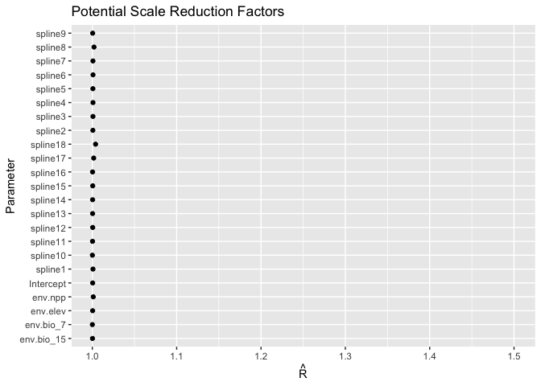
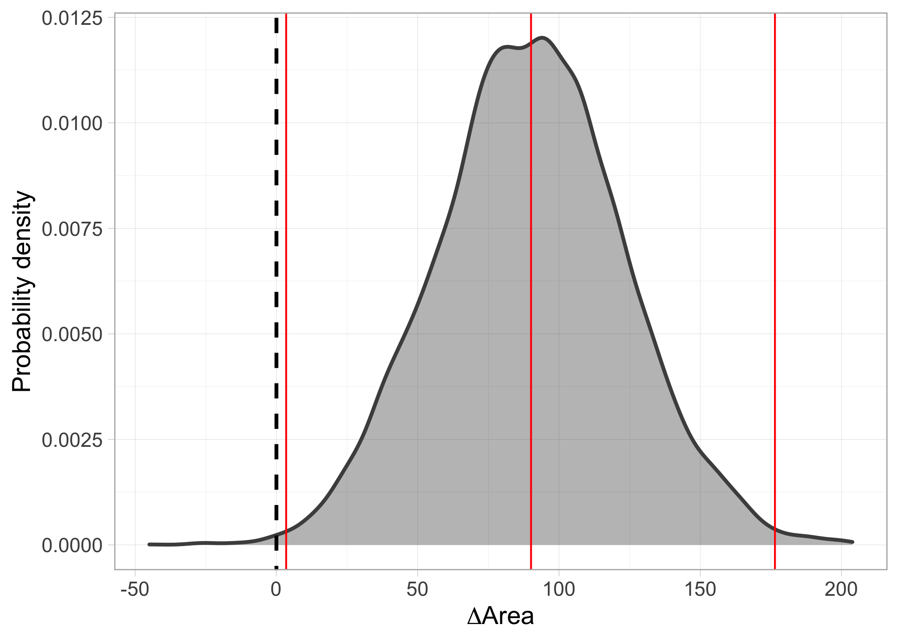
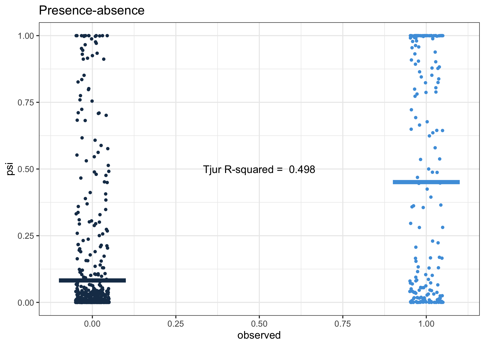

```r
library(patchwork)
library(mcmcplots)
library(ggmcmc)
library(tidybayes)

library(tmap)
tmap_mode("plot")
library(terra)
library(sf)
sf::sf_use_s2(FALSE)
library(tidyverse)

# options
options(scipen = 999)
```

# Base maps


```r
# Equal area projection
equalareaCRS <-  '+proj=laea +lon_0=-73.125 +lat_0=0 +datum=WGS84 +units=m +no_defs'
Latam <- st_read('data/Latam_vector.shp', quiet = T) %>% st_set_crs(equalareaCRS)
Latam_countries <- sf::st_read('data/Latam_vector_countries.shp', quiet = T) %>% st_set_crs(equalareaCRS)

Latam_no_islands <- bind_rows(list(Latam_countries %>%
                                     filter(type!='Indeterminate' & type!='Dependency' & type!='Lease') %>%
                                     mutate(iso_a2=ifelse(name_en=='France', 'GF', iso_a2)) %>%
                                     mutate(name_en=ifelse(name_en=='France', 'French Guiana', name_en)) %>%
                                     filter(!iso_a2 %in% c('EC','SX', 'NL', 'HT', 'DO', 'CU', 'CW', 'AW','BS', 
                                                           'TT', 'GD', 'VC', 'BB', 'LC', 'DM', 'AG', 'KN', 'JM')),
                                   Latam_countries %>%
                                     filter(name=='Ecuador') %>% 
                                     st_cast('POLYGON', quiet=T) %>% 
                                     mutate(area=st_area(.)) %>% arrange(desc(area)) %>% 
                                     head(n=1) %>% dplyr::select(-area))) %>% st_union()

Latam.raster <- terra::rast('data/Latam_raster.tif')

# IUCN. (2022). Herpailurus yagouaroundi (spatial data). International Union for Conservation of Nature. https://www.iucnredlist.org/species/9948/50653167
yaguarundi_IUCN <- sf::st_read('data/yaguarundi_IUCN.shp', quiet = T) %>% sf::st_transform(crs=equalareaCRS)
yaguarundi_IUCN.raster <- terra::rasterize(x = vect(yaguarundi_IUCN),
                                           y = Latam.raster,
                                           field = 'presence',
                                           fun = 'length', background=0) %>% mask(., Latam.raster)
```

# Data


```r
# Presence-absence data
PA_pre <- readRDS('data/PA_pre.rds') %>% 
  filter(!is.na(env.elev) &!is.na(env.bio_4) & !is.na(env.npp)) # remove NA's
PA_post <- readRDS('data/PA_post.rds') %>% 
  filter(!is.na(env.elev) &!is.na(env.bio_4) & !is.na(env.npp)) # remove NA's

# Presence-only data
PO_pre <- readRDS('data/PO_pre.rds') %>% 
  filter(!is.na(env.elev) &!is.na(env.bio_4) & !is.na(env.npp) & !is.na(acce) & !is.na(count)) # remove NA's
PO_post  <- readRDS('data/PO_post.rds') %>% 
  filter(!is.na(env.elev) &!is.na(env.bio_4) & !is.na(env.npp) & !is.na(acce) & !is.na(count)) # remove NA's

PA_pre_post <- rbind(PA_pre %>% mutate(time=0), PA_post %>% mutate(time=1)) 
PO_pre_post <- rbind(PO_pre %>% mutate(time=0), PO_post %>% mutate(time=1)) 
```


# Figures

## Model diagnostics

The `fitted.model` is an object of class `rjags`. For details on how it was generated see the code at `code/yaguarundi_IDM_run.Rmd`.  


```r
fitted.model <- readRDS('data/yaguarundi_model_fit.rds')

# as.mcmc.rjags converts an rjags Object to an mcmc or mcmc.list Object.
fitted.model.mcmc <- mcmcplots::as.mcmc.rjags(fitted.model)

# labels for the linear predictor `b`
L.fitted.model.b <- plab("b", list(Covariate = c('Intercept', 'env.elev', 'env.bio_7', 
                   'env.bio_15', 'env.npp', sprintf('spline%i', 1:16))))

# tibble object for the linear predictor `b` extracted from the rjags fitted model
fitted.model.ggs.b <- ggmcmc::ggs(fitted.model.mcmc, par_labels = L.fitted.model.b, family="^b\\[")

# diagnostics
# ggmcmc::ggmcmc(fitted.model.ggs.b, file="docs/model_diagnostics.pdf", param_page=3)
```

<!-- -->

<!-- -->

## Probability of occurrence of the yaguarundí in the pre and post periods, and the difference (post-pre)


```r
P.pred <- fitted.model$BUGSoutput$mean$P.pred
preds <- data.frame(PO_pre_post, P.pred)
preds0 <- preds[preds$time == 0,]
preds1 <- preds[preds$time == 1,]

rast <- Latam.raster
rast[] <- NA
rast0 <- rast1 <- terra::rast(rast)

rast0[preds0$pixel] <- preds0$P.pred
rast1[preds1$pixel] <- preds1$P.pred

rast0 <- rast0 %>% terra::mask(., vect(Latam_no_islands))
rast1 <- rast1 %>% terra::mask(., vect(Latam_no_islands))
names(rast0) <- 'pre'
names(rast1) <- 'post'

# Map of the of the probability of occurrence in the first period (pre: 2000-2013)
preMAP <- tm_graticules(alpha = 0.3) +  
    tm_shape(rast0) +
    tm_raster(palette = 'Reds', midpoint = NA, style= "cont")  + 
    # tm_shape(yaguarundi_IUCN) +
    # tm_borders(col='grey90', lwd=1, lty = 1) + tm_shape(Latam) +
    # tm_borders(alpha = 0.3) +
    tm_shape(Latam_countries) +
    tm_borders(col='grey60', alpha = 0.4) + 
    tm_layout(legend.outside = T, frame.lwd = 0.3, scale=1.2, legend.outside.size = 0.1)

# Map of the of the probability of occurrence in the second period (post: 2014-2021)
posMAP <- tm_graticules(alpha = 0.3) +  
    tm_shape(rast1) +
    tm_raster(palette = 'Blues', midpoint = NA, style= "cont")  + 
    # tm_shape(yaguarundi_IUCN) +
    # tm_borders(col='grey90', lwd=1, lty = 1) + tm_shape(Latam) +
    # tm_borders(alpha = 0.3) +
    tm_shape(Latam_countries) +
    tm_borders(col='grey60', alpha = 0.4) + 
    tm_layout(legend.outside = T, frame.lwd = 0.3, scale=1.2, legend.outside.size = 0.1)

# Map of the of the change in the probability of occurrence (post - pre)
diffMAP <- tm_graticules(alpha = 0.3) + 
    tm_shape(rast1 - rast0) +
    tm_raster(palette = 'PiYG', midpoint = NA, style= "cont", ) +
    tm_shape(Latam_countries) +
    tm_borders(col='grey60', alpha = 0.4) + 
    tm_layout(legend.outside = T, frame.lwd = 0.3, scale=1.2, legend.outside.size = 0.1)

preMAP
```

<!-- -->

```r
posMAP
```

<!-- -->

```r
diffMAP
```

<!-- -->

```r
# tmap_save(preMAP, filename='docs/figs/preMAP.svg', dpi=300, height = 7, width = 6, device = svglite::svglite)
# tmap_save(posMAP, filename='docs/figs/posMAP.svg', dpi=300,  height = 7, width = 6, device = svglite::svglite)
# tmap_save(diffMAP, filename='docs/figs/diffMAP.svg', dpi=300,  height = 7, width = 6, device = svglite::svglite)
```

## Standard deviation (SD) of the probability of occurrence of the yaguarundí in the pre and post periods  


```r
P.pred.sd <- fitted.model$BUGSoutput$sd$P.pred
preds.sd <- data.frame(PO_pre_post, P.pred.sd)

preds0.sd <- preds.sd[preds.sd$time == 0,]
preds1.sd <- preds.sd[preds.sd$time == 1,]

rast.sd <- terra::rast(Latam.raster)
rast.sd[] <- NA
rast0.sd <- rast1.sd <- terra::rast(rast.sd)

rast0.sd[preds0.sd$pixel] <- preds0.sd$P.pred.sd
rast1.sd[preds1.sd$pixel] <- preds1.sd$P.pred.sd

rast0.sd <- rast0.sd %>% terra::mask(., vect(Latam_no_islands))
rast1.sd <- rast1.sd %>% terra::mask(., vect(Latam_no_islands))
names(rast0.sd) <- 'pre.sd'
names(rast1.sd) <- 'post.sd'

# Map of the SD of the probability of occurrence of the area pre 
preMAP.sd <- tm_graticules(alpha = 0.3) +  
    tm_shape(rast0.sd) +
    tm_raster(palette = 'Reds', midpoint = NA, style= "cont")  + 
    tm_shape(Latam_countries) +
    tm_borders(alpha = 0.3) + 
    tm_layout(legend.outside = T, frame.lwd = 0.3, scale=1.2, legend.outside.size = 0.1)

# Map of the SD of the probability of occurrence of the area post
posMAP.sd <-  tm_graticules(alpha = 0.3) +  
    tm_shape(rast1.sd) +
    tm_raster(palette = 'Blues', midpoint = NA, style= "cont")  + 
    tm_shape(Latam_countries) +
    tm_borders(alpha = 0.3) + 
    tm_layout(legend.outside = T, frame.lwd = 0.3, scale=1.2, legend.outside.size = 0.1)

preMAP.sd
```

<!-- -->

```r
posMAP.sd
```

<!-- -->

## Map of the difference including the Standard deviation (SD) of the probability of occurrence as the transparency of the layer 


```r
library(cols4all)
library(pals)
library(classInt)
library(stars)

bivcol = function(pal, nx = 3, ny = 3){
  tit = substitute(pal)
  if (is.function(pal))
    pal = pal()
  ncol = length(pal)
  if (missing(nx))
    nx = sqrt(ncol)
  if (missing(ny))
    ny = nx
  image(matrix(1:ncol, nrow = ny), axes = FALSE, col = pal, asp = 1)
  mtext(tit)
}

yagua.pal.pu_gn_bivd <- c4a("pu_gn_bivd", n=3, m=5)
# bivcol(t(apply(yagua.pal.pu_gn_bivd, 2, rev)))

yagua.pal <- c(t(apply(yagua.pal.pu_gn_bivd, 2, rev)))

###

pred.P.sd <- fitted.model$BUGSoutput$sd$delta.Grid
preds.sd <- data.frame(PO_pre_post, pred.P.sd=rep(pred.P.sd, 2))

rast.sd <- terra::rast(Latam.raster)
rast.sd[] <- NA
rast.sd <- terra::rast(rast.sd)

rast.sd[preds.sd$pixel] <- preds.sd$pred.P.sd
rast.sd <- rast.sd %>% terra::mask(., vect(Latam_no_islands))
names(rast.sd) <- c('diff')

# Map of the SD of the probability of occurrence of the area post
delta.GridMAP.sd <-  tm_graticules(alpha = 0.3) +  
    tm_shape(rast.sd) +
    tm_raster(palette = 'Greys', midpoint = NA, style= "cont")  + 
    tm_shape(Latam_countries) +
    tm_borders(alpha = 0.3) + 
    tm_layout(legend.outside = T, frame.lwd = 0.3, scale=1.2, legend.outside.size = 0.1)

delta.GridMAP.sd
```

<!-- -->

```r
# tmap_save(delta.GridMAP.sd, filename='docs/figs/delta.GridMAP.sd.svg', dpi=300, height = 7, width = 6, device = svglite::svglite)

rast.stars <- c(stars::st_as_stars(rast1-rast0), 
                stars::st_as_stars(rast.sd))
names(rast.stars) <- c('diff', 'sd')

par(mfrow=c(2,2))
hist(rast0)
hist(rast1)
hist(rast.stars['diff'])
hist(rast.stars['sd'])
```

<!-- -->

```r
par(mfrow=c(1,1))

add_new_var = function(x, var1, var2, nbins1, nbins2, style1, style2,fixedBreaks1, fixedBreaks2){
  class1 = suppressWarnings(findCols(classIntervals(c(x[[var1]]), 
                                                    n = nbins1, 
                                                    style = style1,
                                                    fixedBreaks1=fixedBreaks1)))
  
  class2 = suppressWarnings(findCols(classIntervals(c(x[[var2]]), 
                                                    n = nbins2, 
                                                    style = style2,
                                                    fixedBreaks=fixedBreaks2)))
  
  x$new_var = class1 + nbins1 * (class2 - 1)
  return(x)
}

rast.bivariate = add_new_var(rast.stars,
                             var1 = "diff", 
                             var2 = "sd",
                             nbins1 = 3, 
                             nbins2 = 5, 
                             style1 = "fixed",
                             fixedBreaks1=c(-1,-0.05, 0.05, 1),
                             style2 = "fixed",
                             fixedBreaks2=c(0, 0.05, 0.1, 0.15, 0.2, 0.3))


# See missing classes and update palette
table(rast.bivariate['new_var'])
```

```
## 
##   1   2   3   4   5   6   7   8   9  10  11  12  13  15 
##  59 833   4 276  48 255  94  30 437  28   2  87   8   2
```

```r
yagua.new.pal <- yagua.pal[-c(14)]

# Map of the of the change in the probability of occurrence (post - pre)
# according to the mean SD of the probability of occurrence  (mean(post.sd, pre.sd))

diffMAP.SD <- tm_graticules(alpha = 0.3) + 
  tm_shape(rast.bivariate) +
  tm_raster("new_var", style= "cat", palette = yagua.new.pal) +
  tm_shape(Latam_countries) +
  tm_borders(col='grey60', alpha = 0.4) + 
  tm_layout(legend.outside = T, frame.lwd = 0.3, scale=1.2, legend.outside.size = 0.1)

diffMAP.SD
```

<!-- -->

```r
tmap_save(diffMAP.SD, filename='docs/figs/diffMAP.SD.svg', dpi=300, height = 7, width = 6, device = svglite::svglite)
```


```r
countryLevels <- cats(rast('data/Latam_raster_countries.tif'))[[1]] %>% mutate(value=value+1)
rasterLevels <- levels(as.factor(PO_pre_post$country))
countries <- countryLevels %>% filter(value %in% rasterLevels) %>% mutate(numLevel=1:27)

fitted.model.ggs.alpha <- ggmcmc::ggs(fitted.model.mcmc, family="^alpha")
ci.alpha <- ci(fitted.model.ggs.alpha)

country_acce <- bind_rows(ci.alpha[28,], 
          tibble(countries, ci.alpha[1:27,])) %>% 
  dplyr::select(-c(value, numLevel))

#accessibility range for predictions
accessValues <- seq (0,0.5,by=0.01)

#get common steepness
commonSlope <- country_acce$median[country_acce$Parameter=="alpha1"]

#write function to get predictions for a given country
getPreds <- function(country){
  #get country intercept
  countryIntercept = country_acce$median[country_acce$country==country & !is.na(country_acce$country)]
  #return all info
  data.frame(country = country,
             access = accessValues,
             preds= countryIntercept * exp(((-1 * commonSlope)*accessValues)))
}

allPredictions <- country_acce %>%
                  filter(!is.na(country)) %>%
                  filter(country %in% Latam_countries$iso_a2) %>% 
                  pull(country) %>%
                  map_dfr(getPreds)

allPredictions <- left_join(as_tibble(allPredictions), 
                            Latam_countries %>% select(country=iso_a2, name_en) %>% 
                              st_drop_geometry(), by='country') %>% 
  filter(country!='VG' & country!= 'TT' & country!= 'FK' & country!='AW')

# just for exploration - easier to see which county is doing which
acce_country <- ggplot(allPredictions)+
    geom_line(aes(x = access, y  = preds, colour = name_en), show.legend = F) + 
    viridis::scale_color_viridis(option = 'turbo', discrete=TRUE) +
    theme_bw() + 
    facet_wrap(~name_en, ncol = 5) + 
    ylab("Probability of retention") + xlab("Accessibility")

acce_country
```

<!-- -->

```r
# ggsave(plot = acce_country, filename='docs/figs/acce_country.svg', device = 'svg', width=5, height=5, dpi=300)

# all countries
acce_allcountries <- ggplot(allPredictions)+
  geom_line(aes(x = access, y  = preds, colour = name_en), show.legend = F)+
  viridis::scale_color_viridis(option = 'turbo', discrete=TRUE) +
  theme_bw() + 
  ylab("Probability of retention") + xlab("Accessibility")

acce_allcountries
```

<!-- -->


```r
## Uncertainty boxplot

PA_herpailurus_pre <- readRDS('data/PA_herpailurus_pre_blobs.Rds')
PA_herpailurus_post <- readRDS('data/PA_herpailurus_pos_blobs.Rds')

PO_herpailurus_pre <- terra::rast('data/PO_herpailurus_pre_raster.tif')
PO_herpailurus_post <- terra::rast('data/PO_herpailurus_pos_raster.tif')

# Function to calculate the number of blobs per grid-cell at both time periods
calculate_blobs_per_grid <- function(blobs_pre, blobs_post, raster){
  blobs_per_grid_pre <- terra::rasterize(x = vect(blobs_pre %>% mutate(pre=1)),
                                         y = raster,
                                         field = 'pre',
                                         fun = 'length',
                                         sum = T, 
                                         touches= T, 
                                         background=0) %>% mask(., raster)
  blobs_per_grid_post <- terra::rasterize(x = vect(blobs_post %>% mutate(post=1)),
                                          y = raster,
                                          field = 'post',
                                          fun = 'length',
                                          sum = T, 
                                          touches= T, 
                                          background=0) %>% mask(., raster)
  blobs_per_grid_diff <- c(blobs_per_grid_pre, blobs_per_grid_post)
  # names(blobs_per_grid_diff) <- 'diff'
  return(blobs_per_grid_diff)
}
calculate_count_per_grid <- function(count_pre, var_pre, count_post, var_post, raster){
  count_per_grid_pre <- count_pre[[var_pre]] %>% 
    classify(cbind(0, Inf, 1)) %>% mask(., raster)
  names(count_per_grid_pre) <- 'pre'
  count_per_grid_post <- count_post[[var_post]] %>% 
    classify(cbind(0, Inf, 1)) %>% mask(., raster)
  names(count_per_grid_post) <- 'post'
  
  counts_per_grid_diff <- c(count_per_grid_pre, count_per_grid_post)
  return(counts_per_grid_diff)
}

blobs_per_grid <- calculate_blobs_per_grid(PA_herpailurus_pre, PA_herpailurus_post, rast.sd)
counts_per_grid <- calculate_count_per_grid(PO_herpailurus_pre, 'count', 
                                            PO_herpailurus_post, 'count', rast.sd)

# all data together
blobs_counts_diffSD <- bind_cols(
                # as_tibble(rast0.sd),
                # as_tibble(rast1.sd),
                as_tibble(rast.sd),
                as_tibble(blobs_per_grid) %>%
                  mutate(nBlobs=ifelse(post==0 & pre==0, 'zero',
                                       ifelse(post==1 & pre==1, 'two',
                                              ifelse(post==0 & pre==1, 'one.pre',
                                                     ifelse(post==1 & pre==0, 'one.post', NA)))))%>% 
                  select(nBlobs),
                as_tibble(counts_per_grid) %>%
                  mutate(nCounts=ifelse(post==0 & pre==0, 'zero',
                                       ifelse(post==1 & pre==1, 'two',
                                              ifelse(post==0 & pre==1, 'one.pre',
                                                     ifelse(post==1 & pre==0, 'one.post', NA))))) %>% 
                  select(nCounts)
                )


boxplot_blobs_SD <- ggplot(blobs_counts_diffSD, 
                           aes(x=fct_infreq(nBlobs), 
                               y=diff, fill=fct_infreq(nBlobs))) +
  geom_boxplot(show.legend = F) + 
  scale_fill_brewer(palette = 'Greens') +
  scale_x_discrete(labels=c("None", "Only on pre", "Only on post", "In both periods")) +
  labs(x='PA data per grid-cell',
       y='Uncertainty (SD) of the predicted range change') +
  theme_bw() +
  theme(axis.title.y = element_text(margin = margin(r = 20)),
          axis.title.x = element_text(margin = margin(t = 20)))

boxplot_counts_SD <- ggplot(blobs_counts_diffSD, 
                           aes(x=fct_infreq(nCounts), 
                               y=diff, fill=fct_infreq(nCounts))) +
  geom_boxplot(show.legend = F) + 
  scale_fill_brewer(palette = 'Greens') +
  scale_x_discrete(labels=c("None", "Only on pre", "Only on post", "In both periods")) +
  labs(x='PO data per grid-cell',
       y='Uncertainty (SD) of the predicted range change') +
  theme_bw() + 
  theme(axis.title.y = element_text(margin = margin(r = 20)),
          axis.title.x = element_text(margin = margin(t = 20)))

boxplot_blobs_SD + boxplot_counts_SD
```

<!-- -->

## Effect of the environmental covariates on the intensity of the point process


```r
caterpiller.params <- fitted.model.ggs.b %>%
  filter(grepl('env', Parameter)) %>% 
  mutate(Parameter=as.factor(ifelse(Parameter=='env.elev', 'elevation',
                                    ifelse(Parameter=='env.npp', 'NPP',
                                           ifelse(Parameter=='env.bio_15', 'precipitation seasonality',
                                                  ifelse(Parameter=='env.bio_7', 'temperature annual range', Parameter)))))) %>% 
  ggs_caterpillar(line=0) + 
  theme_light() + 
  labs(y='', x='Posterior densities')

caterpiller.params
```

<!-- -->

## Boxplot of posterior densities of the predicted area in both time periods


```r
fitted.model.ggs.A <- ggmcmc::ggs(fitted.model.mcmc,  family="^A")

# CI
ggmcmc::ci(fitted.model.ggs.A)
```

```
## # A tibble: 2 × 6
##   Parameter   low   Low median  High  high
##   <fct>     <dbl> <dbl>  <dbl> <dbl> <dbl>
## 1 A.post    1236. 1253.  1334. 1404. 1416.
## 2 A.pre     1081. 1108.  1243. 1369. 1391.
```

```r
fitted.model$BUGSoutput$summary['A.post',]
```

```
##        mean          sd        2.5%         25%         50%         75% 
## 1332.604257   45.747962 1236.406695 1303.409259 1334.419173 1363.931770 
##       97.5%        Rhat       n.eff 
## 1416.152340    1.001664 2800.000000
```

```r
# fitted.model$BUGSoutput$mean$A.post
fitted.model$BUGSoutput$summary['A.pre',]
```

```
##        mean          sd        2.5%         25%         50%         75% 
## 1241.448139   79.233296 1080.777019 1188.650266 1242.765228 1296.025547 
##       97.5%        Rhat       n.eff 
## 1391.342173    1.001851 2200.000000
```

```r
# fitted.model$BUGSoutput$mean$A.pre

# boxplot 
range.boxplot <- ggmcmc::ci(fitted.model.ggs.A) %>% 
    mutate(Parameter = fct_rev(Parameter)) %>% 
    ggplot(aes(x = Parameter, y = median, ymin = low, ymax = high)) + 
    geom_boxplot(orientation = 'y', size=1) + 
    stat_summary(fun=mean, geom="point", 
                 shape=19, size=4, show.legend=FALSE) + 
    theme_light(base_size = 14) +
    labs(x='', y='Area (number of 100x100 km grid-cells)')

range.boxplot
```

<!-- -->

```r
# ggsave(plot = range.boxplot, filename='docs/figs/range.boxplot.svg', device = 'svg', width=5, height=5, dpi=300)
```


## Posterior distribution of range change (Area).


```r
fitted.model.ggs.delta.A <- ggmcmc::ggs(fitted.model.mcmc,  family="^delta.A")

# CI
ggmcmc::ci(fitted.model.ggs.delta.A)
```

```
## # A tibble: 1 × 6
##   Parameter   low   Low median  High  high
##   <fct>     <dbl> <dbl>  <dbl> <dbl> <dbl>
## 1 delta.A    1.58  14.5   89.6  173.  191.
```

```r
fitted.model$BUGSoutput$summary['delta.A',]
```

```
##        mean          sd        2.5%         25%         50%         75% 
##   91.156118   48.360469    1.575125   57.772565   89.591878  122.746494 
##       97.5%        Rhat       n.eff 
##  190.724438    1.001567 3200.000000
```

```r
#densitiy
delta.A.plot <- fitted.model.ggs.delta.A %>% group_by(Iteration) %>%
    summarise(area=median(value)) %>% 
    ggplot(aes(area)) + 
    geom_density(col='grey30', fill='black', alpha = 0.3, size=1) +
    geom_abline(intercept = 0, slope=1, linetype=2, size=1) + 
    # vertical lines at 95% CI
    stat_boxplot(geom = "vline", aes(xintercept = ..xmax..), size=0.5, col='red') +
    stat_boxplot(geom = "vline", aes(xintercept = ..xmiddle..), size=0.5, col='red') +
    stat_boxplot(geom = "vline", aes(xintercept = ..xmin..), size=0.5, col='red') +
    theme_light(base_size = 14, base_line_size = 0.2) +
    labs(y='Probability density', x=expression(Delta*'Area'))

delta.A.plot
```

<!-- -->

```r
# ggsave(plot = delta.A.plot, filename='docs/figs/delta.A.plot.svg', device = 'svg', width=5, height=5, dpi=300)
```

## Posterior predictive checks

### PO


```r
counts <- PO_pre_post$count
counts.new <- fitted.model$BUGSoutput$mean$y.PO.new
lambda <- fitted.model$BUGSoutput$mean$lambda
pred.PO <- data.frame(counts, counts.new, lambda)

fitted.model$BUGSoutput$summary['fit.PO',]
```

```
##       mean         sd       2.5%        25%        50%        75%      97.5% 
##  491.81051   12.90288  467.49783  482.95033  491.52553  500.30513  517.80382 
##       Rhat      n.eff 
##    1.00116 9200.00000
```

```r
fitted.model$BUGSoutput$summary['fit.PO.new',]
```

```
##         mean           sd         2.5%          25%          50%          75% 
##   251.243515    14.497186   223.406895   241.249206   251.071504   260.899927 
##        97.5%         Rhat        n.eff 
##   280.571443     1.000965 27000.000000
```

```r
pp.PO <- ggplot(pred.PO, aes(x=counts, y=lambda), fill=NA) +
    geom_point(size=3, shape=21)  + 
    xlim(c(0, 100)) +  
    ylim(c(0, 50)) +
    labs(x='observed', y='lambda', title='Presence-only') +
    geom_abline(col='red') +
    theme_bw() 

pp.PO.log <- ggplot(pred.PO, aes(x=counts, y=lambda), fill=NA) +
    geom_point(size=3, shape=21)  + 
    scale_x_log10(limits=c(0.01, 100)) + 
    scale_y_log10(limits=c(0.01, 100)) + 
    coord_fixed(ratio=1) + 
    labs(x='log(observed)', y='log(lambda)', title='log') +
    geom_abline(col='red') +
    theme_bw() 

pp.PO + pp.PO.log
```

<!-- -->

### PA


```r
presabs <- PA_pre_post$presabs
presabs.new <- fitted.model$BUGSoutput$mean$y.PA.new 
psi <- fitted.model$BUGSoutput$mean$psi
pred.PA <- data.frame(presabs, presabs.new, psi)

r2_tjur <- round(fitted.model$BUGSoutput$mean$r2_tjur, 3)
fitted.model$BUGSoutput$summary['r2_tjur',]
```

```
##           mean             sd           2.5%            25%            50% 
##     0.49806678     0.02921726     0.44220593     0.47823668     0.49753695 
##            75%          97.5%           Rhat          n.eff 
##     0.51725798     0.55615764     1.00112523 11000.00000000
```

```r
pp.PA <- ggplot(pred.PA, aes(x=presabs, y=presabs.new, col=presabs)) +
    geom_jitter(height = 0, width = .05, size=1)  + 
    scale_x_continuous(breaks=seq(0,1,0.25)) + scale_colour_binned() +
    labs(x='observed', y='psi', title='Presence-absence') +
    stat_summary(
        fun = mean, 
        geom = "errorbar", 
        aes(ymax = ..y.., ymin = ..y..), 
        width = 0.2, size=2) +
    theme_bw() + theme(legend.position = 'none')+
    annotate(geom="text", x=0.5, y=0.5, 
             label=paste('Tjur R-squared = ', r2_tjur))

pp.PA
```

<!-- -->
