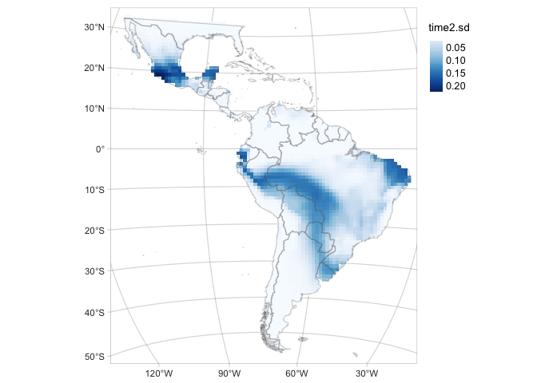
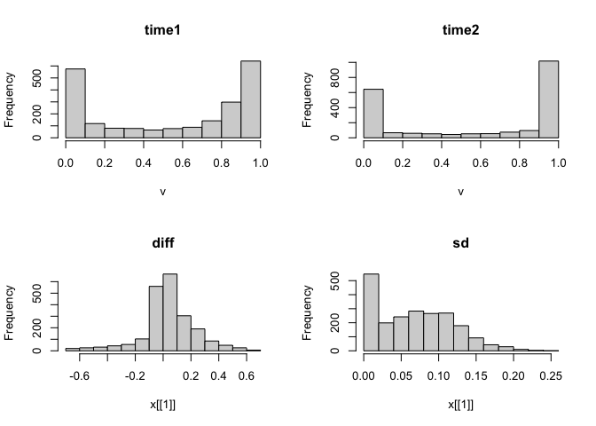

  - R Libraries


```r
library(patchwork)
library(mcmcplots)
library(ggmcmc)
library(tidybayes)
library(tmap)
tmap_mode("plot")
library(terra)
library(sf)
sf::sf_use_s2(FALSE)
library(tidyverse)
# options
options(scipen = 999)
```

# Data

  - Basemaps


```r
equalareaCRS <-  '+proj=laea +lon_0=-73.125 +lat_0=0 +datum=WGS84 +units=m +no_defs'
Latam_projected <- st_read('data/Latam_vector.shp', quiet = T)
Latam_countries <- sf::st_read('data/Latam_vector_countries.shp', quiet = T) %>% sf::st_transform(crs=equalareaCRS)
Latam <- st_union(st_make_valid(Latam_projected))

Latam_no_islands <- bind_rows(list(Latam_countries %>%
                                     filter(type!='Indeterminate' & type!='Dependency' & type!='Lease') %>%
                                     mutate(iso_a2=ifelse(name_en=='France', 'GF', iso_a2)) %>%
                                     mutate(name_en=ifelse(name_en=='France', 'French Guiana', name_en)) %>%
                                     filter(!iso_a2 %in% c('EC','SX', 'NL', 'HT', 'DO', 'CU', 'CW', 'AW','BS', 
                                                           'TT', 'GD', 'VC', 'BB', 'LC', 'DM', 'AG', 'KN', 'JM')),
                                   Latam_countries %>%
                                     filter(name=='Ecuador') %>% 
                                     st_cast('POLYGON', quiet=T) %>% 
                                     mutate(area=st_area(.)) %>% arrange(desc(area)) %>% 
                                     head(n=1) %>% dplyr::select(-area))) %>% st_union()

Latam.raster <- terra::rast('data/Latam_raster.tif')
Latam.raster.countries <- terra::rast('data/Latam_raster_countries.tif')
```

  -   IUCN range distribution
  

```r
yaguarundi_IUCN <- sf::st_read('big_data/yaguarundi_IUCN.shp', quiet = T) %>% sf::st_transform(crs=equalareaCRS)

MAP.IUCN <- tm_graticules(alpha = 0.3) +
    tm_shape(Latam_countries) +
    tm_fill(col='grey90') +
    tm_borders(col='grey60', alpha = 0.4) +
    # tm_shape(yaguarundi_expertMap) +
    # tm_fill(col='grey20', alpha = 0.4, labels = 'expert range map') +
    tm_shape(yaguarundi_IUCN) +
    tm_fill(col='red', alpha = 0.4, labels = 'IUCN') +
    tm_layout(legend.outside = T, frame.lwd = 0.3, scale=1.2, legend.outside.size = 0.1)

MAP.IUCN 
```


  - Species data and covariates


```r
PA_time1 <- readRDS('data/data_hyagouaroundi_PA_time1.rds') %>% 
  filter(!is.na(env.npp) &!is.na(env.bio_7) &!is.na(env.bio_15) & !is.na(env.elev)) # remove NA's
PA_time2 <- readRDS('data/data_hyagouaroundi_PA_time2.rds') %>% 
  filter(!is.na(env.npp) &!is.na(env.bio_7) &!is.na(env.bio_15) & !is.na(env.elev)) # remove NA's

# Presence-only data
PO_time1 <- readRDS('data/data_hyagouaroundi_PO_time1.rds') %>% 
  filter(!is.na(env.npp) &!is.na(env.bio_7) &!is.na(env.bio_15) & !is.na(env.elev) & !is.na(acce) & !is.na(count)) # remove NA's
PO_time2  <- readRDS('data/data_hyagouaroundi_PO_time2.rds') %>% 
  filter(!is.na(env.npp) &!is.na(env.bio_7) &!is.na(env.bio_15) & !is.na(env.elev) & !is.na(acce) & !is.na(count)) # remove NA's

PA_time1_time2 <- rbind(PA_time1 %>% mutate(time=1), PA_time2 %>% mutate(time=2)) 
PO_time1_time2 <- rbind(PO_time1 %>% mutate(time=1), PO_time2 %>% mutate(time=2)) 
```

  -   Model output
  

```r
fitted.model <- readRDS('big_data/yaguarundi_model_fit.rds')

# as.mcmc.rjags converts an rjags Object to an mcmc or mcmc.list Object.
fitted.model.mcmc <- mcmcplots::as.mcmc.rjags(fitted.model)
```


# Model diagnostics

The `fitted.model` is an object of class `rjags`. 


```r
# labels for the linear predictor `b`
L.fitted.model.b <- plab("b", list(Covariate = c('Intercept', 'env.npp', 'env.bio_15',
                                                 'env.bio_7', 'env.elev', sprintf('spline%i', 1:18)))) # changes with n.spl

# tibble object for the linear predictor `b` extracted from the rjags fitted model
fitted.model.ggs.b <- ggmcmc::ggs(fitted.model.mcmc, par_labels = L.fitted.model.b, family="^b\\[")

# diagnostics
# ggmcmc::ggmcmc(fitted.model.ggs.b, file="docs/model_diagnostics.pdf", param_page=3)
```

## Traceplot
  

```r
ggs_traceplot(fitted.model.ggs.b)
```

<!-- -->

## Rhat
  

```r
ggs_Rhat(fitted.model.ggs.b)
```

<!-- -->

## Probability of occurrence of the yaguarundi
For each pre- and time2-periods, and the difference (time2-pre)


```r
P.pred <- fitted.model$BUGSoutput$mean$P.pred
preds <- data.frame(PO_time1_time2, P.pred)
preds1 <- preds[preds$time == 1,]
preds2 <- preds[preds$time == 2,]

rast <- Latam.raster
rast[] <- NA
rast1 <- rast2 <- terra::rast(rast)

rast1[preds1$pixel] <- preds1$P.pred
rast2[preds2$pixel] <- preds2$P.pred

rast1 <- rast1 %>% terra::mask(., vect(Latam_no_islands))
rast2 <- rast2 %>% terra::mask(., vect(Latam_no_islands))
names(rast1) <- 'time1'
names(rast2) <- 'time2'

# Map of the of the probability of occurrence in the first period (time1: 2000-2013)
time1MAP <- tm_graticules(alpha = 0.3) +  
    tm_shape(rast1) +
    tm_raster(palette = 'Reds', midpoint = NA, style= "cont")  + 
    tm_shape(Latam_countries) +
    tm_borders(col='grey60', alpha = 0.4) + 
    tm_layout(legend.outside = T, frame.lwd = 0.3, scale=1.2, legend.outside.size = 0.1)

# Map of the of the probability of occurrence in the second period (time2: 2014-2021)
time2MAP <- tm_graticules(alpha = 0.3) +  
    tm_shape(rast2) +
    tm_raster(palette = 'Blues', midpoint = NA, style= "cont")  + 
    tm_shape(Latam_countries) +
    tm_borders(col='grey60', alpha = 0.4) + 
    tm_layout(legend.outside = T, frame.lwd = 0.3, scale=1.2, legend.outside.size = 0.1)

# Map of the of the change in the probability of occurrence (time2 - time1)
diffMAP <- tm_graticules(alpha = 0.3) + 
    tm_shape(rast2 - rast1) +
    tm_raster(palette = 'PiYG', midpoint = 0, style= "cont", ) +
    tm_shape(Latam_countries) +
    tm_borders(col='grey60', alpha = 0.4) + 
    tm_layout(legend.outside = T, frame.lwd = 0.3, scale=1.2, legend.outside.size = 0.1)

time1MAP
```

<!-- -->

```r
time2MAP
```

<!-- -->

```r
diffMAP
```

<!-- -->

## Standard deviation (SD) of the probability of occurrence of

```r
P.pred.sd <- fitted.model$BUGSoutput$sd$P.pred
preds.sd <- data.frame(PO_time1_time2, P.pred.sd)

preds1.sd <- preds.sd[preds.sd$time == 1,]
preds2.sd <- preds.sd[preds.sd$time == 2,]

rast.sd <- terra::rast(Latam.raster)
rast.sd[] <- NA
rast1.sd <- rast2.sd <- terra::rast(rast.sd)

rast1.sd[preds1.sd$pixel] <- preds1.sd$P.pred.sd
rast2.sd[preds2.sd$pixel] <- preds2.sd$P.pred.sd

rast1.sd <- rast1.sd %>% terra::mask(., vect(Latam_no_islands))
rast2.sd <- rast2.sd %>% terra::mask(., vect(Latam_no_islands))
names(rast1.sd) <- 'time1.sd'
names(rast2.sd) <- 'time2.sd'

# Map of the SD of the probability of occurrence of the area time1 
time1MAP.sd <- tm_graticules(alpha = 0.3) +  
    tm_shape(rast1.sd) +
    tm_raster(palette = 'Reds', midpoint = NA, style= "cont")  + 
    tm_shape(Latam_countries) +
    tm_borders(alpha = 0.3) + 
    tm_layout(legend.outside = T, frame.lwd = 0.3, scale=1.2, legend.outside.size = 0.1)

# Map of the SD of the probability of occurrence of the area time2
time2MAP.sd <-  tm_graticules(alpha = 0.3) +  
    tm_shape(rast2.sd) +
    tm_raster(palette = 'Blues', midpoint = NA, style= "cont")  + 
    tm_shape(Latam_countries) +
    tm_borders(alpha = 0.3) + 
    tm_layout(legend.outside = T, frame.lwd = 0.3, scale=1.2, legend.outside.size = 0.1)

time1MAP.sd
```

<!-- -->

```r
time2MAP.sd
```

<!-- -->

## Bivariate map
Map of the difference including the Standard deviation (SD) of the probability of occurrence as the transparency of the layer.  


```r
library(cols4all)
library(pals)
library(classInt)
library(stars)

bivcol = function(pal, nx = 3, ny = 3){
  tit = substitute(pal)
  if (is.function(pal))
    pal = pal()
  ncol = length(pal)
  if (missing(nx))
    nx = sqrt(ncol)
  if (missing(ny))
    ny = nx
  image(matrix(1:ncol, nrow = ny), axes = FALSE, col = pal, asp = 1)
  mtext(tit)
}

yaguarundi.pal.pu_gn_bivd <- c4a("pu_gn_bivd", n=3, m=5)
yaguarundi.pal <- c(t(apply(yaguarundi.pal.pu_gn_bivd, 2, rev)))

###

pred.P.sd <- fitted.model$BUGSoutput$sd$delta.Grid
preds.sd <- data.frame(PO_time1_time2, pred.P.sd=rep(pred.P.sd, 2))

rast.sd <- terra::rast(Latam.raster)
rast.sd[] <- NA
rast.sd <- terra::rast(rast.sd)

rast.sd[preds.sd$pixel] <- preds.sd$pred.P.sd
rast.sd <- rast.sd %>% terra::mask(., vect(Latam_no_islands))
names(rast.sd) <- c('diff')

# Map of the SD of the probability of occurrence of the area time2
delta.GridMAP.sd <-  tm_graticules(alpha = 0.3) +  
    tm_shape(rast.sd) +
    tm_raster(palette = 'Greys', midpoint = NA, style= "cont")  + 
    tm_shape(Latam_countries) +
    tm_borders(alpha = 0.3) + 
    tm_layout(legend.outside = T, frame.lwd = 0.3, scale=1.2, legend.outside.size = 0.1)

delta.GridMAP.sd
```

<!-- -->

```r
rast.stars <- c(stars::st_as_stars(rast2-rast1), stars::st_as_stars(rast.sd))
names(rast.stars) <- c('diff', 'sd')

par(mfrow=c(2,2))
hist(rast1)
hist(rast2)
hist(rast.stars['diff'])
hist(rast.stars['sd'])
```

<!-- -->

```r
par(mfrow=c(1,1))

add_new_var = function(x, var1, var2, nbins1, nbins2, style1, style2,fixedBreaks1, fixedBreaks2){
  class1 = suppressWarnings(findCols(classIntervals(c(x[[var1]]), 
                                                    n = nbins1, 
                                                    style = style1,
                                                    fixedBreaks1=fixedBreaks1)))
  
  class2 = suppressWarnings(findCols(classIntervals(c(x[[var2]]), 
                                                    n = nbins2, 
                                                    style = style2,
                                                    fixedBreaks=fixedBreaks2)))
  
  x$new_var = class1 + nbins1 * (class2 - 1)
  return(x)
}

rast.bivariate = add_new_var(rast.stars,
                             var1 = "diff", 
                             var2 = "sd",
                             nbins1 = 3, 
                             nbins2 = 5, 
                             style1 = "fixed",
                             fixedBreaks1=c(-1,-0.05, 0.05, 1),
                             style2 = "fixed",
                             fixedBreaks2=c(0, 0.05, 0.1, 0.15, 0.2, 0.3))


# See missing classes and update palette
all_classes <- seq(1,15,1)
rast_classes <- as_tibble(rast.bivariate['new_var']) %>% 
    distinct(new_var) %>% filter(!is.na(new_var)) %>% pull()
absent_classes <- all_classes[!(all_classes %in% rast_classes)]
yaguarundi.new.pal <- yaguarundi.pal[-c(absent_classes)]

# Map of the of the change in the probability of occurrence (time2 - time1)
# according to the mean SD of the probability of occurrence  (mean(time2.sd, time1.sd))

diffMAP.SD <- tm_graticules(alpha = 0.3) + 
  tm_shape(rast.bivariate) +
  tm_raster("new_var", style= "cat", palette = yaguarundi.new.pal) +
  tm_shape(Latam_countries) +
  tm_borders(col='grey60', alpha = 0.4) + 
  tm_layout(legend.outside = T, frame.lwd = 0.3, scale=1.2, legend.outside.size = 0.1)

diffMAP.SD
```

<!-- -->

## Countries thinning


```r
countryLevels <- cats(Latam.raster.countries)[[1]] #%>% mutate(value=value+1)
rasterLevels <- levels(as.factor(PO_time1_time2$country))
countries <- countryLevels %>% filter(value %in% rasterLevels) %>% mutate(numLevel=1:27)

fitted.model.ggs.alpha <- ggmcmc::ggs(fitted.model.mcmc, family="^alpha")
ci.alpha <- ci(fitted.model.ggs.alpha)

country_acce <- bind_rows(ci.alpha[28,], 
          tibble(countries, ci.alpha[1:27,])) %>% 
  dplyr::select(-c(value, numLevel))

#accessibility range for predictions
accessValues <- seq (0,0.5,by=0.01)

#get common steepness
commonSlope <- country_acce$median[country_acce$Parameter=="alpha1"]

#write function to get predictions for a given country
getPreds <- function(country){
  #get country intercept
  countryIntercept = country_acce$median[country_acce$country==country & !is.na(country_acce$country)]
  #return all info
  data.frame(country = country,
             access = accessValues,
             preds= countryIntercept * exp(((-1 * commonSlope)*accessValues)))
}

allPredictions <- country_acce %>%
                  filter(!is.na(country)) %>%
                  filter(country %in% Latam_countries$iso_a2) %>% 
                  pull(country) %>%
                  map_dfr(getPreds)

allPredictions <- left_join(as_tibble(allPredictions), 
                            Latam_countries %>% select(country=iso_a2, name_en) %>% 
                              st_drop_geometry(), by='country') %>% 
  filter(country!='VG' & country!= 'TT' & country!= 'FK' & country!='AW')

# just for exploration - easier to see which county is doing which
acce_country <- ggplot(allPredictions)+
    geom_line(aes(x = access, y  = preds, colour = name_en), show.legend = F) + 
    viridis::scale_color_viridis(option = 'turbo', discrete=TRUE) +
    theme_bw() + 
    facet_wrap(~name_en, ncol = 5) + 
    ylab("Probability of retention") + xlab("Accessibility")

acce_country
```

<!-- -->

```r
# all countries
acce_allcountries <- ggplot(allPredictions) +
  geom_line(aes(x = access, y  = preds, colour = name_en), show.legend = F)+
  viridis::scale_color_viridis(option = 'turbo', discrete=TRUE) +
  theme_bw() + 
  ylab("Probability of retention") + xlab("Accessibility")

acce_allcountries
```

<!-- -->

## Effect of the environmental covariates on the intensity of the point process


```r
caterpiller.params <- fitted.model.ggs.b %>%
  filter(grepl('env', Parameter)) %>% 
  mutate(Parameter=as.factor(ifelse(Parameter=='env.npp', 'net primary production',
                                    ifelse(Parameter=='env.elev', 'elevation',
                                           ifelse(Parameter=='env.bio_7', 'temperature annual range',
                                                  ifelse(Parameter=='env.bio_15', 'precipitation seasonality', Parameter)))))) %>% 
  ggs_caterpillar(line=0) + 
  theme_light() + 
  labs(y='', x='posterior densities')

caterpiller.params
```

<!-- -->

### Boxplot of posterior densities of the predicted area in both time periods


```r
fitted.model.ggs.A <- ggmcmc::ggs(fitted.model.mcmc,  family="^A") %>% 
  mutate(Parameter=ifelse(Parameter=='A.post', 'A.time2', 'A.time1'))

# CI
ggmcmc::ci(fitted.model.ggs.A)
```

```
## # A tibble: 2 × 6
##   Parameter   low   Low median  High  high
##   <chr>     <dbl> <dbl>  <dbl> <dbl> <dbl>
## 1 A.time1   1032. 1058.  1190. 1304. 1324.
## 2 A.time2   1182. 1199.  1279. 1349. 1361.
```

```r
fitted.model$BUGSoutput$summary['A.post',] # should be renamed as 'A.time2'
```

```
##        mean          sd        2.5%         25%         50%         75% 
## 1277.185618   45.829586 1181.983142 1247.809212 1278.821882 1308.988968 
##       97.5%        Rhat       n.eff 
## 1361.255260    1.001617 3000.000000
```

```r
fitted.model$BUGSoutput$summary['A.pre',] # should be renamed as 'A.time1'
```

```
##         mean           sd         2.5%          25%          50%          75% 
##  1186.092709    74.905713  1032.171481  1136.957586  1189.635737  1237.829986 
##        97.5%         Rhat        n.eff 
##  1324.264673     1.001119 11000.000000
```

```r
# boxplot
range.boxplot <- ggs_caterpillar(fitted.model.ggs.A, horizontal=FALSE, ) + theme_light(base_size = 14) +
    labs(y='', x='Area (number of 100x100 km grid-cells)')

range.boxplot
```

<!-- -->

```r
# CI 
range.ci <- ggmcmc::ci(fitted.model.ggs.A) %>% 
    mutate(Parameter = fct_rev(Parameter)) %>% 
    ggplot(aes(x = Parameter, y = median, ymin = low, ymax = high)) + 
    geom_boxplot(orientation = 'y', size=1) + 
    stat_summary(fun=mean, geom="point", 
                 shape=19, size=4, show.legend=FALSE) + 
    theme_light(base_size = 14) +
    labs(x='', y='Area (number of 100x100 km grid-cells)',
         title='Confidence intervals')

range.ci
```

<!-- -->


### Posterior distribution of range change (Area).


```r
fitted.model.ggs.delta.A <- ggmcmc::ggs(fitted.model.mcmc,  family="^delta.A")

# CI
ggmcmc::ci(fitted.model.ggs.delta.A)
```

```
## # A tibble: 1 × 6
##   Parameter   low   Low median  High  high
##   <fct>     <dbl> <dbl>  <dbl> <dbl> <dbl>
## 1 delta.A    8.60  20.5   88.5  171.  188.
```

```r
fitted.model$BUGSoutput$summary['delta.A',]
```

```
##        mean          sd        2.5%         25%         50%         75% 
##   91.092910   45.734112    8.602864   59.377913   88.513910  120.281817 
##       97.5%        Rhat       n.eff 
##  188.084855    1.001675 2700.000000
```

```r
#densitiy
delta.A.plot <- fitted.model.ggs.delta.A %>% group_by(Iteration) %>%
    summarise(area=median(value)) %>% 
    ggplot(aes(area)) + 
    geom_density(col='grey30', fill='black', alpha = 0.3, size=1) + 
    scale_y_continuous(breaks=c(0,0.0025,0.005, 0.0075, 0.01, 0.0125)) +
    geom_abline(intercept = 0, slope=1, linetype=2, size=1) + 
    # vertical lines at 95% CI
    stat_boxplot(geom = "vline", aes(xintercept = ..xmax..), size=0.5, col='red') +
    stat_boxplot(geom = "vline", aes(xintercept = ..xmiddle..), size=0.5, col='red') +
    stat_boxplot(geom = "vline", aes(xintercept = ..xmin..), size=0.5, col='red') +
    theme_light(base_size = 14, base_line_size = 0.2) +
    labs(y='Probability density', x=expression(Delta*'Area'))

delta.A.plot
```

<!-- -->


## Posterior predictive checks

### PO

#### Expected vs observed


```r
counts <- PO_time1_time2$count
counts.new <- fitted.model$BUGSoutput$mean$y.PO.new
lambda <- fitted.model$BUGSoutput$mean$lambda
pred.PO <- data.frame(counts, counts.new, lambda)

pp.PO <- ggplot(pred.PO, aes(x=counts, y=lambda), fill=NA) +
    geom_point(size=3, shape=21)  + 
    xlim(c(0, 100)) +  
    ylim(c(0, 50)) +
    labs(x='observed', y=expression(lambda), title='Presence-only') +
    geom_abline(col='red') +
    theme_bw() 

pp.PO.log10 <- ggplot(pred.PO, aes(x=counts, y=lambda), fill=NA) +
    geom_point(size=3, shape=21)  + 
    scale_x_log10(limits=c(0.01, 100)) + 
    scale_y_log10(limits=c(0.01, 100)) + 
    coord_fixed(ratio=1) + 
    labs(x='observed (log scale)', y=expression(lambda*'(log scale)'), title='log10 scale') +
    geom_abline(col='red') +
    theme_bw() 

pp.PO | pp.PO.log10
```

<!-- -->

#### Residual Diagnostics


```r
library(DHARMa)

simulations <- fitted.model$BUGSoutput$sims.list$y.PO.new
pred <- apply(fitted.model$BUGSoutput$sims.list$lambda, 2, median)
dim(simulations)
```

```
## [1] 27000  4366
```

```r
sim <- createDHARMa(simulatedResponse = t(simulations),
                    observedResponse = PO_time1_time2$count,
                    fittedPredictedResponse = pred,
                    integerResponse = T)

plotSimulatedResiduals(sim)
```

<!-- -->

### PA

#### Tjur R2


```r
presabs <- PA_time1_time2$presabs
psi <- fitted.model$BUGSoutput$mean$psi
pred.PA <- data.frame(presabs, psi)

r2_tjur <- round(fitted.model$BUGSoutput$mean$r2_tjur, 3)
fitted.model$BUGSoutput$summary['r2_tjur',]
```

```
##          mean            sd          2.5%           25%           50% 
##    0.36763870    0.00846532    0.35113594    0.36192268    0.36757447 
##           75%         97.5%          Rhat         n.eff 
##    0.37331351    0.38453101    1.00269411 1100.00000000
```

```r
pp.PA <- ggplot(pred.PA, aes(x=presabs, y=psi, col=presabs)) +
    geom_jitter(height = 0, width = .05, size=1)  +
    scale_x_continuous(breaks=seq(0,1,0.25)) + scale_colour_binned() +
    labs(x='observed', y=expression(psi), title='Presence-absence') +
    stat_summary(
        fun = mean,
        geom = "errorbar",
        aes(ymax = ..y.., ymin = ..y..),
        width = 0.2, size=2) +
    theme_bw() + theme(legend.position = 'none')+
    annotate(geom="text", x=0.5, y=0.5,
             label=paste('Tjur R-squared = ', r2_tjur))

pp.PA
```

<!-- -->

### Grid-level change


```r
range_change <- as_tibble(rast2[PO_time2$pixel] - rast1[PO_time2$pixel]) %>% rename(range=time2)
numRecord_change <- as_tibble(PO_time2$count - PO_time1$count) %>% rename(numRecord=value)

grid.level.change <- bind_cols(range_change, numRecord_change) %>% 
    mutate(nonzero=ifelse(numRecord==0, '0', '>=1')) %>% 
    ggplot() +
    geom_point(aes(y=range, x=numRecord, col=nonzero), size=1) +
    geom_vline(xintercept=0, linetype=2, size=0.5) + 
    geom_hline(yintercept=0, linetype=2, size=0.5) + 
    labs(y = expression('Predicted grid-level range change (Ppred'['time2']*'-Ppred'['time1']*')'),
         x= expression('Grid-level range change in number of records (Nrecords'['time2']*'-Nrecords'['time1']*')'),
         col = 'Number of records\nper grid cell') +
    theme_bw(base_size = 14)

grid.level.change
```

<!-- -->


