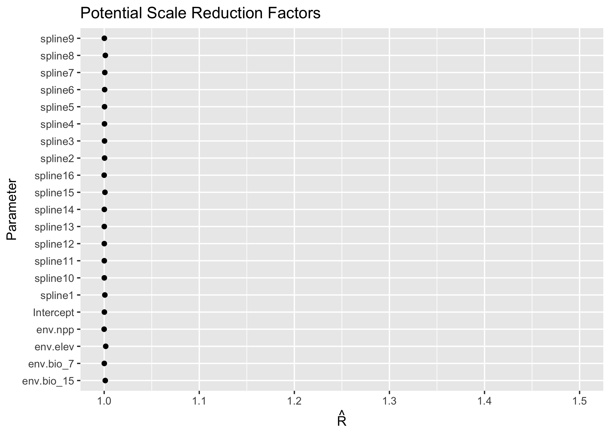
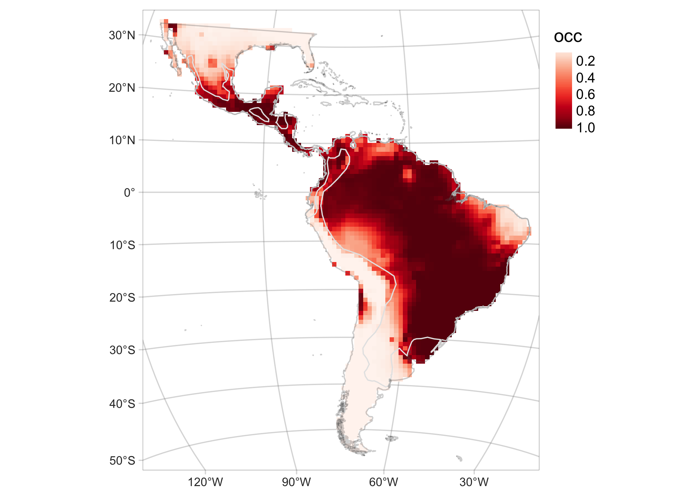
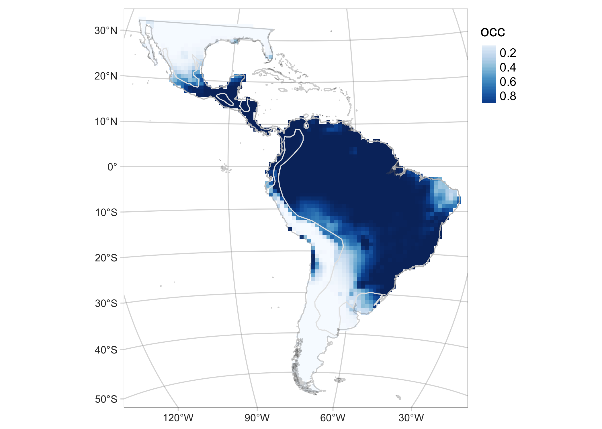
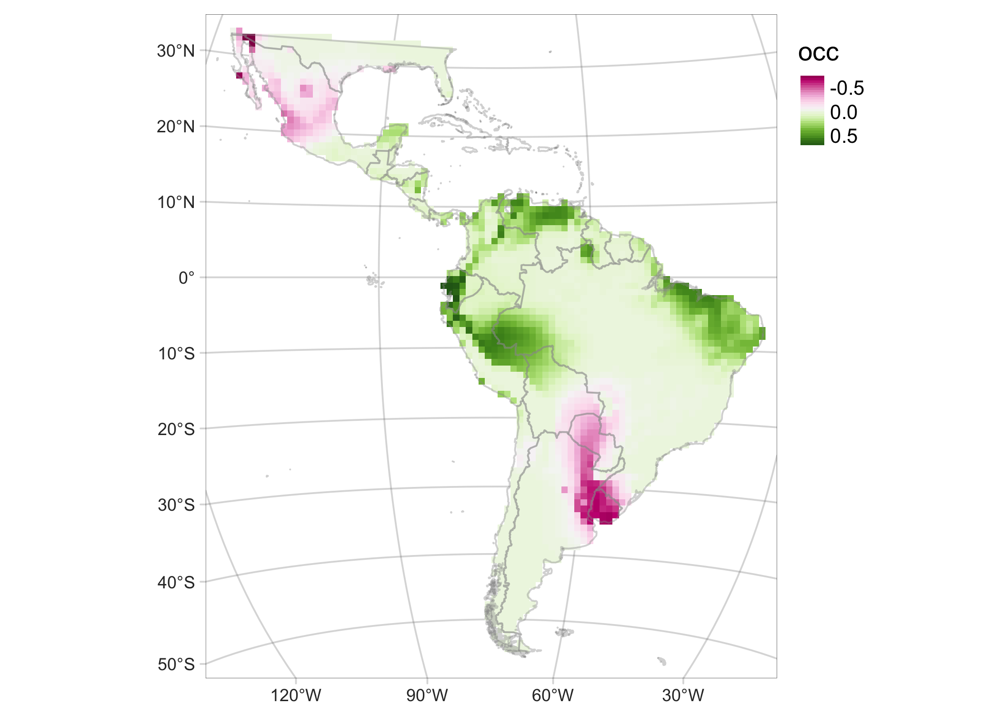
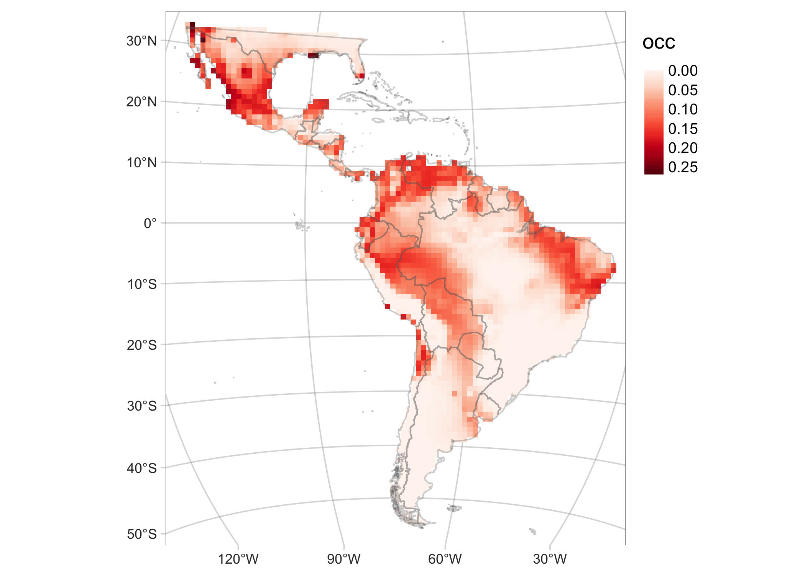
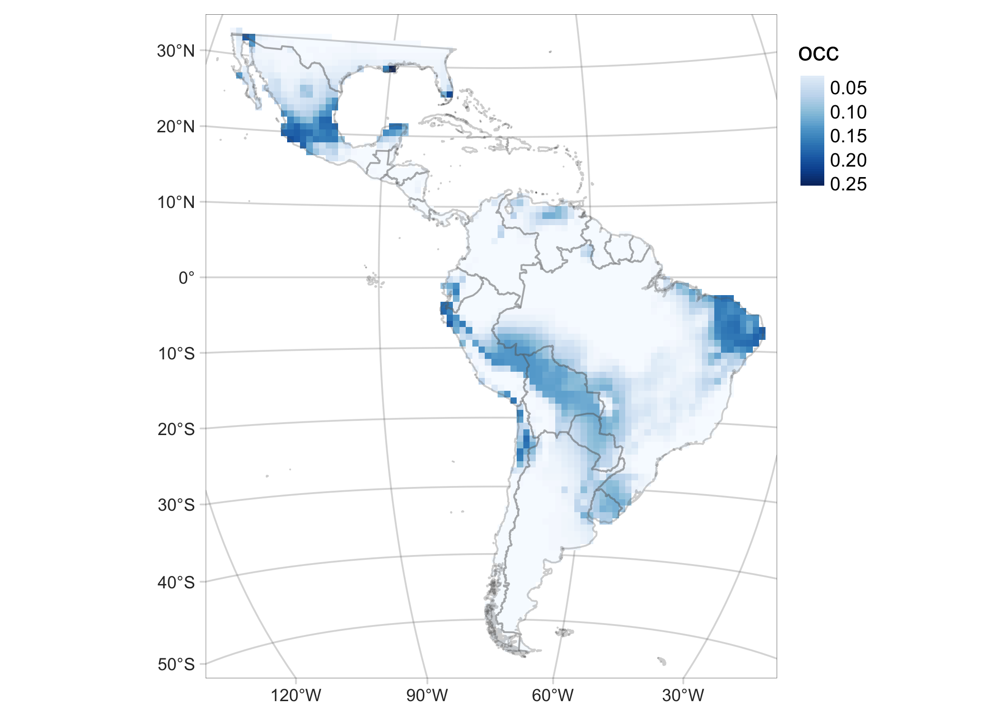
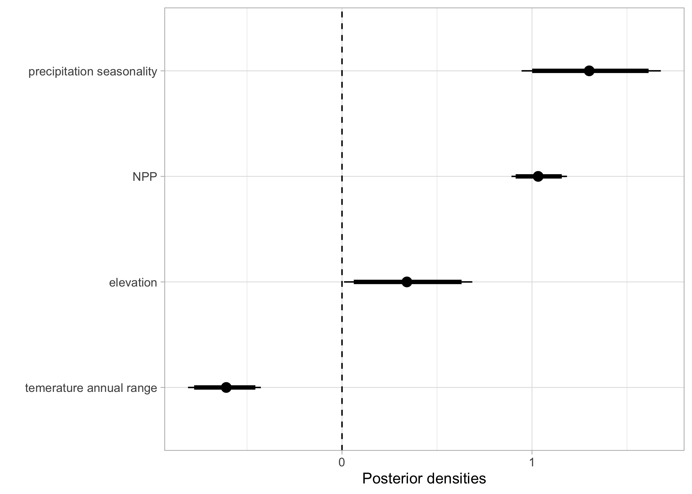
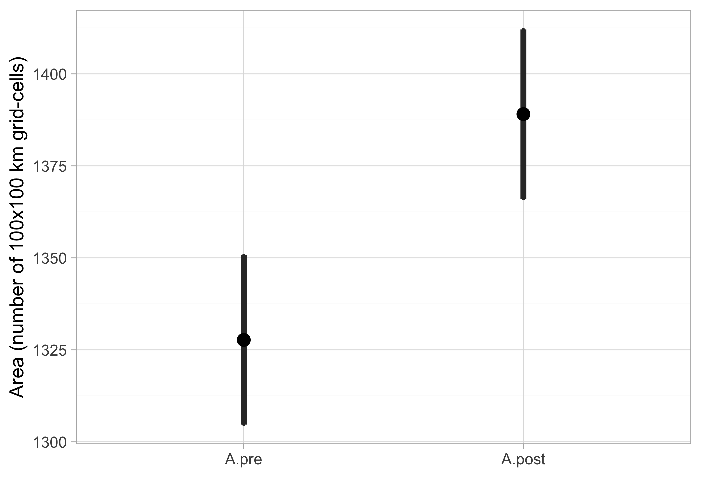
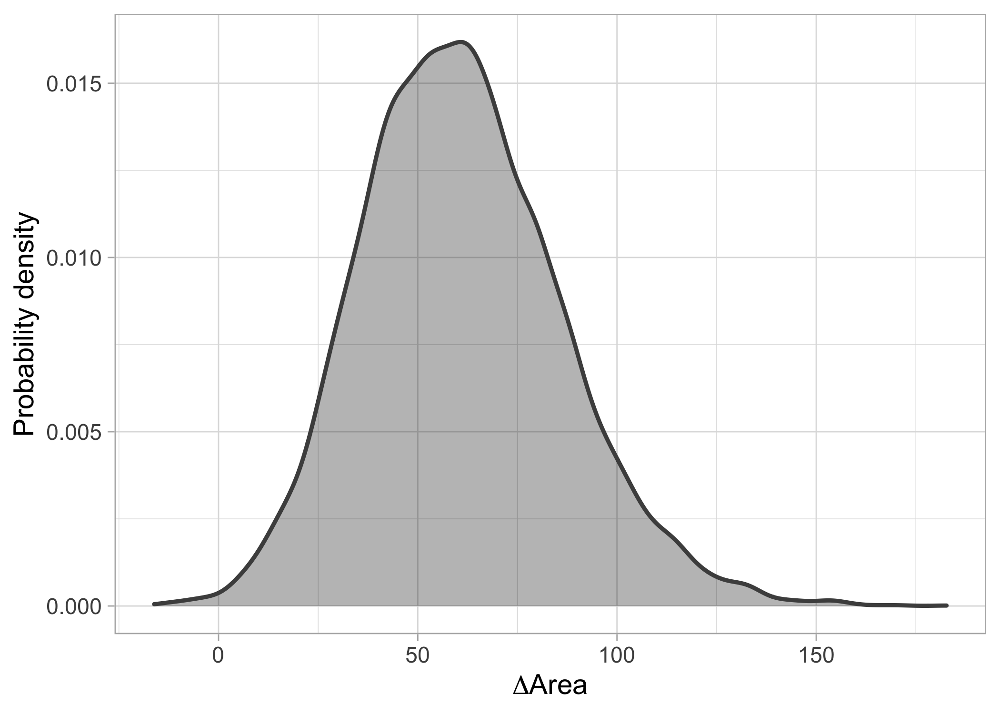

```r
library(mcmcplots)
library(ggmcmc)
library(tidybayes)

library(tmap)
library(terra)
library(sf)
library(tidyverse)
```

# Base maps


```r
# Equal area projection
equalareaCRS <-  '+proj=laea +lon_0=-73.125 +lat_0=0 +datum=WGS84 +units=m +no_defs'

Latam <- st_read('../data/Latam_vector.shp', quiet = T)%>% st_transform(crs=equalareaCRS)
Latam_countries <- sf::st_read('../data/Latam_vector_countries.shp', quiet = T) %>% sf::st_transform(crs=equalareaCRS)
Latam_no_islands <- bind_rows(list(Latam_countries %>%
                                     filter(type!='Indeterminate' & type!='Dependency' & type!='Lease') %>%
                                     mutate(iso_a2=ifelse(name_en=='France', 'GF', iso_a2)) %>%
                                     mutate(name_en=ifelse(name_en=='France', 'French Guiana', name_en)) %>%
                                     filter(!iso_a2 %in% c('EC','SX', 'NL', 'HT', 'DO', 'CU', 'CW', 'AW','BS', 
                                                           'TT', 'GD', 'VC', 'BB', 'LC', 'DM', 'AG', 'KN', 'JM')),
                                   Latam_countries %>%
                                     filter(name=='Ecuador') %>% 
                                     st_cast('POLYGON', quiet=T) %>% 
                                     mutate(area=st_area(.)) %>% arrange(desc(area)) %>% 
                                     head(n=1) %>% dplyr::select(-area))) %>% st_union()

Latam.raster <- terra::rast('../data/Latam_raster.tif')

# IUCN. (2022). Herpailurus yagouaroundi (spatial data). International Union for Conservation of Nature. https://www.iucnredlist.org/species/9948/50653167
yaguarundi_IUCN <- sf::st_read('../data/yaguarundi_IUCN.shp', quiet = T) %>% sf::st_transform(crs=equalareaCRS)
yaguarundi_IUCN.raster <- terra::rasterize(x = vect(yaguarundi_IUCN),
                                           y = Latam.raster,
                                           field = 'presence',
                                           fun = 'length', background=0) %>% mask(., Latam.raster)
```

# Data


```r
# Presence-absence data
PA_pre <- readRDS('../data/PA_yaguarundi_pre.rds') %>% 
  filter(!is.na(env.elev) &!is.na(env.bio_4) & !is.na(env.npp)) # remove NA's
PA_post <- readRDS('../data/PA_yaguarundi_post.rds') %>% 
  filter(!is.na(env.elev) &!is.na(env.bio_4) & !is.na(env.npp)) # remove NA's

# Presence-only data
PO_pre <- readRDS('../data/PO_yaguarundi_pre.rds') %>% 
  filter(!is.na(env.elev) &!is.na(env.bio_4) & !is.na(env.npp) & !is.na(acce) & !is.na(count)) # remove NA's
PO_post  <- readRDS('../data/PO_yaguarundi_post.rds') %>% 
  filter(!is.na(env.elev) &!is.na(env.bio_4) & !is.na(env.npp) & !is.na(acce) & !is.na(count)) # remove NA's

PA_pre_post <- rbind(PA_pre %>% mutate(time=0), PA_post %>% mutate(time=1)) 
PO_pre_post <- rbind(PO_pre %>% mutate(time=0), PO_post %>% mutate(time=1)) 
```


# Figures

## Model diagnostics

The `fitted.model` is an object of class `rjags`. For details on how it was generated see the code at `code/yaguarundi_IDM_run.Rmd`.  


```r
fitted.model <- readRDS('../data/yaguarundi_model.rds')

# as.mcmc.rjags converts an rjags Object to an mcmc or mcmc.list Object.
fitted.model.mcmc <- mcmcplots::as.mcmc.rjags(fitted.model)

# labels for the linear predictor `b`
L.fitted.model.b <- plab("b", list(Covariate = c('Intercept', 'env.elev', 'env.bio_7', 
                   'env.bio_15', 'env.npp', sprintf('spline%i', 1:16))))

# tibble object for the linear predictor `b` extracted from the rjags fitted model
fitted.model.ggs.b <- ggmcmc::ggs(fitted.model.mcmc, par_labels = L.fitted.model.b, family="^b")

# diagnostics
# ggmcmc::ggmcmc(fitted.model.ggs.b, file="../docs/model_diagnostics.pdf", param_page=3)
```

<!-- -->

<!-- -->

## Probability of occurrence of the yaguarundí in the pre and post periods, and the difference (post-pre)


```r
P.pred <- fitted.model$BUGSoutput$mean$P.pred
preds <- data.frame(PO_pre_post, P.pred)
preds0 <- preds[preds$time == 0,]
preds1 <- preds[preds$time == 1,]

Latam.raster[] <- NA
rast0 <- rast1 <- terra::rast(Latam.raster)

rast0[preds0$pixel] <- preds0$P.pred
rast1[preds1$pixel] <- preds1$P.pred

rast0 <- rast0 %>% terra::mask(., vect(Latam_no_islands))
rast1 <- rast1 %>% terra::mask(., vect(Latam_no_islands))

# Map of the of the probability of occurrence in the first period (pre: 2000-2013)
preMAP <- tm_graticules(alpha = 0.3) +  
    tm_shape(rast0) +
    tm_raster(palette = 'Reds', midpoint = NA, style= "cont")  + 
    tm_shape(yaguarundi_IUCN) +
    tm_borders(col='grey90', lwd=1, lty = 1) + tm_shape(Latam) +
    tm_borders(alpha = 0.3) +
    tm_layout(legend.outside = T, frame.lwd = 0.3, scale=1.2, legend.outside.size = 0.1)

# Map of the of the probability of occurrence in the second period (post: 2014-2021)
posMAP <- tm_graticules(alpha = 0.3) +  
    tm_shape(rast1) +
    tm_raster(palette = 'Blues', midpoint = NA, style= "cont")  + 
    tm_shape(yaguarundi_IUCN) +
    tm_borders(col='grey90', lwd=1, lty = 1) + tm_shape(Latam) +
    tm_borders(alpha = 0.3) +
    tm_layout(legend.outside = T, frame.lwd = 0.3, scale=1.2, legend.outside.size = 0.1)

# Map of the of the change in the probability of occurrence (post - pre)
diffMAP <- tm_graticules(alpha = 0.3) + 
    tm_shape(rast1 - rast0) +
    tm_raster(palette = 'PiYG', midpoint = NA, style= "cont", ) +
    tm_shape(Latam_countries) +
    tm_borders(col='grey60', alpha = 0.4) + 
    tm_layout(legend.outside = T, frame.lwd = 0.3, scale=1.2, legend.outside.size = 0.1)

preMAP
```

<!-- -->

```r
posMAP
```

<!-- -->

```r
diffMAP
```

<!-- -->

## Standard deviation (SD) of the probability of occurrence of the yaguarundí in the pre and post periods  


```r
P.pred.sd <- fitted.model$BUGSoutput$sd$P.pred
preds.sd <- data.frame(PO_pre_post, P.pred.sd)

preds0.sd <- preds.sd[preds.sd$time == 0,]
preds1.sd <- preds.sd[preds.sd$time == 1,]

rast.sd <- terra::rast(Latam.raster)
rast.sd[] <- NA
rast0.sd <- rast1.sd <- terra::rast(rast.sd)

rast0.sd[preds0.sd$pixel] <- preds0.sd$P.pred.sd
rast1.sd[preds1.sd$pixel] <- preds1.sd$P.pred.sd

rast0.sd <- rast0.sd %>% terra::mask(., vect(Latam_no_islands))
rast1.sd <- rast1.sd %>% terra::mask(., vect(Latam_no_islands))

# Map of the SD of the probability of occurrence of the area pre 
preMAP.sd <- tm_graticules(alpha = 0.3) +  
    tm_shape(rast0.sd) +
    tm_raster(palette = 'Reds', midpoint = NA, style= "cont")  + 
    tm_shape(Latam_countries) +
    tm_borders(alpha = 0.3) + 
    tm_layout(legend.outside = T, frame.lwd = 0.3, scale=1.2, legend.outside.size = 0.1)

# Map of the SD of the probability of occurrence of the area post
posMAP.sd <-  tm_graticules(alpha = 0.3) +  
    tm_shape(rast1.sd) +
    tm_raster(palette = 'Blues', midpoint = NA, style= "cont")  + 
    tm_shape(Latam_countries) +
    tm_borders(alpha = 0.3) + 
    tm_layout(legend.outside = T, frame.lwd = 0.3, scale=1.2, legend.outside.size = 0.1)

preMAP.sd
```

<!-- -->

```r
posMAP.sd
```

<!-- -->

## Effect of the environmental covariates on the intensity of the point process


```r
caterpiller.params <- fitted.model.ggs.b %>%
  filter(grepl('env', Parameter)) %>% 
  mutate(Parameter=as.factor(ifelse(Parameter=='env.elev', 'elevation',
                                    ifelse(Parameter=='env.npp', 'NPP',
                                           ifelse(Parameter=='env.bio_15', 'precipitation seasonality',
                                                  ifelse(Parameter=='env.bio_7', 'temerature annual range', Parameter)))))) %>% 
  ggs_caterpillar(line=0) + 
  theme_light() + 
  labs(y='', x='Posterior densities')

caterpiller.params
```

<!-- -->

## Boxplot of posterior densities of the predicted area in both time periods


```r
fitted.model.ggs.A <- ggmcmc::ggs(fitted.model.mcmc,  family="^A")

# boxplot 
range.boxplot <- ggmcmc::ci(fitted.model.ggs.A) %>% 
    mutate(Parameter = fct_rev(Parameter)) %>% 
    ggplot(aes(x = Parameter, y = median, ymin = low, ymax = high)) + 
    geom_boxplot(orientation = 'y', size=1) + 
    stat_summary(fun=mean, geom="point", 
                 shape=19, size=4, show.legend=FALSE) + 
    theme_light(base_size = 14) +
    labs(x='', y='Area (number of 100x100 km grid-cells)')

range.boxplot
```

<!-- -->


## Posterior distribution of range change (Area).


```r
delta.A <- fitted.model.ggs.A <- ggmcmc::ggs(fitted.model.mcmc,  family="^delta")

#densitiy
delta.A.plot <- delta.A %>% group_by(Iteration) %>% 
    summarise(area=median(value)) %>% 
    ggplot(aes(area)) + 
    geom_density(col='grey30', fill='black', alpha = 0.3, size=1) +
    theme_light(base_size = 14) +
    labs(y='Probability density', x=expression(Delta*'Area'))

delta.A.plot
```

<!-- -->


